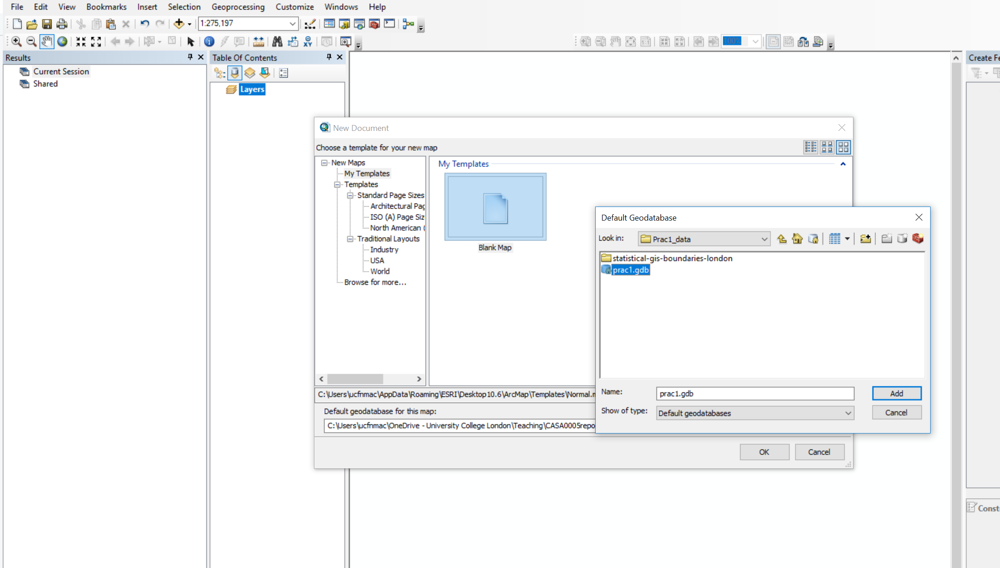
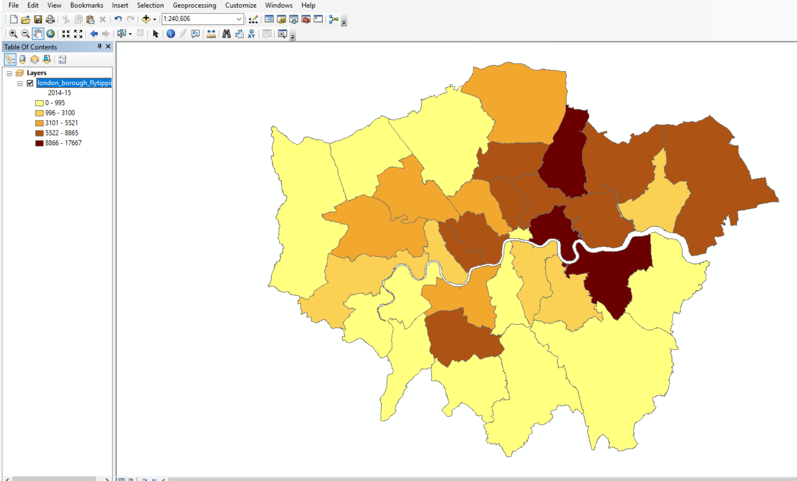

# Geographic Information

## Learning outcomes

By the end of this practical you should be able to:

* Describe and explain GIS data formats and databases 
* Source and pre-process spatial data 
* Load and undertaken some basic manipulation of spatial data in: ArcMap, QGIS and R 
* Evaluate the (dis)advantages of each GIS you have used

## The Basics of Geographic Information

Geographic data, geospatial data or geographic information is data that identifies the location of features on Earth. There are two main types of data which are used in GIS applications to represent the real world. **Vectors** that are composed of points, lines and polygons and **rasters** that are grids of cells with individual values.

In the above example the features in the real world (e.g. lake, forest, marsh and grassland) have been represented by points, lines and polygons (vector) or discrete grid cells (raster) of a certain size (e.g. 1 x 1m) specifying land cover type.

### Important GIS data formats

There are a number of commonly used geographic data formats that store vector and raster data that you will come across during this course and it’s important to understand what they are, how they represent data and how you can use them.

#### Shapefiles

Perhaps the most commonly used GIS data format is the shapefile. Shapefiles were developed by ESRI (http://www.esri.com/) – one of the first and now certainly the largest commercial GIS company in the world. Despite being developed by a commercial company, they are mostly an open format and can be used (read and written) by a host of GIS Software applications. 

A shapefile is actually a collection of files – at least three of which are needed for the shapefile to be displayed by GIS software. They are:

  1. ```.shp``` - the file which contains the feature geometry
  2. ```.shx``` - an index file which stores the position of the feature IDs in the  ```.shp ``` file
  3. ```.dbf``` - the file that stores all of the attribute information associated with the coordinates – this might be the name of the shape or some other information associated with the feature
  4. ```.prj``` - the file which contains all of the coordinate system information (the location of the shape on Earth's surface). Data can be displayed without a projection, but the ```.prj``` file allows software to display the data correctly where data with different projections might be being used
  
#### GeoJSON

GeoJSON (Geospatial Data Interchange format for JavaScript Object Notation, http://geojson.org/) is becoming an increasingly popular spatial data format, particularly for web-based mapping as it is based on JavaScript Object Notation. Unlike a shapefile in a GeoJSON, the attributes, boundaries and projection information are all contained in the same file.  
  
#### Shapefile and GeoJSON

We're now going to explore a shapefile (```.shp``` ) and GeoJSON (```.geojson```) in action. 

Go to: http://geojson.io/#map=16/51.5247/-0.1339

```{r echo=FALSE, out.width = "500pt", fig.align='center', cache=TRUE}
knitr::include_graphics('prac1_images/JSONwebsite.png') 
```

  1. Using the drawing tools to the right of the map window, create 3 objects: a point, line and a polygon as I have done above. Click on your polygon and colour it red and colour your point green
  2. Using the ‘Save’ option at the top of the map, save two copies of your new data – one in ```.geojson``` format and one in ```.shp``` format
  3. Open your two newly saved files in a text editor such as notepad or notepad++. For the shapefile you might have to unzip the folder then open each file individually. What do you notice about the similarities or differences between the two ways that the data are encoded?

#### Raster data

Most raster data is now provided in GeoTIFF (```.tiff```) format, which stands for Geostarionary Earth Orbit Tagged Image File. The GeoTIFF data format was created by NASA and is a standard public domain format. All necesary information to establish the location of the data on Earth's surface is embedded into the image. This includes: map projection, coordinate system, ellipsoid and datum type. 

#### Other data formats

Aforementioned data types and formats are likely to be the ones you predominately encounter. However there are several more used within spatial analysis. These include:

**Vector**

  * GML (Geography Markup Language – gave birth to KML) - http://www.opengeospatial.org/standards/gml 

**Raster**

  * Band SeQuential (BSQ) - technically a method for encoding data but commonly referred to as BSQ.
  * Hierarchical Data Format (HDF)
  * Arc Grid

There are normally valid reasons for storing data in one of these other formats. For example, BSQ are  raster data with a separate text header file (```.hdr```) providing geographic spatial reference information. Earth observation data often monitors the electromagnetic spectrum in bands. Humans see in the visible range of the spectrum and our vision is composed of red, green and blue wavelengths. If we wanted to analyse just the red wavelength the BSQ format would let us *read in* only that data. In comparison a GeoTIFF might come with all the data 'packaged' in one file and when doing analysis over thousands of images would significantly slow things down. That said you can now often find GeoTIFFs separated in a similar format to BSQ and it's fairly straightforward to convert between raster formats. 

#### Geodatabase

A geodatabase is a collection of geographic data held within a database. Geodatabases were developed by ESRI to overcome some of the limitations of shapefiles. They come in two main types: Personal (up to 1 TB) and File (limited to 250 - 500 MB), with Personal Geodatabases storing everything in a Microsoft Access database (```.mdb```) file and File Geodatabases offering more flexibility, storing everything as a series of folders in a file system. In the example below we can see that the FCC_Geodatabase (left hand pane) holds multiple points, lines, polygons, tables and raster layers in the contents tab.   

```{r echo=FALSE, out.width = "500pt", fig.align='center', cache=TRUE}
knitr::include_graphics('prac1_images/geodatabase.png') 
```

#### GeoPackage
```{r echo=FALSE, out.width = "100pt", fig.align='center', cache=TRUE}
knitr::include_graphics('prac1_images/geopkg.png')
```

A GeoPackage is an open, standards-based, platform-independent, portable, self-describing, compact format for transferring geospatial data. It stores spatial data layers (vector and raster) as a single file, and is based upon an SQLite database, a widely used relational database management system, permitting code based, reproducible and transparent workflows. As it stores data in a single file it is very easy to share, copy or move.  

#### SpatiaLite
```{r echo=FALSE, out.width = "100pt", fig.align='center', cache=TRUE}
knitr::include_graphics('prac1_images/spatialite.png')
```

SpatialLite is an open-source library that extends SQLite core. Support is fairly limited and most software that supports SpatiaLite also supports GeoPackage, as they both build upon SQLite. It doesn't have any clear advantage over GeoPackage, however it is unable to support raster data. 

#### PostGIS
```{r echo=FALSE, out.width = "100pt", fig.align='center', cache=TRUE}
knitr::include_graphics('prac1_images/postGIS.jpg') 
```

PostGIS is an opensource database extender for PostrgeSQL. Essentially PostgreSQL is a database and PostGIS is an add on which permits spatial functions. The advantages of using PostGIS over a GeoPackage are that it allows users to access the data at the same time, can handle large data more efficiently and reduces processing time. In this example (https://medium.com/@GispoLearning/learn-spatial-sql-and-master-geopackage-with-qgis-3-16b1e17f0291) calculating the number of bars per neighbourhood in Leon, Mexico the processing time reduced from 1.443 seconds (SQLite) to 0.08 seconds in PostGIS. However, data stored in PostGIS is  much harder to share, move or copy.

#### What will I use

The variety of data formats can see a bit overwhelming. But don't worry, most of the time you'll be using shapefiles, GeoPackages or raster data.

## Data 

The volume of geographic information which is freely available for use in the UK is increasing exponentially and spatially referenced data can often be found in many different places. In this practical we're going to use data from the London data store ---  a free and open data-sharing portal provided by the Greater London Authority (GLA), also known as City Hall that is the devolved regional governance body of London. 

We are going to get spatial data of the London boroughs and join flytipping (the illegal deposit of waste, commonly on road verges) data that is provided as a ```.csv``` file. ```.csv``` stands for comma-separated values (CSV)  ---  it uses a comma to separate each value. 

At the end of this document I'll also run through some common sources of data that will stand you in good stead (be advantageous) for the rest of the course. 

### File paths

In your N drive: create a new folder called GIS and within this a sub folder called wk1. It is up to you how you organise your files. Make sure you change the file paths within where appropriate to your own.

### Data download

Firstly we need to get a spatial outline of the London boroughs. The geographic boundaries that are used in the UK are a complex, often inter-related, but ever changing mass of areas. For anyone new to the UK (or indeed not a trained quantitative geographer), it can be quite a daunting task to attempt to understand all of the boundaries that are in use. Fortunately the Office for National Statistics (ONS) has an online beginners guide to UK geography. If you need more information on the vast array of different UK geographies, this is the place to start: http://geoportal.statistics.gov.uk/datasets/a-beginners-guide-to-uk-geography-2018-v1-0  

* Spatial Data

1. To get the data go to: https://data.london.gov.uk/

2. Search for Statistical GIS Boundary Files for London

3. Download the statistical-gis-boundaries-london.zip

4. Unzip the data and save it to your wk1 folder.

* CSV data

1. On the same website search for fly-tipping incidents

2. Download the ```.csv``` file

### Data pre-processing

**Question** Open the ```.csv``` in Excel, what do you notice about how the data is stored?

**Answer** The year is a column and for each area the values are repeated for different years. In our analysis it is easier to have the different years as a column and populated for each area. So, we want to go from this...

```{r echo=FALSE, out.width = "600pt", fig.align='center', cache=TRUE}
knitr::include_graphics('prac1_images/csv_original.png')
```

To this...

```{r echo=FALSE, out.width = "600pt", fig.align='center', cache=TRUE}
knitr::include_graphics('prac1_images/csv_pivot.png')
```

As we are going to use this dataset in ArcMap, QGIS and R I've done it in Excel using a pivot table.

1. Go to Insert > PivotTable

2. Select the original table and create a PivotTable in a new worksheet

3. The PivotTable Field box will appear, experiment with the different fields in each of the areas

I've used the following:

```{r echo=FALSE, out.width = "200pt", fig.align='center', cache=TRUE}
knitr::include_graphics('prac1_images/pivot_example.png')
```
Note how I've altered the total_action_taken to the sum of... as the original was displaying incorrectly, to do so:

1. Click on drop down button for total_action_taken > Value Field Settings > select Count  

It's important to think about what data we actually need in the next step and it's good practice to avoid data redundancy where possible.

**Spoiler** The spatial data we have downloaded already contains borough name, so we don't need it twice. However, we do need a field to link the two datasets on. You could use borough name, but when using text fields sometimes input variations can affect joins. For example, you had the University of Manchester in one dataset and Manchester University in another the join would fail. Consequently it's usually best to join datasets on a code field. 

Now save the Excel sheet that contains the pivot table as a new ```.csv```. Make sure that the first row of data holds the column titles. Remove all empty rows.

When saving the file also avoid any special characters (e.g. -) and spaces, use an underscore instead of spaces. 

**Warning** Spatial software (especially ArcGIS) does not like file names with spaces or special characters.

### Data loading

Now it's time to load, inspect and do some basic manipulation of this data. As mentioned in the lecture there are several GIS software 'types', here we will repeat the same process across ArcGIS, QGIS and R. Each system has specific benefits, but in general there has been a recent shift towards the use of QGIS and R, both being opensource. ArcGIS was the first major spatial analysis software produced by the Environmental Systems Research Institute, Inc. (Esri), founded in 1969 by Jack Dangermond. Due to its high cost and lack of customisation it is now less commonly used within the research community. 

```{r echo=FALSE, out.width = "300pt", fig.align='center', cache=TRUE}
knitr::include_graphics('prac1_images/ArcGISvsQGIS.png')
```

### ArcGIS

#### Basics

ArcGIS should be installed as a standard programme in the UCL desktop and you can navigate to it from the Windows start button. 

##### Installing ArcGIS on your own computer
As a UCL student, you can install ArcGIS on your own computer. This is easy if you have a PC, but if you have a Mac this can be trickier as Arc will only run in a PC environment. If you have a Mac, the options open to you are either to:

a)	Run ArcGIS through the Desktop@UCL application - http://www.ucl.ac.uk/isd/services/computers/remote-access/desktop 
b)	Duel boot your machine using bootcamp, install Windows (7 or 8 is fine) and then install Arc onto the Windows partition. 
c)	Install some kind of virtualisation software such as Parallels (http://www.parallels.com/ca/products/desktop/) or VMware (http://www.vmware.com/products/fusion/), and run Arc on a virtual windows machine

If you can, it is preferable to run Arc on Bootcamp as virtualisation software can be slow, but the Desktop@UCL facility should suffice for this course.
ArcGIS (Version 10.6 is the latest at time of writing, but may have already been superseded) can be downloaded from the UCL Software Database for free --- https://swdb.ucl.ac.uk/.  

##### Getting Help

ArcGIS is a huge and complex piece of software, but thankfully is has an excellent help system – depending on the version you are using (they are all quite similar anyway) you can access the online help system here:

* http://resources.arcgis.com/en/help/main/10.2/

* http://resources.arcgis.com/en/help/main/10.1/

##### ArcGIS

ArcGIS is actually a whole suite of software built and maintained by ESRI (http://www.esri.com/software/arcgis).Within the ArcGIS for Desktop suite you will find the following programmes:

* **ArcCatalog --- Similar to Windows Explorer, ArcCatalog allows you to manage your GIS files, folders and geodatabases**

* ArcGIS Administrator --- This programme us used to manage licences for the various elements of ArcGIS
 
* ArcGlobe --- ArcGlobe allows you to view and analyse your data in 3D –-- this interface looks very similar to Google Earth and is part of the 3D analyst extension

* **ArcMap --- This is the programme you will use most often –-- it is the main mapping and spatial analysis element of ArcGIS**

* ArcScene --- ArcScene is a 3D viewer which allows you to navigate and interact with your 3D raster and feature data

ArcCatalog and ArcMap are in bold as these are the only programmes we will be using explicitly in this course. By all means experiment with the others if you have any spare time! 

#### ArcCatalog

* Find and run the ArcCatalog piece of software

* Once ArcCatalog Opens, go to File > Connect To Folder… and navigate to the N:\GIS folder, right click in the contents area and create a new File Geodatabase.

```{r echo=FALSE, out.width = "500pt", fig.align='center', cache=TRUE}
knitr::include_graphics('prac1_images/file_geo.png')
```

You can import data layers into a Geodatabase within ArcCatalog, however we will do this in ArcMap.

Close ArcCatalog and never have both ArcCatalog and another ArcGIS product open at the same time.

#### ArcMap

##### Introduction

ArcMap is the core of the ArcGIS suite and where you would normally produce maps, carry out spatial analysis functions and automate processes. 

1. Search for and open ArcMap 
2. Upon opening select the database you just created in the dialogue box
3. Click ok

```{r echo=FALSE, out.width = "800pt", fig.align='center', cache=TRUE}

```

When the map document opens you should see something similar to the image below, highlighting some of the key buttons:

```{r echo=FALSE, out.width = "500pt", fig.align='center', cache=TRUE}
knitr::include_graphics('prac1_images/arcmap.png')
```

4. It's important to now set the map document up properly. Go File > Map Document Properties, enter the details you wish. You can see the connection to the Geodatabase we just made. Click store relative pathnames, this means as long as the data stays in the same position relative to the path then ArcMap can load all the layers. For example if you moved your work from the C: drive to an external drive, H:.

##### Load data

5. Using the **Plus** icon (add data layer) navigate to the extracted folder you saved earlier. 

6. Open London_Borough_Excluding_MHW.shp, but feel free to explore the other data layers. In the left hand Table Of Contents you can unselect layers to turn them off or drag layers above or below to change the display order. In the example below the wards layer is showing above the borough layer.

```{r echo=FALSE, out.width = "800pt", fig.align='center', cache=TRUE}
knitr::include_graphics('prac1_images/display_order.png')
```

**Note**, while we have loaded the shapefile, it is not stored in our Geodatabase yet.

**Useful tips**
  
  * To the right of the document you will see the Catalog and Search tabs.The Catalog tab is a more compact version of ArcCatalog and will let you see what data is stored in the current Geodatabase. The search tab will let you find any analysis tool within ArcGIS. Try searching for Clip.
  
  * If you right click on the boroughs layer (in the Table of Contents, left hand pane) you will see various options. Zoom to layer is very useful if you ever get lost in your ArcMap document. 

7. Now right click on the borough layer (in the Table of Contents) and open the attribute table. You'll see the GSS_CODE field, which is the same code we output in our ```.csv```. If you now right click on a field you'll also be able to see the data type (e.g. string, integer). For example:

```{r echo=FALSE, out.width = "500pt", fig.align='center', cache=TRUE}
knitr::include_graphics('prac1_images/London_attribute_table.png')
```

##### Join data

We're now going to join our flytipping data to the London borough shapefile. So:

8. Right click on the london borough layer > Joins and Relates > Join   
9. Select the GSS_CODE as the field in the layer to base the join on
10. Navigate to the ```.csv``` we created earlier
11. Select the code field that matches (in my case this is called Row Labels)
12. Select only to join matching records
13. Validate join and click OK

**You will get errors**, ArcMap does not like fields starting with numbers (e.g. 2012), dashes (e.g. -) or spaces. Feel free to change them in the original ```.csv``` but for this practical it is fine to continue. 

14. The join should work, so reopen the attribute table for the layer London boroughs

**Note**, the join we have made is not permanent. To do so we need to export the layer.

##### Export data

15. Right click on the london boroughs layer > Data > Export Data 
16. The location should default to our GeoDatabase. Be sure to change the filename --- again avoid all of the characters (e.g. spaces and -) previously mentioned. Add the data layer to the map  

Now lets use the data we've joined to create a basic thematic map. 

17. Right click on the new London borough layer > Properties
18. Under the Symbology tab select Graduated colors 
19. Select the Value as one of the years of data we joined and change the classificaiton to something of your choice

```{r echo=FALSE, out.width = "800pt", fig.align='center', cache=TRUE}
knitr::include_graphics('prac1_images/symbology.png')
```

You should have something that looks like this:

```{r echo=FALSE, out.width = "800pt", fig.align='center', cache=TRUE}

```

**We haven't talked about the Coordiante Reference System (CRS) (or Spatial Reference System (SRS)) of our map document**

A coordinate reference system is a series of parameters that define the coordinate system. Within GIS we use geographic or projected coordinate systems. The former uses a three-dimensional spherical surface to define locations of Earth, whereas the latter is defined on a flat, two-dimensional surface giving it constant lengths, angles and areas. 

In ArcMap we can specify what CRS we want to use by: 

20. Right clicking on the map document > Data Frame Properties

You'll see that it is already set to Projected Coordinate Systems, National Grids, Europe, British National Grid. This is because ArcMap will default to the coordinate system of the first data layer loaded.  

```{r echo=FALSE, out.width = "300pt", fig.align='center', cache=TRUE}
knitr::include_graphics('prac1_images/coorindate_system.png') 
```

Save and then close your ArcMap document. We're now going to replicate this task in QGIS.

***Note*** As we are going to open the same files in difference GIS systems it is important to close the software before moving on. If you don't then files can be *locked* and unreadable as they are still considered to be in use.

### QGIS

#### Introduction

QGIS is very similar to ArcMap except that as it is open-source and free there are many add on packages that (or plugins) that provide additional functionality to the software.  

To get QGIS on your personal machine go to: https://qgis.org/en/site/forusers/download.html

I install the OSGeo4W version. The nature of open-source means that several programs will rely on each other for features. OSGeo4W tracks all the shared requirements and does not intall any duplicates. 

#### Load data

1. Search for and open QGIS 
2. Click on the open data source manager. Just above the word *browser* in the top left of the screen

```{r echo=FALSE, out.width = "700pt", fig.align='center', cache=TRUE}
knitr::include_graphics('prac1_images/qgis_datamanager.png') 
```

3. Navigate to the London boroughs layer ```.shp``` and add it, you then have to close the data source manager

Just like in ArcMap you can right click on the layer to view the attribute table. Unlike ArcMap you have to load the ```.csv``` file into QGIS in order to join it to a shapefile.

4. Open the data source manager and select Delimited Text
5. Navigate to our ```.csv``` file and provide a suitable layer name
6. Under Record and Fields Options make sure the number of header lines to discard is 0 and the First record has field names box is selected (this is assuming you left a title for each column in your ```.csv```)
7. Under Geometry Definition select No geometry (attribute table only)

```{r echo=FALSE, out.width = "700pt", fig.align='center', cache=TRUE}
knitr::include_graphics('prac1_images/csv_datamanager.png') 
```

Does the sample data seem right?

8. If so, click add then close

#### Join data

9. Right click on the London boroughs layer > Properties > Joins
10. Click the plus button at the bottom of the box
11. Complete the dialogue box

```{r echo=FALSE, out.width = "500pt", fig.align='center', cache=TRUE}
knitr::include_graphics('prac1_images/qgis_join.png') 
```

#### Export data 

Now instead of using a GeoDatabase, let's export to a GeoPackage.

12. Right click on the London boroughs layer > Export > Save Feature As
13. Select the GeoPackage format and complete the File name (the saved file name for the GeoPackage) and the Layer name (the name for this layer within the GeoPackage). Recall that a GeoPackage can store many data layers as a single file
14. The new layer will be added to the map, so you can remove the old one. Make sure you remove the right one

```{r echo=FALSE, out.width = "500pt", fig.align='center', cache=TRUE}
knitr::include_graphics('prac1_images/make_geopkg.png') 
```

We've now made a GeoPackage that we can connect our map project to.

15. Under *Browser*, Right click on GeoPackage > New Connection > Navigate to your GeoPackage
16. Click the down arrow left to GeoPackage and you should see the one you just navigated to. Click the down arrow on the database and you can see your layer.
17. Now we are going to import our  ```.csv ``` into our GeoPackage. To do so go: Database > DB Manager
18. Select your GeoPackage in the left hand pane
19. Import layer/file then select the  ```.csv ```. Click Ok.

Again, remember that the ```.csv ``` in the Layers tab (bottom left) is the original. Remove it, then from the GeoPackage just click, hold and drag the  ```.csv ``` into the layer pane.

Now let's make a quick thematic map like we did in ArcMap.

20. Right click on your London boroughs layer > Properties > Symbology
21. Select categorised and choose a data column and color ramp

You could also select graduated, however our joined data fields are in the wrong data type. If you wish to change them follow this guide: https://wiki.tuflow.com/index.php?title=QGIS_Change_Attribute_Type

22. Save your QGIS project

You should have produced something like this:

```{r echo=FALSE, out.width = "800pt", fig.align='center', cache=TRUE}
knitr::include_graphics('prac1_images/QGIS_final.png') 
```

**Spatial reference**

QGIS is similar but different to ArcMap. QGIS defaults to the Coordinate Reference System (CRS) WGS 84, or known by its European Petroleum Survey Group (EPSG) code 4326. However, when you add your first layer in will default to that CRS. We'll go into the background of EPSG next time.

You can change the CRS by going File > Properties and selecting CRS in the left hand pane.

### R

#### Introduction

R is both a programming language and software environment, originally designed for statistical computing and graphics. R’s great strength is that it is open-source, can be used on any computer operating system and free for anyone to use and contribute to. Because of this, it is rapidly becoming the statistical language of choice for many academics and has a huge user community with people constantly contributing new packages to carry out all manner of statistical, graphical and importantly for us, geographical tasks.

The purpose of this practical is just to demonstrate data loading and manipulation in different software. The next practical will provide much more detail on R, so don't worry.

Search for and open R Studio.

You can install R Studio on your own machine from: https://www.rstudio.com/products/rstudio/download/#download

R studio requires R which you can download from: https://cran.rstudio.com/

RStudio is a free and open-source integrated development environment for R --- it makes R much easier to use.

In RStduio go:

1. File > New File > R Script

You should be able to see these quadrants: 

```{r echo=FALSE, out.width = "800pt", fig.align='center', cache=TRUE}
knitr::include_graphics('prac1_images/RStudio.png') 
```

Below are bits of code, to start we will work using the **console**. So just copy the bits of code into the console window, changing the file names to where your data is stored. Then at the end of this section I'll show you how to make a script.

R works on packages that are collections of functions and data. For this practical we will need the ones listed in the code chunk below. Whilst we've installed them, we haven't yet loaded them. It's best practice to do all this at the start of your code, however, for demonstration purposes I'll load each one as we need it. 

```{r, message=FALSE, warning=FALSE, eval=FALSE, cache=TRUE}
install.packages("sf", "tmap", "tmaptools", "RSQLite", "tidyverse", repos = "https://www.stats.bris.ac.uk/R/")
```

Packages we've installed:

* sf: simple features, standard way to encode spatial vector data
* tmap: layer-based and easy approach to make thematic maps
* tmaptools: set of tools for reading and processing spatial data
* RSQLite: embeds the SQLite database engine in R

Here, repos stands for repository where we will download the packages from. Whilst we've installed the packages we haven't loaded them...this is done through using ```library()``` function...which we will now use.

#### Load data

Great, load the sf package so we can read our shapefile in --- remember to change to filepath to your shapefile. For this first practical we'll just leave the datea where it is, next week we'll show you how to use projects to make calling data much easier.

**Note** by default in R, the file path should be defined with ```/``` but on a windows file system it is defined with ```\```. Using ```\\``` instead allows R to read the path correctly – alternatively, just use ```/```

```{r, message=FALSE, warning=FALSE, cache=TRUE}
library(sf)
shape <- st_read("Prac1_data/statistical-gis-boundaries-london/ESRI/London_Borough_Excluding_MHW.shp")
```

To get a summary of the data held within the shapefile data (attribute table) enter the following:

```{r, cache=TRUE}
summary(shape)
```

To have a quick look what the shapefile looks like enter the following:
```{r, cache=TRUE}
plot(shape)
```

That plots everything in the shapefile (all the attitbues) if you just wanted the geometry (outline of the shape) you could use...

```{r}
plot(st_geometry(shape))
```

From what we did in QGIS and ArcMap this should look familiar. 

We now need to load our ```.csv``` file:

```{r, cache=TRUE}
library(tidyverse)
mycsv <-  read_csv("Prac1_data/fly_tipping_borough_edit.csv")  
```

To view the data just input:

```{r}
mycsv 
```

#### Join data

In R we've given our London boroughs shapefile the name shape and our flytipping ```.csv``` the name mycsv. If you look in the Environment quadrant you should see them both listed. 

Join the ```.csv``` to the shapefile. Here, replace Row Labels with whatever your GSS_CODE is called in the ```.csv```:


```{r warning=FALSE, message=FALSE, cache=TRUE}
library(tmap)
library(tmaptools)
library(sf)
shape <- append_data(shape, mycsv, key.shp="GSS_CODE", key.data = "Row Labels")
```

Let's break this down a bit. We just created a data frame (my.csv) where each column has a variable and each row contains a set of values --- so basically a normal table. The match simply found the GSS_CODE values in the ```.csv``` and joined the data to our shapefile.

The message detailing 1 out of the 34 data records were not appended refers to the Grand Total row within the ```.csv```. 

Check the merge was successful, this is just going to show the top 10 rows:

```{r}
head(shape, n=10)
```

Now, let's make a quick thematic map (or a qtm) using the package  ```tmap ```. I've made mine for flytipping between 2011 and 2012 (column X2011_12): 

```{r}
tmap_mode("plot")
qtm(shape, fill = "2011_12")
```

### Export data

Finally write shape to a new GeoPackage (```.gpkg```) giving it the layer name of your choice:

```{r}
st_write(shape, "Prac1_data/Rwk1.gpkg", "london_boroughs_fly_tipping", delete_layer=TRUE)
```

So here, we are saying the shape is the object we want to save, then to the GeoPackage file path, with the layer name of london_boroughs_fly_tipping. I've set delete_layer to true so I could overwrite mine when I developed this practical. Changing it to false would generate an error message if you ever tried to re-run the code.

Let's also add the ```.csv``` as we did in QGIS. This is a bit more complicated as we have to use the SQLite database package. Firstly, connect to the ```.gpkg``` we just made:

```{r}
library(readr)
library(RSQLite)
con <- dbConnect(RSQLite::SQLite(),dbname="Prac1_data/Rwk1.gpkg")
```

Now examine what is in the ```.gpkg```:
```{r}
dbListTables(con)
```

Then add add our ```.csv``` and disconnect from the ```.gpkg```:

```{r}
dbWriteTable(con,"original_csv", mycsv, overwrite=TRUE)
dbDisconnect(con)
```

#### Making a script

To convert this bit of analysis into a script that we could save and run again in future, I would write the following in the script quadrant: 

```{r, eval=FALSE}
library(sf, tmap, tmaptools, RSQLite, tidyverse)
shape <- st_read(
  "Prac1_data/statistical-gis-boundaries-london/ESRI/London_Borough_Excluding_MHW.shp")
mycsv <- read_csv("Prac1_data/fly_tipping_borough_edit.csv")  
shape<-append_data(shape, mycsv, key.shp="GSS_CODE", key.data = "Row Labels")
tmap_mode("plot")
qtm(shape, fill = "2011_12")
st_write(shape, "Prac1_data/Rwk1.gpkg", "london_boroughs_fly_tipping", delete_layer=TRUE)
con <- dbConnect(SQLite(),dbname="Prac1_data/Rwk1.gpkg")
dbListTables(con)
dbWriteTable(con,"original_csv", mycsv, overwrite=TRUE)
dbDisconnect(con)
```
You can then save your script through File > Save As.

### What will I use

Well... it depends. If you wanted to quickly open a dataset to explore its contents then I'd use QGIS or ArcMap. However, if you had 100 raster images that you wanted to clip to your study area, I'd automate it in R. There are also specific packages developed for each type of software that might dictate what you use, for example I recently made use of the Urban Multi-scale Environmental Predictor (UMEP) plugin in QGIS. That said, as I needed to match different hourly meteorological variables over a three year period I automated the first part of the analysis in R and loaded a ```.csv``` into QGIS.  

## Data sources and task

Below I've listed a few good data sources. **For this week's task** explore these and any others you can find and get an interesting dataset (e.g. in this practical our flytipping ```.csv```) that you could join to some spatial data (e.g. in this practical the London boroughs ```.shp```). This could be for any location in the world. 

### UK Data Service

The UK Data Service geography service (https://census.edina.ac.uk/) has a library of hundreds of current and former boundary datasets for which attribute data are produced in the UK.

### ONS 

The Office for National Statistics (ONS) are the national statistical agency for England and Wales and have recently started to provide access to boundary data for the statistics they produce for various geographic areas. 

Many of the boundaries on the ONS Geoportal are also available from the Edina Census Geography website in a more flexible fashion, however the ONS website provides very quick access to bulk-downloads –-- something which can be very useful when reading data directly from the web using computer software. 

### OS 

The Ordnance Survey (OS) are the national mapping agency for the UK. A few years ago, they opened up a number of their data products for public use including greenspace, OS Open Map and OS Terrain.

For the full range see: https://www.ordnancesurvey.co.uk/business-and-government/products/finder.html?Licensed%20for=OpenData%20(Free)&withdrawn=on  

### Edina Digimap

Before the Ordnance Survey opened up much of its data for public use, academics and students in the UK could access OS data using the Edina Digimap Service --– this service is still available today and provides access to a number of products in addition to those available from OS Open Data. 

Perhaps the most exciting of the additional OS data products available from Digimap is OS MasterMap. MasterMap is a framework for all OS data and contains layers of data that include details of real world objects such as buildings, roads, paths, rivers, physical structures and land parcels, as well as the complete UK transport network. Whilst we still are required to go through Edina OS have recently announced plans to make this dataset free in the near future under the new Geospatial Commission. 

```{r echo=FALSE, out.width = "500pt", fig.align='center'}
knitr::include_graphics('prac1_images/mastermap.png') 
```

### OSM

Open Street Map (OSM) is a fantastic resource --– as the name suggests, all data contained in Open Street Map are open and free for anyone to use. Much like Wikipedia, anyone can contribute content to OSM and this brings with it its own benefits (frequent updates, very large user-base) and problems (data quality and patch coverage). OSM is a very good example of Volunteered Geographic Information (VGI). 

It’s possible to download OSM data straight from the website, although the interface can be a little unreliable (it works better for small areas). There are, however, a number of websites that allow OSM data to be downloaded more easily and are directly linked to from the ‘Export’ option in OSM. Geofabrik (https://www.geofabrik.de/data/download.html) allows you to download frequently updated Shapefiles for various global subdivisions. 

### DEFRA

The Department for Environment and Rural Affairs (DEFRA) have recently created the Data Services Platform to openly distribute environmental data. See: https://environment.data.gov.uk/

### Data lists

Another good place to start searching for data are data lists. They simply provide a comprehensive overview of all available data conveniently categorised by discipline and country. 

I normally use this one: https://freegisdata.rtwilson.com/

## Summary

Within this practical we have explored the different types, formats and software used to store, analyse and manipulate spatial data. In reflecting upon this practical you should consider the (dis)advantages of each, where and when they might be appropriate and the overall practicality. Next week we will delve further into R and RStudio.  


