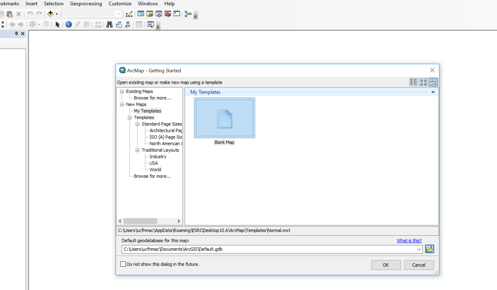
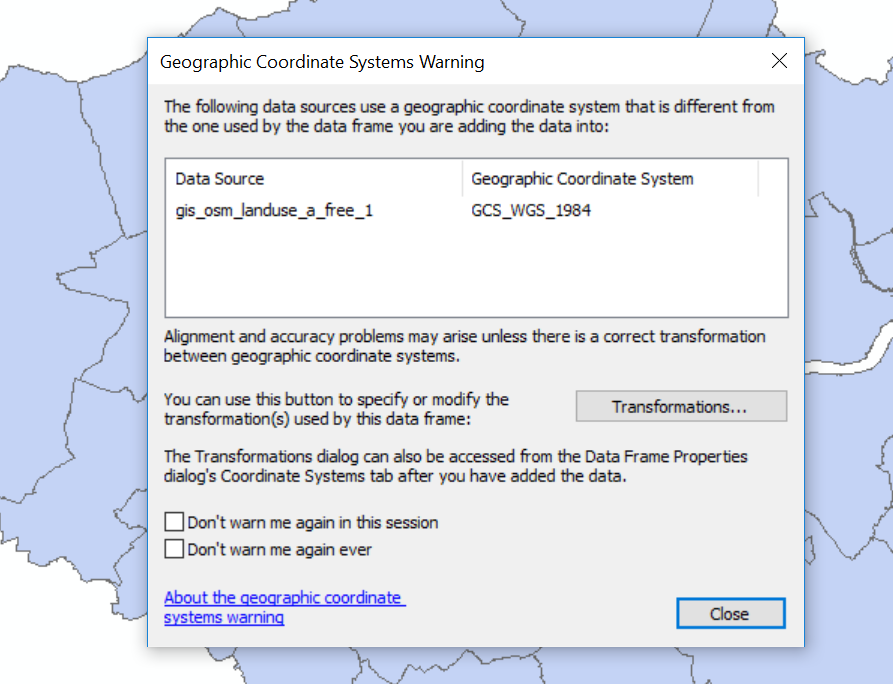
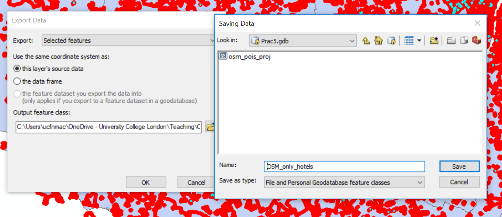
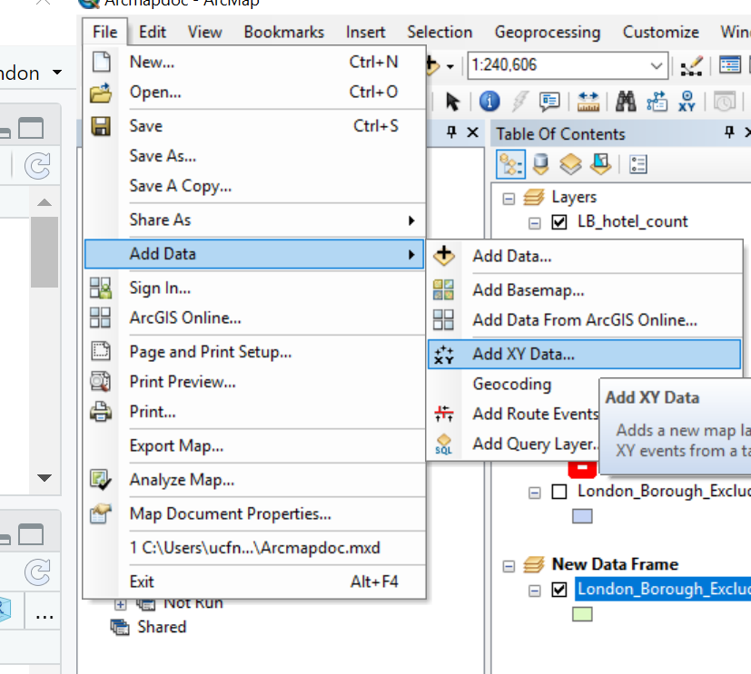
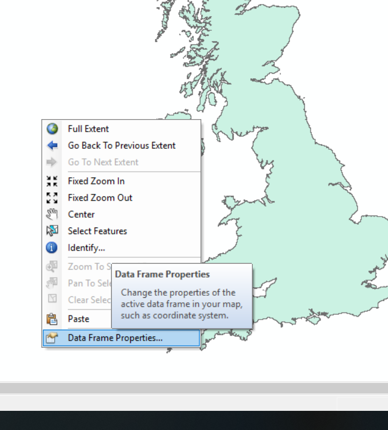
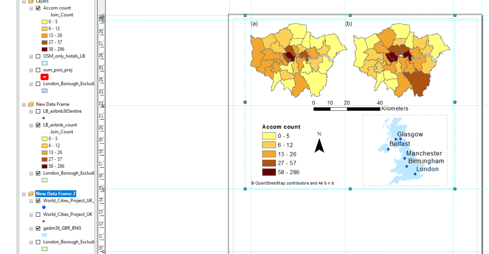
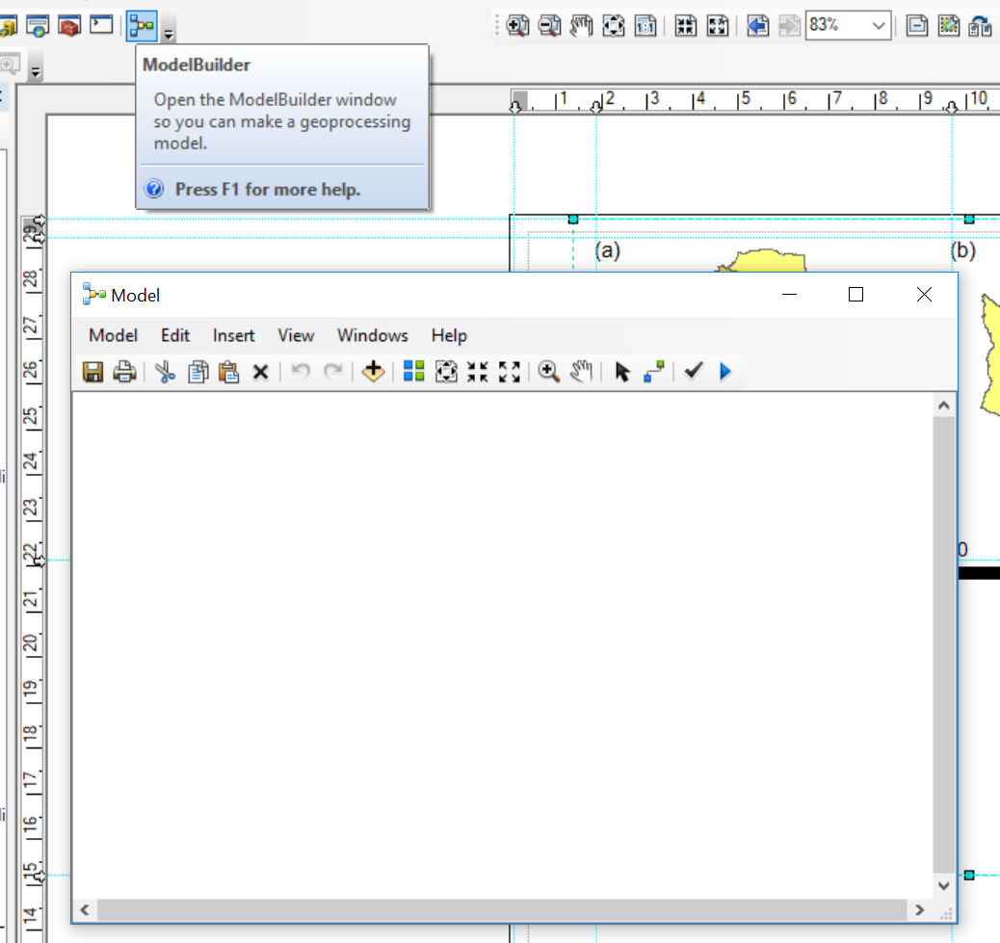
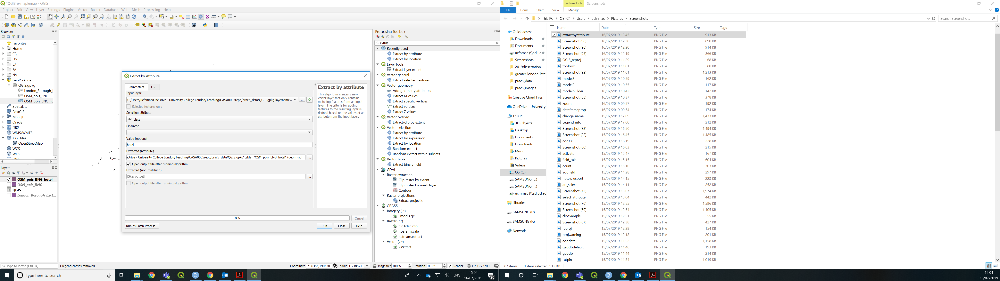

# Map making

## Learning outcomes

By the end of this practical you should be able to:

* 
* 
* 
* 

## Introduction 

In this practical we're going to focus on creating mapped outputs using QGIS, ArcMap and R. For fun we're going to use spatial boundaries from xxx and OpenStreetMap (OSM) data.

## Data

It’s possible to download OSM data straight from the website, although the interface can be a little unreliable (it works better for small areas). There are, however, a number of websites that allow OSM data to be downloaded more easily and are directly linked to from the ‘Export’ option in OSM. Geofabrik (one of these websites) allows you to download frequently updated shapefiles for various global subdivisions.

### OSM

1. Go to the Geofabrik download server website: http://download.geofabrik.de/

2. Navigate to: Europe > GreatBritain > England > Greater London

3. Download greater-london-latest-free.shp.zip

4. Unzip the data and save it to your current folder


### London boroughs

We'll use our London boroughs layer again, either load it from week 1 or download it:

5. To get the data go to: https://data.london.gov.uk/

6. Search for Statistical GIS Boundary Files for London

7. Download the statistical-gis-boundaries-london.zip

8. Unzip the data and save it to your current folder

## Mapping in ArcMap

### Load data

9. Open a new ArcMap document

```{r echo=FALSE, out.width = "1000pt", fig.align='center', cache=TRUE}
 
```

10. Accept the defaults and click OK

11 On the right hand side of the ArcMap document there should be two tabs: Catalog and Search. If they aren't visible click Windows > Catalog, next to the little x for Catalog there will be a pin symbol that will pin it to the right hand side of the screen. Do the same for Search. Search will let you find any tool in ArcMap without knowing exactly what Toolbox it is stored in.   

```{r echo=FALSE, out.width = "500pt", fig.align='center', cache=TRUE}
knitr::include_graphics('prac5_images/catpin.png') 
```

As we did in practical 1, let's make a GeoDatabase to store out outputs.

12. Under the Catalog tab, click on the connect to folder icon (small folder with plus sign), navigate to your current folder and select it

13. Now in the Catalog tab you should see you folder that you connect it listed

14. Make a new File GeoDatebase by right clicking on the folder connection...

```{r echo=FALSE, out.width = "500pt", fig.align='center', cache=TRUE}
knitr::include_graphics('prac5_images/geodb.png') 
```

15. Name it what you like, but make sure it retains the ```.gdb``` extension

16. Right click on it and make it the default GeoDatabase for the current map

```{r echo=FALSE, out.width = "500pt", fig.align='center', cache=TRUE}
knitr::include_graphics('prac5_images/geodbdefault.png') 
```

17. As we did in practical 1, store relative pathnames...File > Map Document Properties >  Store relative pathnames to data sources

18. Load the London boroughs shapefile using the add data button...if you are using the data from practical 1 and it's stored in a different place you might need to make a new folder connection

```{r echo=FALSE, out.width = "800pt", fig.align='center', cache=TRUE}
knitr::include_graphics('prac5_images/adddata.png') 
```

19. Load the OSM shapefiles using the add data button (pick anyone you want)...if you are using the data from practical 1 and it's stored in a different place you might need to make a new folder connection

20. When you load the data to ArcMap you will probably be greeted with a warning...

```{r echo=FALSE, out.width = "600pt", fig.align='center', cache=TRUE}
 
```

This means that the data layer we are loading (OSM) has a different CRS to the dataframe (our current map document). If you recall from practical 1, ArcMap sets the map document CRS to that of the first layer loaded. Our London boroughs layer is in British National Grid where as are OSM layers are in WGS 1984. 

21. Close the warning

The OSM data will load and ArcMap is pretty clever here as it will project 'on the fly' which means it can display the data stored in one projection as if it were in another, but the actual data is not altered. This is both good and bad. Good as it let's us visualise our data quickly, but bad because if we have data with different projections you will run into problems during processing. My advice is to load the data and pick a projection to do all processing in.

22. Here load the gis_osm_pois_a_free_1 polygon layer.

23. In the search tool find the tool ```reproject```

```{r echo=FALSE, out.width = "500pt", fig.align='center', cache=TRUE}
knitr::include_graphics('prac5_images/reproj.png') 
```

24. Select the osm layer as the input, give your output a name (it should be within your GeoDatabase) and select the coordiate system. When you click on the coordiate system selection box you will see a drop down called layers, expand the drop down and you'll see what cooridate reference systems are in use for each layer open within the map. If you expand British_National_Grid you'll see the London boroughs layer...

```{r echo=FALSE, out.width = "800pt", fig.align='center', cache=TRUE}
knitr::include_graphics('prac5_images/reproj2.png') 
```

25. Click on British_National_Grid and select OK, under the Geographic Transformation a method will be automatically selected, click OK. 

26. The new layer will be added to the Map document so remove the old one. Right click on the old layer > Remove

### Manipulate data

27. You'll notice that some of the polygons from our OSM data fall outside the London boroughs layer, let's sort this out. We could go right ahead and clip (like a cookie cutter) our OSM based on the outline of the London boroughs but this might cut in half some of the OSM polygons...for example:

```{r echo=FALSE, out.width = "500pt", fig.align='center', cache=TRUE}
knitr::include_graphics('prac5_images/clipexample.png') 
```

However, it's good to think about what we are actually interested in...in this example we will explore the distribution of hotels within the London boroughs, so let's reduce our OSM data by picking out all of the hotels.

28. Right click on your OSM layer > Open Atrtibute Table

29. Within the attribute table click on Select by Attributes. This lets you filter based on specifc values stored within the table...

30. Double click on fclass and it will populate the bottom box

31. Click unqiue values to see all of the values stored within fclass

32. Click the = sign, then click 'hotel' from the unique values box...

```{r echo=FALSE, out.width = "800pt", fig.align='center', cache=TRUE}
knitr::include_graphics('prac5_images/select_attribute.png') 
```

33. Click apply...

In the attribute table you will see 715 records are selected (as the OSM download updates your value might be slighly different to mine). You toggle between all records and selected records.

```{r echo=FALSE, out.width = "700pt", fig.align='center', cache=TRUE}
knitr::include_graphics('prac5_images/att_select.png') 
```

No we need to export our select data...

34. Close the attrbiute tabe > right click on your OSM layer > Data > Export Data. Make sure you are exporting only the selected features into your GeoDatabase (output feature class). Click on the folder icon to give your layer an appropriate name then save and OK

```{r echo=FALSE, out.width = "800pt", fig.align='center', cache=TRUE}
 
```

35. Add the layer the map and either turn off or remove the OSM layer we dervied only hotels from..

Some of the hotels are still outside of the London boroughs, so let's get rid of these through select by location

36. Go: Selection (top tool bar) > Select By Location 

37. Select featues from your OSM hotel only layer, with the source layer as London boroughs. Use the spatial selection method of: are completely within the source layer. So here we are saying only select the hotels that are within the London borough vector layer. Click apply > OK

38. Now repeat the export process and remove or turn off the original layer.

As part of this analysis it woild also be useful to know how much area the hotels occupy. So lets calcualte this.

39. Open the attribute table of your OSM hotels within London boroughs vector file. You will see a shape area field, but as we are using a local CRS now the values might be slightly different so let's recompute it. Under Table Options select Add Field, call the new field Area2 and select the type as Float.

```{r echo=FALSE, out.width = "700pt", fig.align='center', cache=TRUE}
knitr::include_graphics('prac5_images/addfield.png') 
```

40. Right click the new field > Calcualte Geometry select OK and yes to any warnings.

Now let's calcualte how many hotels are within each London borough and their total area...

41. Before we can use the Spatial Join tool we need to enable some extensions in ArcMap. Click Ccustomize > Extensions... and select Spatial Analyst. Save your document then close and reload it.   

42. Using the search tool bar find the tool Spatial Join. Select the target features as the London borough vector layer and the Join Features as the OSM hotels within the London boroughs. Specify an output name (within your GeoDatabase) and leave the Join Operation as one to one.

43. Now, in the Field Map of Join Features delete everthing except: NAME, GSS_CODE, osm_id and Area2

44. Right click on the osm_id and select count --- this will count the number of hotel shape ids within each borough, we could have used hotel name, but i noticed that some were missing. Every feature should have an ID number, so we can capture all hotels.

```{r echo=FALSE, out.width = "800pt", fig.align='center', cache=TRUE}
knitr::include_graphics('prac5_images/count.png') 
```

45. Now do the same for Area2 but select Sum --- to total the area of hotels within each borough

46. Select the match option as contains, click show help for more information, click OK

The output has counted the number of osm_ids within each borough and summed their areas...let's now work out the percent of each London borough covered by hotels

47. Add a new field as we did before called percent ensuring you select Float as the type

48. Right click the new field > Field Calculator and accept the warning message

49. Percent will equal our (Area2/Shape_Area)*100...ArcMap computed a new area field for us

```{r echo=FALSE, out.width = "800pt", fig.align='center', cache=TRUE}
knitr::include_graphics('prac5_images/field_calc.png') 
```

As expected the values are pretty small, but not to worry we can scale our map accordingly, but it's also imporant to consider what is the best method to display data (e.g. counts, percentages)

Ok, let's make some maps

### Map data

50. There are two 'views' in ArcMap data view (which is what we are on) and Layout view, to switch to layout view click View (top tool bar) > Layout view 

Layout view is where we make maps to export. You should see any layers you have open (ticked) within the Layout view. 

51. Layers are stored in a dataframe, to see this in action click Insert > Data Frame

You should see a new dataframe appear, if you click it you can drag in around the layout view

52. Switch back to data view...everthing has gone? That's because you have the new data frame activated which has no data. Right click on your original data frame (mine is called layers) and select activate 

```{r echo=FALSE, out.width = "700pt", fig.align='center', cache=TRUE}
knitr::include_graphics('prac5_images/activate.png') 
```

Head back to layout view and let's make a thematic map of our data

53. Right click on your current layer (hotels within London boroughs) select the Symbology tab then Quantities (in the left hand coloumn) use Join_Count (where we summed the hotels per borough) as the value and pick a colour ramp. Also experiment with the classify button under classificaiton. Once you are happy click OK.

You should have something like this:

```{r echo=FALSE, out.width = "700pt", fig.align='center', cache=TRUE}
knitr::include_graphics('prac5_images/map1.png') 
```

How about we spice things up a bit with some more data...

Let's have a look at Air b n b data and make a map with the same scale to compare to hotels...

54. Go to: http://insideairbnb.com/get-the-data.html and dowlonad the listings.csv data for London. Have a lookg at the data in excel if you wish...listings.csv.gz also has much more data.

55. Unzip the data and add it to your current working folder

56. In ArcMap switch back to the data view and add in your original London boroughs ```.shp``` from practical 1.

57. Now go File > Add Data > Add XY Data

```{r echo=FALSE, out.width = "700pt", fig.align='center', cache=TRUE}
 
```

58. Navigate your listings.csv, select longitude as the X Field and latitude as the Y Field. You now need to change the Coordiate System of the Input...click edit, scroll up and select Geographic Coordiante Systems > World > WGS 1984 then click OK and click OK abou the ID warning.

59. When you load data through add XY you need to export it to a new layer as at the moment we are still reading off the ```.csv```. Right click on it > Export Data, select an appropraite name, add it too the Map, then remove the ```.csv``` from ArcMap.

60. As before you need to select only those points within the London boroughs then compute the number of air b n bs per borough....have a go at this yourself, if you get stuck go back and revisit the previous instructions...To try and make the comparsion a bit more even (scientific!) we shall filter the air b n b data (using select by attrbiutes) for only rentals that are classed as Entire home/apt and are available 365 days of the year...the select by attriubte code would be: room_type = 'Entire home/apt' AND availability_365 = 365

Under layout view you should now have two maps

61. Let's now set the symbology range of each map to match. Here i'm going to take the hotel symbology range and apply it to the air b n b data. Open the Symbology of Air b n b layer and click Import then select the Import symbology from another layer...pick the hotel layer > OK > OK

Now rearrange the data franes in the layout view. Hint: you can click and drag, resize using the corners or right click (on the data frame itself) > Properties > Size and Position. If you check out the Frame tab you can alter that too. You can also add ruler guides by clicking in the measurement window at the top and left of the page...

To add a legend/title/North Arrow/sacle bar go Insert then select one...

If you select the defaults for the legend you can then right click it and alter all the Properties. I don't show the Title and Items (tab) > Style select only Layer Name and Label

```{r echo=FALSE, out.width = "700pt", fig.align='center', cache=TRUE}
knitr::include_graphics('prac5_images/Legend_info.png') 
```

You can change the layer names by single left clicking them in the Table of Contents...

```{r echo=FALSE, out.width = "400pt", fig.align='center', cache=TRUE}
knitr::include_graphics('prac5_images/change_name.png') 
```

Similarly if you select the defaults for a scale bar then right click > Properties and change the division units to KM and reduce the number of dvisions and subdivisions to 2

Finally we can add an inset map...

62. Grab a UK outline (or any other that you think is appropraite). Go to GADM and download the ```.shp```: https://gadm.org/download_country_v3.html. Extract, unzip and put it in your current working folder.

63. Make a new data frame in your ArcMap document in data view and add in the ```.shp``` of the UK outline --- there are a few in the zipped folder so work out which one you need. You'll need to reproject it to British National Grid like we did with our other layers and save it in your GeoDatabase

64. As you made a new data frame and the first layer you added had the CRS of WGS84 the new data frame defaulted to this, let's change is to British National Grid for consistency. Right click anyway on the map (white space around the polygon of the UK) > Data Frame Properties > scroll down to layers > select British National Grid. The shape of the UK should change a bit...

```{r echo=FALSE, out.width = "400pt", fig.align='center', cache=TRUE}
 
```

Cool, switch back to layer view you should see your three data frames, position them how you would like on the page...the black outline you can see is an A4 page

*Hints* If you right click on a layer you can zoom to it or use the + and - icons to position the layers how you like within each frame...

```{r echo=FALSE, out.width = "400pt", fig.align='center', cache=TRUE}
knitr::include_graphics('prac5_images/zoom.png') 
```

65. You can also add city points and names if you want to. I get these proem the ArcGIS Hub: https://hub.arcgis.com/datasets/6996f03a1b364dbab4008d99380370ed_0. Dowlonad, unzip and put the shapefile in your current working folder. 

66. They are in the wrong CRS, so reproject and then extract only the points within the UK (select by location we used earlier). You should have a point file with 15 records... you could also filter them (select by attribute) on other coloumns (e.g. if you only wanted to show cities with a population greater than or equal to 250,000).

67. Let's show the names of the cities to give our inset map some context. Right click on the cities point layer > Properties > Labels (tab) > check Label features in this layer and select the Label Field as CITY_NAME. Change the font if you wish, click OK

68. Let's add some text to acknowledge where we got our data from...so websites will have a statement you can copy others you can just write a statement yourself. This dones't always have to be on the Map but should appear on the same page. Click Insert > Text. The box will be very small, so move it and rezie. Double click to add some text....

69. TO export the map go: File > Export Map...but wait... there is an otpion to export only the 'active' part of the map (or the graphics extent), but to do so you'll need to add a box or neatline around only what you want exported. Click Insert > Neatline. Once you have it in position remove the frame. Right click on the Neatline > Properties > Frame (tab) change to none.

### Export map

70. Go  File > Export Map, save it as a ```.TIFF``` and check the Clip Output to Graphics Extent button (at the very bottom of the box).

Here is what my Layout view looked like

```{r echo=FALSE, out.width = "800", fig.align='center', cache=TRUE}
 
```

And here is what my map looked like...

```{r echo=FALSE, out.width = "800", fig.align='center', cache=TRUE}
knitr::include_graphics('prac5_data/examplemap.tif') 
```

Note there are some issues with mine...look at the inset map and how in Scotland there are more points than place names --- this is beacuse my font is too large and they overlap.

### Model builder

In ArcMap you can automate tasks to an extent using model builder...i'll give a brief example with some of the data we have used

71. Click on the ModelBuilder icon

```{r echo=FALSE, out.width = "800", fig.align='center', cache=TRUE}
 
```

Model builder let's you line all the tools we have used up and then to run them automatically....here I have got my original World_Cities ```.shp``` that needs projecting and then the points within the UK extracting...

```{r echo=FALSE, out.width = "800", fig.align='center', cache=TRUE}
knitr::include_graphics('prac5_images/model2.png') 
```

To join up the layers to the tools you can either double click on the tool and complete the fields or use the connect icon. Here i had to double click the tool to specify the new CRS. Once the model has all the required fields in changes colour, you can then validate it and run it using the tick and play button respectively.

```{r echo=FALSE, out.width = "800", fig.align='center', cache=TRUE}
knitr::include_graphics('prac5_images/model3.png') 
```

You can also save the model (Model > Save As) to use later (basically you can make a tool like you have been using --- such as reproject), but it must be saved within a toolbox.

```{r echo=FALSE, out.width = "800", fig.align='center', cache=TRUE}
knitr::include_graphics('prac5_images/toolbox.png') 
```

In the next stage i'd select all my points within the UK, however select by location isn't available in Model Builder, instead we could use Intersect or Clip. If you wanted to use selected by attribute you could use the tool Feature Class to Feature Class and specify your SQL code.

## QGIS

Ok, now we're going to reproduce our map in QIGS. As i've given most of the reasoning behind all the tools in the previous ArcMap section this will be more quickfire...

72. Load QGIS, Open and Save a new project (Project > New) 

73. Right click on GeoPackage and create a new database to store our data in ```.gpkg```

74. Load our data layers: London boroughs and OSM data (OSM data should be the  gis_osm_pois_a_free_1 polygon layer)

75. Reproject the OSM data. If you scroll right in the dialogue box you'll be able to save it into your GeoPackage. You might need to refresh the browers to see the layer in the 

```{r echo=FALSE, out.width = "800", fig.align='center', cache=TRUE}
knitr::include_graphics('prac5_images/QGIS_reproj.png') 
```

76. While we are working with projections...check the CRS of your map (bottom right)...mine is EPSG 4326 and we want it to be in British National Grid (which is ESPG: 27700), click on it and apply.

77. For completness also drag and drop your London boroughs ```.shp``` from the Layers window (bottom left) into your GeoPacakge. Remove the old one from the Layers window. Double click on the new London boroughs layer in the GeoPackage and it will open

78. To get only the hotels out of our OSM data we can use extract by attrbitue...this is my tool dialogue box

```{r echo=FALSE, out.width = "800", fig.align='center', cache=TRUE}
 
```

79. Refresh the browser ---you have to do this everytime. Double click the layer to load it.

80. Now extract by location using the file you just created and the London boroughs (so hotels within the London boroughs). Note that i selected that the hotels are within the Lonon boroughs

```{r echo=FALSE, out.width = "800", fig.align='center', cache=TRUE}
knitr::include_graphics('prac5_images/extractbylocation.png') 
```

81. Let's now count our hotels per London borough using Join Attributes by Location (Summary). Note i selected the osm_id field to summarise using count in summaries to calcualte

82. Next up is the Air b n b data, i'll show you how to load it then you need to produce a count of rentals per London borough using the same rules as before (entire place/apartment and available all year). To load the data click Data Source Manager > Delimited Text:

```{r echo=FALSE, out.width = "800", fig.align='center', cache=TRUE}
knitr::include_graphics('prac5_images/QGISsymbology.png') 
```

You need to: 
* Sort the projection out and save into your ```.gpkg```
* Select by attibute (entire place and 365 days)
* Select by location (within London boroughs)
* Join the output to a new (or original) London borough polygon layer

**Note** You can filter by multiple attributes using extract by expression...here we would use the expression ("room_type" ILIKE '%Entire home/apt%') AND ("availability_365" ILIKE '%365%') to filter based on entire home/apt and available 365 days of the year.

83. So now you should have two London borough layers one with a count of all the hotels and the other with a count of all the air b n b properties...To make a thematic map right click on the hotel layer > Symbology (tab) select Graduated and your count coloumn as the coloumn, mode as natural breaks and then classify...

```{r echo=FALSE, out.width = "800", fig.align='center', cache=TRUE}
knitr::include_graphics('prac5_images/QGISxy.png') 
```

84. Now save the style so we can use it on our other layer....Style > Save Style > select in Database and provide a name

85. Go to the symbology of the other layer > select Graduated, select the correct count coloumn, then Style > Load Style, from database and your saved style should be listed. 

### Mapping

86. To create a new map document in QGIS go: Project > New Print Layout. THe layout works by adding a new map which is a snapshop of the main QGIS document....

87. In the main QGIS document only select your airbnb layer, right click and zoom to it. GO back to the Print Layout > Add Item > Add Map..draw a sqaure...the layer should appear...In the window at the bottom right under Item Properties select to Lock layers...so now if you were to unselect that layer it would still remain on in the Print Layout

88. Go back to your main QGIS document, now only select the hotels layer...repeat the Add Map steps and lock the layers

89. Make sure give the same size to both Maps...to do so click on a Map > Item Properties (bottom right) scroll down, expand Position and Size, give the same width and height values

```{r echo=FALSE, out.width = "800", fig.align='center', cache=TRUE}
knitr::include_graphics('prac5_images/positionsize.png') 
```

90. Add some guides to line everything up go: View > Manage Guides. The guides panel will appear in the bottom right hand corner, click the + to add a guide at a distance you specify. You can then drag your maps to snap to the guides.

91. Add a scale bar: Add Item > Add Scale Bar. TO adjust it, right click > Item Properties...alter some of the properties to make it look appropraite.

92. Add a legend: Add Item > Add Legend and draw a sqaure. Same process to adjust it. Untick Auto update then you can use the + and - icons to remove items along with the edit icon to change the text...this is what mine looks like...

```{r echo=FALSE, out.width = "800", fig.align='center', cache=TRUE}
knitr::include_graphics('prac5_images/QGIS_legend.png') 
```

93. Add an arrow: Add Item > Add Arrow, left click to start (twice) and right click to finish.

94. Add text: In the left hand tool bar click add text box and draw a square

95. Let's add our extent map, load the UK ```.shp```, reproject it and save it into your  ```.gpkg  ```. Do the same for your city points. 


Advanced

Compare the diffrence, are they related to any other variable? 


## R 


```{r}
##First, get the London Borough Boundaries
EW <- geojson_read("http://geoportal.statistics.gov.uk/datasets/8edafbe3276d4b56aec60991cbddda50_2.geojson", what = "sp")
```


## Geocomputation 


### General ggplot2 maps


### Bivaraite chloropleth maps

### Rayshader

### Shiny

