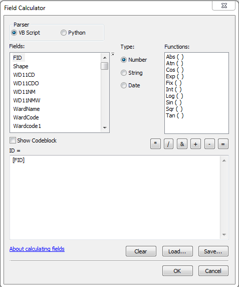
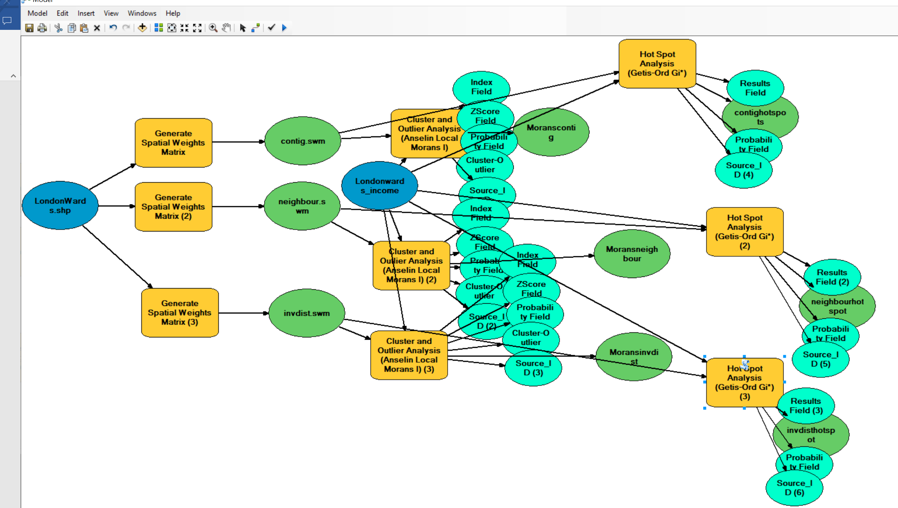

# Analysing spatial patterns

## Learning outcomes

By the end of this practical you should be able to:

1. Describe and evaluate methods for analysing spatial patterns 
2. Execute data cleaning and manipulation appropairte for analysis 
3. Determine the locations of spatial clusters using point pattern analysis methods
4. Investigate the degree to which values at spatial points are similar (or different) to each other

## Introduction

In this practical you will learn how to begin to analyse patterns in spatial data. Using data you are already familiar with, in the first part of the practical, you will explore some techniques for analysing patterns of point data in R. Then, in the second part of the practial, you will explore spatial autocorrelation using R or ArcGIS.

In this analysis we will analyse the patterns of Blue Plaques --- you will see these placed on around the UK linking the buildings of the present to people of the past.

The question we want to answer is: **"For any given London Borough, are the Blue Plaques within that borough distributed randomly or do they exhibit some kind of dispersed or clustered pattern?"**

To answer this question, we will make use of some of the Point Pattern Analysis functions found in the `spatstat` package.

```{r Library Initial Packages, message=FALSE, warning=FALSE, cache=TRUE}
#first library a few packages that we will use during the practical
#note you may need to install them first...
library(spatstat)
library(sp)
library(rgeos)
library(maptools)
library(GISTools)
library(tmap)
library(sf)
library(geojson)
library(geojsonio)
library(tmaptools)
```
## Setting up your data

Now, assuming that you've got a copy of your London Boroughs shapefile (from week 1) in your new week 6 folder, along with a shapefile of your Blue Plaques; read in the data...

```{r, cache=TRUE}
##First, get the London Borough Boundaries
EW <- geojsonio::geojson_read(
  "http://geoportal.statistics.gov.uk/datasets/8edafbe3276d4b56aec60991cbddda50_2.geojson",
  what = "sp")
```

Pull out london using grep and the regex wildcard for'start of the string' (^) to to look for the bit of the district code that relates to London (E09) from the 'lad15cd' column in the data slot of our spatial polygons dataframe

```{r, cache=TRUE}
BoroughMap <- EW[grep("^E09",EW@data$lad15cd),]
#plot it using the base plot function
qtm(BoroughMap)
summary(BoroughMap)

BNG = "+init=epsg:27700"
BoroughMapBNG <- spTransform(BoroughMap,BNG)
```

Now get the location of all Blue Plaques in the City

```{r}
##Now get the location of all Blue Plaques in the City
BluePlaques <- geojson_read(
  "https://s3.eu-west-2.amazonaws.com/openplaques/open-plaques-london-2018-04-08.geojson",
  what = "sp")
summary(BluePlaques)

#now set up an EPSG string to help set the projection 
BNG = "+init=epsg:27700"
WGS = "+init=epsg:4326"
BluePlaquesBNG <- spTransform(BluePlaques, BNG)
summary(BluePlaquesBNG)

#plot the blue plaques in the city
tmap_mode("view")
tm_shape(BoroughMapBNG) +
  tm_polygons(col = NA, alpha = 0.5) +
tm_shape(BluePlaquesBNG) +
  tm_dots(col = "blue")
```

### Data cleaning

Now, you might have noticed that there is at least one Blue Plaque that falls outside of the Borough boundaries. Errant plaques will cause problems with our analysis, so we need to clip the plaques to the boundaries...First we'll remove any Plaques with the same grid reference as this will cause problems later on in the analysis..

```{r, cache=TRUE}
#remove duplicates
BluePlaquesBNG <- remove.duplicates(BluePlaquesBNG)
```

Now just select the points inside London - thanks to Robin Lovelace for posting how to do this one, very useful!

```{r, cache=TRUE}
BluePlaquesSub <- BluePlaquesBNG[BoroughMapBNG,]
#check to see that they've been removed
tmap_mode("view")
tm_shape(BoroughMapBNG) +
  tm_polygons(col = NA, alpha = 0.5) +
tm_shape(BluePlaquesSub) +
  tm_dots(col = "blue")
```

### Study area

From this point, we could try and carry out our analysis on the whole of London, but you might be waiting until next week for Ripley's K to be calculated for this many points. Therefore to speed things up and to enable us to compare areas within London, we will select some individual boroughs. First we need to subset our SpatialPolygonsDataFrame to pull out a borough we are interested in. I'm going to choose Harrow as I know there are few enough points for the analysis to definitely work. If you wish, feel free to choose another borough in London and run the same analysis, but beware that if it happens that there are a lot of blue plaques in your borough, the analysis could fall over!!

```{r, cache=TRUE}
#extract the borough
Borough <- BoroughMapBNG[BoroughMapBNG@data$lad15nm=="Harrow",]

#or as an sf object:
BoroughMapBNGSF <- st_as_sf(BoroughMapBNG)
BoroughSF <- BoroughMapBNGSF[BoroughMapBNGSF$lad15nm=="Harrow",]

#Check to see that the correct borough has been pulled out
tm_shape(Borough) +
  tm_polygons(col = NA, alpha = 0.5)
```

Next we need to clip our Blue Plaques so that we have a subset of just those that fall within the borough or interest

```{r, cache=TRUE}
#clip the data to our single borough
BluePlaquesSub <- BluePlaquesBNG[Borough,]
#check that it's worked
tmap_mode("view")
tm_shape(Borough) +
  tm_polygons(col = NA, alpha = 0.5) +
tm_shape(BluePlaquesSub) +
  tm_dots(col = "blue")
```

We now have all of our data set up so that we can start the analysis using `spatstat`. The first thing we need to do is create an observation window for `spatstat` to carry out its analysis within --- we'll set this to the extent of the Harrow boundary

```{r, cache=TRUE}
##now set a window as the borough boundary
window <- as.owin(Borough)
plot(window)
```

`spatstat` has its own set of spatial objects that it works with (one of the delights of R is that different packages are written by different people and many have developed their own data types) - it does not work directly with the SpatialPolygonsDataFrames, SpatialPointsDataFrames or `sf` objects that we are used to. For point pattern analysis, we need to create a point pattern (ppp) object.

```{r, cache=TRUE}
#create a ppp object
BluePlaquesSub.ppp <- ppp(x=BluePlaquesSub@coords[,1],y=BluePlaquesSub@coords[,2],window=window)
```

Try to understand what the different elements in command above is doing. If you are unsure, you can run elements of the code, for example:

```{r, cache=TRUE}
BluePlaquesSub@coords[,1]
```

Have a look at the new ppp object

```{r, cache=TRUE}
plot(BluePlaquesSub.ppp,pch=16,cex=0.5, main="Blue Plaques Harrow")
```

## Point pattern analysis

### Kernel Density Estimation

One way to summarise your point data is to plot the density of your points under a window called a 'Kernel'. The size and shape of the Kernel affects the density pattern produced (more of this next week), but it is very easy to produce a KDE map from a ppp object using the `density` function.

```{r, cache=TRUE}
plot(density(BluePlaquesSub.ppp, sigma = 500))
```

The sigma value sets the diameter of the Kernel (in the units your map is in - in this case, as we are in British National Grid the units are in metres). Try experimenting with different values of sigma to see how that affects the density estimate.

```{r, cache=TRUE}
plot(density(BluePlaquesSub.ppp, sigma = 1000))
```

### Quadrat Analysis

So as you saw in the lecture, we are interesting in knowing whether the distribution of points in our study area differs from 'complete spatial randomness' - CSR.

The most basic test of CSR is a quadrat analysis. We can carry out a simple quadrat analysis on our data using the `quadrat count` function in `spatstat`. *Note, I wouldn't recommend doing a quadrat analysis in any real piece of analysis you conduct, but it is useful for starting to understand the Poisson distribution...*

```{r, cache=TRUE}
#First plot the points
plot(BluePlaquesSub.ppp,pch=16,cex=0.5, main="Blue Plaques in Harrow")
#now count the points in that fall in a 6 x 6 grid overlaid across the window
plot(quadratcount(BluePlaquesSub.ppp, nx = 6, ny = 6),add=T,col="red")
```

In our case here, want to know whether or not there is any kind of spatial patterning associated with the Blue Plaques in areas of London. If you recall from the lecture, this means comparing our observed distribution of points with a statistically likely (Complete Spatial Random) distibution, based on the Poisson distribution. 

Using the same `quadratcount` function again (for the same sized grid) we can save the results into a table:

```{r, cache=TRUE}
#run the quadrat count
Qcount<-data.frame(quadratcount(BluePlaquesSub.ppp, nx = 6, ny = 6))
#put the results into a data frame
QCountTable <- data.frame(table(Qcount$Freq, exclude=NULL))
#view the data frame
QCountTable
#we don't need the last row, so remove it
QCountTable <- QCountTable[-nrow(QCountTable),]
```

Check the data type in the first column - if it is factor, we will need to convert it to numeric

```{r, cache=TRUE}
class(QCountTable[,1])
#oops, looks like it's a factor, so we need to convert it to numeric
vect<- as.numeric(levels(QCountTable[,1]))
vect <- vect[1:6]
QCountTable[,1] <- vect
```

OK, so we now have a frequency table - next we need to calculate our expected values. The formula for calculating expected probabilities based on the Poisson distribution is:

$$Pr= (X =k) = \frac{\lambda^{k}e^{-\lambda}}{k!}$$

```{r, cache=TRUE}
#calculate the total blue plaques (Var * Freq)
QCountTable$total <- QCountTable[,1]*QCountTable[,2]
#calculate mean
sums <- colSums(QCountTable[,-1])
sums
#and now calculate our mean Poisson parameter (lambda)
lambda <- sums[2]/sums[1]
```

Calculate expected using the Poisson formula from above --- k is the number of blue plaques counted in a square and is found in the first column of our table...

```{r, cache=TRUE}
QCountTable$Pr <- ((lambda^QCountTable[,1])*exp(-lambda))/factorial(QCountTable[,1])
#now calculate the expected counts and save them to the table
QCountTable$Expected <- round(QCountTable$Pr * sums[1],0)
QCountTable
#Compare the frequency distributions of the observed and expected point patterns
plot(c(1,5),c(0,14), type="n", xlab="Number of Blue Plaques (Red=Observed, 
     Blue=Expected)", ylab="Frequency of Occurances")
points(QCountTable$Freq, col="Red", type="o", lwd=3)
points(QCountTable$Expected, col="Blue", type="o", lwd=3)
```

Comparing the observed and expected frequencies for our quadrat counts, we can observe that they both have higher frequency counts at the lower end --- something reminiscent of a Poisson distribution. This could indicate that for this particular set of quadrats, our pattern is close to Complete Spatial Randomness (i.e. no clustering or dispersal of points). But how do we confirm this?

To check for sure, we can use the `quadrat.test` function, built into `spatstat`. This uses a Chi Squared test to compare the observed and expected frequencies for each quadrat (rather than for quadrat bins, as we have just computed above). If the p-value of our Chi-Squared test is > 0.05, then we can reject a null hyphothesis that says "there is *no* complete spatial randomness in our data" (we will learn more about what a null-hypothesis is in a couple of weeks, but for the time being, just think about it as the opposite of a hypothesis that says our data exhibit complete spatial randomness). What we need to look for is a value for p > 0.05. If our p-value is > 0.05 then this indicates that we have CSR and there is no pattern in our points. If it is < 0.05, this indicates that we do have clustering in our points. 

```{r message=FALSE, warning=FALSE, cache=TRUE}
teststats <- quadrat.test(BluePlaquesSub.ppp, nx = 6, ny = 6)
teststats
plot(BluePlaquesSub.ppp,pch=16,cex=0.5, main="Blue Plaques in Harrow")
plot(teststats, add=T, col = "red")
```

So we can see that the indications are there is no spatial patterning for Blue Plaques in Harrow - at least for this particular grid. Note the warning message - some of the observed counts are very small (0) and this may affect the accuracy of the quadrat test. Recall that the Poisson distribution only describes observed occurrances that are counted in integers - where our occurances = 0 (i.e. not observed), this can be an issue. We also know that there are various other problems that might affect our quadrat analysis, such as the modifiable areal unit problem.

In the new plot, we can see three figures for each quadrat. The top-left figure is the observed count of points; the top-right is the Poisson expected number of points; the bottom value is the Pearson residual value, or (Observed - Expected) / Sqrt(Expected).

### Try experimenting...

Try running a quadrat analysis for different grid arrangements (2 x 2, 3 x 3, 10 x 10 etc.) --- how does this affect your results?

### Ripley's K

One way of getting around the limitations of quadrat analysis is to compare the observed distribution of points with the Poisson random model for a whole range of different distance radii. This is what Ripley's K function computes. 

We can conduct a Ripley's K test on our data very simply with the `spatstat` package using the `kest` function. 

```{r, cache=TRUE}
K <- Kest(BluePlaquesSub.ppp, correction="border")
plot(K)
```

The plot for K has a number of elements that are worth explaining. First, the *Kpois(r)* line in Red is the theoretical value of K for each distance window (r) under a Poisson assumption of Complete Spatial Randomness. The Black line is the estimated values of K accounting for the effects of the edge of the study area. 

Where the value of K falls above the line, the data appear to be clustered at that distance. Where the value of K is below the line, the data are dispersed. From the graph, we can see that up until distances of around 1300 metres, Blue Plaques appear to be clustered in Harrow, however, at around 1500 m, the distribution appears random and then dispersed between about 1600 and 2100 metres. 

### Alternatives to Ripley's K

There are a number of alternative measures of spatial clustering which can be computed in `spatstat` such as the G and the L functions - I won't go into them now, but if you are interested, you should delve into the following references:

Bivand, R. S., Pebesma, E. J., & Gómez-Rubio, V. (2008). "Applied spatial data analysis with R." New York: Springer.

Brundson, C., Comber, L., (2015) "An Introduction to R for Spatial Analysis & Mapping". Sage.

https://research.csiro.au/software/wp-content/uploads/sites/6/2015/02/Rspatialcourse_CMIS_PDF-Standard.pdf

## Density-based spatial clustering of applications with noise: DBSCAN

Quadrat and Ripley's K analysis are useful exploratory techniques for telling us if we have spatial clusters present in our point data, but they are not able to tell us WHERE in our area of interest the clusters are occurring. To discover this we need to use alternative techniques. One popular technique for discovering clusters in space (be this physical space or variable space) is DBSCAN. For the complete overview of the DBSCAN algorithm, read the original paper by Ester et al. (1996) - http://www.aaai.org/Papers/KDD/1996/KDD96-037.pdf 
or consult the wikipedia page - https://en.wikipedia.org/wiki/DBSCAN 

```{r, message=FALSE, warning=FALSE, cache=TRUE}
library(raster)
library(fpc)
library(plyr)
library(OpenStreetMap)
```

We will now carry out a DBSCAN analysis of blue plaques in my borough to see if there are any clusters present.

```{r, cache=TRUE}
#first check the coordinate reference system of the Harrow spatial polygon:
crs(Borough)
```
DBSCAN requires you to input two parameters:
1. *Epsilon* - this is the radius within which the algorithm with search for clusters
2. *MinPts* - this is the minimum number of points that should be considered a cluster

Based on the results of the Ripley's K analysis earlier, we can see that we are getting clustering up to a radius of around 1200m, with the largest bulge in the graph at around 700m. Therefore, 700m is probably a good place to start and we will begin by searching for clusters of at least 4 points...

```{r, cache=TRUE}
#first extract the points from the spatial points data frame
BluePlaquesSubPoints <- data.frame(BluePlaquesSub@coords[,1:2])
#now run the dbscan analysis
db <- fpc::dbscan(BluePlaquesSubPoints, eps = 700, MinPts = 4)
#now plot the results
plot(db, BluePlaquesSubPoints, main = "DBSCAN Output", frame = F)
plot(Borough, add=T)

#dbscan::kNNdistplot(BluePlaquesSubPoints, k =  4)
```

So the DBSCAN analysis shows that for these values of eps and MinPts there are three clusters in the area I am analysing. Try varying eps and MinPts to see what difference it makes to the output. 

No of course the plot above is a little basic and doesn't look very aesthetically pleasing. As this is R and R is brilliant, we can always produce a much nicer plot by extracting the useful information from the DBSCAN output and use ggplot2 to produce a much cooler map...

```{r, cache=TRUE}
library(ggplot2)
```

Our new db object contains lots of info including the cluster each set of point coordinates belongs to, whether the point is a seed point or a border point etc. We can get a summary by just calling the object

```{r, cache=TRUE}
db
```

If you open up the object in the environment window in RStudio, you will also see the various slots in the object, including cluster

```{r, cache=TRUE}
db$cluster
```

We can now add this cluster membership info back into our dataframe

```{r, cache=TRUE}
BluePlaquesSubPoints$cluster <- db$cluster
```

Next we are going to create some convex hull polygons to wrap around the points in our clusters. Use the ddply function in the ```plyr``` package to get the convex hull coordinates from the cluster groups in our dataframe

```{r, cache=TRUE}
chulls <- ddply(BluePlaquesSubPoints, .(cluster), 
                function(df) df[chull(df$coords.x1, df$coords.x2), ])
```

As 0 isn't actually a cluster (it's all points that aren't in a cluster) drop it from the dataframe

```{r, cache=TRUE}
chulls <- subset(chulls, cluster>=1)
```

Now create a ggplot2 object from our data

```{r, cache=TRUE}
dbplot <- ggplot(data=BluePlaquesSubPoints, 
                 aes(coords.x1,coords.x2, colour=cluster, fill=cluster)) 
#add the points in
dbplot <- dbplot + geom_point()
#now the convex hulls
dbplot <- dbplot + geom_polygon(data = chulls, 
                                aes(coords.x1,coords.x2, group=cluster), 
                                alpha = 0.5) 
#now plot, setting the coordinates to scale correctly and as a black and white plot 
#(just for the hell of it)...
dbplot + theme_bw() + coord_equal()
```

Now we are getting there, but wouldn't it be better to add a basemap?!

```{r, cache=TRUE}
###add a basemap
##First get the bbox in lat long for Harrow
latlong <- "+init=epsg:4326" 
BoroughWGS <-spTransform(Borough, CRS(latlong))
BoroughWGS@bbox
```

Now convert the basemap to British National Grid

```{r, cache=TRUE}
basemap<-openmap(c(51.5530613,-0.4040719),c(51.6405318,-0.2671556), zoom=NULL,"stamen-toner")
#convert the basemap to British National Grid - remember we created the BNG object right at the beginning of the practical - it's an epsg string...
basemap_bng<-openproj(basemap, projection=BNG)
```
Now we can plot our fancy map with the clusters on...

```{r, cache=TRUE}
autoplot(basemap_bng) + geom_point(data=BluePlaquesSubPoints, 
                                   aes(coords.x1,coords.x2, 
                                       colour=cluster, fill=cluster)) + 
  geom_polygon(data = chulls, aes(coords.x1,coords.x2, group=cluster, fill=cluster), 
               alpha = 0.5)  
```

## Point pattern analysis summary

This is end of the point pattern analysis section of the practical. You have  been introduced to the basics of Point Pattern Analysis examining the distribution of Blue Plaques in a London Borough. At this point, you may wish to try running similar analyses on different boroughs (or indeed the whole city) and playing with some of the outputs - although you will find that Ripley's K will fall over very quickly if you try to run the analysis on that many points) 

This how you might make use of these techniques in another context or with different point data...

## Analysing Spatial Autocorrelation with Moran's I, LISA and friends

Now, at this point you have a choice and at bit like in those Fighting Fantasy (https://en.wikipedia.org/wiki/Fighting_Fantasy) books that I used to read as a kid, you can select either **Option 1** (which may lead to firey death by dragon) or **Option 2** (which could lead to a pot of gold)...

**Option 1**. If you've had enough of coding and you think you might like to do your coursework in ArcGIS and have a bit more practice with model builder, then go to [ArcMap part 2]. This will show you how to analyse spatial autocorrelation in ArcGIS and will give you more practice will model builder.

 **Option 2**. If you are a total bad-ass and want to continue with R, then brilliant!! Woo hoo!! You can keep following the instuctions below. 
 
...Of course there is also **Option 3** and that is to give both a go...

Have the Arc lot gone? OK great, here's some more lovely R...

In this section we are going to explore patterns of spatially referenced continuous observations using various measures of spatial autocorrelation. Spatial autocorrelation is a measure of similarity between nearby data. Check out the various references in the reading list for more information about the methods we will explore today. There are also useful links in the helpfile of the `spdep` package which we will be using here.

### Data download

Before we get any further, let's get some ward boundaries read in to R --- download LondonWardData from Github and read it in...https://github.com/andrewmaclachlan/CASA0005repo/tree/master/prac6_data

```{r, cache=TRUE}
library(rgdal)
#read the ward data in
LondonWards <- readOGR("prac6_data/LondonWards.shp")
```

It's probably projected correctly, but in case it isn't give it a projection using the ```CRS()``` function in the ```raster``` package

```{r, cache=TRUE}
proj4string(LondonWards) <- CRS("+init=epsg:27700")
#have a look to check that everything looks OK..

tmap_mode("view")
tm_shape(LondonWards) +
  tm_polygons(col = NA, alpha = 0.5) +
tm_shape(BluePlaques) +
  tm_dots(col = "blue")
```

### Data cleaning 

Ah yes, we might need to lose the blue plaques that fall outside of London

```{r, cache=TRUE}
summary(BluePlaquesBNG)
BluePlaquesSub <- BluePlaquesBNG[LondonWards,]
tm_shape(LondonWards) +
  tm_polygons(col = NA, alpha = 0.5) +
tm_shape(BluePlaquesSub) +
  tm_dots(col = "blue")
```

### Data manipulation 

The measures of spatial autocorrelation that we will be using require continuous observations (counts of blue plaques, average GCSE scores, average incomes etc.) to be spatially referenced (i.e. attached to a spatial unit like a ward or a borough). The file you have already has the various obervations associated with the London Ward data file already attached to it, but let's continue with our blue plaques example for now. 

To create a continuous observation from the blue plaques data we need to count all of the blue plaques that fall within each Ward in the City. Luckily, we can do this using the ```poly.counts()``` function in Chris Brunsdon's excellent ```gistools``` package... (we could also use the ```over()``` function in the ```sp``` package if we wanted)

```{r echo=TRUE, results='hide', cache=TRUE}
res <- poly.counts(BluePlaquesSub, LondonWards)
#and add this as a column in our spatialPolygonsDataframe
LondonWards@data$BluePlaqueCount<-res
#as the wards are of different sizes, perhaps best that we calculate a density
LondonWards@data$BlueDensity <- LondonWards$BluePlaqueCount/poly.areas(LondonWards)
#let's just check the data to see if the calculations have worked
LondonWards@data
```

How about a quick choropleth map to see how we are getting on...

```{r, cache=TRUE}
tm_shape(LondonWards) +
    tm_polygons("BlueDensity",
        style="jenks",
        palette="PuOr",
        midpoint=NA,
        title="Blue Plaque Density")
```

So, from the map, it looks as though we might have some clustering of blue plaques in the centre of London so let's check this with Moran's I and some other statistics. 

Before being able to calculate Moran's I and any similar statistics, we need to first define a \(W_{ij}\) spatial weights matrix

```{r, message=FALSE, warning=FALSE, cache=TRUE}
library(spdep)
```

First calculate the centroids of all Wards in London

```{r message=FALSE, warning=FALSE, cache=TRUE}
#First calculate the centroids of all Wards in London
coordsW <- coordinates(LondonWards)
plot(coordsW)
```

Now we need to generate a spatial weights matrix (remember from the lecture). We'll start with a simple binary matrix of queen's case neighbours

```{r message=FALSE, warning=FALSE, cache=TRUE}
#create a neighbours list
LWard_nb <- poly2nb(LondonWards, queen=T)
#plot them
plot(LWard_nb, coordinates(coordsW), col="red")
#add a map underneath
plot(LondonWards, add=T)
#create a spatial weights object from these weights
Lward.lw <- nb2listw(LWard_nb, style="C")
head(Lward.lw$neighbours)
```

### Spatial autocorrelation

Now we have defined our \(W_{ij}\) matrix, we can calculate the Moran's I and other associated statistics

Moran's I test tells us whether we have clustered values (close to 1) or dispersed values (close to -1), we will calculate for the densities rather than raw values
```{r, cache=TRUE}
I_LWard_Global_Density <- moran.test(LondonWards@data$BlueDensity, Lward.lw)
I_LWard_Global_Density
```

Geary's C as well..? This tells us whether similar values or dissimilar values are clusering

```{r, cache=TRUE}
C_LWard_Global_Density <- geary.test(LondonWards@data$BlueDensity, Lward.lw)
C_LWard_Global_Density
```

Getis Ord General G...? This tells us whether high or low values are clustering. If G > Expected = High values clustering; if G < expected = low values clustering

```{r, cache=TRUE}
G_LWard_Global_Density <- globalG.test(LondonWards@data$BlueDensity, Lward.lw)
G_LWard_Global_Density
```

So the global statistics are indicating that we have spatial autocorrelation of Blue Plaques in London:

The Moran's I statistic = 0.51 (remember 1 = clustered, 0 = no pattern, -1 = dispersed) which shows that we have some distinctive clustering

The Geary's C statistic = 0.41 (remember Geary's C falls between 0 and 2; 1 means no spatial autocorrelation, <1 - positive spatial autocorrelation or similar values clustering, >1 - negative spatial autocorreation or dissimilar values clustering) which shows that similar values are clustering

The General G statistic = G > expected, so high values are tending to cluster. 

We can now also calculate local versions of the Moran's I statistic (for each Ward) and a Getis Ord \(G_{i}^{*}\) statistic to see *where* we have hot-spots...

```{r, cache=TRUE}
#use the localmoran function to generate I for each ward in the city
I_LWard_Local <- localmoran(LondonWards@data$BluePlaqueCount, Lward.lw)
I_LWard_Local_Density <- localmoran(LondonWards@data$BlueDensity, Lward.lw)
#what does the output (the localMoran object) look like?
head(I_LWard_Local_Density)
```

There are 5 columns of data. We want to copy some of the columns (the I score (column 1) and the z-score standard deviation (column 4)) back into the LondonWards spatialPolygonsDataframe

```{r, cache=TRUE}
LondonWards@data$BLocI <- I_LWard_Local[,1]
LondonWards@data$BLocIz <- I_LWard_Local[,4]
LondonWards@data$BLocIR <- I_LWard_Local_Density[,1]
LondonWards@data$BLocIRz <- I_LWard_Local_Density[,4]
```

### Mapping outputs 

No we can plot a map of the local Moran's I outputs...

We'll set the breaks manually based on the rule that data points >2.58 or <-2.58 standard deviations away from the mean are significant at the 99% level (<1% chance that autocorrelation not present); >1.96 - <2.58 or <-1.96 to >-2.58 standard deviations are significant at the 95% level (<5% change that autocorrelation not present). >1.65 = 90% etc.

```{r, cache=TRUE}
breaks1<-c(-1000,-2.58,-1.96,-1.65,1.65,1.96,2.58,1000)
```

Now create a new diverging colour brewer palette and reverse the order using rev so higher values correspond to red

```{r, cache=TRUE}
MoranColours<- rev(brewer.pal(8, "RdGy"))
```

Plot on an interactive map

```{r, cache=TRUE}
tm_shape(LondonWards) +
    tm_polygons("BLocIRz",
        style="fixed",
        breaks=breaks1,
        palette=MoranColours,
        midpoint=NA,
        title="Local Moran's I, Blue Plaques in London")
```

This map shows some areas in the centre of London that have relatively high scores, indicating areas with lots of blue plaques neighbouring other areas with lots of blue plaques.

What about the Getis Ord \(G_{i}^{*}\) statisic for hot and cold spots?

```{r, cache=TRUE}
Gi_LWard_Local_Density <- localG(LondonWards@data$BlueDensity, Lward.lw)
```

Check the help file  (?localG) to see what a localG object looks like - it is a bit different from a localMoran object as it only contains just a single value - the z-score (standardised value relating to whether high values or low values are clustering together)
And map the outputs...

```{r, cache=TRUE}
head(Gi_LWard_Local_Density)
 
LondonWards@data$BLocGiRz <- Gi_LWard_Local_Density
```

And map the outputs...

```{r, cache=TRUE}
GIColours<- rev(brewer.pal(8, "RdBu"))

#now plot on an interactive map
tm_shape(LondonWards) +
    tm_polygons("BLocGiRz",
        style="fixed",
        breaks=breaks1,
        palette=GIColours,
        midpoint=NA,
        title="Gi*, Blue Plaques in London")

```

### Other variables

The local Moran's I and \(G_{i}^{*}\) statistics for wards clearly show that the density of blue plaques in the centre of the city exhibits strong (and postitive) spatial autocorrelation, but neither of these maps are very interesting. The ArcGIS crew will have been calculating Local Moran's I and \(G_{i}^{*}\) statistics for some of the other variables for the wards of London. Why not try some alternative variables and see what patterns emerge... here I'm going to have a look at Average GSCE scores...

```{r, cache=TRUE}
#use head to see what other variables are in the data file
head(LondonWards@data)
```

```{r, echo=TRUE, eval=FALSE, cache=TRUE}
I_LWard_Local_GCSE <- localmoran(LondonWards@data$AvgGCSE201, Lward.lw)
LondonWards@data$GCSE_LocIz <- I_LWard_Local_GCSE[,4]

tm_shape(LondonWards) +
    tm_polygons("GCSE_LocIz",
        style="fixed",
        breaks=breaks1,
        palette=MoranColours,
        midpoint=NA,
        title="Local Moran's I, GCSE Scores")
```

Now the Gi* statistic to look at clusters of high and low scores...

```{r, cache=TRUE}
Gi_LWard_Local_GCSE <- localG(LondonWards@data$AvgGCSE201, Lward.lw)
LondonWards@data$GCSE_LocGiz <- Gi_LWard_Local_GCSE

tm_shape(LondonWards) +
    tm_polygons("GCSE_LocGiz",
        style="fixed",
        breaks=breaks1,
        palette=GIColours,
        midpoint=NA,
        title="Gi*, GCSE Scores")

```

So this is the end of the practical. Hopefully you have learned a lot about the different methods we can employ to analyse patterns in spatial data. 

This practical was deliberately designed as a walk through, but this may have given you ideas about where you could perhaps take these techniques in your coursework if this is something you wanted to explore further with different data or in different contexts. 

## Extension 

Already a pro with point pattern and spatial autocorrelation analysis?

Then try the following out:

1. We have used `sp` objects in this practical (because I wrote it before `sf` became the defacto spatial data type in R). Can you convert some of this so it works with`sf`?

2. Could you atomate any of the functions so that you could quickly produce maps of any of the variables in the LondonWards dataset?

3. Could you get these outputs into a faceted ```ggplot2``` map?

## ArcMap part 2 

### Getting started

1. Create a new geodatabase in your working folder on your N: drive 

2. Start ArcMap and add the Ward boundary data from practical 1 or download it again from: https://data.london.gov.uk/dataset/statistical-gis-boundary-files-london

3. Right-click on your layer and select Data > Export Data. Save your data as a new file geodatabase feature class and give it an appropriate name –-- we are doing this as we will be messing around with boundary polygons and it’s good practice not to ruin the original file!

4. Add your newly saved feature class your map. Open up the attribute table and sort the data by the column LG_GSS_CD (right-click the header column and sort ascending). As the LG_GSS_CD code for the City of London is E09000001, all of the Wards within the feature class will now be sorted to the top of the file

5. Left-click the small box to the left of the first row – this should highlight the first row in blue (and the polygon on the map). Scroll down a few rows until you find the last City of London ward – this should be. Hold down shift and click the small box to the left of this row. All rows above should now be highlighted in blue (and this should show on the map). You can also click and drag 

6. We are now ready to dissolve these boundaries into a single City of London zone. If you have not already done so, activate the Editor toolbar: Customize > Toolbars > Editor. On the Editor toolbar, select Start Editing from the dropdown menu 

7.	If you have other layers open in your map, you may have to select the correct layer to edit
8.	In the editor dropdown menu, ‘Merge’ should now be active. Click Merge. Select the first feature as your merge feature and click ‘OK’

9. Whilst still in Editor change the GSS_CODE for Castle Bayard to E09000001

10. In the Editor drop down menu, select Save Edits and then Stop Editing

11. You should now see on your map that the ward boundaries have dissolved and in your attribute table, only the first row – Castle Baynard, should be left

12.	We are now ready to join your London data to your new boundaries. Get the data from: https://data.london.gov.uk/dataset/ward-profiles-and-atlas. Ward Atlas data, excel format. Save it to your current working folder

13.	Open the excel document and the data tab or worksheet (bottom left). Delete all the data we are not interested in and save it as a .csv…I’ve removed everything expect New Code and Median Household income estimate (2012/13).

14.	Add your ```.csv``` layer to your map. Join the ```.csv``` data to your newly edited boundary data. Use GSS_CODE and New code to match the records, keeping only the matching records. Export your new layer as a new geodatabase feature class in a new file geodatabase for this week’s practical. I’ve called mine Londonwards_GCSE

**Hint** make sure you don’t have any layers open twice (e.g. if you have your ```.csv``` open and they try to open it and join it to the ```.shp``` in ArcMap it will most likely not work).

**An exploratory research question: Are households with high or low median incomes spatially clustered in London?**

15. We are almost ready to try some exploratory analysis, but before we do this, we will need to generate a unique ID column in your new LondonWards feature class. Open the attribute table and in Table Options, select Add a Field of type Short Integer called ID. Scroll to the last column in the table and you should see your new column. Right click the header and select the field calculator. Set ID to = ObjectID and click OK.

```{r echo=FALSE, out.width = "400px", fig.align='center', cache=TRUE}
 
```

16. Before we start our income values are stored as a string and we need to convert them to numeric…add a new field to the attribute table with the type of float, right click on the new field > Field Calculator then set the new field to equal to the Median_Household_income_estimate__2012_13 point scores --- use this new field from now on. If you can’t add a new field save and then reload the ArcMap document --- I think this is due to ArcMap locking certain layers, but that will solve it

17.	First of all, generate a standard choropleth map of median income for people living in wards in London. Does it look like there might be a spatial pattern? From this map, what might your hypothesis be? In statistical analysis it is standard practice to reverse your hypothesis and turn it into a null hypothesis. Therefore, if your hypothesis is there is a spatial pattern to median household income, then the null-hypothesis is that there is not a relationship (and vice versa)

18. In order to confirm or reject your null hypothesis we will run both a global Geary’s C test and a global Moran’s I test

19. Go to Geoprocessing > Arc Toolbox and load the Arc Toolbox if it is not already there

20. Select Spatial Statistics Tools > Analyzing Patterns > High/Low Clustering Getis-Ord General G

21. When the dialogue box opens, add your LondonWards feature class as the input feature class and choose the other options as shown below:

```{r echo=FALSE, out.width = "600px", fig.align='center', cache=TRUE}
knitr::include_graphics('prac6_images/getis.png') 
```

22. In this instance we will use a standard inverse distance matrix for spatial weights – refer back to the lecture notes if you can’t remember what an inverse distance matrix is. Make sure the Generate Report option is ticked and then run the tool by clicking OK

23. The dialogue box will show you when the process is complete. If the results tab doesn’t appear, select Geoprocessing > Results and expand the results of HighLowClustering. Double click on the report file to open up the report

```{r echo=FALSE, out.width = "400px", fig.align='center', cache=TRUE}
knitr::include_graphics('prac6_images/clusterreport.png') 
```

24. What does the report suggest about the spatial clustering of GCSE scores in London? What is a Z-score (if you’re not sure, Wikipedia is always a good place to start - http://en.wikipedia.org/wiki/Standard_score)

25. Generate a similar report using the Spatial Autocorrelation (Moran’s I) tool. What does this report tell you?

**Where are the high and low clusters in London and how does the conception of spatial weights affect the patterns which are shown?**

26. Now we have some global measures of spatial autocorrelation, it will be useful to look at where, specifically, spatial clusters are found. To do this we will also generate a series of spatial weights matrices using the Arc Model Builder and run Local Moran’s I and Geary’s C calculations to see how the conception of spatial weights affects the results of the analysis

### Using the Model Builder

27.	First we will set our environment workspace. Select Geoprocessing > Environments… and under Workspace set the current and scratch workspaces to your wk6 file geodatabase. You should also set your default geodatabase to the one you created in your week 6 folder in your map document properties

28.	Select Geoprocessing > ModelBuilder and the Model Builder box should open up. The model builder is a visual interface which allows you to build up the elements of your model by dragging data, tools and iterators into the window

29. In Arc Toolbox, go to Spatial Statistics Tools > Modeling Spatial Relationships > Generate Spatial Weights Matrix and drag it into your model builder box. Double click the ‘Generate Spatial Weights Matrix’ box and the dialogue box for the tool should appear. We will first create a spatial weights matrix based on contiguity (Queen’s Case – edges and corners) using the options shown below. Save the ```.swm``` file into the same folder as your shapefile or geodatabase in your working directory, remembering to check the box next to row standardization

```{r echo=FALSE, out.width = "650px", fig.align='center', cache=TRUE}
knitr::include_graphics('prac6_images/spatialweights.png') 
```

30. Create a further two spatial weights matrices. The first one should be for the 8 nearest neighbours, the second a standard inverse distance. Both should be generated from the same feature class as below

```{r echo=FALSE, out.width = "650px", fig.align='center', cache=TRUE}
knitr::include_graphics('prac6_images/modelbuilder_spatialweights.png') 
```

**Note**, to join an existing input to a new tool, use the ‘Connect’ tool and drag a line to the tool you are using

31. Now we have our three spatial weights matices, we can carry out local Moran’s I and local Geary’s C analyses using the different conceptions of proximity. To do this, simply drag the tools (Cluster and Outlier Analysis and Hotspot analysis) from within Spatial Statistics Tools > Mapping Clusters into your Model Builder box. Double Click the tool and fill out the options as below – remember to select GET_SPATIAL_WEIGHTS_FROM_FILE and choose the appropriate spatial weights matrix. Make sure you use the feature class you saved to get the income data as the input feature class.

```{r echo=FALSE, out.width = "600px", fig.align='center', cache=TRUE}
knitr::include_graphics('prac6_images/clusteroutlier2.png') 
```

32. Double click your green output file and change its name to something recognisable

33. Right click the output file and check the box next to OK 

34. Add another two Moran’s I calculations – one for each of the other spatial weights matrices. Then add a Local Geary’s C calculation for each spatial weights matrix as well. You should end up with 6 output files as below. Make sure you change the names of each output file and add them to display as well

```{r echo=FALSE, out.width = "650px", fig.align='center', cache=TRUE}
 
```

35. When you have finished building your model, in the top menu, select Model > Save As and save your model into a new tool box   in your working directory

36. 22.	Now you are ready to run your model. Select Model > Run Entire Model. The model will run, and if you have remembered to tick the ‘Add to display’ option next to each output file, each output should be added to your map. This will display confidence intervals, which can you change to Z scores under the layer symbology. Otherwise you can add them in from your GeoDatabase

37. You are now able to review the results of your hotspot (Local Geary’s C) and Local Moran’s I analyses. To understand what the values HH, LL, HL and LH mean, you should consult the ArcGIS help system - http://help.arcgis.com/en/arcgisdesktop/10.0/help/index.html#/How_Cluster_and_Outlier_Analysis_Anselin_Local_Moran_s_I_works/005p00000012000000/

38. If you wish, to aid interpretation, you can add some London Borough boundaries to your map --- you can get this layer from practical 1

```{r echo=FALSE, out.width = "700px", fig.align='center', cache=TRUE}
knitr::include_graphics('prac6_images/finalmap.png') 
```

39. Referring back to the exploratory research question asked above, what can you observe about the spatial clustering of median income in London? How does the conception of spatial relationships affect the results of these spatial autocorrelation analyses? Why might the ways that spatial relationships are conceived affect these results?

### Extension work

#### Model builder

Build a model using model builder which:

* Reads in your blue plaques data from last week, 
* Adds a new short integer field using the ‘add field’ tool 
* Fills this new field with 1’s using the ‘calculate field’ tool
* Carries out a spatial join, calculating the number of blue plaques in each ward by using the sum of the new field you have just created
* Calculates the median centre of all of the blue plaques in London
* Carries out a hot spot analysis of these blue plaques to see if there is any noticeable spatial clustering

#### Further practice 

The introduction to model builder has only been very cursory --– it is able to carry out far more complex tasks. If you think you would like to use Model Builder in your coursework assessment (remember you other option is to do something similar in R or QGIS), then ESRI have a number of tutorial activities to take you from the basics to something far more advanced.

The tutorials can be accessed from the online help system. If you are running ArcGIS 10.1 (I doubt the pages will change much for 10 or 10.2), then this is a good place to start:
http://resources.arcgis.com/en/help/main/10.1/index.html#/What_is_ModelBuilder/002w00000001000000/

These tutorials will introduce you to many more features that we didn’t cover today. 