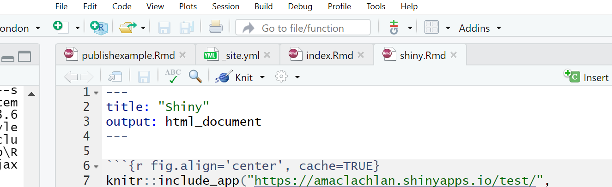
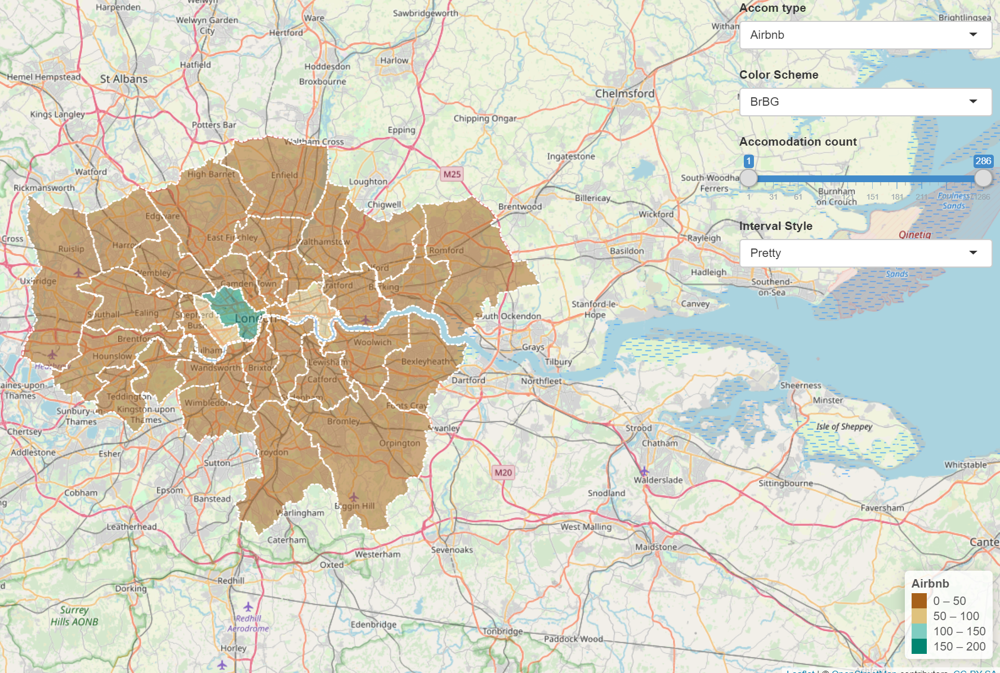

# Online mapping

## Learning objectives

By the end of this practical you should be able to:

1. Descrbie and explain different methods for producing online maps
2. Create interative maps usong Rpubs, RMarkdown site generator and Shiny
3. Critically appraise the appropriateness of mapping technqiues based on the dataset and purpose of the output map

## Introduction 

In this practical we are going to explore several ways of publishing your R code and outputs (including interactive plots) online.

## RPubs

One of the most straight forward publishing tools is RPubs. It takes an ```.Rmd``` and directly uploads it to rpubs.com --- all files are publically available on this website.

1. To start with you need to make a free account. Go to: https://rpubs.com/users/new and register

2. Create a new project in RStudio and open a new R Markdown file (File > New File > R Markdown)

3. You'll see that the file is automatically populated with some information, have a read through it then click the Knit icon (if you remember we covered this in [Knitting your output])...

```{r echo=FALSE, out.width = "800pt", fig.align='center', cache=TRUE}
knitr::include_graphics('prac8_images/knitt.png') 
```

4. Let's make some changes to your ```.Rmd```. Delete all the text and code except from header inforamtion (that is enclosed by three dashes at the top of the file)

5. Insert a new code chunk (go back to [RMarkdown] if you need a refresher) and add some code of your choice from either a previous practical or your own work. As it's a new project you'll have to either copy the data into your project folder or set the working directory ```setwd()```. If it's all online data that you've loaded directly from the web into R, this shouldn't be an issue. I'm going to use the interactive map we made in practical 5 (the [Advanced interactive map] section)..I have copied the.....Here is the code i've put in my chunk:

```{r, warnings=FALSE, message=FALSE, cache=TRUE, eval=FALSE}

library(sf)
library(tmap)
library(leafpop)
library(leaflet)
library(tmaptools)
library(tidyverse)
library(plyr)

OSM <- st_read("data/gis_osm_pois_a_free_1.shp")

Londonborough <- st_read("data/London_Borough_Excluding_MHW.shp")

Airbnb <- read_csv("data/listings.csv")
  
# plot xy data
Airbnb <- st_as_sf(Airbnb, coords = c("longitude", "latitude"), 
                   crs = 4326)

# reproject
OSM <- st_transform(OSM, 27700)
Airbnb <- st_transform(Airbnb, 27700)
# we don't need to reproject Londonborough, but it 
# doesn't have a CRS..you could also use set_crs
# it needs to have one for the next step
Londonborough<- st_transform(Londonborough, 27700)

#select hotels only
OSM <- OSM[OSM$fclass == 'hotel',]
Airbnb <- Airbnb[Airbnb$room_type == 'Entire home/apt' &
                   Airbnb$availability_365=='365',]

# make a function for the join
# functions are covered in practical 7
# but see if you can work out what is going on
# hint all you have to do is replace data1 and data2
# with the data you want to use

Joinfun <- function(data1, data2) {
  # join OSM and London boroughs
  joined <- st_join(data1, data2, join = st_within)
  
  # count the number of hotels per borough
  countno <- as.data.frame(count(joined$GSS_CODE))
  
  # join the count back to the borough layer
  counted <-left_join(data2, countno, by=c("GSS_CODE"="x"))
  
  return(counted)
}

# use the function for hotels
Hotels <- Joinfun(OSM, Londonborough)

# then for airbnb
Airbnb <- Joinfun(Airbnb, Londonborough)

# now try to arrange the plots with tmap
breaks = c(0, 5, 12, 26, 57, 286) 

#change the column name from freq for the legend
colnames(Hotels)[colnames(Hotels)=="freq"] <- "Accom count"


#join data
ti<-st_join(Airbnb, Hotels)
ti<-st_transform(ti,crs = 4326)

#remove the geometry for our pop up boxes to avoid
#the geometry field 
ti2<-ti
st_geometry(ti2)<-NULL
popairbnb=popupTable(ti2, zcol=c("NAME.x", "GSS_CODE.x", "freq"))
pophotels=popupTable(ti2, zcol=c("NAME.x", "GSS_CODE.x", "Accom count"))

tmap_mode("view")

# set the colour palettes using our previously defined breaks
pal <- colorBin(palette = "YlOrRd", domain=ti2$freq, bins=breaks)
pal2 <- colorBin(palette = "YlOrRd", domain=ti2$`Accom count`, bins=breaks)

map<- leaflet(ti) %>%
  
  # add basemap options
  addTiles(group = "OSM (default)") %>%
  addProviderTiles(providers$Stamen.Toner, group = "Toner") %>%
  addProviderTiles(providers$Stamen.TonerLite, group = "Toner Lite") %>%
  addProviderTiles(providers$CartoDB.Positron, group = "CartoDB")%>%
  
  #add our polygons, linking to the tables we just made
  addPolygons(color="white", 
              weight = 2,
              opacity = 1,
              dashArray = "3",
              popup = popairbnb,
              fillOpacity = 0.7,
              fillColor = ~pal(freq),
              group = "Airbnb")%>%
  
  addPolygons(fillColor = ~pal(`Accom count`), 
              weight = 2,
              opacity = 1,
              color = "white",
              dashArray = "3",
              popup = pophotels,
              fillOpacity = 0.7,group = "Hotels")%>%
  # add a legend
  addLegend(pal = pal2, values = ~`Accom count`, group = c("Airbnb","Hotel"), 
            position ="bottomleft") %>%
  # specify layers control
  addLayersControl(
    baseGroups = c("OSM (default)", "Toner", "Toner Lite", "CartoDB"),
    overlayGroups = c("Airbnb", "Hotels"),
    options = layersControlOptions(collapsed = FALSE)
  )

# plot the map
map
```

6. Add some text at the start of your ```.Rmd``` you can include titles and subtitle using # followed by a space, a second level subtitle would be ##, and third ###

7. Save the file, Knitt it to HTML, this should be default and specified in the header --- enclosed by three dashes.

8. Once knitted you can easily publish the file to Ppubs using the Publish icon either in the viewer pane or the toolbar area (by run)

```{r echo=FALSE, out.width = "200pt", fig.align='center', cache=TRUE}
knitr::include_graphics('prac8_images/publish.png') 
```

Now how about adding a few design features...i've changed my header section to...

```{r eval=FALSE}
---
title: "publishexample"
output:
  html_document:
    theme: yeti
    smart: true
    highlight: textmate
    toc: true
    number_sections: true
    toc_float:
      collapsed: false
      smooth_scroll: true
---
```

9. Knit and then publish again...you'll notice a few aesthetic changes

10. To learn more about these go explore:

* https://bookdown.org/yihui/rmarkdown/html-document.html
* http://www.datadreaming.org/post/r-markdown-theme-gallery/
* https://cran.r-project.org/web/packages/prettydoc/vignettes/architect.html

And for more code chunk control..

* https://bookdown.org/yihui/rmarkdown/r-code.html
* https://rmarkdown.rstudio.com/lesson-3.html

## RMarkdown site generator 

### Set the file structure

RPubs are useful but what if you wanted to make a full site with different tabs for introduction, methodology, results and recommedations...one way is to use the RMarkdown site generator hosted on GitHub

RMarkdown site generator is useful as it does not require any third-party add ons like blogdown which is reliant on the hugo site generator

To make a site you'll need the following to be within your project:

(a) A configuration file with the filename ```_site.yml```

(b) An ```index.Rmd```

(c) Any other ```.Rmd``` files you want to create into pages on the site

For the site to work you only require (a) and (b)....but that would be a pretty boring site...

11. In your new project add two new RMarkdown files called:
* ```_site.yml``` 
* ```index.Rmd``` 


```{r echo=FALSE, out.width = "500pt", fig.align='center', cache=TRUE}
knitr::include_graphics('prac8_images/rsitegenerator.png') 
```

12. In the ```_site.yml``` remove all code and add the following

```{r eval=FALSE, message=FALSE, warning=FALSE, cache=TRUE}
name: "Hello world"
output_dir: "."
navbar:
  title: "My example website"
  left:
    - text: "Home"
      href: index.html
    - text: "About"
      href: publishexample.html
```

### Link to GitHub

There are two ways to do this....

#### GitHub first

This is the 'easy' way as you woould repeat the steps in [Practical 4][Git, GitHub and RMarkdown] by firstly making a new repository on GitHub then loading a new project in RStudio, linking that to GitHub and copying all your files into your new project from the exisiting one. 

#### GitHub last

So if you already have a RStudio project...like we do...we can link this to GitHub but the steps are a bit more invovled and there are several ways to acheive it --- as with most things in R.

13. Make a Git repo in RStudio. Go to Tools > Project Options > Git/SVN and select Git under Version control system and initialize a new repository, then restart RStudio. The Git tab should appear..

14. Next we need to make a new repository on GitHub. Go to GitHub, login and make a new repository. Make sure that it is **empty** with no README.. you should have something similar to this appear:

```{r echo=FALSE, out.width = "800pt", fig.align='center', cache=TRUE}
knitr::include_graphics('prac8_images/gitnewrepo.png') 
```

15. Clone the repository by copying the HTTPS 

```{r echo=FALSE, out.width = "700pt", fig.align='center', cache=TRUE}
knitr::include_graphics('prac8_images/HTTPS.png') 
```

16. Make one local commit. Under the Git tab > Diff > Stage the files > Add a commit message and click commit

17. Now we need to connect our local repository to the GitHub one. So Under the Git tab you'll the new brach button (two purple boxes linked to a white box)...

```{r echo=FALSE, out.width = "400pt", fig.align='center', cache=TRUE}
knitr::include_graphics('prac8_images/addremote.png') 
```

18. Click it > Add Remote. Paste in the URL use the remote name origin and the branch name of master --- which you can get from the GitHub Quick setup screen after creating your repo. Check sync the branch with the remote > click create then select overwrite

```{r echo=FALSE, out.width = "400pt", fig.align='center', cache=TRUE}
knitr::include_graphics('prac8_images/addremote2.png') 
```

19. Push the files to your GitHub and they will appear on your GitHub repo

20. Next we need to actually build the site...there are a few ways to do this...Next to the Git tab you should see the Build tab, if you can't then go to Tools > Project Options > Build Tools and select website under Project build tools. Now click Build Website under the build tab

21. Alternatively you write the following in the console 

```{r eval=FALSE, message=FALSE, warning=FALSE, cache=TRUE}
rmarkdown::render_site()
```

If you wanted to just build a page from your site --- say if you have made a rather big site with lots of analysis use:

```{r eval=FALSE, message=FALSE, warning=FALSE, cache=TRUE}
rmarkdown::render_site("index.Rmd")
```

22. Stage, commit and then push the files to your GitHub. I had some issues staging the site_libs folder in the Git tab. I fixed it by closing and reloading my R project then clicking the cog symbol (under Git tab) > Shell and typing ```git add .``` If you get an error message about the index file being locked... go and delete in and try again. If you can't delete restart the machine and try again. You will find in under the .git folder within your project. Once ```git add .``` runs you should see all the files staged, be able to commit and then push the changes to GitHub   

Help:

* https://stackoverflow.com/questions/5834014/lf-will-be-replaced-by-crlf-in-git-what-is-that-and-is-it-important
* https://stackoverflow.com/questions/9282632/git-index-lock-file-exists-when-i-try-to-commit-but-cannot-delete-the-file

23. So your built website is up on GitHub, but you need to tell it where to build the site from...Go to your GitHub repo > Settings, scroll down to GitHub pages and select the Source as the master branch

```{r echo=FALSE, out.width = "800pt", fig.align='center', cache=TRUE}
knitr::include_graphics('prac8_images/GitHubpages.png') 
```

24. Click on the link that is provided where your site is published and you should have a website with two tabs. Here is what mine looks like:

```{r echo=FALSE, out.width = "800pt", fig.align='center', cache=TRUE}
knitr::include_graphics('prac8_images/Markdownsite.png') 
```

For more information on hosting your code from RStudio on GitHub check out: https://happygitwithr.com/usage-intro.html 


## Shiny

Shiny is an R package that lets you build interative web apps, host them online and embed them within RMarkdown documents... have a look at some examples:https://shiny.rstudio.com/gallery/

To build a shiny you require three main *'items'* or blocks of code:
(a) Code that specfies the user interface or ```ui```
(b) Code that defines the server logic to plot variables (server function)
(c) A call to the ```ShinyApp``` function

These could either be within one large ```.R``` file or over several ```.R``` files.

25. Start a new R Project > New or existing directory > Shiny Web Application 

26. Within your new R Project folder make a new folder called data and copy in the data we have been using

The main purpose of this part of the practical is to show you how to use Shiny so we won't make a Git repository. Packrat is useful as it let's you store all of your loaded packages in a folder within your project, if you were then to move or share your project someone else could load the packages you have used (and the appopraite version) permitting them to run your code with no isses and no inflence their main R package library.

27. Go File > New File > Shiny Web App

Here you can select either a single file or multiple file format, originally Shiny needed multiple files to run however in the latest version you can have this all in one script

28. If you click Run App on either the ```app.R``` the example Shiny will load.

Now let's make one with our data...

### Data preparation

29. The first part is easy and is based on analysis we have already compelted...we need to produce a ```sf``` multipolygon layer containing the number of hotels and airbnbs per London borough through....

```{r eval=FALSE, cache=TRUE}
# load packages
library(sf)
library(tmap)
library(leafpop)
library(leaflet)
library(tmaptools)
library(tidyverse)
library(plyr)
library(classInt)

# read in OSM
OSM <- st_read("data/gis_osm_pois_a_free_1.shp")

# read in Londonboroughs
Londonborough <- st_read("data/London_Borough_Excluding_MHW.shp")

# read in Airbnb
Airbnb <- read_csv("data/listings.csv")

# plot xy data
Airbnb <- st_as_sf(Airbnb, coords = c("longitude", "latitude"), 
                   crs = 4326)

# reproject
OSM <- st_transform(OSM, 27700)
Airbnb <- st_transform(Airbnb, 27700)
# we don't need to reproject Londonborough, but it 
# doesn't have a CRS..you could also use set_crs
# it needs to have one for the next step
Londonborough<- st_transform(Londonborough, 27700)

#select hotels only
OSM <- OSM[OSM$fclass == 'hotel',]
Airbnb <- Airbnb[Airbnb$room_type == 'Entire home/apt' &
                     Airbnb$availability_365=='365',]

# make a function for the join
# functions are covered in practical 7
# but see if you can work out what is going on
# hint all you have to do is replace data1 and data2
# with the data you want to use

Joinfun <- function(data1, data2) {
    # join OSM and London boroughs
    joined <- st_join(data1, data2, join = st_within)
    
    # count the number of hotels per borough
    countno <- as.data.frame(count(joined$GSS_CODE))
    
    # join the count back to the borough layer
    counted <-left_join(data2, countno, by=c("GSS_CODE"="x"))
    
    return(counted)
}

# use the function for hotels
Hotels <- Joinfun(OSM, Londonborough)

# then for airbnb
Airbnb <- Joinfun(Airbnb, Londonborough)

# now try to arrange the plots with tmap
breaks = c(0, 5, 12, 26, 57, 286) 

#change the column name from freq for the legend
colnames(Hotels)[colnames(Hotels)=="freq"] <- "Accom count"

#join data
ti<-st_join(Airbnb, Hotels, join=st_equals)
ti<-st_transform(ti,crs = 4326)

# change the names to match those in later selection
names(ti)[names(ti) == "freq"] <- "Airbnb"
names(ti)[names(ti) == "Accom count"] <- "Hotel"

# combine all the data (accomodation count) so we
# can make an appropraite colour range
accomall<-c(ti$`Hotel`,ti$Airbnb)
```

Now we are going to take our data to make an interative map with drop down selection boxes and a 'slider'. We want to be able to:

(a) select either Hotel or Airbnb data to map
(b) be able to select a colour scheme
(c) filter the boroughs shown using a slider
(d) select what kind of intervals we can use to style the data
(e) have a legend that automatically updates based on the selections (e.g. slider, colour scheme and interval style)

There are plenty of options available in Shiny to make cool interactive features, for more information check out: 

* https://shiny.rstudio.com/tutorial/written-tutorial/lesson1/
* https://rstudio.github.io/leaflet/shiny.html


30. Load the packages we'll need here and do some final data manipulation. Just add this right below the code above, i seperate it using a line of ##########################

```{r eval=FALSE, cache=TRUE}
################################################## ui
library(shiny)
library(leaflet)
library(RColorBrewer)

# we will use this for our dropdown
choice=c("Hotel", "Airbnb")

# remove any NAs from our data and replace with 0
#as a function later on doesn't play ball with them
ti$Hotel[is.na(ti$Hotel)] <- 0
ti$Airbnb[is.na(ti$Airbnb)] <- 0
```

### User interface 

31. Ok, first let's set up the user interface or ```ui```. I've commented the code to descrbie what each bit does.

```{r, eval=FALSE, cache=TRUE}
# we'll use bootstrappage - a UI definition that can be passed to Shiny
ui <- bootstrapPage(
    tags$style(type = "text/css", "html, body {width:100%;height:100%}"),
    # we're using leaflet and have title the outputID map
    # this will call it from our server function below
    leafletOutput("map", width = "100%", height = "100%"),
    # this sets our input panel placement
    absolutePanel(top = 10, right = 10,
                  # 
                  #our ID will be called later to make it interactive
                  selectInput(inputId = "Accom",
                              # label the drop down
                              label = "Accom type",
                              # what choices will there be
                              # this uses our choices list from
                              # earlier
                              choices = choice,
                              # Here False means you can only select
                              # one option
                              multiple = FALSE
                  ),
                  #gimme some colour options from colourbrewer
                  # here the inoutID is colourbrewerpalette
                  # the lavel is Color Scheme 
                  # rownames provides our choices
                  selectInput("colourbrewerpalette", "Color Scheme",
                              rownames(subset(brewer.pal.info, category %in% c("seq",
                                                                               "div")))
                  ),
                  # add a slider with the ID slide and label
                  # accomodation count
                  sliderInput("slide", "Accomodation count",
                              # min slider value
                              min(accomall, na.rm=TRUE),
                              # max slider value
                              max(accomall, na.rm = TRUE),
                              # range
                              value = range(accomall, na.rm = TRUE),
                              # increments
                              step = 10,
                              sep = ""
                  ),
                  # add a selection for type of data break
                  # ID of cassIntStyle and title
                  # Interval Style
                  selectInput("classIntStyle", "Interval Style",
                              c("Jenks Natural Breaks" = "jenks",
                                "Quantile" = "quantile",
                                "Equal Interval" = "equal",
                                "Pretty" = "pretty"))
    )
)

```

### Server function

33. It's a good idea to actuallly see what this produces...at the bottom of the code add an empty server function and then generate the Shiny application **BE SURE TO COPY ALL OF BRACKETS**

```{r, eval=FALSE, cache=TRUE}
####################################### server
server <- function(input, output, session) {
}

shinyApp(ui, server)
```

Click Run App and the following should appear

```{r echo=FALSE, out.width = "800pt", fig.align='center', cache=TRUE}
knitr::include_graphics('prac8_images/shinyui.png') 
```

34. Now we need to add some more code to our server function to let us link the user interface to the data. Change the server function to:

```{r, eval=FALSE, cache=TRUE}
####################################### server
server <- function(input, output, session) {
    
    output$map <- renderLeaflet({
        # Use leaflet() here, and only include aspects of the map that
        # won't need to change dynamically (at least, not unless the
        # entire map is being torn down and recreated).
        # note we're using the ID of map calling back to leafletOutput
        # in the user interface
        leaflet(ti) %>% addTiles() %>% setView(-0.0881798, 51.48932, zoom = 10)
    })
    
    # obsever creates a reactive observer to then re-execute any changes
    observe({
              
      # filter the data of ti based on the range provided by the slider
      (ti2<-({ti[ti[[input$Accom]] >= input$slide[1] & ti[[input$Accom]] <= 
                   input$slide[2],]}))

        # here we are changing the class breaks using the selection of either
        # airbnb or hotel input$Accom uses what the user selects from
        # the drop down box
        breaks<-classIntervals(ti2[[input$Accom]], n=5, style=input$classIntStyle)
        breaks <- breaks$brks
        # make the color palette using ti (all of the data)
        pal <- colorBin(palette = input$colourbrewerpalette, 
                        domain = ti2[[input$Accom]],
                        bins = breaks
        )
        # map our filtered data from the slider (ti2)
        leafletProxy("map", data=ti2) %>%
            clearShapes() %>% 
            addPolygons(color="white", 
                        weight = 2,
                        opacity = 1,
                        dashArray = "3",
                        # add a popup of borough name and count based on
                        # the drop down of accomodation (hotel or airbnb)
                        # remember the ID we gave to that was Accom
                        popup = paste(ti2$NAME.y,"... ",ti2[[input$Accom]]),
                        fillOpacity = 0.5, 
                        fillColor = ~pal(ti2[[input$Accom]])
            )
    })
    
    observe({
      # call the filter again for this observer
              (ti2<-({ti[ti[[input$Accom]] >= input$slide[1] & ti[[input$Accom]] <=
                           input$slide[2],]}))

        # this observer follows the same pattern
        # but adds a legend 
        breaks<-classIntervals(ti2[[input$Accom]], n=5, style=input$classIntStyle)
        breaks <- breaks$brks
        
        pal <- colorBin(palette = input$colourbrewerpalette, 
                        domain = ti2[[input$Accom]],
                        #create bins using the breaks object from earlier
                        bins = breaks
        )
        # here is the Legend
        proxy <- leafletProxy("map", data = ti2)
        proxy %>% clearControls() %>%
            addLegend("bottomright", 
                      pal= pal, 
                      values = ~ti2[[input$Accom]], 
                      title = input$Accom, 
                      labFormat = labelFormat(prefix = ""),
                      opacity = 1
            )
    })
}

```

35. Don't forget to call the Shinyapp at the end 

```{r eval=FALSE, cache=TRUE}
shinyApp(ui, server)
```

### Publish Shiny app

Now we will publish our Shiny app on the internet. There are a few ways to do this, but we'll use Shinyapps.io which let's us upload our app straight from our R session to a sever hosted by RStudio.

36. Go to: https://www.shinyapps.io/ and make a free account

37. Back in RStudio click on Publish > Publish Application

```{r echo=FALSE, out.width = "400pt", fig.align='center', cache=TRUE}
knitr::include_graphics('prac8_images/publishapp.png') 
```

38. You now need to connect RStudio to the Shinyapps.io account you just made. Follow the instructions provided in this box:

```{r echo=FALSE, out.width = "400pt", fig.align='center', cache=TRUE}
knitr::include_graphics('prac8_images/publishapp.png') 
```

39. You'll find the tokens under Account > Tokens. Make sure you click show secret then copy the code into the box in the figure above. You can now publish your Shinyapp, this might take a bit of time but you can see progress updates in the Deploy tab. Once completed the application will load...

```{r echo=FALSE, out.width = "800pt", fig.align='center', cache=TRUE}
knitr::include_graphics('prac8_images/finalapp.png') 
```

Mine is here: https://amaclachlan.shinyapps.io/test/

### Incoproate into RMarkdown site

40. To include our Shiny application into our RMarkdown site just add the following code in a code chunk:

```{r fig.align='center', cache=TRUE}
knitr::include_app("https://amaclachlan.shinyapps.io/test/",
                   height = "700px")
```

Here is mine in the RMarkdown site project --- i've put it in a new ```.Rmd```

```{r echo=FALSE, out.width = "800pt", fig.align='center', cache=TRUE}
 
```

If you copy this make sure you also update the ```_site.yml``` to link it...

```{r echo=FALSE, out.width = "800pt", fig.align='center', cache=TRUE}
knitr::include_graphics('prac8_images/Shiny_rmarksite_yml.png') 
```

41. Remember to update your site you'll need to build the website, commit to Git and push to GitHub

### Additional example

Last year Adam created a similar (but slightly different) Shiny, check it out here: https://adam-dennett.shinyapps.io/londonShiny/

His code can be found here: https://www.dropbox.com/s/g7cgzg7ep6pz3k4/LondonShiny.tar?raw=1 
Notice how Adam separated his code into different files...the latest update of Shiny means we no longer have to do this, we can just use one script like we did. However, if you have a very large and complicated project this is still possible, you can then call other scripts like Adam has using... 

```{r cache=TRUE, eval=FALSE}
# change londongrapher.r to the script you are calling
source("londongrapher.r")

```

To do it like this the scrips must be in the same project!

Want to see something really cool i came across....how about controlling the map elements with your voice using Shiny...https://yihui.shinyapps.io/voice/

## How to lie with maps

If you play around with the Shiny app, changing the color scheme, interval style and accomodation count using the slider you'll notice that you can actually almost change what the maps shows. For example, if you wanted to hide the distribution of Airbnb accomodation over London you could select any color scheme, use the full range of accomodation count and then select the pretty interval style to give some like...

```{r echo=FALSE, out.width = "800pt", fig.align='center', cache=TRUE}
 
```

It's therefore important to provide reasoning for the choices you make in analysis and when creating mapped outputs. This especially true with the advent of GitHub and journals publishing data and code meaning it is almost impossible to present false representations of analysis. 

## Warning

Whilst it might seem tempting to use the most advanced interactive maps for your the assignments within this module and course it is important to think and reflect upon the appropriateness of the mapped output. You should ask yourself the following questions:

* What am i trying to show with this map
* Will interative elements aid this in anyway or just confuse users
* Is there a more concise way to display this data
* Do i need all this information --- is it all relevant to the message you are trying to portray with the map

In all these examples i've used the same data (Hotels and Airbnbs in London boroughs), however as i'm only showing two datasets could this be represeted without all this complexity?--- in this case the answer really depends on the audience you are tyring to get something across to. For example, for use in an academic journal, as there are only two data sets being mapped a static map like we produced in the [Map making] practical would be more appropraite. However an interative map (similar to what we have produced) might be more useful for incorpation on a website...

The take home message from this is to critically think about the best way to map and disseminate your data/results.

## Advanced online publishing

Already familiar with Rpubs, RMarkdown site generator and Shiny? Try and and produce an onine document using either: bookdown, blogdown or shinydashboard. These are listed in order of difficutly from my experience. 

**Hint** this document is made using bookdown, so checkout my GitHub for how i set it up

* Bookdown: https://bookdown.org/yihui/bookdown/, minimal bookdown example: https://github.com/rstudio/bookdown-demo

* Blogdown: https://bookdown.org/yihui/blogdown/

* Interactive Shiny dashboards: https://rstudio.github.io/shinydashboard/get_started.html
