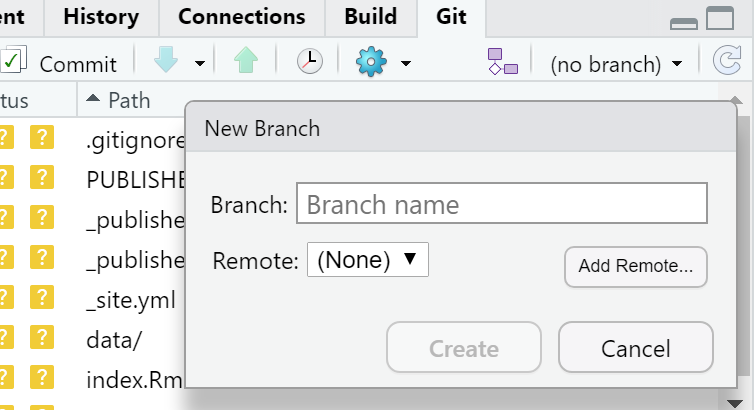

# Online mapping

## Learning objectives

By the end of this practical you should be able to:

1. Create
2. 
3. 

## Introduction 

In this practical we are going to explore several ways of publishing your R code and outputs (including interactive plots) online.

## RPubs

One of the most straight forward publishing tools is RPubs. It takes an ```.Rmd``` and directly uploads it to rpubs.com --- all files are publically available on this website.

1. To start with you need to make a free account. Go to: https://rpubs.com/users/new and register

2. Create a new project in RStudio and open a new R Markdown file (File > New File > R Markdown)

3. You'll see that the file is automatically populated with some information, have a read through it then click the Knit icon (if you remember we covered this in [Knitting your output])...

```{r echo=FALSE, out.width = "800pt", fig.align='center', cache=TRUE}
knitr::include_graphics('prac8_images/knitt.png') 
```

4. Let's make some changes to your ```.Rmd```. Delete all the text and code except from header inforamtion (that is enclosed by three dashes at the top of the file)

5. Insert a new code chunk (go back to [RMarkdown] if you need a refresher) and add some code of your choice from either a previous practical or your own work. As it's a new project you'll have to either copy the data into your project folder or set the working directory ```setwd()```. If it's all online data that you've loaded directly from the web into R, this shouldn't be an issue. I'm going to use the interactive map we made in practical 5 (the [Advanced interactive map] section)..I have copied the.....Here is the code i've put in my chunk:

```{r, warnings=FALSE, message=FALSE, cache=TRUE, eval=FALSE}

library(sf)
library(tmap)
library(leafpop)
library(leaflet)
library(tmaptools)
library(tidyverse)
library(plyr)

OSM <- read_shape("data/gis_osm_pois_a_free_1.shp",as.sf = TRUE)

Londonborough <- read_shape("data/London_Borough_Excluding_MHW.shp",as.sf = TRUE)

Airbnb <- read_csv("data/listings.csv")
  
# plot xy data
Airbnb <- st_as_sf(Airbnb, coords = c("longitude", "latitude"), 
                   crs = 4326)

# reproject
OSM <- st_transform(OSM, 27700)
Airbnb <- st_transform(Airbnb, 27700)
# we don't need to reproject Londonborough, but it 
# doesn't have a CRS..you could also use set_crs
# it needs to have one for the next step
Londonborough<- st_transform(Londonborough, 27700)

#select hotels only
OSM <- OSM[OSM$fclass == 'hotel',]
Airbnb <- Airbnb[Airbnb$room_type == 'Entire home/apt' &
                   Airbnb$availability_365=='365',]

# make a function for the join
# functions are covered in practical 7
# but see if you can work out what is going on
# hint all you have to do is replace data1 and data2
# with the data you want to use

Joinfun <- function(data1, data2) {
  # join OSM and London boroughs
  joined <- st_join(data1, data2, join = st_within)
  
  # count the number of hotels per borough
  countno <- as.data.frame(count(joined$GSS_CODE))
  
  # join the count back to the borough layer
  counted <-left_join(data2, countno, by=c("GSS_CODE"="x"))
  
  return(counted)
}

# use the function for hotels
Hotels <- Joinfun(OSM, Londonborough)

# then for airbnb
Airbnb <- Joinfun(Airbnb, Londonborough)

# now try to arrange the plots with tmap
breaks = c(0, 5, 12, 26, 57, 286) 

#change the column name from freq for the legend
colnames(Hotels)[colnames(Hotels)=="freq"] <- "Accom count"


#join data
ti<-st_join(Airbnb, Hotels)
ti<-st_transform(ti,crs = 4326)

#remove the geometry for our pop up boxes to avoid
#the geometry field 
ti2<-ti
st_geometry(ti2)<-NULL
popairbnb=popupTable(ti2, zcol=c("NAME.x", "GSS_CODE.x", "freq"))
pophotels=popupTable(ti2, zcol=c("NAME.x", "GSS_CODE.x", "Accom count"))

tmap_mode("view")

# set the colour palettes using our previously defined breaks
pal <- colorBin(palette = "YlOrRd", domain=ti2$freq, bins=breaks)
pal2 <- colorBin(palette = "YlOrRd", domain=ti2$`Accom count`, bins=breaks)

map<- leaflet(ti) %>%
  
  # add basemap options
  addTiles(group = "OSM (default)") %>%
  addProviderTiles(providers$Stamen.Toner, group = "Toner") %>%
  addProviderTiles(providers$Stamen.TonerLite, group = "Toner Lite") %>%
  addProviderTiles(providers$CartoDB.Positron, group = "CartoDB")%>%
  
  #add our polygons, linking to the tables we just made
  addPolygons(color="white", 
              weight = 2,
              opacity = 1,
              dashArray = "3",
              popup = popairbnb,
              fillOpacity = 0.7,
              fillColor = ~pal(freq),
              group = "Airbnb")%>%
  
  addPolygons(fillColor = ~pal(`Accom count`), 
              weight = 2,
              opacity = 1,
              color = "white",
              dashArray = "3",
              popup = pophotels,
              fillOpacity = 0.7,group = "Hotels")%>%
  # add a legend
  addLegend(pal = pal2, values = ~`Accom count`, group = c("Airbnb","Hotel"), 
            position ="bottomleft") %>%
  # specify layers control
  addLayersControl(
    baseGroups = c("OSM (default)", "Toner", "Toner Lite", "CartoDB"),
    overlayGroups = c("Airbnb", "Hotels"),
    options = layersControlOptions(collapsed = FALSE)
  )

# plot the map
map
```

6. Add some text at the start of your ```.Rmd``` you can include titles and subtitle using # followed by a space, a second level subtitle would be ##, and third ###

7. Save the file, Knitt it to HTML, this should be default and specified in the header --- enclosed by three dashes.

8. Once knitted you can easily publish the file to Ppubs using the Publish icon either in the viewer pane or the toolbar area (by run)

```{r echo=FALSE, out.width = "200pt", fig.align='center', cache=TRUE}
knitr::include_graphics('prac8_images/publish.png') 
```

Now how about adding a few design features...i've changed my header section to...

```{r eval=FALSE}
---
title: "publishexample"
output:
  html_document:
    theme: yeti
    smart: true
    highlight: textmate
    toc: true
    number_sections: true
    toc_float:
      collapsed: false
      smooth_scroll: true
---
```

9. Knit and then publish again...you'll notice a few aesthetic changes

10. To learn more about these go explore:

* https://bookdown.org/yihui/rmarkdown/html-document.html
* http://www.datadreaming.org/post/r-markdown-theme-gallery/
* https://cran.r-project.org/web/packages/prettydoc/vignettes/architect.html

And for more code chunk control..

* https://bookdown.org/yihui/rmarkdown/r-code.html
* https://rmarkdown.rstudio.com/lesson-3.html

## RMarkdown site generator 

### Set the file structure

RPubs are useful but what if you wanted to make a full site with different tabs for introduction, methodology, results and recommedations...one way is to use the RMarkdown site generator hosted on GitHub

RMarkdown site generator is useful as it does not require any third-party add ons like blogdown which is reliant on the hugo site generator

To make a site you'll need the following to be within your project:

(a) A configuration file with the filename ```_site.yml```

(b) A ```index.Rmd```

(c) Any other ```.Rmd``` files you want to create into pages on the site

For the site to work you only require (a) and (b)....but that would be a pretty boring site...

11. In your new project add two new RMarkdown files called:
* ```_site.yml``` 
* ```index.Rmd``` 


```{r echo=FALSE, out.width = "500pt", fig.align='center', cache=TRUE}
knitr::include_graphics('prac8_images/rsitegenerator.png') 
```

12. In the ```_site.yml``` remove all code and add the following

```{r eval=FALSE, message=FALSE, warning=FALSE, cache=TRUE}
name: "Hello world"
output_dir: "."
navbar:
  title: "My example website"
  left:
    - text: "Home"
      href: index.html
    - text: "About"
      href: publishexample.html
```

### Link to GitHub

There are two ways to do this....

#### GitHub first

This is the 'easy' way as you woould repeat the steps in [Practical 4][Git, GitHub and RMarkdown] by firstly making a new repository on GitHub then loading a new project in RStudio, linking that to GitHub and copying all your files into your new project from the exisiting one. 

#### GitHub last

So if you already have a RStudio project...like we do...we can link this to GitHub but the steps are a bit more invovled and there are several ways to acheive it --- as with most things in R.

13. Make a Git repo in RStudio. Go to Tools > Project Options > Git/SVN and select Git under Version control system and initialize a new repository, then restart RStudio. The Git tab should appear..

14. Next we need to make a new repository on GitHub. Go to GitHub, login and make a new repository. Make sure that it is **empty** with no README.. you should have something similar to this appear:

```{r echo=FALSE, out.width = "800pt", fig.align='center', cache=TRUE}
knitr::include_graphics('prac8_images/gitnewrepo.png') 
```

15. Clone the repository by copying the HTTPS 

```{r echo=FALSE, out.width = "700pt", fig.align='center', cache=TRUE}
knitr::include_graphics('prac8_images/HTTPS.png') 
```

16. Make one local commit. Under the Git tab > Diff > Stage the files > Add a commit message and click commit

17. Now we need to connect our local repository to the GitHub one. So Under the Git tab you'll the new brach button (two purple boxes linked to a white box)...

```{r echo=FALSE, out.width = "400pt", fig.align='center', cache=TRUE}
 
```

18. Click it > Add Remote. Paste in the URL use the remote name origin and the branch name of master --- which you can get from the GitHub Quick setup screen after creating your repo. Check sync the branch with the remote > click create then select overwrite

```{r echo=FALSE, out.width = "400pt", fig.align='center', cache=TRUE}
knitr::include_graphics('prac8_images/addremote2.png') 
```

19. Push the files to your GitHub and they will appear on your GitHub repo

20. Next we need to actually build the site...there are a few ways to do this...Next to the Git tab you should see the Build tab, if you can't then go to Tools > Project Options > Build Tools and select website under Project build tools. Now click Build Website under the build tab

21. Alternatively you write the following in the console 

```{r eval=FALSE, message=FALSE, warning=FALSE, cache=TRUE}
rmarkdown::render_site()
```

If you wanted to just build a page from your site --- say if you have made a rather big site with lots of analysis use:

```{r eval=FALSE, message=FALSE, warning=FALSE, cache=TRUE}
rmarkdown::render_site("index.Rmd")
```

22. Stage, commit and then push the files to your GitHub. I had some issues staging the site_libs folder in the Git tab. I fixed it by closing and reloading my R project then clicking the cog symbol (under Git tab) > Shell and typing ```git add .``` If you get an error message about the index file being locked... go and delete in and try again. If you can't delete restart the machine and try again. You will find in under the .git folder within your project. Once ```git add .``` runs you should see all the files staged, be able to commit and then push the changes to GitHub   

Help:

* https://stackoverflow.com/questions/5834014/lf-will-be-replaced-by-crlf-in-git-what-is-that-and-is-it-important
* https://stackoverflow.com/questions/9282632/git-index-lock-file-exists-when-i-try-to-commit-but-cannot-delete-the-file

23. So your built website is up on GitHub, but you need to tell it where to build the site from...Go to your GitHub repo > Settings, scroll down to GitHub pages and select the Source as the master branch

```{r echo=FALSE, out.width = "800pt", fig.align='center', cache=TRUE}
knitr::include_graphics('prac8_images/GitHubpages.png') 
```

24. Click on the link that is provided where your site is published and you should have a website with two tabs. Here is what mine looks like:

```{r echo=FALSE, out.width = "800pt", fig.align='center', cache=TRUE}
knitr::include_graphics('prac8_images/Markdownsite.png') 
```

For more information on hosting your code from RStudio on GitHub check out: https://happygitwithr.com/usage-intro.html 


## Shiny


## Extra

Bookdown

Blogdown


