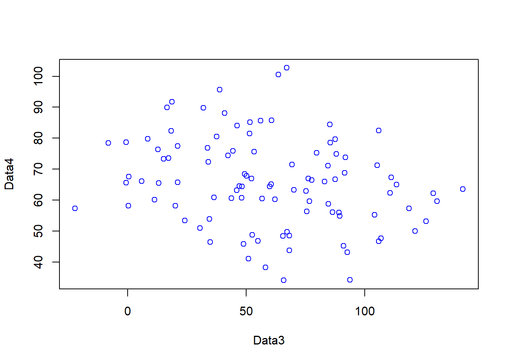

# Introduction to R

## Learning outcomes

By the end of this practical you should be able to:

* Execute basic processing in R
* Examine, clean and manipulate comma seperate value (```.csv```) data
* Examine, clean and manipulate and plot spatial (```.shp```) data 
* Produce interactive maps
* Evaluate the benefits of different data manipulation and mapping techniques

## Introduction 

This practical is **LONG** but it will take you from not knowing much about R to making freaking cool interactive maps in one practical. As you can imagine, this will be a steep learning curve.

I will give you all the code you need, it’s your job to read through the text very carefully and try to understand what bits of code are doing as you go.

There will be bits of code you don’t fully understand. Don’t worry, the key is to revisit later and try to work out what is going on then. Learning R is a long and iterative process and this is just the start…

If you want to learn more about R and indeed download the latest version for your own use, then visit the R project pages: http://www.r-project.org/

The Wikipedia page for those who want to know a little of the history of R can be found here: http://en.wikipedia.org/wiki/R_(programming_language)

There is an almost endless supply of good R tutorials on the web. If you get stuck or want to learn even more R (and why would you not want to?!), I’d recommend trying some of the following R Tutorial websites:

* http://www.statmethods.net/index.html

* http://www.r-tutor.com/

* http://www.cyclismo.org/tutorial/R/index.html

* http://www.cookbook-r.com/

If you want to really be up to date with the state of the art in R, then https://bookdown.org/ is a fantastic resource. It features free books by some of the pre-eminent names in the R scene - I would urge you to go and take a look.

### Online forums are your friend!!

With almost every problem you encounter with R, someone else will have had the same problem before you and posted it on a forum – someone will then post a solution below.

My usual route is to Google the problem and I’ll then be directed to a post, usually on Stack Overflow, Stack Exchange or Cross Validated. When doing so try to think about the minimal working (or not working) example (MWE), by this i mean remove anything very specific to your problem. I’ve rarely not found a solution to a problem this way. 

<div class="warning">
<h3 id="health-warning">Health warning</h3>
<p>Beware of posting questions on these forums yourself – contributors to these forums (especially the R ones!), whilst almost always extremely knowledgeable about R, have a bit of a reputation for being insert familiar pejorative term for less-than-polite-human-being here! As you might expect, people who have enough time to become total experts in R, have little time to work on their social skills!! Fortunately though, some other poor chump has usually taken that hit for you and you can still find a useful answer to your problem.</p>
</div>

If you are specifically more interested in the spatial side of R, then Alex Singleton and Chris Brunsdon at the Universities of Liverpool and Maynooth also have a number of very useful R Spatial Tutorials – http://rpubs.com/alexsingleton/ & http://rpubs.com/chrisbrunsdon/

Robin Lovelace in Leeds is also frequently at the bleeding edge of developments in R spatial stuff, so keep an eye on his website too: http://robinlovelace.net/. Robin is also in the process of completing a book on GeoComputation in R, which you should definitely read! - https://geocompr.robinlovelace.net/

These websites are also very very good: https://pakillo.github.io/R-GIS-tutorial/ and http://www.maths.lancs.ac.uk/~rowlings/Teaching/UseR2012/cheatsheet.html

### R and RStudio

When you download and install R, you get the R Graphical User Interface (GUI) as standard (below). This is fine and some purists prefer using the clean, unfussy command-line original, but it has some limitations such as no graphical way to view data tables or keep track of what is in your working directory (there are a number of others too).


Fortunately there are a number of software environments that have been developed for R to make it a little more user-friendly; the best of these by a long way is RStudio. RStudio can be downloaded for free from https://www.rstudio.com/. We covered the RStudio layout last week.

### Getting started

If you are some kind of masochist, you are welcome to use the bundled R GUI for all of your work. If pain is not your thing, then for this practical (and future practicals) I will assume that you are using RStudio.

1. From the start menu on your computer, find and run R Studio

Once RStudio has opened, the first thing we will do is create a new project – projects enable you to organise your work effectively and store all of the files you create and work with for a particular task. 

2. To create a new project (and this will vary a little depending on the version of RStudio you are using), either select File > New Project… or Project > Create Project


3. Select Start a project in a brand new working directory and create a new project in a directory of a new ‘wk2’ directory on your N: drive:


My file directory (the second box here) will be different to yours as this is my teaching resources folder. Keep yours simple N:/GIS/wk2.

Setting up a project is extremely useful as it lets you easily access your data and files...for example....the flytipping ```.csv``` we used last week is stored at the file path


```r
mycsv <- read_csv("C:/Teaching/CASA0005repo/Prac1_data/fly_tipping_borough_edit.csv")  
```

However as i've set my R project up in the CASA0005repo folder i can just use:


```r
mycsv <- read_csv("Prac1_data/fly_tipping_borough_edit.csv")  
```

I had the ```.csv``` file in the same folder as my project i could just use


```r
mycsv <- read_csv("fly_tipping_borough_edit.csv")  
```

RStudio should now open with three windows –-- the main R console on the left, with windows for your environment and files on the right.

### Basics 

1. R has a very steep learning curve, but hopefully it won’t take long to get your head around the basics. For example, at its most simple R can be used as a calculator. In the console window (bottom left), just type the following and press enter:


```r
1+5
```

```
## [1] 6
```

or 


```r
4*5^2
```

```
## [1] 100
```

As you can see R performs these calculations instantly and prints the results in the console. This is useful for quick calculations but less useful for writing scripts requiring multiple operations or saving these for future use.

2. To save your scripts, you should create a new R Script file. Do this now: Select File > New File > R Script.

3. The R Script should open up on the top-left of your GUI. **From now on type everything in this R script file and save it**

### Scripts and some basic commands

4. Usually one of the first things to do when starting a new R Script is to check that you are in the correct working directory. This is important especially if you are working on multiple projects in different locations. To do this type the following into your new empty R Script:


```r
getwd()
```

```
## [1] "C:/Users/ucfnmac/OneDrive - University College London/Teaching/CASA0005repo"
```

5. To run this line, hold Ctrl (Cmd on a Mac) and press the Return(↲) key (if you are in the standard R installation, you would run your script with Ctrl R). You should now see your current working directory appear in the console.

6. Because of the new project we have already set up, this working directory should be correct, but if for any reason we wanted to change the working directory, we would use the setwd() function. For example, we wanted to change our directory to the documents folder on the C drive, we could run (don’t do this now):


```r
setwd("C:/Documents")
```

7. When we are sure we are working in the correct working directory, we can save our script by clicking on the save icon on the script tab. Save your script as something like “wk2_part1” and you will see it appear in your files window on the right hand side. As you build up a document of R code, you should get into the habit of saving your script periodically in case of an unexpected software crash.

8. We can now begin to write a script without the need to run each line every time we press enter. In the script editor type:


```r
A <- 1
B <- 2
C <- A+B
C
```

```
## [1] 3
```

9. Select (highlight) the three lines and run all three lines with Ctrl Return(↲). You will notice the lines appear in the console (the other window). If you type C and press enter in the console (C and then ctrl return in the script window) you should have the number 3 appear. From now on I recommend you type all the commands below in the script first and then run them. Copying and pasting from this document won’t necessarily work.

10. You will also notice that in RStudio, values A, B and C will appear in your workspace window (top right). These variables are stored in memory for future use. Try giving A and B different values and see what happens. What about if you use lower case letters?

11. You have just demonstrated one of the powerful aspects of R, which is that it is an **object oriented** programming language. A, B and C are all objects that have been assigned a value with the <- symbol (you can also use the = sign, but it operates slightly differently to <- in R, plus the arrow assignment has become standard over the years. Use **alt -** to type it automatically). This principle underlies the whole language and enables users to create ever more complex objects as they progress through their analysis. If you type:


```r
ls()
```

```
## [1] "A" "B" "C"
```
R will produce a list of objects that are currently active.


```r
rm(A)
```

will remove the object A from the workspace (do ls() again to check this or look in your workspace window).

### Functions

12. Both rm() and ls() are known as functions. Functions are the other fundamental aspect to the R language. Functions can be thought of as single or multiple calculations that you apply to objects. They generally take the form of:


```r
function(object, parameter1, parameter2, parameter3...)
```

13. You can write your own functions to carry out tasks (and we’ll come onto that in subsequent practical sessions), but normally you will just used one of the virtually infinite number of functions that other people have already written for us.

### Basic plotting

For example, one common function is the ```plot()``` function for displaying data as a graphical output. Add these lines to your script and run them as before and you can see some ```plot()``` outputs:

```r
#create some datasets, first a vector of 1-100 and 101-200
Data1 <- c(1:100)
Data2 <- c(101:200)
#Plot the data
plot(Data1, Data2, col="red")
```


```r
#just for fun, create some more, this time some normally distributed
#vectors of 100 numbers
Data3 <- rnorm(100, mean = 53, sd=34)
Data4 <- rnorm(100, mean = 64, sd=14)
#plot
plot(Data3, Data4, col="blue")
```



14. In the code above, you will have noticed the # symbol. This signifies that whatever comes after it on that line is a comment. Comments are ignored by the R console and they allow you to annotate your code so that you know what it is doing. It is good programming practice to comment your code extensively so that you can keep track of what your scripts are for.

### Help

15. The previous lines of code also demonstrated a number of functions: c() concatenates a string of numbers together into a vector. 1:100 means produce the integers between and including 1:100, the plot() function plots the two data objects and includes a parameter to change the colour of the points. To understand what a function does, you can consult the R Help system. Simply type a question mark and then the function name; for example:


```r
?plot
```


16. In RStudio you will see the help file appear in the Help window in the bottom right of the GUI. Here you can also search for the help files for other functions in the search bar.

### Data types

17. Objects in R can exist as a number of different data types. These include a **matrix**, a **vector**, a **data frame** and a **list**. For the purposes of this practical we will focus on data frames. These are the most flexible data format in R (although tibbles are now becoming popular as well). Data frames can be conceptualised in a similar way to a spreadsheet with data held in rows and columns. They are the most commonly used object type in R and the most straightforward to create from the two vector objects we just created.


```r
df <- data.frame(Data1, Data2)
plot(df, col="green")
```


18. If you have a very large data frame (thousands or millions of rows) it is useful to see only a selection of these. There are several ways of doing this:


```r
#show the first 10 and then last 10 rows of data in df...
head(df)
```

```
##   Data1 Data2
## 1     1   101
## 2     2   102
## 3     3   103
## 4     4   104
## 5     5   105
## 6     6   106
```


```r
tail(df)
```

```
##     Data1 Data2
## 95     95   195
## 96     96   196
## 97     97   197
## 98     98   198
## 99     99   199
## 100   100   200
```
You can also view elements of your data frame in RStudio by simply clicking on it in the top-right Environment window:


### Elements of a data frame

19. When programming you will frequently want to refer to different elements in a data frame or a vector/list. To select elements of a data frame, or subset it, you can refer specifically to ranges or elements of rows and columns. These are accessed using the single square bracket operator [], with the form:


```r
data.frame[row,column]
```

Rows are always referenced first, before the comma, columns second, after the comma.

20. Try the subsetting your df data frame with the following commands to see what is returned:


```r
df[1:10, 1]
```

```
##  [1]  1  2  3  4  5  6  7  8  9 10
```

```r
df[5:15,]
```

```
##    Data1 Data2
## 5      5   105
## 6      6   106
## 7      7   107
## 8      8   108
## 9      9   109
## 10    10   110
## 11    11   111
## 12    12   112
## 13    13   113
## 14    14   114
## 15    15   115
```

```r
df[c(2,3,6),2]
```

```
## [1] 102 103 106
```

```r
df[,1]
```

```
##   [1]   1   2   3   4   5   6   7   8   9  10  11  12  13  14  15  16  17
##  [18]  18  19  20  21  22  23  24  25  26  27  28  29  30  31  32  33  34
##  [35]  35  36  37  38  39  40  41  42  43  44  45  46  47  48  49  50  51
##  [52]  52  53  54  55  56  57  58  59  60  61  62  63  64  65  66  67  68
##  [69]  69  70  71  72  73  74  75  76  77  78  79  80  81  82  83  84  85
##  [86]  86  87  88  89  90  91  92  93  94  95  96  97  98  99 100
```

21. You will note that the column headings are the names of the original objects creating the data frame. We can change these using the ```colnames()``` function:


```r
colnames(df)<- c("column1", "column2")
```

To select or refer to these columns directly by name, we can either use the ```$``` operator, which takes the form  ```data.frame$columnName```, e.g.


```r
df$column1
```

```
##   [1]   1   2   3   4   5   6   7   8   9  10  11  12  13  14  15  16  17
##  [18]  18  19  20  21  22  23  24  25  26  27  28  29  30  31  32  33  34
##  [35]  35  36  37  38  39  40  41  42  43  44  45  46  47  48  49  50  51
##  [52]  52  53  54  55  56  57  58  59  60  61  62  63  64  65  66  67  68
##  [69]  69  70  71  72  73  74  75  76  77  78  79  80  81  82  83  84  85
##  [86]  86  87  88  89  90  91  92  93  94  95  96  97  98  99 100
```

or we can use the double square bracket operator [[]], and refer to our column by name using quotes e.g.


```r
df[["column1"]]
```

```
##   [1]   1   2   3   4   5   6   7   8   9  10  11  12  13  14  15  16  17
##  [18]  18  19  20  21  22  23  24  25  26  27  28  29  30  31  32  33  34
##  [35]  35  36  37  38  39  40  41  42  43  44  45  46  47  48  49  50  51
##  [52]  52  53  54  55  56  57  58  59  60  61  62  63  64  65  66  67  68
##  [69]  69  70  71  72  73  74  75  76  77  78  79  80  81  82  83  84  85
##  [86]  86  87  88  89  90  91  92  93  94  95  96  97  98  99 100
```

This again is useful if you have a lot of columns and you wish to efficiently extract one of them.

## Reading data into R

One of the most tedious things a spatial analyst / data scientist has to do is clean their data so it doesn’t cause problems for the software later. In the past, we would have needed to do this by hand - these days, we can use software to do much of this for us.

I will now give you two options to arrive at a nice cleaned dataset. If you have issues with software packages etc, you might still need to via the old skool route, however, the new skool route will be much more satisfying if it works!

For this example we are going to use the London Datastore Catalogue.

Go to: https://data.london.gov.uk/dataset/london-datastore-catalogue and download the excel document.

### Old skool cleaning

22. Open the ```LondonData.xls``` file in Excel, and save as ```LondonData.csv``` into your wk2/RProject folder.

23. Open your new ```.csv``` file in Excel. There might be some non-numeric values inside numeric columns which will cause problems in your analysis. These need to be removed before proceeding any further. To remove these, you can use the replace function in Excel. In the home tab under ‘Editing’ open up the find and replace dialogue box and enter the following into the find box:

```#VALUE!``` ```#n/a```

Leave the replace box empty each time and click Replace All to remove these from your file, before saving the file again.

24. Once you have cleaned out all of the trixy characters from the file, to read it into R, we will use the ```read.csv()``` function:


```r
LondonDataOSK<- read.csv("prac2_data/london_catalogue.csv")
```

*Note*, I've made an R project for all these practicals, which is why my file path starts with ```prac2_data/```. If you save the ```.csv``` in the same folder as the ```.Rproj``` then you can just use:


```r
LondonDataOSK<- read.csv("LondonData.csv")
```

If you look at the ```read.csv()``` help file - ```?read.csv``` - you will see that we can actually include many more parameters when reading in a .csv file. For example, we could read in the same file as follows:


```r
# by default in R, the file path should be defined with / but on a #windows file system it is defined with \. Using \\ instead allows R #to read the path correctly – alternatively, just use /
LondonDataOSK<- read.csv("prac2_data/london_catalogue.csv", header = TRUE, sep = ",")
```

This would specify the exact path; that the first row of the file contains header information; and the values in the file are separated with commas (not ; or : as can be the case sometimes).

### New skool cleaning 

To clean our data as we read it in, we are going to use a package (more about packages later - for now, just think about it as a lovely gift from the R gods) called readr which comes bundled as part of the tidyverse package. If you want to find out more about the Tidyverse (and you really should) then you should start here: https://www.tidyverse.org/ - the Tidyverse package contains almost everything you need to become a kick-ass data scientist. ‘Tidy’ as a concept in data science is well worth reading about and you should start here with Hadley Wickham’s paper - http://vita.had.co.nz/papers/tidy-data.pdf

Anyway, first install the package:


```r
install.packages("tidyverse", repos = "https://www.stats.bris.ac.uk/R/")
```

Now we can use the ```readr``` package which comes bundled as part of the tidyverse to read in some data (directly from the web this time - read.csv can do this too) and clean text characters out from the numeric columns before they cause problems:


```r
library(tidyverse)
#wang the data in straight from the web using read_csv, skipping over the 'n/a' entries as you go...
LondonData <- read_csv("https://files.datapress.com/london/dataset/ward-profiles-and-atlas/2015-09-24T14:21:24/ward-profiles-excel-version.csv", na = "n/a")
```

**note the use of read_csv here as opposed to read.csv. They are very similar, but read_csv is just a bit better - read this to understand why… Also, for those python fans out there - IT’S NOT THE SAME FUNCTION AS READ_CSV IN PYTHON**


### Examining your new data

25. Your new data has been read in as a data frame / tibble (a tibble is just a data frame with a few extra bells and whistles). If you ever need to check what data type your new data set is, we can use the ```class()``` function:


```r
class(LondonData)
```

```
## [1] "spec_tbl_df" "tbl_df"      "tbl"         "data.frame"
```


```r
# or, if you have your old skool data from step 24 above
class(LondonDataOSK)
```


We can also use the ```class``` function within another two functions (cbind() and lapply()) to check that our data has been read in correctly and that, for example, numeric data haven’t been read in as text or other variables. Run the following line of code:


```r
datatypelist <- data.frame(cbind(lapply(LondonData,class)))
```

You should see that all columns that should be numbers are read in as numeric. Try reading in LondonData again, but this time without excluding the ‘n/a’ values in the file, e.g.


```r
LondonData <- read_csv("https://files.datapress.com/london/dataset/ward-profiles-and-atlas/2015-09-24T14:21:24/ward-profiles-excel-version.csv")
```

Now run the datatypelist function again - you should see that some of the columns (those the n/a values in) have been read in as something other than numeric. This is why we need to exclude them. Isn’t ```readr``` great for helping us avoid reading in our numeric data as text!

```r
LondonData <- edit(LondonData)
```

27. It is also possible to quickly and easily summarise the data or look at the column headers using


```r
summary(df)
```

```
##     column1          column2     
##  Min.   :  1.00   Min.   :101.0  
##  1st Qu.: 25.75   1st Qu.:125.8  
##  Median : 50.50   Median :150.5  
##  Mean   : 50.50   Mean   :150.5  
##  3rd Qu.: 75.25   3rd Qu.:175.2  
##  Max.   :100.00   Max.   :200.0
```


```r
names(LondonData)
```

```
##  [1] "Ward name"                                                                  
##  [2] "Old code"                                                                   
##  [3] "New code"                                                                   
##  [4] "Population - 2015"                                                          
##  [5] "Children aged 0-15 - 2015"                                                  
##  [6] "Working-age (16-64) - 2015"                                                 
##  [7] "Older people aged 65+ - 2015"                                               
##  [8] "% All Children aged 0-15 - 2015"                                            
##  [9] "% All Working-age (16-64) - 2015"                                           
## [10] "% All Older people aged 65+ - 2015"                                         
## [11] "Mean Age - 2013"                                                            
## [12] "Median Age - 2013"                                                          
## [13] "Area - Square Kilometres"                                                   
## [14] "Population density (persons per sq km) - 2013"                              
## [15] "% BAME - 2011"                                                              
## [16] "% Not Born in UK - 2011"                                                    
## [17] "% English is First Language of no one in household - 2011"                  
## [18] "General Fertility Rate - 2013"                                              
## [19] "Male life expectancy -2009-13"                                              
## [20] "Female life expectancy -2009-13"                                            
## [21] "% children in reception year who are obese - 2011/12 to 2013/14"            
## [22] "% children in year 6 who are obese- 2011/12 to 2013/14"                     
## [23] "Rate of All Ambulance Incidents per 1,000 population - 2014"                
## [24] "Rates of ambulance call outs for alcohol related illness - 2014"            
## [25] "Number Killed or Seriously Injured on the roads - 2014"                     
## [26] "In employment (16-64) - 2011"                                               
## [27] "Employment rate (16-64) - 2011"                                             
## [28] "Number of jobs in area - 2013"                                              
## [29] "Employment per head of resident WA population - 2013"                       
## [30] "Rate of new registrations of migrant workers - 2011/12"                     
## [31] "Median House Price (<U+00A3>) - 2014"                                       
## [32] "Number of properties sold - 2014"                                           
## [33] "Median Household income estimate (2012/13)"                                 
## [34] "Number of Household spaces - 2011"                                          
## [35] "% detached houses - 2011"                                                   
## [36] "% semi-detached houses - 2011"                                              
## [37] "% terraced houses - 2011"                                                   
## [38] "% Flat, maisonette or apartment - 2011"                                     
## [39] "% Households Owned - 2011"                                                  
## [40] "% Households Social Rented - 2011"                                          
## [41] "% Households Private Rented - 2011"                                         
## [42] "% dwellings in council tax bands A or B - 2015"                             
## [43] "% dwellings in council tax bands C, D or E - 2015"                          
## [44] "% dwellings in council tax bands F, G or H - 2015"                          
## [45] "Claimant rate of key out-of-work benefits (working age client group) (2014)"
## [46] "Claimant Rate of Housing Benefit (2015)"                                    
## [47] "Claimant Rate of Employment Support Allowance - 2014"                       
## [48] "Rate of JobSeekers Allowance (JSA) Claimants - 2015"                        
## [49] "% dependent children (0-18) in out-of-work households - 2014"               
## [50] "% of households with no adults in employment with dependent children - 2011"
## [51] "% of lone parents not in employment - 2011"                                 
## [52] "(ID2010) - Rank of average score (within London) - 2010"                    
## [53] "(ID2010) % of LSOAs in worst 50% nationally - 2010"                         
## [54] "Average GCSE capped point scores - 2014"                                    
## [55] "Unauthorised Absence in All Schools (%) - 2013"                             
## [56] "% with no qualifications - 2011"                                            
## [57] "% with Level 4 qualifications and above - 2011"                             
## [58] "A-Level Average Point Score Per Student - 2013/14"                          
## [59] "A-Level Average Point Score Per Entry; 2013/14"                             
## [60] "Crime rate - 2014/15"                                                       
## [61] "Violence against the person rate - 2014/15"                                 
## [62] "Deliberate Fires per 1,000 population - 2014"                               
## [63] "% area that is open space - 2014"                                           
## [64] "Cars per household - 2011"                                                  
## [65] "Average Public Transport Accessibility score - 2014"                        
## [66] "% travel by bicycle to work - 2011"                                         
## [67] "Turnout at Mayoral election - 2012"
```

### Data manipulation in R

Now we have some data read into R, we need to select a small subset to work on. The first thing we will do is select just the London Boroughs to work with. If you recall, the Borough data is at the bottom of the file.

#### Selecting rows


29. Your borough data will probably be found between rows 626 and 658. Therefore we will first create a subset by selecting these rows into a new data frame and then reducing that data frame to just four columns. There are a few ways of doing this:

We could select just the rows we need by explicitly specifying the range of rows we need:


```r
LondonBoroughs<-LondonData[626:658,]
```

There is also a ```subset()``` function in R. You could look that up and see whether you could create a subset with that. Or, we could try a cool ‘data sciency’ way of pulling out the rows we want with the knowledge that the codes for London Boroughs start with E09 (the wards in the rest of the file start with E05).

Knowing this, we can use the ```grep()``` function which can use regular expressions to match patterns in text. Let’s try it!


```r
LondonData <- data.frame(LondonData)
LondonBoroughs <- LondonData[grep("^E09",LondonData[,3]),]
```

Check it worked:


```r
head(LondonBoroughs)
```


**AWWMAHGAWD!!!** Pretty cool hey?

What that function is saying is *“grep (get) me all of the rows from the London Data data frame where the text in column 3 starts with (^) E09”*

You will notice that you will have two rows at the top for the City of London. This is because it features twice in the data set. That’s fine, we can just drop this row from our dataset:


```r
LondonBoroughs <- LondonBoroughs[2:34,]
```

#### Selecting columns


```r
LondonBoroughs<-LondonBoroughs[,c(1,19,20,21)]
```

30. You will have noticed the use of square brackets above – these are very useful in R. Refer back to points 19-21 above if you can’t remember how they work. The c() function is also used here – this is the ‘combine’ function - another very useful function in R which allows arguments (in this case, column reference numbers) into a single value

#### Renaming columns

31. You will notice that the column names are slightly misleading as we are now working with boroughs rather than wards. We can rename the columns to something more appropriate using the ```names()``` function (there are various other functions for renaming columns - for example ```colnames()``` if you want to rename multiple columns:


```r
#rename the column 1 in LondonBoroughs
names(LondonBoroughs)[1] <- c("Borough Name")
```

### Plotting


```r
plot(LondonBoroughs$Male.life.expectancy..2009.13, LondonBoroughs$X..children.in.reception.year.who.are.obese...2011.12.to.2013.14)
```


### Pimp my graph!

Now, of course, because this is R, we can pimp this graph using something a bit more fancy than the base graphics functions:


```r
install.packages("plotly", repos = "https://www.stats.bris.ac.uk/R/")
```


```r
library(plotly)
plot_ly(LondonBoroughs, x = ~Male.life.expectancy..2009.13, y = ~X..children.in.reception.year.who.are.obese...2011.12.to.2013.14, text = ~LondonBoroughs$`Borough Name`, type = "scatter", mode = "markers")
```

<!--html_preserve--><div id="htmlwidget-4e207a3b14772e35af2e" style="width:672px;height:480px;" class="plotly html-widget"></div>
<script type="application/json" data-for="htmlwidget-4e207a3b14772e35af2e">{"x":{"visdat":{"120430f42f4e":["function () ","plotlyVisDat"]},"cur_data":"120430f42f4e","attrs":{"120430f42f4e":{"x":{},"y":{},"text":{},"mode":"markers","alpha_stroke":1,"sizes":[10,100],"spans":[1,20],"type":"scatter"}},"layout":{"margin":{"b":40,"l":60,"t":25,"r":10},"xaxis":{"domain":[0,1],"automargin":true,"title":"Male.life.expectancy..2009.13"},"yaxis":{"domain":[0,1],"automargin":true,"title":"X..children.in.reception.year.who.are.obese...2011.12.to.2013.14","type":"category","categoryorder":"array","categoryarray":["10.2","10.3","10.6","11.0","11.1","11.2","11.5","11.6","12.2","12.5","12.7","12.8","13.2","13.3","13.6","5.7","6.0","7.8","8.1","9.0","9.2","9.5","9.6","9.8"]},"hovermode":"closest","showlegend":false},"source":"A","config":{"showSendToCloud":false},"data":[{"x":[84.3,77.7,81.9,80.3,80,81.3,81.1,80,79.9,80.6,78.7,78.2,79.1,80.1,82.4,79.8,80.4,79.7,78.2,82.6,81.3,78.4,78.7,80.3,78.5,80.7,81.9,78.6,80.8,77.5,79.7,79.2,81.7],"y":["11.1","13.6","9.5","11.6","12.2","7.8","9.8","11.1","11.2","12.7","13.2","13.3","10.2","11.1","9.6","10.3","9.6","11.2","10.6","9.2","6.0","11.5","11.0","9.0","12.5","10.6","5.7","12.8","8.1","12.7","10.6","9.2","11.1"],"text":["City of London","Barking and Dagenham","Barnet","Bexley","Brent","Bromley","Camden","Croydon","Ealing","Enfield","Greenwich","Hackney","Hammersmith and Fulham","Haringey","Harrow","Havering","Hillingdon","Hounslow","Islington","Kensington and Chelsea","Kingston upon Thames","Lambeth","Lewisham","Merton","Newham","Redbridge","Richmond upon Thames","Southwark","Sutton","Tower Hamlets","Waltham Forest","Wandsworth","Westminster"],"mode":"markers","type":"scatter","marker":{"color":"rgba(31,119,180,1)","line":{"color":"rgba(31,119,180,1)"}},"error_y":{"color":"rgba(31,119,180,1)"},"error_x":{"color":"rgba(31,119,180,1)"},"line":{"color":"rgba(31,119,180,1)"},"xaxis":"x","yaxis":"y","frame":null}],"highlight":{"on":"plotly_click","persistent":false,"dynamic":false,"selectize":false,"opacityDim":0.2,"selected":{"opacity":1},"debounce":0},"shinyEvents":["plotly_hover","plotly_click","plotly_selected","plotly_relayout","plotly_brushed","plotly_brushing","plotly_clickannotation","plotly_doubleclick","plotly_deselect","plotly_afterplot"],"base_url":"https://plot.ly"},"evals":[],"jsHooks":[]}</script><!--/html_preserve-->

### Spatial Data in R

This next part of the practical applies the same principles introduced above to the much more complex problem of handling spatial data within R. In this workshop we will produce a gallery of maps using many of the plotting tools available in R. The resulting maps will not be that meaningful- the focus here is on sound visualisation with R and not sound analysis (I know one is useless without the other!). Good quality spatial analysis will come in the rest of the module.

Whilst the instructions are step by step you are encouraged to start deviating from them (trying different colours for example) to get a better understanding of what we are doing.

#### Packages

In this section we’ll require even more specialist packages, so I should probably spend some more time explaining what packages actually are! Packages are bits of code that extend R beyond the basic statistical functionality it was originally designed for. For spatial data, they enable R to process spatial data formats, carry out analysis tasks and create some of the maps that follow.

Bascially, without packages, R would be very limited. With packages, you can do virtually anything! One of the issues you will come across is that packages are being continually developed and updated and unless you keep your version of R updated and your packages updated, there may be some functions and options not available to you. This can be a problem, particularly with University installations which (at best) may only get updated once a year. Therefore, apologies in advance if things don’t work as intended!

1. In R Studio all packages can be installed and activated in the ‘Packages’ tab in the bottom-right hand window:


2. As with everything else in R though, we can also run everything from the command line. The first package we need to install for this part of the practical is ```maptools``` – either find and install it using the RStudio GUI or do the following:


```r
install.packages("maptools")
```

There are a few other packages we’ll need to get to grips with. Some, like ```ggplot2``` (one of the most influential R packages ever) are part of the ```tidyverse``` package we came across earlier. Others we will need to install for the first time.


```r
install.packages(c("OpenStreetMap", "classInt", "tmap"))

install.packages(c("RColorBrewer", "sp", "rgeos", "tmaptools", "sf", "downloader", "rgdal", "geojsonio"))# might also need these ones
```

4. Now that the packages have been installed you will not have to repeat the above steps again (when you use your account in these cluster rooms). Open a new script and save it to your working directory as “wk3_maps.r”. As before, type each of the lines of code into this window and then select and use the ctrl return keys to run them. Be sure to save your script often.

5. The first task is to load the packages we have just installed. note, you might have some issues with the OpenStreetMap package if your installation of java on your computer doesn’t match your installation of R – e.g. if you have installed the 64bit version of R, you also need the 64bit version of java (same with the 32bit versions) - you may also need to install the package Rcpp separately and try again.

Install Java 64-bit from: https://java.com/en/download/manual.jsp


```r
#Load Packages (ignore any error messages about being built under a #different R version):
library(maptools)
library(RColorBrewer)
library(classInt)
library(OpenStreetMap)
library(sp)
library(rgeos)
library(tmap)
library(tmaptools)
library(sf)
library(rgdal)
library(geojsonio)
```

#### Background to spatial data in R

R has a very well developed ecosystem of packages for working with Spatial Data. Early pioneers like Roger Bivand and Edzer Pebesma along with various colleagues were instrumental in writing packages to interface with some powerful open source libraries for working with spatial data, such as GDAL and GEOS. These were accessed via the ```rgdal``` and ```rgeos``` packages. The  ```maptools``` package by Roger Bivand, amongst other things, allowed Shapefiles to be read into R. The ```sp``` package (along with  ```spdep```) by Edzer Pebesma was very important for defining a series of classes and methods for spatial data natively in R which then allowed others to write software to work with these formats. Other packages like ```raster``` advanced the analysis of gridded spatial data, while packages like ```classint``` and ```RColorbrewer``` facilitated the binning of data and colouring of choropleth maps.

Whilst these packages were extremely important for advancing spatial data analysis in R, they were not always the most straightforward to use - making a map in R could take quite a lot of effort and they were static and visually basic. However, more recently new packages have arrived to change this. Now ```leaflet``` enables R to interface with the leaflet javascript library for online, dynamic maps. ```ggplot2``` which was developed by Hadley Wickam and colleagues radically changed the way that people thought about and created graphical objects in R, including maps, and introduced a graphical style which has been the envy of other software to the extent that there are now libraries in Python which copy the ggplot2 style!

Building on all of these, the new ```tmap``` (Thematic Map) package has changed the game completely and now enables us to read, write and manipulate spatial data and produce visually impressive and interactive maps, very easily. In parallel, the ```sf``` (Simple Features) package is helping us re-think the way that spatial data can be stored and manipulated. It’s exciting times for geographic information / spatial data science!

#### Making some choropleth maps

Choropleth maps are thematic maps which colour areas according to some phenomenon. In our case, we are going to fill some irregular polygons (the London Boroughs) with a colour that corresponds to a particular attribute.

As with all plots in R, there are multiple ways we can do this. The basic ```plot()``` function requires no data preparation but additional effort in colour selection/ adding the map key etc. ```qplot()``` and ```ggplot()``` (installed in the ggplot2 package) require some additional steps to format the spatial data but select colours and add keys etc automatically. Here, we are going to make use of the new ```tmap``` package which makes making maps very easy indeed.

6. So one mega cool thing about R is you can read spatial data in straight from the internetz! Try this below for downloading a GeoJson file:


```r
library(geojsonio)
EW <- geojson_read("http://geoportal.statistics.gov.uk/datasets/8edafbe3276d4b56aec60991cbddda50_2.geojson", what = "sp")
```


```r
#pull out london using grep and the regex wildcard for'start of the string' (^) to to look for the bit of the district code that relates to London (E09) from the 'lad15cd' column in the data slot of our spatial polygons dataframe
LondonMap <- EW[grep("^E09",EW@data$lad15cd),]
#plot it using the base plot function
qtm(LondonMap)
```


7. Of course, we can also read in our data from a shapefile stored in a local directory:


```r
#read the shapefile into a simple features object
BoroughMapSF <- read_shape("prac1_data/statistical-gis-boundaries-london/ESRI/London_Borough_Excluding_MHW.shp", as.sf = TRUE)
BoroughMapSP <- LondonMap
#plot it very quickly usking qtm (quick thematic map) to check it has been read in correctly
qtm(BoroughMapSF)
```


```r
qtm(BoroughMapSP)
```


8. And naturally we can convert between simple features objects and spatialPolygonsDataFrames very easily:


```r
library(methods)
#check the class of BoroughMapSF
class(BoroughMapSF)
```

```
## [1] "sf"         "data.frame"
```


```r
#And check the class of BoroughMapSP
class(BoroughMapSP)
```

```
## [1] "SpatialPolygonsDataFrame"
## attr(,"package")
## [1] "sp"
```


```r
#now convert the SP object into an SF object...
newSF <- st_as_sf(BoroughMapSP)
#and try the other way around SF to SP...
newSP <- as(newSF, "Spatial")
#simples!
BoroughMapSP <- as(BoroughMapSF, "Spatial")
```

#### Attribute data

OK, enough messing around, show us the maps!!

9. Hold your horses, before be can create a map, we need to join some attribute data to some boundaries. Doing this an ```SP``` object can be a bit of a pain, but I’ll show you here:


```r
#join the data to the @data slot in the SP data frame
BoroughMapSP@data <- data.frame(BoroughMapSP@data,LondonData[match(BoroughMapSP@data[,"GSS_CODE"],LondonData[,"New.code"]),])
#check it's joined.
#head(BoroughMapSP@data)
```

10. Joining data is a bit more intuitive with SF:


```r
BoroughDataMap <- append_data(BoroughMapSF,LondonData, key.shp = "GSS_CODE", key.data = "New.code", ignore.duplicates = TRUE)
```

```
## Data contains duplicated keys: E09000001
```

```
## Over coverage: 626 out of 659 data records were not appended. Run over_coverage() to get the corresponding data row numbers and key values.
```

An alternative to append_data would be to use a left-join (like in SQL)


```r
BoroughDataMap2 <- BoroughMapSF %>% left_join(LondonData, by = c("GSS_CODE" = "New.code"))
```

```
## Warning: Column `GSS_CODE`/`New.code` joining factor and character vector,
## coercing into character vector
```

However, you would need to remove the duplicate City of London row afterwards

#### Making some maps

If you want to learn a bit more about the sorts of things you can do with tmap, then there are 2 vignettes that you can access here: https://cran.r-project.org/web/packages/tmap/ - I suggest you refer to these to see the various things you can do using tmap. Here’s a quick sample though:

11. We can create a choropleth map very quickly now using ```qtm```


```r
library(tmap)
library(tmaptools)
tmap_mode("plot")
```

```
## tmap mode set to plotting
```


```r
qtm(BoroughDataMap, fill = "Rate.of.JobSeekers.Allowance..JSA..Claimants...2015")
```


You can also add a basemap and some other guff, if you wish…


```r
london_osm <- read_osm(BoroughDataMap, type = "esri", zoom = NULL)
qtm(london_osm) + 
  tm_shape(BoroughDataMap) + 
  tm_polygons("Rate.of.JobSeekers.Allowance..JSA..Claimants...2015", 
        style="jenks",
        palette="YlOrBr",
        midpoint=NA,
        title="Rate per 1,000 people",
        alpha = 0.5) + 
  tm_compass(position = c("left", "bottom"),type = "arrow") + 
  tm_scale_bar(position = c("left", "bottom")) +
  tm_layout(title = "Job seekers' Allowance Claimants", legend.position = c("right", "bottom"))
```


12. how about more than one map, perhaps using different data breaks…


```r
tm_shape(BoroughDataMap) +
    tm_polygons(c("Average.Public.Transport.Accessibility.score...2014", "Violence.against.the.person.rate...2014.15"), 
        style=c("jenks", "pretty"),
        palette=list("YlOrBr", "Purples"),
        auto.palette.mapping=FALSE,
        title=c("Average Public Transport Accessibility", "Violence Against the Person Rate"))
```

```
## Warning: The argument auto.palette.mapping is deprecated. Please use
## midpoint for numeric data and stretch.palette for categorical data to
## control the palette mapping.
```


You will notice that to choose the colour of the maps, I entered some codes. These are the names of colour ramps from the RColourBrewer package which comes bundled with ```tmap```. ```RColorBrewer``` uses colour palettes available from the colorbrewer2 website (http://colorbrewer2.org/) which is in turn based on the work of Cynthia Brewer and colleagues at Penn State University (http://www.personal.psu.edu/cab38/ColorBrewer/ColorBrewer_updates.html). Cynthia brewer has carried out large amount of academic research into determining the best colour palettes for GIS applications and so we will defer to her expertise here.

If you want to look at the range of colour palettes available, as we; as going to the ColorBrewer website, you can use the a little shiny app which comes bundled with ```tmaptools```


```r
#You might need to install the shinyjs paclage for this to work
install.packages("shinyjs")
```


```r
library(shinyjs)
#it's possible to explicitly tell R which package to get the function from with the :: operator...
tmaptools::palette_explorer()
```

13. ```tmap``` will even let you make a FRICKING INTERACTIVE MAP!!! Oh yes, we can do interactive maps…!


```r
tmap_mode("view")
```

```
## tmap mode set to interactive viewing
```


```r
tm_shape(BoroughDataMap) +
    tm_polygons("X..children.in.year.6.who.are.obese..2011.12.to.2013.14",
        style="cont",
        palette="PuRd",
        midpoint=NA,
        title="Truffle Shuffle Intensity")+
    tmap_options(max.categories = 5)
```

```
## Warning: Number of levels of the variable "X..children.in.year.
## 6.who.are.obese..2011.12.to.2013.14" is 31, which is larger
## than max.categories (which is 5), so levels are combined. Set
## tmap_options(max.categories = 31) in the layer function to show all levels.
```

<!--html_preserve--><div id="htmlwidget-7ac3921b492e0cb0eff6" style="width:672px;height:480px;" class="leaflet html-widget"></div>
<script type="application/json" data-for="htmlwidget-7ac3921b492e0cb0eff6">{"x":{"options":{"crs":{"crsClass":"L.CRS.EPSG3857","code":null,"proj4def":null,"projectedBounds":null,"options":{}}},"calls":[{"method":"createMapPane","args":["tmap401",401]},{"method":"addProviderTiles","args":["Esri.WorldGrayCanvas",null,"Esri.WorldGrayCanvas",{"minZoom":0,"maxZoom":18,"tileSize":256,"subdomains":"abc","errorTileUrl":"","tms":false,"noWrap":false,"zoomOffset":0,"zoomReverse":false,"opacity":1,"zIndex":1,"detectRetina":false,"pane":"tilePane"}]},{"method":"addProviderTiles","args":["OpenStreetMap",null,"OpenStreetMap",{"minZoom":0,"maxZoom":18,"tileSize":256,"subdomains":"abc","errorTileUrl":"","tms":false,"noWrap":false,"zoomOffset":0,"zoomReverse":false,"opacity":1,"zIndex":1,"detectRetina":false,"pane":"tilePane"}]},{"method":"addProviderTiles","args":["Esri.WorldTopoMap",null,"Esri.WorldTopoMap",{"minZoom":0,"maxZoom":18,"tileSize":256,"subdomains":"abc","errorTileUrl":"","tms":false,"noWrap":false,"zoomOffset":0,"zoomReverse":false,"opacity":1,"zIndex":1,"detectRetina":false,"pane":"tilePane"}]},{"method":"addPolygons","args":[[[[{"lng":[-0.330679062942453,-0.330594448736231,-0.330506117851447,-0.330409211490547,-0.330292121849854,-0.329913461974029,-0.329633594619526,-0.329428784834638,-0.329320915687227,-0.32921448062474,-0.329116323556239,-0.329112955750983,-0.329171167711951,-0.329191302316349,-0.329302910546211,-0.329362771534731,-0.329554552333886,-0.329578988615119,-0.329594210640675,-0.329690000087309,-0.32971930401878,-0.329718711471269,-0.329713651327465,-0.329643374963557,-0.329628972694324,-0.329550496490717,-0.329484384839356,-0.329546433368672,-0.329431949069611,-0.329410734967829,-0.329359230972181,-0.329208223769787,-0.329197343121297,-0.329212414905641,-0.329192134820813,-0.329041537123449,-0.328900444301524,-0.328869226896171,-0.328882308957264,-0.328865515201647,-0.328870784697311,-0.328876250331204,-0.328959320052221,-0.328979269794097,-0.32890917222982,-0.328780550871525,-0.328542180279971,-0.328525414020483,-0.328346139166793,-0.328201270790769,-0.328010180987364,-0.327944192320453,-0.327906806306604,-0.327796155987095,-0.327480812238024,-0.328177391612961,-0.328483545945542,-0.328666818347212,-0.328898463686148,-0.329205768953539,-0.329345842260152,-0.329970793224286,-0.330327280093988,-0.330533862924574,-0.330367267889462,-0.33021561010705,-0.330102635557406,-0.329936977146583,-0.329752002020655,-0.329563268511803,-0.329472964225531,-0.329311211981746,-0.32903599281449,-0.328765267701086,-0.328353106101917,-0.328046517372798,-0.327947015118701,-0.327759754660002,-0.327275614659091,-0.326841800917161,-0.326479986169664,-0.325766123154619,-0.324837712030583,-0.324453936901546,-0.324158786694634,-0.323752729174304,-0.323535077753691,-0.323184853046418,-0.322861962024969,-0.322576101914298,-0.322259755120477,-0.321953015303272,-0.321529264210917,-0.32121760273532,-0.320948200338684,-0.320744893153151,-0.320259445798069,-0.320079350800144,-0.320178339947985,-0.320165178404721,-0.319957006726642,-0.31979241444019,-0.319546632385725,-0.319408617907466,-0.319187512741341,-0.319060245805666,-0.318285409078044,-0.318304733628236,-0.318410329737405,-0.318436615655055,-0.318446969825202,-0.318522235292426,-0.31852337238927,-0.318419542749335,-0.318294001190546,-0.318118817974032,-0.318016910489543,-0.317923115596539,-0.317915231175136,-0.317905713208309,-0.318029465107428,-0.317949527215988,-0.317747900147394,-0.317505492391694,-0.317485045627023,-0.317397777787359,-0.317284318104262,-0.317109194281602,-0.3169492005989,-0.316694381460069,-0.316426221382479,-0.316224460347548,-0.315991782703493,-0.315667907252343,-0.315222791778681,-0.314783084416963,-0.31434150810249,-0.313886360915843,-0.313377171503826,-0.312960565577066,-0.312674937657553,-0.312510500072791,-0.312155213567629,-0.311542059066485,-0.311089694160892,-0.310483794732682,-0.309642752492622,-0.309097036123597,-0.30869512452438,-0.308457261022494,-0.3083421663597,-0.307993672674678,-0.307964631238997,-0.307842162872033,-0.307892196557142,-0.307388543645442,-0.30752067736144,-0.308302027678128,-0.308326024059262,-0.308517533126862,-0.309276780201311,-0.309318671970185,-0.30924553453977,-0.309282263568901,-0.309293600259757,-0.309317324771948,-0.309300502668038,-0.309302228276986,-0.309330969491414,-0.309498405567617,-0.309558120542993,-0.309654642233834,-0.309751983987877,-0.309842600418388,-0.309886828011141,-0.309911390378362,-0.310347217391966,-0.310288379638443,-0.310307335758563,-0.310412876245831,-0.310442953448385,-0.310540863620846,-0.310654554418297,-0.310566499422692,-0.310580379836133,-0.31063102337578,-0.310665046196991,-0.310729875041336,-0.310950058263868,-0.311127270094772,-0.311787704129857,-0.310868951939854,-0.311409370408473,-0.311458898550014,-0.311500039775057,-0.311364003110355,-0.311693858845731,-0.311823034949269,-0.311768827980164,-0.311735128146981,-0.311845545827003,-0.311740070506209,-0.312872469934202,-0.31315858571666,-0.313188998853247,-0.313348187945717,-0.315981088055032,-0.316518385034007,-0.316599084110819,-0.316617318423316,-0.316816082197374,-0.316811824090104,-0.316809859929387,-0.316805865645406,-0.3168004678383,-0.3167921970285,-0.3167782131933,-0.316759919842074,-0.316716579320449,-0.316663315126711,-0.31660584027678,-0.316545525305567,-0.316489684680624,-0.316425191949172,-0.316357892084114,-0.315848136499842,-0.31545767322794,-0.314980800265146,-0.314134118792774,-0.314273990757054,-0.314682267955657,-0.314819914179913,-0.31492698042713,-0.315146597016739,-0.315242667734117,-0.315732537904758,-0.316343526475821,-0.316755373495174,-0.316997644130274,-0.317113521053839,-0.317294645302214,-0.317720143203741,-0.317602757178946,-0.317444616577164,-0.316645362063417,-0.31421214200698,-0.312977988118302,-0.312586300550522,-0.31252260132382,-0.312211236193412,-0.312147928121774,-0.312022979363941,-0.311988311870284,-0.311890042147796,-0.311473413376172,-0.31072250895466,-0.310482345530325,-0.310217621759281,-0.309950121821887,-0.309793199462406,-0.309694114791293,-0.309653762735921,-0.309406500540935,-0.309350089186867,-0.309254508206194,-0.309075790347283,-0.309022141852778,-0.308896132120986,-0.308788126161102,-0.308713997144674,-0.308694634479028,-0.308725863612325,-0.308840307777763,-0.308984712206058,-0.308990847892894,-0.309017039511068,-0.309005302191349,-0.30901166107769,-0.308999315353971,-0.309066718621193,-0.309095606489391,-0.309091881666777,-0.309081425078809,-0.308837262150901,-0.308717036565087,-0.308510540673125,-0.308464913167227,-0.308444204475979,-0.308442080285968,-0.308498750710764,-0.308512050555994,-0.308508954241139,-0.308501413357128,-0.308470355301589,-0.308473881286065,-0.308451768030626,-0.308402213028354,-0.308372757620218,-0.308308208989452,-0.307780054000316,-0.307690334585447,-0.307672409378702,-0.307618360601582,-0.307561436721148,-0.307499294067056,-0.30743140150614,-0.307232147084086,-0.307141363976338,-0.306873398869076,-0.30671480165769,-0.306688968773388,-0.306703616609531,-0.306694558480325,-0.306636810741732,-0.306590250401086,-0.306536601947642,-0.306402921672018,-0.306117796592538,-0.306030442537622,-0.306036984252126,-0.306102971649756,-0.306214296373771,-0.306283167343169,-0.306357689289821,-0.306537023061954,-0.306742368370931,-0.306890835213168,-0.306971766151638,-0.307496440349958,-0.307773811302735,-0.307997751592681,-0.308580966494188,-0.309261258415069,-0.309633381397238,-0.310014851891452,-0.310389049946085,-0.311104563581248,-0.31182747614261,-0.312369339762119,-0.312888967161968,-0.313419439623414,-0.314469247776836,-0.314225849344002,-0.313969688739487,-0.313754260190492,-0.312823049107446,-0.312246730532308,-0.312016926548203,-0.310916240933442,-0.310678361338675,-0.310417849610391,-0.310131532898397,-0.310118293744919,-0.309983632805944,-0.309783129180801,-0.309635791868001,-0.309375960509573,-0.308105785785404,-0.308088897153789,-0.308530532429216,-0.308567307472876,-0.308111603295437,-0.307740809549815,-0.307471845794467,-0.307328920363959,-0.307295452564593,-0.307261984750331,-0.306957172713836,-0.30695541739886,-0.306955009475844,-0.306430050303369,-0.30642769490129,-0.30641906809729,-0.306263918577837,-0.306247984007261,-0.30613093074362,-0.305942168980325,-0.305867867420814,-0.304231573839014,-0.302177323222703,-0.301780322459147,-0.301762669059202,-0.301531736323793,-0.301834489545178,-0.30207005448547,-0.30161811324113,-0.301180679413168,-0.300902826954274,-0.300648319018045,-0.300406953136925,-0.300094229537143,-0.298885165025124,-0.298216651802489,-0.298297397729479,-0.2983238448837,-0.298066211378931,-0.297700512823804,-0.297645979043149,-0.297493842316755,-0.297314323923836,-0.297159012647424,-0.296651725897099,-0.296238096570917,-0.296146250058768,-0.29596315938934,-0.295946976844793,-0.295827914572412,-0.295465112449743,-0.295366015084922,-0.295435829784545,-0.295422890636806,-0.29494334020158,-0.294732201717308,-0.294771726496751,-0.294784033676017,-0.294789922857459,-0.293437345084245,-0.293409995966261,-0.293402491535561,-0.29339675737221,-0.293389363792689,-0.293334018835458,-0.293303659090695,-0.292894839100248,-0.293021806017712,-0.292968542617284,-0.29069961310558,-0.290639127376767,-0.290052027294835,-0.289988654360527,-0.289895934256937,-0.28957007819976,-0.289509080207016,-0.289413556198076,-0.287444206943362,-0.286618870211166,-0.28620987568767,-0.28563906776573,-0.284957023460922,-0.282753191795921,-0.282692143416873,-0.280458940066516,-0.276824194698806,-0.27680721397732,-0.276439683981125,-0.27583583827061,-0.275390037047309,-0.274183471510656,-0.273550771259497,-0.273003224026786,-0.272161711260711,-0.271377805050018,-0.2711925930786,-0.271114086192095,-0.270962279940735,-0.270634740837606,-0.270308636938588,-0.269383631840529,-0.268943786545812,-0.268681022864016,-0.268410219198756,-0.26801835699106,-0.26772995582939,-0.267339366762212,-0.266721205883754,-0.266260905511528,-0.265812050632977,-0.265299484088571,-0.264599777045322,-0.264256501791291,-0.26299155494255,-0.262778149516518,-0.26221006072796,-0.261857524529646,-0.260926409761163,-0.260424333854589,-0.260014522123729,-0.258785872738251,-0.258115992288731,-0.257152461413012,-0.256814379623581,-0.256403645547382,-0.256343697368768,-0.256279366838715,-0.2564571610503,-0.256335484028079,-0.2563606142886,-0.256208294952602,-0.256180528392034,-0.255682996300469,-0.255269138283692,-0.255138968188399,-0.255030367211948,-0.254507114921867,-0.254090577576609,-0.254034943401868,-0.253814154336307,-0.253738116637043,-0.253610007449281,-0.253556703554317,-0.253512198937161,-0.253473583385406,-0.253451236323361,-0.25344909264798,-0.253456119705922,-0.253399569547878,-0.253321929109266,-0.253256851396984,-0.253110500699725,-0.253024504565483,-0.252935221485619,-0.25284381500434,-0.252726457932758,-0.252609478368862,-0.252099864536895,-0.25198952722555,-0.251785867789072,-0.251670157047472,-0.251615177556386,-0.251474614850555,-0.251411694675382,-0.251299379015378,-0.251254537389131,-0.251214181109201,-0.251093463572339,-0.251037344257457,-0.251026295048623,-0.251039635417234,-0.251036556386914,-0.251065537247352,-0.251084098979242,-0.251247215234766,-0.251586668158523,-0.251722311468348,-0.251841314952197,-0.252106744038427,-0.252236153228078,-0.252394422881482,-0.252541835947486,-0.2526559714957,-0.25291939772675,-0.253103094190733,-0.25320867056218,-0.253327872123482,-0.253445810227581,-0.253619993095751,-0.253738477594081,-0.253933404299816,-0.254085366874738,-0.254153491981507,-0.254220625287931,-0.254227542870509,-0.254237540416011,-0.254247777708497,-0.254204990565846,-0.25412592019123,-0.254103397418771,-0.253994240932313,-0.253991571072159,-0.253875090145712,-0.253696792388592,-0.253527838037778,-0.253381581262789,-0.253291324773186,-0.253208293420343,-0.25308442779265,-0.252987255946099,-0.252801194826322,-0.252528059106671,-0.25242938871973,-0.252360603102199,-0.252334970917231,-0.25229941517725,-0.252261087269687,-0.252279818037015,-0.252333232476467,-0.252430155825085,-0.252494136571394,-0.25259936553143,-0.252705039205771,-0.252801947360027,-0.25287143634102,-0.252909298676547,-0.252922939735276,-0.252950607376719,-0.252958314897932,-0.252954453577437,-0.252783256482977,-0.252422510495978,-0.252022198370316,-0.251804078007236,-0.25170817872891,-0.251442939823369,-0.25124710858133,-0.251233385323438,-0.251174042659727,-0.251123016405534,-0.250925263718952,-0.250825938251912,-0.250743860088231,-0.250674876653494,-0.250583062099155,-0.250551869036971,-0.250565820434128,-0.250579836494294,-0.250533480174837,-0.250475453185333,-0.250386939785299,-0.250277098241517,-0.25014723674564,-0.249886868864434,-0.249845261758262,-0.249780969906069,-0.249642403300716,-0.249613776952554,-0.249594113754634,-0.249574764244175,-0.249597231110043,-0.249617676842133,-0.249684190988463,-0.24977371108344,-0.249851293975714,-0.249858493686847,-0.24983325313651,-0.249820463278844,-0.24975504297319,-0.249714065414596,-0.249601161130306,-0.249543225668518,-0.24954662427565,-0.249603064523414,-0.249599718413168,-0.249533995417062,-0.24938540639761,-0.249060023175354,-0.2489096004266,-0.248235611884462,-0.247475088434151,-0.247425048095279,-0.247170936205386,-0.24713698058671,-0.247151089461582,-0.24717978184646,-0.247193403056371,-0.247211473004733,-0.247228380786376,-0.247240736703342,-0.247246656902357,-0.247257266409389,-0.247428985964215,-0.247508890870651,-0.247557111033408,-0.247555910491292,-0.247538592918023,-0.247510013373676,-0.247507654660617,-0.247460890530538,-0.247394488734486,-0.247363291973903,-0.247338771346424,-0.247295465982988,-0.247292323228658,-0.247283266721809,-0.247257515484138,-0.24720322324055,-0.247103942296247,-0.247032405818,-0.246956455244296,-0.246841869926692,-0.246733651596569,-0.24659867283964,-0.246297114699348,-0.246192355622988,-0.246042532813471,-0.24584799016494,-0.245810799225855,-0.245801462246811,-0.245758469462507,-0.245703869835194,-0.245504910349902,-0.245487398604266,-0.245473173721088,-0.245387036833067,-0.245353718014549,-0.245338331494523,-0.245399898061163,-0.245503986556748,-0.2455328874171,-0.245477410068967,-0.245358281249819,-0.245229782547282,-0.245221676656602,-0.245195937947089,-0.24519215896836,-0.245184436989447,-0.24505051066411,-0.245013173794618,-0.244946683187876,-0.244884710577377,-0.244886516175757,-0.244848560925862,-0.244811603698307,-0.244718330975089,-0.244684764307621,-0.244703458826588,-0.244700136538852,-0.244683029068049,-0.244739634132272,-0.244845066571393,-0.244855270586927,-0.244892318155559,-0.245044612590572,-0.24505563392087,-0.245070733019298,-0.245234301695351,-0.245238646644263,-0.24529416787134,-0.245376118223042,-0.245495735840466,-0.245697948333849,-0.246085272326729,-0.246123867623674,-0.246461467655675,-0.246477616436061,-0.246673078717075,-0.246688134271878,-0.24671906355817,-0.246792835516103,-0.246834413093935,-0.246846491800382,-0.24682403126562,-0.246710466288616,-0.246660170368427,-0.246619443441468,-0.246591682366965,-0.246609287379127,-0.246622025453393,-0.246685435102321,-0.246721099117577,-0.246731025577872,-0.246754314867511,-0.246759840935573,-0.246763958063404,-0.246769449714153,-0.246893117543793,-0.246959130126251,-0.247070121466237,-0.247212863889528,-0.247415684944375,-0.247423046269781,-0.247424826487382,-0.246940108655139,-0.246769716047068,-0.246493737442695,-0.246400028858873,-0.246298078640033,-0.246174833176023,-0.246002906546534,-0.245889904707903,-0.245775343676775,-0.245692375366373,-0.245585087229979,-0.245536049303596,-0.245488310646065,-0.245115556223264,-0.244992200037731,-0.244793028175404,-0.244707859937549,-0.244595216181202,-0.244233013242813,-0.244101256727955,-0.244076937354382,-0.243925042564295,-0.243753345178856,-0.243548158536896,-0.243543883102641,-0.243188531324503,-0.242791518163589,-0.242510054701478,-0.242285480855626,-0.242048736088611,-0.241823082109018,-0.241745826070974,-0.241691728118799,-0.2413453382512,-0.241345211272974,-0.241344601807761,-0.241301618556463,-0.241168635254977,-0.240935250993791,-0.240860157737028,-0.240824105230549,-0.240885255920178,-0.240961748173188,-0.240967976938924,-0.240847892889171,-0.240789925192169,-0.240693205286809,-0.240619849454992,-0.240560905147551,-0.240471828377939,-0.240402553062829,-0.240236250480435,-0.240108298488802,-0.240104943733848,-0.240137387473829,-0.240115944318556,-0.240063634291424,-0.240035193281075,-0.240027391282099,-0.239954605204808,-0.239892461661107,-0.239886051544391,-0.239785604123008,-0.239743695014646,-0.239706923176429,-0.239646054361701,-0.239638539373807,-0.23960032144159,-0.239581935805519,-0.239571410033526,-0.239573846762709,-0.239584697398116,-0.239612290104931,-0.239580392485378,-0.239491037917246,-0.239494913476989,-0.239470794845018,-0.239459503047759,-0.239323739089455,-0.239223921046714,-0.239097351987873,-0.239013759535864,-0.238995874433026,-0.238971045529517,-0.238956189640142,-0.238744627365852,-0.238854976364834,-0.238914224655049,-0.23903596044869,-0.239191064410384,-0.239377654543957,-0.239750958138169,-0.23991281773364,-0.24005962369998,-0.240720106320699,-0.241065051554276,-0.241403294712051,-0.241620254510907,-0.241826514644781,-0.241951248582699,-0.242094308973465,-0.242558524559896,-0.242555455119891,-0.2425533399739,-0.242821620174848,-0.242931527199983,-0.242959804973442,-0.244174765968827,-0.244340095536274,-0.244484067398782,-0.244695326866479,-0.244672458363399,-0.244778726004747,-0.244792778598734,-0.244835826897979,-0.244922781775161,-0.24498482466806,-0.244992391374842,-0.245036297362573,-0.245054295233039,-0.245529015286414,-0.245587740781845,-0.245979822693081,-0.246111738091532,-0.246517976681262,-0.246626205119476,-0.246840235895583,-0.247223134313345,-0.247588581239415,-0.247642709788834,-0.247691539850667,-0.247747825380413,-0.247775421656585,-0.247847338767591,-0.247917363052927,-0.248374288157856,-0.248655474375185,-0.248868512836648,-0.249100804118044,-0.2499415413723,-0.250541464443442,-0.25080842669775,-0.251002175689843,-0.251476046278468,-0.251661790816963,-0.252373100122121,-0.252790198494115,-0.253421622937097,-0.253604594164725,-0.25397145950687,-0.254549232040857,-0.255084193781027,-0.255611188809347,-0.255779524704265,-0.256315343507299,-0.257198880864605,-0.257302010174743,-0.25738773513291,-0.257491618090072,-0.258444369992895,-0.259359320659941,-0.25979342391566,-0.259922410223594,-0.260017678691557,-0.260173061601254,-0.260840597821975,-0.261030041507738,-0.261124862822263,-0.261172256451943,-0.261165705530912,-0.261377563947489,-0.261419404960646,-0.26144076510964,-0.261491769591904,-0.261519050163343,-0.261590640485587,-0.261901358368682,-0.261937119016755,-0.261968945682735,-0.261991502343535,-0.262411198025404,-0.262492592833904,-0.262896746923029,-0.26329907973711,-0.263857357108584,-0.264258354545195,-0.264702435344905,-0.265527618783792,-0.266804666281156,-0.268009925795523,-0.268875113211032,-0.268910254959292,-0.26926103953034,-0.269759431595858,-0.270490772798855,-0.271065464926459,-0.271203676174542,-0.271956121509868,-0.272191100431925,-0.272446673997447,-0.272569173013419,-0.272601677195183,-0.272771309680368,-0.272983293787019,-0.273222390388852,-0.273235651952001,-0.273394824122131,-0.273430503648526,-0.273612516095222,-0.273737800070825,-0.273819616185889,-0.273946739761055,-0.274014601017483,-0.274046293912161,-0.274262743646073,-0.274388781861215,-0.274636516368918,-0.274985218537349,-0.274999746353251,-0.275387536013318,-0.275421135512135,-0.275650520332518,-0.275856203077708,-0.27598678024107,-0.27600164536649,-0.276121308636348,-0.276131866055681,-0.276206240341306,-0.27626755351741,-0.27631163588565,-0.276308003292776,-0.276284400690966,-0.276294025293946,-0.276433195262347,-0.27652334658698,-0.276583903442774,-0.276631961165759,-0.276813938371675,-0.27700310903882,-0.277060287452795,-0.277267279644343,-0.277472025877581,-0.277549001924263,-0.27755043775798,-0.277917364883296,-0.277923141929106,-0.277931824355648,-0.278066165891833,-0.278476402689258,-0.278667988101915,-0.279017763007527,-0.279130970375404,-0.279440047768124,-0.279504167103847,-0.279843103968019,-0.280061721321258,-0.280164416891155,-0.28049364697804,-0.280555398342552,-0.280556867810377,-0.280802503761384,-0.280839240199073,-0.281057055728032,-0.281197628926824,-0.281278526573142,-0.281370932274905,-0.281471436337445,-0.281486332451567,-0.281641002542767,-0.281813338224211,-0.281903947483193,-0.281990114592031,-0.282185554648623,-0.282417751409572,-0.282636655152604,-0.28285024190696,-0.283127067794376,-0.28323943520118,-0.28327883888771,-0.283445797851516,-0.2834573846152,-0.283654729014458,-0.28368671854302,-0.283803123394357,-0.28381043648828,-0.283934624535035,-0.284034572713823,-0.28409488238871,-0.284105167682224,-0.284380972101109,-0.28459636476511,-0.28476150577639,-0.284929374820171,-0.28504999088679,-0.285213812220832,-0.285461616601484,-0.285661142526467,-0.285726159243823,-0.285769002706405,-0.285955209819343,-0.286026706790759,-0.28632801543817,-0.286534492170347,-0.28667000872075,-0.286780715453229,-0.286839724771548,-0.28688958334247,-0.28704479405179,-0.287223336967318,-0.287372556498594,-0.287497631853592,-0.28770664517004,-0.287918328182864,-0.28815434972806,-0.288178459397226,-0.288301979065533,-0.287966523957394,-0.287960814914869,-0.28762255756466,-0.287595682747195,-0.287237423338822,-0.287027028931216,-0.287021353478178,-0.286524015278682,-0.286165525813508,-0.285847127288408,-0.285425834961251,-0.285101065668824,-0.285360539271765,-0.286054514398571,-0.286413732473064,-0.286611840908848,-0.286702931819206,-0.286857468005672,-0.286996708635952,-0.288097795281945,-0.288996388351274,-0.289236119546597,-0.289368845131762,-0.289486674644875,-0.289610312356681,-0.289794813382643,-0.289881821437393,-0.290223167540334,-0.290623199278082,-0.290898628300749,-0.290939791630382,-0.291108817798991,-0.291130622667594,-0.291203689906098,-0.291209032976251,-0.291243095200362,-0.291251555687757,-0.291224371747488,-0.291224011430227,-0.291346773062895,-0.291499877648405,-0.291725018288241,-0.292003299521231,-0.292081180469964,-0.292307511714818,-0.292420177067089,-0.292524229628563,-0.292684698582744,-0.292782176732626,-0.292772712159673,-0.292783734219189,-0.292799759208743,-0.29281995655589,-0.292930449011733,-0.293176897917911,-0.293319465282057,-0.293470677489115,-0.294172454767205,-0.294349966797501,-0.294519266614887,-0.294840606711624,-0.294991178411417,-0.295264581002036,-0.295638114849462,-0.296039348929474,-0.296476626418785,-0.297268233435072,-0.297558910099395,-0.297795048302183,-0.29782144896842,-0.298158715314547,-0.298415405824261,-0.298674228528117,-0.298993199461607,-0.299199522044691,-0.299452692805216,-0.299949117814642,-0.300100658211388,-0.300184183318634,-0.300270744619537,-0.30054770319883,-0.300672895356338,-0.300788671674013,-0.301045714577185,-0.301176010266212,-0.301337977184917,-0.301550942339489,-0.301790840551982,-0.301944916023182,-0.302021103110804,-0.302311133706791,-0.302536516309658,-0.303287638580883,-0.303431454738399,-0.303699366969436,-0.303806342011612,-0.303903204776606,-0.304048568303663,-0.304146133878931,-0.304215536949321,-0.304329184654699,-0.304396795146305,-0.30446170092791,-0.304518327734426,-0.304569214026287,-0.30461846292663,-0.304663930759492,-0.304753897793453,-0.304810962200981,-0.30493950599659,-0.305010918982431,-0.305087673569484,-0.305341258510224,-0.305437971784711,-0.305439437739343,-0.305381001051333,-0.305379739714676,-0.305321910283473,-0.305296398005862,-0.305245152864049,-0.305080313565158,-0.304980761122958,-0.304883283574739,-0.304956216984938,-0.304961019291707,-0.304949995413292,-0.305052831836229,-0.305196979115416,-0.305279365948208,-0.305710121335248,-0.305888097848156,-0.306031956488495,-0.306215856862412,-0.30662399586401,-0.307014814945081,-0.30749165295081,-0.30763597191626,-0.30772952941814,-0.308351632141362,-0.308757264199398,-0.309137156732768,-0.309644387193975,-0.309881033907439,-0.310419197417254,-0.310953248609539,-0.311603686293558,-0.312009022683188,-0.312422142948081,-0.312603825725588,-0.312776932709508,-0.313094451004898,-0.313716437388347,-0.313955964617329,-0.314268361300155,-0.315047048628603,-0.315210035016298,-0.31597891155355,-0.316142536657492,-0.316765190071445,-0.316850274716521,-0.317148217576958,-0.317831324514175,-0.318394041495096,-0.318978993789515,-0.319307299160142,-0.319608586178474,-0.320082318825753,-0.321236031641869,-0.321599582250038,-0.321774381195321,-0.32210214037995,-0.322648093964269,-0.323094304718352,-0.323095739294378,-0.32355043925606,-0.323836596008217,-0.323970443820737,-0.32402864555579,-0.32426001048832,-0.324448789957882,-0.324638938320393,-0.325113522723552,-0.325604895834516,-0.326003933138141,-0.326706410732271,-0.326981711509264,-0.327231681204934,-0.327323035627756,-0.327597597238846,-0.328314309328093,-0.328926092286686,-0.329251043715115,-0.329588647712956,-0.329590082296634,-0.330139023428105,-0.330157246912207,-0.330339655624747,-0.33039873068244,-0.330480430272456,-0.330590431337741,-0.330674185780984,-0.330756473741289,-0.330719366232742,-0.330679062942453],"lat":[51.3290110106029,51.3290880398782,51.3291488295065,51.3292085975707,51.3292707755954,51.3294605154307,51.3296570585531,51.3298420820104,51.3299664392532,51.3300908168544,51.3302638722774,51.3303960148678,51.3307295700063,51.3309654622858,51.3315281899947,51.3316189694214,51.3318716978406,51.3321867858511,51.3322814247894,51.3324896196534,51.332670787926,51.3327661005719,51.3328658457847,51.3334961210002,51.3338529200409,51.3341557492092,51.3343553402902,51.3344650351243,51.3348500821459,51.3351177576649,51.3353103629566,51.3356337394343,51.3359330362225,51.3363082406264,51.3367081198797,51.337572853476,51.3381760392142,51.3386791765823,51.3390300726086,51.3394129155531,51.3395838491341,51.33974938998,51.3401102769569,51.3402328601895,51.3407786069653,51.3410780222106,51.3417499611679,51.3417766995562,51.342047514606,51.3423197196975,51.3429545636238,51.3433474950895,51.3437435325568,51.3439038187799,51.3440072271703,51.3440414508598,51.3445458052522,51.3449153159701,51.3452972067612,51.3458888031209,51.3461434912488,51.3472800666786,51.3479020362806,51.3484211520391,51.3485797440167,51.3487619292661,51.3489860314163,51.349237259224,51.3495457635847,51.349918061035,51.3500714448352,51.3503335184941,51.3507144733945,51.351129663381,51.3517217859049,51.3521355631997,51.352186299694,51.3522807460521,51.3525220278631,51.3528008958686,51.3530349289546,51.3533529561183,51.3537254633931,51.35389173226,51.354108726654,51.3544131594674,51.3546708283357,51.355176591635,51.3555235774135,51.3558396186927,51.3562037823347,51.3566193401599,51.3572103735952,51.3576816126645,51.3580968036502,51.3583933408139,51.3590994888983,51.3594287308239,51.359549750875,51.3595954240454,51.3596320060273,51.3599299959771,51.3604840074066,51.3609190644444,51.3616227050086,51.3623133035047,51.3635062826506,51.3636846120195,51.3646842977968,51.3653393306778,51.3654096209577,51.3658648235196,51.3661867720688,51.3669820190851,51.367899252524,51.3689164892976,51.3695804725467,51.3697877523453,51.3698460905008,51.3699098007118,51.370296457003,51.3706352264478,51.3712366285559,51.3719705338684,51.3720187998168,51.3722045908534,51.3724385652254,51.372708523088,51.3729184481994,51.3731674770779,51.3733884369203,51.3735617908267,51.3737553828078,51.3739674468623,51.3742335203021,51.3744304275072,51.3746389964525,51.3746693166995,51.3746844692251,51.37472163544,51.3747525932209,51.3747700085459,51.3748197453116,51.3749269143006,51.3749986293658,51.3751427667294,51.3753122848601,51.3753826454418,51.3754496838973,51.3758608051147,51.3760596765531,51.3766652363487,51.37706318541,51.3775398185802,51.3783651547259,51.3783848576391,51.3790099475496,51.3800328888651,51.380083593381,51.3805018121511,51.3804489233603,51.38110598098,51.381140895685,51.3813140818275,51.3813574094473,51.3814935386427,51.3816380752901,51.3817082417488,51.3818642268358,51.3818441613649,51.3824466215847,51.3825181556001,51.3826454548993,51.3828383023938,51.3828470335972,51.3828824586538,51.3836522077484,51.3838060303572,51.38395468002,51.3842106897371,51.384252488941,51.3843645084611,51.3845163224198,51.3846049778959,51.3846573345358,51.384765075472,51.38481682325,51.3848905971434,51.3850385504995,51.3851436193309,51.3857862083988,51.3861875221608,51.3867330626081,51.3867931268153,51.3868467753982,51.3869113595461,51.3871256378093,51.3872084313964,51.387236426416,51.3872539258771,51.3873778146541,51.3874320485289,51.3884905884758,51.388800452378,51.3888332631603,51.3887645139023,51.387633357783,51.3882660564298,51.3884560580931,51.3885858119104,51.3885742791749,51.3886119864696,51.3886263462402,51.3886568633319,51.3886864610136,51.3887160174262,51.3887445925245,51.3887731057165,51.3888183448364,51.3888598443867,51.388898585676,51.3889363868859,51.3889697561028,51.3890039002336,51.3890362054982,51.389258188701,51.3894800861745,51.3897457022941,51.390218219448,51.3903623130375,51.3907512657338,51.3909169086045,51.391054234852,51.3913361598762,51.3914598389888,51.3919758557303,51.3925601549781,51.3929311664423,51.3931055034088,51.3931988909208,51.3933552633884,51.3936680162223,51.3937724422733,51.3938906710235,51.3944403233424,51.3961903528785,51.3971105083468,51.3974025201292,51.3974537592845,51.3980238948657,51.398142583064,51.3983736886366,51.3984172524396,51.3985093586993,51.3988144962334,51.3993351299853,51.3994935324524,51.3996551772849,51.3998140837438,51.3998981484013,51.3999731553682,51.4000148379983,51.4003655749871,51.4004528874929,51.4006277611768,51.4010298442499,51.4011981287849,51.401652229232,51.4022028088694,51.4029652005226,51.403490081791,51.4040075999123,51.4047637201983,51.4055652349382,51.405632767027,51.4060530934719,51.4062543555205,51.4065107327543,51.4066895048285,51.4081364667878,51.4093023076533,51.4093643019475,51.4094918441377,51.4110431188229,51.4116124055557,51.4122982483715,51.4125215022315,51.4128098614665,51.4131011866544,51.4135138594003,51.4136210616623,51.4137828813143,51.4139482338024,51.41428320442,51.414460406817,51.4146309444475,51.4148046829912,51.415018278446,51.4152475537963,51.416542936935,51.4167916319077,51.4168875924057,51.417027094353,51.417166554758,51.417291551838,51.4174164658503,51.4177103394018,51.4178708924779,51.4183894836921,51.4187504878599,51.4190603544445,51.4193645111211,51.4196485418974,51.4200047081255,51.4201748921054,51.4203422759165,51.4206514833617,51.4210888927016,51.4212342072693,51.4214851913077,51.4217622133215,51.4220578753607,51.4222180370131,51.4223809780088,51.4227045997337,51.4230249999446,51.4232888249756,51.4233952056678,51.4240268590406,51.4243447003323,51.4246293968414,51.4251566784914,51.4257042415776,51.4259497069173,51.4261368549297,51.4263652620885,51.426738868486,51.4271071815279,51.4273532840351,51.4275783813377,51.4278216172238,51.4282593623743,51.4285409223828,51.4288564695785,51.4291986802449,51.4303444055065,51.4309152217265,51.4311394213251,51.432002126976,51.4322109204681,51.4320192239047,51.4321760612448,51.4321839635776,51.4321685335308,51.4321440607567,51.4320043519055,51.4318333454061,51.4310902286108,51.4310800931622,51.4308077011892,51.4307857507511,51.4305822397468,51.4304168218167,51.4302987345256,51.4302346228747,51.4302449305121,51.4302552381397,51.4302508359722,51.4301815688192,51.4301536863583,51.4301505991195,51.4305255499172,51.4305254252766,51.4305195865813,51.4311838977541,51.4312370602265,51.4313620250403,51.4313483617877,51.4310540289461,51.4306645948494,51.4303917682395,51.4304023034167,51.4305392396361,51.4309096186427,51.43115223013,51.4314298440982,51.4311222583685,51.4309338860354,51.4307755265377,51.4306119615581,51.4303943058071,51.429598918632,51.4292007409913,51.4291569509959,51.4291420477737,51.4289521635638,51.4286896690391,51.42868617931,51.4285607730827,51.428475434949,51.4283580753693,51.4281124046497,51.4279013651614,51.4278568663173,51.4277516907448,51.4277613471889,51.4278297573818,51.4276446329599,51.4273311535773,51.4270399139843,51.4270397258189,51.427015665357,51.4270071983685,51.4267955513516,51.4266581457721,51.4264612965888,51.4265117528583,51.4265122539144,51.4267909109306,51.4270992688272,51.4271818918101,51.4285515367331,51.4285555909189,51.4286017939207,51.4289390616546,51.428940084477,51.4289888511914,51.4289906668816,51.4276853907514,51.4275333928644,51.4273198180293,51.426608255804,51.4264697809691,51.4262543662831,51.4220252265652,51.4201724048518,51.4202635440587,51.4204125647582,51.4206130106974,51.4212380926532,51.4212551831611,51.4218564114215,51.4247669527873,51.4247595091604,51.4250850285955,51.4255743311049,51.4258771139472,51.4269006841527,51.4274291170655,51.4278733726841,51.4285596867989,51.4292054790847,51.429348425716,51.4294084166567,51.4295428631657,51.4297214777961,51.4299001126981,51.4303954336464,51.4306524184933,51.4307915181389,51.4309529796315,51.4310820773855,51.4312522697815,51.4314236487585,51.43179219392,51.4320947279771,51.4323227919799,51.4325616016586,51.4329172386848,51.4330542372615,51.4335570634134,51.4336456241952,51.4339060788112,51.434021351161,51.4344077063058,51.4345962925683,51.4348177199751,51.4353093496448,51.4355970484516,51.4360017763668,51.4361523192608,51.4363215640185,51.436346750518,51.4363736702948,51.4365031089793,51.4365624480017,51.436582605279,51.4366531786009,51.4366266873328,51.436619284847,51.4367947739146,51.436850388298,51.4369063236194,51.4371206477056,51.4372906972564,51.4372404099467,51.4370311932275,51.4369500273713,51.4368006420428,51.4367270087435,51.4366490102753,51.4365675025367,51.4363612415844,51.4360779462379,51.4358937049056,51.4357166095167,51.4355643788051,51.4354599954375,51.4352986474336,51.4352146349151,51.4351413643309,51.4350860470097,51.4350321412981,51.4349683493536,51.4347125586534,51.4346632531109,51.434571190221,51.4345119124905,51.4344823164768,51.4343956903859,51.4343479908377,51.434237506162,51.4341684942387,51.4340950529665,51.433790204846,51.4335267866679,51.4334393946005,51.4332030910096,51.4328316549777,51.432637849463,51.4325661864372,51.432288054166,51.4319882723059,51.4318644005343,51.4317618624364,51.4315167285578,51.4314053527319,51.4312539408189,51.4311608180762,51.4311103630713,51.4310306594595,51.4309668527985,51.4309144712004,51.4308443075489,51.4306940917299,51.4305024490548,51.4303378530886,51.4300925640061,51.429879906899,51.4297532281396,51.4295770758318,51.4294710673889,51.4293974778084,51.4293175970486,51.4292324303019,51.4290801786267,51.4290294851626,51.4287985505148,51.4287931152455,51.4285656683672,51.4282617633984,51.4280524186034,51.4278137365207,51.4276154557762,51.4273786148692,51.4271186840531,51.4269886429921,51.4267754450904,51.4265069937198,51.4263031912938,51.4260701590994,51.4259879451248,51.4258642176542,51.4257377510819,51.4256238255611,51.4253548468474,51.4250010880085,51.4248698520879,51.4246753842858,51.4244692327593,51.4243043160021,51.4241794567359,51.4240541260142,51.4236964275665,51.4234612362751,51.4233345568019,51.4232095033893,51.4230972428966,51.4230145291556,51.4229510077555,51.4228623257883,51.4228123358295,51.4226015514567,51.4224565481319,51.4224392576081,51.4223736261086,51.4223162119283,51.4218825197521,51.4215456167775,51.4212467396573,51.4210946358693,51.4209754635604,51.4207753641662,51.4205606513239,51.4203819094961,51.4202022665309,51.4200269455904,51.4197837256587,51.419609429617,51.4194321368147,51.4190568583287,51.4189789013919,51.4188547438499,51.4185289439064,51.4183747443298,51.418249454663,51.4180783078298,51.4179419570841,51.4178208634293,51.4176608906815,51.4174257242892,51.4171265326818,51.4170133344437,51.4165822158178,51.416502890647,51.4161071420377,51.4159374706857,51.4154295055335,51.415139081025,51.4150501058089,51.4149655197923,51.4149025221568,51.4147783429915,51.4145270307167,51.4138594209621,51.4135433344372,51.4121394205895,51.4105552569725,51.4104349080013,51.4097099065872,51.4095826040108,51.409514471781,51.4094033935069,51.4093856121639,51.4093643003421,51.4093357771094,51.4093134805705,51.4093090728456,51.4092948434659,51.4091661205511,51.4091070654735,51.4090493350635,51.4088550783864,51.4086686739801,51.4085135750272,51.4085000509543,51.4084444971876,51.408376060179,51.4083270339495,51.4082538277103,51.4081830382901,51.4081524166695,51.408088434225,51.4080098140388,51.4079631401058,51.4078897148956,51.4078427829533,51.4077984826987,51.4077868768269,51.4077591795307,51.4077544623528,51.4076690173497,51.4076260840017,51.4075959649335,51.4075696725827,51.4075646196338,51.4075455955459,51.4074667169282,51.4074281309673,51.4072542943006,51.4072234575016,51.4071818788623,51.4071032534229,51.4070721799378,51.407023389857,51.4069550690944,51.4067524968234,51.4066360264905,51.4065452705456,51.4063519458826,51.4061404957082,51.4061268855246,51.406010496355,51.4059214136208,51.4057099732918,51.4054525796528,51.4053387145047,51.4050850283436,51.4048260142695,51.4047037427363,51.4046060548323,51.4044823034873,51.4043649026793,51.4042277132558,51.4038521049498,51.4037135700125,51.4034093657778,51.4031701126828,51.4028947214248,51.4028535085445,51.4027119811905,51.4023015041403,51.4022764900622,51.4022200631391,51.4017027433646,51.401701909171,51.4017162293474,51.401641019756,51.4015582807669,51.4014210243478,51.4011048888159,51.4010730932902,51.4008164623853,51.4008077114817,51.4006964307737,51.4006786709386,51.4006593500868,51.4005723268441,51.4005001092462,51.4004850026198,51.4003956403924,51.4001322582371,51.3999813301873,51.3996929593099,51.3994038831518,51.3992818479147,51.3992118966319,51.3990950429939,51.3989894645187,51.3989554413498,51.3987975209361,51.3986905922836,51.3986205120001,51.3985144820844,51.3982879214959,51.3981405319762,51.398019893645,51.3978583644038,51.3976293901534,51.3975872352647,51.3975782693395,51.3971339810667,51.3969659689399,51.3967397235589,51.3966340076821,51.3965182765789,51.396320394438,51.3961550559497,51.3960652374543,51.3959034550755,51.3958176830011,51.3957288489928,51.395657972879,51.3955907132181,51.3953018660656,51.3951822161733,51.394977799792,51.3947993707066,51.3946627949802,51.394511689098,51.3944989237978,51.3944958616144,51.3944459248609,51.3943875978166,51.3943404588696,51.3943394955282,51.3943098886133,51.3942796558828,51.3942349682815,51.3941686519615,51.3940823689856,51.3939692742502,51.3939222530136,51.3938710829374,51.3933829842316,51.3933488105903,51.3933272192945,51.3932861076565,51.3931555180513,51.392719472507,51.3925411916996,51.392431840437,51.392336538027,51.392178517939,51.3921660218529,51.3921489317854,51.3921237816034,51.3920971503206,51.3920609779389,51.3919863538725,51.3917979709956,51.3917303857665,51.3914194433754,51.3911954053527,51.3910955374802,51.3909242667279,51.3908088398207,51.3906362961347,51.3904784990348,51.3903821613784,51.390069026019,51.3897407630892,51.3895707072532,51.389454093496,51.3893851204052,51.3892946423068,51.3891579400786,51.3891290509562,51.3889639127627,51.3889186736923,51.3888933363587,51.3888672945143,51.3887343674922,51.3886520503879,51.3885094885532,51.3883660634512,51.3882276360855,51.3881445420549,51.3879519313682,51.3877070920038,51.3874618933724,51.3872396733164,51.3870585655861,51.3868505683451,51.3867485791052,51.3866863070718,51.3860950128555,51.3860283279193,51.3859824570361,51.3859186408445,51.385884102211,51.3857780958878,51.3856002559942,51.3855019706209,51.3854214440688,51.3850626671933,51.3848745055281,51.3846736526634,51.3845249342522,51.3843553719733,51.3841755935615,51.3840050825428,51.3834041481861,51.3833717288786,51.3833519134891,51.3830636784568,51.3829331358095,51.3829452502036,51.383492226319,51.3829272723393,51.382432140182,51.3816430594284,51.3816022502467,51.3810031381857,51.3810114420155,51.3808628101237,51.3808811985577,51.3806492201764,51.3806016728623,51.3800924514255,51.3800351685098,51.3800593638461,51.3799892018375,51.3801452480526,51.3801903871377,51.380164094168,51.3801522249572,51.3801167595879,51.3799867003339,51.3801630256019,51.3801755255056,51.3801762557965,51.3801699035055,51.3801622228903,51.3801228317959,51.3801706403168,51.3800587701483,51.3800332979805,51.3799861237377,51.379923949443,51.3796199714908,51.3794131089277,51.379308284602,51.3792392363556,51.3790970323669,51.3790494457541,51.3788981913251,51.3788504564844,51.3787969227,51.3787843627005,51.378772744452,51.3787696627025,51.3787587464929,51.3787683921369,51.3787628049037,51.3788049519735,51.3788477729624,51.3788565009672,51.3788694663119,51.3788961904886,51.3789706061202,51.3791703482937,51.3792424422396,51.3792893207227,51.379315914708,51.3793487968098,51.3795556442663,51.3795998218646,51.3796003298793,51.3796010332332,51.3794705438876,51.3791886236235,51.3791083114389,51.3790375871576,51.3785257679773,51.3784884040016,51.3784193242321,51.3782207020686,51.3781870608178,51.3781434693825,51.378079057539,51.377355086402,51.3772546775194,51.3770547405486,51.3768268982572,51.3764269097716,51.3760821411235,51.3756238036829,51.3752322563843,51.3746315671198,51.374066672349,51.3736415212979,51.3736240554045,51.3735042411657,51.373318262368,51.3730889591009,51.3728987055395,51.3728530844456,51.3725971058137,51.3724998546713,51.372351649147,51.3722653282607,51.3722415275894,51.3721244274518,51.3719890669892,51.3718586020259,51.3718498049217,51.3717433407918,51.371711493385,51.3715325258255,51.3713338377811,51.3711830689971,51.3709736167609,51.3708118511786,51.3706567467916,51.3705933902985,51.3705655712947,51.3705107681966,51.3704070928967,51.3704028105179,51.3702529482192,51.370238155455,51.3701363188137,51.3700152485522,51.3699047630975,51.3698914930005,51.3697655594496,51.3697522259527,51.3696463088155,51.369467359741,51.3692881571268,51.3692701185645,51.3691717524158,51.3690684795868,51.3689203513102,51.3688533340757,51.3688092620925,51.3687919838986,51.3687281156505,51.3686256849081,51.3685950518346,51.3685153641506,51.3684572252237,51.3684349762911,51.3684349974006,51.3683810404668,51.3683802261263,51.3683785552349,51.3683589476573,51.3682993307233,51.368247291121,51.3681526122338,51.3681219019201,51.3680014448279,51.3679772072939,51.3678266129412,51.3677048260167,51.3676478819756,51.36744948271,51.367411721015,51.3674108433257,51.3672579776119,51.3672360352933,51.3670971489035,51.366987703616,51.3668989648591,51.3667330588712,51.3666194284352,51.3666052588479,51.3664645458615,51.3663124014282,51.3662327972278,51.3661567248401,51.3660013216473,51.3658617443617,51.3657318635746,51.3656288821237,51.3655250285372,51.3654781153752,51.365461606918,51.3654145942387,51.3654120662391,51.3653592036713,51.3653488812491,51.3653092207436,51.3653057308491,51.3652499976257,51.3651894129569,51.3651516282969,51.3651454841491,51.3649534856039,51.3648019676343,51.3646497135611,51.3645397642109,51.3644641938995,51.3643856588424,51.364250800302,51.3641008466964,51.364052339015,51.3640205927138,51.3638425668016,51.3637743701404,51.3635143967479,51.3632935021422,51.3631264240279,51.3629697740173,51.3628897039231,51.3628238880818,51.3626678885865,51.362541006189,51.3624685494547,51.3624272135534,51.362369119261,51.3623164591471,51.3622659528022,51.3622357303987,51.3620819639535,51.3619484686335,51.3619474859475,51.3618121501659,51.3618009662737,51.3617013072292,51.3616424772209,51.3616405957239,51.361495736529,51.3614023656023,51.3613509459591,51.3612854300066,51.3612123329385,51.3610722499134,51.3602973543331,51.3599860710569,51.3597965278395,51.3597034381574,51.3595267461294,51.3593750094173,51.3590439917753,51.3587118050584,51.3584455293293,51.3582370415532,51.3580813922385,51.3579240290938,51.3577135989836,51.3576141524567,51.3572801153109,51.3569127617752,51.3566901678458,51.356664689952,51.3565610435104,51.3564768315063,51.3560957134537,51.3560679144484,51.3558858622822,51.3556584738552,51.3553082666335,51.3552021491296,51.3549521479677,51.3546971936722,51.354436095609,51.3541748726672,51.3541274483083,51.3539886653646,51.3538940872586,51.3537993835081,51.3536164755265,51.3534281530618,51.3529100433995,51.3526907854388,51.3526073881211,51.3525276486318,51.3523754859508,51.3521974272193,51.3521095787281,51.3520209567452,51.3516471954786,51.3515463657508,51.3514346251171,51.3512117911464,51.3511015757379,51.350854662207,51.3505408614462,51.3502544401349,51.3499640453418,51.3495672920726,51.3493961618737,51.3492629064927,51.3492480027625,51.3490595629425,51.3488753472859,51.3486722776528,51.34851234594,51.3483696622297,51.3481251430309,51.3476710300914,51.3474951765077,51.3473722911698,51.3472449535457,51.3467840563323,51.3465439725291,51.3462866661285,51.3457427472121,51.3455198227582,51.3452946596692,51.3450882209562,51.3448911648934,51.3448016743281,51.3447605136664,51.3446055490458,51.3444514454139,51.3437860866876,51.3436631730803,51.3434458359825,51.343348466846,51.3432527497037,51.3430489246438,51.3428174297063,51.342609806909,51.3423704513231,51.342211362331,51.3420477378632,51.3418750009542,51.341702180926,51.3413791612687,51.3411586021463,51.3408604516763,51.3407146986502,51.3404216025991,51.3402760571118,51.3401413799575,51.339727793771,51.3394800987478,51.3392067457878,51.3389226343555,51.3386843129453,51.3384226916723,51.3382190904064,51.3381293224859,51.3378886341364,51.3377073420632,51.3375476621026,51.3373607727659,51.3370748783832,51.3367509861431,51.3364539207886,51.3361655464092,51.3360336483493,51.335408601221,51.3352538054595,51.3351677588464,51.3350858881352,51.3349182327593,51.3347530234016,51.3345908542745,51.3346091262392,51.3344854811943,51.3340817084881,51.3337476468765,51.3334887499334,51.3330851105712,51.3329347525333,51.3326655455794,51.3323908813248,51.3321520642341,51.3320985555445,51.3319894036455,51.3319281739527,51.3318659211865,51.3317410016055,51.3314163336281,51.3312651096404,51.3310447918898,51.3305173414421,51.3303785026343,51.3296872400715,51.3295699913387,51.3291472978451,51.3290972629306,51.3289180956952,51.3285295377001,51.3282534529893,51.3279579010723,51.3278115374349,51.3277367258338,51.3276562937074,51.3275073727147,51.3274568291335,51.3274260614149,51.3273336375947,51.3272011735733,51.327087961896,51.3270879824357,51.326899352981,51.3267667615304,51.3267174193384,51.326695770774,51.3266487229066,51.3266280430708,51.3266091810266,51.3265835954876,51.326569938383,51.3265693476259,51.326591975485,51.3266390726517,51.3266723185336,51.3266862128431,51.3263196399121,51.3264638610432,51.3268098126764,51.3269916020977,51.3271807651029,51.3271807855631,51.3275186403996,51.3275701578266,51.3278830017333,51.3279953516416,51.328196151124,51.328408145009,51.3286314550264,51.3288556433277,51.3289288534651,51.3290110106029]}]],[[{"lng":[-0.064021239620113,-0.0640753231609587,-0.0641133288011318,-0.0641523109375549,-0.0641537450450257,-0.0677650568478257,-0.0700551555635627,-0.0710433683095027,-0.0715886167471157,-0.0726914471108073,-0.0727916863651677,-0.0729822352931679,-0.0734706024431311,-0.0739164697970471,-0.0742292248593739,-0.0748036667169173,-0.0751468375751412,-0.0754621612222631,-0.0761373847756582,-0.0761542726914099,-0.0768789202956561,-0.0773699601541924,-0.0784347984313366,-0.0789506741944223,-0.078930709866759,-0.078868212141326,-0.0788572442772656,-0.0792953965790376,-0.0793806467755467,-0.0794645003534851,-0.0794847279218507,-0.0795397117341873,-0.0795946955213392,-0.079649716813511,-0.0797033415063092,-0.0797570412263942,-0.0800312757248418,-0.0802202514765746,-0.0804396340003375,-0.0805842637790048,-0.0808263181363839,-0.0811502360832343,-0.0810762176019138,-0.0811092207083207,-0.0812628364331279,-0.0813993916334024,-0.0815699889709367,-0.0818042101368633,-0.0820088149805967,-0.0821182265077211,-0.0822350136064663,-0.0825809963212025,-0.083098710945405,-0.0835828306622426,-0.0836888654649327,-0.083618246790316,-0.0842224997060884,-0.0848293470599585,-0.0842883899730438,-0.0838983095016639,-0.0834941987435607,-0.0832210859403406,-0.0829026734195503,-0.0823455820355793,-0.0821892214297924,-0.0819201318279649,-0.0818530812641293,-0.0817489444335469,-0.0818495403691392,-0.0819239778772688,-0.0819588893191782,-0.082270384522586,-0.082466279927855,-0.0825800323415087,-0.0827428252815527,-0.0834170934560799,-0.0837221608528485,-0.0840396446181747,-0.085469929624881,-0.0866047182006269,-0.0866766576082133,-0.086743870854546,-0.086826594257088,-0.0875686903978891,-0.0884304032464917,-0.0885091945546359,-0.0886379142201113,-0.0888523309374653,-0.0887513171917394,-0.0887513470523445,-0.0887803730676948,-0.0887796112209862,-0.0887888256374669,-0.0887688875274534,-0.0886671829169125,-0.0887593808013698,-0.0888187674105954,-0.0888594109049028,-0.0888852620107529,-0.0891742833717059,-0.0891966098652765,-0.0895233477095926,-0.0896041999949494,-0.0896332685184486,-0.089678875436589,-0.0897102200222574,-0.0897330959628907,-0.0907439681672198,-0.0908916446933989,-0.091199105521514,-0.0910675319268687,-0.0909038593626769,-0.0909861976046339,-0.0909322455321482,-0.0909794926408188,-0.0909898508428556,-0.0909945440757099,-0.0911955189093133,-0.093694444401488,-0.0944144129912121,-0.0948073252036893,-0.0953072944521763,-0.0956698855126999,-0.0957467451467825,-0.0960582287207301,-0.0963867008382709,-0.0974047922431561,-0.0972870937771672,-0.0973815344618592,-0.0974015616372689,-0.0973750239283901,-0.0972027813866015,-0.0972722400623045,-0.0969501399452628,-0.0963531845928764,-0.0961343312581474,-0.0958033074233834,-0.0955479108891308,-0.0953572302493478,-0.095148640639922,-0.0944405109428005,-0.0943038219986654,-0.0943517973113816,-0.0978574489158738,-0.0992791049434324,-0.0993770030349684,-0.0995966989926961,-0.100177817684498,-0.100390119882944,-0.100572676507533,-0.100727032730304,-0.100847603455781,-0.100930274011466,-0.101129869181143,-0.10116743533711,-0.101505567344511,-0.102157744871999,-0.10231679427426,-0.102473235982251,-0.102665006183151,-0.103029699542631,-0.106447467636743,-0.108287925917767,-0.109001105912833,-0.109388549281877,-0.110191804331083,-0.111079759693039,-0.114675161263915,-0.114762410569489,-0.114850212030967,-0.114905966984461,-0.114879363768229,-0.114861466644096,-0.114716435817343,-0.114621784686693,-0.114823112235613,-0.114900837621321,-0.115143806371153,-0.115077105564558,-0.11508577898302,-0.11516174594613,-0.115314341907164,-0.115561171851572,-0.115447210961439,-0.115756226481606,-0.115857736174723,-0.115967331424808,-0.116280678820668,-0.116382629387852,-0.116429743990568,-0.116458115876774,-0.116481269536451,-0.116618385644905,-0.116749989021764,-0.116895853388141,-0.11700775936821,-0.117085413882679,-0.117098975543501,-0.117044771460692,-0.117083950422348,-0.117124339842903,-0.117440604086299,-0.117626258558559,-0.117741170374523,-0.117807353258495,-0.117802281071422,-0.118278975249772,-0.118675338224568,-0.121233978510274,-0.124319668777493,-0.124378517266234,-0.124486392000152,-0.124537295851461,-0.124639579842522,-0.124777217847345,-0.125474583451834,-0.125789577672308,-0.125947286485179,-0.12608338157408,-0.126136083597748,-0.126182580002915,-0.126239243221595,-0.126275014405702,-0.126305009524031,-0.127084630381433,-0.127283709609903,-0.127981632372002,-0.128137849627721,-0.128255579508764,-0.128637645167973,-0.129517170426485,-0.130121257790545,-0.13015603278453,-0.130215549413841,-0.130557909632264,-0.130657883178897,-0.130858247036792,-0.13119409475337,-0.131357345790988,-0.131479550507795,-0.13148573244758,-0.131492180231717,-0.13148995452515,-0.131476443861294,-0.131448343502701,-0.131402895997638,-0.131354982905953,-0.131257347815305,-0.131104724920987,-0.131077061784448,-0.131110316696602,-0.131136347745193,-0.131288735032876,-0.131417036104304,-0.1319605454362,-0.132151020178309,-0.13233390217894,-0.132799333071785,-0.132910960427827,-0.13297768954858,-0.133064232472697,-0.133174926249506,-0.133320485219532,-0.133917951150561,-0.134436368533516,-0.13443516620798,-0.134458224671888,-0.134480724032005,-0.134513440316378,-0.134549351570109,-0.135586535957006,-0.135780927721041,-0.13594942482576,-0.136008040278795,-0.136204784284172,-0.136299470152079,-0.136354736809372,-0.136539406900452,-0.136635662877632,-0.13667029203145,-0.136671689219905,-0.136821937672054,-0.137340333802787,-0.137402867049147,-0.137468813233498,-0.137558388377785,-0.13785277901914,-0.137926911412722,-0.138048607348898,-0.138551725210693,-0.138715830818407,-0.138814842464606,-0.138994519299087,-0.139729551507068,-0.14001092049471,-0.140306587634767,-0.140487511562151,-0.140586810834171,-0.140687054075822,-0.140724726528971,-0.140801141852962,-0.140881640017211,-0.140988904125585,-0.14123985198072,-0.141394805369239,-0.141723839394942,-0.14215580277167,-0.142393397874518,-0.142485928155906,-0.14279534863889,-0.142859751444526,-0.143585598492148,-0.144449510132253,-0.144878697142778,-0.145651685418605,-0.145675839136489,-0.146583649814559,-0.148090814422661,-0.148478285871446,-0.149522755993913,-0.149841112924525,-0.150020001051473,-0.150082212615551,-0.150271209111763,-0.151049670210064,-0.151075042048898,-0.151368397141017,-0.152524088588554,-0.152632205884066,-0.152690047198727,-0.153386888973985,-0.155344025882866,-0.155405830149301,-0.156710231782018,-0.1569893679981,-0.157035378407267,-0.15776123023166,-0.157671031055882,-0.157728801231467,-0.155049576484698,-0.154535412460149,-0.155166185490997,-0.155789709603103,-0.156441982306267,-0.156598188299165,-0.156764748757924,-0.156909976162787,-0.157088086499634,-0.157189239167418,-0.156504554317966,-0.156422848353699,-0.156191765167291,-0.15559783874682,-0.155074908448792,-0.154371351949114,-0.154341438949848,-0.155376680475351,-0.155639492986954,-0.155826753399201,-0.156254243980195,-0.156492089104353,-0.156643322581862,-0.157041275383746,-0.157363676987483,-0.157664397019629,-0.158090951320522,-0.158356627385755,-0.158358091932447,-0.158292000612011,-0.158241004139878,-0.157847786787593,-0.15763345781631,-0.157298342150078,-0.157195637436414,-0.157441651507107,-0.157520037001361,-0.157607207154757,-0.1576691409573,-0.157771102625427,-0.157905406403333,-0.158330679759251,-0.158384659748624,-0.158566765936723,-0.158990838777878,-0.159193381345251,-0.159340031393182,-0.15951131340554,-0.1595883238364,-0.159606881727109,-0.159943265678057,-0.160276177439596,-0.160507332413268,-0.160945028040751,-0.161113845076337,-0.161203151172245,-0.161222827474688,-0.161199694710506,-0.161117261515006,-0.161207985832312,-0.161257142816292,-0.161405764857909,-0.161388410990286,-0.161471754386194,-0.161794775484353,-0.161798790701713,-0.16188866220098,-0.161905510784449,-0.158714645125875,-0.158524238957656,-0.156466099949493,-0.15650997875384,-0.156568877993442,-0.156515305404588,-0.156477689975845,-0.156204053396631,-0.155827349258653,-0.155805510643212,-0.155927538592947,-0.155648298667099,-0.155545089480564,-0.154781362178154,-0.153539774018677,-0.152731302237149,-0.152107223341698,-0.152089372160314,-0.151993769596526,-0.151760572234017,-0.151514321141645,-0.151508583951872,-0.151380111472891,-0.150722044259067,-0.150594862383864,-0.150501694106332,-0.150497318932004,-0.150328193480413,-0.149593218574262,-0.149453608784366,-0.14903728201608,-0.148769069720984,-0.148384169641763,-0.147956421385023,-0.147606554123943,-0.147159137980476,-0.146555023284826,-0.145936689496411,-0.145652538059719,-0.145585544081482,-0.145582421684265,-0.14509413235815,-0.144272654145873,-0.144472962481487,-0.144389765725399,-0.14445484813857,-0.146038814272192,-0.146518553549728,-0.146933435156694,-0.148580151763582,-0.149330561059635,-0.149170125141109,-0.148057211657168,-0.146244320428369,-0.144639111478078,-0.14406755367353,-0.145027269605915,-0.145172096998005,-0.145445209929528,-0.145617146766311,-0.145750635476082,-0.145782806699057,-0.145890548416904,-0.145944956148098,-0.146162839311898,-0.146487581137535,-0.146860241390633,-0.147017063351635,-0.147209064505034,-0.147307499422364,-0.147547472307657,-0.147394042306565,-0.147383926195452,-0.145711494264354,-0.145156792182755,-0.144526640855441,-0.144263534910915,-0.144271546197306,-0.144324172864992,-0.144109039590669,-0.143804617726847,-0.143575351646176,-0.143464123832785,-0.143571740540586,-0.143853911445967,-0.143963565649806,-0.14411406410694,-0.144549494106967,-0.144595486339425,-0.144186106642084,-0.144181765609521,-0.144184381326303,-0.144197859225424,-0.144214061761059,-0.143896748925193,-0.14340998844975,-0.14300072764225,-0.14294102369719,-0.142140912665781,-0.142098718139822,-0.142226861289906,-0.142252998572376,-0.14205924432632,-0.141792797326015,-0.141556919378711,-0.141154094493748,-0.139018984520914,-0.137940165824978,-0.137086306787702,-0.136731091575714,-0.136537928960968,-0.136350542591973,-0.136272872911536,-0.136262718733142,-0.136181448806301,-0.135884422331248,-0.135492978992991,-0.135025810045457,-0.134779590369641,-0.134126531415361,-0.133470920460622,-0.133078567760442,-0.132595072363706,-0.132513754218637,-0.132679259348889,-0.132883899285938,-0.132892556314438,-0.13132911920433,-0.131126345373901,-0.131147806436821,-0.131300283379854,-0.131421913422614,-0.131431337113619,-0.130559831968564,-0.130128757240561,-0.129856411928577,-0.129669281333316,-0.129462214224494,-0.129297457653123,-0.1290926005402,-0.128993078342984,-0.129020424717442,-0.129136041792911,-0.129152237471189,-0.128887084634074,-0.128747423780939,-0.128735650513435,-0.128864878543475,-0.128868964068595,-0.128371994073909,-0.128354290330035,-0.128287377904619,-0.12824690335513,-0.128200615324923,-0.127556586935085,-0.127443082115198,-0.127347391000115,-0.127170598839394,-0.127126815027559,-0.127037466145859,-0.127002873948892,-0.126781475941206,-0.12683099873202,-0.12692426757835,-0.126920658796968,-0.126895837110776,-0.127148413852725,-0.126884072201864,-0.12685654519329,-0.126336084418436,-0.126030490633407,-0.125924861836389,-0.125604125883905,-0.124835604067449,-0.120717788906888,-0.119244750136589,-0.118930854585412,-0.118834746209771,-0.118663538288777,-0.118410392033439,-0.117312765562541,-0.117247527764074,-0.116919131234667,-0.11699128012235,-0.117365197320306,-0.117374504515762,-0.117556278796095,-0.117902685737525,-0.11802292773867,-0.118161351433334,-0.11828987496726,-0.11837453690794,-0.118518813985667,-0.118733123493786,-0.119010000796663,-0.119099571619974,-0.119115137955153,-0.120177611929859,-0.120310692437713,-0.120522279261195,-0.120731931250082,-0.120990611348817,-0.12142930116976,-0.124196416430107,-0.124278874945034,-0.124573763010476,-0.124535488304174,-0.124517823042318,-0.124703445086999,-0.124715189305379,-0.123456763046538,-0.123338486943509,-0.121919386648434,-0.121860240443115,-0.122721089985044,-0.122928438356149,-0.122434723135186,-0.122391439223039,-0.122358088846418,-0.121900406116764,-0.12183974975116,-0.122002351179866,-0.122008719813176,-0.121907061019639,-0.122053354407999,-0.121459916739295,-0.121380487319977,-0.121480097302602,-0.121343770947301,-0.121581280189909,-0.121476967181414,-0.121395842946416,-0.121353808519221,-0.121429455191994,-0.121437553503536,-0.12111250662764,-0.12119242652101,-0.121246359161996,-0.12127643580464,-0.120928046071008,-0.121302224216318,-0.121472543770725,-0.121464921724713,-0.121461718180862,-0.121528086353472,-0.122351999654492,-0.122370772585012,-0.122405598509256,-0.122496233245534,-0.122676573982079,-0.123064495510753,-0.123471298150803,-0.124064212349462,-0.124091275440624,-0.124108028826105,-0.123069542120017,-0.122094287456146,-0.122104785443531,-0.122098838948854,-0.122127456421483,-0.122220684718787,-0.122331030351964,-0.122369983481719,-0.122490448298316,-0.122517953298585,-0.12260252077027,-0.122677665959914,-0.122694055779493,-0.122915653283884,-0.123024475377018,-0.12308762161772,-0.12320191208298,-0.12327062936835,-0.123285987211063,-0.123302633894245,-0.123359965507169,-0.12335559011694,-0.123285756646546,-0.123293539501619,-0.123286473458693,-0.123292332181614,-0.123305999922897,-0.123339619240558,-0.123582105611003,-0.123671759022086,-0.124231314565913,-0.124724312890988,-0.124773506591853,-0.124675244209619,-0.124530703878031,-0.124566328024405,-0.12460191575826,-0.124744313181843,-0.125051345704567,-0.125770565650958,-0.126538513340661,-0.127764397397031,-0.127771503630864,-0.127849415604164,-0.127190568300474,-0.126673318950973,-0.126847437865256,-0.126865450018545,-0.126329075643544,-0.126231285259863,-0.125969623983098,-0.125949337353897,-0.125833104333304,-0.12606402104644,-0.126140640344017,-0.126225985409652,-0.126228637138383,-0.126561460560456,-0.126646071935353,-0.126777081261681,-0.126959289802121,-0.127062981434378,-0.127317093654212,-0.127580967379331,-0.127798315364816,-0.127888542373505,-0.127963590814256,-0.12807899728708,-0.128241600431857,-0.128648881962724,-0.129654019152007,-0.130284180252961,-0.130296702722286,-0.130302300821002,-0.129134716914493,-0.128657193730922,-0.128795880959051,-0.128895323148742,-0.12899548997059,-0.129053237390533,-0.129106547920734,-0.129346648634726,-0.129437920359996,-0.129534922872548,-0.129462545609652,-0.129260774551774,-0.12917375668178,-0.1291345747934,-0.128939844781257,-0.128851207090486,-0.128761226031169,-0.128847701229196,-0.129786339118084,-0.130663588285357,-0.130585341457997,-0.1302191076698,-0.129981161384251,-0.129775742531465,-0.129566562563119,-0.129493471916882,-0.129722320239527,-0.12991396521189,-0.130157839161245,-0.130808442034599,-0.131140687628906,-0.131153285142438,-0.131871049254148,-0.131873784424019,-0.132079686118699,-0.132444732739081,-0.132907200702675,-0.133260562022297,-0.133066333628297,-0.132664651917799,-0.132634753113744,-0.132712474476366,-0.132836938644393,-0.133016544840824,-0.133487370013269,-0.133991612818842,-0.13418227539033,-0.134391502488194,-0.1344028110956,-0.134379024095636,-0.134319556507262,-0.13428531231971,-0.134072178305272,-0.133938172283604,-0.133798566331235,-0.133540852988633,-0.133313220558283,-0.132081300879969,-0.130251422729187,-0.129582527082875,-0.12875655707018,-0.128903043460295,-0.129119251830398,-0.129529745428439,-0.129689724767249,-0.129370524729237,-0.128601822119738,-0.127910444893989,-0.127103233602628,-0.126441458365211,-0.125189610469884,-0.124522300846326,-0.124351829810441,-0.124151449112343,-0.124545287074122,-0.124420088396446,-0.124490339591074,-0.124636481789352,-0.12477790399664,-0.125013814418793,-0.125277536265761,-0.125724594917994,-0.125693584314865,-0.125496397001432,-0.125434223876325,-0.125417465280393,-0.125396139473719,-0.125386604621954,-0.125379020813372,-0.125437931739566,-0.125645464289062,-0.12591732742616,-0.126142256380833,-0.126222279364961,-0.126312506456373,-0.126524794018638,-0.126647887553493,-0.126760148909312,-0.127034339223415,-0.127219298205141,-0.12751018929648,-0.127640959561582,-0.127717595063996,-0.127787193813594,-0.127769622528868,-0.12773735344157,-0.127989888395368,-0.128011366364288,-0.12803424439834,-0.128270562337916,-0.128336622641174,-0.128490459866255,-0.128648895913649,-0.128881275100698,-0.129253550484398,-0.129429151903213,-0.130481149092454,-0.130506205382889,-0.130526621438655,-0.130621269118254,-0.130634838696994,-0.13067817840835,-0.130911649713538,-0.131169988801264,-0.131215828943042,-0.131279468795812,-0.131314591878829,-0.131329005028621,-0.131533100384257,-0.131551091920647,-0.131407413831834,-0.131442827038362,-0.131481081297019,-0.131500611398925,-0.13166811951612,-0.132318535357849,-0.132481137793652,-0.132259111855911,-0.132257674884516,-0.131955699720253,-0.132008139166348,-0.13204250606393,-0.132051429590903,-0.132073449767822,-0.132089108072476,-0.13131653421714,-0.131314804102295,-0.131285981736451,-0.130956467961513,-0.13051258769873,-0.130500835065391,-0.12947858139954,-0.129478781096004,-0.129357485064423,-0.129171965131903,-0.128942537918806,-0.128761881488147,-0.12860807482205,-0.128640619039412,-0.128543578237967,-0.12852221188942,-0.128480916155991,-0.128322284494084,-0.128227580458528,-0.128193641874658,-0.12804106524287,-0.12780964804847,-0.127726801161521,-0.127615400699026,-0.127534792259448,-0.127751756082712,-0.127428252325597,-0.127339194090277,-0.126615043153648,-0.126271555097447,-0.126259874516405,-0.126230430141373,-0.126018645265098,-0.125786040177035,-0.125676945612457,-0.125589076176547,-0.124937990621449,-0.124936516733132,-0.124497943846299,-0.124467543652168,-0.124508970919817,-0.124547891912492,-0.124528001079933,-0.124495880228078,-0.124458712119612,-0.124393856913718,-0.124310662835905,-0.124192316842671,-0.124074337571852,-0.12391525674219,-0.1236757684155,-0.123405659797363,-0.123122733020249,-0.123015908816914,-0.122993357363086,-0.122582878602635,-0.122480986764987,-0.122494332177642,-0.122531626304488,-0.122504210656441,-0.122481401069547,-0.122274453288241,-0.12220576489015,-0.121936131330097,-0.121703677571218,-0.121603739486433,-0.121574185327427,-0.1214847848346,-0.121334100018215,-0.121212010969504,-0.121135064743232,-0.121050526563229,-0.120968199161625,-0.120921839203336,-0.12085657424786,-0.120771703578704,-0.120795657396348,-0.120852409603601,-0.120846439536881,-0.120849240293247,-0.120786333369108,-0.12068414144419,-0.120473232186037,-0.120334552709457,-0.120228523314839,-0.120132960667734,-0.120052765641598,-0.120021950576688,-0.119846669759458,-0.119507095318385,-0.119095542682319,-0.11886700734038,-0.118452390539855,-0.118369982236668,-0.118234575721536,-0.118108272496983,-0.117847518559311,-0.117782836813534,-0.117746315730853,-0.117107827643242,-0.116925613497111,-0.1165593400993,-0.116166457416875,-0.115907873400006,-0.115715110187881,-0.115593995642348,-0.115448548071107,-0.115382093072854,-0.115327058368022,-0.114854275239501,-0.114872110404472,-0.114580471321397,-0.114536304609901,-0.114512709840579,-0.114492475674703,-0.114462179902226,-0.114456393427084,-0.11422091797691,-0.114130568866933,-0.114082352918961,-0.1139863536728,-0.113959994177693,-0.113822753528229,-0.113295063982963,-0.113026867288626,-0.112753461548745,-0.112712090229928,-0.112685587274532,-0.112052907389508,-0.111524752597918,-0.110904752155901,-0.110491073122996,-0.11006736105115,-0.109940720234624,-0.109850051863475,-0.109603363937253,-0.109373711327656,-0.109212025319865,-0.108688241856067,-0.107887061591383,-0.107020796152175,-0.106515114513129,-0.106185553873346,-0.106054936793053,-0.105987342138693,-0.105797569041783,-0.105115860798123,-0.10461684949332,-0.104228232419493,-0.100773263613555,-0.100144453835512,-0.0988127984673237,-0.0983887691919363,-0.0981081429681758,-0.0978099322460666,-0.0975128602203416,-0.0972356501212261,-0.0969061337633325,-0.0961860568398884,-0.0948395182438721,-0.0945914646606739,-0.094346734297704,-0.0941010899295293,-0.0939189525833113,-0.0936442451236628,-0.0934344075584487,-0.0932064454061299,-0.0930086314427238,-0.0927344339409969,-0.0923077918887945,-0.0921406961310636,-0.0917688965447005,-0.0913948325904479,-0.091101442153969,-0.0908428636510858,-0.0901972864901477,-0.0900440021702078,-0.0899094784705271,-0.0898148257028125,-0.0897204354039213,-0.0895841620288754,-0.0893674099661785,-0.0890476957522391,-0.0884521347707614,-0.0881903844331427,-0.0880109231579662,-0.0877645474663679,-0.0869707722655462,-0.0868266838852325,-0.0866194683313221,-0.0864256877898429,-0.0861853518142108,-0.0860791812806259,-0.0858634776856258,-0.0855390023342149,-0.0850113927836351,-0.0838952582914959,-0.08333403082541,-0.0828871652757861,-0.0828770290740143,-0.0823460019433236,-0.0817429064416848,-0.0805951500253867,-0.0802920342861108,-0.0800921016149498,-0.0797146677974539,-0.0793248690412651,-0.0791036085662879,-0.0786747059325299,-0.0785486445997827,-0.0784561205951522,-0.0785290726294393,-0.0786759988653286,-0.0788796133418899,-0.0792954993566773,-0.0795424475115679,-0.0796584648956917,-0.0798478760533951,-0.0800578146017217,-0.0802299748454814,-0.0804554612379748,-0.0808108971485516,-0.0809355754616106,-0.0809958115704603,-0.0810899924699433,-0.0811120185917823,-0.0810730188525243,-0.0809936952381179,-0.0809530326299982,-0.080972448031438,-0.0809314288102855,-0.0808434517918546,-0.0807629974030029,-0.0804988000443294,-0.0804264396162221,-0.0804694280512665,-0.0804755154675097,-0.0804160209306884,-0.0801282702694544,-0.0797252419287537,-0.0794031217171046,-0.0790368279161746,-0.0781030357913196,-0.0779557981280707,-0.0776647213582001,-0.0773186213334612,-0.0768786923434328,-0.0767560435527117,-0.0766436470729549,-0.0765277765299613,-0.0764230899341525,-0.0760291846003541,-0.0759030525034611,-0.0757514335567215,-0.0757062765613498,-0.0755674380047641,-0.0755099134354403,-0.0753285289734239,-0.0751763804991069,-0.0750324775586187,-0.0750443517479932,-0.0751762536287076,-0.0744561415581251,-0.0741256445773795,-0.0739277409162353,-0.0737714389575269,-0.073678974115973,-0.0736548084545334,-0.0736571882895005,-0.0733416756013246,-0.0727570540591308,-0.0729079721575692,-0.0730174807464839,-0.0731849577025909,-0.0733263432080354,-0.0734547155097922,-0.0734901450653691,-0.0735126352961771,-0.0735435520685852,-0.073525307353551,-0.0734392944394514,-0.0732920669108724,-0.0732062224441308,-0.073038352313113,-0.0728566099781954,-0.0726368674625116,-0.0723196428844601,-0.0719502408653365,-0.0715231415591129,-0.0710374764204195,-0.0706356857010954,-0.0702095514960529,-0.06977045868202,-0.0696789589560408,-0.0696268583100788,-0.0695266248592894,-0.0693931207381236,-0.0692502775724317,-0.0692295611539042,-0.0692193960850471,-0.0689755672331716,-0.0689807517374829,-0.0690040517944207,-0.0689280206621009,-0.0689049959603192,-0.0689125206026965,-0.0689427327130931,-0.0687409125611192,-0.0686881720253571,-0.0685973940180172,-0.0685331198166895,-0.0683133423418974,-0.0683074459967549,-0.0682791272096655,-0.0682294440361451,-0.0681689506432375,-0.0681577216081811,-0.0681394981021552,-0.0682043820319232,-0.0682426088790213,-0.0681314525453641,-0.0681006367385548,-0.0680376061751299,-0.0680249782907881,-0.067770078231883,-0.0676063339053721,-0.0673506790884981,-0.0671986549096132,-0.0670792595662211,-0.067012076746205,-0.0669294309345096,-0.0668179368271804,-0.0666487115585665,-0.0664075779263119,-0.0662316594788689,-0.0660574056559901,-0.0658353272552477,-0.0655858761092768,-0.0651219797662289,-0.0649342672762807,-0.064499558816759,-0.064585298144399,-0.0646396091672246,-0.063977450922866,-0.0637993109376222,-0.0637792350983354,-0.0634535219343794,-0.0629336649597852,-0.0621861265528501,-0.0607145550823498,-0.0601782830853176,-0.0607148177513597,-0.0607270329429467,-0.0605858190585221,-0.060324778185345,-0.0594130081584709,-0.0592658462723375,-0.058857657255086,-0.0582186396161284,-0.0574650132703728,-0.0568542086548582,-0.0561069638636268,-0.0557241549892544,-0.0552606731176683,-0.0546667946075541,-0.0539574832865794,-0.0535668711792032,-0.0532332293275011,-0.05299074384036,-0.0524772784900804,-0.0519337063093458,-0.0514947151566065,-0.0511411854360374,-0.050654655625184,-0.0521305329399003,-0.0513917162425897,-0.0508596630457206,-0.0504722473633569,-0.0503478155503114,-0.0508244818091552,-0.0509782512217973,-0.0518118519149642,-0.0534274687048978,-0.0532798800125012,-0.0535099740738952,-0.0532325189334945,-0.0531380281037304,-0.0526195412498889,-0.052639818210576,-0.0526174971382481,-0.0525337683557418,-0.0524513240601752,-0.052052093453252,-0.0517250686285186,-0.0517203540232814,-0.0517182877967927,-0.0515624124518636,-0.0515539465375327,-0.0513883942831296,-0.0504945874636261,-0.0503403317712973,-0.0496949866457555,-0.0491397453757895,-0.0487693766400595,-0.0484452414488597,-0.0480659827749509,-0.0477640205913551,-0.0476252340664064,-0.0472551724493382,-0.0472104116977202,-0.0470216417884001,-0.0468315341846876,-0.0468231838079563,-0.0464981828010547,-0.046235803760944,-0.0461453656244386,-0.0460132535887504,-0.0457121291071188,-0.0452629878554873,-0.0447096911692476,-0.0437117255504125,-0.0431791885990683,-0.0427724347957226,-0.0422777417519008,-0.041838086178952,-0.0417746373097869,-0.041683208029994,-0.0412793291566523,-0.0410429001874007,-0.040476569893453,-0.0398771922672004,-0.0395638834378373,-0.039276319991847,-0.0391298962179548,-0.0386712088787629,-0.0382422329381112,-0.0378000384346411,-0.0371153189473727,-0.036525088947111,-0.0365357838827192,-0.0367222105573664,-0.0371536586953034,-0.0371966003451519,-0.0374700659708025,-0.0378986373376091,-0.0378567109557281,-0.0376871971796754,-0.0371675033100717,-0.0369291129887102,-0.0363521873695651,-0.0369519259084946,-0.0367916040808493,-0.0367637583998249,-0.0366495009388129,-0.0366529615515553,-0.0365560890446944,-0.0362066129140422,-0.0357243802153345,-0.0347447722211912,-0.0333866825854678,-0.0326427886072084,-0.031348631789091,-0.0313428881585657,-0.0312408616072012,-0.0311401938465652,-0.0310380516110476,-0.0309372295829624,-0.0308363689676988,-0.0307354311919515,-0.0306358907212243,-0.0305348371623009,-0.0304365782283962,-0.0303368061826885,-0.030238392831113,-0.0301732753883722,-0.0301037344469832,-0.0300341934665448,-0.0299646524470601,-0.0298965087157012,-0.0298283263579854,-0.0297601053698455,-0.0296932816596884,-0.0296264193119509,-0.02956099282678,-0.0294954891077957,-0.0294313440617905,-0.0293686348718886,-0.0293072843484846,-0.0292458951664956,-0.02918590323959,-0.0291741457118094,-0.0291067039156772,-0.0290420566648017,-0.0289788066390696,-0.0289183897591556,-0.0288578955776251,-0.0288002731466215,-0.0287440093336075,-0.0286891427434301,-0.0286356733762762,-0.0285850371610216,-0.0285344008539151,-0.0285120510566473,-0.0284747241287866,-0.0284388330798059,-0.0284043392984726,-0.0283698840811552,-0.0283353515830619,-0.0283037295217979,-0.0282720687967277,-0.0282418053443911,-0.0282130164025967,-0.0281870220605981,-0.0281610662960321,-0.028136507813669,-0.028113346615275,-0.0280930572688846,-0.0280742038350299,-0.0280582222647235,-0.0280421634235196,-0.0280338636369733,-0.0280221126029771,-0.02801183612266,-0.0280043929076641,-0.0279969496789515,-0.0279923783478571,-0.0279892429648688,-0.0279889794918258,-0.0279886773938795,-0.0279912858392918,-0.0279953688736543,-0.0280008492536643,-0.0280077656065735,-0.0280411254394341,-0.0268218360370282,-0.0268219133310385,-0.0267700157224407,-0.0266950660692947,-0.0266345212771711,-0.0265303015038298,-0.0264203220810913,-0.0262109073997482,-0.0261517257915636,-0.0261056771018709,-0.0260522668962246,-0.0260123710532404,-0.0259728012838938,-0.0259375840571768,-0.026152960730663,-0.0259161297728713,-0.0258667690051297,-0.025822898211381,-0.0256871113991133,-0.025474829102846,-0.025403446866432,-0.0252001026348314,-0.0251380327239445,-0.0251072081623811,-0.025061198726232,-0.0250161322836103,-0.0249863233388855,-0.0244069253615825,-0.0242711181377047,-0.0241856381720988,-0.0239450112836152,-0.0235935525744597,-0.0236204333036255,-0.0236449335711137,-0.0237388551973153,-0.0238042285535035,-0.0238163721143787,-0.0237344587796488,-0.0236827342254785,-0.0236889027677115,-0.0237321598808093,-0.0237264557140863,-0.0236377122287646,-0.023647425385802,-0.0236306802942432,-0.023619039757525,-0.0236167641788048,-0.023579920329781,-0.0235671076654864,-0.023509603569734,-0.0235070303541099,-0.0235641434774588,-0.0235642982663659,-0.0235822381781243,-0.0235861231818584,-0.0235641782377814,-0.0235079253050252,-0.0233639525433429,-0.0233025227872168,-0.0232611772470861,-0.0232465558530848,-0.0231780082900892,-0.0231557523487541,-0.0231557910509441,-0.0231197455819079,-0.0232799079951062,-0.0233502515480533,-0.0233551075951318,-0.0233562722948623,-0.0240456541031245,-0.0240447344928724,-0.0244957763924838,-0.0244799345664605,-0.0237298226221888,-0.0237960567771788,-0.0235871920957831,-0.0233119724338554,-0.0230029634875592,-0.0222704403203451,-0.0221428973206108,-0.0219591643677705,-0.0218526970982193,-0.0215682194336822,-0.0213446140646247,-0.0212482290459947,-0.0210747532243628,-0.0209651403691565,-0.0208009345754327,-0.020760698018286,-0.0203680227975611,-0.0201646051035239,-0.0200739728241465,-0.0199485750796791,-0.0198864980182957,-0.0198117344183103,-0.0197405796989487,-0.0196101809010915,-0.0194767954725605,-0.0193822844573068,-0.0191690936275365,-0.0190851362363557,-0.0189344500013237,-0.0188773405258905,-0.0187988930561453,-0.0187713450387017,-0.0185997494872996,-0.018477154567933,-0.0183702338198229,-0.0183554915553663,-0.0182824400828768,-0.0182093501473287,-0.018166093778704,-0.0184003356111951,-0.0182883348435055,-0.0181556570415346,-0.0178545349285883,-0.0176714272070021,-0.0173258903694908,-0.0165366124132625,-0.0161384947899572,-0.0156503092643618,-0.0150478855478725,-0.0144550501937885,-0.0142226591462897,-0.0139747173942813,-0.0136118088068469,-0.0133621644456844,-0.0131311026726266,-0.0131226466016399,-0.0128774138811401,-0.0124414469902402,-0.0123293836885116,-0.0121823908756212,-0.0121076277134978,-0.0120188355141154,-0.0118942394232413,-0.0118827572691642,-0.0115257393715551,-0.0111183432342288,-0.0101102083781335,-0.00971519536141153,-0.00944268032703048,-0.00930185124637971,-0.00904102191976104,-0.0086854568849609,-0.00845054345068525,-0.00824699345637934,-0.0080512951379604,-0.00781800019482663,-0.0076904217841816,-0.00739715825247499,-0.00704582821522931,-0.00666096323023458,-0.00659686532440558,-0.00645519120359653,-0.00627554870011201,-0.00608894325309982,-0.00609647014014291,-0.00614190451779955,-0.00590111634398685,-0.0055450261224809,-0.0055409548999242,-0.00548205442492312,-0.005443900397951,-0.00538503923356418,-0.0053321529005288,-0.00533095196431972,-0.00529148926267074,-0.00533931648101884,-0.00537411054422285,-0.00528616623109982,-0.00522122306467892,-0.00519284222400946,-0.0051294010098961,-0.0050924763291238,-0.00499175127136282,-0.00492022724813969,-0.004857295810373,-0.00474553212282541,-0.00473366920814015,-0.00474594482226258,-0.00467486182190586,-0.0046328140865903,-0.00450784919543499,-0.00437283941782047,-0.00434354304163321,-0.00425817486771303,-0.00420570461302041,-0.00400423108517852,-0.00391444506734963,-0.00378961422324386,-0.00346776535619588,-0.00330456218524366,-0.00324443604349929,-0.00300966671875498,-0.00292225841045142,-0.00292021965567318,-0.00298506335522999,-0.00283796559520801,-0.00273216155413092,-0.00267655044602352,-0.00260660212957681,-0.00260103400795028,-0.00260763715695012,-0.00257955880077987,-0.00241097579727533,-0.00214566580319705,-0.00199816032433594,-0.00198002726335037,-0.00185489979943582,-0.00171788348382877,-0.00165193640936776,-0.00176509882233544,-0.00158024404590055,-0.00148356898124833,-0.00142443176231756,-0.00139799565787599,-0.00144620192230835,-0.00148564338203837,-0.00140859339812449,-0.00130046054117942,-0.00109433818303592,-0.00101693148642423,-0.000890821143803019,-0.00077934540246471,-0.000559475216669819,-0.00039179651049992,-5.58112711698842e-005,5.0029172735622e-005,0.000128728100128553,0.000392281405098133,0.000556112124910011,0.000545967406361014,0.000830593748874121,0.000910639733473193,0.000924071891987707,0.000840765273235718,0.000959686550878614,0.00132489868760865,0.00167096179293452,0.00193537199203742,0.00226997919451569,0.00260806808531584,0.00294493072008867,0.00328180655137123,0.00321287219321624,0.00308580794687139,0.00288549994291698,0.00288258748857901,0.00284197358184524,0.00284666417937655,0.0028463900586763,0.00289143745609146,0.00289554052644143,0.00288691952197285,0.00286411102810777,0.00281959057055394,0.00231611302697262,0.00218171813403691,0.0021970965538065,0.00222362842343915,0.00225609338124929,0.00226608085583246,0.00105637728727297,-4.16419794824313e-007,-0.000531495285978261,-0.000777614902379939,-0.00118435049124917,-0.00170523408025163,-0.00232912711247188,-0.0035583739670203,-0.00469210609067063,-0.00505722987746353,-0.00566677147448165,-0.00672845650202603,-0.00723754045785042,-0.00714667135160768,-0.00813038144360621,-0.00825611415697081,-0.00838196378382516,-0.00850789135989435,-0.00863533140653613,-0.00876284937356422,-0.0088890107094932,-0.00891483236811467,-0.00904254506604834,-0.00916890109676261,-0.00929680844580189,-0.00942335909268686,-0.00955142209609665,-0.00967808944814635,-0.00980483459509206,-0.0099301840713991,-0.00995325339245883,-0.0101146607568897,-0.0102775803773001,-0.0104364297110599,-0.0104841583998817,-0.0105507694340239,-0.0106159458966759,-0.0106812001217622,-0.0106870160550909,-0.0109021755745929,-0.0110215228008188,-0.0108839821392356,-0.0106914922064362,-0.0109462404742736,-0.0119145371962774,-0.0133483860495551,-0.0136316362631306,-0.0137124474936503,-0.0137149242246985,-0.0137736322613546,-0.0139753586166715,-0.0142311667101825,-0.0143355141588444,-0.0143563028648454,-0.0145136130264978,-0.0146380084537468,-0.0148568025333998,-0.0151003774008348,-0.0151808570141277,-0.015249854457337,-0.0153769683503003,-0.0155568872794864,-0.0159676750629313,-0.0162443323813505,-0.016562009951043,-0.0170576090717704,-0.0172335501253233,-0.0173863842118007,-0.0178100307313143,-0.0178417847321799,-0.0179701209067337,-0.0181620474393927,-0.0183122155324149,-0.0188006748594127,-0.0190143214473741,-0.0191298716064624,-0.0191879576579643,-0.0194057278970557,-0.0194733138484028,-0.0195425670660263,-0.0197655580910342,-0.0200747087280115,-0.0204410988248397,-0.0205291213403001,-0.0205371484616589,-0.0204725673086178,-0.0205844515933799,-0.0212300109718889,-0.0214482080893783,-0.0220838330734622,-0.0223980000799296,-0.0228986737636724,-0.0236564289382838,-0.023913354123735,-0.0240964532698361,-0.0242851753881357,-0.0246932175141138,-0.0251300873521065,-0.0254971592507382,-0.0259850005255699,-0.0262073721466301,-0.0264665758142529,-0.0268947185339522,-0.0274582223730608,-0.0277276592236573,-0.0279915109549837,-0.0284796581782725,-0.0288166986093356,-0.028996132416016,-0.0291417972711559,-0.0295025001984147,-0.0302117411417495,-0.0303896601409894,-0.0305117901796033,-0.0307073962246036,-0.0308935852189309,-0.0310361179145154,-0.0318449522605513,-0.0321018732843101,-0.0323246701550688,-0.0327967802800198,-0.0333563239837444,-0.0337012957566589,-0.0343046981344131,-0.0345207456268941,-0.0346552864008198,-0.0348930988424659,-0.0353749631116599,-0.0358322094696779,-0.036300933104,-0.0368475853826941,-0.0369714448455688,-0.0370968543192773,-0.0373980035465658,-0.037668856244256,-0.0379183865965244,-0.0379927698749126,-0.0385026447315065,-0.039308446450049,-0.0394953736619512,-0.0398421404615384,-0.0400151054786935,-0.0401828883122334,-0.040430395673063,-0.04053433385343,-0.0406325709900601,-0.0407041028249911,-0.04092223690184,-0.0410860906706378,-0.041331713073841,-0.0419933727515999,-0.0429089519139206,-0.0434068967101484,-0.0445209572943411,-0.0450069277577708,-0.0454507981168394,-0.045904459629493,-0.0465796144705575,-0.0469159784605987,-0.0473891132051394,-0.0478083921178619,-0.0481812453414274,-0.0484997213423952,-0.0486918882324726,-0.0490915434087966,-0.0492933317855726,-0.0496856078583414,-0.0502876068120636,-0.0501271772826375,-0.0500986060880777,-0.0506344737861303,-0.0508604570643101,-0.0510683758540648,-0.0511256600339867,-0.0511326111801426,-0.0511072907906834,-0.0506863370409863,-0.0504709474223833,-0.0502602682032743,-0.0498183552928901,-0.0494678071093606,-0.0489705227670498,-0.0487759149789504,-0.0490964053316777,-0.0485723834819808,-0.0483999301469975,-0.0481452023271174,-0.0480346371224258,-0.0480131689508916,-0.0480607474488275,-0.0479832565275967,-0.047854873609136,-0.0478502840973214,-0.047909149933108,-0.0478956583081971,-0.0482141422523873,-0.0482325662675012,-0.0484436219934632,-0.0487847648955327,-0.0492647994370829,-0.049552780882519,-0.0497922241033231,-0.0500217260888538,-0.0504715227773161,-0.0507104091186087,-0.0508530035596855,-0.0508942815317989,-0.050916622682554,-0.05097063648588,-0.0510018741264401,-0.051038734398032,-0.0512935640442162,-0.0513200870197823,-0.0513403728029781,-0.051334105599872,-0.0517897169607487,-0.0522517751061016,-0.0525080426530696,-0.0526153667726759,-0.0529054183329741,-0.0531076014223154,-0.0536590868301169,-0.0542055665502592,-0.0549093923980149,-0.0550473019416676,-0.0557410463346242,-0.0559545207598778,-0.0562785905146599,-0.0565115566515735,-0.0567351951813127,-0.0570402289374933,-0.0576894560288648,-0.0578446375406303,-0.0581377965194316,-0.0584194712070422,-0.0587821158659602,-0.0588747743146767,-0.0589511638185454,-0.0590633312514376,-0.0596190212607736,-0.0597694241818856,-0.0599565839209966,-0.0601418544373664,-0.0602465472559984,-0.0604896322514954,-0.0606846765521643,-0.0608819630058598,-0.0610025190431567,-0.0614049962975318,-0.0615661341664478,-0.0617679840684498,-0.0620337628647712,-0.0621060148062859,-0.0624485199082268,-0.0633067219562734,-0.0638195865787571,-0.064021239620113],"lat":[51.3186376598748,51.3186142732771,51.3185978151482,51.318626337462,51.3186263611699,51.3188173015575,51.3188937364425,51.3212337720885,51.3210655931484,51.3207770927959,51.3207481668272,51.3206532805535,51.3205749846462,51.320483397701,51.3204174979194,51.3202713670266,51.3201987705685,51.3201742768286,51.3201574941146,51.3200282745735,51.3199277668088,51.3198881678328,51.3197860410723,51.3197702244102,51.3194236724032,51.3185494418672,51.3180906267944,51.3180798285641,51.3180659389824,51.3180511271488,51.3180478617554,51.3180370728076,51.3180262838338,51.3180145961647,51.318001986283,51.3179875790382,51.3179156364921,51.3178234106086,51.3176903157814,51.3175946645169,51.3174340627707,51.3171686864412,51.3171198114421,51.3170511073554,51.3168431919508,51.3167689902139,51.3167043388778,51.3167657300686,51.3169867083263,51.3170127810163,51.3169652330756,51.3168243154338,51.3167635465771,51.3166824413847,51.3166518024362,51.3163835593234,51.3162432661505,51.3158682991279,51.3154538732175,51.3151381370814,51.3147115579718,51.3143096039019,51.3139617638777,51.3132125305146,51.3130049327764,51.3126102356117,51.3123600353197,51.3118637225981,51.3115847935517,51.3112793566565,51.3106486302853,51.3105422209011,51.3104896733694,51.310445672581,51.310361107547,51.3100537989108,51.3099292947819,51.3098166837377,51.3092708308601,51.3088604208117,51.3088211285179,51.3087574782618,51.3087003763839,51.3082097988569,51.3076024639197,51.3075363038237,51.3074080087533,51.3072199609331,51.3068541017313,51.306749785155,51.3066036754749,51.3064148131753,51.306089422371,51.3058786642051,51.3052187272848,51.305106023033,51.3050233588527,51.3048738416062,51.3048041192958,51.3045120721764,51.3044926522543,51.3044323361013,51.3043509210551,51.30430733035,51.3042109516345,51.3041125416421,51.3039762234941,51.3039549412897,51.3038188593096,51.3033931144112,51.3032794580136,51.3031787673768,51.3027502514859,51.302667536861,51.3024623708532,51.3023510283488,51.3019958871305,51.3014739809968,51.3007835743448,51.3006145378334,51.3006874789949,51.301327810745,51.3014056514168,51.3014896356807,51.3015198811131,51.3013822356424,51.3011155088534,51.3009436314091,51.3008453454674,51.3007773252528,51.300690562673,51.3003460353532,51.3002968041745,51.3001072159223,51.2997998483715,51.2997153542287,51.2996029561755,51.2995349530177,51.2994976784806,51.299477198691,51.2994647766632,51.2994400698209,51.2993554185564,51.2977307603878,51.2971027657119,51.2970593906952,51.2969496469325,51.2966326373365,51.2965281678358,51.2964492946613,51.2963933451604,51.2963566317088,51.2963345912446,51.296294662831,51.2962880778047,51.2962279133369,51.2961350688887,51.2961043733585,51.296067340356,51.2960083975343,51.2958605291918,51.2943358113301,51.2935283288579,51.2932062153034,51.2930272198064,51.2926418050855,51.2922541543345,51.2924371070081,51.2924430083741,51.2924354293046,51.2924048520898,51.2923189917607,51.2923007179109,51.2918496398368,51.2915342654741,51.2914862482008,51.2915495503086,51.2914653323012,51.2914129992584,51.2914113403294,51.2913774912639,51.2912936165286,51.2911150349836,51.2910259700911,51.2907296835883,51.2906323959814,51.2905127562975,51.2901454946824,51.2899672781388,51.2899374604808,51.2899100391232,51.2898699438294,51.2898136961876,51.2897519640055,51.2895519712879,51.2893757128999,51.2891953064122,51.2891091932327,51.2889968102199,51.2886701008504,51.2884890949876,51.2880499344453,51.2877183858251,51.287503505827,51.2873229144075,51.2870962131817,51.2870822931853,51.2870688789612,51.2869588873559,51.2867601624254,51.2868645228733,51.2869975464874,51.287050520404,51.2871447851089,51.2872513066904,51.2878757859196,51.2882054702803,51.2883123117373,51.2883864328275,51.2886067014997,51.2890498930679,51.289419506076,51.2894920212277,51.2895302711665,51.2902846541094,51.2904676952442,51.2910804769859,51.2911890900742,51.2912566199312,51.2915603899832,51.2922228274924,51.2926047798343,51.2926314144068,51.2926845232858,51.293118947956,51.2932707243328,51.2937406506499,51.2942298255412,51.2944482588413,51.2946885188898,51.2947128981586,51.2947660586898,51.2948208793639,51.2948710235311,51.2949272298286,51.2949867563926,51.2950363514877,51.295109433574,51.2953003430691,51.2953457648748,51.2954452167013,51.29547530851,51.2956081366652,51.2956983139705,51.2959839656004,51.2961326880581,51.2963271524392,51.2967698281103,51.2968822198559,51.2969345429788,51.2969934769698,51.2970581916544,51.297182814663,51.2978011519523,51.2983175070821,51.2983471641998,51.2983799057142,51.2983910555705,51.2983978718008,51.2983966453962,51.2983241368063,51.298376692497,51.2982894470742,51.2982589054116,51.2982179726348,51.2982176812687,51.2982698199683,51.2990938025554,51.2995152985326,51.2997937273426,51.2997946488582,51.300016464285,51.3007828056616,51.3007972896437,51.3007983386766,51.3007826771985,51.3006686545069,51.300644653625,51.3006151141084,51.3004477540468,51.3003982046116,51.3003620087381,51.3002821308997,51.2999844589075,51.2998729217849,51.2997625103702,51.2996871464684,51.2996437594346,51.2995770060225,51.2995677121643,51.2995581342105,51.2995540167159,51.2995620147791,51.2996352434268,51.2996700772987,51.2997634292717,51.2998656077943,51.299914341515,51.2999319965234,51.2999782717444,51.2999819911042,51.301262385307,51.3005431663843,51.3007145352959,51.2998301981089,51.2998359763138,51.3000553855968,51.3006026137897,51.3007058636855,51.3007025911213,51.3002058243215,51.3002877874331,51.3003103530506,51.3003906769194,51.3007240148285,51.3007352068203,51.3008603421374,51.3013740853853,51.3014324458023,51.3014567396192,51.3016799612998,51.3012764594169,51.3013808500888,51.3035911339773,51.3036422903394,51.3037113596443,51.3044296142035,51.304532511251,51.3045945710693,51.3057933902676,51.3064507533894,51.3064274197393,51.3064417381817,51.306454707373,51.3064949362678,51.3065632055482,51.3066626135126,51.3066932944715,51.3067110734312,51.3072920205161,51.307361777054,51.3076504037321,51.3084719824077,51.3092757918681,51.310253909807,51.3103199848429,51.3104091388854,51.3103674155085,51.310420724338,51.3104229597239,51.3104671718995,51.3105244086096,51.3107267148649,51.3108450974425,51.3109316633154,51.3109932294953,51.3109875161241,51.311022610947,51.3111681535843,51.311295048791,51.3121206943714,51.3126712768038,51.3132280516672,51.3133919023218,51.313769872552,51.3138907096599,51.3140071885414,51.314108881897,51.3143218159192,51.314515474533,51.3149682045846,51.3150535854705,51.3152003334032,51.3156116753644,51.3157857218478,51.3159579901701,51.3164112194849,51.3167100900872,51.3171069623256,51.317056493317,51.3169493144329,51.3168747087099,51.3172691710528,51.3174615692264,51.317525021566,51.317607164589,51.317683239767,51.317735002607,51.3179783322846,51.3179692121117,51.3183078746021,51.3183111992404,51.3185238374344,51.3193463494734,51.3193536067007,51.319582533964,51.3196277621726,51.32068194526,51.3207419006109,51.321389371218,51.3214404213806,51.321510592751,51.3215223392933,51.3215298406338,51.321589381267,51.3217138446262,51.3217215941976,51.3218638027692,51.3219556277965,51.3218451899704,51.3221721856552,51.3226759944184,51.3230085662775,51.3222882926363,51.3222682268884,51.3222900994625,51.3223430736864,51.3223994385076,51.3223993479495,51.3223820323269,51.3221863917048,51.3221726926985,51.3222053938115,51.322207123266,51.3222727971066,51.3224905016152,51.3225359572198,51.3227883692078,51.3226771158206,51.3226836206332,51.322684950175,51.3227837326346,51.3229169417737,51.3231277048927,51.3233706137507,51.3234767257349,51.3235008446487,51.3235070901401,51.3244040290812,51.3259098924057,51.3259256561481,51.3263155230458,51.3264811217613,51.3272445131315,51.3274499473377,51.3276264757873,51.3284375873579,51.3287659928072,51.328829104542,51.329268343067,51.3299078233232,51.3304507464525,51.330670106359,51.3313966378097,51.3315428156376,51.3321028927928,51.3324311528799,51.3329296662212,51.3333420435005,51.3338383504105,51.3340910086822,51.3345261095671,51.3353729703858,51.336598283569,51.3373732413854,51.3380947989327,51.3380747734724,51.3387818015053,51.3388126478628,51.3388142863987,51.3391655157421,51.339320400374,51.3394947704649,51.3398593045019,51.3399097907893,51.3402064858027,51.3403073929305,51.3404149781245,51.3405102646579,51.3405624581046,51.3407062491951,51.3412206096643,51.3413851159562,51.3413560261427,51.3420220926064,51.3420920652676,51.3422384561262,51.3422392866186,51.3422456229806,51.3422674191038,51.3422928554908,51.3423993374427,51.342612844154,51.3427916066499,51.3427411999876,51.3429982936475,51.34301201274,51.3431453393095,51.3431736313666,51.3432425000107,51.3433335962269,51.3434143855903,51.3435401866379,51.344142069352,51.3444369718555,51.3446724934424,51.3447567706962,51.3447752803154,51.3447929822489,51.3444068569464,51.3444093931978,51.3444305818709,51.3444609267322,51.3444825737098,51.3444949201939,51.3445116828233,51.3445048784082,51.3444548644909,51.3443928563501,51.344312307587,51.3442993205074,51.3448199415176,51.3454023367538,51.3454366471915,51.3454647718545,51.345472327935,51.3455095406298,51.3457853529329,51.3460076157033,51.3460230537114,51.3461260530785,51.346203703987,51.346262305166,51.3463087773318,51.3463864054442,51.3464476227255,51.3465414724355,51.3465875443079,51.3466212543037,51.3468146466249,51.3468400850078,51.3470040140048,51.3470836169139,51.3470906230256,51.3472671468235,51.3472726077383,51.3474517169085,51.3474280528712,51.3473433510793,51.347349898501,51.3473581515569,51.3474458789088,51.34730647529,51.3471880396839,51.3468398913886,51.346645847144,51.3459492786782,51.3457059211881,51.3454658712046,51.3454486776946,51.3454150975086,51.345397953566,51.3452671616912,51.3451650860928,51.3448865800378,51.3448573630076,51.3450495769563,51.3451840757831,51.3452390401113,51.3452518933584,51.3452944480767,51.3455297091321,51.345594194597,51.345510017584,51.3456127901036,51.3457961904504,51.3456311536499,51.3456800623414,51.3456952006871,51.3457546694068,51.3466569042749,51.3466431308074,51.3466963377037,51.3476219166085,51.3487003196219,51.3491303069712,51.3495021333357,51.3500455621235,51.3506080701875,51.3512578661748,51.3520211961162,51.3527648469511,51.3530675424728,51.353143331545,51.353045280005,51.3534781683885,51.3541686096053,51.3551872545752,51.3561311463587,51.3577307975145,51.357430718991,51.3575921101746,51.3583549196507,51.3583776879861,51.3583881964442,51.3588372080095,51.3588661727813,51.3591517733111,51.3589178658629,51.3590578911629,51.3590641370724,51.3596498742283,51.3599184827308,51.3599789152711,51.359983617148,51.3599210326894,51.3599784434352,51.3599864636763,51.3605061530686,51.3605260391934,51.3605531861536,51.3609799887555,51.3610550054623,51.3610654222429,51.3612990322879,51.3615063768658,51.3621261881125,51.3621478965117,51.3621645810497,51.3621737989599,51.362326090063,51.3623388097617,51.3625242427812,51.3627827168586,51.3630092995133,51.363116795431,51.363310846323,51.3647332034278,51.3647134529119,51.3646539786462,51.3646269490744,51.3646199198628,51.3645306114602,51.3645282145354,51.3645899233032,51.3647271661963,51.3648487604315,51.3650582121121,51.3651924259945,51.3652720654195,51.3653480377194,51.3653950681876,51.3656023531768,51.3658088440982,51.3659385077102,51.3662594528745,51.3665431826177,51.3669331629425,51.3672910436953,51.3673923865928,51.367643415879,51.3677436759699,51.367888914895,51.3680537867614,51.3681799475888,51.3690144263564,51.369550337826,51.3696925353057,51.3699542560619,51.3702413255303,51.3703225060689,51.37040730434,51.3705512070405,51.3706230787368,51.3706795134914,51.3708756795281,51.3709079401365,51.37097547941,51.3710979993844,51.3711893644309,51.3714432462178,51.3715346093611,51.3722566926095,51.3728850826497,51.3729470205613,51.3729607353096,51.3729818025901,51.3731999966574,51.3734190893934,51.3736614743404,51.3737778981754,51.3740043322461,51.3743043820624,51.3747205576233,51.3747224697279,51.3747497936484,51.3748390825683,51.3749090495138,51.3754307130713,51.3754822595165,51.3754925672965,51.3754946003957,51.3755686517859,51.3755728236381,51.375604237349,51.3760719550896,51.3760605907945,51.3760466681929,51.376052106231,51.3766635375658,51.3769139886204,51.3771894617727,51.3773371575527,51.3776130928843,51.3783932256558,51.3791456363477,51.3797354341528,51.3800246424873,51.3802632490616,51.3804989033099,51.3806696647077,51.3809720305888,51.3817317770218,51.3822076568212,51.3822177486256,51.3822214350401,51.3824141253382,51.3824946277518,51.382723458838,51.3829984250477,51.3833966027046,51.3834254022281,51.3837391994216,51.3846530941083,51.3849171380482,51.3852873871996,51.3854058345875,51.3854196993025,51.3854389930989,51.3854482594307,51.3855009046165,51.3855246686554,51.3856518271803,51.3856810855803,51.3859946293408,51.3862631218862,51.3863140310979,51.3865545870346,51.3867153558927,51.3869243047527,51.3871197041754,51.3871850832869,51.3873533027469,51.387482259384,51.3876345309401,51.3880693668313,51.3882752036471,51.3882834979988,51.3887283917212,51.3887671038904,51.3888639105141,51.3891116328086,51.3893672012499,51.3895490881237,51.3897303436102,51.3900998370141,51.3901281371119,51.3901608501381,51.390210494818,51.3902826004437,51.3904744515654,51.3906929117424,51.3907759828499,51.3908620470325,51.3908667234289,51.3908861285942,51.3909346414851,51.3909637720764,51.3911150523172,51.3911938523813,51.3912689660306,51.3913853630969,51.3914689659008,51.392000585084,51.3927429720259,51.393037148501,51.3934816885029,51.3934849270365,51.3934703939984,51.3935911545963,51.3936512614432,51.3938296167626,51.3943146377531,51.3947361418676,51.3953185581429,51.3958592302695,51.3968733662852,51.3974076442692,51.3974984396022,51.3976175324736,51.3978297690733,51.3979383751925,51.3979781681715,51.3980956135338,51.3981527321936,51.3982194560531,51.3982740346322,51.3983099628035,51.3983652214122,51.3987226737237,51.3988017139947,51.3988248268709,51.3988541615567,51.398911562183,51.3989564042664,51.3990274896209,51.3992610220592,51.3995738193015,51.3998391034134,51.3999213171727,51.4000000969654,51.4001878411298,51.4003067139032,51.4004092265586,51.4006654044037,51.4008536097118,51.4011586137563,51.401336060501,51.4013957373737,51.401451704698,51.4014595173674,51.4014751886094,51.4016986444781,51.4017007861277,51.4017038494068,51.4018667946628,51.4019038205135,51.4020798361532,51.4022136594554,51.4023675478652,51.4025812223443,51.4026820457046,51.4032563794256,51.4032765630399,51.403304766024,51.4034870285979,51.4035421003504,51.4036075389361,51.4038055047023,51.4039930753734,51.4040324748878,51.4040937406378,51.4041491560097,51.4041835579865,51.4049260096283,51.4049784539599,51.4050112344037,51.405200645078,51.4052498154459,51.4052645151176,51.4053526162126,51.4069277077593,51.4084068941788,51.4084213410708,51.4084213181684,51.4084569718832,51.4087932340327,51.4089025930293,51.4089306125149,51.4090253864396,51.4091704178505,51.4092156540343,51.4092228205747,51.409506529047,51.4095120653073,51.4095364593597,51.4095425667354,51.4095748148107,51.4098517919929,51.4098642441207,51.4100762072277,51.4103773956458,51.4106110181484,51.4107857175702,51.4108338983654,51.4109213760743,51.4109516099146,51.4110121005318,51.4109879847058,51.4109478036797,51.4109337726127,51.4112191006866,51.4118502857927,51.4120126286735,51.4122050903412,51.4123126136184,51.4123169792889,51.4124916637775,51.4125244128204,51.412790712285,51.4129264057043,51.4129307152793,51.412912259178,51.4127811769891,51.4126317761135,51.4127676190804,51.4129118948265,51.4132899623564,51.4132908380406,51.4133602577449,51.4133651668259,51.4134773388323,51.4135804780503,51.4136799782851,51.4138323394991,51.4140026052504,51.41400606363,51.4141764919724,51.4143976157874,51.4146097526906,51.4146314863525,51.4146501339335,51.4147141532915,51.4149155544793,51.4150307482344,51.415054667235,51.4150346031968,51.4150293738062,51.4151950526,51.41523251998,51.4152698499561,51.4153000595878,51.4155071722848,51.4155690203542,51.415796710426,51.4159944207241,51.416187060467,51.4162414420098,51.4163524173237,51.4165199632218,51.4166564930403,51.4167793582069,51.4168769221515,51.4169556368918,51.4169989576234,51.4169772280456,51.4170478084746,51.4170598830309,51.417078778348,51.4170840782193,51.4170859216598,51.4171469623421,51.4172541348773,51.4175574023829,51.4177826925759,51.4180183982268,51.4181742369857,51.4183060419937,51.4185663348532,51.418807224121,51.4189861255109,51.4191665685698,51.4192681147202,51.4194530026887,51.419498441479,51.4195736043176,51.4196372227168,51.4197877091858,51.4198217417871,51.4198004721268,51.4200779811802,51.4201371029822,51.4202652080192,51.4203757981506,51.4204732585148,51.4205789707076,51.4206561588383,51.4208004005461,51.4208424967178,51.4209216464197,51.4212260880766,51.4212470580776,51.4215184415167,51.4216130532138,51.4216621332733,51.4216645055471,51.4216667159443,51.4216675221162,51.4219371104349,51.4220354752156,51.422088655338,51.4222543740592,51.4223007117185,51.4224549754291,51.4227648220829,51.4229205737274,51.4231328946608,51.4232293492234,51.4232442099705,51.4232043442992,51.423176051407,51.4231426786923,51.4231288159752,51.4231489621376,51.4231505169796,51.4231517525667,51.4231693562639,51.4231575584492,51.4231369647667,51.4230376875179,51.4228637870699,51.4226987218232,51.4226141154387,51.4225836111212,51.4225770040978,51.4225768110216,51.4225746433085,51.4226076875727,51.4226400855572,51.4226463898668,51.4225778632731,51.4225838585306,51.4225775518623,51.4225706725929,51.422574212401,51.4225855595488,51.4226041185673,51.422629294175,51.4226671088118,51.4227579305446,51.4227980989184,51.4228138502851,51.4228188639414,51.4228112724645,51.4227984184578,51.4227633752941,51.4227248904408,51.4226726213015,51.4226217415385,51.422539942557,51.4223540442694,51.422221829573,51.421928010508,51.4217231809703,51.4215844115972,51.4214731866372,51.4212261606465,51.4211769007031,51.4211261477802,51.4210850372477,51.4210376360312,51.4209598761326,51.4208115603489,51.420545559611,51.420065529292,51.4199272685405,51.4198506007775,51.4197575533628,51.4194784152104,51.4194158120491,51.4193494802811,51.4193058492556,51.4192749467124,51.4192687165464,51.4192678915146,51.4192886703076,51.4193519919254,51.4195594657099,51.4196698914764,51.4197282291598,51.4197298618904,51.4197715331572,51.4197481742434,51.4196799223661,51.4196713605462,51.4196716824979,51.4196861819843,51.4197211608368,51.4197499082287,51.4198256104373,51.4198478240153,51.419790552248,51.4197314972084,51.41962329573,51.4194665634513,51.4191523404547,51.4189567493111,51.4188309539712,51.4186011463703,51.418327610493,51.418097519666,51.4178647049547,51.4176196296279,51.4175272478874,51.4174625874817,51.4173085557827,51.4171947090482,51.4171643945393,51.4171010459866,51.4170760998321,51.4169559154724,51.4166647793061,51.416258666732,51.4160163445689,51.4156972727199,51.4156394334256,51.4155744907693,51.4155664970376,51.4155448393102,51.4154448029226,51.4153158988325,51.4152467719591,51.415167927412,51.4149385907234,51.4148831189729,51.4147254685396,51.4145768066345,51.4144023236457,51.4143778291041,51.414383178661,51.4144370317597,51.414395745522,51.4141527708086,51.4140742618723,51.41402051392,51.4139999884608,51.4139158748806,51.4138816571726,51.4137833555314,51.4137080155998,51.4136418036279,51.4136330059536,51.4135398496652,51.4132231665188,51.4130801470201,51.4129986578564,51.4129538230509,51.412929821375,51.4129231292395,51.41286651421,51.4128118674518,51.4126934425225,51.4123533015988,51.4120745293637,51.4117166749104,51.4114663039434,51.4111491727088,51.4110589286398,51.4108317824266,51.4104725816642,51.4100855945252,51.4096003718092,51.4092373429076,51.4090902492774,51.4087394704145,51.4084792897092,51.4082337713489,51.4079129086294,51.4076019778142,51.4072954919274,51.4069799469353,51.4066531910273,51.4062558894654,51.4057567549108,51.4056419392091,51.4055475564906,51.4054352946092,51.4052595353353,51.4051007082256,51.4050122380564,51.4048780787703,51.4046249621251,51.4045360194447,51.4043583471684,51.4042518791951,51.4042182266232,51.4042102571605,51.4041756833546,51.4039835097884,51.4039044037181,51.403840857616,51.4037966330579,51.4036212489419,51.4035905764224,51.4035802175742,51.4035991825649,51.4035676099673,51.4035611299261,51.4035500382009,51.4035115398134,51.4034914866982,51.4034338991953,51.4034486788125,51.4034773156839,51.4034699132925,51.4033092367086,51.4032031200067,51.4030604155251,51.4029832683168,51.4029165511546,51.4028731770344,51.4028214543184,51.4027719534408,51.402693622451,51.4025817307822,51.402525770596,51.4024644419687,51.4023780432792,51.4022929908396,51.4021792174069,51.402130254701,51.4020403419242,51.4018484140196,51.4017198154836,51.4016369351643,51.4015656468988,51.4015644158974,51.4015491414175,51.4015351531798,51.4015335845554,51.4000910821228,51.399548035834,51.3992691486325,51.3992522645599,51.3991240287807,51.3992456065013,51.3992529918002,51.3993332878776,51.3996026041602,51.3999247484706,51.4002710684203,51.4005037454867,51.4006990842544,51.4008438114227,51.4009584216503,51.401062771844,51.4011768926139,51.4012342534032,51.4013042499954,51.401462090841,51.4009931285569,51.4004885916189,51.3999929853727,51.3998207398555,51.3995644465394,51.3982922331886,51.3979175404304,51.3977180444382,51.3980389361077,51.3979901033563,51.3975987546458,51.397126494235,51.3964542087853,51.395171712743,51.3950928222078,51.3949212858135,51.3947862811261,51.3948449627124,51.3946313114316,51.3945938787914,51.3945440475717,51.3943493113666,51.3941581935507,51.3940814134285,51.3939968398025,51.3937017984255,51.3935812608947,51.3936299277352,51.3936261898441,51.3934966385967,51.393320799891,51.3932975498475,51.3932283567027,51.3932712714123,51.3932597085549,51.3932426196476,51.3931697555952,51.3930370273199,51.3928530606645,51.3923280103228,51.3922652141345,51.3920399461351,51.3918461302519,51.3918396961046,51.3919781624469,51.3919962695578,51.3918247978764,51.3916193578361,51.3912986889181,51.3909099025317,51.3905031892255,51.389873222634,51.3896206251988,51.3894519609429,51.3893231927424,51.3892519968662,51.3892905047238,51.3893447319081,51.3892435564064,51.3891928411214,51.3890925437081,51.3889584173352,51.3888569524745,51.3888593347596,51.3888550857427,51.388825825538,51.3887404063926,51.3886952318775,51.3885740504706,51.3884616427975,51.3884132609102,51.3875836516975,51.3860324282029,51.3858685793341,51.3848515780186,51.3832319579397,51.3825657881915,51.3815899274278,51.3798644945176,51.3789540249286,51.3790037090218,51.3770101610076,51.3769957838533,51.3770420798596,51.3770257765956,51.3769448992586,51.3769252901247,51.3768987490476,51.376885268896,51.3769434803739,51.3770483884656,51.3771051433141,51.3771598423476,51.3771597458311,51.3771598298857,51.3771617352511,51.3771645150311,51.377170014758,51.3771764130317,51.377184608486,51.3771937266245,51.3772046178064,51.3772173544486,51.3772318641335,51.3772481951426,51.3772587909389,51.3772720101662,51.3772852293518,51.3772984484956,51.3773125903779,51.3773276308535,51.3773435699222,51.3773604317333,51.3773781921389,51.3773959766568,51.3774155584039,51.3774369615327,51.377458388779,51.3774816374113,51.3775057846437,51.3775308546318,51.3775369518164,51.377568191414,51.3776012765525,51.3776352844452,51.3776702392534,51.3777069912949,51.3777437916249,51.3777824133518,51.3778219578451,51.3778624251065,51.3779038393013,51.3779452534729,51.3779637622969,51.3779964075919,51.3780290770394,51.378062669273,51.3780953628633,51.3781298537076,51.378163494242,51.3781980333996,51.3782334953478,51.378268082823,51.3783045158916,51.3783400503214,51.3783765075459,51.3784138875661,51.3784513159199,51.3784887684392,51.3785262692947,51.3785655674118,51.3785915068947,51.3786308775187,51.3786693736793,51.378708816812,51.3787482599438,51.3787877514163,51.378827267059,51.378866831043,51.3789072936589,51.3789469059841,51.3789856438476,51.3790253045137,51.3790649893501,51.3793587168643,51.3793750579829,51.37937326072,51.3791097961831,51.378847741897,51.3786183043536,51.3783017999487,51.3778853780357,51.3774088273743,51.3774150245336,51.3772829534057,51.3772218015531,51.3769801215597,51.376831073161,51.3764806587383,51.3764510142558,51.3760441450423,51.3760559032326,51.3759400557451,51.3756895653735,51.3753802314465,51.3752693157836,51.3750194846524,51.3748925386944,51.3748074864527,51.374641242729,51.3745532525163,51.3745113829511,51.3737183378044,51.3732016573759,51.3729511141935,51.3726332056139,51.3722199012146,51.371795892809,51.3715939673042,51.3714147957486,51.3713313658951,51.3713162829238,51.3713166996501,51.3713167263343,51.3713069382779,51.3712366246108,51.371235629098,51.3712278369768,51.3710022806058,51.3704903055805,51.3701600719911,51.3699460040153,51.3697673241817,51.3696978631437,51.3696986915144,51.3695916332986,51.3695665176646,51.36956292314,51.3693464983566,51.369056095142,51.3688650766624,51.3686033351604,51.3684102576818,51.3683354798259,51.3681279467748,51.3678336340827,51.3675905698668,51.3673734667582,51.3673725681269,51.367008648936,51.366992466712,51.366993653694,51.3670476926984,51.3670540073421,51.366991896424,51.3667796498059,51.3667809620594,51.366414686177,51.3656853039923,51.3654148374531,51.365294406684,51.3654138641426,51.3655840099313,51.3658809988418,51.3657403555982,51.365470165683,51.3654072164763,51.3652747137699,51.3650964757634,51.3649329763802,51.3647582824655,51.3646017536451,51.364345380972,51.3642790533202,51.3640907623168,51.3639776116594,51.3639140291319,51.3637572325062,51.3636977296415,51.3636326165723,51.3635837515974,51.3634763307395,51.3633715570911,51.363264742731,51.3630453093635,51.3629269825003,51.3627904406438,51.3626824598126,51.3625363480634,51.3623425357331,51.3620914304873,51.361903204592,51.3617179415755,51.3616934114644,51.3615887577568,51.3614850026348,51.3614222200771,51.3613533407903,51.3612525246017,51.3611315741814,51.3609861905276,51.3607690618693,51.360587853024,51.3598056012928,51.3593456190167,51.358876015953,51.3584908064598,51.3581498213622,51.3580100895826,51.3578314243356,51.3575545852738,51.3573821848226,51.357211897604,51.3572081570204,51.3571662269529,51.3571174629377,51.3570849855976,51.3571958013164,51.3572970512504,51.3572910478758,51.3572826381665,51.3572824432796,51.357168468586,51.356990687291,51.3565230221949,51.3563580363235,51.3562167138021,51.3561189959764,51.3559401010195,51.3558261422279,51.3556458879302,51.3553717412466,51.3552146351306,51.3549309889274,51.3547597528555,51.3545011650812,51.354256876463,51.3539580587701,51.3538796291401,51.3538016777337,51.3537050941151,51.3535373479081,51.353529382444,51.3534752992789,51.3532985368155,51.3529327585614,51.3529272935065,51.3528615417731,51.3528141290649,51.3527474786607,51.3526755342436,51.3526701180609,51.3525867114721,51.3525767344991,51.3525692334271,51.3524778069069,51.3523858727556,51.3523449214217,51.352152292471,51.3520104752687,51.3517173901661,51.3514463852811,51.3512420740714,51.3509056348075,51.3507489564646,51.3502680460272,51.3498216870733,51.3495664719649,51.3494348453641,51.3491708519774,51.3489527248429,51.3488352619534,51.3486877837441,51.3482679795715,51.347756552392,51.3475889556544,51.3468001886218,51.3463261787341,51.3461237128158,51.3457105333168,51.345574149467,51.3455219558967,51.345516766517,51.345035836118,51.3448271952237,51.3445870357578,51.3443133580167,51.3441441965384,51.3439923291369,51.3438785397368,51.3434296166474,51.3427946888166,51.3424225642307,51.3423772903714,51.342117958624,51.3417028466318,51.3414364307323,51.3414095842333,51.3407409551492,51.3407518955762,51.3407580807576,51.3405076268365,51.34048866507,51.3404731508822,51.3403630218909,51.3402082971503,51.3397317523844,51.3394318666577,51.339030428944,51.3385896720744,51.3380994021224,51.3378285505662,51.3368066144012,51.3364675726703,51.3361316922331,51.3354581179413,51.3349013558174,51.3345364166979,51.3339515110707,51.3337127304241,51.3336585434158,51.3335916205599,51.3335203432525,51.3333027690448,51.3330081818553,51.3327176873224,51.3324898417385,51.332341972641,51.3322318937994,51.3321550875672,51.3316274828318,51.3314129267997,51.3312634730897,51.3311637014422,51.3310223078428,51.3309322983771,51.3309260080181,51.3304773899248,51.3303739011092,51.3303407747303,51.3303114881669,51.330278076465,51.3299242711712,51.3297718906821,51.3294658682878,51.3293170313876,51.329172589498,51.3291382456148,51.3290150358449,51.3289089866733,51.3287777658786,51.3293566156154,51.3298401834435,51.3303068124821,51.3306825692557,51.3314319579406,51.3321338421893,51.3323208201312,51.3326315652224,51.3331424518958,51.3333867298192,51.3336945396251,51.3338524636773,51.3338662928905,51.3338774260842,51.3338867618863,51.3338943246893,51.3339000900968,51.3339040337187,51.3339044727311,51.3339057446911,51.3339051948679,51.3339019734063,51.3338969301637,51.3338901139075,51.3338823745017,51.3338728376999,51.3338623777542,51.3338600718957,51.3338457280168,51.333829611028,51.3338080289218,51.3337998468515,51.3337865897868,51.3337733083153,51.3337582295477,51.3337565297591,51.3336279886692,51.3335571731544,51.3334181449816,51.3330893322454,51.3329084054085,51.332891573568,51.3315363945564,51.331525911341,51.331316848046,51.330860949794,51.3306982746567,51.3305146434424,51.3303085473895,51.3299532983937,51.3298043686512,51.3299841960734,51.330194940433,51.3304801273863,51.3306569197867,51.3307545078872,51.331018270035,51.3312659305102,51.3315207806624,51.332014256743,51.3322230822595,51.3325126386477,51.3329041287466,51.3329853458839,51.3330032212867,51.3329330536508,51.3329956420951,51.3333152634211,51.3338248115202,51.3341043338254,51.3345289691469,51.3348680181368,51.3350849027662,51.3352027928296,51.3357127757198,51.3358101426303,51.3359021419583,51.3360246187923,51.3362133006393,51.3365063673933,51.3365959854938,51.3366096105011,51.3368423340482,51.3371445875803,51.3376896741597,51.3378237574296,51.3380997840353,51.3382058097251,51.3382817095506,51.3383556507401,51.338357288208,51.3383729674976,51.3383914392222,51.3384513800314,51.3386089286314,51.3385197932297,51.3385603912205,51.3385308654464,51.3384794777148,51.3384057556441,51.3383226211736,51.3382669065761,51.3382075001688,51.3380736311003,51.3379480082878,51.33788178304,51.337832975008,51.3377581085425,51.3376576285116,51.337593174241,51.337557458029,51.3375157829019,51.3374928341571,51.3374835397735,51.33747105581,51.3374726752607,51.3374665265319,51.3374384860301,51.3375144306125,51.3376056552309,51.3379988806591,51.3380834424457,51.3380596209342,51.3380717050175,51.338185005803,51.3383032874461,51.3383210396058,51.3384974713485,51.3385220296139,51.3385439158657,51.3385858335262,51.3385975663297,51.3387051649539,51.3386443603072,51.3383372512826,51.3377904887067,51.3376155592378,51.3372274760243,51.3369758726969,51.3366774194961,51.3363946886108,51.336212973189,51.3360302630086,51.3358677895701,51.3353309674133,51.3349560078214,51.334582415559,51.3338111001666,51.3336501438781,51.3336548668754,51.3337211361846,51.3336698966721,51.3336296432535,51.3335616736509,51.3334839076654,51.3333384375637,51.3331161097599,51.3330124873968,51.3328865069463,51.3327901949473,51.3327610226492,51.332713723774,51.3326946029166,51.3326858484057,51.3326401164029,51.3321581260076,51.3320533331264,51.3318743032521,51.3317584595599,51.3315946526583,51.3313608923034,51.3310615457321,51.3308461949997,51.330211487235,51.3300100588831,51.3298329892705,51.3296250902645,51.3293953298815,51.3289365036875,51.3287192311592,51.3286085626318,51.3280359790659,51.3278379600394,51.3274479206748,51.3272122632152,51.3271093866671,51.3270706110863,51.3269011527831,51.3265105207517,51.3263143996653,51.3255365982846,51.3252459036207,51.325181967071,51.3252551164023,51.3252874110054,51.3253659378765,51.32538472666,51.3253292712336,51.3252676110649,51.3249665745342,51.3246152479344,51.324329654176,51.3241485731166,51.3240890079284,51.324002148933,51.3237098803444,51.3236501480106,51.3235932071069,51.3234391734229,51.3228811574912,51.3226395868125,51.3224488336393,51.3223997592954,51.322367876866,51.3223829304616,51.3223226644638,51.3222177745375,51.3221204159484,51.3218067393142,51.3215433370074,51.3212582650792,51.3212551599774,51.3213440189841,51.3214545782459,51.3216649951257,51.3215861273848,51.3215241908444,51.3213700785975,51.320950090436,51.3208438505581,51.320596912012,51.3203839552218,51.320258671564,51.3202395239527,51.3202317973255,51.3202264622393,51.3200836919441,51.3200565075785,51.320042521995,51.3200392962548,51.3200410305081,51.3200621433315,51.3200653736159,51.3199814099207,51.3199132618403,51.3196258588227,51.3194801440703,51.3193899594345,51.3193152210471,51.3192013081033,51.3191107520543,51.3188722492841,51.3187233551855,51.3186376598748]}]],[[{"lng":[0.0121309385091763,0.0119616391409655,0.0118822330732626,0.011802905075711,0.0117495361739281,0.0116815964364163,0.0116184472447553,0.0115394316891343,0.0114894782349968,0.0114154501003759,0.0113232379273088,0.0112483054793573,0.0111861748602283,0.0110987908332104,0.0110358754847441,0.0110711251543664,0.0110529609099663,0.0110719138595848,0.0109501603232397,0.0109133396350979,0.0108737500390641,0.0108010515023565,0.0108383051584466,0.0108329833221765,0.0107794892090575,0.0106213616935835,0.0105028040667575,0.0104852668229648,0.0104507619047502,0.0104267241844508,0.0104253100098007,0.0104340096523564,0.0104659612774263,0.0105021544620509,0.0104097928610188,0.0102683517068435,0.0102602398586259,0.0101577817430873,0.0100912041751806,0.0100007052644076,0.00993939036456602,0.00987736845120097,0.00978985446651317,0.00967700524011013,0.00958894082861621,0.00956859311410534,0.00959259029699619,0.00954404010564091,0.00945334304852262,0.00942325280880761,0.00943585894679529,0.00942136160370939,0.00935678035251643,0.00919415307704526,0.0090119962667489,0.00898592837098299,0.00908299996210601,0.00845437416952622,0.00840139672637657,0.00836316729384875,0.00836099978148759,0.00835333251843827,0.00839861624376606,0.0084957528901011,0.00865640719253952,0.00892041416712837,0.00906543721354971,0.00911944398324972,0.0091514107765033,0.00920918765998581,0.00946121631382,0.00956123123202344,0.00958633326146772,0.00953518293071457,0.00959693687655232,0.00969928936394301,0.00993621288127547,0.0100942943787448,0.0103203645509443,0.0100815406037703,0.00949373367781505,0.00932900521986511,0.00923114230957152,0.00908185304461769,0.00838414619554519,0.00816817064267867,0.00806486834460371,0.00788678636729457,0.00747538426328743,0.00747395030894264,0.00714740553769998,0.00697323047597849,0.00655773697676089,0.00655235406232702,0.00655010803622308,0.00645900128838967,0.00612633604037618,0.00600287988913151,0.005626154228798,0.0055172970053438,0.00544306784465947,0.00542403539109491,0.00540942258706878,0.00537751957761608,0.00532079435755278,0.00523758850982703,0.00514959321031122,0.00510434604580862,0.00505909848910864,0.00488726648997936,0.00484186771181121,0.00445339529567095,0.00404765656798639,0.00385102193167508,0.00372504766134701,0.00369648859492045,0.00357590181612523,0.0034865199628791,0.0033717893329301,0.00325325780427486,0.00315589132396984,0.00290739958984207,0.00272892544891812,0.00247660426083568,0.00234204344075028,0.00226608085583246,0.00225609338124929,0.00222362842343915,0.0021970965538065,0.00218171813403691,0.00231611302697262,0.00281959057055394,0.00286411102810777,0.00288691952197285,0.00289554052644143,0.00289143745609146,0.0028463900586763,0.00284666417937655,0.00284197358184524,0.00288258748857901,0.00288549994291698,0.00308580794687139,0.00321287219321624,0.00328180655137123,0.00294493072008867,0.00260806808531584,0.00226997919451569,0.00193537199203742,0.00167096179293452,0.00132489868760865,0.000959686550878614,0.000840765273235718,0.000924071891987707,0.000910639733473193,0.000830593748874121,0.000545967406361014,0.000556112124910011,0.000392281405098133,0.000128728100128553,5.0029172735622e-005,-5.58112711698842e-005,-0.00039179651049992,-0.000559475216669819,-0.00077934540246471,-0.000890821143803019,-0.00101693148642423,-0.00109433818303592,-0.00130046054117942,-0.00140859339812449,-0.00148564338203837,-0.00144620192230835,-0.00139799565787599,-0.00142443176231756,-0.00148356898124833,-0.00158024404590055,-0.00176509882233544,-0.00165193640936776,-0.00171788348382877,-0.00185489979943582,-0.00198002726335037,-0.00199816032433594,-0.00214566580319705,-0.00241097579727533,-0.00257955880077987,-0.00260763715695012,-0.00260103400795028,-0.00260660212957681,-0.00267655044602352,-0.00273216155413092,-0.00283796559520801,-0.00298506335522999,-0.00292021965567318,-0.00292225841045142,-0.00300966671875498,-0.00324443604349929,-0.00330456218524366,-0.00346776535619588,-0.00378961422324386,-0.00391444506734963,-0.00400423108517852,-0.00420570461302041,-0.00425817486771303,-0.00434354304163321,-0.00437283941782047,-0.00450784919543499,-0.0046328140865903,-0.00467486182190586,-0.00474594482226258,-0.00473366920814015,-0.00474553212282541,-0.004857295810373,-0.00492022724813969,-0.00499175127136282,-0.0050924763291238,-0.0051294010098961,-0.00519284222400946,-0.00522122306467892,-0.00528616623109982,-0.00537411054422285,-0.00533931648101884,-0.00529148926267074,-0.00533095196431972,-0.0053321529005288,-0.00538503923356418,-0.005443900397951,-0.00548205442492312,-0.0055409548999242,-0.0055450261224809,-0.00590111634398685,-0.00614190451779955,-0.00609647014014291,-0.00608894325309982,-0.00627554870011201,-0.00645519120359653,-0.00659686532440558,-0.00666096323023458,-0.00704582821522931,-0.00739715825247499,-0.0076904217841816,-0.00781800019482663,-0.0080512951379604,-0.00824699345637934,-0.00845054345068525,-0.0086854568849609,-0.00904102191976104,-0.00930185124637971,-0.00944268032703048,-0.00971519536141153,-0.0101102083781335,-0.0111183432342288,-0.0115257393715551,-0.0118827572691642,-0.0118942394232413,-0.0120188355141154,-0.0121076277134978,-0.0121823908756212,-0.0123293836885116,-0.0124414469902402,-0.0128774138811401,-0.0131226466016399,-0.0131311026726266,-0.0133621644456844,-0.0136118088068469,-0.0139747173942813,-0.0142226591462897,-0.0144550501937885,-0.0150478855478725,-0.0156503092643618,-0.0161384947899572,-0.0165366124132625,-0.0173258903694908,-0.0176714272070021,-0.0178545349285883,-0.0181556570415346,-0.0182883348435055,-0.0184003356111951,-0.018166093778704,-0.0182093501473287,-0.0182824400828768,-0.0183554915553663,-0.0183702338198229,-0.018477154567933,-0.0185997494872996,-0.0187713450387017,-0.0187988930561453,-0.0188773405258905,-0.0189344500013237,-0.0190851362363557,-0.0191690936275365,-0.0193822844573068,-0.0194767954725605,-0.0196101809010915,-0.0197405796989487,-0.0198117344183103,-0.0198864980182957,-0.0199485750796791,-0.0200739728241465,-0.0201646051035239,-0.0203680227975611,-0.020760698018286,-0.0208009345754327,-0.0209651403691565,-0.0210747532243628,-0.0212482290459947,-0.0213446140646247,-0.0215682194336822,-0.0218526970982193,-0.0219591643677705,-0.0221428973206108,-0.0222704403203451,-0.0230029634875592,-0.0233119724338554,-0.0235871920957831,-0.0237960567771788,-0.0237298226221888,-0.0244799345664605,-0.0244957763924838,-0.0240447344928724,-0.0240456541031245,-0.0233562722948623,-0.0233551075951318,-0.0233502515480533,-0.0232799079951062,-0.0231197455819079,-0.0231557910509441,-0.0231557523487541,-0.0231780082900892,-0.0232465558530848,-0.0232611772470861,-0.0233025227872168,-0.0233639525433429,-0.0235079253050252,-0.0235641782377814,-0.0235861231818584,-0.0235822381781243,-0.0235642982663659,-0.0235641434774588,-0.0235070303541099,-0.023509603569734,-0.0235671076654864,-0.023579920329781,-0.0236167641788048,-0.023619039757525,-0.0236306802942432,-0.023647425385802,-0.0236377122287646,-0.0237264557140863,-0.0237321598808093,-0.0236889027677115,-0.0236827342254785,-0.0237344587796488,-0.0238163721143787,-0.0238042285535035,-0.0237388551973153,-0.0236449335711137,-0.0236204333036255,-0.0235935525744597,-0.0239450112836152,-0.0241856381720988,-0.0242711181377047,-0.0244069253615825,-0.0249863233388855,-0.0250161322836103,-0.025061198726232,-0.0251072081623811,-0.0251380327239445,-0.0252001026348314,-0.025403446866432,-0.025474829102846,-0.0256871113991133,-0.025822898211381,-0.0258667690051297,-0.0259161297728713,-0.026152960730663,-0.0259375840571768,-0.0259728012838938,-0.0260123710532404,-0.0260522668962246,-0.0261056771018709,-0.0261517257915636,-0.0262109073997482,-0.0264203220810913,-0.0265303015038298,-0.0266345212771711,-0.0266950660692947,-0.0267700157224407,-0.0268219133310385,-0.0268218360370282,-0.0280411254394341,-0.0280077656065735,-0.0280008492536643,-0.0279953688736543,-0.0279912858392918,-0.0279886773938795,-0.0279889794918258,-0.0279892429648688,-0.0279923783478571,-0.0279969496789515,-0.0280043929076641,-0.02801183612266,-0.0280221126029771,-0.0280338636369733,-0.0280421634235196,-0.0280582222647235,-0.0280742038350299,-0.0280930572688846,-0.028113346615275,-0.028136507813669,-0.0281610662960321,-0.0281870220605981,-0.0282130164025967,-0.0282418053443911,-0.0282720687967277,-0.0283037295217979,-0.0283353515830619,-0.0283698840811552,-0.0284043392984726,-0.0284388330798059,-0.0284747241287866,-0.0285120510566473,-0.0285344008539151,-0.0285850371610216,-0.0286356733762762,-0.0286891427434301,-0.0287440093336075,-0.0288002731466215,-0.0288578955776251,-0.0289183897591556,-0.0289788066390696,-0.0290420566648017,-0.0291067039156772,-0.0291741457118094,-0.02918590323959,-0.0292458951664956,-0.0293072843484846,-0.0293686348718886,-0.0294313440617905,-0.0294954891077957,-0.02956099282678,-0.0296264193119509,-0.0296932816596884,-0.0297601053698455,-0.0298283263579854,-0.0298965087157012,-0.0299646524470601,-0.0300341934665448,-0.0301037344469832,-0.0301732753883722,-0.030238392831113,-0.0303368061826885,-0.0304365782283962,-0.0305348371623009,-0.0306358907212243,-0.0307354311919515,-0.0308363689676988,-0.0309372295829624,-0.0310380516110476,-0.0311401938465652,-0.0312408616072012,-0.0313428881585657,-0.031348631789091,-0.0326427886072084,-0.0333866825854678,-0.0347447722211912,-0.0357243802153345,-0.0362066129140422,-0.0365560890446944,-0.0366529615515553,-0.0366495009388129,-0.0367637583998249,-0.0367916040808493,-0.0369519259084946,-0.0363521873695651,-0.0369291129887102,-0.0371675033100717,-0.0376871971796754,-0.0378567109557281,-0.0378986373376091,-0.0374700659708025,-0.0371966003451519,-0.0371536586953034,-0.0367222105573664,-0.0365357838827192,-0.036525088947111,-0.0371153189473727,-0.0378000384346411,-0.0382422329381112,-0.0386712088787629,-0.0391298962179548,-0.039276319991847,-0.0395638834378373,-0.0398771922672004,-0.040476569893453,-0.0410429001874007,-0.0412793291566523,-0.041683208029994,-0.0417746373097869,-0.041838086178952,-0.0422777417519008,-0.0427724347957226,-0.0431791885990683,-0.0437117255504125,-0.0447096911692476,-0.0452629878554873,-0.0457121291071188,-0.0460132535887504,-0.0461453656244386,-0.046235803760944,-0.0464981828010547,-0.0468231838079563,-0.0468315341846876,-0.0470216417884001,-0.0472104116977202,-0.0472551724493382,-0.0476252340664064,-0.0477640205913551,-0.0480659827749509,-0.0484452414488597,-0.0487693766400595,-0.0491397453757895,-0.0496949866457555,-0.0503403317712973,-0.0504945874636261,-0.0513883942831296,-0.0515539465375327,-0.0515624124518636,-0.0517182877967927,-0.0517203540232814,-0.0517250686285186,-0.052052093453252,-0.0524513240601752,-0.0525337683557418,-0.0526174971382481,-0.052639818210576,-0.0526195412498889,-0.0531380281037304,-0.0532325189334945,-0.0535099740738952,-0.0532798800125012,-0.0534274687048978,-0.0518118519149642,-0.0509782512217973,-0.0508244818091552,-0.0503478155503114,-0.0504722473633569,-0.0508596630457206,-0.0513917162425897,-0.0521305329399003,-0.050654655625184,-0.0511411854360374,-0.0514947151566065,-0.0519337063093458,-0.0524772784900804,-0.05299074384036,-0.0532332293275011,-0.0535668711792032,-0.0539574832865794,-0.0546667946075541,-0.0552606731176683,-0.0557241549892544,-0.0561069638636268,-0.0568542086548582,-0.0574650132703728,-0.0582186396161284,-0.058857657255086,-0.0592658462723375,-0.0594130081584709,-0.060324778185345,-0.0605858190585221,-0.0607270329429467,-0.0607148177513597,-0.0601782830853176,-0.0607145550823498,-0.0621861265528501,-0.0629336649597852,-0.0634535219343794,-0.0637792350983354,-0.0637993109376222,-0.063977450922866,-0.0646396091672246,-0.064585298144399,-0.064499558816759,-0.0649342672762807,-0.0651219797662289,-0.0655858761092768,-0.0658353272552477,-0.0660574056559901,-0.0662316594788689,-0.0664075779263119,-0.0666487115585665,-0.0668179368271804,-0.0669294309345096,-0.067012076746205,-0.0670792595662211,-0.0671986549096132,-0.0673506790884981,-0.0676063339053721,-0.067770078231883,-0.0680249782907881,-0.0680376061751299,-0.0681006367385548,-0.0681314525453641,-0.0682426088790213,-0.0682043820319232,-0.0681394981021552,-0.0681577216081811,-0.0681689506432375,-0.0682294440361451,-0.0682791272096655,-0.0683074459967549,-0.0683133423418974,-0.0685331198166895,-0.0685973940180172,-0.0686881720253571,-0.0687409125611192,-0.0689427327130931,-0.0689125206026965,-0.0689049959603192,-0.0689280206621009,-0.0690040517944207,-0.0689807517374829,-0.0689755672331716,-0.0692193960850471,-0.0692295611539042,-0.0692502775724317,-0.0693931207381236,-0.0695266248592894,-0.0696268583100788,-0.0696789589560408,-0.06977045868202,-0.0702095514960529,-0.0706356857010954,-0.0710374764204195,-0.0715231415591129,-0.0719502408653365,-0.0723196428844601,-0.0726368674625116,-0.0728566099781954,-0.073038352313113,-0.0732062224441308,-0.0732920669108724,-0.0734392944394514,-0.073525307353551,-0.0735435520685852,-0.0735126352961771,-0.0734901450653691,-0.0734547155097922,-0.0733263432080354,-0.0731849577025909,-0.0730174807464839,-0.0729079721575692,-0.0727570540591308,-0.0733416756013246,-0.0736571882895005,-0.0736548084545334,-0.073678974115973,-0.0737714389575269,-0.0739277409162353,-0.0741256445773795,-0.0744561415581251,-0.0751762536287076,-0.0750443517479932,-0.0750324775586187,-0.0751763804991069,-0.0753285289734239,-0.0755099134354403,-0.0755674380047641,-0.0757062765613498,-0.0757514335567215,-0.0759030525034611,-0.0760291846003541,-0.0764230899341525,-0.0765277765299613,-0.0766436470729549,-0.0767560435527117,-0.0768786923434328,-0.0773186213334612,-0.0776647213582001,-0.0779557981280707,-0.0781030357913196,-0.0790368279161746,-0.0794031217171046,-0.0797252419287537,-0.0801282702694544,-0.0804160209306884,-0.0804755154675097,-0.0804694280512665,-0.0804264396162221,-0.0804988000443294,-0.0807629974030029,-0.0808434517918546,-0.0809314288102855,-0.080972448031438,-0.0809530326299982,-0.0809936952381179,-0.0810730188525243,-0.0811120185917823,-0.0810899924699433,-0.0809958115704603,-0.0809355754616106,-0.0808108971485516,-0.0804554612379748,-0.0802299748454814,-0.0800578146017217,-0.0798478760533951,-0.0796584648956917,-0.0795424475115679,-0.0792954993566773,-0.0788796133418899,-0.0786759988653286,-0.0785290726294393,-0.0784561205951522,-0.0785486445997827,-0.0785894967354631,-0.0785598618731803,-0.0785298723391822,-0.0784952693731978,-0.0784450697590686,-0.0784042423494057,-0.078335955046331,-0.0783251777099196,-0.0783067237968769,-0.0782388456395772,-0.0780424287791363,-0.0776031908526039,-0.0765987608919415,-0.0756648122949164,-0.0754565220415365,-0.0754550468419184,-0.0750429969288793,-0.075033503556474,-0.0750211352490903,-0.0750087669304354,-0.074996398600506,-0.0749811930957135,-0.0749659875777794,-0.0749493445805205,-0.0749327393363847,-0.0749132591439731,-0.0748937789356535,-0.0748863272172974,-0.0748668847562276,-0.0748446051110674,-0.0748208879799704,-0.074797208601813,-0.0747735669780561,-0.0747470503969416,-0.0747219712700869,-0.0746940549555781,-0.0746675760964114,-0.0746396975219562,-0.0746118189317129,-0.0745825028522684,-0.0745546242300663,-0.0745326465913982,-0.0744857785609328,-0.0744374730147289,-0.0743892052054014,-0.0743410129153671,-0.0742899456359083,-0.0742389538817298,-0.0741879998763931,-0.0741414716240364,-0.074095018916903,-0.0740486417605447,-0.0740022645879674,-0.0739544877074705,-0.0739356493318978,-0.0739067108122157,-0.0738589716913031,-0.0738127078269286,-0.0736517114888954,-0.07339531086593,-0.0730719921751957,-0.0727887713765031,-0.0723805270901894,-0.0722189996135897,-0.0719270394551334,-0.0715508354360196,-0.0713460702667367,-0.0711982368610636,-0.0711264385557545,-0.0710547159494027,-0.0709830312047964,-0.0709486452418802,-0.0708769983738088,-0.0708054272256118,-0.070735331433373,-0.0706653492259056,-0.0706596371667882,-0.0706140164085906,-0.0705713084779109,-0.0705272009451635,-0.0704846066217371,-0.0704434497990533,-0.0704008555252474,-0.0703596987512779,-0.0703440758184398,-0.0703171045270898,-0.0702744724686309,-0.0696066995147906,-0.0692290702072392,-0.0688818930275111,-0.0688424620308989,-0.0687874549224155,-0.0686903821134829,-0.0686631080818063,-0.0682441250346695,-0.0679151372821518,-0.0679346961645666,-0.0680070300504866,-0.0679674254375625,-0.0674694762501268,-0.0669319654554132,-0.0667429465854755,-0.0660625753594492,-0.0658416674082923,-0.0655356858600688,-0.0652878430047068,-0.0650769184109055,-0.0650583455324878,-0.064876663464033,-0.0648746237887173,-0.0648702459237047,-0.0646626199149022,-0.0646043304584149,-0.0645320409425793,-0.0644291468267525,-0.0634894761127175,-0.0634607272447387,-0.0634623608938844,-0.0629215474053196,-0.0628132520364398,-0.0626189004951489,-0.0626034998785359,-0.0623273736789564,-0.0621660910337841,-0.0619776497030189,-0.0616381038341272,-0.0614453518547665,-0.0615741423075231,-0.0614846649707533,-0.0614932668573276,-0.0614231834588861,-0.0599854825682139,-0.0598748879621021,-0.0596039995653797,-0.0592751691203172,-0.0584303688563497,-0.0581302156914097,-0.0580806694341029,-0.0581218886629745,-0.0581251443440975,-0.0577478118452692,-0.0570143290737724,-0.0567887881616055,-0.056735605672208,-0.0565804465604972,-0.0564308463070896,-0.0564150353015393,-0.0563106681236242,-0.0558400779204299,-0.0558307672430035,-0.0558077837189372,-0.0557920870999086,-0.0551547729307864,-0.0548914577821201,-0.0547883737822787,-0.0547803854929087,-0.0525310976455855,-0.0518650701794364,-0.051809088811562,-0.0517646459829437,-0.0517621199834054,-0.0517738080138894,-0.0512536264747894,-0.0507377565396668,-0.050487741249916,-0.0503809408367899,-0.0500078861029019,-0.0497690782280753,-0.0493323745768287,-0.0491040483774692,-0.0487470702696256,-0.0485536993232029,-0.0472312399008371,-0.047241741043834,-0.0472419325767653,-0.0468909123798436,-0.04601545089378,-0.046017060778081,-0.0460187282843122,-0.0462658749106993,-0.0462885645575486,-0.0444295383322379,-0.0436908676593161,-0.0438254873655762,-0.0437791464945013,-0.0435546287261228,-0.0433194520827875,-0.043015144415225,-0.0429426833497207,-0.0428717459938174,-0.0428367118290073,-0.0416077451242995,-0.0417124843115202,-0.041666504134563,-0.0413537648927697,-0.0411925170095155,-0.0410689325355511,-0.0407110526725944,-0.0403156928569908,-0.0399208568307569,-0.0398104854168148,-0.0395373669816914,-0.0389634470139138,-0.0386173564360612,-0.038476287092217,-0.0383105171282071,-0.0380854931193538,-0.0377576674561904,-0.0374854853434145,-0.0364972137167347,-0.0361572913661098,-0.0358740058959026,-0.0356106900605374,-0.0348841042079626,-0.0344930731175558,-0.0342617761434418,-0.0342270854316049,-0.03423828671301,-0.0342390579987832,-0.0336624958595358,-0.0335879053963245,-0.0335868437162126,-0.0335872294855256,-0.0333736359711525,-0.0331290084170324,-0.0329949928468867,-0.0323672067185549,-0.031820069004904,-0.0319426299293806,-0.0319974772108052,-0.0310216540909441,-0.0305996460549914,-0.0304250990839904,-0.0302992237300779,-0.0302419971520225,-0.0301069488216598,-0.0297932904078553,-0.0296447578277428,-0.0294696492156209,-0.0284136469733677,-0.0278952514143081,-0.0278437373737707,-0.0278247686970354,-0.0278108145158527,-0.0277945214013478,-0.027792149600839,-0.0274237581042985,-0.0271793818009266,-0.02704091863248,-0.02683629282768,-0.026190057998781,-0.0260153103614663,-0.0259998092105652,-0.0258190295964835,-0.0257968107813082,-0.0257777677161764,-0.0257714716766856,-0.0257489386675235,-0.0256657224163553,-0.0255981967684838,-0.0254883253849997,-0.0251154193041914,-0.0247702118166715,-0.0244274508227861,-0.0241882963424865,-0.0239266466811321,-0.0237065680605744,-0.0234611562304871,-0.0231571607256763,-0.0231134934696653,-0.0229332701714605,-0.0227182797838253,-0.0226061234297507,-0.0225521290923487,-0.022394847610587,-0.0223559650416928,-0.0222632836274842,-0.0222394702998152,-0.0221023398328191,-0.0213242413967165,-0.0209478234209949,-0.0209596709531652,-0.0216333034403145,-0.0216747495587708,-0.0216066136089766,-0.0213395123980498,-0.0210989441864026,-0.0210398608630059,-0.0207776183900128,-0.0208089262088149,-0.0209043643281027,-0.0210120375016239,-0.0210415186236236,-0.0210882841774722,-0.0211928867567797,-0.0212187156486105,-0.021235765894043,-0.0212657729116044,-0.0213086862414058,-0.0213843841401199,-0.0214790780177668,-0.0216348688062436,-0.0219723210544819,-0.0225553267691694,-0.0217362872125255,-0.0221855415310758,-0.021961301927623,-0.0217186913441321,-0.0214949589289808,-0.0214604693222778,-0.0210416379562614,-0.0210404303829545,-0.021040468085866,-0.0206953645376397,-0.0205963986025692,-0.0205829210961377,-0.0205407408506594,-0.0204681862577231,-0.0203571394520765,-0.0203064127598768,-0.0202613569242868,-0.0178467436345292,-0.0179818923447398,-0.01798721420444,-0.017364764598073,-0.0168855185194856,-0.0165691275860209,-0.0164625891955473,-0.0158463519206096,-0.0152238988870974,-0.0144261956227716,-0.0141526439756859,-0.0141520636798873,-0.0141524296786357,-0.0142748537407086,-0.0143079843715674,-0.0143097329792448,-0.014558882426197,-0.0143778148376895,-0.014388854968321,-0.0142661261081258,-0.014265623645696,-0.0142626478157712,-0.0135131039958747,-0.0127906271891114,-0.0118455673427784,-0.0105454783280915,-0.00924298799351773,-0.00916431140109091,-0.00905223849536319,-0.0089235062276198,-0.0087049344390817,-0.00848601819581398,-0.00817917570236421,-0.00784704320923972,-0.00769206710748662,-0.00758494351224531,-0.00662734861080176,-0.0066930663805607,-0.00670352067256428,-0.00668184166218089,-0.00656510118030995,-0.00628937306500431,-0.00611148528253901,-0.00606432490271615,-0.00599948906912914,-0.00553417348993563,-0.00551154523793139,-0.00541605486599758,-0.00522552510301155,-0.00516239309101107,-0.00515352806150595,-0.00514740941447625,-0.00504920152940396,-0.00502679540562784,-0.00502043169258843,-0.00499381369933598,-0.0032839715353679,-0.00349268443678768,-0.0035983209669231,-0.00342701028198036,-0.00340404433316055,-0.000852282423714287,-0.000754050286261715,-0.000857688606132872,-0.000875116299109179,-0.000511382378503738,-0.000347171536825332,-0.000303075186996175,-0.000316673254148665,-0.000317522097531414,-0.000280104203313262,-0.000226647211349422,-0.000226098117614898,-0.000224111883191691,-0.00022360200934741,-0.000221615773003079,-0.000221105898080286,-0.000220556801626762,-0.000218570562573863,-0.000215186401077289,-0.000211802237780435,-0.00020698092940187,-0.000200683253199538,-0.000199128444448118,-0.000188362443806815,-0.000176198512972123,-0.000164073796473473,-0.000149074781236962,-0.000132638610677554,-7.72535043581215e-005,0.000135344769500181,0.000517974800412714,0.00059970127641002,0.000848350016075435,0.00107644806722606,0.00172874704541813,0.00321357560321165,0.00349338123709569,0.00513885801554344,0.00555712128808487,0.00567197413270358,0.00546731817006421,0.00532874366718473,0.00537339323172164,0.00551492163842039,0.00522808502474611,0.00550692332338244,0.00561951328562905,0.00572499639029801,0.00584382690797287,0.00590141066650957,0.00595706454156811,0.00600610206132902,0.0060237381913314,0.00605334656401851,0.00612412349137168,0.00629778686167633,0.00673587308223656,0.00687081339667825,0.00672263797097715,0.00678619021061816,0.00684810875120334,0.00697057170793628,0.00734933960365063,0.0075019652847108,0.00784034082937348,0.00807671503571464,0.00866463130115571,0.00892814772175081,0.00996666852483571,0.0101478184499764,0.010690155791762,0.0109860832833284,0.0112617445849859,0.0116181906678553,0.0118133668493344,0.0122247754553098,0.0122262522728508,0.0133448100201046,0.0135129944479125,0.014395465713023,0.0142605307541218,0.0141075195584464,0.0144936526568929,0.0145668416723824,0.0149815791639521,0.015673641769256,0.016048064638727,0.0161274643307071,0.01688617930797,0.0172151652161639,0.0174356986561623,0.0176466582308318,0.0178938036433278,0.0181403950001908,0.0183408701139378,0.0185877668453894,0.0187751751175989,0.0194948899248791,0.0196898933676542,0.0199625501592846,0.0202017780348306,0.0209054603212984,0.0209126077613297,0.0210424115156016,0.0211352786264761,0.0214732615422903,0.02153789630673,0.0215138374506583,0.0216708945217731,0.021893420468078,0.0222645407239165,0.0225283984176749,0.0229482071844978,0.0231933812300796,0.0234788995690901,0.0237072241818102,0.0237180724641731,0.0240032617363199,0.0242058492431661,0.0244594163443923,0.0250808553209711,0.0253398517557983,0.025410480178492,0.0260611473721894,0.0269094226809871,0.0272141118680528,0.028442861576643,0.02912077842227,0.0295803464274439,0.029948082054624,0.0300845250433332,0.030292836411125,0.0307805648703861,0.0312118704409228,0.0314684921748056,0.0321615278743864,0.032335490950119,0.0325064193316352,0.0328943141374968,0.0332408785898939,0.0335174105285639,0.0337641159442588,0.0340010795170758,0.0343368573214963,0.0345659509060554,0.0349606106325834,0.0361858840503277,0.037468740571851,0.0386661342604488,0.0388245234833565,0.0390286249719404,0.0390291531087286,0.0390394043901449,0.0390452528951355,0.0390326476038912,0.0390215541788999,0.0390048739784385,0.0389430592641094,0.038940824529665,0.0388267915979229,0.0388192576511109,0.0387726444327038,0.038662045209317,0.0386132138567517,0.0385706241135235,0.0384366211343408,0.0384638027052402,0.0378758951382971,0.0378572085840407,0.0378359366644917,0.0378310665395445,0.0381661191860332,0.0382660244631908,0.0383321889397468,0.0382759028030053,0.0382978383493643,0.038221428016232,0.0381195021521784,0.0381128745861748,0.0381703362125833,0.0380155610013493,0.0379193804255939,0.0378324639071784,0.0378141819426419,0.0378040032654298,0.0377191304466148,0.0376519336869559,0.0376125659266771,0.0375217716543695,0.0376031175376163,0.0375041336468682,0.0375178801451013,0.0374855917843755,0.0374874762155569,0.0375389979636503,0.0375506203491894,0.0375517816807752,0.0375903330991619,0.0376272000074704,0.0376985069935347,0.037669235010494,0.0372093908890649,0.0346459913393774,0.0337005200065479,0.033223668960353,0.0324517096774716,0.0322184512028003,0.0321589363937722,0.0315876836233227,0.0315315826883282,0.0314300423214811,0.031350223037677,0.0311475803448244,0.0310468620489694,0.0313815877225659,0.0313576270485079,0.0311183783762223,0.0305018213310962,0.0302734348795222,0.0301676462098823,0.0300536664022297,0.0298618522336126,0.0298973110111908,0.0296074949846847,0.029107851041145,0.0285843191144886,0.0286035259286359,0.0289164673728985,0.0290334174126242,0.0290656853077355,0.0290238238276773,0.0289682178353285,0.0288677635941254,0.0286778423047687,0.0286739671319808,0.0286424569114584,0.0285265595941309,0.0279927603328785,0.0277013020761761,0.0276904320046544,0.0276530513537157,0.0272402672362446,0.0262715167467244,0.0257446786673127,0.0255002032435896,0.0253759323379871,0.0252692763734571,0.0252855545026453,0.0252890658780424,0.0251261425387008,0.0250289265918251,0.0249302235936337,0.0248893029279612,0.0248715353260903,0.0247841914708855,0.0247627739227678,0.024790792711048,0.0259681250140158,0.0259892667508177,0.0286891461118239,0.0288137115687,0.0288175132354832,0.0288658155730712,0.0288758592659108,0.0287253603035975,0.0285709747382141,0.0285768105381999,0.0286989570506903,0.0288209811240588,0.0288830229326476,0.0289701145875287,0.029085729202038,0.029082562680076,0.0293447140860753,0.0293589657507601,0.029576400316634,0.0295742597023604,0.0295739373456685,0.0295728833296259,0.0299782881286276,0.0303248497376424,0.0305006792665142,0.0305857181283915,0.0307591983168119,0.0310010565442361,0.0312858536562604,0.0313339863845358,0.031658453609671,0.0320945941304276,0.0322852041892154,0.0325265024070205,0.0327037296695771,0.032971190076495,0.033068731423883,0.0330875842295693,0.0331804901884308,0.0333771698692597,0.0334704758564555,0.0335847926796625,0.0335972550041887,0.0336388758874423,0.0338351541883252,0.0339395660153283,0.0339714808265919,0.0339896547333814,0.0340317142705888,0.0341297332176125,0.0342965722150506,0.0343092738514787,0.0345707750609024,0.034606083878026,0.0346153903827925,0.0348373474086266,0.0351319174707539,0.0352405184899852,0.0352574536801978,0.0354791279034125,0.0354889534366672,0.0355435529418509,0.0357313177780886,0.0358964350044565,0.0359352581190271,0.0359798328042672,0.0360472929182493,0.0361735465584554,0.0365674818957783,0.036701680704496,0.0367763306132896,0.0368209034508447,0.0369531069000105,0.0369923662600654,0.037596346490621,0.0378955349825584,0.0382981628530076,0.0384900733517185,0.0388153439935903,0.0390495885525956,0.039323688689492,0.0396168798327706,0.039748477609501,0.0398142181241034,0.039999408728265,0.0400985722071282,0.0400769570211335,0.0401170124546915,0.0409463778543612,0.0414012523185587,0.0419535265397539,0.0421846657502396,0.0423133539798637,0.0424671995258729,0.0424980635797078,0.0427122714024609,0.0429124706831431,0.0429434941899969,0.0432252977444449,0.0433115785415414,0.043586609610488,0.0443189591987707,0.0448845406877374,0.0451828652878151,0.0451481160897827,0.0451470361697294,0.0458021706495047,0.0461981896588701,0.0464148257698417,0.0466235971883391,0.0471041325108254,0.0477848748031362,0.0483685823005982,0.0492520801474668,0.0495358646186352,0.0501481814645182,0.0510490442071122,0.0513348610165525,0.0521560841811646,0.0524539675395893,0.0529269829354949,0.0534588313313244,0.0538917633503696,0.0544181312342409,0.0547112545856126,0.0548269843510863,0.0559851594726642,0.0563912623049412,0.0564149309746388,0.0577807544865018,0.0581997198012506,0.0585965548964487,0.0587310257332847,0.0588317186657736,0.0590057551210682,0.0591524590958592,0.0592540812369129,0.0598363222363081,0.0606444069346704,0.0608999054124307,0.0613374748323811,0.0617082310144487,0.0629405419563423,0.0632022699374979,0.0632640126210138,0.0633421323621068,0.0633882673132626,0.0634801121260759,0.0635291014573578,0.0640039802747278,0.0644371825261669,0.0641969496462446,0.0641941559705599,0.0647789311274713,0.0647145161126392,0.066579480074338,0.0664041413537243,0.0669350407273906,0.0685415716593297,0.0699287822978386,0.0701251182140692,0.0702889785436929,0.0712307679327272,0.0716365529546058,0.0719427912518565,0.0722376666424686,0.0734713832642181,0.0730351116448012,0.0733277810155811,0.0740221845694381,0.0743047504068093,0.0748359460905594,0.0751821558650331,0.0753431338495797,0.0755767303235036,0.0770098527641907,0.0794392816928482,0.0803716575224777,0.08038580499464,0.0805161994868337,0.080711697889609,0.0809953571648288,0.0814059301814806,0.0821670637887136,0.0826064282805797,0.0829061516236357,0.0831441031745418,0.083464457734244,0.083663641903215,0.0839967486968404,0.0844204319453732,0.0851459861944984,0.0856072211713226,0.0859750031774403,0.0864646448283291,0.0869345944528331,0.087250148133463,0.0873984130252254,0.0875922654750007,0.0878816824475087,0.0886250341733175,0.0887299684902045,0.0889364600879479,0.089120937419008,0.0893966634182206,0.0898108652775785,0.0900640834877571,0.0903070294284479,0.0905285791676214,0.0906512008513885,0.0909294153578795,0.0909322077813001,0.0910494483432098,0.0912224545009849,0.0914552485491937,0.0918053624934964,0.0920892785590917,0.092385798464872,0.0928735037372852,0.0929730398549925,0.0933112297111299,0.0935933260119822,0.0938850698607838,0.094081754655477,0.0942430025511376,0.0942516660005589,0.0942642712029817,0.094798021771177,0.0948581343758602,0.0956601215497142,0.0966443552623935,0.096721463588094,0.0974025418579325,0.0980460805174253,0.0984338231633369,0.098672364051887,0.0995109441181148,0.100441845042403,0.101089004046726,0.102275315472273,0.102452827442721,0.10244970602117,0.102438574890276,0.102391436017167,0.102450588638559,0.10252486574379,0.102604554843945,0.102621592780819,0.102708707968115,0.102849921559734,0.102987359570552,0.103115975303936,0.103231451391853,0.10335140975983,0.103513817580986,0.10372860966126,0.103817654639231,0.104132655885594,0.104475610843141,0.104716264913637,0.105688724606908,0.106404270790301,0.107011313175568,0.107010238878116,0.107005652470624,0.107210465194949,0.107502838741336,0.10762357349467,0.108342437317129,0.108870659604887,0.109536895770123,0.109592864049964,0.110348888576222,0.111306685516938,0.111764178963673,0.112074746311538,0.112333695866391,0.112493912424042,0.112522168918006,0.112558963886066,0.113098908756643,0.113478110755196,0.113560442337939,0.114346759941211,0.115030117918688,0.116023104435669,0.116380867508186,0.116915395671582,0.117292088108264,0.117985506156253,0.118173134299797,0.118583939624511,0.118855074712157,0.119070420027731,0.119489782278944,0.119883696775634,0.120161703302443,0.120729398047222,0.121785954182904,0.12201560862998,0.122449137726475,0.123072841282029,0.124059781266584,0.124574977091415,0.124809553094506,0.125080282991453,0.125338976311546,0.125402432131113,0.125507579239395,0.125679326080563,0.125899595654036,0.126163993624479,0.126250104496763,0.12631847154329,0.126626201036363,0.126709046864791,0.12684520772064,0.126910351879364,0.127018771372676,0.127134459231838,0.127255769957503,0.127370540440201,0.127520775842059,0.12774481472551,0.128005528409334,0.128229692411455,0.129030524724408,0.129778079252889,0.130297533211579,0.131533644868651,0.131864838924915,0.132139992023759,0.132436280190747,0.132814696158851,0.133204704265941,0.133703218774325,0.133933069311885,0.134135994568601,0.134319807101283,0.134317254031568,0.135290307330612,0.135971466279028,0.136350739696446,0.136874626095086,0.137048415156798,0.137527422702671,0.137712549241974,0.1379981940534,0.138176439615604,0.138356110065452,0.138607057256252,0.138852979443116,0.139139665844921,0.139268404179772,0.139695132133996,0.139965999585684,0.140356813613094,0.140589556078397,0.14148241539475,0.141975284539985,0.142143617858096,0.142597562729908,0.143699760044542,0.144180614163428,0.14441216693988,0.144686064958153,0.145209719847498,0.145544883587183,0.145544631184188,0.145538133420262,0.145680799555333,0.145886640741312,0.146592964250146,0.14734800513365,0.147964439295165,0.148601071097378,0.148803110871637,0.148876640992893,0.148742845378879,0.148666000778586,0.1492308305349,0.149666427972254,0.150107859871124,0.150333823211167,0.150363954752352,0.150417371571057,0.150473703780653,0.150531472533073,0.150545291223425,0.150589451957203,0.150633654778519,0.150679294200719,0.150724975711244,0.150773614823143,0.15082225385893,0.150873808326354,0.150894725858753,0.150937997554358,0.150982748034961,0.15102749846298,0.151073727675805,0.151121435673456,0.151169143618555,0.151218372522739,0.151269080214283,0.151319787855671,0.151322619004048,0.151376284269596,0.151431428324833,0.151486614510764,0.151543279490047,0.151599944423894,0.151656735859367,0.15171640057153,0.151774670769977,0.151834461958997,0.151895731957169,0.151955607454749,0.151972720761263,0.152029722910013,0.152058245068949,0.152086767221445,0.152115331558703,0.152143853698867,0.152172418024897,0.152202461192957,0.152231067702162,0.152259674207141,0.152288322902453,0.152318492638997,0.152347183524812,0.152375958801183,0.152406212928676,0.152414875049807,0.152443734722927,0.152472636596751,0.152501538474235,0.152530482554707,0.152559468839884,0.152587018476453,0.152683230350217,0.15279626526524,0.152785828856049,0.152775308042373,0.152764829437011,0.152755745283946,0.152748139989807,0.152739013640767,0.152734408264677,0.152729802889853,0.15272515531332,0.152720549941132,0.152715902367436,0.152712733647947,0.152709522726713,0.152707748456127,0.15270597418613,0.152705636565893,0.152705130135798,0.152706060354511,0.152708427221016,0.152712230734284,0.152714597598359,0.152717175474641,0.152718527716541,0.15272233122514,0.152727613581352,0.152734290378604,0.153187910835285,0.153206587049027,0.153233840841007,0.153261052418545,0.15328822178005,0.153313954506187,0.153322532080739,0.153335377334775,0.15334826480191,0.153361110053836,0.15337395530458,0.153386758339121,0.153399561371982,0.153412364403172,0.153422251955649,0.153434970551548,0.153447689144796,0.153460365518962,0.15347160526005,0.153482802781524,0.153494000299818,0.15349818353693,0.15350794442156,0.153517663085933,0.153760375350715,0.153970845721778,0.154273385836342,0.154627050773362,0.155122215868914,0.155223030239333,0.155114991718999,0.154940914831931,0.155101599534789,0.155103036102463,0.155275508805274,0.155487655839924,0.155805513936419,0.15593860457482,0.156189699602881,0.156408725172359,0.156477338459526,0.156509785403982,0.156599816215326,0.156728166116674,0.156908272793667,0.157071730791325,0.15719597805516,0.15727497778428,0.157334669648204,0.157346405388417,0.157396165615194,0.15749911518896,0.157637838139622,0.157760298377049,0.157680862059742,0.157678396621087,0.157691819081682,0.157702284068857,0.157895636650102,0.157958914359098,0.158004572899541,0.158059146993115,0.158195209470805,0.158436959419318,0.158623959220293,0.158771333501385,0.15887870479452,0.158954186525426,0.159067604372599,0.159252322235242,0.159335628114196,0.159489845403797,0.159433700178549,0.159633999362502,0.15989085597208,0.160256902023422,0.16045994108234,0.160699561886271,0.160813986326801,0.160964228277823,0.161262302891315,0.161595309551377,0.161889750436327,0.162159395812013,0.162357953065254,0.161659772451191,0.161287112636201,0.161183112682952,0.160677605973265,0.160204582179386,0.159556722467026,0.158984392172465,0.158247951783769,0.157390199065913,0.156354268071791,0.155505465358144,0.154823093127001,0.154578470911655,0.154577034693034,0.153734649218481,0.15310668319746,0.152590444880826,0.152147368962759,0.151379112599593,0.150650521036662,0.149975999395864,0.148885601700364,0.148036694141261,0.147714719701254,0.147678005470927,0.147507722730362,0.147960566696238,0.148597634913718,0.149393195911288,0.149705368650644,0.149809248672473,0.149718912353147,0.149651934237791,0.149592731069449,0.149515245640907,0.149497030528335,0.149458271493719,0.149403205462674,0.149303665827746,0.149030671931144,0.148879522565054,0.148807056777733,0.148713952678035,0.148636262958718,0.148627923026724,0.148731804750859,0.149054224365827,0.149390396792235,0.148875522529296,0.148994440137832,0.149317683303776,0.149679880525125,0.149899526930478,0.149910678294176,0.150086690892039,0.150099236110309,0.150117483339449,0.150134294527093,0.150152499618866,0.150169310792216,0.150187557991825,0.150204369151196,0.150219702147221,0.150234993012136,0.150250283869685,0.150270897595519,0.150290033147636,0.150307690527037,0.1503224758318,0.150338655024864,0.150347991074894,0.150361382441249,0.150373295642415,0.1503837728068,0.150394207834414,0.150403248954969,0.150409670783995,0.150414698712744,0.150418248487973,0.150423276410686,0.150426868308338,0.150430418076104,0.150432573948359,0.150433251671323,0.150433971521609,0.150433213224597,0.150432497055846,0.150430934654401,0.150430724016826,0.150430513379305,0.150430302741838,0.150430092104427,0.150431275357663,0.15043106472023,0.150430854082852,0.150430643445528,0.150430432808259,0.150430222171044,0.150428575516668,0.150428364879702,0.150426718225852,0.150425071572337,0.150422031029736,0.150418990487608,0.150415907818843,0.15041147338841,0.150405560815289,0.150401126386036,0.150395213814486,0.150389343370404,0.150383515053435,0.150377644610551,0.150370380278702,0.15036311594737,0.150357287632303,0.150350065427742,0.15034284322341,0.150335621019306,0.150328398815431,0.149965764666075,0.149917217011345,0.149863198788602,0.149773681373395,0.149802619063839,0.149800074984906,0.149785604985614,0.149760582982733,0.14985134660727,0.150037391960491,0.150439938594025,0.150447874298613,0.150435355475106,0.150424027846265,0.150419593832711,0.150397465892879,0.150375380084669,0.150372466198939,0.150365118305543,0.15035777041325,0.150350464641451,0.150334375098708,0.150327069329552,0.150319721442431,0.150312373556412,0.150305025671497,0.150299071551324,0.150296073432521,0.150290077195963,0.150285558960421,0.150280998607785,0.15027643825622,0.150273313786823,0.150270189318173,0.150267022732602,0.150265334146084,0.150263645559981,0.150263350736969,0.150263098031615,0.150262803208801,0.150262550503616,0.150263691560485,0.150264874734616,0.150346811785726,0.14958213038288,0.149557237219673,0.149580405540771,0.149629201014233,0.149587002648653,0.149937611636632,0.150218364952037,0.151106978775631,0.15109087453955,0.150948243055251,0.151630944829294,0.152326517578801,0.152163333302252,0.152401382518868,0.152532675385364,0.15273136496816,0.153003573561602,0.1532097803342,0.153175454434245,0.153107232973166,0.153048801236871,0.152830509750926,0.152734289275796,0.15273390984491,0.15272238882963,0.1526113907561,0.152548409681001,0.152562788941822,0.152604441467108,0.152602343485938,0.15257145483974,0.152510494112382,0.1519261600374,0.151709744568837,0.151559389028963,0.151303017667433,0.15107269809101,0.150771584223362,0.150648725657319,0.149858811653182,0.149753980795089,0.149573841760689,0.15080725306744,0.150769899944324,0.150750206610439,0.150815385682933,0.150958829438625,0.151179495962333,0.150100172738181,0.150844596837017,0.152030992935562,0.151805903037356,0.151613476540652,0.15161343441633,0.151612928924638,0.151611030088069,0.151609131252379,0.151605796948717,0.151602462646543,0.151597692877617,0.151592923110785,0.151586717878407,0.151580554772269,0.151574349545151,0.151566750977202,0.151559152412221,0.151551638096057,0.151544165904992,0.151538129181889,0.151532134582945,0.151524662397402,0.151518667801523,0.151511237741753,0.151502372218565,0.151494942162367,0.151486118764633,0.151477295368557,0.151468471974139,0.151458255237925,0.151449516088434,0.151434950841395,0.15142042771725,0.151404511250977,0.151388594786312,0.151372720442562,0.151356846099792,0.151339578412662,0.151316568869784,0.151287901706368,0.151257841193845,0.151229342491845,0.151200885899378,0.151172471414803,0.151145534501588,0.151117162113825,0.151090267295839,0.151063372467648,0.151052057192328,0.151025204462132,0.150998351720708,0.15097293443511,0.150949036828613,0.150923661631871,0.150692325330231,0.150215336321347,0.149492177143362,0.149411359329778,0.149047538026777,0.148937672289288,0.148849790782009,0.148618507691391,0.147332461239561,0.147253446921402,0.147219975847317,0.14726756132878,0.147768445871662,0.14832096846131,0.147885837691318,0.147322830248477,0.146530060896552,0.145770907377707,0.1451979377154,0.145190425258528,0.145021693376006,0.145233827659596,0.145364561101109,0.145322868808685,0.145278306058714,0.145232392127475,0.14522023801178,0.145168625093703,0.145112790444747,0.145055520658142,0.144998251016109,0.144945245360265,0.14492701444619,0.14487510838646,0.144824595766225,0.144778389100187,0.144733575857478,0.144693026563507,0.144664799051883,0.14463172011509,0.144601469811665,0.14457409010797,0.14454810376188,0.144526423250044,0.144507571329147,0.144493528899906,0.144483792248671,0.144474097596072,0.144467231483193,0.144461800631114,0.144460717489266,0.144463898096204,0.144465761221947,0.144471132571293,0.144472273997069,0.144476243923011,0.144480213847724,0.144484183771213,0.144485451114405,0.144492123614506,0.144500231346984,0.14450838104933,0.144515179460897,0.144524764391392,0.144535784551977,0.144548281916065,0.144560779275148,0.14457475383746,0.144588728394681,0.144602702946814,0.144618154702109,0.144633564476356,0.144647580989187,0.144679919695837,0.144695371425545,0.144709387919132,0.144724797661266,0.14473319915661,0.144839547983515,0.144948892929024,0.145016314397503,0.14507389911867,0.145131567739857,0.145174036647892,0.145192484619199,0.145209539350333,0.145228029301441,0.145246561236858,0.145265093169739,0.145285102310995,0.145303676227715,0.145322292131642,0.145342385246328,0.145362478360589,0.145343942361296,0.145322268938698,0.145277246700775,0.145236530238116,0.145203409807146,0.145168392425706,0.145137638786217,0.145108320450924,0.145077567014348,0.145066345098305,0.145021373596343,0.145019266692489,0.145018594984597,0.14501940045304,0.145018728745775,0.145019534213935,0.145017763167554,0.145011526439433,0.145008663880528,0.145010904541179,0.145013187182025,0.145016863029805,0.145022016046144,0.14503232207057,0.145037433096881,0.145041150914661,0.145043559488989,0.145049433983735,0.145052438101003,0.14505430090423,0.14505472852195,0.145053720956188,0.145052755373506,0.145048877446054,0.145046812538807,0.145042682728292,0.14503572454449,0.145028766368983,0.145025560161557,0.14493216080335,0.144891655982352,0.14487718627214,0.144868960986628,0.144857361646334,0.144847197489927,0.144841800590815,0.144821136532095,0.145347906229711,0.145868470969862,0.145626938549338,0.145253388975135,0.145087027922654,0.144840090353666,0.144259943523353,0.144239517092263,0.144217655613747,0.144197313112521,0.144175493604102,0.144161017198415,0.144137804603209,0.144116069022927,0.144092940350476,0.144071288690097,0.144048201979136,0.144025115270329,0.144019375059957,0.14398446472657,0.143967093547593,0.143826474094225,0.143743851237072,0.143733898809768,0.143725381409133,0.143719734045385,0.143714044741834,0.143709832404466,0.143707055083067,0.143707013135905,0.143705628880767,0.143705721583325,0.143707249293725,0.143710170062207,0.143739567717221,0.143604379761137,0.143113224590612,0.143098371407244,0.142977710478638,0.142918736123536,0.142849433002861,0.142804180110494,0.142785292663371,0.142764108740458,0.142757386920389,0.142692857061828,0.142683908074552,0.142683610778884,0.142746027933787,0.142757490014767,0.142713445273738,0.14270408103807,0.142690495856047,0.142679738625165,0.1426675045459,0.142658140339268,0.14264881806196,0.142640888799519,0.142634352551004,0.142627858229659,0.142621363913015,0.142619761295576,0.142612973532027,0.142606185775405,0.142602267880382,0.142598349989505,0.142594432102777,0.142593384070686,0.142593048700702,0.142584271466288,0.140957111618173,0.141260254625669,0.141253122381448,0.141076945549898,0.141004290325742,0.140792860904852,0.140608159940696,0.140498701255473,0.140396124007922,0.140294563093698,0.140117144079421,0.139938249171732,0.139831338169978,0.139729999533633,0.139652037664539,0.139505530800545,0.139228410897436,0.138686588772872,0.138619661312137,0.139465949961015,0.139413828367497,0.139211256996682,0.139108536399558,0.139008643515542,0.138908666882959,0.138831479850053,0.138549532725316,0.138522354919099,0.13849517710998,0.138468041133066,0.138449430373165,0.13844082148304,0.138413643665218,0.138386424010978,0.138359120688923,0.138350511797645,0.138323208475799,0.138295863322497,0.138268476339346,0.138241047527964,0.138191160241863,0.138182509595624,0.138150692962265,0.138118834507668,0.138088410863204,0.138057945399671,0.138046299676559,0.138015792399857,0.13798524330796,0.13795608720416,0.137926931112086,0.137897733208483,0.137868535317776,0.137840730418174,0.137830435884667,0.137796682698747,0.137765799134033,0.137736308569023,0.13770677620584,0.137677202046294,0.13765049750462,0.137622358187809,0.137591140216421,0.137577725252438,0.137562875499386,0.137549460548097,0.13753461080837,0.137521154054218,0.137509173916054,0.137497151968386,0.137485130026774,0.137474542884138,0.137463913932511,0.137454719778857,0.137446960422039,0.137439201069514,0.137437640836768,0.137434269489618,0.137429505167047,0.137424699033087,0.137421327691463,0.137417998164799,0.137414626826387,0.137412690278677,0.137410795545074,0.137408858999274,0.137408357242533,0.137409290273843,0.137410223304791,0.13741119814843,0.137415000752151,0.137417410380889,0.137418719727806,0.137422564141188,0.137427843338681,0.137433122533937,0.137439836512036,0.13744655048726,0.137454741057836,0.13746293162519,0.137471122189318,0.137169312060479,0.137153863960711,0.137122925938994,0.137091987898226,0.137059573252717,0.137032772293623,0.137015847566049,0.136998922833565,0.136980563315309,0.136963638572778,0.136945237240381,0.13692683590333,0.136908392758674,0.136889907807479,0.136869988071118,0.136860028201615,0.136847198767093,0.136834369331397,0.136822974676745,0.136810103437728,0.13679727399883,0.13678440275821,0.136771531516911,0.13675861847489,0.136745705432694,0.136732792390323,0.136719837548492,0.13670684090796,0.136693844268269,0.136682282411799,0.136669243975471,0.136657640322745,0.136645994873421,0.136634349425788,0.136624138761801,0.136612493317453,0.136602240859612,0.136591988403681,0.136581694153132,0.136575787841626,0.136565493594848,0.136556634131445,0.136549167655086,0.136540266400062,0.136532799927915,0.136526768238088,0.136519259974541,0.136172878898504,0.136169507874944,0.136162932985811,0.1361591858733,0.136154003984963,0.136151691658169,0.136149379333504,0.136148501788332,0.136149059020886,0.136149616253216,0.136153043036498,0.136155076830048,0.136159938383196,0.136164799932556,0.136168519221169,0.136172280295932,0.136176041368856,0.136181237212258,0.136185040069429,0.136190235908122,0.136196866515458,0.136203538908072,0.136210211297581,0.136218318454169,0.136226425606956,0.136236009314606,0.13625255791656,0.136361293734213,0.13636543086808,0.136469694870869,0.136486494102968,0.136524313247524,0.136560655800493,0.136595521761935,0.13663038768965,0.136663777026149,0.136695689771838,0.13672477476503,0.136766145566352,0.136806039745775,0.136842980749195,0.136878486936094,0.136912516508616,0.136945111271015,0.136954527494308,0.136984419895225,0.136999366078095,0.137012835697293,0.137026347109098,0.137039816706468,0.137051851546092,0.137062451629791,0.13707305170489,0.137082175221899,0.137088429242728,0.137091089707556,0.137097176502234,0.137101786743544,0.137104962238506,0.137106702989411,0.137107008998539,0.137105880268169,0.137103358605283,0.137099360402602,0.137099025965864,0.137095362204511,0.137093342204974,0.137087909277639,0.137079648689605,0.137071346306368,0.137061651001901,0.137051955707558,0.137039390958174,0.136990245863686,0.136930960883546,0.136655577891828,0.136524195955693,0.136244298049677,0.135961320586298,0.13595562342158,0.13574317023333,0.135527721647189,0.135310670660943,0.135292186079554,0.134802321131149,0.134734330145066,0.134653635137564,0.134501995837044,0.134399862802563,0.134246579522374,0.134091777730528,0.133935415697508,0.133877133344815,0.133636829810811,0.133393489276081,0.133315161707724,0.132424259400541,0.132151078123018,0.131750142948359,0.131642288061325,0.131436516177012,0.131113718764608,0.131119065274712,0.130425228153008,0.129733632893438,0.129439152965393,0.129438278187403,0.128878346052317,0.127655566957331,0.12724636351357,0.127263291365639,0.127109042357762,0.126938927397378,0.126913184522921,0.126694286775137,0.126475222454627,0.126284645711028,0.126062503612702,0.125734727862776,0.125706073723088,0.12567737799839,0.125618593341956,0.125589939195402,0.12556128504687,0.125531196109774,0.12550405990318,0.1254755304849,0.125464093768772,0.125447001061312,0.125428515142606,0.125409987642818,0.125392978082907,0.125383017725411,0.125366049737066,0.125349040167783,0.125332072171231,0.125316580534721,0.125185744061653,0.12510514642756,0.124643147667422,0.123981763188776,0.123824646599614,0.123674288756963,0.123568907777079,0.123505633918874,0.123521739461136,0.123023762209204,0.122642645513068,0.122211877617338,0.12176305982503,0.121282928661464,0.120590415786976,0.119942673186026,0.119897997215344,0.119804116711688,0.119183735059,0.118581152129957,0.118429038062271,0.11805372781507,0.117664278407294,0.117569959570396,0.117563592154406,0.117559295834321,0.117393490619862,0.11720477129806,0.117042704386861,0.116914978336653,0.116654583455505,0.116653807928491,0.116976959707428,0.117255655173502,0.117497305154216,0.118443700347183,0.118986890419481,0.118271921086928,0.11880600168399,0.119086124723722,0.119363201492989,0.119553058549394,0.119775468802788,0.119983657932189,0.120277395340384,0.120885326363738,0.121582371506655,0.12165693209947,0.121468871376205,0.121009942518201,0.120483491997523,0.12021819073115,0.120084869596369,0.119691972972346,0.119417143472175,0.118982766416255,0.118756932325362,0.118672896675208,0.118538602600944,0.118405619065848,0.11837458688149,0.118310964008856,0.118247341250155,0.118185111519043,0.11812423340239,0.118079588517296,0.118022972167683,0.117967748842152,0.117915352861638,0.117864349900783,0.117864267085181,0.117848930103975,0.117833551730089,0.117821000600704,0.117808449484273,0.117806808134189,0.11779577416192,0.117787608832031,0.117779402104134,0.117772629699062,0.117765898706463,0.117761870725004,0.117756807615429,0.117757481758321,0.117758073090931,0.117760181541159,0.117764428181774,0.117778903852176,0.117824392366732,0.117864522705501,0.117876189126231,0.117335249934604,0.116972765701615,0.116614277800031,0.115715775220605,0.115153164229916,0.114183278026949,0.114006579283231,0.113636119108123,0.112989276616253,0.112999203853866,0.11162849294473,0.111258274276955,0.110644035706938,0.110364357668095,0.110125942687635,0.110103067661515,0.110084939600167,0.109989083485807,0.109898537177347,0.109799322690935,0.109730876746687,0.109211968675495,0.108568653891629,0.107955994634518,0.107343140351831,0.107210060402005,0.106969094308353,0.106816687720409,0.106533189911019,0.106228803787298,0.105804566469387,0.105157075503139,0.105046351479327,0.10487386716232,0.104742846475797,0.104686529478278,0.104361791540104,0.104287606935663,0.10419133355191,0.104080965292119,0.10396957456675,0.103885274876156,0.103551928358942,0.103212843553978,0.103117200341161,0.10302352583886,0.102523610363765,0.102118552334431,0.101977997721759,0.101894675800931,0.101157938988083,0.100764019130165,0.100784372499025,0.100785143314168,0.10077337619152,0.100751652059138,0.100502751701339,0.100449509339483,0.100384140170981,0.100307996257433,0.100266564920335,0.10014801076357,0.099576573730575,0.0995036344892827,0.0993501367304775,0.0990106490572116,0.0984791529438001,0.0976908309561828,0.0971569774747574,0.0964956246768146,0.0961516977343431,0.0956544543076886,0.0944487353141172,0.0940636874241125,0.093797128416631,0.0934679666450478,0.0933232579503185,0.0929158484336332,0.0928568519643717,0.0927488130615799,0.0921617024987209,0.0916792802946559,0.0914802098251505,0.0909848384148426,0.0908743429863613,0.0905410558859595,0.0901471385874596,0.0898396256568144,0.0895889015283847,0.0894152771174622,0.0892988440003073,0.0890636819371435,0.0886704977116066,0.0883942063040092,0.0882084950981168,0.0877566669277497,0.0874150616406121,0.0872285289140495,0.0871303056209947,0.0867931166146481,0.0862619936283239,0.0859212677503691,0.0853580760196077,0.085000755789362,0.0850125263079431,0.0850665641670448,0.085099110853829,0.085115054304078,0.0852630752387157,0.0854220513298283,0.0854734486125463,0.085613319007554,0.0855676061131115,0.0855422932568733,0.085525461289074,0.0852450978401248,0.0850605701492609,0.0850092447002519,0.0849873618479465,0.0850170052692226,0.0850435298094916,0.0850496881417762,0.0850420868195266,0.0849622169188109,0.0849208887852204,0.0848964003746254,0.0848060967088776,0.0846194539198925,0.0845746487458158,0.0844936004874469,0.0844236967951751,0.0843757070200969,0.0841351110472748,0.0841075934536741,0.0840902428158508,0.0835818428540916,0.0835655922486881,0.0835434707874758,0.0837307860033148,0.0838747515156772,0.0838680075825268,0.0838792911511893,0.0839163813624894,0.0839774138752851,0.0839908144187217,0.0840693186259809,0.0841240691258667,0.0842509808671605,0.0843180887061632,0.0843944004051061,0.0844456219436078,0.0845167924271325,0.0845608370128973,0.0846390449989296,0.0846831301181696,0.0847126749528838,0.0847201772491849,0.084706590180898,0.0846470040577845,0.0840610172939777,0.0840574985693111,0.0840581993612208,0.084194153640736,0.0842276330940202,0.0844038683218739,0.0846040317429995,0.0846409558769932,0.0846706474216221,0.084849758725647,0.0842747540044269,0.0835081265886948,0.083134519765069,0.0828535986512498,0.0827880706708994,0.0831612302040611,0.0833424920732854,0.0840349562267683,0.0844705318421162,0.0846337985952377,0.0849044461498782,0.0851147372907161,0.0854044442274308,0.0858793564825331,0.0859853467614253,0.0860078560263092,0.0860385658151723,0.0860318988488812,0.086081491041393,0.0861842629875666,0.0862480547398525,0.086310853739276,0.0863481293794768,0.0866423851552628,0.0869475418639998,0.0871628684662705,0.0873844163229336,0.0875530847057793,0.0878280849656204,0.0886052465305543,0.089173553919168,0.0893232122575205,0.0894094669209869,0.0894568533296043,0.0898757437359596,0.0911568424312071,0.0910691747890165,0.090929092414674,0.0908205793897409,0.090703793523261,0.0906440898689428,0.0897868215043867,0.0896281867601602,0.0895405988661074,0.0894880625115473,0.0893723450161637,0.0892340271781175,0.0876130456024114,0.0872915248382954,0.0870669500822261,0.0870647901646332,0.0869704099451584,0.0868903750001138,0.0864669115095114,0.0863856487048214,0.0862981979233438,0.0862045590635418,0.0860891042063957,0.0859589996827991,0.0858479190268495,0.0857514225558927,0.0856653658839966,0.0855659549916617,0.0854275634483458,0.0852508917169696,0.0849462526255536,0.0838863859127785,0.083405260648183,0.0832554677276939,0.0828657402325054,0.0823987648497884,0.0821778254490724,0.0820445931983323,0.0819925525560466,0.0819665119171934,0.081940471283771,0.0819143900066479,0.0818897418874921,0.0818650531263326,0.0818403237246441,0.0818169868347606,0.0817907023589436,0.0817657697527606,0.0817394040098334,0.0817158639345589,0.0816923238726279,0.081668743179855,0.081646595649637,0.0816258406374185,0.0816065594289607,0.0815872375897924,0.081567834479006,0.0815615329055136,0.0815520399100954,0.0815501190640938,0.0815540527234624,0.0815525789368682,0.081498983607034,0.0814081862660796,0.0812874877436229,0.0810729442816751,0.0807550931327802,0.0805472581881051,0.0804880525407492,0.0804288875349165,0.080345318528803,0.0802574907444765,0.0801683516891026,0.0800807270165495,0.079991709823275,0.0799386023823236,0.0798585613665461,0.0797329322774367,0.0796650873978565,0.0796433752732834,0.0793970778977003,0.0792537636850292,0.0789024283268722,0.0788352735187165,0.0785681151100849,0.0784621434792086,0.0783604306878472,0.0782557704346342,0.0781452688794154,0.0781438357340518,0.0776457228588749,0.0774861434775658,0.0774162843491032,0.0772889370709708,0.0770111498142473,0.0770068512046219,0.0769511207665288,0.0768396598547455,0.0766884357356215,0.0765881155119374,0.0764190042545194,0.0763435339728744,0.0763084087422241,0.0762766625336727,0.07604998203632,0.0757793344171951,0.0753410494036575,0.0751470883683703,0.0748946519507903,0.0744802043882815,0.0739069615774763,0.0737037137742297,0.0733409012529445,0.0732788307316889,0.0732052141187746,0.0730430424186783,0.0728658348723219,0.0726716320774344,0.0724674142860918,0.0723036080414758,0.0722804754859463,0.0722024790004208,0.0721259156947085,0.0720493524280189,0.0719727082921558,0.0718974973405078,0.0718222055309733,0.0717468328725044,0.0715579363451208,0.07129588718887,0.0711055586201239,0.0709691863311869,0.0707642846182271,0.0708087881815704,0.0707238293254706,0.0706533857561201,0.070477878944159,0.0702751829111569,0.0684177167199901,0.0675410504304004,0.0675359442190942,0.0673720242694223,0.0672015645038859,0.0671657770246963,0.0671228239745038,0.0670798305635636,0.0670383106209278,0.0669953979165698,0.0669525659164418,0.0669454407004524,0.0669325830273688,0.0669069483868792,0.0668941310648859,0.0668798402739108,0.0668669825966858,0.0668612501386111,0.0668483521078213,0.066835413724408,0.0668210422268073,0.0666496946070134,0.066412020408321,0.0659737319289092,0.0659564135728084,0.0659261568720081,0.0658973736213626,0.0658383336825544,0.0658080769956619,0.0657792534246985,0.0657504298574054,0.0657215659632338,0.065692621413914,0.0656651099833274,0.0656244182556911,0.0655456591214611,0.0654710381128781,0.0653936316409931,0.0653310402222982,0.0651652870427814,0.064996788956986,0.0648573564246477,0.0646977800599239,0.0646861539954421,0.0646382972696235,0.0645918333621156,0.0645454097868476,0.0644989862348861,0.0644525627062293,0.0644047060998404,0.0643583229214863,0.064310546966565,0.0642628516347487,0.0642137232192522,0.0641646754196304,0.064094131136384,0.0639375605914961,0.0637798793131971,0.0636222785937705,0.0636108137919562,0.0635147960715444,0.0634173452412834,0.0633214080682282,0.063225511159577,0.0631296947890933,0.0627842937768489,0.0625444183909698,0.0624480618352506,0.0623832903639527,0.0622080329268847,0.0613794201155758,0.0609925735438542,0.0606644195013701,0.0603080716194503,0.0598819050125272,0.0592949628949248,0.0586295250170583,0.0584828275249908,0.0583706051815067,0.0581402259118464,0.0581207652731909,0.0580957329546999,0.058070700617177,0.0580442753413801,0.0580192831440956,0.0579957240271068,0.0579736381706923,0.0579271225078337,0.0578864195145732,0.0578530024886429,0.0578224917760987,0.057791980991786,0.0577251595661116,0.0576614450167204,0.0576205535167491,0.0575757240537109,0.0575733800385802,0.0575698439279544,0.0575662676432268,0.057561218058887,0.0575547755166374,0.05754833296998,0.0575404171204841,0.0575310681381586,0.0575311083092315,0.0575095038977758,0.0574864261586615,0.0574604821296761,0.0574481864988422,0.0574248676705191,0.0573986825533724,0.0573739305425091,0.0573506518080582,0.0573411420493451,0.0572992855614539,0.0572603354116689,0.0572335604388536,0.0572097320297239,0.0571845105982903,0.0571563425017197,0.0571185439750704,0.0570696818158783,0.0570247575153273,0.0569700821834994,0.0569168800230296,0.0568965875234893,0.0568682984623518,0.0568400093516964,0.0568117201915223,0.0567790511891166,0.0567695411252999,0.0567217096361769,0.0566695383939836,0.0566159338701118,0.0564530038229371,0.0564239913605327,0.0563880539184762,0.0563521164293345,0.0563176120657726,0.0562831879546368,0.0562516301452972,0.0562447453082345,0.0562161340932906,0.0561874826897876,0.0561603447170809,0.0561360329164239,0.0561118013721912,0.0560904361541682,0.0560227633478123,0.0559200036270345,0.0557505147415509,0.055653247178449,0.0555458671781987,0.0554386077031837,0.0553299552922858,0.0552271560994787,0.0551157980482117,0.0550044802175558,0.0548932828445702,0.0547314027604809,0.0543625035076309,0.0539286853221558,0.0536394637668508,0.0535411853629797,0.0533810089553562,0.0532178453621246,0.0532051871331067,0.0529600599107876,0.0527134583350088,0.0526177639716687,0.0523786074554899,0.0519964676008281,0.0519613584431137,0.0518292804726059,0.051698715486993,0.0515711367572807,0.0515514722507738,0.0515234487553496,0.0514953851843933,0.0514659284306547,0.0514393381036962,0.0514113545918543,0.0513862775640836,0.0512259512924171,0.0510327483464082,0.0510203298246712,0.0510079513454239,0.0509955728598195,0.0509846276032438,0.0509722491053092,0.0509598706010184,0.0509474920903706,0.0509336402894097,0.0509197884818334,0.0509059366676426,0.0508891382784816,0.0508765995511316,0.0508653739203498,0.0508555815253613,0.0508443158438991,0.050834523444164,0.0508232577580132,0.0508119920695443,0.0507992530948857,0.0507950334658238,0.0507623492662671,0.0507266784475845,0.0506908874947403,0.0506550164557364,0.0506177121769274,0.0505818010978104,0.0505588692589832,0.0504956465449895,0.0504337770019496,0.0503718674333947,0.0499704646092205,0.0498044814718349,0.0495461309980632,0.0494363646237222,0.0491170586036932,0.0490722682220788,0.0490130254795449,0.0489552159956654,0.0488960133085831,0.0488382438773667,0.0487791212435334,0.0487186053970318,0.0487113992256828,0.0486711086745869,0.0486308181281651,0.0485905675874703,0.0485503170498681,0.0485101065148398,0.0484685027465882,0.0484642030462703,0.0483911881323576,0.0483168599607668,0.0482440449918246,0.0481713099834668,0.0480729366803453,0.0478920754539661,0.0478166337570922,0.0475989078305848,0.0475790024247915,0.0472741282983708,0.0472328441659376,0.0471787008311159,0.0471245574764564,0.0470704141019641,0.0470147575251598,0.0470118910426725,0.046957587751766,0.0469018512077922,0.0468460347173711,0.0468331755084728,0.0466645724896085,0.0464975224813227,0.046005924966356,0.0459845860962225,0.0457041446060051,0.0454897031686951,0.0453275689719706,0.0452258179186779,0.0450666147828433,0.0447396514370285,0.0441841795776228,0.0441172540003182,0.0440693194310741,0.0440010804763679,0.0439314482745696,0.0438921928852189,0.0438152750019259,0.0437398302988909,0.0436615591452232,0.0435833678567985,0.0435052165239275,0.0434676339336695,0.0434068806498968,0.0433447739835598,0.0432826673425458,0.0432206006216197,0.0431571805046036,0.0430951936117843,0.0430318533133267,0.0429757987264135,0.0429125382277817,0.0428493575124633,0.0427847834810563,0.0427216825412847,0.0426671409512518,0.0425681699800857,0.0425280402136203,0.0424291489965151,0.0423689942159355,0.0423738122512802,0.0424416337744129,0.0426448783458001,0.0426739099005353,0.0427186753709718,0.0427344491062822,0.0427470427162421,0.0428384189606122,0.0429288458453275,0.0429640080570487,0.0429818513993159,0.0430124210226621,0.0431142043416135,0.0431690902778364,0.0432855055960961,0.0433027485649216,0.0433916277280283,0.0434185482543208,0.0434815580442815,0.0435256789649967,0.0436460236689131,0.0436892738953653,0.0437892150750215,0.0438136327742389,0.0440113035578935,0.0440581732242333,0.044041371893993,0.0439489245392624,0.0440519429905495,0.0441381492790755,0.0441614826205912,0.0442708382877059,0.0441437495331236,0.0438824841308783,0.0437533660043862,0.0435245515902792,0.0433496833450991,0.0431839705367504,0.0430653602219972,0.0430618205945803,0.043062311543619,0.043029716982106,0.0429792855642894,0.0429628942461597,0.0428460369627331,0.0427752248614097,0.0426860077694494,0.0425417647505717,0.0424095838995312,0.0423845841842524,0.0422760132490387,0.0420508539221799,0.0419463347759647,0.0417631005093823,0.0414799226311822,0.0414827537798738,0.0415152503954697,0.0414912791764812,0.0413657590273008,0.0411095481080538,0.0410786468331875,0.0409914445832278,0.0408897410897439,0.040741297113231,0.0408476201511154,0.0403979024231219,0.040226638576479,0.0401703309403128,0.0400902898287024,0.0394020776447941,0.0387984753688911,0.0382907128241868,0.0378251146726375,0.0376761791196414,0.0367476638633117,0.0366981240562857,0.0366373142440944,0.0365868607463648,0.0363753150279804,0.0364485075342164,0.0365056518651462,0.036308881743141,0.0361573121109906,0.0360183264356058,0.0355710638674004,0.0350881062350858,0.034088385035539,0.0339360534977686,0.033861539765809,0.0337370431111967,0.0334932235805584,0.0332145535348354,0.0328814054279794,0.0323338545337746,0.0320194293877751,0.0319198369948324,0.0317081865245071,0.0312038548225138,0.0311166906351884,0.0310866290419276,0.0308980714399539,0.0306295106982393,0.0305760414302244,0.0303585560067833,0.0302537944683446,0.0295692304105488,0.029434080625742,0.0293539236867674,0.0291095556695128,0.0286915055377617,0.0280662832424197,0.0279498997319299,0.0276163382007515,0.0271602542917875,0.0271025235978496,0.0268738668201474,0.0267953936792893,0.0262293855174696,0.0261107043854067,0.0258932853887565,0.0252042586910946,0.0248113420352905,0.0246073873083848,0.0245285050923906,0.0244378885722749,0.0243386818716134,0.0242068527494894,0.0240201409561773,0.0239830016895365,0.0239584559340004,0.0239098285603257,0.0238081449792115,0.023742535509637,0.0236882542910264,0.0235716451695014,0.0235187478188044,0.0232074955507265,0.0230798570063897,0.0229832582749792,0.0228076864880523,0.022264354628736,0.0220099991825598,0.0213432330172112,0.0212712339450512,0.021171382036711,0.0209255470164906,0.0208270768542522,0.020769805231853,0.0207665299215121,0.0207698688389228,0.020786791293911,0.020824108654813,0.0208705626102023,0.0208467472478975,0.0207622058723088,0.0207147348782014,0.0206242776758625,0.0203366290360352,0.0203054383458326,0.0202730247948809,0.0202464102061621,0.0201310908116318,0.0200537999894792,0.0200359435382644,0.0199700017206151,0.0199292802423534,0.0198588688697244,0.0194217458774772,0.0192063250501996,0.0190739514875511,0.0188107163687312,0.018100874968343,0.0173082612162984,0.0162606537346689,0.0156524244095938,0.0149821120434091,0.0149676450972843,0.0146081258097646,0.0144862602639105,0.0144183057738091,0.0143135850626347,0.0142808090216953,0.0142414354871572,0.0142137013204143,0.0140600401212691,0.013956708251743,0.013914897826216,0.0136985276781402,0.0136114508130916,0.0133850850963375,0.0133851244137225,0.0130358570114067,0.0129627492605913,0.0128532797434844,0.0127116501899741,0.0125492425116348,0.0123404531878003,0.0123047850145011,0.0121309385091763],"lat":[51.2995990596564,51.2997953181636,51.2999477647275,51.3001020084846,51.3002594033245,51.3004116527082,51.3005422365937,51.3007036691592,51.3008735953418,51.3010835041897,51.3013368916451,51.301591780771,51.3017457286179,51.3019783490787,51.3024425678869,51.3024941216625,51.3025708739328,51.3029716349646,51.3030744475065,51.3031182461834,51.3031971649939,51.3037658700546,51.3038632536294,51.3039056119922,51.3040603105112,51.3043813772281,51.3045902514122,51.3046157328671,51.3046469014558,51.3046877825694,51.3047210808382,51.3047560040372,51.3047977223483,51.3049364918828,51.3051539090843,51.3055286465232,51.3056385000064,51.305821917044,51.3059399686322,51.306101597081,51.3062087666684,51.3062997610173,51.3063983872833,51.306508239902,51.3065942853052,51.3066539881139,51.306743505896,51.3068144843062,51.3069059705615,51.3070054095893,51.3070969214837,51.3072248703862,51.3074544000041,51.3078043192004,51.308298460637,51.3084571840555,51.3087414946569,51.3100517622588,51.310185766785,51.3103617852263,51.3105093069318,51.3106623187429,51.3108449983667,51.3110321842963,51.3112938213738,51.3116220315282,51.3119199080646,51.3121707842049,51.312508370888,51.3128455146658,51.3136217783642,51.3138089139982,51.3138579444452,51.313935262423,51.3140349236878,51.3143083514541,51.3148042931223,51.3153348617132,51.31614034651,51.3161264605912,51.3160735989672,51.3160476483692,51.3160412339953,51.316040198393,51.3159352590951,51.3158859048749,51.3158535032556,51.3157846134721,51.3156963420598,51.3156963666437,51.3156453089347,51.315633006389,51.3156482208162,51.3156564067143,51.3157364824548,51.3162137706591,51.3171079737884,51.3174689074081,51.3181759110842,51.318443966711,51.3187491995352,51.318905103423,51.3190636294954,51.3196154432887,51.319894296663,51.3201583154611,51.3203783507828,51.3205913589885,51.3208043671739,51.3219323260861,51.3220760910896,51.3228111693757,51.323874783864,51.3242369669654,51.324508011314,51.3248736131039,51.3252353936917,51.3256874688697,51.3261507691171,51.3265269027956,51.3269935028756,51.327516645277,51.3280655684454,51.3286328406161,51.3289049292917,51.3291382456148,51.329172589498,51.3293170313876,51.3294658682878,51.3297718906821,51.3299242711712,51.330278076465,51.3303114881669,51.3303407747303,51.3303739011092,51.3304773899248,51.3309260080181,51.3309322983771,51.3310223078428,51.3311637014422,51.3312634730897,51.3314129267997,51.3316274828318,51.3321550875672,51.3322318937994,51.332341972641,51.3324898417385,51.3327176873224,51.3330081818553,51.3333027690448,51.3335203432525,51.3335916205599,51.3336585434158,51.3337127304241,51.3339515110707,51.3345364166979,51.3349013558174,51.3354581179413,51.3361316922331,51.3364675726703,51.3368066144012,51.3378285505662,51.3380994021224,51.3385896720744,51.339030428944,51.3394318666577,51.3397317523844,51.3402082971503,51.3403630218909,51.3404731508822,51.34048866507,51.3405076268365,51.3407580807576,51.3407518955762,51.3407409551492,51.3414095842333,51.3414364307323,51.3417028466318,51.342117958624,51.3423772903714,51.3424225642307,51.3427946888166,51.3434296166474,51.3438785397368,51.3439923291369,51.3441441965384,51.3443133580167,51.3445870357578,51.3448271952237,51.345035836118,51.345516766517,51.3455219558967,51.345574149467,51.3457105333168,51.3461237128158,51.3463261787341,51.3468001886218,51.3475889556544,51.347756552392,51.3482679795715,51.3486877837441,51.3488352619534,51.3489527248429,51.3491708519774,51.3494348453641,51.3495664719649,51.3498216870733,51.3502680460272,51.3507489564646,51.3509056348075,51.3512420740714,51.3514463852811,51.3517173901661,51.3520104752687,51.352152292471,51.3523449214217,51.3523858727556,51.3524778069069,51.3525692334271,51.3525767344991,51.3525867114721,51.3526701180609,51.3526755342436,51.3527474786607,51.3528141290649,51.3528615417731,51.3529272935065,51.3529327585614,51.3532985368155,51.3534752992789,51.353529382444,51.3535373479081,51.3537050941151,51.3538016777337,51.3538796291401,51.3539580587701,51.354256876463,51.3545011650812,51.3547597528555,51.3549309889274,51.3552146351306,51.3553717412466,51.3556458879302,51.3558261422279,51.3559401010195,51.3561189959764,51.3562167138021,51.3563580363235,51.3565230221949,51.356990687291,51.357168468586,51.3572824432796,51.3572826381665,51.3572910478758,51.3572970512504,51.3571958013164,51.3570849855976,51.3571174629377,51.3571662269529,51.3572081570204,51.357211897604,51.3573821848226,51.3575545852738,51.3578314243356,51.3580100895826,51.3581498213622,51.3584908064598,51.358876015953,51.3593456190167,51.3598056012928,51.360587853024,51.3607690618693,51.3609861905276,51.3611315741814,51.3612525246017,51.3613533407903,51.3614222200771,51.3614850026348,51.3615887577568,51.3616934114644,51.3617179415755,51.361903204592,51.3620914304873,51.3623425357331,51.3625363480634,51.3626824598126,51.3627904406438,51.3629269825003,51.3630453093635,51.363264742731,51.3633715570911,51.3634763307395,51.3635837515974,51.3636326165723,51.3636977296415,51.3637572325062,51.3639140291319,51.3639776116594,51.3640907623168,51.3642790533202,51.364345380972,51.3646017536451,51.3647582824655,51.3649329763802,51.3650964757634,51.3652747137699,51.3654072164763,51.365470165683,51.3657403555982,51.3658809988418,51.3655840099313,51.3654138641426,51.365294406684,51.3654148374531,51.3656853039923,51.366414686177,51.3667809620594,51.3667796498059,51.366991896424,51.3670540073421,51.3670476926984,51.366993653694,51.366992466712,51.367008648936,51.3673725681269,51.3673734667582,51.3675905698668,51.3678336340827,51.3681279467748,51.3683354798259,51.3684102576818,51.3686033351604,51.3688650766624,51.369056095142,51.3693464983566,51.36956292314,51.3695665176646,51.3695916332986,51.3696986915144,51.3696978631437,51.3697673241817,51.3699460040153,51.3701600719911,51.3704903055805,51.3710022806058,51.3712278369768,51.371235629098,51.3712366246108,51.3713069382779,51.3713167263343,51.3713166996501,51.3713162829238,51.3713313658951,51.3714147957486,51.3715939673042,51.371795892809,51.3722199012146,51.3726332056139,51.3729511141935,51.3732016573759,51.3737183378044,51.3745113829511,51.3745532525163,51.374641242729,51.3748074864527,51.3748925386944,51.3750194846524,51.3752693157836,51.3753802314465,51.3756895653735,51.3759400557451,51.3760559032326,51.3760441450423,51.3764510142558,51.3764806587383,51.376831073161,51.3769801215597,51.3772218015531,51.3772829534057,51.3774150245336,51.3774088273743,51.3778853780357,51.3783017999487,51.3786183043536,51.378847741897,51.3791097961831,51.37937326072,51.3793750579829,51.3793587168643,51.3790649893501,51.3790253045137,51.3789856438476,51.3789469059841,51.3789072936589,51.378866831043,51.378827267059,51.3787877514163,51.3787482599438,51.378708816812,51.3786693736793,51.3786308775187,51.3785915068947,51.3785655674118,51.3785262692947,51.3784887684392,51.3784513159199,51.3784138875661,51.3783765075459,51.3783400503214,51.3783045158916,51.378268082823,51.3782334953478,51.3781980333996,51.378163494242,51.3781298537076,51.3780953628633,51.378062669273,51.3780290770394,51.3779964075919,51.3779637622969,51.3779452534729,51.3779038393013,51.3778624251065,51.3778219578451,51.3777824133518,51.3777437916249,51.3777069912949,51.3776702392534,51.3776352844452,51.3776012765525,51.377568191414,51.3775369518164,51.3775308546318,51.3775057846437,51.3774816374113,51.377458388779,51.3774369615327,51.3774155584039,51.3773959766568,51.3773781921389,51.3773604317333,51.3773435699222,51.3773276308535,51.3773125903779,51.3772984484956,51.3772852293518,51.3772720101662,51.3772587909389,51.3772481951426,51.3772318641335,51.3772173544486,51.3772046178064,51.3771937266245,51.377184608486,51.3771764130317,51.377170014758,51.3771645150311,51.3771617352511,51.3771598298857,51.3771597458311,51.3771598423476,51.3771051433141,51.3770483884656,51.3769434803739,51.376885268896,51.3768987490476,51.3769252901247,51.3769448992586,51.3770257765956,51.3770420798596,51.3769957838533,51.3770101610076,51.3790037090218,51.3789540249286,51.3798644945176,51.3815899274278,51.3825657881915,51.3832319579397,51.3848515780186,51.3858685793341,51.3860324282029,51.3875836516975,51.3884132609102,51.3884616427975,51.3885740504706,51.3886952318775,51.3887404063926,51.388825825538,51.3888550857427,51.3888593347596,51.3888569524745,51.3889584173352,51.3890925437081,51.3891928411214,51.3892435564064,51.3893447319081,51.3892905047238,51.3892519968662,51.3893231927424,51.3894519609429,51.3896206251988,51.389873222634,51.3905031892255,51.3909099025317,51.3912986889181,51.3916193578361,51.3918247978764,51.3919962695578,51.3919781624469,51.3918396961046,51.3918461302519,51.3920399461351,51.3922652141345,51.3923280103228,51.3928530606645,51.3930370273199,51.3931697555952,51.3932426196476,51.3932597085549,51.3932712714123,51.3932283567027,51.3932975498475,51.393320799891,51.3934966385967,51.3936261898441,51.3936299277352,51.3935812608947,51.3937017984255,51.3939968398025,51.3940814134285,51.3941581935507,51.3943493113666,51.3945440475717,51.3945938787914,51.3946313114316,51.3948449627124,51.3947862811261,51.3949212858135,51.3950928222078,51.395171712743,51.3964542087853,51.397126494235,51.3975987546458,51.3979901033563,51.3980389361077,51.3977180444382,51.3979175404304,51.3982922331886,51.3995644465394,51.3998207398555,51.3999929853727,51.4004885916189,51.4009931285569,51.401462090841,51.4013042499954,51.4012342534032,51.4011768926139,51.401062771844,51.4009584216503,51.4008438114227,51.4006990842544,51.4005037454867,51.4002710684203,51.3999247484706,51.3996026041602,51.3993332878776,51.3992529918002,51.3992456065013,51.3991240287807,51.3992522645599,51.3992691486325,51.399548035834,51.4000910821228,51.4015335845554,51.4015351531798,51.4015491414175,51.4015644158974,51.4015656468988,51.4016369351643,51.4017198154836,51.4018484140196,51.4020403419242,51.402130254701,51.4021792174069,51.4022929908396,51.4023780432792,51.4024644419687,51.402525770596,51.4025817307822,51.402693622451,51.4027719534408,51.4028214543184,51.4028731770344,51.4029165511546,51.4029832683168,51.4030604155251,51.4032031200067,51.4033092367086,51.4034699132925,51.4034773156839,51.4034486788125,51.4034338991953,51.4034914866982,51.4035115398134,51.4035500382009,51.4035611299261,51.4035676099673,51.4035991825649,51.4035802175742,51.4035905764224,51.4036212489419,51.4037966330579,51.403840857616,51.4039044037181,51.4039835097884,51.4041756833546,51.4042102571605,51.4042182266232,51.4042518791951,51.4043583471684,51.4045360194447,51.4046249621251,51.4048780787703,51.4050122380564,51.4051007082256,51.4052595353353,51.4054352946092,51.4055475564906,51.4056419392091,51.4057567549108,51.4062558894654,51.4066531910273,51.4069799469353,51.4072954919274,51.4076019778142,51.4079129086294,51.4082337713489,51.4084792897092,51.4087394704145,51.4090902492774,51.4092373429076,51.4096003718092,51.4100855945252,51.4104725816642,51.4108317824266,51.4110589286398,51.4111491727088,51.4114663039434,51.4117166749104,51.4120745293637,51.4123533015988,51.4126934425225,51.4128118674518,51.41286651421,51.4129231292395,51.412929821375,51.4129538230509,51.4129986578564,51.4130801470201,51.4132231665188,51.4135398496652,51.4136330059536,51.4136418036279,51.4137080155998,51.4137833555314,51.4138816571726,51.4139158748806,51.4139999884608,51.41402051392,51.4140742618723,51.4141527708086,51.414395745522,51.4144370317597,51.414383178661,51.4143778291041,51.4144023236457,51.4145768066345,51.4147254685396,51.4148831189729,51.4149385907234,51.415167927412,51.4152467719591,51.4153158988325,51.4154448029226,51.4155448393102,51.4155664970376,51.4155744907693,51.4156394334256,51.4156972727199,51.4160163445689,51.416258666732,51.4166647793061,51.4169559154724,51.4170760998321,51.4171010459866,51.4171643945393,51.4171947090482,51.4173085557827,51.4174625874817,51.4175272478874,51.4176196296279,51.4178647049547,51.418097519666,51.418327610493,51.4186011463703,51.4188309539712,51.4189567493111,51.4191523404547,51.4194665634513,51.41962329573,51.4197314972084,51.419790552248,51.4198478240153,51.4198682777411,51.4199918912312,51.4200210754789,51.4200573782444,51.4202597903477,51.4204101984002,51.4205637532651,51.4205806626913,51.4206091367607,51.4207186340177,51.4210121723649,51.4217108957348,51.4231952983084,51.4246781517752,51.4249795842896,51.4249804593358,51.4255780020459,51.42559852934,51.4256190094139,51.4256394894862,51.4256599695571,51.4256795037562,51.4256990379531,51.4257185485373,51.4257371604689,51.4257557251759,51.4257742898795,51.4257804623724,51.4257981284213,51.4258148485931,51.4258315451483,51.4258473430486,51.425862242294,51.4258770943083,51.4258919699298,51.4259058996684,51.4259198530142,51.4259328840897,51.4259459151583,51.425958922605,51.4259719536596,51.4259814845718,51.4260013978006,51.4260212873932,51.4260402783158,51.4260574719188,51.426074618264,51.4260899672875,51.4261044176389,51.4261162428812,51.4261262708059,51.4261345014131,51.4261427320017,51.4261500402996,51.4261533277976,51.4261573485777,51.4261637581869,51.4261692927519,51.4262008189755,51.4262091942397,51.4262353534347,51.4262657681785,51.4262932267745,51.4263031598082,51.4263019542553,51.42628587279,51.4262636187036,51.4262557902637,51.4262528101083,51.4262480326134,51.4262423564269,51.4262390926532,51.4262325177544,51.4262241455166,51.4262148982501,51.426202954999,51.4262019616982,51.4261922179863,51.4261816229381,51.426170105562,51.42615681454,51.4261435471686,51.4261302561165,51.4261169887162,51.4261122351409,51.4261036976342,51.4260913051843,51.4258941593163,51.4257413577069,51.425616934026,51.425835706443,51.4259121373686,51.4259968678042,51.4259955190934,51.4259706285906,51.4259265369744,51.4259061761694,51.4258282327165,51.4258122922423,51.4256134371253,51.4253977404679,51.4253433642397,51.4250704513742,51.4253284939258,51.4252847752488,51.4252609002213,51.4252484254343,51.4252454209891,51.4252217380914,51.4252019204397,51.4251353020606,51.4250788166791,51.4250625665094,51.4250712647166,51.4253276564085,51.4253022419554,51.4253017669325,51.4252631252424,51.4252281090891,51.4252038373469,51.4251736466236,51.4251976723816,51.4251283599391,51.4250645428524,51.4249966793595,51.4248624682404,51.4247945325857,51.4246743617921,51.4245793575563,51.4245120544308,51.4244686294288,51.4239421466542,51.4239043450183,51.4238135302405,51.4236983742824,51.42340380893,51.4232909233397,51.42327211694,51.4231819733816,51.4231730345993,51.4231164226396,51.4230125389578,51.4229719293879,51.4229710475783,51.4229666762285,51.4229668932234,51.4229666310181,51.422985583444,51.4229912670041,51.4230072994643,51.4230743636621,51.4230714054517,51.4229385301226,51.4234827167581,51.4237085219138,51.423727274059,51.4236170784278,51.4235844266795,51.4235816975655,51.4229694528965,51.4226906361447,51.4225172706647,51.4225391975768,51.4225611938936,51.4226226822627,51.4226649700539,51.4227109214297,51.4227456165385,51.4227662262076,51.4227912024136,51.4228311224843,51.4228458883105,51.4228598315987,51.4228159421469,51.4228114489685,51.4228127938819,51.4228008987326,51.422763156061,51.4226228970997,51.4226288159701,51.422366606174,51.4227528640741,51.4229060026376,51.4231555501378,51.4231628701088,51.4231995896605,51.4232837923694,51.4234037105182,51.4233827164918,51.4232250581543,51.4232370629408,51.4236544797949,51.4238288906585,51.4238613955115,51.4240773908649,51.4241817096011,51.4242461903035,51.4243067542249,51.4243019425885,51.4242512753709,51.4242422352167,51.4242043937121,51.4240697927141,51.4239893613677,51.4239582236002,51.42413440471,51.4243842334933,51.4247168725307,51.4249928888484,51.4249943213863,51.4250048129115,51.4250027635138,51.4250046452476,51.4250086514994,51.4250704391858,51.4250971352951,51.4251010498091,51.4247730022327,51.4247550296646,51.4247156815166,51.4247108329224,51.4246685491685,51.4246595628877,51.4246424897793,51.4246446795161,51.4246837970002,51.4246984385344,51.4247108340091,51.4252731408124,51.4255366502451,51.4256497558507,51.4256957224871,51.4257071776971,51.4256906738363,51.4256834171168,51.4256460755392,51.4255140052454,51.4254557531056,51.4253799677005,51.424916166909,51.4246952158282,51.4246889533275,51.4246283826356,51.4245849825678,51.42449568006,51.4244839495586,51.4242871031377,51.4241498968617,51.4240918108617,51.4240002368382,51.4237087806573,51.4236249025838,51.4236174472807,51.4237403008823,51.4237552143031,51.4236964405519,51.4236756511355,51.4236644802388,51.4236262080484,51.4235576247378,51.4234703424302,51.4233786279009,51.4232783862437,51.4231548036062,51.4230302688714,51.4228603905061,51.4227271836385,51.4225144127364,51.4222260131455,51.4221713199457,51.4219479568878,51.4216970286467,51.4215629425907,51.4215809163652,51.4216591973581,51.4216936130334,51.4217747825045,51.4217599922039,51.4216713473301,51.4211708044977,51.4209279386127,51.4209200451849,51.4204754852005,51.4204483072553,51.4203940996804,51.4202511016086,51.4201265364973,51.4200958626574,51.4199403554371,51.4199148051292,51.4198363811799,51.4197410774901,51.4196912157813,51.4196074733847,51.4194833408002,51.4194181296608,51.4193563674009,51.4188280988464,51.4186004068961,51.4184128366675,51.4182849394209,51.4181077139722,51.4178535189465,51.4175414164586,51.4172910833126,51.4167456103837,51.416609631844,51.4164661485219,51.4163184870156,51.416351178008,51.4161588547714,51.4160536188529,51.4160194469251,51.415951568517,51.4159786738578,51.4159910361062,51.4160352875458,51.4160502490004,51.4160240926657,51.4159998545137,51.4159775106965,51.4157433496269,51.4150792701338,51.4150559789016,51.415016672802,51.4149914774568,51.4149915185815,51.4149942117446,51.4150107579958,51.4150379870792,51.4150937184042,51.415100773796,51.4150809798251,51.4149397992271,51.4149355787879,51.4149343416168,51.4149271770143,51.4139233066873,51.4139202388095,51.4138313972419,51.4138095335231,51.4137879423097,51.4136574964084,51.4135980304174,51.4135776876246,51.4135499671814,51.4135512842761,51.4138726897357,51.413995453761,51.4140924705194,51.4141757149248,51.4142745189461,51.4143481368768,51.4143932815656,51.4144577796886,51.4144830227051,51.4144991870366,51.4146600602521,51.4149345591956,51.4151901325022,51.415490123219,51.4159917341433,51.4159825471478,51.4159723263958,51.4159985023768,51.416034269665,51.4157880420728,51.4154819017731,51.4152968234127,51.4149824294691,51.4149130095284,51.4148193334928,51.4147616754103,51.4147051475113,51.414691276874,51.4146722836564,51.4145899960194,51.4150500834887,51.4153099343589,51.4155590360778,51.4156289592178,51.4156609420237,51.4159025103776,51.4159125252109,51.4160752644509,51.4161043387267,51.4162662986442,51.4163381370163,51.4164587874307,51.4165426525483,51.4165561562395,51.4170510212523,51.4173531665326,51.4173657470875,51.4173783031183,51.4173899850621,51.4174025410928,51.4174142230365,51.4174268035912,51.4174393596218,51.4174509925171,51.4174626254122,51.417474233783,51.4174867162402,51.4174893875489,51.4175053908763,51.4175204710668,51.417534652645,51.4175487851718,51.4175628931714,51.4176455810701,51.4177714491121,51.4179375797874,51.4180306090667,51.4181585582334,51.4182769657081,51.4185580917362,51.4175839788809,51.4174047351337,51.4182300097577,51.4184539676574,51.4185149517084,51.4186695333348,51.4189866529525,51.4190209608667,51.4191327476036,51.4193157135462,51.4197057263279,51.4198135117606,51.4199232172816,51.4200749604502,51.4201746942774,51.4202960438468,51.4204633699585,51.4206033558607,51.4206882807023,51.4207608101624,51.4210150314954,51.4209355883287,51.4211922704553,51.4212244840593,51.4213618850428,51.421494817564,51.4214666412681,51.4213792188572,51.4217767844122,51.4224742250959,51.4230430169017,51.4229358194141,51.4228440723178,51.422483639499,51.4226783742913,51.4232697903428,51.4234904322841,51.423609802551,51.4237017064076,51.4240517735028,51.4241831996592,51.4241840735834,51.4246954385696,51.4250855349479,51.4252322407148,51.4256311428618,51.426175139695,51.4261891865694,51.4261852306612,51.4261628129872,51.4261662000026,51.4262083208739,51.4262474226469,51.4266210590106,51.4267745696968,51.4268499103899,51.4269038327436,51.4269301532442,51.4269438928277,51.4269557282583,51.4270090300214,51.4270507660557,51.427028474372,51.4270466967533,51.4269664580368,51.4269110755196,51.4268189075421,51.4268178850125,51.4268255387435,51.4268437214291,51.4270051586246,51.4270355186166,51.4271096747037,51.4271807066543,51.4273009687212,51.4274960046762,51.4276074588229,51.4277647818376,51.4278765569974,51.428087455374,51.4282085132009,51.42825868566,51.4283643724865,51.4284238233803,51.4285300552674,51.4288223770453,51.4289536931261,51.4289893431191,51.4287388875968,51.4282404062523,51.4280714669773,51.4271671110513,51.4267533963944,51.4264441789031,51.4260753989811,51.4259732151774,51.4258697861882,51.4256769827794,51.4255094358776,51.4253602032856,51.4249318199696,51.4248649542004,51.4247945436662,51.424556699929,51.4243924138981,51.424238334862,51.4240928663185,51.4238900121669,51.4236126002813,51.4233945937295,51.4231152584533,51.4223655560515,51.4235581926697,51.4246389923525,51.4246749061842,51.4246713552581,51.4247801594535,51.4251396947488,51.425368011153,51.4255049216476,51.4255788559502,51.425688858813,51.4260775256762,51.4260919530992,51.4260831455546,51.4262370541759,51.4265148445283,51.426518567058,51.426520315769,51.4266946183903,51.4271744689266,51.4275912638007,51.4276014880842,51.4276018130131,51.4277703489306,51.427790217852,51.4279489603656,51.4279957841976,51.4280279069583,51.4287995719146,51.4290015292064,51.4292240818346,51.4294551716766,51.4294678768994,51.4294983525346,51.4300289234158,51.4302275389331,51.4304403818119,51.4305468151137,51.4306090426377,51.4309648359021,51.4311035945303,51.4311888115875,51.4313792395248,51.4314614586332,51.4315971726603,51.4317767902885,51.4320858056812,51.4322251617821,51.4323807413263,51.4324156113066,51.432474044508,51.4327584469718,51.432907986268,51.4333464958547,51.4333353141009,51.4331535593277,51.4320937692609,51.431699206935,51.4322353591993,51.4318926328471,51.4321152032825,51.4323626385755,51.4325550963998,51.4324904212437,51.4323743752923,51.4322939240727,51.432104090445,51.4322011597969,51.4325793521865,51.4325905588634,51.4327107126912,51.4330172598006,51.4330904610199,51.4331381569026,51.4332282608156,51.4333475904074,51.433368559049,51.4335165639711,51.4337671220315,51.4340306813198,51.4340420395439,51.4342209753583,51.4343601379936,51.4346662343973,51.4350527508943,51.4354862679219,51.4359142662663,51.4364013670795,51.4364113262479,51.4364145694865,51.4364291653601,51.4364941582412,51.4365081937354,51.4365551444114,51.4365557910987,51.4365593343684,51.4361920932331,51.4359916676318,51.4357342020427,51.4356895869681,51.4360106747369,51.4360859330548,51.436100260874,51.4367757381254,51.43682238185,51.4370956699369,51.437211484833,51.4375580148599,51.437925531003,51.4381570161086,51.4382374673338,51.4384401443608,51.4383651386203,51.4387671801312,51.4387857074951,51.4390338432424,51.4392146618982,51.4393763586122,51.4397467695268,51.4401918877838,51.4404534774851,51.4406770828704,51.4409303665114,51.4411289329146,51.4412758066615,51.4413844167849,51.4414752989506,51.4416434223387,51.4417052259567,51.4417410294996,51.4419523975261,51.4419775829666,51.4421160904385,51.4432754369079,51.4443081033533,51.4443140503726,51.4443170736051,51.4442376292887,51.444207359626,51.4441718489422,51.4441539284681,51.4440071178549,51.4439447012708,51.4438946339506,51.4438194067895,51.4437920528649,51.4436902919257,51.443650830301,51.4436541004182,51.4436722730781,51.4435969188141,51.4435917030003,51.4435411585377,51.4435301509496,51.4434952561566,51.4434432893819,51.4432993912092,51.4432403841314,51.4432283781061,51.4432033676479,51.4431423140907,51.4430755696428,51.4430699535095,51.4429637958785,51.4429164203599,51.4428991724715,51.4427775135906,51.442670780591,51.4426212330035,51.442613744692,51.4424857945115,51.4424802281939,51.4424460065975,51.442429256417,51.4423886187162,51.4423879443726,51.4423871701104,51.4423509263209,51.4423100640282,51.4421404500269,51.4420517871861,51.442047792171,51.4420146434825,51.4419781733526,51.441922634898,51.4417844388292,51.4416524386064,51.4414520919753,51.4413992939702,51.4413360824465,51.4412645614881,51.4411509796477,51.4410460577663,51.4409961057528,51.4409859688598,51.4408793283754,51.440811954825,51.4407466834524,51.4407091156965,51.4402045681824,51.4399502432355,51.4396537519498,51.4394806597887,51.4392688846619,51.4390404839014,51.4389904855116,51.4386315357827,51.438345671699,51.4382992675325,51.4378752894665,51.4377451878679,51.4376531623533,51.4371691665966,51.4367851984494,51.4366028343789,51.4364046991155,51.4362194655863,51.4356504763157,51.435239784783,51.4350327643372,51.4348429671977,51.4343921273826,51.4337534343956,51.433325966431,51.4327178935993,51.4325330744301,51.4321347733986,51.431529979985,51.4312623865615,51.4304863155255,51.4301672487091,51.4296472707416,51.4289958635568,51.4284487059122,51.4279322829741,51.4276681499592,51.4275222351801,51.4265001183017,51.4261575594976,51.426140057749,51.425162840098,51.4248829989995,51.4245909550836,51.4246704279937,51.4246704576508,51.4246700979332,51.4247016932419,51.4247223898034,51.424874928432,51.4250594648016,51.4250792527641,51.4240625571028,51.4237349896582,51.4241089900564,51.4242033041551,51.4242327929098,51.4242745833132,51.4243088432351,51.4243998526914,51.4244655373539,51.4247890117308,51.4250493689802,51.4253683511352,51.4253701989163,51.4255145748935,51.4256173292344,51.4260152161841,51.426337554972,51.4267220806745,51.4276074117391,51.4284768105834,51.4285875522312,51.4286799822063,51.4292101084422,51.4294349524591,51.429653461442,51.4299387178349,51.4312595337462,51.4313787630888,51.431773768876,51.4315726319582,51.4314902924167,51.4308307044864,51.4316132502034,51.4319907984545,51.4319389994793,51.4315943630927,51.431044983866,51.4308260971232,51.4307575000626,51.4307776675591,51.4307741968683,51.4306846273434,51.4305703210082,51.4303508637917,51.4302054658577,51.4300580516958,51.4299126340359,51.4296812178145,51.4295059124199,51.429143871032,51.4286543171948,51.4277807903077,51.4272950602291,51.4269054171054,51.4263805083804,51.4259287906583,51.4256246066352,51.4255005617084,51.425335236467,51.4251205459779,51.4245137684651,51.4243859975785,51.4242141497174,51.424064276894,51.4238651145261,51.423548372974,51.4233289266639,51.4231681169129,51.4230112854919,51.4229245646557,51.4227802109107,51.4227783625056,51.4226998308708,51.4225825337789,51.4224515793395,51.4222124139899,51.4220041059754,51.4217883778799,51.4214757084686,51.4213875988285,51.4211711240849,51.4210177015947,51.420855113113,51.4207526765415,51.4206616644271,51.4206309336868,51.4205920388773,51.4202803369218,51.4202423913881,51.4197891976823,51.4192643916054,51.4192207452556,51.4188605311168,51.4184973878624,51.4182647227743,51.4181345500106,51.4176968612196,51.4172341299202,51.4169509417366,51.4163819956846,51.4162699964737,51.4162646567175,51.4162414748023,51.4162171403256,51.4161585242733,51.4161787746338,51.4161602582278,51.4161554560485,51.4161107268167,51.415991284674,51.4158836009261,51.4158030541514,51.4157182466006,51.4156684309235,51.4156034644301,51.4155204707045,51.4154864975064,51.4153621349679,51.4152201829683,51.4151367229419,51.4147982044722,51.4145650172261,51.414380539892,51.4143571775616,51.4142574383808,51.4142078914908,51.4141234955942,51.4140907480985,51.4138988567166,51.4137832348325,51.4136354493037,51.4136641184376,51.4135299997685,51.4133742549845,51.4133156505854,51.4132830743916,51.4132226504329,51.4131729988368,51.4130996465337,51.4130243416971,51.412913885018,51.4130599263874,51.4130989096804,51.4130919185735,51.4130975721516,51.4131749702698,51.4131990852667,51.413189429879,51.4132185958959,51.4132240504662,51.4132386448878,51.4132590964514,51.4132757771377,51.4132988618912,51.413348832302,51.4134082545534,51.4134490889014,51.4135656167531,51.4137731128442,51.4138256098777,51.4139328681428,51.4141095223544,51.4144279735059,51.4145903992688,51.4146248157043,51.4146945478754,51.4147528068845,51.4147876278009,51.4147911163806,51.4148041883031,51.4148091853043,51.4148043882494,51.414769551812,51.4147242457284,51.4146305302671,51.4146802866244,51.4147632485254,51.4148034337681,51.4148464306471,51.4148910940796,51.4149329574332,51.4149578527621,51.41497221182,51.4149654460636,51.4149742012054,51.4149701301391,51.4149034234117,51.4148044055551,51.4147176236144,51.4145170840094,51.4144642955431,51.414412525844,51.414351377904,51.4142626547756,51.414144941862,51.4139793877173,51.413912251315,51.4138536985203,51.4138170766409,51.4137622659825,51.4133182713103,51.4130297723337,51.4128672795688,51.4125987291516,51.4125631850227,51.4123808834463,51.4123109581669,51.4121762476973,51.4120821661639,51.4120186344985,51.4118800592131,51.4117262870242,51.4116140371653,51.411568520543,51.4114681012814,51.4113867143903,51.4112563724187,51.4111900692419,51.4108787848176,51.4107168953119,51.4106571621917,51.4104932837235,51.410108008783,51.4099355380886,51.4098440686021,51.4097356362024,51.4095560827142,51.4094663112063,51.4094609200295,51.4094142754215,51.4093900798161,51.409363827782,51.4091854190456,51.4090034153093,51.408809558817,51.4085865510676,51.408510002758,51.4084834738736,51.408267397554,51.4081312137782,51.4078798422445,51.4076937899762,51.4074482751559,51.407238188642,51.4072061601391,51.4071494231625,51.407093531954,51.407037614351,51.4070256698158,51.4069861893551,51.4069476074052,51.4069089990691,51.4068712892427,51.40683532371,51.4067993581578,51.4067642383678,51.4067503648764,51.4067225915095,51.4066956902799,51.4066687890337,51.4066427599226,51.4066176029449,51.4065924459482,51.4065690596091,51.406546545399,51.4065240311675,51.4065230798851,51.4065023099267,51.4064824120913,51.406463412757,51.4064452855429,51.4064271583019,51.4064117266129,51.4063962421314,51.4063816825296,51.4063688935676,51.4063569767167,51.4063459847459,51.4063429725381,51.4063320333016,51.4063270129361,51.4063219925637,51.4063178707105,51.4063128503244,51.4063087284574,51.4063054787209,51.4063022553658,51.4062990320037,51.4062967071607,51.4062961529726,51.4062947266411,51.4062950973546,51.4062963401957,51.4062970803743,51.4062992481229,51.4063023143902,51.4063053806503,51.4063093454291,51.4063142087265,51.4063190984101,51.4063470077572,51.4062738862092,51.4062659842491,51.4062562852367,51.4062474847489,51.4062377593391,51.4062289060588,51.4062182821218,51.4062120716272,51.4062058611325,51.4061987521118,51.4061925416167,51.4061854325956,51.4061791957051,51.4061720602888,51.4061648984776,51.4061577366664,51.4061505484603,51.4061397661512,51.4061289574473,51.4061181223485,51.4061072608549,51.406096425756,51.4060900832858,51.4060882598394,51.4060773983454,51.4060674089821,51.4060564946977,51.4056119984779,51.4056116552698,51.4056102551272,51.4056079564527,51.4056047592464,51.4056015884359,51.4056005314979,51.4055984968268,51.4055973606799,51.4055953260061,51.4055932913309,51.4055903581288,51.4055874249254,51.4055844917206,51.4055807127957,51.4055759825376,51.4055712522782,51.405565623492,51.4055600211084,51.4055535201984,51.4055470192873,51.4055442444984,51.4055377699903,51.4055303969561,51.4053406796956,51.4051686413612,51.4049364552758,51.4045990092696,51.404029637626,51.403972026553,51.4038759899068,51.4036597620184,51.4036217338367,51.4036217074135,51.4035897572825,51.4035759623673,51.4031807167004,51.4030145948827,51.4026979165261,51.4024942405876,51.4023940545322,51.4023197145594,51.4020941312225,51.4018273738518,51.4016217153953,51.4013983771096,51.4011361912108,51.4009512789854,51.4007838089574,51.4005443784148,51.4003186365478,51.4000622382309,51.3995884490927,51.3992273720832,51.3990058079378,51.3986785071426,51.3984138649342,51.3981474785731,51.397918192543,51.3977659441858,51.3975753502901,51.3974214635713,51.3971968294447,51.396804776362,51.3964712868893,51.3961816937766,51.3959584867246,51.3958213010209,51.3956960064149,51.3954668770706,51.3954653417149,51.3952601560067,51.3952279166368,51.394963426623,51.3946484318897,51.3942711699435,51.3940345063159,51.3938115565181,51.3937078248459,51.393571057473,51.3933074589113,51.393053107398,51.3928345394204,51.3926389108901,51.3924904583248,51.3924080162983,51.3923699264503,51.3923592547206,51.3923389016496,51.3923062565129,51.3922849260952,51.3922801863273,51.3922397970339,51.3923095535214,51.3923502084102,51.3923964044371,51.3924359361165,51.3924611190693,51.392461145482,51.3924910231718,51.3924953711363,51.3925219441348,51.3925453722981,51.3925927566219,51.3926277168424,51.3926508886583,51.3926951747806,51.3927700961573,51.3928011794336,51.3923548992362,51.3921565769446,51.3918200300123,51.3913658914025,51.3910734139402,51.3909561727405,51.3908724300399,51.3907544804055,51.390644195838,51.3905157825208,51.3903346457437,51.3900993626053,51.3899777685408,51.3898762583055,51.3897458869631,51.3894721110606,51.3893139083652,51.3892091197917,51.3890012898697,51.3888156597427,51.3886683270223,51.3885540088969,51.3881649918358,51.3878548601832,51.3875720318673,51.3874412502168,51.3871313558755,51.3867020377824,51.3865739033156,51.3865665042453,51.386458055525,51.3864497315514,51.3864404036226,51.3864311020472,51.3864208755828,51.3864115740025,51.3864022460631,51.3863929444779,51.3863827707172,51.3863716984243,51.3863606261295,51.3863404630993,51.3863194278934,51.3862975205125,51.3862756658458,51.3862528862886,51.3862374267645,51.386216496982,51.3861946950268,51.3861729194295,51.3861502453011,51.3861284960614,51.386112190721,51.3860968102699,51.3860805576478,51.3860651771964,51.3860498231043,51.3860335704818,51.3860182427491,51.3860020428457,51.3859867414725,51.3859705679287,51.3859552929151,51.385952623684,51.3859481310329,51.3859436383818,51.3859391457307,51.3859346530796,51.3859292355388,51.3859247428876,51.3859202502365,51.3859157575854,51.3859112649343,51.3859067722832,51.3859023059916,51.3858978133404,51.3858933470488,51.3858888807572,51.3858853393552,51.3858817979531,51.3858773580207,51.385874741508,51.3858712528241,51.385868636311,51.3858651476266,51.3858625574721,51.3858608658476,51.3858582756925,51.3858566104262,51.3858549451595,51.3858532535336,51.3858524867963,51.3858517200586,51.3858509533204,51.3858501865817,51.385840654762,51.3856634836139,51.3853389270599,51.3848702340319,51.3845063843524,51.3842681155746,51.3838367153447,51.3836708033287,51.3836448565237,51.3835973762985,51.3834469983592,51.3827885622403,51.3822456124464,51.3816360922415,51.3816334757225,51.381621291656,51.381610006116,51.3816091602996,51.3816056979621,51.3816022356242,51.3815996718166,51.3815936720261,51.3815911082171,51.3815876458767,51.3815841835357,51.3815807211944,51.3815763339652,51.381573691085,51.3815684053243,51.3815639917381,51.3815586796207,51.3815533675032,51.3815480290294,51.3815426905555,51.3815364535505,51.3815310887205,51.3815257238904,51.3815194341734,51.3815140429874,51.3815077532704,51.3815023620844,51.3814960460115,51.3814906284695,51.3810925313492,51.3810894785718,51.3809262620077,51.3807459760673,51.3803152133113,51.3800893629937,51.3799965957049,51.3799464775802,51.3798959900601,51.379644480539,51.3790850342509,51.3788728512485,51.3786901047904,51.3783360789316,51.3782642574051,51.3782141818037,51.3781610689253,51.3781128996465,51.3780362658609,51.37794786561,51.3776577447435,51.3774843535472,51.3771196504219,51.3769064848103,51.376898398038,51.3768059813426,51.3765840941439,51.3763136613441,51.3760382097602,51.3758234097391,51.3756561775339,51.3753959466417,51.3752297960653,51.3753628374523,51.3754360593709,51.3753246093354,51.3750972971805,51.3749045789814,51.3745809623386,51.3744429264415,51.3738989578481,51.3738082533329,51.3735822363262,51.3729201900676,51.3727976710824,51.3725920917501,51.3723579749121,51.3722609139444,51.372186715915,51.3701570150204,51.369976976818,51.3696934883119,51.3689682863817,51.3684493243885,51.3684484258562,51.3684376434696,51.3684277859828,51.368417928496,51.3684080973767,51.3683982662572,51.3683884615052,51.3683786567529,51.3683688783678,51.3683599985145,51.3683502201286,51.3683413666418,51.3683325131543,51.3683254567309,51.3683192988393,51.3683131145804,51.3683078288534,51.3683016709605,51.3682963852328,51.3682911258712,51.3682858928754,51.3682806335128,51.368276299048,51.3682719645826,51.3682676301164,51.3682642205477,51.3682616831448,51.3682574541385,51.3682541236627,51.3682517180826,51.3682493125002,51.3682478054481,51.3682462983938,51.368245716234,51.3682452395278,51.3682466653368,51.3682490160344,51.3682540359589,51.368259954409,51.3682667713849,51.3682744605245,51.3682821760196,51.3682907636792,51.3682993513328,51.3683031563499,51.3683126425274,51.3683221286989,51.3683315885046,51.3683428190106,51.3683531773384,51.3684752341643,51.3687205085221,51.3691087915632,51.3691624343055,51.3686951757289,51.3684966462001,51.3681232479691,51.3679089593818,51.3671060806812,51.3670140013856,51.3669741462079,51.3669471940285,51.3666907017846,51.3663712081736,51.3658836705326,51.3652419964475,51.3643868984792,51.3636049224906,51.3630254729568,51.3630184160976,51.362850638117,51.3626561002163,51.3625026223562,51.3624404345735,51.3623782993499,51.3623179874685,51.3623038211755,51.3622445129521,51.3621870806352,51.3621296745746,51.3620722684838,51.3620138849747,51.3619926354861,51.3619270373615,51.3618605143921,51.3617939125538,51.3617263858768,51.3616578818016,51.3616071382175,51.3615447924784,51.3614814956323,51.361418146219,51.3613538719817,51.3612895189024,51.361224214724,51.3611696141584,51.3611149347571,51.3610611538918,51.3610064219325,51.3609516636948,51.3608977251618,51.3608428092587,51.3608211918014,51.3607824232972,51.3607761072565,51.3607688401232,51.3607615729898,51.3607543058562,51.3607506854282,51.3607397715887,51.3607288314712,51.3607187898907,51.3607105716627,51.3607005038032,51.3606904096647,51.3606811877844,51.3606719659029,51.360663616279,51.3606552666534,51.3606469170263,51.3606394396558,51.3606310637459,51.3606236126511,51.3606086316168,51.3606011542365,51.3605937031345,51.3605853272129,51.3605806768423,51.3605202745351,51.3604625151799,51.3604298047605,51.360401770983,51.3603755342523,51.3603621661615,51.3603573317571,51.3603534221735,51.3603494863008,51.3603464489625,51.3603434116213,51.3603412465272,51.3603391077171,51.3603378674413,51.3603374994117,51.3603371313788,51.3601863874383,51.360091457948,51.3600194387644,51.3599473407015,51.3598840965651,51.3598109947925,51.3597369156143,51.3596628101411,51.359588730943,51.3595637558851,51.3594620585655,51.3594477082492,51.3594333316493,51.3594198273032,51.3594054507032,51.3593919463571,51.3593847843407,51.359343530466,51.3593130064739,51.3592994758441,51.3592868437518,51.3592732868383,51.3592606021786,51.3592352328585,51.3592216496606,51.3592089912839,51.3591990548034,51.3591710687208,51.3591431352059,51.3591215177374,51.3590999265529,51.3590783616522,51.3590576952889,51.3590361829559,51.3590227311766,51.3589958276178,51.3589698751638,51.3589439227091,51.3589367869757,51.3587208652844,51.3586532597551,51.3586202503958,51.3585979183609,51.3585648564354,51.3585317682271,51.3585084850895,51.3584351203657,51.3583346429563,51.3582243844683,51.3572053983985,51.3561888298658,51.3557638068003,51.3555201204642,51.354907523469,51.3549007029762,51.3548939087519,51.3548888853289,51.3548829896352,51.354880556735,51.3548755858445,51.3548714872171,51.354868313395,51.3548660118366,51.3548637365444,51.3548614612476,51.3548615663267,51.3547291079733,51.3546646758685,51.35402154755,51.3536669343327,51.3536383386755,51.3536097167515,51.3535810422954,51.3535514692997,51.3535227685771,51.3534940415888,51.3534931430496,51.3534634912565,51.3534347117369,51.3534059059519,51.3533761753621,51.3532982968823,51.3530174895319,51.3530489605431,51.3530384406469,51.3528841690532,51.3527899215661,51.3526589914411,51.352551003242,51.3524848000846,51.3523386006174,51.352102205854,51.3518272991779,51.3516970633754,51.3515675685961,51.3513047282995,51.351088684882,51.3510373308816,51.3510213146728,51.3510071742997,51.350992082881,51.3509761191728,51.3509601029598,51.3509449852861,51.35092894282,51.3509119755617,51.3508959068431,51.350879838124,51.3508762702143,51.3508539117131,51.3508315532113,51.3508091422071,51.3507867312026,51.3507643201979,51.3507418566914,51.3507346683693,51.3507312317127,51.3501458618556,51.3497787984606,51.3495334180067,51.349481781164,51.3494327481817,51.3493026163279,51.3492529332136,51.3492153642744,51.3491713743217,51.3491183726357,51.3490092014096,51.3488991575784,51.3488237705743,51.3487446844387,51.3486741642113,51.3485194619688,51.3481504123623,51.3475244978348,51.3474133066082,51.3472998252235,51.3469824226014,51.3470113035144,51.3470257700474,51.3470392855369,51.3470510038559,51.3470587086658,51.3470791456283,51.3470814405106,51.3470837353866,51.3470869287997,51.3470881679278,51.3470883251199,51.3470906199771,51.3470920162847,51.3470916154994,51.3470917726848,51.3470913718911,51.3470900725477,51.3470878746546,51.3470847782116,51.3466917924987,51.3466910511274,51.3466862361591,51.3466805226386,51.3466747829151,51.3466681446401,51.3466647600155,51.3466572231858,51.3466487878044,51.3466394276788,51.3466300675458,51.3466198088617,51.3466095501701,51.3465983667364,51.3465931588114,51.3465775874121,51.3465619636225,51.3465454150908,51.3465279680077,51.346509622373,51.3464912243531,51.3464728525152,51.3464500403269,51.3464394934916,51.3464289728424,51.3464184260037,51.3464079053507,51.3463964599647,51.346385886934,51.346374415358,51.3463629437808,51.3463514460157,51.3463390497056,51.3463266272082,51.3463141785238,51.3463017298389,51.346299060393,51.3462883302374,51.3462785248115,51.3462678208415,51.3462570906853,51.3462472590731,51.3462365289167,51.3462257725745,51.3462159147762,51.3462051584338,51.3461943759058,51.346183567192,51.3461727584782,51.3461628483085,51.3461519872233,51.3461420508677,51.3461393290499,51.3461293665085,51.3461193777811,51.3461093890534,51.3460993741395,51.3460893592253,51.3460802166685,51.3460710741112,51.3460619315534,51.3458713905775,51.3458788669388,51.3458929211112,51.3459069752756,51.345920157069,51.3459305384972,51.3459371424774,51.3459437464551,51.3459503766109,51.3459569805837,51.3459627121896,51.3459684437928,51.3459732768487,51.3459772113575,51.3459811720423,51.3459831523835,51.3459851850813,51.3459872177777,51.3459892242943,51.3459903584437,51.345992391136,51.3459935252826,51.3459946594278,51.3459948950271,51.345995130625,51.3459953662215,51.3459947032721,51.3459931417769,51.3459915802801,51.3459899926053,51.3459875325614,51.3459850463396,51.3459816615722,51.3459782768035,51.3459748658578,51.345971481087,51.3459671715948,51.3459628621016,51.3459576540631,51.3459541645866,51.3459489565465,51.3459437223304,51.345937563394,51.345931430632,51.3459252716945,51.3459190865818,51.3459120290988,51.3459363337485,51.345925603552,51.3459077373379,51.345888920238,51.3458701293081,51.3458512860376,51.345832442767,51.3458135733261,51.3457946777152,51.3457757821041,51.3457568341528,51.3457388109164,51.3457198367947,51.3457008626728,51.3456882045347,51.3456764449412,51.3456646853476,51.3456528995835,51.3456420385344,51.3456302527699,51.3456184408346,51.3456075274437,51.3455966140525,51.34558567449,51.345574734927,51.3455646677372,51.3455499769667,51.3454796461555,51.3454759734588,51.345402126889,51.3453928273546,51.3453723526659,51.3453510055956,51.3453287861452,51.3453065666847,51.3452834748458,51.3452595106297,51.3452364973037,51.3451997702064,51.3451621707284,51.3451228265051,51.3450835084494,51.3450433180182,51.345003153757,51.3449894923328,51.3449529745983,51.3449347157283,51.3449155844925,51.3448973517995,51.3448782205607,51.3448591155012,51.3448400366214,51.3448209577408,51.344801006496,51.3447811076129,51.3447765625284,51.3447530694673,51.3447287040428,51.3447043647995,51.3446800517375,51.3446557648567,51.3446315041573,51.3446081681836,51.3445839598465,51.3445767714911,51.3445597515092,51.3445471980682,51.3445230159116,51.3444997846611,51.3444756548654,51.3444524497941,51.3444292447219,51.3444060920096,51.3442756899143,51.3441742506525,51.3442737024378,51.3443201654018,51.3444152020362,51.3445057976227,51.3445068008369,51.3445700297131,51.344630614898,51.3446876316701,51.344691565923,51.3448416876366,51.3448618124337,51.3448866652848,51.3449298979547,51.3449569399676,51.3449957057302,51.3450327003472,51.3450670252664,51.3450797782042,51.3451309203641,51.345178520123,51.3451925372347,51.3453652415953,51.3454196772365,51.3455061148309,51.345193320714,51.3452150519984,51.3452524020733,51.3452747874442,51.3453620535057,51.3454357850734,51.3454645217951,51.3454456522707,51.3455097902754,51.3456174452918,51.3456185835394,51.3456740330299,51.3456921228911,51.3457087020809,51.3457109682092,51.3457284329714,51.3457423031245,51.3457511591345,51.3457605878634,51.3457836245287,51.3457850439269,51.3457855647671,51.3457875310187,51.3457889503885,51.3457903697513,51.3457918151472,51.3457950055581,51.3457991205531,51.3458002274186,51.3458032355412,51.3458071682513,51.3458102024074,51.3458150076244,51.3458169869947,51.345822690759,51.3458274959697,51.3458331997291,51.3458397759998,51.3458673308034,51.3458633974758,51.3457476755626,51.3455123631882,51.3454684486445,51.345415418279,51.3453723638594,51.3453393375398,51.3451286080364,51.3449487821573,51.3448118014658,51.3446568338655,51.3445462576688,51.3444416427768,51.344339972422,51.3442437827219,51.3443336226248,51.3443218323541,51.3442584175062,51.344207267674,51.3441470679559,51.3438552869549,51.3434747292458,51.3434845284412,51.3432840985676,51.3431285964894,51.3431450839234,51.3431628846766,51.3426684988179,51.3422337454195,51.34147494203,51.3413022894664,51.3405563202387,51.3397805773275,51.3398211735094,51.3399812208472,51.3386835879091,51.3384042481455,51.3374386243159,51.3366637498398,51.3360409124169,51.3354259480388,51.335236665219,51.3347391773138,51.3345090327252,51.3341499924209,51.3337623552235,51.3336360007402,51.3335117062592,51.3329930256178,51.3324108158068,51.3321368344434,51.3320475189387,51.3318082214264,51.3316387303326,51.3313714033965,51.3312369964522,51.3311890550319,51.3311096477672,51.3310275187223,51.331008295352,51.3309671788594,51.3309260623306,51.3308840212634,51.3308401571023,51.3308058916655,51.3307610510608,51.3307152859274,51.3306685703259,51.3306209302008,51.3306191330851,51.3305978271039,51.3305756225625,51.3305524675807,51.3305293125973,51.330524845748,51.3305034619388,51.3304820262488,51.3304596920003,51.3304373318114,51.33041587018,51.3303907624376,51.3303431907472,51.330295515299,51.3302460427346,51.3301983413464,51.3301658895034,51.330012745562,51.3297538218402,51.3296901445784,51.3296629543757,51.3294811841907,51.3297143631337,51.3300032256985,51.3295068580701,51.3288227570472,51.3273977841635,51.3273946791304,51.3274544256287,51.3275596272464,51.3275882259216,51.3277469484208,51.3278120788318,51.328033589368,51.3280386300556,51.3280357320752,51.3280064671797,51.3279555333958,51.3275246944189,51.327303298007,51.3271432105187,51.3266839989529,51.3267931698248,51.3270691516097,51.3272312654131,51.3274518343633,51.3275234757706,51.3274648603282,51.3274280330351,51.3273809735814,51.3273792544417,51.3274246551478,51.3274533840501,51.3274490794062,51.3274126105207,51.3273412225136,51.3272711896109,51.3268876265903,51.3268035257049,51.3267072314207,51.3266165861556,51.3265349522141,51.3264807099015,51.3262537784901,51.3259954735178,51.325975608009,51.3259673980363,51.3259898647938,51.3259836474306,51.3259546948669,51.3258275898553,51.3256933258256,51.3255852824435,51.3254653097024,51.3253879556235,51.325318920227,51.3252518620705,51.3247050530061,51.3245450324153,51.3244023161213,51.3242750812433,51.3242164702198,51.3240720098036,51.3235651567078,51.3235080096688,51.3234154353865,51.3232101846503,51.3228860685848,51.3222805722383,51.3219043327776,51.3215330716942,51.321292819356,51.3210894836587,51.3204878380615,51.3203211589032,51.3202350958603,51.3201294674706,51.3200718011443,51.3198866326091,51.3198517148968,51.3198113785447,51.319682477982,51.3195202287717,51.319434753509,51.3193347847899,51.3193034836378,51.3192015179687,51.319060164935,51.3189568378979,51.3188399063724,51.3187773554482,51.3187416622509,51.3186829067375,51.3186206745078,51.3185410679994,51.3184967169648,51.3183123227954,51.3178687608825,51.3176481592619,51.3175392956552,51.3171927781265,51.316810145825,51.3165752026066,51.3162129222493,51.3160232371562,51.3158080937759,51.3156389615575,51.3155655383069,51.315537375946,51.3153521810691,51.3150921485856,51.3149914103352,51.3147847768351,51.3147577126294,51.3147374794871,51.3147143973677,51.3138164887315,51.3133863099504,51.3132037657332,51.3130692596708,51.3128052354558,51.3127256242816,51.3126715563175,51.3125988479765,51.3123880342715,51.3122044126695,51.3121706751345,51.3120778560665,51.3119489813975,51.3119102096877,51.3118316144807,51.3117456263773,51.3116682411704,51.3111086597897,51.3110713787911,51.3110051390544,51.3107102222596,51.3106682441082,51.3105283461751,51.3104188947144,51.310049415997,51.3099955777149,51.3099279289996,51.3098598209666,51.3097184430501,51.3096975205125,51.3096250780648,51.3095350722816,51.309042691743,51.3088454485339,51.3086930066949,51.3086201503661,51.3085442409317,51.308502988017,51.3084557309831,51.3084153766044,51.3083707845784,51.3083463697473,51.308299847785,51.3082514469237,51.3080802192112,51.3080658929567,51.3080496929842,51.3078835993273,51.3078308436307,51.3074455013948,51.3071766425561,51.3071049399787,51.3068103383535,51.3060454370757,51.3059576504316,51.3057887364241,51.3057126482442,51.3056555940685,51.3056342771501,51.3050035200908,51.3047925551724,51.3041165434336,51.3036924105358,51.3034961527884,51.3031684825317,51.3029336157957,51.3025201707622,51.3017302132117,51.3015682482295,51.3014635276079,51.3013181920667,51.3011078731046,51.3007778432271,51.3003551364102,51.3002433849406,51.3001730192369,51.3001408792292,51.2999548743563,51.2997246083651,51.299569686222,51.299425444432,51.2993172180952,51.2991180638903,51.2984782839879,51.2979465456028,51.2978305620959,51.2977714670489,51.2977409441792,51.2975203313632,51.2968283702328,51.2967615887408,51.2966777571807,51.2966257367332,51.2965810583886,51.2965614405033,51.2963204436356,51.2962702160914,51.2962367064322,51.2962169600363,51.2961641675369,51.2960874969408,51.2948843621266,51.2946265979579,51.2944822160277,51.2944345912272,51.2940297866827,51.2939412826518,51.2936493611443,51.2935653751955,51.293503082853,51.2934624841047,51.2933836038006,51.293266314186,51.2932206300911,51.2931486061306,51.2930853891758,51.2930439934482,51.2929969968819,51.292928199325,51.2928841633203,51.2926647178972,51.2923657180837,51.2922568696581,51.292234127178,51.2921525039152,51.2921195621703,51.2920913553259,51.2920823884743,51.2920774557475,51.2920725230148,51.2920666916918,51.2920608348763,51.2920540794711,51.292046425476,51.2920378474053,51.2920275231318,51.2920153761979,51.2920032547434,51.2919901837292,51.2919771127101,51.2919631431015,51.2919491480043,51.2919342288347,51.2919201827627,51.2919052381028,51.2918884962701,51.291876018015,51.2918564020469,51.291845644513,51.2918374808035,51.2918366077012,51.2918249703537,51.29187874455,51.2918422202392,51.2917920758716,51.2917410694264,51.2917123882368,51.2917035480577,51.2916956064338,51.2916871991464,51.2916797667842,51.2916750555777,51.2916721160099,51.2916701004252,51.2916692453836,51.2916436882315,51.291656711818,51.2916471253945,51.2916744903151,51.2916833619382,51.2916859074522,51.2917191262573,51.2917248153181,51.2917799202884,51.2917836004103,51.2917863055199,51.2917872642523,51.2917541529209,51.2917541783616,51.2917450334916,51.2917685495589,51.2917778830217,51.2917846393189,51.2917949639816,51.2916997137279,51.2917042997079,51.2917134715888,51.2917314424987,51.2917332220577,51.2917362216911,51.2917483519568,51.2917327874212,51.2917603296674,51.2917589539426,51.2917367740279,51.2917184647401,51.2917111113826,51.2917110892749,51.2916806632867,51.2916593442143,51.2916368647768,51.291606419408,51.2915976263284,51.2915872390789,51.2915532393791,51.2915356932033,51.2915229441916,51.2914788964366,51.2914404281224,51.2914363410759,51.2914242321161,51.2914120977371,51.2913999633074,51.2913860316467,51.2913720745712,51.2913563202662,51.2913387687314,51.2912845558886,51.2911983627406,51.2911441745105,51.2911097155184,51.2910503887044,51.2909875493656,51.2909800591145,51.2910082843046,51.2910284753023,51.2910500461719,51.2906970775205,51.2905300046629,51.2903844073062,51.2904070869321,51.2904118956942,51.2904134269398,51.2904150847015,51.2904158438543,51.2904174762802,51.2904200325884,51.2904243860674,51.2904254111767,51.290426537498,51.2904305873227,51.290432612233,51.290433763851,51.2904348901651,51.2904349913738,51.2904352190926,51.2904345482166,51.2904339026409,51.2904189415479,51.2903961579323,51.2903454387089,51.2903430464215,51.2903399831546,51.2903377931833,51.2903325399152,51.2903294766176,51.2903263880233,51.2903232994218,51.2903193122192,51.2903135278216,51.2903077181292,51.290295845856,51.2902666591301,51.2902338021184,51.2902027928143,51.2901823137553,51.2901321788812,51.2900847901095,51.2900458814892,51.29000552937,51.2900021371954,51.2899903909496,51.289977720815,51.2899659492563,51.2899541776789,51.2899424060828,51.2899306597399,51.2899197867006,51.2899098375082,51.2899016854857,51.2898935587131,51.2898872291094,51.2898812785086,51.2898759452729,51.2898778258523,51.2898815034098,51.2898817055079,51.2898833980353,51.2898851157438,51.2898886053034,51.2898929933799,51.2898991785689,51.2899367409301,51.2899607521418,51.2899228803318,51.2899177263018,51.2898794456672,51.289727667842,51.2896724269745,51.2896467280849,51.2895999411559,51.2895633747334,51.2894594892594,51.2893641756788,51.2893550643184,51.2894433708299,51.2896155913301,51.2896294230354,51.2896469499096,51.2896644767785,51.2896829274347,51.2897013528914,51.2897197531495,51.2897390268083,51.2897893062784,51.2898412821593,51.2898958278636,51.2899512217745,51.2900066156777,51.290148081761,51.2902948890193,51.2903747465546,51.2904627670285,51.2904744991861,51.2904916481233,51.2905078984618,51.2905232753901,51.2905395761049,51.2905558768194,51.2905713041232,51.2905867566146,51.2905876552131,51.2906177119707,51.2906468953135,51.2906761290264,51.2906898346886,51.2907136264285,51.2907374685369,51.2907612854534,51.2907859757777,51.2907978338602,51.290856124922,51.2909152641985,51.2909580020272,51.2910024866789,51.2910478951085,51.291091556703,51.2911443805601,51.2912063918538,51.2912602401934,51.2913205549779,51.2913817431559,51.2914090788283,51.2914500445602,51.2914910102856,51.2915319760044,51.2915712200567,51.2915830780948,51.2916360780823,51.291688254986,51.2917404570445,51.2918818120721,51.2919066029206,51.2919369112286,51.291967219526,51.2919975026391,51.2920295829404,51.2920616128862,51.2920680289435,51.2921018057325,51.2921346839157,51.2921693341185,51.2922030353733,51.2922385338213,51.2922739819226,51.2923965764982,51.2923758985597,51.2923384062394,51.2923122358005,51.2922844442314,51.2922593483605,51.2922351761511,51.2922135989967,51.292193071305,51.2921734421058,51.2921565085989,51.292128773599,51.2920902825232,51.292332612789,51.2924725822589,51.2925201707141,51.2925949245898,51.2926670327214,51.2926726505482,51.2927722755953,51.2928710266684,51.2929122738995,51.2930171888444,51.2931965538575,51.2932133567046,51.2932750256673,51.2933384665696,51.2934045529018,51.2934138905395,51.2934287704761,51.2934427518046,51.2934576568428,51.2934725116449,51.2934882901568,51.293504917036,51.2936408231615,51.2938114785742,51.2938224877803,51.2938343955868,51.293846303392,51.293858186087,51.2938700938898,51.2938820016915,51.2938939094918,51.2939049437976,51.2939159781018,51.2939270124045,51.293936299718,51.2939446131041,51.2939502055761,51.2939557729396,51.2939604668078,51.2939660341696,51.2939707280359,51.2939754219011,51.2939792422703,51.2939811147943,51.293987982458,51.2939922045191,51.293993730764,51.2939934597942,51.293993213918,51.2939920443239,51.2939924459883,51.2939899561344,51.2939856439401,51.2939804331109,51.2939209141095,51.2938977406412,51.2938617951847,51.29384483143,51.293792865337,51.2937855555748,51.2937758008367,51.2937660209841,51.293757164789,51.293748283481,51.2937412244321,51.2937350890374,51.2937343158406,51.2937314236948,51.2937285315351,51.2937265379646,51.2937245443801,51.2937234493849,51.2937232780573,51.2937233532918,51.2937264294613,51.2937322264713,51.2937397955655,51.2937491618211,51.2937625737689,51.2937918174469,51.2938048280399,51.2938437091248,51.2938476544841,51.2938943542725,51.2939013713376,51.2939095125551,51.2939176537478,51.2939257949157,51.2939321639114,51.2939322140323,51.2939367607327,51.2939413324671,51.2939441069671,51.2939452310962,51.2939598697035,51.2939771788275,51.2940181461869,51.2940221163254,51.2940054338236,51.293924646324,51.2937943822575,51.2935704349249,51.2933124183211,51.2930879079874,51.2929177479381,51.2928964339499,51.2928828820628,51.2928642888482,51.2928466192213,51.2928347143374,51.292814473932,51.2927951070611,51.2927766887849,51.2927600676677,51.2927443451036,51.2927378066943,51.2927262768929,51.2927165692872,51.2927068616482,51.2926980525821,51.2926910657083,51.2926840537878,51.2926788640582,51.2926762450605,51.2926728524788,51.2926712570758,51.2926705852534,51.2926707869943,51.292669940054,51.2926698682712,51.292670568422,51.2926722937349,51.2926742424912,51.2926858493688,51.2929859324604,51.2935579399488,51.293662651778,51.2938633144135,51.2939601638322,51.294114624082,51.2946544095995,51.2947850290957,51.2948662520047,51.2949450792218,51.2953105617392,51.2959553837091,51.2961900429884,51.2965828048389,51.296615778071,51.2967437263097,51.2968008117678,51.297024537469,51.2970813226754,51.2973040474958,51.2974058129366,51.29781504927,51.2979126469116,51.2981322228218,51.2981862619329,51.2981955482901,51.2982457246082,51.2983689289859,51.2984042952339,51.2984128808506,51.2985818387837,51.2986272243095,51.2987199172837,51.2987842231448,51.2988970327574,51.2989648346135,51.29901269179,51.2990552302587,51.2995247274641,51.2996650099403,51.2998355467207,51.3000243807678,51.3001721522355,51.3007065777403,51.3009856974108,51.3011734094054,51.3014142407855,51.3016359762236,51.3017191480448,51.3019233847245,51.3021836129042,51.3022852582577,51.3025204735114,51.3028635486923,51.3029273496921,51.3029807411108,51.3029901521016,51.3028772301769,51.3027288159491,51.3027113686439,51.3027830342962,51.3027218561336,51.302835956961,51.3029042491345,51.303212453854,51.3033296495915,51.3032892629538,51.3032313038263,51.3035643440048,51.3039291808442,51.3044173487863,51.3046916464018,51.3047949601731,51.3055017786519,51.3055170292261,51.3055369723197,51.3054991800415,51.3056791223556,51.3057120227222,51.3057389070822,51.3058637349648,51.3059401135557,51.3060090787196,51.306179628796,51.3064838939281,51.306847496605,51.3069067988108,51.3069413672877,51.3070136752002,51.3071779853475,51.3073653826511,51.3075213503852,51.3069813841182,51.3068141759935,51.306768241538,51.306686480979,51.3064749030399,51.3064179607091,51.3063870067285,51.3061132933911,51.3058472624051,51.3057735479008,51.3056244386871,51.3055588078881,51.3054240906606,51.3053850655698,51.3053567780556,51.3052486009505,51.3050409127619,51.3047549756375,51.3046859469151,51.3044093440692,51.3039568004983,51.3039164322807,51.3037738051808,51.303718507814,51.3032453810342,51.3031566056919,51.303008386435,51.302510404363,51.3021556820019,51.3018894193636,51.3017594857529,51.3015910851307,51.3013904581994,51.3011004652963,51.3006063808519,51.3004469476537,51.3003781259494,51.3002836408603,51.3001244240498,51.2999699793972,51.2998773905427,51.2997049420258,51.2996438046458,51.2992858668986,51.2991235007858,51.2990145561542,51.2988386291908,51.298258974404,51.2979549079737,51.2973405094489,51.2972689092694,51.2971510263343,51.2967793630383,51.2965949078154,51.2963359988689,51.2962614135598,51.2961741238948,51.2960695130812,51.2959393698468,51.2956579865881,51.2955729642288,51.2954116502917,51.2953432236005,51.2952431640331,51.2948335512776,51.294776534365,51.294691660263,51.2945428358207,51.2941050682879,51.2939454273234,51.2938980725535,51.2936375141593,51.2934286799581,51.2931969761948,51.2923223041743,51.2919564077045,51.2916853036563,51.2917006348661,51.2917362552501,51.2917813913358,51.291833611853,51.291831495324,51.291787277835,51.2918172037076,51.2923198041348,51.2925503231384,51.2927673241976,51.2930946722759,51.2932634051096,51.2937074368997,51.2938275208114,51.294314886467,51.2943463409366,51.2945053367498,51.295133171839,51.2955033819606,51.2962635851072,51.2962644837294,51.2966418998968,51.2969381267532,51.2973213113351,51.2978219574192,51.2983067730863,51.2988463435681,51.2991787975619,51.2995990596564]}]],[[{"lng":[-0.244562394525054,-0.244680105240851,-0.244770384754987,-0.245622779796917,-0.247256842555498,-0.247238170843803,-0.24749211302025,-0.247698511022507,-0.247767926568439,-0.248073765267002,-0.248335244442997,-0.248272153343474,-0.249212296771968,-0.24942487970012,-0.249354074966086,-0.249582027504638,-0.249656330537674,-0.24973352427189,-0.249738152459084,-0.249519470987675,-0.249910397380871,-0.250196774769755,-0.250700499869515,-0.250860630157967,-0.251172982619162,-0.251254993854658,-0.251466220590011,-0.251524813502353,-0.25154692749149,-0.2514824662548,-0.251461847110428,-0.251559417319744,-0.251384442174918,-0.251279246880854,-0.251273907623209,-0.251310306889628,-0.251336471565441,-0.251348917963401,-0.25155367187271,-0.251896836189007,-0.2522999949513,-0.252497024642913,-0.253070389781399,-0.253532910020428,-0.253665211463635,-0.254305793909799,-0.254324780275576,-0.254724586090168,-0.254862907841225,-0.255185579210036,-0.255164405425107,-0.255160979696047,-0.255171465857417,-0.255194560864279,-0.25523485625558,-0.25671615039653,-0.25728214591563,-0.257939072137416,-0.258229553364966,-0.258811404942728,-0.259328396178737,-0.259661053471221,-0.259932723098322,-0.260173762160375,-0.260586150298922,-0.261746740704904,-0.262439474561942,-0.263746975859886,-0.264636537631536,-0.264966812583806,-0.265155200614187,-0.26534197950604,-0.265656468503062,-0.266517856360425,-0.26746216349828,-0.26816891400403,-0.268636013240128,-0.268636261455705,-0.268839864084922,-0.268981792737245,-0.269148830218789,-0.269241465496631,-0.269370746752586,-0.270008291544227,-0.270635218641619,-0.270711903113587,-0.271122876773836,-0.271195685005583,-0.271255429019732,-0.271313632077989,-0.271210557231421,-0.271324412943451,-0.27149873337601,-0.271730878096849,-0.272131568389025,-0.272885471175888,-0.273442473379402,-0.27367540601468,-0.273754432780966,-0.273822581920518,-0.274062729970846,-0.274240179745181,-0.274448551063413,-0.275054337283397,-0.275535268920179,-0.27549332075949,-0.275791461769469,-0.275881989996033,-0.276169031180264,-0.276945510385977,-0.276938956344937,-0.277107234807108,-0.277288875795311,-0.277349434340369,-0.277540306379013,-0.278081870624481,-0.278794251127617,-0.27941990229159,-0.280284175330485,-0.281234042839559,-0.281425101591156,-0.281588181294031,-0.281757154764401,-0.281893694959336,-0.282105889245298,-0.283594336132081,-0.283776810854005,-0.284321830616618,-0.284784775288029,-0.285543228343376,-0.286471806937376,-0.28649307901892,-0.287002361263861,-0.287196283950413,-0.287206437640937,-0.287216548393,-0.287321166421399,-0.287469940170131,-0.287665883697733,-0.288377771632297,-0.288686314221178,-0.288996397235445,-0.289729327834942,-0.290310057950498,-0.291379573192081,-0.291674155221031,-0.291960099512898,-0.292530652597427,-0.292754526132182,-0.293938390764866,-0.294472782956871,-0.295506439037783,-0.296360572344782,-0.298297918040801,-0.298986769874335,-0.299415565816015,-0.299860013305774,-0.30021273628435,-0.30046241645048,-0.300382905843487,-0.300114543310389,-0.299992991874865,-0.299588835739253,-0.29971999187202,-0.299671209116446,-0.299781574988074,-0.299791718018964,-0.300534813494144,-0.300971194421371,-0.301192361240843,-0.301078066118343,-0.300721325736617,-0.300517693081896,-0.300162531628375,-0.300229674709076,-0.301321026252403,-0.301381853818998,-0.303433409723134,-0.303956580386364,-0.304270692321691,-0.304180984840383,-0.30415939348445,-0.303958513389468,-0.303346068209254,-0.302207708008426,-0.300561224537124,-0.300467527227604,-0.300407170944735,-0.300345675957882,-0.300280163420983,-0.300224793848146,-0.300175382585086,-0.30012771158139,-0.300108294671927,-0.30032395264004,-0.300532752808485,-0.300558759743057,-0.300589956353555,-0.300658878406265,-0.300879606966469,-0.30088244617724,-0.30078543468133,-0.300769935205337,-0.300761699597495,-0.300769831977382,-0.300821547456759,-0.301432448321556,-0.301748157185176,-0.302757860544858,-0.303565226961634,-0.303721015833429,-0.303749936243933,-0.303771793265509,-0.303746712960409,-0.303837719753809,-0.303953240093601,-0.304003850686466,-0.304031798403323,-0.304045452633153,-0.304047425384046,-0.30404082872659,-0.303979831186083,-0.304092488402742,-0.304144904767945,-0.304183433651867,-0.304298499164784,-0.304482681213505,-0.304487926272234,-0.304341761306665,-0.30433650391372,-0.304338543226704,-0.304353636601052,-0.304369802661707,-0.304471589710967,-0.304425685177935,-0.304511939203711,-0.304526732499607,-0.304497493862058,-0.304567741989111,-0.304494096623603,-0.304503426261683,-0.30473290729345,-0.304940289755461,-0.305021884042079,-0.305030479898582,-0.305052969067188,-0.305082721378162,-0.305207760844075,-0.305250286430875,-0.305319332668566,-0.3055578307403,-0.305624138568828,-0.305592326364763,-0.305430204347964,-0.305501574612123,-0.305592442715529,-0.305601444818495,-0.305606129045168,-0.305576662804649,-0.305704356848991,-0.305839175900424,-0.305855873799205,-0.305863935993769,-0.305794476842442,-0.306031815972502,-0.306066709482839,-0.306248632981088,-0.306328990800295,-0.306295480535794,-0.306296612398281,-0.306312877012816,-0.306433866696614,-0.306438568096966,-0.306514192245004,-0.306981049984334,-0.307099050567499,-0.30719272543467,-0.307408193971907,-0.307437435593542,-0.307463874014171,-0.307574353274772,-0.307589668053777,-0.307604925176308,-0.307630190344798,-0.30769732609232,-0.307845732674892,-0.307872594078011,-0.307949761664534,-0.307976133242441,-0.308016797256591,-0.308086145920401,-0.308129289310883,-0.308206575010186,-0.308247039476749,-0.308277885391856,-0.308494594117814,-0.308532578857351,-0.308691391065791,-0.308702329830731,-0.308714864137647,-0.30874313987568,-0.308854115301764,-0.308955591148212,-0.308983401410265,-0.309118523461363,-0.309232984964694,-0.309372789133706,-0.309475161240523,-0.309540456809498,-0.309557893318843,-0.309580278662013,-0.309619757609088,-0.309640371470694,-0.309665070359707,-0.309830611157398,-0.309876643730798,-0.309919576144904,-0.309947419049116,-0.310106793055906,-0.310177235928771,-0.310295581675036,-0.310346462160937,-0.310409907944137,-0.310555309339762,-0.310631441802878,-0.310756285565931,-0.310799802973832,-0.310824866616616,-0.310855454581174,-0.310907431056584,-0.311016410431784,-0.311050661502872,-0.311247361436773,-0.311315301381608,-0.311387094217869,-0.31149184314236,-0.311475933627611,-0.311479276562285,-0.311498682686639,-0.311522107655841,-0.311566887912935,-0.311708470101857,-0.311721489020231,-0.3117393231522,-0.311709540205932,-0.311730484896543,-0.311760031399201,-0.311897436535361,-0.311923374714823,-0.312033593441634,-0.312058689579994,-0.312087613291792,-0.312295934624344,-0.312504580047399,-0.312556675234319,-0.312598066112088,-0.312646486928694,-0.312713484121572,-0.312826434857442,-0.312930272917578,-0.313496933060787,-0.31359350795185,-0.313629619295315,-0.313744618821653,-0.313748344585955,-0.313760454282621,-0.313784143434143,-0.313814763202751,-0.313850808176371,-0.313882303748455,-0.31393328469202,-0.313964714022889,-0.313977699499751,-0.313995186859347,-0.314007362723101,-0.314030985482952,-0.314070306303436,-0.314198688506086,-0.314236025473523,-0.314334848044322,-0.314410758313861,-0.314460520955065,-0.3155416391338,-0.315728743513607,-0.315956210428158,-0.316091042028426,-0.316176115944586,-0.316274555826854,-0.316866249874161,-0.316960784870487,-0.317022153908683,-0.317103091275771,-0.317256645597985,-0.317714793450333,-0.318723727667485,-0.318793579023283,-0.318939886175209,-0.319108605458686,-0.319782040140525,-0.319977723778925,-0.320203014579509,-0.320296595425103,-0.320714036070681,-0.320841777337403,-0.321265528258373,-0.321322390234589,-0.321501168683807,-0.3220607450906,-0.322142081789172,-0.322145289636441,-0.321579034593288,-0.322042664693925,-0.322132127163628,-0.322189746378695,-0.322337285178128,-0.322384489026789,-0.32226832399775,-0.322198808070774,-0.322196688316845,-0.322143840818475,-0.321938489832911,-0.321879886975541,-0.321937510134198,-0.321997509241604,-0.321910640885542,-0.321734533410312,-0.321846834175443,-0.322514685418914,-0.322554875990231,-0.322618056154362,-0.322681302240673,-0.322744581288492,-0.322807893294095,-0.322871238253756,-0.322934649113244,-0.32299949887785,-0.323061536713732,-0.323074519843505,-0.323100486101939,-0.323126452358884,-0.323152418614341,-0.323178417813013,-0.323204384064984,-0.323230383259144,-0.323256415393952,-0.323282447525217,-0.323307040744197,-0.323333138751744,-0.323357797845217,-0.323399987355885,-0.323451040866408,-0.323497843492282,-0.323544711952216,-0.323590174398428,-0.323635636799601,-0.323676716573415,-0.323720772918554,-0.32376342324827,-0.323804667562188,-0.323845944761422,-0.324070298149304,-0.324335531157391,-0.32465751294625,-0.324876301666662,-0.325140444151709,-0.325406120293974,-0.325582271023341,-0.325611122261158,-0.325701228054014,-0.325733039273429,-0.325774132756425,-0.325856327196017,-0.325943068028016,-0.325995276749888,-0.326033434036112,-0.326081317777233,-0.326208698017049,-0.32626168702992,-0.326340062685591,-0.326669733490863,-0.326720730947526,-0.326767411815696,-0.326809808990827,-0.326812916646378,-0.326861068762726,-0.326889110600821,-0.32688940640308,-0.326889965140304,-0.326889117963893,-0.326888237921072,-0.32688735787872,-0.326883600279745,-0.326878403905113,-0.326868825466774,-0.326863333294658,-0.326857841124266,-0.326850877311161,-0.326842474723246,-0.326835478046412,-0.326827042594867,-0.326817168369149,-0.326807294145826,-0.326797419924896,-0.326787512837645,-0.32677760575241,-0.326767731538287,-0.326740822111893,-0.326720942222651,-0.326701062339958,-0.32667964507726,-0.326656789045017,-0.326635371791638,-0.326612515769048,-0.326589626878837,-0.326568209639104,-0.326546825277307,-0.326526945441492,-0.326507065612226,-0.326497191448675,-0.326484538366337,-0.326471852413782,-0.326460638112176,-0.326449456689818,-0.326439681167758,-0.326429938524776,-0.32642019588566,-0.326411892020789,-0.326403621035257,-0.326395350053306,-0.326388517844359,-0.326383124407456,-0.326377763849376,-0.326373710555865,-0.326369788770237,-0.326367305754252,-0.326364822739384,-0.32636377849279,-0.32636273424663,-0.326363128767382,-0.326363523287889,-0.32636391780815,-0.326365783970259,-0.326367617254769,-0.326369450538357,-0.326372722585449,-0.326376191889179,-0.326379726942886,-0.32638610664313,-0.32639251921448,-0.326400370542374,-0.326408188988348,-0.32641888494971,-0.326428142142891,-0.326440276848307,-0.326452378669947,-0.32645244441932,-0.326557183282716,-0.32662892112711,-0.326684010565946,-0.326691434374805,-0.326697452306785,-0.326701998623743,-0.32670657780856,-0.32671115699193,-0.326715736173851,-0.326718876611256,-0.326720578304816,-0.326723718740434,-0.326725453301343,-0.326725683382139,-0.326725946331519,-0.326726242149441,-0.32672650509859,-0.326725329306394,-0.326724186383207,-0.326723010591715,-0.326718957319523,-0.326716342788884,-0.326710850778925,-0.326706764641554,-0.326703985768902,-0.326698395155471,-0.326692804543153,-0.32668721393195,-0.326680151713223,-0.32667308949564,-0.326665994409468,-0.326657460585278,-0.326648959632212,-0.326641831678788,-0.326633297857689,-0.326623325299139,-0.326614758609539,-0.326606191920672,-0.326589091416351,-0.326579118863107,-0.326570552177567,-0.326564862968737,-0.32654204039389,-0.326517713342042,-0.326493320548347,-0.326468927757056,-0.326444534968171,-0.326420142181691,-0.3263957822726,-0.326372926854803,-0.326351543054618,-0.326334508345929,-0.326323195711371,-0.326311883079572,-0.326300603327342,-0.326289290701273,-0.32627944969085,-0.326269608683193,-0.326259800555886,-0.326251431166679,-0.326244500514862,-0.326237602743228,-0.326233582442451,-0.326229595021205,-0.326226947700619,-0.326227177847786,-0.32622737511672,-0.326227605263732,-0.326229274143617,-0.326230910144966,-0.326232579023937,-0.32623568663483,-0.326238761366973,-0.326241868976199,-0.326246382438686,-0.32625711111199,-0.326260218716631,-0.326264765051338,-0.326266302414157,-0.326275559464317,-0.32628909982009,-0.3263026401663,-0.326317619231801,-0.326334004139247,-0.326350389035848,-0.326365335194139,-0.326381752944387,-0.326395293230143,-0.326407394780349,-0.326416454500307,-0.326428720405047,-0.326440986298608,-0.326453252180987,-0.326462640606013,-0.326470590299964,-0.326471379250492,-0.326471675106687,-0.326469126393176,-0.326466577680631,-0.32646399609603,-0.326458569944588,-0.326454549642178,-0.326449090621296,-0.326443664475719,-0.326438205458779,-0.3264313077247,-0.326425848711866,-0.326420389700953,-0.326419049603894,-0.326399959519858,-0.326379397868577,-0.3263588362423,-0.32633536433605,-0.326311892457557,-0.326285510304383,-0.326259095304766,-0.32623127450025,-0.326026976862241,-0.326021386443169,-0.32601720184991,-0.326013050138654,-0.326008898428219,-0.326006185424155,-0.326002033715213,-0.326000759417615,-0.325998079296742,-0.325996804999789,-0.325995563584719,-0.325994223524944,-0.325994420814899,-0.325994618104793,-0.32599478251299,-0.325996418506814,-0.32599802161868,-0.326001063433987,-0.326002699426525,-0.326005741240704,-0.326008815935609,-0.326011824867261,-0.326016404026186,-0.326020983183662,-0.32602552945872,-0.326031514434884,-0.326038938111581,-0.326044857323145,-0.326050710772666,-0.32605656422152,-0.326063823491325,-0.326069644058818,-0.326076870447684,-0.32608409683631,-0.326098516733334,-0.326105776000737,-0.326113002388397,-0.326120228775815,-0.32612748804192,-0.326133341484757,-0.326137789104209,-0.326143642545675,-0.326146651462507,-0.326151099079981,-0.326155579575118,-0.326158588490251,-0.326161630283136,-0.32616169603958,-0.326163200496637,-0.326164803588042,-0.326166406679122,-0.32616800976988,-0.326169612860314,-0.326169777250502,-0.326169941640647,-0.326168700209154,-0.326168864599346,-0.326166151590844,-0.326164844403949,-0.326162131396312,-0.326159418389203,-0.326156705382623,-0.326152520799618,-0.326148336217277,-0.326144151635602,-0.326139999933151,-0.326134376654729,-0.326130159196504,-0.326124535919663,-0.326117473945899,-0.326111850670983,-0.326104755820162,-0.326097660970215,-0.326089127423717,-0.326082032575612,-0.326073466151316,-0.326064899727753,-0.326056333304922,-0.325922246679579,-0.325912660625024,-0.325729733186551,-0.32560239733961,-0.325570286674274,-0.325621191923304,-0.325739541798196,-0.325975073196055,-0.326168644428054,-0.326345212606914,-0.326528231859785,-0.326636902266678,-0.326910816357407,-0.327047692287723,-0.327117463152334,-0.327268659587485,-0.327635093589057,-0.328215351647026,-0.328411978561611,-0.328704839549605,-0.329055254065381,-0.329529860013627,-0.33036784138303,-0.330692506771023,-0.33108381521581,-0.331415741393257,-0.331837635418106,-0.332155785880865,-0.332344129181371,-0.332470989678983,-0.332561790915354,-0.332646673643665,-0.33285854863466,-0.332940586007288,-0.333030241719219,-0.333252608277997,-0.333494654477515,-0.333632073990577,-0.333701903968668,-0.333709553807217,-0.334278063719797,-0.334707258657488,-0.336033526423753,-0.336293163687509,-0.336532720534163,-0.336635345793963,-0.336983559909854,-0.337266504830678,-0.337421187902311,-0.337561683418724,-0.337669485796453,-0.337950887741803,-0.337737029468646,-0.338555150561501,-0.33858153532873,-0.338973054410507,-0.339402839395645,-0.339891032052516,-0.340481125872424,-0.340630536809526,-0.340677938202785,-0.340738981876354,-0.340732715061295,-0.340724786061292,-0.340651929520309,-0.34052101162498,-0.340364292821676,-0.340205216031393,-0.340134046309075,-0.340427644541926,-0.340575866101708,-0.341070219793851,-0.3415573452567,-0.341723905841029,-0.341859226514066,-0.341993693974626,-0.342148758466861,-0.342370940519484,-0.342679722543795,-0.34296375703882,-0.343521774548219,-0.343668879122632,-0.343878132813884,-0.344067902429319,-0.344325785779694,-0.344630170420008,-0.344842828446404,-0.3450543725809,-0.345293868978569,-0.345546880235348,-0.345596814475,-0.345728634697894,-0.34604092893488,-0.346202245434609,-0.346410053694713,-0.346570200396263,-0.346641451777833,-0.34665456215456,-0.34703152755763,-0.347380539803268,-0.347562806644818,-0.347720853710283,-0.347738279871752,-0.347997422076192,-0.348704667011988,-0.349235077235321,-0.350140673274952,-0.350574195170471,-0.350872321207726,-0.351653771494842,-0.352414060075371,-0.35265552866032,-0.352671321581494,-0.352839418528959,-0.352840758119816,-0.352842040072436,-0.353015323292022,-0.353180331848173,-0.353461212129018,-0.354900630832707,-0.355163656323799,-0.356431372890379,-0.356795625560952,-0.357157129873603,-0.357533634227881,-0.35790882854216,-0.358606177089808,-0.359817852172481,-0.361440678778543,-0.362033180773859,-0.362424275699144,-0.362867498769384,-0.3642096230482,-0.364442023768424,-0.364480661937081,-0.365063635959583,-0.366971451100966,-0.367361089280838,-0.367585909963699,-0.367828988690774,-0.368132001184955,-0.368436541603201,-0.368452754959123,-0.368460877645729,-0.368480954983178,-0.369591542598243,-0.369829562593391,-0.370709008605071,-0.371974408906024,-0.372463306693835,-0.37258911102685,-0.372693974023291,-0.372714627331889,-0.372861567176536,-0.373045403706935,-0.373414696245807,-0.374201735310777,-0.374759191954657,-0.375275527569813,-0.375301513787289,-0.375932531750595,-0.376198535455609,-0.376478154166154,-0.376750640903047,-0.377268878588151,-0.37751917314623,-0.377769433661661,-0.378848932866734,-0.379729639562952,-0.380650042934428,-0.382133482131177,-0.382852564046153,-0.383448226750925,-0.383739664802594,-0.38378680609119,-0.384567604847797,-0.38779752608424,-0.38769329667612,-0.387589099222424,-0.387433945772151,-0.386965135030297,-0.386773455089361,-0.38658958329481,-0.386411086028592,-0.386361109008647,-0.386318324169909,-0.386300309283609,-0.386291019958272,-0.386346059980383,-0.386363453947339,-0.386382755175704,-0.386444751528193,-0.386452532665665,-0.38640867773694,-0.386322527130797,-0.386314036500936,-0.386293208739477,-0.386266532510751,-0.385996589453074,-0.385751207348801,-0.384495809781237,-0.384167444657137,-0.383940959904558,-0.383253465276473,-0.382870802640944,-0.381839434870032,-0.381487518195621,-0.380570295420028,-0.379790219965547,-0.379753453763863,-0.379631606131184,-0.379805897305729,-0.379812640569429,-0.379722149667203,-0.379551618043926,-0.379484712632953,-0.379424998728715,-0.379391650965094,-0.379463926020664,-0.379628860176078,-0.379629800933165,-0.379517597174798,-0.379317400040191,-0.379090775033663,-0.378512605870925,-0.378244313946181,-0.377915877816799,-0.377627112889022,-0.377377344288607,-0.377146850440963,-0.376905400734245,-0.376708806864411,-0.376590401417986,-0.376412226679625,-0.376092621382665,-0.37596161353578,-0.375698478450869,-0.375560566396211,-0.37488052692536,-0.374716503639721,-0.374553790964222,-0.373953184523619,-0.373670302356464,-0.373607726366249,-0.37356174000568,-0.373524603619612,-0.373481873737765,-0.373415555493531,-0.37334511394563,-0.373168464493586,-0.372893788572008,-0.372615116853944,-0.372367511594112,-0.372119172586433,-0.371971799719489,-0.371504656371264,-0.371242703878086,-0.370993441068831,-0.370878702242922,-0.370769812593752,-0.370622507733354,-0.370590611797013,-0.369712253050481,-0.369682562445432,-0.369420812650593,-0.369218090299279,-0.368976856726094,-0.368297170654035,-0.36777399794356,-0.367452040792607,-0.367100171301497,-0.366850859400292,-0.370401850173926,-0.37487941314705,-0.377891872421314,-0.377933765584134,-0.376138198522487,-0.376212971067719,-0.376281895856792,-0.376511322940535,-0.376981818046371,-0.377454708150933,-0.377865475157808,-0.378203125211198,-0.378886658487399,-0.379385072933095,-0.381530802410286,-0.382544834875302,-0.382771330265422,-0.382936512080637,-0.383314114248777,-0.383708724295764,-0.384104809764524,-0.38445904496114,-0.384910795576689,-0.385665043515848,-0.386022506423014,-0.386821225684073,-0.387123088784638,-0.387314612429405,-0.387910554996598,-0.387985576544887,-0.387445079858904,-0.387147504575227,-0.388088758473176,-0.388217032290898,-0.388381808018974,-0.38838229914787,-0.388124627492414,-0.387746983279136,-0.387648051695518,-0.387347991224985,-0.386702178151932,-0.386483534683293,-0.386294805909275,-0.385858601337659,-0.385563373581836,-0.385207801206664,-0.384924805985298,-0.384684785340884,-0.384229428882545,-0.384112346428995,-0.384101636309791,-0.38421874395166,-0.384398205363123,-0.384613097087085,-0.384856555725069,-0.384877917343389,-0.384929772792489,-0.38511324593855,-0.38516599969881,-0.385267764215857,-0.385328984433117,-0.3853929528923,-0.385517766467876,-0.385732696100447,-0.386361651363095,-0.387029866282194,-0.388203672369131,-0.389271499931947,-0.390113688810429,-0.390435291283689,-0.3907498338772,-0.391129895376988,-0.39189917684874,-0.392343222348562,-0.392770396350022,-0.392906310307693,-0.392375875146963,-0.392093522210205,-0.392025746427688,-0.3917717380523,-0.391567538986464,-0.391412364183714,-0.391363513525059,-0.391384762036561,-0.391583313278639,-0.391784835085518,-0.391989358982384,-0.392195415781079,-0.392404411534026,-0.392600753142739,-0.392614971676268,-0.392828502259235,-0.393043565634727,-0.393261567877407,-0.393295787226031,-0.393539572885358,-0.393784922882002,-0.39403327479722,-0.39428172181632,-0.394533202158303,-0.394786215141749,-0.394883470663435,-0.395016509784205,-0.395135267086299,-0.395388627499749,-0.395643551848436,-0.395898602433535,-0.396155216839041,-0.396413363548885,-0.396671604874983,-0.396929940771925,-0.397143835595557,-0.397472679430273,-0.397803118310987,-0.398117900363869,-0.398133714494134,-0.398462998815338,-0.398793909318017,-0.399123539182668,-0.399453325960696,-0.399657942999526,-0.399964946866353,-0.400270638390714,-0.400575048878907,-0.400878178242754,-0.401181432674877,-0.401481968174062,-0.401781222300411,-0.402031439306175,-0.402305002916926,-0.402573034757657,-0.402839784982794,-0.403103784555289,-0.403367846046744,-0.403630531793838,-0.403893185466706,-0.404157244709035,-0.404337107026834,-0.404927321682591,-0.405382989666875,-0.40593171926029,-0.406367005472604,-0.406512862085062,-0.406975687036343,-0.407797120238379,-0.408278615076101,-0.40846279470599,-0.408543152250644,-0.408558471552016,-0.40865836412865,-0.408742099437898,-0.408773266911126,-0.408806349081198,-0.408870457736255,-0.408972479697251,-0.409028027317979,-0.409362655876422,-0.409532470488812,-0.409741138519078,-0.410077174172835,-0.410180039361322,-0.410347830834329,-0.410421976244847,-0.410488870835765,-0.410547145650634,-0.410810973034594,-0.410889874021767,-0.411208919742824,-0.411327729647712,-0.411586476697936,-0.411743729501013,-0.412060047370137,-0.412211923415052,-0.412660830480152,-0.412838524926833,-0.413107459866598,-0.412474067516693,-0.414373791867081,-0.413827498489242,-0.416063119674701,-0.416165464505453,-0.416385002588427,-0.417921753854655,-0.417797481558229,-0.417315569086958,-0.417725965258672,-0.418377585257589,-0.418496467271679,-0.418575822332147,-0.418605118906381,-0.418653894884729,-0.418809750868533,-0.419009014253126,-0.419010452191215,-0.419100018515228,-0.419277195240867,-0.42001523789201,-0.420156837776957,-0.420343540555268,-0.420581202868751,-0.420901676582981,-0.421175212525783,-0.421449956025877,-0.421767854143171,-0.422093418201455,-0.422442823522516,-0.422747808926913,-0.422961829657881,-0.423519588729895,-0.423600946646949,-0.423596309711678,-0.423520072408722,-0.424214297986049,-0.424358675385387,-0.424944100581322,-0.425663030295318,-0.425882702347589,-0.426368618042,-0.426749523660756,-0.427098050277094,-0.427395787478921,-0.42750687582226,-0.427555585319776,-0.427674238226614,-0.427837256481248,-0.427854639402314,-0.427852694400168,-0.429445983794136,-0.429555653534266,-0.429770044951722,-0.429993946698858,-0.430667789504759,-0.431104030306618,-0.431492422907107,-0.431834013626373,-0.432210666652765,-0.432433009301048,-0.432661011248196,-0.432920307755238,-0.433457163545745,-0.433736191593118,-0.434813205085994,-0.436172563675342,-0.438180014466371,-0.439085597385601,-0.440004436795965,-0.440009361883514,-0.44006430264719,-0.44006355758097,-0.440047090938985,-0.440052931227961,-0.440064615176662,-0.440125921217153,-0.440148739630728,-0.440018114498119,-0.439927812626832,-0.439773473874499,-0.441273824067473,-0.442455119574727,-0.443457276523495,-0.444408033371464,-0.445197488141666,-0.445989541869551,-0.446989289187884,-0.4477379296528,-0.447550239955765,-0.447478999965514,-0.447332746338786,-0.44718339799781,-0.447043713098393,-0.446969279283995,-0.446688363089348,-0.446470233558037,-0.446309672151969,-0.448257749693818,-0.449619101661269,-0.450976829786935,-0.452129421299808,-0.453681240342374,-0.453812598083218,-0.454245094479319,-0.454352124598656,-0.456074117778727,-0.456488441214626,-0.456495977590561,-0.456465077738323,-0.456408290939341,-0.456382202038988,-0.456304564919425,-0.456222582070729,-0.456036390412866,-0.456026741806664,-0.455941609445627,-0.455817947871898,-0.455804104973758,-0.45587469561739,-0.455877373490515,-0.455855898491901,-0.455801040829714,-0.455753720752865,-0.45571336913674,-0.455668641909953,-0.455420646206778,-0.45541212987246,-0.455477952895907,-0.455595237651935,-0.455877197175882,-0.456310629564642,-0.457464601983172,-0.457457001312016,-0.457338372908332,-0.457322474120915,-0.457319308316584,-0.457334777801377,-0.457398246111441,-0.457426800139703,-0.457505182710362,-0.457542853400495,-0.457624616218499,-0.457636290116689,-0.457643270105467,-0.457640014549943,-0.457621768758164,-0.457553493909438,-0.457481870573705,-0.457482399547176,-0.45757721854565,-0.45770853031878,-0.457921215623125,-0.45887211975666,-0.460119289846287,-0.460821407386404,-0.461502309015198,-0.461431884865744,-0.461379056062998,-0.461340571612899,-0.459858947575298,-0.459559313609456,-0.459314737080361,-0.459086942127353,-0.459018036562115,-0.458970187157607,-0.458901828984598,-0.458900234566202,-0.458876129425878,-0.458660978972195,-0.457870350195872,-0.457335124100304,-0.45681465282549,-0.456362407640848,-0.45587200089964,-0.45585351029546,-0.455834959041362,-0.455816407791161,-0.455797856544856,-0.455779274973745,-0.455759224393443,-0.455739204145288,-0.455720561923924,-0.455700481021273,-0.455694726289233,-0.455674645388779,-0.455654534159071,-0.455634392598928,-0.455614251039092,-0.455594079147242,-0.455573907254906,-0.455553705028968,-0.455534911151175,-0.455518994637456,-0.455503078122048,-0.455487131270515,-0.455471154081906,-0.455455176890342,-0.455440608044005,-0.455410061993563,-0.455395523473771,-0.455370792815533,-0.45535370597037,-0.455455029207333,-0.455475820853773,-0.455432759520076,-0.455229496415975,-0.455155516211764,-0.454739630335909,-0.454517513276652,-0.454128903131823,-0.453988913551503,-0.453981811200469,-0.453934972143672,-0.453930674921235,-0.454035839244624,-0.454126653828193,-0.454092200212953,-0.453947903264939,-0.453783446729371,-0.45296057660531,-0.452385415443592,-0.451221669644448,-0.450245768790153,-0.449421976449002,-0.448805336954005,-0.448146858363251,-0.447340820009689,-0.446339040752253,-0.444813788789794,-0.444004029532962,-0.443153487431616,-0.442615083977754,-0.441917460400977,-0.441609916349336,-0.44147988094285,-0.44080861141162,-0.440316632085676,-0.439818773385793,-0.43957100751089,-0.438841179312117,-0.43843478639695,-0.437293227933912,-0.436770691778551,-0.436153721165463,-0.435635596989921,-0.435331171955592,-0.43506155313269,-0.434747628975965,-0.435742736031979,-0.436633774369414,-0.436457494251959,-0.436341535457665,-0.436207951118087,-0.435942683633186,-0.43571489299409,-0.435662004624041,-0.435453954013618,-0.435108648108682,-0.434852095246204,-0.434560600585841,-0.43429167504039,-0.434002294463306,-0.433860211838826,-0.433598902406559,-0.432638577069278,-0.431694270111574,-0.430625552343293,-0.429900286555655,-0.429551263435257,-0.428385898020926,-0.427058916846259,-0.425832102990011,-0.424349477036031,-0.423468819793741,-0.422367293416312,-0.422097913738483,-0.421963912017266,-0.421725724074516,-0.421436183191379,-0.420997429622935,-0.420813327726009,-0.420512890397935,-0.420290454576097,-0.420267701004198,-0.420238457500118,-0.420161694691839,-0.41967935110418,-0.418858538264472,-0.417782608903512,-0.417781169849626,-0.417443235866756,-0.416136585025862,-0.414498249792735,-0.412857344286624,-0.411190753025424,-0.411154525439638,-0.411282727508151,-0.411333237145891,-0.411641037366152,-0.412080125197034,-0.412853771091882,-0.4129785504427,-0.413046173721069,-0.413121559215344,-0.413135077762572,-0.413280182396294,-0.413524343239529,-0.413545182824366,-0.413608075808642,-0.413685298526077,-0.413747376101413,-0.413832325049409,-0.413978660932529,-0.414239016923616,-0.414403925202223,-0.414482881168565,-0.414571332006005,-0.414747539294777,-0.414786747227542,-0.414838970571153,-0.414891536656023,-0.414974357750433,-0.41536012233472,-0.415540227003847,-0.415691205028121,-0.415775075600101,-0.415816509359793,-0.415844865462485,-0.415788486832212,-0.415723637499203,-0.415695897162468,-0.415464065436047,-0.414950466202567,-0.414966211649055,-0.415031555521003,-0.415233209167514,-0.415275811039341,-0.415318381945421,-0.415603137883024,-0.415784760615024,-0.415888370111618,-0.416047339168577,-0.416076639950835,-0.416312084030628,-0.416351555023134,-0.416427517585393,-0.416664658582672,-0.416744201459948,-0.416802036401411,-0.416828647234389,-0.416757825660788,-0.416614172785912,-0.416502069230941,-0.416476764739501,-0.416478523046992,-0.41648904289304,-0.416531924224699,-0.416575677252885,-0.416705084781669,-0.416757475022658,-0.416799570895097,-0.416838476571374,-0.416861485448665,-0.416867282464686,-0.416860092743792,-0.416841418012962,-0.416776344117895,-0.416699092444163,-0.416653377862695,-0.416350921223858,-0.416282803794229,-0.416233431218492,-0.416191193906439,-0.416150496623767,-0.416051519978727,-0.415961074571357,-0.415867936282111,-0.415618621738902,-0.415174376917911,-0.414686722956598,-0.41404204759893,-0.414025681626051,-0.414008785524837,-0.414007850022253,-0.414014424486142,-0.414057712064991,-0.414081873918762,-0.41413780115294,-0.4144630269291,-0.414494636389604,-0.414534758927769,-0.414576071726125,-0.414610030545926,-0.414633787300172,-0.41464587117849,-0.414644936046561,-0.414586089851801,-0.414535526858152,-0.414222539232821,-0.414002974419363,-0.413985043622225,-0.413927680628394,-0.413855105022201,-0.413803246027694,-0.413718867442227,-0.413541160571944,-0.413458881601816,-0.413415223862823,-0.413365183510687,-0.41334234068187,-0.413375181321385,-0.413401068710722,-0.413405579507146,-0.413389061427182,-0.413372382729685,-0.413307102911391,-0.413191973615239,-0.413151043033577,-0.413089524308123,-0.413043716986718,-0.413030652062035,-0.413008031175177,-0.412976112509353,-0.412926730190083,-0.412872025883189,-0.412723495412112,-0.412672828960476,-0.412637843059349,-0.412623449920801,-0.41261844799136,-0.412483956100587,-0.411951006055566,-0.411947251972435,-0.41188999693881,-0.411647952812165,-0.411604552428455,-0.411408291154925,-0.411309828126093,-0.411202815899308,-0.411044374256428,-0.410969471544707,-0.410685976605069,-0.410625253172303,-0.41059088606697,-0.410566004445344,-0.410562628097306,-0.410574465905983,-0.410606904564888,-0.410889053532698,-0.410902674061061,-0.410906748258169,-0.410891477466184,-0.410867095656799,-0.410659881174736,-0.409680878756361,-0.409285306415767,-0.408369799076616,-0.407689091751159,-0.407270729693339,-0.406980187383229,-0.406905239296385,-0.406640930360025,-0.404840154402726,-0.403458703614197,-0.402798635571861,-0.401538833380894,-0.40024110770081,-0.400190543195161,-0.399962473786932,-0.398562005656811,-0.397914770565166,-0.395701448653151,-0.39403250296574,-0.392289935086036,-0.390721504293954,-0.389319539788306,-0.388212354031491,-0.387670976017288,-0.387554300958283,-0.387104754475075,-0.385987113445876,-0.385712065687199,-0.385474295931368,-0.38516987907823,-0.384762722692735,-0.38440727429274,-0.383933024554167,-0.383720218289748,-0.383527506471191,-0.383337451577561,-0.383030997445205,-0.382641991875091,-0.38241370310749,-0.382190982384338,-0.381846355552073,-0.381184558498919,-0.380103608818203,-0.379705510665409,-0.379140805011037,-0.3791469525509,-0.37896575629741,-0.378501286878565,-0.377893372574112,-0.377853082269242,-0.377836377433734,-0.377674144132212,-0.377651583932187,-0.377688216305281,-0.377714162849629,-0.377740986538415,-0.377757674905038,-0.377885477059377,-0.377220682096525,-0.377073075754389,-0.376773068177791,-0.376425706735837,-0.375839995976494,-0.375671595310121,-0.375480618475143,-0.375228757093462,-0.375086204530614,-0.374965795603216,-0.374974977986313,-0.375006844626474,-0.374798215242414,-0.374628017859416,-0.374005065690271,-0.373806849763004,-0.373796995163107,-0.373733580266328,-0.373708239924193,-0.373612798256692,-0.373493776522056,-0.373313419389216,-0.373221689805171,-0.373038359261298,-0.372794080062474,-0.372657880315579,-0.372420322603191,-0.372313205613105,-0.372162031993607,-0.371947988732527,-0.371857286622506,-0.371724385141748,-0.371808213678538,-0.371851311886626,-0.371863407119454,-0.371872526804313,-0.37116912821801,-0.36980969212279,-0.369381530571326,-0.368684440521411,-0.367921686934628,-0.367931444380532,-0.36824882984929,-0.368377627815781,-0.368274889425044,-0.368031267415548,-0.367741346405283,-0.36737174878364,-0.367028643351587,-0.367015492446105,-0.366974632025132,-0.366964451644831,-0.366982077160761,-0.366973309869154,-0.366844358764151,-0.366744776039875,-0.366662213704591,-0.366493057692302,-0.366063537007722,-0.365800858813762,-0.365382019674567,-0.364980978101753,-0.364745405228959,-0.364555058983245,-0.364376173532597,-0.364076009838654,-0.363878588609713,-0.363732406200988,-0.363698394215359,-0.363626718048567,-0.363554305380629,-0.363535490312448,-0.363497184237687,-0.363292533302392,-0.363250782400173,-0.36318718408556,-0.362998185539007,-0.362912555323902,-0.362875311140973,-0.362810869894685,-0.362634203910404,-0.362517498228146,-0.362418586507797,-0.362275359827222,-0.362159877758364,-0.361918189835325,-0.361734721962453,-0.361731380912718,-0.361728974318917,-0.361657290972114,-0.361591496072678,-0.361501824611864,-0.361165272573763,-0.360962255284445,-0.360773443051115,-0.36057535683855,-0.360109723253966,-0.359582800520239,-0.359193796111698,-0.35871907635176,-0.358497402066232,-0.35844325214985,-0.358179294971331,-0.358027763586059,-0.357551932835311,-0.35730121936386,-0.356926267671779,-0.356597734656049,-0.356389881005676,-0.356306768756771,-0.356241129928906,-0.356118071490132,-0.356077073500394,-0.355841826830465,-0.355649503042377,-0.355507593535569,-0.355274659454901,-0.355150143090537,-0.354987556609749,-0.354873507987732,-0.354777030199737,-0.354609492673157,-0.354607890880893,-0.354585271560483,-0.354557717967338,-0.35332212008588,-0.352291408911426,-0.350956487168646,-0.35070024650288,-0.350537073388437,-0.350364177219595,-0.350194485565409,-0.350055293404481,-0.349932298255849,-0.349788255270855,-0.349644731965498,-0.349486245796228,-0.348278550686013,-0.347257911229337,-0.346183696360636,-0.344740718671353,-0.344739278751425,-0.343498259748316,-0.34211392407714,-0.341416012116328,-0.341381608943819,-0.34029185854887,-0.339323276118553,-0.338637400496894,-0.337597014810641,-0.336787305873593,-0.335999293707068,-0.335446213059572,-0.335313710655703,-0.334705979987064,-0.334696360651284,-0.334046189889477,-0.333257142079178,-0.332670104421427,-0.332095215193511,-0.331831431435351,-0.331772750166977,-0.331260891902693,-0.331135398377204,-0.330974302435262,-0.330553746407736,-0.329975908901437,-0.327418222791433,-0.326926194591659,-0.326158548962325,-0.325696573853794,-0.324870807395841,-0.324758279936726,-0.324025447785062,-0.323434179680574,-0.322514924386144,-0.321478626595884,-0.320966391498146,-0.320536977058386,-0.319914288166873,-0.31921142238034,-0.318595042942721,-0.318228655362648,-0.317245917655548,-0.315847266418885,-0.315788611882152,-0.315447026225078,-0.315381985717739,-0.315319758741104,-0.315291491853973,-0.315680042676231,-0.31573280469725,-0.314776801268296,-0.314546935711045,-0.314475427812591,-0.314924778616032,-0.315083079470874,-0.315103800036013,-0.314887207473511,-0.31474606353206,-0.314693800085426,-0.314414081477859,-0.314122193017603,-0.314111948710903,-0.314061508891588,-0.314044695637314,-0.313947945354983,-0.313936228083416,-0.313650915576079,-0.313306003686908,-0.312827736261774,-0.312684152917084,-0.312630716000368,-0.312480034406562,-0.311976284709259,-0.311924674263293,-0.310960121791228,-0.309691159629445,-0.308844007610711,-0.308403381625109,-0.308032718204216,-0.307530299310435,-0.306560447850751,-0.305440815893687,-0.305659610026304,-0.305822547308103,-0.305858992481096,-0.305892298830296,-0.305879568276562,-0.305850992071505,-0.305647531048101,-0.305388942267481,-0.305241163462347,-0.304650564056343,-0.303945320101849,-0.303307390850909,-0.302676391833088,-0.302229665852226,-0.301355667927046,-0.301368212480452,-0.301338297270262,-0.301250753024507,-0.301110565351805,-0.299423995090509,-0.298278779068276,-0.297553480669581,-0.298078988430711,-0.297981414578558,-0.29821356684789,-0.298392948121125,-0.298830576936425,-0.298929429477529,-0.299076403282554,-0.299357261746868,-0.299539535889204,-0.299636281937692,-0.299787880529724,-0.29981848834539,-0.299945607571922,-0.299997684600062,-0.300050639593695,-0.300100410081099,-0.300171675276412,-0.300243642905331,-0.300308946035676,-0.300401407589246,-0.300564264399261,-0.300671419558714,-0.300718341741585,-0.30011303386143,-0.299772536502179,-0.298544084495073,-0.296765160889985,-0.296127535355838,-0.295612239565506,-0.295052900778346,-0.294350122465527,-0.294227717591752,-0.294169445467896,-0.294050054599518,-0.293946003571458,-0.293814424188553,-0.293642691839542,-0.293415637734687,-0.293034904107098,-0.292058275092083,-0.291374410417858,-0.290680373490087,-0.289963973176368,-0.289236394033635,-0.288699658671869,-0.288129056765249,-0.287784636288455,-0.286810586479853,-0.286152120049286,-0.285732835771224,-0.285627908330464,-0.285165964866642,-0.28507279280715,-0.284732154785498,-0.28390365499706,-0.283210687243221,-0.282493205263561,-0.282376929422077,-0.281037831306748,-0.28078359506387,-0.280736087570965,-0.280256663167131,-0.279896009909033,-0.279852030640505,-0.27967849076484,-0.279551559059002,-0.279430422090218,-0.279219913993385,-0.278971373296848,-0.278834094058443,-0.278690954618936,-0.278541819583651,-0.27839107660405,-0.27821153580134,-0.278058932646253,-0.277896081512094,-0.277295609708012,-0.276738923418818,-0.276307734525845,-0.275708119161901,-0.274260713224492,-0.273734063676582,-0.273304427433782,-0.272949552606901,-0.272732002332895,-0.272481269614506,-0.272302973301218,-0.272167113081396,-0.272018002377526,-0.271798988158916,-0.271557902852593,-0.27142572354472,-0.271289089354687,-0.271001016510795,-0.270732014239267,-0.270050115412227,-0.269400429056233,-0.268923164263604,-0.268420505348704,-0.268061978489217,-0.267718257646795,-0.267675592045855,-0.266689172654512,-0.265549212278481,-0.264439515259207,-0.26377377047876,-0.262673693520122,-0.262299253012395,-0.261895059200688,-0.261855638156825,-0.261741830980371,-0.26165222258257,-0.261470126135739,-0.26132607588571,-0.261282711455944,-0.260356116565684,-0.260093873205746,-0.259757890026643,-0.258541447650222,-0.257533049990291,-0.256348892553237,-0.255889394302315,-0.255575657778352,-0.255434489980542,-0.255407182667882,-0.255385031146042,-0.255472238105649,-0.255529928650122,-0.255588376778884,-0.255627388019911,-0.25548025037871,-0.255398693796155,-0.25551284532623,-0.255268757672402,-0.25511832882714,-0.255116477159219,-0.255105190711692,-0.25509462974478,-0.255041551634661,-0.255034383379729,-0.25502670026548,-0.254682931781766,-0.254622316133148,-0.254235511060618,-0.25392247866758,-0.25359325786824,-0.253376703575986,-0.253115496193138,-0.252911888825931,-0.252786630784039,-0.252745610477662,-0.252747956659546,-0.252796357981622,-0.252862241680137,-0.252941150664351,-0.252960784279332,-0.253022747790109,-0.253067707071086,-0.253077096275915,-0.253083914815466,-0.253023194689765,-0.252762093597656,-0.252839275573415,-0.252366275288255,-0.252142481576564,-0.25184351532412,-0.251646229640746,-0.251363320020469,-0.251348099849478,-0.2513207754035,-0.25127158636315,-0.250992657651919,-0.25112822213781,-0.251025894293462,-0.250735588193815,-0.250015417310079,-0.249394171043947,-0.249246897069325,-0.249234592733949,-0.248890587028638,-0.24858278277138,-0.247979845785135,-0.247767447302033,-0.247496350307261,-0.247253988462307,-0.246905748151743,-0.246355362270452,-0.246005375524221,-0.245372899178943,-0.245292566355505,-0.24513164422449,-0.245004511458192,-0.244595912291177,-0.244559708256374,-0.244420592949063,-0.244545102381268,-0.24463841725213,-0.244763480396168,-0.244640462909713,-0.244652229769563,-0.244709404830595,-0.244727310425948,-0.244771453453947,-0.244776670495563,-0.244556827507824,-0.244621356052257,-0.2447158229274,-0.24482189490852,-0.244840800740008,-0.244887748292518,-0.244973820562021,-0.24504492678347,-0.245285675777181,-0.245358808258378,-0.24542475783049,-0.245464517860844,-0.245466992646855,-0.245578976104535,-0.245609220137082,-0.245607040187852,-0.245577086880902,-0.245515151634529,-0.245329344589783,-0.245434317047997,-0.245283551174249,-0.245004706957632,-0.244844556993495,-0.244599320172113,-0.244562394525054],"lat":[51.48870217634,51.4886751625492,51.4886873047407,51.4883205794479,51.4874772450086,51.4874382985112,51.4872766331743,51.4873030977704,51.4872582736345,51.4870578158101,51.4868872688389,51.4868422635438,51.4860631716313,51.4859656301103,51.4859339988765,51.4857359713728,51.4857514683238,51.485691472013,51.485683447909,51.4855641815393,51.4850970148257,51.4846894353188,51.4837959096348,51.4834502913815,51.4826267475973,51.482628869883,51.4819261141738,51.4814108225046,51.4810208808573,51.4810118265067,51.480910803853,51.480882583688,51.4799222808818,51.4789450334156,51.4785951481944,51.4782458854003,51.4780889080167,51.4780270458388,51.4773799461525,51.4766153102064,51.4757877211524,51.4754174716017,51.4746193936524,51.4740085031521,51.4739376348929,51.4732259801439,51.4731435323944,51.4728923002338,51.4729653992249,51.4727732667998,51.4727243925684,51.4727009612576,51.4726525581425,51.4726133350874,51.4725761664582,51.4719813177311,51.471826968199,51.4716667729994,51.4716009473447,51.4714836949842,51.4714059428511,51.4713668178273,51.4713411747092,51.4713258673893,51.4713104038476,51.4713087307687,51.4713423785361,51.4714912376513,51.4716123155899,51.4716738554489,51.4717180080511,51.4717666327562,51.4718648060702,51.4721976741546,51.4726225845139,51.4729711401555,51.4732604001098,51.4732918772483,51.4734288704445,51.4734453536371,51.4735593254327,51.4736227404963,51.4737451470844,51.4741349343262,51.4746153848367,51.4747199285735,51.4751234535441,51.4751020459747,51.4751595790133,51.4752197870271,51.4753180832157,51.4753917010954,51.4753133391245,51.4754957099648,51.4759431425247,51.4767231004029,51.4775316276287,51.4778461944704,51.4780415939106,51.4781055439961,51.4787250588505,51.4790981577008,51.4794914945595,51.4805354330459,51.4814156688385,51.4814968828145,51.4819544839492,51.4819980792765,51.4823682898975,51.4832798408237,51.4833390943497,51.4834980345481,51.483569944543,51.4836445718188,51.4838155333858,51.4842353385244,51.4846324696554,51.4850382155272,51.4855715525351,51.4860890520237,51.486179078299,51.4862471125371,51.4863116359453,51.486357699159,51.4864219560331,51.4869050602961,51.4869553905474,51.4870937550662,51.4871931486085,51.4873247372821,51.4875289475402,51.4876146859878,51.4877462210932,51.4878371789114,51.4876430917785,51.4876423402111,51.4876564574722,51.4876838087916,51.4877208410572,51.4877501174694,51.4877420310174,51.4877312685149,51.4876601290858,51.4876146426435,51.4875942605802,51.4875742727788,51.4875541584318,51.4874725432751,51.4874560194198,51.4871117547152,51.4869567658399,51.486622890082,51.4862747073244,51.4855366858018,51.4852553268191,51.4849953715551,51.4845468018342,51.4842407789117,51.4839557425492,51.483886248169,51.4841314471155,51.4841467705977,51.4835510112813,51.4835097495995,51.4833498772638,51.483286732367,51.4832850809511,51.4837904328604,51.4836357926457,51.4835364837383,51.4834341133748,51.4835773187168,51.4835923525461,51.4833444108372,51.4832042038093,51.4829808204691,51.4830104771617,51.4826040458551,51.4825162945139,51.4823958431474,51.482212900017,51.4822125877794,51.4822312643061,51.4823186232675,51.4825287554503,51.4828475156454,51.4828497547003,51.4828461822436,51.4828345001149,51.4828146665851,51.4827931815644,51.4827663874599,51.4827315254233,51.4827114607363,51.4823728764431,51.4821412016307,51.4821002136025,51.4820745878141,51.4820414155735,51.4819924582172,51.4819160641687,51.4818912783222,51.4818820613562,51.4818711511694,51.4818460903597,51.4818108702202,51.4813386284377,51.4811363763346,51.4805116367062,51.4799055431969,51.479937471676,51.4799342930659,51.4799274153278,51.4798659043921,51.4798195611946,51.4798500076636,51.4798444449898,51.479828662918,51.4798099764074,51.479795617139,51.4797793354598,51.4797155066358,51.479629010687,51.4796135824566,51.4796231320203,51.4797434953193,51.4798252914192,51.4797615213996,51.4796254215568,51.4796118569724,51.4795957001868,51.4795770344508,51.4795682758359,51.4795418712551,51.4794593769038,51.4794246545528,51.4794140775932,51.4793093432943,51.4792402184516,51.4792067810997,51.4791493647945,51.4789026945523,51.4786305257789,51.4785660608626,51.4785284171334,51.4785044627834,51.4784788149348,51.4784077839336,51.4783094824109,51.4782727123025,51.4783265161088,51.4783247765156,51.4782505793711,51.4781565144368,51.4780181639624,51.4779754143639,51.4779656528271,51.4779558288986,51.4778960534433,51.4777144540538,51.4776903240425,51.4776671851075,51.4776439214078,51.4776141422859,51.4772326974097,51.4771459754242,51.4770164153547,51.4769852034696,51.4769568430953,51.4769262853639,51.4769148301949,51.4768752127245,51.4767871553362,51.4766893313739,51.4762536478322,51.4761780170205,51.4761371051925,51.4760736719459,51.4760228374796,51.4760088312885,51.4759807510359,51.4759171261992,51.4758939662223,51.4758727491597,51.4758485394199,51.4758461849238,51.4757818274378,51.4757199943367,51.4757077855419,51.475698480683,51.4756922874052,51.4756938091328,51.4757066142907,51.4757027018989,51.4756473941834,51.4754724713835,51.4754577322724,51.4754465344349,51.4754233120314,51.4753569492348,51.4753321784065,51.4752906155495,51.4752722957706,51.4752601074986,51.4751496513137,51.4751306193092,51.4750103387314,51.4749677520134,51.4749543055479,51.4749500607279,51.4749288017334,51.4748736181221,51.4748613259551,51.4748553873341,51.474856874284,51.4747802033483,51.4747484495903,51.4747353623245,51.4747088836414,51.4746730300646,51.4746657430927,51.4745747540321,51.4745334040673,51.4744563661455,51.4744223927469,51.4744340829182,51.4743474837789,51.474331658557,51.4743222075709,51.4743184600985,51.4743308207093,51.4742611735212,51.4741596949625,51.4741525802615,51.4741581103302,51.4741290446549,51.4740919468241,51.4740794056367,51.4740608010921,51.4740503475511,51.4740464961661,51.4740728141441,51.4740712031129,51.4740561728458,51.4739658202903,51.4739445401473,51.4739242830823,51.4738687100841,51.4738681842567,51.4738859571933,51.4738692329402,51.47378781868,51.473722475161,51.4737263772221,51.4736803665706,51.4736512873697,51.473626805502,51.4736061878674,51.4735889291128,51.4735454612561,51.4733683698027,51.4733265953736,51.4733235177667,51.473328768531,51.4732667747304,51.4732507626009,51.4732331185112,51.4732227679783,51.473221487824,51.4732264369027,51.4732496509013,51.4732563974799,51.4732556849561,51.4732109745301,51.4731931648521,51.4731773182332,51.4731652942638,51.4731590469117,51.4731227149572,51.473098057745,51.4731090405835,51.4730090413242,51.472663982722,51.4726271039449,51.4725107724393,51.4724857316669,51.4724824571657,51.4724290172411,51.4722360827978,51.472210462604,51.4721861647915,51.4721387676272,51.472074427793,51.4719497130338,51.4716476522603,51.4715884049016,51.4715644246398,51.4715182845491,51.4713337011027,51.4713374041806,51.4713190501534,51.4712016914425,51.4710871727398,51.471019760851,51.470694009876,51.4706354742973,51.4705112411783,51.4706037782784,51.4705060261118,51.4704970796444,51.470429625978,51.4693697663938,51.4693251854955,51.4691281778219,51.469109606406,51.4689610084188,51.4689485555034,51.4684493834398,51.4684286706528,51.4684171235994,51.4679708609907,51.4679592314477,51.467526623734,51.4662442705647,51.4659435812568,51.4654069135667,51.465406722432,51.4654108836176,51.4654141563156,51.4654186571231,51.4654213603643,51.4654231648053,51.465424070446,51.4654240772863,51.4654222865598,51.465420516379,51.4654169074712,51.4654161939173,51.4654147668052,51.4654133396873,51.4654119125637,51.4654095866679,51.4654081595328,51.4654058336254,51.4654026089459,51.4653993842605,51.4653961389931,51.4653911167635,51.4653860739525,51.4653740879065,51.4653559339266,51.4653359206693,51.4653141098599,51.4652913796919,51.4652686495058,51.46524765512,51.4652240055616,51.4651994366489,51.4651739483835,51.4651475613363,51.4649574322639,51.4647517007161,51.4644901274773,51.4642945219408,51.4639610812813,51.4636249642203,51.4633747941519,51.4633338412362,51.4631139155101,51.462992073448,51.4628919456214,51.4628094901586,51.4627208048874,51.4626316265337,51.4624936887134,51.4624440150294,51.4623855845882,51.4623144020078,51.4620214700817,51.4617456133147,51.4616501226868,51.4615545704353,51.461458057797,51.4614518074806,51.4613553769485,51.4612577601908,51.4612496712722,51.4612343922039,51.4612181938356,51.4612028942361,51.4611875946365,51.4611722539746,51.4611568927814,51.4611432675315,51.4611359952562,51.4611287229807,51.4611223289421,51.4611159143716,51.4611104191008,51.4611049032979,51.4610993669624,51.4610938306261,51.461088294289,51.4610836567198,51.4610790191497,51.4610734828102,51.4610614086958,51.4610539310845,51.4610464534699,51.4610416516244,51.4610368292411,51.4610320273875,51.4610272049957,51.461023281368,51.4610184795023,51.4610127788641,51.4610053012203,51.4609978235732,51.4609922872113,51.4609840134708,51.4609766384976,51.4609683852907,51.4609592333142,51.4609510006418,51.4609418692,51.4609327377575,51.460923626851,51.4609136171754,51.4609036074992,51.4608936183596,51.4608836497569,51.4608727823853,51.460865530625,51.4608546837904,51.4608438574931,51.4608330311957,51.4608222254356,51.4608114196756,51.4608006344529,51.4607898492303,51.4607790640076,51.4607674005537,51.4607566358683,51.4607458711829,51.4607351270347,51.4607189902749,51.4607010559779,51.4606840615234,51.4606661683,51.460648295613,51.460631321694,51.4606143888478,51.460597435464,51.4605805231521,51.4605645096076,51.4605627120703,51.4603753670698,51.4602244197385,51.4600957157106,51.4600895269951,51.4600824189772,51.4600761891948,51.4600690606433,51.4600619320916,51.4600548035397,51.4600476544548,51.4600404848369,51.4600333357519,51.4600252673651,51.4600189759832,51.4600117858325,51.4600036969129,51.4599965067621,51.4599892960786,51.4599811866262,51.4599739759427,51.4599667241935,51.459959492977,51.4599522206947,51.4599458677139,51.4599431303414,51.4599385543651,51.4599339783884,51.4599294024116,51.45992570467,51.459922006928,51.4599192079544,51.4599163884468,51.4599126701698,51.4599107699636,51.4599079504543,51.4599051104104,51.4599031896686,51.4599012689262,51.4598965286706,51.459893688623,51.459891767878,51.4598898882018,51.4598841670317,51.4598802228596,51.4598780762199,51.4598759295752,51.4598737829254,51.4598716362706,51.459868590842,51.459863768408,51.4598580677382,51.4598515299085,51.4598459729957,51.4598404160819,51.4598339603983,51.4598284034824,51.4598219683349,51.4598155331865,51.4598081992688,51.4598008858887,51.4597935930467,51.4597854014356,51.4597772509016,51.4597682015988,51.4597618691406,51.4597555777601,51.4597501851482,51.4597438937676,51.4597376229257,51.4597322508526,51.4597259800107,51.4597197297074,51.4597143781728,51.4597081278694,51.4597027968731,51.459684965269,51.459678714965,51.4596724851992,51.4596698094315,51.4596528560558,51.4596368630621,51.4596208700667,51.4596048976073,51.459589844452,51.4595747912943,51.4595597175971,51.459543765666,51.4595277726591,51.459511759114,51.4595001983386,51.4594796909472,51.4594591835543,51.45943867616,51.4594181276927,51.4593975586887,51.4593759882369,51.4593678993175,51.4593588705578,51.4593498417981,51.4593417118071,51.4593326419756,51.4593244914486,51.4593163203855,51.4593072505533,51.4592990794898,51.4592908878898,51.4592827168256,51.4592745457612,51.4592718289184,51.4592427808065,51.4592146109235,51.459186441037,51.4591591288413,51.459131816641,51.4591053621291,51.4590798063802,51.4590533313182,51.4588930479823,51.4588884719747,51.4588848152766,51.4588802598097,51.4588757043426,51.4588711694167,51.4588666139494,51.4588620995646,51.4588566658698,51.458852151485,51.4588467383315,51.458844021484,51.4588386288719,51.4588332362598,51.4588287424163,51.4588233703456,51.4588188970434,51.4588144442826,51.4588090722118,51.4588046194508,51.4587992679211,51.4587957139286,51.4587885854024,51.458781456876,51.4587752271181,51.4587690179009,51.4587628292243,51.4587584175438,51.4587558034006,51.458753189257,51.4587514944223,51.4587497790468,51.4587489829801,51.4587481869129,51.458747493546,51.4587457987087,51.4587450026398,51.4587442065704,51.4587425117318,51.4587398975843,51.4587363641281,51.4587337499801,51.458730195984,51.4587266625273,51.4587222303017,51.4587186763053,51.45871422354,51.4587124260025,51.4587106490042,51.4587061756995,51.4587017023949,51.4586972290902,51.4586927557854,51.4586882619414,51.4586837680975,51.4586783549455,51.4586738611016,51.4586693261791,51.4586657105647,51.4586611756422,51.4586566407196,51.458652105797,51.4586484491037,51.4586447924103,51.4586411357167,51.4586365802542,51.4586329030206,51.4586301450953,51.4586264678614,51.4586227700874,51.4586190928528,51.4586162938468,51.4586134948404,51.4586106752933,51.458607876286,51.4586059555066,51.4586040347266,51.458602113946,51.4585687261501,51.4584373004967,51.4583618501354,51.4582620147357,51.4581167787892,51.4579844185065,51.4578970840066,51.4578330042828,51.4578141862112,51.4576305644997,51.4573885841125,51.4572903196968,51.4570424420624,51.4569994332986,51.457020212076,51.4569792058608,51.4573504231777,51.4578577756186,51.4579523014103,51.4580131284081,51.4580352084469,51.4580069011349,51.457882153229,51.4577419988817,51.4575110700273,51.4572900856419,51.4567727327011,51.4565740311839,51.4563824749115,51.4558636205438,51.4557812828271,51.4557033570615,51.4555768797452,51.4554980140713,51.4554075665656,51.4553091140884,51.4552630967214,51.455244367464,51.4554611770205,51.4554882628777,51.4555287138576,51.4555608887025,51.4556624489829,51.4556868160307,51.4555112668648,51.4553014020538,51.4546310143194,51.4546871831608,51.4547478272125,51.4548424409135,51.4549653665073,51.4554207732321,51.4554833857058,51.4561019672455,51.456088852577,51.4558902731231,51.456223683551,51.4566136720805,51.4570914276364,51.4572581026964,51.4574593033808,51.457720945971,51.4578143779117,51.4579536474039,51.4581765262683,51.4584921039317,51.4588046185219,51.4591027117307,51.459239287415,51.4592407457994,51.4592419444661,51.4591455279039,51.4590499062601,51.4590216880735,51.4589022049618,51.458766523372,51.4586185435581,51.4584058681975,51.4581071906267,51.4580545533142,51.4580678338414,51.4580600204696,51.4580054252632,51.4579721361775,51.4579658865194,51.4579872699349,51.4579578996963,51.4579195209867,51.4578644509025,51.4577142519885,51.4574478834016,51.4573849983658,51.4572671081024,51.4572244218314,51.4571698017434,51.4571594709775,51.457179359725,51.4571750484209,51.4570598659529,51.4569613737616,51.4568965000227,51.4568645564285,51.456860305824,51.4568189956474,51.4567651129225,51.4567851713801,51.456779034331,51.4567716454429,51.4567668467852,51.4567706418613,51.4568424762725,51.4568521638955,51.4568532850266,51.4568619413582,51.4569446898637,51.4573889302985,51.4576134757742,51.4578280131622,51.4581826598525,51.4583431459713,51.4583540300797,51.4584059786912,51.4584038903267,51.4583981653805,51.4583755639839,51.4583493460918,51.4582907687822,51.4582196002514,51.4580021952125,51.4578162393991,51.4577074996317,51.4576705259841,51.4576137228423,51.4575953833632,51.4576822488541,51.4578027838086,51.4575443142974,51.4574760033692,51.4574683429241,51.4574330599577,51.457170205206,51.456945138774,51.456894108046,51.4568681432867,51.4568702211389,51.4569683995647,51.4569941900336,51.4570756553627,51.4571921485737,51.457246595504,51.4571089605361,51.4569935156271,51.457019880057,51.4572188515415,51.4574731880744,51.4572885736087,51.4568112058465,51.4565563582821,51.4562838528271,51.4562005842032,51.4556976627338,51.4555026164515,51.4552888741964,51.4550732340714,51.4546244964642,51.4544256328523,51.4542276674731,51.4534144046865,51.4527269753559,51.4519744437052,51.4508052375259,51.450249540302,51.4497649749498,51.4495405876847,51.4495097643807,51.4498955058723,51.4494336973854,51.449369317721,51.4493040391679,51.4491328493579,51.4487145512869,51.4485590442141,51.4484270243436,51.4483058689507,51.4482539247797,51.4482020795799,51.4481415829681,51.4480785087531,51.4478643494832,51.4477791616906,51.447558215857,51.4473099813902,51.4472525375228,51.4471494212917,51.4470214435742,51.4468540692206,51.4467917354074,51.4467320187893,51.4465925184968,51.4464911235798,51.4458947244594,51.4457391278395,51.4456325941239,51.445214862884,51.4450486221853,51.4448743274144,51.4448155154367,51.4446283974718,51.4443883144399,51.4443293560559,51.4442755163777,51.4441079698368,51.443917425239,51.4438721121073,51.4437708392574,51.4437096657128,51.4436485915395,51.4435743932897,51.4434432048339,51.4433366771824,51.4432287819876,51.4431058343642,51.4429483985113,51.4428058839049,51.4425946613765,51.4424911351389,51.4424200478208,51.442407059647,51.442430579928,51.4424786458531,51.4425922038242,51.4428610508925,51.4429538310243,51.4430277985918,51.443072829836,51.4430746119989,51.443069168022,51.4430627609581,51.4429652109899,51.4429647356158,51.4429678751258,51.4430242911216,51.4431291746693,51.4432299201856,51.4433902453725,51.443463467473,51.443532115779,51.4435761574311,51.4436147464206,51.4436455669439,51.4436408557692,51.4435866305233,51.443468090962,51.4433702231015,51.4433465949661,51.4432915480702,51.4432528387931,51.4431810335304,51.4431299811601,51.4430763122561,51.4429699536556,51.4429362386137,51.4425085800808,51.4424937794101,51.4423687421761,51.4423236582544,51.4422690458287,51.4420815387996,51.4419034009286,51.4418125911762,51.4417132707644,51.4416432543855,51.4400731447084,51.4381318029196,51.4368021904162,51.436309988709,51.4355396628675,51.4355002329793,51.4354634197552,51.4353227195271,51.4351592788756,51.4350093580425,51.4348666688176,51.4347166719721,51.4343871144429,51.4340846686744,51.4330478191653,51.4325240718603,51.4324246838936,51.4323505275584,51.4321273298518,51.4318297288419,51.4315717132461,51.4313580813696,51.4310306898007,51.4305285147519,51.4302636661771,51.4297234288914,51.4294847889082,51.4293156698574,51.4287321696796,51.4286441770098,51.4285108497856,51.4281785345101,51.4278785473681,51.4280349798598,51.4280534316736,51.4279985850123,51.4277585429336,51.427330708266,51.4271989582159,51.4267739877956,51.4259557881412,51.4257108840017,51.4253926538425,51.4247499881377,51.4243520564812,51.4239523934884,51.4236157767701,51.4232842477457,51.4227779957103,51.4226720701609,51.4225271452794,51.4222652830572,51.4219889931352,51.4217275790271,51.4213901229733,51.421355347058,51.421271533246,51.4210852212637,51.4210167067629,51.4208634398494,51.4207995380974,51.420739271121,51.4207481842601,51.4208527583318,51.4210853287936,51.4213876773725,51.4218732259866,51.4223465155584,51.422692601758,51.4228319038794,51.4229675112332,51.4231624674308,51.4232917230932,51.4233850401271,51.4234673332938,51.4232830548684,51.4231103215739,51.422958973925,51.4229229739593,51.4227837044271,51.422577675074,51.4224091868481,51.4223257866545,51.4223350706316,51.4224151296745,51.422492531423,51.4225663770578,51.4226375456476,51.4227069557053,51.4227680987282,51.4227727898924,51.4228359667161,51.422896466451,51.4229552075995,51.4229637697871,51.4230255615411,51.4230837772743,51.4231384366734,51.4231903991364,51.4232379064338,51.4232827364682,51.4232984560756,51.4233191617571,51.4233369740391,51.4233719159241,51.42340328172,51.423431051742,51.4234552456598,51.4234767622685,51.4234955818929,51.423511704532,51.4235236219618,51.4235389090595,51.4235497208553,51.4235558215727,51.4235560376881,51.4235587387197,51.4235560656242,51.4235488779246,51.4235371952614,51.4235265005163,51.4235082107089,51.4234863052447,51.4234598853257,51.423428950961,51.4233944205769,51.4233553561526,51.4233117773101,51.423272025388,51.4232226995658,51.423167003071,51.4231067923249,51.4230429465584,51.4229773025724,51.4229098407869,51.4228432772143,51.4227776314276,51.4227342190262,51.4225956767723,51.4224795806025,51.4226650929065,51.422845463386,51.4229112920196,51.4231684695677,51.4235779914727,51.423753586995,51.4238343213148,51.4239640029501,51.424102693113,51.4242497253445,51.4244064297295,51.4245858005584,51.4249585328361,51.4251005829216,51.425269225383,51.4254507254947,51.4257556111795,51.4258775136008,51.4260404084345,51.4262221159781,51.4262837598662,51.4264640838706,51.4265658036044,51.4266692234353,51.4268552559009,51.4272113328141,51.4273418921957,51.4275161721869,51.4275744342074,51.4276624686788,51.4276906772315,51.4277363274422,51.4277536717187,51.4277921238413,51.4278116153861,51.4278548227213,51.4287814496615,51.4292954458934,51.4300748844949,51.4306950108357,51.4305642063965,51.4306220256385,51.4310276477499,51.4312103132498,51.4319177987763,51.4320312468564,51.431866488491,51.43200657426,51.4320831803776,51.4321096533486,51.4321552729746,51.4322661824956,51.4323282194369,51.4323282388299,51.4323591214304,51.4323525183662,51.4322680487077,51.432250174009,51.4322176199715,51.43220913229,51.4322188450926,51.4321712732093,51.4320886468831,51.4319643369972,51.4318680056489,51.4317477149706,51.4315387008198,51.431422881569,51.4311839941395,51.4311608089655,51.4310447456247,51.4308773623761,51.4309784182338,51.4309632735145,51.4309234815624,51.4308081457671,51.4307787234161,51.4307879450891,51.4308389186161,51.4308274094309,51.4308287063471,51.4308194057928,51.4306995620863,51.4303441584738,51.4295343382435,51.42940508193,51.4292521863558,51.4293949403719,51.4287975210544,51.4287958969171,51.4288105859419,51.4288762606313,51.4289072785253,51.4289493445831,51.4289718993905,51.4289787359682,51.4289969963988,51.4290180297704,51.4290493726078,51.4291248898608,51.4291681845847,51.4293911917323,51.4296871967104,51.4301725678301,51.4304040420784,51.4306266933793,51.4306510381562,51.4309386239373,51.4315096256143,51.4318664011131,51.4320328365196,51.4321966519909,51.4325086015922,51.4328101474864,51.4335197006749,51.434143464162,51.4346198007136,51.4347098995747,51.4347480813685,51.4348081520297,51.4348567412974,51.434910377456,51.4349298720075,51.4349763920291,51.4350033926892,51.4355746157619,51.4359360618167,51.4363882357187,51.4370588811623,51.4374868624701,51.4378149943481,51.4386313696359,51.4395052276611,51.4399967766081,51.4395756612775,51.4392717487031,51.4389893539914,51.4387734759139,51.4384945117062,51.4384818565986,51.4384138232531,51.4383972498589,51.438148373672,51.438107069589,51.4382249677225,51.4383306698266,51.4384360310751,51.4386550992607,51.4389094578042,51.4391646582923,51.4396513864358,51.4398095235151,51.4399873486902,51.4401556740322,51.4403101589264,51.4403929184632,51.4404415120483,51.4406516485544,51.4408703376267,51.4411214981611,51.4412513546899,51.44138295202,51.4419524931292,51.4421196373084,51.4422158226546,51.4422794144676,51.4423667566662,51.4425280309738,51.4429991282829,51.4431393077706,51.4442258120729,51.4444414174345,51.4446634849247,51.4453147290079,51.4456518750825,51.4460002516788,51.4467062769582,51.4469549592133,51.4471763454734,51.4472996931346,51.447562359206,51.447701696539,51.4478588212026,51.4483048387088,51.4488928899122,51.4490907267379,51.4491809976254,51.4492132987565,51.4492223909368,51.4491476691304,51.4490786296141,51.4490410893701,51.4489924758112,51.4503170110855,51.4515032961693,51.4523912262994,51.4522395869907,51.4526753721433,51.4527153213846,51.4534110263707,51.45387591976,51.4546558188374,51.4553608125201,51.4558355826723,51.4560384908106,51.4563153218364,51.4559434371056,51.4556810162289,51.4554934228062,51.4553741672309,51.4552768879778,51.4552703498808,51.455265609434,51.4552608689842,51.4552561285315,51.4552522869024,51.4552493251486,51.4552454645649,51.4552434205795,51.4552413576421,51.4552412818459,51.4552392189042,51.4552380547854,51.4552377894897,51.4552375241905,51.4552381577142,51.4552387912344,51.4552403235776,51.4552427736947,51.4552452617113,51.4552477497257,51.4552511365643,51.4552554222271,51.4552597078877,51.4552649113246,51.455274400414,51.4552787050189,51.4552864722561,51.4553662782649,51.4554773186202,51.4555009723838,51.4556253975326,51.4555921460237,51.4556091558252,51.4555641095593,51.455535104459,51.4554922139934,51.4554606937616,51.455457902434,51.4554384010701,51.4553951815545,51.455349808466,51.4552179203864,51.4550448147151,51.4549278111499,51.4548537044053,51.4546710977124,51.4545268249176,51.4542524811057,51.4540417561107,51.453844724592,51.4537358546247,51.4536300245411,51.4535465158856,51.4534631057199,51.453325085654,51.4532666829986,51.4544495661515,51.4551716891485,51.456130888377,51.4565818100567,51.4568075861089,51.4566961495914,51.4566455440755,51.4566829825246,51.4566886776464,51.4566906523497,51.4567050236021,51.4568354892969,51.4568788805065,51.4569057230199,51.4569042066428,51.456883059239,51.4568542825595,51.4571108682034,51.4573912189391,51.4576845612332,51.4581255297608,51.4584018446411,51.4586041876911,51.4589531466015,51.4592162790874,51.4593738374775,51.459648922773,51.460022889375,51.460327000767,51.4606845987295,51.4609714583957,51.4612670365318,51.461464767269,51.4617391379006,51.4621219649304,51.4625409674827,51.4629771811754,51.4633046820187,51.4634492796654,51.4639318376493,51.4645084335668,51.4650180180706,51.465639253735,51.466003293674,51.4664677667649,51.4665558633374,51.466600819881,51.4667028237836,51.4667492830101,51.4668225076045,51.4668173306625,51.4667206636713,51.4667833108389,51.4668585394234,51.4669966265028,51.4671349725783,51.4673029230935,51.4675580293725,51.4678627422846,51.467862722867,51.4679759613655,51.4683737625385,51.4688695768999,51.4693554421981,51.4698751073026,51.4698818102617,51.470253130021,51.4704570398738,51.47063206288,51.4709239641544,51.4713256021111,51.4714226090703,51.4715485169082,51.4716997081209,51.4717250694364,51.4719833128535,51.4722500900827,51.4722719534839,51.4723267579969,51.4723835547804,51.4724203636356,51.4724619779669,51.4725188101655,51.4726509207806,51.4728365931096,51.4729680486601,51.473199446756,51.4733915659231,51.4734235689069,51.4734539493634,51.4734744429295,51.473494446195,51.4736228539309,51.4737026211445,51.4737918860633,51.4739063217809,51.4739572382509,51.474011574946,51.4743920855691,51.4746429930224,51.4749033940642,51.4751943089212,51.4760533234162,51.4767207625319,51.477203631248,51.4775345743018,51.4776349641695,51.4777362528273,51.4785781795539,51.4788225251709,51.4790325453169,51.4792657937644,51.4793345307202,51.4798961300162,51.4799623065574,51.4800559526396,51.4802776665852,51.4804343066156,51.4806356148256,51.4808652767076,51.481163762843,51.4815691727058,51.4820199696769,51.482085271483,51.4821176673557,51.4821465846304,51.4821975202863,51.4822232893725,51.4822708970819,51.4822967827091,51.4823288239183,51.4823698143028,51.4824123885263,51.4824529319427,51.4824941992695,51.482534412326,51.4826252548542,51.4826934522922,51.482724307995,51.4828910769363,51.4829450098377,51.4829982966225,51.4830534782016,51.483147347271,51.4835515612896,51.4837095026117,51.483862012134,51.4841158226939,51.4848408905491,51.4856543932461,51.4860530260705,51.4860680915824,51.4860984367566,51.4861254008708,51.4861434742907,51.486182726377,51.4861920453722,51.4861990962344,51.486165726146,51.4861679519408,51.4861738897175,51.4861870373748,51.4862045817311,51.4862255850663,51.4862509267297,51.4862778908515,51.4864380567011,51.4865254972423,51.486828800646,51.4871792271492,51.4871978683944,51.4872321624159,51.4872482661574,51.4872484639943,51.4872311366751,51.4872053530419,51.4872105345721,51.4872234323399,51.4872542282504,51.487289888227,51.4873811542911,51.4874237681062,51.487459798146,51.4875207220057,51.4875447754495,51.4875996442482,51.4877212804455,51.4877800755093,51.4878925455004,51.4880088249605,51.4881777025329,51.488248435233,51.4882965614779,51.4883498467403,51.4883904708058,51.4884783831862,51.4885271548364,51.4885806348275,51.48862180438,51.4886828839981,51.4893204127151,51.4920980974146,51.4921232248788,51.4924443720999,51.4938133113176,51.4940258397854,51.494988948815,51.4952106227949,51.4953881188797,51.4955945925309,51.4956772056175,51.4959584185284,51.4960475181067,51.496124385684,51.4962184670601,51.4963155375401,51.4964307986844,51.4966164784964,51.4974511848803,51.4975152143402,51.4976051919589,51.4977128919591,51.4977925925621,51.4981998310359,51.4999607298599,51.5003150552552,51.5000850231271,51.4998977375175,51.4997068169379,51.49961025106,51.4996937601744,51.4996299218416,51.4992133827977,51.4988366950949,51.4986370726538,51.4982844992714,51.4979457825788,51.4979909533689,51.4979212995942,51.4975550849815,51.4974014705221,51.4967993090098,51.496326855415,51.4958596632641,51.4954802610054,51.4951606743413,51.494938641792,51.4948898361471,51.4948486661449,51.494687817771,51.4946400703431,51.4946371841356,51.494639306594,51.494652200903,51.4946780671631,51.4947082412154,51.4947574594953,51.4947868991905,51.4948184139109,51.4948562595304,51.4949266707601,51.4950094312345,51.4950692287895,51.4951344980721,51.4952250618901,51.495444333029,51.4958241690629,51.4959598486837,51.4961624650992,51.4961922245653,51.4962643562063,51.4964027113144,51.4966047243805,51.4965628026702,51.4965463855305,51.4965306531582,51.4965168526808,51.4964589095999,51.4964179040259,51.4961898712303,51.4960444271793,51.4954473091851,51.495304127783,51.4952823023406,51.4952925382063,51.4953380869035,51.4954019155913,51.4948708373661,51.494529183261,51.4942388405981,51.4940750045841,51.4939366535974,51.4939214939459,51.4938760748353,51.4935449656727,51.4932674432057,51.492232788494,51.4919332947826,51.4919268635389,51.4918873173804,51.4918707798795,51.4918406810588,51.4918255420279,51.4916315048754,51.4915780772706,51.4914676267104,51.4912888880726,51.4911089509611,51.4909842585181,51.4909584927373,51.4909563945404,51.4909804002869,51.4908982105299,51.4907875587214,51.4906583343411,51.4905806997438,51.4905242162287,51.4904703890909,51.4906854292851,51.4911602176509,51.4912909482259,51.4915303405065,51.4917930940964,51.4918022221743,51.492151942502,51.4922967118685,51.4923096701759,51.4923953040859,51.4924865877366,51.4926307152977,51.4927590244466,51.4927642367128,51.4927789546724,51.4928219759214,51.4928527951336,51.4928562699741,51.4929174204211,51.4930032589043,51.4930965281766,51.493274917336,51.4935234159924,51.4936582374231,51.493325980345,51.4937043610098,51.4939672485214,51.4941336494776,51.494261543103,51.4944372024646,51.4945999067289,51.4946994802573,51.4950056429052,51.495478536659,51.4954892162893,51.4954916514493,51.4955153961414,51.4956384324624,51.4957583465223,51.4958446841861,51.4959328685057,51.4959505570899,51.4959446418403,51.4959338507854,51.4959592606319,51.4959998950464,51.4960263901295,51.49604327404,51.4960497544764,51.4960805498163,51.4961751039637,51.4962281118203,51.4962550550813,51.4962855267779,51.4963124837735,51.4963624871309,51.4964674908613,51.4965446852837,51.4966274732714,51.4966876505914,51.4967764592371,51.4970073862934,51.4972087675264,51.4974700956082,51.4976252576622,51.497648778968,51.4977377048683,51.4977850411653,51.497796363227,51.4977973481366,51.4978478481733,51.4979295712479,51.4979806123826,51.4980082229795,51.4980306830331,51.4980874082168,51.4981057173977,51.4981572728396,51.4981770573376,51.498157083074,51.4981843906077,51.4982015282337,51.4982756824692,51.4982821758645,51.4982808225588,51.4982523946402,51.498256868317,51.4983248924442,51.4983299012651,51.4985553520961,51.4987719785376,51.499074242132,51.4991084067558,51.499118701285,51.4991189673025,51.4991102858414,51.4990948393566,51.499069729049,51.4990290355592,51.4989739615221,51.4988943975287,51.4983468500303,51.4979260197887,51.4975529835383,51.4970200657487,51.4970200454266,51.496560102293,51.4960405692453,51.4960981439458,51.4960140289047,51.4961505826025,51.4962034149615,51.4962467558722,51.4962535952534,51.4962556038309,51.496215650754,51.4962122985047,51.4962113170934,51.4962053871804,51.496153095139,51.4960863106325,51.4959564011649,51.4958572345996,51.495701586211,51.4956267951928,51.4956952014102,51.4955494377675,51.495514380515,51.4954680256863,51.495346938254,51.4950752364116,51.4960369367189,51.4956252639792,51.4950298091883,51.4953712181169,51.4959295403374,51.4960124609621,51.4957645933998,51.4958991206398,51.4955496627985,51.4952102126358,51.4950365221952,51.4948828994254,51.4945790321549,51.4942227561639,51.4944917841965,51.4947005485065,51.4952161009269,51.4958758454785,51.4959037786731,51.4956344980355,51.4956011913868,51.4955697235845,51.4955549297955,51.4953707722066,51.4953463513811,51.4945889515987,51.4944156930898,51.4943625098192,51.4940920028012,51.4939791751786,51.49396418588,51.4938216926666,51.4937036633307,51.4937146023597,51.4934480059885,51.4935894864461,51.4935938353564,51.4935553424219,51.493542511439,51.493587880746,51.4935931076996,51.4934001662874,51.4931047535078,51.4927148001079,51.492585043077,51.4925887704226,51.4924562133011,51.4920155324878,51.4919698278767,51.4924217439543,51.4930023519271,51.4933947947763,51.4935844733554,51.4937131124353,51.4938596322102,51.4941801475834,51.4945380572647,51.4949701535893,51.4953546823586,51.4956150877592,51.495921308781,51.4960703978974,51.4961805910126,51.4961506747422,51.4960534181861,51.4959982279389,51.4958413182156,51.4957070269594,51.4956222640048,51.4955061246233,51.4954322159109,51.4952262248092,51.4950825288072,51.4949184346423,51.4947157378438,51.4944178586452,51.494640704882,51.4947940489457,51.4948896324573,51.495516833201,51.4955450919879,51.4957714713488,51.4959449289172,51.4964566480798,51.4965875718383,51.4967803414402,51.497169287197,51.4974201191181,51.4975303292822,51.4976764047419,51.4977056239857,51.4978126772428,51.4979231388225,51.498164901456,51.498337376782,51.4984355270892,51.4985148035906,51.4985795956987,51.4986501767481,51.4988036081738,51.4992538791271,51.4993480794236,51.4995470310674,51.4996374143931,51.5000494338866,51.5006566749741,51.5008713230875,51.5010508768707,51.5012522690547,51.5014749527929,51.5015118397492,51.501528976946,51.5015623106128,51.5015706887031,51.5015831624184,51.5015905556395,51.5015746627639,51.5015457420756,51.501462283036,51.5013713911758,51.5012443776256,51.5010990491633,51.5009445608759,51.5008495046829,51.500812402062,51.5007759011577,51.500662761102,51.5007403668451,51.5007792010041,51.5008109390479,51.5009498621019,51.5009754768737,51.5010685123583,51.5013765209469,51.501643344335,51.5019871390263,51.5020906469244,51.5027184788176,51.5028505371442,51.5028111735767,51.5024183722659,51.5020857612818,51.5021057987211,51.5019314991437,51.5017821623989,51.5016320112809,51.5012917090475,51.5008519322318,51.5006332015532,51.5004170824039,51.5002071697242,51.5000017294239,51.4997958661484,51.499639856141,51.4994881916381,51.4989829940196,51.4985395847427,51.4982832602332,51.4979471235197,51.4972855769514,51.4970017601631,51.4967814167613,51.4965271024145,51.4963368569878,51.4961479208464,51.4956435193048,51.4954265997657,51.4952553459937,51.4950659764129,51.4948888704678,51.4948032931255,51.4947212469192,51.4945677266254,51.4944432624542,51.4942281792968,51.4940756149776,51.4940110199271,51.4939703274452,51.4940037005694,51.4940265004272,51.493935946281,51.4940400710662,51.4941661963626,51.4942918592305,51.494372828296,51.4944725389624,51.4945074572366,51.4945671120771,51.4945809156675,51.4946187954459,51.4946264596507,51.494641745167,51.4946036400628,51.4946074933606,51.4946908701619,51.4947301433663,51.4947386468831,51.4948293981629,51.4949043440479,51.4949415978717,51.4949401606854,51.4949318975015,51.4949315961113,51.4954959128869,51.4956610435945,51.4957918314582,51.4959410642551,51.495994988815,51.4960297401993,51.4960725136229,51.4960955799227,51.4962753275351,51.4963292479116,51.496344994714,51.4963557580483,51.4965381359056,51.4965883362323,51.4968087596129,51.4968832898984,51.4969713011256,51.4973717430929,51.4974499741505,51.497920814303,51.4983459910573,51.4987799183226,51.4990176898014,51.4994058681273,51.4997193677615,51.4999054429567,51.5000738889748,51.500276252933,51.5003668979997,51.5004901761172,51.5006496178186,51.5007767031122,51.5010402041523,51.5012962579491,51.5013521506704,51.5013999119423,51.5014053021866,51.5012251616796,51.5011660624124,51.5008379865152,51.5006619974549,51.5003796763979,51.5001887943873,51.4998635478813,51.4998471346275,51.49984582798,51.4997758530578,51.4994596573684,51.4994185154228,51.4993441510195,51.4990241880434,51.4979658290921,51.4971841097309,51.4969669927392,51.4969497234813,51.4970542949559,51.4971540106132,51.4973985908662,51.4974898379692,51.4976089832828,51.4976925877888,51.4978321605931,51.4980208659008,51.4981307349836,51.4983559760891,51.4983844491541,51.4981104705547,51.497894548785,51.4979549775443,51.497959831094,51.4979433608692,51.4975900243217,51.4975986149705,51.4973433037741,51.4967578549597,51.4966015630788,51.4965008045498,51.4963347128792,51.4961231525726,51.4960998503754,51.4960848697699,51.4957926829082,51.4955836743143,51.4955600830821,51.4953679283389,51.495045803223,51.4946802007398,51.4942541250319,51.4930491465394,51.4927202190023,51.4920530689795,51.4916552996443,51.4916283594098,51.4908126237272,51.4902123824288,51.4901565968009,51.4899987813079,51.489848580509,51.4895481513295,51.4894777825479,51.4892776934372,51.489037020032,51.4890813838325,51.4887908548443,51.48870217634]}]],[[{"lng":[-0.411832689731467,-0.411883194389372,-0.411920950171395,-0.411961682193696,-0.412010026665156,-0.412050412453129,-0.412099288823227,-0.412154367721656,-0.412202459862171,-0.412269318286754,-0.412326276352797,-0.412424840261812,-0.412521022250109,-0.412700916216903,-0.413086895210016,-0.41321337294551,-0.413316229755155,-0.413404737630298,-0.413481185135454,-0.413504809875299,-0.413543849932246,-0.413602480339553,-0.413647168090755,-0.413676729650239,-0.413714704331123,-0.413851008321336,-0.413904211529207,-0.413946916217637,-0.414027091964359,-0.414183244992028,-0.41455360548628,-0.414646689940122,-0.414708161801775,-0.414858243611231,-0.414942779926339,-0.415022680648113,-0.415111858384162,-0.415172056189963,-0.415266073637186,-0.415339456206719,-0.415458234578717,-0.415619338991313,-0.415789340442615,-0.415939414470321,-0.416114301191658,-0.416508527361208,-0.416757352358384,-0.416876973367025,-0.417029680021832,-0.417157449522115,-0.417218923068019,-0.417307499242176,-0.417396955614605,-0.41748024202769,-0.41759420696777,-0.417639048257532,-0.417668160792408,-0.417700319192787,-0.41768035151811,-0.417673814886315,-0.41761302482336,-0.417539776698159,-0.41750993046718,-0.417466146537318,-0.4174263983473,-0.417414851660721,-0.417431811085239,-0.417466689112218,-0.417506140346469,-0.417554052158016,-0.417564047465158,-0.417602556275299,-0.417678382048261,-0.417854691056925,-0.418163378423311,-0.418454210376016,-0.418746523904979,-0.418852212272677,-0.418946900063984,-0.419083166777585,-0.419192142872579,-0.419305193772883,-0.419380273517166,-0.41947476200028,-0.419593615443124,-0.419614145087437,-0.419621672060982,-0.419613282631906,-0.419590044465019,-0.419459310208459,-0.419339567580667,-0.419136852591325,-0.418689188387932,-0.418564092784364,-0.418407257072698,-0.41832864805555,-0.418249602739165,-0.418176478310174,-0.418161099321134,-0.418177428959766,-0.41822979119462,-0.418236873072369,-0.418269524505924,-0.418332661451904,-0.41841268904766,-0.418568366505707,-0.418616997137348,-0.418698474765294,-0.418826269986028,-0.418892236334881,-0.418959581859319,-0.419045197520929,-0.41916208651271,-0.419408205914545,-0.419468977703319,-0.419494837304016,-0.419521555836322,-0.419520061347892,-0.419507605710454,-0.419481515048883,-0.41945213687792,-0.419407940425939,-0.419344966276491,-0.41930717996677,-0.419266728940272,-0.419202024211483,-0.419121869593033,-0.41906493222563,-0.418955092755193,-0.418919682222858,-0.418797004253644,-0.418716787792788,-0.418644970183708,-0.418534018446472,-0.418520041254774,-0.418591258626679,-0.418545252285665,-0.41838587930525,-0.418321736028374,-0.418076772101169,-0.41770913930941,-0.417574409774733,-0.417406342456162,-0.417293295026147,-0.416833167160542,-0.416703422683664,-0.416462345767429,-0.416150587120587,-0.416041644548282,-0.415828775433756,-0.415458742761415,-0.415370134238364,-0.41525244906469,-0.414811288286459,-0.414446449676959,-0.413963512829683,-0.413400924940394,-0.412599604595436,-0.411945958169668,-0.410752520646804,-0.409456169852264,-0.408726551532278,-0.407876512320451,-0.407950487430193,-0.407093983710449,-0.40541599163664,-0.404852554539152,-0.404349910732603,-0.403853315083365,-0.403263437208717,-0.402264296888492,-0.402190288613114,-0.401524954813947,-0.401308461920523,-0.400409574956617,-0.400054086676758,-0.399168986699125,-0.397673024522697,-0.397266952777289,-0.395272786673692,-0.395375585045163,-0.395507219440908,-0.395581977599189,-0.395592055017208,-0.395715924164992,-0.395741870115983,-0.395766584047198,-0.395832929974091,-0.39585820005957,-0.39592677177269,-0.396094440654051,-0.396197850347931,-0.396242227768659,-0.396342369105425,-0.396557353041481,-0.397087354339994,-0.397050929035512,-0.397886060966214,-0.397905884028742,-0.398069320758008,-0.39844244977182,-0.39840760030494,-0.398319035051603,-0.398329431207518,-0.39832651656053,-0.398337165212875,-0.398428847981167,-0.398464981499147,-0.39853872163579,-0.398553663584311,-0.398558051360478,-0.398582232200433,-0.398720719940835,-0.3986988124973,-0.39860096547004,-0.398373008847209,-0.397841471735982,-0.397539849063597,-0.397238005799688,-0.396966246126482,-0.396502917656579,-0.395675824782029,-0.394888926232419,-0.395008171078841,-0.395085029633087,-0.395080072375314,-0.394986561210601,-0.394188519073343,-0.393944433986316,-0.393485205952638,-0.392829348285985,-0.39195553488331,-0.390199402749555,-0.389094956039006,-0.388953650609755,-0.388903955709794,-0.38857555719039,-0.388067815598852,-0.38753603823804,-0.386999464094293,-0.386193171603614,-0.385269523475351,-0.384688494747167,-0.383915774787375,-0.382972206052013,-0.381958977052417,-0.3819575353477,-0.381838722769351,-0.381509113520483,-0.380852956313749,-0.38065779770618,-0.380194039232268,-0.37847142441041,-0.377688830535244,-0.377776632896912,-0.377800250671832,-0.377808038014745,-0.377700899135149,-0.377694265836432,-0.377637034191323,-0.377633060633145,-0.377675223656081,-0.377565377001704,-0.377290138145038,-0.376920423095664,-0.376550713723626,-0.376489361289223,-0.375861459111581,-0.374931528592854,-0.373908444462339,-0.373706891187115,-0.37336487496656,-0.3728551505766,-0.37247144753459,-0.372167848627422,-0.37211078874756,-0.372039471982887,-0.371923908488512,-0.371798988553298,-0.371688485861699,-0.371529988442149,-0.37144421971779,-0.371406349318297,-0.371011592592326,-0.370725318180766,-0.370625991511711,-0.370355221111996,-0.370128987031006,-0.370094095829598,-0.369842519804067,-0.369640830513749,-0.369446606826569,-0.36920800988113,-0.368874664802978,-0.368618535750203,-0.367925926303753,-0.367711644322417,-0.367587169896368,-0.367558238060401,-0.367308104678267,-0.36699341352276,-0.366736701099837,-0.366488863797302,-0.366589405532029,-0.366148658261973,-0.366041387023995,-0.365274433566908,-0.365221055459448,-0.364982871626732,-0.364723632554657,-0.364700306190705,-0.364672783407788,-0.364543562242437,-0.364374961458998,-0.363993957366083,-0.363510510645512,-0.363158984323025,-0.362970067176872,-0.362540994511464,-0.362640048959702,-0.362698431816012,-0.362601217727253,-0.362498171799592,-0.362532054401413,-0.362568659330253,-0.362430557739936,-0.362299632745644,-0.362252472285155,-0.362201050710128,-0.362321549604731,-0.362427050470519,-0.362245852684903,-0.361467614771774,-0.360318517157775,-0.360205232719691,-0.359293540623333,-0.357160106577741,-0.355413461156749,-0.353665206860959,-0.351594775253236,-0.350713105024733,-0.348846083824366,-0.347554794552734,-0.347254014942702,-0.347183394315685,-0.346000996288922,-0.345680841521446,-0.345580263118683,-0.345493849413148,-0.345373117956627,-0.345371441071808,-0.344628641007377,-0.343980827746542,-0.342983249267268,-0.3425440423453,-0.342545708601876,-0.342158907062139,-0.341443856242903,-0.341018649039718,-0.33905455724966,-0.338866301128143,-0.338570432876781,-0.338324995891028,-0.337852080085109,-0.337597469160567,-0.337176854679673,-0.336395959288682,-0.336327572813286,-0.336294542650638,-0.335904013959063,-0.335832220959071,-0.335600717271192,-0.335584462119598,-0.334732834601677,-0.334233955729906,-0.334204200762162,-0.334175887543489,-0.334153538436969,-0.334117852066693,-0.33321213218604,-0.33223518506507,-0.331400712303706,-0.330414794078229,-0.329404339278888,-0.328652549355683,-0.32796449669839,-0.327022968440798,-0.326124186037724,-0.325587200076617,-0.324754107564478,-0.323942706991992,-0.322772738673521,-0.322263956745238,-0.321996757820267,-0.321291632674833,-0.320496135740916,-0.319683183813317,-0.319053927483332,-0.318372397613557,-0.317979066314004,-0.317779211067111,-0.31765244897284,-0.317371252742992,-0.316562603191187,-0.316620237204018,-0.315817913373548,-0.314539568121542,-0.314444683434183,-0.313773041473302,-0.312808149499496,-0.312598380235492,-0.312522440735432,-0.312384094290087,-0.312240804684421,-0.31210627680928,-0.311945515017924,-0.311729977589585,-0.311494959670351,-0.311368087149651,-0.311292952785493,-0.311223251708896,-0.309792729584892,-0.309656080377959,-0.309414761593617,-0.308601158311192,-0.308177256470627,-0.307696920066758,-0.307268574983277,-0.307167253724771,-0.307124204185109,-0.307170122205277,-0.30719378522119,-0.3072219392303,-0.307287169745859,-0.308063550834263,-0.308890514382572,-0.308895753038782,-0.308475079228132,-0.308055659565278,-0.3079995295168,-0.308038767692482,-0.308215284184947,-0.30833651792099,-0.308467781734116,-0.308489718649661,-0.308575924795911,-0.307659698559143,-0.307064224449666,-0.306961270186184,-0.306343347388366,-0.305922410281984,-0.305529569802957,-0.305030109668201,-0.304725501823308,-0.304744538530421,-0.304782545135454,-0.305967277270509,-0.305985502016291,-0.305885208062449,-0.305896053391826,-0.305886232269872,-0.305960363434512,-0.305969130958081,-0.30603285102632,-0.306094173722033,-0.306191595279914,-0.306256884552685,-0.306335622605062,-0.306377092829528,-0.306430571777849,-0.306524066496394,-0.306814744333415,-0.306984440144966,-0.307083783678439,-0.307158154872627,-0.307233566574084,-0.30738592678886,-0.307422885958521,-0.307501127266326,-0.307464193844277,-0.307389827042337,-0.306056864520143,-0.304749189713467,-0.302731568079156,-0.30253701483556,-0.301442213241547,-0.300421733474626,-0.299557067265212,-0.298498582350895,-0.298088249988524,-0.297685218252071,-0.297324338556009,-0.29720110691883,-0.297116885802173,-0.296997541772002,-0.296874176027849,-0.296724937458039,-0.296589138034812,-0.296398476209291,-0.296299810871728,-0.296176814691186,-0.296055460910959,-0.295961756359445,-0.295881290157963,-0.29582549036923,-0.29578420221934,-0.295689394693531,-0.295399787525424,-0.295363158799035,-0.295276495263656,-0.295226426866258,-0.295173274867965,-0.295112648858882,-0.295045956307564,-0.294368471377543,-0.293523670369441,-0.293294433766414,-0.292911159940114,-0.2921383096784,-0.292058276138738,-0.290366054239197,-0.290188387662253,-0.288743360380554,-0.286752039549598,-0.285712032330347,-0.28513868255399,-0.284162472960439,-0.282773662002561,-0.28256347927911,-0.282485607769519,-0.282375509618969,-0.281601634880003,-0.280529610298708,-0.279705466668811,-0.279169824484502,-0.278842829172301,-0.278669762142674,-0.278451819336242,-0.278217517419387,-0.277997847661237,-0.277797827523743,-0.277881783691047,-0.277963501011702,-0.277963534928896,-0.278064291255822,-0.278146519117182,-0.278153266815105,-0.278473011416813,-0.278590837140748,-0.278683655417077,-0.278795680989269,-0.278900297008637,-0.279010033075562,-0.279276820881862,-0.279759926791532,-0.280250286783372,-0.280951465642779,-0.281028708210969,-0.281508920809662,-0.281603432907491,-0.282276441785405,-0.28353902523324,-0.284038969450069,-0.284189388932489,-0.285293899710403,-0.285670848328445,-0.285730694127641,-0.285784866222819,-0.285838464260772,-0.285916728075266,-0.286479368173769,-0.287313479445061,-0.288391485770776,-0.289388284319694,-0.289076845901919,-0.288774764054944,-0.288190850027397,-0.287594988118165,-0.286984972505927,-0.286368586879633,-0.286116233341004,-0.285751916126521,-0.284253698994729,-0.284266170107982,-0.284193674704453,-0.283359474130072,-0.282980616156078,-0.282457266280567,-0.282126284717156,-0.28063517345631,-0.280478540730887,-0.28025097083457,-0.280137669134303,-0.279731772693409,-0.279582787549864,-0.279246696089358,-0.279090504592955,-0.278972794999128,-0.278857356768958,-0.277196392631141,-0.275321903077363,-0.273557650939531,-0.272281722738661,-0.271461781912242,-0.27146034100839,-0.270593016944117,-0.270417630443808,-0.269676216289605,-0.269386999424865,-0.269245908821298,-0.269146068630139,-0.269021606261798,-0.268703706746747,-0.268722958813246,-0.268798424107188,-0.26818231495438,-0.267877337592075,-0.267525124597804,-0.266969491564017,-0.266610494137947,-0.266119229913531,-0.265359765093598,-0.265334688361959,-0.265284398199889,-0.265234073800616,-0.265185156105137,-0.265137645113662,-0.265093015939261,-0.265048318359184,-0.26492866884968,-0.264928634679903,-0.264921190735473,-0.264913746789016,-0.264906302840533,-0.264898893060417,-0.264891449108034,-0.264884005153624,-0.264876561197188,-0.264870558191207,-0.26486455518358,-0.264858552174307,-0.264855396898205,-0.264852309963835,-0.264849154685848,-0.264845999406847,-0.264844285080759,-0.264842570754106,-0.264842263209654,-0.264841989836687,-0.264841716463608,-0.264842849873873,-0.264844017456125,-0.264846625994295,-0.264783041694804,-0.264781361523018,-0.26477491421675,-0.264768466905266,-0.264763460550881,-0.264758454192402,-0.264755230530048,-0.264854344020061,-0.264445056608083,-0.264434764717386,-0.263869552042999,-0.263377961689847,-0.26290826409536,-0.26207490232672,-0.26122941224937,-0.260625543513394,-0.260545500859612,-0.260433658538177,-0.260318202049768,-0.260128778423527,-0.25966260638188,-0.258455083488636,-0.258105799403309,-0.258044417165301,-0.257809112186967,-0.257368045858751,-0.257218656985882,-0.256534606463349,-0.256451781023978,-0.256442311811857,-0.256428759848082,-0.256413732508087,-0.256398705182254,-0.256395960454791,-0.256378016710479,-0.256358597594155,-0.256337737449556,-0.256319759412365,-0.25630178139083,-0.256292174895216,-0.256263698882189,-0.256241055778236,-0.256219888105487,-0.256201568207023,-0.25618328269212,-0.256166438249981,-0.256152510254438,-0.256141464350309,-0.256049597659186,-0.255669132562085,-0.255271305976667,-0.25403768373714,-0.252860740179672,-0.252341111963215,-0.252165754835346,-0.252088524931272,-0.252030166051781,-0.25181711187157,-0.25180002625383,-0.251566006703331,-0.251455806208903,-0.251356823967341,-0.251254718665884,-0.251140878629906,-0.251006519957163,-0.250931173896356,-0.250773717308302,-0.24902410136878,-0.248020751116521,-0.247655987245389,-0.24735915863289,-0.24722673376914,-0.247158601592533,-0.247151500180382,-0.247119013213949,-0.246777087945462,-0.246521270848045,-0.246394656612623,-0.24631140053296,-0.246371174883184,-0.246435469374151,-0.246582745699875,-0.246938683792922,-0.246944654718952,-0.246994553483826,-0.246372537872892,-0.246286728371058,-0.245340220957068,-0.24526907319431,-0.245406486036937,-0.245550750681565,-0.245840168138947,-0.245922749610662,-0.246006806506412,-0.246048869479985,-0.246329729637181,-0.246634955717952,-0.246955728808846,-0.247725957460845,-0.248508162827453,-0.248477230004065,-0.248854516826423,-0.249325945367021,-0.249342925460516,-0.249434857985348,-0.249568741084898,-0.249644603297306,-0.250392417153112,-0.25046851820038,-0.250135772842784,-0.250066102393603,-0.250236800342279,-0.250560505778765,-0.250621129544055,-0.250295676023826,-0.250294758215163,-0.25029501799867,-0.250295362523473,-0.25036494664748,-0.250667991457703,-0.25113496639431,-0.252303584391726,-0.252392820564475,-0.252529260877861,-0.252639134608467,-0.252660594468171,-0.252641202285753,-0.252452516700966,-0.252255220266168,-0.252093019474351,-0.252018637736867,-0.251923483032001,-0.250691904702017,-0.250589175341629,-0.250305077651119,-0.250485392066104,-0.250499080441353,-0.25053421102778,-0.250567900965658,-0.250598709693493,-0.250628112222328,-0.250637409904213,-0.250651442504329,-0.250666915649485,-0.250679542088001,-0.250692134075013,-0.25070331992161,-0.250713065194903,-0.250721507635991,-0.250727172254257,-0.250732836863194,-0.250735654787873,-0.250736997719915,-0.250736934531,-0.250737037833223,-0.250735499658461,-0.250732555369497,-0.250728136101554,-0.250720835744296,-0.250713535397642,-0.250704794516096,-0.250604863702891,-0.250226572055469,-0.249752191367408,-0.249439929147137,-0.249361235452203,-0.249284038419299,-0.249132816635406,-0.24909190008604,-0.249070542479003,-0.249051893374372,-0.248996318319941,-0.248813460360818,-0.248401810341311,-0.247721363459644,-0.247208584852578,-0.246650281676281,-0.246447644853865,-0.24643976234593,-0.246230291619569,-0.246216751773769,-0.246053973386426,-0.245951226269274,-0.245850407232831,-0.245775823973405,-0.245779806939912,-0.245746582357116,-0.245466599367844,-0.245356445068534,-0.245086811603223,-0.24517627365159,-0.246513770215146,-0.246517211459951,-0.246511098092239,-0.246476682774329,-0.246435463135824,-0.246380187420774,-0.246281243279912,-0.246229150076639,-0.24602277191114,-0.24571154458975,-0.245715899364,-0.245702706526587,-0.24628458832787,-0.246645032038061,-0.248011192399308,-0.248034183965734,-0.248080849107023,-0.24903980217263,-0.249280406029551,-0.249348188497358,-0.24943109373773,-0.249440457551052,-0.249487448702363,-0.249676782517271,-0.249868996703081,-0.249875376848276,-0.249891602651306,-0.249928994172562,-0.250027809007362,-0.250334650055854,-0.250838152613411,-0.251046473256993,-0.251246439352748,-0.252515381661654,-0.252527242264868,-0.252543717018517,-0.252591515140121,-0.252794262611858,-0.253712332228431,-0.253764450304664,-0.253684163589159,-0.253659207082728,-0.254307488997205,-0.254539756100215,-0.254558305413356,-0.254568042559866,-0.254868045882763,-0.255090373884579,-0.255067881842855,-0.255072305081513,-0.254562501533756,-0.254511963927278,-0.254502123824569,-0.254479803879035,-0.254425392650876,-0.254372217898176,-0.254175285061423,-0.253923531627042,-0.253666120751196,-0.253492365640373,-0.253407546993714,-0.253365857799826,-0.25335598690028,-0.253325346629864,-0.253243377793593,-0.253258987305624,-0.253183142627613,-0.25311035088739,-0.25307333004509,-0.253075938499289,-0.253080743001874,-0.253110264592395,-0.253114687674095,-0.253144868826358,-0.253083914815466,-0.253077096275915,-0.253067707071086,-0.253022747790109,-0.252960784279332,-0.252941150664351,-0.252862241680137,-0.252796357981622,-0.252747956659546,-0.252745610477662,-0.252786630784039,-0.252911888825931,-0.253115496193138,-0.253376703575986,-0.25359325786824,-0.25392247866758,-0.254235511060618,-0.254622316133148,-0.254682931781766,-0.25502670026548,-0.255034383379729,-0.255041551634661,-0.25509462974478,-0.255105190711692,-0.255116477159219,-0.25511832882714,-0.255268757672402,-0.25551284532623,-0.255398693796155,-0.25548025037871,-0.255627388019911,-0.255588376778884,-0.255529928650122,-0.255472238105649,-0.255385031146042,-0.255407182667882,-0.255434489980542,-0.255575657778352,-0.255889394302315,-0.256348892553237,-0.257533049990291,-0.258541447650222,-0.259757890026643,-0.260093873205746,-0.260356116565684,-0.261282711455944,-0.26132607588571,-0.261470126135739,-0.26165222258257,-0.261741830980371,-0.261855638156825,-0.261895059200688,-0.262299253012395,-0.262673693520122,-0.26377377047876,-0.264439515259207,-0.265549212278481,-0.266689172654512,-0.267675592045855,-0.267718257646795,-0.268061978489217,-0.268420505348704,-0.268923164263604,-0.269400429056233,-0.270050115412227,-0.270732014239267,-0.271001016510795,-0.271289089354687,-0.27142572354472,-0.271557902852593,-0.271798988158916,-0.272018002377526,-0.272167113081396,-0.272302973301218,-0.272481269614506,-0.272732002332895,-0.272949552606901,-0.273304427433782,-0.273734063676582,-0.274260713224492,-0.275708119161901,-0.276307734525845,-0.276738923418818,-0.277295609708012,-0.277896081512094,-0.278058932646253,-0.27821153580134,-0.27839107660405,-0.278541819583651,-0.278690954618936,-0.278834094058443,-0.278971373296848,-0.279219913993385,-0.279430422090218,-0.279551559059002,-0.27967849076484,-0.279852030640505,-0.279896009909033,-0.280256663167131,-0.280736087570965,-0.28078359506387,-0.281037831306748,-0.282376929422077,-0.282493205263561,-0.283210687243221,-0.28390365499706,-0.284732154785498,-0.28507279280715,-0.285165964866642,-0.285627908330464,-0.285732835771224,-0.286152120049286,-0.286810586479853,-0.287784636288455,-0.288129056765249,-0.288699658671869,-0.289236394033635,-0.289963973176368,-0.290680373490087,-0.291374410417858,-0.292058275092083,-0.293034904107098,-0.293415637734687,-0.293642691839542,-0.293814424188553,-0.293946003571458,-0.294050054599518,-0.294169445467896,-0.294227717591752,-0.294350122465527,-0.295052900778346,-0.295612239565506,-0.296127535355838,-0.296765160889985,-0.298544084495073,-0.299772536502179,-0.30011303386143,-0.300718341741585,-0.300671419558714,-0.300564264399261,-0.300401407589246,-0.300308946035676,-0.300243642905331,-0.300171675276412,-0.300100410081099,-0.300050639593695,-0.299997684600062,-0.299945607571922,-0.29981848834539,-0.299787880529724,-0.299636281937692,-0.299539535889204,-0.299357261746868,-0.299076403282554,-0.298929429477529,-0.298830576936425,-0.298392948121125,-0.29821356684789,-0.297981414578558,-0.298078988430711,-0.297553480669581,-0.298278779068276,-0.299423995090509,-0.301110565351805,-0.301250753024507,-0.301338297270262,-0.301368212480452,-0.301355667927046,-0.302229665852226,-0.302676391833088,-0.303307390850909,-0.303945320101849,-0.304650564056343,-0.305241163462347,-0.305388942267481,-0.305647531048101,-0.305850992071505,-0.305879568276562,-0.305892298830296,-0.305858992481096,-0.305822547308103,-0.305659610026304,-0.305440815893687,-0.306560447850751,-0.307530299310435,-0.308032718204216,-0.308403381625109,-0.308844007610711,-0.309691159629445,-0.310960121791228,-0.311924674263293,-0.311976284709259,-0.312480034406562,-0.312630716000368,-0.312684152917084,-0.312827736261774,-0.313306003686908,-0.313650915576079,-0.313936228083416,-0.313947945354983,-0.314044695637314,-0.314061508891588,-0.314111948710903,-0.314122193017603,-0.314414081477859,-0.314693800085426,-0.31474606353206,-0.314887207473511,-0.315103800036013,-0.315083079470874,-0.314924778616032,-0.314475427812591,-0.314546935711045,-0.314776801268296,-0.31573280469725,-0.315680042676231,-0.315291491853973,-0.315319758741104,-0.315381985717739,-0.315447026225078,-0.315788611882152,-0.315847266418885,-0.317245917655548,-0.318228655362648,-0.318595042942721,-0.31921142238034,-0.319914288166873,-0.320536977058386,-0.320966391498146,-0.321478626595884,-0.322514924386144,-0.323434179680574,-0.324025447785062,-0.324758279936726,-0.324870807395841,-0.325696573853794,-0.326158548962325,-0.326926194591659,-0.327418222791433,-0.329975908901437,-0.330553746407736,-0.330974302435262,-0.331135398377204,-0.331260891902693,-0.331772750166977,-0.331831431435351,-0.332095215193511,-0.332670104421427,-0.333257142079178,-0.334046189889477,-0.334696360651284,-0.334705979987064,-0.335313710655703,-0.335446213059572,-0.335999293707068,-0.336787305873593,-0.337597014810641,-0.338637400496894,-0.339323276118553,-0.34029185854887,-0.341381608943819,-0.341416012116328,-0.34211392407714,-0.343498259748316,-0.344739278751425,-0.344740718671353,-0.346183696360636,-0.347257911229337,-0.348278550686013,-0.349486245796228,-0.349644731965498,-0.349788255270855,-0.349932298255849,-0.350055293404481,-0.350194485565409,-0.350364177219595,-0.350537073388437,-0.35070024650288,-0.350956487168646,-0.352291408911426,-0.35332212008588,-0.354557717967338,-0.354585271560483,-0.354607890880893,-0.354609492673157,-0.354777030199737,-0.354873507987732,-0.354987556609749,-0.355150143090537,-0.355274659454901,-0.355507593535569,-0.355649503042377,-0.355841826830465,-0.356077073500394,-0.356118071490132,-0.356241129928906,-0.356306768756771,-0.356389881005676,-0.356597734656049,-0.356926267671779,-0.35730121936386,-0.357551932835311,-0.358027763586059,-0.358179294971331,-0.35844325214985,-0.358497402066232,-0.35871907635176,-0.359193796111698,-0.359582800520239,-0.360109723253966,-0.36057535683855,-0.360773443051115,-0.360962255284445,-0.361165272573763,-0.361501824611864,-0.361591496072678,-0.361657290972114,-0.361728974318917,-0.361731380912718,-0.361734721962453,-0.361918189835325,-0.362159877758364,-0.362275359827222,-0.362418586507797,-0.362517498228146,-0.362634203910404,-0.362810869894685,-0.362875311140973,-0.362912555323902,-0.362998185539007,-0.36318718408556,-0.363250782400173,-0.363292533302392,-0.363497184237687,-0.363535490312448,-0.363554305380629,-0.363626718048567,-0.363698394215359,-0.363732406200988,-0.363878588609713,-0.364076009838654,-0.364376173532597,-0.364555058983245,-0.364745405228959,-0.364980978101753,-0.365382019674567,-0.365800858813762,-0.366063537007722,-0.366493057692302,-0.366662213704591,-0.366744776039875,-0.366844358764151,-0.366973309869154,-0.366982077160761,-0.366964451644831,-0.366974632025132,-0.367015492446105,-0.367028643351587,-0.36737174878364,-0.367741346405283,-0.368031267415548,-0.368274889425044,-0.368377627815781,-0.36824882984929,-0.367931444380532,-0.367921686934628,-0.368684440521411,-0.369381530571326,-0.36980969212279,-0.37116912821801,-0.371872526804313,-0.371863407119454,-0.371851311886626,-0.371808213678538,-0.371724385141748,-0.371857286622506,-0.371947988732527,-0.372162031993607,-0.372313205613105,-0.372420322603191,-0.372657880315579,-0.372794080062474,-0.373038359261298,-0.373221689805171,-0.373313419389216,-0.373493776522056,-0.373612798256692,-0.373708239924193,-0.373733580266328,-0.373796995163107,-0.373806849763004,-0.374005065690271,-0.374628017859416,-0.374798215242414,-0.375006844626474,-0.374974977986313,-0.374965795603216,-0.375086204530614,-0.375228757093462,-0.375480618475143,-0.375671595310121,-0.375839995976494,-0.376425706735837,-0.376773068177791,-0.377073075754389,-0.377220682096525,-0.377885477059377,-0.377757674905038,-0.377740986538415,-0.377714162849629,-0.377688216305281,-0.377651583932187,-0.377674144132212,-0.377836377433734,-0.377853082269242,-0.377893372574112,-0.378501286878565,-0.37896575629741,-0.3791469525509,-0.379140805011037,-0.379705510665409,-0.380103608818203,-0.381184558498919,-0.381846355552073,-0.382190982384338,-0.38241370310749,-0.382641991875091,-0.383030997445205,-0.383337451577561,-0.383527506471191,-0.383720218289748,-0.383933024554167,-0.38440727429274,-0.384762722692735,-0.38516987907823,-0.385474295931368,-0.385712065687199,-0.385987113445876,-0.387104754475075,-0.387554300958283,-0.387670976017288,-0.388212354031491,-0.389319539788306,-0.390721504293954,-0.392289935086036,-0.39403250296574,-0.395701448653151,-0.397914770565166,-0.398562005656811,-0.399962473786932,-0.400190543195161,-0.40024110770081,-0.401538833380894,-0.402798635571861,-0.403458703614197,-0.404840154402726,-0.406640930360025,-0.406905239296385,-0.406341617068612,-0.405164423980198,-0.405141943885151,-0.404272998079652,-0.403889412097024,-0.403693906389397,-0.403639050369834,-0.403582785494463,-0.403525111762775,-0.403464589015094,-0.403402657408115,-0.403339348354481,-0.403276070607424,-0.403209912427605,-0.403142345389892,-0.403073400913002,-0.403003047582773,-0.402931285400391,-0.402856705620349,-0.402782157162305,-0.402770478681516,-0.402704822539614,-0.402636317414621,-0.402566403478873,-0.40249655233701,-0.402425260962208,-0.402354032391426,-0.402282772331765,-0.40221010347453,-0.402150490449307,-0.401941155901562,-0.401730475031968,-0.401518479323089,-0.401305137368344,-0.401225329781785,-0.400489926746583,-0.3998699457137,-0.39907028578302,-0.397755599424226,-0.396494614231145,-0.395735087678815,-0.395002979399615,-0.39436001295655,-0.39409531341985,-0.394044145912228,-0.393992946757854,-0.393943124615132,-0.393893302421124,-0.393723387361773,-0.393586313412818,-0.3934158143184,-0.393297304618005,-0.393117452373215,-0.393020562956883,-0.392946875717117,-0.39286131784586,-0.392769779537429,-0.392640018596603,-0.392248224679484,-0.39154734242573,-0.391086903265325,-0.390916470899623,-0.390757875891775,-0.390633201903658,-0.390518737926118,-0.390442912099261,-0.390441313249247,-0.390385241505938,-0.390170951235604,-0.390017889810225,-0.389569058157481,-0.389383670290186,-0.389022661765796,-0.388618484286053,-0.386776859813948,-0.386109004812103,-0.385240639996027,-0.384988795614101,-0.384844791459079,-0.384650917394384,-0.384587510502969,-0.38425866355761,-0.38393065890369,-0.383730040534725,-0.383442588958541,-0.383402388286009,-0.382866059734974,-0.382618561884888,-0.382609568039815,-0.382569270796795,-0.382572605651325,-0.382471906034799,-0.382091414164834,-0.381901249729449,-0.381776446622484,-0.381734006609703,-0.381404949380901,-0.380921014776943,-0.380831572610044,-0.380209133670455,-0.379929871519394,-0.379337508887633,-0.379107411663739,-0.378916466625601,-0.37854781534092,-0.378375685486626,-0.377700531496089,-0.377154593296378,-0.376983667047671,-0.37663308550616,-0.376548021237846,-0.376374523322686,-0.376181240762005,-0.376096975761352,-0.375969810807277,-0.375929190893082,-0.375954526064655,-0.375987161617058,-0.376111898637534,-0.376150688525576,-0.376238211106023,-0.37627086348549,-0.376203053532137,-0.376202701802013,-0.376204142747175,-0.376205359864368,-0.376282115776771,-0.376377284388562,-0.376524742935319,-0.376968238344878,-0.377664959240686,-0.37905238394336,-0.379633610796014,-0.38099060711609,-0.381627209983228,-0.382474619697798,-0.383998940428609,-0.384531742290611,-0.385683293290734,-0.385868429914911,-0.386637607201002,-0.386640870467194,-0.38672243118612,-0.386878085024724,-0.387115583819037,-0.387155232426658,-0.38786174022217,-0.388390374720916,-0.388873854858344,-0.389273747547616,-0.38927893162031,-0.389603111010075,-0.389844124106585,-0.390569160192434,-0.392345870155637,-0.393555684918695,-0.394464343949257,-0.395342096052103,-0.395881291623797,-0.396268399227844,-0.396826539965598,-0.396978629497286,-0.398605783743002,-0.400104803895464,-0.401399959960521,-0.402530093707363,-0.404396916212804,-0.404583945098985,-0.404658756681765,-0.40482773848617,-0.404959503157233,-0.405061538793884,-0.405249726642029,-0.405500067149373,-0.405650284316358,-0.406941349768119,-0.407417949694376,-0.409395823601129,-0.409570169344518,-0.410285005366844,-0.410681632517223,-0.410938468274999,-0.410965130086528,-0.411084497502124,-0.411832689731467],"lat":[51.5340838625761,51.5341241118654,51.5341992581,51.5342717469497,51.5343326489753,51.5343736604462,51.5344192829123,51.5344524002389,51.5344791284521,51.5345052113918,51.534525765004,51.5345522769043,51.5345643689916,51.5345739967193,51.5345864118593,51.5345980139354,51.5346254823625,51.5346509582175,51.5346915576346,51.5347170552227,51.5347553503149,51.5348937235531,51.5350184199583,51.5352049579039,51.5355642595388,51.5357495429307,51.5357952231142,51.5358110871404,51.5358274576849,51.5358565449864,51.5359038136478,51.5359221566425,51.5359373747618,51.5360167353512,51.5360736290037,51.536139452153,51.5362287802403,51.5363222128897,51.5365213108506,51.5365672629308,51.5365931460504,51.5366043139264,51.5366084079703,51.536605038975,51.5365930125798,51.5365344894723,51.5365108709598,51.536512485123,51.5365163440019,51.5365324553077,51.5365476721238,51.5365713474814,51.5366112205683,51.5366627001973,51.5367442677334,51.5367817404493,51.536815404148,51.5368859768516,51.5370044043216,51.5370681606353,51.5371995257972,51.5373990634538,51.537469699103,51.537568022502,51.537633129261,51.5377166007693,51.5377680849451,51.5378018264545,51.5378284358939,51.5378605547392,51.5378633872043,51.5378755964151,51.5378928049824,51.537923058388,51.5379613908953,51.5380156678186,51.5381104287783,51.5381397288756,51.5381535939383,51.5381743137086,51.5381919679692,51.5382168707668,51.5382556493971,51.5383585338825,51.5385489705858,51.5385807197318,51.5386131929485,51.5386472502082,51.5386936964991,51.5387629736054,51.5388063213423,51.5388305666732,51.5388910761173,51.5389640250993,51.5390374453099,51.539058866062,51.5390928699253,51.5391224574741,51.5391501258761,51.5391782217786,51.5392068034623,51.5392104958075,51.539225323476,51.5392342675841,51.539255129174,51.5393399556215,51.5393514017002,51.5394136466401,51.5395124844278,51.5395646287983,51.5396185901502,51.5396862859075,51.5397669920126,51.5399051904718,51.5399824426143,51.5400268526129,51.5401297232986,51.5401728655961,51.5402410383236,51.5402865469435,51.5403437010956,51.5404123454416,51.5404402720236,51.5404487551335,51.5404509078098,51.5404455399615,51.540428274084,51.5404068249051,51.5403307098,51.5403122482803,51.5402737271437,51.5402582585878,51.5402500969152,51.5402477022408,51.5402349247995,51.5402187995901,51.5401732186196,51.5401117220022,51.5400901753204,51.5400850743325,51.540082814675,51.5401007804229,51.5401236916476,51.5401401510968,51.5401438346853,51.540184347139,51.5401918842797,51.5402416292402,51.5402644374218,51.5403317024318,51.5404400070946,51.5404585931797,51.5404839802079,51.5406057095811,51.5406889031477,51.5407678015576,51.5408564115345,51.5409678664618,51.54110379524,51.5413358201339,51.5415412597613,51.541704915736,51.5418066855697,51.5419596572309,51.5421224805422,51.5424359953038,51.5425065685243,51.5425294080334,51.5425442347029,51.5425460999985,51.5425396922846,51.5425117079,51.5425269243607,51.5425320676878,51.5424631656003,51.5424430318788,51.5423922926446,51.5423251130338,51.5423492409994,51.5425476876431,51.5429870133639,51.5437135841972,51.5440482167701,51.544089718648,51.544094110046,51.5440944648048,51.5443348941939,51.5446217529369,51.5446823460981,51.5448649258032,51.5452233085972,51.5454405346547,51.5455319623332,51.5456781052902,51.5459624988638,51.5458600358363,51.5457884999418,51.5456623256967,51.5457138518281,51.5461522043191,51.5471904999397,51.5471972180035,51.5472139934394,51.5472465072126,51.5472473666447,51.547272690117,51.5475778773752,51.5475756729218,51.5475703848693,51.5475966661356,51.5475949275855,51.5476456138374,51.5478911920126,51.5478989860026,51.5479336193494,51.5479359032705,51.5478351278759,51.5477995363231,51.5477702355075,51.5477467402301,51.5477161304099,51.5476535689986,51.5476374117481,51.548019412392,51.5484583831135,51.5484762996779,51.5487564759768,51.5486466429634,51.5486972553693,51.5488366421129,51.5489895199002,51.5492697939551,51.5497843458114,51.5501414647585,51.5500585950087,51.5500363314289,51.5501460226856,51.5503512642798,51.5505426851077,51.5506656969589,51.5509108877552,51.5511706440675,51.5514081336838,51.551763475824,51.5522180703588,51.5527247507412,51.5527247308609,51.5528211073319,51.5530044982193,51.5533254593015,51.5534594475047,51.5536832466338,51.5543824266905,51.5546881346269,51.5548961689626,51.554962138482,51.5549865250601,51.5549976329297,51.5549813552734,51.5548465803209,51.5548366339695,51.5548273254996,51.5545902112649,51.5542177253288,51.5538655131865,51.5535132999086,51.5535349315427,51.5530613456032,51.5534944833939,51.5539101370314,51.5538183209715,51.5540248969036,51.5537165910087,51.5539594542969,51.5539786226392,51.5539607458642,51.5539381751632,51.553942866329,51.5539672103927,51.5539917543915,51.5540273220746,51.5540459145654,51.5540561795978,51.5541640017206,51.5542634374369,51.5543384919457,51.5544480334733,51.5545222241992,51.5545298325317,51.5545865855123,51.5546197521627,51.5546458284478,51.5546622955204,51.5547466850282,51.5548096666461,51.554936716748,51.5549589142993,51.5549706710115,51.5549729661761,51.5549892688993,51.5549956804648,51.5550748358394,51.5551478196646,51.5553209703681,51.5553831749875,51.5553978672632,51.5555058821124,51.5555060376877,51.5555108120819,51.5555395715207,51.5555464402038,51.5555496535165,51.5555730307234,51.5556084479672,51.5556939577802,51.555820301066,51.5558882348739,51.5559269635872,51.5560252863978,51.5561993189962,51.5563008463565,51.5563165750509,51.5563340207231,51.5563947413329,51.5564599960235,51.5564895415409,51.5565200862788,51.5566282337632,51.5567345233124,51.5569942814222,51.5572700160558,51.5572944638255,51.5573942034745,51.5575373142863,51.5575986767059,51.5576785525392,51.5581153987521,51.5584263416079,51.5587012671383,51.5589887265088,51.5591148178737,51.5594410565484,51.5596836539086,51.5594645039307,51.5593034477665,51.5586519367089,51.5584900596953,51.5584391844661,51.5584352684177,51.5583832096311,51.5583499147677,51.5580283074316,51.5577925627847,51.5575752556851,51.5575142001212,51.5574683633086,51.5574736897567,51.5574213216373,51.5574117139117,51.5573137896198,51.5572940395007,51.5572583778849,51.557224328914,51.5571384993443,51.5570791406474,51.5569832586166,51.5567195083119,51.5566960581563,51.5566919929518,51.5566414940495,51.5565928170388,51.5565328824626,51.556583008401,51.5563605071019,51.5561960619338,51.5562208177862,51.556245594099,51.5562650597348,51.5562942274766,51.5561311950796,51.5559437634899,51.5558051094697,51.555666093156,51.5555276184106,51.5554161994007,51.5552975907816,51.5550108063271,51.5546994457441,51.5544741718182,51.5541421565855,51.553848212654,51.5534205489826,51.5532136472824,51.5531055163033,51.5528643294159,51.552570588872,51.5522810890273,51.5520562618261,51.5518019068161,51.5516335091029,51.551616256346,51.5515335085628,51.5514143754999,51.551048481235,51.5509719746721,51.550630445037,51.550056367038,51.5501260428956,51.549800763936,51.5492932177174,51.5491544178831,51.5489069375906,51.5485920168429,51.5483327768725,51.5481096318322,51.547932869001,51.5477553177845,51.5475586020456,51.5474794426162,51.5474441906172,51.5474180090446,51.5469846649405,51.5469359365204,51.5468317461709,51.546447740045,51.5462114260986,51.5458636915962,51.5454753406927,51.5453686691915,51.545323985889,51.5452913769785,51.5452755322879,51.545255256248,51.5452463058518,51.5452332251227,51.5452172714265,51.5449592685667,51.5448695762425,51.5445128297955,51.5444319890598,51.5440350961523,51.5437085241003,51.5435115427677,51.5433551711789,51.5432691615558,51.5432389313902,51.542396630688,51.5418107352359,51.5417094352569,51.5410683590949,51.5407538463738,51.540459520924,51.5401240877578,51.5398616079802,51.5398537899925,51.5398399515004,51.5394290310081,51.5391712154676,51.5376392794929,51.5373471866277,51.5367184835926,51.5360811012373,51.5360002971957,51.5354490904272,51.5350012603605,51.5345908198408,51.5342302721804,51.5339346631563,51.5338273542875,51.5337849632924,51.533752142206,51.533689794808,51.5336239023871,51.5335111338302,51.5333719271912,51.5332435262732,51.5331396154976,51.5331149703016,51.5330657422419,51.5330508217312,51.5330344619053,51.532743655273,51.5324711834022,51.5319825040559,51.5321352560076,51.532419752861,51.5328375031597,51.5332521078171,51.533876113645,51.534169605411,51.5344605039994,51.534858122184,51.5349534504944,51.5350079803277,51.535076387943,51.5351366439802,51.5351947257969,51.5352404133311,51.5352880017428,51.5353045535666,51.5353162557978,51.5353225863719,51.535322124584,51.5353146611738,51.5353030598658,51.5352889716436,51.5352408343973,51.5349650591925,51.5349420462133,51.5349075154166,51.5348968963319,51.5348916277994,51.5348934444739,51.5349032660289,51.5350139152119,51.5349332884047,51.5349713183657,51.5350799442804,51.5352728213902,51.5352923385783,51.5357397868424,51.5357866553416,51.5361009995975,51.5367553521741,51.537149310224,51.5374035064873,51.5378640273111,51.5385208285926,51.5386265589478,51.5386649851554,51.5385635586266,51.5379002832668,51.5370374998755,51.5363321101077,51.5358917238161,51.5356540257962,51.5355022140496,51.5353551389183,51.5352213117659,51.5351200712775,51.5350712743101,51.5349861804369,51.5349604029831,51.5349595042485,51.5349259130961,51.534580915486,51.53455493678,51.5345641253892,51.5340398033364,51.5337579070064,51.5335401379126,51.533327655402,51.533208768096,51.533054416592,51.5328987404973,51.5327800372991,51.5325762966691,51.5326691502154,51.5332409035468,51.5332198071622,51.5330749953183,51.5328183102044,51.5335180326237,51.5334671780089,51.5330813702909,51.5330643984582,51.5329681559262,51.5329077997355,51.5328627220744,51.5328135086228,51.53265087393,51.532361811486,51.5320277433039,51.5316673026889,51.5314370538728,51.5311880568183,51.5308423259736,51.5304694407914,51.5300513842242,51.5296880845165,51.5295360246609,51.529179101676,51.5289189023109,51.5290090079701,51.5290583046933,51.5289292003648,51.5288445233495,51.528768520485,51.5287142163232,51.5284576714962,51.528405917878,51.5284385512901,51.5284611695479,51.5285586299009,51.5285717320176,51.5287295637953,51.5286661247619,51.5287291427316,51.5288083801069,51.5292327166854,51.5294695480115,51.5296881887144,51.5298411578865,51.5299450803994,51.5299450591683,51.5300437812712,51.5297642315296,51.5300023859438,51.5298353583181,51.5297541442176,51.5297256941552,51.5297382454684,51.5298333692772,51.5298579327227,51.5299588614033,51.5300100163472,51.5300684600921,51.5301558802028,51.530360791727,51.5305128537507,51.5308068373313,51.5312533201979,51.5312682363813,51.5313016636479,51.5313359896213,51.5313712356098,51.5314074016154,51.5314436102205,51.5314816162658,51.5315949486845,51.5315958474134,51.5316020319563,51.5316082164988,51.5316144010407,51.5316196868532,51.5316258713941,51.5316320559346,51.5316382404745,51.5316444463266,51.5316506521783,51.5316568580297,51.5316640052353,51.531669354983,51.5316765021884,51.5316836493937,51.5316908179118,51.5316979864299,51.5317060749898,51.5317132648208,51.5317204546518,51.5317285645247,51.5317357756686,51.5317430081255,51.5318985344113,51.5319048041993,51.5319226935203,51.5319405828409,51.5319584934751,51.5319764041089,51.5319853487687,51.5321846463069,51.5322936939286,51.5322989370736,51.5324893045831,51.5326771623228,51.5329336840013,51.533425811765,51.533933040892,51.5343044653047,51.5343617287589,51.5345345218695,51.5344995381357,51.534589350141,51.5347146230072,51.5350725835997,51.5351950892816,51.5352166587311,51.5353372589543,51.5351823343912,51.535129758103,51.5349568327167,51.5349358186256,51.5349194916677,51.5348968093868,51.5348750044113,51.5348531994339,51.5348495617013,51.5348286126104,51.5348085408232,51.5347884476146,51.5347683972395,51.5347483468617,51.5347356147894,51.5346884313246,51.5346395360823,51.5345897635312,51.5345409325405,51.5344912028225,51.534441494522,51.5343909303357,51.5343404089889,51.5339523723649,51.5339853830079,51.5340199326863,51.5340798129316,51.534127935038,51.5341426760573,51.5341283735338,51.5341119358814,51.5340921824137,51.5340080765553,51.534002426537,51.5339386902064,51.533917264563,51.5339040991502,51.5338971817479,51.5338954847345,51.5339024740624,51.5339121415575,51.534183161478,51.5338621113209,51.5336699820162,51.5335943936183,51.5335144236208,51.5334710802921,51.5334430852354,51.5334402814214,51.533422710527,51.5331280470289,51.5328814298665,51.5327995052768,51.5327523996826,51.5325851360616,51.5324503124772,51.5322196116705,51.5318490504592,51.5318437442688,51.5317833418596,51.5315366469738,51.5315560466587,51.5312370521679,51.5312126078196,51.531051002108,51.5310486635676,51.5310583870183,51.5310479317607,51.5310365992686,51.5310300342799,51.5309622942491,51.5308607467496,51.5307297559902,51.5303078315264,51.5297988549478,51.5297408419772,51.5294892929457,51.5291887904443,51.5291971369732,51.5292434706985,51.5291357616784,51.5290748463253,51.5284088770357,51.5283416700631,51.5282216048042,51.5281962861442,51.5280306751782,51.5278223840743,51.5277828225145,51.5273598237332,51.5273085535641,51.5271889589851,51.5271799717588,51.5270946829173,51.5268986726827,51.5265252584275,51.5253341010651,51.5252248244315,51.5250874753568,51.5247779762114,51.5245939523689,51.5243850406102,51.5239667824743,51.5235852644024,51.5231907803587,51.5227616352293,51.5222350628573,51.5206322470503,51.5204166965063,51.5201570757329,51.5199277619469,51.5199090821178,51.5198574502987,51.5198057969831,51.5197541006879,51.5197014841756,51.5196845373244,51.5196568702359,51.519629224629,51.5196006373292,51.5195729487517,51.5195443399655,51.5195157096952,51.5194834630449,51.5194484772562,51.519413491467,51.5193775639881,51.5193425137503,51.5193065433057,51.5193038471335,51.5192687539303,51.5192327405201,51.5191976043512,51.5191624252166,51.5191272460814,51.5190920454629,51.5185402217133,51.5173538800469,51.5158171986854,51.5152028553141,51.5149247154437,51.5147203353877,51.5142288925087,51.514055627955,51.5140112464543,51.5139714015734,51.5138797488615,51.5136872796411,51.513222521358,51.5124767806787,51.5119439634761,51.5112459026448,51.5108184324457,51.5107985313365,51.5102864300455,51.5102637466105,51.5099618658676,51.5094477628918,51.5091836771949,51.5089118906315,51.5086205965813,51.5084726243642,51.5078083944971,51.5075999214915,51.5067416095751,51.5067384519138,51.5067314783066,51.506679373847,51.5065758698745,51.5063838172686,51.5062564081836,51.5061197965229,51.5059195850997,51.5058126958599,51.505370780627,51.5046575247195,51.5046566906153,51.5046250198793,51.5045563872624,51.5045132172817,51.5043582808592,51.5044350596951,51.5046084108146,51.5044761548508,51.5044392807899,51.5046633040207,51.5046807277798,51.5046619835056,51.5045637684931,51.5045863774552,51.504609029091,51.50459293798,51.5045455203933,51.5044345726081,51.5044504348602,51.504452314986,51.5045488498588,51.5046400819751,51.5046484591093,51.5045109047081,51.5045398570847,51.5047118572743,51.5047053754974,51.5046787210908,51.5045602057524,51.5045537878192,51.5043547597772,51.5042914414332,51.5042192615326,51.5041741594668,51.5041789317147,51.5041880690147,51.5044443202217,51.5043199361278,51.5043052136755,51.5043025817649,51.5039559828191,51.5039210596166,51.5039146184968,51.5038954022932,51.5038487312912,51.5037697060499,51.5035689421525,51.5033322914427,51.5031306262727,51.5030021454477,51.5029217492847,51.5028815619035,51.5028382514029,51.5026975137152,51.5025802910413,51.5024735140016,51.5021207816889,51.501763598575,51.5016767201403,51.5016461848405,51.5015958989752,51.5015774546564,51.5015748228172,51.501463766615,51.5013999119423,51.5013521506704,51.5012962579491,51.5010402041523,51.5007767031122,51.5006496178186,51.5004901761172,51.5003668979997,51.500276252933,51.5000738889748,51.4999054429567,51.4997193677615,51.4994058681273,51.4990176898014,51.4987799183226,51.4983459910573,51.497920814303,51.4974499741505,51.4973717430929,51.4969713011256,51.4968832898984,51.4968087596129,51.4965883362323,51.4965381359056,51.4963557580483,51.496344994714,51.4963292479116,51.4962753275351,51.4960955799227,51.4960725136229,51.4960297401993,51.495994988815,51.4959410642551,51.4957918314582,51.4956610435945,51.4954959128869,51.4949315961113,51.4949318975015,51.4949401606854,51.4949415978717,51.4949043440479,51.4948293981629,51.4947386468831,51.4947301433663,51.4946908701619,51.4946074933606,51.4946036400628,51.494641745167,51.4946264596507,51.4946187954459,51.4945809156675,51.4945671120771,51.4945074572366,51.4944725389624,51.494372828296,51.4942918592305,51.4941661963626,51.4940400710662,51.493935946281,51.4940265004272,51.4940037005694,51.4939703274452,51.4940110199271,51.4940756149776,51.4942281792968,51.4944432624542,51.4945677266254,51.4947212469192,51.4948032931255,51.4948888704678,51.4950659764129,51.4952553459937,51.4954265997657,51.4956435193048,51.4961479208464,51.4963368569878,51.4965271024145,51.4967814167613,51.4970017601631,51.4972855769514,51.4979471235197,51.4982832602332,51.4985395847427,51.4989829940196,51.4994881916381,51.499639856141,51.4997958661484,51.5000017294239,51.5002071697242,51.5004170824039,51.5006332015532,51.5008519322318,51.5012917090475,51.5016320112809,51.5017821623989,51.5019314991437,51.5021057987211,51.5020857612818,51.5024183722659,51.5028111735767,51.5028505371442,51.5027184788176,51.5020906469244,51.5019871390263,51.501643344335,51.5013765209469,51.5010685123583,51.5009754768737,51.5009498621019,51.5008109390479,51.5007792010041,51.5007403668451,51.500662761102,51.5007759011577,51.500812402062,51.5008495046829,51.5009445608759,51.5010990491633,51.5012443776256,51.5013713911758,51.501462283036,51.5015457420756,51.5015746627639,51.5015905556395,51.5015831624184,51.5015706887031,51.5015623106128,51.501528976946,51.5015118397492,51.5014749527929,51.5012522690547,51.5010508768707,51.5008713230875,51.5006566749741,51.5000494338866,51.4996374143931,51.4995470310674,51.4993480794236,51.4992538791271,51.4988036081738,51.4986501767481,51.4985795956987,51.4985148035906,51.4984355270892,51.498337376782,51.498164901456,51.4979231388225,51.4978126772428,51.4977056239857,51.4976764047419,51.4975303292822,51.4974201191181,51.497169287197,51.4967803414402,51.4965875718383,51.4964566480798,51.4959449289172,51.4957714713488,51.4955450919879,51.495516833201,51.4948896324573,51.4947940489457,51.494640704882,51.4944178586452,51.4947157378438,51.4949184346423,51.4950825288072,51.4952262248092,51.4954322159109,51.4955061246233,51.4956222640048,51.4957070269594,51.4958413182156,51.4959982279389,51.4960534181861,51.4961506747422,51.4961805910126,51.4960703978974,51.495921308781,51.4956150877592,51.4953546823586,51.4949701535893,51.4945380572647,51.4941801475834,51.4938596322102,51.4937131124353,51.4935844733554,51.4933947947763,51.4930023519271,51.4924217439543,51.4919698278767,51.4920155324878,51.4924562133011,51.4925887704226,51.492585043077,51.4927148001079,51.4931047535078,51.4934001662874,51.4935931076996,51.493587880746,51.493542511439,51.4935553424219,51.4935938353564,51.4935894864461,51.4934480059885,51.4937146023597,51.4937036633307,51.4938216926666,51.49396418588,51.4939791751786,51.4940920028012,51.4943625098192,51.4944156930898,51.4945889515987,51.4953463513811,51.4953707722066,51.4955549297955,51.4955697235845,51.4956011913868,51.4956344980355,51.4959037786731,51.4958758454785,51.4952161009269,51.4947005485065,51.4944917841965,51.4942227561639,51.4945790321549,51.4948828994254,51.4950365221952,51.4952102126358,51.4955496627985,51.4958991206398,51.4957645933998,51.4960124609621,51.4959295403374,51.4953712181169,51.4950298091883,51.4956252639792,51.4960369367189,51.4950752364116,51.495346938254,51.4954680256863,51.495514380515,51.4955494377675,51.4956952014102,51.4956267951928,51.495701586211,51.4958572345996,51.4959564011649,51.4960863106325,51.496153095139,51.4962053871804,51.4962113170934,51.4962122985047,51.496215650754,51.4962556038309,51.4962535952534,51.4962467558722,51.4962034149615,51.4961505826025,51.4960140289047,51.4960981439458,51.4960405692453,51.496560102293,51.4970200454266,51.4970200657487,51.4975529835383,51.4979260197887,51.4983468500303,51.4988943975287,51.4989739615221,51.4990290355592,51.499069729049,51.4990948393566,51.4991102858414,51.4991189673025,51.499118701285,51.4991084067558,51.499074242132,51.4987719785376,51.4985553520961,51.4983299012651,51.4983248924442,51.498256868317,51.4982523946402,51.4982808225588,51.4982821758645,51.4982756824692,51.4982015282337,51.4981843906077,51.498157083074,51.4981770573376,51.4981572728396,51.4981057173977,51.4980874082168,51.4980306830331,51.4980082229795,51.4979806123826,51.4979295712479,51.4978478481733,51.4977973481366,51.497796363227,51.4977850411653,51.4977377048683,51.497648778968,51.4976252576622,51.4974700956082,51.4972087675264,51.4970073862934,51.4967764592371,51.4966876505914,51.4966274732714,51.4965446852837,51.4964674908613,51.4963624871309,51.4963124837735,51.4962855267779,51.4962550550813,51.4962281118203,51.4961751039637,51.4960805498163,51.4960497544764,51.49604327404,51.4960263901295,51.4959998950464,51.4959592606319,51.4959338507854,51.4959446418403,51.4959505570899,51.4959328685057,51.4958446841861,51.4957583465223,51.4956384324624,51.4955153961414,51.4954916514493,51.4954892162893,51.495478536659,51.4950056429052,51.4946994802573,51.4945999067289,51.4944372024646,51.494261543103,51.4941336494776,51.4939672485214,51.4937043610098,51.493325980345,51.4936582374231,51.4935234159924,51.493274917336,51.4930965281766,51.4930032589043,51.4929174204211,51.4928562699741,51.4928527951336,51.4928219759214,51.4927789546724,51.4927642367128,51.4927590244466,51.4926307152977,51.4924865877366,51.4923953040859,51.4923096701759,51.4922967118685,51.492151942502,51.4918022221743,51.4917930940964,51.4915303405065,51.4912909482259,51.4911602176509,51.4906854292851,51.4904703890909,51.4905242162287,51.4905806997438,51.4906583343411,51.4907875587214,51.4908982105299,51.4909804002869,51.4909563945404,51.4909584927373,51.4909842585181,51.4911089509611,51.4912888880726,51.4914676267104,51.4915780772706,51.4916315048754,51.4918255420279,51.4918406810588,51.4918707798795,51.4918873173804,51.4919268635389,51.4919332947826,51.492232788494,51.4932674432057,51.4935449656727,51.4938760748353,51.4939214939459,51.4939366535974,51.4940750045841,51.4942388405981,51.494529183261,51.4948708373661,51.4954019155913,51.4953380869035,51.4952925382063,51.4952823023406,51.495304127783,51.4954473091851,51.4960444271793,51.4961898712303,51.4964179040259,51.4964589095999,51.4965168526808,51.4965306531582,51.4965463855305,51.4965628026702,51.4966047243805,51.4964027113144,51.4962643562063,51.4961922245653,51.4961624650992,51.4959598486837,51.4958241690629,51.495444333029,51.4952250618901,51.4951344980721,51.4950692287895,51.4950094312345,51.4949266707601,51.4948562595304,51.4948184139109,51.4947868991905,51.4947574594953,51.4947082412154,51.4946780671631,51.494652200903,51.494639306594,51.4946371841356,51.4946400703431,51.494687817771,51.4948486661449,51.4948898361471,51.494938641792,51.4951606743413,51.4954802610054,51.4958596632641,51.496326855415,51.4967993090098,51.4974014705221,51.4975550849815,51.4979212995942,51.4979909533689,51.4979457825788,51.4982844992714,51.4986370726538,51.4988366950949,51.4992133827977,51.4996299218416,51.4996937601744,51.5003218549232,51.5015629695946,51.5015878422017,51.502540891093,51.5029214390254,51.5031148092799,51.5031590239019,51.503202320099,51.5032446978691,51.5032861376076,51.5033266589134,51.503365362988,51.5034031682307,51.5034409342262,51.50347778178,51.5035128120933,51.5035469239601,51.5035801173778,51.5036114739373,51.5036419316522,51.5036462687422,51.5036696537056,51.5036921006094,51.5037136290623,51.5037333598809,51.5037530710415,51.5037709845662,51.503789796843,51.5038076906617,51.5038230646199,51.503875964625,51.5039261482403,51.5039727166635,51.5040165686834,51.5040325661458,51.5042131754056,51.5044304244804,51.5047585202806,51.5052684136198,51.5057664373274,51.5060581909894,51.5063485164958,51.5066031895434,51.5067137673221,51.5067346481592,51.5067564277654,51.5067800246531,51.5068036215191,51.5068822249866,51.5069693710087,51.5071055164065,51.5071974124871,51.5073945766046,51.5075272336941,51.507655712472,51.5077939200273,51.5080201695735,51.5083088409839,51.5091640292129,51.5107343575378,51.5118188018344,51.5121977350389,51.5125678381435,51.5128340964413,51.5130150684153,51.5132037642505,51.5132082384317,51.5134088951933,51.5137233805543,51.5139361943853,51.5143625599749,51.5145110842761,51.5147354290103,51.5149169161189,51.5156442539158,51.5159048345124,51.516251674548,51.516363308172,51.5164413564162,51.5165438960316,51.5165843871717,51.5167947726756,51.51706271921,51.5172335054312,51.5174957147917,51.5175320289742,51.5179436749558,51.5179321697578,51.5179419372173,51.5179809474576,51.5180088693853,51.5180848141508,51.5183691170857,51.5185292536997,51.5186345397856,51.5186933031113,51.5191527628424,51.5197116964375,51.5197545238942,51.5203574031668,51.5206314069785,51.5212796582177,51.5215489439625,51.5218115765139,51.5222480005096,51.5224677294992,51.5233351378618,51.5240136945142,51.5242397326833,51.5244506955233,51.5245727120188,51.5247087913442,51.5249147360107,51.5250547477182,51.5253065684425,51.5255568895136,51.5257361857554,51.5259128853773,51.5263777122317,51.5266651014638,51.5269198939283,51.527379849028,51.5287996832321,51.5288095698186,51.528809589763,51.5288159011717,51.5288466379079,51.5288866216536,51.5289156390465,51.5289712327904,51.5290411175965,51.5291475203719,51.5292220921803,51.5294143770593,51.5295130829301,51.5296434671725,51.5299153571024,51.5300144157061,51.5303099250531,51.5303745187459,51.5303940912746,51.5303833454884,51.5301560647214,51.5299127174863,51.5295562940935,51.5295766220629,51.529941525468,51.5301996714804,51.5304302183228,51.5306191505771,51.5307990660711,51.5308457798569,51.5308796614626,51.5310065088887,51.5314013483127,51.5316004623665,51.5317540787387,51.531884784784,51.5319263288682,51.5319469079263,51.5320237762355,51.5320447380715,51.5323079507853,51.5325253317323,51.5327183345012,51.5328892931979,51.5331035335871,51.5331150692829,51.5331196834779,51.5331525546506,51.5331777258418,51.5331872059986,51.5332068493623,51.5332633059335,51.5332968201049,51.5335256746068,51.5335851991149,51.5340067882351,51.5340100510264,51.5341429322202,51.5341806777129,51.5341751644849,51.5341962076356,51.5342877461987,51.5340838625761]}]],[[{"lng":[0.1586928320278,0.158705418233798,0.158775464693072,0.158830139389375,0.158914124684921,0.158906437467545,0.158952030675579,0.158931208903671,0.158912799721758,0.158934328695466,0.1589368157788,0.159047357277319,0.159139854696655,0.159179883214762,0.159201285670032,0.159146908517149,0.159491281242493,0.159654931401313,0.159735007213403,0.159832232007845,0.159809710889318,0.159904496924167,0.16014029395171,0.16018474705443,0.160269603588852,0.160318638316489,0.160423594969119,0.160488424043018,0.160551297292213,0.160649559763409,0.160786639969455,0.160951638081963,0.160976436802993,0.160995511425422,0.161045644127512,0.161187237998431,0.161316121447915,0.161338551548902,0.161483103273555,0.161695429071969,0.161820915852767,0.162238024598553,0.162299955042659,0.162336557038335,0.162338564678843,0.162330107288438,0.162243831335199,0.162231563689673,0.16223738128569,0.162259042100521,0.162314936462224,0.162560589322829,0.16267627612657,0.16271878362174,0.162812457206275,0.16293938067826,0.163114198469794,0.163419645909798,0.163518931082078,0.16368030817758,0.16370944583067,0.163700145915039,0.163708037401314,0.16374173604946,0.163791697040718,0.163855508203138,0.163957629856715,0.164017682233313,0.164043540550403,0.164056435359152,0.164051534130812,0.164003522484769,0.16398465139066,0.163979289590394,0.163982775075455,0.163998124700446,0.164048606381136,0.164358575484081,0.164450293899205,0.164476656337466,0.164448086345542,0.164414393725103,0.164443304745998,0.164443688293695,0.164456064146188,0.164707145227794,0.164891703262903,0.164926282976722,0.16498583715263,0.165113954798534,0.165195850481387,0.16529954251914,0.165391659892486,0.165450253921935,0.165537265014485,0.165660483195633,0.16570840304722,0.165847755934485,0.165910260840956,0.165983901625408,0.166058655948002,0.166092256502081,0.166217973220127,0.16623382843592,0.166364815245173,0.166446858221847,0.166448554677287,0.166469047092702,0.166508548022698,0.166560170380414,0.166630017612454,0.166724534608741,0.166773873788927,0.16681773953865,0.166902494684055,0.166979322012413,0.167097796667253,0.167134407209628,0.16723402724194,0.167310214894617,0.167403272728491,0.167437557223438,0.16746137392593,0.167469600902031,0.167485884154873,0.167498197916501,0.167548264431172,0.167693705468122,0.1677382875837,0.167815895807864,0.167856946629596,0.167870915160837,0.16791399358734,0.167974860162265,0.168046696346923,0.16813776120305,0.168230981466049,0.16837199636835,0.168481714776542,0.168537406803261,0.168566027207982,0.16860427326909,0.168628731559807,0.168663871724542,0.168744224744682,0.168891026569534,0.169240911570168,0.169410788393676,0.169557562179236,0.169621600860641,0.16981371762819,0.170115327534909,0.170221499087254,0.170359077659998,0.170442486937575,0.170489740355593,0.170601962073641,0.170762207245849,0.170805109322051,0.17103442527,0.171124253421261,0.171137018374493,0.171218357886377,0.171338410817274,0.171379985802787,0.17142646829326,0.171527609898798,0.171621834609506,0.17164468457301,0.171713034299714,0.171784407541024,0.171821662323902,0.171873296623273,0.171908912685292,0.171909183001088,0.171910365255304,0.171867713194252,0.171876882336697,0.171917489780271,0.171925634224248,0.171966185446945,0.171999076622148,0.172057116543992,0.17211587007279,0.172229796671568,0.17226097749932,0.172333253250708,0.17235452065792,0.172406028913512,0.172566530812173,0.173110753316928,0.173390944819618,0.173781455863682,0.173919403154815,0.174515928359508,0.174721325359044,0.174881700919846,0.175007139806544,0.175446950895518,0.175790842352097,0.176144650477797,0.17633112201064,0.176479275790004,0.176830473375094,0.176970935710165,0.177256672732281,0.177418705395665,0.177666397917918,0.177809339447611,0.177901637767978,0.177940711528266,0.178062984660583,0.178117153141329,0.178189058579418,0.178275697663572,0.178460238774367,0.178627895402601,0.178736527963591,0.178779814353631,0.178908147191826,0.179037774039125,0.179199829514023,0.179246599134979,0.179247543554949,0.179249561183038,0.179258114921857,0.179259225585996,0.179276920898668,0.179387402480902,0.179478957766749,0.179534854460751,0.179596648992857,0.179658940178818,0.179665724386675,0.179621843974239,0.179624057734709,0.179638891032205,0.179700500819708,0.179726818465287,0.179716536588707,0.179685862647421,0.179617553523602,0.179617529581594,0.179603482254293,0.179631269249474,0.179666466566574,0.179736179384919,0.179809361186277,0.179809328076333,0.179808970580879,0.179828604555818,0.179999203711135,0.180016509922054,0.180020465513379,0.180079202855988,0.180230061073802,0.180364573905931,0.180536447481835,0.180836760509802,0.181070060473605,0.181211637541159,0.181368762672691,0.181536145406282,0.181670904648085,0.181766094482177,0.182417547260998,0.182569239615091,0.182564614660173,0.182772292270008,0.18287907734637,0.18319184299927,0.183555713705156,0.183654091514518,0.183844480638716,0.184175276572729,0.184457573511499,0.184927319305893,0.185066802181372,0.185332819503323,0.185414465792576,0.185564659882427,0.185784263426008,0.185869872475777,0.18599497762212,0.186012164593175,0.18603584809718,0.18616019897011,0.186283689142688,0.186347852519142,0.186485030940921,0.186568153464607,0.186683114661092,0.186694801262361,0.18673954713971,0.186744842323362,0.186815269860172,0.186925953525719,0.187041842602769,0.187180995696652,0.187220102737251,0.187237302073616,0.187278564352376,0.187412329454266,0.187440363391204,0.187462460422855,0.187461160081593,0.188215926229466,0.188468884200112,0.188902688981943,0.189122522740365,0.189205843011192,0.189372079519246,0.189581249842252,0.189618945078992,0.189647527322738,0.189676308267688,0.18970793745216,0.1898070962123,0.189909224199705,0.189979706166028,0.189995016810661,0.189989762038132,0.190065836874735,0.190123382517091,0.190189834542102,0.190179642791677,0.190073864698693,0.189930053213476,0.18966570479378,0.189506081046164,0.189309433349337,0.189237310592009,0.189171082149264,0.189057343612752,0.188990148148801,0.188918369972873,0.188762161706594,0.188613486555972,0.188535198919796,0.188506474544938,0.188223810142578,0.188028832592101,0.187883979102646,0.187827067671103,0.187882230591112,0.187980607136783,0.188038548498693,0.187955435199485,0.187790808869877,0.187613574205421,0.187531815105728,0.187488286679168,0.187553969888989,0.187659147217779,0.18770749224844,0.187609502563999,0.187573759418547,0.187461454383265,0.187367910389968,0.187176658191617,0.18700222121586,0.186959978358967,0.186943875779144,0.186891001966033,0.186829350793848,0.186454567299415,0.186341094603756,0.186228769969814,0.185955417266578,0.185870276259771,0.185669028373019,0.185448051836976,0.18492705671375,0.184742050063491,0.184745839454602,0.184734571813947,0.184792269052027,0.184933329308129,0.185013467937937,0.185019129873049,0.184872952181856,0.18475272358436,0.184777596576417,0.184828606917312,0.184777925751998,0.184675894227643,0.184510633942216,0.184407653913114,0.184402212290612,0.184407657934918,0.184417103841514,0.184450194375605,0.184401533425253,0.184446005584115,0.184514249833446,0.18457055518259,0.184547109567689,0.184582437737085,0.184580567984288,0.184549185400724,0.184582360727217,0.184773839148834,0.184803080650747,0.184821292643362,0.184757507189787,0.184719581324761,0.184740280815527,0.184703431431239,0.184711783636043,0.184760045692235,0.184766351133197,0.184709321083631,0.184603668613597,0.184562537127344,0.184539797775756,0.184156758314096,0.184145398755779,0.18358006511734,0.183407498410805,0.183133036755189,0.182941555284522,0.182852483877612,0.182767779734065,0.182697985127999,0.182618723849118,0.18276769360342,0.183178681767088,0.183359071730614,0.183442123604487,0.183439133361152,0.18351020075322,0.183542647755357,0.18359368384978,0.183646335008427,0.183833684000022,0.183943918188709,0.183983424687123,0.18406430679925,0.184180669176927,0.184450167149634,0.184617526400665,0.184765973418224,0.18501116414533,0.185146658644642,0.185121206709414,0.185103758190114,0.18507953238986,0.185074004467413,0.185063833338112,0.185084479564154,0.185153047873463,0.185133832709438,0.184281056576382,0.183810479175678,0.183618333661331,0.183480518570217,0.183288117804851,0.183094490460022,0.182643933277066,0.181873960794495,0.181831486657216,0.18156224868153,0.181446210573772,0.181380090693463,0.181106270035559,0.180510685401442,0.180311742105413,0.180173495537533,0.179465831971786,0.179020519017602,0.178632593634826,0.178086028154985,0.1774193612081,0.176936339646671,0.17673470984383,0.176272756283063,0.176015178532026,0.17555337916713,0.175391805552038,0.174625253564564,0.173790870820651,0.173387985124419,0.173042731876788,0.172853833635769,0.172546409720052,0.172099105735284,0.17186731805233,0.171431006536184,0.171227924295298,0.170579759348367,0.170353057364051,0.170136519747456,0.170027787163975,0.169911975089617,0.169647194638786,0.169418241235848,0.169154207422392,0.168979010228361,0.168802213393505,0.168596970137791,0.168493462923338,0.168321004164223,0.167938202245221,0.167797513493238,0.167556714343251,0.167160309634738,0.16671974986682,0.166553743421923,0.16634049612402,0.166073847456207,0.165783718100362,0.165652120257734,0.165292702402386,0.164878625498268,0.164382373171637,0.163808817731193,0.163388813965601,0.162995741565985,0.162726191107671,0.162410547151679,0.161869541420586,0.161778057799294,0.161652154905166,0.16147753744433,0.161330770176967,0.160972947259005,0.160710052178106,0.160677365092493,0.160579117326926,0.160529442801056,0.160479725515749,0.160196359988035,0.160060786658265,0.15997420232138,0.159933935871276,0.159767899415555,0.159461760048868,0.159141463881684,0.1589020964228,0.158694783350901,0.158473781713117,0.158184767235724,0.157982553518499,0.157912387381731,0.157651058146652,0.157075767466258,0.156692747549252,0.156523543036058,0.156316769601601,0.156195041061765,0.155942338163639,0.155817130467931,0.155583376818587,0.155460800142739,0.155217724837625,0.155097226144262,0.154784110049281,0.154652968524759,0.154275566628226,0.154054745797531,0.153638160652628,0.15317551997369,0.152578583380394,0.152358897184681,0.151762412512215,0.151436539876576,0.151258994090458,0.151197719593765,0.151136148217993,0.150981964597528,0.150909071412029,0.150836475247237,0.150755653026332,0.150578700717023,0.150359301717458,0.150240527578393,0.150058146762918,0.149990596080366,0.149957308002455,0.149919864559482,0.149864908109129,0.1498007500123,0.149762077094944,0.149577533026364,0.149421357728044,0.149329933307882,0.148924789441708,0.148749100378537,0.147371283756391,0.147308347679647,0.147238587886123,0.147112471733448,0.146939670509087,0.146760424815354,0.146748541929493,0.146759391344397,0.146822105107104,0.146712131000295,0.146642229868345,0.148169590087913,0.149752255953368,0.149701874650281,0.14965887105205,0.14947334264986,0.149290271352872,0.149261217496067,0.149127439697248,0.149262591980258,0.14918577902393,0.148960849355735,0.147896130147352,0.147915637484163,0.148035391492387,0.14803605067798,0.148019414445649,0.148017440852179,0.148089187465501,0.148184208175706,0.148204856223089,0.148183390379151,0.148110980148046,0.148035904387343,0.146983552845493,0.147032191759542,0.147157673584272,0.147188700409422,0.147232359367774,0.14731767955543,0.147448284997026,0.148383183040071,0.148543000129273,0.149008123203038,0.149659725128866,0.149992364149591,0.150433979213368,0.150625584241638,0.150791573069638,0.150928252337442,0.150944040671927,0.150987585223845,0.151065119746738,0.151109945195331,0.151153872086275,0.151197758243319,0.151199200657737,0.151153478156965,0.151147334990133,0.151081415630454,0.150925089052674,0.150725487575445,0.150572208397257,0.150703287598946,0.150742847630098,0.150857284949163,0.150975770728573,0.151130786902735,0.150835568776476,0.150478441687111,0.150067463147656,0.149814829653016,0.149767730746352,0.148059594819583,0.148070582653032,0.14815275900368,0.14808508121028,0.147657543835783,0.147657713402595,0.147773745793,0.147921259350036,0.147988881973526,0.148131950142407,0.148112852589548,0.148179717992308,0.148213280556742,0.148235556708854,0.148323811046346,0.14860597422807,0.148864260476849,0.148879366300985,0.148940470478105,0.148950397722622,0.148954598499701,0.149032763829275,0.149091875329912,0.149485000495938,0.149195621712869,0.149083034930182,0.148947616168309,0.148998158475618,0.148885909430599,0.148793732700591,0.14868894913374,0.148617776897062,0.148586794430729,0.148569091477457,0.148544857711921,0.148560044747685,0.148469893945442,0.148451343385494,0.148450023939696,0.14848473731773,0.148597113767149,0.148720777417941,0.148766099628143,0.14872641499794,0.148731420434649,0.148724244584537,0.148731583385397,0.148697416723977,0.14869317084268,0.148680520067219,0.148582432151407,0.148519656855601,0.148363164885882,0.148222585703825,0.148139266342519,0.148035995438902,0.14792151725115,0.147822146456179,0.147800739952529,0.147755949099724,0.147561742006987,0.147468565506722,0.147379975692885,0.147322372812188,0.147218841545216,0.146934604524862,0.14682953988463,0.146610245209001,0.146452375104158,0.146092020987423,0.146086587244262,0.146008946395875,0.145910928608386,0.145739730075475,0.14557039773561,0.145475264795024,0.145419225757915,0.145353971169556,0.145297886640499,0.145294738220728,0.145283949851592,0.145225746207549,0.14516567540147,0.145108361107485,0.145020298079326,0.144935250459135,0.144816885237657,0.144700388921354,0.144470522179457,0.144319556508826,0.144211638157494,0.144033929090403,0.143899980740639,0.143737673267536,0.14336171466959,0.143265330706088,0.143174296086893,0.143097151961724,0.142859009173805,0.142625913416591,0.142461386066244,0.14220816764901,0.142162101978833,0.14207824986641,0.141959098066991,0.140937451500445,0.140856899584309,0.14080586123166,0.140661200198982,0.140540659577376,0.140272907011916,0.140084547583469,0.13920273730785,0.138156905753213,0.139855338836679,0.145003324211584,0.148788270002203,0.149056930366265,0.14982474322689,0.151045900565494,0.152361990107313,0.152591593475959,0.152749742698693,0.153062346190582,0.153355290918656,0.15458396477187,0.15489792704313,0.155207218285086,0.155517484571114,0.155884979368496,0.156483768392381,0.158023521958002,0.160768493488256,0.162502679783914,0.16275705107207,0.162774415448586,0.163091926633726,0.163414826462941,0.163950578826577,0.16443280299015,0.164957826959212,0.165455210146652,0.165456653603665,0.165813250244834,0.166174549727496,0.167493053260417,0.167697709197538,0.167859018841335,0.168069906087264,0.168221997561584,0.168329813549479,0.168454179369391,0.168745385404429,0.168873651863888,0.169651923564188,0.170282545499296,0.171793868324467,0.173256832349441,0.174375223691905,0.175276189716863,0.177167834255224,0.177773165253335,0.177838810999325,0.178628953330455,0.179412942072621,0.17977317030344,0.1799274307762,0.180148997221198,0.180369508264284,0.18043821019538,0.180510771372151,0.180571290134242,0.180584669478203,0.180765630089249,0.180864071096504,0.180877278434557,0.180889085324375,0.18090093530893,0.180911341753753,0.180921791293864,0.180932240837199,0.180941289933137,0.180950295939151,0.180957901497232,0.180966950602261,0.180970053158344,0.180977658723348,0.180985264291041,0.180991469410267,0.180997631437844,0.180997265461757,0.181210307669161,0.181642166411511,0.182121640358732,0.182470784024534,0.182757227919334,0.183046382374804,0.183145077685389,0.183424649251229,0.183496069295566,0.183648652493081,0.184143147879416,0.184640219334932,0.185351795577537,0.185875762111609,0.185904070634359,0.186082171203023,0.186211297835452,0.186240988630486,0.186156911698326,0.186082179038639,0.186032997201886,0.185969415910503,0.187061047698119,0.188343801789227,0.188575623344498,0.188780215171952,0.189372868305041,0.189523053955927,0.189539163063938,0.189786735764766,0.190156276307609,0.190396765751213,0.190601773336812,0.190759404743102,0.19116869874811,0.192164513460067,0.192664898777016,0.193364245947013,0.193944691431177,0.194747361020102,0.195614762085361,0.19695954557801,0.198606479432548,0.199363232292923,0.200283843593626,0.200630536384326,0.201078274832537,0.201980231044597,0.202662072243246,0.202967391711413,0.203148613373794,0.203432099525173,0.203586635040962,0.203919717241153,0.20473406968788,0.205417870528062,0.20571093263903,0.2058844499877,0.206002460005109,0.206112114251856,0.206271236152306,0.20647610616901,0.206575700554876,0.206667467076362,0.206747075019626,0.206873399602603,0.20713707446731,0.207582414486964,0.208259894661141,0.208435084221375,0.208502011189195,0.208712460680342,0.209399939820417,0.20953878255405,0.209982735771883,0.21031274102386,0.210830449052613,0.211377549380379,0.212223507653883,0.21208190019635,0.212265319047402,0.212387933562496,0.212532944911559,0.212737929063632,0.213253541811205,0.21365218741956,0.213962905907502,0.214244273057051,0.21486930443038,0.215415425914701,0.2157004290572,0.216003548779594,0.216781891237335,0.217519512424857,0.218028597380886,0.21837835427329,0.219041743213554,0.219783667741854,0.220434628071776,0.22097343031006,0.222049341080834,0.222250118012892,0.2228380363018,0.223584237935161,0.224060101958811,0.224243166760307,0.224650149663379,0.225400002893498,0.226081705087986,0.226794822012437,0.22724690085767,0.227528715691103,0.228197899901904,0.229117605854916,0.229764091421194,0.230450877479269,0.231118973204839,0.231801813076181,0.232117008491793,0.232870691973904,0.233098410135972,0.233514268230161,0.233747642022749,0.233957401313808,0.234158833598822,0.234669855218285,0.23539626308146,0.235951945000157,0.236812850509939,0.237328261241598,0.237324075448634,0.237503636565784,0.237573423396845,0.237717426820659,0.23788028290142,0.237946576806267,0.238094688331722,0.23807905697775,0.238249602636942,0.238701869172546,0.239428356121208,0.239655097539972,0.240025514258675,0.240828576993579,0.241488531094571,0.241947752351831,0.242395581067639,0.243363696314307,0.244318961606748,0.245327167950921,0.245781355566047,0.246346719139613,0.246699513295938,0.247330640386273,0.247582663116591,0.247646368063467,0.247833285802707,0.247990426777186,0.248068297655969,0.248242402059424,0.248284901127099,0.248450744900849,0.249216120297805,0.249643766614324,0.249677738366367,0.24972731935232,0.249752764798513,0.25026535768427,0.250653405698747,0.251071091629265,0.251395610478754,0.251614019534017,0.252167775022668,0.252628604558315,0.252667946674024,0.252707333248364,0.252735396567713,0.252767745006848,0.253266796443919,0.254040355042549,0.254276924783561,0.254564975189961,0.255259806963471,0.255581574506862,0.25620102330442,0.257059641347838,0.257665560358636,0.257743641921429,0.258111709923492,0.258276331269386,0.258560069271287,0.258860991859483,0.259022988941528,0.259236026334555,0.259777329622473,0.260419066993847,0.26100655231375,0.261607754457736,0.262246669861439,0.262810352466413,0.263231328488479,0.263472503747791,0.263648433297721,0.263885782684388,0.264077920849157,0.264535512748533,0.264456835323217,0.264455347696474,0.264440650289591,0.264425908171918,0.264412608969668,0.264399265057417,0.264385965862455,0.264378483028043,0.264362074453718,0.264345576462162,0.264331964299442,0.26431830743234,0.264306093482385,0.264293879539632,0.264283063801338,0.264273690977746,0.264262830542107,0.264256477676355,0.264250124813915,0.264242373758636,0.264237463809007,0.264231110956361,0.264226156302499,0.264222689265969,0.264219222231297,0.26421575519849,0.264213686361848,0.264213105139201,0.264212479207558,0.264213653854064,0.264214470825057,0.264216775407114,0.264219079988073,0.26422133985846,0.264226530238915,0.264230277716291,0.264235512801618,0.264242146074474,0.264248824053892,0.264298902723799,0.263089092906003,0.262894233012574,0.262633593835898,0.262269155557673,0.262184069839758,0.262094610779173,0.262005062379749,0.261916867540349,0.261890850888581,0.261857619795625,0.261824344041362,0.261792555837549,0.26175923542532,0.26172591501581,0.261693992838432,0.261680917527527,0.261650393586058,0.261621267880208,0.261592142180338,0.261562971830262,0.261533801487335,0.261504586496541,0.26149286477873,0.261465048032886,0.261437186642467,0.261217865504292,0.260673359734082,0.259886738114912,0.259656057861284,0.259405386060849,0.258417817141238,0.258293597187641,0.258053072625037,0.258092394029837,0.25811538184907,0.258210199748197,0.258218749654113,0.258197321125791,0.258193850547442,0.258131536638363,0.258052602970548,0.257972449773584,0.257852684452465,0.257672628902126,0.257518515580936,0.25732687247862,0.257277087122069,0.257242593309879,0.257206389281586,0.257172803488978,0.257129714101727,0.257151857753607,0.257225836302442,0.25711227845466,0.256952697426165,0.256825642727623,0.256763887048514,0.256723595049018,0.256688806921649,0.256662363688298,0.25655738632464,0.25648254662444,0.256462008443464,0.256445264043747,0.256436285369144,0.256440229961484,0.256532262733604,0.256599277940396,0.256461152536411,0.256314940323237,0.25624561594034,0.256179355341613,0.256141870688113,0.256110887129028,0.25606813873445,0.256017909257541,0.255971562664342,0.255933560887295,0.255901018412248,0.255874068859583,0.255840145794978,0.255833038658782,0.25583707277739,0.255866274866563,0.255891032574217,0.255701408230744,0.255489412350183,0.255408217613492,0.255268334076801,0.255139030902642,0.254978726523889,0.254838485027288,0.254728747324268,0.254669880163164,0.254614362039852,0.254581527303619,0.254581653123955,0.254639098473885,0.254596787916234,0.254587953467602,0.254346356613711,0.254187514915815,0.254167157290625,0.254143932911894,0.254140220606551,0.254167725827796,0.254166943469807,0.253908974807552,0.253890301617218,0.253880195794257,0.254133636273002,0.254101552208597,0.253982664455739,0.254116384393841,0.254405764015611,0.254728155017561,0.254789971222531,0.255267737124634,0.255538118178562,0.255814447861509,0.25643199318936,0.25704157879383,0.257813777890418,0.257887310804717,0.257958910687347,0.258024338562956,0.258082151712345,0.258123916856873,0.258152474825591,0.258203985890602,0.258224961301918,0.259544752579284,0.260069662828226,0.260742406569448,0.260848449708594,0.261872405269027,0.26188953853157,0.262249796524746,0.262755733764829,0.263573620064041,0.263978881835241,0.2643713501427,0.264493974668401,0.265303632489893,0.266582938685725,0.267059511343333,0.267057318489839,0.267532760738009,0.268103853939304,0.269076375940583,0.269851865527792,0.270012172804912,0.270124979776911,0.270238350535714,0.270296643404084,0.270327784925227,0.270349956982726,0.270360268314467,0.270312192090636,0.270251323529034,0.270175072020538,0.270109411932087,0.26993114564102,0.269824550277706,0.269715751768913,0.269597743624617,0.269465848816405,0.269349912014434,0.269306046820752,0.269308242864904,0.269399229005677,0.269543488146462,0.269628998270105,0.269711219302722,0.269763918398852,0.269799065691038,0.269838907246077,0.269827412483242,0.269812755230854,0.269773980069517,0.269902264588425,0.270104196062301,0.270255005654601,0.27045362730915,0.270696197804129,0.270740927317629,0.270837149581185,0.270900376877012,0.270934785440006,0.271101937506132,0.271319300038233,0.271289556635766,0.271251477914538,0.271246523559684,0.271243011507505,0.271239499457365,0.271235987409262,0.271235628867082,0.271233559120179,0.271232931672576,0.271233701705417,0.271234516555583,0.271236818519912,0.271239075665438,0.27124277510586,0.271246474544333,0.271249000592699,0.271254097505054,0.27126068152706,0.271268707839636,0.27127673414781,0.271284760451589,0.27129824219171,0.271315781882916,0.271333366374792,0.271352437958657,0.271372906993278,0.271394907936457,0.271418306325913,0.271441794334532,0.2714445444455,0.271545446680336,0.27173941846608,0.271858090116496,0.271926065247301,0.272002005539844,0.272071496206857,0.272108598899327,0.272200611823525,0.27243357570244,0.272859356466418,0.273244961426306,0.273563990526748,0.273813118272101,0.273820835988287,0.273822278210121,0.27423366857406,0.274607778994757,0.27477350556601,0.275085766195906,0.275347035500238,0.275372231303418,0.275602191346644,0.275936515910947,0.276350472696721,0.276574082988956,0.276535334857554,0.277447429075636,0.277756362048823,0.278148072657956,0.278557804682416,0.279146720512961,0.279587618388068,0.279857076929804,0.280422084224105,0.280752421875305,0.281203754472495,0.281532955178418,0.281753998597978,0.282001655848133,0.282063043408147,0.282465594311149,0.282768281773111,0.28319434031612,0.283411085026145,0.283843346235153,0.284185028715583,0.284631956255976,0.285017414558232,0.28503237316256,0.285048818630662,0.28506526408633,0.285083196404685,0.285101083643181,0.28512050281009,0.285141363770644,0.285162224716872,0.285184572523158,0.28520133336834,0.285225122954261,0.285250444468672,0.285274369234467,0.285301177595045,0.285328031012347,0.285354884416198,0.28538178287882,0.285410123131334,0.285438463370709,0.285466848670791,0.285496675760112,0.28552510611072,0.285546417597639,0.285591924152938,0.285638917557838,0.285685956014302,0.285733039525053,0.285781609891492,0.285830180236167,0.285878795640876,0.285900242281273,0.285964672346037,0.28602910238076,0.286093622557402,0.286135254313834,0.286268793927924,0.286347144388013,0.286517457052689,0.286625321977654,0.286724800100732,0.286940015882137,0.286964344177775,0.28698718556227,0.287007098264693,0.287027010937617,0.28704548181026,0.287062465782204,0.287076566191511,0.287090666579747,0.287091927930264,0.287103099658763,0.28711282960543,0.287121117773723,0.287126522404442,0.287131927027494,0.287134403017448,0.287136879004332,0.287137958334792,0.287137866535106,0.287135475994648,0.287131688811025,0.287126414779918,0.287122808032461,0.287110360980934,0.287026911152505,0.286840738063312,0.286732784446274,0.28672395367753,0.286716564641279,0.286709130511343,0.286701696382825,0.286694262255727,0.286688269860702,0.286682232372595,0.286676194885896,0.286671599130778,0.286667003376743,0.286662407623792,0.286659208507865,0.286657496215988,0.286655738830878,0.286653981446277,0.286652224062188,0.286651908407302,0.286651592752531,0.286651277097874,0.286650961443332,0.286652087516802,0.286651771862291,0.286652582280914,0.286653753447148,0.286654608958557,0.286656906196004,0.286659203432363,0.286664384118894,0.286668123077579,0.286677042713937,0.286680962042286,0.286692404360608,0.28670533348062,0.286721146026877,0.286736958552873,0.286754212778003,0.286772998890203,0.28678511753907,0.286930134736303,0.28714358407968,0.287353013241603,0.287569690515369,0.287763797333208,0.288026866579142,0.288366011987396,0.28859875235521,0.288811521285065,0.289032809957249,0.289257725188279,0.289477560015009,0.28976522953524,0.29002972197008,0.2901735651748,0.290261743747028,0.29204089226701,0.293454845582665,0.294523647149104,0.295628127534889,0.296881900839946,0.298065398734589,0.299444146484383,0.300211444784447,0.300182724738598,0.300467028932889,0.30079596480228,0.302241964610113,0.3034899932558,0.30454777963306,0.304524219958255,0.306195590836232,0.3062109523274,0.307039940615832,0.30704138212882,0.309969155690392,0.313006946533262,0.313047959569531,0.313075157981131,0.313102629920306,0.313170701724642,0.313223200066361,0.313294574192692,0.313336472546701,0.31343189529591,0.313474611896567,0.313525054264685,0.313685274844166,0.314115303966833,0.314134123946376,0.314122099544188,0.314139231502122,0.314147998379914,0.314217522681048,0.314209083868627,0.314133975487366,0.314123292598434,0.3141085223849,0.314114041476492,0.314147384922443,0.31418880207338,0.314278769078312,0.314314619940324,0.31436998416314,0.31438493536976,0.314460795946917,0.314563408963697,0.314583620984019,0.314606170228495,0.314636369568174,0.314695733226858,0.314735363370175,0.314747181317465,0.31479178674112,0.314873712977583,0.314910548078596,0.314968090090487,0.315001221148215,0.315015889038493,0.315024244124469,0.315015239051864,0.315092838000587,0.315133540370619,0.315160821905329,0.315221598495078,0.315266513402785,0.315323323388598,0.31538216780375,0.315605414082561,0.316163976266611,0.316472222782449,0.31687814590484,0.317729611824869,0.3181743970818,0.318407015610916,0.318492589494652,0.318589002872407,0.318661852459333,0.318694683116277,0.318738653013875,0.318802662211081,0.318868615173054,0.318930792939271,0.318997568383175,0.319098840524893,0.319548789506689,0.320000176754426,0.320669566163303,0.321100655404594,0.32146709664011,0.321860529025325,0.321976140212818,0.322025024282291,0.322052382702693,0.322082371265918,0.322081615770801,0.322070772327766,0.322048628642372,0.322061731527315,0.322055230359465,0.32217355518127,0.322191008098022,0.322225571110858,0.32227742723699,0.32233555110305,0.322397014779458,0.322467628448962,0.322529961700585,0.322604510301018,0.323176949893429,0.324195657648211,0.324460478897829,0.324814211417259,0.325129013184564,0.325296920493445,0.325378752974649,0.325426966118134,0.325488332201988,0.325576207947425,0.325711567662785,0.325977895821888,0.326248381359179,0.326403683315424,0.326633618215052,0.326754247743934,0.327045713176028,0.327516558602745,0.327787588379217,0.327825735520463,0.327860927788241,0.327916090231474,0.327964777180307,0.327973100254925,0.327974827498866,0.327956521977219,0.327940453141628,0.327939711357075,0.327950405498048,0.327976059599716,0.328017747603262,0.328060261189075,0.328281068987868,0.328405111156983,0.328525307354767,0.328605367505101,0.328628257536572,0.328700966159472,0.328761624492954,0.328784486812918,0.328822281458496,0.328866206714317,0.32892723922204,0.329005103552185,0.329100166680972,0.329439354341565,0.329069889161587,0.328871434599841,0.32901810055276,0.329426261287291,0.330172578283686,0.330679362575003,0.331416795978767,0.331862850967139,0.332547053398313,0.332901522879545,0.333041714832378,0.333459710678923,0.333688292124946,0.333873968742747,0.333464392015396,0.333304738593587,0.333600423877293,0.333734610327194,0.333793925239079,0.333813175834312,0.333827598556817,0.333829008845521,0.333814019593283,0.333815231137245,0.334015521940494,0.333995674716675,0.332756912546751,0.331400869683386,0.331379357791898,0.331382946399054,0.331462399050717,0.331489968092651,0.331561860715287,0.331193808345722,0.33059954793322,0.330093922922559,0.329601861153263,0.329118627209286,0.327839957073659,0.32734841935667,0.326992125389914,0.32648060196067,0.326051499718125,0.325256431618922,0.324690116078847,0.323506533958755,0.322412942976385,0.321505044580238,0.320584342570246,0.319740869813528,0.317459201959882,0.316889009649636,0.316861531603196,0.316392072622631,0.315781706744775,0.315245064629126,0.31521043401335,0.314413344723847,0.31385674362668,0.313271922247281,0.313013929177528,0.312312640781103,0.311933265840322,0.311447735289264,0.310498634056495,0.310481765112931,0.310011752731552,0.309745757119433,0.309287210502057,0.309141049894902,0.307476959922133,0.306796567958426,0.306593873150528,0.306356829303141,0.306325069545622,0.305707627415748,0.305706186734427,0.304517258543543,0.303650751844058,0.302634461809542,0.301048542590586,0.300694570370511,0.30076390910766,0.300830508898665,0.29892088389202,0.29748499291382,0.297176996985023,0.297388891106328,0.297580494872023,0.297699151714412,0.297726620921148,0.295495662832279,0.294875891556583,0.293978619436954,0.29287486416123,0.291957707592848,0.291345553172723,0.290872953402623,0.290411521092803,0.29049645111649,0.289839745137034,0.288919589422506,0.288317347236454,0.28804710713831,0.287628849228694,0.28749550725903,0.287272085210415,0.287046862530247,0.28691586157368,0.286638688481558,0.285927776682389,0.285490750609524,0.284645645370917,0.28401257252228,0.283447250259054,0.282469037890851,0.281733871314643,0.280740727464762,0.279526527459936,0.27837692609985,0.277397315119352,0.276312066998284,0.276196232876169,0.275749420582211,0.275397146440487,0.275347631083994,0.275045762970353,0.274931469240862,0.274642872889496,0.274497559730672,0.274283639079326,0.274058731482531,0.273898647043278,0.273584956030242,0.27343639513022,0.273109925046347,0.272933501192151,0.272624414313334,0.272441422443343,0.272105108036265,0.270678082736554,0.26965289073985,0.269377682191953,0.26919974882482,0.268860677753984,0.267640952587667,0.26717494406385,0.26644097098011,0.266092527596484,0.265985171722114,0.265319238772692,0.265439327000939,0.265434305614034,0.265478103274905,0.265474467461264,0.265438723030578,0.265356730266508,0.265358553535987,0.265383893348948,0.265455691513635,0.265495363017789,0.265537054542895,0.265642710441577,0.265706674820053,0.265815376508764,0.266344679187018,0.266723435511279,0.266731198543989,0.266676780045163,0.266610053276973,0.265660788281232,0.264981213314313,0.264297353673298,0.264228236180617,0.264138761709714,0.264041000964219,0.264007398623472,0.26396651825454,0.263917884243212,0.263908467249619,0.26384054945091,0.263753021639546,0.263654809159335,0.262704981933447,0.262279808995199,0.261971325140185,0.261758686356101,0.261639740249807,0.261571329666193,0.261490670692075,0.261375879499564,0.260855653476334,0.26051457533602,0.260357057238616,0.260274973099912,0.260225654725664,0.260177376055683,0.260109575745807,0.25995010032186,0.259754728980694,0.259525380787496,0.259447206418832,0.259417087977455,0.259420162967321,0.25943331837952,0.259475914534035,0.259484694659685,0.259460630899812,0.259437100817308,0.259262587240156,0.259019457309255,0.258900038925116,0.258856659438258,0.258777812085104,0.258623913471482,0.258579716236342,0.258296513754055,0.258064459919431,0.258005284216686,0.257897413195186,0.25767239052506,0.257479511445231,0.257382716436036,0.257318865090237,0.25719062934211,0.256842572120099,0.256765982557413,0.256714229323423,0.256674263045735,0.256579200445968,0.256524700275165,0.256455444194669,0.256388801767155,0.256129185158964,0.256016124942974,0.255959119099212,0.255883481378701,0.255782100309558,0.255698399517899,0.255576483168728,0.255289340192266,0.255091056080196,0.254929281340348,0.254837161995625,0.25479278646603,0.254678094331431,0.254538255315273,0.254389731373577,0.254047641648693,0.253806308085357,0.253745083235609,0.253689484348786,0.253657507492279,0.253558131455734,0.253476609514963,0.253472821423619,0.253406915494521,0.253394273437424,0.253391404692418,0.253355125572353,0.253258140296079,0.253108378700207,0.252923763316232,0.252737172610719,0.252629676658643,0.252588830408589,0.252509363527561,0.252442722855726,0.252406833887606,0.25244778875405,0.252456082829039,0.252375420944394,0.252304832802858,0.252227816030624,0.252163470828927,0.252041868233434,0.251822659903465,0.251639102270137,0.251508192082436,0.251473847981601,0.251464144759137,0.251491181059929,0.251475119095439,0.251425441775891,0.251398100464767,0.25115018201168,0.251024027219228,0.250944296116941,0.250889693898943,0.250824011176016,0.250670707104253,0.249772068518973,0.249290241312085,0.248936811766937,0.248934982027296,0.248854299877336,0.248262965186428,0.247402566494055,0.246842110131878,0.246395781343349,0.246296738076629,0.246255593274575,0.246233880593492,0.246220721536409,0.24621387970184,0.246217562492957,0.246230285320321,0.24625832111378,0.246341070371716,0.246798126666687,0.24697656408747,0.24704395900991,0.247064993486842,0.247071447941335,0.247062014863867,0.247041723040747,0.246665833796497,0.246633022755396,0.246511255462846,0.246474010456418,0.246419438080188,0.246355137701207,0.246318865739925,0.246201894740542,0.24598272263294,0.245809514227142,0.244741382806239,0.242828090439142,0.242786734536892,0.242747355286802,0.242709786443691,0.242319783526061,0.241977353588624,0.24149629670929,0.241237224487249,0.24113695052922,0.241071374579094,0.241010412632533,0.24090431366331,0.24079740872492,0.240767883285416,0.240697310923364,0.240667124037584,0.240629352646692,0.240623296503327,0.240645112182516,0.240696674834003,0.241151182871403,0.24174115073686,0.242166482751831,0.242439878047894,0.242750071721553,0.242913456228048,0.243075179651228,0.243269540983361,0.243469353539502,0.243620376850098,0.243846359243799,0.244271542182418,0.244414974135178,0.244495233488915,0.244637718619656,0.244411703787242,0.244200507098553,0.24450423237187,0.244925545739994,0.244958145948017,0.244961811412783,0.244938733563348,0.24491252852618,0.244877815488104,0.244827173036671,0.244772563838243,0.244194307355157,0.243908587151877,0.243189052271604,0.241033702453824,0.240443963856686,0.240322964666787,0.240167358250929,0.239882184485361,0.237882174265977,0.23714807977316,0.238136308376475,0.23852002991906,0.23936410588315,0.239510519796832,0.240089501510243,0.2404068677818,0.240613029172307,0.24095824418293,0.241114384845368,0.240894216848262,0.240799529936316,0.240420664247616,0.240279403397423,0.240148178175046,0.239965703202173,0.239946234515732,0.240009223369124,0.240110354684819,0.240140900969048,0.240218992086579,0.240246143411436,0.24026347920259,0.240274274793738,0.240344062618699,0.240344075317773,0.240278839647429,0.240443688182159,0.240445715238283,0.240445318459818,0.240444568989888,0.24044530345688,0.24044599383712,0.24044812406594,0.240450298379955,0.240453780281168,0.24045630728449,0.240458790200459,0.240461273115587,0.240463756029872,0.240467722876649,0.240471689722192,0.240475656566506,0.240485162358197,0.240487865701481,0.240490524957223,0.240493228299608,0.24049737148686,0.240500074828276,0.240504218014323,0.240508361199707,0.240512548471939,0.240518175588412,0.240522318771838,0.240527989974712,0.240533661177105,0.240540772223448,0.240547883269176,0.240553598558295,0.240560753691437,0.240567908824242,0.240573624112505,0.240580823333501,0.24058802255444,0.240595265864433,0.240602509174655,0.24060831264087,0.240615555951532,0.24062284335208,0.240628646819024,0.240634538465951,0.240641825867962,0.240646277671658,0.240652169320453,0.240888965226217,0.24118348729813,0.241474206459664,0.241413844011015,0.241628792848533,0.241817773902912,0.241897635314153,0.242013899061059,0.242002429492464,0.241989372017819,0.241985096828676,0.241828735604033,0.241847861963829,0.2418912119541,0.241767023688592,0.24141046079148,0.241082385046827,0.240731538365717,0.240502513590307,0.239970772790563,0.239936644982029,0.240014758990184,0.239952438412581,0.239977076001048,0.239867964126363,0.239818601673836,0.239065984087194,0.237238651509649,0.235878564370477,0.235422803800568,0.235084673976338,0.234972462449169,0.23483233555749,0.234602713764371,0.234311601059586,0.23405160260756,0.233739192295573,0.233413473977629,0.233166313446949,0.232478849421107,0.23218064963725,0.232014343553444,0.232012903822586,0.231841980360258,0.231583179752652,0.231044412201251,0.230763927443012,0.230413430518673,0.229962581708716,0.229458541772785,0.228928191628441,0.228442378538383,0.227290824561751,0.227285065615283,0.227233147454854,0.22718262521295,0.227130619419327,0.22707856981371,0.227027872319426,0.226977174836325,0.226926433550198,0.226877088200056,0.226826215504532,0.226776782563798,0.226727305831624,0.226722942815673,0.226711293503906,0.226688038693522,0.226676389385221,0.226666179813084,0.226654530507179,0.226644277128726,0.226632627825452,0.226622330641769,0.226617923821931,0.226604615748828,0.226592747413873,0.226580835275255,0.226568923140744,0.226558406936932,0.226547890737193,0.226541825159428,0.226532748699028,0.226523672242164,0.22651455198295,0.226367934500425,0.225992333269645,0.226040571689203,0.226034418690095,0.226003478548696,0.226186828972683,0.226366882472096,0.226489384934628,0.226572489243257,0.226585962955009,0.226720160876982,0.227034146180389,0.227405911653332,0.227439141891041,0.227521650687099,0.227601354388404,0.227647370063977,0.227782101772578,0.22804396425646,0.228348088415734,0.228701480644136,0.229140016500172,0.229546617043099,0.22993688339072,0.229719502725776,0.229422519132799,0.228919716631899,0.228620411046547,0.228252435362287,0.227879185814357,0.227835775458688,0.227726874152453,0.227632525345303,0.227574069613406,0.227285828578632,0.226891363379444,0.226327334904867,0.225879668307277,0.225878228848979,0.225698324854843,0.225364521444864,0.225004250472976,0.224576501909402,0.224332089348258,0.224269537010099,0.224260944090474,0.223998166403557,0.223771492127456,0.223600390694138,0.223595245136723,0.223578022887728,0.223465693557171,0.223462814632973,0.223317687716173,0.222945647357924,0.2225995209741,0.222287548346067,0.221915080255004,0.221756870465949,0.221625398684036,0.221430894047199,0.221052485941525,0.220087468499921,0.219639837779217,0.2196075574324,0.219596081925572,0.219569473359001,0.219507925161567,0.219442364244438,0.218816158554592,0.218351870361044,0.21817407663764,0.217922348508583,0.2177743917256,0.217600743506717,0.217517300042037,0.217298637746881,0.217146451640972,0.217097947529746,0.216997100782709,0.216266745555352,0.215926432902202,0.215704539333504,0.215578563912419,0.215539742842198,0.215458698952695,0.215382889953852,0.215290158041215,0.215285839752695,0.215106916567324,0.214993945937595,0.214932008863001,0.214728447888569,0.214396305137575,0.214312475109585,0.214247962726167,0.214128145286562,0.213980645804318,0.21383594468084,0.213672614966485,0.213515096363142,0.213393578806989,0.213317378599557,0.213175619660743,0.213045857551275,0.212873712063323,0.212831063082944,0.212821777407587,0.212824354787751,0.21283687713798,0.212864666685233,0.212882042253266,0.212847025584047,0.212822740518328,0.212819081802968,0.21283191523564,0.212817139385439,0.212809684947214,0.212785661478171,0.212732898487843,0.212450076259096,0.212410739701014,0.2123785562759,0.212343628420784,0.212326806263888,0.212300644981308,0.212250059095183,0.212124285353726,0.212059112296146,0.212026813355841,0.211989604853787,0.211961882856551,0.21190386135634,0.211888642376419,0.211851443096435,0.211804690965649,0.211563077962791,0.211475461504227,0.211411525480931,0.21140383729427,0.211352741626584,0.211304342134499,0.211171766830942,0.210947433003911,0.210525359656724,0.210483621835493,0.210429240059855,0.210396055674346,0.210365276667456,0.210299168946612,0.210250283629577,0.210200437197057,0.210172787644908,0.210092538516988,0.210041817864068,0.210027077931553,0.209984307808866,0.209898312418913,0.209810921447672,0.209728451246678,0.209578218226151,0.209515104224718,0.209461413017948,0.209426426087313,0.2092596989528,0.209215039578674,0.20917343240729,0.20904071392433,0.208951742590684,0.208840705089192,0.208822324721561,0.208810023147518,0.208773471828054,0.208723142233008,0.208712893906916,0.208579243778408,0.208534677356018,0.208504031721475,0.208396201829297,0.208376927477808,0.208323111885878,0.208261442579969,0.207700624500199,0.207627007225574,0.207525523901071,0.207420597940133,0.207350169931765,0.207305908332373,0.207216517258877,0.206689337545452,0.206619683746235,0.206458129419307,0.206351693392583,0.206267950969584,0.206152458911652,0.206066756532502,0.206000639262333,0.205778782806945,0.205371405456277,0.204964904080918,0.204485315472498,0.204169182686123,0.203714635267944,0.202998032723102,0.202885297863979,0.202771383702633,0.202630600959702,0.202373945112508,0.20227254059861,0.202135988720311,0.201405290922421,0.201183176444276,0.201081955659058,0.200992032200361,0.200160898786384,0.199783158694352,0.198787940598749,0.198147167367493,0.197603853256448,0.197368198373559,0.197236238430864,0.196494047047799,0.196414992126909,0.196372176069874,0.196319990811959,0.19632112688898,0.195152886428592,0.19512175574452,0.194886735456428,0.194854814453824,0.194678213421774,0.194624445821296,0.19409337499242,0.193729752056341,0.193028309479922,0.192909622943006,0.192694123507614,0.192314129602291,0.192207613194714,0.192144633865762,0.192025181478313,0.191848635699773,0.191723211037034,0.19160328458135,0.191419129149382,0.191240041313653,0.190831452105427,0.190628476899187,0.190642111230188,0.18994448358618,0.189427856239621,0.189147752252806,0.188598460423276,0.188452051655553,0.188227090380176,0.188025241751883,0.187892559558921,0.187656365450296,0.187567675482911,0.187559642536556,0.187560119038582,0.187568304232256,0.187609958075191,0.187621216974546,0.18757624499681,0.18756918146265,0.187556509961291,0.187515163652052,0.187419236654024,0.187411441714922,0.187388136464341,0.187354326659654,0.187328635981016,0.187154663975737,0.187083305660979,0.187089945447434,0.187069045354147,0.186977431769771,0.186955178403637,0.186937371658256,0.186913744828201,0.186771029743686,0.186655636666943,0.186636433489638,0.186485151534965,0.186203090283047,0.186078503918916,0.186019539505674,0.185957696446769,0.185641303400649,0.185486123418962,0.185207896958279,0.184756246382083,0.184721725183888,0.184674357703536,0.184558031772732,0.184222195052735,0.184078002249858,0.184000879273697,0.183843260739883,0.183761323072741,0.183476626595884,0.183484445136178,0.183548010725526,0.183556409903821,0.183583517588943,0.183590408982583,0.183556867279052,0.183512564173155,0.18349747806254,0.183430552919053,0.183398044229227,0.183366625636854,0.183203569020949,0.183122075479572,0.183096100205596,0.183066945488085,0.182965495849891,0.182876056442274,0.182606426897193,0.182545604140687,0.182488428951713,0.182448787956986,0.18243974191407,0.182441931024382,0.182453123274082,0.182483371941338,0.182845788181555,0.182938664185449,0.183087119311851,0.183246232014495,0.183329699029522,0.183522286239111,0.1835136271204,0.183187489701443,0.183146474858056,0.182994638320246,0.18306691069093,0.183075009783165,0.183073247187955,0.18305996872026,0.183046132060017,0.182966142346182,0.182998581620767,0.182991058760896,0.182996536510249,0.183012262457935,0.183045477029981,0.183070764234192,0.183250269616111,0.183286535184587,0.183292786076795,0.183280775325615,0.1832614382447,0.183212043426696,0.183196294813581,0.183002199626658,0.182933490087919,0.182892431557034,0.182858871038394,0.18282503018684,0.182821355679812,0.182876769916832,0.182887801942575,0.182823793679361,0.182708997661822,0.182441583071566,0.182363029722412,0.182304672630388,0.182278652119632,0.182270464029107,0.182288230536791,0.182309242569931,0.182362053260145,0.182378617940311,0.182382398475618,0.182373223146016,0.182350920231334,0.182319507870914,0.182257435881007,0.182219212106016,0.182199745283786,0.182181093979673,0.18218753891926,0.182206896840342,0.182228876320177,0.182311359616999,0.182359851899996,0.182399964511314,0.182426153902102,0.18244147086803,0.182440738173895,0.182402039060646,0.182131264468327,0.18182415155379,0.181737516271079,0.181649312464046,0.181334057221788,0.181203523328063,0.181095979391916,0.181016926450429,0.180911097890584,0.180561174173692,0.180517337389318,0.180216150044053,0.180172373959207,0.180157242894922,0.180134013108506,0.180129069470645,0.180132285915531,0.18014706223467,0.180230530245483,0.180301256385105,0.180310789209093,0.180297821253698,0.180267963593769,0.180231403648778,0.180189286611151,0.180113347174634,0.179908182595589,0.179779513814054,0.179378692275249,0.179106192172454,0.178941865766479,0.178814206143336,0.17866178030272,0.178607211388497,0.178564202661486,0.178550750134764,0.178425141925024,0.178061701693715,0.177925259836138,0.177649581039914,0.177477700915538,0.177381218503952,0.177253943641215,0.177067868365764,0.176786713846233,0.176785445380376,0.176253733549347,0.175880226348804,0.175121409798845,0.174382578359194,0.17380713466067,0.173756412638437,0.173699674596667,0.173635480710067,0.173552355061579,0.173433105137533,0.173209545418729,0.172644800453672,0.172514288013639,0.172385600030641,0.172240103978184,0.172099269157523,0.17186528464134,0.171524947165192,0.171398223152829,0.171181911320314,0.170797159435585,0.170503018585365,0.169119516416246,0.16782728504245,0.166223114129461,0.16607174639046,0.166032408813382,0.165844436059113,0.165746444748668,0.165601106054167,0.165274745409568,0.165225711108103,0.165182606919125,0.165145518058178,0.165122658112372,0.16510996293004,0.165106077802914,0.165112187063258,0.165126893396238,0.165170279534576,0.16517888530097,0.165174531543515,0.165149132426716,0.16510514171754,0.165050559995979,0.164954432555909,0.164850934768806,0.164794018169073,0.164683950950336,0.164643717371054,0.164617627771818,0.164566377394129,0.164551338909757,0.164553486422842,0.164311353074178,0.164066015352046,0.163770824715398,0.16374816478491,0.163716203065125,0.163685545794127,0.163647390635447,0.163598815093447,0.16354697642372,0.163500684729852,0.163459897450767,0.163421606953921,0.163388608035294,0.163371619011272,0.163360978367673,0.16332924176633,0.16330391107647,0.16328044606372,0.163234324879229,0.163220180725475,0.163194779693075,0.163191871948197,0.162982233641624,0.162819390363112,0.162682970050022,0.162652177624778,0.162619604796412,0.162598509110359,0.162556474130646,0.162525086061516,0.162469729444139,0.162409251330449,0.162359576281854,0.162340267933018,0.162320668494985,0.162307679878872,0.162289896520724,0.162264615490573,0.162225991848493,0.161753167660187,0.161281990616129,0.161117537590634,0.161083531424535,0.161017633494889,0.160957872227841,0.1607722392691,0.160745007613266,0.160725145827843,0.160674540346268,0.160480023733853,0.160204316322231,0.160202876360121,0.160063789847778,0.159897811697937,0.159707076874661,0.159426165787154,0.159534354907603,0.159127142515597,0.159011004652928,0.158709011614179,0.1586928320278],"lat":[51.5121859691706,51.5122387954686,51.5125009973761,51.5127733743801,51.5130560032145,51.5131982321963,51.5133394803042,51.5134477781529,51.5135461394165,51.5136356718471,51.5138406636496,51.5141057170058,51.5143549152946,51.5143784590781,51.5144652959215,51.5145040671673,51.5154770504865,51.515920083507,51.5160588976967,51.5161641223664,51.51623648013,51.5164424698486,51.5169174470329,51.5170344348749,51.5171219012593,51.5172747761504,51.5174823766706,51.5176034854708,51.5176832630486,51.5178712023709,51.5181483551441,51.518436684077,51.5185342494476,51.5186022438064,51.5187173280893,51.5188765905864,51.519224038198,51.5193324385872,51.5196454243387,51.5201415145797,51.5204170812564,51.5213104775943,51.5214918910698,51.5216863615244,51.521759166761,51.5218240713613,51.5220720666746,51.5221478329555,51.5222097765018,51.522271427952,51.5223558296953,51.522885476763,51.5230452151878,51.5231208707259,51.523515728833,51.5238820957627,51.524163945535,51.524525220596,51.5247949737385,51.5250060269587,51.525134087425,51.5252115976593,51.5252564164118,51.5253286369432,51.5253789745546,51.5254173658844,51.5255036118171,51.5255843388909,51.5256432146985,51.5257023296974,51.5257509816176,51.5258633790493,51.5259518573386,51.5260212013457,51.5260643027978,51.5261143796393,51.5262060747242,51.5266014368359,51.5267418315301,51.52678091363,51.5268776645575,51.5269879993106,51.5270504158376,51.5270585023391,51.5270762596797,51.5272937495863,51.527476495424,51.5275064328797,51.5276069529653,51.5277547688221,51.5279007399895,51.5281110573396,51.5282901132647,51.5284311187401,51.5285329301814,51.5285774179541,51.528584626695,51.5286045356026,51.5286456478194,51.5287998644665,51.5288560382616,51.5288653098705,51.5289016573409,51.5289319402479,51.5290185502777,51.5290763877756,51.5290817521595,51.5293007995712,51.5293432356784,51.5293980378749,51.5294722876896,51.5295802546155,51.5296476889108,51.5296909435661,51.529745133499,51.5297841819723,51.5298197630324,51.5298316765922,51.5298649080342,51.5298904788135,51.5299373206732,51.5299609678499,51.5299767148813,51.5299981457269,51.5300374134242,51.5301145245156,51.5301972329228,51.5302844736556,51.5303124268596,51.5303982232659,51.5305035803455,51.5305851572452,51.5306724910945,51.5307397118242,51.5307950390262,51.5308302264277,51.5308500860407,51.5308744577034,51.5309380771534,51.5309874075325,51.5310435334277,51.5311201649359,51.5311493891714,51.5311910059078,51.5312434773525,51.5313288928891,51.5315310568361,51.5316771964548,51.5317922881487,51.5318351686216,51.5319638098204,51.5322118285984,51.5322916992312,51.5323952693507,51.5324512802425,51.5324746865507,51.5325301641417,51.5326252207366,51.5326783839153,51.5329825948576,51.5330825515094,51.5331083945357,51.5332723576058,51.5334014310487,51.5335175686585,51.5336156296653,51.5337108801307,51.5337819778347,51.5338076340834,51.5339106858239,51.534046955149,51.5341631725964,51.5342179722733,51.5342694713955,51.5343054378573,51.5343908481995,51.5345247324146,51.5346567577666,51.5347828052502,51.534802438743,51.5348970122185,51.5350124111198,51.535080581397,51.5351334505587,51.5352851187212,51.5353645777607,51.5355197150527,51.5356029548158,51.5356550587365,51.5359065840292,51.5364639521928,51.5368364610658,51.5374056671298,51.5376072485497,51.5381114823025,51.5382758408725,51.5384032638489,51.5384935644117,51.5387048340829,51.5388702192508,51.5390318222961,51.5391317805692,51.5392144638276,51.5393212567818,51.5393636142667,51.5394887073113,51.5395297645861,51.5395224684347,51.5395261095639,51.5395261944176,51.5395290660531,51.5395528749504,51.5395698548224,51.5396260739157,51.5396586378941,51.53977841298,51.5399371707229,51.5400376716633,51.5400683426664,51.540158585361,51.5402155302647,51.5402871604314,51.5403303565676,51.5403501233325,51.5403923523298,51.5404506470561,51.5405342600983,51.54057260067,51.540711735999,51.5408773022116,51.5410813009874,51.5412276357867,51.5413541770145,51.5414961382602,51.5416039687771,51.5416201148027,51.5416890842498,51.5417409973142,51.541808854054,51.5418351244351,51.5419175295284,51.5419970368023,51.5420267137083,51.5423363293493,51.5425858147039,51.5426885786284,51.5428194783261,51.5428720755824,51.5430222570604,51.5431958260141,51.5432143461664,51.543373946591,51.5434644528992,51.5434868615484,51.5437501601427,51.5439191199972,51.5441081677921,51.5442641466147,51.5444519102178,51.5446256312412,51.5447210209298,51.5448700785076,51.5450827944562,51.5452466561743,51.5453069364846,51.5457192811458,51.5457848045672,51.545838847817,51.5458988328481,51.545990371533,51.5461365302813,51.546325801953,51.5463923164162,51.5464526214044,51.5466137297606,51.5467559560662,51.5469873168885,51.5470386759486,51.5471119583397,51.5471302215638,51.5471642940315,51.5472321451623,51.5473330686208,51.5475357746973,51.5475633323014,51.5476060567115,51.5477629130421,51.5479017995483,51.5479464672928,51.5481903150212,51.5483596301235,51.5485913017374,51.5486846097107,51.5487755028356,51.5488257641839,51.5489107828087,51.549143433213,51.5493642957351,51.549468716394,51.5495021601232,51.5496502217413,51.5497285896015,51.5499311327082,51.5500043514619,51.5500740837708,51.5501973102954,51.5506859346346,51.5508772602196,51.5511398516615,51.551302117479,51.5513850955211,51.5514224609635,51.5514527297939,51.5515167748399,51.5516313500376,51.5517800944159,51.5519881385444,51.5521004969806,51.5522145984782,51.5523005135067,51.5524090413715,51.552509859585,51.5525920730034,51.5526188765357,51.5526509094748,51.5526789776473,51.5527591904564,51.5528284224607,51.5531211287865,51.5531915546902,51.5532419877598,51.5532721109213,51.5533048218996,51.5533995709001,51.5534421919698,51.5534795027921,51.5535309789167,51.5536191850283,51.5537312578251,51.5538540966513,51.5540059533312,51.5540311730435,51.5540788390415,51.5541554404986,51.5542227574469,51.5542586926546,51.5543538355816,51.5544255300894,51.5544519818758,51.5544561863992,51.5545260567741,51.5546410777964,51.5547171915829,51.5547745831112,51.5548501208572,51.5550327047188,51.555129594861,51.5552243155018,51.5553492619384,51.555482325037,51.5555449300311,51.5556266532794,51.5557420620629,51.5557826163167,51.5558206363097,51.5558869750145,51.5559574355898,51.5561420839454,51.5562478978512,51.5563376143113,51.556382731131,51.556407531568,51.5563731712434,51.55642607754,51.5565051440914,51.5566312538984,51.5566310786583,51.5566545307794,51.5567312760106,51.5568193005305,51.5568696852261,51.5570400907259,51.5571376496139,51.5572086424408,51.5572950184269,51.5574237178062,51.5575275152301,51.5576364477488,51.5576734197701,51.5577569519011,51.5578035388489,51.5578919519269,51.5579603044089,51.5580754841148,51.5581749332931,51.5582961876,51.5584090348441,51.5584839169358,51.5585352110098,51.5586931703073,51.5587231282281,51.5588652466265,51.5589636234193,51.559223177655,51.5593070997842,51.5593887417328,51.5594593997726,51.5595635037927,51.5596775574562,51.559811551439,51.5598528011246,51.5599572809622,51.5600707597724,51.5601758427578,51.5602131368746,51.5603488665905,51.5603526752191,51.5605682359866,51.560730621213,51.5609344709015,51.5610333581856,51.5611015625918,51.5611705849561,51.5612797976689,51.5613118479875,51.5616508045162,51.5622789512406,51.5626110273234,51.5627182950707,51.5627462285419,51.5628141507706,51.5628890867628,51.5629304032312,51.5630355388143,51.5634825930543,51.5637656142095,51.5638673971953,51.5639594170647,51.5640390856369,51.5642130255756,51.5643331112481,51.5644499517395,51.5646585158736,51.5647459207368,51.56478686259,51.5648141661059,51.5648505886901,51.5648857637397,51.5650046587176,51.5652245988596,51.5655110927561,51.5655015585184,51.565049810826,51.5648049729866,51.5647096281848,51.56463395546,51.5646537232544,51.5646780099769,51.5647304580189,51.5647717587225,51.5647887357443,51.5648009367919,51.56475813026,51.5647332804379,51.564740169944,51.5648375722298,51.564841269615,51.5648771122442,51.5648938578149,51.5649354030605,51.5649399095986,51.5649158852339,51.5648545189506,51.5648014320873,51.564779094035,51.564713922873,51.5647285927279,51.5647875169561,51.5648183907903,51.5649315230449,51.5650746841396,51.5650983354429,51.564968939105,51.5648807109273,51.5648486343334,51.5648182475042,51.5647685816793,51.5646660462057,51.564613149979,51.5643643517143,51.5643002003069,51.56420708341,51.5641659290865,51.5641276034506,51.5640515650161,51.563970367088,51.5638493496238,51.5637455741478,51.5636688064567,51.5636006578648,51.5635782904748,51.563532017482,51.5634923291825,51.5634769432254,51.5634499175134,51.5634275643638,51.5633565648455,51.5633245586184,51.5632700431488,51.5631544627944,51.5630608980795,51.5629635070711,51.5628388460094,51.5626873147466,51.5625067225093,51.562278093481,51.5621230691985,51.5619882303798,51.5619023722974,51.5617876869065,51.5616061104648,51.5616545588829,51.5617378141299,51.5618282617373,51.5618975125278,51.5619886365321,51.5620735147372,51.5620840088413,51.5622333004058,51.5623115534207,51.5623889079184,51.5625290180783,51.5626214424438,51.5628037921312,51.5628674831624,51.5630782738607,51.5632250964014,51.5634081499112,51.5635330586125,51.5636645712658,51.5638421987155,51.5640156812029,51.5639807317914,51.5640224900364,51.5642017569223,51.5645153932853,51.5647454564781,51.5648897538505,51.5650329429113,51.565082842024,51.5651702198414,51.5652075925633,51.5652685422668,51.5653310461137,51.5654695044455,51.5655454589351,51.5657895194116,51.5658845537831,51.5661423833784,51.5662939197929,51.5666082220285,51.566925166529,51.5673012278077,51.5674770206593,51.567832385937,51.5679903402903,51.5680502504905,51.5680360862461,51.5680156324572,51.5678673803454,51.567821054904,51.5677810189289,51.567780702001,51.5677920392062,51.5678212404325,51.5678423021596,51.5678915077967,51.5679583930764,51.5680174562312,51.5680496171425,51.5680776025545,51.5680940659161,51.5681001702058,51.5681035514808,51.5680965206759,51.5681161811372,51.5684599328184,51.5686205244235,51.5685648150866,51.5686684847535,51.5687192218173,51.5687682923591,51.5687759509564,51.5687693387558,51.5688846638594,51.5689618033146,51.5690065190169,51.5692144660797,51.569415384896,51.5695510986702,51.5696965706135,51.569882745203,51.5701029571898,51.5701468238315,51.5702733788236,51.5704834430264,51.5714409276101,51.5714609338911,51.5719434550458,51.5732326440273,51.5731172482985,51.573133078197,51.5733161371836,51.5736974191097,51.5739261403512,51.5743740170262,51.5746101129551,51.5750643073048,51.5751961231464,51.5753224150876,51.5756232003774,51.5757756535348,51.5756789075921,51.5763740586074,51.5772296733613,51.5775204715441,51.5779261460739,51.5795217015204,51.5807917887181,51.5807521930716,51.5809578991561,51.5815770770951,51.5823547069774,51.5825824246483,51.582886381411,51.5830618259846,51.5834283865868,51.583755016741,51.5841809847642,51.5852251466556,51.5865915257378,51.5876932174831,51.5884091358136,51.5891241555316,51.589124129089,51.5895008648955,51.5897986380526,51.5901145932233,51.5905032483403,51.5909844225393,51.5912848921692,51.5925621599082,51.5933995601624,51.5937742593858,51.5947235215869,51.5954374029726,51.5957899345683,51.5962380238057,51.5967383572256,51.5970757174501,51.5970567961945,51.5963533668338,51.5964026258479,51.5967671266549,51.596771063305,51.5967986724155,51.5968022664129,51.5972111116063,51.5977668615915,51.5981595063476,51.5985903381741,51.5986752195917,51.5989599650753,51.5990285948798,51.5990722515796,51.5993206344438,51.6002507146693,51.6010418437818,51.6011171062648,51.601310230739,51.6015204792418,51.6015482798363,51.6016439701807,51.6017948651501,51.6029027660472,51.6032273082509,51.6033507720466,51.6034800494482,51.6035411739038,51.6037024008359,51.6038605623175,51.6041493493078,51.6043547876047,51.6044938430587,51.6048224022477,51.6048902914662,51.6052119535878,51.605718996011,51.6059378591984,51.6061240330761,51.6062474974166,51.6065170209005,51.6070255444958,51.6073736329928,51.6075425237728,51.6077402723792,51.6079859055099,51.6082636467499,51.6083353149027,51.6084594924129,51.6086809453565,51.6089282427955,51.6090975561674,51.6093926847661,51.6097495717403,51.6098814914144,51.61011089771,51.6103782784868,51.6106903463328,51.6111547630903,51.611521586952,51.6121195602104,51.6123487811723,51.6124915879178,51.6125870654751,51.6127193541726,51.6130932557354,51.6132849241208,51.6135659111078,51.6137405594331,51.6140627937217,51.6140700872578,51.6141389523247,51.6142351680746,51.614341714361,51.614457219001,51.6145533816353,51.6146515274151,51.614799301596,51.6149271241319,51.6150135118305,51.6150910464454,51.6151739440513,51.6152478830279,51.6153496490356,51.6156264357909,51.6158752899163,51.6160609044764,51.6162249022236,51.6166805368664,51.6168181858095,51.6169190772734,51.617041027492,51.6172026453598,51.6173755722882,51.6178581530689,51.6180199834647,51.6181727233805,51.6182523685911,51.6185022176708,51.6187672617252,51.6189546156437,51.6191912494313,51.6192253632061,51.619285346163,51.619485360303,51.6206145995031,51.6207140892777,51.6207653793422,51.6208840236465,51.6209626599744,51.6211671806665,51.6213396780087,51.6223107777531,51.6235429489454,51.6234688334941,51.6233227138949,51.6232247094989,51.6232233880677,51.6232066300697,51.6232445091169,51.6232734405624,51.6233016039273,51.6233157897198,51.6233271422685,51.6233199699134,51.6233333939125,51.6233429180862,51.6233453330047,51.6233378372029,51.6233184982085,51.6232715278473,51.6231119354423,51.6228069420508,51.6225744671327,51.6227892032458,51.6227897825688,51.6227524571673,51.6227069381186,51.6226107320137,51.6225433880088,51.6224950366297,51.6224426964611,51.6224426698312,51.6223767384461,51.6222882373224,51.6219437554117,51.621903105771,51.6218623570787,51.6218009083798,51.6217486388823,51.6217070791294,51.621649026585,51.6214844747455,51.6214173569273,51.6217114247059,51.6219083979927,51.6223957285803,51.6228983236649,51.6232642995073,51.6235848342322,51.6238959835879,51.6240160483691,51.6240292188022,51.6242070007939,51.6243165467965,51.62435662007,51.6243798342731,51.624420682966,51.6244696443307,51.6249683655272,51.6253366199733,51.6256646306665,51.6257327270755,51.6256196535426,51.6255935441402,51.6255977951313,51.6256029714169,51.6256090461764,51.6256151477557,51.6256221478093,51.6256291478619,51.6256370732101,51.6256441000824,51.6256520522507,51.6256599775968,51.625664416329,51.625672368496,51.6256803206624,51.6256891981255,51.6256971771131,51.6257799172898,51.6258236202369,51.6258506661699,51.6258462499618,51.6258055862647,51.6257229222378,51.6255763584864,51.6254953865847,51.6254802944362,51.6254331028094,51.6254212715807,51.6252484029541,51.6250089378115,51.6246332834035,51.6243825208543,51.624370303077,51.6244686044785,51.6245399402043,51.6245564734554,51.6248512036078,51.6250998965434,51.6253391208018,51.6255192609404,51.625475545013,51.6254102703519,51.6251235752141,51.624871559875,51.6244873070219,51.624695835739,51.6250003901884,51.6251009872036,51.6250940925477,51.6251075905646,51.6251343401648,51.6251673693142,51.6252658442234,51.6254226096604,51.6254923998001,51.6255233983107,51.6255754999622,51.6257115730263,51.6256620778624,51.6255649731698,51.6252625540568,51.6251062908887,51.6249325628715,51.6249611353471,51.6249878120241,51.6250257509711,51.6250831015336,51.6250926593711,51.6251054450452,51.6251414905697,51.6251700642662,51.6252456450734,51.6254731570774,51.6256302748707,51.6257146960753,51.6257770826782,51.6258270230554,51.6258834153163,51.6259766474095,51.6261193789668,51.6261768591848,51.6262218965703,51.6262545725598,51.6262971615216,51.626371340367,51.6264672819458,51.6266424877845,51.6266796593697,51.6266891915004,51.6267086129362,51.6267028688887,51.6267056510717,51.6267431565158,51.6267252521452,51.6267343871213,51.6268131099063,51.6269761259909,51.6271838305877,51.6272118485996,51.6272374152759,51.6272778474184,51.627363012119,51.6276257729244,51.6275633994798,51.6276537622151,51.6277644619847,51.6279891804395,51.6282252770458,51.6282918400036,51.6284632760507,51.6288091906751,51.6290902220299,51.6292181933588,51.6292790298623,51.6294598359299,51.6296805200342,51.6297545389209,51.6298693454854,51.630123263888,51.6302399666208,51.6306793745323,51.6312821482622,51.6317344641311,51.6316365709393,51.6314193259613,51.6309446802299,51.6305540559241,51.6300675077494,51.6297684626639,51.6296219277791,51.629330449391,51.6289029146328,51.6285614983889,51.6281581615077,51.6277569743255,51.6273914741956,51.6272191134148,51.6267371514883,51.6266078190576,51.6262788625991,51.6260882700015,51.6259170113094,51.6258115583972,51.6255671174939,51.6251486079642,51.6248430587962,51.6244570501379,51.6242143123183,51.6240705066903,51.6240787745549,51.6241170126828,51.6240486196555,51.623981665569,51.623948926641,51.6238759583928,51.6237638459515,51.6237650903001,51.6235019675952,51.6231158051946,51.6230260468502,51.6229200568918,51.6226223526424,51.62235255584,51.6221432446004,51.6219080699208,51.6215010789428,51.6210682462661,51.6206254000355,51.6204611340532,51.6202956378296,51.6201261144739,51.619888311001,51.6197845636992,51.6197581637537,51.6196817419454,51.6196166815862,51.6195846143693,51.6195120344639,51.6194950332274,51.6194307048185,51.6191327648415,51.6189582008494,51.6189440604035,51.6189242250329,51.6189129458558,51.6187034776564,51.6185170791027,51.6183166215001,51.6181602160523,51.618049011133,51.6177668018377,51.6175043591695,51.6174820211847,51.6174605816199,51.6174438558142,51.6174261484653,51.6171189045171,51.6166085435752,51.6164268403867,51.6162054784307,51.61562287989,51.6154116588853,51.6150571237551,51.6145738842614,51.6141800327108,51.6140652203772,51.6131867289936,51.6129821209211,51.6128201847543,51.6124807573205,51.6122815943765,51.6120922401282,51.6116780380799,51.6111342000664,51.6106615481357,51.6101454629326,51.6096619212469,51.6092922377238,51.6091896946662,51.6091310860377,51.6090674403821,51.6089900196079,51.6088748011192,51.6083183049058,51.6083045351168,51.6083036645314,51.6082985523838,51.6082925418074,51.6082865033881,51.6082795665402,51.6082735281178,51.6082682767588,51.6082578018796,51.6082455301439,51.6082332027259,51.6082199768791,51.608206723191,51.6081934695015,51.6081792895442,51.6081650817466,51.6081500033601,51.608138435164,51.6081268669675,51.6081162250365,51.6081046290004,51.6080930608027,51.6080805663388,51.6080689424633,51.6080573185876,51.6080456947118,51.6080331445702,51.6080214650173,51.6080088870373,51.608003468636,51.6079908628174,51.6079791275876,51.6079673923577,51.6079547587006,51.6079429677935,51.6079312047248,51.6079203122445,51.6079084934981,51.6078975731785,51.6078300595236,51.6073174188482,51.6073778315851,51.607422425732,51.6074708188399,51.6074733582826,51.6074750826719,51.6074750101358,51.6074731128641,51.6074727150124,51.6074724562016,51.6074712989526,51.6074710123144,51.6074689566182,51.6074669009125,51.6074639189613,51.6074623723682,51.6074584641691,51.6074536297268,51.6074487952772,51.6074430623914,51.6074373294983,51.6074306981689,51.6074273268919,51.6074197693188,51.60741131331,51.6073283082977,51.6071535449104,51.6068728290176,51.6067936370112,51.606748103147,51.6065503835122,51.6065500760848,51.606505243372,51.6063372190115,51.606189293278,51.6060336903473,51.6057403575562,51.6055995814904,51.6053550416047,51.6051179290088,51.6050115331073,51.6049096570644,51.6048535075584,51.6048920438941,51.6049004043668,51.6049382637847,51.6049536100264,51.6049569713655,51.6049549698539,51.6049475222379,51.6049231709054,51.6047581750898,51.6046191609454,51.6045134303909,51.6042368206181,51.6042374654876,51.6042152715714,51.6041890677203,51.6041573622825,51.604119201342,51.6040699604796,51.6039877656304,51.6039521889705,51.6039057478913,51.6038411717094,51.6038042250073,51.6037089293143,51.6036042224312,51.6034980643795,51.603345298611,51.6033160556365,51.6032903508755,51.6033207480771,51.6033366316557,51.6033482449549,51.603354606321,51.60335190013,51.6033427384806,51.6033271768497,51.6033079105408,51.6032644974679,51.6032376554105,51.603202505586,51.6031506847567,51.603067474232,51.6030585292046,51.6030644024742,51.6029121845404,51.6027413100779,51.6026673553611,51.6026380613772,51.6027513686534,51.6027516785468,51.6027294280466,51.6026873288148,51.6026367001637,51.6025809418232,51.6024287575966,51.6023909010511,51.6023874736236,51.602437079418,51.602378979013,51.6023469956489,51.6022862900969,51.6022404976616,51.6020960830755,51.6020511336487,51.6019742532737,51.6019179567054,51.6018596970097,51.601757705888,51.6016638968064,51.6015960358012,51.6015260206673,51.6014790945326,51.6014863900651,51.6013350210369,51.601243105639,51.6012208226156,51.6012020217756,51.6012207250539,51.6012827440762,51.6012750839615,51.6012727698882,51.6012606007753,51.6012404567703,51.6012123656441,51.6011809861344,51.6011453643033,51.6010193717966,51.6009182477017,51.6006257538718,51.6005239181155,51.6004039441457,51.6003875125378,51.6001285694296,51.6001246420292,51.6000223727885,51.5999748480988,51.599870044821,51.5998307517719,51.599766524037,51.5997641578084,51.5996972714109,51.5996662736914,51.5996381826547,51.5995941597477,51.5995723836573,51.5995865271821,51.5995425461898,51.5995725131924,51.599138651571,51.5987947384839,51.5985200598231,51.5983570595261,51.5980839715928,51.5978047621297,51.5976930504308,51.5973081843155,51.5970431714948,51.596817125795,51.5966007673608,51.5963847886106,51.5961872077034,51.5959743813485,51.5958084962087,51.5956536710282,51.595500335673,51.5953734845029,51.595272721317,51.595070419565,51.5947492801133,51.5944661477599,51.5941749853132,51.5938709044489,51.593620221306,51.5933478643178,51.5932041998754,51.5930839782076,51.5929723166887,51.592244106095,51.5915162690713,51.5910951802352,51.5908512260249,51.5905911330093,51.5905327126719,51.5904067481258,51.5902850192306,51.5902223020911,51.5899843515016,51.5897400329862,51.5894042730861,51.5892197557644,51.5892072615582,51.589194739434,51.5891822173098,51.5891696951853,51.5891625077799,51.5891499577378,51.5891373797781,51.5891238754752,51.589111269598,51.5890995342289,51.5890869004341,51.5890742387217,51.5890615770091,51.5890543337683,51.5890407457121,51.5890280281636,51.589015282697,51.5890025372297,51.588989791762,51.5889706456412,51.5889460252097,51.5889223032013,51.5888994516973,51.5888756738455,51.5888536649223,51.5888307296498,51.5888095912241,51.5888068401073,51.5886879786591,51.5884090396365,51.5882412720272,51.5880412120447,51.5878850631633,51.5877443271032,51.5877067376208,51.5876123286172,51.5874495414273,51.5872452486367,51.5871037838984,51.5869878888302,51.5868598580863,51.5868120459526,51.5868120180042,51.586406557136,51.5860063139167,51.5857405072145,51.5853738360207,51.585084592792,51.5850688161888,51.5849330595498,51.5846037284105,51.5842503690095,51.5840454879021,51.5839922820354,51.5831220502621,51.5827473424688,51.5823827174303,51.5820033523232,51.5814838123216,51.5811218239535,51.5808818722594,51.5803178253443,51.5799678734455,51.5794977603787,51.5791253458597,51.5788413662369,51.5788293552463,51.5785565738354,51.5780640227304,51.5776237737799,51.5770534231148,51.5766840906186,51.5760362771633,51.575453176253,51.5747529148464,51.5741797503704,51.5741614730894,51.5741440661446,51.5741266591975,51.5741101225857,51.5740926875519,51.5740770212719,51.5740613269062,51.5740456325369,51.5740308085003,51.5740196904701,51.5740048383426,51.5739917549652,51.5739795980859,51.5739673850328,51.573956070393,51.5739447557472,51.5739343395146,51.5739238951901,51.5739134508589,51.5739039049402,51.5738943309278,51.5738856834144,51.5738789731701,51.573865496494,51.573852890131,51.5738411821685,51.5738303726064,51.5738204333543,51.5738104940823,51.5738014532093,51.5737974381585,51.5737871898204,51.5737769414472,51.5737684898766,51.573764081463,51.5735780225913,51.5735288329847,51.5735578885588,51.5735791680423,51.573462119091,51.5731494650924,51.5731166161516,51.5730828968926,51.5730483354214,51.5730137739469,51.5729792405748,51.5729438368874,51.5729084894096,51.5728731419302,51.5728695201509,51.5728333304639,51.5727971688822,51.572761035406,51.5727249581422,51.5726888808781,51.5726519614083,51.5726150419384,51.5725790489932,51.5725484746641,51.5725008584933,51.5724541688469,51.5724066088879,51.5723635129136,51.5721443269374,51.5719768857585,51.5718042524891,51.5717236213114,51.5717201962438,51.5717167430744,51.5717123914858,51.5717080398968,51.5717036883073,51.5716993086165,51.5716940305068,51.5716887523967,51.5716834461858,51.5716781399747,51.5716728337634,51.5716666010328,51.5716612386207,51.5716549777897,51.5716487169587,51.5716424561276,51.5716361671963,51.571629878265,51.5716235893337,51.5716173004024,51.5716109833709,51.5716046944396,51.5715920884767,51.5715866698639,51.5715749623197,51.5715632266753,51.5715514910309,51.5715396991857,51.5715279354407,51.5715043798499,51.5714962097796,51.5714654106365,51.5714354818104,51.5714054967809,51.5713755117495,51.5713454986147,51.5713172542133,51.5712999313426,51.5710839710338,51.5708226108731,51.5704237360972,51.569996841331,51.5696378336012,51.5691578739159,51.5685550243996,51.5681035331017,51.5675418172034,51.5670923469255,51.5664566505728,51.5659784301237,51.5654719062377,51.5648201475536,51.5644953904989,51.5642976218507,51.5644706128357,51.5645832695151,51.5646612927113,51.5647314136185,51.5648147886246,51.5648779437037,51.5649786277641,51.5650004568438,51.565060373796,51.5650898717675,51.5650888168091,51.5651494791231,51.5652328963506,51.5652921593372,51.5653969410694,51.5655196755635,51.5654240476471,51.5654671018854,51.5654670735372,51.5656100046923,51.5658163428036,51.5656293786072,51.5655398114161,51.565455634637,51.5653184977783,51.5651304077288,51.5649446433427,51.5645193464184,51.5641820248804,51.5639149889507,51.5638285604375,51.5637444633497,51.5627224671394,51.5626384607304,51.5625721495266,51.5624549022105,51.5624286494878,51.5623202609424,51.5622961462421,51.5622661523079,51.5622546721091,51.5621911129751,51.5621577298986,51.5621040132763,51.5620672241261,51.5618783942992,51.5617319999599,51.5616005087806,51.5615255716667,51.5612578813144,51.5607783268428,51.5605513036706,51.5604555326248,51.5601410799644,51.5598611246401,51.5595051178823,51.5592548783788,51.5591388873755,51.5591327741946,51.5591194570561,51.559087745204,51.559058313673,51.5590346423198,51.5590003039066,51.5589366310815,51.5584476772139,51.5580844546286,51.5579966837602,51.5578866685223,51.5578336224369,51.5577875359821,51.5577531002893,51.5576605618694,51.5576936003983,51.5576839165223,51.5575239175505,51.5571320874943,51.5569137606375,51.5567787642895,51.5565324622402,51.5559603977287,51.5553789065006,51.5553153062452,51.5552721697895,51.5552259392743,51.5551895626465,51.5551640522648,51.5551438467829,51.5551211606508,51.5549764692074,51.5548317475667,51.5546053712676,51.5544871267367,51.5544025350163,51.5542814356833,51.5542287861466,51.5541972421099,51.5541679227772,51.5541052770868,51.5540621254022,51.5540191734166,51.5539809416506,51.5536434428811,51.5532892453743,51.5528651288688,51.5528396028098,51.5528101407946,51.5527803364055,51.55276030026,51.5527491910134,51.5527477929281,51.552753753194,51.5527729611357,51.5528812327321,51.5530562016624,51.5530725375064,51.5530502390968,51.5530565897837,51.5528698030523,51.5527206946908,51.552647794439,51.5525782306295,51.552491054401,51.5523732595526,51.5521647356165,51.5519246528971,51.551801965193,51.5516436233188,51.5515764805242,51.5514367020056,51.5511656620241,51.5509930127836,51.5509490890452,51.550875546829,51.5504868510681,51.5494345956384,51.5490890967637,51.5490099235107,51.5487926546404,51.548703942208,51.5486329117126,51.5485598556367,51.548497294327,51.5484380120059,51.5483949008016,51.5482277435364,51.5481146665447,51.5479827803239,51.5478840658256,51.5478521356613,51.5476942127929,51.547413324084,51.5473526166158,51.547273626532,51.5472017091667,51.547125854885,51.5470406732868,51.5469533515057,51.5465626116923,51.5461346840553,51.5458355580926,51.5457984722552,51.5458263392167,51.5458951506282,51.5459336442161,51.5459414713482,51.5453282696734,51.544464819415,51.5440072163998,51.5438155732576,51.5431057978616,51.5427532178185,51.5424923211616,51.5416470268927,51.5412608026234,51.541233336559,51.5412063853447,51.5411818230977,51.5411634538815,51.5411352883362,51.5411064824059,51.5410672110964,51.5409781554589,51.5406648077656,51.5405024278895,51.5402779640292,51.5400441274798,51.5401875450806,51.5403988111579,51.5406553332386,51.5407150388565,51.5407954467639,51.5407613945125,51.5407597147979,51.5407427816164,51.540737267862,51.5407351739698,51.5407173921967,51.5406938724336,51.5406640702291,51.540644540577,51.5406575478297,51.5406490315787,51.54062968106,51.5405533109865,51.5405165152285,51.5405012145695,51.540404323309,51.5403229842401,51.5401207799362,51.5400816836557,51.5399949937601,51.539979985061,51.5399164962505,51.5398848233188,51.5399412638783,51.5399210230905,51.5398654563982,51.539822134636,51.5397966463565,51.53976011311,51.5397298209719,51.5397106127652,51.5396501744081,51.5393456422426,51.5392910495202,51.5392783019628,51.539279237465,51.5392407471055,51.5391574872562,51.5391061211141,51.5390903228009,51.5390796961086,51.5391360775208,51.5391032519192,51.5391032802408,51.5390052406733,51.5389521171877,51.5389028273051,51.5387963583483,51.5387547399148,51.538499776046,51.5381333521531,51.5378983087595,51.5377061151762,51.5376608876664,51.5367142670964,51.5360234457279,51.535630823339,51.5353173274276,51.5351128050983,51.5350610830684,51.5349392442662,51.5348690985628,51.5347818066039,51.5347380108423,51.5346878888958,51.5346591302373,51.5344839061535,51.5345578820024,51.5345542600642,51.5345642132412,51.5345523987823,51.5345218876102,51.5345083009148,51.5344811826919,51.5344469047367,51.5344224801043,51.5343298603666,51.5342717743223,51.5342119443675,51.5341807466451,51.5341220320255,51.5340916719277,51.533993803713,51.5339406608282,51.5337747217891,51.5335132485427,51.5333323443532,51.5331481282272,51.5329272843266,51.5331777395761,51.5330946815474,51.5329989961381,51.5329891651507,51.5329500560565,51.5329423807339,51.5329380859144,51.5329445012812,51.5329630384854,51.5329925799389,51.5330208641868,51.5330916952598,51.5331197554835,51.533165652562,51.5331843598508,51.5332029396667,51.5332055860692,51.5331986123395,51.5330922531279,51.5329475248913,51.5328934965168,51.5328528735747,51.5327614096729,51.5324738411019,51.5323812293833,51.5322641174955,51.532215993156,51.5322027792821,51.5321490953985,51.5295729793372,51.5286297104249,51.5278275878202,51.527405886167,51.5257275825491,51.5250052293259,51.5249548332664,51.5248554207098,51.5247335274903,51.5246904940039,51.524659112391,51.5246094083477,51.5245910858974,51.524573697683,51.524549081378,51.5245120844291,51.5238266670059,51.5233115199807,51.5229548877943,51.522940855891,51.5229000247437,51.5217558301572,51.5216411548154,51.5214648206874,51.5212086086727,51.5210833552397,51.5208404338605,51.5204411837518,51.5202803906432,51.5186494700241,51.518192515972,51.5178688646931,51.5179285631488,51.5179295715994,51.5179292271033,51.5179432207164,51.5179572056522,51.5179729137969,51.5180032469227,51.518072008829,51.5182493094052,51.5183476132386,51.5183686354766,51.5183702175948,51.5183639737397,51.5183496161178,51.5183194472949,51.5183009374712,51.5182561401112,51.5181364558191,51.5180714137694,51.5180162374074,51.5179909977399,51.5179655638543,51.517923375314,51.5178386718669,51.5178184515898,51.5178090126356,51.517806979042,51.5177873816747,51.5177627029916,51.5177599413716,51.5177686545076,51.5178336704451,51.517843514682,51.5178588610156,51.5178300553665,51.5178284968903,51.5178332717672,51.517859187303,51.5178646990262,51.5178602672068,51.5178516039828,51.5178234960848,51.5177807333608,51.5177768114828,51.5177796060185,51.517787569514,51.5178181764122,51.5178237216229,51.5178223563314,51.5178155449074,51.5177539916513,51.5177121010106,51.5176961109536,51.5176822778856,51.5176725371659,51.5176705499822,51.5176827872877,51.5177350734558,51.517747879598,51.5177410980862,51.5177437686633,51.5177500176942,51.517791792065,51.5178205602737,51.517848595972,51.5178974388526,51.5178849905536,51.518484201702,51.5190806067376,51.5193671986035,51.5196317038443,51.5198491023186,51.5198599667062,51.5200141140671,51.5201960155223,51.5204298885574,51.5206877853446,51.5210008064864,51.5213544106709,51.5217320659856,51.5220989673192,51.5223744191548,51.5227151388465,51.5230619960893,51.5233474545676,51.5235549826548,51.5238006040192,51.5240270680839,51.524525030327,51.5247889812842,51.5249811117293,51.525079471692,51.5251861255137,51.5254475341407,51.5257010634838,51.5259697691798,51.5261502882403,51.5263627089928,51.5265600356507,51.5268481195422,51.5271854108579,51.5275078845785,51.5279766815152,51.5282542882203,51.5284500669361,51.5286291759418,51.5288174905502,51.5288078424364,51.5287702270072,51.5287354031598,51.5286729349647,51.5279337470959,51.5274083055343,51.5275500411413,51.5270881053392,51.526861429234,51.5266100820653,51.5265310423122,51.5264859661762,51.5264549066128,51.5264218846246,51.5263707556857,51.5263284181501,51.5262940011528,51.5262484992894,51.5261722726287,51.5256167441694,51.5254343652439,51.5253098701387,51.5252393218627,51.5251654557463,51.5250909947389,51.5250302312565,51.5242766264392,51.5242250956959,51.5240943321476,51.5240698652422,51.5240448309308,51.5240271773132,51.5240224762815,51.5240184215943,51.5236952746516,51.5235151348348,51.5238395470873,51.524391450463,51.5241952951607,51.5240980247869,51.5240375909845,51.5235819101218,51.5232728033636,51.5229294740726,51.5227617602776,51.5227160137733,51.522672302025,51.5226051203336,51.5223526464831,51.5221424549262,51.5220989534827,51.5220121707071,51.5219551924113,51.5218318109864,51.5217671772592,51.5214187322331,51.5212064120928,51.5211563594915,51.521017383234,51.5209310131599,51.5208916124688,51.520867694776,51.5208483827311,51.5208246057377,51.520790311932,51.5207496184315,51.5207134551996,51.5206479793273,51.5204707752726,51.5203682081982,51.5203001240608,51.5201490127081,51.5200085514142,51.5197589910117,51.519515763555,51.5190256751415,51.5189558050787,51.5188837910162,51.5188248790846,51.5187903080761,51.5187585978225,51.5187253938844,51.5186994602441,51.5184308457022,51.5183364909528,51.5184779569116,51.5190866219888,51.519288541364,51.5193196304726,51.5193504812358,51.5193847058636,51.5193707292055,51.5193334754301,51.5177921082662,51.5172398097095,51.5160231314668,51.5156875950987,51.5149148309588,51.5146560652279,51.5143634514739,51.5139674586657,51.5137423479434,51.5136026675917,51.5134354087778,51.5133805961076,51.5133509200956,51.5133201529059,51.5132436009904,51.5130524222377,51.5128380852442,51.5126374083675,51.5125549886515,51.5122666205097,51.5121150195993,51.5118808706934,51.5113959423027,51.511173381469,51.5109386641705,51.5107546548694,51.5107658941935,51.5107190919106,51.5107110057993,51.5106957320335,51.5106813292148,51.5106660279393,51.510650699154,51.5106362688256,51.5106191156169,51.5106118729428,51.5106037318119,51.510595590681,51.5105874495499,51.5105801793658,51.5105729091816,51.5105656389972,51.5105537664884,51.5105501176409,51.5105455703366,51.510541921489,51.5105382451312,51.5105345962835,51.5105309199254,51.5105272435672,51.5105244656656,51.5105216602534,51.5105179838948,51.5105160769389,51.5105141699828,51.5105122355157,51.5105103010481,51.5105092925478,51.5105082565363,51.5105072205243,51.510506212023,51.510506074467,51.5105059369106,51.5105066978104,51.5105074587099,51.5105082471204,51.510509008019,51.5105106673739,51.5105114557835,51.5105140411062,51.5105157004599,51.510518313294,51.5105208986157,51.5105298632381,51.5105404220184,51.5106202987955,51.5104182109527,51.5100408929449,51.5095750403004,51.5091175686504,51.5086090401328,51.5083754415226,51.5081094984758,51.5081104795149,51.5081251598485,51.5080744334059,51.5079593935611,51.507924896525,51.5078831504396,51.5078345637391,51.5077918070496,51.5077647077333,51.507706519664,51.5075983563457,51.5075456041116,51.5075090240103,51.5073943423408,51.507314590339,51.5072777626477,51.5072408759841,51.5070931963213,51.5069815449138,51.5069443699977,51.5069256351185,51.5069295724964,51.5069520277741,51.5069420150321,51.5068828127815,51.506841003005,51.5067588233329,51.5066697019169,51.5066546246301,51.5066236493206,51.5066257290332,51.5066432834914,51.5066433108961,51.5066843347584,51.5066964546341,51.5067004115238,51.5067111435576,51.506763675055,51.5067974300763,51.506804316436,51.5068036070563,51.506770573471,51.5066791404685,51.5066792498551,51.5066784373909,51.5066766990928,51.506674089652,51.5066705817224,51.5066652494949,51.5066599172453,51.5066536865079,51.5066465299411,51.5066376037627,51.5066286502217,51.5066187981937,51.506617981747,51.5066155050665,51.5066114501678,51.5066089734837,51.5066064694595,51.5066039927732,51.5066005902812,51.5065981135927,51.5065938126328,51.5065920977163,51.5065851560338,51.5065781870117,51.5065703195223,51.5065624520318,51.5065536587363,51.5065448654398,51.506538685528,51.5065298648927,51.5065210442565,51.5065113251537,51.5059277668315,51.5058791411085,51.5058044829578,51.5057965060842,51.5057530278453,51.5054347928491,51.5052263344761,51.504990191047,51.5047440040114,51.5044883475302,51.5042852557608,51.5038979904299,51.5034250925996,51.5033678055703,51.5032277462625,51.503030185085,51.5027918961221,51.5024817763619,51.5020307488554,51.5015600322907,51.5010065422374,51.5004559288751,51.4999302020671,51.4993652152235,51.4993099954153,51.4992769726503,51.4991894073503,51.4991087638529,51.4989790638556,51.4988593552091,51.4988260066583,51.4987201598712,51.498735441868,51.4987185664393,51.4985396857809,51.4983097632599,51.4980003236155,51.4978019840392,51.4978020113652,51.4977172951615,51.4975788438498,51.4974885566866,51.4974031458567,51.4973250472414,51.497312744389,51.4973138066941,51.4975391194011,51.497677414118,51.4978326404783,51.497845328238,51.4979059078389,51.4978477849888,51.4978478395816,51.4978263104631,51.4977901980593,51.4977832701131,51.4977676001525,51.497811530138,51.4978172259552,51.4978098247751,51.4977802359051,51.4977316479687,51.4975304949736,51.4974508384201,51.4974091824874,51.497321268514,51.4973073834425,51.4972860660687,51.4972711197045,51.4971930414848,51.4970966085993,51.4970253304922,51.4969149822637,51.4968647223131,51.4968194445722,51.4967922451813,51.4967100478012,51.496631988813,51.4966122221271,51.4965826535496,51.4965254162458,51.4964599044225,51.4965486317048,51.4966247545793,51.4966263874252,51.4966189257832,51.4966005736063,51.496560058674,51.4965601402608,51.4965248507808,51.4964829193651,51.4964535132762,51.496326060995,51.4961317908967,51.4960668260497,51.4960734401373,51.4960388315752,51.4958194903223,51.4955389438232,51.4953199010787,51.4950126172525,51.4950023210843,51.495005558115,51.4950235220314,51.4950214747996,51.4945013327105,51.4944238987381,51.4943809077044,51.4943448871632,51.4943059810409,51.4942550959129,51.4941081824882,51.4940395974487,51.4939546225097,51.493908827385,51.4938168568335,51.4933333135936,51.4932983816718,51.4932187975678,51.493110978311,51.4928932895932,51.4928544627585,51.4928146016406,51.4927478133692,51.4926384164701,51.4925741606648,51.4925112649973,51.492412916694,51.4921677387363,51.4916791301521,51.491386661067,51.4912603830809,51.4910438476225,51.4910270480737,51.4910025694995,51.4909890626968,51.4909378638795,51.490913436867,51.4909020526191,51.4906836682714,51.4905506366104,51.490473310539,51.4904128600223,51.4903316572597,51.4902424914756,51.4902432783775,51.490220921899,51.4901900720938,51.4901196078336,51.4900632990433,51.4900354430792,51.4900174974876,51.490011723619,51.4900204307214,51.4900141924115,51.4900072758701,51.4899271452632,51.4898766068986,51.4898269940729,51.4898195554319,51.4897513422466,51.489786704962,51.4898084006096,51.4898594205859,51.4898373819912,51.4898373241964,51.489840806065,51.4898666884272,51.4898737604883,51.489871355922,51.4899679270287,51.4899816482416,51.4900003227771,51.4900021702082,51.4899987660786,51.4898861736505,51.4898582356229,51.4897904662718,51.4896755886797,51.4896642608534,51.4896535836103,51.4896592416175,51.48967969521,51.4896765848833,51.48966320761,51.4896382041986,51.4896116519222,51.4895900027758,51.4895287348247,51.4894999882678,51.4895192851459,51.4895744847903,51.4894883566323,51.4895142135014,51.4895388691334,51.48955397117,51.489557013786,51.4895566913409,51.4895328793066,51.489497358523,51.489439828833,51.4893963110582,51.4893203215241,51.4892168797303,51.4892091056442,51.4892067493868,51.4892147900496,51.4892097191372,51.4892278112354,51.4892339732397,51.4891667583394,51.48916103627,51.4891530442854,51.4891403436535,51.4889616950328,51.4888950405324,51.4887788142494,51.4885444221506,51.4884493893951,51.4884016469943,51.4883834362444,51.4883164062415,51.4882900090611,51.4882683287442,51.4882315358892,51.4881352899292,51.4880150796054,51.4880867068292,51.4881720433735,51.4881672451683,51.4881192911685,51.4881095060625,51.4880591927226,51.4880462123667,51.4880476438013,51.4880057982358,51.4879576694989,51.4880538056822,51.4880854740793,51.4880938459856,51.4880960793274,51.4881092721429,51.4881071203476,51.488099469871,51.488074134578,51.4880343155608,51.4879547194447,51.4878973599449,51.4878512411369,51.4877518617805,51.4877021568674,51.4876885019608,51.4877086490123,51.4877194755583,51.4877443581515,51.4877706075776,51.487797364567,51.4878584274694,51.4879014498438,51.4879141898508,51.4879843259632,51.4880048570274,51.4880625340135,51.4881171809299,51.4882610079118,51.4883240903435,51.4883602985608,51.4884294163927,51.4885319271249,51.4885797351766,51.4886044509289,51.4886203697021,51.4886253454593,51.4886321880978,51.4886461093437,51.4886945474034,51.4887093259829,51.4887515031312,51.4887681055215,51.4887873228513,51.4888354261666,51.4889235210297,51.4889805301436,51.4890006727637,51.4892409078279,51.4894575017289,51.4896234963082,51.4896857477084,51.4897480527466,51.4900300345096,51.4901588283549,51.4903654560429,51.4906508553934,51.4906820746421,51.4907459078331,51.4910547345499,51.4917741314506,51.4920124325092,51.4920867119003,51.4921948651155,51.4923492711684,51.4934157398106,51.4934587603066,51.4935529016805,51.4935779254858,51.4937231062273,51.4938974408473,51.4941300832341,51.4942882846417,51.4944549348803,51.494591974472,51.4947256752648,51.4950329193765,51.4955098831409,51.4956435966011,51.4956728576127,51.4956958827612,51.4957436354985,51.4957713801045,51.4958573357967,51.4958809502892,51.4964332812246,51.4964780844294,51.4964998358369,51.4965456590388,51.4965688323385,51.4965988452819,51.4967359858851,51.49678012079,51.4968717826732,51.496945260068,51.4969733825825,51.4970237539642,51.4970535918888,51.4970425781816,51.4970586298198,51.4971675733227,51.4972327754573,51.4972515098219,51.4972749242582,51.497298553098,51.4973105015186,51.4973551568003,51.4974309927755,51.4975147670847,51.4975389460149,51.4975665313205,51.4975982874894,51.4976149032603,51.4976628207795,51.4976981172451,51.4977384690409,51.497758477127,51.4977759237468,51.4977975271923,51.4977996190049,51.4977780525241,51.4977874253392,51.4978025784018,51.4978238869161,51.4978694815493,51.4978830393481,51.4983190641171,51.4986102296384,51.4986878611159,51.4986675157602,51.498800192912,51.498844821016,51.4988899724808,51.4989183348302,51.4989580561004,51.4989981936192,51.4990157884132,51.499035489255,51.4990504689316,51.4990692837161,51.4990883396345,51.4991040427088,51.4991100230989,51.4991075811611,51.4991217819252,51.499136532896,51.4991683552479,51.499182623989,51.4991957531211,51.4992034377049,51.4992108955345,51.4992306767497,51.499256009665,51.4992914939312,51.4993406699454,51.4993856482184,51.4994502182789,51.4996333175942,51.4998701506825,51.4999266195276,51.4999804196124,51.5001373658345,51.5002099388782,51.5002811848507,51.5003456057417,51.5004527913273,51.5009098445486,51.5009574229333,51.5012885671301,51.5013676194748,51.5014128654093,51.5014393767818,51.5014565552464,51.5015239423543,51.5015920138269,51.5016803911281,51.5017735017521,51.5018524622054,51.5019732084695,51.5021023623976,51.5022118565063,51.502235121888,51.5022743040539,51.5025344165332,51.5027670271913,51.5034867165701,51.503966606864,51.5042070734596,51.5043704187325,51.504618757403,51.5048643785322,51.5051106841446,51.5052817994414,51.5053371911573,51.5055121097925,51.5055820908478,51.50572390296,51.5058062323721,51.505928528941,51.5060397063719,51.5061870476875,51.5063955069097,51.5063991276205,51.5067929938563,51.5070292441554,51.5074659883673,51.5078385073429,51.5081621290788,51.5081864508723,51.5082054884171,51.5082192683931,51.5082289027876,51.508236508792,51.5082325584655,51.5082664046661,51.5082796141401,51.5083008832814,51.5083323558261,51.5083709361709,51.5084508103514,51.5085974024185,51.508660001437,51.5087782164577,51.5089607009967,51.5091091327242,51.5095942688524,51.5100597154229,51.5106640049688,51.5107846078397,51.5108060180834,51.5108841308924,51.5109147179007,51.510949776352,51.5110879982397,51.511117680848,51.5111508511012,51.5111893060101,51.5112239010466,51.5112601069875,51.5112997474253,51.5113374047622,51.511374004084,51.5114379518401,51.5114674694806,51.5114972263954,51.5115390626261,51.5115839399677,51.5116182213596,51.5116577661645,51.5116938497941,51.5117092891035,51.5117284073694,51.5117309486106,51.5117278330313,51.511710793247,51.5116975814957,51.5116516781339,51.5116210748932,51.5116444876049,51.5116499345972,51.5118104260645,51.5118658723873,51.5118880209564,51.5119040128346,51.5119130026451,51.5119139590409,51.5119103166359,51.5119011769336,51.5118838975594,51.5118566283809,51.5118326610017,51.5117905907371,51.5117291252916,51.5117116068042,51.5117030467805,51.5117029982804,51.5117086549223,51.5117504907505,51.5118107967168,51.5118272536039,51.511827559178,51.5118075928941,51.511796470011,51.5117781856455,51.5117587903313,51.5116624423486,51.5116387403789,51.5116262718467,51.5116273870531,51.5116435909323,51.5116619327282,51.5117045606747,51.5117650524904,51.5117851647351,51.5117991202031,51.5118052280818,51.5117725777905,51.5117138158799,51.5117105516062,51.5117228690321,51.5117312777024,51.5117170910492,51.511692633659,51.5116958332798,51.5117024942559,51.5117295060174,51.5117609677086,51.5117822339515,51.5117822604766,51.5117668367058,51.5117618002357,51.5118732276198,51.5119368543927,51.5123350452844,51.5123794141662,51.5123311922542,51.5121928656422,51.5121859691706]}]],[[{"lng":[-0.40407197286072,-0.403880611027841,-0.403683201070363,-0.403571544977986,-0.403415290186255,-0.403436458600854,-0.403407593818511,-0.403310278276013,-0.403237496704955,-0.403128512705898,-0.402957452114992,-0.40284174986031,-0.402624735830379,-0.402515030459141,-0.402498803658487,-0.402370831184269,-0.40212805701261,-0.401956194837311,-0.401782156287605,-0.401934552741697,-0.402197587095305,-0.40237298909818,-0.402421857619708,-0.402529801965712,-0.402527543828657,-0.402491866588777,-0.402447648514129,-0.402447805300508,-0.402540230261528,-0.402546624113686,-0.40235943127327,-0.402154651502057,-0.401980703667674,-0.401811908263005,-0.401680094636606,-0.401586477516805,-0.401407508227327,-0.401281960432472,-0.40122299577818,-0.400958898058697,-0.40055962809642,-0.400275451780958,-0.39996748168603,-0.400063789293966,-0.400065589564935,-0.400067127464313,-0.400333411779911,-0.399791508924712,-0.398918132575831,-0.398094574737834,-0.397638782212887,-0.397679118324062,-0.397700946856327,-0.397712851490523,-0.39773709167955,-0.397739938215899,-0.397697091678896,-0.397544245951725,-0.397338798241044,-0.397128074204988,-0.397064255372442,-0.396928402881395,-0.39669604943538,-0.396573092028796,-0.396507161352791,-0.396490471830299,-0.396497656538545,-0.396493296844793,-0.396471331196472,-0.396419567794249,-0.396364703149186,-0.39629301636722,-0.396211659207896,-0.396080932242671,-0.395952636169988,-0.395689651394772,-0.3956113424445,-0.395594705526538,-0.395548427236348,-0.395488823911517,-0.395471111832858,-0.395503979363341,-0.395521335502165,-0.395549330248651,-0.395548339936242,-0.395535901359661,-0.395489733521292,-0.395159679151366,-0.39489156681223,-0.394645340330062,-0.394698350422609,-0.394471862882325,-0.394146537689901,-0.393672435330493,-0.393495592819761,-0.393071499299131,-0.392871846096689,-0.392536851702884,-0.392179108118519,-0.392033416374713,-0.391942421648318,-0.391890613388971,-0.391837204195405,-0.391739083584332,-0.391730507324038,-0.391540849603782,-0.391518958519908,-0.391526139260944,-0.391411689916048,-0.391349618737776,-0.391208297212117,-0.39112123283202,-0.391034202048528,-0.391171636716637,-0.391143978535516,-0.391067995368177,-0.391048446815039,-0.391505015674851,-0.391572379815567,-0.391363222255519,-0.391272562511174,-0.391115006636363,-0.391227134924299,-0.390830316843809,-0.390194818519011,-0.389660836508129,-0.389020684986517,-0.388613851020445,-0.388413645323136,-0.388277051549764,-0.387878195056512,-0.387849811895874,-0.387772470154367,-0.387513413126815,-0.38807592819057,-0.387458833321731,-0.387186420040823,-0.386857079412727,-0.386662063931177,-0.385986884833838,-0.385708236886598,-0.386054833858342,-0.386460815382007,-0.385934841696149,-0.385685376798366,-0.385023233095044,-0.38463038217554,-0.38450752636864,-0.384547245574314,-0.384330152019165,-0.383297502399274,-0.383481024385456,-0.38297247464868,-0.382866964379243,-0.3826703362783,-0.38249428421073,-0.382399281492602,-0.382375312908075,-0.382377864477227,-0.382402097240596,-0.382503178068493,-0.382514661803869,-0.382503582878526,-0.382443697605712,-0.382188535956118,-0.382060206705783,-0.381969728351261,-0.382146989307739,-0.382381349850077,-0.381994700519403,-0.38187611704209,-0.381763302184237,-0.381391752881787,-0.380961109193241,-0.38070889534419,-0.380580985546467,-0.380508232937668,-0.380309142650073,-0.380262314465363,-0.380262129697557,-0.380355469160527,-0.380420144947078,-0.380157326615832,-0.380109893018317,-0.380089605445587,-0.380033999628241,-0.380137100254014,-0.380207164226795,-0.380292700613518,-0.380123771598091,-0.379809971208563,-0.379599324520034,-0.379386695838488,-0.379257514207638,-0.379140823024488,-0.379034937090916,-0.378970677572477,-0.378879531209423,-0.378774965781973,-0.378625445586033,-0.378359577658608,-0.378221726795525,-0.378062694545838,-0.377994662242205,-0.377952710307568,-0.377861607435767,-0.377808038014745,-0.377800250671832,-0.377776632896912,-0.377688830535244,-0.37847142441041,-0.380194039232268,-0.38065779770618,-0.380852956313749,-0.381509113520483,-0.381838722769351,-0.3819575353477,-0.381958977052417,-0.382972206052013,-0.383915774787375,-0.384688494747167,-0.385269523475351,-0.386193171603614,-0.386999464094293,-0.38753603823804,-0.388067815598852,-0.38857555719039,-0.388903955709794,-0.388953650609755,-0.389094956039006,-0.390199402749555,-0.39195553488331,-0.392829348285985,-0.393485205952638,-0.393944433986316,-0.394188519073343,-0.394986561210601,-0.395080072375314,-0.395085029633087,-0.395008171078841,-0.394888926232419,-0.395675824782029,-0.396502917656579,-0.396966246126482,-0.397238005799688,-0.397539849063597,-0.397841471735982,-0.398373008847209,-0.39860096547004,-0.3986988124973,-0.398720719940835,-0.398582232200433,-0.398558051360478,-0.398553663584311,-0.39853872163579,-0.398464981499147,-0.398428847981167,-0.398337165212875,-0.39832651656053,-0.398329431207518,-0.398319035051603,-0.39840760030494,-0.39844244977182,-0.398069320758008,-0.397905884028742,-0.397886060966214,-0.397050929035512,-0.397087354339994,-0.396557353041481,-0.396342369105425,-0.396242227768659,-0.396197850347931,-0.396094440654051,-0.39592677177269,-0.39585820005957,-0.395832929974091,-0.395766584047198,-0.395741870115983,-0.395715924164992,-0.395592055017208,-0.395581977599189,-0.395507219440908,-0.395375585045163,-0.395272786673692,-0.397266952777289,-0.397673024522697,-0.399168986699125,-0.400054086676758,-0.400409574956617,-0.401308461920523,-0.401524954813947,-0.402190288613114,-0.402264296888492,-0.403263437208717,-0.403853315083365,-0.404349910732603,-0.404852554539152,-0.40541599163664,-0.407093983710449,-0.407950487430193,-0.407876512320451,-0.408726551532278,-0.409456169852264,-0.410752520646804,-0.411945958169668,-0.412599604595436,-0.413400924940394,-0.413963512829683,-0.414446449676959,-0.414811288286459,-0.41525244906469,-0.415370134238364,-0.415458742761415,-0.415828775433756,-0.416041644548282,-0.416150587120587,-0.416462345767429,-0.416703422683664,-0.416833167160542,-0.417293295026147,-0.417406342456162,-0.417574409774733,-0.41770913930941,-0.418076772101169,-0.418321736028374,-0.41838587930525,-0.418545252285665,-0.418591258626679,-0.418520041254774,-0.418534018446472,-0.418644970183708,-0.418716787792788,-0.418797004253644,-0.418919682222858,-0.418955092755193,-0.41906493222563,-0.419121869593033,-0.419202024211483,-0.419266728940272,-0.41930717996677,-0.419344966276491,-0.419407940425939,-0.41945213687792,-0.419481515048883,-0.419507605710454,-0.419520061347892,-0.419521555836322,-0.419494837304016,-0.419468977703319,-0.419408205914545,-0.41916208651271,-0.419045197520929,-0.418959581859319,-0.418892236334881,-0.418826269986028,-0.418698474765294,-0.418616997137348,-0.418568366505707,-0.41841268904766,-0.418332661451904,-0.418269524505924,-0.418236873072369,-0.41822979119462,-0.418177428959766,-0.418161099321134,-0.418176478310174,-0.418249602739165,-0.41832864805555,-0.418407257072698,-0.418564092784364,-0.418689188387932,-0.419136852591325,-0.419339567580667,-0.419459310208459,-0.419590044465019,-0.419613282631906,-0.419621672060982,-0.419614145087437,-0.419593615443124,-0.41947476200028,-0.419380273517166,-0.419305193772883,-0.419192142872579,-0.419083166777585,-0.418946900063984,-0.418852212272677,-0.418746523904979,-0.418454210376016,-0.418163378423311,-0.417854691056925,-0.417678382048261,-0.417602556275299,-0.417564047465158,-0.417554052158016,-0.417506140346469,-0.417466689112218,-0.417431811085239,-0.417414851660721,-0.4174263983473,-0.417466146537318,-0.41750993046718,-0.417539776698159,-0.41761302482336,-0.417673814886315,-0.41768035151811,-0.417700319192787,-0.417668160792408,-0.417639048257532,-0.41759420696777,-0.41748024202769,-0.417396955614605,-0.417307499242176,-0.417218923068019,-0.417157449522115,-0.417029680021832,-0.416876973367025,-0.416757352358384,-0.416508527361208,-0.416114301191658,-0.415939414470321,-0.415789340442615,-0.415619338991313,-0.415458234578717,-0.415339456206719,-0.415266073637186,-0.415172056189963,-0.415111858384162,-0.415022680648113,-0.414942779926339,-0.414858243611231,-0.414708161801775,-0.414646689940122,-0.41455360548628,-0.414183244992028,-0.414027091964359,-0.413946916217637,-0.413904211529207,-0.413851008321336,-0.413714704331123,-0.413676729650239,-0.413647168090755,-0.413602480339553,-0.413543849932246,-0.413504809875299,-0.413481185135454,-0.413404737630298,-0.413316229755155,-0.41321337294551,-0.413086895210016,-0.412700916216903,-0.412521022250109,-0.412424840261812,-0.412326276352797,-0.412269318286754,-0.412202459862171,-0.412154367721656,-0.412099288823227,-0.412050412453129,-0.412010026665156,-0.411961682193696,-0.411920950171395,-0.411883194389372,-0.411832689731467,-0.411084497502124,-0.410965130086528,-0.410938468274999,-0.410681632517223,-0.410285005366844,-0.409570169344518,-0.409395823601129,-0.407417949694376,-0.406941349768119,-0.405650284316358,-0.405500067149373,-0.405249726642029,-0.405061538793884,-0.404959503157233,-0.40482773848617,-0.404658756681765,-0.404583945098985,-0.404396916212804,-0.402530093707363,-0.401399959960521,-0.400104803895464,-0.398605783743002,-0.396978629497286,-0.396826539965598,-0.396268399227844,-0.395881291623797,-0.395342096052103,-0.394464343949257,-0.393555684918695,-0.392345870155637,-0.390569160192434,-0.389844124106585,-0.389603111010075,-0.38927893162031,-0.389273747547616,-0.388873854858344,-0.388390374720916,-0.38786174022217,-0.387155232426658,-0.387115583819037,-0.386878085024724,-0.38672243118612,-0.386640870467194,-0.386637607201002,-0.385868429914911,-0.385683293290734,-0.384531742290611,-0.383998940428609,-0.382474619697798,-0.381627209983228,-0.38099060711609,-0.379633610796014,-0.37905238394336,-0.377664959240686,-0.376968238344878,-0.376524742935319,-0.376377284388562,-0.376282115776771,-0.376205359864368,-0.376204142747175,-0.376202701802013,-0.376203053532137,-0.37627086348549,-0.376238211106023,-0.376150688525576,-0.376111898637534,-0.375987161617058,-0.375954526064655,-0.375929190893082,-0.375969810807277,-0.376096975761352,-0.376181240762005,-0.376374523322686,-0.376548021237846,-0.37663308550616,-0.376983667047671,-0.377154593296378,-0.377700531496089,-0.378375685486626,-0.37854781534092,-0.378916466625601,-0.379107411663739,-0.379337508887633,-0.379929871519394,-0.380209133670455,-0.380831572610044,-0.380921014776943,-0.381404949380901,-0.381734006609703,-0.381776446622484,-0.381901249729449,-0.382091414164834,-0.382471906034799,-0.382572605651325,-0.382569270796795,-0.382609568039815,-0.382618561884888,-0.382866059734974,-0.383402388286009,-0.383442588958541,-0.383730040534725,-0.38393065890369,-0.38425866355761,-0.384587510502969,-0.384650917394384,-0.384844791459079,-0.384988795614101,-0.385240639996027,-0.386109004812103,-0.386776859813948,-0.388618484286053,-0.389022661765796,-0.389383670290186,-0.389569058157481,-0.390017889810225,-0.390170951235604,-0.390385241505938,-0.390441313249247,-0.390442912099261,-0.390518737926118,-0.390633201903658,-0.390757875891775,-0.390916470899623,-0.391086903265325,-0.39154734242573,-0.392248224679484,-0.392640018596603,-0.392769779537429,-0.39286131784586,-0.392946875717117,-0.393020562956883,-0.393117452373215,-0.393297304618005,-0.3934158143184,-0.393586313412818,-0.393723387361773,-0.393893302421124,-0.393943124615132,-0.393992946757854,-0.394044145912228,-0.39409531341985,-0.39436001295655,-0.395002979399615,-0.395735087678815,-0.396494614231145,-0.397755599424226,-0.39907028578302,-0.3998699457137,-0.400489926746583,-0.401225329781785,-0.401305137368344,-0.401518479323089,-0.401730475031968,-0.401941155901562,-0.402150490449307,-0.40221010347453,-0.402282772331765,-0.402354032391426,-0.402425260962208,-0.40249655233701,-0.402566403478873,-0.402636317414621,-0.402704822539614,-0.402770478681516,-0.402782157162305,-0.402856705620349,-0.402931285400391,-0.403003047582773,-0.403073400913002,-0.403142345389892,-0.403209912427605,-0.403276070607424,-0.403339348354481,-0.403402657408115,-0.403464589015094,-0.403525111762775,-0.403582785494463,-0.403639050369834,-0.403693906389397,-0.403889412097024,-0.404272998079652,-0.405141943885151,-0.405164423980198,-0.406341617068612,-0.406905239296385,-0.406980187383229,-0.407270729693339,-0.407689091751159,-0.408369799076616,-0.409285306415767,-0.409680878756361,-0.410659881174736,-0.410867095656799,-0.410891477466184,-0.410906748258169,-0.410902674061061,-0.410889053532698,-0.410606904564888,-0.410574465905983,-0.410562628097306,-0.410566004445344,-0.41059088606697,-0.410625253172303,-0.410685976605069,-0.410969471544707,-0.411044374256428,-0.411202815899308,-0.411309828126093,-0.411408291154925,-0.411604552428455,-0.411647952812165,-0.41188999693881,-0.411947251972435,-0.411951006055566,-0.412483956100587,-0.41261844799136,-0.412623449920801,-0.412637843059349,-0.412672828960476,-0.412723495412112,-0.412872025883189,-0.412926730190083,-0.412976112509353,-0.413008031175177,-0.413030652062035,-0.413043716986718,-0.413089524308123,-0.413151043033577,-0.413191973615239,-0.413307102911391,-0.413372382729685,-0.413389061427182,-0.413405579507146,-0.413401068710722,-0.413375181321385,-0.41334234068187,-0.413365183510687,-0.413415223862823,-0.413458881601816,-0.413541160571944,-0.413718867442227,-0.413803246027694,-0.413855105022201,-0.413927680628394,-0.413985043622225,-0.414002974419363,-0.414222539232821,-0.414535526858152,-0.414586089851801,-0.414644936046561,-0.41464587117849,-0.414633787300172,-0.414610030545926,-0.414576071726125,-0.414534758927769,-0.414494636389604,-0.4144630269291,-0.41413780115294,-0.414081873918762,-0.414057712064991,-0.414014424486142,-0.414007850022253,-0.414008785524837,-0.414025681626051,-0.41404204759893,-0.414686722956598,-0.415174376917911,-0.415618621738902,-0.415867936282111,-0.415961074571357,-0.416051519978727,-0.416150496623767,-0.416191193906439,-0.416233431218492,-0.416282803794229,-0.416350921223858,-0.416653377862695,-0.416699092444163,-0.416776344117895,-0.416841418012962,-0.416860092743792,-0.416867282464686,-0.416861485448665,-0.416838476571374,-0.416799570895097,-0.416757475022658,-0.416705084781669,-0.416575677252885,-0.416531924224699,-0.41648904289304,-0.416478523046992,-0.416476764739501,-0.416502069230941,-0.416614172785912,-0.416757825660788,-0.416828647234389,-0.416802036401411,-0.416744201459948,-0.416664658582672,-0.416427517585393,-0.416351555023134,-0.416312084030628,-0.416076639950835,-0.416047339168577,-0.415888370111618,-0.415784760615024,-0.415603137883024,-0.415318381945421,-0.415275811039341,-0.415233209167514,-0.415031555521003,-0.414966211649055,-0.414950466202567,-0.415464065436047,-0.415695897162468,-0.415723637499203,-0.415788486832212,-0.415844865462485,-0.415816509359793,-0.415775075600101,-0.415691205028121,-0.415540227003847,-0.41536012233472,-0.414974357750433,-0.414891536656023,-0.414838970571153,-0.414786747227542,-0.414747539294777,-0.414571332006005,-0.414482881168565,-0.414403925202223,-0.414239016923616,-0.413978660932529,-0.413832325049409,-0.413747376101413,-0.413685298526077,-0.413608075808642,-0.413545182824366,-0.413524343239529,-0.413280182396294,-0.413135077762572,-0.413121559215344,-0.413046173721069,-0.4129785504427,-0.412853771091882,-0.412080125197034,-0.411641037366152,-0.411333237145891,-0.411282727508151,-0.411154525439638,-0.411190753025424,-0.412857344286624,-0.414498249792735,-0.416136585025862,-0.417443235866756,-0.417781169849626,-0.417782608903512,-0.418858538264472,-0.41967935110418,-0.420161694691839,-0.420238457500118,-0.420267701004198,-0.420290454576097,-0.420512890397935,-0.420813327726009,-0.420997429622935,-0.421436183191379,-0.421725724074516,-0.421963912017266,-0.422097913738483,-0.422367293416312,-0.423468819793741,-0.424349477036031,-0.425832102990011,-0.427058916846259,-0.428385898020926,-0.429551263435257,-0.429900286555655,-0.430625552343293,-0.431694270111574,-0.432638577069278,-0.433598902406559,-0.433860211838826,-0.434002294463306,-0.43429167504039,-0.434560600585841,-0.434852095246204,-0.435108648108682,-0.435453954013618,-0.435662004624041,-0.43571489299409,-0.435942683633186,-0.436207951118087,-0.436341535457665,-0.436457494251959,-0.436633774369414,-0.435742736031979,-0.434747628975965,-0.43506155313269,-0.435331171955592,-0.435635596989921,-0.436153721165463,-0.436770691778551,-0.437293227933912,-0.43843478639695,-0.438841179312117,-0.43957100751089,-0.439818773385793,-0.440316632085676,-0.44080861141162,-0.44147988094285,-0.441609916349336,-0.441917460400977,-0.442615083977754,-0.443153487431616,-0.444004029532962,-0.444813788789794,-0.446339040752253,-0.447340820009689,-0.448146858363251,-0.448805336954005,-0.449421976449002,-0.450245768790153,-0.451221669644448,-0.452385415443592,-0.45296057660531,-0.453783446729371,-0.453947903264939,-0.454092200212953,-0.454126653828193,-0.454035839244624,-0.453930674921235,-0.453934972143672,-0.453981811200469,-0.453988913551503,-0.454128903131823,-0.454517513276652,-0.454739630335909,-0.455155516211764,-0.455229496415975,-0.455432759520076,-0.455475820853773,-0.455455029207333,-0.45535370597037,-0.455370792815533,-0.455395523473771,-0.455410061993563,-0.455440608044005,-0.455455176890342,-0.455471154081906,-0.455487131270515,-0.455503078122048,-0.455518994637456,-0.455534911151175,-0.455553705028968,-0.455573907254906,-0.455594079147242,-0.455614251039092,-0.455634392598928,-0.455654534159071,-0.455674645388779,-0.455694726289233,-0.455700481021273,-0.455720561923924,-0.455739204145288,-0.455759224393443,-0.455779274973745,-0.455797856544856,-0.455816407791161,-0.455834959041362,-0.45585351029546,-0.45587200089964,-0.456362407640848,-0.45681465282549,-0.457335124100304,-0.457870350195872,-0.458660978972195,-0.459042546535011,-0.459117437022276,-0.459203746672801,-0.459291525480632,-0.459380773445009,-0.45947295955401,-0.459593617926344,-0.459722908972073,-0.459855168527342,-0.459987488855593,-0.460104255529874,-0.460222430894324,-0.460343574665036,-0.46046474886582,-0.460588891449622,-0.460713064444318,-0.460837328305486,-0.46091594541763,-0.46104317770852,-0.461170470596225,-0.461299293037191,-0.46142961479126,-0.461559966877786,-0.461691848469562,-0.46245932624173,-0.46364576509032,-0.463713205615308,-0.464534063821142,-0.465147531920967,-0.465938527735966,-0.466015769259172,-0.466117319265211,-0.466218869358688,-0.466321888434613,-0.466424997962506,-0.466536800433867,-0.466658704499218,-0.46678066886888,-0.46690413230155,-0.466928531217573,-0.467050646273833,-0.467174230251535,-0.467297874475661,-0.467421609034561,-0.467853421873526,-0.468371470977342,-0.468575777012099,-0.468590164762209,-0.468621817813,-0.468685184073014,-0.468716867202286,-0.468748520254228,-0.468780143230705,-0.468811736133577,-0.46883898263857,-0.4688705454738,-0.468900609390155,-0.468932112088926,-0.46896214594594,-0.4689921798107,-0.469607611362144,-0.470634262571409,-0.471482179398545,-0.471485056973671,-0.472522147735559,-0.472609434169502,-0.472861282251934,-0.47311154207924,-0.473360273693229,-0.47337598054646,-0.473417435877694,-0.473458891224849,-0.473498907786906,-0.473540333182095,-0.473580289810405,-0.473614491248933,-0.473658644395012,-0.473699889982086,-0.47374257439979,-0.473775247175505,-0.473814994078979,-0.473854711034178,-0.473894428020083,-0.473932646278528,-0.473969425762516,-0.474496152963494,-0.475167014094606,-0.475896911811444,-0.476312765297287,-0.476318281311242,-0.476160397244604,-0.475915642028524,-0.475921008293667,-0.475920978354691,-0.475931800709633,-0.475942623074245,-0.475954884318839,-0.475968614383535,-0.475982344460063,-0.475997543358248,-0.476005877217021,-0.476025273005134,-0.476047546560236,-0.476071288948275,-0.476095061294707,-0.476120272538855,-0.476138498967571,-0.47617222377674,-0.476208856312071,-0.47624551881854,-0.47628505912089,-0.476324659325917,-0.476364259567718,-0.476406767539417,-0.476447866595869,-0.476460636963014,-0.476521700861899,-0.476584233638649,-0.476648265217301,-0.476713795592697,-0.476780824759321,-0.476847853981849,-0.476916352067736,-0.476963476322497,-0.477052059101606,-0.477140731706629,-0.477229464208088,-0.477321104463644,-0.47741139562005,-0.477503155624725,-0.477597823364891,-0.47768964327043,-0.477781552924309,-0.47787490149842,-0.47796690090722,-0.478060369123548,-0.478935006943969,-0.479672318060682,-0.480344156341464,-0.481085567908692,-0.481312196933769,-0.482042551047892,-0.482200426302232,-0.483758767033461,-0.484869889395009,-0.484993723434801,-0.485166390544599,-0.485340437060307,-0.485514424109921,-0.485630825721126,-0.485882185944913,-0.486131958773578,-0.486292698721263,-0.486473494125513,-0.486652731862235,-0.486677103926797,-0.486856252684234,-0.487033903292478,-0.487597204921985,-0.488217887575145,-0.488732539506999,-0.488739674685464,-0.48874965799869,-0.488759671001113,-0.488778198721977,-0.488788182039905,-0.488798195046286,-0.488808178366516,-0.488818221061626,-0.488828234070586,-0.488838306453254,-0.488848378835997,-0.488887348197685,-0.488925056750947,-0.488962765290406,-0.488977243454188,-0.488999005221802,-0.489020796667424,-0.489041149196682,-0.48906150172063,-0.489083293149618,-0.489105084572945,-0.489126816629237,-0.489148548681599,-0.489174567779764,-0.489204873924509,-0.489233711478033,-0.489262549029905,-0.489292766135025,-0.489321514654157,-0.489351702084932,-0.489380420931909,-0.489410578691833,-0.489439267870086,-0.489455036533843,-0.489490860923332,-0.489525216737305,-0.489560952126747,-0.489595248617169,-0.489629515448373,-0.489662313710562,-0.489695082316821,-0.489727850938,-0.48974209171954,-0.489773391781206,-0.48980610110425,-0.489835932617109,-0.48986573447951,-0.489895506693169,-0.489925249259797,-0.489962290439194,-0.490031447952273,-0.490131253528305,-0.490178486278204,-0.490203615769018,-0.490230184212322,-0.490247006443236,-0.490273634248043,-0.490303139935182,-0.490305958475847,-0.490317262298675,-0.490330005053621,-0.490342777469594,-0.490356988817987,-0.490369761240382,-0.490396774680766,-0.490402471087537,-0.490435151296494,-0.490467861179167,-0.49050203966476,-0.490537686752424,-0.490573333856398,-0.490609010628966,-0.490644717068055,-0.490680453171588,-0.49071049285618,-0.491576889186409,-0.491979991830431,-0.492229040220791,-0.492622957363078,-0.492873394126948,-0.493131392527287,-0.493268607470953,-0.493283204155371,-0.493297830435847,-0.493311047363861,-0.4933242346879,-0.493333045967828,-0.493344823936886,-0.493358070447342,-0.4933698780062,-0.493380246614272,-0.493389146674299,-0.493396607785485,-0.493404098491808,-0.49341158919519,-0.493419109493081,-0.493432681537679,-0.493446283167923,-0.493458445843293,-0.493464527177007,-0.493717426029319,-0.493881228877472,-0.494054763099346,-0.49433011127254,-0.494558086508645,-0.494918263097192,-0.49522364440615,-0.495308821481948,-0.495405767424595,-0.495594327819115,-0.495899726994582,-0.496210944755853,-0.496641470661026,-0.497052897910131,-0.497005119985401,-0.497057242539573,-0.497280507882013,-0.497559425284569,-0.498137183025602,-0.498266964275561,-0.498529326350251,-0.498894241156493,-0.499394254813052,-0.499839267886796,-0.500368806498042,-0.500922139675979,-0.501459675130194,-0.502128730529277,-0.502778904100857,-0.502808978153417,-0.502930684116547,-0.503052360777581,-0.503174066965498,-0.503295802673189,-0.503419036405453,-0.503542358447242,-0.503756256107718,-0.504069569965218,-0.504384470112031,-0.504439126843485,-0.504754115343091,-0.505067811749728,-0.505128048732103,-0.505196949763871,-0.505265850815364,-0.505336249734056,-0.505405268291553,-0.505475725968444,-0.505544803272938,-0.505615378417805,-0.505684514450196,-0.505755148312007,-0.505824372414873,-0.50585321334155,-0.505900850774694,-0.505948458843571,-0.505994686507688,-0.50604235327251,-0.506088610271602,-0.506134896612394,-0.506179773182615,-0.506200038122399,-0.506233372447087,-0.506265238302749,-0.506298572608906,-0.506330497145676,-0.506362421671868,-0.506394375535205,-0.506424890278751,-0.506455434357449,-0.506486007769472,-0.506515171405963,-0.506529767891336,-0.506561897752125,-0.506594056937088,-0.506624776995691,-0.50665411661429,-0.506682017106966,-0.506709946920616,-0.506737876712731,-0.506762957617813,-0.50678803850249,-0.506808714043507,-0.50683238512824,-0.506854646430533,-0.506876907712867,-0.506897729875912,-0.50691714225867,-0.50693514486191,-0.507045743246327,-0.507169824224292,-0.507336633372205,-0.507404712311986,-0.507702988925338,-0.507757703602122,-0.507822052112803,-0.507909865849362,-0.508154452352385,-0.508344500062717,-0.508493842993174,-0.508800753443626,-0.509146790994815,-0.509427514412136,-0.509516240713517,-0.510296189066046,-0.510299388983135,-0.510338371851011,-0.510363671045385,-0.510375110883981,-0.510352187342527,-0.510280981981264,-0.51020960522094,-0.510173001484353,-0.509720591999841,-0.509689403309894,-0.509665025478216,-0.509629134387174,-0.509594653172591,-0.50956017196159,-0.509524193021018,-0.509488214081394,-0.509453645011058,-0.509427710885565,-0.509388765760638,-0.509349820632225,-0.509310816916321,-0.509273223058955,-0.509234190035736,-0.509196566868283,-0.509158914396484,-0.509154567626341,-0.509102377076214,-0.509050157204173,-0.509000727729579,-0.508949829764572,-0.508901780785927,-0.508853702471848,-0.508805594819447,-0.508758896987862,-0.508622886304638,-0.508495129224656,-0.508377270032963,-0.508263610679093,-0.508149950897799,-0.508144047624059,-0.508025952591103,-0.507910706134749,-0.507798249619334,-0.507690080876308,-0.507584760736611,-0.507456884412358,-0.507328684734054,-0.507204743229988,-0.507086499127229,-0.507031077508128,-0.506930572328445,-0.506834354900585,-0.506743835127075,-0.506498032160637,-0.506370385786741,-0.506164845270853,-0.506080813148818,-0.50596150484437,-0.505849362366085,-0.505793731391768,-0.505541361880679,-0.50550073894404,-0.505413324127634,-0.505330167658796,-0.505254206958576,-0.505219046211123,-0.505209264595332,-0.505154422730428,-0.505098405200523,-0.505048144454087,-0.505041241228156,-0.505001114065767,-0.504999586575805,-0.504966538211315,-0.504874355644226,-0.504742864452931,-0.504583282544178,-0.504535308125593,-0.504468328846194,-0.504292890604022,-0.504244855596473,-0.50420325039803,-0.504228511012969,-0.504263786663033,-0.504263757262023,-0.504244245702476,-0.504207548624217,-0.504145470067622,-0.504068790439834,-0.503931266673881,-0.503739241196297,-0.503514129019297,-0.503221354131672,-0.503183423953925,-0.503065049381422,-0.503007374839306,-0.502705012496114,-0.502701986218602,-0.502500075035341,-0.502278975491361,-0.501974373495315,-0.501726242139973,-0.50138170534971,-0.501086556335931,-0.500835038727016,-0.500446272105985,-0.49986905573938,-0.499299997139674,-0.499102383831546,-0.49902073583731,-0.498970317911835,-0.498936939907703,-0.498917899559238,-0.49889688828056,-0.498895353548466,-0.498931597990903,-0.498984121691725,-0.498980534036365,-0.498954029585725,-0.49885377686249,-0.498809789577819,-0.498765507078101,-0.498737179077661,-0.498718899296355,-0.49871366519104,-0.498721447268517,-0.498739366181486,-0.498768891146713,-0.498809992659973,-0.49889845629288,-0.499026824512027,-0.499058291038045,-0.499082323050432,-0.499091899178369,-0.499095657538098,-0.499086068710649,-0.499056140700737,-0.499037005105177,-0.498980135725452,-0.4989748721949,-0.498979952188174,-0.49901602683256,-0.499079603473317,-0.499122292903183,-0.499160928838499,-0.499216988789009,-0.499317945160234,-0.499406062195063,-0.499542397500125,-0.4995770093902,-0.499604186750841,-0.499634037021735,-0.499660801398284,-0.499695142046064,-0.499691790639596,-0.499675304865701,-0.499567905063917,-0.499555295798817,-0.499563432523594,-0.499644664213205,-0.4996592620395,-0.499658902221381,-0.499648788884381,-0.499613757779235,-0.499518488368854,-0.499380233351011,-0.499359428051826,-0.499343702975819,-0.49937342343785,-0.49936810101689,-0.499356081548186,-0.499292815708834,-0.499097730767602,-0.499051652802778,-0.499043627740318,-0.499049970545385,-0.499073560722918,-0.499195076539571,-0.499232651147172,-0.499237967474534,-0.499227988566097,-0.499188198596454,-0.499197815370129,-0.499188409513657,-0.499170630682089,-0.499145918638698,-0.499107133611395,-0.499071434708355,-0.498994077780137,-0.498905061964294,-0.498882291517783,-0.498847707854644,-0.498805453111293,-0.498616322605842,-0.498582676685774,-0.498549266934213,-0.49852479098614,-0.498499081951413,-0.498459861082958,-0.498414334310807,-0.498397618235677,-0.49837193883819,-0.498347344872405,-0.498326893003382,-0.498300180111729,-0.498163049200048,-0.498040152464535,-0.49800556110417,-0.497999004589831,-0.497997409697683,-0.498018762537933,-0.498054660826067,-0.498095469176966,-0.498136838697636,-0.498177181909838,-0.49831387903449,-0.49835721986992,-0.498401616617118,-0.498470836846405,-0.49863829573695,-0.498658504882607,-0.498648980515476,-0.49840360582434,-0.498364141018047,-0.498333639727303,-0.498190657809199,-0.498128126747561,-0.498092479080604,-0.498051825282932,-0.498015941174041,-0.497935571053198,-0.497758645890612,-0.4976391350561,-0.497563054299395,-0.497489705291227,-0.497401337645786,-0.497392669292452,-0.497057140555705,-0.496852326397001,-0.496748947980787,-0.496670016427248,-0.496599575733639,-0.496550968450793,-0.496495833182389,-0.496453744716615,-0.496445747392327,-0.496447887833026,-0.496460166053521,-0.49648108312713,-0.496513548246949,-0.496600341782826,-0.496636159623184,-0.496790307872062,-0.49696513699878,-0.496988431517373,-0.496990986020615,-0.49699471433065,-0.496986067005861,-0.496965170695985,-0.496857256160697,-0.49678081032712,-0.496721650768447,-0.496667815697639,-0.496628792700633,-0.496527975631089,-0.496261963539257,-0.496111403412229,-0.496086896896718,-0.496041966722281,-0.496005468422969,-0.49594336920447,-0.495917975315169,-0.495902571428316,-0.495883943457631,-0.495857898684774,-0.495759527266603,-0.495568729828018,-0.495472329635793,-0.495401974605026,-0.495357043640482,-0.495194400776762,-0.495117467728477,-0.495023808477184,-0.494961588837518,-0.494935158021632,-0.494912315363698,-0.494921929409754,-0.494936524688373,-0.494993013432534,-0.495113526646574,-0.495167323986087,-0.495286881658696,-0.495350373573418,-0.495368026583043,-0.495368282845819,-0.49533150670688,-0.495224344106941,-0.495101815904738,-0.494937353147512,-0.494909255465006,-0.494888268355316,-0.494878800269581,-0.4948790942817,-0.494869359753792,-0.494849753210434,-0.494814455890646,-0.494769197731632,-0.494708189576043,-0.494576419589845,-0.493863467461005,-0.493682308166629,-0.493572669313208,-0.493532056182835,-0.493358102029073,-0.49328407497937,-0.493233649164383,-0.493170471770541,-0.492912743794961,-0.492786567117322,-0.492744810355165,-0.492702846091236,-0.492670753529949,-0.49258463116214,-0.492546393535417,-0.492368117525108,-0.492240013162426,-0.492213917125312,-0.49168428899721,-0.491552843124748,-0.491503560307953,-0.491464149074456,-0.491446514288714,-0.491100099029025,-0.490953036785349,-0.490870294280818,-0.490804132691528,-0.490736946628462,-0.490520617563961,-0.490482467133471,-0.490455628216702,-0.490441807945412,-0.490437918673895,-0.490441718892663,-0.49044908181962,-0.490492012519511,-0.490485124645254,-0.490446706714855,-0.49032723685557,-0.490300694537855,-0.490273795886817,-0.490258743302543,-0.490170312359792,-0.49013636165886,-0.490050527747914,-0.490044352184899,-0.489995274243054,-0.489938120674214,-0.489838273157254,-0.48963470308751,-0.489603750985573,-0.489575322288101,-0.489552148364786,-0.489542052898196,-0.489543833628133,-0.489551611886559,-0.489566827646529,-0.489680613183393,-0.48969859015062,-0.489700519525063,-0.489663034964911,-0.489623115986338,-0.489526384382627,-0.48945931367951,-0.489230890149846,-0.48918265773102,-0.489157554070951,-0.489080697647154,-0.489014234213311,-0.488915096807874,-0.48884232482022,-0.488840884835488,-0.488765203081528,-0.488721260395677,-0.488693038619768,-0.488683863635119,-0.488771600640114,-0.488781261236167,-0.488775365835056,-0.488761305989627,-0.488676550367331,-0.488631061152591,-0.488610378993772,-0.48860607202419,-0.488621657682251,-0.488685579634623,-0.488805276077926,-0.48887537473587,-0.488955048462096,-0.4889933778051,-0.489022783329809,-0.489094128237592,-0.489133290112012,-0.48917430812881,-0.489212743287314,-0.489358973077796,-0.48940445993528,-0.489471977205466,-0.48948845543896,-0.4894905035904,-0.489479799370381,-0.489454843303526,-0.48934153962107,-0.489306295194286,-0.48928996326421,-0.489297247972502,-0.489284330932211,-0.489259774592068,-0.489223697780993,-0.489180747527794,-0.48905341212924,-0.489015168204043,-0.488985297081394,-0.488936807674697,-0.488892162711198,-0.488864679454883,-0.488852280443447,-0.488855738617884,-0.48886792638393,-0.488888903202137,-0.488921519493686,-0.489000277507731,-0.489163005478049,-0.489370969964302,-0.489550741068911,-0.489592206012822,-0.489665931047123,-0.489701976621479,-0.489774928027512,-0.489783701459401,-0.489782602291475,-0.489763746819527,-0.489708992406414,-0.489582677244931,-0.489257817604608,-0.489062552986706,-0.488913505833606,-0.488880753360523,-0.4888005630917,-0.488784021567836,-0.48878762843576,-0.488838904425735,-0.488838250429513,-0.488825837667287,-0.488800255720815,-0.488764682079346,-0.488699995580848,-0.488698585190548,-0.488405387155258,-0.488321129200108,-0.488302110171666,-0.488270189467149,-0.488240065751512,-0.488215940466746,-0.48815174676122,-0.488098003505671,-0.488034060489891,-0.488001175614716,-0.48793052037377,-0.48780718778235,-0.487769595833885,-0.48759387103194,-0.487528708448016,-0.487477679287758,-0.487429203030243,-0.487378870001323,-0.487341379001874,-0.487319818619682,-0.487309868511752,-0.487313087871644,-0.487427494822408,-0.487405797410056,-0.487375804305994,-0.487341937085004,-0.48731274736053,-0.487256165123168,-0.487163638766266,-0.487072850144597,-0.486996730844039,-0.486920849694826,-0.486838035785434,-0.486766802633209,-0.486600628242111,-0.486517933805265,-0.486454954773584,-0.486394468965696,-0.48632639536498,-0.486260785110177,-0.486212277790407,-0.486186931785779,-0.48617166674442,-0.486160018044164,-0.48616650403152,-0.486226892474792,-0.486243559632086,-0.486222466022395,-0.486220917468095,-0.486257581438788,-0.486268986118952,-0.486268490624588,-0.486260366611692,-0.486245190635147,-0.48622302224984,-0.486068398420079,-0.486040439456823,-0.486007742963936,-0.485988156929808,-0.48596263145582,-0.485927541505265,-0.48587911298845,-0.485862526296839,-0.485810719847149,-0.485691592324618,-0.485565482118052,-0.485461142985853,-0.485369129658913,-0.485193257172811,-0.485168267254606,-0.485150269674522,-0.485140823840012,-0.485140633770441,-0.485133740450288,-0.485113944887544,-0.485082657458887,-0.485022118785995,-0.484869118018303,-0.484824421272397,-0.484822474302567,-0.484836915599351,-0.484926168086047,-0.484942496843235,-0.48494451286891,-0.484933686163617,-0.484912777917069,-0.484691498188876,-0.484679290712034,-0.484672486369379,-0.484678763301694,-0.48471739034645,-0.484744128629361,-0.484773956068743,-0.484928308451408,-0.485050737563849,-0.48510454241837,-0.485138243682561,-0.485161744133649,-0.485179245249658,-0.485189187574974,-0.485190339474764,-0.485180118471413,-0.485160024381694,-0.485103506923513,-0.484897491012383,-0.484862755606823,-0.484857272274014,-0.484863459986055,-0.484878348833538,-0.484900528388516,-0.484930088085973,-0.485240069700409,-0.48525111491681,-0.485257451935445,-0.485253677344751,-0.485064821168351,-0.485029151782885,-0.48499839932633,-0.484830770597003,-0.484802779329706,-0.484786161184362,-0.484777886557105,-0.484779664050708,-0.484824340629628,-0.484824797124834,-0.484807731715849,-0.484768525366496,-0.48471641596718,-0.484667723700302,-0.484619389152,-0.484574233302614,-0.484497510318631,-0.484431465725355,-0.484280315995479,-0.484201487873918,-0.484053347057507,-0.484008519188506,-0.483969243658773,-0.483941400925601,-0.483922050757556,-0.483908252920278,-0.483898613832679,-0.483858417106291,-0.483733825301067,-0.483698417397432,-0.483680268412677,-0.483646007418042,-0.483610723771227,-0.483556686139577,-0.483419834207302,-0.483263324901611,-0.483210697473645,-0.483194197370805,-0.483179324386285,-0.483194795442093,-0.483180192110129,-0.483182580865472,-0.483207499907907,-0.483232232180223,-0.48327395012422,-0.483327190881462,-0.483390663354612,-0.483457255356537,-0.483566938452549,-0.48374917608611,-0.483796349493413,-0.483857628062358,-0.483915817168664,-0.483953871291787,-0.483978872819511,-0.48399652347335,-0.484003763557168,-0.48399996660782,-0.483989236338093,-0.483973818521976,-0.483948586662005,-0.483893137080909,-0.483609782508796,-0.483528018322016,-0.483510167035595,-0.483494808530555,-0.483487704250519,-0.483500586011046,-0.483532162711276,-0.483561455530947,-0.483585524019519,-0.483631198035418,-0.483809206936176,-0.483855030220488,-0.483903495598045,-0.484029868811265,-0.484161108994089,-0.484225248497566,-0.48423857850421,-0.484230499215062,-0.484261996252795,-0.484304709487995,-0.484335622518812,-0.484371095335834,-0.484509590164509,-0.484580595678885,-0.48466411752373,-0.484716129817416,-0.48475914204135,-0.484805700329673,-0.484905503188563,-0.48497206741847,-0.48516251807541,-0.485229173944939,-0.485281425813972,-0.48551525877757,-0.485837505552635,-0.485505642507239,-0.48555622606972,-0.485570074044236,-0.485725034852157,-0.485744873133044,-0.486076330849801,-0.486298346606812,-0.486402828545366,-0.486816622833994,-0.487354369844568,-0.48754726004801,-0.487953695467243,-0.488337579720396,-0.488413252726555,-0.488444080327682,-0.488676658643139,-0.488760456791809,-0.488875915747406,-0.488969189668116,-0.489085927503913,-0.489172474857439,-0.489356009602699,-0.489407926097725,-0.489466807143219,-0.489558521852385,-0.489657052599182,-0.489718220257485,-0.489753578287127,-0.489806741225553,-0.489823165085457,-0.489847695062987,-0.489957242001684,-0.489990504642084,-0.489995270315067,-0.489991497807287,-0.489971344900066,-0.489935554485389,-0.489795526869409,-0.489753320310159,-0.489728562147908,-0.489733368882887,-0.489763645323007,-0.489859930692138,-0.489937270027572,-0.48994176823066,-0.489900169160499,-0.48965032464173,-0.489624616539962,-0.489598343588004,-0.489574357133361,-0.489566395083216,-0.489570670932755,-0.489581154935159,-0.489634720795681,-0.489770234437055,-0.489985053611859,-0.490467121468685,-0.49059494671053,-0.490752906093533,-0.490860608793827,-0.490901910736729,-0.491092410762626,-0.49113662371583,-0.491157935661484,-0.49121971824266,-0.491244698714118,-0.491347458019321,-0.491648801452743,-0.491750344415386,-0.491812470769783,-0.491883167805462,-0.491902046236556,-0.491897356164964,-0.491907011115458,-0.491940177304801,-0.492000790972835,-0.492064642435243,-0.492123592363105,-0.492193978672423,-0.49232306235811,-0.492350065183291,-0.492355903364336,-0.492353826042883,-0.492333155024891,-0.492097244655098,-0.491909609113887,-0.491815076599493,-0.491665649246091,-0.491651465491617,-0.491635662848454,-0.491610829885272,-0.491568470717724,-0.491450377905093,-0.491229651683931,-0.491139747637153,-0.491063374296405,-0.490811795859359,-0.490685634790369,-0.490594259026932,-0.490533346527581,-0.490500223953486,-0.49044440504259,-0.490418381441509,-0.490387158240846,-0.490371825937096,-0.49037694944416,-0.490385578578851,-0.490406966587672,-0.490449579820176,-0.490501194378964,-0.4905559877483,-0.490618103935007,-0.490686102171519,-0.490740079029726,-0.490921601573526,-0.490967201351837,-0.491013885460768,-0.491072793987052,-0.491125493955811,-0.49116231576134,-0.491186051797074,-0.491193671921167,-0.491186884178095,-0.491168362152539,-0.491141462635368,-0.491033106115362,-0.490667822489695,-0.490603415486161,-0.490578371385609,-0.490542750659106,-0.490522443926212,-0.490604773319901,-0.490607416436567,-0.490340978460652,-0.49029072156676,-0.490277187288802,-0.490274809298236,-0.490283393684342,-0.490307352388826,-0.490344338762952,-0.490397323869778,-0.490576260645578,-0.49069255704755,-0.49078392808543,-0.490834612254431,-0.490871808075907,-0.490882918690725,-0.490878565714283,-0.490839911538527,-0.490815890285896,-0.490731808410937,-0.490659194981295,-0.490618981341725,-0.49058650742981,-0.490500153107602,-0.490249661573849,-0.490124014133127,-0.490037748297361,-0.489942212088766,-0.489890172427934,-0.489742044402568,-0.489573801043034,-0.489476211051524,-0.489333054025365,-0.489105102811234,-0.488998009538354,-0.488984696133046,-0.488969996992612,-0.488991361816905,-0.489003391752351,-0.489017666131672,-0.48908311664932,-0.489387340590223,-0.489686575305166,-0.489732078222863,-0.489845946935045,-0.489907745707697,-0.489919836884091,-0.489919209931638,-0.489915270827819,-0.489888523349154,-0.489891832967235,-0.489927676942547,-0.489948785446442,-0.489981631045391,-0.489999146168364,-0.490117461317872,-0.490147262739604,-0.490190121493908,-0.490195483568255,-0.490188291843233,-0.490133778855994,-0.490134327914487,-0.490149228767454,-0.490180041510658,-0.490222621188501,-0.490379599285236,-0.490426472778625,-0.490457464144034,-0.490475455623412,-0.490483700354824,-0.490445129363406,-0.490446941365212,-0.490463402600206,-0.490494453627744,-0.49053880195697,-0.490586329859684,-0.490750010999255,-0.490790362912376,-0.490814683953005,-0.490837326082063,-0.490858319030472,-0.49086727759524,-0.490838973731607,-0.490843965535776,-0.49087986010024,-0.490995092023021,-0.491055798302726,-0.491171773599154,-0.491209555672407,-0.491224814115697,-0.491225497504927,-0.491216895011769,-0.491173808266279,-0.491110574601903,-0.491045929250538,-0.490940009205402,-0.490774405527044,-0.490693356666226,-0.490545329102056,-0.49051576203688,-0.490502256167099,-0.490502656790033,-0.490517826113131,-0.490550111399899,-0.490575606957677,-0.490655600396566,-0.491054009146415,-0.491128535314213,-0.491185588853165,-0.491228111590364,-0.49128445205309,-0.491355665263645,-0.491388917008481,-0.491414933076275,-0.491459194784178,-0.491516784551984,-0.491542652359057,-0.491616570875891,-0.491753368586717,-0.492470274098743,-0.492908787718892,-0.493154709070124,-0.493266608577568,-0.493349564729087,-0.493522018453845,-0.493732747443367,-0.493815289668734,-0.493958281308687,-0.494002236377584,-0.494056535217148,-0.49413085704465,-0.494316146790612,-0.494444184282358,-0.494499226475074,-0.494653902900065,-0.494709894591814,-0.495002956666918,-0.495058949064706,-0.495206363191104,-0.495266472555276,-0.49540881546222,-0.495441076800364,-0.495464601307003,-0.495487681292224,-0.495510513373986,-0.49550813159194,-0.4954885831631,-0.495473488136369,-0.495279841437115,-0.495216589110653,-0.495164748856796,-0.4950838331583,-0.495046910098186,-0.495017579146571,-0.494892959450487,-0.494856125145707,-0.494789514925613,-0.494675672355406,-0.494370210319974,-0.493899105924763,-0.493810058292232,-0.493738366284036,-0.493688621313761,-0.49365012754204,-0.493645688889064,-0.493642081141768,-0.493631190019821,-0.493605736393927,-0.493527323490708,-0.493432147648717,-0.493178848046976,-0.493056759702524,-0.49274921951741,-0.492467014329921,-0.492321773407915,-0.49219067915683,-0.49207087840232,-0.491907820275671,-0.491827695446178,-0.491806475510658,-0.491793814984732,-0.491791690152909,-0.491804024553092,-0.49193383107593,-0.491981310570113,-0.492099689820527,-0.492119469721416,-0.492124864836108,-0.492118906561503,-0.492052379658746,-0.491910971232973,-0.49186361136283,-0.491721025074477,-0.491621771475001,-0.491579255308075,-0.49155256564163,-0.49154507589959,-0.491538715744005,-0.491527020315077,-0.49150646778637,-0.491332876892482,-0.491301118807025,-0.491216247216425,-0.491152775495135,-0.491051199758233,-0.490875211636725,-0.490812941395101,-0.490801393583702,-0.490803027734565,-0.490814931068747,-0.490837014397537,-0.490874865486283,-0.490921514544241,-0.490976961574838,-0.491081212985394,-0.491124310610875,-0.491300238284453,-0.491389168069528,-0.491460680492669,-0.49151627653789,-0.491558750115796,-0.491585277566989,-0.49159562110022,-0.491594818633935,-0.491551230498452,-0.491567295825568,-0.491541853108625,-0.491469121078894,-0.491451985734506,-0.491433319447054,-0.491413419768375,-0.491375834769258,-0.491329719165309,-0.491279635490113,-0.491225554042534,-0.491195043147182,-0.490557750312838,-0.490411067015664,-0.490268470530794,-0.490124194507572,-0.4899984803704,-0.48991156958065,-0.489729944846127,-0.489639585301647,-0.489497699096244,-0.489394586252582,-0.489332313578783,-0.489284367258088,-0.489261165852468,-0.489256675205076,-0.489266540853944,-0.489294849465031,-0.489327750816872,-0.489428211462007,-0.489470787521619,-0.48950802694623,-0.48954309380816,-0.489535214199191,-0.489511077041913,-0.489477176024048,-0.489442160786961,-0.489323264486997,-0.489155323698079,-0.488867908057055,-0.488563758863159,-0.488472669606399,-0.488401405385187,-0.488309481998463,-0.488236210031601,-0.488169818305941,-0.488084577903678,-0.487896312888123,-0.487748798556402,-0.487692519140549,-0.487673342043103,-0.48764544795016,-0.48757905333265,-0.487499906790254,-0.487407833203162,-0.487309206390154,-0.487158719125711,-0.487060269653945,-0.486742684479613,-0.486618123076788,-0.486371454468307,-0.486208263885485,-0.485978306758549,-0.485890103768578,-0.485689316799242,-0.485530926107504,-0.485408300092776,-0.48536742470201,-0.485109315783546,-0.484897033809227,-0.48479302955888,-0.484739754045244,-0.484499304358978,-0.484387240072911,-0.484357359976505,-0.484295552586332,-0.484248789768641,-0.484148383957579,-0.484004606427057,-0.483858303798144,-0.483676286332267,-0.483443233016871,-0.483322635293903,-0.48307630098594,-0.483015897638633,-0.482952371656658,-0.48287406953963,-0.482798441544225,-0.482685932819172,-0.482142588511127,-0.481734287472496,-0.481416896487835,-0.479760745752162,-0.479759303938623,-0.478903159056341,-0.478513703326211,-0.478058877850129,-0.477946290595298,-0.477881917902095,-0.477805380499698,-0.477768974516661,-0.477739507671269,-0.477605242697172,-0.477536548656817,-0.477502365853217,-0.477367344866027,-0.477350944289815,-0.477339890933475,-0.477344008912722,-0.477335419054576,-0.477263179703436,-0.477241974311641,-0.47723449600905,-0.47723446828154,-0.477276377192015,-0.477279505774095,-0.477209675289184,-0.477156928852025,-0.476946298216006,-0.47685756301803,-0.476816139485614,-0.476815420326976,-0.476886950199084,-0.476894341518846,-0.476893021255651,-0.47688434044613,-0.476870342267783,-0.476837058532518,-0.476777159379757,-0.476649189397339,-0.47662948329086,-0.476616866729144,-0.476615575451522,-0.476624347723164,-0.476669950417571,-0.476966698127704,-0.476998452917176,-0.477003951414866,-0.4769986347756,-0.476971148265174,-0.476913830813646,-0.476791324582971,-0.476745752844714,-0.476708502539351,-0.47667518769617,-0.476649984061661,-0.476637788139486,-0.476641664115778,-0.47665431207857,-0.476701478016995,-0.476805482687995,-0.476910538820703,-0.477007934230399,-0.47708817613841,-0.477357894303946,-0.477520040269316,-0.477539958275041,-0.47786489389482,-0.478118509944555,-0.478323578021746,-0.478448643412429,-0.478509148089502,-0.478860307718229,-0.47899315307623,-0.479187495400472,-0.479318089315357,-0.479515948602361,-0.479784830271785,-0.480316442506396,-0.480402035435343,-0.480442112648869,-0.480509648336966,-0.480541462834236,-0.480611249334904,-0.480839889522236,-0.480866205356182,-0.480914091646987,-0.480965974578395,-0.48101614597709,-0.481061751762653,-0.481112676526481,-0.481149270914643,-0.481164324754009,-0.481194497156854,-0.481217459506816,-0.481218003276475,-0.48120845279817,-0.481190280033259,-0.481165166551708,-0.481064019025185,-0.480999855226046,-0.480967146648726,-0.480995397750483,-0.480986780007018,-0.480952415009231,-0.480832943533688,-0.480795454616935,-0.480757456447323,-0.480737122275566,-0.480734995654699,-0.480773456350052,-0.481106809800862,-0.481164257686944,-0.481289163379134,-0.481348203498495,-0.481425900920555,-0.481502455813216,-0.481584988716508,-0.482814840634411,-0.482775995178837,-0.482730620643746,-0.482577871834834,-0.482538402147534,-0.482505748027225,-0.482377411097489,-0.482341603246453,-0.482284229086011,-0.482266270983655,-0.482277664139179,-0.482316942372719,-0.482363760559059,-0.482422235656718,-0.482515806923348,-0.482660158818545,-0.482940086099422,-0.483069839263487,-0.483129399402865,-0.483178475821504,-0.483219773378937,-0.483241090140919,-0.483242658580006,-0.483038080246933,-0.482997934614311,-0.482827969077077,-0.482599865780998,-0.482874158009171,-0.482976596413858,-0.483210438060289,-0.483469127914855,-0.483535835166796,-0.483589981250682,-0.483632918612023,-0.483683216538221,-0.483878004510419,-0.483941312260082,-0.484134097595553,-0.484335028652876,-0.484556539887163,-0.484651734127843,-0.484691189956458,-0.484733111967045,-0.484771701434423,-0.48478372533194,-0.484652562489874,-0.48456006739289,-0.484386231105968,-0.484303514469031,-0.484297454081641,-0.484302296596647,-0.484332024025639,-0.484473150975909,-0.484560547892887,-0.484582040535918,-0.484584663989767,-0.484579321071062,-0.48452276655278,-0.484512020808947,-0.484509466153838,-0.484481121614887,-0.484369923288603,-0.484259553494196,-0.484138629972357,-0.484117488136119,-0.48410806425335,-0.484102010212997,-0.484042985136269,-0.484024353376281,-0.484033903639966,-0.484058647623983,-0.484101992946705,-0.484152849219156,-0.484212748502559,-0.484251968985177,-0.484607892798483,-0.484832218851322,-0.484968911353824,-0.485035546619886,-0.485082347119735,-0.485125874558962,-0.485177885623806,-0.485228142694212,-0.485357412993456,-0.485462501117381,-0.485492749772136,-0.48555010624813,-0.485554920168402,-0.48554389707178,-0.485528934946912,-0.485455468425414,-0.48491266273227,-0.484821915775145,-0.484733844365499,-0.484635257148165,-0.484562843158121,-0.484374427097406,-0.484194058884225,-0.484055610758085,-0.484007604830131,-0.484002200918394,-0.484015167690192,-0.484047425029371,-0.484145296632276,-0.484204266610009,-0.484269634524758,-0.484308282807789,-0.484397537884171,-0.484795538070935,-0.484932664323422,-0.485014677106635,-0.485189734740467,-0.485334111866201,-0.485463616201975,-0.48555137805738,-0.485676295379513,-0.485731388005301,-0.485805113781233,-0.485974501939974,-0.486053063291042,-0.486191373930584,-0.486192816438133,-0.486449134983023,-0.486648688413569,-0.48697801835973,-0.487093817360911,-0.487376451322636,-0.487620048933486,-0.487739430789771,-0.487916733506365,-0.488081482736139,-0.488127595052937,-0.488157899260027,-0.488172574238132,-0.488176037008264,-0.488125223604608,-0.488119494314001,-0.488119188332254,-0.488141922189551,-0.488202221927192,-0.488270360765886,-0.48836434629341,-0.488435758082262,-0.488681152002221,-0.488745470541194,-0.48880384006893,-0.488881779416933,-0.488956476120844,-0.489034189229221,-0.489231749530294,-0.489434093216144,-0.48948713572163,-0.48949956513978,-0.489501687899683,-0.489478124531412,-0.489430841534403,-0.48921989579617,-0.489184242271849,-0.489165911869303,-0.48915497909571,-0.489116887155624,-0.48906575200659,-0.4889748017373,-0.48881512400821,-0.488739314562293,-0.488666091986326,-0.488623730757537,-0.488586006884289,-0.48857410108454,-0.488598630260965,-0.488653675143171,-0.488721887911028,-0.488934962496307,-0.489045975698522,-0.489225075727504,-0.489318111032603,-0.489452145020057,-0.489624107880718,-0.489736735312841,-0.489798366888583,-0.489912306168919,-0.49004343924799,-0.490054712811047,-0.490529129360932,-0.49085471582226,-0.491058568633195,-0.491159335519379,-0.49119053982119,-0.49139661099289,-0.491638453960458,-0.491745260904254,-0.492586248066669,-0.492928137781284,-0.493218446876433,-0.493849807506391,-0.494246131793843,-0.494369425510244,-0.494469575651194,-0.494562393355839,-0.494638076115168,-0.494723205212243,-0.494846327274946,-0.495035069593153,-0.495098100739431,-0.495119896692475,-0.495133855070702,-0.495134793093716,-0.495137802846296,-0.495132304139909,-0.495091576727099,-0.494977524140871,-0.494948843036128,-0.494953966014221,-0.494962521658762,-0.495043106347695,-0.495285600062252,-0.495356977135108,-0.495374517126005,-0.495480986753957,-0.495603311934431,-0.495634271992324,-0.495762334727359,-0.495849527283348,-0.495925129098631,-0.496020872543668,-0.496105696222199,-0.496236426292655,-0.496430882445546,-0.496485060535925,-0.496527546981714,-0.496559814363848,-0.496584807848007,-0.496659896395286,-0.496703084399356,-0.496976446485583,-0.497113523855074,-0.497230460139061,-0.497333847131836,-0.497590187660681,-0.497688912235384,-0.497718137446445,-0.49777522440023,-0.4977850190473,-0.497872874657586,-0.497933382568881,-0.498045897011335,-0.498211841541305,-0.49838526779251,-0.498551212334603,-0.498675390029378,-0.498697817297747,-0.49876742803907,-0.498813921228445,-0.498843039199418,-0.498849661682318,-0.498856254543816,-0.498852856184183,-0.498839267877454,-0.498811308687472,-0.498703432741486,-0.498597967937943,-0.498641498493309,-0.498699981004431,-0.498772745686439,-0.498844896995526,-0.4989854334155,-0.499109030064114,-0.499165426581249,-0.499287639548856,-0.499370742772032,-0.499434849771334,-0.499488618719996,-0.499531783093319,-0.499563255228513,-0.499576352960031,-0.499579408693058,-0.499573598917324,-0.499549495410645,-0.499494902161297,-0.499441226717444,-0.499408058090057,-0.499378308615338,-0.499337044332879,-0.499113701823103,-0.499007550535954,-0.498943780856064,-0.49888858049517,-0.498849461056139,-0.498803443370976,-0.498796515567691,-0.49880912124158,-0.498802223042449,-0.498733779628247,-0.498699456987071,-0.498626724748386,-0.498609715701225,-0.498590504612523,-0.498589442935136,-0.498599239311713,-0.49862193478215,-0.498656293726021,-0.498706408447242,-0.498741360217876,-0.499177210138584,-0.499233365050829,-0.499285042591783,-0.499337719062738,-0.49938453430114,-0.499422631641184,-0.499454571507254,-0.499472228195235,-0.4994993404552,-0.499516025090864,-0.499526016080027,-0.499629905418171,-0.499775640353494,-0.500121646569223,-0.500521855033686,-0.500565870446804,-0.500586623810346,-0.500600161035848,-0.500607214934313,-0.500605609381357,-0.500551581944827,-0.500562247954311,-0.500579752750664,-0.500616930634397,-0.500684210367073,-0.500786336489016,-0.5008878190472,-0.500902629753809,-0.500902622858927,-0.500895873046686,-0.500761619014464,-0.50064782940362,-0.500541899843347,-0.500516912153834,-0.50043191203365,-0.500393142232222,-0.500353254727966,-0.500306387429722,-0.500252451522342,-0.500080984506798,-0.49993432031539,-0.499563081475308,-0.499457452055427,-0.499336183040002,-0.499215180702359,-0.499124606773077,-0.499061485696885,-0.498950062149148,-0.498826686201917,-0.49847485862091,-0.498346590979299,-0.498216257679449,-0.497870139872878,-0.497733351789584,-0.49765815145491,-0.497502115634951,-0.497301059447437,-0.497053549239185,-0.49698305344165,-0.496788083921024,-0.496707443738255,-0.496687612048424,-0.496671130851615,-0.496686729319224,-0.496740437031951,-0.496752239847489,-0.496751023004232,-0.496710468988481,-0.496576509672208,-0.496549427460255,-0.496525639990475,-0.496503099206945,-0.496366243796465,-0.496334448951914,-0.496327636439775,-0.496330422720936,-0.496348878147382,-0.496380442619757,-0.496420875145504,-0.496471648784053,-0.496650188265582,-0.49686186672961,-0.496980320360639,-0.497048938778038,-0.497107305375934,-0.497160837573993,-0.497185216131675,-0.497215090703101,-0.497240090644862,-0.497454388568604,-0.497474446768213,-0.497451755861588,-0.497425634920453,-0.497392771452292,-0.497299945379507,-0.497268317259711,-0.497273754094919,-0.497284203708133,-0.497542229744927,-0.497767732049085,-0.497867034076298,-0.497964962964177,-0.497987851160004,-0.498027043356492,-0.498058711586521,-0.498145777225695,-0.498454752568137,-0.498507669780404,-0.498527573297374,-0.4985350687575,-0.498520358807172,-0.498544930212214,-0.498591747919467,-0.49865003453282,-0.498723290469835,-0.498921711467579,-0.499105113908012,-0.499136160772788,-0.499173980868989,-0.499216834307907,-0.499245163336357,-0.49925614004974,-0.499252592232644,-0.499236348681759,-0.499190907701783,-0.499156757165902,-0.499087516290554,-0.498914358764287,-0.498443834797429,-0.498383402585399,-0.498359534273426,-0.498337633760212,-0.498337980066294,-0.498346750626207,-0.498378935243262,-0.498706425822546,-0.498904111993451,-0.498946234194829,-0.498982285615334,-0.498997157352407,-0.49898181408096,-0.498841750184653,-0.498827829446144,-0.498900341496163,-0.498956230558332,-0.498966999841255,-0.498961364537925,-0.498945238374667,-0.498916000845376,-0.498867788393714,-0.498811032555931,-0.498770957194132,-0.498734154516493,-0.498572744233145,-0.498535674495299,-0.498501017523708,-0.498472926306896,-0.498460596558697,-0.498467508773662,-0.498530823334841,-0.498551846057156,-0.498577714822561,-0.498571485955775,-0.498517013460718,-0.498300998838851,-0.498220420031942,-0.498067903497948,-0.497962829978896,-0.497914574501456,-0.497888349970062,-0.497887568489805,-0.49789795098057,-0.497945493936496,-0.497957290627389,-0.497964261468281,-0.497955519731765,-0.497936464169451,-0.497907243055934,-0.497783485393955,-0.497749853671715,-0.497701932783398,-0.497670783243549,-0.497582466932394,-0.497424464643599,-0.497219560247414,-0.497126150918611,-0.497087693107892,-0.497064760288129,-0.497042822757062,-0.496934455934952,-0.496881804966548,-0.496711327530543,-0.496638837080744,-0.496507305960114,-0.496135574027071,-0.496106329430333,-0.496085925901019,-0.496073917844573,-0.49607119655068,-0.49609014435639,-0.496081784389318,-0.496057987910666,-0.495970121647347,-0.495918540956544,-0.495856716536614,-0.495831012317092,-0.495668105662914,-0.495622739546623,-0.495434722246991,-0.495410495411237,-0.495409875754515,-0.495430319796471,-0.495458875051801,-0.495484525457971,-0.495538340318411,-0.495570390585299,-0.495743055627236,-0.495953149842784,-0.496031542133357,-0.496131385287333,-0.496232969795453,-0.49632362719386,-0.496397611393068,-0.49663766385282,-0.49668730982767,-0.496722427613045,-0.496763577088668,-0.496799392343772,-0.49681411729079,-0.496826555551955,-0.496829747578602,-0.497033675968798,-0.497090542510088,-0.497176228434016,-0.497469682184572,-0.497603018545087,-0.497872757755768,-0.498191621355324,-0.498726543552288,-0.49895918749746,-0.498998550417574,-0.49911709336112,-0.49928127959363,-0.49940396825816,-0.499487196234979,-0.49962614619888,-0.499811308290185,-0.499822504371245,-0.500088294329957,-0.500175620118398,-0.500195294455563,-0.500204920206462,-0.500158014955927,-0.500137160616499,-0.500065690721144,-0.500046339286928,-0.500048537476566,-0.500071202165056,-0.500149227118486,-0.500162287931689,-0.50015844349511,-0.500144075978373,-0.500116208345255,-0.500045981277107,-0.499932868848793,-0.499819467474265,-0.499765584721571,-0.499651526173374,-0.499574508666974,-0.4994331521934,-0.499213065936995,-0.49877341235548,-0.498613616277453,-0.498447351583679,-0.498362577126628,-0.49831561525701,-0.498310541176329,-0.498396196829649,-0.498392151470627,-0.49832132221189,-0.498229978878049,-0.498120772099397,-0.497891198397761,-0.497840931046765,-0.497801385185734,-0.497760185528663,-0.497692991269067,-0.497654441297435,-0.497656814281297,-0.497671037189958,-0.497695725298211,-0.497777347562484,-0.498256334527932,-0.49833716685372,-0.498653030072497,-0.499003328344483,-0.499120820609668,-0.499214118397725,-0.499270402013056,-0.499532069039966,-0.499697767105929,-0.500084778236566,-0.500207043572249,-0.500251716440064,-0.500289109159925,-0.500329115584192,-0.500323974750737,-0.500328151126153,-0.500289645436546,-0.500223966495104,-0.50012690017437,-0.499836530017142,-0.499765340075528,-0.49973226284338,-0.499712094528102,-0.499667378112121,-0.499664184471368,-0.499669719049815,-0.499659206591459,-0.499651235436352,-0.499617081379062,-0.499538828946888,-0.499476827475279,-0.499394428393449,-0.499282728785859,-0.49913901783892,-0.49858774009361,-0.498468944615546,-0.498252819153953,-0.49820886786919,-0.498146813593728,-0.497872647366795,-0.497645092298501,-0.497424500740208,-0.497247039793111,-0.497017060487095,-0.496867407758891,-0.496715014853447,-0.496603477874128,-0.4964764400051,-0.496339619059325,-0.4962390539633,-0.496154613871157,-0.496080551381598,-0.496018489146331,-0.495987695883723,-0.495875643939745,-0.495787746389846,-0.495689798770055,-0.49562927096121,-0.495555477264994,-0.495304128140564,-0.495018698847568,-0.494706661811867,-0.494630294344576,-0.494571109292557,-0.494334801621214,-0.494272668507351,-0.494216520773277,-0.494169217204789,-0.494124921235437,-0.494021186610487,-0.493819360652423,-0.493776255762447,-0.493705352119541,-0.493655413301864,-0.493630012256933,-0.493568624136593,-0.493525386037922,-0.49347035577187,-0.49342074517873,-0.493266478647837,-0.493238710323917,-0.493193551420373,-0.493137166082409,-0.493093927909615,-0.493015089807906,-0.492761661970737,-0.492539442246206,-0.492421341853701,-0.492362038410078,-0.492270574187368,-0.492088583199288,-0.492006721859341,-0.491874772359882,-0.491557673506436,-0.491151743861736,-0.490578960722667,-0.489775854957154,-0.48951298265707,-0.489285423435345,-0.489235732475652,-0.489107296656924,-0.489047855534966,-0.488938914589455,-0.488851885966322,-0.488667481694038,-0.488571609923162,-0.488147152500355,-0.487879232357133,-0.487515395003057,-0.487140734287439,-0.486756933130408,-0.486540419602651,-0.486120294166665,-0.485626883470756,-0.485396742140792,-0.484960862668565,-0.484551766133068,-0.484550322062946,-0.484415201808759,-0.484237987958263,-0.483918315999331,-0.483737557032457,-0.483553491107208,-0.483363319887172,-0.483095709970674,-0.482690191994829,-0.482474509871643,-0.482383500467507,-0.482063565518093,-0.481962688708682,-0.48171572081249,-0.481638763176828,-0.481388964804726,-0.480817895230208,-0.480734265400076,-0.480177456783315,-0.479411815536828,-0.47882115237284,-0.478349867849769,-0.478319965224456,-0.478310279132148,-0.478150147176218,-0.478135857751519,-0.47771972098439,-0.477372205109121,-0.477067227487662,-0.476927283622513,-0.47671237505193,-0.476499724070217,-0.476257744670456,-0.476152428868083,-0.475781438159156,-0.475633862178184,-0.47544335548554,-0.474854073258385,-0.474264198286607,-0.473927366134897,-0.473472417685441,-0.472941429338793,-0.472969500645903,-0.472553718368521,-0.471494501680886,-0.471491644182272,-0.47110736292325,-0.470751937316073,-0.469190552695772,-0.468926120092898,-0.468658771133285,-0.467930296181635,-0.467129128798132,-0.466381432137281,-0.465104838329636,-0.464504881007828,-0.46390198194991,-0.463261613454356,-0.462619747361055,-0.462413253230036,-0.462238121655317,-0.462153079099293,-0.461967858838089,-0.460699477193708,-0.460355472532641,-0.459826438555226,-0.458799488495414,-0.45784195254412,-0.457399478525101,-0.457151952357747,-0.456847762197655,-0.456510245305546,-0.456086179836652,-0.45598580556049,-0.455660536612084,-0.455577638342166,-0.455368877364603,-0.454907442849629,-0.454581516957401,-0.453805655169643,-0.452488658162962,-0.451793517034902,-0.450591500229601,-0.450135183950408,-0.449759861444762,-0.449642863145294,-0.449411538947779,-0.449191457327064,-0.448899961537097,-0.448762446301941,-0.448264354636102,-0.448200403624542,-0.44813141615015,-0.448058743879056,-0.447997406755572,-0.447944517306342,-0.447827624798387,-0.447725623122343,-0.447620390476952,-0.447457407791806,-0.447393425454555,-0.447207468811851,-0.446967137214633,-0.4464988126849,-0.446288419778527,-0.446118450117407,-0.445961442103998,-0.445724622022405,-0.445628498408059,-0.445569668906063,-0.445483190839829,-0.445383779230136,-0.445289651246253,-0.445132392275765,-0.444868901465063,-0.444455064309873,-0.444354147222728,-0.444302690469767,-0.444156952885997,-0.443616027399744,-0.443464606281426,-0.443369741875411,-0.443277057900607,-0.44306493137571,-0.442851822103358,-0.442516014914996,-0.442143249079701,-0.441860553451208,-0.441343019476214,-0.441153591374851,-0.441004961001741,-0.440707237441653,-0.440596701701528,-0.440305592877428,-0.439979584715005,-0.439402871599912,-0.43917102454718,-0.438462082766828,-0.43830362699695,-0.438194756649873,-0.438119280595083,-0.437930331890796,-0.437738952443296,-0.437441838992078,-0.437038120923199,-0.436979200591954,-0.43682456084302,-0.436772983438121,-0.436324855815395,-0.436201858398644,-0.436211116652218,-0.436122749305023,-0.435886668979645,-0.435769293314423,-0.435587501104568,-0.435419776801399,-0.43511286577393,-0.434776531753808,-0.434486185304807,-0.434240196608868,-0.433893759391899,-0.43375193421689,-0.433511258875469,-0.433446874714677,-0.433305235931957,-0.433159327837695,-0.433033478730647,-0.432923480891899,-0.432751615744925,-0.431979166186028,-0.431418991229188,-0.431350313723267,-0.4312176688093,-0.430844806126347,-0.430349140722787,-0.430105088763042,-0.429456955568896,-0.42915991927323,-0.428994813229595,-0.428573518366659,-0.428417106851393,-0.428288345003171,-0.427971455862962,-0.427186973237036,-0.42703604557469,-0.426833639653652,-0.426702273111388,-0.426612061345582,-0.426502956308456,-0.426359045433454,-0.426194735337951,-0.426113884182367,-0.425836244912527,-0.425716474148794,-0.425273068313526,-0.424495655217672,-0.424143438318531,-0.423838492206998,-0.423424080088793,-0.423230334911628,-0.422808630195387,-0.422321582052356,-0.421751356477003,-0.421176550396517,-0.420924203292513,-0.420594423428026,-0.419897108701042,-0.419743188046765,-0.419296207921945,-0.418775597503155,-0.418395751389434,-0.41824349463831,-0.418102256847713,-0.417728074948594,-0.417408437309729,-0.41697310718582,-0.416638903178869,-0.416321238317381,-0.416058593255409,-0.415915654281718,-0.415843463126402,-0.415711667983902,-0.415559692322456,-0.415340738363563,-0.414714360203313,-0.413355069796288,-0.413206176974172,-0.412884506872002,-0.412686340960898,-0.412684897275828,-0.412023933062607,-0.41200689129102,-0.411877775692595,-0.411693392720225,-0.411306018650324,-0.41115619164397,-0.41102249624348,-0.410448045709249,-0.410022512078427,-0.408999902171934,-0.408326694905686,-0.408136636048828,-0.407640929375203,-0.40720212619905,-0.405396669013858,-0.405046656791211,-0.40407197286072],"lat":[51.6131804230767,51.6122947988146,51.6117876586828,51.6113886901507,51.6106555084857,51.6101756188483,51.6097633886061,51.6094086759347,51.6090956604766,51.6089089409944,51.6087627405433,51.6086029056543,51.6083670577789,51.6082010096812,51.6078815695732,51.6074131383928,51.6068828974412,51.6067187003277,51.6066165187817,51.6065124867313,51.6062597924128,51.6061174069092,51.6055479730804,51.6051879597627,51.6048408340867,51.6043349926877,51.6038668018168,51.6036977524911,51.6032449092519,51.6029392648681,51.6019367957356,51.6015590378605,51.6012491400877,51.6009159327095,51.60063987886,51.6003040978575,51.5998907215416,51.5996830925077,51.5995941667922,51.5992614584129,51.5988720558177,51.5985768390863,51.5982192517559,51.5979849711955,51.5979337407085,51.5979310640371,51.597420344496,51.5973104482844,51.5971834398324,51.5970768873758,51.597023008162,51.5969435289638,51.5968566034296,51.5968055108829,51.5967321064306,51.5966512162624,51.5965148504834,51.5963041469435,51.596070244719,51.5958632464127,51.595789538799,51.5956294223102,51.5953807640633,51.595223520908,51.5950868393067,51.5949867988147,51.5947827758958,51.5945785952652,51.5940954184424,51.5938024674258,51.5935975967716,51.5934194726088,51.5932699910496,51.5930056348962,51.5927952645243,51.5922692281204,51.5921152916987,51.5920548170746,51.5918932255061,51.5916181510149,51.5913013861517,51.5909421504879,51.5908182964248,51.5906793011682,51.5905435065511,51.590404857803,51.5901992062563,51.5903070955739,51.5902548719887,51.5903189455471,51.5904122894497,51.590448757017,51.5902177050296,51.5896617987647,51.5893959091204,51.5890187288925,51.5888676252171,51.5887065748319,51.5884948559196,51.5883283041076,51.5877164917394,51.587466699867,51.5872213820906,51.5870159162433,51.5869726364889,51.5860483438271,51.5854419738995,51.5849933647085,51.5844738491225,51.5841061191868,51.5841023837475,51.5835841423538,51.5830650020896,51.5830560954814,51.5828992531227,51.5820673377552,51.5817217715428,51.5817082468872,51.581558102104,51.5813502147481,51.5812608491377,51.5811040245973,51.5810758875458,51.5805012449432,51.5796562606535,51.5789205713843,51.5781267717031,51.5777552061682,51.5772542920744,51.576791118988,51.5756643194407,51.5756099766346,51.5755117989351,51.5752879321298,51.5749701434947,51.5743834706344,51.5740479167705,51.5735677052486,51.5732880660754,51.5725090536031,51.5721464338682,51.5718535603801,51.5715543086371,51.5709634845937,51.5706327386017,51.5698538992816,51.5693350398143,51.5691373194484,51.5690344562999,51.5687679972099,51.5672493858921,51.5671601938855,51.5662027151067,51.5659638678609,51.5654872706145,51.5650001659843,51.5647093084642,51.5645309330125,51.5644590307861,51.5643046994118,51.5639769790898,51.5638566422237,51.5637216068818,51.5635796042717,51.5632892363929,51.5631651735314,51.5630722058277,51.5629964178593,51.562897137861,51.562531221053,51.5624171837326,51.5623032258368,51.5619186316087,51.5614513919975,51.5612410917768,51.5610648783424,51.5609604642263,51.5606762611338,51.560573103893,51.560375273324,51.560103199296,51.5597039397943,51.5596706379317,51.5595845573992,51.5595465101655,51.5594468285081,51.5593466400948,51.559242398696,51.559108696612,51.5588285062591,51.5584438045537,51.5581198748824,51.5578112041465,51.5575900105945,51.5573015480049,51.5570743814254,51.5568936499552,51.5566576946408,51.5564746077627,51.5562576285251,51.5559050575953,51.5557251070563,51.5554918096376,51.5553362035458,51.5551773610521,51.5549809710884,51.5549865250601,51.554962138482,51.5548961689626,51.5546881346269,51.5543824266905,51.5536832466338,51.5534594475047,51.5533254593015,51.5530044982193,51.5528211073319,51.5527247308609,51.5527247507412,51.5522180703588,51.551763475824,51.5514081336838,51.5511706440675,51.5509108877552,51.5506656969589,51.5505426851077,51.5503512642798,51.5501460226856,51.5500363314289,51.5500585950087,51.5501414647585,51.5497843458114,51.5492697939551,51.5489895199002,51.5488366421129,51.5486972553693,51.5486466429634,51.5487564759768,51.5484762996779,51.5484583831135,51.548019412392,51.5476374117481,51.5476535689986,51.5477161304099,51.5477467402301,51.5477702355075,51.5477995363231,51.5478351278759,51.5479359032705,51.5479336193494,51.5478989860026,51.5478911920126,51.5476456138374,51.5475949275855,51.5475966661356,51.5475703848693,51.5475756729218,51.5475778773752,51.547272690117,51.5472473666447,51.5472465072126,51.5472139934394,51.5471972180035,51.5471904999397,51.5461522043191,51.5457138518281,51.5456623256967,51.5457884999418,51.5458600358363,51.5459624988638,51.5456781052902,51.5455319623332,51.5454405346547,51.5452233085972,51.5448649258032,51.5446823460981,51.5446217529369,51.5443348941939,51.5440944648048,51.544094110046,51.544089718648,51.5440482167701,51.5437135841972,51.5429870133639,51.5425476876431,51.5423492409994,51.5423251130338,51.5423922926446,51.5424430318788,51.5424631656003,51.5425320676878,51.5425269243607,51.5425117079,51.5425396922846,51.5425460999985,51.5425442347029,51.5425294080334,51.5425065685243,51.5424359953038,51.5421224805422,51.5419596572309,51.5418066855697,51.541704915736,51.5415412597613,51.5413358201339,51.54110379524,51.5409678664618,51.5408564115345,51.5407678015576,51.5406889031477,51.5406057095811,51.5404839802079,51.5404585931797,51.5404400070946,51.5403317024318,51.5402644374218,51.5402416292402,51.5401918842797,51.540184347139,51.5401438346853,51.5401401510968,51.5401236916476,51.5401007804229,51.540082814675,51.5400850743325,51.5400901753204,51.5401117220022,51.5401732186196,51.5402187995901,51.5402349247995,51.5402477022408,51.5402500969152,51.5402582585878,51.5402737271437,51.5403122482803,51.5403307098,51.5404068249051,51.540428274084,51.5404455399615,51.5404509078098,51.5404487551335,51.5404402720236,51.5404123454416,51.5403437010956,51.5402865469435,51.5402410383236,51.5401728655961,51.5401297232986,51.5400268526129,51.5399824426143,51.5399051904718,51.5397669920126,51.5396862859075,51.5396185901502,51.5395646287983,51.5395124844278,51.5394136466401,51.5393514017002,51.5393399556215,51.539255129174,51.5392342675841,51.539225323476,51.5392104958075,51.5392068034623,51.5391782217786,51.5391501258761,51.5391224574741,51.5390928699253,51.539058866062,51.5390374453099,51.5389640250993,51.5388910761173,51.5388305666732,51.5388063213423,51.5387629736054,51.5386936964991,51.5386472502082,51.5386131929485,51.5385807197318,51.5385489705858,51.5383585338825,51.5382556493971,51.5382168707668,51.5381919679692,51.5381743137086,51.5381535939383,51.5381397288756,51.5381104287783,51.5380156678186,51.5379613908953,51.537923058388,51.5378928049824,51.5378755964151,51.5378633872043,51.5378605547392,51.5378284358939,51.5378018264545,51.5377680849451,51.5377166007693,51.537633129261,51.537568022502,51.537469699103,51.5373990634538,51.5371995257972,51.5370681606353,51.5370044043216,51.5368859768516,51.536815404148,51.5367817404493,51.5367442677334,51.5366627001973,51.5366112205683,51.5365713474814,51.5365476721238,51.5365324553077,51.5365163440019,51.536512485123,51.5365108709598,51.5365344894723,51.5365930125798,51.536605038975,51.5366084079703,51.5366043139264,51.5365931460504,51.5365672629308,51.5365213108506,51.5363222128897,51.5362287802403,51.536139452153,51.5360736290037,51.5360167353512,51.5359373747618,51.5359221566425,51.5359038136478,51.5358565449864,51.5358274576849,51.5358110871404,51.5357952231142,51.5357495429307,51.5355642595388,51.5352049579039,51.5350184199583,51.5348937235531,51.5347553503149,51.5347170552227,51.5346915576346,51.5346509582175,51.5346254823625,51.5345980139354,51.5345864118593,51.5345739967193,51.5345643689916,51.5345522769043,51.534525765004,51.5345052113918,51.5344791284521,51.5344524002389,51.5344192829123,51.5343736604462,51.5343326489753,51.5342717469497,51.5341992581,51.5341241118654,51.5340838625761,51.5342877461987,51.5341962076356,51.5341751644849,51.5341806777129,51.5341429322202,51.5340100510264,51.5340067882351,51.5335851991149,51.5335256746068,51.5332968201049,51.5332633059335,51.5332068493623,51.5331872059986,51.5331777258418,51.5331525546506,51.5331196834779,51.5331150692829,51.5331035335871,51.5328892931979,51.5327183345012,51.5325253317323,51.5323079507853,51.5320447380715,51.5320237762355,51.5319469079263,51.5319263288682,51.531884784784,51.5317540787387,51.5316004623665,51.5314013483127,51.5310065088887,51.5308796614626,51.5308457798569,51.5307990660711,51.5306191505771,51.5304302183228,51.5301996714804,51.529941525468,51.5295766220629,51.5295562940935,51.5299127174863,51.5301560647214,51.5303833454884,51.5303940912746,51.5303745187459,51.5303099250531,51.5300144157061,51.5299153571024,51.5296434671725,51.5295130829301,51.5294143770593,51.5292220921803,51.5291475203719,51.5290411175965,51.5289712327904,51.5289156390465,51.5288866216536,51.5288466379079,51.5288159011717,51.528809589763,51.5288095698186,51.5287996832321,51.527379849028,51.5269198939283,51.5266651014638,51.5263777122317,51.5259128853773,51.5257361857554,51.5255568895136,51.5253065684425,51.5250547477182,51.5249147360107,51.5247087913442,51.5245727120188,51.5244506955233,51.5242397326833,51.5240136945142,51.5233351378618,51.5224677294992,51.5222480005096,51.5218115765139,51.5215489439625,51.5212796582177,51.5206314069785,51.5203574031668,51.5197545238942,51.5197116964375,51.5191527628424,51.5186933031113,51.5186345397856,51.5185292536997,51.5183691170857,51.5180848141508,51.5180088693853,51.5179809474576,51.5179419372173,51.5179321697578,51.5179436749558,51.5175320289742,51.5174957147917,51.5172335054312,51.51706271921,51.5167947726756,51.5165843871717,51.5165438960316,51.5164413564162,51.516363308172,51.516251674548,51.5159048345124,51.5156442539158,51.5149169161189,51.5147354290103,51.5145110842761,51.5143625599749,51.5139361943853,51.5137233805543,51.5134088951933,51.5132082384317,51.5132037642505,51.5130150684153,51.5128340964413,51.5125678381435,51.5121977350389,51.5118188018344,51.5107343575378,51.5091640292129,51.5083088409839,51.5080201695735,51.5077939200273,51.507655712472,51.5075272336941,51.5073945766046,51.5071974124871,51.5071055164065,51.5069693710087,51.5068822249866,51.5068036215191,51.5067800246531,51.5067564277654,51.5067346481592,51.5067137673221,51.5066031895434,51.5063485164958,51.5060581909894,51.5057664373274,51.5052684136198,51.5047585202806,51.5044304244804,51.5042131754056,51.5040325661458,51.5040165686834,51.5039727166635,51.5039261482403,51.503875964625,51.5038230646199,51.5038076906617,51.503789796843,51.5037709845662,51.5037530710415,51.5037333598809,51.5037136290623,51.5036921006094,51.5036696537056,51.5036462687422,51.5036419316522,51.5036114739373,51.5035801173778,51.5035469239601,51.5035128120933,51.50347778178,51.5034409342262,51.5034031682307,51.503365362988,51.5033266589134,51.5032861376076,51.5032446978691,51.503202320099,51.5031590239019,51.5031148092799,51.5029214390254,51.502540891093,51.5015878422017,51.5015629695946,51.5003218549232,51.4996937601744,51.49961025106,51.4997068169379,51.4998977375175,51.5000850231271,51.5003150552552,51.4999607298599,51.4981998310359,51.4977925925621,51.4977128919591,51.4976051919589,51.4975152143402,51.4974511848803,51.4966164784964,51.4964307986844,51.4963155375401,51.4962184670601,51.496124385684,51.4960475181067,51.4959584185284,51.4956772056175,51.4955945925309,51.4953881188797,51.4952106227949,51.494988948815,51.4940258397854,51.4938133113176,51.4924443720999,51.4921232248788,51.4920980974146,51.4893204127151,51.4886828839981,51.48862180438,51.4885806348275,51.4885271548364,51.4884783831862,51.4883904708058,51.4883498467403,51.4882965614779,51.488248435233,51.4881777025329,51.4880088249605,51.4878925455004,51.4877800755093,51.4877212804455,51.4875996442482,51.4875447754495,51.4875207220057,51.487459798146,51.4874237681062,51.4873811542911,51.487289888227,51.4872542282504,51.4872234323399,51.4872105345721,51.4872053530419,51.4872311366751,51.4872484639943,51.4872482661574,51.4872321624159,51.4871978683944,51.4871792271492,51.486828800646,51.4865254972423,51.4864380567011,51.4862778908515,51.4862509267297,51.4862255850663,51.4862045817311,51.4861870373748,51.4861738897175,51.4861679519408,51.486165726146,51.4861990962344,51.4861920453722,51.486182726377,51.4861434742907,51.4861254008708,51.4860984367566,51.4860680915824,51.4860530260705,51.4856543932461,51.4848408905491,51.4841158226939,51.483862012134,51.4837095026117,51.4835515612896,51.483147347271,51.4830534782016,51.4829982966225,51.4829450098377,51.4828910769363,51.482724307995,51.4826934522922,51.4826252548542,51.482534412326,51.4824941992695,51.4824529319427,51.4824123885263,51.4823698143028,51.4823288239183,51.4822967827091,51.4822708970819,51.4822232893725,51.4821975202863,51.4821465846304,51.4821176673557,51.482085271483,51.4820199696769,51.4815691727058,51.481163762843,51.4808652767076,51.4806356148256,51.4804343066156,51.4802776665852,51.4800559526396,51.4799623065574,51.4798961300162,51.4793345307202,51.4792657937644,51.4790325453169,51.4788225251709,51.4785781795539,51.4777362528273,51.4776349641695,51.4775345743018,51.477203631248,51.4767207625319,51.4760533234162,51.4751943089212,51.4749033940642,51.4746429930224,51.4743920855691,51.474011574946,51.4739572382509,51.4739063217809,51.4737918860633,51.4737026211445,51.4736228539309,51.473494446195,51.4734744429295,51.4734539493634,51.4734235689069,51.4733915659231,51.473199446756,51.4729680486601,51.4728365931096,51.4726509207806,51.4725188101655,51.4724619779669,51.4724203636356,51.4723835547804,51.4723267579969,51.4722719534839,51.4722500900827,51.4719833128535,51.4717250694364,51.4716997081209,51.4715485169082,51.4714226090703,51.4713256021111,51.4709239641544,51.47063206288,51.4704570398738,51.470253130021,51.4698818102617,51.4698751073026,51.4693554421981,51.4688695768999,51.4683737625385,51.4679759613655,51.467862722867,51.4678627422846,51.4675580293725,51.4673029230935,51.4671349725783,51.4669966265028,51.4668585394234,51.4667833108389,51.4667206636713,51.4668173306625,51.4668225076045,51.4667492830101,51.4667028237836,51.466600819881,51.4665558633374,51.4664677667649,51.466003293674,51.465639253735,51.4650180180706,51.4645084335668,51.4639318376493,51.4634492796654,51.4633046820187,51.4629771811754,51.4625409674827,51.4621219649304,51.4617391379006,51.461464767269,51.4612670365318,51.4609714583957,51.4606845987295,51.460327000767,51.460022889375,51.459648922773,51.4593738374775,51.4592162790874,51.4589531466015,51.4586041876911,51.4584018446411,51.4581255297608,51.4576845612332,51.4573912189391,51.4571108682034,51.4568542825595,51.456883059239,51.4569042066428,51.4569057230199,51.4568788805065,51.4568354892969,51.4567050236021,51.4566906523497,51.4566886776464,51.4566829825246,51.4566455440755,51.4566961495914,51.4568075861089,51.4565818100567,51.456130888377,51.4551716891485,51.4544495661515,51.4532666829986,51.453325085654,51.4534631057199,51.4535465158856,51.4536300245411,51.4537358546247,51.453844724592,51.4540417561107,51.4542524811057,51.4545268249176,51.4546710977124,51.4548537044053,51.4549278111499,51.4550448147151,51.4552179203864,51.455349808466,51.4553951815545,51.4554384010701,51.455457902434,51.4554606937616,51.4554922139934,51.455535104459,51.4555641095593,51.4556091558252,51.4555921460237,51.4556253975326,51.4555009723838,51.4554773186202,51.4553662782649,51.4552864722561,51.4552787050189,51.455274400414,51.4552649113246,51.4552597078877,51.4552554222271,51.4552511365643,51.4552477497257,51.4552452617113,51.4552427736947,51.4552403235776,51.4552387912344,51.4552381577142,51.4552375241905,51.4552377894897,51.4552380547854,51.4552392189042,51.4552412818459,51.4552413576421,51.4552434205795,51.4552454645649,51.4552493251486,51.4552522869024,51.4552561285315,51.4552608689842,51.455265609434,51.4552703498808,51.4552768879778,51.4553741672309,51.4554934228062,51.4556810162289,51.4559434371056,51.4563153218364,51.4564821977702,51.4565236471335,51.4565679441846,51.4566113612507,51.4566538983287,51.4566946754904,51.4567448188955,51.4567950755788,51.4568426734346,51.456888473487,51.4569259760909,51.4569643963019,51.4570001576959,51.4570350201378,51.4570672237501,51.4570985284039,51.4571271364425,51.4571434552541,51.4571694043622,51.4571935556763,51.4572150292486,51.4572347239023,51.4572535195834,51.4572696375104,51.4573039831749,51.4574211475645,51.4574274265703,51.4575011246957,51.4575783970349,51.4577272292574,51.4577417281861,51.4577610411906,51.4577803541077,51.4577987869264,51.4578145231634,51.4578285745497,51.4578418587063,51.4578533450752,51.4578630524684,51.4578651699352,51.4578721618702,51.4578782736564,51.4578825876507,51.4578842050218,51.4578844530051,51.4578885235773,51.4578911921797,51.4578913800961,51.4578917935058,51.4578908226366,51.4578903371891,51.4578907505646,51.4578920627632,51.4578942737848,51.457897327264,51.4579004371014,51.4579053258058,51.45791023329,51.4579160208103,51.457921808323,51.457983796073,51.4581024007547,51.4582285580204,51.4582285955326,51.4584228545208,51.4584383791669,51.458483023877,51.45853214348,51.4585839403197,51.4585877417173,51.4585963744675,51.4586050072032,51.4586136211928,51.4586231527333,51.4586335643623,51.4586439010576,51.4586579641842,51.4586728886698,51.4586878318697,51.4587008462906,51.4587175496752,51.45873515188,51.4587527540716,51.4587721351909,51.4587914975722,51.4591400566174,51.4596127821115,51.4600853718254,51.4606087290433,51.4606159945075,51.4606454155817,51.4606898933451,51.460701652998,51.4607025518322,51.4607233746349,51.4607441974366,51.4607650389393,51.4607850003083,51.4608049616758,51.460824042909,51.4608331434585,51.4608558761285,51.4608786461971,51.4609005361279,51.4609215272199,51.4609425370071,51.4609571614515,51.4609818787624,51.4610057346274,51.461028691647,51.4610516860512,51.4610728827739,51.4610940794835,51.4611144147386,51.4611338324483,51.4611393937169,51.4611644661464,51.4611886584045,51.4612110716546,51.4612317058941,51.4612505611206,51.4612694163091,51.4612873913156,51.4612987940979,51.4613188283485,51.4613361660292,51.4613517059741,51.4613663843885,51.4613783475435,51.4613894304778,51.4613996518697,51.4614089369893,51.4614155255329,51.4614221326831,51.4614260245773,51.4614290362408,51.4614466799872,51.4614382577114,51.4614074009354,51.4613621547851,51.4613866716152,51.4613709505475,51.4612983587603,51.461274458104,51.4612798285231,51.4612787309131,51.4612809617226,51.4612850085407,51.4612908527768,51.4612968522741,51.4613135866583,51.4613347961193,51.4613494603901,51.4613670809803,51.4613882780758,51.4613912902925,51.4614151835939,51.4614408557341,51.4615578277654,51.4616809322269,51.4617891785267,51.461791068932,51.4617938952665,51.4617958227609,51.461801456881,51.4618042832123,51.4618062107034,51.4618090370331,51.4618100656832,51.4618119931718,51.4618121229809,51.4618122527892,51.4618091581128,51.4618006518441,51.4617921455633,51.4617896344699,51.4617845195674,51.4617785058214,51.4617724735298,51.4617664412345,51.4617604274768,51.4617544137149,51.4617501976278,51.4617459815367,51.4617427199009,51.4617404127176,51.4617389858268,51.4617375589288,51.4617379482413,51.4617392178473,51.4617405059841,51.4617426744153,51.4617448613766,51.461747928633,51.4617499302149,51.4617548878202,51.4617607257186,51.4617683798216,51.4617760153789,51.4617845497659,51.4617939644486,51.461804277962,51.4618145914663,51.4618192709957,51.4618304647942,51.4618425759562,51.4618546500456,51.4618676229673,51.4618814947212,51.4618962653074,51.4619515948579,51.4620370122928,51.4621533978679,51.4622052616901,51.4622289650222,51.4622526868761,51.4622663917979,51.4622883159626,51.4623102771738,51.462312111906,51.4623185519941,51.4623250106071,51.4623305703789,51.4623361486749,51.4623417084438,51.4623519476627,51.4623538194428,51.4623668292726,51.4623789402536,51.4623901709095,51.462400521239,51.4624108715577,51.4624203230258,51.4624288756432,51.4624365294098,51.4624423114006,51.4627106374155,51.4628408140685,51.4629717061761,51.4629875613655,51.4629889820611,51.4629356468931,51.4628780615306,51.4628719545428,51.4628649487122,51.4628570255493,51.4628500012257,51.4628447191152,51.4628367774591,51.4628279554496,51.4628191149499,51.4628102559602,51.4628022773222,51.4627942801951,51.4627853842264,51.4627764882572,51.4627666934464,51.4627479841763,51.4627283760634,51.4627087494612,51.4626989361596,51.4627129757905,51.462722273634,51.4630482221152,51.4633862683571,51.4636328843912,51.4639306540612,51.4642313163056,51.4643115407827,51.4644278850427,51.4646038539923,51.4648604528105,51.4651153269843,51.465463450479,51.4657357930263,51.4658754590536,51.4659102975026,51.4660381505399,51.466181103738,51.4664303952425,51.4664239643932,51.4665451219419,51.4666999636742,51.4668619285113,51.4669890172105,51.4671288750638,51.4672456549759,51.4673613311576,51.4674615997362,51.467567018717,51.4675718987983,51.4675923362638,51.4676136724481,51.4676341096625,51.4676536479072,51.4676714067039,51.4676864688385,51.4677053842519,51.4677219706894,51.4677340804223,51.4677356767378,51.4677450889446,51.4677499877343,51.4677570501853,51.4677633238298,51.467769597434,51.4677740916505,51.4677767697922,51.4677794662348,51.4677803466039,51.4677794475815,51.4677785301777,51.4677758333804,51.467772219358,51.4677707884069,51.467766899285,51.4677639089891,51.4677591026478,51.4677543146227,51.4677486093988,51.4677420053109,51.4677344840263,51.4677311453015,51.4677243761809,51.4677184875645,51.4677117184251,51.4677040320996,51.4676963457654,51.4676877605767,51.4676791570494,51.4676696546684,51.4676592534337,51.4676479350165,51.4676418263823,51.467627848073,51.467612970909,51.4675980754087,51.4675813638817,51.4675646340205,51.4675470053067,51.4675293765861,51.4675108123615,51.4674922481315,51.4674763254583,51.4674568440475,51.4674364454613,51.4674160468707,51.4673956299517,51.4673742958593,51.467352044594,51.4671835002687,51.4670870650382,51.4669165383643,51.4669479783967,51.4670282083167,51.4670280053868,51.467041413314,51.4670416314953,51.4670465418695,51.4670462618836,51.4670580529308,51.4670943281133,51.4672111304628,51.4673441867352,51.467360601256,51.4675044958861,51.467759914762,51.46784493658,51.467952265033,51.4680872932114,51.4682164895469,51.4683693514301,51.4685716681347,51.4687672328302,51.4691751249047,51.46920440276,51.4692013952856,51.46919824148,51.4691960048015,51.4691937681128,51.4691933108153,51.4691928535068,51.4691933133269,51.4691938828969,51.4691960855112,51.4691982881125,51.469202288394,51.4692072058042,51.4692121049067,51.4692179211388,51.4692246362053,51.4692254801619,51.4692365064752,51.4692484316115,51.4692630898609,51.4692786286364,51.4692951028355,51.469312475861,51.4693307477128,51.4693499366924,51.4694147491974,51.4694913563709,51.4695734846222,51.4696592630581,51.4697450413791,51.4697494623727,51.4698387810249,51.4699290350233,51.4700220220679,51.4701159627901,51.4702108388854,51.4703351020239,51.4704692523163,51.4706052551134,51.4707431287512,51.4708089653709,51.4709326771886,51.4710573427355,51.4711838791941,51.471568312276,51.4717735068602,51.4721152895447,51.4722634893836,51.4724777819265,51.4726930648668,51.4728092544838,51.4733941276424,51.4734916247813,51.4736991294538,51.4739084867704,51.4741179357437,51.4742244945878,51.4742594394318,51.4744394833113,51.4746554809178,51.4748715518796,51.4749065334007,51.475120935081,51.4751236132636,51.4753417020426,51.4757829422916,51.4764134163257,51.4772422592,51.4774322817032,51.4775429306219,51.4777556063531,51.4779474263935,51.4782508314699,51.4783590598345,51.4785573377341,51.4785582365772,51.4787585133497,51.4789558732652,51.4791367234983,51.4793236819741,51.4796096774213,51.4800208678614,51.4805188599143,51.4810159879684,51.4810748522411,51.4812594794339,51.4813495642503,51.4818312819171,51.4818357393688,51.4821523836547,51.4824831700249,51.482856951069,51.4831334380465,51.483495017536,51.4837996773145,51.4840473441706,51.4843957664846,51.4849566901968,51.4854880412897,51.4856725497429,51.4856589157779,51.4856591697255,51.4856668354857,51.4856764831812,51.485702291563,51.4857490312316,51.4858295254883,51.4858967398207,51.4859182751242,51.4859359202534,51.4859625128441,51.4859862286889,51.4860189329137,51.4860482444798,51.4860785838817,51.4861063926238,51.4861325695477,51.4861570777935,51.4861790369455,51.4861993458347,51.486224757003,51.4862192062026,51.4862259034322,51.4862396992491,51.486255108497,51.4862722417261,51.4863449556252,51.4864668661854,51.4865232719871,51.4866322486841,51.4866609562758,51.486681703292,51.4867235289859,51.4867612105436,51.486777043553,51.4867847317183,51.4867881467502,51.4867840432824,51.4867761785822,51.4867473494971,51.4867459938695,51.4867517368598,51.4867638085592,51.4867821352954,51.486832930767,51.4868472753715,51.4868668472592,51.4869356122484,51.4869687219725,51.4869841127635,51.487054391699,51.4870923455699,51.4871471932203,51.487192024707,51.4872500256816,51.4873441238922,51.4874313775139,51.4874508940887,51.4874911576594,51.4875949479187,51.4876254532039,51.4876405861065,51.4876811405865,51.4877883486828,51.487831820643,51.4878568960224,51.4878830544954,51.48791033291,51.4879820268894,51.488022073262,51.4880356295481,51.4881640899115,51.4884108654599,51.4885566616932,51.4885799209765,51.4885949801596,51.4886018576631,51.4885986636799,51.4885892146586,51.4885324731985,51.4884360169111,51.4884276325177,51.48842808909,51.4884428349389,51.4885878855773,51.488603640768,51.4886122052352,51.4886118918935,51.4886052682401,51.488571495079,51.4884666030118,51.4884493038666,51.4884417813469,51.4884450633254,51.4884537936368,51.4884777304707,51.4886621125179,51.4887639487114,51.4888084665798,51.4888326614771,51.4888811987793,51.488932727613,51.4889799466277,51.4890092441652,51.4890214637485,51.4890210811354,51.4889814674821,51.4889775263199,51.4889852884832,51.489026639469,51.4891906423238,51.4892331642232,51.4892600188138,51.4894070467646,51.489424525828,51.4894322282568,51.4894438857314,51.4894619685696,51.4894947831123,51.4895922771643,51.4896322823924,51.4896672217982,51.4897036221099,51.4897461529249,51.4897820462389,51.4898224705852,51.4898815860332,51.4898823741946,51.48970452613,51.4897567535983,51.489790498095,51.4898254550765,51.4898650169307,51.4898976648866,51.4899536087845,51.4900070222614,51.4900311986012,51.4900537064697,51.4900745458663,51.490095496007,51.4901156949631,51.490148280148,51.4901541345722,51.4901534127046,51.4901808313968,51.490217098603,51.4902270227269,51.4902450548467,51.4902890056668,51.4903112183035,51.4903952609219,51.4904860012938,51.4905329015455,51.4905492966361,51.490553292527,51.490552899417,51.4905386985104,51.4905178844876,51.4905184694668,51.4905268855017,51.4905417041652,51.4905903647655,51.4906179148433,51.4906482906821,51.4907766398354,51.4908239643288,51.4909243142392,51.4910756331368,51.4911598221855,51.4911966867738,51.4912051025389,51.491201217465,51.4912191139267,51.4912637722264,51.4913160276337,51.4913750367923,51.4915437964739,51.4916455313752,51.4916834857851,51.4917615433242,51.4918638019853,51.4918923679679,51.4919361650818,51.491976545175,51.4920091434524,51.4920451154183,51.492112084894,51.4922168176554,51.4923069656941,51.4924019707963,51.4924240906575,51.4924489994113,51.4924740559836,51.4925963532592,51.4926294993635,51.4926562242606,51.4926782517055,51.4926965544378,51.4927119573634,51.4927327465417,51.492729887876,51.4927194684314,51.4927243548057,51.4927328253359,51.4928097219874,51.4928267553701,51.492827006786,51.4928207998373,51.49277342679,51.4927556194977,51.4927550828885,51.4927608381175,51.4927730147192,51.492851038979,51.4928748263904,51.4929516660339,51.4929922824886,51.4929973423162,51.4930265011637,51.4930373997325,51.4930466572773,51.4930623362894,51.4930729000772,51.4934865799393,51.4936213689027,51.4936841487084,51.4937246613832,51.4937525717981,51.4938037408976,51.4938248311118,51.4938523614182,51.493878260842,51.4939087841679,51.49396818141,51.4940069425112,51.4941028120559,51.4941368936583,51.4941660733723,51.4942067988827,51.4942253408001,51.4942546687301,51.4942742577497,51.4944655518878,51.494577516978,51.4947337749881,51.4947462845238,51.4948364736149,51.4949094735899,51.494966637146,51.4950674258492,51.4950886084749,51.4951206141929,51.495167974265,51.4952119058903,51.4952451998531,51.4952713773156,51.4952904568206,51.4953782469121,51.495400958823,51.4954297586108,51.495474236777,51.4955051953276,51.4955552050093,51.4955795193178,51.4956476154309,51.4956685753626,51.4956871355544,51.4957895554739,51.4958390554284,51.4958746461447,51.4958970882169,51.4958970696642,51.4959203734163,51.4959422876482,51.4959680013005,51.4959840689844,51.4963367933079,51.4964367308603,51.4964843133985,51.4965174032702,51.4965972407206,51.4966658942718,51.4967249760822,51.4967680829946,51.496819539192,51.4968905017744,51.496973872761,51.4970323257816,51.4971061887998,51.4971669301126,51.497279711027,51.4973876368875,51.497423210805,51.4974462195833,51.4974602029107,51.4974818691223,51.4975004392914,51.4975498665301,51.4975743575938,51.4975995620382,51.4976183077366,51.4976323738081,51.4976605887157,51.4976808167631,51.4977390554953,51.4979108997091,51.497952996522,51.4979985402842,51.4980439356524,51.4980793510906,51.4981397567824,51.4981635429703,51.4981955299588,51.498267741833,51.4983543906826,51.4984448574857,51.4985148366397,51.4985409584756,51.4985644951292,51.4985836489306,51.4985993558138,51.498613858677,51.4986159548812,51.498600649146,51.4986101580449,51.4986196841739,51.4986557029743,51.4986984302921,51.498845042691,51.4988847211805,51.498917978038,51.4989653937339,51.4990528119297,51.4992130443613,51.4994957106474,51.4996496591301,51.4997565442454,51.499788494084,51.4999043590839,51.4999688895463,51.4999905172115,51.5000954869443,51.5001152612794,51.5001420778501,51.5001750192647,51.5002051342901,51.500200703974,51.500199786585,51.5003524720923,51.500417029008,51.5004257760544,51.5004325583838,51.5004285732685,51.500417471727,51.5003545983936,51.5003242315207,51.5002973300099,51.5002897123742,51.5002914992076,51.500317784937,51.5003217963651,51.5003204298897,51.5003303802528,51.5003486057816,51.5003767555909,51.5004174704664,51.5004619478018,51.5005039329256,51.5005433701292,51.5005766826575,51.5008200472785,51.5009096891196,51.5009452709904,51.5009673146458,51.5009786280179,51.500990487322,51.501000084573,51.5010007120011,51.5009934356339,51.5009789685577,51.5009563190479,51.5009320204517,51.5008597376063,51.5008334925435,51.5008209900755,51.5008202095618,51.5008310209121,51.5008544530452,51.5008835011708,51.5009092513349,51.5009351316012,51.5010258021289,51.5010474670353,51.501138168059,51.5012004290976,51.5013152565796,51.5013619958507,51.5016034590284,51.5017375894561,51.5017960321277,51.5018238029928,51.5018469867664,51.5018637857816,51.5019211384347,51.5019387618929,51.5019689132244,51.5019947376912,51.5020258807876,51.5020847761268,51.5021983514732,51.5022206177706,51.5022622121735,51.5023353092353,51.5024451838935,51.5025067818458,51.5025442600265,51.5025905465548,51.5026055105009,51.502626859261,51.5026510161122,51.5028740193158,51.5029081005108,51.5029402166403,51.5029712851297,51.5030154640558,51.5031106031918,51.5031549866475,51.5031702481753,51.5032126978874,51.5033019739598,51.5033309597924,51.503357063105,51.5033794036694,51.5034016140129,51.503557017668,51.5035775419388,51.5036089266055,51.5036368834002,51.5036886377318,51.5037078666847,51.5037208410228,51.5037588034729,51.503803547148,51.5038321177542,51.5038586302721,51.5038886079065,51.503925701788,51.5039734886445,51.504025658059,51.5040731845191,51.504114288959,51.5041675120196,51.5042970359211,51.5043451449206,51.5043801435224,51.5044107967986,51.504439764034,51.504466127791,51.5044871915721,51.5046116899796,51.5046262200721,51.5046523791726,51.5046793069113,51.5050734222198,51.5051062325294,51.5051211220137,51.5051792043109,51.5051977262752,51.5052208912271,51.505253156116,51.5052864500705,51.5054165142852,51.5054461943102,51.5054828417272,51.5055353890215,51.5055859711878,51.5056204115876,51.5056440659967,51.5056587692929,51.5056694678643,51.5056623200368,51.5056145069805,51.5056017985388,51.5055935895768,51.5055984055179,51.5056095877158,51.5056236153155,51.505642248755,51.505667248468,51.5057840219691,51.5059966166153,51.5062773599741,51.5064324666349,51.5064583092893,51.5064920366028,51.5065131616625,51.5065349434786,51.5065772357676,51.5066039870491,51.5066266861573,51.5066462555469,51.5067036130461,51.5068018276445,51.5070246443637,51.5071262866526,51.5072003445847,51.5072366330276,51.5072821332544,51.507327782454,51.5073690678385,51.5074031997924,51.5074414856505,51.5074645233972,51.5074759237506,51.5074964985568,51.5075233279107,51.5075489977876,51.5075771966052,51.507609796493,51.5076521532054,51.5077231421788,51.5077859486027,51.5078163226754,51.5078384769635,51.5078593414723,51.5078871513427,51.5079193653037,51.5079362196199,51.5079647959659,51.5080051688289,51.5080511953722,51.5080983628189,51.5081275164162,51.5081404165851,51.5081535960486,51.5081738813731,51.5081825665998,51.5081984796825,51.5082549651208,51.5083384897846,51.5084031629267,51.5084357069398,51.5085489037084,51.508641929916,51.5087009308496,51.5087247098883,51.50874135411,51.5087800113251,51.5088115019936,51.5088566425413,51.5088959807052,51.5089459931741,51.509019431034,51.5091385173755,51.5093039335387,51.50938372569,51.5094160590004,51.5094482062753,51.5096103866274,51.5098006842515,51.5098134851372,51.5100263530194,51.5100867792267,51.5101939879135,51.510204135373,51.5101166937037,51.510157325883,51.5104832907626,51.5104769395262,51.5108615453871,51.510824467106,51.5109969607332,51.5111107133588,51.5111755327628,51.5112020072345,51.5113156073742,51.5113526555716,51.5113910107836,51.5114030028836,51.5114027081262,51.511400225988,51.51138460539,51.5113834755277,51.511389629043,51.5114051974543,51.5114325433439,51.5114567104672,51.5114769484148,51.5115252912299,51.5115515798966,51.5116813826022,51.5118986043379,51.5120258217732,51.5120996187145,51.5121265465901,51.5121694494701,51.512205856545,51.5123002698543,51.5123563769919,51.5124513749836,51.5126546593526,51.5128285975446,51.5131418645313,51.5133307959443,51.5134126823585,51.5134939753658,51.5137713137143,51.5138078505035,51.5138614650869,51.5139330933918,51.5139995327349,51.514044548507,51.5140761559984,51.5141559765469,51.514285409675,51.5144572273647,51.5148716749097,51.5149722332621,51.5150767760266,51.5151321144866,51.5151470332426,51.5151827546712,51.5151968115733,51.5152060778337,51.515255430033,51.5152845261685,51.5154459078439,51.5157474227035,51.5158584323861,51.5159410595932,51.5160696568548,51.5161526272239,51.5162946427102,51.5163514173002,51.5164381681916,51.5165666357409,51.5166843543095,51.5167759326392,51.5168703555721,51.51702038489,51.5170755839609,51.5171170228192,51.5171799410758,51.517282185767,51.5179229905498,51.5183674876751,51.5185676962007,51.5188589186232,51.5188956040063,51.518937663853,51.5189912973612,51.5190518992158,51.5191798674194,51.5193604683715,51.519420458581,51.5194635377074,51.5195745016038,51.5196412187347,51.5197020888079,51.5197570562924,51.5197997923426,51.519918669474,51.5200082559454,51.5201679141444,51.5204572635444,51.5205202744084,51.5205644469031,51.5206150780721,51.5206776721302,51.5207295914345,51.5207725594833,51.5208120248698,51.520847969046,51.5208720430235,51.5209184396465,51.5209343128396,51.5209609905208,51.5210103057477,51.5210730292883,51.5211364478008,51.5212032948536,51.5212780275494,51.5213525749407,51.5214332659035,51.5215057561964,51.5216878019756,51.522185763041,51.522302731297,51.5223626563468,51.5224808941526,51.522615514824,51.5232208452225,51.5233152965845,51.5242236701259,51.5244792990425,51.5245834335544,51.5246553399725,51.5247444725029,51.5248481902791,51.5249502772647,51.5250480740399,51.525303954361,51.5254924868026,51.5256501252479,51.5257739693698,51.5259569879846,51.5261441671022,51.5262322339297,51.5264421524115,51.5265146796133,51.5267033317814,51.5268067062544,51.5268457542357,51.5268687159585,51.5269080694645,51.5269848761363,51.5270354134708,51.5270720701402,51.5271274908859,51.5271753785268,51.5273389268528,51.5275004175964,51.5276178571795,51.5278489099217,51.5283333476022,51.5286071273402,51.5286609086109,51.5288000971983,51.5290692368244,51.5291413287374,51.5291891708248,51.5293024152658,51.5296498318221,51.5300610273745,51.5301236587612,51.5302986724251,51.5304352488746,51.5305055430337,51.5306116419715,51.5306871250714,51.5308855066266,51.5310033459813,51.5311836497049,51.5312864315387,51.531383069947,51.531420163058,51.5315916367819,51.5316495698547,51.5317921968533,51.5318480169827,51.531891086597,51.5320135770769,51.5320405604937,51.532069527028,51.532096899904,51.5321172305003,51.5321660094553,51.5321872944368,51.5322092742667,51.5322319860412,51.5322878432404,51.5324078413316,51.5324402362635,51.5324656259847,51.5324858081472,51.532496270053,51.5324977807321,51.5324747084908,51.5324752275646,51.5324809356853,51.5324938158973,51.5325129693726,51.5325472546446,51.5326619896512,51.5326854333609,51.532733553279,51.5328240573565,51.5329066663733,51.5331491465665,51.533271025987,51.5333764299418,51.5334429803733,51.5334851326828,51.5335673060371,51.5336483210631,51.5337284186878,51.5338358609578,51.5339605196356,51.5340134297189,51.5340861599177,51.5341082598052,51.5341242718469,51.5341557493987,51.534176626424,51.5342031189197,51.5342169350967,51.5342395452689,51.5342689486119,51.5342824960318,51.5343012139762,51.5343233418786,51.5343636316746,51.5344337866555,51.5344746787228,51.5345163769555,51.5346167585064,51.5347937443484,51.5348399366989,51.5349155215591,51.535008100501,51.5353913859291,51.5356038380275,51.5357104059075,51.5357711908963,51.5358352009525,51.5360271488419,51.536195309159,51.5362719025111,51.5364391928228,51.5365053994055,51.5366077071625,51.5368460526862,51.537129883566,51.5373572284403,51.5374370652447,51.5376000085263,51.537651082673,51.5378589629196,51.5379100369032,51.5380746846975,51.5381321058513,51.5382319451991,51.5382593352073,51.538289310805,51.5383327688521,51.5384274787012,51.538543446285,51.5386115356007,51.5386320238752,51.5387761118727,51.538813966714,51.5388555647287,51.5389480447804,51.5389745474993,51.5389894578559,51.5390517032501,51.5390755094172,51.5391277083182,51.5392566332969,51.5397301945595,51.540285255469,51.5404055057765,51.5405241804004,51.5406332454249,51.5407946090601,51.5408853722959,51.5409509683153,51.5409751071638,51.5410035551005,51.541063694649,51.5411074331281,51.5411797141212,51.5412087193168,51.5412641169665,51.5412946614423,51.5413260660335,51.5413657451315,51.5414127629056,51.5415032858765,51.5415714951866,51.5416026947859,51.5416367020347,51.5416573565558,51.541720459812,51.5420251620657,51.5421156933057,51.5422862661842,51.5423422714019,51.5423971925466,51.5424465725272,51.5426705200642,51.5430220921663,51.5431024123438,51.5432714294529,51.5434383058199,51.5435465636557,51.5436559241488,51.5437079820354,51.5439003311826,51.5439487381589,51.5440033257345,51.5443248094336,51.5443693615867,51.5444500983798,51.5444942426955,51.5445567803718,51.5448197839258,51.5449583605389,51.5450022732894,51.5450400611181,51.5450725857704,51.5451025437251,51.5451354021017,51.5451638775684,51.5451879701148,51.5452189847212,51.5452240349832,51.5452244987395,51.5452391302928,51.5452571346933,51.5452767328499,51.5453006583318,51.5453270764348,51.54536317779,51.5453874461345,51.5455280617014,51.5456964204274,51.545768030114,51.5458741010123,51.545912546726,51.5460408937111,51.5460757070404,51.5461219827105,51.5461645518488,51.5461962794335,51.5462180642873,51.5462248656404,51.5461330427221,51.5461203651747,51.5461149337037,51.5461166741248,51.5461240484974,51.5461355189623,51.5461763434587,51.5462048543178,51.5462650733624,51.5463302874575,51.5463816399096,51.5464358744089,51.5464832338059,51.5465317333121,51.5465822160754,51.5466419283843,51.5466936069276,51.5467956117427,51.5468600037261,51.5469549001217,51.5471154108368,51.5471791532857,51.5472112141187,51.5472332579504,51.5472453961232,51.5472645472793,51.5472839660444,51.5472964507364,51.5472916341991,51.547298553737,51.547316519114,51.5473486056506,51.5473836300456,51.5474286343485,51.5475201546532,51.5478045765914,51.548077833694,51.5482092921757,51.5482656952194,51.5484110076584,51.5488040056877,51.5490160981841,51.5491830635129,51.5493301616796,51.5495188539995,51.549660558986,51.54992982345,51.5500325253142,51.5502073871855,51.5503005982274,51.55040643574,51.550456552594,51.550596036684,51.5506749213827,51.5507191983372,51.550733957293,51.5508187479153,51.5508699597305,51.5509180733229,51.5509587490167,51.5512065232556,51.5513669335772,51.5513980199699,51.5514349884245,51.551453267784,51.5514798462648,51.5515094611713,51.5515282527628,51.5515366913608,51.5515183930174,51.5515015477716,51.5514489070741,51.5514436301599,51.5514455065208,51.5514579823226,51.5514767871149,51.5515202928432,51.5520276137139,51.5523775193431,51.5526827404033,51.554032590621,51.5540325719419,51.5548343626312,51.5546611614834,51.5549340183699,51.554849830815,51.5548337092785,51.5548363133091,51.554846631565,51.5548651327135,51.5550414343916,51.5551547427808,51.555184872409,51.5552541580693,51.5552701310337,51.555298762314,51.5553914343313,51.55543268651,51.5555657313444,51.5556391913533,51.5556903492524,51.5557775722143,51.5559480666348,51.5561135617717,51.5565199974834,51.5566308149578,51.5569338125616,51.5570423643787,51.557116461082,51.5572243568675,51.5575013425622,51.5575823673316,51.5576650774476,51.5577090260296,51.5577394174552,51.5577857443243,51.557851508314,51.5579685427748,51.5579970616562,51.5580292694053,51.5580679186392,51.5581075977233,51.5582106995592,51.558612001761,51.5586978387547,51.5587491650343,51.5587787699333,51.5588242728648,51.5588559004805,51.5588956740223,51.5589211595525,51.5589566443842,51.5590038700087,51.5590673866811,51.5591301729973,51.5591868734839,51.5592400910048,51.5593396162607,51.5594650571219,51.5595590392182,51.5596232478994,51.5596827378454,51.5599002495117,51.560271928103,51.5602802793912,51.5603564312099,51.5604082778021,51.5604451069994,51.5604584183492,51.5604610012411,51.5604430733741,51.5604394000239,51.5604518100549,51.560472385792,51.560509119484,51.5605791444208,51.5607739644936,51.5608029483378,51.5608124593788,51.5608205275291,51.5608182418386,51.5608020604453,51.5606944178567,51.5606839680203,51.5606755958207,51.5606771666282,51.5606868081348,51.5607035841924,51.5607339172023,51.5607613670913,51.5607858405549,51.5608761518996,51.5609663699216,51.5609933532103,51.5610202058578,51.5610460477038,51.5610637068414,51.5611118541516,51.5611757666387,51.5612481791336,51.561352852987,51.5613950042309,51.5614305277377,51.5615090107418,51.5615516874293,51.5616096440538,51.5616570388478,51.5617208551068,51.5617789023497,51.5620358949251,51.5620869941162,51.562235181571,51.5622818052329,51.5623313679192,51.5623719236876,51.5624062622967,51.5628196186156,51.5630331278953,51.5631827089808,51.5635673933941,51.5636262307548,51.563653683958,51.5637383483395,51.5637738535844,51.5638504434712,51.5639131557731,51.5639609611346,51.5640379017698,51.5641050486112,51.5641687493432,51.5642616785168,51.5643894340835,51.5646052660725,51.5647382276442,51.5648127325256,51.5648987915727,51.5650018350033,51.5650983257253,51.5651379111304,51.5651289724468,51.5652948069175,51.5655030243159,51.5657239778856,51.5659793022182,51.5660660511519,51.5662363262732,51.5663970307336,51.5664302641935,51.5664507464058,51.5664611924853,51.5664672376146,51.5664670565888,51.566472370471,51.5665324100387,51.566607841012,51.5666718476971,51.5667162388518,51.5667446237312,51.5667856293401,51.5668400800143,51.5668690098867,51.567298935804,51.5675639067688,51.5681488441373,51.5683366093571,51.5683886850944,51.5684166230532,51.5684772538492,51.5686157558452,51.5687211924227,51.5687691279185,51.5688204165894,51.5688509206341,51.5689895674274,51.56905237315,51.569215995816,51.5693307282751,51.5695504971632,51.5698754838417,51.5701706602696,51.5702423237371,51.570308743315,51.5705775279345,51.5708771005636,51.5710468099584,51.5711935040042,51.5712738530103,51.5713589383067,51.5714351285307,51.5714997458401,51.5715353214402,51.5718105788577,51.5720077037479,51.5721497445865,51.5722288357149,51.5722968803024,51.5723765723054,51.5725049309329,51.572729481971,51.5730081058811,51.5736236198889,51.5737121324335,51.5738099868268,51.5738388235405,51.5738665566903,51.5738825493305,51.573922065573,51.5741020945099,51.5741404880745,51.5741852105556,51.5742423860823,51.5742936050397,51.5744916950009,51.5746647108298,51.5748355702303,51.5749338628279,51.5749661644462,51.575053554927,51.5751250088632,51.5752629522989,51.5753122710441,51.5753427890589,51.575352280238,51.5753588281,51.5753244019215,51.5753234745331,51.5753308276412,51.5753609625739,51.5754023909787,51.5754571153698,51.5755086033771,51.5756145230746,51.575650302924,51.5756899199658,51.5757604448336,51.5757848375973,51.5758351787382,51.5758351973439,51.5758519911732,51.575883339011,51.5759613198651,51.5759942848171,51.576087848306,51.5761836057119,51.576239096328,51.5763322004775,51.5764557156289,51.5765012699107,51.5765448221351,51.5765809793859,51.5766071009492,51.5767467224585,51.5767889113128,51.5768851223543,51.576939367526,51.5769922981682,51.5770264464346,51.5770645243766,51.5770870250293,51.5771288509938,51.5771476632969,51.5771717941989,51.577215060347,51.5772690751591,51.5773626937874,51.5777590888514,51.5780548341286,51.5781526309409,51.5782130376475,51.5782796061453,51.5783809130681,51.5784576361732,51.5786824199553,51.5787565950395,51.5788741549475,51.5788991919572,51.5789598475554,51.5790221336431,51.5791099840803,51.579224824931,51.5792912892088,51.5793667787987,51.5794255808529,51.5795186123994,51.5796164724307,51.5797471730244,51.5799151339583,51.580208253895,51.5807028623202,51.5808805356141,51.5810941541912,51.5812482164774,51.5815152069143,51.581770096398,51.5818992327084,51.5819557764035,51.5820453644169,51.5821387703269,51.5821470081968,51.5824651343116,51.5827013157675,51.5828217324199,51.5828733832641,51.5828899700689,51.5829870353279,51.5830935519668,51.5831371870816,51.5834573169527,51.5835938902639,51.5837190099703,51.584049927479,51.5842429460221,51.5843119679215,51.5843824912446,51.5844565172505,51.5845249282008,51.5846132427266,51.5847748798907,51.5850911221223,51.5852367020534,51.5853197082306,51.5854214971928,51.5854367956796,51.5855204601972,51.5855995196106,51.5858273951375,51.5861775213581,51.5863902648203,51.5864973357167,51.5865442039969,51.5866828153616,51.5869889557692,51.587100472765,51.5871375649398,51.5874977117836,51.5878148999653,51.5878827370012,51.5881136750235,51.5882271927693,51.5882982993812,51.5883714624247,51.5884256022177,51.588488422897,51.5885448661189,51.5885653425646,51.5885901652463,51.5886184538351,51.5886484476557,51.5887788946005,51.5888262062747,51.589072491714,51.5892055304915,51.5893365128407,51.5894844064673,51.5898968250097,51.5900986107812,51.590175417043,51.590370375411,51.5904235537138,51.5907798630431,51.5909586794412,51.5910050792919,51.591007202508,51.5910013283776,51.5910034511138,51.5910464027329,51.5911105329483,51.5911446937289,51.5911794580246,51.5912157985024,51.5912338672421,51.5912528348051,51.5913121387013,51.591374009889,51.5914338988834,51.5915970732521,51.5917746655983,51.5918993122929,51.5919207419381,51.5919468502228,51.5919477729542,51.5919324852812,51.5919493521259,51.5919464764049,51.5919615269649,51.5919805734341,51.5920065706252,51.5920396292472,51.5920878387271,51.592140394747,51.5921810262644,51.5922197310168,51.5922646168628,51.5923389425414,51.5924623345879,51.5925578630745,51.5926006007649,51.5926271965177,51.5926527458533,51.5927712826607,51.5928382647085,51.5928896029889,51.5929437484264,51.5929918050733,51.5930739431678,51.5931089234519,51.5932520577967,51.5932861392569,51.5934354306786,51.5936445057898,51.5938800656864,51.5939580787114,51.5941466654127,51.5944415900762,51.5944947682899,51.5945508090901,51.5946034022522,51.5946597937193,51.5946944103989,51.5950057123469,51.59505408799,51.5951069023736,51.5951732175302,51.5952421553396,51.5953127800896,51.5953950157376,51.5954725727885,51.5957013165852,51.5959398182945,51.5963814539904,51.5966462479365,51.5969556374428,51.5976722264091,51.5984092890154,51.5985195537837,51.5985908557597,51.5986620655604,51.5987547733757,51.598847370584,51.5992603129931,51.5994187086166,51.5995448203497,51.5996873689734,51.5998365964529,51.5999799745145,51.6000990658379,51.600131626206,51.6001756869622,51.6002052743957,51.6003798032472,51.6005905613582,51.6010010423382,51.6010582720172,51.6011839735671,51.6012212447479,51.601248610429,51.601268693323,51.6012841898892,51.6013170680117,51.6013421700164,51.6013904784976,51.6013972211652,51.6013965702057,51.6013878297223,51.6013758813458,51.601363384705,51.6013268911901,51.6012587726926,51.6010249768487,51.6009738800869,51.6009416399791,51.6008850579437,51.6008734163266,51.600876949965,51.6009235098219,51.6010216468523,51.6011272816173,51.6011632462969,51.6012956300276,51.601376424699,51.6014085419779,51.6014703757968,51.6015227292144,51.601601647473,51.6016377666559,51.6016746183178,51.6017658175116,51.6019745150428,51.6021387219927,51.6022031598173,51.6022298471611,51.6023512848589,51.6023958376592,51.6024272224339,51.602474016575,51.6025273058247,51.6025771661737,51.6026208456896,51.6026574640287,51.6027604610636,51.6028656805483,51.6029517220834,51.6030164438632,51.6030855303604,51.6031698413526,51.6032187102808,51.6033198032052,51.6034810801714,51.6041195580951,51.6042555941172,51.604418059009,51.6045094431441,51.6045863537618,51.6047299368868,51.6048131576856,51.6048671793143,51.6049005834954,51.6052644654666,51.6057825931204,51.6060554222791,51.6062823745527,51.6064202450371,51.606764240961,51.6068986269488,51.6071047584433,51.6076320451754,51.6077352307896,51.6077885381503,51.6078677636155,51.6080510122825,51.6081817105348,51.6082947092886,51.608366491494,51.608422279496,51.6085363174862,51.608624086334,51.6086460640462,51.6086816163363,51.6087397129538,51.6088003214845,51.6088616073899,51.6089254052231,51.608980048764,51.6090442102504,51.6090725480661,51.6091139252565,51.6091971353526,51.6093637646047,51.6094007580472,51.6094238319495,51.6094748062111,51.6095080810333,51.6095486572078,51.6096237024557,51.609896751526,51.6100332600837,51.6100697666415,51.6101151875628,51.6101459504914,51.6102608518756,51.6105665872865,51.6106383452546,51.6108919474989,51.6110365340105,51.6111041116648,51.611143604393,51.6111946525825,51.6112491299279,51.6113096590452,51.6113664821028,51.6113992400431,51.6114203502257,51.6114974156513,51.6115266151521,51.6115702326909,51.6116337165817,51.6117009988491,51.6117541400226,51.6118925272916,51.6119557401113,51.6120909508536,51.6121484199561,51.6122673168295,51.6126422177221,51.6127643773243,51.6129656453392,51.6131297537706,51.6132352419082,51.6133733830747,51.6134408130221,51.6135200753951,51.6136987251152,51.6137789047712,51.6139615313932,51.6140513394724,51.6141473099903,51.6142449488431,51.6145374035246,51.6145936227409,51.6146451631105,51.6146699420965,51.6147200663068,51.6147809882045,51.6148188295772,51.6148482066758,51.6148755895543,51.6149139615506,51.6150971173428,51.6153169330235,51.6154241628476,51.6158625876844,51.6160019345309,51.6162232515876,51.6167634052406,51.61681788178,51.6168670763672,51.6169244712834,51.6169631019794,51.6171764548346,51.6172545780532,51.6173190155528,51.6175301009255,51.6176921951431,51.6178145933524,51.617849332801,51.6180144965988,51.6180759600404,51.6185636141318,51.6186846955011,51.6187907930123,51.6189151444244,51.6190126238105,51.6190669044269,51.619143126703,51.6191786061332,51.6193300854318,51.619572863007,51.6196485006856,51.6197307074592,51.6198039444629,51.6198581582643,51.6198923761046,51.6199718819404,51.6199994935684,51.6200296167576,51.6200957850986,51.620279680121,51.6203149373801,51.6204194036363,51.6204976747607,51.6205776164684,51.6206053203486,51.6206351914805,51.6207162782861,51.6207467588858,51.6208023636702,51.6208576969944,51.6209319778382,51.620973617818,51.6210064921766,51.6210475723006,51.6211063204747,51.6211969091863,51.6213013806354,51.6214245480514,51.6216795886614,51.6216905220896,51.6219537859797,51.6220655028449,51.6221260004166,51.622184571231,51.6222927750003,51.622399513139,51.6225955244521,51.6227004833751,51.6227652536941,51.6229103140661,51.6231289166325,51.623258567935,51.6233313538355,51.6234165940793,51.6235169482257,51.6236752090777,51.623863494714,51.6240167078429,51.6240735680253,51.6241152720967,51.624172735766,51.6242536554799,51.624400109352,51.6245896147808,51.6246163458952,51.6247077362973,51.6247812855352,51.6248472255458,51.6250009234376,51.6252070359471,51.6252420529155,51.6252870061436,51.6253406889269,51.6254103287027,51.6257562806092,51.6258347669053,51.6259385678787,51.6261799248913,51.6264209492924,51.6266695337351,51.6267289111252,51.6267794481593,51.6268193287213,51.6268851152284,51.6271241344673,51.6271701281325,51.6274052610016,51.6276039661155,51.6276774037756,51.6277397417092,51.6277854209436,51.6280432378053,51.6281883274394,51.6285007971499,51.6286048673581,51.6286521961946,51.6287012304228,51.6288024514374,51.6288707247381,51.6289193347072,51.6289916778502,51.6290555811328,51.6291073938929,51.6292376647733,51.6292934046208,51.6293325466578,51.6293745512161,51.6295475248422,51.629600536646,51.629783144309,51.6298828208254,51.6299492595321,51.6300648194981,51.6302031950623,51.6302869272478,51.630375793906,51.6304768747826,51.6305847399654,51.6309148910553,51.6309682230065,51.631037394822,51.6310557158334,51.6310971844013,51.6313049886384,51.6314576384224,51.6315744090084,51.631653964911,51.6317049732319,51.6317300335019,51.6317505625171,51.6317590256821,51.6317556007033,51.631742159144,51.6317246857572,51.631700225227,51.6316678047795,51.6316220500366,51.6315919821244,51.6314412801552,51.6313466377099,51.6312500680483,51.6312016351591,51.6311611250432,51.6311156421323,51.631095798594,51.6310504357445,51.6310440615341,51.6310424035526,51.631066349575,51.6310664520348,51.6310603368376,51.6310489398508,51.6310339846276,51.6309813999914,51.6308367381521,51.6307858301869,51.630658133839,51.6305954485954,51.6305771387874,51.6305547704982,51.6305515181802,51.6305553081284,51.6305699579558,51.6306471078723,51.6306566427168,51.6306677527846,51.6306688275966,51.6306655751191,51.6306465793847,51.6305767859941,51.63052447746,51.6305130700378,51.6305150062078,51.6305282189587,51.6305699426415,51.6305985648627,51.6306562172279,51.6307636445174,51.630238692907,51.6295173683375,51.6285970535113,51.6282465817799,51.6279640036206,51.6278941260312,51.6276721699083,51.6275913763935,51.6274784739018,51.6274018212414,51.6272555761238,51.6271842046126,51.6269143758044,51.6267598604504,51.6265789314093,51.6264194425291,51.6262742218112,51.6261815113564,51.6259557916411,51.6257183348297,51.6256011681013,51.625371644145,51.6251622466003,51.625162227962,51.6250984391892,51.6249972397038,51.6248357526471,51.6247542889938,51.6246853711336,51.6246262653087,51.6245499731626,51.6244503175517,51.6243764934137,51.6243330547574,51.6241364904081,51.6240857302581,51.6239971130209,51.6239655450723,51.6238319305696,51.6235853559746,51.6236238386502,51.6232965174728,51.622907142046,51.6225991582513,51.6223934290174,51.6223804526789,51.6224108999392,51.6223611668795,51.6223564856645,51.6222296990605,51.6221244824846,51.6220431958391,51.6219946221519,51.6218983173271,51.6217777629943,51.6216271540468,51.621536766408,51.6211407987121,51.6209752283374,51.6209268955677,51.6205361829472,51.6201634436026,51.6199126850135,51.6195659736879,51.6192470459909,51.6191853662386,51.6189632503603,51.618416239246,51.6184153028436,51.6182448463121,51.6180325019018,51.6168279059048,51.6167021663585,51.6165772873698,51.6162485668725,51.6159341791446,51.615576423466,51.6150552883614,51.6148145498215,51.6145755680894,51.6143342943672,51.6140947959023,51.6141361526193,51.6140187609167,51.6139708884476,51.6138956267041,51.613476160561,51.6133556525194,51.6131544855809,51.6128145979823,51.612515178077,51.6123600972387,51.612291202738,51.612360040229,51.6124320356006,51.6125433560077,51.6125645160488,51.6126159883895,51.612632881951,51.6126984749522,51.6128893285619,51.6130450968818,51.6133505016466,51.6138960506612,51.6141629412367,51.6146389482402,51.6148055722683,51.6149265054498,51.614969021473,51.6150603828928,51.6151608844032,51.6153224870745,51.61541598577,51.6157906658485,51.6158446720084,51.6159192932452,51.6160172450281,51.6161216410354,51.6162324431123,51.6165680991217,51.6168059386969,51.6169691015628,51.6171737632385,51.6172709303171,51.6175984787115,51.6179531828607,51.6186816362134,51.6189630004261,51.6191603741518,51.6193165558418,51.6195256329745,51.6195909014694,51.6196215947209,51.6196582162927,51.6196928681393,51.6196997145627,51.6196940352169,51.6196689645338,51.6196472966148,51.6196414634892,51.6196254952162,51.6195786038619,51.6195138854086,51.6195064828044,51.6194926362412,51.6194995001953,51.6195353531327,51.6195577045993,51.6195775288696,51.6196220394916,51.6196938212201,51.6198739861415,51.6199218266208,51.6199594180907,51.620048082379,51.6200699935964,51.6200499410648,51.6200366177299,51.6199624122941,51.6199413462361,51.6199319193194,51.6199190212723,51.6198923953647,51.6198608183838,51.6197683842145,51.6197046919238,51.61960722081,51.6195433987894,51.6195345215674,51.6194946961878,51.6194823198095,51.6193657501674,51.619329942201,51.6192707180294,51.6191940078254,51.6191701812478,51.6191389437388,51.6190906621131,51.6190533581297,51.6189890210649,51.6188982140055,51.6188143136228,51.6187426937521,51.6186517494016,51.6186174861036,51.618559423645,51.6185414796896,51.6185018231063,51.6184603109649,51.6184235623859,51.6183879244523,51.6183451661284,51.618251226073,51.6181592179793,51.6182239423627,51.6182167747902,51.6181803197844,51.618102656816,51.6180589294698,51.6179207755381,51.61786374855,51.6178345632064,51.617778569559,51.617748600567,51.6177127070812,51.6176032573815,51.6172312700351,51.6171681020453,51.6170898567919,51.6170458337943,51.6170230439205,51.6170035975849,51.6169881806547,51.6169778853302,51.6169768014866,51.6169856680717,51.6169822636974,51.6169394497285,51.6169065396166,51.6169000140792,51.6169049125826,51.6169425101848,51.616948001134,51.6169459335609,51.616953776872,51.6169443143322,51.6169419810717,51.6169295952126,51.6169008806415,51.6168492350267,51.6168309776302,51.6167665119772,51.6167010529599,51.6166168062784,51.6165922748771,51.616583178259,51.616585329553,51.6165558434866,51.6164888283734,51.6164213771142,51.6163352646589,51.6162453976178,51.6161607420383,51.6161184044441,51.6160455886669,51.6159716011807,51.6158715316671,51.6156085997514,51.6149904660893,51.614911121926,51.6146918632469,51.6145758839951,51.6145758644758,51.6141874605161,51.6141791371378,51.6141126476698,51.6140157365098,51.6138585290052,51.6138061457762,51.6137881505816,51.6137767772989,51.613761123666,51.6137202934833,51.6136005656753,51.6135836014238,51.6135921654404,51.6135430508849,51.6134205280372,51.613351929601,51.6131804230767]}]],[[{"lng":[-0.40407197286072,-0.403202463482921,-0.402765263234732,-0.402323471952453,-0.40168473133153,-0.401440915266043,-0.401349713819809,-0.401181210348023,-0.400787291550067,-0.400728661623425,-0.400671822752806,-0.400594962455679,-0.400551621724678,-0.400460956874358,-0.399977464772545,-0.399676450950782,-0.399487049796474,-0.398485749092862,-0.397907977725946,-0.397305994657809,-0.396996392711773,-0.396495148829576,-0.395764851891266,-0.394817954748446,-0.394225112819046,-0.393352033549343,-0.392700991456709,-0.391621630361348,-0.390812095505675,-0.389894853996152,-0.389555788934208,-0.389225385615043,-0.388983802659304,-0.388458232825901,-0.387865478125116,-0.387316342126527,-0.387132164167052,-0.386908591947239,-0.38668630378245,-0.386398219996216,-0.385251501233566,-0.38459907906145,-0.383959772665701,-0.383525399591579,-0.383231289044768,-0.382111443880055,-0.382048403661332,-0.382013401989005,-0.381772364276045,-0.381524810804001,-0.380974516314514,-0.380469522177177,-0.379991583026457,-0.379105931975355,-0.378532859916943,-0.378284823249131,-0.377587197355705,-0.376988616995319,-0.376568578983957,-0.376043239721299,-0.375861901828818,-0.375409999480134,-0.374920812541955,-0.374097876742176,-0.373257386307086,-0.372862134387141,-0.372491905182571,-0.371635515811114,-0.371304549838438,-0.370462060982218,-0.369899319682959,-0.369295634872777,-0.368901706615903,-0.368197168475774,-0.367284634836535,-0.366941184373266,-0.36678668429769,-0.366632022615321,-0.366262846169838,-0.366196775153857,-0.365559452763391,-0.365179183553073,-0.364741006439354,-0.363454728333854,-0.363357543983891,-0.362618443431407,-0.362578324856801,-0.362451691307819,-0.362399729959928,-0.361815488568356,-0.361541878725472,-0.361334927077843,-0.361092567384412,-0.36092671702843,-0.36073732215933,-0.360207531431872,-0.360104411379727,-0.359790570189548,-0.359701579525707,-0.359475978740285,-0.359022957882754,-0.358553289050875,-0.358184228042195,-0.357830060964557,-0.357550332238952,-0.356982500656316,-0.356569370984757,-0.356285680666624,-0.356029830131457,-0.355773346921197,-0.355290117566554,-0.355226028805849,-0.355080945639739,-0.354995651753673,-0.354837168672544,-0.354419200727146,-0.354143831439007,-0.353038718550801,-0.35255131652979,-0.352312935329783,-0.351600188720835,-0.350814933485628,-0.350502731434512,-0.350440214742815,-0.350377600228494,-0.349904259015903,-0.349560109493601,-0.349245622192452,-0.349093583417533,-0.348948666607972,-0.348279383427751,-0.347551970547784,-0.34697665112153,-0.346430338495112,-0.346099104202611,-0.345660680579006,-0.345129774213702,-0.344749446047365,-0.344331601633391,-0.34416557332497,-0.341842893119353,-0.340450058132272,-0.339913334884415,-0.339876607855383,-0.339834991032314,-0.339637206640334,-0.339353564115124,-0.339004709200708,-0.338857080215281,-0.338794720643506,-0.338836994578706,-0.338848351341521,-0.338564946497052,-0.338556905690806,-0.338307538408813,-0.337482928351138,-0.337469272499007,-0.337407699143789,-0.337221728118945,-0.336827725898811,-0.336451245475294,-0.336155175408693,-0.335698861827517,-0.335366978558904,-0.334941175784271,-0.334658193755792,-0.334570748094568,-0.334487766463627,-0.334164470167573,-0.333722505146865,-0.333594976302705,-0.333286442742412,-0.333112955148459,-0.333032331116549,-0.333083916982964,-0.333087096503972,-0.333091846586139,-0.333071484560118,-0.33299525290405,-0.332874958335636,-0.332607093976779,-0.332479725538137,-0.33175850946611,-0.330850556910939,-0.330006840068045,-0.329347425573304,-0.328848437799844,-0.328346622948107,-0.327352406017184,-0.327071811609663,-0.326798295487553,-0.32657019123881,-0.32595048370102,-0.325663137040029,-0.324620747884827,-0.323183318647659,-0.322312383680166,-0.321493473330089,-0.320572805471557,-0.319816737248547,-0.31945258698024,-0.31911992698471,-0.318750897912523,-0.318664678571034,-0.318529759901241,-0.318459838356666,-0.318429901257702,-0.318256431479352,-0.318087175343905,-0.317802415627859,-0.317517687201401,-0.31713544762691,-0.316937140846993,-0.316696246037659,-0.315921711961306,-0.314916204754696,-0.314263917285161,-0.313975613392029,-0.313382987597461,-0.313211660613437,-0.312711015327084,-0.312342466385524,-0.311717853900989,-0.311298932236553,-0.311073834253641,-0.310834593546331,-0.309118091898479,-0.308932698861395,-0.308233197989028,-0.307695341542436,-0.306991618685261,-0.306362270610571,-0.305401093300589,-0.305150846009161,-0.304757297841602,-0.304702310231645,-0.304609935074625,-0.304551888388823,-0.304527834820539,-0.304541065011054,-0.304584387691469,-0.3044827809334,-0.305049898454323,-0.305574263577478,-0.305585440914284,-0.305597677696181,-0.305462313584958,-0.305052339547893,-0.304484815210855,-0.303953962734449,-0.302539032697818,-0.302185921971359,-0.301838491476716,-0.30118239869847,-0.300543214706505,-0.300153124518918,-0.299254958145704,-0.298668910181861,-0.298027466298058,-0.297712895168123,-0.297275800730878,-0.29590802246922,-0.295189018319019,-0.294879522813624,-0.294364121608862,-0.293871024602357,-0.29315110475353,-0.292676660583629,-0.291673468212531,-0.28960034641994,-0.288276228747426,-0.288008709951333,-0.28769881702098,-0.287565636105904,-0.286852316935398,-0.28600380155696,-0.285307086089849,-0.284410131289433,-0.284185444998926,-0.283962237501612,-0.28341235783894,-0.282199745879447,-0.281482131638696,-0.280150437328041,-0.279367944209664,-0.27933995841678,-0.278746016317069,-0.277937501760491,-0.277315216477913,-0.2771360063385,-0.27665281130595,-0.276445602064358,-0.276036845103511,-0.275555532140024,-0.275272270256688,-0.27493262773002,-0.274893644858296,-0.27380770685075,-0.272970188366615,-0.270246613241266,-0.270079755391168,-0.268736268029892,-0.268448102281329,-0.267615714615953,-0.267155912063924,-0.267994737312857,-0.268371217213465,-0.268676997181945,-0.26878944166673,-0.268818850588498,-0.269143722303459,-0.269472332127772,-0.269778294048505,-0.270261111364138,-0.270660686857772,-0.270857428716529,-0.270994023490416,-0.271013124694652,-0.271141333686033,-0.271208636170865,-0.271224646399105,-0.271240656625026,-0.271258075787258,-0.271274017756412,-0.271291402789602,-0.271308787821674,-0.271326138727482,-0.271342046567832,-0.271359397472788,-0.271376714253169,-0.271388258773565,-0.271408427561009,-0.271428596349595,-0.27145020820454,-0.271470308750853,-0.2714904434218,-0.271510543973162,-0.271529167340461,-0.271549233776786,-0.271567823030279,-0.271587855353853,-0.271606410495766,-0.271623522575839,-0.271634930631603,-0.272013751252973,-0.272092813053953,-0.272171977214126,-0.27225261857518,-0.272316011329265,-0.272395243761183,-0.272475987486543,-0.272556731223821,-0.272636134200808,-0.272717116642062,-0.272796758291305,-0.272798201361653,-0.272840254975047,-0.272880933699069,-0.27292164650541,-0.272960950322024,-0.273001731285947,-0.273041103255835,-0.273079032139563,-0.273118438164784,-0.273156435191994,-0.273194432199338,-0.273232429186813,-0.273309900254832,-0.273347863096358,-0.273382939787554,-0.273494010183562,-0.27360370550571,-0.27371343472886,-0.273820379874593,-0.27392591584382,-0.274030076705316,-0.274132828380941,-0.27414313419981,-0.275626159168515,-0.276976356984115,-0.276515652333652,-0.279351995605089,-0.279370856578417,-0.281376663474632,-0.281763113463247,-0.282655711179473,-0.28333187506663,-0.284069332899668,-0.284584261572709,-0.284944064465558,-0.28539414313239,-0.285509661476532,-0.285612023623609,-0.285796597674731,-0.286135084228901,-0.286282954312147,-0.286718223711098,-0.287122646040919,-0.287685394463956,-0.288001985502764,-0.288334491886349,-0.289127314916207,-0.289353098340838,-0.28972503193013,-0.290105056053101,-0.290360049216403,-0.290421934551651,-0.289896978085437,-0.289653049342302,-0.289486861518812,-0.289291951065402,-0.289092509939659,-0.288730030496989,-0.288445493625661,-0.287563956232503,-0.287314954307233,-0.28699643463546,-0.286798307329568,-0.286604712174653,-0.286391762784101,-0.286137917889335,-0.285907025034103,-0.285672176937395,-0.285458973157621,-0.285291333023244,-0.285159325215036,-0.284912930178087,-0.284653970809515,-0.284538988318667,-0.284431288368313,-0.284302128978013,-0.283997270367657,-0.283851138752727,-0.283364122343518,-0.283238491873987,-0.283119871977315,-0.283078543317147,-0.283053480442133,-0.282867828620712,-0.282559723456178,-0.282433062187051,-0.282371903258041,-0.282335729978921,-0.282304359364436,-0.282271527056207,-0.282319902842901,-0.282340957556075,-0.282432643600957,-0.282449819916099,-0.282454622338036,-0.282470777244425,-0.284066613341634,-0.289012377266485,-0.29210279590656,-0.294315875570208,-0.295708957778785,-0.297830757672418,-0.298165737604589,-0.298331516218772,-0.298611940444565,-0.299286093712764,-0.300065469825172,-0.300214373693029,-0.300499734027929,-0.3007915030447,-0.301187652558613,-0.302061818471952,-0.302136840944247,-0.30261338063243,-0.303062943512043,-0.303578400171466,-0.304090130090754,-0.304846078186863,-0.305321096294364,-0.305386587730256,-0.305775173874365,-0.305886024797324,-0.306088937322597,-0.306473520920846,-0.306841196669815,-0.308368359964339,-0.310582451158293,-0.311760698980222,-0.313075010282267,-0.313381782658286,-0.313609585651729,-0.314292177351597,-0.317089503825595,-0.31879688815385,-0.319261523028168,-0.31979897640341,-0.320210892277776,-0.320706869433744,-0.321044366982788,-0.323422989679588,-0.325283715307596,-0.326671587657351,-0.326708329863157,-0.326665038970635,-0.326615318335623,-0.326586026713534,-0.3264898276844,-0.32630089093677,-0.325906080234896,-0.325552462388611,-0.32543412935954,-0.325379758503245,-0.324991900017976,-0.324974516366494,-0.324924664474663,-0.324883465899897,-0.324835022939068,-0.324741462042891,-0.324116248159045,-0.323577402446648,-0.322936718317016,-0.32251946586788,-0.322153724862837,-0.322908958046961,-0.323794430508212,-0.32448186762394,-0.32517515389376,-0.325073663699559,-0.325796764078628,-0.326174934655835,-0.326747608116826,-0.327653334853919,-0.327498914736722,-0.328731212665018,-0.32928858775012,-0.329745425478941,-0.329677559046761,-0.329646141385,-0.329069935193628,-0.328669142167214,-0.328593109406737,-0.328539460629972,-0.328332705886426,-0.32858048898304,-0.328323739984411,-0.32824965504971,-0.328750522614453,-0.329046226188704,-0.329192129142582,-0.329533917176591,-0.329688017753709,-0.329785782436149,-0.329882467216776,-0.329964765060619,-0.331329560890169,-0.331420770928395,-0.331216842685351,-0.331996214958174,-0.331853479290026,-0.332634691502882,-0.333418138085178,-0.333922608430833,-0.334023284283665,-0.333993822123449,-0.333978148319278,-0.334908481480765,-0.335548904069587,-0.335584462119598,-0.335600717271192,-0.335832220959071,-0.335904013959063,-0.336294542650638,-0.336327572813286,-0.336395959288682,-0.337176854679673,-0.337597469160567,-0.337852080085109,-0.338324995891028,-0.338570432876781,-0.338866301128143,-0.33905455724966,-0.341018649039718,-0.341443856242903,-0.342158907062139,-0.342545708601876,-0.3425440423453,-0.342983249267268,-0.343980827746542,-0.344628641007377,-0.345371441071808,-0.345373117956627,-0.345493849413148,-0.345580263118683,-0.345680841521446,-0.346000996288922,-0.347183394315685,-0.347254014942702,-0.347554794552734,-0.348846083824366,-0.350713105024733,-0.351594775253236,-0.353665206860959,-0.355413461156749,-0.357160106577741,-0.359293540623333,-0.360205232719691,-0.360318517157775,-0.361467614771774,-0.362245852684903,-0.362427050470519,-0.362321549604731,-0.362201050710128,-0.362252472285155,-0.362299632745644,-0.362430557739936,-0.362568659330253,-0.362532054401413,-0.362498171799592,-0.362601217727253,-0.362698431816012,-0.362640048959702,-0.362540994511464,-0.362970067176872,-0.363158984323025,-0.363510510645512,-0.363993957366083,-0.364374961458998,-0.364543562242437,-0.364672783407788,-0.364700306190705,-0.364723632554657,-0.364982871626732,-0.365221055459448,-0.365274433566908,-0.366041387023995,-0.366148658261973,-0.366589405532029,-0.366488863797302,-0.366736701099837,-0.36699341352276,-0.367308104678267,-0.367558238060401,-0.367587169896368,-0.367711644322417,-0.367925926303753,-0.368618535750203,-0.368874664802978,-0.36920800988113,-0.369446606826569,-0.369640830513749,-0.369842519804067,-0.370094095829598,-0.370128987031006,-0.370355221111996,-0.370625991511711,-0.370725318180766,-0.371011592592326,-0.371406349318297,-0.37144421971779,-0.371529988442149,-0.371688485861699,-0.371798988553298,-0.371923908488512,-0.372039471982887,-0.37211078874756,-0.372167848627422,-0.37247144753459,-0.3728551505766,-0.37336487496656,-0.373706891187115,-0.373908444462339,-0.374931528592854,-0.375861459111581,-0.376489361289223,-0.376550713723626,-0.376920423095664,-0.377290138145038,-0.377565377001704,-0.377675223656081,-0.377633060633145,-0.377637034191323,-0.377694265836432,-0.377700899135149,-0.377808038014745,-0.377861607435767,-0.377952710307568,-0.377994662242205,-0.378062694545838,-0.378221726795525,-0.378359577658608,-0.378625445586033,-0.378774965781973,-0.378879531209423,-0.378970677572477,-0.379034937090916,-0.379140823024488,-0.379257514207638,-0.379386695838488,-0.379599324520034,-0.379809971208563,-0.380123771598091,-0.380292700613518,-0.380207164226795,-0.380137100254014,-0.380033999628241,-0.380089605445587,-0.380109893018317,-0.380157326615832,-0.380420144947078,-0.380355469160527,-0.380262129697557,-0.380262314465363,-0.380309142650073,-0.380508232937668,-0.380580985546467,-0.38070889534419,-0.380961109193241,-0.381391752881787,-0.381763302184237,-0.38187611704209,-0.381994700519403,-0.382381349850077,-0.382146989307739,-0.381969728351261,-0.382060206705783,-0.382188535956118,-0.382443697605712,-0.382503582878526,-0.382514661803869,-0.382503178068493,-0.382402097240596,-0.382377864477227,-0.382375312908075,-0.382399281492602,-0.38249428421073,-0.3826703362783,-0.382866964379243,-0.38297247464868,-0.383481024385456,-0.383297502399274,-0.384330152019165,-0.384547245574314,-0.38450752636864,-0.38463038217554,-0.385023233095044,-0.385685376798366,-0.385934841696149,-0.386460815382007,-0.386054833858342,-0.385708236886598,-0.385986884833838,-0.386662063931177,-0.386857079412727,-0.387186420040823,-0.387458833321731,-0.38807592819057,-0.387513413126815,-0.387772470154367,-0.387849811895874,-0.387878195056512,-0.388277051549764,-0.388413645323136,-0.388613851020445,-0.389020684986517,-0.389660836508129,-0.390194818519011,-0.390830316843809,-0.391227134924299,-0.391115006636363,-0.391272562511174,-0.391363222255519,-0.391572379815567,-0.391505015674851,-0.391048446815039,-0.391067995368177,-0.391143978535516,-0.391171636716637,-0.391034202048528,-0.39112123283202,-0.391208297212117,-0.391349618737776,-0.391411689916048,-0.391526139260944,-0.391518958519908,-0.391540849603782,-0.391730507324038,-0.391739083584332,-0.391837204195405,-0.391890613388971,-0.391942421648318,-0.392033416374713,-0.392179108118519,-0.392536851702884,-0.392871846096689,-0.393071499299131,-0.393495592819761,-0.393672435330493,-0.394146537689901,-0.394471862882325,-0.394698350422609,-0.394645340330062,-0.39489156681223,-0.395159679151366,-0.395489733521292,-0.395535901359661,-0.395548339936242,-0.395549330248651,-0.395521335502165,-0.395503979363341,-0.395471111832858,-0.395488823911517,-0.395548427236348,-0.395594705526538,-0.3956113424445,-0.395689651394772,-0.395952636169988,-0.396080932242671,-0.396211659207896,-0.39629301636722,-0.396364703149186,-0.396419567794249,-0.396471331196472,-0.396493296844793,-0.396497656538545,-0.396490471830299,-0.396507161352791,-0.396573092028796,-0.39669604943538,-0.396928402881395,-0.397064255372442,-0.397128074204988,-0.397338798241044,-0.397544245951725,-0.397697091678896,-0.397739938215899,-0.39773709167955,-0.397712851490523,-0.397700946856327,-0.397679118324062,-0.397638782212887,-0.398094574737834,-0.398918132575831,-0.399791508924712,-0.400333411779911,-0.400067127464313,-0.400065589564935,-0.400063789293966,-0.39996748168603,-0.400275451780958,-0.40055962809642,-0.400958898058697,-0.40122299577818,-0.401281960432472,-0.401407508227327,-0.401586477516805,-0.401680094636606,-0.401811908263005,-0.401980703667674,-0.402154651502057,-0.40235943127327,-0.402546624113686,-0.402540230261528,-0.402447805300508,-0.402447648514129,-0.402491866588777,-0.402527543828657,-0.402529801965712,-0.402421857619708,-0.40237298909818,-0.402197587095305,-0.401934552741697,-0.401782156287605,-0.401956194837311,-0.40212805701261,-0.402370831184269,-0.402498803658487,-0.402515030459141,-0.402624735830379,-0.40284174986031,-0.402957452114992,-0.403128512705898,-0.403237496704955,-0.403310278276013,-0.403407593818511,-0.403436458600854,-0.403415290186255,-0.403571544977986,-0.403683201070363,-0.403880611027841,-0.40407197286072],"lat":[51.6131804230767,51.6131811886058,51.6131689467626,51.6132051980725,51.6131740235184,51.6131662078089,51.6131721595989,51.6131995388071,51.6133119698233,51.6133363489928,51.6133508612369,51.6133597054376,51.613360014178,51.6133506860419,51.613340500715,51.6133984432346,51.613403954138,51.6136609608899,51.6138670894499,51.6141043569709,51.614200841394,51.614325280722,51.6144735644671,51.6147429732167,51.6148841346471,51.6150259543659,51.6151789005646,51.6152720234447,51.6153319676071,51.6153742433134,51.6154046618336,51.6154351982187,51.6155271995805,51.6155217847394,51.6154965615809,51.6155447705954,51.6155656199222,51.6155976174137,51.615634128175,51.6156931136671,51.6159740863382,51.6161647356048,51.6163519649674,51.6165033467075,51.6166503640635,51.6173929710555,51.6174190785959,51.6174284875319,51.6174638314293,51.6174793023879,51.6174780093392,51.6174620520531,51.6175381853625,51.6177058031306,51.6177761209925,51.6178050666107,51.6178035208856,51.6179409194972,51.6180538077654,51.6181625403848,51.6181843105893,51.6182994515498,51.6184473454859,51.6187587681904,51.6189548429643,51.61902040331,51.6191132855333,51.6193495928332,51.6194753874887,51.6198071954633,51.6200718442791,51.6203098446186,51.6204185722093,51.6206488712609,51.6207575778997,51.6207878703445,51.6208261856935,51.6208689946473,51.6210122278013,51.6210418815527,51.6213306497309,51.6215411659101,51.6218354001695,51.6225341487683,51.6226254128067,51.623533202015,51.6235641148949,51.62351019448,51.6235490350204,51.6237261220261,51.6240226405519,51.6242733298367,51.6244641765646,51.6246165256406,51.6247406702108,51.6250497943512,51.6251050043735,51.6252346028546,51.6252585375235,51.625304842082,51.6253677505061,51.6254115410026,51.6254297602058,51.6254355976106,51.6254604595298,51.6255820010972,51.6256202803892,51.6256747578282,51.6257583991708,51.6258195508119,51.6259584548011,51.6259728435991,51.6259896944909,51.6259911971126,51.6259790851881,51.6259912120043,51.6260152277179,51.6262515101526,51.626305818485,51.6263456355158,51.626478605545,51.6265790803809,51.6265827875384,51.6265935989722,51.6266071066342,51.6267515227586,51.6268393043415,51.6269059208812,51.6269550382332,51.6270069531773,51.6272951787917,51.6275924738412,51.6277992869958,51.6280029090275,51.6280926608449,51.6281898935841,51.628327184975,51.6284953717088,51.6286621289794,51.6287380190862,51.6298310535826,51.63046420318,51.630720084969,51.6307366507202,51.6308079992792,51.6305660120125,51.6303407943219,51.6300813825336,51.6300882861023,51.6300550321691,51.6300052743661,51.629931699605,51.6297001888182,51.6296829899946,51.6294690452511,51.6301299830638,51.630187339318,51.630211645394,51.6303582811612,51.6306620298888,51.6309606302868,51.6312333926179,51.6315416498476,51.6317662442863,51.6321091012478,51.6323002170809,51.6323601232313,51.6324164957883,51.6326430070912,51.6329532587103,51.6330422693194,51.6332599956187,51.6333807249723,51.6334515173845,51.6335421710248,51.6335736886099,51.6336411970012,51.6337236354976,51.6338322571763,51.6338026736391,51.6337386228012,51.6338231384245,51.634300266929,51.6348646578933,51.6353319413326,51.6356202002324,51.6358289104837,51.6360357799564,51.636428964707,51.6364357577833,51.63660361018,51.6367154587418,51.6369053511733,51.636977687182,51.6371867225654,51.6374881221971,51.6376321445383,51.6377760049347,51.637975054707,51.6382169173197,51.6383726652435,51.6385756219428,51.6389803800092,51.6390843534436,51.6392937366344,51.6395040504919,51.6395710627764,51.6397286383912,51.6399285371388,51.6400863163663,51.6402431961445,51.6404184604574,51.6404659741369,51.6405317604489,51.6401780540992,51.6397787650708,51.6395976525207,51.6394999949005,51.6393080442855,51.6392516303798,51.6390735866351,51.6389576867608,51.6388102286128,51.638727771293,51.6386795730416,51.6386230779728,51.6381478656728,51.6380813515382,51.6378887346039,51.6377407063966,51.6375453235002,51.6373707918859,51.6371042444153,51.6369945251154,51.6367361643222,51.6366994017967,51.6366189370738,51.6365479601228,51.6364954583069,51.63645068858,51.6363739816177,51.6363473364099,51.6353996583819,51.6343965084952,51.6343292286312,51.6341171903497,51.6333679886445,51.6327757824133,51.6320302313266,51.6314641510601,51.6304284881979,51.6301338348721,51.6298419602515,51.6292650632802,51.628622764418,51.6281971830121,51.6274108491118,51.6269716331767,51.626507332324,51.6262653783325,51.6259002522185,51.6246943391769,51.6241039052113,51.6238044671026,51.6232943175043,51.622806070914,51.6222030216154,51.6217573042503,51.6208893522528,51.6191641391223,51.6180370018614,51.6177759241434,51.6172975157679,51.6171516979948,51.6166080533847,51.615896074752,51.615411112174,51.6149124285911,51.6147805562947,51.6146478059543,51.6142917682568,51.613355926045,51.6126997823,51.6114393543929,51.610743580125,51.61071979016,51.610156263047,51.6094241284317,51.6088853562023,51.608736152924,51.6084529990118,51.6083186703738,51.6080150254438,51.6075682360467,51.6073068968587,51.606970992164,51.6069326519266,51.605712628533,51.6050258921752,51.6028986916585,51.6027676437068,51.6017191240605,51.6014747806753,51.600733227775,51.6003703478774,51.5999555966806,51.5997759110662,51.599670716307,51.5995995376228,51.5995855837795,51.5994339097242,51.5992598092808,51.599073684169,51.5987930483995,51.5985750292078,51.5984511370354,51.5983902034932,51.5983814926148,51.5983132415844,51.5982899538101,51.5982865927179,51.5982832316235,51.5982807905021,51.5982792268465,51.5982776844418,51.5982761420345,51.5982754983464,51.5982748334031,51.59827418971,51.5982744447361,51.598274614752,51.598275810999,51.5982770072424,51.5982782247336,51.5982812184134,51.598283313368,51.598286307041,51.5982901781822,51.5982940705704,51.5982988404272,51.5983036315307,51.5983093001033,51.5983149474241,51.5983187123032,51.5983809408823,51.5983901977884,51.5983967584753,51.5984024416283,51.5984060723962,51.5984108354887,51.5984138223221,51.5984168091,51.5984170784189,51.5984137740304,51.5984077521842,51.5984077734188,51.5984029968813,51.5983964016502,51.5983889076824,51.5983804937453,51.5983712023045,51.5983609908953,51.5983507582416,51.5983396480835,51.5983276179593,51.5983155878225,51.5983035576733,51.598278619843,51.5982674883783,51.5982563144465,51.5982210800457,51.5981840268678,51.5981460748626,51.5981053841403,51.5980637733749,51.598020343847,51.5979759942834,51.5979707504712,51.5974323302425,51.59689284088,51.5965146975958,51.5962289931283,51.5962265719441,51.5960257569451,51.5959621745195,51.5958385556898,51.5957495322381,51.5956047499162,51.5954648039892,51.5953801395511,51.5952752114317,51.5952364338105,51.595201960033,51.5947478504063,51.5948840799325,51.594944688485,51.594734329993,51.5945379073159,51.5943159171831,51.5942665819501,51.5941779121468,51.5940186188019,51.593965258605,51.5938645703785,51.5937406190472,51.593601357048,51.5935680879682,51.5932457126477,51.5931288563156,51.5930562951388,51.5929797182039,51.5929084702375,51.5927961783891,51.5927227893828,51.5925543657012,51.5924958799451,51.5924049062763,51.5923372704385,51.5922643050814,51.5921685762474,51.5920470716148,51.5919294985096,51.5918019757114,51.5916747686105,51.5915644127978,51.591466267254,51.5912621401744,51.5910083716232,51.5908799005634,51.5907497373836,51.590576097662,51.5902380288045,51.5898636134404,51.5888817323586,51.5883466547851,51.5880086097255,51.5878029819779,51.5874339332935,51.5867298220936,51.5862873915313,51.5861245767763,51.5860238677933,51.5859496019652,51.5858628172656,51.5857382437191,51.5852209981855,51.5850837249115,51.5851021519884,51.5851060002514,51.585093481382,51.5850478573233,51.5852942077422,51.5859347221996,51.5863214391227,51.5865856221074,51.5866984793038,51.5867796271917,51.5867772910993,51.5867832916662,51.5868116361094,51.5869266159129,51.5871231467206,51.5871558768894,51.5872067688544,51.5872406676729,51.587262588293,51.5872788347669,51.5872799200729,51.5872751228799,51.587258243827,51.5872162380383,51.587157990138,51.5870538102878,51.5869734454654,51.5869591042987,51.5868738927842,51.5868431208793,51.5867822048047,51.5866492744486,51.5865439748145,51.5860012844107,51.5852283718801,51.5847894205752,51.5842615918685,51.5841239237235,51.5840138952222,51.5836667101359,51.5821035423745,51.5810894115746,51.5808577727166,51.580608290894,51.5804361414042,51.5802544026493,51.5801432316989,51.5793958121413,51.5789934503003,51.5787722553608,51.5786756633369,51.5784790158869,51.5783002611594,51.5782333011316,51.5780233100861,51.5776663225807,51.5769422135118,51.5763149074158,51.5760398556303,51.5758700261349,51.5740939231883,51.573899443121,51.5736460501831,51.573510578821,51.5733759032546,51.5731731419529,51.5723198456307,51.5715514072449,51.570727557537,51.5701065255925,51.5696543832271,51.5693252725056,51.5689071958119,51.5686553390423,51.568440429886,51.5682573383819,51.5680554402299,51.5679340444342,51.5678990486271,51.567792362862,51.5675572634836,51.5672798749338,51.56715023053,51.5670865942654,51.5666549007099,51.5662129352258,51.5659907170795,51.56594274605,51.5649471226809,51.5641280656385,51.5632744554419,51.5630091172643,51.5627320961222,51.5625098317821,51.5624639120818,51.5624654254779,51.5624603091975,51.5624247101479,51.5623927332532,51.5623626519955,51.5623226638327,51.562281571617,51.5615726164537,51.5615244561736,51.5614595098565,51.5609382507951,51.5608175243234,51.5600876674456,51.5593749223861,51.5588740250227,51.5583691917333,51.5579910996499,51.5577094202045,51.5578314314649,51.5566877131556,51.556583008401,51.5565328824626,51.5565928170388,51.5566414940495,51.5566919929518,51.5566960581563,51.5567195083119,51.5569832586166,51.5570791406474,51.5571384993443,51.557224328914,51.5572583778849,51.5572940395007,51.5573137896198,51.5574117139117,51.5574213216373,51.5574736897567,51.5574683633086,51.5575142001212,51.5575752556851,51.5577925627847,51.5580283074316,51.5583499147677,51.5583832096311,51.5584352684177,51.5584391844661,51.5584900596953,51.5586519367089,51.5593034477665,51.5594645039307,51.5596836539086,51.5594410565484,51.5591148178737,51.5589887265088,51.5587012671383,51.5584263416079,51.5581153987521,51.5576785525392,51.5575986767059,51.5575373142863,51.5573942034745,51.5572944638255,51.5572700160558,51.5569942814222,51.5567345233124,51.5566282337632,51.5565200862788,51.5564895415409,51.5564599960235,51.5563947413329,51.5563340207231,51.5563165750509,51.5563008463565,51.5561993189962,51.5560252863978,51.5559269635872,51.5558882348739,51.555820301066,51.5556939577802,51.5556084479672,51.5555730307234,51.5555496535165,51.5555464402038,51.5555395715207,51.5555108120819,51.5555060376877,51.5555058821124,51.5553978672632,51.5553831749875,51.5553209703681,51.5551478196646,51.5550748358394,51.5549956804648,51.5549892688993,51.5549729661761,51.5549706710115,51.5549589142993,51.554936716748,51.5548096666461,51.5547466850282,51.5546622955204,51.5546458284478,51.5546197521627,51.5545865855123,51.5545298325317,51.5545222241992,51.5544480334733,51.5543384919457,51.5542634374369,51.5541640017206,51.5540561795978,51.5540459145654,51.5540273220746,51.5539917543915,51.5539672103927,51.553942866329,51.5539381751632,51.5539607458642,51.5539786226392,51.5539594542969,51.5537165910087,51.5540248969036,51.5538183209715,51.5539101370314,51.5534944833939,51.5530613456032,51.5535349315427,51.5535132999086,51.5538655131865,51.5542177253288,51.5545902112649,51.5548273254996,51.5548366339695,51.5548465803209,51.5549813552734,51.5549976329297,51.5549865250601,51.5549809710884,51.5551773610521,51.5553362035458,51.5554918096376,51.5557251070563,51.5559050575953,51.5562576285251,51.5564746077627,51.5566576946408,51.5568936499552,51.5570743814254,51.5573015480049,51.5575900105945,51.5578112041465,51.5581198748824,51.5584438045537,51.5588285062591,51.559108696612,51.559242398696,51.5593466400948,51.5594468285081,51.5595465101655,51.5595845573992,51.5596706379317,51.5597039397943,51.560103199296,51.560375273324,51.560573103893,51.5606762611338,51.5609604642263,51.5610648783424,51.5612410917768,51.5614513919975,51.5619186316087,51.5623032258368,51.5624171837326,51.562531221053,51.562897137861,51.5629964178593,51.5630722058277,51.5631651735314,51.5632892363929,51.5635796042717,51.5637216068818,51.5638566422237,51.5639769790898,51.5643046994118,51.5644590307861,51.5645309330125,51.5647093084642,51.5650001659843,51.5654872706145,51.5659638678609,51.5662027151067,51.5671601938855,51.5672493858921,51.5687679972099,51.5690344562999,51.5691373194484,51.5693350398143,51.5698538992816,51.5706327386017,51.5709634845937,51.5715543086371,51.5718535603801,51.5721464338682,51.5725090536031,51.5732880660754,51.5735677052486,51.5740479167705,51.5743834706344,51.5749701434947,51.5752879321298,51.5755117989351,51.5756099766346,51.5756643194407,51.576791118988,51.5772542920744,51.5777552061682,51.5781267717031,51.5789205713843,51.5796562606535,51.5805012449432,51.5810758875458,51.5811040245973,51.5812608491377,51.5813502147481,51.581558102104,51.5817082468872,51.5817217715428,51.5820673377552,51.5828992531227,51.5830560954814,51.5830650020896,51.5835841423538,51.5841023837475,51.5841061191868,51.5844738491225,51.5849933647085,51.5854419738995,51.5860483438271,51.5869726364889,51.5870159162433,51.5872213820906,51.587466699867,51.5877164917394,51.5883283041076,51.5884948559196,51.5887065748319,51.5888676252171,51.5890187288925,51.5893959091204,51.5896617987647,51.5902177050296,51.590448757017,51.5904122894497,51.5903189455471,51.5902548719887,51.5903070955739,51.5901992062563,51.590404857803,51.5905435065511,51.5906793011682,51.5908182964248,51.5909421504879,51.5913013861517,51.5916181510149,51.5918932255061,51.5920548170746,51.5921152916987,51.5922692281204,51.5927952645243,51.5930056348962,51.5932699910496,51.5934194726088,51.5935975967716,51.5938024674258,51.5940954184424,51.5945785952652,51.5947827758958,51.5949867988147,51.5950868393067,51.595223520908,51.5953807640633,51.5956294223102,51.595789538799,51.5958632464127,51.596070244719,51.5963041469435,51.5965148504834,51.5966512162624,51.5967321064306,51.5968055108829,51.5968566034296,51.5969435289638,51.597023008162,51.5970768873758,51.5971834398324,51.5973104482844,51.597420344496,51.5979310640371,51.5979337407085,51.5979849711955,51.5982192517559,51.5985768390863,51.5988720558177,51.5992614584129,51.5995941667922,51.5996830925077,51.5998907215416,51.6003040978575,51.60063987886,51.6009159327095,51.6012491400877,51.6015590378605,51.6019367957356,51.6029392648681,51.6032449092519,51.6036977524911,51.6038668018168,51.6043349926877,51.6048408340867,51.6051879597627,51.6055479730804,51.6061174069092,51.6062597924128,51.6065124867313,51.6066165187817,51.6067187003277,51.6068828974412,51.6074131383928,51.6078815695732,51.6082010096812,51.6083670577789,51.6086029056543,51.6087627405433,51.6089089409944,51.6090956604766,51.6094086759347,51.6097633886061,51.6101756188483,51.6106555084857,51.6113886901507,51.6117876586828,51.6122947988146,51.6131804230767]}]],[[{"lng":[-0.196568746300418,-0.196846679197002,-0.196846243793752,-0.196931397573892,-0.197021492318765,-0.19712948004371,-0.197183037514215,-0.197249846000278,-0.197500854994505,-0.197798833993943,-0.197950465579662,-0.198074773097614,-0.197995451231674,-0.197973576658108,-0.197954534106205,-0.197972427757351,-0.198001840706624,-0.198002770704472,-0.197925812004206,-0.197940483780255,-0.197975256176241,-0.197993760256978,-0.198215944603957,-0.198298116959511,-0.198595207949339,-0.198685955718616,-0.198767327091795,-0.198858607452008,-0.199018340884816,-0.199174674297062,-0.199329518753192,-0.19933092417643,-0.199412119688029,-0.199562961612535,-0.199843649034713,-0.200449058403337,-0.200675185243801,-0.200903096337293,-0.20100763323077,-0.201108060201973,-0.201297305196128,-0.20139964699243,-0.201434596024456,-0.201476076789356,-0.201550238568234,-0.201689361903765,-0.201877982404058,-0.202035245680564,-0.202291781454558,-0.202601941027182,-0.202849762343316,-0.202992228638342,-0.203073204630143,-0.203265593302609,-0.20359845134645,-0.204057228365523,-0.204604045212176,-0.205309967938651,-0.2055308217132,-0.205869134223336,-0.206259567777482,-0.206608601949399,-0.206797719001897,-0.207105276030972,-0.207336074465788,-0.207648201228931,-0.207946906532891,-0.208682021879315,-0.208958692952578,-0.209335775238745,-0.209687166026778,-0.210101784289352,-0.210185080440801,-0.210841778604526,-0.211051455757333,-0.211402483426695,-0.211735130532179,-0.212258256724859,-0.212662593542353,-0.212817123614278,-0.21306271292888,-0.213267815716612,-0.21363261681159,-0.213820112882728,-0.214046618789007,-0.214185825588366,-0.214694785140485,-0.215207328063976,-0.215268865391086,-0.215305731541336,-0.215328153471604,-0.215351032274643,-0.215362805572767,-0.215360486152226,-0.215324815364383,-0.215292342751319,-0.215167549665312,-0.215103484360993,-0.215097053529372,-0.215104504429222,-0.215129491752185,-0.215178095174686,-0.215228771735869,-0.215265039414525,-0.215314134180448,-0.215375985727122,-0.215471047188781,-0.215562242752985,-0.215687175356207,-0.215847285619922,-0.215883693442289,-0.215947791862615,-0.216040423525487,-0.216076441698279,-0.216088527539379,-0.216028912668804,-0.216391926792549,-0.216666947718953,-0.217067146453923,-0.217331767635157,-0.217979055243607,-0.218260300807012,-0.218712409306281,-0.21905778998803,-0.219517351094428,-0.220714669577998,-0.221005513506038,-0.221526652712881,-0.221903814386359,-0.222296587439579,-0.222669015799653,-0.222819926779954,-0.223087448980374,-0.223388182100981,-0.223633772012012,-0.2238038360255,-0.224296732173658,-0.224600798302995,-0.225016833694184,-0.225446606772199,-0.225463235753812,-0.22546537552265,-0.226200350868218,-0.226716881012173,-0.227685266174766,-0.227680559654567,-0.227588054051549,-0.227590935805097,-0.227718859739387,-0.227846644140604,-0.228009927153637,-0.228164390631489,-0.228372526283082,-0.228503133845418,-0.2287163820221,-0.228811992964182,-0.229198137884288,-0.229428517109283,-0.229918885131166,-0.2300772560577,-0.230469634713913,-0.230742430263378,-0.23109812717038,-0.231394108866028,-0.231614106594473,-0.232354928363234,-0.232949154571273,-0.233253089486244,-0.233860032960837,-0.234188645420058,-0.23421838388005,-0.234423880320177,-0.234628794138668,-0.235088343134675,-0.235104297929368,-0.23538750860816,-0.235452872846361,-0.236485762083832,-0.236799819777431,-0.237350121473597,-0.238569226713509,-0.239252094835645,-0.23949146478875,-0.240129436347384,-0.240499530679852,-0.240935471656608,-0.241101872723952,-0.24210321491244,-0.243230250342031,-0.243428996317394,-0.243513665891102,-0.243649413842305,-0.243934178505555,-0.244504437385978,-0.244757884720161,-0.246037921512863,-0.246214011225903,-0.24631140053296,-0.246394656612623,-0.246521270848045,-0.246777087945462,-0.247119013213949,-0.247151500180382,-0.247158601592533,-0.24722673376914,-0.24735915863289,-0.247655987245389,-0.248020751116521,-0.24902410136878,-0.250773717308302,-0.250931173896356,-0.251006519957163,-0.251140878629906,-0.251254718665884,-0.251356823967341,-0.251455806208903,-0.251566006703331,-0.25180002625383,-0.25181711187157,-0.252030166051781,-0.252088524931272,-0.252165754835346,-0.252341111963215,-0.252860740179672,-0.25403768373714,-0.255271305976667,-0.255669132562085,-0.256049597659186,-0.256141464350309,-0.256152510254438,-0.256166438249981,-0.25618328269212,-0.256201568207023,-0.256219888105487,-0.256241055778236,-0.256263698882189,-0.256292174895216,-0.25630178139083,-0.256319759412365,-0.256337737449556,-0.256358597594155,-0.256378016710479,-0.256395960454791,-0.256398705182254,-0.256413732508087,-0.256428759848082,-0.256442311811857,-0.256451781023978,-0.256534606463349,-0.257218656985882,-0.257368045858751,-0.257809112186967,-0.258044417165301,-0.258105799403309,-0.258455083488636,-0.25966260638188,-0.260128778423527,-0.260318202049768,-0.260433658538177,-0.260545500859612,-0.260625543513394,-0.26122941224937,-0.26207490232672,-0.26290826409536,-0.263377961689847,-0.263869552042999,-0.264434764717386,-0.264445056608083,-0.264854344020061,-0.264755230530048,-0.264758454192402,-0.264763460550881,-0.264768466905266,-0.26477491421675,-0.264781361523018,-0.264783041694804,-0.264846625994295,-0.264844017456125,-0.264842849873873,-0.264841716463608,-0.264841989836687,-0.264842263209654,-0.264842570754106,-0.264844285080759,-0.264845999406847,-0.264849154685848,-0.264852309963835,-0.264855396898205,-0.264858552174307,-0.26486455518358,-0.264870558191207,-0.264876561197188,-0.264884005153624,-0.264891449108034,-0.264898893060417,-0.264906302840533,-0.264913746789016,-0.264921190735473,-0.264928634679903,-0.26492866884968,-0.265048318359184,-0.265093015939261,-0.265137645113662,-0.265185156105137,-0.265234073800616,-0.265284398199889,-0.265334688361959,-0.265359765093598,-0.266119229913531,-0.266610494137947,-0.266969491564017,-0.267525124597804,-0.267877337592075,-0.26818231495438,-0.268798424107188,-0.268722958813246,-0.268703706746747,-0.269021606261798,-0.269146068630139,-0.269245908821298,-0.269386999424865,-0.269676216289605,-0.270417630443808,-0.270593016944117,-0.27146034100839,-0.271461781912242,-0.272281722738661,-0.273557650939531,-0.275321903077363,-0.277196392631141,-0.278857356768958,-0.278972794999128,-0.279090504592955,-0.279246696089358,-0.279582787549864,-0.279731772693409,-0.280137669134303,-0.28025097083457,-0.280478540730887,-0.28063517345631,-0.282126284717156,-0.282457266280567,-0.282980616156078,-0.283359474130072,-0.284193674704453,-0.284266170107982,-0.284253698994729,-0.285751916126521,-0.286116233341004,-0.286368586879633,-0.286984972505927,-0.287594988118165,-0.288190850027397,-0.288774764054944,-0.289076845901919,-0.289388284319694,-0.288391485770776,-0.287313479445061,-0.286479368173769,-0.285916728075266,-0.285838464260772,-0.285784866222819,-0.285730694127641,-0.285670848328445,-0.285293899710403,-0.284189388932489,-0.284038969450069,-0.28353902523324,-0.282276441785405,-0.281603432907491,-0.281508920809662,-0.281028708210969,-0.280951465642779,-0.280250286783372,-0.279759926791532,-0.279276820881862,-0.279010033075562,-0.278900297008637,-0.278795680989269,-0.278683655417077,-0.278590837140748,-0.278473011416813,-0.278153266815105,-0.278146519117182,-0.278064291255822,-0.277963534928896,-0.277963501011702,-0.277881783691047,-0.277797827523743,-0.277997847661237,-0.278217517419387,-0.278451819336242,-0.278669762142674,-0.278842829172301,-0.279169824484502,-0.279705466668811,-0.280529610298708,-0.281601634880003,-0.282375509618969,-0.282485607769519,-0.28256347927911,-0.282773662002561,-0.284162472960439,-0.28513868255399,-0.285712032330347,-0.286752039549598,-0.288743360380554,-0.290188387662253,-0.290366054239197,-0.292058276138738,-0.2921383096784,-0.292911159940114,-0.293294433766414,-0.293523670369441,-0.294368471377543,-0.295045956307564,-0.295112648858882,-0.295173274867965,-0.295226426866258,-0.295276495263656,-0.295363158799035,-0.295399787525424,-0.295689394693531,-0.29578420221934,-0.29582549036923,-0.295881290157963,-0.295961756359445,-0.296055460910959,-0.296176814691186,-0.296299810871728,-0.296398476209291,-0.296589138034812,-0.296724937458039,-0.296874176027849,-0.296997541772002,-0.297116885802173,-0.29720110691883,-0.297324338556009,-0.297685218252071,-0.298088249988524,-0.298498582350895,-0.299557067265212,-0.300421733474626,-0.301442213241547,-0.30253701483556,-0.302731568079156,-0.304749189713467,-0.306056864520143,-0.307389827042337,-0.307464193844277,-0.307501127266326,-0.307422885958521,-0.30738592678886,-0.307233566574084,-0.307158154872627,-0.307083783678439,-0.306984440144966,-0.306814744333415,-0.306524066496394,-0.306430571777849,-0.306377092829528,-0.306335622605062,-0.306256884552685,-0.306191595279914,-0.306094173722033,-0.30603285102632,-0.305969130958081,-0.305960363434512,-0.305886232269872,-0.305896053391826,-0.305885208062449,-0.305985502016291,-0.305967277270509,-0.304782545135454,-0.304744538530421,-0.304725501823308,-0.305030109668201,-0.305529569802957,-0.305922410281984,-0.306343347388366,-0.306961270186184,-0.307064224449666,-0.307659698559143,-0.308575924795911,-0.308489718649661,-0.308467781734116,-0.30833651792099,-0.308215284184947,-0.308038767692482,-0.3079995295168,-0.308055659565278,-0.308475079228132,-0.308895753038782,-0.308890514382572,-0.308063550834263,-0.307287169745859,-0.3072219392303,-0.30719378522119,-0.307170122205277,-0.307124204185109,-0.307167253724771,-0.307268574983277,-0.307696920066758,-0.308177256470627,-0.308601158311192,-0.309414761593617,-0.309656080377959,-0.309792729584892,-0.311223251708896,-0.311292952785493,-0.311368087149651,-0.311494959670351,-0.311729977589585,-0.311945515017924,-0.31210627680928,-0.312240804684421,-0.312384094290087,-0.312522440735432,-0.312598380235492,-0.312808149499496,-0.313773041473302,-0.314444683434183,-0.314539568121542,-0.315817913373548,-0.316620237204018,-0.316562603191187,-0.317371252742992,-0.31765244897284,-0.317779211067111,-0.317979066314004,-0.318372397613557,-0.319053927483332,-0.319683183813317,-0.320496135740916,-0.321291632674833,-0.321996757820267,-0.322263956745238,-0.322772738673521,-0.323942706991992,-0.324754107564478,-0.325587200076617,-0.326124186037724,-0.327022968440798,-0.32796449669839,-0.328652549355683,-0.329404339278888,-0.330414794078229,-0.331400712303706,-0.33223518506507,-0.33321213218604,-0.334117852066693,-0.334153538436969,-0.334175887543489,-0.334204200762162,-0.334233955729906,-0.334732834601677,-0.335584462119598,-0.335548904069587,-0.334908481480765,-0.333978148319278,-0.333993822123449,-0.334023284283665,-0.333922608430833,-0.333418138085178,-0.332634691502882,-0.331853479290026,-0.331996214958174,-0.331216842685351,-0.331420770928395,-0.331329560890169,-0.329964765060619,-0.329882467216776,-0.329785782436149,-0.329688017753709,-0.329533917176591,-0.329192129142582,-0.329046226188704,-0.328750522614453,-0.32824965504971,-0.328323739984411,-0.32858048898304,-0.328332705886426,-0.328539460629972,-0.328593109406737,-0.328669142167214,-0.329069935193628,-0.329646141385,-0.329677559046761,-0.329745425478941,-0.32928858775012,-0.328731212665018,-0.327498914736722,-0.327653334853919,-0.326747608116826,-0.326174934655835,-0.325796764078628,-0.325073663699559,-0.32517515389376,-0.32448186762394,-0.323794430508212,-0.322908958046961,-0.322153724862837,-0.32251946586788,-0.322936718317016,-0.323577402446648,-0.324116248159045,-0.324741462042891,-0.324835022939068,-0.324883465899897,-0.324924664474663,-0.324974516366494,-0.324991900017976,-0.325379758503245,-0.32543412935954,-0.325552462388611,-0.325906080234896,-0.32630089093677,-0.3264898276844,-0.326586026713534,-0.326615318335623,-0.326665038970635,-0.326708329863157,-0.326671587657351,-0.325283715307596,-0.323422989679588,-0.321044366982788,-0.320706869433744,-0.320210892277776,-0.31979897640341,-0.319261523028168,-0.31879688815385,-0.317089503825595,-0.314292177351597,-0.313609585651729,-0.313381782658286,-0.313075010282267,-0.311760698980222,-0.310582451158293,-0.308368359964339,-0.306841196669815,-0.306473520920846,-0.306088937322597,-0.305886024797324,-0.305775173874365,-0.305386587730256,-0.305321096294364,-0.304846078186863,-0.304090130090754,-0.303578400171466,-0.303062943512043,-0.30261338063243,-0.302136840944247,-0.302061818471952,-0.301187652558613,-0.3007915030447,-0.300499734027929,-0.300214373693029,-0.300065469825172,-0.299286093712764,-0.298611940444565,-0.298331516218772,-0.298165737604589,-0.297830757672418,-0.295708957778785,-0.294315875570208,-0.29210279590656,-0.289012377266485,-0.284066613341634,-0.282470777244425,-0.282454622338036,-0.282449819916099,-0.282432643600957,-0.282340957556075,-0.282319902842901,-0.282271527056207,-0.282304359364436,-0.282335729978921,-0.282371903258041,-0.282433062187051,-0.282559723456178,-0.282867828620712,-0.283053480442133,-0.283078543317147,-0.283119871977315,-0.283238491873987,-0.283364122343518,-0.283851138752727,-0.283997270367657,-0.284302128978013,-0.284431288368313,-0.284538988318667,-0.284653970809515,-0.284912930178087,-0.285159325215036,-0.285291333023244,-0.285458973157621,-0.285672176937395,-0.285907025034103,-0.286137917889335,-0.286391762784101,-0.286604712174653,-0.286798307329568,-0.28699643463546,-0.287314954307233,-0.287563956232503,-0.288445493625661,-0.288730030496989,-0.289092509939659,-0.289291951065402,-0.289486861518812,-0.289653049342302,-0.289896978085437,-0.290421934551651,-0.290360049216403,-0.290105056053101,-0.28972503193013,-0.289353098340838,-0.289127314916207,-0.288334491886349,-0.288001985502764,-0.287685394463956,-0.287122646040919,-0.286718223711098,-0.286282954312147,-0.286135084228901,-0.285796597674731,-0.285612023623609,-0.285509661476532,-0.28539414313239,-0.284944064465558,-0.284584261572709,-0.284069332899668,-0.28333187506663,-0.282655711179473,-0.281763113463247,-0.281376663474632,-0.279370856578417,-0.279351995605089,-0.276515652333652,-0.276976356984115,-0.275626159168515,-0.27414313419981,-0.274132828380941,-0.274030076705316,-0.27392591584382,-0.273820379874593,-0.27371343472886,-0.27360370550571,-0.273494010183562,-0.273382939787554,-0.273347863096358,-0.273309900254832,-0.273232429186813,-0.273194432199338,-0.273156435191994,-0.273118438164784,-0.273079032139563,-0.273041103255835,-0.273001731285947,-0.272960950322024,-0.27292164650541,-0.272880933699069,-0.272840254975047,-0.272798201361653,-0.272796758291305,-0.272717116642062,-0.272636134200808,-0.272556731223821,-0.272475987486543,-0.272395243761183,-0.272316011329265,-0.27225261857518,-0.272171977214126,-0.272092813053953,-0.272013751252973,-0.271634930631603,-0.271623522575839,-0.271606410495766,-0.271587855353853,-0.271567823030279,-0.271549233776786,-0.271529167340461,-0.271510543973162,-0.2714904434218,-0.271470308750853,-0.27145020820454,-0.271428596349595,-0.271408427561009,-0.271388258773565,-0.271376714253169,-0.271359397472788,-0.271342046567832,-0.271326138727482,-0.271308787821674,-0.271291402789602,-0.271274017756412,-0.271258075787258,-0.271240656625026,-0.271224646399105,-0.271208636170865,-0.271141333686033,-0.271013124694652,-0.270994023490416,-0.270857428716529,-0.270660686857772,-0.270261111364138,-0.269778294048505,-0.269472332127772,-0.269143722303459,-0.268818850588498,-0.26878944166673,-0.268676997181945,-0.268371217213465,-0.267994737312857,-0.267155912063924,-0.267052165450239,-0.266153765135945,-0.265730675601551,-0.265187745706466,-0.264761517206358,-0.264275818441292,-0.263877680598567,-0.26337685033596,-0.26268220503257,-0.26239915561925,-0.261901953009153,-0.260641513330761,-0.259770206531973,-0.258245928056593,-0.258039636049631,-0.257691124973109,-0.257421250329548,-0.257028531767796,-0.25562977630333,-0.254760612982079,-0.254270230779739,-0.253949132618546,-0.253932301712668,-0.253387424759889,-0.253129500720146,-0.252536530797568,-0.251937648619289,-0.25035030096454,-0.249982108676319,-0.248534635599045,-0.248284357278505,-0.248367631651334,-0.248503729163373,-0.249931949332446,-0.250381680585121,-0.250822926997391,-0.251409326961633,-0.251667913112015,-0.252044387997186,-0.252303917507381,-0.252417344792509,-0.252535783320446,-0.252885183246926,-0.253142833472496,-0.253211529124794,-0.253416788669729,-0.253539547284818,-0.253692224555837,-0.253829481320103,-0.253998753197465,-0.254122857952031,-0.254334933651575,-0.25437959082921,-0.254395841286912,-0.254394131061568,-0.254349398264029,-0.254334261758871,-0.254318413946838,-0.254312001461349,-0.254316421547032,-0.254335400234039,-0.254372201164988,-0.254429747440551,-0.254484435140068,-0.254586452266547,-0.254613315599934,-0.254630494797509,-0.254631841301997,-0.254613031495381,-0.25446474884764,-0.254415445699757,-0.254245346760625,-0.254103000836039,-0.254078862775929,-0.253944089423671,-0.253649646854241,-0.253597936461855,-0.253569334360363,-0.253427668314412,-0.253353372432423,-0.25323393485709,-0.252934338740528,-0.252818534331221,-0.252790657805614,-0.252716008291512,-0.252623145475472,-0.252353464344697,-0.252128516838463,-0.251965573185696,-0.251825218889692,-0.251442435792758,-0.251372467394421,-0.251355408006789,-0.251366268763231,-0.251389247553837,-0.251429602277895,-0.251491763091633,-0.251697608747757,-0.251859766674582,-0.252118657899189,-0.252314739394775,-0.252519198338645,-0.252640966898964,-0.252890646816805,-0.252970521349265,-0.253018907742614,-0.253051567280594,-0.25310129726668,-0.253130048196041,-0.253131155443101,-0.253106233624997,-0.253084294888755,-0.253035711823111,-0.252863373464861,-0.252663492573418,-0.252510334602945,-0.252083097123557,-0.251910907059267,-0.251772330441638,-0.251753001733338,-0.251611076559752,-0.251512997918494,-0.251377526860139,-0.25132205946881,-0.251281518820198,-0.251205131108235,-0.25114954835265,-0.250768706224582,-0.250500375252978,-0.250219482190357,-0.250034476038715,-0.250009414889852,-0.24978510075874,-0.249672284862196,-0.249582336148213,-0.249495133841792,-0.249428363065773,-0.24933013426099,-0.249180499354065,-0.249059032423596,-0.248999499503228,-0.248850702054439,-0.248771160822874,-0.24870631717961,-0.248597062477177,-0.248552529885574,-0.248225758719392,-0.248080183638687,-0.247861865132207,-0.247615205398712,-0.247309859729475,-0.247134802620198,-0.247041288362667,-0.247023696792596,-0.247083529698921,-0.24714789648384,-0.247281820919847,-0.247344573194677,-0.247391496894239,-0.247393413415396,-0.24738262735923,-0.247367860554296,-0.24719221389254,-0.247028883742225,-0.246861296601517,-0.246631826869924,-0.246609641864294,-0.246554900350346,-0.246524743968216,-0.246560662821627,-0.24663144506509,-0.246631469550334,-0.246615872649565,-0.246587676909185,-0.246480454747056,-0.246164886618388,-0.246103085191817,-0.246070033165082,-0.246057793667836,-0.24605262651848,-0.24605876500352,-0.246071190919009,-0.246088219994618,-0.246118366766519,-0.24618288301526,-0.246259731943657,-0.246361789024884,-0.246496008620782,-0.246559003302672,-0.246574549675679,-0.246513731017042,-0.246503021325746,-0.246464674605266,-0.246385808628265,-0.246025665466482,-0.246007183229269,-0.246008960677308,-0.246023752351086,-0.246142325521681,-0.246273716432866,-0.246472475697864,-0.246544194613655,-0.246720610378214,-0.246728641169008,-0.246734883993121,-0.246731066003901,-0.246717048874449,-0.246673357814417,-0.246624624022546,-0.246394902363463,-0.246111512132125,-0.246086983836977,-0.246066031768308,-0.246042471977231,-0.245992952216996,-0.245932344393288,-0.24586919808391,-0.245819343138414,-0.245791156101239,-0.245774506827256,-0.245655897260417,-0.245453951439805,-0.245241946515909,-0.245102006108208,-0.244900754083873,-0.244764527776825,-0.244646692368209,-0.244520445663029,-0.244489431936584,-0.244458821709552,-0.244445436904784,-0.244388992930408,-0.244338537496637,-0.244289016909948,-0.244223874160951,-0.244179268913022,-0.244152143579203,-0.244125329925636,-0.244103941025603,-0.244115226269792,-0.244112411083377,-0.244038662211865,-0.24392098877583,-0.243645996816808,-0.243376379564883,-0.243209887165889,-0.243004246354885,-0.242969286376878,-0.242918531190757,-0.242868018574959,-0.242791823117126,-0.242616772572262,-0.242496825168835,-0.242418653994829,-0.242418640344458,-0.242434629877141,-0.242455292757915,-0.242482105876786,-0.242583325835052,-0.242601554950234,-0.24260659601607,-0.242604425916128,-0.242592333475377,-0.242559703127003,-0.242492147123702,-0.242373606457683,-0.24221699209219,-0.242141649158301,-0.24201558524391,-0.241742094828292,-0.241497504678351,-0.241411436069917,-0.24139444144925,-0.241374805164434,-0.241361319345396,-0.241354088044965,-0.241376111863397,-0.241370129207892,-0.241343970017116,-0.241270515398639,-0.241206219976801,-0.241108476289649,-0.240956245969756,-0.240869202406416,-0.2407851223621,-0.240718502649885,-0.240687433054189,-0.240625293934721,-0.240648033089635,-0.240584783804212,-0.240561777759545,-0.240521658124415,-0.240462566136891,-0.240331536451522,-0.240138471645882,-0.240080505121871,-0.240016977962076,-0.239969523506536,-0.239939514562227,-0.239916925008633,-0.239903162353837,-0.239905437687676,-0.239972142565021,-0.240061120930236,-0.240075053605175,-0.239995643419996,-0.23990386257279,-0.23980650542714,-0.23974860867194,-0.239651598600846,-0.239437854883902,-0.239209082739884,-0.239057010898394,-0.238866517751252,-0.238701912155158,-0.238491659930638,-0.238443979804145,-0.238382016674492,-0.238170029331164,-0.238133018571825,-0.238087146144892,-0.238015036140047,-0.237944090331362,-0.2379032917045,-0.237851737349313,-0.237836550765633,-0.237831355326299,-0.237840651421265,-0.237884247648254,-0.238138788507353,-0.238179292151609,-0.238185947249196,-0.238184904849779,-0.238175417665213,-0.238147112229676,-0.238126712783785,-0.238093541920036,-0.237954620453684,-0.237777645635463,-0.23775422272529,-0.237721590450268,-0.237649635665068,-0.237644943845891,-0.237667046097064,-0.237761693553551,-0.237776967118181,-0.237783587377746,-0.237778565618732,-0.237761762804767,-0.23773644566906,-0.237664629840475,-0.23759495132179,-0.23756614163571,-0.237527514477474,-0.237389565678164,-0.237202581774626,-0.237179610582166,-0.237053859449682,-0.236626926019431,-0.236554641118293,-0.236485588454278,-0.236360150107324,-0.23615659130346,-0.236014213439407,-0.235921981224891,-0.23588726367723,-0.235868201741848,-0.235842501106645,-0.235858068061792,-0.235915668166231,-0.235889167269162,-0.235837297794711,-0.23581215372679,-0.235752500673847,-0.23561929420277,-0.235578842356408,-0.235401100893377,-0.235381327398486,-0.235363344164688,-0.235350174855007,-0.23535448622075,-0.235372941347348,-0.235408494257562,-0.235598816808904,-0.235687870765595,-0.235694006814275,-0.235645025553176,-0.235525913387002,-0.235492638080348,-0.23534648729607,-0.235238321279981,-0.235170000000013,-0.23510312100573,-0.235069154206541,-0.235009053690888,-0.234998107785721,-0.234971402036191,-0.234715982549026,-0.234666714536442,-0.234586319694695,-0.234506789925308,-0.234453115239677,-0.234406686347734,-0.234357143798027,-0.234269364146576,-0.234196369252735,-0.234047530052086,-0.233875365522221,-0.233755934990175,-0.23344253122969,-0.232235585316531,-0.231881652926137,-0.231328986715657,-0.230919765428265,-0.230546870627975,-0.230169073330544,-0.229807480706976,-0.22938300220605,-0.228937693041481,-0.228819098185729,-0.22863796099568,-0.2283980146024,-0.228031054152164,-0.227738384299847,-0.227188079081409,-0.226893798294214,-0.22672062364563,-0.226426574514041,-0.225942298386097,-0.225705420027488,-0.225489928648615,-0.22518631543242,-0.225071711595327,-0.224620132607406,-0.22410759329669,-0.223431043280166,-0.222675134762712,-0.222389883634953,-0.221955013172207,-0.221553238622111,-0.221206480961129,-0.220662730845095,-0.220587781709073,-0.220312779855656,-0.219323974768819,-0.219022298100073,-0.218650256636623,-0.21831979061129,-0.217769293974932,-0.217172918198916,-0.216942972155874,-0.216759480810638,-0.216511253366886,-0.21617610197829,-0.215500641610547,-0.215373209933553,-0.214855295958371,-0.214287884062926,-0.21373679972833,-0.213501363117314,-0.21346240525241,-0.2132391712601,-0.21289927931977,-0.21280793287146,-0.212491185904601,-0.212380048576633,-0.211941059513216,-0.211729967514755,-0.211430171517426,-0.211280292260074,-0.210749515736036,-0.210318348591522,-0.209756681464636,-0.2091721058982,-0.208601915386492,-0.207973945667937,-0.20756292813172,-0.207309293919007,-0.207254248438303,-0.206813747681064,-0.206336808220784,-0.2057674720151,-0.205136467387009,-0.204272371214599,-0.203736552976979,-0.203589429303565,-0.20321809402436,-0.20272246986189,-0.201958266863473,-0.201931838038752,-0.201228997636205,-0.199405903487094,-0.198876095004917,-0.198874653757356,-0.197796486915673,-0.196855158305484,-0.196692242913947,-0.196539487669122,-0.196391447558528,-0.195442191329178,-0.193755575219978,-0.192650587008638,-0.192462486244891,-0.191483522125869,-0.192983140385852,-0.193035300847187,-0.192769864867025,-0.192407943239607,-0.192382380840699,-0.192374074237233,-0.192385001769624,-0.192411101384362,-0.192558562382893,-0.192664678031265,-0.192892507859074,-0.193138639078923,-0.19351675941689,-0.194283561510633,-0.19569638900668,-0.196413177757085,-0.196528019123812,-0.196562577412083,-0.196568746300418],"lat":[51.5276540106305,51.527734718788,51.5278552105605,51.5279257611189,51.527944231506,51.5279476897042,51.5279422181215,51.5279297562188,51.5278526816541,51.5279004235993,51.5283685604749,51.5286159630928,51.5287262506258,51.528769078214,51.5288497174677,51.529017251357,51.5291121235928,51.5291615961868,51.5296136319042,51.5299357858845,51.5300775010169,51.5301200496323,51.5303716532075,51.5304448546396,51.5306616382416,51.5307367695605,51.5307937720026,51.5308554227365,51.5309361091764,51.5309933629193,51.5310883617407,51.5310892825553,51.5311507780468,51.5312376219429,51.531358830939,51.5316181087349,51.5316971136232,51.5318040219132,51.5318586803123,51.5319078801452,51.5320447689208,51.5321551462578,51.5322195282148,51.5323010958825,51.5323948546966,51.5325597501132,51.5325662383878,51.5326001222361,51.5326759930478,51.5327814606234,51.5328589951621,51.5329025426808,51.5328965891455,51.5328806518765,51.5328857494691,51.5329152549318,51.5329425090811,51.532956907788,51.5329503946834,51.5329267935623,51.532897693751,51.5328580681105,51.5328519666834,51.5328404812394,51.5328377136869,51.5328200019688,51.5327769056643,51.532635262214,51.5325657489133,51.5324725889865,51.5323727410895,51.5322414842282,51.5322130801881,51.5320117762196,51.5319592210377,51.5319052237423,51.5318419528093,51.5318112588096,51.5317949389836,51.5317883009028,51.5317758558027,51.5317663905115,51.5316919138235,51.5316534037815,51.5316127896224,51.5315924278587,51.5315183438418,51.5313894585184,51.5313643167999,51.5313432959154,51.5313229545155,51.5312909299452,51.5312479455457,51.5311966535944,51.5310765120382,51.5309851947972,51.5305633511674,51.5303951177918,51.5303383678306,51.5302584488471,51.5301725020037,51.5300725266309,51.5299932652977,51.5299506535638,51.5299118339256,51.5298786037776,51.5298440803208,51.5297978078624,51.5297736302524,51.529734700457,51.5297253625423,51.529560877241,51.5292565443946,51.529072747944,51.528874199699,51.5279281917981,51.5280829857241,51.5282022697229,51.5283648207316,51.5284551694045,51.5286403559462,51.5287111717655,51.528799868618,51.5288527723361,51.5289352845325,51.5291386945018,51.5291853698093,51.5292786995443,51.5293671469857,51.5294989932649,51.5296350261701,51.5296840729465,51.5297744524529,51.5298635358391,51.5299248062751,51.5299633509295,51.5300418527996,51.5300824246001,51.5301354807145,51.5301689599062,51.5300379225896,51.5300199701818,51.5299906201066,51.5299804445096,51.5299177444194,51.5299275649373,51.5301563723902,51.5301564159302,51.5301664417908,51.5301800623577,51.5302077075839,51.5302397155645,51.5303004103106,51.5303527400469,51.5304674656842,51.5304185519454,51.5304990182619,51.530543860594,51.530687944966,51.5307308002251,51.5308365350427,51.5308658282969,51.5309880932822,51.5310887744329,51.5311784178218,51.5315196032223,51.5318118154335,51.5320052331061,51.5323416947776,51.5325309853003,51.5325449214903,51.5326370389551,51.532595160908,51.5324932678077,51.5324908101279,51.532437519346,51.5324250139795,51.5322238294447,51.532155711944,51.5320183052791,51.5319601812835,51.5319740294865,51.5319731257949,51.5319548218169,51.5319288999707,51.5318778864646,51.5318623967593,51.5318054670424,51.5317791867118,51.5317848605196,51.5317951206576,51.5318268279142,51.5319201153815,51.5320878151698,51.5321707403672,51.5326278135235,51.5326978888524,51.5327523996826,51.5327995052768,51.5328814298665,51.5331280470289,51.533422710527,51.5334402814214,51.5334430852354,51.5334710802921,51.5335144236208,51.5335943936183,51.5336699820162,51.5338621113209,51.534183161478,51.5339121415575,51.5339024740624,51.5338954847345,51.5338971817479,51.5339040991502,51.533917264563,51.5339386902064,51.534002426537,51.5340080765553,51.5340921824137,51.5341119358814,51.5341283735338,51.5341426760573,51.534127935038,51.5340798129316,51.5340199326863,51.5339853830079,51.5339523723649,51.5343404089889,51.5343909303357,51.534441494522,51.5344912028225,51.5345409325405,51.5345897635312,51.5346395360823,51.5346884313246,51.5347356147894,51.5347483468617,51.5347683972395,51.5347884476146,51.5348085408232,51.5348286126104,51.5348495617013,51.5348531994339,51.5348750044113,51.5348968093868,51.5349194916677,51.5349358186256,51.5349568327167,51.535129758103,51.5351823343912,51.5353372589543,51.5352166587311,51.5351950892816,51.5350725835997,51.5347146230072,51.534589350141,51.5344995381357,51.5345345218695,51.5343617287589,51.5343044653047,51.533933040892,51.533425811765,51.5329336840013,51.5326771623228,51.5324893045831,51.5322989370736,51.5322936939286,51.5321846463069,51.5319853487687,51.5319764041089,51.5319584934751,51.5319405828409,51.5319226935203,51.5319048041993,51.5318985344113,51.5317430081255,51.5317357756686,51.5317285645247,51.5317204546518,51.5317132648208,51.5317060749898,51.5316979864299,51.5316908179118,51.5316836493937,51.5316765021884,51.531669354983,51.5316640052353,51.5316568580297,51.5316506521783,51.5316444463266,51.5316382404745,51.5316320559346,51.5316258713941,51.5316196868532,51.5316144010407,51.5316082164988,51.5316020319563,51.5315958474134,51.5315949486845,51.5314816162658,51.5314436102205,51.5314074016154,51.5313712356098,51.5313359896213,51.5313016636479,51.5312682363813,51.5312533201979,51.5308068373313,51.5305128537507,51.530360791727,51.5301558802028,51.5300684600921,51.5300100163472,51.5299588614033,51.5298579327227,51.5298333692772,51.5297382454684,51.5297256941552,51.5297541442176,51.5298353583181,51.5300023859438,51.5297642315296,51.5300437812712,51.5299450591683,51.5299450803994,51.5298411578865,51.5296881887144,51.5294695480115,51.5292327166854,51.5288083801069,51.5287291427316,51.5286661247619,51.5287295637953,51.5285717320176,51.5285586299009,51.5284611695479,51.5284385512901,51.528405917878,51.5284576714962,51.5287142163232,51.528768520485,51.5288445233495,51.5289292003648,51.5290583046933,51.5290090079701,51.5289189023109,51.529179101676,51.5295360246609,51.5296880845165,51.5300513842242,51.5304694407914,51.5308423259736,51.5311880568183,51.5314370538728,51.5316673026889,51.5320277433039,51.532361811486,51.53265087393,51.5328135086228,51.5328627220744,51.5329077997355,51.5329681559262,51.5330643984582,51.5330813702909,51.5334671780089,51.5335180326237,51.5328183102044,51.5330749953183,51.5332198071622,51.5332409035468,51.5326691502154,51.5325762966691,51.5327800372991,51.5328987404973,51.533054416592,51.533208768096,51.533327655402,51.5335401379126,51.5337579070064,51.5340398033364,51.5345641253892,51.53455493678,51.534580915486,51.5349259130961,51.5349595042485,51.5349604029831,51.5349861804369,51.5350712743101,51.5351200712775,51.5352213117659,51.5353551389183,51.5355022140496,51.5356540257962,51.5358917238161,51.5363321101077,51.5370374998755,51.5379002832668,51.5385635586266,51.5386649851554,51.5386265589478,51.5385208285926,51.5378640273111,51.5374035064873,51.537149310224,51.5367553521741,51.5361009995975,51.5357866553416,51.5357397868424,51.5352923385783,51.5352728213902,51.5350799442804,51.5349713183657,51.5349332884047,51.5350139152119,51.5349032660289,51.5348934444739,51.5348916277994,51.5348968963319,51.5349075154166,51.5349420462133,51.5349650591925,51.5352408343973,51.5352889716436,51.5353030598658,51.5353146611738,51.535322124584,51.5353225863719,51.5353162557978,51.5353045535666,51.5352880017428,51.5352404133311,51.5351947257969,51.5351366439802,51.535076387943,51.5350079803277,51.5349534504944,51.534858122184,51.5344605039994,51.534169605411,51.533876113645,51.5332521078171,51.5328375031597,51.532419752861,51.5321352560076,51.5319825040559,51.5324711834022,51.532743655273,51.5330344619053,51.5330508217312,51.5330657422419,51.5331149703016,51.5331396154976,51.5332435262732,51.5333719271912,51.5335111338302,51.5336239023871,51.533689794808,51.533752142206,51.5337849632924,51.5338273542875,51.5339346631563,51.5342302721804,51.5345908198408,51.5350012603605,51.5354490904272,51.5360002971957,51.5360811012373,51.5367184835926,51.5373471866277,51.5376392794929,51.5391712154676,51.5394290310081,51.5398399515004,51.5398537899925,51.5398616079802,51.5401240877578,51.540459520924,51.5407538463738,51.5410683590949,51.5417094352569,51.5418107352359,51.542396630688,51.5432389313902,51.5432691615558,51.5433551711789,51.5435115427677,51.5437085241003,51.5440350961523,51.5444319890598,51.5445128297955,51.5448695762425,51.5449592685667,51.5452172714265,51.5452332251227,51.5452463058518,51.545255256248,51.5452755322879,51.5452913769785,51.545323985889,51.5453686691915,51.5454753406927,51.5458636915962,51.5462114260986,51.546447740045,51.5468317461709,51.5469359365204,51.5469846649405,51.5474180090446,51.5474441906172,51.5474794426162,51.5475586020456,51.5477553177845,51.547932869001,51.5481096318322,51.5483327768725,51.5485920168429,51.5489069375906,51.5491544178831,51.5492932177174,51.549800763936,51.5501260428956,51.550056367038,51.550630445037,51.5509719746721,51.551048481235,51.5514143754999,51.5515335085628,51.551616256346,51.5516335091029,51.5518019068161,51.5520562618261,51.5522810890273,51.552570588872,51.5528643294159,51.5531055163033,51.5532136472824,51.5534205489826,51.553848212654,51.5541421565855,51.5544741718182,51.5546994457441,51.5550108063271,51.5552975907816,51.5554161994007,51.5555276184106,51.555666093156,51.5558051094697,51.5559437634899,51.5561311950796,51.5562942274766,51.5562650597348,51.556245594099,51.5562208177862,51.5561960619338,51.5563605071019,51.556583008401,51.5566877131556,51.5578314314649,51.5577094202045,51.5579910996499,51.5583691917333,51.5588740250227,51.5593749223861,51.5600876674456,51.5608175243234,51.5609382507951,51.5614595098565,51.5615244561736,51.5615726164537,51.562281571617,51.5623226638327,51.5623626519955,51.5623927332532,51.5624247101479,51.5624603091975,51.5624654254779,51.5624639120818,51.5625098317821,51.5627320961222,51.5630091172643,51.5632744554419,51.5641280656385,51.5649471226809,51.56594274605,51.5659907170795,51.5662129352258,51.5666549007099,51.5670865942654,51.56715023053,51.5672798749338,51.5675572634836,51.567792362862,51.5678990486271,51.5679340444342,51.5680554402299,51.5682573383819,51.568440429886,51.5686553390423,51.5689071958119,51.5693252725056,51.5696543832271,51.5701065255925,51.570727557537,51.5715514072449,51.5723198456307,51.5731731419529,51.5733759032546,51.573510578821,51.5736460501831,51.573899443121,51.5740939231883,51.5758700261349,51.5760398556303,51.5763149074158,51.5769422135118,51.5776663225807,51.5780233100861,51.5782333011316,51.5783002611594,51.5784790158869,51.5786756633369,51.5787722553608,51.5789934503003,51.5793958121413,51.5801432316989,51.5802544026493,51.5804361414042,51.580608290894,51.5808577727166,51.5810894115746,51.5821035423745,51.5836667101359,51.5840138952222,51.5841239237235,51.5842615918685,51.5847894205752,51.5852283718801,51.5860012844107,51.5865439748145,51.5866492744486,51.5867822048047,51.5868431208793,51.5868738927842,51.5869591042987,51.5869734454654,51.5870538102878,51.587157990138,51.5872162380383,51.587258243827,51.5872751228799,51.5872799200729,51.5872788347669,51.587262588293,51.5872406676729,51.5872067688544,51.5871558768894,51.5871231467206,51.5869266159129,51.5868116361094,51.5867832916662,51.5867772910993,51.5867796271917,51.5866984793038,51.5865856221074,51.5863214391227,51.5859347221996,51.5852942077422,51.5850478573233,51.585093481382,51.5851060002514,51.5851021519884,51.5850837249115,51.5852209981855,51.5857382437191,51.5858628172656,51.5859496019652,51.5860238677933,51.5861245767763,51.5862873915313,51.5867298220936,51.5874339332935,51.5878029819779,51.5880086097255,51.5883466547851,51.5888817323586,51.5898636134404,51.5902380288045,51.590576097662,51.5907497373836,51.5908799005634,51.5910083716232,51.5912621401744,51.591466267254,51.5915644127978,51.5916747686105,51.5918019757114,51.5919294985096,51.5920470716148,51.5921685762474,51.5922643050814,51.5923372704385,51.5924049062763,51.5924958799451,51.5925543657012,51.5927227893828,51.5927961783891,51.5929084702375,51.5929797182039,51.5930562951388,51.5931288563156,51.5932457126477,51.5935680879682,51.593601357048,51.5937406190472,51.5938645703785,51.593965258605,51.5940186188019,51.5941779121468,51.5942665819501,51.5943159171831,51.5945379073159,51.594734329993,51.594944688485,51.5948840799325,51.5947478504063,51.595201960033,51.5952364338105,51.5952752114317,51.5953801395511,51.5954648039892,51.5956047499162,51.5957495322381,51.5958385556898,51.5959621745195,51.5960257569451,51.5962265719441,51.5962289931283,51.5965146975958,51.59689284088,51.5974323302425,51.5979707504712,51.5979759942834,51.598020343847,51.5980637733749,51.5981053841403,51.5981460748626,51.5981840268678,51.5982210800457,51.5982563144465,51.5982674883783,51.598278619843,51.5983035576733,51.5983155878225,51.5983276179593,51.5983396480835,51.5983507582416,51.5983609908953,51.5983712023045,51.5983804937453,51.5983889076824,51.5983964016502,51.5984029968813,51.5984077734188,51.5984077521842,51.5984137740304,51.5984170784189,51.5984168091,51.5984138223221,51.5984108354887,51.5984060723962,51.5984024416283,51.5983967584753,51.5983901977884,51.5983809408823,51.5983187123032,51.5983149474241,51.5983093001033,51.5983036315307,51.5982988404272,51.5982940705704,51.5982901781822,51.598286307041,51.598283313368,51.5982812184134,51.5982782247336,51.5982770072424,51.598275810999,51.598274614752,51.5982744447361,51.59827418971,51.5982748334031,51.5982754983464,51.5982761420345,51.5982776844418,51.5982792268465,51.5982807905021,51.5982832316235,51.5982865927179,51.5982899538101,51.5983132415844,51.5983814926148,51.5983902034932,51.5984511370354,51.5985750292078,51.5987930483995,51.599073684169,51.5992598092808,51.5994339097242,51.5995855837795,51.5995995376228,51.599670716307,51.5997759110662,51.5999555966806,51.6003703478774,51.6002887852693,51.5994239524492,51.5990076555683,51.5985536169459,51.5981822312771,51.5977802901625,51.5974677661871,51.5971222486022,51.596596712846,51.5963713135159,51.5959691919373,51.5949110153949,51.5941742233181,51.5927695027874,51.5925767045117,51.5922523061535,51.5920234930411,51.5917604829345,51.5907010957001,51.5900632118933,51.5897879492924,51.5895781490237,51.589565309451,51.5892056042013,51.5890426023416,51.5885445953929,51.587937690714,51.5863826524766,51.5860471461938,51.5845741991553,51.5843636412625,51.5843001396889,51.5842518140492,51.5838963430247,51.583799637112,51.583698306883,51.5835757578079,51.5834573151495,51.5830501769885,51.5827941650348,51.5826969389545,51.5826195704082,51.5824287405061,51.5822967922719,51.5822744348096,51.5822289313523,51.5821893936901,51.5821224250061,51.5820435367202,51.5819201631534,51.5818078074096,51.5815843565265,51.5815112840333,51.5814638666335,51.5813954998325,51.5812068957186,51.581112251579,51.580923177859,51.5808268650206,51.5805985267101,51.5804045756324,51.5802351688135,51.5800516828848,51.5799427903883,51.5798040280055,51.5797432799766,51.5796715971741,51.5795987796755,51.5794869955732,51.5789875166725,51.5788429067364,51.5784609019716,51.5780703175112,51.5780222992761,51.5778107738157,51.5773972434426,51.577315543321,51.5772710554564,51.5770135660906,51.5768434052535,51.576533191928,51.5757275188723,51.5755108789903,51.5754475178963,51.5751361722875,51.5749234706724,51.5744671423589,51.5741238833581,51.5738948504408,51.5737165106607,51.5732746813085,51.5731801188391,51.5731358023736,51.5730784134901,51.5730436859205,51.573007418793,51.5729669804081,51.5728675350506,51.5728159969629,51.5727632017845,51.5727301529354,51.5727044223475,51.5726900493979,51.5726892706989,51.5726760721502,51.5726561101879,51.5726323171707,51.5725773052122,51.5725048955779,51.5724383690508,51.5723732535169,51.5723432523489,51.5722930714782,51.5719703799613,51.571688642641,51.571505616801,51.5712825394896,51.5711819585286,51.5711079557472,51.5710851870406,51.5709104203925,51.570758787631,51.5706038999124,51.5704699872941,51.5703983439756,51.5703207710553,51.5702650896691,51.5701119395899,51.5698471626419,51.5695714069728,51.5693914997765,51.5693677460515,51.5691593760971,51.5690911503537,51.5690286609832,51.5689698094336,51.5689049679971,51.5688702310605,51.5688590063087,51.5687906508901,51.5687627856622,51.5686922237473,51.5686217959703,51.5685443936378,51.5685337707613,51.5685286099526,51.5686586169768,51.5686168775687,51.5685156018411,51.5684759494154,51.5684614976553,51.5685110382884,51.5685788821834,51.568623580949,51.5686811262937,51.5687333439442,51.5688153758919,51.5688720654715,51.5689276193839,51.5689528264747,51.5689706500024,51.5689794217656,51.5690442406126,51.5690139247006,51.5689817464998,51.5689828142271,51.5689968704417,51.5690320217333,51.5690657419043,51.5691822794215,51.5692552755251,51.5692921443623,51.5693224851729,51.5693427461897,51.56942926867,51.5696052981889,51.5697113830078,51.5697828274863,51.569838396872,51.5698976688868,51.5699256367958,51.5699402102135,51.5699476585817,51.5699517060798,51.5699625618555,51.5699529195922,51.5699256693685,51.5698125734845,51.5698629724791,51.5700214694167,51.5701770268269,51.5704178606731,51.570514404602,51.5706139399474,51.5708981099244,51.5709284075259,51.5709572094799,51.5709853067217,51.5710913896988,51.5711643925665,51.5712491927382,51.5712979236205,51.5714759094961,51.5714922156329,51.5715174873628,51.5715417095488,51.5715684770459,51.5716163827245,51.5716453291976,51.5717650912227,51.5721169514472,51.5721543525407,51.5721738224662,51.5721860595671,51.5721979086507,51.5721979019797,51.572188865026,51.5721719336442,51.572154426913,51.5721370926483,51.5720319080136,51.5719173842203,51.5719142142763,51.5719507885712,51.5720430972796,51.5721705490352,51.5722326318806,51.5722882941668,51.5723067140684,51.5723521169228,51.5724373436159,51.5725165307506,51.5725526443731,51.5725644927289,51.5725698127148,51.5725664476424,51.5725588479406,51.5725431598186,51.5724241413133,51.5723559686267,51.5723541280422,51.5723206522255,51.5723036044545,51.5723246675242,51.5723934696438,51.5724449311619,51.5725012017022,51.5725096705811,51.5725161044892,51.5725162473909,51.5725088118523,51.5724828105185,51.5724873088089,51.572531099606,51.5725688671041,51.5726032773583,51.572628765292,51.5726444537905,51.5726765435278,51.5726903049847,51.5727092643277,51.5727281156797,51.572742322284,51.572765213625,51.5727956749781,51.5728010934459,51.5727834607265,51.5727913244647,51.5728047229556,51.5727493694357,51.5727304175904,51.572679670114,51.5726713223567,51.572656640391,51.5726321590515,51.5725951822062,51.572473216824,51.5724038863698,51.5722964858354,51.5722180511168,51.5721640328662,51.5721167070992,51.5721351076375,51.5722965637052,51.5723438617703,51.5723500568999,51.572332505718,51.5722974033301,51.5721943326501,51.5721879889953,51.5721858456053,51.5722158179478,51.5722886689104,51.5723559450075,51.5723854221786,51.5723917467145,51.5723925924379,51.5723882837991,51.5723806398698,51.5723677118247,51.57235042001,51.5723288725853,51.5722831130166,51.572183733575,51.572121895565,51.5720856345885,51.5720707695675,51.5720881931621,51.5720927201162,51.5721011564751,51.5720682753225,51.5720882229389,51.5722145311658,51.5722521379178,51.5721426589471,51.5719821375963,51.5719463518458,51.5719067547388,51.5717911683256,51.5717780234183,51.5717701408387,51.5717690581455,51.5717751867417,51.5717853649071,51.5718124669499,51.5718320220003,51.5718544247742,51.5718752466941,51.5719046767489,51.572002018708,51.572036797609,51.5720512852288,51.5720782465252,51.5720996856479,51.5721226407047,51.572127729823,51.5721272317984,51.5720999674572,51.5720865192239,51.5720951598013,51.5721180497805,51.572224876987,51.5722715665679,51.5722970769784,51.5723497545234,51.5723652708198,51.5723806571704,51.5723985663911,51.5724225933184,51.5724428954574,51.5724714916134,51.5724821351935,51.5724808032868,51.5724721300739,51.572419701193,51.5723665355709,51.5723634928091,51.5723687975832,51.5724379184892,51.5724413284341,51.572435794591,51.5724330102381,51.5723607099737,51.5723109105874,51.5723077256742,51.5723099014709,51.5723177079999,51.572347895519,51.5723930911273,51.5724335232174,51.5724843810462,51.5725195705601,51.5725353787316,51.5725479704004,51.5725594561787,51.5725606464374,51.5725669661973,51.5725558780809,51.572535824564,51.5725032541881,51.5724664505162,51.5724370533822,51.5724133087353,51.5723802011751,51.5723536639096,51.5723069961097,51.5722675927237,51.5722505148802,51.5722527122453,51.5722631038438,51.5722614772506,51.5722370697605,51.5722126839214,51.572158219159,51.5721078574875,51.5720924059145,51.5720740196068,51.5719622698112,51.5718185507874,51.5717705812917,51.5717747802096,51.5717820657662,51.5717885610834,51.5718381726701,51.5717945880038,51.5717791019355,51.5717471875499,51.5717958528135,51.5718614977189,51.5719799750288,51.5709528611455,51.5706283014097,51.5701820467219,51.5698323713646,51.5695506847443,51.5692095735951,51.5689343496319,51.5685322830448,51.5680723495476,51.5679680469998,51.5678394201905,51.567701812149,51.5675281148407,51.5673735230628,51.5670540757656,51.5669039536657,51.5667934288063,51.5665632772206,51.5662160464178,51.5660371143708,51.5658647998895,51.5655841433641,51.5654888896055,51.5651547370117,51.5647189458318,51.5641233033108,51.5635282532149,51.563295526716,51.5629409342375,51.5625517715525,51.5622317833048,51.5616732074174,51.5615974343636,51.5612875238317,51.560119702869,51.5597913996233,51.5594179648038,51.5591251920139,51.5586672139883,51.5582022415447,51.5579955201706,51.5578182798941,51.5576364584073,51.5573903684015,51.5568459512902,51.5567477948848,51.556343353198,51.5558770077658,51.5553992179839,51.5551861113603,51.5551495487197,51.5549564105539,51.5546481913448,51.5545865511368,51.5542400160511,51.5541313136713,51.5537019832078,51.5535306087751,51.5533039275691,51.5531901373366,51.5527845815327,51.5524506831873,51.5520608378281,51.5516301743538,51.5512374954932,51.5507737907466,51.5504419881767,51.5502528700671,51.5501854853828,51.5498334463554,51.5494179018812,51.5488948323111,51.5482898850008,51.5474880304536,51.5469573704576,51.5468112396464,51.5464989128711,51.5460102285804,51.5453106012458,51.5452859167442,51.5446034111747,51.5430368462015,51.54261236557,51.5426123434436,51.5417226239703,51.5409474025245,51.540836989593,51.5407249341343,51.5406030593135,51.5397377801691,51.5382667442603,51.5372947317929,51.537129071051,51.5362893788329,51.5340679802974,51.5339887512216,51.5336645322507,51.5333010578073,51.5332548025808,51.5332097124844,51.533006652165,51.5328937498279,51.5326289470145,51.5324615244222,51.5321332139349,51.5318159758023,51.5313694804286,51.5304640592373,51.5287520594589,51.5279061044225,51.5277361147851,51.5277006763919,51.5276540106305]}]],[[{"lng":[-0.199896404443971,-0.199700325388204,-0.199530449148766,-0.199375393430025,-0.199228694625792,-0.199138060741707,-0.199029938886629,-0.198879528098076,-0.198734719993508,-0.198620546875336,-0.197385019221227,-0.196960871719748,-0.196639014534222,-0.196184173286901,-0.195650044493853,-0.194877117211019,-0.195318934064704,-0.195346700129537,-0.195631702491692,-0.196071783466009,-0.196673332714737,-0.196689871583445,-0.195777045883972,-0.195160726088718,-0.19385203950969,-0.192555928118383,-0.192274352657435,-0.191849935010628,-0.191553848107397,-0.191244001078274,-0.191091828169287,-0.19103194867961,-0.190969715805205,-0.190357624896608,-0.189414089156073,-0.18949242573929,-0.188978414140259,-0.187815401557351,-0.18582931027027,-0.184990368055751,-0.184968169870571,-0.182110444137479,-0.183200283187436,-0.18400199379017,-0.185231166480594,-0.185707609427436,-0.185891084271059,-0.183913528465041,-0.183676391708281,-0.182630825142688,-0.182294194040376,-0.180498602990081,-0.179035610116872,-0.176507567481348,-0.17555395102655,-0.172478580855409,-0.165041716167208,-0.163504295489717,-0.163286280778501,-0.162779482257499,-0.161401563936771,-0.16097572280434,-0.160515319144512,-0.158300297201788,-0.157979595415672,-0.157851300054414,-0.157825912883403,-0.157731976412665,-0.155556944143149,-0.154912333342585,-0.154787658464124,-0.154713396762197,-0.154722783468661,-0.154401964997379,-0.15419652576502,-0.153880931358892,-0.153781957169678,-0.153697782505355,-0.153609809279045,-0.153507410679063,-0.153544486212047,-0.153490292731732,-0.153801653633356,-0.153986410744464,-0.154230786665088,-0.154050991834082,-0.153796145787412,-0.153501979396407,-0.153448740547091,-0.153355776953897,-0.15309013505707,-0.152890467364537,-0.152564578909298,-0.152512439240049,-0.152498448090262,-0.152401891782809,-0.152358374616872,-0.152347487457615,-0.152330020468176,-0.152270564915059,-0.151818477446754,-0.151019481620261,-0.149919641619865,-0.151728635991359,-0.152273976103743,-0.15238338331852,-0.151386410030871,-0.151068339078958,-0.151273860773114,-0.151385653505365,-0.151309294909548,-0.152168179030976,-0.151599855147062,-0.151751846953124,-0.151330208351782,-0.151118347694702,-0.150815303327377,-0.150338155849476,-0.149243655569624,-0.149174487268755,-0.149158068698183,-0.14912660758312,-0.149123650194883,-0.149132465618222,-0.14917728458293,-0.149179882949639,-0.149048033981921,-0.148881552899811,-0.148579941148842,-0.148505388431594,-0.148157814085179,-0.147920828143679,-0.145102578764194,-0.143944282613684,-0.143052005106985,-0.142607726267446,-0.14214378658176,-0.142319302126229,-0.142089740064433,-0.142054246244848,-0.141765350796025,-0.141383074770166,-0.141080369142353,-0.140826119822941,-0.140437907427429,-0.13988745112935,-0.138437938848671,-0.138331981088932,-0.138129697116253,-0.137684732342958,-0.13620470531635,-0.13549517395134,-0.135283795265505,-0.134744238855483,-0.134534190896234,-0.134334468228295,-0.134292392985856,-0.134265207285342,-0.13453229919604,-0.134255930922934,-0.13443671948929,-0.134279037997913,-0.134004690074291,-0.134003282865962,-0.133922439448692,-0.133841559401459,-0.13368798500389,-0.133871883107132,-0.13363862173477,-0.133295270527601,-0.132985741181632,-0.132581311924637,-0.132086833009244,-0.132044028369729,-0.131356860420838,-0.130834480144573,-0.130347648541496,-0.129642399828933,-0.129177491079825,-0.12914727736282,-0.129315906014119,-0.129555885714082,-0.129803552149449,-0.130205652126877,-0.130445848229412,-0.130710437828488,-0.130792201007703,-0.131147219001269,-0.130656962287448,-0.130466836090806,-0.130553761855982,-0.130850437344649,-0.131140452404094,-0.131180949107113,-0.131169021209652,-0.131133211435916,-0.131108291887414,-0.131395458293796,-0.131305710342387,-0.131511908353028,-0.131756675638448,-0.131968275956596,-0.132097175524291,-0.132207484068382,-0.132300760560007,-0.132419509457165,-0.132571646411324,-0.13270064818809,-0.132855717297146,-0.13306983111019,-0.133103740737962,-0.13314501717904,-0.133184923507069,-0.133224829796827,-0.133263329082187,-0.133300384476163,-0.133336032866788,-0.133370274254024,-0.133404552488604,-0.133419470489771,-0.133435906101064,-0.1334538224357,-0.133470258027038,-0.133485323525883,-0.133488321871331,-0.133501869745251,-0.133509347161971,-0.133515417611203,-0.133521451176431,-0.133527521621961,-0.133532148218572,-0.133536774813711,-0.133539957560821,-0.133541548933992,-0.133544768561137,-0.133546507459642,-0.133548283239057,-0.133548578290882,-0.133548910224039,-0.133549205275604,-0.133548093363728,-0.133557123781414,-0.133584287511728,-0.133780427981159,-0.134057130113324,-0.134064810735518,-0.134120487358464,-0.134123891087931,-0.134180751893072,-0.134236168878218,-0.134324043495867,-0.134349982554902,-0.13436614067854,-0.134305114942119,-0.134231912555077,-0.134206201456841,-0.134222040050626,-0.134279956971441,-0.134492687485282,-0.134549085712084,-0.134744149142946,-0.13486714654935,-0.134964101517587,-0.13507003621545,-0.13535044261768,-0.135438442825438,-0.135571868720752,-0.135468751900732,-0.135462042084416,-0.136170203685533,-0.136678890387781,-0.137231651833515,-0.13757358345311,-0.138331050675309,-0.138530087804431,-0.139368820999115,-0.139482578506622,-0.139832541106263,-0.139751982893169,-0.139927131023767,-0.140639591129134,-0.140776304697947,-0.140911670427367,-0.140995214309763,-0.141012941191955,-0.141072006264316,-0.141291431799216,-0.141317736751257,-0.141352444170201,-0.141380374279872,-0.14144642442851,-0.141558105902424,-0.141661223838907,-0.141741586693985,-0.141831002247814,-0.141898849968601,-0.141963932219178,-0.142053456092914,-0.142120959793858,-0.142025637561798,-0.142083073006428,-0.142066814926321,-0.14205737081315,-0.142711103633039,-0.142731876023018,-0.142796198199124,-0.143167621588734,-0.14375640068094,-0.143944447436744,-0.144141264911649,-0.144536108183872,-0.143836700185368,-0.142950331914329,-0.142880983399968,-0.142096989349895,-0.141417203032566,-0.140845343987498,-0.140271796898999,-0.139624934229067,-0.138785615001283,-0.141137805524503,-0.142822712439212,-0.143450653044477,-0.143452600884562,-0.143428457404742,-0.143414424346501,-0.143406411242219,-0.14330286260282,-0.143161952180883,-0.143103507190114,-0.142947262125913,-0.142917821770688,-0.142825111224357,-0.142657816879619,-0.142406660660451,-0.142323261018637,-0.142214788996786,-0.142090600474515,-0.142039867704218,-0.142025298675894,-0.142037259074043,-0.142114770594612,-0.142140904265924,-0.142179586643529,-0.142240625213395,-0.142508148651769,-0.143064174233719,-0.143112003152278,-0.143154169582879,-0.143189633694035,-0.14325772193601,-0.143462055364281,-0.14357953620551,-0.143822901740763,-0.1438837985574,-0.143911202804468,-0.144026862129553,-0.144199386246807,-0.144489173186536,-0.144523601814028,-0.144523222136045,-0.144495065385245,-0.14509460006013,-0.146682853515493,-0.147000703297347,-0.147503111425343,-0.147412757945287,-0.147766677441855,-0.148795036883121,-0.151374630155411,-0.151385991253336,-0.151549269570628,-0.151623540135031,-0.152061464424676,-0.15292352514199,-0.153030521364539,-0.153120359536998,-0.153216918895751,-0.153437410618478,-0.153463601461266,-0.153467520671459,-0.153434288034675,-0.153423758261652,-0.153385268698981,-0.153312286088233,-0.153583710567129,-0.154005399041724,-0.15444796296161,-0.154575581002519,-0.154643781633531,-0.154794651523949,-0.155187372590382,-0.155269000434674,-0.155413144839559,-0.156141368375658,-0.156152258571007,-0.15616242063246,-0.156160163388688,-0.156137688282118,-0.155987251583527,-0.156367676805957,-0.156395680033753,-0.156570492913309,-0.156773767480007,-0.157274457574595,-0.158735467900411,-0.15869384722414,-0.159929722413432,-0.161730745694861,-0.161768715113996,-0.161782689957805,-0.161786564086647,-0.161774029938176,-0.161779534610975,-0.161760338640003,-0.16171575906375,-0.161489349158212,-0.161107981555525,-0.161025891289318,-0.160970807903045,-0.160691138805479,-0.160484576655104,-0.160396201533386,-0.160265831852389,-0.16022986248196,-0.160229755807053,-0.160199848507795,-0.160169786419817,-0.159851527204853,-0.15981130386223,-0.159775346438889,-0.159675464461859,-0.158864005036906,-0.158813430588394,-0.158692908465087,-0.158689306929045,-0.158693765934289,-0.158706616381097,-0.1587432416497,-0.159070477133119,-0.159171917405885,-0.159351105848012,-0.159480845714312,-0.159601337826343,-0.159747148468807,-0.159801866683015,-0.159846822200512,-0.159834692721481,-0.159768255326125,-0.16016926475522,-0.160149879638697,-0.160139782967326,-0.160145338047053,-0.160148315261169,-0.160075781681011,-0.160080424213999,-0.160088411991852,-0.160103513688436,-0.160103658917525,-0.160096256690291,-0.160273160442691,-0.158640577991548,-0.158632873639278,-0.158623384909624,-0.158626415527261,-0.158625844944112,-0.158654661346068,-0.158696461482643,-0.158697805846251,-0.158703753894625,-0.158713999966595,-0.158705032540955,-0.157671955696796,-0.157430034326254,-0.15731161796286,-0.15718642588721,-0.157182316282338,-0.157368410757369,-0.157922075808108,-0.157922948152853,-0.157966154445271,-0.15920427421413,-0.159580677893625,-0.159642971256827,-0.159884780465486,-0.16005418277341,-0.160270282449853,-0.160541544830026,-0.160856331296232,-0.161109570616103,-0.161223497302177,-0.161350968490202,-0.161423722077738,-0.161918893557805,-0.162062201926123,-0.162289648661038,-0.162506017434838,-0.162683247856735,-0.163216756074226,-0.163562696159302,-0.163576722955404,-0.163578093025099,-0.163634272740217,-0.163682492441078,-0.163695656438338,-0.163746319735409,-0.163810015443176,-0.164310523465934,-0.16449015747657,-0.16462947302828,-0.164869142504632,-0.165050312949006,-0.16501464828055,-0.164908088852041,-0.165204001975782,-0.165746706497311,-0.165772313921845,-0.166133759793954,-0.166363223307969,-0.166372384605839,-0.16621567566708,-0.166896099409713,-0.166902086264906,-0.166957627346435,-0.167014180852734,-0.167061573141875,-0.167146738059134,-0.167219824077434,-0.167216922387842,-0.167233627070477,-0.167221303771121,-0.167216727258961,-0.167136023881607,-0.167087017659981,-0.167076155864277,-0.167015756117969,-0.166854596168463,-0.166838421166462,-0.167052408771913,-0.167208845713837,-0.167323272887954,-0.167360922313103,-0.167167434408233,-0.167084320556089,-0.167376611762243,-0.167452705002718,-0.167634141586448,-0.167756825031204,-0.168088487759262,-0.168284960959332,-0.169345648066955,-0.169354952010446,-0.169459896777365,-0.169566567522025,-0.169622752902975,-0.169687306557643,-0.169753480633995,-0.169591008943263,-0.169553359629566,-0.169634883221302,-0.169586585002835,-0.169506677858189,-0.169472037692428,-0.169459861696635,-0.16948425078799,-0.169481739027956,-0.169484047736562,-0.16994725808353,-0.170586703555339,-0.170958361823347,-0.171181543691827,-0.171239889741388,-0.171285290636148,-0.171358480996698,-0.171697030610583,-0.171811105868876,-0.171843049772249,-0.17209081171531,-0.172296174155066,-0.172694636932883,-0.173073699516416,-0.173149986794834,-0.173223497655923,-0.173295566156545,-0.173307607572411,-0.173376827573649,-0.173443199122646,-0.173461369186186,-0.173506722228513,-0.173548145011186,-0.173651861424396,-0.173743565778181,-0.173739592128894,-0.173730962087429,-0.173853539806975,-0.173851547960613,-0.173995643256282,-0.174106138018045,-0.17426140675537,-0.174351423414044,-0.174406904116158,-0.17488788154988,-0.175157405848761,-0.175192782018679,-0.175933599415306,-0.175924665574917,-0.175993022664532,-0.176514319651131,-0.176953812125973,-0.177386370905165,-0.177678044248187,-0.177695062010472,-0.178078358370704,-0.178101335582008,-0.178100288697303,-0.178099241812999,-0.178099637033028,-0.178099996323766,-0.178101833646699,-0.178105113071812,-0.178106950392738,-0.17811163598885,-0.178114915409636,-0.178119601002174,-0.178125692765941,-0.178131820455884,-0.178137948143395,-0.178145517929256,-0.178153087712135,-0.178162063664563,-0.178171039613838,-0.178179979632635,-0.178190397675346,-0.178200779787522,-0.178211161896488,-0.178222950174714,-0.178233296351028,-0.178245048697137,-0.178258243139017,-0.178271437577912,-0.178284596088629,-0.178299160770033,-0.178313761373935,-0.178328326050815,-0.178342890725581,-0.178357455398231,-0.178370613894669,-0.178385178562891,-0.178388062757782,-0.178437632904247,-0.178487167102338,-0.178538107451474,-0.178588975938524,-0.17863984440576,-0.178692119031839,-0.178744357723688,-0.178796560484424,-0.178848691403221,-0.178902264407275,-0.178955765577569,-0.179007824646884,-0.179061253985987,-0.179087247607361,-0.179724628904107,-0.180181177985309,-0.180515448781098,-0.180752453590255,-0.180974606975224,-0.180833813610361,-0.180918745732617,-0.181710935871843,-0.181828201606645,-0.181890059119457,-0.182000106107711,-0.182132098090761,-0.182210678020822,-0.183493254362695,-0.183567514704273,-0.183718919300307,-0.183481832505599,-0.183811408522525,-0.184008148814741,-0.184194875675629,-0.184750666403697,-0.185241467127211,-0.185681892178961,-0.18611489036498,-0.18616758944591,-0.18622036001279,-0.18627168852727,-0.186321610753865,-0.186371568694813,-0.186421562347075,-0.18647011394606,-0.186484784280905,-0.186564297235449,-0.186643810050383,-0.186721987991138,-0.186776593290015,-0.187016810342973,-0.187192898246747,-0.187277712853212,-0.187391104466374,-0.18744675751984,-0.187529843889691,-0.187728681649851,-0.187813316976565,-0.187918604403378,-0.188093450915381,-0.188415007731734,-0.188384820323114,-0.188701259375126,-0.189149661261221,-0.189187616508182,-0.189252134048403,-0.189311240683042,-0.189364972089387,-0.18942294389518,-0.189495991660817,-0.189643378402645,-0.189847407838962,-0.189900360011681,-0.189935230382091,-0.189997154884331,-0.19001882642211,-0.190021488473088,-0.190143070390611,-0.190160428595275,-0.190144608283543,-0.190371226555404,-0.190405201585453,-0.190515036495342,-0.190618716008472,-0.190663068086933,-0.190766408050285,-0.190960104942282,-0.191140340407698,-0.191406515272388,-0.191747039383658,-0.192320004437164,-0.192980519620864,-0.193615782206007,-0.193788819671964,-0.193852775792493,-0.193982236874729,-0.194110327680844,-0.194279821649871,-0.194301733727536,-0.194402749893686,-0.194481818290482,-0.194569021068512,-0.194612826848974,-0.194612131717608,-0.194852005137339,-0.195077781350578,-0.195348378930915,-0.195594805028179,-0.19595810878671,-0.196124845136566,-0.196243946890923,-0.196594667704257,-0.196649310624145,-0.19675079087422,-0.196813104705793,-0.196919621285461,-0.196918712657358,-0.196903748117593,-0.196922540506125,-0.196944585016122,-0.196932106514459,-0.196842644359842,-0.196817476891547,-0.196766361983845,-0.196680273824528,-0.19681779089017,-0.197034300487127,-0.197346747655628,-0.197564250449301,-0.197623271048067,-0.197984674281006,-0.198229634184465,-0.198231075947562,-0.198479166063002,-0.198500103828517,-0.198499017366628,-0.198507646534196,-0.198533271169693,-0.198580344229701,-0.198639022061463,-0.19879129834346,-0.198906735619305,-0.199052306774677,-0.199126239032266,-0.199498094606404,-0.199624122282022,-0.199660262414607,-0.19967367683673,-0.199675699582656,-0.199669249571491,-0.199604120356709,-0.199517565901497,-0.199501898181465,-0.199484957564976,-0.199464126536513,-0.199410043942753,-0.199991607657849,-0.200169253281651,-0.200551452267322,-0.200981841009886,-0.201338312920117,-0.201648851248015,-0.201850200466336,-0.202790673297245,-0.203347743839881,-0.203676772031354,-0.203948937619088,-0.204082136983353,-0.204310814019473,-0.20478934040396,-0.204975880266507,-0.205104621102037,-0.205346615652161,-0.205779120466556,-0.205815267913234,-0.205837425570728,-0.205877555193832,-0.205865409179887,-0.205903425708287,-0.20589799620958,-0.205893866922465,-0.205966149647765,-0.205992276867574,-0.206089577256377,-0.206215640632906,-0.206335901825987,-0.206496043020589,-0.206991447375961,-0.207522785055855,-0.208038367454926,-0.208334029620934,-0.208845147222668,-0.208856362843739,-0.20923716691555,-0.209538577096314,-0.209566493317584,-0.210026974027358,-0.210031158006928,-0.210844630077308,-0.21124687852563,-0.21169772237359,-0.212129439791493,-0.212511748455117,-0.213000283650929,-0.213285319323126,-0.213501363117314,-0.21373679972833,-0.214287884062926,-0.214855295958371,-0.215373209933553,-0.215500641610547,-0.21617610197829,-0.216511253366886,-0.216759480810638,-0.216942972155874,-0.217172918198916,-0.217769293974932,-0.21831979061129,-0.218650256636623,-0.219022298100073,-0.219323974768819,-0.220312779855656,-0.220587781709073,-0.220662730845095,-0.221206480961129,-0.221553238622111,-0.221955013172207,-0.222389883634953,-0.222675134762712,-0.223431043280166,-0.22410759329669,-0.224620132607406,-0.225071711595327,-0.22518631543242,-0.225489928648615,-0.225705420027488,-0.225942298386097,-0.226426574514041,-0.22672062364563,-0.226893798294214,-0.227188079081409,-0.227738384299847,-0.228031054152164,-0.2283980146024,-0.22863796099568,-0.228819098185729,-0.228937693041481,-0.22938300220605,-0.229807480706976,-0.230169073330544,-0.230546870627975,-0.230919765428265,-0.231328986715657,-0.231881652926137,-0.232235585316531,-0.23344253122969,-0.233755934990175,-0.233875365522221,-0.234047530052086,-0.234196369252735,-0.234269364146576,-0.234357143798027,-0.234406686347734,-0.234453115239677,-0.234506789925308,-0.234586319694695,-0.234666714536442,-0.234715982549026,-0.234971402036191,-0.234998107785721,-0.235009053690888,-0.235069154206541,-0.23510312100573,-0.235170000000013,-0.235238321279981,-0.23534648729607,-0.235492638080348,-0.235525913387002,-0.235645025553176,-0.235694006814275,-0.235687870765595,-0.235598816808904,-0.235408494257562,-0.235372941347348,-0.23535448622075,-0.235350174855007,-0.235363344164688,-0.235381327398486,-0.235401100893377,-0.235578842356408,-0.23561929420277,-0.235752500673847,-0.23581215372679,-0.235837297794711,-0.235889167269162,-0.235915668166231,-0.235858068061792,-0.235842501106645,-0.235868201741848,-0.23588726367723,-0.235921981224891,-0.236014213439407,-0.23615659130346,-0.236360150107324,-0.236485588454278,-0.236554641118293,-0.236626926019431,-0.237053859449682,-0.237179610582166,-0.237202581774626,-0.237389565678164,-0.237527514477474,-0.23756614163571,-0.23759495132179,-0.237664629840475,-0.23773644566906,-0.237761762804767,-0.237778565618732,-0.237783587377746,-0.237776967118181,-0.237761693553551,-0.237667046097064,-0.237644943845891,-0.237649635665068,-0.237721590450268,-0.23775422272529,-0.237777645635463,-0.237954620453684,-0.238093541920036,-0.238126712783785,-0.238147112229676,-0.238175417665213,-0.238184904849779,-0.238185947249196,-0.238179292151609,-0.238138788507353,-0.237884247648254,-0.237840651421265,-0.237831355326299,-0.237836550765633,-0.237851737349313,-0.2379032917045,-0.237944090331362,-0.238015036140047,-0.238087146144892,-0.238133018571825,-0.238170029331164,-0.238382016674492,-0.238443979804145,-0.238491659930638,-0.238701912155158,-0.238866517751252,-0.239057010898394,-0.239209082739884,-0.239437854883902,-0.239651598600846,-0.23974860867194,-0.23980650542714,-0.23990386257279,-0.239995643419996,-0.240075053605175,-0.240061120930236,-0.239972142565021,-0.239905437687676,-0.239903162353837,-0.239916925008633,-0.239939514562227,-0.239969523506536,-0.240016977962076,-0.240080505121871,-0.240138471645882,-0.240331536451522,-0.240462566136891,-0.240521658124415,-0.240561777759545,-0.240584783804212,-0.240648033089635,-0.240625293934721,-0.240687433054189,-0.240718502649885,-0.2407851223621,-0.240869202406416,-0.240956245969756,-0.241108476289649,-0.241206219976801,-0.241270515398639,-0.241343970017116,-0.241370129207892,-0.241376111863397,-0.241354088044965,-0.241361319345396,-0.241374805164434,-0.24139444144925,-0.241411436069917,-0.241497504678351,-0.241742094828292,-0.24201558524391,-0.242141649158301,-0.24221699209219,-0.242373606457683,-0.242492147123702,-0.242559703127003,-0.242592333475377,-0.242604425916128,-0.24260659601607,-0.242601554950234,-0.242583325835052,-0.242482105876786,-0.242455292757915,-0.242434629877141,-0.242418640344458,-0.242418653994829,-0.242496825168835,-0.242616772572262,-0.242791823117126,-0.242868018574959,-0.242918531190757,-0.242969286376878,-0.243004246354885,-0.243209887165889,-0.243376379564883,-0.243645996816808,-0.24392098877583,-0.244038662211865,-0.244112411083377,-0.244115226269792,-0.244103941025603,-0.244125329925636,-0.244152143579203,-0.244179268913022,-0.244223874160951,-0.244289016909948,-0.244338537496637,-0.244388992930408,-0.244445436904784,-0.244458821709552,-0.244489431936584,-0.244520445663029,-0.244646692368209,-0.244764527776825,-0.244900754083873,-0.245102006108208,-0.245241946515909,-0.245453951439805,-0.245655897260417,-0.245774506827256,-0.245791156101239,-0.245819343138414,-0.24586919808391,-0.245932344393288,-0.245992952216996,-0.246042471977231,-0.246066031768308,-0.246086983836977,-0.246111512132125,-0.246394902363463,-0.246624624022546,-0.246673357814417,-0.246717048874449,-0.246731066003901,-0.246734883993121,-0.246728641169008,-0.246720610378214,-0.246544194613655,-0.246472475697864,-0.246273716432866,-0.246142325521681,-0.246023752351086,-0.246008960677308,-0.246007183229269,-0.246025665466482,-0.246385808628265,-0.246464674605266,-0.246503021325746,-0.246513731017042,-0.246574549675679,-0.246559003302672,-0.246496008620782,-0.246361789024884,-0.246259731943657,-0.24618288301526,-0.246118366766519,-0.246088219994618,-0.246071190919009,-0.24605876500352,-0.24605262651848,-0.246057793667836,-0.246070033165082,-0.246103085191817,-0.246164886618388,-0.246480454747056,-0.246587676909185,-0.246615872649565,-0.246631469550334,-0.24663144506509,-0.246560662821627,-0.246524743968216,-0.246554900350346,-0.246609641864294,-0.246631826869924,-0.246861296601517,-0.247028883742225,-0.24719221389254,-0.247367860554296,-0.24738262735923,-0.247393413415396,-0.247391496894239,-0.247344573194677,-0.247281820919847,-0.24714789648384,-0.247083529698921,-0.247023696792596,-0.247041288362667,-0.247134802620198,-0.247309859729475,-0.247615205398712,-0.247861865132207,-0.248080183638687,-0.248225758719392,-0.248552529885574,-0.248597062477177,-0.24870631717961,-0.248771160822874,-0.248850702054439,-0.248999499503228,-0.249059032423596,-0.249180499354065,-0.24933013426099,-0.249428363065773,-0.249495133841792,-0.249582336148213,-0.249672284862196,-0.24978510075874,-0.250009414889852,-0.250034476038715,-0.250219482190357,-0.250500375252978,-0.250768706224582,-0.25114954835265,-0.251205131108235,-0.251281518820198,-0.25132205946881,-0.251377526860139,-0.251512997918494,-0.251611076559752,-0.251753001733338,-0.251772330441638,-0.251910907059267,-0.252083097123557,-0.252510334602945,-0.252663492573418,-0.252863373464861,-0.253035711823111,-0.253084294888755,-0.253106233624997,-0.253131155443101,-0.253130048196041,-0.25310129726668,-0.253051567280594,-0.253018907742614,-0.252970521349265,-0.252890646816805,-0.252640966898964,-0.252519198338645,-0.252314739394775,-0.252118657899189,-0.251859766674582,-0.251697608747757,-0.251491763091633,-0.251429602277895,-0.251389247553837,-0.251366268763231,-0.251355408006789,-0.251372467394421,-0.251442435792758,-0.251825218889692,-0.251965573185696,-0.252128516838463,-0.252353464344697,-0.252623145475472,-0.252716008291512,-0.252790657805614,-0.252818534331221,-0.252934338740528,-0.25323393485709,-0.253353372432423,-0.253427668314412,-0.253569334360363,-0.253597936461855,-0.253649646854241,-0.253944089423671,-0.254078862775929,-0.254103000836039,-0.254245346760625,-0.254415445699757,-0.25446474884764,-0.254613031495381,-0.254631841301997,-0.254630494797509,-0.254613315599934,-0.254586452266547,-0.254484435140068,-0.254429747440551,-0.254372201164988,-0.254335400234039,-0.254316421547032,-0.254312001461349,-0.254318413946838,-0.254334261758871,-0.254349398264029,-0.254394131061568,-0.254395841286912,-0.25437959082921,-0.254334933651575,-0.254122857952031,-0.253998753197465,-0.253829481320103,-0.253692224555837,-0.253539547284818,-0.253416788669729,-0.253211529124794,-0.253142833472496,-0.252885183246926,-0.252535783320446,-0.252417344792509,-0.252303917507381,-0.252044387997186,-0.251667913112015,-0.251409326961633,-0.250822926997391,-0.250381680585121,-0.249931949332446,-0.248503729163373,-0.248367631651334,-0.248284357278505,-0.248534635599045,-0.249982108676319,-0.25035030096454,-0.251937648619289,-0.252536530797568,-0.253129500720146,-0.253387424759889,-0.253932301712668,-0.253949132618546,-0.254270230779739,-0.254760612982079,-0.25562977630333,-0.257028531767796,-0.257421250329548,-0.257691124973109,-0.258039636049631,-0.258245928056593,-0.259770206531973,-0.260641513330761,-0.261901953009153,-0.26239915561925,-0.26268220503257,-0.26337685033596,-0.263877680598567,-0.264275818441292,-0.264761517206358,-0.265187745706466,-0.265730675601551,-0.266153765135945,-0.267052165450239,-0.267155912063924,-0.267615714615953,-0.268448102281329,-0.268736268029892,-0.270079755391168,-0.270246613241266,-0.272970188366615,-0.27380770685075,-0.274893644858296,-0.27493262773002,-0.275272270256688,-0.275555532140024,-0.276036845103511,-0.276445602064358,-0.27665281130595,-0.2771360063385,-0.277315216477913,-0.277937501760491,-0.278746016317069,-0.27933995841678,-0.279367944209664,-0.280150437328041,-0.281482131638696,-0.282199745879447,-0.28341235783894,-0.283962237501612,-0.284185444998926,-0.284410131289433,-0.285307086089849,-0.28600380155696,-0.286852316935398,-0.287565636105904,-0.28769881702098,-0.288008709951333,-0.288276228747426,-0.28960034641994,-0.291673468212531,-0.292676660583629,-0.29315110475353,-0.293871024602357,-0.294364121608862,-0.294879522813624,-0.295189018319019,-0.29590802246922,-0.297275800730878,-0.297712895168123,-0.298027466298058,-0.298668910181861,-0.299254958145704,-0.300153124518918,-0.300543214706505,-0.30118239869847,-0.301838491476716,-0.302185921971359,-0.302539032697818,-0.303953962734449,-0.304484815210855,-0.305052339547893,-0.305462313584958,-0.305597677696181,-0.305585440914284,-0.305574263577478,-0.305049898454323,-0.3044827809334,-0.304451274514365,-0.304349667913209,-0.304301305142353,-0.304160372941164,-0.303994046409519,-0.303808706407839,-0.303569690105721,-0.303362649888762,-0.303203169164572,-0.303077882363785,-0.303042311682687,-0.3029967651432,-0.302944131357118,-0.302746593731273,-0.302436415155559,-0.301781105940628,-0.301249302984771,-0.301104437301247,-0.300926621900669,-0.300667927108234,-0.300618049059857,-0.300477013654129,-0.300337086888797,-0.300205288463721,-0.300101838114948,-0.299877673543092,-0.299660260134104,-0.299612733508198,-0.299428437810606,-0.298827281957874,-0.298763532092378,-0.298702704395199,-0.298499934128724,-0.298240635181455,-0.297743201413546,-0.297232769887616,-0.296151105113001,-0.294406538753613,-0.294105782368726,-0.293599183791574,-0.29333856044416,-0.292189745908283,-0.292043392489663,-0.291891362883199,-0.291740582401474,-0.29137930658092,-0.29057497860057,-0.289928954593648,-0.289412041298296,-0.289278161473213,-0.289141629882755,-0.288366979065386,-0.288101861897097,-0.287810611922887,-0.287253543619772,-0.286936655664469,-0.286505756986659,-0.286015775969137,-0.28552394228594,-0.285195740553487,-0.285080711619882,-0.284650400977587,-0.284282470494352,-0.283898038912713,-0.282935889227378,-0.281414720784527,-0.280547452168345,-0.280430392460473,-0.280051040546671,-0.279418487250394,-0.279041972160582,-0.278636569934687,-0.278243602590395,-0.277963803586648,-0.277797650233298,-0.277346020746357,-0.277010550628701,-0.27676099105564,-0.276498771875628,-0.275905537543507,-0.275513354995872,-0.275121206988529,-0.274750622387557,-0.274019360045685,-0.273737223082858,-0.273745365197673,-0.273985047645111,-0.274164511513096,-0.274174201222289,-0.274183686253366,-0.274200188495676,-0.273911174789173,-0.273724480898999,-0.273563899626812,-0.27337894124633,-0.273176762462051,-0.273145812307811,-0.273128909801854,-0.27308751732071,-0.272920294354363,-0.272878149302208,-0.272890292284882,-0.271946242393336,-0.271555307413652,-0.271126021995718,-0.270647258204483,-0.270060920597716,-0.269745805415783,-0.269461303935148,-0.269434988340238,-0.268805492047822,-0.268270404194853,-0.268332649073214,-0.268412558107074,-0.26842810341719,-0.268422124856236,-0.268414367562253,-0.268405604337707,-0.268365704165693,-0.268369907188397,-0.266791170206056,-0.265555038257129,-0.265235111046882,-0.264818909608279,-0.264749058561133,-0.264675865624509,-0.264635107266477,-0.264572784335632,-0.264532712404727,-0.264473896355633,-0.264382920794358,-0.264250662896475,-0.264057508213169,-0.263296214542521,-0.263229076864082,-0.26312475912644,-0.262969468745178,-0.262779233434714,-0.262687297116285,-0.262461944661094,-0.262221633137825,-0.262045743208163,-0.261843509048316,-0.261725779888245,-0.261628652253155,-0.261513880702231,-0.261361414448438,-0.261314295385991,-0.261293899923954,-0.261272403224788,-0.261265006052212,-0.26124302820419,-0.261187207909035,-0.26107016867078,-0.261036154067338,-0.260954745976877,-0.26091361248632,-0.260870484451523,-0.260736767586103,-0.260473084112496,-0.260280936858046,-0.260178139823259,-0.260047932669977,-0.259755465712856,-0.259315941842675,-0.258938736513615,-0.258760554551879,-0.258415023725048,-0.25840698043952,-0.257907961251117,-0.257728232861545,-0.257615017779197,-0.257507821739313,-0.257356709661499,-0.257268005096056,-0.256910214835364,-0.256492646135517,-0.256196081694771,-0.255511799197907,-0.255482698399001,-0.255444482224444,-0.25538026090509,-0.254766537445635,-0.254513741464901,-0.254069555722819,-0.253693488677087,-0.252990640872489,-0.252583459384398,-0.25227530924179,-0.252071385930127,-0.251900554421778,-0.25176525556832,-0.25158159522335,-0.251418613346207,-0.251404090059585,-0.251296743649372,-0.251217102160889,-0.251078717810984,-0.250445142721981,-0.24988100858673,-0.250377677804964,-0.250592673473608,-0.250756719510323,-0.250816088109151,-0.250915938787605,-0.251072269118555,-0.251170468188583,-0.251356960871749,-0.251281232270396,-0.251205503495652,-0.251277464469553,-0.251275189401206,-0.251232122619078,-0.251178100787368,-0.251062390788469,-0.250835105016416,-0.250607575800085,-0.25048379169449,-0.250435314514913,-0.250277570989624,-0.2501105014112,-0.249977953001364,-0.249871264892959,-0.249735764277727,-0.249372918826501,-0.249007150811696,-0.248902214201179,-0.248511154827078,-0.248294584069611,-0.248019905089515,-0.247890489297297,-0.246763119462682,-0.246498881406186,-0.24602909876548,-0.245857931884291,-0.245155783032576,-0.244715061692757,-0.244413081263887,-0.244010713115898,-0.243923255173555,-0.243649515865528,-0.243381256945328,-0.243189557108722,-0.243008805560308,-0.242868198377845,-0.242711245318986,-0.242600389907651,-0.242393162520733,-0.242129637341406,-0.241909354091484,-0.241390114952328,-0.241018381141943,-0.239983049347219,-0.239643755712158,-0.239224049715636,-0.238493174551105,-0.237995939794518,-0.238300489333843,-0.237691463347559,-0.23726778591871,-0.237114949761477,-0.237007689319953,-0.236702743176211,-0.236489650992248,-0.236215660566453,-0.235780929496683,-0.235141933431145,-0.234951512260666,-0.234732017281736,-0.234413272231533,-0.234252174265635,-0.234097451118258,-0.23388921711839,-0.23356447860365,-0.233268545273555,-0.232452484601085,-0.231298578613524,-0.231153612221474,-0.231039724678474,-0.230727165284321,-0.230581907443811,-0.23012594648877,-0.2299177123622,-0.229773424069866,-0.229487737932298,-0.228944027283411,-0.22883779045473,-0.228513560179804,-0.228441433068739,-0.228385642995871,-0.228294360055853,-0.228475786947445,-0.228236167569263,-0.228082808126296,-0.227993373779205,-0.227319671432576,-0.227002505102727,-0.226635058836961,-0.226487519006948,-0.22588822020315,-0.226068928497738,-0.225590064435973,-0.2249986017249,-0.223938542122781,-0.222903488177712,-0.221628123258629,-0.221262240025426,-0.220264232209944,-0.219825733012142,-0.2194403412423,-0.219272298015534,-0.218919534563641,-0.217152510617751,-0.214805523941476,-0.214546602136916,-0.213525679068435,-0.21341806919715,-0.212839184501712,-0.212449917523779,-0.21215995803048,-0.211909174573037,-0.211561218900478,-0.211038682934917,-0.210012248415845,-0.208122507162815,-0.207888601967245,-0.209724064953897,-0.210446277246767,-0.211158576204292,-0.209863519845496,-0.207984221751499,-0.207451626468501,-0.207086579176664,-0.205760623714589,-0.205659211543686,-0.204735377916033,-0.203886642602427,-0.203581485781397,-0.203296159940622,-0.203187686268827,-0.202858413361466,-0.202694915561042,-0.202254731919934,-0.202405293050905,-0.202547310750175,-0.202617328659196,-0.202633160762702,-0.203377624168634,-0.202406471513514,-0.201811189494719,-0.201089242033982,-0.200145330597625,-0.199896404443971],"lat":[51.6701668576827,51.6698599150594,51.6693663355506,51.6690096647645,51.6687340518958,51.6685033604341,51.6682031605807,51.6682035516119,51.6682085244941,51.6682067733139,51.6681842188689,51.6681588242028,51.6681430917514,51.6685263693379,51.6684300405202,51.6683021631819,51.6676282414315,51.6675117691074,51.6670719320536,51.6663683064418,51.6654945078513,51.6654785757938,51.6653062922996,51.6652051013586,51.6649880518244,51.6647460028946,51.6646634364874,51.6645004377286,51.6643466074585,51.6641026421007,51.6638934767441,51.6639447093894,51.6639824173924,51.6647193429884,51.6658261323182,51.6658561151873,51.6664893364579,51.6678759838656,51.6685062502309,51.6685472412073,51.6684875493542,51.6686007134348,51.6669153463295,51.6657434674142,51.6638606081421,51.6631548845217,51.6628330987767,51.6624230606681,51.6623870211237,51.6621019768409,51.6620230303587,51.6616562158016,51.6613251050731,51.6607643263285,51.6605678711528,51.6598851979071,51.6582243543949,51.6581661500964,51.6580872052103,51.6579632769266,51.6572151345631,51.6569845585033,51.6567507417742,51.6562547189254,51.65631982858,51.6562036139584,51.6561879288048,51.6561513851968,51.6557044959259,51.6555576863618,51.6555305489114,51.6551876748038,51.6550277594742,51.6549534769441,51.654850433402,51.6546476417215,51.6546640702508,51.6544586216795,51.6540265074314,51.6536292362041,51.6534283917361,51.6533034458463,51.6532543877923,51.653225819419,51.6529751789237,51.6525614046182,51.6526428249213,51.6526957502446,51.6526184785123,51.6524515582771,51.6520517192297,51.6518426548908,51.6514670453016,51.6513628135002,51.6513158333987,51.6507397060455,51.6503523522769,51.6501579472097,51.6500542608694,51.6498456030791,51.64990772898,51.6500758956594,51.6487924550061,51.6481716990494,51.6479842495182,51.6476397672892,51.6473102439458,51.647205421267,51.6469856480524,51.6468669111987,51.646825243609,51.6458226321632,51.645651825346,51.6453619678169,51.6452806939242,51.6452656680976,51.6452537020411,51.6452578765559,51.6453017776196,51.6452611211701,51.6452383815803,51.6450526439795,51.6449123172536,51.6448378200012,51.6446955486791,51.6446317442005,51.6441782515714,51.643865392128,51.643108878951,51.642952136265,51.6424017203809,51.6420814527731,51.6426466435276,51.6409980306582,51.640197992721,51.6397881089624,51.6393644238505,51.639313247014,51.6390955971751,51.6390446784607,51.63879371664,51.6384585464304,51.6381920772718,51.6379776309178,51.6376819297763,51.6373252068006,51.6365145043348,51.6364552733042,51.6363486537295,51.6361338735115,51.6354701332449,51.6351881979661,51.6350922197736,51.6348237702076,51.6346954393367,51.634526806599,51.6344604938558,51.6344186970477,51.6342484896768,51.6340813366299,51.6339718051522,51.6338703836761,51.6340413743835,51.6340404527831,51.6339681283142,51.6338967024399,51.6337656706927,51.6336507941008,51.6334897201268,51.6332648481149,51.633131335659,51.6329864213577,51.6328175920985,51.6328043217712,51.6325775701154,51.632490121836,51.6324167258673,51.6323488408155,51.6322694945727,51.6322663154063,51.631820283884,51.6314662116855,51.6309602906244,51.6310206494621,51.6307313238766,51.6304109129583,51.630144242561,51.6296625087359,51.6294622670789,51.6293774091325,51.6293014590635,51.6293250668021,51.6290185482474,51.6289472540346,51.6288859161288,51.6288080118084,51.6287815372784,51.6285442139076,51.6285131106096,51.6283122660304,51.6280517860749,51.6278600190321,51.6277469678012,51.6275940542762,51.6274336757993,51.6272862917689,51.6270998723422,51.6269490541765,51.6268319221851,51.6266842557135,51.6266677094775,51.6266476834352,51.6266258371199,51.6266039907905,51.6265812228392,51.6265584319167,51.6265347193749,51.6265100852152,51.6264845523957,51.6264730995211,51.6264598723022,51.6264457693877,51.6264325421637,51.6264174946825,51.6264148446459,51.6264015715055,51.6263953957372,51.6263882983635,51.6263820996389,51.6263750022646,51.6263678819346,51.6263607616044,51.6263536183189,51.6263500466762,51.626342004741,51.6263348385002,51.6263267736098,51.6263195844139,51.6263114965685,51.6263043073725,51.6262961965721,51.6260409571545,51.6259775432656,51.6255283457377,51.6249113720145,51.6247945934137,51.6245643746885,51.6245518394825,51.6245392546664,51.6245266468763,51.6244623991979,51.6243935702494,51.6242814225288,51.6241842344444,51.6241021398157,51.6239893266751,51.6239554074289,51.6238466210902,51.6235208813295,51.6234138691966,51.623060871158,51.6227741705618,51.6225940652093,51.6223358688782,51.6222971597675,51.6223354261875,51.6223932979505,51.6217370162593,51.6216892501667,51.6212239004478,51.6208668857888,51.6204916843732,51.6202201448625,51.6196431599598,51.6195096323475,51.6188170287264,51.6187199157349,51.6185339244458,51.6184903837918,51.6183402890241,51.6177320022199,51.6176739187505,51.6176841557283,51.6176899749557,51.6176803640827,51.6176489269225,51.6175462915729,51.6173974348704,51.6173611157212,51.6173138984231,51.6172528968772,51.6171710360454,51.6170512716234,51.6169581239885,51.6168201577865,51.6166090119963,51.6164301948962,51.6163956424053,51.616369733703,51.6162279441671,51.6162009768943,51.6161746417233,51.6161583059958,51.6159609274596,51.6159828377831,51.6159640722493,51.6158530472714,51.6156897057126,51.6156477173229,51.6156031695874,51.6154844174406,51.6147836461451,51.6138865770777,51.6138162387528,51.6130304893517,51.6123461997492,51.6118488582699,51.6113577818074,51.6108232763398,51.6101921950422,51.6095334581995,51.6090511601494,51.6088461759178,51.6082320277502,51.6079034242971,51.6077872007335,51.6077358174669,51.6073358174706,51.6065773298243,51.6063462004631,51.6059282808629,51.6058711631131,51.6057366091049,51.6054480044543,51.6051265990671,51.6050470454856,51.6049095437937,51.6045910464197,51.6042773085978,51.6037851948292,51.6037044527344,51.6034682808199,51.6032879476326,51.603224714003,51.6031798189657,51.6029583441398,51.6025319108619,51.6024922018204,51.6024497054664,51.602394513738,51.60221214628,51.6019465062638,51.6017568267189,51.6014900049388,51.6013776639594,51.6013430270333,51.6012333504293,51.6011101850089,51.6005545411519,51.6004184012195,51.6002151673922,51.6001265969331,51.5999067675127,51.5993059871797,51.5991950039264,51.5990194900255,51.5988624957504,51.5987520797598,51.5983897245678,51.5974457168148,51.5974503919443,51.5975896476409,51.5976807410639,51.5982748389254,51.5990563571258,51.5992306944388,51.5995432442029,51.5998325194617,51.6006974577245,51.6008705232815,51.6009874857549,51.6013439600292,51.6016747135771,51.6020895554998,51.6026783066538,51.6030000072782,51.6034265835338,51.6039083398603,51.6040731081726,51.6041362277323,51.6042617949431,51.6045485297222,51.604601069102,51.6046788702662,51.6050967667699,51.6051131240911,51.6051474546964,51.6052031718797,51.6052945409132,51.6054432493227,51.6053566038566,51.605342655915,51.6051268871124,51.604921456596,51.6041469826144,51.6020863800238,51.6020443622446,51.6002275028483,51.5976785122852,51.597596377194,51.5975363472136,51.5974761590387,51.5973932329688,51.5971496260632,51.5970171376369,51.5968338943897,51.5962908060463,51.5952947717858,51.5951109404925,51.594830414704,51.594426771008,51.5942149107099,51.5940795392249,51.5938400971283,51.5937298263576,51.5935895436705,51.5934721740111,51.5933943683568,51.5927671066533,51.5926549705535,51.5925087302994,51.5922652692805,51.5923748389129,51.5922688347315,51.5920718093966,51.5920537681398,51.5919792013683,51.591947030417,51.5918981469355,51.5917315258319,51.5916863565672,51.5915749637479,51.5915796961113,51.5909916856896,51.5905272676777,51.5903878445467,51.5902042056678,51.5901113939946,51.5897191838301,51.5896912998448,51.5893492855693,51.5892061484629,51.5890686521475,51.5889949613104,51.5890037158232,51.5886386979927,51.5884409908588,51.5882101234371,51.5882065287617,51.588103899578,51.5879771825191,51.5879749594791,51.5878084795231,51.5875790248845,51.5875754754811,51.5875538848095,51.5875552361679,51.5875567912242,51.5875235404991,51.5874121282689,51.5871587038113,51.5866307101872,51.5865830240916,51.5865684352828,51.5863912245435,51.5862031164169,51.5861976564549,51.5862005784158,51.586216463945,51.5861948959116,51.585733365428,51.5847789166444,51.5845015598591,51.5844602725155,51.5845845621735,51.5846789405175,51.5847965316175,51.5849779336245,51.5851896919308,51.5853528253776,51.5853555096669,51.5852729784071,51.5852228616213,51.584863728836,51.5847463745608,51.5846186475623,51.5845150261128,51.5844512572625,51.5843579945221,51.5842626936648,51.5842728047771,51.5842746246924,51.5843132717823,51.5842987392416,51.5842944490284,51.5843267150812,51.5842863467267,51.5839731486021,51.5839570742604,51.5839385706318,51.5837579747835,51.5835962470414,51.5835857977808,51.583543665871,51.5834358878514,51.5832213603231,51.5829438959804,51.5824630568032,51.5821770875924,51.5821646413986,51.5820416948875,51.5819552073524,51.5819499054381,51.5818968186858,51.5818185690527,51.5817527656415,51.5815373793746,51.5812993234494,51.5811203297309,51.5807051425463,51.5806168247382,51.5805870784015,51.5805840195171,51.5805823548831,51.5796685590566,51.57966311948,51.578790139284,51.5786541015903,51.5785369461073,51.578415294484,51.5782974827958,51.5782585042563,51.5782249083778,51.578210121683,51.5778684797094,51.5777707517385,51.5774939216541,51.57735016054,51.5769264015611,51.5769933143822,51.5774262130595,51.5774101719051,51.577133045024,51.5769206901403,51.5767794868114,51.5765736687977,51.5763993493683,51.5763482564067,51.5757766526154,51.5757950097377,51.5754525456917,51.5748910735239,51.5747115846517,51.5745117636914,51.5742279846474,51.5740031357352,51.5739815900141,51.5738386417998,51.5736912454242,51.5736358905946,51.5736123918257,51.5730216019524,51.5724297110322,51.5724038744244,51.5722382942171,51.5721285658618,51.572051728974,51.5719189042999,51.5719077152258,51.5716873125032,51.5714827927078,51.5714156382191,51.5713457427431,51.5712758247686,51.5712634228699,51.5711925612654,51.571120756044,51.5710994571364,51.5710480072104,51.5709866044661,51.5707750991136,51.5704312185995,51.5702423165745,51.5699175569838,51.5699194646283,51.5697171048501,51.5696141362428,51.5695214355057,51.5693916632641,51.5693058375945,51.5692536456495,51.5694220912826,51.5694298799621,51.5695554243066,51.569793550475,51.569872544616,51.5698951889071,51.5700660529758,51.5701897826667,51.5701983004642,51.570265777082,51.5702732352672,51.5704311583055,51.5702534658328,51.5702435579556,51.5702336500784,51.5702237645912,51.5702147777847,51.5702049146875,51.5701950739802,51.5701852108829,51.570176291246,51.5701664505383,51.570157530901,51.5701495323339,51.5701406350858,51.5701317378373,51.5701228629779,51.5701139881179,51.5701060343274,51.5700980805362,51.5700910254249,51.5700830940211,51.5700760612971,51.5700690285721,51.5700629169153,51.5700567828691,51.5700515698908,51.5700463792994,51.5700411887064,51.5700368967927,51.5700335259459,51.5700292564164,51.5700258855658,51.5700225147135,51.5700191438593,51.5700148519358,51.5700114810781,51.570011525851,51.5699988067668,51.5699869863421,51.5699760869618,51.569966984921,51.569957882858,51.5699497018363,51.5699424194722,51.5699360357657,51.569931449398,51.569926885387,51.5699241187138,51.5699213296373,51.5699203602782,51.5699198644006,51.5697858751423,51.5696994355281,51.5696758433887,51.5696669286734,51.5696685741201,51.5694361865285,51.5694051306002,51.5690073558419,51.568961513226,51.5689300990732,51.5688481749116,51.5687225279428,51.5686697909636,51.5680233169985,51.5680064817793,51.5679728558386,51.5677668572972,51.5674985903788,51.5674135099357,51.5673624452662,51.5672469495789,51.5671691134292,51.5670518291149,51.5669398237812,51.5669208551559,51.566900089136,51.5668793008032,51.5668575914741,51.566834983438,51.5668114766948,51.5667879476434,51.5667818797065,51.5667417435943,51.5667016074266,51.5666587528638,51.5666281233298,51.5664654759883,51.5662101151758,51.5661817505844,51.5661241525172,51.5661034304777,51.5660822329139,51.5660529314376,51.5660290598827,51.5659938171007,51.5659146864282,51.5658108434441,51.5657717101591,51.5655787628299,51.5655506132848,51.5655395089233,51.565513527403,51.5654784699734,51.5654334379554,51.565354300303,51.5652951784695,51.5652533898084,51.5650569066186,51.5649588073023,51.5648073740027,51.5647013199047,51.5646279166813,51.5645245453818,51.5639697924237,51.5637506460814,51.5634950184641,51.5627656345825,51.562636668256,51.5623775830093,51.5620554560646,51.5619194557666,51.5618239314816,51.5617055207743,51.5616354610957,51.5615811136178,51.561580067147,51.5615385381843,51.5611809237159,51.5609506086111,51.560843565323,51.5608679299923,51.56091398535,51.5608853827216,51.5608313392198,51.5608244825224,51.5607873697811,51.5607580123772,51.5607053998952,51.5606557165882,51.5605639836204,51.560481347309,51.5604632387943,51.5604790910134,51.5605224472747,51.5606017710897,51.5606537925991,51.5606700113466,51.5607392481288,51.5606708466415,51.5606948871867,51.5606149134211,51.5606210464626,51.5606075439344,51.5604022877777,51.5600365867876,51.5598804581612,51.5598676770797,51.5598681007873,51.5595925472468,51.5593894331962,51.5592316427539,51.5591833988338,51.5591075929569,51.5590134773996,51.5589125071502,51.5588792427345,51.5591158977676,51.5589407112318,51.5589407333711,51.5587592997221,51.5584484849088,51.5582569305673,51.5582210935406,51.5581567418376,51.5580972156139,51.5580360690566,51.557906218787,51.5578324548323,51.5577627502405,51.5577171246227,51.5572507314785,51.5570548329834,51.5569798515303,51.556932397748,51.5568811722233,51.5568253205054,51.5566480705276,51.5565019650665,51.5564603596962,51.5563414003219,51.5562844286659,51.5561927756869,51.5561873111036,51.5561819430931,51.5561473395084,51.5560613177676,51.5559840529821,51.5559375564314,51.5559163629009,51.5557716069915,51.5556920131379,51.555652089025,51.5556274798675,51.5556151309182,51.5555592811925,51.5554227257023,51.5554111918501,51.5553655017464,51.5553377300995,51.5553074759237,51.5553053309642,51.5554387569261,51.5555553721785,51.5559373623428,51.5560710307726,51.55613569284,51.5562039717369,51.5564199946799,51.5564158979766,51.5563994008955,51.556385141938,51.5563716933855,51.5563345748982,51.5562090592633,51.5560867882116,51.5559615764345,51.5558896563851,51.5557311011341,51.5557393654798,51.5560338330871,51.5563297856372,51.5563535917827,51.5567499870451,51.5567536478203,51.556463012002,51.5563216701457,51.5561549897179,51.5559241703305,51.555702488276,51.5554203755552,51.5552880323824,51.5551861113603,51.5553992179839,51.5558770077658,51.556343353198,51.5567477948848,51.5568459512902,51.5573903684015,51.5576364584073,51.5578182798941,51.5579955201706,51.5582022415447,51.5586672139883,51.5591251920139,51.5594179648038,51.5597913996233,51.560119702869,51.5612875238317,51.5615974343636,51.5616732074174,51.5622317833048,51.5625517715525,51.5629409342375,51.563295526716,51.5635282532149,51.5641233033108,51.5647189458318,51.5651547370117,51.5654888896055,51.5655841433641,51.5658647998895,51.5660371143708,51.5662160464178,51.5665632772206,51.5667934288063,51.5669039536657,51.5670540757656,51.5673735230628,51.5675281148407,51.567701812149,51.5678394201905,51.5679680469998,51.5680723495476,51.5685322830448,51.5689343496319,51.5692095735951,51.5695506847443,51.5698323713646,51.5701820467219,51.5706283014097,51.5709528611455,51.5719799750288,51.5718614977189,51.5717958528135,51.5717471875499,51.5717791019355,51.5717945880038,51.5718381726701,51.5717885610834,51.5717820657662,51.5717747802096,51.5717705812917,51.5718185507874,51.5719622698112,51.5720740196068,51.5720924059145,51.5721078574875,51.572158219159,51.5722126839214,51.5722370697605,51.5722614772506,51.5722631038438,51.5722527122453,51.5722505148802,51.5722675927237,51.5723069961097,51.5723536639096,51.5723802011751,51.5724133087353,51.5724370533822,51.5724664505162,51.5725032541881,51.572535824564,51.5725558780809,51.5725669661973,51.5725606464374,51.5725594561787,51.5725479704004,51.5725353787316,51.5725195705601,51.5724843810462,51.5724335232174,51.5723930911273,51.572347895519,51.5723177079999,51.5723099014709,51.5723077256742,51.5723109105874,51.5723607099737,51.5724330102381,51.572435794591,51.5724413284341,51.5724379184892,51.5723687975832,51.5723634928091,51.5723665355709,51.572419701193,51.5724721300739,51.5724808032868,51.5724821351935,51.5724714916134,51.5724428954574,51.5724225933184,51.5723985663911,51.5723806571704,51.5723652708198,51.5723497545234,51.5722970769784,51.5722715665679,51.572224876987,51.5721180497805,51.5720951598013,51.5720865192239,51.5720999674572,51.5721272317984,51.572127729823,51.5721226407047,51.5720996856479,51.5720782465252,51.5720512852288,51.572036797609,51.572002018708,51.5719046767489,51.5718752466941,51.5718544247742,51.5718320220003,51.5718124669499,51.5717853649071,51.5717751867417,51.5717690581455,51.5717701408387,51.5717780234183,51.5717911683256,51.5719067547388,51.5719463518458,51.5719821375963,51.5721426589471,51.5722521379178,51.5722145311658,51.5720882229389,51.5720682753225,51.5721011564751,51.5720927201162,51.5720881931621,51.5720707695675,51.5720856345885,51.572121895565,51.572183733575,51.5722831130166,51.5723288725853,51.57235042001,51.5723677118247,51.5723806398698,51.5723882837991,51.5723925924379,51.5723917467145,51.5723854221786,51.5723559450075,51.5722886689104,51.5722158179478,51.5721858456053,51.5721879889953,51.5721943326501,51.5722974033301,51.572332505718,51.5723500568999,51.5723438617703,51.5722965637052,51.5721351076375,51.5721167070992,51.5721640328662,51.5722180511168,51.5722964858354,51.5724038863698,51.572473216824,51.5725951822062,51.5726321590515,51.572656640391,51.5726713223567,51.572679670114,51.5727304175904,51.5727493694357,51.5728047229556,51.5727913244647,51.5727834607265,51.5728010934459,51.5727956749781,51.572765213625,51.572742322284,51.5727281156797,51.5727092643277,51.5726903049847,51.5726765435278,51.5726444537905,51.572628765292,51.5726032773583,51.5725688671041,51.572531099606,51.5724873088089,51.5724828105185,51.5725088118523,51.5725162473909,51.5725161044892,51.5725096705811,51.5725012017022,51.5724449311619,51.5723934696438,51.5723246675242,51.5723036044545,51.5723206522255,51.5723541280422,51.5723559686267,51.5724241413133,51.5725431598186,51.5725588479406,51.5725664476424,51.5725698127148,51.5725644927289,51.5725526443731,51.5725165307506,51.5724373436159,51.5723521169228,51.5723067140684,51.5722882941668,51.5722326318806,51.5721705490352,51.5720430972796,51.5719507885712,51.5719142142763,51.5719173842203,51.5720319080136,51.5721370926483,51.572154426913,51.5721719336442,51.572188865026,51.5721979019797,51.5721979086507,51.5721860595671,51.5721738224662,51.5721543525407,51.5721169514472,51.5717650912227,51.5716453291976,51.5716163827245,51.5715684770459,51.5715417095488,51.5715174873628,51.5714922156329,51.5714759094961,51.5712979236205,51.5712491927382,51.5711643925665,51.5710913896988,51.5709853067217,51.5709572094799,51.5709284075259,51.5708981099244,51.5706139399474,51.570514404602,51.5704178606731,51.5701770268269,51.5700214694167,51.5698629724791,51.5698125734845,51.5699256693685,51.5699529195922,51.5699625618555,51.5699517060798,51.5699476585817,51.5699402102135,51.5699256367958,51.5698976688868,51.569838396872,51.5697828274863,51.5697113830078,51.5696052981889,51.56942926867,51.5693427461897,51.5693224851729,51.5692921443623,51.5692552755251,51.5691822794215,51.5690657419043,51.5690320217333,51.5689968704417,51.5689828142271,51.5689817464998,51.5690139247006,51.5690442406126,51.5689794217656,51.5689706500024,51.5689528264747,51.5689276193839,51.5688720654715,51.5688153758919,51.5687333439442,51.5686811262937,51.568623580949,51.5685788821834,51.5685110382884,51.5684614976553,51.5684759494154,51.5685156018411,51.5686168775687,51.5686586169768,51.5685286099526,51.5685337707613,51.5685443936378,51.5686217959703,51.5686922237473,51.5687627856622,51.5687906508901,51.5688590063087,51.5688702310605,51.5689049679971,51.5689698094336,51.5690286609832,51.5690911503537,51.5691593760971,51.5693677460515,51.5693914997765,51.5695714069728,51.5698471626419,51.5701119395899,51.5702650896691,51.5703207710553,51.5703983439756,51.5704699872941,51.5706038999124,51.570758787631,51.5709104203925,51.5710851870406,51.5711079557472,51.5711819585286,51.5712825394896,51.571505616801,51.571688642641,51.5719703799613,51.5722930714782,51.5723432523489,51.5723732535169,51.5724383690508,51.5725048955779,51.5725773052122,51.5726323171707,51.5726561101879,51.5726760721502,51.5726892706989,51.5726900493979,51.5727044223475,51.5727301529354,51.5727632017845,51.5728159969629,51.5728675350506,51.5729669804081,51.573007418793,51.5730436859205,51.5730784134901,51.5731358023736,51.5731801188391,51.5732746813085,51.5737165106607,51.5738948504408,51.5741238833581,51.5744671423589,51.5749234706724,51.5751361722875,51.5754475178963,51.5755108789903,51.5757275188723,51.576533191928,51.5768434052535,51.5770135660906,51.5772710554564,51.577315543321,51.5773972434426,51.5778107738157,51.5780222992761,51.5780703175112,51.5784609019716,51.5788429067364,51.5789875166725,51.5794869955732,51.5795987796755,51.5796715971741,51.5797432799766,51.5798040280055,51.5799427903883,51.5800516828848,51.5802351688135,51.5804045756324,51.5805985267101,51.5808268650206,51.580923177859,51.581112251579,51.5812068957186,51.5813954998325,51.5814638666335,51.5815112840333,51.5815843565265,51.5818078074096,51.5819201631534,51.5820435367202,51.5821224250061,51.5821893936901,51.5822289313523,51.5822744348096,51.5822967922719,51.5824287405061,51.5826195704082,51.5826969389545,51.5827941650348,51.5830501769885,51.5834573151495,51.5835757578079,51.583698306883,51.583799637112,51.5838963430247,51.5842518140492,51.5843001396889,51.5843636412625,51.5845741991553,51.5860471461938,51.5863826524766,51.587937690714,51.5885445953929,51.5890426023416,51.5892056042013,51.589565309451,51.5895781490237,51.5897879492924,51.5900632118933,51.5907010957001,51.5917604829345,51.5920234930411,51.5922523061535,51.5925767045117,51.5927695027874,51.5941742233181,51.5949110153949,51.5959691919373,51.5963713135159,51.596596712846,51.5971222486022,51.5974677661871,51.5977802901625,51.5981822312771,51.5985536169459,51.5990076555683,51.5994239524492,51.6002887852693,51.6003703478774,51.600733227775,51.6014747806753,51.6017191240605,51.6027676437068,51.6028986916585,51.6050258921752,51.605712628533,51.6069326519266,51.606970992164,51.6073068968587,51.6075682360467,51.6080150254438,51.6083186703738,51.6084529990118,51.608736152924,51.6088853562023,51.6094241284317,51.610156263047,51.61071979016,51.610743580125,51.6114393543929,51.6126997823,51.613355926045,51.6142917682568,51.6146478059543,51.6147805562947,51.6149124285911,51.615411112174,51.615896074752,51.6166080533847,51.6171516979948,51.6172975157679,51.6177759241434,51.6180370018614,51.6191641391223,51.6208893522528,51.6217573042503,51.6222030216154,51.622806070914,51.6232943175043,51.6238044671026,51.6241039052113,51.6246943391769,51.6259002522185,51.6262653783325,51.626507332324,51.6269716331767,51.6274108491118,51.6281971830121,51.628622764418,51.6292650632802,51.6298419602515,51.6301338348721,51.6304284881979,51.6314641510601,51.6320302313266,51.6327757824133,51.6333679886445,51.6341171903497,51.6343292286312,51.6343965084952,51.6353996583819,51.6363473364099,51.6363396877238,51.636313042402,51.636369893754,51.63642900501,51.6364715634191,51.6364814751729,51.6364582393774,51.636430069851,51.6363666186343,51.6363162503968,51.6363013488692,51.6362827062891,51.6362603643948,51.636132518188,51.6363510396099,51.63625344042,51.6361378417342,51.6361087692867,51.6360720261372,51.6359567796361,51.6359380734357,51.6358838775992,51.6358386897981,51.6358080069548,51.6357921218327,51.6357583029104,51.635737170348,51.6357328852236,51.635714929477,51.6357538796354,51.6357583512763,51.6357619660075,51.6357743144593,51.635791238575,51.6357615475758,51.6357316659708,51.6354435120513,51.6356465841259,51.6357285396948,51.6359046185615,51.6359952483741,51.6363795951236,51.6364287216779,51.6364750678266,51.6364881609347,51.636488299555,51.6365880952139,51.6366668114161,51.6366170186509,51.6366033783104,51.6365834046593,51.6364705031948,51.6364882193497,51.6365091507022,51.6366431023699,51.6366924325267,51.6367760667753,51.6368552401387,51.6369451750202,51.6370644742467,51.6371257394646,51.6374233892553,51.6375996554536,51.6377918652515,51.6380133940123,51.6383427332035,51.6383093541568,51.6383094383157,51.6382903938431,51.6382793279377,51.6382998873533,51.6383200220737,51.6383933915924,51.6384549313098,51.6384920599819,51.6385879457417,51.6386693484358,51.6387717938426,51.638865060721,51.6388077937126,51.6387840500957,51.6387594064551,51.6387377759962,51.6387000524985,51.6386707267581,51.6387607682967,51.6388425238269,51.6389117039297,51.6389990705225,51.6390918294142,51.6393042874649,51.6398746396316,51.6402621556983,51.6404567235124,51.6407984044188,51.6410607005916,51.6411906320402,51.6412551271588,51.6414316643534,51.6417628147459,51.6419591235859,51.6420959833258,51.6421036749573,51.6420844327204,51.6420475393766,51.642057574322,51.6420840068581,51.6421611927468,51.6422694024044,51.6422393403589,51.6422984016296,51.6423831308127,51.6427599220747,51.6430524472464,51.6432514037318,51.6434842130981,51.6435740205277,51.643614356119,51.643789115266,51.643830541286,51.6441075878445,51.6440416768338,51.6440171679333,51.6439022128844,51.6439146689306,51.6438632310267,51.643832954456,51.6437996615045,51.6437514106697,51.6437019835595,51.6436242052925,51.6438326674716,51.6437812542566,51.6448301757844,51.6448093999763,51.6447781827755,51.6447192348945,51.6446291963777,51.6445765807118,51.644422177562,51.644281040865,51.6441939110939,51.6441153832813,51.6440569897271,51.6439890096418,51.6438910940231,51.6437584498347,51.6437055974408,51.6436720243361,51.6435916755324,51.6434072260978,51.6433394592264,51.643249609946,51.6430977071399,51.6430423510342,51.6428657976472,51.642807638411,51.6427638371245,51.642670136194,51.6425358433567,51.6424583614272,51.6424253656472,51.642391064392,51.6423291801616,51.6422201542835,51.6421444227018,51.6421175016183,51.6420827029245,51.6419908632319,51.6419636777799,51.6419394298363,51.641914370185,51.6418831052081,51.6418287078826,51.6419559797833,51.6425801227128,51.6431422300152,51.6434885217827,51.6432418628215,51.6432845930202,51.6433388776381,51.6434305430929,51.6436048637132,51.6436766405823,51.6441780959977,51.6447120355206,51.6456250792575,51.6461405679272,51.6465613127136,51.6469026784598,51.6472103661513,51.6474961021249,51.6479492719045,51.6483532922413,51.648392641629,51.6487030722087,51.6489320863238,51.6494479756776,51.6520876374058,51.6546114315263,51.6546655918596,51.6547137558293,51.654771051881,51.6548061065166,51.6548786320486,51.6549861689688,51.6550640649912,51.6552143139719,51.6552662401891,51.6553181663554,51.6555143683752,51.6555359157389,51.6556782501404,51.6557296003217,51.6558061091011,51.6559268160375,51.6560538134407,51.656077147488,51.6560971072898,51.6561388187625,51.6560473067206,51.6560354401153,51.6560653228162,51.6561676126925,51.6560542979274,51.65594183767,51.6558512503105,51.6556448926065,51.6555625310352,51.6553749927714,51.6552444736423,51.655574746165,51.6556787071307,51.6558641242584,51.6559164199466,51.6561289358681,51.6563102859544,51.6564928093944,51.6565794129996,51.6565978880206,51.6566855145998,51.6567435482919,51.6567658587423,51.656766751425,51.6567763374811,51.6567973686179,51.6568226862864,51.6568726388639,51.6569577171351,51.657046139857,51.6572011239043,51.6568322718519,51.6571728504177,51.6572729734977,51.6573961688723,51.6576396871526,51.6577859941396,51.6582464675626,51.6584045844873,51.658592457143,51.6586189379529,51.6586631879515,51.6587719112182,51.6588235638219,51.6588796967298,51.6589424065129,51.6590155333966,51.6590045785456,51.6589976824541,51.6585684589229,51.6582495113537,51.6583245177434,51.6583627503889,51.6584226099968,51.6585224677511,51.6587988374226,51.6592112911869,51.6592954328787,51.6593611589239,51.6594050082271,51.659459470563,51.6596585210652,51.6597336147366,51.6597260444987,51.6598593184094,51.6599725146668,51.6599160600159,51.6599624250945,51.6595503933431,51.6593867928182,51.6592064708273,51.659188525749,51.6588450054604,51.6585882121715,51.6584717624642,51.6578780005492,51.657558485154,51.6572678838804,51.6571586484839,51.6574742149122,51.6576226186026,51.6578527783084,51.658115404611,51.6586038401269,51.6591546908192,51.6597495523092,51.6599733124052,51.6604626549152,51.6606574342082,51.6607514051025,51.660796515845,51.6600583008313,51.6606159820016,51.6616917658522,51.6618415965121,51.6623224408357,51.6623747571096,51.661946911715,51.6615875929807,51.6613502805393,51.6614768495529,51.6616109304615,51.6618088934522,51.6621718253716,51.6627931441938,51.6628579158924,51.6653012208781,51.666128721364,51.6669515700467,51.6675594934835,51.6665911462297,51.667115357507,51.6674245127131,51.6684833288164,51.6685977790441,51.6684820486478,51.6683323898379,51.6682234127653,51.6681614978225,51.6680887997368,51.6680046300128,51.6679337871189,51.667802057953,51.6684553993976,51.6689593389519,51.6691267666126,51.6693113494113,51.6701230477882,51.6700695208842,51.6700559119233,51.6700637396283,51.6701257116791,51.6701668576827]}]],[[{"lng":[-0.128455634947445,-0.128432163388321,-0.128301372654514,-0.128156854308154,-0.12797731179261,-0.127363536973152,-0.12717576338257,-0.126934071360691,-0.126744745580826,-0.126378532706936,-0.125871477636893,-0.125657235544201,-0.125550171273484,-0.1255336372682,-0.125398741957919,-0.125195165768775,-0.125023439786387,-0.124902202125567,-0.124733387560771,-0.124701055725083,-0.124650416489954,-0.124275047094054,-0.124206397783297,-0.124201673693253,-0.124366588080307,-0.124125652094317,-0.12407888998423,-0.124002970980199,-0.123788612190135,-0.123768238482684,-0.123601001161346,-0.123477316281386,-0.123022320593474,-0.122692369352852,-0.122399063697235,-0.122132880100656,-0.121930919718916,-0.121757819790942,-0.121347662750312,-0.121319161122614,-0.121195663971159,-0.121007212872539,-0.120881533371428,-0.120632506801388,-0.120411409539012,-0.120000911599153,-0.119803367688059,-0.119897066540083,-0.119753324891885,-0.119703738975734,-0.119375794170394,-0.119335503196735,-0.119303666830593,-0.119231797813058,-0.119153394301821,-0.119051210234673,-0.118936139309758,-0.118820589630902,-0.118350300596186,-0.118188813670015,-0.11782141713826,-0.117512810994673,-0.117440665261988,-0.117418397908751,-0.116992879752831,-0.117013290058702,-0.116837662754509,-0.116087888653272,-0.115902034512927,-0.115692767931238,-0.115408134799704,-0.114946068097897,-0.114488319095693,-0.113948111681145,-0.113620863574718,-0.113102408981944,-0.112677826373962,-0.111457495390538,-0.111307576802072,-0.11121353396892,-0.111104913908871,-0.110813654614294,-0.110303630729712,-0.110293232526114,-0.109901443323428,-0.109799074858123,-0.10952071732036,-0.109141913845771,-0.108924883868241,-0.108921568267822,-0.10886237549233,-0.108799719202591,-0.108593107544482,-0.108506405348497,-0.108424487434246,-0.108406410812298,-0.108290974950897,-0.108245002506987,-0.10817558006514,-0.107363630164876,-0.106596874979165,-0.106592704003045,-0.106465728355404,-0.106434584829859,-0.106434673905379,-0.106467163087679,-0.10654565631253,-0.106566499178206,-0.106599583456355,-0.106519907059013,-0.106518467116097,-0.106395616843142,-0.10745801285948,-0.106751587115696,-0.10613685599522,-0.106080850925115,-0.106050665746304,-0.106065016598483,-0.106086926292777,-0.106115551072437,-0.105947706082938,-0.105986633675907,-0.106527342844517,-0.106704050046637,-0.106825807325894,-0.107846543368885,-0.108188874403924,-0.10822802224583,-0.108353632044803,-0.109121121078204,-0.109470475554523,-0.10952016608596,-0.109516292974489,-0.11029541411803,-0.110303913665922,-0.110295109091068,-0.111442589512862,-0.110972915771444,-0.110957394970709,-0.11081359340432,-0.11066442329476,-0.110584358238957,-0.1105073955807,-0.109399474041069,-0.107159019799374,-0.105742098371294,-0.105337813426614,-0.104896248847506,-0.104886954160455,-0.104793933162109,-0.104699091394382,-0.104519085271602,-0.104400601497136,-0.10425736181815,-0.104105127695954,-0.103943131118745,-0.103883362891611,-0.103731670897859,-0.103712188100339,-0.103582932172555,-0.103405723630888,-0.103527460263388,-0.10315625592931,-0.103395991081152,-0.103159816116721,-0.103258608574526,-0.103260234612508,-0.10339300874218,-0.103803304252125,-0.104188501240719,-0.104711053563001,-0.105519911267549,-0.108121530597101,-0.108452541587564,-0.108281139575671,-0.108136714556622,-0.107991843755114,-0.107844529680475,-0.106357649718072,-0.106550188188595,-0.106615938990546,-0.106926337015,-0.107222609284365,-0.106823372783598,-0.106328661096587,-0.105663970716248,-0.105635780758838,-0.105904955448762,-0.106043785424585,-0.105634091348254,-0.105421903314004,-0.105326802752964,-0.105280783570095,-0.105155642162609,-0.104898594072733,-0.104623756311086,-0.104640486552907,-0.104621119600515,-0.104046927654568,-0.104086010341362,-0.105006647314523,-0.105557089603563,-0.108085430623045,-0.108178395566074,-0.108214970868019,-0.108237786209294,-0.108245960180632,-0.108219433323344,-0.108068152901533,-0.107854291844196,-0.107203048506367,-0.10555431759098,-0.10362194567469,-0.101511453065508,-0.0999977409762329,-0.100111647754198,-0.100169880524097,-0.100337881317932,-0.100591397569127,-0.100682692442977,-0.100654260990389,-0.100619683547777,-0.100573444801043,-0.100368029436797,-0.0997752893702828,-0.0995429098908314,-0.0993751360650362,-0.0992474334474209,-0.0991772221429037,-0.0989171233913251,-0.0971357628188553,-0.0959975000282025,-0.0950698926553567,-0.0947971482659645,-0.0944529229086342,-0.094323192464465,-0.0942006935322806,-0.0941056830613472,-0.094065184945073,-0.093999267329824,-0.0937270775084947,-0.0936632491155121,-0.0936237391186135,-0.0934869520590795,-0.0930802884450565,-0.0930310949395316,-0.0930244998512468,-0.0929465616748267,-0.0929288684510765,-0.0928490504994044,-0.0927819718339202,-0.0927401629361927,-0.0927176510412408,-0.0922653723477624,-0.0911462831738996,-0.090136374203225,-0.0900946118561343,-0.0900797108957687,-0.0900711653544125,-0.0900718902215393,-0.0901060546855581,-0.0906671562090703,-0.0909398247524394,-0.0911241995488632,-0.091539165570828,-0.0922118378358392,-0.0923277579504083,-0.0925519020649065,-0.0927585114361575,-0.0928400309874869,-0.0929383112076425,-0.0930942160572326,-0.093650403610643,-0.0941425734491183,-0.09457196289743,-0.0947296329092194,-0.0948668631366539,-0.0950254124268757,-0.0951226615459069,-0.0951486128456053,-0.0952081568287631,-0.0955036731893316,-0.0956649090738962,-0.0958371617594443,-0.0962014601447042,-0.096575992945304,-0.0972070722877583,-0.0976021978497242,-0.097848936725316,-0.0985913504025859,-0.0991175250084095,-0.10004487902922,-0.100627648453566,-0.10093841598063,-0.101005807066658,-0.101118639871498,-0.10116271791317,-0.101034847931043,-0.101038816918812,-0.101060647912818,-0.101106088960169,-0.101335188613494,-0.10138748479303,-0.101468839693784,-0.101478955014478,-0.101474537969342,-0.1014571760995,-0.101425356614144,-0.101380517914753,-0.101340314102183,-0.101322660081619,-0.101132041690351,-0.100957917362107,-0.100877831540179,-0.100830922413783,-0.100802263621038,-0.10078923954874,-0.100792576239457,-0.100766310965807,-0.100760984341784,-0.100322240532102,-0.100205144650602,-0.1001476142623,-0.100068808441065,-0.0999931776377308,-0.0999236730201163,-0.0998587817389447,-0.0998086835403406,-0.09972346696146,-0.0996455539310804,-0.0995648937906818,-0.099427350284342,-0.0994170155869637,-0.0994035088333959,-0.0993447224436563,-0.0993041508536991,-0.0992533625468292,-0.0988920973634443,-0.0984514574492465,-0.0979585631156556,-0.097429907456029,-0.0961080468773939,-0.0959035206901986,-0.0956977828041644,-0.095251652472972,-0.0951405711764683,-0.0950965917468412,-0.0950400845122299,-0.0950250543923147,-0.0950131827949268,-0.095017096373745,-0.0950433085822126,-0.0950375597891425,-0.0950162370568106,-0.0949531018357637,-0.0945074150140546,-0.0941057388709957,-0.0940045637343108,-0.0937990397597618,-0.0936341132154877,-0.0933570520452688,-0.0932066959958339,-0.0930026842035504,-0.0928745131757003,-0.0927679966850386,-0.0925404975299913,-0.0922584223038999,-0.0920401011941157,-0.0919894908791745,-0.0918980808233454,-0.0918379222241825,-0.0917263598700367,-0.0914889791340819,-0.0911946296091531,-0.0909813439119362,-0.0906654019874719,-0.0905778370374285,-0.0904647872654142,-0.0902254332143741,-0.0900233120684781,-0.0895930476435753,-0.0893087716693843,-0.0888910059982562,-0.088497137086026,-0.0883196140646262,-0.088226133981896,-0.0881149531044068,-0.0878738409981823,-0.0876807568947271,-0.087257724975148,-0.0866133848147125,-0.0861213555364497,-0.0860455025418357,-0.0859971510839545,-0.0859168623493054,-0.0858904875510219,-0.0858687259179832,-0.0858563408143665,-0.0858874372061272,-0.0859453211509348,-0.0860665215240595,-0.0860986896810663,-0.0861005672503296,-0.0860923820133387,-0.0860740588964802,-0.0860401106320127,-0.085991599286027,-0.0859043120813632,-0.0857947484327235,-0.0854381514165939,-0.0852617560662454,-0.0852507817952168,-0.0851727123874748,-0.0849552580320144,-0.0846522792419742,-0.0843723902865001,-0.0840788454897497,-0.0838627587636847,-0.0836831665506881,-0.0836317237734452,-0.0836183955943412,-0.0835855386706141,-0.0835369659417257,-0.083511135376893,-0.0834953204861386,-0.0834766833972043,-0.0834389353396012,-0.0828437769747725,-0.0820318096750865,-0.0817794448168125,-0.081726562124457,-0.0816945482574274,-0.0811585421920842,-0.0808969591287432,-0.0808519118866049,-0.0803434169897721,-0.0800773684175802,-0.07985629752438,-0.0798288686933545,-0.0796298318661041,-0.0795159189868911,-0.079465148285382,-0.0789308926627326,-0.0791498725630453,-0.0792617243026313,-0.0792690880220753,-0.0792555060306174,-0.0792228942259612,-0.0791975500004482,-0.0791609333273337,-0.0783067237968769,-0.0783251777099196,-0.078335955046331,-0.0784042423494057,-0.0784450697590686,-0.0784952693731978,-0.0785298723391822,-0.0785598618731803,-0.0785894967354631,-0.0785486445997827,-0.0786747059325299,-0.0791036085662879,-0.0793248690412651,-0.0797146677974539,-0.0800921016149498,-0.0802920342861108,-0.0805951500253867,-0.0817429064416848,-0.0823460019433236,-0.0828770290740143,-0.0828871652757861,-0.08333403082541,-0.0838952582914959,-0.0850113927836351,-0.0855390023342149,-0.0858634776856258,-0.0860791812806259,-0.0861853518142108,-0.0864256877898429,-0.0866194683313221,-0.0868266838852325,-0.0869707722655462,-0.0877645474663679,-0.0880109231579662,-0.0881903844331427,-0.0884521347707614,-0.0890476957522391,-0.0893674099661785,-0.0895841620288754,-0.0897204354039213,-0.0898148257028125,-0.0899094784705271,-0.0900440021702078,-0.0901972864901477,-0.0908428636510858,-0.091101442153969,-0.0913948325904479,-0.0917688965447005,-0.0921406961310636,-0.0923077918887945,-0.0927344339409969,-0.0930086314427238,-0.0932064454061299,-0.0934344075584487,-0.0936442451236628,-0.0939189525833113,-0.0941010899295293,-0.094346734297704,-0.0945914646606739,-0.0948395182438721,-0.0961860568398884,-0.0969061337633325,-0.0972356501212261,-0.0975128602203416,-0.0978099322460666,-0.0981081429681758,-0.0983887691919363,-0.0988127984673237,-0.100144453835512,-0.100773263613555,-0.104228232419493,-0.10461684949332,-0.105115860798123,-0.105797569041783,-0.105987342138693,-0.106054936793053,-0.106185553873346,-0.106515114513129,-0.107020796152175,-0.107887061591383,-0.108688241856067,-0.109212025319865,-0.109373711327656,-0.109603363937253,-0.109850051863475,-0.109940720234624,-0.11006736105115,-0.110491073122996,-0.110904752155901,-0.111524752597918,-0.112052907389508,-0.112685587274532,-0.112712090229928,-0.112753461548745,-0.113026867288626,-0.113295063982963,-0.113822753528229,-0.113959994177693,-0.1139863536728,-0.114082352918961,-0.114130568866933,-0.11422091797691,-0.114456393427084,-0.114462179902226,-0.114492475674703,-0.114512709840579,-0.114536304609901,-0.114580471321397,-0.114872110404472,-0.114854275239501,-0.115327058368022,-0.115382093072854,-0.115448548071107,-0.115593995642348,-0.115715110187881,-0.115907873400006,-0.116166457416875,-0.1165593400993,-0.116925613497111,-0.117107827643242,-0.117746315730853,-0.117782836813534,-0.117847518559311,-0.118108272496983,-0.118234575721536,-0.118369982236668,-0.118452390539855,-0.11886700734038,-0.119095542682319,-0.119507095318385,-0.119846669759458,-0.120021950576688,-0.120052765641598,-0.120132960667734,-0.120228523314839,-0.120334552709457,-0.120473232186037,-0.12068414144419,-0.120786333369108,-0.120849240293247,-0.120846439536881,-0.120852409603601,-0.120795657396348,-0.120771703578704,-0.12085657424786,-0.120921839203336,-0.120968199161625,-0.121050526563229,-0.121135064743232,-0.121212010969504,-0.121334100018215,-0.1214847848346,-0.121574185327427,-0.121603739486433,-0.121703677571218,-0.121936131330097,-0.12220576489015,-0.122274453288241,-0.122481401069547,-0.122504210656441,-0.122531626304488,-0.122494332177642,-0.122480986764987,-0.122582878602635,-0.122993357363086,-0.123015908816914,-0.123122733020249,-0.123405659797363,-0.1236757684155,-0.12391525674219,-0.124074337571852,-0.124192316842671,-0.124310662835905,-0.124393856913718,-0.124458712119612,-0.124495880228078,-0.124528001079933,-0.124547891912492,-0.124508970919817,-0.124467543652168,-0.124497943846299,-0.124936516733132,-0.124937990621449,-0.125589076176547,-0.125676945612457,-0.125786040177035,-0.126018645265098,-0.126230430141373,-0.126259874516405,-0.126271555097447,-0.126615043153648,-0.127339194090277,-0.127428252325597,-0.127751756082712,-0.127758055147565,-0.127780230341002,-0.127888157980778,-0.127924011565335,-0.132099896662756,-0.132101333755385,-0.132714542131917,-0.133203924326635,-0.133572399927683,-0.133567795818375,-0.133480829893482,-0.13337404632703,-0.133354229133978,-0.133577952551379,-0.133739316321646,-0.133753055402708,-0.133768853713552,-0.133803324465828,-0.133832136691109,-0.133858337511393,-0.133865649467516,-0.133922321275203,-0.134096157977635,-0.134099983365213,-0.134424266121947,-0.134792696669797,-0.13501692543501,-0.135215057072569,-0.135479659249554,-0.13590770747438,-0.136652228681157,-0.137542801528669,-0.13810202345136,-0.138273062866413,-0.138524360690671,-0.138673466401289,-0.139375872491717,-0.13940856083909,-0.139550140177419,-0.140016182868894,-0.141209586053554,-0.142046367516001,-0.142582260404961,-0.142675492012332,-0.143029852879177,-0.144235592020628,-0.144402806774704,-0.144485449703617,-0.144575314497773,-0.144623084731567,-0.144806470399125,-0.144832447448117,-0.144869994100105,-0.145170023528612,-0.145506343956206,-0.145823982018076,-0.146804383532772,-0.147530627349595,-0.148090403757366,-0.147891820766353,-0.147611998350463,-0.147568614011584,-0.147329625308052,-0.147083375858757,-0.146865080820767,-0.146684239992983,-0.14640780183163,-0.146141058478898,-0.146139621310394,-0.145676568197194,-0.145185020261458,-0.144347519788092,-0.144351685814041,-0.14466754172554,-0.145009452488028,-0.144916361334944,-0.1437336431634,-0.143048790040507,-0.143260352866332,-0.141598529051137,-0.140405494752076,-0.139509898827732,-0.139046762255499,-0.138519110930354,-0.138171703589366,-0.137851931036043,-0.138302061314228,-0.138516606450055,-0.13853059229218,-0.138825117852714,-0.138866506581606,-0.138922158756224,-0.138932923226227,-0.138926413757535,-0.138871916501968,-0.138764492707366,-0.138541377515274,-0.13848941398348,-0.138437233308592,-0.138411108755534,-0.138394222797693,-0.138364627100931,-0.138385737843622,-0.138382463270683,-0.138382390212501,-0.138387045012409,-0.138398535918847,-0.137711865188074,-0.137223228720877,-0.136707716433853,-0.135930953451802,-0.135495550897682,-0.13537942978969,-0.135332096812983,-0.135264182248907,-0.135364988199971,-0.135594044813573,-0.135869692057119,-0.136150255057232,-0.136455597568822,-0.136522574237384,-0.136686188013179,-0.136931901315918,-0.137598979853489,-0.137857583541824,-0.138228777521511,-0.139110238463698,-0.139489628323096,-0.139648099374187,-0.13969762522288,-0.139759061017731,-0.139805082744062,-0.139877384990535,-0.139972939086074,-0.139912604839843,-0.139737149598729,-0.139381248135705,-0.139325293548115,-0.139119203996465,-0.138981959773895,-0.138508993160534,-0.138306848405832,-0.138003196962673,-0.137815477505516,-0.137683726039669,-0.13750418086666,-0.137401295266007,-0.137383478701173,-0.137381492348265,-0.137303354429347,-0.137259898657787,-0.137259800959139,-0.137301879418514,-0.137286305256631,-0.13747598205927,-0.137487863544698,-0.13751834113913,-0.137497636786352,-0.137477224864496,-0.137433244803409,-0.137371898974046,-0.137048586543167,-0.137047038864715,-0.137011418628809,-0.136807525528614,-0.136688365263255,-0.136424240542724,-0.136104211428924,-0.135941865685118,-0.135904030302223,-0.13598006283615,-0.136023276867431,-0.136395509492335,-0.136416885660881,-0.13675114269242,-0.137351542017351,-0.137370345974172,-0.137885144957469,-0.13904175197888,-0.140804329352142,-0.141615520990297,-0.142358688306549,-0.142768671607667,-0.143271215544749,-0.143620746018612,-0.143823619507832,-0.144003546047174,-0.144337834134178,-0.144467146896157,-0.144594185015967,-0.14474971375206,-0.144854929024878,-0.145146059783223,-0.145406958130768,-0.145603491085663,-0.145687979027091,-0.145696480678902,-0.145678603887794,-0.145589219755579,-0.145586470909457,-0.145566209467677,-0.145440413773797,-0.145283375391459,-0.145174942972024,-0.144937083514845,-0.144795221274943,-0.144647607053157,-0.144068747593554,-0.14361726891556,-0.143360173809905,-0.143073614191755,-0.142953301005233,-0.142820933837657,-0.142583743483739,-0.142443739774793,-0.14237261191223,-0.142327935919124,-0.142322636054121,-0.143147423439467,-0.143612289191087,-0.143768645666085,-0.144621475243336,-0.14656977248271,-0.147359944859507,-0.147729989815446,-0.147378014758044,-0.147631060829538,-0.147651125425807,-0.147780674414259,-0.147958023813109,-0.148001656770303,-0.1479699417333,-0.147976942510853,-0.148080133856551,-0.148153901906247,-0.148333429116792,-0.148340791231727,-0.148365722793896,-0.148664622769225,-0.14896436596369,-0.149217219484627,-0.14929908852732,-0.149390467703309,-0.149671310636056,-0.149693477708396,-0.149702639551016,-0.149785293435531,-0.149930470525411,-0.150054847132415,-0.150384793337291,-0.150462437872661,-0.150535730391458,-0.150660554465939,-0.150731777235593,-0.150793133141798,-0.150967264984522,-0.150982575894671,-0.150991820536176,-0.151231440776377,-0.150470385432594,-0.150565707922629,-0.150641475648971,-0.150643219361426,-0.150618707584456,-0.15034529735977,-0.149429105499227,-0.147298420822349,-0.146114549751295,-0.143240731508532,-0.143100405044462,-0.142676865558519,-0.141583978595376,-0.141495707066828,-0.141784401177271,-0.140981336509298,-0.140342638428323,-0.139866906594006,-0.139741292312205,-0.139316231136524,-0.139455972006275,-0.139578566067387,-0.13959971183484,-0.139502107721296,-0.139448975615883,-0.139270423241419,-0.139209474594352,-0.139159732313647,-0.139066285214346,-0.138746615389697,-0.138726920290969,-0.138678677816737,-0.138516013519783,-0.138349190603968,-0.138042859248309,-0.137849022389014,-0.137492551566589,-0.136918036893618,-0.136660960608793,-0.136492601886568,-0.136388350136404,-0.136374363044888,-0.136358900340684,-0.136343401018312,-0.136327901701608,-0.136310963396635,-0.136293988472524,-0.13627557456055,-0.136258599647836,-0.136080091248304,-0.135909923757828,-0.135787169730419,-0.135704414379685,-0.135596573204695,-0.135348765997194,-0.135238908700959,-0.135071693474868,-0.134798788605455,-0.134747570687608,-0.134721998398648,-0.134557768238402,-0.134486349288335,-0.134494241129245,-0.134502032056657,-0.13453725629124,-0.134479218523146,-0.134449154728915,-0.134461785208729,-0.134533929325043,-0.134706485337658,-0.135230572700357,-0.134872832032163,-0.134857818342357,-0.134952915412768,-0.134710816358809,-0.134527853658549,-0.134520328388082,-0.134244027297499,-0.134111659568437,-0.134057228864072,-0.133980314972321,-0.133883428269518,-0.133883435069424,-0.133833679708413,-0.133646005365873,-0.133319289629018,-0.13309478670857,-0.132632231914222,-0.132275060519121,-0.13210720693736,-0.132061425051187,-0.131992638614136,-0.131989613404247,-0.131988174234073,-0.131969545631798,-0.131877099887468,-0.131829554833591,-0.131736233738392,-0.131611697163077,-0.131544406160754,-0.131412327669543,-0.131344882250843,-0.131168547730104,-0.130985059354685,-0.130853681715717,-0.130661757702418,-0.130644934085059,-0.130583341377803,-0.130567883443736,-0.130441377616564,-0.13037057894711,-0.130352830338586,-0.130348292115677,-0.130311392382061,-0.130219991155674,-0.130188995280464,-0.129947544105655,-0.129459037650374,-0.129168138126041,-0.128635486439486,-0.127989872366079,-0.127496477292734,-0.127405731835024,-0.127279859397038,-0.127161070390208,-0.127049050673229,-0.1268735114221,-0.12636370163664,-0.126531888111467,-0.127052352814204,-0.127727240296148,-0.128035930845084,-0.128171746425765,-0.128368339650401,-0.128455634947445],"lat":[51.4850487577115,51.4850591741619,51.4851227322577,51.48520495545,51.4852983096526,51.4855843646141,51.4857027653205,51.4858715620724,51.4859926350706,51.4862826394757,51.4866351382741,51.4868016733688,51.486918663779,51.4869354853446,51.4870286500733,51.4872511087147,51.48746958,51.4876510896298,51.4878336368096,51.4878493063641,51.4878547913118,51.4877705522876,51.4878288050618,51.4878386213095,51.4879617595473,51.4882519622315,51.4883384419964,51.4885035898172,51.489163811181,51.489203951719,51.4894179964762,51.4895886744116,51.4902153678943,51.490743344872,51.4912907920471,51.4919142102888,51.4924469323997,51.4930133888558,51.4943700902219,51.4944676524683,51.4949135031616,51.4957476905483,51.4961413490884,51.4973621441001,51.4986391398795,51.5008771001185,51.5016859601867,51.5017549064445,51.5023766846624,51.5023911769912,51.5038472071491,51.5039508745622,51.5040591738124,51.5042648497906,51.5044542343481,51.5046612225422,51.5048662054434,51.5050477999406,51.5057254872633,51.505902747095,51.5062511576632,51.5065015927943,51.5064689608539,51.5064847899986,51.5067747127527,51.5068388875009,51.5069394818541,51.5072997317538,51.507368686544,51.507446257431,51.5075343072175,51.5076617695407,51.5077892994697,51.5079244941545,51.5079974662463,51.5080943389869,51.5081513543758,51.5083547254226,51.5083559082741,51.5083301139095,51.5082735100342,51.5081033558958,51.5081356057504,51.5082127741263,51.5082433302168,51.5082794491234,51.5083199253305,51.5083848598956,51.5084407114991,51.5084163781536,51.508071009038,51.5077049011519,51.5077528268325,51.5077586225887,51.5074749352898,51.5074242854496,51.5071148782822,51.5070071253767,51.5069088859945,51.507063946573,51.5052944250876,51.5052907607268,51.5049820645071,51.5048295874516,51.5046884057349,51.5044955903041,51.5043053161161,51.5042543950409,51.5040472010799,51.5036403503095,51.5036403270612,51.5033712645254,51.503012524634,51.5022223669249,51.5025226847533,51.5024138695951,51.5022730981662,51.5022049864567,51.5021630752431,51.5021329627974,51.5020457220739,51.502010380516,51.5015838717798,51.5016658592178,51.5015787984448,51.5007985308127,51.5005342767681,51.5004935424916,51.5003480906476,51.4991060054832,51.498497445846,51.4983759480334,51.4983650945218,51.4968749944281,51.4968436574153,51.496777869821,51.4964474432471,51.4955765923826,51.4954990063072,51.4954229507544,51.4954070587184,51.4953922799127,51.4953721554995,51.4949559282865,51.4941626120676,51.4936954996991,51.4936134308592,51.4935271611335,51.4935081265191,51.4933195776454,51.4930707490031,51.4929302531487,51.4927305012599,51.4925024720468,51.4922482187509,51.4919515422729,51.4919685610311,51.4920137688372,51.4919972671453,51.4918836689267,51.4917800861051,51.4916930284119,51.4914739004136,51.491320407891,51.4911799006381,51.4910556025052,51.4910511325159,51.490871629915,51.4904610094687,51.4900301981615,51.4895521465094,51.4887693736197,51.4861549680086,51.4858482654888,51.4857438842786,51.4856489306401,51.4855647607247,51.4855048311731,51.4848900160455,51.4846925905776,51.4845308864821,51.4840610895701,51.483654011924,51.4835216705819,51.4832951623668,51.482965189098,51.4829503455346,51.4827802376843,51.4826970505754,51.4824350428954,51.4822032028865,51.4821000499927,51.4820984071315,51.4820945864212,51.4818332441988,51.4815842034551,51.4814585776044,51.4814393801073,51.4809076275622,51.4809028639438,51.4807900513685,51.4807135162815,51.480415317648,51.4803961346459,51.4803823366114,51.4803530291656,51.4802947092123,51.4802744975379,51.4802064107969,51.4801193288295,51.4798480327598,51.479146961825,51.4783414624042,51.4775267518895,51.4768727506238,51.4767307147164,51.4766462285461,51.4762766567624,51.4747843944652,51.4744585425298,51.4743456743893,51.4742767704482,51.4742112746262,51.473991224903,51.4734240782876,51.4730561112497,51.4726235449547,51.4722662666638,51.4721886912187,51.471933580318,51.4706924786734,51.4698808505779,51.470200308365,51.4703532474712,51.4705284050227,51.4706009352195,51.4706726835596,51.4707412815705,51.4707801907645,51.4708762394752,51.4716029141915,51.4717178811781,51.4717675974287,51.4719056580878,51.4721274572327,51.4720295368535,51.4720150413975,51.4709490476283,51.47075182146,51.4701453197711,51.4699239094002,51.4698216126626,51.4697744848178,51.4690881834427,51.4676131634508,51.4663179646841,51.4662147683868,51.466157872075,51.4660866910871,51.4660003736481,51.4657338490899,51.4632942948095,51.4628320175052,51.4625535502386,51.4619928708741,51.4611207425392,51.4610336017781,51.4608367131138,51.4607150768915,51.460658850201,51.4605804145149,51.4604318742516,51.4600047769236,51.4595937222896,51.459169055564,51.4590124484711,51.4588627031173,51.4586503555875,51.4584927661555,51.4584572172859,51.4583754525243,51.4578811624385,51.457604110722,51.4574081714419,51.4571631935137,51.4568797123063,51.4564151459301,51.4561553765739,51.4560370804857,51.4556984115118,51.4554020942286,51.454768758596,51.4543915188628,51.4541519539034,51.4540541266138,51.4538671090198,51.453776098121,51.4532155842652,51.4530852553517,51.4530100708503,51.4529208805709,51.452602655012,51.4525216690228,51.4523647162235,51.4522596662065,51.4521579778885,51.4520560799239,51.451955746333,51.4518570003999,51.4517853074247,51.4517598421106,51.4515670099667,51.4513582579496,51.4512418547965,51.451158362574,51.4510859571719,51.4510183013821,51.450660448433,51.4503569709723,51.4503119214777,51.450306610881,51.4503191014799,51.4503181691149,51.4503096977922,51.4502940837651,51.4502695763461,51.4502379495516,51.4501966706075,51.4500999672569,51.450000684447,51.4498635879537,51.4495367236916,51.4494043642998,51.4493483909325,51.449204454791,51.4491417477348,51.4490824720616,51.4487366918479,51.4484309890868,51.4481361272053,51.4477669430884,51.4467463982053,51.4465083680161,51.4462649221739,51.4457118198803,51.4455454493195,51.4454611029744,51.4452974176793,51.445209045427,51.4450793582976,51.4448815835292,51.4447012571748,51.4446319203185,51.4445218634237,51.4443445813597,51.4434012018594,51.4428182423081,51.4426907000246,51.4424427576938,51.4422566253173,51.441964353945,51.4417739616027,51.4414208282636,51.4410779211493,51.4408369832834,51.440322498223,51.4395984946164,51.4391057401892,51.4389736234664,51.4388192601623,51.4387436417222,51.4386240216039,51.4383126075817,51.4378491885236,51.4374086713512,51.4366697234782,51.436457868583,51.4360981186371,51.4351445928933,51.4343679295929,51.4327836023128,51.4318041623016,51.4305419732414,51.4297073244399,51.4294454398531,51.4293413985321,51.4292478596134,51.4290964462825,51.4290006714468,51.4288651731173,51.4287242620281,51.4285876331423,51.4285783010699,51.4285649217199,51.4285240427242,51.4285011302757,51.4284710990119,51.4284232355052,51.4282987450126,51.4281872817401,51.4280408816589,51.4279595735069,51.4279146407323,51.4278695436353,51.4278260795251,51.4277778639078,51.4277339068011,51.4276884171499,51.4276596497162,51.4274838633296,51.4273676738437,51.4273549047939,51.4272610046566,51.4269570959406,51.4265312871155,51.4261382285314,51.4257278598774,51.425391597638,51.4250082704014,51.4247250586757,51.424527900738,51.4241442746833,51.423689349313,51.4234128511613,51.4231032437948,51.4229986237489,51.4230069991578,51.4231366518318,51.423325702512,51.4233755284857,51.4233674687778,51.423307592975,51.422333901801,51.4218485092206,51.4218594620815,51.4219806291575,51.422048212711,51.4221408128698,51.422108889023,51.4218817095502,51.4217512473025,51.4216928620287,51.4215707978361,51.4211850029971,51.4209871981437,51.4209144779208,51.4208953706468,51.4208498726442,51.4208368674811,51.4208182819367,51.4206091367607,51.4205806626913,51.4205637532651,51.4204101984002,51.4202597903477,51.4200573782444,51.4200210754789,51.4199918912312,51.4198682777411,51.4198478240153,51.4198256104373,51.4197499082287,51.4197211608368,51.4196861819843,51.4196716824979,51.4196713605462,51.4196799223661,51.4197481742434,51.4197715331572,51.4197298618904,51.4197282291598,51.4196698914764,51.4195594657099,51.4193519919254,51.4192886703076,51.4192678915146,51.4192687165464,51.4192749467124,51.4193058492556,51.4193494802811,51.4194158120491,51.4194784152104,51.4197575533628,51.4198506007775,51.4199272685405,51.420065529292,51.420545559611,51.4208115603489,51.4209598761326,51.4210376360312,51.4210850372477,51.4211261477802,51.4211769007031,51.4212261606465,51.4214731866372,51.4215844115972,51.4217231809703,51.421928010508,51.422221829573,51.4223540442694,51.422539942557,51.4226217415385,51.4226726213015,51.4227248904408,51.4227633752941,51.4227984184578,51.4228112724645,51.4228188639414,51.4228138502851,51.4227980989184,51.4227579305446,51.4226671088118,51.422629294175,51.4226041185673,51.4225855595488,51.422574212401,51.4225706725929,51.4225775518623,51.4225838585306,51.4225778632731,51.4226463898668,51.4226400855572,51.4226076875727,51.4225746433085,51.4225768110216,51.4225770040978,51.4225836111212,51.4226141154387,51.4226987218232,51.4228637870699,51.4230376875179,51.4231369647667,51.4231575584492,51.4231693562639,51.4231517525667,51.4231505169796,51.4231489621376,51.4231288159752,51.4231426786923,51.423176051407,51.4232043442992,51.4232442099705,51.4232293492234,51.4231328946608,51.4229205737274,51.4227648220829,51.4224549754291,51.4223007117185,51.4222543740592,51.422088655338,51.4220354752156,51.4219371104349,51.4216675221162,51.4216667159443,51.4216645055471,51.4216621332733,51.4216130532138,51.4215184415167,51.4212470580776,51.4212260880766,51.4209216464197,51.4208424967178,51.4208004005461,51.4206561588383,51.4205789707076,51.4204732585148,51.4203757981506,51.4202652080192,51.4201371029822,51.4200779811802,51.4198004721268,51.4198217417871,51.4197877091858,51.4196372227168,51.4195736043176,51.419498441479,51.4194530026887,51.4192681147202,51.4191665685698,51.4189861255109,51.418807224121,51.4185663348532,51.4183060419937,51.4181742369857,51.4180183982268,51.4177826925759,51.4175574023829,51.4172541348773,51.4171469623421,51.4170859216598,51.4170840782193,51.417078778348,51.4170598830309,51.4170478084746,51.4169772280456,51.4169989576234,51.4169556368918,51.4168769221515,51.4167793582069,51.4166564930403,51.4165199632218,51.4163524173237,51.4162414420098,51.416187060467,51.4159944207241,51.415796710426,51.4155690203542,51.4155071722848,51.4153000595878,51.4152698499561,51.41523251998,51.4151950526,51.4150293738062,51.4150346031968,51.415054667235,51.4150307482344,51.4149155544793,51.4147141532915,51.4146501339335,51.4146314863525,51.4146097526906,51.4143976157874,51.4141764919724,51.41400606363,51.4140026052504,51.4138323394991,51.4136799782851,51.4135804780503,51.4134773388323,51.4133651668259,51.4133602577449,51.4132908380406,51.4132899623564,51.4129118948265,51.4127676190804,51.4126317761135,51.4127811769891,51.412912259178,51.4129307152793,51.4129264057043,51.412790712285,51.4125244128204,51.4124916637775,51.4123169792889,51.4123035909315,51.4122535862989,51.4120053145047,51.4120076857862,51.4122928405978,51.4122928635033,51.4123484982471,51.4124785949234,51.4125761889936,51.4125833097904,51.4127060233369,51.4128562983937,51.412883859972,51.4129341850279,51.4126795649368,51.4126599998905,51.4126251801244,51.4125555863539,51.4124130619739,51.4121580878294,51.4120844645017,51.4118227814186,51.4110144119031,51.4109910919072,51.4110789870809,51.4111774759309,51.4112152166179,51.4112228658529,51.4112225796702,51.4113049274575,51.4114552545982,51.4116564584921,51.4118020328185,51.4118748927676,51.411954422904,51.4120008551818,51.4121972577334,51.4122067693592,51.4122261030754,51.4123647933105,51.4127587212662,51.4131173079436,51.4133425253229,51.4133484992498,51.4131562766313,51.4125719695786,51.4124909857635,51.4124743089969,51.4124568472468,51.4124135396052,51.4123948604578,51.4123925738868,51.4123886719262,51.4125435980304,51.4125480212823,51.4125521479851,51.4125604612692,51.4127374077934,51.4128703532189,51.413051564062,51.4133214168798,51.4133629965224,51.4135831353419,51.4138049574099,51.4139399924233,51.4140378502685,51.4141881516929,51.4143475984679,51.4143475757338,51.4146316113883,51.41490889941,51.4153479712016,51.4153516342207,51.4155778538641,51.415799988714,51.4158614636728,51.4166565702113,51.4171250284305,51.4172632699317,51.4184158648187,51.4192494429033,51.4198764040928,51.4201954838109,51.4205800825663,51.4208470411072,51.4211063443373,51.4220280464566,51.4226240688383,51.4226692541406,51.4236334455354,51.4238184517378,51.4245729179728,51.4247682289893,51.4252825040799,51.4260927738902,51.4268248665218,51.4279966596388,51.4283195689062,51.4287539832496,51.4290782021023,51.4295644349164,51.4299740285207,51.4303394643492,51.4304554171828,51.4304572145471,51.4304842663486,51.4305554905799,51.4304960222205,51.4304486899235,51.4303901371859,51.4303175356987,51.4302701435183,51.4302602028985,51.4302567521039,51.4303348067567,51.4306502531583,51.4312078426559,51.431964010353,51.4328470514101,51.4338285051506,51.4339149998815,51.4339247950402,51.4339322979041,51.4338026142022,51.4337761479896,51.4340590171789,51.4348140063572,51.4351788343334,51.4353153395705,51.4354420222166,51.4356651148318,51.4358780709077,51.4362587066309,51.4368816125406,51.4370209398735,51.437302322014,51.4375628545124,51.4375943397148,51.4377088713204,51.4377579502959,51.4379248968475,51.4380484822979,51.438262179659,51.4384201653471,51.4385817377412,51.4388216855846,51.4390871313629,51.4393836044642,51.4393970618189,51.4396907778392,51.4397332518185,51.4397710192357,51.4397977664805,51.4398622657968,51.4400100608374,51.4400363281984,51.4401006599993,51.4401497903873,51.4401917313293,51.4402117155133,51.4403402343294,51.4402586591892,51.4402613323754,51.440252672908,51.4405956477395,51.4407304413194,51.4411390033521,51.4415421795707,51.4417832977705,51.4420057128362,51.442011418225,51.4420103068787,51.4419155081129,51.4418852730829,51.441804257623,51.4417247727866,51.4417223738009,51.441695481668,51.4417030582682,51.4417418183878,51.44175108461,51.4417700583459,51.44177295777,51.4417998034283,51.4418386119693,51.4423004472908,51.4426540076805,51.4432465168195,51.4434643861824,51.4437029023606,51.4439130929893,51.4440865167669,51.4444661150691,51.4449171750586,51.4453941939943,51.4458307720598,51.4458695746963,51.4458845793221,51.4459596024076,51.4459919322604,51.4463144458458,51.4468619031975,51.4473279327459,51.4476598422747,51.4482378991605,51.4485423015283,51.4487045297469,51.4490316896301,51.4493051098526,51.4495051701131,51.4497928904889,51.4499204779466,51.4500613632054,51.450338174146,51.4505607705653,51.4507529841874,51.4509671991545,51.4509913951646,51.4510952874546,51.4511664971551,51.4512148352395,51.4514792291836,51.4520235250046,51.4522365497011,51.4523395169742,51.4529634359405,51.4529701323651,51.4529722479201,51.4538609633168,51.4547423402576,51.4548734219547,51.4549457608176,51.4551284207594,51.455957368058,51.4564108599432,51.4572032437787,51.457305875415,51.4573656201852,51.4579116936398,51.4584370966412,51.4588763291391,51.4590943425269,51.4593619651056,51.4612449456535,51.4613019486817,51.4613245746961,51.461487745348,51.4617067572416,51.4618705860711,51.4622552781671,51.4623644138718,51.4624743801249,51.4626984655116,51.4628596566012,51.4630512667325,51.4638363661603,51.463956208716,51.4642261313913,51.465884541388,51.4659777511042,51.4663263676108,51.4672654866954,51.4674004025777,51.4676149380844,51.4676825655692,51.4680152209961,51.4688637417347,51.4693342238085,51.4704676732921,51.4705194063444,51.4700639688947,51.4706320672454,51.4706783286697,51.4709086177792,51.4712888626441,51.4715925745951,51.4713233444947,51.4713672136522,51.47151604026,51.4716558440552,51.4717216365706,51.4717327631732,51.4717959609036,51.4717924200242,51.4718633255806,51.4718749479056,51.471858871102,51.4718906604699,51.4719970941558,51.4719149491591,51.4718620264395,51.4718963135554,51.4719620083984,51.4721298014106,51.4722930855262,51.4725958685407,51.4730903246868,51.4729324666137,51.4728236786356,51.4727671670029,51.4727570528616,51.4727478145209,51.4727394748528,51.4727311351826,51.4727227726376,51.4727153087648,51.4727078220162,51.4727003581383,51.4726993190309,51.472705606314,51.4727144457261,51.4727311150603,51.4727626728109,51.4728720384854,51.4729530229722,51.4730987408067,51.473329105807,51.4733139029167,51.4733054027896,51.4734484696174,51.4736460690835,51.473770292086,51.4737910989492,51.4738806857965,51.4738914527356,51.4739224483874,51.4739658136733,51.4739975362445,51.4740740205498,51.4742873873899,51.4746557880718,51.4746708366094,51.4747047225398,51.4749562602447,51.4748877037151,51.4748956772974,51.4751736475881,51.4752767542519,51.4755519598381,51.4756370644433,51.4756822838343,51.4758585382347,51.4759485712626,51.4762423387937,51.4766966579858,51.4770105212182,51.4776524187271,51.4781467165326,51.4783778493797,51.4784409672619,51.4784326773803,51.4784362262108,51.4784362032831,51.4784691789933,51.4786169827365,51.4787232367463,51.4789276795852,51.4791559048763,51.4792519523079,51.4794180085172,51.4794825794014,51.4796038664784,51.479759211006,51.4799432628917,51.4801991891607,51.4802232008733,51.4802150248665,51.480240856854,51.4804465681056,51.4805578463003,51.4805692536339,51.4805745768103,51.4805964698483,51.4806480685198,51.4806664586374,51.4811823782946,51.4813652287741,51.48147029713,51.4816407495308,51.4818615530206,51.4820227351863,51.4824097648112,51.4828807634482,51.4833545728354,51.4836279560563,51.4838697497978,51.4844659051229,51.4845090588933,51.48460190329,51.4847223902695,51.4847462030356,51.484735781553,51.4849646328526,51.4850487577115]}]],[[{"lng":[-0.108924883868241,-0.108894269735679,-0.108847580077174,-0.108416904920587,-0.108017178666722,-0.107833206420274,-0.107808537267913,-0.10767567608851,-0.107574125383989,-0.107468104351737,-0.107277973872566,-0.106989320644951,-0.106937439786594,-0.106397104252604,-0.105833689961095,-0.105036457774036,-0.104702205726018,-0.104801056010178,-0.104734318180435,-0.104709133781234,-0.104140283183395,-0.104139149247432,-0.104082336569763,-0.103881641066779,-0.10331413829883,-0.102885907117428,-0.101511458427887,-0.0999529210181412,-0.0998470453163452,-0.0991075498695522,-0.0982274508495596,-0.0966660067113079,-0.0960880298077279,-0.0958513904326843,-0.0958341257573212,-0.0955439411965939,-0.0951370413950688,-0.0950840801133747,-0.0951027321195401,-0.0947654987933976,-0.0946357644322793,-0.0945146706837239,-0.0942914670883751,-0.0934364680660061,-0.0928587604725234,-0.0920135693305049,-0.0920627532517626,-0.0919169950484883,-0.091874209261216,-0.0915691692447878,-0.0915972679395416,-0.091020686934741,-0.0909486225145941,-0.0903720438158505,-0.0903668481519349,-0.0903947102916085,-0.0904423699856016,-0.0904112660273966,-0.0903508977654027,-0.0902774809255495,-0.0902234594080765,-0.0901611475799722,-0.0895714732167299,-0.0881776029004634,-0.0881257995057577,-0.0880524333155159,-0.0878262360886094,-0.0877884294327513,-0.0874760836377061,-0.0870307667799352,-0.0867772374041851,-0.0867711289619032,-0.086755231985185,-0.0864797081035302,-0.0862721856903547,-0.0855700602577839,-0.084665956898028,-0.0844651840767508,-0.0837548514907782,-0.0835922813769113,-0.083496441875686,-0.0832250278627219,-0.0830670421540705,-0.0825249022135211,-0.0817663061992942,-0.0814571920278091,-0.0810639873388767,-0.0809681067395115,-0.0801787800328019,-0.0799448469783681,-0.0796444113828585,-0.0793672810576449,-0.07920149885667,-0.0780042061793385,-0.0776829723588313,-0.0777329086989229,-0.0776923601639346,-0.0767961605426608,-0.0765424231803539,-0.0759700761174213,-0.0758964863195627,-0.0755130817479243,-0.0753251317037996,-0.0751551048195394,-0.0743446852371163,-0.0741113413091058,-0.0735620878863626,-0.0730220459212559,-0.0729044288323569,-0.0728458466465828,-0.0726152741963103,-0.0719816520565024,-0.0718705872261429,-0.0716205809917956,-0.0708602010213442,-0.0716278677748495,-0.0719098610644109,-0.0720678054345285,-0.0722192220129915,-0.0723278572899559,-0.0724491852992149,-0.073158692021119,-0.0734243035997624,-0.0736525918781121,-0.0736794938178409,-0.0735403623715879,-0.0733552686845405,-0.0723950055819223,-0.072136550592677,-0.0720055969212796,-0.0718370140111797,-0.0717160999329126,-0.0712005756471161,-0.07081835145063,-0.0698116398374846,-0.0697390741871995,-0.0695044181965448,-0.0693830556279111,-0.068998130689135,-0.0676047885989576,-0.0676340888990937,-0.067381975046876,-0.0672553159328217,-0.0649321109517321,-0.0649906439804338,-0.0648800511401166,-0.0647889864831422,-0.0638078830763878,-0.0637968822658085,-0.0633312977150162,-0.0632943802170418,-0.0624798025226181,-0.0619613171571533,-0.0616110612789007,-0.0606961416804167,-0.0606603937053945,-0.0602793774910435,-0.0602698050123018,-0.0596856512608642,-0.0594048118582146,-0.0592301366827519,-0.0592011877602706,-0.0589637606343534,-0.0584733731930514,-0.0576625439444892,-0.057330316885426,-0.0571493464931778,-0.0564339232697606,-0.0564324452181619,-0.056320049785904,-0.0562509397442944,-0.0561737117745469,-0.0561323262150531,-0.0561829478117729,-0.0559462168065337,-0.0559128083653096,-0.0550571599820841,-0.0549724154297804,-0.0545238911249605,-0.0545396765768685,-0.0540673978334699,-0.0539652689636341,-0.0539085408141657,-0.0538565150163539,-0.0538234368951691,-0.0537877005932666,-0.0536861459388802,-0.0536952525234609,-0.0533871566191789,-0.0531481494193446,-0.0527816303459073,-0.0522854143207218,-0.0521377722539463,-0.0511569824482229,-0.0511555425806018,-0.0507703001537005,-0.0505065626444666,-0.0502216468780486,-0.0497061031922482,-0.0494389792440179,-0.0488765213400378,-0.0491175651972609,-0.04860539984544,-0.0481189373870969,-0.0480356150030834,-0.0479858329892008,-0.0479747745592836,-0.0479512562111411,-0.0479164490551618,-0.0478256580841943,-0.047770192278537,-0.0477801172596528,-0.0478256748927183,-0.0479793793036657,-0.0479952180026778,-0.0479810871121204,-0.0479655741098124,-0.0479173841201064,-0.0474876659055679,-0.0475468942732592,-0.0470406429701836,-0.0469641923087415,-0.0467220195211332,-0.0466624799750081,-0.0464466191421546,-0.0461551449407998,-0.0460239534321381,-0.0460149293546273,-0.0462618804127673,-0.0461729849670924,-0.0463728245330358,-0.0455973924773759,-0.0453089511671508,-0.0450493424274001,-0.045113273068998,-0.0451937125505101,-0.0444130275032273,-0.0442500935337535,-0.0439089396566766,-0.0433759564483345,-0.0430198450497262,-0.0410591516179163,-0.0404561487403824,-0.0401622328451112,-0.0398699112655226,-0.0392561470262364,-0.038659277986631,-0.0383966063159048,-0.0372439307563309,-0.0370588940128137,-0.0370375148784216,-0.0370419011593669,-0.0369632422909031,-0.0368815876098637,-0.0367810800827223,-0.0366097102034381,-0.0362561572213704,-0.0358541378335712,-0.0356491760385551,-0.035016386069043,-0.0346667052204091,-0.0343547751882994,-0.0338965165659103,-0.0337358732382559,-0.0335740834095758,-0.0334393223007222,-0.0333994985359632,-0.0333683144992822,-0.0333409307648381,-0.0332532328686868,-0.0330885203786507,-0.0328620466336813,-0.0330370730205787,-0.0330005092398638,-0.0328428156860283,-0.0328296084249224,-0.0328221608223432,-0.0329712451688143,-0.0329735590843256,-0.0327249977149847,-0.0325094845649951,-0.0324007874491513,-0.0323543158817234,-0.0324273795439972,-0.0323710071438988,-0.0323736705667193,-0.0323983581235056,-0.0323670531354543,-0.032390339328656,-0.0323182856054144,-0.032326754771516,-0.0323772197492056,-0.0323205786295061,-0.0322879972384056,-0.0322459329976408,-0.032237506539553,-0.0322391484084724,-0.0322617066796674,-0.0323110638345722,-0.0323171948751143,-0.0323595396665861,-0.0326165925738282,-0.032774533501946,-0.0326163342097975,-0.0324791249788295,-0.032615693289219,-0.0328467806154563,-0.0329182363514934,-0.0328831726333417,-0.0329684845049852,-0.0326565405708577,-0.0325454346084431,-0.032579629808793,-0.0326562322974326,-0.0327308533268765,-0.0328980366216175,-0.0329258539819287,-0.0329326184207868,-0.0329345141379313,-0.0329217427022165,-0.0329027871845365,-0.0328135524946784,-0.0327222754238407,-0.0326733666856458,-0.0326390477219462,-0.0325754252195417,-0.0325691557543459,-0.0325673986530093,-0.0325993790192481,-0.0326697551809135,-0.0327395497910399,-0.0327423661236241,-0.0327086187754525,-0.0327125812878115,-0.0327265822226107,-0.0327461093540497,-0.032806409170658,-0.0329847549666623,-0.0331191006716741,-0.0331758247433228,-0.0332168680679663,-0.033249699331715,-0.0332459825828436,-0.0332124769877582,-0.0331500637820536,-0.0330826356114241,-0.032998482343752,-0.0329705887288575,-0.0329036024815094,-0.0328699891605102,-0.0328238064576831,-0.0327649770215819,-0.0327051723015694,-0.0326557929139546,-0.032630615599632,-0.0325519942996068,-0.0326171686781728,-0.0325485179007975,-0.0323548492125667,-0.0324074003682299,-0.0324180110758208,-0.0324128719994269,-0.0325812136090537,-0.0325503561272177,-0.0329109223829939,-0.0332477972770693,-0.0333040894353065,-0.0333273155477514,-0.0352387216093305,-0.0373150803555925,-0.0373768641237583,-0.0374759597680906,-0.0375003930996977,-0.0375305459405504,-0.0375606987846505,-0.0375908516319976,-0.0376209658916403,-0.0376510415653411,-0.0376538820262686,-0.0376939186185473,-0.0377324771084342,-0.0377709584357728,-0.0378094011923314,-0.0378464044396457,-0.0378833305324785,-0.0379174161744924,-0.0379543423060225,-0.0379897517611017,-0.0380237217087604,-0.0380576530949278,-0.0380915845034436,-0.0381240378221065,-0.0382350216555107,-0.0383867879246394,-0.0384104113684262,-0.0384439187181648,-0.0384788656425555,-0.0385138126049014,-0.0385516772583601,-0.0385896190966964,-0.0386275224001525,-0.0386669424263213,-0.0387078406025489,-0.0387177245516686,-0.0387515793330585,-0.0387883132275287,-0.0388236461726279,-0.0388604186875652,-0.0388986693406106,-0.0389355190388399,-0.0389738468718509,-0.0390136142743198,-0.0390519807163834,-0.0390932648380806,-0.0391331479947704,-0.0391745092801416,-0.039191668179801,-0.0392230683278661,-0.0392559080346489,-0.0392873467612856,-0.0393202250458505,-0.0393531418971019,-0.0393860587558628,-0.0394204537288545,-0.039453447714068,-0.0394864417042225,-0.0395194742539676,-0.0395539849119167,-0.0395870560217477,-0.0396201656866091,-0.0396547920072385,-0.0396879787756461,-0.0397038523839454,-0.0397370777003999,-0.0397718196639302,-0.0398036825209442,-0.0398369849229717,-0.0398703644149626,-0.0399023043487942,-0.0399342828212423,-0.0399662612845779,-0.0403702577611139,-0.0405530663800994,-0.0405633744023205,-0.0400704092033594,-0.0410557121601093,-0.0403437766702011,-0.0425080684437324,-0.0422258811866006,-0.0423572954926337,-0.0427407306956689,-0.0444988076356957,-0.0445526997878397,-0.0445765170177736,-0.0447370694698301,-0.0447581570706375,-0.0451354574348735,-0.0451157873883516,-0.0455218198795633,-0.0458317699635167,-0.045927271388187,-0.0461644328441216,-0.0465673905348454,-0.046566139140508,-0.0465674553881514,-0.0475957693621637,-0.0475500521624245,-0.0492201398236526,-0.0492609454962062,-0.0493583486646747,-0.0497130681987174,-0.0496574634469882,-0.0503452504160158,-0.0508174990507022,-0.0511516775852039,-0.051466140834449,-0.0519587310682263,-0.0501695864249432,-0.0501087651461758,-0.0503442218803046,-0.0503089650995892,-0.0503845004887595,-0.0504643921379732,-0.0506442364707914,-0.050738069966401,-0.0507700434024619,-0.051115741511414,-0.0513084841981151,-0.0517503026451615,-0.0521198449866818,-0.0521749634268724,-0.0524128629246736,-0.0525005444236586,-0.052622128758287,-0.0526311862879402,-0.052889862968115,-0.0539775072559339,-0.0537288209688645,-0.0535645669101784,-0.0535154281407876,-0.0534061718232386,-0.0533219526531397,-0.0532545851097408,-0.0531861076360356,-0.0531561104779206,-0.0530305481515667,-0.0529942347054072,-0.0529339421701074,-0.0529017326674303,-0.0528805558539071,-0.0528443655520425,-0.0528567992104906,-0.052894023549321,-0.0529203683954727,-0.0529405500366339,-0.0529464607207172,-0.0529491940219821,-0.0530797300699865,-0.0531812877966295,-0.0531402049168991,-0.0535601768769731,-0.053551889513163,-0.0534231287634105,-0.0533148653948933,-0.0532493839686834,-0.0531958612950247,-0.0531691418265712,-0.0530973674088207,-0.0530409272411822,-0.053001215946034,-0.0530000063164414,-0.0529644218628848,-0.0530137022762815,-0.0531180202217174,-0.0529847470341148,-0.0529824043813373,-0.0528902531118909,-0.0528326824957764,-0.0528009500090838,-0.052922307376246,-0.0529215341475316,-0.0529786987831159,-0.0529495533342771,-0.0529559685457919,-0.0529597043741035,-0.0528575566372399,-0.0528187354491899,-0.0528114705324193,-0.0529427089817337,-0.0529744789124799,-0.0530175472881385,-0.0530527536041899,-0.0531188253693356,-0.0532507230157803,-0.0532604296442414,-0.0531682452106226,-0.0531566934538587,-0.0531877733437085,-0.053218929697008,-0.0532686189780241,-0.0533060675833338,-0.0534278278993927,-0.0534894209215151,-0.053514345944661,-0.0535069649447489,-0.0533882794933146,-0.0533568091911449,-0.0533588755150366,-0.0534132193428897,-0.0535734491515254,-0.0535735169205685,-0.0535732638472234,-0.053520320970264,-0.0534702478292753,-0.0534781619933426,-0.0535218019155678,-0.0536213682954407,-0.0536541243539517,-0.0536954387962369,-0.0537080231938356,-0.0539998270327222,-0.0540185118811683,-0.0539530004528852,-0.0539473204406874,-0.0543285621615421,-0.0526992922580524,-0.0527475093200252,-0.0527630744253158,-0.0527570407700278,-0.0521738080353587,-0.0519805548895314,-0.0518015101368531,-0.0516871207496379,-0.0516866166733841,-0.0517824915579838,-0.0521513384332842,-0.0522818735097796,-0.0520409515551983,-0.0516843797801224,-0.0514464025808392,-0.0509945369054817,-0.0508814383165,-0.0511282812127262,-0.0513266102244655,-0.0513196461773855,-0.0510002810433363,-0.0505751755077384,-0.0506340271449847,-0.0508222829406686,-0.0508884810972789,-0.0505200295554414,-0.0502785697874522,-0.0499050330788116,-0.0496700958804342,-0.0496231161817146,-0.0494067681474365,-0.0490558122865468,-0.0486291612404655,-0.0482061191563365,-0.0485401979814378,-0.0477208465331282,-0.047561708582314,-0.0473305408223251,-0.0470375690748176,-0.0467730275416146,-0.0465867888939191,-0.0463636462999198,-0.0462138185378556,-0.0459991210725144,-0.0457204031873135,-0.045457290138942,-0.0453463769837235,-0.0452368684045048,-0.0451885675392244,-0.0451290897318187,-0.0451056298100584,-0.045114160617049,-0.0451232849691799,-0.0451770471803715,-0.0452426796109235,-0.0453035114371167,-0.045335757125745,-0.0456156165409278,-0.0457174095242005,-0.0457427479421508,-0.0457799593899552,-0.0457813978350305,-0.0460016639346827,-0.0461032181260621,-0.0461603938139329,-0.0449958213687239,-0.0446323674444294,-0.0434522878966953,-0.0427455996056473,-0.0421003982942636,-0.0419620921115338,-0.0418251477642915,-0.041648675879561,-0.0424456929522111,-0.0429893823439388,-0.0431896960411716,-0.0436628148094154,-0.0438862063115039,-0.0445079824277786,-0.0448740643456638,-0.0450006504362564,-0.0451242651737496,-0.0451964712532181,-0.0451789282123866,-0.0454831912892906,-0.0458752607174564,-0.0461507881265284,-0.0465114884891526,-0.0469414918353515,-0.0477579714428508,-0.04823982944232,-0.0487217649753316,-0.0490866665658555,-0.0493664416534313,-0.0499355371056182,-0.0509546346759246,-0.0530700256051653,-0.0534646104341701,-0.0535797164755795,-0.0536450073961008,-0.0537878448152513,-0.0539083836257832,-0.0539539465553026,-0.0540076036051671,-0.0540813431900316,-0.0543312884776401,-0.0547487777129806,-0.0554355181402605,-0.0565434617661607,-0.0575613259477836,-0.0581006749022717,-0.0586189647560479,-0.0586875234700805,-0.0590615535876293,-0.0596776817965176,-0.0609726891245249,-0.0613835845986096,-0.0618269592924333,-0.0620797547640144,-0.0622199392777866,-0.0623432380130388,-0.0625690758792146,-0.062901464771905,-0.0630839318185606,-0.0632447249422437,-0.0633651287033545,-0.0634841308141428,-0.0636400212637223,-0.0637133757162428,-0.0637497776211496,-0.0636655384775919,-0.0637336327507453,-0.0638704192523378,-0.064082788585348,-0.0641657971459002,-0.064218823975029,-0.0642775645117632,-0.0646117174548365,-0.0650262115557389,-0.0646713284288715,-0.0642800753974963,-0.0640535720330939,-0.0638010013280265,-0.0637522900712987,-0.0637335529093145,-0.063706879797289,-0.0637007610365785,-0.0635436126108105,-0.0634574445578468,-0.0634567799006789,-0.0635507772142596,-0.0639828077359947,-0.0641582337080676,-0.0642449266097269,-0.0643649608486772,-0.0644203253504574,-0.0644672148151723,-0.0645306095151153,-0.0645603266427423,-0.0646111984679305,-0.0648003323268069,-0.0650864342783182,-0.0654157984326562,-0.0656068035677339,-0.065788088014457,-0.0658343327895136,-0.0659090710461887,-0.0659740439291491,-0.0660429882108063,-0.0661443213587609,-0.0667087897235701,-0.0671515942794398,-0.0677533380073911,-0.0686022227064905,-0.0690216225027414,-0.0695291726021383,-0.0696223205650055,-0.0699842038077244,-0.0701872584860904,-0.0703929988493241,-0.0706953281017729,-0.070943213747654,-0.071109946088177,-0.0713349797152959,-0.0716077974293937,-0.072076895954484,-0.0722159720937809,-0.0723833852351975,-0.0724608680115878,-0.0725401287720243,-0.0726301338877577,-0.072708750902332,-0.0727640625003003,-0.0728617463571723,-0.07358611444841,-0.0748935847951941,-0.0749277404003203,-0.0749702924946027,-0.0750484277439372,-0.0750933443131952,-0.0750286000039394,-0.0749442639811241,-0.0747957259065647,-0.0744907513290357,-0.0743270910245674,-0.0741661834454927,-0.073984805547431,-0.0739304315367128,-0.0739356493318978,-0.0739544877074705,-0.0740022645879674,-0.0740486417605447,-0.074095018916903,-0.0741414716240364,-0.0741879998763931,-0.0742389538817298,-0.0742899456359083,-0.0743410129153671,-0.0743892052054014,-0.0744374730147289,-0.0744857785609328,-0.0745326465913982,-0.0745546242300663,-0.0745825028522684,-0.0746118189317129,-0.0746396975219562,-0.0746675760964114,-0.0746940549555781,-0.0747219712700869,-0.0747470503969416,-0.0747735669780561,-0.074797208601813,-0.0748208879799704,-0.0748446051110674,-0.0748668847562276,-0.0748863272172974,-0.0748937789356535,-0.0749132591439731,-0.0749327393363847,-0.0749493445805205,-0.0749659875777794,-0.0749811930957135,-0.074996398600506,-0.0750087669304354,-0.0750211352490903,-0.075033503556474,-0.0750429969288793,-0.0754550468419184,-0.0754565220415365,-0.0756648122949164,-0.0765987608919415,-0.0776031908526039,-0.0780424287791363,-0.0782388456395772,-0.0783067237968769,-0.0791609333273337,-0.0791975500004482,-0.0792228942259612,-0.0792555060306174,-0.0792690880220753,-0.0792617243026313,-0.0791498725630453,-0.0789308926627326,-0.079465148285382,-0.0795159189868911,-0.0796298318661041,-0.0798288686933545,-0.07985629752438,-0.0800773684175802,-0.0803434169897721,-0.0808519118866049,-0.0808969591287432,-0.0811585421920842,-0.0816945482574274,-0.081726562124457,-0.0817794448168125,-0.0820318096750865,-0.0828437769747725,-0.0834389353396012,-0.0834766833972043,-0.0834953204861386,-0.083511135376893,-0.0835369659417257,-0.0835855386706141,-0.0836183955943412,-0.0836317237734452,-0.0836831665506881,-0.0838627587636847,-0.0840788454897497,-0.0843723902865001,-0.0846522792419742,-0.0849552580320144,-0.0851727123874748,-0.0852507817952168,-0.0852617560662454,-0.0854381514165939,-0.0857947484327235,-0.0859043120813632,-0.085991599286027,-0.0860401106320127,-0.0860740588964802,-0.0860923820133387,-0.0861005672503296,-0.0860986896810663,-0.0860665215240595,-0.0859453211509348,-0.0858874372061272,-0.0858563408143665,-0.0858687259179832,-0.0858904875510219,-0.0859168623493054,-0.0859971510839545,-0.0860455025418357,-0.0861213555364497,-0.0866133848147125,-0.087257724975148,-0.0876807568947271,-0.0878738409981823,-0.0881149531044068,-0.088226133981896,-0.0883196140646262,-0.088497137086026,-0.0888910059982562,-0.0893087716693843,-0.0895930476435753,-0.0900233120684781,-0.0902254332143741,-0.0904647872654142,-0.0905778370374285,-0.0906654019874719,-0.0909813439119362,-0.0911946296091531,-0.0914889791340819,-0.0917263598700367,-0.0918379222241825,-0.0918980808233454,-0.0919894908791745,-0.0920401011941157,-0.0922584223038999,-0.0925404975299913,-0.0927679966850386,-0.0928745131757003,-0.0930026842035504,-0.0932066959958339,-0.0933570520452688,-0.0936341132154877,-0.0937990397597618,-0.0940045637343108,-0.0941057388709957,-0.0945074150140546,-0.0949531018357637,-0.0950162370568106,-0.0950375597891425,-0.0950433085822126,-0.095017096373745,-0.0950131827949268,-0.0950250543923147,-0.0950400845122299,-0.0950965917468412,-0.0951405711764683,-0.095251652472972,-0.0956977828041644,-0.0959035206901986,-0.0961080468773939,-0.097429907456029,-0.0979585631156556,-0.0984514574492465,-0.0988920973634443,-0.0992533625468292,-0.0993041508536991,-0.0993447224436563,-0.0994035088333959,-0.0994170155869637,-0.099427350284342,-0.0995648937906818,-0.0996455539310804,-0.09972346696146,-0.0998086835403406,-0.0998587817389447,-0.0999236730201163,-0.0999931776377308,-0.100068808441065,-0.1001476142623,-0.100205144650602,-0.100322240532102,-0.100760984341784,-0.100766310965807,-0.100792576239457,-0.10078923954874,-0.100802263621038,-0.100830922413783,-0.100877831540179,-0.100957917362107,-0.101132041690351,-0.101322660081619,-0.101340314102183,-0.101380517914753,-0.101425356614144,-0.1014571760995,-0.101474537969342,-0.101478955014478,-0.101468839693784,-0.10138748479303,-0.101335188613494,-0.101106088960169,-0.101060647912818,-0.101038816918812,-0.101034847931043,-0.10116271791317,-0.101118639871498,-0.101005807066658,-0.10093841598063,-0.100627648453566,-0.10004487902922,-0.0991175250084095,-0.0985913504025859,-0.097848936725316,-0.0976021978497242,-0.0972070722877583,-0.096575992945304,-0.0962014601447042,-0.0958371617594443,-0.0956649090738962,-0.0955036731893316,-0.0952081568287631,-0.0951486128456053,-0.0951226615459069,-0.0950254124268757,-0.0948668631366539,-0.0947296329092194,-0.09457196289743,-0.0941425734491183,-0.093650403610643,-0.0930942160572326,-0.0929383112076425,-0.0928400309874869,-0.0927585114361575,-0.0925519020649065,-0.0923277579504083,-0.0922118378358392,-0.091539165570828,-0.0911241995488632,-0.0909398247524394,-0.0906671562090703,-0.0901060546855581,-0.0900718902215393,-0.0900711653544125,-0.0900797108957687,-0.0900946118561343,-0.090136374203225,-0.0911462831738996,-0.0922653723477624,-0.0927176510412408,-0.0927401629361927,-0.0927819718339202,-0.0928490504994044,-0.0929288684510765,-0.0929465616748267,-0.0930244998512468,-0.0930310949395316,-0.0930802884450565,-0.0934869520590795,-0.0936237391186135,-0.0936632491155121,-0.0937270775084947,-0.093999267329824,-0.094065184945073,-0.0941056830613472,-0.0942006935322806,-0.094323192464465,-0.0944529229086342,-0.0947971482659645,-0.0950698926553567,-0.0959975000282025,-0.0971357628188553,-0.0989171233913251,-0.0991772221429037,-0.0992474334474209,-0.0993751360650362,-0.0995429098908314,-0.0997752893702828,-0.100368029436797,-0.100573444801043,-0.100619683547777,-0.100654260990389,-0.100682692442977,-0.100591397569127,-0.100337881317932,-0.100169880524097,-0.100111647754198,-0.0999977409762329,-0.101511453065508,-0.10362194567469,-0.10555431759098,-0.107203048506367,-0.107854291844196,-0.108068152901533,-0.108219433323344,-0.108245960180632,-0.108237786209294,-0.108214970868019,-0.108178395566074,-0.108085430623045,-0.105557089603563,-0.105006647314523,-0.104086010341362,-0.104046927654568,-0.104621119600515,-0.104640486552907,-0.104623756311086,-0.104898594072733,-0.105155642162609,-0.105280783570095,-0.105326802752964,-0.105421903314004,-0.105634091348254,-0.106043785424585,-0.105904955448762,-0.105635780758838,-0.105663970716248,-0.106328661096587,-0.106823372783598,-0.107222609284365,-0.106926337015,-0.106615938990546,-0.106550188188595,-0.106357649718072,-0.107844529680475,-0.107991843755114,-0.108136714556622,-0.108281139575671,-0.108452541587564,-0.108121530597101,-0.105519911267549,-0.104711053563001,-0.104188501240719,-0.103803304252125,-0.10339300874218,-0.103260234612508,-0.103258608574526,-0.103159816116721,-0.103395991081152,-0.10315625592931,-0.103527460263388,-0.103405723630888,-0.103582932172555,-0.103712188100339,-0.103731670897859,-0.103883362891611,-0.103943131118745,-0.104105127695954,-0.10425736181815,-0.104400601497136,-0.104519085271602,-0.104699091394382,-0.104793933162109,-0.104886954160455,-0.104896248847506,-0.105337813426614,-0.105742098371294,-0.107159019799374,-0.109399474041069,-0.1105073955807,-0.110584358238957,-0.11066442329476,-0.11081359340432,-0.110957394970709,-0.110972915771444,-0.111442589512862,-0.110295109091068,-0.110303913665922,-0.11029541411803,-0.109516292974489,-0.10952016608596,-0.109470475554523,-0.109121121078204,-0.108353632044803,-0.10822802224583,-0.108188874403924,-0.107846543368885,-0.106825807325894,-0.106704050046637,-0.106527342844517,-0.105986633675907,-0.105947706082938,-0.106115551072437,-0.106086926292777,-0.106065016598483,-0.106050665746304,-0.106080850925115,-0.10613685599522,-0.106751587115696,-0.10745801285948,-0.106395616843142,-0.106518467116097,-0.106519907059013,-0.106599583456355,-0.106566499178206,-0.10654565631253,-0.106467163087679,-0.106434673905379,-0.106434584829859,-0.106465728355404,-0.106592704003045,-0.106596874979165,-0.107363630164876,-0.10817558006514,-0.108245002506987,-0.108290974950897,-0.108406410812298,-0.108424487434246,-0.108506405348497,-0.108593107544482,-0.108799719202591,-0.10886237549233,-0.108921568267822,-0.108924883868241],"lat":[51.5084407114991,51.5084492104179,51.5084979165888,51.5085278407012,51.5085411766563,51.5085642870904,51.5084640717746,51.5084709207114,51.5085915808616,51.5086114522174,51.5086092832665,51.5086199119103,51.5086199737635,51.5086184449565,51.5086174401822,51.5086252446401,51.5086234405714,51.5085333139125,51.5084746831063,51.5083870483464,51.5084129252293,51.5084749555304,51.5085243954498,51.5085337405194,51.508596504676,51.5086021681131,51.5085943155223,51.5085429980704,51.5084900251689,51.5084609559499,51.5084170126077,51.5083665035122,51.5083346408167,51.5083074183727,51.5083413098142,51.5083195121791,51.5082283739673,51.5081852487055,51.5081181074089,51.5080496815622,51.5080160999666,51.5079826586121,51.5079097891996,51.5076791722089,51.5075375885491,51.5073484863969,51.5072404764323,51.5072111274028,51.5073039540343,51.5072585241218,51.5072068244369,51.5071075150602,51.5071423123267,51.5070429997823,51.506926011729,51.5068455322359,51.5067051248399,51.506621886719,51.5066182059919,51.5066853540917,51.5068400459464,51.5070206812352,51.5069589202868,51.5068309933916,51.5068292496536,51.5068262551097,51.5068252650863,51.5068678130323,51.5068249510764,51.506791609791,51.5067551008644,51.5067289227389,51.5066612190682,51.5065649996623,51.5065310387859,51.5065051914664,51.506485034101,51.5064619713421,51.5063226725535,51.5063164191367,51.5062995656304,51.5062429730395,51.5062304990102,51.5061353076118,51.5060131927621,51.5059622742221,51.5058892960347,51.5058391672082,51.5056598858708,51.505568828091,51.5054829757269,51.505391209441,51.5054271624727,51.5050811158098,51.5049760330757,51.5048851271541,51.5048556862315,51.5045802078608,51.5045148969513,51.5043508358577,51.5043190537052,51.5042534116001,51.5042341405467,51.5041998759516,51.5039410739247,51.5038706970008,51.5037061040098,51.5035623427492,51.5035154471064,51.5035378652138,51.5034360567264,51.5031198932231,51.5031909073128,51.5030716913836,51.5025160326428,51.5020799272503,51.5019190999341,51.5015565969291,51.5014170029446,51.501335157476,51.5012598153532,51.5008353337524,51.5006868233237,51.5005350014445,51.5005120625738,51.5004630155868,51.5006155468904,51.5011438195089,51.5012591726483,51.5013577369706,51.5015285225522,51.5016281508821,51.5019622913638,51.5022104949835,51.5019610216056,51.5020074880428,51.501968554345,51.5019422764461,51.501845113679,51.5014031074182,51.5013235560061,51.5012546547519,51.501455800336,51.5009588660669,51.5008015619152,51.5007592703139,51.5008342048173,51.5007298830912,51.5006154952739,51.500586225119,51.5006413696539,51.5007214375787,51.5007164672908,51.5007196710598,51.5006856603084,51.5007471182046,51.5007282270232,51.5006822063408,51.5006968228016,51.5006939743856,51.5007018749068,51.5007049928665,51.5007316382204,51.5007774762316,51.5008368897691,51.5008565660734,51.5008769488851,51.5010305585027,51.5010314332689,51.5010655409583,51.5009627788736,51.5009830811117,51.5010075744665,51.5011046345994,51.5011825433464,51.5011550116547,51.5014546665206,51.5014145927389,51.5016274721351,51.5016628052347,51.5018582028495,51.5018879823423,51.501900529913,51.5019041628683,51.5019027146699,51.5018283820955,51.5018446819395,51.5019014866066,51.501997090317,51.5020605674772,51.5021408115094,51.5022890428951,51.5024061926241,51.5027334163055,51.5027333923778,51.5028807637164,51.5030508367327,51.5032106651698,51.5035411147103,51.5037228194517,51.5040380968783,51.5042309520797,51.5045155906505,51.5043672101854,51.5042264376446,51.5041437761332,51.5041328009142,51.5041099278821,51.5040814713623,51.5040817586008,51.5041320932734,51.5042033002505,51.5043173657274,51.5045645236726,51.5046322320059,51.5046931466645,51.5047189670711,51.5047676243919,51.5050446378352,51.5051085722972,51.5053555335371,51.5053236854696,51.505123612946,51.5052017563977,51.5052961804767,51.505103378868,51.5051722348719,51.5051810771463,51.5053704395956,51.5054274107046,51.5055728233984,51.5060149303869,51.5058185801925,51.5059923069471,51.5060473283995,51.5064236618151,51.5069205285419,51.5069564798205,51.5070488097919,51.507145132608,51.5072165274125,51.5074724568517,51.5074875624342,51.5074862481936,51.5074813628094,51.5074450243477,51.5074179578558,51.5073937808567,51.5072225197548,51.507169064058,51.5071300378818,51.5070950400152,51.5070811337208,51.507069875017,51.5071284432298,51.5070923016112,51.5070369225668,51.5069357675551,51.5068765803241,51.5066798319217,51.506534586522,51.5063827786904,51.5060819368772,51.5059641377958,51.5057725795925,51.5056561133313,51.5056104823141,51.5055649961656,51.5054647186128,51.5053931053001,51.5051691238519,51.504773245949,51.5046907515483,51.5046029096269,51.5045840778232,51.5045227062958,51.5044614313797,51.5044459467611,51.504358756912,51.5043419978501,51.5043608640294,51.5043419543553,51.5043168945112,51.5042263953729,51.5041301275151,51.5040348501488,51.5039300503899,51.503686723688,51.5035810011491,51.5031463465973,51.5030835401629,51.5030493155564,51.5027920747353,51.5025784022873,51.5024176273346,51.5018104821101,51.5016720228516,51.5014493836439,51.5011732381836,51.5010978027908,51.5001147172328,51.500101044666,51.5000803133658,51.4993375641606,51.4993118812737,51.4979472891525,51.4979340797941,51.4976798870463,51.4976577165012,51.4969478285265,51.4969318043903,51.4960324732175,51.4960078674887,51.495968685697,51.4959420603347,51.4959070957432,51.4958967711793,51.4958735037407,51.4958294715205,51.4957914881266,51.4957632929182,51.4956943510705,51.4957063088073,51.4957045890273,51.4956986176706,51.4956705722893,51.4956488847246,51.4956227765371,51.4954488555218,51.4950858335666,51.4947362907882,51.4946374187877,51.4944174317471,51.4943923187781,51.4943682734837,51.4943497164919,51.494321052303,51.4942943682675,51.4942858305387,51.4942732929714,51.4942568953136,51.494230467985,51.4941494717172,51.4941246295781,51.4941020003689,51.494095473795,51.4941093497517,51.4941214715816,51.4941716060722,51.4941827326648,51.4941846557307,51.4941791724889,51.4941628816639,51.4941386723207,51.4941211638644,51.4938392737958,51.4936973839705,51.4936188952883,51.493165113433,51.4931156363106,51.4930699517766,51.4930554772886,51.4930268274957,51.4930074251821,51.4929307417494,51.4928689473849,51.4930002850896,51.4929961782968,51.4926334420164,51.4922194797959,51.4922232116825,51.4922302657957,51.4922315739782,51.4922338771411,51.4922361802962,51.4922384834437,51.4922416852032,51.4922457855749,51.4922467323746,51.4922536972237,51.4922615365902,51.492271173184,51.4922817083852,51.4922922194864,51.4923045278161,51.4923158893409,51.4923281976485,51.4923422790989,51.4923563364534,51.4923712924183,51.4923862483735,51.4924020788551,51.4924677834783,51.4925566518598,51.4925768308785,51.4926016715563,51.4926265363047,51.492651401043,51.492675415309,51.4926976323225,51.4927207479444,51.4927420903914,51.4927625582822,51.4927672199233,51.4927839729327,51.4928007740848,51.4928166525296,51.4928325550393,51.492847582992,51.4928616882377,51.4928749189255,51.4928881736744,51.4929005057166,51.4929119872709,51.4929225461184,51.4929322304034,51.4929352151212,51.4929420350285,51.4929488789978,51.4929548002674,51.4929607455983,51.4929657922995,51.4929708389915,51.4929750111221,51.4929782605539,51.4929815099765,51.4929838607692,51.4929853369986,51.4929867891516,51.4929873426744,51.4929861230119,51.492984879274,51.492984245369,51.4929821029963,51.4929781874366,51.4929742237391,51.4929702840962,51.4929645472019,51.4929587862356,51.4929521266394,51.4929454670345,51.492829918978,51.4927997009999,51.492794477653,51.4921630484587,51.4918278999449,51.4910624200348,51.4902406702072,51.4900354230128,51.4900277250979,51.490021536115,51.4901066222792,51.4901264055646,51.4901420902449,51.4903623896179,51.4904418765615,51.4903771252066,51.4903318340361,51.4902351869014,51.4901621166045,51.4902194625298,51.4903663975252,51.4903416367326,51.4904720092832,51.4907445084389,51.4904459924315,51.4903696929976,51.4899856255527,51.4900420587978,51.4900211975269,51.4899452646818,51.48986430531,51.489747148073,51.4896174115648,51.4895501255911,51.4894384471075,51.489135486035,51.488361158347,51.4883349675659,51.4881167643289,51.4880990920857,51.4880167163851,51.4879335137983,51.4878708574039,51.4879335672805,51.4879269046697,51.4878256382927,51.4877982665792,51.4878074067048,51.4878225386707,51.4878135623609,51.4877743492355,51.487711058484,51.4875620013241,51.4875522598372,51.4876338922405,51.4879352159699,51.4875174269574,51.4872817910724,51.4872180268759,51.4870777264581,51.4870259695083,51.4869843841802,51.4869688590546,51.4869629654287,51.4868673571408,51.4868406755124,51.4867344604243,51.4866790704455,51.4866013820453,51.4864703877203,51.4864490118393,51.486386681445,51.4863430549411,51.4862750459475,51.4861024852866,51.4860045108271,51.4859832974115,51.485966099053,51.4858485125473,51.4857952339813,51.4855163243805,51.4852929677955,51.4852309197358,51.4852127465731,51.4852181528069,51.4851691488878,51.4851634608619,51.4848315942937,51.4846142120894,51.484608796415,51.4843959790376,51.484388703944,51.4843742492844,51.483580683255,51.4835680546457,51.4835674237079,51.4835664676917,51.4834661223153,51.4834573463942,51.4834078739793,51.4833845430569,51.4829191390695,51.4828023411362,51.4827484472654,51.4827458517673,51.4827443078265,51.482644368754,51.4826402532396,51.4824015762662,51.4819652485481,51.481747311695,51.4814471549195,51.4810554666986,51.4810304484293,51.4810307163935,51.4810314238563,51.4809779839784,51.4809227468311,51.4808381416214,51.4807704192058,51.4805152507933,51.480489295357,51.4804789179514,51.4803816747637,51.4803617191114,51.4803567003132,51.4803081742886,51.4803171698897,51.4803423115018,51.4802730691949,51.4802451877677,51.4802371147626,51.4801616444713,51.4800772449096,51.4799655612013,51.4797918572896,51.4798004944242,51.4798110721445,51.4797861016055,51.4792576805839,51.4792247178705,51.4792074438014,51.4792055509978,51.4786057730448,51.4780085909345,51.4763016858138,51.473839753564,51.4729331928315,51.4712104019167,51.4706091787045,51.4700801325446,51.4697571933804,51.4697014304485,51.4696139962116,51.4693377549483,51.4692140261986,51.4689546317002,51.4685710145286,51.468344041298,51.4677304241833,51.4675801648505,51.4674637665334,51.4673708415688,51.467365330213,51.4671226148999,51.46679360936,51.4667640128195,51.4666709212205,51.466637849624,51.4666011483999,51.4665575653204,51.4664713178647,51.4664098566615,51.466397384639,51.4663389299528,51.4662296744965,51.4660723961656,51.4658980902507,51.4656266770296,51.4652254512749,51.4651760392043,51.4650265077319,51.464908319919,51.4647312533201,51.4646085476562,51.4644060911079,51.4642399274251,51.4639746620975,51.4635230798466,51.4629422623421,51.46260678445,51.4622047839536,51.4618190915089,51.4613244010996,51.4609301300892,51.460595744263,51.4602811522376,51.4598315148915,51.4594072549623,51.4590953235874,51.4589807547788,51.4581580929664,51.4578981025653,51.4578103965685,51.4576806228285,51.4576806468073,51.4571744326806,51.4571221691886,51.4569630521805,51.4566612660637,51.4565769678035,51.4559313864576,51.4554924364144,51.4551642199099,51.455099860239,51.4550373216903,51.4549903095195,51.4538894256404,51.4531916769694,51.4531185829332,51.4526570605062,51.4524143883425,51.4517071444633,51.4513247659452,51.4512927048738,51.4512291196535,51.4510549660539,51.4509602501209,51.450643384825,51.4501912934271,51.449873048118,51.4499195268178,51.4499608641918,51.4500518019963,51.4500921996286,51.4501307980241,51.4501125912572,51.4500318164937,51.4498488412895,51.4495078806632,51.4488371071651,51.4487636251127,51.4487304649352,51.4487180599982,51.4487096403463,51.4487179364498,51.4487294841003,51.4487537558774,51.4488134325207,51.4489938382406,51.4491941099585,51.4494932702543,51.4499396963705,51.4503387565189,51.4499403236396,51.4495631219981,51.4495076034629,51.4493078645304,51.4489988240971,51.4484276343352,51.4481385709897,51.4477960871165,51.4475358815989,51.4473520504179,51.4471931194788,51.4469576468356,51.4464487583206,51.4461837913699,51.4458528194033,51.4455580499574,51.4452623579589,51.4448090038612,51.4445377370796,51.4441534512234,51.4433553072349,51.4428681288813,51.4425259681956,51.4420978265509,51.4419724004949,51.4419094281013,51.4418474493104,51.4415337264663,51.4411574808426,51.4410086381229,51.4409032578996,51.4408491580606,51.4395401460636,51.438990786865,51.4382090118449,51.4379891493611,51.4379296964658,51.4377670302802,51.4376271190907,51.4375407781874,51.4374955691046,51.4372823846982,51.4372169376025,51.4371743051404,51.4370917560695,51.4370414119577,51.4369873307908,51.4368831630318,51.4367928274664,51.4366785609102,51.4362887027329,51.4359193297079,51.43541128319,51.4350790078811,51.434704306152,51.4346313291308,51.4345309448958,51.434457377584,51.4343919691961,51.4343091097597,51.433922742819,51.4336917392083,51.4334444695799,51.4329998331386,51.432845774083,51.432682374212,51.4326569302694,51.4325702650183,51.4325313427822,51.4324969607602,51.4324578734375,51.432447565197,51.432451208505,51.4324710985307,51.4324836808855,51.4324815059519,51.4324586139494,51.4324119075396,51.4323826066394,51.4323452415,51.432291866135,51.432235605634,51.432186156031,51.4320870439981,51.4313516588395,51.4297490601947,51.4296551978742,51.4295326968185,51.4291796678253,51.4287955180308,51.4285561481659,51.4283722111994,51.4281071845614,51.4276282592911,51.4274493134904,51.4270680768875,51.4265237357112,51.4262089968115,51.4261533277976,51.4261500402996,51.4261427320017,51.4261345014131,51.4261262708059,51.4261162428812,51.4261044176389,51.4260899672875,51.426074618264,51.4260574719188,51.4260402783158,51.4260212873932,51.4260013978006,51.4259814845718,51.4259719536596,51.425958922605,51.4259459151583,51.4259328840897,51.4259198530142,51.4259058996684,51.4258919699298,51.4258770943083,51.425862242294,51.4258473430486,51.4258315451483,51.4258148485931,51.4257981284213,51.4257804623724,51.4257742898795,51.4257557251759,51.4257371604689,51.4257185485373,51.4256990379531,51.4256795037562,51.4256599695571,51.4256394894862,51.4256190094139,51.42559852934,51.4255780020459,51.4249804593358,51.4249795842896,51.4246781517752,51.4231952983084,51.4217108957348,51.4210121723649,51.4207186340177,51.4206091367607,51.4208182819367,51.4208368674811,51.4208498726442,51.4208953706468,51.4209144779208,51.4209871981437,51.4211850029971,51.4215707978361,51.4216928620287,51.4217512473025,51.4218817095502,51.422108889023,51.4221408128698,51.422048212711,51.4219806291575,51.4218594620815,51.4218485092206,51.422333901801,51.423307592975,51.4233674687778,51.4233755284857,51.423325702512,51.4231366518318,51.4230069991578,51.4229986237489,51.4231032437948,51.4234128511613,51.423689349313,51.4241442746833,51.424527900738,51.4247250586757,51.4250082704014,51.425391597638,51.4257278598774,51.4261382285314,51.4265312871155,51.4269570959406,51.4272610046566,51.4273549047939,51.4273676738437,51.4274838633296,51.4276596497162,51.4276884171499,51.4277339068011,51.4277778639078,51.4278260795251,51.4278695436353,51.4279146407323,51.4279595735069,51.4280408816589,51.4281872817401,51.4282987450126,51.4284232355052,51.4284710990119,51.4285011302757,51.4285240427242,51.4285649217199,51.4285783010699,51.4285876331423,51.4287242620281,51.4288651731173,51.4290006714468,51.4290964462825,51.4292478596134,51.4293413985321,51.4294454398531,51.4297073244399,51.4305419732414,51.4318041623016,51.4327836023128,51.4343679295929,51.4351445928933,51.4360981186371,51.436457868583,51.4366697234782,51.4374086713512,51.4378491885236,51.4383126075817,51.4386240216039,51.4387436417222,51.4388192601623,51.4389736234664,51.4391057401892,51.4395984946164,51.440322498223,51.4408369832834,51.4410779211493,51.4414208282636,51.4417739616027,51.441964353945,51.4422566253173,51.4424427576938,51.4426907000246,51.4428182423081,51.4434012018594,51.4443445813597,51.4445218634237,51.4446319203185,51.4447012571748,51.4448815835292,51.4450793582976,51.445209045427,51.4452974176793,51.4454611029744,51.4455454493195,51.4457118198803,51.4462649221739,51.4465083680161,51.4467463982053,51.4477669430884,51.4481361272053,51.4484309890868,51.4487366918479,51.4490824720616,51.4491417477348,51.449204454791,51.4493483909325,51.4494043642998,51.4495367236916,51.4498635879537,51.450000684447,51.4500999672569,51.4501966706075,51.4502379495516,51.4502695763461,51.4502940837651,51.4503096977922,51.4503181691149,51.4503191014799,51.450306610881,51.4503119214777,51.4503569709723,51.450660448433,51.4510183013821,51.4510859571719,51.451158362574,51.4512418547965,51.4513582579496,51.4515670099667,51.4517598421106,51.4517853074247,51.4518570003999,51.451955746333,51.4520560799239,51.4521579778885,51.4522596662065,51.4523647162235,51.4525216690228,51.452602655012,51.4529208805709,51.4530100708503,51.4530852553517,51.4532155842652,51.453776098121,51.4538671090198,51.4540541266138,51.4541519539034,51.4543915188628,51.454768758596,51.4554020942286,51.4556984115118,51.4560370804857,51.4561553765739,51.4564151459301,51.4568797123063,51.4571631935137,51.4574081714419,51.457604110722,51.4578811624385,51.4583754525243,51.4584572172859,51.4584927661555,51.4586503555875,51.4588627031173,51.4590124484711,51.459169055564,51.4595937222896,51.4600047769236,51.4604318742516,51.4605804145149,51.460658850201,51.4607150768915,51.4608367131138,51.4610336017781,51.4611207425392,51.4619928708741,51.4625535502386,51.4628320175052,51.4632942948095,51.4657338490899,51.4660003736481,51.4660866910871,51.466157872075,51.4662147683868,51.4663179646841,51.4676131634508,51.4690881834427,51.4697744848178,51.4698216126626,51.4699239094002,51.4701453197711,51.47075182146,51.4709490476283,51.4720150413975,51.4720295368535,51.4721274572327,51.4719056580878,51.4717675974287,51.4717178811781,51.4716029141915,51.4708762394752,51.4707801907645,51.4707412815705,51.4706726835596,51.4706009352195,51.4705284050227,51.4703532474712,51.470200308365,51.4698808505779,51.4706924786734,51.471933580318,51.4721886912187,51.4722662666638,51.4726235449547,51.4730561112497,51.4734240782876,51.473991224903,51.4742112746262,51.4742767704482,51.4743456743893,51.4744585425298,51.4747843944652,51.4762766567624,51.4766462285461,51.4767307147164,51.4768727506238,51.4775267518895,51.4783414624042,51.479146961825,51.4798480327598,51.4801193288295,51.4802064107969,51.4802744975379,51.4802947092123,51.4803530291656,51.4803823366114,51.4803961346459,51.480415317648,51.4807135162815,51.4807900513685,51.4809028639438,51.4809076275622,51.4814393801073,51.4814585776044,51.4815842034551,51.4818332441988,51.4820945864212,51.4820984071315,51.4821000499927,51.4822032028865,51.4824350428954,51.4826970505754,51.4827802376843,51.4829503455346,51.482965189098,51.4832951623668,51.4835216705819,51.483654011924,51.4840610895701,51.4845308864821,51.4846925905776,51.4848900160455,51.4855048311731,51.4855647607247,51.4856489306401,51.4857438842786,51.4858482654888,51.4861549680086,51.4887693736197,51.4895521465094,51.4900301981615,51.4904610094687,51.490871629915,51.4910511325159,51.4910556025052,51.4911799006381,51.491320407891,51.4914739004136,51.4916930284119,51.4917800861051,51.4918836689267,51.4919972671453,51.4920137688372,51.4919685610311,51.4919515422729,51.4922482187509,51.4925024720468,51.4927305012599,51.4929302531487,51.4930707490031,51.4933195776454,51.4935081265191,51.4935271611335,51.4936134308592,51.4936954996991,51.4941626120676,51.4949559282865,51.4953721554995,51.4953922799127,51.4954070587184,51.4954229507544,51.4954990063072,51.4955765923826,51.4964474432471,51.496777869821,51.4968436574153,51.4968749944281,51.4983650945218,51.4983759480334,51.498497445846,51.4991060054832,51.5003480906476,51.5004935424916,51.5005342767681,51.5007985308127,51.5015787984448,51.5016658592178,51.5015838717798,51.502010380516,51.5020457220739,51.5021329627974,51.5021630752431,51.5022049864567,51.5022730981662,51.5024138695951,51.5025226847533,51.5022223669249,51.503012524634,51.5033712645254,51.5036403270612,51.5036403503095,51.5040472010799,51.5042543950409,51.5043053161161,51.5044955903041,51.5046884057349,51.5048295874516,51.5049820645071,51.5052907607268,51.5052944250876,51.507063946573,51.5069088859945,51.5070071253767,51.5071148782822,51.5074242854496,51.5074749352898,51.5077586225887,51.5077528268325,51.5077049011519,51.508071009038,51.5084163781536,51.5084407114991]}]],[[{"lng":[-0.0324128719994269,-0.0324011930050353,-0.03236008056136,-0.0322068699510432,-0.0321839766956363,-0.0322892488360697,-0.0322831346486498,-0.0322309785220107,-0.0321274638419434,-0.0320263179933055,-0.0318359400682146,-0.0316718154093143,-0.0315368914298684,-0.0310421394644653,-0.030648714436613,-0.030452347174206,-0.0303350611350461,-0.0301237285556351,-0.0301099539234472,-0.0297737238835819,-0.0294453102649563,-0.0293409908982191,-0.0292989654037182,-0.029231301953789,-0.0291880366640486,-0.0287887592058615,-0.0288516167379011,-0.0282264158135301,-0.0280132482663547,-0.0274176078712739,-0.02680140076737,-0.0264908374095906,-0.0263546364797738,-0.0260002297961062,-0.0256261803286952,-0.0248613273809012,-0.0249073362793191,-0.0248830622718481,-0.0248473515060376,-0.0250298114384548,-0.0252012985450697,-0.0252072082312125,-0.0252222333300951,-0.0252896596555573,-0.0252959876837263,-0.0255780902991585,-0.0257391631772635,-0.0258191377097027,-0.0258829925134022,-0.0259521413551239,-0.026065125192995,-0.0263683764539135,-0.026408704876031,-0.0247198681711953,-0.0231612732011441,-0.0231207626681146,-0.0230709522800106,-0.0225235072038224,-0.020367433745228,-0.0204180309005632,-0.0200146810040466,-0.01893472633835,-0.0187277581116582,-0.0185837634113886,-0.0184009114557492,-0.01816138924138,-0.017875307598757,-0.017644628166706,-0.0171165672380599,-0.0172034309513474,-0.0173576965874429,-0.0174449434961538,-0.0190744448590582,-0.0191362132560537,-0.0191733218499281,-0.0192052968618931,-0.0192126107242759,-0.0191983034888485,-0.0193448310418022,-0.0192039176203872,-0.0194443225127159,-0.0194006456892708,-0.0194424266659154,-0.0196373616215666,-0.0198289503003347,-0.0198265801757289,-0.0195719834755467,-0.0195362794887333,-0.0194808958265305,-0.0194569768327208,-0.019387637538063,-0.0193059258260862,-0.0193077276777776,-0.0193391556751917,-0.0193750161534946,-0.0194469303308684,-0.0198087530822587,-0.020023401752829,-0.0206175722646229,-0.0207856669692589,-0.0208216038442865,-0.0208472730447052,-0.0209967371781089,-0.0209571450914412,-0.0209762413554393,-0.0210229510307613,-0.0210924513725117,-0.0211378384807322,-0.0212789000482555,-0.0214011378532073,-0.0214805943272655,-0.0216374849688739,-0.0226509641948077,-0.0226992694844643,-0.0228141138922539,-0.0224139931024425,-0.0221762494738503,-0.0219724185000001,-0.0217239392025616,-0.021513651089622,-0.02131098545908,-0.0209600245005176,-0.0209223381528097,-0.0208430781706016,-0.0208619020084484,-0.0209062388940823,-0.0209647321874471,-0.0210344649904471,-0.0210638281604975,-0.0211020197030454,-0.0211777804449914,-0.0212545523223641,-0.0222433691067956,-0.0223980375992196,-0.0224757028780421,-0.0225497516763124,-0.0227636148316937,-0.022767619721612,-0.0228872093137256,-0.022924581348052,-0.0229185120009978,-0.022930602743089,-0.0228305617640009,-0.0228016975064203,-0.0228032117317224,-0.0228110609181191,-0.0226459705909805,-0.0226116247257274,-0.0226178856803715,-0.0226727174694333,-0.0225065002190811,-0.0224494518637997,-0.0223414924383319,-0.0221884975178139,-0.0221015773494977,-0.0220320411399307,-0.0218850350674613,-0.0218708400819512,-0.0217724102481315,-0.0215776859923284,-0.0216450041337629,-0.0214631925262071,-0.0212345577965657,-0.0211411440543859,-0.0210523194822924,-0.0209345222387163,-0.0208366757982469,-0.0207965806887384,-0.0207679581034865,-0.020750730219323,-0.0207361859703979,-0.0206656414203448,-0.0206476357333677,-0.0206208798986052,-0.0205537956897385,-0.0203275366459879,-0.020225918708385,-0.020118040093999,-0.0200506845156283,-0.0200045632354483,-0.0199900193362078,-0.0199784707969347,-0.0199831003849581,-0.020006124340428,-0.0200417091936856,-0.020082699356708,-0.0201560064956726,-0.020337271259174,-0.0203277442374314,-0.0202997068215299,-0.020245108883995,-0.0201452057193089,-0.0201100119564867,-0.0200519907631574,-0.0199992971242298,-0.0198933651826222,-0.0193986250134854,-0.0193454657639612,-0.0193192170123857,-0.019285269219303,-0.0191530292098378,-0.0191100679879707,-0.019023313293334,-0.0188842872196805,-0.0188275930478736,-0.0189586072085558,-0.0189819011907323,-0.0189452384962981,-0.0187925336277823,-0.0186717157493988,-0.0189375549054785,-0.0190317359990129,-0.019090379046781,-0.0191999648277918,-0.0192726858662181,-0.0191668449662018,-0.0190209491944155,-0.0190181883492467,-0.019118015368569,-0.0187006171517397,-0.0184734480150634,-0.0182004312568594,-0.0178871660052325,-0.017743910022097,-0.0175090000533323,-0.0172738566324334,-0.0171616366371066,-0.0171617145596382,-0.0171404862053621,-0.017113892372567,-0.0169494210089813,-0.0165589895723336,-0.0164673915729687,-0.0164164173964353,-0.0162696759909685,-0.015904495248643,-0.0158067059916341,-0.0155598011082638,-0.0154562188398468,-0.0153012359785024,-0.0150902208456616,-0.0150267210983691,-0.0146525811787037,-0.0144938801605982,-0.0141080746418662,-0.0134761382658151,-0.0131289768663878,-0.0134740157615136,-0.0137168549262372,-0.0138409606620017,-0.0140467463725236,-0.014097055531342,-0.0144229251895495,-0.0148607368880848,-0.0151845092298001,-0.0147546224738431,-0.0145344323988692,-0.0145286379194005,-0.014540974018883,-0.014542954381867,-0.0142576128314974,-0.0140695227898728,-0.0136714068702524,-0.0133632294773132,-0.0131439398851699,-0.012874016458621,-0.0125188480036505,-0.0116787257134321,-0.0103223650771764,-0.0100780519983922,-0.00907176844761832,-0.00889587213305728,-0.00861442832259555,-0.00814348183745375,-0.0073628232088518,-0.00695462194576492,-0.00668929096691219,-0.00563043913890847,-0.00359806928841247,-0.00234966293810762,-0.00149654280764248,-0.00132439119257437,-0.00119221328402646,-0.000983579930577972,-0.000359103918585913,-5.72091177417731e-006,0.000365675363044042,0.000877977602548187,0.00163626299511446,0.00284280072286531,0.00375903128692758,0.00454478351805742,0.00541158796612332,0.00748967029111151,0.00921879267861346,0.0101483341472055,0.0120888979491089,0.0135636251193125,0.0143568054169076,0.0152510675279312,0.0170401577459715,0.0180411475307081,0.0181236009675934,0.0177805541484264,0.01655269249871,0.016194803857797,0.0160291070992007,0.0149849011726023,0.0149531548802695,0.0149952001724695,0.0150789979367915,0.0152127979152547,0.0153575389168242,0.0155158082572472,0.0158930733111625,0.0161437983572912,0.0161961076235313,0.01619923543711,0.0162055702898249,0.0162912359465811,0.0163474003049258,0.0164638866129069,0.0166055666355097,0.0166942642069184,0.016623143122152,0.0166119991033946,0.0165329810554891,0.0163305361017028,0.0161118753629056,0.0160417996451622,0.0160303292409623,0.0159601472744213,0.0158498258283891,0.0158314260769608,0.0155282055888779,0.0152629590410805,0.014987270318406,0.0145451974714295,0.0143584600792343,0.0140251257173851,0.0137560211204445,0.0135875657065924,0.0134968832890941,0.0134860707662861,0.013481106937653,0.0129924662823368,0.0126017028123875,0.0128898408072725,0.0130134194464148,0.0130516520300412,0.0130689116435409,0.0130531053976542,0.0129767397394714,0.0127799085568836,0.0126928402503475,0.0126668061869458,0.0126911662765738,0.0127648222656352,0.0130126438603261,0.0131414582300582,0.0132453792587668,0.0131535557293505,0.0129743041086662,0.0128374863686502,0.0127463355413571,0.0124830878948223,0.0120895370566517,0.0118085056463625,0.0115965790312327,0.0114594475766966,0.0113027283068729,0.0109134922020406,0.0107539357900061,0.0104848439120941,0.0099432309868882,0.00909709402704866,0.00911630549765542,0.00917418983222029,0.00913883845117989,0.00906781982062158,0.00898747742940513,0.00898806153698301,0.00901771597559405,0.00904892733817171,0.00912088924310532,0.00926910140043469,0.00927983828590255,0.00931015407815557,0.00938039473471476,0.00953272071120015,0.00961781417817812,0.0097195994016396,0.00979562537510808,0.00982503006055589,0.00984393045688609,0.00982325250557565,0.00980468460074726,0.00976486022685449,0.00974710482514453,0.00982377400747538,0.00986709054311743,0.00990348335547574,0.00994738894905061,0.0101138498282211,0.0103110232406768,0.0104429462798172,0.0106451970276788,0.0107961487130388,0.0109988119795505,0.0112336697259957,0.0112567791107982,0.0113753998430628,0.0114149004109835,0.0114815880608892,0.0114853194920965,0.0114838344007282,0.0114846406671676,0.0115161193853953,0.011518956602197,0.011700380189353,0.0119152174376506,0.0122885014773183,0.012606675681277,0.0129790702089518,0.0131602917250542,0.0135285903706091,0.0140305875374417,0.0141972504425816,0.0143952397915083,0.014813266948828,0.0153161931266919,0.0160243348493662,0.0174796500853742,0.0175138921013844,0.0174728314236792,0.0174522713658782,0.0174285970333727,0.0174381463376,0.0174386733695442,0.0174625778566605,0.0174783832958304,0.0174951119061184,0.0175022598802879,0.0175075614134568,0.0176039931965189,0.0177035936917018,0.0178589239959756,0.0179280859014613,0.018010100754885,0.0180415555413656,0.0183304580039625,0.0183315791351841,0.0192890581675099,0.0195359024594586,0.0196396474093886,0.0197106467340925,0.0197448270234822,0.019871629866504,0.0198383933188622,0.0151227125932826,0.0150091306894085,0.0148759486003468,0.0150637514206382,0.0172939381145907,0.0179854379865448,0.0191655399861637,0.0204671609052182,0.021567308843955,0.0219275696907627,0.0221314061664062,0.0221405684636983,0.0221792733506473,0.0221967552271722,0.0222937948679638,0.022401685921474,0.022459473230041,0.0226786787587815,0.0228201046199282,0.0229423975260054,0.0227510733548376,0.021531872166133,0.0212100167753961,0.0212339533340945,0.021262210849074,0.0212630800944214,0.0214210744168901,0.0214964699149955,0.0214833694398462,0.0205968158023713,0.0210981811751772,0.0214828622706499,0.0215539644313345,0.0220743668893495,0.0227761179473422,0.0232590955257821,0.0236384857392285,0.0241737697743997,0.024417542749757,0.0246729772255999,0.0250043407731246,0.0254161851266832,0.0262178588721715,0.0266622086872959,0.0268524118362081,0.0272811029660926,0.0277674675187696,0.028215959700091,0.0285632791030449,0.0286487508233659,0.0288805232483595,0.028895061308463,0.0293589657507601,0.0293447140860753,0.029082562680076,0.029085729202038,0.0289701145875287,0.0288830229326476,0.0288209811240588,0.0286989570506903,0.0285768105381999,0.0285709747382141,0.0287253603035975,0.0288758592659108,0.0288658155730712,0.0288175132354832,0.0288137115687,0.0286891461118239,0.0259892667508177,0.0259681250140158,0.024790792711048,0.0247627739227678,0.0247841914708855,0.0248715353260903,0.0248893029279612,0.0249302235936337,0.0250289265918251,0.0251261425387008,0.0252890658780424,0.0252855545026453,0.0252692763734571,0.0253759323379871,0.0255002032435896,0.0257446786673127,0.0262715167467244,0.0272402672362446,0.0276530513537157,0.0276904320046544,0.0277013020761761,0.0279927603328785,0.0285265595941309,0.0286424569114584,0.0286739671319808,0.0286778423047687,0.0288677635941254,0.0289682178353285,0.0290238238276773,0.0290656853077355,0.0290334174126242,0.0289164673728985,0.0286035259286359,0.0285843191144886,0.029107851041145,0.0296074949846847,0.0298973110111908,0.0298618522336126,0.0300536664022297,0.0301676462098823,0.0302734348795222,0.0305018213310962,0.0311183783762223,0.0313576270485079,0.0313815877225659,0.0310468620489694,0.0311475803448244,0.031350223037677,0.0314300423214811,0.0315315826883282,0.0315876836233227,0.0321589363937722,0.0322184512028003,0.0324517096774716,0.033223668960353,0.0337005200065479,0.0346459913393774,0.0372093908890649,0.037669235010494,0.0376985069935347,0.0376272000074704,0.0375903330991619,0.0375517816807752,0.0375506203491894,0.0375389979636503,0.0374874762155569,0.0374855917843755,0.0375178801451013,0.0375041336468682,0.0376031175376163,0.0375217716543695,0.0376125659266771,0.0376519336869559,0.0377191304466148,0.0378040032654298,0.0378141819426419,0.0378324639071784,0.0379193804255939,0.0380155610013493,0.0381703362125833,0.0381128745861748,0.0381195021521784,0.038221428016232,0.0382978383493643,0.0382759028030053,0.0383321889397468,0.0382660244631908,0.0381661191860332,0.0378310665395445,0.0378359366644917,0.0378572085840407,0.0378758951382971,0.0384638027052402,0.0384366211343408,0.0385706241135235,0.0386132138567517,0.038662045209317,0.0387726444327038,0.0388192576511109,0.0388267915979229,0.038940824529665,0.0389430592641094,0.0390048739784385,0.0390215541788999,0.0390326476038912,0.0390452528951355,0.0390394043901449,0.0390291531087286,0.0390286249719404,0.0388245234833565,0.0386661342604488,0.037468740571851,0.0361858840503277,0.0349606106325834,0.0345659509060554,0.0343368573214963,0.0340010795170758,0.0337641159442588,0.0335174105285639,0.0332408785898939,0.0328943141374968,0.0325064193316352,0.032335490950119,0.0321615278743864,0.0314684921748056,0.0312118704409228,0.0307805648703861,0.030292836411125,0.0300845250433332,0.029948082054624,0.0295803464274439,0.02912077842227,0.028442861576643,0.0272141118680528,0.0269094226809871,0.0260611473721894,0.025410480178492,0.0253398517557983,0.0250808553209711,0.0244594163443923,0.0242058492431661,0.0240032617363199,0.0237180724641731,0.0237072241818102,0.0234788995690901,0.0231933812300796,0.0229482071844978,0.0225283984176749,0.0222645407239165,0.021893420468078,0.0216708945217731,0.0215138374506583,0.02153789630673,0.0214732615422903,0.0211352786264761,0.0210424115156016,0.0209126077613297,0.0209054603212984,0.0202017780348306,0.0199625501592846,0.0196898933676542,0.0194948899248791,0.0187751751175989,0.0185877668453894,0.0183408701139378,0.0181403950001908,0.0178938036433278,0.0176466582308318,0.0174356986561623,0.0172151652161639,0.01688617930797,0.0161274643307071,0.016048064638727,0.015673641769256,0.0149815791639521,0.0145668416723824,0.0144936526568929,0.0141075195584464,0.0142605307541218,0.014395465713023,0.0135129944479125,0.0133448100201046,0.0122262522728508,0.0122247754553098,0.0118133668493344,0.0116181906678553,0.0112617445849859,0.0109860832833284,0.010690155791762,0.0101478184499764,0.00996666852483571,0.00892814772175081,0.00866463130115571,0.00807671503571464,0.00784034082937348,0.0075019652847108,0.00734933960365063,0.00697057170793628,0.00684810875120334,0.00678619021061816,0.00672263797097715,0.00687081339667825,0.00673587308223656,0.00629778686167633,0.00612412349137168,0.00605334656401851,0.0060237381913314,0.00600610206132902,0.00595706454156811,0.00590141066650957,0.00584382690797287,0.00572499639029801,0.00561951328562905,0.00550692332338244,0.00522808502474611,0.00551492163842039,0.00537339323172164,0.00532874366718473,0.00546731817006421,0.00567197413270358,0.00555712128808487,0.00513885801554344,0.00349338123709569,0.00321357560321165,0.00172874704541813,0.00107644806722606,0.000848350016075435,0.00059970127641002,0.000517974800412714,0.000135344769500181,-7.72535043581215e-005,-0.000132638610677554,-0.000149074781236962,-0.000164073796473473,-0.000176198512972123,-0.000188362443806815,-0.000199128444448118,-0.000200683253199538,-0.00020698092940187,-0.000211802237780435,-0.000215186401077289,-0.000218570562573863,-0.000220556801626762,-0.000221105898080286,-0.000221615773003079,-0.00022360200934741,-0.000224111883191691,-0.000226098117614898,-0.000226647211349422,-0.000280104203313262,-0.000317522097531414,-0.000316673254148665,-0.000303075186996175,-0.000347171536825332,-0.000511382378503738,-0.000875116299109179,-0.000857688606132872,-0.000754050286261715,-0.000852282423714287,-0.00340404433316055,-0.00342701028198036,-0.0035983209669231,-0.00349268443678768,-0.0032839715353679,-0.00499381369933598,-0.00502043169258843,-0.00502679540562784,-0.00504920152940396,-0.00514740941447625,-0.00515352806150595,-0.00516239309101107,-0.00522552510301155,-0.00541605486599758,-0.00551154523793139,-0.00553417348993563,-0.00599948906912914,-0.00606432490271615,-0.00611148528253901,-0.00628937306500431,-0.00656510118030995,-0.00668184166218089,-0.00670352067256428,-0.0066930663805607,-0.00662734861080176,-0.00758494351224531,-0.00769206710748662,-0.00784704320923972,-0.00817917570236421,-0.00848601819581398,-0.0087049344390817,-0.0089235062276198,-0.00905223849536319,-0.00916431140109091,-0.00924298799351773,-0.0105454783280915,-0.0118455673427784,-0.0127906271891114,-0.0135131039958747,-0.0142626478157712,-0.014265623645696,-0.0142661261081258,-0.014388854968321,-0.0143778148376895,-0.014558882426197,-0.0143097329792448,-0.0143079843715674,-0.0142748537407086,-0.0141524296786357,-0.0141520636798873,-0.0141526439756859,-0.0144261956227716,-0.0152238988870974,-0.0158463519206096,-0.0164625891955473,-0.0165691275860209,-0.0168855185194856,-0.017364764598073,-0.01798721420444,-0.0179818923447398,-0.0178467436345292,-0.0202613569242868,-0.0203064127598768,-0.0203571394520765,-0.0204681862577231,-0.0205407408506594,-0.0205829210961377,-0.0205963986025692,-0.0206953645376397,-0.021040468085866,-0.0210404303829545,-0.0210416379562614,-0.0214604693222778,-0.0214949589289808,-0.0217186913441321,-0.021961301927623,-0.0221855415310758,-0.0217362872125255,-0.0225553267691694,-0.0219723210544819,-0.0216348688062436,-0.0214790780177668,-0.0213843841401199,-0.0213086862414058,-0.0212657729116044,-0.021235765894043,-0.0212187156486105,-0.0211928867567797,-0.0210882841774722,-0.0210415186236236,-0.0210120375016239,-0.0209043643281027,-0.0208089262088149,-0.0207776183900128,-0.0210398608630059,-0.0210989441864026,-0.0213395123980498,-0.0216066136089766,-0.0216747495587708,-0.0216333034403145,-0.0209596709531652,-0.0209478234209949,-0.0213242413967165,-0.0221023398328191,-0.0222394702998152,-0.0222632836274842,-0.0223559650416928,-0.022394847610587,-0.0225521290923487,-0.0226061234297507,-0.0227182797838253,-0.0229332701714605,-0.0231134934696653,-0.0231571607256763,-0.0234611562304871,-0.0237065680605744,-0.0239266466811321,-0.0241882963424865,-0.0244274508227861,-0.0247702118166715,-0.0251154193041914,-0.0254883253849997,-0.0255981967684838,-0.0256657224163553,-0.0257489386675235,-0.0257714716766856,-0.0257777677161764,-0.0257968107813082,-0.0258190295964835,-0.0259998092105652,-0.0260153103614663,-0.026190057998781,-0.02683629282768,-0.02704091863248,-0.0271793818009266,-0.0274237581042985,-0.027792149600839,-0.0277945214013478,-0.0278108145158527,-0.0278247686970354,-0.0278437373737707,-0.0278952514143081,-0.0284136469733677,-0.0294696492156209,-0.0296447578277428,-0.0297932904078553,-0.0301069488216598,-0.0302419971520225,-0.0302992237300779,-0.0304250990839904,-0.0305996460549914,-0.0310216540909441,-0.0319974772108052,-0.0319426299293806,-0.031820069004904,-0.0323672067185549,-0.0329949928468867,-0.0331290084170324,-0.0333736359711525,-0.0335872294855256,-0.0335868437162126,-0.0335879053963245,-0.0336624958595358,-0.0342390579987832,-0.03423828671301,-0.0342270854316049,-0.0342617761434418,-0.0344930731175558,-0.0348841042079626,-0.0356106900605374,-0.0358740058959026,-0.0361572913661098,-0.0364972137167347,-0.0374854853434145,-0.0377576674561904,-0.0380854931193538,-0.0383105171282071,-0.038476287092217,-0.0386173564360612,-0.0389634470139138,-0.0395373669816914,-0.0398104854168148,-0.0399208568307569,-0.0403156928569908,-0.0407110526725944,-0.0410689325355511,-0.0411925170095155,-0.0413537648927697,-0.041666504134563,-0.0417124843115202,-0.0416077451242995,-0.0428367118290073,-0.0428717459938174,-0.0429426833497207,-0.043015144415225,-0.0433194520827875,-0.0435546287261228,-0.0437791464945013,-0.0438254873655762,-0.0436908676593161,-0.0444295383322379,-0.0462885645575486,-0.0462658749106993,-0.0460187282843122,-0.046017060778081,-0.04601545089378,-0.0468909123798436,-0.0472419325767653,-0.047241741043834,-0.0472312399008371,-0.0485536993232029,-0.0487470702696256,-0.0491040483774692,-0.0493323745768287,-0.0497690782280753,-0.0500078861029019,-0.0503809408367899,-0.050487741249916,-0.0507377565396668,-0.0512536264747894,-0.0517738080138894,-0.0517621199834054,-0.0517646459829437,-0.051809088811562,-0.0518650701794364,-0.0525310976455855,-0.0547803854929087,-0.0547883737822787,-0.0548914577821201,-0.0551547729307864,-0.0557920870999086,-0.0558077837189372,-0.0558307672430035,-0.0558400779204299,-0.0563106681236242,-0.0564150353015393,-0.0564308463070896,-0.0565804465604972,-0.056735605672208,-0.0567887881616055,-0.0570143290737724,-0.0577478118452692,-0.0581251443440975,-0.0581218886629745,-0.0580806694341029,-0.0581302156914097,-0.0584303688563497,-0.0592751691203172,-0.0596039995653797,-0.0598748879621021,-0.0599854825682139,-0.0614231834588861,-0.0614932668573276,-0.0614846649707533,-0.0615741423075231,-0.0614453518547665,-0.0616381038341272,-0.0619776497030189,-0.0621660910337841,-0.0623273736789564,-0.0626034998785359,-0.0626189004951489,-0.0628132520364398,-0.0629215474053196,-0.0634623608938844,-0.0634607272447387,-0.0634894761127175,-0.0644291468267525,-0.0645320409425793,-0.0646043304584149,-0.0646626199149022,-0.0648702459237047,-0.0648746237887173,-0.064876663464033,-0.0650583455324878,-0.0650769184109055,-0.0652878430047068,-0.0655356858600688,-0.0658416674082923,-0.0660625753594492,-0.0667429465854755,-0.0669319654554132,-0.0674694762501268,-0.0679674254375625,-0.0680070300504866,-0.0679346961645666,-0.0679151372821518,-0.0682441250346695,-0.0686631080818063,-0.0686903821134829,-0.0687874549224155,-0.0688424620308989,-0.0688818930275111,-0.0692290702072392,-0.0696066995147906,-0.0702744724686309,-0.0703171045270898,-0.0703440758184398,-0.0703596987512779,-0.0704008555252474,-0.0704434497990533,-0.0704846066217371,-0.0705272009451635,-0.0705713084779109,-0.0706140164085906,-0.0706596371667882,-0.0706653492259056,-0.070735331433373,-0.0708054272256118,-0.0708769983738088,-0.0709486452418802,-0.0709830312047964,-0.0710547159494027,-0.0711264385557545,-0.0711982368610636,-0.0713460702667367,-0.0715508354360196,-0.0719270394551334,-0.0722189996135897,-0.0723805270901894,-0.0727887713765031,-0.0730719921751957,-0.07339531086593,-0.0736517114888954,-0.0738127078269286,-0.0738589716913031,-0.0739067108122157,-0.0739356493318978,-0.0739304315367128,-0.073984805547431,-0.0741661834454927,-0.0743270910245674,-0.0744907513290357,-0.0747957259065647,-0.0749442639811241,-0.0750286000039394,-0.0750933443131952,-0.0750484277439372,-0.0749702924946027,-0.0749277404003203,-0.0748935847951941,-0.07358611444841,-0.0728617463571723,-0.0727640625003003,-0.072708750902332,-0.0726301338877577,-0.0725401287720243,-0.0724608680115878,-0.0723833852351975,-0.0722159720937809,-0.072076895954484,-0.0716077974293937,-0.0713349797152959,-0.071109946088177,-0.070943213747654,-0.0706953281017729,-0.0703929988493241,-0.0701872584860904,-0.0699842038077244,-0.0696223205650055,-0.0695291726021383,-0.0690216225027414,-0.0686022227064905,-0.0677533380073911,-0.0671515942794398,-0.0667087897235701,-0.0661443213587609,-0.0660429882108063,-0.0659740439291491,-0.0659090710461887,-0.0658343327895136,-0.065788088014457,-0.0656068035677339,-0.0654157984326562,-0.0650864342783182,-0.0648003323268069,-0.0646111984679305,-0.0645603266427423,-0.0645306095151153,-0.0644672148151723,-0.0644203253504574,-0.0643649608486772,-0.0642449266097269,-0.0641582337080676,-0.0639828077359947,-0.0635507772142596,-0.0634567799006789,-0.0634574445578468,-0.0635436126108105,-0.0637007610365785,-0.063706879797289,-0.0637335529093145,-0.0637522900712987,-0.0638010013280265,-0.0640535720330939,-0.0642800753974963,-0.0646713284288715,-0.0650262115557389,-0.0646117174548365,-0.0642775645117632,-0.064218823975029,-0.0641657971459002,-0.064082788585348,-0.0638704192523378,-0.0637336327507453,-0.0636655384775919,-0.0637497776211496,-0.0637133757162428,-0.0636400212637223,-0.0634841308141428,-0.0633651287033545,-0.0632447249422437,-0.0630839318185606,-0.062901464771905,-0.0625690758792146,-0.0623432380130388,-0.0622199392777866,-0.0620797547640144,-0.0618269592924333,-0.0613835845986096,-0.0609726891245249,-0.0596776817965176,-0.0590615535876293,-0.0586875234700805,-0.0586189647560479,-0.0581006749022717,-0.0575613259477836,-0.0565434617661607,-0.0554355181402605,-0.0547487777129806,-0.0543312884776401,-0.0540813431900316,-0.0540076036051671,-0.0539539465553026,-0.0539083836257832,-0.0537878448152513,-0.0536450073961008,-0.0535797164755795,-0.0534646104341701,-0.0530700256051653,-0.0509546346759246,-0.0499355371056182,-0.0493664416534313,-0.0490866665658555,-0.0487217649753316,-0.04823982944232,-0.0477579714428508,-0.0469414918353515,-0.0465114884891526,-0.0461507881265284,-0.0458752607174564,-0.0454831912892906,-0.0451789282123866,-0.0451964712532181,-0.0451242651737496,-0.0450006504362564,-0.0448740643456638,-0.0445079824277786,-0.0438862063115039,-0.0436628148094154,-0.0431896960411716,-0.0429893823439388,-0.0424456929522111,-0.041648675879561,-0.0418251477642915,-0.0419620921115338,-0.0421003982942636,-0.0427455996056473,-0.0434522878966953,-0.0446323674444294,-0.0449958213687239,-0.0461603938139329,-0.0461032181260621,-0.0460016639346827,-0.0457813978350305,-0.0457799593899552,-0.0457427479421508,-0.0457174095242005,-0.0456156165409278,-0.045335757125745,-0.0453035114371167,-0.0452426796109235,-0.0451770471803715,-0.0451232849691799,-0.045114160617049,-0.0451056298100584,-0.0451290897318187,-0.0451885675392244,-0.0452368684045048,-0.0453463769837235,-0.045457290138942,-0.0457204031873135,-0.0459991210725144,-0.0462138185378556,-0.0463636462999198,-0.0465867888939191,-0.0467730275416146,-0.0470375690748176,-0.0473305408223251,-0.047561708582314,-0.0477208465331282,-0.0485401979814378,-0.0482061191563365,-0.0486291612404655,-0.0490558122865468,-0.0494067681474365,-0.0496231161817146,-0.0496700958804342,-0.0499050330788116,-0.0502785697874522,-0.0505200295554414,-0.0508884810972789,-0.0508222829406686,-0.0506340271449847,-0.0505751755077384,-0.0510002810433363,-0.0513196461773855,-0.0513266102244655,-0.0511282812127262,-0.0508814383165,-0.0509945369054817,-0.0514464025808392,-0.0516843797801224,-0.0520409515551983,-0.0522818735097796,-0.0521513384332842,-0.0517824915579838,-0.0516866166733841,-0.0516871207496379,-0.0518015101368531,-0.0519805548895314,-0.0521738080353587,-0.0527570407700278,-0.0527630744253158,-0.0527475093200252,-0.0526992922580524,-0.0543285621615421,-0.0539473204406874,-0.0539530004528852,-0.0540185118811683,-0.0539998270327222,-0.0537080231938356,-0.0536954387962369,-0.0536541243539517,-0.0536213682954407,-0.0535218019155678,-0.0534781619933426,-0.0534702478292753,-0.053520320970264,-0.0535732638472234,-0.0535735169205685,-0.0535734491515254,-0.0534132193428897,-0.0533588755150366,-0.0533568091911449,-0.0533882794933146,-0.0535069649447489,-0.053514345944661,-0.0534894209215151,-0.0534278278993927,-0.0533060675833338,-0.0532686189780241,-0.053218929697008,-0.0531877733437085,-0.0531566934538587,-0.0531682452106226,-0.0532604296442414,-0.0532507230157803,-0.0531188253693356,-0.0530527536041899,-0.0530175472881385,-0.0529744789124799,-0.0529427089817337,-0.0528114705324193,-0.0528187354491899,-0.0528575566372399,-0.0529597043741035,-0.0529559685457919,-0.0529495533342771,-0.0529786987831159,-0.0529215341475316,-0.052922307376246,-0.0528009500090838,-0.0528326824957764,-0.0528902531118909,-0.0529824043813373,-0.0529847470341148,-0.0531180202217174,-0.0530137022762815,-0.0529644218628848,-0.0530000063164414,-0.053001215946034,-0.0530409272411822,-0.0530973674088207,-0.0531691418265712,-0.0531958612950247,-0.0532493839686834,-0.0533148653948933,-0.0534231287634105,-0.053551889513163,-0.0535601768769731,-0.0531402049168991,-0.0531812877966295,-0.0530797300699865,-0.0529491940219821,-0.0529464607207172,-0.0529405500366339,-0.0529203683954727,-0.052894023549321,-0.0528567992104906,-0.0528443655520425,-0.0528805558539071,-0.0529017326674303,-0.0529339421701074,-0.0529942347054072,-0.0530305481515667,-0.0531561104779206,-0.0531861076360356,-0.0532545851097408,-0.0533219526531397,-0.0534061718232386,-0.0535154281407876,-0.0535645669101784,-0.0537288209688645,-0.0539775072559339,-0.052889862968115,-0.0526311862879402,-0.052622128758287,-0.0525005444236586,-0.0524128629246736,-0.0521749634268724,-0.0521198449866818,-0.0517503026451615,-0.0513084841981151,-0.051115741511414,-0.0507700434024619,-0.050738069966401,-0.0506442364707914,-0.0504643921379732,-0.0503845004887595,-0.0503089650995892,-0.0503442218803046,-0.0501087651461758,-0.0501695864249432,-0.0519587310682263,-0.051466140834449,-0.0511516775852039,-0.0508174990507022,-0.0503452504160158,-0.0496574634469882,-0.0497130681987174,-0.0493583486646747,-0.0492609454962062,-0.0492201398236526,-0.0475500521624245,-0.0475957693621637,-0.0465674553881514,-0.046566139140508,-0.0465673905348454,-0.0461644328441216,-0.045927271388187,-0.0458317699635167,-0.0455218198795633,-0.0451157873883516,-0.0451354574348735,-0.0447581570706375,-0.0447370694698301,-0.0445765170177736,-0.0445526997878397,-0.0444988076356957,-0.0427407306956689,-0.0423572954926337,-0.0422258811866006,-0.0425080684437324,-0.0403437766702011,-0.0410557121601093,-0.0400704092033594,-0.0405633744023205,-0.0405530663800994,-0.0403702577611139,-0.0399662612845779,-0.0399342828212423,-0.0399023043487942,-0.0398703644149626,-0.0398369849229717,-0.0398036825209442,-0.0397718196639302,-0.0397370777003999,-0.0397038523839454,-0.0396879787756461,-0.0396547920072385,-0.0396201656866091,-0.0395870560217477,-0.0395539849119167,-0.0395194742539676,-0.0394864417042225,-0.039453447714068,-0.0394204537288545,-0.0393860587558628,-0.0393531418971019,-0.0393202250458505,-0.0392873467612856,-0.0392559080346489,-0.0392230683278661,-0.039191668179801,-0.0391745092801416,-0.0391331479947704,-0.0390932648380806,-0.0390519807163834,-0.0390136142743198,-0.0389738468718509,-0.0389355190388399,-0.0388986693406106,-0.0388604186875652,-0.0388236461726279,-0.0387883132275287,-0.0387515793330585,-0.0387177245516686,-0.0387078406025489,-0.0386669424263213,-0.0386275224001525,-0.0385896190966964,-0.0385516772583601,-0.0385138126049014,-0.0384788656425555,-0.0384439187181648,-0.0384104113684262,-0.0383867879246394,-0.0382350216555107,-0.0381240378221065,-0.0380915845034436,-0.0380576530949278,-0.0380237217087604,-0.0379897517611017,-0.0379543423060225,-0.0379174161744924,-0.0378833305324785,-0.0378464044396457,-0.0378094011923314,-0.0377709584357728,-0.0377324771084342,-0.0376939186185473,-0.0376538820262686,-0.0376510415653411,-0.0376209658916403,-0.0375908516319976,-0.0375606987846505,-0.0375305459405504,-0.0375003930996977,-0.0374759597680906,-0.0373768641237583,-0.0373150803555925,-0.0352387216093305,-0.0333273155477514,-0.0333040894353065,-0.0332477972770693,-0.0329109223829939,-0.0325503561272177,-0.0325812136090537,-0.0324128719994269],"lat":[51.4930554772886,51.4930256055403,51.4929098096238,51.4929216269544,51.4928511000165,51.4928150973831,51.4927898153313,51.4926963157001,51.4925911629739,51.4924644675162,51.4920682929368,51.4917984559867,51.4916199348891,51.4908994093723,51.4904018030082,51.4901116388238,51.4899585919606,51.4897149376804,51.4897003180062,51.4893466527675,51.4889454567146,51.4888258995792,51.4887649423936,51.4886972594278,51.4886650579109,51.4883040351485,51.4882493372496,51.4877163514429,51.4875491000168,51.4871326123697,51.4867256674517,51.4865792558451,51.4864978278491,51.4862994186785,51.4860889871823,51.4856894207427,51.4855580033332,51.4855530981109,51.4855462016976,51.4852902858553,51.4850215951754,51.4849848247126,51.4846370609899,51.4843432365857,51.4841967624391,51.4834344372386,51.4825729525533,51.482188512963,51.4820439065834,51.4819434534523,51.4818284506855,51.4815763647436,51.4815095984274,51.4811969907372,51.4807372758365,51.4802419948828,51.4796287528175,51.4796995561231,51.479935651693,51.4802305670413,51.4803658410003,51.4807270907599,51.4807838447023,51.4808164829399,51.4808484643003,51.480858804319,51.4808800472752,51.4807196745002,51.4804094900369,51.4802994495581,51.4802292173669,51.4801767364537,51.4798292825804,51.4797664779963,51.4797077531258,51.4796345532048,51.4795987059803,51.4794635738374,51.4792061602522,51.4791678089759,51.4782393274489,51.4782170071794,51.4779839028132,51.4779719079102,51.4780039203858,51.4779256438909,51.4779186459854,51.4779117480183,51.4778937263812,51.4778807325692,51.4776862182667,51.4776110977942,51.4773035779401,51.4772429585052,51.4772129891148,51.4771818302016,51.4771070072995,51.4771385096714,51.4767861363082,51.4766621769485,51.4766304098714,51.4766029658122,51.4764436201424,51.4763934920231,51.4763515486723,51.4763037765129,51.476261784621,51.4762445652674,51.4762127737372,51.4762166351696,51.4762107818555,51.4762125299888,51.4759202778108,51.4759687537571,51.4758771664502,51.475805670901,51.4758754007679,51.4759268176267,51.4759783800686,51.4760126010581,51.4760370583439,51.4760940837729,51.4760997425358,51.475834918554,51.4757992655097,51.4757397628336,51.4756858947121,51.4756385111605,51.4756255177219,51.4756081769338,51.4755878731352,51.4755774783216,51.4755554936892,51.4754420968051,51.4754110330591,51.4753969943923,51.4753799179768,51.4753539066931,51.4753190533318,51.47525403684,51.4751945826924,51.4750814785875,51.4747308749139,51.4745325487955,51.4744642298231,51.4742827096788,51.4742709328183,51.4740994922815,51.4740879073665,51.4739854160754,51.4739664258458,51.4740868650739,51.474085943355,51.4740608808172,51.4740396305789,51.4740159757421,51.4739523452287,51.4739476093838,51.474025983683,51.4739336702666,51.4738754543728,51.4738175309068,51.4737435293246,51.4737059819094,51.4736622169875,51.4735891862992,51.4735209886262,51.4734825424353,51.4734451891724,51.4734107260726,51.4733475316261,51.47321414797,51.4731976571274,51.4731837163677,51.4731699940072,51.4731742672464,51.4731599615862,51.4731239676255,51.4730832622818,51.4730177359324,51.4729878143928,51.4729219726213,51.4728483106333,51.4727821534518,51.4727252010941,51.4726764334406,51.4726129239062,51.4724172459627,51.4723712223053,51.4722871167327,51.4721845772454,51.4720974595455,51.4720788798193,51.4720554182307,51.4720419385609,51.4720275597383,51.4720470804206,51.4720111108249,51.4719854878073,51.47193815222,51.4714673980409,51.471229264717,51.471137871821,51.4711894789253,51.4711021909146,51.4710693331866,51.4710634318896,51.4708793611568,51.4707481850377,51.4706454249907,51.4705249186193,51.4706110414511,51.470586852718,51.4705500355876,51.4705000057589,51.4702509181003,51.4700623039624,51.4700595595004,51.4699488373456,51.4697124701874,51.4696052147567,51.4695259605622,51.4694783990321,51.4694615886538,51.4694333363112,51.4694104751748,51.4693420312184,51.4693402339938,51.4692985084868,51.4692476995163,51.4690560707115,51.4692275218192,51.4690488156892,51.468995795525,51.4688602205361,51.4685491879494,51.4684800876072,51.4683302266473,51.4682619272201,51.468150491798,51.4680363089775,51.4680397302334,51.468233932629,51.4683076831326,51.4684720102783,51.4687670566888,51.4689365317918,51.4693794247605,51.4696560185151,51.4697822205323,51.4700500923899,51.4701183899372,51.4706715655967,51.4713992957959,51.4717689822952,51.4718867025509,51.4719171461976,51.4719179473406,51.4721312835192,51.4721520002928,51.4725221638653,51.4726754512087,51.4724924498406,51.4723937040686,51.472370204101,51.4723521404454,51.4723407245745,51.472388529621,51.4725525676514,51.4726077731793,51.4727345729835,51.4727396793531,51.4727546832964,51.4727565752291,51.4726291023214,51.4725789988118,51.472554704065,51.4724009069535,51.4721181180677,51.4719529698045,51.4718368127487,51.471822187566,51.4718154378181,51.4718118807096,51.471834504541,51.4718482607881,51.4718787948176,51.4719374982933,51.4720234747342,51.4721521489131,51.4722605930177,51.4723487790822,51.4724463648097,51.4726814822513,51.4728721844056,51.4729551709283,51.4731727807558,51.4733408063935,51.4734332956728,51.4735321356391,51.4737423752731,51.4738447534653,51.4738532262226,51.473715246704,51.4734315180969,51.473348645015,51.4733137248298,51.4730798789139,51.4728169370429,51.4725293457962,51.4722743100707,51.4719123003766,51.4715698864688,51.4712731028038,51.4706200377167,51.4701669879978,51.4700797580084,51.4700527259618,51.4700004590559,51.4699513242049,51.4699188836316,51.469850333792,51.4696347686058,51.4694911573872,51.4694456184519,51.4693235086924,51.4691315236536,51.4689812295218,51.4691162841922,51.4691597551886,51.4691608517105,51.4691692527471,51.4692143149399,51.469254199426,51.4693655271978,51.4694564173732,51.4695717668402,51.4697016653756,51.4697444420986,51.4697933340848,51.4698294313138,51.4698296268551,51.469830285028,51.4698790315707,51.4698971023187,51.4698524361052,51.4698069869445,51.468796650857,51.4684312219232,51.4682857821631,51.4681218177365,51.4679916942546,51.4678922866799,51.4677382930021,51.4676246805917,51.4674911355442,51.4673576246169,51.4672646340137,51.4670724305141,51.4669569099401,51.466831924677,51.4668065232346,51.4667574432151,51.466723821331,51.4667136957012,51.4666534671283,51.4664785686338,51.4663413061104,51.4662694035586,51.4662285912599,51.4662007047069,51.4661237492643,51.466096809921,51.46606725248,51.4659956046915,51.4658743177686,51.4658200320386,51.4655645452223,51.4653169511791,51.4651095364615,51.4648537206243,51.4647359055847,51.4646571604755,51.4645810865013,51.464449458371,51.4640872081961,51.4640366647657,51.4638419017324,51.4636383608982,51.4632715434283,51.4630128920262,51.4627737384579,51.4625053503098,51.4622899193621,51.4620647764563,51.4617252048107,51.4614008846564,51.4611497702282,51.4608766948244,51.4602953475797,51.4598395713902,51.4595538769964,51.4593408951137,51.4590340856703,51.4586727927243,51.458464596121,51.4580879277794,51.4578542246315,51.4575198145186,51.4571974415387,51.4571664696575,51.4570160538191,51.4569650165821,51.4568775417755,51.4567659674711,51.4566994464974,51.4566850442395,51.4566152598046,51.4566143118435,51.4565500477968,51.4564600302581,51.4563070410091,51.4561774786433,51.4560370923041,51.45596833305,51.4558657849045,51.4557267660853,51.4556870321966,51.4556395655434,51.4555550435904,51.4554699598673,51.4553381795584,51.4550460566671,51.4550391724002,51.4547934770638,51.4547515648695,51.4547043106037,51.4545944344101,51.4545737419582,51.4544303454373,51.4543644261618,51.4542868003872,51.4541877568387,51.4541121262828,51.4538182013657,51.4535961640176,51.4532670524899,51.4531381644872,51.453039630616,51.4530022187223,51.4515898748755,51.4515826613479,51.4516884731948,51.4517049041041,51.4513488011026,51.4511964990698,51.4511230686027,51.4507350933078,51.4507320689042,51.4502269015876,51.450621838483,51.4506043436924,51.4500318726187,51.4495276872892,51.4494123678026,51.4492805352426,51.4491304092039,51.4490134196565,51.4489586449244,51.4487186183882,51.4486654028772,51.4485316418972,51.4484387145837,51.4482571846698,51.4481258270634,51.4480331035658,51.4476525232925,51.4474333565239,51.4472046276998,51.4471413827951,51.4467775242446,51.4466913481251,51.4457017284022,51.4452336159651,51.4449925941461,51.4446598340689,51.4444445053303,51.4444411341459,51.4442109171529,51.4434091088538,51.4427352097786,51.4427159979136,51.4425739280149,51.442367575287,51.442192872566,51.442083805166,51.4419531595513,51.4419012876361,51.4418528108932,51.4417967268615,51.4417383519206,51.4416444602538,51.4416053031556,51.4415786329605,51.441543341403,51.4415106476478,51.4415325640524,51.4415769132338,51.4415898224362,51.4416244798278,51.4416278253004,51.4417052259567,51.4416434223387,51.4414752989506,51.4413844167849,51.4412758066615,51.4411289329146,51.4409303665114,51.4406770828704,51.4404534774851,51.4401918877838,51.4397467695268,51.4393763586122,51.4392146618982,51.4390338432424,51.4387857074951,51.4387671801312,51.4383651386203,51.4384401443608,51.4382374673338,51.4381570161086,51.437925531003,51.4375580148599,51.437211484833,51.4370956699369,51.43682238185,51.4367757381254,51.436100260874,51.4360859330548,51.4360106747369,51.4356895869681,51.4357342020427,51.4359916676318,51.4361920932331,51.4365593343684,51.4365557910987,51.4365551444114,51.4365081937354,51.4364941582412,51.4364291653601,51.4364145694865,51.4364113262479,51.4364013670795,51.4359142662663,51.4354862679219,51.4350527508943,51.4346662343973,51.4343601379936,51.4342209753583,51.4340420395439,51.4340306813198,51.4337671220315,51.4335165639711,51.433368559049,51.4333475904074,51.4332282608156,51.4331381569026,51.4330904610199,51.4330172598006,51.4327107126912,51.4325905588634,51.4325793521865,51.4322011597969,51.432104090445,51.4322939240727,51.4323743752923,51.4324904212437,51.4325550963998,51.4323626385755,51.4321152032825,51.4318926328471,51.4322353591993,51.431699206935,51.4320937692609,51.4331535593277,51.4333353141009,51.4333464958547,51.432907986268,51.4327584469718,51.432474044508,51.4324156113066,51.4323807413263,51.4322251617821,51.4320858056812,51.4317767902885,51.4315971726603,51.4314614586332,51.4313792395248,51.4311888115875,51.4311035945303,51.4309648359021,51.4306090426377,51.4305468151137,51.4304403818119,51.4302275389331,51.4300289234158,51.4294983525346,51.4294678768994,51.4294551716766,51.4292240818346,51.4290015292064,51.4287995719146,51.4280279069583,51.4279957841976,51.4279489603656,51.427790217852,51.4277703489306,51.4276018130131,51.4276014880842,51.4275912638007,51.4271744689266,51.4266946183903,51.426520315769,51.426518567058,51.4265148445283,51.4262370541759,51.4260831455546,51.4260919530992,51.4260775256762,51.425688858813,51.4255788559502,51.4255049216476,51.425368011153,51.4251396947488,51.4247801594535,51.4246713552581,51.4246749061842,51.4246389923525,51.4235581926697,51.4223655560515,51.4231152584533,51.4233945937295,51.4236126002813,51.4238900121669,51.4240928663185,51.424238334862,51.4243924138981,51.424556699929,51.4247945436662,51.4248649542004,51.4249318199696,51.4253602032856,51.4255094358776,51.4256769827794,51.4258697861882,51.4259732151774,51.4260753989811,51.4264441789031,51.4267533963944,51.4271671110513,51.4280714669773,51.4282404062523,51.4287388875968,51.4289893431191,51.4289536931261,51.4288223770453,51.4285300552674,51.4284238233803,51.4283643724865,51.42825868566,51.4282085132009,51.428087455374,51.4278765569974,51.4277647818376,51.4276074588229,51.4274960046762,51.4273009687212,51.4271807066543,51.4271096747037,51.4270355186166,51.4270051586246,51.4268437214291,51.4268255387435,51.4268178850125,51.4268189075421,51.4269110755196,51.4269664580368,51.4270466967533,51.427028474372,51.4270507660557,51.4270090300214,51.4269557282583,51.4269438928277,51.4269301532442,51.4269038327436,51.4268499103899,51.4267745696968,51.4266210590106,51.4262474226469,51.4262083208739,51.4261662000026,51.4261628129872,51.4261852306612,51.4261891865694,51.426175139695,51.4256311428618,51.4252322407148,51.4250855349479,51.4246954385696,51.4241840735834,51.4241831996592,51.4240517735028,51.4237017064076,51.423609802551,51.4234904322841,51.4232697903428,51.4226783742913,51.422483639499,51.4228440723178,51.4229358194141,51.4230430169017,51.4224742250959,51.4217767844122,51.4213792188572,51.4214666412681,51.421494817564,51.4213618850428,51.4212244840593,51.4211922704553,51.4209355883287,51.4210150314954,51.4207608101624,51.4206882807023,51.4206033558607,51.4204633699585,51.4202960438468,51.4201746942774,51.4200749604502,51.4199232172816,51.4198135117606,51.4197057263279,51.4193157135462,51.4191327476036,51.4190209608667,51.4189866529525,51.4186695333348,51.4185149517084,51.4184539676574,51.4182300097577,51.4174047351337,51.4175839788809,51.4185580917362,51.4182769657081,51.4181585582334,51.4180306090667,51.4179375797874,51.4177714491121,51.4176455810701,51.4175628931714,51.4175487851718,51.417534652645,51.4175204710668,51.4175053908763,51.4174893875489,51.4174867162402,51.417474233783,51.4174626254122,51.4174509925171,51.4174393596218,51.4174268035912,51.4174142230365,51.4174025410928,51.4173899850621,51.4173783031183,51.4173657470875,51.4173531665326,51.4170510212523,51.4165561562395,51.4165426525483,51.4164587874307,51.4163381370163,51.4162662986442,51.4161043387267,51.4160752644509,51.4159125252109,51.4159025103776,51.4156609420237,51.4156289592178,51.4155590360778,51.4153099343589,51.4150500834887,51.4145899960194,51.4146722836564,51.414691276874,51.4147051475113,51.4147616754103,51.4148193334928,51.4149130095284,51.4149824294691,51.4152968234127,51.4154819017731,51.4157880420728,51.416034269665,51.4159985023768,51.4159723263958,51.4159825471478,51.4159917341433,51.415490123219,51.4151901325022,51.4149345591956,51.4146600602521,51.4144991870366,51.4144830227051,51.4144577796886,51.4143932815656,51.4143481368768,51.4142745189461,51.4141757149248,51.4140924705194,51.413995453761,51.4138726897357,51.4135512842761,51.4135499671814,51.4135776876246,51.4135980304174,51.4136574964084,51.4137879423097,51.4138095335231,51.4138313972419,51.4139202388095,51.4139233066873,51.4149271770143,51.4149343416168,51.4149355787879,51.4149397992271,51.4150809798251,51.415100773796,51.4150937184042,51.4150379870792,51.4150107579958,51.4149942117446,51.4149915185815,51.4149914774568,51.415016672802,51.4150559789016,51.4150792701338,51.4157433496269,51.4159775106965,51.4159998545137,51.4160240926657,51.4160502490004,51.4160352875458,51.4159910361062,51.4159786738578,51.415951568517,51.4160194469251,51.4160536188529,51.4161588547714,51.416351178008,51.4163184870156,51.4164661485219,51.416609631844,51.4167456103837,51.4172910833126,51.4175414164586,51.4178535189465,51.4181077139722,51.4182849394209,51.4184128366675,51.4186004068961,51.4188280988464,51.4193563674009,51.4194181296608,51.4194833408002,51.4196074733847,51.4196912157813,51.4197410774901,51.4198363811799,51.4199148051292,51.4199403554371,51.4200958626574,51.4201265364973,51.4202511016086,51.4203940996804,51.4204483072553,51.4204754852005,51.4209200451849,51.4209279386127,51.4211708044977,51.4216713473301,51.4217599922039,51.4217747825045,51.4216936130334,51.4216591973581,51.4215809163652,51.4215629425907,51.4216970286467,51.4219479568878,51.4221713199457,51.4222260131455,51.4225144127364,51.4227271836385,51.4228603905061,51.4230302688714,51.4231548036062,51.4232783862437,51.4233786279009,51.4234703424302,51.4235576247378,51.4236262080484,51.4236644802388,51.4236756511355,51.4236964405519,51.4237552143031,51.4237403008823,51.4236174472807,51.4236249025838,51.4237087806573,51.4240002368382,51.4240918108617,51.4241498968617,51.4242871031377,51.4244839495586,51.42449568006,51.4245849825678,51.4246283826356,51.4246889533275,51.4246952158282,51.424916166909,51.4253799677005,51.4254557531056,51.4255140052454,51.4256460755392,51.4256834171168,51.4256906738363,51.4257071776971,51.4256957224871,51.4256497558507,51.4255366502451,51.4252731408124,51.4247108340091,51.4246984385344,51.4246837970002,51.4246446795161,51.4246424897793,51.4246595628877,51.4246685491685,51.4247108329224,51.4247156815166,51.4247550296646,51.4247730022327,51.4251010498091,51.4250971352951,51.4250704391858,51.4250086514994,51.4250046452476,51.4250027635138,51.4250048129115,51.4249943213863,51.4249928888484,51.4247168725307,51.4243842334933,51.42413440471,51.4239582236002,51.4239893613677,51.4240697927141,51.4242043937121,51.4242422352167,51.4242512753709,51.4243019425885,51.4243067542249,51.4242461903035,51.4241817096011,51.4240773908649,51.4238613955115,51.4238288906585,51.4236544797949,51.4232370629408,51.4232250581543,51.4233827164918,51.4234037105182,51.4232837923694,51.4231995896605,51.4231628701088,51.4231555501378,51.4229060026376,51.4227528640741,51.422366606174,51.4226288159701,51.4226228970997,51.422763156061,51.4228008987326,51.4228127938819,51.4228114489685,51.4228159421469,51.4228598315987,51.4228458883105,51.4228311224843,51.4227912024136,51.4227662262076,51.4227456165385,51.4227109214297,51.4226649700539,51.4226226822627,51.4225611938936,51.4225391975768,51.4225172706647,51.4226906361447,51.4229694528965,51.4235816975655,51.4235844266795,51.4236170784278,51.423727274059,51.4237085219138,51.4234827167581,51.4229385301226,51.4230714054517,51.4230743636621,51.4230072994643,51.4229912670041,51.422985583444,51.4229666310181,51.4229668932234,51.4229666762285,51.4229710475783,51.4229719293879,51.4230125389578,51.4231164226396,51.4231730345993,51.4231819733816,51.42327211694,51.4232909233397,51.42340380893,51.4236983742824,51.4238135302405,51.4239043450183,51.4239421466542,51.4244686294288,51.4245120544308,51.4245793575563,51.4246743617921,51.4247945325857,51.4248624682404,51.4249966793595,51.4250645428524,51.4251283599391,51.4251976723816,51.4251736466236,51.4252038373469,51.4252281090891,51.4252631252424,51.4253017669325,51.4253022419554,51.4253276564085,51.4250712647166,51.4250625665094,51.4250788166791,51.4251353020606,51.4252019204397,51.4252217380914,51.4252454209891,51.4252484254343,51.4252609002213,51.4252847752488,51.4253284939258,51.4250704513742,51.4253433642397,51.4253977404679,51.4256134371253,51.4258122922423,51.4258282327165,51.4259061761694,51.4259265369744,51.4259706285906,51.4259955190934,51.4259968678042,51.4259121373686,51.425835706443,51.425616934026,51.4257413577069,51.4258941593163,51.4260913051843,51.4261036976342,51.4261122351409,51.4261169887162,51.4261302561165,51.4261435471686,51.42615681454,51.426170105562,51.4261816229381,51.4261922179863,51.4262019616982,51.426202954999,51.4262148982501,51.4262241455166,51.4262325177544,51.4262390926532,51.4262423564269,51.4262480326134,51.4262528101083,51.4262557902637,51.4262636187036,51.42628587279,51.4263019542553,51.4263031598082,51.4262932267745,51.4262657681785,51.4262353534347,51.4262091942397,51.4262008189755,51.4261692927519,51.4261637581869,51.4261573485777,51.4261533277976,51.4262089968115,51.4265237357112,51.4270680768875,51.4274493134904,51.4276282592911,51.4281071845614,51.4283722111994,51.4285561481659,51.4287955180308,51.4291796678253,51.4295326968185,51.4296551978742,51.4297490601947,51.4313516588395,51.4320870439981,51.432186156031,51.432235605634,51.432291866135,51.4323452415,51.4323826066394,51.4324119075396,51.4324586139494,51.4324815059519,51.4324836808855,51.4324710985307,51.432451208505,51.432447565197,51.4324578734375,51.4324969607602,51.4325313427822,51.4325702650183,51.4326569302694,51.432682374212,51.432845774083,51.4329998331386,51.4334444695799,51.4336917392083,51.433922742819,51.4343091097597,51.4343919691961,51.434457377584,51.4345309448958,51.4346313291308,51.434704306152,51.4350790078811,51.43541128319,51.4359193297079,51.4362887027329,51.4366785609102,51.4367928274664,51.4368831630318,51.4369873307908,51.4370414119577,51.4370917560695,51.4371743051404,51.4372169376025,51.4372823846982,51.4374955691046,51.4375407781874,51.4376271190907,51.4377670302802,51.4379296964658,51.4379891493611,51.4382090118449,51.438990786865,51.4395401460636,51.4408491580606,51.4409032578996,51.4410086381229,51.4411574808426,51.4415337264663,51.4418474493104,51.4419094281013,51.4419724004949,51.4420978265509,51.4425259681956,51.4428681288813,51.4433553072349,51.4441534512234,51.4445377370796,51.4448090038612,51.4452623579589,51.4455580499574,51.4458528194033,51.4461837913699,51.4464487583206,51.4469576468356,51.4471931194788,51.4473520504179,51.4475358815989,51.4477960871165,51.4481385709897,51.4484276343352,51.4489988240971,51.4493078645304,51.4495076034629,51.4495631219981,51.4499403236396,51.4503387565189,51.4499396963705,51.4494932702543,51.4491941099585,51.4489938382406,51.4488134325207,51.4487537558774,51.4487294841003,51.4487179364498,51.4487096403463,51.4487180599982,51.4487304649352,51.4487636251127,51.4488371071651,51.4495078806632,51.4498488412895,51.4500318164937,51.4501125912572,51.4501307980241,51.4500921996286,51.4500518019963,51.4499608641918,51.4499195268178,51.449873048118,51.4501912934271,51.450643384825,51.4509602501209,51.4510549660539,51.4512291196535,51.4512927048738,51.4513247659452,51.4517071444633,51.4524143883425,51.4526570605062,51.4531185829332,51.4531916769694,51.4538894256404,51.4549903095195,51.4550373216903,51.455099860239,51.4551642199099,51.4554924364144,51.4559313864576,51.4565769678035,51.4566612660637,51.4569630521805,51.4571221691886,51.4571744326806,51.4576806468073,51.4576806228285,51.4578103965685,51.4578981025653,51.4581580929664,51.4589807547788,51.4590953235874,51.4594072549623,51.4598315148915,51.4602811522376,51.460595744263,51.4609301300892,51.4613244010996,51.4618190915089,51.4622047839536,51.46260678445,51.4629422623421,51.4635230798466,51.4639746620975,51.4642399274251,51.4644060911079,51.4646085476562,51.4647312533201,51.464908319919,51.4650265077319,51.4651760392043,51.4652254512749,51.4656266770296,51.4658980902507,51.4660723961656,51.4662296744965,51.4663389299528,51.466397384639,51.4664098566615,51.4664713178647,51.4665575653204,51.4666011483999,51.466637849624,51.4666709212205,51.4667640128195,51.46679360936,51.4671226148999,51.467365330213,51.4673708415688,51.4674637665334,51.4675801648505,51.4677304241833,51.468344041298,51.4685710145286,51.4689546317002,51.4692140261986,51.4693377549483,51.4696139962116,51.4697014304485,51.4697571933804,51.4700801325446,51.4706091787045,51.4712104019167,51.4729331928315,51.473839753564,51.4763016858138,51.4780085909345,51.4786057730448,51.4792055509978,51.4792074438014,51.4792247178705,51.4792576805839,51.4797861016055,51.4798110721445,51.4798004944242,51.4797918572896,51.4799655612013,51.4800772449096,51.4801616444713,51.4802371147626,51.4802451877677,51.4802730691949,51.4803423115018,51.4803171698897,51.4803081742886,51.4803567003132,51.4803617191114,51.4803816747637,51.4804789179514,51.480489295357,51.4805152507933,51.4807704192058,51.4808381416214,51.4809227468311,51.4809779839784,51.4810314238563,51.4810307163935,51.4810304484293,51.4810554666986,51.4814471549195,51.481747311695,51.4819652485481,51.4824015762662,51.4826402532396,51.482644368754,51.4827443078265,51.4827458517673,51.4827484472654,51.4828023411362,51.4829191390695,51.4833845430569,51.4834078739793,51.4834573463942,51.4834661223153,51.4835664676917,51.4835674237079,51.4835680546457,51.483580683255,51.4843742492844,51.484388703944,51.4843959790376,51.484608796415,51.4846142120894,51.4848315942937,51.4851634608619,51.4851691488878,51.4852181528069,51.4852127465731,51.4852309197358,51.4852929677955,51.4855163243805,51.4857952339813,51.4858485125473,51.485966099053,51.4859832974115,51.4860045108271,51.4861024852866,51.4862750459475,51.4863430549411,51.486386681445,51.4864490118393,51.4864703877203,51.4866013820453,51.4866790704455,51.4867344604243,51.4868406755124,51.4868673571408,51.4869629654287,51.4869688590546,51.4869843841802,51.4870259695083,51.4870777264581,51.4872180268759,51.4872817910724,51.4875174269574,51.4879352159699,51.4876338922405,51.4875522598372,51.4875620013241,51.487711058484,51.4877743492355,51.4878135623609,51.4878225386707,51.4878074067048,51.4877982665792,51.4878256382927,51.4879269046697,51.4879335672805,51.4878708574039,51.4879335137983,51.4880167163851,51.4880990920857,51.4881167643289,51.4883349675659,51.488361158347,51.489135486035,51.4894384471075,51.4895501255911,51.4896174115648,51.489747148073,51.48986430531,51.4899452646818,51.4900211975269,51.4900420587978,51.4899856255527,51.4903696929976,51.4904459924315,51.4907445084389,51.4904720092832,51.4903416367326,51.4903663975252,51.4902194625298,51.4901621166045,51.4902351869014,51.4903318340361,51.4903771252066,51.4904418765615,51.4903623896179,51.4901420902449,51.4901264055646,51.4901066222792,51.490021536115,51.4900277250979,51.4900354230128,51.4902406702072,51.4910624200348,51.4918278999449,51.4921630484587,51.492794477653,51.4927997009999,51.492829918978,51.4929454670345,51.4929521266394,51.4929587862356,51.4929645472019,51.4929702840962,51.4929742237391,51.4929781874366,51.4929821029963,51.492984245369,51.492984879274,51.4929861230119,51.4929873426744,51.4929867891516,51.4929853369986,51.4929838607692,51.4929815099765,51.4929782605539,51.4929750111221,51.4929708389915,51.4929657922995,51.4929607455983,51.4929548002674,51.4929488789978,51.4929420350285,51.4929352151212,51.4929322304034,51.4929225461184,51.4929119872709,51.4929005057166,51.4928881736744,51.4928749189255,51.4928616882377,51.492847582992,51.4928325550393,51.4928166525296,51.4928007740848,51.4927839729327,51.4927672199233,51.4927625582822,51.4927420903914,51.4927207479444,51.4926976323225,51.492675415309,51.492651401043,51.4926265363047,51.4926016715563,51.4925768308785,51.4925566518598,51.4924677834783,51.4924020788551,51.4923862483735,51.4923712924183,51.4923563364534,51.4923422790989,51.4923281976485,51.4923158893409,51.4923045278161,51.4922922194864,51.4922817083852,51.492271173184,51.4922615365902,51.4922536972237,51.4922467323746,51.4922457855749,51.4922416852032,51.4922384834437,51.4922361802962,51.4922338771411,51.4922315739782,51.4922302657957,51.4922232116825,51.4922194797959,51.4926334420164,51.4929961782968,51.4930002850896,51.4928689473849,51.4929307417494,51.4930074251821,51.4930268274957,51.4930554772886]}]],[[{"lng":[-0.0248473515060376,-0.0247916458401446,-0.0246827707809887,-0.0240429658213817,-0.0240725267879984,-0.0232078084121742,-0.0226596692843988,-0.022768155257719,-0.0226138015249512,-0.0224485218229255,-0.0211830530716015,-0.0208145270655907,-0.0207194201309763,-0.0205332909246194,-0.020154965605345,-0.0192930225178236,-0.0188186248390441,-0.0187933066106678,-0.0187017566133388,-0.0185966435709677,-0.0185285477204574,-0.0184905504241619,-0.0184138529431586,-0.018189861177291,-0.0179572269469665,-0.0165217248960855,-0.0165096971228778,-0.0164947736271763,-0.0170921768430824,-0.0171165672380599,-0.017644628166706,-0.017875307598757,-0.01816138924138,-0.0184009114557492,-0.0185837634113886,-0.0187277581116582,-0.01893472633835,-0.0200146810040466,-0.0204180309005632,-0.020367433745228,-0.0225235072038224,-0.0230709522800106,-0.0231207626681146,-0.0231612732011441,-0.0247198681711953,-0.026408704876031,-0.0263683764539135,-0.026065125192995,-0.0259521413551239,-0.0258829925134022,-0.0258191377097027,-0.0257391631772635,-0.0255780902991585,-0.0252959876837263,-0.0252896596555573,-0.0252222333300951,-0.0252072082312125,-0.0252012985450697,-0.0250298114384548,-0.0248473515060376],"lat":[51.4855462016976,51.4855353713822,51.4856216655711,51.4853617882286,51.4853110280903,51.4849565296729,51.4847422541513,51.4845984020771,51.4845373466996,51.4846622554271,51.4841831781414,51.4840456649623,51.4840134844297,51.4839545876998,51.4838438850535,51.4836260930636,51.4835056696948,51.4834252069499,51.4831448865764,51.4826790874567,51.482455817205,51.4823688452231,51.4822443491499,51.4819959621599,51.4818805205,51.4816386224958,51.4813515520084,51.4812307974152,51.4804405519957,51.4804094900369,51.4807196745002,51.4808800472752,51.480858804319,51.4808484643003,51.4808164829399,51.4807838447023,51.4807270907599,51.4803658410003,51.4802305670413,51.479935651693,51.4796995561231,51.4796287528175,51.4802419948828,51.4807372758365,51.4811969907372,51.4815095984274,51.4815763647436,51.4818284506855,51.4819434534523,51.4820439065834,51.482188512963,51.4825729525533,51.4834344372386,51.4841967624391,51.4843432365857,51.4846370609899,51.4849848247126,51.4850215951754,51.4852902858553,51.4855462016976]}],[{"lng":[0.120210839063794,0.120535195752488,0.120579093805514,0.120599945183753,0.120625283019367,0.120679107375322,0.120694740039723,0.120705885978062,0.120697419493381,0.120746048690354,0.120779857207868,0.120847533715224,0.120823296120283,0.120857234593212,0.120929123054872,0.120945194503935,0.120914818726493,0.120919474313938,0.120926758910676,0.120981909154171,0.120999130679548,0.121023340391345,0.121045113760174,0.12108230054855,0.121085242963796,0.121164256379776,0.12119649946252,0.121187803671872,0.121232952496853,0.121241432091199,0.121278565254984,0.12129277509481,0.121334583851675,0.121429186129841,0.121520028661593,0.121527037680806,0.121532565695302,0.121496524050179,0.121454828637739,0.121444399973609,0.121448405452442,0.121467241426457,0.121514695382324,0.121945582994531,0.121964834567165,0.122022630444328,0.122073667446026,0.12206976096573,0.12207749460213,0.12205957522068,0.122097970168064,0.122134967930548,0.122232488068201,0.122506693240974,0.122638160818283,0.122986301222783,0.123302729721168,0.123458480047215,0.123707187432002,0.123908467913461,0.123973670446323,0.12404031139641,0.124160769862762,0.124053707178173,0.123886009703948,0.123814359269416,0.123676833143491,0.123439689607854,0.12293595012094,0.122610484919471,0.122223101775392,0.121856736880489,0.121765166070597,0.121384262726455,0.121010885272865,0.120730975642973,0.120590186686774,0.120232448803471,0.11987287676805,0.119703496675641,0.119373638927753,0.119146094167634,0.119090307972711,0.118848974943788,0.118454273244254,0.118165186710294,0.117090883419509,0.11681847870509,0.116453328936563,0.116109785231371,0.115664127702929,0.115489649700412,0.115339899502769,0.115079375782391,0.115049226619912,0.115025456483708,0.114632493404747,0.114345791111294,0.114024750754055,0.113801966194355,0.113750096055003,0.113512786919962,0.113224401431189,0.113067425975093,0.113005762355125,0.112842564433307,0.112560111886405,0.112527461917921,0.112238095969965,0.111975654320504,0.111772424923444,0.111665912159774,0.111234172630615,0.110885091207108,0.110816705006406,0.110688523601023,0.11056766020268,0.110371020418035,0.110033270544098,0.109753696109367,0.109380966449677,0.108973699996071,0.108722093602039,0.108477258034187,0.108297862349483,0.108230393045804,0.108225549051734,0.108165850283729,0.107666553914176,0.107663032953234,0.107548552598592,0.10739987092263,0.107336259703693,0.107272845012518,0.1071999583997,0.107160300908914,0.107058565266513,0.106897846973372,0.106378553545527,0.106162519683881,0.10563615601751,0.105191067036444,0.104891409477876,0.104814197830778,0.104688815090061,0.104484162749051,0.10412706713215,0.10385655360053,0.10371182518871,0.103377062936818,0.10329113774285,0.103272184766301,0.103141125997779,0.103087689870177,0.103076220444298,0.1026729002185,0.102550653887326,0.102549132391361,0.1024704159408,0.102001822330211,0.101821636665709,0.101744641391862,0.101697572633691,0.101440307233787,0.101428533773549,0.100946342883228,0.100199332303008,0.0997822367546652,0.099242469436262,0.0987129685711638,0.0982239570174837,0.0981672091877793,0.0980973425456926,0.0980211521729986,0.0974816839052388,0.0973339990820972,0.0970854472954147,0.0969098198856806,0.0968037755677581,0.0965604666093416,0.0965489941268588,0.0956643742229166,0.0953544561593771,0.0950079499066576,0.0946471357543765,0.0944717243410657,0.0942104748477014,0.0939977749834046,0.0938462461407493,0.0935898892427722,0.0931710698660699,0.0928398117823828,0.09269128522646,0.0924812614518774,0.0921386645217177,0.0919725461500373,0.0919361243100631,0.0918609375952971,0.0917445196660517,0.0915419809844572,0.0913983917887205,0.0912641750390205,0.0912982540239249,0.0912790983467388,0.0912205611649724,0.0911962263062111,0.091096664622446,0.0911080109629338,0.0911842666482538,0.0908757177636389,0.0905330943069207,0.0901032059856519,0.0898314151166517,0.0895437165566707,0.0890478655408265,0.0888968424578078,0.0885912217003188,0.0881021893908745,0.0875969644113861,0.087268410235727,0.0870021317657274,0.0866091764520033,0.08634446953497,0.0860187237199257,0.0857631438080938,0.085445159140543,0.0851768680424513,0.0851067148034218,0.0847966981088761,0.0845319665945817,0.0843338114818873,0.0839780964666111,0.0835428786416328,0.0832182508012237,0.0822955375219704,0.0822739241544246,0.0822228499088156,0.0821900754578285,0.0822043726760747,0.0822007522179081,0.0821453913144333,0.0821757242330732,0.0821888962667415,0.0824692336961943,0.0825850646018766,0.082629922493631,0.0826024584766348,0.0825308792278428,0.0824117214597305,0.0823752886473861,0.0823077138211729,0.0822792921487593,0.0822664553158975,0.0822636739125369,0.0822270929245033,0.0822273998880543,0.08223091782425,0.0822444978979556,0.0822741529328277,0.0823115726026837,0.082409835262367,0.082479615198324,0.0826558976630203,0.0828782412648532,0.0808251426486015,0.0793887804806208,0.0786371531958185,0.0786676136392659,0.0788266989114075,0.0795014310656098,0.0796115490396951,0.0797525729079855,0.0804211830281577,0.0807800746515855,0.0808673719723597,0.0814197889834283,0.0822058707798601,0.0829959660003918,0.083902270014298,0.0849861360717545,0.0856839400070228,0.0856796389135989,0.085823230995503,0.0860043476398793,0.086021505861712,0.0860309679364725,0.0860590541290486,0.086058211244557,0.0860853592752113,0.0861877505220042,0.0862447234661801,0.086266891751024,0.0862985623155444,0.0863889584429469,0.0864355223349095,0.0865082719495039,0.0865760091864723,0.0866076851944702,0.0866444168729483,0.0866539592621283,0.0867168596616267,0.0868095895673415,0.0868306190025744,0.0867962589303169,0.0870373838859193,0.0874090366883167,0.0878329421757145,0.0878880236722299,0.0879084279740903,0.0880392726232428,0.0880405467146134,0.0880056126334396,0.0879096594158041,0.0877667835342681,0.0875320872070688,0.0873529332938446,0.0873550042383661,0.0873548922729248,0.0872811578988197,0.0870676598383883,0.0868974572972794,0.0868115613755424,0.086694559516119,0.0865555339325819,0.086356201202258,0.0862942512879285,0.0863886252204654,0.0865045214115341,0.0866714803489353,0.086804542126169,0.0869242436646005,0.0872191357782009,0.0873801336920189,0.0869132753187189,0.086450488729182,0.0863205476011149,0.0857482301574413,0.0855390483917731,0.0852832464554709,0.085304737664865,0.0849924919458804,0.0849910131572697,0.0847120086589583,0.0843483074512756,0.0836665616835476,0.0832160789251565,0.0830323832649065,0.0828101997090192,0.0829437791268959,0.0829729113777051,0.0830978628480523,0.0829319621712314,0.0828258257808113,0.0829136308654011,0.0832242354585676,0.0844155512812635,0.0841698043660733,0.0832386087834728,0.0829416497219145,0.0827900130014799,0.0825738470214144,0.0818331106091743,0.0817854264133966,0.0816422054709122,0.081326638770468,0.0808515815794826,0.0804157885196482,0.0804037962685717,0.0804867875569497,0.0802927716160908,0.0800462712451701,0.0800327597669303,0.0801329221946655,0.0801962333762382,0.0801042019859237,0.0799593182824921,0.079943879273427,0.0799376383547231,0.080029336899734,0.0798115959481747,0.079778536754127,0.0797637918977286,0.0797032114981989,0.0796064426712327,0.0794884751995719,0.0795819242840665,0.0794596216744193,0.0792531335654558,0.0791466787322157,0.0790632781471797,0.0788152215451588,0.0787900050710628,0.0788503174030967,0.0790025811371863,0.0790361478121967,0.0789041805413015,0.0788327922432062,0.0786856027904111,0.0785011980499265,0.078435084166325,0.0784185353276359,0.0783143992153797,0.0781391543046627,0.0779667761121048,0.0778199407101261,0.0773044975356273,0.0770769153898257,0.0769296796339318,0.0765445810653894,0.0765119331769311,0.075900744159111,0.0750018516421014,0.0749603349479645,0.0754508699436126,0.0756484566833744,0.0760061839382498,0.0764068324366088,0.0764181704089322,0.0765031236388847,0.0758895348515517,0.0762901427230383,0.0763882595470839,0.0759123064369605,0.0756958895849383,0.0756547004172296,0.0760800968019528,0.0758926550256685,0.0756297341906888,0.0754240203454049,0.0750471670340944,0.0749040200392058,0.0748327254594257,0.0747846884461995,0.0746871771616257,0.0746526482065251,0.0753075213554673,0.0753431338495797,0.0751821558650331,0.0748359460905594,0.0743047504068093,0.0740221845694381,0.0733277810155811,0.0730351116448012,0.0734713832642181,0.0722376666424686,0.0719427912518565,0.0716365529546058,0.0712307679327272,0.0702889785436929,0.0701251182140692,0.0699287822978386,0.0685415716593297,0.0669350407273906,0.0664041413537243,0.066579480074338,0.0647145161126392,0.0647789311274713,0.0641941559705599,0.0641969496462446,0.0644371825261669,0.0640039802747278,0.0635291014573578,0.0634801121260759,0.0633882673132626,0.0633421323621068,0.0632640126210138,0.0632022699374979,0.0629405419563423,0.0617082310144487,0.0613374748323811,0.0608999054124307,0.0606444069346704,0.0598363222363081,0.0592540812369129,0.0591524590958592,0.0590057551210682,0.0588317186657736,0.0587310257332847,0.0585965548964487,0.0581997198012506,0.0577807544865018,0.0564149309746388,0.0563912623049412,0.0559851594726642,0.0548269843510863,0.0547112545856126,0.0544181312342409,0.0538917633503696,0.0534588313313244,0.0529269829354949,0.0524539675395893,0.0521560841811646,0.0513348610165525,0.0510490442071122,0.0501481814645182,0.0495358646186352,0.0492520801474668,0.0483685823005982,0.0477848748031362,0.0471041325108254,0.0466235971883391,0.0464148257698417,0.0461981896588701,0.0458021706495047,0.0451470361697294,0.0451481160897827,0.0451828652878151,0.0448845406877374,0.0443189591987707,0.043586609610488,0.0433115785415414,0.0432252977444449,0.0429434941899969,0.0429124706831431,0.0427122714024609,0.0424980635797078,0.0424671995258729,0.0423133539798637,0.0421846657502396,0.0419535265397539,0.0414012523185587,0.0409463778543612,0.0401170124546915,0.0400769570211335,0.0400985722071282,0.039999408728265,0.0398142181241034,0.039748477609501,0.0396168798327706,0.039323688689492,0.0390495885525956,0.0388153439935903,0.0384900733517185,0.0382981628530076,0.0378955349825584,0.037596346490621,0.0369923662600654,0.0369531069000105,0.0368209034508447,0.0367763306132896,0.036701680704496,0.0365674818957783,0.0361735465584554,0.0360472929182493,0.0359798328042672,0.0359352581190271,0.0358964350044565,0.0357313177780886,0.0355435529418509,0.0354889534366672,0.0354791279034125,0.0352574536801978,0.0352405184899852,0.0351319174707539,0.0348373474086266,0.0346153903827925,0.034606083878026,0.0345707750609024,0.0343092738514787,0.0342965722150506,0.0341297332176125,0.0340317142705888,0.0339896547333814,0.0339714808265919,0.0339395660153283,0.0338351541883252,0.0336388758874423,0.0335972550041887,0.0335847926796625,0.0334704758564555,0.0333771698692597,0.0331804901884308,0.0330875842295693,0.033068731423883,0.032971190076495,0.0327037296695771,0.0325265024070205,0.0322852041892154,0.0320945941304276,0.031658453609671,0.0313339863845358,0.0312858536562604,0.0310010565442361,0.0307591983168119,0.0305857181283915,0.0305006792665142,0.0303248497376424,0.0299782881286276,0.0295728833296259,0.0295739373456685,0.0295742597023604,0.029576400316634,0.0293589657507601,0.028895061308463,0.0288805232483595,0.0286487508233659,0.0285632791030449,0.028215959700091,0.0277674675187696,0.0272811029660926,0.0268524118362081,0.0266622086872959,0.0262178588721715,0.0254161851266832,0.0250043407731246,0.0246729772255999,0.024417542749757,0.0241737697743997,0.0236384857392285,0.0232590955257821,0.0227761179473422,0.0220743668893495,0.0215539644313345,0.0214828622706499,0.0210981811751772,0.0205968158023713,0.0214833694398462,0.0214964699149955,0.0214210744168901,0.0212630800944214,0.021262210849074,0.0212339533340945,0.0212100167753961,0.021531872166133,0.0227510733548376,0.0229423975260054,0.0228201046199282,0.0226786787587815,0.022459473230041,0.022401685921474,0.0222937948679638,0.0221967552271722,0.0221792733506473,0.0221405684636983,0.0221314061664062,0.0219275696907627,0.021567308843955,0.0204671609052182,0.0191655399861637,0.0179854379865448,0.0172939381145907,0.0150637514206382,0.0148759486003468,0.0150091306894085,0.0151227125932826,0.0198383933188622,0.019871629866504,0.0197448270234822,0.0197106467340925,0.0196396474093886,0.0195359024594586,0.0192890581675099,0.0183315791351841,0.0183304580039625,0.0180415555413656,0.018010100754885,0.0179280859014613,0.0178589239959756,0.0177035936917018,0.0176039931965189,0.0175075614134568,0.0175022598802879,0.0174951119061184,0.0174783832958304,0.0174625778566605,0.0174386733695442,0.0174381463376,0.0174285970333727,0.0174522713658782,0.0174728314236792,0.0175138921013844,0.0174796500853742,0.0160243348493662,0.0153161931266919,0.014813266948828,0.0143952397915083,0.0141972504425816,0.0140305875374417,0.0135285903706091,0.0131602917250542,0.0129790702089518,0.012606675681277,0.0122885014773183,0.0119152174376506,0.011700380189353,0.011518956602197,0.0115161193853953,0.0114846406671676,0.0114838344007282,0.0114853194920965,0.0114815880608892,0.0114149004109835,0.0113753998430628,0.0112567791107982,0.0112336697259957,0.0109988119795505,0.0107961487130388,0.0106451970276788,0.0104429462798172,0.0103110232406768,0.0101138498282211,0.00994738894905061,0.00990348335547574,0.00986709054311743,0.00982377400747538,0.00974710482514453,0.00976486022685449,0.00980468460074726,0.00982325250557565,0.00984393045688609,0.00982503006055589,0.00979562537510808,0.0097195994016396,0.00961781417817812,0.00953272071120015,0.00938039473471476,0.00931015407815557,0.00927983828590255,0.00926910140043469,0.00912088924310532,0.00904892733817171,0.00901771597559405,0.00898806153698301,0.00898747742940513,0.00906781982062158,0.00913883845117989,0.00917418983222029,0.00911630549765542,0.00909709402704866,0.0099432309868882,0.0104848439120941,0.0107539357900061,0.0109134922020406,0.0113027283068729,0.0114594475766966,0.0115965790312327,0.0118085056463625,0.0120895370566517,0.0124830878948223,0.0127463355413571,0.0128374863686502,0.0129743041086662,0.0131535557293505,0.0132453792587668,0.0131414582300582,0.0130126438603261,0.0127648222656352,0.0126911662765738,0.0126668061869458,0.0126928402503475,0.0127799085568836,0.0129767397394714,0.0130531053976542,0.0130689116435409,0.0130516520300412,0.0130134194464148,0.0128898408072725,0.0126017028123875,0.0129924662823368,0.013481106937653,0.0134860707662861,0.0134968832890941,0.0135875657065924,0.0137560211204445,0.0140251257173851,0.0143584600792343,0.0145451974714295,0.014987270318406,0.0152629590410805,0.0155282055888779,0.0158314260769608,0.0158498258283891,0.0159601472744213,0.0160303292409623,0.0160417996451622,0.0161118753629056,0.0163305361017028,0.0165329810554891,0.0166119991033946,0.016623143122152,0.0166942642069184,0.0166055666355097,0.0164638866129069,0.0163474003049258,0.0162912359465811,0.0162055702898249,0.01619923543711,0.0161961076235313,0.0161437983572912,0.0158930733111625,0.0155158082572472,0.0153575389168242,0.0152127979152547,0.0150789979367915,0.0149952001724695,0.0149531548802695,0.0149849011726023,0.0160291070992007,0.016194803857797,0.01655269249871,0.0177805541484264,0.0181236009675934,0.0180411475307081,0.0170401577459715,0.0152510675279312,0.0143568054169076,0.0135636251193125,0.0120888979491089,0.0101483341472055,0.00921879267861346,0.00748967029111151,0.00541158796612332,0.00454478351805742,0.00375903128692758,0.00284280072286531,0.00163626299511446,0.000877977602548187,0.000365675363044042,-5.72091177417731e-006,-0.000359103918585913,-0.000983579930577972,-0.00119221328402646,-0.00132439119257437,-0.00149654280764248,-0.00234966293810762,-0.00359806928841247,-0.00563043913890847,-0.00668929096691219,-0.00695462194576492,-0.0073628232088518,-0.00814348183745375,-0.00861442832259555,-0.00889587213305728,-0.00907176844761832,-0.0100780519983922,-0.0103223650771764,-0.0116787257134321,-0.0125188480036505,-0.012874016458621,-0.0131439398851699,-0.0133632294773132,-0.0136714068702524,-0.0140695227898728,-0.0142576128314974,-0.014542954381867,-0.014540974018883,-0.0145286379194005,-0.0145344323988692,-0.0147546224738431,-0.0151845092298001,-0.0148607368880848,-0.0144229251895495,-0.014097055531342,-0.0140467463725236,-0.0138409606620017,-0.0137168549262372,-0.0134740157615136,-0.0131289768663878,-0.0134761382658151,-0.0141080746418662,-0.0144938801605982,-0.0146525811787037,-0.0150267210983691,-0.0150902208456616,-0.0153012359785024,-0.0154562188398468,-0.0155598011082638,-0.0158067059916341,-0.015904495248643,-0.0162696759909685,-0.0164164173964353,-0.0164673915729687,-0.0165589895723336,-0.0169494210089813,-0.017113892372567,-0.0171404862053621,-0.0171617145596382,-0.0171616366371066,-0.0172738566324334,-0.0175090000533323,-0.017743910022097,-0.0178871660052325,-0.0182004312568594,-0.0184734480150634,-0.0187006171517397,-0.019118015368569,-0.0190181883492467,-0.0190209491944155,-0.0191668449662018,-0.0192726858662181,-0.0191999648277918,-0.019090379046781,-0.0190317359990129,-0.0189375549054785,-0.0186717157493988,-0.0187925336277823,-0.0189452384962981,-0.0189819011907323,-0.0189586072085558,-0.0188275930478736,-0.0188842872196805,-0.019023313293334,-0.0191100679879707,-0.0191530292098378,-0.019285269219303,-0.0193192170123857,-0.0193454657639612,-0.0193986250134854,-0.0198933651826222,-0.0199992971242298,-0.0200519907631574,-0.0201100119564867,-0.0201452057193089,-0.020245108883995,-0.0202997068215299,-0.0203277442374314,-0.020337271259174,-0.0201560064956726,-0.020082699356708,-0.0200417091936856,-0.020006124340428,-0.0199831003849581,-0.0199784707969347,-0.0199900193362078,-0.0200045632354483,-0.0200506845156283,-0.020118040093999,-0.020225918708385,-0.0203275366459879,-0.0205537956897385,-0.0206208798986052,-0.0206476357333677,-0.0206656414203448,-0.0207361859703979,-0.020750730219323,-0.0207679581034865,-0.0207965806887384,-0.0208366757982469,-0.0209345222387163,-0.0210523194822924,-0.0211411440543859,-0.0212345577965657,-0.0214631925262071,-0.0216450041337629,-0.0215776859923284,-0.0217724102481315,-0.0218708400819512,-0.0218850350674613,-0.0220320411399307,-0.0221015773494977,-0.0221884975178139,-0.0223414924383319,-0.0224494518637997,-0.0225065002190811,-0.0226727174694333,-0.0226178856803715,-0.0226116247257274,-0.0226459705909805,-0.0228110609181191,-0.0228032117317224,-0.0228016975064203,-0.0228305617640009,-0.022930602743089,-0.0229185120009978,-0.022924581348052,-0.0228872093137256,-0.022767619721612,-0.0227749688787221,-0.0227504661934768,-0.0227130527452383,-0.0223809207760705,-0.022239472568576,-0.0220131242977169,-0.0212891261838906,-0.0211540565637645,-0.0211495840714138,-0.0210329879614021,-0.0207563138045827,-0.0204736087976666,-0.0203914296575941,-0.020300926950449,-0.0205236987927726,-0.0206385807642866,-0.020646862766705,-0.0206400170486285,-0.0205241557691916,-0.0203898591822725,-0.019974287964492,-0.0199140036414155,-0.0198688100492998,-0.0197687777256556,-0.0196867142657757,-0.0196321090897143,-0.0195938781504182,-0.0195926337441375,-0.0197110263367993,-0.0195547980177443,-0.0190903297528063,-0.0190326891235056,-0.0190011067237284,-0.0189696005338536,-0.018841983529141,-0.0189751295225386,-0.0189954158531304,-0.0189807104337895,-0.0186625908044815,-0.0183724941840754,-0.0182674417879579,-0.0178685130162898,-0.0178388735902666,-0.017782745636861,-0.0176624782507458,-0.017118126739224,-0.0170138833063454,-0.0168866494810568,-0.0159187975734735,-0.0158210317347485,-0.015773223217205,-0.0157453289231837,-0.0156815908601197,-0.0151098142508487,-0.0150255480913524,-0.0150310316524252,-0.0150986684073265,-0.0157135833326791,-0.0160205459378535,-0.0170178387926761,-0.0172876213184715,-0.0178644868055685,-0.017928858783496,-0.0179592354551085,-0.017988560150948,-0.0180291551306706,-0.0180496403316821,-0.0180404960833716,-0.0179853332348957,-0.0179570138857309,-0.0178848164009126,-0.0178438946471457,-0.0177756275934909,-0.0170153662156267,-0.0163328621949515,-0.0163328695188172,-0.0163290027918581,-0.0158034985404782,-0.0156531265099654,-0.0154725618822801,-0.0154579832823194,-0.0153121939435793,-0.0152761437022928,-0.0152660212927291,-0.0146033611408868,-0.0145807531306443,-0.013930733766661,-0.0139482265761575,-0.0135715824750774,-0.013290975255892,-0.0124355369920895,-0.012282628990973,-0.0121887676775849,-0.012167550229483,-0.0119125289920184,-0.0116647816296451,-0.0116165590124303,-0.0111748229654621,-0.0111125606455104,-0.010976218861782,-0.0109630313245657,-0.0110336565729427,-0.0104705142371793,-0.0100483052285882,-0.00993538070139515,-0.00992679027651739,-0.00991460300935174,-0.0088080068682595,-0.00850384909258785,-0.00842989846638375,-0.00836134327580522,-0.00833035535039945,-0.00737304101255028,-0.00726654795860631,-0.00514496628876318,-0.00501251912825196,-0.00470751712778541,-0.00462941703452507,-0.00445765991276881,-0.00365755264861427,-0.0036013165362313,-0.00346903515307675,-0.00336512027389298,-0.00324963869374446,-0.00333293276812654,-0.00204513494517886,-0.00223955121998924,-0.00231048077679785,-0.00168789374580301,-0.00158048557465392,-0.00181849911481597,-0.00169558764597899,-0.00133267977854394,-0.00130925332628308,-0.00127176275505146,-0.00121863617750929,-0.00118567454329551,-0.000688574985153478,-0.000583849843105252,-0.000104268833817465,0.000131464775560654,0.000700232465440034,0.000822939829898867,0.000899651048248843,0.00102105443086434,0.00109153677881122,0.00126840310338945,0.00143730082004141,0.00128841126782174,0.0016388442393571,0.00195529241724721,0.00196284355025195,0.00199093440011463,0.00182441691080302,0.00203918059924579,0.00218355280186137,0.00244706115326641,0.00235716527351077,0.00235894466761557,0.00249255396552685,0.00238859829635969,0.00239356417383581,0.00240996703908247,0.00260715323040487,0.00262605923341839,0.00251520664184334,0.00243449931016273,0.00234144816202615,0.00233640296273437,0.00236354344700516,0.00195482715775804,0.0018451502406424,0.00175314554250087,0.00171172590954036,0.00157140032035107,0.00167537883265178,0.00151343653606563,0.00155819747274337,0.0014699239123125,0.00139707468925767,0.00127063026769602,0.0009679280800163,0.000954398236342215,0.000938736949729107,0.000934631491372786,0.000939163409950597,0.000969191117161051,0.00108939384840025,0.00113892954474247,0.00118010334985102,0.00121731269974919,0.00124219568612598,0.00119238292405799,0.00114804201983974,0.00114091672522932,0.000862139356073734,-0.000286050782581689,-0.00103917520923243,-0.00106541219074096,-0.0010896834789081,-0.00147294871334493,-0.00114879937309095,-0.00169109200336796,-0.00149060699891602,-0.00166063868232139,-0.00184879284846646,-0.00195887848580534,-0.00210951783759516,-0.00215138394901729,-0.00219535444403991,-0.00219970935487013,-0.00226710215566077,-0.00231394371686314,-0.00230287258023763,-0.00187299277868702,-0.00187282678707914,-0.00185997778618974,-0.00186646921915536,-0.00198436054670061,-0.00192188026592702,-0.00185047548039997,-0.00158448085328703,-0.00154167486647773,-0.00154128172592874,-0.0020154838068773,-0.00202073206974782,-0.00203110660076034,-0.00182275833026525,-0.00170144959568286,-0.0016113101388578,-0.00147799950299245,-0.00132468746003322,-0.00105850055331625,-0.000622204676391358,-0.00037494270062038,-0.000205109483216684,0.000147203084733445,0.000331082945487333,0.00082529505618658,0.00147987278617256,0.00189616941731028,0.00214968574959048,0.00271575482967959,0.00329723318902195,0.00351818750929597,0.00411061454869211,0.00490596312558323,0.00514584970115337,0.00545611017166666,0.00590895046045616,0.00641726463277716,0.00672299309000583,0.00813954645980096,0.00826320568362556,0.00848063848349803,0.00893397824746646,0.0108013098182627,0.0114875601073451,0.0118110423299178,0.0123774394778541,0.0124404037296703,0.0127374181976271,0.0129846218810786,0.0133238569412165,0.0137228947991881,0.0137744584076932,0.0137937419902824,0.0138776673248973,0.0139004774322093,0.0139360857299147,0.0143826099644213,0.0145364905201335,0.0146319671852161,0.0148165143177932,0.0150140696385801,0.0153896190251578,0.0153910586251619,0.0157075698676796,0.0156588862993641,0.0156998812952328,0.015743914026678,0.0158219569358087,0.0168760486292446,0.0169639026695678,0.0171800210211724,0.0172849343682765,0.0173288867140248,0.0174644162754736,0.0175171757868923,0.0177306909022589,0.017842800720655,0.0179413876558518,0.018018099700234,0.0184624916629761,0.0191984557690297,0.0192582023970136,0.0199253117593056,0.0203234813247376,0.020792753098933,0.021702906847766,0.0215768595552318,0.0219800630015685,0.022040889046824,0.0223038712830086,0.0227844057129624,0.0237320515348072,0.023800698106302,0.0243793199939858,0.0249954353205619,0.0252635845514517,0.0252862073102404,0.0260571936485738,0.0274592947567724,0.0277559909180223,0.02831091974519,0.0283435205319193,0.0287195499394566,0.0287069836159872,0.0289946420186092,0.0290190769637275,0.0290312345674267,0.0294064646394551,0.0294842865569786,0.0299020211821878,0.0300077824527963,0.0313918291319042,0.0316844115568642,0.0318805069935344,0.032078721371319,0.0326919989874211,0.033121378624295,0.0335580771150853,0.0345229699430929,0.0347327835068552,0.0350669592981867,0.035305966058237,0.0355352953263593,0.0357677825117206,0.0361754094290969,0.0364622408902623,0.036631946647717,0.036876711397841,0.0369020649384924,0.0369929644960886,0.0371627163451461,0.0374892162150919,0.0379889866254123,0.0392968849454516,0.0398322527330741,0.0402481741619408,0.0412701394677743,0.0416008760455381,0.0419300925223833,0.0426351461737143,0.0435525756419818,0.0457151140207589,0.0479896115500076,0.0491620988295476,0.0497044696765225,0.0504111475747402,0.0504470148982683,0.0523690568479223,0.0537777969231433,0.0555781436884322,0.0556137518504418,0.0558509885372075,0.0559377797440143,0.0561766581953082,0.0562266204857793,0.0565234431143415,0.0566114721587632,0.0577076926598471,0.0577444146020924,0.0577573409011105,0.0577788524395649,0.0580282498931888,0.0580158923270901,0.0580905620728403,0.0588314419891716,0.058920748435193,0.0589394214689624,0.059121568117223,0.0590914668510601,0.0591651431905638,0.0609079404150991,0.062356818888745,0.0624706602443332,0.0629876885102494,0.0631218874734017,0.0638744315999206,0.0640447531107285,0.0640562285747756,0.0641319354307467,0.0641104741503029,0.0648580100186781,0.0650908863421621,0.0679299621466583,0.0688011644219457,0.06914160797684,0.0703267627277179,0.0727544155670998,0.0749082949455116,0.0759258128024582,0.0760954863583723,0.0762073725471526,0.0764056614333901,0.0766970000522161,0.0765892195930007,0.0771804707876378,0.0776297609849954,0.0789798938691803,0.080764739754199,0.082201850365369,0.0823486636044094,0.0824037729834111,0.082457524752191,0.0823450107484617,0.0831642996240154,0.0837338564888067,0.0837352961638994,0.0840321172577856,0.0840984198432114,0.0844169950261861,0.0860017715071749,0.086404111391145,0.0866308309669743,0.0867602021127842,0.0868026591718773,0.0867626417585746,0.0868682784430989,0.0870465003359641,0.0871346086788123,0.0872312327680196,0.0874586283099416,0.0875906704401917,0.0876187609534666,0.0876903601955623,0.0878318232767807,0.0878342899967148,0.0878829698364063,0.0879268979108315,0.0881522456125312,0.0884377337485822,0.0892565273639719,0.0909517384841496,0.091450897225535,0.0917855420336765,0.0918906178883521,0.0919226690904191,0.0920247011391026,0.0922423386097601,0.092761582638802,0.0931020673766393,0.0941579525186863,0.0945902968870633,0.0957854722732151,0.0967640004354769,0.0973170356728499,0.098571375386997,0.099324274566646,0.1002439202528,0.101121587630557,0.102479161956446,0.103555860297996,0.104475073056696,0.104683698969051,0.105742128042735,0.105791852620137,0.106878156388185,0.106904138883062,0.107665599377936,0.1088902903657,0.110037934588725,0.111516149293187,0.113488367036777,0.114320866294536,0.115902535735371,0.117268725159387,0.119095735835714,0.120210839063794],"lat":[51.5114446653239,51.5110431162127,51.5100953773978,51.5097685605736,51.5094452597312,51.5089595727416,51.5087065914421,51.5084500941348,51.5078333388503,51.5070186078832,51.5066295059676,51.5060698268873,51.5049272756032,51.5037962619441,51.5030791316579,51.502432255693,51.5019642780314,51.5016611350364,51.5013525487705,51.5007715128484,51.4997460170658,51.498839999576,51.4973539873166,51.496293057721,51.4962012774246,51.4952034402354,51.4936947555716,51.493290234457,51.4925870757369,51.4913423110639,51.491087141422,51.4905554064605,51.4897803649435,51.4889944759802,51.4887482265165,51.4886509767999,51.4885528545926,51.4880247264865,51.4878402279586,51.4877396965967,51.487639803356,51.4875180589076,51.4873301487448,51.4861245019657,51.4860737935078,51.4858605158833,51.4855637269,51.4844558764702,51.4835987162086,51.4827474158645,51.4824265747742,51.4822307598377,51.4818494955343,51.4812411101405,51.4808466408147,51.4799698271723,51.4790926873301,51.478694179943,51.4780646701292,51.4774683932415,51.4772909515877,51.4771134838295,51.4768235292499,51.4768128789548,51.4769849831969,51.4770546270661,51.4771632342748,51.477328502187,51.4775831303855,51.4777383050996,51.477893700429,51.4780675991006,51.4781115228602,51.4782515102121,51.4783985544549,51.4785115324723,51.4785500505675,51.4785996863864,51.4786097856347,51.4786218410043,51.4786826608498,51.4787137525851,51.4787219552111,51.4787973606491,51.478919601995,51.478679319859,51.4777787536182,51.4774941019154,51.4771346845024,51.4768063510371,51.4763251819881,51.4761646602196,51.4760405627989,51.4757943620883,51.4757652295309,51.4757494711904,51.4755353351523,51.4753768358497,51.475191976434,51.4749208116669,51.4748578975066,51.4745528211671,51.4742019021075,51.4739835069379,51.4738955889353,51.4737294642612,51.4734755596574,51.4734545651078,51.4732691301219,51.4730742165316,51.4731947847727,51.4732893298823,51.4735444094651,51.4737809127128,51.473828007628,51.4739211433797,51.4740168451035,51.4741867529757,51.474512978271,51.4747581191739,51.4750130290711,51.4752685590252,51.4754646328045,51.4757451171486,51.4760082370203,51.4761065731861,51.4761264445848,51.4761122302263,51.4759962066386,51.4759198306289,51.4758418521912,51.4757716827139,51.4757350561149,51.4756714473706,51.4755585481093,51.4754792244389,51.4753965200355,51.4753463505484,51.4751398530237,51.4750142370573,51.475467039801,51.4752457150025,51.4755244782652,51.4755051809183,51.4753779347412,51.4752179385284,51.4750310016012,51.474847905617,51.4747695669945,51.4745984142023,51.4745774736225,51.4745724179306,51.4745720712206,51.4746000083703,51.474601113401,51.4748178811946,51.474883922892,51.4748821516075,51.4749240311252,51.4744728987721,51.4744689349645,51.4744856031491,51.4744954398031,51.4746942970927,51.4748141130748,51.4749756335662,51.4752345226602,51.4753085408034,51.4754081354458,51.4754490902862,51.4754623395538,51.4753554409751,51.4752137050342,51.475122442168,51.4746635674791,51.4745205254353,51.4741562648601,51.4740946577439,51.4738861217464,51.4732591751175,51.4732288045935,51.4732500166068,51.4732744410953,51.4732860293211,51.4732681957637,51.4732740275168,51.4732292338581,51.4731754789135,51.473136818214,51.4730730508226,51.4729519315589,51.4727303264594,51.4726313586238,51.4725415818032,51.4724496740898,51.472375299967,51.4723345827901,51.4723278308176,51.4722696559594,51.4721860389138,51.4721004706422,51.4720623970839,51.4720204220948,51.4719793967164,51.4719588580726,51.471899040093,51.4718315710818,51.4717962966092,51.4717319865226,51.4715342515527,51.4713155405754,51.4710462259301,51.4708649193144,51.4707135719933,51.4704184506689,51.4703905660379,51.4703195720454,51.4702050814224,51.4700827835585,51.4700139930801,51.4699530859149,51.4697982094902,51.4696770208378,51.4695434284515,51.4694328675063,51.4690905015664,51.4687958122494,51.4687098294591,51.4687315300998,51.4683252648114,51.4680212329229,51.4675455405588,51.466936367534,51.4664790053463,51.4666410824583,51.4666090921353,51.4665308623188,51.4664118396733,51.466061764255,51.4656976185172,51.4651140671274,51.4647367283034,51.4646465659264,51.4641316921527,51.4638931226801,51.4636135476036,51.4632633145837,51.462987606576,51.4626470959343,51.4625425268253,51.4621966033394,51.4619201285395,51.4616065062255,51.4615454042751,51.4611845416114,51.4610964062588,51.460983933183,51.460902756341,51.4607952147018,51.4607001251143,51.4605185226528,51.4603437210837,51.4600735017349,51.4598348379404,51.4595754351268,51.4593922887342,51.4592932084736,51.459266589093,51.4591243789325,51.4586402870477,51.4585609950701,51.4586232416535,51.4582264835706,51.4580465516224,51.4580036349083,51.4577744019443,51.4575239296091,51.4572985606056,51.4570648253913,51.4568108385743,51.4566455463391,51.4565511978636,51.4561961228696,51.4557801277505,51.4556197495189,51.4555431418312,51.4554014541202,51.4552566840802,51.4550628544629,51.4548461028748,51.45470659885,51.4545614192446,51.4543405304738,51.453766076257,51.4533983386668,51.4529420048648,51.4524704723328,51.4521866332422,51.4518874162596,51.4518126056104,51.4515506927708,51.4509645056477,51.4506997409787,51.450451250281,51.4499631409987,51.449496987481,51.4486620935793,51.4484183049296,51.4481715367969,51.4475064313292,51.4470927364784,51.4468001911221,51.4465896685643,51.4464231475115,51.4462312830147,51.4460896883266,51.4459457654663,51.4458486444219,51.4457465394425,51.4456091530651,51.4455375427196,51.4454527404408,51.4454116576733,51.445392549748,51.445344838658,51.4453117684306,51.4449827479848,51.4446839200879,51.4444003701787,51.4441309128292,51.4439156504444,51.4435659723306,51.4432465559507,51.4432647614807,51.4432460218725,51.4432366441556,51.4429932309069,51.4429501901846,51.4428630141512,51.4428293581563,51.4427350921051,51.4427342191234,51.4426114830958,51.4428724497868,51.4432595742239,51.4435427636147,51.4434273224664,51.4432882842166,51.4431878881308,51.4431639889463,51.4430637460089,51.4429282041274,51.4428410608039,51.442778348925,51.4426469285514,51.4420106358375,51.4417964790485,51.4410972008798,51.4408641674606,51.440725674033,51.4405604490971,51.4399980644705,51.439962040647,51.4400401245567,51.4401887154475,51.440405785099,51.4400304248431,51.4400198462576,51.4399779052108,51.4398248729655,51.4396251096251,51.4396127593892,51.4395687152791,51.4395370158668,51.4394433247664,51.4392948157206,51.4392717082329,51.4392610275366,51.439220730858,51.4390204566412,51.4389895682146,51.4389817362709,51.4389468397362,51.4389071895529,51.4388760089905,51.4387475514378,51.4386525983647,51.4384782028102,51.4384153426145,51.4383214976031,51.4381505365145,51.4381338973072,51.4380995539356,51.4379988308213,51.4379775517926,51.4377964379954,51.4376502210838,51.4374190169397,51.4371920697465,51.4371302920761,51.4371143983702,51.4370074312301,51.4367920117849,51.4366080163161,51.4364478485296,51.4366305478202,51.4366885384892,51.4367415077947,51.4368796273204,51.4368577235711,51.4364521805282,51.4358889573226,51.4358618144402,51.4355105005267,51.4353622161852,51.4351283605918,51.4348892470296,51.4348854490098,51.4348551666956,51.4344595583255,51.4340927469905,51.4340037778514,51.4337559121471,51.433647334277,51.4336273801419,51.4332996990865,51.4330368301282,51.4328544349596,51.432696206231,51.4324124092054,51.4323331083982,51.432315485539,51.4322713715683,51.4321831690115,51.432151405891,51.4319986233714,51.4319907984545,51.4316132502034,51.4308307044864,51.4314902924167,51.4315726319582,51.431773768876,51.4313787630888,51.4312595337462,51.4299387178349,51.429653461442,51.4294349524591,51.4292101084422,51.4286799822063,51.4285875522312,51.4284768105834,51.4276074117391,51.4267220806745,51.426337554972,51.4260152161841,51.4256173292344,51.4255145748935,51.4253701989163,51.4253683511352,51.4250493689802,51.4247890117308,51.4244655373539,51.4243998526914,51.4243088432351,51.4242745833132,51.4242327929098,51.4242033041551,51.4241089900564,51.4237349896582,51.4240625571028,51.4250792527641,51.4250594648016,51.424874928432,51.4247223898034,51.4247016932419,51.4246700979332,51.4246704576508,51.4246704279937,51.4245909550836,51.4248829989995,51.425162840098,51.426140057749,51.4261575594976,51.4265001183017,51.4275222351801,51.4276681499592,51.4279322829741,51.4284487059122,51.4289958635568,51.4296472707416,51.4301672487091,51.4304863155255,51.4312623865615,51.431529979985,51.4321347733986,51.4325330744301,51.4327178935993,51.433325966431,51.4337534343956,51.4343921273826,51.4348429671977,51.4350327643372,51.435239784783,51.4356504763157,51.4362194655863,51.4364046991155,51.4366028343789,51.4367851984494,51.4371691665966,51.4376531623533,51.4377451878679,51.4378752894665,51.4382992675325,51.438345671699,51.4386315357827,51.4389904855116,51.4390404839014,51.4392688846619,51.4394806597887,51.4396537519498,51.4399502432355,51.4402045681824,51.4407091156965,51.4407466834524,51.440811954825,51.4408793283754,51.4409859688598,51.4409961057528,51.4410460577663,51.4411509796477,51.4412645614881,51.4413360824465,51.4413992939702,51.4414520919753,51.4416524386064,51.4417844388292,51.441922634898,51.4419781733526,51.4420146434825,51.442047792171,51.4420517871861,51.4421404500269,51.4423100640282,51.4423509263209,51.4423871701104,51.4423879443726,51.4423886187162,51.442429256417,51.4424460065975,51.4424802281939,51.4424857945115,51.442613744692,51.4426212330035,51.442670780591,51.4427775135906,51.4428991724715,51.4429164203599,51.4429637958785,51.4430699535095,51.4430755696428,51.4431423140907,51.4432033676479,51.4432283781061,51.4432403841314,51.4432993912092,51.4434432893819,51.4434952561566,51.4435301509496,51.4435411585377,51.4435917030003,51.4435969188141,51.4436722730781,51.4436541004182,51.443650830301,51.4436902919257,51.4437920528649,51.4438194067895,51.4438946339506,51.4439447012708,51.4440071178549,51.4441539284681,51.4441718489422,51.444207359626,51.4442376292887,51.4443170736051,51.4443140503726,51.4443081033533,51.4432754369079,51.4421160904385,51.4419775829666,51.4419523975261,51.4417410294996,51.4417052259567,51.4416278253004,51.4416244798278,51.4415898224362,51.4415769132338,51.4415325640524,51.4415106476478,51.441543341403,51.4415786329605,51.4416053031556,51.4416444602538,51.4417383519206,51.4417967268615,51.4418528108932,51.4419012876361,51.4419531595513,51.442083805166,51.442192872566,51.442367575287,51.4425739280149,51.4427159979136,51.4427352097786,51.4434091088538,51.4442109171529,51.4444411341459,51.4444445053303,51.4446598340689,51.4449925941461,51.4452336159651,51.4457017284022,51.4466913481251,51.4467775242446,51.4471413827951,51.4472046276998,51.4474333565239,51.4476525232925,51.4480331035658,51.4481258270634,51.4482571846698,51.4484387145837,51.4485316418972,51.4486654028772,51.4487186183882,51.4489586449244,51.4490134196565,51.4491304092039,51.4492805352426,51.4494123678026,51.4495276872892,51.4500318726187,51.4506043436924,51.450621838483,51.4502269015876,51.4507320689042,51.4507350933078,51.4511230686027,51.4511964990698,51.4513488011026,51.4517049041041,51.4516884731948,51.4515826613479,51.4515898748755,51.4530022187223,51.453039630616,51.4531381644872,51.4532670524899,51.4535961640176,51.4538182013657,51.4541121262828,51.4541877568387,51.4542868003872,51.4543644261618,51.4544303454373,51.4545737419582,51.4545944344101,51.4547043106037,51.4547515648695,51.4547934770638,51.4550391724002,51.4550460566671,51.4553381795584,51.4554699598673,51.4555550435904,51.4556395655434,51.4556870321966,51.4557267660853,51.4558657849045,51.45596833305,51.4560370923041,51.4561774786433,51.4563070410091,51.4564600302581,51.4565500477968,51.4566143118435,51.4566152598046,51.4566850442395,51.4566994464974,51.4567659674711,51.4568775417755,51.4569650165821,51.4570160538191,51.4571664696575,51.4571974415387,51.4575198145186,51.4578542246315,51.4580879277794,51.458464596121,51.4586727927243,51.4590340856703,51.4593408951137,51.4595538769964,51.4598395713902,51.4602953475797,51.4608766948244,51.4611497702282,51.4614008846564,51.4617252048107,51.4620647764563,51.4622899193621,51.4625053503098,51.4627737384579,51.4630128920262,51.4632715434283,51.4636383608982,51.4638419017324,51.4640366647657,51.4640872081961,51.464449458371,51.4645810865013,51.4646571604755,51.4647359055847,51.4648537206243,51.4651095364615,51.4653169511791,51.4655645452223,51.4658200320386,51.4658743177686,51.4659956046915,51.46606725248,51.466096809921,51.4661237492643,51.4662007047069,51.4662285912599,51.4662694035586,51.4663413061104,51.4664785686338,51.4666534671283,51.4667136957012,51.466723821331,51.4667574432151,51.4668065232346,51.466831924677,51.4669569099401,51.4670724305141,51.4672646340137,51.4673576246169,51.4674911355442,51.4676246805917,51.4677382930021,51.4678922866799,51.4679916942546,51.4681218177365,51.4682857821631,51.4684312219232,51.468796650857,51.4698069869445,51.4698524361052,51.4698971023187,51.4698790315707,51.469830285028,51.4698296268551,51.4698294313138,51.4697933340848,51.4697444420986,51.4697016653756,51.4695717668402,51.4694564173732,51.4693655271978,51.469254199426,51.4692143149399,51.4691692527471,51.4691608517105,51.4691597551886,51.4691162841922,51.4689812295218,51.4691315236536,51.4693235086924,51.4694456184519,51.4694911573872,51.4696347686058,51.469850333792,51.4699188836316,51.4699513242049,51.4700004590559,51.4700527259618,51.4700797580084,51.4701669879978,51.4706200377167,51.4712731028038,51.4715698864688,51.4719123003766,51.4722743100707,51.4725293457962,51.4728169370429,51.4730798789139,51.4733137248298,51.473348645015,51.4734315180969,51.473715246704,51.4738532262226,51.4738447534653,51.4737423752731,51.4735321356391,51.4734332956728,51.4733408063935,51.4731727807558,51.4729551709283,51.4728721844056,51.4726814822513,51.4724463648097,51.4723487790822,51.4722605930177,51.4721521489131,51.4720234747342,51.4719374982933,51.4718787948176,51.4718482607881,51.471834504541,51.4718118807096,51.4718154378181,51.471822187566,51.4718368127487,51.4719529698045,51.4721181180677,51.4724009069535,51.472554704065,51.4725789988118,51.4726291023214,51.4727565752291,51.4727546832964,51.4727396793531,51.4727345729835,51.4726077731793,51.4725525676514,51.472388529621,51.4723407245745,51.4723521404454,51.472370204101,51.4723937040686,51.4724924498406,51.4726754512087,51.4725221638653,51.4721520002928,51.4721312835192,51.4719179473406,51.4719171461976,51.4718867025509,51.4717689822952,51.4713992957959,51.4706715655967,51.4701183899372,51.4700500923899,51.4697822205323,51.4696560185151,51.4693794247605,51.4689365317918,51.4687670566888,51.4684720102783,51.4683076831326,51.468233932629,51.4680397302334,51.4680363089775,51.468150491798,51.4682619272201,51.4683302266473,51.4684800876072,51.4685491879494,51.4688602205361,51.468995795525,51.4690488156892,51.4692275218192,51.4690560707115,51.4692476995163,51.4692985084868,51.4693402339938,51.4693420312184,51.4694104751748,51.4694333363112,51.4694615886538,51.4694783990321,51.4695259605622,51.4696052147567,51.4697124701874,51.4699488373456,51.4700595595004,51.4700623039624,51.4702509181003,51.4705000057589,51.4705500355876,51.470586852718,51.4706110414511,51.4705249186193,51.4706454249907,51.4707481850377,51.4708793611568,51.4710634318896,51.4710693331866,51.4711021909146,51.4711894789253,51.471137871821,51.471229264717,51.4714673980409,51.47193815222,51.4719854878073,51.4720111108249,51.4720470804206,51.4720275597383,51.4720419385609,51.4720554182307,51.4720788798193,51.4720974595455,51.4721845772454,51.4722871167327,51.4723712223053,51.4724172459627,51.4726129239062,51.4726764334406,51.4727252010941,51.4727821534518,51.4728483106333,51.4729219726213,51.4729878143928,51.4730177359324,51.4730832622818,51.4731239676255,51.4731599615862,51.4731742672464,51.4731699940072,51.4731837163677,51.4731976571274,51.47321414797,51.4733475316261,51.4734107260726,51.4734451891724,51.4734825424353,51.4735209886262,51.4735891862992,51.4736622169875,51.4737059819094,51.4737435293246,51.4738175309068,51.4738754543728,51.4739336702666,51.474025983683,51.4739476093838,51.4739523452287,51.4740159757421,51.4740396305789,51.4740608808172,51.474085943355,51.4740868650739,51.4739664258458,51.4739854160754,51.4740879073665,51.4740994922815,51.4742709328183,51.4742827096788,51.4744642298231,51.4745325487955,51.4747308749139,51.4750814785875,51.4751945826924,51.47525403684,51.4753190533318,51.4753539066931,51.4753171605701,51.4752843736452,51.4752837426932,51.4752718461044,51.4752460791538,51.4751856067754,51.4753442516429,51.4752376567344,51.4752411783283,51.4753066556282,51.4754773430151,51.4756874958135,51.475756251368,51.4758509451516,51.4758610013281,51.4762343392992,51.476408937468,51.4764672744383,51.4765489505059,51.4766240203092,51.4768427197585,51.4768713775891,51.4768841033924,51.4768995000786,51.4768990133186,51.4768962924801,51.4768812584138,51.4768767410451,51.4767699290835,51.4766863560058,51.4770031461009,51.4770372437673,51.4770681846064,51.477130601173,51.4773172915543,51.4778006506688,51.478130126184,51.4782036178471,51.4790309663077,51.4793776782093,51.4793426296957,51.479674911076,51.4796941939454,51.4797265180428,51.4797766423924,51.4799418961357,51.4799877944663,51.4800656775712,51.4812282465222,51.4813902592187,51.4814299173099,51.4814753080125,51.48168285993,51.481649800992,51.4817661788065,51.4817725665273,51.481806984523,51.4818416728237,51.4819367942137,51.4821874749208,51.4822765685386,51.4825246281931,51.4825679820339,51.4825981714145,51.482652623276,51.4828457531077,51.4830376437302,51.4830824526255,51.4831588573349,51.4831808603596,51.4832183084902,51.4832320050254,51.4832452392631,51.4832404776026,51.4832361272515,51.4831695814366,51.4829599862351,51.4829223179958,51.4828694141472,51.4828816457705,51.4828193494211,51.4828267737581,51.483059973642,51.4831272475197,51.4830971441577,51.4831534153316,51.4831307163667,51.4829601514115,51.4829438791512,51.482938225651,51.4829363178886,51.4829418192517,51.482947422194,51.4830378887551,51.4830731328738,51.4831067012481,51.4830564236412,51.4831127799682,51.4830541705789,51.4830761381046,51.4830813100166,51.4833118219339,51.4833778066498,51.4834156054119,51.4834289764561,51.4835601241023,51.4836084778428,51.4838172062072,51.4838561048509,51.4837352458532,51.4836558448867,51.4836067579274,51.4838270011064,51.4837919182815,51.4845184239822,51.4846159896022,51.4847070217744,51.4846814124205,51.484623633897,51.4849040756647,51.4848725429795,51.4849332395973,51.4848721182764,51.4849438919691,51.4850154535,51.4856445891963,51.4858430435541,51.4859009060754,51.4862383151126,51.4861582480027,51.4860184209821,51.4858976225861,51.4860937731456,51.4862012863332,51.4862680925902,51.4863301359438,51.4863592499994,51.4865935781766,51.4865180522545,51.486714008048,51.4868673595824,51.4874223984086,51.487527317874,51.4876015476323,51.4877424599828,51.4878060046637,51.4877661160281,51.487971864118,51.4880256638452,51.4884953966054,51.48845222486,51.4884601893762,51.4885424426981,51.4885884506254,51.4890847785959,51.4890922054957,51.4899447109206,51.4899642314745,51.4904650949116,51.4904897913923,51.4913719526522,51.4914195291951,51.4914651118909,51.4917899782111,51.4918597984327,51.4920586318272,51.4923207985302,51.492564291265,51.4928107775168,51.4930027579343,51.4929135145675,51.4931393053001,51.49330814021,51.4934149611623,51.4936646558142,51.4937033480947,51.4939857853824,51.4940209921698,51.4941106273583,51.4941577335248,51.4941652871895,51.4943916733273,51.4944116881402,51.4944488254525,51.4944866648479,51.4945243568574,51.4945849948305,51.4946980501965,51.494710693911,51.494729775197,51.4947570175566,51.4947988585904,51.495010137877,51.4951161091686,51.4951836760113,51.4954959834166,51.4952331985656,51.4963935073026,51.4964524070686,51.4965562367951,51.4974116796527,51.4974771970964,51.4983533350216,51.4983912848221,51.4988519104463,51.4988982815316,51.4988848696889,51.4993937246978,51.4994906597437,51.4996712626344,51.4997693571387,51.5001392054798,51.5009790212327,51.5012980730311,51.5013096338411,51.5015110672101,51.5017059895893,51.5017222870321,51.5017611657112,51.5019048834276,51.5019890973155,51.501943198407,51.5020323958064,51.5020413817936,51.5021366910034,51.5021484709123,51.5022736460036,51.5027215289655,51.5029253944253,51.5030425618632,51.5031913671903,51.503336234408,51.5035250401797,51.5038143611584,51.5039657187702,51.5040599437976,51.5042409832876,51.504326874555,51.5045234769129,51.5046966571915,51.5047920681911,51.5048228117605,51.5048832890843,51.5048679618688,51.5048462018516,51.5047191741864,51.5044223097047,51.5043066989307,51.504087367522,51.5037352024899,51.503301152288,51.5030117519234,51.5018022657916,51.5017309043807,51.5015311397367,51.5011258970838,51.4994563213776,51.4988771122852,51.4986323570714,51.4981783987989,51.4981359517991,51.4979447051468,51.4978001756114,51.4976189939179,51.4973891229027,51.4973495687562,51.4973294536331,51.4970762163988,51.4970380552668,51.4969960772454,51.4966017209596,51.4964974598004,51.4964409639615,51.4963460675451,51.4962194728015,51.4960781281638,51.4960781034216,51.4959701461932,51.4959116311045,51.495893840266,51.4958795942813,51.495917820659,51.4954824333615,51.4954818215444,51.4954169535407,51.4953459048131,51.4953298610642,51.4952996519718,51.4952546799239,51.4951961505837,51.495124977516,51.4950738210362,51.4951471404711,51.4949992054538,51.4947662131279,51.4948793918776,51.4947509969272,51.4946982745893,51.4946245416034,51.494454178346,51.4940148086048,51.4939458068871,51.4940832460184,51.4942963348775,51.49424937781,51.4940801504805,51.4939386791598,51.4938621451248,51.4938515069537,51.493855868667,51.4939112328703,51.4938844250438,51.493795443162,51.4938262837888,51.4938652470117,51.4937558710021,51.4937889339725,51.4938952656599,51.4939496406326,51.4939159447031,51.4938977488618,51.4939452118471,51.4938485419675,51.4939123539128,51.4939581845344,51.4942084943649,51.4942438927113,51.4942476891495,51.4942667361961,51.4943541276218,51.4944204241012,51.4944892899121,51.4946757885761,51.4946964284484,51.4947598734159,51.4948213722293,51.4948596574198,51.4948718083848,51.4948053787709,51.4948408650945,51.494834320611,51.4948633423496,51.4948826859823,51.4949827249741,51.4950418259589,51.4950622322302,51.4951236907497,51.4953122818658,51.4953964946172,51.4954513086403,51.4954308250482,51.4954169736913,51.4954013493199,51.4953495016452,51.4953110349892,51.4951842994179,51.4950807482369,51.4950117036623,51.4949626561755,51.4949152295993,51.4949119045908,51.4947559778875,51.4946548741523,51.4945163137685,51.4944752220898,51.4944647680486,51.4945046130892,51.4944986259883,51.4944563831388,51.4944574727172,51.4944927991682,51.4944582797683,51.4944099736673,51.4940572301876,51.4940550541296,51.494058770688,51.4944240941093,51.4944506611524,51.4944592378467,51.4942031743089,51.4942019471558,51.4942158349946,51.4944429814609,51.4944794573179,51.4945666448712,51.4946212066869,51.4944942047924,51.4945543540451,51.4945591871779,51.4946664473425,51.494514169272,51.4945130679978,51.4945306201794,51.4947252419888,51.4947534475652,51.4947421523179,51.4949547073642,51.4950094837488,51.4950511385896,51.4951669098967,51.4955188056866,51.4959006759455,51.4960993928969,51.4959336194001,51.4958911708269,51.4958795662359,51.495949946392,51.4962728978606,51.4965070297361,51.4966924150957,51.497329455989,51.4981467179194,51.4988882937008,51.4988218378244,51.498861326762,51.498902638343,51.4989945643836,51.499836126862,51.5004141362828,51.5004141107003,51.5006669291776,51.5006990241665,51.501018001746,51.5028126610095,51.5032929127882,51.5035244900262,51.5035491663246,51.5035007489747,51.5034133316918,51.5034231424695,51.5036654740446,51.5037331504397,51.5037979773593,51.5038865555304,51.503969636551,51.5040482730875,51.5043221780018,51.5050210975422,51.505043535613,51.5054464454073,51.5055562746655,51.5056628735841,51.5058556311605,51.506492124812,51.5079205424308,51.5083414969315,51.508725815614,51.5088174663865,51.5089194125193,51.5090075203517,51.5090396088648,51.5090807035392,51.5090890154232,51.509047682879,51.5089536306883,51.509215550699,51.509403994264,51.5094903279172,51.5095964853559,51.5096414630729,51.5096771548194,51.5096461454317,51.5095840445103,51.5095251678254,51.5094888916537,51.5094815504777,51.5094328736435,51.5093861174253,51.5094106708443,51.5094740530226,51.5095170248132,51.5096047199088,51.5097090763385,51.5098875060647,51.5101523391423,51.5102974049631,51.5105305691147,51.5107783939628,51.5111734527899,51.5114446653239]}]],[[{"lng":[0.120210839063794,0.121592501877882,0.122966529293171,0.124551921328995,0.124837707849278,0.124924509704398,0.125034310431422,0.125145007682533,0.125321821210023,0.125636776907301,0.125985105134979,0.126318029450622,0.126527337213227,0.126779511351949,0.127560924008513,0.127998401650527,0.128232367257433,0.128340170597781,0.128403097531565,0.128458363559132,0.128516216470994,0.128592580458352,0.130381044071763,0.130691699309715,0.130771208497784,0.130876008986376,0.131032580314524,0.13227333636123,0.132584414115821,0.133033951229721,0.133169923560664,0.133370233230316,0.134317186085438,0.134498928533144,0.137329699165611,0.137475733382368,0.138890151735742,0.140103987178146,0.143567944471469,0.143901000814862,0.144715616257758,0.145033282029664,0.145591234720447,0.14594681041882,0.146392577685563,0.146734929088083,0.14712090282789,0.147426026688393,0.147534477331878,0.147867605191065,0.148025604726737,0.148012914433192,0.147973200125279,0.147971343560179,0.148001078199377,0.148052575964866,0.148083659968906,0.148166450072738,0.148238567018024,0.148538931149903,0.14863849148042,0.148716668466258,0.148769819081621,0.149011589674179,0.14902137226368,0.149338815574198,0.149558599363776,0.1497815122909,0.149822924273632,0.149858788688855,0.149865926982339,0.149937404478013,0.150206987149368,0.150726289381557,0.150828473808691,0.15090118408383,0.151020094759524,0.151139767169618,0.151267612054647,0.151547693015877,0.151787800174159,0.152591420667766,0.152979022736555,0.153189147947209,0.153656272337935,0.15388265744218,0.155132390280606,0.156349976241744,0.156359033832461,0.158872915800441,0.159801511710794,0.159911694001361,0.159913133769717,0.16016245822699,0.160600465088864,0.161160758022064,0.161929506752737,0.162082064661844,0.16227091353994,0.162473655575641,0.162579515870748,0.162811775566667,0.163340862326094,0.163958521724887,0.164182260791972,0.1644023959886,0.165077331275936,0.166162168450388,0.166511703364351,0.166699753591299,0.1667978794083,0.167313639561507,0.167520307098903,0.168686861759869,0.168912794055362,0.168976584213032,0.169033858854008,0.169161748321974,0.169363643325716,0.169427944712979,0.169463966079308,0.170007796204801,0.170113253740926,0.170142107100525,0.170148854537889,0.170132824939105,0.170136619639274,0.17015023519379,0.170176721450279,0.170221452432613,0.17040364541455,0.170571860852886,0.170726612376919,0.170981258068478,0.171133007096713,0.171627965718869,0.171487936541399,0.171579617001046,0.171708612712457,0.171869130758043,0.171906617058939,0.171961167376726,0.171997178870255,0.172026172742356,0.172034969642849,0.172086359181561,0.172072251420801,0.17205018896297,0.17205931979978,0.172048476639582,0.172067837027825,0.172071177137442,0.17207924494529,0.172098314825832,0.172156476900195,0.172203222540244,0.172342843941264,0.172366231301905,0.17237184730896,0.172361916768422,0.172232103518914,0.172217470883094,0.172219866633225,0.172464078091503,0.172490431921391,0.17251459698029,0.172493882057685,0.172456750542707,0.172444385529938,0.172489311262204,0.172520843067113,0.172589252212012,0.172642450637679,0.172721098051995,0.173061259351311,0.173157090151843,0.173189580077501,0.173238357580958,0.173294573681523,0.173338306850342,0.173435734135359,0.173484084912365,0.173482946306707,0.173506415721256,0.173531423524729,0.173562358959824,0.173644634665172,0.173705237151606,0.173742727279262,0.173773563140979,0.173813946289311,0.173843855699521,0.174154274927187,0.17446551918403,0.17520662872567,0.17485143037244,0.174933416898804,0.174871319250541,0.175003303212335,0.175106105888919,0.175170377424857,0.175399198478018,0.175645394765556,0.175960834707189,0.178018723484845,0.177606801654115,0.177631334579055,0.177692297959323,0.177752378706934,0.177834130570479,0.178260083636537,0.179650429476965,0.18134166876179,0.182031418782423,0.183273671258997,0.183418043329702,0.183534645368185,0.183678007040161,0.183996472693134,0.184172929718181,0.184779916706738,0.186575236305055,0.187586401063464,0.18870547792844,0.18928394365744,0.189862363712404,0.190071432484009,0.19020593494474,0.190329743735125,0.190385768892484,0.19020096852822,0.190414669695373,0.190706199929747,0.190742327321063,0.190764341784467,0.192646461559844,0.192711617595845,0.192728367454745,0.192734120020499,0.192981225697612,0.19301156823315,0.193159776081503,0.193232944993762,0.19330589833121,0.193442610968866,0.193721214752835,0.193822671328918,0.193877522312947,0.193986706806648,0.194106583124307,0.194148930905819,0.194179147934096,0.194207047819373,0.194222040686265,0.19422916078849,0.194374314483873,0.194471525575946,0.194515598779584,0.194785637114716,0.194878547373639,0.19500150234656,0.195066426133092,0.195142041451245,0.195271500655405,0.195323862552556,0.195454083670595,0.195570204334807,0.195657028738821,0.195802431572125,0.195841296826311,0.195858794167884,0.19587141365981,0.195899717080109,0.195932509866084,0.19596298594506,0.195989317955911,0.196017520529812,0.196161296453333,0.196227313714968,0.196274653975288,0.196315332059006,0.196364168748902,0.196389766973375,0.196476403319445,0.196491799588788,0.19653650699977,0.196596682213401,0.196677477108934,0.196817512475045,0.196899948359565,0.196995807991968,0.19705596935727,0.197128965204114,0.197159355101477,0.197213588166697,0.197277132118877,0.197300498034103,0.197285301980461,0.197427365370368,0.197466704604786,0.19754905449119,0.197614825853353,0.197677606072548,0.197665549603167,0.197796606762541,0.198003451216726,0.198167028947721,0.198098203390015,0.198102848827066,0.198112834787455,0.198197371754507,0.198241705696029,0.198354286464194,0.198400850166493,0.198446061400981,0.198570702513777,0.198727594963642,0.198764569316531,0.198651167789176,0.19859078978164,0.198566730161132,0.198549432942232,0.19855894348269,0.198584152302365,0.198622916236128,0.198755714704003,0.198894713823889,0.198975582412278,0.199014463517644,0.19905856909829,0.199101884240302,0.199121584240987,0.199191287875952,0.199242285781239,0.199299459374181,0.199348549346149,0.199556310129981,0.199594284166334,0.199634790176769,0.199682144909832,0.199841464129898,0.199878876123679,0.199917294621205,0.19993269034782,0.199887557522132,0.199893454884627,0.199909511144628,0.199928834395318,0.200168964386633,0.200220572511201,0.200244149272029,0.200272593170632,0.200395459172511,0.20060190118108,0.200767970671566,0.2007252129002,0.200704958652521,0.200702176277109,0.200707012135987,0.200825261294297,0.20108978525887,0.201133743065432,0.201225196557951,0.201279486362034,0.201308394702163,0.201446953424681,0.201472940667621,0.2015144532023,0.201545287399483,0.201554797323023,0.201521107084001,0.201527566059184,0.201635355581464,0.201684516987485,0.201608957328594,0.20157185913762,0.201658032142995,0.20163371115208,0.201614193815585,0.201676186219123,0.201696471605839,0.201727002444567,0.201940166132611,0.20198164535609,0.201992334248215,0.202004201467632,0.201997125350322,0.20200769407274,0.201996106981956,0.201980333077976,0.201860948413457,0.201781506466644,0.201701675056962,0.201619972063604,0.201574544290021,0.20136629553369,0.201308004533378,0.200934684097709,0.200831236814539,0.200779232096304,0.200741702790497,0.200725929782889,0.200729121779257,0.200751235495104,0.200783897173628,0.200817034669119,0.200841755174576,0.200895458247775,0.201156565607028,0.201325131255204,0.201399033513378,0.201456058630151,0.201544771604615,0.201622633634007,0.201731188430456,0.20178075974698,0.201886404440279,0.202002867786434,0.202026236240411,0.202094156393435,0.202139443966415,0.20215816129877,0.202151554302206,0.202134158838925,0.202083559600662,0.201991664667469,0.201839518960268,0.201831188441629,0.201810059383251,0.201810654565035,0.201838221536528,0.201845308182313,0.201843068841013,0.201788790791968,0.201857026357488,0.201923303647541,0.202028042462395,0.202106047593573,0.202074770186893,0.202069966726774,0.202076761280561,0.202192613089415,0.202208993666534,0.202201907944976,0.202231249457966,0.202292420801042,0.202348885748405,0.202518853739866,0.20258865883209,0.202771124176074,0.203142654319827,0.203194369629342,0.20330077446409,0.203365007083829,0.20344122762264,0.203597412854808,0.203670972096937,0.203718283870759,0.20375098964011,0.203838297859987,0.203886918535681,0.203921799632952,0.203957200605411,0.203972283157251,0.203964896563486,0.203976668031111,0.203989748474468,0.204064096872214,0.204095883554682,0.20415722893761,0.204259158938618,0.204317539931308,0.204542222884722,0.204572787395975,0.204694516658299,0.204713136281912,0.204742834091232,0.20476494711469,0.204775418549529,0.204758992213308,0.204683534798285,0.204667325270644,0.205007556694681,0.205089221236357,0.205097811565641,0.205232880188152,0.205293159064882,0.205361195986384,0.205419983887552,0.205537637836437,0.205884025028066,0.206074512466588,0.20629914471097,0.206249294402549,0.206214223731182,0.206215067554041,0.206160304876006,0.206285158870172,0.206311225754999,0.206343517826245,0.20643034774385,0.206504586667979,0.206526951766474,0.206566757887621,0.206601683284476,0.206631901431244,0.206791329706857,0.206933996080968,0.207085484470263,0.20713636862357,0.207226741145552,0.207487012415242,0.207520983366003,0.207555301450586,0.207589879895513,0.207648696791707,0.207755099941805,0.20784713644371,0.207869769227786,0.20794940292286,0.207999305813861,0.208077480651797,0.208149248668206,0.208223504025405,0.208298851129384,0.208409998763125,0.208578090954065,0.208640053328082,0.208705805391913,0.208794705095838,0.208835821177954,0.208882562903834,0.20894055588157,0.209122169965371,0.209231053912355,0.209181515110922,0.209152078422455,0.209127696857418,0.209224976449898,0.209269497701998,0.209319470827301,0.209364953299976,0.209442098810176,0.209536213416939,0.209548252008805,0.209570754252743,0.209600798787243,0.209623995970894,0.209638819977269,0.209789400529793,0.209845031623353,0.210022481672244,0.210043756873947,0.210147993830457,0.21031747622395,0.210361031878738,0.210450722273379,0.211165482601639,0.21133523626925,0.211452316731535,0.211656958713615,0.211787124854383,0.211859644077154,0.212111480289659,0.212325075423773,0.212432963658999,0.212481323821735,0.212710122689551,0.21274736234506,0.212844082417398,0.21309016225815,0.214357550004435,0.214537643100255,0.214615610663021,0.214779830992516,0.21498464863022,0.215305937574189,0.215947635055464,0.216092229244426,0.216193785600407,0.216442639943054,0.217598242734873,0.217615815358147,0.217610713976089,0.217582459125011,0.217221901950983,0.217108576833498,0.217000658858108,0.216890909913058,0.216786611780639,0.216693650858018,0.216597158751533,0.216522381243872,0.216471018553961,0.21638682501566,0.216261209979815,0.21617784360908,0.216099274730786,0.215970741388555,0.215934946407145,0.215901375968076,0.21586536820817,0.215910558751391,0.215902930431018,0.215854449175373,0.21597921375932,0.216065940207558,0.216173289557712,0.21622802208801,0.216155427856307,0.216132451351655,0.216116189965559,0.216115450966952,0.216144187135068,0.216222727500981,0.216224823920373,0.216211396753578,0.216180268142277,0.216097646858568,0.2159826296654,0.216024097273481,0.216026452266574,0.216007315174127,0.215986607099341,0.215962061693588,0.215877786189701,0.215696939939213,0.215372954416925,0.215302890330197,0.215243333313909,0.215095748012859,0.214989801063889,0.214839425384678,0.214790070753006,0.21427660510387,0.214106739631629,0.213992160618942,0.213662075534131,0.213536729314028,0.213299247518956,0.212918194967048,0.212537799752968,0.212486572435673,0.212341045161889,0.211936036153952,0.211824128349618,0.211640912704831,0.21149897485426,0.211443480438656,0.211256372475388,0.211249332433406,0.211241056909264,0.21116566158741,0.211153325256106,0.21111573415321,0.211122107002215,0.211164240404271,0.211230793234058,0.211231802126267,0.211202385278461,0.211185439022268,0.211273180968938,0.211314787355099,0.211354220754265,0.211362707033042,0.211349768017371,0.211306360315995,0.21065720330531,0.210438593250548,0.210280180977074,0.209382082460826,0.20928212639619,0.209238272065213,0.208995585428491,0.208896981779415,0.208853698222377,0.208832558772766,0.208726453357228,0.208352838719316,0.208228542256068,0.20813479132828,0.208107818133041,0.208108005303137,0.208118169249719,0.208135699849907,0.208224914625919,0.20829743643799,0.208347671128349,0.208434051155798,0.208533595298421,0.208632438227436,0.208712138587514,0.208792142581409,0.20881272975985,0.208834184922908,0.208864358453619,0.208939655606896,0.209313311143275,0.209905990404127,0.210017162751617,0.210382630754089,0.210440048542336,0.210602931628402,0.210756275477085,0.210895324626071,0.210939234735132,0.211007528053637,0.211016033967161,0.210973564256028,0.211012506588435,0.211029083880287,0.211031232377548,0.21099595068425,0.210792608014771,0.21051549017651,0.21017131792536,0.210007648788442,0.20998234355818,0.209963364672993,0.209966177586757,0.209949728700587,0.210063144360403,0.210101347626441,0.210163057162404,0.21028036353797,0.210305246466701,0.210290092335842,0.210248135916655,0.210102542164673,0.210051857974341,0.209977986493356,0.209906161242145,0.209782511846818,0.208466329272495,0.207890729897052,0.207514094795565,0.20746402057443,0.207366141921911,0.207127041565449,0.206851153949065,0.206742602003473,0.206667651848745,0.206486889369643,0.205935120191416,0.205883219540312,0.205838250526645,0.205799563242854,0.205649364080217,0.20560940354725,0.205366279290128,0.205285700187338,0.2051922198428,0.204627319108692,0.204418188834258,0.204357487068543,0.204250077010288,0.204080383487441,0.204031987215227,0.203933131380534,0.203554272777178,0.20332705471198,0.202803977014332,0.202650160124629,0.202578172256498,0.20254304888619,0.202406816286019,0.200838656151361,0.200780835621528,0.199043501496027,0.198826999621633,0.198599782655135,0.19857354873883,0.198437762274782,0.197397009266932,0.197283199987047,0.197514767199232,0.198366604619593,0.198803648776968,0.198872334436273,0.198285503051074,0.198362532247315,0.19845669343491,0.198565180480309,0.198617806574081,0.198698738927821,0.19903070813901,0.199101716931716,0.199110864607392,0.199522971718691,0.199574476644057,0.199629518704157,0.202311135630444,0.202916651982304,0.203048503444753,0.203080760556443,0.203138407044458,0.203220090831109,0.203208539516856,0.203127066040316,0.202847690253114,0.202580929819588,0.202546921603088,0.202566536907758,0.203123292005884,0.203409930373608,0.203777851380993,0.203808418888479,0.203832714300546,0.203873634167014,0.203867641578014,0.203856059666794,0.203820168955242,0.203310708395768,0.203257777555684,0.203235696622075,0.203234398577765,0.203244519040091,0.203298053222921,0.203310746996783,0.203371446283078,0.203373075425903,0.20335290877328,0.203325681392631,0.203032457034772,0.202963567952097,0.202930891254647,0.20291268220046,0.202776103329714,0.202693450071177,0.202473528734358,0.202427379805659,0.202336595668712,0.202012167044849,0.202000748676399,0.201938391185732,0.201907542335998,0.201869946560071,0.201857751422983,0.201825908223933,0.201359499721595,0.201049655561799,0.200993852795382,0.200977656569517,0.200976230254978,0.200983864689614,0.201019439648972,0.201130985437204,0.201141971419823,0.201161911794847,0.201102356979259,0.200985137631279,0.200835632296799,0.200692398031604,0.200671789546194,0.200614938604309,0.200587984895087,0.200592884965948,0.20064528467149,0.200699059844182,0.200623773646771,0.200389152329424,0.200300825201584,0.200254387187968,0.200243826770729,0.200255756929437,0.20020667134369,0.200105692280029,0.199892648796489,0.199841353633388,0.199791194131121,0.199742083918451,0.1996941958022,0.199648708695208,0.199604098173997,0.199576398924753,0.199564734361563,0.199559353080573,0.199531524369476,0.199487920264242,0.199431762431075,0.199366013352265,0.19929930133214,0.199142380482449,0.199087000241154,0.199039859728928,0.199015814495347,0.198999447625339,0.199001244207254,0.19901851390646,0.199045979482203,0.199080937550285,0.199109465476025,0.198775333444151,0.198592900843134,0.198391488104313,0.198314019826599,0.198177173786012,0.198118055016806,0.198075372745716,0.198033812761371,0.197988370310548,0.197937477852672,0.197887017001726,0.197838382610018,0.197790136612767,0.197749382877294,0.197718868015325,0.197671111867387,0.197611879146825,0.197547856488346,0.197512767454058,0.197430007518885,0.197249332427678,0.197172986930029,0.197071720206869,0.196974465661162,0.196866627262335,0.1966916319766,0.196593040383162,0.196527250353481,0.196461546644565,0.196422590243774,0.196383806360774,0.19623340128166,0.196151950540711,0.196071722180833,0.195958994497384,0.195933972182163,0.195895863016332,0.19587679328939,0.195877726794193,0.195897053070394,0.195935117123324,0.19599910925188,0.196108026051367,0.196135032194329,0.196145961046109,0.196151482696633,0.196144449997515,0.196107563135693,0.195960318916653,0.195896382488385,0.19586339339002,0.195818684228075,0.195773630127503,0.195736988805746,0.195707235977058,0.195675441498489,0.195662859164962,0.195631988126574,0.19560495441467,0.195549590938869,0.195482190488524,0.195411208840898,0.195346712258412,0.195238956960779,0.195220117459148,0.195179707165432,0.195144273141098,0.1951013902129,0.195063871550343,0.195027446120795,0.194994817635215,0.194971738312979,0.194967569168973,0.195001298721464,0.194992944756565,0.194976091849433,0.194949301966462,0.194921332664338,0.194863380004881,0.194824854571261,0.194788025752693,0.194765663534122,0.194731565615532,0.194634037192332,0.194605103931156,0.194538221321154,0.194456268859855,0.194395930220329,0.194321270455097,0.194253197851842,0.194225142655575,0.194154075605784,0.194122998871963,0.194068380214101,0.194046319409672,0.19402244324424,0.194028696087738,0.194021446468466,0.194006791203169,0.193981897274285,0.193951078811751,0.193911330480364,0.193865528382756,0.193819381644124,0.193755332184045,0.193689543186114,0.193640967716628,0.193600848264787,0.193567660635666,0.193542799796669,0.193519824414072,0.193456308892914,0.192992915570738,0.192881144116676,0.192873858889267,0.192859065020571,0.192834334120862,0.192805547511754,0.192731363888463,0.192649198059953,0.192615219229023,0.192454444548691,0.192385195778663,0.192128180256629,0.191978783372964,0.191915632333865,0.191886846814374,0.191746886490881,0.191720485895375,0.190985140037142,0.188823958521815,0.188797516498533,0.188407911001635,0.188377370370499,0.187646401792983,0.187617342110287,0.187374253882056,0.187350664819876,0.187280892852669,0.18733454124998,0.187411411767735,0.187440554622957,0.187438086032068,0.187055622920843,0.186500940028394,0.1857503540896,0.185088285790717,0.1842508862812,0.184220348880274,0.18403857942975,0.183662270275317,0.183629114396059,0.183201903659319,0.183172847163784,0.183049984962865,0.183018352794071,0.18275005045502,0.182636357896064,0.182531549473557,0.182163301742044,0.181418243045709,0.181058000304744,0.18103997583436,0.181030089369073,0.180976425901306,0.180976297459451,0.180861098895192,0.180833224253303,0.180531594672659,0.180442904812711,0.180209562472235,0.17985642213462,0.179549506812324,0.179520751146984,0.179199538883509,0.179170825784494,0.178888070489844,0.178861051866396,0.178724484390728,0.178698860691653,0.178050982487521,0.176261587797388,0.175991103588725,0.175957864446724,0.175158243427039,0.174673798933819,0.17439670463133,0.174185917225442,0.17404961075854,0.173907040655957,0.173779517730494,0.173675754212472,0.173580233276602,0.173481495359176,0.173365290626798,0.173137992299027,0.17277033286542,0.172760908132648,0.17282797393293,0.172753055961729,0.172498798176735,0.172491980884337,0.172559465102395,0.172549985483645,0.172433233105277,0.172396295779978,0.172351158332201,0.172298917392601,0.172159801404411,0.172024444937226,0.171876563713382,0.171744200172608,0.171355251610695,0.17111065891676,0.170991418627852,0.170876386953376,0.170770493721491,0.170523959175846,0.16973195992916,0.169748573310849,0.169804131858219,0.169790340956538,0.169820245723363,0.169823867001825,0.169808106756726,0.169778022756221,0.169724467655751,0.169654001376318,0.169566666530872,0.169487329255966,0.169402539498835,0.169146025459068,0.169037844511717,0.16874844877157,0.168679313973517,0.168688076210774,0.168500552551784,0.168363100251815,0.168260917126646,0.16817772113256,0.168031116074448,0.167931834123979,0.167789884236657,0.167644728751993,0.167537036363787,0.167372896431526,0.167231886335327,0.167107872794352,0.167052037682351,0.166997385178226,0.16691547110555,0.16666375901022,0.166661574227113,0.166649573706081,0.166559954665781,0.166552811770323,0.166504309783456,0.166747712031877,0.166664063689604,0.166797970183331,0.166837352262867,0.166818984153281,0.166345220981802,0.166205213888147,0.166069434695067,0.166649281479723,0.166667330287823,0.166352550695258,0.166183462907527,0.166158474688151,0.165595583604206,0.165563663454905,0.165218476086413,0.164561980389963,0.164414582998005,0.164406710306834,0.164389115951501,0.164352623845027,0.164302055638208,0.164249164843347,0.164190906895073,0.164122969745834,0.164061121648767,0.164006842374255,0.163805457025154,0.163876366124004,0.163896962812567,0.163521086082064,0.163298622432607,0.162877020798139,0.162607953415253,0.162337065753609,0.162131193064269,0.161239292265516,0.161047027464003,0.160669217356169,0.160641991937361,0.160274536195699,0.15997199956634,0.159811131159647,0.159712807200281,0.159706674506616,0.159679494789883,0.159612029301773,0.159523129975855,0.159377624673202,0.159349893773722,0.1591548931064,0.159059443817404,0.158826452620225,0.158605977681462,0.158521515370693,0.15842969639882,0.158334621212348,0.158195240348149,0.158108998437295,0.157981240996454,0.157769015007267,0.157563046241699,0.157272735282303,0.156957564170767,0.156688895979757,0.156380952807732,0.156379515389716,0.155848856669322,0.155609558606769,0.155467713679795,0.15543101536465,0.155387466672428,0.155385140689761,0.155402215594926,0.155384584539537,0.155339263034048,0.155274537630732,0.155186772556931,0.1547703179879,0.154464206868414,0.154035209144487,0.153737434752185,0.153602724220321,0.153498492420107,0.153335297000766,0.153305204891262,0.153292739217511,0.15328745985993,0.153292664652536,0.153320107754235,0.153432734229893,0.153488283970166,0.153504096767553,0.153507776456009,0.1534912975311,0.153452541002041,0.15344421448969,0.153384196283943,0.153295945997407,0.153108840905606,0.152977693519753,0.152825157311345,0.151971078303672,0.151438991073351,0.151342287788056,0.151132823360557,0.151376124390768,0.151626947236349,0.152270267710229,0.153081603507687,0.153140061185691,0.153760333190375,0.153955817494018,0.154136592271653,0.154604311180009,0.154610566664219,0.154352580855181,0.154091895688579,0.154068143049056,0.153503314747128,0.153141021541283,0.152474753903892,0.15229825473542,0.152109752893246,0.151921082239593,0.151756461016434,0.151274813750726,0.15102942507358,0.151053954454579,0.151110988400414,0.151110482154134,0.151094970694298,0.151143805780879,0.151157138850974,0.151149793292619,0.151128205026572,0.151071247420229,0.150749217327605,0.150598191249875,0.150535648368157,0.150500530155508,0.150451253803978,0.150302873465519,0.150234833116517,0.150176555944819,0.150132479156982,0.150098249885489,0.149970888946186,0.149933916035959,0.149933789556535,0.149855961938777,0.149766822739285,0.14966578642633,0.149632665235379,0.149587160408752,0.149524792797757,0.149463226213975,0.149251859344972,0.149133880941416,0.149480049950528,0.149725869316119,0.151603895932671,0.152475624441757,0.153744035377996,0.153597149488807,0.153539765158081,0.153484283475196,0.153419718042236,0.15336204142764,0.153333689448354,0.153256622836918,0.153033039581858,0.152906337242184,0.152036020839057,0.151568999500503,0.15115331516997,0.150697822850195,0.150041558355661,0.14928568283089,0.148963754612259,0.148876640992893,0.148803110871637,0.148601071097378,0.147964439295165,0.14734800513365,0.146592964250146,0.145886640741312,0.145680799555333,0.145538133420262,0.145544631184188,0.145544883587183,0.145209719847498,0.144686064958153,0.14441216693988,0.144180614163428,0.143699760044542,0.142597562729908,0.142143617858096,0.141975284539985,0.14148241539475,0.140589556078397,0.140356813613094,0.139965999585684,0.139695132133996,0.139268404179772,0.139139665844921,0.138852979443116,0.138607057256252,0.138356110065452,0.138176439615604,0.1379981940534,0.137712549241974,0.137527422702671,0.137048415156798,0.136874626095086,0.136350739696446,0.135971466279028,0.135290307330612,0.134317254031568,0.134319807101283,0.134135994568601,0.133933069311885,0.133703218774325,0.133204704265941,0.132814696158851,0.132436280190747,0.132139992023759,0.131864838924915,0.131533644868651,0.130297533211579,0.129778079252889,0.129030524724408,0.128229692411455,0.128005528409334,0.12774481472551,0.127520775842059,0.127370540440201,0.127255769957503,0.127134459231838,0.127018771372676,0.126910351879364,0.12684520772064,0.126709046864791,0.126626201036363,0.12631847154329,0.126250104496763,0.126163993624479,0.125899595654036,0.125679326080563,0.125507579239395,0.125402432131113,0.125338976311546,0.125080282991453,0.124809553094506,0.124574977091415,0.124059781266584,0.123072841282029,0.122449137726475,0.12201560862998,0.121785954182904,0.120729398047222,0.120161703302443,0.119883696775634,0.119489782278944,0.119070420027731,0.118855074712157,0.118583939624511,0.118173134299797,0.117985506156253,0.117292088108264,0.116915395671582,0.116380867508186,0.116023104435669,0.115030117918688,0.114346759941211,0.113560442337939,0.113478110755196,0.113098908756643,0.112558963886066,0.112522168918006,0.112493912424042,0.112333695866391,0.112074746311538,0.111764178963673,0.111306685516938,0.110348888576222,0.109592864049964,0.109536895770123,0.108870659604887,0.108342437317129,0.10762357349467,0.107502838741336,0.107210465194949,0.107005652470624,0.107010238878116,0.107011313175568,0.106404270790301,0.105688724606908,0.104716264913637,0.104475610843141,0.104132655885594,0.103817654639231,0.10372860966126,0.103513817580986,0.10335140975983,0.103231451391853,0.103115975303936,0.102987359570552,0.102849921559734,0.102708707968115,0.102621592780819,0.102604554843945,0.10252486574379,0.102450588638559,0.102391436017167,0.102438574890276,0.10244970602117,0.102452827442721,0.102275315472273,0.101089004046726,0.100441845042403,0.0995109441181148,0.098672364051887,0.0984338231633369,0.0980460805174253,0.0974025418579325,0.096721463588094,0.0966443552623935,0.0956601215497142,0.0948581343758602,0.094798021771177,0.0942642712029817,0.0942516660005589,0.0942430025511376,0.094081754655477,0.0938850698607838,0.0935933260119822,0.0933112297111299,0.0929730398549925,0.0928735037372852,0.092385798464872,0.0920892785590917,0.0918053624934964,0.0914552485491937,0.0912224545009849,0.0910494483432098,0.0909322077813001,0.0909294153578795,0.0906512008513885,0.0905285791676214,0.0903070294284479,0.0900640834877571,0.0898108652775785,0.0893966634182206,0.089120937419008,0.0889364600879479,0.0887299684902045,0.0886250341733175,0.0878816824475087,0.0875922654750007,0.0873984130252254,0.087250148133463,0.0869345944528331,0.0864646448283291,0.0859750031774403,0.0856072211713226,0.0851459861944984,0.0844204319453732,0.0839967486968404,0.083663641903215,0.083464457734244,0.0831441031745418,0.0829061516236357,0.0826064282805797,0.0821670637887136,0.0814059301814806,0.0809953571648288,0.080711697889609,0.0805161994868337,0.08038580499464,0.0803716575224777,0.0794392816928482,0.0770098527641907,0.0755767303235036,0.0753431338495797,0.0753075213554673,0.0746526482065251,0.0746871771616257,0.0747846884461995,0.0748327254594257,0.0749040200392058,0.0750471670340944,0.0754240203454049,0.0756297341906888,0.0758926550256685,0.0760800968019528,0.0756547004172296,0.0756958895849383,0.0759123064369605,0.0763882595470839,0.0762901427230383,0.0758895348515517,0.0765031236388847,0.0764181704089322,0.0764068324366088,0.0760061839382498,0.0756484566833744,0.0754508699436126,0.0749603349479645,0.0750018516421014,0.075900744159111,0.0765119331769311,0.0765445810653894,0.0769296796339318,0.0770769153898257,0.0773044975356273,0.0778199407101261,0.0779667761121048,0.0781391543046627,0.0783143992153797,0.0784185353276359,0.078435084166325,0.0785011980499265,0.0786856027904111,0.0788327922432062,0.0789041805413015,0.0790361478121967,0.0790025811371863,0.0788503174030967,0.0787900050710628,0.0788152215451588,0.0790632781471797,0.0791466787322157,0.0792531335654558,0.0794596216744193,0.0795819242840665,0.0794884751995719,0.0796064426712327,0.0797032114981989,0.0797637918977286,0.079778536754127,0.0798115959481747,0.080029336899734,0.0799376383547231,0.079943879273427,0.0799593182824921,0.0801042019859237,0.0801962333762382,0.0801329221946655,0.0800327597669303,0.0800462712451701,0.0802927716160908,0.0804867875569497,0.0804037962685717,0.0804157885196482,0.0808515815794826,0.081326638770468,0.0816422054709122,0.0817854264133966,0.0818331106091743,0.0825738470214144,0.0827900130014799,0.0829416497219145,0.0832386087834728,0.0841698043660733,0.0844155512812635,0.0832242354585676,0.0829136308654011,0.0828258257808113,0.0829319621712314,0.0830978628480523,0.0829729113777051,0.0829437791268959,0.0828101997090192,0.0830323832649065,0.0832160789251565,0.0836665616835476,0.0843483074512756,0.0847120086589583,0.0849910131572697,0.0849924919458804,0.085304737664865,0.0852832464554709,0.0855390483917731,0.0857482301574413,0.0863205476011149,0.086450488729182,0.0869132753187189,0.0873801336920189,0.0872191357782009,0.0869242436646005,0.086804542126169,0.0866714803489353,0.0865045214115341,0.0863886252204654,0.0862942512879285,0.086356201202258,0.0865555339325819,0.086694559516119,0.0868115613755424,0.0868974572972794,0.0870676598383883,0.0872811578988197,0.0873548922729248,0.0873550042383661,0.0873529332938446,0.0875320872070688,0.0877667835342681,0.0879096594158041,0.0880056126334396,0.0880405467146134,0.0880392726232428,0.0879084279740903,0.0878880236722299,0.0878329421757145,0.0874090366883167,0.0870373838859193,0.0867962589303169,0.0868306190025744,0.0868095895673415,0.0867168596616267,0.0866539592621283,0.0866444168729483,0.0866076851944702,0.0865760091864723,0.0865082719495039,0.0864355223349095,0.0863889584429469,0.0862985623155444,0.086266891751024,0.0862447234661801,0.0861877505220042,0.0860853592752113,0.086058211244557,0.0860590541290486,0.0860309679364725,0.086021505861712,0.0860043476398793,0.085823230995503,0.0856796389135989,0.0856839400070228,0.0849861360717545,0.083902270014298,0.0829959660003918,0.0822058707798601,0.0814197889834283,0.0808673719723597,0.0807800746515855,0.0804211830281577,0.0797525729079855,0.0796115490396951,0.0795014310656098,0.0788266989114075,0.0786676136392659,0.0786371531958185,0.0793887804806208,0.0808251426486015,0.0828782412648532,0.0826558976630203,0.082479615198324,0.082409835262367,0.0823115726026837,0.0822741529328277,0.0822444978979556,0.08223091782425,0.0822273998880543,0.0822270929245033,0.0822636739125369,0.0822664553158975,0.0822792921487593,0.0823077138211729,0.0823752886473861,0.0824117214597305,0.0825308792278428,0.0826024584766348,0.082629922493631,0.0825850646018766,0.0824692336961943,0.0821888962667415,0.0821757242330732,0.0821453913144333,0.0822007522179081,0.0822043726760747,0.0821900754578285,0.0822228499088156,0.0822739241544246,0.0822955375219704,0.0832182508012237,0.0835428786416328,0.0839780964666111,0.0843338114818873,0.0845319665945817,0.0847966981088761,0.0851067148034218,0.0851768680424513,0.085445159140543,0.0857631438080938,0.0860187237199257,0.08634446953497,0.0866091764520033,0.0870021317657274,0.087268410235727,0.0875969644113861,0.0881021893908745,0.0885912217003188,0.0888968424578078,0.0890478655408265,0.0895437165566707,0.0898314151166517,0.0901032059856519,0.0905330943069207,0.0908757177636389,0.0911842666482538,0.0911080109629338,0.091096664622446,0.0911962263062111,0.0912205611649724,0.0912790983467388,0.0912982540239249,0.0912641750390205,0.0913983917887205,0.0915419809844572,0.0917445196660517,0.0918609375952971,0.0919361243100631,0.0919725461500373,0.0921386645217177,0.0924812614518774,0.09269128522646,0.0928398117823828,0.0931710698660699,0.0935898892427722,0.0938462461407493,0.0939977749834046,0.0942104748477014,0.0944717243410657,0.0946471357543765,0.0950079499066576,0.0953544561593771,0.0956643742229166,0.0965489941268588,0.0965604666093416,0.0968037755677581,0.0969098198856806,0.0970854472954147,0.0973339990820972,0.0974816839052388,0.0980211521729986,0.0980973425456926,0.0981672091877793,0.0982239570174837,0.0987129685711638,0.099242469436262,0.0997822367546652,0.100199332303008,0.100946342883228,0.101428533773549,0.101440307233787,0.101697572633691,0.101744641391862,0.101821636665709,0.102001822330211,0.1024704159408,0.102549132391361,0.102550653887326,0.1026729002185,0.103076220444298,0.103087689870177,0.103141125997779,0.103272184766301,0.10329113774285,0.103377062936818,0.10371182518871,0.10385655360053,0.10412706713215,0.104484162749051,0.104688815090061,0.104814197830778,0.104891409477876,0.105191067036444,0.10563615601751,0.106162519683881,0.106378553545527,0.106897846973372,0.107058565266513,0.107160300908914,0.1071999583997,0.107272845012518,0.107336259703693,0.10739987092263,0.107548552598592,0.107663032953234,0.107666553914176,0.108165850283729,0.108225549051734,0.108230393045804,0.108297862349483,0.108477258034187,0.108722093602039,0.108973699996071,0.109380966449677,0.109753696109367,0.110033270544098,0.110371020418035,0.11056766020268,0.110688523601023,0.110816705006406,0.110885091207108,0.111234172630615,0.111665912159774,0.111772424923444,0.111975654320504,0.112238095969965,0.112527461917921,0.112560111886405,0.112842564433307,0.113005762355125,0.113067425975093,0.113224401431189,0.113512786919962,0.113750096055003,0.113801966194355,0.114024750754055,0.114345791111294,0.114632493404747,0.115025456483708,0.115049226619912,0.115079375782391,0.115339899502769,0.115489649700412,0.115664127702929,0.116109785231371,0.116453328936563,0.11681847870509,0.117090883419509,0.118165186710294,0.118454273244254,0.118848974943788,0.119090307972711,0.119146094167634,0.119373638927753,0.119703496675641,0.11987287676805,0.120232448803471,0.120590186686774,0.120730975642973,0.121010885272865,0.121384262726455,0.121765166070597,0.121856736880489,0.122223101775392,0.122610484919471,0.12293595012094,0.123439689607854,0.123676833143491,0.123814359269416,0.123886009703948,0.124053707178173,0.124160769862762,0.12404031139641,0.123973670446323,0.123908467913461,0.123707187432002,0.123458480047215,0.123302729721168,0.122986301222783,0.122638160818283,0.122506693240974,0.122232488068201,0.122134967930548,0.122097970168064,0.12205957522068,0.12207749460213,0.12206976096573,0.122073667446026,0.122022630444328,0.121964834567165,0.121945582994531,0.121514695382324,0.121467241426457,0.121448405452442,0.121444399973609,0.121454828637739,0.121496524050179,0.121532565695302,0.121527037680806,0.121520028661593,0.121429186129841,0.121334583851675,0.12129277509481,0.121278565254984,0.121241432091199,0.121232952496853,0.121187803671872,0.12119649946252,0.121164256379776,0.121085242963796,0.12108230054855,0.121045113760174,0.121023340391345,0.120999130679548,0.120981909154171,0.120926758910676,0.120919474313938,0.120914818726493,0.120945194503935,0.120929123054872,0.120857234593212,0.120823296120283,0.120847533715224,0.120779857207868,0.120746048690354,0.120697419493381,0.120705885978062,0.120694740039723,0.120679107375322,0.120625283019367,0.120599945183753,0.120579093805514,0.120535195752488,0.120210839063794],"lat":[51.5114446653239,51.5118072685419,51.5122221522397,51.5127806734761,51.5129445610064,51.5129825567054,51.5130192363128,51.5130442088892,51.5130652853203,51.5131126347441,51.5131647740393,51.513195608795,51.5132026049965,51.5132016291744,51.5131451891665,51.5131309566993,51.5132031501301,51.5132587478653,51.5132791886271,51.5132898762766,51.5132942219624,51.5132937352143,51.5129510067931,51.51287521887,51.5128494935996,51.5128098194675,51.5127368302666,51.5123015057126,51.5121114959141,51.5118928876928,51.5118418530796,51.5117797557906,51.5113497536335,51.5113221651254,51.5100961405211,51.5101986952325,51.509658514843,51.5092056114103,51.5078743508613,51.5077243765162,51.5074567812132,51.5073781287222,51.5072609062637,51.5070997225421,51.5069872469959,51.5068820586858,51.5067239120077,51.506623899709,51.5066318058228,51.5068208499704,51.5068098623343,51.5066626116958,51.506584201883,51.5065140914907,51.5064416038602,51.5064028904835,51.5063897310678,51.5063729266008,51.5063743033458,51.5064182612705,51.5063903577574,51.5063367666464,51.5062719433311,51.5061119361778,51.5061054618897,51.5059305779204,51.5058546063315,51.5058451242347,51.5058983222863,51.5059561184663,51.5062914218262,51.5063710472572,51.5063427229705,51.5063233076236,51.5062899583859,51.5062733368574,51.506258565694,51.5062599676133,51.5062819031003,51.5063846791254,51.5064342307401,51.5063934024525,51.5063620060011,51.5063257735779,51.5061472300392,51.5061196906157,51.5060355777367,51.5059421504686,51.5058898251858,51.50575274279,51.5056430166521,51.505626598617,51.5056265720976,51.5055662235695,51.5054430451003,51.5052852369161,51.5050867121634,51.5050218484776,51.5049626104364,51.504922900247,51.5049065593857,51.5048815921567,51.5047953928672,51.5046625922248,51.5046099015261,51.504541988992,51.504219274364,51.5036677591292,51.5034724508078,51.503335881342,51.5032477363357,51.5027597824344,51.5024690888588,51.5011516420771,51.5009028562319,51.5008504167355,51.5008124863773,51.5007444724135,51.5006571033677,51.5006154456495,51.5005851026101,51.5000219757708,51.4998761375474,51.499816250345,51.4997459807684,51.4996815284807,51.4996400908636,51.4995930757411,51.4995440238278,51.4994847420323,51.4991648193739,51.4989449764635,51.4988359953658,51.4985551985374,51.498564978925,51.4976718097353,51.4976357335125,51.4974730624498,51.4972467497838,51.4970774077526,51.497017360159,51.4968616715576,51.496619095041,51.496501650044,51.4960806185617,51.4954645510121,51.4947435802569,51.4944310353532,51.4941988488748,51.4934859111412,51.4933173848706,51.4922057978372,51.4921633816439,51.4921099701265,51.4920000782768,51.4919227724217,51.4917385286326,51.4916850370733,51.4916516592039,51.4915942884801,51.4913484888323,51.491283111577,51.4912425990336,51.490440401964,51.4902978254346,51.4899880210249,51.4898553095428,51.489740888087,51.4896323027821,51.4893652797285,51.4890589359437,51.4887707939533,51.4886475043552,51.4885444268692,51.4882458526168,51.4881406577558,51.4880968894921,51.4880321355815,51.4879420635628,51.4878621151278,51.4876390830402,51.4874745153956,51.4873900029521,51.4873383081719,51.4873189594196,51.4873030979451,51.4872763924428,51.4872482901126,51.4872188176701,51.4871705834308,51.4870808046839,51.4870433791193,51.4868163971129,51.4869095473742,51.4860774431951,51.4859383470015,51.4858450982128,51.4857509250219,51.4855884024126,51.4854785800444,51.4852552621488,51.4853418453774,51.4851277416563,51.4852486881583,51.4835171063822,51.4831848247663,51.4831555916836,51.4831049981614,51.483066111826,51.4830286214957,51.4833228712743,51.4826675253751,51.4818896563634,51.4816151261994,51.481178323455,51.4811252742893,51.4810637491982,51.481019711478,51.4809328427873,51.4808881879322,51.4807509767995,51.4804360272446,51.4802579886484,51.480077926719,51.4799771963715,51.4798755647056,51.4798203994801,51.4797720227068,51.4797409321958,51.4796778340263,51.4791273199786,51.4790486858586,51.4796925307041,51.4797251295895,51.4797337111826,51.4797587787002,51.4797359769765,51.4797248721403,51.4795745819992,51.4795618663653,51.4794138141218,51.4794110416908,51.4794051764129,51.479394818638,51.479362584108,51.4793160036034,51.4793293931701,51.4793319639361,51.4793263235124,51.4793033962469,51.4792855170542,51.4792849515244,51.4792961202148,51.4793084297651,51.4793667508057,51.4794503665062,51.4794953103718,51.479513370629,51.4795883530194,51.4796037002655,51.4796148877361,51.4796172693576,51.479602364113,51.479599040763,51.4796097511361,51.4796522774678,51.479641109899,51.4796196993222,51.4795585217716,51.4795281170312,51.4795026089868,51.4794655014396,51.4794550790402,51.4794481697337,51.4794529946752,51.4794614944207,51.4794789520938,51.479443884183,51.4795289800181,51.4795550720907,51.4795624037122,51.4795596902047,51.4795529155555,51.4794676577876,51.4794583763603,51.4795195902475,51.4795130670165,51.4795160496746,51.4795529948243,51.4795901198766,51.4795469558568,51.47957010946,51.4795606478012,51.4795636754532,51.4795833428898,51.4796469013645,51.4795637280816,51.4795172494291,51.4795064930841,51.4794859711834,51.4795212987992,51.4794813961443,51.4794991045553,51.4795478926186,51.479577810525,51.4795964151532,51.4796437088851,51.4795901421821,51.4795369965353,51.4795350107113,51.4795559081098,51.4795793578714,51.4795844412656,51.4795943596944,51.4796061020615,51.4796523267753,51.479530677167,51.4794310609956,51.4794089067373,51.4793812615238,51.4793601295801,51.4793298778409,51.4793180086211,51.4793031471138,51.4793006215591,51.4793368008199,51.4793521797882,51.4793866348935,51.4794164817247,51.4794651157951,51.4795272541397,51.479547568455,51.479589427225,51.4796316368547,51.4797124004065,51.4798346832664,51.4799620829821,51.4799730613931,51.4799767979058,51.4799732115241,51.4799918053136,51.47999110331,51.4799813894316,51.4799721075594,51.4798722331226,51.4798451435329,51.4798196619111,51.4798022126615,51.4796745026533,51.4796096839843,51.4795310026086,51.4794935975777,51.4796225890684,51.4797823864177,51.479821536088,51.4798906853542,51.4799486206111,51.4800404012084,51.4800511020056,51.4801738846338,51.4802237757632,51.4802094609986,51.4801645776329,51.4801554646079,51.4801576197082,51.4801936877879,51.4801949984013,51.4801897223879,51.4801720567137,51.4801601872596,51.4801185529119,51.4801031435601,51.4800984215074,51.4800426411127,51.4800287720127,51.480006086932,51.4799711946586,51.479944672456,51.4798982754871,51.4796902727936,51.4796629129016,51.4796389577869,51.4795495210468,51.4795136693578,51.4794963819337,51.4793540699572,51.479266970959,51.4790977044252,51.4790664466295,51.4790379653651,51.4790411069305,51.4790363038454,51.4790234143387,51.4790015669452,51.4789853333769,51.4788777309323,51.478863537392,51.4788570570413,51.4788023432933,51.4787691462256,51.4787374760016,51.4787089945563,51.4786855528915,51.4786662525201,51.4786566464133,51.4786569236421,51.4786618553612,51.4787004163052,51.4787692566341,51.4787705881173,51.4787799920199,51.4787978064771,51.4788456019864,51.4788774138397,51.4789185415054,51.4789311000023,51.4789417060465,51.4789377200253,51.4789444754873,51.47897917166,51.479022386603,51.4791119648248,51.479423246045,51.479540481535,51.4795962891371,51.4796618653344,51.4797024934072,51.4797089449484,51.4797785877107,51.4798208435342,51.4799147520803,51.4799721740506,51.4800153824062,51.4802340318747,51.4802453405225,51.4802458943362,51.4802376320303,51.48024246195,51.4802808199487,51.4803006947252,51.4803221502522,51.4804548688313,51.4804959288398,51.4805581134911,51.4805692532074,51.480583392195,51.4805895258811,51.4805899300512,51.4806039066845,51.4806544363802,51.4807131039048,51.4807103334608,51.4806768583709,51.4806648596276,51.4806625278193,51.4806757796397,51.4806779941938,51.4806735076931,51.4806647992367,51.4806235889345,51.4806163798663,51.4806229185362,51.4806402389997,51.480654344231,51.4807102395733,51.4807154140686,51.4807178660606,51.4807065760615,51.4807086763644,51.4807264083035,51.4807793490874,51.4807953380825,51.4808252866917,51.4808319063383,51.4808772800506,51.4808751313056,51.4808637812437,51.4808444801295,51.4808227000484,51.4807807419464,51.4807093178106,51.4806718521098,51.4808579033548,51.4808788498387,51.4808777889678,51.4806324378967,51.4805683531619,51.4805158133357,51.4804805341248,51.4804414495836,51.4806057993359,51.4806732596406,51.4807319833872,51.4807733899366,51.4808226120231,51.4809296126485,51.4810781281004,51.481188190853,51.4812209743404,51.481293209795,51.4812421142766,51.481318056731,51.481333823173,51.4813528585446,51.481360294887,51.4813597261326,51.4813207533706,51.4813522411974,51.4813278062705,51.4813376399146,51.4814195732755,51.4814407525622,51.481428422037,51.4814232793532,51.4814235275475,51.4814484996715,51.4814150205604,51.4814717417574,51.4814632218457,51.4814122607144,51.481521035303,51.4815591321142,51.4815838600665,51.4816004474386,51.4816098198117,51.481614920577,51.4816360351839,51.4816366664975,51.4816561116534,51.4817074954193,51.4817238074519,51.4817373155824,51.4817452159139,51.4817480889998,51.4817361449692,51.4817541651363,51.4817709071971,51.4818028420735,51.4818189949676,51.4818163574115,51.4818073220094,51.4817947740178,51.4817519524447,51.4816728390648,51.4816537269061,51.4816425112285,51.4816383477865,51.4816415077805,51.481650221375,51.4818155520922,51.4818639649385,51.4819892197486,51.4820122004633,51.4821424323829,51.4824602868831,51.4824972362639,51.482535114403,51.4826916034786,51.4827171793203,51.4827257625111,51.4827281973243,51.4827095543603,51.4826902002444,51.4825964181922,51.4824862705321,51.4824239815785,51.4824113780711,51.4824070600622,51.4824027600179,51.4823775527265,51.482254200319,51.4817770224344,51.4817187634984,51.4816930096442,51.4816341508647,51.4815511430662,51.4814047817758,51.481153440924,51.4811057428295,51.4810615560243,51.4809363453922,51.4804720367755,51.4804483225798,51.4804322316765,51.4804138808324,51.4803739367648,51.4803535974541,51.4803259613838,51.4802902661388,51.4802481726255,51.4802022674594,51.4801429394867,51.4800858987926,51.4800365090728,51.4799337820195,51.4798084561583,51.4797524769133,51.479676622327,51.4795207751291,51.4794656951211,51.4793970835577,51.4792484803633,51.478903194346,51.4788646686341,51.4787855472884,51.4784180732666,51.4783651738285,51.4783217767777,51.4780545492972,51.4780127552065,51.4779844119399,51.4779460494305,51.4779010983954,51.4778403020779,51.4775294581157,51.4774538772709,51.4774145618935,51.4773665881403,51.4773258828675,51.4773001786989,51.47723464525,51.4772238091325,51.4771558240587,51.4771148476821,51.4770838361375,51.4770089885744,51.476873015151,51.47675503456,51.4767356746436,51.476725109146,51.4767108111218,51.4766939276113,51.4766814805864,51.4766734200101,51.476538332042,51.4765397416982,51.4765230203179,51.4764276327275,51.4763967254172,51.4763400567877,51.4762627160428,51.4761691742635,51.4761521550676,51.4760910511596,51.4758756671633,51.4757950429931,51.4755799697222,51.4754441551852,51.4753984384418,51.4752814616806,51.4751359079054,51.4750839046108,51.4748946751398,51.474609829773,51.4743983040203,51.4743514202274,51.4742400116477,51.4740975662523,51.4740588773253,51.4739865888916,51.4739041729343,51.4737532341374,51.4736607207283,51.4735232832907,51.4733414646042,51.4732823548737,51.4731887471713,51.4726883893634,51.4725450263845,51.4724553853354,51.4718985615219,51.4718563796214,51.4718428172854,51.4717970297797,51.4717530234699,51.4717214642378,51.4717011786515,51.4714720577638,51.4711004912342,51.4709418579796,51.4708491974332,51.470797546106,51.4707417859838,51.470713716237,51.4706891049292,51.470598393728,51.4704900109122,51.4704270128974,51.4703372542283,51.4702517439853,51.4701815349668,51.470132370436,51.4700894952292,51.4700387465179,51.4700059674504,51.469974822703,51.4699239423789,51.4696408157411,51.4692717228023,51.4692183668545,51.469063991016,51.4690305335341,51.4689150495069,51.4687511829149,51.4685597073922,51.468485136583,51.468319276498,51.4682867412428,51.4680932933191,51.4680053266594,51.4679312713324,51.4678565888491,51.4676926822718,51.4671200655821,51.4666891306689,51.4661218663646,51.4658335786485,51.4657270389223,51.465364079168,51.4652435198144,51.4648733179293,51.4646580453567,51.4645548047641,51.4639250298227,51.4631647070992,51.4627262781922,51.4626510226276,51.4625573871067,51.4624045531346,51.4623686373842,51.4623295615648,51.4623030373409,51.4622765907504,51.4619119980745,51.4617384844522,51.461600790486,51.4615774523596,51.4615181430858,51.4613068131029,51.4611087654444,51.461037066386,51.4609755262864,51.4608692143068,51.4606520761681,51.4606206780379,51.4605837536388,51.4605278256939,51.4603984547768,51.4603758248645,51.4602598929656,51.4602308327342,51.4602029144567,51.4600714508573,51.4599737629712,51.4599389324852,51.4598609145705,51.459655467685,51.4595772392076,51.4594675846329,51.4591635492475,51.4589591826721,51.4584402248874,51.4583549839176,51.458324861109,51.4583129308831,51.4582939074427,51.4584330760714,51.4583981896591,51.4585818781717,51.4585400753227,51.4584849835515,51.4584782812067,51.4584385608842,51.4577800035357,51.4575384266464,51.4575044086546,51.4582159696764,51.4580243149569,51.457925902058,51.4573370756588,51.4572924645979,51.4573347643059,51.4574055728502,51.4574522486785,51.4575487543519,51.4578365981688,51.4579063107259,51.4579169307109,51.4583444598219,51.4583677744552,51.4583748352825,51.4581005568882,51.4580298247757,51.4579877774982,51.4579700845124,51.457881768839,51.4577246544509,51.4576043652362,51.4574071510698,51.4568368490776,51.4562294380192,51.4561509385643,51.4561397783636,51.4561032353842,51.4560771635517,51.4560351740081,51.455982439821,51.4559190319356,51.4556628609819,51.4555982239568,51.4555669661723,51.4555091863942,51.4550331412812,51.4549801781499,51.4549401246407,51.4549131699986,51.454884202122,51.4548301370528,51.4547948256885,51.4545607656123,51.4543853712045,51.4543551740466,51.4543278075149,51.4542766630848,51.4542509788022,51.4542300097078,51.4542105673012,51.4539748192266,51.4539323067304,51.4538788840626,51.4538770533077,51.4539048388503,51.454102485358,51.4541044984708,51.4540948783089,51.4540819683065,51.454048501109,51.4539147343015,51.4538811590269,51.4538503502805,51.4536331423236,51.4535802321173,51.4535427655938,51.4535131154353,51.453492288149,51.453453849472,51.4533789113987,51.4533679134764,51.453303688619,51.4532625398415,51.4532494529016,51.4532234825493,51.4532081858812,51.4531986804965,51.4531538835038,51.453102230075,51.4530544751119,51.4530067276557,51.452897801862,51.4528587468102,51.4528586550349,51.4528477229305,51.4528099247035,51.4527399774416,51.4526588163793,51.4525958873977,51.452621164692,51.452710597026,51.4527214520648,51.4527259906589,51.4527224158284,51.4527143215364,51.4526962898535,51.4526665507877,51.452629299942,51.4525962446933,51.4525441862082,51.4525042398778,51.4524654888708,51.4524350671259,51.4524147176391,51.4524042784969,51.4524036255789,51.4523893765019,51.4523668791005,51.4523457469913,51.4523046861985,51.452282169964,51.4522521690274,51.4522246747028,51.4522033349079,51.4521380499866,51.4521038499324,51.4520515153952,51.4520534946329,51.4520288678588,51.4519666846745,51.4519345192349,51.45188495881,51.4518587591519,51.4518416252958,51.4518308887285,51.4518291370565,51.451835444824,51.451849838998,51.4518703877766,51.4518943417651,51.451978872184,51.4520042638922,51.4519299229642,51.451858636751,51.4517837477506,51.4517979264611,51.451796659716,51.451785967752,51.4517689053908,51.4517412497104,51.4518137756635,51.4517688597166,51.4517476101159,51.4517281574628,51.4517261895738,51.4517278156425,51.4517729010889,51.4517852188504,51.4517930171483,51.4517834382576,51.451801893067,51.4518475720718,51.4519000887789,51.4519495328332,51.4519923372028,51.4520356898217,51.4520794559589,51.452129574753,51.4521524505742,51.4521702318203,51.4521953087849,51.452228714683,51.4522698743472,51.4523508722319,51.4523682574789,51.4523706741096,51.4523688137896,51.4523597655088,51.4523460631098,51.4523259365535,51.4522932580253,51.4522710112071,51.4521375936892,51.4520841420455,51.4520402140676,51.4520153968442,51.4520059347718,51.4520116393043,51.4520757092419,51.4521030411039,51.4521307769512,51.4521422321764,51.4521484310882,51.4521464358197,51.452137225661,51.4521171527789,51.4520861094568,51.4520592085116,51.4518922062455,51.4518680815712,51.4518468139558,51.451828430325,51.4518154645783,51.451807556793,51.451814573309,51.4518269538467,51.4518408620891,51.4518801704919,51.4518873924371,51.4518843369711,51.4518703011205,51.451842158565,51.4518145106067,51.4517583531072,51.4516894820374,51.4516747191329,51.4516634593011,51.4516757319521,51.4517073305897,51.4517275281557,51.4517999191303,51.4518402706104,51.4518691839303,51.4518937393692,51.4519148892537,51.4519325528259,51.4519440884322,51.4519494422311,51.4519476080586,51.4519326194339,51.4519113682278,51.4518888955295,51.4518626673557,51.4518309136388,51.4517927089781,51.451733785116,51.4516999010276,51.4517013775335,51.4516216323632,51.4515597169321,51.4515213237883,51.4514858144509,51.4514557767862,51.4514095016845,51.4513768653654,51.4513586156904,51.4512474119793,51.4511839576459,51.4508964921286,51.4507823770806,51.4507260028423,51.4506959649354,51.4506886898751,51.4506783919402,51.4487874216456,51.4491299657168,51.4491187686047,51.4486161403817,51.4486095162031,51.4487031994262,51.4486974467087,51.4483089893952,51.4482069094054,51.4472891266934,51.4470866822536,51.4469485540135,51.4468958507035,51.4468743135674,51.4466107614962,51.4462065330654,51.4457079318493,51.445254439285,51.4446549268408,51.4446483015362,51.444699351746,51.4448052864354,51.4448041055624,51.4445368782718,51.4445311244103,51.4445801765022,51.4445807656769,51.4444166942802,51.4443864367677,51.4443614095096,51.4443044159771,51.4442220603307,51.4441820010455,51.4441661490645,51.4441096771508,51.4436781125216,51.443675417012,51.4435228810345,51.4435117088075,51.4434633629014,51.4434443290111,51.4433794237583,51.4432466008287,51.4431174137407,51.4431179484851,51.443444072005,51.4434455051703,51.4433401482373,51.4433469456237,51.4434708898291,51.4434767619471,51.4431983297775,51.4421254309902,51.4420054504974,51.4420024704142,51.4423455574965,51.4425380042757,51.4426726444283,51.4428096511006,51.4428787277053,51.4429371287381,51.4429790631331,51.4430061679613,51.443025026145,51.4430367495156,51.4430443002043,51.443045816983,51.4430310501947,51.4430447143966,51.4432449140381,51.4431824526879,51.4429191748417,51.442896818736,51.4427723638825,51.4427545536245,51.4426595934726,51.4426090180844,51.4425675876621,51.4425280874797,51.4424470310373,51.442354213875,51.4422400454812,51.442119294274,51.4418072496625,51.4415653729666,51.441357145833,51.4412072950514,51.4410680664869,51.4408154329666,51.4396196414899,51.4396058444424,51.4395940242822,51.4395762936213,51.4394786156911,51.4394335836999,51.4393439455837,51.4392860481107,51.4392186928625,51.4391588450486,51.4391074031492,51.4390728998237,51.4390447924645,51.4387329870836,51.4385452371725,51.4379948259454,51.4377200204506,51.4374797454648,51.437348320458,51.4372411491395,51.4371495125449,51.4370638196948,51.4368848733948,51.4367329298123,51.4365610914963,51.4364126940763,51.4362654022154,51.4361110604806,51.4359589886994,51.4358012066731,51.4357159064003,51.4356251884399,51.4354144684306,51.4350513088609,51.4349443326554,51.4348123575392,51.4347123935175,51.4345614433056,51.4340533365819,51.4337241897037,51.4325341645164,51.4324147798721,51.4323349133761,51.4319467555917,51.4316335649094,51.4315327334398,51.4314300250627,51.4313095918384,51.4312957686591,51.4305416796951,51.4302822097279,51.430270980712,51.4303542269976,51.4303485217481,51.4299852877314,51.4290621436268,51.4287438160438,51.4286989964622,51.4286615508264,51.4286199577066,51.4285849196345,51.4285616153296,51.4285465038147,51.428539664711,51.428539907524,51.4285481042377,51.4286093779577,51.4286791133425,51.4289323355152,51.4288934110833,51.4290566938898,51.4291157357777,51.4292061348026,51.4292884730936,51.4293462294908,51.4295605270685,51.4296018432001,51.429674458332,51.4296767588821,51.4293894622269,51.4292889214169,51.4292028556895,51.4292838060439,51.4296418400435,51.4296756149896,51.4297398091846,51.429807096203,51.4298943114596,51.4299164055965,51.4301133477003,51.4302248206694,51.4301652626648,51.4301270568291,51.4301969592376,51.4302633998817,51.4303218067332,51.4303864252287,51.4304185895608,51.4304551154942,51.4305003909499,51.4305563424027,51.4306237383617,51.430682598168,51.4307208167787,51.4307804413062,51.430780467755,51.430876563411,51.4304385104712,51.4300840980157,51.4299462810441,51.4296934798634,51.4296440612333,51.4293649646958,51.4292348906978,51.4290972322834,51.4289752187831,51.4288527296574,51.428409839137,51.4281717572722,51.4277983407563,51.4275232325531,51.4268305504999,51.4262964840121,51.4256402969639,51.4254591915788,51.4253164321468,51.4251735406653,51.4250088733696,51.4247358815963,51.4242248089224,51.4240295395778,51.4239069443475,51.4238322349204,51.4236041158284,51.423422270355,51.4233981422941,51.4232229825955,51.4229368285611,51.4223224480672,51.4219804261021,51.4217035464597,51.4210060896731,51.4206714281894,51.4206030582494,51.4204306409463,51.420312862755,51.4202021403315,51.4199960778152,51.4195396174548,51.4194674987034,51.4191080711402,51.418983072619,51.4188511497684,51.418490025359,51.4184701257459,51.4181834959151,51.4177782075789,51.4177624568159,51.4177098873672,51.4176517953004,51.4177054035074,51.4177140412465,51.4177121075628,51.4177065794778,51.4176925157851,51.4176348109577,51.4176159338952,51.4174338251419,51.4167187343989,51.416707952098,51.4157342954043,51.4154878901062,51.41525112952,51.4151559385986,51.4150637070386,51.4149226632755,51.4143737064658,51.41418942403,51.4141438082916,51.4141309633053,51.4141228746389,51.4141175039271,51.4141079609025,51.4140919435896,51.4140720684826,51.4140475161686,51.4139077636912,51.4138553833783,51.4138526877997,51.4136958389734,51.4134204900518,51.4129834853514,51.4128905657897,51.4128095642924,51.4127369658137,51.4126814393052,51.4125288382179,51.4124356763397,51.4119670865857,51.4116586136107,51.4114424852443,51.4113563296508,51.4112655748645,51.4110776228988,51.4109887475132,51.4108791532185,51.4107292573106,51.4105729396638,51.4104898257385,51.4101962713713,51.4092327323064,51.4087089694153,51.4086709991589,51.4086777771138,51.408736669463,51.4088052840133,51.408946827115,51.4091414538135,51.408623965679,51.4084834738736,51.408510002758,51.4085865510676,51.408809558817,51.4090034153093,51.4091854190456,51.409363827782,51.4093900798161,51.4094142754215,51.4094609200295,51.4094663112063,51.4095560827142,51.4097356362024,51.4098440686021,51.4099355380886,51.410108008783,51.4104932837235,51.4106571621917,51.4107168953119,51.4108787848176,51.4111900692419,51.4112563724187,51.4113867143903,51.4114681012814,51.411568520543,51.4116140371653,51.4117262870242,51.4118800592131,51.4120186344985,51.4120821661639,51.4121762476973,51.4123109581669,51.4123808834463,51.4125631850227,51.4125987291516,51.4128672795688,51.4130297723337,51.4133182713103,51.4137622659825,51.4138170766409,51.4138536985203,51.413912251315,51.4139793877173,51.414144941862,51.4142626547756,51.414351377904,51.414412525844,51.4144642955431,51.4145170840094,51.4147176236144,51.4148044055551,51.4149034234117,51.4149701301391,51.4149742012054,51.4149654460636,51.41497221182,51.4149578527621,51.4149329574332,51.4148910940796,51.4148464306471,51.4148034337681,51.4147632485254,51.4146802866244,51.4146305302671,51.4147242457284,51.414769551812,51.4148043882494,51.4148091853043,51.4148041883031,51.4147911163806,51.4147876278009,51.4147528068845,51.4146945478754,51.4146248157043,51.4145903992688,51.4144279735059,51.4141095223544,51.4139328681428,51.4138256098777,51.4137731128442,51.4135656167531,51.4134490889014,51.4134082545534,51.413348832302,51.4132988618912,51.4132757771377,51.4132590964514,51.4132386448878,51.4132240504662,51.4132185958959,51.413189429879,51.4131990852667,51.4131749702698,51.4130975721516,51.4130919185735,51.4130989096804,51.4130599263874,51.412913885018,51.4130243416971,51.4130996465337,51.4131729988368,51.4132226504329,51.4132830743916,51.4133156505854,51.4133742549845,51.4135299997685,51.4136641184376,51.4136354493037,51.4137832348325,51.4138988567166,51.4140907480985,51.4141234955942,51.4142078914908,51.4142574383808,51.4143571775616,51.414380539892,51.4145650172261,51.4147982044722,51.4151367229419,51.4152201829683,51.4153621349679,51.4154864975064,51.4155204707045,51.4156034644301,51.4156684309235,51.4157182466006,51.4158030541514,51.4158836009261,51.415991284674,51.4161107268167,51.4161554560485,51.4161602582278,51.4161787746338,51.4161585242733,51.4162171403256,51.4162414748023,51.4162646567175,51.4162699964737,51.4163819956846,51.4169509417366,51.4172341299202,51.4176968612196,51.4181345500106,51.4182647227743,51.4184973878624,51.4188605311168,51.4192207452556,51.4192643916054,51.4197891976823,51.4202423913881,51.4202803369218,51.4205920388773,51.4206309336868,51.4206616644271,51.4207526765415,51.420855113113,51.4210177015947,51.4211711240849,51.4213875988285,51.4214757084686,51.4217883778799,51.4220041059754,51.4222124139899,51.4224515793395,51.4225825337789,51.4226998308708,51.4227783625056,51.4227802109107,51.4229245646557,51.4230112854919,51.4231681169129,51.4233289266639,51.423548372974,51.4238651145261,51.424064276894,51.4242141497174,51.4243859975785,51.4245137684651,51.4251205459779,51.425335236467,51.4255005617084,51.4256246066352,51.4259287906583,51.4263805083804,51.4269054171054,51.4272950602291,51.4277807903077,51.4286543171948,51.429143871032,51.4295059124199,51.4296812178145,51.4299126340359,51.4300580516958,51.4302054658577,51.4303508637917,51.4305703210082,51.4306846273434,51.4307741968683,51.4307776675591,51.4307575000626,51.4308260971232,51.431044983866,51.4315943630927,51.4319389994793,51.4319907984545,51.4319986233714,51.432151405891,51.4321831690115,51.4322713715683,51.432315485539,51.4323331083982,51.4324124092054,51.432696206231,51.4328544349596,51.4330368301282,51.4332996990865,51.4336273801419,51.433647334277,51.4337559121471,51.4340037778514,51.4340927469905,51.4344595583255,51.4348551666956,51.4348854490098,51.4348892470296,51.4351283605918,51.4353622161852,51.4355105005267,51.4358618144402,51.4358889573226,51.4364521805282,51.4368577235711,51.4368796273204,51.4367415077947,51.4366885384892,51.4366305478202,51.4364478485296,51.4366080163161,51.4367920117849,51.4370074312301,51.4371143983702,51.4371302920761,51.4371920697465,51.4374190169397,51.4376502210838,51.4377964379954,51.4379775517926,51.4379988308213,51.4380995539356,51.4381338973072,51.4381505365145,51.4383214976031,51.4384153426145,51.4384782028102,51.4386525983647,51.4387475514378,51.4388760089905,51.4389071895529,51.4389468397362,51.4389817362709,51.4389895682146,51.4390204566412,51.439220730858,51.4392610275366,51.4392717082329,51.4392948157206,51.4394433247664,51.4395370158668,51.4395687152791,51.4396127593892,51.4396251096251,51.4398248729655,51.4399779052108,51.4400198462576,51.4400304248431,51.440405785099,51.4401887154475,51.4400401245567,51.439962040647,51.4399980644705,51.4405604490971,51.440725674033,51.4408641674606,51.4410972008798,51.4417964790485,51.4420106358375,51.4426469285514,51.442778348925,51.4428410608039,51.4429282041274,51.4430637460089,51.4431639889463,51.4431878881308,51.4432882842166,51.4434273224664,51.4435427636147,51.4432595742239,51.4428724497868,51.4426114830958,51.4427342191234,51.4427350921051,51.4428293581563,51.4428630141512,51.4429501901846,51.4429932309069,51.4432366441556,51.4432460218725,51.4432647614807,51.4432465559507,51.4435659723306,51.4439156504444,51.4441309128292,51.4444003701787,51.4446839200879,51.4449827479848,51.4453117684306,51.445344838658,51.445392549748,51.4454116576733,51.4454527404408,51.4455375427196,51.4456091530651,51.4457465394425,51.4458486444219,51.4459457654663,51.4460896883266,51.4462312830147,51.4464231475115,51.4465896685643,51.4468001911221,51.4470927364784,51.4475064313292,51.4481715367969,51.4484183049296,51.4486620935793,51.449496987481,51.4499631409987,51.450451250281,51.4506997409787,51.4509645056477,51.4515506927708,51.4518126056104,51.4518874162596,51.4521866332422,51.4524704723328,51.4529420048648,51.4533983386668,51.453766076257,51.4543405304738,51.4545614192446,51.45470659885,51.4548461028748,51.4550628544629,51.4552566840802,51.4554014541202,51.4555431418312,51.4556197495189,51.4557801277505,51.4561961228696,51.4565511978636,51.4566455463391,51.4568108385743,51.4570648253913,51.4572985606056,51.4575239296091,51.4577744019443,51.4580036349083,51.4580465516224,51.4582264835706,51.4586232416535,51.4585609950701,51.4586402870477,51.4591243789325,51.459266589093,51.4592932084736,51.4593922887342,51.4595754351268,51.4598348379404,51.4600735017349,51.4603437210837,51.4605185226528,51.4607001251143,51.4607952147018,51.460902756341,51.460983933183,51.4610964062588,51.4611845416114,51.4615454042751,51.4616065062255,51.4619201285395,51.4621966033394,51.4625425268253,51.4626470959343,51.462987606576,51.4632633145837,51.4636135476036,51.4638931226801,51.4641316921527,51.4646465659264,51.4647367283034,51.4651140671274,51.4656976185172,51.466061764255,51.4664118396733,51.4665308623188,51.4666090921353,51.4666410824583,51.4664790053463,51.466936367534,51.4675455405588,51.4680212329229,51.4683252648114,51.4687315300998,51.4687098294591,51.4687958122494,51.4690905015664,51.4694328675063,51.4695434284515,51.4696770208378,51.4697982094902,51.4699530859149,51.4700139930801,51.4700827835585,51.4702050814224,51.4703195720454,51.4703905660379,51.4704184506689,51.4707135719933,51.4708649193144,51.4710462259301,51.4713155405754,51.4715342515527,51.4717319865226,51.4717962966092,51.4718315710818,51.471899040093,51.4719588580726,51.4719793967164,51.4720204220948,51.4720623970839,51.4721004706422,51.4721860389138,51.4722696559594,51.4723278308176,51.4723345827901,51.472375299967,51.4724496740898,51.4725415818032,51.4726313586238,51.4727303264594,51.4729519315589,51.4730730508226,51.473136818214,51.4731754789135,51.4732292338581,51.4732740275168,51.4732681957637,51.4732860293211,51.4732744410953,51.4732500166068,51.4732288045935,51.4732591751175,51.4738861217464,51.4740946577439,51.4741562648601,51.4745205254353,51.4746635674791,51.475122442168,51.4752137050342,51.4753554409751,51.4754623395538,51.4754490902862,51.4754081354458,51.4753085408034,51.4752345226602,51.4749756335662,51.4748141130748,51.4746942970927,51.4744954398031,51.4744856031491,51.4744689349645,51.4744728987721,51.4749240311252,51.4748821516075,51.474883922892,51.4748178811946,51.474601113401,51.4746000083703,51.4745720712206,51.4745724179306,51.4745774736225,51.4745984142023,51.4747695669945,51.474847905617,51.4750310016012,51.4752179385284,51.4753779347412,51.4755051809183,51.4755244782652,51.4752457150025,51.475467039801,51.4750142370573,51.4751398530237,51.4753463505484,51.4753965200355,51.4754792244389,51.4755585481093,51.4756714473706,51.4757350561149,51.4757716827139,51.4758418521912,51.4759198306289,51.4759962066386,51.4761122302263,51.4761264445848,51.4761065731861,51.4760082370203,51.4757451171486,51.4754646328045,51.4752685590252,51.4750130290711,51.4747581191739,51.474512978271,51.4741867529757,51.4740168451035,51.4739211433797,51.473828007628,51.4737809127128,51.4735444094651,51.4732893298823,51.4731947847727,51.4730742165316,51.4732691301219,51.4734545651078,51.4734755596574,51.4737294642612,51.4738955889353,51.4739835069379,51.4742019021075,51.4745528211671,51.4748578975066,51.4749208116669,51.475191976434,51.4753768358497,51.4755353351523,51.4757494711904,51.4757652295309,51.4757943620883,51.4760405627989,51.4761646602196,51.4763251819881,51.4768063510371,51.4771346845024,51.4774941019154,51.4777787536182,51.478679319859,51.478919601995,51.4787973606491,51.4787219552111,51.4787137525851,51.4786826608498,51.4786218410043,51.4786097856347,51.4785996863864,51.4785500505675,51.4785115324723,51.4783985544549,51.4782515102121,51.4781115228602,51.4780675991006,51.477893700429,51.4777383050996,51.4775831303855,51.477328502187,51.4771632342748,51.4770546270661,51.4769849831969,51.4768128789548,51.4768235292499,51.4771134838295,51.4772909515877,51.4774683932415,51.4780646701292,51.478694179943,51.4790926873301,51.4799698271723,51.4808466408147,51.4812411101405,51.4818494955343,51.4822307598377,51.4824265747742,51.4827474158645,51.4835987162086,51.4844558764702,51.4855637269,51.4858605158833,51.4860737935078,51.4861245019657,51.4873301487448,51.4875180589076,51.487639803356,51.4877396965967,51.4878402279586,51.4880247264865,51.4885528545926,51.4886509767999,51.4887482265165,51.4889944759802,51.4897803649435,51.4905554064605,51.491087141422,51.4913423110639,51.4925870757369,51.493290234457,51.4936947555716,51.4952034402354,51.4962012774246,51.496293057721,51.4973539873166,51.498839999576,51.4997460170658,51.5007715128484,51.5013525487705,51.5016611350364,51.5019642780314,51.502432255693,51.5030791316579,51.5037962619441,51.5049272756032,51.5060698268873,51.5066295059676,51.5070186078832,51.5078333388503,51.5084500941348,51.5087065914421,51.5089595727416,51.5094452597312,51.5097685605736,51.5100953773978,51.5110431162127,51.5114446653239]}]],[[{"lng":[-0.105804732598731,-0.105567491276584,-0.104873981658914,-0.104190312333851,-0.103841154889552,-0.103365979787081,-0.102838435736615,-0.102332825977805,-0.101706816357333,-0.101015649061611,-0.100299173316634,-0.0995614798235788,-0.0993759471688452,-0.0987451019607442,-0.0984625396788243,-0.0982085270399897,-0.0972546239393318,-0.0968880405424255,-0.0966743661246838,-0.0965606846776732,-0.0958817227641748,-0.0953207214597366,-0.0948028211346432,-0.0943151457481485,-0.093087315098628,-0.0920568766987687,-0.0914831354306434,-0.0911414652332867,-0.090176254496189,-0.0895214904032076,-0.0890259186918606,-0.0885130796302993,-0.0878762832777789,-0.0871265582077206,-0.0866315897635728,-0.0862338010268481,-0.0858507681733436,-0.085400008766489,-0.0848468944519658,-0.0839361986256967,-0.0833840687224498,-0.0826813117178341,-0.0821080318595291,-0.082078049676696,-0.0820383266851677,-0.0819985657407899,-0.0819573210327094,-0.0819145925602608,-0.0818718641181859,-0.0818290597286788,-0.0817933704299686,-0.0817490443026602,-0.0817032723942373,-0.0816574245268185,-0.0816101308763473,-0.0815642450590783,-0.0815040152050549,-0.0814007532503479,-0.0812959695943093,-0.0812629441329717,-0.0811695370041032,-0.0810746461339247,-0.0809796793138274,-0.0809638515156908,-0.0808846365326291,-0.0807881099882633,-0.0806915074647769,-0.0805962747502406,-0.080531289804062,-0.0798805646884864,-0.0798516867893942,-0.0798242546884576,-0.0797997522103353,-0.0797709503758649,-0.0797435943414817,-0.0797162763413887,-0.0797047860367161,-0.0796875886125365,-0.0796703911913577,-0.0796546775999575,-0.0796375182168371,-0.0796161355495885,-0.0795861541880724,-0.0795562108726811,-0.0795277513988756,-0.0795078525963017,-0.0792945215170934,-0.0790209624713687,-0.0781962582899317,-0.0778696294799571,-0.0774847542210377,-0.0768494267097436,-0.076428605673634,-0.075969436428908,-0.0755219912773258,-0.0750779723306923,-0.0742745110010934,-0.0739881500825074,-0.0730472566388551,-0.0724583894460797,-0.0720163734272866,-0.0716007217673006,-0.0707831381046786,-0.0700725733537489,-0.069492267092551,-0.0689833251106938,-0.0685577686002608,-0.0679873231542828,-0.0679129534268552,-0.0675645803029215,-0.0672106263786004,-0.0663677469753302,-0.0658910667610197,-0.0655075876351532,-0.065080665375083,-0.0645414478004551,-0.0641308419226356,-0.0638088948091668,-0.0637700553122651,-0.0635909927131129,-0.0634921282918968,-0.0632759637435948,-0.0620433565647887,-0.0615391281498447,-0.0611305397504973,-0.0609962540387346,-0.060648214075346,-0.0604634099204542,-0.0597675230683106,-0.0593218616314257,-0.0590702183304832,-0.0588453219799462,-0.0587964326964223,-0.0578644782798402,-0.0572952331679642,-0.0570564427213819,-0.0566266429755912,-0.0559261984423571,-0.0554659668658079,-0.0551410416246753,-0.0548237667707229,-0.0544157631881487,-0.0541614931899163,-0.0534657210528659,-0.0528717563464199,-0.0521874689028107,-0.0517208871029939,-0.051490438182103,-0.0511438749761527,-0.0511130928855282,-0.0506619038344201,-0.0504903362094457,-0.0502220068299694,-0.0498303144042798,-0.0492067969037449,-0.0490934387443843,-0.0489559736127929,-0.0487813092207042,-0.0486078748884746,-0.0486064292805287,-0.0483457490295743,-0.0481038908146516,-0.0478941624756004,-0.0478574659615849,-0.0478207308276688,-0.0477811045348316,-0.0477414396219114,-0.047701736086636,-0.04766054833261,-0.0476178763592632,-0.0476036137167179,-0.0475609417852529,-0.0475167469731446,-0.0474725135297331,-0.0474267958611173,-0.0473810782197759,-0.0473352832782294,-0.0472880427703553,-0.0472407636214383,-0.0472350199284866,-0.0471862565488159,-0.0471359702665279,-0.047085684002581,-0.0470353204177707,-0.0469849568473561,-0.0469331090317754,-0.0468826681442028,-0.0468451988822841,-0.0467717059632265,-0.0466981357143504,-0.0466230425399568,-0.0465479106977371,-0.0464741857700019,-0.0463989378965393,-0.0463250969256214,-0.0462497716793755,-0.0461758146402192,-0.0461018189006789,-0.046091661104325,-0.0458641235955134,-0.0452395662825859,-0.0446932118762377,-0.0442693066176604,-0.0441530274096054,-0.0436840908490641,-0.0436556052903848,-0.0437453243345636,-0.0436633912620351,-0.0436979828933528,-0.0425246691206951,-0.0425138754730393,-0.0424720313350281,-0.0414911353409164,-0.0410901198837902,-0.0396536322588562,-0.0371674412963702,-0.0371270044815773,-0.037103914388263,-0.0371080805139993,-0.037109751713835,-0.0371100237692691,-0.0371094332441741,-0.0370328187889886,-0.0370362390379,-0.0369207891324877,-0.0345219411388926,-0.0342679141365427,-0.0342641777137955,-0.0334184102703617,-0.0331196494547941,-0.0329940816897847,-0.0329606439156258,-0.0306991425436697,-0.030660475137761,-0.0294386325717318,-0.0284028802710042,-0.027713514096639,-0.0275872828541247,-0.0271288144249669,-0.0266285442440905,-0.0259770816121817,-0.0252273273278844,-0.0247177268317474,-0.0244856653127008,-0.024179102710373,-0.0233994339556908,-0.0231968620008468,-0.0229163969327635,-0.0221501673769597,-0.0209606173699371,-0.0197979878700907,-0.0196551978226848,-0.018215776267369,-0.0177977231158109,-0.0175099536968622,-0.0160218037255534,-0.0150690729585511,-0.0140349727827889,-0.012203915170789,-0.0119450567640812,-0.0112394281903599,-0.0110919502969563,-0.0111383300951564,-0.0111549111152793,-0.0111472317602935,-0.011011560247785,-0.0109890470332644,-0.0108033753611024,-0.0106926484288597,-0.0105966809126722,-0.0104601075346257,-0.0103845644035106,-0.0103548232725443,-0.0103503416540462,-0.0103763231151467,-0.0104763584857609,-0.0105506646351815,-0.0105727617683938,-0.0106804738123301,-0.0107605310583815,-0.0108285803085979,-0.0108635726981866,-0.0109147728605116,-0.0111211346835549,-0.0113770651650631,-0.0114382990282215,-0.0114426172565946,-0.0114440844958419,-0.0114426614015787,-0.0114383479865251,-0.0114375325327467,-0.0114317739711052,-0.0114284617715351,-0.0114231251108359,-0.0114115466077922,-0.0113970778313196,-0.0113767891364482,-0.0113703111793704,-0.0113532559809722,-0.0113333105176259,-0.0113119199427643,-0.0112890449013407,-0.0112662092577904,-0.0112433342938876,-0.0112299062342711,-0.0109160320845583,-0.0106619915204643,-0.010647551976156,-0.010634596933787,-0.0106230870200829,-0.0106130616024646,-0.0106058870437731,-0.0106046781613642,-0.0105975429854051,-0.0105918529248334,-0.0105876079762772,-0.0105848081363695,-0.0105848985034582,-0.0105878790708449,-0.0105923047323789,-0.0105924228445839,-0.0105993056186861,-0.0106061490144295,-0.0106158825967137,-0.0106270612646527,-0.0106396850159811,-0.0106523087536097,-0.0106649324775435,-0.0106930307009971,-0.010705615014461,-0.0107119071662689,-0.0107558340359076,-0.0108040566443861,-0.0108537241695139,-0.0109062423220964,-0.0109369940251322,-0.0109613749160396,-0.0109843500594294,-0.0110044350171637,-0.0110245199485139,-0.0110431991382678,-0.0110604332276497,-0.0110651226951512,-0.0110795059671105,-0.011092404786316,-0.0111024528034458,-0.0111125401653065,-0.0111211430835237,-0.0111383882411224,-0.011146951763483,-0.0111815993070789,-0.0112119508220034,-0.011213750089994,-0.0112448885231083,-0.0112688014934819,-0.0112884185149061,-0.0113022552353637,-0.0113117567467635,-0.0113154780625714,-0.0113148028304206,-0.0114064069782944,-0.0115211166945116,-0.0115203514575573,-0.0115181019416605,-0.011514446841578,-0.0115079018858551,-0.011498427738572,-0.0114924621424772,-0.0114815430982397,-0.0114677342246563,-0.0114524411089867,-0.0114357031012324,-0.011416075284956,-0.0113935183223699,-0.0113695164865768,-0.0113467628766524,-0.0113196745617936,-0.0112896571194147,-0.0112581554685271,-0.0112251696113445,-0.011190738900387,-0.0111563082483022,-0.0111204327475571,-0.0110860022144958,-0.0110653911462327,-0.0108011542336287,-0.0106453202070699,-0.0102101676302832,-0.00985783220778929,-0.00972498016583741,-0.0096689970473649,-0.00961590375398646,-0.00956288931999871,-0.00951276470370249,-0.00946412442252658,-0.00941841332945412,-0.00937274171167927,-0.00932999927496798,-0.00929018601236777,-0.00925037283348368,-0.00924768006781736,-0.00921079605983713,-0.00917539636330264,-0.00914144158708869,-0.00911186079874944,-0.00908231946448434,-0.00905566787316632,-0.00903190601478708,-0.00901107326972633,-0.00899316962886678,-0.00898427690976088,-0.00897324296589373,-0.00896365387242086,-0.00895699384435556,-0.00895173926407253,-0.00894941373477718,-0.00894853303273996,-0.00894909715358502,-0.00895110609293692,-0.00895455984643014,-0.00896090322771974,-0.00896724659496766,-0.00897503476329646,-0.00898051152065581,-0.00899302799717329,-0.00900843406349396,-0.00902528490015198,-0.00904502530939696,-0.00906617108727287,-0.00909020642168426,-0.00911564711334526,-0.00914397734600892,-0.00917375231068819,-0.00919699970007569,-0.00982862070539582,-0.0103827185129548,-0.0103876823351405,-0.0111281188337185,-0.0114782472295467,-0.0117353625197989,-0.0117548212551496,-0.0117743192727701,-0.0117909673867727,-0.0118061315478025,-0.0118184458200857,-0.0118201656757209,-0.0118295907408659,-0.0118376105212223,-0.0118427017906405,-0.0118449721592589,-0.0118473315385488,-0.0118482070075433,-0.0118461933159044,-0.0118441796272705,-0.0118445335320731,-0.0118363897939781,-0.0118224678396559,-0.0118027284140913,-0.011777171584424,-0.0117443921923078,-0.0117070434636216,-0.0116155316693742,-0.0116259762186047,-0.0116604391844144,-0.0118636133919027,-0.0118994615396404,-0.0121001922972596,-0.0121039459388516,-0.0122841463767849,-0.0122860624128554,-0.0127208572054251,-0.0131642466509768,-0.0131681170360617,-0.0132776040071371,-0.013344020458529,-0.0135145866687842,-0.0139864773253903,-0.0145895685214035,-0.0147920388565847,-0.0147937576272915,-0.0148625158764427,-0.0148482007115634,-0.0149979108611279,-0.015266523478326,-0.0154372461283727,-0.015977263805404,-0.0166518168464485,-0.0168354429390967,-0.0170469789859705,-0.0178191598658697,-0.0186932960652057,-0.0198912558552245,-0.0224285176588672,-0.0229481868377658,-0.0231816936331237,-0.0233635349505122,-0.0235250427468694,-0.0238178531926695,-0.0240508427312083,-0.0242823477330494,-0.0244529414478071,-0.0245911089673926,-0.0246869789968004,-0.0247727819390079,-0.0249763796438326,-0.0251262078317529,-0.0252473562418677,-0.0253421282207278,-0.025574705726358,-0.0259569079392392,-0.0260006458281783,-0.0261241694867349,-0.0262751989464639,-0.0269959626324123,-0.0270318170093757,-0.0273380778877804,-0.0274505938064742,-0.0278109999819393,-0.0279626827193168,-0.0286713432381132,-0.0294633907884992,-0.0297935789652476,-0.0302865918044417,-0.0312293844720415,-0.0314695622218362,-0.0316219682052181,-0.0317041197490059,-0.0318671341998465,-0.0320932221526994,-0.0323107641371975,-0.0324205671077284,-0.0325233077970285,-0.0326217953959135,-0.0327160299214009,-0.0328102251363885,-0.0329073067741986,-0.0329331273974742,-0.033374810452318,-0.0334125662979152,-0.0339989932733124,-0.0346203137689144,-0.0350189772926516,-0.0350740430090994,-0.0351248172913883,-0.0351727435100578,-0.0351943863057436,-0.0352394644022886,-0.035281655653503,-0.0353195555312741,-0.0353435339142038,-0.035361583658522,-0.0353767854823537,-0.0353869976161592,-0.0353905051292632,-0.0354057068838942,-0.0354172847038142,-0.0354499151112651,-0.0354515524483575,-0.0354868753836208,-0.035526683369068,-0.0355378342332465,-0.0355524925126899,-0.0355657074412185,-0.0355774790224593,-0.0355864027346386,-0.0355953264304433,-0.0356013246720264,-0.0356018678310799,-0.0356064615373348,-0.0356096119171775,-0.0356098756581063,-0.0356101006009635,-0.0356074777116237,-0.0356034115134072,-0.0355964586988498,-0.0355865804786138,-0.0355752589656044,-0.0355740872366571,-0.0355610120587041,-0.0355479368984097,-0.0355304930414102,-0.0355130492075836,-0.0354941620933865,-0.0354737929029754,-0.0354534625381943,-0.0354316501004156,-0.035409837691017,-0.0353894686086617,-0.0353758504345427,-0.035311856807632,-0.0352449768458696,-0.0351750941542785,-0.0351023251549818,-0.035025148967558,-0.0349450476980357,-0.0348744675281854,-0.0343814994060854,-0.0343442393955359,-0.0343099047881256,-0.0342770523201109,-0.034244238732962,-0.0342157549712676,-0.0341872712621953,-0.0341617517550716,-0.0341376367244501,-0.0341150038116237,-0.0340952962612133,-0.0340769931712128,-0.0340601721849912,-0.03404483329901,-0.0340323809267727,-0.0340199285785245,-0.0340103627322468,-0.0340037222041973,-0.0339984860994409,-0.0339971526320306,-0.0339961752982477,-0.0339953077335711,-0.0339987698641381,-0.034003636391673,-0.0340055455182097,-0.03401298789223,-0.0340201584827154,-0.0340218734801416,-0.0340321634543013,-0.034045378684343,-0.0340585550678331,-0.0340746178740277,-0.0340921238744176,-0.0341110342433006,-0.0341314266219871,-0.0341531845418596,-0.0341764244646959,-0.0342010687451511,-0.0342025507811199,-0.0342301979088568,-0.0342620969918586,-0.0342954392356858,-0.034330185819519,-0.0343663755589786,-0.0344039696348961,-0.0344429680464626,-0.0344820052145106,-0.0345210035096955,-0.0345614837646469,-0.0346004819424216,-0.0346110112969972,-0.0347326843177581,-0.0348586475385739,-0.0349930753044077,-0.0350227928465081,-0.035083709848825,-0.035145953534993,-0.035211044701271,-0.0352775401564109,-0.0353439579172183,-0.035413261955474,-0.0354839702859227,-0.0355532353322792,-0.035623943465285,-0.0356946127098652,-0.0357653206459126,-0.0357800627664534,-0.0358315825801899,-0.0359832553589499,-0.0361892559458127,-0.0363935799145001,-0.0364552401202176,-0.0379450134447711,-0.0386717310720008,-0.0405684337378143,-0.0406316102289499,-0.0406948253389969,-0.0407552314993638,-0.0407669699365995,-0.040815637586382,-0.0408746778444343,-0.0409337180259813,-0.0409899492503528,-0.0410269943307571,-0.0410447759567184,-0.0410803391840533,-0.0411323568807464,-0.0411843744991626,-0.0412335831581643,-0.0412799055065654,-0.0413263051309243,-0.0413712228898327,-0.041414774808557,-0.0414478768210982,-0.0417974828976583,-0.0428609702887818,-0.0443152984201838,-0.045355021704021,-0.0476313001302983,-0.0480561781425372,-0.0484631831877898,-0.0488258544367264,-0.0490862757887542,-0.0493138131110753,-0.0496376195901432,-0.0499436853183856,-0.0502311062470218,-0.0515521729230098,-0.0515305446857306,-0.0515090318466919,-0.0517762349727107,-0.0521839293262691,-0.0526061727047951,-0.052915768418188,-0.0529150459628071,-0.0529909592014567,-0.0529838997485996,-0.0529792446991042,-0.0529687192885946,-0.0529100117186053,-0.0529483248229499,-0.053012115976793,-0.0530716160114938,-0.0539796804144571,-0.0543793811173332,-0.0556157651098457,-0.0561413073753097,-0.0580778931128389,-0.0590595057225718,-0.0612233207128033,-0.0623950884644478,-0.0629805125645405,-0.0650453279906734,-0.0652429735021663,-0.0654768440805032,-0.0663041876582492,-0.0670690486027588,-0.0670720495913509,-0.0671404089350064,-0.0674768536783222,-0.0675082682121629,-0.0676308282447349,-0.06775194507615,-0.0678197005750315,-0.0679947564511146,-0.0683573389314517,-0.0692866222428407,-0.0693644424966574,-0.0696717370320255,-0.069675244009131,-0.0703516246206116,-0.0707144812817685,-0.0707967837396527,-0.0708613864279579,-0.0708986819617797,-0.0708763052220845,-0.0708699227429516,-0.0715024875275404,-0.0717271410116775,-0.0720818758033085,-0.0720942522883577,-0.0721768974545185,-0.0728728476964837,-0.0738605954762223,-0.0747753440842142,-0.0756271567025155,-0.0756981789906536,-0.0761439476918589,-0.0766731194693473,-0.0770913904056248,-0.0781435450801742,-0.0787058370391956,-0.0790045107165048,-0.0791808129632508,-0.0793265796938076,-0.0796354320407609,-0.0807131474853427,-0.0813690175099432,-0.0819869497283126,-0.0821602138248051,-0.0832737115433485,-0.0843791512929211,-0.0845439453105877,-0.0848421224062624,-0.0858516270646912,-0.0865859413318907,-0.0871314946779366,-0.0875245183195502,-0.0880053539851762,-0.0883955011145339,-0.0887225614993785,-0.0896845408760218,-0.0897162170093618,-0.090876690304945,-0.0909058628266348,-0.0909089001353167,-0.0914431680253421,-0.0917391820754862,-0.0917693661514297,-0.0917965129429668,-0.0918278500755284,-0.0920857639543046,-0.0921014514232688,-0.0920947218511737,-0.0920919222111995,-0.0924716253900131,-0.0924728684904819,-0.0924864649433878,-0.092559807380583,-0.0929650360183595,-0.0935805049338677,-0.0940240863808468,-0.0951575768634313,-0.0953369110518521,-0.0953525139636034,-0.095593003246272,-0.0958124326558119,-0.0962183916951519,-0.0964441666114203,-0.0968098856998625,-0.0968216197786305,-0.0970706959852994,-0.0972634531115366,-0.0973578818379281,-0.0973821918790905,-0.0973907763154036,-0.0974528742221939,-0.097659411209966,-0.0976810601671513,-0.0974855816672571,-0.0978491899659542,-0.099099741934177,-0.0999678111717058,-0.100384910818081,-0.100814962392953,-0.101089423649557,-0.10127682165609,-0.101510816277014,-0.101783460068987,-0.101985459126083,-0.102204008277346,-0.102538629347661,-0.103018765243366,-0.10351481845749,-0.103723977817719,-0.103947569780656,-0.104155286021705,-0.105281922781508,-0.105709943151571,-0.105902157598945,-0.105898111579603,-0.105894065554875,-0.105902874696408,-0.106279414571705,-0.106971936787806,-0.107095435549408,-0.107112866703334,-0.109287749318611,-0.109889635761456,-0.109895881585508,-0.109895806936242,-0.110424722839606,-0.110480524752013,-0.110534920751188,-0.110467699477428,-0.110454884709675,-0.110612598917024,-0.110628362886493,-0.110813536650923,-0.110823564891465,-0.110836454045034,-0.110876863098262,-0.111515754118541,-0.112778143939302,-0.113837842352307,-0.113838410426645,-0.113849956499791,-0.114070812414836,-0.114309024720406,-0.114461777960035,-0.114476061634341,-0.114658201680802,-0.11535748526333,-0.115565463977476,-0.115916437375507,-0.115907139187397,-0.115956023979017,-0.11728950208466,-0.117517286265034,-0.118140700170871,-0.118736289366597,-0.119203139873088,-0.119524202977723,-0.121355732049236,-0.121591575683008,-0.121812248265004,-0.122033143439719,-0.122435369455316,-0.12314656708363,-0.123376198897449,-0.123492439426272,-0.123543324738967,-0.124024401355497,-0.123994868684177,-0.123941613498524,-0.124083164318247,-0.124161840259268,-0.124182897004419,-0.1241232032007,-0.125016518068021,-0.124897571896565,-0.12535525109588,-0.125994754073153,-0.125888652442222,-0.126336520184053,-0.126374675260546,-0.12646797214658,-0.127403528056,-0.127902246975626,-0.128692443555334,-0.1297403803658,-0.130904179689459,-0.13131443434866,-0.131824051805795,-0.133283287599153,-0.134966571010291,-0.135283227845722,-0.135502148782497,-0.135966755789045,-0.13619967292785,-0.137729155069656,-0.138785615001283,-0.139624934229067,-0.140271796898999,-0.140845343987498,-0.141417203032566,-0.142096989349895,-0.142880983399968,-0.142950331914329,-0.143836700185368,-0.144536108183872,-0.144141264911649,-0.143944447436744,-0.14375640068094,-0.143167621588734,-0.142796198199124,-0.142731876023018,-0.142711103633039,-0.14205737081315,-0.142066814926321,-0.142083073006428,-0.142025637561798,-0.142120959793858,-0.142053456092914,-0.141963932219178,-0.141898849968601,-0.141831002247814,-0.141741586693985,-0.141661223838907,-0.141558105902424,-0.14144642442851,-0.141380374279872,-0.141352444170201,-0.141317736751257,-0.141291431799216,-0.141072006264316,-0.141012941191955,-0.140995214309763,-0.140911670427367,-0.140776304697947,-0.140639591129134,-0.139927131023767,-0.139751982893169,-0.139832541106263,-0.139482578506622,-0.139368820999115,-0.138530087804431,-0.138331050675309,-0.13757358345311,-0.137231651833515,-0.136678890387781,-0.136170203685533,-0.135462042084416,-0.135468751900732,-0.135571868720752,-0.135438442825438,-0.13535044261768,-0.13507003621545,-0.134964101517587,-0.13486714654935,-0.134744149142946,-0.134549085712084,-0.134492687485282,-0.134279956971441,-0.134222040050626,-0.134206201456841,-0.134231912555077,-0.134305114942119,-0.13436614067854,-0.134349982554902,-0.134324043495867,-0.134236168878218,-0.134180751893072,-0.134123891087931,-0.134120487358464,-0.134064810735518,-0.134057130113324,-0.133780427981159,-0.133584287511728,-0.133557123781414,-0.133548093363728,-0.133549205275604,-0.133548910224039,-0.133548578290882,-0.133548283239057,-0.133546507459642,-0.133544768561137,-0.133541548933992,-0.133539957560821,-0.133536774813711,-0.133532148218572,-0.133527521621961,-0.133521451176431,-0.133515417611203,-0.133509347161971,-0.133501869745251,-0.133488321871331,-0.133485323525883,-0.133470258027038,-0.1334538224357,-0.133435906101064,-0.133419470489771,-0.133404552488604,-0.133370274254024,-0.133336032866788,-0.133300384476163,-0.133263329082187,-0.133224829796827,-0.133184923507069,-0.13314501717904,-0.133103740737962,-0.13306983111019,-0.132855717297146,-0.13270064818809,-0.132571646411324,-0.132419509457165,-0.132300760560007,-0.132207484068382,-0.132097175524291,-0.131968275956596,-0.131756675638448,-0.131511908353028,-0.131305710342387,-0.131395458293796,-0.131108291887414,-0.131133211435916,-0.131169021209652,-0.131180949107113,-0.131140452404094,-0.130850437344649,-0.130553761855982,-0.130466836090806,-0.130656962287448,-0.131147219001269,-0.130792201007703,-0.130710437828488,-0.130445848229412,-0.130205652126877,-0.129803552149449,-0.129555885714082,-0.129315906014119,-0.12914727736282,-0.129177491079825,-0.129642399828933,-0.130347648541496,-0.130834480144573,-0.131356860420838,-0.132044028369729,-0.132086833009244,-0.132581311924637,-0.132985741181632,-0.133295270527601,-0.13363862173477,-0.133871883107132,-0.13368798500389,-0.133841559401459,-0.133922439448692,-0.134003282865962,-0.134004690074291,-0.134279037997913,-0.13443671948929,-0.134255930922934,-0.13453229919604,-0.134265207285342,-0.134292392985856,-0.134334468228295,-0.134534190896234,-0.134744238855483,-0.135283795265505,-0.13549517395134,-0.13620470531635,-0.137684732342958,-0.138129697116253,-0.138331981088932,-0.138437938848671,-0.13988745112935,-0.140437907427429,-0.140826119822941,-0.141080369142353,-0.141383074770166,-0.141765350796025,-0.142054246244848,-0.142089740064433,-0.142319302126229,-0.14214378658176,-0.142607726267446,-0.143052005106985,-0.143944282613684,-0.145102578764194,-0.147920828143679,-0.148157814085179,-0.148505388431594,-0.148579941148842,-0.148881552899811,-0.149048033981921,-0.149179882949639,-0.14917728458293,-0.149132465618222,-0.149123650194883,-0.14912660758312,-0.149158068698183,-0.149174487268755,-0.149243655569624,-0.150338155849476,-0.150815303327377,-0.151118347694702,-0.151330208351782,-0.151751846953124,-0.151599855147062,-0.152168179030976,-0.151309294909548,-0.151385653505365,-0.151273860773114,-0.151068339078958,-0.151386410030871,-0.15238338331852,-0.152273976103743,-0.151728635991359,-0.149919641619865,-0.151019481620261,-0.151818477446754,-0.152270564915059,-0.152330020468176,-0.152347487457615,-0.152358374616872,-0.152401891782809,-0.152498448090262,-0.152512439240049,-0.152564578909298,-0.152890467364537,-0.15309013505707,-0.153355776953897,-0.153448740547091,-0.153501979396407,-0.153796145787412,-0.154050991834082,-0.154230786665088,-0.153986410744464,-0.153801653633356,-0.153490292731732,-0.153544486212047,-0.153507410679063,-0.153609809279045,-0.153697782505355,-0.153781957169678,-0.153880931358892,-0.15419652576502,-0.154401964997379,-0.154722783468661,-0.154713396762197,-0.154787658464124,-0.154912333342585,-0.155556944143149,-0.157731976412665,-0.157825912883403,-0.157851300054414,-0.157979595415672,-0.158300297201788,-0.160515319144512,-0.16097572280434,-0.161401563936771,-0.162779482257499,-0.163286280778501,-0.163504295489717,-0.165041716167208,-0.172478580855409,-0.17555395102655,-0.176507567481348,-0.179035610116872,-0.180498602990081,-0.182294194040376,-0.182630825142688,-0.183676391708281,-0.183913528465041,-0.185891084271059,-0.185707609427436,-0.185231166480594,-0.18400199379017,-0.183200283187436,-0.182110444137479,-0.181568828789881,-0.179957012945498,-0.179423568133707,-0.178325036988374,-0.177871272775915,-0.176736561159496,-0.177031442764233,-0.176410951249797,-0.175465762413569,-0.175682905808313,-0.175354668507053,-0.174983709735531,-0.172498222350129,-0.171600267441284,-0.170345579193052,-0.168258164907423,-0.167848800355618,-0.167059518925152,-0.165469727182899,-0.165358183582424,-0.16519798277868,-0.164692339473163,-0.163631965913954,-0.163593167627908,-0.163559598685861,-0.16350184563745,-0.163497192831597,-0.163528600949376,-0.163579122922106,-0.163589709940637,-0.163521634026691,-0.16351800833462,-0.163192950174843,-0.162712896931028,-0.162100502565185,-0.161512190751931,-0.161042475896826,-0.160524275249957,-0.160018189248018,-0.159673732586994,-0.159253426174334,-0.158016767308964,-0.157713467763463,-0.157672013870648,-0.157632042284497,-0.157592143693523,-0.157552245129171,-0.157513792388665,-0.157479677063911,-0.157442779635388,-0.157405882235716,-0.157370430659836,-0.157335052093137,-0.157302565144109,-0.157278607013655,-0.157254721884283,-0.157233728357217,-0.157212771339252,-0.157191777844661,-0.157172084181066,-0.157150908245299,-0.157129695826966,-0.157108483419892,-0.157085788739879,-0.157078705778572,-0.156906174302435,-0.15622959814045,-0.155619869119258,-0.154903596170634,-0.154691595943521,-0.153991582683431,-0.153282972657552,-0.152661918683292,-0.152019638908544,-0.151469522922996,-0.151010910885029,-0.15048627155068,-0.14983998825805,-0.149395103053819,-0.148775111975582,-0.147923646676666,-0.147362961813486,-0.146651424998347,-0.146140331968124,-0.145617317519818,-0.145372877953876,-0.145044593384599,-0.144683178954292,-0.144087219438646,-0.14329340376539,-0.142408542167143,-0.141604733164271,-0.141002891840672,-0.140347035586432,-0.139611138673702,-0.13893635661916,-0.13842601660251,-0.137681753142155,-0.136937367110992,-0.136177442129066,-0.135404205523987,-0.134674593422078,-0.134236750360456,-0.133827954803392,-0.133754924132757,-0.133712592856256,-0.133709709907745,-0.133281081824492,-0.132793728365912,-0.132186144827892,-0.131266631384979,-0.130274791822542,-0.129456858036928,-0.128737093457472,-0.127916047345134,-0.127214820977486,-0.12664753849743,-0.126032618897543,-0.125106145271737,-0.124158689699872,-0.123064877726077,-0.122649040330044,-0.122563923120677,-0.122477285753853,-0.122390611219583,-0.122381936329944,-0.122295187437386,-0.122208364175207,-0.122121503723105,-0.122054847482287,-0.121979479153531,-0.121905482241315,-0.121831410922056,-0.121757302384162,-0.121691905913127,-0.12160608200332,-0.12152166666665,-0.121438659899002,-0.121355578674407,-0.121272422982874,-0.121216961016641,-0.120904100715574,-0.120742535544987,-0.120220353325974,-0.119446483564926,-0.118953778629096,-0.118442351340709,-0.118272802370089,-0.117996008603083,-0.118013849188224,-0.117819786069319,-0.116876193827626,-0.116202592700711,-0.115719110116878,-0.115199477322287,-0.11479607972279,-0.114159223422672,-0.113793749158369,-0.113404903383139,-0.112922348238,-0.112636850575395,-0.112253243842986,-0.111264143261196,-0.110560165016551,-0.109646214142603,-0.109774640888312,-0.109282667389608,-0.108175619722958,-0.107519858252557,-0.106746656084203,-0.106112860923507,-0.105804732598731],"lat":[51.6918727444639,51.6918716161115,51.691847839756,51.6917963419817,51.6917727214625,51.6916832198019,51.6915658934635,51.6914776944836,51.6913623691104,51.6912828554465,51.6911858429948,51.6911118628642,51.6910162400974,51.6909475806089,51.6909232234926,51.690839079459,51.6906078153517,51.6905515194518,51.6904716225571,51.6904913619392,51.6903283871602,51.690181709008,51.6901112627255,51.6900790722648,51.6900321681222,51.6899704730094,51.6899206865305,51.6899259251874,51.6898958474559,51.689914874062,51.6899328901693,51.6899829955509,51.6900562593455,51.6901312775696,51.6901349056902,51.690167092115,51.6901581529583,51.6901427132094,51.6900842381599,51.68996237697,51.6898121892841,51.689665834936,51.6894685358177,51.689459053918,51.6894404206196,51.6894226859211,51.6894058262127,51.6893898414929,51.6893738567579,51.6893596692334,51.6893482955911,51.6893358816521,51.6893234440838,51.6893128037236,51.6893021397319,51.6892923979486,51.6892797241577,51.6892582543344,51.6892385580289,51.6892326231392,51.6892176087301,51.6892034692395,51.6891911268978,51.6891890698335,51.6891805817049,51.6891709114238,51.6891630382887,51.6891569859254,51.6891541254964,51.6890778455281,51.6890764742096,51.6890751265199,51.6890729274842,51.6890697589221,51.6890666139898,51.6890625704393,51.6890605841177,51.6890567060212,51.6890528279223,51.6890480748469,51.6890432981314,51.6890357546627,51.6890262721344,51.6890158909867,51.6890046348592,51.6889962163988,51.6889432702424,51.688911819535,51.6885710075995,51.6884262816097,51.6882563220118,51.687987841043,51.6878127931899,51.6876551003129,51.6874598298708,51.6872861954715,51.6870257355547,51.6869553960333,51.6865928588696,51.6863556899721,51.6861694874046,51.686009793827,51.6856060994346,51.6852716004254,51.6850039830632,51.684793288701,51.6846289251474,51.6844019279773,51.6843818206596,51.6842735764829,51.6841265722806,51.6838429279167,51.6837244731524,51.6836255362842,51.6835276809331,51.6834171827217,51.6833438721453,51.6833286736106,51.6833235371437,51.683316088875,51.683293776408,51.6832065831093,51.6830055046242,51.6829567179515,51.6829041125617,51.682898298732,51.6828844591975,51.6828760121001,51.6828438358385,51.6828463643824,51.68301396034,51.682995855769,51.6829213102999,51.6829292834057,51.6829801179051,51.6829824625373,51.6829861424906,51.6830941490659,51.6831665623319,51.6832547029958,51.6833330778592,51.6833344130076,51.6833266037251,51.6833591371293,51.6833789664646,51.6834809240088,51.6835325348635,51.6835763715036,51.6836965147467,51.6837058955883,51.6838368906072,51.6838906949272,51.6839743660302,51.6841009501357,51.6842695438022,51.6840797201641,51.6840468626177,51.6840043945342,51.684000613866,51.6840005898476,51.6840744921533,51.683878935227,51.6837099897228,51.6836886973106,51.683668303483,51.6836478615875,51.6836283182746,51.6836096735444,51.6835919033669,51.6835750077406,51.6835702744575,51.6835533788108,51.6835382563087,51.6835240323858,51.6835106830095,51.6834973336155,51.6834857813952,51.6834742051229,51.6834635274273,51.6834625326917,51.6834527295348,51.6834446995125,51.6834366694689,51.6834304365947,51.6834242036991,51.6834188453387,51.6834144095902,51.6834110887746,51.6834044711485,51.683399650667,51.6833966032875,51.6833944544553,51.6833932282145,51.6833937750724,51.6833952445232,51.6833975884755,51.6834017536173,51.6834068173073,51.683407547559,51.6834172505527,51.683441927714,51.6834310347274,51.6834320698786,51.6834112495548,51.6833494852082,51.6833391191008,51.6831706573734,51.6831585017807,51.6830943327679,51.6830298214567,51.6831123715524,51.683109875661,51.6830449639457,51.6830184928737,51.6829180896989,51.682805526018,51.6828039509767,51.6828026658369,51.6827397886833,51.6827011493049,51.6826948591735,51.6826750660297,51.6826737855572,51.6825947096224,51.682588283794,51.6824636351755,51.6824503913695,51.6825366558846,51.6824919229412,51.6824761291211,51.6824695299815,51.682506738054,51.6824175833478,51.6825419294244,51.6824297128346,51.6823295999615,51.6822478846679,51.6821900118563,51.6821211630082,51.6820821842011,51.6819939015922,51.6818706907624,51.6817802901385,51.6817278279203,51.6816588248104,51.6815252073126,51.6815928379661,51.6815557442574,51.681478996891,51.6812907999672,51.6811489061672,51.6811393046143,51.6810421858597,51.6810090528064,51.6810068932981,51.6809988492863,51.6809863480739,51.6809490829009,51.6808767406727,51.6808750568394,51.6808685055871,51.6808669074056,51.6807328063449,51.6806845279988,51.6800675170481,51.6795985121189,51.6795180981736,51.6789358406892,51.6784258925609,51.6779422723586,51.6772961002604,51.6768416015796,51.6766621481828,51.6766323972073,51.6764026309324,51.6761992980301,51.6759559624526,51.6758808002855,51.6755022446667,51.6752266335779,51.6749939827546,51.6747895477976,51.6744792765355,51.6733344367394,51.6719161662951,51.6712445683395,51.671178996612,51.6711124773628,51.6710459091702,51.6709792920342,51.6709648903132,51.6708982487049,51.6708748122597,51.6708315581528,51.6707657172345,51.6706998273713,51.6706347381962,51.6706175428517,51.6705776872761,51.6705377827531,51.6704978537541,51.6704587988565,51.6704188453764,51.6703797904702,51.6703561827035,51.6697960327709,51.6694877848246,51.6694542681565,51.6694198773895,51.669385511102,51.6693502707164,51.66931597787,51.6693105619215,51.6692753704966,51.6692402035524,51.669205061089,51.6691699431067,51.6691348740866,51.6690998540288,51.6690648584518,51.669062162718,51.6690371004601,51.6690129367795,51.66898882206,51.6689647318202,51.6689406660596,51.6689166002974,51.6688925345336,51.668845350539,51.6688221833482,51.6688105997522,51.6687322103034,51.668654792849,51.6685773998498,51.6685009543592,51.6684592107214,51.6684308478428,51.6684015619043,51.6683722270093,51.6683428921104,51.6683126341541,51.6682823517192,51.6682743379396,51.6682431079731,51.668212752108,51.6681814487137,51.66814924674,51.6681179188691,51.6680543645461,51.6680239352509,51.6678932322765,51.6677615572895,51.6677534945562,51.6676038479856,51.6674540790398,51.6673033380894,51.6671524992437,51.6670015869771,51.6668505768195,51.6667669355881,51.6654016341474,51.6639378066487,51.663889234434,51.6638415363303,51.6637929151788,51.6637442450909,51.6636964246452,51.6636675477678,51.6636197028523,51.6635718089986,51.6635247892537,51.663477745038,51.6634306518817,51.6633844083627,51.6633381403698,51.6632963897384,51.663254565692,51.6632135912776,51.6631734909641,51.6631342647503,51.6630950140559,51.6630557633517,51.6630164881652,51.6629772374412,51.6629526087072,51.6626468855421,51.6624742881686,51.6620433705107,51.6617685250947,51.6616655578772,51.6616232436752,51.6615809784286,51.6615369160018,51.6614929025355,51.6614480149626,51.6614022777778,51.6613556419974,51.6613081566097,51.6612598216176,51.6612114866126,51.6612069447305,51.6611577601242,51.6611077014244,51.6610576672106,51.6610068078991,51.6609550500021,51.6609033410925,51.6608516811724,51.6607991716649,51.6607458125716,51.6607177851564,51.6606726357554,51.6606275108518,51.6605815363657,51.6605364849559,51.6604905839643,51.6604447074708,51.6603988554755,51.6603530279783,51.660307224979,51.6602614709758,51.6602157169717,51.6601699874649,51.6601440021846,51.6600893603852,51.660034767579,51.6599801992672,51.6599256799464,51.6598720836966,51.6598185364351,51.6597659122424,51.6597133370348,51.6596607863147,51.6596252105994,51.6579804048085,51.6565860710017,51.6565717671644,51.6547840192115,51.6538862062251,51.6532305130923,51.653182283258,51.6531331548386,51.653083078912,51.6530338771024,51.6529837277878,51.6529774621809,51.6529272639429,51.6528761426621,51.6528258710406,51.6528070252974,51.6527531104298,51.6527000696826,51.6526469800144,51.6525938903458,51.6525858031155,51.6524085135628,51.6522311261638,51.6520545394983,51.6518787535642,51.651702845316,51.6515322551592,51.6507825318051,51.6503456744978,51.649756351847,51.6488461569224,51.6486875971203,51.6473043560674,51.6472846361716,51.6462382649158,51.64622750638,51.6435236339878,51.6405887978064,51.6405663820933,51.63984703759,51.6396170545978,51.6391865029026,51.6381108918239,51.6370087216926,51.6367405724237,51.636734306746,51.6364504075341,51.6362487337434,51.6359311325371,51.6355049337147,51.6352686195766,51.6345835268172,51.6337622202015,51.6335279205431,51.6332500288277,51.6322765929905,51.6311843735176,51.6296893509301,51.6264669466044,51.6258129530957,51.6255597002049,51.6253316551474,51.6251725096558,51.6248842840121,51.6246427109488,51.6243687394704,51.6241333094507,51.6239126207656,51.6237343841517,51.6235218065934,51.6231250662689,51.6227687864859,51.6225073444841,51.6223542678433,51.6220551328988,51.6217369317696,51.6217610477639,51.6216444239648,51.621526464019,51.6209630609919,51.620935786886,51.6206693606333,51.6205732332101,51.6202573576152,51.6201241192643,51.6195056485506,51.6188292230059,51.6185766808417,51.6182000759199,51.6175774252515,51.6174016034296,51.6172845590326,51.6172220898851,51.6170935328164,51.6169093802509,51.6167223862522,51.6166217124073,51.6165173230915,51.616411063905,51.6163029348585,51.6161957043279,51.6160885220933,51.6160592795648,51.6155990707256,51.6155610355628,51.6148262805257,51.6140858120984,51.6136509550731,51.613579936927,51.6135079476697,51.6134350114673,51.613402101517,51.6133282183638,51.6132542868728,51.613179384289,51.613125830667,51.6130757748074,51.6130247720287,51.6129889729747,51.6129746436897,51.6129236409058,51.6128896632055,51.61280298214,51.6127985132964,51.6127163735319,51.6126307118212,51.6126066187073,51.6125681963004,51.612529749736,51.6124912790146,51.6124518613813,51.612412443747,51.6123738764023,51.6123612959993,51.6123218058989,51.6122822916434,51.6122427290782,51.6122040651131,51.6121644542383,51.6121248192085,51.6120851358689,51.6120463028195,51.6120074456142,51.6120011312574,51.6119694386978,51.6119377461367,51.6119068797081,51.611876013277,51.6118451226875,51.6118151065392,51.6117841917872,51.6117541514754,51.6117241111598,51.6116940949973,51.6116749828208,51.6115848859902,51.6114947408085,51.6114072430712,51.6113196969728,51.6112338755468,51.6111489043471,51.6110775812384,51.6105531575361,51.6105129665699,51.6104719253327,51.6104300096564,51.6103871953714,51.6103444535911,51.6103017118042,51.6102572211547,51.6102136532716,51.6101692109563,51.6101239183822,51.6100795485774,51.610034304343,51.6099881856795,51.6099421153606,51.6098960450403,51.6098500230656,51.6098031508374,51.609757201382,51.6097212090444,51.6097104016736,51.6096636261386,51.6096169231239,51.609571142882,51.609560383858,51.6095218407604,51.6094895878607,51.6094833218352,51.6094457256819,51.6094072792733,51.6093697314625,51.609332231995,51.609294756697,51.6092582041679,51.6092207772071,51.6091851716135,51.6091486915867,51.6091131343255,51.6091122598964,51.6090740551702,51.6090377201473,51.6090014092847,51.6089660211812,51.6089306572355,51.6088962160462,51.6088626976121,51.6088282805641,51.6087947621025,51.6087603691933,51.6087268507037,51.6087171352616,51.6086085647889,51.6085009652703,51.6083980035768,51.6083787175806,51.6083392711238,51.6083025445948,51.6082667649486,51.6082319080231,51.6081988482601,51.6081658367698,51.6081337479929,51.6081016350183,51.6080695461546,51.6080383558481,51.6080062668969,51.6079993196012,51.6079768012535,51.6079091977737,51.6078209210791,51.6077380114779,51.6077147632517,51.6071605591591,51.6068858442283,51.6061702465508,51.6061452229636,51.6061193007376,51.6060915330902,51.6060872327846,51.6060637654107,51.6060341764034,51.6060045873654,51.6059731529158,51.6059512899677,51.6059407957483,51.6059198073012,51.6058856047122,51.6058514020993,51.605815354087,51.6057792578875,51.6057413644601,51.605704345536,51.6056655053039,51.6056345839299,51.605698868386,51.6058865645672,51.6061203309031,51.606323794857,51.6067888233201,51.6068831169908,51.6069564292251,51.6070532827752,51.6071097680239,51.6071585121952,51.6072187473588,51.6072885786128,51.6073554015998,51.6077352398425,51.6077681529909,51.6077983703064,51.6078990252696,51.6079903208922,51.6080791587283,51.6081004813305,51.6083198858479,51.6083346338275,51.6083983633292,51.6084396515161,51.6084493686481,51.6085050474113,51.6085209701763,51.6085490057743,51.6085760709119,51.6087871655697,51.6088630337328,51.6088943123815,51.6088643493637,51.6088001855006,51.6087435825517,51.6086678368669,51.6086224400162,51.6086105205793,51.6085870254617,51.6085920819747,51.6086283095739,51.6086671212623,51.6089189187622,51.6089162704431,51.6089389780499,51.6086684492765,51.6086428883515,51.6086476038533,51.608652295469,51.6086552093268,51.608818156648,51.6086802447679,51.6087333023939,51.6087372801568,51.6087450319189,51.6086623589738,51.6086851706433,51.6087109187575,51.6087113722591,51.6087205272587,51.6087265356937,51.6087774249337,51.6087917079671,51.6087238682871,51.6087050779709,51.6086839276535,51.6087326901972,51.608725055149,51.6086609468695,51.6085953284661,51.608514116525,51.6084525483031,51.6084465187155,51.6084241507928,51.6084103418012,51.6084234895051,51.6084739935639,51.6084966874777,51.6085033744356,51.6085008641939,51.6085032494999,51.6085083029167,51.608500751188,51.608462015308,51.6084667188249,51.6084677514395,51.6085021260738,51.6084877994385,51.6084841940777,51.6084683769621,51.6084686575134,51.6085219953348,51.6085650585753,51.6085948432317,51.6086314524518,51.6086953585841,51.6087483445026,51.6088143621782,51.6088166761857,51.6089021006848,51.6087919682382,51.6087884206651,51.6087908143098,51.6088954430829,51.6088644602803,51.6088370250661,51.6088474261802,51.6089307520936,51.6089355032983,51.6090271167136,51.6090594439599,51.6090970886656,51.6090674338458,51.6088464410018,51.6088539275665,51.6089027763955,51.6090009000431,51.6088237588902,51.6086569148606,51.6088234871845,51.6088992767588,51.6092610774139,51.6092979093034,51.6092604314051,51.6092146347109,51.6091378347577,51.6091335288015,51.609048542041,51.6088942993928,51.608915613402,51.6089214029063,51.608923340538,51.608923447833,51.6089231983598,51.6089235492193,51.6085211173189,51.60849463753,51.6084636396078,51.6084615080975,51.6084682590448,51.6084761173133,51.6085093335254,51.6085177604899,51.6085170491579,51.6084899851286,51.6084599796773,51.6084140551094,51.6080435816892,51.6082356868791,51.6084271480091,51.6084332249342,51.6084395346211,51.6084455874654,51.6084421971593,51.6083600805318,51.6083568876946,51.6083846988942,51.6084125100935,51.6084090552775,51.6084187277245,51.6082968106965,51.6082790190499,51.6082766024274,51.6082792824537,51.608253006323,51.6082764871663,51.6082782844465,51.6083398553981,51.6083524438222,51.6083641103474,51.6085221939195,51.6085525618251,51.6085802793185,51.6085832307843,51.6086104907595,51.6086124506428,51.6085802854139,51.60847662382,51.6084635242628,51.6084253771111,51.6083992466093,51.6083506967432,51.6083508822762,51.6083535317341,51.6083555603664,51.6083984800673,51.6084023064767,51.6084331086041,51.6084263535846,51.6084260957473,51.6084254351501,51.6083011907275,51.6083064715858,51.6084348771473,51.6082002318224,51.6084215496774,51.6086523098678,51.6083639412756,51.608423039702,51.6085917495386,51.6086162064551,51.6086233345921,51.608625070437,51.6086773662061,51.6087669739379,51.6087319781258,51.6087149524465,51.6087067735246,51.6090885466909,51.6091042610035,51.6091348832297,51.6092045884613,51.6092580016748,51.609272726006,51.6092843613954,51.6098615579098,51.6099441863455,51.6100180403234,51.6096397805436,51.6095859307021,51.6093017270877,51.6093221193823,51.6093712682139,51.6093790031195,51.6094382148223,51.6095389403326,51.6097993356865,51.6101928553666,51.610331575257,51.6104071299758,51.610781947215,51.6111881824939,51.6112147949575,51.6110887822439,51.6108884371869,51.6108085065662,51.6104209308949,51.6101921950422,51.6108232763398,51.6113577818074,51.6118488582699,51.6123461997492,51.6130304893517,51.6138162387528,51.6138865770777,51.6147836461451,51.6154844174406,51.6156031695874,51.6156477173229,51.6156897057126,51.6158530472714,51.6159640722493,51.6159828377831,51.6159609274596,51.6161583059958,51.6161746417233,51.6162009768943,51.6162279441671,51.616369733703,51.6163956424053,51.6164301948962,51.6166090119963,51.6168201577865,51.6169581239885,51.6170512716234,51.6171710360454,51.6172528968772,51.6173138984231,51.6173611157212,51.6173974348704,51.6175462915729,51.6176489269225,51.6176803640827,51.6176899749557,51.6176841557283,51.6176739187505,51.6177320022199,51.6183402890241,51.6184903837918,51.6185339244458,51.6187199157349,51.6188170287264,51.6195096323475,51.6196431599598,51.6202201448625,51.6204916843732,51.6208668857888,51.6212239004478,51.6216892501667,51.6217370162593,51.6223932979505,51.6223354261875,51.6222971597675,51.6223358688782,51.6225940652093,51.6227741705618,51.623060871158,51.6234138691966,51.6235208813295,51.6238466210902,51.6239554074289,51.6239893266751,51.6241021398157,51.6241842344444,51.6242814225288,51.6243935702494,51.6244623991979,51.6245266468763,51.6245392546664,51.6245518394825,51.6245643746885,51.6247945934137,51.6249113720145,51.6255283457377,51.6259775432656,51.6260409571545,51.6262961965721,51.6263043073725,51.6263114965685,51.6263195844139,51.6263267736098,51.6263348385002,51.626342004741,51.6263500466762,51.6263536183189,51.6263607616044,51.6263678819346,51.6263750022646,51.6263820996389,51.6263882983635,51.6263953957372,51.6264015715055,51.6264148446459,51.6264174946825,51.6264325421637,51.6264457693877,51.6264598723022,51.6264730995211,51.6264845523957,51.6265100852152,51.6265347193749,51.6265584319167,51.6265812228392,51.6266039907905,51.6266258371199,51.6266476834352,51.6266677094775,51.6266842557135,51.6268319221851,51.6269490541765,51.6270998723422,51.6272862917689,51.6274336757993,51.6275940542762,51.6277469678012,51.6278600190321,51.6280517860749,51.6283122660304,51.6285131106096,51.6285442139076,51.6287815372784,51.6288080118084,51.6288859161288,51.6289472540346,51.6290185482474,51.6293250668021,51.6293014590635,51.6293774091325,51.6294622670789,51.6296625087359,51.630144242561,51.6304109129583,51.6307313238766,51.6310206494621,51.6309602906244,51.6314662116855,51.631820283884,51.6322663154063,51.6322694945727,51.6323488408155,51.6324167258673,51.632490121836,51.6325775701154,51.6328043217712,51.6328175920985,51.6329864213577,51.633131335659,51.6332648481149,51.6334897201268,51.6336507941008,51.6337656706927,51.6338967024399,51.6339681283142,51.6340404527831,51.6340413743835,51.6338703836761,51.6339718051522,51.6340813366299,51.6342484896768,51.6344186970477,51.6344604938558,51.634526806599,51.6346954393367,51.6348237702076,51.6350922197736,51.6351881979661,51.6354701332449,51.6361338735115,51.6363486537295,51.6364552733042,51.6365145043348,51.6373252068006,51.6376819297763,51.6379776309178,51.6381920772718,51.6384585464304,51.63879371664,51.6390446784607,51.6390955971751,51.639313247014,51.6393644238505,51.6397881089624,51.640197992721,51.6409980306582,51.6426466435276,51.6420814527731,51.6424017203809,51.642952136265,51.643108878951,51.643865392128,51.6441782515714,51.6446317442005,51.6446955486791,51.6448378200012,51.6449123172536,51.6450526439795,51.6452383815803,51.6452611211701,51.6453017776196,51.6452578765559,51.6452537020411,51.6452656680976,51.6452806939242,51.6453619678169,51.645651825346,51.6458226321632,51.646825243609,51.6468669111987,51.6469856480524,51.647205421267,51.6473102439458,51.6476397672892,51.6479842495182,51.6481716990494,51.6487924550061,51.6500758956594,51.64990772898,51.6498456030791,51.6500542608694,51.6501579472097,51.6503523522769,51.6507397060455,51.6513158333987,51.6513628135002,51.6514670453016,51.6518426548908,51.6520517192297,51.6524515582771,51.6526184785123,51.6526957502446,51.6526428249213,51.6525614046182,51.6529751789237,51.653225819419,51.6532543877923,51.6533034458463,51.6534283917361,51.6536292362041,51.6540265074314,51.6544586216795,51.6546640702508,51.6546476417215,51.654850433402,51.6549534769441,51.6550277594742,51.6551876748038,51.6555305489114,51.6555576863618,51.6557044959259,51.6561513851968,51.6561879288048,51.6562036139584,51.65631982858,51.6562547189254,51.6567507417742,51.6569845585033,51.6572151345631,51.6579632769266,51.6580872052103,51.6581661500964,51.6582243543949,51.6598851979071,51.6605678711528,51.6607643263285,51.6613251050731,51.6616562158016,51.6620230303587,51.6621019768409,51.6623870211237,51.6624230606681,51.6628330987767,51.6631548845217,51.6638606081421,51.6657434674142,51.6669153463295,51.6686007134348,51.6689448244559,51.6699755461832,51.6703314639596,51.6710383054159,51.6713540877954,51.6720963222014,51.6726764033351,51.6726415922506,51.6725891449562,51.6731599287925,51.6734461784813,51.6732120116413,51.6730879364629,51.6740172474161,51.6753636304216,51.6776304112139,51.6780970182902,51.6789092924383,51.680594796892,51.6806703879247,51.6808045675858,51.6813254116428,51.6823995971603,51.6843952688701,51.6845098447353,51.6850790499444,51.6856230078412,51.6859193436613,51.6862438542439,51.6866972286853,51.6874856829716,51.6881114860951,51.6881001088097,51.6880935001127,51.6879966948289,51.6878768834516,51.6877580267059,51.6876932614395,51.6876151952863,51.6875828221933,51.6874944067537,51.6872376248141,51.6871537363299,51.6871413962173,51.6871281801156,51.6871131666957,51.6870981532625,51.6870831624952,51.6870682397542,51.6870505756866,51.6870329116077,51.6870152701983,51.6869958314739,51.6869764381026,51.6869607754235,51.6869433154353,51.6869259008074,51.6869075875237,51.6868901728886,51.6868763755418,51.6868634541604,51.6868514314275,51.6868394086908,51.6868282619182,51.6868245538878,51.6867624979092,51.6865369647422,51.6863754230627,51.6862014138778,51.6861495253025,51.6860027427072,51.685854022295,51.6857579305173,51.6856857805764,51.6856240698688,51.685588975369,51.6855411494702,51.6855318703262,51.685514970239,51.6856059135506,51.6857678396657,51.6858588114598,51.6859240205208,51.6860049782821,51.6861298076994,51.6862347546676,51.6862673381598,51.6863317695783,51.6865066958801,51.6867792050948,51.6870844397385,51.6873531826791,51.6875297988369,51.6877181459289,51.6879178108451,51.6880734781898,51.6882056704176,51.6883620278347,51.6884860064481,51.6886007415248,51.6887224542055,51.6888034901609,51.6886850319541,51.6887046153706,51.6887214395919,51.6887657283662,51.6888358222824,51.6888802670492,51.6889102883248,51.6889087212628,51.6888931964996,51.6889124823619,51.6888895680537,51.6888718089477,51.6888542296784,51.6888079814005,51.688776454469,51.6887423663291,51.6886853177325,51.6886459112915,51.688577181716,51.6885570476434,51.6885511910305,51.6885471085138,51.6885439245676,51.6885437858963,51.688542399148,51.688542809604,51.6885441186298,51.6885466498504,51.6885499409662,51.6885550524191,51.688561961093,51.6885697683538,51.6885768156567,51.6885880323927,51.6886001708218,51.688613230947,51.6886280882803,51.6886447428214,51.6886564449048,51.6886999985407,51.6887234913479,51.6888257407547,51.688926656198,51.6889808135743,51.6890328705211,51.6889348361329,51.6889807582962,51.6891087346738,51.6892180287589,51.6894340065547,51.6896632995078,51.6898434833696,51.6900230851828,51.6901559919464,51.6903013354611,51.6904267546049,51.6905922625605,51.6908192098296,51.6909000495582,51.6910089864625,51.691204405032,51.6913279675492,51.6914904106482,51.6916723233528,51.6917426382687,51.6918165347967,51.6918590258257,51.6918726434273,51.6918741160805,51.6918727444639]}]],[[{"lng":[0.0192420185862406,0.0193075961966962,0.0194281622019398,0.0195527545790959,0.0194463548515967,0.0191187747833231,0.0191047898724683,0.0187067598658992,0.01827415476316,0.017987268752169,0.0181297429741935,0.0180588816481386,0.0179831021504748,0.0179885330365789,0.0174562473725919,0.0174322423539491,0.017401349814211,0.0171866877421564,0.0170461710603627,0.0157391150622121,0.0148171298921219,0.0141436137981721,0.0137702290767294,0.0134011465855326,0.0132305584149418,0.0129911493694996,0.0129049574383475,0.0128568760676815,0.0127914553393022,0.0126848295867385,0.0125971804858834,0.0126118373662587,0.0125366325543385,0.0124282074627361,0.012412190121715,0.0123763849225648,0.0123529428801269,0.0123472771847837,0.0123424853034837,0.0123039273062408,0.0121880559975334,0.0121746610263594,0.012134422402518,0.0120850129006972,0.0120899999245341,0.0121986742856682,0.0121911166954355,0.0122645711699904,0.0122480903547135,0.0122802243042096,0.0122756176231935,0.012452527725255,0.0123907435070067,0.012390860558968,0.0124920753947482,0.0125134157014206,0.012575399369151,0.0126218870520613,0.012680694429779,0.0128322333505239,0.0129189551805233,0.0130326777361523,0.013137564734751,0.0132733948574073,0.0133252557187232,0.0133689682494889,0.0141001022277178,0.0148659151344242,0.0155019152758453,0.0154137549650471,0.0153861882800388,0.0154036412880456,0.0152467563775836,0.0153789924161964,0.015473274690676,0.0155305913089466,0.015669891547832,0.0154293370079046,0.015332554427412,0.0152328476257317,0.0159769853808893,0.0163741005580854,0.016615311216157,0.0173614903382035,0.0174132080834779,0.017379720141634,0.017320537515926,0.0173508475382635,0.0173561942220679,0.0173904233505121,0.0173823063251301,0.017317461663063,0.0171958898592712,0.0168328102857403,0.0164650048156579,0.0163431414149172,0.0164591898079697,0.01667273886341,0.0170605931358886,0.0173110862894067,0.0174720543454348,0.0176251050640984,0.017782808711233,0.0178924384206495,0.0180152935185173,0.0187594832523065,0.0187609252557513,0.0188826819519175,0.018898609699827,0.0189454885911465,0.0190251482688222,0.0190642661704129,0.019129599623995,0.0190777386756163,0.0188360439884618,0.0186179282337796,0.0184360589126721,0.0183447214106031,0.0182476250725708,0.0181552616216536,0.0179722247473866,0.0177951149856498,0.0177100503953874,0.0176676072663443,0.0176878133742386,0.0179064017253525,0.0181496052154635,0.0184178013977342,0.0185619153774668,0.0185632378308344,0.0189083356509084,0.0189403920399741,0.0189666411872797,0.0189885249502065,0.0190060433448943,0.0190084492862992,0.0190187584704197,0.0190261441588192,0.0190263206898267,0.0190221319340666,0.019010773881917,0.0190022112218086,0.0189826003899154,0.0189572621335072,0.0189276382882684,0.0188936890586616,0.0188583378959362,0.0188215848023347,0.0188199837647556,0.0187527625232507,0.0186858599580742,0.0184817653060542,0.0184803235017096,0.0183376123110183,0.0181518069229228,0.0179667980340756,0.0177504680869927,0.017509141150902,0.0171671277733227,0.0165036642060719,0.0155967865973039,0.0144311808126577,0.0144543925735932,0.0143624692259558,0.0143170884637849,0.0142895582904257,0.0142734297464217,0.014231105114117,0.0141884602523957,0.0141933033258631,0.0141820197410402,0.0141816623683157,0.0141902050180683,0.014472733144226,0.0147546184213708,0.0150042138120465,0.0153797164728716,0.0156222738483947,0.0157883468135724,0.0159527395293825,0.016075444985818,0.0162802920809449,0.0165970868438374,0.0167862044498527,0.0171312014763664,0.0177475079163298,0.0178804885926924,0.018027516584628,0.0181304524534084,0.0181318542275411,0.0182484493492302,0.0186474736048494,0.019029720863542,0.019737313155066,0.0200666163306239,0.0203415923929499,0.0213172446374105,0.0212322058355371,0.0215321656136897,0.0200761036667081,0.0193389532594462,0.0193786539866711,0.0185827320073221,0.017932340296437,0.0179308591136479,0.0169448687691557,0.0167203841994016,0.016254228164434,0.0159704789449219,0.015699749398159,0.0156228036037096,0.0145737982887408,0.0139262340833431,0.0116212814674836,0.0111102034377127,0.00962226765246577,0.0108211683298665,0.0103302852659249,0.0100974542985674,0.00964021567610306,0.00950879824371181,0.0094513736472939,0.00950817966336126,0.00815185392406383,0.00769125210127427,0.00756233981025701,0.00681948716614333,0.00577950244308528,0.00550308318015235,0.00559446642138148,0.00571371289900895,0.00576063201686079,0.00579142554787516,0.00580543123515324,0.00580426657340964,0.00573481279329815,0.005254381442179,0.00523124052029941,0.00517553001042702,0.00494575825238964,0.00498320836870627,0.00497744288780588,0.00384274814076869,0.00381088008365346,0.00379859879219011,0.00356043658908268,0.00322791442382011,0.00317754445556266,0.00308097030600305,0.00249255514262854,0.00209961429721849,0.00127448077828285,0.000325610848036886,-0.000351332287300943,-0.000951700084317693,-0.00111767036813268,-0.00160256807988554,-0.00263456222898153,-0.00366218060089276,-0.00382234639377003,-0.00506545153173164,-0.00570818421112245,-0.00599181187558711,-0.00630278451181135,-0.00699081923412279,-0.00801735941906849,-0.00838477238789932,-0.00855193706429869,-0.00867616528570394,-0.00868469548388145,-0.0087528978686034,-0.00889041477657041,-0.00903819042587997,-0.00913728622754905,-0.00916885595093808,-0.00917858032866875,-0.00916439842638666,-0.00919088034205,-0.00922890369767169,-0.00947190551946261,-0.00977857901422188,-0.00996438217525733,-0.0102305420020782,-0.0104094925225405,-0.0104736892134735,-0.0105952677691889,-0.0107160323189698,-0.0108315017174101,-0.0108894324201777,-0.0111193786572432,-0.0118207746122908,-0.0129376063940923,-0.013148370322257,-0.0133677431099088,-0.0136362793917644,-0.0143852802198602,-0.0156991939903888,-0.0169513494131205,-0.0169674964456081,-0.0169705010054392,-0.0171371968637019,-0.0171462269818284,-0.0171678689757021,-0.0171700092930506,-0.0171894720092721,-0.0173071098588016,-0.0175042998171077,-0.0176758680230889,-0.0177996872625502,-0.0179505049237362,-0.0180756541085653,-0.0184711612626579,-0.0188275454503905,-0.0191599341745464,-0.0207749259281544,-0.0219339010813984,-0.0225573070011304,-0.0230339934410689,-0.0230942274250868,-0.0235535414828382,-0.0239198557898686,-0.023968713323319,-0.0239825477445648,-0.0240716182769621,-0.0242041726703103,-0.0242782431584417,-0.0243776004886119,-0.0244471894043707,-0.0245454559574192,-0.0246563463135029,-0.024759210421106,-0.024949665926056,-0.0251389926143283,-0.0255344810738956,-0.0258909297214364,-0.0262007370925504,-0.0263719482294242,-0.0265063770372068,-0.02685273801006,-0.0275318672773367,-0.0278911686206562,-0.0281277699460439,-0.0285520711531717,-0.0291705033614774,-0.0293765537874028,-0.0295894201875132,-0.0297202652291613,-0.0297561135093806,-0.0297934423385479,-0.0300485455705358,-0.0301092911557971,-0.0301179801913988,-0.0301701143993394,-0.0302309376296461,-0.0302917996776518,-0.0303019692379524,-0.0303643117960313,-0.03042525146454,-0.0304862687666864,-0.0305458831704592,-0.0306055363717054,-0.0306652283668478,-0.0307235174544629,-0.030781845329607,-0.0308388091117711,-0.030872395155587,-0.0309279559967943,-0.0309835556140551,-0.0310391940040108,-0.0310934294687106,-0.0311462620066049,-0.0311977304290622,-0.0316909477708848,-0.0321780125952556,-0.032569781512833,-0.0328748612586952,-0.0333080242865287,-0.0335164088187715,-0.0336710636983176,-0.033877975750723,-0.0342669129936788,-0.0347284575030966,-0.0349079500067848,-0.035027038297715,-0.0352633780317753,-0.0360147443544661,-0.0364165646486249,-0.0366081185882798,-0.0366919313315109,-0.0368150185738045,-0.0369644822409277,-0.037086630699151,-0.0372411157375087,-0.0376833590194272,-0.0379496276853228,-0.0381382866496569,-0.0383671970268645,-0.0384857645585847,-0.0387265286795641,-0.0388378489983079,-0.0389829969390851,-0.0391090663194092,-0.0392337830902709,-0.0393751824108842,-0.0397253184948148,-0.0399105897409193,-0.040076566268276,-0.0401915949450421,-0.0403145663311145,-0.0404768504843072,-0.0406104546106308,-0.0407414455589291,-0.0410791559576641,-0.0417141017758471,-0.0418884584150044,-0.0421928390425226,-0.0423896836466128,-0.0425391585252581,-0.0427121007740713,-0.0427934681343257,-0.0433736497021592,-0.0437350642298272,-0.0441454927482939,-0.0443643111950709,-0.0444744604793765,-0.0447404700067879,-0.0451040085479064,-0.0453547944268143,-0.0457055121402847,-0.0457263676994381,-0.0460642304982795,-0.0465689131850458,-0.0465803316256117,-0.0466175474718159,-0.0466561665671556,-0.0466933054192142,-0.0467289640292308,-0.0467660258951727,-0.0468016460296411,-0.0468357859251567,-0.0468713290817674,-0.0469039502525761,-0.0469138884835107,-0.0469380131928375,-0.0469606961613639,-0.0469833791392853,-0.0470060236234688,-0.0470286681179142,-0.0470512741203489,-0.0470724383813329,-0.0470921608997549,-0.0471132866800337,-0.0471329707177542,-0.0471512130117284,-0.0471679365606319,-0.0471861018746264,-0.0471874666302508,-0.047204151701392,-0.0472193950271591,-0.0472345998638096,-0.047248362953685,-0.0472606457969088,-0.0472729286488446,-0.0472837697508497,-0.0472945723627423,-0.0473025299608124,-0.0473118908272037,-0.0473183681788808,-0.0473248070380105,-0.0473312843992359,-0.0473324566811748,-0.0473373767944662,-0.0473394518820686,-0.0473414884741277,-0.047342083303092,-0.0473412363670802,-0.0473403509329432,-0.0473381007256503,-0.0473328899873738,-0.0473291595094017,-0.0473225839888092,-0.0473159699648282,-0.0473110671897852,-0.0473030113856473,-0.0472998198605071,-0.0472935523020115,-0.0472826514392335,-0.0472717505673282,-0.0472594464129896,-0.0472456619767045,-0.0472319160285983,-0.0472167667955981,-0.0472001372765136,-0.0470282667679211,-0.0468539904720417,-0.0468480307899954,-0.0468240380172644,-0.0468029287966182,-0.0467818195561365,-0.0467621135748286,-0.0467424075741572,-0.0467255466237166,-0.0467179140582042,-0.0467056095206205,-0.0466932664622342,-0.046680961904874,-0.0466700606187431,-0.0466606011166337,-0.0466511416065639,-0.0466431238828535,-0.0466351061523509,-0.0466284916980454,-0.0466233575465897,-0.0466196266746649,-0.0466179538013116,-0.0466153181065189,-0.0466156045182717,-0.0466173327294243,-0.0466204642296629,-0.0466250760473706,-0.0466311296722232,-0.0466386251068055,-0.0466436220679119,-0.0466525593210511,-0.046662976901936,-0.0466733944944406,-0.04668669571241,-0.0467014387531333,-0.0467273095534931,-0.0467703497193061,-0.0468004906657554,-0.0468368394905474,-0.0474835448032629,-0.0475475594961698,-0.0476665742850638,-0.0482391264797868,-0.0483063728035603,-0.0484336950627285,-0.0485676499830019,-0.048959579272128,-0.0490538950777029,-0.0491502301176436,-0.0498519804451365,-0.0504468699021447,-0.0506885943005065,-0.0507879720276494,-0.0508527242430553,-0.0511755245052704,-0.0519344852142436,-0.0528249484630776,-0.0531592411631902,-0.0532939446056046,-0.0533842934752599,-0.0535346995995235,-0.0541759878800241,-0.054291935651201,-0.0544390869547427,-0.0545561260948458,-0.0546792404987997,-0.0547916247060675,-0.054980320588706,-0.055290337605623,-0.0555760861243201,-0.0557805451737941,-0.0558696049221785,-0.0560103324012,-0.0561721537716918,-0.0563992207671516,-0.0566216276578108,-0.0567706898719246,-0.0571061274379445,-0.0575903167559816,-0.0582258382720557,-0.0584308790036937,-0.0584502126920275,-0.0584964222721695,-0.0585329964623619,-0.0585938440197456,-0.0587427628940717,-0.0587480718888053,-0.0588647938289094,-0.0590794032364498,-0.0593728231939065,-0.0596860832573558,-0.059741652588888,-0.0600045567533067,-0.0600835109105559,-0.060333880727025,-0.0606904487697281,-0.060994719415137,-0.0611841808668271,-0.0612602700228132,-0.0614864148443025,-0.0618860137507395,-0.0618999777282263,-0.0619307137948465,-0.0619599693853049,-0.0619877444988049,-0.0620155196433647,-0.0620403720294252,-0.06206522444412,-0.0620885963772511,-0.0621105260552658,-0.0621309752480422,-0.0621499821810802,-0.0621689509104607,-0.0621850350905107,-0.0622011192906354,-0.0622142807079378,-0.0622274421420308,-0.0622377190121656,-0.0622467447314887,-0.0622540605907288,-0.0622613382342433,-0.0622672118185062,-0.0622716048899139,-0.0622731133743945,-0.0622746218604022,-0.0622732457512667,-0.0622718696395598,-0.0622676089245274,-0.0622619059014451,-0.0622547605672648,-0.062247615222364,-0.062237585257868,-0.0622117560587488,-0.0621543003241892,-0.0620853823048866,-0.0620078865705648,-0.0619455018885283,-0.061931794606923,-0.0619256812379009,-0.0618754848235984,-0.0618252500395998,-0.0617721687074302,-0.0617191254706886,-0.0616631974391505,-0.0616058651710084,-0.061545724574476,-0.0614826991619031,-0.0614243447882035,-0.0613571068049591,-0.0612870222336813,-0.0612155334081847,-0.061141197987497,-0.0610654965601715,-0.0609869102821789,-0.0609069962526581,-0.0608256397142576,-0.0600755912781641,-0.0597612493803266,-0.0593007415662677,-0.0584998004638503,-0.058461494132514,-0.0583066345792654,-0.0581531402675444,-0.058144294387912,-0.0581192374383618,-0.058094142163698,-0.0580690851869515,-0.05804398988407,-0.0580203369565175,-0.0579966457016192,-0.05797435850849,-0.0579475525537881,-0.057922150652702,-0.0578995951979395,-0.0578770397220189,-0.0578559266186803,-0.0578362175727609,-0.0578165085074631,-0.0578042796264718,-0.0577859746068673,-0.0577705543625472,-0.0576658940074008,-0.0576565498260772,-0.0576085013811716,-0.057559048686914,-0.0575467812953544,-0.0575313224908953,-0.0575158636698383,-0.0575003665078038,-0.0574834652436755,-0.0574666022865718,-0.0574482585756279,-0.0574271066735395,-0.0574059164242998,-0.0574028782936488,-0.057375841712631,-0.0573473626880284,-0.0573160371310771,-0.0572847115413275,-0.0572534625779411,-0.0572192904204502,-0.0571955601284722,-0.0571614645765727,-0.057125964906854,-0.0570890227867213,-0.056925387344382,-0.0568944831022187,-0.0568193860493288,-0.056745654626576,-0.0566733655110902,-0.0566334231344355,-0.0565461344054724,-0.0564616536519737,-0.0563799808729004,-0.0562996736356642,-0.0562236551539911,-0.0561475597792577,-0.0560757915221827,-0.056027945915162,-0.0559635429780016,-0.0559019864119991,-0.0558418337797247,-0.0557845658880666,-0.055728701939122,-0.0556756460216057,-0.0556240707785853,-0.0555936104758552,-0.0555753035785276,-0.0555293827917022,-0.0554848659698784,-0.0554493874469341,-0.0554106018725326,-0.0553747011129746,-0.0553402043463733,-0.0553085924129222,-0.0552798269538153,-0.0552539463507637,-0.0552522352800357,-0.0552320861126729,-0.0552090519347962,-0.0551831327339535,-0.0551557709765636,-0.0551241584435263,-0.0550910649610382,-0.0550816809311683,-0.0550519711855773,-0.0550193380184373,-0.0549867815269728,-0.0549498974888928,-0.0549115708728675,-0.0548718400540074,-0.0548612052783398,-0.0548292625352567,-0.0547973197380346,-0.0547625302746274,-0.0547277407538467,-0.054690104560643,-0.054652506691712,-0.0546120237608084,-0.054601542392752,-0.0545596936528846,-0.0545164023473094,-0.0544702643564678,-0.0544241646889969,-0.0543766608409645,-0.0543277144211452,-0.0539065991861373,-0.0532860905334932,-0.0531599031491765,-0.0527592007269969,-0.0527577581900641,-0.0527232910016744,-0.0527141746867653,-0.0527020195935177,-0.0526959420440219,-0.0526705351174498,-0.0526422815162218,-0.0526127006313847,-0.052580196217787,-0.0525477686352925,-0.0525138600610172,-0.0524828365451291,-0.0524517361468409,-0.0524249249206793,-0.0524054416803437,-0.0523844774506219,-0.0523649557487676,-0.0523453955995106,-0.0523258354341926,-0.0523091603446228,-0.0522910042614903,-0.0522757716905369,-0.0522604622390327,-0.0522466337562214,-0.0522327668267814,-0.052221784983884,-0.0522108031308768,-0.0522013022539166,-0.0521931670491076,-0.0521865128242051,-0.0521798201572645,-0.0521745700372733,-0.052170762466262,-0.0521683974462636,-0.0521660324237522,-0.0521651099549765,-0.0521656300419823,-0.052167592686819,-0.0521695937694683,-0.0521744415353987,-0.0521792893056706,-0.0521841370802828,-0.052191908417211,-0.0521996797610022,-0.052208893674,-0.0522195501582056,-0.0522302066519453,-0.0522437867189489,-0.0522573667976949,-0.0524268854182067,-0.0524379648091468,-0.0525560871729132,-0.0526301257494331,-0.0526947022622497,-0.0527432713888439,-0.0530099929911722,-0.053232710122027,-0.0533775250134041,-0.0534828742717504,-0.0534739282037904,-0.0534792547398479,-0.0534073182122944,-0.0533132715361665,-0.053168136787655,-0.0529379832691257,-0.0525329455953274,-0.0525240669792115,-0.0525183935926552,-0.0524103260379879,-0.0523607728094737,-0.0523569263066615,-0.0523479827469503,-0.0523375964232114,-0.0523243245831359,-0.0523096099689087,-0.0522948953277681,-0.052275890845406,-0.0522568863294415,-0.0522521351951993,-0.0522318416563662,-0.0522115865290841,-0.0521884458561418,-0.0521653435923329,-0.0521407985345115,-0.0521347199327576,-0.0521133679193233,-0.0520845329484727,-0.0520376542827514,-0.051987928434165,-0.0519339510810419,-0.0518785693003142,-0.0518531194227693,-0.0517963331619487,-0.0517366997016279,-0.0516770661257634,-0.0516711412171802,-0.0515549899939773,-0.0514416469819317,-0.0514297201624795,-0.0514118683853696,-0.0513939781374973,-0.0513761263407012,-0.0513582745342441,-0.0513418654972967,-0.0513239752093458,-0.0513089704709449,-0.0512925229433811,-0.0512789225043031,-0.0512653220566864,-0.0512515677442148,-0.0512361013876175,-0.0512220393329795,-0.0512108628308314,-0.0512011291009668,-0.0511927996803243,-0.0511845087154193,-0.0511828351350405,-0.0511759484803151,-0.0511691002833399,-0.0511650991904828,-0.051161098092654,-0.0511599825713319,-0.0511588670483305,-0.0511591943160401,-0.0511084689215745,-0.0510876351614022,-0.0510415236669399,-0.0509911604685897,-0.0509393542341789,-0.050881814970553,-0.0508213898151132,-0.0507567128764101,-0.0507243743050062,-0.0506845137080008,-0.0506460958444502,-0.0506047922251175,-0.0505621226329045,-0.0505165672720023,-0.0504681646146395,-0.0503567766379264,-0.0502984276842064,-0.0501892130430065,-0.050014549672518,-0.0499398667542803,-0.0497623546986147,-0.0495806285317806,-0.0488147736429149,-0.0478147358957833,-0.0469380853270714,-0.0464688279059556,-0.0461277982560997,-0.0457686378323204,-0.0448120808072239,-0.0440532592754412,-0.0435404160557872,-0.0431412625501892,-0.0427091809943704,-0.0422360758056295,-0.0422267215283161,-0.0421535234377101,-0.0420745912483016,-0.0419928497633426,-0.0419067785505637,-0.0418150118060175,-0.0417645669551241,-0.0417187992671326,-0.0416715496912751,-0.0416214911186576,-0.0415699893138612,-0.0415382919110336,-0.0414975877618631,-0.041456883540949,-0.0414478768210982,-0.041414774808557,-0.0413712228898327,-0.0413263051309243,-0.0412799055065654,-0.0412335831581643,-0.0411843744991626,-0.0411323568807464,-0.0410803391840533,-0.0410447759567184,-0.0410269943307571,-0.0409899492503528,-0.0409337180259813,-0.0408746778444343,-0.040815637586382,-0.0407669699365995,-0.0407552314993638,-0.0406948253389969,-0.0406316102289499,-0.0405684337378143,-0.0386717310720008,-0.0379450134447711,-0.0364552401202176,-0.0363935799145001,-0.0361892559458127,-0.0359832553589499,-0.0358315825801899,-0.0357800627664534,-0.0357653206459126,-0.0356946127098652,-0.035623943465285,-0.0355532353322792,-0.0354839702859227,-0.035413261955474,-0.0353439579172183,-0.0352775401564109,-0.035211044701271,-0.035145953534993,-0.035083709848825,-0.0350227928465081,-0.0349930753044077,-0.0348586475385739,-0.0347326843177581,-0.0346110112969972,-0.0346004819424216,-0.0345614837646469,-0.0345210035096955,-0.0344820052145106,-0.0344429680464626,-0.0344039696348961,-0.0343663755589786,-0.034330185819519,-0.0342954392356858,-0.0342620969918586,-0.0342301979088568,-0.0342025507811199,-0.0342010687451511,-0.0341764244646959,-0.0341531845418596,-0.0341314266219871,-0.0341110342433006,-0.0340921238744176,-0.0340746178740277,-0.0340585550678331,-0.034045378684343,-0.0340321634543013,-0.0340218734801416,-0.0340201584827154,-0.03401298789223,-0.0340055455182097,-0.034003636391673,-0.0339987698641381,-0.0339953077335711,-0.0339961752982477,-0.0339971526320306,-0.0339984860994409,-0.0340037222041973,-0.0340103627322468,-0.0340199285785245,-0.0340323809267727,-0.03404483329901,-0.0340601721849912,-0.0340769931712128,-0.0340952962612133,-0.0341150038116237,-0.0341376367244501,-0.0341617517550716,-0.0341872712621953,-0.0342157549712676,-0.034244238732962,-0.0342770523201109,-0.0343099047881256,-0.0343442393955359,-0.0343814994060854,-0.0348744675281854,-0.0349450476980357,-0.035025148967558,-0.0351023251549818,-0.0351750941542785,-0.0352449768458696,-0.035311856807632,-0.0353758504345427,-0.0353894686086617,-0.035409837691017,-0.0354316501004156,-0.0354534625381943,-0.0354737929029754,-0.0354941620933865,-0.0355130492075836,-0.0355304930414102,-0.0355479368984097,-0.0355610120587041,-0.0355740872366571,-0.0355752589656044,-0.0355865804786138,-0.0355964586988498,-0.0356034115134072,-0.0356074777116237,-0.0356101006009635,-0.0356098756581063,-0.0356096119171775,-0.0356064615373348,-0.0356018678310799,-0.0356013246720264,-0.0355953264304433,-0.0355864027346386,-0.0355774790224593,-0.0355657074412185,-0.0355524925126899,-0.0355378342332465,-0.035526683369068,-0.0354868753836208,-0.0354515524483575,-0.0354499151112651,-0.0354172847038142,-0.0354057068838942,-0.0353905051292632,-0.0353869976161592,-0.0353767854823537,-0.035361583658522,-0.0353435339142038,-0.0353195555312741,-0.035281655653503,-0.0352394644022886,-0.0351943863057436,-0.0351727435100578,-0.0351248172913883,-0.0350740430090994,-0.0350189772926516,-0.0346203137689144,-0.0339989932733124,-0.0334125662979152,-0.033374810452318,-0.0329331273974742,-0.0329073067741986,-0.0328102251363885,-0.0327160299214009,-0.0326217953959135,-0.0325233077970285,-0.0324205671077284,-0.0323107641371975,-0.0320932221526994,-0.0318671341998465,-0.0317041197490059,-0.0316219682052181,-0.0314695622218362,-0.0312293844720415,-0.0302865918044417,-0.0297935789652476,-0.0294633907884992,-0.0286713432381132,-0.0279626827193168,-0.0278109999819393,-0.0274505938064742,-0.0273380778877804,-0.0270318170093757,-0.0269959626324123,-0.0262751989464639,-0.0261241694867349,-0.0260006458281783,-0.0259569079392392,-0.025574705726358,-0.0253421282207278,-0.0252473562418677,-0.0251262078317529,-0.0249763796438326,-0.0247727819390079,-0.0246869789968004,-0.0245911089673926,-0.0244529414478071,-0.0242823477330494,-0.0240508427312083,-0.0238178531926695,-0.0235250427468694,-0.0233635349505122,-0.0231816936331237,-0.0229481868377658,-0.0224285176588672,-0.0198912558552245,-0.0186932960652057,-0.0178191598658697,-0.0170469789859705,-0.0168354429390967,-0.0166518168464485,-0.015977263805404,-0.0154372461283727,-0.015266523478326,-0.0149979108611279,-0.0148482007115634,-0.0148625158764427,-0.0147937576272915,-0.0147920388565847,-0.0145895685214035,-0.0139864773253903,-0.0135145866687842,-0.013344020458529,-0.0132776040071371,-0.0131681170360617,-0.0131642466509768,-0.0127208572054251,-0.0122860624128554,-0.0120391136609793,-0.0120332867552781,-0.0116631313532439,-0.0115419109840405,-0.0111235913884764,-0.0107780418039515,-0.0104026442115561,-0.0102022287862193,-0.00924041610226925,-0.00900830375769755,-0.00884571869357118,-0.00861880610169426,-0.0083628221758098,-0.00800335607255708,-0.00762645387981105,-0.00737015754529801,-0.00774816291501543,-0.00801397647825873,-0.00793858139714147,-0.00797249686669711,-0.00799031465992497,-0.00801960834710774,-0.00824731298995592,-0.00834700803020501,-0.00847222819021414,-0.00830023640141378,-0.00831073838315619,-0.00830673226375159,-0.0082839364599051,-0.00828474866890924,-0.00829790379216389,-0.0082177846661585,-0.00816400444384751,-0.00803723523800617,-0.00793126401484196,-0.00730720256139429,-0.00668331481981317,-0.00625295951672485,-0.00605068187173962,-0.00580272480100671,-0.00566039698678879,-0.00551931618376816,-0.00458580138437271,-0.00445088205727147,-0.00442105697327997,-0.00439539134395894,-0.0043664426464191,-0.00423525856170301,-0.00409919788445816,-0.00401046713822356,-0.00368162537268506,-0.00294779172626606,-0.00215669135389737,-0.00184720830316461,-0.00110942952841018,-0.00088117496293023,-0.000521073743909585,-0.000313331748522376,-0.000482644995290192,-0.000406788891828834,-0.00037054239892986,-0.000310236355277112,-0.000294526131967339,-0.000279506728446316,7.24362842437798e-005,0.0001773968412435,0.000349147281639554,0.000460058713550211,0.000578348989501756,0.000798130905704925,0.000908169478098945,0.00104086011496371,0.00123017177126977,0.0014321648426937,0.00162970600588235,0.00208079615120066,0.00252527912569704,0.00278219130159902,0.00294748417293219,0.00298786160407902,0.00318302854979631,0.00346999453774839,0.00350692544615206,0.00428450559179187,0.00505055442868281,0.00545339327522341,0.00583840950501142,0.0061166503005868,0.00638343308705084,0.00652652915916805,0.00659436748286614,0.0070170215700458,0.00738381130614855,0.00839620656930957,0.00894770867689641,0.00966321103483322,0.00976863792009603,0.00987230270018346,0.010015809035428,0.0107342396891693,0.0110265106600525,0.0111451464769889,0.0114318112103639,0.0114876575526774,0.0115667302606212,0.0117111893231261,0.0121538005853175,0.0124443734428939,0.0127800059321214,0.0134546168182508,0.0139640256529331,0.0141357238039788,0.0144215434781154,0.0146028429200248,0.0148448370351181,0.0151076864030376,0.0158064638700066,0.0163692282478469,0.0167774166923355,0.0173942011538688,0.0180968600878026,0.0193256974895021,0.0200532083798005,0.0218057772435534,0.0218072214196469,0.0226931133702623,0.0227034671390189,0.0228387317587446,0.0229808497827009,0.0229385603355331,0.0229538720602583,0.0230307192019678,0.0230564189552077,0.0239305417490764,0.0246834304146965,0.0248952673995581,0.0249796725415939,0.0251328287630525,0.0249986264635687,0.0249109117594007,0.0248531991569353,0.0248099272327854,0.024781015848741,0.0247619326877142,0.0246930882909527,0.0246861212630215,0.0246860574612661,0.0247050795479574,0.0247385817142843,0.0247825120038706,0.0249378462319447,0.024969217080146,0.0251980328926709,0.0254149713242277,0.0256430164554836,0.0257123478139718,0.0255466675017884,0.0253951962852658,0.0249872986439026,0.0245960456673572,0.0244461093244617,0.0243033143989277,0.0240470478069468,0.0238464946653454,0.0238168692476046,0.0238729438990881,0.0238081138895645,0.0238646682444157,0.0239002046733363,0.0238639601008563,0.0237250383494223,0.0224812658560588,0.0221342861341451,0.0217926858486449,0.0215633057599085,0.0213474837955459,0.0213325265232255,0.0212681264565565,0.0213821978823484,0.0213497211567649,0.0213219295872698,0.0212750891173612,0.0211825207416666,0.0210254946905071,0.0209614085372401,0.0209450197126758,0.0208890833902174,0.0208950365842153,0.0209564187838024,0.0210591052104891,0.021119396465949,0.0211170000727172,0.0210931068037538,0.0209826948391032,0.0207889154346917,0.0206693216153958,0.020637524894821,0.0206725873338713,0.0206695925272641,0.0205560854070418,0.0205622724504581,0.0205485725788286,0.0204661840192129,0.0204639082369072,0.0205349046178137,0.0205516434837735,0.0205944097165888,0.0205918942432302,0.020563391349447,0.0205212096888399,0.0204765398696333,0.0204120968736542,0.0202913414069163,0.0202347226193648,0.0199219970153576,0.0199221235797649,0.0199176327167064,0.0199218909165765,0.0199231088105963,0.0199233619425778,0.0199215658122665,0.0201389236026332,0.0201384845048075,0.0201375663919825,0.0201358499231215,0.020102138829739,0.0200689001189447,0.0200625135281627,0.0200658135825418,0.0199286815269943,0.0198000786901367,0.0197624295264003,0.0197879182132698,0.0197920896803248,0.0197890825448204,0.0197951835696651,0.0196048427479498,0.0194593699994641,0.0194079772408633,0.0194483751055366,0.019442661822908,0.0194742776772765,0.0194761746399165,0.0194191344838267,0.0191214617640859,0.0192681326804001,0.0192630435980703,0.0192445226100959,0.0191391820128218,0.0190220927374495,0.0190094015205386,0.0190002066217841,0.0188330928715918,0.0186197920800602,0.0185840277954723,0.0185813954702025,0.0186140088455508,0.0187424133134488,0.0188009399389757,0.0187496379411118,0.0187719062049954,0.0188116575723715,0.0188950768192556,0.0190056629352008,0.0190467703569899,0.0190556865171461,0.01904254178119,0.0189584996834814,0.0189044072924015,0.0188649506586984,0.0187851522321593,0.0186635285050658,0.018547599553807,0.0184611094502055,0.0184645708879665,0.0185726590773709,0.0186902384621137,0.0187489560712334,0.018808917750982,0.0188292634287499,0.0188087413809653,0.0187493614264523,0.018626151310616,0.0185556131797475,0.0184972067371206,0.0184617306837095,0.0183871179403683,0.018282468893474,0.0182554473251549,0.0181938672865159,0.0180606739829499,0.0179068720994966,0.0176909250975255,0.0175702387277727,0.0174563944898907,0.0174334963539497,0.0173414478360993,0.0172476542157638,0.0171585589176019,0.0170757561351328,0.0170260364274124,0.0170143283003678,0.0170211079000709,0.0170888240327137,0.0171031272665261,0.0171076263464919,0.0170888776399456,0.0170658291493053,0.017029788479897,0.0169853254857922,0.016945591755933,0.0165556942876773,0.0162655053439774,0.0161901303854083,0.0162349990280225,0.0162324002800399,0.0162214986313927,0.0161173914993565,0.0161139865641269,0.0161331210127496,0.0161573429370556,0.0162019739000062,0.0162602039711753,0.0162867552967835,0.0162888249336483,0.0162433671510754,0.0161439800786553,0.0160074989707034,0.0159973542612501,0.0159846109804119,0.0158243658660499,0.0158151470439689,0.0156634153991572,0.0155920147133632,0.0155319533587338,0.0154913748450975,0.0152475648175362,0.0152440009026438,0.0152362360736841,0.0151243873176574,0.0150330271582231,0.0148327359078124,0.0147154036607541,0.014628643231593,0.0144895070441051,0.0144402280000646,0.0143519158708472,0.0143146736200062,0.0144440665623802,0.0145573413512022,0.0146470018910784,0.0147092167452519,0.0147201920280292,0.0146766113311076,0.0144996720201068,0.0143340006905999,0.0141991201246764,0.0139904516690687,0.0126376868347931,0.0122373106773533,0.0118271999746343,0.0114515343148941,0.0111958903827869,0.0108714756387355,0.0106808165498326,0.0104875602686622,0.0103748609918211,0.0103297414773594,0.0102274777947762,0.0102118773257463,0.0102025154484804,0.0101221842041711,0.0101133644130576,0.0100031287642796,0.00992518013486774,0.00990208424351563,0.00988270913676503,0.0098344102622624,0.00972429334459976,0.00964842323481161,0.00945809452207839,0.00902544239712611,0.00867841303764045,0.00900227619740142,0.00909635593040796,0.0106146327272717,0.0135238547954531,0.0147032581104862,0.0152743527897261,0.0157974016834393,0.0160419767602198,0.0161326431476994,0.0162520582338153,0.0205614814265188,0.0210478713408202,0.0212329667516359,0.0212644054313368,0.0213172995445172,0.0213655104935846,0.0213798537295037,0.0213747038797238,0.0213527263586045,0.0213082160481862,0.0211787734508442,0.0213749394322789,0.0211914045094241,0.0210494083753625,0.0208352411516757,0.0206124141598681,0.0206874007934029,0.0204231770711943,0.0203680702878365,0.0201862945760069,0.0198515065428035,0.0196819746946639,0.019640576447076,0.0195320900374386,0.0195721394950796,0.0196565678304884,0.0196243546037783,0.0195872138131421,0.0195053580373252,0.0194762385079468,0.0194080120723067,0.0192382075256151,0.0192420185862406],"lat":[51.6082229763226,51.6080734707264,51.6077962237663,51.6076097323413,51.6076529288895,51.6077889569194,51.6077667160752,51.6071611686267,51.6065247403968,51.6060476715311,51.6060038559978,51.6059691041307,51.6058885746718,51.605815641474,51.605373365081,51.6053530947886,51.6053077636804,51.6050587619815,51.6048534485406,51.6030576060496,51.6017704136579,51.6009411685134,51.6003675548021,51.5998909858952,51.5995926610537,51.5992073891684,51.5990541952228,51.5983913679129,51.5976955653749,51.5969168384367,51.5964039661804,51.5959190149317,51.5953609662716,51.5948025879242,51.5946688731605,51.594512116996,51.5944064065281,51.5943435556244,51.5943004734109,51.5941140889093,51.5934524232798,51.5933780145309,51.5929902249686,51.5926889213876,51.5921483817434,51.5921573095559,51.59211697252,51.5920149961278,51.5916420865481,51.5915525089883,51.591448274017,51.5912698850662,51.5909499093144,51.5907565667536,51.5903681499597,51.5898057474297,51.5893136892627,51.5889936551852,51.5886257490673,51.5876123830692,51.5869616306227,51.5860073645473,51.5854084571702,51.5845626217061,51.5841031096664,51.5837858203658,51.5834108722449,51.5833959271854,51.5833832067889,51.5829566732824,51.5827251376899,51.5825323963264,51.5825099114047,51.5822036905344,51.5820509955643,51.5819762717952,51.581862370862,51.5817756773904,51.5817413691996,51.5817062118887,51.5801260196387,51.5793152577389,51.5791888132232,51.5775914899849,51.5774557117105,51.5765039701669,51.5758844975639,51.5753956777079,51.5749297685179,51.5745946548651,51.5744113451292,51.5742505929481,51.5741123982243,51.5736042620178,51.5731195867088,51.5729094552195,51.5728903750054,51.572857029318,51.5727514438862,51.5726724988701,51.5725923948397,51.5724638666011,51.5723100788167,51.5721786998479,51.5720201154644,51.5723031712392,51.5723031464298,51.57234781317,51.5722513181145,51.5717460256571,51.5708732702183,51.5703231480367,51.5698436163715,51.5698130346285,51.5698621565403,51.5699549361394,51.5700515881157,51.5701071150208,51.5701303674801,51.570130157643,51.5701027308281,51.5700787988482,51.5700478882394,51.5700018564752,51.5699367621571,51.5694635883674,51.5688946689474,51.5683037367093,51.567843533019,51.5678408124809,51.5671946001776,51.5671364957898,51.5670775920571,51.5670178641728,51.5669573121391,51.5669464795889,51.5668860516061,51.5668247746666,51.5667636217805,51.5667016447487,51.5666406903467,51.566610262766,51.566558442997,51.5665076210411,51.5664577720847,51.5664079975472,51.5663591463848,51.5663112185964,51.5663076490941,51.5662233757584,51.5661462910021,51.5660014239763,51.5660014487802,51.5659067834534,51.5658164562582,51.5657441003228,51.5656812753607,51.5656404621302,51.565606775045,51.5656127839928,51.5655959931337,51.5656016228606,51.5652127431156,51.564699943378,51.5643913762911,51.5638990532196,51.5637626422449,51.5634252462292,51.5629826419843,51.5622433651199,51.5617921290454,51.5617840418176,51.5613243719854,51.5603393250113,51.5594379196259,51.5594381294994,51.5594145937833,51.5593861468202,51.5593572149556,51.559322916147,51.5592920312479,51.5592264618631,51.5590825306118,51.5589875550048,51.5587963757941,51.5584116845175,51.5582870975846,51.5581865489875,51.5581002476119,51.5580993242358,51.5579957017846,51.5577217555872,51.5574274136448,51.5567920445075,51.5564752296279,51.5562672610273,51.5551713385237,51.5551404301183,51.5548780723027,51.5544103558011,51.5541820433804,51.5541013255142,51.5538812140999,51.5535920486867,51.5535911748995,51.5531827783163,51.5533907703863,51.5532225270038,51.5535583323398,51.5538624390176,51.5539491910852,51.5549546004318,51.5547292120591,51.5539171541388,51.5543980294231,51.5534334377334,51.5522600393636,51.5519555083922,51.5518111194498,51.551582446551,51.5514480096242,51.5513887425834,51.5512375925895,51.5510638784493,51.5510205038222,51.5510083216708,51.5508771491549,51.5506476371992,51.5506595569619,51.5508351495531,51.5510867030613,51.5512351785447,51.5515089272539,51.5516633610118,51.5516696757644,51.5518615069353,51.5518265550845,51.5518251520932,51.5521327529002,51.5521231909473,51.5518923396674,51.5518924382004,51.5518057118157,51.5519339514217,51.5519827213673,51.5519463221383,51.5518962462193,51.5519645509749,51.5520974922399,51.5520014243602,51.5519550743004,51.5518882191738,51.5517955909557,51.5517199027745,51.5516141295252,51.5515791884693,51.5514750414963,51.5511967588494,51.5509192919868,51.551148631314,51.5507920864845,51.5505746017013,51.5504876981104,51.5504021578072,51.5502699664907,51.5500490968631,51.5499591138237,51.5499295781526,51.54992539203,51.5499282346046,51.5499518737747,51.550304020436,51.5506194712948,51.5508936291091,51.551095599327,51.5512693217339,51.5515280682577,51.5516813920146,51.5518016389508,51.5522158251703,51.5523280400848,51.5524004350204,51.5525155585542,51.5525797432035,51.5525961193151,51.5526197632649,51.5526290051141,51.5526273659305,51.5526220533158,51.5525423205115,51.5523356886572,51.5520956229994,51.5520587258534,51.5520228733704,51.5519842558503,51.5518764341447,51.5517143163579,51.5515790170715,51.551439904693,51.5514039850753,51.5513852203676,51.5514429256346,51.5515754826416,51.5515926047565,51.5517089382428,51.552387169879,51.5533922776578,51.5537261042874,51.5539638023785,51.5542109490382,51.5540862676658,51.5551756567622,51.5553399450602,51.5554921367544,51.5562387998864,51.5567574344908,51.5570521091082,51.5572705689571,51.5572787779772,51.5573323786525,51.557368224527,51.55737264445,51.5576192742569,51.5579274214719,51.5582974504487,51.5584857435083,51.5586564771496,51.558748473996,51.5588778232395,51.5589822057065,51.5590720648092,51.5592380367654,51.559396795335,51.5596921133876,51.5599229258909,51.5600648253813,51.5601423439357,51.5602030569097,51.5603671516706,51.5606762251426,51.5608081610567,51.5609083582725,51.5610719592825,51.5612837826745,51.5613232139144,51.5613384793127,51.5613487699553,51.5613538682287,51.5613580920956,51.5613641740705,51.5613606976874,51.5613599443144,51.5613554240625,51.5613501504058,51.5613439781123,51.5613423503235,51.5613353035899,51.5613273340161,51.5613175671999,51.5613068775462,51.5612952892565,51.5612828023307,51.5612693925709,51.5612550841762,51.5612389543447,51.5612296261961,51.561212573519,51.5611946222094,51.5611757722674,51.5611559994995,51.5611353039077,51.5611127868881,51.5609169308158,51.560763234577,51.5606780804321,51.5606292403775,51.5606212146174,51.5606399948009,51.5606668667275,51.5607197933453,51.5608674935856,51.561071263373,51.5611579006172,51.5612066564561,51.5612798570807,51.561454302847,51.5615041925681,51.5615118944737,51.5615088006862,51.5614982706898,51.561478290052,51.5614560537332,51.5614199701389,51.5612681990812,51.5612159989504,51.5611903774725,51.5611681264334,51.5611620154059,51.5611660402651,51.5611607069934,51.5611739241308,51.5612281880132,51.5613139031142,51.5614142849481,51.5616260649571,51.5617127910113,51.5617785115777,51.5617876270522,51.5617797892152,51.5617636152598,51.5617433651087,51.561716776379,51.5616136052816,51.5614425548809,51.5614139908967,51.5613813015684,51.5613666009173,51.5613798858354,51.5614178419474,51.5614380836532,51.5616015330671,51.5617190672365,51.5617367007357,51.5617142697618,51.561702616829,51.561689964227,51.5617580705068,51.5619322079432,51.5622321065731,51.5622504390501,51.5623118198639,51.5623858689937,51.5623887568629,51.562395671242,51.5624035082258,51.5624122198088,51.5624218059926,51.5624323147807,51.5624427995565,51.5624541589354,51.5624664409183,51.5624795735057,51.5624833359573,51.5624927300833,51.5625021002056,51.5625114703236,51.5625217390513,51.5625320077748,51.562543175108,51.5625543184395,51.5625654377702,51.5625774797086,51.5625894976467,51.562601491585,51.5626152587526,51.5626290499139,51.5626308711381,51.5626455369148,51.5626601786936,51.5626757190845,51.5626912354783,51.5627076264895,51.5627240174995,51.5627403845134,51.5627576501404,51.5627739691631,51.562791210794,51.5628084044352,51.5628264966902,51.5628436903308,51.5628500046241,51.5628698701124,51.5628887889979,51.5629086064975,51.5629284000028,51.5629481695138,51.5629688376388,51.5629876845413,51.5630082806831,51.563028002205,51.5630467771235,51.5630664506557,51.5630798578834,51.56309950742,51.5631066483431,51.5631182343469,51.563136937278,51.5631556402078,51.5631734205272,51.5631920754637,51.5632098317843,51.5632266654933,51.5632443738182,51.5634168678645,51.5636118029845,51.5636162000514,51.563637382771,51.5636586134877,51.5636798442002,51.563701997524,51.5637241508442,51.5637472507786,51.5637570155186,51.5637747957741,51.5637934746419,51.5638112548946,51.5638299577622,51.5638486846316,51.5638674115,51.5638861623707,51.5639049132408,51.563924586727,51.5639433856026,51.5639631070949,51.563968474773,51.5639963077907,51.5640232902017,51.564050296616,51.5640782256473,51.5641052800682,51.5641323584923,51.5641594609192,51.5641775292036,51.5642046556329,51.5642309074508,51.5642571592679,51.5642834590895,51.5643097829122,51.564379456206,51.5644188406521,51.5644562118441,51.5645170669877,51.565183387041,51.5652384075441,51.5653231193217,51.5656662680759,51.5657132486177,51.565806191066,51.5659127324961,51.5662285936115,51.5663173895099,51.5663927300896,51.5668531232882,51.5672146172897,51.5674668273862,51.5675386201091,51.5675765651738,51.5677213113052,51.5679920001268,51.5683934595338,51.568573461706,51.5686629241809,51.5687435573868,51.5690059367056,51.5700731953986,51.5701965172545,51.5702987742994,51.5703627632846,51.570419658847,51.5704574920859,51.5704992879461,51.5705385980038,51.5705379379663,51.5705485198954,51.5705580887875,51.5706080807358,51.5706710114912,51.5707943734366,51.5709931949701,51.5713553646622,51.5716109114389,51.5718976957714,51.5723245680102,51.5725248970977,51.5725791721276,51.5727139252792,51.5729393434491,51.5732047302903,51.5735030479509,51.5735139268044,51.5737550587581,51.5740697498896,51.5744316058368,51.5749376693366,51.5750222185851,51.5754231353233,51.5756024924169,51.5761623686332,51.5768382042794,51.5774205516958,51.5777842818743,51.5779294191808,51.5782451953184,51.5786906302695,51.5787016519091,51.5787255400627,51.5787503030081,51.5787759407466,51.5788015784786,51.5788280671863,51.5788545558889,51.5788819193877,51.578909259064,51.5789374735382,51.5789656641914,51.5789947534613,51.579023795094,51.5790528367245,51.5790827293391,51.5791126219522,51.5791424669308,51.5791677949943,51.5791993895778,51.5792318827804,51.5792634535467,51.5792958991162,51.5793282970531,51.5793606949898,51.5793930452941,51.5794253955982,51.5794576982697,51.5794899771245,51.5795222321623,51.5795544871994,51.5795866946025,51.5796510141375,51.5797462851782,51.5798395683997,51.5799309114205,51.5800063174431,51.5800231768254,51.5800311691166,51.5800914891351,51.5801527077493,51.5802129800757,51.580272353757,51.5803316797644,51.5803900832993,51.5804466419153,51.5805031528459,51.5805516476512,51.5806053911726,51.5806581883772,51.5807100630894,51.5807609914762,51.5808100987449,51.5808591582979,51.5809054981068,51.5809518140248,51.5813467778529,51.5815088416559,51.5817476215428,51.5821507262599,51.5821689767644,51.5822464478727,51.5823257398718,51.5823300897496,51.5823422646303,51.5823553381224,51.582367512992,51.582380586473,51.5823936838179,51.5824076797746,51.5824225982131,51.5824419381204,51.5824622005086,51.5824834092497,51.5825046179861,51.5825258505893,51.5825480056769,51.5825701607609,51.5825861448853,51.5826092224525,51.5826323477616,51.5827511151396,51.5827671469947,51.5828445865332,51.5829211035576,51.5829379862688,51.5829620101593,51.5829860340476,51.58301095655,51.5830349565575,51.5830580579458,51.5830820340712,51.5831041652068,51.5831271949547,51.5831307416659,51.5831554731318,51.5831801807132,51.5832039419142,51.5832277031065,51.5832496670574,51.5832724818569,51.5832873762588,51.5833083938082,51.5833284888504,51.5833485600003,51.5834285817657,51.5834424580722,51.5834771846287,51.5835137322532,51.5835503037163,51.5835730227932,51.5836228345447,51.5836744912385,51.5837279928805,51.5837833155856,51.5838396085247,51.5838976986434,51.5839558603916,51.5839946348646,51.5840493215498,51.5841049546051,51.584161510138,51.5842181134331,51.5842756392116,51.5843350099899,51.5843935060263,51.5844307698729,51.5844538470689,51.5845151345058,51.5845773444393,51.5846307116134,51.5846939157372,51.5847571676517,51.5848213420716,51.5848855642869,51.5849507329149,51.5850159493427,51.5850222157432,51.5850884263966,51.5851545892356,51.5852207042583,51.5852867953683,51.5853510175229,51.5854161143759,51.5854330446187,51.5854865072792,51.5855408207312,51.5855933369434,51.5856457814209,51.5856982019769,51.5857496999951,51.5857621132353,51.5858002515645,51.5858383898841,51.5858755817586,51.5859127736219,51.5859490190367,51.5859843658241,51.5860196647738,51.5860284835307,51.5860619613197,51.5860954151794,51.5861279225794,51.5861595313461,51.5861902175641,51.5862208798461,51.5864818739672,51.5868483685218,51.5869299055518,51.5871858387335,51.5871858147979,51.5871816458847,51.5871922856274,51.5872064719497,51.5872135651104,51.5872338262937,51.587253140984,51.58726973589,51.5872871815259,51.5873028299262,51.5873193529917,51.5873359239252,51.5873542920765,51.5873736306517,51.5873903930816,51.5874080301808,51.5874256912166,51.587444250862,51.5874628105039,51.5874814180248,51.5875009002147,51.5875195316719,51.5875399603529,51.5875595143608,51.5875799669798,51.5876004674817,51.5876209679824,51.5876405938116,51.5876620408085,51.5876826131345,51.5877040840729,51.5877255789538,51.5877470977774,51.5877686405437,51.58779018331,51.5878117500192,51.5878333406714,51.5878549552667,51.587875671249,51.5878973337302,51.5879189962111,51.5879406586918,51.5879614704452,51.587982282198,51.5880031178929,51.5880239775297,51.5880448371655,51.588064846072,51.588084854977,51.5882729139883,51.5882838888636,51.5883910614144,51.5885163866033,51.5886604390002,51.588706207433,51.589018176447,51.5893465006219,51.5896060884085,51.5899108831886,51.5901877039213,51.5904683583716,51.5908340593222,51.5910752969335,51.5913633472575,51.5917489044439,51.5924426998507,51.5926502793027,51.592681658913,51.5932167179004,51.5937338635826,51.593756280999,51.5937965988281,51.593836892713,51.5938771387103,51.5939173607624,51.593957582812,51.593996834416,51.5940360860163,51.5940458989158,51.5940815321195,51.5941162667071,51.5941509534009,51.5941847414778,51.594218505604,51.5942255987169,51.5942522218329,51.5942850154967,51.5943345954169,51.5943832288102,51.5944299931133,51.5944758348295,51.5944969943776,51.5945419134919,51.5945858860646,51.5946298586054,51.5946333572461,51.5947159584628,51.5948004046905,51.5948091991697,51.5948214922748,51.5948346839884,51.5948469770877,51.5948592701842,51.5948715872335,51.5948847789359,51.5948980185474,51.5949112342007,51.5949253963755,51.5949395585487,51.5949573151653,51.5949813381023,51.5950062836053,51.5950312770208,51.5950562943924,51.5950822343316,51.5951072756588,51.5951126433686,51.5951386072638,51.5951636725471,51.5951896843568,51.5952156961661,51.595241755891,51.5952678156157,51.5952938992982,51.5957031149402,51.5957513284745,51.5958503794842,51.5959475613696,51.5960447192687,51.5961408826839,51.5962369981421,51.5963312444538,51.5963783675947,51.5964325597914,51.5964867759376,51.5965409441396,51.5965932911386,51.596645590188,51.5966969426739,51.5968030023414,51.5968505925318,51.5969396023999,51.5970733865121,51.5971314961385,51.5972643332984,51.597394402412,51.5979473007977,51.5986743507236,51.5993854605533,51.5997886080651,51.6001309409736,51.6004918552669,51.6014480133904,51.6022375010045,51.6028134658283,51.60333107425,51.6039425534493,51.6046010070396,51.6046170375049,51.6047408122437,51.6048635920346,51.6049845264083,51.6051053884938,51.6052243569956,51.6052891606146,51.6053459490004,51.6054036118933,51.6054594293994,51.6055152228032,51.605547066898,51.6055868539436,51.605626640974,51.6056345839299,51.6056655053039,51.605704345536,51.6057413644601,51.6057792578875,51.605815354087,51.6058514020993,51.6058856047122,51.6059198073012,51.6059407957483,51.6059512899677,51.6059731529158,51.6060045873654,51.6060341764034,51.6060637654107,51.6060872327846,51.6060915330902,51.6061193007376,51.6061452229636,51.6061702465508,51.6068858442283,51.6071605591591,51.6077147632517,51.6077380114779,51.6078209210791,51.6079091977737,51.6079768012535,51.6079993196012,51.6080062668969,51.6080383558481,51.6080695461546,51.6081016350183,51.6081337479929,51.6081658367698,51.6081988482601,51.6082319080231,51.6082667649486,51.6083025445948,51.6083392711238,51.6083787175806,51.6083980035768,51.6085009652703,51.6086085647889,51.6087171352616,51.6087268507037,51.6087603691933,51.6087947621025,51.6088282805641,51.6088626976121,51.6088962160462,51.6089306572355,51.6089660211812,51.6090014092847,51.6090377201473,51.6090740551702,51.6091122598964,51.6091131343255,51.6091486915867,51.6091851716135,51.6092207772071,51.6092582041679,51.609294756697,51.609332231995,51.6093697314625,51.6094072792733,51.6094457256819,51.6094833218352,51.6094895878607,51.6095218407604,51.609560383858,51.609571142882,51.6096169231239,51.6096636261386,51.6097104016736,51.6097212090444,51.609757201382,51.6098031508374,51.6098500230656,51.6098960450403,51.6099421153606,51.6099881856795,51.610034304343,51.6100795485774,51.6101239183822,51.6101692109563,51.6102136532716,51.6102572211547,51.6103017118042,51.6103444535911,51.6103871953714,51.6104300096564,51.6104719253327,51.6105129665699,51.6105531575361,51.6110775812384,51.6111489043471,51.6112338755468,51.6113196969728,51.6114072430712,51.6114947408085,51.6115848859902,51.6116749828208,51.6116940949973,51.6117241111598,51.6117541514754,51.6117841917872,51.6118151065392,51.6118451226875,51.611876013277,51.6119068797081,51.6119377461367,51.6119694386978,51.6120011312574,51.6120074456142,51.6120463028195,51.6120851358689,51.6121248192085,51.6121644542383,51.6122040651131,51.6122427290782,51.6122822916434,51.6123218058989,51.6123612959993,51.6123738764023,51.612412443747,51.6124518613813,51.6124912790146,51.612529749736,51.6125681963004,51.6126066187073,51.6126307118212,51.6127163735319,51.6127985132964,51.61280298214,51.6128896632055,51.6129236409058,51.6129746436897,51.6129889729747,51.6130247720287,51.6130757748074,51.613125830667,51.613179384289,51.6132542868728,51.6133282183638,51.613402101517,51.6134350114673,51.6135079476697,51.613579936927,51.6136509550731,51.6140858120984,51.6148262805257,51.6155610355628,51.6155990707256,51.6160592795648,51.6160885220933,51.6161957043279,51.6163029348585,51.616411063905,51.6165173230915,51.6166217124073,51.6167223862522,51.6169093802509,51.6170935328164,51.6172220898851,51.6172845590326,51.6174016034296,51.6175774252515,51.6182000759199,51.6185766808417,51.6188292230059,51.6195056485506,51.6201241192643,51.6202573576152,51.6205732332101,51.6206693606333,51.620935786886,51.6209630609919,51.621526464019,51.6216444239648,51.6217610477639,51.6217369317696,51.6220551328988,51.6223542678433,51.6225073444841,51.6227687864859,51.6231250662689,51.6235218065934,51.6237343841517,51.6239126207656,51.6241333094507,51.6243687394704,51.6246427109488,51.6248842840121,51.6251725096558,51.6253316551474,51.6255597002049,51.6258129530957,51.6264669466044,51.6296893509301,51.6311843735176,51.6322765929905,51.6332500288277,51.6335279205431,51.6337622202015,51.6345835268172,51.6352686195766,51.6355049337147,51.6359311325371,51.6362487337434,51.6364504075341,51.636734306746,51.6367405724237,51.6370087216926,51.6381108918239,51.6391865029026,51.6396170545978,51.63984703759,51.6405663820933,51.6405887978064,51.6435236339878,51.64622750638,51.6462224261295,51.6462564988872,51.6463914128392,51.646419934351,51.6464002595098,51.6463692266268,51.6462936237805,51.6465132409525,51.6465266120486,51.6465127845039,51.6464956393842,51.6464621157882,51.6463993226731,51.6463230831238,51.6462159721427,51.6461603655281,51.6458466478151,51.645520234516,51.6454596049331,51.6452794314257,51.6452356705554,51.6451939028811,51.6449783493004,51.6446823892596,51.6444965704169,51.6444963506505,51.6442897016396,51.6441502501533,51.6439448347687,51.6437614018293,51.6436591106486,51.6436073935589,51.6435813022212,51.6435386853079,51.6435162046109,51.6434426670182,51.6433322598376,51.643324053325,51.6433224166825,51.6433406865492,51.6433562539657,51.6433763386391,51.6435367294951,51.643317717333,51.6432398749687,51.6431989725118,51.6431670067367,51.6430604639457,51.6428675101714,51.6427158270944,51.6428316347718,51.6431186048363,51.6433929056578,51.6434955489138,51.6436745305071,51.6437048156793,51.643709474612,51.6436348958076,51.643531667978,51.6434818165969,51.643451524029,51.6433767584333,51.643339621617,51.6432539370809,51.6426463440188,51.6424368292033,51.6422342695912,51.6421271675999,51.6420235367643,51.6418615235012,51.6418002976954,51.6417611669595,51.6417606379581,51.6417526984686,51.6416764915194,51.6416472180653,51.6416648165827,51.6416568372734,51.6416360324677,51.6416011721042,51.641602338554,51.6416531954755,51.6415401589593,51.641540375809,51.6415740567107,51.6415977508354,51.6416433300929,51.6416601581014,51.6416466067367,51.641646858974,51.6416448003038,51.6415935125809,51.6415863425515,51.6414710099361,51.6414247050194,51.6414592207194,51.6414574160377,51.6414484474173,51.6414253078394,51.6413626477347,51.6413045859465,51.6412746769745,51.6411879341574,51.6411761863381,51.6411667382958,51.6411651623442,51.6411404916281,51.6411094329365,51.64105152273,51.6408807876801,51.640830684726,51.6408241422557,51.6407185222808,51.6406677510392,51.6406168371584,51.6405799528502,51.6404330691746,51.6403478680188,51.6402967934202,51.640256521211,51.6402624300245,51.6403357220356,51.640445504995,51.6409207170689,51.6409206921987,51.6411140595683,51.6410869036006,51.6405540138564,51.6400452856343,51.6395172534966,51.6387247475954,51.6379185916927,51.6377167160765,51.6375496759784,51.6374512649639,51.6374377196338,51.6373535324574,51.6372879428704,51.6371301906076,51.6370103042931,51.6369150795591,51.6368196057365,51.6367220857153,51.6366181014047,51.6363378223004,51.6362138454311,51.6360501823361,51.635958130383,51.6358667279458,51.6357823396732,51.6355386604525,51.6354967536676,51.6352482095718,51.6350250490347,51.6348241777872,51.6345639962883,51.6343807094126,51.6340946621875,51.6334695230829,51.6329583008107,51.632674024406,51.6323878261581,51.6318248153651,51.6312797278722,51.631166033299,51.6311272978993,51.6309368743665,51.6309089217509,51.6308957195356,51.6307956279012,51.630726082477,51.6297916097107,51.6294297920494,51.6288313768165,51.6289369428676,51.629022491412,51.6290110586508,51.6289600107648,51.6288933002969,51.6288452997766,51.6288376850228,51.6288241034714,51.6288544734367,51.6289300165163,51.6289185302502,51.6288423757737,51.6287866857039,51.6286930607688,51.6285786980092,51.6284834077064,51.6284095300842,51.628355616078,51.628305669197,51.6283246559126,51.628288424626,51.6282958787969,51.628263153702,51.6282067964005,51.6281394038716,51.6279911821495,51.6279353218838,51.6278546247922,51.6277238524498,51.6276726341172,51.6276120613509,51.6275335381018,51.6274554661074,51.6273988563732,51.6273426939462,51.6273038527874,51.6272740469837,51.627254473282,51.6272682418601,51.6272296490627,51.6270201087106,51.626990431136,51.6269869113922,51.6269526664524,51.6268825036482,51.6268231484976,51.6267827129521,51.626601819542,51.6265919352985,51.6265712682439,51.6265326298372,51.6264567733249,51.6264240728923,51.6262803020655,51.6262244914941,51.6261297317278,51.6260968736143,51.6260624504733,51.6259532021169,51.6259495333245,51.6259468873015,51.6259216031992,51.6257998816672,51.6257124588935,51.6256288130721,51.6255624725263,51.6254663505713,51.6253974633273,51.6253425761617,51.6252293520947,51.6250330395222,51.6249522814791,51.6249352831814,51.6249086241315,51.6248789621844,51.6248450059431,51.6247543995082,51.6242869452281,51.6241675207394,51.6241792821974,51.6241547180726,51.6240954125298,51.6240489897194,51.6240449830695,51.6239639428852,51.6238497205523,51.6237980800743,51.6237497359382,51.62370873406,51.6237589888523,51.6237411959734,51.6236816917999,51.6236459476974,51.6236078259743,51.623593468977,51.6235833565179,51.6235757363496,51.6235697346467,51.6235618363827,51.6235336482037,51.6234814319096,51.623410330665,51.6233903236214,51.6233461496126,51.6232974579039,51.6232350594153,51.6231958451429,51.6231599968964,51.6230856790778,51.6229286232144,51.6228495938702,51.622798946364,51.6227453747687,51.6226986143458,51.6226756983147,51.6226228017765,51.6225513527765,51.6224712653507,51.6223580742462,51.6223079918341,51.6223144447572,51.6223193345696,51.6223937561501,51.6223962672666,51.6223744176944,51.6223641502401,51.6223506165046,51.6223472206649,51.6223372123702,51.6222353322635,51.6221343699522,51.6221055164896,51.6220410923167,51.6220100144513,51.6219791598268,51.6219538454379,51.6219374423205,51.6218434244738,51.6218151368397,51.6217768642878,51.6216483994543,51.6216223657045,51.6216045678592,51.621504740192,51.6214931083615,51.6214684998435,51.6214608897814,51.6214574254437,51.621434843155,51.6214146034885,51.621330937247,51.6212831582995,51.6212246153005,51.621176601094,51.6211758760681,51.6211491172822,51.6209234585517,51.6209110272984,51.6209100358374,51.6208636013718,51.6208448490598,51.6208419487827,51.6208821049451,51.6208668788005,51.6208220493718,51.6207430366018,51.6206699668007,51.6205511062258,51.6204461088068,51.620411627699,51.6204014260104,51.6203977754321,51.6203282498191,51.6203028105204,51.6201908809853,51.6200738323972,51.6199454986753,51.619751990349,51.6195431748636,51.6194072361292,51.6189021938821,51.6188798578581,51.6188677843149,51.6188857528116,51.6190672239119,51.619094770917,51.6190982035221,51.619096548181,51.6190649583997,51.6190462364967,51.6189487860152,51.6190213387834,51.6190862168034,51.6191112694077,51.6191507894392,51.6191573513824,51.6191089519752,51.6190563723784,51.6190529263956,51.6190754969155,51.6190768316425,51.6190772271072,51.6190964431978,51.6191476284211,51.619172894406,51.6191885814288,51.6191639629084,51.6191803611514,51.6190747925869,51.6189829217306,51.6189543338957,51.6185299678777,51.6177436106211,51.6173996417262,51.6172153826692,51.6170553265438,51.6169351222186,51.6168948969821,51.6168514800926,51.6128934900815,51.6124624655868,51.612272232981,51.6122321243046,51.6121547766161,51.612037043003,51.6118722320216,51.6117563165974,51.6115867355648,51.6114301321582,51.6111823678459,51.6111439187044,51.6107514063432,51.6105461231227,51.610601967547,51.6102676832171,51.6101674740318,51.6097790473499,51.6097089546373,51.6097786284461,51.6091018543045,51.6089267187827,51.6088725764664,51.6087386553709,51.608729872952,51.6087122335754,51.6086372502948,51.6085488629391,51.6083641252016,51.6082612116845,51.6082533929874,51.6082347322271,51.6082229763226]}]],[[{"lng":[0.0693670294390287,0.0691038704987718,0.0691147446980528,0.0683271523832348,0.0683653502381634,0.0684548385743429,0.0685653003864628,0.0686238518092876,0.0686262242663518,0.0686633614774913,0.0687112362738652,0.068667256837693,0.0686046317894672,0.0686796773183461,0.0687168161339751,0.0686819749225518,0.0685597735373151,0.0685349963111602,0.0684767240787978,0.068394476677828,0.0683750705083859,0.0682430111862722,0.0681741718440476,0.0680764718063572,0.0679299717674791,0.0677961880741134,0.0669463514597719,0.066819966205724,0.0666895512476972,0.0665878777068605,0.0664500500622883,0.0662590521511296,0.0659705740977607,0.0656729067400494,0.0657977979389863,0.0656798766633187,0.0653560303362838,0.0649618643699959,0.0647317297602298,0.0646176639253293,0.0642179432590707,0.0640332425021169,0.0637449626713819,0.0635887279307812,0.0624128995457081,0.0614514848309771,0.0610968603575059,0.0608536978336729,0.0604946705633912,0.060155661678273,0.0601101439085902,0.0600508205242612,0.0599780568731538,0.0597275042704129,0.0596808082472165,0.0596528513079489,0.0596405475778692,0.0596407905785413,0.0596133006629085,0.0595880035435482,0.0595268723371736,0.0594433475673246,0.0594055848848956,0.0592882774078855,0.0592302122875609,0.0591812019474978,0.0591185073575289,0.0590751201845908,0.0590455180103169,0.0590424111176417,0.0590493540342623,0.0590726403392407,0.0590702849836433,0.0590469972716864,0.0590206236293727,0.0589924837950313,0.0589427621807445,0.0588770218069405,0.0587703515309551,0.0586608774806993,0.0586376898989277,0.0586200460611419,0.0585908702358927,0.0584614173890623,0.0584125878813343,0.0583754120209585,0.0583299713243519,0.0582780888884058,0.0582612370417335,0.0581310926983558,0.0580723774237004,0.0579616460890592,0.0578749931317513,0.057768889122271,0.0577504333907143,0.0575638224540528,0.0572648386029957,0.0571228947465087,0.0569922350363199,0.057014183662157,0.0570071158069097,0.056991277082536,0.0569544234753531,0.0569115198171049,0.0568777743276803,0.0568380193822413,0.0568023052280105,0.0567341879468837,0.0566840404216041,0.0566296315068715,0.0565909353424042,0.0565466352313457,0.0564895234918987,0.056421122732043,0.0563705473851744,0.0563376758091423,0.0563036869557767,0.0562743874885903,0.056251745861794,0.0562369604114125,0.0562366537803373,0.0562998737202656,0.0563247624460808,0.0563339158242637,0.0563320866330579,0.0560574237742193,0.0557850163074364,0.0557054004156872,0.0556052782830454,0.0554830057265471,0.0553600036603634,0.0552277038534446,0.054955079027746,0.0547290125919298,0.054645563627381,0.054585584756948,0.0545175234300248,0.0544643232208464,0.0544327060158392,0.0544102646772277,0.0543506421233762,0.0543314077687623,0.0543219809556341,0.0543330360423119,0.0543700802056557,0.0544063153431179,0.0543436873651631,0.0542464040704931,0.0541933646669335,0.0541464560138018,0.0541196486919209,0.0541057752466723,0.0541037990456701,0.0541202154398085,0.0540975221379994,0.0539100883760388,0.0537803997869421,0.0536838681034811,0.0535681657441257,0.0535205676980469,0.0534621248247719,0.0534110923291881,0.053348825729012,0.0531675731017843,0.0531048853724059,0.0530682528972081,0.0530101173105514,0.0529345201697219,0.0528065789525356,0.0527507194173998,0.0526979859312505,0.0526484189447738,0.0525992565636195,0.0525548236748204,0.0524979570125258,0.0523024091342798,0.0520323804150248,0.0517131871992958,0.0515063200235316,0.0513659702919059,0.0509810158832312,0.0507194016283878,0.0506389509374198,0.0504123782398908,0.0503184115362776,0.0486458265239333,0.0480863354506612,0.0474367376655014,0.0469401070131314,0.0462826246940658,0.0456146233574314,0.0446032716797559,0.0438929125788725,0.0437124864375011,0.0426265577572633,0.0422953103871564,0.0419285470096947,0.0420933811629866,0.0422484454347858,0.0425446077282813,0.0428352671129525,0.0430290771428186,0.0428510261989366,0.0434941180198145,0.0440605187334167,0.0441855503421154,0.0443958543961575,0.0444566339086719,0.0445482023353173,0.0446538901617116,0.0448343730432686,0.0450482807186064,0.0454376329765164,0.0458647278792251,0.0460917590955339,0.0462175454667748,0.0462824487808628,0.0463008122698798,0.046137336604496,0.0452896662497042,0.0436377241704274,0.0419810480143183,0.0417485596490476,0.0415048694997524,0.0411289768525479,0.0401096464192192,0.0392276122515791,0.0380795919507971,0.0371656402132425,0.0361037389751198,0.0354132849452902,0.0353455368206095,0.0350091551287044,0.0348375000553844,0.034075804923753,0.0338177031110058,0.0334209017897442,0.0330126908838173,0.0322966541217458,0.032177735808129,0.0317493903197627,0.0309044729708747,0.0294363438828502,0.0292317797407865,0.0289733625258766,0.028740170988376,0.0281790576541177,0.0275467156439122,0.0267164633178419,0.0253417723079387,0.0252931143368918,0.025276504520361,0.0247087256781846,0.0237623693841022,0.0236986489220222,0.0235619033104295,0.0235704453170837,0.0235459229200464,0.0235274170486699,0.0234864054451937,0.0234241699748329,0.0233526471771059,0.0232918985873115,0.0232307511262813,0.0231551087425749,0.0230575644862927,0.0227961049662679,0.022575094534012,0.022507602025915,0.022476417022977,0.0221575222463723,0.0217826479161795,0.0213262452373324,0.0208774698655697,0.0204976080413815,0.0203415923929499,0.0200666163306239,0.019737313155066,0.019029720863542,0.0186474736048494,0.0182484493492302,0.0181318542275411,0.0181304524534084,0.018027516584628,0.0178804885926924,0.0177475079163298,0.0171312014763664,0.0167862044498527,0.0165970868438374,0.0162802920809449,0.016075444985818,0.0159527395293825,0.0157883468135724,0.0156222738483947,0.0153797164728716,0.0150042138120465,0.0147546184213708,0.014472733144226,0.0141902050180683,0.0141816623683157,0.0141820197410402,0.0141933033258631,0.0141884602523957,0.014231105114117,0.0142734297464217,0.0142895582904257,0.0143170884637849,0.0143624692259558,0.0144543925735932,0.0144311808126577,0.0155967865973039,0.0165036642060719,0.0171671277733227,0.017509141150902,0.0177504680869927,0.0179667980340756,0.0181518069229228,0.0183376123110183,0.0184803235017096,0.0184817653060542,0.0186858599580742,0.0187527625232507,0.0188199837647556,0.0188215848023347,0.0188583378959362,0.0188936890586616,0.0189276382882684,0.0189572621335072,0.0189826003899154,0.0190022112218086,0.019010773881917,0.0190221319340666,0.0190263206898267,0.0190261441588192,0.0190187584704197,0.0190084492862992,0.0190060433448943,0.0189885249502065,0.0189666411872797,0.0189403920399741,0.0189083356509084,0.0185632378308344,0.0185619153774668,0.0184178013977342,0.0181496052154635,0.0179064017253525,0.0176878133742386,0.0176676072663443,0.0177100503953874,0.0177951149856498,0.0179722247473866,0.0181552616216536,0.0182476250725708,0.0183447214106031,0.0184360589126721,0.0186179282337796,0.0188360439884618,0.0190777386756163,0.019129599623995,0.0190642661704129,0.0190251482688222,0.0189454885911465,0.018898609699827,0.0188826819519175,0.0187609252557513,0.0187594832523065,0.0180152935185173,0.0178924384206495,0.017782808711233,0.0176251050640984,0.0174720543454348,0.0173110862894067,0.0170605931358886,0.01667273886341,0.0164591898079697,0.0163431414149172,0.0164650048156579,0.0168328102857403,0.0171958898592712,0.017317461663063,0.0173823063251301,0.0173904233505121,0.0173561942220679,0.0173508475382635,0.017320537515926,0.017379720141634,0.0174132080834779,0.0173614903382035,0.016615311216157,0.0163741005580854,0.0159769853808893,0.0152328476257317,0.015332554427412,0.0154293370079046,0.015669891547832,0.0155305913089466,0.015473274690676,0.0153789924161964,0.0152467563775836,0.0154036412880456,0.0153861882800388,0.0154137549650471,0.0155019152758453,0.0148659151344242,0.0141001022277178,0.0133689682494889,0.0133252557187232,0.0132733948574073,0.013137564734751,0.0130326777361523,0.0129189551805233,0.0128322333505239,0.012680694429779,0.0126218870520613,0.012575399369151,0.0125134157014206,0.0124920753947482,0.012390860558968,0.0123907435070067,0.012452527725255,0.0122756176231935,0.0122802243042096,0.0122480903547135,0.0122645711699904,0.0121911166954355,0.0121986742856682,0.0120899999245341,0.0120850129006972,0.012134422402518,0.0121746610263594,0.0121880559975334,0.0123039273062408,0.0123424853034837,0.0123472771847837,0.0123529428801269,0.0123763849225648,0.012412190121715,0.0124282074627361,0.0125366325543385,0.0126118373662587,0.0125971804858834,0.0126848295867385,0.0127914553393022,0.0128568760676815,0.0129049574383475,0.0129911493694996,0.0132305584149418,0.0134011465855326,0.0137702290767294,0.0141436137981721,0.0148171298921219,0.0157391150622121,0.0170461710603627,0.0171866877421564,0.017401349814211,0.0174322423539491,0.0174562473725919,0.0179885330365789,0.0179831021504748,0.0180588816481386,0.0181297429741935,0.017987268752169,0.01827415476316,0.0187067598658992,0.0191047898724683,0.0191187747833231,0.0194463548515967,0.0195527545790959,0.0194281622019398,0.0193075961966962,0.0192420185862406,0.0192382075256151,0.0194080120723067,0.0194762385079468,0.0195053580373252,0.0195872138131421,0.0196243546037783,0.0196565678304884,0.0195721394950796,0.0195320900374386,0.019640576447076,0.0196819746946639,0.0198515065428035,0.0201862945760069,0.0203680702878365,0.0204231770711943,0.0206874007934029,0.0206124141598681,0.0208352411516757,0.0210494083753625,0.0211914045094241,0.0213749394322789,0.0211787734508442,0.0213082160481862,0.0213527263586045,0.0213747038797238,0.0213798537295037,0.0213655104935846,0.0213172995445172,0.0212644054313368,0.0212329667516359,0.0210478713408202,0.0205614814265188,0.0162520582338153,0.0161326431476994,0.0160419767602198,0.0157974016834393,0.0152743527897261,0.0147032581104862,0.0135238547954531,0.0106146327272717,0.00909635593040796,0.00900227619740142,0.00867841303764045,0.00902544239712611,0.00945809452207839,0.00964842323481161,0.00972429334459976,0.0098344102622624,0.00988270913676503,0.00990208424351563,0.00992518013486774,0.0100031287642796,0.0101133644130576,0.0101221842041711,0.0102025154484804,0.0102118773257463,0.0102274777947762,0.0103297414773594,0.0103748609918211,0.0104875602686622,0.0106808165498326,0.0108714756387355,0.0111958903827869,0.0114515343148941,0.0118271999746343,0.0122373106773533,0.0126376868347931,0.0139904516690687,0.0141991201246764,0.0143340006905999,0.0144996720201068,0.0146766113311076,0.0147201920280292,0.0147092167452519,0.0146470018910784,0.0145573413512022,0.0144440665623802,0.0143146736200062,0.0143519158708472,0.0144402280000646,0.0144895070441051,0.014628643231593,0.0147154036607541,0.0148327359078124,0.0150330271582231,0.0151243873176574,0.0152362360736841,0.0152440009026438,0.0152475648175362,0.0154913748450975,0.0155319533587338,0.0155920147133632,0.0156634153991572,0.0158151470439689,0.0158243658660499,0.0159846109804119,0.0159973542612501,0.0160074989707034,0.0161439800786553,0.0162433671510754,0.0162888249336483,0.0162867552967835,0.0162602039711753,0.0162019739000062,0.0161573429370556,0.0161331210127496,0.0161139865641269,0.0161173914993565,0.0162214986313927,0.0162324002800399,0.0162349990280225,0.0161901303854083,0.0162655053439774,0.0165556942876773,0.016945591755933,0.0169853254857922,0.017029788479897,0.0170658291493053,0.0170888776399456,0.0171076263464919,0.0171031272665261,0.0170888240327137,0.0170211079000709,0.0170143283003678,0.0170260364274124,0.0170757561351328,0.0171585589176019,0.0172476542157638,0.0173414478360993,0.0174334963539497,0.0174563944898907,0.0175702387277727,0.0176909250975255,0.0179068720994966,0.0180606739829499,0.0181938672865159,0.0182554473251549,0.018282468893474,0.0183871179403683,0.0184617306837095,0.0184972067371206,0.0185556131797475,0.018626151310616,0.0187493614264523,0.0188087413809653,0.0188292634287499,0.018808917750982,0.0187489560712334,0.0186902384621137,0.0185726590773709,0.0184645708879665,0.0184611094502055,0.018547599553807,0.0186635285050658,0.0187851522321593,0.0188649506586984,0.0189044072924015,0.0189584996834814,0.01904254178119,0.0190556865171461,0.0190467703569899,0.0190056629352008,0.0188950768192556,0.0188116575723715,0.0187719062049954,0.0187496379411118,0.0188009399389757,0.0187424133134488,0.0186140088455508,0.0185813954702025,0.0185840277954723,0.0186197920800602,0.0188330928715918,0.0190002066217841,0.0190094015205386,0.0190220927374495,0.0191391820128218,0.0192445226100959,0.0192630435980703,0.0192681326804001,0.0191214617640859,0.0194191344838267,0.0194761746399165,0.0194742776772765,0.019442661822908,0.0194483751055366,0.0194079772408633,0.0194593699994641,0.0196048427479498,0.0197951835696651,0.0197890825448204,0.0197920896803248,0.0197879182132698,0.0197624295264003,0.0198000786901367,0.0199286815269943,0.0200658135825418,0.0200625135281627,0.0200689001189447,0.020102138829739,0.0201358499231215,0.0201375663919825,0.0201384845048075,0.0201389236026332,0.0199215658122665,0.0199233619425778,0.0199231088105963,0.0199218909165765,0.0199176327167064,0.0199221235797649,0.0199219970153576,0.0202347226193648,0.0202913414069163,0.0204120968736542,0.0204765398696333,0.0205212096888399,0.020563391349447,0.0205918942432302,0.0205944097165888,0.0205516434837735,0.0205349046178137,0.0204639082369072,0.0204661840192129,0.0205485725788286,0.0205622724504581,0.0205560854070418,0.0206695925272641,0.0206725873338713,0.020637524894821,0.0206693216153958,0.0207889154346917,0.0209826948391032,0.0210931068037538,0.0211170000727172,0.021119396465949,0.0210591052104891,0.0209564187838024,0.0208950365842153,0.0208890833902174,0.0209450197126758,0.0209614085372401,0.0210254946905071,0.0211825207416666,0.0212750891173612,0.0213219295872698,0.0213497211567649,0.0213821978823484,0.0212681264565565,0.0213325265232255,0.0213474837955459,0.0215633057599085,0.0217926858486449,0.0220220249081847,0.02296335484493,0.0239378329787119,0.0245618117667595,0.0248855110354084,0.0258642138152221,0.0263617239583981,0.0264653593035817,0.0265971851594298,0.0266614328523727,0.0268075725446227,0.0269420401079747,0.027021885578861,0.0271162479852756,0.0273972885231858,0.0275452273207037,0.0277726489505111,0.027908877669375,0.0280203231478097,0.0281198583381619,0.0282558470649769,0.0285482768376973,0.0290563735369083,0.0290644742525153,0.0289370764987855,0.0292923357633266,0.0293040054595353,0.0294158490642054,0.0294606022089756,0.029561135900987,0.029638009595073,0.0298251203806902,0.0307010347450983,0.0304978785603332,0.0314442767767215,0.0316693508737898,0.0321407499452127,0.0323697504022991,0.0325944588243637,0.0327553295676134,0.032877383756904,0.032994062344261,0.0340007428963394,0.0341679358513651,0.0342439107195005,0.0342769477916664,0.0345592549043339,0.0346810624929241,0.0354592563572645,0.0356527042106288,0.0359610532727646,0.036097008722787,0.0363469037784913,0.0366742816552819,0.0370304887678126,0.0373604034466656,0.0374513296302839,0.0375050259485754,0.0375189386562663,0.0375794766986215,0.0377163321070556,0.0383717715547725,0.0384079034087188,0.0401881105200439,0.0400839489593809,0.0399877303317204,0.04015154197835,0.0403823452025372,0.0406772123377627,0.0406886383273923,0.0406454429027793,0.0406285179298254,0.0407584855149773,0.0407613319242462,0.0408759462525728,0.0409736425629686,0.0410844102988492,0.041255001846656,0.041518373508257,0.0418416597916454,0.0421600853729396,0.0424893741734444,0.042885706413826,0.0432237614676222,0.0436787826637195,0.0442894908031729,0.0448316855072466,0.0454056779879442,0.0461299833004382,0.0461771889233623,0.0462759873204766,0.0463954548894807,0.0470541733626953,0.0478341229758807,0.0479254199757384,0.0490951768587485,0.0499179003038264,0.0506075492948364,0.0513271235601217,0.052346399715755,0.0530715140810982,0.0532440771632187,0.0533464293825549,0.0535011839720158,0.0536847428240834,0.0540102169269474,0.0542221904804888,0.0542609828483972,0.05435430564459,0.0543647977957438,0.0543714291781515,0.0543638294161925,0.0543080349142338,0.0542762046456677,0.0541876414965619,0.0541503046673846,0.0541467107494923,0.0541718860873836,0.0542285085716673,0.0542486173930975,0.0542557357395434,0.0542481767933923,0.0542245377925598,0.0541849405185394,0.0541117398966153,0.0536604523146685,0.0535974374406676,0.053558936312898,0.0534634137529427,0.0534036678290023,0.053321030852646,0.0532446540522282,0.0531815919929439,0.0531218221857091,0.0529821322858807,0.052929068427263,0.0527972598892653,0.0527200637311275,0.0526309960026276,0.0525314595469858,0.0524229788551821,0.0522996993450425,0.052121409011797,0.0519745081783931,0.0517690613403214,0.0517008575647704,0.0516511746335066,0.0515599018046528,0.0514497281934318,0.0513951075112987,0.0513174738790745,0.0507408729249201,0.0505146937243848,0.0501884068391671,0.0501499882388006,0.0500829712678306,0.0500029902198239,0.0499328700538287,0.04981375454012,0.0497513782451059,0.0496596087109528,0.0495432215355756,0.0494304096586438,0.0493300354406979,0.0490405959043029,0.0489253033366179,0.0488271693053429,0.0487641613325567,0.0487171921060923,0.0484571237164056,0.0483481476853375,0.048307654781894,0.0482854932670243,0.0482778863435316,0.048282028228021,0.0483277843761275,0.048337118838616,0.0484779434213517,0.0485008611435243,0.0485109914365355,0.0485093597578773,0.0484873733667366,0.0484416064969476,0.0483845765970101,0.048231750594425,0.0481750447128062,0.0481223047271057,0.0480809897900628,0.0480479301497938,0.0480295056715981,0.0480255949462223,0.0480357529713384,0.0480675601193199,0.0481198157322093,0.0481868275609148,0.0482051451260154,0.0483902057608868,0.0485397124895786,0.0486814236674979,0.0487889145941372,0.0488948273606301,0.0490341647168042,0.0500424817655376,0.0508341599809808,0.051575636556978,0.0518524495089411,0.052604678406773,0.0528094061565424,0.0531224633908725,0.0534252535746958,0.0540544457039072,0.0559891818889058,0.0564684676575787,0.0574168397625219,0.0583155188390691,0.0592840815186479,0.059973013200898,0.0606711624974187,0.0611369861730404,0.0611175711831464,0.0616085317422808,0.0617462943715915,0.0620330872576062,0.0625188651189601,0.062541180350264,0.0627443266263958,0.0629720741593551,0.0633496696616158,0.06398422597187,0.0646723886654053,0.0653919065146699,0.0654622644621543,0.0659405401398931,0.0666389332332874,0.0672791791247871,0.0676575671529021,0.0680668431462952,0.0688829527838855,0.0694924042228888,0.0702952650356038,0.0709887819070481,0.0716640669413435,0.0722302945930358,0.0728054740168342,0.0734868482463431,0.0738143980266859,0.075152645494244,0.0762697133700906,0.0768840845882088,0.0778824613105479,0.0787943640034061,0.0789226247839851,0.0790534844328627,0.0791433229734523,0.0793453909189932,0.0795123739758798,0.0800099025518272,0.0804674408048255,0.0809475272196332,0.0814926771339769,0.0820008077839403,0.0827858023400724,0.0831741752457705,0.0832795162602586,0.0833861768775395,0.0838181826553783,0.0844481694762452,0.0848597733278776,0.0852047109914254,0.0854564656783709,0.0855185234590139,0.0855942181188298,0.0864312615707387,0.0866651115712411,0.0867776630509713,0.0868659741686289,0.0868715812160939,0.0871183728203994,0.0888950750587419,0.0889001521546559,0.0893312796269451,0.0896028955942516,0.0899713162183511,0.0902191839952046,0.0902837839626631,0.0904381477933943,0.0914019649065101,0.0923017192222859,0.0924708434855664,0.0924723278116154,0.0925542106115484,0.0924776576759446,0.091687475931937,0.0918468926816796,0.0926241809449876,0.093689854524135,0.0938817648407058,0.0940484898138,0.0941575733190725,0.0942078980804342,0.0942040453707605,0.0942093391207134,0.0946656779808543,0.0948085962069263,0.0947890953382496,0.0946627417198807,0.0945293827495635,0.0943141842340235,0.0939674389420065,0.0936868917792811,0.0936144953846641,0.0935279973696383,0.093329435748696,0.0927966468547167,0.0922579827595521,0.0928178133382798,0.0928192565865718,0.093616705773601,0.0948557072810861,0.0960523743986658,0.0964865770616269,0.0970022621615662,0.0971133187296226,0.0974303711761504,0.0975952511637813,0.0980414435315754,0.0994425491689647,0.100141460021772,0.101550924983185,0.103387503043166,0.103810879783593,0.104070595296443,0.104949712913518,0.105562638614773,0.105992183696944,0.107026408831258,0.107620889809023,0.109604761707447,0.109877886923393,0.113422648124452,0.115708972154587,0.116683030315026,0.116693217231054,0.118579519812834,0.119280178505657,0.119900984580906,0.120316408026224,0.120846532807348,0.120956017948312,0.121088847533406,0.121352100711744,0.122018053929463,0.122189143026794,0.12230051161312,0.122505198906478,0.123292503262539,0.123470165968464,0.123873902991556,0.124171356091834,0.124265055905371,0.124392397873464,0.124782072922789,0.124895597118324,0.124974187460603,0.125162591750026,0.125326999427302,0.125675286078284,0.126071179049225,0.126789470072282,0.12701639216229,0.127063547825686,0.127258140072978,0.127383436126728,0.127442013409339,0.127592114569225,0.127879354498088,0.128039966583169,0.128196725462779,0.128385044415121,0.128545952688992,0.128852340561543,0.129160272480837,0.130176433918434,0.130575538183067,0.131011994539174,0.131262828334503,0.132190976367006,0.132307117714206,0.132623385275906,0.13304248051885,0.134150862235732,0.135501076210534,0.135783261963946,0.135978423902748,0.136079124139249,0.136131259732416,0.136213245014408,0.13727639392969,0.137402951458878,0.137492491962927,0.137564372352966,0.137645808306379,0.137914471851413,0.138156905753213,0.13920273730785,0.140084547583469,0.140272907011916,0.140540659577376,0.140661200198982,0.14080586123166,0.140856899584309,0.140937451500445,0.141959098066991,0.14207824986641,0.142162101978833,0.14220816764901,0.142461386066244,0.142625913416591,0.142859009173805,0.143097151961724,0.143174296086893,0.143265330706088,0.14336171466959,0.143737673267536,0.143899980740639,0.144033929090403,0.144211638157494,0.144319556508826,0.144470522179457,0.144700388921354,0.144816885237657,0.144935250459135,0.145020298079326,0.145108361107485,0.14516567540147,0.145225746207549,0.145283949851592,0.145294738220728,0.145297886640499,0.145353971169556,0.145419225757915,0.145475264795024,0.14557039773561,0.145739730075475,0.145910928608386,0.146008946395875,0.146086587244262,0.146092020987423,0.146452375104158,0.146610245209001,0.14682953988463,0.146934604524862,0.147218841545216,0.147322372812188,0.147379975692885,0.147468565506722,0.147561742006987,0.147755949099724,0.147800739952529,0.147822146456179,0.14792151725115,0.148035995438902,0.148139266342519,0.148222585703825,0.148363164885882,0.148519656855601,0.148582432151407,0.148680520067219,0.14869317084268,0.148697416723977,0.148731583385397,0.148724244584537,0.148731420434649,0.14872641499794,0.148766099628143,0.148720777417941,0.148597113767149,0.14848473731773,0.148450023939696,0.148451343385494,0.148469893945442,0.148560044747685,0.148544857711921,0.148569091477457,0.148586794430729,0.148617776897062,0.14868894913374,0.148793732700591,0.148885909430599,0.148998158475618,0.148947616168309,0.149083034930182,0.149195621712869,0.149485000495938,0.149091875329912,0.149032763829275,0.148954598499701,0.148950397722622,0.148940470478105,0.148879366300985,0.148864260476849,0.14860597422807,0.148323811046346,0.148235556708854,0.148213280556742,0.148179717992308,0.14812162621162,0.148022416024922,0.147559251416885,0.146563279001313,0.14563157225416,0.142810577153471,0.141940651684086,0.141898946589469,0.141246098301241,0.140550743988352,0.13881428600392,0.137666295598818,0.13756024422775,0.137449764592217,0.137387412888414,0.136750261258629,0.13572140721087,0.133175084081013,0.132083944859767,0.13055327033796,0.129555923686904,0.129732191184639,0.129842429324182,0.130012881667154,0.130197043260935,0.130437091306982,0.130616361056261,0.131003796678037,0.130186199821949,0.129877809739895,0.129713014024876,0.129485608133855,0.1285056909997,0.126466911184532,0.126374573849719,0.127356000521172,0.127220082928281,0.127630809779552,0.128003009127981,0.128057411619377,0.127973831387253,0.127953741706359,0.127773944101092,0.127744239395848,0.127754637815566,0.129225805863701,0.131725594811549,0.13214319792406,0.132534967493789,0.132588772576001,0.132613638011512,0.132758978024143,0.132938382115878,0.132860895148692,0.132879739100577,0.133010498487263,0.133023910232723,0.133029763040175,0.133185883939053,0.133350464925028,0.13346234688111,0.133532554323228,0.130830208902835,0.130799630053748,0.130682780738868,0.130821084664492,0.130854589590818,0.131075568259558,0.130974087492117,0.131088562218586,0.13118036977942,0.131297011316822,0.131374076365661,0.131381741004331,0.131384902685787,0.131611153861499,0.129820188111517,0.129172337160174,0.129193842969125,0.129237916797098,0.129278097547184,0.129284805183723,0.129271786713205,0.12930720722528,0.129346994472704,0.12935692028238,0.129349780822717,0.129366636735366,0.129371228671189,0.129418435648845,0.129426541409358,0.129629730092106,0.12980309829083,0.13005806494986,0.130074233830444,0.130581880207036,0.130839121953404,0.130886802940271,0.13085388784205,0.130905865523433,0.131029260817714,0.131177108964454,0.131216011388859,0.13155589080188,0.131558522354477,0.130780263872358,0.129902701925872,0.129908370947345,0.12992647002198,0.129989169946756,0.129994726518118,0.129977226158857,0.129989291666965,0.130026163504439,0.1300903600898,0.13030318077025,0.130358404715086,0.130386695580412,0.130424672687452,0.130436975383975,0.130457717246945,0.130443787841039,0.13036795388435,0.130207850326646,0.130048379255441,0.129808211810991,0.129686260601541,0.129615234921946,0.12960084527511,0.129653225197409,0.129677091377556,0.129718258440299,0.129724865242246,0.129729890333237,0.129637758056203,0.129494733387655,0.129379452443849,0.12934417932052,0.129316577435766,0.129302482651941,0.128763714213204,0.128605685517112,0.128451856177893,0.128209509736121,0.12795656843837,0.127621622378694,0.127452359720662,0.127288334996636,0.127067838889373,0.12687919817219,0.126649520919416,0.126439912808381,0.125979210569641,0.125699668282903,0.125509661973334,0.125320268437542,0.124989502093276,0.124730300527274,0.119952440085774,0.119639774148993,0.119500939421718,0.119310603578243,0.119033144357431,0.118873317409806,0.119751026372484,0.118699668423496,0.117479738440794,0.117821336630189,0.118237576150777,0.118908163061609,0.12048771193233,0.118937621827718,0.118077688612316,0.117996005466851,0.117133271914423,0.117152121846641,0.113328649031678,0.113140141248236,0.112724682558662,0.114104662035563,0.114105770083205,0.114160190865414,0.114181353335986,0.114727941206551,0.114715993373904,0.11271010743575,0.112358821743638,0.11235857195987,0.112327138514696,0.112353829637052,0.111911219919038,0.111105195322565,0.109814946654064,0.108401889771267,0.108269808453155,0.108124529771185,0.108087056426514,0.108000745642229,0.107759025487279,0.10757353195835,0.107429142245654,0.107384948614046,0.107308785460932,0.107190925748637,0.106571974427955,0.106182251828879,0.106009350975104,0.105735530365095,0.10542866619385,0.105266054026594,0.105076598656753,0.104781385162984,0.104573320499449,0.104434942989466,0.104225106894765,0.104013187033091,0.103629090673571,0.103191298351904,0.102631535438338,0.102515401671297,0.102224815421666,0.101314353022192,0.100713786390975,0.10027287132828,0.100014630292062,0.0997391375957803,0.0995740025485984,0.0994600950395374,0.098844976261373,0.0984268732610682,0.0981415426468853,0.0979603538861813,0.097815979803992,0.097492640089417,0.0970941620047145,0.0965780821094996,0.0964251429334227,0.0963557988994395,0.0956322739745982,0.0950695127783117,0.094375199464496,0.0941367915231269,0.0938315131366471,0.0935022299738963,0.0933252344534131,0.0932898715955416,0.0932324335123697,0.0931535578037439,0.0930034591706248,0.0928728766171008,0.0928371020404933,0.0925953167749748,0.092326888617713,0.0922955984969013,0.0922381248431657,0.0922254102564013,0.0922532929839436,0.0924213191619726,0.0925321431412656,0.0925965524079344,0.092008644989332,0.0918397681884354,0.0916859640869404,0.0916398827097409,0.0915884887781063,0.0915216128937547,0.0914908083168612,0.0915918872863683,0.0916053910884091,0.0915779648333055,0.0914909570667398,0.0913794093945419,0.0908457597844712,0.0907425703879533,0.0906361693048498,0.0905362323025838,0.0904884671856948,0.0903907967187814,0.0901757330823747,0.0900959745924058,0.0899335753701182,0.0897347764933834,0.0895376660382007,0.0889691062128198,0.0884731411815558,0.0882196619216619,0.0880108178125494,0.0876537413080093,0.086668449112673,0.0862590004062694,0.08598905707203,0.0856984891106821,0.0851909030979996,0.084869421656011,0.0843145309372605,0.084119661306899,0.0839352459154875,0.0833636007781782,0.0832666807176468,0.0831507389591713,0.0829439296425448,0.0828263011493277,0.0827342895239608,0.0824903512867931,0.0823221672826452,0.0821541479800689,0.081941818876714,0.0817947443524414,0.0817004164192258,0.0816829181148004,0.081652285836122,0.081601401759255,0.0815838327783328,0.0816160814013588,0.0817083693623289,0.0816771686601368,0.0815921555172806,0.0815774165146404,0.0815007983790568,0.0814934288909114,0.0813991077427824,0.0812175775665962,0.081178381181511,0.0807629977435424,0.0801102740497665,0.079599306921057,0.0787736656170522,0.0785373050535283,0.0784264326985548,0.0782305047031881,0.0781203858545497,0.0780847439915072,0.0780692689169202,0.0779093360009668,0.0777701259409316,0.0776132452068951,0.0774793879138308,0.077473910130345,0.0773827626876228,0.0770342307817028,0.0768127842840809,0.0767947868106613,0.0767414351121048,0.0767083812659331,0.0766197984397347,0.0762120723514667,0.0758055763765533,0.0755417788053817,0.074907754250579,0.074458615772933,0.074241517742466,0.0738031623969085,0.0734374207850079,0.0733104446493917,0.0732123304420724,0.0732204163977648,0.0730484410229439,0.0729415172542737,0.0726975710102963,0.0726960246301691,0.0722489302105809,0.0719776444717988,0.0719386951658828,0.0718383856578877,0.0718211871340745,0.0717876064894522,0.0716352918417733,0.0711143555756576,0.0710312640548498,0.0708535524296951,0.0703513993367683,0.0697144766816324,0.0697316601675941,0.0697371789571588,0.0697189743070812,0.0696822663481543,0.0696411941466945,0.0695425446081464,0.069529451264405,0.069517839743767,0.0695172932547147,0.0695167467884513,0.0695043732023143,0.0694922582028367,0.0695107876731841,0.069532199469895,0.0696111053016108,0.0696281940702674,0.0696309530962197,0.0696170440317281,0.0695867114743163,0.0693010470129042,0.0692335415894276,0.0692152674613488,0.069214912956371,0.0692212342388516,0.069255372009084,0.0693124462779024,0.0693300931738358,0.0693524980643378,0.0693549712472645,0.0693394023076804,0.069320135458638,0.0692867829029898,0.0691983780254751,0.0691542701636155,0.0690742525536292,0.0690088093752837,0.0689751152007062,0.0689328077112532,0.0689501123608251,0.0689736734160113,0.0690721217228777,0.0692438688561188,0.0693297151881678,0.0693701913241158,0.0694084644019699,0.069422113918401,0.0694173275847683,0.0693732181095228,0.0693410336329985,0.06924895406196,0.0691961021839815,0.0689816622839779,0.0688994807910248,0.0687837538727083,0.068578061089676,0.068561117883548,0.0685191804832104,0.0684765614726196,0.0684579699028545,0.0684641921101319,0.0684511880379639,0.0684163340358566,0.0683649322790362,0.0683298039719748,0.0683760395071289,0.0683784037706978,0.0683611452276248,0.068273265108105,0.068091757645524,0.0679351725859196,0.0677467513463247,0.0674889905578932,0.067309668651534,0.0671687645253107,0.0669984444935157,0.0664787264506876,0.066247500952651,0.0661367353629412,0.0662966387978104,0.0663836540271756,0.0664699037800727,0.0666718985079308,0.0669143329686355,0.067082192952072,0.0673816431293276,0.0674693600788896,0.0675510255590876,0.067780871017762,0.0679795240287397,0.0681963051713513,0.0682228382237758,0.0682262282290814,0.0682079427009853,0.0681801273379761,0.068183502674059,0.068250854721831,0.068313878231932,0.068332522236264,0.0683713997596346,0.0684297214960342,0.0685435077603844,0.0687793005693462,0.0688657386150241,0.0691290730486325,0.0691795456582947,0.0692034496419517,0.0692184754517762,0.0692023518358931,0.0691810058944252,0.0691417941297622,0.0691048799760377,0.0690696110179393,0.0688926293552869,0.0688110134126499,0.0687728796307341,0.0687441680406743,0.0687260751440381,0.068714346895126,0.0687398600808969,0.0688599407308947,0.0688907380899683,0.0690004644610715,0.069074484464877,0.0691343653282899,0.0691262359902795,0.0691061146320965,0.0690428541066754,0.0690211693763535,0.0690120067140856,0.0690077283191482,0.0690438959549898,0.0690829457021947,0.069208763570591,0.0693104481810283,0.0693519699262674,0.0693792433166918,0.069404518746913,0.0694031324385307,0.0693006269832169,0.0692521781212865,0.0692687925664917,0.0692560582206044,0.0692252970462044,0.0693281639652625,0.0694474929871126,0.0694534766072352,0.0694538997823559,0.0693942325338995,0.0693670294390287],"lat":[51.5441287022887,51.5441774086132,51.5442581512774,51.5444141255072,51.5445249617016,51.5447491010077,51.5451176531473,51.5456453923859,51.5458566793759,51.5460394758911,51.5463317941652,51.5466976739535,51.5472248520765,51.5473530238032,51.5475358202417,51.5478170073089,51.5482391218695,51.5483924348797,51.5487612642978,51.5492375296465,51.5493502806937,51.5499686096685,51.5502953593867,51.551130705848,51.551876085982,51.5530609849759,51.5530247026692,51.5537688273791,51.5543286724433,51.5547270416551,51.5548688563311,51.5550152043935,51.5552388074864,51.5555462037465,51.555660010479,51.5557637043375,51.5560346906146,51.5564094304464,51.5563289495377,51.5564541569087,51.5568020138195,51.5569284633873,51.5571250792196,51.557306782024,51.556954261546,51.5566851911549,51.5565952000302,51.5565455155783,51.5565176495545,51.5564219857264,51.5564362740587,51.5564642938279,51.5565141320188,51.5566839966393,51.5567360747851,51.5567878239304,51.5568348019194,51.556904041363,51.5569341998431,51.556949032249,51.5569689900612,51.5569722548331,51.5569666228356,51.5569246177932,51.5569166442959,51.5569175045306,51.5569347917627,51.5569643298625,51.557011611387,51.557038643981,51.5570646009246,51.5571010622532,51.557112794087,51.5571401808709,51.5571631254653,51.5571789069,51.5571959663551,51.5572097098319,51.5572115817677,51.5572791494265,51.5573407065824,51.5573652964375,51.5573900886398,51.5574625030115,51.5574993304967,51.5575386513052,51.5576185841954,51.557843412335,51.5578535999387,51.5579107384937,51.5578883875249,51.5578642511649,51.5578621740687,51.5578766249105,51.5578832434973,51.5579998242574,51.5580239520756,51.5581073751927,51.5582490527371,51.5585436279495,51.5585788233386,51.5586114747014,51.5586579835359,51.5586983035508,51.5587177798166,51.5587319658181,51.5587397860873,51.5587328868394,51.5587085864395,51.5586537855969,51.5586274858796,51.5586048814557,51.5585860986604,51.5585729093231,51.5585710979975,51.5585779690334,51.558592053789,51.5586141497592,51.5586559129346,51.5587119267063,51.5587371115921,51.5587953552562,51.5588353861001,51.558878390543,51.5589018035786,51.559113449044,51.5592791916474,51.5593372405881,51.5593884546202,51.5594283661571,51.55945210352,51.5594616153404,51.5595266417662,51.559568370461,51.5595734289889,51.5595870691236,51.5596134405165,51.5596494435805,51.559684169414,51.5597304250451,51.5598160002493,51.5598693938512,51.5599163208445,51.5600015577163,51.5600872387782,51.5603150183126,51.5603979483244,51.5604482121868,51.5604878093711,51.5605353926009,51.5605808253394,51.5606251323571,51.5606773244855,51.560753474823,51.5608581871942,51.560892942995,51.5609284862005,51.5609634488738,51.561021228711,51.5610535361961,51.5611013210226,51.5611534724602,51.5612444889942,51.5614805713378,51.5615302287968,51.5615497544543,51.5615723541782,51.5615916623452,51.5616019943882,51.5616110651468,51.5616254767901,51.5616461278821,51.5616757645483,51.5617143111265,51.5617971393084,51.5618760985507,51.5619671513759,51.5620878398942,51.5622038656886,51.5623232244438,51.5629063847198,51.5632167084994,51.5633206310847,51.563832676709,51.5639889927343,51.5635002320767,51.5633148591953,51.5631148693389,51.5629796522477,51.5627645060784,51.5625720213182,51.56225152608,51.5620471800136,51.5619810795277,51.5616699598261,51.5615543254396,51.5614509987127,51.5611369837356,51.5606693640369,51.559809006122,51.559083633073,51.5584507716582,51.5583729380831,51.5580757717567,51.5577736431638,51.5576986240843,51.557562767355,51.5574061350357,51.5570996878032,51.5568829211109,51.5566612536231,51.5564129244555,51.5559915746622,51.555543486581,51.5552985236121,51.5551119799421,51.5549831519247,51.5548137693307,51.5548355052265,51.5548799621224,51.5549716985861,51.5550545014582,51.5549848078949,51.5549548765454,51.5549686111216,51.5550133191569,51.5550637253238,51.555134033415,51.5551804821778,51.5552411820565,51.5552531630167,51.5552543383827,51.5552161096714,51.5551840156827,51.5550218675252,51.5549597965229,51.554860561334,51.5547642203257,51.5545904782749,51.5545763514346,51.5545460012217,51.5544581143299,51.5543369396307,51.5543755494532,51.5544033998416,51.5544146266686,51.5543829621907,51.5543390370746,51.5542562622175,51.5540623802106,51.5547205828819,51.5555481932669,51.5555615904123,51.5555284592276,51.5556203841044,51.5558871265708,51.5565020761405,51.5565996196615,51.556637707953,51.5566887741099,51.556749198942,51.5567953956813,51.5568243205446,51.556844259611,51.5568626500754,51.5568751233116,51.5568022948192,51.5566981934434,51.5566076320112,51.556164832299,51.5561955086413,51.556232544403,51.5562853718701,51.5562499382874,51.556207021337,51.5562672610273,51.5564752296279,51.5567920445075,51.5574274136448,51.5577217555872,51.5579957017846,51.5580993242358,51.5581002476119,51.5581865489875,51.5582870975846,51.5584116845175,51.5587963757941,51.5589875550048,51.5590825306118,51.5592264618631,51.5592920312479,51.559322916147,51.5593572149556,51.5593861468202,51.5594145937833,51.5594381294994,51.5594379196259,51.5603393250113,51.5613243719854,51.5617840418176,51.5617921290454,51.5622433651199,51.5629826419843,51.5634252462292,51.5637626422449,51.5638990532196,51.5643913762911,51.564699943378,51.5652127431156,51.5656016228606,51.5655959931337,51.5656127839928,51.565606775045,51.5656404621302,51.5656812753607,51.5657441003228,51.5658164562582,51.5659067834534,51.5660014487802,51.5660014239763,51.5661462910021,51.5662233757584,51.5663076490941,51.5663112185964,51.5663591463848,51.5664079975472,51.5664577720847,51.5665076210411,51.566558442997,51.566610262766,51.5666406903467,51.5667016447487,51.5667636217805,51.5668247746666,51.5668860516061,51.5669464795889,51.5669573121391,51.5670178641728,51.5670775920571,51.5671364957898,51.5671946001776,51.5678408124809,51.567843533019,51.5683037367093,51.5688946689474,51.5694635883674,51.5699367621571,51.5700018564752,51.5700478882394,51.5700787988482,51.5701027308281,51.570130157643,51.5701303674801,51.5701071150208,51.5700515881157,51.5699549361394,51.5698621565403,51.5698130346285,51.5698436163715,51.5703231480367,51.5708732702183,51.5717460256571,51.5722513181145,51.57234781317,51.5723031464298,51.5723031712392,51.5720201154644,51.5721786998479,51.5723100788167,51.5724638666011,51.5725923948397,51.5726724988701,51.5727514438862,51.572857029318,51.5728903750054,51.5729094552195,51.5731195867088,51.5736042620178,51.5741123982243,51.5742505929481,51.5744113451292,51.5745946548651,51.5749297685179,51.5753956777079,51.5758844975639,51.5765039701669,51.5774557117105,51.5775914899849,51.5791888132232,51.5793152577389,51.5801260196387,51.5817062118887,51.5817413691996,51.5817756773904,51.581862370862,51.5819762717952,51.5820509955643,51.5822036905344,51.5825099114047,51.5825323963264,51.5827251376899,51.5829566732824,51.5833832067889,51.5833959271854,51.5834108722449,51.5837858203658,51.5841031096664,51.5845626217061,51.5854084571702,51.5860073645473,51.5869616306227,51.5876123830692,51.5886257490673,51.5889936551852,51.5893136892627,51.5898057474297,51.5903681499597,51.5907565667536,51.5909499093144,51.5912698850662,51.591448274017,51.5915525089883,51.5916420865481,51.5920149961278,51.59211697252,51.5921573095559,51.5921483817434,51.5926889213876,51.5929902249686,51.5933780145309,51.5934524232798,51.5941140889093,51.5943004734109,51.5943435556244,51.5944064065281,51.594512116996,51.5946688731605,51.5948025879242,51.5953609662716,51.5959190149317,51.5964039661804,51.5969168384367,51.5976955653749,51.5983913679129,51.5990541952228,51.5992073891684,51.5995926610537,51.5998909858952,51.6003675548021,51.6009411685134,51.6017704136579,51.6030576060496,51.6048534485406,51.6050587619815,51.6053077636804,51.6053530947886,51.605373365081,51.605815641474,51.6058885746718,51.6059691041307,51.6060038559978,51.6060476715311,51.6065247403968,51.6071611686267,51.6077667160752,51.6077889569194,51.6076529288895,51.6076097323413,51.6077962237663,51.6080734707264,51.6082229763226,51.6082347322271,51.6082533929874,51.6082612116845,51.6083641252016,51.6085488629391,51.6086372502948,51.6087122335754,51.608729872952,51.6087386553709,51.6088725764664,51.6089267187827,51.6091018543045,51.6097786284461,51.6097089546373,51.6097790473499,51.6101674740318,51.6102676832171,51.610601967547,51.6105461231227,51.6107514063432,51.6111439187044,51.6111823678459,51.6114301321582,51.6115867355648,51.6117563165974,51.6118722320216,51.612037043003,51.6121547766161,51.6122321243046,51.612272232981,51.6124624655868,51.6128934900815,51.6168514800926,51.6168948969821,51.6169351222186,51.6170553265438,51.6172153826692,51.6173996417262,51.6177436106211,51.6185299678777,51.6189543338957,51.6189829217306,51.6190747925869,51.6191803611514,51.6191639629084,51.6191885814288,51.619172894406,51.6191476284211,51.6190964431978,51.6190772271072,51.6190768316425,51.6190754969155,51.6190529263956,51.6190563723784,51.6191089519752,51.6191573513824,51.6191507894392,51.6191112694077,51.6190862168034,51.6190213387834,51.6189487860152,51.6190462364967,51.6190649583997,51.619096548181,51.6190982035221,51.619094770917,51.6190672239119,51.6188857528116,51.6188677843149,51.6188798578581,51.6189021938821,51.6194072361292,51.6195431748636,51.619751990349,51.6199454986753,51.6200738323972,51.6201908809853,51.6203028105204,51.6203282498191,51.6203977754321,51.6204014260104,51.620411627699,51.6204461088068,51.6205511062258,51.6206699668007,51.6207430366018,51.6208220493718,51.6208668788005,51.6208821049451,51.6208419487827,51.6208448490598,51.6208636013718,51.6209100358374,51.6209110272984,51.6209234585517,51.6211491172822,51.6211758760681,51.621176601094,51.6212246153005,51.6212831582995,51.621330937247,51.6214146034885,51.621434843155,51.6214574254437,51.6214608897814,51.6214684998435,51.6214931083615,51.621504740192,51.6216045678592,51.6216223657045,51.6216483994543,51.6217768642878,51.6218151368397,51.6218434244738,51.6219374423205,51.6219538454379,51.6219791598268,51.6220100144513,51.6220410923167,51.6221055164896,51.6221343699522,51.6222353322635,51.6223372123702,51.6223472206649,51.6223506165046,51.6223641502401,51.6223744176944,51.6223962672666,51.6223937561501,51.6223193345696,51.6223144447572,51.6223079918341,51.6223580742462,51.6224712653507,51.6225513527765,51.6226228017765,51.6226756983147,51.6226986143458,51.6227453747687,51.622798946364,51.6228495938702,51.6229286232144,51.6230856790778,51.6231599968964,51.6231958451429,51.6232350594153,51.6232974579039,51.6233461496126,51.6233903236214,51.623410330665,51.6234814319096,51.6235336482037,51.6235618363827,51.6235697346467,51.6235757363496,51.6235833565179,51.623593468977,51.6236078259743,51.6236459476974,51.6236816917999,51.6237411959734,51.6237589888523,51.62370873406,51.6237497359382,51.6237980800743,51.6238497205523,51.6239639428852,51.6240449830695,51.6240489897194,51.6240954125298,51.6241547180726,51.6241792821974,51.6241675207394,51.6242869452281,51.6247543995082,51.6248450059431,51.6248789621844,51.6249086241315,51.6249352831814,51.6249522814791,51.6250330395222,51.6252293520947,51.6253425761617,51.6253974633273,51.6254663505713,51.6255624725263,51.6256288130721,51.6257124588935,51.6257998816672,51.6259216031992,51.6259468873015,51.6259495333245,51.6259532021169,51.6260624504733,51.6260968736143,51.6261297317278,51.6262244914941,51.6262803020655,51.6264240728923,51.6264567733249,51.6265326298372,51.6265712682439,51.6265919352985,51.626601819542,51.6267827129521,51.6268231484976,51.6268825036482,51.6269526664524,51.6269869113922,51.626990431136,51.6270201087106,51.6272296490627,51.6272682418601,51.627254473282,51.6272740469837,51.6273038527874,51.6273426939462,51.6273988563732,51.6274554661074,51.6275335381018,51.6276120613509,51.6276726341172,51.6277238524498,51.6278546247922,51.6279353218838,51.6279911821495,51.6281394038716,51.6282067964005,51.628263153702,51.6282958787969,51.628288424626,51.6283246559126,51.628305669197,51.628355616078,51.6284095300842,51.6284834077064,51.6285786980092,51.6286930607688,51.6287866857039,51.6288423757737,51.6289185302502,51.6289300165163,51.6288544734367,51.6288241034714,51.6288376850228,51.6288452997766,51.6288933002969,51.6289600107648,51.6290110586508,51.629022491412,51.6289369428676,51.6288313768165,51.6287249117606,51.6282860442737,51.6278456983276,51.6275166023599,51.6273230749569,51.6267189753691,51.6263084213245,51.6261699455124,51.6260480687774,51.6259983997944,51.6259059511208,51.6258433792343,51.6258195191305,51.6257972067985,51.625749189058,51.6257295480781,51.6257103324571,51.6256872962743,51.6256592925608,51.6256234012144,51.6255626000325,51.6253812928781,51.6251117273007,51.6250989976966,51.6246722546651,51.6246364383274,51.624606561144,51.6243933024603,51.6243277823142,51.6242172341974,51.62415925193,51.6240463073545,51.6236345859349,51.6232909873062,51.6230992580142,51.6229307987861,51.6226492650096,51.6225041170955,51.622359942298,51.6222420517442,51.6221284302252,51.6219915209978,51.6210811196698,51.6209109606425,51.6208008339182,51.6207642910981,51.620551669902,51.6204650284097,51.6199704341455,51.6198061124389,51.6195300881082,51.6194369049022,51.6192428266198,51.6189080184745,51.6186041830889,51.6183907287184,51.6183244039235,51.6181364262319,51.617898780647,51.6178635579925,51.6179196340298,51.6174918973022,51.6175245423931,51.6164091083,51.6162445559011,51.6160960520181,51.6160446449611,51.615973188748,51.6158808346192,51.615877938196,51.6158166403248,51.6157935538453,51.6157283461673,51.6157273974203,51.6156741469065,51.6157911503368,51.615909724906,51.6160416471638,51.6161809481076,51.6163677662129,51.6165106043302,51.6166379651658,51.616778546406,51.6168437037745,51.6169400963149,51.6170292794405,51.6171367388982,51.6172445410308,51.6172256224858,51.6173758751249,51.6173885409541,51.6173468908072,51.617347095176,51.6174090282781,51.6175117495234,51.6177611126482,51.6178744422943,51.6179837962511,51.6181160039529,51.6182951245173,51.6184218291507,51.6184044225901,51.6183037135798,51.6182758270446,51.6182780111827,51.6179359929618,51.6177677188685,51.6177310695628,51.6176224243221,51.6175988599261,51.6175537808576,51.6175134471634,51.6173975198498,51.6173324309347,51.6171945955495,51.6171035244238,51.61705592653,51.6169736532781,51.616916008954,51.6168814851416,51.6168471886749,51.6168077535163,51.616764103473,51.616718934185,51.6166653603445,51.6164601323422,51.6164081784937,51.6163872698449,51.6163511720758,51.6163396276434,51.6163329799234,51.6163370137603,51.6163480087263,51.6163679386728,51.6164414235347,51.6164819190733,51.6166020273874,51.6166519374704,51.616694861024,51.6167298742305,51.6167587489268,51.6167797889332,51.616798193536,51.616807955789,51.6168007560575,51.6167938548997,51.6167812344191,51.6167432623056,51.616670549323,51.6166445261355,51.6166207036228,51.6165192707615,51.6165007406841,51.616408420933,51.6163893082534,51.6163446165224,51.6162686770814,51.6161871698142,51.6160120958696,51.6159421436374,51.6158610142681,51.6157785161637,51.6157112429355,51.6156635361616,51.6155552825086,51.6154970447029,51.615434910244,51.6153829537156,51.6153343142507,51.6149800486271,51.6147733221748,51.6146760095041,51.6146008584202,51.6145281511264,51.6144597351072,51.6142889765298,51.6142717276978,51.6141271870209,51.6140908166584,51.6140591657647,51.6139908504937,51.613951666778,51.6138976106607,51.6138500459026,51.6137600890906,51.6137197126567,51.6136711736551,51.6136197374956,51.6135591646792,51.613502832791,51.6134480461764,51.6133849207428,51.6133214175556,51.6132629531068,51.6132114252182,51.613201213717,51.6133976199449,51.6135101159786,51.6135777848932,51.6135911961031,51.6135695636252,51.6135203697589,51.6131061893731,51.6127569353215,51.6124157473966,51.6123083929675,51.6120137720048,51.6119094743915,51.6117412325457,51.6115695724229,51.6112375269566,51.6102953987034,51.6100666830744,51.6096714736601,51.6092636389935,51.6088365859698,51.6085816957297,51.6082753816043,51.6080055168281,51.6079276219581,51.6076708027576,51.6076512968591,51.6074466223238,51.6070756839346,51.6070582057962,51.6070474415746,51.606910347817,51.6071159362204,51.6072234815859,51.6069209159405,51.6066411752493,51.6066003695211,51.6063194750097,51.6062109583899,51.6061259433796,51.6060626243188,51.6059798752386,51.6057289857744,51.6055069140887,51.6052508527028,51.6050992313344,51.6049596180826,51.6048354154682,51.6046858726009,51.6049337241431,51.6050862074039,51.6055823281732,51.6061363026833,51.6064024060224,51.6067282538911,51.6069944749907,51.6070200803844,51.607039344749,51.6070458466879,51.6070431661712,51.6070312150336,51.6069837303682,51.6069144708445,51.6068645935727,51.6067847839668,51.6066534711359,51.6064183239966,51.606478876177,51.6064770063971,51.6064724153019,51.6064134877813,51.6063573375013,51.6061683749577,51.6059113519439,51.6057009469648,51.6055424727421,51.6055555159165,51.6048814766494,51.6046902718522,51.6046882707038,51.6046300467079,51.6046263499441,51.6044654891455,51.6048520389472,51.6051828785728,51.6053883305304,51.6055165863203,51.6056143411642,51.6056656815281,51.605562913914,51.6056536882818,51.6059170885276,51.6061375589339,51.6061723129914,51.6061731857944,51.606195106835,51.6062890961588,51.6074785225872,51.6082130797385,51.6094752823294,51.6097530349473,51.6098746094051,51.6100451932811,51.6102186039361,51.610370581273,51.6105379135374,51.6106529251586,51.6107454997152,51.610775322594,51.6107909581691,51.6109640738162,51.6111732849782,51.6114558976062,51.6119872556483,51.6123879374488,51.612478256166,51.6125760204902,51.612780997559,51.6132248439854,51.6135725712081,51.6137163648913,51.6137163391574,51.6139700986922,51.6144021209649,51.6147926207925,51.6149053676629,51.6149995711471,51.6150272627357,51.615136703601,51.6152038998919,51.6154198423822,51.6136034508697,51.6127231550224,51.6130612306464,51.6134518869589,51.612549528161,51.6126060227918,51.6128132781688,51.6129488648758,51.6130544660411,51.6132733110482,51.6134469874253,51.6139599000265,51.6140871830238,51.6155503663554,51.616506465166,51.6169196529557,51.6169212677855,51.6153647737729,51.6153665131088,51.6155765223854,51.6157497716646,51.6160594344097,51.6161150092662,51.616175557775,51.6162760146433,51.6165553398499,51.6165999078475,51.6166338649516,51.6167173928228,51.6171204140727,51.6171819474194,51.6173517985932,51.6175037879742,51.6175614439905,51.6176589581585,51.6180224036509,51.6181642316111,51.6183003970286,51.6187771957729,51.6189567706106,51.6192688049855,51.6196411263568,51.6198331469915,51.6198973795659,51.6199172082313,51.6200314860213,51.6200849698771,51.6201018935743,51.620129748076,51.6202171659257,51.6202843971637,51.6204236396006,51.6205272380555,51.6206007581253,51.6206959198098,51.6214412244995,51.6216071378914,51.6217383818034,51.6218959243358,51.6219768007876,51.6222063444931,51.6222491982102,51.6224313998385,51.622618926221,51.6231482331069,51.6234734923065,51.6235447960929,51.6235781149396,51.6235996634627,51.6236023117689,51.623594524847,51.6235904592409,51.6236088380039,51.6236081067729,51.6236005029152,51.6235810344807,51.62357973853,51.6235429489454,51.6223107777531,51.6213396780087,51.6211671806665,51.6209626599744,51.6208840236465,51.6207653793422,51.6207140892777,51.6206145995031,51.619485360303,51.619285346163,51.6192253632061,51.6191912494313,51.6189546156437,51.6187672617252,51.6185022176708,51.6182523685911,51.6181727233805,51.6180199834647,51.6178581530689,51.6173755722882,51.6172026453598,51.617041027492,51.6169190772734,51.6168181858095,51.6166805368664,51.6162249022236,51.6160609044764,51.6158752899163,51.6156264357909,51.6153496490356,51.6152478830279,51.6151739440513,51.6150910464454,51.6150135118305,51.6149271241319,51.614799301596,51.6146515274151,51.6145533816353,51.614457219001,51.614341714361,51.6142351680746,51.6141389523247,51.6140700872578,51.6140627937217,51.6137405594331,51.6135659111078,51.6132849241208,51.6130932557354,51.6127193541726,51.6125870654751,51.6124915879178,51.6123487811723,51.6121195602104,51.611521586952,51.6111547630903,51.6106903463328,51.6103782784868,51.61011089771,51.6098814914144,51.6097495717403,51.6093926847661,51.6090975561674,51.6089282427955,51.6086809453565,51.6084594924129,51.6083353149027,51.6082636467499,51.6079859055099,51.6077402723792,51.6075425237728,51.6073736329928,51.6070255444958,51.6065170209005,51.6062474974166,51.6061240330761,51.6059378591984,51.605718996011,51.6052119535878,51.6048902914662,51.6048224022477,51.6044938430587,51.6043547876047,51.6041493493078,51.6038605623175,51.6037024008359,51.6035411739038,51.6034800494482,51.6033507720466,51.6032273082509,51.6029027660472,51.6017948651501,51.6016439701807,51.6015482798363,51.6015204792418,51.601310230739,51.6011171062648,51.6010418437818,51.6002507146693,51.5993206344438,51.5990722515796,51.5990285948798,51.5989599650753,51.5989835102997,51.5990230957893,51.5991529745441,51.5994364822401,51.5988474093905,51.5971408709512,51.5966045975784,51.5965774812685,51.5961433549731,51.5957261873698,51.5946616328696,51.5939514402859,51.5938760344905,51.5938600613537,51.5937928521848,51.5935067955788,51.5929958523013,51.5917741905363,51.5912571537664,51.5905097803872,51.5900521680806,51.5895921381202,51.5893563261859,51.588988127195,51.5886970166085,51.5883662223091,51.5880940845692,51.5875196073899,51.5873851727149,51.5873350155806,51.5872993378166,51.5872522062041,51.5870730439062,51.5867547942943,51.5867249929757,51.5844338401643,51.5839345092541,51.5838892931991,51.5829886652678,51.5828554853207,51.5823641987016,51.5822431609773,51.5821331128735,51.5818989408837,51.5816271714304,51.5815105575876,51.5813518614161,51.5813307848567,51.581312874138,51.5812597383035,51.5812359052262,51.5810722933408,51.580896371486,51.5808752981082,51.5808461787713,51.5806486591207,51.5806268327092,51.580628524865,51.5806643555645,51.5804185590451,51.5802186842437,51.5799611141842,51.579367237605,51.5793614979828,51.5790542691882,51.5790796352242,51.5790862209772,51.5786883251792,51.5786479022962,51.5783490623684,51.5780902021323,51.5777760349185,51.5775722980846,51.5773968001271,51.5773409876109,51.5770868789392,51.5765033978576,51.5763218114499,51.5760408472667,51.5757486822242,51.5756202559423,51.5751462160058,51.5747750514336,51.5744830433329,51.5744697314228,51.5744659541865,51.5743132068872,51.5741798081803,51.5741545451249,51.5739603441093,51.5739485064157,51.5736642445758,51.5734830411099,51.5731025153408,51.5730779413554,51.5732557736629,51.5733868928896,51.5733572501196,51.5732706181203,51.5732094226473,51.572947290757,51.572621765231,51.5725895839407,51.571834312683,51.5718288692171,51.5716964234066,51.5715387968855,51.5714748453687,51.5713063521692,51.5712584515753,51.5711612288728,51.5709412239009,51.5707980199428,51.5707532860295,51.5706756820838,51.5707212783546,51.5706986930265,51.5706864887494,51.5706345404273,51.5705273031536,51.5703227907906,51.5702717849675,51.5700078753986,51.5696699565874,51.5693455152208,51.5690234377993,51.5688224150021,51.5686303597759,51.5683842192022,51.5681773341133,51.5681013616724,51.5678398242013,51.5677650643149,51.5677182107142,51.5674141290309,51.5668546771379,51.5666418423398,51.5666280940935,51.5665314731543,51.5664768730778,51.5664650671896,51.5664490495755,51.5664302577366,51.5663699061063,51.5662989548226,51.5661404617616,51.5660383157763,51.5658938085804,51.565652303846,51.5654749691368,51.5652839895532,51.5651519980356,51.5649265352673,51.5647490472999,51.5646041091195,51.5645032240828,51.5643410507876,51.5641973646282,51.5632864978661,51.5632336942273,51.5631957350328,51.5631362241075,51.5630647973644,51.56273045556,51.562492479368,51.5609503273857,51.5591630085557,51.5590318431616,51.5589236095531,51.5587936946483,51.5585412355148,51.5573480252735,51.557345568449,51.557388409875,51.557387795227,51.5568928530487,51.5573179043518,51.5568302953343,51.5565194343179,51.5558219158696,51.5558147016927,51.5556194773265,51.5556092039134,51.5553259723821,51.5553171949912,51.5537769048275,51.5535116492238,51.5535062580641,51.5534816443205,51.5529991516431,51.5526617984304,51.5524820624155,51.5525925038775,51.552698843399,51.552057335651,51.5520662413625,51.5520669147608,51.5520720628288,51.5520853988471,51.5520356742092,51.5520013978502,51.5519815084065,51.5519253229212,51.5518096348832,51.5513072645913,51.5509581490335,51.5508686277338,51.5506864937863,51.5504447007873,51.550328015479,51.5502235022236,51.5500777209911,51.5499762386462,51.5499157717919,51.5498071264091,51.5497470789137,51.549644255615,51.5495343002879,51.5494067455096,51.5493593668517,51.5492197912485,51.5489312491173,51.5487630494813,51.548616268976,51.5485210726142,51.5484270837569,51.5483491046549,51.5482872947524,51.5479592750794,51.5477437346428,51.5476238390745,51.5475416484823,51.5474758854922,51.5473135028646,51.5471794408684,51.5469971200182,51.5469018323371,51.5468679998484,51.5465967565285,51.5464026731807,51.5461704685622,51.5460982864381,51.5459832329668,51.5458479237888,51.5460138511132,51.5460918197796,51.546097341094,51.5462956896874,51.5466391929408,51.5469994340047,51.547099891722,51.5477085174863,51.5483967539981,51.5484692540267,51.5486312491886,51.5487942445931,51.5488989623853,51.5492916461312,51.5495378690287,51.5496527264765,51.5494141132117,51.5492543560718,51.5491087183275,51.5490160154585,51.5489018247128,51.5487960034409,51.5486904383033,51.5484413357444,51.5483898363454,51.5483264768782,51.548284862996,51.5482742618702,51.5482118325729,51.5481633123572,51.5481076550961,51.548004221017,51.5479691012522,51.5479465613311,51.5479431992687,51.5479338290632,51.547915139839,51.5478890053503,51.5478682360954,51.5477992259315,51.5477406111859,51.547717246157,51.5476921868448,51.5476427870139,51.5475128364392,51.5474535726687,51.547385531954,51.5472764907357,51.5469950489388,51.5468406922293,51.5465969576162,51.5464988019652,51.5464400283121,51.5462397520081,51.5462019052176,51.5461581012225,51.5460826374986,51.5460334674955,51.5459451738093,51.5458146135433,51.5457321681235,51.5456533166355,51.5456148193441,51.5456156309471,51.5456029165265,51.5455987306782,51.545591180801,51.5455507171708,51.5454817848846,51.5454299540589,51.5453347919464,51.5452831877701,51.54522174721,51.5452148145634,51.5451793038976,51.5451758375686,51.5451316482245,51.5451042937159,51.5450986942046,51.545003545764,51.5447956991569,51.5446285010975,51.5444237124503,51.5443640523443,51.5443363408154,51.5442777622529,51.5442032748901,51.5441490506381,51.54412594368,51.5440343531032,51.5442076807965,51.5444047023759,51.5445689421678,51.5445753340885,51.5445373802469,51.5443897762236,51.5445942347962,51.544610740335,51.5445793110393,51.5445502202019,51.5444735516391,51.5442928206955,51.5441390447644,51.5440151165267,51.5439004346718,51.5438553210784,51.5438384768023,51.5438084576672,51.5438212177902,51.5438198649908,51.543818901238,51.5437746939803,51.5437669420082,51.5437625366233,51.5437578544727,51.5438190323181,51.5438188377769,51.5438155363562,51.5438153250385,51.5436390408154,51.5436096685856,51.5435688951458,51.5436129516614,51.5437651345656,51.5437773928351,51.5438021127156,51.5439233853559,51.5440623213521,51.5441231686653,51.5442129984884,51.5443203330472,51.5444648642104,51.5446085730836,51.5448818936089,51.5449747495998,51.5450684787173,51.5452789179578,51.5454893571912,51.5456298618734,51.5457442831094,51.5458347826629,51.5459252313634,51.5461702397372,51.5462607646865,51.5463533409906,51.546428225928,51.5464908108074,51.5468384726732,51.5469718563435,51.5470459189451,51.547101680031,51.5471456328333,51.5472304614643,51.547312187679,51.5473514443362,51.5474319835471,51.5475182699803,51.5476201622901,51.5477041343974,51.5477955491363,51.5479769627934,51.5480856533524,51.5482929978322,51.5485036822834,51.548619383264,51.5490221036582,51.5491809694689,51.5492551934428,51.5494539945836,51.5497423291462,51.5499494457934,51.5500467523603,51.5501908598728,51.550332703926,51.550354370864,51.5504630614836,51.5505166861991,51.5506172302155,51.5506604281805,51.5507982017058,51.5508626000299,51.5509824453888,51.5513448816129,51.5513847482862,51.551509587123,51.5516829985818,51.5518137206484,51.5519826738414,51.5521411747747,51.5522631908498,51.5523702110627,51.5525497852633,51.5528376359686,51.55288975198,51.5529862782176,51.5533385430993,51.5538210541,51.5542806436971,51.5547380963485,51.5551616990975,51.5554382372821,51.5556394588265,51.5558600831334,51.5563926138626,51.5566700645289,51.5565497146091,51.5564174035332,51.5562683906674,51.5561661532496,51.5559440724991,51.5557230774581,51.5554800148608,51.5549576579624,51.554792444987,51.554621043695,51.554090919608,51.5534138644827,51.5528821711637,51.5527674960328,51.5526514303588,51.5525663220162,51.5524301232483,51.552345532302,51.5518587387307,51.5514673440955,51.5514013686204,51.5513044611956,51.5511910240486,51.5509965737882,51.550725332434,51.5506275861001,51.5504547781039,51.5503909388985,51.5503455537212,51.5502634550226,51.5501306472985,51.550073470455,51.5500040189288,51.5499534115583,51.5499072715151,51.5496307195472,51.5494532039307,51.5492803170904,51.5491243502309,51.5489798866326,51.5487849516051,51.5485524897166,51.5480836502751,51.5479994749027,51.5477475422739,51.5475987562494,51.5473926661892,51.5473406518319,51.5473104315043,51.5472512960877,51.5472184055052,51.5471754020792,51.5469857312577,51.5468609938903,51.546736205674,51.5465847073706,51.5464417280771,51.5464032262252,51.5463685727926,51.5462898902889,51.5462593395089,51.545939208481,51.5456343107311,51.5455872555315,51.5453383818933,51.5450736393358,51.5447660723758,51.5444717039686,51.5443492974331,51.5442314853484,51.5441560998342,51.5441287022887]}]],[[{"lng":[-0.156568877993442,-0.158660152879718,-0.158957079405617,-0.159050368786656,-0.160625694144129,-0.162220761987229,-0.162907042422072,-0.163476151642129,-0.164177701487166,-0.164212521242456,-0.163592735739919,-0.163772742398074,-0.164293235036967,-0.164368073514114,-0.164384490627044,-0.164387606763389,-0.164222639685151,-0.164007644756617,-0.163999205427299,-0.163996154301174,-0.163560596463124,-0.163128662843856,-0.162359187342892,-0.162315972441497,-0.163102185274647,-0.165459661122736,-0.168411467343374,-0.169607539335398,-0.170091260155636,-0.170016600814443,-0.169919868285903,-0.16998646618652,-0.17018780153138,-0.17149696587395,-0.171886654644477,-0.172503614440207,-0.172670629913081,-0.172808632734339,-0.172889003381201,-0.172972623033278,-0.173085237404417,-0.173223609611443,-0.173507573602773,-0.173744981893383,-0.173908294921023,-0.174164399526522,-0.174691517135186,-0.174801006621474,-0.174894088147416,-0.175045035556653,-0.175619758503609,-0.175936577593815,-0.176119021235202,-0.176290451766456,-0.178528727998121,-0.178867839448506,-0.17939550671495,-0.179741061798164,-0.180846450873714,-0.181640768596785,-0.181789870112554,-0.182021314390357,-0.18233067915341,-0.182392673235247,-0.183554650880644,-0.18463297464671,-0.184918071806748,-0.185935034394321,-0.187253962321401,-0.187473144757476,-0.187461062894619,-0.187382867403038,-0.187899429164079,-0.18836315079254,-0.188373088857802,-0.188754297024495,-0.189499040312925,-0.190195571016589,-0.190921783118063,-0.191304582482356,-0.193254491495119,-0.194440067674617,-0.196072654297634,-0.196119573630432,-0.19629226483742,-0.196715478891618,-0.19658961478254,-0.196566326063271,-0.197133290891298,-0.197344471146709,-0.197356409523735,-0.19747001773565,-0.197490248659349,-0.197582722772481,-0.197677597975947,-0.197724339070432,-0.197859939425816,-0.198055757896263,-0.198385242603371,-0.198470342539666,-0.198582731368504,-0.198776594552304,-0.199145900207796,-0.199351308504835,-0.199582545781293,-0.200092421364951,-0.200648515679675,-0.201224435643155,-0.201383665004666,-0.201383735362868,-0.201386851384329,-0.201391437467573,-0.201394553487039,-0.201399069210176,-0.201405054994072,-0.201409605893381,-0.201415556495783,-0.201422941979436,-0.201428892578913,-0.201436278059321,-0.201443628360178,-0.201452413541687,-0.201461198721533,-0.201468549017924,-0.201478733899101,-0.201487483897174,-0.201497633598666,-0.201506383594196,-0.201515063235584,-0.201525212933905,-0.201535327455107,-0.201545441975605,-0.2015555564954,-0.20156420095792,-0.201575715182445,-0.201585759350489,-0.201595803518619,-0.201607247393418,-0.201618691268777,-0.201630135144702,-0.201640108965884,-0.201651517669368,-0.201661456318798,-0.201671394969479,-0.201682768503134,-0.201687002802196,-0.201696906283268,-0.201706809765971,-0.20171527836814,-0.201725146681637,-0.201733580114674,-0.201903149381188,-0.202071460753485,-0.202107755024459,-0.202323382207667,-0.20261037968156,-0.202956388016404,-0.203503950501456,-0.2042721829226,-0.206749312952096,-0.206898226331237,-0.206899661165852,-0.209635464962412,-0.2104538275507,-0.211029456213647,-0.211506535146302,-0.211901478369867,-0.213055881287423,-0.212272484180145,-0.211931105666132,-0.212477233465007,-0.21267079586539,-0.21272772415252,-0.213316475883514,-0.214032245984358,-0.214120376206695,-0.214289861773892,-0.214369741961935,-0.215923637152395,-0.216108693614834,-0.216841311264299,-0.217330712895259,-0.218773548595869,-0.219360536979616,-0.220064562066226,-0.220666070289217,-0.220719401681814,-0.220963350757155,-0.220967654513476,-0.221516599441198,-0.222169042444984,-0.223119730239797,-0.224154631347611,-0.225729279670412,-0.227002303296069,-0.226919323317836,-0.227370096913792,-0.228296563842471,-0.22872612369828,-0.229230396598846,-0.229810363907929,-0.229847684133919,-0.228477076998474,-0.228338482667244,-0.228274311187986,-0.228484738553282,-0.227883818741931,-0.226985491720924,-0.2268519391007,-0.226678006308188,-0.226182301520483,-0.22567978212294,-0.224451947363584,-0.224115609574606,-0.223701467371233,-0.223286193975949,-0.222301828379781,-0.222514079240556,-0.222725468935871,-0.221811022516602,-0.221090059617942,-0.220406778116249,-0.219815847518465,-0.219205655023557,-0.218392290686468,-0.217289472342595,-0.217427130744913,-0.217480910279801,-0.217742004095817,-0.217709108389175,-0.21779544681386,-0.218015160158435,-0.217802600475881,-0.218060338837664,-0.218168900206611,-0.218182553945109,-0.218385479150168,-0.21861811637169,-0.21874509088774,-0.21877201615907,-0.218864691510153,-0.218955004402552,-0.219315777882374,-0.21945962095427,-0.219759169290688,-0.219887174582583,-0.219913893259542,-0.2201378031318,-0.220210610821517,-0.220252428649239,-0.220266335641662,-0.220266141686907,-0.220214523363837,-0.220283056317558,-0.22036793497733,-0.22044591260423,-0.221312157433762,-0.221287055346317,-0.222116910055943,-0.222079680817105,-0.222027029249293,-0.221989974246422,-0.221962391499446,-0.221968533451432,-0.2219894894365,-0.221995658021352,-0.222074295226554,-0.222069337196502,-0.221992822736863,-0.221981218775428,-0.221976182662865,-0.22198077619635,-0.221999923389974,-0.222032084323379,-0.222114430708511,-0.222160632966693,-0.222207757102733,-0.222272662497404,-0.222440074131218,-0.222444032391719,-0.222501806365459,-0.222609510773869,-0.222703315395816,-0.222747799714018,-0.222806638675439,-0.222806945134705,-0.222751376800266,-0.222761373999036,-0.222789630575049,-0.222875061216938,-0.222888824338775,-0.222981176477272,-0.223156571500976,-0.223203613271819,-0.2232271216921,-0.223246681251046,-0.223299797788358,-0.223485018005323,-0.223647322222497,-0.223852261281963,-0.22408286837232,-0.22426301964864,-0.224337318722,-0.224429466731524,-0.22452140665439,-0.224720186050196,-0.224948662473808,-0.225449593802292,-0.226169743440053,-0.226307491562928,-0.226369454407055,-0.226431603231522,-0.226463176005745,-0.22670011371945,-0.226897759736625,-0.226966959415325,-0.228541454121241,-0.22992981205696,-0.230007214102649,-0.230481209468187,-0.231608036529863,-0.231768590213047,-0.23191464903321,-0.232061555727986,-0.232832701209717,-0.233215952869421,-0.233844283514434,-0.233974086376727,-0.23418858011486,-0.235250682706226,-0.235913390516911,-0.236804414589797,-0.23707628232993,-0.237433978837359,-0.23784936905277,-0.238591023263248,-0.238942043590328,-0.239499782008293,-0.240551791297706,-0.240915338081798,-0.241102007417002,-0.241174879985964,-0.24125633830997,-0.242984063905352,-0.244615241917427,-0.24515363576734,-0.245429225665489,-0.245353136611627,-0.24531740013477,-0.245041532839593,-0.24490364991372,-0.244769671180127,-0.244731358924742,-0.244703788065282,-0.244656367450032,-0.244645209131585,-0.244627715457061,-0.244605883323201,-0.244562240362234,-0.244609057961311,-0.244707389199279,-0.244712628647346,-0.244704669972761,-0.244733009847151,-0.244733101130291,-0.244723534364896,-0.244696357954687,-0.244623872640021,-0.244624943655945,-0.244661055006749,-0.244742116192223,-0.244763984524206,-0.244791104127431,-0.244788648306354,-0.244794109710984,-0.244824346214812,-0.244854349868611,-0.244865582211065,-0.244940221818172,-0.24496875981075,-0.245082831983463,-0.245137404154017,-0.245197561793347,-0.245207565260228,-0.245202284840024,-0.245230795630858,-0.245184939518543,-0.245145134170272,-0.245054295233039,-0.245036297362573,-0.244992391374842,-0.24498482466806,-0.244922781775161,-0.244835826897979,-0.244792778598734,-0.244778726004747,-0.244672458363399,-0.244695326866479,-0.244484067398782,-0.244340095536274,-0.244174765968827,-0.242959804973442,-0.242931527199983,-0.242821620174848,-0.2425533399739,-0.242555455119891,-0.242558524559896,-0.242094308973465,-0.241951248582699,-0.241826514644781,-0.241620254510907,-0.241403294712051,-0.241065051554276,-0.240720106320699,-0.24005962369998,-0.23991281773364,-0.239750958138169,-0.239377654543957,-0.239191064410384,-0.23903596044869,-0.238914224655049,-0.238854976364834,-0.238744627365852,-0.238956189640142,-0.238971045529517,-0.238995874433026,-0.239013759535864,-0.239097351987873,-0.239223921046714,-0.239323739089455,-0.239459503047759,-0.239470794845018,-0.239494913476989,-0.239491037917246,-0.239580392485378,-0.239612290104931,-0.239584697398116,-0.239573846762709,-0.239571410033526,-0.239581935805519,-0.23960032144159,-0.239638539373807,-0.239646054361701,-0.239706923176429,-0.239691053161285,-0.239618574929531,-0.239238255507858,-0.238928446447204,-0.238757826386861,-0.238634988947719,-0.238539043090361,-0.23824362158059,-0.237593314543674,-0.236756295012801,-0.236657577854218,-0.236417586781082,-0.234657283961715,-0.234489792374905,-0.234463360855009,-0.234439700285492,-0.234389465718744,-0.234293927606204,-0.234213792911515,-0.23412746491608,-0.234039010324444,-0.233950573083517,-0.233671022897935,-0.233928259554818,-0.233689088903327,-0.232085749598854,-0.231097073793627,-0.230462266525016,-0.228888776722725,-0.227742306908213,-0.224589949435389,-0.222003292954342,-0.221000108534069,-0.220576509782843,-0.220327897231698,-0.220202203958545,-0.22000452794689,-0.219874742646855,-0.219703238741197,-0.219369308100463,-0.21915096913526,-0.218767303131687,-0.218494305599046,-0.218363220598502,-0.218136302773467,-0.218008994014223,-0.217888476365954,-0.217653607792493,-0.217464934182367,-0.217131248306895,-0.216746213048649,-0.216558615219987,-0.216295079275037,-0.215915395565416,-0.215460217664771,-0.214744349824492,-0.213801474808888,-0.213907972390389,-0.213957087415354,-0.213500085390637,-0.213493043944352,-0.213398597674698,-0.21298562212254,-0.21315615854467,-0.213371782255342,-0.21313364245318,-0.213041542630077,-0.212930843682307,-0.212765390193544,-0.212635843806982,-0.212427160010806,-0.21225371688425,-0.212086297996596,-0.211949671549107,-0.211779377707897,-0.211550262194593,-0.211295219748384,-0.211047251310098,-0.210878351563571,-0.210537817137781,-0.210418490074661,-0.210352660710937,-0.210289774160571,-0.2101758749306,-0.210165364341183,-0.210153382290381,-0.210138387183746,-0.210075393593252,-0.210066424553129,-0.210139782926635,-0.210019438513456,-0.209905925025721,-0.209793039169736,-0.209494943773458,-0.209396395835781,-0.209328501476168,-0.209055942377565,-0.208888691948046,-0.208831517153313,-0.208717729157404,-0.207867034140395,-0.207734753830256,-0.207590635235761,-0.207314519387298,-0.206648326318529,-0.206018287583034,-0.205028289895625,-0.205026853565281,-0.203517972308825,-0.202196312111939,-0.200505364929433,-0.200316910571774,-0.199528101999148,-0.197861614737848,-0.196525540709714,-0.196437911311932,-0.196314161090851,-0.195444986474867,-0.195348808299065,-0.195246354185181,-0.193950778783515,-0.193603744439705,-0.193234309923965,-0.193200742276957,-0.19307275798719,-0.191860686896131,-0.191662583354335,-0.191104652021321,-0.190942981489337,-0.190788386948807,-0.190535039307445,-0.190351098984606,-0.190327213233792,-0.190469478289002,-0.190124831342847,-0.189736599550542,-0.189657212032128,-0.189541686485885,-0.189568427167812,-0.189460845708597,-0.188993992112667,-0.188443754257044,-0.188411535699206,-0.187027802302098,-0.186075943087941,-0.185466092193196,-0.184530831936534,-0.184289350481062,-0.184054324912288,-0.18316805666083,-0.182891111046211,-0.182750002744925,-0.182728243516887,-0.182712194172675,-0.182470207147304,-0.182235697440888,-0.181349142172758,-0.180488458605737,-0.180054055157724,-0.180015781085861,-0.179852972330936,-0.179451413367779,-0.179264635182437,-0.179113838243277,-0.178872884664207,-0.177685868456261,-0.176508955285145,-0.175603706709637,-0.174867588807576,-0.174325654613823,-0.174040955965792,-0.1734502296601,-0.173071512827793,-0.17287143508809,-0.172488384255834,-0.172200649035923,-0.171805570346995,-0.171580827267736,-0.171555041846966,-0.17140488971688,-0.171379175983824,-0.171317409466869,-0.171143980652046,-0.17097705113143,-0.170686757742705,-0.170219736120275,-0.170171218403786,-0.170134120851973,-0.169971720360675,-0.169925276566412,-0.169936369757678,-0.169926455836392,-0.169879875095531,-0.169226915695444,-0.168884102062584,-0.168763079859571,-0.168343522684182,-0.168152544999553,-0.168047754628026,-0.167769513062618,-0.167609062692994,-0.167381317230634,-0.167146103568375,-0.166919221672248,-0.166710869904705,-0.166565469222823,-0.166466536910721,-0.166455225240101,-0.166358053593458,-0.166314029364765,-0.166256862857359,-0.166149641661996,-0.166057072999892,-0.16585264548047,-0.165688976125007,-0.165548289955833,-0.165394392937115,-0.165290546682856,-0.165111935024897,-0.164625185513644,-0.164413930604465,-0.164292269280599,-0.164167018126758,-0.164081301622659,-0.164003740608003,-0.163883733867193,-0.163762146958187,-0.163724909548677,-0.163601706483678,-0.163478323564984,-0.163354832725619,-0.163349087292394,-0.163222543820292,-0.163095892373804,-0.162970497304697,-0.162928662945402,-0.162879610792417,-0.162814247849806,-0.161918282825352,-0.161850773908935,-0.161770337758573,-0.161552128033939,-0.161237687993242,-0.160986593049957,-0.160634471221958,-0.160364764343608,-0.160032431635582,-0.159703696004923,-0.159057578637323,-0.158844368259197,-0.158700903887474,-0.158647295494133,-0.158610635089835,-0.158538714665329,-0.158318443523927,-0.158282461877405,-0.158303300943148,-0.158300601592726,-0.158297000114752,-0.158245889585818,-0.158137027521359,-0.158055752389244,-0.157896377736597,-0.157732412377208,-0.157635185915494,-0.155960772855694,-0.155682175583753,-0.154217968705629,-0.152834309999181,-0.152830991565974,-0.152672589022088,-0.152481185344818,-0.152476489527146,-0.151639754511042,-0.150321626313811,-0.148080546881119,-0.147165323913463,-0.147120577233721,-0.146999031128962,-0.146738337873823,-0.144378413595548,-0.143233569573916,-0.143183731601356,-0.142196053228704,-0.142064818389145,-0.141903770886073,-0.14182105972887,-0.141028215007156,-0.140666963046517,-0.140538322566228,-0.140230512449797,-0.139978706168215,-0.139706826758218,-0.139605878203397,-0.139378359215636,-0.139084692608876,-0.138032971382387,-0.137836233727915,-0.13765908137911,-0.137411326071987,-0.137408343771387,-0.137380176131818,-0.13736095538506,-0.136878481154546,-0.136703434452012,-0.136466743824844,-0.136143186073185,-0.135822061292525,-0.13552784987225,-0.135178468539996,-0.134974665053037,-0.134868647672768,-0.134721317061068,-0.134628351429243,-0.134379024095636,-0.1344028110956,-0.134391502488194,-0.13418227539033,-0.133991612818842,-0.133487370013269,-0.133016544840824,-0.132836938644393,-0.132712474476366,-0.132634753113744,-0.132664651917799,-0.133066333628297,-0.133260562022297,-0.132907200702675,-0.132444732739081,-0.132079686118699,-0.131873784424019,-0.131871049254148,-0.131153285142438,-0.131140687628906,-0.130808442034599,-0.130157839161245,-0.12991396521189,-0.129722320239527,-0.129493471916882,-0.129566562563119,-0.129775742531465,-0.129981161384251,-0.1302191076698,-0.130585341457997,-0.130663588285357,-0.129786339118084,-0.128847701229196,-0.128761226031169,-0.128851207090486,-0.128939844781257,-0.1291345747934,-0.12917375668178,-0.129260774551774,-0.129462545609652,-0.129534922872548,-0.129437920359996,-0.129346648634726,-0.129106547920734,-0.129053237390533,-0.12899548997059,-0.128895323148742,-0.128795880959051,-0.128657193730922,-0.129134716914493,-0.130302300821002,-0.130296702722286,-0.130284180252961,-0.129654019152007,-0.128648881962724,-0.128241600431857,-0.12807899728708,-0.127963590814256,-0.127888542373505,-0.127798315364816,-0.127580967379331,-0.127317093654212,-0.127062981434378,-0.126959289802121,-0.126777081261681,-0.126646071935353,-0.126561460560456,-0.126228637138383,-0.126225985409652,-0.126140640344017,-0.12606402104644,-0.125833104333304,-0.125949337353897,-0.125969623983098,-0.126231285259863,-0.126329075643544,-0.126865450018545,-0.126847437865256,-0.126673318950973,-0.127190568300474,-0.127849415604164,-0.127771503630864,-0.127764397397031,-0.126538513340661,-0.125770565650958,-0.125051345704567,-0.124744313181843,-0.12460191575826,-0.124566328024405,-0.124530703878031,-0.124675244209619,-0.124773506591853,-0.124724312890988,-0.124231314565913,-0.123671759022086,-0.123582105611003,-0.123339619240558,-0.123305999922897,-0.123292332181614,-0.123286473458693,-0.123293539501619,-0.123285756646546,-0.12335559011694,-0.123359965507169,-0.123302633894245,-0.123285987211063,-0.12327062936835,-0.12320191208298,-0.12308762161772,-0.123024475377018,-0.122915653283884,-0.122694055779493,-0.122677665959914,-0.12260252077027,-0.122517953298585,-0.122490448298316,-0.122369983481719,-0.122331030351964,-0.122220684718787,-0.122127456421483,-0.122098838948854,-0.122104785443531,-0.122094287456146,-0.123069542120017,-0.124108028826105,-0.124091275440624,-0.124064212349462,-0.123471298150803,-0.123064495510753,-0.122676573982079,-0.122496233245534,-0.122405598509256,-0.122370772585012,-0.122351999654492,-0.121528086353472,-0.121461718180862,-0.121464921724713,-0.121472543770725,-0.121302224216318,-0.120928046071008,-0.12127643580464,-0.121246359161996,-0.12119242652101,-0.12111250662764,-0.121437553503536,-0.121429455191994,-0.121353808519221,-0.121395842946416,-0.121476967181414,-0.121581280189909,-0.121343770947301,-0.121480097302602,-0.121380487319977,-0.121459916739295,-0.122053354407999,-0.121907061019639,-0.122008719813176,-0.122002351179866,-0.12183974975116,-0.121900406116764,-0.122358088846418,-0.122391439223039,-0.122434723135186,-0.122928438356149,-0.122721089985044,-0.121860240443115,-0.121919386648434,-0.123338486943509,-0.123456763046538,-0.124715189305379,-0.124703445086999,-0.124517823042318,-0.124535488304174,-0.124573763010476,-0.124278874945034,-0.124196416430107,-0.12142930116976,-0.120990611348817,-0.120731931250082,-0.120522279261195,-0.120310692437713,-0.120177611929859,-0.119115137955153,-0.119099571619974,-0.119010000796663,-0.118733123493786,-0.118518813985667,-0.11837453690794,-0.11828987496726,-0.118161351433334,-0.11802292773867,-0.117902685737525,-0.117556278796095,-0.117374504515762,-0.117365197320306,-0.11699128012235,-0.116919131234667,-0.117247527764074,-0.117312765562541,-0.118410392033439,-0.118663538288777,-0.118834746209771,-0.118930854585412,-0.119244750136589,-0.120717788906888,-0.124835604067449,-0.125604125883905,-0.125924861836389,-0.126030490633407,-0.126336084418436,-0.12685654519329,-0.126884072201864,-0.127148413852725,-0.126895837110776,-0.126920658796968,-0.12692426757835,-0.12683099873202,-0.126781475941206,-0.127002873948892,-0.127037466145859,-0.127126815027559,-0.127170598839394,-0.127347391000115,-0.127443082115198,-0.127556586935085,-0.128200615324923,-0.12824690335513,-0.128287377904619,-0.128354290330035,-0.128371994073909,-0.128868964068595,-0.128864878543475,-0.128735650513435,-0.128747423780939,-0.128887084634074,-0.129152237471189,-0.129136041792911,-0.129020424717442,-0.128993078342984,-0.1290926005402,-0.129297457653123,-0.129462214224494,-0.129669281333316,-0.129856411928577,-0.130128757240561,-0.130559831968564,-0.131431337113619,-0.131421913422614,-0.131300283379854,-0.131147806436821,-0.131126345373901,-0.13132911920433,-0.132892556314438,-0.132883899285938,-0.132679259348889,-0.132513754218637,-0.132595072363706,-0.133078567760442,-0.133470920460622,-0.134126531415361,-0.134779590369641,-0.135025810045457,-0.135492978992991,-0.135884422331248,-0.136181448806301,-0.136262718733142,-0.136272872911536,-0.136350542591973,-0.136537928960968,-0.136731091575714,-0.137086306787702,-0.137940165824978,-0.139018984520914,-0.141154094493748,-0.141556919378711,-0.141792797326015,-0.14205924432632,-0.142252998572376,-0.142226861289906,-0.142098718139822,-0.142140912665781,-0.14294102369719,-0.14300072764225,-0.14340998844975,-0.143896748925193,-0.144214061761059,-0.144197859225424,-0.144184381326303,-0.144181765609521,-0.144186106642084,-0.144595486339425,-0.144549494106967,-0.14411406410694,-0.143963565649806,-0.143853911445967,-0.143571740540586,-0.143464123832785,-0.143575351646176,-0.143804617726847,-0.144109039590669,-0.144324172864992,-0.144271546197306,-0.144263534910915,-0.144526640855441,-0.145156792182755,-0.145711494264354,-0.147383926195452,-0.147394042306565,-0.147547472307657,-0.147307499422364,-0.147209064505034,-0.147017063351635,-0.146860241390633,-0.146487581137535,-0.146162839311898,-0.145944956148098,-0.145890548416904,-0.145782806699057,-0.145750635476082,-0.145617146766311,-0.145445209929528,-0.145172096998005,-0.145027269605915,-0.14406755367353,-0.144639111478078,-0.146244320428369,-0.148057211657168,-0.149170125141109,-0.149330561059635,-0.148580151763582,-0.146933435156694,-0.146518553549728,-0.146038814272192,-0.14445484813857,-0.144389765725399,-0.144472962481487,-0.144272654145873,-0.14509413235815,-0.145582421684265,-0.145585544081482,-0.145652538059719,-0.145936689496411,-0.146555023284826,-0.147159137980476,-0.147606554123943,-0.147956421385023,-0.148384169641763,-0.148769069720984,-0.14903728201608,-0.149453608784366,-0.149593218574262,-0.150328193480413,-0.150497318932004,-0.150501694106332,-0.150594862383864,-0.150722044259067,-0.151380111472891,-0.151508583951872,-0.151514321141645,-0.151760572234017,-0.151993769596526,-0.152089372160314,-0.152107223341698,-0.152731302237149,-0.153539774018677,-0.154781362178154,-0.155545089480564,-0.155648298667099,-0.155927538592947,-0.155805510643212,-0.155827349258653,-0.156204053396631,-0.156477689975845,-0.156515305404588,-0.156568877993442],"lat":[51.321510592751,51.3239778307968,51.3238745860492,51.3239821669992,51.3232434359513,51.324486994708,51.3250202405595,51.325468911648,51.3260158783619,51.3260425031243,51.3262153387215,51.3265598852983,51.3275437570332,51.3277184898874,51.3279903278491,51.328127965555,51.3281613507504,51.3281894550767,51.3285085649119,51.3285849553356,51.3287444919407,51.3288132571425,51.3288875162013,51.3288913344824,51.3302660679314,51.3299666914753,51.3295929315833,51.3295118116306,51.3294762055381,51.3299453586455,51.3302478013148,51.3302335543248,51.3301881393969,51.3301150618624,51.3300617932945,51.330032753268,51.3300200716334,51.3300150305774,51.3300153851748,51.3301506812621,51.3303871480812,51.330661785982,51.3312462454372,51.331774223298,51.332288455544,51.3332133028111,51.3331702606075,51.3334858127862,51.333708484169,51.3338115547352,51.3341244623641,51.3343164454684,51.3344218036817,51.3345152995898,51.3357416648537,51.3359151018407,51.336184993134,51.3364133832228,51.3371400818107,51.3376380223897,51.3377158758108,51.3378534597428,51.3380174320546,51.3380471707777,51.3386155505093,51.3391943124611,51.3393552038573,51.3398889384311,51.3405937026524,51.340678928177,51.3406940287908,51.3407836449009,51.3409373194687,51.3410838795754,51.3410867310961,51.3412140279817,51.3414800353051,51.3417309045864,51.3419939186037,51.3421176345867,51.3426270387245,51.3428935184811,51.3433314374693,51.3432701105696,51.343040758836,51.343159683713,51.3434032460637,51.3434478508938,51.3435626925599,51.3435965179448,51.3435850111947,51.3434707540154,51.3434674682767,51.343452704491,51.3434865380429,51.343429704109,51.34326722448,51.3430337296819,51.3426503143248,51.3424573813786,51.3423008387832,51.3421536424361,51.3418895406829,51.3418873030314,51.3418854620445,51.3412215452376,51.340550242844,51.3398855371763,51.3399257516716,51.3399239542162,51.3399177071902,51.3399105834705,51.3399043364444,51.3398990101798,51.3398928072212,51.3398865822284,51.339881277997,51.3398759957989,51.3398706915667,51.3398654093677,51.339861025896,51.3398566644571,51.3398523030175,51.3398479195442,51.3398444788641,51.3398410161503,51.3398384741963,51.339835011481,51.3398333462207,51.3398308042644,51.3398291610349,51.3398275178046,51.3398258745734,51.3398251080372,51.339824385564,51.3398245397858,51.3398246940068,51.3398257689862,51.3398268439645,51.3398279189416,51.3398298706145,51.3398318443175,51.3398346947165,51.3398375451147,51.3398404175425,51.3398422810896,51.3398460302135,51.3398497793367,51.3398535064289,51.3398581542784,51.3398627800973,51.3401891198165,51.3401440423436,51.3401338082459,51.3400903559606,51.3399841505037,51.339837483426,51.3396399508704,51.3393064126688,51.3382634448381,51.338200078132,51.3382001000981,51.3370369325722,51.3367041204253,51.3364476301242,51.3362516816535,51.3360634700208,51.3355424270866,51.3340547743466,51.333309465841,51.3325552231126,51.3323027850807,51.3322416043444,51.3314241601384,51.3304773568529,51.3303519039525,51.3302753526334,51.3302513910329,51.329862307892,51.3298282567362,51.3298511037482,51.3298531583478,51.3298472335615,51.3298498645306,51.3298326888794,51.329831037632,51.3298624229447,51.3298643302405,51.3298643956143,51.3304050989121,51.3310166141734,51.3317486562051,51.3324567877079,51.3334635505979,51.3343272392671,51.3343943273172,51.334654743482,51.3352370975134,51.335526863207,51.335889698105,51.3364865845449,51.3365240184611,51.3370716319064,51.3371288871211,51.3371548944054,51.3372453060147,51.3374898085425,51.3378143373298,51.3378896524292,51.3380812605384,51.3385377754574,51.3389474232623,51.3398469670176,51.3400424042172,51.3399848662101,51.3398823462927,51.3404618250177,51.3406907618703,51.3408306579645,51.3413464464045,51.3416853133331,51.3420148564484,51.3423323102365,51.3426278858494,51.3429788204436,51.3433882929874,51.3436520743527,51.3437832863092,51.3444185438068,51.3444522153617,51.3448546014787,51.3455944426367,51.3456325749291,51.3459845118331,51.3461102619162,51.3461284549198,51.3464498814833,51.346930929454,51.3472485024484,51.3472947744105,51.3474229800176,51.3476491695085,51.3483812605327,51.3486343419983,51.3490939228606,51.3494223012751,51.3494739653939,51.3499216045343,51.3500809813494,51.3501877299301,51.3502365015083,51.3503156338351,51.3503876899859,51.3506944811547,51.3509871323671,51.3514208631558,51.3513395969999,51.3511719526912,51.3513257352417,51.3513971113191,51.3515330003178,51.3517482612657,51.351904314546,51.3521166340888,51.3523543578713,51.3526772872684,51.3527234440242,51.3527773246088,51.3528247235201,51.3529018840881,51.3530690707353,51.353247194708,51.3535316527087,51.3537767406077,51.354098128327,51.3543515226436,51.3545069111801,51.3546481813194,51.3550724764293,51.3550815291288,51.3552586614476,51.3557414016458,51.3562122403871,51.3564359326046,51.3566598425698,51.3567632624989,51.3570115153912,51.3570872051761,51.357099324284,51.3571186055909,51.3571341018561,51.3573828002029,51.3577496622809,51.3578331079998,51.3578937151873,51.3579821396322,51.3581313236465,51.3584299901869,51.3586527708353,51.3589616276436,51.3592753695009,51.3594453632865,51.3594554821297,51.3595611933093,51.3596722968347,51.3599549800457,51.3602498032871,51.3608167337091,51.3616585586115,51.3617739513024,51.3618432333587,51.3619448916347,51.3620200083826,51.3623194524005,51.3625949204102,51.3626256433946,51.3633293042428,51.3640184409446,51.3640600771717,51.3643594975643,51.3650896264324,51.3651729833464,51.3652597183232,51.3653617533477,51.3658167237171,51.3660113489275,51.3653247951225,51.3653861031295,51.3654864564947,51.3659592848354,51.3663586455145,51.3667983084522,51.3669013184299,51.3669390738095,51.3670082707395,51.3670733793764,51.3668358561523,51.3669017913359,51.3670030249797,51.3670381597838,51.3664780257482,51.3662632973974,51.366274412154,51.3665116624062,51.3667195634367,51.366803166994,51.3668468621033,51.3669958988655,51.3670664051288,51.3677439116858,51.3681564047375,51.3686921546302,51.3689802428617,51.369062561638,51.3692506955937,51.3693170735928,51.3694364129611,51.3697067628631,51.3704722777144,51.3709010264925,51.3713728121824,51.3714987869282,51.3716317580075,51.372318317087,51.3728794559141,51.3730168991686,51.373163970439,51.3731808696166,51.3737914822772,51.3744251013265,51.374446998713,51.3745138714577,51.3748191263556,51.3749584746205,51.3750035193579,51.3751145811074,51.3751941653152,51.3752761660909,51.3756163045792,51.3758469421846,51.3763207614216,51.3766596998759,51.3771156254874,51.3771922122463,51.3774430261534,51.378350804436,51.3790614306055,51.3794259330866,51.3800351685098,51.3800924514255,51.3806016728623,51.3806492201764,51.3808811985577,51.3808628101237,51.3810114420155,51.3810031381857,51.3816022502467,51.3816430594284,51.382432140182,51.3829272723393,51.383492226319,51.3829452502036,51.3829331358095,51.3830636784568,51.3833519134891,51.3833717288786,51.3834041481861,51.3840050825428,51.3841755935615,51.3843553719733,51.3845249342522,51.3846736526634,51.3848745055281,51.3850626671933,51.3854214440688,51.3855019706209,51.3856002559942,51.3857780958878,51.385884102211,51.3859186408445,51.3859824570361,51.3860283279193,51.3860950128555,51.3866863070718,51.3867485791052,51.3868505683451,51.3870585655861,51.3872396733164,51.3874618933724,51.3877070920038,51.3879519313682,51.3881445420549,51.3882276360855,51.3883660634512,51.3885094885532,51.3886520503879,51.3887343674922,51.3888672945143,51.3888933363587,51.3889186736923,51.3889639127627,51.3891290509562,51.3891579400786,51.3892946423068,51.3892962024098,51.389312199444,51.3894098996848,51.3895428302048,51.3896068108029,51.3896616175942,51.3896898508004,51.3897474582146,51.3899139333669,51.3900766962156,51.3901021884162,51.3901759127567,51.3905387842545,51.3900731432279,51.3899009868135,51.3898062082787,51.3893189530615,51.3890378443535,51.3887299899456,51.3885083708617,51.3883793431929,51.3882125468899,51.3878207530915,51.3877095254991,51.3875755280424,51.3865900410287,51.3859906017528,51.3856069251014,51.3846335344146,51.3839543446321,51.3826368669441,51.3815221290662,51.3810806523653,51.380924043471,51.380850125216,51.380793361095,51.3807399996,51.3807146470659,51.3806904590193,51.3806673994083,51.3806281106034,51.3804055567678,51.3802566252459,51.3801907845383,51.3801504641098,51.3802834170081,51.3803894952474,51.3806278237215,51.3808236900281,51.3810901896478,51.3814206535706,51.3815886577297,51.3818247486277,51.3822020528623,51.3825988890738,51.3831949846576,51.3840475017771,51.3841174690303,51.3841478933056,51.3845168170991,51.3845131126957,51.3844658103405,51.3848111234216,51.3848973554401,51.3850067562195,51.3852171487648,51.3851833708219,51.3852581196424,51.3853733991651,51.3854892262011,51.3856811821859,51.3858538917663,51.3860194989334,51.3861693890772,51.3863349519376,51.3865346878976,51.3867726958208,51.3870135089794,51.3872168607615,51.3875461854457,51.3876208001489,51.3876503695686,51.3876781853798,51.3877978457596,51.3878093755934,51.3878217822096,51.3878377398403,51.3879051213567,51.3879139769492,51.3879861391117,51.3880499467491,51.3881228512256,51.3882533178417,51.38804732876,51.3879945649808,51.3879665496084,51.3878796520068,51.3878564125375,51.387848344463,51.3878178286475,51.3874460155642,51.3873738499549,51.3872736260201,51.3870940460524,51.3867825992991,51.3865391468173,51.386092339721,51.3860923177175,51.3872256429619,51.3861838109213,51.3848853985088,51.3849634376318,51.3853613825719,51.3861136245284,51.3867585213539,51.3867940422883,51.3868344027061,51.3870449360165,51.3870785259582,51.387125508086,51.3878717169314,51.3876694289492,51.3878534772483,51.3878664485707,51.3877952317896,51.3869321266172,51.3870720521217,51.3868242362512,51.3867327132642,51.3866439970961,51.3864719228193,51.3863620698289,51.386348211981,51.3862029300683,51.386122968171,51.3861277618442,51.3860635868967,51.3859682785754,51.3858733698978,51.3858681105215,51.3858258244042,51.38545671405,51.3854355328658,51.3862288628131,51.3867123226216,51.3870149242129,51.387513916113,51.387623481475,51.3877151611349,51.3879199431988,51.387981294845,51.3880240696035,51.3880291277109,51.3880351736358,51.3881573171223,51.3883083525398,51.3888098733787,51.3893108900625,51.3895730233946,51.389595809758,51.3894970596438,51.3897282267398,51.3898350347075,51.3899406030115,51.3901086176325,51.3911162224578,51.3920853042859,51.3928364864179,51.3934185368142,51.3931663940214,51.3930603411192,51.3928425051518,51.3927152004575,51.3926500316032,51.3925954977866,51.3925658304217,51.3925245956991,51.3925013051892,51.3924991042994,51.3924796751621,51.3924756768244,51.3925106834452,51.3924261437021,51.3923228206036,51.3921411339512,51.3918496745069,51.3918408234748,51.3918339492951,51.3917252998719,51.3915564121015,51.3914945361288,51.3914548136645,51.3913974324928,51.3910832808889,51.3909933932717,51.3909645240198,51.3907448405835,51.3906321447928,51.3905207962156,51.3902178898525,51.3900607072641,51.3899330469479,51.3898484340671,51.389807115762,51.3897696839993,51.38973953175,51.3896975167652,51.3896928434335,51.3896067919287,51.3895215720822,51.3894055715347,51.3891395095834,51.388866482735,51.3886591497402,51.3884749360737,51.3882910819971,51.3880422737981,51.3879794977419,51.387989290541,51.3880491119504,51.3880844710488,51.3881077444797,51.388112976233,51.3881359133584,51.3880987274362,51.3880806601642,51.3880661650665,51.3880628836994,51.3880528594334,51.3880473285455,51.388044493632,51.3880444035724,51.3880460169964,51.3880503263872,51.3880591516663,51.3880629920972,51.388067618611,51.3881565203131,51.3881343751585,51.3881333161123,51.3881320542192,51.3880539915918,51.3879384478189,51.3878203003596,51.3880710639369,51.388273660835,51.3884608854533,51.3885942096899,51.3887926896072,51.3888765683275,51.3889057882334,51.3888806656096,51.3888630034327,51.3888286003182,51.3888377280533,51.3888389610245,51.3889642865291,51.3889957184054,51.3890496177478,51.3891054681277,51.3892035754416,51.3892589515668,51.3892906181809,51.3892934358928,51.3892091747167,51.3893869682307,51.3894167554624,51.3895852429289,51.3897163135283,51.3897630230648,51.3897704177304,51.3897763925711,51.3897502398039,51.3898269701094,51.3899365631436,51.390157454968,51.3902553945141,51.3902600825296,51.3903157134998,51.3904356893476,51.3906798102447,51.3904134763026,51.3904018953253,51.3896623291272,51.3895667244343,51.3893555405688,51.3893749120603,51.3896096344914,51.38972800145,51.3897457439335,51.3897867213516,51.3897935155606,51.389799091267,51.3898073804369,51.3898532274947,51.3898998221088,51.3902086489223,51.3902396945871,51.3902485695168,51.3902617174841,51.3902643678806,51.3902855025482,51.3902986860235,51.3903224896628,51.3903502812606,51.3904094658604,51.3905194257654,51.3906402147093,51.3907353522601,51.3908439993368,51.3909073014179,51.3909694619329,51.390951829086,51.3909404571635,51.3908861285942,51.3908667234289,51.3908620470325,51.3907759828499,51.3906929117424,51.3904744515654,51.3902826004437,51.390210494818,51.3901608501381,51.3901281371119,51.3900998370141,51.3897303436102,51.3895490881237,51.3893672012499,51.3891116328086,51.3888639105141,51.3887671038904,51.3887283917212,51.3882834979988,51.3882752036471,51.3880693668313,51.3876345309401,51.387482259384,51.3873533027469,51.3871850832869,51.3871197041754,51.3869243047527,51.3867153558927,51.3865545870346,51.3863140310979,51.3862631218862,51.3859946293408,51.3856810855803,51.3856518271803,51.3855246686554,51.3855009046165,51.3854482594307,51.3854389930989,51.3854196993025,51.3854058345875,51.3852873871996,51.3849171380482,51.3846530941083,51.3837391994216,51.3834254022281,51.3833966027046,51.3829984250477,51.382723458838,51.3824946277518,51.3824141253382,51.3822214350401,51.3822177486256,51.3822076568212,51.3817317770218,51.3809720305888,51.3806696647077,51.3804989033099,51.3802632490616,51.3800246424873,51.3797354341528,51.3791456363477,51.3783932256558,51.3776130928843,51.3773371575527,51.3771894617727,51.3769139886204,51.3766635375658,51.376052106231,51.3760466681929,51.3760605907945,51.3760719550896,51.375604237349,51.3755728236381,51.3755686517859,51.3754946003957,51.3754925672965,51.3754822595165,51.3754307130713,51.3749090495138,51.3748390825683,51.3747497936484,51.3747224697279,51.3747205576233,51.3743043820624,51.3740043322461,51.3737778981754,51.3736614743404,51.3734190893934,51.3731999966574,51.3729818025901,51.3729607353096,51.3729470205613,51.3728850826497,51.3722566926095,51.3715346093611,51.3714432462178,51.3711893644309,51.3710979993844,51.37097547941,51.3709079401365,51.3708756795281,51.3706795134914,51.3706230787368,51.3705512070405,51.37040730434,51.3703225060689,51.3702413255303,51.3699542560619,51.3696925353057,51.369550337826,51.3690144263564,51.3681799475888,51.3680537867614,51.367888914895,51.3677436759699,51.367643415879,51.3673923865928,51.3672910436953,51.3669331629425,51.3665431826177,51.3662594528745,51.3659385077102,51.3658088440982,51.3656023531768,51.3653950681876,51.3653480377194,51.3652720654195,51.3651924259945,51.3650582121121,51.3648487604315,51.3647271661963,51.3645899233032,51.3645282145354,51.3645306114602,51.3646199198628,51.3646269490744,51.3646539786462,51.3647134529119,51.3647332034278,51.363310846323,51.363116795431,51.3630092995133,51.3627827168586,51.3625242427812,51.3623388097617,51.362326090063,51.3621737989599,51.3621645810497,51.3621478965117,51.3621261881125,51.3615063768658,51.3612990322879,51.3610654222429,51.3610550054623,51.3609799887555,51.3605531861536,51.3605260391934,51.3605061530686,51.3599864636763,51.3599784434352,51.3599210326894,51.359983617148,51.3599789152711,51.3599184827308,51.3596498742283,51.3590641370724,51.3590578911629,51.3589178658629,51.3591517733111,51.3588661727813,51.3588372080095,51.3583881964442,51.3583776879861,51.3583549196507,51.3575921101746,51.357430718991,51.3577307975145,51.3561311463587,51.3551872545752,51.3541686096053,51.3534781683885,51.353045280005,51.353143331545,51.3530675424728,51.3527648469511,51.3520211961162,51.3512578661748,51.3506080701875,51.3500455621235,51.3495021333357,51.3491303069712,51.3487003196219,51.3476219166085,51.3466963377037,51.3466431308074,51.3466569042749,51.3457546694068,51.3456952006871,51.3456800623414,51.3456311536499,51.3457961904504,51.3456127901036,51.345510017584,51.345594194597,51.3455297091321,51.3452944480767,51.3452518933584,51.3452390401113,51.3451840757831,51.3450495769563,51.3448573630076,51.3448865800378,51.3451650860928,51.3452671616912,51.345397953566,51.3454150975086,51.3454486776946,51.3454658712046,51.3457059211881,51.3459492786782,51.346645847144,51.3468398913886,51.3471880396839,51.34730647529,51.3474458789088,51.3473581515569,51.347349898501,51.3473433510793,51.3474280528712,51.3474517169085,51.3472726077383,51.3472671468235,51.3470906230256,51.3470836169139,51.3470040140048,51.3468400850078,51.3468146466249,51.3466212543037,51.3465875443079,51.3465414724355,51.3464476227255,51.3463864054442,51.3463087773318,51.346262305166,51.346203703987,51.3461260530785,51.3460230537114,51.3460076157033,51.3457853529329,51.3455095406298,51.345472327935,51.3454647718545,51.3454366471915,51.3454023367538,51.3448199415176,51.3442993205074,51.344312307587,51.3443928563501,51.3444548644909,51.3445048784082,51.3445116828233,51.3444949201939,51.3444825737098,51.3444609267322,51.3444305818709,51.3444093931978,51.3444068569464,51.3447929822489,51.3447752803154,51.3447567706962,51.3446724934424,51.3444369718555,51.344142069352,51.3435401866379,51.3434143855903,51.3433335962269,51.3432425000107,51.3431736313666,51.3431453393095,51.34301201274,51.3429982936475,51.3427411999876,51.3427916066499,51.342612844154,51.3423993374427,51.3422928554908,51.3422674191038,51.3422456229806,51.3422392866186,51.3422384561262,51.3420920652676,51.3420220926064,51.3413560261427,51.3413851159562,51.3412206096643,51.3407062491951,51.3405624581046,51.3405102646579,51.3404149781245,51.3403073929305,51.3402064858027,51.3399097907893,51.3398593045019,51.3394947704649,51.339320400374,51.3391655157421,51.3388142863987,51.3388126478628,51.3387818015053,51.3380747734724,51.3380947989327,51.3373732413854,51.336598283569,51.3353729703858,51.3345261095671,51.3340910086822,51.3338383504105,51.3333420435005,51.3329296662212,51.3324311528799,51.3321028927928,51.3315428156376,51.3313966378097,51.330670106359,51.3304507464525,51.3299078233232,51.329268343067,51.328829104542,51.3287659928072,51.3284375873579,51.3276264757873,51.3274499473377,51.3272445131315,51.3264811217613,51.3263155230458,51.3259256561481,51.3259098924057,51.3244040290812,51.3235070901401,51.3235008446487,51.3234767257349,51.3233706137507,51.3231277048927,51.3229169417737,51.3227837326346,51.322684950175,51.3226836206332,51.3226771158206,51.3227883692078,51.3225359572198,51.3224905016152,51.3222727971066,51.322207123266,51.3222053938115,51.3221726926985,51.3221863917048,51.3223820323269,51.3223993479495,51.3223994385076,51.3223430736864,51.3222900994625,51.3222682268884,51.3222882926363,51.3230085662775,51.3226759944184,51.3221721856552,51.3218451899704,51.3219556277965,51.3218638027692,51.3217215941976,51.3217138446262,51.321589381267,51.3215298406338,51.3215223392933,51.321510592751]}]],[[{"lng":[-0.321734533410312,-0.321720321116441,-0.321563168959696,-0.321439022813384,-0.3212977429588,-0.321126808521021,-0.320930272792105,-0.320748510707393,-0.320555074234849,-0.320324922043998,-0.320203404876413,-0.31938412903181,-0.319034974682353,-0.318653623279956,-0.317960942512029,-0.317856688140297,-0.317666978041243,-0.317665539246684,-0.317582666448895,-0.31761780776407,-0.317577272641021,-0.316540133997428,-0.316152906755453,-0.316041692324423,-0.314842200384372,-0.314505773318529,-0.314078381429146,-0.313971834903382,-0.313794213598304,-0.313606308683332,-0.312819452554457,-0.312811091290523,-0.312780188412551,-0.312634574925451,-0.312623098422823,-0.312346973022484,-0.311949474650486,-0.311446013150221,-0.311543209519661,-0.311434188316428,-0.311415651214545,-0.311205925984796,-0.310924271647147,-0.310981463076839,-0.310891299640891,-0.31072012049221,-0.310187163770529,-0.310026828254851,-0.309820456453126,-0.309511808254017,-0.308849643288307,-0.308618907546365,-0.308374138145136,-0.307935355345778,-0.307638435121788,-0.307379153538479,-0.307365132879614,-0.308011724859031,-0.307958918186,-0.307951791537229,-0.307202349690548,-0.306939552491581,-0.306776230041942,-0.306606555129784,-0.306390853449131,-0.306275980663671,-0.305915107665965,-0.305554056972588,-0.305437208783831,-0.305008682229723,-0.304634996958062,-0.304194448743973,-0.304058549044395,-0.303868089311497,-0.30381186271748,-0.303790626941526,-0.303819472281301,-0.303852081344741,-0.303877422572885,-0.303993610368339,-0.304105639719498,-0.304301831308452,-0.304813639478521,-0.305025728083281,-0.30552791893441,-0.305749738200289,-0.305872761369633,-0.306041206830427,-0.306330403871565,-0.306656216183408,-0.307142284529511,-0.307467017368417,-0.307821654785124,-0.308627737414875,-0.308992456994238,-0.309338396722577,-0.309888603793027,-0.310304122467391,-0.311106573598907,-0.311606326346318,-0.311859117736344,-0.312603813744105,-0.313084673759518,-0.3133124795689,-0.314149151462399,-0.314788930147591,-0.315233672257697,-0.315312764138937,-0.315595684639271,-0.315792420769678,-0.315799529832444,-0.315750908524652,-0.315820824088339,-0.316082944355737,-0.316521877341784,-0.317029302405451,-0.317647046521041,-0.317848905274394,-0.318246208905517,-0.319291893373576,-0.319468607634885,-0.319812746718659,-0.320236917036545,-0.320579870017886,-0.320645871282116,-0.320772476572246,-0.320757265004407,-0.320954829629012,-0.321008855861722,-0.321484829834861,-0.321515156929645,-0.321516628206068,-0.321653499382505,-0.321929327577167,-0.322458640951398,-0.322964061950883,-0.323654080462553,-0.323870782625737,-0.324532756249052,-0.324919088863504,-0.325019104476245,-0.325097455531887,-0.325092460196213,-0.3251768773012,-0.32568871789208,-0.325993457136784,-0.326447184282522,-0.326721270823813,-0.326825405024843,-0.327130712298229,-0.327087018980004,-0.327110885539993,-0.327142009197047,-0.327606266120754,-0.327922363014312,-0.328163076281344,-0.328286587583967,-0.32912973005703,-0.329391031667291,-0.329675435649621,-0.329835977264239,-0.329995112455496,-0.330254868187624,-0.330344266551257,-0.330412194049854,-0.3303188129715,-0.330536332750458,-0.330687758980115,-0.33074061886236,-0.330794916770642,-0.331385801764564,-0.331388809118154,-0.331638021964871,-0.331614624173082,-0.331538708423624,-0.33150492225437,-0.3314461995757,-0.331472976414746,-0.331451999906744,-0.331426840100092,-0.331344131765858,-0.331276201587781,-0.331212645624731,-0.331269393327805,-0.331326530751123,-0.331387949560653,-0.331520001822536,-0.331620480822527,-0.331628301986318,-0.331860882641778,-0.331865491606505,-0.33185922058615,-0.331654880936929,-0.331351423637817,-0.331009176473809,-0.330900901662755,-0.330705112152672,-0.330462257659484,-0.330374576341669,-0.330293987305004,-0.330274124615526,-0.330135092107097,-0.329955233824938,-0.330022039505286,-0.329997830578147,-0.32995240322985,-0.329756523683763,-0.329552710677619,-0.329507480671946,-0.329305595315977,-0.329139432688693,-0.32904928419125,-0.329021419568019,-0.329082870160513,-0.329379300158982,-0.329360718674216,-0.329019416329475,-0.328995659070234,-0.328947226290646,-0.328894227408729,-0.328870508203603,-0.328785544304428,-0.328735536347388,-0.328717738798281,-0.328700941170672,-0.328568487493144,-0.32849252262461,-0.328487066162501,-0.328402868502096,-0.328154252706562,-0.327575137551368,-0.327149227373883,-0.326782525751355,-0.326567144023349,-0.326256767524905,-0.326479820041458,-0.32647295920515,-0.326384772283093,-0.326117212278664,-0.325705837182737,-0.325997968695657,-0.325988166662026,-0.32585073376225,-0.325539235705403,-0.325523616650652,-0.324847901721162,-0.324732358285387,-0.324355444829955,-0.324093854677935,-0.323775204493673,-0.32384839664004,-0.323792693265147,-0.323630234699552,-0.323538257343093,-0.323251110081397,-0.32310617490551,-0.323001610145425,-0.32276364662162,-0.322863763763287,-0.322714868611386,-0.322508330481404,-0.32229794037291,-0.322189107094861,-0.322086771596482,-0.321972154708452,-0.321920460147993,-0.321794560370949,-0.321557501288775,-0.321229346802189,-0.320841564374198,-0.320507265726307,-0.319962702743347,-0.319190921550609,-0.318566753970867,-0.3183769316589,-0.318260547521339,-0.318298641506979,-0.318462289055603,-0.318775293421254,-0.318843859004261,-0.31900514722264,-0.319072643860362,-0.319280668147855,-0.319421723619695,-0.319571439073377,-0.320002719623394,-0.320538158239693,-0.320629563735881,-0.320896953145775,-0.321049063597707,-0.321028395445979,-0.321222684952043,-0.321403705141196,-0.32178220999277,-0.321962638691702,-0.322232299751043,-0.32263791860584,-0.32307145122859,-0.323195676316154,-0.323358844867764,-0.323466672222112,-0.323591777028755,-0.323739666838046,-0.323963630633362,-0.324213203860453,-0.32425623132113,-0.32424674930992,-0.324228706011618,-0.324128738620982,-0.324115295598579,-0.324314414407047,-0.324965206935851,-0.325275718402599,-0.325582444227484,-0.325801009662488,-0.325859914166089,-0.325787618530377,-0.325685036592543,-0.325584779662182,-0.325581370264013,-0.325615378536778,-0.325719251572637,-0.325945403039869,-0.326462301503037,-0.326835587496721,-0.326959588019628,-0.327060221452938,-0.327128433404584,-0.327185024206724,-0.327377771506771,-0.327557461925965,-0.327650404433397,-0.327648508997216,-0.327680841281821,-0.327723087553676,-0.327703042431372,-0.327694265016892,-0.327729381270856,-0.32772433312087,-0.327763882600361,-0.327694784178799,-0.32776196317054,-0.327772765642196,-0.327711516928778,-0.327779707585855,-0.327830603778225,-0.327941627709116,-0.328020622637606,-0.328083134331786,-0.328085577928145,-0.328094856449021,-0.328290664553374,-0.328570308433041,-0.328799761704027,-0.328917118701264,-0.328947574975312,-0.329060767173441,-0.328493015066946,-0.328514574830534,-0.328522776642137,-0.328730600023313,-0.328903943421832,-0.329070884116759,-0.329205105589069,-0.329242523070194,-0.329274089986822,-0.329322707375328,-0.329551515221412,-0.329687655628022,-0.329608425351729,-0.329735113969744,-0.32986951216289,-0.329916210899085,-0.330066689798186,-0.330223689413691,-0.33027777804129,-0.330223374909688,-0.330014562047166,-0.329793404633477,-0.329714619075112,-0.329631912069743,-0.329546361123225,-0.329430247047342,-0.32920579865297,-0.329094653650716,-0.328837878222889,-0.328545539306601,-0.328384448315884,-0.32760461705131,-0.327427768172526,-0.327243727579529,-0.327040956555103,-0.326367688858026,-0.325858390019878,-0.324921418113917,-0.324316034005438,-0.324084587907062,-0.323622736863019,-0.323139539193515,-0.322106435734403,-0.32190548288032,-0.321685996596082,-0.321460855490268,-0.320998418209964,-0.320774000847595,-0.320147596320742,-0.31979756507963,-0.318973309362039,-0.318474257971989,-0.318258119286589,-0.317995823376585,-0.316977703554148,-0.314176103724303,-0.313707593216049,-0.31218054895897,-0.31163569941501,-0.31054079459354,-0.310039086940272,-0.30919247634671,-0.308771651654513,-0.308560270150288,-0.308344406880501,-0.307963053432332,-0.307577249441442,-0.306791125667777,-0.306494924160401,-0.306373810691187,-0.306257211628695,-0.306098725218187,-0.306035736435133,-0.30587600325144,-0.305744029980455,-0.305758453106197,-0.305699428893604,-0.305170239371825,-0.304586596429977,-0.304473748976241,-0.304071420663407,-0.3038227459019,-0.303594073404198,-0.303365398604381,-0.303001674480853,-0.302906409123752,-0.302831953793476,-0.302790221374394,-0.302821711438803,-0.302769742929803,-0.302644338427413,-0.30257062769195,-0.302580489383759,-0.302660970760554,-0.302749606661441,-0.302770172024766,-0.302819107801405,-0.302768742374119,-0.302853725454848,-0.302886416783651,-0.303049346761515,-0.30313072644863,-0.303217694139314,-0.30359711836713,-0.303771831962149,-0.303984290069046,-0.304177849704199,-0.304477974803847,-0.304574780678121,-0.305044742084742,-0.305083791575297,-0.306056729734933,-0.30669281995215,-0.307300631495555,-0.307841182618833,-0.308149132851834,-0.307954962323079,-0.307998199080037,-0.308039997214973,-0.308111191043219,-0.308328380609233,-0.308458404294488,-0.308926286095914,-0.309351817781291,-0.309668531168553,-0.310153354233477,-0.310492560072471,-0.310722911034847,-0.311394589363259,-0.312020453645345,-0.312501938276314,-0.312627188027238,-0.312898606451554,-0.313013288648655,-0.313369556639467,-0.313642961650909,-0.313877322976319,-0.314065067592747,-0.314321590488149,-0.314638326729443,-0.315200777383624,-0.315284953181597,-0.315593676858146,-0.316341435907436,-0.316406116069971,-0.316525305181181,-0.317020920266992,-0.317346146433689,-0.317220805242263,-0.317596014303963,-0.317634186338786,-0.318202670733344,-0.318969403692487,-0.319139179825356,-0.319244155798443,-0.319439389978061,-0.319639126627807,-0.319791877007642,-0.319884789396485,-0.319930648022977,-0.319960025030812,-0.319953291402048,-0.319901858316818,-0.319872623781723,-0.319684739525871,-0.319464728464493,-0.319318834770919,-0.319267805817505,-0.318649981159545,-0.318551901239022,-0.318461262080701,-0.318247148148658,-0.318052052771826,-0.317902607415408,-0.317752118955998,-0.317653617738301,-0.317549591378539,-0.317401929310553,-0.317244523917283,-0.317084570706637,-0.31691477509321,-0.316477275157381,-0.316034777856131,-0.315649478665627,-0.315554663668065,-0.315491012310177,-0.31538259891722,-0.315163010260016,-0.314606932551505,-0.314194365199543,-0.31412753669537,-0.314092004129847,-0.314055643228257,-0.314032186714742,-0.313987441696248,-0.313928868830013,-0.313881179320352,-0.313838484120313,-0.313790212321494,-0.313639299155073,-0.313515482804242,-0.31342850598101,-0.313295609882452,-0.313183584923443,-0.313033764173475,-0.312914609229311,-0.312521747794704,-0.312054824584231,-0.311928471503561,-0.311742138765862,-0.311378351266677,-0.311259611550919,-0.310797605871831,-0.310656360124809,-0.310524899453574,-0.310358822075019,-0.310299053041247,-0.310143237061327,-0.310057330566488,-0.309585473683178,-0.307730269343792,-0.307531181041452,-0.307283135005924,-0.307054903565697,-0.306852343372762,-0.306755966883274,-0.306623451729018,-0.305649400554973,-0.304900165571526,-0.304061420023534,-0.303163061908311,-0.302410547985402,-0.301652814058312,-0.300571322500326,-0.299311177737007,-0.298377757868172,-0.297528162508118,-0.296552938037906,-0.295408860519649,-0.294293950455591,-0.294182803438409,-0.294020803552325,-0.29400185504298,-0.293882372267441,-0.290565837528797,-0.290156727045184,-0.289719328697771,-0.289274065501512,-0.289032954985953,-0.287294565745275,-0.286609215993196,-0.285415220099539,-0.285132754386312,-0.284849524502556,-0.284707460023388,-0.284455102809484,-0.28433486827298,-0.284104780396533,-0.283947198104603,-0.283931745870767,-0.283855080793477,-0.283706653888514,-0.283365628184511,-0.283223546281192,-0.283147501051393,-0.282897638841705,-0.282382544699686,-0.280594243397947,-0.280124148816644,-0.278831933572768,-0.278681942392952,-0.278393409776927,-0.278118139174868,-0.277881057880296,-0.277693138488981,-0.277529283738705,-0.277298219276832,-0.277095148874614,-0.276994122616239,-0.27689330023496,-0.27668190423103,-0.276402509909421,-0.276158139941735,-0.275519166365518,-0.274775012595861,-0.274019755724141,-0.273535316902487,-0.273220067369658,-0.272832967345772,-0.272615928501813,-0.272358005381653,-0.272100878703613,-0.271683396517779,-0.270549194734975,-0.270008514532712,-0.269491466874818,-0.268838427961032,-0.267888173717231,-0.267836460389695,-0.267824291798234,-0.267821574485086,-0.267848421104172,-0.267454715770711,-0.267187836087076,-0.265996481196655,-0.26506144771015,-0.264058789091971,-0.264120790704919,-0.264055169453991,-0.263564926172868,-0.262448208632343,-0.261631637397561,-0.261120756452859,-0.260962293745556,-0.260238160836462,-0.259295783793527,-0.258610470842948,-0.257469506560765,-0.256866213812185,-0.256548976483067,-0.256235746656873,-0.255852242098655,-0.255477026879036,-0.254919904040354,-0.254226471618112,-0.253774181987342,-0.253118008986839,-0.252503384065482,-0.251570811557462,-0.251503882587232,-0.251218752585281,-0.25033072709287,-0.2503370580896,-0.25010791884306,-0.2499951603106,-0.249913024064646,-0.249671420748493,-0.249756499288881,-0.249599581572627,-0.249664580669312,-0.249584793622907,-0.249475508556631,-0.249274407236362,-0.249262042616258,-0.24926702836502,-0.249282974047922,-0.249309505168533,-0.249370120773009,-0.249466608541477,-0.249479911458872,-0.249484778831515,-0.249475252557999,-0.249455753798935,-0.249428650981107,-0.24939682283779,-0.249313943615627,-0.249190656821791,-0.249109921918499,-0.24901917943452,-0.248919903124586,-0.248810619077702,-0.24869280106794,-0.248543927905537,-0.248313887353085,-0.24819028128445,-0.248062321868085,-0.247743161371451,-0.247555148703022,-0.247324219058732,-0.246879877899259,-0.244190669784911,-0.243844199979868,-0.242018289549891,-0.241718293501734,-0.241514252898036,-0.241284160894677,-0.241047077535923,-0.240823468187168,-0.240594341897571,-0.240361069111878,-0.240107710709544,-0.239841568366528,-0.23957573680882,-0.239305897431277,-0.239033386070278,-0.238614991216614,-0.238239313397511,-0.238086162965848,-0.237840878924804,-0.237357820407229,-0.236937045224392,-0.236552571729492,-0.236143902833819,-0.235528662614915,-0.234894171614093,-0.234608840494125,-0.234325157708918,-0.234044632380014,-0.23378584018617,-0.233520232784542,-0.233230639748752,-0.232945679067138,-0.232666686174305,-0.232524467392756,-0.232163650151494,-0.231780775628676,-0.23158254147741,-0.231360635639594,-0.231072672286995,-0.230795100696877,-0.230655717627307,-0.230326939362834,-0.229915029701674,-0.229558813681609,-0.229163816133724,-0.228915722445331,-0.228683709530044,-0.22836198858015,-0.228125397472226,-0.228034676843286,-0.227585177455884,-0.22765977327762,-0.227464834255237,-0.227371661613453,-0.227345975037496,-0.227328471933479,-0.227284574989286,-0.227110820404477,-0.226893908457197,-0.226740586734082,-0.226717327452559,-0.226714154219328,-0.226712574270863,-0.226739728656459,-0.22684071408302,-0.226847001848047,-0.226842608232438,-0.226809696866659,-0.226757887919603,-0.226696907369302,-0.226645080964201,-0.226581671888351,-0.226486347663685,-0.226461199583796,-0.226271176427015,-0.22615167808439,-0.226023406403019,-0.225857534388051,-0.225679976557355,-0.225393831154279,-0.224965479062291,-0.224594830506743,-0.224426171306271,-0.224256074353664,-0.223834443395022,-0.222942717927966,-0.223187645990906,-0.223686086320291,-0.223425180211037,-0.223527998885541,-0.22354199737702,-0.223541116906345,-0.223534445441535,-0.223442297861195,-0.223385392832387,-0.223339558374668,-0.223333822091861,-0.223338158877313,-0.223351416568084,-0.223380223988224,-0.223420438657906,-0.223461708256548,-0.223508524364632,-0.223566677909432,-0.223636133991769,-0.223728230121592,-0.224337930334984,-0.225572793510482,-0.225739145441287,-0.226342123686131,-0.226783993664805,-0.227072377103923,-0.227802250751847,-0.228124083226375,-0.228357080170875,-0.228395516532789,-0.228529394054334,-0.228766744821562,-0.229080492323997,-0.22922197154346,-0.229291045900623,-0.229455875475899,-0.229582733214464,-0.229687622671626,-0.229986753793482,-0.230382095551374,-0.230678888099044,-0.230745272645873,-0.230803440083932,-0.230968842659798,-0.231107980781797,-0.231492491372774,-0.23172279831135,-0.232108817183654,-0.232615399889741,-0.232695471238853,-0.232730063149232,-0.232740796470878,-0.232748343543538,-0.232949407769827,-0.232986063299889,-0.233009593658468,-0.233025079971979,-0.232948032198802,-0.232946905685699,-0.232895349002448,-0.232891041631496,-0.232950462614879,-0.232969930119326,-0.233014801368324,-0.233100680150545,-0.233226979126454,-0.23339020567389,-0.233447513761886,-0.233415835395262,-0.233392159623594,-0.23332724157847,-0.232830643675882,-0.233277350254628,-0.233414844451212,-0.23356684964512,-0.233649665835274,-0.233647204563629,-0.233649556609787,-0.233580209466072,-0.233568007474942,-0.233479543155605,-0.233407257358879,-0.233340819642826,-0.2333142397631,-0.234563649402307,-0.234896775897649,-0.235233092946073,-0.235574039193845,-0.241502569637108,-0.243014996135636,-0.243976097896884,-0.245048347320034,-0.248137557312544,-0.248641943371561,-0.249046257919987,-0.249448583484289,-0.251066037375098,-0.251828146434312,-0.252915542564481,-0.253554103744435,-0.253931914977305,-0.255536302906849,-0.256020357589562,-0.256601038801992,-0.257089279760676,-0.257519171199052,-0.25753448260018,-0.257905652882113,-0.258021975077938,-0.25802053637831,-0.258043451373944,-0.256808049824148,-0.256809899408928,-0.256825552634227,-0.256867616239681,-0.256984797866029,-0.257049296454716,-0.257153528102124,-0.25715575082662,-0.257246587437957,-0.257317522738801,-0.257702311774841,-0.25815055497255,-0.258340880578701,-0.258525994104693,-0.2585290765187,-0.258731686859389,-0.258954738462791,-0.259018560461488,-0.25908029072777,-0.259113080888369,-0.254988896444754,-0.252448423409467,-0.249285140936609,-0.247326352166794,-0.247286705187071,-0.247245172551122,-0.247076200532549,-0.246684128045195,-0.246009969965183,-0.245524788571522,-0.245047799014334,-0.244500053307515,-0.244244663129499,-0.243029004642084,-0.24256061541588,-0.242046906210449,-0.241629300276254,-0.241659478487056,-0.24196368553834,-0.242455681461838,-0.242729251502426,-0.24320326918639,-0.243774807414452,-0.244454412720561,-0.245026076157786,-0.245945745755057,-0.247936281540579,-0.249062922788719,-0.251151618974599,-0.252043111502103,-0.253273482903965,-0.254090577576609,-0.254507114921867,-0.255030367211948,-0.255138968188399,-0.255269138283692,-0.255682996300469,-0.256180528392034,-0.256208294952602,-0.2563606142886,-0.256335484028079,-0.2564571610503,-0.256279366838715,-0.256343697368768,-0.256403645547382,-0.256814379623581,-0.257152461413012,-0.258115992288731,-0.258785872738251,-0.260014522123729,-0.260424333854589,-0.260926409761163,-0.261857524529646,-0.26221006072796,-0.262778149516518,-0.26299155494255,-0.264256501791291,-0.264599777045322,-0.265299484088571,-0.265812050632977,-0.266260905511528,-0.266721205883754,-0.267339366762212,-0.26772995582939,-0.26801835699106,-0.268410219198756,-0.268681022864016,-0.268943786545812,-0.269383631840529,-0.270308636938588,-0.270634740837606,-0.270962279940735,-0.271114086192095,-0.2711925930786,-0.271377805050018,-0.272161711260711,-0.273003224026786,-0.273550771259497,-0.274183471510656,-0.275390037047309,-0.27583583827061,-0.276439683981125,-0.27680721397732,-0.276824194698806,-0.280458940066516,-0.282692143416873,-0.282753191795921,-0.284957023460922,-0.28563906776573,-0.28620987568767,-0.286618870211166,-0.287444206943362,-0.289413556198076,-0.289509080207016,-0.28957007819976,-0.289895934256937,-0.289988654360527,-0.290052027294835,-0.290639127376767,-0.29069961310558,-0.292968542617284,-0.293021806017712,-0.292894839100248,-0.293303659090695,-0.293334018835458,-0.293389363792689,-0.29339675737221,-0.293402491535561,-0.293409995966261,-0.293437345084245,-0.294789922857459,-0.294784033676017,-0.294771726496751,-0.294732201717308,-0.29494334020158,-0.295422890636806,-0.295435829784545,-0.295366015084922,-0.295465112449743,-0.295827914572412,-0.295946976844793,-0.29596315938934,-0.296146250058768,-0.296238096570917,-0.296651725897099,-0.297159012647424,-0.297314323923836,-0.297493842316755,-0.297645979043149,-0.297700512823804,-0.298066211378931,-0.2983238448837,-0.298297397729479,-0.298216651802489,-0.298885165025124,-0.300094229537143,-0.300406953136925,-0.300648319018045,-0.300902826954274,-0.301180679413168,-0.30161811324113,-0.30207005448547,-0.301834489545178,-0.301531736323793,-0.301762669059202,-0.301780322459147,-0.302177323222703,-0.304231573839014,-0.305867867420814,-0.305942168980325,-0.30613093074362,-0.306247984007261,-0.306263918577837,-0.30641906809729,-0.30642769490129,-0.306430050303369,-0.306955009475844,-0.30695541739886,-0.306957172713836,-0.307261984750331,-0.307295452564593,-0.307328920363959,-0.307471845794467,-0.307740809549815,-0.308111603295437,-0.308567307472876,-0.308530532429216,-0.308088897153789,-0.308105785785404,-0.309375960509573,-0.309635791868001,-0.309783129180801,-0.309983632805944,-0.310118293744919,-0.310131532898397,-0.310417849610391,-0.310678361338675,-0.310916240933442,-0.312016926548203,-0.312246730532308,-0.312823049107446,-0.313754260190492,-0.313969688739487,-0.314225849344002,-0.314469247776836,-0.313419439623414,-0.312888967161968,-0.312369339762119,-0.31182747614261,-0.311104563581248,-0.310389049946085,-0.310014851891452,-0.309633381397238,-0.309261258415069,-0.308580966494188,-0.307997751592681,-0.307773811302735,-0.307496440349958,-0.306971766151638,-0.306890835213168,-0.306742368370931,-0.306537023061954,-0.306357689289821,-0.306283167343169,-0.306214296373771,-0.306102971649756,-0.306036984252126,-0.306030442537622,-0.306117796592538,-0.306402921672018,-0.306536601947642,-0.306590250401086,-0.306636810741732,-0.306694558480325,-0.306703616609531,-0.306688968773388,-0.30671480165769,-0.306873398869076,-0.307141363976338,-0.307232147084086,-0.30743140150614,-0.307499294067056,-0.307561436721148,-0.307618360601582,-0.307672409378702,-0.307690334585447,-0.307780054000316,-0.308308208989452,-0.308372757620218,-0.308402213028354,-0.308451768030626,-0.308473881286065,-0.308470355301589,-0.308501413357128,-0.308508954241139,-0.308512050555994,-0.308498750710764,-0.308442080285968,-0.308444204475979,-0.308464913167227,-0.308510540673125,-0.308717036565087,-0.308837262150901,-0.309081425078809,-0.309091881666777,-0.309095606489391,-0.309066718621193,-0.308999315353971,-0.30901166107769,-0.309005302191349,-0.309017039511068,-0.308990847892894,-0.308984712206058,-0.308840307777763,-0.308725863612325,-0.308694634479028,-0.308713997144674,-0.308788126161102,-0.308896132120986,-0.309022141852778,-0.309075790347283,-0.309254508206194,-0.309350089186867,-0.309406500540935,-0.309653762735921,-0.309694114791293,-0.309793199462406,-0.309950121821887,-0.310217621759281,-0.310482345530325,-0.31072250895466,-0.311473413376172,-0.311890042147796,-0.311988311870284,-0.312022979363941,-0.312147928121774,-0.312211236193412,-0.31252260132382,-0.312586300550522,-0.312977988118302,-0.31421214200698,-0.316645362063417,-0.317444616577164,-0.317602757178946,-0.317720143203741,-0.318289310613844,-0.318538812041407,-0.318795297443832,-0.319070259899699,-0.319392892969042,-0.31985521783578,-0.320068343471375,-0.320467549431733,-0.320748655551158,-0.320938694863788,-0.321232115030996,-0.321612871359975,-0.322087696510428,-0.322325371386718,-0.323715798640752,-0.324612537123644,-0.324868061037395,-0.325693163033672,-0.325990176210444,-0.326723704274656,-0.327084802282143,-0.32752530220835,-0.3276091767652,-0.327687272241276,-0.327840098756226,-0.327981039698329,-0.328229623674935,-0.328391754744905,-0.328693945443733,-0.329212881502611,-0.329997299247227,-0.330151859165108,-0.330280527381224,-0.330808143258982,-0.330876054439099,-0.331126769937287,-0.331740816755121,-0.332121202861699,-0.332285507501683,-0.332484654415732,-0.334029022224005,-0.335009050028267,-0.335714079631276,-0.335828767050766,-0.33598728054286,-0.336536725234677,-0.336952841417186,-0.337093725625599,-0.337227067780953,-0.337724584013174,-0.337927854580593,-0.338135245874182,-0.33835717134985,-0.338366806179437,-0.338502414699662,-0.338632573765678,-0.33897323710007,-0.339203199498458,-0.339610321506503,-0.339802761294073,-0.340051769385443,-0.340245513698668,-0.340529863856561,-0.340657895086062,-0.340878126265449,-0.341016932897585,-0.341232393410643,-0.341427112928464,-0.341928963066444,-0.342153203952674,-0.342630589095432,-0.342919138239613,-0.34306313696157,-0.343167062624863,-0.343307668107575,-0.343524669907,-0.343808951526451,-0.344131197911696,-0.344438719394948,-0.34464658428432,-0.346247621384387,-0.346390104398129,-0.346651193021859,-0.346962126396602,-0.347101834820813,-0.347175524879273,-0.347556704211778,-0.347863514336679,-0.348021214935791,-0.348022652003456,-0.348252833924075,-0.348837882239333,-0.349220391066061,-0.349595374518282,-0.349696968289142,-0.349911976818519,-0.349964114071014,-0.350053953110293,-0.350481429408005,-0.350618741230357,-0.350701784676758,-0.351138176524318,-0.351317652227575,-0.351639498893392,-0.351981306214493,-0.352641417412513,-0.352980939416519,-0.353809925523418,-0.354143932985495,-0.354435716044525,-0.355130485803955,-0.355165480152284,-0.355207968871566,-0.355255325690844,-0.355260852803955,-0.355256287276735,-0.355231052601494,-0.355239895549465,-0.355268837341531,-0.355305900563227,-0.355378410521901,-0.355645221594662,-0.356558829085659,-0.357116166277459,-0.35733894530247,-0.357667469009933,-0.357819965685796,-0.358327192808596,-0.358392597886231,-0.358494309196993,-0.358802201251091,-0.359065132406392,-0.359160688393038,-0.359673382100836,-0.35979493796441,-0.360011417403143,-0.360375172820954,-0.360711298878917,-0.361259538055885,-0.361658880212093,-0.362441143145205,-0.363123663367139,-0.364419246939114,-0.364761195983658,-0.365136905942014,-0.365813713035716,-0.366045658171488,-0.366195135567038,-0.366501852365611,-0.366644623215563,-0.366765707146104,-0.367331584967469,-0.367607061666868,-0.36784791585082,-0.36832690405106,-0.369047853608238,-0.369135173362188,-0.369328752005672,-0.37026616909524,-0.372639459305915,-0.372863654297626,-0.373171650489283,-0.373541509202269,-0.374218403765163,-0.374902770940798,-0.375580240610138,-0.37614765752031,-0.376390277243722,-0.376449582514943,-0.377085769706509,-0.377422820270976,-0.377724323095393,-0.377892081358105,-0.378118635071157,-0.379449129324043,-0.379617084320781,-0.380229092795108,-0.381205639152451,-0.381379924022895,-0.38165766155691,-0.382408117080402,-0.383022364611704,-0.383371173162381,-0.383445711099977,-0.383832042960288,-0.383798572676529,-0.3843303545402,-0.385101520084723,-0.386261208171482,-0.386501902932732,-0.386656902064368,-0.386849933456682,-0.387075279576156,-0.387357956357704,-0.387876495974279,-0.389198065376069,-0.389316898956984,-0.389670964996619,-0.389792619590358,-0.389929426210228,-0.390059851852798,-0.390167537825794,-0.390313708617412,-0.389737788362824,-0.389027135522031,-0.388543647587778,-0.38758671840105,-0.386143952825345,-0.386180152877026,-0.386230061878841,-0.386301412783223,-0.386352709523155,-0.386615425110329,-0.386601223090216,-0.386456065270747,-0.386440597226594,-0.386459716396496,-0.386507800201836,-0.386514109702233,-0.386570876275303,-0.386532016093542,-0.386594362354297,-0.386741323860096,-0.386774710749564,-0.386783046263647,-0.386896339403937,-0.386897776867065,-0.38700978790989,-0.387246425483443,-0.387412201338669,-0.3874163556829,-0.387715045103001,-0.387047198696212,-0.386692840159233,-0.386663108522524,-0.389716266423949,-0.390896143158739,-0.391087252101487,-0.39128133165662,-0.391363513525059,-0.391412364183714,-0.391567538986464,-0.3917717380523,-0.392025746427688,-0.392093522210205,-0.392375875146963,-0.392906310307693,-0.392770396350022,-0.392343222348562,-0.39189917684874,-0.391129895376988,-0.3907498338772,-0.390435291283689,-0.390113688810429,-0.389271499931947,-0.388203672369131,-0.387029866282194,-0.386361651363095,-0.385732696100447,-0.385517766467876,-0.3853929528923,-0.385328984433117,-0.385267764215857,-0.38516599969881,-0.38511324593855,-0.384929772792489,-0.384877917343389,-0.384856555725069,-0.384613097087085,-0.384398205363123,-0.38421874395166,-0.384101636309791,-0.384112346428995,-0.384229428882545,-0.384684785340884,-0.384924805985298,-0.385207801206664,-0.385563373581836,-0.385858601337659,-0.386294805909275,-0.386483534683293,-0.386702178151932,-0.387347991224985,-0.387648051695518,-0.387746983279136,-0.388124627492414,-0.38838229914787,-0.388381808018974,-0.388217032290898,-0.388088758473176,-0.387147504575227,-0.387445079858904,-0.387985576544887,-0.387910554996598,-0.387314612429405,-0.387123088784638,-0.386821225684073,-0.386022506423014,-0.385665043515848,-0.384910795576689,-0.38445904496114,-0.384104809764524,-0.383708724295764,-0.383314114248777,-0.382936512080637,-0.382771330265422,-0.382544834875302,-0.381530802410286,-0.379385072933095,-0.378886658487399,-0.378203125211198,-0.377865475157808,-0.377454708150933,-0.376981818046371,-0.376511322940535,-0.376281895856792,-0.376212971067719,-0.376138198522487,-0.377933765584134,-0.377891872421314,-0.37487941314705,-0.370401850173926,-0.366850859400292,-0.367100171301497,-0.367452040792607,-0.36777399794356,-0.368297170654035,-0.368976856726094,-0.369218090299279,-0.369420812650593,-0.369682562445432,-0.369712253050481,-0.370590611797013,-0.370622507733354,-0.370769812593752,-0.370878702242922,-0.370993441068831,-0.371242703878086,-0.371504656371264,-0.371971799719489,-0.372119172586433,-0.372367511594112,-0.372615116853944,-0.372893788572008,-0.373168464493586,-0.37334511394563,-0.373415555493531,-0.373481873737765,-0.373524603619612,-0.37356174000568,-0.373607726366249,-0.373670302356464,-0.373953184523619,-0.374553790964222,-0.374716503639721,-0.37488052692536,-0.375560566396211,-0.375698478450869,-0.37596161353578,-0.376092621382665,-0.376412226679625,-0.376590401417986,-0.376708806864411,-0.376905400734245,-0.377146850440963,-0.377377344288607,-0.377627112889022,-0.377915877816799,-0.378244313946181,-0.378512605870925,-0.379090775033663,-0.379317400040191,-0.379517597174798,-0.379629800933165,-0.379628860176078,-0.379463926020664,-0.379391650965094,-0.379424998728715,-0.379484712632953,-0.379551618043926,-0.379722149667203,-0.379812640569429,-0.379805897305729,-0.379631606131184,-0.379753453763863,-0.379790219965547,-0.380570295420028,-0.381487518195621,-0.381839434870032,-0.382870802640944,-0.383253465276473,-0.383940959904558,-0.384167444657137,-0.384495809781237,-0.385751207348801,-0.385996589453074,-0.386266532510751,-0.386293208739477,-0.386314036500936,-0.386322527130797,-0.38640867773694,-0.386452532665665,-0.386444751528193,-0.386382755175704,-0.386363453947339,-0.386346059980383,-0.386291019958272,-0.386300309283609,-0.386318324169909,-0.386361109008647,-0.386411086028592,-0.38658958329481,-0.386773455089361,-0.386965135030297,-0.387433945772151,-0.387589099222424,-0.38769329667612,-0.38779752608424,-0.384567604847797,-0.38378680609119,-0.383739664802594,-0.383448226750925,-0.382852564046153,-0.382133482131177,-0.380650042934428,-0.379729639562952,-0.378848932866734,-0.377769433661661,-0.37751917314623,-0.377268878588151,-0.376750640903047,-0.376478154166154,-0.376198535455609,-0.375932531750595,-0.375301513787289,-0.375275527569813,-0.374759191954657,-0.374201735310777,-0.373414696245807,-0.373045403706935,-0.372861567176536,-0.372714627331889,-0.372693974023291,-0.37258911102685,-0.372463306693835,-0.371974408906024,-0.370709008605071,-0.369829562593391,-0.369591542598243,-0.368480954983178,-0.368460877645729,-0.368452754959123,-0.368436541603201,-0.368132001184955,-0.367828988690774,-0.367585909963699,-0.367361089280838,-0.366971451100966,-0.365063635959583,-0.364480661937081,-0.364442023768424,-0.3642096230482,-0.362867498769384,-0.362424275699144,-0.362033180773859,-0.361440678778543,-0.359817852172481,-0.358606177089808,-0.35790882854216,-0.357533634227881,-0.357157129873603,-0.356795625560952,-0.356431372890379,-0.355163656323799,-0.354900630832707,-0.353461212129018,-0.353180331848173,-0.353015323292022,-0.352842040072436,-0.352840758119816,-0.352839418528959,-0.352671321581494,-0.35265552866032,-0.352414060075371,-0.351653771494842,-0.350872321207726,-0.350574195170471,-0.350140673274952,-0.349235077235321,-0.348704667011988,-0.347997422076192,-0.347738279871752,-0.347720853710283,-0.347562806644818,-0.347380539803268,-0.34703152755763,-0.34665456215456,-0.346641451777833,-0.346570200396263,-0.346410053694713,-0.346202245434609,-0.34604092893488,-0.345728634697894,-0.345596814475,-0.345546880235348,-0.345293868978569,-0.3450543725809,-0.344842828446404,-0.344630170420008,-0.344325785779694,-0.344067902429319,-0.343878132813884,-0.343668879122632,-0.343521774548219,-0.34296375703882,-0.342679722543795,-0.342370940519484,-0.342148758466861,-0.341993693974626,-0.341859226514066,-0.341723905841029,-0.3415573452567,-0.341070219793851,-0.340575866101708,-0.340427644541926,-0.340134046309075,-0.340205216031393,-0.340364292821676,-0.34052101162498,-0.340651929520309,-0.340724786061292,-0.340732715061295,-0.340738981876354,-0.340677938202785,-0.340630536809526,-0.340481125872424,-0.339891032052516,-0.339402839395645,-0.338973054410507,-0.33858153532873,-0.338555150561501,-0.337737029468646,-0.337950887741803,-0.337669485796453,-0.337561683418724,-0.337421187902311,-0.337266504830678,-0.336983559909854,-0.336635345793963,-0.336532720534163,-0.336293163687509,-0.336033526423753,-0.334707258657488,-0.334278063719797,-0.333709553807217,-0.333701903968668,-0.333632073990577,-0.333494654477515,-0.333252608277997,-0.333030241719219,-0.332940586007288,-0.33285854863466,-0.332646673643665,-0.332561790915354,-0.332470989678983,-0.332344129181371,-0.332155785880865,-0.331837635418106,-0.331415741393257,-0.33108381521581,-0.330692506771023,-0.33036784138303,-0.329529860013627,-0.329055254065381,-0.328704839549605,-0.328411978561611,-0.328215351647026,-0.327635093589057,-0.327268659587485,-0.327117463152334,-0.327047692287723,-0.326910816357407,-0.326636902266678,-0.326528231859785,-0.326345212606914,-0.326168644428054,-0.325975073196055,-0.325739541798196,-0.325621191923304,-0.325570286674274,-0.32560239733961,-0.325729733186551,-0.325912660625024,-0.325922246679579,-0.326056333304922,-0.326064899727753,-0.326073466151316,-0.326082032575612,-0.326089127423717,-0.326097660970215,-0.326104755820162,-0.326111850670983,-0.326117473945899,-0.326124535919663,-0.326130159196504,-0.326134376654729,-0.326139999933151,-0.326144151635602,-0.326148336217277,-0.326152520799618,-0.326156705382623,-0.326159418389203,-0.326162131396312,-0.326164844403949,-0.326166151590844,-0.326168864599346,-0.326168700209154,-0.326169941640647,-0.326169777250502,-0.326169612860314,-0.32616800976988,-0.326166406679122,-0.326164803588042,-0.326163200496637,-0.32616169603958,-0.326161630283136,-0.326158588490251,-0.326155579575118,-0.326151099079981,-0.326146651462507,-0.326143642545675,-0.326137789104209,-0.326133341484757,-0.32612748804192,-0.326120228775815,-0.326113002388397,-0.326105776000737,-0.326098516733334,-0.32608409683631,-0.326076870447684,-0.326069644058818,-0.326063823491325,-0.32605656422152,-0.326050710772666,-0.326044857323145,-0.326038938111581,-0.326031514434884,-0.32602552945872,-0.326020983183662,-0.326016404026186,-0.326011824867261,-0.326008815935609,-0.326005741240704,-0.326002699426525,-0.326001063433987,-0.32599802161868,-0.325996418506814,-0.32599478251299,-0.325994618104793,-0.325994420814899,-0.325994223524944,-0.325995563584719,-0.325996804999789,-0.325998079296742,-0.326000759417615,-0.326002033715213,-0.326006185424155,-0.326008898428219,-0.326013050138654,-0.32601720184991,-0.326021386443169,-0.326026976862241,-0.32623127450025,-0.326259095304766,-0.326285510304383,-0.326311892457557,-0.32633536433605,-0.3263588362423,-0.326379397868577,-0.326399959519858,-0.326419049603894,-0.326420389700953,-0.326425848711866,-0.3264313077247,-0.326438205458779,-0.326443664475719,-0.326449090621296,-0.326454549642178,-0.326458569944588,-0.32646399609603,-0.326466577680631,-0.326469126393176,-0.326471675106687,-0.326471379250492,-0.326470590299964,-0.326462640606013,-0.326453252180987,-0.326440986298608,-0.326428720405047,-0.326416454500307,-0.326407394780349,-0.326395293230143,-0.326381752944387,-0.326365335194139,-0.326350389035848,-0.326334004139247,-0.326317619231801,-0.3263026401663,-0.32628909982009,-0.326275559464317,-0.326266302414157,-0.326264765051338,-0.326260218716631,-0.32625711111199,-0.326246382438686,-0.326241868976199,-0.326238761366973,-0.32623568663483,-0.326232579023937,-0.326230910144966,-0.326229274143617,-0.326227605263732,-0.32622737511672,-0.326227177847786,-0.326226947700619,-0.326229595021205,-0.326233582442451,-0.326237602743228,-0.326244500514862,-0.326251431166679,-0.326259800555886,-0.326269608683193,-0.32627944969085,-0.326289290701273,-0.326300603327342,-0.326311883079572,-0.326323195711371,-0.326334508345929,-0.326351543054618,-0.326372926854803,-0.3263957822726,-0.326420142181691,-0.326444534968171,-0.326468927757056,-0.326493320548347,-0.326517713342042,-0.32654204039389,-0.326564862968737,-0.326570552177567,-0.326579118863107,-0.326589091416351,-0.326606191920672,-0.326614758609539,-0.326623325299139,-0.326633297857689,-0.326641831678788,-0.326648959632212,-0.326657460585278,-0.326665994409468,-0.32667308949564,-0.326680151713223,-0.32668721393195,-0.326692804543153,-0.326698395155471,-0.326703985768902,-0.326706764641554,-0.326710850778925,-0.326716342788884,-0.326718957319523,-0.326723010591715,-0.326724186383207,-0.326725329306394,-0.32672650509859,-0.326726242149441,-0.326725946331519,-0.326725683382139,-0.326725453301343,-0.326723718740434,-0.326720578304816,-0.326718876611256,-0.326715736173851,-0.32671115699193,-0.32670657780856,-0.326701998623743,-0.326697452306785,-0.326691434374805,-0.326684010565946,-0.32662892112711,-0.326557183282716,-0.32645244441932,-0.326452378669947,-0.326440276848307,-0.326428142142891,-0.32641888494971,-0.326408188988348,-0.326400370542374,-0.32639251921448,-0.32638610664313,-0.326379726942886,-0.326376191889179,-0.326372722585449,-0.326369450538357,-0.326367617254769,-0.326365783970259,-0.32636391780815,-0.326363523287889,-0.326363128767382,-0.32636273424663,-0.32636377849279,-0.326364822739384,-0.326367305754252,-0.326369788770237,-0.326373710555865,-0.326377763849376,-0.326383124407456,-0.326388517844359,-0.326395350053306,-0.326403621035257,-0.326411892020789,-0.32642019588566,-0.326429938524776,-0.326439681167758,-0.326449456689818,-0.326460638112176,-0.326471852413782,-0.326484538366337,-0.326497191448675,-0.326507065612226,-0.326526945441492,-0.326546825277307,-0.326568209639104,-0.326589626878837,-0.326612515769048,-0.326635371791638,-0.326656789045017,-0.32667964507726,-0.326701062339958,-0.326720942222651,-0.326740822111893,-0.326767731538287,-0.32677760575241,-0.326787512837645,-0.326797419924896,-0.326807294145826,-0.326817168369149,-0.326827042594867,-0.326835478046412,-0.326842474723246,-0.326850877311161,-0.326857841124266,-0.326863333294658,-0.326868825466774,-0.326878403905113,-0.326883600279745,-0.32688735787872,-0.326888237921072,-0.326889117963893,-0.326889965140304,-0.32688940640308,-0.326889110600821,-0.326861068762726,-0.326812916646378,-0.326809808990827,-0.326767411815696,-0.326720730947526,-0.326669733490863,-0.326340062685591,-0.32626168702992,-0.326208698017049,-0.326081317777233,-0.326033434036112,-0.325995276749888,-0.325943068028016,-0.325856327196017,-0.325774132756425,-0.325733039273429,-0.325701228054014,-0.325611122261158,-0.325582271023341,-0.325406120293974,-0.325140444151709,-0.324876301666662,-0.32465751294625,-0.324335531157391,-0.324070298149304,-0.323845944761422,-0.323804667562188,-0.32376342324827,-0.323720772918554,-0.323676716573415,-0.323635636799601,-0.323590174398428,-0.323544711952216,-0.323497843492282,-0.323451040866408,-0.323399987355885,-0.323357797845217,-0.323333138751744,-0.323307040744197,-0.323282447525217,-0.323256415393952,-0.323230383259144,-0.323204384064984,-0.323178417813013,-0.323152418614341,-0.323126452358884,-0.323100486101939,-0.323074519843505,-0.323061536713732,-0.32299949887785,-0.322934649113244,-0.322871238253756,-0.322807893294095,-0.322744581288492,-0.322681302240673,-0.322618056154362,-0.322554875990231,-0.322514685418914,-0.321846834175443,-0.321734533410312],"lat":[51.4654069135667,51.4653626474949,51.4650942236402,51.464907203469,51.4647163409003,51.4645097664977,51.4642947320747,51.464108684507,51.4639269656162,51.4637258364277,51.4636242801412,51.463001057877,51.4627478629312,51.4624699257789,51.4620067745248,51.4620232636263,51.4618973460566,51.4618973254122,51.4618412827333,51.4617860341828,51.461753079953,51.4611842621669,51.4609493957606,51.4608812548285,51.4601877933059,51.4600201951574,51.4597820466292,51.4597436457062,51.4596808423065,51.4595846188669,51.459257665553,51.4591721174843,51.4591123229765,51.459196554432,51.4591954900256,51.4591105842043,51.4589600843037,51.4587945684218,51.4586961525901,51.4586469228146,51.4586421596434,51.4587083804162,51.4585784295809,51.4585109112668,51.4584187891317,51.4584936575078,51.4582305932746,51.4580897993535,51.4579483415612,51.457809005727,51.4574982109927,51.4574319357775,51.4574337998766,51.4573105669513,51.4572046672645,51.4570930155215,51.4570829214637,51.4567244651983,51.4566733456522,51.4566714443203,51.4570086320353,51.4568753467755,51.4567767694665,51.4566942865016,51.4564942371607,51.4564089483632,51.4561645365339,51.4558472825002,51.4557376848062,51.4552216207694,51.4547018519133,51.4540057626608,51.4537502108866,51.4532969357947,51.4531441505701,51.4529792821842,51.4528223322881,51.4525638225646,51.4524625749141,51.4520847759215,51.4518579892048,51.4516126363957,51.4511614248109,51.4509918369394,51.4505278938403,51.4503674377259,51.4503098655953,51.4502304686174,51.4501159470088,51.4499453013531,51.4496052138487,51.4494246587172,51.4492526275111,51.4488200344671,51.4486085785854,51.4484768832341,51.4483085652297,51.4482021496194,51.4479448393724,51.4477784842198,51.4477137822693,51.4475392595954,51.4474166890617,51.4473660123246,51.4471946016094,51.4470940925879,51.4470141576557,51.4469766268928,51.4469141483645,51.4468864006841,51.4468496339371,51.4467239409404,51.4466619985004,51.4466172048071,51.4465776474134,51.4465147921459,51.4464652079911,51.4464546159581,51.4464513236557,51.446465420382,51.4464733491297,51.4465070575005,51.4465167328609,51.4465827946351,51.4467842707225,51.4467851850035,51.4466114137171,51.4466394221629,51.4467750819794,51.4468241620442,51.4467427653817,51.4467418872061,51.4467375520734,51.446750492952,51.4467185016735,51.4466708791468,51.4466124055661,51.4465894260478,51.4465107630548,51.4464533369308,51.4465123173034,51.4465341192344,51.4463559983457,51.4462906606086,51.4461460001582,51.4460766143047,51.4458681739376,51.4457318048664,51.4457962379241,51.4456324370469,51.445567967521,51.4455449278542,51.4455201932578,51.4452201762222,51.4449971773864,51.4447892890167,51.4446777460936,51.4439712734073,51.4437115200579,51.4434889641351,51.4433482722793,51.4432066609305,51.4429495813697,51.4429445599723,51.442896968446,51.4428533742117,51.442610080312,51.4423640464076,51.4422955576154,51.4422270892751,51.4415700635823,51.4415665094277,51.4413218661192,51.4412531908845,51.4410857510273,51.4409467871845,51.4407813904383,51.4406783589379,51.4405827409174,51.4404834663878,51.4402655722383,51.4399975309279,51.4398068864995,51.4397105763549,51.4396430474208,51.4395764786402,51.4394668523823,51.4393549781519,51.4392193041687,51.4391938383069,51.4391858107288,51.4391209761878,51.4391216652342,51.4389599790657,51.438757274021,51.4386882894008,51.4384939633204,51.4383277423106,51.4382464611107,51.4381679785827,51.4380813685661,51.4380667987947,51.4377908674411,51.4377738343431,51.4376880615959,51.4376712280967,51.4374795967965,51.4372294014491,51.4372071751399,51.4369830847947,51.4367657979463,51.4365945564423,51.4364907465354,51.4364232801467,51.4363825430152,51.4362608806661,51.436309071293,51.4362898485812,51.4362765688021,51.4361912846255,51.4361315965814,51.4358183486589,51.4356117094839,51.4355080430079,51.4352587137073,51.4342757529355,51.4339131747153,51.4339050037372,51.4337680176474,51.4334452413757,51.4327967204404,51.4324048683986,51.4320857992587,51.4318776975334,51.4316709367667,51.4315509252848,51.4315418349146,51.4314749311915,51.4315925084595,51.4313546289285,51.431076439171,51.4310691052522,51.4310113894859,51.4312290530153,51.4312234344468,51.430897246709,51.4308704166699,51.4307526240379,51.4306283858562,51.4305303084119,51.4304171512476,51.430366896382,51.4304428072361,51.4304010259067,51.4303069945387,51.4302185939552,51.4302063071292,51.4301048850092,51.4300029046102,51.4299441218762,51.4298881110171,51.429819455262,51.429766640691,51.4297328031254,51.4297986055949,51.4297960670698,51.4297771790294,51.4297297219399,51.4296557809594,51.4295603023086,51.4294970621898,51.4294011326491,51.4292641744486,51.4291032506305,51.4292974618052,51.4294504618986,51.4294707917799,51.4295585675766,51.4297707824675,51.4297447885728,51.4298577085624,51.4299000416699,51.4299938481194,51.4300309410115,51.4300672586382,51.4301534732366,51.4303023271258,51.4302811556416,51.4302076512989,51.4302179232958,51.4302715818218,51.4303085357698,51.4303542918018,51.4304676205649,51.430529553624,51.4305118317979,51.4306705079824,51.4308133957153,51.4308781197693,51.4309793704155,51.4310204793301,51.431100502658,51.4311475797149,51.4311993413011,51.4312982291703,51.4313411086719,51.4313643534171,51.4313856772857,51.4314049306852,51.4314577937836,51.4315595570402,51.4318593136411,51.4320229161581,51.4321720758897,51.4322929984356,51.4323738722511,51.4324231972564,51.4324352207112,51.4324229977553,51.4324769035706,51.4325304446228,51.432601169924,51.4327114096292,51.4330146409378,51.4332717573121,51.4333823354076,51.4335024715428,51.4336437267047,51.4337092796899,51.4339071655397,51.4342262623742,51.4344389101099,51.4346484063216,51.4347873507574,51.434851799577,51.4349279491339,51.435050120741,51.4351522359738,51.4352510805046,51.4354287952344,51.4357056750589,51.4357965575306,51.4358947289246,51.4359172354568,51.4360198224813,51.4361626286179,51.4363530529257,51.4365538111863,51.4366149519264,51.43666624352,51.4366879576397,51.4370783230417,51.4374581933193,51.4377941838062,51.4378507105021,51.4378835173276,51.4380541880889,51.4379202002927,51.4379996409023,51.4380114479794,51.4380728617045,51.4381328843006,51.4381712335959,51.4382387912643,51.4382779919095,51.4383198068818,51.4384463934708,51.4388003579934,51.4389731535836,51.4390151881949,51.4392498966379,51.4392338266606,51.4392947410787,51.4395873394558,51.4400562816145,51.440743172402,51.4412091032062,51.441687222277,51.4420302790664,51.4421388638633,51.4422366018506,51.4423334000157,51.4424396542311,51.4426360868763,51.4427244267796,51.4428997154386,51.4430637056088,51.4431405418351,51.4434927125701,51.4435675242129,51.4436422329738,51.4437175733967,51.4439489599668,51.4441035512351,51.4443446520092,51.4445293370683,51.4446015648129,51.4447568247122,51.4449054827871,51.4452557926873,51.4453203594213,51.4453801642866,51.4454371900563,51.4455294844488,51.4455667359785,51.4456566782775,51.4456660499583,51.4456182640906,51.4456102078047,51.4456178983251,51.4456285231784,51.4457263163859,51.4462283050161,51.446328576578,51.4466851821614,51.4467870441235,51.4470536323596,51.4471561086422,51.4473624171657,51.4474957295227,51.447569115467,51.4476469325701,51.447802393391,51.4479613856982,51.4483214212398,51.4484700139522,51.4485150249279,51.4485547055508,51.4485596096645,51.4485506063649,51.4485114293199,51.4486165319099,51.4488100773078,51.4488883575645,51.4492269165198,51.4496366249754,51.4497303125936,51.4500626081171,51.4502874179432,51.450516113645,51.4507448088711,51.4511999562818,51.4512462370965,51.4513135016453,51.4514297989158,51.451512085766,51.451632731053,51.4519483478028,51.4523447453598,51.4525445197482,51.4527417195867,51.4528742920317,51.453057135751,51.4532511810551,51.4533673533191,51.4534432205819,51.4534931520836,51.4537958570538,51.4539301226268,51.4540689652172,51.4546274891618,51.4549231696,51.4552490707209,51.4555800935176,51.4559486267601,51.4560552378667,51.4564630943115,51.4564969307394,51.4573158121727,51.4578249783349,51.4582429094079,51.4585726402285,51.4587308544146,51.4588044877689,51.4588419805806,51.4588794526151,51.4588615959479,51.4587882944678,51.458814449921,51.4589686746415,51.4591393723611,51.4592554445849,51.459418900988,51.4595496829709,51.459626739736,51.4598369457407,51.4600015263162,51.4601388468933,51.4601775183236,51.4602731465755,51.4603251541176,51.4605011351316,51.4606210696718,51.460745837522,51.4608465543721,51.4609950201981,51.4611893129443,51.461591263103,51.4616509231642,51.4618675791021,51.4623198453129,51.4623225725594,51.4622523448598,51.46255441017,51.4627533134884,51.4628342445844,51.463083322648,51.4631414216269,51.4634589151656,51.4639447081885,51.4640649423536,51.4641464793927,51.4643183346113,51.4645244250632,51.4647163532872,51.4648912376048,51.4650537575361,51.4653122597408,51.4654956077804,51.4657592467321,51.4658496508482,51.4663397407839,51.4670379930923,51.467873991454,51.4683615459979,51.4701286824221,51.4702900379606,51.47040563902,51.4706291760922,51.4708053260057,51.4709146876759,51.4710132433449,51.4710684820921,51.4711173468196,51.4711781746307,51.4712298700587,51.4712725363364,51.4713087664609,51.4714202859761,51.471511049639,51.4716125248877,51.4716066666912,51.4716147446761,51.4716653429458,51.4717242353424,51.4718493310879,51.4719872783785,51.4720034030867,51.4720298693392,51.4720788046092,51.4720901574355,51.4720931110217,51.4720805787211,51.4720852884024,51.4721107523457,51.4721703071068,51.4722409750721,51.4722796600201,51.4722954945446,51.4723070715369,51.4723773990641,51.4724184071309,51.4724868333507,51.4726367484069,51.4728035808089,51.4728719024173,51.4729267710098,51.4730690077177,51.4730870809403,51.4732764601333,51.4733580544067,51.4733696489552,51.47346077671,51.4734805979234,51.4735278105934,51.4735535496712,51.4737364874828,51.4744524986382,51.4745404482969,51.4746672573639,51.4748033443639,51.4749460962637,51.4750211398434,51.4751388248841,51.476127404682,51.4769159987865,51.4778264891827,51.478751398071,51.4794320204206,51.4800199409025,51.4808711378758,51.4818779999726,51.4826566875325,51.4833880258746,51.4840500904727,51.4847591508331,51.4853031646474,51.4853483083059,51.4854053014186,51.4854113204283,51.4854482493988,51.4862443358778,51.4863228999929,51.4863875615675,51.4864314243091,51.4864467907762,51.4865212303867,51.486476148735,51.4862446789063,51.4861722065602,51.4860817375795,51.4860293023456,51.485922198433,51.4858637874195,51.4857390237662,51.4856396001245,51.4855908151121,51.4854844822692,51.4854481389903,51.4852093453172,51.4851191399653,51.4850730647202,51.4849381175105,51.4846940742756,51.4839143050841,51.4836232518539,51.4827518135767,51.4826426024735,51.48242614625,51.48220179087,51.4819959804586,51.4818232642504,51.481661692088,51.4814110068283,51.4811436468314,51.4809964855681,51.4808439317657,51.4804919200829,51.4799572619857,51.4794105286616,51.4780243962386,51.4766789767059,51.4756670069918,51.4750726708188,51.4746885489433,51.4743006701359,51.4740996398958,51.4738755258266,51.4736685084964,51.4733611097769,51.4726636605316,51.4723400506644,51.4720770362523,51.4717931277316,51.4714113041696,51.4713700743302,51.4713492119913,51.4713069074536,51.4712443570762,51.471146817657,51.4711221913883,51.4707961390307,51.4705835749978,51.4703700022817,51.4702917868142,51.4702377599716,51.4703321153503,51.470278703373,51.4702836856007,51.4703147777825,51.4703169238813,51.4703142749238,51.4704090969945,51.4704456817596,51.4706886126323,51.4708397108198,51.4709276163468,51.4710236738123,51.4711501586675,51.4712857580446,51.4715094726926,51.4718336691151,51.4720643346118,51.4724304446356,51.4728394346949,51.4735422299877,51.4736356525866,51.474050448103,51.4751684494021,51.4752287932035,51.4754969455005,51.475658925068,51.4756603969393,51.4760659466549,51.4761004886155,51.4764002921891,51.4764327359837,51.4767489779819,51.4774595474878,51.4792892033069,51.4794616734171,51.4797827777041,51.4799304916647,51.4801026432234,51.4803625302143,51.4811148386387,51.4812939865897,51.4815053813558,51.4817165612459,51.4819248945292,51.4821061369999,51.482260331631,51.4825441543184,51.4828300713761,51.4829826364715,51.4831332535943,51.4832810454862,51.4834268893581,51.4835699079499,51.4837340444223,51.4839491243613,51.4840551870383,51.484162083791,51.4844100023767,51.4845429785025,51.4847058871523,51.4849879020992,51.4866049728385,51.4868129053421,51.4878871198335,51.4880471836772,51.4881466379114,51.4882492980709,51.4883464574608,51.4884303298564,51.4885078243573,51.4885807599806,51.4886515952304,51.4887177418421,51.4887757993311,51.4888257028596,51.4888701701878,51.4889250352284,51.4889553617209,51.4889674487217,51.4889781511163,51.4889915740515,51.4889960397164,51.488992956572,51.4889823142997,51.4889496785572,51.4888933694945,51.4888593994122,51.4888200579893,51.4887735694756,51.4887238106394,51.4886640568876,51.4885913517553,51.4885106225092,51.4884245870397,51.4883774814251,51.4882470477609,51.4880911015565,51.4880026841754,51.4878932268289,51.4877414074083,51.4875816508471,51.4874986159482,51.4872850302288,51.4869865590564,51.4867006174142,51.4863376532425,51.4860866143045,51.4858295230053,51.4854343907714,51.4851097857799,51.4851093142138,51.484369636538,51.484340189669,51.4839074041033,51.4836730912324,51.4835926701271,51.4835240629096,51.4833561397265,51.4824515699626,51.4811003214654,51.4798921146797,51.4795635382646,51.4793854396227,51.4791291306879,51.4786889108861,51.4779044970923,51.4776680904887,51.4775214469552,51.4770704270155,51.4766982549112,51.476414070179,51.476228041678,51.4760436364612,51.4758281741174,51.4757711412352,51.4754355458028,51.4752493925999,51.4750667035183,51.474851072508,51.4746397606501,51.4743323842491,51.4737935465397,51.4733634905116,51.4731828857723,51.4730022590039,51.4725876147815,51.4718574035283,51.4717424147058,51.4716249714809,51.4715212021792,51.4714319360398,51.471405170711,51.4713907694161,51.4713771796306,51.4713029444661,51.4712481274199,51.4710936616455,51.471018937203,51.4709443653916,51.4708996039129,51.4708622720233,51.4708278107092,51.4708032570853,51.4707841829663,51.4707697768338,51.4707609373898,51.4707623326044,51.4708569959438,51.4710933079101,51.4711848507101,51.4713045807587,51.4713832037424,51.4714469148987,51.4717106370251,51.471877365241,51.4719213520392,51.4719327237465,51.471970716312,51.4721253753925,51.4721292151896,51.4721196617034,51.4721207048506,51.4721402795922,51.4721736687132,51.4722166177287,51.4723749047919,51.4725400386182,51.4727216689901,51.4727550435511,51.4727775031355,51.4728195655312,51.4728333548397,51.4728319609321,51.4727967667569,51.4727935950825,51.4726141887484,51.4725542469112,51.472516100709,51.4724991768073,51.4724156606734,51.4722055696181,51.4721512680109,51.4721012648301,51.4720358532403,51.4716821876538,51.4716740774616,51.4712569494916,51.4707721908509,51.4703522390981,51.4700719676212,51.4696931618628,51.4691845832948,51.4688222916428,51.4683985082257,51.468144884893,51.4678467569788,51.4677142110016,51.4675684541472,51.4666338471012,51.4663627117255,51.4662694632678,51.4661359671622,51.4660418946545,51.466031066613,51.4657091716637,51.4653799017916,51.4653230654005,51.4649296608853,51.4644528700585,51.464272019577,51.4639910539572,51.4642571665339,51.4643170361661,51.4643688596471,51.4644126586004,51.4650475684045,51.4651772524977,51.4652303184443,51.4652382794111,51.4650587669146,51.4650456194724,51.4650516581031,51.4650720535668,51.4652041009079,51.4652280558532,51.4652163872739,51.464894079193,51.4646515146127,51.4634650128488,51.463040576353,51.4623846702857,51.4616608431034,51.4610323659326,51.4610083138734,51.4604850734813,51.4603033558313,51.4603033344555,51.4602686043611,51.4598608696506,51.4598501062076,51.4597792985663,51.4597331632071,51.4596045148014,51.4594984634761,51.4593318540848,51.4591601312763,51.458967244564,51.4588055355567,51.4583400498434,51.4576821678666,51.4573333904131,51.4569323789912,51.456927029304,51.4564822144134,51.4559918411999,51.4556384862018,51.4552644174444,51.4549321834558,51.4529060175436,51.4516658834048,51.4501187432523,51.4491803358498,51.4491257882413,51.4490829026469,51.4489104183799,51.4485133824218,51.4478540407512,51.4473710783049,51.4468999266181,51.4463602697294,51.4460776779953,51.4447186848524,51.4441748122881,51.4436122731486,51.4431330048795,51.4430965883232,51.4427441489427,51.4422227677999,51.4419184265693,51.441715107047,51.4414826722056,51.4412086890838,51.4409726530675,51.4405916474787,51.4397878115491,51.4393361365531,51.4384833546584,51.4381216647019,51.4376265338274,51.4372906972564,51.4371206477056,51.4369063236194,51.436850388298,51.4367947739146,51.436619284847,51.4366266873328,51.4366531786009,51.436582605279,51.4365624480017,51.4365031089793,51.4363736702948,51.436346750518,51.4363215640185,51.4361523192608,51.4360017763668,51.4355970484516,51.4353093496448,51.4348177199751,51.4345962925683,51.4344077063058,51.434021351161,51.4339060788112,51.4336456241952,51.4335570634134,51.4330542372615,51.4329172386848,51.4325616016586,51.4323227919799,51.4320947279771,51.43179219392,51.4314236487585,51.4312522697815,51.4310820773855,51.4309529796315,51.4307915181389,51.4306524184933,51.4303954336464,51.4299001126981,51.4297214777961,51.4295428631657,51.4294084166567,51.429348425716,51.4292054790847,51.4285596867989,51.4278733726841,51.4274291170655,51.4269006841527,51.4258771139472,51.4255743311049,51.4250850285955,51.4247595091604,51.4247669527873,51.4218564114215,51.4212551831611,51.4212380926532,51.4206130106974,51.4204125647582,51.4202635440587,51.4201724048518,51.4220252265652,51.4262543662831,51.4264697809691,51.426608255804,51.4273198180293,51.4275333928644,51.4276853907514,51.4289906668816,51.4289888511914,51.428940084477,51.4289390616546,51.4286017939207,51.4285555909189,51.4285515367331,51.4271818918101,51.4270992688272,51.4267909109306,51.4265122539144,51.4265117528583,51.4264612965888,51.4266581457721,51.4267955513516,51.4270071983685,51.427015665357,51.4270397258189,51.4270399139843,51.4273311535773,51.4276446329599,51.4278297573818,51.4277613471889,51.4277516907448,51.4278568663173,51.4279013651614,51.4281124046497,51.4283580753693,51.428475434949,51.4285607730827,51.42868617931,51.4286896690391,51.4289521635638,51.4291420477737,51.4291569509959,51.4292007409913,51.429598918632,51.4303943058071,51.4306119615581,51.4307755265377,51.4309338860354,51.4311222583685,51.4314298440982,51.43115223013,51.4309096186427,51.4305392396361,51.4304023034167,51.4303917682395,51.4306645948494,51.4310540289461,51.4313483617877,51.4313620250403,51.4312370602265,51.4311838977541,51.4305195865813,51.4305254252766,51.4305255499172,51.4301505991195,51.4301536863583,51.4301815688192,51.4302508359722,51.4302552381397,51.4302449305121,51.4302346228747,51.4302987345256,51.4304168218167,51.4305822397468,51.4307857507511,51.4308077011892,51.4310800931622,51.4310902286108,51.4318333454061,51.4320043519055,51.4321440607567,51.4321685335308,51.4321839635776,51.4321760612448,51.4320192239047,51.4322109204681,51.432002126976,51.4311394213251,51.4309152217265,51.4303444055065,51.4291986802449,51.4288564695785,51.4285409223828,51.4282593623743,51.4278216172238,51.4275783813377,51.4273532840351,51.4271071815279,51.426738868486,51.4263652620885,51.4261368549297,51.4259497069173,51.4257042415776,51.4251566784914,51.4246293968414,51.4243447003323,51.4240268590406,51.4233952056678,51.4232888249756,51.4230249999446,51.4227045997337,51.4223809780088,51.4222180370131,51.4220578753607,51.4217622133215,51.4214851913077,51.4212342072693,51.4210888927016,51.4206514833617,51.4203422759165,51.4201748921054,51.4200047081255,51.4196485418974,51.4193645111211,51.4190603544445,51.4187504878599,51.4183894836921,51.4178708924779,51.4177103394018,51.4174164658503,51.417291551838,51.417166554758,51.417027094353,51.4168875924057,51.4167916319077,51.416542936935,51.4152475537963,51.415018278446,51.4148046829912,51.4146309444475,51.414460406817,51.41428320442,51.4139482338024,51.4137828813143,51.4136210616623,51.4135138594003,51.4131011866544,51.4128098614665,51.4125215022315,51.4122982483715,51.4116124055557,51.4110431188229,51.4094918441377,51.4093643019475,51.4093023076533,51.4081364667878,51.4066895048285,51.4065107327543,51.4062543555205,51.4060530934719,51.405632767027,51.4055652349382,51.4047637201983,51.4040075999123,51.403490081791,51.4029652005226,51.4022028088694,51.401652229232,51.4011981287849,51.4010298442499,51.4006277611768,51.4004528874929,51.4003655749871,51.4000148379983,51.3999731553682,51.3998981484013,51.3998140837438,51.3996551772849,51.3994935324524,51.3993351299853,51.3988144962334,51.3985093586993,51.3984172524396,51.3983736886366,51.398142583064,51.3980238948657,51.3974537592845,51.3974025201292,51.3971105083468,51.3961903528785,51.3944403233424,51.3938906710235,51.3937724422733,51.3936680162223,51.3933164864666,51.3931761871006,51.3930413828949,51.3929122386659,51.3927765834988,51.3925943710017,51.3925443709147,51.3924763548898,51.3924147384119,51.3923671036601,51.392283181268,51.392208602309,51.3921164848967,51.3920632352433,51.3916955575433,51.3915033533692,51.3914728349685,51.3914315713542,51.3914457064411,51.3915506039657,51.3916205054365,51.3917203149882,51.391745791729,51.3917720851836,51.3918381126372,51.3919147612693,51.3920352100754,51.3921220522283,51.3923098090164,51.3927425530303,51.3933454390701,51.3934825286613,51.3936201483696,51.394091676361,51.3941609864306,51.3944604094079,51.3953225376655,51.3957721799741,51.3959183977796,51.3960552194297,51.3971886530943,51.397871620231,51.3983690262016,51.3984569824877,51.3986049111814,51.39903265932,51.3993712860046,51.399490187113,51.3996188727343,51.4000917398183,51.4003140387357,51.4005813579763,51.4008443866791,51.4008562134757,51.4010415821525,51.4012583469836,51.4017361787252,51.4019363724936,51.402326118838,51.4024907092128,51.4026812793669,51.4028099176812,51.4030171737189,51.4030945231182,51.4032064497364,51.4032641679034,51.4033490489769,51.4034111550066,51.4035279640899,51.4035689047028,51.403646697168,51.403698437425,51.4037319469615,51.4037603935756,51.4038082427446,51.403890443615,51.4039807888435,51.4041346168763,51.4042981276814,51.4043945852755,51.4054477218551,51.4055234703151,51.405659342717,51.4058085069961,51.4058815177087,51.4059113327718,51.4060264156076,51.4061305571507,51.406183137788,51.4061831580445,51.4062592411027,51.4064626209359,51.4066208807079,51.4068284916127,51.4068820783321,51.4069804255045,51.4070099353359,51.4070705501889,51.4074578465499,51.4075577965516,51.4076075243406,51.407787218589,51.4078742723032,51.4080406630932,51.4082118298778,51.4085682179218,51.4087231632483,51.4091421669229,51.4092907366695,51.4094539997213,51.4098072631312,51.4098338322797,51.4098919800682,51.4100949741381,51.4101813789446,51.4102685413573,51.4103707008219,51.4105650612051,51.4106401044471,51.4106891836303,51.4107522488379,51.4108504129305,51.4111168135491,51.4112936847921,51.4113768398908,51.4114785619726,51.4115166684351,51.411607403782,51.4116281032132,51.4116789860774,51.411794803851,51.4118812156002,51.411903235971,51.4120021351524,51.4120209219168,51.4120392383434,51.4120407307188,51.4120508279376,51.4120405098767,51.4120119216332,51.4119715972137,51.4119055950941,51.4116647007827,51.4115921374836,51.4115002608249,51.4113118666301,51.411259347524,51.4112209654879,51.4111281226935,51.411076158003,51.4110274878955,51.4107638013737,51.4106597296277,51.4105587720565,51.4103927872008,51.4101753140288,51.4101459549284,51.4100803061157,51.4097192608436,51.40876667066,51.4086888517886,51.4085996063708,51.4085498860057,51.4084378802102,51.4083583467878,51.4083110864303,51.4082856776461,51.4082557670747,51.4082457977463,51.4080648692611,51.4080074884484,51.4079388237452,51.4079114707891,51.4078885282111,51.407834094281,51.4078418119422,51.407897032285,51.4080121386739,51.4080442207068,51.4081190960581,51.4082850246182,51.4084400768166,51.4085384095795,51.4094827399152,51.4095366268245,51.4101188723638,51.410166670074,51.4102357487731,51.4103785146537,51.4104034102006,51.4104118385915,51.4104019062294,51.4103726350055,51.4103486483911,51.410323409417,51.4103199983306,51.4107029086826,51.4106933861151,51.4114054560026,51.4122184485124,51.4128038458011,51.4134635673158,51.414337835852,51.414357801312,51.4143651213087,51.4143737619818,51.4143507098326,51.4142804955196,51.414314265786,51.4143671088011,51.4145461403854,51.4146412666552,51.4150216641528,51.415057438191,51.4153000327798,51.4153717589006,51.4155230941347,51.4157503641038,51.4158979260266,51.4164913053997,51.4165330346585,51.4168045635457,51.4174504408112,51.417564204319,51.4176542428378,51.4179084879362,51.4179085077192,51.4182400694992,51.4187900622922,51.4190243464691,51.4190288998125,51.4193279587074,51.4197513036652,51.4200530668377,51.4200805339741,51.4215594995034,51.4221188417866,51.4222059934097,51.4222904877762,51.4223257866545,51.4224091868481,51.422577675074,51.4227837044271,51.4229229739593,51.422958973925,51.4231103215739,51.4232830548684,51.4234673332938,51.4233850401271,51.4232917230932,51.4231624674308,51.4229675112332,51.4228319038794,51.422692601758,51.4223465155584,51.4218732259866,51.4213876773725,51.4210853287936,51.4208527583318,51.4207481842601,51.420739271121,51.4207995380974,51.4208634398494,51.4210167067629,51.4210852212637,51.421271533246,51.421355347058,51.4213901229733,51.4217275790271,51.4219889931352,51.4222652830572,51.4225271452794,51.4226720701609,51.4227779957103,51.4232842477457,51.4236157767701,51.4239523934884,51.4243520564812,51.4247499881377,51.4253926538425,51.4257108840017,51.4259557881412,51.4267739877956,51.4271989582159,51.427330708266,51.4277585429336,51.4279985850123,51.4280534316736,51.4280349798598,51.4278785473681,51.4281785345101,51.4285108497856,51.4286441770098,51.4287321696796,51.4293156698574,51.4294847889082,51.4297234288914,51.4302636661771,51.4305285147519,51.4310306898007,51.4313580813696,51.4315717132461,51.4318297288419,51.4321273298518,51.4323505275584,51.4324246838936,51.4325240718603,51.4330478191653,51.4340846686744,51.4343871144429,51.4347166719721,51.4348666688176,51.4350093580425,51.4351592788756,51.4353227195271,51.4354634197552,51.4355002329793,51.4355396628675,51.436309988709,51.4368021904162,51.4381318029196,51.4400731447084,51.4416432543855,51.4417132707644,51.4418125911762,51.4419034009286,51.4420815387996,51.4422690458287,51.4423236582544,51.4423687421761,51.4424937794101,51.4425085800808,51.4429362386137,51.4429699536556,51.4430763122561,51.4431299811601,51.4431810335304,51.4432528387931,51.4432915480702,51.4433465949661,51.4433702231015,51.443468090962,51.4435866305233,51.4436408557692,51.4436455669439,51.4436147464206,51.4435761574311,51.443532115779,51.443463467473,51.4433902453725,51.4432299201856,51.4431291746693,51.4430242911216,51.4429678751258,51.4429647356158,51.4429652109899,51.4430627609581,51.443069168022,51.4430746119989,51.443072829836,51.4430277985918,51.4429538310243,51.4428610508925,51.4425922038242,51.4424786458531,51.442430579928,51.442407059647,51.4424200478208,51.4424911351389,51.4425946613765,51.4428058839049,51.4429483985113,51.4431058343642,51.4432287819876,51.4433366771824,51.4434432048339,51.4435743932897,51.4436485915395,51.4437096657128,51.4437708392574,51.4438721121073,51.443917425239,51.4441079698368,51.4442755163777,51.4443293560559,51.4443883144399,51.4446283974718,51.4448155154367,51.4448743274144,51.4450486221853,51.445214862884,51.4456325941239,51.4457391278395,51.4458947244594,51.4464911235798,51.4465925184968,51.4467320187893,51.4467917354074,51.4468540692206,51.4470214435742,51.4471494212917,51.4472525375228,51.4473099813902,51.447558215857,51.4477791616906,51.4478643494832,51.4480785087531,51.4481415829681,51.4482020795799,51.4482539247797,51.4483058689507,51.4484270243436,51.4485590442141,51.4487145512869,51.4491328493579,51.4493040391679,51.449369317721,51.4494336973854,51.4498955058723,51.4495097643807,51.4495405876847,51.4497649749498,51.450249540302,51.4508052375259,51.4519744437052,51.4527269753559,51.4534144046865,51.4542276674731,51.4544256328523,51.4546244964642,51.4550732340714,51.4552888741964,51.4555026164515,51.4556976627338,51.4562005842032,51.4562838528271,51.4565563582821,51.4568112058465,51.4572885736087,51.4574731880744,51.4572188515415,51.457019880057,51.4569935156271,51.4571089605361,51.457246595504,51.4571921485737,51.4570756553627,51.4569941900336,51.4569683995647,51.4568702211389,51.4568681432867,51.456894108046,51.456945138774,51.457170205206,51.4574330599577,51.4574683429241,51.4574760033692,51.4575443142974,51.4578027838086,51.4576822488541,51.4575953833632,51.4576137228423,51.4576705259841,51.4577074996317,51.4578162393991,51.4580021952125,51.4582196002514,51.4582907687822,51.4583493460918,51.4583755639839,51.4583981653805,51.4584038903267,51.4584059786912,51.4583540300797,51.4583431459713,51.4581826598525,51.4578280131622,51.4576134757742,51.4573889302985,51.4569446898637,51.4568619413582,51.4568532850266,51.4568521638955,51.4568424762725,51.4567706418613,51.4567668467852,51.4567716454429,51.456779034331,51.4567851713801,51.4567651129225,51.4568189956474,51.456860305824,51.4568645564285,51.4568965000227,51.4569613737616,51.4570598659529,51.4571750484209,51.457179359725,51.4571594709775,51.4571698017434,51.4572244218314,51.4572671081024,51.4573849983658,51.4574478834016,51.4577142519885,51.4578644509025,51.4579195209867,51.4579578996963,51.4579872699349,51.4579658865194,51.4579721361775,51.4580054252632,51.4580600204696,51.4580678338414,51.4580545533142,51.4581071906267,51.4584058681975,51.4586185435581,51.458766523372,51.4589022049618,51.4590216880735,51.4590499062601,51.4591455279039,51.4592419444661,51.4592407457994,51.459239287415,51.4591027117307,51.4588046185219,51.4584921039317,51.4581765262683,51.4579536474039,51.4578143779117,51.457720945971,51.4574593033808,51.4572581026964,51.4570914276364,51.4566136720805,51.456223683551,51.4558902731231,51.456088852577,51.4561019672455,51.4554833857058,51.4554207732321,51.4549653665073,51.4548424409135,51.4547478272125,51.4546871831608,51.4546310143194,51.4553014020538,51.4555112668648,51.4556868160307,51.4556624489829,51.4555608887025,51.4555287138576,51.4554882628777,51.4554611770205,51.455244367464,51.4552630967214,51.4553091140884,51.4554075665656,51.4554980140713,51.4555768797452,51.4557033570615,51.4557812828271,51.4558636205438,51.4563824749115,51.4565740311839,51.4567727327011,51.4572900856419,51.4575110700273,51.4577419988817,51.457882153229,51.4580069011349,51.4580352084469,51.4580131284081,51.4579523014103,51.4578577756186,51.4573504231777,51.4569792058608,51.457020212076,51.4569994332986,51.4570424420624,51.4572903196968,51.4573885841125,51.4576305644997,51.4578141862112,51.4578330042828,51.4578970840066,51.4579844185065,51.4581167787892,51.4582620147357,51.4583618501354,51.4584373004967,51.4585687261501,51.458602113946,51.4586040347266,51.4586059555066,51.458607876286,51.4586106752933,51.4586134948404,51.4586162938468,51.4586190928528,51.4586227700874,51.4586264678614,51.4586301450953,51.4586329030206,51.4586365802542,51.4586411357167,51.4586447924103,51.4586484491037,51.458652105797,51.4586566407196,51.4586611756422,51.4586657105647,51.4586693261791,51.4586738611016,51.4586783549455,51.4586837680975,51.4586882619414,51.4586927557854,51.4586972290902,51.4587017023949,51.4587061756995,51.4587106490042,51.4587124260025,51.45871422354,51.4587186763053,51.4587222303017,51.4587266625273,51.458730195984,51.4587337499801,51.4587363641281,51.4587398975843,51.4587425117318,51.4587442065704,51.4587450026398,51.4587457987087,51.458747493546,51.4587481869129,51.4587489829801,51.4587497790468,51.4587514944223,51.458753189257,51.4587558034006,51.4587584175438,51.4587628292243,51.4587690179009,51.4587752271181,51.458781456876,51.4587885854024,51.4587957139286,51.4587992679211,51.4588046194508,51.4588090722118,51.4588144442826,51.4588188970434,51.4588233703456,51.4588287424163,51.4588332362598,51.4588386288719,51.458844021484,51.4588467383315,51.458852151485,51.4588566658698,51.4588620995646,51.4588666139494,51.4588711694167,51.4588757043426,51.4588802598097,51.4588848152766,51.4588884719747,51.4588930479823,51.4590533313182,51.4590798063802,51.4591053621291,51.459131816641,51.4591591288413,51.459186441037,51.4592146109235,51.4592427808065,51.4592718289184,51.4592745457612,51.4592827168256,51.4592908878898,51.4592990794898,51.4593072505533,51.4593163203855,51.4593244914486,51.4593326419756,51.4593417118071,51.4593498417981,51.4593588705578,51.4593678993175,51.4593759882369,51.4593975586887,51.4594181276927,51.45943867616,51.4594591835543,51.4594796909472,51.4595001983386,51.459511759114,51.4595277726591,51.459543765666,51.4595597175971,51.4595747912943,51.459589844452,51.4596048976073,51.4596208700667,51.4596368630621,51.4596528560558,51.4596698094315,51.4596724851992,51.459678714965,51.459684965269,51.4597027968731,51.4597081278694,51.4597143781728,51.4597197297074,51.4597259800107,51.4597322508526,51.4597376229257,51.4597438937676,51.4597501851482,51.4597555777601,51.4597618691406,51.4597682015988,51.4597772509016,51.4597854014356,51.4597935930467,51.4598008858887,51.4598081992688,51.4598155331865,51.4598219683349,51.4598284034824,51.4598339603983,51.4598404160819,51.4598459729957,51.4598515299085,51.4598580677382,51.459863768408,51.459868590842,51.4598716362706,51.4598737829254,51.4598759295752,51.4598780762199,51.4598802228596,51.4598841670317,51.4598898882018,51.459891767878,51.459893688623,51.4598965286706,51.4599012689262,51.4599031896686,51.4599051104104,51.4599079504543,51.4599107699636,51.4599126701698,51.4599163884468,51.4599192079544,51.459922006928,51.45992570467,51.4599294024116,51.4599339783884,51.4599385543651,51.4599431303414,51.4599458677139,51.4599522206947,51.459959492977,51.4599667241935,51.4599739759427,51.4599811866262,51.4599892960786,51.4599965067621,51.4600036969129,51.4600117858325,51.4600189759832,51.4600252673651,51.4600333357519,51.4600404848369,51.4600476544548,51.4600548035397,51.4600619320916,51.4600690606433,51.4600761891948,51.4600824189772,51.4600895269951,51.4600957157106,51.4602244197385,51.4603753670698,51.4605627120703,51.4605645096076,51.4605805231521,51.460597435464,51.4606143888478,51.460631321694,51.460648295613,51.4606661683,51.4606840615234,51.4607010559779,51.4607189902749,51.4607351270347,51.4607458711829,51.4607566358683,51.4607674005537,51.4607790640076,51.4607898492303,51.4608006344529,51.4608114196756,51.4608222254356,51.4608330311957,51.4608438574931,51.4608546837904,51.460865530625,51.4608727823853,51.4608836497569,51.4608936183596,51.4609036074992,51.4609136171754,51.460923626851,51.4609327377575,51.4609418692,51.4609510006418,51.4609592333142,51.4609683852907,51.4609766384976,51.4609840134708,51.4609922872113,51.4609978235732,51.4610053012203,51.4610127788641,51.4610184795023,51.461023281368,51.4610272049957,51.4610320273875,51.4610368292411,51.4610416516244,51.4610464534699,51.4610539310845,51.4610614086958,51.4610734828102,51.4610790191497,51.4610836567198,51.461088294289,51.4610938306261,51.4610993669624,51.4611049032979,51.4611104191008,51.4611159143716,51.4611223289421,51.4611287229807,51.4611359952562,51.4611432675315,51.4611568927814,51.4611722539746,51.4611875946365,51.4612028942361,51.4612181938356,51.4612343922039,51.4612496712722,51.4612577601908,51.4613553769485,51.4614518074806,51.461458057797,51.4615545704353,51.4616501226868,51.4617456133147,51.4620214700817,51.4623144020078,51.4623855845882,51.4624440150294,51.4624936887134,51.4626316265337,51.4627208048874,51.4628094901586,51.4628919456214,51.462992073448,51.4631139155101,51.4633338412362,51.4633747941519,51.4636249642203,51.4639610812813,51.4642945219408,51.4644901274773,51.4647517007161,51.4649574322639,51.4651475613363,51.4651739483835,51.4651994366489,51.4652240055616,51.46524765512,51.4652686495058,51.4652913796919,51.4653141098599,51.4653359206693,51.4653559339266,51.4653740879065,51.4653860739525,51.4653911167635,51.4653961389931,51.4653993842605,51.4654026089459,51.4654058336254,51.4654081595328,51.4654095866679,51.4654119125637,51.4654133396873,51.4654147668052,51.4654161939173,51.4654169074712,51.465420516379,51.4654222865598,51.4654240772863,51.465424070446,51.4654231648053,51.4654213603643,51.4654186571231,51.4654141563156,51.4654108836176,51.465406722432,51.4654069135667]}]],[[{"lng":[-0.134319556507262,-0.134379024095636,-0.134628351429243,-0.134721317061068,-0.134868647672768,-0.134974665053037,-0.135178468539996,-0.13552784987225,-0.135822061292525,-0.136143186073185,-0.136466743824844,-0.136703434452012,-0.136878481154546,-0.13736095538506,-0.137380176131818,-0.137408343771387,-0.137411326071987,-0.13765908137911,-0.137836233727915,-0.138032971382387,-0.139084692608876,-0.139378359215636,-0.139605878203397,-0.139706826758218,-0.139978706168215,-0.140230512449797,-0.140538322566228,-0.140666963046517,-0.141028215007156,-0.14182105972887,-0.141903770886073,-0.142064818389145,-0.142196053228704,-0.143183731601356,-0.143233569573916,-0.144378413595548,-0.146738337873823,-0.146999031128962,-0.147120577233721,-0.147165323913463,-0.148080546881119,-0.150321626313811,-0.151639754511042,-0.152476489527146,-0.152481185344818,-0.152672589022088,-0.152830991565974,-0.152834309999181,-0.154217968705629,-0.155682175583753,-0.155960772855694,-0.157635185915494,-0.157732412377208,-0.157896377736597,-0.158055752389244,-0.158137027521359,-0.158245889585818,-0.158297000114752,-0.158300601592726,-0.158303300943148,-0.158282461877405,-0.158318443523927,-0.158538714665329,-0.158610635089835,-0.158647295494133,-0.158700903887474,-0.158844368259197,-0.159057578637323,-0.159703696004923,-0.160032431635582,-0.160364764343608,-0.160634471221958,-0.160986593049957,-0.161237687993242,-0.161552128033939,-0.161770337758573,-0.161850773908935,-0.161918282825352,-0.162814247849806,-0.162879610792417,-0.162928662945402,-0.162970497304697,-0.163095892373804,-0.163222543820292,-0.163349087292394,-0.163354832725619,-0.163478323564984,-0.163601706483678,-0.163724909548677,-0.163762146958187,-0.163883733867193,-0.164003740608003,-0.164081301622659,-0.164167018126758,-0.164292269280599,-0.164413930604465,-0.164625185513644,-0.165111935024897,-0.165290546682856,-0.165394392937115,-0.165548289955833,-0.165688976125007,-0.16585264548047,-0.166057072999892,-0.166149641661996,-0.166256862857359,-0.166314029364765,-0.166358053593458,-0.166455225240101,-0.166466536910721,-0.166565469222823,-0.166710869904705,-0.166919221672248,-0.167146103568375,-0.167381317230634,-0.167609062692994,-0.167769513062618,-0.168047754628026,-0.168152544999553,-0.168343522684182,-0.168763079859571,-0.168884102062584,-0.169226915695444,-0.169879875095531,-0.169926455836392,-0.169936369757678,-0.169925276566412,-0.169971720360675,-0.170134120851973,-0.170171218403786,-0.170219736120275,-0.170686757742705,-0.17097705113143,-0.171143980652046,-0.171317409466869,-0.171379175983824,-0.17140488971688,-0.171555041846966,-0.171580827267736,-0.171805570346995,-0.172200649035923,-0.172488384255834,-0.17287143508809,-0.173071512827793,-0.1734502296601,-0.174040955965792,-0.174325654613823,-0.174867588807576,-0.175603706709637,-0.176508955285145,-0.177685868456261,-0.178872884664207,-0.179113838243277,-0.179264635182437,-0.179451413367779,-0.179852972330936,-0.180015781085861,-0.180054055157724,-0.180488458605737,-0.181349142172758,-0.182235697440888,-0.182470207147304,-0.182712194172675,-0.182728243516887,-0.182750002744925,-0.182891111046211,-0.18316805666083,-0.184054324912288,-0.184289350481062,-0.184530831936534,-0.185466092193196,-0.186075943087941,-0.187027802302098,-0.188411535699206,-0.188443754257044,-0.188993992112667,-0.189460845708597,-0.189568427167812,-0.189541686485885,-0.189657212032128,-0.189736599550542,-0.190124831342847,-0.190469478289002,-0.190327213233792,-0.190351098984606,-0.190535039307445,-0.190788386948807,-0.190942981489337,-0.191104652021321,-0.191662583354335,-0.191860686896131,-0.19307275798719,-0.193200742276957,-0.193234309923965,-0.193603744439705,-0.193950778783515,-0.195246354185181,-0.195348808299065,-0.195444986474867,-0.196314161090851,-0.196437911311932,-0.196525540709714,-0.197861614737848,-0.199528101999148,-0.200316910571774,-0.200505364929433,-0.202196312111939,-0.203517972308825,-0.205026853565281,-0.205028289895625,-0.206018287583034,-0.206648326318529,-0.207314519387298,-0.207590635235761,-0.207734753830256,-0.207867034140395,-0.208717729157404,-0.208831517153313,-0.208888691948046,-0.209055942377565,-0.209328501476168,-0.209396395835781,-0.209494943773458,-0.209793039169736,-0.209905925025721,-0.210019438513456,-0.210139782926635,-0.210066424553129,-0.210075393593252,-0.210138387183746,-0.210153382290381,-0.210165364341183,-0.2101758749306,-0.210289774160571,-0.210352660710937,-0.210418490074661,-0.210537817137781,-0.210878351563571,-0.211047251310098,-0.211295219748384,-0.211550262194593,-0.211779377707897,-0.211949671549107,-0.212086297996596,-0.21225371688425,-0.212427160010806,-0.212635843806982,-0.212765390193544,-0.212930843682307,-0.213041542630077,-0.21313364245318,-0.213371782255342,-0.21315615854467,-0.21298562212254,-0.213398597674698,-0.213493043944352,-0.213500085390637,-0.213957087415354,-0.213907972390389,-0.213801474808888,-0.214744349824492,-0.215460217664771,-0.215915395565416,-0.216295079275037,-0.216558615219987,-0.216746213048649,-0.217131248306895,-0.217464934182367,-0.217653607792493,-0.217888476365954,-0.218008994014223,-0.218136302773467,-0.218363220598502,-0.218494305599046,-0.218767303131687,-0.21915096913526,-0.219369308100463,-0.219703238741197,-0.219874742646855,-0.22000452794689,-0.220202203958545,-0.220327897231698,-0.220576509782843,-0.221000108534069,-0.222003292954342,-0.224589949435389,-0.227742306908213,-0.228888776722725,-0.230462266525016,-0.231097073793627,-0.232085749598854,-0.233689088903327,-0.233928259554818,-0.233671022897935,-0.233950573083517,-0.234039010324444,-0.23412746491608,-0.234213792911515,-0.234293927606204,-0.234389465718744,-0.234439700285492,-0.234463360855009,-0.234489792374905,-0.234657283961715,-0.236417586781082,-0.236657577854218,-0.236756295012801,-0.237593314543674,-0.23824362158059,-0.238539043090361,-0.238634988947719,-0.238757826386861,-0.238928446447204,-0.239238255507858,-0.239618574929531,-0.239691053161285,-0.239706923176429,-0.239743695014646,-0.239785604123008,-0.239886051544391,-0.239892461661107,-0.239954605204808,-0.240027391282099,-0.240035193281075,-0.240063634291424,-0.240115944318556,-0.240137387473829,-0.240104943733848,-0.240108298488802,-0.240236250480435,-0.240402553062829,-0.240471828377939,-0.240560905147551,-0.240619849454992,-0.240693205286809,-0.240789925192169,-0.240847892889171,-0.240967976938924,-0.240961748173188,-0.240885255920178,-0.240824105230549,-0.240860157737028,-0.240935250993791,-0.241168635254977,-0.241301618556463,-0.241344601807761,-0.241345211272974,-0.2413453382512,-0.241691728118799,-0.241745826070974,-0.241823082109018,-0.242048736088611,-0.242285480855626,-0.242510054701478,-0.242791518163589,-0.243188531324503,-0.243543883102641,-0.243548158536896,-0.243753345178856,-0.243925042564295,-0.244076937354382,-0.244101256727955,-0.244233013242813,-0.244595216181202,-0.244707859937549,-0.244793028175404,-0.244992200037731,-0.245115556223264,-0.245488310646065,-0.245536049303596,-0.245585087229979,-0.245692375366373,-0.245775343676775,-0.245889904707903,-0.246002906546534,-0.246174833176023,-0.246298078640033,-0.246400028858873,-0.246493737442695,-0.246769716047068,-0.246940108655139,-0.247424826487382,-0.247423046269781,-0.247415684944375,-0.247212863889528,-0.247070121466237,-0.246959130126251,-0.246893117543793,-0.246769449714153,-0.246763958063404,-0.246759840935573,-0.246754314867511,-0.246731025577872,-0.246721099117577,-0.246685435102321,-0.246622025453393,-0.246609287379127,-0.246591682366965,-0.246619443441468,-0.246660170368427,-0.246710466288616,-0.24682403126562,-0.246846491800382,-0.246834413093935,-0.246792835516103,-0.24671906355817,-0.246688134271878,-0.246673078717075,-0.246477616436061,-0.246461467655675,-0.246123867623674,-0.246085272326729,-0.245697948333849,-0.245495735840466,-0.245376118223042,-0.24529416787134,-0.245238646644263,-0.245234301695351,-0.245070733019298,-0.24505563392087,-0.245044612590572,-0.244892318155559,-0.244855270586927,-0.244845066571393,-0.244739634132272,-0.244683029068049,-0.244700136538852,-0.244703458826588,-0.244684764307621,-0.244718330975089,-0.244811603698307,-0.244848560925862,-0.244886516175757,-0.244884710577377,-0.244946683187876,-0.245013173794618,-0.24505051066411,-0.245184436989447,-0.24519215896836,-0.245195937947089,-0.245221676656602,-0.245229782547282,-0.245358281249819,-0.245477410068967,-0.2455328874171,-0.245503986556748,-0.245399898061163,-0.245338331494523,-0.245353718014549,-0.245387036833067,-0.245473173721088,-0.245487398604266,-0.245504910349902,-0.245703869835194,-0.245758469462507,-0.245801462246811,-0.245810799225855,-0.24584799016494,-0.246042532813471,-0.246192355622988,-0.246297114699348,-0.24659867283964,-0.246733651596569,-0.246841869926692,-0.246956455244296,-0.247032405818,-0.247103942296247,-0.24720322324055,-0.247257515484138,-0.247283266721809,-0.247292323228658,-0.247295465982988,-0.247338771346424,-0.247363291973903,-0.247394488734486,-0.247460890530538,-0.247507654660617,-0.247510013373676,-0.247538592918023,-0.247555910491292,-0.247557111033408,-0.247508890870651,-0.247428985964215,-0.247257266409389,-0.247246656902357,-0.247240736703342,-0.247228380786376,-0.247211473004733,-0.247193403056371,-0.24717978184646,-0.247151089461582,-0.24713698058671,-0.247170936205386,-0.247425048095279,-0.247475088434151,-0.248235611884462,-0.2489096004266,-0.249060023175354,-0.24938540639761,-0.249533995417062,-0.249599718413168,-0.249603064523414,-0.24954662427565,-0.249543225668518,-0.249601161130306,-0.249714065414596,-0.24975504297319,-0.249820463278844,-0.24983325313651,-0.249858493686847,-0.249851293975714,-0.24977371108344,-0.249684190988463,-0.249617676842133,-0.249597231110043,-0.249574764244175,-0.249594113754634,-0.249613776952554,-0.249642403300716,-0.249780969906069,-0.249845261758262,-0.249886868864434,-0.25014723674564,-0.250277098241517,-0.250386939785299,-0.250475453185333,-0.250533480174837,-0.250579836494294,-0.250565820434128,-0.250551869036971,-0.250583062099155,-0.250674876653494,-0.250743860088231,-0.250825938251912,-0.250925263718952,-0.251123016405534,-0.251174042659727,-0.251233385323438,-0.25124710858133,-0.251442939823369,-0.25170817872891,-0.251804078007236,-0.252022198370316,-0.252422510495978,-0.252783256482977,-0.252954453577437,-0.252958314897932,-0.252950607376719,-0.252922939735276,-0.252909298676547,-0.25287143634102,-0.252801947360027,-0.252705039205771,-0.25259936553143,-0.252494136571394,-0.252430155825085,-0.252333232476467,-0.252279818037015,-0.252261087269687,-0.25229941517725,-0.252334970917231,-0.252360603102199,-0.25242938871973,-0.252528059106671,-0.252801194826322,-0.252987255946099,-0.25308442779265,-0.253208293420343,-0.253291324773186,-0.253381581262789,-0.253527838037778,-0.253696792388592,-0.253875090145712,-0.253991571072159,-0.253994240932313,-0.254103397418771,-0.25412592019123,-0.254204990565846,-0.254247777708497,-0.254237540416011,-0.254227542870509,-0.254220625287931,-0.254153491981507,-0.254085366874738,-0.253933404299816,-0.253738477594081,-0.253619993095751,-0.253445810227581,-0.253327872123482,-0.25320867056218,-0.253103094190733,-0.25291939772675,-0.2526559714957,-0.252541835947486,-0.252394422881482,-0.252236153228078,-0.252106744038427,-0.251841314952197,-0.251722311468348,-0.251586668158523,-0.251247215234766,-0.251084098979242,-0.25091463804416,-0.250792659431678,-0.250648769989878,-0.25027666929051,-0.249689913160668,-0.248774215798102,-0.248235998992504,-0.247456751695841,-0.246407276287918,-0.245968259212372,-0.245016680538701,-0.244100108404933,-0.243729728241266,-0.243235885755999,-0.242767001989164,-0.242260961509502,-0.241717670851746,-0.241195600263304,-0.240711671387132,-0.240507879382365,-0.23981442287345,-0.239201427172268,-0.238478819471094,-0.237613192646628,-0.236899196999039,-0.236076933231897,-0.235159028956506,-0.233167972736864,-0.232210600086257,-0.231656137340715,-0.231323452736753,-0.231074279576481,-0.23090729984406,-0.230463497886138,-0.230098902664299,-0.229291141805464,-0.228809580410419,-0.227638466748739,-0.226982138649379,-0.225893260597383,-0.22550592724577,-0.225130714575872,-0.224798170198788,-0.224507851358219,-0.224276894511271,-0.223239723935903,-0.221130992468925,-0.220438226716746,-0.21970441146297,-0.219598844433089,-0.219158271219289,-0.218815929756103,-0.218597954252597,-0.218532930025951,-0.218466537726651,-0.218401618372328,-0.218333892968222,-0.218267605547387,-0.218201388066889,-0.218135205559782,-0.218069093006011,-0.218044647181221,-0.217978569613589,-0.217912562013192,-0.217846554426972,-0.217780616818305,-0.217714749194908,-0.217650319584253,-0.217585959968397,-0.217521600381402,-0.21745731079921,-0.217394494226774,-0.217331747670597,-0.217134355422567,-0.216885297993786,-0.21653150834728,-0.216238148417786,-0.216176383212553,-0.216169368424697,-0.216123175900613,-0.216076983443139,-0.216033702001041,-0.215990455638825,-0.215950120287915,-0.215920973551429,-0.215734730277203,-0.215707268986995,-0.215551198969986,-0.215108344415922,-0.214249463371049,-0.213781074797159,-0.21324597847812,-0.213151704448254,-0.212969083698439,-0.212779062713697,-0.212545867881214,-0.212229551457237,-0.212119564734948,-0.211683895869717,-0.210997070458147,-0.210387999286957,-0.209938332252755,-0.20912888738175,-0.20868542640525,-0.208317126025256,-0.208042645088993,-0.207876539504475,-0.207476285821847,-0.207289133318302,-0.206682568578134,-0.205889808031533,-0.205439355455684,-0.204557872934364,-0.204285381242103,-0.204255754594381,-0.203681763386592,-0.203000405713254,-0.202733909900189,-0.201605972422474,-0.198517409964959,-0.197170629580896,-0.196705661483956,-0.196452988874281,-0.194610534649988,-0.19454817699178,-0.194458345396505,-0.193416170744627,-0.192864304164488,-0.1925225132604,-0.190393794559876,-0.190092014938844,-0.190078930331022,-0.190039783085047,-0.190026060744335,-0.190030359842697,-0.190036700959779,-0.190063282946301,-0.190070886018289,-0.189945999801584,-0.189759174501373,-0.189802634601723,-0.189886678741991,-0.189941115590655,-0.189963362532543,-0.190210455706756,-0.190292068621343,-0.190313585784433,-0.190420369181559,-0.190461680109301,-0.190465088863047,-0.190530280074051,-0.190646065845111,-0.190667404992243,-0.190535253341024,-0.190271323786114,-0.189935053177359,-0.189728309642727,-0.189547891311205,-0.189215935152206,-0.189267470380858,-0.189350108782791,-0.189442146872972,-0.189643533172326,-0.189760138675801,-0.189886966137529,-0.190068895143049,-0.190184585662025,-0.190266013985426,-0.190373429215824,-0.19063957542993,-0.190779417925692,-0.190780926754433,-0.190866769946205,-0.190951210597782,-0.19103281089745,-0.191046177207008,-0.191059579010116,-0.191074347618659,-0.191103955814717,-0.19111875990248,-0.191132126173533,-0.191145492438381,-0.191183354182501,-0.191185164531795,-0.191176839261804,-0.191168833481667,-0.191159567405222,-0.191144053193562,-0.191062169196931,-0.190844903586018,-0.190667986604897,-0.190542706388736,-0.190473144860041,-0.190449147881698,-0.190408945079303,-0.190342472268046,-0.190224418281575,-0.189957853705527,-0.189796813190377,-0.189119611510457,-0.189088956918854,-0.18924461619795,-0.189254218530157,-0.188358412197421,-0.188332659018694,-0.188243498089568,-0.187453990598933,-0.187419484394074,-0.187301133240841,-0.18728934056314,-0.18657375024652,-0.186424469738152,-0.18576162641869,-0.185430760225636,-0.185288425131817,-0.184912684372076,-0.184736834092788,-0.184580268501119,-0.184419675963704,-0.184379951320198,-0.184393374902737,-0.184407073052232,-0.18433819178595,-0.184256798628704,-0.184248350398868,-0.184154089151462,-0.184197905032011,-0.184296137372592,-0.184523863897195,-0.184540560661143,-0.18456473748947,-0.184552676493016,-0.184347474928952,-0.184092749662233,-0.183945805579307,-0.183232415260877,-0.181939892038868,-0.180824003650698,-0.17907382598999,-0.178798824699208,-0.178000341513642,-0.177470674623817,-0.1765150263262,-0.175828310008757,-0.175586442506008,-0.175143138098503,-0.174823571997585,-0.174692935463203,-0.174606180497181,-0.174630397596768,-0.173771075406797,-0.173722882348717,-0.17359719541811,-0.173347063712362,-0.172839975134664,-0.172416087896237,-0.172230542799089,-0.172100628365194,-0.17158456354694,-0.171374221257586,-0.171068864172494,-0.17101729391959,-0.170633816545397,-0.169630666780133,-0.169189558712458,-0.168448072980776,-0.168425038152169,-0.167596778748361,-0.167563251978441,-0.167138614402154,-0.167032714780981,-0.166736902783587,-0.16652938173363,-0.166181069777442,-0.165072858628127,-0.164833467743317,-0.16488069740619,-0.165052605475168,-0.165093648178874,-0.164552124836983,-0.164139893187577,-0.163543356446854,-0.162719178104546,-0.161671170495536,-0.161599194616421,-0.161555955655827,-0.161181960509984,-0.16099519592065,-0.160361265428697,-0.160361824647139,-0.160083158712923,-0.15997307230713,-0.159965307705256,-0.160037208381347,-0.15991387673416,-0.160043744025649,-0.160019944804672,-0.160022235824973,-0.159918566829479,-0.159882855445242,-0.159699014197283,-0.159700694595222,-0.159678381579814,-0.159592145023198,-0.159289263753565,-0.158791125097147,-0.158187994772622,-0.157545093139999,-0.156841357728466,-0.156170427320984,-0.155759243191588,-0.155364713937201,-0.153295182873667,-0.151909774734159,-0.151327640493158,-0.151161946881068,-0.151000950837866,-0.15077360541155,-0.150547587781318,-0.150428273860037,-0.150284284728096,-0.1501357072903,-0.149923610528023,-0.149793791661289,-0.149548636735602,-0.149341252662643,-0.149227862473595,-0.148655071548329,-0.148188648831691,-0.147896312417742,-0.14766999042894,-0.147599141980721,-0.147440892015381,-0.147039990311314,-0.146918291124724,-0.146813638313731,-0.146474844395183,-0.146272107079773,-0.146053396177895,-0.145996103447251,-0.145882591925995,-0.145851626109894,-0.14577848716981,-0.145598824732928,-0.145294318797906,-0.145285840607153,-0.145005424234608,-0.144696518701062,-0.144505888939803,-0.144480272756119,-0.144003005062212,-0.143746986166281,-0.143512926228988,-0.143111502274547,-0.142792111039875,-0.142665209211278,-0.142024327768883,-0.141822372935827,-0.141576897391942,-0.141390897083818,-0.141175238529961,-0.140996350362542,-0.140884598857362,-0.140671447917503,-0.140405494752076,-0.141598529051137,-0.143260352866332,-0.143048790040507,-0.1437336431634,-0.144916361334944,-0.145009452488028,-0.14466754172554,-0.144351685814041,-0.144347519788092,-0.145185020261458,-0.145676568197194,-0.146139621310394,-0.146141058478898,-0.14640780183163,-0.146684239992983,-0.146865080820767,-0.147083375858757,-0.147329625308052,-0.147568614011584,-0.147611998350463,-0.147891820766353,-0.148090403757366,-0.147530627349595,-0.146804383532772,-0.145823982018076,-0.145506343956206,-0.145170023528612,-0.144869994100105,-0.144832447448117,-0.144806470399125,-0.144623084731567,-0.144575314497773,-0.144485449703617,-0.144402806774704,-0.144235592020628,-0.143029852879177,-0.142675492012332,-0.142582260404961,-0.142046367516001,-0.141209586053554,-0.140016182868894,-0.139550140177419,-0.13940856083909,-0.139375872491717,-0.138673466401289,-0.138524360690671,-0.138273062866413,-0.13810202345136,-0.137542801528669,-0.136652228681157,-0.13590770747438,-0.135479659249554,-0.135215057072569,-0.13501692543501,-0.134792696669797,-0.134424266121947,-0.134099983365213,-0.134096157977635,-0.133922321275203,-0.133865649467516,-0.133858337511393,-0.133832136691109,-0.133803324465828,-0.133768853713552,-0.133753055402708,-0.133739316321646,-0.133577952551379,-0.133354229133978,-0.13337404632703,-0.133480829893482,-0.133567795818375,-0.133572399927683,-0.133203924326635,-0.132714542131917,-0.132101333755385,-0.132099896662756,-0.127924011565335,-0.127888157980778,-0.127780230341002,-0.127758055147565,-0.127751756082712,-0.127534792259448,-0.127615400699026,-0.127726801161521,-0.12780964804847,-0.12804106524287,-0.128193641874658,-0.128227580458528,-0.128322284494084,-0.128480916155991,-0.12852221188942,-0.128543578237967,-0.128640619039412,-0.12860807482205,-0.128761881488147,-0.128942537918806,-0.129171965131903,-0.129357485064423,-0.129478781096004,-0.12947858139954,-0.130500835065391,-0.13051258769873,-0.130956467961513,-0.131285981736451,-0.131314804102295,-0.13131653421714,-0.132089108072476,-0.132073449767822,-0.132051429590903,-0.13204250606393,-0.132008139166348,-0.131955699720253,-0.132257674884516,-0.132259111855911,-0.132481137793652,-0.132318535357849,-0.13166811951612,-0.131500611398925,-0.131481081297019,-0.131442827038362,-0.131407413831834,-0.131551091920647,-0.131533100384257,-0.131329005028621,-0.131314591878829,-0.131279468795812,-0.131215828943042,-0.131169988801264,-0.130911649713538,-0.13067817840835,-0.130634838696994,-0.130621269118254,-0.130526621438655,-0.130506205382889,-0.130481149092454,-0.129429151903213,-0.129253550484398,-0.128881275100698,-0.128648895913649,-0.128490459866255,-0.128336622641174,-0.128270562337916,-0.12803424439834,-0.128011366364288,-0.127989888395368,-0.12773735344157,-0.127769622528868,-0.127787193813594,-0.127717595063996,-0.127640959561582,-0.12751018929648,-0.127219298205141,-0.127034339223415,-0.126760148909312,-0.126647887553493,-0.126524794018638,-0.126312506456373,-0.126222279364961,-0.126142256380833,-0.12591732742616,-0.125645464289062,-0.125437931739566,-0.125379020813372,-0.125386604621954,-0.125396139473719,-0.125417465280393,-0.125434223876325,-0.125496397001432,-0.125693584314865,-0.125724594917994,-0.125277536265761,-0.125013814418793,-0.12477790399664,-0.124636481789352,-0.124490339591074,-0.124420088396446,-0.124545287074122,-0.124151449112343,-0.124351829810441,-0.124522300846326,-0.125189610469884,-0.126441458365211,-0.127103233602628,-0.127910444893989,-0.128601822119738,-0.129370524729237,-0.129689724767249,-0.129529745428439,-0.129119251830398,-0.128903043460295,-0.12875655707018,-0.129582527082875,-0.130251422729187,-0.132081300879969,-0.133313220558283,-0.133540852988633,-0.133798566331235,-0.133938172283604,-0.134072178305272,-0.13428531231971,-0.134319556507262],"lat":[51.3909346414851,51.3908861285942,51.3909404571635,51.390951829086,51.3909694619329,51.3909073014179,51.3908439993368,51.3907353522601,51.3906402147093,51.3905194257654,51.3904094658604,51.3903502812606,51.3903224896628,51.3902986860235,51.3902855025482,51.3902643678806,51.3902617174841,51.3902485695168,51.3902396945871,51.3902086489223,51.3898998221088,51.3898532274947,51.3898073804369,51.389799091267,51.3897935155606,51.3897867213516,51.3897457439335,51.38972800145,51.3896096344914,51.3893749120603,51.3893555405688,51.3895667244343,51.3896623291272,51.3904018953253,51.3904134763026,51.3906798102447,51.3904356893476,51.3903157134998,51.3902600825296,51.3902553945141,51.390157454968,51.3899365631436,51.3898269701094,51.3897502398039,51.3897763925711,51.3897704177304,51.3897630230648,51.3897163135283,51.3895852429289,51.3894167554624,51.3893869682307,51.3892091747167,51.3892934358928,51.3892906181809,51.3892589515668,51.3892035754416,51.3891054681277,51.3890496177478,51.3889957184054,51.3889642865291,51.3888389610245,51.3888377280533,51.3888286003182,51.3888630034327,51.3888806656096,51.3889057882334,51.3888765683275,51.3887926896072,51.3885942096899,51.3884608854533,51.388273660835,51.3880710639369,51.3878203003596,51.3879384478189,51.3880539915918,51.3881320542192,51.3881333161123,51.3881343751585,51.3881565203131,51.388067618611,51.3880629920972,51.3880591516663,51.3880503263872,51.3880460169964,51.3880444035724,51.388044493632,51.3880473285455,51.3880528594334,51.3880628836994,51.3880661650665,51.3880806601642,51.3880987274362,51.3881359133584,51.388112976233,51.3881077444797,51.3880844710488,51.3880491119504,51.387989290541,51.3879794977419,51.3880422737981,51.3882910819971,51.3884749360737,51.3886591497402,51.388866482735,51.3891395095834,51.3894055715347,51.3895215720822,51.3896067919287,51.3896928434335,51.3896975167652,51.38973953175,51.3897696839993,51.389807115762,51.3898484340671,51.3899330469479,51.3900607072641,51.3902178898525,51.3905207962156,51.3906321447928,51.3907448405835,51.3909645240198,51.3909933932717,51.3910832808889,51.3913974324928,51.3914548136645,51.3914945361288,51.3915564121015,51.3917252998719,51.3918339492951,51.3918408234748,51.3918496745069,51.3921411339512,51.3923228206036,51.3924261437021,51.3925106834452,51.3924756768244,51.3924796751621,51.3924991042994,51.3925013051892,51.3925245956991,51.3925658304217,51.3925954977866,51.3926500316032,51.3927152004575,51.3928425051518,51.3930603411192,51.3931663940214,51.3934185368142,51.3928364864179,51.3920853042859,51.3911162224578,51.3901086176325,51.3899406030115,51.3898350347075,51.3897282267398,51.3894970596438,51.389595809758,51.3895730233946,51.3893108900625,51.3888098733787,51.3883083525398,51.3881573171223,51.3880351736358,51.3880291277109,51.3880240696035,51.387981294845,51.3879199431988,51.3877151611349,51.387623481475,51.387513916113,51.3870149242129,51.3867123226216,51.3862288628131,51.3854355328658,51.38545671405,51.3858258244042,51.3858681105215,51.3858733698978,51.3859682785754,51.3860635868967,51.3861277618442,51.386122968171,51.3862029300683,51.386348211981,51.3863620698289,51.3864719228193,51.3866439970961,51.3867327132642,51.3868242362512,51.3870720521217,51.3869321266172,51.3877952317896,51.3878664485707,51.3878534772483,51.3876694289492,51.3878717169314,51.387125508086,51.3870785259582,51.3870449360165,51.3868344027061,51.3867940422883,51.3867585213539,51.3861136245284,51.3853613825719,51.3849634376318,51.3848853985088,51.3861838109213,51.3872256429619,51.3860923177175,51.386092339721,51.3865391468173,51.3867825992991,51.3870940460524,51.3872736260201,51.3873738499549,51.3874460155642,51.3878178286475,51.387848344463,51.3878564125375,51.3878796520068,51.3879665496084,51.3879945649808,51.38804732876,51.3882533178417,51.3881228512256,51.3880499467491,51.3879861391117,51.3879139769492,51.3879051213567,51.3878377398403,51.3878217822096,51.3878093755934,51.3877978457596,51.3876781853798,51.3876503695686,51.3876208001489,51.3875461854457,51.3872168607615,51.3870135089794,51.3867726958208,51.3865346878976,51.3863349519376,51.3861693890772,51.3860194989334,51.3858538917663,51.3856811821859,51.3854892262011,51.3853733991651,51.3852581196424,51.3851833708219,51.3852171487648,51.3850067562195,51.3848973554401,51.3848111234216,51.3844658103405,51.3845131126957,51.3845168170991,51.3841478933056,51.3841174690303,51.3840475017771,51.3831949846576,51.3825988890738,51.3822020528623,51.3818247486277,51.3815886577297,51.3814206535706,51.3810901896478,51.3808236900281,51.3806278237215,51.3803894952474,51.3802834170081,51.3801504641098,51.3801907845383,51.3802566252459,51.3804055567678,51.3806281106034,51.3806673994083,51.3806904590193,51.3807146470659,51.3807399996,51.380793361095,51.380850125216,51.380924043471,51.3810806523653,51.3815221290662,51.3826368669441,51.3839543446321,51.3846335344146,51.3856069251014,51.3859906017528,51.3865900410287,51.3875755280424,51.3877095254991,51.3878207530915,51.3882125468899,51.3883793431929,51.3885083708617,51.3887299899456,51.3890378443535,51.3893189530615,51.3898062082787,51.3899009868135,51.3900731432279,51.3905387842545,51.3901759127567,51.3901021884162,51.3900766962156,51.3899139333669,51.3897474582146,51.3896898508004,51.3896616175942,51.3896068108029,51.3895428302048,51.3894098996848,51.389312199444,51.3892962024098,51.3892946423068,51.3893851204052,51.389454093496,51.3895707072532,51.3897407630892,51.390069026019,51.3903821613784,51.3904784990348,51.3906362961347,51.3908088398207,51.3909242667279,51.3910955374802,51.3911954053527,51.3914194433754,51.3917303857665,51.3917979709956,51.3919863538725,51.3920609779389,51.3920971503206,51.3921237816034,51.3921489317854,51.3921660218529,51.392178517939,51.392336538027,51.392431840437,51.3925411916996,51.392719472507,51.3931555180513,51.3932861076565,51.3933272192945,51.3933488105903,51.3933829842316,51.3938710829374,51.3939222530136,51.3939692742502,51.3940823689856,51.3941686519615,51.3942349682815,51.3942796558828,51.3943098886133,51.3943394955282,51.3943404588696,51.3943875978166,51.3944459248609,51.3944958616144,51.3944989237978,51.394511689098,51.3946627949802,51.3947993707066,51.394977799792,51.3951822161733,51.3953018660656,51.3955907132181,51.395657972879,51.3957288489928,51.3958176830011,51.3959034550755,51.3960652374543,51.3961550559497,51.396320394438,51.3965182765789,51.3966340076821,51.3967397235589,51.3969659689399,51.3971339810667,51.3975782693395,51.3975872352647,51.3976293901534,51.3978583644038,51.398019893645,51.3981405319762,51.3982879214959,51.3985144820844,51.3986205120001,51.3986905922836,51.3987975209361,51.3989554413498,51.3989894645187,51.3990950429939,51.3992118966319,51.3992818479147,51.3994038831518,51.3996929593099,51.3999813301873,51.4001322582371,51.4003956403924,51.4004850026198,51.4005001092462,51.4005723268441,51.4006593500868,51.4006786709386,51.4006964307737,51.4008077114817,51.4008164623853,51.4010730932902,51.4011048888159,51.4014210243478,51.4015582807669,51.401641019756,51.4017162293474,51.401701909171,51.4017027433646,51.4022200631391,51.4022764900622,51.4023015041403,51.4027119811905,51.4028535085445,51.4028947214248,51.4031701126828,51.4034093657778,51.4037135700125,51.4038521049498,51.4042277132558,51.4043649026793,51.4044823034873,51.4046060548323,51.4047037427363,51.4048260142695,51.4050850283436,51.4053387145047,51.4054525796528,51.4057099732918,51.4059214136208,51.406010496355,51.4061268855246,51.4061404957082,51.4063519458826,51.4065452705456,51.4066360264905,51.4067524968234,51.4069550690944,51.407023389857,51.4070721799378,51.4071032534229,51.4071818788623,51.4072234575016,51.4072542943006,51.4074281309673,51.4074667169282,51.4075455955459,51.4075646196338,51.4075696725827,51.4075959649335,51.4076260840017,51.4076690173497,51.4077544623528,51.4077591795307,51.4077868768269,51.4077984826987,51.4078427829533,51.4078897148956,51.4079631401058,51.4080098140388,51.408088434225,51.4081524166695,51.4081830382901,51.4082538277103,51.4083270339495,51.408376060179,51.4084444971876,51.4085000509543,51.4085135750272,51.4086686739801,51.4088550783864,51.4090493350635,51.4091070654735,51.4091661205511,51.4092948434659,51.4093090728456,51.4093134805705,51.4093357771094,51.4093643003421,51.4093856121639,51.4094033935069,51.409514471781,51.4095826040108,51.4097099065872,51.4104349080013,51.4105552569725,51.4121394205895,51.4135433344372,51.4138594209621,51.4145270307167,51.4147783429915,51.4149025221568,51.4149655197923,51.4150501058089,51.415139081025,51.4154295055335,51.4159374706857,51.4161071420377,51.416502890647,51.4165822158178,51.4170133344437,51.4171265326818,51.4174257242892,51.4176608906815,51.4178208634293,51.4179419570841,51.4180783078298,51.418249454663,51.4183747443298,51.4185289439064,51.4188547438499,51.4189789013919,51.4190568583287,51.4194321368147,51.419609429617,51.4197837256587,51.4200269455904,51.4202022665309,51.4203819094961,51.4205606513239,51.4207753641662,51.4209754635604,51.4210946358693,51.4212467396573,51.4215456167775,51.4218825197521,51.4223162119283,51.4223736261086,51.4224392576081,51.4224565481319,51.4226015514567,51.4228123358295,51.4228623257883,51.4229510077555,51.4230145291556,51.4230972428966,51.4232095033893,51.4233345568019,51.4234612362751,51.4236964275665,51.4240541260142,51.4241794567359,51.4243043160021,51.4244692327593,51.4246753842858,51.4248698520879,51.4250010880085,51.4253548468474,51.4256238255611,51.4257377510819,51.4258642176542,51.4259879451248,51.4260701590994,51.4263031912938,51.4265069937198,51.4267754450904,51.4269886429921,51.4271186840531,51.4273786148692,51.4276154557762,51.4278137365207,51.4280524186034,51.4282617633984,51.4285656683672,51.4287931152455,51.4287985505148,51.4290294851626,51.4290801786267,51.4292324303019,51.4293175970486,51.4293974778084,51.4294710673889,51.4295770758318,51.4297532281396,51.429879906899,51.4300925640061,51.4303378530886,51.4305024490548,51.4306940917299,51.4308443075489,51.4309144712004,51.4309668527985,51.4310306594595,51.4311103630713,51.4311608180762,51.4312539408189,51.4314053527319,51.4315167285578,51.4317618624364,51.4318644005343,51.4319882723059,51.432288054166,51.4325661864372,51.4325960308979,51.4326256844421,51.4326640033621,51.4327636617632,51.4329086734066,51.433153081207,51.43327003478,51.4334822999499,51.4337255883971,51.4338440156026,51.4340851595307,51.4343510999221,51.4344426701755,51.4345647620018,51.434673737164,51.4348136270486,51.4349493590144,51.4350943993756,51.4352202263728,51.4352819136095,51.4355062069739,51.4356957349004,51.4359294742763,51.4361781448032,51.4364120039845,51.4366550206946,51.43691547604,51.4375437340129,51.4378566273175,51.4380191219648,51.4381390986722,51.4381829991078,51.4381849754462,51.438201657334,51.4382537050356,51.4383431214491,51.4384059877607,51.4385150811139,51.4385950809104,51.4386982066638,51.4387427019707,51.4387343236782,51.4386645419951,51.4385819101612,51.4388607767861,51.4387434452755,51.4385055349795,51.438449158148,51.4385234446025,51.4385371285465,51.4386185628503,51.4386529285575,51.4386711982636,51.4386783033498,51.4386835891034,51.4386879979537,51.438690565614,51.4386931550921,51.4386939470911,51.438693840332,51.4386919360942,51.4386915644806,51.4386887614711,51.4386841609833,51.4386795604583,51.4386731624553,51.4386649669743,51.4386567933211,51.4386468221918,51.4386368510274,51.4386250823872,51.4386124368593,51.4385979938575,51.438568014231,51.4384976812642,51.438345720875,51.4381569103711,51.4381173026031,51.4381126995911,51.4380796235423,51.4380465474757,51.4380126164401,51.4379777866691,51.4379421019334,51.4379146807472,51.4377463835013,51.4377495625082,51.4377669703153,51.4377961980056,51.4378307772499,51.4378506184099,51.4378469595878,51.4378293360053,51.4378265520834,51.4378290505661,51.4378317896579,51.4378629359496,51.4378792435122,51.4379454372529,51.4380689457486,51.4381540701956,51.4382101519725,51.4383047993863,51.4383492808896,51.4383850177624,51.4384131952053,51.4384295401471,51.4384728791438,51.4385122819988,51.4386432875128,51.4387156865242,51.4387915226478,51.4389614722902,51.4390121527738,51.4389604414498,51.4390676506435,51.4391974910154,51.4392419650449,51.4394584718271,51.4400261367375,51.4402815025526,51.4403597797623,51.4404548104687,51.440836508566,51.4407393279059,51.4407550301261,51.4409476002498,51.4410398103335,51.4410956900078,51.4414009673656,51.4414637524245,51.4414671474186,51.4414746362724,51.4414213683458,51.441312624864,51.4411886255737,51.4409894013776,51.4407970781751,51.4404255559659,51.440055774851,51.4400483526975,51.4400334639307,51.4398211810258,51.4397315990195,51.4394503502593,51.4393149234601,51.4392801846934,51.4393088108588,51.4393193403928,51.4393059041844,51.4391126713784,51.4389498949234,51.438919649621,51.4389140127204,51.4388568822172,51.438773454924,51.4386164896057,51.4385579493555,51.43854742631,51.4381174789882,51.4376286611944,51.4373387240122,51.4365756685826,51.4361737035769,51.4358042695041,51.435278316333,51.4350085273578,51.4348047542261,51.4345986844664,51.4340893178738,51.4338999348953,51.433898159672,51.4338374359648,51.4337757912933,51.4337132034708,51.4337026186783,51.4336911351761,51.4336814712776,51.4336603460585,51.433649783446,51.4336391986432,51.4336286138389,51.4335077985498,51.433461964429,51.4334177724108,51.4333654920176,51.4333086958944,51.4332643929338,51.4330428115327,51.432788565873,51.4325691143563,51.43239002697,51.4322207921909,51.4320999213841,51.431988692198,51.4318869492354,51.4317799135478,51.4315356960224,51.431351559268,51.4315964876585,51.4316077043922,51.4318187366864,51.4318305753605,51.4321098908982,51.4320699255693,51.4321054169715,51.4320977072706,51.4320971736746,51.4329064728879,51.4329863243468,51.4329644645364,51.4329558601218,51.4331641219059,51.4326913868077,51.4325075333833,51.4322598154406,51.4321231029334,51.4319354311926,51.4317405027981,51.4316175885177,51.4314604264642,51.4313689144252,51.4313282801413,51.4312766609095,51.431272033752,51.4312184165914,51.4309115494352,51.4305021106396,51.4294750892757,51.4291264360419,51.428589054586,51.4276230652147,51.426957133795,51.4263794611735,51.4262036277109,51.425548703343,51.4247355157295,51.424546442814,51.424356499103,51.424327047077,51.4242229127303,51.4241229532843,51.4239201440583,51.4237547855176,51.42368807272,51.4235507788203,51.4234486828039,51.4234061817204,51.4233814498538,51.4233512522037,51.4230420094442,51.4230241725809,51.4231822822345,51.4230704730174,51.4228377539578,51.4226467967541,51.4225746603711,51.4225141824309,51.4222183696696,51.4220828968742,51.4219135676875,51.4218722962381,51.4217143364206,51.4213704444842,51.4212151768729,51.4209823737919,51.4209109722546,51.4207262669549,51.420701462741,51.4206021989773,51.4206248228475,51.4205770316353,51.4205513038996,51.4205215744419,51.4203963180362,51.4203404127147,51.4201666956483,51.4201837754091,51.4200926933844,51.4200392509662,51.4199896298835,51.4199452129027,51.4199107134213,51.4198628056412,51.4198643744381,51.4199383348661,51.4206204024796,51.4209376090716,51.4218242237236,51.4219177556513,51.4218369441199,51.4219278397557,51.4219421060321,51.4219783060057,51.422184099066,51.4222095187017,51.422264899262,51.4223152938471,51.4222821921557,51.4226341418061,51.422591687825,51.4224424368772,51.4224250005601,51.4225666289491,51.4224440692917,51.4222411051255,51.422002317006,51.4217512101275,51.4215108333921,51.4213132337697,51.421237521107,51.4211054156362,51.420458629017,51.4200393173566,51.4198520824932,51.4198593606691,51.419892791331,51.4199665409767,51.4200430089248,51.420077096553,51.4200811189658,51.4200562923823,51.4200016865355,51.4199753571046,51.4199202286883,51.4198558042977,51.4198144461885,51.419574289004,51.4193358096964,51.4191315539177,51.4190020803211,51.4189757811796,51.4189768768885,51.4189678413793,51.4189542267875,51.4189103066711,51.4187170030889,51.4185735115339,51.4183982927245,51.4183569195621,51.4182831827725,51.4182665061412,51.4182257814348,51.4181518970189,51.4180355698444,51.4180318386202,51.4178889140102,51.4178102846836,51.4177587065331,51.4177520061266,51.4178532597433,51.4179247431638,51.4179866819756,51.4180972267404,51.4182063723288,51.4182502237195,51.4184846650865,51.4185704903643,51.418665517094,51.4187479975711,51.4188524889563,51.4189368801419,51.4189971566788,51.4191106795604,51.4192494429033,51.4184158648187,51.4172632699317,51.4171250284305,51.4166565702113,51.4158614636728,51.415799988714,51.4155778538641,51.4153516342207,51.4153479712016,51.41490889941,51.4146316113883,51.4143475757338,51.4143475984679,51.4141881516929,51.4140378502685,51.4139399924233,51.4138049574099,51.4135831353419,51.4133629965224,51.4133214168798,51.413051564062,51.4128703532189,51.4127374077934,51.4125604612692,51.4125521479851,51.4125480212823,51.4125435980304,51.4123886719262,51.4123925738868,51.4123948604578,51.4124135396052,51.4124568472468,51.4124743089969,51.4124909857635,51.4125719695786,51.4131562766313,51.4133484992498,51.4133425253229,51.4131173079436,51.4127587212662,51.4123647933105,51.4122261030754,51.4122067693592,51.4121972577334,51.4120008551818,51.411954422904,51.4118748927676,51.4118020328185,51.4116564584921,51.4114552545982,51.4113049274575,51.4112225796702,51.4112228658529,51.4112152166179,51.4111774759309,51.4110789870809,51.4109910919072,51.4110144119031,51.4118227814186,51.4120844645017,51.4121580878294,51.4124130619739,51.4125555863539,51.4126251801244,51.4126599998905,51.4126795649368,51.4129341850279,51.412883859972,51.4128562983937,51.4127060233369,51.4125833097904,51.4125761889936,51.4124785949234,51.4123484982471,51.4122928635033,51.4122928405978,51.4120076857862,51.4120053145047,51.4122535862989,51.4123035909315,51.4123169792889,51.4123126136184,51.4122050903412,51.4120126286735,51.4118502857927,51.4112191006866,51.4109337726127,51.4109478036797,51.4109879847058,51.4110121005318,51.4109516099146,51.4109213760743,51.4108338983654,51.4107857175702,51.4106110181484,51.4103773956458,51.4100762072277,51.4098642441207,51.4098517919929,51.4095748148107,51.4095425667354,51.4095364593597,51.4095120653073,51.409506529047,51.4092228205747,51.4092156540343,51.4091704178505,51.4090253864396,51.4089306125149,51.4089025930293,51.4087932340327,51.4084569718832,51.4084213181684,51.4084213410708,51.4084068941788,51.4069277077593,51.4053526162126,51.4052645151176,51.4052498154459,51.405200645078,51.4050112344037,51.4049784539599,51.4049260096283,51.4041835579865,51.4041491560097,51.4040937406378,51.4040324748878,51.4039930753734,51.4038055047023,51.4036075389361,51.4035421003504,51.4034870285979,51.403304766024,51.4032765630399,51.4032563794256,51.4026820457046,51.4025812223443,51.4023675478652,51.4022136594554,51.4020798361532,51.4019038205135,51.4018667946628,51.4017038494068,51.4017007861277,51.4016986444781,51.4014751886094,51.4014595173674,51.401451704698,51.4013957373737,51.401336060501,51.4011586137563,51.4008536097118,51.4006654044037,51.4004092265586,51.4003067139032,51.4001878411298,51.4000000969654,51.3999213171727,51.3998391034134,51.3995738193015,51.3992610220592,51.3990274896209,51.3989564042664,51.398911562183,51.3988541615567,51.3988248268709,51.3988017139947,51.3987226737237,51.3983652214122,51.3983099628035,51.3982740346322,51.3982194560531,51.3981527321936,51.3980956135338,51.3979781681715,51.3979383751925,51.3978297690733,51.3976175324736,51.3974984396022,51.3974076442692,51.3968733662852,51.3958592302695,51.3953185581429,51.3947361418676,51.3943146377531,51.3938296167626,51.3936512614432,51.3935911545963,51.3934703939984,51.3934849270365,51.3934816885029,51.393037148501,51.3927429720259,51.392000585084,51.3914689659008,51.3913853630969,51.3912689660306,51.3911938523813,51.3911150523172,51.3909637720764,51.3909346414851]}]],[[{"lng":[-0.223425180211037,-0.223269121948767,-0.223112534958677,-0.222759163639294,-0.22172587754476,-0.220390229911776,-0.2197974915513,-0.219088692181997,-0.218994522965355,-0.217465526517658,-0.216850846832608,-0.21547790905639,-0.21518749771272,-0.214720107487179,-0.214767693644771,-0.213364742041128,-0.212780963813847,-0.212801425107596,-0.212644698937098,-0.212566017905328,-0.21174270265159,-0.210473689597838,-0.209056369329508,-0.207269639716489,-0.206987545290256,-0.205766455395799,-0.203438975932801,-0.202012342002208,-0.202010903261322,-0.200300992077403,-0.199983361355552,-0.199670637446194,-0.199111360561345,-0.199078305095839,-0.195540457849623,-0.195162995636535,-0.195093667336942,-0.195121092722375,-0.195127287975686,-0.195121516712632,-0.194990943362622,-0.195122670998983,-0.195126110051948,-0.195116489277647,-0.195164291353482,-0.195170217556294,-0.194924842932909,-0.19447776125468,-0.1941342110753,-0.194130131716856,-0.194436227083245,-0.194588834078171,-0.194590272720993,-0.194744713871187,-0.194685269896639,-0.194781777897367,-0.194832405440176,-0.194854472109154,-0.194851351557994,-0.194804766140528,-0.194698368688172,-0.194626783918218,-0.194586460441217,-0.194418869879356,-0.193882867039973,-0.194368222474642,-0.194411190508341,-0.194443110113651,-0.194473059030905,-0.194502192238709,-0.194551035474485,-0.194570523594616,-0.194609338044363,-0.194815342560185,-0.194839263716101,-0.194385212105687,-0.194217562274461,-0.194041135014101,-0.194128037825072,-0.192577957937094,-0.19234971433272,-0.191700666649412,-0.191256344623086,-0.190840547512359,-0.190328867827917,-0.190088187422621,-0.188869323838236,-0.188505436580395,-0.188454709089932,-0.187343743212458,-0.187112678872309,-0.18401503506065,-0.183439568213366,-0.182578971011573,-0.182351998965595,-0.182214544655189,-0.182005453812635,-0.181398800468606,-0.181313426748019,-0.181158255701069,-0.180933991241485,-0.180796834577371,-0.180720234834244,-0.180266635453288,-0.179289444088202,-0.179095972779779,-0.17894556345935,-0.178814986510914,-0.178502433452038,-0.178493513418963,-0.17845183409982,-0.178782020368951,-0.178561353250108,-0.177980320441257,-0.177974313971222,-0.177952241882537,-0.178479819232422,-0.178320236251456,-0.17823674595253,-0.177827538280603,-0.177749906847386,-0.177629761432912,-0.177305794256179,-0.177240871222402,-0.177239109801317,-0.177564737875592,-0.17756437972789,-0.177503930045328,-0.177470815431707,-0.177419203753114,-0.177377932522265,-0.177304542163568,-0.177279152929691,-0.177147625575192,-0.177135450569733,-0.177111786557446,-0.176886506965817,-0.176724407022537,-0.176640107387824,-0.176301768159235,-0.175946590356089,-0.175895012023302,-0.175781284725217,-0.175754775778587,-0.175733951603161,-0.175883806009014,-0.175853409909988,-0.175979992603129,-0.175997948578488,-0.176019540851844,-0.176023899289886,-0.176003146981733,-0.175680002772046,-0.175612654122572,-0.175805080901082,-0.175539467286821,-0.175455543148333,-0.175271396270685,-0.175153185769186,-0.174919891961328,-0.174658420987649,-0.174399462611657,-0.174180182181435,-0.173844185901149,-0.173768523779133,-0.173392870419865,-0.173098415559658,-0.172451570357492,-0.172157178853321,-0.172021244063028,-0.171629232220285,-0.171417087431359,-0.171318856846056,-0.171134490272437,-0.170968329090311,-0.170865062712047,-0.170667668650397,-0.168623148261179,-0.16789443509574,-0.167898791606703,-0.167786491706405,-0.167748527259227,-0.166266228565712,-0.165806765005484,-0.165763505127424,-0.165032802019596,-0.164996790771927,-0.164966064209163,-0.164915151508194,-0.164880933161746,-0.161550724742027,-0.157886867781603,-0.156247666570981,-0.153961151006976,-0.152875625519708,-0.15279071461766,-0.152143735109803,-0.150222607248988,-0.150187745254896,-0.150027526532978,-0.150016822882229,-0.149479951512979,-0.14925115196247,-0.149108183425674,-0.14803967747885,-0.147241313311061,-0.146703325845401,-0.146365735694644,-0.146163444177099,-0.143486928059933,-0.141614238499812,-0.140621907378002,-0.140390164104171,-0.140276897043098,-0.140077234717127,-0.138947850425302,-0.138388214816925,-0.138208593894998,-0.138091973229967,-0.13785105947607,-0.137616719768883,-0.137354362574865,-0.137307142024522,-0.136914809867336,-0.136901884798163,-0.13684214063454,-0.136819279840003,-0.136801092404133,-0.136768548464346,-0.136733455539962,-0.136679834691943,-0.136170982474178,-0.136120130089909,-0.135919855472681,-0.135775657267849,-0.135738308363287,-0.135664573417182,-0.134540907682446,-0.134542401786143,-0.134157569411664,-0.133197337953019,-0.133137281690714,-0.132718165377311,-0.132638399392832,-0.132441556058482,-0.13213676917714,-0.131998725485744,-0.131930312542015,-0.13200517224749,-0.131685753582438,-0.13148552102351,-0.131335731740823,-0.131165901286635,-0.130721325070672,-0.130556362114923,-0.13048937970689,-0.129963772457749,-0.129687498889916,-0.129349667829414,-0.129139046893621,-0.129137607524831,-0.128821548942545,-0.128504127792415,-0.128455634947445,-0.128368339650401,-0.128171746425765,-0.128035930845084,-0.127727240296148,-0.127052352814204,-0.126531888111467,-0.12636370163664,-0.1268735114221,-0.127049050673229,-0.127161070390208,-0.127279859397038,-0.127405731835024,-0.127496477292734,-0.127989872366079,-0.128635486439486,-0.129168138126041,-0.129459037650374,-0.129947544105655,-0.130188995280464,-0.130219991155674,-0.130311392382061,-0.130348292115677,-0.130352830338586,-0.13037057894711,-0.130441377616564,-0.130567883443736,-0.130583341377803,-0.130644934085059,-0.130661757702418,-0.130853681715717,-0.130985059354685,-0.131168547730104,-0.131344882250843,-0.131412327669543,-0.131544406160754,-0.131611697163077,-0.131736233738392,-0.131829554833591,-0.131877099887468,-0.131969545631798,-0.131988174234073,-0.131989613404247,-0.131992638614136,-0.132061425051187,-0.13210720693736,-0.132275060519121,-0.132632231914222,-0.13309478670857,-0.133319289629018,-0.133646005365873,-0.133833679708413,-0.133883435069424,-0.133883428269518,-0.133980314972321,-0.134057228864072,-0.134111659568437,-0.134244027297499,-0.134520328388082,-0.134527853658549,-0.134710816358809,-0.134952915412768,-0.134857818342357,-0.134872832032163,-0.135230572700357,-0.134706485337658,-0.134533929325043,-0.134461785208729,-0.134449154728915,-0.134479218523146,-0.13453725629124,-0.134502032056657,-0.134494241129245,-0.134486349288335,-0.134557768238402,-0.134721998398648,-0.134747570687608,-0.134798788605455,-0.135071693474868,-0.135238908700959,-0.135348765997194,-0.135596573204695,-0.135704414379685,-0.135787169730419,-0.135909923757828,-0.136080091248304,-0.136258599647836,-0.13627557456055,-0.136293988472524,-0.136310963396635,-0.136327901701608,-0.136343401018312,-0.136358900340684,-0.136374363044888,-0.136388350136404,-0.136492601886568,-0.136660960608793,-0.136918036893618,-0.137492551566589,-0.137849022389014,-0.138042859248309,-0.138349190603968,-0.138516013519783,-0.138678677816737,-0.138726920290969,-0.138746615389697,-0.139066285214346,-0.139159732313647,-0.139209474594352,-0.139270423241419,-0.139448975615883,-0.139502107721296,-0.13959971183484,-0.139578566067387,-0.139455972006275,-0.139316231136524,-0.139741292312205,-0.139866906594006,-0.140342638428323,-0.140981336509298,-0.141784401177271,-0.141495707066828,-0.141583978595376,-0.142676865558519,-0.143100405044462,-0.143240731508532,-0.146114549751295,-0.147298420822349,-0.149429105499227,-0.15034529735977,-0.150618707584456,-0.150643219361426,-0.150641475648971,-0.150565707922629,-0.150470385432594,-0.151231440776377,-0.150991820536176,-0.150982575894671,-0.150967264984522,-0.150793133141798,-0.150731777235593,-0.150660554465939,-0.150535730391458,-0.150462437872661,-0.150384793337291,-0.150054847132415,-0.149930470525411,-0.149785293435531,-0.149702639551016,-0.149693477708396,-0.149671310636056,-0.149390467703309,-0.14929908852732,-0.149217219484627,-0.14896436596369,-0.148664622769225,-0.148365722793896,-0.148340791231727,-0.148333429116792,-0.148153901906247,-0.148080133856551,-0.147976942510853,-0.1479699417333,-0.148001656770303,-0.147958023813109,-0.147780674414259,-0.147651125425807,-0.147631060829538,-0.147378014758044,-0.147729989815446,-0.147359944859507,-0.14656977248271,-0.144621475243336,-0.143768645666085,-0.143612289191087,-0.143147423439467,-0.142322636054121,-0.142327935919124,-0.14237261191223,-0.142443739774793,-0.142583743483739,-0.142820933837657,-0.142953301005233,-0.143073614191755,-0.143360173809905,-0.14361726891556,-0.144068747593554,-0.144647607053157,-0.144795221274943,-0.144937083514845,-0.145174942972024,-0.145283375391459,-0.145440413773797,-0.145566209467677,-0.145586470909457,-0.145589219755579,-0.145678603887794,-0.145696480678902,-0.145687979027091,-0.145603491085663,-0.145406958130768,-0.145146059783223,-0.144854929024878,-0.14474971375206,-0.144594185015967,-0.144467146896157,-0.144337834134178,-0.144003546047174,-0.143823619507832,-0.143620746018612,-0.143271215544749,-0.142768671607667,-0.142358688306549,-0.141615520990297,-0.140804329352142,-0.13904175197888,-0.137885144957469,-0.137370345974172,-0.137351542017351,-0.13675114269242,-0.136416885660881,-0.136395509492335,-0.136023276867431,-0.13598006283615,-0.135904030302223,-0.135941865685118,-0.136104211428924,-0.136424240542724,-0.136688365263255,-0.136807525528614,-0.137011418628809,-0.137047038864715,-0.137048586543167,-0.137371898974046,-0.137433244803409,-0.137477224864496,-0.137497636786352,-0.13751834113913,-0.137487863544698,-0.13747598205927,-0.137286305256631,-0.137301879418514,-0.137259800959139,-0.137259898657787,-0.137303354429347,-0.137381492348265,-0.137383478701173,-0.137401295266007,-0.13750418086666,-0.137683726039669,-0.137815477505516,-0.138003196962673,-0.138306848405832,-0.138508993160534,-0.138981959773895,-0.139119203996465,-0.139325293548115,-0.139381248135705,-0.139737149598729,-0.139912604839843,-0.139972939086074,-0.139877384990535,-0.139805082744062,-0.139759061017731,-0.13969762522288,-0.139648099374187,-0.139489628323096,-0.139110238463698,-0.138228777521511,-0.137857583541824,-0.137598979853489,-0.136931901315918,-0.136686188013179,-0.136522574237384,-0.136455597568822,-0.136150255057232,-0.135869692057119,-0.135594044813573,-0.135364988199971,-0.135264182248907,-0.135332096812983,-0.13537942978969,-0.135495550897682,-0.135930953451802,-0.136707716433853,-0.137223228720877,-0.137711865188074,-0.138398535918847,-0.138387045012409,-0.138382390212501,-0.138382463270683,-0.138385737843622,-0.138364627100931,-0.138394222797693,-0.138411108755534,-0.138437233308592,-0.13848941398348,-0.138541377515274,-0.138764492707366,-0.138871916501968,-0.138926413757535,-0.138932923226227,-0.138922158756224,-0.138866506581606,-0.138825117852714,-0.13853059229218,-0.138516606450055,-0.138302061314228,-0.137851931036043,-0.138171703589366,-0.138519110930354,-0.139046762255499,-0.139509898827732,-0.140405494752076,-0.140671447917503,-0.140884598857362,-0.140996350362542,-0.141175238529961,-0.141390897083818,-0.141576897391942,-0.141822372935827,-0.142024327768883,-0.142665209211278,-0.142792111039875,-0.143111502274547,-0.143512926228988,-0.143746986166281,-0.144003005062212,-0.144480272756119,-0.144505888939803,-0.144696518701062,-0.145005424234608,-0.145285840607153,-0.145294318797906,-0.145598824732928,-0.14577848716981,-0.145851626109894,-0.145882591925995,-0.145996103447251,-0.146053396177895,-0.146272107079773,-0.146474844395183,-0.146813638313731,-0.146918291124724,-0.147039990311314,-0.147440892015381,-0.147599141980721,-0.14766999042894,-0.147896312417742,-0.148188648831691,-0.148655071548329,-0.149227862473595,-0.149341252662643,-0.149548636735602,-0.149793791661289,-0.149923610528023,-0.1501357072903,-0.150284284728096,-0.150428273860037,-0.150547587781318,-0.15077360541155,-0.151000950837866,-0.151161946881068,-0.151327640493158,-0.151909774734159,-0.153295182873667,-0.155364713937201,-0.155759243191588,-0.156170427320984,-0.156841357728466,-0.157545093139999,-0.158187994772622,-0.158791125097147,-0.159289263753565,-0.159592145023198,-0.159678381579814,-0.159700694595222,-0.159699014197283,-0.159882855445242,-0.159918566829479,-0.160022235824973,-0.160019944804672,-0.160043744025649,-0.15991387673416,-0.160037208381347,-0.159965307705256,-0.15997307230713,-0.160083158712923,-0.160361824647139,-0.160361265428697,-0.16099519592065,-0.161181960509984,-0.161555955655827,-0.161599194616421,-0.161671170495536,-0.162719178104546,-0.163543356446854,-0.164139893187577,-0.164552124836983,-0.165093648178874,-0.165052605475168,-0.16488069740619,-0.164833467743317,-0.165072858628127,-0.166181069777442,-0.16652938173363,-0.166736902783587,-0.167032714780981,-0.167138614402154,-0.167563251978441,-0.167596778748361,-0.168425038152169,-0.168448072980776,-0.169189558712458,-0.169630666780133,-0.170633816545397,-0.17101729391959,-0.171068864172494,-0.171374221257586,-0.17158456354694,-0.172100628365194,-0.172230542799089,-0.172416087896237,-0.172839975134664,-0.173347063712362,-0.17359719541811,-0.173722882348717,-0.173771075406797,-0.174630397596768,-0.174606180497181,-0.174692935463203,-0.174823571997585,-0.175143138098503,-0.175586442506008,-0.175828310008757,-0.1765150263262,-0.177470674623817,-0.178000341513642,-0.178798824699208,-0.17907382598999,-0.180824003650698,-0.181939892038868,-0.183232415260877,-0.183945805579307,-0.184092749662233,-0.184347474928952,-0.184552676493016,-0.18456473748947,-0.184540560661143,-0.184523863897195,-0.184296137372592,-0.184197905032011,-0.184154089151462,-0.184248350398868,-0.184256798628704,-0.18433819178595,-0.184407073052232,-0.184393374902737,-0.184379951320198,-0.184419675963704,-0.184580268501119,-0.184736834092788,-0.184912684372076,-0.185288425131817,-0.185430760225636,-0.18576162641869,-0.186424469738152,-0.18657375024652,-0.18728934056314,-0.187301133240841,-0.187419484394074,-0.187453990598933,-0.188243498089568,-0.188332659018694,-0.188358412197421,-0.189254218530157,-0.18924461619795,-0.189088956918854,-0.189119611510457,-0.189796813190377,-0.189957853705527,-0.190224418281575,-0.190342472268046,-0.190408945079303,-0.190449147881698,-0.190473144860041,-0.190542706388736,-0.190667986604897,-0.190844903586018,-0.191062169196931,-0.191144053193562,-0.191159567405222,-0.191168833481667,-0.191176839261804,-0.191185164531795,-0.191183354182501,-0.191145492438381,-0.191132126173533,-0.19111875990248,-0.191103955814717,-0.191074347618659,-0.191059579010116,-0.191046177207008,-0.19103281089745,-0.190951210597782,-0.190866769946205,-0.190780926754433,-0.190779417925692,-0.19063957542993,-0.190373429215824,-0.190266013985426,-0.190184585662025,-0.190068895143049,-0.189886966137529,-0.189760138675801,-0.189643533172326,-0.189442146872972,-0.189350108782791,-0.189267470380858,-0.189215935152206,-0.189547891311205,-0.189728309642727,-0.189935053177359,-0.190271323786114,-0.190535253341024,-0.190667404992243,-0.190646065845111,-0.190530280074051,-0.190465088863047,-0.190461680109301,-0.190420369181559,-0.190313585784433,-0.190292068621343,-0.190210455706756,-0.189963362532543,-0.189941115590655,-0.189886678741991,-0.189802634601723,-0.189759174501373,-0.189945999801584,-0.190070886018289,-0.190063282946301,-0.190036700959779,-0.190030359842697,-0.190026060744335,-0.190039783085047,-0.190078930331022,-0.190092014938844,-0.190393794559876,-0.1925225132604,-0.192864304164488,-0.193416170744627,-0.194458345396505,-0.19454817699178,-0.194610534649988,-0.196452988874281,-0.196705661483956,-0.197170629580896,-0.198517409964959,-0.201605972422474,-0.202733909900189,-0.203000405713254,-0.203681763386592,-0.204255754594381,-0.204285381242103,-0.204557872934364,-0.205439355455684,-0.205889808031533,-0.206682568578134,-0.207289133318302,-0.207476285821847,-0.207876539504475,-0.208042645088993,-0.208317126025256,-0.20868542640525,-0.20912888738175,-0.209938332252755,-0.210387999286957,-0.210997070458147,-0.211683895869717,-0.212119564734948,-0.212229551457237,-0.212545867881214,-0.212779062713697,-0.212969083698439,-0.213151704448254,-0.21324597847812,-0.213781074797159,-0.214249463371049,-0.215108344415922,-0.215551198969986,-0.215707268986995,-0.215734730277203,-0.215920973551429,-0.215950120287915,-0.215990455638825,-0.216033702001041,-0.216076983443139,-0.216123175900613,-0.216169368424697,-0.216176383212553,-0.216238148417786,-0.21653150834728,-0.216885297993786,-0.217134355422567,-0.217331747670597,-0.217394494226774,-0.21745731079921,-0.217521600381402,-0.217585959968397,-0.217650319584253,-0.217714749194908,-0.217780616818305,-0.217846554426972,-0.217912562013192,-0.217978569613589,-0.218044647181221,-0.218069093006011,-0.218135205559782,-0.218201388066889,-0.218267605547387,-0.218333892968222,-0.218401618372328,-0.218466537726651,-0.218532930025951,-0.218597954252597,-0.218815929756103,-0.219158271219289,-0.219598844433089,-0.21970441146297,-0.220438226716746,-0.221130992468925,-0.223239723935903,-0.224276894511271,-0.224507851358219,-0.224798170198788,-0.225130714575872,-0.22550592724577,-0.225893260597383,-0.226982138649379,-0.227638466748739,-0.228809580410419,-0.229291141805464,-0.230098902664299,-0.230463497886138,-0.23090729984406,-0.231074279576481,-0.231323452736753,-0.231656137340715,-0.232210600086257,-0.233167972736864,-0.235159028956506,-0.236076933231897,-0.236899196999039,-0.237613192646628,-0.238478819471094,-0.239201427172268,-0.23981442287345,-0.240507879382365,-0.240711671387132,-0.241195600263304,-0.241717670851746,-0.242260961509502,-0.242767001989164,-0.243235885755999,-0.243729728241266,-0.244100108404933,-0.245016680538701,-0.245968259212372,-0.246407276287918,-0.247456751695841,-0.248235998992504,-0.248774215798102,-0.249689913160668,-0.25027666929051,-0.250648769989878,-0.250792659431678,-0.25091463804416,-0.251084098979242,-0.251065537247352,-0.251036556386914,-0.251039635417234,-0.251026295048623,-0.251037344257457,-0.251093463572339,-0.251214181109201,-0.251254537389131,-0.251299379015378,-0.251411694675382,-0.251474614850555,-0.251615177556386,-0.251670157047472,-0.251785867789072,-0.25198952722555,-0.252099864536895,-0.252609478368862,-0.252726457932758,-0.25284381500434,-0.252935221485619,-0.253024504565483,-0.253110500699725,-0.253256851396984,-0.253321929109266,-0.253399569547878,-0.253456119705922,-0.25344909264798,-0.253451236323361,-0.253473583385406,-0.253512198937161,-0.253556703554317,-0.253610007449281,-0.253738116637043,-0.253814154336307,-0.254034943401868,-0.254090577576609,-0.253273482903965,-0.252043111502103,-0.251151618974599,-0.249062922788719,-0.247936281540579,-0.245945745755057,-0.245026076157786,-0.244454412720561,-0.243774807414452,-0.24320326918639,-0.242729251502426,-0.242455681461838,-0.24196368553834,-0.241659478487056,-0.241629300276254,-0.242046906210449,-0.24256061541588,-0.243029004642084,-0.244244663129499,-0.244500053307515,-0.245047799014334,-0.245524788571522,-0.246009969965183,-0.246684128045195,-0.247076200532549,-0.247245172551122,-0.247286705187071,-0.247326352166794,-0.249285140936609,-0.252448423409467,-0.254988896444754,-0.259113080888369,-0.25908029072777,-0.259018560461488,-0.258954738462791,-0.258731686859389,-0.2585290765187,-0.258525994104693,-0.258340880578701,-0.25815055497255,-0.257702311774841,-0.257317522738801,-0.257246587437957,-0.25715575082662,-0.257153528102124,-0.257049296454716,-0.256984797866029,-0.256867616239681,-0.256825552634227,-0.256809899408928,-0.256808049824148,-0.258043451373944,-0.25802053637831,-0.258021975077938,-0.257905652882113,-0.25753448260018,-0.257519171199052,-0.257089279760676,-0.256601038801992,-0.256020357589562,-0.255536302906849,-0.253931914977305,-0.253554103744435,-0.252915542564481,-0.251828146434312,-0.251066037375098,-0.249448583484289,-0.249046257919987,-0.248641943371561,-0.248137557312544,-0.245048347320034,-0.243976097896884,-0.243014996135636,-0.241502569637108,-0.235574039193845,-0.235233092946073,-0.234896775897649,-0.234563649402307,-0.2333142397631,-0.233340819642826,-0.233407257358879,-0.233479543155605,-0.233568007474942,-0.233580209466072,-0.233649556609787,-0.233647204563629,-0.233649665835274,-0.23356684964512,-0.233414844451212,-0.233277350254628,-0.232830643675882,-0.23332724157847,-0.233392159623594,-0.233415835395262,-0.233447513761886,-0.23339020567389,-0.233226979126454,-0.233100680150545,-0.233014801368324,-0.232969930119326,-0.232950462614879,-0.232891041631496,-0.232895349002448,-0.232946905685699,-0.232948032198802,-0.233025079971979,-0.233009593658468,-0.232986063299889,-0.232949407769827,-0.232748343543538,-0.232740796470878,-0.232730063149232,-0.232695471238853,-0.232615399889741,-0.232108817183654,-0.23172279831135,-0.231492491372774,-0.231107980781797,-0.230968842659798,-0.230803440083932,-0.230745272645873,-0.230678888099044,-0.230382095551374,-0.229986753793482,-0.229687622671626,-0.229582733214464,-0.229455875475899,-0.229291045900623,-0.22922197154346,-0.229080492323997,-0.228766744821562,-0.228529394054334,-0.228395516532789,-0.228357080170875,-0.228124083226375,-0.227802250751847,-0.227072377103923,-0.226783993664805,-0.226342123686131,-0.225739145441287,-0.225572793510482,-0.224337930334984,-0.223728230121592,-0.223636133991769,-0.223566677909432,-0.223508524364632,-0.223461708256548,-0.223420438657906,-0.223380223988224,-0.223351416568084,-0.223338158877313,-0.223333822091861,-0.223339558374668,-0.223385392832387,-0.223442297861195,-0.223534445441535,-0.223541116906345,-0.22354199737702,-0.223527998885541,-0.223425180211037],"lat":[51.4715212021792,51.4714612857134,51.4715632255273,51.4717269283793,51.4709352114724,51.4698853085276,51.4694293844079,51.4688853665908,51.4688263843427,51.4678643340003,51.4675294594942,51.4668871906307,51.4667289986577,51.4665312421012,51.4664555305137,51.4658460516573,51.4656429166419,51.4655613968607,51.4655194408037,51.4655802895275,51.4653177438237,51.4649296894992,51.464469214486,51.4639212425242,51.4638458880691,51.4635961003888,51.463182773795,51.4629990392714,51.4629990172076,51.4628073202296,51.4627574815835,51.4627292994434,51.46271081837,51.4628191200052,51.4628744319891,51.4624073059232,51.4621211759071,51.4619003822087,51.461852817244,51.4616342102452,51.4610395931738,51.4606927114418,51.4606055369587,51.4604480197804,51.4600755661446,51.4599983217115,51.459905518153,51.4598536712678,51.4598411860107,51.4599445371589,51.4599942141888,51.4600667059697,51.4600667281237,51.460202195577,51.4613073600227,51.4614518270637,51.4615551212816,51.4616525802235,51.4617316663265,51.4617813071475,51.4617050309894,51.461622096793,51.4615495357178,51.4613823917878,51.4614676580419,51.4618267414043,51.4618687687211,51.4618989356013,51.4619425608996,51.4620068564168,51.4622647945555,51.4623181505036,51.4623924868381,51.4626807216202,51.462877126768,51.4628917170191,51.4626895011331,51.4627461342667,51.4629516029633,51.4630877839731,51.4631076456936,51.463174972572,51.463234663378,51.4633010874343,51.4633894106483,51.4634324565635,51.4636744174779,51.4637749074835,51.463747146135,51.4640995678674,51.4641904167393,51.4654113236472,51.4656910689694,51.4662622460904,51.4663945147054,51.4664841074364,51.4666373354228,51.4671575869066,51.4672407923795,51.4674137395445,51.4676224839029,51.4677768257821,51.4678565699544,51.4684736119228,51.4697650551568,51.4700677964425,51.4700483746648,51.4702540738185,51.4701844724789,51.4701915279223,51.4702619213468,51.4703587742816,51.4706934653408,51.470604404279,51.4706106057066,51.4706947924293,51.4707884186981,51.4711438418004,51.4713601636429,51.4723429823061,51.4725566970818,51.4728255046704,51.4727889951809,51.472864422354,51.4728724882403,51.4729395982958,51.4729485852496,51.4730924252494,51.4732007200267,51.4734840814157,51.4736524992581,51.4738680781488,51.4739270340988,51.4741560971526,51.4742809038926,51.4743326926108,51.4748183830958,51.4751279029752,51.4753280245133,51.4752903896128,51.4759997700801,51.4761014824047,51.4761006123726,51.4761514573037,51.4762041891769,51.4762379943471,51.476277987806,51.476353695641,51.4763728592497,51.4764091652037,51.4764443038198,51.4764952383519,51.4768705946296,51.4768983228212,51.4769840478011,51.4773971680207,51.4775154626325,51.4777634883124,51.477910924448,51.4781995502774,51.4784724497379,51.4787184101923,51.478908335064,51.4791719790036,51.4792274534776,51.4794742919628,51.4796351669658,51.4799650043433,51.4800881094236,51.4801381469684,51.4802534340967,51.4803004841022,51.480271974657,51.4803446364079,51.4803942012996,51.4804195680302,51.4804578542666,51.4809124355334,51.4810916934911,51.4810189221463,51.4810180667271,51.4811029024555,51.4813270255257,51.4813998728484,51.4815089049283,51.4815936925796,51.4815220881132,51.4814982267071,51.4814749486378,51.481466319852,51.4819078441463,51.4824429509328,51.4826626842671,51.4829693251598,51.4831015066617,51.4831712101051,51.4832500425034,51.4834949241352,51.4833954562798,51.4834396898716,51.4835618195052,51.4836243892666,51.4836549499395,51.4836643836483,51.4836601025692,51.4836358005399,51.4836192056168,51.4835976829565,51.4835782984141,51.4832005313367,51.4829613407178,51.4828197138909,51.4827809679744,51.4827683805634,51.4827553219595,51.4827257123218,51.4827105340685,51.4827004882183,51.4826995357605,51.4827091989713,51.4827342534394,51.4827399780294,51.4824496677342,51.4824641176298,51.4826752372645,51.4826922730955,51.4827584547442,51.482780647137,51.4828017121496,51.4828146433519,51.4828227838485,51.4829396932593,51.4829505752717,51.4829878581505,51.4829567895583,51.4829543972567,51.4829613182467,51.4832150225572,51.483284288999,51.4833617969069,51.483598305262,51.4835523863562,51.4836581199104,51.4836010958133,51.4836600095563,51.4837522745297,51.4836763365438,51.4837292020171,51.4838005365311,51.4840040749578,51.4841105936608,51.4841810464183,51.4842484818147,51.4844482243652,51.484502247644,51.4845200641178,51.4846231907795,51.484687127967,51.4847770601766,51.4848204612719,51.4848204383072,51.4849062200969,51.4850252517628,51.4850487577115,51.4849646328526,51.484735781553,51.4847462030356,51.4847223902695,51.48460190329,51.4845090588933,51.4844659051229,51.4838697497978,51.4836279560563,51.4833545728354,51.4828807634482,51.4824097648112,51.4820227351863,51.4818615530206,51.4816407495308,51.48147029713,51.4813652287741,51.4811823782946,51.4806664586374,51.4806480685198,51.4805964698483,51.4805745768103,51.4805692536339,51.4805578463003,51.4804465681056,51.480240856854,51.4802150248665,51.4802232008733,51.4801991891607,51.4799432628917,51.479759211006,51.4796038664784,51.4794825794014,51.4794180085172,51.4792519523079,51.4791559048763,51.4789276795852,51.4787232367463,51.4786169827365,51.4784691789933,51.4784362032831,51.4784362262108,51.4784326773803,51.4784409672619,51.4783778493797,51.4781467165326,51.4776524187271,51.4770105212182,51.4766966579858,51.4762423387937,51.4759485712626,51.4758585382347,51.4756822838343,51.4756370644433,51.4755519598381,51.4752767542519,51.4751736475881,51.4748956772974,51.4748877037151,51.4749562602447,51.4747047225398,51.4746708366094,51.4746557880718,51.4742873873899,51.4740740205498,51.4739975362445,51.4739658136733,51.4739224483874,51.4738914527356,51.4738806857965,51.4737910989492,51.473770292086,51.4736460690835,51.4734484696174,51.4733054027896,51.4733139029167,51.473329105807,51.4730987408067,51.4729530229722,51.4728720384854,51.4727626728109,51.4727311150603,51.4727144457261,51.472705606314,51.4726993190309,51.4727003581383,51.4727078220162,51.4727153087648,51.4727227726376,51.4727311351826,51.4727394748528,51.4727478145209,51.4727570528616,51.4727671670029,51.4728236786356,51.4729324666137,51.4730903246868,51.4725958685407,51.4722930855262,51.4721298014106,51.4719620083984,51.4718963135554,51.4718620264395,51.4719149491591,51.4719970941558,51.4718906604699,51.471858871102,51.4718749479056,51.4718633255806,51.4717924200242,51.4717959609036,51.4717327631732,51.4717216365706,51.4716558440552,51.47151604026,51.4713672136522,51.4713233444947,51.4715925745951,51.4712888626441,51.4709086177792,51.4706783286697,51.4706320672454,51.4700639688947,51.4705194063444,51.4704676732921,51.4693342238085,51.4688637417347,51.4680152209961,51.4676825655692,51.4676149380844,51.4674004025777,51.4672654866954,51.4663263676108,51.4659777511042,51.465884541388,51.4642261313913,51.463956208716,51.4638363661603,51.4630512667325,51.4628596566012,51.4626984655116,51.4624743801249,51.4623644138718,51.4622552781671,51.4618705860711,51.4617067572416,51.461487745348,51.4613245746961,51.4613019486817,51.4612449456535,51.4593619651056,51.4590943425269,51.4588763291391,51.4584370966412,51.4579116936398,51.4573656201852,51.457305875415,51.4572032437787,51.4564108599432,51.455957368058,51.4551284207594,51.4549457608176,51.4548734219547,51.4547423402576,51.4538609633168,51.4529722479201,51.4529701323651,51.4529634359405,51.4523395169742,51.4522365497011,51.4520235250046,51.4514792291836,51.4512148352395,51.4511664971551,51.4510952874546,51.4509913951646,51.4509671991545,51.4507529841874,51.4505607705653,51.450338174146,51.4500613632054,51.4499204779466,51.4497928904889,51.4495051701131,51.4493051098526,51.4490316896301,51.4487045297469,51.4485423015283,51.4482378991605,51.4476598422747,51.4473279327459,51.4468619031975,51.4463144458458,51.4459919322604,51.4459596024076,51.4458845793221,51.4458695746963,51.4458307720598,51.4453941939943,51.4449171750586,51.4444661150691,51.4440865167669,51.4439130929893,51.4437029023606,51.4434643861824,51.4432465168195,51.4426540076805,51.4423004472908,51.4418386119693,51.4417998034283,51.44177295777,51.4417700583459,51.44175108461,51.4417418183878,51.4417030582682,51.441695481668,51.4417223738009,51.4417247727866,51.441804257623,51.4418852730829,51.4419155081129,51.4420103068787,51.442011418225,51.4420057128362,51.4417832977705,51.4415421795707,51.4411390033521,51.4407304413194,51.4405956477395,51.440252672908,51.4402613323754,51.4402586591892,51.4403402343294,51.4402117155133,51.4401917313293,51.4401497903873,51.4401006599993,51.4400363281984,51.4400100608374,51.4398622657968,51.4397977664805,51.4397710192357,51.4397332518185,51.4396907778392,51.4393970618189,51.4393836044642,51.4390871313629,51.4388216855846,51.4385817377412,51.4384201653471,51.438262179659,51.4380484822979,51.4379248968475,51.4377579502959,51.4377088713204,51.4375943397148,51.4375628545124,51.437302322014,51.4370209398735,51.4368816125406,51.4362587066309,51.4358780709077,51.4356651148318,51.4354420222166,51.4353153395705,51.4351788343334,51.4348140063572,51.4340590171789,51.4337761479896,51.4338026142022,51.4339322979041,51.4339247950402,51.4339149998815,51.4338285051506,51.4328470514101,51.431964010353,51.4312078426559,51.4306502531583,51.4303348067567,51.4302567521039,51.4302602028985,51.4302701435183,51.4303175356987,51.4303901371859,51.4304486899235,51.4304960222205,51.4305554905799,51.4304842663486,51.4304572145471,51.4304554171828,51.4303394643492,51.4299740285207,51.4295644349164,51.4290782021023,51.4287539832496,51.4283195689062,51.4279966596388,51.4268248665218,51.4260927738902,51.4252825040799,51.4247682289893,51.4245729179728,51.4238184517378,51.4236334455354,51.4226692541406,51.4226240688383,51.4220280464566,51.4211063443373,51.4208470411072,51.4205800825663,51.4201954838109,51.4198764040928,51.4192494429033,51.4191106795604,51.4189971566788,51.4189368801419,51.4188524889563,51.4187479975711,51.418665517094,51.4185704903643,51.4184846650865,51.4182502237195,51.4182063723288,51.4180972267404,51.4179866819756,51.4179247431638,51.4178532597433,51.4177520061266,51.4177587065331,51.4178102846836,51.4178889140102,51.4180318386202,51.4180355698444,51.4181518970189,51.4182257814348,51.4182665061412,51.4182831827725,51.4183569195621,51.4183982927245,51.4185735115339,51.4187170030889,51.4189103066711,51.4189542267875,51.4189678413793,51.4189768768885,51.4189757811796,51.4190020803211,51.4191315539177,51.4193358096964,51.419574289004,51.4198144461885,51.4198558042977,51.4199202286883,51.4199753571046,51.4200016865355,51.4200562923823,51.4200811189658,51.420077096553,51.4200430089248,51.4199665409767,51.419892791331,51.4198593606691,51.4198520824932,51.4200393173566,51.420458629017,51.4211054156362,51.421237521107,51.4213132337697,51.4215108333921,51.4217512101275,51.422002317006,51.4222411051255,51.4224440692917,51.4225666289491,51.4224250005601,51.4224424368772,51.422591687825,51.4226341418061,51.4222821921557,51.4223152938471,51.422264899262,51.4222095187017,51.422184099066,51.4219783060057,51.4219421060321,51.4219278397557,51.4218369441199,51.4219177556513,51.4218242237236,51.4209376090716,51.4206204024796,51.4199383348661,51.4198643744381,51.4198628056412,51.4199107134213,51.4199452129027,51.4199896298835,51.4200392509662,51.4200926933844,51.4201837754091,51.4201666956483,51.4203404127147,51.4203963180362,51.4205215744419,51.4205513038996,51.4205770316353,51.4206248228475,51.4206021989773,51.420701462741,51.4207262669549,51.4209109722546,51.4209823737919,51.4212151768729,51.4213704444842,51.4217143364206,51.4218722962381,51.4219135676875,51.4220828968742,51.4222183696696,51.4225141824309,51.4225746603711,51.4226467967541,51.4228377539578,51.4230704730174,51.4231822822345,51.4230241725809,51.4230420094442,51.4233512522037,51.4233814498538,51.4234061817204,51.4234486828039,51.4235507788203,51.42368807272,51.4237547855176,51.4239201440583,51.4241229532843,51.4242229127303,51.424327047077,51.424356499103,51.424546442814,51.4247355157295,51.425548703343,51.4262036277109,51.4263794611735,51.426957133795,51.4276230652147,51.428589054586,51.4291264360419,51.4294750892757,51.4305021106396,51.4309115494352,51.4312184165914,51.431272033752,51.4312766609095,51.4313282801413,51.4313689144252,51.4314604264642,51.4316175885177,51.4317405027981,51.4319354311926,51.4321231029334,51.4322598154406,51.4325075333833,51.4326913868077,51.4331641219059,51.4329558601218,51.4329644645364,51.4329863243468,51.4329064728879,51.4320971736746,51.4320977072706,51.4321054169715,51.4320699255693,51.4321098908982,51.4318305753605,51.4318187366864,51.4316077043922,51.4315964876585,51.431351559268,51.4315356960224,51.4317799135478,51.4318869492354,51.431988692198,51.4320999213841,51.4322207921909,51.43239002697,51.4325691143563,51.432788565873,51.4330428115327,51.4332643929338,51.4333086958944,51.4333654920176,51.4334177724108,51.433461964429,51.4335077985498,51.4336286138389,51.4336391986432,51.433649783446,51.4336603460585,51.4336814712776,51.4336911351761,51.4337026186783,51.4337132034708,51.4337757912933,51.4338374359648,51.433898159672,51.4338999348953,51.4340893178738,51.4345986844664,51.4348047542261,51.4350085273578,51.435278316333,51.4358042695041,51.4361737035769,51.4365756685826,51.4373387240122,51.4376286611944,51.4381174789882,51.43854742631,51.4385579493555,51.4386164896057,51.438773454924,51.4388568822172,51.4389140127204,51.438919649621,51.4389498949234,51.4391126713784,51.4393059041844,51.4393193403928,51.4393088108588,51.4392801846934,51.4393149234601,51.4394503502593,51.4397315990195,51.4398211810258,51.4400334639307,51.4400483526975,51.440055774851,51.4404255559659,51.4407970781751,51.4409894013776,51.4411886255737,51.441312624864,51.4414213683458,51.4414746362724,51.4414671474186,51.4414637524245,51.4414009673656,51.4410956900078,51.4410398103335,51.4409476002498,51.4407550301261,51.4407393279059,51.440836508566,51.4404548104687,51.4403597797623,51.4402815025526,51.4400261367375,51.4394584718271,51.4392419650449,51.4391974910154,51.4390676506435,51.4389604414498,51.4390121527738,51.4389614722902,51.4387915226478,51.4387156865242,51.4386432875128,51.4385122819988,51.4384728791438,51.4384295401471,51.4384131952053,51.4383850177624,51.4383492808896,51.4383047993863,51.4382101519725,51.4381540701956,51.4380689457486,51.4379454372529,51.4378792435122,51.4378629359496,51.4378317896579,51.4378290505661,51.4378265520834,51.4378293360053,51.4378469595878,51.4378506184099,51.4378307772499,51.4377961980056,51.4377669703153,51.4377495625082,51.4377463835013,51.4379146807472,51.4379421019334,51.4379777866691,51.4380126164401,51.4380465474757,51.4380796235423,51.4381126995911,51.4381173026031,51.4381569103711,51.438345720875,51.4384976812642,51.438568014231,51.4385979938575,51.4386124368593,51.4386250823872,51.4386368510274,51.4386468221918,51.4386567933211,51.4386649669743,51.4386731624553,51.4386795604583,51.4386841609833,51.4386887614711,51.4386915644806,51.4386919360942,51.438693840332,51.4386939470911,51.4386931550921,51.438690565614,51.4386879979537,51.4386835891034,51.4386783033498,51.4386711982636,51.4386529285575,51.4386185628503,51.4385371285465,51.4385234446025,51.438449158148,51.4385055349795,51.4387434452755,51.4388607767861,51.4385819101612,51.4386645419951,51.4387343236782,51.4387427019707,51.4386982066638,51.4385950809104,51.4385150811139,51.4384059877607,51.4383431214491,51.4382537050356,51.438201657334,51.4381849754462,51.4381829991078,51.4381390986722,51.4380191219648,51.4378566273175,51.4375437340129,51.43691547604,51.4366550206946,51.4364120039845,51.4361781448032,51.4359294742763,51.4356957349004,51.4355062069739,51.4352819136095,51.4352202263728,51.4350943993756,51.4349493590144,51.4348136270486,51.434673737164,51.4345647620018,51.4344426701755,51.4343510999221,51.4340851595307,51.4338440156026,51.4337255883971,51.4334822999499,51.43327003478,51.433153081207,51.4329086734066,51.4327636617632,51.4326640033621,51.4326256844421,51.4325960308979,51.4325661864372,51.432637849463,51.4328316549777,51.4332030910096,51.4334393946005,51.4335267866679,51.433790204846,51.4340950529665,51.4341684942387,51.434237506162,51.4343479908377,51.4343956903859,51.4344823164768,51.4345119124905,51.434571190221,51.4346632531109,51.4347125586534,51.4349683493536,51.4350321412981,51.4350860470097,51.4351413643309,51.4352146349151,51.4352986474336,51.4354599954375,51.4355643788051,51.4357166095167,51.4358937049056,51.4360779462379,51.4363612415844,51.4365675025367,51.4366490102753,51.4367270087435,51.4368006420428,51.4369500273713,51.4370311932275,51.4372404099467,51.4372906972564,51.4376265338274,51.4381216647019,51.4384833546584,51.4393361365531,51.4397878115491,51.4405916474787,51.4409726530675,51.4412086890838,51.4414826722056,51.441715107047,51.4419184265693,51.4422227677999,51.4427441489427,51.4430965883232,51.4431330048795,51.4436122731486,51.4441748122881,51.4447186848524,51.4460776779953,51.4463602697294,51.4468999266181,51.4473710783049,51.4478540407512,51.4485133824218,51.4489104183799,51.4490829026469,51.4491257882413,51.4491803358498,51.4501187432523,51.4516658834048,51.4529060175436,51.4549321834558,51.4552644174444,51.4556384862018,51.4559918411999,51.4564822144134,51.456927029304,51.4569323789912,51.4573333904131,51.4576821678666,51.4583400498434,51.4588055355567,51.458967244564,51.4591601312763,51.4593318540848,51.4594984634761,51.4596045148014,51.4597331632071,51.4597792985663,51.4598501062076,51.4598608696506,51.4602686043611,51.4603033344555,51.4603033558313,51.4604850734813,51.4610083138734,51.4610323659326,51.4616608431034,51.4623846702857,51.463040576353,51.4634650128488,51.4646515146127,51.464894079193,51.4652163872739,51.4652280558532,51.4652041009079,51.4650720535668,51.4650516581031,51.4650456194724,51.4650587669146,51.4652382794111,51.4652303184443,51.4651772524977,51.4650475684045,51.4644126586004,51.4643688596471,51.4643170361661,51.4642571665339,51.4639910539572,51.464272019577,51.4644528700585,51.4649296608853,51.4653230654005,51.4653799017916,51.4657091716637,51.466031066613,51.4660418946545,51.4661359671622,51.4662694632678,51.4663627117255,51.4666338471012,51.4675684541472,51.4677142110016,51.4678467569788,51.468144884893,51.4683985082257,51.4688222916428,51.4691845832948,51.4696931618628,51.4700719676212,51.4703522390981,51.4707721908509,51.4712569494916,51.4716740774616,51.4716821876538,51.4720358532403,51.4721012648301,51.4721512680109,51.4722055696181,51.4724156606734,51.4724991768073,51.472516100709,51.4725542469112,51.4726141887484,51.4727935950825,51.4727967667569,51.4728319609321,51.4728333548397,51.4728195655312,51.4727775031355,51.4727550435511,51.4727216689901,51.4725400386182,51.4723749047919,51.4722166177287,51.4721736687132,51.4721402795922,51.4721207048506,51.4721196617034,51.4721292151896,51.4721253753925,51.471970716312,51.4719327237465,51.4719213520392,51.471877365241,51.4717106370251,51.4714469148987,51.4713832037424,51.4713045807587,51.4711848507101,51.4710933079101,51.4708569959438,51.4707623326044,51.4707609373898,51.4707697768338,51.4707841829663,51.4708032570853,51.4708278107092,51.4708622720233,51.4708996039129,51.4709443653916,51.471018937203,51.4710936616455,51.4712481274199,51.4713029444661,51.4713771796306,51.4713907694161,51.471405170711,51.4714319360398,51.4715212021792]}]],[[{"lng":[-0.244562394525054,-0.244599320172113,-0.244844556993495,-0.245004706957632,-0.245283551174249,-0.245434317047997,-0.245329344589783,-0.245515151634529,-0.245577086880902,-0.245607040187852,-0.245609220137082,-0.245578976104535,-0.245466992646855,-0.245464517860844,-0.24542475783049,-0.245358808258378,-0.245285675777181,-0.24504492678347,-0.244973820562021,-0.244887748292518,-0.244840800740008,-0.24482189490852,-0.2447158229274,-0.244621356052257,-0.244556827507824,-0.244776670495563,-0.244771453453947,-0.244727310425948,-0.244709404830595,-0.244652229769563,-0.244640462909713,-0.244763480396168,-0.24463841725213,-0.244545102381268,-0.244420592949063,-0.244559708256374,-0.244595912291177,-0.245004511458192,-0.24513164422449,-0.245292566355505,-0.245372899178943,-0.246005375524221,-0.246355362270452,-0.246905748151743,-0.247253988462307,-0.247496350307261,-0.247767447302033,-0.247979845785135,-0.24858278277138,-0.248890587028638,-0.249234592733949,-0.249246897069325,-0.249394171043947,-0.250015417310079,-0.250735588193815,-0.251025894293462,-0.25112822213781,-0.250992657651919,-0.25127158636315,-0.2513207754035,-0.251348099849478,-0.251363320020469,-0.251646229640746,-0.25184351532412,-0.252142481576564,-0.252366275288255,-0.252839275573415,-0.252762093597656,-0.253023194689765,-0.253083914815466,-0.253144868826358,-0.253114687674095,-0.253110264592395,-0.253080743001874,-0.253075938499289,-0.25307333004509,-0.25311035088739,-0.253183142627613,-0.253258987305624,-0.253243377793593,-0.253325346629864,-0.25335598690028,-0.253365857799826,-0.253407546993714,-0.253492365640373,-0.253666120751196,-0.253923531627042,-0.254175285061423,-0.254372217898176,-0.254425392650876,-0.254479803879035,-0.254502123824569,-0.254511963927278,-0.254562501533756,-0.255072305081513,-0.255067881842855,-0.255090373884579,-0.254868045882763,-0.254568042559866,-0.254558305413356,-0.254539756100215,-0.254307488997205,-0.253659207082728,-0.253684163589159,-0.253764450304664,-0.253712332228431,-0.252794262611858,-0.252591515140121,-0.252543717018517,-0.252527242264868,-0.252515381661654,-0.251246439352748,-0.251046473256993,-0.250838152613411,-0.250334650055854,-0.250027809007362,-0.249928994172562,-0.249891602651306,-0.249875376848276,-0.249868996703081,-0.249676782517271,-0.249487448702363,-0.249440457551052,-0.24943109373773,-0.249348188497358,-0.249280406029551,-0.24903980217263,-0.248080849107023,-0.248034183965734,-0.248011192399308,-0.246645032038061,-0.24628458832787,-0.245702706526587,-0.245715899364,-0.24571154458975,-0.24602277191114,-0.246229150076639,-0.246281243279912,-0.246380187420774,-0.246435463135824,-0.246476682774329,-0.246511098092239,-0.246517211459951,-0.246513770215146,-0.24517627365159,-0.245086811603223,-0.245356445068534,-0.245466599367844,-0.245746582357116,-0.245779806939912,-0.245775823973405,-0.245850407232831,-0.245951226269274,-0.246053973386426,-0.246216751773769,-0.246230291619569,-0.24643976234593,-0.246447644853865,-0.246650281676281,-0.247208584852578,-0.247721363459644,-0.248401810341311,-0.248813460360818,-0.248996318319941,-0.249051893374372,-0.249070542479003,-0.24909190008604,-0.249132816635406,-0.249284038419299,-0.249361235452203,-0.249439929147137,-0.249752191367408,-0.250226572055469,-0.250604863702891,-0.250704794516096,-0.250713535397642,-0.250720835744296,-0.250728136101554,-0.250732555369497,-0.250735499658461,-0.250737037833223,-0.250736934531,-0.250736997719915,-0.250735654787873,-0.250732836863194,-0.250727172254257,-0.250721507635991,-0.250713065194903,-0.25070331992161,-0.250692134075013,-0.250679542088001,-0.250666915649485,-0.250651442504329,-0.250637409904213,-0.250628112222328,-0.250598709693493,-0.250567900965658,-0.25053421102778,-0.250499080441353,-0.250485392066104,-0.250305077651119,-0.250589175341629,-0.250691904702017,-0.251923483032001,-0.252018637736867,-0.252093019474351,-0.252255220266168,-0.252452516700966,-0.252641202285753,-0.252660594468171,-0.252639134608467,-0.252529260877861,-0.252392820564475,-0.252303584391726,-0.25113496639431,-0.250667991457703,-0.25036494664748,-0.250295362523473,-0.25029501799867,-0.250294758215163,-0.250295676023826,-0.250621129544055,-0.250560505778765,-0.250236800342279,-0.250066102393603,-0.250135772842784,-0.25046851820038,-0.250392417153112,-0.249644603297306,-0.249568741084898,-0.249434857985348,-0.249342925460516,-0.249325945367021,-0.248854516826423,-0.248477230004065,-0.248508162827453,-0.247725957460845,-0.246955728808846,-0.246634955717952,-0.246329729637181,-0.246048869479985,-0.246006806506412,-0.245922749610662,-0.245840168138947,-0.245550750681565,-0.245406486036937,-0.24526907319431,-0.245340220957068,-0.246286728371058,-0.246372537872892,-0.246994553483826,-0.246944654718952,-0.246938683792922,-0.246582745699875,-0.246435469374151,-0.246371174883184,-0.24631140053296,-0.246214011225903,-0.246037921512863,-0.244757884720161,-0.244504437385978,-0.243934178505555,-0.243649413842305,-0.243513665891102,-0.243428996317394,-0.243230250342031,-0.24210321491244,-0.241101872723952,-0.240935471656608,-0.240499530679852,-0.240129436347384,-0.23949146478875,-0.239252094835645,-0.238569226713509,-0.237350121473597,-0.236799819777431,-0.236485762083832,-0.235452872846361,-0.23538750860816,-0.235104297929368,-0.235088343134675,-0.234628794138668,-0.234423880320177,-0.23421838388005,-0.234188645420058,-0.233860032960837,-0.233253089486244,-0.232949154571273,-0.232354928363234,-0.231614106594473,-0.231394108866028,-0.23109812717038,-0.230742430263378,-0.230469634713913,-0.2300772560577,-0.229918885131166,-0.229428517109283,-0.229198137884288,-0.228811992964182,-0.2287163820221,-0.228503133845418,-0.228727736883045,-0.228365715692301,-0.228324897504622,-0.228269915210838,-0.228207589317707,-0.228019321662021,-0.227826792586197,-0.227740068544771,-0.22758837354478,-0.227507857825671,-0.227457923542368,-0.227412162581181,-0.227377709176939,-0.227355061621034,-0.227347659812505,-0.227350562640496,-0.227414195723221,-0.22741689294067,-0.227392007892026,-0.227375003814033,-0.227298787993804,-0.227271445308323,-0.227195200341852,-0.226619904418706,-0.226733526512725,-0.226729425739927,-0.22682045455412,-0.228070953387758,-0.228077162486972,-0.228301584422097,-0.226722789415286,-0.226768458702075,-0.226701127616814,-0.226625886495167,-0.226563156635885,-0.226528714071974,-0.226484162042741,-0.226472672629347,-0.226426810604511,-0.226369686901501,-0.225894806936765,-0.225677559266972,-0.225299074589942,-0.225077188216974,-0.224917540572112,-0.224747461150394,-0.224464288172443,-0.224277205852929,-0.224299896491486,-0.224315070170865,-0.223668166055854,-0.222927844888432,-0.222751236352168,-0.222604056713716,-0.222402234233288,-0.222277029878831,-0.222032251472028,-0.221757252879561,-0.221480113547305,-0.221478918210335,-0.221463308851173,-0.22149718611154,-0.221359907007877,-0.221131687685811,-0.2205380573209,-0.220435988082761,-0.220345962877528,-0.220333910833618,-0.22026897968613,-0.220139363489357,-0.220040387872763,-0.219937127150377,-0.219882139602648,-0.219834423694162,-0.219789588527418,-0.21976847114915,-0.219570826371373,-0.219518402069586,-0.219300798800552,-0.219286533196688,-0.218844567065654,-0.217888690136023,-0.218053329699148,-0.217840877864894,-0.217793139485831,-0.217647008735966,-0.217600500110641,-0.217555326479745,-0.217511557989651,-0.217489673734852,-0.217246206341242,-0.217209744146115,-0.216994995526059,-0.216960252749917,-0.216963270251017,-0.216993513466116,-0.217010092830102,-0.216984307328734,-0.216913062881079,-0.216859664502065,-0.216815363850062,-0.216841809405103,-0.216613021640298,-0.216511079900057,-0.216462181739443,-0.216430775462868,-0.21609201252124,-0.216086215626471,-0.215817108111948,-0.215611887457056,-0.215393008852008,-0.215202938433216,-0.215397394315217,-0.215862105978483,-0.215882408548981,-0.216086980557,-0.216144586703762,-0.216155298519083,-0.21616959259841,-0.216189292960502,-0.216227430802089,-0.216056923243772,-0.21596345095575,-0.216243253954332,-0.216319404691148,-0.216322284925979,-0.216363488070688,-0.216388217020718,-0.217180977271116,-0.217990768220563,-0.217748347453506,-0.217588445618971,-0.217573446286486,-0.217636387141352,-0.217598414254117,-0.217418598908043,-0.217040565650993,-0.217008882540175,-0.216582148736682,-0.216409721728814,-0.216375580687912,-0.216342179208344,-0.216236039111496,-0.216019112329824,-0.215375939353821,-0.214966555472043,-0.215075186373401,-0.214718491010783,-0.214369671329203,-0.214133102245247,-0.213062662539836,-0.212592458409812,-0.211943332096072,-0.211678613630008,-0.211507906061807,-0.210825117913299,-0.210270104137537,-0.210051793000912,-0.209922221933527,-0.209587096245981,-0.208967478642069,-0.208209520972362,-0.208001442231423,-0.20738852918937,-0.207317785538581,-0.207308694307668,-0.207298163303027,-0.207281837919211,-0.207264037510546,-0.207248834598562,-0.207225204577821,-0.207198624496844,-0.207169094356588,-0.207136614157336,-0.207135597529847,-0.207103575784085,-0.206840057095896,-0.206719270014038,-0.206590896517518,-0.206327544980217,-0.206009208581044,-0.205616959971942,-0.2051915371277,-0.204783854041628,-0.204865405109335,-0.204385818448325,-0.204036969121935,-0.203787693676196,-0.203638369645479,-0.20344836354293,-0.203189580207646,-0.203027937570033,-0.203131428162919,-0.20309411130538,-0.203002766938825,-0.202780413813434,-0.20256979252703,-0.202425555501858,-0.202247545462532,-0.20186438880457,-0.201835358462155,-0.202308238900199,-0.202387075562236,-0.201774496576937,-0.200935695760961,-0.200934291537184,-0.200623285182677,-0.200374824690992,-0.199580953709077,-0.199374554403709,-0.198950762812088,-0.199025844298593,-0.198298986428992,-0.198222044334158,-0.198066473187583,-0.197902053063379,-0.197727415325437,-0.197543928635015,-0.197099720482075,-0.196448207380711,-0.195987919658517,-0.195324355913779,-0.195115640812524,-0.194912862135314,-0.194717459372576,-0.194680920311795,-0.194494404127428,-0.194316703318757,-0.194143392944143,-0.194005075876118,-0.193621050694398,-0.193251780272023,-0.193190576249718,-0.192953314067629,-0.192724832922275,-0.192575380432471,-0.192029931734661,-0.19182106076753,-0.191775657457325,-0.191733026248532,-0.191707987711064,-0.191391539377364,-0.191213504056228,-0.191026691753717,-0.190864366965506,-0.190794817159048,-0.190658561265531,-0.190445347000209,-0.190221916641018,-0.190156224037511,-0.189519654494324,-0.189041343427686,-0.188353225932724,-0.188281089174772,-0.18819502271435,-0.187589566070851,-0.187403379772714,-0.187224533458732,-0.187217550915632,-0.187046080237996,-0.186881949491883,-0.186880581512771,-0.186729882007114,-0.186549979478732,-0.186364333396036,-0.186236949048999,-0.18616679181048,-0.186042416725161,-0.185770473351311,-0.185685164041403,-0.185632434953115,-0.185374787072255,-0.184669046393364,-0.184576985109622,-0.1843394828217,-0.184033354486064,-0.183880909825792,-0.183890580095698,-0.18393043740776,-0.183960981410607,-0.184024448033593,-0.184126011424206,-0.184084002448833,-0.184174551889495,-0.184108469603037,-0.184019312311738,-0.183972711988975,-0.183312511374606,-0.183044886078751,-0.182988829840454,-0.182901147569985,-0.182818068563203,-0.182688175665803,-0.18262650571632,-0.182494173628563,-0.182424950634428,-0.182211177666197,-0.180748640891739,-0.1806599566389,-0.180532342766469,-0.180402136520918,-0.180291033057729,-0.180000067073506,-0.179895078049359,-0.179744464440219,-0.179461473895254,-0.179436141139775,-0.179424118883786,-0.179807780461626,-0.179861015052596,-0.179927424080957,-0.180158150164809,-0.180202907088918,-0.180288573163552,-0.180355192015845,-0.180295242273053,-0.180265155891069,-0.18024898698503,-0.180563936438062,-0.180672679955841,-0.180823833170807,-0.18117377204016,-0.181675649184227,-0.182325730608322,-0.182842000085318,-0.183415557214096,-0.183580500022752,-0.183637451108,-0.183719184372487,-0.183812428410837,-0.184493534158899,-0.184819097393861,-0.185367379492398,-0.185907009725315,-0.186381234866558,-0.18703528737866,-0.188508169450471,-0.188795744635679,-0.18899679190107,-0.18921499766609,-0.190247454167504,-0.190434003088665,-0.190521148890988,-0.190703575428641,-0.190853601737029,-0.193426628990155,-0.193709519531339,-0.193852066413916,-0.194307115078057,-0.195413780410738,-0.197172529023138,-0.197268941562482,-0.197399142516845,-0.197471578649145,-0.197481109979751,-0.197517646699898,-0.197550105647912,-0.198108219072257,-0.19840936589168,-0.19861154126062,-0.198787464216734,-0.198962997897548,-0.199131125314994,-0.199222996317956,-0.199437649181895,-0.199735457331993,-0.19988098853054,-0.200050731806314,-0.200175624717476,-0.200274513153675,-0.200972690602901,-0.201485734215076,-0.201739934485942,-0.201849107501459,-0.201922910805554,-0.201924349616769,-0.202391141866249,-0.203480054274932,-0.204148413561347,-0.204712651905212,-0.205546324641078,-0.205743715007426,-0.205915876476656,-0.206089618174454,-0.206242270906577,-0.20766115339492,-0.208799583616872,-0.208792909051461,-0.209351390513656,-0.20943404662915,-0.210445172272518,-0.210741083883564,-0.210588692680726,-0.210686672383037,-0.210460434243595,-0.210554378958841,-0.210564310593277,-0.21093650915194,-0.210815155205946,-0.211006709827208,-0.21271223000199,-0.21424793212987,-0.215493634956408,-0.215871801867131,-0.21623888234265,-0.216687815623711,-0.216923709552857,-0.217155007895867,-0.217823192332962,-0.217922243765642,-0.218960164018384,-0.218890500147677,-0.219014298961698,-0.219104183240448,-0.220278452549659,-0.221948383194271,-0.221904301670318,-0.222238763163273,-0.222337977135155,-0.222671111017894,-0.222788079388947,-0.222727258280535,-0.22286992927564,-0.223359381326742,-0.223375960649395,-0.223420605536233,-0.223549525920173,-0.22363599774768,-0.223702391623162,-0.223834187237166,-0.224063277367887,-0.224051526148347,-0.224034890325853,-0.224011127567255,-0.223971531939448,-0.223900270569021,-0.223685543297511,-0.22376375310593,-0.223892736601768,-0.224078772601686,-0.224088010287568,-0.224320953136397,-0.22433953368227,-0.224382842411845,-0.224466787497297,-0.22502104366422,-0.225628056008595,-0.226781103848992,-0.226727573355008,-0.227166582264118,-0.227198495685072,-0.227380635278439,-0.227455664872556,-0.22762139255938,-0.228600955427594,-0.228635945884376,-0.228658758138213,-0.2286593384716,-0.228630430454398,-0.228690300442841,-0.228820024622525,-0.229186455260918,-0.229333514519905,-0.230711940381685,-0.23085721351408,-0.231039220748838,-0.233138021538308,-0.233240011269784,-0.234152155997531,-0.234396997142455,-0.234409953807081,-0.23501664606706,-0.235056884846441,-0.235278050668861,-0.235376310344294,-0.235425604731527,-0.235474309226041,-0.235511149721992,-0.235645607542012,-0.23598310554346,-0.236053179051512,-0.236105421959156,-0.236157526103973,-0.23620935276195,-0.236282496403399,-0.236480524226529,-0.23748075419545,-0.238258724819408,-0.23826786301098,-0.239141504865721,-0.239735525281617,-0.239797172738399,-0.240558741380663,-0.240597015415333,-0.240837307247833,-0.240914216619794,-0.241212175203326,-0.241510236637255,-0.242075376584754,-0.24308987755215,-0.243245296413374,-0.243301728427659,-0.243407970212202,-0.243643958942519,-0.243632280442897,-0.244562394525054],"lat":[51.48870217634,51.4887908548443,51.4890813838325,51.489037020032,51.4892776934372,51.4894777825479,51.4895481513295,51.489848580509,51.4899987813079,51.4901565968009,51.4902123824288,51.4908126237272,51.4916283594098,51.4916552996443,51.4920530689795,51.4927202190023,51.4930491465394,51.4942541250319,51.4946802007398,51.495045803223,51.4953679283389,51.4955600830821,51.4955836743143,51.4957926829082,51.4960848697699,51.4960998503754,51.4961231525726,51.4963347128792,51.4965008045498,51.4966015630788,51.4967578549597,51.4973433037741,51.4975986149705,51.4975900243217,51.4979433608692,51.497959831094,51.4979549775443,51.497894548785,51.4981104705547,51.4983844491541,51.4983559760891,51.4981307349836,51.4980208659008,51.4978321605931,51.4976925877888,51.4976089832828,51.4974898379692,51.4973985908662,51.4971540106132,51.4970542949559,51.4969497234813,51.4969669927392,51.4971841097309,51.4979658290921,51.4990241880434,51.4993441510195,51.4994185154228,51.4994596573684,51.4997758530578,51.49984582798,51.4998471346275,51.4998635478813,51.5001887943873,51.5003796763979,51.5006619974549,51.5008379865152,51.5011660624124,51.5012251616796,51.5014053021866,51.5013999119423,51.501463766615,51.5015748228172,51.5015774546564,51.5015958989752,51.5016461848405,51.5016767201403,51.501763598575,51.5021207816889,51.5024735140016,51.5025802910413,51.5026975137152,51.5028382514029,51.5028815619035,51.5029217492847,51.5030021454477,51.5031306262727,51.5033322914427,51.5035689421525,51.5037697060499,51.5038487312912,51.5038954022932,51.5039146184968,51.5039210596166,51.5039559828191,51.5043025817649,51.5043052136755,51.5043199361278,51.5044443202217,51.5041880690147,51.5041789317147,51.5041741594668,51.5042192615326,51.5042914414332,51.5043547597772,51.5045537878192,51.5045602057524,51.5046787210908,51.5047053754974,51.5047118572743,51.5045398570847,51.5045109047081,51.5046484591093,51.5046400819751,51.5045488498588,51.504452314986,51.5044504348602,51.5044345726081,51.5045455203933,51.50459293798,51.504609029091,51.5045863774552,51.5045637684931,51.5046619835056,51.5046807277798,51.5046633040207,51.5044392807899,51.5044761548508,51.5046084108146,51.5044350596951,51.5043582808592,51.5045132172817,51.5045563872624,51.5046250198793,51.5046566906153,51.5046575247195,51.505370780627,51.5058126958599,51.5059195850997,51.5061197965229,51.5062564081836,51.5063838172686,51.5065758698745,51.506679373847,51.5067314783066,51.5067384519138,51.5067416095751,51.5075999214915,51.5078083944971,51.5084726243642,51.5086205965813,51.5089118906315,51.5091836771949,51.5094477628918,51.5099618658676,51.5102637466105,51.5102864300455,51.5107985313365,51.5108184324457,51.5112459026448,51.5119439634761,51.5124767806787,51.513222521358,51.5136872796411,51.5138797488615,51.5139714015734,51.5140112464543,51.514055627955,51.5142288925087,51.5147203353877,51.5149247154437,51.5152028553141,51.5158171986854,51.5173538800469,51.5185402217133,51.5190920454629,51.5191272460814,51.5191624252166,51.5191976043512,51.5192327405201,51.5192687539303,51.5193038471335,51.5193065433057,51.5193425137503,51.5193775639881,51.519413491467,51.5194484772562,51.5194834630449,51.5195157096952,51.5195443399655,51.5195729487517,51.5196006373292,51.519629224629,51.5196568702359,51.5196845373244,51.5197014841756,51.5197541006879,51.5198057969831,51.5198574502987,51.5199090821178,51.5199277619469,51.5201570757329,51.5204166965063,51.5206322470503,51.5222350628573,51.5227616352293,51.5231907803587,51.5235852644024,51.5239667824743,51.5243850406102,51.5245939523689,51.5247779762114,51.5250874753568,51.5252248244315,51.5253341010651,51.5265252584275,51.5268986726827,51.5270946829173,51.5271799717588,51.5271889589851,51.5273085535641,51.5273598237332,51.5277828225145,51.5278223840743,51.5280306751782,51.5281962861442,51.5282216048042,51.5283416700631,51.5284088770357,51.5290748463253,51.5291357616784,51.5292434706985,51.5291971369732,51.5291887904443,51.5294892929457,51.5297408419772,51.5297988549478,51.5303078315264,51.5307297559902,51.5308607467496,51.5309622942491,51.5310300342799,51.5310365992686,51.5310479317607,51.5310583870183,51.5310486635676,51.531051002108,51.5312126078196,51.5312370521679,51.5315560466587,51.5315366469738,51.5317833418596,51.5318437442688,51.5318490504592,51.5322196116705,51.5324503124772,51.5325851360616,51.5327523996826,51.5326978888524,51.5326278135235,51.5321707403672,51.5320878151698,51.5319201153815,51.5318268279142,51.5317951206576,51.5317848605196,51.5317791867118,51.5318054670424,51.5318623967593,51.5318778864646,51.5319288999707,51.5319548218169,51.5319731257949,51.5319740294865,51.5319601812835,51.5320183052791,51.532155711944,51.5322238294447,51.5324250139795,51.532437519346,51.5324908101279,51.5324932678077,51.532595160908,51.5326370389551,51.5325449214903,51.5325309853003,51.5323416947776,51.5320052331061,51.5318118154335,51.5315196032223,51.5311784178218,51.5310887744329,51.5309880932822,51.5308658282969,51.5308365350427,51.5307308002251,51.530687944966,51.530543860594,51.5304990182619,51.5304185519454,51.5304674656842,51.5303527400469,51.5298777367232,51.5292131280763,51.5291504641541,51.5290812916237,51.529015605105,51.528851797686,51.5286492583101,51.5285436364398,51.5283291242113,51.5281750370624,51.5280501875923,51.5278921293198,51.5277027685304,51.527506392213,51.5272886645323,51.5271025659256,51.5262807237463,51.5262483918952,51.5259611585723,51.5258422020503,51.5253176930806,51.5251680061563,51.5247927703447,51.5247957646602,51.5223533491727,51.5219765057186,51.5219338190358,51.5213574187822,51.5211974479015,51.5210974251924,51.5197723682849,51.5197469807205,51.5196992023609,51.5196324203319,51.5195775175322,51.5195365309856,51.5195331596643,51.5195320867082,51.5194882297506,51.5195116455052,51.5190836196373,51.5188878962018,51.5185017917226,51.5182772212487,51.5181201360194,51.5179718850879,51.5176555625344,51.517499859591,51.5174723266341,51.5174527730448,51.5167424695921,51.5159147450171,51.5157124376722,51.5156427644395,51.515273714851,51.5150838758996,51.5147447487663,51.514330525896,51.513897385795,51.5138910729796,51.5138108037998,51.513644058559,51.5134684233104,51.5131115603956,51.5122203996725,51.5120659799949,51.5118613854183,51.5118378222633,51.5117289280117,51.5115048484306,51.5113450798678,51.5111843469388,51.5110792003285,51.51097236557,51.5108655745125,51.5108157956791,51.5103406935238,51.5102068098771,51.5096154019559,51.5095747194677,51.5096372502539,51.509759415244,51.5102304219867,51.5102460781679,51.5102507482513,51.5102656133217,51.510275697469,51.5102884996131,51.5103022223367,51.5103090836923,51.5103809197102,51.5103920556469,51.5101343056717,51.5101014047852,51.5100241158002,51.5099877066107,51.5099690745521,51.5099282166533,51.5097967434126,51.5096880225028,51.5095677497277,51.5094440563045,51.5093245754872,51.5092411943241,51.5092017833334,51.5091203739088,51.5091601840964,51.509124126218,51.5091146374289,51.5085395969992,51.5080560711002,51.5076467210492,51.5076119117819,51.5075200650382,51.5075167769018,51.5075180900967,51.5075189662613,51.5074660738449,51.5073952510507,51.5072228960194,51.5069474084433,51.506590513348,51.5064011497651,51.5063577456313,51.5063633999701,51.5063634437726,51.5064153272376,51.506446277568,51.5062928699755,51.5061460105095,51.5057484585407,51.505488845066,51.5054670352821,51.5054419137519,51.5053810873894,51.5051148763225,51.5045003423991,51.5044629917712,51.5039520281084,51.5037183004829,51.5036701213726,51.5036768073517,51.5037012711742,51.5033895311966,51.5027026156967,51.5023016175716,51.5022502155009,51.5016440914465,51.501131607489,51.500770106269,51.4998473631743,51.4995290593492,51.4991441794712,51.4989872716286,51.4988947440034,51.4985237323621,51.4981276892978,51.4979265236391,51.4977770698076,51.4973951704061,51.4968101924148,51.4961898253867,51.4960220841634,51.4961485031743,51.4960422100764,51.4960168922316,51.4959915523772,51.4959670231923,51.4959433707024,51.4959269518813,51.4959050087608,51.4958848190286,51.4958663826827,51.4958496997209,51.495838893232,51.4958105270768,51.4956239512601,51.495544769211,51.4954753627231,51.4953580302006,51.495210180856,51.4950369201074,51.4948280797271,51.4946078191352,51.4945488179977,51.4942887877407,51.4940379516766,51.4938560831748,51.4937701660602,51.4936197790463,51.4934233756372,51.4933210825479,51.4932902954213,51.4932501567998,51.4931552355162,51.4929117293258,51.4926630070265,51.4924845438881,51.4922857794063,51.4918824380212,51.4918514185028,51.4916950055095,51.4916683373519,51.4911283900994,51.4903709484275,51.4903700276379,51.4900738999385,51.489981961089,51.4892917431343,51.4891195156098,51.4887982710308,51.4887571595063,51.488121916519,51.4880640817509,51.4879546808702,51.4878505392773,51.4877498374053,51.4876543947411,51.4874497316546,51.4872059087828,51.4873723835455,51.4869961795246,51.48688325903,51.486765933295,51.4866442245108,51.4866211807879,51.4864933136937,51.4863610857943,51.4862271267318,51.4861188852943,51.4858135205837,51.4854993894198,51.4854444914923,51.4852160233696,51.484984093084,51.4848298165934,51.4842728663761,51.4840187553676,51.4840378387237,51.4840596625567,51.4840736644281,51.4837720319508,51.4835759473381,51.4833833240375,51.4832270481886,51.4831648262042,51.4830413252339,51.4828608830718,51.4826838798332,51.4826334072266,51.4820876278941,51.4816917661315,51.4810300801567,51.4809606226553,51.480879259631,51.4804580466116,51.4803229789558,51.4801844274683,51.4801789240213,51.4800359900263,51.479889572265,51.4798877526125,51.4797658220615,51.4798718492042,51.4797232994572,51.4795945348694,51.4795116178868,51.4793433326166,51.4789380597835,51.4788378223017,51.4787875476517,51.4786028113753,51.4780972997548,51.4780221359148,51.4778017391684,51.4775326188343,51.4774187507175,51.4773928222234,51.4773682605205,51.4773606403261,51.4773580262617,51.4773389163857,51.4772726205099,51.4772407505122,51.4771641900851,51.4771610108132,51.4771378078225,51.4771905285397,51.4771486132952,51.4771459461548,51.4771418896376,51.477130710387,51.4771017197672,51.4770953684443,51.4770915188286,51.4770940428339,51.4771464825239,51.477639070963,51.477660176257,51.4776824759227,51.4776975412128,51.4777030110551,51.477704789939,51.4777013618001,51.4776864342997,51.4776325820805,51.4776178007391,51.4775942335456,51.4760597724102,51.4758438791966,51.4756587650021,51.4748907884641,51.4747431066097,51.4747615219084,51.4747157946987,51.47466630475,51.4746262707573,51.4745621729623,51.4737037790007,51.4733592544721,51.4729983020491,51.4723095085543,51.4714567087756,51.4703885855315,51.4695710746897,51.4687607439384,51.4685591691647,51.4684665292366,51.4683661799151,51.4682660088415,51.4676470809262,51.4673886408018,51.4669960614684,51.4666761851449,51.4664443206097,51.4662521042975,51.4658144531694,51.4657145827586,51.46565474073,51.4655978611181,51.4653017618963,51.4652443913821,51.465225053572,51.465199092818,51.46519151612,51.4648553037589,51.4648371810612,51.4648366793149,51.4648337966477,51.4648814097357,51.4649678169954,51.4652246867192,51.4652087035578,51.4651972276976,51.4651380236706,51.4651241973616,51.4650311742707,51.4650433499972,51.4650003175048,51.4649845396863,51.4649773507212,51.4649800472711,51.464988025304,51.4649948318949,51.4650278038338,51.4649964069273,51.4649932459154,51.4649967511832,51.4650058624744,51.4650172722167,51.4651287032632,51.4651887308531,51.4652411894572,51.4652473601021,51.4652377009649,51.4652377230304,51.4653024328261,51.4655826032381,51.4657205358686,51.4658703591509,51.4661250196677,51.4661945850364,51.4662466782779,51.4662951984425,51.4663308062127,51.466605194183,51.4668357137402,51.4668958614851,51.4670096043149,51.4669209417014,51.4671306167179,51.4672214607596,51.4673630149731,51.4674346517064,51.4676605074319,51.4677248886918,51.4677286372642,51.4674888221206,51.4674258214074,51.4673136404446,51.4679178681854,51.4684844138345,51.4689566009257,51.4691170266074,51.4693033605901,51.4695691729562,51.4697229349665,51.4698838205968,51.4704353259756,51.4705168645424,51.471372532436,51.4714236306038,51.4714983501501,51.4714826296889,51.4724617547834,51.4738782250426,51.4739009370067,51.4742612109681,51.474376020265,51.4749188199047,51.4751696841704,51.4752155231429,51.4753237966562,51.4765505921022,51.4766056973404,51.4767538501887,51.4772162175636,51.4776221884281,51.4780260565534,51.4799344547399,51.4817112373475,51.4817542231691,51.4817746538689,51.481793178135,51.4818114625972,51.4818292674311,51.4819069470214,51.4820439178296,51.4820602594617,51.4824245738248,51.4824462956211,51.48297498262,51.4830157300234,51.4832726707738,51.4834474962106,51.4842697040483,51.4851061960002,51.4865705222254,51.4866137757625,51.4871042070788,51.4870983948227,51.4873043774552,51.4873010153514,51.4874473993829,51.4884109030557,51.4884743786939,51.4885547560115,51.4886141148976,51.4888025195309,51.4888187110089,51.4887793051331,51.4889134308506,51.4890586312167,51.4893950706631,51.489437728321,51.4894989247938,51.4903165041317,51.4902865671865,51.4904270989368,51.4904280877125,51.4904282827832,51.4903843599553,51.4904614012381,51.49044134926,51.4903960671965,51.4903878165023,51.490394844047,51.4904106854966,51.4904351895761,51.490424080378,51.4903999556037,51.4903899504881,51.490383540235,51.4903843197308,51.4903926137497,51.4904495464289,51.4903980395302,51.4903575732624,51.4903073529369,51.4902512324043,51.4901621327742,51.4902071209939,51.4901061440347,51.4900473682379,51.4900168018223,51.4900395373221,51.4899702684546,51.489898302648,51.4897359194841,51.4894624658476,51.4893164191485,51.4892723023756,51.4892064506195,51.4891002776503,51.4890668307671,51.48870217634]}]],[[{"lng":[-0.183880909825792,-0.184033354486064,-0.1843394828217,-0.184576985109622,-0.184669046393364,-0.185374787072255,-0.185632434953115,-0.185685164041403,-0.185770473351311,-0.186042416725161,-0.18616679181048,-0.186236949048999,-0.186364333396036,-0.186549979478732,-0.186729882007114,-0.186880581512771,-0.186881949491883,-0.187046080237996,-0.187217550915632,-0.187224533458732,-0.187403379772714,-0.187589566070851,-0.18819502271435,-0.188281089174772,-0.188353225932724,-0.189041343427686,-0.189519654494324,-0.190156224037511,-0.190221916641018,-0.190445347000209,-0.190658561265531,-0.190794817159048,-0.190864366965506,-0.191026691753717,-0.191213504056228,-0.191391539377364,-0.191707987711064,-0.191733026248532,-0.191775657457325,-0.19182106076753,-0.192029931734661,-0.192575380432471,-0.192724832922275,-0.192953314067629,-0.193190576249718,-0.193251780272023,-0.193621050694398,-0.194005075876118,-0.194143392944143,-0.194316703318757,-0.194494404127428,-0.194680920311795,-0.194717459372576,-0.194912862135314,-0.195115640812524,-0.195324355913779,-0.195987919658517,-0.196448207380711,-0.197099720482075,-0.197543928635015,-0.197727415325437,-0.197902053063379,-0.198066473187583,-0.198222044334158,-0.198298986428992,-0.199025844298593,-0.198950762812088,-0.199374554403709,-0.199580953709077,-0.200374824690992,-0.200623285182677,-0.200934291537184,-0.200935695760961,-0.201774496576937,-0.202387075562236,-0.202308238900199,-0.201835358462155,-0.20186438880457,-0.202247545462532,-0.202425555501858,-0.20256979252703,-0.202780413813434,-0.203002766938825,-0.20309411130538,-0.203131428162919,-0.203027937570033,-0.203189580207646,-0.20344836354293,-0.203638369645479,-0.203787693676196,-0.204036969121935,-0.204385818448325,-0.204865405109335,-0.204783854041628,-0.2051915371277,-0.205616959971942,-0.206009208581044,-0.206327544980217,-0.206590896517518,-0.206719270014038,-0.206840057095896,-0.207103575784085,-0.207135597529847,-0.207136614157336,-0.207169094356588,-0.207198624496844,-0.207225204577821,-0.207248834598562,-0.207264037510546,-0.207281837919211,-0.207298163303027,-0.207308694307668,-0.207317785538581,-0.20738852918937,-0.208001442231423,-0.208209520972362,-0.208967478642069,-0.209587096245981,-0.209922221933527,-0.210051793000912,-0.210270104137537,-0.210825117913299,-0.211507906061807,-0.211678613630008,-0.211943332096072,-0.212592458409812,-0.213062662539836,-0.214133102245247,-0.214369671329203,-0.214718491010783,-0.215075186373401,-0.214966555472043,-0.215375939353821,-0.216019112329824,-0.216236039111496,-0.216342179208344,-0.216375580687912,-0.216409721728814,-0.216582148736682,-0.217008882540175,-0.217040565650993,-0.217418598908043,-0.217598414254117,-0.217636387141352,-0.217573446286486,-0.217588445618971,-0.217748347453506,-0.217990768220563,-0.217180977271116,-0.216388217020718,-0.216363488070688,-0.216322284925979,-0.216319404691148,-0.216243253954332,-0.21596345095575,-0.216056923243772,-0.216227430802089,-0.216189292960502,-0.21616959259841,-0.216155298519083,-0.216144586703762,-0.216086980557,-0.215882408548981,-0.215862105978483,-0.215397394315217,-0.215202938433216,-0.215393008852008,-0.215611887457056,-0.215817108111948,-0.216086215626471,-0.21609201252124,-0.216430775462868,-0.216462181739443,-0.216511079900057,-0.216613021640298,-0.216841809405103,-0.216815363850062,-0.216859664502065,-0.216913062881079,-0.216984307328734,-0.217010092830102,-0.216993513466116,-0.216963270251017,-0.216960252749917,-0.216994995526059,-0.217209744146115,-0.217246206341242,-0.217489673734852,-0.217511557989651,-0.217555326479745,-0.217600500110641,-0.217647008735966,-0.217793139485831,-0.217840877864894,-0.218053329699148,-0.217888690136023,-0.218844567065654,-0.219286533196688,-0.219300798800552,-0.219518402069586,-0.219570826371373,-0.21976847114915,-0.219789588527418,-0.219834423694162,-0.219882139602648,-0.219937127150377,-0.220040387872763,-0.220139363489357,-0.22026897968613,-0.220333910833618,-0.220345962877528,-0.220435988082761,-0.2205380573209,-0.221131687685811,-0.221359907007877,-0.22149718611154,-0.221463308851173,-0.221478918210335,-0.221480113547305,-0.221757252879561,-0.222032251472028,-0.222277029878831,-0.222402234233288,-0.222604056713716,-0.222751236352168,-0.222927844888432,-0.223668166055854,-0.224315070170865,-0.224299896491486,-0.224277205852929,-0.224464288172443,-0.224747461150394,-0.224917540572112,-0.225077188216974,-0.225299074589942,-0.225677559266972,-0.225894806936765,-0.226369686901501,-0.226426810604511,-0.226472672629347,-0.226484162042741,-0.226528714071974,-0.226563156635885,-0.226625886495167,-0.226701127616814,-0.226768458702075,-0.226722789415286,-0.228301584422097,-0.228077162486972,-0.228070953387758,-0.22682045455412,-0.226729425739927,-0.226733526512725,-0.226619904418706,-0.227195200341852,-0.227271445308323,-0.227298787993804,-0.227375003814033,-0.227392007892026,-0.22741689294067,-0.227414195723221,-0.227350562640496,-0.227347659812505,-0.227355061621034,-0.227377709176939,-0.227412162581181,-0.227457923542368,-0.227507857825671,-0.22758837354478,-0.227740068544771,-0.227826792586197,-0.228019321662021,-0.228207589317707,-0.228269915210838,-0.228324897504622,-0.228365715692301,-0.228727736883045,-0.228503133845418,-0.228372526283082,-0.228164390631489,-0.228009927153637,-0.227846644140604,-0.227718859739387,-0.227590935805097,-0.227588054051549,-0.227680559654567,-0.227685266174766,-0.226716881012173,-0.226200350868218,-0.22546537552265,-0.225463235753812,-0.225446606772199,-0.225016833694184,-0.224600798302995,-0.224296732173658,-0.2238038360255,-0.223633772012012,-0.223388182100981,-0.223087448980374,-0.222819926779954,-0.222669015799653,-0.222296587439579,-0.221903814386359,-0.221526652712881,-0.221005513506038,-0.220714669577998,-0.219517351094428,-0.21905778998803,-0.218712409306281,-0.218260300807012,-0.217979055243607,-0.217331767635157,-0.217067146453923,-0.216666947718953,-0.216391926792549,-0.216028912668804,-0.215815146558774,-0.215889960702285,-0.215906863291273,-0.21592394103855,-0.215923201903312,-0.21588788402686,-0.215832957093494,-0.215674961083377,-0.21557301710733,-0.215071211170088,-0.214599554914724,-0.213753439231859,-0.213315727381536,-0.212698449761644,-0.21196243493448,-0.211261176210331,-0.210278024902375,-0.2099940598107,-0.209578568491271,-0.209223942393914,-0.208837726890686,-0.208236600989933,-0.208069792657094,-0.207831441458454,-0.207607497906178,-0.207341455552616,-0.207319915087572,-0.206976044622541,-0.20672469970775,-0.206507897703639,-0.206178274992854,-0.205902293920771,-0.205691253411537,-0.205490060327286,-0.205190298326983,-0.205044343036734,-0.204537094331867,-0.204365318967859,-0.204076012796598,-0.203881526182531,-0.203558434669561,-0.203017960332364,-0.202803775626638,-0.202694014499424,-0.202584182752064,-0.201639382466434,-0.201625575667971,-0.201555487481827,-0.20153154578007,-0.201528049365372,-0.201488254791436,-0.201132043942382,-0.200636447521601,-0.200634014953012,-0.200772379322206,-0.200768022742394,-0.201244529885214,-0.201546658497729,-0.201768186574868,-0.202225613347033,-0.202669094959747,-0.203109052863386,-0.203498210021965,-0.203725907692483,-0.203766809070086,-0.203715488680131,-0.203580352086827,-0.203453656742638,-0.203419234568914,-0.203353300093716,-0.203303652670764,-0.203279041275292,-0.203209606292591,-0.20297027405548,-0.202379446752236,-0.201488156453198,-0.200747521940279,-0.199944566782896,-0.1998954393524,-0.199894034351093,-0.199207786505696,-0.195767416747427,-0.195072628010524,-0.194367326226598,-0.194065017616948,-0.193655411114073,-0.192984780234594,-0.192143783578032,-0.19172302732439,-0.190937397643279,-0.189720271093802,-0.188562739637679,-0.187933557981193,-0.186883456646621,-0.185621723102513,-0.184409386770161,-0.184259245084354,-0.183081020952099,-0.182615471711525,-0.182408800108747,-0.182061301101535,-0.181657502056413,-0.181374774115422,-0.180931310237058,-0.180336124702437,-0.179749340976717,-0.17957082679056,-0.173566988556587,-0.17355947166654,-0.172482485600115,-0.172472194953766,-0.171805482965792,-0.171801022412434,-0.171499595158254,-0.169643964900317,-0.16841458484227,-0.168202316105295,-0.168051244967279,-0.167928946898481,-0.167643871468101,-0.165803723309799,-0.165505763405361,-0.162857677138862,-0.162599011802781,-0.162367087973629,-0.161570182674097,-0.161344371426332,-0.161187652635932,-0.161023878256785,-0.160888619531929,-0.160781551203976,-0.160588875583255,-0.159173340985544,-0.158600390801092,-0.158477235016292,-0.158468667821866,-0.158502548937415,-0.158525361398007,-0.158525814331277,-0.15851715686422,-0.15850061158732,-0.158436531542903,-0.157874184757461,-0.157239735375327,-0.156096538714404,-0.156047626216785,-0.155678439444211,-0.155633091102271,-0.155547514651791,-0.155319441425502,-0.155636633577182,-0.155781823533485,-0.155847382975007,-0.155938831622515,-0.156013776089579,-0.155015262810514,-0.156008944250223,-0.155989586906043,-0.154818002812629,-0.155821108896499,-0.155701853393331,-0.155654790636846,-0.155568845789481,-0.155461163168996,-0.155196336823537,-0.155873929628211,-0.154917500051635,-0.153485652501779,-0.151724828798669,-0.151413832697195,-0.150366753224664,-0.150195267851164,-0.150119279124638,-0.150086567010071,-0.150003833152949,-0.150522871121193,-0.150855352340955,-0.151947299422473,-0.152326057600726,-0.152530284531463,-0.1529061762031,-0.154279581519952,-0.155114947620715,-0.155592350789745,-0.156103499880389,-0.156701807846061,-0.159477574068235,-0.161808774365441,-0.166440028951755,-0.167189074368584,-0.168371325457974,-0.169060592936136,-0.170063884911639,-0.170767897354413,-0.171096027210176,-0.17126885360469,-0.171603062851832,-0.171879482337563,-0.172315122870523,-0.172751299862532,-0.173211475738704,-0.173474071444501,-0.173906569895718,-0.174088622456442,-0.174246150087912,-0.174336141154605,-0.174546276849841,-0.175532473738462,-0.175675032158489,-0.175762609852757,-0.175900522292734,-0.176054399923141,-0.176173129206658,-0.176235264713118,-0.176295279655751,-0.176352236700193,-0.176461295056694,-0.177286236134306,-0.177342505118942,-0.177741927483923,-0.177838703558799,-0.177844854623368,-0.177549559032447,-0.17781470184709,-0.177993894639497,-0.178787626366515,-0.178936974830599,-0.179308568229568,-0.179405531059776,-0.179786766458499,-0.180409285254054,-0.180744465654514,-0.180821896051273,-0.182100359591511,-0.182773195568883,-0.182801811002327,-0.182814049262583,-0.183316086867093,-0.183369336440733,-0.183416579367894,-0.183463643787463,-0.183535899386768,-0.183650284022481,-0.183830145851882,-0.183880909825792],"lat":[51.4774187507175,51.4775326188343,51.4778017391684,51.4780221359148,51.4780972997548,51.4786028113753,51.4787875476517,51.4788378223017,51.4789380597835,51.4793433326166,51.4795116178868,51.4795945348694,51.4797232994572,51.4798718492042,51.4797658220615,51.4798877526125,51.479889572265,51.4800359900263,51.4801789240213,51.4801844274683,51.4803229789558,51.4804580466116,51.480879259631,51.4809606226553,51.4810300801567,51.4816917661315,51.4820876278941,51.4826334072266,51.4826838798332,51.4828608830718,51.4830413252339,51.4831648262042,51.4832270481886,51.4833833240375,51.4835759473381,51.4837720319508,51.4840736644281,51.4840596625567,51.4840378387237,51.4840187553676,51.4842728663761,51.4848298165934,51.484984093084,51.4852160233696,51.4854444914923,51.4854993894198,51.4858135205837,51.4861188852943,51.4862271267318,51.4863610857943,51.4864933136937,51.4866211807879,51.4866442245108,51.486765933295,51.48688325903,51.4869961795246,51.4873723835455,51.4872059087828,51.4874497316546,51.4876543947411,51.4877498374053,51.4878505392773,51.4879546808702,51.4880640817509,51.488121916519,51.4887571595063,51.4887982710308,51.4891195156098,51.4892917431343,51.489981961089,51.4900738999385,51.4903700276379,51.4903709484275,51.4911283900994,51.4916683373519,51.4916950055095,51.4918514185028,51.4918824380212,51.4922857794063,51.4924845438881,51.4926630070265,51.4929117293258,51.4931552355162,51.4932501567998,51.4932902954213,51.4933210825479,51.4934233756372,51.4936197790463,51.4937701660602,51.4938560831748,51.4940379516766,51.4942887877407,51.4945488179977,51.4946078191352,51.4948280797271,51.4950369201074,51.495210180856,51.4953580302006,51.4954753627231,51.495544769211,51.4956239512601,51.4958105270768,51.495838893232,51.4958496997209,51.4958663826827,51.4958848190286,51.4959050087608,51.4959269518813,51.4959433707024,51.4959670231923,51.4959915523772,51.4960168922316,51.4960422100764,51.4961485031743,51.4960220841634,51.4961898253867,51.4968101924148,51.4973951704061,51.4977770698076,51.4979265236391,51.4981276892978,51.4985237323621,51.4988947440034,51.4989872716286,51.4991441794712,51.4995290593492,51.4998473631743,51.500770106269,51.501131607489,51.5016440914465,51.5022502155009,51.5023016175716,51.5027026156967,51.5033895311966,51.5037012711742,51.5036768073517,51.5036701213726,51.5037183004829,51.5039520281084,51.5044629917712,51.5045003423991,51.5051148763225,51.5053810873894,51.5054419137519,51.5054670352821,51.505488845066,51.5057484585407,51.5061460105095,51.5062928699755,51.506446277568,51.5064153272376,51.5063634437726,51.5063633999701,51.5063577456313,51.5064011497651,51.506590513348,51.5069474084433,51.5072228960194,51.5073952510507,51.5074660738449,51.5075189662613,51.5075180900967,51.5075167769018,51.5075200650382,51.5076119117819,51.5076467210492,51.5080560711002,51.5085395969992,51.5091146374289,51.509124126218,51.5091601840964,51.5091203739088,51.5092017833334,51.5092411943241,51.5093245754872,51.5094440563045,51.5095677497277,51.5096880225028,51.5097967434126,51.5099282166533,51.5099690745521,51.5099877066107,51.5100241158002,51.5101014047852,51.5101343056717,51.5103920556469,51.5103809197102,51.5103090836923,51.5103022223367,51.5102884996131,51.510275697469,51.5102656133217,51.5102507482513,51.5102460781679,51.5102304219867,51.509759415244,51.5096372502539,51.5095747194677,51.5096154019559,51.5102068098771,51.5103406935238,51.5108157956791,51.5108655745125,51.51097236557,51.5110792003285,51.5111843469388,51.5113450798678,51.5115048484306,51.5117289280117,51.5118378222633,51.5118613854183,51.5120659799949,51.5122203996725,51.5131115603956,51.5134684233104,51.513644058559,51.5138108037998,51.5138910729796,51.513897385795,51.514330525896,51.5147447487663,51.5150838758996,51.515273714851,51.5156427644395,51.5157124376722,51.5159147450171,51.5167424695921,51.5174527730448,51.5174723266341,51.517499859591,51.5176555625344,51.5179718850879,51.5181201360194,51.5182772212487,51.5185017917226,51.5188878962018,51.5190836196373,51.5195116455052,51.5194882297506,51.5195320867082,51.5195331596643,51.5195365309856,51.5195775175322,51.5196324203319,51.5196992023609,51.5197469807205,51.5197723682849,51.5210974251924,51.5211974479015,51.5213574187822,51.5219338190358,51.5219765057186,51.5223533491727,51.5247957646602,51.5247927703447,51.5251680061563,51.5253176930806,51.5258422020503,51.5259611585723,51.5262483918952,51.5262807237463,51.5271025659256,51.5272886645323,51.527506392213,51.5277027685304,51.5278921293198,51.5280501875923,51.5281750370624,51.5283291242113,51.5285436364398,51.5286492583101,51.528851797686,51.529015605105,51.5290812916237,51.5291504641541,51.5292131280763,51.5298777367232,51.5303527400469,51.5303004103106,51.5302397155645,51.5302077075839,51.5301800623577,51.5301664417908,51.5301564159302,51.5301563723902,51.5299275649373,51.5299177444194,51.5299804445096,51.5299906201066,51.5300199701818,51.5300379225896,51.5301689599062,51.5301354807145,51.5300824246001,51.5300418527996,51.5299633509295,51.5299248062751,51.5298635358391,51.5297744524529,51.5296840729465,51.5296350261701,51.5294989932649,51.5293671469857,51.5292786995443,51.5291853698093,51.5291386945018,51.5289352845325,51.5288527723361,51.528799868618,51.5287111717655,51.5286403559462,51.5284551694045,51.5283648207316,51.5282022697229,51.5280829857241,51.5279281917981,51.52782782276,51.5276841829613,51.5276574628257,51.5275893803027,51.5274976465609,51.5274053869135,51.5272615723167,51.5269147601344,51.5267198727557,51.5267598980479,51.5268030778034,51.5268738261523,51.5268968350993,51.5268667491566,51.5268132683782,51.5267558167516,51.5266814710549,51.5266438663432,51.5265781755445,51.5265044200395,51.526427483387,51.5263166888126,51.5263060476173,51.5262817238031,51.5262576196499,51.5262409648891,51.526238837221,51.5261850225577,51.526124528217,51.5260654607141,51.525942619938,51.5257387676717,51.5255332103765,51.525297229114,51.5249284500698,51.5247175926801,51.5240533831343,51.5238394318987,51.5236083939092,51.5234588396414,51.5233172072242,51.5231317780356,51.523079937582,51.5230485808622,51.5230190214411,51.5227419615847,51.5226167552075,51.5223468071364,51.5220397983558,51.5219821932239,51.5219312254935,51.5214599556291,51.5207950077999,51.5207104416576,51.520710765602,51.520821305644,51.5208367069361,51.520851231296,51.5208627207864,51.520886818003,51.5208990096026,51.520817624319,51.5207084820846,51.5206364328147,51.5206226712766,51.5205715278,51.5204525567442,51.5203022413225,51.5202612481904,51.5200686996214,51.5199384482254,51.5198679303141,51.5197643530536,51.5194729290038,51.5188469952924,51.5177992030149,51.5179766855319,51.5168466064155,51.5167766107297,51.5167756899239,51.5145512181872,51.514956063125,51.5150317010895,51.5127124850431,51.5117564298167,51.5116916713935,51.5118135302974,51.509868092694,51.5099398408194,51.5100185496,51.5100762060669,51.5101572514767,51.5101790060885,51.5077716824875,51.5048907681723,51.5021122177484,51.5017933582974,51.5015664855504,51.5014981234077,51.5014778348993,51.5014481691742,51.5014212265233,51.5014294321292,51.501421655342,51.5014609815418,51.4986857887716,51.4977783741105,51.498220977238,51.4983008933307,51.4983920254209,51.4984692004819,51.4985325475512,51.498608014944,51.4986878450744,51.4989025950631,51.4990209865796,51.4989969885011,51.4988840210572,51.4985206122765,51.4983003385982,51.4992418635256,51.4986967539444,51.5001300712244,51.5002923801936,51.5004703948663,51.5012258648341,51.5013949808279,51.5014941389716,51.501589589274,51.5016567105259,51.5017035909736,51.5017653151791,51.5021028052436,51.5022331944934,51.5022501450081,51.5022482119847,51.5015149558394,51.501413698761,51.50133097485,51.5012597981414,51.5012055833323,51.5010795813383,51.4990177607874,51.4985662612443,51.4977623471358,51.4975106870336,51.4956281442407,51.4955024351049,51.4953383246886,51.4950640626455,51.4948793095762,51.4947799775127,51.4947261541456,51.4946376670383,51.4944940660079,51.4938560788892,51.4932215490545,51.4932014611355,51.4919627479213,51.4914506662725,51.4910504221607,51.4908959098912,51.4906697451387,51.4904468353999,51.4900487971086,51.48960623172,51.4890345498865,51.4881802035728,51.4870562742294,51.4868751184032,51.4862327269607,51.4860924361799,51.485977032273,51.4858955834175,51.4854842186522,51.4854357531713,51.4854059257568,51.4852945466952,51.4852600489152,51.4852317928318,51.4851612778951,51.4849634857537,51.4848210607892,51.4847332500028,51.4846657514893,51.4845798373196,51.4842142782128,51.483907330836,51.4833134932386,51.4832029050862,51.483028038796,51.4829353892605,51.4827694017894,51.4826320097817,51.4825660871849,51.482530114803,51.4824561923418,51.4823867634991,51.4822613644832,51.4821224834489,51.4819956649491,51.4819116289893,51.4817564998648,51.4819220992992,51.4818723955576,51.4818549124188,51.4818222138582,51.4816864881995,51.4816509376565,51.4816217256166,51.4815582257404,51.4814194369514,51.4813313585896,51.481290060213,51.4812658145932,51.481246017641,51.481219836907,51.4806490490128,51.4806103566176,51.4803449906957,51.4802655620109,51.480255765835,51.4800767219852,51.4798560298094,51.4796960498702,51.478931427608,51.4787251209001,51.4780006994338,51.4779887162059,51.4779622618205,51.4779521401961,51.4779249680093,51.4779333633353,51.4773983532562,51.4773539284248,51.4773948381887,51.4774130128692,51.4773542475831,51.4773550725807,51.4773620992523,51.4773736193932,51.4774035147794,51.4774241709653,51.47742785621,51.4774187507175]}]],[[{"lng":[-0.150003833152949,-0.150086567010071,-0.150119279124638,-0.150195267851164,-0.150366753224664,-0.151413832697195,-0.151724828798669,-0.153485652501779,-0.154917500051635,-0.155873929628211,-0.155196336823537,-0.155461163168996,-0.155568845789481,-0.155654790636846,-0.155701853393331,-0.155821108896499,-0.154818002812629,-0.155989586906043,-0.156008944250223,-0.155015262810514,-0.156013776089579,-0.155938831622515,-0.155847382975007,-0.155781823533485,-0.155636633577182,-0.155319441425502,-0.155547514651791,-0.155633091102271,-0.155678439444211,-0.156047626216785,-0.156096538714404,-0.157239735375327,-0.157874184757461,-0.158436531542903,-0.15850061158732,-0.15851715686422,-0.158525814331277,-0.158525361398007,-0.158502548937415,-0.158468667821866,-0.158477235016292,-0.158600390801092,-0.159173340985544,-0.160588875583255,-0.160781551203976,-0.160888619531929,-0.161023878256785,-0.161187652635932,-0.161344371426332,-0.161570182674097,-0.162367087973629,-0.162599011802781,-0.162857677138862,-0.165505763405361,-0.165803723309799,-0.167643871468101,-0.167928946898481,-0.168051244967279,-0.168202316105295,-0.16841458484227,-0.169643964900317,-0.171499595158254,-0.171801022412434,-0.171805482965792,-0.172472194953766,-0.172482485600115,-0.17355947166654,-0.173566988556587,-0.17957082679056,-0.179749340976717,-0.180336124702437,-0.180931310237058,-0.181374774115422,-0.181657502056413,-0.182061301101535,-0.182408800108747,-0.182615471711525,-0.183081020952099,-0.184259245084354,-0.184409386770161,-0.185621723102513,-0.186883456646621,-0.187933557981193,-0.188562739637679,-0.189720271093802,-0.190937397643279,-0.19172302732439,-0.192143783578032,-0.192984780234594,-0.193655411114073,-0.194065017616948,-0.194367326226598,-0.195072628010524,-0.195767416747427,-0.199207786505696,-0.199894034351093,-0.1998954393524,-0.199944566782896,-0.200747521940279,-0.201488156453198,-0.202379446752236,-0.20297027405548,-0.203209606292591,-0.203279041275292,-0.203303652670764,-0.203353300093716,-0.203419234568914,-0.203453656742638,-0.203580352086827,-0.203715488680131,-0.203766809070086,-0.203725907692483,-0.203498210021965,-0.203109052863386,-0.202669094959747,-0.202225613347033,-0.201768186574868,-0.201546658497729,-0.201244529885214,-0.200768022742394,-0.200772379322206,-0.200634014953012,-0.200636447521601,-0.201132043942382,-0.201488254791436,-0.201528049365372,-0.20153154578007,-0.201555487481827,-0.201625575667971,-0.201639382466434,-0.202584182752064,-0.202694014499424,-0.202803775626638,-0.203017960332364,-0.203558434669561,-0.203881526182531,-0.204076012796598,-0.204365318967859,-0.204537094331867,-0.205044343036734,-0.205190298326983,-0.205490060327286,-0.205691253411537,-0.205902293920771,-0.206178274992854,-0.206507897703639,-0.20672469970775,-0.206976044622541,-0.207319915087572,-0.207341455552616,-0.207607497906178,-0.207831441458454,-0.208069792657094,-0.208236600989933,-0.208837726890686,-0.209223942393914,-0.209578568491271,-0.2099940598107,-0.210278024902375,-0.211261176210331,-0.21196243493448,-0.212698449761644,-0.213315727381536,-0.213753439231859,-0.214599554914724,-0.215071211170088,-0.21557301710733,-0.215674961083377,-0.215832957093494,-0.21588788402686,-0.215923201903312,-0.21592394103855,-0.215906863291273,-0.215889960702285,-0.215815146558774,-0.216028912668804,-0.216088527539379,-0.216076441698279,-0.216040423525487,-0.215947791862615,-0.215883693442289,-0.215847285619922,-0.215687175356207,-0.215562242752985,-0.215471047188781,-0.215375985727122,-0.215314134180448,-0.215265039414525,-0.215228771735869,-0.215178095174686,-0.215129491752185,-0.215104504429222,-0.215097053529372,-0.215103484360993,-0.215167549665312,-0.215292342751319,-0.215324815364383,-0.215360486152226,-0.215362805572767,-0.215351032274643,-0.215328153471604,-0.215305731541336,-0.215268865391086,-0.215207328063976,-0.214694785140485,-0.214185825588366,-0.214046618789007,-0.213820112882728,-0.21363261681159,-0.213267815716612,-0.21306271292888,-0.212817123614278,-0.212662593542353,-0.212258256724859,-0.211735130532179,-0.211402483426695,-0.211051455757333,-0.210841778604526,-0.210185080440801,-0.210101784289352,-0.209687166026778,-0.209335775238745,-0.208958692952578,-0.208682021879315,-0.207946906532891,-0.207648201228931,-0.207336074465788,-0.207105276030972,-0.206797719001897,-0.206608601949399,-0.206259567777482,-0.205869134223336,-0.2055308217132,-0.205309967938651,-0.204604045212176,-0.204057228365523,-0.20359845134645,-0.203265593302609,-0.203073204630143,-0.202992228638342,-0.202849762343316,-0.202601941027182,-0.202291781454558,-0.202035245680564,-0.201877982404058,-0.201689361903765,-0.201550238568234,-0.201476076789356,-0.201434596024456,-0.20139964699243,-0.201297305196128,-0.201108060201973,-0.20100763323077,-0.200903096337293,-0.200675185243801,-0.200449058403337,-0.199843649034713,-0.199562961612535,-0.199412119688029,-0.19933092417643,-0.199329518753192,-0.199174674297062,-0.199018340884816,-0.198858607452008,-0.198767327091795,-0.198685955718616,-0.198595207949339,-0.198298116959511,-0.198215944603957,-0.197993760256978,-0.197975256176241,-0.197940483780255,-0.197925812004206,-0.198002770704472,-0.198001840706624,-0.197972427757351,-0.197954534106205,-0.197973576658108,-0.197995451231674,-0.198074773097614,-0.197950465579662,-0.197798833993943,-0.197500854994505,-0.197249846000278,-0.197183037514215,-0.19712948004371,-0.197021492318765,-0.196931397573892,-0.196846243793752,-0.196846679197002,-0.196568746300418,-0.196562577412083,-0.196528019123812,-0.196413177757085,-0.19569638900668,-0.194283561510633,-0.19351675941689,-0.193138639078923,-0.192892507859074,-0.192664678031265,-0.192558562382893,-0.192411101384362,-0.192385001769624,-0.192374074237233,-0.192382380840699,-0.192407943239607,-0.192769864867025,-0.193035300847187,-0.192983140385852,-0.191483522125869,-0.191427732843279,-0.191284507043933,-0.191082183920034,-0.190825388423809,-0.19040617218486,-0.189835674899123,-0.189669644190361,-0.189556574533773,-0.189425592334303,-0.189324764576995,-0.189216182791447,-0.189059142731784,-0.188773585175777,-0.188583331763713,-0.187978082434233,-0.18790180784115,-0.187841049456651,-0.187751221121209,-0.185490767572745,-0.185393381094589,-0.184701469788078,-0.184643157614281,-0.184468173927297,-0.184224338583977,-0.184078629609818,-0.183873523195251,-0.182749207874515,-0.181600661096019,-0.1804199529174,-0.180180989926901,-0.18003699093421,-0.179752197365744,-0.179312914226571,-0.179088969921379,-0.1790382071282,-0.178764647452515,-0.178571103840707,-0.178379288389096,-0.178353347829828,-0.17829858442891,-0.175790769494294,-0.173921648853742,-0.174152796062991,-0.17414147822684,-0.174123101300231,-0.17409474471006,-0.174035439655837,-0.173510971795143,-0.171981257188363,-0.170890244332954,-0.169542887017973,-0.169436030731126,-0.169261156030793,-0.169044131048258,-0.168450273641381,-0.168206090325869,-0.168044191560812,-0.166582893485816,-0.164961075174877,-0.163792745226817,-0.163619160448262,-0.163390237356192,-0.161919867347132,-0.160486835217735,-0.159445330378009,-0.1594381615381,-0.158631505418491,-0.157579594041988,-0.155849441531381,-0.155481976228795,-0.155221449794835,-0.154994684546225,-0.154746557595262,-0.154423277681548,-0.154181350326848,-0.153928112481956,-0.153416453870501,-0.152732436524032,-0.151481176416183,-0.150885298265325,-0.14992283102557,-0.147195842738457,-0.145815598878895,-0.145198552321867,-0.144852982830851,-0.144708482687922,-0.144646645682092,-0.144154815619383,-0.144179003205598,-0.143989710702594,-0.143496470808722,-0.143414726580513,-0.143513537606399,-0.143521002786906,-0.14352124348559,-0.143311974152749,-0.143093184030647,-0.142901144036028,-0.141415963227077,-0.140473926503576,-0.139804034023297,-0.139179887377623,-0.138736900605656,-0.138344067490447,-0.138255625541467,-0.138206857720262,-0.138170871098403,-0.138035886922185,-0.137033157371586,-0.136321947136129,-0.135851796445351,-0.135258286800735,-0.13434280120238,-0.134474009614734,-0.134070421110412,-0.134013392592561,-0.133977382491427,-0.13394255568256,-0.133910315825321,-0.133867185012613,-0.133622567196582,-0.133004706726135,-0.132568930419663,-0.13247477548678,-0.131586326946513,-0.131162792423058,-0.131114818301953,-0.131076890071506,-0.130831814913578,-0.130427397671815,-0.130369472856184,-0.130372900384501,-0.130466114061374,-0.130471565280648,-0.13043841609463,-0.129852548059181,-0.129689672967983,-0.129361463501879,-0.12912019739449,-0.129008739974038,-0.128997401922354,-0.128869508373046,-0.128364426985142,-0.128272909750902,-0.127989047781049,-0.127714204833264,-0.127602673155179,-0.127452408670868,-0.127352810674775,-0.12727873166272,-0.127177991045854,-0.127042990090057,-0.126944505361674,-0.126867326636921,-0.126668765450667,-0.12619825769088,-0.125262138038103,-0.124492964067321,-0.12397726975416,-0.123584880950591,-0.123380024793705,-0.122894192447536,-0.12209822949033,-0.121843397667666,-0.121316247961203,-0.120346897393076,-0.119493176283105,-0.11932170376564,-0.118853629857244,-0.118700472890899,-0.118657841186778,-0.118623962185677,-0.118405508587872,-0.118379286714726,-0.117617223503495,-0.117276474070387,-0.114718366080205,-0.11468598723881,-0.113859293860586,-0.112307966611989,-0.112325233052086,-0.111707906350372,-0.111687732808344,-0.11160681495475,-0.111575917745851,-0.111552482347103,-0.111410226575459,-0.111137755824273,-0.11110152702447,-0.111332090789191,-0.111980720788797,-0.111858315001003,-0.111738660287467,-0.112337586731118,-0.112213983404122,-0.112374935834319,-0.112347468453125,-0.112414908058147,-0.112200596696275,-0.112058355387402,-0.112189015570228,-0.112167160899903,-0.112157599490283,-0.111887466956159,-0.111770726641329,-0.111710767084118,-0.111567209906137,-0.111530489126601,-0.111557461911558,-0.111574223362741,-0.111586737167838,-0.111574406694964,-0.111671083980626,-0.111675832304812,-0.111873656239189,-0.111892173329909,-0.112228476223039,-0.112568142143346,-0.112608635954042,-0.113021053286844,-0.113437938926931,-0.114282531220206,-0.115125203754204,-0.115322697994694,-0.115380786659149,-0.115813514853439,-0.116175970356776,-0.116219657020405,-0.116915908742452,-0.116869023740572,-0.117675210359518,-0.117771177059154,-0.117784360589098,-0.117888499686302,-0.118216864391959,-0.118357450541322,-0.11837524669019,-0.118454273058551,-0.118533373372364,-0.11852484738149,-0.118859269245492,-0.118885743378232,-0.119322603729909,-0.119949973421279,-0.120175825076932,-0.120073656327189,-0.120362764581867,-0.120499202143894,-0.12080514846705,-0.120986056772022,-0.121374826631237,-0.121246219716249,-0.121309107082208,-0.121310695012852,-0.121313538185502,-0.121371804768954,-0.121451492063808,-0.121465302800761,-0.121646170420322,-0.121592926575832,-0.121643885587791,-0.121812747466112,-0.12194501567292,-0.121998075593544,-0.122011443472686,-0.122279965436835,-0.122364446975884,-0.122490620129297,-0.122596521498428,-0.122686913952481,-0.122872864250556,-0.12298238040129,-0.123089272538637,-0.122981902687297,-0.123054898455912,-0.123414958829949,-0.123489868091283,-0.123623187916958,-0.123670846019951,-0.123547385235192,-0.123585299899404,-0.123599290426761,-0.123749774345652,-0.123762510787629,-0.123769450849494,-0.123651234470161,-0.124121242914599,-0.124494898721828,-0.124515532154403,-0.124553215104186,-0.12455073574472,-0.124640596511021,-0.12468182708295,-0.124816895606112,-0.124924804129716,-0.124834068128141,-0.124903417839164,-0.124947412986135,-0.125282913820859,-0.125376514524237,-0.125468566259239,-0.125601070861683,-0.125791339156452,-0.126408888020058,-0.126604756188259,-0.126818817376949,-0.126921901396523,-0.126975234224896,-0.127044475337078,-0.127249764195921,-0.12730424149962,-0.127511470178373,-0.12773298491912,-0.12839274871076,-0.128483966508269,-0.128490239597538,-0.128550017759316,-0.128967243103442,-0.129016332003862,-0.129065420898767,-0.13121921443167,-0.131346347858368,-0.131464330024162,-0.131667450799979,-0.13190707004406,-0.132109491022177,-0.132337710298597,-0.132353800768143,-0.132663653517375,-0.133491259225204,-0.133880575708658,-0.134010149038628,-0.134376131126578,-0.134380522647748,-0.134896904957159,-0.134989649709854,-0.136034219264511,-0.136022197321267,-0.136628035196887,-0.136878403053282,-0.137151397770196,-0.138134055153737,-0.138487251287636,-0.138939691098784,-0.139028932427373,-0.139911197331192,-0.140339291004007,-0.140575838040386,-0.140903555429147,-0.142233722428807,-0.142846203737334,-0.143470766308356,-0.14359670345735,-0.14372282319979,-0.143997091861568,-0.144230583210376,-0.145514145621239,-0.146133327700994,-0.14682971061126,-0.147807360204865,-0.148254851461058,-0.148986633666614,-0.149028784535068,-0.149025181713708,-0.149018700037449,-0.148968631622112,-0.148965582045581,-0.14905265918454,-0.149082325032322,-0.149080194162342,-0.149089797073553,-0.149106706310523,-0.149125382501617,-0.149153277515171,-0.149162605500939,-0.1492674815501,-0.14935804031908,-0.149603616432892,-0.149675526035722,-0.149643401523564,-0.149567418928137,-0.149499563646606,-0.149299334176909,-0.149255237690833,-0.149237835228247,-0.149219082271819,-0.149216255952996,-0.14923971486,-0.14926449199055,-0.150003833152949],"lat":[51.4854842186522,51.4858955834175,51.485977032273,51.4860924361799,51.4862327269607,51.4868751184032,51.4870562742294,51.4881802035728,51.4890345498865,51.48960623172,51.4900487971086,51.4904468353999,51.4906697451387,51.4908959098912,51.4910504221607,51.4914506662725,51.4919627479213,51.4932014611355,51.4932215490545,51.4938560788892,51.4944940660079,51.4946376670383,51.4947261541456,51.4947799775127,51.4948793095762,51.4950640626455,51.4953383246886,51.4955024351049,51.4956281442407,51.4975106870336,51.4977623471358,51.4985662612443,51.4990177607874,51.5010795813383,51.5012055833323,51.5012597981414,51.50133097485,51.501413698761,51.5015149558394,51.5022482119847,51.5022501450081,51.5022331944934,51.5021028052436,51.5017653151791,51.5017035909736,51.5016567105259,51.501589589274,51.5014941389716,51.5013949808279,51.5012258648341,51.5004703948663,51.5002923801936,51.5001300712244,51.4986967539444,51.4992418635256,51.4983003385982,51.4985206122765,51.4988840210572,51.4989969885011,51.4990209865796,51.4989025950631,51.4986878450744,51.498608014944,51.4985325475512,51.4984692004819,51.4983920254209,51.4983008933307,51.498220977238,51.4977783741105,51.4986857887716,51.5014609815418,51.501421655342,51.5014294321292,51.5014212265233,51.5014481691742,51.5014778348993,51.5014981234077,51.5015664855504,51.5017933582974,51.5021122177484,51.5048907681723,51.5077716824875,51.5101790060885,51.5101572514767,51.5100762060669,51.5100185496,51.5099398408194,51.509868092694,51.5118135302974,51.5116916713935,51.5117564298167,51.5127124850431,51.5150317010895,51.514956063125,51.5145512181872,51.5167756899239,51.5167766107297,51.5168466064155,51.5179766855319,51.5177992030149,51.5188469952924,51.5194729290038,51.5197643530536,51.5198679303141,51.5199384482254,51.5200686996214,51.5202612481904,51.5203022413225,51.5204525567442,51.5205715278,51.5206226712766,51.5206364328147,51.5207084820846,51.520817624319,51.5208990096026,51.520886818003,51.5208627207864,51.520851231296,51.5208367069361,51.520821305644,51.520710765602,51.5207104416576,51.5207950077999,51.5214599556291,51.5219312254935,51.5219821932239,51.5220397983558,51.5223468071364,51.5226167552075,51.5227419615847,51.5230190214411,51.5230485808622,51.523079937582,51.5231317780356,51.5233172072242,51.5234588396414,51.5236083939092,51.5238394318987,51.5240533831343,51.5247175926801,51.5249284500698,51.525297229114,51.5255332103765,51.5257387676717,51.525942619938,51.5260654607141,51.526124528217,51.5261850225577,51.526238837221,51.5262409648891,51.5262576196499,51.5262817238031,51.5263060476173,51.5263166888126,51.526427483387,51.5265044200395,51.5265781755445,51.5266438663432,51.5266814710549,51.5267558167516,51.5268132683782,51.5268667491566,51.5268968350993,51.5268738261523,51.5268030778034,51.5267598980479,51.5267198727557,51.5269147601344,51.5272615723167,51.5274053869135,51.5274976465609,51.5275893803027,51.5276574628257,51.5276841829613,51.52782782276,51.5279281917981,51.528874199699,51.529072747944,51.5292565443946,51.529560877241,51.5297253625423,51.529734700457,51.5297736302524,51.5297978078624,51.5298440803208,51.5298786037776,51.5299118339256,51.5299506535638,51.5299932652977,51.5300725266309,51.5301725020037,51.5302584488471,51.5303383678306,51.5303951177918,51.5305633511674,51.5309851947972,51.5310765120382,51.5311966535944,51.5312479455457,51.5312909299452,51.5313229545155,51.5313432959154,51.5313643167999,51.5313894585184,51.5315183438418,51.5315924278587,51.5316127896224,51.5316534037815,51.5316919138235,51.5317663905115,51.5317758558027,51.5317883009028,51.5317949389836,51.5318112588096,51.5318419528093,51.5319052237423,51.5319592210377,51.5320117762196,51.5322130801881,51.5322414842282,51.5323727410895,51.5324725889865,51.5325657489133,51.532635262214,51.5327769056643,51.5328200019688,51.5328377136869,51.5328404812394,51.5328519666834,51.5328580681105,51.532897693751,51.5329267935623,51.5329503946834,51.532956907788,51.5329425090811,51.5329152549318,51.5328857494691,51.5328806518765,51.5328965891455,51.5329025426808,51.5328589951621,51.5327814606234,51.5326759930478,51.5326001222361,51.5325662383878,51.5325597501132,51.5323948546966,51.5323010958825,51.5322195282148,51.5321551462578,51.5320447689208,51.5319078801452,51.5318586803123,51.5318040219132,51.5316971136232,51.5316181087349,51.531358830939,51.5312376219429,51.5311507780468,51.5310892825553,51.5310883617407,51.5309933629193,51.5309361091764,51.5308554227365,51.5307937720026,51.5307367695605,51.5306616382416,51.5304448546396,51.5303716532075,51.5301200496323,51.5300775010169,51.5299357858845,51.5296136319042,51.5291615961868,51.5291121235928,51.529017251357,51.5288497174677,51.528769078214,51.5287262506258,51.5286159630928,51.5283685604749,51.5279004235993,51.5278526816541,51.5279297562188,51.5279422181215,51.5279476897042,51.527944231506,51.5279257611189,51.5278552105605,51.527734718788,51.5276540106305,51.5277006763919,51.5277361147851,51.5279061044225,51.5287520594589,51.5304640592373,51.5313694804286,51.5318159758023,51.5321332139349,51.5324615244222,51.5326289470145,51.5328937498279,51.533006652165,51.5332097124844,51.5332548025808,51.5333010578073,51.5336645322507,51.5339887512216,51.5340679802974,51.5362893788329,51.5362417581967,51.5361082607611,51.5359378822304,51.5357594693533,51.5355317900254,51.5352649060294,51.5351975985797,51.5351401006564,51.535061643596,51.5349863495408,51.5348884546545,51.5347763229909,51.5345237236383,51.5345945239389,51.5348765311815,51.5349454939022,51.5349868197485,51.5350339911873,51.5371626268331,51.537254641697,51.5379012833074,51.5379534362753,51.5380748238303,51.5381870522946,51.5382612325404,51.5383785559741,51.5387658043691,51.5391454725423,51.5394994519396,51.5395613900607,51.5395924282151,51.5396464605323,51.5397052886008,51.5397521704663,51.5397594757283,51.539784904264,51.5397926904102,51.5397933091299,51.5397929063358,51.539792055974,51.5396146039827,51.539476716622,51.5382771268123,51.5381996157342,51.5381543675483,51.5381062663035,51.5380387992386,51.5376322699843,51.5383826922363,51.5377928684696,51.5385973591515,51.5385651175327,51.5385030385752,51.5384133241923,51.5381198930797,51.5379883878833,51.5378905399305,51.5369001244484,51.5357794866656,51.5362189209256,51.5363043297789,51.536403259944,51.5368586292672,51.5372812937002,51.5363621156099,51.5363611038893,51.5365193017063,51.536751876803,51.5371041731177,51.5372054062115,51.53726515607,51.5373101491531,51.5373485110754,51.5373910856555,51.5374187529701,51.537440846327,51.5374705618878,51.5375191431906,51.5346272409583,51.5333202369789,51.5312053201574,51.5250411001184,51.5252701807762,51.5239942834452,51.5240553629894,51.5240638685384,51.5240601927149,51.5239957595937,51.5246418028462,51.5246882665357,51.5246229091363,51.5245415822001,51.5240260780605,51.5239488608122,51.5239074991753,51.5238781086844,51.5238701490725,51.5238778998,51.5226484835625,51.5218880754033,51.5213477955626,51.5208172299913,51.5204397105202,51.5201403208356,51.5200822643413,51.5200410240227,51.5200044828107,51.5198152961155,51.5188848367814,51.5191469106287,51.5186943105287,51.5189330694952,51.5180210593297,51.5179494076992,51.5175617056484,51.5175464103904,51.517545837505,51.5175515781899,51.5175645540287,51.517597140101,51.5177281355759,51.5173639975772,51.517164620582,51.5167179922014,51.5169439429314,51.5170091355048,51.5170191621254,51.5170302480493,51.5171018798722,51.5165945513677,51.5164956096567,51.5164471047174,51.5161770165942,51.5160790850788,51.5159382734765,51.5144775414204,51.5141260346205,51.5134832308953,51.513462296885,51.5134389369109,51.5134342597847,51.5133899546883,51.5131247097972,51.5130719919931,51.5128597344136,51.5127087692476,51.5126521344013,51.5126614257305,51.512665231071,51.5126793355654,51.5127109993336,51.5128752052539,51.5129572629747,51.5130117840619,51.513144399878,51.5133715887808,51.5137765803566,51.5141518611142,51.5144610498466,51.5147155561685,51.5147905136155,51.5151442387934,51.5146279160214,51.514866633854,51.5147880496795,51.514598063987,51.5145052449987,51.5145393649956,51.5146712428806,51.5147155475113,51.5148407591101,51.5149634133317,51.5150183604606,51.5150251338201,51.5152260288338,51.5153806266667,51.5160400543908,51.5159864779962,51.5148203439119,51.5151469946228,51.5152174142986,51.5152983018929,51.5153330480015,51.5153380399993,51.5152835873165,51.5152229599901,51.5147944231785,51.5139600241667,51.5138254518724,51.5137913961781,51.5136849362033,51.5134734395637,51.5131954422791,51.5130360234331,51.5128883549021,51.5128297961315,51.5127969809219,51.5127692901735,51.5125149490258,51.5123301108988,51.512307034936,51.512277907036,51.5122651635785,51.5119667591017,51.512001749131,51.5119531233328,51.5117304947098,51.5116426757976,51.5114434756567,51.5113169506866,51.5109097899796,51.5107549197,51.5107519800121,51.5108114072474,51.5108020025571,51.5107375543465,51.510724982759,51.5107007740231,51.5107670712316,51.5107260468222,51.5106814958235,51.5105745782929,51.5104442432423,51.5104078498268,51.5103970929549,51.5103177172036,51.5102300171303,51.5102190285186,51.5100395676041,51.5099533857072,51.5096938533035,51.5097430539132,51.5097378699656,51.5096936792413,51.5095937355255,51.50953933812,51.5095621049743,51.5095327981696,51.509501693991,51.5094637885609,51.5093216753058,51.5093436820167,51.5091285723659,51.5087663397672,51.5086009002744,51.5085273223648,51.5082954524153,51.5083417023891,51.5080507504572,51.5078567124323,51.5074088173005,51.507347406456,51.5072548914575,51.5072513198792,51.5072522646765,51.5072720823376,51.5071915266633,51.50717106504,51.5069077828206,51.5068709599179,51.5067881454837,51.5066065028133,51.5064386619824,51.5064449071572,51.5064001585279,51.5060024915767,51.5060155344366,51.5057855469068,51.5055228615984,51.5052518346545,51.5047593221802,51.5043384256807,51.5040164050026,51.5039993993049,51.5039061458984,51.5024722021384,51.5018412250945,51.5018226753858,51.5011885644111,51.5011425256054,51.5008859455188,51.500650564734,51.5006349872847,51.5005704447384,51.5005067087114,51.5004733434636,51.4981149239304,51.4961371443477,51.4960556421416,51.4958044534219,51.4956191672592,51.4947986852784,51.4947067213551,51.493697219248,51.4930334958632,51.4929628023391,51.4927121197739,51.4925878267564,51.4918189319404,51.4916441742202,51.4915071603905,51.4913321251155,51.4911184456751,51.4903207826721,51.4900757174548,51.4898084611411,51.4897183836906,51.4896823660904,51.489644804043,51.4895563586762,51.4895275532491,51.489286264981,51.4890829731742,51.4884136681131,51.4882262803204,51.488213790861,51.4880906476364,51.4878212340987,51.4878184203191,51.487815606519,51.4863616828399,51.4862818766233,51.4862145140241,51.4861080413558,51.4859895602242,51.4859001615019,51.4858138710995,51.4858078325884,51.4856976625669,51.4855004131375,51.4854193816716,51.4853854734429,51.485276192104,51.4852744634625,51.4851855583714,51.4853129292112,51.4851281050153,51.4850343913895,51.4849415051191,51.4849122109597,51.4848931675316,51.4848134532126,51.4848055718887,51.4848010631564,51.4848024794784,51.4848182764862,51.4848457493163,51.4848728811252,51.4849248385503,51.4851896177919,51.4852874465948,51.4854070455552,51.4854270244483,51.4854425098252,51.485463037797,51.4854946101006,51.4856309202603,51.4856703862749,51.4856885877457,51.4856257990011,51.4856013925215,51.4855634872066,51.4856963428251,51.4857853120505,51.4858742358322,51.4859013223537,51.486118893552,51.48613825313,51.4861881803278,51.4862052325084,51.4862170743781,51.4862263338108,51.4862275278499,51.4862144793391,51.4861975407543,51.4861686214177,51.486208718545,51.4861910118824,51.486086933942,51.4860621471949,51.4860177840361,51.4859861386303,51.4859155346721,51.4858662790246,51.4858336312379,51.4857631934878,51.4857262794872,51.4855737766514,51.4855310035404,51.4854842186522]}]],[[{"lng":[-0.142415881006558,-0.142501030797427,-0.142536491732009,-0.142224516478278,-0.141890202569619,-0.141670491574707,-0.141541451009308,-0.141303437710259,-0.141202057802073,-0.141197279648517,-0.141145612425643,-0.141111787658669,-0.141036305843824,-0.140690308365341,-0.14068164481597,-0.140670891832684,-0.140667384989428,-0.140672981555935,-0.140682573825803,-0.140816937110217,-0.140817266536634,-0.140802884325849,-0.140755314917982,-0.140718791936926,-0.140622603546761,-0.140592691824904,-0.140597506691601,-0.140638819059633,-0.140659053474364,-0.140699094474203,-0.140805275155435,-0.140996580622733,-0.141018109283277,-0.141043302679164,-0.141043240988706,-0.141032182216857,-0.141077863935089,-0.141056431153775,-0.141031590353402,-0.141005943410488,-0.140937800944196,-0.140884321136182,-0.140804071249631,-0.14070223206382,-0.140529124705521,-0.139693035224613,-0.139451093461727,-0.139267809779572,-0.138515281916148,-0.138394434283573,-0.137445614683876,-0.137384266604767,-0.137272379403082,-0.137178949529419,-0.13701742479802,-0.136544149109666,-0.13591279950435,-0.135474818664506,-0.135337594930336,-0.135255968183566,-0.135204173599614,-0.135147164143671,-0.135089227836074,-0.134883424418701,-0.134722445380085,-0.134639481535653,-0.134379545100974,-0.134005060841134,-0.133250486225784,-0.132161839674472,-0.131840732202357,-0.131354913736951,-0.131244982587744,-0.131027115163055,-0.130925607850139,-0.130879065802476,-0.130837363982543,-0.130814143476399,-0.130762018457591,-0.130714495487674,-0.130344870235105,-0.130162847563556,-0.13002552769981,-0.129834688260511,-0.129350007315,-0.129347124530419,-0.129137592123756,-0.128235731042259,-0.12797239410006,-0.127781754030544,-0.127699443582272,-0.127609889675737,-0.127268638604243,-0.127204105619685,-0.127173131885963,-0.127138978207028,-0.127088637738488,-0.126888229439867,-0.126653692458871,-0.126509391853384,-0.126395659313426,-0.126361950176798,-0.126155334267936,-0.12599407699568,-0.125909697405353,-0.125938516506039,-0.125900560326803,-0.125827201019105,-0.125741164753912,-0.125689972869205,-0.125479478539465,-0.125266808372827,-0.125093200182192,-0.125086251733335,-0.12500890622097,-0.124861094222693,-0.124297613672376,-0.124050336957999,-0.123734371749593,-0.123378024644622,-0.123176280451747,-0.123075520511935,-0.12272443836027,-0.122606985467736,-0.122520976356957,-0.122400724785628,-0.122352307278812,-0.122340604054314,-0.122329122819241,-0.122338704102011,-0.122341030660235,-0.122340403315935,-0.122360522142287,-0.122464719851335,-0.122563452971612,-0.12255326510746,-0.122556113049131,-0.121995523906944,-0.121218885239303,-0.119895987894153,-0.119011421037366,-0.118141158591545,-0.117557690913294,-0.117102934308749,-0.116532520664817,-0.116052924025181,-0.1160166880765,-0.115943332060229,-0.115880247197116,-0.115841099094965,-0.115807015470925,-0.115783314149998,-0.115726922909826,-0.115680264420048,-0.11556976348858,-0.11552873769624,-0.115476112151255,-0.115432421413322,-0.11530355668359,-0.114705667403184,-0.114494835383188,-0.113824851888912,-0.113760400661362,-0.113625356606437,-0.113437713776847,-0.112949388983406,-0.113224671473578,-0.113735337654034,-0.11425342179999,-0.114206816346068,-0.114103165008543,-0.113880834858294,-0.113679656167517,-0.113612148880428,-0.113506859725837,-0.113212170965062,-0.112563048219487,-0.112357917145219,-0.112194220247546,-0.111885071783423,-0.111201357912202,-0.110602557799403,-0.109985219809988,-0.109809631003374,-0.109604673115389,-0.109481577706053,-0.1093216609607,-0.10924446662878,-0.10899126745988,-0.108966752160185,-0.10875833635703,-0.10860216878104,-0.10833695578676,-0.10828574177248,-0.108274441011435,-0.107020549148219,-0.106647748219447,-0.106501627746717,-0.106352529031939,-0.106165063664447,-0.106036470718735,-0.105884415279116,-0.10548951763617,-0.105349923289653,-0.105837359341725,-0.106199873885832,-0.106531131797356,-0.107049293021372,-0.107406188855006,-0.107591391006849,-0.107826646104367,-0.108191685838847,-0.10903384549072,-0.109532285560698,-0.110476002325436,-0.111626484179057,-0.112339142515622,-0.113029796095814,-0.113821071839928,-0.113812548325567,-0.113786977862585,-0.11374243001243,-0.11371913133018,-0.113448621712555,-0.112860897630063,-0.11215391548118,-0.112133313578149,-0.111868761143522,-0.11160681495475,-0.111687732808344,-0.111707906350372,-0.112325233052086,-0.112307966611989,-0.113859293860586,-0.11468598723881,-0.114718366080205,-0.117276474070387,-0.117617223503495,-0.118379286714726,-0.118405508587872,-0.118623962185677,-0.118657841186778,-0.118700472890899,-0.118853629857244,-0.11932170376564,-0.119493176283105,-0.120346897393076,-0.121316247961203,-0.121843397667666,-0.12209822949033,-0.122894192447536,-0.123380024793705,-0.123584880950591,-0.12397726975416,-0.124492964067321,-0.125262138038103,-0.12619825769088,-0.126668765450667,-0.126867326636921,-0.126944505361674,-0.127042990090057,-0.127177991045854,-0.12727873166272,-0.127352810674775,-0.127452408670868,-0.127602673155179,-0.127714204833264,-0.127989047781049,-0.128272909750902,-0.128364426985142,-0.128869508373046,-0.128997401922354,-0.129008739974038,-0.12912019739449,-0.129361463501879,-0.129689672967983,-0.129852548059181,-0.13043841609463,-0.130471565280648,-0.130466114061374,-0.130372900384501,-0.130369472856184,-0.130427397671815,-0.130831814913578,-0.131076890071506,-0.131114818301953,-0.131162792423058,-0.131586326946513,-0.13247477548678,-0.132568930419663,-0.133004706726135,-0.133622567196582,-0.133867185012613,-0.133910315825321,-0.13394255568256,-0.133977382491427,-0.134013392592561,-0.134070421110412,-0.134474009614734,-0.13434280120238,-0.135258286800735,-0.135851796445351,-0.136321947136129,-0.137033157371586,-0.138035886922185,-0.138170871098403,-0.138206857720262,-0.138255625541467,-0.138344067490447,-0.138736900605656,-0.139179887377623,-0.139804034023297,-0.140473926503576,-0.141415963227077,-0.142901144036028,-0.143093184030647,-0.143311974152749,-0.14352124348559,-0.143521002786906,-0.143513537606399,-0.143414726580513,-0.143496470808722,-0.143989710702594,-0.144179003205598,-0.144154815619383,-0.144646645682092,-0.144708482687922,-0.144852982830851,-0.145198552321867,-0.145815598878895,-0.147195842738457,-0.14992283102557,-0.150885298265325,-0.151481176416183,-0.152732436524032,-0.153416453870501,-0.153928112481956,-0.154181350326848,-0.154423277681548,-0.154746557595262,-0.154994684546225,-0.155221449794835,-0.155481976228795,-0.155849441531381,-0.157579594041988,-0.158631505418491,-0.1594381615381,-0.159445330378009,-0.160486835217735,-0.161919867347132,-0.163390237356192,-0.163619160448262,-0.163792745226817,-0.164961075174877,-0.166582893485816,-0.168044191560812,-0.168206090325869,-0.168450273641381,-0.169044131048258,-0.169261156030793,-0.169436030731126,-0.169542887017973,-0.170890244332954,-0.171981257188363,-0.173510971795143,-0.174035439655837,-0.17409474471006,-0.174123101300231,-0.17414147822684,-0.174152796062991,-0.173921648853742,-0.175790769494294,-0.17829858442891,-0.178353347829828,-0.178379288389096,-0.178571103840707,-0.178764647452515,-0.1790382071282,-0.179088969921379,-0.179312914226571,-0.179752197365744,-0.18003699093421,-0.180180989926901,-0.1804199529174,-0.181600661096019,-0.182749207874515,-0.183873523195251,-0.184078629609818,-0.184224338583977,-0.184468173927297,-0.184643157614281,-0.184701469788078,-0.185393381094589,-0.185490767572745,-0.187751221121209,-0.187841049456651,-0.18790180784115,-0.187978082434233,-0.188583331763713,-0.188773585175777,-0.189059142731784,-0.189216182791447,-0.189324764576995,-0.189425592334303,-0.189556574533773,-0.189669644190361,-0.189835674899123,-0.19040617218486,-0.190825388423809,-0.191082183920034,-0.191284507043933,-0.191427732843279,-0.191483522125869,-0.192462486244891,-0.192650587008638,-0.193755575219978,-0.195442191329178,-0.196391447558528,-0.196539487669122,-0.196692242913947,-0.196855158305484,-0.197796486915673,-0.198874653757356,-0.198876095004917,-0.199405903487094,-0.201228997636205,-0.201931838038752,-0.201958266863473,-0.20272246986189,-0.20321809402436,-0.203589429303565,-0.203736552976979,-0.204272371214599,-0.205136467387009,-0.2057674720151,-0.206336808220784,-0.206813747681064,-0.207254248438303,-0.207309293919007,-0.20756292813172,-0.207973945667937,-0.208601915386492,-0.2091721058982,-0.209756681464636,-0.210318348591522,-0.210749515736036,-0.211280292260074,-0.211430171517426,-0.211729967514755,-0.211941059513216,-0.212380048576633,-0.212491185904601,-0.21280793287146,-0.21289927931977,-0.2132391712601,-0.21346240525241,-0.213501363117314,-0.213285319323126,-0.213000283650929,-0.212511748455117,-0.212129439791493,-0.21169772237359,-0.21124687852563,-0.210844630077308,-0.210031158006928,-0.210026974027358,-0.209566493317584,-0.209538577096314,-0.20923716691555,-0.208856362843739,-0.208845147222668,-0.208334029620934,-0.208038367454926,-0.207522785055855,-0.206991447375961,-0.206496043020589,-0.206335901825987,-0.206215640632906,-0.206089577256377,-0.205992276867574,-0.205966149647765,-0.205893866922465,-0.20589799620958,-0.205903425708287,-0.205865409179887,-0.205877555193832,-0.205837425570728,-0.205815267913234,-0.205779120466556,-0.205346615652161,-0.205104621102037,-0.204975880266507,-0.20478934040396,-0.204310814019473,-0.204082136983353,-0.203948937619088,-0.203676772031354,-0.203347743839881,-0.202790673297245,-0.201850200466336,-0.201648851248015,-0.201338312920117,-0.200981841009886,-0.200551452267322,-0.200169253281651,-0.199991607657849,-0.199410043942753,-0.199464126536513,-0.199484957564976,-0.199501898181465,-0.199517565901497,-0.199604120356709,-0.199669249571491,-0.199675699582656,-0.19967367683673,-0.199660262414607,-0.199624122282022,-0.199498094606404,-0.199126239032266,-0.199052306774677,-0.198906735619305,-0.19879129834346,-0.198639022061463,-0.198580344229701,-0.198533271169693,-0.198507646534196,-0.198499017366628,-0.198500103828517,-0.198479166063002,-0.198231075947562,-0.198229634184465,-0.197984674281006,-0.197623271048067,-0.197564250449301,-0.197346747655628,-0.197034300487127,-0.19681779089017,-0.196680273824528,-0.196766361983845,-0.196817476891547,-0.196842644359842,-0.196932106514459,-0.196944585016122,-0.196922540506125,-0.196903748117593,-0.196918712657358,-0.196919621285461,-0.196813104705793,-0.19675079087422,-0.196649310624145,-0.196594667704257,-0.196243946890923,-0.196124845136566,-0.19595810878671,-0.195594805028179,-0.195348378930915,-0.195077781350578,-0.194852005137339,-0.194612131717608,-0.194612826848974,-0.194569021068512,-0.194481818290482,-0.194402749893686,-0.194301733727536,-0.194279821649871,-0.194110327680844,-0.193982236874729,-0.193852775792493,-0.193788819671964,-0.193615782206007,-0.192980519620864,-0.192320004437164,-0.191747039383658,-0.191406515272388,-0.191140340407698,-0.190960104942282,-0.190766408050285,-0.190663068086933,-0.190618716008472,-0.190515036495342,-0.190405201585453,-0.190371226555404,-0.190144608283543,-0.190160428595275,-0.190143070390611,-0.190021488473088,-0.19001882642211,-0.189997154884331,-0.189935230382091,-0.189900360011681,-0.189847407838962,-0.189643378402645,-0.189495991660817,-0.18942294389518,-0.189364972089387,-0.189311240683042,-0.189252134048403,-0.189187616508182,-0.189149661261221,-0.188701259375126,-0.188384820323114,-0.188415007731734,-0.188093450915381,-0.187918604403378,-0.187813316976565,-0.187728681649851,-0.187529843889691,-0.18744675751984,-0.187391104466374,-0.187277712853212,-0.187192898246747,-0.187016810342973,-0.186776593290015,-0.186721987991138,-0.186643810050383,-0.186564297235449,-0.186484784280905,-0.18647011394606,-0.186421562347075,-0.186371568694813,-0.186321610753865,-0.18627168852727,-0.18622036001279,-0.18616758944591,-0.18611489036498,-0.185681892178961,-0.185241467127211,-0.184750666403697,-0.184194875675629,-0.184008148814741,-0.183811408522525,-0.183481832505599,-0.183718919300307,-0.183567514704273,-0.183493254362695,-0.182210678020822,-0.182132098090761,-0.182000106107711,-0.181890059119457,-0.181828201606645,-0.181710935871843,-0.180918745732617,-0.180833813610361,-0.180974606975224,-0.180752453590255,-0.180515448781098,-0.180181177985309,-0.179724628904107,-0.179087247607361,-0.179061253985987,-0.179007824646884,-0.178955765577569,-0.178902264407275,-0.178848691403221,-0.178796560484424,-0.178744357723688,-0.178692119031839,-0.17863984440576,-0.178588975938524,-0.178538107451474,-0.178487167102338,-0.178437632904247,-0.178388062757782,-0.178385178562891,-0.178370613894669,-0.178357455398231,-0.178342890725581,-0.178328326050815,-0.178313761373935,-0.178299160770033,-0.178284596088629,-0.178271437577912,-0.178258243139017,-0.178245048697137,-0.178233296351028,-0.178222950174714,-0.178211161896488,-0.178200779787522,-0.178190397675346,-0.178179979632635,-0.178171039613838,-0.178162063664563,-0.178153087712135,-0.178145517929256,-0.178137948143395,-0.178131820455884,-0.178125692765941,-0.178119601002174,-0.178114915409636,-0.17811163598885,-0.178106950392738,-0.178105113071812,-0.178101833646699,-0.178099996323766,-0.178099637033028,-0.178099241812999,-0.178100288697303,-0.178101335582008,-0.178078358370704,-0.177695062010472,-0.177678044248187,-0.177386370905165,-0.176953812125973,-0.176514319651131,-0.175993022664532,-0.175924665574917,-0.175933599415306,-0.175192782018679,-0.175157405848761,-0.17488788154988,-0.174406904116158,-0.174351423414044,-0.17426140675537,-0.174106138018045,-0.173995643256282,-0.173851547960613,-0.173853539806975,-0.173730962087429,-0.173739592128894,-0.173743565778181,-0.173651861424396,-0.173548145011186,-0.173506722228513,-0.173461369186186,-0.173443199122646,-0.173376827573649,-0.173307607572411,-0.173295566156545,-0.173223497655923,-0.173149986794834,-0.173073699516416,-0.172694636932883,-0.172296174155066,-0.17209081171531,-0.171843049772249,-0.171811105868876,-0.171697030610583,-0.171358480996698,-0.171285290636148,-0.171008608687262,-0.170504566126702,-0.169946979958327,-0.169913485023669,-0.16914847658363,-0.168448330495342,-0.167373031807514,-0.167107164220429,-0.166853629405315,-0.166595483105598,-0.166321116070507,-0.166214295401421,-0.165956512422034,-0.165889810698426,-0.16577111833178,-0.1656335740724,-0.165271273441426,-0.164912039239224,-0.164894877991308,-0.164857707362073,-0.164820572941193,-0.164783402341506,-0.164746267951614,-0.164709097381474,-0.164671890628918,-0.164633241723429,-0.16459448423646,-0.164560017056032,-0.164473704330627,-0.16438728302517,-0.164300825532582,-0.164263329245814,-0.164176799358118,-0.164090233268932,-0.164003594763177,-0.163384827144251,-0.162608355501379,-0.161552911912002,-0.161494717535026,-0.161401693498899,-0.161308741923803,-0.161215862820854,-0.161123019934043,-0.16102877109826,-0.160933188860029,-0.160839085032275,-0.160820264263224,-0.160791312021919,-0.160760917606814,-0.160731929085264,-0.160701534664071,-0.160671176516164,-0.16064226053798,-0.160611938664193,-0.160583058961303,-0.16055280964356,-0.160545598787601,-0.160515385751345,-0.160485208998014,-0.160455032249074,-0.160424891785426,-0.160394787608836,-0.160366125609319,-0.16033749989879,-0.160331767501041,-0.160303178082672,-0.160274624956736,-0.160246071840524,-0.160218997187983,-0.160191922545686,-0.160166326367983,-0.15981360448335,-0.158862787285178,-0.156981423617426,-0.155391323001349,-0.153933217704961,-0.152706247313435,-0.151177331232014,-0.150350754842312,-0.150113697132124,-0.149775724964313,-0.149543159376401,-0.149162751166224,-0.14806753865107,-0.147096666420971,-0.146119448939136,-0.145128753727885,-0.144602694860356,-0.144417164702107,-0.144153419037327,-0.14385543073456,-0.142418012893594,-0.142412354607208,-0.142415881006558],"lat":[51.5691202668882,51.5690137056909,51.5689225442649,51.5686820038445,51.5683170133174,51.5676894593661,51.5672800585809,51.5661108694857,51.5656956116313,51.5656712563693,51.565416851255,51.5653263910673,51.5651606337104,51.5645877290024,51.5645525212232,51.564462426477,51.5643715473072,51.5643050919652,51.5642467931303,51.5638532549713,51.5636329454979,51.563525707617,51.5633478028651,51.5632528035489,51.5630642366381,51.5628425486671,51.5625476729958,51.5622776552594,51.5622060363927,51.5621086533064,51.5619107036557,51.5614650120493,51.5613970105983,51.5612391428083,51.5611699000452,51.5610519238764,51.560710035649,51.5605280487903,51.5604296376269,51.5603509970539,51.5602177285266,51.5601494378588,51.5600654358353,51.5599801924023,51.5598029957931,51.5585847551628,51.5582562916355,51.5580105890919,51.5570085840266,51.5568591905219,51.5556841062357,51.5555968048078,51.5554754289197,51.5553966104915,51.5552897334175,51.5550457161254,51.5548576364988,51.5547032008725,51.5546371736627,51.5545873171035,51.5545487255852,51.5544965624727,51.5544317951608,51.5541380674215,51.5539475659327,51.5538599193503,51.5536201839984,51.5533597421406,51.5528351685492,51.5521209264907,51.5519665390888,51.5517133081798,51.5516504084898,51.5515111518746,51.5514187109342,51.5513577199584,51.5512842166239,51.55121730244,51.5508702620593,51.5506572827032,51.5498924287712,51.5496179553924,51.549484476733,51.5493195704017,51.5489692303079,51.5489691843432,51.548838150172,51.5484262980332,51.5483060935326,51.548171761347,51.5481039035044,51.5480368292474,51.5477418248877,51.547662560238,51.5476090102002,51.5475275327187,51.5474538900475,51.5469956712978,51.5461043690544,51.5456146724942,51.5451884112365,51.5450610789365,51.5441927024285,51.5435543582396,51.5431861170814,51.5430462947316,51.5429170958996,51.542736973574,51.5424793133102,51.5421107028708,51.5417584312931,51.5414591801917,51.541192026665,51.541115479486,51.5408570582246,51.5405939135914,51.539813350123,51.5395144425503,51.5392378163322,51.5388913010742,51.5386425786226,51.538497985946,51.5379186472698,51.5376191161382,51.5373614535798,51.5368847252629,51.536309329862,51.5360681436517,51.535821565486,51.5355186717107,51.534586186967,51.5345663934299,51.5340424527963,51.5327366111147,51.5311078508197,51.5308298194279,51.5307255519734,51.5307894177393,51.5308480222188,51.5309374346623,51.5307461014769,51.530557688801,51.5304071446187,51.5302820441077,51.530094835017,51.5298731116716,51.5298428544092,51.529768836881,51.5296904880243,51.529626012383,51.5295436330511,51.5294542264672,51.52872492707,51.5283186151765,51.5279571394574,51.5278683537273,51.5277811801262,51.5277220268451,51.5275958597057,51.527202271308,51.5270711888052,51.5266782354254,51.5266331356934,51.5265869006973,51.526522733809,51.526408767201,51.5262360428224,51.5258791595274,51.5255169977781,51.5254586963913,51.5252807765616,51.5249049114154,51.5246103186499,51.5245345950832,51.5244312862711,51.5242368042073,51.5237938205528,51.5236996950944,51.5236494002499,51.5235607938452,51.5233969132327,51.5232712657728,51.5231408202658,51.5230993229712,51.5230708408838,51.5230149017886,51.5229430817505,51.5229274493943,51.5230195877408,51.5229850208986,51.5226921011926,51.5224602735609,51.5221466536113,51.5220954694765,51.5220898917006,51.5221892630408,51.5216895558655,51.5214938576327,51.5212657379966,51.5209200957277,51.520684213452,51.520284287967,51.5191367571904,51.5185409947628,51.5183959942896,51.5182741539851,51.5181760878433,51.5180198880693,51.5178943563686,51.5178424901351,51.5177653527299,51.5177910246711,51.5178855378118,51.517926844972,51.5180751412422,51.5182078746156,51.5182625102647,51.5182916084764,51.5182575745492,51.5182196688536,51.5181059517624,51.5179631533752,51.5179340025893,51.5176436894419,51.5170425261568,51.5162236194747,51.5161990080284,51.515799977237,51.5153380399993,51.5153330480015,51.5152983018929,51.5152174142986,51.5151469946228,51.5148203439119,51.5159864779962,51.5160400543908,51.5153806266667,51.5152260288338,51.5150251338201,51.5150183604606,51.5149634133317,51.5148407591101,51.5147155475113,51.5146712428806,51.5145393649956,51.5145052449987,51.514598063987,51.5147880496795,51.514866633854,51.5146279160214,51.5151442387934,51.5147905136155,51.5147155561685,51.5144610498466,51.5141518611142,51.5137765803566,51.5133715887808,51.513144399878,51.5130117840619,51.5129572629747,51.5128752052539,51.5127109993336,51.5126793355654,51.512665231071,51.5126614257305,51.5126521344013,51.5127087692476,51.5128597344136,51.5130719919931,51.5131247097972,51.5133899546883,51.5134342597847,51.5134389369109,51.513462296885,51.5134832308953,51.5141260346205,51.5144775414204,51.5159382734765,51.5160790850788,51.5161770165942,51.5164471047174,51.5164956096567,51.5165945513677,51.5171018798722,51.5170302480493,51.5170191621254,51.5170091355048,51.5169439429314,51.5167179922014,51.517164620582,51.5173639975772,51.5177281355759,51.517597140101,51.5175645540287,51.5175515781899,51.517545837505,51.5175464103904,51.5175617056484,51.5179494076992,51.5180210593297,51.5189330694952,51.5186943105287,51.5191469106287,51.5188848367814,51.5198152961155,51.5200044828107,51.5200410240227,51.5200822643413,51.5201403208356,51.5204397105202,51.5208172299913,51.5213477955626,51.5218880754033,51.5226484835625,51.5238778998,51.5238701490725,51.5238781086844,51.5239074991753,51.5239488608122,51.5240260780605,51.5245415822001,51.5246229091363,51.5246882665357,51.5246418028462,51.5239957595937,51.5240601927149,51.5240638685384,51.5240553629894,51.5239942834452,51.5252701807762,51.5250411001184,51.5312053201574,51.5333202369789,51.5346272409583,51.5375191431906,51.5374705618878,51.537440846327,51.5374187529701,51.5373910856555,51.5373485110754,51.5373101491531,51.53726515607,51.5372054062115,51.5371041731177,51.536751876803,51.5365193017063,51.5363611038893,51.5363621156099,51.5372812937002,51.5368586292672,51.536403259944,51.5363043297789,51.5362189209256,51.5357794866656,51.5369001244484,51.5378905399305,51.5379883878833,51.5381198930797,51.5384133241923,51.5385030385752,51.5385651175327,51.5385973591515,51.5377928684696,51.5383826922363,51.5376322699843,51.5380387992386,51.5381062663035,51.5381543675483,51.5381996157342,51.5382771268123,51.539476716622,51.5396146039827,51.539792055974,51.5397929063358,51.5397933091299,51.5397926904102,51.539784904264,51.5397594757283,51.5397521704663,51.5397052886008,51.5396464605323,51.5395924282151,51.5395613900607,51.5394994519396,51.5391454725423,51.5387658043691,51.5383785559741,51.5382612325404,51.5381870522946,51.5380748238303,51.5379534362753,51.5379012833074,51.537254641697,51.5371626268331,51.5350339911873,51.5349868197485,51.5349454939022,51.5348765311815,51.5345945239389,51.5345237236383,51.5347763229909,51.5348884546545,51.5349863495408,51.535061643596,51.5351401006564,51.5351975985797,51.5352649060294,51.5355317900254,51.5357594693533,51.5359378822304,51.5361082607611,51.5362417581967,51.5362893788329,51.537129071051,51.5372947317929,51.5382667442603,51.5397377801691,51.5406030593135,51.5407249341343,51.540836989593,51.5409474025245,51.5417226239703,51.5426123434436,51.54261236557,51.5430368462015,51.5446034111747,51.5452859167442,51.5453106012458,51.5460102285804,51.5464989128711,51.5468112396464,51.5469573704576,51.5474880304536,51.5482898850008,51.5488948323111,51.5494179018812,51.5498334463554,51.5501854853828,51.5502528700671,51.5504419881767,51.5507737907466,51.5512374954932,51.5516301743538,51.5520608378281,51.5524506831873,51.5527845815327,51.5531901373366,51.5533039275691,51.5535306087751,51.5537019832078,51.5541313136713,51.5542400160511,51.5545865511368,51.5546481913448,51.5549564105539,51.5551495487197,51.5551861113603,51.5552880323824,51.5554203755552,51.555702488276,51.5559241703305,51.5561549897179,51.5563216701457,51.556463012002,51.5567536478203,51.5567499870451,51.5563535917827,51.5563297856372,51.5560338330871,51.5557393654798,51.5557311011341,51.5558896563851,51.5559615764345,51.5560867882116,51.5562090592633,51.5563345748982,51.5563716933855,51.556385141938,51.5563994008955,51.5564158979766,51.5564199946799,51.5562039717369,51.55613569284,51.5560710307726,51.5559373623428,51.5555553721785,51.5554387569261,51.5553053309642,51.5553074759237,51.5553377300995,51.5553655017464,51.5554111918501,51.5554227257023,51.5555592811925,51.5556151309182,51.5556274798675,51.555652089025,51.5556920131379,51.5557716069915,51.5559163629009,51.5559375564314,51.5559840529821,51.5560613177676,51.5561473395084,51.5561819430931,51.5561873111036,51.5561927756869,51.5562844286659,51.5563414003219,51.5564603596962,51.5565019650665,51.5566480705276,51.5568253205054,51.5568811722233,51.556932397748,51.5569798515303,51.5570548329834,51.5572507314785,51.5577171246227,51.5577627502405,51.5578324548323,51.557906218787,51.5580360690566,51.5580972156139,51.5581567418376,51.5582210935406,51.5582569305673,51.5584484849088,51.5587592997221,51.5589407333711,51.5589407112318,51.5591158977676,51.5588792427345,51.5589125071502,51.5590134773996,51.5591075929569,51.5591833988338,51.5592316427539,51.5593894331962,51.5595925472468,51.5598681007873,51.5598676770797,51.5598804581612,51.5600365867876,51.5604022877777,51.5606075439344,51.5606210464626,51.5606149134211,51.5606948871867,51.5606708466415,51.5607392481288,51.5606700113466,51.5606537925991,51.5606017710897,51.5605224472747,51.5604790910134,51.5604632387943,51.560481347309,51.5605639836204,51.5606557165882,51.5607053998952,51.5607580123772,51.5607873697811,51.5608244825224,51.5608313392198,51.5608853827216,51.56091398535,51.5608679299923,51.560843565323,51.5609506086111,51.5611809237159,51.5615385381843,51.561580067147,51.5615811136178,51.5616354610957,51.5617055207743,51.5618239314816,51.5619194557666,51.5620554560646,51.5623775830093,51.562636668256,51.5627656345825,51.5634950184641,51.5637506460814,51.5639697924237,51.5645245453818,51.5646279166813,51.5647013199047,51.5648073740027,51.5649588073023,51.5650569066186,51.5652533898084,51.5652951784695,51.565354300303,51.5654334379554,51.5654784699734,51.565513527403,51.5655395089233,51.5655506132848,51.5655787628299,51.5657717101591,51.5658108434441,51.5659146864282,51.5659938171007,51.5660290598827,51.5660529314376,51.5660822329139,51.5661034304777,51.5661241525172,51.5661817505844,51.5662101151758,51.5664654759883,51.5666281233298,51.5666587528638,51.5667016074266,51.5667417435943,51.5667818797065,51.5667879476434,51.5668114766948,51.566834983438,51.5668575914741,51.5668793008032,51.566900089136,51.5669208551559,51.5669398237812,51.5670518291149,51.5671691134292,51.5672469495789,51.5673624452662,51.5674135099357,51.5674985903788,51.5677668572972,51.5679728558386,51.5680064817793,51.5680233169985,51.5686697909636,51.5687225279428,51.5688481749116,51.5689300990732,51.568961513226,51.5690073558419,51.5694051306002,51.5694361865285,51.5696685741201,51.5696669286734,51.5696758433887,51.5696994355281,51.5697858751423,51.5699198644006,51.5699203602782,51.5699213296373,51.5699241187138,51.569926885387,51.569931449398,51.5699360357657,51.5699424194722,51.5699497018363,51.569957882858,51.569966984921,51.5699760869618,51.5699869863421,51.5699988067668,51.570011525851,51.5700114810781,51.5700148519358,51.5700191438593,51.5700225147135,51.5700258855658,51.5700292564164,51.5700335259459,51.5700368967927,51.5700411887064,51.5700463792994,51.5700515698908,51.5700567828691,51.5700629169153,51.5700690285721,51.5700760612971,51.5700830940211,51.5700910254249,51.5700980805362,51.5701060343274,51.5701139881179,51.5701228629779,51.5701317378373,51.5701406350858,51.5701495323339,51.570157530901,51.5701664505383,51.570176291246,51.5701852108829,51.5701950739802,51.5702049146875,51.5702147777847,51.5702237645912,51.5702336500784,51.5702435579556,51.5702534658328,51.5704311583055,51.5702732352672,51.570265777082,51.5701983004642,51.5701897826667,51.5700660529758,51.5698951889071,51.569872544616,51.569793550475,51.5695554243066,51.5694298799621,51.5694220912826,51.5692536456495,51.5693058375945,51.5693916632641,51.5695214355057,51.5696141362428,51.5697171048501,51.5699194646283,51.5699175569838,51.5702423165745,51.5704312185995,51.5707750991136,51.5709866044661,51.5710480072104,51.5710994571364,51.571120756044,51.5711925612654,51.5712634228699,51.5712758247686,51.5713457427431,51.5714156382191,51.5714827927078,51.5716873125032,51.5719077152258,51.5719189042999,51.572051728974,51.5721285658618,51.5722382942171,51.5724038744244,51.5724297110322,51.5725279121952,51.5726459484968,51.5727676438312,51.572775214619,51.5728514069096,51.5728935362794,51.5729702690527,51.5729787060242,51.5729675517844,51.572927549286,51.5728603155675,51.5727894048913,51.5727404142587,51.5727483641403,51.5727572998205,51.572732668827,51.5726631587879,51.5725891993774,51.5725853340477,51.5725766596003,51.5725670864676,51.572558411997,51.572548838841,51.5725401643471,51.572532388515,51.5725245901151,51.5725194877231,51.5725153516634,51.5725086061639,51.5725045566214,51.5725014056888,51.5725008191152,51.572499465438,51.5724990103704,51.5725003525854,51.5725284378571,51.5725666400384,51.5726876931103,51.5726993707387,51.5727158980709,51.5727306279849,51.5727435604811,51.5727555942315,51.5727667066356,51.5727751003468,51.5727826179112,51.5727841214149,51.5727863653632,51.5727885867003,51.5727917293054,51.5727939506271,51.5727952732695,51.5727966185092,51.5727970424647,51.5727974890184,51.5727961156156,51.5727960025832,51.5727937304994,51.5727905597364,51.5727873889657,51.5727833195158,51.5727783513869,51.5727734058591,51.572767561653,51.5727665725452,51.5727598296594,51.5727521880954,51.5727445465246,51.5727360288861,51.5727275112415,51.5727181175306,51.5725902901478,51.5721931987853,51.5720764391785,51.5719300570258,51.5718028154377,51.5717052724989,51.571616448426,51.5715737475047,51.5715124591984,51.5713065998885,51.5712058146122,51.5710856114993,51.5708003579202,51.5706159740798,51.5704458697781,51.5702170934963,51.5701305427331,51.5700799492008,51.5700011411082,51.5699127983444,51.5692803658387,51.5692775785375,51.5691202668882]}]],[[{"lng":[-0.0793794679952908,-0.0793450658328608,-0.0792433132778058,-0.0791027549534166,-0.0790548282792321,-0.0790471062324555,-0.07887132945488,-0.0787364332869775,-0.0787212763552402,-0.0787369282447463,-0.0787909331361158,-0.0787483081921752,-0.0790892798592161,-0.0790992470989344,-0.0790492293600214,-0.0789625214053599,-0.078882589006217,-0.0785441684989222,-0.0785152152122941,-0.0785022608992916,-0.0783982081493266,-0.0781667879530609,-0.0779632893376501,-0.0777894969809648,-0.0775781067686937,-0.0770781588534066,-0.0769192153049307,-0.0768826844426668,-0.0768865170161536,-0.0768939908941509,-0.0768954331090376,-0.0765587463298984,-0.0762856144901459,-0.0762764388450588,-0.0761725600335151,-0.0761509201905722,-0.0760821198057568,-0.0757814386890466,-0.07577620706105,-0.0757585016575725,-0.0756992285896375,-0.0756935817364358,-0.0756408644135954,-0.0756214223397678,-0.0755840919508136,-0.0755665834244084,-0.0754118867349699,-0.074834519324432,-0.0746180847022507,-0.0744215088260633,-0.0741969268839624,-0.0740496180799881,-0.0738330695955605,-0.0735211699505754,-0.0731407510723234,-0.0729909787315216,-0.072914234425376,-0.0728354042122365,-0.072781056805717,-0.072759718389621,-0.0727493259301494,-0.0727640256061317,-0.0727712242837251,-0.0728271564621701,-0.0729165549395873,-0.0729835553082207,-0.073044036301768,-0.0730632102891492,-0.0731430901776385,-0.0732674651134013,-0.0733892690211323,-0.0733919219669636,-0.0734873889167792,-0.0736641909438214,-0.0739691045271914,-0.0743065798380696,-0.0744420409548167,-0.074813823405628,-0.0751461155995787,-0.0764340393791841,-0.0768191905377155,-0.0768576649037952,-0.0768769210408802,-0.0769181247724685,-0.0773705103229474,-0.0774029974183903,-0.0776433394817361,-0.0776863310482862,-0.0777341332611016,-0.0778032007014793,-0.0779658605104961,-0.0781469115757873,-0.0780482086537291,-0.0780826659079651,-0.0783344307488402,-0.0794297679793971,-0.079173630990274,-0.0789900830164835,-0.0788405955223365,-0.0788432873400365,-0.0788109988139041,-0.0787305892848481,-0.0784714989901411,-0.0784528135681569,-0.0782365019386911,-0.0779228606541735,-0.0771314330910912,-0.0767179388606556,-0.0764539010805481,-0.0761871114605987,-0.0761634208893119,-0.0760795370328531,-0.0760145685720931,-0.0758631358941204,-0.0758384217773724,-0.0758152617524103,-0.0757704956607027,-0.0757272882234799,-0.0757186477875529,-0.075776504773504,-0.0759154570792699,-0.0764430828692708,-0.0765605363683074,-0.0766013463939549,-0.0766292608494441,-0.0766425373187151,-0.076640457636826,-0.0766356481458919,-0.0765396617851445,-0.0763572079411812,-0.076315363873354,-0.0772533170276193,-0.0768885364894057,-0.0763495131690883,-0.0760392059758869,-0.0756803672168019,-0.075635327443339,-0.0754784840453978,-0.0753184175354618,-0.0749322357210179,-0.0746496634404512,-0.0743736086375631,-0.0741706135214571,-0.0740450776114174,-0.0737730001640364,-0.0731491444664572,-0.0729224106256887,-0.0727879245798389,-0.0722654485239092,-0.0719265233782877,-0.0716333227280286,-0.0712324811621416,-0.0705313117840919,-0.0699146563933718,-0.0692959553480494,-0.0679957197980599,-0.0673088773025682,-0.0663132818583332,-0.0661789719332997,-0.0658962503080176,-0.0656236596175847,-0.0653641764029996,-0.0651402946467993,-0.0651103490333897,-0.0649807318040676,-0.0632631349891491,-0.0626747132097849,-0.0622380443817036,-0.0623141808912631,-0.06245756146081,-0.0625711523781979,-0.062716636034357,-0.062754138948088,-0.062838060200161,-0.0628503284679396,-0.0627966832079861,-0.0626641805958107,-0.0624704334773673,-0.0620951667226883,-0.0617015421562737,-0.0613410913741274,-0.0609386125695339,-0.0606831916439667,-0.0606551380365017,-0.0604604609815167,-0.0603712522872702,-0.0601992374010285,-0.0599097214448177,-0.059684728326365,-0.0593558022445841,-0.0590633451541702,-0.0587538152191519,-0.0581126701116175,-0.0575659949088571,-0.0572999686772776,-0.0568150795307674,-0.0562119437475241,-0.0556483334691501,-0.055425196554523,-0.0552474927873734,-0.0552402883294353,-0.0552257261997168,-0.0550387402816159,-0.054863817675011,-0.0547036337113634,-0.0543899635569781,-0.05414111054078,-0.0538568103390698,-0.0534668430424416,-0.0530158934595942,-0.0528360675901365,-0.0528099014630887,-0.0527108733675251,-0.0525817059608838,-0.0523945939803683,-0.0521421955147826,-0.0518797258544421,-0.0517651464712763,-0.0516039582684987,-0.0514285906284434,-0.0509568720366007,-0.0508092059977941,-0.0506547191699535,-0.0504990985725379,-0.0503581561185097,-0.0502490678087521,-0.0499183254603088,-0.0496255474222156,-0.049551426021299,-0.0492995519451372,-0.0489018203146133,-0.0485864546856649,-0.0485146980363245,-0.048428494029586,-0.048310705619068,-0.0481866540740136,-0.0480793168513998,-0.0479917678687259,-0.0478536335937185,-0.0475748114003001,-0.0473277844441899,-0.0471595070813358,-0.0469232768274569,-0.0459826314088135,-0.0449262794998573,-0.0448607071109111,-0.0447889859527289,-0.0447066392046949,-0.0446431011588687,-0.0442999280535349,-0.0439705596257116,-0.0438324542088806,-0.0437294548965905,-0.0435767401109554,-0.043469779889875,-0.0423914104948979,-0.0414372349043811,-0.041102705987744,-0.0407348502977221,-0.0401554967971121,-0.0391113523538649,-0.0386563049285759,-0.0379497598011523,-0.0375511791170602,-0.0375339075797831,-0.0374683741169156,-0.0373788554250846,-0.0372655623874342,-0.0371701629058197,-0.0371567292037753,-0.0377626801075583,-0.0367850118587683,-0.0358728340855019,-0.035149757809608,-0.0345371960603436,-0.034070013467758,-0.0338843762752997,-0.0337793886970375,-0.0336534107791609,-0.0334264491677785,-0.0333877000219078,-0.0332630690185987,-0.0331731736232149,-0.0330625518686994,-0.0329204108913927,-0.0319949180916167,-0.0315140268142501,-0.0310650464113905,-0.0309507582246978,-0.03051672718009,-0.0299258041100434,-0.0296521695060485,-0.029474780687862,-0.0293862278867554,-0.0291557254777019,-0.0290162525281699,-0.0290069802767257,-0.0287174837199035,-0.0283869753496574,-0.0278432677146857,-0.0273778430845137,-0.0270511094318777,-0.026506655205091,-0.0258581688584779,-0.0257628235796509,-0.025707673987125,-0.0256595743246659,-0.0256127249975469,-0.0255429655440684,-0.0255056093101388,-0.0253485639507191,-0.0238635092354698,-0.0230707351730634,-0.0230835885046009,-0.0230098573863434,-0.0227529863936484,-0.0225534876997365,-0.0223716720543019,-0.0223550404213385,-0.0222974332767819,-0.0214567867704041,-0.0203520987952522,-0.0198933904696857,-0.0192281714248171,-0.0185558279202014,-0.017784367644796,-0.017421052321568,-0.017050531994022,-0.0168233082684124,-0.016764955636411,-0.0165715766344541,-0.0165681958066516,-0.0165402863723021,-0.0165020939200255,-0.0164548203813701,-0.0163123314194165,-0.0160925865784974,-0.0161142961911571,-0.0161958669539343,-0.0162079428004263,-0.0163420711274287,-0.0164365753926709,-0.0165153247784013,-0.0166349903755701,-0.0167872134540903,-0.0170046649489548,-0.0172338395873434,-0.0174612210494867,-0.0176226652918505,-0.0177517069994288,-0.0178018852028367,-0.0177694743347332,-0.0178119504561305,-0.0178795761889421,-0.0179459911500078,-0.0181067389320159,-0.0183110281969805,-0.0186465675619919,-0.0188104635086122,-0.0189163675714606,-0.0190286288625147,-0.0191478316905775,-0.0192343089363414,-0.0194270288770765,-0.0194964315733657,-0.0195009105005287,-0.0195085444260672,-0.0196717700186449,-0.0197678895984699,-0.0199035387458567,-0.0200049925816298,-0.0202027578705952,-0.0205586029602439,-0.020600080105589,-0.0208253022076937,-0.0210899764782705,-0.0212459550919984,-0.0212641850691437,-0.0212424188074995,-0.0212206124802305,-0.0211750548069302,-0.0211704263018731,-0.0209752895473749,-0.0208678485736474,-0.0205987158661691,-0.0204395190732293,-0.0201424669856484,-0.0199178157431013,-0.019705005254502,-0.0195555948233036,-0.0193462983355826,-0.0191641073743943,-0.0190830064581858,-0.0190371052477223,-0.0190315170130963,-0.0190033744943493,-0.0189632735726708,-0.0188763250484639,-0.0186680804602877,-0.0183760389003951,-0.0181905382238606,-0.0181260207089911,-0.01798795806776,-0.0179868295393146,-0.0179729853621597,-0.0180109603842472,-0.0180416498340237,-0.0181783889100515,-0.0182373213929252,-0.018232547056418,-0.0181974318936768,-0.0180333924994301,-0.017779026116678,-0.0175466011446642,-0.0174522611933346,-0.0174439681010646,-0.0171844587783443,-0.0168589899902874,-0.0164721147109567,-0.0155124074087377,-0.0149589209773634,-0.0145788643174785,-0.0142805448063547,-0.0141753137527626,-0.0140835187132415,-0.0140674035528759,-0.0140482114844531,-0.0139661827138503,-0.0136473398338306,-0.0131746647060734,-0.0126758500236176,-0.0118751204417922,-0.0111785143416858,-0.0109286286724293,-0.0107866068027096,-0.0106362635656063,-0.0105687440733577,-0.0104872366865416,-0.0104313306214255,-0.0103536799031393,-0.0102124935728949,-0.0100517477828134,-0.00943424102672675,-0.00893301179766896,-0.00872649478249836,-0.00858620778283095,-0.00845861445134224,-0.00836870288403432,-0.00822921341698215,-0.00804441069294165,-0.00776020962792125,-0.00763698020535915,-0.00752458077471929,-0.00746846448895908,-0.00750556431318685,-0.00754902084550469,-0.00769360086044059,-0.00778971826188051,-0.00782726156865512,-0.00789688171769511,-0.0079810562048484,-0.00808203849076723,-0.00811129583047556,-0.00815326092940677,-0.00814330816508978,-0.00811277570410498,-0.00785701524549015,-0.00786258436007954,-0.00790356609557779,-0.00807004285940669,-0.00833980149497804,-0.00839629673221155,-0.00849193885275929,-0.00851783913920303,-0.00858591390683806,-0.00931680098303049,-0.00926692323980065,-0.00916265377178553,-0.00909536528826308,-0.00904329429559126,-0.00912407407061138,-0.00914882507401085,-0.00918787060211996,-0.00915850261218123,-0.009159011416961,-0.00919667627601488,-0.00911869972341228,-0.00904580909866616,-0.00864290990602892,-0.00797662824449941,-0.00755082076887367,-0.00736972363891932,-0.00705020384314635,-0.00695147127315187,-0.00666606417153401,-0.00655372614382306,-0.00648699624664073,-0.00641544714798028,-0.00630356566156483,-0.00627971593390209,-0.00627939779296399,-0.00630246153924136,-0.00629942713095658,-0.00626749710169292,-0.00622666685127738,-0.00616964068781902,-0.00613166787820573,-0.00602991556156972,-0.00587572573561776,-0.00583906402279124,-0.00574993712178386,-0.0056562148357522,-0.00549067627603032,-0.00531843475600206,-0.00514197791555746,-0.00484997385116636,-0.00431546933774774,-0.00405429624449273,-0.00347225584767049,-0.00343607758029348,-0.00338230131742591,-0.00330820359657122,-0.00323157885456952,-0.00314810623093194,-0.00303310413771719,-0.00289381336421339,-0.00277523703969998,-0.00267749321146965,-0.00259166496284724,-0.00219232826159079,-0.00221978715010053,-0.00105015468608735,-0.000661100051820315,-0.000595815808020537,-0.000129321791032672,6.02480564742554e-005,0.000251336215382828,0.000794328933396297,0.00185736975323118,0.00247626846344522,0.00274354404158497,0.00327156472673573,0.00330611117062313,0.00339410507163174,0.00349508111489114,0.00357721571600292,0.00361446546851397,0.00362638487078503,0.00359302745891281,0.00344489536060774,0.00332761672413649,0.0032853786431381,0.00318857901817716,0.00315768630943544,0.00274081508040952,0.0027049900168118,0.00264762335347034,0.00261041900868837,0.00255465710808722,0.0025508016336574,0.00265080524343494,0.00186874730182931,0.00177399877927152,0.00175373299232171,0.00173112948624537,0.00163427182194502,0.00139657884250237,0.0013841009088112,0.00168677655637834,0.00175521798155839,0.00187840377563825,0.00208059552131506,0.00217378822288758,0.0022022349493333,0.00248804139133004,0.00299094171087201,0.00360168523503933,0.00367832386988901,0.0037523189810732,0.00382962799648124,0.00410854454523769,0.00430650285116265,0.00439551004987365,0.00443900754706067,0.00451830902780976,0.00459774917494576,0.00468001035478561,0.00478318193100085,0.00480383620634715,0.00491598551123823,0.00494906823505822,0.00502931945968259,0.00512432786051398,0.00513381768469187,0.00526266451078045,0.00529746578759538,0.00533654825837302,0.00538508057004102,0.00544904084604462,0.00549707994669126,0.00557822365862593,0.00564954261843071,0.00570647931090627,0.00581321075986671,0.0059881831601711,0.00604665848347719,0.0061659763426328,0.0062627836274461,0.0064127982679321,0.00662759957129394,0.00673819504584893,0.00681010329815712,0.006877453962142,0.00695129436590319,0.00703026324414462,0.00710027491925782,0.00721496395922365,0.00734307319466854,0.00735474876550554,0.00735716588367079,0.00718428786644289,0.00679292869269355,0.00654476254349,0.00610939354036255,0.00584985924754006,0.00570289143811117,0.00564365058031644,0.00557480220888662,0.00554162048172404,0.0055388386266743,0.00555943176910191,0.00559945576432459,0.00570560202365268,0.00609253341003948,0.00638404948504486,0.006380633435787,0.00720392685984134,0.00724628315826376,0.00813693683423268,0.00873090207468709,0.00882700459472489,0.00888606198862121,0.00893075874426392,0.00902752709671382,0.00907231953834701,0.0091125151249792,0.00918507341264158,0.00920009990472575,0.00920613059837523,0.00920255575444604,0.00918730286817999,0.00915725480854464,0.00908850218854704,0.00904598576158049,0.00899064517887741,0.00903981322518219,0.00906225408153552,0.0087566880673898,0.00867845595388799,0.0081933565012678,0.00705514518943598,0.00694016572867863,0.0068116129442826,0.00617102552200621,0.00613693959452447,0.00617655192287085,0.00583407277697322,0.00575723811082625,0.00571212496188769,0.00561440324544135,0.00391683022424925,0.00392183945574076,0.00370011927471367,0.00367844045868311,0.00348711028686999,0.00347359851161445,0.0034294922581134,0.00339905546082655,0.00336169467329773,0.00326503698616493,0.00323450035393696,0.00322664875428797,0.00322743708096891,0.00324576021079239,0.00323997925917876,0.00321968012534969,0.00319314800085452,0.00316190171985958,0.00310154023478695,0.00305958335215125,0.00299040600092019,0.0029556126828053,0.00285631401303981,0.00274324609310226,0.00141228953751627,0.00113473185725486,-0.00133686768261484,-0.00171369865633373,-0.00174307309072733,-0.00207310648738974,-0.00205974342620988,-0.00212899434362428,-0.00224881562027447,-0.00233406306457458,-0.00242071102660503,-0.00248413377689781,-0.00259408196982521,-0.00279455408458551,-0.00283021342768854,-0.00280897037711743,-0.00282731083956308,-0.00319505341635923,-0.00339628070791801,-0.00337872776711261,-0.00370821513152926,-0.0041289253306491,-0.00480763379481526,-0.00524078958045959,-0.00535854475832822,-0.00554184711908162,-0.00565939725134791,-0.00574920506888112,-0.00563419359631534,-0.00569259805382592,-0.00552023865422942,-0.00583895331695266,-0.00600953387154588,-0.00617995643653678,-0.00640116567623105,-0.00652394143386011,-0.00656539507351471,-0.00667784463648046,-0.00670692754773805,-0.00672733201428617,-0.00672151628993904,-0.00668359230998751,-0.00661469744957593,-0.00658707681863319,-0.00661930268569442,-0.00692260708810013,-0.00701017873166163,-0.0071481050488771,-0.00733844848014525,-0.00736750146497983,-0.007403599715952,-0.00747454858522529,-0.00751839372447862,-0.00764015705516506,-0.00768187405788725,-0.00848225091030701,-0.00888363816311896,-0.00898592101396084,-0.00898414748721031,-0.00894225590572995,-0.00890522269541033,-0.00848508114948648,-0.0078011998154827,-0.00779724518589224,-0.00775016593801807,-0.00783185053741609,-0.0077702001177961,-0.0076605544589395,-0.0076531700939693,-0.00765442420794803,-0.00779541188518804,-0.0078302502546204,-0.00783399186351346,-0.00782505010527007,-0.00780595179582721,-0.00776790175512154,-0.00764477921926889,-0.00760303120061575,-0.0074253359119672,-0.00736754694255012,-0.00733807907592556,-0.00729302044239999,-0.00700518945126999,-0.00692746512144418,-0.00642621441436921,-0.00632585366655785,-0.0056570562800433,-0.00616707709278319,-0.00615562209747293,-0.00621601839129994,-0.00617386112349944,-0.00599529972193948,-0.0058806204612469,-0.00571607787829983,-0.00561088941381999,-0.00539500364460788,-0.00516753899178057,-0.00500890552678669,-0.00477225469655117,-0.00422507886694044,-0.00369988018134978,-0.0032704131995847,-0.00324551158717997,-0.0031720997554966,-0.00310945934323953,-0.00304954513977758,-0.00305394322828535,-0.00304504634024398,-0.00314340474691292,-0.00320316906868851,-0.00325364145247722,-0.00336149430231978,-0.00361488281350598,-0.00369230874533282,-0.00381351826711487,-0.00386298064670333,-0.00407649158976002,-0.00430881734913143,-0.00444583071173354,-0.00450657137989052,-0.00518207880057236,-0.00519530779344749,-0.00532488743804989,-0.00466873234349848,-0.00502403806770566,-0.00524446419442611,-0.00539772595768836,-0.00555798786815942,-0.00621770254089765,-0.00634734371054773,-0.00652639232605562,-0.0072533695512321,-0.00796002278614001,-0.00821974731393557,-0.00845266260084745,-0.00859940450960725,-0.00983891567057276,-0.0099404083928407,-0.0102876448578446,-0.0102326394651475,-0.011063154471279,-0.0116529738344141,-0.0123593436005193,-0.0129833127864946,-0.0130287003937921,-0.0132002125969991,-0.0132028297749602,-0.0132031032109396,-0.013804382403232,-0.0138187364375711,-0.0138959905148512,-0.0139320513349858,-0.0139932442009269,-0.0140540129006612,-0.014813147790921,-0.0151666324995362,-0.015353352599997,-0.0164066833743212,-0.0165410430876496,-0.0166978861022953,-0.0168870928903231,-0.0178658979577297,-0.0182031628520952,-0.0184143131629852,-0.0186095144112785,-0.0186394286994893,-0.0188287173017525,-0.0191344738977091,-0.0207686188266961,-0.0213979666103852,-0.0217068076071686,-0.0227225475930499,-0.0229736665997847,-0.0234323002515389,-0.0235972916735066,-0.0238724222673209,-0.0241555312840985,-0.0244298510316427,-0.0249526273231223,-0.0254567480102748,-0.0255632764458435,-0.025698988838789,-0.0258822528773776,-0.0261375062516144,-0.0263974387304658,-0.0265607591828269,-0.0266099499181528,-0.0266190175260145,-0.0267653347358881,-0.0271241625246485,-0.0274181766687405,-0.0274086470382089,-0.0274249561625028,-0.0274218442713454,-0.0268254565191647,-0.0255149829659073,-0.0255690018499565,-0.0255770956692699,-0.0268122512654529,-0.0269156291249124,-0.0271159670487404,-0.0277105603841395,-0.0277791604701747,-0.0278121589731381,-0.0278367184449225,-0.0278784340322688,-0.027884990725299,-0.0278800306056337,-0.0278211169738321,-0.0276964446443947,-0.0275946987982572,-0.0274855570689318,-0.0274800048107892,-0.0274812450225368,-0.0275087879094489,-0.0275159768960742,-0.027468978304417,-0.027750077784934,-0.0277493924503646,-0.0277646263053447,-0.0274636790627328,-0.0274705988563871,-0.0274290870072489,-0.0273948269852376,-0.0273159277937581,-0.0273144879592308,-0.0269970723839157,-0.0268935614590756,-0.0265949670596337,-0.0264438982998025,-0.0262972656428383,-0.026171723007873,-0.0260887549168141,-0.0259297463221541,-0.0258593487058487,-0.0258319583160567,-0.0257960840353761,-0.0261970704798041,-0.0263766262034217,-0.0268049362228011,-0.0268766578165479,-0.0269064680278641,-0.0269276002324854,-0.0269603326953024,-0.0269566063428666,-0.0270529650277934,-0.0272214029152436,-0.0273458887351037,-0.0275973014155427,-0.0275672269373575,-0.027649947121442,-0.0277494812948907,-0.0278504950301406,-0.0280903811494131,-0.0276746030532046,-0.0277666288556808,-0.0281437288406487,-0.0283761780021999,-0.0287588701490024,-0.0288102044676485,-0.0288592844201241,-0.0288713520633681,-0.0288732236413622,-0.028859216855641,-0.0288146605668449,-0.0279362749841574,-0.0279508342122244,-0.0280147492294436,-0.0280218326948988,-0.0289932312811623,-0.0290795904896867,-0.0297372528029268,-0.0296736663608989,-0.0300234421219957,-0.0304144200218413,-0.0315550507100256,-0.0315667713989594,-0.0312729398857067,-0.0308092789819037,-0.0303360884106152,-0.0298767962861861,-0.0299132351613968,-0.0300515121983981,-0.0304791801303884,-0.0308943116310044,-0.0310995194132502,-0.0312235104300756,-0.0312948466967759,-0.0315016231944613,-0.0314639931865393,-0.0315674287129605,-0.0315980177799864,-0.0316254944064105,-0.0318707314489237,-0.0322040813612604,-0.0325294883133629,-0.0326630545477248,-0.0330417664416605,-0.0330319731679868,-0.0332479166504736,-0.0331586669814077,-0.0333169631533381,-0.0333915881867094,-0.0347103668268869,-0.0351310441118621,-0.0355393715076657,-0.0359298781972221,-0.0359713794250499,-0.0359676610417019,-0.0361270159448436,-0.0361456208582549,-0.0364056690855023,-0.0374768210862949,-0.0374604509118836,-0.0374350429163743,-0.037427031583477,-0.037429023494695,-0.0374427290628076,-0.0374651909195417,-0.0374807999924724,-0.037496409069309,-0.0375336578370993,-0.0375683353978229,-0.0376672528593171,-0.0377156246438819,-0.0377753624902026,-0.0378390730082518,-0.03789655992245,-0.0379607066778418,-0.0380606738375488,-0.0380932666596293,-0.0382845765192463,-0.0387335059151573,-0.0390975751035683,-0.0396209144879694,-0.0397411095831995,-0.0407260739879189,-0.0412783334168324,-0.0414442513654449,-0.0415641960887993,-0.0416580330793129,-0.0417491825500698,-0.0415998290498247,-0.0421252132345421,-0.0429412472634341,-0.0438381395438177,-0.0438013655605943,-0.0439250964919808,-0.0439903551636168,-0.0450454584263115,-0.0450504376110769,-0.0454449835070957,-0.0454418215240184,-0.0457024009751612,-0.0467169330204509,-0.0468868731486395,-0.0478276218789008,-0.0480986787263527,-0.0484023561721399,-0.0486884244645341,-0.0488104047656476,-0.0489310215177515,-0.049119837198086,-0.0491934323501407,-0.0495393670401587,-0.0496757096618277,-0.0497095959817282,-0.0497272782948578,-0.0497305420972952,-0.0495872299853267,-0.0494132352797319,-0.0493296341688262,-0.049398733813951,-0.0494765132512092,-0.0495347280390156,-0.0495955541932141,-0.0496863137064821,-0.049808620376765,-0.0507550898942717,-0.0508023032256292,-0.0514221560752796,-0.0513572368249422,-0.0518445473891015,-0.0523513602993249,-0.0524268744040232,-0.0525646623152057,-0.0527130245606258,-0.0530485185543298,-0.0529101370567214,-0.0538430953116842,-0.054010008451613,-0.0542025624190533,-0.0540528137935509,-0.0547528545603013,-0.054857725994085,-0.0553113937563664,-0.0553695056303844,-0.0563161691107266,-0.0564379884878894,-0.0569487457868649,-0.0573536353909069,-0.0578613015721647,-0.0582565150378364,-0.0583025796154597,-0.0584515104120577,-0.0584940424610767,-0.0587462240228291,-0.0587901347198002,-0.0588379181146537,-0.05935562083981,-0.059361380355459,-0.0597543634546082,-0.0598828179877282,-0.060287385740284,-0.0603932600665603,-0.060551074403032,-0.0606414815750322,-0.0608315456953509,-0.0611092899647184,-0.0613930514745814,-0.0613959312379979,-0.0618375666148259,-0.062302708702604,-0.0623180311509193,-0.0626337391112793,-0.062773925143365,-0.0628194514687115,-0.0628190156389046,-0.062876154129999,-0.0629348849804684,-0.0629912859191306,-0.0630502915842811,-0.0630896259470111,-0.0631315733464125,-0.0631732540147398,-0.0634241605897958,-0.0634285710129865,-0.0644712984083292,-0.0648147757510269,-0.0651511690817842,-0.0652212496345047,-0.0659323081290914,-0.0660247613807036,-0.0668099368080641,-0.0668879696935969,-0.0676168099388757,-0.0680063767164442,-0.068019099198417,-0.0680603588777917,-0.0680606965493054,-0.0680416643905808,-0.0680238484923183,-0.0679348670214017,-0.0678629320474099,-0.0679760328887808,-0.0680488755684926,-0.0681380427687785,-0.0681278578366477,-0.0681911817920393,-0.0683035735535436,-0.0684580103343508,-0.068976639937593,-0.0699735840555047,-0.0700175012567486,-0.0700297394195564,-0.0701381481871533,-0.0707785721518378,-0.0711647009395228,-0.0712837234738273,-0.071319644983062,-0.0712408175111137,-0.0712937532645601,-0.0712445959006988,-0.071402499223542,-0.0714196652490251,-0.0715691693496784,-0.0718755790020436,-0.0719884289305143,-0.0720430724966346,-0.0721018842994232,-0.072293401101616,-0.0722835841315738,-0.0724058302830355,-0.0724887083779252,-0.0725244816221623,-0.0726538918155184,-0.0726905720718476,-0.0726425195691015,-0.0733993453627405,-0.0734575900783778,-0.0735999978233317,-0.0736996613313785,-0.0745969335888284,-0.0745018572768899,-0.0748859624119128,-0.0753004607870471,-0.0754962661340019,-0.0756904424877725,-0.0761798297648967,-0.0772274612522625,-0.0776946072394042,-0.0778654041450747,-0.0781203344651413,-0.0785813460853842,-0.0788570926115041,-0.0790604529526717,-0.0791859679821384,-0.0791906282897162,-0.0792220070693876,-0.0792947316488698,-0.0793104588477768,-0.0793794679952908],"lat":[51.5078427881949,51.5079069714204,51.5078936146488,51.5082204411848,51.5083320635111,51.5084128702943,51.508651891623,51.508809749873,51.5088274867444,51.5088322394427,51.5088502100338,51.508938538362,51.5090547323129,51.5090575933379,51.5091161251601,51.5091218990039,51.5094119494182,51.5094405772848,51.5094436999649,51.5095118313648,51.5096558064162,51.5098813253737,51.5100254689543,51.5101143450444,51.5101720298174,51.5102034012611,51.5102133847822,51.5102595472193,51.5103396440675,51.5104701590952,51.5105043545645,51.5105258111104,51.5105438128698,51.5104537365149,51.5104565288891,51.5104570731789,51.5101061330022,51.5101281779399,51.5100813306568,51.5098859010389,51.5098561522532,51.5098533618262,51.5098048361415,51.509787431219,51.5097499490825,51.5097550573446,51.5098010788489,51.5099939360692,51.509966103136,51.5099457899225,51.5100086475848,51.5100502923197,51.5100934975166,51.5101081583438,51.5101073044956,51.5101048437438,51.5101476464541,51.5102398740824,51.5102983321305,51.5103600303563,51.5106404283698,51.5108043350431,51.51087279701,51.5110841426681,51.511253773017,51.5114419197143,51.5116821162591,51.5118083275067,51.5123402025032,51.5129447490413,51.5133711999642,51.5133766390942,51.5136758618066,51.5141310927564,51.5144535385221,51.5146874915205,51.5147904324569,51.5150995856067,51.5153541339663,51.5162574355087,51.5165919805394,51.516636675022,51.5166585729403,51.5167069091844,51.5173959628866,51.5174459545772,51.5178653509131,51.5179739664103,51.518036798608,51.5181080726063,51.518250123111,51.5184689115945,51.5184852794041,51.5189678458729,51.5189449932938,51.5188451312934,51.5194515324032,51.5201139764975,51.5206519814617,51.5206565218358,51.5207387245977,51.5210395577889,51.5215101211484,51.5215430875368,51.5218533842309,51.5219417677387,51.5221140429224,51.522211577314,51.5220121087993,51.5221516144073,51.5222006849707,51.5223782612153,51.5225516513875,51.5228953812262,51.5229687148674,51.5230393762271,51.523178026654,51.5234848636576,51.5235872371821,51.5238561648567,51.5243215614823,51.5242870510023,51.5253312154003,51.5257311544497,51.5259923965263,51.5261562788792,51.5262740473562,51.5263881740445,51.5265106974581,51.5268719042175,51.5271463903968,51.5272966574216,51.5275029018534,51.5278753479424,51.5281229496151,51.5283931349778,51.5284355603784,51.5285993495571,51.528805350681,51.5294159031964,51.5297916507703,51.530012832619,51.5301425899539,51.5302133686033,51.5303401924706,51.5305691484946,51.5306463568904,51.5306900094865,51.5308396933708,51.5308763880331,51.5309228259722,51.5309576014951,51.5310027233735,51.5310267502796,51.5310309566318,51.5310931793254,51.5311403164422,51.5312264238283,51.5315038785739,51.5320171892734,51.5324614235818,51.5329364481649,51.533217819952,51.5331759602014,51.5329004480694,51.5330789313429,51.5331843196309,51.5332472490644,51.5333896901134,51.5336123764336,51.5337896077035,51.5340986570764,51.5342341649651,51.5346348209057,51.5349911291906,51.5350999526185,51.5353000971393,51.535516315834,51.5354570608282,51.5352868926876,51.5350147561676,51.5346798750467,51.5344472413325,51.5344287923958,51.5343275546951,51.5342892101197,51.534231511038,51.5341565810411,51.5341240834398,51.5340943623016,51.5340886243575,51.534111379385,51.5342014842621,51.5343417099112,51.5344263309916,51.5346053452161,51.5348183684188,51.5349834837841,51.5350427330658,51.53508475,51.5350846305598,51.5350879861687,51.5351109644898,51.5351215529388,51.5351584640169,51.5351766426287,51.5351626230721,51.5351345260386,51.5350821934946,51.5349721942493,51.5349287428113,51.535170208863,51.5355309659606,51.5357194643617,51.5359141946541,51.5360844598843,51.5362203855236,51.5362697403268,51.5363300112305,51.5363846508329,51.5364568481158,51.5364705811898,51.5364752081529,51.5364726220063,51.5364639848003,51.5364522798469,51.5363973228882,51.5363313058515,51.5363111890329,51.5361990898524,51.5359910413549,51.5357789661458,51.535737305799,51.53569630431,51.5356520794925,51.535619440704,51.5356005687825,51.5355910186339,51.5355842236424,51.5355292247753,51.5355062285625,51.5354962332053,51.5354905017896,51.5356034306508,51.5357917598727,51.5358077529039,51.535832636001,51.5358699315665,51.5359057420806,51.5361410226031,51.5364241930422,51.5364839389614,51.5364984079771,51.536461689261,51.5365012712376,51.537000354159,51.5374610342336,51.5377629950051,51.5381021670933,51.5386985898678,51.5396406502162,51.5400952620416,51.5407641859153,51.5411459986919,51.5412122549228,51.541260617844,51.5413301616686,51.5413489491524,51.5414210922039,51.5414316585383,51.5417943052892,51.5424622839144,51.5430153466091,51.5433629416213,51.5436557305349,51.5440552666964,51.5442131229896,51.5443066848432,51.5444187792136,51.544598423597,51.5446274495667,51.5446748194543,51.5446859019605,51.5446759539318,51.5446277084138,51.5440834218525,51.5437974824056,51.5435408528285,51.543482281238,51.5433805730714,51.5432384597119,51.5431295499747,51.543029450388,51.542875988002,51.5425699644613,51.5422933469519,51.5422743067072,51.5423323905582,51.5424050718468,51.5425389149372,51.5426632807869,51.5427486114474,51.5428995217668,51.5431215190115,51.5431585826621,51.5431999197586,51.5432449725203,51.5433610878566,51.5433401300377,51.54327025826,51.5432334429964,51.5433244408273,51.5433479533334,51.5433841403548,51.543388293384,51.5433920575177,51.5434030830188,51.5434054136777,51.5434231185111,51.5434877933665,51.5435176819931,51.5435835758778,51.5435857260583,51.5435942796077,51.543567637871,51.5434655781213,51.54342976296,51.5433938248803,51.5433459200105,51.5433943928919,51.543364145664,51.5433092335671,51.5431882606766,51.5430716102167,51.5429979707362,51.5428256009804,51.5425395168655,51.5424382674702,51.5423533178309,51.5423409323829,51.5421417659561,51.5417593793116,51.5415071191105,51.5413751524194,51.5412572249495,51.5411979526646,51.5411343818188,51.5410788735763,51.5410141572993,51.5409318073099,51.5408058593371,51.5405229435786,51.5403087378231,51.5401794875799,51.5400780939471,51.5399297339322,51.5397749151682,51.5395863425197,51.539465012572,51.5393507963975,51.5391233805346,51.5387692859027,51.5385378373962,51.538283902591,51.5382464061056,51.538242884678,51.5382331216855,51.5381270666822,51.5380720358316,51.5380032839758,51.5379582348512,51.5378869340444,51.5377283743379,51.5377029956421,51.5375638132215,51.5373461609173,51.5371410627302,51.537019969936,51.5369233817899,51.5368609649009,51.5366812433409,51.5365219959605,51.5363001834208,51.5362174371967,51.5361391566703,51.5360861115987,51.5359866758358,51.5358138227235,51.5356339749643,51.5354551972111,51.5351944745191,51.534940503984,51.5347493901433,51.534611027886,51.5343744275711,51.5342255740465,51.534119683139,51.5340300869922,51.5338781914692,51.5336970028447,51.5335526847657,51.5334778552074,51.5332704906451,51.5332632774771,51.5330840903268,51.5330064961485,51.5329638500946,51.5327701211928,51.5326083503472,51.5324526972727,51.5323648755382,51.5322245167843,51.5319729213733,51.53158141123,51.5314961853376,51.531487951806,51.5313216980727,51.5311471345063,51.5309922146929,51.5306486503101,51.5305124888557,51.5303999434694,51.5302645004723,51.5301646992831,51.5300543343149,51.5300270835745,51.5300042770539,51.5299345441905,51.5298401181649,51.5297026188402,51.5296357165419,51.5295493069831,51.5294556648012,51.5294001695777,51.5293177266631,51.5291946755666,51.5290568422963,51.5288099607901,51.5286372531107,51.5285334198828,51.5283988330969,51.528316071621,51.5279629742122,51.527720658304,51.5275966511093,51.5274746672663,51.527227001756,51.5270078531204,51.5268346242874,51.5266426404596,51.5264489680845,51.5263326683564,51.5261994664342,51.5259988764065,51.5257764889853,51.5256396396803,51.5254649404076,51.5253766465169,51.5253422128554,51.5252004122086,51.5249563425168,51.5241289353126,51.523821883576,51.523586988822,51.523418657254,51.5233255144485,51.5230091257589,51.5228815247073,51.5228012869024,51.5227852297096,51.5227808180288,51.5225101992912,51.5221683040069,51.5220041782587,51.521798503112,51.521797421311,51.5215528739199,51.5214647746731,51.521388094245,51.5211938683542,51.5209281577887,51.5208233638848,51.5204238536075,51.5200726416597,51.5199287678451,51.519858365201,51.519729345946,51.5196489732984,51.5194676758976,51.5191452156832,51.5189275547525,51.5188165662777,51.5185746304936,51.5184920188498,51.5182281800062,51.5180940786254,51.5180048163737,51.5178938897833,51.5176833582982,51.5175363725244,51.5174446419829,51.51727956909,51.5170520031969,51.5168590174777,51.5167378217339,51.5166244440389,51.5165698425272,51.5164575029239,51.516357760663,51.5163391519917,51.5163007666331,51.5162685979277,51.516230711543,51.5162142933149,51.5162283781906,51.5162809642383,51.5164076596449,51.5167440372504,51.5175290821462,51.5175653362037,51.5176084848009,51.5176548844836,51.5176931477007,51.5177232008818,51.517749120104,51.5177701293027,51.5177789013504,51.5177727405204,51.5177577898713,51.5176277888417,51.5175931851734,51.5169833374104,51.5167833635118,51.5167930417979,51.5165512789191,51.5164698100885,51.5163901135854,51.5161839122142,51.5158402377586,51.5155904672921,51.5154734951282,51.5151236549775,51.5150897919951,51.5149929665751,51.5148635456835,51.5147317487736,51.5146609695411,51.5145384655153,51.5144023467025,51.5140811408822,51.5138718163175,51.5138617465832,51.5136592662169,51.5136121326797,51.5134726714644,51.5134445066584,51.5133852353123,51.5133256196614,51.5131386248574,51.5129192693688,51.512866303513,51.5117276931893,51.5114073725615,51.5112080810052,51.5111527122002,51.5111129990207,51.5111152570294,51.5109949680792,51.5109628244266,51.5108474492389,51.5106987659168,51.5105442374153,51.5105003808688,51.5104918018101,51.5104365630865,51.5103695226994,51.510362687281,51.5103685720895,51.5103798976232,51.510401058439,51.5104844207797,51.5105619719378,51.5106198024571,51.5106586268382,51.5107579894887,51.5108276738637,51.5109287843536,51.5112435631824,51.5112872742554,51.5114454268249,51.5115096085727,51.5116961836599,51.5119562463786,51.5121395348351,51.5128747317148,51.5130108254202,51.5131459466432,51.5132665179807,51.5134102064553,51.5134867220466,51.5135950451609,51.5136765581954,51.5137259435016,51.513793361798,51.51387220257,51.5138909862837,51.5139168226473,51.5139223608031,51.5139251900983,51.5138936378291,51.51385217774,51.5138158758741,51.5137742563426,51.51371633889,51.5136439453347,51.5135645108691,51.5133539178376,51.5128912998602,51.5128290505084,51.5126545510793,51.5121970845246,51.5116543288271,51.5112215305564,51.5108575807197,51.5105922393849,51.5104616612115,51.5103925314041,51.5102687104909,51.510169459131,51.5101389315752,51.5100171781696,51.5099112792986,51.5097359051803,51.509522455355,51.5094662101191,51.5093556585148,51.5092012847124,51.5092796954253,51.509116967964,51.5089584165371,51.5089154040584,51.5088820187618,51.5088497787013,51.5087563955805,51.5086935786755,51.5086245456194,51.5084722253495,51.5084207095709,51.5083612544868,51.5083127551973,51.5082608589018,51.5082002233835,51.5081114743122,51.5080294699047,51.507918009284,51.5078236429996,51.5077441228716,51.5073168086923,51.5073073574462,51.5074505555948,51.5077506125265,51.5077903495331,51.5077835567078,51.5079959529027,51.5080073272143,51.5081217560012,51.50819865636,51.5080569867492,51.5080469670832,51.5080531346784,51.5083159636338,51.5083644385396,51.5083691261847,51.5083676980359,51.5080139572012,51.5080015982709,51.5079816685749,51.5079776921832,51.5079801289423,51.5080105566501,51.508037157049,51.5080552765345,51.508073248438,51.5081295893657,51.5081620617773,51.508192084373,51.5082114222097,51.5082218478774,51.5082255766882,51.508221796973,51.5081888062953,51.5081183583312,51.5080885798197,51.5080734246605,51.5079882339525,51.5079354172226,51.507470378198,51.5074210451155,51.5074413295255,51.5073417381621,51.5072848566268,51.507250065672,51.5071792661563,51.5071411505058,51.5071039579172,51.5071365125739,51.5071266947588,51.5070239953816,51.5069994231584,51.5068920485147,51.5068680806187,51.5066639139647,51.5066097868941,51.5065168634646,51.5062976556276,51.505969389476,51.5054746505893,51.5051250098129,51.5050352873925,51.505127432458,51.505174394953,51.5050976858875,51.5050255871563,51.5049420492048,51.5048303065867,51.5045272777222,51.5043826983076,51.5042417130336,51.5040925982079,51.5039867731611,51.503961399045,51.5038940668266,51.5038549933731,51.5038166716732,51.5037518255402,51.5036963256007,51.5036241123885,51.5035966648547,51.5035846228824,51.50346927615,51.503311594022,51.5031556668087,51.5027560292522,51.5026845814836,51.5024846581063,51.5022124861566,51.5020001046094,51.5016199844744,51.5014894000891,51.5013411268587,51.5013551368126,51.5012894283296,51.501230945806,51.5011672858069,51.5011243914428,51.5011109623271,51.5008016886813,51.5006280627547,51.5004851785841,51.5004622860325,51.5001249124035,51.500095172312,51.5000662702722,51.5000375149962,51.5000093351163,51.4999703591584,51.4999506388207,51.4999244081391,51.4998998034507,51.4998802724055,51.4998952667517,51.49963017259,51.4987161945468,51.4984885969495,51.4984044642525,51.4982813980694,51.4983070817554,51.4980081028821,51.4969816103297,51.4969043655243,51.4958552367655,51.4957227244653,51.4956550845225,51.4956246370104,51.4955672662775,51.4955984023108,51.4954201954723,51.4951961770506,51.4950316203695,51.494663744418,51.4946931480702,51.4944989050029,51.4945407413711,51.4937760435929,51.492871431138,51.4921500987548,51.4919617273283,51.4917626378504,51.4914818981863,51.49090804288,51.4908073995373,51.4906813502158,51.4901776354612,51.4899637276435,51.4898305958769,51.4896040177918,51.4891784810042,51.4889558809231,51.4888851035613,51.4888409820851,51.488602712916,51.4883953387757,51.4882924560186,51.4882539218362,51.4885522829029,51.4885462130671,51.4884485984504,51.488102906193,51.4878499619884,51.4877170229874,51.487637796572,51.4875631853766,51.4872659551062,51.4871998148765,51.4871237232509,51.4869022701381,51.4867173373417,51.4866408151744,51.4865845203022,51.4865555381224,51.4863391754507,51.4864892775419,51.4864538039031,51.4862945990266,51.4861755975892,51.4861262490735,51.4860464996399,51.4860067160221,51.486056045705,51.4860535563499,51.4859933496433,51.4859870593903,51.4860053394533,51.4860064818654,51.4860185816729,51.4860173939362,51.4860013442845,51.485961906414,51.4859936460138,51.4860131191679,51.4860252723992,51.4861483106253,51.4861721659423,51.486208991162,51.4862634496434,51.4864112930316,51.4864727484427,51.4865194818941,51.4865686432628,51.4865763428987,51.4866290010633,51.4867195972683,51.4872678686015,51.4874700340759,51.4876227250426,51.4881497425282,51.4883050537994,51.4886248316224,51.4887400211603,51.488939799287,51.4891549987362,51.4893736464683,51.4898096050477,51.4903441664753,51.4904457789321,51.4906054357654,51.4908648123844,51.4912584920573,51.491710702236,51.4920317914553,51.4921603152036,51.4921838487423,51.4924650837445,51.493096111822,51.4936936748169,51.4937141976446,51.4937702265262,51.4937755697788,51.4939417922611,51.493930525053,51.4941139857802,51.4941267117953,51.4941475021313,51.4941555364798,51.4941867844609,51.4942624330205,51.4943085501264,51.4943450757722,51.4944102360086,51.4947454647138,51.4948939539479,51.4950422494929,51.4955727251321,51.4966920133972,51.4967127837466,51.4976389906526,51.4977342194683,51.4980058186896,51.498268867663,51.498502797749,51.4994911997451,51.4994878342623,51.4996038280285,51.4997515638258,51.4997474013781,51.5009552316833,51.5019832932897,51.5021760591015,51.5023348011884,51.5023347769682,51.5031117981174,51.5031397323557,51.5031472978541,51.50314205785,51.5031341945143,51.5031051035925,51.5030911173993,51.5030695563083,51.5030647742082,51.5031317580395,51.5031950019816,51.5032521104968,51.5032650243615,51.503356762709,51.5033642643098,51.5033746577844,51.5033858045128,51.5034286206938,51.5035148874781,51.5035524792273,51.503656030546,51.5039431916919,51.5043943552458,51.5044567979893,51.5046434378565,51.5048411516063,51.5050379908764,51.5053558681747,51.5054406013968,51.5056453829412,51.5055887755381,51.5058453771372,51.506226803738,51.5062393570276,51.5062707569643,51.5062916428835,51.5063150552245,51.5063390999517,51.5063698253199,51.506588866885,51.5066187874459,51.5067070908771,51.5067099077791,51.5064726450077,51.5064749956434,51.5070966470313,51.5071342471292,51.5074440744789,51.5072330193407,51.5078169079006,51.5078458810819,51.5080765561564,51.5084023988562,51.5085814996205,51.5088057951851,51.5088630609569,51.5088312116651,51.5087053034091,51.5085692912115,51.5084891049129,51.5084543166166,51.5084375288523,51.5084212159458,51.5082578175064,51.5081984036867,51.5081908237233,51.5081885870982,51.5082160837377,51.5082387634862,51.5082451222792,51.5082221835372,51.5083292533915,51.5083893398279,51.5084613054602,51.508592899775,51.5086315249682,51.5085383536487,51.5089021807217,51.5090054506562,51.5090608512329,51.5091285416277,51.5091688042371,51.5093557887773,51.5094034205048,51.5094064298384,51.5092237372935,51.5094152244481,51.509460812941,51.5094819700827,51.5095007205493,51.5095214369382,51.509537853028,51.5095517178529,51.5095573746315,51.509563031408,51.5095681510239,51.5095660334976,51.5095110350526,51.5094920606137,51.5094768733767,51.5094698459444,51.5094735055146,51.5094898661589,51.5095445950601,51.5095910027173,51.509632871202,51.5096826448814,51.5096950274891,51.5097235602879,51.5097435545986,51.5098283575245,51.5098546682521,51.5098502450721,51.5100105183129,51.5100066896645,51.5099983197534,51.5097844991233,51.5097653939457,51.5097232597348,51.5096438002618,51.5094930100446,51.5094977715718,51.5095555135231,51.5094831797152,51.5094005305738,51.5093405612339,51.5092460859885,51.5091847823166,51.5088141016493,51.5089850939174,51.5086545409915,51.5085502418451,51.5083232859982,51.5082048471085,51.5081493238084,51.5080919791743,51.5079899065314,51.5079875336856,51.5080193660412,51.508032424622,51.5079475582485,51.5079046877187,51.5078957493734,51.5078771793745,51.5078347180732,51.5077002367884,51.5076006687349,51.5075677903974,51.5075543703948,51.5075472886268,51.5075478987145,51.5075859030719,51.5070863607532,51.5070943395615,51.5067854021002,51.5067195765775,51.5064435057763,51.5061830443088,51.5062031828679,51.5061146455221,51.5061836544324,51.5059868906282,51.5058865736781,51.5053643008439,51.5054713849653,51.5053486832361,51.5052445819823,51.5048110609696,51.5048523679414,51.5045532433439,51.5044067280131,51.5037641619039,51.5036780531876,51.5034590034873,51.5033236278032,51.5031431912144,51.5030319322598,51.5030668668991,51.5030207725062,51.5029693194669,51.5029348258797,51.5029526387018,51.5029471348071,51.5028693737445,51.5028694690525,51.5028444972785,51.5028394283362,51.5028470198404,51.5028307857231,51.5028468846427,51.5028555738289,51.5028587167575,51.5028669060691,51.5029030712914,51.5029031188954,51.5030219269202,51.5030961586029,51.5030406575768,51.5030710527885,51.5031291227582,51.5032108082871,51.5032890368045,51.5033007717555,51.5033089359355,51.5032361281055,51.5032038300184,51.5031936885391,51.5031898850303,51.5031923719289,51.5032558666881,51.5033557574924,51.503673324652,51.5037626242099,51.5038491080954,51.5037594389515,51.5039474227484,51.5039759252382,51.5042172830003,51.5041439306572,51.5043546787586,51.5044447283019,51.5045186772364,51.5045652192075,51.5045913033189,51.5046665276581,51.5047129957007,51.5047726795127,51.5048722115541,51.5049577060472,51.5048707785352,51.5048407732854,51.5047749595121,51.5047427299886,51.5047427827618,51.5045663736474,51.5047053070657,51.5050508472529,51.505068655931,51.5050859432695,51.5051461791509,51.5054040124303,51.5055758274566,51.5056236471827,51.5056602083246,51.5057866068323,51.5058297426157,51.5059701179607,51.5060185769852,51.5060215570532,51.5058252790904,51.5059058548873,51.5058951205263,51.5058978173572,51.5059041797218,51.5059414997256,51.5060033872759,51.5060431654965,51.5059572994824,51.5059291111189,51.5059015623547,51.5059543222085,51.5060344658787,51.5062663204981,51.5062178180366,51.5062579261959,51.5061840254265,51.5064343656807,51.50660456326,51.5066882052234,51.5067687476792,51.5068070320466,51.5068497856516,51.5070340692568,51.5072391947976,51.5073358792596,51.5073521675174,51.5074237897888,51.5075293627526,51.5076885525259,51.5077872049727,51.5078180370022,51.5078100200018,51.5078177279872,51.5078360049393,51.5078389602796,51.5078427881949]}]],[[{"lng":[-0.138394434283573,-0.138515281916148,-0.139267809779572,-0.139451093461727,-0.139693035224613,-0.140529124705521,-0.14070223206382,-0.140804071249631,-0.140884321136182,-0.140937800944196,-0.141005943410488,-0.141031590353402,-0.141056431153775,-0.141077863935089,-0.141032182216857,-0.141043240988706,-0.141043302679164,-0.141018109283277,-0.140996580622733,-0.140805275155435,-0.140699094474203,-0.140659053474364,-0.140638819059633,-0.140597506691601,-0.140592691824904,-0.140622603546761,-0.140718791936926,-0.140755314917982,-0.140802884325849,-0.140817266536634,-0.140816937110217,-0.140682573825803,-0.140672981555935,-0.140667384989428,-0.140670891832684,-0.14068164481597,-0.140690308365341,-0.141036305843824,-0.141111787658669,-0.141145612425643,-0.141197279648517,-0.141202057802073,-0.141303437710259,-0.141541451009308,-0.141670491574707,-0.141890202569619,-0.142224516478278,-0.142536491732009,-0.142501030797427,-0.142415881006558,-0.142170893988015,-0.141587651701218,-0.140915879542213,-0.140706208319351,-0.140521136806211,-0.139489688669224,-0.139094370968029,-0.138856912205427,-0.13867724543688,-0.138448206116726,-0.138429055217863,-0.138343945893209,-0.138072423724491,-0.137595528084261,-0.137285065452077,-0.136892998620553,-0.136703880912813,-0.13655085198714,-0.136170334738106,-0.135904937869728,-0.13560319272984,-0.135258190393837,-0.135190602367761,-0.13422526630554,-0.133427141780265,-0.133396120324002,-0.133112151655482,-0.132977190338525,-0.132801590473596,-0.132681749810682,-0.132353653994059,-0.131915552452282,-0.131732665527008,-0.131612123067446,-0.131389743842079,-0.131197571139765,-0.131024846733896,-0.130529821000367,-0.129751909343077,-0.129375061490465,-0.128755339104799,-0.127496513185537,-0.127124279649869,-0.126777416220127,-0.126699649033582,-0.126530210166773,-0.126232416223177,-0.12615546231611,-0.125477822174501,-0.125476379992523,-0.125105628351109,-0.124880980554637,-0.124713687009928,-0.124623198927723,-0.124578009107817,-0.124554082459255,-0.124506601120827,-0.124404501499241,-0.124283542457205,-0.124119353216273,-0.1239603393834,-0.123845256827408,-0.123822920751523,-0.123775364149982,-0.123609104036657,-0.123435484823613,-0.12327369926892,-0.122407621931928,-0.122371126548633,-0.121794860903579,-0.121775889882872,-0.121758734129032,-0.119928333609406,-0.119650680991575,-0.119568325895935,-0.119539444335979,-0.119393922020324,-0.119238862262055,-0.119264010402861,-0.119140360850381,-0.118890252873418,-0.118899054473159,-0.119487436382917,-0.119567057770283,-0.1190640310866,-0.118868004974715,-0.118234455708463,-0.117800110147212,-0.117585305356948,-0.11745120041637,-0.117184434592066,-0.11658697931527,-0.115818827532522,-0.115585327057362,-0.116127865634468,-0.116099469171427,-0.115749063872006,-0.115405685522471,-0.11560153559105,-0.115606047698299,-0.115507590961773,-0.11519956294778,-0.115142771440666,-0.115139315361853,-0.115159536590889,-0.115166078631039,-0.115093499696273,-0.115047911178011,-0.115045919194829,-0.115043117087164,-0.111621277183244,-0.110707657609256,-0.110672315536939,-0.11033730684805,-0.109308563850008,-0.109056118739808,-0.108815397341792,-0.108614492833722,-0.108422539587206,-0.108320484931447,-0.107843778759654,-0.107770079766654,-0.107611272231092,-0.10733036365445,-0.107021576148462,-0.106903963966815,-0.106634186539727,-0.106204650874996,-0.104871506019498,-0.104603517967653,-0.104463625071842,-0.104402313023013,-0.104391151801866,-0.1045107463265,-0.103793755081595,-0.10216455294488,-0.10208598116461,-0.101929923375745,-0.101515722107294,-0.101417378415665,-0.101329970493532,-0.101101846080515,-0.100999140596893,-0.100961185506978,-0.100864846652823,-0.099479677742761,-0.0985876643478763,-0.0960322224603794,-0.0957588374850519,-0.0948255252344271,-0.0944990851080576,-0.0942915215266814,-0.0937563908299642,-0.0936353471379203,-0.0933406575294206,-0.0931261034378699,-0.0929852654248271,-0.0927685800513218,-0.0922825557013479,-0.0921679703429672,-0.0917028097383454,-0.0915914347458792,-0.0915565716077111,-0.0915115414098301,-0.0912501112121983,-0.0910476415833458,-0.090884149056988,-0.090770864877102,-0.0905577639766322,-0.0903753782512794,-0.0903115735945012,-0.0902925952343956,-0.0903834336182491,-0.0904203289974383,-0.0903199662962508,-0.0902663735579687,-0.0903079578840019,-0.0903330820417215,-0.0903933820061461,-0.0904033820548893,-0.0902578634536242,-0.0900374609696841,-0.0898728795983013,-0.0897535237212139,-0.0896460767276933,-0.0895291418244519,-0.0892997000337032,-0.0890500005637065,-0.0885885307597683,-0.0877448976084247,-0.0876560816778331,-0.0875523896214624,-0.0873566695429586,-0.0869934752749693,-0.0867890035725975,-0.086509877469064,-0.0863514205316178,-0.0862703882640763,-0.0860789207883859,-0.085639679794982,-0.0855044391444076,-0.0854044050223605,-0.0853012239500309,-0.0851804813396128,-0.0846986438457913,-0.0846324880280443,-0.0845126210063509,-0.0843789881007325,-0.0837143024843842,-0.0832176868612835,-0.0811214566995023,-0.0802876498239066,-0.0799633591819839,-0.079724871048478,-0.0795793925380997,-0.0795091751693119,-0.0794613396290113,-0.0793333106216917,-0.0790410959990174,-0.0788687927358819,-0.0788029742545999,-0.0786840103983631,-0.0779052314044019,-0.0777182942282319,-0.0770904734434622,-0.0769162893764613,-0.0767575436331477,-0.0767289433574273,-0.0766357444614419,-0.0764411109456302,-0.0764151577062643,-0.0763739202824152,-0.0763576805061269,-0.0763779321009206,-0.0768394296666316,-0.0783210150052253,-0.0797198087747298,-0.0831659168394279,-0.0838383143867261,-0.0836294495595803,-0.0836606713593608,-0.0840862143821458,-0.0846891372133748,-0.0854943852125483,-0.0856823054146681,-0.086036284654919,-0.0864042133788763,-0.0864622622088025,-0.0865709047733541,-0.0866174334372028,-0.0868158750953402,-0.0870860841540881,-0.0874096750171737,-0.0877013274876202,-0.0881990358379903,-0.0886615156570537,-0.0891393789587154,-0.0896906013930412,-0.0897186190758981,-0.0902576412880254,-0.0907729893686098,-0.0913750880818495,-0.0915885706465277,-0.0919816025527439,-0.092548265387384,-0.0932846196313856,-0.093779251004127,-0.0939862085002684,-0.0944841053445602,-0.0945532076601539,-0.0950498098630191,-0.0950455693398057,-0.0960118120268076,-0.096163874635718,-0.0965525061913002,-0.0970336505939183,-0.0962614701673012,-0.0958952090292385,-0.0955248748931577,-0.095317711951786,-0.0951128997659888,-0.0950835730336449,-0.0950819891038726,-0.0950934845348046,-0.0951419587339398,-0.0954053613566805,-0.08960135390934,-0.0890500164416507,-0.0887804640592238,-0.0886629952752175,-0.0885982295735786,-0.0885522303837174,-0.0884847989329958,-0.0883102755669578,-0.0881319758358304,-0.0878378746317354,-0.0878041730634461,-0.0874399548462025,-0.0872945169049234,-0.0870321906503501,-0.0867954197623542,-0.0864563633676289,-0.0862991177764234,-0.0850207111969484,-0.0849089880322205,-0.0847510229156186,-0.085030869036196,-0.0852707205278882,-0.0854097519419759,-0.0854434344307641,-0.0851110961993638,-0.0851393733799046,-0.0845278500755477,-0.0842235517992884,-0.084315417477097,-0.0843382333919926,-0.0844413359244359,-0.0845237696046524,-0.0847032725466779,-0.0849063156702261,-0.0850671459460576,-0.0852179066789452,-0.0853764576910548,-0.0855561364685953,-0.0858137962458454,-0.08590462135711,-0.0862274520889507,-0.0863571351435006,-0.0875429141789208,-0.088129376760466,-0.0893030593988926,-0.0897805297137448,-0.0900043104292439,-0.0897046758767502,-0.0896935020542595,-0.0902636502587206,-0.0909262916151637,-0.0913720621695653,-0.0918215037438154,-0.0921761374615342,-0.0923745104683138,-0.0925168061004083,-0.0933015796358245,-0.0934146612999677,-0.0935931933852074,-0.0936153693639897,-0.0938753198999408,-0.0943447045212244,-0.0944101717987648,-0.094622858168302,-0.0950886678636239,-0.095987607364671,-0.0960174250862475,-0.0964698396850375,-0.0966236937908779,-0.0966846840480717,-0.0966977614147548,-0.096713848960853,-0.0967863181050468,-0.0979724532826788,-0.0979335410503362,-0.0979017192376211,-0.0977872474590478,-0.097701100087772,-0.0976400961769656,-0.0975121426091989,-0.0973837096209099,-0.0973745857891337,-0.0973931483782119,-0.097403252135706,-0.0975167146795031,-0.0975681170595543,-0.0976241197029788,-0.0976701706728193,-0.098451322515488,-0.098901910272571,-0.0993483432803946,-0.0996545817405544,-0.100110214344748,-0.10025751502651,-0.100301027928546,-0.1004301261057,-0.100802751543213,-0.101072674498256,-0.101575140789388,-0.101820797686006,-0.10208400050911,-0.103256768007067,-0.104756125491625,-0.105341131640741,-0.105349923289653,-0.10548951763617,-0.105884415279116,-0.106036470718735,-0.106165063664447,-0.106352529031939,-0.106501627746717,-0.106647748219447,-0.107020549148219,-0.108274441011435,-0.10828574177248,-0.10833695578676,-0.10860216878104,-0.10875833635703,-0.108966752160185,-0.10899126745988,-0.10924446662878,-0.1093216609607,-0.109481577706053,-0.109604673115389,-0.109809631003374,-0.109985219809988,-0.110602557799403,-0.111201357912202,-0.111885071783423,-0.112194220247546,-0.112357917145219,-0.112563048219487,-0.113212170965062,-0.113506859725837,-0.113612148880428,-0.113679656167517,-0.113880834858294,-0.114103165008543,-0.114206816346068,-0.11425342179999,-0.113735337654034,-0.113224671473578,-0.112949388983406,-0.113437713776847,-0.113625356606437,-0.113760400661362,-0.113824851888912,-0.114494835383188,-0.114705667403184,-0.11530355668359,-0.115432421413322,-0.115476112151255,-0.11552873769624,-0.11556976348858,-0.115680264420048,-0.115726922909826,-0.115783314149998,-0.115807015470925,-0.115841099094965,-0.115880247197116,-0.115943332060229,-0.1160166880765,-0.116052924025181,-0.116532520664817,-0.117102934308749,-0.117557690913294,-0.118141158591545,-0.119011421037366,-0.119895987894153,-0.121218885239303,-0.121995523906944,-0.122556113049131,-0.12255326510746,-0.122563452971612,-0.122464719851335,-0.122360522142287,-0.122340403315935,-0.122341030660235,-0.122338704102011,-0.122329122819241,-0.122340604054314,-0.122352307278812,-0.122400724785628,-0.122520976356957,-0.122606985467736,-0.12272443836027,-0.123075520511935,-0.123176280451747,-0.123378024644622,-0.123734371749593,-0.124050336957999,-0.124297613672376,-0.124861094222693,-0.12500890622097,-0.125086251733335,-0.125093200182192,-0.125266808372827,-0.125479478539465,-0.125689972869205,-0.125741164753912,-0.125827201019105,-0.125900560326803,-0.125938516506039,-0.125909697405353,-0.12599407699568,-0.126155334267936,-0.126361950176798,-0.126395659313426,-0.126509391853384,-0.126653692458871,-0.126888229439867,-0.127088637738488,-0.127138978207028,-0.127173131885963,-0.127204105619685,-0.127268638604243,-0.127609889675737,-0.127699443582272,-0.127781754030544,-0.12797239410006,-0.128235731042259,-0.129137592123756,-0.129347124530419,-0.129350007315,-0.129834688260511,-0.13002552769981,-0.130162847563556,-0.130344870235105,-0.130714495487674,-0.130762018457591,-0.130814143476399,-0.130837363982543,-0.130879065802476,-0.130925607850139,-0.131027115163055,-0.131244982587744,-0.131354913736951,-0.131840732202357,-0.132161839674472,-0.133250486225784,-0.134005060841134,-0.134379545100974,-0.134639481535653,-0.134722445380085,-0.134883424418701,-0.135089227836074,-0.135147164143671,-0.135204173599614,-0.135255968183566,-0.135337594930336,-0.135474818664506,-0.13591279950435,-0.136544149109666,-0.13701742479802,-0.137178949529419,-0.137272379403082,-0.137384266604767,-0.137445614683876,-0.138394434283573],"lat":[51.5568591905219,51.5570085840266,51.5580105890919,51.5582562916355,51.5585847551628,51.5598029957931,51.5599801924023,51.5600654358353,51.5601494378588,51.5602177285266,51.5603509970539,51.5604296376269,51.5605280487903,51.560710035649,51.5610519238764,51.5611699000452,51.5612391428083,51.5613970105983,51.5614650120493,51.5619107036557,51.5621086533064,51.5622060363927,51.5622776552594,51.5625476729958,51.5628425486671,51.5630642366381,51.5632528035489,51.5633478028651,51.563525707617,51.5636329454979,51.5638532549713,51.5642467931303,51.5643050919652,51.5643715473072,51.564462426477,51.5645525212232,51.5645877290024,51.5651606337104,51.5653263910673,51.565416851255,51.5656712563693,51.5656956116313,51.5661108694857,51.5672800585809,51.5676894593661,51.5683170133174,51.5686820038445,51.5689225442649,51.5690137056909,51.5691202668882,51.5691478618736,51.5692609232394,51.5693509973269,51.5693971336318,51.5694769313745,51.5700001277107,51.5702105767209,51.5703363016958,51.5704602451864,51.5705564278751,51.5705660157345,51.5706006352262,51.5707123295642,51.5709412624733,51.5710523369625,51.5711827976024,51.5712553311935,51.5713275383413,51.5715283209574,51.571631115184,51.571740525257,51.5718843176455,51.5719138178432,51.5724407167043,51.5728659553808,51.5728834467949,51.573016513613,51.573070119479,51.5731293732634,51.5731661337678,51.5732490381838,51.5733751526754,51.5734360873522,51.5734899212223,51.5735637152153,51.5736047178435,51.5736289442885,51.5737001923865,51.5738073961096,51.5738472507827,51.573932689941,51.5741536068569,51.574116192988,51.5741286413356,51.574124702167,51.5741040122724,51.5740462021377,51.5740224922271,51.5740422436721,51.5740422206343,51.5740740658062,51.574097453616,51.574129850773,51.5741544827469,51.574270662266,51.5743611035213,51.5743576469276,51.5743488211219,51.5743423915041,51.5744045124962,51.574516174427,51.5746123521376,51.5746290806618,51.5746624915791,51.574669724862,51.5746804372026,51.5746841445894,51.5749688393202,51.5749089052562,51.5750597486988,51.5750648405214,51.5750258984253,51.5754570001751,51.5755056068829,51.5755078841922,51.5755083206212,51.5752577970858,51.5749936318221,51.5749787477194,51.5748976323784,51.5747335577777,51.5747301018916,51.5744256959728,51.5743847074052,51.5743694515472,51.57436361156,51.574259032965,51.5741882205993,51.5741479059493,51.5740405429611,51.5738258396782,51.5733720248838,51.5728237432077,51.5725727012314,51.5721902408005,51.5721789939685,51.5720330855769,51.5718917852053,51.5716224591066,51.5716180353382,51.5715562047519,51.5714325571154,51.5714100630067,51.5713191836889,51.5708303188811,51.5706721567274,51.5706476105059,51.57063338951,51.5706117756148,51.570574861529,51.5690531735006,51.5686059294094,51.5685882746791,51.5684201165102,51.5677920571941,51.567651303758,51.5675062424866,51.567375311227,51.5672373299386,51.5671583494693,51.5667891659589,51.5667223324555,51.566550712916,51.566331262108,51.5661230510576,51.5660366243478,51.5658272431234,51.5655388468722,51.5646351606688,51.5647648199244,51.5648327013976,51.5647804537804,51.5647712809899,51.5647057694411,51.5643218961093,51.5632883981157,51.5632349708289,51.5631020554571,51.5627932069246,51.5627295675296,51.5626804929847,51.5625805817281,51.5625177706324,51.5624937758784,51.5624166797295,51.5614851110883,51.560837587887,51.5612268884868,51.561174791702,51.5609645037007,51.5608701769908,51.5607966644605,51.5605523682366,51.5605144316368,51.5604889605027,51.5604791790128,51.5604660990288,51.5604382972491,51.5602964076579,51.5602765595341,51.5602222340008,51.5601601727799,51.5600624867305,51.5599664337927,51.5595602163671,51.5592619683654,51.5589976264565,51.5587745675745,51.5583169783591,51.5579183398909,51.5578228801117,51.5577937951991,51.557726031422,51.5576717776451,51.5566926589084,51.5558024277646,51.5553606732959,51.5549330388853,51.5544232459006,51.5541500364071,51.5541458693395,51.5541386845616,51.5540730576239,51.5540297488297,51.5539776413106,51.5539109911784,51.5537408933759,51.5538132629523,51.553947827441,51.5529449038628,51.5528957959017,51.5528230648472,51.5527434379591,51.552667374887,51.552624473652,51.5525731604913,51.5525337067123,51.5525054074291,51.5524276462525,51.5522046595902,51.5521619864633,51.552139671258,51.552123599371,51.5521135355356,51.5520463198883,51.5520416428652,51.552045081412,51.5520671793599,51.5521291640442,51.5521390365916,51.5519761772493,51.5519094810005,51.5518691034374,51.5518121443297,51.5517387221727,51.5516935094083,51.5516648495334,51.5515881156974,51.5513342385574,51.5511443726919,51.5510632614157,51.550942611911,51.5496735993803,51.5494205442454,51.5486773644391,51.548429912483,51.5481584334948,51.5481183974922,51.5479343211657,51.5473169400257,51.5469747981674,51.5466530885043,51.5464226133087,51.5463528035918,51.5460798026586,51.5462416665467,51.5463491005794,51.5465763148424,51.5466034856726,51.5452242173001,51.5450646602918,51.5439295594756,51.542381898207,51.5403762188507,51.539781282049,51.5387340321024,51.5377319712475,51.5375512689248,51.5374019664417,51.5372552477707,51.537268376108,51.5372206259212,51.5371377753176,51.5370256270764,51.5367792506504,51.536547585459,51.53629278846,51.5360077103129,51.5359928792583,51.535757957992,51.5355028653932,51.5352419880216,51.5351366516098,51.5349443100261,51.5346684622614,51.5343342208818,51.5341255396414,51.5340380779415,51.5338546259029,51.5338917185067,51.5337046460427,51.5336335361832,51.5332832272608,51.5332326393672,51.5331103529358,51.5329823720159,51.5318610637422,51.5313092723211,51.5307861896399,51.5304644903141,51.530052004149,51.5299256323969,51.5298599611593,51.529791804561,51.5296666962287,51.5291934696191,51.5277043438624,51.5275469861968,51.5274427772794,51.5273905049748,51.5273534794401,51.527315860425,51.5272392241761,51.5270691186054,51.5268171190177,51.5262323056062,51.5261076590166,51.5259578401419,51.5259194984586,51.5258495749412,51.5257890602112,51.5258644624481,51.525901464336,51.5262034329531,51.5258769777458,51.5254157783055,51.5252054252957,51.5248487393819,51.5245929224981,51.5245116400302,51.5244270805152,51.5239248582661,51.5238977876547,51.5239009112833,51.5236011610023,51.5234009995934,51.522489938732,51.522071332427,51.5216066505714,51.5209930762788,51.5206297048976,51.5203345123722,51.5201284731734,51.5198310544866,51.5194269974536,51.5192890949706,51.518808764519,51.5188441528949,51.5191998150474,51.519410809285,51.5197806443484,51.5199098209209,51.5199701183022,51.5206891393913,51.5207150358184,51.5207998576839,51.5208789881829,51.5209392988001,51.5209807830762,51.5210144287875,51.5210275470443,51.5214857835618,51.5213330803423,51.5215246613205,51.521495190004,51.5215854759294,51.5215393423545,51.5214831222118,51.5217449697375,51.5223131568962,51.5231372459447,51.5229090428104,51.5229544895509,51.5228215487471,51.5231765531979,51.5231658525744,51.5231633670124,51.5231924041963,51.5233212742045,51.5228773982187,51.522842595561,51.5228106056333,51.5226864506823,51.5225744452901,51.5224817319659,51.5222314624588,51.5218543901384,51.5217274472598,51.5216279311123,51.5215930240774,51.5216029577579,51.5213034404761,51.5210318746648,51.5207223787253,51.5205866682893,51.5204968528314,51.5203683003851,51.5202833369209,51.5201414418268,51.5201348351407,51.5201283458572,51.5201088545809,51.5199871945798,51.5199088334474,51.5197497058261,51.5196655547009,51.5195753921985,51.519206784417,51.5187481216769,51.5185444497641,51.5185409947628,51.5191367571904,51.520284287967,51.520684213452,51.5209200957277,51.5212657379966,51.5214938576327,51.5216895558655,51.5221892630408,51.5220898917006,51.5220954694765,51.5221466536113,51.5224602735609,51.5226921011926,51.5229850208986,51.5230195877408,51.5229274493943,51.5229430817505,51.5230149017886,51.5230708408838,51.5230993229712,51.5231408202658,51.5232712657728,51.5233969132327,51.5235607938452,51.5236494002499,51.5236996950944,51.5237938205528,51.5242368042073,51.5244312862711,51.5245345950832,51.5246103186499,51.5249049114154,51.5252807765616,51.5254586963913,51.5255169977781,51.5258791595274,51.5262360428224,51.526408767201,51.526522733809,51.5265869006973,51.5266331356934,51.5266782354254,51.5270711888052,51.527202271308,51.5275958597057,51.5277220268451,51.5277811801262,51.5278683537273,51.5279571394574,51.5283186151765,51.52872492707,51.5294542264672,51.5295436330511,51.529626012383,51.5296904880243,51.529768836881,51.5298428544092,51.5298731116716,51.530094835017,51.5302820441077,51.5304071446187,51.530557688801,51.5307461014769,51.5309374346623,51.5308480222188,51.5307894177393,51.5307255519734,51.5308298194279,51.5311078508197,51.5327366111147,51.5340424527963,51.5345663934299,51.534586186967,51.5355186717107,51.535821565486,51.5360681436517,51.536309329862,51.5368847252629,51.5373614535798,51.5376191161382,51.5379186472698,51.538497985946,51.5386425786226,51.5388913010742,51.5392378163322,51.5395144425503,51.539813350123,51.5405939135914,51.5408570582246,51.541115479486,51.541192026665,51.5414591801917,51.5417584312931,51.5421107028708,51.5424793133102,51.542736973574,51.5429170958996,51.5430462947316,51.5431861170814,51.5435543582396,51.5441927024285,51.5450610789365,51.5451884112365,51.5456146724942,51.5461043690544,51.5469956712978,51.5474538900475,51.5475275327187,51.5476090102002,51.547662560238,51.5477418248877,51.5480368292474,51.5481039035044,51.548171761347,51.5483060935326,51.5484262980332,51.548838150172,51.5489691843432,51.5489692303079,51.5493195704017,51.549484476733,51.5496179553924,51.5498924287712,51.5506572827032,51.5508702620593,51.55121730244,51.5512842166239,51.5513577199584,51.5514187109342,51.5515111518746,51.5516504084898,51.5517133081798,51.5519665390888,51.5521209264907,51.5528351685492,51.5533597421406,51.5536201839984,51.5538599193503,51.5539475659327,51.5541380674215,51.5544317951608,51.5544965624727,51.5545487255852,51.5545873171035,51.5546371736627,51.5547032008725,51.5548576364988,51.5550457161254,51.5552897334175,51.5553966104915,51.5554754289197,51.5555968048078,51.5556841062357,51.5568591905219]}]],[[{"lng":[-0.0976647420575589,-0.0975583772371069,-0.0973421250217407,-0.0973013695802717,-0.0972257773661489,-0.0971502601693014,-0.0970747429359758,-0.0969993382648533,-0.0969500424138574,-0.0969021887022062,-0.096854410050995,-0.0968080735433473,-0.0967777133009711,-0.0967314518590737,-0.0966867076427996,-0.0966419634266331,-0.0966131204101544,-0.0965684512775646,-0.0965237821486064,-0.0961275358061571,-0.0955653692069792,-0.0955394857293372,-0.0954432001290099,-0.095346839441045,-0.0952504036541026,-0.0951539303258617,-0.0951236828893457,-0.0950948775979129,-0.0950661098791543,-0.0950373045921153,-0.0950084993069915,-0.0949796940237803,-0.0949508887424843,-0.094922045889511,-0.0948931654631565,-0.0947104267216589,-0.0945759458009502,-0.0943027082711569,-0.093826566816763,-0.0937243002888384,-0.0935830954887873,-0.0935410098343089,-0.0932464851876811,-0.0931508140840239,-0.0930653132455327,-0.0930465652329066,-0.0929642495738695,-0.0928834512949494,-0.0928012860963371,-0.0927191585249127,-0.0926804084489424,-0.0925122783682081,-0.0923425933922756,-0.0921742377978003,-0.0921555274454157,-0.0921152600688163,-0.0920749926985023,-0.0920332455514958,-0.0919929405612575,-0.0919525979430856,-0.0919107379094352,-0.0918861836963465,-0.0918442860275638,-0.0918009085697635,-0.0917589356239046,-0.0916317627993938,-0.0915883100459846,-0.0915462617970906,-0.0914883122245499,-0.0913897565135133,-0.091264564381111,-0.0909974123608052,-0.0906605951874119,-0.0903518553473425,-0.0902961115656019,-0.0901886758791384,-0.0901479563091014,-0.090092739756748,-0.0899810904575697,-0.0898364597114433,-0.0895436628939381,-0.089421342822246,-0.0893536365463699,-0.0892875231855011,-0.0892198923082316,-0.089153703607811,-0.0890172636034908,-0.0889856114393208,-0.0888388879554837,-0.0886388423220118,-0.088413186717504,-0.0881023019126017,-0.0879964207420834,-0.0879009363556798,-0.0877912189031705,-0.0877133044444012,-0.0876067353475025,-0.0874211491874527,-0.086872159930911,-0.086865917342945,-0.0869547820135864,-0.0870437517792086,-0.0871739615966875,-0.0871801915046357,-0.0872316617929609,-0.0866637270062247,-0.0860885123044767,-0.0860551157911917,-0.085853294391757,-0.0856892254405895,-0.0849050022316088,-0.0838213689606065,-0.0836118744029765,-0.0828000219799451,-0.08223495937572,-0.0818473271218903,-0.0808768318773252,-0.080861758894836,-0.0798365082143287,-0.0798407939187874,-0.0793482090671755,-0.0789588537055198,-0.0784683546301845,-0.0780684871800226,-0.0780240828095572,-0.0780293191701767,-0.0780310646225613,-0.0775683495771634,-0.0775457702288947,-0.07752144276927,-0.0770520490998348,-0.0770934151974016,-0.077056184159772,-0.0762467061732945,-0.0759733782071929,-0.0758986506888703,-0.075784300656244,-0.0757530280066517,-0.0754302830183485,-0.0753749110323778,-0.0753237897163612,-0.0752051892267894,-0.0751755453202607,-0.0744343728705279,-0.074435587177725,-0.0744485647737354,-0.0743935716030171,-0.0743747493696972,-0.0742357674412373,-0.073999664901789,-0.0737621199729846,-0.0737620424171755,-0.0736406323751799,-0.0736287562137896,-0.0736240513530325,-0.0735445409885974,-0.0735456049282835,-0.0730431894333162,-0.072768413347552,-0.0725133005172486,-0.0723782265787384,-0.0723667270967129,-0.0723216010321876,-0.071920742975783,-0.0718931512198288,-0.0718578630934836,-0.0718526267826345,-0.0709340193611116,-0.070487686078116,-0.0699763801620252,-0.0697305554175827,-0.0694893233320927,-0.069330905379059,-0.0687492652594784,-0.0683315877316725,-0.067994558338408,-0.0674301493252381,-0.0673722324564335,-0.0672346512583752,-0.0670894014626017,-0.0667377949638912,-0.0667829445089864,-0.0661287985954592,-0.0654722915655292,-0.0646213392911983,-0.0642332694378977,-0.0637659982300895,-0.0627159849145162,-0.0611841808668271,-0.060994719415137,-0.0606904487697281,-0.060333880727025,-0.0600835109105559,-0.0600045567533067,-0.059741652588888,-0.0596860832573558,-0.0593728231939065,-0.0590794032364498,-0.0588647938289094,-0.0587480718888053,-0.0587427628940717,-0.0585938440197456,-0.0585329964623619,-0.0584964222721695,-0.0584502126920275,-0.0584308790036937,-0.0582258382720557,-0.0575903167559816,-0.0571061274379445,-0.0567706898719246,-0.0566216276578108,-0.0563992207671516,-0.0561721537716918,-0.0560103324012,-0.0558696049221785,-0.0557805451737941,-0.0555760861243201,-0.055290337605623,-0.054980320588706,-0.0547916247060675,-0.0546792404987997,-0.0545561260948458,-0.0544390869547427,-0.054291935651201,-0.0541759878800241,-0.0535346995995235,-0.0533842934752599,-0.0532939446056046,-0.0531592411631902,-0.0528249484630776,-0.0519344852142436,-0.0511755245052704,-0.0508527242430553,-0.0507879720276494,-0.0506885943005065,-0.0504468699021447,-0.0498519804451365,-0.0491502301176436,-0.0490538950777029,-0.048959579272128,-0.0485676499830019,-0.0484336950627285,-0.0483063728035603,-0.0482391264797868,-0.0476665742850638,-0.0475475594961698,-0.0474835448032629,-0.0468368394905474,-0.0468004906657554,-0.0467703497193061,-0.0467273095534931,-0.0467014387531333,-0.04668669571241,-0.0466733944944406,-0.046662976901936,-0.0466525593210511,-0.0466436220679119,-0.0466386251068055,-0.0466311296722232,-0.0466250760473706,-0.0466204642296629,-0.0466173327294243,-0.0466156045182717,-0.0466153181065189,-0.0466179538013116,-0.0466196266746649,-0.0466233575465897,-0.0466284916980454,-0.0466351061523509,-0.0466431238828535,-0.0466511416065639,-0.0466606011166337,-0.0466700606187431,-0.046680961904874,-0.0466932664622342,-0.0467056095206205,-0.0467179140582042,-0.0467255466237166,-0.0467424075741572,-0.0467621135748286,-0.0467818195561365,-0.0468029287966182,-0.0468240380172644,-0.0468480307899954,-0.0468539904720417,-0.0470282667679211,-0.0472001372765136,-0.0472167667955981,-0.0472319160285983,-0.0472456619767045,-0.0472594464129896,-0.0472717505673282,-0.0472826514392335,-0.0472935523020115,-0.0472998198605071,-0.0473030113856473,-0.0473110671897852,-0.0473159699648282,-0.0473225839888092,-0.0473291595094017,-0.0473328899873738,-0.0473381007256503,-0.0473403509329432,-0.0473412363670802,-0.047342083303092,-0.0473414884741277,-0.0473394518820686,-0.0473373767944662,-0.0473324566811748,-0.0473312843992359,-0.0473248070380105,-0.0473183681788808,-0.0473118908272037,-0.0473025299608124,-0.0472945723627423,-0.0472837697508497,-0.0472729286488446,-0.0472606457969088,-0.047248362953685,-0.0472345998638096,-0.0472193950271591,-0.047204151701392,-0.0471874666302508,-0.0471861018746264,-0.0471679365606319,-0.0471512130117284,-0.0471329707177542,-0.0471132866800337,-0.0470921608997549,-0.0470724383813329,-0.0470512741203489,-0.0470286681179142,-0.0470060236234688,-0.0469833791392853,-0.0469606961613639,-0.0469380131928375,-0.0469138884835107,-0.0469039502525761,-0.0468713290817674,-0.0468357859251567,-0.0468016460296411,-0.0467660258951727,-0.0467289640292308,-0.0466933054192142,-0.0466561665671556,-0.0466175474718159,-0.0465803316256117,-0.0465689131850458,-0.0460642304982795,-0.0457263676994381,-0.0457055121402847,-0.0453547944268143,-0.0451040085479064,-0.0447404700067879,-0.0444744604793765,-0.0443643111950709,-0.0441454927482939,-0.0437350642298272,-0.0433736497021592,-0.0427934681343257,-0.0427121007740713,-0.0425391585252581,-0.0423896836466128,-0.0421928390425226,-0.0418884584150044,-0.0417141017758471,-0.0410791559576641,-0.0407414455589291,-0.0406104546106308,-0.0404768504843072,-0.0403145663311145,-0.0401915949450421,-0.040076566268276,-0.0399105897409193,-0.0397253184948148,-0.0393751824108842,-0.0392337830902709,-0.0391090663194092,-0.0389829969390851,-0.0388378489983079,-0.0387265286795641,-0.0384857645585847,-0.0383671970268645,-0.0381382866496569,-0.0379496276853228,-0.0376833590194272,-0.0372411157375087,-0.037086630699151,-0.0369644822409277,-0.0368150185738045,-0.0366919313315109,-0.0366081185882798,-0.0364165646486249,-0.0360147443544661,-0.0352633780317753,-0.035027038297715,-0.0349079500067848,-0.0347284575030966,-0.0342669129936788,-0.033877975750723,-0.0336710636983176,-0.0335164088187715,-0.0333080242865287,-0.0328748612586952,-0.032569781512833,-0.0321780125952556,-0.0316909477708848,-0.0311977304290622,-0.0311462620066049,-0.0310934294687106,-0.0310391940040108,-0.0309835556140551,-0.0309279559967943,-0.030872395155587,-0.0308388091117711,-0.030781845329607,-0.0307235174544629,-0.0306652283668478,-0.0306055363717054,-0.0305458831704592,-0.0304862687666864,-0.03042525146454,-0.0303643117960313,-0.0303019692379524,-0.0302917996776518,-0.0302309376296461,-0.0301701143993394,-0.0301179801913988,-0.0301092911557971,-0.0300485455705358,-0.0297934423385479,-0.0297561135093806,-0.0297202652291613,-0.0295894201875132,-0.0293765537874028,-0.0291705033614774,-0.0285520711531717,-0.0281277699460439,-0.0278911686206562,-0.0275318672773367,-0.02685273801006,-0.0265063770372068,-0.0263719482294242,-0.0262007370925504,-0.0258909297214364,-0.0255344810738956,-0.0251389926143283,-0.024949665926056,-0.024759210421106,-0.0246563463135029,-0.0245454559574192,-0.0244471894043707,-0.0243776004886119,-0.0242782431584417,-0.0242041726703103,-0.0240716182769621,-0.0239825477445648,-0.023968713323319,-0.0239198557898686,-0.0235535414828382,-0.0230942274250868,-0.0230339934410689,-0.0225573070011304,-0.0219339010813984,-0.0207749259281544,-0.0191599341745464,-0.0188275454503905,-0.0184711612626579,-0.0180756541085653,-0.0179505049237362,-0.0177996872625502,-0.0176758680230889,-0.0175042998171077,-0.0173071098588016,-0.0171894720092721,-0.0171700092930506,-0.0171678689757021,-0.0180824071082889,-0.0189957351694609,-0.0189724450396035,-0.0188880378063371,-0.0188443408120642,-0.0188555754077633,-0.0189030391752442,-0.0189220627131491,-0.0189487644784744,-0.0189419636874805,-0.0188754854981089,-0.0187245580609756,-0.0183413480189121,-0.0181922798813342,-0.0179309621739037,-0.0176212216514895,-0.0175086014892385,-0.017458834042185,-0.0173424166842163,-0.0172256801852221,-0.0170516791154886,-0.0169853409184411,-0.0169078044855739,-0.0168851722870818,-0.0168756145434111,-0.016838240304358,-0.0168426946325872,-0.0167484786291705,-0.0166208690160278,-0.0165272559830553,-0.0165334835283397,-0.0165721971542413,-0.0165715766344541,-0.016764955636411,-0.0168233082684124,-0.017050531994022,-0.017421052321568,-0.017784367644796,-0.0185558279202014,-0.0192281714248171,-0.0198933904696857,-0.0203520987952522,-0.0214567867704041,-0.0222974332767819,-0.0223550404213385,-0.0223716720543019,-0.0225534876997365,-0.0227529863936484,-0.0230098573863434,-0.0230835885046009,-0.0230707351730634,-0.0238635092354698,-0.0253485639507191,-0.0255056093101388,-0.0255429655440684,-0.0256127249975469,-0.0256595743246659,-0.025707673987125,-0.0257628235796509,-0.0258581688584779,-0.026506655205091,-0.0270511094318777,-0.0273778430845137,-0.0278432677146857,-0.0283869753496574,-0.0287174837199035,-0.0290069802767257,-0.0290162525281699,-0.0291557254777019,-0.0293862278867554,-0.029474780687862,-0.0296521695060485,-0.0299258041100434,-0.03051672718009,-0.0309507582246978,-0.0310650464113905,-0.0315140268142501,-0.0319949180916167,-0.0329204108913927,-0.0330625518686994,-0.0331731736232149,-0.0332630690185987,-0.0333877000219078,-0.0334264491677785,-0.0336534107791609,-0.0337793886970375,-0.0338843762752997,-0.034070013467758,-0.0345371960603436,-0.035149757809608,-0.0358728340855019,-0.0367850118587683,-0.0377626801075583,-0.0371567292037753,-0.0371701629058197,-0.0372655623874342,-0.0373788554250846,-0.0374683741169156,-0.0375339075797831,-0.0375511791170602,-0.0379497598011523,-0.0386563049285759,-0.0391113523538649,-0.0401554967971121,-0.0407348502977221,-0.041102705987744,-0.0414372349043811,-0.0423914104948979,-0.043469779889875,-0.0435767401109554,-0.0437294548965905,-0.0438324542088806,-0.0439705596257116,-0.0442999280535349,-0.0446431011588687,-0.0447066392046949,-0.0447889859527289,-0.0448607071109111,-0.0449262794998573,-0.0459826314088135,-0.0469232768274569,-0.0471595070813358,-0.0473277844441899,-0.0475748114003001,-0.0478536335937185,-0.0479917678687259,-0.0480793168513998,-0.0481866540740136,-0.048310705619068,-0.048428494029586,-0.0485146980363245,-0.0485864546856649,-0.0489018203146133,-0.0492995519451372,-0.049551426021299,-0.0496255474222156,-0.0499183254603088,-0.0502490678087521,-0.0503581561185097,-0.0504990985725379,-0.0506547191699535,-0.0508092059977941,-0.0509568720366007,-0.0514285906284434,-0.0516039582684987,-0.0517651464712763,-0.0518797258544421,-0.0521421955147826,-0.0523945939803683,-0.0525817059608838,-0.0527108733675251,-0.0528099014630887,-0.0528360675901365,-0.0530158934595942,-0.0534668430424416,-0.0538568103390698,-0.05414111054078,-0.0543899635569781,-0.0547036337113634,-0.054863817675011,-0.0550387402816159,-0.0552257261997168,-0.0552402883294353,-0.0552474927873734,-0.055425196554523,-0.0556483334691501,-0.0562119437475241,-0.0568150795307674,-0.0572999686772776,-0.0575659949088571,-0.0581126701116175,-0.0587538152191519,-0.0590633451541702,-0.0593558022445841,-0.059684728326365,-0.0599097214448177,-0.0601992374010285,-0.0603712522872702,-0.0604604609815167,-0.0606551380365017,-0.0606831916439667,-0.0609386125695339,-0.0613410913741274,-0.0617015421562737,-0.0620951667226883,-0.0624704334773673,-0.0626641805958107,-0.0627966832079861,-0.0628503284679396,-0.062838060200161,-0.062754138948088,-0.062716636034357,-0.0625711523781979,-0.06245756146081,-0.0623141808912631,-0.0622380443817036,-0.0626747132097849,-0.0632631349891491,-0.0649807318040676,-0.0651103490333897,-0.0651402946467993,-0.0653641764029996,-0.0656236596175847,-0.0658962503080176,-0.0661789719332997,-0.0663132818583332,-0.0673088773025682,-0.0679957197980599,-0.0692959553480494,-0.0699146563933718,-0.0705313117840919,-0.0712324811621416,-0.0716333227280286,-0.0719265233782877,-0.0722654485239092,-0.0727879245798389,-0.0729224106256887,-0.0731491444664572,-0.0737730001640364,-0.0740450776114174,-0.0741706135214571,-0.0743736086375631,-0.0746496634404512,-0.0749322357210179,-0.0753184175354618,-0.0754784840453978,-0.075635327443339,-0.0756803672168019,-0.0760392059758869,-0.0763495131690883,-0.0768885364894057,-0.0772533170276193,-0.076315363873354,-0.0763572079411812,-0.0765396617851445,-0.0766356481458919,-0.076640457636826,-0.0766425373187151,-0.0766292608494441,-0.0766013463939549,-0.0765605363683074,-0.0764430828692708,-0.0759154570792699,-0.075776504773504,-0.0757186477875529,-0.0757272882234799,-0.0757704956607027,-0.0758152617524103,-0.0758384217773724,-0.0758631358941204,-0.0760145685720931,-0.0760795370328531,-0.0761634208893119,-0.0761871114605987,-0.0764539010805481,-0.0767179388606556,-0.0771314330910912,-0.0779228606541735,-0.0782365019386911,-0.0784528135681569,-0.0784714989901411,-0.0797692775155339,-0.0807590358040503,-0.0810504038961763,-0.0812842164179335,-0.0815493898943729,-0.0817623087712737,-0.0817950562407943,-0.0820172740361689,-0.0823257919738314,-0.0827339612652505,-0.0833255139948035,-0.0852179066789452,-0.0850671459460576,-0.0849063156702261,-0.0847032725466779,-0.0845237696046524,-0.0844413359244359,-0.0843382333919926,-0.084315417477097,-0.0842235517992884,-0.0845278500755477,-0.0851393733799046,-0.0851110961993638,-0.0854434344307641,-0.0854097519419759,-0.0852707205278882,-0.085030869036196,-0.0847510229156186,-0.0849089880322205,-0.0850207111969484,-0.0862991177764234,-0.0864563633676289,-0.0867954197623542,-0.0870321906503501,-0.0872945169049234,-0.0874399548462025,-0.0878041730634461,-0.0878378746317354,-0.0881319758358304,-0.0883102755669578,-0.0884847989329958,-0.0885522303837174,-0.0885982295735786,-0.0886629952752175,-0.0887804640592238,-0.0890500164416507,-0.08960135390934,-0.0954053613566805,-0.0951419587339398,-0.0950934845348046,-0.0950819891038726,-0.0950835730336449,-0.0951128997659888,-0.095317711951786,-0.0955248748931577,-0.0958952090292385,-0.0962614701673012,-0.0970336505939183,-0.0965525061913002,-0.096163874635718,-0.0960118120268076,-0.0950455693398057,-0.0950498098630191,-0.0945532076601539,-0.0944841053445602,-0.0939862085002684,-0.093779251004127,-0.0932846196313856,-0.092548265387384,-0.0919816025527439,-0.0915885706465277,-0.0913750880818495,-0.0907729893686098,-0.0902576412880254,-0.0897186190758981,-0.0896906013930412,-0.0891393789587154,-0.0886615156570537,-0.0881990358379903,-0.0877013274876202,-0.0874096750171737,-0.0870860841540881,-0.0868158750953402,-0.0866174334372028,-0.0865709047733541,-0.0864622622088025,-0.0864042133788763,-0.086036284654919,-0.0856823054146681,-0.0854943852125483,-0.0846891372133748,-0.0840862143821458,-0.0836606713593608,-0.0836294495595803,-0.0838383143867261,-0.0831659168394279,-0.0797198087747298,-0.0783210150052253,-0.0768394296666316,-0.0763779321009206,-0.0763576805061269,-0.0763739202824152,-0.0764151577062643,-0.0764411109456302,-0.0766357444614419,-0.0767289433574273,-0.0767575436331477,-0.0769162893764613,-0.0770904734434622,-0.0777182942282319,-0.0779052314044019,-0.0786840103983631,-0.0788029742545999,-0.0788687927358819,-0.0790410959990174,-0.0793333106216917,-0.0794613396290113,-0.0795091751693119,-0.0795793925380997,-0.079724871048478,-0.0799633591819839,-0.0802876498239066,-0.0811214566995023,-0.0832176868612835,-0.0837143024843842,-0.0843789881007325,-0.0845126210063509,-0.0846324880280443,-0.0846986438457913,-0.0851804813396128,-0.0853012239500309,-0.0854044050223605,-0.0855044391444076,-0.085639679794982,-0.0860789207883859,-0.0862703882640763,-0.0863514205316178,-0.086509877469064,-0.0867890035725975,-0.0869934752749693,-0.0873566695429586,-0.0875523896214624,-0.0876560816778331,-0.0877448976084247,-0.0885885307597683,-0.0890500005637065,-0.0892997000337032,-0.0895291418244519,-0.0896460767276933,-0.0897535237212139,-0.0898728795983013,-0.0900374609696841,-0.0902578634536242,-0.0904033820548893,-0.0903933820061461,-0.0903330820417215,-0.0903079578840019,-0.0902663735579687,-0.0903199662962508,-0.0904203289974383,-0.0903834336182491,-0.0902925952343956,-0.0903115735945012,-0.0903753782512794,-0.0905577639766322,-0.090770864877102,-0.090884149056988,-0.0910476415833458,-0.0912501112121983,-0.0915115414098301,-0.0915565716077111,-0.0915914347458792,-0.0917028097383454,-0.0921679703429672,-0.0922825557013479,-0.0927685800513218,-0.0929852654248271,-0.0931261034378699,-0.0933406575294206,-0.0936353471379203,-0.0937563908299642,-0.0942915215266814,-0.0944990851080576,-0.0948255252344271,-0.0957588374850519,-0.0960322224603794,-0.0985876643478763,-0.099479677742761,-0.100864846652823,-0.100961185506978,-0.100999140596893,-0.101101846080515,-0.101329970493532,-0.101417378415665,-0.101515722107294,-0.101929923375745,-0.10208598116461,-0.10216455294488,-0.103793755081595,-0.1045107463265,-0.104391151801866,-0.104307208440956,-0.103095555338208,-0.10138056401568,-0.100700387141474,-0.0990420541413356,-0.0987408388348103,-0.0963531831841775,-0.0960553877412082,-0.096115593693588,-0.096217725140688,-0.09636762615972,-0.096442509788194,-0.0966045372874012,-0.0966922882156991,-0.0967621558026125,-0.0968648796116913,-0.0969122534165247,-0.0974537510923706,-0.0977989952576553,-0.0976647420575589],"lat":[51.5736522020517,51.5736765558377,51.5737404932112,51.5737488248573,51.5737619870906,51.5737733519972,51.5737847168547,51.5737933857472,51.5737988810277,51.5738043996762,51.5738081210278,51.5738118657499,51.5738131718331,51.5738151192476,51.5738152927583,51.5738154662519,51.5738149984075,51.5738133745961,51.5738117507677,51.5737279872001,51.5736433281009,51.5736411095282,51.5736314535763,51.5736235948215,51.5736175332635,51.5736123702643,51.5736109800071,51.5736096131531,51.5736073476544,51.5736059807863,51.5736046139111,51.5736032470289,51.5736018801397,51.573601411881,51.5736018422529,51.5735889835871,51.5736299638656,51.5737451266908,51.5739154441411,51.5739452565248,51.5739744362229,51.5739800472127,51.5740175264427,51.5740276620478,51.5740361643542,51.5740358596838,51.574037219696,51.5740368058157,51.5740345711675,51.5740314378253,51.5740263117484,51.5740091908736,51.5739947422229,51.5739830126834,51.5739818092348,51.5739784567972,51.5739751043459,51.5739726270681,51.5739701732248,51.5739686180037,51.5739688365906,51.5739693365702,51.5739704537693,51.5739724461379,51.5739753605784,51.5739795871766,51.5739833767381,51.5739880883739,51.5739934406218,51.5740035278766,51.5740293682459,51.5741023577564,51.5742191755503,51.5743202628485,51.5743418368728,51.5743571740967,51.5743646046027,51.5743735976384,51.5743861683475,51.5743937058353,51.5743898385074,51.5743815522478,51.5743786513544,51.5743721793664,51.574367481127,51.5743628063329,51.5743470957345,51.5743447817715,51.5743333997343,51.5743202497421,51.5743327604163,51.5743816504782,51.5743943132812,51.5743999514151,51.5744008612931,51.5744004908479,51.574395157121,51.5743813414514,51.5742923591708,51.5743722905118,51.5744555709008,51.5745019837458,51.574494214624,51.5745176966367,51.5747010830662,51.5747538722744,51.574842509945,51.5748473607302,51.5748764417148,51.575037428525,51.5751199528283,51.5751840943634,51.57518966574,51.575311291732,51.57536410649,51.5754530911945,51.5756404535369,51.5755871513314,51.5755326108108,51.5754994087194,51.5754760601205,51.5754346159653,51.5753618390942,51.5752959401004,51.5752880188208,51.5752665225999,51.5752593571928,51.5751780391059,51.5752343219105,51.5752294271052,51.5751354080623,51.5750785339555,51.5750716291044,51.5749315670782,51.575252614198,51.5753476086322,51.5754923112805,51.5754810074735,51.5753660061275,51.5753444152164,51.5753246924974,51.5753308404146,51.5755542673535,51.5756077527133,51.5756131681382,51.5756817240779,51.575685317915,51.5756184645584,51.5756287732897,51.575649178092,51.5756695587432,51.5757055274656,51.5757098291883,51.5756493844829,51.5756241282489,51.5756273192028,51.5756021576716,51.5756406694353,51.5756541419365,51.5756121832785,51.5756324457533,51.5756313576011,51.5756405080547,51.5757004668051,51.5757045096963,51.5756176018572,51.5756049263153,51.5756905446928,51.5758019074855,51.5758798269661,51.575925242296,51.5759644379172,51.5759906076006,51.5760934427939,51.5761414222547,51.5761934258252,51.5762641651826,51.5762686068343,51.5762798296089,51.5763017169131,51.5763570737742,51.5766194995323,51.5767301197873,51.5768622795038,51.5770191055285,51.5771511891054,51.5772450953124,51.577466965944,51.5777842818743,51.5774205516958,51.5768382042794,51.5761623686332,51.5756024924169,51.5754231353233,51.5750222185851,51.5749376693366,51.5744316058368,51.5740697498896,51.5737550587581,51.5735139268044,51.5735030479509,51.5732047302903,51.5729393434491,51.5727139252792,51.5725791721276,51.5725248970977,51.5723245680102,51.5718976957714,51.5716109114389,51.5713553646622,51.5709931949701,51.5707943734366,51.5706710114912,51.5706080807358,51.5705580887875,51.5705485198954,51.5705379379663,51.5705385980038,51.5704992879461,51.5704574920859,51.570419658847,51.5703627632846,51.5702987742994,51.5701965172545,51.5700731953986,51.5690059367056,51.5687435573868,51.5686629241809,51.568573461706,51.5683934595338,51.5679920001268,51.5677213113052,51.5675765651738,51.5675386201091,51.5674668273862,51.5672146172897,51.5668531232882,51.5663927300896,51.5663173895099,51.5662285936115,51.5659127324961,51.565806191066,51.5657132486177,51.5656662680759,51.5653231193217,51.5652384075441,51.565183387041,51.5645170669877,51.5644562118441,51.5644188406521,51.564379456206,51.5643097829122,51.5642834590895,51.5642571592679,51.5642309074508,51.5642046556329,51.5641775292036,51.5641594609192,51.5641323584923,51.5641052800682,51.5640782256473,51.564050296616,51.5640232902017,51.5639963077907,51.563968474773,51.5639631070949,51.5639433856026,51.563924586727,51.5639049132408,51.5638861623707,51.5638674115,51.5638486846316,51.5638299577622,51.5638112548946,51.5637934746419,51.5637747957741,51.5637570155186,51.5637472507786,51.5637241508442,51.563701997524,51.5636798442002,51.5636586134877,51.563637382771,51.5636162000514,51.5636118029845,51.5634168678645,51.5632443738182,51.5632266654933,51.5632098317843,51.5631920754637,51.5631734205272,51.5631556402078,51.563136937278,51.5631182343469,51.5631066483431,51.56309950742,51.5630798578834,51.5630664506557,51.5630467771235,51.563028002205,51.5630082806831,51.5629876845413,51.5629688376388,51.5629481695138,51.5629284000028,51.5629086064975,51.5628887889979,51.5628698701124,51.5628500046241,51.5628436903308,51.5628264966902,51.5628084044352,51.562791210794,51.5627739691631,51.5627576501404,51.5627403845134,51.5627240174995,51.5627076264895,51.5626912354783,51.5626757190845,51.5626601786936,51.5626455369148,51.5626308711381,51.5626290499139,51.5626152587526,51.562601491585,51.5625894976467,51.5625774797086,51.5625654377702,51.5625543184395,51.562543175108,51.5625320077748,51.5625217390513,51.5625114703236,51.5625021002056,51.5624927300833,51.5624833359573,51.5624795735057,51.5624664409183,51.5624541589354,51.5624427995565,51.5624323147807,51.5624218059926,51.5624122198088,51.5624035082258,51.562395671242,51.5623887568629,51.5623858689937,51.5623118198639,51.5622504390501,51.5622321065731,51.5619322079432,51.5617580705068,51.561689964227,51.561702616829,51.5617142697618,51.5617367007357,51.5617190672365,51.5616015330671,51.5614380836532,51.5614178419474,51.5613798858354,51.5613666009173,51.5613813015684,51.5614139908967,51.5614425548809,51.5616136052816,51.561716776379,51.5617433651087,51.5617636152598,51.5617797892152,51.5617876270522,51.5617785115777,51.5617127910113,51.5616260649571,51.5614142849481,51.5613139031142,51.5612281880132,51.5611739241308,51.5611607069934,51.5611660402651,51.5611620154059,51.5611681264334,51.5611903774725,51.5612159989504,51.5612681990812,51.5614199701389,51.5614560537332,51.561478290052,51.5614982706898,51.5615088006862,51.5615118944737,51.5615041925681,51.561454302847,51.5612798570807,51.5612066564561,51.5611579006172,51.561071263373,51.5608674935856,51.5607197933453,51.5606668667275,51.5606399948009,51.5606212146174,51.5606292403775,51.5606780804321,51.560763234577,51.5609169308158,51.5611127868881,51.5611353039077,51.5611559994995,51.5611757722674,51.5611946222094,51.561212573519,51.5612296261961,51.5612389543447,51.5612550841762,51.5612693925709,51.5612828023307,51.5612952892565,51.5613068775462,51.5613175671999,51.5613273340161,51.5613353035899,51.5613423503235,51.5613439781123,51.5613501504058,51.5613554240625,51.5613599443144,51.5613606976874,51.5613641740705,51.5613580920956,51.5613538682287,51.5613487699553,51.5613384793127,51.5613232139144,51.5612837826745,51.5610719592825,51.5609083582725,51.5608081610567,51.5606762251426,51.5603671516706,51.5602030569097,51.5601423439357,51.5600648253813,51.5599229258909,51.5596921133876,51.559396795335,51.5592380367654,51.5590720648092,51.5589822057065,51.5588778232395,51.558748473996,51.5586564771496,51.5584857435083,51.5582974504487,51.5579274214719,51.5576192742569,51.55737264445,51.557368224527,51.5573323786525,51.5572787779772,51.5572705689571,51.5570521091082,51.5567574344908,51.5562387998864,51.5554921367544,51.5553399450602,51.5551756567622,51.5540862676658,51.5542109490382,51.5539638023785,51.5537261042874,51.5533922776578,51.552387169879,51.5517089382428,51.5515926047565,51.5515754826416,51.5515747492293,51.5516018653048,51.5515403223655,51.5514246910462,51.5513016538026,51.5511426745207,51.5509798107252,51.5508407466776,51.5506577485433,51.5504822780107,51.5502860160042,51.5500415662644,51.5494002162494,51.5489471687812,51.5483888097092,51.5479159607411,51.5476532720936,51.5475373257181,51.5471297917545,51.5467959916201,51.5462202215291,51.5459547175176,51.5455487394571,51.5452731830325,51.5450949677948,51.5449594468443,51.5448570063915,51.5445361759699,51.5443199944191,51.5438858670651,51.543643171839,51.5433830406414,51.543364145664,51.5433943928919,51.5433459200105,51.5433938248803,51.54342976296,51.5434655781213,51.543567637871,51.5435942796077,51.5435857260583,51.5435835758778,51.5435176819931,51.5434877933665,51.5434231185111,51.5434054136777,51.5434030830188,51.5433920575177,51.543388293384,51.5433841403548,51.5433479533334,51.5433244408273,51.5432334429964,51.54327025826,51.5433401300377,51.5433610878566,51.5432449725203,51.5431999197586,51.5431585826621,51.5431215190115,51.5428995217668,51.5427486114474,51.5426632807869,51.5425389149372,51.5424050718468,51.5423323905582,51.5422743067072,51.5422933469519,51.5425699644613,51.542875988002,51.543029450388,51.5431295499747,51.5432384597119,51.5433805730714,51.543482281238,51.5435408528285,51.5437974824056,51.5440834218525,51.5446277084138,51.5446759539318,51.5446859019605,51.5446748194543,51.5446274495667,51.544598423597,51.5444187792136,51.5443066848432,51.5442131229896,51.5440552666964,51.5436557305349,51.5433629416213,51.5430153466091,51.5424622839144,51.5417943052892,51.5414316585383,51.5414210922039,51.5413489491524,51.5413301616686,51.541260617844,51.5412122549228,51.5411459986919,51.5407641859153,51.5400952620416,51.5396406502162,51.5386985898678,51.5381021670933,51.5377629950051,51.5374610342336,51.537000354159,51.5365012712376,51.536461689261,51.5364984079771,51.5364839389614,51.5364241930422,51.5361410226031,51.5359057420806,51.5358699315665,51.535832636001,51.5358077529039,51.5357917598727,51.5356034306508,51.5354905017896,51.5354962332053,51.5355062285625,51.5355292247753,51.5355842236424,51.5355910186339,51.5356005687825,51.535619440704,51.5356520794925,51.53569630431,51.535737305799,51.5357789661458,51.5359910413549,51.5361990898524,51.5363111890329,51.5363313058515,51.5363973228882,51.5364522798469,51.5364639848003,51.5364726220063,51.5364752081529,51.5364705811898,51.5364568481158,51.5363846508329,51.5363300112305,51.5362697403268,51.5362203855236,51.5360844598843,51.5359141946541,51.5357194643617,51.5355309659606,51.535170208863,51.5349287428113,51.5349721942493,51.5350821934946,51.5351345260386,51.5351626230721,51.5351766426287,51.5351584640169,51.5351215529388,51.5351109644898,51.5350879861687,51.5350846305598,51.53508475,51.5350427330658,51.5349834837841,51.5348183684188,51.5346053452161,51.5344263309916,51.5343417099112,51.5342014842621,51.534111379385,51.5340886243575,51.5340943623016,51.5341240834398,51.5341565810411,51.534231511038,51.5342892101197,51.5343275546951,51.5344287923958,51.5344472413325,51.5346798750467,51.5350147561676,51.5352868926876,51.5354570608282,51.535516315834,51.5353000971393,51.5350999526185,51.5349911291906,51.5346348209057,51.5342341649651,51.5340986570764,51.5337896077035,51.5336123764336,51.5333896901134,51.5332472490644,51.5331843196309,51.5330789313429,51.5329004480694,51.5331759602014,51.533217819952,51.5329364481649,51.5324614235818,51.5320171892734,51.5315038785739,51.5312264238283,51.5311403164422,51.5310931793254,51.5310309566318,51.5310267502796,51.5310027233735,51.5309576014951,51.5309228259722,51.5308763880331,51.5308396933708,51.5306900094865,51.5306463568904,51.5305691484946,51.5303401924706,51.5302133686033,51.5301425899539,51.530012832619,51.5297916507703,51.5294159031964,51.528805350681,51.5285993495571,51.5284355603784,51.5283931349778,51.5281229496151,51.5278753479424,51.5275029018534,51.5272966574216,51.5271463903968,51.5268719042175,51.5265106974581,51.5263881740445,51.5262740473562,51.5261562788792,51.5259923965263,51.5257311544497,51.5253312154003,51.5242870510023,51.5243215614823,51.5238561648567,51.5235872371821,51.5234848636576,51.523178026654,51.5230393762271,51.5229687148674,51.5228953812262,51.5225516513875,51.5223782612153,51.5222006849707,51.5221516144073,51.5220121087993,51.522211577314,51.5221140429224,51.5219417677387,51.5218533842309,51.5215430875368,51.5215101211484,51.5216707593097,51.521889291349,51.5219534094812,51.52143206874,51.5210218490146,51.5207573529203,51.520732709297,51.5205555926965,51.5203142409595,51.5200682225799,51.5198144085483,51.5203345123722,51.5206297048976,51.5209930762788,51.5216066505714,51.522071332427,51.522489938732,51.5234009995934,51.5236011610023,51.5239009112833,51.5238977876547,51.5239248582661,51.5244270805152,51.5245116400302,51.5245929224981,51.5248487393819,51.5252054252957,51.5254157783055,51.5258769777458,51.5262034329531,51.525901464336,51.5258644624481,51.5257890602112,51.5258495749412,51.5259194984586,51.5259578401419,51.5261076590166,51.5262323056062,51.5268171190177,51.5270691186054,51.5272392241761,51.527315860425,51.5273534794401,51.5273905049748,51.5274427772794,51.5275469861968,51.5277043438624,51.5291934696191,51.5296666962287,51.529791804561,51.5298599611593,51.5299256323969,51.530052004149,51.5304644903141,51.5307861896399,51.5313092723211,51.5318610637422,51.5329823720159,51.5331103529358,51.5332326393672,51.5332832272608,51.5336335361832,51.5337046460427,51.5338917185067,51.5338546259029,51.5340380779415,51.5341255396414,51.5343342208818,51.5346684622614,51.5349443100261,51.5351366516098,51.5352419880216,51.5355028653932,51.535757957992,51.5359928792583,51.5360077103129,51.53629278846,51.536547585459,51.5367792506504,51.5370256270764,51.5371377753176,51.5372206259212,51.537268376108,51.5372552477707,51.5374019664417,51.5375512689248,51.5377319712475,51.5387340321024,51.539781282049,51.5403762188507,51.542381898207,51.5439295594756,51.5450646602918,51.5452242173001,51.5466034856726,51.5465763148424,51.5463491005794,51.5462416665467,51.5460798026586,51.5463528035918,51.5464226133087,51.5466530885043,51.5469747981674,51.5473169400257,51.5479343211657,51.5481183974922,51.5481584334948,51.548429912483,51.5486773644391,51.5494205442454,51.5496735993803,51.550942611911,51.5510632614157,51.5511443726919,51.5513342385574,51.5515881156974,51.5516648495334,51.5516935094083,51.5517387221727,51.5518121443297,51.5518691034374,51.5519094810005,51.5519761772493,51.5521390365916,51.5521291640442,51.5520671793599,51.552045081412,51.5520416428652,51.5520463198883,51.5521135355356,51.552123599371,51.552139671258,51.5521619864633,51.5522046595902,51.5524276462525,51.5525054074291,51.5525337067123,51.5525731604913,51.552624473652,51.552667374887,51.5527434379591,51.5528230648472,51.5528957959017,51.5529449038628,51.553947827441,51.5538132629523,51.5537408933759,51.5539109911784,51.5539776413106,51.5540297488297,51.5540730576239,51.5541386845616,51.5541458693395,51.5541500364071,51.5544232459006,51.5549330388853,51.5553606732959,51.5558024277646,51.5566926589084,51.5576717776451,51.557726031422,51.5577937951991,51.5578228801117,51.5579183398909,51.5583169783591,51.5587745675745,51.5589976264565,51.5592619683654,51.5595602163671,51.5599664337927,51.5600624867305,51.5601601727799,51.5602222340008,51.5602765595341,51.5602964076579,51.5604382972491,51.5604660990288,51.5604791790128,51.5604889605027,51.5605144316368,51.5605523682366,51.5607966644605,51.5608701769908,51.5609645037007,51.561174791702,51.5612268884868,51.560837587887,51.5614851110883,51.5624166797295,51.5624937758784,51.5625177706324,51.5625805817281,51.5626804929847,51.5627295675296,51.5627932069246,51.5631020554571,51.5632349708289,51.5632883981157,51.5643218961093,51.5647057694411,51.5647712809899,51.5648121894692,51.5655668600477,51.5666613838322,51.5671251789482,51.5683806521707,51.5686140726379,51.5704341067432,51.5706540871651,51.5706982279318,51.5708095932287,51.5709864792511,51.5710938053053,51.5713949839167,51.5715052162587,51.5715944757755,51.5718299462591,51.571939523553,51.5729680510944,51.5736166100399,51.5736522020517]}]],[[{"lng":[-0.0976647420575589,-0.0977989952576553,-0.0974537510923706,-0.0969122534165247,-0.0968648796116913,-0.0967621558026125,-0.0966922882156991,-0.0966045372874012,-0.096442509788194,-0.09636762615972,-0.096217725140688,-0.096115593693588,-0.0960553877412082,-0.0963531831841775,-0.0987408388348103,-0.0990420541413356,-0.100700387141474,-0.10138056401568,-0.103095555338208,-0.104307208440956,-0.104391151801866,-0.104402313023013,-0.104463625071842,-0.104603517967653,-0.104871506019498,-0.106204650874996,-0.106634186539727,-0.106903963966815,-0.107021576148462,-0.10733036365445,-0.107611272231092,-0.107770079766654,-0.107843778759654,-0.108320484931447,-0.108422539587206,-0.108614492833722,-0.108815397341792,-0.109056118739808,-0.109308563850008,-0.11033730684805,-0.110672315536939,-0.110707657609256,-0.111621277183244,-0.115043117087164,-0.115045919194829,-0.115047911178011,-0.115093499696273,-0.115166078631039,-0.115159536590889,-0.115139315361853,-0.115142771440666,-0.11519956294778,-0.115507590961773,-0.115606047698299,-0.11560153559105,-0.115405685522471,-0.115749063872006,-0.116099469171427,-0.116127865634468,-0.115585327057362,-0.115818827532522,-0.11658697931527,-0.117184434592066,-0.11745120041637,-0.117585305356948,-0.117800110147212,-0.118234455708463,-0.118868004974715,-0.1190640310866,-0.119567057770283,-0.119487436382917,-0.118899054473159,-0.118890252873418,-0.119140360850381,-0.119264010402861,-0.119238862262055,-0.119393922020324,-0.119539444335979,-0.119568325895935,-0.119650680991575,-0.119928333609406,-0.121758734129032,-0.121775889882872,-0.121794860903579,-0.122371126548633,-0.122407621931928,-0.12327369926892,-0.123435484823613,-0.123609104036657,-0.123775364149982,-0.123822920751523,-0.123845256827408,-0.1239603393834,-0.124119353216273,-0.124283542457205,-0.124404501499241,-0.124506601120827,-0.124554082459255,-0.124578009107817,-0.124623198927723,-0.124713687009928,-0.124880980554637,-0.125105628351109,-0.125476379992523,-0.125477822174501,-0.12615546231611,-0.126232416223177,-0.126530210166773,-0.126699649033582,-0.126777416220127,-0.127124279649869,-0.127496513185537,-0.128755339104799,-0.129375061490465,-0.129751909343077,-0.130529821000367,-0.131024846733896,-0.131197571139765,-0.131389743842079,-0.131612123067446,-0.131732665527008,-0.131915552452282,-0.132353653994059,-0.132681749810682,-0.132801590473596,-0.132977190338525,-0.133112151655482,-0.133396120324002,-0.133427141780265,-0.13422526630554,-0.135190602367761,-0.135258190393837,-0.13560319272984,-0.135904937869728,-0.136170334738106,-0.13655085198714,-0.136703880912813,-0.136892998620553,-0.137285065452077,-0.137595528084261,-0.138072423724491,-0.138343945893209,-0.138429055217863,-0.138448206116726,-0.13867724543688,-0.138856912205427,-0.139094370968029,-0.139489688669224,-0.140521136806211,-0.140706208319351,-0.140915879542213,-0.141587651701218,-0.142170893988015,-0.142415881006558,-0.142412354607208,-0.142418012893594,-0.14385543073456,-0.144153419037327,-0.144417164702107,-0.144602694860356,-0.145128753727885,-0.146119448939136,-0.147096666420971,-0.14806753865107,-0.149162751166224,-0.149543159376401,-0.149775724964313,-0.150113697132124,-0.150350754842312,-0.151177331232014,-0.152706247313435,-0.153933217704961,-0.155391323001349,-0.156981423617426,-0.158862787285178,-0.15981360448335,-0.160166326367983,-0.160191922545686,-0.160218997187983,-0.160246071840524,-0.160274624956736,-0.160303178082672,-0.160331767501041,-0.16033749989879,-0.160366125609319,-0.160394787608836,-0.160424891785426,-0.160455032249074,-0.160485208998014,-0.160515385751345,-0.160545598787601,-0.16055280964356,-0.160583058961303,-0.160611938664193,-0.16064226053798,-0.160671176516164,-0.160701534664071,-0.160731929085264,-0.160760917606814,-0.160791312021919,-0.160820264263224,-0.160839085032275,-0.160933188860029,-0.16102877109826,-0.161123019934043,-0.161215862820854,-0.161308741923803,-0.161401693498899,-0.161494717535026,-0.161552911912002,-0.162608355501379,-0.163384827144251,-0.164003594763177,-0.164090233268932,-0.164176799358118,-0.164263329245814,-0.164300825532582,-0.16438728302517,-0.164473704330627,-0.164560017056032,-0.16459448423646,-0.164633241723429,-0.164671890628918,-0.164709097381474,-0.164746267951614,-0.164783402341506,-0.164820572941193,-0.164857707362073,-0.164894877991308,-0.164912039239224,-0.165271273441426,-0.1656335740724,-0.16577111833178,-0.165889810698426,-0.165956512422034,-0.166214295401421,-0.166321116070507,-0.166595483105598,-0.166853629405315,-0.167107164220429,-0.167373031807514,-0.168448330495342,-0.16914847658363,-0.169913485023669,-0.169946979958327,-0.170504566126702,-0.171008608687262,-0.171285290636148,-0.171239889741388,-0.171181543691827,-0.170958361823347,-0.170586703555339,-0.16994725808353,-0.169484047736562,-0.169481739027956,-0.16948425078799,-0.169459861696635,-0.169472037692428,-0.169506677858189,-0.169586585002835,-0.169634883221302,-0.169553359629566,-0.169591008943263,-0.169753480633995,-0.169687306557643,-0.169622752902975,-0.169566567522025,-0.169459896777365,-0.169354952010446,-0.169345648066955,-0.168284960959332,-0.168088487759262,-0.167756825031204,-0.167634141586448,-0.167452705002718,-0.167376611762243,-0.167084320556089,-0.167167434408233,-0.167360922313103,-0.167323272887954,-0.167208845713837,-0.167052408771913,-0.166838421166462,-0.166854596168463,-0.167015756117969,-0.167076155864277,-0.167087017659981,-0.167136023881607,-0.167216727258961,-0.167221303771121,-0.167233627070477,-0.167216922387842,-0.167219824077434,-0.167146738059134,-0.167061573141875,-0.167014180852734,-0.166957627346435,-0.166902086264906,-0.166896099409713,-0.16621567566708,-0.166372384605839,-0.166363223307969,-0.166133759793954,-0.165772313921845,-0.165746706497311,-0.165204001975782,-0.164908088852041,-0.16501464828055,-0.165050312949006,-0.164869142504632,-0.16462947302828,-0.16449015747657,-0.164310523465934,-0.163810015443176,-0.163746319735409,-0.163695656438338,-0.163682492441078,-0.163634272740217,-0.163578093025099,-0.163576722955404,-0.163562696159302,-0.163216756074226,-0.162683247856735,-0.162506017434838,-0.162289648661038,-0.162062201926123,-0.161918893557805,-0.161423722077738,-0.161350968490202,-0.161223497302177,-0.161109570616103,-0.160856331296232,-0.160541544830026,-0.160270282449853,-0.16005418277341,-0.159884780465486,-0.159642971256827,-0.159580677893625,-0.15920427421413,-0.157966154445271,-0.157922948152853,-0.157922075808108,-0.157368410757369,-0.157182316282338,-0.15718642588721,-0.15731161796286,-0.157430034326254,-0.157671955696796,-0.158705032540955,-0.158713999966595,-0.158703753894625,-0.158697805846251,-0.158696461482643,-0.158654661346068,-0.158625844944112,-0.158626415527261,-0.158623384909624,-0.158632873639278,-0.158640577991548,-0.160273160442691,-0.160096256690291,-0.160103658917525,-0.160103513688436,-0.160088411991852,-0.160080424213999,-0.160075781681011,-0.160148315261169,-0.160145338047053,-0.160139782967326,-0.160149879638697,-0.16016926475522,-0.159768255326125,-0.159834692721481,-0.159846822200512,-0.159801866683015,-0.159747148468807,-0.159601337826343,-0.159480845714312,-0.159351105848012,-0.159171917405885,-0.159070477133119,-0.1587432416497,-0.158706616381097,-0.158693765934289,-0.158689306929045,-0.158692908465087,-0.158813430588394,-0.158864005036906,-0.159675464461859,-0.159775346438889,-0.15981130386223,-0.159851527204853,-0.160169786419817,-0.160199848507795,-0.160229755807053,-0.16022986248196,-0.160265831852389,-0.160396201533386,-0.160484576655104,-0.160691138805479,-0.160970807903045,-0.161025891289318,-0.161107981555525,-0.161489349158212,-0.16171575906375,-0.161760338640003,-0.161779534610975,-0.161774029938176,-0.161786564086647,-0.161782689957805,-0.161768715113996,-0.161730745694861,-0.159929722413432,-0.15869384722414,-0.158735467900411,-0.157274457574595,-0.156773767480007,-0.156570492913309,-0.156395680033753,-0.156367676805957,-0.155987251583527,-0.156137688282118,-0.156160163388688,-0.15616242063246,-0.156152258571007,-0.156141368375658,-0.155413144839559,-0.155269000434674,-0.155187372590382,-0.154794651523949,-0.154643781633531,-0.154575581002519,-0.15444796296161,-0.154005399041724,-0.153583710567129,-0.153312286088233,-0.153385268698981,-0.153423758261652,-0.153434288034675,-0.153467520671459,-0.153463601461266,-0.153437410618478,-0.153216918895751,-0.153120359536998,-0.153030521364539,-0.15292352514199,-0.152061464424676,-0.151623540135031,-0.151549269570628,-0.151385991253336,-0.151374630155411,-0.148795036883121,-0.147766677441855,-0.147412757945287,-0.147503111425343,-0.147000703297347,-0.146682853515493,-0.14509460006013,-0.144495065385245,-0.144523222136045,-0.144523601814028,-0.144489173186536,-0.144199386246807,-0.144026862129553,-0.143911202804468,-0.1438837985574,-0.143822901740763,-0.14357953620551,-0.143462055364281,-0.14325772193601,-0.143189633694035,-0.143154169582879,-0.143112003152278,-0.143064174233719,-0.142508148651769,-0.142240625213395,-0.142179586643529,-0.142140904265924,-0.142114770594612,-0.142037259074043,-0.142025298675894,-0.142039867704218,-0.142090600474515,-0.142214788996786,-0.142323261018637,-0.142406660660451,-0.142657816879619,-0.142825111224357,-0.142917821770688,-0.142947262125913,-0.143103507190114,-0.143161952180883,-0.14330286260282,-0.143406411242219,-0.143414424346501,-0.143428457404742,-0.143452600884562,-0.143450653044477,-0.142822712439212,-0.141137805524503,-0.138785615001283,-0.137729155069656,-0.13619967292785,-0.135966755789045,-0.135502148782497,-0.135283227845722,-0.134966571010291,-0.133283287599153,-0.131824051805795,-0.13131443434866,-0.130904179689459,-0.1297403803658,-0.128692443555334,-0.127902246975626,-0.127403528056,-0.12646797214658,-0.126374675260546,-0.126336520184053,-0.125888652442222,-0.125994754073153,-0.12535525109588,-0.124897571896565,-0.125016518068021,-0.1241232032007,-0.124182897004419,-0.124161840259268,-0.124083164318247,-0.123941613498524,-0.123994868684177,-0.124024401355497,-0.123543324738967,-0.123492439426272,-0.123376198897449,-0.12314656708363,-0.122435369455316,-0.122033143439719,-0.121812248265004,-0.121591575683008,-0.121355732049236,-0.119524202977723,-0.119203139873088,-0.118736289366597,-0.118140700170871,-0.117517286265034,-0.11728950208466,-0.115956023979017,-0.115907139187397,-0.115916437375507,-0.115565463977476,-0.11535748526333,-0.114658201680802,-0.114476061634341,-0.114461777960035,-0.114309024720406,-0.114070812414836,-0.113849956499791,-0.113838410426645,-0.113837842352307,-0.112778143939302,-0.111515754118541,-0.110876863098262,-0.110836454045034,-0.110823564891465,-0.110813536650923,-0.110628362886493,-0.110612598917024,-0.110454884709675,-0.110467699477428,-0.110534920751188,-0.110480524752013,-0.110424722839606,-0.109895806936242,-0.109895881585508,-0.109889635761456,-0.109287749318611,-0.107112866703334,-0.107095435549408,-0.106971936787806,-0.106279414571705,-0.105902874696408,-0.105894065554875,-0.105898111579603,-0.105902157598945,-0.105709943151571,-0.105281922781508,-0.104155286021705,-0.103947569780656,-0.103723977817719,-0.10351481845749,-0.103018765243366,-0.102538629347661,-0.102204008277346,-0.101985459126083,-0.101783460068987,-0.101510816277014,-0.10127682165609,-0.101089423649557,-0.100814962392953,-0.100384910818081,-0.0999678111717058,-0.099099741934177,-0.0978491899659542,-0.0974855816672571,-0.0976810601671513,-0.097659411209966,-0.0974528742221939,-0.0973907763154036,-0.0973821918790905,-0.0973578818379281,-0.0972634531115366,-0.0970706959852994,-0.0968216197786305,-0.0968098856998625,-0.0964441666114203,-0.0962183916951519,-0.0958124326558119,-0.095593003246272,-0.0953525139636034,-0.0953369110518521,-0.0951575768634313,-0.0940240863808468,-0.0935805049338677,-0.0929650360183595,-0.092559807380583,-0.0924864649433878,-0.0924728684904819,-0.0924716253900131,-0.0920919222111995,-0.0920947218511737,-0.0921014514232688,-0.0920857639543046,-0.0918278500755284,-0.0917965129429668,-0.0917693661514297,-0.0917391820754862,-0.0914431680253421,-0.0909089001353167,-0.0909058628266348,-0.090876690304945,-0.0897162170093618,-0.0896845408760218,-0.0887225614993785,-0.0883955011145339,-0.0880053539851762,-0.0875245183195502,-0.0871314946779366,-0.0865859413318907,-0.0858516270646912,-0.0848421224062624,-0.0845439453105877,-0.0843791512929211,-0.0832737115433485,-0.0821602138248051,-0.0819869497283126,-0.0813690175099432,-0.0807131474853427,-0.0796354320407609,-0.0793265796938076,-0.0791808129632508,-0.0790045107165048,-0.0787058370391956,-0.0781435450801742,-0.0770913904056248,-0.0766731194693473,-0.0761439476918589,-0.0756981789906536,-0.0756271567025155,-0.0747753440842142,-0.0738605954762223,-0.0728728476964837,-0.0721768974545185,-0.0720942522883577,-0.0720818758033085,-0.0717271410116775,-0.0715024875275404,-0.0708699227429516,-0.0708763052220845,-0.0708986819617797,-0.0708613864279579,-0.0707967837396527,-0.0707144812817685,-0.0703516246206116,-0.069675244009131,-0.0696717370320255,-0.0693644424966574,-0.0692866222428407,-0.0683573389314517,-0.0679947564511146,-0.0678197005750315,-0.06775194507615,-0.0676308282447349,-0.0675082682121629,-0.0674768536783222,-0.0671404089350064,-0.0670720495913509,-0.0670690486027588,-0.0663041876582492,-0.0654768440805032,-0.0652429735021663,-0.0650453279906734,-0.0629805125645405,-0.0623950884644478,-0.0612233207128033,-0.0590595057225718,-0.0580778931128389,-0.0561413073753097,-0.0556157651098457,-0.0543793811173332,-0.0539796804144571,-0.0530716160114938,-0.053012115976793,-0.0529483248229499,-0.0529100117186053,-0.0529687192885946,-0.0529792446991042,-0.0529838997485996,-0.0529909592014567,-0.0529150459628071,-0.052915768418188,-0.0526061727047951,-0.0521839293262691,-0.0517762349727107,-0.0515090318466919,-0.0515305446857306,-0.0515521729230098,-0.0502311062470218,-0.0499436853183856,-0.0496376195901432,-0.0493138131110753,-0.0490862757887542,-0.0488258544367264,-0.0484631831877898,-0.0480561781425372,-0.0476313001302983,-0.045355021704021,-0.0443152984201838,-0.0428609702887818,-0.0417974828976583,-0.0414478768210982,-0.041456883540949,-0.0414975877618631,-0.0415382919110336,-0.0415699893138612,-0.0416214911186576,-0.0416715496912751,-0.0417187992671326,-0.0417645669551241,-0.0418150118060175,-0.0419067785505637,-0.0419928497633426,-0.0420745912483016,-0.0421535234377101,-0.0422267215283161,-0.0422360758056295,-0.0427091809943704,-0.0431412625501892,-0.0435404160557872,-0.0440532592754412,-0.0448120808072239,-0.0457686378323204,-0.0461277982560997,-0.0464688279059556,-0.0469380853270714,-0.0478147358957833,-0.0488147736429149,-0.0495806285317806,-0.0497623546986147,-0.0499398667542803,-0.050014549672518,-0.0501892130430065,-0.0502984276842064,-0.0503567766379264,-0.0504681646146395,-0.0505165672720023,-0.0505621226329045,-0.0506047922251175,-0.0506460958444502,-0.0506845137080008,-0.0507243743050062,-0.0507567128764101,-0.0508213898151132,-0.050881814970553,-0.0509393542341789,-0.0509911604685897,-0.0510415236669399,-0.0510876351614022,-0.0511084689215745,-0.0511591943160401,-0.0511588670483305,-0.0511599825713319,-0.051161098092654,-0.0511650991904828,-0.0511691002833399,-0.0511759484803151,-0.0511828351350405,-0.0511845087154193,-0.0511927996803243,-0.0512011291009668,-0.0512108628308314,-0.0512220393329795,-0.0512361013876175,-0.0512515677442148,-0.0512653220566864,-0.0512789225043031,-0.0512925229433811,-0.0513089704709449,-0.0513239752093458,-0.0513418654972967,-0.0513582745342441,-0.0513761263407012,-0.0513939781374973,-0.0514118683853696,-0.0514297201624795,-0.0514416469819317,-0.0515549899939773,-0.0516711412171802,-0.0516770661257634,-0.0517366997016279,-0.0517963331619487,-0.0518531194227693,-0.0518785693003142,-0.0519339510810419,-0.051987928434165,-0.0520376542827514,-0.0520845329484727,-0.0521133679193233,-0.0521347199327576,-0.0521407985345115,-0.0521653435923329,-0.0521884458561418,-0.0522115865290841,-0.0522318416563662,-0.0522521351951993,-0.0522568863294415,-0.052275890845406,-0.0522948953277681,-0.0523096099689087,-0.0523243245831359,-0.0523375964232114,-0.0523479827469503,-0.0523569263066615,-0.0523607728094737,-0.0524103260379879,-0.0525183935926552,-0.0525240669792115,-0.0525329455953274,-0.0529379832691257,-0.053168136787655,-0.0533132715361665,-0.0534073182122944,-0.0534792547398479,-0.0534739282037904,-0.0534828742717504,-0.0533775250134041,-0.053232710122027,-0.0530099929911722,-0.0527432713888439,-0.0526947022622497,-0.0526301257494331,-0.0525560871729132,-0.0524379648091468,-0.0524268854182067,-0.0522573667976949,-0.0522437867189489,-0.0522302066519453,-0.0522195501582056,-0.052208893674,-0.0521996797610022,-0.052191908417211,-0.0521841370802828,-0.0521792893056706,-0.0521744415353987,-0.0521695937694683,-0.052167592686819,-0.0521656300419823,-0.0521651099549765,-0.0521660324237522,-0.0521683974462636,-0.052170762466262,-0.0521745700372733,-0.0521798201572645,-0.0521865128242051,-0.0521931670491076,-0.0522013022539166,-0.0522108031308768,-0.052221784983884,-0.0522327668267814,-0.0522466337562214,-0.0522604622390327,-0.0522757716905369,-0.0522910042614903,-0.0523091603446228,-0.0523258354341926,-0.0523453955995106,-0.0523649557487676,-0.0523844774506219,-0.0524054416803437,-0.0524249249206793,-0.0524517361468409,-0.0524828365451291,-0.0525138600610172,-0.0525477686352925,-0.052580196217787,-0.0526127006313847,-0.0526422815162218,-0.0526705351174498,-0.0526959420440219,-0.0527020195935177,-0.0527141746867653,-0.0527232910016744,-0.0527577581900641,-0.0527592007269969,-0.0531599031491765,-0.0532860905334932,-0.0539065991861373,-0.0543277144211452,-0.0543766608409645,-0.0544241646889969,-0.0544702643564678,-0.0545164023473094,-0.0545596936528846,-0.054601542392752,-0.0546120237608084,-0.054652506691712,-0.054690104560643,-0.0547277407538467,-0.0547625302746274,-0.0547973197380346,-0.0548292625352567,-0.0548612052783398,-0.0548718400540074,-0.0549115708728675,-0.0549498974888928,-0.0549867815269728,-0.0550193380184373,-0.0550519711855773,-0.0550816809311683,-0.0550910649610382,-0.0551241584435263,-0.0551557709765636,-0.0551831327339535,-0.0552090519347962,-0.0552320861126729,-0.0552522352800357,-0.0552539463507637,-0.0552798269538153,-0.0553085924129222,-0.0553402043463733,-0.0553747011129746,-0.0554106018725326,-0.0554493874469341,-0.0554848659698784,-0.0555293827917022,-0.0555753035785276,-0.0555936104758552,-0.0556240707785853,-0.0556756460216057,-0.055728701939122,-0.0557845658880666,-0.0558418337797247,-0.0559019864119991,-0.0559635429780016,-0.056027945915162,-0.0560757915221827,-0.0561475597792577,-0.0562236551539911,-0.0562996736356642,-0.0563799808729004,-0.0564616536519737,-0.0565461344054724,-0.0566334231344355,-0.0566733655110902,-0.056745654626576,-0.0568193860493288,-0.0568944831022187,-0.056925387344382,-0.0570890227867213,-0.057125964906854,-0.0571614645765727,-0.0571955601284722,-0.0572192904204502,-0.0572534625779411,-0.0572847115413275,-0.0573160371310771,-0.0573473626880284,-0.057375841712631,-0.0574028782936488,-0.0574059164242998,-0.0574271066735395,-0.0574482585756279,-0.0574666022865718,-0.0574834652436755,-0.0575003665078038,-0.0575158636698383,-0.0575313224908953,-0.0575467812953544,-0.057559048686914,-0.0576085013811716,-0.0576565498260772,-0.0576658940074008,-0.0577705543625472,-0.0577859746068673,-0.0578042796264718,-0.0578165085074631,-0.0578362175727609,-0.0578559266186803,-0.0578770397220189,-0.0578995951979395,-0.057922150652702,-0.0579475525537881,-0.05797435850849,-0.0579966457016192,-0.0580203369565175,-0.05804398988407,-0.0580690851869515,-0.058094142163698,-0.0581192374383618,-0.058144294387912,-0.0581531402675444,-0.0583066345792654,-0.058461494132514,-0.0584998004638503,-0.0593007415662677,-0.0597612493803266,-0.0600755912781641,-0.0608256397142576,-0.0609069962526581,-0.0609869102821789,-0.0610654965601715,-0.061141197987497,-0.0612155334081847,-0.0612870222336813,-0.0613571068049591,-0.0614243447882035,-0.0614826991619031,-0.061545724574476,-0.0616058651710084,-0.0616631974391505,-0.0617191254706886,-0.0617721687074302,-0.0618252500395998,-0.0618754848235984,-0.0619256812379009,-0.061931794606923,-0.0619455018885283,-0.0620078865705648,-0.0620853823048866,-0.0621543003241892,-0.0622117560587488,-0.062237585257868,-0.062247615222364,-0.0622547605672648,-0.0622619059014451,-0.0622676089245274,-0.0622718696395598,-0.0622732457512667,-0.0622746218604022,-0.0622731133743945,-0.0622716048899139,-0.0622672118185062,-0.0622613382342433,-0.0622540605907288,-0.0622467447314887,-0.0622377190121656,-0.0622274421420308,-0.0622142807079378,-0.0622011192906354,-0.0621850350905107,-0.0621689509104607,-0.0621499821810802,-0.0621309752480422,-0.0621105260552658,-0.0620885963772511,-0.06206522444412,-0.0620403720294252,-0.0620155196433647,-0.0619877444988049,-0.0619599693853049,-0.0619307137948465,-0.0618999777282263,-0.0618860137507395,-0.0614864148443025,-0.0612602700228132,-0.0611841808668271,-0.0627159849145162,-0.0637659982300895,-0.0642332694378977,-0.0646213392911983,-0.0654722915655292,-0.0661287985954592,-0.0667829445089864,-0.0667377949638912,-0.0670894014626017,-0.0672346512583752,-0.0673722324564335,-0.0674301493252381,-0.067994558338408,-0.0683315877316725,-0.0687492652594784,-0.069330905379059,-0.0694893233320927,-0.0697305554175827,-0.0699763801620252,-0.070487686078116,-0.0709340193611116,-0.0718526267826345,-0.0718578630934836,-0.0718931512198288,-0.071920742975783,-0.0723216010321876,-0.0723667270967129,-0.0723782265787384,-0.0725133005172486,-0.072768413347552,-0.0730431894333162,-0.0735456049282835,-0.0735445409885974,-0.0736240513530325,-0.0736287562137896,-0.0736406323751799,-0.0737620424171755,-0.0737621199729846,-0.073999664901789,-0.0742357674412373,-0.0743747493696972,-0.0743935716030171,-0.0744485647737354,-0.074435587177725,-0.0744343728705279,-0.0751755453202607,-0.0752051892267894,-0.0753237897163612,-0.0753749110323778,-0.0754302830183485,-0.0757530280066517,-0.075784300656244,-0.0758986506888703,-0.0759733782071929,-0.0762467061732945,-0.077056184159772,-0.0770934151974016,-0.0770520490998348,-0.07752144276927,-0.0775457702288947,-0.0775683495771634,-0.0780310646225613,-0.0780293191701767,-0.0780240828095572,-0.0780684871800226,-0.0784683546301845,-0.0789588537055198,-0.0793482090671755,-0.0798407939187874,-0.0798365082143287,-0.080861758894836,-0.0808768318773252,-0.0818473271218903,-0.08223495937572,-0.0828000219799451,-0.0836118744029765,-0.0838213689606065,-0.0849050022316088,-0.0856892254405895,-0.085853294391757,-0.0860551157911917,-0.0860885123044767,-0.0866637270062247,-0.0872316617929609,-0.0871801915046357,-0.0871739615966875,-0.0870437517792086,-0.0869547820135864,-0.086865917342945,-0.086872159930911,-0.0874211491874527,-0.0876067353475025,-0.0877133044444012,-0.0877912189031705,-0.0879009363556798,-0.0879964207420834,-0.0881023019126017,-0.088413186717504,-0.0886388423220118,-0.0888388879554837,-0.0889856114393208,-0.0890172636034908,-0.089153703607811,-0.0892198923082316,-0.0892875231855011,-0.0893536365463699,-0.089421342822246,-0.0895436628939381,-0.0898364597114433,-0.0899810904575697,-0.090092739756748,-0.0901479563091014,-0.0901886758791384,-0.0902961115656019,-0.0903518553473425,-0.0906605951874119,-0.0909974123608052,-0.091264564381111,-0.0913897565135133,-0.0914883122245499,-0.0915462617970906,-0.0915883100459846,-0.0916317627993938,-0.0917589356239046,-0.0918009085697635,-0.0918442860275638,-0.0918861836963465,-0.0919107379094352,-0.0919525979430856,-0.0919929405612575,-0.0920332455514958,-0.0920749926985023,-0.0921152600688163,-0.0921555274454157,-0.0921742377978003,-0.0923425933922756,-0.0925122783682081,-0.0926804084489424,-0.0927191585249127,-0.0928012860963371,-0.0928834512949494,-0.0929642495738695,-0.0930465652329066,-0.0930653132455327,-0.0931508140840239,-0.0932464851876811,-0.0935410098343089,-0.0935830954887873,-0.0937243002888384,-0.093826566816763,-0.0943027082711569,-0.0945759458009502,-0.0947104267216589,-0.0948931654631565,-0.094922045889511,-0.0949508887424843,-0.0949796940237803,-0.0950084993069915,-0.0950373045921153,-0.0950661098791543,-0.0950948775979129,-0.0951236828893457,-0.0951539303258617,-0.0952504036541026,-0.095346839441045,-0.0954432001290099,-0.0955394857293372,-0.0955653692069792,-0.0961275358061571,-0.0965237821486064,-0.0965684512775646,-0.0966131204101544,-0.0966419634266331,-0.0966867076427996,-0.0967314518590737,-0.0967777133009711,-0.0968080735433473,-0.096854410050995,-0.0969021887022062,-0.0969500424138574,-0.0969993382648533,-0.0970747429359758,-0.0971502601693014,-0.0972257773661489,-0.0973013695802717,-0.0973421250217407,-0.0975583772371069,-0.0976647420575589],"lat":[51.5736522020517,51.5736166100399,51.5729680510944,51.571939523553,51.5718299462591,51.5715944757755,51.5715052162587,51.5713949839167,51.5710938053053,51.5709864792511,51.5708095932287,51.5706982279318,51.5706540871651,51.5704341067432,51.5686140726379,51.5683806521707,51.5671251789482,51.5666613838322,51.5655668600477,51.5648121894692,51.5647712809899,51.5647804537804,51.5648327013976,51.5647648199244,51.5646351606688,51.5655388468722,51.5658272431234,51.5660366243478,51.5661230510576,51.566331262108,51.566550712916,51.5667223324555,51.5667891659589,51.5671583494693,51.5672373299386,51.567375311227,51.5675062424866,51.567651303758,51.5677920571941,51.5684201165102,51.5685882746791,51.5686059294094,51.5690531735006,51.570574861529,51.5706117756148,51.57063338951,51.5706476105059,51.5706721567274,51.5708303188811,51.5713191836889,51.5714100630067,51.5714325571154,51.5715562047519,51.5716180353382,51.5716224591066,51.5718917852053,51.5720330855769,51.5721789939685,51.5721902408005,51.5725727012314,51.5728237432077,51.5733720248838,51.5738258396782,51.5740405429611,51.5741479059493,51.5741882205993,51.574259032965,51.57436361156,51.5743694515472,51.5743847074052,51.5744256959728,51.5747301018916,51.5747335577777,51.5748976323784,51.5749787477194,51.5749936318221,51.5752577970858,51.5755083206212,51.5755078841922,51.5755056068829,51.5754570001751,51.5750258984253,51.5750648405214,51.5750597486988,51.5749089052562,51.5749688393202,51.5746841445894,51.5746804372026,51.574669724862,51.5746624915791,51.5746290806618,51.5746123521376,51.574516174427,51.5744045124962,51.5743423915041,51.5743488211219,51.5743576469276,51.5743611035213,51.574270662266,51.5741544827469,51.574129850773,51.574097453616,51.5740740658062,51.5740422206343,51.5740422436721,51.5740224922271,51.5740462021377,51.5741040122724,51.574124702167,51.5741286413356,51.574116192988,51.5741536068569,51.573932689941,51.5738472507827,51.5738073961096,51.5737001923865,51.5736289442885,51.5736047178435,51.5735637152153,51.5734899212223,51.5734360873522,51.5733751526754,51.5732490381838,51.5731661337678,51.5731293732634,51.573070119479,51.573016513613,51.5728834467949,51.5728659553808,51.5724407167043,51.5719138178432,51.5718843176455,51.571740525257,51.571631115184,51.5715283209574,51.5713275383413,51.5712553311935,51.5711827976024,51.5710523369625,51.5709412624733,51.5707123295642,51.5706006352262,51.5705660157345,51.5705564278751,51.5704602451864,51.5703363016958,51.5702105767209,51.5700001277107,51.5694769313745,51.5693971336318,51.5693509973269,51.5692609232394,51.5691478618736,51.5691202668882,51.5692775785375,51.5692803658387,51.5699127983444,51.5700011411082,51.5700799492008,51.5701305427331,51.5702170934963,51.5704458697781,51.5706159740798,51.5708003579202,51.5710856114993,51.5712058146122,51.5713065998885,51.5715124591984,51.5715737475047,51.571616448426,51.5717052724989,51.5718028154377,51.5719300570258,51.5720764391785,51.5721931987853,51.5725902901478,51.5727181175306,51.5727275112415,51.5727360288861,51.5727445465246,51.5727521880954,51.5727598296594,51.5727665725452,51.572767561653,51.5727734058591,51.5727783513869,51.5727833195158,51.5727873889657,51.5727905597364,51.5727937304994,51.5727960025832,51.5727961156156,51.5727974890184,51.5727970424647,51.5727966185092,51.5727952732695,51.5727939506271,51.5727917293054,51.5727885867003,51.5727863653632,51.5727841214149,51.5727826179112,51.5727751003468,51.5727667066356,51.5727555942315,51.5727435604811,51.5727306279849,51.5727158980709,51.5726993707387,51.5726876931103,51.5725666400384,51.5725284378571,51.5725003525854,51.5724990103704,51.572499465438,51.5725008191152,51.5725014056888,51.5725045566214,51.5725086061639,51.5725153516634,51.5725194877231,51.5725245901151,51.572532388515,51.5725401643471,51.572548838841,51.572558411997,51.5725670864676,51.5725766596003,51.5725853340477,51.5725891993774,51.5726631587879,51.572732668827,51.5727572998205,51.5727483641403,51.5727404142587,51.5727894048913,51.5728603155675,51.572927549286,51.5729675517844,51.5729787060242,51.5729702690527,51.5728935362794,51.5728514069096,51.572775214619,51.5727676438312,51.5726459484968,51.5725279121952,51.5724297110322,51.5730216019524,51.5736123918257,51.5736358905946,51.5736912454242,51.5738386417998,51.5739815900141,51.5740031357352,51.5742279846474,51.5745117636914,51.5747115846517,51.5748910735239,51.5754525456917,51.5757950097377,51.5757766526154,51.5763482564067,51.5763993493683,51.5765736687977,51.5767794868114,51.5769206901403,51.577133045024,51.5774101719051,51.5774262130595,51.5769933143822,51.5769264015611,51.57735016054,51.5774939216541,51.5777707517385,51.5778684797094,51.578210121683,51.5782249083778,51.5782585042563,51.5782974827958,51.578415294484,51.5785369461073,51.5786541015903,51.578790139284,51.57966311948,51.5796685590566,51.5805823548831,51.5805840195171,51.5805870784015,51.5806168247382,51.5807051425463,51.5811203297309,51.5812993234494,51.5815373793746,51.5817527656415,51.5818185690527,51.5818968186858,51.5819499054381,51.5819552073524,51.5820416948875,51.5821646413986,51.5821770875924,51.5824630568032,51.5829438959804,51.5832213603231,51.5834358878514,51.583543665871,51.5835857977808,51.5835962470414,51.5837579747835,51.5839385706318,51.5839570742604,51.5839731486021,51.5842863467267,51.5843267150812,51.5842944490284,51.5842987392416,51.5843132717823,51.5842746246924,51.5842728047771,51.5842626936648,51.5843579945221,51.5844512572625,51.5845150261128,51.5846186475623,51.5847463745608,51.584863728836,51.5852228616213,51.5852729784071,51.5853555096669,51.5853528253776,51.5851896919308,51.5849779336245,51.5847965316175,51.5846789405175,51.5845845621735,51.5844602725155,51.5845015598591,51.5847789166444,51.585733365428,51.5861948959116,51.586216463945,51.5862005784158,51.5861976564549,51.5862031164169,51.5863912245435,51.5865684352828,51.5865830240916,51.5866307101872,51.5871587038113,51.5874121282689,51.5875235404991,51.5875567912242,51.5875552361679,51.5875538848095,51.5875754754811,51.5875790248845,51.5878084795231,51.5879749594791,51.5879771825191,51.588103899578,51.5882065287617,51.5882101234371,51.5884409908588,51.5886386979927,51.5890037158232,51.5889949613104,51.5890686521475,51.5892061484629,51.5893492855693,51.5896912998448,51.5897191838301,51.5901113939946,51.5902042056678,51.5903878445467,51.5905272676777,51.5909916856896,51.5915796961113,51.5915749637479,51.5916863565672,51.5917315258319,51.5918981469355,51.591947030417,51.5919792013683,51.5920537681398,51.5920718093966,51.5922688347315,51.5923748389129,51.5922652692805,51.5925087302994,51.5926549705535,51.5927671066533,51.5933943683568,51.5934721740111,51.5935895436705,51.5937298263576,51.5938400971283,51.5940795392249,51.5942149107099,51.594426771008,51.594830414704,51.5951109404925,51.5952947717858,51.5962908060463,51.5968338943897,51.5970171376369,51.5971496260632,51.5973932329688,51.5974761590387,51.5975363472136,51.597596377194,51.5976785122852,51.6002275028483,51.6020443622446,51.6020863800238,51.6041469826144,51.604921456596,51.6051268871124,51.605342655915,51.6053566038566,51.6054432493227,51.6052945409132,51.6052031718797,51.6051474546964,51.6051131240911,51.6050967667699,51.6046788702662,51.604601069102,51.6045485297222,51.6042617949431,51.6041362277323,51.6040731081726,51.6039083398603,51.6034265835338,51.6030000072782,51.6026783066538,51.6020895554998,51.6016747135771,51.6013439600292,51.6009874857549,51.6008705232815,51.6006974577245,51.5998325194617,51.5995432442029,51.5992306944388,51.5990563571258,51.5982748389254,51.5976807410639,51.5975896476409,51.5974503919443,51.5974457168148,51.5983897245678,51.5987520797598,51.5988624957504,51.5990194900255,51.5991950039264,51.5993059871797,51.5999067675127,51.6001265969331,51.6002151673922,51.6004184012195,51.6005545411519,51.6011101850089,51.6012333504293,51.6013430270333,51.6013776639594,51.6014900049388,51.6017568267189,51.6019465062638,51.60221214628,51.602394513738,51.6024497054664,51.6024922018204,51.6025319108619,51.6029583441398,51.6031798189657,51.603224714003,51.6032879476326,51.6034682808199,51.6037044527344,51.6037851948292,51.6042773085978,51.6045910464197,51.6049095437937,51.6050470454856,51.6051265990671,51.6054480044543,51.6057366091049,51.6058711631131,51.6059282808629,51.6063462004631,51.6065773298243,51.6073358174706,51.6077358174669,51.6077872007335,51.6079034242971,51.6082320277502,51.6088461759178,51.6090511601494,51.6095334581995,51.6101921950422,51.6104209308949,51.6108085065662,51.6108884371869,51.6110887822439,51.6112147949575,51.6111881824939,51.610781947215,51.6104071299758,51.610331575257,51.6101928553666,51.6097993356865,51.6095389403326,51.6094382148223,51.6093790031195,51.6093712682139,51.6093221193823,51.6093017270877,51.6095859307021,51.6096397805436,51.6100180403234,51.6099441863455,51.6098615579098,51.6092843613954,51.609272726006,51.6092580016748,51.6092045884613,51.6091348832297,51.6091042610035,51.6090885466909,51.6087067735246,51.6087149524465,51.6087319781258,51.6087669739379,51.6086773662061,51.608625070437,51.6086233345921,51.6086162064551,51.6085917495386,51.608423039702,51.6083639412756,51.6086523098678,51.6084215496774,51.6082002318224,51.6084348771473,51.6083064715858,51.6083011907275,51.6084254351501,51.6084260957473,51.6084263535846,51.6084331086041,51.6084023064767,51.6083984800673,51.6083555603664,51.6083535317341,51.6083508822762,51.6083506967432,51.6083992466093,51.6084253771111,51.6084635242628,51.60847662382,51.6085802854139,51.6086124506428,51.6086104907595,51.6085832307843,51.6085802793185,51.6085525618251,51.6085221939195,51.6083641103474,51.6083524438222,51.6083398553981,51.6082782844465,51.6082764871663,51.608253006323,51.6082792824537,51.6082766024274,51.6082790190499,51.6082968106965,51.6084187277245,51.6084090552775,51.6084125100935,51.6083846988942,51.6083568876946,51.6083600805318,51.6084421971593,51.6084455874654,51.6084395346211,51.6084332249342,51.6084271480091,51.6082356868791,51.6080435816892,51.6084140551094,51.6084599796773,51.6084899851286,51.6085170491579,51.6085177604899,51.6085093335254,51.6084761173133,51.6084682590448,51.6084615080975,51.6084636396078,51.60849463753,51.6085211173189,51.6089235492193,51.6089231983598,51.608923447833,51.608923340538,51.6089214029063,51.608915613402,51.6088942993928,51.609048542041,51.6091335288015,51.6091378347577,51.6092146347109,51.6092604314051,51.6092979093034,51.6092610774139,51.6088992767588,51.6088234871845,51.6086569148606,51.6088237588902,51.6090009000431,51.6089027763955,51.6088539275665,51.6088464410018,51.6090674338458,51.6090970886656,51.6090594439599,51.6090271167136,51.6089355032983,51.6089307520936,51.6088474261802,51.6088370250661,51.6088644602803,51.6088954430829,51.6087908143098,51.6087884206651,51.6087919682382,51.6089021006848,51.6088166761857,51.6088143621782,51.6087483445026,51.6086953585841,51.6086314524518,51.6085948432317,51.6085650585753,51.6085219953348,51.6084686575134,51.6084683769621,51.6084841940777,51.6084877994385,51.6085021260738,51.6084677514395,51.6084667188249,51.608462015308,51.608500751188,51.6085083029167,51.6085032494999,51.6085008641939,51.6085033744356,51.6084966874777,51.6084739935639,51.6084234895051,51.6084103418012,51.6084241507928,51.6084465187155,51.6084525483031,51.608514116525,51.6085953284661,51.6086609468695,51.608725055149,51.6087326901972,51.6086839276535,51.6087050779709,51.6087238682871,51.6087917079671,51.6087774249337,51.6087265356937,51.6087205272587,51.6087113722591,51.6087109187575,51.6086851706433,51.6086623589738,51.6087450319189,51.6087372801568,51.6087333023939,51.6086802447679,51.608818156648,51.6086552093268,51.608652295469,51.6086476038533,51.6086428883515,51.6086684492765,51.6089389780499,51.6089162704431,51.6089189187622,51.6086671212623,51.6086283095739,51.6085920819747,51.6085870254617,51.6086105205793,51.6086224400162,51.6086678368669,51.6087435825517,51.6088001855006,51.6088643493637,51.6088943123815,51.6088630337328,51.6087871655697,51.6085760709119,51.6085490057743,51.6085209701763,51.6085050474113,51.6084493686481,51.6084396515161,51.6083983633292,51.6083346338275,51.6083198858479,51.6081004813305,51.6080791587283,51.6079903208922,51.6078990252696,51.6077983703064,51.6077681529909,51.6077352398425,51.6073554015998,51.6072885786128,51.6072187473588,51.6071585121952,51.6071097680239,51.6070532827752,51.6069564292251,51.6068831169908,51.6067888233201,51.606323794857,51.6061203309031,51.6058865645672,51.605698868386,51.6056345839299,51.605626640974,51.6055868539436,51.605547066898,51.6055152228032,51.6054594293994,51.6054036118933,51.6053459490004,51.6052891606146,51.6052243569956,51.6051053884938,51.6049845264083,51.6048635920346,51.6047408122437,51.6046170375049,51.6046010070396,51.6039425534493,51.60333107425,51.6028134658283,51.6022375010045,51.6014480133904,51.6004918552669,51.6001309409736,51.5997886080651,51.5993854605533,51.5986743507236,51.5979473007977,51.597394402412,51.5972643332984,51.5971314961385,51.5970733865121,51.5969396023999,51.5968505925318,51.5968030023414,51.5966969426739,51.596645590188,51.5965932911386,51.5965409441396,51.5964867759376,51.5964325597914,51.5963783675947,51.5963312444538,51.5962369981421,51.5961408826839,51.5960447192687,51.5959475613696,51.5958503794842,51.5957513284745,51.5957031149402,51.5952938992982,51.5952678156157,51.595241755891,51.5952156961661,51.5951896843568,51.5951636725471,51.5951386072638,51.5951126433686,51.5951072756588,51.5950822343316,51.5950562943924,51.5950312770208,51.5950062836053,51.5949813381023,51.5949573151653,51.5949395585487,51.5949253963755,51.5949112342007,51.5948980185474,51.5948847789359,51.5948715872335,51.5948592701842,51.5948469770877,51.5948346839884,51.5948214922748,51.5948091991697,51.5948004046905,51.5947159584628,51.5946333572461,51.5946298586054,51.5945858860646,51.5945419134919,51.5944969943776,51.5944758348295,51.5944299931133,51.5943832288102,51.5943345954169,51.5942850154967,51.5942522218329,51.5942255987169,51.594218505604,51.5941847414778,51.5941509534009,51.5941162667071,51.5940815321195,51.5940458989158,51.5940360860163,51.593996834416,51.593957582812,51.5939173607624,51.5938771387103,51.593836892713,51.5937965988281,51.593756280999,51.5937338635826,51.5932167179004,51.592681658913,51.5926502793027,51.5924426998507,51.5917489044439,51.5913633472575,51.5910752969335,51.5908340593222,51.5904683583716,51.5901877039213,51.5899108831886,51.5896060884085,51.5893465006219,51.589018176447,51.588706207433,51.5886604390002,51.5885163866033,51.5883910614144,51.5882838888636,51.5882729139883,51.588084854977,51.588064846072,51.5880448371655,51.5880239775297,51.5880031178929,51.587982282198,51.5879614704452,51.5879406586918,51.5879189962111,51.5878973337302,51.587875671249,51.5878549552667,51.5878333406714,51.5878117500192,51.58779018331,51.5877686405437,51.5877470977774,51.5877255789538,51.5877040840729,51.5876826131345,51.5876620408085,51.5876405938116,51.5876209679824,51.5876004674817,51.5875799669798,51.5875595143608,51.5875399603529,51.5875195316719,51.5875009002147,51.5874814180248,51.5874628105039,51.587444250862,51.5874256912166,51.5874080301808,51.5873903930816,51.5873736306517,51.5873542920765,51.5873359239252,51.5873193529917,51.5873028299262,51.5872871815259,51.58726973589,51.587253140984,51.5872338262937,51.5872135651104,51.5872064719497,51.5871922856274,51.5871816458847,51.5871858147979,51.5871858387335,51.5869299055518,51.5868483685218,51.5864818739672,51.5862208798461,51.5861902175641,51.5861595313461,51.5861279225794,51.5860954151794,51.5860619613197,51.5860284835307,51.5860196647738,51.5859843658241,51.5859490190367,51.5859127736219,51.5858755817586,51.5858383898841,51.5858002515645,51.5857621132353,51.5857496999951,51.5856982019769,51.5856457814209,51.5855933369434,51.5855408207312,51.5854865072792,51.5854330446187,51.5854161143759,51.5853510175229,51.5852867953683,51.5852207042583,51.5851545892356,51.5850884263966,51.5850222157432,51.5850159493427,51.5849507329149,51.5848855642869,51.5848213420716,51.5847571676517,51.5846939157372,51.5846307116134,51.5845773444393,51.5845151345058,51.5844538470689,51.5844307698729,51.5843935060263,51.5843350099899,51.5842756392116,51.5842181134331,51.584161510138,51.5841049546051,51.5840493215498,51.5839946348646,51.5839558603916,51.5838976986434,51.5838396085247,51.5837833155856,51.5837279928805,51.5836744912385,51.5836228345447,51.5835730227932,51.5835503037163,51.5835137322532,51.5834771846287,51.5834424580722,51.5834285817657,51.5833485600003,51.5833284888504,51.5833083938082,51.5832873762588,51.5832724818569,51.5832496670574,51.5832277031065,51.5832039419142,51.5831801807132,51.5831554731318,51.5831307416659,51.5831271949547,51.5831041652068,51.5830820340712,51.5830580579458,51.5830349565575,51.58301095655,51.5829860340476,51.5829620101593,51.5829379862688,51.5829211035576,51.5828445865332,51.5827671469947,51.5827511151396,51.5826323477616,51.5826092224525,51.5825861448853,51.5825701607609,51.5825480056769,51.5825258505893,51.5825046179861,51.5824834092497,51.5824622005086,51.5824419381204,51.5824225982131,51.5824076797746,51.5823936838179,51.582380586473,51.582367512992,51.5823553381224,51.5823422646303,51.5823300897496,51.5823257398718,51.5822464478727,51.5821689767644,51.5821507262599,51.5817476215428,51.5815088416559,51.5813467778529,51.5809518140248,51.5809054981068,51.5808591582979,51.5808100987449,51.5807609914762,51.5807100630894,51.5806581883772,51.5806053911726,51.5805516476512,51.5805031528459,51.5804466419153,51.5803900832993,51.5803316797644,51.580272353757,51.5802129800757,51.5801527077493,51.5800914891351,51.5800311691166,51.5800231768254,51.5800063174431,51.5799309114205,51.5798395683997,51.5797462851782,51.5796510141375,51.5795866946025,51.5795544871994,51.5795222321623,51.5794899771245,51.5794576982697,51.5794253955982,51.5793930452941,51.5793606949898,51.5793282970531,51.5792958991162,51.5792634535467,51.5792318827804,51.5791993895778,51.5791677949943,51.5791424669308,51.5791126219522,51.5790827293391,51.5790528367245,51.579023795094,51.5789947534613,51.5789656641914,51.5789374735382,51.578909259064,51.5788819193877,51.5788545558889,51.5788280671863,51.5788015784786,51.5787759407466,51.5787503030081,51.5787255400627,51.5787016519091,51.5786906302695,51.5782451953184,51.5779294191808,51.5777842818743,51.577466965944,51.5772450953124,51.5771511891054,51.5770191055285,51.5768622795038,51.5767301197873,51.5766194995323,51.5763570737742,51.5763017169131,51.5762798296089,51.5762686068343,51.5762641651826,51.5761934258252,51.5761414222547,51.5760934427939,51.5759906076006,51.5759644379172,51.575925242296,51.5758798269661,51.5758019074855,51.5756905446928,51.5756049263153,51.5756176018572,51.5757045096963,51.5757004668051,51.5756405080547,51.5756313576011,51.5756324457533,51.5756121832785,51.5756541419365,51.5756406694353,51.5756021576716,51.5756273192028,51.5756241282489,51.5756493844829,51.5757098291883,51.5757055274656,51.5756695587432,51.575649178092,51.5756287732897,51.5756184645584,51.575685317915,51.5756817240779,51.5756131681382,51.5756077527133,51.5755542673535,51.5753308404146,51.5753246924974,51.5753444152164,51.5753660061275,51.5754810074735,51.5754923112805,51.5753476086322,51.575252614198,51.5749315670782,51.5750716291044,51.5750785339555,51.5751354080623,51.5752294271052,51.5752343219105,51.5751780391059,51.5752593571928,51.5752665225999,51.5752880188208,51.5752959401004,51.5753618390942,51.5754346159653,51.5754760601205,51.5754994087194,51.5755326108108,51.5755871513314,51.5756404535369,51.5754530911945,51.57536410649,51.575311291732,51.57518966574,51.5751840943634,51.5751199528283,51.575037428525,51.5748764417148,51.5748473607302,51.574842509945,51.5747538722744,51.5747010830662,51.5745176966367,51.574494214624,51.5745019837458,51.5744555709008,51.5743722905118,51.5742923591708,51.5743813414514,51.574395157121,51.5744004908479,51.5744008612931,51.5743999514151,51.5743943132812,51.5743816504782,51.5743327604163,51.5743202497421,51.5743333997343,51.5743447817715,51.5743470957345,51.5743628063329,51.574367481127,51.5743721793664,51.5743786513544,51.5743815522478,51.5743898385074,51.5743937058353,51.5743861683475,51.5743735976384,51.5743646046027,51.5743571740967,51.5743418368728,51.5743202628485,51.5742191755503,51.5741023577564,51.5740293682459,51.5740035278766,51.5739934406218,51.5739880883739,51.5739833767381,51.5739795871766,51.5739753605784,51.5739724461379,51.5739704537693,51.5739693365702,51.5739688365906,51.5739686180037,51.5739701732248,51.5739726270681,51.5739751043459,51.5739784567972,51.5739818092348,51.5739830126834,51.5739947422229,51.5740091908736,51.5740263117484,51.5740314378253,51.5740345711675,51.5740368058157,51.574037219696,51.5740358596838,51.5740361643542,51.5740276620478,51.5740175264427,51.5739800472127,51.5739744362229,51.5739452565248,51.5739154441411,51.5737451266908,51.5736299638656,51.5735889835871,51.5736018422529,51.573601411881,51.5736018801397,51.5736032470289,51.5736046139111,51.5736059807863,51.5736073476544,51.5736096131531,51.5736109800071,51.5736123702643,51.5736175332635,51.5736235948215,51.5736314535763,51.5736411095282,51.5736433281009,51.5737279872001,51.5738117507677,51.5738133745961,51.5738149984075,51.5738154662519,51.5738152927583,51.5738151192476,51.5738131718331,51.5738118657499,51.5738081210278,51.5738043996762,51.5737988810277,51.5737933857472,51.5737847168547,51.5737733519972,51.5737619870906,51.5737488248573,51.5737404932112,51.5736765558377,51.5736522020517]}]],[[{"lng":[0.0754873454387338,0.0754590952084886,0.0754895217013286,0.0754873454387338],"lat":[51.5298237426242,51.5298683069637,51.5298398910584,51.5298237426242]}],[{"lng":[-0.00785701524549015,-0.00811277570410498,-0.00814330816508978,-0.00815326092940677,-0.00811129583047556,-0.00808203849076723,-0.0079810562048484,-0.00789688171769511,-0.00782726156865512,-0.00778971826188051,-0.00769360086044059,-0.00754902084550469,-0.00750556431318685,-0.00746846448895908,-0.00752458077471929,-0.00763698020535915,-0.00776020962792125,-0.00804441069294165,-0.00822921341698215,-0.00836870288403432,-0.00845861445134224,-0.00858620778283095,-0.00872649478249836,-0.00893301179766896,-0.00943424102672675,-0.0100517477828134,-0.0102124935728949,-0.0103536799031393,-0.0104313306214255,-0.0104872366865416,-0.0105687440733577,-0.0106362635656063,-0.0107866068027096,-0.0109286286724293,-0.0111785143416858,-0.0118751204417922,-0.0126758500236176,-0.0131746647060734,-0.0136473398338306,-0.0139661827138503,-0.0140482114844531,-0.0140674035528759,-0.0140835187132415,-0.0141753137527626,-0.0142805448063547,-0.0145788643174785,-0.0149589209773634,-0.0155124074087377,-0.0164721147109567,-0.0168589899902874,-0.0171844587783443,-0.0174439681010646,-0.0174522611933346,-0.0175466011446642,-0.017779026116678,-0.0180333924994301,-0.0181974318936768,-0.018232547056418,-0.0182373213929252,-0.0181783889100515,-0.0180416498340237,-0.0180109603842472,-0.0179729853621597,-0.0179868295393146,-0.01798795806776,-0.0181260207089911,-0.0181905382238606,-0.0183760389003951,-0.0186680804602877,-0.0188763250484639,-0.0189632735726708,-0.0190033744943493,-0.0190315170130963,-0.0190371052477223,-0.0190830064581858,-0.0191641073743943,-0.0193462983355826,-0.0195555948233036,-0.019705005254502,-0.0199178157431013,-0.0201424669856484,-0.0204395190732293,-0.0205987158661691,-0.0208678485736474,-0.0209752895473749,-0.0211704263018731,-0.0211750548069302,-0.0212206124802305,-0.0212424188074995,-0.0212641850691437,-0.0212459550919984,-0.0210899764782705,-0.0208253022076937,-0.020600080105589,-0.0205586029602439,-0.0202027578705952,-0.0200049925816298,-0.0199035387458567,-0.0197678895984699,-0.0196717700186449,-0.0195085444260672,-0.0195009105005287,-0.0194964315733657,-0.0194270288770765,-0.0192343089363414,-0.0191478316905775,-0.0190286288625147,-0.0189163675714606,-0.0188104635086122,-0.0186465675619919,-0.0183110281969805,-0.0181067389320159,-0.0179459911500078,-0.0178795761889421,-0.0178119504561305,-0.0177694743347332,-0.0178018852028367,-0.0177517069994288,-0.0176226652918505,-0.0174612210494867,-0.0172338395873434,-0.0170046649489548,-0.0167872134540903,-0.0166349903755701,-0.0165153247784013,-0.0164365753926709,-0.0163420711274287,-0.0162079428004263,-0.0161958669539343,-0.0161142961911571,-0.0160925865784974,-0.0163123314194165,-0.0164548203813701,-0.0165020939200255,-0.0165402863723021,-0.0165681958066516,-0.0165715766344541,-0.0165721971542413,-0.0165334835283397,-0.0165272559830553,-0.0166208690160278,-0.0167484786291705,-0.0168426946325872,-0.016838240304358,-0.0168756145434111,-0.0168851722870818,-0.0169078044855739,-0.0169853409184411,-0.0170516791154886,-0.0172256801852221,-0.0173424166842163,-0.017458834042185,-0.0175086014892385,-0.0176212216514895,-0.0179309621739037,-0.0181922798813342,-0.0183413480189121,-0.0187245580609756,-0.0188754854981089,-0.0189419636874805,-0.0189487644784744,-0.0189220627131491,-0.0189030391752442,-0.0188555754077633,-0.0188443408120642,-0.0188880378063371,-0.0189724450396035,-0.0189957351694609,-0.0180824071082889,-0.0171678689757021,-0.0171462269818284,-0.0171371968637019,-0.0169705010054392,-0.0169674964456081,-0.0169513494131205,-0.0156991939903888,-0.0143852802198602,-0.0136362793917644,-0.0133677431099088,-0.013148370322257,-0.0129376063940923,-0.0118207746122908,-0.0111193786572432,-0.0108894324201777,-0.0108315017174101,-0.0107160323189698,-0.0105952677691889,-0.0104736892134735,-0.0104094925225405,-0.0102305420020782,-0.00996438217525733,-0.00977857901422188,-0.00947190551946261,-0.00922890369767169,-0.00919088034205,-0.00916439842638666,-0.00917858032866875,-0.00916885595093808,-0.00913728622754905,-0.00903819042587997,-0.00889041477657041,-0.0087528978686034,-0.00868469548388145,-0.00867616528570394,-0.00855193706429869,-0.00838477238789932,-0.00801735941906849,-0.00699081923412279,-0.00630278451181135,-0.00599181187558711,-0.00570818421112245,-0.00506545153173164,-0.00382234639377003,-0.00366218060089276,-0.00263456222898153,-0.00160256807988554,-0.00111767036813268,-0.000951700084317693,-0.000351332287300943,0.000325610848036886,0.00127448077828285,0.00209961429721849,0.00249255514262854,0.00308097030600305,0.00317754445556266,0.00322791442382011,0.00356043658908268,0.00379859879219011,0.00381088008365346,0.00384274814076869,0.00497744288780588,0.00498320836870627,0.00494575825238964,0.00517553001042702,0.00523124052029941,0.005254381442179,0.00573481279329815,0.00580426657340964,0.00580543123515324,0.00579142554787516,0.00576063201686079,0.00571371289900895,0.00559446642138148,0.00550308318015235,0.00577950244308528,0.00681948716614333,0.00756233981025701,0.00769125210127427,0.00815185392406383,0.00950817966336126,0.0094513736472939,0.00950879824371181,0.00964021567610306,0.0100974542985674,0.0103302852659249,0.0108211683298665,0.00962226765246577,0.0111102034377127,0.0116212814674836,0.0139262340833431,0.0145737982887408,0.0156228036037096,0.015699749398159,0.0159704789449219,0.016254228164434,0.0167203841994016,0.0169448687691557,0.0179308591136479,0.017932340296437,0.0185827320073221,0.0193786539866711,0.0193389532594462,0.0200761036667081,0.0215321656136897,0.0212322058355371,0.0213172446374105,0.0203415923929499,0.0204976080413815,0.0208774698655697,0.0213262452373324,0.0217826479161795,0.0221575222463723,0.022476417022977,0.022507602025915,0.022575094534012,0.0227961049662679,0.0230575644862927,0.0231551087425749,0.0232307511262813,0.0232918985873115,0.0233526471771059,0.0234241699748329,0.0234864054451937,0.0235274170486699,0.0235459229200464,0.0235704453170837,0.0235619033104295,0.0236986489220222,0.0237623693841022,0.0247087256781846,0.025276504520361,0.0252931143368918,0.0253417723079387,0.0267164633178419,0.0275467156439122,0.0281790576541177,0.028740170988376,0.0289733625258766,0.0292317797407865,0.0294363438828502,0.0309044729708747,0.0317493903197627,0.032177735808129,0.0322966541217458,0.0330126908838173,0.0334209017897442,0.0338177031110058,0.034075804923753,0.0348375000553844,0.0350091551287044,0.0353455368206095,0.0354132849452902,0.0361037389751198,0.0371656402132425,0.0380795919507971,0.0392276122515791,0.0401096464192192,0.0411289768525479,0.0415048694997524,0.0417485596490476,0.0419810480143183,0.0436377241704274,0.0452896662497042,0.046137336604496,0.0463008122698798,0.0462824487808628,0.0462175454667748,0.0460917590955339,0.0458647278792251,0.0454376329765164,0.0450482807186064,0.0448343730432686,0.0446538901617116,0.0445482023353173,0.0444566339086719,0.0443958543961575,0.0441855503421154,0.0440605187334167,0.0434941180198145,0.0428510261989366,0.0430290771428186,0.0428352671129525,0.0425446077282813,0.0422484454347858,0.0420933811629866,0.0419285470096947,0.0422953103871564,0.0426265577572633,0.0437124864375011,0.0438929125788725,0.0446032716797559,0.0456146233574314,0.0462826246940658,0.0469401070131314,0.0474367376655014,0.0480863354506612,0.0486458265239333,0.0503184115362776,0.0504123782398908,0.0506389509374198,0.0507194016283878,0.0509810158832312,0.0513659702919059,0.0515063200235316,0.0517131871992958,0.0520323804150248,0.0523024091342798,0.0524979570125258,0.0525548236748204,0.0525992565636195,0.0526484189447738,0.0526979859312505,0.0527507194173998,0.0528065789525356,0.0529345201697219,0.0530101173105514,0.0530682528972081,0.0531048853724059,0.0531675731017843,0.053348825729012,0.0534110923291881,0.0534621248247719,0.0535205676980469,0.0535681657441257,0.0536838681034811,0.0537803997869421,0.0539100883760388,0.0540975221379994,0.0541202154398085,0.0541037990456701,0.0541057752466723,0.0541196486919209,0.0541464560138018,0.0541933646669335,0.0542464040704931,0.0543436873651631,0.0544063153431179,0.0543700802056557,0.0543330360423119,0.0543219809556341,0.0543314077687623,0.0543506421233762,0.0544102646772277,0.0544327060158392,0.0544643232208464,0.0545175234300248,0.054585584756948,0.054645563627381,0.0547290125919298,0.054955079027746,0.0552277038534446,0.0553600036603634,0.0554830057265471,0.0556052782830454,0.0557054004156872,0.0557850163074364,0.0560574237742193,0.0563320866330579,0.0563339158242637,0.0563247624460808,0.0562998737202656,0.0562366537803373,0.0562369604114125,0.056251745861794,0.0562743874885903,0.0563036869557767,0.0563376758091423,0.0563705473851744,0.056421122732043,0.0564895234918987,0.0565466352313457,0.0565909353424042,0.0566296315068715,0.0566840404216041,0.0567341879468837,0.0568023052280105,0.0568380193822413,0.0568777743276803,0.0569115198171049,0.0569544234753531,0.056991277082536,0.0570071158069097,0.057014183662157,0.0569922350363199,0.0571228947465087,0.0572648386029957,0.0575638224540528,0.0577504333907143,0.057768889122271,0.0578749931317513,0.0579616460890592,0.0580723774237004,0.0581310926983558,0.0582612370417335,0.0582780888884058,0.0583299713243519,0.0583754120209585,0.0584125878813343,0.0584614173890623,0.0585908702358927,0.0586200460611419,0.0586376898989277,0.0586608774806993,0.0587703515309551,0.0588770218069405,0.0589427621807445,0.0589924837950313,0.0590206236293727,0.0590469972716864,0.0590702849836433,0.0590726403392407,0.0590493540342623,0.0590424111176417,0.0590455180103169,0.0590751201845908,0.0591185073575289,0.0591812019474978,0.0592302122875609,0.0592882774078855,0.0594055848848956,0.0594433475673246,0.0595268723371736,0.0595880035435482,0.0596133006629085,0.0596407905785413,0.0596405475778692,0.0596528513079489,0.0596808082472165,0.0597275042704129,0.0599780568731538,0.0600508205242612,0.0601101439085902,0.060155661678273,0.0604946705633912,0.0608536978336729,0.0610968603575059,0.0614514848309771,0.0624128995457081,0.0635887279307812,0.0637449626713819,0.0640332425021169,0.0642179432590707,0.0646176639253293,0.0647317297602298,0.0649618643699959,0.0653560303362838,0.0656798766633187,0.0657977979389863,0.0656729067400494,0.0659705740977607,0.0662590521511296,0.0664500500622883,0.0665878777068605,0.0666895512476972,0.066819966205724,0.0669463514597719,0.0677961880741134,0.0679299717674791,0.0680764718063572,0.0681741718440476,0.0682430111862722,0.0683750705083859,0.068394476677828,0.0684767240787978,0.0685349963111602,0.0685597735373151,0.0686819749225518,0.0687168161339751,0.0686796773183461,0.0686046317894672,0.068667256837693,0.0687112362738652,0.0686633614774913,0.0686262242663518,0.0686238518092876,0.0685653003864628,0.0684548385743429,0.0683653502381634,0.0683271523832348,0.0682855835873627,0.068282416198934,0.0682694206661523,0.0681590408936363,0.0679502678803998,0.0676998864249836,0.0673627530537341,0.0672239538702068,0.0670484858527459,0.066854946007917,0.0668241876580451,0.0667963521063896,0.0667713171922389,0.0667492050484811,0.0667313752143046,0.0667149864227772,0.0667075532515542,0.0666968877390604,0.0666702975331589,0.0666490075239705,0.066667167778399,0.0667268476291192,0.0667526858659551,0.0667794196527573,0.066834775648071,0.0669657019035078,0.0671744520111591,0.0673047170532473,0.0674000831253446,0.0676267702041269,0.0679370717690157,0.0682418234974397,0.0684688262265931,0.0685879066729964,0.0688214575939362,0.0688878066395837,0.0682559086915962,0.0682903752521216,0.0682837757195413,0.0682385891497037,0.0681135422440927,0.0680571209572276,0.0680033777412149,0.0679315301947716,0.0679938823980129,0.0680423150899477,0.0680494887939682,0.0680628227385711,0.0681206846858555,0.0681953884654349,0.0683001051145291,0.0684571544140798,0.0686221559583056,0.0687051937335868,0.0687815570809883,0.068860542943963,0.0691726538320978,0.0693729280285046,0.0694570132107496,0.0694786397010949,0.0695693455224429,0.0696427062603884,0.0697891146543665,0.0701732133711456,0.0702029535501564,0.0704213817716739,0.0712006171412879,0.0713619201948854,0.0714587990763763,0.07167046824242,0.0717111728026162,0.0717243967184454,0.0719167739195474,0.0719739095535174,0.0722067926976764,0.0723658162355006,0.072508515500981,0.0725668304981548,0.0726029680788368,0.0726793399525852,0.0727161368730636,0.0727128747742922,0.0728101293349868,0.0729262341569463,0.0730226197349007,0.0731598320312159,0.0731656760686784,0.0732248574671809,0.0735453342803383,0.0739621446284543,0.0742804310509653,0.0746787606337144,0.0751853297952824,0.0753307998920939,0.0754518000064122,0.0762720594452859,0.0764074124701251,0.0766635512747329,0.0773265406627287,0.0776363257885078,0.0781223365963556,0.0784712518141367,0.0783007074196143,0.0781430143148233,0.0780180613777519,0.0775459019372172,0.0776442964630632,0.0779459765540695,0.0779907738340381,0.0785030909614976,0.0788266366224847,0.0791327038836444,0.0794793902970344,0.0796620974025906,0.0801116099383522,0.0801382018738538,0.0803109976516462,0.0805602570717852,0.0809669626806356,0.0813807743765149,0.0817482951346222,0.0821241868698414,0.0822178964516279,0.0826727089960964,0.0832430556712205,0.0840497050967094,0.0845404093418355,0.0851970078924113,0.0860083227574095,0.0863660485103027,0.0867950537252702,0.0869773265512813,0.0871721124917191,0.0874218510173155,0.0875617844619418,0.0876945957338736,0.0876053255862172,0.0875728895673085,0.0876820333085931,0.0879104494013702,0.0880923167520803,0.0882711406362217,0.0883987241343837,0.0885805540910775,0.0888044038051057,0.0888058442902321,0.0889769339078838,0.0890793316371621,0.0891423427156687,0.0892035019428989,0.0892654023012547,0.0893281260008162,0.0893833180792239,0.0894467832607092,0.0896016988897135,0.0897805659524127,0.0899837130897536,0.090526396645787,0.0906401108608059,0.090913140490361,0.0911476074919131,0.0912441185395926,0.0915331574745095,0.0918051587499804,0.0918835615397343,0.0919411800695168,0.0919884682247322,0.0920493372057715,0.0921229219123359,0.0921571209936772,0.0921743640580626,0.0922259244908179,0.0922332426207823,0.0922701508650419,0.0922725747110547,0.0922632639564076,0.0922325890998264,0.0921904013916507,0.0921044249147941,0.0919659796614583,0.0917525116489543,0.0915871098202989,0.0910967132601979,0.0908494559185469,0.0907810979456451,0.0908595790324677,0.0910949416053879,0.0911985686637822,0.0912729346563801,0.0913483292827527,0.0914077146708147,0.0914525724152437,0.0914884994503093,0.0915275535283595,0.0916545945962302,0.0917236504929903,0.0917669438641103,0.0918083849663044,0.0918313479609577,0.0919168172116556,0.0918880808014593,0.0917339954862821,0.0917348584627356,0.0917539941360967,0.091782101426789,0.0918162996052242,0.0918694696179512,0.0930262324847907,0.0930653597751252,0.0931676175083714,0.0933712211262131,0.0936705095607296,0.093847986046359,0.0939371566463602,0.0940322530767207,0.0942911671822709,0.0943399285224703,0.0943823926449989,0.0944102888337869,0.094419667312009,0.0943680017011122,0.0941469725014073,0.0940961848840161,0.094039837739628,0.094027651384192,0.0940214709988599,0.0940296931271419,0.0940695957626425,0.0940080831165729,0.0940977312204796,0.0940419239981218,0.0941184421333163,0.0942939959739281,0.0946813062809776,0.0947920914993759,0.0949137634969874,0.0950540155445256,0.095226577734241,0.0952501943840767,0.0952874702618332,0.0953242099681247,0.0953551065145239,0.0953858347638606,0.0955400408649539,0.0957359347021549,0.0958323865395309,0.0961269068994627,0.0962800903136661,0.0965008691797531,0.0966942018783265,0.0967627007067348,0.0967179204286364,0.0965639961993798,0.0963503329376594,0.0962503116407248,0.0959412792449081,0.0958945797426193,0.0958347127181954,0.0957702777550527,0.0957141536222216,0.0956518977240433,0.0955805473327984,0.095498744851044,0.0953755876485667,0.0950596024625255,0.0949392853676458,0.0948164593159766,0.0947100107933008,0.0946023696119749,0.09446884749656,0.0942908052793468,0.0939875936862327,0.0928255306791704,0.0916044270190969,0.0908488168671947,0.0907277235019582,0.0906067535705501,0.0903016127362694,0.0905530174929023,0.090535078011629,0.0905022436794445,0.089909251561863,0.0884669868666855,0.0882321730801681,0.0882307329900071,0.0877891303350969,0.0871081129011654,0.0865437043003014,0.0855754878519355,0.085320858278015,0.0847284986283357,0.0845531536706807,0.0837728387663764,0.0833698340875049,0.0834025084331667,0.083330435858944,0.0835595461064807,0.0837176240067984,0.0831342642511732,0.0825725587555045,0.081992351751945,0.0810783974393343,0.0807918370049228,0.0803506590969645,0.0803357276563037,0.0802433894282201,0.0797544507614526,0.0792892254801925,0.0789569960465759,0.0788464535894288,0.0786717411495215,0.0780540710109856,0.0777356732521459,0.0776723573814917,0.0774802883626821,0.0770826417372466,0.0770221569645208,0.0770366465265675,0.077069454688227,0.0773239444826547,0.0774388123471733,0.0777145080337088,0.0777802671082024,0.0776988384480117,0.0773441986782841,0.0769088007772223,0.0766674784040486,0.076466633080533,0.0762851680009969,0.076347068365451,0.0765437261668488,0.0767502672797742,0.0765039415277128,0.0763426251475772,0.0762304146490139,0.0761559447454594,0.076072540324381,0.0759735132508995,0.0758637756939415,0.0755932477483351,0.0754986859574802,0.0753414101439803,0.0749625762430518,0.0745938101476197,0.074376123903278,0.0741040015248066,0.073988857541831,0.07401737282826,0.0742359382270679,0.0743941276335037,0.0746527345311763,0.0747298082285533,0.0746399378524715,0.0745391805114187,0.0742637743997898,0.0739008261459414,0.0738993864563775,0.0737281232002563,0.07370575288763,0.0736319739041336,0.0727205106752435,0.0711385796456343,0.071032805614192,0.0708866398582923,0.0708545739744256,0.0707732606658217,0.0705960430438645,0.0704488449157571,0.0704356028579824,0.0705958303322888,0.0701826776205626,0.0701218691794942,0.0699421299353882,0.0699246097368139,0.0699816727251484,0.0689460283569847,0.068922734510831,0.0688064782839851,0.0685819482317467,0.0686342253198503,0.0664919438367853,0.0649523052526923,0.0636895309380997,0.0635363825621411,0.0634551348635826,0.0613095234765078,0.0607305688723287,0.0605533123766422,0.0603260742729326,0.0600955710344572,0.0599047076814381,0.0595680765712848,0.0588541617742191,0.0586025497650964,0.0582736021735517,0.0577629132368407,0.0543722067022761,0.0532684508506793,0.0516218372620144,0.0507218380292088,0.0506515359694243,0.049465317928632,0.0483876121505577,0.0469087637500302,0.0463715680898636,0.045842929147416,0.0448553489480642,0.0440721227720224,0.0433457593337873,0.0419454824242027,0.0390809881621302,0.0381680944803498,0.0377375006684223,0.0374495577148133,0.0370016054873053,0.0368106813998654,0.036714900289798,0.0366178798533562,0.0365196601216727,0.0363196226331776,0.0358559586258421,0.0355276663960773,0.0350426066545606,0.0349995800584846,0.0342862874046962,0.0342895643838146,0.0334457044152604,0.032313271007031,0.0315814340043749,0.0315947950321403,0.031517932566001,0.0314383506116814,0.0313959557662111,0.0300489879756847,0.0294574080255014,0.0287129455123116,0.0279336507440799,0.0263555446060412,0.0249537823586106,0.02455234637532,0.0244148946842625,0.023662375513069,0.0237477735172463,0.0235470946485885,0.0236337399328816,0.0224535582611151,0.0223239599393862,0.0221836663939809,0.0220378128426773,0.0212266308723697,0.0206054433196639,0.020285564791427,0.0200743076725856,0.0198675676067149,0.0197983728345495,0.0198865642264524,0.0198500455797393,0.0198104488217302,0.0196751046987633,0.0189126832479123,0.0187068919166926,0.0183098625552998,0.0179555055981057,0.0177910653176488,0.017129720817989,0.0164871486245766,0.0163072491210066,0.0160299748272101,0.0157969225789051,0.0156988640712027,0.0156729410760003,0.0156715012749524,0.0155015551152028,0.0151812029381924,0.0146019954946816,0.0149206199405162,0.0148732782898234,0.0148648375290174,0.0145165709317626,0.0144996893767742,0.0143633818076616,0.0138252909397939,0.0136503540985212,0.0131076627821541,0.0132850228584796,0.0134079925603746,0.0134115041921818,0.0134030629733267,0.0132963651757441,0.013167992029304,0.0122274485606308,0.012043073502043,0.0109077388910251,0.0104917134621887,0.0100028234714117,0.0100626194100443,0.00989674737721302,0.00976499405058878,0.00973290352742698,0.00968063733590643,0.0096575817849257,0.00959925236098848,0.00961894373298233,0.00981341780771492,0.0100452393984289,0.0101489954449343,0.010218620189252,0.0105178126220911,0.0103421405441651,0.0102036856172501,0.010040947077252,0.00991329090455933,0.00973326292546767,0.00967003705350581,0.00951722675642389,0.00945521012036943,0.00939167429387112,0.00920708037455523,0.00797926293498492,0.0071348944777387,0.00706492490165533,0.00672699155832598,0.00669290434752856,0.00659111643448839,0.00656602478740969,0.00654408960390766,0.00652834891371485,0.00652164333757489,0.00652785872679547,0.00654527867254112,0.00678925297343302,0.00720963733952313,0.00737995052046797,0.00745130826675075,0.00751842502074942,0.00770592896390566,0.00783221766822697,0.00798000384506383,0.00802264075314067,0.00810308557032915,0.00819914492119425,0.0082259905586775,0.00821854496612872,0.00819503800866023,0.00815243593903748,0.00805633292345713,0.00776266753283965,0.00747611099661953,0.00735380014608454,0.00725159032861404,0.00714330344998486,0.00704870713234183,0.0069481128883506,0.00672916766610761,0.00663514197472889,0.0065450023528774,0.00645014720662418,0.00635637684020129,0.00602872218688886,0.00591364439367509,0.00579381193774366,0.00567042825479683,0.00549961695837869,0.00522020016019017,0.00468630940431935,0.00454580517295119,0.00430486723079932,0.00425229328212888,0.00419559538534384,0.00414630087567365,0.00410632654859391,0.0040722826174462,0.00402813560733576,0.00391447299153966,0.00372695288681702,0.00364701992399521,0.00357807450407623,0.00345553087986866,0.00281331966568895,0.00267692462961917,0.00260019970966292,0.00257221543021178,0.0025928067844854,0.00265158612581382,0.00268977418277602,0.00280209570001429,0.00294242597047503,0.00355350068334836,0.00364420496129503,0.00373490989750625,0.00393703334312447,0.0038865284626326,0.00407942425862788,0.00416346501645493,0.0042145812019403,0.00445390331047375,0.00448574478837639,0.00446962544763155,0.00443342211743035,0.00435332176074439,0.00395812663619563,0.00381451686052723,0.00358171018804384,0.00292943203195129,0.00150327822219773,0.000153191257112122,-0.000476003308510981,-0.00112336316498691,-0.00170026598844973,-0.00240823528782646,-0.00260623413224937,-0.0026430535083835,-0.00268217816107474,-0.00271064512551627,-0.00272521991083863,-0.00271234993762106,-0.00254442605578786,-0.00248826813123171,-0.00243599872478446,-0.00241521970362165,-0.00240608117497467,-0.00240842584449097,-0.00242081338370432,-0.00244748608046928,-0.00248392639698327,-0.00251569190446528,-0.00255862605844457,-0.00282971935507466,-0.0029415527365949,-0.00302516952577829,-0.00310769975548183,-0.00320962219149444,-0.00338663724596735,-0.00386785973209538,-0.0039556141195106,-0.00402468368562358,-0.00407946795387862,-0.00421104685342309,-0.00426497975296792,-0.00436015749269058,-0.00442605754857272,-0.00459044605438093,-0.00469089828584698,-0.00487677083325001,-0.0049359133305414,-0.00496503296868313,-0.00509337448109136,-0.00516335898903401,-0.00527050347663478,-0.00533299957805028,-0.00540285119827989,-0.00544547352210158,-0.00550281312783357,-0.00563163357030317,-0.00582494308475606,-0.00598731316659566,-0.00609875928059491,-0.0064192195266834,-0.00662307353153081,-0.00694100755168763,-0.00726343349277402,-0.00777468455121047,-0.0081595125921588,-0.00846431028590213,-0.0085154480063414,-0.00856090273287526,-0.00859610805663324,-0.00861512464319469,-0.00865268065457385,-0.00863541500229645,-0.00858511748591846,-0.0085535259873608,-0.0084655522529443,-0.00829428802729831,-0.00794313153248094,-0.00761161452311947,-0.00748474026881886,-0.00720670200697537,-0.00714212797329475,-0.00714133241705153,-0.0071178869788377,-0.00711902487351168,-0.00712878893724052,-0.00709985546443111,-0.00702939340812821,-0.00699822877371742,-0.00691548517153629,-0.00675173934670504,-0.00659223432942037,-0.00647185745431102,-0.0063999790454973,-0.006359097799945,-0.00448030716850102,-0.0042644957467666,-0.00412437946465572,-0.00392204273392239,-0.00281353299300858,-0.00230565506890229,-0.0020864982983573,-0.00189143755765831,-0.00178644065677416,-0.00167886182476401,-0.00150048965689305,-0.00131426660138424,-0.000945502989050839,-0.000649421725296073,0.000180299928761842,0.000387208737933303,0.000670246588805419,0.000675885471408818,0.000660894884445384,0.000699663255110665,0.000779715609475151,0.000865131984439752,0.000956395612473408,0.00104085539651088,0.00134432298186396,0.00139166377667183,0.00143616275665834,0.00157626853211073,0.0016741049852159,0.0017892775821307,0.00173553453466338,0.00147324518747361,0.00144188275008363,0.00132552767622469,0.00127120543959935,0.0012361024991902,0.00111291036666287,0.00109014425869824,0.00105991141876043,0.0010254747087281,0.000861768280566106,0.000795917131440667,0.000729829845406832,0.000524174772285882,0.000314262908990363,3.62556740880129e-005,-5.22092733780922e-005,-0.000167613319700135,-0.000150256407221563,-0.000283934890694726,-0.000400692452392594,-0.000480386338859572,-0.000561520361663842,-0.000663720853553535,-0.000733053046135167,-0.000768667535461613,-0.000860875752429962,-0.000866874426042889,-0.000924711935391108,-0.000962797879586734,-0.00100940944049936,-0.00106582980170181,-0.00114070270806466,-0.00135471714343085,-0.00141316832822718,-0.0018185120142259,-0.00198609123314247,-0.00212302321429356,-0.0023244515051514,-0.00287708295816812,-0.00304288318980788,-0.00317063809887004,-0.00346476831269415,-0.00354751085850158,-0.00361616193837088,-0.00366677906823745,-0.00370691900916586,-0.00374238344204281,-0.00377461297082471,-0.00379251523593808,-0.00382885472233658,-0.00406254558114299,-0.00412149419255613,-0.0042075901193116,-0.00431322501366344,-0.00454965090306565,-0.00464373371338976,-0.00484115789304242,-0.00509448893716006,-0.0053477800899859,-0.00575856401421653,-0.0058864728322557,-0.00595589501103002,-0.0060250423564457,-0.00610251905899229,-0.0062381170441159,-0.00644258792737947,-0.00658931846107675,-0.00661889167850153,-0.00670339614802702,-0.00678986353425437,-0.00696458730349453,-0.00738483255409467,-0.00747016504538277,-0.00769091935609669,-0.00795160073584827,-0.0078100832652905,-0.00764732182986238,-0.00758524135185874,-0.00751584042036634,-0.00735083398850631,-0.00728877650910365,-0.00725651754453178,-0.00693872342829969,-0.00688879733330264,-0.00687732348220062,-0.00687371958421266,-0.00687528929235318,-0.00689325453982912,-0.00697483450134674,-0.00710524688151526,-0.00721338307258628,-0.00748714395521242,-0.0076336545131569,-0.0076607322123176,-0.0076739362192447,-0.00765103265600783,-0.00766846181936369,-0.00765845793936322,-0.00770023178379974,-0.0077774969851862,-0.00784813033161359,-0.00785964687320996,-0.00785285799238873,-0.00785701524549015],"lat":[51.5230091257589,51.5233255144485,51.523418657254,51.523586988822,51.523821883576,51.5241289353126,51.5249563425168,51.5252004122086,51.5253422128554,51.5253766465169,51.5254649404076,51.5256396396803,51.5257764889853,51.5259988764065,51.5261994664342,51.5263326683564,51.5264489680845,51.5266426404596,51.5268346242874,51.5270078531204,51.527227001756,51.5274746672663,51.5275966511093,51.527720658304,51.5279629742122,51.528316071621,51.5283988330969,51.5285334198828,51.5286372531107,51.5288099607901,51.5290568422963,51.5291946755666,51.5293177266631,51.5294001695777,51.5294556648012,51.5295493069831,51.5296357165419,51.5297026188402,51.5298401181649,51.5299345441905,51.5300042770539,51.5300270835745,51.5300543343149,51.5301646992831,51.5302645004723,51.5303999434694,51.5305124888557,51.5306486503101,51.5309922146929,51.5311471345063,51.5313216980727,51.531487951806,51.5314961853376,51.53158141123,51.5319729213733,51.5322245167843,51.5323648755382,51.5324526972727,51.5326083503472,51.5327701211928,51.5329638500946,51.5330064961485,51.5330840903268,51.5332632774771,51.5332704906451,51.5334778552074,51.5335526847657,51.5336970028447,51.5338781914692,51.5340300869922,51.534119683139,51.5342255740465,51.5343744275711,51.534611027886,51.5347493901433,51.534940503984,51.5351944745191,51.5354551972111,51.5356339749643,51.5358138227235,51.5359866758358,51.5360861115987,51.5361391566703,51.5362174371967,51.5363001834208,51.5365219959605,51.5366812433409,51.5368609649009,51.5369233817899,51.537019969936,51.5371410627302,51.5373461609173,51.5375638132215,51.5377029956421,51.5377283743379,51.5378869340444,51.5379582348512,51.5380032839758,51.5380720358316,51.5381270666822,51.5382331216855,51.538242884678,51.5382464061056,51.538283902591,51.5385378373962,51.5387692859027,51.5391233805346,51.5393507963975,51.539465012572,51.5395863425197,51.5397749151682,51.5399297339322,51.5400780939471,51.5401794875799,51.5403087378231,51.5405229435786,51.5408058593371,51.5409318073099,51.5410141572993,51.5410788735763,51.5411343818188,51.5411979526646,51.5412572249495,51.5413751524194,51.5415071191105,51.5417593793116,51.5421417659561,51.5423409323829,51.5423533178309,51.5424382674702,51.5425395168655,51.5428256009804,51.5429979707362,51.5430716102167,51.5431882606766,51.5433092335671,51.543364145664,51.5433830406414,51.543643171839,51.5438858670651,51.5443199944191,51.5445361759699,51.5448570063915,51.5449594468443,51.5450949677948,51.5452731830325,51.5455487394571,51.5459547175176,51.5462202215291,51.5467959916201,51.5471297917545,51.5475373257181,51.5476532720936,51.5479159607411,51.5483888097092,51.5489471687812,51.5494002162494,51.5500415662644,51.5502860160042,51.5504822780107,51.5506577485433,51.5508407466776,51.5509798107252,51.5511426745207,51.5513016538026,51.5514246910462,51.5515403223655,51.5516018653048,51.5515747492293,51.5515754826416,51.5514429256346,51.5513852203676,51.5514039850753,51.551439904693,51.5515790170715,51.5517143163579,51.5518764341447,51.5519842558503,51.5520228733704,51.5520587258534,51.5520956229994,51.5523356886572,51.5525423205115,51.5526220533158,51.5526273659305,51.5526290051141,51.5526197632649,51.5525961193151,51.5525797432035,51.5525155585542,51.5524004350204,51.5523280400848,51.5522158251703,51.5518016389508,51.5516813920146,51.5515280682577,51.5512693217339,51.551095599327,51.5508936291091,51.5506194712948,51.550304020436,51.5499518737747,51.5499282346046,51.54992539203,51.5499295781526,51.5499591138237,51.5500490968631,51.5502699664907,51.5504021578072,51.5504876981104,51.5505746017013,51.5507920864845,51.551148631314,51.5509192919868,51.5511967588494,51.5514750414963,51.5515791884693,51.5516141295252,51.5517199027745,51.5517955909557,51.5518882191738,51.5519550743004,51.5520014243602,51.5520974922399,51.5519645509749,51.5518962462193,51.5519463221383,51.5519827213673,51.5519339514217,51.5518057118157,51.5518924382004,51.5518923396674,51.5521231909473,51.5521327529002,51.5518251520932,51.5518265550845,51.5518615069353,51.5516696757644,51.5516633610118,51.5515089272539,51.5512351785447,51.5510867030613,51.5508351495531,51.5506595569619,51.5506476371992,51.5508771491549,51.5510083216708,51.5510205038222,51.5510638784493,51.5512375925895,51.5513887425834,51.5514480096242,51.551582446551,51.5518111194498,51.5519555083922,51.5522600393636,51.5534334377334,51.5543980294231,51.5539171541388,51.5547292120591,51.5549546004318,51.5539491910852,51.5538624390176,51.5535583323398,51.5532225270038,51.5533907703863,51.5531827783163,51.5535911748995,51.5535920486867,51.5538812140999,51.5541013255142,51.5541820433804,51.5544103558011,51.5548780723027,51.5551404301183,51.5551713385237,51.5562672610273,51.556207021337,51.5562499382874,51.5562853718701,51.556232544403,51.5561955086413,51.556164832299,51.5566076320112,51.5566981934434,51.5568022948192,51.5568751233116,51.5568626500754,51.556844259611,51.5568243205446,51.5567953956813,51.556749198942,51.5566887741099,51.556637707953,51.5565996196615,51.5565020761405,51.5558871265708,51.5556203841044,51.5555284592276,51.5555615904123,51.5555481932669,51.5547205828819,51.5540623802106,51.5542562622175,51.5543390370746,51.5543829621907,51.5544146266686,51.5544033998416,51.5543755494532,51.5543369396307,51.5544581143299,51.5545460012217,51.5545763514346,51.5545904782749,51.5547642203257,51.554860561334,51.5549597965229,51.5550218675252,51.5551840156827,51.5552161096714,51.5552543383827,51.5552531630167,51.5552411820565,51.5551804821778,51.555134033415,51.5550637253238,51.5550133191569,51.5549686111216,51.5549548765454,51.5549848078949,51.5550545014582,51.5549716985861,51.5548799621224,51.5548355052265,51.5548137693307,51.5549831519247,51.5551119799421,51.5552985236121,51.555543486581,51.5559915746622,51.5564129244555,51.5566612536231,51.5568829211109,51.5570996878032,51.5574061350357,51.557562767355,51.5576986240843,51.5577736431638,51.5580757717567,51.5583729380831,51.5584507716582,51.559083633073,51.559809006122,51.5606693640369,51.5611369837356,51.5614509987127,51.5615543254396,51.5616699598261,51.5619810795277,51.5620471800136,51.56225152608,51.5625720213182,51.5627645060784,51.5629796522477,51.5631148693389,51.5633148591953,51.5635002320767,51.5639889927343,51.563832676709,51.5633206310847,51.5632167084994,51.5629063847198,51.5623232244438,51.5622038656886,51.5620878398942,51.5619671513759,51.5618760985507,51.5617971393084,51.5617143111265,51.5616757645483,51.5616461278821,51.5616254767901,51.5616110651468,51.5616019943882,51.5615916623452,51.5615723541782,51.5615497544543,51.5615302287968,51.5614805713378,51.5612444889942,51.5611534724602,51.5611013210226,51.5610535361961,51.561021228711,51.5609634488738,51.5609284862005,51.560892942995,51.5608581871942,51.560753474823,51.5606773244855,51.5606251323571,51.5605808253394,51.5605353926009,51.5604878093711,51.5604482121868,51.5603979483244,51.5603150183126,51.5600872387782,51.5600015577163,51.5599163208445,51.5598693938512,51.5598160002493,51.5597304250451,51.559684169414,51.5596494435805,51.5596134405165,51.5595870691236,51.5595734289889,51.559568370461,51.5595266417662,51.5594616153404,51.55945210352,51.5594283661571,51.5593884546202,51.5593372405881,51.5592791916474,51.559113449044,51.5589018035786,51.558878390543,51.5588353861001,51.5587953552562,51.5587371115921,51.5587119267063,51.5586559129346,51.5586141497592,51.558592053789,51.5585779690334,51.5585710979975,51.5585729093231,51.5585860986604,51.5586048814557,51.5586274858796,51.5586537855969,51.5587085864395,51.5587328868394,51.5587397860873,51.5587319658181,51.5587177798166,51.5586983035508,51.5586579835359,51.5586114747014,51.5585788233386,51.5585436279495,51.5582490527371,51.5581073751927,51.5580239520756,51.5579998242574,51.5578832434973,51.5578766249105,51.5578621740687,51.5578642511649,51.5578883875249,51.5579107384937,51.5578535999387,51.557843412335,51.5576185841954,51.5575386513052,51.5574993304967,51.5574625030115,51.5573900886398,51.5573652964375,51.5573407065824,51.5572791494265,51.5572115817677,51.5572097098319,51.5571959663551,51.5571789069,51.5571631254653,51.5571401808709,51.557112794087,51.5571010622532,51.5570646009246,51.557038643981,51.557011611387,51.5569643298625,51.5569347917627,51.5569175045306,51.5569166442959,51.5569246177932,51.5569666228356,51.5569722548331,51.5569689900612,51.556949032249,51.5569341998431,51.556904041363,51.5568348019194,51.5567878239304,51.5567360747851,51.5566839966393,51.5565141320188,51.5564642938279,51.5564362740587,51.5564219857264,51.5565176495545,51.5565455155783,51.5565952000302,51.5566851911549,51.556954261546,51.557306782024,51.5571250792196,51.5569284633873,51.5568020138195,51.5564541569087,51.5563289495377,51.5564094304464,51.5560346906146,51.5557637043375,51.555660010479,51.5555462037465,51.5552388074864,51.5550152043935,51.5548688563311,51.5547270416551,51.5543286724433,51.5537688273791,51.5530247026692,51.5530609849759,51.551876085982,51.551130705848,51.5502953593867,51.5499686096685,51.5493502806937,51.5492375296465,51.5487612642978,51.5483924348797,51.5482391218695,51.5478170073089,51.5475358202417,51.5473530238032,51.5472248520765,51.5466976739535,51.5463317941652,51.5460394758911,51.5458566793759,51.5456453923859,51.5451176531473,51.5447491010077,51.5445249617016,51.5444141255072,51.5442925574731,51.5442863184163,51.5442541737617,51.5439827412312,51.543608727646,51.5432075696851,51.5427377969169,51.5425073315916,51.5421678010874,51.5417476542677,51.5416735566439,51.5416003067867,51.5415252090348,51.5414509590537,51.5413757343481,51.5413004842504,51.5412637450609,51.5411874948527,51.5410144038329,51.5408628019536,51.5405315498993,51.5403209680428,51.540191017622,51.5400808353999,51.5398703296499,51.5396090323067,51.5393148888312,51.5391345372264,51.53901145471,51.5387313825911,51.5383554123578,51.5379525609254,51.5376796756818,51.5375390877704,51.5372516979584,51.5371884779193,51.5369909900959,51.5367970387283,51.5366514729061,51.5364499332727,51.5363316354973,51.5362957600683,51.5362553410337,51.5361972556918,51.5361413007919,51.5360963825403,51.5361592051613,51.5361670635308,51.5362029135562,51.5362285746016,51.5362483107587,51.5362455414501,51.5362273440508,51.536214189065,51.5362128422836,51.5362375281123,51.5363471297817,51.536343596747,51.5362899554668,51.5362580993636,51.5361279029879,51.5360285878608,51.5357912942401,51.5352629375663,51.535219247569,51.534916833582,51.5337547044953,51.5334964624281,51.5333436736136,51.5330197938986,51.5329318454204,51.5329055329171,51.5329506956966,51.5328435721332,51.5322567286832,51.5316945707827,51.5311857582037,51.5307872486542,51.5304718641517,51.5299947985623,51.5295669930411,51.5292729879851,51.5292874562615,51.529304289138,51.5293313624378,51.5293685053394,51.5293702005936,51.5292765292716,51.5292537779539,51.5292886745409,51.5294080453176,51.5294486618415,51.5295233330286,51.5294883853308,51.5293909212162,51.5292936707957,51.5292265269465,51.5292156973408,51.5292426259961,51.5291750890861,51.5290198973383,51.5288302627624,51.5287577456739,51.5286508281898,51.5286296608622,51.5288673401688,51.5287801661692,51.5285347155124,51.5284736704361,51.5284214276245,51.5284345784339,51.5282223200828,51.5280156356926,51.5278172535167,51.5275260106139,51.5275084527741,51.527440640274,51.5274056436533,51.5272824219934,51.5272202235533,51.5270913995777,51.5268617069356,51.5268933165692,51.5267503500816,51.526548675399,51.5261548506575,51.5258826425592,51.5256128787895,51.5255741715932,51.5256100747583,51.5256914710313,51.5257997381811,51.5258978903348,51.5258736618185,51.5258441929824,51.5258481239897,51.5258820869018,51.5259609012974,51.5260147137879,51.5260601080701,51.526127913272,51.5261607005891,51.5262078891679,51.5262118456336,51.5262519238382,51.5262518981843,51.5262101821938,51.5262110562123,51.526201840382,51.5261836647352,51.5261501881473,51.5261032077057,51.5260491671836,51.5259554110669,51.5257808892935,51.5256257246435,51.5255600547632,51.5255108150659,51.5255384643202,51.5255821582394,51.5256337332918,51.5256320125341,51.52561606727,51.5256372955255,51.5256493863571,51.525648358687,51.5256421195819,51.525617652672,51.5255560885426,51.5255159103062,51.525483228741,51.5252871658049,51.5251008848396,51.5248996875774,51.5247953281548,51.5245607828295,51.5242061154178,51.5241034510684,51.5239889779144,51.5239563755456,51.5239853626353,51.5239307586415,51.5240195386604,51.5240032633795,51.5239900935342,51.5239095580672,51.5238864771901,51.5238828310185,51.5238698144481,51.5238477867139,51.523822447294,51.5237946690704,51.5237607551432,51.5237007063931,51.5236103116341,51.5235758068117,51.523545358531,51.5235059504937,51.523472267672,51.523229736867,51.5228858260757,51.5226691504856,51.5226250704888,51.5226022472666,51.5225864582532,51.5225777548213,51.5225741086684,51.5215507762393,51.5213980999904,51.5213018508386,51.5210266349455,51.5208890987106,51.5207357509041,51.5206685115979,51.5206047635314,51.5204670472542,51.5204302053896,51.5203817853392,51.5203300283122,51.5202830983591,51.5200367194445,51.5194291569797,51.51932754608,51.519167581325,51.5190904609643,51.5189871542918,51.5188835904642,51.5187165114828,51.5182553806261,51.5180415502048,51.5179247411629,51.517676073279,51.5173240183693,51.5166237574477,51.5163367072838,51.5163183469313,51.5161081081214,51.5160052053794,51.5159858985954,51.5159501607494,51.5159027418428,51.5158536287632,51.5157694467983,51.5156434902839,51.5155779395929,51.5156067914628,51.5155232905226,51.5154692936276,51.5153493400779,51.5152280782322,51.5151504148414,51.5150540932786,51.5150919169778,51.5151784701351,51.5152288190695,51.5154043061698,51.515423126341,51.5154376854113,51.5154469304058,51.5154488326197,51.5154427508642,51.5154269395111,51.5154032213597,51.5153577600584,51.5151619667674,51.5151155549978,51.515077281433,51.5150504058476,51.5150289471417,51.5150088498306,51.5149922452365,51.514949098415,51.5148466401235,51.5147137485754,51.5146741648007,51.5146736257892,51.514675782288,51.5147162932609,51.5143521006093,51.5143065571835,51.5142819626708,51.5141423519611,51.5137741607866,51.5137135940895,51.5137136197319,51.5135434249932,51.5133064466207,51.5130979651705,51.512694325261,51.5125783499281,51.5122939181886,51.5122098050784,51.5117857240824,51.5115446833542,51.5112500389525,51.5111865712911,51.5110278251665,51.5109863475909,51.5104562450717,51.5099266544316,51.5094018860004,51.5086051608552,51.5084834475208,51.5084157352994,51.5084043095606,51.5083070269626,51.5077284704787,51.5071324052479,51.5066086206154,51.5064595015215,51.5061352612653,51.5051650956963,51.5051347662877,51.5050099891341,51.5050008020105,51.5050339249425,51.5049396727605,51.5049097399459,51.5048390151523,51.5047949390867,51.5047542352655,51.5046378404134,51.5045629344795,51.5044834421742,51.5041947617003,51.5038094891607,51.503857827577,51.5039090458819,51.5038160361911,51.5037196167029,51.5036396958442,51.5035236284891,51.5033984944782,51.5033366028374,51.5033089134122,51.503223901176,51.5031642268605,51.5030778507072,51.5029143261383,51.5026052666201,51.5024585593918,51.5022635016933,51.5022027597074,51.5021733131277,51.5021708691417,51.5022071572676,51.5021147695769,51.501981172079,51.5019395365431,51.501869292463,51.5016623798891,51.5015827790689,51.5014440816584,51.501382914717,51.5009660250763,51.5005884527594,51.5005884782212,51.5004341332909,51.5004174426017,51.5003791790412,51.500138099688,51.4996318794888,51.499586985184,51.4995410055569,51.4995011043245,51.4994872525469,51.4997098057655,51.4996728366028,51.4996667754621,51.499450817442,51.4993951625435,51.4995158400211,51.4994920345814,51.4994869481793,51.4992836033459,51.4991310175728,51.4991575076163,51.49935829912,51.4993316846974,51.4990861589185,51.4988991117459,51.4987841483228,51.498674184624,51.4986966638475,51.4987160791179,51.4985182047108,51.4984276614029,51.4983948052172,51.4983718197268,51.4983722723586,51.4983891144695,51.4984004230788,51.4983841829834,51.4983957946142,51.4984177559348,51.4984671861747,51.4989672832182,51.4991251034247,51.4993544621233,51.4994619308552,51.4994685559273,51.4995873147632,51.4996520081441,51.4997677588535,51.4998050120956,51.4998403150371,51.4998908136244,51.4999359433809,51.4999638901351,51.4999361235784,51.4999005369029,51.4998813355468,51.4998537471164,51.4998263765106,51.4997649145728,51.4997160730441,51.4997006504431,51.4996897456571,51.4996842572612,51.4996895296295,51.4996634078359,51.4996358337468,51.4995822026512,51.4996836679694,51.4995845341746,51.499496348526,51.4994093666182,51.4992806180213,51.4991853863143,51.4990646522306,51.4990533940039,51.4990457799306,51.4991616213127,51.4989385463411,51.4988543623673,51.4987665255075,51.498705365225,51.4986301285769,51.498665134038,51.4987098348352,51.4983066359706,51.4983942643239,51.4986958453312,51.4987190924291,51.4989837818196,51.4991750037347,51.4989488237073,51.4989692285153,51.4989942253869,51.4991565898034,51.4993147756694,51.4994120127507,51.4994893924142,51.4995711902456,51.4996029573125,51.4997075523286,51.4997288645945,51.499745733508,51.4996500439981,51.4999707235045,51.5000740854368,51.5002841548017,51.5004817979603,51.5005754539545,51.5009995971187,51.5014575859472,51.5015928720958,51.5018071693172,51.5020440867549,51.5022382162422,51.5024670765971,51.5024671013449,51.5025995173019,51.5024908153427,51.5030142506144,51.5031490626952,51.5032191199363,51.5032237613131,51.5031029473468,51.5031122300491,51.503223383228,51.5036993461598,51.503882204185,51.5044175945046,51.5047472797383,51.5047910313496,51.5049033798292,51.5049080211046,51.5049719025523,51.5049363370128,51.5051745988934,51.505241610528,51.5059652121668,51.506236730371,51.506555358679,51.506637066592,51.5067972816612,51.5067177061162,51.5067416370638,51.5067982874464,51.5068310562376,51.5070119096612,51.5070664276633,51.507457874245,51.5078792555445,51.5080429427214,51.5081514601596,51.5085644915514,51.5086331497127,51.5088270673726,51.5090258974103,51.5091377961244,51.5092712753757,51.5092426829622,51.5093397247002,51.5093713624783,51.5094012277142,51.5094637421159,51.5096934012639,51.5098274579716,51.5098421444728,51.509924365165,51.5099357396488,51.5099806461581,51.5099999601094,51.5100255149302,51.5100608557183,51.5101050346067,51.5101480931586,51.5101837658589,51.5105213134216,51.5110033214094,51.5111730659515,51.5112554765205,51.5113397581791,51.511605429724,51.5118226892319,51.5119388624661,51.5120235629656,51.512247002712,51.5125960726174,51.5128132358977,51.5129716346339,51.5130925391136,51.5132380507926,51.5134123558158,51.5138463344988,51.5141470990155,51.5142499105499,51.5143182057396,51.5143794106951,51.514424194436,51.5144636851288,51.5145321788601,51.514557168602,51.514572199834,51.5145783189896,51.5145763260991,51.5145324711425,51.5145047635767,51.5144672452677,51.5144145000137,51.5143319905383,51.5141722021767,51.5137640688842,51.5136495656185,51.51338120528,51.5132669974587,51.5132230029827,51.5128551455213,51.5120428903654,51.51172692976,51.5115748085653,51.511283589345,51.5110170128761,51.5109689187736,51.510941320074,51.5109074428146,51.5108212909411,51.5108658857363,51.5109894963341,51.5112057984921,51.5112809853944,51.5114382528519,51.5115203333975,51.5116497084276,51.5118919127676,51.5127132978364,51.5128754150086,51.5130375320994,51.5135052949982,51.5135367330521,51.5139255177947,51.5140670652683,51.5140823785777,51.5145108363693,51.5145795357806,51.514704809492,51.5148322249848,51.5149774767568,51.5153322465329,51.5154426123496,51.5155895732305,51.5159325441608,51.5165414145678,51.5170779280374,51.5173566380398,51.517681516793,51.5179368472226,51.5183922457434,51.5185448960674,51.5185599113605,51.5185551820407,51.5185304873575,51.518493865635,51.5184585750838,51.5183433070583,51.5183090777826,51.5182848066373,51.5182655681415,51.5182438301025,51.5182231869096,51.5182036140309,51.5181869822488,51.5181777109465,51.5181764534142,51.5181834794795,51.5181809019064,51.518194496642,51.5181941218471,51.5181856350962,51.5181621909143,51.5181355286763,51.5180412034301,51.5180121218734,51.517981823007,51.5179485832008,51.5178402125419,51.5177934691696,51.5176934715982,51.5176037669977,51.5173053097187,51.5171505463775,51.516954071282,51.5169200059532,51.5169133071578,51.5169118931376,51.5169265724842,51.5169814515095,51.5170355711062,51.5175151686472,51.5176283017542,51.5177344909894,51.5179201318481,51.5181473360287,51.5183569278123,51.5184784248516,51.5187977161148,51.5189486605405,51.5191608947578,51.5193363345151,51.5195779294635,51.519776908278,51.5199601386745,51.5200104665745,51.5200588994285,51.5201440281223,51.5204680865229,51.5207636831814,51.5208290364056,51.5209576766255,51.5210209880706,51.5211211113053,51.5212800709049,51.5216634891877,51.5220922033102,51.5223238570004,51.5228811741254,51.5230725197241,51.5233548754581,51.5237267728475,51.5239318246128,51.5240713765909,51.5244368858391,51.5245319099537,51.5245853363128,51.5247305105113,51.5250469670089,51.5253652938799,51.5256788899763,51.5258062631777,51.5259170771672,51.5263536453005,51.5264425977976,51.5265148526559,51.5265923433684,51.5268531452522,51.5269614009035,51.5270278108197,51.5271036234606,51.5271638840931,51.5272501793374,51.5274386838114,51.5275101497566,51.5276018854072,51.5277128441435,51.5280260307713,51.5281088317419,51.528283857467,51.5283467098642,51.5287282540709,51.528856187753,51.5290049995929,51.5292103735918,51.5293517999431,51.5294366885823,51.5297156789605,51.5297760212502,51.5298373112764,51.5300732258666,51.5302657976255,51.5303276799834,51.5303843515941,51.5304526752303,51.5304936773055,51.5307006950716,51.5308428065302,51.5310286540468,51.531046942553,51.5309223330951,51.5308904753175,51.530861387043,51.5308434965613,51.5307555925875,51.5306622970145,51.5303123934883,51.5299310879157,51.5294763040811,51.5293986771408,51.5293314013503,51.5292339847857,51.528979973295,51.5288488725263,51.5287081471788,51.5285674463259,51.5283407750414,51.5282061677596,51.5281501210836,51.5280527735087,51.5280474801565,51.5280106967626,51.5279969576164,51.527986061551,51.5279816274852,51.5279838027055,51.5279361914766,51.5279183028703,51.5276167608586,51.5274442588347,51.5272802272159,51.5271577608475,51.5270151957734,51.5269820480674,51.526961741423,51.5269280799618,51.5269151001027,51.5268946862246,51.5268910514081,51.5268962309039,51.5269094241978,51.5269306558115,51.5269498450539,51.5271078348817,51.5271046175912,51.5269104801721,51.5267878465796,51.5266799336101,51.5265481670037,51.5265066028213,51.5264425162846,51.5263856751378,51.5263297320335,51.5262656750243,51.5262417709951,51.5262366563696,51.526237831885,51.526246343071,51.5262774245235,51.526315971275,51.5263562341772,51.5264052970684,51.5265829890604,51.5267157511043,51.5271054039007,51.5270558901674,51.5272147110742,51.5272436403119,51.5272165935685,51.527056818762,51.5268553167578,51.5267913137259,51.5267298841004,51.5266128744003,51.5264823260099,51.5264287213408,51.5261130754678,51.5260348903386,51.5260005233067,51.5259510025036,51.5259150585854,51.525866803562,51.5257153147648,51.5255349798805,51.525369553888,51.5248445377355,51.5245925345457,51.5245336430118,51.5243962797671,51.5238311523379,51.5236300130349,51.5232647415022,51.5232654510791,51.5233117267306,51.5232787543673,51.5231800308174,51.5231043772461,51.5230091257589]}]],[[{"lng":[0.0731656760686784,0.0731598320312159,0.0730226197349007,0.0729262341569463,0.0728101293349868,0.0727128747742922,0.0727161368730636,0.0726793399525852,0.0726029680788368,0.0725668304981548,0.072508515500981,0.0723658162355006,0.0722067926976764,0.0719739095535174,0.0719167739195474,0.0717243967184454,0.0717111728026162,0.07167046824242,0.0714587990763763,0.0713619201948854,0.0712006171412879,0.0704213817716739,0.0702029535501564,0.0701732133711456,0.0697891146543665,0.0696427062603884,0.0695693455224429,0.0694786397010949,0.0694570132107496,0.0693729280285046,0.0691726538320978,0.068860542943963,0.0687815570809883,0.0687051937335868,0.0686221559583056,0.0684571544140798,0.0683001051145291,0.0681953884654349,0.0681206846858555,0.0680628227385711,0.0680494887939682,0.0680423150899477,0.0679938823980129,0.0679315301947716,0.0680033777412149,0.0680571209572276,0.0681135422440927,0.0682385891497037,0.0682837757195413,0.0682903752521216,0.0682559086915962,0.0688878066395837,0.0688214575939362,0.0685879066729964,0.0684688262265931,0.0682418234974397,0.0679370717690157,0.0676267702041269,0.0674000831253446,0.0673047170532473,0.0671744520111591,0.0669657019035078,0.066834775648071,0.0667794196527573,0.0667526858659551,0.0667268476291192,0.066667167778399,0.0666490075239705,0.0666702975331589,0.0666968877390604,0.0667075532515542,0.0667149864227772,0.0667313752143046,0.0667492050484811,0.0667713171922389,0.0667963521063896,0.0668241876580451,0.066854946007917,0.0670484858527459,0.0672239538702068,0.0673627530537341,0.0676998864249836,0.0679502678803998,0.0681590408936363,0.0682694206661523,0.068282416198934,0.0682855835873627,0.0683271523832348,0.0691147446980528,0.0691038704987718,0.0693670294390287,0.0692915515261141,0.0691842094005434,0.0691180593757421,0.0690010245130048,0.068996188240529,0.0689522137053029,0.068936638217639,0.069030053761805,0.0690510049668308,0.0690084575637588,0.0689764986004697,0.0688473422162977,0.0687118230368957,0.0685928778504637,0.0686516834222835,0.0690950587891717,0.0688740907262792,0.0685980821457468,0.0685032409482424,0.0685701435627725,0.0688279154521312,0.0691691656420961,0.0692797400267884,0.0693521298022161,0.0694153560279111,0.0693263065202245,0.0692278011934649,0.0690676906527919,0.0690467748536003,0.0690451734773369,0.0690507358860709,0.0690839199628145,0.0691257900612571,0.069348004328187,0.0697644227274921,0.0698823990536042,0.0699765464803442,0.0700615592651285,0.0701432417038095,0.0702316392214058,0.0702925781312136,0.0703376263868172,0.0703990680790283,0.0704504234301847,0.0704819325271653,0.0706821452178694,0.0706919991417728,0.0706872537266809,0.0707299752520783,0.0708708775407457,0.0710289868026884,0.0711224083756159,0.0713669776837022,0.0714704983692558,0.0716910254675275,0.071901195494441,0.0721480065978533,0.0723584188254009,0.0727597933588105,0.0727232962514896,0.0729197727033867,0.0728437236973181,0.0726743465821436,0.0726633753447189,0.073018920287496,0.0728865257405438,0.0735319984211648,0.0736689412545386,0.0739446038325845,0.0742303596806362,0.0743377093449102,0.0750785368318719,0.0751618093902239,0.0753137846711497,0.0753569635905397,0.0755190092257971,0.0754847608150442,0.0755890161238656,0.0756575417719109,0.0756955899258232,0.0756763507617897,0.0755377154745577,0.0755237079539627,0.0754873454387338,0.0754895217013286,0.0754590952084886,0.0752692816152229,0.0747055754241733,0.0745289524693835,0.0742465852889764,0.0732543573060126,0.0731588813099229,0.0731656760686784],"lat":[51.5293702005936,51.5293685053394,51.5293313624378,51.529304289138,51.5292874562615,51.5292729879851,51.5295669930411,51.5299947985623,51.5304718641517,51.5307872486542,51.5311857582037,51.5316945707827,51.5322567286832,51.5328435721332,51.5329506956966,51.5329055329171,51.5329318454204,51.5330197938986,51.5333436736136,51.5334964624281,51.5337547044953,51.534916833582,51.535219247569,51.5352629375663,51.5357912942401,51.5360285878608,51.5361279029879,51.5362580993636,51.5362899554668,51.536343596747,51.5363471297817,51.5362375281123,51.5362128422836,51.536214189065,51.5362273440508,51.5362455414501,51.5362483107587,51.5362285746016,51.5362029135562,51.5361670635308,51.5361592051613,51.5360963825403,51.5361413007919,51.5361972556918,51.5362553410337,51.5362957600683,51.5363316354973,51.5364499332727,51.5366514729061,51.5367970387283,51.5369909900959,51.5371884779193,51.5372516979584,51.5375390877704,51.5376796756818,51.5379525609254,51.5383554123578,51.5387313825911,51.53901145471,51.5391345372264,51.5393148888312,51.5396090323067,51.5398703296499,51.5400808353999,51.540191017622,51.5403209680428,51.5405315498993,51.5408628019536,51.5410144038329,51.5411874948527,51.5412637450609,51.5413004842504,51.5413757343481,51.5414509590537,51.5415252090348,51.5416003067867,51.5416735566439,51.5417476542677,51.5421678010874,51.5425073315916,51.5427377969169,51.5432075696851,51.543608727646,51.5439827412312,51.5442541737617,51.5442863184163,51.5442925574731,51.5444141255072,51.5442581512774,51.5441774086132,51.5441287022887,51.5440544949045,51.5438819296228,51.5437589969082,51.5436270696632,51.5434886670843,51.5433140846491,51.5431614831205,51.5428999458879,51.5428213396816,51.5426782066032,51.5426095263363,51.542432849127,51.5423066432238,51.542132483476,51.5418391830278,51.5413763315703,51.5412102665089,51.5410388767593,51.5409191474523,51.5407408110546,51.5406373451763,51.5405620822248,51.5404881899057,51.540367309665,51.5402987488367,51.5401159689323,51.5397247245481,51.5393741347183,51.5391991455041,51.5391002537707,51.5390003364036,51.5389053274546,51.5388110645508,51.5386551675436,51.5386478206437,51.5386736163639,51.5386827462871,51.538681246065,51.5386699125553,51.5386476692021,51.5386241118662,51.5385999356924,51.5385556861519,51.5385116146098,51.5384750875347,51.5381523115435,51.5380199444787,51.5378518642138,51.5376811474636,51.5374178708314,51.5371524916602,51.5370186490415,51.5367202681872,51.5366500953281,51.5361399098387,51.5357827832791,51.5354070235504,51.5351506104411,51.5347811112192,51.5347394902936,51.5345255882262,51.5342481573313,51.5341063673402,51.5340553026051,51.5336929070874,51.5335081979208,51.5330849217479,51.5329889763275,51.5327727731743,51.5325249162683,51.5324124071475,51.531581863116,51.5315740949724,51.5313016238228,51.5311731628719,51.530297999314,51.5300522041081,51.529935252123,51.5298252272548,51.5297741945521,51.529699895225,51.5297266289315,51.5297673441581,51.5298237426242,51.5298398910584,51.5298683069637,51.5299427082004,51.5297530416069,51.529768755478,51.5296784262149,51.529418093191,51.5293793134361,51.5293702005936]}],[{"lng":[0.0697144766816324,0.0703513993367683,0.0708535524296951,0.0710312640548498,0.0711143555756576,0.0716352918417733,0.0717876064894522,0.0718211871340745,0.0718383856578877,0.0719386951658828,0.0719776444717988,0.0722489302105809,0.0726960246301691,0.0726975710102963,0.0729415172542737,0.0730484410229439,0.0732204163977648,0.0732123304420724,0.0733104446493917,0.0734374207850079,0.0738031623969085,0.074241517742466,0.074458615772933,0.074907754250579,0.0755417788053817,0.0758055763765533,0.0762120723514667,0.0766197984397347,0.0767083812659331,0.0767414351121048,0.0767947868106613,0.0768127842840809,0.0770342307817028,0.0773827626876228,0.077473910130345,0.0774793879138308,0.0776132452068951,0.0777701259409316,0.0779093360009668,0.0780692689169202,0.0780847439915072,0.0781203858545497,0.0782305047031881,0.0784264326985548,0.0785373050535283,0.0787736656170522,0.079599306921057,0.0801102740497665,0.0807629977435424,0.081178381181511,0.0812175775665962,0.0813991077427824,0.0814934288909114,0.0815007983790568,0.0815774165146404,0.0815921555172806,0.0816771686601368,0.0817083693623289,0.0816160814013588,0.0815838327783328,0.081601401759255,0.081652285836122,0.0816829181148004,0.0817004164192258,0.0817947443524414,0.081941818876714,0.0821541479800689,0.0823221672826452,0.0824903512867931,0.0827342895239608,0.0828263011493277,0.0829439296425448,0.0831507389591713,0.0832666807176468,0.0833636007781782,0.0839352459154875,0.084119661306899,0.0843145309372605,0.084869421656011,0.0851909030979996,0.0856984891106821,0.08598905707203,0.0862590004062694,0.086668449112673,0.0876537413080093,0.0880108178125494,0.0882196619216619,0.0884731411815558,0.0889691062128198,0.0895376660382007,0.0897347764933834,0.0899335753701182,0.0900959745924058,0.0901757330823747,0.0903907967187814,0.0904884671856948,0.0905362323025838,0.0906361693048498,0.0907425703879533,0.0908457597844712,0.0913794093945419,0.0914909570667398,0.0915779648333055,0.0916053910884091,0.0915918872863683,0.0914908083168612,0.0915216128937547,0.0915884887781063,0.0916398827097409,0.0916859640869404,0.0918397681884354,0.092008644989332,0.0925965524079344,0.0925321431412656,0.0924213191619726,0.0922532929839436,0.0922254102564013,0.0922381248431657,0.0922955984969013,0.092326888617713,0.0925953167749748,0.0928371020404933,0.0928728766171008,0.0930034591706248,0.0931535578037439,0.0932324335123697,0.0932898715955416,0.0933252344534131,0.0935022299738963,0.0938315131366471,0.0941367915231269,0.094375199464496,0.0950695127783117,0.0956322739745982,0.0963557988994395,0.0964251429334227,0.0965780821094996,0.0970941620047145,0.097492640089417,0.097815979803992,0.0979603538861813,0.0981415426468853,0.0984268732610682,0.098844976261373,0.0994600950395374,0.0995740025485984,0.0997391375957803,0.100014630292062,0.10027287132828,0.100713786390975,0.101314353022192,0.102224815421666,0.102515401671297,0.102631535438338,0.103191298351904,0.103629090673571,0.104013187033091,0.104225106894765,0.104434942989466,0.104573320499449,0.104781385162984,0.105076598656753,0.105266054026594,0.10542866619385,0.105735530365095,0.106009350975104,0.106182251828879,0.106571974427955,0.107190925748637,0.107308785460932,0.107384948614046,0.107429142245654,0.10757353195835,0.107759025487279,0.108000745642229,0.108087056426514,0.108124529771185,0.108269808453155,0.108401889771267,0.109814946654064,0.111105195322565,0.111911219919038,0.112353829637052,0.112327138514696,0.11235857195987,0.112358821743638,0.11271010743575,0.114715993373904,0.114727941206551,0.114181353335986,0.114160190865414,0.114105770083205,0.114104662035563,0.112724682558662,0.113140141248236,0.113328649031678,0.117152121846641,0.117133271914423,0.117996005466851,0.118077688612316,0.118937621827718,0.12048771193233,0.118908163061609,0.118237576150777,0.117821336630189,0.117479738440794,0.118699668423496,0.119751026372484,0.118873317409806,0.119033144357431,0.119310603578243,0.119500939421718,0.119639774148993,0.119952440085774,0.124730300527274,0.124989502093276,0.125320268437542,0.125509661973334,0.125699668282903,0.125979210569641,0.126439912808381,0.126649520919416,0.12687919817219,0.127067838889373,0.127288334996636,0.127452359720662,0.127621622378694,0.12795656843837,0.128209509736121,0.128451856177893,0.128605685517112,0.128763714213204,0.129302482651941,0.129316577435766,0.12934417932052,0.129379452443849,0.129494733387655,0.129637758056203,0.129729890333237,0.129724865242246,0.129718258440299,0.129677091377556,0.129653225197409,0.12960084527511,0.129615234921946,0.129686260601541,0.129808211810991,0.130048379255441,0.130207850326646,0.13036795388435,0.130443787841039,0.130457717246945,0.130436975383975,0.130424672687452,0.130386695580412,0.130358404715086,0.13030318077025,0.1300903600898,0.130026163504439,0.129989291666965,0.129977226158857,0.129994726518118,0.129989169946756,0.12992647002198,0.129908370947345,0.129902701925872,0.130780263872358,0.131558522354477,0.13155589080188,0.131216011388859,0.131177108964454,0.131029260817714,0.130905865523433,0.13085388784205,0.130886802940271,0.130839121953404,0.130581880207036,0.130074233830444,0.13005806494986,0.12980309829083,0.129629730092106,0.129426541409358,0.129418435648845,0.129371228671189,0.129366636735366,0.129349780822717,0.12935692028238,0.129346994472704,0.12930720722528,0.129271786713205,0.129284805183723,0.129278097547184,0.129237916797098,0.129193842969125,0.129172337160174,0.129820188111517,0.131611153861499,0.131384902685787,0.131381741004331,0.131374076365661,0.131297011316822,0.13118036977942,0.131088562218586,0.130974087492117,0.131075568259558,0.130854589590818,0.130821084664492,0.130682780738868,0.130799630053748,0.130830208902835,0.133532554323228,0.13346234688111,0.133350464925028,0.133185883939053,0.133029763040175,0.133023910232723,0.133010498487263,0.132879739100577,0.132860895148692,0.132938382115878,0.132758978024143,0.132613638011512,0.132588772576001,0.132534967493789,0.13214319792406,0.131725594811549,0.129225805863701,0.127754637815566,0.127744239395848,0.127773944101092,0.127953741706359,0.127973831387253,0.128057411619377,0.128003009127981,0.127630809779552,0.127220082928281,0.127356000521172,0.126374573849719,0.126466911184532,0.1285056909997,0.129485608133855,0.129713014024876,0.129877809739895,0.130186199821949,0.131003796678037,0.130616361056261,0.130437091306982,0.130197043260935,0.130012881667154,0.129842429324182,0.129732191184639,0.129555923686904,0.13055327033796,0.132083944859767,0.133175084081013,0.13572140721087,0.136750261258629,0.137387412888414,0.137449764592217,0.13756024422775,0.137666295598818,0.13881428600392,0.140550743988352,0.141246098301241,0.141898946589469,0.141940651684086,0.142810577153471,0.14563157225416,0.146563279001313,0.147559251416885,0.148022416024922,0.14812162621162,0.148179717992308,0.148112852589548,0.148131950142407,0.147988881973526,0.147921259350036,0.147773745793,0.147657713402595,0.147657543835783,0.14808508121028,0.14815275900368,0.148070582653032,0.148059594819583,0.149767730746352,0.149814829653016,0.150067463147656,0.150478441687111,0.150835568776476,0.151130786902735,0.150975770728573,0.150857284949163,0.150742847630098,0.150703287598946,0.150572208397257,0.150725487575445,0.150925089052674,0.151081415630454,0.151147334990133,0.151153478156965,0.151199200657737,0.151197758243319,0.151153872086275,0.151109945195331,0.151065119746738,0.150987585223845,0.150944040671927,0.150928252337442,0.150791573069638,0.150625584241638,0.150433979213368,0.149992364149591,0.149659725128866,0.149008123203038,0.148543000129273,0.148383183040071,0.147448284997026,0.14731767955543,0.147232359367774,0.147188700409422,0.147157673584272,0.147032191759542,0.146983552845493,0.148035904387343,0.148110980148046,0.148183390379151,0.148204856223089,0.148184208175706,0.148089187465501,0.148017440852179,0.148019414445649,0.14803605067798,0.148035391492387,0.147915637484163,0.147896130147352,0.148960849355735,0.14918577902393,0.149262591980258,0.149127439697248,0.149261217496067,0.149290271352872,0.14947334264986,0.14965887105205,0.149701874650281,0.149752255953368,0.148169590087913,0.146642229868345,0.146712131000295,0.146822105107104,0.146759391344397,0.146748541929493,0.146760424815354,0.146939670509087,0.147112471733448,0.147238587886123,0.147308347679647,0.147371283756391,0.148749100378537,0.148924789441708,0.149329933307882,0.149421357728044,0.149577533026364,0.149762077094944,0.1498007500123,0.149864908109129,0.149919864559482,0.149957308002455,0.149990596080366,0.150058146762918,0.150240527578393,0.150359301717458,0.150578700717023,0.150755653026332,0.150836475247237,0.150909071412029,0.150981964597528,0.151136148217993,0.151197719593765,0.151258994090458,0.151436539876576,0.151762412512215,0.152358897184681,0.152578583380394,0.15317551997369,0.153638160652628,0.154054745797531,0.154275566628226,0.154652968524759,0.154784110049281,0.155097226144262,0.155217724837625,0.155460800142739,0.155583376818587,0.155817130467931,0.155942338163639,0.156195041061765,0.156316769601601,0.156523543036058,0.156692747549252,0.157075767466258,0.157651058146652,0.157912387381731,0.157982553518499,0.158184767235724,0.158473781713117,0.158694783350901,0.1589020964228,0.159141463881684,0.159461760048868,0.159767899415555,0.159933935871276,0.15997420232138,0.160060786658265,0.160196359988035,0.160479725515749,0.160529442801056,0.160579117326926,0.160677365092493,0.160710052178106,0.160972947259005,0.161330770176967,0.16147753744433,0.161652154905166,0.161778057799294,0.161869541420586,0.162410547151679,0.162726191107671,0.162995741565985,0.163388813965601,0.163808817731193,0.164382373171637,0.164878625498268,0.165292702402386,0.165652120257734,0.165783718100362,0.166073847456207,0.16634049612402,0.166553743421923,0.16671974986682,0.167160309634738,0.167556714343251,0.167797513493238,0.167938202245221,0.168321004164223,0.168493462923338,0.168596970137791,0.168802213393505,0.168979010228361,0.169154207422392,0.169418241235848,0.169647194638786,0.169911975089617,0.170027787163975,0.170136519747456,0.170353057364051,0.170579759348367,0.171227924295298,0.171431006536184,0.17186731805233,0.172099105735284,0.172546409720052,0.172853833635769,0.173042731876788,0.173387985124419,0.173790870820651,0.174625253564564,0.175391805552038,0.17555337916713,0.176015178532026,0.176272756283063,0.17673470984383,0.176936339646671,0.1774193612081,0.178086028154985,0.178632593634826,0.179020519017602,0.179465831971786,0.180173495537533,0.180311742105413,0.180510685401442,0.181106270035559,0.181380090693463,0.181446210573772,0.18156224868153,0.181831486657216,0.181873960794495,0.182643933277066,0.183094490460022,0.183288117804851,0.183480518570217,0.183618333661331,0.183810479175678,0.184281056576382,0.185133832709438,0.185153047873463,0.185084479564154,0.185063833338112,0.185074004467413,0.18507953238986,0.185103758190114,0.185121206709414,0.185146658644642,0.18501116414533,0.184765973418224,0.184617526400665,0.184450167149634,0.184180669176927,0.18406430679925,0.183983424687123,0.183943918188709,0.183833684000022,0.183646335008427,0.18359368384978,0.183542647755357,0.18351020075322,0.183439133361152,0.183442123604487,0.183359071730614,0.183178681767088,0.18276769360342,0.182618723849118,0.182697985127999,0.182767779734065,0.182852483877612,0.182941555284522,0.183133036755189,0.183407498410805,0.18358006511734,0.184145398755779,0.184156758314096,0.184539797775756,0.184562537127344,0.184603668613597,0.184709321083631,0.184766351133197,0.184760045692235,0.184711783636043,0.184703431431239,0.184740280815527,0.184719581324761,0.184757507189787,0.184821292643362,0.184803080650747,0.184773839148834,0.184582360727217,0.184549185400724,0.184580567984288,0.184582437737085,0.184547109567689,0.18457055518259,0.184514249833446,0.184446005584115,0.184401533425253,0.184450194375605,0.184417103841514,0.184407657934918,0.184402212290612,0.184407653913114,0.184510633942216,0.184675894227643,0.184777925751998,0.184828606917312,0.184777596576417,0.18475272358436,0.184872952181856,0.185019129873049,0.185013467937937,0.184933329308129,0.184792269052027,0.184734571813947,0.184745839454602,0.184742050063491,0.18492705671375,0.185448051836976,0.185669028373019,0.185870276259771,0.185955417266578,0.186228769969814,0.186341094603756,0.186454567299415,0.186829350793848,0.186891001966033,0.186943875779144,0.186959978358967,0.18700222121586,0.187176658191617,0.187367910389968,0.187461454383265,0.187573759418547,0.187609502563999,0.18770749224844,0.187659147217779,0.187553969888989,0.187488286679168,0.187531815105728,0.187613574205421,0.187790808869877,0.187955435199485,0.188038548498693,0.187980607136783,0.187882230591112,0.187827067671103,0.187883979102646,0.188028832592101,0.188223810142578,0.188506474544938,0.188535198919796,0.188613486555972,0.188762161706594,0.188918369972873,0.188990148148801,0.189057343612752,0.189171082149264,0.189237310592009,0.189309433349337,0.189506081046164,0.18966570479378,0.189930053213476,0.190073864698693,0.190179642791677,0.190189834542102,0.190123382517091,0.190065836874735,0.189989762038132,0.189995016810661,0.189979706166028,0.189909224199705,0.1898070962123,0.18970793745216,0.189676308267688,0.189647527322738,0.189618945078992,0.189581249842252,0.189372079519246,0.189205843011192,0.189122522740365,0.188902688981943,0.188468884200112,0.188215926229466,0.187461160081593,0.187462460422855,0.187440363391204,0.187412329454266,0.187278564352376,0.187237302073616,0.187220102737251,0.187180995696652,0.187041842602769,0.186925953525719,0.186815269860172,0.186744842323362,0.18673954713971,0.186694801262361,0.186683114661092,0.186568153464607,0.186485030940921,0.186347852519142,0.186283689142688,0.18616019897011,0.18603584809718,0.186012164593175,0.18599497762212,0.185869872475777,0.185784263426008,0.185564659882427,0.185414465792576,0.185332819503323,0.185066802181372,0.184927319305893,0.184457573511499,0.184175276572729,0.183844480638716,0.183654091514518,0.183555713705156,0.18319184299927,0.18287907734637,0.182772292270008,0.182564614660173,0.182569239615091,0.182417547260998,0.181766094482177,0.181670904648085,0.181536145406282,0.181368762672691,0.181211637541159,0.181070060473605,0.180836760509802,0.180536447481835,0.180364573905931,0.180230061073802,0.180079202855988,0.180020465513379,0.180016509922054,0.179999203711135,0.179828604555818,0.179808970580879,0.179809328076333,0.179809361186277,0.179736179384919,0.179666466566574,0.179631269249474,0.179603482254293,0.179617529581594,0.179617553523602,0.179685862647421,0.179716536588707,0.179726818465287,0.179700500819708,0.179638891032205,0.179624057734709,0.179621843974239,0.179665724386675,0.179658940178818,0.179596648992857,0.179534854460751,0.179478957766749,0.179387402480902,0.179276920898668,0.179259225585996,0.179258114921857,0.179249561183038,0.179247543554949,0.179246599134979,0.179199829514023,0.179037774039125,0.178908147191826,0.178779814353631,0.178736527963591,0.178627895402601,0.178460238774367,0.178275697663572,0.178189058579418,0.178117153141329,0.178062984660583,0.177940711528266,0.177901637767978,0.177809339447611,0.177666397917918,0.177418705395665,0.177256672732281,0.176970935710165,0.176830473375094,0.176479275790004,0.17633112201064,0.176144650477797,0.175790842352097,0.175446950895518,0.175007139806544,0.174881700919846,0.174721325359044,0.174515928359508,0.173919403154815,0.173781455863682,0.173390944819618,0.173110753316928,0.172566530812173,0.172406028913512,0.17235452065792,0.172333253250708,0.17226097749932,0.172229796671568,0.17211587007279,0.172057116543992,0.171999076622148,0.171966185446945,0.171925634224248,0.171917489780271,0.171876882336697,0.171867713194252,0.171910365255304,0.171909183001088,0.171908912685292,0.171873296623273,0.171821662323902,0.171784407541024,0.171713034299714,0.17164468457301,0.171621834609506,0.171527609898798,0.17142646829326,0.171379985802787,0.171338410817274,0.171218357886377,0.171137018374493,0.171124253421261,0.17103442527,0.170805109322051,0.170762207245849,0.170601962073641,0.170489740355593,0.170442486937575,0.170359077659998,0.170221499087254,0.170115327534909,0.16981371762819,0.169621600860641,0.169557562179236,0.169410788393676,0.169240911570168,0.168891026569534,0.168744224744682,0.168663871724542,0.168628731559807,0.16860427326909,0.168566027207982,0.168537406803261,0.168481714776542,0.16837199636835,0.168230981466049,0.16813776120305,0.168046696346923,0.167974860162265,0.16791399358734,0.167870915160837,0.167856946629596,0.167815895807864,0.1677382875837,0.167693705468122,0.167548264431172,0.167498197916501,0.167485884154873,0.167469600902031,0.16746137392593,0.167437557223438,0.167403272728491,0.167310214894617,0.16723402724194,0.167134407209628,0.167097796667253,0.166979322012413,0.166902494684055,0.16681773953865,0.166773873788927,0.166724534608741,0.166630017612454,0.166560170380414,0.166508548022698,0.166469047092702,0.166448554677287,0.166446858221847,0.166364815245173,0.16623382843592,0.166217973220127,0.166092256502081,0.166058655948002,0.165983901625408,0.165910260840956,0.165847755934485,0.16570840304722,0.165660483195633,0.165537265014485,0.165450253921935,0.165391659892486,0.16529954251914,0.165195850481387,0.165113954798534,0.16498583715263,0.164926282976722,0.164891703262903,0.164707145227794,0.164456064146188,0.164443688293695,0.164443304745998,0.164414393725103,0.164448086345542,0.164476656337466,0.164450293899205,0.164358575484081,0.164048606381136,0.163998124700446,0.163982775075455,0.163979289590394,0.16398465139066,0.164003522484769,0.164051534130812,0.164056435359152,0.164043540550403,0.164017682233313,0.163957629856715,0.163855508203138,0.163791697040718,0.16374173604946,0.163708037401314,0.163700145915039,0.16370944583067,0.16368030817758,0.163518931082078,0.163419645909798,0.163114198469794,0.16293938067826,0.162812457206275,0.16271878362174,0.16267627612657,0.162560589322829,0.162314936462224,0.162259042100521,0.16223738128569,0.162231563689673,0.162243831335199,0.162330107288438,0.162338564678843,0.162336557038335,0.162299955042659,0.162238024598553,0.161820915852767,0.161695429071969,0.161483103273555,0.161338551548902,0.161316121447915,0.161187237998431,0.161045644127512,0.160995511425422,0.160976436802993,0.160951638081963,0.160786639969455,0.160649559763409,0.160551297292213,0.160488424043018,0.160423594969119,0.160318638316489,0.160269603588852,0.16018474705443,0.16014029395171,0.159904496924167,0.159809710889318,0.159832232007845,0.159735007213403,0.159654931401313,0.159491281242493,0.159146908517149,0.159201285670032,0.159179883214762,0.159139854696655,0.159047357277319,0.1589368157788,0.158934328695466,0.158912799721758,0.158931208903671,0.158952030675579,0.158906437467545,0.158914124684921,0.158830139389375,0.158775464693072,0.158705418233798,0.1586928320278,0.158581057512235,0.158560035484009,0.158320027423808,0.158262883508224,0.157148405435463,0.15617350397258,0.155958098453183,0.155900209784174,0.155660498655629,0.15554868214381,0.155256410315125,0.154875152172593,0.154573690125011,0.154205819708604,0.153727236044182,0.153589463251282,0.15335970129769,0.15294714389589,0.152682482447065,0.152453099602066,0.152279961473746,0.152010597157746,0.151367720419396,0.150398291143729,0.149351176605456,0.149245630155461,0.148704297111796,0.148002989549456,0.147468594559845,0.146858081127237,0.146687722312357,0.146526003163612,0.146483335695086,0.145943111689189,0.145143327771888,0.145246862837064,0.145789198881564,0.145796905966361,0.145847371718555,0.145802450898557,0.145508175900611,0.145208085261557,0.144936748964435,0.144325947409409,0.144137459070581,0.143951841724955,0.144126751291051,0.143882978249304,0.143561236194808,0.143178306855797,0.142704129564259,0.142022474041464,0.140166312662234,0.140322616833416,0.139492461897141,0.139140598619835,0.138852244420146,0.137623444515666,0.137488646646947,0.136665892873634,0.136317587194171,0.13595094645306,0.134553684619144,0.133922724376808,0.133727725845476,0.133546024725764,0.133267215855437,0.133193122440031,0.133133053238925,0.133025120962225,0.132932149384504,0.132851300161062,0.132808022574718,0.13277470060019,0.132744901688913,0.132716404213824,0.132668932161954,0.132611714524387,0.132524378478618,0.132422934230728,0.132329194737242,0.132221556793395,0.132115778686155,0.132031897411069,0.131913227700291,0.131015904627417,0.130180785161954,0.129767719625866,0.129196563586066,0.128623405540193,0.127146700085913,0.126615772595943,0.126317978742692,0.126061334018891,0.125751366702089,0.125323402327768,0.124069346638946,0.123558498857454,0.123387632636558,0.123215368101002,0.122733246311362,0.122442340513686,0.122109269055696,0.121243505249099,0.120595034207667,0.120229785825508,0.11956328724329,0.119161389447057,0.118979592926756,0.118712202629267,0.118507576151682,0.118073904015161,0.118045960673067,0.117973705323758,0.117807338342362,0.117490758218026,0.117032803192073,0.116754452071015,0.11643360395139,0.116226208943966,0.116011613952039,0.115546880656033,0.115359442896678,0.115265441374525,0.114993726899586,0.114342133736961,0.114332361937036,0.114415216357726,0.114448248524751,0.113555767128144,0.113459393648483,0.109047172363312,0.108831852197034,0.108377079747962,0.108232158377628,0.107919150144762,0.10782288371523,0.107668036202417,0.107319791648528,0.10668056923042,0.106054227625796,0.105694507440254,0.105352876021457,0.104522702140189,0.104424183391142,0.102795234084464,0.10275229611992,0.102129775196448,0.101928300550947,0.101692082092535,0.101539615352155,0.101340328965022,0.100481897581564,0.0993457365643786,0.0993067533424643,0.098866028304286,0.0985961327063031,0.0976261395667997,0.0973262862359225,0.0969103596048123,0.0967064840274147,0.0965711580357653,0.0964522844067256,0.0964565716873217,0.0963311531883266,0.0963033439506103,0.0962188315607382,0.0961152330264708,0.0960393612604785,0.0959890862367353,0.0958684071921218,0.0957172293771492,0.0956426768403356,0.0955683715471949,0.0954403420044234,0.0953332576358299,0.0953038859687492,0.0953835574723322,0.0954262374917658,0.0953865369128262,0.0952763894506311,0.0952725256969468,0.0952787944143712,0.0953171421961421,0.0952850642144119,0.0952559619328183,0.0953899494263665,0.0954155060190211,0.0954383471250557,0.0954931348706326,0.0954599400959176,0.0953891645794676,0.095351927395467,0.0953798964824957,0.0953999465658181,0.0955146560727683,0.0957905995422969,0.0956851699972417,0.0956137166496043,0.0956807126294339,0.0956695039750887,0.0954309470657814,0.095416956555388,0.0953368014042087,0.0949129324030396,0.094452677859736,0.0938513966623934,0.0934402629992446,0.0928046409308182,0.0927756308063873,0.0927390099362416,0.0927328396216349,0.0927409906565723,0.092788369626075,0.0928488361835503,0.0928971243489454,0.0929935251902794,0.0930507458550087,0.0931752666422202,0.0931393008895211,0.0930856433316212,0.0930900620289045,0.0930120865242519,0.0928465391011926,0.0927861698393985,0.0927090485579439,0.0926275230744904,0.0925097379867535,0.0921014361308409,0.0920309791112955,0.091758768646924,0.0916681774105817,0.0915235853934798,0.0914328745832454,0.0912516608085923,0.0908314099208311,0.0904822378745906,0.0903574924548913,0.089973005124328,0.089680706224142,0.0892283054893592,0.0888334817549469,0.0888320412507924,0.0882290115602035,0.0872784230407077,0.0870975828627491,0.0869425896857173,0.0867944294899691,0.0866900183688252,0.0865054384935523,0.0863429485080849,0.0862213726178628,0.0861269635456074,0.0860739619675925,0.085839659344328,0.0856363428783489,0.0855854710131541,0.085437792472283,0.0853825168147168,0.0853269537007398,0.0852009708723438,0.0851639251620846,0.084989991718367,0.0848335080439817,0.084684554884132,0.0845417737870032,0.0844402742592908,0.0839843809045285,0.0839570024852787,0.0836691284222647,0.0830823530818237,0.0828274935023561,0.0812857704709256,0.0809215408178154,0.080632306380691,0.0804333202332324,0.0796468679979807,0.0796712274429385,0.0794433014580249,0.0792855529496603,0.0788281664504927,0.0784270773991617,0.0780903364624747,0.0774304577603191,0.0772148578294868,0.0770938197421627,0.076829593357872,0.0765405943652464,0.0764654687702557,0.0763395345605238,0.0762021901131247,0.0760579192889418,0.0758589053285589,0.0756950807680324,0.075456063510771,0.0751047297274634,0.0750245517844678,0.074612651800899,0.0739428208894866,0.0740801801787378,0.0743783463556151,0.0743731145024027,0.0742813238894875,0.0739705248639634,0.0736624540179592,0.073582629833918,0.0735379552431306,0.0734590586467888,0.0734262365608671,0.073371290017253,0.0733366132246825,0.0732509026336613,0.0732362034946074,0.0733279924711107,0.0731314765786128,0.0729271544160767,0.0725867532906655,0.0721648041323396,0.0719806639514107,0.071776063923871,0.071468334967439,0.0713462196725436,0.0712832860614216,0.0711684295100353,0.0711020212635957,0.0710057991426891,0.0708564540881555,0.0706772697298407,0.0705263165743153,0.0704809154278514,0.070427357562178,0.0703714066376061,0.0703207845163195,0.0701789237417099,0.0698770146047776,0.0696277669938024,0.0694975545723852,0.0694885938927399,0.0695494773187617,0.0694608838114601,0.0694545335958716,0.0695091898355841,0.0696451887937495,0.0697494108725601,0.0697977089661441,0.0698360428985234,0.0698678245994588,0.0698802354392454,0.0699060344958638,0.0692209478575853,0.0690951023563674,0.0689747754781929,0.0689419151960654,0.0689870992248143,0.0691927657025673,0.0693916219723274,0.069460294173504,0.06933988221499,0.0693382588671823,0.0694754552064361,0.0697006239090671,0.0697144766816324],"lat":[51.5440623213521,51.5439233853559,51.5438021127156,51.5437773928351,51.5437651345656,51.5436129516614,51.5435688951458,51.5436096685856,51.5436390408154,51.5438153250385,51.5438155363562,51.5438188377769,51.5438190323181,51.5437578544727,51.5437625366233,51.5437669420082,51.5437746939803,51.543818901238,51.5438198649908,51.5438212177902,51.5438084576672,51.5438384768023,51.5438553210784,51.5439004346718,51.5440151165267,51.5441390447644,51.5442928206955,51.5444735516391,51.5445502202019,51.5445793110393,51.544610740335,51.5445942347962,51.5443897762236,51.5445373802469,51.5445753340885,51.5445689421678,51.5444047023759,51.5442076807965,51.5440343531032,51.54412594368,51.5441490506381,51.5442032748901,51.5442777622529,51.5443363408154,51.5443640523443,51.5444237124503,51.5446285010975,51.5447956991569,51.545003545764,51.5450986942046,51.5451042937159,51.5451316482245,51.5451758375686,51.5451793038976,51.5452148145634,51.54522174721,51.5452831877701,51.5453347919464,51.5454299540589,51.5454817848846,51.5455507171708,51.545591180801,51.5455987306782,51.5456029165265,51.5456156309471,51.5456148193441,51.5456533166355,51.5457321681235,51.5458146135433,51.5459451738093,51.5460334674955,51.5460826374986,51.5461581012225,51.5462019052176,51.5462397520081,51.5464400283121,51.5464988019652,51.5465969576162,51.5468406922293,51.5469950489388,51.5472764907357,51.547385531954,51.5474535726687,51.5475128364392,51.5476427870139,51.5476921868448,51.547717246157,51.5477406111859,51.5477992259315,51.5478682360954,51.5478890053503,51.547915139839,51.5479338290632,51.5479431992687,51.5479465613311,51.5479691012522,51.548004221017,51.5481076550961,51.5481633123572,51.5482118325729,51.5482742618702,51.548284862996,51.5483264768782,51.5483898363454,51.5484413357444,51.5486904383033,51.5487960034409,51.5489018247128,51.5490160154585,51.5491087183275,51.5492543560718,51.5494141132117,51.5496527264765,51.5495378690287,51.5492916461312,51.5488989623853,51.5487942445931,51.5486312491886,51.5484692540267,51.5483967539981,51.5477085174863,51.547099891722,51.5469994340047,51.5466391929408,51.5462956896874,51.546097341094,51.5460918197796,51.5460138511132,51.5458479237888,51.5459832329668,51.5460982864381,51.5461704685622,51.5464026731807,51.5465967565285,51.5468679998484,51.5469018323371,51.5469971200182,51.5471794408684,51.5473135028646,51.5474758854922,51.5475416484823,51.5476238390745,51.5477437346428,51.5479592750794,51.5482872947524,51.5483491046549,51.5484270837569,51.5485210726142,51.548616268976,51.5487630494813,51.5489312491173,51.5492197912485,51.5493593668517,51.5494067455096,51.5495343002879,51.549644255615,51.5497470789137,51.5498071264091,51.5499157717919,51.5499762386462,51.5500777209911,51.5502235022236,51.550328015479,51.5504447007873,51.5506864937863,51.5508686277338,51.5509581490335,51.5513072645913,51.5518096348832,51.5519253229212,51.5519815084065,51.5520013978502,51.5520356742092,51.5520853988471,51.5520720628288,51.5520669147608,51.5520662413625,51.552057335651,51.552698843399,51.5525925038775,51.5524820624155,51.5526617984304,51.5529991516431,51.5534816443205,51.5535062580641,51.5535116492238,51.5537769048275,51.5553171949912,51.5553259723821,51.5556092039134,51.5556194773265,51.5558147016927,51.5558219158696,51.5565194343179,51.5568302953343,51.5573179043518,51.5568928530487,51.557387795227,51.557388409875,51.557345568449,51.5573480252735,51.5585412355148,51.5587936946483,51.5589236095531,51.5590318431616,51.5591630085557,51.5609503273857,51.562492479368,51.56273045556,51.5630647973644,51.5631362241075,51.5631957350328,51.5632336942273,51.5632864978661,51.5641973646282,51.5643410507876,51.5645032240828,51.5646041091195,51.5647490472999,51.5649265352673,51.5651519980356,51.5652839895532,51.5654749691368,51.565652303846,51.5658938085804,51.5660383157763,51.5661404617616,51.5662989548226,51.5663699061063,51.5664302577366,51.5664490495755,51.5664650671896,51.5664768730778,51.5665314731543,51.5666280940935,51.5666418423398,51.5668546771379,51.5674141290309,51.5677182107142,51.5677650643149,51.5678398242013,51.5681013616724,51.5681773341133,51.5683842192022,51.5686303597759,51.5688224150021,51.5690234377993,51.5693455152208,51.5696699565874,51.5700078753986,51.5702717849675,51.5703227907906,51.5705273031536,51.5706345404273,51.5706864887494,51.5706986930265,51.5707212783546,51.5706756820838,51.5707532860295,51.5707980199428,51.5709412239009,51.5711612288728,51.5712584515753,51.5713063521692,51.5714748453687,51.5715387968855,51.5716964234066,51.5718288692171,51.571834312683,51.5725895839407,51.572621765231,51.572947290757,51.5732094226473,51.5732706181203,51.5733572501196,51.5733868928896,51.5732557736629,51.5730779413554,51.5731025153408,51.5734830411099,51.5736642445758,51.5739485064157,51.5739603441093,51.5741545451249,51.5741798081803,51.5743132068872,51.5744659541865,51.5744697314228,51.5744830433329,51.5747750514336,51.5751462160058,51.5756202559423,51.5757486822242,51.5760408472667,51.5763218114499,51.5765033978576,51.5770868789392,51.5773409876109,51.5773968001271,51.5775722980846,51.5777760349185,51.5780902021323,51.5783490623684,51.5786479022962,51.5786883251792,51.5790862209772,51.5790796352242,51.5790542691882,51.5793614979828,51.579367237605,51.5799611141842,51.5802186842437,51.5804185590451,51.5806643555645,51.580628524865,51.5806268327092,51.5806486591207,51.5808461787713,51.5808752981082,51.580896371486,51.5810722933408,51.5812359052262,51.5812597383035,51.581312874138,51.5813307848567,51.5813518614161,51.5815105575876,51.5816271714304,51.5818989408837,51.5821331128735,51.5822431609773,51.5823641987016,51.5828554853207,51.5829886652678,51.5838892931991,51.5839345092541,51.5844338401643,51.5867249929757,51.5867547942943,51.5870730439062,51.5872522062041,51.5872993378166,51.5873350155806,51.5873851727149,51.5875196073899,51.5880940845692,51.5883662223091,51.5886970166085,51.588988127195,51.5893563261859,51.5895921381202,51.5900521680806,51.5905097803872,51.5912571537664,51.5917741905363,51.5929958523013,51.5935067955788,51.5937928521848,51.5938600613537,51.5938760344905,51.5939514402859,51.5946616328696,51.5957261873698,51.5961433549731,51.5965774812685,51.5966045975784,51.5971408709512,51.5988474093905,51.5994364822401,51.5991529745441,51.5990230957893,51.5989835102997,51.5989599650753,51.5986752195917,51.5985903381741,51.5981595063476,51.5977668615915,51.5972111116063,51.5968022664129,51.5967986724155,51.596771063305,51.5967671266549,51.5964026258479,51.5963533668338,51.5970567961945,51.5970757174501,51.5967383572256,51.5962380238057,51.5957899345683,51.5954374029726,51.5947235215869,51.5937742593858,51.5933995601624,51.5925621599082,51.5912848921692,51.5909844225393,51.5905032483403,51.5901145932233,51.5897986380526,51.5895008648955,51.589124129089,51.5891241555316,51.5884091358136,51.5876932174831,51.5865915257378,51.5852251466556,51.5841809847642,51.583755016741,51.5834283865868,51.5830618259846,51.582886381411,51.5825824246483,51.5823547069774,51.5815770770951,51.5809578991561,51.5807521930716,51.5807917887181,51.5795217015204,51.5779261460739,51.5775204715441,51.5772296733613,51.5763740586074,51.5756789075921,51.5757756535348,51.5756232003774,51.5753224150876,51.5751961231464,51.5750643073048,51.5746101129551,51.5743740170262,51.5739261403512,51.5736974191097,51.5733161371836,51.573133078197,51.5731172482985,51.5732326440273,51.5719434550458,51.5714609338911,51.5714409276101,51.5704834430264,51.5702733788236,51.5701468238315,51.5701029571898,51.569882745203,51.5696965706135,51.5695510986702,51.569415384896,51.5692144660797,51.5690065190169,51.5689618033146,51.5688846638594,51.5687693387558,51.5687759509564,51.5687682923591,51.5687192218173,51.5686684847535,51.5685648150866,51.5686205244235,51.5684599328184,51.5681161811372,51.5680965206759,51.5681035514808,51.5681001702058,51.5680940659161,51.5680776025545,51.5680496171425,51.5680174562312,51.5679583930764,51.5678915077967,51.5678423021596,51.5678212404325,51.5677920392062,51.567780702001,51.5677810189289,51.567821054904,51.5678673803454,51.5680156324572,51.5680360862461,51.5680502504905,51.5679903402903,51.567832385937,51.5674770206593,51.5673012278077,51.566925166529,51.5666082220285,51.5662939197929,51.5661423833784,51.5658845537831,51.5657895194116,51.5655454589351,51.5654695044455,51.5653310461137,51.5652685422668,51.5652075925633,51.5651702198414,51.565082842024,51.5650329429113,51.5648897538505,51.5647454564781,51.5645153932853,51.5642017569223,51.5640224900364,51.5639807317914,51.5640156812029,51.5638421987155,51.5636645712658,51.5635330586125,51.5634081499112,51.5632250964014,51.5630782738607,51.5628674831624,51.5628037921312,51.5626214424438,51.5625290180783,51.5623889079184,51.5623115534207,51.5622333004058,51.5620840088413,51.5620735147372,51.5619886365321,51.5618975125278,51.5618282617373,51.5617378141299,51.5616545588829,51.5616061104648,51.5617876869065,51.5619023722974,51.5619882303798,51.5621230691985,51.562278093481,51.5625067225093,51.5626873147466,51.5628388460094,51.5629635070711,51.5630608980795,51.5631544627944,51.5632700431488,51.5633245586184,51.5633565648455,51.5634275643638,51.5634499175134,51.5634769432254,51.5634923291825,51.563532017482,51.5635782904748,51.5636006578648,51.5636688064567,51.5637455741478,51.5638493496238,51.563970367088,51.5640515650161,51.5641276034506,51.5641659290865,51.56420708341,51.5643002003069,51.5643643517143,51.564613149979,51.5646660462057,51.5647685816793,51.5648182475042,51.5648486343334,51.5648807109273,51.564968939105,51.5650983354429,51.5650746841396,51.5649315230449,51.5648183907903,51.5647875169561,51.5647285927279,51.564713922873,51.564779094035,51.5648014320873,51.5648545189506,51.5649158852339,51.5649399095986,51.5649354030605,51.5648938578149,51.5648771122442,51.564841269615,51.5648375722298,51.564740169944,51.5647332804379,51.56475813026,51.5648009367919,51.5647887357443,51.5647717587225,51.5647304580189,51.5646780099769,51.5646537232544,51.56463395546,51.5647096281848,51.5648049729866,51.565049810826,51.5655015585184,51.5655110927561,51.5652245988596,51.5650046587176,51.5648857637397,51.5648505886901,51.5648141661059,51.56478686259,51.5647459207368,51.5646585158736,51.5644499517395,51.5643331112481,51.5642130255756,51.5640390856369,51.5639594170647,51.5638673971953,51.5637656142095,51.5634825930543,51.5630355388143,51.5629304032312,51.5628890867628,51.5628141507706,51.5627462285419,51.5627182950707,51.5626110273234,51.5622789512406,51.5616508045162,51.5613118479875,51.5612797976689,51.5611705849561,51.5611015625918,51.5610333581856,51.5609344709015,51.560730621213,51.5605682359866,51.5603526752191,51.5603488665905,51.5602131368746,51.5601758427578,51.5600707597724,51.5599572809622,51.5598528011246,51.559811551439,51.5596775574562,51.5595635037927,51.5594593997726,51.5593887417328,51.5593070997842,51.559223177655,51.5589636234193,51.5588652466265,51.5587231282281,51.5586931703073,51.5585352110098,51.5584839169358,51.5584090348441,51.5582961876,51.5581749332931,51.5580754841148,51.5579603044089,51.5578919519269,51.5578035388489,51.5577569519011,51.5576734197701,51.5576364477488,51.5575275152301,51.5574237178062,51.5572950184269,51.5572086424408,51.5571376496139,51.5570400907259,51.5568696852261,51.5568193005305,51.5567312760106,51.5566545307794,51.5566310786583,51.5566312538984,51.5565051440914,51.55642607754,51.5563731712434,51.556407531568,51.556382731131,51.5563376143113,51.5562478978512,51.5561420839454,51.5559574355898,51.5558869750145,51.5558206363097,51.5557826163167,51.5557420620629,51.5556266532794,51.5555449300311,51.555482325037,51.5553492619384,51.5552243155018,51.555129594861,51.5550327047188,51.5548501208572,51.5547745831112,51.5547171915829,51.5546410777964,51.5545260567741,51.5544561863992,51.5544519818758,51.5544255300894,51.5543538355816,51.5542586926546,51.5542227574469,51.5541554404986,51.5540788390415,51.5540311730435,51.5540059533312,51.5538540966513,51.5537312578251,51.5536191850283,51.5535309789167,51.5534795027921,51.5534421919698,51.5533995709001,51.5533048218996,51.5532721109213,51.5532419877598,51.5531915546902,51.5531211287865,51.5528284224607,51.5527591904564,51.5526789776473,51.5526509094748,51.5526188765357,51.5525920730034,51.552509859585,51.5524090413715,51.5523005135067,51.5522145984782,51.5521004969806,51.5519881385444,51.5517800944159,51.5516313500376,51.5515167748399,51.5514527297939,51.5514224609635,51.5513850955211,51.551302117479,51.5511398516615,51.5508772602196,51.5506859346346,51.5501973102954,51.5500740837708,51.5500043514619,51.5499311327082,51.5497285896015,51.5496502217413,51.5495021601232,51.549468716394,51.5493642957351,51.549143433213,51.5489107828087,51.5488257641839,51.5487755028356,51.5486846097107,51.5485913017374,51.5483596301235,51.5481903150212,51.5479464672928,51.5479017995483,51.5477629130421,51.5476060567115,51.5475633323014,51.5475357746973,51.5473330686208,51.5472321451623,51.5471642940315,51.5471302215638,51.5471119583397,51.5470386759486,51.5469873168885,51.5467559560662,51.5466137297606,51.5464526214044,51.5463923164162,51.546325801953,51.5461365302813,51.545990371533,51.5458988328481,51.545838847817,51.5457848045672,51.5457192811458,51.5453069364846,51.5452466561743,51.5450827944562,51.5448700785076,51.5447210209298,51.5446256312412,51.5444519102178,51.5442641466147,51.5441081677921,51.5439191199972,51.5437501601427,51.5434868615484,51.5434644528992,51.543373946591,51.5432143461664,51.5431958260141,51.5430222570604,51.5428720755824,51.5428194783261,51.5426885786284,51.5425858147039,51.5423363293493,51.5420267137083,51.5419970368023,51.5419175295284,51.5418351244351,51.541808854054,51.5417409973142,51.5416890842498,51.5416201148027,51.5416039687771,51.5414961382602,51.5413541770145,51.5412276357867,51.5410813009874,51.5408773022116,51.540711735999,51.54057260067,51.5405342600983,51.5404506470561,51.5403923523298,51.5403501233325,51.5403303565676,51.5402871604314,51.5402155302647,51.540158585361,51.5400683426664,51.5400376716633,51.5399371707229,51.53977841298,51.5396586378941,51.5396260739157,51.5395698548224,51.5395528749504,51.5395290660531,51.5395261944176,51.5395261095639,51.5395224684347,51.5395297645861,51.5394887073113,51.5393636142667,51.5393212567818,51.5392144638276,51.5391317805692,51.5390318222961,51.5388702192508,51.5387048340829,51.5384935644117,51.5384032638489,51.5382758408725,51.5381114823025,51.5376072485497,51.5374056671298,51.5368364610658,51.5364639521928,51.5359065840292,51.5356550587365,51.5356029548158,51.5355197150527,51.5353645777607,51.5352851187212,51.5351334505587,51.535080581397,51.5350124111198,51.5348970122185,51.534802438743,51.5347828052502,51.5346567577666,51.5345247324146,51.5343908481995,51.5343054378573,51.5342694713955,51.5342179722733,51.5341631725964,51.534046955149,51.5339106858239,51.5338076340834,51.5337819778347,51.5337108801307,51.5336156296653,51.5335175686585,51.5334014310487,51.5332723576058,51.5331083945357,51.5330825515094,51.5329825948576,51.5326783839153,51.5326252207366,51.5325301641417,51.5324746865507,51.5324512802425,51.5323952693507,51.5322916992312,51.5322118285984,51.5319638098204,51.5318351686216,51.5317922881487,51.5316771964548,51.5315310568361,51.5313288928891,51.5312434773525,51.5311910059078,51.5311493891714,51.5311201649359,51.5310435334277,51.5309874075325,51.5309380771534,51.5308744577034,51.5308500860407,51.5308302264277,51.5307950390262,51.5307397118242,51.5306724910945,51.5305851572452,51.5305035803455,51.5303982232659,51.5303124268596,51.5302844736556,51.5301972329228,51.5301145245156,51.5300374134242,51.5299981457269,51.5299767148813,51.5299609678499,51.5299373206732,51.5298904788135,51.5298649080342,51.5298316765922,51.5298197630324,51.5297841819723,51.529745133499,51.5296909435661,51.5296476889108,51.5295802546155,51.5294722876896,51.5293980378749,51.5293432356784,51.5293007995712,51.5290817521595,51.5290763877756,51.5290185502777,51.5289319402479,51.5289016573409,51.5288653098705,51.5288560382616,51.5287998644665,51.5286456478194,51.5286045356026,51.528584626695,51.5285774179541,51.5285329301814,51.5284311187401,51.5282901132647,51.5281110573396,51.5279007399895,51.5277547688221,51.5276069529653,51.5275064328797,51.527476495424,51.5272937495863,51.5270762596797,51.5270585023391,51.5270504158376,51.5269879993106,51.5268776645575,51.52678091363,51.5267418315301,51.5266014368359,51.5262060747242,51.5261143796393,51.5260643027978,51.5260212013457,51.5259518573386,51.5258633790493,51.5257509816176,51.5257023296974,51.5256432146985,51.5255843388909,51.5255036118171,51.5254173658844,51.5253789745546,51.5253286369432,51.5252564164118,51.5252115976593,51.525134087425,51.5250060269587,51.5247949737385,51.524525220596,51.524163945535,51.5238820957627,51.523515728833,51.5231208707259,51.5230452151878,51.522885476763,51.5223558296953,51.522271427952,51.5222097765018,51.5221478329555,51.5220720666746,51.5218240713613,51.521759166761,51.5216863615244,51.5214918910698,51.5213104775943,51.5204170812564,51.5201415145797,51.5196454243387,51.5193324385872,51.519224038198,51.5188765905864,51.5187173280893,51.5186022438064,51.5185342494476,51.518436684077,51.5181483551441,51.5178712023709,51.5176832630486,51.5176034854708,51.5174823766706,51.5172747761504,51.5171219012593,51.5170344348749,51.5169174470329,51.5164424698486,51.51623648013,51.5161641223664,51.5160588976967,51.515920083507,51.5154770504865,51.5145040671673,51.5144652959215,51.5143784590781,51.5143549152946,51.5141057170058,51.5138406636496,51.5136356718471,51.5135461394165,51.5134477781529,51.5133394803042,51.5131982321963,51.5130560032145,51.5127733743801,51.5125009973761,51.5122387954686,51.5121859691706,51.5121385658058,51.5120292396362,51.5120435493022,51.5119627658087,51.512137049694,51.5122152308121,51.5122012053655,51.5122877019099,51.512338871439,51.512259990914,51.5122968378313,51.5122804626608,51.5123363617748,51.5124204586272,51.512449033275,51.5124614555964,51.5125097398241,51.5125326024354,51.5126049074923,51.5126001250407,51.512657259982,51.5126909804834,51.5128115896261,51.5130982566371,51.5133269864577,51.5133505037243,51.513515999994,51.5136817261228,51.5138416938232,51.5140381246974,51.5141239775528,51.5142096720183,51.5143444465849,51.5142886853086,51.5145982832405,51.5147465700749,51.5145711794929,51.5145818299039,51.5147355836642,51.5149144641897,51.5151545618358,51.5151789365403,51.5152324609893,51.5154540636971,51.5152461778955,51.5150993907243,51.5149568037272,51.5148299646929,51.5151299123481,51.5153239623243,51.5155700382045,51.5158792546994,51.5168385067035,51.5169750433576,51.517438034686,51.517588338755,51.5176790300233,51.5180944211509,51.5181400436819,51.5183618715449,51.5184653394219,51.5185466580841,51.5187204794661,51.5187904151459,51.5188434236489,51.5189033841858,51.5190136721529,51.5190321062549,51.5190421916781,51.5190459533281,51.5190305578377,51.5189969561451,51.5189653689837,51.5189309029086,51.5188792863694,51.5188555239453,51.5188267108604,51.5188052692402,51.5187870731019,51.5187754284072,51.5187744349412,51.5187844854878,51.5188034949581,51.5188284012516,51.5188800190988,51.5190492055122,51.5191614996431,51.5192058721722,51.5192603077321,51.5193336617767,51.5194431887161,51.5194330329406,51.5194456266808,51.5193513583699,51.5193192072278,51.5192604166148,51.5191365527109,51.5190621704013,51.5190454799128,51.5190297137731,51.5190150597327,51.5189897491137,51.5188635818682,51.5185959703851,51.5184134526708,51.5183391210137,51.5182027869212,51.5181462006635,51.5180802407832,51.5179402872885,51.5178171850847,51.5176037947829,51.5175296590561,51.5174635178334,51.5173882846903,51.5172752958756,51.5170353617518,51.517062868099,51.5168888023368,51.5167990195847,51.5167093663775,51.5165405920599,51.5164459513762,51.5164080784777,51.5162987701696,51.5160164542356,51.515898824531,51.5157894169738,51.5156934975798,51.5154380022374,51.5155044873038,51.5142493845971,51.51423706959,51.5141580161016,51.5141408372238,51.5141041974704,51.5141418989665,51.5140970200902,51.5140151486773,51.5139367050251,51.5139812280392,51.5140254571908,51.5140243964727,51.5140869588266,51.5141696619533,51.5143508592265,51.5144199744046,51.5144850913099,51.5145543499349,51.5145576841296,51.5144704883619,51.5143994190769,51.5145685740592,51.5148101405973,51.5149340397389,51.5151289782406,51.515277692885,51.5158112326042,51.5159982498045,51.5162314063222,51.5163114901273,51.5163777582319,51.5163942717268,51.5164562453468,51.5164557894094,51.5165093439573,51.5165522213868,51.5166502959031,51.5166930187658,51.5167595646529,51.5168309658311,51.5168345666829,51.5169060426355,51.516982909794,51.5172082185508,51.5174502392418,51.5175325983697,51.5176040165248,51.517685987623,51.5177631356413,51.5178442400785,51.5178856759301,51.5180222543069,51.5183866763581,51.5185671051927,51.5188751784171,51.5189051586468,51.5189280832839,51.5189546535472,51.5191119476917,51.5192366412364,51.5192648841173,51.5193015205481,51.5195654087481,51.519656776939,51.5198633600595,51.5200967381724,51.5200923271666,51.520325617781,51.520340607682,51.5205674261408,51.5205519044428,51.5205611471882,51.5206363200756,51.5209802221274,51.5213166788641,51.5217842483143,51.5221234210857,51.5226284683157,51.5226874390206,51.522800502185,51.5228545689498,51.5229065816199,51.5231224621561,51.523340806967,51.5236079300566,51.5239182591525,51.5241915177062,51.5246434306794,51.5247079212516,51.5248581589067,51.5251116763154,51.5253603691412,51.5257742930313,51.5259039668928,51.5260141555159,51.5261226241084,51.526226343881,51.5265654608822,51.5266638395548,51.5267325432298,51.5265803824365,51.5262879980335,51.5262275654616,51.5261741421901,51.5260953039267,51.5260889380314,51.5261667006336,51.5264595225648,51.5266562766755,51.5267569615391,51.526855719973,51.5268557456274,51.5267208007872,51.5264571470754,51.5264118042493,51.5263642026942,51.526308385875,51.5262634811294,51.5261678444453,51.526208504567,51.5261980772424,51.5261511955389,51.5260640091345,51.5260474928172,51.5260780866872,51.5261005739204,51.5261814368478,51.5262022037396,51.5262166807811,51.5262360068719,51.5262771329145,51.526319793144,51.5263657400457,51.5264187470993,51.5264806370289,51.5265310018242,51.5268079865722,51.5268714223541,51.5270078311596,51.5272286844484,51.5272988576605,51.5276976262551,51.5278039084492,51.527879183078,51.5280050142251,51.5285270518166,51.5285553967156,51.5286790414309,51.5287924488878,51.5292277120288,51.5295064011381,51.5297102082344,51.5297200990293,51.5297347087419,51.5298312760877,51.5297595165323,51.5298086977805,51.5298370060193,51.5299210694041,51.5301663047901,51.530576229844,51.5313675166405,51.5316330040099,51.5319888497999,51.532411429887,51.532392165007,51.5327195926534,51.5332728010382,51.5336300818491,51.533813656704,51.53382543979,51.5339313788346,51.5341994625827,51.5340835073345,51.5341038032511,51.5341360675868,51.5342085048994,51.5342477538633,51.5343395517745,51.5344966383535,51.5345143402638,51.5346351027478,51.5346559621787,51.5348689663584,51.535037144466,51.5353839843291,51.5360308225501,51.5363578137659,51.5366788711165,51.5371105613889,51.5372476087991,51.537322460491,51.537524127188,51.5379353682248,51.538166381718,51.5384343038879,51.5386802707712,51.5388493008595,51.5390245611551,51.5391154337607,51.5390264940336,51.5388960936834,51.5388842090144,51.5388409760992,51.5387824249169,51.5388683546244,51.5390204897869,51.5391228319896,51.539395076053,51.5395093956985,51.5397287532076,51.5401517096631,51.5402874594532,51.5403666424989,51.5404486991624,51.5405452597899,51.5405962993243,51.5409105894353,51.5416717700909,51.5418223698221,51.5419674764412,51.5420696737662,51.5422073647399,51.5423539155231,51.5425410533366,51.5430056648147,51.5432442975628,51.5435581721301,51.5437212178844,51.5440113072624,51.5440623213521]}]],[[{"lng":[-0.111574406694964,-0.111586737167838,-0.111574223362741,-0.111557461911558,-0.111530489126601,-0.111567209906137,-0.111710767084118,-0.111770726641329,-0.111887466956159,-0.112157599490283,-0.112167160899903,-0.112189015570228,-0.112058355387402,-0.112200596696275,-0.112414908058147,-0.112347468453125,-0.112374935834319,-0.112213983404122,-0.112337586731118,-0.111738660287467,-0.111858315001003,-0.111980720788797,-0.111332090789191,-0.11110152702447,-0.111137755824273,-0.111410226575459,-0.111552482347103,-0.111575917745851,-0.11160681495475,-0.111868761143522,-0.112133313578149,-0.11215391548118,-0.112860897630063,-0.113448621712555,-0.11371913133018,-0.11374243001243,-0.113786977862585,-0.113812548325567,-0.113821071839928,-0.113029796095814,-0.112339142515622,-0.111626484179057,-0.110476002325436,-0.109532285560698,-0.10903384549072,-0.108191685838847,-0.107826646104367,-0.107591391006849,-0.107406188855006,-0.107049293021372,-0.106531131797356,-0.106199873885832,-0.105837359341725,-0.105349923289653,-0.105341131640741,-0.104756125491625,-0.103256768007067,-0.10208400050911,-0.101820797686006,-0.101575140789388,-0.101072674498256,-0.100802751543213,-0.1004301261057,-0.100301027928546,-0.10025751502651,-0.100110214344748,-0.0996545817405544,-0.0993483432803946,-0.098901910272571,-0.098451322515488,-0.0976701706728193,-0.0976241197029788,-0.0975681170595543,-0.0975167146795031,-0.097403252135706,-0.0973931483782119,-0.0973745857891337,-0.0973837096209099,-0.0975121426091989,-0.0976400961769656,-0.097701100087772,-0.0977872474590478,-0.0979017192376211,-0.0979335410503362,-0.0979724532826788,-0.0967863181050468,-0.096713848960853,-0.0966977614147548,-0.0966846840480717,-0.0966236937908779,-0.0964698396850375,-0.0960174250862475,-0.095987607364671,-0.0950886678636239,-0.094622858168302,-0.0944101717987648,-0.0943447045212244,-0.0938753198999408,-0.0936153693639897,-0.0935931933852074,-0.0934146612999677,-0.0933015796358245,-0.0925168061004083,-0.0923745104683138,-0.0921761374615342,-0.0918215037438154,-0.0913720621695653,-0.0909262916151637,-0.0902636502587206,-0.0896935020542595,-0.0897046758767502,-0.0900043104292439,-0.0897805297137448,-0.0893030593988926,-0.088129376760466,-0.0875429141789208,-0.0863571351435006,-0.0862274520889507,-0.08590462135711,-0.0858137962458454,-0.0855561364685953,-0.0853764576910548,-0.0852179066789452,-0.0833255139948035,-0.0827339612652505,-0.0823257919738314,-0.0820172740361689,-0.0817950562407943,-0.0817623087712737,-0.0815493898943729,-0.0812842164179335,-0.0810504038961763,-0.0807590358040503,-0.0797692775155339,-0.0784714989901411,-0.0787305892848481,-0.0788109988139041,-0.0788432873400365,-0.0788405955223365,-0.0789900830164835,-0.079173630990274,-0.0794297679793971,-0.0783344307488402,-0.0780826659079651,-0.0780482086537291,-0.0781469115757873,-0.0779658605104961,-0.0778032007014793,-0.0777341332611016,-0.0776863310482862,-0.0776433394817361,-0.0774029974183903,-0.0773705103229474,-0.0769181247724685,-0.0768769210408802,-0.0768576649037952,-0.0768191905377155,-0.0764340393791841,-0.0751461155995787,-0.074813823405628,-0.0744420409548167,-0.0743065798380696,-0.0739691045271914,-0.0736641909438214,-0.0734873889167792,-0.0733919219669636,-0.0733892690211323,-0.0732674651134013,-0.0731430901776385,-0.0730632102891492,-0.073044036301768,-0.0729835553082207,-0.0729165549395873,-0.0728271564621701,-0.0727712242837251,-0.0727640256061317,-0.0727493259301494,-0.072759718389621,-0.072781056805717,-0.0728354042122365,-0.072914234425376,-0.0729909787315216,-0.0731407510723234,-0.0735211699505754,-0.0738330695955605,-0.0740496180799881,-0.0741969268839624,-0.0744215088260633,-0.0746180847022507,-0.074834519324432,-0.0754118867349699,-0.0755665834244084,-0.0755840919508136,-0.0756214223397678,-0.0756408644135954,-0.0756935817364358,-0.0756992285896375,-0.0757585016575725,-0.07577620706105,-0.0757814386890466,-0.0760821198057568,-0.0761509201905722,-0.0761725600335151,-0.0762764388450588,-0.0762856144901459,-0.0765587463298984,-0.0768954331090376,-0.0768939908941509,-0.0768865170161536,-0.0768826844426668,-0.0769192153049307,-0.0770781588534066,-0.0775781067686937,-0.0777894969809648,-0.0779632893376501,-0.0781667879530609,-0.0783982081493266,-0.0785022608992916,-0.0785152152122941,-0.0785441684989222,-0.078882589006217,-0.0789625214053599,-0.0790492293600214,-0.0790992470989344,-0.0790892798592161,-0.0787483081921752,-0.0787909331361158,-0.0787369282447463,-0.0787212763552402,-0.0787364332869775,-0.07887132945488,-0.0790471062324555,-0.0790548282792321,-0.0791027549534166,-0.0792433132778058,-0.0793450658328608,-0.0793794679952908,-0.0794110735731138,-0.0794312302795469,-0.0794436954363515,-0.0801453965301601,-0.0803096100714162,-0.0803380712868913,-0.0804021185040308,-0.0805244906271333,-0.0806996165244547,-0.0812576273173576,-0.0813737065397607,-0.0813750065525199,-0.0815310305433154,-0.0815671720907837,-0.0834113720064703,-0.0834701889287418,-0.0836065438459519,-0.0836868128627198,-0.0843010536011974,-0.0853775782476704,-0.0854594368429647,-0.0854809627209227,-0.0860580679435868,-0.0861298085147384,-0.0866549216311082,-0.0869589120794415,-0.0869858413843364,-0.0876044989347636,-0.0877766330109536,-0.0879402019085889,-0.0879817285458161,-0.0880305412938978,-0.0880574307122844,-0.0880836157459546,-0.0881153730430548,-0.0883826286058352,-0.0886029254346111,-0.0886144461911168,-0.0886503733357565,-0.088680540105325,-0.0892826240667572,-0.0895963772097516,-0.0897945726415857,-0.0900600510095698,-0.0908878573643889,-0.0912893715963133,-0.0916836492066859,-0.0919797002873813,-0.0919882658713955,-0.0920140001724825,-0.0923828090618704,-0.0924727105368266,-0.0932559804807575,-0.093659221281582,-0.0943012256827149,-0.0947434892714984,-0.0948062552938721,-0.0952599450709943,-0.0953227114460741,-0.0951902325097437,-0.0951318491696721,-0.0952401011749243,-0.0952878943405172,-0.0956616748177404,-0.0956664824373178,-0.0958080119409353,-0.0960312129498039,-0.0961495714554597,-0.0968385686380192,-0.0968347690730058,-0.0974703767233548,-0.0977749956561611,-0.0978651658334267,-0.0980353268718168,-0.0981250835957028,-0.0982095482756247,-0.0983752966181365,-0.0987505226399201,-0.0990250319293325,-0.099049439831231,-0.0990710048230705,-0.0993776467426117,-0.0997111657111227,-0.0998682554909248,-0.0999028193681274,-0.102878586448689,-0.102916659586854,-0.103101149596412,-0.103194834763968,-0.10326115685766,-0.10331880065535,-0.103369243644368,-0.103374226980152,-0.103980872280782,-0.104648475096527,-0.105475019208639,-0.107509394642297,-0.107526713922371,-0.10760023706856,-0.108472247457024,-0.108485208992084,-0.110999387591243,-0.111013037380938,-0.111237778324747,-0.111267167054063,-0.111574406694964],"lat":[51.5107549197,51.5109097899796,51.5113169506866,51.5114434756567,51.5116426757976,51.5117304947098,51.5119531233328,51.512001749131,51.5119667591017,51.5122651635785,51.512277907036,51.512307034936,51.5123301108988,51.5125149490258,51.5127692901735,51.5127969809219,51.5128297961315,51.5128883549021,51.5130360234331,51.5131954422791,51.5134734395637,51.5136849362033,51.5137913961781,51.5138254518724,51.5139600241667,51.5147944231785,51.5152229599901,51.5152835873165,51.5153380399993,51.515799977237,51.5161990080284,51.5162236194747,51.5170425261568,51.5176436894419,51.5179340025893,51.5179631533752,51.5181059517624,51.5182196688536,51.5182575745492,51.5182916084764,51.5182625102647,51.5182078746156,51.5180751412422,51.517926844972,51.5178855378118,51.5177910246711,51.5177653527299,51.5178424901351,51.5178943563686,51.5180198880693,51.5181760878433,51.5182741539851,51.5183959942896,51.5185409947628,51.5185444497641,51.5187481216769,51.519206784417,51.5195753921985,51.5196655547009,51.5197497058261,51.5199088334474,51.5199871945798,51.5201088545809,51.5201283458572,51.5201348351407,51.5201414418268,51.5202833369209,51.5203683003851,51.5204968528314,51.5205866682893,51.5207223787253,51.5210318746648,51.5213034404761,51.5216029577579,51.5215930240774,51.5216279311123,51.5217274472598,51.5218543901384,51.5222314624588,51.5224817319659,51.5225744452901,51.5226864506823,51.5228106056333,51.522842595561,51.5228773982187,51.5233212742045,51.5231924041963,51.5231633670124,51.5231658525744,51.5231765531979,51.5228215487471,51.5229544895509,51.5229090428104,51.5231372459447,51.5223131568962,51.5217449697375,51.5214831222118,51.5215393423545,51.5215854759294,51.521495190004,51.5215246613205,51.5213330803423,51.5214857835618,51.5210275470443,51.5210144287875,51.5209807830762,51.5209392988001,51.5208789881829,51.5207998576839,51.5207150358184,51.5206891393913,51.5199701183022,51.5199098209209,51.5197806443484,51.519410809285,51.5191998150474,51.5188441528949,51.518808764519,51.5192890949706,51.5194269974536,51.5198310544866,51.5201284731734,51.5203345123722,51.5198144085483,51.5200682225799,51.5203142409595,51.5205555926965,51.520732709297,51.5207573529203,51.5210218490146,51.52143206874,51.5219534094812,51.521889291349,51.5216707593097,51.5215101211484,51.5210395577889,51.5207387245977,51.5206565218358,51.5206519814617,51.5201139764975,51.5194515324032,51.5188451312934,51.5189449932938,51.5189678458729,51.5184852794041,51.5184689115945,51.518250123111,51.5181080726063,51.518036798608,51.5179739664103,51.5178653509131,51.5174459545772,51.5173959628866,51.5167069091844,51.5166585729403,51.516636675022,51.5165919805394,51.5162574355087,51.5153541339663,51.5150995856067,51.5147904324569,51.5146874915205,51.5144535385221,51.5141310927564,51.5136758618066,51.5133766390942,51.5133711999642,51.5129447490413,51.5123402025032,51.5118083275067,51.5116821162591,51.5114419197143,51.511253773017,51.5110841426681,51.51087279701,51.5108043350431,51.5106404283698,51.5103600303563,51.5102983321305,51.5102398740824,51.5101476464541,51.5101048437438,51.5101073044956,51.5101081583438,51.5100934975166,51.5100502923197,51.5100086475848,51.5099457899225,51.509966103136,51.5099939360692,51.5098010788489,51.5097550573446,51.5097499490825,51.509787431219,51.5098048361415,51.5098533618262,51.5098561522532,51.5098859010389,51.5100813306568,51.5101281779399,51.5101061330022,51.5104570731789,51.5104565288891,51.5104537365149,51.5105438128698,51.5105258111104,51.5105043545645,51.5104701590952,51.5103396440675,51.5102595472193,51.5102133847822,51.5102034012611,51.5101720298174,51.5101143450444,51.5100254689543,51.5098813253737,51.5096558064162,51.5095118313648,51.5094436999649,51.5094405772848,51.5094119494182,51.5091218990039,51.5091161251601,51.5090575933379,51.5090547323129,51.508938538362,51.5088502100338,51.5088322394427,51.5088274867444,51.508809749873,51.508651891623,51.5084128702943,51.5083320635111,51.5082204411848,51.5078936146488,51.5079069714204,51.5078427881949,51.5078451042923,51.5078112625554,51.5077889852205,51.5079281687525,51.5079983011632,51.50800686035,51.5080258938356,51.5080629677876,51.5081134945581,51.5082772975318,51.5082926854367,51.508364647361,51.5083896811505,51.5083183316911,51.5085328318086,51.5085391885199,51.5085522077613,51.5083907536621,51.5084511469014,51.5085874282367,51.5085941601025,51.5085963100126,51.5086488937374,51.5086563592722,51.5087116886265,51.5087822933797,51.5088618672942,51.508954688463,51.5089736817924,51.5089907367143,51.5089626374872,51.5089670302913,51.5089099161802,51.5089040482487,51.5089027674355,51.5089215119611,51.5089260017158,51.5089261894749,51.5089285735035,51.5089308636452,51.5089721481712,51.5089817556106,51.5089634016824,51.5089902067448,51.5091475658215,51.509229638557,51.5093124914163,51.509400939024,51.5094028768877,51.5094077918289,51.5094794368996,51.5095006827773,51.5096896738842,51.5097996434645,51.5099206855495,51.5099935166637,51.5100089243812,51.5101188086568,51.5101342161012,51.5104081362581,51.5105294868907,51.5105600212253,51.5104852598808,51.5105416879238,51.5105300756544,51.5102464101044,51.5102851047422,51.5102114885854,51.5103809400857,51.5104375315648,51.5105395679988,51.510595766607,51.510541475174,51.5106080819374,51.5106329181234,51.5106118063762,51.5106459678754,51.5107024094741,51.5107203479711,51.5107225420915,51.5107237908734,51.510731458273,51.510751250672,51.5107510980424,51.5107516580112,51.510755766623,51.5106718524633,51.5106712394462,51.5106709561202,51.5106702302018,51.5106702631586,51.5106701796412,51.5107583872475,51.5107601025695,51.5107861804951,51.5108022325736,51.5108143938826,51.510813774089,51.5108131619088,51.510810142835,51.510810351874,51.5108247941588,51.5107386855808,51.5107405065402,51.5107616626665,51.5107549197]}]]],["Kingston.upon.Thames","Croydon","Bromley","Hounslow","Ealing","Havering","Hillingdon","Harrow","Brent","Barnet","Lambeth","Southwark","Lewisham","Greenwich","Bexley","Enfield","Waltham.Forest","Redbridge","Sutton","Richmond.upon.Thames","Merton","Wandsworth","Hammersmith.and.Fulham","Kensington.and.Chelsea","Westminster","Camden","Tower.Hamlets","Islington","Hackney","Haringey","Newham","Barking.and.Dagenham","City.of.London"],"BoroughDataMap",{"interactive":true,"className":"","pane":"tmap401","stroke":true,"color":"#666666","weight":1,"opacity":1,"fill":true,"fillColor":["#EAE4F1","#D1B0D5","#EAE4F1","#E62B8B","#D677B9","#EAE4F1","#EAE4F1","#D1B0D5","#E62B8B","#EAE4F1","#E62B8B","#B80A4E","#E62B8B","#E62B8B","#D677B9","#E62B8B","#D677B9","#D677B9","#EAE4F1","#EAE4F1","#D1B0D5","#EAE4F1","#D677B9","#D1B0D5","#B80A4E","#D1B0D5","#B80A4E","#D1B0D5","#B80A4E","#D677B9","#B80A4E","#B80A4E","#D677B9"],"fillOpacity":[1,1,1,1,1,1,1,1,1,1,1,1,1,1,1,1,1,1,1,1,1,1,1,1,1,1,1,1,1,1,1,1,1],"dashArray":"none","smoothFactor":1,"noClip":false},["<div style=\"max-height:10em;overflow:auto;\"><table>\n\t\t\t   <thead><tr><th colspan=\"2\"><b>Kingston upon Thames<\/b><\/th><\/thead><\/tr><tr><td style=\"color: #888888;\">X..children.in.year.6.who.are.obese..2011.12.to.2013.14<\/td><td>16.1<\/td><\/tr><\/table><\/div>","<div style=\"max-height:10em;overflow:auto;\"><table>\n\t\t\t   <thead><tr><th colspan=\"2\"><b>Croydon<\/b><\/th><\/thead><\/tr><tr><td style=\"color: #888888;\">X..children.in.year.6.who.are.obese..2011.12.to.2013.14<\/td><td>22.2<\/td><\/tr><\/table><\/div>","<div style=\"max-height:10em;overflow:auto;\"><table>\n\t\t\t   <thead><tr><th colspan=\"2\"><b>Bromley<\/b><\/th><\/thead><\/tr><tr><td style=\"color: #888888;\">X..children.in.year.6.who.are.obese..2011.12.to.2013.14<\/td><td>16.2<\/td><\/tr><\/table><\/div>","<div style=\"max-height:10em;overflow:auto;\"><table>\n\t\t\t   <thead><tr><th colspan=\"2\"><b>Hounslow<\/b><\/th><\/thead><\/tr><tr><td style=\"color: #888888;\">X..children.in.year.6.who.are.obese..2011.12.to.2013.14<\/td><td>23.6<\/td><\/tr><\/table><\/div>","<div style=\"max-height:10em;overflow:auto;\"><table>\n\t\t\t   <thead><tr><th colspan=\"2\"><b>Ealing<\/b><\/th><\/thead><\/tr><tr><td style=\"color: #888888;\">X..children.in.year.6.who.are.obese..2011.12.to.2013.14<\/td><td>22.4<\/td><\/tr><\/table><\/div>","<div style=\"max-height:10em;overflow:auto;\"><table>\n\t\t\t   <thead><tr><th colspan=\"2\"><b>Havering<\/b><\/th><\/thead><\/tr><tr><td style=\"color: #888888;\">X..children.in.year.6.who.are.obese..2011.12.to.2013.14<\/td><td>20.2<\/td><\/tr><\/table><\/div>","<div style=\"max-height:10em;overflow:auto;\"><table>\n\t\t\t   <thead><tr><th colspan=\"2\"><b>Hillingdon<\/b><\/th><\/thead><\/tr><tr><td style=\"color: #888888;\">X..children.in.year.6.who.are.obese..2011.12.to.2013.14<\/td><td>20.2<\/td><\/tr><\/table><\/div>","<div style=\"max-height:10em;overflow:auto;\"><table>\n\t\t\t   <thead><tr><th colspan=\"2\"><b>Harrow<\/b><\/th><\/thead><\/tr><tr><td style=\"color: #888888;\">X..children.in.year.6.who.are.obese..2011.12.to.2013.14<\/td><td>20.4<\/td><\/tr><\/table><\/div>","<div style=\"max-height:10em;overflow:auto;\"><table>\n\t\t\t   <thead><tr><th colspan=\"2\"><b>Brent<\/b><\/th><\/thead><\/tr><tr><td style=\"color: #888888;\">X..children.in.year.6.who.are.obese..2011.12.to.2013.14<\/td><td>24.1<\/td><\/tr><\/table><\/div>","<div style=\"max-height:10em;overflow:auto;\"><table>\n\t\t\t   <thead><tr><th colspan=\"2\"><b>Barnet<\/b><\/th><\/thead><\/tr><tr><td style=\"color: #888888;\">X..children.in.year.6.who.are.obese..2011.12.to.2013.14<\/td><td>18.6<\/td><\/tr><\/table><\/div>","<div style=\"max-height:10em;overflow:auto;\"><table>\n\t\t\t   <thead><tr><th colspan=\"2\"><b>Lambeth<\/b><\/th><\/thead><\/tr><tr><td style=\"color: #888888;\">X..children.in.year.6.who.are.obese..2011.12.to.2013.14<\/td><td>24.2<\/td><\/tr><\/table><\/div>","<div style=\"max-height:10em;overflow:auto;\"><table>\n\t\t\t   <thead><tr><th colspan=\"2\"><b>Southwark<\/b><\/th><\/thead><\/tr><tr><td style=\"color: #888888;\">X..children.in.year.6.who.are.obese..2011.12.to.2013.14<\/td><td>26.9<\/td><\/tr><\/table><\/div>","<div style=\"max-height:10em;overflow:auto;\"><table>\n\t\t\t   <thead><tr><th colspan=\"2\"><b>Lewisham<\/b><\/th><\/thead><\/tr><tr><td style=\"color: #888888;\">X..children.in.year.6.who.are.obese..2011.12.to.2013.14<\/td><td>24.6<\/td><\/tr><\/table><\/div>","<div style=\"max-height:10em;overflow:auto;\"><table>\n\t\t\t   <thead><tr><th colspan=\"2\"><b>Greenwich<\/b><\/th><\/thead><\/tr><tr><td style=\"color: #888888;\">X..children.in.year.6.who.are.obese..2011.12.to.2013.14<\/td><td>24.8<\/td><\/tr><\/table><\/div>","<div style=\"max-height:10em;overflow:auto;\"><table>\n\t\t\t   <thead><tr><th colspan=\"2\"><b>Bexley<\/b><\/th><\/thead><\/tr><tr><td style=\"color: #888888;\">X..children.in.year.6.who.are.obese..2011.12.to.2013.14<\/td><td>23.0<\/td><\/tr><\/table><\/div>","<div style=\"max-height:10em;overflow:auto;\"><table>\n\t\t\t   <thead><tr><th colspan=\"2\"><b>Enfield<\/b><\/th><\/thead><\/tr><tr><td style=\"color: #888888;\">X..children.in.year.6.who.are.obese..2011.12.to.2013.14<\/td><td>24.5<\/td><\/tr><\/table><\/div>","<div style=\"max-height:10em;overflow:auto;\"><table>\n\t\t\t   <thead><tr><th colspan=\"2\"><b>Waltham Forest<\/b><\/th><\/thead><\/tr><tr><td style=\"color: #888888;\">X..children.in.year.6.who.are.obese..2011.12.to.2013.14<\/td><td>23.2<\/td><\/tr><\/table><\/div>","<div style=\"max-height:10em;overflow:auto;\"><table>\n\t\t\t   <thead><tr><th colspan=\"2\"><b>Redbridge<\/b><\/th><\/thead><\/tr><tr><td style=\"color: #888888;\">X..children.in.year.6.who.are.obese..2011.12.to.2013.14<\/td><td>22.7<\/td><\/tr><\/table><\/div>","<div style=\"max-height:10em;overflow:auto;\"><table>\n\t\t\t   <thead><tr><th colspan=\"2\"><b>Sutton<\/b><\/th><\/thead><\/tr><tr><td style=\"color: #888888;\">X..children.in.year.6.who.are.obese..2011.12.to.2013.14<\/td><td>19.2<\/td><\/tr><\/table><\/div>","<div style=\"max-height:10em;overflow:auto;\"><table>\n\t\t\t   <thead><tr><th colspan=\"2\"><b>Richmond upon Thames<\/b><\/th><\/thead><\/tr><tr><td style=\"color: #888888;\">X..children.in.year.6.who.are.obese..2011.12.to.2013.14<\/td><td>11.7<\/td><\/tr><\/table><\/div>","<div style=\"max-height:10em;overflow:auto;\"><table>\n\t\t\t   <thead><tr><th colspan=\"2\"><b>Merton<\/b><\/th><\/thead><\/tr><tr><td style=\"color: #888888;\">X..children.in.year.6.who.are.obese..2011.12.to.2013.14<\/td><td>20.6<\/td><\/tr><\/table><\/div>","<div style=\"max-height:10em;overflow:auto;\"><table>\n\t\t\t   <thead><tr><th colspan=\"2\"><b>Wandsworth<\/b><\/th><\/thead><\/tr><tr><td style=\"color: #888888;\">X..children.in.year.6.who.are.obese..2011.12.to.2013.14<\/td><td>20.1<\/td><\/tr><\/table><\/div>","<div style=\"max-height:10em;overflow:auto;\"><table>\n\t\t\t   <thead><tr><th colspan=\"2\"><b>Hammersmith and Fulham<\/b><\/th><\/thead><\/tr><tr><td style=\"color: #888888;\">X..children.in.year.6.who.are.obese..2011.12.to.2013.14<\/td><td>23.4<\/td><\/tr><\/table><\/div>","<div style=\"max-height:10em;overflow:auto;\"><table>\n\t\t\t   <thead><tr><th colspan=\"2\"><b>Kensington and Chelsea<\/b><\/th><\/thead><\/tr><tr><td style=\"color: #888888;\">X..children.in.year.6.who.are.obese..2011.12.to.2013.14<\/td><td>21.6<\/td><\/tr><\/table><\/div>","<div style=\"max-height:10em;overflow:auto;\"><table>\n\t\t\t   <thead><tr><th colspan=\"2\"><b>Westminster<\/b><\/th><\/thead><\/tr><tr><td style=\"color: #888888;\">X..children.in.year.6.who.are.obese..2011.12.to.2013.14<\/td><td>25.9<\/td><\/tr><\/table><\/div>","<div style=\"max-height:10em;overflow:auto;\"><table>\n\t\t\t   <thead><tr><th colspan=\"2\"><b>Camden<\/b><\/th><\/thead><\/tr><tr><td style=\"color: #888888;\">X..children.in.year.6.who.are.obese..2011.12.to.2013.14<\/td><td>21.4<\/td><\/tr><\/table><\/div>","<div style=\"max-height:10em;overflow:auto;\"><table>\n\t\t\t   <thead><tr><th colspan=\"2\"><b>Tower Hamlets<\/b><\/th><\/thead><\/tr><tr><td style=\"color: #888888;\">X..children.in.year.6.who.are.obese..2011.12.to.2013.14<\/td><td>25.6<\/td><\/tr><\/table><\/div>","<div style=\"max-height:10em;overflow:auto;\"><table>\n\t\t\t   <thead><tr><th colspan=\"2\"><b>Islington<\/b><\/th><\/thead><\/tr><tr><td style=\"color: #888888;\">X..children.in.year.6.who.are.obese..2011.12.to.2013.14<\/td><td>22.3<\/td><\/tr><\/table><\/div>","<div style=\"max-height:10em;overflow:auto;\"><table>\n\t\t\t   <thead><tr><th colspan=\"2\"><b>Hackney<\/b><\/th><\/thead><\/tr><tr><td style=\"color: #888888;\">X..children.in.year.6.who.are.obese..2011.12.to.2013.14<\/td><td>25.8<\/td><\/tr><\/table><\/div>","<div style=\"max-height:10em;overflow:auto;\"><table>\n\t\t\t   <thead><tr><th colspan=\"2\"><b>Haringey<\/b><\/th><\/thead><\/tr><tr><td style=\"color: #888888;\">X..children.in.year.6.who.are.obese..2011.12.to.2013.14<\/td><td>23.3<\/td><\/tr><\/table><\/div>","<div style=\"max-height:10em;overflow:auto;\"><table>\n\t\t\t   <thead><tr><th colspan=\"2\"><b>Newham<\/b><\/th><\/thead><\/tr><tr><td style=\"color: #888888;\">X..children.in.year.6.who.are.obese..2011.12.to.2013.14<\/td><td>26.0<\/td><\/tr><\/table><\/div>","<div style=\"max-height:10em;overflow:auto;\"><table>\n\t\t\t   <thead><tr><th colspan=\"2\"><b>Barking and Dagenham<\/b><\/th><\/thead><\/tr><tr><td style=\"color: #888888;\">X..children.in.year.6.who.are.obese..2011.12.to.2013.14<\/td><td>26.1<\/td><\/tr><\/table><\/div>","<div style=\"max-height:10em;overflow:auto;\"><table>\n\t\t\t   <thead><tr><th colspan=\"2\"><b>City of London<\/b><\/th><\/thead><\/tr><tr><td style=\"color: #888888;\">X..children.in.year.6.who.are.obese..2011.12.to.2013.14<\/td><td>23.2<\/td><\/tr><\/table><\/div>"],{"maxWidth":500,"minWidth":100,"autoPan":true,"keepInView":false,"closeButton":true,"className":""},["Kingston upon Thames","Croydon","Bromley","Hounslow","Ealing","Havering","Hillingdon","Harrow","Brent","Barnet","Lambeth","Southwark","Lewisham","Greenwich","Bexley","Enfield","Waltham Forest","Redbridge","Sutton","Richmond upon Thames","Merton","Wandsworth","Hammersmith and Fulham","Kensington and Chelsea","Westminster","Camden","Tower Hamlets","Islington","Hackney","Haringey","Newham","Barking and Dagenham","City of London"],{"interactive":false,"permanent":false,"direction":"auto","opacity":1,"offset":[0,0],"textsize":"10px","textOnly":false,"className":"","sticky":true},null]},{"method":"addLegend","args":[{"colors":["#EAE4F1","#D1B0D5","#D677B9","#E62B8B","#B80A4E"],"labels":["11.7...20.2","20.4...22.3","22.4...23.4","23.6...24.8","25.6...26.9"],"na_color":null,"na_label":"NA","opacity":1,"position":"topright","type":"unknown","title":"Truffle Shuffle Intensity","extra":null,"layerId":"legend401","className":"info legend","group":"BoroughDataMap"}]},{"method":"addLayersControl","args":[["Esri.WorldGrayCanvas","OpenStreetMap","Esri.WorldTopoMap"],"BoroughDataMap",{"collapsed":true,"autoZIndex":true,"position":"topleft"}]}],"limits":{"lat":[51.2867601624254,51.6918741160805],"lng":[-0.510375110883981,0.334015521940494]},"fitBounds":[51.2867601624254,-0.510375110883981,51.6918741160805,0.334015521940494,[]]},"evals":[],"jsHooks":[]}</script><!--/html_preserve-->


```r
####You can even save your map as an html file (uncomment, obvs)
#save_tmap(filename = "truffle.html")
```

#### Have a play around…

There are loads of options for creating maps with ```tmap``` - read the vignettes that have been provided by the developers of the package and see if you can adapt the maps you have just made - or even make some alternative maps using built in data.

https://cran.r-project.org/web/packages/tmap/vignettes/tmap-nutshell.html https://cran.r-project.org/web/packages/tmap/vignettes/tmap-modes.html

You should also read the reference manual on the package homepage: https://cran.r-project.org/web/packages/tmap/

In fact, since I wrote this last year, the ```tmap``` package has developed quite a bit more - have a look at some of the cool examples here: https://github.com/mtennekes/tmap

Have a play and see what cool shiz you can create!

This is an example from the BubbleMap folder on the tmap github. Don't worry about what github is we will cover that soon.


```r
# load spatial data included in the tmap package
data("World", "metro")

# calculate annual growth rate
metro$growth <- (metro$pop2020 - metro$pop2010) / (metro$pop2010 * 10) * 100

# plot
tm_shape(World) +
  tm_polygons("income_grp", palette = "-Blues", 
    title = "Income class", contrast = 0.7, border.col = "gray30", id = "name") +
    tm_text("iso_a3", size = "AREA", col = "gray30", root=3) +
tm_shape(metro) +
  tm_bubbles("pop2010", col = "growth", border.col = "black", 
    border.alpha = 0.5,
    breaks = c(-Inf, 0, 2, 4, 6, Inf) ,
    palette = "-RdYlGn",
    title.size = "Metro population (2010)", 
    title.col = "Annual growth rate (%)",
    id = "name",
    popup.vars=c("pop2010", "pop2020", "growth")) + 
tm_format("World") + 
tm_style("gray")
```

<!--html_preserve--><div id="htmlwidget-65e801ae1daabf4d2f29" style="width:672px;height:480px;" class="leaflet html-widget"></div>
<script type="application/json" data-for="htmlwidget-65e801ae1daabf4d2f29">{"x":{"options":{"crs":{"crsClass":"L.CRS.EPSG3857","code":null,"proj4def":null,"projectedBounds":null,"options":{}}},"calls":[{"method":"createMapPane","args":["tmap401",401]},{"method":"createMapPane","args":["tmap402",402]},{"method":"createMapPane","args":["tmap403",403]},{"method":"addProviderTiles","args":["Esri.WorldGrayCanvas",null,"Esri.WorldGrayCanvas",{"minZoom":0,"maxZoom":18,"tileSize":256,"subdomains":"abc","errorTileUrl":"","tms":false,"noWrap":false,"zoomOffset":0,"zoomReverse":false,"opacity":1,"zIndex":1,"detectRetina":false,"pane":"tilePane"}]},{"method":"addProviderTiles","args":["OpenStreetMap",null,"OpenStreetMap",{"minZoom":0,"maxZoom":18,"tileSize":256,"subdomains":"abc","errorTileUrl":"","tms":false,"noWrap":false,"zoomOffset":0,"zoomReverse":false,"opacity":1,"zIndex":1,"detectRetina":false,"pane":"tilePane"}]},{"method":"addProviderTiles","args":["Esri.WorldTopoMap",null,"Esri.WorldTopoMap",{"minZoom":0,"maxZoom":18,"tileSize":256,"subdomains":"abc","errorTileUrl":"","tms":false,"noWrap":false,"zoomOffset":0,"zoomReverse":false,"opacity":1,"zIndex":1,"detectRetina":false,"pane":"tilePane"}]},{"method":"addPolygons","args":[[[[{"lng":[61.2108170917257,62.2306514830059,62.9846623065766,63.1935384459004,63.9828959491587,64.5464791197339,64.7461051776774,65.5889477883578,65.7456307310668,66.2173848814593,66.5186068052887,67.0757820982596,67.8299996275595,68.1355623717014,68.8594458352459,69.1962728209243,69.5187854348579,70.1165784036103,70.2705741718401,70.3763041523093,70.8068205097329,71.3481311379902,71.2394039244482,71.5419177590848,71.4486934752302,71.8446382994506,72.1930408059624,72.6368896829173,73.260055779925,73.9486959166465,74.9800024758954,75.1580277851409,74.575892775373,74.0675517109178,72.9200248554445,71.8462919452839,71.2623482603858,71.4987679381211,71.6130762063507,71.1150187519216,71.1567733092134,70.8818030129884,69.9305432473596,70.3235941913716,69.6871472512648,69.2625220071226,69.3177641132425,68.9266768736577,68.5569320006093,67.7926892434448,67.6833935891475,66.9388912291185,66.381457553986,66.3464726093244,65.0468620136161,64.3504187356185,64.1480021503313,63.5502608580112,62.5498568052728,60.8742484882088,61.7812215513634,61.6993144061808,60.9419446145111,60.863654819589,60.5360779152908,60.963700392506,60.5284298033116,60.8031933938074,61.2108170917257],"lat":[35.6500723333092,35.2706639674223,35.4040408391676,35.8571656357189,36.0079574651466,36.3120732691842,37.1118177353333,37.3052167831856,37.6611640488121,37.3937901881339,37.3627843287588,37.3561439072093,37.1449940048647,37.0231151393043,37.3443358424306,37.1511435003074,37.6089966904134,37.5882227646321,37.735164699854,38.1383959010275,38.4862816432164,38.2589053411322,37.9532650823419,37.9057744410656,37.0656448430805,36.7381712916469,36.9482876653457,37.0475580917784,37.495256862939,37.4215662704908,37.4199901393059,37.1330309107891,37.0208413762834,36.8361756454884,36.7200070256963,36.5099423284299,36.0743875188578,35.650563259416,35.1532034368228,34.7331257187222,34.3489114446321,33.9888559026385,34.0201201441751,33.3585326197583,33.1054989690412,32.5019440780882,31.9014122584244,31.620189113892,31.7133100448819,31.5829304062095,31.3031542017813,31.3049112004793,30.7388992375863,29.8879434270361,29.4721806910318,29.560030625928,29.3408192001458,29.468330796826,29.3185724960442,29.8292389999525,30.7358503280811,31.3795061304926,31.5480746526287,32.1829196233343,32.9812688258115,33.5288323023762,33.6764460312179,34.4041018743198,35.6500723333092]}]],[[{"lng":[16.326528354567,16.5731799658961,16.8601908708452,17.0899959652472,17.4729700049623,18.1342216325691,18.4641756527527,19.0167517432497,19.1666133968961,19.4175024756732,20.0377230160402,20.0916215349206,20.6018229509383,20.5147481625265,21.7281107927397,21.7464559262034,21.949130893652,21.801801385188,21.8751819190424,22.2087532894864,22.1552681820643,22.4027982927424,22.8373454118848,23.4567908057675,23.9122152035557,24.0178935075926,23.9041536801182,24.0799052263429,23.9309220720454,24.0161365088947,21.9338863461259,21.8878426449539,22.5624784685243,23.2150484555061,21.3771761410456,18.9561869646036,18.2633093604342,14.209706658595,14.058501417709,13.46236209479,12.8140812516884,12.2154614600194,11.7341988460851,11.6400960628816,11.7785372249916,12.1235807634044,12.1756189307223,12.500095249083,12.7384786312454,13.3129138526018,13.6337211442698,13.7387276546869,13.6863794287753,13.3873279151022,13.1209875830699,12.8753695003866,12.9290613135378,13.2364327328099,12.9330403988243,12.7282983740839,12.2273470394464,12.3224316748636,12.7351713395787,13.024869419007,13.3755973649719,16.326528354567],"lat":[-5.87747039146622,-6.62264454511509,-7.22229786542998,-7.54568897871247,-8.06855112064166,-7.98767750410486,-7.84701425540648,-7.98824594486014,-7.73818368899972,-7.15542856204428,-7.11636117923166,-6.94309010175695,-6.93931772219969,-7.29960580813866,-7.29087249108132,-7.92008473066712,-8.3059009741583,-8.90870655684298,-9.52370777754856,-9.89479623783653,-11.0848011206538,-10.9930754533357,-11.0176217586743,-10.8678634578925,-10.9268262671375,-11.2372982723471,-11.7222815894063,-12.1912968888873,-12.5658476701388,-12.9110462378485,-12.8984371883693,-16.0803101538769,-16.8984514299218,-17.5231161434659,-17.9306364885196,-17.7890947404722,-17.3099508602619,-17.3531006812257,-17.4233806291426,-16.9712118465887,-16.941342868724,-17.111668389558,-17.3018893368245,-16.6731421851292,-15.7938160132507,-14.8783163387679,-14.4491435685839,-13.5476998836844,-13.1379057756099,-12.4836304663625,-12.0386447078972,-11.2978630509931,-10.7310759416158,-10.3735783830207,-9.76689706791411,-9.16693368900549,-8.95909107832757,-8.56262948978434,-7.59653858808775,-6.9271220841788,-6.29444752362937,-6.10009246177965,-5.96568206138848,-5.98438892987811,-5.86424122479956,-5.87747039146622]}],[{"lng":[12.4366882666609,12.1823368669203,11.9149630062421,12.3186076188739,12.6207597184845,12.9955172054652,12.6316117692658,12.4680041846298,12.4366882666609],"lat":[-5.68430388755922,-5.7899305151638,-5.03798674888473,-4.60623015708616,-4.43802336997612,-4.78110320396192,-4.99127125409294,-5.24836150474499,-5.68430388755922]}]],[[{"lng":[20.5902474301049,20.4631750830992,20.6051819190374,21.0200403174764,20.9999898617472,20.6749967790636,20.6150004411728,20.1500159034105,19.9800004411701,19.9600016618732,19.4060819841367,19.3190588721571,19.4035498389543,19.5400272966371,19.371768833095,19.3044861182508,19.7380513851796,19.8016133968987,20.0707,20.2837545101819,20.52295,20.5902474301049],"lat":[41.8554041611336,41.5150890162753,41.0862263046852,40.8427269557259,40.580003973954,40.434999904943,40.1100068222594,39.624997666984,39.6949933945234,39.915005805006,40.2507734238225,40.7272301295536,41.4095657415355,41.7199860703127,41.8775475123706,42.1957451442078,42.6882473821655,42.5000934921908,42.5886300000001,42.3202595078151,42.21787,41.8554041611336]}]],[[{"lng":[51.5795186704633,51.7574406268442,51.7943892759329,52.5770805194256,53.4040067889601,54.0080009295876,54.6930237160486,55.4390246926141,56.0708207538146,56.261041701081,56.396847365144,55.886232537668,55.8041186867562,55.9812138202205,55.5286316262082,55.5258410988645,55.2344893736029,55.2083410988632,55.0068030129249,52.0007332700743,51.617707553927,51.5795186704633],"lat":[24.2454971379509,24.2940729843053,24.0198261581323,24.1774392766225,24.151316840099,24.121757920828,24.7978923609349,25.4391452092448,26.0554641789738,25.7146064315766,24.9247321639953,24.9208305933573,24.2696041936151,24.1305429143177,23.9336040308533,23.5248692896408,23.1109927434152,22.7083299829969,22.496947536707,23.0011544865788,24.0142192652287,24.2454971379509]}]],[[{"lng":[-65.5,-66.45,-66.95992,-67.56244,-68.63335,-68.6340102275831,-68.25,-67.75,-66.45,-65.05,-65.5],"lat":[-55.2,-55.25,-54.8968099999999,-54.8700099999999,-54.8694999999999,-52.6363704588745,-53.1,-53.85,-54.45,-54.7,-55.2]}],[{"lng":[-64.9648921372946,-64.3770210435423,-63.9868381415225,-62.8464684719216,-62.6850571356579,-60.8465647040099,-60.028966030504,-58.807128465395,-57.777217169818,-57.6336600409111,-58.6181735907197,-57.6097596909761,-56.486701626193,-55.6958455063982,-54.788794928595,-54.6252906968235,-54.1300496079544,-53.6283489650487,-53.6487353175879,-54.4907252671355,-55.1622863429846,-56.2908996242391,-57.6251334295829,-57.8749373032819,-58.1424403550407,-58.1326476711214,-58.3496111720988,-58.4270741441044,-58.4954420640265,-57.2258296372636,-57.3623587713787,-56.7374873521055,-56.7882852850483,-57.7491568670834,-59.2318570624019,-61.2374452378656,-62.3359569973101,-62.1257631089629,-62.3305309719194,-62.1459944322052,-62.745802781817,-63.7704947577325,-64.7320898098197,-65.1180352443916,-64.9785605536358,-64.3034079657425,-63.7559478420423,-63.4580590480959,-64.3788038804563,-65.1818039618397,-65.3288234117101,-65.5652689276616,-66.5099657863894,-67.2937939113924,-67.5805464341801,-66.5970664130173,-65.6410265774014,-65.9850882636007,-67.1661789618477,-67.8160876125665,-68.7287450832732,-69.1385391913478,-68.8155614895235,-68.1499948798204,-68.5715453762413,-69.4983621893961,-71.9148038397963,-72.329403856074,-72.3099735175324,-72.9757468329646,-73.3280509101145,-73.41543575712,-72.6482474433149,-72.331160854772,-72.4473553127803,-71.9172584703302,-71.5520094468913,-71.6593155585453,-71.2227788967597,-71.3298007880362,-71.7936226060719,-71.4640561591305,-71.9154239569839,-72.1488980780785,-71.7468037584155,-71.9157340155776,-71.6807612779465,-71.413516608349,-70.8146642727347,-71.1186250474754,-71.1218806627098,-70.3647692532017,-70.3880494859491,-69.8173091295015,-69.8147769843192,-70.0743993801536,-70.5350689358195,-69.9190083482519,-70.0135503811299,-69.6561303371831,-69.0012349107483,-68.2955415513704,-68.5947997707727,-68.3860011460974,-68.4176529608761,-67.3284429592441,-66.9852339341776,-67.1066735500636,-66.2733394029248,-64.9648921372946],"lat":[-22.0758615048122,-22.7980913225234,-21.9936443010358,-22.0349854468693,-22.2490292294223,-23.8807125790381,-24.0327963192731,-24.7714592424531,-25.1623397763089,-25.6036565080815,-27.123718763947,-27.3958985328283,-27.5484990373861,-27.3878370093907,-26.6217855770959,-25.7392554664153,-25.5476392554771,-26.1248650041773,-26.9234725888159,-27.4747567685056,-27.8819153785333,-28.8527605120007,-30.2162948544541,-31.016556084926,-32.0445036760761,-33.0405669085019,-33.2631889788154,-33.9094544410575,-34.4314897600701,-35.2880266253079,-35.9773902320815,-36.4131259091666,-36.9015715471893,-38.1838705380799,-38.7202202288372,-38.9284245745412,-38.8277072080044,-39.4241049130849,-40.1725863584003,-40.6768966611367,-41.0287614886121,-41.1667892392637,-40.8026770973351,-41.0643148740289,-42.0580009905693,-42.3590162086695,-42.0436866188245,-42.5631381162224,-42.8735584449996,-43.4953809547678,-44.5013660621937,-45.0367855771697,-45.0396277809458,-45.5518962542551,-46.3017729632424,-47.0339246559536,-47.2361345355116,-48.1332890765311,-48.6973373349969,-49.8696688779704,-50.2642184385189,-50.7325102679478,-51.7711040115941,-52.3499834061277,-52.2994438553463,-52.1427609126372,-52.0090223058659,-51.4259563128724,-50.6770097796664,-50.7414502907343,-50.3787850889099,-49.318436374713,-48.8786182594768,-48.2442383766618,-47.7385328102532,-46.8848381487916,-45.5607329241771,-44.9736886533414,-44.7842428525594,-44.4075216611517,-44.2071721331561,-43.7876111793783,-43.4085645485174,-42.2548881976014,-42.051386407236,-40.8323393694707,-39.8081641578781,-38.9160222307911,-38.5529952939407,-37.5768274879472,-36.6581238746623,-36.0050887997899,-35.1696875953594,-34.1935714657982,-33.2738860002998,-33.091209812148,-31.3650102678702,-30.3363392066682,-29.3679228655184,-28.4591411272335,-27.521213881136,-26.8993396949356,-26.5069088681111,-26.1850163713651,-24.5185547828167,-24.0253032365908,-22.9863485653627,-22.7359245744763,-21.8323104794205,-22.0758615048122]}]],[[{"lng":[43.5827458025927,44.9724800962181,45.1794958839793,45.5603511899704,45.3591748390582,45.8919071795551,45.6100122414029,46.0345341326807,46.4834989764325,46.505719842318,46.1436230812488,45.735379266143,45.739978468617,45.2981449725215,45.0019873390567,44.7939896990819,44.4000085792887,43.6564363950409,43.7526579119684,43.5827458025927],"lat":[41.0921432561825,41.2481285670556,40.9853539088514,40.8122895371059,40.5615038111935,40.21847565364,39.8999938014252,39.6280207382731,39.4641547714755,38.7706053736863,38.7412014837122,39.3197191432197,39.4739991318271,39.4717512070224,39.7400035670495,39.713002631177,40.0050003118423,40.2535639511662,40.7402009140587,41.0921432561825]}]],[[{"lng":[-59.5720946926115,-59.8658493719747,-60.1596557277702,-62.2553934393671,-64.4881253729698,-65.7416664292899,-65.7416664292899,-66.2900308905551,-64.0376877508976,-61.8832456122171,-61.1389757961335,-60.6101191880583,-59.5720946926115],"lat":[-80.0401787250963,-80.5496566710619,-81.0003268370793,-80.8631775857767,-80.9219336892926,-80.5888274067392,-80.5496566710619,-80.255772800618,-80.2949435362951,-80.3928703754883,-79.9813709451482,-79.6286792947561,-80.0401787250963]}],[{"lng":[-159.208183560198,-161.127601284815,-162.439846768218,-163.027407803377,-163.06660437727,-163.712895677729,-163.712895677729,-163.105800951164,-161.245113491846,-160.246208055645,-159.482404548154,-159.208183560198],"lat":[-79.4970594217088,-79.6342086730113,-79.2814653461869,-78.9287736957949,-78.8699659158467,-78.5956674132416,-78.5956666057973,-78.2233379111343,-78.3801758831401,-78.6936451214227,-79.046337579259,-79.4970594217088]}],[{"lng":[-45.154757656421,-43.9208278061557,-43.4899497137061,-43.3724375066744,-43.3332667709971,-44.8805366684643,-46.506173875502,-48.3864208644418,-50.4821068996064,-52.8519880845117,-54.1642594061316,-53.987991095584,-51.8531343247422,-50.9913264634106,-50.3645946925747,-49.9141312322865,-49.3069589910731,-48.6606160141825,-48.6606160141825,-48.1513964503784,-46.662856818211,-45.154757656421],"lat":[-78.0470696005868,-78.4781027223332,-79.0855599913684,-79.5166447895472,-80.0261227355129,-80.3396436502277,-80.5943567849943,-80.8294845519223,-81.0254415831732,-80.9666854796572,-80.6335275206715,-80.2220280903314,-79.9477295877261,-79.6146233051726,-79.1834868305616,-78.8112090048867,-78.4585690309269,-78.0470179241544,-78.0470187315987,-78.0470696005868,-77.831475525065,-78.0470696005868]}],[{"lng":[-121.211511393857,-119.918851278292,-118.724143032692,-119.292118700012,-120.23221716371,-121.622829956684,-122.621734585442,-122.621735392886,-122.406244670229,-121.211511393857],"lat":[-73.5009904990058,-73.657725118147,-73.481353454735,-73.834096781559,-74.0888099163253,-74.0104684449709,-73.6577776020235,-73.6577767945793,-73.3246188355938,-73.5009904990058]}],[{"lng":[-125.559566406895,-124.031881877267,-124.619468750642,-125.912180542639,-127.283129645682,-127.283130453126,-126.558471843097,-125.559566406895],"lat":[-73.481353454735,-73.8732675172362,-73.834096781559,-73.7361182659337,-73.4617688943406,-73.4617680868964,-73.2462256878071,-73.481353454735]}],[{"lng":[-98.9815496488239,-97.884743211645,-96.7879367744662,-96.2003499010914,-96.9837646146362,-98.1980832588469,-99.4320131091122,-100.783455166409,-101.801868455801,-102.330725063876,-102.330725063876,-101.703967454824,-100.430918545314,-98.9815496488239],"lat":[-71.9333342489998,-72.0705351767347,-71.9529712932707,-72.5212053427522,-72.4428638713976,-72.4820346070749,-72.4428638713976,-72.5016199749135,-72.3056629436628,-71.8941643207668,-71.8941635133226,-71.7177918499104,-71.8549927776453,-71.9333342489998]}],[{"lng":[-68.4513459947304,-68.3338337876987,-68.5101279364624,-68.784297247987,-69.9594709947364,-71.0758886379701,-72.3881341213738,-71.8984999254083,-73.0736219957254,-74.1900396389591,-74.9538948228814,-75.0126250881812,-73.9158186510023,-73.9158186510023,-73.2303307766506,-72.0747165595235,-71.7809618801603,-71.7221799384284,-71.7417911444832,-71.1738154771631,-70.2532515123157,-69.7244465806731,-69.4894221666096,-69.0585182359438,-68.7255411444711,-68.4513459947304],"lat":[-70.9558228557667,-71.4064930217842,-71.7984070842857,-72.1707357789486,-72.3078850302512,-72.503842061502,-72.4842566936634,-72.0923426311619,-72.2294918824645,-72.3666928101996,-72.0727572633232,-71.661257832983,-71.2693445779258,-71.2693437704815,-71.1517798870175,-71.1909506226947,-70.6814726767291,-70.3091956584985,-69.5057821656567,-69.0354749553681,-68.8787403362268,-69.2510173544576,-69.6233460491206,-70.0740162151381,-70.5051526897493,-70.9558228557667]}],[{"lng":[-58.6141428290009,-59.0450725978829,-59.7893424139665,-60.6119278631887,-61.2974157375404,-62.0221001857854,-62.5117602199669,-62.6488577948374,-62.5901275295377,-62.1200787014107,-62.8055665757624,-63.7456900702324,-64.2941062079299,-64.8816930813046,-65.5084248521406,-65.6650819566333,-65.3125453355381,-64.7837145656793,-63.9611032782411,-63.197299770751,-62.7859553697077,-62.5705163234829,-62.2767358059035,-61.8066611395606,-61.5129064601974,-61.3758088853271,-61.0819766913155,-61.0036610581772,-60.6902693345431,-60.8273669094134,-61.3758088853271,-61.9633699204857,-63.2952007717279,-63.7456900702324,-64.3528364732296,-65.8609873114518,-67.1928181626941,-68.4462817043658,-69.7977237616628,-70.6007238430462,-72.2067756822453,-73.9695363023697,-75.555976935514,-77.2403702460676,-76.9269785224336,-75.3992939928049,-74.2828763495714,-73.6561187405194,-74.772536383753,-76.496100429984,-77.9258581204192,-77.9846659003675,-78.0237849596125,-76.8486370510791,-76.6332238430704,-75.3600974189117,-73.2448518541246,-71.4429463365392,-70.0131628078877,-68.1916460842476,-65.7042785305266,-63.2560300360506,-61.5520255194423,-59.6914155747734,-58.7121213446262,-58.2224871486609,-57.0081168280178,-55.3628942531416,-53.6197706772882,-51.5436441717461,-49.7613498602154,-47.2739306300622,-44.8257079738025,-42.8083634099923,-42.1620204331017,-40.7714334783436,-38.244817674297,-36.2666696843802,-34.3863968572244,-32.3102961898983,-30.097097947702,-28.5498022120187,-29.2549012924251,-29.685805223091,-29.6858052230909,-31.6248083155466,-33.6813236150339,-35.6399120753282,-35.914107225069,-35.7770096501987,-35.3265461899104,-33.8967626612588,-32.2123693507053,-30.9980507064946,-29.7837320622841,-28.8827793034913,-27.5117518783556,-26.1603356592748,-25.4748219467069,-23.9275520492398,-22.4585977849109,-21.2246937728618,-20.0103751286511,-18.9135428532562,-17.5229817367142,-16.641588507544,-15.7014908512903,-15.4077103337109,-16.4653201969964,-16.1127835759013,-15.4468552311719,-14.408804897509,-13.311972622114,-12.2935076562896,-11.5100671045286,-11.020432908563,-10.2957742985342,-9.10101518394609,-8.61138098798059,-7.41662187339241,-7.37745113771524,-6.86823157391112,-5.79098466635477,-5.53637488445267,-4.34166744629687,-3.04898149251559,-1.79549211262778,-0.659489101555522,-0.228636847322065,0.868195428072937,1.88668623211353,3.02263756675342,4.13905520998705,5.15754601402767,6.27391198082893,7.13571984216062,7.74286624515784,8.48711022302532,9.5251347184722,10.2498450049334,10.8178206722534,11.9538236833257,12.4042871436139,13.4227779476544,14.734997592842,15.1267566260466,15.9493420752686,17.0265889828252,18.2017110531423,19.25937259286,20.3757385596615,21.4529854672178,21.9230342953447,22.5694031104515,23.6661837094142,24.8413574561636,25.9773087908036,27.0937264340373,28.0925801938068,29.1502417335246,30.0315832862625,30.9717326189486,31.9901717465568,32.7540527686953,33.3024430681768,33.8704187354966,34.9084949073758,35.3002022641482,36.1620101254798,37.2000346209266,37.9051078631168,38.6494035174169,39.6678943214573,40.0204309425526,40.9213578631291,41.9594340350082,42.9387024269391,44.1138761736886,44.8972908872334,45.7199280128878,46.5033427264326,47.4434403826863,48.3444189796951,48.9907361183696,49.9308854510557,50.7534709002777,50.9493245786639,51.791547072157,52.6141325213789,53.6130379575808,54.5335502459961,55.4149434751662,56.3550411314199,57.1580928892357,57.2559680519964,58.1373612811666,58.7445076841639,59.9393184751842,60.6052209816974,61.4278064309193,62.3874894550117,63.1904895363952,64.052349074159,64.9924467304129,65.971715122344,66.9118644550298,67.8911328469609,68.8900382831629,69.7126237323848,69.6734529967075,69.5559407896758,68.5962577655835,67.8127396991741,67.9498889504767,69.0663065937103,68.9291573424077,68.4199894550359,67.9498889504767,68.7137699726151,69.8693066750939,71.0248950540046,71.573285353486,71.9062882831749,72.454626906224,73.0814103534921,73.3360201353942,73.8648767434692,74.4915568378727,75.627559848945,76.6264652851468,77.6449044127553,78.1345386087206,78.4283708027322,79.1138586770839,80.0931270690149,80.9353495625078,81.4837915384215,82.0517672057415,82.7764258157704,83.7753312519723,84.6762064961166,85.65552656448,86.7523588398748,87.4770174499038,87.9862886901402,88.3584106790739,88.8284078307686,89.6706303242616,90.6303650247863,91.5900997253108,92.608538852919,93.548636509173,94.175419956441,95.0175907735017,95.7814717956403,96.6823987162168,97.7596456237731,98.6802095886206,99.718182407635,100.384188267013,100.893356154385,101.578895705169,102.832410923273,103.478676385515,104.242557407653,104.908459914166,106.181560500109,107.160880568472,108.081392856887,109.158639764444,110.235834995568,111.058472121222,111.743959995574,112.860377638807,113.604673293107,114.388088006652,114.897307570456,115.602380812647,116.699161411609,117.384700962393,118.579460076981,119.832923618653,120.870999790532,121.654414504077,122.320368687022,123.221295607599,124.122274204608,125.160247023622,126.100396356308,127.001426629749,127.882768182487,128.803280470902,129.704259067911,130.781454299035,131.799945103076,132.935896437716,133.856460402563,134.75738732314,135.031582472881,135.070753208558,135.697484979394,135.873804966373,136.206704543198,136.618048944241,137.460271437734,138.596222772374,139.908442417561,140.80942101457,142.12169233619,143.061841668876,144.374061314064,145.490427280865,146.195552199488,145.999698521102,146.646067336208,147.723262567332,148.839628534134,150.132314487915,151.48370486878,152.502247349252,153.638198683893,154.284567498999,155.165857375305,155.929790073875,156.811131626613,158.025527785472,159.181012811519,159.670698683916,160.806650018556,161.570479364263,162.686897007496,163.842433709975,164.919680617531,166.114439732119,167.309095493843,168.425616489941,169.463589308956,170.501665480835,171.206790399458,171.089226515994,170.560421584351,170.109958124062,169.757369826535,169.287320998408,167.975101353221,167.38748864163,166.094802687848,165.644390903992,164.958851353209,164.23419274318,163.822796665704,163.568238560234,163.470260044609,163.48989708888,164.0578727562,164.273363478857,164.743463983416,166.604125604517,166.995781284857,165.193875767272,163.666217075859,161.766384719081,160.924162225588,160.747893915041,160.316964146159,159.788210890949,161.120015903974,161.629287144211,162.490991652678,163.705336135105,165.095948928079,166.604125604517,168.895665318068,169.404781529007,172.283933954149,172.477048781624,173.224083286835,175.985671828513,178.277211542064,180,180,-180,-180,-179.942499356179,-179.058677334691,-177.256771817105,-177.140806673266,-176.084672818078,-175.947234613628,-175.829882168663,-174.382502814816,-173.116559414746,-172.889105598013,-169.951222907571,-168.999988980159,-168.530198534193,-167.022099372403,-164.182143521155,-161.929774543281,-158.071379564425,-155.192252977499,-150.942098965438,-148.533072883072,-145.888918226333,-143.1077184786,-142.892279432376,-146.829068366463,-150.060731574484,-150.902928229761,-153.5862011383,-153.409906989536,-153.037759162386,-152.665637173453,-152.861516690055,-154.526298794554,-155.290179816692,-156.837449714159,-154.408786587522,-152.097661506133,-150.648292609643,-148.865998298112,-147.220749885019,-146.417748996192,-146.770286424731,-148.062946540296,-149.531900804625,-151.588416104112,-153.390321621698,-155.329376390586,-155.975667691044,-157.268301968393,-158.05176835837,-158.365134243788,-157.875474209606,-156.974573127246,-155.329376390586,-153.742832404577,-152.920246955355,-151.333780483994,-150.001949632752,-148.74848609108,-147.612483080008,-146.10440894899,-146.143528008235,-146.49609127499,-146.202309949967,-144.909623996186,-144.322037122811,-142.794352593183,-141.638764214272,-140.209006523836,-138.857590304755,-137.50619992389,-136.428901339902,-135.214582695691,-134.431193820363,-133.745654269578,-132.257167928732,-130.925311239274,-129.554283814138,-128.242038330734,-126.890622111653,-125.402082479486,-124.011495524728,-122.562152466454,-121.073612834286,-119.702559570934,-118.684145474098,-117.469800991671,-116.216311611783,-115.021552497195,-113.944331427855,-113.297988450964,-112.945451829869,-112.299083014763,-111.261058519316,-110.066325242944,-108.714909023863,-107.559346483168,-106.149148322355,-104.876073574629,-103.367948574623,-102.016506517326,-100.645530768622,-100.116699998763,-100.763042975654,-101.252703009835,-102.545337287184,-103.113312954505,-103.328752000729,-103.681288621824,-102.917485114334,-101.605239630931,-100.312527838933,-99.1373799304001,-98.1188891263595,-97.6880368721261,-96.3365948148289,-95.0439605374798,-93.6729072741281,-92.4390032620789,-91.4205641344707,-90.0887332832284,-89.2269512601129,-88.4239511787295,-87.2683369616026,-86.0148217434984,-85.1922362942766,-83.8799908108727,-82.665646328446,-81.4709130520741,-80.687446662097,-80.295790981757,-79.296885545555,-77.9258581204192,-76.9073673163787,-76.2218794420271,-74.8900485907848,-73.8520240953379,-72.8335332912974,-71.6192146470868,-70.20904232449,-68.9359159003312,-67.9566216701841,-67.3690606350256,-67.134036220962,-67.2515484279936,-67.5649401516279,-67.917476772723,-68.2308426581409,-68.485452440043,-68.544208543559,-68.4462817043657,-67.9762328762389,-67.5844996812503,-67.4278425767575,-67.6236704169277,-67.7411826239593,-67.2515484279937,-66.7031839667286,-66.0568151516218,-65.3713272772701,-64.5682755194544,-64.1765423244658,-63.6281520249845,-63.0013944159325,-62.0416855536239,-61.414927944572,-60.7098547023817,-59.8872692531596,-59.1625848049145,-58.5945574611623,-57.8111427476175,-57.2235817124588,-57.5957295396089,-58.6141428290009],"lat":[-64.1524671301331,-64.3680095292226,-64.2112232336491,-64.3092017492744,-64.5443295162026,-64.7990943274013,-65.0930298742775,-65.4849423218907,-65.8572193401214,-66.1903256226747,-66.425505066035,-66.5038465373896,-66.8370044963752,-67.1504737346577,-67.5816102092689,-67.9538872274994,-68.3653349814068,-68.6789075725541,-68.9139836630498,-69.227556254197,-69.6194186402664,-69.9917473349294,-70.383661397431,-70.7167676799845,-71.089044698215,-72.0100737509531,-72.3823507691838,-72.7742648316854,-73.166178894187,-73.6952422079908,-74.1067416383305,-74.4398479208849,-74.5769971721874,-74.9297404990117,-75.2628467815651,-75.6351237997958,-75.7919100953694,-76.0074524944588,-76.2229948935482,-76.6344943238884,-76.6736650595657,-76.6344943238884,-76.7128874716751,-76.7128874716751,-77.1048015341767,-77.2810698447244,-77.5554200237618,-77.9081116741539,-78.2216325888686,-78.1236540732432,-78.3784188844422,-78.7899183147824,-79.1818331847282,-79.5149394672816,-79.8872164855123,-80.2595451801752,-80.4163314757487,-80.6906299783539,-81.0041508930687,-81.3176718077836,-81.4744581033572,-81.7487566059624,-82.0426921528386,-82.3758501118243,-82.8461056456803,-83.2184343403433,-82.8656910135191,-82.5717554666428,-82.258234551928,-82.0035214171615,-81.7291712381237,-81.7095858702852,-81.8467351215878,-82.081914564948,-81.6508297667692,-81.3568942198932,-81.3373088520545,-81.121714776533,-80.9061723774435,-80.7690231261407,-80.5926514627286,-80.337938327962,-79.9851950011376,-79.6325033507456,-79.260226332515,-79.2993970681922,-79.4561316873334,-79.4561316873334,-79.0838546691029,-78.339248148765,-78.1236540732432,-77.8885263063152,-77.6534502158196,-77.3595146689434,-77.0655791220673,-76.6736650595657,-76.4973450725858,-76.3601441448508,-76.2818026734963,-76.2425802613867,-76.1054310100842,-75.9094739788334,-75.6743462119054,-75.4392184449773,-75.1256975302625,-74.7925395712768,-74.4986040244006,-74.1067416383305,-73.8716138714028,-73.4601144410629,-73.1465418499159,-72.9505848186652,-72.7154570517372,-72.4019361370226,-72.0100737509531,-71.5397665406648,-71.2654163616273,-71.3242241415755,-71.6573304241288,-71.696501159806,-71.3242241415755,-70.932310079074,-71.0302885946993,-71.4026172893622,-71.461373392878,-71.2850534058981,-71.1674378460018,-71.22624562595,-71.6377450562902,-71.3046387737368,-71.1282671103247,-70.991117859022,-70.8539169312871,-70.6187891643591,-70.4620545452178,-70.2465121461284,-69.893768819304,-70.1485336305029,-70.0113327027682,-70.4816399130565,-70.8343315634485,-70.6383745321977,-70.2465121461284,-69.9721619670909,-70.0309180706067,-70.4032467652697,-70.0309180706067,-69.9133541871427,-69.8741834514654,-69.893768819304,-70.0113327027682,-70.0701404827162,-70.4032467652697,-70.6971823121458,-70.5208106487337,-70.4816399130565,-70.4816399130565,-70.4620545452178,-70.3248536174828,-70.2072897340189,-69.9329395549812,-69.7566195680014,-69.658641052376,-69.3842908733383,-68.8356421916954,-68.5025875855741,-68.659270528283,-69.0120138551077,-69.2471416220358,-69.1687484742488,-69.521440124641,-69.7762049358401,-69.5410771689119,-69.1099406943007,-68.9336207073209,-68.6005144247672,-68.4633134970322,-68.2674081422135,-68.0518657431249,-67.8167379761968,-67.6011955771075,-67.7187594605715,-67.3660678101794,-67.0917176311419,-67.1113029989804,-66.8761752320523,-66.5234835816605,-66.2491334026229,-66.0531763713721,-65.8963900757985,-65.818048604444,-65.8768047079599,-65.9747832235854,-66.2491334026229,-66.6802182008016,-67.0133244833552,-67.2876746623927,-67.4052385458567,-67.6795887248942,-67.9538872274994,-68.0126950074475,-67.8167379761968,-67.4052385458567,-67.6207292685137,-67.73834482841,-67.8559087118741,-67.9343018596608,-67.9343018596608,-68.9727914429981,-69.227556254197,-69.6782264202146,-69.9329395549812,-70.3052682496442,-70.6971823121458,-70.677545267875,-71.0694593303765,-71.4417880250395,-71.8532874553796,-72.1668083700944,-72.2647868857198,-72.0884152223077,-71.696501159806,-71.3242241415755,-71.0107032268607,-70.7167676799845,-70.3640243531602,-69.8741834514654,-69.7762049358401,-69.7370342001627,-69.6194186402664,-69.4626840211251,-69.0707699586235,-68.6984412639602,-68.3262159221618,-68.0715027873958,-67.875545756145,-67.5423877971593,-67.3660678101794,-67.2092815146059,-67.3072600302312,-67.2092815146059,-67.0917176311419,-67.1504737346577,-66.8761752320523,-66.2099109905133,-66.4842611695509,-66.9545683798392,-67.1504737346577,-67.2288668824444,-67.1113029989804,-67.1896961467672,-67.2092815146059,-67.1113029989804,-67.1701107789287,-67.385653178018,-67.2485039267155,-67.2485039267155,-67.1113029989804,-67.2485039267155,-66.9153459677297,-66.5822396851762,-66.3078895061386,-65.5632837932451,-65.7004847209799,-65.9747832235854,-66.3275265504096,-66.9349313355684,-66.9545683798392,-66.9545683798392,-66.8370044963752,-66.6998035686403,-66.425505066035,-66.1315695191589,-66.0923471070493,-65.8768047079599,-66.0727617392106,-66.3862826539255,-66.6998035686403,-66.660632832963,-66.9153459677297,-67.1701107789287,-67.2680892945539,-67.1896961467672,-66.8761752320523,-66.5626543173376,-66.4842611695509,-66.6214620972859,-66.7193889364789,-66.5626543173376,-66.5626543173376,-66.660632832963,-66.7586113485885,-66.5822396851762,-66.425505066035,-66.3862826539255,-66.3862826539255,-66.2883041383001,-66.2099626669456,-65.7200700888186,-65.3085706584784,-65.5828691610837,-66.0335910035334,-66.4450904338737,-66.778196716427,-66.9545683798392,-66.8957605998912,-66.8761752320523,-66.8173674521043,-66.8173674521043,-66.7977820842657,-66.8370044963752,-66.9153459677297,-67.2288668824444,-67.6011955771075,-67.8951311239837,-68.1302588909117,-68.3850237021099,-68.5612920126577,-68.7181299846636,-68.8748129273727,-68.8945016480758,-68.5612920126577,-68.8356421916954,-69.1492147828425,-69.3842908733383,-69.4822693889638,-69.5998332724278,-69.9917473349294,-70.2268751018575,-70.5796184286818,-70.7363530478232,-70.7167676799845,-70.7755237835002,-70.7559384156617,-70.8343315634485,-70.971480814751,-71.2066602581114,-71.4026172893622,-71.696501159806,-72.0884152223077,-72.441158549132,-72.8918287151493,-73.2445203655414,-73.6560197958813,-73.8128060914546,-74.1654977418463,-74.3810401409365,-74.7729542034381,-75.1452828981012,-75.4588038128159,-75.8703032431562,-76.2425802613867,-76.6933021038365,-77.0655791220673,-77.4574415081364,-77.8297702027993,-78.1825135296238,-78.3196111044941,-78.7507475791053,-78.9074830056906,-79.12302540478,-79.1622478168897,-79.7304818663709,-80.2007374002271,-80.5730660948899,-80.945394789553,-81.2785010721064,-81.6900005024465,-82.0622775206773,-82.3954354796628,-82.7089563943778,-83.0224773090925,-83.3359982238074,-83.8258908019342,-84.0414332010236,-84.1179143208156,-84.4137102192545,-84.1589970844876,-84.4725179992023,-84.7133799999999,-90,-90,-84.7133799999999,-84.7214433735523,-84.1394117166492,-84.4529326313638,-84.4179412271484,-84.0992591287584,-84.1104487102165,-84.1179143208156,-84.5343230122235,-84.1179143208156,-84.0610185688623,-83.88464690545,-84.1179143208156,-84.2373902322745,-84.5704965148278,-84.8252096495945,-85.1387305643094,-85.3739100076696,-85.0995598286321,-85.2955168598828,-85.6090377745979,-85.3151022277217,-85.0407520486838,-84.5704965148278,-84.5312741027183,-84.2961463357904,-83.9042322732888,-83.6886898741993,-83.2380197081821,-82.8265202778418,-82.4541915831788,-82.0426921528386,-81.7683936502333,-81.415650323409,-81.1021294086942,-81.1609371886425,-81.0041508930687,-81.3373088520545,-81.0433733051783,-80.6710446105154,-80.337938327962,-79.9264388976219,-79.6520887185842,-79.3582048481404,-79.2993970681922,-79.1622478168897,-79.0642693012642,-78.691939799157,-78.3784188844422,-78.0256755576179,-76.8892074586549,-76.9872376507126,-77.3007585654275,-77.2027283733697,-77.0655791220673,-77.496663920246,-77.3987370810528,-77.1831430055312,-76.9088445029259,-76.5757382203725,-76.4777597047471,-76.1054310100842,-75.7331539918535,-75.3804106650291,-75.2040390016169,-75.5371969606027,-75.341239929352,-75.0864751181529,-75.0668897503144,-74.9689112346889,-74.733783467761,-74.5182410686717,-74.3026986695821,-74.3614547730979,-74.4398479208849,-74.3026986695821,-74.479018656562,-74.4594332887234,-74.3222840374207,-74.4202625530462,-74.5182410686717,-74.479018656562,-74.4986040244006,-74.5182410686717,-74.479018656562,-74.1850831096858,-74.0283484905439,-74.2438908896339,-74.0675192262211,-73.7148275758294,-74.0283484905439,-74.3810401409365,-74.7141980999224,-74.4202625530462,-74.7925395712768,-74.9101034547409,-75.1844536337784,-75.1256975302625,-74.9493258668505,-74.9884966025276,-75.1256975302625,-75.3020175172424,-74.8709327190635,-74.5378264365101,-74.1850831096858,-74.1067416383305,-73.734412943668,-73.3620842490054,-72.6175302125441,-72.7546794638468,-72.8134355673626,-72.7546794638468,-72.911414082988,-73.205349629864,-73.5580412802561,-73.616849060204,-73.4796998089016,-73.2837427776508,-73.166178894187,-73.4013066611149,-73.322913513328,-72.5587224325959,-73.0093925986133,-73.1857642620255,-73.0877857464,-73.4796998089016,-73.5188705445787,-73.6364344280427,-73.8519768271318,-73.4796998089016,-73.1269564820773,-73.5188705445787,-73.4208920289534,-73.6364344280427,-73.9695407105958,-73.8716138714028,-73.6560197958813,-73.4013066611149,-73.2641574098122,-73.1465418499159,-73.0093925986133,-72.793850199524,-72.4803292848093,-72.0492444866304,-71.6377450562902,-71.2458309937888,-70.8539169312871,-70.4620545452178,-70.1093112183935,-69.7173971558919,-69.3255347698225,-68.9532060751594,-68.5417066448189,-68.1498442587502,-67.7187594605715,-67.3268453980699,-66.8761752320523,-66.5822396851762,-66.2099626669456,-65.8963900757985,-65.6025062053547,-65.1714230220645,-64.8970728430267,-64.6423080318279,-64.5835519283119,-64.2700310135972,-64.0740739823464,-63.9565100988824,-63.7017452876836,-63.3882243729686,-63.2706604895046,-63.5254253007036,-63.8585315832571,-64.1524671301331]}]],[[{"lng":[68.935,69.58,70.525,70.56,70.28,68.745,68.72,68.8675,68.935],"lat":[-48.625,-48.94,-49.065,-49.255,-49.71,-49.775,-49.2425,-48.83,-48.625]}]],[[{"lng":[145.397978143495,146.364120721624,146.908583612251,147.689259474884,148.289067824496,148.359864536736,148.017301467073,147.914051955354,147.564564243764,146.870343052355,146.663327264594,146.04837772032,145.431929559511,145.295090366802,144.718071323831,144.74375451068,145.397978143495],"lat":[-40.7925485166059,-41.1376954078833,-41.0005461565807,-40.8082581520227,-40.8754375140021,-42.0624451637464,-42.4070236142686,-43.2115223121885,-42.9376888974739,-43.6345972633621,-43.5808537737785,-43.5497445615389,-42.6937761370563,-42.0336097145276,-41.1625517718157,-40.7039751116577,-40.7925485166059]}],[{"lng":[143.5618111513,143.922099237239,144.563713820575,144.894908075134,145.374723748963,145.271991001567,145.485259637636,145.637033319277,145.888904250268,146.160308872665,146.063673944279,146.38747846902,147.471081577748,148.177601760043,148.848413527623,148.717465448196,149.289420200802,149.678337030231,150.077382440389,150.482939081015,150.727265252891,150.899554478152,151.609175246384,152.073539666959,152.855197381806,153.136162144177,153.16194868389,153.092908970349,153.569469028944,153.5121081891,153.339095493787,153.069241164359,153.089601678682,152.891577590139,152.450002476205,151.709117466437,151.343971795862,151.010555454715,150.714139439089,150.328219842733,150.075212030232,149.946124302367,149.997283970336,149.423882277626,148.304622430616,147.381733026315,146.922122837511,146.317921991155,145.489652134381,144.876976353128,145.032212355733,144.485682407814,143.609973586196,142.745426873953,142.178329705982,141.606581659105,140.638578729413,139.992158237874,139.806588169514,139.574147577065,139.082808058834,138.120747918856,138.449461704665,138.207564325107,137.719170363516,136.829405552315,137.352371047109,137.503886346588,137.890116001538,137.810327590079,136.99683719294,136.372069126532,135.989043410384,135.208212518454,135.239218377829,134.613416782775,134.085903761939,134.273902622617,132.99077680881,132.288080682505,131.326330601121,129.53579389864,128.240937534702,127.102867466338,126.148713820501,125.088623488466,124.221647983905,124.028946567889,123.659666782731,122.811036411634,122.183064406423,121.299190708503,120.580268182458,119.893695103028,119.298899367349,119.007340936358,118.505717808101,118.02497195849,117.295507440257,116.625109084135,115.56434695848,115.02680870978,115.048616164207,115.545123325667,115.714673700017,115.679378696761,115.801645135564,115.689610630355,115.160909051577,114.997043084779,115.040037876446,114.641974318502,114.616497837382,114.173579136208,114.048883905088,113.477497593237,113.338953078262,113.77835778204,113.440962355607,113.936901076312,114.232852004047,114.216160516417,113.721255324358,113.625343866024,113.393523390763,113.502043898576,113.706992629045,113.843418410296,113.736551548316,114.149756300922,114.225307244933,114.647762078919,115.460167270979,115.947372674627,116.711615431792,117.166316359528,117.441545037914,118.229558953933,118.836085239743,118.987807244952,119.252493931151,119.805225050945,120.856220330897,121.399856398607,121.655137974129,122.241665480642,122.286623976736,122.312772251475,123.012574497572,123.433789097183,123.859344517107,123.503242222183,123.817073195492,124.2582865744,124.379726190286,124.92615278534,125.167275018414,125.670086704614,125.685796340031,126.125149367376,126.14282270722,126.582589146024,127.065867140817,127.804633416862,128.359689976109,128.985543247596,129.62147342338,129.409600050983,129.888640578329,130.339465773643,130.183506300986,130.617795037967,131.22349450086,131.73509118055,132.575298293183,132.557211541881,131.824698114144,132.357223748911,133.019560581596,133.550845981989,134.393068475482,134.678632440327,135.298491245668,135.882693312728,136.258380975489,136.492475213772,136.951620314685,136.685124953356,136.305406528875,135.961758254134,136.077616815333,135.783836297753,135.428664178611,135.500184360903,136.295174595281,137.06536014216,137.580470819245,138.303217401279,138.585164015863,139.108542922116,139.260574985918,140.215245396078,140.875463495039,141.071110467696,141.274095493739,141.398222284104,141.702183058845,141.563380161709,141.635520461188,141.519868605719,141.650920038011,141.842691278246,141.686990187751,141.928629185148,142.118488397388,142.143706496346,142.515260044525,142.797310011974,142.866763136974,143.115946893486,143.158631626559,143.5221236513,143.597157830988,143.5618111513],"lat":[-13.7636556942322,-14.548310642152,-14.1711760392859,-14.5944576961886,-14.9849764950183,-15.4282052547857,-16.2856722958047,-16.7849183081766,-16.9069263648176,-17.7616545549252,-18.2800725236772,-18.9582740210758,-19.4807227515466,-19.9559392229027,-20.3912098120971,-20.6334689266814,-21.260510756111,-22.3425118954382,-22.1227837053332,-22.5561422665329,-22.4024048804645,-23.4622368303385,-24.0762561988306,-24.457886651306,-25.2675013160228,-26.071173191026,-26.6413192685023,-27.2602995744943,-28.1100668271019,-28.9950774065326,-29.4582015927323,-30.3502401669547,-30.9236418596653,-31.6404456519859,-32.5500025367552,-33.0413420549863,-33.8160234514738,-34.3103602027779,-35.1734599749168,-35.6718791643719,-36.4202055803905,-37.1090524228412,-37.4252605120351,-37.7726811663335,-37.8090613746669,-38.2192172177675,-38.6065320777951,-39.0357565244114,-38.5937679990191,-38.4174480120391,-37.896187839511,-38.0853235816993,-38.8094654274053,-38.5382675107375,-38.3800342750598,-38.3085140927679,-38.0193327776625,-37.4029362932851,-36.6436027971883,-36.1383623186707,-35.7327540016118,-35.6122962379394,-35.1272612444479,-34.3847225888459,-35.076825046531,-35.2605347633286,-34.7073385556441,-34.1302678362407,-33.6404786109783,-32.9000070126681,-33.7527714983486,-34.0947661272562,-34.8901180966605,-34.4786703427526,-33.9479533831149,-33.2227780087631,-32.8480721982147,-32.6172335751669,-32.0112240536801,-31.9826469866227,-31.495803318001,-31.5904228655274,-31.9484888648778,-32.282266941051,-32.2159660784205,-32.7287513160528,-32.959486586236,-33.4838473447017,-33.8901791318127,-33.9144670549898,-34.0034021949642,-33.8210360654061,-33.9301766904066,-33.9760653622818,-34.5093661435339,-34.4641492652785,-34.7468193499151,-35.0647327613747,-35.0254586728328,-35.0250969378068,-34.3864279111115,-34.1965170224389,-33.623425388322,-33.4872579892329,-33.2595716285549,-32.9003687476941,-32.205062351207,-31.6124370256837,-30.6015943336223,-30.030724786094,-29.4610954729407,-28.8102308082246,-28.5163986142129,-28.1180766741072,-27.334765313427,-26.5431340471477,-26.1165450985783,-26.549025160429,-25.621278171493,-25.9112346330827,-26.2984461402457,-25.7862810198009,-24.998938897402,-24.683971042583,-24.3847644996131,-23.8063501929701,-23.5602153459639,-23.0599874813786,-22.4754753557252,-21.7558810360609,-22.5174882951785,-21.8295199520768,-21.4951734351484,-21.0686878394436,-20.7016818173067,-20.6235987281137,-20.746898695562,-20.3742082658731,-20.2633106421747,-20.0442025692572,-19.9529419898297,-19.9765064429549,-19.6837077775891,-19.2397555477696,-18.705317885007,-18.1976486141717,-17.7986032040138,-17.2549671363034,-16.4051998836958,-17.2685580379962,-17.0690353329172,-16.5965060360403,-16.1113160132519,-16.3279436174195,-15.5670598283539,-15.0751001929353,-14.68039560309,-14.510070082256,-14.2306556128538,-14.3473409969689,-14.0959868303012,-13.9527914364204,-13.8179676245709,-14.276906019755,-14.8691696102522,-14.8759908993147,-14.9697836239245,-14.420669854391,-13.6187033016535,-13.3573755835535,-13.1075200334223,-12.5363921037325,-12.1836487769081,-12.3024528947471,-12.114040622611,-11.6030123836767,-11.2737818335451,-11.1285193823726,-11.3764112280768,-11.7865153947451,-12.0423654110222,-11.9411829565947,-12.248606052299,-11.9622669409698,-12.0493417293816,-11.8572087541204,-12.3519589168827,-12.887223402562,-13.2912297502199,-13.3245093726159,-13.7242782528258,-14.2239893530882,-14.7154322241839,-14.9977405737944,-15.5502649878591,-15.8707622209333,-16.215082289294,-16.8076042619526,-16.8066224097391,-17.0626791317453,-17.3716008439861,-17.71080494555,-17.3690686988039,-16.8320472144267,-16.3888701310916,-15.8405315080426,-15.0449211564769,-14.5613331030895,-14.2703947892863,-13.6980783016538,-12.9446875952706,-12.7415475399312,-12.4076144344611,-11.8774659155788,-11.3280420874516,-11.0427365047681,-10.6681857235166,-11.1573548315915,-11.7847067196149,-11.9056295711779,-12.3256556128462,-12.8343584123274,-13.4004220516526,-13.7636556942322]}]],[[{"lng":[16.979666782304,16.9037541032673,16.3405843441504,16.5342676123804,16.2022982113374,16.0116638526126,15.137091912505,14.6324715511748,13.8064754574215,12.3764852230408,12.1530880062431,11.1648279150933,11.0485559424365,10.4427014502466,9.93244835779666,9.47996951664902,9.63293175623298,9.59422610844635,9.89606814946319,10.4020837744652,10.5445040218616,11.4264140153547,12.1413574561128,12.6207597184845,12.9326269873659,13.0258512712205,12.8841028174439,13.243357374737,13.5959456722644,14.3388977393247,14.9014473812541,15.253415561594,16.0296472510502,16.4992826677188,16.9602881201946,16.879982944413,16.979666782304],"lat":[48.1234970159763,47.714865627628,47.7129019232009,47.4961709661688,46.8523859726767,46.6836107448115,46.6587027044469,46.4318173284694,46.5093061386911,46.7675591090696,47.1153931748262,46.9415794948125,46.7513585475462,46.8935462509972,46.9207280543828,47.1028099635631,47.3476012233297,47.52505809182,47.5801968450754,47.3024876979389,47.5663992376534,47.5237661810127,47.7030834010654,47.6723876002841,47.4676455755437,47.6375835231355,48.2891458196879,48.416114813829,48.8771719427371,48.5553052842072,48.9644017604458,49.0390742051076,48.7338990342079,48.7858080104451,48.5969823268506,48.4700133327095,48.1234970159763]}]],[[{"lng":[45.0019873390568,45.2981449725214,45.739978468617,45.7353792661431,46.1436230812488,45.4577217954387,44.9526880226503,44.793989699082,45.0019873390568],"lat":[39.7400035670496,39.4717512070224,39.4739991318272,39.3197191432198,38.7412014837122,38.8741391057831,39.3357646754464,39.713002631177,39.7400035670496]}],[{"lng":[47.3733154640662,47.8156657244847,47.987283156126,48.5843526548263,49.1102637062607,49.6189148293096,50.0848295428531,50.3928210793127,49.5692021014448,49.3952592303504,49.2232283872507,48.8565324237076,48.8832491392025,48.6343754412848,48.0107442563865,48.3555294126379,48.0600952492253,47.6850793800831,46.505719842318,46.4834989764325,46.0345341326807,45.6100122414029,45.8919071795551,45.3591748390582,45.5603511899705,45.1794958839794,44.9724800962182,45.2174263852816,45.9626005389304,46.501637404167,46.6379081561206,46.145431756379,46.4049507993488,46.6860705910167,47.3733154640662],"lat":[41.2197323675112,41.1514161240213,41.4058192001942,41.8088695338547,41.2822866888005,40.5729243027299,40.5261571315058,40.2565611842391,40.1761009791607,39.3994817164623,39.0492188583879,38.8154863551318,38.3202452662626,38.2703775091009,38.7940147975145,39.2887649602769,39.5822354192625,39.5083639593012,38.7706053736863,39.4641547714755,39.6280207382731,39.8999938014252,40.21847565364,40.5615038111935,40.812289537106,40.9853539088514,41.2481285670556,41.411451931314,41.1238725856098,41.0644446884741,41.1816726751282,41.7228024358726,41.8606751572273,41.8271371526699,41.2197323675112]}]],[[{"lng":[29.3399975929003,29.2763839047491,29.0249263852168,29.6321761410786,29.9383590024079,30.469696079233,30.5276770362645,30.7430127296247,30.7522628110049,30.5055595232436,30.1163326352212,29.7535124040999,29.3399975929003],"lat":[-4.49998341229409,-3.29390715903406,-2.83925790773016,-2.9178577612461,-2.34848683025424,-2.41385751710346,-2.80763193116753,-3.03428476319969,-3.35932952231557,-3.56856739666536,-4.09013762778724,-4.45238941815328,-4.49998341229409]}]],[[{"lng":[3.31497114422854,4.04707116050753,4.97399132652691,5.60697594567,6.15665815595878,6.04307335778111,5.78241743330091,5.67405195478483,4.79922163251581,4.28602298342508,3.58818444175569,3.1232515804258,2.65842207196027,2.51357303224614,3.31497114422854],"lat":[51.3457809515361,51.2672586126686,51.4750237086981,51.0372984889698,50.8037210150106,50.1280516627942,50.0903278672212,49.5294835475575,49.9853730332364,49.9074966497726,50.3789924180036,50.7803632676146,50.7968480495157,51.1485061712618,51.3457809515361]}]],[[{"lng":[2.69170169435625,1.86524051271232,1.61895063640924,1.66447757325838,1.46304284018467,1.42506066245014,1.07779503744874,0.772335646171484,0.899563022474069,1.24346967937649,1.44717817547107,1.93598554851988,2.15447350424992,2.49016360841793,2.84864301922667,3.61118045412556,3.57221642417747,3.79711225751171,3.6000700211828,3.70543826662592,3.2203515967021,2.91230838381026,2.72379275880951,2.74906253420022,2.69170169435625],"lat":[6.25881724692863,6.14215770102973,6.83203807212624,9.12859039960938,9.33462433515708,9.82539541263299,10.175606594275,10.4708082137424,10.9973393823643,11.1105107690835,11.5477192244889,11.6411502140725,11.9401500513133,12.2330520695437,12.2356358911583,11.660167141156,11.3279393579515,10.7347455916731,10.3321861841194,10.0632103540402,9.4441525333997,9.13760793704432,8.50684540448971,7.87073436119288,6.25881724692863]}]],[[{"lng":[-2.82749630371271,-3.51189897298627,-3.98044918457668,-4.33024695476038,-4.77988359213197,-4.9546532861431,-5.40434159994697,-5.47056494792901,-5.19784257650865,-5.22094194174312,-4.4271661035238,-4.28040503581488,-4.00639075358723,-3.52280270019986,-3.10370683431276,-2.96769446452058,-2.19182451009038,-2.00103512206877,-1.06636349120566,-0.515854458000348,-0.26625729003058,0.374892205414682,0.295646396495101,0.429927605805517,0.993045688490071,1.02410322429748,2.17710778159378,2.15447350424992,1.93598554851988,1.44717817547107,1.24346967937649,0.899563022474069,0.0238025244237008,-0.438701544588582,-0.761575893548183,-1.20335771321143,-2.94040930827046,-2.96389624674711,-2.82749630371271],"lat":[9.64246084231978,9.90032623945621,9.8623440617217,9.61083486575714,9.82198476810174,10.1527139347697,10.3707368026091,10.951269842976,11.3751457788501,11.7138589543072,12.5426455754043,13.2284435083497,13.4724854598481,13.3376616479986,13.5412667912286,13.7981503361515,14.2464175480673,14.5590082870009,14.9738150090077,15.1161577417557,14.9243089868721,14.9289081893461,14.4442349308806,13.9887330184439,13.3357496200038,12.8518256698066,12.6250178084775,11.9401500513133,11.6411502140725,11.5477192244889,11.1105107690835,10.9973393823643,11.0186817489008,11.0983409692787,10.936929633015,11.0098192407627,10.9626903345126,10.3953347843801,9.64246084231978]}]],[[{"lng":[92.6727209818255,92.652257114638,92.3032344909387,92.3685535013556,92.0828861836461,92.0252152852084,91.8348909850774,91.4170870299976,90.4960063008272,90.586956821661,90.2729708190555,89.8474670755643,89.7020495950949,89.4188627461355,89.0319612975662,88.8763118835031,88.5297697285538,88.6999402200909,88.0844222350624,88.306372511756,88.9315539896231,88.2097892598025,88.5630493509498,89.3550940286873,89.8324809101996,89.9206925801219,90.8722107279121,91.7995959818221,92.3762016133348,91.9150928079944,91.4677299336437,91.1589632506997,91.7064750508321,91.8699276061713,92.1460347839068,92.6727209818255],"lat":[22.0412389185411,21.3240475529784,21.4754853378097,20.6708832870252,21.1921951359856,21.7015697290866,22.1829356958854,22.7650190292211,22.805016587815,22.3927936874227,21.83636770272,22.0391460230333,21.8571157902852,21.9661789006372,22.0557083195828,22.8791464299377,23.631141872649,24.2337149113884,24.5016572128218,24.866079413344,25.2386923283846,25.7680657007825,26.4465255803425,26.0144072535179,25.9650820988953,25.269749864192,25.1326006128894,25.1474317489571,24.9766928166648,24.1304137232369,24.0726394719346,23.5035269231042,22.985263983649,23.6243464218026,23.6274986841724,22.0412389185411]}]],[[{"lng":[22.657149692483,22.9448323910518,23.3323022803763,24.1006791521242,25.5692716814269,26.0651587256997,27.2423995297409,27.9701070492751,28.558081495892,28.0390950863847,27.673897739378,27.9967204119054,27.1357393734905,26.1170418637208,26.1061381365072,25.1972013689254,24.492644891058,23.6920736019923,22.9523771501665,22.8813737321974,22.3805257504246,22.5450118344096,22.4365946794613,22.6048014665713,22.9860185075885,22.5001566911803,22.4104464047216,22.657149692483],"lat":[44.2349230006613,43.8237853053471,43.8970108099047,43.7410513372478,43.6884447291747,43.9434937607512,44.1759860296324,43.8124681666752,43.7074616562581,43.2931716985742,42.5778923610062,42.0073587102878,42.1414848903013,41.8269046087246,41.3288988307278,41.2344859889306,41.583896185872,41.3090809189439,41.3379938828111,41.9992971868502,42.3202595078151,42.461362006188,42.5803211533239,42.8985187851611,43.211161200527,43.642814439461,44.0080634628999,44.2349230006613]}]],[[{"lng":[-77.53466,-77.78,-78.03405,-78.40848,-78.19087,-77.89,-77.5399999999999,-77.53466],"lat":[23.7597499999998,23.7099999999998,24.2861499999999,24.5756399999998,25.2102999999998,25.1699999999998,24.3399999999999,23.7597499999998]}],[{"lng":[-77.82,-78.9099999999999,-78.9799999999999,-78.51,-77.85,-77.82],"lat":[26.5799999999999,26.4199999999998,26.7899999999998,26.8699999999998,26.8399999999998,26.5799999999999]}],[{"lng":[-76.9999999999999,-77.1725499999999,-77.35641,-77.34,-77.7880199999999,-77.79,-76.9999999999999],"lat":[26.5899999999999,25.8791799999998,26.0073499999998,26.5299999999998,26.9251599999999,27.0399999999999,26.5899999999999]}]],[[{"lng":[19.0054862810101,19.3680299999999,19.1176100000001,19.5997600000001,19.4540000000001,19.21852,19.0316500000001,18.7064800000001,18.5599999999999,17.674921502359,17.2973734880345,16.9161564470173,16.4564429053489,16.2396602718845,15.750026075919,15.9593673031334,16.3181567725359,16.5349394060002,17.002146030351,17.8617834815264,18.5532141455916,19.0054862810101],"lat":[44.8602336696091,44.863,44.4230700000001,44.0384699999999,43.5681000000001,43.52384,43.43253,43.20011,42.65,43.0285625270236,43.4463406438873,43.6677224798257,44.0412397324313,44.3511432968857,44.8187116562625,45.2337767604309,45.0041266953258,45.2116075709776,45.2337767604309,45.0677403834771,45.0815896673314,44.8602336696091]}]],[[{"lng":[23.4841276384498,24.450683628037,25.536353794057,25.7684326514798,26.5882792497904,26.4943314958837,27.1024597510945,28.176709425578,29.2295133806603,29.3715718930307,29.8962943865224,30.87390913262,30.9718359718131,30.7575338070987,31.3844722836637,31.7914241879622,31.7312728207745,32.4055985857512,32.693643019346,32.3045194841882,31.4976436703829,31.305200636528,31.5400183448623,31.7859981625716,30.927549269339,30.6194543800148,30.5551172218115,30.1573637224609,29.2549381853479,28.9928353207635,28.6176127458922,28.2416150245366,27.4540661964084,26.3379586117685,25.327787713327,24.5531063168395,24.0050777523842,23.5270707536844,23.5080021501687,23.1994938493862,23.7991988461334,23.8049349301178,23.527535841575,23.4841276384498],"lat":[53.9124976670411,53.9057022161947,54.2824234076025,54.8469625921751,55.1671756048717,55.6151069199776,55.7833137070877,56.1691299505788,55.9183442246664,55.6700906439362,55.7894632025304,55.5509764675034,55.081547756564,54.8117709417843,54.1570563828624,53.9746385768721,53.794029446012,53.618045355842,53.3514208034321,53.1327261419729,53.1674268662569,53.0739958766732,52.7420523138464,52.1016779648854,52.0423534206144,51.8228060980224,51.3195034857157,51.4161384141015,51.3682343613669,51.6020443792715,51.4277139349348,51.5722270778391,51.5923033717845,51.8322887233479,51.9106560329185,51.8884610052492,51.6174439560945,51.5784540879302,52.0236465521247,52.4869774440537,52.6910993516066,53.0897313503061,53.4701215684065,53.9124976670411]}]],[[{"lng":[-89.1430804105033,-89.1509093899955,-89.0298573473518,-88.8483438789266,-88.4901228502793,-88.3000310940937,-88.2963362291848,-88.1068129137544,-88.1234785631685,-88.2853549873228,-88.1978667874526,-88.3026407539244,-88.2395179918799,-88.3554282295106,-88.5518245104358,-88.7324336412959,-88.9306127591353,-89.2291216702693,-89.1508060371309,-89.1430804105033],"lat":[17.8083189966493,17.9554676376004,18.0015113387724,17.8831981470402,18.4868305526415,18.4999822046598,18.3532728133832,18.3486736109092,18.0766747095409,17.644142971258,17.4894754094084,17.1316936304356,17.0360663924795,16.5307742375296,16.2654674341431,16.2336347518513,15.887273464415,15.8869375676051,17.0155766870758,17.8083189966493]}]],[[{"lng":[-62.8464684719216,-63.9868381415225,-64.3770210435423,-64.9648921372946,-66.2733394029248,-67.1066735500636,-67.8281798977227,-68.2199130927113,-68.7571671210337,-68.4422251044309,-68.9668184068419,-69.1002469550195,-69.590423753524,-68.9596353827533,-69.3897641669347,-69.160346645775,-69.339534674747,-68.9488866848366,-68.9292238023495,-68.88007951524,-68.6650797186896,-69.529678107365,-68.7861575995495,-68.2712536281933,-68.0481923082054,-67.1738012356107,-66.6469083319628,-65.3384352281164,-65.4448370022054,-65.321898769783,-65.402281460213,-64.3163529120316,-63.1964987860506,-62.8030602687964,-62.1270808579864,-61.7132043117608,-61.0841212632557,-60.5033040025111,-60.45919816755,-60.2643263413774,-60.2511488511429,-60.5429656642951,-60.158389655179,-58.2412198553667,-58.388058437724,-58.2808040025023,-57.734558274961,-57.498371141171,-57.6760088771743,-57.9499973211858,-57.8538016424745,-58.166392381408,-58.1834714422805,-59.1150424872061,-60.0435646226265,-61.7863264634538,-62.2659612697708,-62.2911793687292,-62.6850571356579,-62.8464684719216],"lat":[-22.0349854468693,-21.9936443010358,-22.7980913225234,-22.0758615048122,-21.8323104794206,-22.7359245744763,-22.872918796482,-21.4943466122317,-20.3726579729044,-19.4050684546713,-18.981683444904,-18.2601254208126,-17.5800118954193,-16.5006979305712,-15.6601290829116,-15.323973890853,-14.9531954891588,-14.4536394181933,-13.602683607643,-12.8997290991766,-12.5613001440972,-10.9517343075022,-11.0363803035963,-11.0145211727368,-10.7120590145325,-10.3068124324996,-9.93133147546686,-9.76198780684639,-10.5114511043754,-10.8958720841947,-11.5662704403171,-12.4619780412322,-12.6270325659724,-13.0006531714427,-13.1987806128497,-13.48920216233,-13.4793836401946,-13.7759546851176,-14.3540072567345,-14.6459790991836,-15.0772189266593,-15.0939104142896,-16.25828378669,-16.2995732560912,-16.8771090633852,-17.271710300366,-17.5524683570077,-18.1741875139112,-18.9618396949039,-19.4000041643067,-19.9699952124861,-20.1767009416536,-19.8683993466003,-19.3569060197753,-19.3427466773273,-19.6337366675629,-20.5137346330612,-21.0516346167873,-22.2490292294222,-22.0349854468693]}]],[[{"lng":[-57.6251334295829,-56.2908996242391,-55.1622863429846,-54.4907252671355,-53.6487353175879,-53.6283489650487,-54.1300496079544,-54.6252906968236,-54.4289460923306,-54.2934763250775,-54.2929595607545,-54.6528342352351,-55.0279017808096,-55.4007472397954,-55.5176393296396,-55.6106827459811,-55.7979581366069,-56.4733174302294,-56.8815095689029,-57.9371557277613,-57.8706739976178,-58.166392381408,-57.8538016424745,-57.9499973211858,-57.6760088771743,-57.498371141171,-57.734558274961,-58.2808040025023,-58.388058437724,-58.2412198553667,-60.158389655179,-60.5429656642951,-60.2511488511429,-60.2643263413774,-60.45919816755,-60.5033040025111,-61.0841212632557,-61.7132043117608,-62.1270808579864,-62.8030602687964,-63.1964987860506,-64.3163529120316,-65.402281460213,-65.321898769783,-65.4448370022054,-65.3384352281164,-66.6469083319628,-67.1738012356107,-68.0481923082054,-68.2712536281933,-68.7861575995495,-69.529678107365,-70.0937522040469,-70.5486856757284,-70.4818938869912,-71.3024122789215,-72.1848907131698,-72.5630330064656,-73.2267134263901,-73.0153826565325,-73.5710593329671,-73.9872354804297,-73.7234014553635,-73.7244866604416,-73.1200274319236,-73.2197112698146,-72.9645072089412,-72.8919276597873,-71.7484057278165,-70.9288433498836,-70.7947688463023,-69.8936352199966,-69.4441019354896,-69.4204858059322,-69.5770653957766,-70.0206558905701,-70.0155657619893,-69.4523960028725,-69.252434048119,-69.2186376614002,-69.8045967271577,-69.8169732326916,-67.8685650295588,-67.5378100246747,-67.2599975246736,-67.0650481838525,-66.8763258531226,-66.3257651434849,-65.5482673814376,-65.3547133042884,-64.6110119289599,-64.1993057928905,-64.0830854966661,-63.3687880113116,-63.4228673977051,-64.2699991522658,-64.4088278876179,-64.3684944322141,-64.816064012294,-64.6286594305875,-63.8883428615741,-63.0931975978991,-62.8045330471167,-62.0854296535591,-60.9668932766015,-60.6011791652719,-60.7335741848037,-60.2136834377313,-59.9809586249049,-60.1110023667674,-59.7674057684587,-59.5380399237312,-59.8154131740579,-59.9745249090846,-59.7185457017267,-59.6460436672213,-59.0308615790026,-58.5400129868783,-58.429477098206,-58.113449876525,-57.6609710353774,-57.3358229233969,-56.7827042303608,-56.5393857489146,-55.9956980047717,-55.9056001450709,-56.0733418442903,-55.9733221095894,-55.569755011606,-55.0975874497551,-54.5247541977997,-54.0880625067172,-53.7785206772889,-53.5548392401135,-53.4184651352953,-52.939657151895,-52.5564247300184,-52.2493375311239,-51.6577974106789,-51.3171463690109,-51.0697712876297,-50.5088752915336,-49.9740758937451,-49.9471007960887,-50.6992512680969,-50.3882108221321,-48.6205667791563,-48.5844966294166,-47.8249564275906,-46.5665836248512,-44.9057030909904,-44.4176191879937,-44.5815885076558,-43.4187912664402,-41.4726568263282,-39.978665330554,-38.5003834701966,-37.2232521225352,-36.4529373845764,-35.5977957830105,-35.2353889633476,-34.8960298324868,-34.729993455533,-35.1282120427742,-35.6369665186877,-37.046518724097,-37.6836116196074,-38.4238765121884,-38.6738870916165,-38.9532757228025,-38.8822981430496,-39.1610924952643,-39.2673392400564,-39.5835214910342,-39.7608233302276,-40.7747407700103,-40.9447562322506,-41.7541641912382,-41.9882842677366,-43.0747037420248,-44.6478118556378,-45.3521357895599,-46.4720932684055,-47.6489723374207,-48.4954581365777,-48.6410048081277,-48.4747358872286,-48.6615203517476,-48.8884574041574,-49.5873294744727,-50.6968741522115,-51.5762261623061,-52.2560813055381,-52.7120999822977,-53.3736616684982,-53.6505439927181,-53.2095889959715,-53.7879516261822,-54.5724515448051,-55.6015101792493,-55.9732445949409,-56.9760257635647,-57.6251334295829],"lat":[-30.2162948544541,-28.8527605120007,-27.8819153785333,-27.4747567685056,-26.9234725888159,-26.1248650041773,-25.5476392554771,-25.7392554664153,-25.162184747012,-24.5707996558638,-24.0210140927106,-23.8395781389338,-24.0012736955751,-23.9569353166686,-23.5719975725265,-22.6556193986947,-22.3569296200477,-22.0863001441351,-22.2821538225213,-22.090175876557,-20.7326876766818,-20.1767009416536,-19.9699952124861,-19.4000041643067,-18.9618396949039,-18.1741875139112,-17.5524683570077,-17.271710300366,-16.8771090633852,-16.2995732560912,-16.25828378669,-15.0939104142896,-15.0772189266593,-14.6459790991836,-14.3540072567345,-13.7759546851176,-13.4793836401946,-13.48920216233,-13.1987806128497,-13.0006531714427,-12.6270325659724,-12.4619780412322,-11.5662704403171,-10.8958720841947,-10.5114511043754,-9.76198780684639,-9.93133147546686,-10.3068124324996,-10.7120590145325,-11.0145211727368,-11.0363803035963,-10.9517343075022,-11.123971856331,-11.0091468237785,-9.49011809655884,-10.0794361304154,-10.0535979142694,-9.52019378015271,-9.46221282312123,-9.03283334720806,-8.42444670983583,-7.52382984785306,-7.34099863040441,-6.91859547285064,-6.62993092206824,-6.08918873456608,-5.74125131594489,-5.27456145591698,-4.59398284263301,-4.40159148521037,-4.2512647436733,-4.29818694419433,-1.55628712321982,-1.12261850342641,-0.549991957200163,-0.185156345219539,0.541414292804205,0.706158758950693,0.602650865070075,0.985676581217433,1.08908112223347,1.71480520263962,1.69245514567339,2.03716278727633,1.71999868408496,1.13011220947322,1.25336050048934,0.724452215982012,0.78925446207603,1.0952822941085,1.32873057698704,1.49285492594602,1.91636912679408,2.20089956299313,2.41106761312417,2.49700552002557,3.12678620036662,3.79721039470524,4.05644521729742,4.14848094320925,4.02053009685457,3.77057119385879,4.00696503337795,4.16212352133431,4.53646759685664,4.91809804933213,5.2002772078619,5.2444863956876,5.01406118409814,4.57496653891408,4.42350291586661,3.95880259848194,3.60649852133208,2.75523265218806,2.24963043864436,1.78689382568679,1.31769765869272,1.26808828369252,1.46394196207872,1.50719513590703,1.68258494710564,1.94853770589576,1.86371084228865,1.89952260986692,1.8176671411166,2.02199575439866,2.2207949894255,2.51036387777302,2.42150625244713,2.52374807373661,2.31184886312379,2.10555654541463,2.37670278565008,2.33489655192595,2.05338918701598,2.12485769287564,2.50470530843705,3.24109446859624,4.15623240805303,4.20349050538395,3.65039765056403,1.90156382894246,1.73648346598607,1.04618968343122,0.222984117021681,-0.0784445125368194,-0.235489190271821,-1.237805271005,-0.5816179337628,-0.941027520352776,-1.55173959717813,-2.13775033936798,-2.69130828207852,-2.38311003988979,-2.91201832439712,-2.87305429444904,-3.70065235760339,-4.82094573325892,-5.10940357831215,-5.14950448977065,-5.46493743248024,-6.73819304771971,-7.34322071699297,-8.99640146244228,-9.64928150801781,-11.0407211239088,-12.1711947567258,-13.0381185848543,-13.0576522762606,-13.7933696428,-15.6670537248387,-17.2084066708084,-17.8677462704204,-18.2622958309689,-19.5991134579273,-20.9045118140523,-21.9373169898377,-22.3706755510373,-22.9700704891907,-22.9676933733053,-23.3519593238277,-23.7968417294284,-24.0889686011744,-24.8851990699275,-25.8770248349055,-26.6236976050908,-27.1759119605617,-28.1861345354356,-28.6741150855677,-29.2244690894762,-30.9844650204728,-31.7776982561531,-32.2453699683946,-33.1965780575911,-33.7683777809007,-33.2020040829818,-32.7276661109747,-32.0472425269875,-31.4945114071937,-30.8538786760713,-30.8830758603162,-30.109686374636,-30.2162948544541]}]],[[{"lng":[114.204016554828,114.599961379049,115.45071048387,115.405700311344,115.347460972151,114.869557326315,114.659595981914,114.204016554828],"lat":[4.5258739282368,4.90001129802997,5.44772980389153,4.95522756593384,4.31663605388701,4.34831370688192,4.00763682699775,4.5258739282368]}]],[[{"lng":[91.6966565286967,92.1037117858597,92.0334835143751,91.2175126484864,90.3732747741341,89.7445276224389,88.8356425312894,88.8142484883205,89.4758101745211,90.0158288919712,90.7305139505678,91.2588537943199,91.6966565286967],"lat":[27.7717418482515,27.452614040633,26.8383104517634,26.8086481796279,26.8757241887427,26.7194029810598,27.0989663762436,27.2993159042392,28.0427588974062,28.296438503527,28.0649539250756,28.0406143254661,27.7717418482515]}]],[[{"lng":[25.6491634457502,25.8503914730947,26.1647908871585,27.2965047543505,27.7247473487533,27.7272278175033,28.0213700701086,28.7946562029242,29.432188348109,28.0172359555252,27.1194096208862,26.7864066911974,26.4857532081233,25.9416520525222,25.7658488298652,25.6646663754377,25.0251705258258,24.2112667172288,23.7335697771227,23.3120967953502,22.8242712745149,22.5795316911806,22.1059688656579,21.6058960303694,20.8896090023717,20.6664701677354,20.7586092465118,20.1657255388272,19.8957678565344,19.8954577979407,20.8811340674759,20.9106413103145,21.655040317479,23.1968583513393,23.5790055681377,24.2173645362392,24.5207051937925,25.0844433936646,25.264225701608,25.6491634457502],"lat":[-18.5360258928189,-18.7144129370905,-19.2930856258948,-20.3915198706909,-20.4990585262903,-20.8518018531146,-21.4859750302005,-21.6394540341073,-22.0913127580674,-22.8277535946589,-23.5743230119796,-24.2406906063833,-24.6163265927129,-24.6963733863331,-25.1748454729235,-25.4868160946695,-25.7196700985767,-25.6702157528734,-25.3901294898514,-25.2686898739655,-25.5004586727946,-25.979447523708,-26.280256036079,-26.7265337053516,-26.8285429826958,-26.4774533017048,-25.8681364885513,-24.9179619280006,-24.7677902157604,-21.8491569963477,-21.814327080983,-18.2522189266719,-18.2191460100052,-17.8690381812277,-18.28126108162,-17.8893470191184,-17.8871249325299,-17.6618156877373,-17.7365398088313,-18.5360258928189]}]],[[{"lng":[15.2794604834691,16.1062317237068,16.2905615576919,16.4561845231873,16.7059883968863,17.9649296403809,18.3895548845232,18.9110217627805,18.8120097185093,19.094008009526,20.0596854997643,21.0008683610962,21.7238216488595,22.2311291846688,22.8641654802442,22.9775435726926,23.5543042335022,23.5572497901428,23.3947790870172,23.459012892356,23.8058134294668,24.5673690121521,25.1149324887168,25.1241308936647,25.7966479835112,26.2134184099451,26.4659094581232,27.2134090512252,27.3742261085175,27.0440653826047,26.4027608578625,25.6504553565575,25.2787984555143,25.1288334490033,24.8050289242624,24.4105310401462,23.2972139828501,22.8414795264681,22.7041235694363,22.4051237321955,21.65912275563,20.9275911801063,20.2906791521089,19.4677836442931,18.9323124528848,18.5429822119978,18.4530652198099,17.8099003435053,17.1330424333463,16.5370581397241,16.0128524105554,15.9073808122477,15.8627323747475,15.4053959489644,15.0362195166712,14.9509534033897,14.4783724300805,14.5589359880235,14.4594071794293,14.5365600928411,14.7765454444046,15.2794604834691],"lat":[7.42192454673797,7.49708791750651,7.7543073592393,7.73477366783297,7.50832754152998,7.89091400800287,8.28130361575182,8.63089468020635,8.9829145369786,9.07484691002584,9.01270600019485,9.4759852156915,10.567055568886,10.9718887394605,11.1423951278075,10.7144625919985,10.0892552759153,9.68121816653868,9.26506785729222,8.95428579348889,8.66631887454242,8.22918793378547,7.82510407147917,7.50008515057944,6.97931590415807,6.54660329836207,5.94671743410187,5.55095347739456,5.23394440350006,5.12785268800484,5.15087453859087,5.25608775473712,5.17040822999719,4.92724477784779,4.89724660890235,5.10878408448913,4.60969310141422,4.71012624757348,4.63305084881016,4.02916006104732,4.22434194581372,4.32278554932974,4.69167776124529,5.03152781821278,4.70950613038597,4.20178518311832,3.50438589112335,3.56019643799857,3.72819651937945,3.19825470622628,2.26763967529808,2.55738943115861,3.01353729899898,3.33530060466434,3.85136729574712,4.21038930909492,4.73260549562045,5.03059764243153,5.4517605656103,6.22695872642069,6.40849803306204,7.42192454673797]}]],[[{"lng":[-63.6645,-62.9393,-62.01208,-62.5039099999999,-62.87433,-64.1427999999999,-64.39261,-64.01486,-63.6645],"lat":[46.5500099999998,46.4158699999999,46.4431399999999,46.0333899999999,45.9681799999999,46.3926499999999,46.7274699999998,47.0360099999997,46.5500099999998]}],[{"lng":[-61.806305,-62.29318,-63.58926,-64.51912,-64.17322,-62.8582899999999,-61.835585,-61.806305],"lat":[49.10506,49.08717,49.40069,49.87304,49.95718,49.70641,49.28855,49.10506]}],[{"lng":[-123.510001587551,-124.012890788399,-125.655012777338,-125.954994466793,-126.850004435872,-127.029993449544,-128.059336304366,-128.444584107102,-128.358413656255,-127.30858109603,-126.695000977212,-125.755006673823,-125.415001587559,-124.920768189119,-123.922508708321,-123.510001587551],"lat":[48.5100108913034,48.3708462591414,48.8250045843385,49.1799958359676,49.5300003118804,49.8149958359701,49.9949590114266,50.5391376816761,50.7706480983437,50.5525735540719,50.4009032252954,50.2950182155294,49.9500005153326,49.4752749700834,49.0624836289358,48.5100108913034]}],[{"lng":[-56.1340358140171,-56.7958817205953,-56.1431050278843,-55.4714922756029,-55.8224010890809,-54.9351425848457,-54.4737753973438,-53.4765494451913,-53.7860137599712,-53.0861339992263,-52.9586482407622,-52.6480987209042,-53.0691582912183,-53.521456264853,-54.1789355129025,-53.9618686590605,-54.2404821437621,-55.4007730780115,-55.9974808416858,-55.2912190415528,-56.2507987127805,-57.3252292547771,-59.2660151841468,-59.4194941880537,-58.7965864732074,-59.2316245184565,-58.3918049790652,-57.358689744686,-56.738650071832,-55.8709769354353,-55.4069742498866,-55.6002182684421,-56.1340358140171],"lat":[50.6870097926793,49.812308661491,50.1501174993829,49.9358153346685,49.5871286077791,49.3130109726868,49.5566911891592,49.249138902374,48.5167805039336,48.6878036566035,48.1571642116145,47.5355484075752,46.6554987656448,46.6182917343946,46.8070657415568,47.6252070176016,47.7522793646073,46.8849938014529,46.9197203639531,47.3895624863507,47.6325450709871,47.5728071152577,47.6033478867422,47.8994538437745,48.2515253769795,48.5231883815378,49.1255805527642,50.7182740342158,51.2874382594785,51.6320942246492,51.5882726100657,51.3170746933979,50.6870097926793]}],[{"lng":[-133.180004041712,-132.710007884431,-131.749989584003,-132.049480347351,-131.179042521827,-131.577829549823,-132.180428426779,-132.549992432314,-133.054611178756,-133.239664482793,-133.180004041712],"lat":[54.1699754909353,54.0400093154235,54.1200043809092,52.9846214870245,52.1804328476983,52.1823707139092,52.6397071396924,53.1000149603322,53.4114688177554,53.8510802272624,54.1699754909353]}],[{"lng":[-79.26582,-79.65752,-80.09956,-80.36215,-80.315395,-79.9293899999999,-79.52002,-79.26582],"lat":[62.158675,61.63308,61.7181,62.01649,62.085565,62.3856,62.3637099999999,62.158675]}],[{"lng":[-81.89825,-83.06857,-83.77462,-83.99367,-83.25048,-81.87699,-81.89825],"lat":[62.7108,62.15922,62.18231,62.4528,62.91409,62.90458,62.7108]}],[{"lng":[-85.1613079495498,-84.975763719406,-84.4640120104195,-83.8826263089197,-82.7875768704388,-81.6420137193925,-81.5534403144442,-80.8173612128789,-80.1034513007666,-80.9910198635957,-82.547178107417,-83.1087975735651,-84.1004166328139,-85.523404710619,-85.8667687649824,-87.2219832018367,-86.3527597724713,-86.2248864407651,-85.8838478258549,-85.1613079495498],"lat":[65.6572846543928,65.217518215589,65.3717723659802,65.1096178249635,64.7666930202747,64.455135809987,63.9796092800371,64.057485663501,63.7259813503486,63.411246039475,63.6517223171452,64.1018757188397,63.569711819098,63.0523790554241,63.6372529161036,63.5412381049052,64.0358332383707,64.8229169786082,65.738778388117,65.6572846543928]}],[{"lng":[-75.86588,-76.98687,-77.2364,-76.81166,-75.89521,-75.1145,-75.1033299999999,-75.21597,-75.86588],"lat":[67.14886,67.09873,67.58809,68.14856,68.2872099999993,68.01036,67.5820200000001,67.4442499999999,67.14886]}],[{"lng":[-95.6476812038005,-96.2695212038006,-97.6174012038006,-98.4318012038005,-99.7974012038005,-98.9174012038005,-98.2182612038005,-97.1574012038005,-96.5574012038005,-96.2574012038005,-95.6476812038005],"lat":[69.1076903583215,68.7570403583213,69.0600303583216,68.9507003583215,69.4000303583216,69.7100303583217,70.1435403583217,69.8600303583217,69.6800303583217,69.4900303583216,69.1076903583215]}],[{"lng":[-90.5470999999999,-90.55151,-89.21515,-88.0196599999999,-88.31749,-87.35017,-86.30607,-85.57664,-85.52197,-84.10081,-82.6225799999999,-81.28043,-81.2202,-81.96436,-81.25928,-81.3865299999999,-83.34456,-84.7354199999999,-85.7694299999999,-86.0676,-87.03143,-87.32324,-88.4829599999999,-89.91444,-90.7039799999999,-90.77004,-91.93342,-93.15698,-94.2415299999999,-94.62931,-94.6845999999999,-93.21502,-92.76462,-92.2970299999999,-90.89769,-89.03953,-88.03978,-87.3242099999999,-86.07121,-85.0118099999999,-83.36055,-82.27285,-82.4362,-82.12502,-81.40075,-79.91289,-79.14301,-78.60191,-79.12421,-79.82958,-78.2287399999999,-77.0956,-76.54137,-76.62319,-77.3022599999999,-78.51688,-77.33676,-77.77272,-78.10687,-77.41067,-75.69621,-74.6682,-73.83988,-72.90853,-71.67708,-71.37369,-69.59042,-69.62033,-69.2878999999999,-68.37455,-67.6497599999999,-66.20178,-65.24517,-64.58352,-63.80475,-62.5023599999999,-61.39655,-61.79866,-60.46853,-59.56962,-57.97508,-57.3332,-56.93689,-56.15811,-55.75632,-55.68338,-56.40916,-57.12691,-58.77482,-60.03309,-61.72366,-63.86251,-65.3633099999999,-66.3990499999999,-67.23631,-68.5111399999999,-69.95362,-71.10458,-70.25522,-68.65,-66.5524299999999,-65.05626,-64.17099,-65.11545,-64.7985399999999,-64.4721899999999,-63.17329,-61.52072,-60.51815,-60.4486,-59.80287,-61.0398799999999,-63.25471,-64.24656,-65.36406,-66.1234,-66.1617299999999,-64.42549,-66.02605,-67.13741,-67.79134,-67.79046,-68.23444,-68.905,-69.2372159999999,-69.99997,-70.305,-70.66,-71.08482,-71.405,-71.50506,-73.34783,-74.8669999999999,-75.31821,-76.375,-76.5,-76.8200341458056,-77.7378850979577,-78.7202799140424,-79.1716735501119,-79.01,-78.92,-78.9393621487437,-80.2474476793479,-81.2777465481672,-82.4392777167916,-82.6900892809201,-83.0298101468069,-83.1419996813126,-83.12,-82.9,-82.43,-82.1376423815039,-82.3377631254311,-82.5509246487582,-83.5928507148431,-83.4695507473946,-83.6161309475906,-83.8907653470057,-84.0918512641615,-84.1421195136734,-84.3367,-84.6049,-84.5437487454459,-84.7792382473999,-84.8760798815149,-85.6523632474034,-86.4619908312283,-87.4397926233002,-88.3781141832867,-89.2729174466367,-89.6,-90.83,-91.64,-92.61,-93.63087,-94.32914,-94.64,-94.8175799999999,-95.1560899999999,-95.159069509172,-97.2287200000048,-100.65,-104.04826,-107.05,-110.05,-113,-116.04818,-117.03121,-120,-122.84,-122.97421,-124.91024,-125.62461,-127.43561,-127.99276,-127.85032,-129.12979,-129.30523,-130.51497,-130.53611,-129.98,-130.00778,-131.70781,-132.73042,-133.35556,-134.27111,-134.945,-135.47583,-136.47972,-137.4525,-138.34089,-139.039,-140.013,-140.99778,-140.9925,-140.986,-139.12052,-137.54636,-136.50358,-135.62576,-134.41464,-132.92925,-131.43136,-129.79471,-129.10773,-128.36156,-128.13817,-127.44712,-125.75632,-124.42483,-124.28968,-123.06108,-122.6835,-121.47226,-119.94288,-117.60268,-116.22643,-115.2469,-113.89794,-115.30489,-113.49727,-110.798,-109.94619,-108.8802,-107.79239,-108.81299,-108.16721,-106.95,-106.15,-105.34282,-104.33791,-103.22115,-101.45433,-99.90195,-98.4432,-98.5585999999999,-97.66948,-96.11991,-96.12588,-95.48943,-94.6849999999999,-94.23282,-95.30408,-96.47131,-96.39115,-95.2087999999999,-93.88997,-92.8781800000001,-91.51964,-92.40692,-90.5470999999999],"lat":[69.4976599999999,68.4749899999995,69.2587299999997,68.6150799999995,67.8733800000001,67.19872,67.92146,68.7845599999996,69.8821099999999,69.80539,69.6582599999999,69.1620199999998,68.6656699999996,68.13253,67.59716,67.1107800000001,66.41154,66.2573,66.55833,66.05625,65.2129700000001,64.77563,64.09897,64.03273,63.61017,62.9602099999999,62.83508,62.0246899999999,60.89865,60.11021,58.94882,58.78212,57.8457100000001,57.08709,57.28468,56.85172,56.47162,55.99914,55.72383,55.3026,55.24489,55.14832,54.28227,53.27703,52.15788,51.20842,51.53393,52.56208,54.14145,54.66772,55.13645,55.83741,56.53423,57.20263,58.05209,58.8045800000001,59.85261,60.75788,62.31964,62.55053,62.2784,62.18111,62.4438,62.1050699999999,61.5253500000001,61.1371700000001,61.06141,60.2212500000001,58.95736,58.80106,58.21206,58.76731,59.87071,60.33558,59.4426,58.16708,56.96745,56.33945,55.77548,55.20407,54.94549,54.6265,53.78032,53.64749,53.27036,52.14664,51.7707,51.41972,51.0643,50.24277,50.0804600000001,50.29099,50.2982,50.22897,49.51156,49.0683600000001,47.7448799999997,46.8217099999999,46.9860599999997,48.2999999999999,49.1331,49.23278,48.74248,48.07085,46.9929699999998,46.2384899999999,45.7390199999999,45.8837699999999,47.0079299999998,46.2826399999998,45.9203999999999,45.2652499999999,44.67014,44.26553,43.5452300000001,43.61867,44.46512,45.29204,45.25931,45.13753,45.70281,47.0663599999998,47.3548599999997,47.1849999999998,47.4477809999997,46.6930699999998,45.9149999999999,45.4599999999999,45.3052399999999,45.255,45.0082,45.00738,45.00048,44.8164499999999,44.09631,44.0184588937587,43.6287842880937,43.6290555893633,43.6250894231848,43.4663394231842,43.2700000000001,42.9650000000001,42.863611355148,42.3661998561226,42.2090259873069,41.6751050888671,41.6751050888671,41.8327957220058,41.9756810572928,42.08,42.43,42.98,43.5710875514399,44.44,45.3475165879053,45.8168936224123,45.9946863877125,46.1169269882989,46.1169269882989,46.275418606138,46.5122258571156,46.4087699999999,46.4395999999998,46.538684190449,46.6371019557489,46.9000833196822,47.2202188177302,47.5533380193917,47.9399999999996,48.3029175888938,48.0198082545827,48.01,48.27,48.14,48.4499999999999,48.60926,48.67074,48.84,49.38905,49.38425,49,49.0007,49,48.99986,49,49,49,49,49,49,49,49.0025377777778,49.98456,50.41656,50.83061,51.71583,52.3296100000001,52.75538,53.56159,54.28757,54.80278,55.285,55.91583,56.55212,57.69289,58.41028,58.8611100000001,59.27056,59.78778,59.46389,58.905,59.56211,60.0000000000001,60.27682,60.3063900000001,66.00003,69.7119999999999,69.4710199999999,68.9900199999997,68.8980399999997,69.3151199999998,69.6274299999999,69.5053399999998,69.94451,70.1936899999999,69.7792699999999,70.0128599999999,70.48384,70.37721,69.4805799999998,70.1584,69.3996899999998,69.5637199999999,69.85553,69.79778,69.3778599999998,69.0112799999998,68.8415099999997,68.9059099999997,68.3988999999994,67.9026100000001,67.68815,67.80612,67.98104,67.38144,67.88736,68.3116399999994,68.6539199999996,68.6999999999995,68.7999999999996,68.5612199999996,68.018,68.09775,67.6468900000001,67.80566,67.78165,68.4039399999995,68.5786399999995,68.2393899999993,67.29338,68.0907,68.0638299999999,69.0690299999997,69.6857099999999,70.08976,71.19482,71.92053,71.76015,71.31869,70.19129,69.69997,69.4976599999999]}],[{"lng":[-114.16717,-114.66634,-112.44102,-111.05039,-109.92035,-109.00654,-108.18835,-107.68599,-108.39639,-107.51645,-106.52259,-105.40246,-104.77484,-104.46476,-102.78537,-100.98078,-101.08929,-102.73116,-102.09329,-102.43024,-104.24,-105.96,-107.12254,-109,-111.5341488752,-113.3132,-113.85496,-115.22,-116.10794,-117.34,-116.67473,-115.13112,-113.72141,-112.4161,-114.35,-116.48684,-117.9048,-118.43238,-116.11311,-117.65568,-119.40199,-118.56267,-117.86642,-115.18909,-114.16717],"lat":[73.12145,72.6527700000001,72.9554,72.4504000000001,72.96113,72.63335,71.65089,72.0654800000001,73.08953,73.2359799999999,73.0760099999999,72.67259,71.6984000000001,70.9929700000001,70.49776,70.02432,69.58447,69.5040199999999,69.1196199999999,68.7528199999996,68.9099999999998,69.1799999999999,69.1192199999998,68.7799999999996,68.6300591568175,68.5355399999994,69.0074399999998,69.2799999999999,69.1682099999998,69.9600000000001,70.06655,70.2373,70.1923700000001,70.36638,70.6000000000001,70.5204499999999,70.5405600000001,70.9092000000001,71.30918,71.2952,71.5585899999995,72.30785,72.70594,73.3145899999999,73.12145]}],[{"lng":[-104.5,-105.38,-106.94,-106.6,-105.26,-104.5],"lat":[73.4199999999998,72.7600000000001,73.4599999999998,73.5999999999997,73.6399999999997,73.4199999999998]}],[{"lng":[-76.34,-76.2514038085938,-77.3144378662109,-78.3916702270508,-79.4862518310546,-79.7758331298828,-80.8760986328125,-80.833885192871,-80.3530578613281,-78.0644378662109,-76.34],"lat":[73.1026849899529,72.8263854980468,72.8555450439452,72.8766555786132,72.742202758789,72.8029022216797,73.333183288574,73.6931838989254,73.7597198486323,73.651931762695,73.1026849899529]}],[{"lng":[-86.5621785143341,-85.7743713040445,-84.8501124742882,-82.3155901761009,-80.6000876533076,-80.7489416165243,-78.7706385973108,-77.8246239895596,-75.6058446926757,-74.228616095665,-74.0991407945577,-72.2422257147977,-71.2000154283352,-68.7860542466849,-67.9149704657569,-66.9690333726542,-68.8051228502006,-66.4498660956338,-64.8623144191952,-63.4249344549968,-61.8519813706806,-62.1631768459423,-63.9184443833842,-65.1488602362536,-66.7212190415985,-68.015016038674,-68.1412874009792,-67.0896461656234,-65.7320804510997,-65.3201676093013,-64.6694062974497,-65.0138038804589,-66.2750447251905,-68.7831862046927,-67.369680752213,-66.3282972886672,-66.1655682033802,-68.8773665025446,-71.0234370591938,-72.235378587519,-71.8862784491713,-73.3783062405184,-74.8344189114226,-74.8185025702767,-77.70997982452,-78.5559488593542,-77.8972810533619,-76.0182742987971,-73.9597952948827,-74.2938834296496,-73.9449124823826,-72.6511671617394,-72.9260599433161,-73.3116178046457,-74.8433072577768,-76.8691009182667,-76.2286490546574,-77.2873699612371,-78.1686339993266,-78.9572421943167,-79.4924550035636,-81.3054709540917,-84.9447061835985,-87.0600034248179,-88.6817132230015,-89.513419562523,-88.4677211168808,-89.8881512112875,-90.205160285182,-89.4365767077049,-88.4082415433128,-85.8261510892009,-86.5621785143341],"lat":[73.1574470079384,72.5341258816338,73.340278225387,73.7509508328101,72.7165436876242,72.0619066433507,72.3521731635342,72.749616604291,72.2436784939374,71.7671442735579,71.3308401557176,71.5569245469941,70.9200125189972,70.5250237087742,70.1219475368976,69.1860873480917,68.720198472764,68.067163397892,67.8475385606516,66.9284732123407,66.8621206732778,66.1602513698896,64.9986685248329,65.4260326198867,66.3880410834322,66.2627257351244,65.6897891303044,65.108455105237,64.6484056667586,64.382737128346,63.3929267442275,62.674185085696,62.9450987819861,63.7456700710518,62.8839655625849,62.2800747748221,61.9308971218259,62.3301492377128,62.9107081162958,63.3978360052951,63.6799893256088,64.1939631211838,64.6790756293238,64.3890933295179,64.2295423448168,64.5729063991801,65.3091922064748,65.3269688991831,65.4547647162409,65.8117713487294,66.3105781114267,67.2845755072638,67.7269257676824,68.0694371609129,68.5546271837008,68.89473562283,69.1477692735471,69.7695401068832,69.8264875352688,70.1668801947754,69.8718077663888,69.7431851264142,69.9666340196443,70.2600011257653,70.4107412787608,70.762037665481,71.2181855333214,71.22255219185,72.2350743679608,73.1294642198522,73.537888902471,73.8038158230447,73.1574470079384]}],[{"lng":[-100.35642,-99.16387,-97.38,-97.1199999999999,-98.05359,-96.54,-96.72,-98.35966,-99.32286,-100.01482,-102.5,-102.48,-100.43836,-101.54,-100.35642],"lat":[73.8438899999995,73.6333899999997,73.7599999999996,73.4699999999998,72.9905199999999,72.56,71.66,71.2728499999999,71.35639,71.73827,72.51,72.8299999999999,72.70588,73.3599999999998,73.8438899999995]}],[{"lng":[-93.1962955391002,-94.2690465970473,-95.4098555163226,-96.0337450833824,-96.018267991911,-95.495793423224,-94.5036575996523,-92.4200121732118,-90.5097928535426,-92.0039652168299,-93.1962955391002],"lat":[72.7719924994733,72.0245962592359,72.0618808051346,72.9402768012317,73.4374299180956,73.8624168972636,74.1349067247383,74.1000251329414,73.8567324897115,72.9662442084585,72.7719924994733]}],[{"lng":[-120.46,-123.09219,-123.62,-125.928948737473,-125.5,-124.80729,-123.94,-124.91775,-121.53788,-120.10978,-117.55564,-116.58442,-115.51081,-116.76794,-119.22,-120.46,-120.46],"lat":[71.3836017930875,70.90164,71.3400000000001,71.8686884630114,72.292260811795,73.0225599999999,73.6799999999998,74.2927500000001,74.44893,74.2413500000001,74.1857699999999,73.8960699999995,73.4751899999998,73.2229199999999,72.52,71.8200000000001,71.3836017930875]}],[{"lng":[-93.6127559069405,-94.1569087389739,-95.6086805895656,-96.8209321764845,-96.2885874092298,-94.8508198717891,-93.9777465482179,-93.6127559069405],"lat":[74.9799972602244,74.5923465033869,74.6668639187517,74.9276231960966,75.3778282742234,75.6472175157609,75.296489569796,74.9799972602244]}],[{"lng":[-98.5,-97.7355849999999,-97.704415,-98.16,-99.80874,-100.88366,-100.86292,-102.50209,-102.56552,-101.48973,-99.9834899999999,-98.57699,-98.5],"lat":[76.72,76.2565600000001,75.74344,75,74.89744,75.05736,75.64075,75.5638,76.3366,76.30537,76.64634,76.58859,76.72]}],[{"lng":[-108.21141,-107.81943,-106.92893,-105.881,-105.70498,-106.31347,-109.7,-112.22307,-113.74381,-113.87135,-111.79421,-116.31221,-117.7104,-116.34602,-115.40487,-112.59056,-110.81422,-109.0671,-110.49726,-109.5811,-108.54859,-108.21141],"lat":[76.20168,75.84552,76.01282,75.9694000000001,75.47951,75.0052700000001,74.85,74.41696,74.39427,74.72029,75.1625,75.04343,75.2222000000001,76.19903,76.47887,76.14134,75.54919,75.47321,76.42982,76.79417,76.67832,76.20168]}],[{"lng":[-94.6840858629995,-93.5739210680731,-91.6050231595366,-90.7418458727492,-90.969661424508,-89.8222379218992,-89.1870828925998,-87.8382763333496,-86.3791922675886,-84.7896252102906,-82.75344458691,-81.1285308499244,-80.0575109524591,-79.8339328681483,-80.4577707587758,-81.9488425361255,-83.2288936022114,-86.0974523587333,-88.1503503079602,-89.7647220527584,-92.4224409655294,-92.7682854886428,-92.8899059720417,-93.893824022176,-95.9624574450358,-97.1213789538295,-96.7451228503124,-94.6840858629995],"lat":[77.0978783230584,76.776295884906,76.7785179714947,76.4495974799568,76.0740131700595,75.8477737494856,75.6101655138076,75.5661888699272,75.4824213731822,75.6992040066465,75.7843150906312,75.713983466282,75.3368488634159,74.9231273464872,74.6573037787778,74.4424590115243,74.564027818491,74.4100320502611,74.392307033985,74.5155553250012,74.8377578803409,75.3868199734421,75.8826553412826,76.3192436795005,76.4413809272224,76.7510777859476,77.1613886583452,77.0978783230584]}],[{"lng":[-116.198586595507,-116.335813361458,-117.106050584769,-118.040412157038,-119.899317586886,-121.499995077126,-122.854924486159,-122.854925293603,-121.157535360328,-119.103938971821,-117.570130784966,-116.198586595507],"lat":[77.6452867703262,76.8769615750106,76.5300318468191,76.4811717800871,76.053213406062,75.9000186225328,76.1165428738357,76.1165428738357,76.8645075548283,77.5122199571746,77.4983189968881,77.6452867703262]}],[{"lng":[-93.840003017944,-94.2956082832453,-96.1696541003101,-96.4363044909361,-94.4225772773863,-93.7206562975659,-93.840003017944],"lat":[77.5199972602345,77.4913426785287,77.5551113959768,77.8346292182436,77.8200047879049,77.6343313666803,77.5199972602345]}],[{"lng":[-110.186938035913,-112.051191169058,-113.534278937619,-112.724586758254,-111.264443325631,-109.854451870547,-110.186938035913],"lat":[77.6970148790503,77.4092288276168,77.7322065294411,78.051050116682,78.1529560411616,77.9963247748848,77.6970148790503]}],[{"lng":[-109.663145718202,-110.881314256619,-112.542091437615,-112.525890876092,-111.500010342233,-110.963660651476,-109.663145718202],"lat":[78.6019725613457,78.4069198676601,78.4079017198735,78.5505545112153,78.8499935981306,78.8044408230652,78.6019725613457]}],[{"lng":[-95.8302949694493,-97.3098429023979,-98.124289313534,-98.5528678047466,-98.6319844225855,-97.3372314115126,-96.7543987699088,-95.5592779202945,-95.8302949694493],"lat":[78.0569412299632,77.8505972358218,78.0828569607576,78.4581053738451,78.8719302436384,78.8319843614768,78.765812689927,78.4183145209803,78.0569412299632]}],[{"lng":[-100.060191820052,-99.6709390938136,-101.303940192453,-102.949808722733,-105.176132778731,-104.210429450277,-105.419580451258,-105.492289191493,-103.529282396238,-100.825158047269,-100.060191820052],"lat":[78.3247543403159,77.9075446642074,78.0189848904448,78.3432286648602,78.3803323432457,78.6774201524918,78.9183356798364,79.3015939399292,79.1653490261916,78.8004617377787,78.3247543403159]}],[{"lng":[-87.02,-85.81435,-87.18756,-89.03535,-90.80436,-92.87669,-93.95116,-93.9357399999999,-93.14524,-94.974,-96.0761400000001,-96.7097199999999,-96.0164399999999,-95.32345,-94.2984299999999,-94.73542,-92.40984,-91.1328899999999,-89.45,-87.8099999999999,-87.02],"lat":[79.66,79.3369,79.0393,78.28723,78.21533,78.34333,78.7509899999999,79.11373,79.3801000000001,79.3724799999999,79.7050200000001,80.15777,80.60233,80.90729,80.9772699999999,81.20646,81.25739,80.72345,80.5093220338983,80.32,79.66]}],[{"lng":[-68.5000000000001,-65.82735,-63.68,-61.8499999999999,-61.89388,-64.334,-66.7534199999999,-67.6575499999999,-65.4803099999999,-67.8399999999999,-69.4696999999999,-71.18,-73.2427999999999,-73.88,-76.90773,-75.52924,-76.2204599999999,-75.3934499999999,-76.3435399999999,-77.88851,-78.36269,-79.7595099999999,-79.61965,-77.9108899999999,-77.88911,-80.56125,-83.17439,-86.11184,-87.6,-89.49068,-89.6161,-87.7673899999999,-88.2599999999999,-87.65,-84.97634,-86.3399999999999,-87.9619199999999,-87.1519799999999,-85.37868,-85.0949499999999,-86.50734,-86.93179,-84.19844,-83.4086956521738,-81.84823,-84.1,-87.59895,-89.36663,-90.1999999999999,-91.36786,-91.58702,-90.0999999999999,-88.93227,-86.97024,-85.4999999999999,-84.260005,-83.1799999999999,-82.4199999999999,-81.1,-79.30664,-76.25,-75.7187799999999,-72.83153,-70.6657649999999,-68.5000000000001],"lat":[83.1063215167658,83.0280100000001,82.8999999999999,82.6286,82.36165,81.92775,81.72527,81.50141,81.50657,80.9,80.61683,79.8,79.63415,79.4301622048021,79.32309,79.19766,79.01907,78.52581,78.1829599999999,77.89991,77.50859,77.2096799999999,76.98336,77.0220449999999,76.777955,76.1781200000001,76.45403,76.2990100000001,76.4199999999999,76.47239,76.95213,77.17833,77.8999999999999,77.9702222222222,77.53873,78.18,78.37181,78.75867,78.9969,79.34543,79.73624,80.25145,80.2083600000001,80.1,80.46442,80.58,80.51627,80.85569,81.26,81.5531,81.89429,82.0849999999999,82.11751,82.2796100000001,82.6522734580569,82.6,82.3199999999999,82.8600000000001,83.02,83.13056,83.1720588235294,83.0640399999999,83.23324,83.1697807583828,83.1063215167658]}]],[[{"lng":[9.59422610844635,9.63293175623298,9.47996951664902,9.93244835779666,10.4427014502466,10.3633781266786,9.92283654139038,9.18288170740305,8.9663057796678,8.48995242680132,8.31662967289438,7.75599205895983,7.27385094567666,6.8435929704145,6.50009972497042,6.02260949059354,6.037388950229,6.7687138200236,6.73657107913806,7.1922021826555,7.46675906742223,8.31730146651415,8.52261193200976,9.59422610844635],"lat":[47.52505809182,47.3476012233297,47.1028099635631,46.9207280543828,46.8935462509972,46.4835712754097,46.314899400409,46.4402147487168,46.0369318711111,46.0051508652516,46.1636424830907,45.8244900579592,45.7769477402507,45.9911465521005,46.4296727565293,46.2729898138203,46.7257787135617,47.2877082383034,47.5418012558825,47.4497655299707,47.6205819769115,47.6135798203359,47.8308275416909,47.52505809182]}]],[[{"lng":[-68.6340102275832,-68.6333499999999,-67.5624399999999,-66.95992,-67.2910299999999,-68.1486299999998,-68.6399908108118,-69.2321,-69.95809,-71.0056799999999,-72.2639,-73.2851999999999,-74.66253,-73.8380999999999,-72.4341799999999,-71.10773,-70.5917799999998,-70.2674799999999,-69.3456499999999,-68.6340102275832],"lat":[-52.6363704588744,-54.8694999999999,-54.8700099999999,-54.8968099999999,-55.3012399999999,-55.6118299999999,-55.5800179990869,-55.4990599999999,-55.19843,-55.05383,-54.4951399999999,-53.9575199999999,-52.8374899999999,-53.04743,-53.7154,-54.0743299999999,-53.6158299999999,-52.93123,-52.5182999999999,-52.6363704588744]}],[{"lng":[-68.2199130927112,-67.8281798977226,-67.1066735500636,-66.9852339341776,-67.3284429592441,-68.4176529608761,-68.3860011460974,-68.5947997707727,-68.2955415513704,-69.0012349107483,-69.6561303371831,-70.0135503811299,-69.9190083482519,-70.5350689358195,-70.0743993801536,-69.8147769843192,-69.8173091295015,-70.3880494859491,-70.3647692532017,-71.1218806627098,-71.1186250474754,-70.8146642727347,-71.413516608349,-71.6807612779465,-71.9157340155776,-71.7468037584155,-72.1488980780785,-71.9154239569839,-71.4640561591305,-71.7936226060719,-71.3298007880362,-71.2227788967597,-71.6593155585453,-71.5520094468913,-71.9172584703302,-72.4473553127803,-72.331160854772,-72.6482474433149,-73.41543575712,-73.3280509101145,-72.9757468329646,-72.3099735175324,-72.329403856074,-71.9148038397963,-69.4983621893961,-68.5715453762413,-69.4612843492266,-69.9427795071061,-70.8451016913545,-71.0063321601053,-71.4297946845209,-72.5579428778849,-73.7027567206629,-73.7027567206629,-74.9467634752252,-75.2600260077785,-74.9766324530898,-75.4797541978835,-75.608015102832,-75.1827697415021,-74.1265809801047,-75.6443953111654,-74.6921536933231,-74.3517093573842,-73.2403560045152,-72.7178039211798,-73.3888999091382,-73.7013356187749,-74.3319431220326,-74.0179571194272,-73.6770993720299,-73.2175925360907,-73.505559455037,-73.5880608791911,-73.1667170884993,-72.5531369696817,-71.8617321438326,-71.4384504869299,-71.6687206692224,-71.3700825670077,-71.4898943752765,-70.9051238674616,-70.724953986276,-70.403965827095,-70.0912458970807,-70.164419725206,-70.3725723944777,-69.8584435696058,-69.590423753524,-69.1002469550194,-68.9668184068418,-68.4422251044309,-68.7571671210337,-68.2199130927112],"lat":[-21.4943466122317,-22.872918796482,-22.7359245744763,-22.9863485653627,-24.0253032365908,-24.5185547828167,-26.1850163713651,-26.5069088681111,-26.8993396949356,-27.521213881136,-28.4591411272335,-29.3679228655184,-30.3363392066682,-31.3650102678702,-33.091209812148,-33.2738860002998,-34.1935714657982,-35.1696875953594,-36.0050887997899,-36.6581238746623,-37.5768274879472,-38.5529952939407,-38.9160222307911,-39.8081641578781,-40.8323393694707,-42.051386407236,-42.2548881976014,-43.4085645485174,-43.7876111793783,-44.2071721331561,-44.4075216611517,-44.7842428525594,-44.9736886533414,-45.5607329241771,-46.8848381487916,-47.7385328102532,-48.2442383766618,-48.8786182594768,-49.318436374713,-50.3787850889099,-50.7414502907343,-50.6770097796664,-51.4259563128724,-52.0090223058659,-52.1427609126372,-52.2994438553463,-52.2919507726639,-52.5379305903732,-52.8992005285257,-53.8332520422013,-53.8564547603004,-53.5314100011845,-52.8350692686072,-52.8350700760515,-52.262753588419,-51.6293547503732,-51.0433956846157,-50.3783716774516,-48.6737728818718,-47.7119194476228,-46.9392534319949,-46.6476433245718,-45.7639763323809,-44.1030441220879,-44.4549606259956,-42.383355808279,-42.1175322405696,-43.3657764625797,-43.2249581845844,-41.7948129209068,-39.9422128232431,-39.2586886533185,-38.2828825823511,-37.156284681956,-37.1237802060443,-35.508840020491,-33.9090927060315,-32.4188994280307,-30.9206446265924,-30.0956820614849,-28.8614421526258,-27.640379734001,-25.705924167587,-23.6289966773444,-21.3933191871011,-19.7564681942561,-18.3479753557088,-18.092693780187,-17.5800118954192,-18.2601254208126,-18.981683444904,-19.4050684546713,-20.3726579729044,-21.4943466122317]}]],[[{"lng":[110.339187860152,109.475209588664,108.655207961056,108.62621748254,109.119055617308,110.211598748823,110.786550734502,111.010051304165,110.570646600387,110.339187860152],"lat":[18.6783950871475,18.1977009139685,18.5076819930713,19.3678878850019,19.8210385197693,20.101253973872,20.07753449145,19.6959298771906,19.2558792180092,18.6783950871475]}],[{"lng":[127.657407261262,129.39781782442,130.582293328982,130.987281528854,132.506671991099,133.373595819228,135.026311476787,134.500813836811,134.112362095273,133.769643996313,133.097126906466,131.88345421766,131.025212030156,131.288555129116,131.144687941615,130.63386640841,130.640015903852,129.994267205933,129.596668735879,128.052215203972,128.208433058791,127.343782993683,126.86908328665,126.182045119329,125.079941847841,124.265624627785,122.867570428561,122.131387974131,121.054554478033,121.585994907722,121.376757033373,122.168595005381,121.640358514494,120.768628778162,119.639602085449,119.023463983233,118.042748651198,117.532702264477,118.05969852099,118.878149855628,118.911636183754,119.702802362142,120.823457472824,121.711258579598,122.357937453298,122.519994744966,121.104163853033,120.637008905115,119.664561802246,119.151208123859,120.227524855634,120.620369093917,121.22901411345,121.90814578663,121.89191938689,121.264257440273,121.503519321785,122.092113885589,121.938428175953,121.684438511238,121.125661248866,120.395473260582,119.58549686084,118.656871372555,117.281606479971,115.890735304835,114.763827345846,114.152546828266,113.806779819801,113.241077915502,111.843592157032,110.785465529424,110.444039341272,109.889861281374,109.627655063925,109.864488153118,108.522812941524,108.050180291783,107.043420037873,106.567273390735,106.725403273548,105.811247186305,105.329209425887,104.476858351664,103.504514601661,102.7069922221,102.170435825614,101.652017856862,101.803119744883,101.27002566936,101.180005324308,101.150032993578,100.416537713627,99.9834892110216,99.2408988789872,99.5319922220874,98.8987492207828,98.6602624857558,97.604719679762,97.7246090026791,98.6718380065892,98.7120939473446,98.6826900573705,98.2462309102334,97.9119877461694,97.32711388549,96.2488334492878,96.5865906107475,96.117678664131,95.4048022806647,94.5659904317029,93.4133476094327,92.5031189310436,91.6966565286967,91.2588537943199,90.7305139505678,90.0158288919712,89.4758101745212,88.8142484883206,88.7303259622786,88.1204407083699,86.9545170430006,85.8233199401315,85.0116382181231,84.2345797057502,83.8989929544468,83.3371151061372,82.3275126484509,81.5258044778748,81.1112561380293,79.7213668151071,78.738894484374,78.458446486326,79.1761287779956,79.2088916360685,78.8110864602857,78.9122689147132,77.8374507994746,76.1928483417857,75.8968974140502,75.158027785141,74.9800024758954,74.8299857929522,74.8648157083168,74.2575142760227,73.9288521666464,73.6753792662548,73.9600130553185,73.8222436868283,74.776862420556,75.4678279967307,76.5263680357974,76.9044844908771,78.1871968932261,78.5436609231753,80.1194303730514,80.2599902688853,80.1801501809944,80.8662064961012,79.9661063984414,81.9470707539181,82.458925815769,83.1804838398605,85.1642903991132,85.7204838398707,85.7682328633084,86.5987764831034,87.3599703307627,87.7512642760767,88.0138322285517,88.8542977233467,90.2808256367639,90.970809360725,90.5857682637183,90.9455395853343,92.1338908223182,93.4807336771413,94.6889286641254,95.3068754414715,95.7624548685567,96.3493957865278,97.451757440178,99.51581749878,100.845865513108,101.83304039918,103.312278273535,104.522281935649,104.964993931093,106.129315627062,107.744772576938,109.243595819131,110.412103306115,111.12968224492,111.829587843881,111.667737257943,111.348376906379,111.8733061056,112.436062453259,113.463906691544,114.460331658996,115.9850964702,116.717868280099,117.421701287914,118.874325799639,119.663269891439,119.772823927898,118.866574334795,118.064142694167,117.295507440257,116.308952671373,115.742837355616,115.485282017073,116.191802199368,116.678800897286,117.879244419426,119.288460728026,119.279365675942,120.182049595217,120.738191359542,120.725789015792,120.177088657717,121.00308475147,122.245747918793,123.571506789241,125.06821129771,125.946348911646,126.564399041857,126.939156528838,127.287455682485,127.657407261262],"lat":[49.7602704941729,49.4406000840154,48.7296874049761,47.790132351261,47.7889696315345,48.1834416774349,48.4782298854439,47.5784398463775,47.2124673528865,46.1169269882989,45.1440664739721,45.3211616074364,44.9679531927215,44.1115196803483,42.9299897324269,42.9030146347705,42.3950094671252,42.9853868678438,42.4249817978546,41.994284572918,41.4667715520825,41.503151760416,41.8165693222661,41.1073361272764,40.5698237167924,39.9284933538341,39.6377875839763,39.1704517685446,38.8974710149629,39.3608535833241,39.7502613388595,40.4224425318961,40.9463898789033,40.5933881699176,39.8980559352142,39.2523330755111,39.2042739934797,38.7376358098841,38.0614755315611,37.8973253443859,37.4484638534987,37.1563886581851,37.870427761378,37.4811233587072,37.4544841578607,36.9306143255018,36.6513290471804,36.1114395208111,35.6097905543377,34.9098591171604,34.3603319361686,33.3767227239251,32.4603187118771,31.6921743840746,30.949351508095,30.6762674016486,30.1429149439641,29.832520453403,29.0180223658347,28.2255126002065,28.135673122667,27.0532068954492,25.7407805445324,24.5473908554001,23.6245014510996,22.7828732365779,22.6680740422415,22.2237600773961,22.5483397486213,22.0513674992703,21.5504936792814,21.3971438664552,20.3410326197063,20.2824573837033,21.0082270370266,21.3950509709474,21.7152123072117,21.55237986906,21.8118989120298,22.2182048609246,22.7942678898982,22.9768924016178,23.3520633000568,22.8191500920468,22.7037566187391,22.7087950708876,22.4647531193892,22.3181987574094,21.1743667668449,21.201651923095,21.4365729842939,21.8499844426289,21.5588394230965,21.7429367131363,22.1183143173044,22.9490388046124,23.1427220728424,24.0632860376898,23.8974046900329,25.0836371932929,25.9187025009133,26.7435358749401,27.5088121607505,27.747221381129,28.3359451360142,28.2615827499462,28.4110309921343,28.8309795191542,29.4528020289224,29.031716620392,29.2774380559398,28.6406293808071,27.8968763290463,27.7717418482514,28.0406143254662,28.0649539250756,28.296438503527,28.0427588974062,27.2993159042392,28.0868647323674,27.8765416529394,27.9742617864034,28.2035759546986,28.6427739527472,28.8398937037245,29.3202261418775,29.4637315943521,30.1152680526881,30.4227169866086,30.1834809433133,30.8827147486546,31.5159060735269,32.6181643743127,32.4837798121377,32.9943946396137,33.5061980250324,34.3219363469757,35.4940095077878,35.8984034286878,36.6668061386519,37.1330309107891,37.4199901393059,37.9900070257015,38.3788463404816,38.6065068629435,38.5058153346227,39.4312368841056,39.6600084498617,39.8939734970631,40.3664252792916,40.5620722519487,40.4279460719351,41.0664859075496,41.1853158636048,41.5822425400387,42.1239407415382,42.3499992945991,42.9200678574269,43.180362046881,44.9175169948046,45.3170274928531,45.5396495631664,47.3300312363505,47.0009557155159,47.4529694687728,48.4557506373969,48.5491816269806,49.2149807806292,49.2971979844055,48.5994627956006,48.069081732773,47.6935490993076,46.8881460638227,45.7197160914874,45.2860733099102,45.1150759954564,44.97547211362,44.3523318548284,44.2413308782655,43.3194491643946,42.7256352809286,42.7488896754601,42.5246914739617,42.6638044296914,42.5148729518263,41.9074681666676,41.9083466660166,41.5974095729163,42.1343277044289,42.4815158147819,42.5194463160841,42.871233628911,43.4068340114002,43.7431183945395,44.0731757675877,44.45744171811,45.1020793727351,45.0116456162242,44.8088931341271,45.3398167994938,45.7272350123859,46.3882024196151,46.672732855814,46.8054120957234,46.6926799586788,47.0480587835499,47.7470600449458,48.0667304551037,47.6977090521071,47.8534101426024,47.7265445013259,48.1353825954035,49.1345980901991,49.8885313991214,49.5109833847969,50.142882798862,50.5829076198273,51.643566392618,51.9641153021246,52.5162263047308,52.7538862168412,53.2514010687312,53.4317259792137,53.4588044297346,53.1610448268688,52.7927985703569,51.7842554795327,51.3538941514059,50.7397972682654,49.7602704941729]}]],[[{"lng":[-2.8561250472024,-3.31108435710007,-4.00881954590494,-4.64991736491791,-5.83449622234453,-6.52876909018585,-7.51894120933043,-7.71215938966975,-7.63536821128403,-7.53971513511176,-7.57015255373169,-7.99369259279588,-8.31134762209402,-8.60288021486862,-8.38545162600057,-8.48544552248535,-8.4392984684487,-8.28070349774494,-8.2217923649322,-8.29904863120856,-8.20349890790088,-7.83210038901919,-8.07911373537435,-8.30961646161225,-8.22933712404682,-8.02994361004862,-7.89958980959237,-7.62275916180481,-6.85050655763506,-6.66646094402755,-6.49396501303727,-6.20522294760643,-6.05045203289227,-5.81692623536529,-5.40434159994697,-4.9546532861431,-4.77988359213197,-4.33024695476038,-3.98044918457668,-3.51189897298627,-2.82749630371271,-2.56218950032624,-2.98358496745033,-3.24437008301126,-2.81070146321784,-2.8561250472024],"lat":[4.99447581625951,4.98429555909801,5.17981334067431,5.16826365805708,4.99370066977514,4.70508779542502,4.33828847901731,4.36456594483772,5.18815908448946,5.31334524171652,5.7073521997259,6.12618968345154,6.19303314862108,6.46756419517166,6.91180064536874,7.39520783124307,7.68604279218174,7.68717967369216,8.12332876223557,8.3164435897103,8.45545319257545,8.57570425051862,9.37622386315203,9.78953196862244,10.1290202905639,10.2065349390017,10.2973821069708,10.1472362329468,10.1389938419962,10.4308106551484,10.4113028019583,10.5240607772191,10.0963607853554,10.2225546330122,10.3707368026091,10.1527139347697,9.82198476810174,9.61083486575714,9.8623440617217,9.90032623945621,9.64246084231978,8.21962779381148,7.37970490155551,6.2504715031135,5.38905121502411,4.99447581625951]}]],[[{"lng":[13.0758223812468,12.9513338558556,12.3593803239522,11.7516654801998,11.2764490088437,9.64915815597263,9.79519575362945,9.404366896206,8.94811567550107,8.74492394372942,8.48881554529089,8.50028771325969,8.75753299320863,9.23316287602304,9.5227059261544,10.1182768083183,10.4973751156114,11.0587878760303,11.7457743669185,11.8393087093668,12.0639461605396,12.2188721045506,12.7536715023392,12.955467970439,13.1675997249971,13.3086763851539,13.5729496598946,14.4153788591167,14.468192172919,14.5771777686225,14.1813362972668,14.2135307145846,14.4957873877628,14.8933858578165,14.9601518083376,14.923564894275,15.4678727556053,14.9093538753947,14.6272005550811,14.171466098699,13.954218377344,14.5444665869818,14.9799955583377,15.1208655127653,15.4360917497458,15.2794604834691,14.7765454444046,14.5365600928411,14.4594071794293,14.5589359880235,14.4783724300805,14.9509534033897,15.0362195166712,15.4053959489644,15.8627323747475,15.9073808122477,16.0128524105554,15.9409188168051,15.1463419938852,14.3378125342466,13.0758223812468],"lat":[2.26709707275901,2.32161570882694,2.19281220133945,2.32675751383999,2.26105093018087,2.28386607503773,3.07340444580912,3.7345268823352,3.90412893311714,4.35221527751996,4.49561737712992,4.77198293702685,5.47966583904791,6.44449066815333,6.45348236737212,7.03876963950988,7.05535777427556,6.64442678469059,6.98138296144975,7.39704234458943,7.7998084578723,8.30582408287432,8.71776276288899,9.41777171471471,9.64062632897341,10.1603620467489,10.7985659855536,11.5723688826921,11.9047516951934,12.0853608260535,12.4836569279431,12.8020354272933,12.8593962671373,12.2190477563926,11.5555740421972,10.8913251815175,9.98233673750343,9.99212942142273,9.92091929772454,10.0213782820999,9.54949494062668,8.96586131432226,8.79610423424347,8.38215017336942,7.69281240481197,7.42192454673797,6.40849803306204,6.22695872642069,5.4517605656103,5.03059764243153,4.73260549562045,4.21038930909492,3.85136729574712,3.33530060466434,3.01353729899898,2.55738943115861,2.26763967529808,1.7276726342803,1.96401479736718,2.22787466064949,2.26709707275901]}]],[[{"lng":[30.8338598975938,30.77334679538,31.1741492042358,30.8526701189481,30.4685075212903,30.0861535987627,29.8757788429025,29.8195032081366,29.5878377621722,29.5794661801409,29.2918868344366,29.2548348324833,29.1174788754515,29.0249263852168,29.2763839047491,29.3399975929003,29.5199866065729,29.4199927100882,29.62003217949,30.1999967791017,30.7400154965518,30.3460860531908,29.0029122250605,28.7348665707625,28.4498710466728,28.6736816749289,28.4960697771418,28.3722530453704,28.6424174333923,29.3415478858691,29.6160014177712,29.6996138852195,28.9342859229768,28.523561639121,28.15510867688,27.3887988624238,27.1644197934125,26.5530875993996,25.7523096046047,25.4181181169732,24.7831697934029,24.3145162289479,24.257155389104,23.9122152035557,23.4567908057674,22.8373454118847,22.4027982927424,22.1552681820643,22.2087532894864,21.8751819190423,21.8018013851879,21.949130893652,21.7464559262033,21.7281107927397,20.5147481625265,20.6018229509383,20.0916215349206,20.0377230160402,19.4175024756732,19.1666133968961,19.0167517432497,18.4641756527527,18.1342216325691,17.4729700049622,17.0899959652472,16.8601908708452,16.5731799658961,16.326528354567,13.3755973649719,13.024869419007,12.7351713395787,12.3224316748635,12.1823368669203,12.4366882666609,12.4680041846297,12.6316117692658,12.9955172054652,13.258240187237,13.6002348161447,14.1449560889333,14.2090348649752,14.5826037940132,15.1709916520884,15.7535400733147,16.0062895036543,15.9728031755292,16.4070919125101,16.8653068376421,17.5237162614729,17.63864464689,17.6635526872547,17.8265401547032,17.7741919287916,17.8988354834796,18.0942757504074,18.3937923519711,18.4530652198099,18.5429822119978,18.9323124528848,19.4677836442931,20.2906791521089,20.9275911801063,21.65912275563,22.4051237321955,22.7041235694363,22.8414795264681,23.2972139828501,24.4105310401462,24.8050289242624,25.1288334490033,25.2787984555143,25.6504553565575,26.4027608578625,27.0440653826047,27.3742261085175,27.9799772478428,28.4289937680269,28.6966776872988,29.1590784034465,29.715995314256,29.9535001970695,30.8338598975938],"lat":[3.50916596111034,2.33988332764213,2.20446523682126,1.84939647054381,1.58380544677972,1.06231273030629,0.597379868976304,-0.205310153813372,-0.58740569417948,-1.34131316488563,-1.62005584066799,-2.21510995850891,-2.29221119548838,-2.83925790773016,-3.29390715903406,-4.49998341229409,-5.41997893638631,-5.93999887453943,-6.52001515058343,-7.07998097089816,-8.34000741947091,-8.23825652428821,-8.40703175215347,-8.52655934004458,-9.16491830814608,-9.60592498132493,-10.789883721564,-11.7936467424014,-11.9715686987823,-12.3607439103724,-12.1788945451373,-13.2572266577718,-13.2489584286051,-12.6986044246967,-12.2724805640179,-12.1327474911007,-11.6087484676611,-11.9244397925321,-11.7849651017763,-11.33093596766,-11.238693536019,-11.2628264298993,-10.9519926896636,-10.9268262671375,-10.8678634578925,-11.0176217586743,-10.9930754533357,-11.0848011206538,-9.89479623783651,-9.52370777754856,-8.90870655684298,-8.30590097415828,-7.92008473066715,-7.2908724910813,-7.29960580813863,-6.93931772219968,-6.94309010175699,-7.11636117923165,-7.1554285620443,-7.73818368899975,-7.98824594486013,-7.84701425540644,-7.98767750410492,-8.0685511206417,-7.54568897871252,-7.22229786542999,-6.62264454511509,-5.87747039146627,-5.86424122479955,-5.98438892987816,-5.9656820613885,-6.10009246177966,-5.78993051516384,-5.68430388755925,-5.248361504745,-4.99127125409294,-4.78110320396188,-4.88295745200917,-4.50013844159097,-4.51000864015872,-4.7930921362536,-4.97023894615014,-4.3435071753143,-3.8551648901561,-3.53513274497253,-2.71239226645361,-1.74092701579868,-1.22581633871329,-0.743830254726987,-0.424831638189246,-0.0580839982138173,0.288923244626105,0.855658677571085,1.74183197672828,2.36572154378806,2.90044342692822,3.50438589112335,4.20178518311832,4.70950613038597,5.03152781821278,4.69167776124529,4.32278554932974,4.22434194581372,4.02916006104732,4.63305084881016,4.71012624757348,4.60969310141422,5.10878408448913,4.89724660890235,4.92724477784779,5.17040822999719,5.25608775473712,5.15087453859087,5.12785268800484,5.23394440350006,4.40841339763737,4.28715464926449,4.45507721599694,4.38926727947323,4.60080475506002,4.17369904216768,3.50916596111034]}]],[[{"lng":[12.9955172054652,12.6207597184845,12.3186076188739,11.9149630062421,11.0937728206919,11.8551216976481,11.4780387712143,11.8209635759032,12.4957027523382,12.5752844580676,13.1096187679656,13.9924072608077,14.2992102393246,14.4254557634136,14.3164184912777,13.8433207536457,14.276265903387,14.0266687354172,13.2826314632788,13.0031136410121,13.0758223812468,14.3378125342466,15.1463419938852,15.9409188168051,16.0128524105554,16.5370581397241,17.1330424333463,17.8099003435053,18.4530652198099,18.3937923519711,18.0942757504074,17.8988354834796,17.7741919287916,17.8265401547032,17.6635526872547,17.63864464689,17.5237162614729,16.8653068376421,16.4070919125101,15.9728031755292,16.0062895036543,15.7535400733147,15.1709916520884,14.5826037940132,14.2090348649752,14.1449560889333,13.6002348161447,13.258240187237,12.9955172054652],"lat":[-4.78110320396188,-4.43802336997613,-4.60623015708619,-5.03798674888479,-3.97882659263055,-3.42687061932105,-2.76561899171424,-2.51416147218198,-2.39168832765024,-1.94851124431513,-2.42874032960351,-2.4708049454891,-1.99827564861221,-1.33340667074497,-0.552627455247048,0.038757635901149,1.19692983642662,1.39567739502115,1.31418366129688,1.83089630778332,2.26709707275901,2.22787466064949,1.96401479736718,1.7276726342803,2.26763967529808,3.19825470622628,3.72819651937945,3.56019643799857,3.50438589112335,2.90044342692822,2.36572154378806,1.74183197672828,0.855658677571085,0.288923244626105,-0.0580839982138173,-0.424831638189246,-0.743830254726987,-1.22581633871329,-1.74092701579868,-2.71239226645361,-3.53513274497253,-3.8551648901561,-4.3435071753143,-4.97023894615014,-4.7930921362536,-4.51000864015872,-4.50013844159097,-4.88295745200917,-4.78110320396188]}]],[[{"lng":[-75.3732232327139,-75.8014658271166,-76.292314419241,-76.5763797675494,-77.4249843004304,-77.6686128404704,-77.8550614081795,-78.8552587551887,-78.990935228171,-78.6178313870237,-78.6621180894979,-78.4276104397573,-77.9315425279715,-77.510431281225,-77.1276897854552,-77.496271938777,-77.3076012844794,-77.5332205878657,-77.3188150702867,-77.4766607327223,-77.8815714179453,-77.7534138658614,-77.431107957657,-77.2425664944401,-77.4747228665113,-77.3533607652738,-76.8366739570036,-76.0863838365579,-75.67460018584,-75.6647041490562,-75.4804259915034,-74.906895107712,-74.2767526923449,-74.1972226630477,-73.4147639635003,-72.6278352525596,-72.2381949530789,-71.7540901353687,-71.3998223537917,-71.1374611070459,-71.3315836249503,-71.9739216783383,-72.2275754462429,-72.6146577623252,-72.9052860175347,-73.0276041327696,-73.3049515448801,-72.7887298245004,-72.6604947577681,-72.4398622300979,-72.360900641556,-72.4796789211788,-72.4444872707881,-72.1983524237819,-71.9601757473486,-70.6742335679815,-70.0933129543724,-69.3894799465571,-68.9853185696024,-68.2650524563182,-67.695087246355,-67.3414395819656,-67.5215319485028,-67.7446966213552,-67.8230122544935,-67.6218359035813,-67.3375638495437,-67.3031731838534,-67.8099381171237,-67.4470920477863,-67.1812943182931,-66.8763258531226,-67.0650481838525,-67.2599975246736,-67.5378100246747,-67.8685650295588,-69.8169732326916,-69.8045967271577,-69.2186376614002,-69.252434048119,-69.4523960028725,-70.0155657619893,-70.0206558905701,-69.5770653957766,-69.4204858059322,-69.4441019354896,-69.8936352199966,-70.394043952095,-70.6926820543097,-70.0477085028749,-70.813475714792,-71.4136457994298,-71.7747607082854,-72.3257865058137,-73.0703922187073,-73.6595035468346,-74.1223951890891,-74.441600511356,-75.1066245185201,-75.3732232327139],"lat":[-0.15203175212045,0.0848013370732019,0.416047268064119,0.256935533037435,0.395686753741117,0.825893052570962,0.809925034992773,1.38092377360182,1.69136994059525,1.76640412028306,2.26735545492048,2.62955556885422,2.69660573975293,3.32501699463825,3.84963613526536,4.08760610596943,4.66798411703945,5.5828119979025,5.84535411216136,6.6911164412663,7.22377126711478,7.70983978925214,7.63806122479873,7.93527822512544,8.52428620038822,8.67050466555807,8.63874949791472,9.33682058352948,9.4432481958346,9.77400320071874,10.6189903833393,11.0830447453203,11.1020358341876,11.3104727238369,11.2270152856855,11.7319715438255,11.9555496281363,12.4373031681773,12.3760407576953,12.1129818791135,11.7762840845158,11.6086715763771,11.1087020939532,10.8219754093818,10.4503443465548,9.73677033125244,9.1519998234376,9.08502716718733,8.62528778730268,8.40527537682003,8.00263845461789,7.63250600832735,7.42378489830048,7.34043081301368,6.99161489504354,7.08778473553872,6.96037649172311,6.09986054119883,6.20680491782686,6.15326813397247,6.26731802004065,6.09546804445402,5.55687042889197,5.22112864829167,4.5039372827289,3.83948171631999,3.54234223064172,3.31845408773718,2.82065501546957,2.60028086996087,2.25063812907406,1.25336050048934,1.13011220947322,1.71999868408496,2.03716278727633,1.69245514567339,1.71480520263962,1.08908112223347,0.985676581217433,0.602650865070075,0.706158758950693,0.541414292804205,-0.185156345219539,-0.549991957200163,-1.12261850342641,-1.55628712321982,-4.29818694419433,-3.76659148520783,-3.74287200278586,-2.7251563452297,-2.25686451580074,-2.34280242270213,-2.16978972738894,-2.43421803142645,-2.30895435955095,-1.26049122478113,-1.00283253337385,-0.530820000819887,-0.0572054988648603,-0.15203175212045]}]],[[{"lng":[-82.9657830471973,-83.5084372626943,-83.711473965169,-83.5963130358066,-83.6326415677078,-83.9098856269537,-84.3034016588563,-84.6476442125687,-84.7133507962277,-84.9756603665413,-84.9113748847702,-85.1109234280653,-85.3394882880923,-85.660786505867,-85.7974448310628,-85.7917087470784,-85.6593137275467,-85.9417254300218,-85.7125404528073,-85.5618519762442,-84.9030033027389,-84.6730690172563,-84.355930752281,-84.1901785957048,-83.895054490886,-83.6556117418616,-83.402319708983,-83.0156766425752,-82.5461962552035,-82.9328909980436,-82.9271549140591,-82.7191831123005,-82.8686571927048,-82.8297706774052,-82.9131764391242,-82.9657830471973],"lat":[8.22502798098598,8.44692658124728,8.65683624921686,8.83044322350142,9.05138580976532,9.29080272057358,9.48735403079571,9.61553742109571,9.90805186608385,10.086723130733,9.79599152265892,9.5570396997413,9.83454214114865,9.93334747969072,10.134885565629,10.4393372664766,10.7543309595117,10.8952784285878,11.0884449324948,11.2171192489016,10.9523033716219,11.0826571720781,10.9992255721429,10.7934500187567,10.7268390975324,10.9387641463614,10.3954381372446,9.99298208255555,9.56613475182468,9.47681203860817,9.07433014570291,8.92570872643149,8.80726634361852,8.62629547773237,8.42351715741907,8.22502798098598]}]],[[{"lng":[-82.2681512112571,-81.4044571601468,-80.6187686835812,-79.6795236884603,-79.2814859687321,-78.3474344550565,-77.9932958645603,-77.1464224921611,-76.5238248359086,-76.1946201239932,-75.5982224189127,-75.671060350228,-74.9338960435845,-74.1780248684512,-74.2966481187772,-74.9615946112929,-75.6346801418946,-76.323656175426,-77.755480923153,-77.0851084052467,-77.4926545885166,-78.1372922431416,-78.4828267076612,-78.719866502584,-79.284999966128,-80.2174753486186,-80.5175345527214,-81.8209433662032,-82.1699918281186,-81.7950017971926,-82.7758979967408,-83.4944587877594,-83.9088004218756,-84.0521508450532,-84.5470301988964,-84.9749110582731,-84.4470621406278,-84.2303570218118,-83.7782399156902,-83.2675475735657,-82.5104361640575,-82.2681512112571],"lat":[23.1886107447176,23.1172714299386,23.1059801294828,22.7653032495987,22.3992015650269,22.5121662460169,22.2771935083858,21.6578514673677,21.2068195663243,21.2205654973139,21.016624457274,20.7350912541479,20.6939051376113,20.2846277938596,20.0503785262806,19.9234353703556,19.8737743189231,19.952890936762,19.8554808618918,20.4133537866987,20.6731053736138,20.7399488387833,21.0286133895657,21.5981135116383,21.5591753199064,21.8273243270689,22.0370789657416,22.1920565861849,22.3871092798706,22.6369648300018,22.6881503361869,22.168517971276,22.1545653345572,21.9105750594911,21.8012277287615,21.896028143801,22.2049498560418,22.5657547063036,22.7881183944555,22.9830418970605,23.078746649665,23.1886107447176]}]],[[{"lng":[32.7317802263775,32.8024735857527,32.9469608904408,33.6672270037249,34.5764738299005,33.9008044776842,33.9736165707835,33.8664396502101,33.6753918800271,33.5256852556775,33.4758174985158,33.4559220720835,33.3838334490363,33.190977003723,32.9195723813261,32.7317802263775],"lat":[35.1400259465884,35.1455036484114,35.3867033961337,35.3732158473055,35.6715955673588,35.2457559270576,35.058506374648,35.0935946721742,35.0178628606504,35.038688462864,35.0003445501035,35.1014236516664,35.1627119003645,35.1731247014713,35.0878327499736,35.1400259465884]}]],[[{"lng":[33.9736165707835,34.00488081232,32.9798271013784,32.4902962582775,32.256667107886,32.7317802263775,32.9195723813261,33.190977003723,33.3838334490363,33.4559220720835,33.4758174985158,33.5256852556775,33.6753918800271,33.8664396502101,33.9736165707835],"lat":[35.058506374648,34.9780978460018,34.5718694117554,34.7016547714564,35.1032323267966,35.1400259465884,35.0878327499736,35.1731247014713,35.1627119003645,35.1014236516664,35.0003445501035,35.038688462864,35.0178628606504,35.0935946721742,35.058506374648]}]],[[{"lng":[16.9602881201946,16.4992826677188,16.0296472510502,15.253415561594,14.9014473812541,14.3388977393247,13.5959456722644,13.0313289730434,12.5210242041612,12.4151908708274,12.2401111182226,12.9668367855432,13.3381319515603,14.0562276546882,14.3070133806006,14.5707182145861,15.0169958838587,15.4909721208397,16.2386267432386,16.1762532894623,16.7194759457144,16.8687691586057,17.5545670915511,17.649445021239,18.3929138526222,18.8531441586136,18.5549711442895,18.3999935238462,18.170498488038,18.1049727718919,17.9135115902505,17.8864848161618,17.5450069515771,17.1019848975389,16.9602881201946],"lat":[48.5969823268506,48.7858080104451,48.7338990342079,49.0390742051076,48.9644017604458,48.5553052842072,48.8771719427371,49.3070681829732,49.5474152695627,49.9691207952806,50.2663377956073,50.4840764430691,50.7332343613644,50.9269176295943,51.1172677679414,51.0023393825243,51.1066740993216,50.7847299261432,50.6977326523798,50.4226073268579,50.2157465683935,50.473973700556,50.3621459010764,50.0490383978199,49.9886286484707,49.4962297633776,49.4950153672188,49.31500051533,49.2715147975564,49.0439834661753,48.9964928248991,48.9034752467737,48.8000190293254,48.8169688991171,48.5969823268506]}]],[[{"lng":[9.92190636560923,9.9395797054529,10.9501123389205,10.9394669938684,11.9562524756433,12.5184403825467,13.6474670752595,14.1196863135426,14.3533154639342,14.0745211117194,14.4375997250022,14.6850264828157,14.6070984229196,15.0169958838588,14.5707182145861,14.3070133806007,14.0562276546883,13.3381319515604,12.9668367855432,12.2401111182227,12.4151908708275,12.5210242041613,13.0313289730435,13.5959456722646,13.2433573747371,12.8841028174439,13.0258512712205,12.9326269873661,12.6207597184845,12.1413574561129,11.4264140153548,10.5445040218616,10.4020837744653,9.89606814946319,9.59422610844638,8.52261193200979,8.31730146651409,7.46675906742229,7.59367638513106,8.09927859867486,6.65822960778371,6.18632042809418,6.24275109215699,6.04307335778111,6.15665815595878,5.98865807457781,6.58939659997083,6.84286950036238,7.09205325687389,6.90513960127413,7.10042483890527,7.93623945479396,8.12170617028948,8.80073449060467,8.57211795414537,8.52622928227021,9.28204878097114,9.92190636560923],"lat":[54.983104153048,54.5966419541533,54.3636070827332,54.0086933457526,54.1964855007012,54.470370591848,54.0755109727059,53.757029120491,53.2481712917131,52.9812625189253,52.6248501654083,52.0899474147552,51.74518809672,51.1066740993217,51.0023393825244,51.1172677679414,50.9269176295943,50.7332343613643,50.4840764430692,50.2663377956072,49.9691207952806,49.5474152695627,49.3070681829732,48.8771719427372,48.416114813829,48.2891458196879,47.6375835231356,47.4676455755437,47.6723876002841,47.7030834010654,47.5237661810128,47.5663992376535,47.3024876979389,47.5801968450754,47.5250580918199,47.830827541691,47.6135798203359,47.6205819769116,48.3330191107037,49.0177835150034,49.2019583196916,49.4638028021145,49.9022256536787,50.1280516627942,50.8037210150106,51.8516157090251,51.8520291204834,52.2284402532975,53.1440432806449,53.4821621771306,53.6939321966627,53.7482958034338,53.5277924668443,54.0207856309089,54.3956464707541,54.9627436387252,54.8308653835163,54.983104153048]}]],[[{"lng":[43.0812260272002,43.3178524106647,43.2863814633989,42.7158736508965,43.1453048032421,42.776851841001,42.5549300000001,42.3141400000001,41.7555700000002,41.7395900000002,41.6617600000001,42.0000000000001,42.3515600000001,42.7796423683448,43.0812260272002],"lat":[12.6996385767071,12.390148423711,11.9749282902459,11.7356405705183,11.4620396997489,10.9268785669344,11.1051100000002,11.0342,11.0509100000001,11.3551100000001,11.6312,12.1000000000001,12.5422300000001,12.4554157576957,12.6996385767071]}]],[[{"lng":[12.6900061377556,12.0899910824147,11.0435433285042,10.9039136084516,12.3709041683533,12.6900061377556],"lat":[55.6099909531808,54.8000145534379,55.3648637966042,55.7799547389887,56.1114073757088,55.6099909531808]}],[{"lng":[10.9121818376184,10.66780398931,10.369992710012,9.64998497888931,9.92190636560917,9.28204878097114,8.52622928227023,8.12031090661759,8.08997684086225,8.25658165857126,8.54343753422338,9.42446902836761,9.77555870935856,10.5800057308461,10.5461059912627,10.2500000342302,10.369992710012,10.9121818376184],"lat":[56.4586213242779,56.0813833685472,56.1900072292247,55.469999498102,54.983104153048,54.8308653835161,54.962743638725,55.5177226833236,56.5400117051376,56.8099693874303,57.1100027533169,57.1720661484995,57.4479407822896,57.7300165879548,57.2157327337861,56.8900161810505,56.6099815944608,56.4586213242779]}]],[[{"lng":[-71.712361416293,-71.5873044501466,-70.8067061021617,-70.2143649970161,-69.9508151923276,-69.7692500474701,-69.2221258205799,-69.2543460761138,-68.8094119940808,-68.317943284769,-68.6893159654345,-69.1649458482489,-69.6239875962976,-69.9529339260515,-70.1332329983179,-70.5171372138142,-70.6692984686976,-70.9999501207172,-71.4002099270339,-71.657661912712,-71.708304816358,-71.6877375963059,-71.9451120673355,-71.7013026597825,-71.6248732164228,-71.712361416293],"lat":[19.7144558781673,19.884910590082,19.8802855493919,19.6228852401461,19.6479999862399,19.2932671167724,19.313214219637,19.0151962346098,18.9790744084378,18.6121975773816,18.2051423202185,18.422648423735,18.3807129989302,18.428306993071,18.2459150252968,18.1842908797888,18.426885891183,18.2833287622761,17.5985643579765,17.7575727401386,18.044997056546,18.3166600611044,18.6169001327202,18.785416978424,19.1698379582432,19.7144558781673]}]],[[{"lng":[11.9995056494716,8.57289310062978,5.67756595218069,4.26741946780004,3.1581331722227,3.1466610042539,2.68358849448643,2.06099083823392,1.82322757325903,-1.55005489745761,-4.92333736817423,-8.68439978680905,-8.66512447756419,-8.66558956545481,-8.67411617678297,-7.05922766766193,-6.06063229005377,-5.24212927898279,-4.85964616537447,-3.6904410465547,-3.64749793132014,-3.06898027181265,-2.61660478352957,-1.30789913573787,-1.12455115396631,-1.38804928222257,-1.73345455566147,-1.79298580566169,-2.16991370279862,-1.20860287108906,-0.127454392894606,0.503876580415209,1.46691857260654,3.16169884605082,4.81575809084913,5.32012007001779,6.26181969567261,7.33038496260397,7.73707848474101,8.42096438969168,8.21782433435231,8.37636762862377,8.1409814795343,7.52448164229224,7.61264163578218,8.43047285323337,8.43910281742612,9.05560265466815,9.48213992680527,9.80563439295241,9.85999799972345,9.68388471847276,9.75612837081678,9.62905602381107,9.71628584151975,9.31941084151816,9.91069257980177,9.94826134607797,10.3038468766784,10.7713635596229,11.560669386449,11.9995056494716],"lat":[23.4716684025963,21.565660712159,19.6012069767996,19.1552652043369,19.05736420336,19.6935785995213,19.85623017016,20.1422333846794,20.6108094344859,22.7926659204972,24.9745740829408,27.3957441268958,27.5894790715581,27.6564258895922,28.8412889673964,29.5792284205244,29.7316997340016,30.0004430201355,30.5011876490437,30.896951605751,31.6372940129806,31.7244979924731,32.0943462183861,32.262888902306,32.6515215113571,32.8640150009412,33.919712836232,34.5279186060912,35.1683963079166,35.7148487411871,35.8886624212008,36.3012728948353,36.6056470810344,36.7839049342252,36.8650369329235,36.7165188665166,37.1106550156067,37.1183806422344,36.8857075058402,36.9464273137832,36.4331769882603,35.4798760035559,34.6551459823938,34.0973764104514,33.3441148951489,32.7483373072559,32.5062848984007,32.1026919622012,30.3075560572461,29.4246383733232,28.9599897323709,28.144173895779,27.688258571884,27.1409534774808,26.5122063257855,26.0943248560573,25.3654546167966,24.9369536402323,24.3793132593708,24.5625320500616,24.0979092473254,23.4716684025963]}]],[[{"lng":[-80.3025605943872,-79.7702933417809,-79.9865592109224,-80.3687839423692,-80.9677654690644,-80.764806281238,-80.9336590237517,-80.5833703274613,-80.3993247138537,-80.0208982001804,-80.0906097073421,-79.5427620103998,-78.8552587551887,-77.8550614081795,-77.6686128404704,-77.4249843004304,-76.5763797675494,-76.292314419241,-75.8014658271166,-75.3732232327139,-75.2337227037419,-75.544995693652,-76.6353942532267,-77.8379048326586,-78.4506839667756,-78.6398972236124,-79.2052890693177,-79.6249792141762,-80.0289080471856,-80.4422419908721,-80.4692946031769,-80.1840148587096,-80.3025605943872],"lat":[-3.40485645916471,-2.65751189535964,-2.22079436606101,-2.68515878663579,-2.2469426408007,-1.96504770264853,-1.05745452230636,-0.906662692878683,-0.283703301600141,0.360340074053468,0.768428859862397,0.982937730305963,1.38092377360182,0.809925034992773,0.825893052570962,0.395686753741117,0.256935533037435,0.416047268064119,0.0848013370732019,-0.15203175212045,-0.911416924649529,-1.56160979574588,-2.60867766684382,-3.0030205216631,-3.87309661216138,-4.54778411216407,-4.95912851320739,-4.45419809328349,-4.34609099692889,-4.42572437909068,-4.059286797709,-3.82116179770804,-3.40485645916471]}]],[[{"lng":[34.9226,34.64174,34.42655,34.15451,33.92136,33.58811,33.13676,32.42323,32.32046,32.73482,33.34876,34.10455,34.47387,34.79507,35.69241,35.49372,35.52598,36.69069,36.86623,32.9,29.02,25,25,25,24.70007,24.95762,24.80287,25.16482,26.49533,27.45762,28.45048,28.91353,29.68342,30.09503,30.97693,31.68796,31.96041,32.19247,32.99392,33.7734,34.26544,34.9226],"lat":[29.5013299999999,29.0994199999999,28.3439899999998,27.8232999999998,27.6486999999998,27.9713599999998,28.4176499999998,29.8510799999999,29.7604299999999,28.7052299999999,27.6998899999998,26.1422699999998,25.5985599999998,25.0337499999998,23.9267099999998,23.7523699999998,23.1024399999999,22.2048499999999,21.9999999999999,21.9999999999999,21.9999999999999,21.9999999999999,25.6824999963608,29.2386545295333,30.0441899999999,30.6615999999999,31.0892899999999,31.5691499999999,31.5856799999999,31.3212599999999,31.0257699999999,30.8700499999999,31.1868599999999,31.4733999999999,31.5558599999999,31.4295999999999,30.9335999999999,31.2603399999999,31.0240699999999,30.9674599999999,31.2193599999999,29.5013299999999]}]],[[{"lng":[42.3515600000001,42.00975,41.59856,41.1551937192498,40.8966,40.0262187029692,39.3406100000001,39.0994,38.51295,37.9060700000001,37.5937700000001,36.42951,36.3231889177981,36.7538603045186,36.8525300000001,37.1674700000001,37.9040000000001,38.4100899594732,38.99062299984,39.266110060388,39.8142936541402,41.1792749366977,41.7349516131323,42.2768306821448,42.5895764503752,43.0812260272002,42.7796423683448,42.3515600000001],"lat":[12.5422300000001,12.8658199999999,13.4520900000001,13.7733198104352,14.1186400000001,14.5195791691623,14.53155,14.74064,14.50547,14.9594300000001,14.2131,14.42211,14.822480577041,16.2918740910442,16.9565499999999,17.2631400000001,17.42754,17.9983073999703,16.8406261255516,15.9227234969672,15.4356472844003,14.4910796167532,13.9210368921415,13.3439920109544,13.0004212508619,12.6996385767071,12.4554157576957,12.5422300000001]}]],[[{"lng":[-9.03481767418024,-8.98443315269567,-9.39288367353065,-7.97818966310831,-6.75449174643676,-5.4118863590616,-4.34784277995578,-3.51753170410609,-1.90135128417776,-1.50277096191053,0.338046909190581,0.701590610363894,1.82679324708715,2.98599897625846,3.03948408368055,2.09184166831218,0.810524529635188,0.721331007499401,0.106691521819869,-0.278711310212941,0.111290724293838,-0.467123582349103,-0.683389451490598,-1.43838212727485,-2.14645260253812,-3.41578080892339,-4.36890092611472,-4.99521928549221,-5.37715979656146,-5.8664322575009,-6.23669389487217,-6.5201908024254,-7.45372555177809,-7.53710547528102,-7.16650794109986,-7.02928117514879,-7.37409216961632,-7.09803666831313,-7.49863237143972,-7.06659155926353,-7.02641313315659,-6.86401994467938,-6.85112667482255,-6.38908769370091,-6.66860551596765,-7.25130896649082,-7.4225129866738,-8.01317460776991,-8.26385698081779,-8.67194576662672,-9.03481767418024],"lat":[41.8805705836597,42.5927751735063,43.0266246608127,43.748337714201,43.5679094508539,43.5742398138097,43.403449205085,43.4559007838613,43.4228020289783,43.0340143906304,42.5795460068395,42.7957343613326,42.3433847112657,42.4730150416698,41.8921202662769,41.2260885686831,41.0147319606093,40.6783183863892,40.123933620762,39.3099781357327,38.738514309233,38.2923658310412,37.6423538274578,37.4430636663242,36.6741441920373,36.6588996445112,36.6778390569462,36.3247081568796,35.9468500839615,36.0298165960061,36.3676771103303,36.9429133163873,37.0977875839661,37.4289043238762,37.8038943548022,38.0757640650898,38.3730585800649,39.0300727402238,39.6295710312418,39.7118915878828,40.1845242376242,40.3308718938748,41.1110826686175,41.3818154973946,41.8833869492196,41.918346055665,41.7920746933598,41.7908861354171,42.2804686549503,42.1346894394549,41.8805705836597]}]],[[{"lng":[24.3128625831146,24.4289278500422,24.0611983578532,23.4265600928767,23.3397953630586,24.6042143083762,25.8641890805166,26.9491357764845,27.9811141293532,28.1316992530517,27.4201664568249,27.7166858253157,27.2881848487515,26.4635323422378,25.6028096859844,25.1645935401493,24.3128625831146],"lat":[57.793423570377,58.3834133978533,58.2573745794934,58.6127534043647,59.1872403021534,59.465853786855,59.6110903998113,59.4458033311258,59.4753880886129,59.3008251003309,58.7245812038442,57.7918991156244,57.4745283067039,57.4763886582663,57.8475287949866,57.9701569688152,57.793423570377]}]],[[{"lng":[37.9060700000001,38.51295,39.0994,39.3406100000001,40.0262500000001,40.8966,41.1552,41.59856,42.00975,42.3515600000001,42.0000000000001,41.6617600000001,41.7395900000002,41.7555700000002,42.3141400000001,42.5549300000001,42.776851841001,42.5587599999999,42.9281200000001,43.2969900000001,43.67875,46.9483400000001,47.78942,44.9636000000001,43.66087,42.7696700000001,42.1286100000001,41.8550830926441,41.1718000000001,40.7684800000001,39.8549400000001,39.5593842587659,38.8925100000001,38.67114,38.4369700000001,38.1209150000001,36.8550932380082,36.1590786328557,35.8174476623536,35.8174476623536,35.2980071182331,34.70702,34.25032,34.0751000000002,33.5682900000001,32.9541800000002,33.2948000000001,33.8255000000001,33.9749800000001,33.9616200000001,34.2574500000001,34.7311500000001,34.8316300000001,35.2604900000001,35.8636300000002,36.2702200000001,36.42951,37.5937700000001,37.9060700000001],"lat":[14.9594300000001,14.50547,14.74064,14.53155,14.51959,14.1186400000001,13.77333,13.4520900000001,12.8658199999999,12.5422300000001,12.1000000000001,11.6312,11.3551100000001,11.0509100000001,11.0342,11.1051100000002,10.9268785669344,10.5725800000001,10.0219400000001,9.54048000000017,9.18358000000012,7.99688000000009,8.00299999999998,5.00162000000011,4.95755000000008,4.25259000000023,4.23413000000016,3.91891192048376,3.91909000000004,4.25702000000013,3.83879000000013,3.42206000000022,3.50074000000006,3.61607000000009,3.5885100000001,3.59860500000008,4.44786412767286,4.44786412767286,4.77696566346202,5.33823208279085,5.50600000000003,6.59422000000012,6.82607000000007,7.22595000000006,7.71334000000002,7.7849700000001,8.35458000000005,8.37916000000007,8.68456000000015,9.5835800000001,10.63009,10.9101700000001,11.3189600000001,12.08286,12.5782800000001,13.5633300000001,14.42211,14.2131,14.9594300000001]}]],[[{"lng":[28.5919295590432,28.4459436378187,29.9774263852206,29.0545886573523,30.21765,29.544429559047,30.4446846860037,30.0358724301427,31.5160921567111,31.1399910824909,30.2111072120444,28.0699975928953,26.255172967237,24.4966239763445,22.8696948584995,22.2907637875336,21.3222440935193,21.5448661638327,21.0592110531537,21.5360294939108,22.442744174904,24.7305115088975,25.3980676612439,25.2940430030404,23.9033785336338,23.5658797543356,23.5394730974344,21.9785347836261,20.6455928890895,21.2449361508107,22.3562378272474,23.6620495948307,24.7356791521267,25.6892126807764,26.1796220232262,27.7322921078679,29.015572950972,28.5919295590432],"lat":[69.0647769232864,68.3646129421635,67.6982970241926,66.9442862006219,65.80598,64.9486715765905,64.2044534369391,63.5528136257385,62.8676874864129,62.3576927761244,61.7800277777497,60.5035165472758,60.4239606797625,60.0573163926516,59.8463731960362,60.3919212917416,60.7201699896595,61.7053294948718,62.6073932969588,63.1897350124558,63.8178103705313,64.9023436550408,65.1114265000937,65.5343464219704,66.0069273952796,66.3960509304375,67.9360086127352,68.6168456081802,69.1062472602006,69.3704430202929,68.8417414415146,68.8912474636502,68.649556789821,69.0921137559688,69.8252989773261,70.1641930202962,69.7664911973779,69.0647769232864]}]],[[{"lng":[178.3736,178.71806,178.55271,177.93266,177.38146,177.28504,177.67087,178.12557,178.3736],"lat":[-17.33992,-17.6284599999999,-18.15059,-18.2879899999999,-18.1643199999999,-17.7246499999999,-17.3811399999999,-17.5048099999999,-17.33992]}],[{"lng":[179.364142661964,178.725059362997,178.596838595117,179.096609362997,179.413509362997,180,180,179.364142661964],"lat":[-16.8013540769468,-17.012041674368,-16.6391499999999,-16.4339842775474,-16.3790542775474,-16.0671326636424,-16.5552165666391,-16.8013540769468]}],[{"lng":[-179.917369384765,-180,-180,-179.793320109049,-179.917369384765],"lat":[-16.5017831356493,-16.5552165666391,-16.0671326636424,-16.0208822567412,-16.5017831356493]}]],[[{"lng":[-61.2,-60,-59.15,-58.55,-57.75,-58.05,-59.4,-59.85,-60.7,-61.2],"lat":[-51.85,-51.25,-51.5,-51.1,-51.55,-51.9,-52.2,-51.85,-52.3,-51.85]}]],[[{"lng":[-52.5564247300184,-52.939657151895,-53.4184651352953,-53.5548392401135,-53.7785206772889,-54.0880625067173,-54.5247541977998,-54.2712296209758,-54.1842840236447,-54.0115038722768,-54.3995422023565,-54.4786329819792,-53.9580446030709,-53.6184529282648,-52.8821412827541,-51.8233428615259,-51.6577974106789,-52.249337531124,-52.5564247300184],"lat":[2.50470530843705,2.12485769287562,2.05338918701604,2.33489655192596,2.37670278565005,2.10555654541463,2.31184886312379,2.73874787028694,3.19417226807524,3.62256989177486,4.21261139568348,4.89675568279564,5.75654816326781,5.6465290389184,5.4098509790216,4.56576813396614,4.15623240805303,3.24109446859629,2.50470530843705]}],[{"lng":[9.56001631026913,9.22975223149177,8.77572309737536,8.54421268070783,8.74600914880759,9.3900008480289,9.56001631026913],"lat":[42.1524919703796,41.3800068222644,41.5836119654944,42.2565166285831,42.628121853194,43.0099848496147,42.1524919703796]}],[{"lng":[3.58818444175571,4.28602298342514,4.79922163251575,5.67405195478489,5.89775923017638,6.18632042809421,6.65822960778354,8.09927859867477,7.59367638513106,7.46675906742223,7.19220218265554,6.73657107913809,6.76871382002364,6.03738895022897,6.02260949059357,6.50009972497045,6.84359297041456,6.80235517744566,7.09665245934783,6.74995527510171,7.00756229007666,7.54959638838616,7.43518476729184,6.52924523278307,4.5569625179314,3.10041059735272,2.98599897625848,1.82679324708718,0.701590610363923,0.338046909190581,-1.50277096191047,-1.90135128417774,-1.38422522623296,-1.19379757323736,-2.22572424967379,-2.96327612955957,-4.49155493815948,-4.59234981934475,-3.29581397135774,-1.61651078938493,-1.93349402506325,-0.98946895995536,1.33876102052275,1.6390010921385,2.51357303224617,2.65842207196033,3.12325158042572,3.58818444175571],"lat":[50.3789924180036,49.9074966497726,49.9853730332363,49.5294835475574,49.4426671413072,49.4638028021145,49.2019583196916,49.0177835150034,48.3330191107037,47.6205819769115,47.4497655299707,47.5418012558826,47.2877082383034,46.7257787135617,46.2729898138204,46.4296727565293,45.9911465521006,45.7085798203286,45.3330988632958,45.0285179713675,44.2547667506614,44.1279011093848,43.6938449163492,43.1288923203184,43.3996509873116,43.0752005071671,42.4730150416699,42.3433847112656,42.7957343613326,42.5795460068395,43.0340143906305,43.4228020289783,44.0226103785901,46.0149177109548,47.064362697938,47.5703266465076,47.954954332056,48.6841604681269,48.9016924098596,48.6444212916946,49.7763418646158,49.3473758001609,50.1271731634452,50.9466063502975,51.1485061712619,50.7968480495157,50.7803632676145,50.3789924180036]}]],[[{"lng":[11.0937728206919,10.0661352881357,9.40524539555497,8.79799563969317,8.83008670414642,9.04841963057959,9.29135053878369,9.49288862472199,9.83028405115564,11.2850789730365,11.2764490088437,11.7516654801998,12.3593803239522,12.9513338558556,13.0758223812468,13.0031136410121,13.2826314632788,14.0266687354172,14.276265903387,13.8433207536457,14.3164184912777,14.4254557634136,14.2992102393246,13.9924072608077,13.1096187679656,12.5752844580676,12.4957027523382,11.8209635759032,11.4780387712143,11.8551216976481,11.0937728206919],"lat":[-3.97882659263055,-2.96948251710568,-2.14431324626904,-1.1113013647545,-0.779073581550037,-0.459351494960217,0.268666083167687,1.01011953369149,1.0678937849938,1.05766185140001,2.26105093018087,2.32675751383999,2.19281220133945,2.32161570882694,2.26709707275901,1.83089630778332,1.31418366129688,1.39567739502115,1.19692983642662,0.038757635901149,-0.552627455247048,-1.33340667074497,-1.99827564861221,-2.4708049454891,-2.42874032960351,-1.94851124431513,-2.39168832765024,-2.51416147218198,-2.76561899171424,-3.42687061932105,-3.97882659263055]}]],[[{"lng":[-5.6619486149219,-6.19788489422098,-6.953730231138,-7.57216793459108,-7.36603064617878,-7.57216793459108,-6.73384701173614,-5.6619486149219],"lat":[54.5546031764838,53.8675650091633,54.0737022975756,54.059956366586,54.5958409694527,55.1316222194549,55.1728600124238,54.5546031764838]}],[{"lng":[-3.00500484863528,-4.07382849772802,-3.05500179687766,-1.95928056477692,-2.2199881656893,-3.11900305827112,-2.08500932454302,-2.00567567967386,-1.11499101399221,-0.4304849918542,0.184981316742039,0.469976840831777,1.68153079591474,1.55998782716438,1.05056155763091,1.4498653499503,0.550333693045502,-0.78751746255864,-2.48999752441438,-2.95627397298404,-3.61744808594233,-4.54250790039924,-5.24502315919114,-5.7765669417453,-4.30998979330184,-3.41485063314212,-3.42271946710832,-4.98436723471087,-5.26729570150889,-4.22234656413485,-4.77001339356411,-4.57999915202691,-3.09383067378866,-3.09207963704711,-2.94500851074434,-3.61470082543303,-3.63000545898933,-4.844169073903,-5.08252661784923,-4.71911210775664,-5.04798092286211,-5.58639767091114,-5.64499874513018,-6.14998084148636,-5.78682471355529,-5.00999874512757,-4.21149451335356,-3.00500484863528],"lat":[58.6350001084663,57.5530248073553,57.6900190293609,57.6847997096995,56.8700174017535,55.9737930365155,55.9099984808512,55.8049028503502,54.6249864772654,54.4643761257021,53.325014146531,52.929999498092,52.739520168664,52.099998480836,51.8067605657957,51.289427802122,50.7657388372759,50.7749889186562,50.5000186224312,50.696879991247,50.2283556178727,50.3418370631857,49.9599999049811,50.1596776393568,51.2100011256891,51.4260086126692,51.4268481674061,51.593466091511,51.9914004583746,52.3013556992614,52.8400049912556,53.4950037705552,53.4045474006697,53.4044408229635,53.9849997015467,54.6009367732925,54.615012925833,54.7909711777868,55.0616006536994,55.5084726019435,55.7839855007075,55.3111461452368,56.2750149603448,56.7850096706335,57.8188483750646,58.6300133327501,58.5508450384792,58.6350001084663]}]],[[{"lng":[41.5540841001107,41.7031706072727,41.4534700864384,40.8754691912538,40.3213944842203,39.9550085792709,40.0769649594798,40.9221846860456,42.3943945656088,43.7560168800674,43.9311999855368,44.537622918482,45.4702791684857,45.7764103533828,46.4049507993488,46.145431756379,46.6379081561206,46.5016374041669,45.9626005389304,45.2174263852816,44.9724800962181,43.5827458025927,42.6195487811045,41.5540841001107],"lat":[41.5356562363276,41.9629428167329,42.6451233994179,43.0136280380913,43.1286339381568,43.4349976669992,43.5531041530023,43.3821585149808,43.2203079290426,42.7408281520225,42.5549738632848,42.7119927028036,42.50278066667,42.0924439560563,41.8606751572273,41.7228024358726,41.1816726751282,41.0644446884741,41.1238725856098,41.411451931314,41.2481285670556,41.0921432561825,41.5831727158199,41.5356562363276]}]],[[{"lng":[1.06012169760493,-0.507637905265938,-1.06362464029419,-1.96470659016759,-2.8561250472024,-2.81070146321784,-3.24437008301126,-2.98358496745033,-2.56218950032624,-2.82749630371271,-2.96389624674711,-2.94040930827046,-1.20335771321143,-0.761575893548183,-0.438701544588582,0.0238025244237008,-0.0497847151599444,0.367579990245389,0.365900506195885,0.461191847342121,0.712029249686878,0.490957472342245,0.570384148774849,0.836931186536333,1.06012169760493],"lat":[5.92883738852888,5.34347260174267,5.00054779705381,4.71046214438337,4.99447581625951,5.38905121502411,6.2504715031135,7.37970490155551,8.21962779381148,9.64246084231978,10.3953347843801,10.9626903345126,11.0098192407627,10.936929633015,11.0983409692787,11.0186817489008,10.7069178328839,10.1912128768272,9.46500397382948,8.67722260175601,8.31246450442382,7.41174428957647,6.91435862876719,6.27997874595215,5.92883738852888]}]],[[{"lng":[-8.4392984684487,-8.72212358238212,-8.926064622422,-9.20878638349084,-9.40334815106975,-9.33727983238458,-9.75534216962583,-10.0165665348613,-10.2300935530913,-10.5054772607747,-10.4943151513996,-10.6547704736659,-10.622395188835,-10.8391519840833,-11.1174812484073,-11.9172773909887,-12.150338100625,-12.4259285140376,-12.5967191227622,-12.7119575667731,-13.2465502588325,-13.6851539779098,-14.0740449691223,-14.3300758529124,-14.5796988590983,-14.6932319808435,-14.8395537988779,-15.1303112451682,-14.6856872217289,-14.3821915348787,-14.1214064193178,-13.9007997298638,-13.7431607731574,-13.8282718571421,-13.7187436588995,-13.7004760400843,-13.2178181624782,-12.4990506657306,-12.2785990055734,-12.2035648258856,-11.6583009505579,-11.5139428369506,-11.4561685856483,-11.2975736149445,-11.0365559554383,-10.8708296370782,-10.5932238428063,-10.1652137923488,-9.89099280439201,-9.56791174970321,-9.32761633954601,-9.12747351727958,-8.90526485842453,-8.78609900555947,-8.37630489748491,-8.58130530438677,-8.62032101076713,-8.40731075686003,-8.28235714357828,-8.33537716310974,-8.02994361004862,-8.22933712404682,-8.30961646161225,-8.07911373537435,-7.83210038901919,-8.20349890790088,-8.29904863120856,-8.2217923649322,-8.28070349774494,-8.4392984684487],"lat":[7.68604279218174,7.71167430259851,7.30903738039637,7.31392080324795,7.52690521893891,7.92853445071135,8.54105520266693,8.42850393313523,8.40620555260129,8.3488963891896,8.71554067630043,8.97717845299419,9.26791006106827,9.68824616133037,10.0458729110063,10.0469839543006,9.85857168216438,9.83583405195595,9.62018830000197,9.34271169681076,8.9030486108715,9.49474376061346,9.88616689700825,10.015719712764,10.2144672713585,10.656300767454,10.8765715600981,11.0404116886795,11.5278237980565,11.5092719588637,11.6771170109477,11.6787189803487,11.8112690291774,12.142644151249,12.2471855737755,12.5861829696102,12.575873521368,12.332089952031,12.3544400089973,12.4656476912894,12.3865827498828,12.4429875757294,12.0768342147253,12.0779710962358,12.2112446151165,12.1778874780721,11.923975328006,11.8440835636827,12.060478623905,12.1942430688925,12.3342862004034,12.3080604110153,12.0883580591264,11.8125609399847,11.3936459416106,11.1362456323648,10.8108908146552,10.9092569035228,10.7925973576238,10.4948119165419,10.2065349390017,10.1290202905639,9.78953196862244,9.37622386315203,8.57570425051862,8.45545319257545,8.3164435897103,8.12332876223557,7.68717967369216,7.68604279218174]}]],[[{"lng":[-16.8415246240813,-16.7137288070235,-15.6245963200399,-15.3987703109245,-15.0817353988138,-14.6870308089685,-14.3767138330558,-14.0469923568175,-13.8449633447724,-14.2777017887846,-14.7121972314946,-15.1411632959495,-15.5118125065629,-15.691000535535,-15.9312959456922,-16.8415246240813],"lat":[13.1513939478025,13.5949586043798,13.6235873478695,13.8603687606309,13.876491807506,13.6303569604998,13.6256802433774,13.7940678980004,13.505041612192,13.2805850285322,13.2982066919438,13.5095116235852,13.2785696476729,13.2703530949384,13.1302841252113,13.1513939478025]}]],[[{"lng":[-15.1303112451682,-15.6641804671755,-16.0852141992736,-16.3147867497302,-16.3089473128812,-16.6138382634033,-16.6774519515546,-16.1477168441306,-15.8165742660043,-15.548476935274,-13.7004760400843,-13.7187436588995,-13.8282718571421,-13.7431607731574,-13.9007997298638,-14.1214064193178,-14.3821915348787,-14.6856872217289,-15.1303112451682],"lat":[11.0404116886795,11.4584740259208,11.5245940210382,11.8065147974065,11.9587018905061,12.1709111597127,12.384851589401,12.5477615422012,12.5155671248833,12.6281700708473,12.5861829696102,12.2471855737755,12.142644151249,11.8112690291774,11.6787189803487,11.6771170109477,11.5092719588637,11.5278237980565,11.0404116886795]}]],[[{"lng":[9.49288862472199,9.30561323409626,9.64915815597263,11.2764490088437,11.2850789730365,9.83028405115564,9.49288862472199],"lat":[1.01011953369149,1.16091136311918,2.28386607503773,2.26105093018087,1.05766185140001,1.0678937849938,1.01011953369149]}]],[[{"lng":[23.699980096133,24.2466650733487,25.0250154965289,25.7692077979642,25.7450232276516,26.2900028826017,26.1649975928877,24.7249821306423,24.7350073585069,23.5149784685281,23.699980096133],"lat":[35.7050043808355,35.3680223658601,35.424995632462,35.3540180527091,35.1799976669662,35.2999903427479,35.0049954290098,34.9199876978896,35.0849905461976,35.279991563451,35.7050043808355]}],[{"lng":[26.6041955909363,26.2946020850758,26.0569421729655,25.4476770362442,24.9258484229609,23.7148112322008,24.4079988949641,23.8999678891026,23.3429993018608,22.813987664489,22.6262988624048,22.8497477556348,23.3500272966526,22.9730993995155,23.530016310325,24.0250248552489,24.0400110206136,23.1150028825891,23.4099719581111,22.7749719581086,23.1542252946986,22.4900281104511,21.6700264828437,21.2950106137016,21.1200342139613,20.7300321794546,20.2177120297129,20.1500159034105,20.6150004411728,20.6749967790636,20.9999898617473,21.0200403174764,21.674160597427,22.0553776384443,22.597308383889,22.7617700000001,22.9523771501666,23.6920736019925,24.492644891058,25.1972013689255,26.1061381365072,26.1170418637209,26.6041955909363],"lat":[41.5621145696611,40.9362612981743,40.8241234401008,40.8525454778615,40.9470616725232,40.6871292180951,40.1249929876241,39.9620055201756,39.9609978297458,40.4760051539665,40.2565611842392,39.6593108180258,39.1900112981673,38.9709032252497,38.5100011256385,38.2199929876165,37.6550145533694,37.9200112981622,37.4099907496574,37.3050100774566,36.422505804992,36.4100001083775,36.8449864771942,37.6449893255047,38.3103233912627,38.7699852564988,39.3402346868396,39.624997666984,40.1100068222594,40.4349999049431,40.580003973954,40.8427269557259,40.931274522458,41.1498658310527,41.1304871689432,41.3048000000001,41.3379938828112,41.3090809189439,41.5838961858721,41.2344859889307,41.3288988307278,41.8269046087247,41.5621145696611]}]],[[{"lng":[-46.76379,-43.40644,-39.89753,-38.62214,-35.08787,-27.10046,-20.84539,-22.69182,-26.51753,-31.9,-31.39646,-27.85666,-24.84448,-22.90328,-22.07175,-23.16961,-20.62363,-15.76818,-12.77018,-12.20855,-16.28533,-16.85,-20.04624,-17.73035,-18.9,-19.70499,-19.67353,-18.47285,-20.03503,-21.67944,-19.83407,-19.59896,-20.66818,-19.37281,-21.59422,-20.43454,-20.76234,-22.17221,-23.56593,-22.31311,-22.29954,-24.27834,-24.79296,-23.44296,-22.13281,-21.75356,-23.53603,-24.30702,-25.54341,-25.20135,-26.36276,-23.72742,-22.34902,-25.02927,-27.74737,-30.67371,-31.77665,-32.81105,-34.20196,-36.35284,-37.04378,-38.37505,-39.81222,-40.66899,-40.68281,-41.1887,-42.81938,-42.41666,-42.86619,-43.3784,-44.7875,-46.26364,-48.26294,-49.23308,-49.90039,-51.63325,-52.14014,-52.27659,-53.66166,-53.30161,-53.96911,-52.9804,-51.47536,-51.08041,-50.87122,-52.013585,-52.55792,-53.45629,-54.68336,-54.75001,-54.35884,-53.431315,-51.39014,-53.10937,-54.00422,-55,-55.83468,-54.71819,-55.32634,-56.12003,-57.32363,-58.59679,-58.58516,-61.26861,-63.39165,-66.06427,-68.50438,-69.66485,-71.40257,-68.77671,-66.76397,-71.04293,-73.2969999999999,-73.15938,-69.37345,-65.7107,-65.3239,-68.02298,-67.1512900000001,-63.68925,-62.23444,-62.65116,-60.28249,-57.20744,-54.13442,-53.04328,-50.39061,-48.00386,-46.59984,-44.523,-46.9006999999999,-46.76379],"lat":[82.62796,83.22516,83.18018,83.54905,83.64513,83.5196600000001,82.72669,82.34165,82.29765,82.2,82.02154,82.1317799999999,81.7869700000001,82.0931699999999,81.73449,81.15271,81.5246199999999,81.9124499999999,81.7188499999999,81.29154,80.58004,80.35,80.17708,80.12912,79.4,78.75128,77.63859,76.98565,76.9443399999999,76.62795,76.0980799999999,75.2483799999999,75.1558499999999,74.29561,74.22382,73.8171299999995,73.4643599999997,73.3095499999998,73.3066299999998,72.62928,72.18409,72.59788,72.3302,72.08016,71.46898,70.6636900000001,70.471,70.85649,71.43094,70.7522599999999,70.22646,70.1840099999999,70.12946,69.2587999999998,68.4704599999995,68.12503,68.12078,67.73547,66.67974,65.9789,65.93768,65.69213,65.45848,64.83997,64.13902,63.48246,62.68233,61.90093,61.07404,60.09772,60.03676,60.85328,60.8584299999999,61.40681,62.38336,63.62691,64.27842,65.1767,66.09957,66.8365,67.18899,68.3575899999994,68.7295799999996,69.1478099999998,69.9290999999999,69.5749249999999,69.4261599999998,69.2836249999998,69.6100299999999,70.28932,70.821315,70.835755,70.56978,71.20485,71.54719,71.4065369672726,71.65444,72.5862499999999,72.9586099999999,73.6497699999997,74.71026,75.0986099999999,75.51727,76.10238,76.1752,76.13486,76.06141,76.37975,77.0085699999999,77.32312,77.37595,77.63595,78.04419,78.43271,78.91388,79.39436,79.7581399999999,80.11721,80.5158200000001,81.21396,81.3211,81.7704199999999,82.03363,82.1907400000001,82.1996199999999,81.8883299999999,82.4388299999999,82.06481,81.9859449999999,81.6607,82.1997899999999,82.62796]}]],[[{"lng":[-90.095554572291,-90.6086240303009,-91.2324102444961,-91.6897466702791,-92.2277500068698,-92.2032295397473,-92.087215949252,-92.2292486234063,-91.7479601712559,-90.4644726224226,-90.438866950222,-90.6008467272409,-90.7118218655877,-91.0816700915007,-91.4539212715151,-91.0022692532842,-91.0015199450159,-90.067933519231,-89.1430804105033,-89.1508060371309,-89.2291216702693,-88.9306127591353,-88.6045861478058,-88.5183640205269,-88.225022752622,-88.6806796943556,-89.1548109606336,-89.2252200996313,-89.1455350410372,-89.3533259752828,-89.5873426989165,-89.5342193265205,-89.7219339668207,-90.0646779039966,-90.095554572291],"lat":[13.7353376327007,13.9097714299019,13.9278323429879,14.1262181665564,14.5388286401909,14.830102850804,15.0645846623284,15.2514466414958,16.0665648462517,16.0695620793246,16.410109768128,16.4707778996387,16.6874830184547,16.9184766707994,17.2521772323241,17.2546577010741,17.8175949162456,17.8193260767274,17.8083189966493,17.0155766870758,15.8869375676051,15.887273464415,15.7063801131773,15.8553891056909,15.7277224797139,15.3462470565353,15.0664191756748,14.8742862004136,14.6780191105691,14.4241327987191,14.3625861678595,14.2448155786663,14.1342280135617,13.8819695093289,13.7353376327007]}]],[[{"lng":[-59.7582848781592,-59.1016841294587,-58.4829622056281,-58.4548760646774,-58.0781031968374,-57.5422185939706,-57.1474364894769,-57.3072458563395,-57.9142889064721,-57.8602095200787,-58.0446943833607,-57.6015689764579,-57.2814334784097,-57.1500978257399,-56.5393857489146,-56.7827042303608,-57.3358229233969,-57.6609710353774,-58.113449876525,-58.429477098206,-58.5400129868783,-59.0308615790026,-59.6460436672213,-59.7185457017267,-59.9745249090846,-59.8154131740579,-59.5380399237312,-59.7674057684587,-60.1110023667674,-59.9809586249049,-60.2136834377313,-60.7335741848037,-61.410302903882,-61.1394150458079,-61.1593363104565,-60.543999192941,-60.2956680975624,-60.6379727850638,-60.5505879380582,-59.7582848781592],"lat":[8.36703481692404,7.99920197187049,7.3476913517507,6.83278738039446,6.80909373618864,6.32126821535336,5.97314992921916,5.07356659588223,4.81262645102441,4.57680105226045,4.06086355225838,3.33465464926069,3.33349192953412,2.76892690674541,1.89952260986692,1.86371084228865,1.94853770589576,1.68258494710564,1.50719513590703,1.46394196207872,1.26808828369252,1.31769765869272,1.78689382568679,2.24963043864436,2.75523265218806,3.60649852133208,3.95880259848194,4.42350291586661,4.57496653891408,5.01406118409814,5.2444863956876,5.2002772078619,5.95906810141962,6.23429677980614,6.69607737876632,6.85658437746488,7.04391144452292,7.41499990481085,7.77960297284618,8.36703481692404]}]],[[{"lng":[-87.3166544257955,-87.4894087389471,-87.7931111315265,-87.7235029772293,-87.8595153470216,-88.0653425768401,-88.5039979723496,-88.5412308418159,-88.8430728828328,-89.0585119290576,-89.3533259752828,-89.1455350410372,-89.2252200996312,-89.1548109606335,-88.6806796943556,-88.225022752622,-88.1211531237154,-87.9018125068524,-87.6156801012524,-87.5229209052884,-87.3677624173321,-86.9031912910282,-86.4409456041774,-86.1192339749443,-86.0019543118578,-85.6833174303463,-85.4440038724025,-85.1824436103572,-84.9837218899788,-84.5269797431671,-84.3682555813826,-84.0630545722668,-83.7739766100261,-83.4103812324203,-83.1472190009741,-83.489988776366,-83.6285849677729,-83.9757214016936,-84.2283416409524,-84.4493359036486,-84.6495820787796,-84.8200367906943,-84.9245006985723,-85.0527874417369,-85.1487505765029,-85.1653645494848,-85.5144130114003,-85.698665330737,-85.8012947252685,-86.0962638007906,-86.3121420966898,-86.5207081774199,-86.7550866360796,-86.7338217841915,-86.8805570136844,-87.0057690091274,-87.3166544257955],"lat":[12.984685777229,13.2975348983239,13.3844804956552,13.7850503605656,13.8933124862171,13.9646259627798,13.8454859481309,13.9801547306835,14.1405067000852,14.3400294051642,14.4241327987191,14.6780191105691,14.8742862004136,15.0664191756748,15.3462470565354,15.727722479714,15.6886550969013,15.8644583195582,15.8787985295192,15.7972789575787,15.8469400090113,15.7567129582295,15.7828353947532,15.8934487980739,16.0054057886344,15.9536518416939,15.8857490096624,15.9091584334906,15.9959231633087,15.8572236190374,15.8351577824487,15.6482441268491,15.4240717635668,15.2709028182537,14.9958291691642,15.0162671981356,14.8800739608303,14.7494359399965,14.7487641463766,14.6216142847225,14.6668053247618,14.8195866968326,14.7904928654523,14.5515410425347,14.5601968449436,14.354369615125,14.0790117456579,13.960078436738,13.8360549992376,14.0381873641472,13.7713561060082,13.7784874536645,13.7548454858909,13.2630925562014,13.2542042098472,13.0257943791172,12.984685777229]}]],[[{"lng":[18.82983808765,19.0727689958542,19.3904757015846,19.0054862810101,18.5532141455916,17.8617834815264,17.002146030351,16.5349394060002,16.3181567725359,15.9593673031334,15.750026075919,16.2396602718845,16.4564429053489,16.9161564470173,17.2973734880345,17.674921502359,18.5599999999999,18.4500163103048,17.5099703304833,16.9300057308716,16.0153845557377,15.1744539730521,15.3762504411518,14.9203092790405,14.9016024105509,14.25874759284,13.952254672917,13.6569755388012,13.6794031104158,13.7150598486972,14.4119682145855,14.5951094906279,14.935243767973,15.3276745947974,15.3239538916724,15.6715295752676,15.7687329444086,16.5648083838649,16.8825150895954,17.6300663591296,18.4560624528829,18.82983808765],"lat":[45.9088776718917,45.521511135432,45.2365156113423,44.8602336696091,45.0815896673314,45.0677403834771,45.2337767604309,45.2116075709776,45.0041266953258,45.2337767604309,44.8187116562625,44.3511432968857,44.0412397324313,43.6677224798257,43.4463406438873,43.0285625270236,42.65,42.4799913600293,42.8499946152392,43.2099984808004,43.5072154811272,44.2431912298279,44.3179153509221,44.7384839951294,45.076060289076,45.2337767604309,44.8021235214968,45.1369351263159,45.4841490748849,45.5003237981924,45.4661656764474,45.6349409043127,45.4716950547027,45.4523163925933,45.7317825384276,45.8341535507978,46.2381082220234,46.5037509222197,46.3806318222843,45.951769110694,45.7594811061361,45.9088776718917]}]],[[{"lng":[-73.1897906155176,-72.5796728176636,-71.712361416293,-71.6248732164228,-71.7013026597825,-71.9451120673355,-71.6877375963059,-71.708304816358,-72.3724761623893,-72.8444111802949,-73.454554816365,-73.9224332343356,-74.4580336168248,-74.3699252997671,-73.4495422024327,-72.6949370998906,-72.334881557897,-72.7916495429249,-72.7841047838103,-73.4150223456618,-73.1897906155176],"lat":[19.9156839055118,19.8715005559023,19.7144558781673,19.1698379582432,18.785416978424,18.6169001327202,18.3166600611044,18.044997056546,18.214960842354,18.1456110702183,18.2179063989946,18.0309927433949,18.3425499536826,18.6649075383193,18.5260529647511,18.4457994654018,18.6684215357152,19.1016250676179,19.4835914169033,19.6395508895602,19.9156839055118]}]],[[{"lng":[16.2022982113374,16.5342676123804,16.3405843441504,16.9037541032673,16.979666782304,17.4884729346498,17.85713260262,18.6965128923369,18.7770247738477,19.1743648617399,19.6613635596585,19.7694706560131,20.2390543962493,20.4735620459899,20.8012939795849,21.8722363624017,22.0856083513348,22.6408199398787,22.7105314470405,22.0997676937828,21.6265149268539,21.0219523454712,20.2201924984628,19.5960445492416,18.82983808765,18.4560624528829,17.6300663591296,16.8825150895953,16.5648083838649,16.3705049984474,16.2022982113374],"lat":[46.8523859726767,47.4961709661688,47.7129019232009,47.714865627628,48.1234970159763,47.8674661321858,47.75842886005,47.880953681014,48.0817682969006,48.1113788926038,48.2666148952087,48.2026911484636,48.3275672470969,48.5628500433218,48.6238540716424,48.31997081155,48.4222643092718,48.1502395696873,47.882193915389,47.6724392767164,46.9942377793179,46.3160879583518,46.1274689804864,46.1717298447444,45.9088776718918,45.759481106136,45.9517691106941,46.3806318222843,46.5037509222197,46.8413272161663,46.8523859726767]}]],[[{"lng":[120.71560875863,120.295014276207,118.967808465655,119.900309686362,120.425755649905,120.775501743657,120.71560875863],"lat":[-10.2395813940879,-10.2586499976035,-9.55796925215803,-9.36134042728751,-9.66592131921579,-9.96967538822746,-10.2395813940879]}],[{"lng":[124.435950148619,123.579981724137,123.459989048355,123.550009393407,123.980008986508,124.968682489116,125.070019972841,125.088520135601,124.435950148619],"lat":[-10.1400009090614,-10.359987481328,-10.2399948055462,-9.90001555749797,-9.29002695072469,-8.89279021569705,-9.08998748132283,-9.39317310957932,-10.1400009090614]}],[{"lng":[117.900018345208,118.26061648974,118.878459914222,119.126506789223,117.970401645989,117.277730747549,116.740140822417,117.083737420725,117.632024367342,117.900018345208],"lat":[-8.09568124759492,-8.36238331465333,-8.28068287519983,-8.70582488366507,-8.90663949955126,-9.04089487064556,-9.03293670007264,-8.45715789147654,-8.44930307376819,-8.09568124759492]}],[{"lng":[122.903537225436,122.756982863456,121.25449059457,119.92439090381,119.920928582846,120.715091994308,121.341668735847,122.00736453663,122.903537225436],"lat":[-8.09423430749074,-8.64980763106064,-8.93366627363994,-8.81041798262387,-8.44485890059107,-8.23696461348086,-8.53673959720602,-8.46062021244016,-8.09423430749074]}],[{"lng":[108.623478631629,110.539227329553,110.759575636846,112.614811232556,112.978768345188,114.478935174621,115.705526971501,114.564511346497,113.464733514461,112.559672479301,111.522061395312,110.586149530074,109.427667270955,108.693655226681,108.277763299596,106.454102004016,106.280624220812,105.365486281356,106.051645949327,107.26500857954,108.072091099075,108.486846144649,108.623478631629],"lat":[-6.77767384199068,-6.87735767988168,-6.46518645592175,-6.94603565839759,-7.59421314863458,-7.77652760176028,-8.37080657311686,-8.75181690840483,-8.34894744225742,-8.37618092207516,-8.30212859460096,-8.12260466881902,-7.74066415774976,-7.64160043704622,-7.76665740319258,-7.35489959069095,-6.9248999975902,-6.85141611087117,-5.8959188777945,-5.95498503990406,-6.34576222089524,-6.42198495852577,-6.77767384199068]}],[{"lng":[134.724624465067,134.210133905169,134.112775506731,134.290335728086,134.499625278868,134.727001580952,134.724624465067],"lat":[-6.21440073000929,-6.89523772545471,-6.14246713625901,-5.78305754966904,-5.4450420060479,-5.73758228925216,-6.21440073000929]}],[{"lng":[127.249215122589,126.874922723499,126.183802118027,125.989033644719,127.000651483265,127.249215122589],"lat":[-3.45906503663889,-3.79098276124958,-3.60737639731656,-3.17727345135133,-3.12931772218441,-3.45906503663889]}],[{"lng":[130.471344028852,130.834836053593,129.990546502808,129.155248651242,128.590683628454,127.898891229362,128.135879347853,129.370997756061,130.471344028852],"lat":[-3.09376433676762,-3.85847218182276,-3.44630095786282,-3.36263681398225,-3.42867929445126,-3.39343596762819,-2.84365040447491,-2.80215422934455,-3.09376433676762]}],[{"lng":[134.143367954648,134.422627394753,135.457602980695,136.293314243719,137.440737746327,138.329727411045,139.184920689043,139.92668419816,141.000210402592,141.017056919519,141.033851760014,140.143415155193,139.127766554928,138.881476678625,137.614473911693,138.039099155835,138.668621454015,138.407913853102,137.927839797111,135.989250116113,135.1645976096,133.662880487198,133.367704705947,132.983955519747,132.756940952689,132.753788690319,131.989804315316,133.066844517143,133.780030959204,133.696211786026,132.232373488494,131.836221958545,130.942839797083,130.51955814018,131.867537876514,132.380116408417,133.985548130428,134.143367954648],"lat":[-1.15186736410359,-2.76918466554238,-3.36775278077911,-2.30704233155609,-1.70351327881937,-1.70268645590265,-2.05129566814364,-2.40905160890029,-2.60015105551562,-5.85902190513802,-9.11789275476042,-8.29716765710095,-8.09604298262094,-8.38093515384609,-8.41168263105976,-7.59788217532735,-7.32022470462307,-6.23284921633748,-5.393365573756,-4.54654387778905,-4.46293141034077,-3.53885344809753,-4.02481861737031,-4.11297861086028,-3.74628264731713,-3.31178720460707,-2.82055103924046,-2.46041798259844,-2.47984832114021,-2.21454151775369,-2.21252613689432,-1.6171619604596,-1.4325220678808,-0.937720228686075,-0.695461114101818,-0.369537855636977,-0.780210463060442,-1.15186736410359]}],[{"lng":[125.240500522972,124.437035353697,123.685504998877,122.723083123873,121.056724888189,120.183083123863,120.040869582195,120.935905389491,121.475820754076,123.340564813328,123.258399285984,122.822715285332,122.388529901215,121.508273553555,122.454572381684,122.271896193533,123.170962762547,123.162332798354,122.628515252779,122.236394484548,122.719569126477,121.738233677254,121.489463332201,121.619171177254,120.898181593918,120.972388950689,120.30545291553,120.390047235192,120.430716587405,119.79654341032,119.366905552245,119.6536063986,119.498835483886,119.078344354327,118.767768996253,119.180973748859,119.323393996255,119.825998976726,120.035701938966,120.885779250168,121.666816847827,122.927566766452,124.077522414243,125.065989211122,125.240500522972],"lat":[1.41983612711761,0.427881171058971,0.235593166500877,0.431136786293337,0.381217352699451,0.23724681233422,-0.519657891444851,-1.40890593832337,-0.955962009285116,-0.615672702643081,-1.07621306722834,-0.930950616055881,-1.51685800538112,-1.90448292400242,-3.18605844484088,-3.5295000138527,-4.68369312909171,-5.34060393638596,-5.63459115969449,-5.28293303794828,-4.46417164471579,-4.8513314754465,-4.57455250409121,-4.18847787843867,-3.60210540122283,-2.62764291749491,-2.93160369223573,-4.09757903403722,-5.52824106203778,-5.67340016034565,-5.37987802492781,-4.45941741294496,-3.49441171632651,-3.48702198650876,-2.80199920004769,-2.1471037736128,-1.35314706788047,0.154254462073496,0.566477362465804,1.30922272379684,1.01394358968108,0.875192368977466,0.917101955566139,1.64325918213156,1.41983612711761]}],[{"lng":[128.688248732621,128.635952183141,128.120169712436,127.968034295769,128.379998814,128.100015903842,127.696474644075,127.399490187694,127.600511509309,127.932377557488,128.004156121941,128.594559360875,128.688248732621],"lat":[1.13238597249411,0.258485826006179,0.356412665199286,-0.252077325037533,-0.780003757331286,-0.899996433112974,-0.266598402511505,1.01172150309257,1.81069082275718,2.17459625895655,1.62853139892833,1.54081065511286,1.13238597249411]}],[{"lng":[117.875627069166,118.996747267738,117.811858351718,117.478338657706,117.521643507967,116.56004845588,116.533796828275,116.148083937649,116.000857782049,114.864803094545,114.468651564595,113.755671828264,113.256994256648,112.068126255341,111.70329064336,111.048240187628,110.223846063276,110.070935500124,109.571947869914,109.091873813923,108.952657505328,109.069136183714,109.663260125774,109.830226678509,110.514060907027,111.159137811327,111.79754845586,112.380251906384,112.859809198052,113.80584964402,114.621355422018,115.134037306785,115.519078403792,115.865517205877,117.015214471506,117.88203494677,117.313232456534,118.048329705885,117.875627069166],"lat":[1.82764069254891,0.902219143066048,0.784241848143722,0.102474676917026,-0.80372323975321,-1.48766082113623,-2.4835173478329,-4.01272633221402,-3.65703744874901,-4.10698414471442,-3.49570362713382,-3.43916961020652,-3.11877572999685,-3.47839202231607,-2.99444223390263,-3.04942595786119,-2.93403248455348,-1.59287403728241,-1.31490650798449,-0.459506524257051,0.415375474444346,1.34193390543764,2.00646698649498,1.33813568766419,0.773131415200993,0.976478176269509,0.904441229654651,1.41012095784676,1.49779002522995,1.21754873291104,1.43068817789889,2.82148183838622,3.1692383894944,4.30655914959016,4.30609406169947,4.13755137777949,3.23442820883058,2.28769013102736,1.82764069254891]}],[{"lng":[105.817655063909,104.710384149192,103.868213332131,102.584260695407,102.156173130301,101.399113397225,100.9025028829,100.141980828861,99.2637398620602,98.9700110209133,98.6013513529431,97.6995976094499,97.1769421732499,96.4240165547573,95.3808760925135,95.2930261576173,95.9368628275418,97.4848820332771,98.3691691426557,99.1425586283358,99.6939978373224,100.641433546962,101.658012323007,102.498271112073,103.076840448013,103.838396030698,103.437645298275,104.010788608824,104.369991489685,104.539490187602,104.887892694114,105.622111444117,106.108593377713,105.857445916774,105.817655063909],"lat":[-5.85235564537241,-5.87328460045065,-5.03731495526497,-4.2202588842982,-3.61414600994677,-2.79977711345917,-2.05026213949786,-0.650347588710957,0.183141587724663,1.04288239176454,1.82350657796562,2.45318390544212,3.30879059489861,3.86885976807791,4.97078217205367,5.47982086834482,5.43951325115711,5.24632090903401,4.26837026612637,3.59034963624092,3.17432851807516,2.0993812117558,2.08369741455519,1.39870046631022,0.561361395668854,0.104541734208667,-0.711945896002845,-1.05921152100423,-1.08484303142102,-1.78237151449672,-2.34042530681666,-2.42884368246807,-3.06177662517895,-4.30552499757972,-5.85235564537241]}]],[[{"lng":[77.8374507994746,78.9122689147132,78.8110864602857,79.2088916360686,79.1761287779955,78.458446486326,78.738894484374,79.7213668151071,81.1112561380293,80.4767212259174,80.0884245136762,81.057202589852,81.999987420585,83.3042488951995,84.6750179381738,85.2517785989834,86.0243929381792,87.2274719583663,88.0602376647498,88.1748043151409,88.0431327656612,88.1204407083699,88.7303259622786,88.8142484883205,88.8356425312894,89.7445276224389,90.3732747741341,91.2175126484864,92.0334835143751,92.1037117858597,91.6966565286967,92.5031189310436,93.4133476094327,94.5659904317029,95.4048022806646,96.117678664131,96.5865906107475,96.2488334492878,97.32711388549,97.4025614766361,97.0519885599681,97.1339990580153,96.419365675851,95.1247676940749,95.1551534362626,94.6032491393854,94.5526579121716,94.1067419779251,93.3251876159428,93.2863269388593,93.0602942240146,93.1661275573484,92.6727209818255,92.1460347839068,91.8699276061713,91.7064750508321,91.1589632506997,91.4677299336437,91.9150928079944,92.3762016133348,91.7995959818221,90.8722107279121,89.9206925801219,89.8324809101996,89.3550940286873,88.5630493509498,88.2097892598025,88.9315539896231,88.306372511756,88.0844222350624,88.6999402200909,88.5297697285538,88.8763118835031,89.0319612975662,88.8887659036854,88.2084973489952,86.9757043802403,87.0331685729489,86.4993510273738,85.0602657409097,83.9410058939,83.1892171569178,82.1927921894659,82.1912418964972,81.6927193541775,80.7919991393301,80.3248958678439,80.0250692076864,80.2332735533904,80.2862935729219,79.8625468281285,79.8579993020868,79.340511509116,78.8853454934892,79.1897196796883,78.2779407083305,77.9411653990843,77.5398979023379,76.5929789570216,76.1300614765511,75.7464673196485,75.3961011087096,74.8648157083168,74.6167171568835,74.4438594908672,73.5341992532334,73.1199092955494,72.8209094583087,72.8244751321368,72.6305334817454,71.175273471974,70.4704586119451,69.1641300800388,69.6449276060824,69.3495967955343,68.1766451353734,68.8425993183188,71.0432401874682,70.8446993346028,70.2828731627256,70.168926629522,69.5143929381131,70.6164962096019,71.7776656432003,72.8237516620847,73.4506384622174,74.4213802428203,74.405928989565,75.2586417988132,74.4515592792787,74.1042936542773,73.749948358052,74.240202671205,75.7570609882683,76.871721632804,77.8374507994746],"lat":[35.4940095077877,34.3219363469757,33.5061980250324,32.9943946396136,32.4837798121376,32.6181643743127,31.515906073527,30.8827147486546,30.1834809433133,29.7298652206552,28.79447011974,28.4160952824989,27.9254792343198,27.3645057235754,27.2349012313874,26.7261984319062,26.6309846054084,26.3978980575559,26.4146153834023,26.8104051783258,27.4458185897867,27.8765416529394,28.0868647323674,27.2993159042392,27.0989663762436,26.7194029810598,26.8757241887427,26.8086481796279,26.8383104517634,27.452614040633,27.7717418482515,27.8968763290463,28.6406293808071,29.2774380559399,29.031716620392,29.4528020289223,28.8309795191542,28.4110309921343,28.2615827499462,27.8825361190853,27.699058946233,27.0837735051498,27.2645893417391,26.5735720891321,26.0013072779319,25.1624954289702,24.6752383488902,23.8507408716733,24.078556423432,23.0436583521389,22.7031106633354,22.278459580977,22.0412389185411,23.6274986841724,23.6243464218026,22.985263983649,23.5035269231042,24.0726394719346,24.1304137232369,24.9766928166648,25.1474317489571,25.1326006128894,25.269749864192,25.9650820988953,26.0144072535179,26.4465255803425,25.7680657007825,25.2386923283846,24.866079413344,24.5016572128218,24.2337149113884,23.631141872649,22.8791464299377,22.0557083195828,21.6905884872246,21.7031716984877,21.4955616317551,20.7433078068823,20.1516384953565,19.478578802971,18.3020097925497,17.6712214217789,17.0166360539378,16.5566641301078,16.3102192245079,15.9519723576445,15.8991848820583,15.1364149032141,13.83577077886,13.0062606877108,12.0562153182409,10.3572750919971,10.3088542749396,9.54613597252772,9.21654368737014,8.93304677981693,8.25295909263974,7.96553477623233,8.89927623131419,10.2996300317755,11.3082506372483,11.7812450220158,12.7419357365379,13.9925829126497,14.6172217879777,15.9906521672149,17.9285700545924,19.2082335474361,20.4195032821414,21.3560094263509,20.7574413111141,20.8773306340313,22.0892980005726,22.4507746444542,22.8431796330625,23.6919650334566,24.3591336125608,24.35652395273,25.2151020370433,25.7222287053397,26.4918716496787,26.9409656845112,27.9891962753357,27.9131802434344,28.9615917017719,29.9764134791197,30.9798147649311,31.6926394719652,32.2711054550404,32.7648996038054,33.4414732935868,34.3176988795278,34.7488870305712,34.5049225937213,34.6535440129927,35.4940095077877]}]],[[{"lng":[-6.19788489422099,-6.03298539877761,-6.78885657391085,-8.56161658368356,-9.97708574059027,-9.16628251793078,-9.68852454267245,-8.32798743329201,-7.57216793459106,-7.36603064617878,-7.57216793459106,-6.95373023113806,-6.19788489422099],"lat":[53.8675650091633,53.1531641709444,52.2601179062924,51.6693012558994,51.8204548203531,52.8646288112427,53.8813626165853,54.6645189479686,55.1316222194549,54.5958409694527,54.059956366586,54.0737022975756,53.8675650091633]}]],[[{"lng":[53.9215979347955,54.8003039894866,55.5115784035519,56.1803747902733,56.6193660825928,57.330433790929,58.4361544126782,59.2347619973168,60.3776379738839,61.1230705096941,61.2108170917257,60.8031933938074,60.5284298033116,60.963700392506,60.5360779152908,60.863654819589,60.9419446145111,61.6993144061808,61.7812215513634,60.8742484882088,61.3693087095649,61.7718681171186,62.727830438086,62.7554256529299,63.2338977395203,63.3166317076196,61.8741874530565,61.4973629087842,59.6161340676308,58.5257613462723,57.3972514178824,56.9707658221776,56.4921387062902,55.7237101581101,54.7150895526373,53.4930969582313,52.4835978534096,51.5207625669474,50.8529480324395,50.1150085793116,49.576850213424,48.9413334490986,48.5679712257897,48.0145683123761,48.0046981138083,47.6852860858123,47.8492037290421,47.3346614927119,46.1093616066393,45.416690708199,45.6484595070281,46.1517879575509,46.0763403664048,45.4206181170532,44.77267,44.2257556496005,44.4214026222575,44.1092252947823,44.7939896990819,44.9526880226503,45.4577217954388,46.1436230812488,46.505719842318,47.6850793800831,48.0600952492252,48.3555294126379,48.0107442563865,48.6343754412848,48.8832491392025,49.1996122576933,50.1477714373846,50.8423543638197,52.2640246926014,53.8257898293264,53.9215979347955],"lat":[37.1989183619613,37.3924207626782,37.9641171331232,37.9351266546074,38.1213943548035,38.0292294378109,37.5223094752438,37.4129879827303,36.5273831243284,36.4915971949662,35.6500723333092,34.4041018743198,33.6764460312179,33.5288323023762,32.9812688258115,32.1829196233343,31.5480746526287,31.3795061304926,30.7358503280811,29.8292389999525,29.3032762720858,28.6993338078906,28.2596448837352,27.3789234481848,27.2170470240305,26.7565324976615,26.2399748804719,25.0782370061183,25.3801565617836,25.6099616561856,25.7399020451835,26.9661062688212,27.14330475515,26.9646334905009,26.4806578638713,26.8123688827529,27.5808491073653,27.8656896021581,28.8145205754692,30.1477725285996,29.9857152369323,30.3170903590039,29.9267782659034,30.4524567733925,30.9851374374571,30.9848532170795,31.7091759302986,32.469155381799,33.0172872991189,33.9677977564795,34.748137722303,35.0932587753643,35.6773833277755,35.9775458847428,37.17045,37.9715843775893,38.2812812363145,39.4281362981681,39.713002631177,39.3357646754464,38.874139105783,38.7412014837122,38.7706053736863,39.5083639593012,39.5822354192625,39.2887649602769,38.7940147975145,38.270377509101,38.3202452662626,37.5828742538899,37.3745665553213,36.8728142359834,36.7004216578577,36.9650308294082,37.1989183619613]}]],[[{"lng":[45.4206181170532,46.0763403664048,46.1517879575509,45.6484595070281,45.416690708199,46.1093616066393,47.3346614927119,47.8492037290421,47.6852860858123,48.0046981138083,48.0145683123761,48.5679712257897,47.9745190773499,47.302622104691,46.5687134132817,44.7094987322847,41.8899809100078,40.3999943377362,39.195468377445,38.7923405291361,41.0061588885199,41.3839652850058,41.2897074725055,41.837064243341,42.3495910988118,42.7791256040218,43.9422587420473,44.2934517759029,44.7726990089777,45.4206181170532],"lat":[35.9775458847428,35.6773833277755,35.0932587753643,34.748137722303,33.9677977564795,33.0172872991189,32.469155381799,31.7091759302986,30.9848532170795,30.9851374374571,30.4524567733925,29.9267782659034,29.9758192001484,30.0590699325706,29.0990251734521,29.1788910995592,31.1900086532783,31.8899917668878,32.1610088160426,33.3786864283522,34.4193722600621,35.6283165553143,36.3588146021923,36.6058537867636,37.2298725449041,37.3852635768057,37.2562275253729,37.0015143906063,37.1704446477684,35.9775458847428]}]],[[{"lng":[-14.5086954411292,-14.7396374170416,-13.6097322249798,-14.9098337467949,-17.7944380355434,-18.656245896875,-19.9727546859428,-22.7629719711101,-21.7784842595177,-23.9550439112191,-22.1844026351704,-22.2274232650533,-24.3261840479393,-23.6505146957231,-22.1349224512509,-20.5762837386795,-19.0568416000016,-17.7986238265591,-16.1678189762921,-14.5086954411292],"lat":[66.4558922390314,65.8087482774403,65.1266710476199,64.3640819362887,63.6787490912338,63.4963829616758,63.6436349554915,63.9601789414954,64.4021157904555,64.8911298692335,65.0849681667603,65.3785936550427,65.6111892767884,66.2625190293952,66.4104686550469,65.7321121283514,66.2766008571947,65.9938532579098,66.5267923041358,66.4558922390314]}]],[[{"lng":[35.7199182472228,35.5456653175345,35.1839302914914,34.9746407407093,35.2258915545124,34.970506626126,34.9274084815946,35.397560662586,35.420918409982,34.9226025733914,34.2654333839357,34.5563716977389,34.4881071306814,34.7525871111512,34.9554171078968,35.0984574724807,35.1260526873245,35.4607092628467,35.5527966651908,35.8211007016502,35.8363969256086,35.7007979672747,35.7199182472228],"lat":[32.7091924097948,32.3939920110305,32.5325106877889,31.8665823430596,31.7543411321217,31.6167784693607,31.3534353704013,31.4890860051675,31.1000658228742,29.5013261988444,31.2193608668201,31.5488239608969,31.6055388453372,32.0729263372011,32.8273764104463,33.0805392522442,33.0909003769187,33.0890400253562,33.264274807258,33.2774264592762,32.8681232773084,32.7160136988573,32.7091924097948]}]],[[{"lng":[15.5203760108138,15.1602429541717,15.309897902089,15.0999882341194,14.335228712632,13.8267326188799,12.4310038591088,12.5709436377551,13.7411564470046,14.7612492204462,15.5203760108138],"lat":[38.2311550969915,37.4440455185378,37.1342194687318,36.6199872909954,36.9966309677547,37.1045313583802,37.6129499374838,38.1263811305197,38.0349655217954,38.1438736028505,38.2311550969915]}],[{"lng":[9.21001183435627,9.80997521326498,9.66951867029567,9.21481774255949,8.80693566247973,8.42830244307711,8.38825320805094,8.15999840661766,8.70999067550011,9.21001183435627],"lat":[41.2099913600242,40.5000088567661,39.1773764104718,39.2404733343001,38.9066177434785,39.1718470322166,40.3783108587188,40.9500072291638,40.8999844427052,41.2099913600242]}],[{"lng":[12.3764852230408,13.8064754574216,13.6981099789055,13.9376302425783,13.1416064795543,12.3285811703063,12.3838749528586,12.2614534847592,12.5892370947865,13.5269059587225,14.029820997787,15.142569614328,15.9261910336019,16.1698970882904,15.8893457373778,16.7850016618606,17.5191687354312,18.3766874528826,18.4802470231954,18.2933850440281,17.7383801612133,16.8695959815223,16.4487431169373,17.1714896989715,17.0528406104293,16.6350883317818,16.1009607276131,15.6840869483145,15.6879626807363,15.8919812354247,16.1093323096443,15.7188135108146,15.4136125016988,14.9984957210982,14.7032682634148,14.0606718278653,13.6279850602854,12.8880819027304,12.1066825700449,11.1919063656142,10.5119478695178,10.200028924204,9.70248823409781,8.88894616052687,8.42856082523858,7.8507666357832,7.43518476729184,7.54959638838616,7.00756229007666,6.74995527510171,7.09665245934783,6.80235517744566,6.84359297041456,7.27385094567668,7.75599205895983,8.31662967289438,8.48995242680129,8.96630577966783,9.18288170740311,9.92283654139035,10.3633781266787,10.4427014502466,11.0485559424365,11.1648279150933,12.1530880062431,12.3764852230408],"lat":[46.7675591090697,46.509306138691,46.0167780625173,45.5910159368646,45.7366917994953,45.3817780625148,44.885374253919,44.600482082694,44.0913658717545,43.5877273626379,42.7610077988325,41.9551396754569,41.9613150091157,41.7402949082034,41.5410822617182,41.1796056178366,40.8771434596322,40.3556249049426,40.1688662786398,39.8107744410732,40.2776710068303,40.4422346054638,39.7954007024665,39.4246998154207,38.9028712021373,38.8435724960824,37.9858987493342,37.908849188787,38.2145928004419,38.7509424911992,38.9645470240777,39.5440723740149,40.0483568385352,40.1729487167909,40.6045502792926,40.7863479680954,41.1882872584617,41.2530895045556,41.7045348170574,42.3554253199897,42.9314625107472,43.9200068222746,44.0362787949313,44.3663361679795,44.2312281357524,43.7671479355552,43.6938449163492,44.1279011093848,44.2547667506614,45.0285179713675,45.3330988632958,45.7085798203286,45.9911465521006,45.7769477402507,45.8244900579592,46.1636424830907,46.0051508652516,46.0369318711111,46.4402147487168,46.314899400409,46.4835712754097,46.8935462509972,46.7513585475462,46.9415794948125,47.1153931748262,46.7675591090697]}]],[[{"lng":[-77.5696007961992,-76.8966186184621,-76.3653590562855,-76.1996585761416,-76.9025614081757,-77.2063413154034,-77.7660229153406,-78.3377192857856,-78.2177266100039,-77.7973646715256,-77.5696007961992],"lat":[18.4905254175504,18.400866807524,18.1607005884475,17.8868671737329,17.8682378198917,17.7011162378598,17.8615973983422,18.2259679224322,18.4545327824591,18.5242184514047,18.4905254175504]}]],[[{"lng":[35.5456653175345,35.7199182472228,36.8340621274355,38.7923405291361,39.195468377445,39.0048856951526,37.002165561681,37.9988489112944,37.6681197446264,37.503581984209,36.7405277849872,36.5012142270436,36.0689408709221,34.9560372250843,34.9226025733914,35.420918409982,35.397560662586,35.5452519060762,35.5456653175345],"lat":[32.3939920110305,32.7091924097948,32.3129375269807,33.3786864283522,32.1610088160426,32.0102169866149,31.5084129908447,30.508499864213,30.3386652694858,30.0037761500183,29.8652833114761,29.5052536076986,29.1974946151843,29.3565546737787,29.5013261988444,31.1000658228742,31.4890860051675,31.7825047877208,32.3939920110305]}]],[[{"lng":[134.638428176004,134.766379022359,134.203415968971,133.792950067276,133.280268182509,133.014858026258,132.363114862193,132.37117638563,132.924372593315,133.492968377822,133.904106073136,134.638428176004],"lat":[34.1492337102564,33.8063347437836,33.2011778834296,33.5219851750976,33.2895704208649,32.7045673691047,32.9893820256813,33.46364248304,34.060298570282,33.9446208765967,34.3649311386426,34.1492337102564]}],[{"lng":[140.976387567305,140.599769728762,140.774074334883,140.253279250245,138.975527785396,137.217598911691,135.792983026269,135.120982700745,135.079434849183,133.340316196832,132.156770868051,130.986144647343,132.00003624891,131.332790155157,130.686317987186,130.202419875205,130.447676222862,129.814691603719,129.408463169473,130.353935174685,130.878450962447,131.884229364144,132.617672967662,134.608300815978,135.677537876529,136.723830601142,137.390611607004,138.857602166906,139.426404657143,140.054790073812,139.8833793479,140.305782505454,141.368973423427,141.91426313697,141.884600864835,140.959489373946,140.976387567305],"lat":[37.1420742864401,36.3439834661245,35.8428771021902,35.1381139185936,34.6676000025761,34.6062859156618,33.4648052027666,33.849071153289,34.5965449081748,34.3759382187207,33.9049333765965,33.8857614202162,33.1499923772446,31.4503545191648,31.0295791692281,31.4182376164953,32.3194745956656,32.6103095566043,33.2960558131175,33.6041507024416,34.23274282484,34.7497138534879,35.4333930527094,35.7316177434658,35.5271341008868,37.3049842392404,36.8273906519988,37.8274846461434,38.2159622258976,39.4388074814364,40.5633124863237,41.1950051946595,41.3785598821603,39.9916161158787,39.1808645696515,38.1740009628766,37.1420742864401]}],[{"lng":[143.91016198138,144.61342654844,145.320825230083,145.543137241803,144.0596619,143.183849725517,141.611490920172,141.067286411707,139.955106235921,139.81754357316,140.312087030193,141.38054894426,141.671952345954,141.967644891528,143.14287031471,143.91016198138],"lat":[44.1740998398537,43.9608828802175,44.3847329778754,43.2620883245506,42.9883582627006,41.9952147486992,42.6787905950561,41.584593817708,41.569555975911,42.5637588567744,43.3332726100326,43.3888247747465,44.7721253525514,45.5514834661613,44.5103583847769,44.1740998398537]}]],[[{"lng":[70.9623148944993,70.3889648782208,69.0700272968352,68.63248294462,68.2598958677956,67.9858557473518,66.7140470722166,66.5106486347157,66.0233915546356,66.0980123228652,64.9008244159593,63.1857869810566,62.0133004087863,61.0583199400325,60.2399719582585,58.6899890480958,58.5031270689284,55.9289172707412,55.968191359283,55.4552510923538,54.7553454933927,54.079417759015,52.9442932472917,52.5024597511963,52.4463391457272,52.6921122577073,52.5014262225503,51.3424271991082,50.8912919452002,50.3391292661614,50.3056429380363,51.2785034523632,51.316899041556,52.1673897642157,53.0408764992452,53.2208655129177,53.0427368508078,52.0420227394756,51.1919454282743,50.0340832863425,49.1011600000001,48.5932410011805,48.6947335142017,48.0572530454493,47.3152311541702,46.4664457537763,47.0436715024765,46.7515963071627,47.5494804217493,48.5778414243575,48.702381626181,50.7666483905122,52.328723585831,54.5328784523762,55.7169405454798,56.7779610532966,58.3632906431467,59.6422823423706,59.9328072447155,61.3374243508409,61.5880033710242,59.9675338072155,60.9272685077403,60.7399931171146,61.6999861998006,60.9780664406832,61.4365914244091,65.1785335630959,65.666875848254,68.1691003762588,69.0681669452729,70.8652665546551,71.1801310566094,72.2241500182022,73.5085160663844,73.4256787454204,74.3848450051901,76.8911002949134,76.5251794778547,77.8009155618442,80.0355595234417,80.5684468932355,81.9459855488399,83.3830037780124,83.9351147806188,84.4163773945531,85.115559523462,85.5412699726825,86.8293567239896,87.3599703307627,86.5987764831034,85.7682328633083,85.7204838398707,85.1642903991134,83.1804838398604,82.4589258157691,81.9470707539181,79.9661063984414,80.8662064961014,80.1801501809943,80.2599902688853,79.6436454609401,79.1421773619798,77.6583919615832,76.0003536314986,75.6369649596221,74.2128658385226,73.6453035826609,73.4897575214624,71.8446382994506,71.1862805520523,70.9623148944993],"lat":[42.2661542832055,42.0813076848975,41.3842442897123,40.6686807317669,40.6623245305949,41.1359907089822,41.1684435084616,41.9876441513686,41.994646307944,42.9976600205131,43.7280805527426,43.650074978198,43.5044766302157,44.4058169622506,44.7840367701947,45.5000137395986,45.5868043076329,44.9958584661591,41.3086416692694,41.2598591171858,42.0439714625666,42.3241094020208,42.1160342473976,41.7833155380865,42.0271507838556,42.4438953720734,42.7922978785852,43.1329747584693,44.0310336370537,44.2840156113384,44.6098355169389,44.5148542343864,45.2459982366678,45.408391425145,45.2590465358217,46.2346459010598,46.8530060898643,46.8046369492391,47.0487047389537,46.6089899765821,46.39933,46.5610342474153,47.0756281601777,47.7437527532792,47.7158474798416,48.3941523301049,49.1520388860976,49.3560057643538,50.4546983913111,49.8747596299157,50.6051284857128,51.6927623561599,51.7186522487381,51.0262397324593,50.6217166204785,51.043551337277,51.0636534694386,50.5454422064157,50.8421941188519,50.7990701361042,51.2726587998432,51.9604204372157,52.447548326215,52.7199864772577,52.9799964463343,53.6649933945791,54.0062645534348,54.3542278102721,54.6012669948434,54.9703917507043,55.3852501491435,55.1697335882701,54.1332852240082,54.3766553818867,54.0356167669766,53.4898102891097,53.5468610703601,54.4905244004419,54.1770034857271,53.4044149847476,50.8647508815472,51.3883364935285,50.8121959499063,51.0691828476939,50.8892455104536,50.3113996445658,50.1173029648776,49.6928585882481,49.8266747096682,49.2149807806292,48.5491816269806,48.455750637397,47.4529694687728,47.0009557155159,47.3300312363506,45.5396495631664,45.3170274928532,44.9175169948046,43.180362046881,42.9200678574269,42.3499992945991,42.4966828476597,42.8560924342496,42.9606855332083,42.9880223658906,42.8778998886768,43.2983393418035,43.0912718776099,42.5008944768913,42.8453954127652,42.7042929143922,42.2661542832055]}]],[[{"lng":[40.993,41.58513,40.88477,40.63785,40.26304,40.12119,39.80006,39.60489,39.20222,37.7669,37.69869,34.07262,33.9037111971045,33.8935689696669,34.18,34.6721,35.03599,34.59607,34.47913,34.005,34.6201962678539,35.298007118233,35.8174476623535,35.8174476623535,36.1590786328557,36.8550932380081,38.120915,38.43697,38.67114,38.89251,39.5593842587658,39.85494,40.76848,41.1718,41.855083092644,40.98105,40.993],"lat":[-0.85829,-1.68325,-2.08255,-2.49979,-2.57309,-3.27768,-3.68116,-4.34653,-4.67677,-3.67712,-3.09699,-1.05982,-0.95,0.109813537861896,0.515,1.17694,1.90584,3.05374,3.5556,4.24988494736205,4.84712274208199,5.506,5.3382320827908,4.77696566346189,4.44786412767277,4.44786412767277,3.598605,3.58851,3.61607,3.50074,3.42206,3.83879,4.25702,3.91909,3.91891192048373,2.78452,-0.85829]}]],[[{"lng":[70.9623148944991,71.1862805520521,71.8446382994506,73.4897575214624,73.6453035826609,74.2128658385226,75.636964959622,76.0003536314984,77.6583919615832,79.1421773619798,79.6436454609401,80.2599902688853,80.1194303730514,78.5436609231753,78.187196893226,76.9044844908771,76.5263680357974,75.4678279967307,74.776862420556,73.8222436868283,73.9600130553184,73.6753792662548,71.784693637992,70.5491618183256,69.4648869159775,69.5596098163685,70.6480188333,71.0141980325202,71.7748751158566,73.0554171080491,71.8701147805705,71.1578585142916,70.4200224140282,71.2592476744482,70.9623148944991],"lat":[42.2661542832055,42.7042929143921,42.8453954127651,42.5008944768913,43.0912718776098,43.2983393418034,42.8778998886767,42.9880223658906,42.9606855332083,42.8560924342495,42.4966828476595,42.3499992945991,42.1239407415382,41.5822425400387,41.1853158636048,41.0664859075496,40.4279460719351,40.5620722519487,40.3664252792916,39.8939734970632,39.6600084498617,39.4312368841056,39.2794632024644,39.6041979029865,39.5266832545487,40.103211371413,39.9357538925712,40.2443655462182,40.1458444280538,40.8660330266895,41.3929000921213,41.1435871445291,41.5199982773431,42.1677106796894,42.2661542832055]}]],[[{"lng":[103.49727990114,103.090689731867,102.584932489027,102.348099399833,102.988422072362,104.281418084737,105.218776890079,106.043946160916,106.496373325631,107.382727492301,107.614547967562,107.491403029411,105.810523716253,106.249670037869,105.199914992292,104.334334751403,103.49727990114],"lat":[10.6325554468159,11.1536605900472,12.1865949569133,13.3942473413582,14.2257211369344,14.4167430689013,14.2732117782107,13.8810910099799,14.5705838078343,14.2024409041869,13.5355307072442,12.3372059188279,11.5676146509212,10.9618118351636,10.8893098006581,10.4865436873752,10.6325554468159]}]],[[{"lng":[128.349716424677,129.21291954968,129.460449660358,129.468304478066,129.09137658093,128.185850457879,127.386519403188,126.485747511909,126.373919712429,126.559231398628,126.117397902532,126.860143263863,126.174758742376,126.237338901882,126.683719924019,127.073308547067,127.780035435091,128.205745884311,128.349716424677],"lat":[38.6122429469278,37.4323924830559,36.7841891546028,35.6321406113039,35.0824842392314,34.8903771021863,34.4756737330441,34.3900458847364,34.9345604517959,35.6845405136479,36.7254847275193,36.8939240585746,37.749685777328,37.8403779160003,37.8047728541512,38.2561148137884,38.3045356308459,38.3703972438019,38.6122429469278]}]],[[{"lng":[20.76216,20.7173100000001,20.5902300000001,20.52295,20.2837400000001,20.0707,20.2575800000001,20.49679,20.63508,20.81448,20.95651,21.1433950000001,21.27421,21.43866,21.63302,21.77505,21.66292,21.54332,21.5766359894021,21.3527000000001,20.76216],"lat":[42.05186,41.84711,41.8554100000001,42.21787,42.3202500000001,42.5886300000001,42.8127500000001,42.88469,43.21671,43.2720500000001,43.1309400000001,43.0686850000001,42.9095900000001,42.8625499999999,42.67717,42.6827,42.43922,42.3202500000001,42.2452243970619,42.2068,42.05186]}]],[[{"lng":[47.9745190773499,48.1831885109445,48.0939433123764,48.4160941912839,47.7088505389374,47.4598218117228,46.5687134132817,47.302622104691,47.9745190773499],"lat":[29.9758192001484,29.5344766301596,29.3062993433749,28.5520042994265,28.526062730416,29.0025194361471,29.0990251734521,30.0590699325706,29.9758192001484]}]],[[{"lng":[105.218776890079,105.544338413518,105.58903852745,104.779320509869,104.716947056092,103.956476678485,103.200192091894,102.998705682388,102.413004998792,102.113591750092,101.059547560635,101.035931431078,101.282014601652,100.606293573003,100.548881056727,100.115987583418,100.32910119019,101.180005324308,101.27002566936,101.803119744883,101.652017856862,102.170435825614,102.754896274835,103.203861118586,104.435000441508,104.822573683697,104.183387892679,103.896532017027,105.094598423282,105.925762160264,106.556007928496,107.312705926546,107.564525181104,107.382727492301,106.496373325631,106.043946160916,105.218776890079],"lat":[14.2732117782107,14.7239336206604,15.5703160669528,16.4418649357714,17.42885895433,18.2409540877968,18.3096320663127,17.9616946476915,17.9327816838242,18.1091016708041,17.5124972599944,18.4089283309615,19.4625849471767,19.5083444279711,20.109237982661,20.4178496363081,20.7861217310361,21.4365729842939,21.2016519230951,21.1743667668449,22.3181987574094,22.4647531193892,21.6751372339693,20.7665622014136,20.7587332219214,19.8866417505638,19.6246680770601,19.2651809758217,18.666974595611,17.4853154566089,16.6042839624648,15.9085383163031,15.2021731633055,14.2024409041869,14.5705838078343,13.8810910099799,14.2732117782107]}]],[[{"lng":[35.8211007016502,35.5527966651908,35.4607092628467,35.1260526873245,35.4822066586801,35.9795923194894,35.9984025408436,36.4481942075121,36.6117501157159,36.0664604021721,35.8211007016502],"lat":[33.2774264592762,33.264274807258,33.0890400253562,33.0909003769187,33.9054501409194,34.6100582952191,34.6449140488,34.593935248344,34.2017886418971,33.8249124211925,33.2774264592762]}]],[[{"lng":[-7.71215938966975,-7.97410722495725,-9.00479366701867,-9.91342037600668,-10.7653838769866,-11.4387794661821,-11.1998018050483,-11.1467042708684,-10.6955948551765,-10.2300935530913,-10.0165665348613,-9.75534216962583,-9.33727983238458,-9.40334815106975,-9.20878638349084,-8.926064622422,-8.72212358238212,-8.4392984684487,-8.48544552248535,-8.38545162600057,-8.60288021486862,-8.31134762209402,-7.99369259279588,-7.57015255373169,-7.53971513511176,-7.63536821128403,-7.71215938966975],"lat":[4.36456594483772,4.35575511313196,4.8324185245922,5.59356069581921,6.14071076092556,6.78591685630575,7.10584564862473,7.39670644777954,7.93946401614108,8.40620555260129,8.42850393313523,8.54105520266693,7.92853445071135,7.52690521893891,7.31392080324795,7.30903738039637,7.71167430259851,7.68604279218174,7.39520783124307,6.91180064536874,6.46756419517166,6.19303314862108,6.12618968345154,5.7073521997259,5.31334524171652,5.18815908448946,4.36456594483772]}]],[[{"lng":[14.8513,14.1438708838552,13.5814245947905,11.9995056494717,11.560669386449,10.771363559623,10.3038468766784,9.94826134607802,9.91069257980177,9.31941084151822,9.71628584151966,9.62905602381107,9.75612837081678,9.68388471847288,9.85999799972347,9.80563439295235,9.48213992680541,9.97001712407297,10.0565751481617,9.9502250505052,10.6369014827995,10.9447896663945,11.4322534522038,11.488787469131,12.66331,13.0832600000001,13.91868,15.24563,15.7139399999999,16.61162,18.02109,19.08641,19.5740400000001,20.05335,19.8203300000001,20.1339699999999,20.8545200000001,21.54298,22.8957600000001,23.2368,23.6091300000001,23.9275,24.9211399999999,25.1648200000001,24.80287,24.9576200000001,24.70007,25.0000000000001,25.0000000000001,25.0000000000001,25.0000000000001,23.8500000000001,23.8376600000001,19.8492600000001,15.8608500000001,14.8513],"lat":[22.86295,22.491288967371,23.0405060897691,23.4716684025963,24.0979092473255,24.5625320500616,24.3793132593708,24.9369536402324,25.3654546167966,26.0943248560573,26.5122063257855,27.1409534774809,27.688258571884,28.1441738957792,28.9599897323709,29.4246383733232,30.3075560572461,30.5393248560753,30.9618313664934,31.3760696477452,31.7614208033456,32.0818146835553,32.3689031031528,33.1369957545232,32.79278,32.87882,32.71196,32.26508,31.3762599999998,31.1821799999999,30.7635699999999,30.2663899999999,30.5258199999999,30.9857599999999,31.7517900000001,32.2381999999999,32.7067999999999,32.8432,32.6385799999999,32.19149,32.1872599999999,32.01667,31.8993599999999,31.56915,31.0892899999999,30.6616,30.0441899999999,29.2386545295334,25.6824999963608,21.9999999999999,20.00304,20,19.58047,21.4950899999999,23.4097199999998,22.86295]}]],[[{"lng":[81.7879590188914,81.6373222187606,81.2180196471443,80.3483569681044,79.8724687031285,79.6951668639351,80.1478007343796,80.8388179869865,81.3043192890718,81.7879590188914],"lat":[7.52305532473316,6.48177521405192,6.19714142498829,5.96836985923215,6.76346344647493,8.20084341067338,9.82407766360956,9.26842682539118,8.56420624433369,7.52305532473316]}]],[[{"lng":[28.9782625668572,29.3251664568326,29.018415154748,28.8483996925077,28.2910693702399,28.1072046241454,27.7493970069565,26.9992619158076,27.5325110206275,28.0743384132078,28.5417000668555,28.9782625668572],"lat":[-28.9555966122616,-29.2573869768461,-29.7437655575772,-30.0700505510681,-30.2262167294542,-30.5457321103148,-30.6451058896121,-29.8759538713799,-29.2427108700752,-28.8514686011934,-28.6475017229374,-28.9555966122616]}]],[[{"lng":[22.7310986670926,22.6510518734725,22.7577637061553,22.3157235043306,21.2684489275035,21.0558004086224,22.2011568539395,23.87826378754,24.8606844418408,25.0009342790809,25.5330465023903,26.4943314958837,26.5882792497904,25.7684326514798,25.536353794057,24.450683628037,23.4841276384498,23.2439872575895,22.7310986670926],"lat":[54.3275369329933,54.5827409938667,54.8565744085814,55.0152985703659,55.1904816758353,56.031076361711,56.3378018255795,56.2736713731052,56.3725283880796,56.1645307481048,56.100296942766,55.6151069199776,55.1671756048717,54.8469625921751,54.2824234076025,53.9057022161947,53.9124976670411,54.2205667181491,54.3275369329933]}]],[[{"lng":[6.04307335778111,6.24275109215699,6.18632042809418,5.89775923017641,5.67405195478483,5.78241743330091,6.04307335778111],"lat":[50.1280516627942,49.9022256536787,49.4638028021145,49.442667141307,49.5294835475575,50.0903278672212,50.1280516627942]}]],[[{"lng":[21.0558004086224,21.090423618258,21.5818664893537,22.5243412614929,23.3184529965221,24.1207296078534,24.3128625831146,25.1645935401493,25.6028096859844,26.4635323422378,27.2881848487515,27.7700159034409,27.8552820167225,28.176709425578,27.1024597510945,26.4943314958837,25.5330465023903,25.0009342790809,24.8606844418408,23.87826378754,22.2011568539395,21.0558004086224],"lat":[56.031076361711,56.7838727891229,57.4118706325499,57.7533743353508,57.0062364772749,57.0256926540328,57.793423570377,57.9701569688152,57.8475287949866,57.4763886582663,57.4745283067039,57.2442581244112,56.7593264837843,56.1691299505788,55.7833137070877,55.6151069199776,56.100296942766,56.1645307481048,56.3725283880796,56.2736713731052,56.3378018255795,56.031076361711]}]],[[{"lng":[-5.19386349122203,-4.59100623210514,-3.64005652507001,-2.60430579264411,-2.16991370279862,-1.79298580566166,-1.73345455566141,-1.3880492822226,-1.12455115396619,-1.30789913573787,-2.61660478352957,-3.06898027181265,-3.64749793132014,-3.69044104655467,-4.85964616537444,-5.24212927898279,-6.06063229005375,-7.0592276676619,-8.67411617678283,-8.66558956545484,-8.81780900794053,-8.81782833498664,-8.79488399904903,-9.41303748212451,-9.73534339032875,-10.1894242008775,-10.5512625797853,-11.392554897497,-11.7182197738003,-12.0307588363017,-12.5009626937254,-13.891110398809,-14.2211677718572,-14.6308326888509,-14.7509545557134,-17.0029617985611,-17.0204284326758,-16.9732478499932,-16.5891369287676,-16.2619217594957,-16.3264139469959,-15.9826106429581,-15.4260037907422,-15.0893318343607,-14.8246451481617,-14.8009256657397,-14.4399399479648,-13.7738048975065,-13.1399417790143,-13.1216133699147,-12.6188366357831,-11.6889192366908,-10.9009569971044,-10.3995922510086,-9.56481116376562,-9.81471839032917,-9.43479326011936,-9.30069291832183,-8.65747636558504,-7.65417843263822,-6.91254411460136,-6.24434200685141,-5.92999426921983,-5.19386349122203],"lat":[35.7551821965908,35.3307119817456,35.399855048152,35.1790933294011,35.1683963079167,34.5279186060913,33.9197128362321,32.8640150009413,32.6515215113571,32.2628889023059,32.0943462183861,31.7244979924732,31.6372940129807,30.896951605751,30.5011876490438,30.0004430201354,29.7316997340017,29.5792284205245,28.8412889673965,27.6564258895923,27.6564258895923,27.6564258895923,27.1206963160224,27.0884760604884,26.8609447291072,26.8609447291072,26.9908076034567,26.8834239771542,26.1040917017606,26.0308661972029,24.770116278578,23.6910090194592,22.3101630721882,21.8609398462747,21.5006000839037,21.4207341577966,21.4223102889815,21.8857445337748,22.15823436125,22.6793395044811,23.0177684595607,23.7233584660739,24.3591336125609,24.5202607284468,25.1035326197251,25.6362649602221,26.2544184432975,26.6188923202521,27.6401478134203,27.6541476717196,28.0381855331485,28.1486439071724,28.8321422388808,29.0985859237776,29.9335737167497,31.177735500609,32.0380964218364,32.5646792668906,33.2402452662423,33.6970649277025,34.1104763860374,35.1458653834375,35.759988104794,35.7551821965908]}]],[[{"lng":[26.6193367855978,26.8578235206248,27.5225374691952,28.2595467465418,28.6708911475852,29.122698195113,29.0508679542273,29.4151351254527,29.5596741065731,29.9088517595693,29.8382100766263,30.0246586443354,29.7599719581364,29.1706539242799,29.0721069678993,28.8629724464141,28.9337174822216,28.6599874203716,28.4852694027928,28.233553501099,28.0544429867754,28.1600179379477,28.128030226359,27.5511662126848,27.2338729184127,26.9241760596876,26.6193367855978],"lat":[48.2207262233335,48.3682107610945,48.4671194525011,48.1555622422134,48.1181485052341,47.8490951605061,47.5102269557522,47.3466452093323,46.9285828720911,46.6743606634313,46.5253258327015,46.4239366725449,46.3499876979352,46.3792623968285,46.5176777207223,46.4378893092637,46.2588304713723,45.9399868841315,45.5969070501458,45.4882831894683,45.9445860866055,46.3715626084171,46.810476386088,47.4051170924705,47.826770941756,48.123264472031,48.2207262233335]}]],[[{"lng":[49.5435189145958,49.8089807472791,50.0565108579572,50.2174312681141,50.4765368996255,50.377111443896,50.2002746925932,49.8606055031387,49.6726066424609,49.8633443540501,49.7745642433727,49.4986120949341,49.4356185239703,49.0417924334739,48.548540887248,47.9307491391987,47.5477234230513,47.0957613462266,46.2824776548171,45.4095076841104,44.8335738462175,44.0397204933498,43.7637683449112,43.6977775408745,43.3456543312376,43.254187046081,43.4332975604046,43.8936828956929,43.8963700701721,44.3743253924396,44.4643974139244,44.2324219093662,44.0429761085841,43.9630843442609,44.3124687029863,44.4465173683514,44.9449365578065,45.502731967965,45.8729936053363,46.3122432798172,46.8821826515643,47.7051298358123,48.0052148781312,47.8690474790422,48.2938277524814,48.8450602557388,48.863508742067,49.1946513201933,49.5435189145958],"lat":[-12.4698328589405,-12.8952849259995,-13.555761407122,-14.7587887508768,-15.2265121395505,-15.7060694312191,-16.0002633602567,-15.4142526180669,-15.7102035458024,-16.4510368791387,-16.8750420060935,-17.1060356584382,-17.9530640601343,-19.1187810197744,-20.496888116134,-22.3915011532509,-23.7819589169284,-24.9416297339903,-25.1784628231839,-25.6014344214929,-25.3461011695388,-24.9883452287821,-24.4606771786498,-23.5741163062504,-22.7769039852837,-22.057413018484,-21.3364751115801,-21.16330738697,-20.8304594865781,-20.0723662248563,-19.435454196859,-18.9619947242008,-18.3313872209431,-17.4099447567467,-16.8504957007549,-16.2162191708045,-16.1793738745804,-15.9743734676785,-15.7934542782246,-15.7800184058288,-15.2101823869463,-14.5943026668917,-14.0912325985304,-13.6638685034766,-13.7840678849875,-13.0891748999586,-12.4878679338104,-12.040556735892,-12.4698328589405]}]],[[{"lng":[-97.1400083076707,-97.5280724759666,-97.7029455228422,-97.776041836319,-97.8723667061111,-97.6990439522042,-97.3889595202368,-97.1893334622933,-96.5255755277203,-96.2921272448418,-95.9008849759599,-94.8390634834427,-94.4257295397562,-93.5486512926824,-92.7861138577835,-92.0373481920904,-91.4079034085592,-90.7718698799109,-90.5335898506131,-90.4514759997012,-90.2786183336849,-89.6013211738515,-88.5438663398628,-87.6584165107577,-87.0518902249481,-86.8119823880329,-86.8459079658326,-87.3832911852359,-87.6210544502107,-87.4367504544418,-87.5865604316559,-87.8371911282715,-88.0906640286632,-88.3000310940936,-88.4901228502793,-88.8483438789266,-89.0298573473517,-89.1509093899955,-89.1430804105033,-90.0679335192309,-91.0015199450159,-91.0022692532841,-91.4539212715151,-91.0816700915006,-90.7118218655876,-90.6008467272409,-90.438866950222,-90.4644726224226,-91.747960171256,-92.2292486234063,-92.087215949252,-92.2032295397473,-92.2277500068698,-93.3594638740618,-93.8751688301185,-94.6916564603302,-95.250227016973,-96.0533821276533,-96.5574340482283,-97.2635924954966,-98.0130299548096,-98.9476757474565,-99.697397427147,-100.829498867581,-101.666088629954,-101.9185280017,-102.478132086989,-103.500989549558,-103.917527432047,-104.992009650475,-105.493038499761,-105.731396043708,-105.397772996831,-105.500660773524,-105.270752326258,-105.265817226974,-105.603160976975,-105.693413865973,-106.028716396899,-106.909980434988,-107.915448778091,-108.401904873471,-109.260198737407,-109.444089321717,-109.291643846456,-109.801457689232,-110.391731737086,-110.641018846462,-111.178918830188,-111.759606899852,-112.22823462609,-112.271823696729,-112.809594489374,-113.163810594519,-113.148669399857,-113.871881069782,-114.205736660604,-114.776451178835,-114.936699795372,-114.771231859173,-114.673899298952,-114.330974494263,-113.588875088335,-113.424053107541,-113.271969367306,-113.140039435664,-112.962298346797,-112.761587083775,-112.457910529412,-112.244951951937,-111.616489020619,-111.284674648873,-110.987819383572,-110.710006883571,-110.655048997829,-110.172856208113,-109.771847093529,-109.409104377056,-109.433392300233,-109.854219326602,-110.031391974714,-110.295070970484,-110.949501309028,-111.670568407013,-112.182035895621,-112.148988817171,-112.30071082238,-112.777296719192,-113.464670783322,-113.596729906044,-113.848936733844,-114.46574662968,-115.055142178185,-114.982252570437,-114.570365566855,-114.199328782999,-114.162018398885,-114.931842210737,-115.518653937627,-115.88736528203,-116.258350389453,-116.721526252085,-117.12776,-115.99135,-114.72139,-114.815,-113.30498,-111.02361,-109.035,-108.24194,-108.24,-106.50759,-106.1429,-105.63159,-105.03737,-104.70575,-104.45697,-103.94,-103.11,-102.48,-101.6624,-100.9576,-100.45584,-100.11,-99.5199999999999,-99.3,-99.0199999999999,-98.2399999999999,-97.5299999999999,-97.1400083076707],"lat":[25.8699974634782,24.9921440699201,24.2723430445266,22.9325798609275,22.4442117375532,21.8986894800641,21.4110189885257,20.635433254473,19.890930894444,19.3203714055094,18.8280241968486,18.5627173934621,18.1443708358433,18.4238369816779,18.5248385685922,18.7045692001034,18.8760832788802,19.2841203882567,19.8674181177512,20.7075218775203,20.9998554549954,21.2617257756344,21.4936754419765,21.4588455266118,21.5435431991382,21.3315147974446,20.8498646102682,20.2554047713986,19.6465530461358,19.4724034693122,19.0401301131907,18.2598159855834,18.516647854074,18.4999822046599,18.4868305526416,17.8831981470403,18.0015113387725,17.9554676376003,17.8083189966493,17.8193260767275,17.8175949162456,17.2546577010742,17.2521772323241,16.9184766707995,16.6874830184547,16.4707778996388,16.4101097681281,16.0695620793247,16.0665648462517,15.2514466414958,15.0645846623285,14.8301028508041,14.5388286401909,15.6154295923436,15.9401642928659,16.2009752466428,16.1283181828406,15.7520879175396,15.6535151229428,15.9170649276313,16.1073117131139,16.5660434025687,16.7061640487281,17.171071071842,17.6490263941096,17.9160901961939,17.975750637275,18.2922946232788,18.7485716821999,19.3161339380616,19.9467672795353,20.434101874264,20.5317186548633,20.816895046466,21.076284898355,21.4221035832522,21.8711459416524,22.269080308516,22.7737523462785,23.7677743596287,24.5489153101528,25.1723139511058,25.5806094426439,25.8248839380875,26.4429340682983,26.6761756454478,27.1621149765044,27.8598760035254,27.9412405461689,28.4679525823038,28.9544086776833,29.2668443873199,30.0211135930522,30.7868808049693,31.1709658879788,31.5676083440351,31.524045111613,31.7995321721611,31.3934846054275,30.9136172551652,30.1626811793159,29.7504324407073,29.0616114364729,28.8261736109511,28.7547826197397,28.4112893742958,28.4251903345824,27.7802167831474,27.5258137069746,27.1717267929106,26.6628172877003,25.7325898300143,25.2946062281244,24.8260043401017,24.2985946721309,24.2655475936803,23.811182562754,23.3646723495361,23.1855876734285,22.8182715926979,22.8230775009011,23.4309732121665,24.0009642603458,24.4844231226523,24.738412787367,25.4701252304039,26.0120042994164,26.321959540303,26.7681855331433,26.6394595403043,26.9000637883523,27.1420903589912,27.7227267522227,27.798200181585,27.7414852971447,28.1150025497504,28.5661119654422,29.2794792750153,29.5563615992353,30.1807937688341,30.8364643417535,31.635743720012,32.5353399999999,32.6123900000001,32.7208299999998,32.5252799999999,32.03914,31.3347199999998,31.34194,31.34222,31.7548537181663,31.7545199999999,31.39995,31.08383,30.6440199999998,30.1217299999999,29.5719599999999,29.2699999999999,28.9699999999999,29.7599999999999,29.7793,29.38071,28.69612,28.11,27.5399999999999,26.8399999999999,26.3699999999999,26.0599999999999,25.8399999999999,25.8699974634782]}]],[[{"lng":[20.5902300000001,20.7173100000001,20.76216,21.3527000000001,21.5766359894021,21.9170800000001,22.3805257504247,22.8813737321973,22.9523771501665,22.76177,22.597308383889,22.0553776384443,21.674160597427,21.0200403174764,20.60518,20.46315,20.5902300000001],"lat":[41.8554100000001,41.84711,42.05186,42.2068,42.2452243970619,42.30364,42.3202595078151,41.9992971868503,41.3379938828112,41.3048000000001,41.1304871689432,41.1498658310527,40.9312745224579,40.8427269557259,41.0862200000001,41.5150900000001,41.8554100000001]}]],[[{"lng":[-12.1707502913803,-11.8342075260795,-11.6660782536179,-11.3490950179395,-10.6507913883794,-10.0868464827782,-9.70025509280271,-9.55023840985939,-5.53774430990845,-5.31527726889193,-5.48852250815044,-5.97112870932425,-6.45378658693033,-4.92333736817423,-1.55005489745761,1.82322757325903,2.06099083823392,2.68358849448643,3.1466610042539,3.1581331722227,4.26741946780004,4.2702099951438,3.72342166506348,3.63825890464648,2.74999270998148,1.38552819174686,1.01578331869851,0.374892205414682,-0.26625729003058,-0.515854458000348,-1.06636349120566,-2.00103512206877,-2.19182451009038,-2.96769446452058,-3.10370683431276,-3.52280270019986,-4.00639075358723,-4.28040503581488,-4.4271661035238,-5.22094194174312,-5.19784257650865,-5.47056494792901,-5.40434159994697,-5.81692623536529,-6.05045203289227,-6.20522294760643,-6.49396501303727,-6.66646094402755,-6.85050655763506,-7.62275916180481,-7.89958980959237,-8.02994361004862,-8.33537716310974,-8.28235714357828,-8.40731075686003,-8.62032101076713,-8.58130530438677,-8.37630489748491,-8.78609900555947,-8.90526485842453,-9.12747351727958,-9.32761633954601,-9.56791174970321,-9.89099280439201,-10.1652137923488,-10.5932238428063,-10.8708296370782,-11.0365559554383,-11.2975736149445,-11.4561685856483,-11.5139428369506,-11.4678991357785,-11.5533977930054,-11.9277160303116,-12.1248874577213,-12.1707502913803],"lat":[14.6168342147355,14.7990969914289,15.3882083195563,15.4112560083584,15.1327458765214,15.3304857446862,15.2641073674073,15.4864968937754,15.5016897648692,16.2018537459918,16.3251020370079,20.6408334416475,24.9565906845033,24.9745740829408,22.7926659204972,20.6108094344859,20.1422333846794,19.85623017016,19.6935785995213,19.05736420336,19.1552652043369,16.8522274846012,16.1842837590126,15.5681198185804,15.4095248478767,15.3235611027591,14.9681822778879,14.9289081893461,14.9243089868721,15.1161577417557,14.9738150090077,14.5590082870009,14.2464175480673,13.7981503361515,13.5412667912286,13.3376616479986,13.4724854598481,13.2284435083497,12.5426455754043,11.7138589543072,11.3751457788501,10.951269842976,10.3707368026091,10.2225546330122,10.0963607853554,10.5240607772191,10.4113028019583,10.4308106551484,10.1389938419962,10.1472362329468,10.2973821069708,10.2065349390017,10.4948119165419,10.7925973576238,10.9092569035228,10.8108908146552,11.1362456323648,11.3936459416106,11.8125609399847,12.0883580591264,12.3080604110153,12.3342862004034,12.1942430688925,12.060478623905,11.8440835636827,11.923975328006,12.1778874780721,12.2112446151165,12.0779710962358,12.0768342147253,12.4429875757294,12.754518947801,13.1412136906411,13.4220751001474,13.9947274845898,14.6168342147355]}]],[[{"lng":[99.5433093607593,98.9596757344549,98.2537239929156,97.7977828308044,97.3758964375735,97.8591227559349,98.4937610209113,98.9033484232568,98.5373759297657,98.1920740091914,98.4308191263799,99.0977551615387,99.2120117533361,99.1963537943517,99.5872860046397,99.038120558674,98.553550653073,98.4571741068487,98.7645455261208,98.4283386576299,98.5095740091927,98.1036039571077,97.7777323750752,97.5970715677827,97.1645398294998,96.505768670643,95.3693522481124,94.8084045755841,94.1888041524045,94.5334859557913,94.3248165221968,93.5409883971936,93.6632548359962,93.0782776224522,92.3685535013556,92.3032344909387,92.652257114638,92.6727209818255,93.1661275573484,93.0602942240146,93.2863269388593,93.3251876159428,94.1067419779251,94.5526579121716,94.6032491393854,95.1551534362626,95.1247676940749,96.419365675851,97.1339990580153,97.0519885599681,97.4025614766361,97.32711388549,97.9119877461694,98.2462309102333,98.6826900573705,98.7120939473445,98.6718380065891,97.7246090026792,97.604719679762,98.6602624857558,98.8987492207827,99.5319922220874,99.2408988789873,99.9834892110215,100.416537713627,101.150032993578,101.180005324308,100.32910119019,100.115987583418,99.5433093607593],"lat":[20.186597601802,19.7529806584409,19.7082030298599,18.6270803898817,18.4454377303757,17.5679460718436,16.8378355982079,16.1778242049761,15.3084974227461,15.1237025008703,14.6220276961808,13.8275025496933,13.2692937280765,12.8047484399887,11.8927627629017,10.9605457625724,9.93295990644854,10.6752660181051,11.4412916121837,12.0329867619257,13.1223776310707,13.6404597030128,14.8372858748926,16.1005679386997,16.9287344426093,16.4272405054328,15.7143899601826,15.8034542912376,16.037936102762,17.2772403019857,18.2135139022498,19.3664926213299,19.7269615747819,19.8551449650819,20.6708832870252,21.4754853378097,21.3240475529784,22.0412389185411,22.278459580977,22.7031106633354,23.0436583521389,24.078556423432,23.8507408716733,24.6752383488902,25.1624954289702,26.0013072779319,26.5735720891321,27.2645893417391,27.0837735051498,27.699058946233,27.8825361190853,28.2615827499462,28.3359451360142,27.747221381129,27.5088121607505,26.7435358749401,25.9187025009134,25.0836371932928,23.8974046900329,24.0632860376898,23.1427220728424,22.9490388046124,22.1183143173044,21.7429367131363,21.5588394230965,21.8499844426289,21.4365729842939,20.7861217310361,20.4178496363081,20.186597601802]}]],[[{"lng":[19.8016133968987,19.7380513851796,19.3044900000001,19.3717700000001,19.1624599999999,18.88214,18.45,18.5599999999999,18.7064800000001,19.0316500000001,19.21852,19.48389,19.63,19.9585700000001,20.3398000000001,20.2575800000001,20.0707,19.8016133968987],"lat":[42.5000934921908,42.6882473821655,42.19574,41.8775499999999,41.95502,42.28151,42.48,42.65,43.20011,43.43253,43.52384,43.35229,43.2137799702705,43.1060400000001,42.89852,42.8127500000001,42.5886300000001,42.5000934921908]}]],[[{"lng":[87.7512642760767,88.8055668476955,90.7136674336407,92.2347115417197,93.1042191914627,94.1475663594356,94.8159493346987,95.814027947984,97.2597278177814,98.2317615091916,97.8257397806743,98.8614905131003,99.9817322123235,100.889480421963,102.065222609467,102.255908644624,103.67654544476,104.621552362082,105.886591424587,106.888804152455,107.868175897251,108.475167270951,109.402449171997,110.662010532679,111.581230910287,112.897739699354,114.362456496235,114.96210981655,115.485695428531,116.678800897286,116.191802199368,115.485282017073,115.742837355616,116.308952671373,117.295507440257,118.064142694167,118.866574334795,119.772823927898,119.663269891439,118.874325799639,117.421701287914,116.717868280099,115.9850964702,114.460331658996,113.463906691544,112.436062453259,111.8733061056,111.348376906379,111.667737257943,111.829587843881,111.12968224492,110.412103306115,109.243595819131,107.744772576938,106.129315627062,104.964993931093,104.522281935649,103.312278273535,101.83304039918,100.845865513108,99.51581749878,97.451757440178,96.3493957865278,95.7624548685567,95.3068754414715,94.6889286641253,93.4807336771413,92.1338908223182,90.9455395853343,90.5857682637183,90.970809360725,90.2808256367639,88.8542977233468,88.0138322285517,87.7512642760767],"lat":[49.2971979844055,49.4705207383124,50.3318118353211,50.8021707220417,50.4952902288764,50.4805366074571,50.0134333359708,49.9774665390957,49.7260606959957,50.4224006211288,51.0109951849332,52.0473660345467,51.634006252644,51.5168557806383,51.2599205592831,50.5105606146187,50.0899661321951,50.2753294948261,50.4060191920922,50.2742959661802,49.7937051458658,49.2825477158507,49.2929605169575,49.1301280788058,49.3779682480777,49.543565375357,50.2483027207374,50.1402473008151,49.8051773138346,49.8885313991214,49.1345980901991,48.1353825954034,47.7265445013259,47.8534101426025,47.6977090521071,48.0667304551037,47.7470600449458,47.0480587835499,46.6926799586788,46.8054120957234,46.6727328558141,46.3882024196151,45.7272350123859,45.3398167994937,44.8088931341271,45.0116456162242,45.102079372735,44.45744171811,44.0731757675877,43.7431183945395,43.4068340114002,42.871233628911,42.5194463160841,42.4815158147819,42.1343277044289,41.5974095729163,41.9083466660165,41.9074681666676,42.5148729518263,42.6638044296915,42.5246914739617,42.74888967546,42.7256352809287,43.3194491643946,44.2413308782655,44.3523318548284,44.9754721136199,45.1150759954564,45.2860733099102,45.7197160914874,46.8881460638227,47.6935490993076,48.069081732773,48.5994627956006,49.2971979844055]}]],[[{"lng":[34.5599890479994,35.312397902169,36.5140816586843,36.7751509946228,37.4712842140266,37.8276448911114,38.4275565935877,39.5210299008838,40.3165885760172,40.478387485523,40.4372530454187,40.5608113950286,40.5996203956797,40.775475294769,40.4772506040126,40.0892639503652,39.452558628097,38.5383508644215,37.4111328468389,36.2812793312094,35.8964966163641,35.1983996925331,34.78638349787,34.7018925310728,35.1761271502154,35.3734277687057,35.3858482537054,35.5625455363691,35.5339347674043,35.3717741228724,35.6074703305556,35.4587455584196,35.0407348976107,34.2158240089355,33.013210076639,32.5746321957779,32.6603633969501,32.9159550310657,32.8301204770289,32.0716654802811,31.985779249812,31.8377779477281,31.7524084815819,31.9305888201242,31.6703979835347,31.1914091326213,32.244988234188,32.5086930681734,32.6597432797626,32.7727079607526,32.6119942563249,32.6548856951271,32.8498608741644,32.8476387875758,32.3282389666102,31.8520406430406,31.6364982439512,31.1730639991577,30.3389547055345,30.2742558123051,30.1794812354818,33.2140246925252,33.7897001482567,34.0648254737786,34.4596334164885,34.5176660499523,34.3072912940921,34.381291945134,35.0338102556835,35.3390629412316,35.7719047381084,35.6868453305559,35.267956170398,34.9071513201362,34.5599890479994,34.280006137842,34.5599890479994],"lat":[-11.5200200334159,-11.4391464168791,-11.7209380021667,-11.5945374487808,-11.5687509090672,-11.2687692196128,-11.2852023250816,-10.8968539364082,-10.3170960425257,-10.76544076909,-11.761710707245,-12.639176527561,-14.2019751929318,-14.6917644181942,-15.4062944474939,-16.1007740210644,-16.7208912085669,-17.1010230445059,-17.5863680965912,-18.6596875952934,-18.8422604305806,-19.5528113745938,-19.7840117326676,-20.4970431454309,-21.2543612606683,-21.8408370907487,-22.1399999999999,-22.0899999999999,-23.0707878557276,-23.5353589820315,-23.7065630022145,-24.1226099585964,-24.4783505184936,-24.8163143856825,-25.3575733375076,-25.7273182105559,-26.1485844865993,-26.2158672014433,-26.742191664336,-26.7338200823047,-26.2917798804801,-25.8433318010512,-25.4842839494872,-24.3694165992224,-23.6589690080737,-22.2515096981722,-21.1164885393136,-20.3952922502482,-20.3042900529822,-19.7155921363132,-19.4193828264162,-18.6720899390434,-17.9790573055771,-16.7133981258846,-16.3920740698937,-16.3194170060913,-16.0719902482778,-15.8609436987978,-15.8808391252302,-15.5077869605152,-14.7960991349915,-13.9718600399361,-14.451830743063,-14.3599500464481,-14.6130095353814,-15.0137085913726,-15.4786414527026,-16.183559665596,-16.801299737213,-16.1074402808301,-15.8968588192407,-14.6110458309543,-13.8878341610295,-13.5654248999606,-13.5799976538669,-12.2800253231325,-11.5200200334159]}]],[[{"lng":[-12.1707502913803,-12.8306583317475,-13.4357376774531,-14.0995214502422,-14.577347581429,-15.1357372705588,-15.6236661442587,-16.1206900700419,-16.4630981104079,-16.5497078109291,-16.2705517236884,-16.1463474186748,-16.2568833073472,-16.3776511296133,-16.2778381006415,-16.5363236149655,-17.0634232243426,-16.845193650774,-12.9291019352635,-13.1187544417747,-12.8742215641696,-11.9372244938533,-11.9694189111712,-8.6872936670174,-8.68439978680905,-4.92333736817423,-6.45378658693033,-5.97112870932425,-5.48852250815044,-5.31527726889193,-5.53774430990845,-9.55023840985939,-9.70025509280271,-10.0868464827782,-10.6507913883794,-11.3490950179395,-11.6660782536179,-11.8342075260795,-12.1707502913803],"lat":[14.6168342147355,15.3036915145429,16.0393830428662,16.3043022730104,16.5982636581028,16.5872824162407,16.3693370630498,16.4556625431933,16.1350361190384,16.6738921167619,17.1669627954748,18.1084815536166,19.0967158065502,19.5938172469819,20.0925206568146,20.5678663192514,20.9997521021307,21.3333234725748,21.3270706242674,22.7712202010961,23.284832261645,23.374594224536,25.9333527694681,25.8810562199887,27.3957441268958,24.9745740829408,24.9565906845033,20.6408334416475,16.3251020370079,16.2018537459918,15.5016897648692,15.4864968937754,15.2641073674073,15.3304857446862,15.1327458765214,15.4112560083584,15.3882083195563,14.7990969914289,14.6168342147355]}]],[[{"lng":[34.5599890479994,34.280006137842,34.5599890479994,34.9071513201362,35.267956170398,35.6868453305559,35.7719047381084,35.3390629412316,35.0338102556835,34.381291945134,34.3072912940921,34.5176660499523,34.4596334164885,34.0648254737786,33.7897001482567,33.2140246925252,32.6881653175231,32.9917643572379,33.3064221534631,33.1142891782019,33.3153104998173,33.4856876970836,33.2313879737753,32.7593754412213,33.7397290382305,33.9408377240965,34.280006137842,34.5599890479994],"lat":[-11.5200200334159,-12.2800253231325,-13.5799976538669,-13.5654248999606,-13.8878341610295,-14.6110458309543,-15.8968588192407,-16.1074402808301,-16.801299737213,-16.183559665596,-15.4786414527026,-15.0137085913726,-14.6130095353814,-14.3599500464481,-14.451830743063,-13.9718600399361,-13.7128577612893,-12.7838705379783,-12.4357780900602,-11.6071981746923,-10.7965499813297,-10.5255587703911,-9.6767216935648,-9.23059905358906,-9.41715097416272,-9.69367384198029,-10.1599996883584,-11.5200200334159]}]],[[{"lng":[101.075515578213,101.154218784594,101.814281854258,102.141186964936,102.371147088635,102.961705356867,103.381214634212,103.438575474056,103.332122023535,103.429428745541,103.502447544369,103.85467410687,104.247931756611,104.228811476664,103.519707472754,102.573615350355,101.390638462329,101.273539666756,100.695435418707,100.557407668055,100.196706170658,100.306260207117,100.085756870527,100.259596388757,101.075515578213],"lat":[6.20486705161589,5.69138418214771,5.81080841717423,6.22163605389465,6.12820506431096,5.52449514406108,4.85500112550375,4.18160553630838,3.72669790284297,3.38286876058902,2.79101858155021,2.51545400635376,1.63114105875906,1.29304800048953,1.22633372640068,1.96711538330474,2.76081370687562,3.27029165284118,3.93913971599487,4.76728038168828,5.31249258058368,6.04056183514388,6.46448944745029,6.64282481528957,6.20486705161589]}],[{"lng":[118.618320754065,117.88203494677,117.015214471506,115.865517205877,115.519078403792,115.134037306785,114.621355422018,113.80584964402,112.859809198052,112.380251906384,111.79754845586,111.159137811327,110.514060907027,109.830226678509,109.663260125774,110.396135288537,111.168852980597,111.370081007942,111.796928338673,112.995614862115,113.712935418759,114.204016554828,114.659595981914,114.869557326315,115.347460972151,115.405700311344,115.45071048387,116.220741001451,116.72510298062,117.1296260926,117.643393182446,117.689075148592,118.347691278152,119.18190392464,119.110693800942,118.439727004064,118.618320754065],"lat":[4.47820241944754,4.13755137777949,4.30609406169947,4.30655914959016,3.1692383894944,2.82148183838622,1.43068817789889,1.21754873291104,1.49779002522995,1.41012095784676,0.904441229654651,0.976478176269509,0.773131415200993,1.33813568766419,2.00646698649498,1.6637747257514,1.85063670491878,2.69730337158887,2.88589651123807,3.10239492432487,3.89350942628113,4.52587392823682,4.00763682699781,4.34831370688195,4.31663605388701,4.95522756593382,5.44772980389156,6.14319122967562,6.924771429874,6.92805288332457,6.42216644940331,5.98749013918018,5.70869578696546,5.40783559816225,5.01612824138987,4.96651886638962,4.47820241944754]}]],[[{"lng":[16.3449768408952,15.6018180681058,15.2104724463595,14.9897107276086,14.7432141455763,14.4081441585958,14.3857165869811,14.2577140641942,13.8686422054687,13.3524979997374,12.8268453304645,12.6085640804636,11.7949186540281,11.7341988460851,12.2154614600194,12.8140812516884,13.46236209479,14.058501417709,14.209706658595,18.2633093604342,18.9561869646036,21.3771761410456,23.2150484555061,24.0338615251708,24.6823490740015,25.0769503109823,25.0844433936646,24.5207051937925,24.2173645362392,23.5790055681377,23.1968583513393,21.655040317479,20.9106413103145,20.8811340674759,19.8954577979407,19.8957678565344,19.8947343278886,19.0021273129111,18.4648991228048,17.8361519711095,17.3874971859515,17.2189286638154,16.8240173682409,16.3449768408952],"lat":[-28.5767050106975,-27.8212472470226,-27.0909559058739,-26.117371921495,-25.3929200171952,-23.8530140113297,-22.6566529273405,-22.1112081844998,-21.6990369605398,-20.8728341610574,-19.6731657854016,-19.0453488094876,-18.0691293270618,-17.3018893368244,-17.111668389558,-16.941342868724,-16.9712118465887,-17.4233806291426,-17.3531006812257,-17.3099508602619,-17.7890947404722,-17.9306364885196,-17.5231161434659,-17.2958431942463,-17.3534107398194,-17.5788233374766,-17.6618156877373,-17.8871249325299,-17.8893470191184,-18.28126108162,-17.8690381812277,-18.2191460100052,-18.2522189266719,-21.814327080983,-21.8491569963477,-24.7677902157604,-28.4611048316606,-28.9724431291887,-29.0454619280171,-28.8563778622612,-28.7835140927296,-28.3559432919467,-28.0821615536643,-28.5767050106975]}]],[[{"lng":[165.779989862326,166.599991489934,167.120011428087,166.740034621445,166.189732293969,165.474375441752,164.829815301776,164.167995233414,164.029605747736,164.459967075863,165.020036249042,165.460009393575,165.779989862326],"lat":[-21.0800049781155,-21.7000188127534,-22.1599907365834,-22.3999760881468,-22.1297083472603,-21.6796066219981,-21.1498198381418,-20.4447465959515,-20.1056458472522,-20.1200118954294,-20.4599911434776,-20.8000220679581,-21.0800049781155]}]],[[{"lng":[2.15447350424995,2.17710778159392,1.02410322429762,0.993045688490156,0.429927605805517,0.295646396495215,0.374892205414767,1.01578331869848,1.38552819174697,2.74999270998154,3.63825890464659,3.7234216650636,4.27020999514389,4.26741946780009,5.67756595218071,8.57289310062987,11.9995056494717,13.5814245947905,14.1438708838552,14.8513,15.0968876481818,15.4710766944073,15.4871480648501,15.9032466976643,15.6857405941478,15.3004411149797,15.2477311540418,13.9722017757817,13.5403935075508,13.9566988460941,13.9544767595056,14.5957812842476,14.4957873877629,14.2135307145847,14.1813362972669,13.9953528174483,13.3187016130186,13.0839872575488,12.3020711605405,11.5278031755115,10.9895931331915,10.7010319352738,10.1148144873547,9.52492801274309,9.01493330245444,7.80467125817887,7.33074669763005,6.82044192874781,6.44542605960572,5.44305830244013,4.36834354006601,4.10794599774738,3.96728274904893,3.68063357912592,3.61118045412559,2.84864301922659,2.49016360841801,2.15447350424995],"lat":[11.9401500513134,12.6250178084775,12.8518256698066,13.3357496200038,13.9887330184439,14.4442349308806,14.9289081893461,14.968182277888,15.3235611027592,15.4095248478767,15.5681198185804,16.1842837590126,16.8522274846013,19.155265204337,19.6012069767997,21.5656607121591,23.4716684025963,23.0405060897691,22.491288967371,22.86295,21.3085187850748,21.0484571395659,20.7304145370255,20.3876189234174,19.9571800806423,17.9279499374049,16.6273058130507,15.6843659530211,14.3671336939012,13.9966911890169,13.3534487980638,13.3304269474778,12.8593962671373,12.8020354272933,12.4836569279432,12.4615652531383,13.5563563094579,13.5961471623225,13.0371890324375,13.3289800073735,13.3873226994312,13.246917832894,13.2772518986494,12.8511021997545,12.8266592472804,13.3435269230637,13.0980380314612,13.1150912541176,13.4927684595227,13.8659239771022,13.7474815942894,13.5312157251479,12.9561087101716,12.5529033472142,11.660167141156,12.2356358911582,12.2330520695436,11.9401500513134]}]],[[{"lng":[8.50028771325969,7.46210818851594,7.08259646976444,6.6980721370806,5.89817264163469,5.36280480309088,5.03357425295937,4.32560713056068,3.57418012860455,2.69170169435625,2.74906253420022,2.72379275880951,2.91230838381026,3.2203515967021,3.70543826662592,3.6000700211828,3.79711225751171,3.57221642417747,3.61118045412556,3.68063357912581,3.96728274904885,4.10794599774732,4.36834354006606,5.44305830244016,6.44542605960564,6.82044192874775,7.33074669763002,7.80467125817879,9.01493330245447,9.52492801274295,10.1148144873547,10.7010319352737,10.9895931331915,11.5278031755114,12.3020711605405,13.0839872575489,13.3187016130186,13.9953528174483,14.1813362972668,14.5771777686225,14.468192172919,14.4153788591167,13.5729496598946,13.3086763851539,13.1675997249971,12.955467970439,12.7536715023392,12.2188721045506,12.0639461605396,11.8393087093668,11.7457743669185,11.0587878760303,10.4973751156114,10.1182768083183,9.5227059261544,9.23316287602304,8.75753299320863,8.50028771325969],"lat":[4.77198293702685,4.41210826254624,4.46468903240323,4.24059418376952,4.26245331462899,4.88797068930596,5.61180247641823,6.27065114992347,6.25830048260572,6.25881724692863,7.87073436119288,8.50684540448971,9.13760793704432,9.4441525333997,10.0632103540402,10.3321861841194,10.7347455916731,11.3279393579515,11.660167141156,12.5529033472142,12.9561087101716,13.5312157251478,13.7474815942893,13.8659239771023,13.4927684595227,13.1150912541175,13.0980380314612,13.3435269230637,12.8266592472804,12.8511021997545,13.2772518986494,13.2469178328941,13.3873226994311,13.3289800073736,13.0371890324375,13.5961471623225,13.5563563094578,12.4615652531383,12.4836569279431,12.0853608260535,11.9047516951934,11.5723688826921,10.7985659855536,10.1603620467489,9.64062632897341,9.41777171471471,8.71776276288899,8.30582408287432,7.7998084578723,7.39704234458943,6.98138296144975,6.64442678469059,7.05535777427556,7.03876963950988,6.45348236737212,6.44449066815333,5.47966583904791,4.77198293702685]}]],[[{"lng":[-85.7125404528073,-86.0584883287852,-86.525849982433,-86.7459915839963,-87.1675162422011,-87.6684934150547,-87.5574666002756,-87.3923862373192,-87.3166544257955,-87.0057690091276,-86.8805570136844,-86.7338217841916,-86.7550866360797,-86.5207081774199,-86.3121420966899,-86.0962638007906,-85.8012947252686,-85.6986653307369,-85.5144130114003,-85.1653645494848,-85.1487505765029,-85.0527874417369,-84.9245006985724,-84.8200367906943,-84.6495820787796,-84.4493359036486,-84.2283416409524,-83.9757214016936,-83.6285849677729,-83.4899887763661,-83.1472190009741,-83.2332344225239,-83.2841615465476,-83.1821264309873,-83.4124999661444,-83.5198319160147,-83.5522072008455,-83.4985153876943,-83.473323126952,-83.6261044990229,-83.719613003255,-83.6508575100907,-83.8554703437504,-83.8089357164716,-83.6556117418616,-83.895054490886,-84.1901785957048,-84.355930752281,-84.6730690172563,-84.9030033027389,-85.5618519762442,-85.7125404528073],"lat":[11.0884449324948,11.4034386255299,11.8068765324326,12.1439619002725,12.4582579614716,12.9099099797026,13.0645517033361,12.9140182560698,12.984685777229,13.0257943791171,13.2542042098472,13.2630925562014,13.7548454858909,13.7784874536644,13.7713561060081,14.0381873641472,13.8360549992376,13.9600784367381,14.0790117456578,14.3543696151251,14.5601968449436,14.5515410425347,14.7904928654523,14.8195866968326,14.6668053247617,14.6216142847225,14.7487641463766,14.7494359399964,14.8800739608303,15.0162671981355,14.9958291691641,14.8998660343981,14.6766238468972,14.3107030298384,13.9700778263865,13.5676992863459,13.1270543481931,12.8692923039212,12.4190872257944,12.3208503280076,11.8931244979277,11.6290320907001,11.3733112655038,11.1030435246173,10.9387641463614,10.7268390975324,10.7934500187567,10.9992255721429,11.0826571720781,10.9523033716219,11.2171192489016,11.0884449324948]}]],[[{"lng":[6.07418257002092,6.90513960127413,7.09205325687389,6.84286950036238,6.58939659997083,5.98865807457781,6.15665815595878,5.60697594567,4.97399132652691,4.04707116050753,3.31497114422854,3.83028852704314,4.70599734866118,6.07418257002092],"lat":[53.5104033473781,53.4821621771306,53.1440432806449,52.2284402532975,51.8520291204834,51.8516157090251,50.8037210150106,51.0372984889698,51.4750237086981,51.2672586126686,51.3457551133199,51.620544542032,53.0917984075977,53.5104033473781]}]],[[{"lng":[28.1655473162029,31.2934184099655,30.0054350115228,31.1010787289751,29.3995805193329,28.5919295590432,29.015572950972,27.7322921078679,26.1796220232263,25.6892126807764,24.7356791521267,23.6620495948308,22.3562378272474,21.2449361508107,20.6455928890896,20.0252689958579,19.8785596045812,17.9938684424644,17.7291817562653,16.7688786149855,16.1087121924568,15.1084114925831,13.5556897315091,13.9199052263022,13.5719161312488,12.5799353369739,11.9305692887942,11.9920642432215,12.6311466813752,12.3003658382749,11.4682719255112,11.0273686051969,10.3565568376161,8.38200035974364,7.0487484066133,5.66583540205042,5.30823449059073,4.992078077829,5.91290042483789,8.55341108565577,10.5277091813668,12.3583467953064,14.7611458675816,16.435927361729,19.1840283545785,21.3784163754206,23.0237423031616,24.5465434099385,26.3700496762218,28.1655473162029],"lat":[71.1854743516805,70.4537877468598,70.1862588568849,69.5580801459447,69.1569160020629,69.0647769232864,69.7664911973779,70.1641930202962,69.8252989773261,69.0921137559688,68.649556789821,68.8912474636502,68.8417414415146,69.370443020293,69.1062472602006,69.0651386583125,68.407194322372,68.5673912624768,68.0105518663162,68.0139366726314,67.3024555528369,66.1938668890954,64.7870276963815,64.4454206407161,64.0491140814696,64.0662189805583,63.128317572677,61.8003624538565,61.2935716823701,60.11793284773,59.432393296946,58.8561494004594,59.4698070339253,58.3132884792332,58.0788841823573,58.5881554225936,59.6632319199938,61.9709980332843,62.6144729681827,63.4540082871965,64.4860383164975,65.8797258571932,67.8106415879952,68.5632054714612,69.8174441596178,70.255169379346,70.2020718451663,71.0304967312373,70.9862617051953,71.1854743516805]}],[{"lng":[24.72412,22.49032,20.72601,21.41611,20.8119,22.88426,23.28134,24.72412],"lat":[77.8538499999999,77.44493,77.6770399999999,77.93504,78.25463,78.4549400000001,78.07954,77.8538499999999]}],[{"lng":[18.2518300000001,21.54383,19.02737,18.4717200000001,17.5944100000001,17.1182,15.91315,13.76259,14.66956,13.1706,11.22231,10.44453,13.1707700000001,13.71852,15.1428200000001,15.52255,16.99085,18.2518300000001],"lat":[79.70175,78.95611,78.5625999999999,77.82669,77.63796,76.8094099999999,76.77045,77.3803499999999,77.73565,78.02493,78.8693000000001,79.65239,80.0104599999999,79.6603899999999,79.67431,80.01608,80.0508599999998,79.70175]}],[{"lng":[25.4476253598119,27.4075057309135,25.9246505062981,23.0244657732136,20.0751884294519,19.8972664730709,18.4622636247579,17.3680151709775,20.4559920590107,21.9079447771154,22.9192525570674,25.4476253598119],"lat":[80.4073403998945,80.0564057482004,79.5178339708545,79.4000117052292,79.5668232286673,79.8423619656475,79.8598802761943,80.318896186027,80.5981556261323,80.3576793484621,80.6571442735935,80.4073403998945]}]],[[{"lng":[88.1204407083699,88.0431327656612,88.1748043151409,88.0602376647498,87.2274719583663,86.0243929381792,85.2517785989834,84.6750179381738,83.3042488951995,81.999987420585,81.057202589852,80.0884245136762,80.4767212259174,81.1112561380293,81.5258044778747,82.3275126484509,83.3371151061372,83.8989929544467,84.2345797057501,85.0116382181231,85.8233199401315,86.9545170430006,88.1204407083699],"lat":[27.8765416529394,27.4458185897867,26.8104051783258,26.4146153834023,26.3978980575559,26.6309846054084,26.7261984319062,27.2349012313874,27.3645057235754,27.9254792343198,28.4160952824989,28.79447011974,29.7298652206552,30.1834809433133,30.4227169866085,30.115268052688,29.4637315943521,29.3202261418775,28.8398937037245,28.6427739527472,28.2035759546985,27.9742617864034,27.8765416529394]}]],[[{"lng":[173.020374790741,173.247234328502,173.958405389703,174.247586704808,174.24851688059,173.876446568088,173.222739699596,172.711246372771,173.08011274647,172.308583612353,171.452925246464,171.185137974327,170.616697219117,169.831422154009,169.332331170934,168.411353794629,167.763744745147,166.676886021184,166.509144321965,167.046424188503,168.303763462597,168.949408807652,169.667814569373,170.524919875366,171.125089960004,171.569713983443,171.948708937872,172.097227004279,172.798579543344,173.020374790741],"lat":[-40.9190524228564,-41.3319987933008,-40.9267005348356,-41.3491553688217,-41.7700082334068,-42.2331840960388,-42.9700383440885,-43.3722876930485,-43.8533436012536,-43.8656942685713,-44.2425188128437,-44.8971041806848,-45.9089287249596,-46.3557748349875,-46.6412354469677,-46.6199447568634,-46.2901974424091,-46.2199174944921,-45.8527047666261,-45.1109412575086,-44.1239730771661,-43.9358191871914,-43.5553256162263,-43.0316883278128,-42.5127535947378,-41.7674244117921,-41.5144165992911,-40.9561044248097,-40.4939620908235,-40.9190524228564]}],[{"lng":[174.61200890533,175.336615838927,175.357596470437,175.808886753642,175.958490025127,176.763195428777,177.43881310456,178.010354445709,178.517093540763,178.274731073314,177.970460239979,177.206992629299,176.939980503647,177.03294640534,176.885823602605,176.508017206119,176.01244022044,175.239567499083,175.067898391009,174.650972935279,175.227630243224,174.90015669179,173.824046665744,173.852261997775,174.57480187408,174.743473749081,174.697016636451,174.292028436579,174.319003534236,173.840996535536,173.05417117746,172.636005487354,173.00704227121,173.551298456107,174.329390497126,174.61200890533],"lat":[-36.1563973935405,-37.2090979957583,-36.5261939430211,-36.7989421526577,-37.5553817685461,-37.8812533505787,-37.9612484677665,-37.5798247210201,-37.6953732236248,-38.5828125953731,-39.166342868813,-39.1457756487608,-39.4497364235016,-39.8799427223315,-40.0659778785822,-40.6048080380896,-41.2896241188215,-41.6883077939532,-41.4258948707751,-41.2818209775454,-40.4592355283234,-39.9089332008472,-39.5088542620435,-39.1466024716775,-38.7976832008428,-38.0278077125584,-37.381128838858,-36.7110922177614,-36.5348239072139,-36.1219808896341,-35.2371253395003,-34.5291065406694,-34.4506617164503,-35.0061833635879,-35.2654957008286,-36.1563973935405]}]],[[{"lng":[58.8611413918466,58.487985874267,58.0343184751766,57.8263725116341,57.665762160071,57.7887003924934,57.6943909035607,57.2342639504338,56.609650913322,56.5121891620195,56.283520949128,55.6614917336307,55.2699394061552,55.2749003436551,54.7910022316741,54.2392529640938,53.5705082538046,53.1085726255475,52.7821842791921,52.0000098000222,54.9999817238624,55.6666593768599,55.2083410988632,55.2344893736029,55.5258410988645,55.5286316262083,55.9812138202205,55.8041186867562,55.8862325376681,56.396847365144,56.845140415276,57.4034525897574,58.1369478697083,58.7292114602054,59.1805017434103,59.450097690677,59.8080603371628,59.8061483091681,59.4421911965364,59.2824076678899,58.8611413918466],"lat":[21.1140345321442,20.428985907467,20.4814374862432,20.2430024276485,19.736004950433,19.0675702987376,18.9447095809637,18.9479910344142,18.5742670760794,18.0871133488639,17.8760667993839,17.8841283228215,17.6323090682631,17.2283543970376,16.9506969263333,17.0449805770499,16.7076626652646,16.6510511336889,17.3497423364912,19.000003363516,19.999994004796,22.0000011255722,22.7083299829969,23.1109927434152,23.5248692896408,23.9336040308533,24.1305429143177,24.2696041936151,24.9208305933573,24.9247321639953,24.2416730819613,23.8785944686787,23.7479306096287,23.5656678329353,22.9923953313053,22.6602709009654,22.5336119654181,22.3105248072141,21.7145405135919,21.4338858098148,21.1140345321442]}],[{"lng":[56.3914213397534,56.2610417010809,56.0708207538146,56.3620174497794,56.4856791522538,56.3914213397534],"lat":[25.8959907089211,25.7146064315766,26.0554641789738,26.3959343531288,26.3091179468785,25.8959907089211]}]],[[{"lng":[75.1580277851409,75.8968974140501,76.1928483417857,77.8374507994746,76.871721632804,75.7570609882683,74.240202671205,73.749948358052,74.1042936542773,74.4515592792787,75.2586417988132,74.405928989565,74.4213802428203,73.4506384622174,72.8237516620847,71.7776656432003,70.6164962096019,69.5143929381131,70.168926629522,70.2828731627256,70.8446993346028,71.0432401874682,68.8425993183188,68.1766451353734,67.4436666197455,67.1454419289891,66.3728275897933,64.5304077492911,62.9057007180346,61.4973629087842,61.8741874530565,63.3166317076196,63.2338977395203,62.7554256529299,62.727830438086,61.7718681171186,61.3693087095649,60.8742484882088,62.5498568052728,63.5502608580112,64.1480021503313,64.3504187356185,65.0468620136161,66.3464726093244,66.381457553986,66.9388912291185,67.6833935891475,67.7926892434448,68.5569320006093,68.9266768736577,69.3177641132425,69.2625220071226,69.6871472512648,70.3235941913716,69.9305432473596,70.8818030129884,71.1567733092134,71.1150187519216,71.6130762063507,71.4987679381211,71.2623482603858,71.8462919452839,72.9200248554445,74.0675517109178,74.575892775373,75.1580277851409],"lat":[37.1330309107891,36.6668061386518,35.8984034286878,35.4940095077877,34.6535440129927,34.5049225937213,34.7488870305712,34.3176988795278,33.4414732935868,32.7648996038054,32.2711054550404,31.6926394719652,30.9798147649311,29.9764134791197,28.9615917017719,27.9131802434344,27.9891962753357,26.9409656845112,26.4918716496787,25.7222287053397,25.2151020370433,24.35652395273,24.3591336125608,23.6919650334566,23.9448436548768,24.6636111516245,25.4251408960937,25.2370386825513,25.21840932871,25.0782370061183,26.2399748804719,26.7565324976615,27.2170470240305,27.3789234481848,28.2596448837352,28.6993338078906,29.3032762720858,29.8292389999525,29.3185724960442,29.468330796826,29.3408192001458,29.560030625928,29.4721806910318,29.8879434270361,30.7388992375863,31.3049112004793,31.3031542017813,31.5829304062095,31.7133100448819,31.620189113892,31.9014122584244,32.5019440780882,33.1054989690412,33.3585326197583,34.0201201441751,33.9888559026385,34.3489114446321,34.7331257187222,35.1532034368228,35.650563259416,36.0743875188578,36.5099423284299,36.7200070256963,36.8361756454884,37.0208413762834,37.1330309107891]}]],[[{"lng":[-77.8815714179453,-78.2149360826601,-78.4291607327261,-78.1820957099386,-78.4354652574657,-78.6221205309039,-79.1203071764137,-79.5578773668452,-79.76057817251,-80.1644811673033,-80.3826590644396,-80.4806892564973,-80.0036899482272,-80.276670701809,-80.4211580064971,-80.8864009264208,-81.0595428128147,-81.189715745758,-81.5195147366447,-81.7213112047445,-82.1314412096289,-82.3909344143826,-82.8200813463504,-82.8509580146448,-82.9657830471973,-82.9131764391242,-82.8297706774052,-82.8686571927048,-82.7191831123005,-82.9271549140591,-82.9328909980436,-82.5461962552035,-82.1871225654234,-82.207586432611,-81.8085668606693,-81.714154018872,-81.4392870755115,-80.9473016018767,-80.5219012112501,-79.914599778956,-79.5733027818843,-79.0211917792779,-79.0584504869604,-78.5008876207472,-78.055927700498,-77.7295135159264,-77.3533607652738,-77.4747228665113,-77.2425664944401,-77.431107957657,-77.7534138658614,-77.8815714179453],"lat":[7.22377126711478,7.51225495038416,8.05204112388893,8.31918244062177,8.38770538984079,8.71812449791502,8.99609202721302,8.93237498619714,8.5845150822244,8.33331594485359,8.29840851484043,8.09030752200107,7.54752411542337,7.41975413658171,7.27157196698476,7.22054149009654,7.8179210473906,7.64790558515034,7.70661001223391,8.10896271405844,8.17539276776963,8.29236237226228,8.29086375572582,8.07382274009995,8.22502798098598,8.42351715741907,8.62629547773237,8.80726634361852,8.92570872643149,9.07433014570291,9.47681203860817,9.56613475182468,9.20744863528678,8.9955752628901,8.95061676679617,9.03195547122358,8.78623403567572,8.8585035262359,9.11107208906243,9.31276520429761,9.61161001224152,9.5529314233741,9.45456533450652,9.42045888919388,9.2477304142583,8.94684438723887,8.67050466555807,8.52428620038822,7.93527822512544,7.63806122479873,7.70983978925214,7.22377126711478]}]],[[{"lng":[-69.590423753524,-69.8584435696059,-70.3725723944777,-71.3752502102369,-71.4620407782711,-73.4445295885004,-75.2378826565414,-76.0092050849299,-76.4234692043978,-76.2592415025741,-77.1061923896218,-78.0921528795346,-79.0369530911269,-79.4459203762848,-79.76057817251,-80.5374816555861,-81.2499963040264,-80.9263468085824,-81.4109425523995,-81.0996695624894,-80.3025605943872,-80.1840148587096,-80.4692946031769,-80.4422419908721,-80.0289080471856,-79.6249792141762,-79.2052890693177,-78.6398972236124,-78.4506839667756,-77.8379048326586,-76.6353942532267,-75.544995693652,-75.2337227037419,-75.3732232327139,-75.1066245185201,-74.441600511356,-74.1223951890891,-73.6595035468346,-73.0703922187073,-72.3257865058137,-71.7747607082854,-71.4136457994298,-70.813475714792,-70.0477085028749,-70.6926820543097,-70.394043952095,-69.8936352199966,-70.7947688463023,-70.9288433498836,-71.7484057278165,-72.8919276597873,-72.9645072089412,-73.2197112698146,-73.1200274319236,-73.7244866604416,-73.7234014553635,-73.9872354804297,-73.5710593329671,-73.0153826565325,-73.2267134263901,-72.5630330064656,-72.1848907131698,-71.3024122789215,-70.4818938869912,-70.5486856757284,-70.0937522040469,-69.529678107365,-68.6650797186896,-68.88007951524,-68.9292238023495,-68.9488866848366,-69.339534674747,-69.160346645775,-69.3897641669347,-68.9596353827533,-69.590423753524],"lat":[-17.5800118954193,-18.0926937801869,-18.3479753557088,-17.7737985165138,-17.3634876441163,-16.359362888253,-15.2656828752277,-14.6492863908503,-13.8231869442324,-13.5350391577729,-12.2227161597208,-10.3777124976041,-8.38656788496589,-7.93083342858386,-7.19434091556008,-6.54166757571371,-6.13683440513918,-5.69055673586656,-4.73676482505546,-4.0363941382037,-3.40485645916471,-3.82116179770804,-4.059286797709,-4.42572437909068,-4.34609099692889,-4.45419809328349,-4.95912851320739,-4.54778411216407,-3.87309661216138,-3.0030205216631,-2.60867766684382,-1.56160979574588,-0.911416924649529,-0.15203175212045,-0.0572054988648603,-0.530820000819887,-1.00283253337385,-1.26049122478113,-2.30895435955095,-2.43421803142645,-2.16978972738894,-2.34280242270213,-2.25686451580074,-2.7251563452297,-3.74287200278586,-3.76659148520783,-4.29818694419433,-4.2512647436733,-4.40159148521037,-4.59398284263301,-5.27456145591698,-5.74125131594489,-6.08918873456608,-6.62993092206824,-6.91859547285064,-7.34099863040441,-7.52382984785306,-8.42444670983583,-9.03283334720806,-9.46221282312123,-9.52019378015271,-10.0535979142694,-10.0794361304154,-9.49011809655884,-11.0091468237785,-11.123971856331,-10.9517343075022,-12.5613001440972,-12.8997290991766,-13.602683607643,-14.4536394181933,-14.9531954891588,-15.323973890853,-15.6601290829116,-16.5006979305712,-17.5800118954193]}]],[[{"lng":[126.376813592637,126.478512811388,126.537423944201,126.196772902533,125.831420526229,125.363852166852,125.683160841984,125.396511672061,124.219787632342,123.938719517107,124.243662144061,123.610212437028,123.296071405125,122.825505812675,122.085499302256,121.919928013193,122.312358840017,122.94239790252,123.487687616064,123.84115441294,124.60146976125,124.764612257996,125.471390822452,125.412117954613,126.222714471543,126.306636997585,126.376813592637],"lat":[8.41470632571335,7.75035411216898,7.18938060142457,6.27429433840004,7.29371531822185,6.78648529706099,6.04965688722726,5.58100332277229,6.16135549562618,6.88513560630612,7.36061045982366,7.83352732994275,7.41887563723279,7.45737457929022,6.89942413983485,7.19211945233607,8.03496206301651,8.31623688398117,8.6930097518212,8.24032420494439,8.51415761965901,8.96040945071545,8.98699697512964,9.76033478437754,9.28607432701885,8.78248749433457,8.41470632571335]}],[{"lng":[123.982437778826,123.623183221533,123.309920688979,122.995883009942,122.380054966319,122.586088901867,122.837081333509,122.947410516452,123.498849725438,123.337774285985,124.077935825701,123.982437778826],"lat":[10.2787785913458,9.95009064375329,9.31826874433668,9.02218862552039,9.7133609074242,9.9810448266961,10.2611569279342,10.881868394408,10.9406244979239,10.2673839380254,11.2327255314537,10.2787785913458]}],[{"lng":[118.50458092659,117.174274530101,117.664477166821,118.386913690262,118.987342157061,119.511496209798,119.68967654834,119.029458449379,118.50458092659],"lat":[9.31638255455808,8.36749990481466,9.06688873945293,9.68449961998922,10.3762920190805,11.3696680770272,10.5542914901099,10.0036532658239,9.31638255455808]}],[{"lng":[121.883547804859,122.483821242361,123.120216506036,123.100837843926,122.637713657727,122.00261030486,121.967366978037,122.038370396006,121.883547804859],"lat":[11.891755072472,11.5821874048275,11.5836601831479,11.1659337427165,10.7413084985742,10.4410167505261,10.9056912296946,11.41584096928,11.891755072472]}],[{"lng":[125.502551711124,125.783464797062,125.011883986512,125.032761265158,125.27744917206,124.801819289246,124.760168084818,124.459101190286,124.302521600442,124.891012811382,124.877990350444,124.266761509296,125.227116327008,125.502551711124],"lat":[12.1626946069783,11.0461219344478,11.3114545760504,10.9758161483147,10.3587220321013,10.1346788598999,10.8379951033923,10.8899299178456,11.4953709985772,11.4155825871186,11.794189968305,12.5577609318497,12.5357209334772,12.1626946069783]}],[{"lng":[121.527393833504,121.262190382982,120.833896112147,120.323436313967,121.180128208502,121.527393833504],"lat":[13.0695901554845,12.2055602075644,12.7044961613424,13.4664134790539,13.4296973739104,13.0695901554845]}],[{"lng":[121.321308221524,121.937601353036,122.246006300954,122.336956821788,122.174279412933,122.515653924653,122.252310825694,121.662786086108,121.505069614753,121.728828566577,122.258925409027,122.701275669446,123.95029503794,123.855107049659,124.181288690285,124.077419061378,123.298035109552,122.92865197153,122.671355015149,122.034649692881,121.126384718919,120.628637323083,120.679383579594,120.991819289231,120.693336216313,120.564145135583,120.070428501466,119.920928582846,119.883773228028,120.286487664879,120.390047235192,120.715867140792,121.321308221524],"lat":[18.5040646428109,18.2185523543983,18.478949896717,18.2248827173541,17.8102827010763,17.0935047469719,16.2624443628541,15.9310175643501,15.1248135441646,14.3283763696822,14.218202216036,14.3365412459844,13.7821306421411,13.2377711043785,12.9975273706535,12.5366769474746,13.027525539599,13.5529198267104,13.1858362899251,13.7844819198103,13.6366873234555,13.8576557479356,14.2710155298383,14.5253927677951,14.7566706405173,14.3962792017138,14.9708694523671,15.4063467472907,16.3637043319299,16.0346288110953,17.5990811222995,18.5052273625375,18.5040646428109]}]],[[{"lng":[155.880025669578,155.599991082989,155.166994256815,154.729191522438,154.51411421124,154.652503696917,154.759990676084,155.062917922179,155.547746209942,156.019965448225,155.880025669578],"lat":[-6.81999684003776,-6.91999073652249,-6.5359314917293,-5.90082813886221,-5.13911752688001,-5.04243092206184,-5.33998381919849,-5.56679168052749,-6.20065479901966,-6.54001392988039,-6.81999684003776]}],[{"lng":[151.982795851854,151.459106887009,151.301390415654,150.754447056277,150.241196730754,149.709963006793,148.89006473205,148.318936802361,148.401825799757,149.298411900021,149.845561965127,149.99625044169,150.139755894165,150.236907586873,150.807467075808,151.089672072554,151.647880894171,151.537861769822,152.136791620084,152.338743117481,152.318692661752,151.982795851854],"lat":[-5.47806324628235,-5.56028045005874,-5.8407284481067,-6.08376270917539,-6.31775359459298,-6.31651336021805,-6.02604013430543,-5.74714242922613,-5.43775562909472,-5.58374155031922,-5.50550343182934,-5.02610116945767,-5.00134815838979,-5.53222014732428,-5.45584238039689,-5.11369272219237,-4.75707366294617,-4.16780730552189,-4.14879037843852,-4.31296640382976,-4.86766122805075,-5.47806324628235]}],[{"lng":[147.191873814075,148.084635858349,148.734105259394,149.306835158484,149.266630894161,150.038728469034,149.738798456012,150.801627638959,150.690574985964,150.028393182576,149.782310012002,148.923137648717,147.913018426708,147.135443150012,146.567880894151,146.048481073185,144.744167922138,143.89708784401,143.286375767184,143.413913202081,142.628431431244,142.0682589052,141.033851760014,141.017056919519,141.000210402592,142.735246616792,144.583970982033,145.27317955951,145.829786411726,145.981921828393,147.648073358348,147.891107619416,146.970905389595,147.191873814075],"lat":[-7.38802418378998,-8.04410816816761,-9.10466358809375,-9.07143564213007,-9.51440601973603,-9.6843181291117,-9.872937106977,-10.2936866186974,-10.5827129045059,-10.6524760880999,-10.3932671037239,-10.2809225399214,-10.1304407690875,-9.49244353601201,-8.94255461999416,-8.06741423913131,-7.63012826907747,-7.91533049889628,-8.24549122480906,-8.98306894291095,-9.3268205705165,-9.15959563562003,-9.11789275476042,-5.85902190513802,-2.60015105551562,-3.28915292726322,-3.8614177384634,-4.37373788820503,-4.87649789797268,-5.46560922610001,-6.0836593563108,-6.61401458092231,-6.72165658938625,-7.38802418378998]}],[{"lng":[153.140037876599,152.827292108368,152.638673130503,152.406025832325,151.953236932584,151.38427941305,150.662049595339,150.939965448205,151.479984165655,151.820015090135,152.239989455371,152.640016717743,153.019993524385,153.140037876599],"lat":[-4.49998341229411,-4.766427097191,-4.17612721112093,-3.78974252687456,-3.46206226971182,-3.03542164471011,-2.74148609783396,-2.50000212973403,-2.77998503989139,-2.99997161215791,-3.24000864015366,-3.65998300538965,-3.98001515057329,-4.49998341229411]}]],[[{"lng":[15.0169958838587,14.6070984229195,14.6850264828157,14.4375997250022,14.0745211117195,14.3533154639341,14.1196863135426,14.8029004248735,16.3634770036557,17.6228316586087,18.6208585954616,18.6962545101755,19.6606400896064,20.8922445004186,22.7310986670926,23.2439872575895,23.4841276384498,23.527535841575,23.8049349301178,23.7991988461334,23.1994938493862,23.5080021501687,23.5270707536844,24.0299857927489,23.9227571957433,23.4265084164444,22.5184501482116,22.7764188982126,22.5581376482118,21.6078080583642,20.8879553565384,20.4158394711199,19.8250228207269,19.3207125179905,18.9095748226763,18.8531441586136,18.3929138526222,17.649445021239,17.5545670915511,16.8687691586057,16.7194759457144,16.1762532894623,16.2386267432386,15.4909721208397,15.0169958838587],"lat":[51.1066740993216,51.74518809672,52.0899474147552,52.6248501654084,52.9812625189254,53.2481712917129,53.757029120491,54.0507062852057,54.5131586777857,54.8515359564329,54.6826056992708,54.4387187770693,54.4260838893739,54.3125249294125,54.3275369329933,54.2205667181491,53.9124976670411,53.4701215684065,53.0897313503061,52.6910993516066,52.4869774440537,52.0236465521247,51.5784540879302,50.7054066025752,50.4248810898787,50.3085057643574,49.4767735866197,49.0273953314096,49.0857380234671,49.4701073268541,49.3287722845358,49.4314533554998,49.2171253525692,49.5715740016592,49.4358458522446,49.4962297633776,49.9886286484707,50.0490383978199,50.3621459010764,50.473973700556,50.2157465683935,50.4226073268579,50.6977326523798,50.7847299261432,51.1066740993216]}]],[[{"lng":[-66.2824344550082,-65.7713028632093,-65.5910037909429,-65.8471638658138,-66.5999344550095,-67.1841623602853,-67.2424275376944,-67.1006790839177,-66.2824344550082],"lat":[18.5147616642953,18.4266791854538,18.2280349797238,17.9759056665718,17.9818226180692,17.94655345303,18.3744601506229,18.5206011011443,18.5147616642953]}]],[[{"lng":[130.640015903852,130.780007358931,130.400030552289,129.965948521037,129.667362095255,129.705189243692,129.18811486218,129.010399611528,128.633368361527,127.967414178581,127.533435500194,127.502119582225,127.38543419811,127.783342726758,128.349716424677,128.205745884311,127.780035435091,127.073308547067,126.683719924019,126.237338901882,126.174758742376,125.689103631697,125.568439162296,125.275330438336,125.240087111513,124.981033156434,124.712160679219,124.985994093934,125.221948683779,125.132858514507,125.386589797061,125.321115757347,124.737482131042,124.265624627785,125.079941847841,126.182045119329,126.86908328665,127.343782993683,128.208433058791,128.052215203972,129.59666873588,129.994267205933,130.640015903852],"lat":[42.3950094671252,42.2200072291688,42.2800035670597,41.9413679062511,41.6011044378252,40.8828278671843,40.661807766272,40.4854361028598,40.1898469101503,40.0254125025975,39.7568500839767,39.3239307724515,39.2134723984276,39.0508983424374,38.6122429469278,38.3703972438019,38.3045356308459,38.2561148137884,37.8047728541512,37.8403779160003,37.749685777328,37.940010077459,37.7520887314296,37.6690705429527,37.8572244329274,37.9488209091648,38.1083460556498,38.5484742294797,38.6658572454307,38.8485592717986,39.3879578720612,39.5513845891842,39.6603443466716,39.9284933538342,40.5698237167924,41.1073361272764,41.8165693222662,41.503151760416,41.4667715520825,41.9942845729179,42.4249817978545,42.9853868678438,42.3950094671252]}]],[[{"lng":[-9.03481767418024,-8.67194576662672,-8.26385698081779,-8.01317460776991,-7.4225129866738,-7.25130896649082,-6.66860551596765,-6.38908769370091,-6.85112667482255,-6.86401994467938,-7.02641313315659,-7.06659155926353,-7.49863237143972,-7.09803666831313,-7.37409216961632,-7.02928117514879,-7.16650794109986,-7.53710547528102,-7.45372555177809,-7.85561316571199,-8.38281612795369,-8.89885698082032,-8.74610144696555,-8.83999752443988,-9.28746375165522,-9.52657060386971,-9.44698889814023,-9.04830522300843,-8.97735348147168,-8.7686840478771,-8.79085323733031,-8.99078935386757,-9.03481767418024],"lat":[41.8805705836597,42.1346894394549,42.2804686549503,41.7908861354171,41.7920746933598,41.918346055665,41.8833869492196,41.3818154973946,41.1110826686175,40.3308718938748,40.1845242376242,39.7118915878828,39.6295710312418,39.0300727402238,38.3730585800649,38.0757640650898,37.8038943548022,37.4289043238762,37.0977875839661,36.8382685409962,36.9788801132625,36.8688093124808,37.6513455266766,38.2662433945176,38.3584858261586,38.7374291041549,39.3920661484284,39.7550930852788,40.1593061386658,40.7606389430302,41.1843340113913,41.5434593776036,41.8805705836597]}]],[[{"lng":[-62.6850571356579,-62.2911793687292,-62.2659612697708,-61.7863264634538,-60.0435646226265,-59.1150424872061,-58.1834714422805,-58.166392381408,-57.8706739976178,-57.9371557277613,-56.8815095689029,-56.4733174302294,-55.7979581366069,-55.6106827459811,-55.5176393296396,-55.4007472397954,-55.0279017808096,-54.6528342352351,-54.2929595607545,-54.2934763250775,-54.4289460923306,-54.6252906968236,-54.788794928595,-55.6958455063982,-56.486701626193,-57.6097596909761,-58.6181735907197,-57.6336600409111,-57.7772171698179,-58.807128465395,-60.028966030504,-60.8465647040099,-62.6850571356579],"lat":[-22.2490292294222,-21.0516346167873,-20.5137346330612,-19.6337366675629,-19.3427466773273,-19.3569060197753,-19.8683993466003,-20.1767009416536,-20.7326876766818,-22.090175876557,-22.2821538225213,-22.0863001441351,-22.3569296200477,-22.6556193986947,-23.5719975725265,-23.9569353166686,-24.0012736955751,-23.8395781389338,-24.0210140927106,-24.5707996558638,-25.162184747012,-25.7392554664153,-26.621785577096,-27.3878370093907,-27.5484990373861,-27.3958985328282,-27.1237187639469,-25.6036565080815,-25.1623397763089,-24.7714592424531,-24.0327963192731,-23.8807125790381,-22.2490292294222]}]],[[{"lng":[35.5456653175345,35.5452519060762,35.397560662586,34.9274084815946,34.970506626126,35.2258915545124,34.9746407407093,35.1839302914914,35.5456653175345],"lat":[32.3939920110305,31.7825047877208,31.4890860051675,31.3534353704013,31.6167784693607,31.7543411321217,31.8665823430596,32.5325106877889,32.3939920110305]}]],[[{"lng":[50.8101082700696,50.7439107603037,51.0133516782735,51.2864616229361,51.5890788104373,51.6067004738488,51.3896077817906,51.112415398977,50.8101082700696],"lat":[24.7547425399712,25.4824242212892,26.006991685484,26.1145820175157,25.8011127792332,25.2156704777986,24.6273859725879,24.5563308781866,24.7547425399712]}]],[[{"lng":[22.7105314470405,23.1422363624068,23.7609582862374,24.4020561052504,24.8663171729606,25.207743361113,25.9459411964024,26.1974503923669,26.6193367855978,26.9241760596876,27.2338729184127,27.5511662126848,28.128030226359,28.1600179379477,28.0544429867754,28.233553501099,28.6797794939394,29.1497249692017,29.6032890154274,29.6265434099588,29.1416117693318,28.8378577003202,28.558081495892,27.9701070492751,27.2423995297409,26.0651587256997,25.5692716814269,24.1006791521242,23.3323022803763,22.9448323910518,22.657149692483,22.4740084164406,22.7057255388374,22.4590222510759,22.1450879249028,21.5620227393536,21.4835262387022,20.8743127784134,20.76217492034,20.2201924984628,21.0219523454712,21.6265149268539,22.0997676937828,22.7105314470405],"lat":[47.882193915389,48.0963410508069,47.985598456405,47.98187775328,47.7375257431879,47.8910564235271,47.9871487493738,48.2208812526304,48.2207262233335,48.123264472031,47.826770941756,47.4051170924705,46.810476386088,46.3715626084171,45.9445860866055,45.4882831894683,45.3040308701316,45.4649254420724,45.2933080104311,45.0353909368623,44.820210272799,44.913873806328,43.7074616562581,43.8124681666752,44.1759860296324,43.9434937607512,43.6884447291747,43.7410513372478,43.8970108099047,43.8237853053471,44.2349230006613,44.4092276067817,44.578002834647,44.7025171982543,44.4784223496205,44.7689472519655,45.1811701523577,45.4163754339342,45.7345730657713,46.1274689804864,46.3160879583518,46.9942377793179,47.6724392767164,47.882193915389]}]],[[{"lng":[143.648007440363,144.654147577086,143.173927850517,142.55866824765,143.533492466404,143.505277134373,142.747700636974,142.092030064055,141.906925083585,142.018442824471,141.904444614835,142.135800002206,142.179983351815,141.59407596249,141.682546014574,142.606934035411,142.209748976815,142.654786411713,142.914615513277,143.260847609632,143.235267775648,143.648007440363],"lat":[50.7476004095415,48.9763906927376,49.3065514186504,47.8615750189045,46.8367280136923,46.1379076198093,46.7407648789264,45.9667552760587,46.8059288600464,47.7801329616126,48.8591885442996,49.6151630722975,50.9523424342819,51.9354348822025,53.3019664577288,53.7621450872879,54.2254759792169,54.3658808457539,53.7045775417147,52.740760403039,51.7566602646887,50.7476004095415]}],[{"lng":[22.7310986670926,20.8922445004187,19.6606400896064,19.8884814795813,21.2684489275035,22.3157235043306,22.7577637061553,22.6510518734726,22.7310986670926],"lat":[54.3275369329933,54.3125249294126,54.426083889374,54.8661603867715,55.1904816758353,55.0152985703659,54.8565744085814,54.5827409938667,54.3275369329933]}],[{"lng":[-179.874688025243,-179.43268,-180,-179.874688025243],"lat":[65.86526843297,65.40411,64.9797087021984,65.86526843297]}],[{"lng":[-179.874688025243,-179.88377,-179.873525129497,-179.874688025243],"lat":[65.86526843297,65.87456,65.8765864323179,65.86526843297]}],[{"lng":[-175.01425,-174.33983,-174.57182,-171.85731,-169.89958,-170.89107,-172.53025,-172.555,-172.95533,-173.89184,-174.65392,-175.98353,-176.20716,-177.22266,-178.35993,-178.90332,-178.68611,-179.873525129497,-180,-177.55,-174.92825,-175.01425],"lat":[66.58435,66.33556,67.06219,66.9130800000001,65.9772400000001,65.54139,65.4379099999999,64.46079,64.25269,64.2826,64.63125,64.92288,65.35667,65.52024,65.39052,65.74044,66.11211,65.8765864323179,68.9636363636361,68.1999999999993,67.2058900000001,66.58435]}],[{"lng":[180,178.903425,178.7253,180,180],"lat":[70.8321992085467,70.7811400000001,71.0988,71.5157143364282,70.8321992085467]}],[{"lng":[-178.69378,-180,-180,-179.871875,-179.02433,-177.577945,-177.663575,-178.69378],"lat":[70.89302,70.8321992085467,71.5157143364282,71.55762,71.55553,71.26948,71.13277,70.89302]}],[{"lng":[105.07547,99.43814,101.2649,102.08635,102.837815,105.37243,105.07547],"lat":[78.30689,77.921,79.23399,79.3464100000001,79.28129,78.71334,78.30689]}],[{"lng":[99.93976,97.75794,94.9725899999999,93.3128799999999,92.5454,91.18107,93.77766,95.940895,97.88385,100.186655,99.93976],"lat":[78.88094,78.7562,79.044745,79.4264999999999,80.1437899999999,80.3414599999999,81.0246,81.2504,80.746975,79.780135,78.88094]}],[{"lng":[51.1361865578312,49.7936845233207,48.8944112485775,48.7549365578218,47.5861190122441,46.5028259621096,47.0724552752629,44.8469580421811,46.7991386248712,48.3184774106846,48.5228060239667,49.0971895688909,50.0397676938946,51.5229329771037,51.1361865578312],"lat":[80.547280178541,80.4154277615481,80.3395667589437,80.1754682482009,80.0101811795153,80.2472468126543,80.5594241401295,80.5898098823172,80.7719176297136,80.78400991487,80.5145689969001,80.7539859077084,80.9188854031518,80.6997256538019,80.547280178541]}],[{"lng":[106.97013,107.24,108.1538,111.07726,113.33151,114.13417,113.88539,112.77918,110.15125,109.4,110.64,112.11919,113.01954,113.52958,113.96881,115.56782,118.77633,119.02,123.20066,123.25777,125.38,126.97644,128.59126,129.05157,128.46,129.71599,131.28858,132.2535,133.85766,135.56193,137.49755,138.23409,139.86983,139.14791,140.46817,149.5,150.35118,152.9689,157.00688,158.99779,159.83031,159.70866,160.94053,162.27907,164.05248,165.94037,167.83567,169.57763,170.81688,170.0082,170.45345,173.64391,175.72403,178.6,180,180,179.99281,178.7072,177.41128,178.313,178.90825,179.37034,179.48636,179.22825,177.3643,174.56929,173.68013,172.15,170.6985,170.33085,168.90046,166.29498,165.84,164.87674,163.53929,163.21711,162.01733,162.05297,163.19191,163.05794,162.12958,161.70146,162.11749,160.36877,160.02173,158.53094,158.23118,156.78979,156.42,155.99182,155.43366,155.91442,156.75815,156.81035,158.36433,160.15064,161.87204,163.66969,164.47355,163.25842,162.65791,160.12148,159.30232,156.72068,154.21806,155.04375,152.81185,151.26573,151.33815,149.78371,148.54481,145.48722,142.19782,138.95848,135.12619,136.70171,137.19342,138.1647,138.80463,139.90151,141.34531,141.37923,140.59742,140.51308,140.06193,138.55472,138.21971,136.86232,135.51535,134.86939,133.53687,132.90627,132.27807,130.93587,130.78,130.64,130.63386640841,131.144687941615,131.288555129116,131.02519,131.88345421766,133.09712,133.769643996313,134.11235,134.50081,135.026311476787,133.373595819228,132.50669,130.98726,130.582293328983,129.397817824421,127.6574,127.287455682485,126.939156528838,126.564399041857,125.946348911646,125.06821129771,123.57147,122.245747918793,121.00308475147,120.177088657717,120.725789015792,120.7382,120.18208,119.27939,119.288460728026,117.879244419426,116.678800897286,115.485695428531,114.96210981655,114.362456496235,112.897739699354,111.581230910287,110.662010532679,109.402449171997,108.475167270951,107.868175897251,106.888804152455,105.886591424587,104.62158,103.67654544476,102.25589,102.06521,100.889480421963,99.9817322123235,98.8614905131005,97.8257397806745,98.2317615091917,97.2597600000002,95.8140200000002,94.8159493346988,94.1475663594356,93.10421,92.2347115417197,90.7136674336408,88.8055668476956,87.7512642760768,87.3599703307627,86.8293567239896,85.5412699726825,85.1155595234621,84.416377394553,83.9351147806189,83.3830037780125,81.9459855488399,80.5684468932355,80.0355595234417,77.8009155618443,76.5251794778548,76.8911002949134,74.3848200000001,73.4256787454205,73.5085160663844,72.2241500182022,71.1801310566095,70.8652665546552,69.0681669452729,68.1691003762589,65.6668700000001,65.178533563096,61.4366000000001,60.9780664406833,61.6999861998006,60.7399931171145,60.9272685077403,59.9675338072156,61.5880033710241,61.337424350841,59.9328072447156,59.6422823423706,58.3633200000001,56.7779800000001,55.7169400000001,54.5328784523762,52.3287235858311,50.7666483905122,48.702381626181,48.5778414243576,47.5494804217494,46.7515963071628,47.0436715024766,46.4664457537763,47.3152400000001,48.05725,48.6947335142019,48.5932500000001,49.1011600000001,48.6454100000001,47.67591,46.6820100000001,47.59094,47.49252,48.5843700000002,47.987283156126,47.8156657244847,47.3733154640664,46.6860705910167,46.4049507993489,45.7764,45.4702791684859,44.5376229184821,43.9312100000001,43.7559900000002,42.3944000000002,40.9221900000001,40.0769649594799,39.9550085792711,38.68,37.5391200000001,36.6754600000001,37.4031700000001,38.23295,37.6737200000001,39.1476700000001,39.1212000000001,38.2235380388995,38.2551123390298,38.77057,39.738277622239,39.8956200000001,39.67465,40.0807890154695,40.0690400000001,38.5949882342136,38.0106311378571,37.3934595069952,36.6261678403254,35.3561161638881,35.37791,35.0221830584179,34.2248157081544,34.1419783871906,34.3917305844572,33.7526998227359,32.7157605323672,32.4120581397878,32.1594400000002,31.78597,31.5400183448623,31.305200636528,31.49764,32.3045194841884,32.6936430193461,32.4055985857512,31.7312728207746,31.7914241879624,31.3844722836638,30.7575338070988,30.9718359718132,30.8739091326201,29.8962943865224,29.3715718930308,29.2295133806604,28.1767094255779,27.8552820167225,27.770015903441,27.2881848487517,27.7166858253158,27.4201500000002,28.1316992530519,27.98112,29.1177,28.07,30.2111072120447,31.139991082491,31.5160921567113,30.0358724301428,30.4446846860037,29.544429559047,30.2176500000001,29.0545886573524,29.9774263852207,28.4459436378188,28.5919295590434,29.39955,31.1010800000001,32.1327200000003,33.7754700000001,36.5139600000001,40.2923400000002,41.0598700000001,41.1259500000002,40.0158300000001,38.38295,33.9187100000002,33.18444,34.8147700000001,34.8785742530788,34.9439100000002,36.23129,37.0127300000001,37.1419700000001,36.5395790350898,37.1760400000001,39.59345,40.4356000000001,39.7626000000002,42.0930900000001,43.0160400000001,43.9497500000001,44.53226,43.6983900000001,44.1879500000001,43.45282,46.2500000000001,46.8213400000002,45.55517,45.5620200000001,46.3491500000001,47.8941600000002,48.1387600000001,50.2276600000001,53.7174300000002,54.47171,53.4858200000001,54.7262800000001,55.4426800000001,57.3170200000001,58.8020000000002,59.9414200000002,61.0778400000002,60.03,60.55,63.5040000000001,64.888115,68.5121600000001,69.1806800000001,68.16444,68.1352200000001,66.9300800000001,67.2597600000001,66.7249200000001,66.69466,68.5400600000001,69.1963600000001,69.94,72.58754,72.79603,71.8481100000001,72.47011,72.79188,72.5647000000002,73.6678700000001,73.2387,71.2800000000001,72.4230100000002,72.8207699999999,73.9209900000001,74.1865100000002,75.052,74.4692600000001,74.9358400000001,73.84236,73.6018700000002,74.3998,73.1011,74.8908200000002,74.65926,75.1580100000001,75.6835100000001,75.2889800000001,76.35911,75.9031300000002,77.5766500000001,79.6520200000001,81.5,80.6107100000001,80.51109,82.25,84.6552600000001,86.8223000000002,86.00956,87.1668200000002,88.3157100000001,90.26,92.90058,93.2342100000001,95.8600000000001,96.67821,98.9225400000002,100.75967,101.03532,101.99084,104.3516,106.06664,104.705,106.97013],"lat":[76.97419,76.48,76.7233500000002,76.71,76.22224,75.84764,75.3277900000001,75.0318600000001,74.47673,74.1800000000001,74.0399999999993,73.7877399999996,73.9769299999995,73.3350499999999,73.5948799999998,73.7528499999996,73.5877199999997,73.1199999999999,72.97122,73.7350299999997,73.5599999999998,73.5654899999997,73.03871,72.3987200000001,71.98,71.1930400000001,70.7869900000001,71.8363000000001,71.3864200000002,71.6552500000001,71.3476300000001,71.62803,71.4878300000001,72.4161900000001,72.8494100000001,72.2000000000001,71.60643,70.84222,71.0314100000001,70.8667199999999,70.45324,69.7219799999999,69.4372799999999,69.6420399999999,69.6682299999999,69.4719899999999,69.58269,68.6937999999996,69.0136299999997,69.6527599999999,70.0970300000001,69.81743,69.8772500000002,69.3999999999999,68.9636363636362,64.9797087021985,64.97433,64.53493,64.60821,64.07593,63.2519700000001,62.9826200000001,62.56894,62.3041000000002,62.5219,61.76915,61.6526100000001,60.9499999999999,60.3361800000001,59.88177,60.5735500000001,59.7885500000002,60.16,59.7316,59.86871,59.21101,58.24328,57.8391199999999,57.6150300000001,56.1592400000001,56.12219,55.2856800000002,54.85514,54.3443300000001,53.2025700000001,52.9586800000002,51.94269,51.01105,51.7,53.15895,55.3810300000001,56.7679200000001,57.3647,57.83204,58.05575,59.3147700000001,60.3430000000001,61.1409000000001,62.55061,62.4662700000001,61.6425000000001,60.5442300000001,61.7739600000001,61.4344200000001,59.7581800000001,59.14495,58.88385,58.78089,59.5039600000001,59.6557300000001,59.16448,59.33637,59.0399800000001,57.08805,54.7295900000001,54.6035500000001,53.97732,53.7550100000002,54.2545500000001,54.1896800000002,53.0895700000001,52.23877,51.2396700000001,50.0455300000001,48.4467100000002,46.9996499999997,46.3079499999999,45.1435000000001,43.989,43.3982100000001,42.8114700000001,42.7984900000001,43.2845600000001,42.5527400000001,42.2200000000002,42.395,42.9030146347705,42.9299897324269,44.1115196803483,44.96796,45.3211616074365,45.14409,46.116926988299,47.2124799999999,47.5784499999998,48.4782298854439,48.1834416774348,47.7889599999996,47.7901299999996,48.7296874049762,49.4406000840156,49.7602700000001,50.7397972682654,51.3538941514059,51.7842554795327,52.7927985703569,53.1610448268689,53.4588,53.4317259792137,53.2514010687312,52.7538862168412,52.5162263047309,51.96411,51.6435500000001,50.58292,50.142882798862,49.510983384797,49.8885313991214,49.8051773138348,50.1402473008151,50.2483027207375,49.543565375357,49.3779682480777,49.1301280788058,49.2929605169577,49.2825477158507,49.7937051458659,50.2742959661803,50.4060191920922,50.2753200000002,50.0899661321951,50.5105600000001,51.2599100000001,51.5168557806384,51.6340062526439,52.0473660345467,51.0109951849332,50.4224006211287,49.72605,49.9774600000001,50.0134333359709,50.4805366074572,50.49529,50.8021707220418,50.3318118353211,49.4705207383125,49.2971979844056,49.2149807806292,49.8266747096681,49.6928585882481,50.1173029648776,50.3113996445658,50.8892455104536,51.0691828476939,50.8121959499063,51.3883364935284,50.8647508815472,53.4044149847475,54.1770034857271,54.4905244004419,53.5468500000001,53.4898102891097,54.0356167669766,54.3766553818868,54.1332852240082,55.1697335882701,55.3852501491435,54.9703917507044,54.6012500000002,54.3542278102721,54.00625,53.6649933945791,52.9799964463343,52.7199864772577,52.447548326215,51.9604204372157,51.2726587998432,50.7990701361042,50.8421941188518,50.5454422064157,51.06364,51.0435500000001,50.6217100000001,51.0262397324594,51.7186522487381,51.6927623561599,50.6051284857128,49.8747596299156,50.4546983913111,49.3560057643537,49.1520388860976,48.3941523301049,47.7158499999997,47.7437699999997,47.0756281601777,46.5610399999999,46.3993299999999,45.80629,45.64149,44.6092000000001,43.6601600000001,42.9865800000001,41.80888,41.4058192001944,41.1514161240213,41.2197323675111,41.8271371526699,41.8606751572274,42.0924400000002,42.5027806666701,42.7119927028037,42.5549600000001,42.7408300000001,43.2203,43.3821500000001,43.5531041530025,43.4349976669993,44.2800000000001,44.6572099999999,45.24469,45.40451,46.2408699999999,46.6365699999998,47.0447499999999,47.2633599999998,47.1021898463758,47.5464004583567,47.8256199999999,47.8989370794517,48.23241,48.7838200000001,49.3074299179994,49.6010499999999,49.9264619004237,49.9156615260747,50.3839533555037,50.2255909287451,50.5771973740592,50.7739400000001,51.2075723333715,51.2559931504289,51.5664134792062,51.7688817409259,52.3350745713317,52.2384654811622,52.2886949733498,52.0612500000001,52.1016800000001,52.7420523138464,53.0739958766733,53.1674300000002,53.1327261419728,53.3514208034321,53.618045355842,53.794029446012,53.9746385768722,54.1570563828624,54.8117709417844,55.0815477565641,55.5509764675035,55.7894632025305,55.6700906439363,55.9183442246664,56.1691299505788,56.7593264837843,57.2442581244112,57.4745283067039,57.7918991156244,58.7245700000002,59.300825100331,59.4753700000001,60.0280500000001,60.5035200000001,61.7800277777497,62.3576927761245,62.8676874864129,63.5528136257386,64.2044534369391,64.9486715765905,65.8059799999999,66.944286200622,67.6982970241928,68.3646129421634,69.0647769232864,69.1569199999999,69.55811,69.9059500000001,69.3014199999999,69.0634199999998,67.9324,67.4571300000001,66.7915800000001,66.2661800000001,65.9995300000001,66.75961,66.6325299999999,65.9001500000002,65.4362128770482,64.4143700000001,64.10945,63.8498300000001,64.3347100000001,64.76446,65.1432200000001,64.5207900000002,64.76446,65.49682,66.47623,66.4185800000001,66.06908,66.7563400000001,67.35245,67.9505100000001,68.5707899999994,68.2499999999993,67.68997,67.56652,67.0100500000002,66.6676700000001,66.8845500000001,67.5223800000001,67.9986700000001,68.8573799999998,68.8081499999996,68.2013099999992,68.09702,68.4386599999996,68.4662799999995,68.8808199999996,68.2784399999995,68.9406899999997,69.5199999999999,69.85,69.5473899999999,69.2348349999999,68.0923300000002,68.6156299999997,69.1443599999998,69.35649,69.45461,69.92873,70.7088900000001,71.0289700000002,71.9345000000002,72.8433600000001,73.0400000000001,72.7762900000001,72.22006,71.4089800000001,71.09019,70.39114,69.0208499999997,68.4078999999994,67.7404,66.3200000000002,66.1726700000002,66.5326700000001,66.7894600000001,67.28429,67.7604700000002,68.3289899999995,68.9891799999997,69.0714599999998,69.6276299999999,70.63175,71.4471700000003,72.1211900000001,72.83227,72.85497,72.3005600000001,71.33556,71.1528700000001,71.8740100000001,72.2671700000001,72.3201099999999,71.75,72.5828500000001,73.6481999999997,73.8499999999996,73.8059099999997,73.9368799999994,74.4596700000002,75.11643,75.14393,75.64,75.77333,76.0472000000001,76.1400000000001,75.91548,76.44689,76.43028,76.86189,77.2875400000002,77.6979200000001,77.37389,77.1274000000001,76.97419]}],[{"lng":[143.60385,142.08763,140.038155,139.86312,140.81171,142.06207,143.48283,143.60385],"lat":[73.2124399999998,73.2054399999999,73.3169199999999,73.3698299999998,73.7650599999996,73.8575799999996,73.4752499999997,73.2124399999998]}],[{"lng":[57.5356925799924,56.9449792824639,53.6773751157842,53.4120166359654,51.6018945656457,51.4557536151242,52.4782751808836,52.4441687355709,54.4276135597976,53.5082898293252,55.9024589374076,55.6319328143597,57.8686438332489,61.1700443866475,64.4983683612702,66.2109770038551,68.1570597675348,68.8522111347251,68.1805725442276,64.637326287703,61.5835075214148,58.4770821470534,56.986785516188,55.4193359719109,55.6228377622763,57.5356925799924],"lat":[70.7204639757022,70.6327432318867,70.7626577826685,71.2066616889202,71.4747590196505,72.0148810899651,72.229441636841,72.7747313503848,73.6275475124973,73.7498139512997,74.6274864773453,75.0814122585971,75.6093903673232,76.2518834500081,76.4390554877692,76.8097822130313,76.9396967638129,76.5448113064545,76.2336416694091,75.7377546251362,75.2608845079468,74.3090563015628,73.333043524866,72.371267605266,71.5405947943904,70.7204639757022]}],[{"lng":[150.73167,149.575925,147.977465,146.11919,146.358485,148.22223,150.73167],"lat":[75.0840599999999,74.68892,74.778355,75.1729799999999,75.4968199999999,75.345845,75.0840599999999]}],[{"lng":[145.086285,144.3,140.61381,138.95544,136.97439,137.51176,138.831075,141.471615,145.086285],"lat":[75.562625,74.82,74.8476799999999,74.6114799999999,75.2616699999999,75.94917,76.13676,76.09289,75.562625]}]],[[{"lng":[30.4191048520192,30.8161348813177,30.7583089535831,30.469696079233,29.9383590024079,29.6321761410786,29.0249263852168,29.1174788754515,29.2548348324833,29.2918868344366,29.5794661801409,29.821518588996,30.4191048520192],"lat":[-1.13465911215042,-1.69891407634539,-2.28725025798837,-2.41385751710346,-2.34848683025424,-2.9178577612461,-2.83925790773016,-2.29221119548838,-2.21510995850891,-1.62005584066799,-1.34131316488563,-1.44332244222979,-1.13465911215042]}]],[[{"lng":[-8.79488399904908,-8.81782833498667,-8.66558956545481,-8.66512447756419,-8.68439978680905,-8.6872936670174,-11.9694189111712,-11.9372244938533,-12.8742215641696,-13.1187544417747,-12.9291019352635,-16.845193650774,-17.0634232243426,-17.0204284326757,-17.0029617985611,-14.7509545557135,-14.6308326888511,-14.2211677718573,-13.891110398809,-12.5009626937254,-12.0307588363016,-11.7182197738004,-11.392554897497,-10.5512625797853,-10.1894242008776,-9.73534339032888,-9.41303748212446,-8.79488399904908],"lat":[27.1206963160223,27.6564258895922,27.6564258895922,27.5894790715581,27.3957441268958,25.8810562199887,25.9333527694681,23.374594224536,23.284832261645,22.7712202010961,21.3270706242674,21.3333234725748,20.9997521021307,21.4223102889813,21.4207341577964,21.5006000839035,21.8609398462748,22.310163072188,23.6910090194591,24.770116278578,26.0308661972029,26.1040917017604,26.8834239771542,26.9908076034567,26.8609447291072,26.8609447291072,27.0884760604883,27.1206963160223]}]],[[{"lng":[42.779332309751,42.6495727882661,42.3479891294107,42.2708878924312,41.754381951674,41.2213912290156,40.9393412615665,40.2476522153398,39.8016846046609,39.1393994484083,39.0236959165068,39.0663289731476,38.4927722511401,38.0238603045236,37.4836348813444,37.1548177426712,37.209491408036,36.9316272316026,36.6396037127212,36.2491365903238,35.6401815121964,35.1301868019079,34.632336053208,34.7877787615419,34.8322204933129,34.9560372250843,36.0689408709221,36.5012142270436,36.7405277849872,37.503581984209,37.6681197446264,37.9988489112944,37.002165561681,39.0048856951526,39.195468377445,40.3999943377362,41.8899809100078,44.7094987322847,46.5687134132817,47.4598218117228,47.7088505389374,48.4160941912839,48.8075948423272,49.2995544777458,49.4709135272256,50.1524223162909,50.2129354185047,50.1133032570459,50.2398588397287,50.5273865090007,50.6605566750169,50.8101082700696,51.112415398977,51.3896077817906,51.5795186704633,51.617707553927,52.0007332700743,55.0068030129249,55.2083410988632,55.6666593768598,54.9999817238624,52.0000098000222,49.1166715838649,48.1833435402413,47.4666947772176,47.0000049171898,46.7499943377616,46.3666585630205,45.3999992205688,45.2166512387972,44.0626131528551,43.7915185890519,43.3807943051961,43.1157975604034,43.2183752785028,42.779332309751],"lat":[16.3478913436486,16.7746353215149,17.075805568912,17.4747217879891,17.8330461695009,18.6715996363011,19.4864852971117,20.1746345077264,20.3388622095499,21.2919048120928,21.9868753117701,22.5796556665901,23.6884510360607,24.0786856145128,24.2854946965448,24.8584829777971,25.0845415308579,25.60295949961,25.8262275253271,26.5701356063847,27.3765204940833,28.0633519556746,28.0585460474714,28.6074272730595,28.9574834254047,29.3565546737787,29.1974946151843,29.5052536076986,29.8652833114761,30.0037761500183,30.3386652694858,30.508499864213,31.5084129908447,32.0102169866149,32.1610088160426,31.8899917668878,31.1900086532783,29.1788910995592,29.0990251734521,29.0025194361471,28.526062730416,28.5520042994265,27.6896279973397,27.4612181666096,27.1099992945379,26.6896631942758,26.2770268824252,25.9439722763041,25.6080496281908,25.3278083358719,24.9998955347638,24.7547425399712,24.5563308781866,24.6273859725879,24.2454971379509,24.0142192652287,23.0011544865788,22.496947536707,22.7083299829969,22.0000011255722,19.999994004796,19.000003363516,18.6166675887749,18.1666692163772,17.1166816268548,16.9499992944974,17.2833381209961,17.2333153345376,17.3333350692385,17.4333289657233,17.4103587915695,17.3199767114911,17.5799866805676,17.0884404566073,16.6668899601864,16.3478913436486]}]],[[{"lng":[33.9633927949712,33.8249634809075,33.8421308530281,33.7219592481831,33.2069380845618,33.0867664797167,33.2069380845618,32.7434190373025,32.6747495488196,32.0738915245948,32.3142347342848,32.4000715948883,31.8507156870255,31.3528618955249,30.8378407319034,29.9966394979885,29.6189573113328,29.5159530786086,29.0009319149872,28.9665971707458,27.9708895877443,27.8335506107788,27.1125209817089,26.7520061671738,26.4773282132425,25.962307049621,25.7906333284139,25.069603699344,24.7949257454127,24.537415163602,24.1940677211876,23.8869795808607,23.8058134294668,23.459012892356,23.3947790870173,23.5572497901429,23.5543042335022,22.9775435726927,22.8641654802442,22.8762199999999,22.50869,22.49762,22.28801,21.93681,22.03759,22.29658,22.18329,22.51202,22.30351,22.5679500000001,23.0245900000001,23.8868900000001,23.8376600000001,23.8500000000001,25.0000000000001,25.0000000000001,29.02,32.9,36.86623,37.1887200000001,36.9694099999999,37.1147000000001,37.4817900000001,37.8627600000001,38.4100899594732,37.9040000000001,37.1674700000001,36.8525300000001,36.7538900000001,36.32322,36.42951,36.2702200000001,35.86363,35.2604900000001,34.8316300000001,34.7311500000001,34.2574500000001,33.9616200000001,33.9633927949712],"lat":[9.46428522942063,9.48406084571536,9.98191463721599,10.3252620796302,10.7201116384066,11.4411412674765,12.1793382686671,12.24800775715,12.0248319195807,11.9733298032185,11.6814844771665,11.0806264529415,10.5312705450788,9.81024091600869,9.70723668328452,10.2909273353887,10.0849188699402,9.79307354388805,9.60423245056029,9.39822398511165,9.39822398511165,9.60423245056029,9.63856719480162,9.4668934735945,9.55273033419808,10.1364209863024,10.4110989402337,10.273759963268,9.81024091600869,8.91753756573172,8.7286964724039,8.61972971293306,8.66631887454253,8.95428579348902,9.26506785729225,9.68121816653877,10.0892552759153,10.7144625919985,11.1423951278076,11.3846100000001,11.67936,12.2602400000001,12.6460499999999,12.5881800000001,12.9554599999999,13.3723199999999,13.78648,14.0931799999999,14.32682,14.9442900000001,15.68072,15.61084,19.58047,20,20.00304,21.9999999999999,21.9999999999999,21.9999999999999,21.9999999999999,21.0188499999999,20.83744,19.80796,18.61409,18.3678599999999,17.9983073999703,17.42754,17.2631400000001,16.9565499999999,16.29186,14.82249,14.42211,13.5633300000001,12.5782800000001,12.08286,11.3189600000001,10.9101700000001,10.63009,9.5835800000001,9.46428522942063]}]],[[{"lng":[33.9633927949712,33.9749800000001,33.8255000000001,33.2948000000001,32.9541800000001,33.5682900000001,34.0751,34.25032,34.70702,35.2980071182331,34.6201962678539,34.0050000000001,33.3900000000001,32.68642,31.8814500000001,31.2455600000001,30.83385,29.95349,29.715995314256,29.1590784034466,28.6966776872988,28.428993768027,27.9799772478429,27.3742261085176,27.2134090512252,26.4659094581233,26.2134184099451,25.7966479835113,25.1241308936648,25.1149324887169,24.5673690121522,23.8869795808607,24.1940677211876,24.537415163602,24.7949257454127,25.069603699344,25.7906333284139,25.962307049621,26.4773282132425,26.7520061671738,27.1125209817089,27.8335506107788,27.9708895877443,28.9665971707458,29.0009319149872,29.5159530786086,29.6189573113328,29.9966394979885,30.8378407319034,31.3528618955249,31.8507156870255,32.4000715948883,32.3142347342848,32.0738915245948,32.6747495488196,32.7434190373025,33.2069380845618,33.0867664797167,33.2069380845618,33.7219592481831,33.8421308530281,33.8249634809075,33.9633927949712],"lat":[9.46428522942063,8.68455999999992,8.37916000000007,8.35458000000005,7.7849700000001,7.71334000000002,7.22595000000006,6.82607000000007,6.59422000000012,5.50600000000003,4.84712274208204,4.24988494736215,3.78999999999996,3.79232000000007,3.55826999999999,3.78190000000001,3.50916999999998,4.17370000000005,4.60080475506015,4.38926727947324,4.45507721599699,4.28715464926461,4.40841339763739,5.23394440350017,5.55095347739462,5.94671743410186,6.54660329836213,6.97931590415817,7.50008515057942,7.82510407147925,8.22918793378546,8.61972971293306,8.7286964724039,8.91753756573172,9.81024091600869,10.273759963268,10.4110989402337,10.1364209863024,9.55273033419808,9.4668934735945,9.63856719480162,9.60423245056029,9.39822398511165,9.39822398511165,9.60423245056029,9.79307354388805,10.0849188699402,10.2909273353887,9.70723668328452,9.81024091600869,10.5312705450788,11.0806264529415,11.6814844771665,11.9733298032185,12.0248319195807,12.24800775715,12.1793382686671,11.4411412674765,10.7201116384066,10.3252620796302,9.98191463721599,9.48406084571536,9.46428522942063]}]],[[{"lng":[-16.7137288070235,-17.1261067367126,-17.6250426904907,-17.1851728988222,-16.7007063460859,-16.4630981104079,-16.1206900700419,-15.6236661442587,-15.1357372705588,-14.577347581429,-14.0995214502422,-13.4357376774531,-12.8306583317475,-12.1707502913803,-12.1248874577213,-11.9277160303116,-11.5533977930054,-11.4678991357785,-11.5139428369506,-11.6583009505579,-12.2035648258856,-12.2785990055734,-12.4990506657306,-13.2178181624782,-13.7004760400843,-15.548476935274,-15.8165742660043,-16.1477168441306,-16.6774519515546,-16.8415246240813,-15.9312959456922,-15.691000535535,-15.5118125065629,-15.1411632959495,-14.7121972314946,-14.2777017887846,-13.8449633447724,-14.0469923568175,-14.3767138330558,-14.6870308089685,-15.0817353988138,-15.3987703109245,-15.6245963200399,-16.7137288070235],"lat":[13.5949586043798,14.3735157332892,14.7295405135641,14.9194772404528,15.6215274113541,16.1350361190384,16.4556625431933,16.3693370630498,16.5872824162407,16.5982636581028,16.3043022730104,16.0393830428662,15.3036915145429,14.6168342147355,13.9947274845898,13.4220751001474,13.1412136906411,12.754518947801,12.4429875757294,12.3865827498828,12.4656476912894,12.3544400089973,12.332089952031,12.575873521368,12.5861829696102,12.6281700708473,12.5155671248833,12.5477615422012,12.384851589401,13.1513939478025,13.1302841252113,13.2703530949384,13.2785696476729,13.5095116235852,13.2982066919438,13.2805850285322,13.505041612192,13.7940678980004,13.6256802433774,13.6303569604998,13.876491807506,13.8603687606309,13.6235873478695,13.5949586043798]}]],[[{"lng":[162.119024693041,162.398645868172,161.700032180018,161.319796991215,161.917383254238,162.119024693041],"lat":[-10.4827190080211,-10.8263672827621,-10.8200110815902,-10.2047514787231,-10.4467005347137,-10.4827190080211]}],[{"lng":[160.852228631838,160.462588332357,159.849447463214,159.640002883135,159.702944777667,160.362956170898,160.688517694337,160.852228631838],"lat":[-9.872937106977,-9.89520964929484,-9.79402719486736,-9.63997975020527,-9.24294972090678,-9.40030445723553,-9.61016244877281,-9.872937106977]}],[{"lng":[161.679981724289,161.529396600591,160.788253208661,160.579997186524,160.920028111005,161.28000613835,161.679981724289],"lat":[-9.59998219161137,-9.78431202559643,-8.91754322676492,-8.32000864017396,-8.32000864017396,-9.12001148848445,-9.59998219161137]}],[{"lng":[159.875027297199,159.917401971678,159.133677199539,158.586113722975,158.211149530265,158.359977655265,158.820001255528,159.640002883135,159.875027297199],"lat":[-8.33732024499171,-8.53828989017486,-8.1141814103554,-7.75482350019772,-7.42187224694115,-7.32001799889392,-7.56000335045739,-8.02002695071957,-8.33732024499171]}],[{"lng":[157.538425734689,157.339419793933,156.902030471015,156.491357863591,156.542827590154,157.140000441719,157.538425734689],"lat":[-7.34781991946693,-7.40476734785255,-7.17687428144539,-6.7659432918604,-6.59933847415148,-7.02163827884065,-7.34781991946693]}]],[[{"lng":[-11.4387794661821,-11.7081945459357,-12.4280989241938,-12.9490490381282,-13.1240254378685,-13.2465502588325,-12.7119575667731,-12.5967191227622,-12.4259285140376,-12.150338100625,-11.9172773909887,-11.1174812484073,-10.8391519840833,-10.622395188835,-10.6547704736659,-10.4943151513996,-10.5054772607747,-10.2300935530913,-10.6955948551765,-11.1467042708684,-11.1998018050483,-11.4387794661821],"lat":[6.78591685630575,6.86009837486073,7.26294200279203,7.79864573814574,8.16394643801698,8.9030486108715,9.34271169681076,9.62018830000197,9.83583405195595,9.85857168216438,10.0469839543006,10.0458729110063,9.68824616133037,9.26791006106827,8.97717845299419,8.71554067630043,8.3488963891896,8.40620555260129,7.93946401614108,7.39670644777954,7.10584564862473,6.78591685630575]}]],[[{"lng":[-87.7931111315266,-87.9041121080895,-88.4833015612168,-88.8432279121297,-89.2567427233293,-89.8123935615477,-90.095554572291,-90.0646779039966,-89.7219339668207,-89.5342193265205,-89.5873426989165,-89.3533259752828,-89.0585119290576,-88.8430728828329,-88.541230841816,-88.5039979723497,-88.0653425768401,-87.8595153470216,-87.7235029772294,-87.7931111315266],"lat":[13.384480495655,13.1490168319171,13.1639513208495,13.2597335881025,13.4585328231293,13.520622056528,13.7353376327007,13.8819695093289,14.1342280135617,14.2448155786663,14.3625861678595,14.4241327987191,14.3400294051641,14.1405067000852,13.9801547306835,13.8454859481308,13.9646259627798,13.893312486217,13.7850503605655,13.384480495655]}]],[[{"lng":[48.9381295102965,48.486735874227,47.78942,46.9483284848979,43.67875,43.2969751320188,42.9281200000001,42.5587599999999,42.776851841001,43.1453048032421,43.4706596209517,43.6666683286348,44.1178035825428,44.6142590675709,45.5569405454392,46.645401238803,47.5256575864628,48.0215963071678,48.3787838071693,48.9482064145935,48.9420052427184,48.9384912453226,48.9382328631611,48.9381295102965],"lat":[9.45174896894667,8.83762624758998,8.00299999999998,7.99687653241739,9.18358000000012,9.54047740319174,10.0219400000001,10.5725800000001,10.9268785669344,11.4620396997489,11.2777098657639,10.8641692163482,10.4455384383516,10.4422053084689,10.6980294865298,10.8165493839912,11.12722809493,11.1930638696697,11.3754816756601,11.4106216496185,11.3942660587982,10.9823273787834,9.97350006758148,9.45174896894667]}]],[[{"lng":[49.72862,50.25878,50.73202,51.1112,51.13387,51.04153,51.04531,50.83418,50.55239,50.07092,49.4527,48.59455,47.74079,46.56476,45.56399,44.06815,43.13597,42.04157,41.81095,41.58513,40.993,40.98105,41.855083092644,42.12861,42.76967,43.66087,44.9636,47.78942,48.486735874227,48.9381295102964,48.938232863161,48.9384912453225,48.9420052427184,48.9482047585097,49.26776,49.72862],"lat":[11.5789,11.67957,12.0219,12.02464,11.74815,11.16651,10.6409,10.27972,9.19874,8.08173,6.80466,5.33911,4.2194,2.85529,2.04576,1.05283,0.2922,-0.91916,-1.44647,-1.68325,-0.85829,2.78452,3.91891192048373,4.23413,4.25259,4.95755,5.00162,8.003,8.83762624758999,9.45174896894662,9.97350006758151,10.9823273787835,11.3942660587981,11.410617281698,11.43033,11.5789]}]],[[{"lng":[20.8743127784134,21.4835262387022,21.5620227393537,22.1450879249029,22.459022251076,22.7057255388374,22.4740084164407,22.6571496924831,22.4104464047216,22.5001566911802,22.9860185075885,22.6048014665714,22.4365946794614,22.5450118344096,22.3805257504247,21.9170800000001,21.5766359894021,21.54332,21.66292,21.77505,21.63302,21.43866,21.27421,21.1433950000001,20.95651,20.81448,20.63508,20.49679,20.2575800000001,20.3398000000001,19.9585700000001,19.63,19.48389,19.21852,19.4540000000001,19.5997600000001,19.1176100000001,19.3680299999999,19.0054800000001,19.3904757015846,19.0727689958542,18.8298200000001,19.5960445492416,20.2201924984629,20.76217492034,20.8743127784134],"lat":[45.4163754339342,45.1811701523578,44.7689472519656,44.4784223496205,44.7025171982544,44.578002834647,44.4092276067817,44.2349230006613,44.0080634629,43.642814439461,43.2111612005271,42.8985187851611,42.5803211533239,42.461362006188,42.3202595078151,42.30364,42.2452243970619,42.3202500000001,42.43922,42.6827,42.67717,42.8625499999999,42.9095900000001,43.0686850000001,43.1309400000001,43.2720500000001,43.21671,42.88469,42.8127500000001,42.89852,43.1060400000001,43.2137799702705,43.35229,43.52384,43.5681000000001,44.0384699999999,44.4230700000001,44.863,44.86023,45.2365156113423,45.521511135432,45.9088799999999,46.1717298447444,46.1274689804865,45.7345730657714,45.4163754339342]}]],[[{"lng":[-57.1474364894769,-55.9493184067898,-55.8417797511904,-55.0332502915518,-53.9580446030709,-54.4786329819792,-54.3995422023565,-54.006930508019,-54.1817260402463,-54.2697051662232,-54.5247541977997,-55.0975874497551,-55.569755011606,-55.9733221095894,-56.0733418442903,-55.9056001450709,-55.9956980047717,-56.5393857489146,-57.1500978257399,-57.2814334784097,-57.6015689764579,-58.0446943833607,-57.8602095200787,-57.9142889064721,-57.3072458563395,-57.1474364894769],"lat":[5.97314992921916,5.772877915872,5.95312531170606,6.02529144940166,5.75654816326776,4.89675568279559,4.21261139568347,3.62003774659256,3.18977977133042,2.73239166911505,2.31184886312379,2.52374807373661,2.42150625244713,2.51036387777302,2.2207949894255,2.02199575439866,1.8176671411166,1.89952260986692,2.76892690674541,3.33349192953412,3.33465464926069,4.06086355225838,4.57680105226045,4.81262645102441,5.07356659588223,5.97314992921916]}]],[[{"lng":[18.8531441586136,18.9095748226763,19.3207125179905,19.8250228207269,20.4158394711199,20.8879553565384,21.6078080583642,22.5581376482118,22.2808419125336,22.0856083513348,21.8722363624017,20.8012939795849,20.4735620459899,20.2390543962493,19.7694706560131,19.6613635596585,19.1743648617399,18.7770247738477,18.6965128923369,17.85713260262,17.4884729346498,16.979666782304,16.879982944413,16.9602881201946,17.1019848975389,17.5450069515771,17.8864848161618,17.9135115902505,18.1049727718919,18.170498488038,18.3999935238462,18.5549711442895,18.8531441586136],"lat":[49.4962297633776,49.4358458522446,49.5715740016592,49.2171253525692,49.4314533554998,49.3287722845358,49.4701073268541,49.0857380234671,48.8253921575807,48.4222643092718,48.31997081155,48.6238540716424,48.5628500433218,48.3275672470969,48.2026911484636,48.2666148952087,48.1113788926038,48.0817682969006,47.880953681014,47.75842886005,47.8674661321858,48.1234970159763,48.4700133327095,48.5969823268506,48.8169688991171,48.8000190293254,48.9034752467737,48.9964928248991,49.0439834661753,49.2715147975564,49.31500051533,49.4950153672188,49.4962297633776]}]],[[{"lng":[13.8064754574215,14.6324715511748,15.137091912505,16.0116638526126,16.2022982113374,16.3705049984474,16.5648083838649,15.7687329444086,15.6715295752676,15.3239538916724,15.3276745947974,14.9352437679729,14.5951094906278,14.4119682145854,13.7150598486972,13.9376302425783,13.6981099789055,13.8064754574215],"lat":[46.5093061386911,46.4318173284694,46.6587027044469,46.6836107448115,46.8523859726767,46.8413272161663,46.5037509222197,46.2381082220233,45.8341535507978,45.7317825384276,45.4523163925931,45.4716950547026,45.6349409043126,45.4661656764474,45.5003237981923,45.5910159368645,46.0167780625173,46.5093061386911]}]],[[{"lng":[22.1831734555019,21.2135168799772,21.369631381931,19.7788757666902,17.8477791683752,17.1195548845181,17.8313460629064,18.7877217953321,17.8692248877763,16.8291850114701,16.4477095882915,15.8797855974038,14.6666813493521,14.1007210628915,12.9429105973921,12.625100538797,11.7879423356687,11.0273686051969,11.4682719255111,12.3003658382749,12.6311466813752,11.9920642432216,11.9305692887942,12.5799353369739,13.5719161312487,13.9199052263022,13.5556897315091,15.108411492583,16.1087121924568,16.7688786149855,17.7291817562653,17.9938684424643,19.8785596045813,20.0252689958579,20.6455928890895,21.9785347836261,23.5394730974344,23.5658797543356,23.9033785336338,22.1831734555019],"lat":[65.7237405463202,65.0260053575153,64.4135879584243,63.6095543483951,62.7494001328968,61.341165676511,60.6365833604274,60.0819143744226,58.9537661810587,58.7198269720734,57.0411180690719,56.1043018662686,56.2008851182222,55.4077810736226,55.3617373724506,56.307080186582,57.441817125063,58.8561494004594,59.4323932969461,60.11793284773,61.2935716823701,61.8003624538565,63.128317572677,64.0662189805583,64.0491140814697,64.4454206407161,64.7870276963815,66.1938668890954,67.3024555528368,68.0139366726314,68.0105518663162,68.5673912624769,68.407194322372,69.0651386583124,69.1062472602006,68.6168456081802,67.9360086127352,66.3960509304375,66.0069273952796,65.7237405463202]}]],[[{"lng":[32.0716654802811,31.8680603370511,31.2827730649133,30.6859619483745,30.6766085141296,30.9496667823599,31.0440796241571,31.3331575863979,31.8377779477281,31.985779249812,32.0716654802811],"lat":[-26.7338200823047,-27.1779273414211,-27.2858794084788,-26.7438453101694,-26.3980783017044,-26.022649021104,-25.7314523251393,-25.6601905250088,-25.8433318010512,-26.2917798804801,-26.7338200823047]}]],[[{"lng":[38.7923405291361,36.8340621274355,35.7199182472228,35.7007979672747,35.8363969256086,35.8211007016502,36.0664604021721,36.6117501157159,36.4481942075121,35.9984025408436,35.9050232276922,36.1497628110265,36.417550083163,36.6853890317318,36.7394942563414,37.0667611020458,38.1677274920242,38.6998913917659,39.5225801938526,40.6732593116957,41.2120894712031,42.3495910988118,41.837064243341,41.2897074725055,41.3839652850058,41.0061588885199,38.7923405291361],"lat":[33.3786864283522,32.3129375269807,32.7091924097948,32.7160136988573,32.8681232773084,33.2774264592762,33.8249124211925,34.2017886418971,34.593935248344,34.6449140488,35.4100094670973,35.8215347356537,36.0406169703551,36.2596992050564,36.8175204534311,36.6230362005006,36.9012104355278,36.7129273544723,36.716053778626,37.0912763534973,37.0743523219217,37.2298725449041,36.6058537867636,36.3588146021923,35.6283165553143,34.4193722600621,33.3786864283522]}]],[[{"lng":[14.4957873877629,14.5957812842476,13.9544767595056,13.9566988460941,13.5403935075508,13.97217,15.2477311540418,15.3004411149797,15.6857405941478,15.9032466976643,15.4871480648501,15.4710600000001,15.0968876481818,14.8513,15.8608500000001,19.8492600000001,23.8376600000001,23.8868900000001,23.0245900000001,22.5679500000001,22.30351,22.51202,22.18329,22.29658,22.03759,21.93681,22.28801,22.49762,22.50869,22.8762199999999,22.8641654802442,22.2311291846688,21.7238216488595,21.0008683610963,20.0596854997643,19.0940080095261,18.8120097185093,18.9110217627806,18.3895548845233,17.9649296403809,16.7059883968864,16.4561845231874,16.2905615576919,16.1062317237067,15.2794604834692,15.4360917497457,15.1208655127653,14.9799955583377,14.5444665869819,13.9542183773441,14.1714660986991,14.6272005550811,14.9093538753948,15.4678727556052,14.923564894275,14.9601518083377,14.89336,14.4957873877629],"lat":[12.8593962671373,13.3304269474778,13.3534487980638,13.9966911890169,14.3671336939012,15.68437,16.6273058130507,17.9279499374049,19.9571800806423,20.3876189234174,20.7304145370255,21.0484499999999,21.3085187850748,22.86295,23.4097199999998,21.4950899999999,19.58047,15.61084,15.68072,14.9442900000001,14.32682,14.0931799999999,13.78648,13.3723199999999,12.9554599999999,12.5881800000001,12.6460499999999,12.2602400000001,11.67936,11.3846100000001,11.1423951278076,10.9718887394606,10.567055568886,9.47598521569147,9.01270600019484,9.07484691002577,8.98291453697862,8.63089468020644,8.28130361575188,7.89091400800299,7.50832754152998,7.73477366783294,7.75430735923942,7.49708791750646,7.42192454673801,7.69281240481189,8.38215017336944,8.79610423424344,8.96586131432223,9.54949494062668,10.0213782821,9.92091929772459,9.99212942142275,9.98233673750354,10.8913251815175,11.5555740421972,12.21905,12.8593962671373]}]],[[{"lng":[1.86524051271232,1.06012169760493,0.836931186536333,0.570384148774849,0.490957472342245,0.712029249686878,0.461191847342121,0.365900506195885,0.367579990245389,-0.0497847151599444,0.0238025244237008,0.899563022474069,0.772335646171484,1.07779503744874,1.42506066245014,1.46304284018467,1.66447757325838,1.61895063640924,1.86524051271232],"lat":[6.14215770102973,5.92883738852888,6.27997874595215,6.91435862876719,7.41174428957647,8.31246450442382,8.67722260175601,9.46500397382948,10.1912128768272,10.7069178328839,11.0186817489008,10.9973393823643,10.4708082137424,10.175606594275,9.82539541263299,9.33462433515708,9.12859039960938,6.83203807212624,6.14215770102973]}]],[[{"lng":[102.584932489027,101.68715783082,100.831809523525,100.978467238369,100.097797479251,100.018732537845,99.4789205261236,99.1537724141432,99.2223987162268,99.8738318216981,100.279646844486,100.459274123133,101.017327915453,101.623079054778,102.141186964936,101.814281854258,101.154218784594,101.075515578213,100.259596388757,100.085756870527,99.6906905456557,99.5196415547696,98.9882528015123,98.503786248776,98.339661899817,98.1500093933058,98.2591500183062,98.553550653073,99.038120558674,99.5872860046397,99.1963537943517,99.2120117533361,99.0977551615387,98.4308191263799,98.1920740091914,98.5373759297657,98.9033484232568,98.4937610209113,97.8591227559349,97.3758964375735,97.7977828308044,98.2537239929156,98.9596757344549,99.5433093607593,100.115987583418,100.548881056727,100.606293573003,101.282014601652,101.035931431078,101.059547560635,102.113591750092,102.413004998792,102.998705682388,103.200192091894,103.956476678485,104.716947056092,104.779320509869,105.58903852745,105.544338413518,105.218776890079,104.281418084737,102.988422072362,102.348099399833,102.584932489027],"lat":[12.1865949569133,12.6457400578266,12.6270848657692,13.4127216659026,13.4068563908374,12.3070010441533,10.8463666854235,9.96306142825855,9.23925547936243,9.20786204674512,8.29515289960605,7.42957265871718,6.85686859784248,6.74062246340192,6.22163605389463,5.81080841717424,5.69138418214771,6.20486705161592,6.64282481528954,6.46448944745029,6.84821279543359,7.34345388430276,7.90799306887533,8.38230520266628,7.79451162356239,8.35000743248387,8.9739228377598,9.93295990644854,10.9605457625724,11.8927627629017,12.8047484399887,13.2692937280765,13.8275025496933,14.6220276961808,15.1237025008703,15.3084974227461,16.1778242049761,16.8378355982079,17.5679460718436,18.4454377303757,18.6270803898817,19.7082030298599,19.7529806584409,20.186597601802,20.4178496363081,20.109237982661,19.5083444279711,19.4625849471767,18.4089283309615,17.5124972599944,18.1091016708041,17.9327816838242,17.9616946476915,18.3096320663127,18.2409540877968,17.42885895433,16.4418649357714,15.5703160669528,14.7239336206604,14.2732117782107,14.4167430689013,14.2257211369344,13.3942473413582,12.1865949569133]}]],[[{"lng":[71.0141980325202,70.6480188333,69.5596098163685,69.4648869159775,70.5491618183256,71.784693637992,73.6753792662548,73.9288521666464,74.2575142760227,74.8648157083168,74.8299857929521,74.9800024758954,73.9486959166465,73.260055779925,72.6368896829173,72.1930408059624,71.8446382994506,71.4486934752302,71.5419177590848,71.2394039244482,71.3481311379902,70.8068205097329,70.3763041523093,70.2705741718401,70.1165784036103,69.5187854348579,69.1962728209243,68.8594458352459,68.1355623717014,67.8299996275595,68.392032505166,68.1760250181859,67.4422196796413,67.7014286640174,68.5364164569894,69.0116329283455,69.3294946633728,70.666622348925,70.4581596210596,70.6014066913727,71.0141980325202],"lat":[40.2443655462182,39.9357538925712,40.103211371413,39.5266832545487,39.6041979029865,39.2794632024644,39.4312368841056,38.5058153346227,38.6065068629434,38.3788463404816,37.9900070257014,37.4199901393059,37.4215662704908,37.495256862939,37.0475580917784,36.9482876653457,36.7381712916469,37.0656448430805,37.9057744410656,37.9532650823419,38.2589053411322,38.4862816432164,38.1383959010275,37.735164699854,37.5882227646321,37.6089966904134,37.1511435003074,37.3443358424306,37.0231151393043,37.1449940048647,38.1570252548687,38.9015534531139,39.1401435410055,39.5804784205645,39.5334528671789,40.0861581487567,40.7278244085248,40.9602133245414,40.4964948593703,40.2185273300723,40.2443655462182]}]],[[{"lng":[61.2108170917257,61.1230705096941,60.3776379738839,59.2347619973168,58.4361544126782,57.330433790929,56.6193660825928,56.1803747902733,55.5115784035519,54.8003039894866,53.9215979347955,53.7355111021125,53.8809285825818,53.1010278664329,53.3578080584912,52.6939726092698,52.9152510923436,53.8581392759411,54.7368453306321,54.0083109881813,53.7217134946906,52.9167497088801,52.8146887551036,52.5024597511961,52.9442932472916,54.079417759015,54.7553454933926,55.4552510923538,55.9681913592829,57.0963912290791,56.9322152036878,57.7865299823371,58.6290108579915,59.9764221535698,60.0833406919817,60.4659529966707,61.5471789895136,61.8827140643847,62.374260288345,63.518014764261,64.1702230162168,65.2159989765074,66.5461503437002,66.5186068052887,66.2173848814593,65.7456307310668,65.5889477883578,64.7461051776774,64.5464791197339,63.9828959491587,63.1935384459004,62.9846623065766,62.2306514830059,61.2108170917257],"lat":[35.6500723333092,36.4915971949662,36.5273831243284,37.4129879827303,37.5223094752438,38.0292294378109,38.1213943548035,37.9351266546074,37.9641171331232,37.3924207626782,37.1989183619613,37.9061361760917,38.9520930038953,39.2905736354071,39.9752863632745,40.033629055332,40.8765233424447,40.6310344508422,40.9510149195935,41.5512108424474,42.12319143327,41.8681165634773,41.1353705917947,41.7833155380864,42.1160342473976,42.3241094020208,42.0439714625666,41.2598591171858,41.3086416692693,41.3223100856106,41.8260261093756,42.1705528834655,42.751551011723,42.2230819768902,41.4251461858714,41.2203266464825,41.2663703476546,41.0848568792294,40.0538862167904,39.3632565374256,38.8924067245983,38.4026950139843,37.9746849635269,37.3627843287588,37.3937901881339,37.6611640488121,37.3052167831856,37.1118177353333,36.3120732691842,36.0079574651466,35.8571656357189,35.4040408391676,35.2706639674223,35.6500723333092]}]],[[{"lng":[124.968682489116,125.08624637258,125.947072381698,126.644704217639,126.95724328014,127.335928175975,126.967991978057,125.925885044459,125.088520135601,125.070019972841,124.968682489116],"lat":[-8.89279021569708,-8.65688730228468,-8.43209482181503,-8.39824675866385,-8.2733448218144,-8.3973165828826,-8.66825611738889,-9.10600717533335,-9.39317310957929,-9.08998748132287,-8.89279021569708]}]],[[{"lng":[-61.68,-61.105,-60.895,-60.935,-61.77,-61.95,-61.66,-61.68],"lat":[10.76,10.89,10.855,10.11,10,10.09,10.365,10.76]}]],[[{"lng":[9.48213992680527,9.05560265466815,8.43910281742612,8.43047285323337,7.61264163578218,7.52448164229224,8.1409814795343,8.37636762862377,8.21782433435231,8.42096438969168,9.50999352381061,10.2100024756363,10.1806502620945,11.0288672217333,11.1000256689992,10.6000045101431,10.5932865739451,10.9395186703007,10.807847120821,10.1495927262871,10.3396586442566,10.8568363786337,11.1085006038951,11.488787469131,11.4322534522037,10.9447896663945,10.6369014827995,9.95022505050508,10.0565751481618,9.97001712407285,9.48213992680527],"lat":[30.3075560572461,32.1026919622012,32.5062848984007,32.7483373072559,33.3441148951489,34.0973764104514,34.6551459823938,35.4798760035559,36.4331769882603,36.9464273137832,37.3499944117665,37.2300017359848,36.7240377874151,37.092103176414,36.8999960393689,36.4100001083774,35.9474443629328,35.6989840764735,34.8335071884491,34.3307730168977,33.7857416855153,33.7687401392912,33.2933428004221,33.1369957545231,32.3689031031528,32.0818146835553,31.7614208033457,31.3760696477452,30.9618313664935,30.5393248560751,30.3075560572461]}]],[[{"lng":[36.9131270688422,38.3476648292645,39.5126066424202,40.3734326515382,41.5540841001107,42.6195487811046,43.5827458025927,43.7526579119685,43.656436395041,44.4000085792888,44.793989699082,44.1092252947824,44.4214026222576,44.2257556496005,44.7726990089778,44.2934517759029,43.9422587420474,42.7791256040219,42.3495910988118,41.212089471203,40.6732593116957,39.5225801938525,38.6998913917659,38.1677274920242,37.0667611020458,36.7394942563414,36.6853890317318,36.4175500831631,36.1497628110266,35.7820849952698,36.160821567537,35.5509363136283,34.7145532569844,34.0268949724765,32.5091581560641,31.6995951677796,30.6216247901711,30.3910962257171,29.6999756202456,28.7329028663354,27.6411865577374,27.0487679379433,26.318218214633,26.8047001482287,26.1707853533044,27.2800199724494,28.8199776547472,29.2400036964156,31.1459338722044,32.3479793637458,33.5132829119275,35.1677038917519,36.9131270688422],"lat":[41.3353583847643,40.9485861272757,41.1027627630186,41.0136725937473,41.5356562363276,41.5831727158199,41.0921432561825,40.7402009140588,40.2535639511662,40.0050003118423,39.713002631177,39.4281362981681,38.2812812363145,37.9715843775893,37.1704446477684,37.0015143906063,37.2562275253729,37.3852635768058,37.2298725449041,37.0743523219217,37.0912763534973,36.716053778626,36.7129273544723,36.9012104355278,36.6230362005006,36.8175204534311,36.2596992050565,36.0406169703551,35.8215347356537,36.2749954290149,36.6506055771284,36.5654428167113,36.7955321314909,36.2199600286239,36.1075637883892,36.6442752141726,36.6778648951623,36.262980658507,36.144357408181,36.6768313665164,36.6588221298627,37.653360907536,38.2081332464054,38.9857601995336,39.4636121689365,40.4200137395783,40.4600112981722,41.2199907496727,41.0876215683571,41.7362641464846,42.0189600693373,42.0402249212254,41.3353583847643]}],[{"lng":[27.1923767432824,26.3580090674978,26.0433512712725,26.0569421729653,26.2946020850757,26.6041955909363,26.1170418637208,27.1357393734905,27.9967204119054,28.1155245297444,28.9884428240188,28.8064384294868,27.6190173682841,27.1923767432824],"lat":[40.6905657008424,40.1519939234965,40.6177536077432,40.8241234401007,40.9362612981742,41.562114569661,41.8269046087246,42.1414848903013,42.0073587102878,41.6228860540363,41.2999341904282,41.0549620631485,40.9998233098931,40.6905657008424]}]],[[{"lng":[121.77781782439,121.175632358893,120.747079705896,120.220083449384,120.106188592612,120.694679803552,121.495044386889,121.951243931161,121.77781782439],"lat":[24.3942735865192,22.790857245367,21.970571397382,22.8148609481666,23.5562627222581,24.5384508326136,25.2954588892572,24.9975959335269,24.3942735865192]}]],[[{"lng":[33.9037111971046,34.07262,37.6986899999999,37.7669,39.2022200000001,38.7405399999999,38.7997700000001,39.44,39.4700000000001,39.19469,39.25203,39.1865200000001,39.5357400000001,39.9496,40.31659,39.521,38.4275565935878,37.82764,37.47129,36.7751509946229,36.5140816586844,35.3123979021691,34.5599890479995,34.28,33.9408377240965,33.7397200000001,32.7593754412214,32.1918648617919,31.5563480974666,31.1577513369501,30.7400000000001,30.2,29.62,29.4199927100883,29.5199866065731,29.3399975929004,29.7535124040999,30.11632,30.50554,30.7522400000001,30.74301,30.52766,30.46967,30.7583089535831,30.8161348813178,30.4191048520193,30.7698600000001,31.8661700000001,33.9037111971046],"lat":[-0.949999999999988,-1.05981999999994,-3.09698999999995,-3.67711999999995,-4.67676999999992,-5.90894999999995,-6.47566000000001,-6.83999999999986,-7.09999999999996,-7.70389999999997,-8.00780999999995,-8.48550999999992,-9.11236999999988,-10.0984,-10.3170999999999,-10.89688,-11.2852023250816,-11.2687899999999,-11.56876,-11.5945374487808,-11.7209380021667,-11.4391464168792,-11.5200200334158,-10.16,-9.69367384198028,-9.41714999999999,-9.230599053589,-8.93035898197325,-8.76204884199865,-8.59457874731731,-8.33999999999992,-7.07999999999998,-6.51999999999998,-5.9399988745393,-5.41997893638626,-4.49998341229411,-4.4523894181533,-4.09012000000001,-3.56857999999994,-3.35930999999999,-3.03430999999995,-2.80761999999999,-2.41382999999996,-2.28725025798838,-1.69891407634537,-1.13465911215042,-1.01454999999999,-1.02735999999993,-0.949999999999988]}]],[[{"lng":[31.8661700000001,30.7698600000001,30.4191048520193,29.8215185889961,29.579466180141,29.5878377621722,29.8195000000001,29.8757788429024,30.0861535987628,30.4685075212903,30.8526701189481,31.174149204236,30.7733200000001,30.83385,31.2455600000001,31.88145,32.68642,33.3900000000001,34.0050000000001,34.47913,34.59607,35.03599,34.6721,34.18,33.893568969667,33.9037111971046,31.8661700000001],"lat":[-1.02735999999993,-1.01454999999999,-1.13465911215042,-1.44332244222977,-1.3413131648856,-0.587405694179381,-0.205299999999909,0.597379868976361,1.06231273030642,1.58380544677971,1.84939647054375,2.20446523682131,2.33989000000014,3.50916999999998,3.78190000000001,3.55826999999999,3.79232000000007,3.78999999999996,4.24988494736215,3.55560000000008,3.05374000000012,1.90583999999995,1.17693999999994,0.514999999999986,0.109813537861839,-0.949999999999988,-1.02735999999993]}]],[[{"lng":[31.7859981625716,32.1594120623127,32.4120581397876,32.715760532367,33.7526998227357,34.391730584457,34.1419783871904,34.2248157081543,35.0221830584179,35.3779236183151,35.3561161638879,36.6261678403253,37.3934595069951,38.0106311378569,38.5949882342134,40.0690584653391,40.0807890154693,39.6746639340875,39.8956323585676,39.7382776222388,38.7705847511412,38.2551123390297,38.2235380388994,37.42513715999,36.7598547706644,35.8236845232648,34.9623417498239,35.020787794746,35.5100085792532,36.5299979998302,36.3347127621991,35.2399992205281,33.8825110206529,33.32642093276,33.5469242693495,32.4541744321055,32.6308044776791,33.5881620623184,33.2985673357547,31.7441402524152,31.6753072446024,30.7487488136091,30.3776086768889,29.6032890154274,29.1497249692017,28.6797794939394,28.233553501099,28.4852694027928,28.6599874203716,28.9337174822216,28.8629724464141,29.0721069678993,29.1706539242799,29.7599719581364,30.0246586443354,29.8382100766263,29.9088517595693,29.5596741065731,29.4151351254527,29.0508679542273,29.122698195113,28.6708911475852,28.2595467465418,27.5225374691952,26.8578235206248,26.6193367855978,26.1974503923669,25.9459411964024,25.207743361113,24.8663171729606,24.4020561052504,23.7609582862374,23.1422363624068,22.7105314470405,22.6408199398787,22.0856083513348,22.2808419125336,22.5581376482118,22.7764188982126,22.5184501482116,23.4265084164444,23.9227571957433,24.0299857927489,23.5270707536844,24.0050777523842,24.5531063168395,25.327787713327,26.3379586117685,27.4540661964084,28.2416150245366,28.6176127458922,28.9928353207635,29.2549381853479,30.1573637224609,30.5551172218115,30.6194543800148,30.927549269339,31.7859981625716],"lat":[52.1016779648854,52.0612669948332,52.2886949733497,52.2384654811621,52.3350745713317,51.7688817409258,51.5664134792062,51.2559931504289,51.2075723333714,50.7739553900103,50.5771973740591,50.2255909287451,50.3839533555036,49.9156615260746,49.9264619004236,49.6010554062817,49.3074299179993,48.7838184678019,48.2324050970314,47.8989370794516,47.8256082220294,47.5464004583565,47.1021898463756,47.022220567404,46.6987002630408,46.6459644638869,46.2731965195495,45.6512189804846,45.4099933945461,45.469989732437,45.1132156438939,44.9399962428516,44.361478583344,44.5648770208448,45.0347708196748,45.327466132176,45.5191856959788,45.8515685084802,46.0805984563977,46.3333478867372,46.7062450221554,46.5831000840039,46.0324101832855,45.2933080104311,45.4649254420724,45.3040308701316,45.4882831894683,45.5969070501458,45.9399868841315,46.2588304713723,46.4378893092637,46.5176777207223,46.3792623968285,46.3499876979352,46.4239366725449,46.5253258327015,46.6743606634313,46.9285828720911,47.3466452093323,47.5102269557522,47.8490951605061,48.1181485052341,48.1555622422134,48.4671194525011,48.3682107610945,48.2207262233335,48.2208812526304,47.9871487493738,47.8910564235271,47.7375257431879,47.98187775328,47.985598456405,48.0963410508069,47.882193915389,48.1502395696873,48.4222643092718,48.8253921575807,49.0857380234671,49.0273953314096,49.4767735866197,50.3085057643574,50.4248810898787,50.7054066025752,51.5784540879302,51.6174439560945,51.8884610052492,51.9106560329185,51.8322887233479,51.5923033717845,51.5722270778391,51.4277139349348,51.6020443792715,51.3682343613669,51.4161384141015,51.3195034857157,51.8228060980224,52.0423534206144,52.1016779648854]}]],[[{"lng":[-57.6251334295829,-56.9760257635647,-55.9732445949409,-55.6015101792493,-54.5724515448051,-53.7879516261822,-53.2095889959715,-53.6505439927181,-53.3736616684982,-53.8064259507265,-54.9358660548977,-55.6740897284033,-56.2152970037961,-57.1396850246331,-57.8178606838155,-58.4270741441044,-58.3496111720989,-58.1326476711214,-58.1424403550408,-57.8749373032819,-57.6251334295829],"lat":[-30.2162948544541,-30.109686374636,-30.8830758603162,-30.8538786760713,-31.4945114071937,-32.0472425269875,-32.7276661109747,-33.2020040829818,-33.7683777809007,-34.3968148740022,-34.9526465797336,-34.7526587867641,-34.8598357073374,-34.4304562314242,-34.4625472958775,-33.9094544410575,-33.2631889788153,-33.0405669085019,-32.0445036760761,-31.0165560849261,-30.2162948544541]}]],[[{"lng":[-155.54211,-155.68817,-155.93665,-155.90806,-156.07347,-156.02368,-155.85008,-155.91907,-155.86108,-155.78505,-155.40214,-155.22452,-155.06226,-154.80741,-154.83147,-155.22217,-155.54211],"lat":[19.0834799999999,18.9161899999999,19.05939,19.3388799999999,19.7029399999999,19.8142199999999,19.9772899999999,20.1739499999999,20.2672099999999,20.2486999999999,20.0797499999999,19.9930199999999,19.8590999999999,19.5087099999999,19.4532799999999,19.23972,19.0834799999999]}],[{"lng":[-156.07926,-156.41445,-156.58673,-156.70167,-156.71055,-156.61258,-156.25711,-155.99566,-156.07926],"lat":[20.6439699999999,20.5724099999999,20.7829999999999,20.8642999999999,20.9267599999999,21.0124899999999,20.9174499999999,20.7640399999999,20.6439699999999]}],[{"lng":[-156.75824,-156.78933,-157.32521,-157.25027,-156.75824],"lat":[21.1768399999999,21.0687299999999,21.0977699999999,21.2195799999999,21.1768399999999]}],[{"lng":[-157.65283,-157.70703,-157.7786,-158.12667,-158.2538,-158.29265,-158.0252,-157.94161,-157.65283],"lat":[21.3221699999999,21.2644199999998,21.2772899999999,21.3124399999999,21.5391899999999,21.5791199999999,21.7169599999999,21.6527199999999,21.3221699999999]}],[{"lng":[-159.34512,-159.46372,-159.80051,-159.74877,-159.5962,-159.36569,-159.34512],"lat":[21.9819999999999,21.8829899999999,22.0653299999999,22.1381999999999,22.2361799999998,22.2149399999999,21.9819999999999]}],[{"lng":[-94.81758,-94.6399999999998,-94.3291399999999,-93.63087,-92.61,-91.6399999999999,-90.8299999999999,-89.6,-89.2729174466367,-88.3781141832865,-87.4397926233002,-86.4619908312281,-85.6523632474032,-84.8760798815149,-84.7792382473998,-84.5437487454457,-84.6049000000001,-84.3367,-84.1421195136733,-84.0918512641614,-83.8907653470057,-83.6161309475905,-83.4695507473946,-83.5928507148431,-82.5509246487582,-82.3377631254311,-82.137642381504,-82.4299999999999,-82.8999999999999,-83.1199999999999,-83.1419996813126,-83.0298101468069,-82.6900892809201,-82.4392777167916,-81.2777465481671,-80.2474476793478,-78.9393621487437,-78.9199999999999,-79.0099999999999,-79.1716735501119,-78.7202799140423,-77.7378850979576,-76.8200341458056,-76.5,-76.3749999999999,-75.3182099999999,-74.8669999999999,-73.3478299999999,-71.5050599999999,-71.4049999999999,-71.08482,-70.6599999999998,-70.3049999999999,-69.9999699999999,-69.2372159999999,-68.905,-68.23444,-67.79046,-67.7913399999999,-67.13741,-66.96466,-68.0325199999999,-69.0599999999999,-70.1161699999999,-70.645475633411,-70.8148899999999,-70.8249999999999,-70.4949999999999,-70.08,-70.185,-69.8849699999999,-69.9650299999999,-70.6399999999999,-71.12039,-71.8599999999998,-72.295,-72.87643,-73.71,-72.2412599999999,-71.9449999999998,-73.3449999999999,-73.982,-73.9523249999999,-74.25671,-73.9624399999999,-74.17838,-74.9060399999999,-74.9804099999999,-75.2000199999999,-75.52805,-75.32,-75.0718347647898,-75.0567299999999,-75.3774699999999,-75.94023,-76.0312699999999,-75.7220499999998,-76.2328699999999,-76.35,-76.5427249999999,-76.32933,-76.9899979316135,-76.3016199999999,-76.25874,-75.9717999999999,-75.8680399999998,-75.7274899999999,-76.36318,-77.3976349999999,-78.0549599999999,-78.5543499999998,-79.0606699999999,-79.20357,-80.3013249999999,-80.8649799999999,-81.33629,-81.49042,-81.3137099999999,-80.9799999999999,-80.5355849999999,-80.5299999999998,-80.0565392849775,-80.0880149999999,-80.1315599999999,-80.38103,-80.6799999999999,-81.17213,-81.33,-81.7099999999998,-82.2399999999999,-82.7051499999999,-82.85526,-82.6499999999999,-82.9299999999999,-83.7095899999999,-84.1,-85.10882,-85.28784,-85.7731,-86.3999999999999,-87.5303599999999,-88.4178199999999,-89.1804899999998,-89.5938311784198,-89.413735,-89.43,-89.21767,-89.4082299999999,-89.7792799999999,-90.15463,-90.8802249999999,-91.6267849999999,-92.49906,-93.22637,-93.8484199999999,-94.69,-95.6002599999999,-96.5940399999999,-97.1399999999998,-97.3699999999999,-97.3799999999999,-97.33,-97.1399999999998,-97.5299999999999,-98.2399999999999,-99.0199999999999,-99.3,-99.5199999999998,-100.11,-100.45584,-100.9576,-101.6624,-102.48,-103.11,-103.94,-104.45697,-104.70575,-105.03737,-105.63159,-106.1429,-106.50759,-108.24,-108.24194,-109.035,-111.02361,-113.30498,-114.815,-114.72139,-115.99135,-117.12776,-117.295937691274,-117.944,-118.410602275897,-118.5198948228,-119.081,-119.438840642017,-120.36778,-120.62286,-120.74433,-121.71457,-122.54747,-122.51201,-122.95319,-123.7272,-123.86517,-124.39807,-124.17886,-124.2137,-124.53284,-124.14214,-124.020535,-123.89893,-124.079635,-124.39567,-124.687210083008,-124.566101074219,-123.12,-122.58736,-122.34,-122.5,-122.84,-120,-117.03121,-116.04818,-113,-110.05,-107.05,-104.04826,-100.65,-97.2287200000047,-95.1590695091719,-95.1560899999999,-94.81758],"lat":[49.38905,48.8400000000001,48.6707400000001,48.60926,48.4499999999999,48.14,48.27,48.0100000000001,48.0198082545828,48.3029175888938,47.9399999999997,47.5533380193917,47.2202188177302,46.9000833196822,46.6371019557489,46.5386841904491,46.4395999999998,46.4087699999999,46.5122258571156,46.2754186061381,46.116926988299,46.116926988299,45.9946863877125,45.8168936224125,45.3475165879054,44.44,43.57108755144,42.9800000000001,42.4300000000001,42.08,41.975681057293,41.832795722006,41.6751050888673,41.6751050888673,42.2090259873069,42.3661998561227,42.8636113551481,42.965,43.2699999999999,43.4663394231843,43.6250894231849,43.6290555893634,43.6287842880937,44.0184588937586,44.09631,44.8164500000001,45.0004800000001,45.00738,45.0082000000001,45.2550000000001,45.3052400000001,45.4599999999999,45.9149999999999,46.6930699999998,47.4477809999998,47.1849999999998,47.3548599999997,47.0663599999998,45.70281,45.1375299999999,44.8097000000001,44.3252,43.9800000000001,43.6840500000001,43.090238348964,42.8652999999999,42.335,41.805,41.7800000000001,42.1450000000001,41.9228300000001,41.6371700000002,41.4750000000001,41.4944500000002,41.3200000000001,41.27,41.2206500000001,40.9311023516545,41.1194800000001,40.9300000000001,40.6300000000001,40.628,40.75075,40.4735100000001,40.42763,39.70926,38.9395400000001,39.1964000000001,39.2484500000001,39.4985000000001,38.9600000000001,38.7820322301793,38.4041200000001,38.01551,37.2168900000001,37.2566,37.9370500000001,38.319215,39.15,38.7176150000001,38.08326,38.2399917669134,37.917945,36.9664000000001,36.89726,36.55125,35.5507400000001,34.8085400000001,34.51201,33.92547,33.8613300000001,33.4939499999999,33.15839,32.509355,32.0333,31.4404899999999,30.72999,30.03552,29.18,28.4721299999999,28.04,26.88,26.2057649999998,25.8167749999999,25.2061599999998,25.0799999999999,25.20126,25.6399999999998,25.8699999999998,26.73,27.4950399999999,27.8862399999999,28.55,29.1,29.9365599999999,30.09,29.6361499999999,29.68612,30.15261,30.4,30.2743299999999,30.3848999999999,30.3159799999999,30.1599940048367,29.8941899999999,29.4886399999999,29.2910799999999,29.1596099999999,29.30714,29.1174299999999,29.148535,29.677,29.5522999999999,29.7837499999999,29.7136299999999,29.48,28.7386299999999,28.3074799999999,27.8299999999999,27.3799999999999,26.6899999999999,26.21,25.8699999999998,25.8399999999999,26.0599999999999,26.3699999999999,26.8399999999999,27.5399999999999,28.11,28.69612,29.38071,29.7793,29.7599999999999,28.9699999999999,29.27,29.5719599999999,30.1217299999999,30.6440199999999,31.08383,31.39995,31.7545199999999,31.7548537181663,31.34222,31.3419400000001,31.3347199999999,32.03914,32.52528,32.7208299999999,32.6123900000001,32.5353399999999,33.0462246152038,33.6212364312013,33.7409092231245,34.0277815775757,34.0779999999999,34.3484771782842,34.44711,34.60855,35.1568600000001,36.1615299999999,37.5517600000001,37.7833900000001,38.1137100000001,38.9516600000001,39.7669900000001,40.3132,41.1420200000001,41.9996400000001,42.7659900000001,43.7083800000001,44.615895,45.52341,46.8647499999998,47.7201699999997,48.1844329833986,48.3797149658204,48.04,47.0959999999998,47.3599999999997,48.1800000000001,49.0000000000001,49.0000000000001,49.0000000000001,49.0000000000001,49.0000000000001,49.0000000000001,49.0000000000001,48.9998600000001,49.0000000000001,49.0007000000001,49.0000000000001,49.38425,49.38905]}],[{"lng":[-153.006314053337,-154.005090298458,-154.51640275777,-154.670992804971,-153.762779507441,-153.228729417921,-152.564790615835,-152.141147223906,-153.006314053337],"lat":[57.1158421901659,56.7346768255811,56.9927489284467,57.4611957871725,57.8165746120438,57.9689684108724,57.901427313867,57.591058661522,57.1158421901659]}],[{"lng":[-165.579164191734,-166.192770148767,-166.848337368822,-167.45527706609,-166.467792121425,-165.674429694664,-165.579164191734],"lat":[59.9099868841876,59.754440822989,59.941406155021,60.2130691595794,60.3841698268978,60.2936068793063,59.9099868841876]}],[{"lng":[-171.731656867539,-171.114433560245,-170.491112433941,-169.682505459654,-168.689439460301,-168.771940884455,-169.529439867205,-170.290556200216,-170.671385667991,-171.553063117539,-171.791110602891,-171.731656867539],"lat":[63.7825153672759,63.592191067145,63.6949754909735,63.4311156276912,63.2975062120006,63.1885981309455,62.9769314642779,63.1944375677945,63.3758218451389,63.3177892116751,63.4058458523005,63.7825153672759]}],[{"lng":[-155.067790290324,-154.344165208941,-153.900006273393,-152.210006069935,-152.270002407826,-150.739992438745,-149.720003018167,-147.613361579357,-145.689989800225,-144.920010959076,-143.589446180425,-142.072510348713,-140.985987521561,-140.985988329005,-140.992498752029,-140.997769748123,-140.012997816153,-139.039000420316,-138.34089,-137.4525,-136.47972,-135.47583,-134.945,-134.27111,-133.355548882207,-132.73042,-131.70781,-130.00778,-129.979994263358,-130.536110189467,-131.085818237972,-131.967211467142,-132.250010742859,-133.539181084356,-134.078062920296,-135.038211032279,-136.628062309955,-137.800006279686,-139.867787041413,-140.825273817133,-142.574443535564,-143.95888099488,-145.925556816828,-147.114373949147,-148.224306200128,-148.018065558851,-148.570822516861,-149.727857835876,-150.608243374616,-151.716392788683,-151.859433153267,-151.409719001247,-150.346941494733,-150.621110806257,-151.895839199817,-152.578329841096,-154.019172126258,-153.287511359653,-154.232492438758,-155.30749142151,-156.308334723923,-156.556097378546,-158.117216559868,-158.433321296197,-159.603327399717,-160.289719611634,-161.223047655258,-162.237766079741,-163.069446581046,-164.785569221027,-164.94222632552,-163.848339606766,-162.870001390616,-161.804174974596,-160.563604702781,-160.070559862284,-158.684442918919,-158.461097378554,-157.722770352184,-157.550274421194,-157.041674974577,-158.194731208305,-158.517217984023,-159.058606126929,-159.711667040017,-159.9812888255,-160.355271165997,-161.355003425115,-161.968893602526,-162.054986538725,-161.874170702135,-162.518059048492,-163.81834143782,-164.662217577146,-165.346387702475,-165.350831875652,-166.121379157556,-165.73445187077,-164.919178636718,-164.562507901039,-163.753332485997,-163.067224494458,-162.260555386382,-161.534449836249,-160.772506680321,-160.958335130843,-161.518068407212,-160.777777676415,-161.391926235988,-162.453050096669,-162.757786017894,-163.546394212884,-164.960829841145,-166.425288255864,-166.845004238939,-168.110560065767,-166.705271166022,-164.474709642576,-163.652511766596,-163.788601651036,-161.67777442121,-162.48971452538,-163.719716966791,-164.430991380857,-165.390286831707,-166.764440680996,-166.204707404627,-164.430810513344,-163.168613654614,-162.930566169262,-161.908897264635,-160.934796515934,-159.039175788387,-158.119722866834,-156.580824551398,-155.067790290324],"lat":[71.1477763943237,70.6964085964702,70.8899885118357,70.8299921739448,70.6000062120298,70.4300165880057,70.5300104844904,70.2140349392418,70.1200096706867,69.9899917670404,70.1525141465983,69.8519381781726,69.7119983995263,69.7119983995263,66.0000285915687,60.3063967962986,60.2768378770276,60.00000722924,59.5621100000002,58.9050000000001,59.46389,59.78778,59.2705600000001,58.8611100000001,58.4102851426452,57.6928900000001,56.55212,55.9158300000001,55.2849978704972,54.8027534043494,55.178906155002,55.4977755804591,56.3699962428974,57.1788874375621,58.1230675319669,58.1877147487639,58.2122093776704,58.4999954291038,59.5377615423891,59.727517401765,60.084446519605,59.9991804063234,60.4586097276143,60.8846560736446,60.6729894069772,59.9783289658936,59.9141726752033,59.7056582709055,59.3682111680395,59.15582103132,59.7449840358796,60.7258027207794,61.0335875515098,61.2844249538544,60.7271979844513,60.0616572129643,59.3502794460343,58.8647276882198,58.1463736029305,57.7277945013663,57.4227743597636,56.9799848496706,56.4636080999942,55.9941535508386,55.5666861029201,55.6435806341706,55.3647346055235,55.0241869167201,54.6897370469272,54.4041730820822,54.5722248398953,55.0394314642461,55.3480431178932,55.8949864772704,56.0080545111251,56.4180553249288,57.0166751165979,57.2169212917289,57.5700005153631,58.3283263210302,58.9188845892617,58.6158023138698,58.7877814805373,58.4241861029317,58.9313902858763,58.5725491400416,59.0711233587936,58.6708377142608,58.6716645371774,59.2669253607474,59.6336213242906,59.9897236192139,59.7980557318434,60.2674844427826,60.5074956325624,61.0738951686975,61.5000190293762,62.0749968532718,62.6330764838079,63.146378485763,63.2194489610238,63.059458726648,63.5419357367412,63.4558169623268,63.7661081000233,64.2227985704027,64.4027875840753,64.7886038275664,64.7772350124623,64.5594446885682,64.3386054551688,64.5591604681905,64.4469450954688,64.6866720648707,65.0888955756146,65.6699970567367,66.0883177761393,66.5766600612975,66.5766600612975,66.0772073431967,66.1161196967124,66.7355650905951,67.1163945583701,67.6163382025778,68.0427721218502,68.358876858179,68.8830309109158,68.9155353868275,69.3711148139127,69.8580618353992,70.3333299831876,70.4476899278495,70.8916421576689,70.824721177851,71.3577635769417,71.1477763943237]}]],[[{"lng":[66.5186068052887,66.5461503437002,65.2159989765074,64.1702230162168,63.518014764261,62.374260288345,61.8827140643847,61.5471789895136,60.4659529966707,60.0833406919817,59.9764221535698,58.6290108579915,57.7865299823371,56.9322152036878,57.0963912290791,55.9681913592829,55.9289172707411,58.5031270689285,58.6899890480959,60.2399719582583,61.0583199400324,62.0133004087863,63.1857869810566,64.9008244159593,66.0980123228651,66.0233915546356,66.5106486347157,66.7140470722165,67.9858557473518,68.2598958677956,68.63248294462,69.0700272968353,70.3889648782208,70.9623148944991,71.2592476744482,70.4200224140282,71.1578585142916,71.8701147805705,73.0554171080491,71.7748751158566,71.0141980325202,70.6014066913727,70.4581596210596,70.666622348925,69.3294946633728,69.0116329283455,68.5364164569894,67.7014286640174,67.4422196796413,68.1760250181859,68.392032505166,67.8299996275595,67.0757820982596,66.5186068052887],"lat":[37.3627843287588,37.9746849635269,38.4026950139843,38.8924067245983,39.3632565374256,40.0538862167904,41.0848568792294,41.2663703476546,41.2203266464825,41.4251461858714,42.2230819768902,42.751551011723,42.1705528834655,41.8260261093756,41.3223100856106,41.3086416692693,44.9958584661591,45.5868043076327,45.5000137395985,44.7840367701947,44.4058169622505,43.5044766302156,43.650074978198,43.7280805527426,42.9976600205131,41.994646307944,41.9876441513684,41.1684435084615,41.1359907089822,40.6623245305949,40.6686807317668,41.3842442897124,42.0813076848974,42.2661542832055,42.1677106796894,41.5199982773431,41.1435871445291,41.3929000921213,40.8660330266895,40.1458444280538,40.2443655462182,40.2185273300723,40.4964948593703,40.9602133245414,40.7278244085248,40.0861581487567,39.5334528671789,39.5804784205645,39.1401435410055,38.9015534531139,38.1570252548687,37.1449940048647,37.3561439072093,37.3627843287588]}]],[[{"lng":[-71.3315836249503,-71.3600056627108,-71.9470499335465,-71.6208682929202,-71.6330639309411,-72.0741739569845,-71.6956440904465,-71.2645592922677,-71.0399993557434,-71.3500837877108,-71.4006233384922,-70.1552988349065,-70.293843349881,-69.9432445949968,-69.5843000962975,-68.8829992336644,-68.2332714504587,-68.1941265529976,-67.2962485419263,-66.227864142508,-65.6552375962817,-64.8904522365782,-64.3294787258337,-64.3180065578649,-63.0793224758287,-61.8809460109802,-62.7301189846164,-62.388511928951,-61.5887674628019,-60.8305966864317,-60.6712524074597,-60.1500955877962,-59.7582848781592,-60.5505879380582,-60.6379727850638,-60.2956680975624,-60.543999192941,-61.1593363104565,-61.1394150458079,-61.410302903882,-60.7335741848037,-60.6011791652719,-60.9668932766015,-62.0854296535591,-62.8045330471167,-63.0931975978991,-63.8883428615741,-64.6286594305875,-64.816064012294,-64.3684944322141,-64.4088278876179,-64.2699991522658,-63.4228673977051,-63.3687880113116,-64.0830854966661,-64.1993057928905,-64.6110119289599,-65.3547133042884,-65.5482673814376,-66.3257651434849,-66.8763258531226,-67.1812943182931,-67.4470920477863,-67.8099381171237,-67.3031731838534,-67.3375638495437,-67.6218359035813,-67.8230122544935,-67.7446966213552,-67.5215319485028,-67.3414395819656,-67.695087246355,-68.2650524563182,-68.9853185696024,-69.3894799465571,-70.0933129543724,-70.6742335679815,-71.9601757473486,-72.1983524237819,-72.4444872707881,-72.4796789211788,-72.360900641556,-72.4398622300979,-72.6604947577681,-72.7887298245004,-73.3049515448801,-73.0276041327696,-72.9052860175347,-72.6146577623252,-72.2275754462429,-71.9739216783383,-71.3315836249503],"lat":[11.7762840845158,11.5399935978612,11.42328237553,10.9694599471428,10.446494452349,9.86565135338837,9.07226308841125,9.13719452558598,9.85999278405241,10.2119351261762,10.968969021036,11.37548167566,11.8468224145942,12.1623070337361,11.4596109074312,11.4433845076916,10.8857441268299,10.5546532251359,10.5458682316463,10.6486268172587,10.2007988550173,10.0772146671913,10.3895987003957,10.641417954954,10.7017243514386,10.7156253117251,10.4202686629609,9.94820445397464,9.87306692142226,9.38133982994894,8.58017426191188,8.60275686282342,8.36703481692404,7.77960297284618,7.41499990481085,7.04391144452292,6.85658437746488,6.69607737876632,6.23429677980614,5.95906810141962,5.2002772078619,4.91809804933213,4.53646759685664,4.16212352133431,4.00696503337795,3.77057119385879,4.02053009685457,4.14848094320925,4.05644521729742,3.79721039470524,3.12678620036662,2.49700552002557,2.41106761312417,2.20089956299313,1.91636912679408,1.49285492594602,1.32873057698704,1.0952822941085,0.78925446207603,0.724452215982012,1.25336050048934,2.25063812907406,2.60028086996087,2.82065501546957,3.31845408773718,3.54234223064172,3.83948171631999,4.5039372827289,5.22112864829167,5.55687042889197,6.09546804445402,6.26731802004065,6.15326813397247,6.20680491782686,6.09986054119883,6.96037649172311,7.08778473553872,6.99161489504354,7.34043081301368,7.42378489830048,7.63250600832735,8.00263845461789,8.40527537682003,8.62528778730268,9.08502716718733,9.1519998234376,9.73677033125244,10.4503443465548,10.8219754093818,11.1087020939532,11.6086715763771,11.7762840845158]}]],[[{"lng":[108.050180291783,106.71506798709,105.881682163519,105.662005649846,106.426816847766,107.36195356652,108.26949507043,108.877106561317,109.335269810017,109.200135939574,108.366129998815,107.220928582795,106.405112746203,105.158263787865,104.795185174582,105.076201613386,104.334334751403,105.199914992292,106.249670037869,105.810523716253,107.491403029411,107.614547967562,107.382727492301,107.564525181104,107.312705926546,106.556007928496,105.925762160264,105.094598423282,103.896532017027,104.183387892679,104.822573683697,104.435000441508,103.203861118586,102.754896274835,102.170435825614,102.7069922221,103.504514601661,104.476858351664,105.329209425887,105.811247186305,106.725403273548,106.567273390735,107.043420037873,108.050180291783],"lat":[21.55237986906,20.6968506942519,19.7520504826596,19.0581651880605,18.0041209986032,16.697456569887,16.0797423364861,15.2766905786704,13.4260283472177,11.6668592391378,11.0083206242263,10.3644839543018,9.53083974856932,8.59975962975049,9.24103831627649,9.91849050540681,10.4865436873752,10.8893098006581,10.9618118351636,11.5676146509212,12.3372059188279,13.5355307072442,14.2024409041869,15.2021731633055,15.9085383163031,16.6042839624648,17.4853154566089,18.666974595611,19.2651809758217,19.6246680770601,19.8866417505638,20.7587332219214,20.7665622014136,21.6751372339693,22.4647531193892,22.7087950708875,22.7037566187391,22.8191500920468,23.3520633000568,22.9768924016178,22.7942678898983,22.2182048609246,21.8118989120298,21.55237986906]}]],[[{"lng":[167.844876743845,167.515181105823,167.180007765978,167.21680138577,167.844876743845],"lat":[-16.4663331030971,-16.5978496232799,-16.1599952124709,-15.8918462053084,-16.4663331030971]}],[{"lng":[167.107712437201,167.27002811103,167.001207310248,166.793157993841,166.649859247096,166.629136997746,167.107712437201],"lat":[-14.9339201799139,-15.7400208472348,-15.6146021460625,-15.6688107235367,-15.3927035458012,-14.6264970842096,-14.9339201799139]}]],[[{"lng":[53.1085726255475,52.3852059263259,52.1917293638251,52.1681649107,51.1725150897325,49.5745764504031,48.6792305845142,48.2389473813874,47.9389140155008,47.3544535662797,46.7170764503917,45.8775928078103,45.6250500831999,45.4064587746052,45.1443559100209,44.9895333188744,44.4945764503829,44.1751127459545,43.4829586118371,43.2228711281121,43.2514481951695,43.0879439633981,42.8922453143087,42.6048726743336,42.8050154966,42.7024377785007,42.8236706886574,42.779332309751,43.2183752785028,43.1157975604034,43.3807943051961,43.7915185890519,44.0626131528551,45.2166512387972,45.3999992205688,46.3666585630205,46.7499943377616,47.0000049171898,47.4666947772176,48.1833435402413,49.1166715838649,52.0000098000222,52.782184279192,53.1085726255475],"lat":[16.6510511336889,16.3824112004196,15.938433132384,15.5974203556899,15.1752497420815,14.7087665877827,14.0032024194856,13.9480895044464,14.0072331812044,13.5922197534684,13.399699204965,13.3477643905117,13.2909461532068,13.0269054224114,12.9539383000153,12.6995869002747,12.7216527368633,12.5859504256649,12.6368000350401,13.2209504256674,13.7675837264508,14.0626303166213,14.8022492537987,15.2133352726806,15.2619627954672,15.718885809792,15.9117422551052,16.3478913436486,16.6668899601864,17.0884404566073,17.5799866805676,17.3199767114911,17.4103587915695,17.4333289657233,17.3333350692385,17.2333153345376,17.2833381209961,16.9499992944974,17.1166816268548,18.1666692163772,18.6166675887749,19.000003363516,17.3497423364912,16.6510511336889]}]],[[{"lng":[31.5210014177789,31.325561150851,30.9017627296253,30.6228133481138,30.0557161801428,28.9255526059195,28.2197558936771,27.464608188596,26.4194523454928,25.9096643409335,25.7806282895007,25.172861769316,24.6778532243921,23.5940434099346,22.9881889177447,22.5741573422222,21.542799106541,20.689052768647,20.0712610205976,19.6164050635646,19.1932784359587,18.8553145687699,18.4246431820494,18.3774109229346,18.2444991390799,18.2500801937674,17.9251904639484,18.2479097836112,18.2217615088715,17.5669177588689,17.0644161312627,17.0629175147262,16.3449768408952,16.8240173682409,17.2189286638154,17.3874971859515,17.8361519711095,18.4648991228048,19.0021273129111,19.8947343278886,19.8957678565344,20.1657255388272,20.7586092465118,20.6664701677354,20.8896090023717,21.6058960303694,22.1059688656579,22.5795316911806,22.8242712745149,23.3120967953502,23.7335697771227,24.2112667172288,25.0251705258258,25.6646663754377,25.7658488298652,25.9416520525222,26.4857532081233,26.7864066911974,27.1194096208862,28.0172359555252,29.432188348109,29.839036899543,30.3228833350918,30.6598653500671,31.1914091326213,31.6703979835347,31.9305888201242,31.7524084815819,31.8377779477281,31.3331575863979,31.0440796241571,30.9496667823599,30.6766085141296,30.6859619483745,31.2827730649133,31.8680603370511,32.0716654802811,32.8301204770289,32.5802649268977,32.4621326026784,32.203388706193,31.5210014177789],"lat":[-29.2573869768461,-29.4019776343988,-29.9099569638279,-30.423775730106,-31.1402694638328,-32.1720411109724,-32.7719528134488,-33.2269637997787,-33.6149504534261,-33.6670402971763,-33.9446460914483,-33.7968514950935,-33.9871757952245,-33.7944743792081,-33.9164307594169,-33.8640825335052,-34.2588387997829,-34.4171753883252,-34.795136814108,-34.8191663551237,-34.4625989723098,-34.4443055152784,-33.9978728167089,-34.136520684548,-33.867751560198,-33.2814307594144,-32.6112907854534,-32.4291313616245,-31.6616329892256,-30.7257211239874,-29.878641045859,-29.8759538713799,-28.5767050106975,-28.0821615536643,-28.3559432919467,-28.7835140927296,-28.8563778622612,-29.0454619280171,-28.9724431291887,-28.4611048316606,-24.7677902157604,-24.9179619280006,-25.8681364885513,-26.4774533017048,-26.8285429826958,-26.7265337053516,-26.280256036079,-25.979447523708,-25.5004586727946,-25.2686898739655,-25.3901294898514,-25.6702157528734,-25.7196700985767,-25.4868160946695,-25.1748454729235,-24.6963733863331,-24.6163265927129,-24.2406906063833,-23.5743230119796,-22.8277535946589,-22.0913127580674,-22.102216485281,-22.2716118303338,-22.1515674781198,-22.2515096981722,-23.6589690080737,-24.3694165992224,-25.4842839494872,-25.8433318010512,-25.6601905250088,-25.7314523251393,-26.022649021104,-26.3980783017044,-26.7438453101694,-27.2858794084788,-27.1779273414211,-26.7338200823047,-26.742191664336,-27.4701575660316,-28.3010112444204,-28.7524048804899,-29.2573869768461]},{"lng":[28.9782625668572,28.5417000668555,28.0743384132078,27.5325110206275,26.9992619158076,27.7493970069565,28.1072046241454,28.2910693702399,28.8483996925077,29.018415154748,29.3251664568326,28.9782625668572],"lat":[-28.9555966122616,-28.6475017229374,-28.8514686011934,-29.2427108700752,-29.8759538713799,-30.6451058896121,-30.5457321103148,-30.2262167294542,-30.0700505510681,-29.7437655575772,-29.2573869768461,-28.9555966122616]}]],[[{"lng":[32.7593754412213,33.2313879737753,33.4856876970836,33.3153104998173,33.1142891782019,33.3064221534631,32.9917643572379,32.6881653175231,33.2140246925252,30.1794812354818,30.2742558123051,29.5168343442031,28.9474634132113,28.8258687680285,28.4679061215427,27.5982434425028,27.0444271176307,26.7067733090356,26.3819352556489,25.264225701608,25.0844433936646,25.0769503109823,24.6823490740015,24.0338615251708,23.2150484555061,22.5624784685243,21.8878426449539,21.9338863461259,24.0161365088947,23.9309220720454,24.0799052263428,23.9041536801182,24.0178935075926,23.9122152035557,24.257155389104,24.3145162289479,24.7831697934029,25.4181181169732,25.7523096046047,26.5530875993996,27.1644197934125,27.3887988624238,28.15510867688,28.523561639121,28.9342859229768,29.6996138852195,29.6160014177712,29.3415478858691,28.6424174333923,28.3722530453704,28.4960697771418,28.6736816749289,28.4498710466728,28.7348665707625,29.0029122250605,30.3460860531908,30.7400154965518,31.15775133695,31.5563480974665,32.191864861792,32.7593754412213],"lat":[-9.23059905358906,-9.6767216935648,-10.5255587703911,-10.7965499813297,-11.6071981746923,-12.4357780900602,-12.7838705379783,-13.7128577612893,-13.9718600399361,-14.7960991349915,-15.5077869605152,-15.6446778296564,-16.0430514461944,-16.3897486304406,-16.4684001603888,-17.290830580314,-17.9380262183374,-17.9612289364364,-17.8460421688578,-17.7365398088313,-17.6618156877373,-17.5788233374766,-17.3534107398194,-17.2958431942463,-17.5231161434659,-16.8984514299218,-16.0803101538768,-12.8984371883693,-12.9110462378486,-12.5658476701388,-12.1912968888874,-11.7222815894063,-11.2372982723471,-10.9268262671375,-10.9519926896636,-11.2628264298993,-11.238693536019,-11.33093596766,-11.7849651017763,-11.9244397925321,-11.6087484676611,-12.1327474911007,-12.2724805640179,-12.6986044246967,-13.2489584286051,-13.2572266577718,-12.1788945451373,-12.3607439103724,-11.9715686987823,-11.7936467424014,-10.789883721564,-9.60592498132493,-9.16491830814608,-8.52655934004458,-8.40703175215347,-8.23825652428821,-8.34000741947091,-8.59457874731736,-8.76204884199864,-8.93035898197328,-9.23059905358906]}]],[[{"lng":[31.1914091326213,30.6598653500671,30.3228833350918,29.839036899543,29.432188348109,28.7946562029242,28.0213700701086,27.7272278175033,27.7247473487533,27.2965047543505,26.1647908871585,25.8503914730947,25.6491634457502,25.264225701608,26.3819352556489,26.7067733090356,27.0444271176307,27.5982434425028,28.4679061215427,28.8258687680285,28.9474634132113,29.5168343442031,30.2742558123051,30.3389547055345,31.1730639991577,31.6364982439512,31.8520406430406,32.3282389666102,32.8476387875758,32.8498608741644,32.6548856951271,32.6119942563249,32.7727079607526,32.6597432797626,32.5086930681734,32.244988234188,31.1914091326213],"lat":[-22.2515096981722,-22.1515674781198,-22.2716118303338,-22.102216485281,-22.0913127580674,-21.6394540341073,-21.4859750302005,-20.8518018531146,-20.4990585262903,-20.3915198706909,-19.2930856258948,-18.7144129370905,-18.5360258928189,-17.7365398088313,-17.8460421688578,-17.9612289364364,-17.9380262183374,-17.290830580314,-16.4684001603888,-16.3897486304406,-16.0430514461944,-15.6446778296564,-15.5077869605152,-15.8808391252302,-15.8609436987978,-16.0719902482778,-16.3194170060913,-16.3920740698937,-16.7133981258846,-17.9790573055771,-18.6720899390434,-19.4193828264162,-19.7155921363132,-20.3042900529822,-20.3952922502482,-21.1164885393136,-22.2515096981722]}]]],["Afghanistan","Angola","Albania","United.Arab.Emirates","Argentina","Armenia","Antarctica","Fr..S..Antarctic.Lands","Australia","Austria","Azerbaijan","Burundi","Belgium","Benin","Burkina.Faso","Bangladesh","Bulgaria","Bahamas","Bosnia.and.Herz.","Belarus","Belize","Bolivia","Brazil","Brunei","Bhutan","Botswana","Central.African.Rep.","Canada","Switzerland","Chile","China","Cote.d.Ivoire","Cameroon","Dem..Rep..Congo","Congo","Colombia","Costa.Rica","Cuba","N..Cyprus","Cyprus","Czech.Rep.","Germany","Djibouti","Denmark","Dominican.Rep.","Algeria","Ecuador","Egypt","Eritrea","Spain","Estonia","Ethiopia","Finland","Fiji","Falkland.Is.","France","Gabon","United.Kingdom","Georgia","Ghana","Guinea","Gambia","Guinea.Bissau","Eq..Guinea","Greece","Greenland","Guatemala","Guyana","Honduras","Croatia","Haiti","Hungary","Indonesia","India","Ireland","Iran","Iraq","Iceland","Israel","Italy","Jamaica","Jordan","Japan","Kazakhstan","Kenya","Kyrgyzstan","Cambodia","Korea","Kosovo","Kuwait","Lao.PDR","Lebanon","Liberia","Libya","Sri.Lanka","Lesotho","Lithuania","Luxembourg","Latvia","Morocco","Moldova","Madagascar","Mexico","Macedonia","Mali","Myanmar","Montenegro","Mongolia","Mozambique","Mauritania","Malawi","Malaysia","Namibia","New.Caledonia","Niger","Nigeria","Nicaragua","Netherlands","Norway","Nepal","New.Zealand","Oman","Pakistan","Panama","Peru","Philippines","Papua.New.Guinea","Poland","Puerto.Rico","Dem..Rep..Korea","Portugal","Paraguay","Palestine","Qatar","Romania","Russia","Rwanda","W..Sahara","Saudi.Arabia","Sudan","S..Sudan","Senegal","Solomon.Is.","Sierra.Leone","El.Salvador","Somaliland","Somalia","Serbia","Suriname","Slovakia","Slovenia","Sweden","Swaziland","Syria","Chad","Togo","Thailand","Tajikistan","Turkmenistan","Timor.Leste","Trinidad.and.Tobago","Tunisia","Turkey","Taiwan","Tanzania","Uganda","Ukraine","Uruguay","United.States","Uzbekistan","Venezuela","Vietnam","Vanuatu","Yemen","South.Africa","Zambia","Zimbabwe"],"World",{"interactive":true,"className":"","pane":"tmap401","stroke":true,"color":"#4D4D4D","weight":1,"opacity":1,"fill":true,"fillColor":["#F7FBFF","#A5CDE3","#D3E3F3","#64A9D3","#A5CDE3","#D3E3F3","#64A9D3","#64A9D3","#2E7EBB","#2E7EBB","#A5CDE3","#F7FBFF","#2E7EBB","#F7FBFF","#F7FBFF","#F7FBFF","#A5CDE3","#64A9D3","#A5CDE3","#A5CDE3","#D3E3F3","#D3E3F3","#A5CDE3","#64A9D3","#D3E3F3","#A5CDE3","#F7FBFF","#2E7EBB","#2E7EBB","#A5CDE3","#A5CDE3","#D3E3F3","#D3E3F3","#F7FBFF","#D3E3F3","#A5CDE3","#A5CDE3","#A5CDE3","#A5CDE3","#64A9D3","#2E7EBB","#2E7EBB","#D3E3F3","#2E7EBB","#A5CDE3","#A5CDE3","#A5CDE3","#D3E3F3","#F7FBFF","#2E7EBB","#2E7EBB","#F7FBFF","#2E7EBB","#D3E3F3","#2E7EBB","#2E7EBB","#A5CDE3","#2E7EBB","#D3E3F3","#D3E3F3","#F7FBFF","#F7FBFF","#F7FBFF","#64A9D3","#2E7EBB","#64A9D3","#D3E3F3","#D3E3F3","#D3E3F3","#64A9D3","#F7FBFF","#2E7EBB","#D3E3F3","#D3E3F3","#2E7EBB","#A5CDE3","#D3E3F3","#2E7EBB","#2E7EBB","#2E7EBB","#A5CDE3","#A5CDE3","#2E7EBB","#A5CDE3","#F7FBFF","#F7FBFF","#F7FBFF","#2E7EBB","#D3E3F3","#64A9D3","#D3E3F3","#A5CDE3","#F7FBFF","#A5CDE3","#D3E3F3","#D3E3F3","#A5CDE3","#2E7EBB","#A5CDE3","#D3E3F3","#D3E3F3","#F7FBFF","#A5CDE3","#A5CDE3","#F7FBFF","#F7FBFF","#A5CDE3","#D3E3F3","#F7FBFF","#F7FBFF","#F7FBFF","#A5CDE3","#A5CDE3","#64A9D3","#F7FBFF","#D3E3F3","#D3E3F3","#2E7EBB","#2E7EBB","#F7FBFF","#2E7EBB","#64A9D3","#D3E3F3","#A5CDE3","#A5CDE3","#D3E3F3","#D3E3F3","#2E7EBB","#64A9D3","#F7FBFF","#2E7EBB","#D3E3F3","#D3E3F3","#64A9D3","#A5CDE3","#A5CDE3","#F7FBFF","#F7FBFF","#64A9D3","#D3E3F3","#F7FBFF","#D3E3F3","#D3E3F3","#F7FBFF","#D3E3F3","#D3E3F3","#F7FBFF","#A5CDE3","#A5CDE3","#2E7EBB","#2E7EBB","#2E7EBB","#D3E3F3","#D3E3F3","#F7FBFF","#F7FBFF","#A5CDE3","#F7FBFF","#A5CDE3","#D3E3F3","#64A9D3","#A5CDE3","#A5CDE3","#64A9D3","#F7FBFF","#F7FBFF","#D3E3F3","#A5CDE3","#2E7EBB","#D3E3F3","#A5CDE3","#D3E3F3","#D3E3F3","#D3E3F3","#A5CDE3","#D3E3F3","#F7FBFF"],"fillOpacity":[1,1,1,1,1,1,1,1,1,1,1,1,1,1,1,1,1,1,1,1,1,1,1,1,1,1,1,1,1,1,1,1,1,1,1,1,1,1,1,1,1,1,1,1,1,1,1,1,1,1,1,1,1,1,1,1,1,1,1,1,1,1,1,1,1,1,1,1,1,1,1,1,1,1,1,1,1,1,1,1,1,1,1,1,1,1,1,1,1,1,1,1,1,1,1,1,1,1,1,1,1,1,1,1,1,1,1,1,1,1,1,1,1,1,1,1,1,1,1,1,1,1,1,1,1,1,1,1,1,1,1,1,1,1,1,1,1,1,1,1,1,1,1,1,1,1,1,1,1,1,1,1,1,1,1,1,1,1,1,1,1,1,1,1,1,1,1,1,1,1,1,1,1,1,1,1,1],"dashArray":"none","smoothFactor":1,"noClip":false},["<div style=\"max-height:10em;overflow:auto;\"><table>\n\t\t\t   <thead><tr><th colspan=\"2\"><b>Afghanistan<\/b><\/th><\/thead><\/tr><tr><td style=\"color: #888888;\">income_grp<\/td><td>5. Low income<\/td><\/tr><\/table><\/div>","<div style=\"max-height:10em;overflow:auto;\"><table>\n\t\t\t   <thead><tr><th colspan=\"2\"><b>Angola<\/b><\/th><\/thead><\/tr><tr><td style=\"color: #888888;\">income_grp<\/td><td>3. Upper middle income<\/td><\/tr><\/table><\/div>","<div style=\"max-height:10em;overflow:auto;\"><table>\n\t\t\t   <thead><tr><th colspan=\"2\"><b>Albania<\/b><\/th><\/thead><\/tr><tr><td style=\"color: #888888;\">income_grp<\/td><td>4. Lower middle income<\/td><\/tr><\/table><\/div>","<div style=\"max-height:10em;overflow:auto;\"><table>\n\t\t\t   <thead><tr><th colspan=\"2\"><b>United Arab Emirates<\/b><\/th><\/thead><\/tr><tr><td style=\"color: #888888;\">income_grp<\/td><td>2. High income: nonOECD<\/td><\/tr><\/table><\/div>","<div style=\"max-height:10em;overflow:auto;\"><table>\n\t\t\t   <thead><tr><th colspan=\"2\"><b>Argentina<\/b><\/th><\/thead><\/tr><tr><td style=\"color: #888888;\">income_grp<\/td><td>3. Upper middle income<\/td><\/tr><\/table><\/div>","<div style=\"max-height:10em;overflow:auto;\"><table>\n\t\t\t   <thead><tr><th colspan=\"2\"><b>Armenia<\/b><\/th><\/thead><\/tr><tr><td style=\"color: #888888;\">income_grp<\/td><td>4. Lower middle income<\/td><\/tr><\/table><\/div>","<div style=\"max-height:10em;overflow:auto;\"><table>\n\t\t\t   <thead><tr><th colspan=\"2\"><b>Antarctica<\/b><\/th><\/thead><\/tr><tr><td style=\"color: #888888;\">income_grp<\/td><td>2. High income: nonOECD<\/td><\/tr><\/table><\/div>","<div style=\"max-height:10em;overflow:auto;\"><table>\n\t\t\t   <thead><tr><th colspan=\"2\"><b>Fr. S. Antarctic Lands<\/b><\/th><\/thead><\/tr><tr><td style=\"color: #888888;\">income_grp<\/td><td>2. High income: nonOECD<\/td><\/tr><\/table><\/div>","<div style=\"max-height:10em;overflow:auto;\"><table>\n\t\t\t   <thead><tr><th colspan=\"2\"><b>Australia<\/b><\/th><\/thead><\/tr><tr><td style=\"color: #888888;\">income_grp<\/td><td>1. High income: OECD<\/td><\/tr><\/table><\/div>","<div style=\"max-height:10em;overflow:auto;\"><table>\n\t\t\t   <thead><tr><th colspan=\"2\"><b>Austria<\/b><\/th><\/thead><\/tr><tr><td style=\"color: #888888;\">income_grp<\/td><td>1. High income: OECD<\/td><\/tr><\/table><\/div>","<div style=\"max-height:10em;overflow:auto;\"><table>\n\t\t\t   <thead><tr><th colspan=\"2\"><b>Azerbaijan<\/b><\/th><\/thead><\/tr><tr><td style=\"color: #888888;\">income_grp<\/td><td>3. Upper middle income<\/td><\/tr><\/table><\/div>","<div style=\"max-height:10em;overflow:auto;\"><table>\n\t\t\t   <thead><tr><th colspan=\"2\"><b>Burundi<\/b><\/th><\/thead><\/tr><tr><td style=\"color: #888888;\">income_grp<\/td><td>5. Low income<\/td><\/tr><\/table><\/div>","<div style=\"max-height:10em;overflow:auto;\"><table>\n\t\t\t   <thead><tr><th colspan=\"2\"><b>Belgium<\/b><\/th><\/thead><\/tr><tr><td style=\"color: #888888;\">income_grp<\/td><td>1. High income: OECD<\/td><\/tr><\/table><\/div>","<div style=\"max-height:10em;overflow:auto;\"><table>\n\t\t\t   <thead><tr><th colspan=\"2\"><b>Benin<\/b><\/th><\/thead><\/tr><tr><td style=\"color: #888888;\">income_grp<\/td><td>5. Low income<\/td><\/tr><\/table><\/div>","<div style=\"max-height:10em;overflow:auto;\"><table>\n\t\t\t   <thead><tr><th colspan=\"2\"><b>Burkina Faso<\/b><\/th><\/thead><\/tr><tr><td style=\"color: #888888;\">income_grp<\/td><td>5. Low income<\/td><\/tr><\/table><\/div>","<div style=\"max-height:10em;overflow:auto;\"><table>\n\t\t\t   <thead><tr><th colspan=\"2\"><b>Bangladesh<\/b><\/th><\/thead><\/tr><tr><td style=\"color: #888888;\">income_grp<\/td><td>5. Low income<\/td><\/tr><\/table><\/div>","<div style=\"max-height:10em;overflow:auto;\"><table>\n\t\t\t   <thead><tr><th colspan=\"2\"><b>Bulgaria<\/b><\/th><\/thead><\/tr><tr><td style=\"color: #888888;\">income_grp<\/td><td>3. Upper middle income<\/td><\/tr><\/table><\/div>","<div style=\"max-height:10em;overflow:auto;\"><table>\n\t\t\t   <thead><tr><th colspan=\"2\"><b>Bahamas<\/b><\/th><\/thead><\/tr><tr><td style=\"color: #888888;\">income_grp<\/td><td>2. High income: nonOECD<\/td><\/tr><\/table><\/div>","<div style=\"max-height:10em;overflow:auto;\"><table>\n\t\t\t   <thead><tr><th colspan=\"2\"><b>Bosnia and Herz.<\/b><\/th><\/thead><\/tr><tr><td style=\"color: #888888;\">income_grp<\/td><td>3. Upper middle income<\/td><\/tr><\/table><\/div>","<div style=\"max-height:10em;overflow:auto;\"><table>\n\t\t\t   <thead><tr><th colspan=\"2\"><b>Belarus<\/b><\/th><\/thead><\/tr><tr><td style=\"color: #888888;\">income_grp<\/td><td>3. Upper middle income<\/td><\/tr><\/table><\/div>","<div style=\"max-height:10em;overflow:auto;\"><table>\n\t\t\t   <thead><tr><th colspan=\"2\"><b>Belize<\/b><\/th><\/thead><\/tr><tr><td style=\"color: #888888;\">income_grp<\/td><td>4. Lower middle income<\/td><\/tr><\/table><\/div>","<div style=\"max-height:10em;overflow:auto;\"><table>\n\t\t\t   <thead><tr><th colspan=\"2\"><b>Bolivia<\/b><\/th><\/thead><\/tr><tr><td style=\"color: #888888;\">income_grp<\/td><td>4. Lower middle income<\/td><\/tr><\/table><\/div>","<div style=\"max-height:10em;overflow:auto;\"><table>\n\t\t\t   <thead><tr><th colspan=\"2\"><b>Brazil<\/b><\/th><\/thead><\/tr><tr><td style=\"color: #888888;\">income_grp<\/td><td>3. Upper middle income<\/td><\/tr><\/table><\/div>","<div style=\"max-height:10em;overflow:auto;\"><table>\n\t\t\t   <thead><tr><th colspan=\"2\"><b>Brunei<\/b><\/th><\/thead><\/tr><tr><td style=\"color: #888888;\">income_grp<\/td><td>2. High income: nonOECD<\/td><\/tr><\/table><\/div>","<div style=\"max-height:10em;overflow:auto;\"><table>\n\t\t\t   <thead><tr><th colspan=\"2\"><b>Bhutan<\/b><\/th><\/thead><\/tr><tr><td style=\"color: #888888;\">income_grp<\/td><td>4. Lower middle income<\/td><\/tr><\/table><\/div>","<div style=\"max-height:10em;overflow:auto;\"><table>\n\t\t\t   <thead><tr><th colspan=\"2\"><b>Botswana<\/b><\/th><\/thead><\/tr><tr><td style=\"color: #888888;\">income_grp<\/td><td>3. Upper middle income<\/td><\/tr><\/table><\/div>","<div style=\"max-height:10em;overflow:auto;\"><table>\n\t\t\t   <thead><tr><th colspan=\"2\"><b>Central African Rep.<\/b><\/th><\/thead><\/tr><tr><td style=\"color: #888888;\">income_grp<\/td><td>5. Low income<\/td><\/tr><\/table><\/div>","<div style=\"max-height:10em;overflow:auto;\"><table>\n\t\t\t   <thead><tr><th colspan=\"2\"><b>Canada<\/b><\/th><\/thead><\/tr><tr><td style=\"color: #888888;\">income_grp<\/td><td>1. High income: OECD<\/td><\/tr><\/table><\/div>","<div style=\"max-height:10em;overflow:auto;\"><table>\n\t\t\t   <thead><tr><th colspan=\"2\"><b>Switzerland<\/b><\/th><\/thead><\/tr><tr><td style=\"color: #888888;\">income_grp<\/td><td>1. High income: OECD<\/td><\/tr><\/table><\/div>","<div style=\"max-height:10em;overflow:auto;\"><table>\n\t\t\t   <thead><tr><th colspan=\"2\"><b>Chile<\/b><\/th><\/thead><\/tr><tr><td style=\"color: #888888;\">income_grp<\/td><td>3. Upper middle income<\/td><\/tr><\/table><\/div>","<div style=\"max-height:10em;overflow:auto;\"><table>\n\t\t\t   <thead><tr><th colspan=\"2\"><b>China<\/b><\/th><\/thead><\/tr><tr><td style=\"color: #888888;\">income_grp<\/td><td>3. Upper middle income<\/td><\/tr><\/table><\/div>","<div style=\"max-height:10em;overflow:auto;\"><table>\n\t\t\t   <thead><tr><th colspan=\"2\"><b>Cote d'Ivoire<\/b><\/th><\/thead><\/tr><tr><td style=\"color: #888888;\">income_grp<\/td><td>4. Lower middle income<\/td><\/tr><\/table><\/div>","<div style=\"max-height:10em;overflow:auto;\"><table>\n\t\t\t   <thead><tr><th colspan=\"2\"><b>Cameroon<\/b><\/th><\/thead><\/tr><tr><td style=\"color: #888888;\">income_grp<\/td><td>4. Lower middle income<\/td><\/tr><\/table><\/div>","<div style=\"max-height:10em;overflow:auto;\"><table>\n\t\t\t   <thead><tr><th colspan=\"2\"><b>Dem. Rep. Congo<\/b><\/th><\/thead><\/tr><tr><td style=\"color: #888888;\">income_grp<\/td><td>5. Low income<\/td><\/tr><\/table><\/div>","<div style=\"max-height:10em;overflow:auto;\"><table>\n\t\t\t   <thead><tr><th colspan=\"2\"><b>Congo<\/b><\/th><\/thead><\/tr><tr><td style=\"color: #888888;\">income_grp<\/td><td>4. Lower middle income<\/td><\/tr><\/table><\/div>","<div style=\"max-height:10em;overflow:auto;\"><table>\n\t\t\t   <thead><tr><th colspan=\"2\"><b>Colombia<\/b><\/th><\/thead><\/tr><tr><td style=\"color: #888888;\">income_grp<\/td><td>3. Upper middle income<\/td><\/tr><\/table><\/div>","<div style=\"max-height:10em;overflow:auto;\"><table>\n\t\t\t   <thead><tr><th colspan=\"2\"><b>Costa Rica<\/b><\/th><\/thead><\/tr><tr><td style=\"color: #888888;\">income_grp<\/td><td>3. Upper middle income<\/td><\/tr><\/table><\/div>","<div style=\"max-height:10em;overflow:auto;\"><table>\n\t\t\t   <thead><tr><th colspan=\"2\"><b>Cuba<\/b><\/th><\/thead><\/tr><tr><td style=\"color: #888888;\">income_grp<\/td><td>3. Upper middle income<\/td><\/tr><\/table><\/div>","<div style=\"max-height:10em;overflow:auto;\"><table>\n\t\t\t   <thead><tr><th colspan=\"2\"><b>N. Cyprus<\/b><\/th><\/thead><\/tr><tr><td style=\"color: #888888;\">income_grp<\/td><td>3. Upper middle income<\/td><\/tr><\/table><\/div>","<div style=\"max-height:10em;overflow:auto;\"><table>\n\t\t\t   <thead><tr><th colspan=\"2\"><b>Cyprus<\/b><\/th><\/thead><\/tr><tr><td style=\"color: #888888;\">income_grp<\/td><td>2. High income: nonOECD<\/td><\/tr><\/table><\/div>","<div style=\"max-height:10em;overflow:auto;\"><table>\n\t\t\t   <thead><tr><th colspan=\"2\"><b>Czech Rep.<\/b><\/th><\/thead><\/tr><tr><td style=\"color: #888888;\">income_grp<\/td><td>1. High income: OECD<\/td><\/tr><\/table><\/div>","<div style=\"max-height:10em;overflow:auto;\"><table>\n\t\t\t   <thead><tr><th colspan=\"2\"><b>Germany<\/b><\/th><\/thead><\/tr><tr><td style=\"color: #888888;\">income_grp<\/td><td>1. High income: OECD<\/td><\/tr><\/table><\/div>","<div style=\"max-height:10em;overflow:auto;\"><table>\n\t\t\t   <thead><tr><th colspan=\"2\"><b>Djibouti<\/b><\/th><\/thead><\/tr><tr><td style=\"color: #888888;\">income_grp<\/td><td>4. Lower middle income<\/td><\/tr><\/table><\/div>","<div style=\"max-height:10em;overflow:auto;\"><table>\n\t\t\t   <thead><tr><th colspan=\"2\"><b>Denmark<\/b><\/th><\/thead><\/tr><tr><td style=\"color: #888888;\">income_grp<\/td><td>1. High income: OECD<\/td><\/tr><\/table><\/div>","<div style=\"max-height:10em;overflow:auto;\"><table>\n\t\t\t   <thead><tr><th colspan=\"2\"><b>Dominican Rep.<\/b><\/th><\/thead><\/tr><tr><td style=\"color: #888888;\">income_grp<\/td><td>3. Upper middle income<\/td><\/tr><\/table><\/div>","<div style=\"max-height:10em;overflow:auto;\"><table>\n\t\t\t   <thead><tr><th colspan=\"2\"><b>Algeria<\/b><\/th><\/thead><\/tr><tr><td style=\"color: #888888;\">income_grp<\/td><td>3. Upper middle income<\/td><\/tr><\/table><\/div>","<div style=\"max-height:10em;overflow:auto;\"><table>\n\t\t\t   <thead><tr><th colspan=\"2\"><b>Ecuador<\/b><\/th><\/thead><\/tr><tr><td style=\"color: #888888;\">income_grp<\/td><td>3. Upper middle income<\/td><\/tr><\/table><\/div>","<div style=\"max-height:10em;overflow:auto;\"><table>\n\t\t\t   <thead><tr><th colspan=\"2\"><b>Egypt<\/b><\/th><\/thead><\/tr><tr><td style=\"color: #888888;\">income_grp<\/td><td>4. Lower middle income<\/td><\/tr><\/table><\/div>","<div style=\"max-height:10em;overflow:auto;\"><table>\n\t\t\t   <thead><tr><th colspan=\"2\"><b>Eritrea<\/b><\/th><\/thead><\/tr><tr><td style=\"color: #888888;\">income_grp<\/td><td>5. Low income<\/td><\/tr><\/table><\/div>","<div style=\"max-height:10em;overflow:auto;\"><table>\n\t\t\t   <thead><tr><th colspan=\"2\"><b>Spain<\/b><\/th><\/thead><\/tr><tr><td style=\"color: #888888;\">income_grp<\/td><td>1. High income: OECD<\/td><\/tr><\/table><\/div>","<div style=\"max-height:10em;overflow:auto;\"><table>\n\t\t\t   <thead><tr><th colspan=\"2\"><b>Estonia<\/b><\/th><\/thead><\/tr><tr><td style=\"color: #888888;\">income_grp<\/td><td>1. High income: OECD<\/td><\/tr><\/table><\/div>","<div style=\"max-height:10em;overflow:auto;\"><table>\n\t\t\t   <thead><tr><th colspan=\"2\"><b>Ethiopia<\/b><\/th><\/thead><\/tr><tr><td style=\"color: #888888;\">income_grp<\/td><td>5. Low income<\/td><\/tr><\/table><\/div>","<div style=\"max-height:10em;overflow:auto;\"><table>\n\t\t\t   <thead><tr><th colspan=\"2\"><b>Finland<\/b><\/th><\/thead><\/tr><tr><td style=\"color: #888888;\">income_grp<\/td><td>1. High income: OECD<\/td><\/tr><\/table><\/div>","<div style=\"max-height:10em;overflow:auto;\"><table>\n\t\t\t   <thead><tr><th colspan=\"2\"><b>Fiji<\/b><\/th><\/thead><\/tr><tr><td style=\"color: #888888;\">income_grp<\/td><td>4. Lower middle income<\/td><\/tr><\/table><\/div>","<div style=\"max-height:10em;overflow:auto;\"><table>\n\t\t\t   <thead><tr><th colspan=\"2\"><b>Falkland Is.<\/b><\/th><\/thead><\/tr><tr><td style=\"color: #888888;\">income_grp<\/td><td>1. High income: OECD<\/td><\/tr><\/table><\/div>","<div style=\"max-height:10em;overflow:auto;\"><table>\n\t\t\t   <thead><tr><th colspan=\"2\"><b>France<\/b><\/th><\/thead><\/tr><tr><td style=\"color: #888888;\">income_grp<\/td><td>1. High income: OECD<\/td><\/tr><\/table><\/div>","<div style=\"max-height:10em;overflow:auto;\"><table>\n\t\t\t   <thead><tr><th colspan=\"2\"><b>Gabon<\/b><\/th><\/thead><\/tr><tr><td style=\"color: #888888;\">income_grp<\/td><td>3. Upper middle income<\/td><\/tr><\/table><\/div>","<div style=\"max-height:10em;overflow:auto;\"><table>\n\t\t\t   <thead><tr><th colspan=\"2\"><b>United Kingdom<\/b><\/th><\/thead><\/tr><tr><td style=\"color: #888888;\">income_grp<\/td><td>1. High income: OECD<\/td><\/tr><\/table><\/div>","<div style=\"max-height:10em;overflow:auto;\"><table>\n\t\t\t   <thead><tr><th colspan=\"2\"><b>Georgia<\/b><\/th><\/thead><\/tr><tr><td style=\"color: #888888;\">income_grp<\/td><td>4. Lower middle income<\/td><\/tr><\/table><\/div>","<div style=\"max-height:10em;overflow:auto;\"><table>\n\t\t\t   <thead><tr><th colspan=\"2\"><b>Ghana<\/b><\/th><\/thead><\/tr><tr><td style=\"color: #888888;\">income_grp<\/td><td>4. Lower middle income<\/td><\/tr><\/table><\/div>","<div style=\"max-height:10em;overflow:auto;\"><table>\n\t\t\t   <thead><tr><th colspan=\"2\"><b>Guinea<\/b><\/th><\/thead><\/tr><tr><td style=\"color: #888888;\">income_grp<\/td><td>5. Low income<\/td><\/tr><\/table><\/div>","<div style=\"max-height:10em;overflow:auto;\"><table>\n\t\t\t   <thead><tr><th colspan=\"2\"><b>Gambia<\/b><\/th><\/thead><\/tr><tr><td style=\"color: #888888;\">income_grp<\/td><td>5. Low income<\/td><\/tr><\/table><\/div>","<div style=\"max-height:10em;overflow:auto;\"><table>\n\t\t\t   <thead><tr><th colspan=\"2\"><b>Guinea-Bissau<\/b><\/th><\/thead><\/tr><tr><td style=\"color: #888888;\">income_grp<\/td><td>5. Low income<\/td><\/tr><\/table><\/div>","<div style=\"max-height:10em;overflow:auto;\"><table>\n\t\t\t   <thead><tr><th colspan=\"2\"><b>Eq. Guinea<\/b><\/th><\/thead><\/tr><tr><td style=\"color: #888888;\">income_grp<\/td><td>2. High income: nonOECD<\/td><\/tr><\/table><\/div>","<div style=\"max-height:10em;overflow:auto;\"><table>\n\t\t\t   <thead><tr><th colspan=\"2\"><b>Greece<\/b><\/th><\/thead><\/tr><tr><td style=\"color: #888888;\">income_grp<\/td><td>1. High income: OECD<\/td><\/tr><\/table><\/div>","<div style=\"max-height:10em;overflow:auto;\"><table>\n\t\t\t   <thead><tr><th colspan=\"2\"><b>Greenland<\/b><\/th><\/thead><\/tr><tr><td style=\"color: #888888;\">income_grp<\/td><td>2. High income: nonOECD<\/td><\/tr><\/table><\/div>","<div style=\"max-height:10em;overflow:auto;\"><table>\n\t\t\t   <thead><tr><th colspan=\"2\"><b>Guatemala<\/b><\/th><\/thead><\/tr><tr><td style=\"color: #888888;\">income_grp<\/td><td>4. Lower middle income<\/td><\/tr><\/table><\/div>","<div style=\"max-height:10em;overflow:auto;\"><table>\n\t\t\t   <thead><tr><th colspan=\"2\"><b>Guyana<\/b><\/th><\/thead><\/tr><tr><td style=\"color: #888888;\">income_grp<\/td><td>4. Lower middle income<\/td><\/tr><\/table><\/div>","<div style=\"max-height:10em;overflow:auto;\"><table>\n\t\t\t   <thead><tr><th colspan=\"2\"><b>Honduras<\/b><\/th><\/thead><\/tr><tr><td style=\"color: #888888;\">income_grp<\/td><td>4. Lower middle income<\/td><\/tr><\/table><\/div>","<div style=\"max-height:10em;overflow:auto;\"><table>\n\t\t\t   <thead><tr><th colspan=\"2\"><b>Croatia<\/b><\/th><\/thead><\/tr><tr><td style=\"color: #888888;\">income_grp<\/td><td>2. High income: nonOECD<\/td><\/tr><\/table><\/div>","<div style=\"max-height:10em;overflow:auto;\"><table>\n\t\t\t   <thead><tr><th colspan=\"2\"><b>Haiti<\/b><\/th><\/thead><\/tr><tr><td style=\"color: #888888;\">income_grp<\/td><td>5. Low income<\/td><\/tr><\/table><\/div>","<div style=\"max-height:10em;overflow:auto;\"><table>\n\t\t\t   <thead><tr><th colspan=\"2\"><b>Hungary<\/b><\/th><\/thead><\/tr><tr><td style=\"color: #888888;\">income_grp<\/td><td>1. High income: OECD<\/td><\/tr><\/table><\/div>","<div style=\"max-height:10em;overflow:auto;\"><table>\n\t\t\t   <thead><tr><th colspan=\"2\"><b>Indonesia<\/b><\/th><\/thead><\/tr><tr><td style=\"color: #888888;\">income_grp<\/td><td>4. Lower middle income<\/td><\/tr><\/table><\/div>","<div style=\"max-height:10em;overflow:auto;\"><table>\n\t\t\t   <thead><tr><th colspan=\"2\"><b>India<\/b><\/th><\/thead><\/tr><tr><td style=\"color: #888888;\">income_grp<\/td><td>4. Lower middle income<\/td><\/tr><\/table><\/div>","<div style=\"max-height:10em;overflow:auto;\"><table>\n\t\t\t   <thead><tr><th colspan=\"2\"><b>Ireland<\/b><\/th><\/thead><\/tr><tr><td style=\"color: #888888;\">income_grp<\/td><td>1. High income: OECD<\/td><\/tr><\/table><\/div>","<div style=\"max-height:10em;overflow:auto;\"><table>\n\t\t\t   <thead><tr><th colspan=\"2\"><b>Iran<\/b><\/th><\/thead><\/tr><tr><td style=\"color: #888888;\">income_grp<\/td><td>3. Upper middle income<\/td><\/tr><\/table><\/div>","<div style=\"max-height:10em;overflow:auto;\"><table>\n\t\t\t   <thead><tr><th colspan=\"2\"><b>Iraq<\/b><\/th><\/thead><\/tr><tr><td style=\"color: #888888;\">income_grp<\/td><td>4. Lower middle income<\/td><\/tr><\/table><\/div>","<div style=\"max-height:10em;overflow:auto;\"><table>\n\t\t\t   <thead><tr><th colspan=\"2\"><b>Iceland<\/b><\/th><\/thead><\/tr><tr><td style=\"color: #888888;\">income_grp<\/td><td>1. High income: OECD<\/td><\/tr><\/table><\/div>","<div style=\"max-height:10em;overflow:auto;\"><table>\n\t\t\t   <thead><tr><th colspan=\"2\"><b>Israel<\/b><\/th><\/thead><\/tr><tr><td style=\"color: #888888;\">income_grp<\/td><td>1. High income: OECD<\/td><\/tr><\/table><\/div>","<div style=\"max-height:10em;overflow:auto;\"><table>\n\t\t\t   <thead><tr><th colspan=\"2\"><b>Italy<\/b><\/th><\/thead><\/tr><tr><td style=\"color: #888888;\">income_grp<\/td><td>1. High income: OECD<\/td><\/tr><\/table><\/div>","<div style=\"max-height:10em;overflow:auto;\"><table>\n\t\t\t   <thead><tr><th colspan=\"2\"><b>Jamaica<\/b><\/th><\/thead><\/tr><tr><td style=\"color: #888888;\">income_grp<\/td><td>3. Upper middle income<\/td><\/tr><\/table><\/div>","<div style=\"max-height:10em;overflow:auto;\"><table>\n\t\t\t   <thead><tr><th colspan=\"2\"><b>Jordan<\/b><\/th><\/thead><\/tr><tr><td style=\"color: #888888;\">income_grp<\/td><td>3. Upper middle income<\/td><\/tr><\/table><\/div>","<div style=\"max-height:10em;overflow:auto;\"><table>\n\t\t\t   <thead><tr><th colspan=\"2\"><b>Japan<\/b><\/th><\/thead><\/tr><tr><td style=\"color: #888888;\">income_grp<\/td><td>1. High income: OECD<\/td><\/tr><\/table><\/div>","<div style=\"max-height:10em;overflow:auto;\"><table>\n\t\t\t   <thead><tr><th colspan=\"2\"><b>Kazakhstan<\/b><\/th><\/thead><\/tr><tr><td style=\"color: #888888;\">income_grp<\/td><td>3. Upper middle income<\/td><\/tr><\/table><\/div>","<div style=\"max-height:10em;overflow:auto;\"><table>\n\t\t\t   <thead><tr><th colspan=\"2\"><b>Kenya<\/b><\/th><\/thead><\/tr><tr><td style=\"color: #888888;\">income_grp<\/td><td>5. Low income<\/td><\/tr><\/table><\/div>","<div style=\"max-height:10em;overflow:auto;\"><table>\n\t\t\t   <thead><tr><th colspan=\"2\"><b>Kyrgyzstan<\/b><\/th><\/thead><\/tr><tr><td style=\"color: #888888;\">income_grp<\/td><td>5. Low income<\/td><\/tr><\/table><\/div>","<div style=\"max-height:10em;overflow:auto;\"><table>\n\t\t\t   <thead><tr><th colspan=\"2\"><b>Cambodia<\/b><\/th><\/thead><\/tr><tr><td style=\"color: #888888;\">income_grp<\/td><td>5. Low income<\/td><\/tr><\/table><\/div>","<div style=\"max-height:10em;overflow:auto;\"><table>\n\t\t\t   <thead><tr><th colspan=\"2\"><b>Korea<\/b><\/th><\/thead><\/tr><tr><td style=\"color: #888888;\">income_grp<\/td><td>1. High income: OECD<\/td><\/tr><\/table><\/div>","<div style=\"max-height:10em;overflow:auto;\"><table>\n\t\t\t   <thead><tr><th colspan=\"2\"><b>Kosovo<\/b><\/th><\/thead><\/tr><tr><td style=\"color: #888888;\">income_grp<\/td><td>4. Lower middle income<\/td><\/tr><\/table><\/div>","<div style=\"max-height:10em;overflow:auto;\"><table>\n\t\t\t   <thead><tr><th colspan=\"2\"><b>Kuwait<\/b><\/th><\/thead><\/tr><tr><td style=\"color: #888888;\">income_grp<\/td><td>2. High income: nonOECD<\/td><\/tr><\/table><\/div>","<div style=\"max-height:10em;overflow:auto;\"><table>\n\t\t\t   <thead><tr><th colspan=\"2\"><b>Lao PDR<\/b><\/th><\/thead><\/tr><tr><td style=\"color: #888888;\">income_grp<\/td><td>4. Lower middle income<\/td><\/tr><\/table><\/div>","<div style=\"max-height:10em;overflow:auto;\"><table>\n\t\t\t   <thead><tr><th colspan=\"2\"><b>Lebanon<\/b><\/th><\/thead><\/tr><tr><td style=\"color: #888888;\">income_grp<\/td><td>3. Upper middle income<\/td><\/tr><\/table><\/div>","<div style=\"max-height:10em;overflow:auto;\"><table>\n\t\t\t   <thead><tr><th colspan=\"2\"><b>Liberia<\/b><\/th><\/thead><\/tr><tr><td style=\"color: #888888;\">income_grp<\/td><td>5. Low income<\/td><\/tr><\/table><\/div>","<div style=\"max-height:10em;overflow:auto;\"><table>\n\t\t\t   <thead><tr><th colspan=\"2\"><b>Libya<\/b><\/th><\/thead><\/tr><tr><td style=\"color: #888888;\">income_grp<\/td><td>3. Upper middle income<\/td><\/tr><\/table><\/div>","<div style=\"max-height:10em;overflow:auto;\"><table>\n\t\t\t   <thead><tr><th colspan=\"2\"><b>Sri Lanka<\/b><\/th><\/thead><\/tr><tr><td style=\"color: #888888;\">income_grp<\/td><td>4. Lower middle income<\/td><\/tr><\/table><\/div>","<div style=\"max-height:10em;overflow:auto;\"><table>\n\t\t\t   <thead><tr><th colspan=\"2\"><b>Lesotho<\/b><\/th><\/thead><\/tr><tr><td style=\"color: #888888;\">income_grp<\/td><td>4. Lower middle income<\/td><\/tr><\/table><\/div>","<div style=\"max-height:10em;overflow:auto;\"><table>\n\t\t\t   <thead><tr><th colspan=\"2\"><b>Lithuania<\/b><\/th><\/thead><\/tr><tr><td style=\"color: #888888;\">income_grp<\/td><td>3. Upper middle income<\/td><\/tr><\/table><\/div>","<div style=\"max-height:10em;overflow:auto;\"><table>\n\t\t\t   <thead><tr><th colspan=\"2\"><b>Luxembourg<\/b><\/th><\/thead><\/tr><tr><td style=\"color: #888888;\">income_grp<\/td><td>1. High income: OECD<\/td><\/tr><\/table><\/div>","<div style=\"max-height:10em;overflow:auto;\"><table>\n\t\t\t   <thead><tr><th colspan=\"2\"><b>Latvia<\/b><\/th><\/thead><\/tr><tr><td style=\"color: #888888;\">income_grp<\/td><td>3. Upper middle income<\/td><\/tr><\/table><\/div>","<div style=\"max-height:10em;overflow:auto;\"><table>\n\t\t\t   <thead><tr><th colspan=\"2\"><b>Morocco<\/b><\/th><\/thead><\/tr><tr><td style=\"color: #888888;\">income_grp<\/td><td>4. Lower middle income<\/td><\/tr><\/table><\/div>","<div style=\"max-height:10em;overflow:auto;\"><table>\n\t\t\t   <thead><tr><th colspan=\"2\"><b>Moldova<\/b><\/th><\/thead><\/tr><tr><td style=\"color: #888888;\">income_grp<\/td><td>4. Lower middle income<\/td><\/tr><\/table><\/div>","<div style=\"max-height:10em;overflow:auto;\"><table>\n\t\t\t   <thead><tr><th colspan=\"2\"><b>Madagascar<\/b><\/th><\/thead><\/tr><tr><td style=\"color: #888888;\">income_grp<\/td><td>5. Low income<\/td><\/tr><\/table><\/div>","<div style=\"max-height:10em;overflow:auto;\"><table>\n\t\t\t   <thead><tr><th colspan=\"2\"><b>Mexico<\/b><\/th><\/thead><\/tr><tr><td style=\"color: #888888;\">income_grp<\/td><td>3. Upper middle income<\/td><\/tr><\/table><\/div>","<div style=\"max-height:10em;overflow:auto;\"><table>\n\t\t\t   <thead><tr><th colspan=\"2\"><b>Macedonia<\/b><\/th><\/thead><\/tr><tr><td style=\"color: #888888;\">income_grp<\/td><td>3. Upper middle income<\/td><\/tr><\/table><\/div>","<div style=\"max-height:10em;overflow:auto;\"><table>\n\t\t\t   <thead><tr><th colspan=\"2\"><b>Mali<\/b><\/th><\/thead><\/tr><tr><td style=\"color: #888888;\">income_grp<\/td><td>5. Low income<\/td><\/tr><\/table><\/div>","<div style=\"max-height:10em;overflow:auto;\"><table>\n\t\t\t   <thead><tr><th colspan=\"2\"><b>Myanmar<\/b><\/th><\/thead><\/tr><tr><td style=\"color: #888888;\">income_grp<\/td><td>5. Low income<\/td><\/tr><\/table><\/div>","<div style=\"max-height:10em;overflow:auto;\"><table>\n\t\t\t   <thead><tr><th colspan=\"2\"><b>Montenegro<\/b><\/th><\/thead><\/tr><tr><td style=\"color: #888888;\">income_grp<\/td><td>3. Upper middle income<\/td><\/tr><\/table><\/div>","<div style=\"max-height:10em;overflow:auto;\"><table>\n\t\t\t   <thead><tr><th colspan=\"2\"><b>Mongolia<\/b><\/th><\/thead><\/tr><tr><td style=\"color: #888888;\">income_grp<\/td><td>4. Lower middle income<\/td><\/tr><\/table><\/div>","<div style=\"max-height:10em;overflow:auto;\"><table>\n\t\t\t   <thead><tr><th colspan=\"2\"><b>Mozambique<\/b><\/th><\/thead><\/tr><tr><td style=\"color: #888888;\">income_grp<\/td><td>5. Low income<\/td><\/tr><\/table><\/div>","<div style=\"max-height:10em;overflow:auto;\"><table>\n\t\t\t   <thead><tr><th colspan=\"2\"><b>Mauritania<\/b><\/th><\/thead><\/tr><tr><td style=\"color: #888888;\">income_grp<\/td><td>5. Low income<\/td><\/tr><\/table><\/div>","<div style=\"max-height:10em;overflow:auto;\"><table>\n\t\t\t   <thead><tr><th colspan=\"2\"><b>Malawi<\/b><\/th><\/thead><\/tr><tr><td style=\"color: #888888;\">income_grp<\/td><td>5. Low income<\/td><\/tr><\/table><\/div>","<div style=\"max-height:10em;overflow:auto;\"><table>\n\t\t\t   <thead><tr><th colspan=\"2\"><b>Malaysia<\/b><\/th><\/thead><\/tr><tr><td style=\"color: #888888;\">income_grp<\/td><td>3. Upper middle income<\/td><\/tr><\/table><\/div>","<div style=\"max-height:10em;overflow:auto;\"><table>\n\t\t\t   <thead><tr><th colspan=\"2\"><b>Namibia<\/b><\/th><\/thead><\/tr><tr><td style=\"color: #888888;\">income_grp<\/td><td>3. Upper middle income<\/td><\/tr><\/table><\/div>","<div style=\"max-height:10em;overflow:auto;\"><table>\n\t\t\t   <thead><tr><th colspan=\"2\"><b>New Caledonia<\/b><\/th><\/thead><\/tr><tr><td style=\"color: #888888;\">income_grp<\/td><td>2. High income: nonOECD<\/td><\/tr><\/table><\/div>","<div style=\"max-height:10em;overflow:auto;\"><table>\n\t\t\t   <thead><tr><th colspan=\"2\"><b>Niger<\/b><\/th><\/thead><\/tr><tr><td style=\"color: #888888;\">income_grp<\/td><td>5. Low income<\/td><\/tr><\/table><\/div>","<div style=\"max-height:10em;overflow:auto;\"><table>\n\t\t\t   <thead><tr><th colspan=\"2\"><b>Nigeria<\/b><\/th><\/thead><\/tr><tr><td style=\"color: #888888;\">income_grp<\/td><td>4. Lower middle income<\/td><\/tr><\/table><\/div>","<div style=\"max-height:10em;overflow:auto;\"><table>\n\t\t\t   <thead><tr><th colspan=\"2\"><b>Nicaragua<\/b><\/th><\/thead><\/tr><tr><td style=\"color: #888888;\">income_grp<\/td><td>4. Lower middle income<\/td><\/tr><\/table><\/div>","<div style=\"max-height:10em;overflow:auto;\"><table>\n\t\t\t   <thead><tr><th colspan=\"2\"><b>Netherlands<\/b><\/th><\/thead><\/tr><tr><td style=\"color: #888888;\">income_grp<\/td><td>1. High income: OECD<\/td><\/tr><\/table><\/div>","<div style=\"max-height:10em;overflow:auto;\"><table>\n\t\t\t   <thead><tr><th colspan=\"2\"><b>Norway<\/b><\/th><\/thead><\/tr><tr><td style=\"color: #888888;\">income_grp<\/td><td>1. High income: OECD<\/td><\/tr><\/table><\/div>","<div style=\"max-height:10em;overflow:auto;\"><table>\n\t\t\t   <thead><tr><th colspan=\"2\"><b>Nepal<\/b><\/th><\/thead><\/tr><tr><td style=\"color: #888888;\">income_grp<\/td><td>5. Low income<\/td><\/tr><\/table><\/div>","<div style=\"max-height:10em;overflow:auto;\"><table>\n\t\t\t   <thead><tr><th colspan=\"2\"><b>New Zealand<\/b><\/th><\/thead><\/tr><tr><td style=\"color: #888888;\">income_grp<\/td><td>1. High income: OECD<\/td><\/tr><\/table><\/div>","<div style=\"max-height:10em;overflow:auto;\"><table>\n\t\t\t   <thead><tr><th colspan=\"2\"><b>Oman<\/b><\/th><\/thead><\/tr><tr><td style=\"color: #888888;\">income_grp<\/td><td>2. High income: nonOECD<\/td><\/tr><\/table><\/div>","<div style=\"max-height:10em;overflow:auto;\"><table>\n\t\t\t   <thead><tr><th colspan=\"2\"><b>Pakistan<\/b><\/th><\/thead><\/tr><tr><td style=\"color: #888888;\">income_grp<\/td><td>4. Lower middle income<\/td><\/tr><\/table><\/div>","<div style=\"max-height:10em;overflow:auto;\"><table>\n\t\t\t   <thead><tr><th colspan=\"2\"><b>Panama<\/b><\/th><\/thead><\/tr><tr><td style=\"color: #888888;\">income_grp<\/td><td>3. Upper middle income<\/td><\/tr><\/table><\/div>","<div style=\"max-height:10em;overflow:auto;\"><table>\n\t\t\t   <thead><tr><th colspan=\"2\"><b>Peru<\/b><\/th><\/thead><\/tr><tr><td style=\"color: #888888;\">income_grp<\/td><td>3. Upper middle income<\/td><\/tr><\/table><\/div>","<div style=\"max-height:10em;overflow:auto;\"><table>\n\t\t\t   <thead><tr><th colspan=\"2\"><b>Philippines<\/b><\/th><\/thead><\/tr><tr><td style=\"color: #888888;\">income_grp<\/td><td>4. Lower middle income<\/td><\/tr><\/table><\/div>","<div style=\"max-height:10em;overflow:auto;\"><table>\n\t\t\t   <thead><tr><th colspan=\"2\"><b>Papua New Guinea<\/b><\/th><\/thead><\/tr><tr><td style=\"color: #888888;\">income_grp<\/td><td>4. Lower middle income<\/td><\/tr><\/table><\/div>","<div style=\"max-height:10em;overflow:auto;\"><table>\n\t\t\t   <thead><tr><th colspan=\"2\"><b>Poland<\/b><\/th><\/thead><\/tr><tr><td style=\"color: #888888;\">income_grp<\/td><td>1. High income: OECD<\/td><\/tr><\/table><\/div>","<div style=\"max-height:10em;overflow:auto;\"><table>\n\t\t\t   <thead><tr><th colspan=\"2\"><b>Puerto Rico<\/b><\/th><\/thead><\/tr><tr><td style=\"color: #888888;\">income_grp<\/td><td>2. High income: nonOECD<\/td><\/tr><\/table><\/div>","<div style=\"max-height:10em;overflow:auto;\"><table>\n\t\t\t   <thead><tr><th colspan=\"2\"><b>Dem. Rep. Korea<\/b><\/th><\/thead><\/tr><tr><td style=\"color: #888888;\">income_grp<\/td><td>5. Low income<\/td><\/tr><\/table><\/div>","<div style=\"max-height:10em;overflow:auto;\"><table>\n\t\t\t   <thead><tr><th colspan=\"2\"><b>Portugal<\/b><\/th><\/thead><\/tr><tr><td style=\"color: #888888;\">income_grp<\/td><td>1. High income: OECD<\/td><\/tr><\/table><\/div>","<div style=\"max-height:10em;overflow:auto;\"><table>\n\t\t\t   <thead><tr><th colspan=\"2\"><b>Paraguay<\/b><\/th><\/thead><\/tr><tr><td style=\"color: #888888;\">income_grp<\/td><td>4. Lower middle income<\/td><\/tr><\/table><\/div>","<div style=\"max-height:10em;overflow:auto;\"><table>\n\t\t\t   <thead><tr><th colspan=\"2\"><b>Palestine<\/b><\/th><\/thead><\/tr><tr><td style=\"color: #888888;\">income_grp<\/td><td>4. Lower middle income<\/td><\/tr><\/table><\/div>","<div style=\"max-height:10em;overflow:auto;\"><table>\n\t\t\t   <thead><tr><th colspan=\"2\"><b>Qatar<\/b><\/th><\/thead><\/tr><tr><td style=\"color: #888888;\">income_grp<\/td><td>2. High income: nonOECD<\/td><\/tr><\/table><\/div>","<div style=\"max-height:10em;overflow:auto;\"><table>\n\t\t\t   <thead><tr><th colspan=\"2\"><b>Romania<\/b><\/th><\/thead><\/tr><tr><td style=\"color: #888888;\">income_grp<\/td><td>3. Upper middle income<\/td><\/tr><\/table><\/div>","<div style=\"max-height:10em;overflow:auto;\"><table>\n\t\t\t   <thead><tr><th colspan=\"2\"><b>Russia<\/b><\/th><\/thead><\/tr><tr><td style=\"color: #888888;\">income_grp<\/td><td>3. Upper middle income<\/td><\/tr><\/table><\/div>","<div style=\"max-height:10em;overflow:auto;\"><table>\n\t\t\t   <thead><tr><th colspan=\"2\"><b>Rwanda<\/b><\/th><\/thead><\/tr><tr><td style=\"color: #888888;\">income_grp<\/td><td>5. Low income<\/td><\/tr><\/table><\/div>","<div style=\"max-height:10em;overflow:auto;\"><table>\n\t\t\t   <thead><tr><th colspan=\"2\"><b>W. Sahara<\/b><\/th><\/thead><\/tr><tr><td style=\"color: #888888;\">income_grp<\/td><td>5. Low income<\/td><\/tr><\/table><\/div>","<div style=\"max-height:10em;overflow:auto;\"><table>\n\t\t\t   <thead><tr><th colspan=\"2\"><b>Saudi Arabia<\/b><\/th><\/thead><\/tr><tr><td style=\"color: #888888;\">income_grp<\/td><td>2. High income: nonOECD<\/td><\/tr><\/table><\/div>","<div style=\"max-height:10em;overflow:auto;\"><table>\n\t\t\t   <thead><tr><th colspan=\"2\"><b>Sudan<\/b><\/th><\/thead><\/tr><tr><td style=\"color: #888888;\">income_grp<\/td><td>4. Lower middle income<\/td><\/tr><\/table><\/div>","<div style=\"max-height:10em;overflow:auto;\"><table>\n\t\t\t   <thead><tr><th colspan=\"2\"><b>S. Sudan<\/b><\/th><\/thead><\/tr><tr><td style=\"color: #888888;\">income_grp<\/td><td>5. Low income<\/td><\/tr><\/table><\/div>","<div style=\"max-height:10em;overflow:auto;\"><table>\n\t\t\t   <thead><tr><th colspan=\"2\"><b>Senegal<\/b><\/th><\/thead><\/tr><tr><td style=\"color: #888888;\">income_grp<\/td><td>4. Lower middle income<\/td><\/tr><\/table><\/div>","<div style=\"max-height:10em;overflow:auto;\"><table>\n\t\t\t   <thead><tr><th colspan=\"2\"><b>Solomon Is.<\/b><\/th><\/thead><\/tr><tr><td style=\"color: #888888;\">income_grp<\/td><td>4. Lower middle income<\/td><\/tr><\/table><\/div>","<div style=\"max-height:10em;overflow:auto;\"><table>\n\t\t\t   <thead><tr><th colspan=\"2\"><b>Sierra Leone<\/b><\/th><\/thead><\/tr><tr><td style=\"color: #888888;\">income_grp<\/td><td>5. Low income<\/td><\/tr><\/table><\/div>","<div style=\"max-height:10em;overflow:auto;\"><table>\n\t\t\t   <thead><tr><th colspan=\"2\"><b>El Salvador<\/b><\/th><\/thead><\/tr><tr><td style=\"color: #888888;\">income_grp<\/td><td>4. Lower middle income<\/td><\/tr><\/table><\/div>","<div style=\"max-height:10em;overflow:auto;\"><table>\n\t\t\t   <thead><tr><th colspan=\"2\"><b>Somaliland<\/b><\/th><\/thead><\/tr><tr><td style=\"color: #888888;\">income_grp<\/td><td>4. Lower middle income<\/td><\/tr><\/table><\/div>","<div style=\"max-height:10em;overflow:auto;\"><table>\n\t\t\t   <thead><tr><th colspan=\"2\"><b>Somalia<\/b><\/th><\/thead><\/tr><tr><td style=\"color: #888888;\">income_grp<\/td><td>5. Low income<\/td><\/tr><\/table><\/div>","<div style=\"max-height:10em;overflow:auto;\"><table>\n\t\t\t   <thead><tr><th colspan=\"2\"><b>Serbia<\/b><\/th><\/thead><\/tr><tr><td style=\"color: #888888;\">income_grp<\/td><td>3. Upper middle income<\/td><\/tr><\/table><\/div>","<div style=\"max-height:10em;overflow:auto;\"><table>\n\t\t\t   <thead><tr><th colspan=\"2\"><b>Suriname<\/b><\/th><\/thead><\/tr><tr><td style=\"color: #888888;\">income_grp<\/td><td>3. Upper middle income<\/td><\/tr><\/table><\/div>","<div style=\"max-height:10em;overflow:auto;\"><table>\n\t\t\t   <thead><tr><th colspan=\"2\"><b>Slovakia<\/b><\/th><\/thead><\/tr><tr><td style=\"color: #888888;\">income_grp<\/td><td>1. High income: OECD<\/td><\/tr><\/table><\/div>","<div style=\"max-height:10em;overflow:auto;\"><table>\n\t\t\t   <thead><tr><th colspan=\"2\"><b>Slovenia<\/b><\/th><\/thead><\/tr><tr><td style=\"color: #888888;\">income_grp<\/td><td>1. High income: OECD<\/td><\/tr><\/table><\/div>","<div style=\"max-height:10em;overflow:auto;\"><table>\n\t\t\t   <thead><tr><th colspan=\"2\"><b>Sweden<\/b><\/th><\/thead><\/tr><tr><td style=\"color: #888888;\">income_grp<\/td><td>1. High income: OECD<\/td><\/tr><\/table><\/div>","<div style=\"max-height:10em;overflow:auto;\"><table>\n\t\t\t   <thead><tr><th colspan=\"2\"><b>Swaziland<\/b><\/th><\/thead><\/tr><tr><td style=\"color: #888888;\">income_grp<\/td><td>4. Lower middle income<\/td><\/tr><\/table><\/div>","<div style=\"max-height:10em;overflow:auto;\"><table>\n\t\t\t   <thead><tr><th colspan=\"2\"><b>Syria<\/b><\/th><\/thead><\/tr><tr><td style=\"color: #888888;\">income_grp<\/td><td>4. Lower middle income<\/td><\/tr><\/table><\/div>","<div style=\"max-height:10em;overflow:auto;\"><table>\n\t\t\t   <thead><tr><th colspan=\"2\"><b>Chad<\/b><\/th><\/thead><\/tr><tr><td style=\"color: #888888;\">income_grp<\/td><td>5. Low income<\/td><\/tr><\/table><\/div>","<div style=\"max-height:10em;overflow:auto;\"><table>\n\t\t\t   <thead><tr><th colspan=\"2\"><b>Togo<\/b><\/th><\/thead><\/tr><tr><td style=\"color: #888888;\">income_grp<\/td><td>5. Low income<\/td><\/tr><\/table><\/div>","<div style=\"max-height:10em;overflow:auto;\"><table>\n\t\t\t   <thead><tr><th colspan=\"2\"><b>Thailand<\/b><\/th><\/thead><\/tr><tr><td style=\"color: #888888;\">income_grp<\/td><td>3. Upper middle income<\/td><\/tr><\/table><\/div>","<div style=\"max-height:10em;overflow:auto;\"><table>\n\t\t\t   <thead><tr><th colspan=\"2\"><b>Tajikistan<\/b><\/th><\/thead><\/tr><tr><td style=\"color: #888888;\">income_grp<\/td><td>5. Low income<\/td><\/tr><\/table><\/div>","<div style=\"max-height:10em;overflow:auto;\"><table>\n\t\t\t   <thead><tr><th colspan=\"2\"><b>Turkmenistan<\/b><\/th><\/thead><\/tr><tr><td style=\"color: #888888;\">income_grp<\/td><td>3. Upper middle income<\/td><\/tr><\/table><\/div>","<div style=\"max-height:10em;overflow:auto;\"><table>\n\t\t\t   <thead><tr><th colspan=\"2\"><b>Timor-Leste<\/b><\/th><\/thead><\/tr><tr><td style=\"color: #888888;\">income_grp<\/td><td>4. Lower middle income<\/td><\/tr><\/table><\/div>","<div style=\"max-height:10em;overflow:auto;\"><table>\n\t\t\t   <thead><tr><th colspan=\"2\"><b>Trinidad and Tobago<\/b><\/th><\/thead><\/tr><tr><td style=\"color: #888888;\">income_grp<\/td><td>2. High income: nonOECD<\/td><\/tr><\/table><\/div>","<div style=\"max-height:10em;overflow:auto;\"><table>\n\t\t\t   <thead><tr><th colspan=\"2\"><b>Tunisia<\/b><\/th><\/thead><\/tr><tr><td style=\"color: #888888;\">income_grp<\/td><td>3. Upper middle income<\/td><\/tr><\/table><\/div>","<div style=\"max-height:10em;overflow:auto;\"><table>\n\t\t\t   <thead><tr><th colspan=\"2\"><b>Turkey<\/b><\/th><\/thead><\/tr><tr><td style=\"color: #888888;\">income_grp<\/td><td>3. Upper middle income<\/td><\/tr><\/table><\/div>","<div style=\"max-height:10em;overflow:auto;\"><table>\n\t\t\t   <thead><tr><th colspan=\"2\"><b>Taiwan<\/b><\/th><\/thead><\/tr><tr><td style=\"color: #888888;\">income_grp<\/td><td>2. High income: nonOECD<\/td><\/tr><\/table><\/div>","<div style=\"max-height:10em;overflow:auto;\"><table>\n\t\t\t   <thead><tr><th colspan=\"2\"><b>Tanzania<\/b><\/th><\/thead><\/tr><tr><td style=\"color: #888888;\">income_grp<\/td><td>5. Low income<\/td><\/tr><\/table><\/div>","<div style=\"max-height:10em;overflow:auto;\"><table>\n\t\t\t   <thead><tr><th colspan=\"2\"><b>Uganda<\/b><\/th><\/thead><\/tr><tr><td style=\"color: #888888;\">income_grp<\/td><td>5. Low income<\/td><\/tr><\/table><\/div>","<div style=\"max-height:10em;overflow:auto;\"><table>\n\t\t\t   <thead><tr><th colspan=\"2\"><b>Ukraine<\/b><\/th><\/thead><\/tr><tr><td style=\"color: #888888;\">income_grp<\/td><td>4. Lower middle income<\/td><\/tr><\/table><\/div>","<div style=\"max-height:10em;overflow:auto;\"><table>\n\t\t\t   <thead><tr><th colspan=\"2\"><b>Uruguay<\/b><\/th><\/thead><\/tr><tr><td style=\"color: #888888;\">income_grp<\/td><td>3. Upper middle income<\/td><\/tr><\/table><\/div>","<div style=\"max-height:10em;overflow:auto;\"><table>\n\t\t\t   <thead><tr><th colspan=\"2\"><b>United States<\/b><\/th><\/thead><\/tr><tr><td style=\"color: #888888;\">income_grp<\/td><td>1. High income: OECD<\/td><\/tr><\/table><\/div>","<div style=\"max-height:10em;overflow:auto;\"><table>\n\t\t\t   <thead><tr><th colspan=\"2\"><b>Uzbekistan<\/b><\/th><\/thead><\/tr><tr><td style=\"color: #888888;\">income_grp<\/td><td>4. Lower middle income<\/td><\/tr><\/table><\/div>","<div style=\"max-height:10em;overflow:auto;\"><table>\n\t\t\t   <thead><tr><th colspan=\"2\"><b>Venezuela<\/b><\/th><\/thead><\/tr><tr><td style=\"color: #888888;\">income_grp<\/td><td>3. Upper middle income<\/td><\/tr><\/table><\/div>","<div style=\"max-height:10em;overflow:auto;\"><table>\n\t\t\t   <thead><tr><th colspan=\"2\"><b>Vietnam<\/b><\/th><\/thead><\/tr><tr><td style=\"color: #888888;\">income_grp<\/td><td>4. Lower middle income<\/td><\/tr><\/table><\/div>","<div style=\"max-height:10em;overflow:auto;\"><table>\n\t\t\t   <thead><tr><th colspan=\"2\"><b>Vanuatu<\/b><\/th><\/thead><\/tr><tr><td style=\"color: #888888;\">income_grp<\/td><td>4. Lower middle income<\/td><\/tr><\/table><\/div>","<div style=\"max-height:10em;overflow:auto;\"><table>\n\t\t\t   <thead><tr><th colspan=\"2\"><b>Yemen<\/b><\/th><\/thead><\/tr><tr><td style=\"color: #888888;\">income_grp<\/td><td>4. Lower middle income<\/td><\/tr><\/table><\/div>","<div style=\"max-height:10em;overflow:auto;\"><table>\n\t\t\t   <thead><tr><th colspan=\"2\"><b>South Africa<\/b><\/th><\/thead><\/tr><tr><td style=\"color: #888888;\">income_grp<\/td><td>3. Upper middle income<\/td><\/tr><\/table><\/div>","<div style=\"max-height:10em;overflow:auto;\"><table>\n\t\t\t   <thead><tr><th colspan=\"2\"><b>Zambia<\/b><\/th><\/thead><\/tr><tr><td style=\"color: #888888;\">income_grp<\/td><td>4. Lower middle income<\/td><\/tr><\/table><\/div>","<div style=\"max-height:10em;overflow:auto;\"><table>\n\t\t\t   <thead><tr><th colspan=\"2\"><b>Zimbabwe<\/b><\/th><\/thead><\/tr><tr><td style=\"color: #888888;\">income_grp<\/td><td>5. Low income<\/td><\/tr><\/table><\/div>"],{"maxWidth":500,"minWidth":100,"autoPan":true,"keepInView":false,"closeButton":true,"className":""},["Afghanistan","Angola","Albania","United Arab Emirates","Argentina","Armenia","Antarctica","Fr. S. Antarctic Lands","Australia","Austria","Azerbaijan","Burundi","Belgium","Benin","Burkina Faso","Bangladesh","Bulgaria","Bahamas","Bosnia and Herz.","Belarus","Belize","Bolivia","Brazil","Brunei","Bhutan","Botswana","Central African Rep.","Canada","Switzerland","Chile","China","Cote d'Ivoire","Cameroon","Dem. Rep. Congo","Congo","Colombia","Costa Rica","Cuba","N. Cyprus","Cyprus","Czech Rep.","Germany","Djibouti","Denmark","Dominican Rep.","Algeria","Ecuador","Egypt","Eritrea","Spain","Estonia","Ethiopia","Finland","Fiji","Falkland Is.","France","Gabon","United Kingdom","Georgia","Ghana","Guinea","Gambia","Guinea-Bissau","Eq. Guinea","Greece","Greenland","Guatemala","Guyana","Honduras","Croatia","Haiti","Hungary","Indonesia","India","Ireland","Iran","Iraq","Iceland","Israel","Italy","Jamaica","Jordan","Japan","Kazakhstan","Kenya","Kyrgyzstan","Cambodia","Korea","Kosovo","Kuwait","Lao PDR","Lebanon","Liberia","Libya","Sri Lanka","Lesotho","Lithuania","Luxembourg","Latvia","Morocco","Moldova","Madagascar","Mexico","Macedonia","Mali","Myanmar","Montenegro","Mongolia","Mozambique","Mauritania","Malawi","Malaysia","Namibia","New Caledonia","Niger","Nigeria","Nicaragua","Netherlands","Norway","Nepal","New Zealand","Oman","Pakistan","Panama","Peru","Philippines","Papua New Guinea","Poland","Puerto Rico","Dem. Rep. Korea","Portugal","Paraguay","Palestine","Qatar","Romania","Russia","Rwanda","W. Sahara","Saudi Arabia","Sudan","S. Sudan","Senegal","Solomon Is.","Sierra Leone","El Salvador","Somaliland","Somalia","Serbia","Suriname","Slovakia","Slovenia","Sweden","Swaziland","Syria","Chad","Togo","Thailand","Tajikistan","Turkmenistan","Timor-Leste","Trinidad and Tobago","Tunisia","Turkey","Taiwan","Tanzania","Uganda","Ukraine","Uruguay","United States","Uzbekistan","Venezuela","Vietnam","Vanuatu","Yemen","South Africa","Zambia","Zimbabwe"],{"interactive":false,"permanent":false,"direction":"auto","opacity":1,"offset":[0,0],"textsize":"10px","textOnly":false,"className":"","sticky":true},null]},{"method":"addLegend","args":[{"colors":["#2E7EBB","#64A9D3","#A5CDE3","#D3E3F3","#F7FBFF"],"labels":["1. High income: OECD","2. High income: nonOECD","3. Upper middle income","4. Lower middle income","5. Low income"],"na_color":null,"na_label":"NA","opacity":1,"position":"topright","type":"unknown","title":"Income class","extra":null,"layerId":"legend401","className":"info legend","group":"World"}]},{"method":"addMarkers","args":[[33.8563992816907,-12.2458690361331,41.1413533060488,23.8686336533475,-35.446821489495,40.2166076123014,-80.4919828828435,-49.306454911672,-25.730654779726,47.6139487927462,40.2206906035924,-3.37739181242858,50.6524426064521,9.64743078066371,12.3116504941367,23.8394617953439,42.7531187620217,25.5154917253364,44.1807678413862,53.5063444047512,17.1970899114515,-16.7289870153058,-10.8067736434989,4.69025054252063,27.4279686491019,-22.0997113788263,6.5427787059213,61.4690761453488,46.7917376836674,-39.0470143099484,36.5550685351768,7.55375500701049,5.66309813030212,-2.85027571109566,-0.837801087225289,3.9272138627097,9.96567112746452,21.6317515410251,35.2739576812597,34.9070608509434,49.775245294369,51.1337226904077,11.7730443955339,56.0639344617945,18.8844870879822,28.1854812786575,-1.45477170554058,26.5066199997494,15.4272756579178,40.3486561062267,58.6436952407069,8.65399918813262,64.5040939185673,-17.3163094263825,-51.7132217655118,42.4577181047879,-0.647048139804028,53.9147734805371,42.1620186998314,7.92865181309964,10.4482728772713,13.4753343587016,12.0227043823257,1.64586431996007,39.066715899714,74.7704876939898,15.6993606120269,4.79022537517476,14.8229470816529,45.016234367971,18.9007006918432,47.1999511719542,-2.22173793652053,22.9250064074084,53.1805912099501,32.5189173176253,33.0368223410367,65.074276335291,31.4849178149653,42.7511830529641,18.1376361278684,31.2454905847483,37.6631108117046,48.1916620924959,0.595966252176952,41.5068937131826,12.6847286293935,36.4275986041548,42.5793648258259,29.3072666340334,18.444978089036,33.9118272078199,6.43161986225299,26.9974604070202,7.7005344172481,-29.6252904936919,55.284319484766,49.765705074151,56.8071751342792,29.885394698302,47.2036764260675,-19.3561140778287,23.9353719022447,41.6059289307594,17.2677720617006,21.0169998737737,42.7890383314013,46.8236825035482,-17.2304465978137,20.2092672063537,-13.1728327166618,3.72558842577373,-22.099776931731,-21.2613576125264,17.3455523533291,9.54831841820996,12.848190428037,52.2987003744418,69.1568563971327,28.2394400190492,-41.6625787571586,20.6111743742295,29.9734600255473,8.53001938886465,-9.19156290513452,11.7637993622976,-6.45164451463034,52.1482602193318,18.2372245709718,40.1430208608446,39.6340497749781,-23.2480419462919,31.9411366224151,25.3218509742065,45.8571010357379,61.9804431886576,-2.0135155258787,24.2911729602085,24.1232898391052,15.9905850031166,7.29288971481829,14.354139988452,-8.85249747084859,8.53035372615305,13.7260916257942,9.7579702933127,4.75234775650496,44.2330372036351,4.12000803175889,48.7267113517274,46.1254220590102,62.8114849680802,-26.4898552885198,35.012614281129,15.3288673998396,8.43954195466962,15.0169749914164,38.5830814642108,39.0912401801758,-8.767760362467,10.4282370892019,34.1729390368823,39.0683717414166,23.7409649797848,-6.2577327208456,1.29548696309712,48.9730179682021,-32.7809043652307,45.705629535403,41.7486026646522,7.16213226763901,16.6579377532548,-15.5426770575549,15.913231950143,-28.947033259979,-13.3950675200576,-18.9069879478587],[66.0866902219283,17.4705725523135,20.0324264314432,54.2067147615963,-65.1753607711416,45.0002900110148,20.5710005698426,69.5315804704237,134.502775475366,14.0761588843373,47.5539095899919,29.913900893071,4.5808315906517,2.33737755349616,-1.77653745205594,90.2679282771959,25.1951109532771,-77.9299708039351,17.816883421298,27.9813539869037,-88.7034212529932,-64.6414056060311,-53.054340035767,114.91510877394,90.4724248062037,23.7730814657894,20.3743472912439,-98.1423813720969,8.11830061338549,-71.5206439451643,103.883616289189,-5.61204364522522,12.6115525151366,23.5829558314791,15.1344617674135,-73.0777320869748,-84.1754230960095,-78.9606849097026,33.5582859592249,33.0395538029541,15.3345581023658,10.2884850927429,42.4980197360445,9.87637293767503,-70.4623584569753,2.59804779161834,-78.3841667460837,29.8444615131244,38.6781773422143,-3.61702060238737,25.8247283753199,39.5512557929378,26.2117646973945,163.853164644583,-59.4209727931102,-2.88059919140374,11.687751174902,-2.85313539518055,43.4815404197817,-1.2369685557064,-11.0608537411855,-15.4318728077308,-15.1106237516679,10.366031325064,22.7198134470951,-41.5001811149209,-90.3694583605315,-58.9712031085625,-86.5899638380154,16.5661911066621,-72.6580133053558,19.3576286277461,117.423407562274,79.5937037632538,-8.01023654487702,54.2854514968915,43.7569114187134,-18.7610287708318,35.0038500487362,12.1407883722359,-77.3242548016489,36.7794549063252,138.064962132708,67.2846086074655,37.7915552866614,74.6204048109256,104.876085325252,127.821317128331,20.8953524811979,47.6000988876264,103.750259895045,35.8709863200164,-9.41083615437112,17.9743527791604,80.6672357493165,28.1701052951705,23.8806402758435,5.965223432344,24.8332961498034,-8.4204795445496,28.4104827908032,46.6911709147164,-102.576349523987,21.6978968161401,-3.54329433945335,96.5058409420616,19.2861809671983,102.946405186338,35.4726171541248,-10.326396925235,34.1936053255793,109.69814844863,17.1561681261941,165.534474600875,9.32442933817722,7.99512775408978,-85.0203185008024,5.5122171009654,15.4681261227265,84.0131736769253,172.701925944056,56.0986728199755,69.4139980631813,-80.1091648354938,-74.3918058168472,122.902672369887,145.317574627822,19.3110143084487,-66.4792222769551,127.165016762812,-8.05576558829569,-58.3873878335057,35.2733196228902,51.1835025789133,24.9432524946354,96.8990171299652,29.91896583708,-12.1378311116078,44.5163637682647,29.8626040122579,30.1986175822753,-14.5098027858594,159.96661544743,-11.7952574285599,-88.8729031703238,46.2307477613435,45.7267007672357,20.8196512674302,-55.9114562995207,19.5076571474335,14.9381523207957,16.5962658468479,31.3952559020653,38.5442394196114,18.5813295253329,0.996403943670358,101.006133546261,71.0344350489611,59.2754302623614,125.966300273684,-61.3303669144497,9.53471612069583,35.1169013080405,120.974800737486,34.7529881314612,32.3575481537239,31.3695330803563,-56.0032786665484,-112.599438377327,63.2036395282318,-66.1638272783024,106.285840797052,167.073751268227,47.5350447585435,25.0480138798616,27.7275919399821,29.7885483718925],{"iconUrl":{"data":"data:image/png;base64,iVBORw0KGgoAAAANSUhEUgAAAAEAAAABCAQAAAC1HAwCAAAAC0lEQVR4nGP6zwAAAgcBApocMXEAAAAASUVORK5CYII=","index":0},"iconWidth":1,"iconHeight":1},null,"World",{"interactive":true,"draggable":false,"keyboard":true,"title":"","alt":"","zIndexOffset":0,"opacity":1,"riseOnHover":false,"riseOffset":250,"pane":"tmap402"},null,null,null,null,["AFG","AGO","ALB","ARE","ARG","ARM","ATA","ATF","AUS","AUT","AZE","BDI","BEL","BEN","BFA","BGD","BGR","BHS","BIH","BLR","BLZ","BOL","BRA","BRN","BTN","BWA","CAF","CAN","CHE","CHL","CHN","CIV","CMR","COD","COG","COL","CRI","CUB","XTX","CYP","CZE","DEU","DJI","DNK","DOM","DZA","ECU","EGY","ERI","ESP","EST","ETH","FIN","FJI","FLK","FRA","GAB","GBR","GEO","GHA","GIN","GMB","GNB","GNQ","GRC","GRL","GTM","GUY","HND","HRV","HTI","HUN","IDN","IND","IRL","IRN","IRQ","ISL","ISR","ITA","JAM","JOR","JPN","KAZ","KEN","KGZ","KHM","KOR","UNK","KWT","LAO","LBN","LBR","LBY","LKA","LSO","LTU","LUX","LVA","MAR","MDA","MDG","MEX","MKD","MLI","MMR","MNE","MNG","MOZ","MRT","MWI","MYS","NAM","NCL","NER","NGA","NIC","NLD","NOR","NPL","NZL","OMN","PAK","PAN","PER","PHL","PNG","POL","PRI","PRK","PRT","PRY","PSE","QAT","ROU","RUS","RWA","ESH","SAU","SDN","SSD","SEN","SLB","SLE","SLV","SOL","SOM","SRB","SUR","SVK","SVN","SWE","SWZ","SYR","TCD","TGO","THA","TJK","TKM","TLS","TTO","TUN","TUR","TWN","TZA","UGA","UKR","URY","USA","UZB","VEN","VNM","VUT","YEM","ZAF","ZMB","ZWE"],{"interactive":false,"permanent":true,"direction":"center","offset":[0,0],"textsize":"12px","textOnly":true,"style":{"color":"#4D4D4D"},"className":"","sticky":true},null]},{"method":"addCircles","args":[[35.6895,28.66667,19.427318,31.22222,-23.5475,34.675834,19.073975,40.717042,30.039173,39.9075,23.7104,22.533455,-34.605083,24.9056,41.0138,-22.90278,34.031656,14.6042,55.754996,29.56278,6.45306,48.85341,22.541487,37.56826,51.50853,-6.211831,23.125457,39.108842,-4.32758,35.18147,-12.04318,41.85003,13.053091,4.60971,12.97194,13.721964,35.69439,-26.20227,17.37528,30.58333,31.5497222,23.02116,22.279588,23.022778,-33.45694,30.66667,23.03333,10.75,32.048183,33.34058,3.1412,40.4165,41.79222,33.6064,25.789097,43.70011,39.95234,-19.92083,24.690466,34.289413,32.72541,30.29365,1.28967,29.7601927,18.516057,41.38879,45.756325,59.929858,38.89511,33.76,15.55177,-8.83682,20.66667,21.16667,-33.86785,16.80528,31.192471,42.347919,39.91987,5.345339,25.66667,22.33306,31.302068,36.09861,-37.814,-6.82349,38.913811,45.50884,42.387137,34.528887,-15.77972,33.449454,34.75778,23.36814,41.894743,-8.05389,-3.74117,6.25184,36.676721,-30.03306,52.52437,21.51694,33.59278,43.882494,25.03889,-33.92584,-12.97111,35.10278,32.08088,37.759881,-1.28333,12.00012,28.227394,37.861899,-25.42778,37.95342,36.213611,47.626353,45.55307,24.47979,31.86389,31.4166667,26.91667,32.71533,14.6937,9.02497,26.46667,10.48801,26.85,39.03385,7.38778,38.71686,21.0245,43.82532,50.445368,26.075352,-22.910942,-7.288838,38.41273,-29.8579,31.536681,38.041845,19.041532,34.9769,22.517992,36.297,44.97307,25.047009,27.99942,22.81667,18.489591,43.06417,14.612652,37.45361,29.87819,53.48095,26.58333,-2.16667,18.46633,21.15,27.94752,36.7525,52.4814,36.05639,3.43722,33.508586,-6.919393,39.734283,4.04827,3.86667,15.353115,35.87028,49.24966,36.79056,31.794314,40.850178,41.26465,39.29038,39.628484,28.68333,38.256047,23.119541,38.628612,18.53917,22.71792,33.6,34.392823,29.353429,3.58333,10.9925,9.930693,40.37767,5.55602,-16.67861,-25.30066,10.63167,-27.46794,-1.456142,25.6,-18.91368,6.68848,33.9,11.25669,50.846735,33.95335,19.283896,12.65,36.81897,12.36423,36.169941,44.432787,45.521525,10.96389,23.26667,53.9,36.71,4.77742,9.05735,34.01325,22.3,10.51667,-3.10194,53.55,41.498587,25.272061,37.465087,23.08333,32.15,29.424113,40.65222,53.798431,32.53333,45.068672,47.49801,40.441823,38.58157,34.263685,-15.413374,27.18333,32.65722,34.618562,52.22977,30.011,17.681874,48.206443,-31.947841,-17.79891,30.1833333,-16.5,37.33939,-25.74486,9.571642,-34.83346,8.50694,-11.66089,40.19167,11.06667,39.104722,10.16202,21.123373,30.9,-6.15,-0.22985,0.31628,31.990413,11.872888,-4.26583,32.391492,25.3666667,43.528414,-6.9932,37.00167,45.74846,35.8355,21.417368,19.98333,-20.305424,39.11417,28.53834,22.625962,35.054142,11.56245,8.995816,41.12361,36.32139,39.790942,33.606953,20.027423,34.00195,40.81056,-17.82935,55.0415,35.146111,38.08,-23.957,-31.4135,-2.91673,7.073854,22.58333,16.51667,49.98081,43.85083,36.335,9.93333,36.834498,32.008764,2.041636,46.58333,25.316426,28.637219,28.97155,43.247189,24.301725,29.6036,43.0389,30.27,39.962205,22.3,59.33258,47.34083,22.2769,48.137076,40.080522,56.8575,34.731809,-5.144396,31.73333,41.880737,22.8,-2.538539,-32.94682,37.05944,6.33504,36.60056,35.414595,41.14961,-36.86667,35.22709,50.08804,23.16697,56.32867,34.083658,23.66513,23.68333,32.62639,45.416598,-34.92866,25.539231,55.86515,25.45,42.69751,55.67594,41.824037,51.044072,47.35785,23.8,31.630953,19.876619,53.20006,44.817649,-9.66583,55,55.78874,36.61667,24.141613,24.896763,47.90771,53.543409,38.46806,55.15444,-25.96528,41.69411,60.169246,9.927817,33.356867,36.190371,26.239232,-26.30444,31.95522,23.35,24.463501,-33.91799,26.884064,53.33306,20.6,22.80978,32.87519,13.59934,47.217791,31.333557,21.23333,13.68935,25.43944,7.12539,26.22361,31.3203,-26.67313,30.33218,37.26349,8.88056,10.24694,40.181998,35.140814,54.78517,34.03715,34.6401,35.22806,52.37403,-5.795,6.30054,21.188706,32.813261,32.494536,-1.947364,30.176116,-17.3895,22.15,33.70351,12.10672,30.71444,38.85111,21.97473,21.266159,40.7547,48.71939,37.87135,50.63297,10.07389,-27.59667,30.7343,36.19257,46.47747,10.805,50.93333,-7.115,48.45],[139.69171,77.21667,-99.141869,121.45806,-46.63611,135.553823,72.880838,-74.003663,31.239411,116.39723,90.40744,88.356045,-58.400368,67.0822,28.9497,-43.2075,-118.241716,120.9822,37.621849,106.55278,3.39583,2.3488,114.063427,126.97783,-0.12574,106.841646,113.257374,117.18862,15.31357,136.90641,-77.02824,-87.65005,80.24875,-74.08175,77.59369,100.525248,51.42151,28.04363,78.47444,114.26667,74.3436111,113.741411,114.188697,113.119953,-70.64827,104.06667,72.61667,106.66667,118.789812,44.40088,101.68653,-3.70256,123.43278,130.4181,-80.204044,-79.4163,-75.16379,-43.93778,46.709566,108.940242,-97.32085,120.16142,103.85007,-95.3693896,73.861578,2.15899,126.646688,30.326228,-77.03637,-84.4,32.53241,13.23432,-103.33333,72.83333,151.20732,96.15611,29.904596,-71.06453,32.85427,-4.026789,-100.31667,91.83639,120.585259,120.37194,144.96332,39.26951,121.602322,-73.58781,-83.102641,69.17246,-47.92972,-112.074743,113.64861,116.71479,12.481142,-34.88111,-38.543575,-75.56359,116.997142,-51.23,13.41053,39.21917,-7.61916,125.293964,102.71833,18.42322,-38.51083,129.04028,34.78057,-122.437392,36.81667,8.51672,112.938269,112.551572,-49.27306,23.74897,37.157141,-122.333144,9.18344,118.08187,117.28083,73.0833333,75.81667,-117.15726,-17.44406,38.74689,80.35,-66.87919,80.91667,125.75432,3.89639,-9.139867,105.84117,87.603835,30.518634,119.298946,-47.065587,112.741078,27.13838,31.0292,120.298556,114.510846,-98.204962,138.3831,113.383938,59.6062,-93.269895,121.54568,120.66682,108.31667,-69.901805,141.34694,-90.530746,126.73167,121.54945,-2.23743,106.71667,-79.9,-66.10572,79.1,-82.45843,3.04197,-1.8998,103.79222,-76.5225,36.308444,107.608456,-104.983138,9.70428,11.51667,44.20782,128.59111,-123.11934,118.06333,119.958917,14.259213,69.21627,-76.61219,118.179931,115.88333,140.897639,-82.378493,-90.197197,-72.335,75.8333,73.0666667,132.460534,47.982244,98.66667,76.96139,76.260069,49.89201,-0.1969,-49.25389,-57.63591,-71.64056,153.02809,-48.478988,85.11667,47.53613,-1.62443,35.48333,75.778724,4.349919,-117.39616,-99.657254,-8,10.16579,-1.53834,-115.13983,26.104302,-122.679933,-74.79639,77.4,27.56667,119.10194,7.0134,7.48976,-6.83255,73.2,76.21667,-60.025,10,-81.687402,55.311265,121.437152,114.4,74.1833333,-98.493536,109.82222,-1.764855,-117.01667,7.677218,19.03991,-79.98823,-121.4944,117.186605,28.277148,78.01667,51.67761,112.456179,21.01178,120.5715,83.209685,16.370725,115.852514,-63.169825,71.4833333,-68.15,-121.89496,28.18783,-13.647602,-56.16735,76.95694,27.47938,29.06111,76.06667,-84.518783,-68.00765,-101.680486,75.85,23.6,-78.52495,32.58219,120.865451,75.371554,15.28318,119.423807,68.3666667,5.443298,110.4203,35.32889,4.84671,51.0103,39.815855,73.8,-40.307915,-94.62746,-81.37924,120.31546,118.333365,104.91601,-79.519572,122.99,127.41972,-86.147685,119.014801,110.330071,71.55944,111.65222,31.05389,82.9346,126.918611,46.2919,-46.326609,-64.18105,104.7458,125.612487,113.08333,80.61667,36.25272,126.56028,43.1188889,78.11667,-76.087179,112.144038,45.343492,125,82.982198,121.418459,77.71934,76.910127,109.378368,52.5388,-87.90647,-97.74,-83.000186,70.78333,18.0649,123.96722,113.5678,11.573377,113.293045,60.6125,36.718125,119.423639,-106.48333,123.946698,86.18333,-44.283186,-60.63932,37.3825,5.62749,114.46778,116.584704,-8.61099,174.76667,-80.84313,14.42076,79.95006,44.00205,74.797363,116.63786,86.98333,116.99694,-75.697997,138.59863,-103.461434,-4.25763,81.85,23.32415,12.56553,-71.417702,-114.059314,8.50296,86.45,74.875536,75.34331,50.15,20.463309,-35.73528,73.4,49.12214,101.76667,120.67274,118.599688,106.88324,-113.503721,106.27306,61.42972,32.58917,44.83368,24.940216,-84.080685,120.155148,117.119081,73.015787,-48.84556,35.94503,85.33333,39.611106,25.57007,112.62509,-6.24889,-100.38333,89.56439,13.18746,100.59675,39.703185,118.381175,81.63333,-89.18718,119.01028,-73.1198,78.17917,48.6693,27.92615,-81.65565,127.021385,76.59167,-67.59583,44.514619,-90.047458,56.04562,-4.9998,50.8764,128.68111,4.88969,-35.20944,-10.7969,81.280592,34.991355,119.902861,30.057897,121.252392,-66.1568,-100.98333,73.059373,15.0444,111.28472,115.49028,96.08359,110.359639,-111.892622,44.50184,32.48464,3.05858,-69.32278,-48.54917,76.7933,44.01062,30.73262,78.68556,6.95,-34.86306,34.98333],[428759.113080786,330871.431885316,316978.014955248,315781.39414646,313241.057788523,311899.120497688,311340.65204298,302752.410736605,290415.466428187,284254.094787994,271142.961634727,266993.21405335,266645.064515113,265095.123726335,251795.960707439,248508.968086369,246353.382556862,243612.848180901,239169.229221562,236887.984670345,231962.770305238,228484.812559195,225879.304553174,221113.078675428,220013.667082047,219230.578343643,219121.572853372,217183.268622933,216386.016287499,213871.392887739,211408.760814182,207366.0748887,206239.88254145,206039.559029816,203223.48130712,202464.848962853,200547.240185806,199715.617981901,194470.079640236,193663.505188009,193310.301584588,188486.071952675,187572.270088271,182223.602803172,176888.504837277,176393.062770522,176048.003540908,175756.853332114,175369.964443842,171463.486682515,170284.592885506,169953.649800874,168314.853284726,166524.439621379,165947.654347501,165668.563400972,164911.218052177,164309.027972532,161517.079459196,160311.711853279,160305.827718465,159256.288822036,159212.377196546,157592.774307143,157199.787839376,156916.54049701,156323.046860964,155927.564471536,151591.174495056,150597.467579895,150147.408487533,150003.676665172,148886.391253017,148834.775999181,147587.754201165,147211.26911489,147048.920244408,144519.344877275,144200.551422492,143922.323974091,143268.116633055,143153.407949779,141243.917889055,140434.043918815,140428.233165593,138971.67488686,138840.368762084,137553.016690212,136439.891666156,136300.013450089,136080.867903012,134955.527056016,134591.412838919,134470.212045984,133896.690914407,133278.057076533,132535.168547145,132361.266906891,132033.870512045,131714.318829834,131690.918571971,131266.529282568,130365.532034485,130007.200665491,129600.809327881,129200.962236709,129171.079326599,128899.943528018,128539.85619526,127995.213328671,127096.275137069,126788.42928076,125486.613605079,125009.093699917,124748.876243817,124342.257421273,123953.411380128,123753.902521682,123501.810313492,123175.257940701,122916.132193835,122706.904239707,122703.426625823,121629.64171486,120908.494184486,120695.806685449,120393.130755217,120324.772865642,119352.257537468,118914.619336981,118515.335362511,118457.607116013,118446.167645044,118445.303846391,118337.553498829,118071.974483211,118062.653601382,117540.54484761,117038.517665195,116916.0677687,116882.980032719,116877.941336401,116789.558025393,116722.25386691,115692.378325898,115232.461748527,115172.568030773,115091.353098071,115047.676653289,114331.30719783,113938.19194649,113726.358438037,113553.517338413,113021.486044864,112741.083219,112542.141633876,111610.884882817,111529.448083997,111212.506651295,111049.191284203,110625.671671917,110172.418894321,110092.796738878,109872.096076761,109484.326456844,109460.459878228,109433.144838506,109098.243627112,108554.423170061,108267.660308939,106937.452459318,106656.917732708,106631.739653093,105960.880508253,105614.733169425,105161.026043681,104995.47560193,104950.332037226,104881.854576085,104851.704613358,104596.689450678,103942.370966077,103649.372851542,103361.942169839,103044.19338082,103029.952662086,102834.816396436,102421.356910795,102398.427346062,102261.522873716,101760.064781347,101441.77555062,101398.298419316,101122.336425115,100893.935080784,100840.496881775,100745.029333351,100470.924142796,100459.547928482,100438.655061689,100150.057838333,99665.3693301236,99122.1364454934,98857.1630051618,98517.9216323923,98393.3212278213,98230.1847972499,97787.2826856913,97741.3630046526,97457.7860875869,97102.0154310606,96273.3548861115,96265.3969890902,96122.6392889891,96011.1757571901,95344.3430842237,95207.0716808252,95142.5190133781,94767.1832327895,94611.2462415859,94520.8396204925,94491.7676387167,94381.8945900068,94267.7110177139,94197.0310160565,94161.8433809164,94134.5957279633,94041.3957873305,94003.8934967073,93646.273130035,93604.3204590097,93594.2692832082,93095.98285592,93038.6559382244,93011.2133950607,92995.7046437099,92715.2422362195,92621.6378906354,92499.0768317002,92493.8968993651,92326.8504360465,92184.2466677057,92177.8308082134,92117.602827889,92108.3918423896,92044.1331376,91681.8353371279,91408.6168232458,91347.8270458904,91234.1131328281,91194.4165844805,91174.8765831695,91004.6960579395,90685.3659409855,90532.8175314661,90476.9004944661,90188.2735899371,90139.2025883149,89956.3002916523,89714.1314050892,89313.6676185479,89294.079360464,89293.7719498455,89203.6550097367,89035.0600153289,88665.3642225209,88636.42691742,88564.6339987742,88481.1357068416,88231.1566231975,88188.1842171853,88180.4588458277,87985.2889615342,87980.6374579564,87752.8383027885,87423.5432314996,87221.0722697395,87200.8708602393,87115.0915118803,86934.5243733677,86804.0776211109,86803.3589175843,86642.7375225068,86551.2731109242,86451.6011908251,86376.0278463537,86337.363720788,86303.9448934571,85931.7340003902,85883.485247387,85786.673621013,85712.2026358975,85696.9162973951,85619.3944251653,85390.5564147028,85340.77359218,85222.5289842858,85215.0618685059,85190.2546334539,85161.0448862089,85148.4731151398,85076.1713786452,84979.5265469187,84859.719945481,84799.3853257824,84357.9991532974,84352.3192927219,84206.4643636437,84156.2479626109,83875.4444812121,83772.3804246904,83611.6369187533,83483.7698210924,83445.3206454299,82936.5482407764,82885.2914973086,82824.2416831248,82414.3714317848,82386.1160458676,82337.092827982,82314.298303972,82167.4071732883,82100.8693627941,82013.3158378657,81797.362663973,81662.6825315545,81568.3873211552,81171.6062514778,81166.6257589336,80666.8380211377,80489.3840855327,80431.0765515874,80427.322331576,80423.8471948888,80256.5527436644,80093.8005644951,79593.0764762343,79459.6536243429,79338.6200571356,79204.2644651296,79071.5425986321,79002.9343924718,78421.9393587009,78420.4437688237,78417.5479711742,77967.7510962039,77967.0149518684,77957.9245967949,77609.0334110556,77543.9584645607,77377.8228504748,77142.2316865283,77110.2322542527,77077.669151858,76952.2406595919,76939.5925061504,76460.2191071451,76310.9214575452,76234.0680441778,76103.2161712668,75904.5428792995,75871.0347346729,75500.3068368734,75489.5310753191,75417.5650826268,75389.1036998564,75358.0486798809,75341.6883315487,75184.4611284162,75039.1101141062,75011.8025722908,75008.3094169003,74829.8422235496,74815.8012859498,74681.7962108803,74655.394187789,74646.803162144,74564.4864489267,74390.8585905637,74326.4577513836,74306.0418814956,74223.2127679378,74197.8583365044,74102.4157138964,74084.3633772937,74029.9439952016,73930.8418047176,73843.6043155215,73708.4750111035,73684.2304055131,73680.0646772959,73635.886691807,73628.024027263,73627.3122791172,73568.0096574345,73322.7304611985,73213.3325300282,73085.0621516482,73077.584145652,73057.3316386339,73008.2993738701,72926.5284852103,72815.4729240138,72789.5252945365,72759.144188971,72723.0201161189,72717.6325584838,72621.3785136807,72610.6910179413,72595.7396304032,72531.7403913253,72296.4422356602,72203.2557147782,72188.7384677287,72183.2764618805,72121.3678860012,72120.502864796,72011.6696294577,71958.9772605758,71876.1514787201,71813.0746674978,71810.5726828732,71734.1158694256,71517.5851908935,71381.0940600899,71321.1833384993,71291.6816439868,71192.8337476025,71001.7898147099,70984.0739024636,70970.6082579871,70970.0105069768,70965.1931532855,70948.5232891675,70800.3974435228,70763.4145121832],["Tokyo","Delhi","Mexico.City","Shanghai","Sao.Paulo","Osaka","Mumbai","New.York","Cairo","Beijing","Dhaka","Calcutta","Buenos.Aires","Karachi","Istanbul","Rio.de.Janeiro","Los.Angeles","Manila","Moscow","Chongqing","Lagos","Paris","Shenzhen","Seoul","London","Jakarta","Guangzhou","Tianjin","Kinshasa","Nagoya","Lima","Chicago","Madras","Bogota","Bangalore","Bangkok","Tehran","Johannesburg","Hyderabad","Wuhan","Lahore","Dongguan","Hong.Kong","Foshan","Santiago","Chengdu","Ahmadabad","Ho.Chi.Minh.City","Nanjing","Baghdad","Kuala.Lumpur","Madrid","Shenyang","Kitakyushu","Miami","Toronto","Philadelphia","Belo.Horizonte","Riyadh","Xi.an","Dallas","Hangzhou","Singapore","Houston","Poona","Barcelona","Haerbin","Saint.Petersburg","Washington","Atlanta","Khartoum","Luanda","Guadalajara","Surat","Sydney","Yangon","Alexandria","Boston","Ankara","Abidjan","Monterrey","Chittagong","Suzhou","Qingdao","Melbourne","Dar.es.Salaam","Dalian","Montreal","Detroit","Kabul","Brasilia","Phoenix","Zhengzhou","Shantou","Rome","Recife","Fortaleza","Medellin","Ji.nan","Porto.Alegre","Berlin","Jiddah","Casablanca","Changchun","Kunming","Cape.Town","Salvador","Busan","Tel.Aviv.Jaffa","San.Francisco","Nairobi","Kano","Changsha","Taiyuan","Curitiba","Athens","Aleppo","Seattle","Milan","Xiamen","Hefei","Faisalabad","Jaipur","San.Diego","Dakar","Addis.Ababa","Kanpur","Caracas","Lucknow","P.yongyang","Ibadan","Lisbon","Ha.Noi","Wulumqi","Kiev","Fuzhou","Campinas","Surabaya","Izmir","Durban","Wuxi","Shijiazhuang","Puebla","Shizuoka","Zhongshan","Mashhad","Minneapolis","Taipei","Wenzhou","Nanning","Santo.Domingo","Sapporo","Guatemala.City","Incheon","Ningbo","Manchester","Guiyang","Guayaquil","San.Juan","Nagpur","Tampa","Algiers","Birmingham","Lanzhou","Cali","Damascus","Bandung","Denver","Douala","Yaounde","Sana.a","Daegu","Vancouver","Zibo","Changzhou","Naples","Tashkent","Baltimore","Tangshan","Nanchang","Sendai","Havana","St..Louis","Port.au.Prince","Indore","Rawalpindi","Hiroshima","Kuwait.City","Medan","Coimbatore","Cochin","Baku","Accra","Goiania","Asuncion","Maracaibo","Brisbane","Belem","Patna","Antananarivo","Kumasi","Beirut","Calicut","Bruxelles","Riverside","Toluca.de.Lerdo","Bamako","Tunis","Ouagadougou","Las.Vegas","Bucharest","Portland","Barranquilla","Bhopal","Minsk","Weifang","Port.Harcourt","Abuja","Rabat","Vadodara","Thrissur","Manaus","Hamburg","Cleveland","Dubai","Yantai","Huizhou","Gujranwala","San.Antonio","Baotou","West.Yorkshire","Tijuana","Turin","Budapest","Pittsburgh","Sacramento","Xuzhou","Lusaka","Agra","Esfahan","Luoyang","Warsaw","Shaoxing","Visakhapatnam","Vienna","Perth","Santa.Cruz","Multan","La.Paz","San.Jose.1","Pretoria","Conakry","Montevideo","Trivandrum","Lubumbashi","Bursa","Malappuram","Cincinnati","Valencia","Leon.de.los.Aldamas","Ludhiana","Mbuji.Mayi","Quito","Kampala","Nantong","Kannur","Brazzaville","Yangzhou","Hyderabad.1","Marseille","Semarang","Adana","Lyon","Karaj","Mecca","Nashik","Grande.Vitoria","Kansas.City","Orlando","Kaohsiung","Linyi","Phnom.Penh","Panama.City","Anshan","Daejon","Indianapolis","Huai.an","Haikou","Peshawar","Hohhot","Harare","Novosibirsk","Gwangju","Tabriz","Baixada.Santista","Cordoba","Palembang","Davao.City","Jiangmen","Vijayawada","Kharkiv","Jilin","Mosul","Madurai","Virginia.Beach","Xiangyang","Mogadishu","Daqing","Benares","Taizhou.1","Meerut","Almaty","Liuzhou","Shiraz","Milwaukee","Austin","Columbus","Rajkot","Stockholm","Qiqihaer","Zhuhai","Munich","Datong","Yekaterinburg","Homs","Ujung.Pandang","Ciudad.Juarez","Fushun","Jamshedpur","Grande.Sao.Luis","Rosario","Gaziantep","Benin.City","Handan","Jining","Porto","Auckland","Charlotte","Prague","Jabalpur","Nizhniy.Novgorod","Srinagar","Chaozhou","Asansol","Huainan","Ottawa","Adelaide","Torreon","Glasgow","Allahabad","Sofia","Copenhagen","Providence","Calgary","Zurich","Dhanbad","Amritsar","Aurangabad","Samara","Belgrade","Maceio","Omsk","Kazan","Xining","Taichung","Quanzhou","Ulaanbaatar","Edmonton","Yinchuan","Chelyabinsk","Maputo","Tbilisi","Helsinki","San.Jose","Yancheng","Taian","Jodhpur","Joinville","Amman","Ranchi","Medina","Port.Elizabeth","Hengyang","Dublin","Queretaro","Khulna","Tripoli","Samut.Prakan","Rostov.on.Don","Wuhu","Raipur","San.Salvador","Putian","Bucaramanga","Gwalior","Ahvaz","Vereeniging","Jacksonville","Suweon","Kollam","Maracay","Yerevan","Memphis","Ufa","Fes","Qom","Changwon","Amsterdam","Natal","Monrovia","Durg.Bhilainagar","Haifa","Taizhou","Kigali","Cixi","Cochabamba","San.Luis.Potosi","Islamabad","N.Djamena","Yichang","Baoding","Mandalay","Zhanjiang","Salt.Lake.City","Volgograd","Konya","Lille","Barquisimeto","Florianopolis","Chandigarh","Erbil","Odesa","Tiruchirappalli","Cologne","Joao.Pessoa","Dnipropetrovsk"],"metro",{"interactive":true,"className":"","pane":"tmap403","stroke":true,"color":"#000000","weight":1,"opacity":0.5,"fill":true,"fillColor":["#FEEFA4","#FDC776","#FEEFA4","#FDC776","#FEEFA4","#FEEFA4","#FEEFA4","#FEEFA4","#FDC776","#F7874F","#F7874F","#FEEFA4","#FEEFA4","#FDC776","#FEEFA4","#FEEFA4","#FEEFA4","#FEEFA4","#FEEFA4","#FDC776","#F7874F","#FEEFA4","#FEEFA4","#FEEFA4","#FEEFA4","#FEEFA4","#F7874F","#FDC776","#F7874F","#FEEFA4","#FDC776","#FEEFA4","#FDC776","#FDC776","#F7874F","#FDC776","#FEEFA4","#FDC776","#FDC776","#FEEFA4","#FDC776","#FEEFA4","#FEEFA4","#FEEFA4","#FEEFA4","#F7874F","#FDC776","#FDC776","#FDC776","#FDC776","#FDC776","#FEEFA4","#FDC776","#ECF7A4","#FEEFA4","#FEEFA4","#FEEFA4","#FEEFA4","#FDC776","#FDC776","#FEEFA4","#F7874F","#FEEFA4","#FDC776","#FDC776","#FEEFA4","#FDC776","#FEEFA4","#FEEFA4","#FDC776","#FDC776","#F7874F","#FEEFA4","#F7874F","#FEEFA4","#FDC776","#FDC776","#FEEFA4","#FDC776","#FDC776","#FEEFA4","#FDC776","#DF422F","#FDC776","#FEEFA4","#DF422F","#FDC776","#FEEFA4","#ECF7A4","#F7874F","#FDC776","#FDC776","#F7874F","#FEEFA4","#FEEFA4","#FEEFA4","#FEEFA4","#FEEFA4","#FDC776","#FEEFA4","#FEEFA4","#FDC776","#FEEFA4","#FDC776","#FDC776","#FEEFA4","#FEEFA4","#ECF7A4","#FEEFA4","#FEEFA4","#F7874F","#FDC776","#FDC776","#FDC776","#FDC776","#ECF7A4","#FDC776","#FEEFA4","#FEEFA4","#DF422F","#FEEFA4","#FDC776","#FDC776","#FEEFA4","#F7874F","#FDC776","#FEEFA4","#FEEFA4","#FDC776","#FEEFA4","#FDC776","#FEEFA4","#F7874F","#F7874F","#FEEFA4","#FDC776","#FEEFA4","#FEEFA4","#FEEFA4","#FEEFA4","#FDC776","#FDC776","#FEEFA4","#F7874F","#DF422F","#FDC776","#FEEFA4","#FEEFA4","#F7874F","#F7874F","#FDC776","#ECF7A4","#FDC776","#FEEFA4","#F7874F","#FEEFA4","#FDC776","#FEEFA4","#ECF7A4","#FEEFA4","#FEEFA4","#FEEFA4","#FEEFA4","#FDC776","#FEEFA4","#FEEFA4","#FEEFA4","#FEEFA4","#F7874F","#DF422F","#F7874F","#ECF7A4","#FEEFA4","#FEEFA4","#FDC776","#ECF7A4","#FEEFA4","#FEEFA4","#F7874F","#FDC776","#ECF7A4","#ECF7A4","#FEEFA4","#FDC776","#FDC776","#FDC776","#FEEFA4","#F7874F","#FEEFA4","#F7874F","#FDC776","#FDC776","#FDC776","#FDC776","#FDC776","#FEEFA4","#FEEFA4","#FEEFA4","#FEEFA4","#DF422F","#F7874F","#FEEFA4","#F7874F","#FEEFA4","#FDC776","#FDC776","#DF422F","#FEEFA4","#DF422F","#FDC776","#ECF7A4","#FEEFA4","#FEEFA4","#FDC776","#FEEFA4","#FDC776","#DF422F","#DF422F","#FDC776","#FDC776","#F7874F","#FDC776","#FEEFA4","#FEEFA4","#DF422F","#FDC776","#F7874F","#F7874F","#FDC776","#FDC776","#FEEFA4","#FDC776","#FEEFA4","#ECF7A4","#ECF7A4","#FEEFA4","#FDC776","#DF422F","#FDC776","#FEEFA4","#FDC776","#FEEFA4","#F7874F","#FDC776","#FEEFA4","#FEEFA4","#F7874F","#FDC776","#FEEFA4","#FEEFA4","#F7874F","#FDC776","#FEEFA4","#FDC776","#F7874F","#FDC776","#DF422F","#FEEFA4","#FEEFA4","#FDC776","#FEEFA4","#F7874F","#FEEFA4","#F7874F","#F7874F","#DF422F","#F7874F","#FDC776","#FDC776","#FEEFA4","#FEEFA4","#FDC776","#FEEFA4","#FDC776","#FDC776","#FDC776","#FEEFA4","#FEEFA4","#FDC776","#FEEFA4","#FDC776","#FDC776","#FDC776","#FEEFA4","#FEEFA4","#FEEFA4","#DF422F","#F7874F","#FDC776","#F7874F","#FEEFA4","#FEEFA4","#FEEFA4","#FEEFA4","#FEEFA4","#FEEFA4","#FEEFA4","#FDC776","#FEEFA4","#F7874F","#ECF7A4","#FEEFA4","#FDC776","#FDC776","#FEEFA4","#FEEFA4","#DF422F","#FDC776","#FEEFA4","#FDC776","#FDC776","#FEEFA4","#FDC776","#FDC776","#FEEFA4","#F7874F","#FEEFA4","#FDC776","#FEEFA4","#FEEFA4","#FDC776","#FEEFA4","#FDC776","#FEEFA4","#F7874F","#FDC776","#FEEFA4","#ECF7A4","#FDC776","#FEEFA4","#FEEFA4","#FDC776","#FDC776","#F7874F","#FEEFA4","#FEEFA4","#FEEFA4","#F7874F","#FEEFA4","#FEEFA4","#ECF7A4","#FDC776","#FEEFA4","#FEEFA4","#FEEFA4","#FEEFA4","#FEEFA4","#FEEFA4","#FEEFA4","#FEEFA4","#FEEFA4","#FEEFA4","#FEEFA4","#FDC776","#FEEFA4","#FEEFA4","#FEEFA4","#FDC776","#ECF7A4","#FEEFA4","#FEEFA4","#FEEFA4","#FEEFA4","#FDC776","#FEEFA4","#F7874F","#FDC776","#FDC776","#DF422F","#FEEFA4","#FEEFA4","#FEEFA4","#FEEFA4","#FEEFA4","#F7874F","#FEEFA4","#FDC776","#FEEFA4","#FEEFA4","#FDC776","#FDC776","#FEEFA4","#FDC776","#FEEFA4","#FDC776","#ECF7A4","#FEEFA4","#DF422F","#FEEFA4","#DF422F","#F7874F","#FEEFA4","#DF422F","#FDC776","#FDC776","#FDC776","#FEEFA4","#FEEFA4","#FEEFA4","#DF422F","#FEEFA4","#ECF7A4","#FEEFA4","#FEEFA4","#FDC776","#FDC776","#ECF7A4","#FEEFA4","#FEEFA4","#F7874F","#FEEFA4","#FEEFA4","#FDC776","#F7874F","#F7874F","#FDC776","#FEEFA4","#DF422F","#F7874F","#F7874F","#FEEFA4","#FDC776","#FDC776","#FEEFA4","#ECF7A4","#FDC776","#FEEFA4","#FEEFA4","#FDC776","#FDC776","#FDC776","#FEEFA4","#FDC776","#FEEFA4","#FEEFA4","#ECF7A4"],"fillOpacity":[1,1,1,1,1,1,1,1,1,1,1,1,1,1,1,1,1,1,1,1,1,1,1,1,1,1,1,1,1,1,1,1,1,1,1,1,1,1,1,1,1,1,1,1,1,1,1,1,1,1,1,1,1,1,1,1,1,1,1,1,1,1,1,1,1,1,1,1,1,1,1,1,1,1,1,1,1,1,1,1,1,1,1,1,1,1,1,1,1,1,1,1,1,1,1,1,1,1,1,1,1,1,1,1,1,1,1,1,1,1,1,1,1,1,1,1,1,1,1,1,1,1,1,1,1,1,1,1,1,1,1,1,1,1,1,1,1,1,1,1,1,1,1,1,1,1,1,1,1,1,1,1,1,1,1,1,1,1,1,1,1,1,1,1,1,1,1,1,1,1,1,1,1,1,1,1,1,1,1,1,1,1,1,1,1,1,1,1,1,1,1,1,1,1,1,1,1,1,1,1,1,1,1,1,1,1,1,1,1,1,1,1,1,1,1,1,1,1,1,1,1,1,1,1,1,1,1,1,1,1,1,1,1,1,1,1,1,1,1,1,1,1,1,1,1,1,1,1,1,1,1,1,1,1,1,1,1,1,1,1,1,1,1,1,1,1,1,1,1,1,1,1,1,1,1,1,1,1,1,1,1,1,1,1,1,1,1,1,1,1,1,1,1,1,1,1,1,1,1,1,1,1,1,1,1,1,1,1,1,1,1,1,1,1,1,1,1,1,1,1,1,1,1,1,1,1,1,1,1,1,1,1,1,1,1,1,1,1,1,1,1,1,1,1,1,1,1,1,1,1,1,1,1,1,1,1,1,1,1,1,1,1,1,1,1,1,1,1,1,1,1,1,1,1,1,1,1,1,1,1,1,1,1,1,1,1,1,1,1,1,1,1,1,1,1,1,1,1,1,1,1,1,1,1,1,1,1,1,1,1,1,1,1,1,1,1,1,1,1,1,1,1,1,1,1,1,1,1,1,1,1,1,1,1,1,1]},["<div style=\"max-height:10em;overflow:auto;\"><table>\n\t\t\t   <thead><tr><th colspan=\"2\"><b>Tokyo<\/b><\/th><\/thead><\/tr><tr><td style=\"color: #888888;\">pop2010<\/td><td>36,833,979<\/td><\/tr><tr><td style=\"color: #888888;\">pop2020<\/td><td>38,323,229<\/td><\/tr><tr><td style=\"color: #888888;\">growth<\/td><td>0.4043<\/td><\/tr><\/table><\/div>","<div style=\"max-height:10em;overflow:auto;\"><table>\n\t\t\t   <thead><tr><th colspan=\"2\"><b>Delhi<\/b><\/th><\/thead><\/tr><tr><td style=\"color: #888888;\">pop2010<\/td><td>21,935,142<\/td><\/tr><tr><td style=\"color: #888888;\">pop2020<\/td><td>29,347,622<\/td><\/tr><tr><td style=\"color: #888888;\">growth<\/td><td>3.3793<\/td><\/tr><\/table><\/div>","<div style=\"max-height:10em;overflow:auto;\"><table>\n\t\t\t   <thead><tr><th colspan=\"2\"><b>Mexico City<\/b><\/th><\/thead><\/tr><tr><td style=\"color: #888888;\">pop2010<\/td><td>20,131,688<\/td><\/tr><tr><td style=\"color: #888888;\">pop2020<\/td><td>21,868,073<\/td><\/tr><tr><td style=\"color: #888888;\">growth<\/td><td>0.8625<\/td><\/tr><\/table><\/div>","<div style=\"max-height:10em;overflow:auto;\"><table>\n\t\t\t   <thead><tr><th colspan=\"2\"><b>Shanghai<\/b><\/th><\/thead><\/tr><tr><td style=\"color: #888888;\">pop2010<\/td><td>19,979,977<\/td><\/tr><tr><td style=\"color: #888888;\">pop2020<\/td><td>27,137,316<\/td><\/tr><tr><td style=\"color: #888888;\">growth<\/td><td>3.5823<\/td><\/tr><\/table><\/div>","<div style=\"max-height:10em;overflow:auto;\"><table>\n\t\t\t   <thead><tr><th colspan=\"2\"><b>Sao Paulo<\/b><\/th><\/thead><\/tr><tr><td style=\"color: #888888;\">pop2010<\/td><td>19,659,808<\/td><\/tr><tr><td style=\"color: #888888;\">pop2020<\/td><td>22,118,900<\/td><\/tr><tr><td style=\"color: #888888;\">growth<\/td><td>1.2508<\/td><\/tr><\/table><\/div>","<div style=\"max-height:10em;overflow:auto;\"><table>\n\t\t\t   <thead><tr><th colspan=\"2\"><b>Osaka<\/b><\/th><\/thead><\/tr><tr><td style=\"color: #888888;\">pop2010<\/td><td>19,491,722<\/td><\/tr><tr><td style=\"color: #888888;\">pop2020<\/td><td>20,523,393<\/td><\/tr><tr><td style=\"color: #888888;\">growth<\/td><td>0.5293<\/td><\/tr><\/table><\/div>","<div style=\"max-height:10em;overflow:auto;\"><table>\n\t\t\t   <thead><tr><th colspan=\"2\"><b>Mumbai<\/b><\/th><\/thead><\/tr><tr><td style=\"color: #888888;\">pop2010<\/td><td>19,421,983<\/td><\/tr><tr><td style=\"color: #888888;\">pop2020<\/td><td>22,838,483<\/td><\/tr><tr><td style=\"color: #888888;\">growth<\/td><td>1.7591<\/td><\/tr><\/table><\/div>","<div style=\"max-height:10em;overflow:auto;\"><table>\n\t\t\t   <thead><tr><th colspan=\"2\"><b>New York<\/b><\/th><\/thead><\/tr><tr><td style=\"color: #888888;\">pop2010<\/td><td>18,365,262<\/td><\/tr><tr><td style=\"color: #888888;\">pop2020<\/td><td>18,792,812<\/td><\/tr><tr><td style=\"color: #888888;\">growth<\/td><td>0.2328<\/td><\/tr><\/table><\/div>","<div style=\"max-height:10em;overflow:auto;\"><table>\n\t\t\t   <thead><tr><th colspan=\"2\"><b>Cairo<\/b><\/th><\/thead><\/tr><tr><td style=\"color: #888888;\">pop2010<\/td><td>16,899,015<\/td><\/tr><tr><td style=\"color: #888888;\">pop2020<\/td><td>20,567,892<\/td><\/tr><tr><td style=\"color: #888888;\">growth<\/td><td>2.1711<\/td><\/tr><\/table><\/div>","<div style=\"max-height:10em;overflow:auto;\"><table>\n\t\t\t   <thead><tr><th colspan=\"2\"><b>Beijing<\/b><\/th><\/thead><\/tr><tr><td style=\"color: #888888;\">pop2010<\/td><td>16,189,572<\/td><\/tr><tr><td style=\"color: #888888;\">pop2020<\/td><td>24,201,465<\/td><\/tr><tr><td style=\"color: #888888;\">growth<\/td><td>4.9488<\/td><\/tr><\/table><\/div>","<div style=\"max-height:10em;overflow:auto;\"><table>\n\t\t\t   <thead><tr><th colspan=\"2\"><b>Dhaka<\/b><\/th><\/thead><\/tr><tr><td style=\"color: #888888;\">pop2010<\/td><td>14,730,537<\/td><\/tr><tr><td style=\"color: #888888;\">pop2020<\/td><td>20,988,559<\/td><\/tr><tr><td style=\"color: #888888;\">growth<\/td><td>4.2483<\/td><\/tr><\/table><\/div>","<div style=\"max-height:10em;overflow:auto;\"><table>\n\t\t\t   <thead><tr><th colspan=\"2\"><b>Calcutta<\/b><\/th><\/thead><\/tr><tr><td style=\"color: #888888;\">pop2010<\/td><td>14,283,096<\/td><\/tr><tr><td style=\"color: #888888;\">pop2020<\/td><td>15,726,145<\/td><\/tr><tr><td style=\"color: #888888;\">growth<\/td><td>1.0103<\/td><\/tr><\/table><\/div>","<div style=\"max-height:10em;overflow:auto;\"><table>\n\t\t\t   <thead><tr><th colspan=\"2\"><b>Buenos Aires<\/b><\/th><\/thead><\/tr><tr><td style=\"color: #888888;\">pop2010<\/td><td>14,245,871<\/td><\/tr><tr><td style=\"color: #888888;\">pop2020<\/td><td>15,894,307<\/td><\/tr><tr><td style=\"color: #888888;\">growth<\/td><td>1.1571<\/td><\/tr><\/table><\/div>","<div style=\"max-height:10em;overflow:auto;\"><table>\n\t\t\t   <thead><tr><th colspan=\"2\"><b>Karachi<\/b><\/th><\/thead><\/tr><tr><td style=\"color: #888888;\">pop2010<\/td><td>14,080,737<\/td><\/tr><tr><td style=\"color: #888888;\">pop2020<\/td><td>19,230,213<\/td><\/tr><tr><td style=\"color: #888888;\">growth<\/td><td>3.6571<\/td><\/tr><\/table><\/div>","<div style=\"max-height:10em;overflow:auto;\"><table>\n\t\t\t   <thead><tr><th colspan=\"2\"><b>Istanbul<\/b><\/th><\/thead><\/tr><tr><td style=\"color: #888888;\">pop2010<\/td><td>12,703,384<\/td><\/tr><tr><td style=\"color: #888888;\">pop2020<\/td><td>15,098,960<\/td><\/tr><tr><td style=\"color: #888888;\">growth<\/td><td>1.8858<\/td><\/tr><\/table><\/div>","<div style=\"max-height:10em;overflow:auto;\"><table>\n\t\t\t   <thead><tr><th colspan=\"2\"><b>Rio de Janeiro<\/b><\/th><\/thead><\/tr><tr><td style=\"color: #888888;\">pop2010<\/td><td>12,373,884<\/td><\/tr><tr><td style=\"color: #888888;\">pop2020<\/td><td>13,326,122<\/td><\/tr><tr><td style=\"color: #888888;\">growth<\/td><td>0.7696<\/td><\/tr><\/table><\/div>","<div style=\"max-height:10em;overflow:auto;\"><table>\n\t\t\t   <thead><tr><th colspan=\"2\"><b>Los Angeles<\/b><\/th><\/thead><\/tr><tr><td style=\"color: #888888;\">pop2010<\/td><td>12,160,151<\/td><\/tr><tr><td style=\"color: #888888;\">pop2020<\/td><td>12,454,466<\/td><\/tr><tr><td style=\"color: #888888;\">growth<\/td><td>0.2420<\/td><\/tr><\/table><\/div>","<div style=\"max-height:10em;overflow:auto;\"><table>\n\t\t\t   <thead><tr><th colspan=\"2\"><b>Manila<\/b><\/th><\/thead><\/tr><tr><td style=\"color: #888888;\">pop2010<\/td><td>11,891,107<\/td><\/tr><tr><td style=\"color: #888888;\">pop2020<\/td><td>13,941,923<\/td><\/tr><tr><td style=\"color: #888888;\">growth<\/td><td>1.7247<\/td><\/tr><\/table><\/div>","<div style=\"max-height:10em;overflow:auto;\"><table>\n\t\t\t   <thead><tr><th colspan=\"2\"><b>Moscow<\/b><\/th><\/thead><\/tr><tr><td style=\"color: #888888;\">pop2010<\/td><td>11,461,264<\/td><\/tr><tr><td style=\"color: #888888;\">pop2020<\/td><td>12,474,096<\/td><\/tr><tr><td style=\"color: #888888;\">growth<\/td><td>0.8837<\/td><\/tr><\/table><\/div>","<div style=\"max-height:10em;overflow:auto;\"><table>\n\t\t\t   <thead><tr><th colspan=\"2\"><b>Chongqing<\/b><\/th><\/thead><\/tr><tr><td style=\"color: #888888;\">pop2010<\/td><td>11,243,667<\/td><\/tr><tr><td style=\"color: #888888;\">pop2020<\/td><td>15,232,821<\/td><\/tr><tr><td style=\"color: #888888;\">growth<\/td><td>3.5479<\/td><\/tr><\/table><\/div>","<div style=\"max-height:10em;overflow:auto;\"><table>\n\t\t\t   <thead><tr><th colspan=\"2\"><b>Lagos<\/b><\/th><\/thead><\/tr><tr><td style=\"color: #888888;\">pop2010<\/td><td>10,780,986<\/td><\/tr><tr><td style=\"color: #888888;\">pop2020<\/td><td>16,167,824<\/td><\/tr><tr><td style=\"color: #888888;\">growth<\/td><td>4.9966<\/td><\/tr><\/table><\/div>","<div style=\"max-height:10em;overflow:auto;\"><table>\n\t\t\t   <thead><tr><th colspan=\"2\"><b>Paris<\/b><\/th><\/thead><\/tr><tr><td style=\"color: #888888;\">pop2010<\/td><td>10,460,118<\/td><\/tr><tr><td style=\"color: #888888;\">pop2020<\/td><td>11,271,387<\/td><\/tr><tr><td style=\"color: #888888;\">growth<\/td><td>0.7756<\/td><\/tr><\/table><\/div>","<div style=\"max-height:10em;overflow:auto;\"><table>\n\t\t\t   <thead><tr><th colspan=\"2\"><b>Shenzhen<\/b><\/th><\/thead><\/tr><tr><td style=\"color: #888888;\">pop2010<\/td><td>10,222,916<\/td><\/tr><tr><td style=\"color: #888888;\">pop2020<\/td><td>11,287,091<\/td><\/tr><tr><td style=\"color: #888888;\">growth<\/td><td>1.0410<\/td><\/tr><\/table><\/div>","<div style=\"max-height:10em;overflow:auto;\"><table>\n\t\t\t   <thead><tr><th colspan=\"2\"><b>Seoul<\/b><\/th><\/thead><\/tr><tr><td style=\"color: #888888;\">pop2010<\/td><td>9,796,045<\/td><\/tr><tr><td style=\"color: #888888;\">pop2020<\/td><td>9,818,220<\/td><\/tr><tr><td style=\"color: #888888;\">growth<\/td><td>0.0226<\/td><\/tr><\/table><\/div>","<div style=\"max-height:10em;overflow:auto;\"><table>\n\t\t\t   <thead><tr><th colspan=\"2\"><b>London<\/b><\/th><\/thead><\/tr><tr><td style=\"color: #888888;\">pop2010<\/td><td>9,698,872<\/td><\/tr><tr><td style=\"color: #888888;\">pop2020<\/td><td>10,849,187<\/td><\/tr><tr><td style=\"color: #888888;\">growth<\/td><td>1.1860<\/td><\/tr><\/table><\/div>","<div style=\"max-height:10em;overflow:auto;\"><table>\n\t\t\t   <thead><tr><th colspan=\"2\"><b>Jakarta<\/b><\/th><\/thead><\/tr><tr><td style=\"color: #888888;\">pop2010<\/td><td>9,629,953<\/td><\/tr><tr><td style=\"color: #888888;\">pop2020<\/td><td>11,298,157<\/td><\/tr><tr><td style=\"color: #888888;\">growth<\/td><td>1.7323<\/td><\/tr><\/table><\/div>","<div style=\"max-height:10em;overflow:auto;\"><table>\n\t\t\t   <thead><tr><th colspan=\"2\"><b>Guangzhou<\/b><\/th><\/thead><\/tr><tr><td style=\"color: #888888;\">pop2010<\/td><td>9,620,379<\/td><\/tr><tr><td style=\"color: #888888;\">pop2020<\/td><td>15,174,267<\/td><\/tr><tr><td style=\"color: #888888;\">growth<\/td><td>5.7730<\/td><\/tr><\/table><\/div>","<div style=\"max-height:10em;overflow:auto;\"><table>\n\t\t\t   <thead><tr><th colspan=\"2\"><b>Tianjin<\/b><\/th><\/thead><\/tr><tr><td style=\"color: #888888;\">pop2010<\/td><td>9,450,932<\/td><\/tr><tr><td style=\"color: #888888;\">pop2020<\/td><td>12,816,126<\/td><\/tr><tr><td style=\"color: #888888;\">growth<\/td><td>3.5607<\/td><\/tr><\/table><\/div>","<div style=\"max-height:10em;overflow:auto;\"><table>\n\t\t\t   <thead><tr><th colspan=\"2\"><b>Kinshasa<\/b><\/th><\/thead><\/tr><tr><td style=\"color: #888888;\">pop2010<\/td><td>9,381,673<\/td><\/tr><tr><td style=\"color: #888888;\">pop2020<\/td><td>14,117,629<\/td><\/tr><tr><td style=\"color: #888888;\">growth<\/td><td>5.0481<\/td><\/tr><\/table><\/div>","<div style=\"max-height:10em;overflow:auto;\"><table>\n\t\t\t   <thead><tr><th colspan=\"2\"><b>Nagoya<\/b><\/th><\/thead><\/tr><tr><td style=\"color: #888888;\">pop2010<\/td><td>9,164,891<\/td><\/tr><tr><td style=\"color: #888888;\">pop2020<\/td><td>9,491,468<\/td><\/tr><tr><td style=\"color: #888888;\">growth<\/td><td>0.3563<\/td><\/tr><\/table><\/div>","<div style=\"max-height:10em;overflow:auto;\"><table>\n\t\t\t   <thead><tr><th colspan=\"2\"><b>Lima<\/b><\/th><\/thead><\/tr><tr><td style=\"color: #888888;\">pop2010<\/td><td>8,955,047<\/td><\/tr><tr><td style=\"color: #888888;\">pop2020<\/td><td>10,755,820<\/td><\/tr><tr><td style=\"color: #888888;\">growth<\/td><td>2.0109<\/td><\/tr><\/table><\/div>","<div style=\"max-height:10em;overflow:auto;\"><table>\n\t\t\t   <thead><tr><th colspan=\"2\"><b>Chicago<\/b><\/th><\/thead><\/tr><tr><td style=\"color: #888888;\">pop2010<\/td><td>8,615,834<\/td><\/tr><tr><td style=\"color: #888888;\">pop2020<\/td><td>8,871,239<\/td><\/tr><tr><td style=\"color: #888888;\">growth<\/td><td>0.2964<\/td><\/tr><\/table><\/div>","<div style=\"max-height:10em;overflow:auto;\"><table>\n\t\t\t   <thead><tr><th colspan=\"2\"><b>Madras<\/b><\/th><\/thead><\/tr><tr><td style=\"color: #888888;\">pop2010<\/td><td>8,522,504<\/td><\/tr><tr><td style=\"color: #888888;\">pop2020<\/td><td>11,240,681<\/td><\/tr><tr><td style=\"color: #888888;\">growth<\/td><td>3.1894<\/td><\/tr><\/table><\/div>","<div style=\"max-height:10em;overflow:auto;\"><table>\n\t\t\t   <thead><tr><th colspan=\"2\"><b>Bogota<\/b><\/th><\/thead><\/tr><tr><td style=\"color: #888888;\">pop2010<\/td><td>8,505,956<\/td><\/tr><tr><td style=\"color: #888888;\">pop2020<\/td><td>10,695,900<\/td><\/tr><tr><td style=\"color: #888888;\">growth<\/td><td>2.5746<\/td><\/tr><\/table><\/div>","<div style=\"max-height:10em;overflow:auto;\"><table>\n\t\t\t   <thead><tr><th colspan=\"2\"><b>Bangalore<\/b><\/th><\/thead><\/tr><tr><td style=\"color: #888888;\">pop2010<\/td><td>8,275,032<\/td><\/tr><tr><td style=\"color: #888888;\">pop2020<\/td><td>11,836,800<\/td><\/tr><tr><td style=\"color: #888888;\">growth<\/td><td>4.3042<\/td><\/tr><\/table><\/div>","<div style=\"max-height:10em;overflow:auto;\"><table>\n\t\t\t   <thead><tr><th colspan=\"2\"><b>Bangkok<\/b><\/th><\/thead><\/tr><tr><td style=\"color: #888888;\">pop2010<\/td><td>8,213,366<\/td><\/tr><tr><td style=\"color: #888888;\">pop2020<\/td><td>10,137,045<\/td><\/tr><tr><td style=\"color: #888888;\">growth<\/td><td>2.3421<\/td><\/tr><\/table><\/div>","<div style=\"max-height:10em;overflow:auto;\"><table>\n\t\t\t   <thead><tr><th colspan=\"2\"><b>Tehran<\/b><\/th><\/thead><\/tr><tr><td style=\"color: #888888;\">pop2010<\/td><td>8,058,520<\/td><\/tr><tr><td style=\"color: #888888;\">pop2020<\/td><td>8,909,016<\/td><\/tr><tr><td style=\"color: #888888;\">growth<\/td><td>1.0554<\/td><\/tr><\/table><\/div>","<div style=\"max-height:10em;overflow:auto;\"><table>\n\t\t\t   <thead><tr><th colspan=\"2\"><b>Johannesburg<\/b><\/th><\/thead><\/tr><tr><td style=\"color: #888888;\">pop2010<\/td><td>7,991,825<\/td><\/tr><tr><td style=\"color: #888888;\">pop2020<\/td><td>10,361,229<\/td><\/tr><tr><td style=\"color: #888888;\">growth<\/td><td>2.9648<\/td><\/tr><\/table><\/div>","<div style=\"max-height:10em;overflow:auto;\"><table>\n\t\t\t   <thead><tr><th colspan=\"2\"><b>Hyderabad<\/b><\/th><\/thead><\/tr><tr><td style=\"color: #888888;\">pop2010<\/td><td>7,577,527<\/td><\/tr><tr><td style=\"color: #888888;\">pop2020<\/td><td>10,278,704<\/td><\/tr><tr><td style=\"color: #888888;\">growth<\/td><td>3.5647<\/td><\/tr><\/table><\/div>","<div style=\"max-height:10em;overflow:auto;\"><table>\n\t\t\t   <thead><tr><th colspan=\"2\"><b>Wuhan<\/b><\/th><\/thead><\/tr><tr><td style=\"color: #888888;\">pop2010<\/td><td>7,514,801<\/td><\/tr><tr><td style=\"color: #888888;\">pop2020<\/td><td>8,363,990<\/td><\/tr><tr><td style=\"color: #888888;\">growth<\/td><td>1.1300<\/td><\/tr><\/table><\/div>","<div style=\"max-height:10em;overflow:auto;\"><table>\n\t\t\t   <thead><tr><th colspan=\"2\"><b>Lahore<\/b><\/th><\/thead><\/tr><tr><td style=\"color: #888888;\">pop2010<\/td><td>7,487,415<\/td><\/tr><tr><td style=\"color: #888888;\">pop2020<\/td><td>10,053,659<\/td><\/tr><tr><td style=\"color: #888888;\">growth<\/td><td>3.4274<\/td><\/tr><\/table><\/div>","<div style=\"max-height:10em;overflow:auto;\"><table>\n\t\t\t   <thead><tr><th colspan=\"2\"><b>Dongguan<\/b><\/th><\/thead><\/tr><tr><td style=\"color: #888888;\">pop2010<\/td><td>7,118,368<\/td><\/tr><tr><td style=\"color: #888888;\">pop2020<\/td><td>7,731,364<\/td><\/tr><tr><td style=\"color: #888888;\">growth<\/td><td>0.8611<\/td><\/tr><\/table><\/div>","<div style=\"max-height:10em;overflow:auto;\"><table>\n\t\t\t   <thead><tr><th colspan=\"2\"><b>Hong Kong<\/b><\/th><\/thead><\/tr><tr><td style=\"color: #888888;\">pop2010<\/td><td>7,049,514<\/td><\/tr><tr><td style=\"color: #888888;\">pop2020<\/td><td>7,549,528<\/td><\/tr><tr><td style=\"color: #888888;\">growth<\/td><td>0.7093<\/td><\/tr><\/table><\/div>","<div style=\"max-height:10em;overflow:auto;\"><table>\n\t\t\t   <thead><tr><th colspan=\"2\"><b>Foshan<\/b><\/th><\/thead><\/tr><tr><td style=\"color: #888888;\">pop2010<\/td><td>6,653,209<\/td><\/tr><tr><td style=\"color: #888888;\">pop2020<\/td><td>7,399,346<\/td><\/tr><tr><td style=\"color: #888888;\">growth<\/td><td>1.1215<\/td><\/tr><\/table><\/div>","<div style=\"max-height:10em;overflow:auto;\"><table>\n\t\t\t   <thead><tr><th colspan=\"2\"><b>Santiago<\/b><\/th><\/thead><\/tr><tr><td style=\"color: #888888;\">pop2010<\/td><td>6,269,330<\/td><\/tr><tr><td style=\"color: #888888;\">pop2020<\/td><td>6,706,769<\/td><\/tr><tr><td style=\"color: #888888;\">growth<\/td><td>0.6977<\/td><\/tr><\/table><\/div>","<div style=\"max-height:10em;overflow:auto;\"><table>\n\t\t\t   <thead><tr><th colspan=\"2\"><b>Chengdu<\/b><\/th><\/thead><\/tr><tr><td style=\"color: #888888;\">pop2010<\/td><td>6,234,260<\/td><\/tr><tr><td style=\"color: #888888;\">pop2020<\/td><td>8,765,741<\/td><\/tr><tr><td style=\"color: #888888;\">growth<\/td><td>4.0606<\/td><\/tr><\/table><\/div>","<div style=\"max-height:10em;overflow:auto;\"><table>\n\t\t\t   <thead><tr><th colspan=\"2\"><b>Ahmadabad<\/b><\/th><\/thead><\/tr><tr><td style=\"color: #888888;\">pop2010<\/td><td>6,209,893<\/td><\/tr><tr><td style=\"color: #888888;\">pop2020<\/td><td>8,452,103<\/td><\/tr><tr><td style=\"color: #888888;\">growth<\/td><td>3.6107<\/td><\/tr><\/table><\/div>","<div style=\"max-height:10em;overflow:auto;\"><table>\n\t\t\t   <thead><tr><th colspan=\"2\"><b>Ho Chi Minh City<\/b><\/th><\/thead><\/tr><tr><td style=\"color: #888888;\">pop2010<\/td><td>6,189,370<\/td><\/tr><tr><td style=\"color: #888888;\">pop2020<\/td><td>8,308,525<\/td><\/tr><tr><td style=\"color: #888888;\">growth<\/td><td>3.4239<\/td><\/tr><\/table><\/div>","<div style=\"max-height:10em;overflow:auto;\"><table>\n\t\t\t   <thead><tr><th colspan=\"2\"><b>Nanjing<\/b><\/th><\/thead><\/tr><tr><td style=\"color: #888888;\">pop2010<\/td><td>6,162,151<\/td><\/tr><tr><td style=\"color: #888888;\">pop2020<\/td><td>8,475,650<\/td><\/tr><tr><td style=\"color: #888888;\">growth<\/td><td>3.7544<\/td><\/tr><\/table><\/div>","<div style=\"max-height:10em;overflow:auto;\"><table>\n\t\t\t   <thead><tr><th colspan=\"2\"><b>Baghdad<\/b><\/th><\/thead><\/tr><tr><td style=\"color: #888888;\">pop2010<\/td><td>5,890,677<\/td><\/tr><tr><td style=\"color: #888888;\">pop2020<\/td><td>7,543,633<\/td><\/tr><tr><td style=\"color: #888888;\">growth<\/td><td>2.8061<\/td><\/tr><\/table><\/div>","<div style=\"max-height:10em;overflow:auto;\"><table>\n\t\t\t   <thead><tr><th colspan=\"2\"><b>Kuala Lumpur<\/b><\/th><\/thead><\/tr><tr><td style=\"color: #888888;\">pop2010<\/td><td>5,809,953<\/td><\/tr><tr><td style=\"color: #888888;\">pop2020<\/td><td>7,843,634<\/td><\/tr><tr><td style=\"color: #888888;\">growth<\/td><td>3.5003<\/td><\/tr><\/table><\/div>","<div style=\"max-height:10em;overflow:auto;\"><table>\n\t\t\t   <thead><tr><th colspan=\"2\"><b>Madrid<\/b><\/th><\/thead><\/tr><tr><td style=\"color: #888888;\">pop2010<\/td><td>5,787,392<\/td><\/tr><tr><td style=\"color: #888888;\">pop2020<\/td><td>6,476,334<\/td><\/tr><tr><td style=\"color: #888888;\">growth<\/td><td>1.1904<\/td><\/tr><\/table><\/div>","<div style=\"max-height:10em;overflow:auto;\"><table>\n\t\t\t   <thead><tr><th colspan=\"2\"><b>Shenyang<\/b><\/th><\/thead><\/tr><tr><td style=\"color: #888888;\">pop2010<\/td><td>5,676,319<\/td><\/tr><tr><td style=\"color: #888888;\">pop2020<\/td><td>6,932,333<\/td><\/tr><tr><td style=\"color: #888888;\">growth<\/td><td>2.2127<\/td><\/tr><\/table><\/div>","<div style=\"max-height:10em;overflow:auto;\"><table>\n\t\t\t   <thead><tr><th colspan=\"2\"><b>Kitakyushu<\/b><\/th><\/thead><\/tr><tr><td style=\"color: #888888;\">pop2010<\/td><td>5,556,200<\/td><\/tr><tr><td style=\"color: #888888;\">pop2020<\/td><td>5,447,359<\/td><\/tr><tr><td style=\"color: #888888;\">growth<\/td><td>-0.1959<\/td><\/tr><\/table><\/div>","<div style=\"max-height:10em;overflow:auto;\"><table>\n\t\t\t   <thead><tr><th colspan=\"2\"><b>Miami<\/b><\/th><\/thead><\/tr><tr><td style=\"color: #888888;\">pop2010<\/td><td>5,517,777<\/td><\/tr><tr><td style=\"color: #888888;\">pop2020<\/td><td>6,055,570<\/td><\/tr><tr><td style=\"color: #888888;\">growth<\/td><td>0.9747<\/td><\/tr><\/table><\/div>","<div style=\"max-height:10em;overflow:auto;\"><table>\n\t\t\t   <thead><tr><th colspan=\"2\"><b>Toronto<\/b><\/th><\/thead><\/tr><tr><td style=\"color: #888888;\">pop2010<\/td><td>5,499,233<\/td><\/tr><tr><td style=\"color: #888888;\">pop2020<\/td><td>6,406,527<\/td><\/tr><tr><td style=\"color: #888888;\">growth<\/td><td>1.6499<\/td><\/tr><\/table><\/div>","<div style=\"max-height:10em;overflow:auto;\"><table>\n\t\t\t   <thead><tr><th colspan=\"2\"><b>Philadelphia<\/b><\/th><\/thead><\/tr><tr><td style=\"color: #888888;\">pop2010<\/td><td>5,449,069<\/td><\/tr><tr><td style=\"color: #888888;\">pop2020<\/td><td>5,709,119<\/td><\/tr><tr><td style=\"color: #888888;\">growth<\/td><td>0.4772<\/td><\/tr><\/table><\/div>","<div style=\"max-height:10em;overflow:auto;\"><table>\n\t\t\t   <thead><tr><th colspan=\"2\"><b>Belo Horizonte<\/b><\/th><\/thead><\/tr><tr><td style=\"color: #888888;\">pop2010<\/td><td>5,409,346<\/td><\/tr><tr><td style=\"color: #888888;\">pop2020<\/td><td>5,968,949<\/td><\/tr><tr><td style=\"color: #888888;\">growth<\/td><td>1.0345<\/td><\/tr><\/table><\/div>","<div style=\"max-height:10em;overflow:auto;\"><table>\n\t\t\t   <thead><tr><th colspan=\"2\"><b>Riyadh<\/b><\/th><\/thead><\/tr><tr><td style=\"color: #888888;\">pop2010<\/td><td>5,227,076<\/td><\/tr><tr><td style=\"color: #888888;\">pop2020<\/td><td>7,133,007<\/td><\/tr><tr><td style=\"color: #888888;\">growth<\/td><td>3.6463<\/td><\/tr><\/table><\/div>","<div style=\"max-height:10em;overflow:auto;\"><table>\n\t\t\t   <thead><tr><th colspan=\"2\"><b>Xi'an<\/b><\/th><\/thead><\/tr><tr><td style=\"color: #888888;\">pop2010<\/td><td>5,149,350<\/td><\/tr><tr><td style=\"color: #888888;\">pop2020<\/td><td>6,869,302<\/td><\/tr><tr><td style=\"color: #888888;\">growth<\/td><td>3.3401<\/td><\/tr><\/table><\/div>","<div style=\"max-height:10em;overflow:auto;\"><table>\n\t\t\t   <thead><tr><th colspan=\"2\"><b>Dallas<\/b><\/th><\/thead><\/tr><tr><td style=\"color: #888888;\">pop2010<\/td><td>5,148,972<\/td><\/tr><tr><td style=\"color: #888888;\">pop2020<\/td><td>6,130,007<\/td><\/tr><tr><td style=\"color: #888888;\">growth<\/td><td>1.9053<\/td><\/tr><\/table><\/div>","<div style=\"max-height:10em;overflow:auto;\"><table>\n\t\t\t   <thead><tr><th colspan=\"2\"><b>Hangzhou<\/b><\/th><\/thead><\/tr><tr><td style=\"color: #888888;\">pop2010<\/td><td>5,081,771<\/td><\/tr><tr><td style=\"color: #888888;\">pop2020<\/td><td>7,596,584<\/td><\/tr><tr><td style=\"color: #888888;\">growth<\/td><td>4.9487<\/td><\/tr><\/table><\/div>","<div style=\"max-height:10em;overflow:auto;\"><table>\n\t\t\t   <thead><tr><th colspan=\"2\"><b>Singapore<\/b><\/th><\/thead><\/tr><tr><td style=\"color: #888888;\">pop2010<\/td><td>5,078,969<\/td><\/tr><tr><td style=\"color: #888888;\">pop2020<\/td><td>6,057,219<\/td><\/tr><tr><td style=\"color: #888888;\">growth<\/td><td>1.9261<\/td><\/tr><\/table><\/div>","<div style=\"max-height:10em;overflow:auto;\"><table>\n\t\t\t   <thead><tr><th colspan=\"2\"><b>Houston<\/b><\/th><\/thead><\/tr><tr><td style=\"color: #888888;\">pop2010<\/td><td>4,976,162<\/td><\/tr><tr><td style=\"color: #888888;\">pop2020<\/td><td>6,151,089<\/td><\/tr><tr><td style=\"color: #888888;\">growth<\/td><td>2.3611<\/td><\/tr><\/table><\/div>","<div style=\"max-height:10em;overflow:auto;\"><table>\n\t\t\t   <thead><tr><th colspan=\"2\"><b>Poona<\/b><\/th><\/thead><\/tr><tr><td style=\"color: #888888;\">pop2010<\/td><td>4,951,375<\/td><\/tr><tr><td style=\"color: #888888;\">pop2020<\/td><td>6,501,957<\/td><\/tr><tr><td style=\"color: #888888;\">growth<\/td><td>3.1316<\/td><\/tr><\/table><\/div>","<div style=\"max-height:10em;overflow:auto;\"><table>\n\t\t\t   <thead><tr><th colspan=\"2\"><b>Barcelona<\/b><\/th><\/thead><\/tr><tr><td style=\"color: #888888;\">pop2010<\/td><td>4,933,548<\/td><\/tr><tr><td style=\"color: #888888;\">pop2020<\/td><td>5,478,238<\/td><\/tr><tr><td style=\"color: #888888;\">growth<\/td><td>1.1041<\/td><\/tr><\/table><\/div>","<div style=\"max-height:10em;overflow:auto;\"><table>\n\t\t\t   <thead><tr><th colspan=\"2\"><b>Haerbin<\/b><\/th><\/thead><\/tr><tr><td style=\"color: #888888;\">pop2010<\/td><td>4,896,299<\/td><\/tr><tr><td style=\"color: #888888;\">pop2020<\/td><td>5,998,973<\/td><\/tr><tr><td style=\"color: #888888;\">growth<\/td><td>2.2521<\/td><\/tr><\/table><\/div>","<div style=\"max-height:10em;overflow:auto;\"><table>\n\t\t\t   <thead><tr><th colspan=\"2\"><b>Saint Petersburg<\/b><\/th><\/thead><\/tr><tr><td style=\"color: #888888;\">pop2010<\/td><td>4,871,556<\/td><\/tr><tr><td style=\"color: #888888;\">pop2020<\/td><td>5,019,858<\/td><\/tr><tr><td style=\"color: #888888;\">growth<\/td><td>0.3044<\/td><\/tr><\/table><\/div>","<div style=\"max-height:10em;overflow:auto;\"><table>\n\t\t\t   <thead><tr><th colspan=\"2\"><b>Washington<\/b><\/th><\/thead><\/tr><tr><td style=\"color: #888888;\">pop2010<\/td><td>4,604,365<\/td><\/tr><tr><td style=\"color: #888888;\">pop2020<\/td><td>5,229,911<\/td><\/tr><tr><td style=\"color: #888888;\">growth<\/td><td>1.3586<\/td><\/tr><\/table><\/div>","<div style=\"max-height:10em;overflow:auto;\"><table>\n\t\t\t   <thead><tr><th colspan=\"2\"><b>Atlanta<\/b><\/th><\/thead><\/tr><tr><td style=\"color: #888888;\">pop2010<\/td><td>4,544,198<\/td><\/tr><tr><td style=\"color: #888888;\">pop2020<\/td><td>5,606,852<\/td><\/tr><tr><td style=\"color: #888888;\">growth<\/td><td>2.3385<\/td><\/tr><\/table><\/div>","<div style=\"max-height:10em;overflow:auto;\"><table>\n\t\t\t   <thead><tr><th colspan=\"2\"><b>Khartoum<\/b><\/th><\/thead><\/tr><tr><td style=\"color: #888888;\">pop2010<\/td><td>4,517,078<\/td><\/tr><tr><td style=\"color: #888888;\">pop2020<\/td><td>5,905,394<\/td><\/tr><tr><td style=\"color: #888888;\">growth<\/td><td>3.0735<\/td><\/tr><\/table><\/div>","<div style=\"max-height:10em;overflow:auto;\"><table>\n\t\t\t   <thead><tr><th colspan=\"2\"><b>Luanda<\/b><\/th><\/thead><\/tr><tr><td style=\"color: #888888;\">pop2010<\/td><td>4,508,434<\/td><\/tr><tr><td style=\"color: #888888;\">pop2020<\/td><td>6,836,849<\/td><\/tr><tr><td style=\"color: #888888;\">growth<\/td><td>5.1646<\/td><\/tr><\/table><\/div>","<div style=\"max-height:10em;overflow:auto;\"><table>\n\t\t\t   <thead><tr><th colspan=\"2\"><b>Guadalajara<\/b><\/th><\/thead><\/tr><tr><td style=\"color: #888888;\">pop2010<\/td><td>4,441,523<\/td><\/tr><tr><td style=\"color: #888888;\">pop2020<\/td><td>5,210,168<\/td><\/tr><tr><td style=\"color: #888888;\">growth<\/td><td>1.7306<\/td><\/tr><\/table><\/div>","<div style=\"max-height:10em;overflow:auto;\"><table>\n\t\t\t   <thead><tr><th colspan=\"2\"><b>Surat<\/b><\/th><\/thead><\/tr><tr><td style=\"color: #888888;\">pop2010<\/td><td>4,438,444<\/td><\/tr><tr><td style=\"color: #888888;\">pop2020<\/td><td>6,826,730<\/td><\/tr><tr><td style=\"color: #888888;\">growth<\/td><td>5.3809<\/td><\/tr><\/table><\/div>","<div style=\"max-height:10em;overflow:auto;\"><table>\n\t\t\t   <thead><tr><th colspan=\"2\"><b>Sydney<\/b><\/th><\/thead><\/tr><tr><td style=\"color: #888888;\">pop2010<\/td><td>4,364,380<\/td><\/tr><tr><td style=\"color: #888888;\">pop2020<\/td><td>4,729,406<\/td><\/tr><tr><td style=\"color: #888888;\">growth<\/td><td>0.8364<\/td><\/tr><\/table><\/div>","<div style=\"max-height:10em;overflow:auto;\"><table>\n\t\t\t   <thead><tr><th colspan=\"2\"><b>Yangon<\/b><\/th><\/thead><\/tr><tr><td style=\"color: #888888;\">pop2010<\/td><td>4,342,142<\/td><\/tr><tr><td style=\"color: #888888;\">pop2020<\/td><td>5,358,256<\/td><\/tr><tr><td style=\"color: #888888;\">growth<\/td><td>2.3401<\/td><\/tr><\/table><\/div>","<div style=\"max-height:10em;overflow:auto;\"><table>\n\t\t\t   <thead><tr><th colspan=\"2\"><b>Alexandria<\/b><\/th><\/thead><\/tr><tr><td style=\"color: #888888;\">pop2010<\/td><td>4,332,570<\/td><\/tr><tr><td style=\"color: #888888;\">pop2020<\/td><td>5,225,281<\/td><\/tr><tr><td style=\"color: #888888;\">growth<\/td><td>2.0605<\/td><\/tr><\/table><\/div>","<div style=\"max-height:10em;overflow:auto;\"><table>\n\t\t\t   <thead><tr><th colspan=\"2\"><b>Boston<\/b><\/th><\/thead><\/tr><tr><td style=\"color: #888888;\">pop2010<\/td><td>4,184,792<\/td><\/tr><tr><td style=\"color: #888888;\">pop2020<\/td><td>4,319,887<\/td><\/tr><tr><td style=\"color: #888888;\">growth<\/td><td>0.3228<\/td><\/tr><\/table><\/div>","<div style=\"max-height:10em;overflow:auto;\"><table>\n\t\t\t   <thead><tr><th colspan=\"2\"><b>Ankara<\/b><\/th><\/thead><\/tr><tr><td style=\"color: #888888;\">pop2010<\/td><td>4,166,350<\/td><\/tr><tr><td style=\"color: #888888;\">pop2020<\/td><td>5,208,169<\/td><\/tr><tr><td style=\"color: #888888;\">growth<\/td><td>2.5006<\/td><\/tr><\/table><\/div>","<div style=\"max-height:10em;overflow:auto;\"><table>\n\t\t\t   <thead><tr><th colspan=\"2\"><b>Abidjan<\/b><\/th><\/thead><\/tr><tr><td style=\"color: #888888;\">pop2010<\/td><td>4,150,288<\/td><\/tr><tr><td style=\"color: #888888;\">pop2020<\/td><td>5,748,336<\/td><\/tr><tr><td style=\"color: #888888;\">growth<\/td><td>3.8505<\/td><\/tr><\/table><\/div>","<div style=\"max-height:10em;overflow:auto;\"><table>\n\t\t\t   <thead><tr><th colspan=\"2\"><b>Monterrey<\/b><\/th><\/thead><\/tr><tr><td style=\"color: #888888;\">pop2010<\/td><td>4,112,643<\/td><\/tr><tr><td style=\"color: #888888;\">pop2020<\/td><td>4,874,957<\/td><\/tr><tr><td style=\"color: #888888;\">growth<\/td><td>1.8536<\/td><\/tr><\/table><\/div>","<div style=\"max-height:10em;overflow:auto;\"><table>\n\t\t\t   <thead><tr><th colspan=\"2\"><b>Chittagong<\/b><\/th><\/thead><\/tr><tr><td style=\"color: #888888;\">pop2010<\/td><td>4,106,060<\/td><\/tr><tr><td style=\"color: #888888;\">pop2020<\/td><td>5,154,787<\/td><\/tr><tr><td style=\"color: #888888;\">growth<\/td><td>2.5541<\/td><\/tr><\/table><\/div>","<div style=\"max-height:10em;overflow:auto;\"><table>\n\t\t\t   <thead><tr><th colspan=\"2\"><b>Suzhou<\/b><\/th><\/thead><\/tr><tr><td style=\"color: #888888;\">pop2010<\/td><td>3,997,251<\/td><\/tr><tr><td style=\"color: #888888;\">pop2020<\/td><td>6,875,766<\/td><\/tr><tr><td style=\"color: #888888;\">growth<\/td><td>7.2012<\/td><\/tr><\/table><\/div>","<div style=\"max-height:10em;overflow:auto;\"><table>\n\t\t\t   <thead><tr><th colspan=\"2\"><b>Qingdao<\/b><\/th><\/thead><\/tr><tr><td style=\"color: #888888;\">pop2010<\/td><td>3,951,543<\/td><\/tr><tr><td style=\"color: #888888;\">pop2020<\/td><td>5,138,911<\/td><\/tr><tr><td style=\"color: #888888;\">growth<\/td><td>3.0048<\/td><\/tr><\/table><\/div>","<div style=\"max-height:10em;overflow:auto;\"><table>\n\t\t\t   <thead><tr><th colspan=\"2\"><b>Melbourne<\/b><\/th><\/thead><\/tr><tr><td style=\"color: #888888;\">pop2010<\/td><td>3,951,216<\/td><\/tr><tr><td style=\"color: #888888;\">pop2020<\/td><td>4,500,501<\/td><\/tr><tr><td style=\"color: #888888;\">growth<\/td><td>1.3902<\/td><\/tr><\/table><\/div>","<div style=\"max-height:10em;overflow:auto;\"><table>\n\t\t\t   <thead><tr><th colspan=\"2\"><b>Dar es Salaam<\/b><\/th><\/thead><\/tr><tr><td style=\"color: #888888;\">pop2010<\/td><td>3,869,675<\/td><\/tr><tr><td style=\"color: #888888;\">pop2020<\/td><td>6,727,291<\/td><\/tr><tr><td style=\"color: #888888;\">growth<\/td><td>7.3846<\/td><\/tr><\/table><\/div>","<div style=\"max-height:10em;overflow:auto;\"><table>\n\t\t\t   <thead><tr><th colspan=\"2\"><b>Dalian<\/b><\/th><\/thead><\/tr><tr><td style=\"color: #888888;\">pop2010<\/td><td>3,862,366<\/td><\/tr><tr><td style=\"color: #888888;\">pop2020<\/td><td>5,073,094<\/td><\/tr><tr><td style=\"color: #888888;\">growth<\/td><td>3.1347<\/td><\/tr><\/table><\/div>","<div style=\"max-height:10em;overflow:auto;\"><table>\n\t\t\t   <thead><tr><th colspan=\"2\"><b>Montreal<\/b><\/th><\/thead><\/tr><tr><td style=\"color: #888888;\">pop2010<\/td><td>3,791,073<\/td><\/tr><tr><td style=\"color: #888888;\">pop2020<\/td><td>4,158,292<\/td><\/tr><tr><td style=\"color: #888888;\">growth<\/td><td>0.9686<\/td><\/tr><\/table><\/div>","<div style=\"max-height:10em;overflow:auto;\"><table>\n\t\t\t   <thead><tr><th colspan=\"2\"><b>Detroit<\/b><\/th><\/thead><\/tr><tr><td style=\"color: #888888;\">pop2010<\/td><td>3,729,964<\/td><\/tr><tr><td style=\"color: #888888;\">pop2020<\/td><td>3,606,425<\/td><\/tr><tr><td style=\"color: #888888;\">growth<\/td><td>-0.3312<\/td><\/tr><\/table><\/div>","<div style=\"max-height:10em;overflow:auto;\"><table>\n\t\t\t   <thead><tr><th colspan=\"2\"><b>Kabul<\/b><\/th><\/thead><\/tr><tr><td style=\"color: #888888;\">pop2010<\/td><td>3,722,320<\/td><\/tr><tr><td style=\"color: #888888;\">pop2020<\/td><td>5,721,697<\/td><\/tr><tr><td style=\"color: #888888;\">growth<\/td><td>5.3713<\/td><\/tr><\/table><\/div>","<div style=\"max-height:10em;overflow:auto;\"><table>\n\t\t\t   <thead><tr><th colspan=\"2\"><b>Brasilia<\/b><\/th><\/thead><\/tr><tr><td style=\"color: #888888;\">pop2010<\/td><td>3,710,360<\/td><\/tr><tr><td style=\"color: #888888;\">pop2020<\/td><td>4,510,111<\/td><\/tr><tr><td style=\"color: #888888;\">growth<\/td><td>2.1555<\/td><\/tr><\/table><\/div>","<div style=\"max-height:10em;overflow:auto;\"><table>\n\t\t\t   <thead><tr><th colspan=\"2\"><b>Phoenix<\/b><\/th><\/thead><\/tr><tr><td style=\"color: #888888;\">pop2010<\/td><td>3,649,247<\/td><\/tr><tr><td style=\"color: #888888;\">pop2020<\/td><td>4,385,778<\/td><\/tr><tr><td style=\"color: #888888;\">growth<\/td><td>2.0183<\/td><\/tr><\/table><\/div>","<div style=\"max-height:10em;overflow:auto;\"><table>\n\t\t\t   <thead><tr><th colspan=\"2\"><b>Zhengzhou<\/b><\/th><\/thead><\/tr><tr><td style=\"color: #888888;\">pop2010<\/td><td>3,629,582<\/td><\/tr><tr><td style=\"color: #888888;\">pop2020<\/td><td>5,085,550<\/td><\/tr><tr><td style=\"color: #888888;\">growth<\/td><td>4.0114<\/td><\/tr><\/table><\/div>","<div style=\"max-height:10em;overflow:auto;\"><table>\n\t\t\t   <thead><tr><th colspan=\"2\"><b>Shantou<\/b><\/th><\/thead><\/tr><tr><td style=\"color: #888888;\">pop2010<\/td><td>3,623,048<\/td><\/tr><tr><td style=\"color: #888888;\">pop2020<\/td><td>4,280,797<\/td><\/tr><tr><td style=\"color: #888888;\">growth<\/td><td>1.8155<\/td><\/tr><\/table><\/div>","<div style=\"max-height:10em;overflow:auto;\"><table>\n\t\t\t   <thead><tr><th colspan=\"2\"><b>Rome<\/b><\/th><\/thead><\/tr><tr><td style=\"color: #888888;\">pop2010<\/td><td>3,592,209<\/td><\/tr><tr><td style=\"color: #888888;\">pop2020<\/td><td>3,796,048<\/td><\/tr><tr><td style=\"color: #888888;\">growth<\/td><td>0.5674<\/td><\/tr><\/table><\/div>","<div style=\"max-height:10em;overflow:auto;\"><table>\n\t\t\t   <thead><tr><th colspan=\"2\"><b>Recife<\/b><\/th><\/thead><\/tr><tr><td style=\"color: #888888;\">pop2010<\/td><td>3,559,092<\/td><\/tr><tr><td style=\"color: #888888;\">pop2020<\/td><td>3,892,825<\/td><\/tr><tr><td style=\"color: #888888;\">growth<\/td><td>0.9377<\/td><\/tr><\/table><\/div>","<div style=\"max-height:10em;overflow:auto;\"><table>\n\t\t\t   <thead><tr><th colspan=\"2\"><b>Fortaleza<\/b><\/th><\/thead><\/tr><tr><td style=\"color: #888888;\">pop2010<\/td><td>3,519,526<\/td><\/tr><tr><td style=\"color: #888888;\">pop2020<\/td><td>4,169,191<\/td><\/tr><tr><td style=\"color: #888888;\">growth<\/td><td>1.8459<\/td><\/tr><\/table><\/div>","<div style=\"max-height:10em;overflow:auto;\"><table>\n\t\t\t   <thead><tr><th colspan=\"2\"><b>Medellin<\/b><\/th><\/thead><\/tr><tr><td style=\"color: #888888;\">pop2010<\/td><td>3,510,296<\/td><\/tr><tr><td style=\"color: #888888;\">pop2020<\/td><td>4,210,269<\/td><\/tr><tr><td style=\"color: #888888;\">growth<\/td><td>1.9941<\/td><\/tr><\/table><\/div>","<div style=\"max-height:10em;overflow:auto;\"><table>\n\t\t\t   <thead><tr><th colspan=\"2\"><b>Ji'nan<\/b><\/th><\/thead><\/tr><tr><td style=\"color: #888888;\">pop2010<\/td><td>3,492,952<\/td><\/tr><tr><td style=\"color: #888888;\">pop2020<\/td><td>4,536,893<\/td><\/tr><tr><td style=\"color: #888888;\">growth<\/td><td>2.9887<\/td><\/tr><\/table><\/div>","<div style=\"max-height:10em;overflow:auto;\"><table>\n\t\t\t   <thead><tr><th colspan=\"2\"><b>Porto Alegre<\/b><\/th><\/thead><\/tr><tr><td style=\"color: #888888;\">pop2010<\/td><td>3,476,065<\/td><\/tr><tr><td style=\"color: #888888;\">pop2020<\/td><td>3,718,877<\/td><\/tr><tr><td style=\"color: #888888;\">growth<\/td><td>0.6985<\/td><\/tr><\/table><\/div>","<div style=\"max-height:10em;overflow:auto;\"><table>\n\t\t\t   <thead><tr><th colspan=\"2\"><b>Berlin<\/b><\/th><\/thead><\/tr><tr><td style=\"color: #888888;\">pop2010<\/td><td>3,474,830<\/td><\/tr><tr><td style=\"color: #888888;\">pop2020<\/td><td>3,626,094<\/td><\/tr><tr><td style=\"color: #888888;\">growth<\/td><td>0.4353<\/td><\/tr><\/table><\/div>","<div style=\"max-height:10em;overflow:auto;\"><table>\n\t\t\t   <thead><tr><th colspan=\"2\"><b>Jiddah<\/b><\/th><\/thead><\/tr><tr><td style=\"color: #888888;\">pop2010<\/td><td>3,452,470<\/td><\/tr><tr><td style=\"color: #888888;\">pop2020<\/td><td>4,475,063<\/td><\/tr><tr><td style=\"color: #888888;\">growth<\/td><td>2.9619<\/td><\/tr><\/table><\/div>","<div style=\"max-height:10em;overflow:auto;\"><table>\n\t\t\t   <thead><tr><th colspan=\"2\"><b>Casablanca<\/b><\/th><\/thead><\/tr><tr><td style=\"color: #888888;\">pop2010<\/td><td>3,405,238<\/td><\/tr><tr><td style=\"color: #888888;\">pop2020<\/td><td>3,735,965<\/td><\/tr><tr><td style=\"color: #888888;\">growth<\/td><td>0.9712<\/td><\/tr><\/table><\/div>","<div style=\"max-height:10em;overflow:auto;\"><table>\n\t\t\t   <thead><tr><th colspan=\"2\"><b>Changchun<\/b><\/th><\/thead><\/tr><tr><td style=\"color: #888888;\">pop2010<\/td><td>3,386,544<\/td><\/tr><tr><td style=\"color: #888888;\">pop2020<\/td><td>4,129,638<\/td><\/tr><tr><td style=\"color: #888888;\">growth<\/td><td>2.1943<\/td><\/tr><\/table><\/div>","<div style=\"max-height:10em;overflow:auto;\"><table>\n\t\t\t   <thead><tr><th colspan=\"2\"><b>Kunming<\/b><\/th><\/thead><\/tr><tr><td style=\"color: #888888;\">pop2010<\/td><td>3,365,405<\/td><\/tr><tr><td style=\"color: #888888;\">pop2020<\/td><td>4,177,743<\/td><\/tr><tr><td style=\"color: #888888;\">growth<\/td><td>2.4138<\/td><\/tr><\/table><\/div>","<div style=\"max-height:10em;overflow:auto;\"><table>\n\t\t\t   <thead><tr><th colspan=\"2\"><b>Cape Town<\/b><\/th><\/thead><\/tr><tr><td style=\"color: #888888;\">pop2010<\/td><td>3,344,671<\/td><\/tr><tr><td style=\"color: #888888;\">pop2020<\/td><td>3,859,500<\/td><\/tr><tr><td style=\"color: #888888;\">growth<\/td><td>1.5393<\/td><\/tr><\/table><\/div>","<div style=\"max-height:10em;overflow:auto;\"><table>\n\t\t\t   <thead><tr><th colspan=\"2\"><b>Salvador<\/b><\/th><\/thead><\/tr><tr><td style=\"color: #888888;\">pop2010<\/td><td>3,343,124<\/td><\/tr><tr><td style=\"color: #888888;\">pop2020<\/td><td>3,780,413<\/td><\/tr><tr><td style=\"color: #888888;\">growth<\/td><td>1.3080<\/td><\/tr><\/table><\/div>","<div style=\"max-height:10em;overflow:auto;\"><table>\n\t\t\t   <thead><tr><th colspan=\"2\"><b>Busan<\/b><\/th><\/thead><\/tr><tr><td style=\"color: #888888;\">pop2010<\/td><td>3,329,104<\/td><\/tr><tr><td style=\"color: #888888;\">pop2020<\/td><td>3,174,489<\/td><\/tr><tr><td style=\"color: #888888;\">growth<\/td><td>-0.4644<\/td><\/tr><\/table><\/div>","<div style=\"max-height:10em;overflow:auto;\"><table>\n\t\t\t   <thead><tr><th colspan=\"2\"><b>Tel Aviv-Jaffa<\/b><\/th><\/thead><\/tr><tr><td style=\"color: #888888;\">pop2010<\/td><td>3,310,530<\/td><\/tr><tr><td style=\"color: #888888;\">pop2020<\/td><td>3,885,886<\/td><\/tr><tr><td style=\"color: #888888;\">growth<\/td><td>1.7380<\/td><\/tr><\/table><\/div>","<div style=\"max-height:10em;overflow:auto;\"><table>\n\t\t\t   <thead><tr><th colspan=\"2\"><b>San Francisco<\/b><\/th><\/thead><\/tr><tr><td style=\"color: #888888;\">pop2010<\/td><td>3,282,535<\/td><\/tr><tr><td style=\"color: #888888;\">pop2020<\/td><td>3,335,824<\/td><\/tr><tr><td style=\"color: #888888;\">growth<\/td><td>0.1623<\/td><\/tr><\/table><\/div>","<div style=\"max-height:10em;overflow:auto;\"><table>\n\t\t\t   <thead><tr><th colspan=\"2\"><b>Nairobi<\/b><\/th><\/thead><\/tr><tr><td style=\"color: #888888;\">pop2010<\/td><td>3,236,589<\/td><\/tr><tr><td style=\"color: #888888;\">pop2020<\/td><td>4,792,114<\/td><\/tr><tr><td style=\"color: #888888;\">growth<\/td><td>4.8061<\/td><\/tr><\/table><\/div>","<div style=\"max-height:10em;overflow:auto;\"><table>\n\t\t\t   <thead><tr><th colspan=\"2\"><b>Kano<\/b><\/th><\/thead><\/tr><tr><td style=\"color: #888888;\">pop2010<\/td><td>3,220,929<\/td><\/tr><tr><td style=\"color: #888888;\">pop2020<\/td><td>4,172,318<\/td><\/tr><tr><td style=\"color: #888888;\">growth<\/td><td>2.9538<\/td><\/tr><\/table><\/div>","<div style=\"max-height:10em;overflow:auto;\"><table>\n\t\t\t   <thead><tr><th colspan=\"2\"><b>Changsha<\/b><\/th><\/thead><\/tr><tr><td style=\"color: #888888;\">pop2010<\/td><td>3,155,126<\/td><\/tr><tr><td style=\"color: #888888;\">pop2020<\/td><td>4,321,679<\/td><\/tr><tr><td style=\"color: #888888;\">growth<\/td><td>3.6973<\/td><\/tr><\/table><\/div>","<div style=\"max-height:10em;overflow:auto;\"><table>\n\t\t\t   <thead><tr><th colspan=\"2\"><b>Taiyuan<\/b><\/th><\/thead><\/tr><tr><td style=\"color: #888888;\">pop2010<\/td><td>3,131,159<\/td><\/tr><tr><td style=\"color: #888888;\">pop2020<\/td><td>3,824,428<\/td><\/tr><tr><td style=\"color: #888888;\">growth<\/td><td>2.2141<\/td><\/tr><\/table><\/div>","<div style=\"max-height:10em;overflow:auto;\"><table>\n\t\t\t   <thead><tr><th colspan=\"2\"><b>Curitiba<\/b><\/th><\/thead><\/tr><tr><td style=\"color: #888888;\">pop2010<\/td><td>3,118,137<\/td><\/tr><tr><td style=\"color: #888888;\">pop2020<\/td><td>3,758,909<\/td><\/tr><tr><td style=\"color: #888888;\">growth<\/td><td>2.0550<\/td><\/tr><\/table><\/div>","<div style=\"max-height:10em;overflow:auto;\"><table>\n\t\t\t   <thead><tr><th colspan=\"2\"><b>Athens<\/b><\/th><\/thead><\/tr><tr><td style=\"color: #888888;\">pop2010<\/td><td>3,097,843<\/td><\/tr><tr><td style=\"color: #888888;\">pop2020<\/td><td>3,062,042<\/td><\/tr><tr><td style=\"color: #888888;\">growth<\/td><td>-0.1156<\/td><\/tr><\/table><\/div>","<div style=\"max-height:10em;overflow:auto;\"><table>\n\t\t\t   <thead><tr><th colspan=\"2\"><b>Aleppo<\/b><\/th><\/thead><\/tr><tr><td style=\"color: #888888;\">pop2010<\/td><td>3,078,498<\/td><\/tr><tr><td style=\"color: #888888;\">pop2020<\/td><td>4,140,407<\/td><\/tr><tr><td style=\"color: #888888;\">growth<\/td><td>3.4494<\/td><\/tr><\/table><\/div>","<div style=\"max-height:10em;overflow:auto;\"><table>\n\t\t\t   <thead><tr><th colspan=\"2\"><b>Seattle<\/b><\/th><\/thead><\/tr><tr><td style=\"color: #888888;\">pop2010<\/td><td>3,068,596<\/td><\/tr><tr><td style=\"color: #888888;\">pop2020<\/td><td>3,396,397<\/td><\/tr><tr><td style=\"color: #888888;\">growth<\/td><td>1.0682<\/td><\/tr><\/table><\/div>","<div style=\"max-height:10em;overflow:auto;\"><table>\n\t\t\t   <thead><tr><th colspan=\"2\"><b>Milan<\/b><\/th><\/thead><\/tr><tr><td style=\"color: #888888;\">pop2010<\/td><td>3,056,107<\/td><\/tr><tr><td style=\"color: #888888;\">pop2020<\/td><td>3,123,967<\/td><\/tr><tr><td style=\"color: #888888;\">growth<\/td><td>0.2220<\/td><\/tr><\/table><\/div>","<div style=\"max-height:10em;overflow:auto;\"><table>\n\t\t\t   <thead><tr><th colspan=\"2\"><b>Xiamen<\/b><\/th><\/thead><\/tr><tr><td style=\"color: #888888;\">pop2010<\/td><td>3,039,967<\/td><\/tr><tr><td style=\"color: #888888;\">pop2020<\/td><td>5,799,767<\/td><\/tr><tr><td style=\"color: #888888;\">growth<\/td><td>9.0784<\/td><\/tr><\/table><\/div>","<div style=\"max-height:10em;overflow:auto;\"><table>\n\t\t\t   <thead><tr><th colspan=\"2\"><b>Hefei<\/b><\/th><\/thead><\/tr><tr><td style=\"color: #888888;\">pop2010<\/td><td>3,027,190<\/td><\/tr><tr><td style=\"color: #888888;\">pop2020<\/td><td>3,622,260<\/td><\/tr><tr><td style=\"color: #888888;\">growth<\/td><td>1.9658<\/td><\/tr><\/table><\/div>","<div style=\"max-height:10em;overflow:auto;\"><table>\n\t\t\t   <thead><tr><th colspan=\"2\"><b>Faisalabad<\/b><\/th><\/thead><\/tr><tr><td style=\"color: #888888;\">pop2010<\/td><td>3,016,893<\/td><\/tr><tr><td style=\"color: #888888;\">pop2020<\/td><td>4,141,533<\/td><\/tr><tr><td style=\"color: #888888;\">growth<\/td><td>3.7278<\/td><\/tr><\/table><\/div>","<div style=\"max-height:10em;overflow:auto;\"><table>\n\t\t\t   <thead><tr><th colspan=\"2\"><b>Jaipur<\/b><\/th><\/thead><\/tr><tr><td style=\"color: #888888;\">pop2010<\/td><td>3,016,722<\/td><\/tr><tr><td style=\"color: #888888;\">pop2020<\/td><td>3,910,845<\/td><\/tr><tr><td style=\"color: #888888;\">growth<\/td><td>2.9639<\/td><\/tr><\/table><\/div>","<div style=\"max-height:10em;overflow:auto;\"><table>\n\t\t\t   <thead><tr><th colspan=\"2\"><b>San Diego<\/b><\/th><\/thead><\/tr><tr><td style=\"color: #888888;\">pop2010<\/td><td>2,964,154<\/td><\/tr><tr><td style=\"color: #888888;\">pop2020<\/td><td>3,227,666<\/td><\/tr><tr><td style=\"color: #888888;\">growth<\/td><td>0.8890<\/td><\/tr><\/table><\/div>","<div style=\"max-height:10em;overflow:auto;\"><table>\n\t\t\t   <thead><tr><th colspan=\"2\"><b>Dakar<\/b><\/th><\/thead><\/tr><tr><td style=\"color: #888888;\">pop2010<\/td><td>2,929,109<\/td><\/tr><tr><td style=\"color: #888888;\">pop2020<\/td><td>4,245,649<\/td><\/tr><tr><td style=\"color: #888888;\">growth<\/td><td>4.4947<\/td><\/tr><\/table><\/div>","<div style=\"max-height:10em;overflow:auto;\"><table>\n\t\t\t   <thead><tr><th colspan=\"2\"><b>Addis Ababa<\/b><\/th><\/thead><\/tr><tr><td style=\"color: #888888;\">pop2010<\/td><td>2,918,813<\/td><\/tr><tr><td style=\"color: #888888;\">pop2020<\/td><td>3,777,553<\/td><\/tr><tr><td style=\"color: #888888;\">growth<\/td><td>2.9421<\/td><\/tr><\/table><\/div>","<div style=\"max-height:10em;overflow:auto;\"><table>\n\t\t\t   <thead><tr><th colspan=\"2\"><b>Kanpur<\/b><\/th><\/thead><\/tr><tr><td style=\"color: #888888;\">pop2010<\/td><td>2,904,192<\/td><\/tr><tr><td style=\"color: #888888;\">pop2020<\/td><td>3,203,555<\/td><\/tr><tr><td style=\"color: #888888;\">growth<\/td><td>1.0308<\/td><\/tr><\/table><\/div>","<div style=\"max-height:10em;overflow:auto;\"><table>\n\t\t\t   <thead><tr><th colspan=\"2\"><b>Caracas<\/b><\/th><\/thead><\/tr><tr><td style=\"color: #888888;\">pop2010<\/td><td>2,900,895<\/td><\/tr><tr><td style=\"color: #888888;\">pop2020<\/td><td>2,993,830<\/td><\/tr><tr><td style=\"color: #888888;\">growth<\/td><td>0.3204<\/td><\/tr><\/table><\/div>","<div style=\"max-height:10em;overflow:auto;\"><table>\n\t\t\t   <thead><tr><th colspan=\"2\"><b>Lucknow<\/b><\/th><\/thead><\/tr><tr><td style=\"color: #888888;\">pop2010<\/td><td>2,854,192<\/td><\/tr><tr><td style=\"color: #888888;\">pop2020<\/td><td>3,603,264<\/td><\/tr><tr><td style=\"color: #888888;\">growth<\/td><td>2.6245<\/td><\/tr><\/table><\/div>","<div style=\"max-height:10em;overflow:auto;\"><table>\n\t\t\t   <thead><tr><th colspan=\"2\"><b>P'yongyang<\/b><\/th><\/thead><\/tr><tr><td style=\"color: #888888;\">pop2010<\/td><td>2,833,299<\/td><\/tr><tr><td style=\"color: #888888;\">pop2020<\/td><td>2,945,149<\/td><\/tr><tr><td style=\"color: #888888;\">growth<\/td><td>0.3948<\/td><\/tr><\/table><\/div>","<div style=\"max-height:10em;overflow:auto;\"><table>\n\t\t\t   <thead><tr><th colspan=\"2\"><b>Ibadan<\/b><\/th><\/thead><\/tr><tr><td style=\"color: #888888;\">pop2010<\/td><td>2,814,304<\/td><\/tr><tr><td style=\"color: #888888;\">pop2020<\/td><td>3,695,757<\/td><\/tr><tr><td style=\"color: #888888;\">growth<\/td><td>3.1320<\/td><\/tr><\/table><\/div>","<div style=\"max-height:10em;overflow:auto;\"><table>\n\t\t\t   <thead><tr><th colspan=\"2\"><b>Lisbon<\/b><\/th><\/thead><\/tr><tr><td style=\"color: #888888;\">pop2010<\/td><td>2,811,563<\/td><\/tr><tr><td style=\"color: #888888;\">pop2020<\/td><td>2,994,603<\/td><\/tr><tr><td style=\"color: #888888;\">growth<\/td><td>0.6510<\/td><\/tr><\/table><\/div>","<div style=\"max-height:10em;overflow:auto;\"><table>\n\t\t\t   <thead><tr><th colspan=\"2\"><b>Ha Noi<\/b><\/th><\/thead><\/tr><tr><td style=\"color: #888888;\">pop2010<\/td><td>2,811,020<\/td><\/tr><tr><td style=\"color: #888888;\">pop2020<\/td><td>4,388,572<\/td><\/tr><tr><td style=\"color: #888888;\">growth<\/td><td>5.6120<\/td><\/tr><\/table><\/div>","<div style=\"max-height:10em;overflow:auto;\"><table>\n\t\t\t   <thead><tr><th colspan=\"2\"><b>Wulumqi<\/b><\/th><\/thead><\/tr><tr><td style=\"color: #888888;\">pop2010<\/td><td>2,810,979<\/td><\/tr><tr><td style=\"color: #888888;\">pop2020<\/td><td>4,135,158<\/td><\/tr><tr><td style=\"color: #888888;\">growth<\/td><td>4.7107<\/td><\/tr><\/table><\/div>","<div style=\"max-height:10em;overflow:auto;\"><table>\n\t\t\t   <thead><tr><th colspan=\"2\"><b>Kiev<\/b><\/th><\/thead><\/tr><tr><td style=\"color: #888888;\">pop2010<\/td><td>2,805,867<\/td><\/tr><tr><td style=\"color: #888888;\">pop2020<\/td><td>3,032,211<\/td><\/tr><tr><td style=\"color: #888888;\">growth<\/td><td>0.8067<\/td><\/tr><\/table><\/div>","<div style=\"max-height:10em;overflow:auto;\"><table>\n\t\t\t   <thead><tr><th colspan=\"2\"><b>Fuzhou<\/b><\/th><\/thead><\/tr><tr><td style=\"color: #888888;\">pop2010<\/td><td>2,793,287<\/td><\/tr><tr><td style=\"color: #888888;\">pop2020<\/td><td>3,738,637<\/td><\/tr><tr><td style=\"color: #888888;\">growth<\/td><td>3.3844<\/td><\/tr><\/table><\/div>","<div style=\"max-height:10em;overflow:auto;\"><table>\n\t\t\t   <thead><tr><th colspan=\"2\"><b>Campinas<\/b><\/th><\/thead><\/tr><tr><td style=\"color: #888888;\">pop2010<\/td><td>2,792,846<\/td><\/tr><tr><td style=\"color: #888888;\">pop2020<\/td><td>3,253,997<\/td><\/tr><tr><td style=\"color: #888888;\">growth<\/td><td>1.6512<\/td><\/tr><\/table><\/div>","<div style=\"max-height:10em;overflow:auto;\"><table>\n\t\t\t   <thead><tr><th colspan=\"2\"><b>Surabaya<\/b><\/th><\/thead><\/tr><tr><td style=\"color: #888888;\">pop2010<\/td><td>2,768,199<\/td><\/tr><tr><td style=\"color: #888888;\">pop2020<\/td><td>3,050,681<\/td><\/tr><tr><td style=\"color: #888888;\">growth<\/td><td>1.0205<\/td><\/tr><\/table><\/div>","<div style=\"max-height:10em;overflow:auto;\"><table>\n\t\t\t   <thead><tr><th colspan=\"2\"><b>Izmir<\/b><\/th><\/thead><\/tr><tr><td style=\"color: #888888;\">pop2010<\/td><td>2,744,603<\/td><\/tr><tr><td style=\"color: #888888;\">pop2020<\/td><td>3,275,283<\/td><\/tr><tr><td style=\"color: #888888;\">growth<\/td><td>1.9335<\/td><\/tr><\/table><\/div>","<div style=\"max-height:10em;overflow:auto;\"><table>\n\t\t\t   <thead><tr><th colspan=\"2\"><b>Durban<\/b><\/th><\/thead><\/tr><tr><td style=\"color: #888888;\">pop2010<\/td><td>2,738,863<\/td><\/tr><tr><td style=\"color: #888888;\">pop2020<\/td><td>2,995,872<\/td><\/tr><tr><td style=\"color: #888888;\">growth<\/td><td>0.9384<\/td><\/tr><\/table><\/div>","<div style=\"max-height:10em;overflow:auto;\"><table>\n\t\t\t   <thead><tr><th colspan=\"2\"><b>Wuxi<\/b><\/th><\/thead><\/tr><tr><td style=\"color: #888888;\">pop2010<\/td><td>2,737,313<\/td><\/tr><tr><td style=\"color: #888888;\">pop2020<\/td><td>3,353,548<\/td><\/tr><tr><td style=\"color: #888888;\">growth<\/td><td>2.2512<\/td><\/tr><\/table><\/div>","<div style=\"max-height:10em;overflow:auto;\"><table>\n\t\t\t   <thead><tr><th colspan=\"2\"><b>Shijiazhuang<\/b><\/th><\/thead><\/tr><tr><td style=\"color: #888888;\">pop2010<\/td><td>2,737,077<\/td><\/tr><tr><td style=\"color: #888888;\">pop2020<\/td><td>3,753,403<\/td><\/tr><tr><td style=\"color: #888888;\">growth<\/td><td>3.7132<\/td><\/tr><\/table><\/div>","<div style=\"max-height:10em;overflow:auto;\"><table>\n\t\t\t   <thead><tr><th colspan=\"2\"><b>Puebla<\/b><\/th><\/thead><\/tr><tr><td style=\"color: #888888;\">pop2010<\/td><td>2,732,939<\/td><\/tr><tr><td style=\"color: #888888;\">pop2020<\/td><td>3,216,618<\/td><\/tr><tr><td style=\"color: #888888;\">growth<\/td><td>1.7698<\/td><\/tr><\/table><\/div>","<div style=\"max-height:10em;overflow:auto;\"><table>\n\t\t\t   <thead><tr><th colspan=\"2\"><b>Shizuoka<\/b><\/th><\/thead><\/tr><tr><td style=\"color: #888888;\">pop2010<\/td><td>2,729,790<\/td><\/tr><tr><td style=\"color: #888888;\">pop2020<\/td><td>3,845,903<\/td><\/tr><tr><td style=\"color: #888888;\">growth<\/td><td>4.0886<\/td><\/tr><\/table><\/div>","<div style=\"max-height:10em;overflow:auto;\"><table>\n\t\t\t   <thead><tr><th colspan=\"2\"><b>Zhongshan<\/b><\/th><\/thead><\/tr><tr><td style=\"color: #888888;\">pop2010<\/td><td>2,681,831<\/td><\/tr><tr><td style=\"color: #888888;\">pop2020<\/td><td>4,657,926<\/td><\/tr><tr><td style=\"color: #888888;\">growth<\/td><td>7.3685<\/td><\/tr><\/table><\/div>","<div style=\"max-height:10em;overflow:auto;\"><table>\n\t\t\t   <thead><tr><th colspan=\"2\"><b>Mashhad<\/b><\/th><\/thead><\/tr><tr><td style=\"color: #888888;\">pop2010<\/td><td>2,660,551<\/td><\/tr><tr><td style=\"color: #888888;\">pop2020<\/td><td>3,361,513<\/td><\/tr><tr><td style=\"color: #888888;\">growth<\/td><td>2.6346<\/td><\/tr><\/table><\/div>","<div style=\"max-height:10em;overflow:auto;\"><table>\n\t\t\t   <thead><tr><th colspan=\"2\"><b>Minneapolis<\/b><\/th><\/thead><\/tr><tr><td style=\"color: #888888;\">pop2010<\/td><td>2,657,786<\/td><\/tr><tr><td style=\"color: #888888;\">pop2020<\/td><td>2,904,036<\/td><\/tr><tr><td style=\"color: #888888;\">growth<\/td><td>0.9265<\/td><\/tr><\/table><\/div>","<div style=\"max-height:10em;overflow:auto;\"><table>\n\t\t\t   <thead><tr><th colspan=\"2\"><b>Taipei<\/b><\/th><\/thead><\/tr><tr><td style=\"color: #888888;\">pop2010<\/td><td>2,654,039<\/td><\/tr><tr><td style=\"color: #888888;\">pop2020<\/td><td>2,741,593<\/td><\/tr><tr><td style=\"color: #888888;\">growth<\/td><td>0.3299<\/td><\/tr><\/table><\/div>","<div style=\"max-height:10em;overflow:auto;\"><table>\n\t\t\t   <thead><tr><th colspan=\"2\"><b>Wenzhou<\/b><\/th><\/thead><\/tr><tr><td style=\"color: #888888;\">pop2010<\/td><td>2,652,025<\/td><\/tr><tr><td style=\"color: #888888;\">pop2020<\/td><td>3,722,281<\/td><\/tr><tr><td style=\"color: #888888;\">growth<\/td><td>4.0356<\/td><\/tr><\/table><\/div>","<div style=\"max-height:10em;overflow:auto;\"><table>\n\t\t\t   <thead><tr><th colspan=\"2\"><b>Nanning<\/b><\/th><\/thead><\/tr><tr><td style=\"color: #888888;\">pop2010<\/td><td>2,619,101<\/td><\/tr><tr><td style=\"color: #888888;\">pop2020<\/td><td>3,800,364<\/td><\/tr><tr><td style=\"color: #888888;\">growth<\/td><td>4.5102<\/td><\/tr><\/table><\/div>","<div style=\"max-height:10em;overflow:auto;\"><table>\n\t\t\t   <thead><tr><th colspan=\"2\"><b>Santo Domingo<\/b><\/th><\/thead><\/tr><tr><td style=\"color: #888888;\">pop2010<\/td><td>2,601,121<\/td><\/tr><tr><td style=\"color: #888888;\">pop2020<\/td><td>3,320,574<\/td><\/tr><tr><td style=\"color: #888888;\">growth<\/td><td>2.7659<\/td><\/tr><\/table><\/div>","<div style=\"max-height:10em;overflow:auto;\"><table>\n\t\t\t   <thead><tr><th colspan=\"2\"><b>Sapporo<\/b><\/th><\/thead><\/tr><tr><td style=\"color: #888888;\">pop2010<\/td><td>2,591,458<\/td><\/tr><tr><td style=\"color: #888888;\">pop2020<\/td><td>2,549,299<\/td><\/tr><tr><td style=\"color: #888888;\">growth<\/td><td>-0.1627<\/td><\/tr><\/table><\/div>","<div style=\"max-height:10em;overflow:auto;\"><table>\n\t\t\t   <thead><tr><th colspan=\"2\"><b>Guatemala City<\/b><\/th><\/thead><\/tr><tr><td style=\"color: #888888;\">pop2010<\/td><td>2,583,587<\/td><\/tr><tr><td style=\"color: #888888;\">pop2020<\/td><td>3,364,218<\/td><\/tr><tr><td style=\"color: #888888;\">growth<\/td><td>3.0215<\/td><\/tr><\/table><\/div>","<div style=\"max-height:10em;overflow:auto;\"><table>\n\t\t\t   <thead><tr><th colspan=\"2\"><b>Incheon<\/b><\/th><\/thead><\/tr><tr><td style=\"color: #888888;\">pop2010<\/td><td>2,559,434<\/td><\/tr><tr><td style=\"color: #888888;\">pop2020<\/td><td>2,798,018<\/td><\/tr><tr><td style=\"color: #888888;\">growth<\/td><td>0.9322<\/td><\/tr><\/table><\/div>","<div style=\"max-height:10em;overflow:auto;\"><table>\n\t\t\t   <thead><tr><th colspan=\"2\"><b>Ningbo<\/b><\/th><\/thead><\/tr><tr><td style=\"color: #888888;\">pop2010<\/td><td>2,546,750<\/td><\/tr><tr><td style=\"color: #888888;\">pop2020<\/td><td>3,673,680<\/td><\/tr><tr><td style=\"color: #888888;\">growth<\/td><td>4.4250<\/td><\/tr><\/table><\/div>","<div style=\"max-height:10em;overflow:auto;\"><table>\n\t\t\t   <thead><tr><th colspan=\"2\"><b>Manchester<\/b><\/th><\/thead><\/tr><tr><td style=\"color: #888888;\">pop2010<\/td><td>2,537,770<\/td><\/tr><tr><td style=\"color: #888888;\">pop2020<\/td><td>2,757,915<\/td><\/tr><tr><td style=\"color: #888888;\">growth<\/td><td>0.8675<\/td><\/tr><\/table><\/div>","<div style=\"max-height:10em;overflow:auto;\"><table>\n\t\t\t   <thead><tr><th colspan=\"2\"><b>Guiyang<\/b><\/th><\/thead><\/tr><tr><td style=\"color: #888888;\">pop2010<\/td><td>2,495,945<\/td><\/tr><tr><td style=\"color: #888888;\">pop2020<\/td><td>3,224,600<\/td><\/tr><tr><td style=\"color: #888888;\">growth<\/td><td>2.9194<\/td><\/tr><\/table><\/div>","<div style=\"max-height:10em;overflow:auto;\"><table>\n\t\t\t   <thead><tr><th colspan=\"2\"><b>Guayaquil<\/b><\/th><\/thead><\/tr><tr><td style=\"color: #888888;\">pop2010<\/td><td>2,492,304<\/td><\/tr><tr><td style=\"color: #888888;\">pop2020<\/td><td>2,952,645<\/td><\/tr><tr><td style=\"color: #888888;\">growth<\/td><td>1.8470<\/td><\/tr><\/table><\/div>","<div style=\"max-height:10em;overflow:auto;\"><table>\n\t\t\t   <thead><tr><th colspan=\"2\"><b>San Juan<\/b><\/th><\/thead><\/tr><tr><td style=\"color: #888888;\">pop2010<\/td><td>2,478,159<\/td><\/tr><tr><td style=\"color: #888888;\">pop2020<\/td><td>2,457,472<\/td><\/tr><tr><td style=\"color: #888888;\">growth<\/td><td>-0.0835<\/td><\/tr><\/table><\/div>","<div style=\"max-height:10em;overflow:auto;\"><table>\n\t\t\t   <thead><tr><th colspan=\"2\"><b>Nagpur<\/b><\/th><\/thead><\/tr><tr><td style=\"color: #888888;\">pop2010<\/td><td>2,470,886<\/td><\/tr><tr><td style=\"color: #888888;\">pop2020<\/td><td>2,912,472<\/td><\/tr><tr><td style=\"color: #888888;\">growth<\/td><td>1.7872<\/td><\/tr><\/table><\/div>","<div style=\"max-height:10em;overflow:auto;\"><table>\n\t\t\t   <thead><tr><th colspan=\"2\"><b>Tampa<\/b><\/th><\/thead><\/tr><tr><td style=\"color: #888888;\">pop2010<\/td><td>2,452,075<\/td><\/tr><tr><td style=\"color: #888888;\">pop2020<\/td><td>2,825,309<\/td><\/tr><tr><td style=\"color: #888888;\">growth<\/td><td>1.5221<\/td><\/tr><\/table><\/div>","<div style=\"max-height:10em;overflow:auto;\"><table>\n\t\t\t   <thead><tr><th colspan=\"2\"><b>Algiers<\/b><\/th><\/thead><\/tr><tr><td style=\"color: #888888;\">pop2010<\/td><td>2,432,023<\/td><\/tr><tr><td style=\"color: #888888;\">pop2020<\/td><td>2,835,218<\/td><\/tr><tr><td style=\"color: #888888;\">growth<\/td><td>1.6579<\/td><\/tr><\/table><\/div>","<div style=\"max-height:10em;overflow:auto;\"><table>\n\t\t\t   <thead><tr><th colspan=\"2\"><b>Birmingham<\/b><\/th><\/thead><\/tr><tr><td style=\"color: #888888;\">pop2010<\/td><td>2,428,509<\/td><\/tr><tr><td style=\"color: #888888;\">pop2020<\/td><td>2,610,185<\/td><\/tr><tr><td style=\"color: #888888;\">growth<\/td><td>0.7481<\/td><\/tr><\/table><\/div>","<div style=\"max-height:10em;overflow:auto;\"><table>\n\t\t\t   <thead><tr><th colspan=\"2\"><b>Lanzhou<\/b><\/th><\/thead><\/tr><tr><td style=\"color: #888888;\">pop2010<\/td><td>2,418,782<\/td><\/tr><tr><td style=\"color: #888888;\">pop2020<\/td><td>3,016,503<\/td><\/tr><tr><td style=\"color: #888888;\">growth<\/td><td>2.4712<\/td><\/tr><\/table><\/div>","<div style=\"max-height:10em;overflow:auto;\"><table>\n\t\t\t   <thead><tr><th colspan=\"2\"><b>Cali<\/b><\/th><\/thead><\/tr><tr><td style=\"color: #888888;\">pop2010<\/td><td>2,401,739<\/td><\/tr><tr><td style=\"color: #888888;\">pop2020<\/td><td>2,830,202<\/td><\/tr><tr><td style=\"color: #888888;\">growth<\/td><td>1.7840<\/td><\/tr><\/table><\/div>","<div style=\"max-height:10em;overflow:auto;\"><table>\n\t\t\t   <thead><tr><th colspan=\"2\"><b>Damascus<\/b><\/th><\/thead><\/tr><tr><td style=\"color: #888888;\">pop2010<\/td><td>2,400,692<\/td><\/tr><tr><td style=\"color: #888888;\">pop2020<\/td><td>2,832,951<\/td><\/tr><tr><td style=\"color: #888888;\">growth<\/td><td>1.8006<\/td><\/tr><\/table><\/div>","<div style=\"max-height:10em;overflow:auto;\"><table>\n\t\t\t   <thead><tr><th colspan=\"2\"><b>Bandung<\/b><\/th><\/thead><\/tr><tr><td style=\"color: #888888;\">pop2010<\/td><td>2,399,494<\/td><\/tr><tr><td style=\"color: #888888;\">pop2020<\/td><td>2,770,585<\/td><\/tr><tr><td style=\"color: #888888;\">growth<\/td><td>1.5465<\/td><\/tr><\/table><\/div>","<div style=\"max-height:10em;overflow:auto;\"><table>\n\t\t\t   <thead><tr><th colspan=\"2\"><b>Denver<\/b><\/th><\/thead><\/tr><tr><td style=\"color: #888888;\">pop2010<\/td><td>2,384,830<\/td><\/tr><tr><td style=\"color: #888888;\">pop2020<\/td><td>2,771,079<\/td><\/tr><tr><td style=\"color: #888888;\">growth<\/td><td>1.6196<\/td><\/tr><\/table><\/div>","<div style=\"max-height:10em;overflow:auto;\"><table>\n\t\t\t   <thead><tr><th colspan=\"2\"><b>Douala<\/b><\/th><\/thead><\/tr><tr><td style=\"color: #888888;\">pop2010<\/td><td>2,361,114<\/td><\/tr><tr><td style=\"color: #888888;\">pop2020<\/td><td>3,502,730<\/td><\/tr><tr><td style=\"color: #888888;\">growth<\/td><td>4.8351<\/td><\/tr><\/table><\/div>","<div style=\"max-height:10em;overflow:auto;\"><table>\n\t\t\t   <thead><tr><th colspan=\"2\"><b>Yaounde<\/b><\/th><\/thead><\/tr><tr><td style=\"color: #888888;\">pop2010<\/td><td>2,348,656<\/td><\/tr><tr><td style=\"color: #888888;\">pop2020<\/td><td>3,759,268<\/td><\/tr><tr><td style=\"color: #888888;\">growth<\/td><td>6.0060<\/td><\/tr><\/table><\/div>","<div style=\"max-height:10em;overflow:auto;\"><table>\n\t\t\t   <thead><tr><th colspan=\"2\"><b>Sana'a<\/b><\/th><\/thead><\/tr><tr><td style=\"color: #888888;\">pop2010<\/td><td>2,291,298<\/td><\/tr><tr><td style=\"color: #888888;\">pop2020<\/td><td>3,643,260<\/td><\/tr><tr><td style=\"color: #888888;\">growth<\/td><td>5.9004<\/td><\/tr><\/table><\/div>","<div style=\"max-height:10em;overflow:auto;\"><table>\n\t\t\t   <thead><tr><th colspan=\"2\"><b>Daegu<\/b><\/th><\/thead><\/tr><tr><td style=\"color: #888888;\">pop2010<\/td><td>2,279,292<\/td><\/tr><tr><td style=\"color: #888888;\">pop2020<\/td><td>2,244,771<\/td><\/tr><tr><td style=\"color: #888888;\">growth<\/td><td>-0.1515<\/td><\/tr><\/table><\/div>","<div style=\"max-height:10em;overflow:auto;\"><table>\n\t\t\t   <thead><tr><th colspan=\"2\"><b>Vancouver<\/b><\/th><\/thead><\/tr><tr><td style=\"color: #888888;\">pop2010<\/td><td>2,278,216<\/td><\/tr><tr><td style=\"color: #888888;\">pop2020<\/td><td>2,664,516<\/td><\/tr><tr><td style=\"color: #888888;\">growth<\/td><td>1.6956<\/td><\/tr><\/table><\/div>","<div style=\"max-height:10em;overflow:auto;\"><table>\n\t\t\t   <thead><tr><th colspan=\"2\"><b>Zibo<\/b><\/th><\/thead><\/tr><tr><td style=\"color: #888888;\">pop2010<\/td><td>2,249,640<\/td><\/tr><tr><td style=\"color: #888888;\">pop2020<\/td><td>2,621,427<\/td><\/tr><tr><td style=\"color: #888888;\">growth<\/td><td>1.6527<\/td><\/tr><\/table><\/div>","<div style=\"max-height:10em;overflow:auto;\"><table>\n\t\t\t   <thead><tr><th colspan=\"2\"><b>Changzhou<\/b><\/th><\/thead><\/tr><tr><td style=\"color: #888888;\">pop2010<\/td><td>2,234,966<\/td><\/tr><tr><td style=\"color: #888888;\">pop2020<\/td><td>2,913,413<\/td><\/tr><tr><td style=\"color: #888888;\">growth<\/td><td>3.0356<\/td><\/tr><\/table><\/div>","<div style=\"max-height:10em;overflow:auto;\"><table>\n\t\t\t   <thead><tr><th colspan=\"2\"><b>Naples<\/b><\/th><\/thead><\/tr><tr><td style=\"color: #888888;\">pop2010<\/td><td>2,215,805<\/td><\/tr><tr><td style=\"color: #888888;\">pop2020<\/td><td>2,192,816<\/td><\/tr><tr><td style=\"color: #888888;\">growth<\/td><td>-0.1038<\/td><\/tr><\/table><\/div>","<div style=\"max-height:10em;overflow:auto;\"><table>\n\t\t\t   <thead><tr><th colspan=\"2\"><b>Tashkent<\/b><\/th><\/thead><\/tr><tr><td style=\"color: #888888;\">pop2010<\/td><td>2,208,834<\/td><\/tr><tr><td style=\"color: #888888;\">pop2020<\/td><td>2,362,341<\/td><\/tr><tr><td style=\"color: #888888;\">growth<\/td><td>0.6950<\/td><\/tr><\/table><\/div>","<div style=\"max-height:10em;overflow:auto;\"><table>\n\t\t\t   <thead><tr><th colspan=\"2\"><b>Baltimore<\/b><\/th><\/thead><\/tr><tr><td style=\"color: #888888;\">pop2010<\/td><td>2,206,935<\/td><\/tr><tr><td style=\"color: #888888;\">pop2020<\/td><td>2,326,181<\/td><\/tr><tr><td style=\"color: #888888;\">growth<\/td><td>0.5403<\/td><\/tr><\/table><\/div>","<div style=\"max-height:10em;overflow:auto;\"><table>\n\t\t\t   <thead><tr><th colspan=\"2\"><b>Tangshan<\/b><\/th><\/thead><\/tr><tr><td style=\"color: #888888;\">pop2010<\/td><td>2,204,056<\/td><\/tr><tr><td style=\"color: #888888;\">pop2020<\/td><td>3,243,775<\/td><\/tr><tr><td style=\"color: #888888;\">growth<\/td><td>4.7173<\/td><\/tr><\/table><\/div>","<div style=\"max-height:10em;overflow:auto;\"><table>\n\t\t\t   <thead><tr><th colspan=\"2\"><b>Nanchang<\/b><\/th><\/thead><\/tr><tr><td style=\"color: #888888;\">pop2010<\/td><td>2,202,789<\/td><\/tr><tr><td style=\"color: #888888;\">pop2020<\/td><td>2,833,724<\/td><\/tr><tr><td style=\"color: #888888;\">growth<\/td><td>2.8643<\/td><\/tr><\/table><\/div>","<div style=\"max-height:10em;overflow:auto;\"><table>\n\t\t\t   <thead><tr><th colspan=\"2\"><b>Sendai<\/b><\/th><\/thead><\/tr><tr><td style=\"color: #888888;\">pop2010<\/td><td>2,192,087<\/td><\/tr><tr><td style=\"color: #888888;\">pop2020<\/td><td>2,021,513<\/td><\/tr><tr><td style=\"color: #888888;\">growth<\/td><td>-0.7781<\/td><\/tr><\/table><\/div>","<div style=\"max-height:10em;overflow:auto;\"><table>\n\t\t\t   <thead><tr><th colspan=\"2\"><b>Havana<\/b><\/th><\/thead><\/tr><tr><td style=\"color: #888888;\">pop2010<\/td><td>2,164,747<\/td><\/tr><tr><td style=\"color: #888888;\">pop2020<\/td><td>2,108,815<\/td><\/tr><tr><td style=\"color: #888888;\">growth<\/td><td>-0.2584<\/td><\/tr><\/table><\/div>","<div style=\"max-height:10em;overflow:auto;\"><table>\n\t\t\t   <thead><tr><th colspan=\"2\"><b>St. Louis<\/b><\/th><\/thead><\/tr><tr><td style=\"color: #888888;\">pop2010<\/td><td>2,152,560<\/td><\/tr><tr><td style=\"color: #888888;\">pop2020<\/td><td>2,223,240<\/td><\/tr><tr><td style=\"color: #888888;\">growth<\/td><td>0.3284<\/td><\/tr><\/table><\/div>","<div style=\"max-height:10em;overflow:auto;\"><table>\n\t\t\t   <thead><tr><th colspan=\"2\"><b>Port-au-Prince<\/b><\/th><\/thead><\/tr><tr><td style=\"color: #888888;\">pop2010<\/td><td>2,140,638<\/td><\/tr><tr><td style=\"color: #888888;\">pop2020<\/td><td>2,816,604<\/td><\/tr><tr><td style=\"color: #888888;\">growth<\/td><td>3.1578<\/td><\/tr><\/table><\/div>","<div style=\"max-height:10em;overflow:auto;\"><table>\n\t\t\t   <thead><tr><th colspan=\"2\"><b>Indore<\/b><\/th><\/thead><\/tr><tr><td style=\"color: #888888;\">pop2010<\/td><td>2,127,497<\/td><\/tr><tr><td style=\"color: #888888;\">pop2020<\/td><td>2,760,029<\/td><\/tr><tr><td style=\"color: #888888;\">growth<\/td><td>2.9731<\/td><\/tr><\/table><\/div>","<div style=\"max-height:10em;overflow:auto;\"><table>\n\t\t\t   <thead><tr><th colspan=\"2\"><b>Rawalpindi<\/b><\/th><\/thead><\/tr><tr><td style=\"color: #888888;\">pop2010<\/td><td>2,126,909<\/td><\/tr><tr><td style=\"color: #888888;\">pop2020<\/td><td>2,904,337<\/td><\/tr><tr><td style=\"color: #888888;\">growth<\/td><td>3.6552<\/td><\/tr><\/table><\/div>","<div style=\"max-height:10em;overflow:auto;\"><table>\n\t\t\t   <thead><tr><th colspan=\"2\"><b>Hiroshima<\/b><\/th><\/thead><\/tr><tr><td style=\"color: #888888;\">pop2010<\/td><td>2,118,860<\/td><\/tr><tr><td style=\"color: #888888;\">pop2020<\/td><td>2,202,589<\/td><\/tr><tr><td style=\"color: #888888;\">growth<\/td><td>0.3952<\/td><\/tr><\/table><\/div>","<div style=\"max-height:10em;overflow:auto;\"><table>\n\t\t\t   <thead><tr><th colspan=\"2\"><b>Kuwait City<\/b><\/th><\/thead><\/tr><tr><td style=\"color: #888888;\">pop2010<\/td><td>2,101,856<\/td><\/tr><tr><td style=\"color: #888888;\">pop2020<\/td><td>3,202,124<\/td><\/tr><tr><td style=\"color: #888888;\">growth<\/td><td>5.2347<\/td><\/tr><\/table><\/div>","<div style=\"max-height:10em;overflow:auto;\"><table>\n\t\t\t   <thead><tr><th colspan=\"2\"><b>Medan<\/b><\/th><\/thead><\/tr><tr><td style=\"color: #888888;\">pop2010<\/td><td>2,100,915<\/td><\/tr><tr><td style=\"color: #888888;\">pop2020<\/td><td>2,384,821<\/td><\/tr><tr><td style=\"color: #888888;\">growth<\/td><td>1.3513<\/td><\/tr><\/table><\/div>","<div style=\"max-height:10em;overflow:auto;\"><table>\n\t\t\t   <thead><tr><th colspan=\"2\"><b>Coimbatore<\/b><\/th><\/thead><\/tr><tr><td style=\"color: #888888;\">pop2010<\/td><td>2,095,301<\/td><\/tr><tr><td style=\"color: #888888;\">pop2020<\/td><td>2,993,568<\/td><\/tr><tr><td style=\"color: #888888;\">growth<\/td><td>4.2871<\/td><\/tr><\/table><\/div>","<div style=\"max-height:10em;overflow:auto;\"><table>\n\t\t\t   <thead><tr><th colspan=\"2\"><b>Cochin<\/b><\/th><\/thead><\/tr><tr><td style=\"color: #888888;\">pop2010<\/td><td>2,074,802<\/td><\/tr><tr><td style=\"color: #888888;\">pop2020<\/td><td>2,758,703<\/td><\/tr><tr><td style=\"color: #888888;\">growth<\/td><td>3.2962<\/td><\/tr><\/table><\/div>","<div style=\"max-height:10em;overflow:auto;\"><table>\n\t\t\t   <thead><tr><th colspan=\"2\"><b>Baku<\/b><\/th><\/thead><\/tr><tr><td style=\"color: #888888;\">pop2010<\/td><td>2,061,843<\/td><\/tr><tr><td style=\"color: #888888;\">pop2020<\/td><td>2,629,468<\/td><\/tr><tr><td style=\"color: #888888;\">growth<\/td><td>2.7530<\/td><\/tr><\/table><\/div>","<div style=\"max-height:10em;overflow:auto;\"><table>\n\t\t\t   <thead><tr><th colspan=\"2\"><b>Accra<\/b><\/th><\/thead><\/tr><tr><td style=\"color: #888888;\">pop2010<\/td><td>2,060,076<\/td><\/tr><tr><td style=\"color: #888888;\">pop2020<\/td><td>2,516,627<\/td><\/tr><tr><td style=\"color: #888888;\">growth<\/td><td>2.2162<\/td><\/tr><\/table><\/div>","<div style=\"max-height:10em;overflow:auto;\"><table>\n\t\t\t   <thead><tr><th colspan=\"2\"><b>Goiania<\/b><\/th><\/thead><\/tr><tr><td style=\"color: #888888;\">pop2010<\/td><td>2,048,878<\/td><\/tr><tr><td style=\"color: #888888;\">pop2020<\/td><td>2,476,864<\/td><\/tr><tr><td style=\"color: #888888;\">growth<\/td><td>2.0889<\/td><\/tr><\/table><\/div>","<div style=\"max-height:10em;overflow:auto;\"><table>\n\t\t\t   <thead><tr><th colspan=\"2\"><b>Asuncion<\/b><\/th><\/thead><\/tr><tr><td style=\"color: #888888;\">pop2010<\/td><td>2,039,633<\/td><\/tr><tr><td style=\"color: #888888;\">pop2020<\/td><td>2,608,041<\/td><\/tr><tr><td style=\"color: #888888;\">growth<\/td><td>2.7868<\/td><\/tr><\/table><\/div>","<div style=\"max-height:10em;overflow:auto;\"><table>\n\t\t\t   <thead><tr><th colspan=\"2\"><b>Maracaibo<\/b><\/th><\/thead><\/tr><tr><td style=\"color: #888888;\">pop2010<\/td><td>2,037,473<\/td><\/tr><tr><td style=\"color: #888888;\">pop2020<\/td><td>2,361,496<\/td><\/tr><tr><td style=\"color: #888888;\">growth<\/td><td>1.5903<\/td><\/tr><\/table><\/div>","<div style=\"max-height:10em;overflow:auto;\"><table>\n\t\t\t   <thead><tr><th colspan=\"2\"><b>Brisbane<\/b><\/th><\/thead><\/tr><tr><td style=\"color: #888888;\">pop2010<\/td><td>2,033,617<\/td><\/tr><tr><td style=\"color: #888888;\">pop2020<\/td><td>2,388,517<\/td><\/tr><tr><td style=\"color: #888888;\">growth<\/td><td>1.7452<\/td><\/tr><\/table><\/div>","<div style=\"max-height:10em;overflow:auto;\"><table>\n\t\t\t   <thead><tr><th colspan=\"2\"><b>Belem<\/b><\/th><\/thead><\/tr><tr><td style=\"color: #888888;\">pop2010<\/td><td>2,022,566<\/td><\/tr><tr><td style=\"color: #888888;\">pop2020<\/td><td>2,314,534<\/td><\/tr><tr><td style=\"color: #888888;\">growth<\/td><td>1.4436<\/td><\/tr><\/table><\/div>","<div style=\"max-height:10em;overflow:auto;\"><table>\n\t\t\t   <thead><tr><th colspan=\"2\"><b>Patna<\/b><\/th><\/thead><\/tr><tr><td style=\"color: #888888;\">pop2010<\/td><td>2,022,108<\/td><\/tr><tr><td style=\"color: #888888;\">pop2020<\/td><td>2,420,974<\/td><\/tr><tr><td style=\"color: #888888;\">growth<\/td><td>1.9725<\/td><\/tr><\/table><\/div>","<div style=\"max-height:10em;overflow:auto;\"><table>\n\t\t\t   <thead><tr><th colspan=\"2\"><b>Antananarivo<\/b><\/th><\/thead><\/tr><tr><td style=\"color: #888888;\">pop2010<\/td><td>2,021,267<\/td><\/tr><tr><td style=\"color: #888888;\">pop2020<\/td><td>3,306,487<\/td><\/tr><tr><td style=\"color: #888888;\">growth<\/td><td>6.3585<\/td><\/tr><\/table><\/div>","<div style=\"max-height:10em;overflow:auto;\"><table>\n\t\t\t   <thead><tr><th colspan=\"2\"><b>Kumasi<\/b><\/th><\/thead><\/tr><tr><td style=\"color: #888888;\">pop2010<\/td><td>2,009,668<\/td><\/tr><tr><td style=\"color: #888888;\">pop2020<\/td><td>3,180,392<\/td><\/tr><tr><td style=\"color: #888888;\">growth<\/td><td>5.8255<\/td><\/tr><\/table><\/div>","<div style=\"max-height:10em;overflow:auto;\"><table>\n\t\t\t   <thead><tr><th colspan=\"2\"><b>Beirut<\/b><\/th><\/thead><\/tr><tr><td style=\"color: #888888;\">pop2010<\/td><td>1,990,263<\/td><\/tr><tr><td style=\"color: #888888;\">pop2020<\/td><td>2,252,142<\/td><\/tr><tr><td style=\"color: #888888;\">growth<\/td><td>1.3158<\/td><\/tr><\/table><\/div>","<div style=\"max-height:10em;overflow:auto;\"><table>\n\t\t\t   <thead><tr><th colspan=\"2\"><b>Calicut<\/b><\/th><\/thead><\/tr><tr><td style=\"color: #888888;\">pop2010<\/td><td>1,968,626<\/td><\/tr><tr><td style=\"color: #888888;\">pop2020<\/td><td>2,972,964<\/td><\/tr><tr><td style=\"color: #888888;\">growth<\/td><td>5.1017<\/td><\/tr><\/table><\/div>","<div style=\"max-height:10em;overflow:auto;\"><table>\n\t\t\t   <thead><tr><th colspan=\"2\"><b>Bruxelles<\/b><\/th><\/thead><\/tr><tr><td style=\"color: #888888;\">pop2010<\/td><td>1,958,115<\/td><\/tr><tr><td style=\"color: #888888;\">pop2020<\/td><td>2,115,468<\/td><\/tr><tr><td style=\"color: #888888;\">growth<\/td><td>0.8036<\/td><\/tr><\/table><\/div>","<div style=\"max-height:10em;overflow:auto;\"><table>\n\t\t\t   <thead><tr><th colspan=\"2\"><b>Riverside<\/b><\/th><\/thead><\/tr><tr><td style=\"color: #888888;\">pop2010<\/td><td>1,944,699<\/td><\/tr><tr><td style=\"color: #888888;\">pop2020<\/td><td>2,393,634<\/td><\/tr><tr><td style=\"color: #888888;\">growth<\/td><td>2.3085<\/td><\/tr><\/table><\/div>","<div style=\"max-height:10em;overflow:auto;\"><table>\n\t\t\t   <thead><tr><th colspan=\"2\"><b>Toluca de Lerdo<\/b><\/th><\/thead><\/tr><tr><td style=\"color: #888888;\">pop2010<\/td><td>1,939,783<\/td><\/tr><tr><td style=\"color: #888888;\">pop2020<\/td><td>2,367,345<\/td><\/tr><tr><td style=\"color: #888888;\">growth<\/td><td>2.2042<\/td><\/tr><\/table><\/div>","<div style=\"max-height:10em;overflow:auto;\"><table>\n\t\t\t   <thead><tr><th colspan=\"2\"><b>Bamako<\/b><\/th><\/thead><\/tr><tr><td style=\"color: #888888;\">pop2010<\/td><td>1,933,356<\/td><\/tr><tr><td style=\"color: #888888;\">pop2020<\/td><td>3,269,763<\/td><\/tr><tr><td style=\"color: #888888;\">growth<\/td><td>6.9124<\/td><\/tr><\/table><\/div>","<div style=\"max-height:10em;overflow:auto;\"><table>\n\t\t\t   <thead><tr><th colspan=\"2\"><b>Tunis<\/b><\/th><\/thead><\/tr><tr><td style=\"color: #888888;\">pop2010<\/td><td>1,915,961<\/td><\/tr><tr><td style=\"color: #888888;\">pop2020<\/td><td>2,092,620<\/td><\/tr><tr><td style=\"color: #888888;\">growth<\/td><td>0.9220<\/td><\/tr><\/table><\/div>","<div style=\"max-height:10em;overflow:auto;\"><table>\n\t\t\t   <thead><tr><th colspan=\"2\"><b>Ouagadougou<\/b><\/th><\/thead><\/tr><tr><td style=\"color: #888888;\">pop2010<\/td><td>1,914,162<\/td><\/tr><tr><td style=\"color: #888888;\">pop2020<\/td><td>3,695,437<\/td><\/tr><tr><td style=\"color: #888888;\">growth<\/td><td>9.3058<\/td><\/tr><\/table><\/div>","<div style=\"max-height:10em;overflow:auto;\"><table>\n\t\t\t   <thead><tr><th colspan=\"2\"><b>Las Vegas<\/b><\/th><\/thead><\/tr><tr><td style=\"color: #888888;\">pop2010<\/td><td>1,903,071<\/td><\/tr><tr><td style=\"color: #888888;\">pop2020<\/td><td>2,567,443<\/td><\/tr><tr><td style=\"color: #888888;\">growth<\/td><td>3.4911<\/td><\/tr><\/table><\/div>","<div style=\"max-height:10em;overflow:auto;\"><table>\n\t\t\t   <thead><tr><th colspan=\"2\"><b>Bucharest<\/b><\/th><\/thead><\/tr><tr><td style=\"color: #888888;\">pop2010<\/td><td>1,889,202<\/td><\/tr><tr><td style=\"color: #888888;\">pop2020<\/td><td>1,873,018<\/td><\/tr><tr><td style=\"color: #888888;\">growth<\/td><td>-0.0857<\/td><\/tr><\/table><\/div>","<div style=\"max-height:10em;overflow:auto;\"><table>\n\t\t\t   <thead><tr><th colspan=\"2\"><b>Portland<\/b><\/th><\/thead><\/tr><tr><td style=\"color: #888888;\">pop2010<\/td><td>1,857,095<\/td><\/tr><tr><td style=\"color: #888888;\">pop2020<\/td><td>2,118,534<\/td><\/tr><tr><td style=\"color: #888888;\">growth<\/td><td>1.4078<\/td><\/tr><\/table><\/div>","<div style=\"max-height:10em;overflow:auto;\"><table>\n\t\t\t   <thead><tr><th colspan=\"2\"><b>Barranquilla<\/b><\/th><\/thead><\/tr><tr><td style=\"color: #888888;\">pop2010<\/td><td>1,856,788<\/td><\/tr><tr><td style=\"color: #888888;\">pop2020<\/td><td>2,094,146<\/td><\/tr><tr><td style=\"color: #888888;\">growth<\/td><td>1.2783<\/td><\/tr><\/table><\/div>","<div style=\"max-height:10em;overflow:auto;\"><table>\n\t\t\t   <thead><tr><th colspan=\"2\"><b>Bhopal<\/b><\/th><\/thead><\/tr><tr><td style=\"color: #888888;\">pop2010<\/td><td>1,851,285<\/td><\/tr><tr><td style=\"color: #888888;\">pop2020<\/td><td>2,360,882<\/td><\/tr><tr><td style=\"color: #888888;\">growth<\/td><td>2.7527<\/td><\/tr><\/table><\/div>","<div style=\"max-height:10em;overflow:auto;\"><table>\n\t\t\t   <thead><tr><th colspan=\"2\"><b>Minsk<\/b><\/th><\/thead><\/tr><tr><td style=\"color: #888888;\">pop2010<\/td><td>1,846,994<\/td><\/tr><tr><td style=\"color: #888888;\">pop2020<\/td><td>1,953,396<\/td><\/tr><tr><td style=\"color: #888888;\">growth<\/td><td>0.5761<\/td><\/tr><\/table><\/div>","<div style=\"max-height:10em;overflow:auto;\"><table>\n\t\t\t   <thead><tr><th colspan=\"2\"><b>Weifang<\/b><\/th><\/thead><\/tr><tr><td style=\"color: #888888;\">pop2010<\/td><td>1,821,427<\/td><\/tr><tr><td style=\"color: #888888;\">pop2020<\/td><td>2,541,603<\/td><\/tr><tr><td style=\"color: #888888;\">growth<\/td><td>3.9539<\/td><\/tr><\/table><\/div>","<div style=\"max-height:10em;overflow:auto;\"><table>\n\t\t\t   <thead><tr><th colspan=\"2\"><b>Port Harcourt<\/b><\/th><\/thead><\/tr><tr><td style=\"color: #888888;\">pop2010<\/td><td>1,816,186<\/td><\/tr><tr><td style=\"color: #888888;\">pop2020<\/td><td>3,000,084<\/td><\/tr><tr><td style=\"color: #888888;\">growth<\/td><td>6.5186<\/td><\/tr><\/table><\/div>","<div style=\"max-height:10em;overflow:auto;\"><table>\n\t\t\t   <thead><tr><th colspan=\"2\"><b>Abuja<\/b><\/th><\/thead><\/tr><tr><td style=\"color: #888888;\">pop2010<\/td><td>1,813,724<\/td><\/tr><tr><td style=\"color: #888888;\">pop2020<\/td><td>3,210,529<\/td><\/tr><tr><td style=\"color: #888888;\">growth<\/td><td>7.7013<\/td><\/tr><\/table><\/div>","<div style=\"max-height:10em;overflow:auto;\"><table>\n\t\t\t   <thead><tr><th colspan=\"2\"><b>Rabat<\/b><\/th><\/thead><\/tr><tr><td style=\"color: #888888;\">pop2010<\/td><td>1,799,442<\/td><\/tr><tr><td style=\"color: #888888;\">pop2020<\/td><td>2,172,282<\/td><\/tr><tr><td style=\"color: #888888;\">growth<\/td><td>2.0720<\/td><\/tr><\/table><\/div>","<div style=\"max-height:10em;overflow:auto;\"><table>\n\t\t\t   <thead><tr><th colspan=\"2\"><b>Vadodara<\/b><\/th><\/thead><\/tr><tr><td style=\"color: #888888;\">pop2010<\/td><td>1,793,525<\/td><\/tr><tr><td style=\"color: #888888;\">pop2020<\/td><td>2,175,510<\/td><\/tr><tr><td style=\"color: #888888;\">growth<\/td><td>2.1298<\/td><\/tr><\/table><\/div>","<div style=\"max-height:10em;overflow:auto;\"><table>\n\t\t\t   <thead><tr><th colspan=\"2\"><b>Thrissur<\/b><\/th><\/thead><\/tr><tr><td style=\"color: #888888;\">pop2010<\/td><td>1,790,099<\/td><\/tr><tr><td style=\"color: #888888;\">pop2020<\/td><td>2,858,995<\/td><\/tr><tr><td style=\"color: #888888;\">growth<\/td><td>5.9712<\/td><\/tr><\/table><\/div>","<div style=\"max-height:10em;overflow:auto;\"><table>\n\t\t\t   <thead><tr><th colspan=\"2\"><b>Manaus<\/b><\/th><\/thead><\/tr><tr><td style=\"color: #888888;\">pop2010<\/td><td>1,788,998<\/td><\/tr><tr><td style=\"color: #888888;\">pop2020<\/td><td>2,218,020<\/td><\/tr><tr><td style=\"color: #888888;\">growth<\/td><td>2.3981<\/td><\/tr><\/table><\/div>","<div style=\"max-height:10em;overflow:auto;\"><table>\n\t\t\t   <thead><tr><th colspan=\"2\"><b>Hamburg<\/b><\/th><\/thead><\/tr><tr><td style=\"color: #888888;\">pop2010<\/td><td>1,784,840<\/td><\/tr><tr><td style=\"color: #888888;\">pop2020<\/td><td>1,867,408<\/td><\/tr><tr><td style=\"color: #888888;\">growth<\/td><td>0.4626<\/td><\/tr><\/table><\/div>","<div style=\"max-height:10em;overflow:auto;\"><table>\n\t\t\t   <thead><tr><th colspan=\"2\"><b>Cleveland<\/b><\/th><\/thead><\/tr><tr><td style=\"color: #888888;\">pop2010<\/td><td>1,780,524<\/td><\/tr><tr><td style=\"color: #888888;\">pop2020<\/td><td>1,783,861<\/td><\/tr><tr><td style=\"color: #888888;\">growth<\/td><td>0.0187<\/td><\/tr><\/table><\/div>","<div style=\"max-height:10em;overflow:auto;\"><table>\n\t\t\t   <thead><tr><th colspan=\"2\"><b>Dubai<\/b><\/th><\/thead><\/tr><tr><td style=\"color: #888888;\">pop2010<\/td><td>1,777,855<\/td><\/tr><tr><td style=\"color: #888888;\">pop2020<\/td><td>2,862,232<\/td><\/tr><tr><td style=\"color: #888888;\">growth<\/td><td>6.0994<\/td><\/tr><\/table><\/div>","<div style=\"max-height:10em;overflow:auto;\"><table>\n\t\t\t   <thead><tr><th colspan=\"2\"><b>Yantai<\/b><\/th><\/thead><\/tr><tr><td style=\"color: #888888;\">pop2010<\/td><td>1,776,527<\/td><\/tr><tr><td style=\"color: #888888;\">pop2020<\/td><td>2,429,571<\/td><\/tr><tr><td style=\"color: #888888;\">growth<\/td><td>3.6760<\/td><\/tr><\/table><\/div>","<div style=\"max-height:10em;overflow:auto;\"><table>\n\t\t\t   <thead><tr><th colspan=\"2\"><b>Huizhou<\/b><\/th><\/thead><\/tr><tr><td style=\"color: #888888;\">pop2010<\/td><td>1,775,499<\/td><\/tr><tr><td style=\"color: #888888;\">pop2020<\/td><td>2,817,033<\/td><\/tr><tr><td style=\"color: #888888;\">growth<\/td><td>5.8661<\/td><\/tr><\/table><\/div>","<div style=\"max-height:10em;overflow:auto;\"><table>\n\t\t\t   <thead><tr><th colspan=\"2\"><b>Gujranwala<\/b><\/th><\/thead><\/tr><tr><td style=\"color: #888888;\">pop2010<\/td><td>1,771,985<\/td><\/tr><tr><td style=\"color: #888888;\">pop2020<\/td><td>2,486,702<\/td><\/tr><tr><td style=\"color: #888888;\">growth<\/td><td>4.0334<\/td><\/tr><\/table><\/div>","<div style=\"max-height:10em;overflow:auto;\"><table>\n\t\t\t   <thead><tr><th colspan=\"2\"><b>San Antonio<\/b><\/th><\/thead><\/tr><tr><td style=\"color: #888888;\">pop2010<\/td><td>1,770,572<\/td><\/tr><tr><td style=\"color: #888888;\">pop2020<\/td><td>2,237,727<\/td><\/tr><tr><td style=\"color: #888888;\">growth<\/td><td>2.6384<\/td><\/tr><\/table><\/div>","<div style=\"max-height:10em;overflow:auto;\"><table>\n\t\t\t   <thead><tr><th colspan=\"2\"><b>Baotou<\/b><\/th><\/thead><\/tr><tr><td style=\"color: #888888;\">pop2010<\/td><td>1,757,126<\/td><\/tr><tr><td style=\"color: #888888;\">pop2020<\/td><td>2,153,996<\/td><\/tr><tr><td style=\"color: #888888;\">growth<\/td><td>2.2586<\/td><\/tr><\/table><\/div>","<div style=\"max-height:10em;overflow:auto;\"><table>\n\t\t\t   <thead><tr><th colspan=\"2\"><b>West Yorkshire<\/b><\/th><\/thead><\/tr><tr><td style=\"color: #888888;\">pop2010<\/td><td>1,755,552<\/td><\/tr><tr><td style=\"color: #888888;\">pop2020<\/td><td>2,053,503<\/td><\/tr><tr><td style=\"color: #888888;\">growth<\/td><td>1.6972<\/td><\/tr><\/table><\/div>","<div style=\"max-height:10em;overflow:auto;\"><table>\n\t\t\t   <thead><tr><th colspan=\"2\"><b>Tijuana<\/b><\/th><\/thead><\/tr><tr><td style=\"color: #888888;\">pop2010<\/td><td>1,755,175<\/td><\/tr><tr><td style=\"color: #888888;\">pop2020<\/td><td>2,194,634<\/td><\/tr><tr><td style=\"color: #888888;\">growth<\/td><td>2.5038<\/td><\/tr><\/table><\/div>","<div style=\"max-height:10em;overflow:auto;\"><table>\n\t\t\t   <thead><tr><th colspan=\"2\"><b>Turin<\/b><\/th><\/thead><\/tr><tr><td style=\"color: #888888;\">pop2010<\/td><td>1,736,536<\/td><\/tr><tr><td style=\"color: #888888;\">pop2020<\/td><td>1,784,898<\/td><\/tr><tr><td style=\"color: #888888;\">growth<\/td><td>0.2785<\/td><\/tr><\/table><\/div>","<div style=\"max-height:10em;overflow:auto;\"><table>\n\t\t\t   <thead><tr><th colspan=\"2\"><b>Budapest<\/b><\/th><\/thead><\/tr><tr><td style=\"color: #888888;\">pop2010<\/td><td>1,734,398<\/td><\/tr><tr><td style=\"color: #888888;\">pop2020<\/td><td>1,727,760<\/td><\/tr><tr><td style=\"color: #888888;\">growth<\/td><td>-0.0383<\/td><\/tr><\/table><\/div>","<div style=\"max-height:10em;overflow:auto;\"><table>\n\t\t\t   <thead><tr><th colspan=\"2\"><b>Pittsburgh<\/b><\/th><\/thead><\/tr><tr><td style=\"color: #888888;\">pop2010<\/td><td>1,733,375<\/td><\/tr><tr><td style=\"color: #888888;\">pop2020<\/td><td>1,725,850<\/td><\/tr><tr><td style=\"color: #888888;\">growth<\/td><td>-0.0434<\/td><\/tr><\/table><\/div>","<div style=\"max-height:10em;overflow:auto;\"><table>\n\t\t\t   <thead><tr><th colspan=\"2\"><b>Sacramento<\/b><\/th><\/thead><\/tr><tr><td style=\"color: #888888;\">pop2010<\/td><td>1,732,797<\/td><\/tr><tr><td style=\"color: #888888;\">pop2020<\/td><td>2,071,188<\/td><\/tr><tr><td style=\"color: #888888;\">growth<\/td><td>1.9529<\/td><\/tr><\/table><\/div>","<div style=\"max-height:10em;overflow:auto;\"><table>\n\t\t\t   <thead><tr><th colspan=\"2\"><b>Xuzhou<\/b><\/th><\/thead><\/tr><tr><td style=\"color: #888888;\">pop2010<\/td><td>1,722,361<\/td><\/tr><tr><td style=\"color: #888888;\">pop2020<\/td><td>2,110,485<\/td><\/tr><tr><td style=\"color: #888888;\">growth<\/td><td>2.2534<\/td><\/tr><\/table><\/div>","<div style=\"max-height:10em;overflow:auto;\"><table>\n\t\t\t   <thead><tr><th colspan=\"2\"><b>Lusaka<\/b><\/th><\/thead><\/tr><tr><td style=\"color: #888888;\">pop2010<\/td><td>1,718,885<\/td><\/tr><tr><td style=\"color: #888888;\">pop2020<\/td><td>2,760,935<\/td><\/tr><tr><td style=\"color: #888888;\">growth<\/td><td>6.0624<\/td><\/tr><\/table><\/div>","<div style=\"max-height:10em;overflow:auto;\"><table>\n\t\t\t   <thead><tr><th colspan=\"2\"><b>Agra<\/b><\/th><\/thead><\/tr><tr><td style=\"color: #888888;\">pop2010<\/td><td>1,714,339<\/td><\/tr><tr><td style=\"color: #888888;\">pop2020<\/td><td>2,223,914<\/td><\/tr><tr><td style=\"color: #888888;\">growth<\/td><td>2.9724<\/td><\/tr><\/table><\/div>","<div style=\"max-height:10em;overflow:auto;\"><table>\n\t\t\t   <thead><tr><th colspan=\"2\"><b>Esfahan<\/b><\/th><\/thead><\/tr><tr><td style=\"color: #888888;\">pop2010<\/td><td>1,714,147<\/td><\/tr><tr><td style=\"color: #888888;\">pop2020<\/td><td>2,054,223<\/td><\/tr><tr><td style=\"color: #888888;\">growth<\/td><td>1.9839<\/td><\/tr><\/table><\/div>","<div style=\"max-height:10em;overflow:auto;\"><table>\n\t\t\t   <thead><tr><th colspan=\"2\"><b>Luoyang<\/b><\/th><\/thead><\/tr><tr><td style=\"color: #888888;\">pop2010<\/td><td>1,707,961<\/td><\/tr><tr><td style=\"color: #888888;\">pop2020<\/td><td>2,302,310<\/td><\/tr><tr><td style=\"color: #888888;\">growth<\/td><td>3.4799<\/td><\/tr><\/table><\/div>","<div style=\"max-height:10em;overflow:auto;\"><table>\n\t\t\t   <thead><tr><th colspan=\"2\"><b>Warsaw<\/b><\/th><\/thead><\/tr><tr><td style=\"color: #888888;\">pop2010<\/td><td>1,702,689<\/td><\/tr><tr><td style=\"color: #888888;\">pop2020<\/td><td>1,751,231<\/td><\/tr><tr><td style=\"color: #888888;\">growth<\/td><td>0.2851<\/td><\/tr><\/table><\/div>","<div style=\"max-height:10em;overflow:auto;\"><table>\n\t\t\t   <thead><tr><th colspan=\"2\"><b>Shaoxing<\/b><\/th><\/thead><\/tr><tr><td style=\"color: #888888;\">pop2010<\/td><td>1,702,452<\/td><\/tr><tr><td style=\"color: #888888;\">pop2020<\/td><td>2,423,011<\/td><\/tr><tr><td style=\"color: #888888;\">growth<\/td><td>4.2325<\/td><\/tr><\/table><\/div>","<div style=\"max-height:10em;overflow:auto;\"><table>\n\t\t\t   <thead><tr><th colspan=\"2\"><b>Visakhapatnam<\/b><\/th><\/thead><\/tr><tr><td style=\"color: #888888;\">pop2010<\/td><td>1,700,228<\/td><\/tr><tr><td style=\"color: #888888;\">pop2020<\/td><td>2,178,073<\/td><\/tr><tr><td style=\"color: #888888;\">growth<\/td><td>2.8105<\/td><\/tr><\/table><\/div>","<div style=\"max-height:10em;overflow:auto;\"><table>\n\t\t\t   <thead><tr><th colspan=\"2\"><b>Vienna<\/b><\/th><\/thead><\/tr><tr><td style=\"color: #888888;\">pop2010<\/td><td>1,699,888<\/td><\/tr><tr><td style=\"color: #888888;\">pop2020<\/td><td>1,807,617<\/td><\/tr><tr><td style=\"color: #888888;\">growth<\/td><td>0.6337<\/td><\/tr><\/table><\/div>","<div style=\"max-height:10em;overflow:auto;\"><table>\n\t\t\t   <thead><tr><th colspan=\"2\"><b>Perth<\/b><\/th><\/thead><\/tr><tr><td style=\"color: #888888;\">pop2010<\/td><td>1,697,517<\/td><\/tr><tr><td style=\"color: #888888;\">pop2020<\/td><td>2,036,118<\/td><\/tr><tr><td style=\"color: #888888;\">growth<\/td><td>1.9947<\/td><\/tr><\/table><\/div>","<div style=\"max-height:10em;overflow:auto;\"><table>\n\t\t\t   <thead><tr><th colspan=\"2\"><b>Santa Cruz<\/b><\/th><\/thead><\/tr><tr><td style=\"color: #888888;\">pop2010<\/td><td>1,684,180<\/td><\/tr><tr><td style=\"color: #888888;\">pop2020<\/td><td>2,454,968<\/td><\/tr><tr><td style=\"color: #888888;\">growth<\/td><td>4.5766<\/td><\/tr><\/table><\/div>","<div style=\"max-height:10em;overflow:auto;\"><table>\n\t\t\t   <thead><tr><th colspan=\"2\"><b>Multan<\/b><\/th><\/thead><\/tr><tr><td style=\"color: #888888;\">pop2010<\/td><td>1,674,157<\/td><\/tr><tr><td style=\"color: #888888;\">pop2020<\/td><td>2,188,827<\/td><\/tr><tr><td style=\"color: #888888;\">growth<\/td><td>3.0742<\/td><\/tr><\/table><\/div>","<div style=\"max-height:10em;overflow:auto;\"><table>\n\t\t\t   <thead><tr><th colspan=\"2\"><b>La Paz<\/b><\/th><\/thead><\/tr><tr><td style=\"color: #888888;\">pop2010<\/td><td>1,671,931<\/td><\/tr><tr><td style=\"color: #888888;\">pop2020<\/td><td>1,931,681<\/td><\/tr><tr><td style=\"color: #888888;\">growth<\/td><td>1.5536<\/td><\/tr><\/table><\/div>","<div style=\"max-height:10em;overflow:auto;\"><table>\n\t\t\t   <thead><tr><th colspan=\"2\"><b>San Jose<\/b><\/th><\/thead><\/tr><tr><td style=\"color: #888888;\">pop2010<\/td><td>1,667,771<\/td><\/tr><tr><td style=\"color: #888888;\">pop2020<\/td><td>1,787,262<\/td><\/tr><tr><td style=\"color: #888888;\">growth<\/td><td>0.7165<\/td><\/tr><\/table><\/div>","<div style=\"max-height:10em;overflow:auto;\"><table>\n\t\t\t   <thead><tr><th colspan=\"2\"><b>Pretoria<\/b><\/th><\/thead><\/tr><tr><td style=\"color: #888888;\">pop2010<\/td><td>1,666,320<\/td><\/tr><tr><td style=\"color: #888888;\">pop2020<\/td><td>2,352,447<\/td><\/tr><tr><td style=\"color: #888888;\">growth<\/td><td>4.1176<\/td><\/tr><\/table><\/div>","<div style=\"max-height:10em;overflow:auto;\"><table>\n\t\t\t   <thead><tr><th colspan=\"2\"><b>Conakry<\/b><\/th><\/thead><\/tr><tr><td style=\"color: #888888;\">pop2010<\/td><td>1,665,606<\/td><\/tr><tr><td style=\"color: #888888;\">pop2020<\/td><td>2,239,555<\/td><\/tr><tr><td style=\"color: #888888;\">growth<\/td><td>3.4459<\/td><\/tr><\/table><\/div>","<div style=\"max-height:10em;overflow:auto;\"><table>\n\t\t\t   <thead><tr><th colspan=\"2\"><b>Montevideo<\/b><\/th><\/thead><\/tr><tr><td style=\"color: #888888;\">pop2010<\/td><td>1,659,394<\/td><\/tr><tr><td style=\"color: #888888;\">pop2020<\/td><td>1,754,993<\/td><\/tr><tr><td style=\"color: #888888;\">growth<\/td><td>0.5761<\/td><\/tr><\/table><\/div>","<div style=\"max-height:10em;overflow:auto;\"><table>\n\t\t\t   <thead><tr><th colspan=\"2\"><b>Trivandrum<\/b><\/th><\/thead><\/tr><tr><td style=\"color: #888888;\">pop2010<\/td><td>1,647,769<\/td><\/tr><tr><td style=\"color: #888888;\">pop2020<\/td><td>2,278,844<\/td><\/tr><tr><td style=\"color: #888888;\">growth<\/td><td>3.8299<\/td><\/tr><\/table><\/div>","<div style=\"max-height:10em;overflow:auto;\"><table>\n\t\t\t   <thead><tr><th colspan=\"2\"><b>Lubumbashi<\/b><\/th><\/thead><\/tr><tr><td style=\"color: #888888;\">pop2010<\/td><td>1,642,230<\/td><\/tr><tr><td style=\"color: #888888;\">pop2020<\/td><td>2,447,510<\/td><\/tr><tr><td style=\"color: #888888;\">growth<\/td><td>4.9036<\/td><\/tr><\/table><\/div>","<div style=\"max-height:10em;overflow:auto;\"><table>\n\t\t\t   <thead><tr><th colspan=\"2\"><b>Bursa<\/b><\/th><\/thead><\/tr><tr><td style=\"color: #888888;\">pop2010<\/td><td>1,640,202<\/td><\/tr><tr><td style=\"color: #888888;\">pop2020<\/td><td>2,150,751<\/td><\/tr><tr><td style=\"color: #888888;\">growth<\/td><td>3.1127<\/td><\/tr><\/table><\/div>","<div style=\"max-height:10em;overflow:auto;\"><table>\n\t\t\t   <thead><tr><th colspan=\"2\"><b>Malappuram<\/b><\/th><\/thead><\/tr><tr><td style=\"color: #888888;\">pop2010<\/td><td>1,629,754<\/td><\/tr><tr><td style=\"color: #888888;\">pop2020<\/td><td>2,799,288<\/td><\/tr><tr><td style=\"color: #888888;\">growth<\/td><td>7.1761<\/td><\/tr><\/table><\/div>","<div style=\"max-height:10em;overflow:auto;\"><table>\n\t\t\t   <thead><tr><th colspan=\"2\"><b>Cincinnati<\/b><\/th><\/thead><\/tr><tr><td style=\"color: #888888;\">pop2010<\/td><td>1,627,981<\/td><\/tr><tr><td style=\"color: #888888;\">pop2020<\/td><td>1,743,215<\/td><\/tr><tr><td style=\"color: #888888;\">growth<\/td><td>0.7078<\/td><\/tr><\/table><\/div>","<div style=\"max-height:10em;overflow:auto;\"><table>\n\t\t\t   <thead><tr><th colspan=\"2\"><b>Valencia<\/b><\/th><\/thead><\/tr><tr><td style=\"color: #888888;\">pop2010<\/td><td>1,621,381<\/td><\/tr><tr><td style=\"color: #888888;\">pop2020<\/td><td>1,855,076<\/td><\/tr><tr><td style=\"color: #888888;\">growth<\/td><td>1.4413<\/td><\/tr><\/table><\/div>","<div style=\"max-height:10em;overflow:auto;\"><table>\n\t\t\t   <thead><tr><th colspan=\"2\"><b>Leon de los Aldamas<\/b><\/th><\/thead><\/tr><tr><td style=\"color: #888888;\">pop2010<\/td><td>1,612,663<\/td><\/tr><tr><td style=\"color: #888888;\">pop2020<\/td><td>1,983,070<\/td><\/tr><tr><td style=\"color: #888888;\">growth<\/td><td>2.2969<\/td><\/tr><\/table><\/div>","<div style=\"max-height:10em;overflow:auto;\"><table>\n\t\t\t   <thead><tr><th colspan=\"2\"><b>Ludhiana<\/b><\/th><\/thead><\/tr><tr><td style=\"color: #888888;\">pop2010<\/td><td>1,598,298<\/td><\/tr><tr><td style=\"color: #888888;\">pop2020<\/td><td>1,859,570<\/td><\/tr><tr><td style=\"color: #888888;\">growth<\/td><td>1.6347<\/td><\/tr><\/table><\/div>","<div style=\"max-height:10em;overflow:auto;\"><table>\n\t\t\t   <thead><tr><th colspan=\"2\"><b>Mbuji-Mayi<\/b><\/th><\/thead><\/tr><tr><td style=\"color: #888888;\">pop2010<\/td><td>1,597,597<\/td><\/tr><tr><td style=\"color: #888888;\">pop2020<\/td><td>2,474,618<\/td><\/tr><tr><td style=\"color: #888888;\">growth<\/td><td>5.4896<\/td><\/tr><\/table><\/div>","<div style=\"max-height:10em;overflow:auto;\"><table>\n\t\t\t   <thead><tr><th colspan=\"2\"><b>Quito<\/b><\/th><\/thead><\/tr><tr><td style=\"color: #888888;\">pop2010<\/td><td>1,597,586<\/td><\/tr><tr><td style=\"color: #888888;\">pop2020<\/td><td>1,875,359<\/td><\/tr><tr><td style=\"color: #888888;\">growth<\/td><td>1.7387<\/td><\/tr><\/table><\/div>","<div style=\"max-height:10em;overflow:auto;\"><table>\n\t\t\t   <thead><tr><th colspan=\"2\"><b>Kampala<\/b><\/th><\/thead><\/tr><tr><td style=\"color: #888888;\">pop2010<\/td><td>1,594,363<\/td><\/tr><tr><td style=\"color: #888888;\">pop2020<\/td><td>2,382,765<\/td><\/tr><tr><td style=\"color: #888888;\">growth<\/td><td>4.9449<\/td><\/tr><\/table><\/div>","<div style=\"max-height:10em;overflow:auto;\"><table>\n\t\t\t   <thead><tr><th colspan=\"2\"><b>Nantong<\/b><\/th><\/thead><\/tr><tr><td style=\"color: #888888;\">pop2010<\/td><td>1,588,342<\/td><\/tr><tr><td style=\"color: #888888;\">pop2020<\/td><td>2,341,546<\/td><\/tr><tr><td style=\"color: #888888;\">growth<\/td><td>4.7421<\/td><\/tr><\/table><\/div>","<div style=\"max-height:10em;overflow:auto;\"><table>\n\t\t\t   <thead><tr><th colspan=\"2\"><b>Kannur<\/b><\/th><\/thead><\/tr><tr><td style=\"color: #888888;\">pop2010<\/td><td>1,575,179<\/td><\/tr><tr><td style=\"color: #888888;\">pop2020<\/td><td>2,728,670<\/td><\/tr><tr><td style=\"color: #888888;\">growth<\/td><td>7.3229<\/td><\/tr><\/table><\/div>","<div style=\"max-height:10em;overflow:auto;\"><table>\n\t\t\t   <thead><tr><th colspan=\"2\"><b>Brazzaville<\/b><\/th><\/thead><\/tr><tr><td style=\"color: #888888;\">pop2010<\/td><td>1,574,151<\/td><\/tr><tr><td style=\"color: #888888;\">pop2020<\/td><td>2,206,885<\/td><\/tr><tr><td style=\"color: #888888;\">growth<\/td><td>4.0195<\/td><\/tr><\/table><\/div>","<div style=\"max-height:10em;overflow:auto;\"><table>\n\t\t\t   <thead><tr><th colspan=\"2\"><b>Yangzhou<\/b><\/th><\/thead><\/tr><tr><td style=\"color: #888888;\">pop2010<\/td><td>1,571,602<\/td><\/tr><tr><td style=\"color: #888888;\">pop2020<\/td><td>1,954,310<\/td><\/tr><tr><td style=\"color: #888888;\">growth<\/td><td>2.4351<\/td><\/tr><\/table><\/div>","<div style=\"max-height:10em;overflow:auto;\"><table>\n\t\t\t   <thead><tr><th colspan=\"2\"><b>Hyderabad<\/b><\/th><\/thead><\/tr><tr><td style=\"color: #888888;\">pop2010<\/td><td>1,568,640<\/td><\/tr><tr><td style=\"color: #888888;\">pop2020<\/td><td>1,999,473<\/td><\/tr><tr><td style=\"color: #888888;\">growth<\/td><td>2.7465<\/td><\/tr><\/table><\/div>","<div style=\"max-height:10em;overflow:auto;\"><table>\n\t\t\t   <thead><tr><th colspan=\"2\"><b>Marseille<\/b><\/th><\/thead><\/tr><tr><td style=\"color: #888888;\">pop2010<\/td><td>1,559,789<\/td><\/tr><tr><td style=\"color: #888888;\">pop2020<\/td><td>1,669,488<\/td><\/tr><tr><td style=\"color: #888888;\">growth<\/td><td>0.7033<\/td><\/tr><\/table><\/div>","<div style=\"max-height:10em;overflow:auto;\"><table>\n\t\t\t   <thead><tr><th colspan=\"2\"><b>Semarang<\/b><\/th><\/thead><\/tr><tr><td style=\"color: #888888;\">pop2010<\/td><td>1,558,270<\/td><\/tr><tr><td style=\"color: #888888;\">pop2020<\/td><td>1,760,601<\/td><\/tr><tr><td style=\"color: #888888;\">growth<\/td><td>1.2984<\/td><\/tr><\/table><\/div>","<div style=\"max-height:10em;overflow:auto;\"><table>\n\t\t\t   <thead><tr><th colspan=\"2\"><b>Adana<\/b><\/th><\/thead><\/tr><tr><td style=\"color: #888888;\">pop2010<\/td><td>1,557,997<\/td><\/tr><tr><td style=\"color: #888888;\">pop2020<\/td><td>2,049,457<\/td><\/tr><tr><td style=\"color: #888888;\">growth<\/td><td>3.1544<\/td><\/tr><\/table><\/div>","<div style=\"max-height:10em;overflow:auto;\"><table>\n\t\t\t   <thead><tr><th colspan=\"2\"><b>Lyon<\/b><\/th><\/thead><\/tr><tr><td style=\"color: #888888;\">pop2010<\/td><td>1,551,108<\/td><\/tr><tr><td style=\"color: #888888;\">pop2020<\/td><td>1,681,876<\/td><\/tr><tr><td style=\"color: #888888;\">growth<\/td><td>0.8431<\/td><\/tr><\/table><\/div>","<div style=\"max-height:10em;overflow:auto;\"><table>\n\t\t\t   <thead><tr><th colspan=\"2\"><b>Karaj<\/b><\/th><\/thead><\/tr><tr><td style=\"color: #888888;\">pop2010<\/td><td>1,550,944<\/td><\/tr><tr><td style=\"color: #888888;\">pop2020<\/td><td>2,054,373<\/td><\/tr><tr><td style=\"color: #888888;\">growth<\/td><td>3.2460<\/td><\/tr><\/table><\/div>","<div style=\"max-height:10em;overflow:auto;\"><table>\n\t\t\t   <thead><tr><th colspan=\"2\"><b>Mecca<\/b><\/th><\/thead><\/tr><tr><td style=\"color: #888888;\">pop2010<\/td><td>1,542,923<\/td><\/tr><tr><td style=\"color: #888888;\">pop2020<\/td><td>1,911,820<\/td><\/tr><tr><td style=\"color: #888888;\">growth<\/td><td>2.3909<\/td><\/tr><\/table><\/div>","<div style=\"max-height:10em;overflow:auto;\"><table>\n\t\t\t   <thead><tr><th colspan=\"2\"><b>Nashik<\/b><\/th><\/thead><\/tr><tr><td style=\"color: #888888;\">pop2010<\/td><td>1,531,365<\/td><\/tr><tr><td style=\"color: #888888;\">pop2020<\/td><td>2,029,713<\/td><\/tr><tr><td style=\"color: #888888;\">growth<\/td><td>3.2543<\/td><\/tr><\/table><\/div>","<div style=\"max-height:10em;overflow:auto;\"><table>\n\t\t\t   <thead><tr><th colspan=\"2\"><b>Grande Vitoria<\/b><\/th><\/thead><\/tr><tr><td style=\"color: #888888;\">pop2010<\/td><td>1,524,280<\/td><\/tr><tr><td style=\"color: #888888;\">pop2020<\/td><td>1,731,670<\/td><\/tr><tr><td style=\"color: #888888;\">growth<\/td><td>1.3606<\/td><\/tr><\/table><\/div>","<div style=\"max-height:10em;overflow:auto;\"><table>\n\t\t\t   <thead><tr><th colspan=\"2\"><b>Kansas City<\/b><\/th><\/thead><\/tr><tr><td style=\"color: #888888;\">pop2010<\/td><td>1,523,574<\/td><\/tr><tr><td style=\"color: #888888;\">pop2020<\/td><td>1,674,659<\/td><\/tr><tr><td style=\"color: #888888;\">growth<\/td><td>0.9916<\/td><\/tr><\/table><\/div>","<div style=\"max-height:10em;overflow:auto;\"><table>\n\t\t\t   <thead><tr><th colspan=\"2\"><b>Orlando<\/b><\/th><\/thead><\/tr><tr><td style=\"color: #888888;\">pop2010<\/td><td>1,520,578<\/td><\/tr><tr><td style=\"color: #888888;\">pop2020<\/td><td>1,899,619<\/td><\/tr><tr><td style=\"color: #888888;\">growth<\/td><td>2.4927<\/td><\/tr><\/table><\/div>","<div style=\"max-height:10em;overflow:auto;\"><table>\n\t\t\t   <thead><tr><th colspan=\"2\"><b>Kaohsiung<\/b><\/th><\/thead><\/tr><tr><td style=\"color: #888888;\">pop2010<\/td><td>1,514,281<\/td><\/tr><tr><td style=\"color: #888888;\">pop2020<\/td><td>1,568,916<\/td><\/tr><tr><td style=\"color: #888888;\">growth<\/td><td>0.3608<\/td><\/tr><\/table><\/div>","<div style=\"max-height:10em;overflow:auto;\"><table>\n\t\t\t   <thead><tr><th colspan=\"2\"><b>Linyi<\/b><\/th><\/thead><\/tr><tr><td style=\"color: #888888;\">pop2010<\/td><td>1,509,740<\/td><\/tr><tr><td style=\"color: #888888;\">pop2020<\/td><td>1,895,884<\/td><\/tr><tr><td style=\"color: #888888;\">growth<\/td><td>2.5577<\/td><\/tr><\/table><\/div>","<div style=\"max-height:10em;overflow:auto;\"><table>\n\t\t\t   <thead><tr><th colspan=\"2\"><b>Phnom Penh<\/b><\/th><\/thead><\/tr><tr><td style=\"color: #888888;\">pop2010<\/td><td>1,509,715<\/td><\/tr><tr><td style=\"color: #888888;\">pop2020<\/td><td>1,978,642<\/td><\/tr><tr><td style=\"color: #888888;\">growth<\/td><td>3.1061<\/td><\/tr><\/table><\/div>","<div style=\"max-height:10em;overflow:auto;\"><table>\n\t\t\t   <thead><tr><th colspan=\"2\"><b>Panama City<\/b><\/th><\/thead><\/tr><tr><td style=\"color: #888888;\">pop2010<\/td><td>1,504,133<\/td><\/tr><tr><td style=\"color: #888888;\">pop2020<\/td><td>1,853,063<\/td><\/tr><tr><td style=\"color: #888888;\">growth<\/td><td>2.3198<\/td><\/tr><\/table><\/div>","<div style=\"max-height:10em;overflow:auto;\"><table>\n\t\t\t   <thead><tr><th colspan=\"2\"><b>Anshan<\/b><\/th><\/thead><\/tr><tr><td style=\"color: #888888;\">pop2010<\/td><td>1,500,959<\/td><\/tr><tr><td style=\"color: #888888;\">pop2020<\/td><td>1,640,592<\/td><\/tr><tr><td style=\"color: #888888;\">growth<\/td><td>0.9303<\/td><\/tr><\/table><\/div>","<div style=\"max-height:10em;overflow:auto;\"><table>\n\t\t\t   <thead><tr><th colspan=\"2\"><b>Daejon<\/b><\/th><\/thead><\/tr><tr><td style=\"color: #888888;\">pop2010<\/td><td>1,497,504<\/td><\/tr><tr><td style=\"color: #888888;\">pop2020<\/td><td>1,627,016<\/td><\/tr><tr><td style=\"color: #888888;\">growth<\/td><td>0.8649<\/td><\/tr><\/table><\/div>","<div style=\"max-height:10em;overflow:auto;\"><table>\n\t\t\t   <thead><tr><th colspan=\"2\"><b>Indianapolis<\/b><\/th><\/thead><\/tr><tr><td style=\"color: #888888;\">pop2010<\/td><td>1,494,887<\/td><\/tr><tr><td style=\"color: #888888;\">pop2020<\/td><td>1,767,952<\/td><\/tr><tr><td style=\"color: #888888;\">growth<\/td><td>1.8267<\/td><\/tr><\/table><\/div>","<div style=\"max-height:10em;overflow:auto;\"><table>\n\t\t\t   <thead><tr><th colspan=\"2\"><b>Huai'an<\/b><\/th><\/thead><\/tr><tr><td style=\"color: #888888;\">pop2010<\/td><td>1,493,549<\/td><\/tr><tr><td style=\"color: #888888;\">pop2020<\/td><td>2,481,933<\/td><\/tr><tr><td style=\"color: #888888;\">growth<\/td><td>6.6177<\/td><\/tr><\/table><\/div>","<div style=\"max-height:10em;overflow:auto;\"><table>\n\t\t\t   <thead><tr><th colspan=\"2\"><b>Haikou<\/b><\/th><\/thead><\/tr><tr><td style=\"color: #888888;\">pop2010<\/td><td>1,492,393<\/td><\/tr><tr><td style=\"color: #888888;\">pop2020<\/td><td>2,287,440<\/td><\/tr><tr><td style=\"color: #888888;\">growth<\/td><td>5.3273<\/td><\/tr><\/table><\/div>","<div style=\"max-height:10em;overflow:auto;\"><table>\n\t\t\t   <thead><tr><th colspan=\"2\"><b>Peshawar<\/b><\/th><\/thead><\/tr><tr><td style=\"color: #888888;\">pop2010<\/td><td>1,479,548<\/td><\/tr><tr><td style=\"color: #888888;\">pop2020<\/td><td>2,008,025<\/td><\/tr><tr><td style=\"color: #888888;\">growth<\/td><td>3.5719<\/td><\/tr><\/table><\/div>","<div style=\"max-height:10em;overflow:auto;\"><table>\n\t\t\t   <thead><tr><th colspan=\"2\"><b>Hohhot<\/b><\/th><\/thead><\/tr><tr><td style=\"color: #888888;\">pop2010<\/td><td>1,477,887<\/td><\/tr><tr><td style=\"color: #888888;\">pop2020<\/td><td>2,070,751<\/td><\/tr><tr><td style=\"color: #888888;\">growth<\/td><td>4.0116<\/td><\/tr><\/table><\/div>","<div style=\"max-height:10em;overflow:auto;\"><table>\n\t\t\t   <thead><tr><th colspan=\"2\"><b>Harare<\/b><\/th><\/thead><\/tr><tr><td style=\"color: #888888;\">pop2010<\/td><td>1,474,557<\/td><\/tr><tr><td style=\"color: #888888;\">pop2020<\/td><td>1,598,054<\/td><\/tr><tr><td style=\"color: #888888;\">growth<\/td><td>0.8375<\/td><\/tr><\/table><\/div>","<div style=\"max-height:10em;overflow:auto;\"><table>\n\t\t\t   <thead><tr><th colspan=\"2\"><b>Novosibirsk<\/b><\/th><\/thead><\/tr><tr><td style=\"color: #888888;\">pop2010<\/td><td>1,471,998<\/td><\/tr><tr><td style=\"color: #888888;\">pop2020<\/td><td>1,504,074<\/td><\/tr><tr><td style=\"color: #888888;\">growth<\/td><td>0.2179<\/td><\/tr><\/table><\/div>","<div style=\"max-height:10em;overflow:auto;\"><table>\n\t\t\t   <thead><tr><th colspan=\"2\"><b>Gwangju<\/b><\/th><\/thead><\/tr><tr><td style=\"color: #888888;\">pop2010<\/td><td>1,471,473<\/td><\/tr><tr><td style=\"color: #888888;\">pop2020<\/td><td>1,598,620<\/td><\/tr><tr><td style=\"color: #888888;\">growth<\/td><td>0.8641<\/td><\/tr><\/table><\/div>","<div style=\"max-height:10em;overflow:auto;\"><table>\n\t\t\t   <thead><tr><th colspan=\"2\"><b>Tabriz<\/b><\/th><\/thead><\/tr><tr><td style=\"color: #888888;\">pop2010<\/td><td>1,468,812<\/td><\/tr><tr><td style=\"color: #888888;\">pop2020<\/td><td>1,690,714<\/td><\/tr><tr><td style=\"color: #888888;\">growth<\/td><td>1.5108<\/td><\/tr><\/table><\/div>","<div style=\"max-height:10em;overflow:auto;\"><table>\n\t\t\t   <thead><tr><th colspan=\"2\"><b>Baixada Santista<\/b><\/th><\/thead><\/tr><tr><td style=\"color: #888888;\">pop2010<\/td><td>1,460,971<\/td><\/tr><tr><td style=\"color: #888888;\">pop2020<\/td><td>1,608,513<\/td><\/tr><tr><td style=\"color: #888888;\">growth<\/td><td>1.0099<\/td><\/tr><\/table><\/div>","<div style=\"max-height:10em;overflow:auto;\"><table>\n\t\t\t   <thead><tr><th colspan=\"2\"><b>Cordoba<\/b><\/th><\/thead><\/tr><tr><td style=\"color: #888888;\">pop2010<\/td><td>1,459,268<\/td><\/tr><tr><td style=\"color: #888888;\">pop2020<\/td><td>1,562,509<\/td><\/tr><tr><td style=\"color: #888888;\">growth<\/td><td>0.7075<\/td><\/tr><\/table><\/div>","<div style=\"max-height:10em;overflow:auto;\"><table>\n\t\t\t   <thead><tr><th colspan=\"2\"><b>Palembang<\/b><\/th><\/thead><\/tr><tr><td style=\"color: #888888;\">pop2010<\/td><td>1,455,227<\/td><\/tr><tr><td style=\"color: #888888;\">pop2020<\/td><td>1,527,397<\/td><\/tr><tr><td style=\"color: #888888;\">growth<\/td><td>0.4959<\/td><\/tr><\/table><\/div>","<div style=\"max-height:10em;overflow:auto;\"><table>\n\t\t\t   <thead><tr><th colspan=\"2\"><b>Davao City<\/b><\/th><\/thead><\/tr><tr><td style=\"color: #888888;\">pop2010<\/td><td>1,454,972<\/td><\/tr><tr><td style=\"color: #888888;\">pop2020<\/td><td>1,795,963<\/td><\/tr><tr><td style=\"color: #888888;\">growth<\/td><td>2.3436<\/td><\/tr><\/table><\/div>","<div style=\"max-height:10em;overflow:auto;\"><table>\n\t\t\t   <thead><tr><th colspan=\"2\"><b>Jiangmen<\/b><\/th><\/thead><\/tr><tr><td style=\"color: #888888;\">pop2010<\/td><td>1,454,125<\/td><\/tr><tr><td style=\"color: #888888;\">pop2020<\/td><td>1,683,836<\/td><\/tr><tr><td style=\"color: #888888;\">growth<\/td><td>1.5797<\/td><\/tr><\/table><\/div>","<div style=\"max-height:10em;overflow:auto;\"><table>\n\t\t\t   <thead><tr><th colspan=\"2\"><b>Vijayawada<\/b><\/th><\/thead><\/tr><tr><td style=\"color: #888888;\">pop2010<\/td><td>1,453,128<\/td><\/tr><tr><td style=\"color: #888888;\">pop2020<\/td><td>2,062,511<\/td><\/tr><tr><td style=\"color: #888888;\">growth<\/td><td>4.1936<\/td><\/tr><\/table><\/div>","<div style=\"max-height:10em;overflow:auto;\"><table>\n\t\t\t   <thead><tr><th colspan=\"2\"><b>Kharkiv<\/b><\/th><\/thead><\/tr><tr><td style=\"color: #888888;\">pop2010<\/td><td>1,452,699<\/td><\/tr><tr><td style=\"color: #888888;\">pop2020<\/td><td>1,425,777<\/td><\/tr><tr><td style=\"color: #888888;\">growth<\/td><td>-0.1853<\/td><\/tr><\/table><\/div>","<div style=\"max-height:10em;overflow:auto;\"><table>\n\t\t\t   <thead><tr><th colspan=\"2\"><b>Jilin<\/b><\/th><\/thead><\/tr><tr><td style=\"color: #888888;\">pop2010<\/td><td>1,450,233<\/td><\/tr><tr><td style=\"color: #888888;\">pop2020<\/td><td>1,609,672<\/td><\/tr><tr><td style=\"color: #888888;\">growth<\/td><td>1.0994<\/td><\/tr><\/table><\/div>","<div style=\"max-height:10em;overflow:auto;\"><table>\n\t\t\t   <thead><tr><th colspan=\"2\"><b>Mosul<\/b><\/th><\/thead><\/tr><tr><td style=\"color: #888888;\">pop2010<\/td><td>1,446,940<\/td><\/tr><tr><td style=\"color: #888888;\">pop2020<\/td><td>1,975,501<\/td><\/tr><tr><td style=\"color: #888888;\">growth<\/td><td>3.6530<\/td><\/tr><\/table><\/div>","<div style=\"max-height:10em;overflow:auto;\"><table>\n\t\t\t   <thead><tr><th colspan=\"2\"><b>Madurai<\/b><\/th><\/thead><\/tr><tr><td style=\"color: #888888;\">pop2010<\/td><td>1,442,863<\/td><\/tr><tr><td style=\"color: #888888;\">pop2020<\/td><td>1,758,501<\/td><\/tr><tr><td style=\"color: #888888;\">growth<\/td><td>2.1876<\/td><\/tr><\/table><\/div>","<div style=\"max-height:10em;overflow:auto;\"><table>\n\t\t\t   <thead><tr><th colspan=\"2\"><b>Virginia Beach<\/b><\/th><\/thead><\/tr><tr><td style=\"color: #888888;\">pop2010<\/td><td>1,440,812<\/td><\/tr><tr><td style=\"color: #888888;\">pop2020<\/td><td>1,486,586<\/td><\/tr><tr><td style=\"color: #888888;\">growth<\/td><td>0.3177<\/td><\/tr><\/table><\/div>","<div style=\"max-height:10em;overflow:auto;\"><table>\n\t\t\t   <thead><tr><th colspan=\"2\"><b>Xiangyang<\/b><\/th><\/thead><\/tr><tr><td style=\"color: #888888;\">pop2010<\/td><td>1,425,852<\/td><\/tr><tr><td style=\"color: #888888;\">pop2020<\/td><td>1,650,247<\/td><\/tr><tr><td style=\"color: #888888;\">growth<\/td><td>1.5738<\/td><\/tr><\/table><\/div>","<div style=\"max-height:10em;overflow:auto;\"><table>\n\t\t\t   <thead><tr><th colspan=\"2\"><b>Mogadishu<\/b><\/th><\/thead><\/tr><tr><td style=\"color: #888888;\">pop2010<\/td><td>1,425,660<\/td><\/tr><tr><td style=\"color: #888888;\">pop2020<\/td><td>2,781,699<\/td><\/tr><tr><td style=\"color: #888888;\">growth<\/td><td>9.5117<\/td><\/tr><\/table><\/div>","<div style=\"max-height:10em;overflow:auto;\"><table>\n\t\t\t   <thead><tr><th colspan=\"2\"><b>Daqing<\/b><\/th><\/thead><\/tr><tr><td style=\"color: #888888;\">pop2010<\/td><td>1,420,734<\/td><\/tr><tr><td style=\"color: #888888;\">pop2020<\/td><td>1,813,744<\/td><\/tr><tr><td style=\"color: #888888;\">growth<\/td><td>2.7662<\/td><\/tr><\/table><\/div>","<div style=\"max-height:10em;overflow:auto;\"><table>\n\t\t\t   <thead><tr><th colspan=\"2\"><b>Benares<\/b><\/th><\/thead><\/tr><tr><td style=\"color: #888888;\">pop2010<\/td><td>1,419,040<\/td><\/tr><tr><td style=\"color: #888888;\">pop2020<\/td><td>1,683,377<\/td><\/tr><tr><td style=\"color: #888888;\">growth<\/td><td>1.8628<\/td><\/tr><\/table><\/div>","<div style=\"max-height:10em;overflow:auto;\"><table>\n\t\t\t   <thead><tr><th colspan=\"2\"><b>Taizhou<\/b><\/th><\/thead><\/tr><tr><td style=\"color: #888888;\">pop2010<\/td><td>1,409,586<\/td><\/tr><tr><td style=\"color: #888888;\">pop2020<\/td><td>1,872,617<\/td><\/tr><tr><td style=\"color: #888888;\">growth<\/td><td>3.2849<\/td><\/tr><\/table><\/div>","<div style=\"max-height:10em;overflow:auto;\"><table>\n\t\t\t   <thead><tr><th colspan=\"2\"><b>Meerut<\/b><\/th><\/thead><\/tr><tr><td style=\"color: #888888;\">pop2010<\/td><td>1,406,124<\/td><\/tr><tr><td style=\"color: #888888;\">pop2020<\/td><td>1,709,740<\/td><\/tr><tr><td style=\"color: #888888;\">growth<\/td><td>2.1592<\/td><\/tr><\/table><\/div>","<div style=\"max-height:10em;overflow:auto;\"><table>\n\t\t\t   <thead><tr><th colspan=\"2\"><b>Almaty<\/b><\/th><\/thead><\/tr><tr><td style=\"color: #888888;\">pop2010<\/td><td>1,400,733<\/td><\/tr><tr><td style=\"color: #888888;\">pop2020<\/td><td>1,585,335<\/td><\/tr><tr><td style=\"color: #888888;\">growth<\/td><td>1.3179<\/td><\/tr><\/table><\/div>","<div style=\"max-height:10em;overflow:auto;\"><table>\n\t\t\t   <thead><tr><th colspan=\"2\"><b>Liuzhou<\/b><\/th><\/thead><\/tr><tr><td style=\"color: #888888;\">pop2010<\/td><td>1,396,452<\/td><\/tr><tr><td style=\"color: #888888;\">pop2020<\/td><td>1,829,962<\/td><\/tr><tr><td style=\"color: #888888;\">growth<\/td><td>3.1044<\/td><\/tr><\/table><\/div>","<div style=\"max-height:10em;overflow:auto;\"><table>\n\t\t\t   <thead><tr><th colspan=\"2\"><b>Shiraz<\/b><\/th><\/thead><\/tr><tr><td style=\"color: #888888;\">pop2010<\/td><td>1,395,166<\/td><\/tr><tr><td style=\"color: #888888;\">pop2020<\/td><td>1,914,516<\/td><\/tr><tr><td style=\"color: #888888;\">growth<\/td><td>3.7225<\/td><\/tr><\/table><\/div>","<div style=\"max-height:10em;overflow:auto;\"><table>\n\t\t\t   <thead><tr><th colspan=\"2\"><b>Milwaukee<\/b><\/th><\/thead><\/tr><tr><td style=\"color: #888888;\">pop2010<\/td><td>1,378,205<\/td><\/tr><tr><td style=\"color: #888888;\">pop2020<\/td><td>1,443,719<\/td><\/tr><tr><td style=\"color: #888888;\">growth<\/td><td>0.4754<\/td><\/tr><\/table><\/div>","<div style=\"max-height:10em;overflow:auto;\"><table>\n\t\t\t   <thead><tr><th colspan=\"2\"><b>Austin<\/b><\/th><\/thead><\/tr><tr><td style=\"color: #888888;\">pop2010<\/td><td>1,376,502<\/td><\/tr><tr><td style=\"color: #888888;\">pop2020<\/td><td>1,938,392<\/td><\/tr><tr><td style=\"color: #888888;\">growth<\/td><td>4.0820<\/td><\/tr><\/table><\/div>","<div style=\"max-height:10em;overflow:auto;\"><table>\n\t\t\t   <thead><tr><th colspan=\"2\"><b>Columbus<\/b><\/th><\/thead><\/tr><tr><td style=\"color: #888888;\">pop2010<\/td><td>1,374,475<\/td><\/tr><tr><td style=\"color: #888888;\">pop2020<\/td><td>1,611,667<\/td><\/tr><tr><td style=\"color: #888888;\">growth<\/td><td>1.7257<\/td><\/tr><\/table><\/div>","<div style=\"max-height:10em;overflow:auto;\"><table>\n\t\t\t   <thead><tr><th colspan=\"2\"><b>Rajkot<\/b><\/th><\/thead><\/tr><tr><td style=\"color: #888888;\">pop2010<\/td><td>1,360,905<\/td><\/tr><tr><td style=\"color: #888888;\">pop2020<\/td><td>1,838,286<\/td><\/tr><tr><td style=\"color: #888888;\">growth<\/td><td>3.5078<\/td><\/tr><\/table><\/div>","<div style=\"max-height:10em;overflow:auto;\"><table>\n\t\t\t   <thead><tr><th colspan=\"2\"><b>Stockholm<\/b><\/th><\/thead><\/tr><tr><td style=\"color: #888888;\">pop2010<\/td><td>1,359,972<\/td><\/tr><tr><td style=\"color: #888888;\">pop2020<\/td><td>1,589,207<\/td><\/tr><tr><td style=\"color: #888888;\">growth<\/td><td>1.6856<\/td><\/tr><\/table><\/div>","<div style=\"max-height:10em;overflow:auto;\"><table>\n\t\t\t   <thead><tr><th colspan=\"2\"><b>Qiqihaer<\/b><\/th><\/thead><\/tr><tr><td style=\"color: #888888;\">pop2010<\/td><td>1,358,354<\/td><\/tr><tr><td style=\"color: #888888;\">pop2020<\/td><td>1,555,930<\/td><\/tr><tr><td style=\"color: #888888;\">growth<\/td><td>1.4545<\/td><\/tr><\/table><\/div>","<div style=\"max-height:10em;overflow:auto;\"><table>\n\t\t\t   <thead><tr><th colspan=\"2\"><b>Zhuhai<\/b><\/th><\/thead><\/tr><tr><td style=\"color: #888888;\">pop2010<\/td><td>1,357,602<\/td><\/tr><tr><td style=\"color: #888888;\">pop2020<\/td><td>1,719,490<\/td><\/tr><tr><td style=\"color: #888888;\">growth<\/td><td>2.6656<\/td><\/tr><\/table><\/div>","<div style=\"max-height:10em;overflow:auto;\"><table>\n\t\t\t   <thead><tr><th colspan=\"2\"><b>Munich<\/b><\/th><\/thead><\/tr><tr><td style=\"color: #888888;\">pop2010<\/td><td>1,352,761<\/td><\/tr><tr><td style=\"color: #888888;\">pop2020<\/td><td>1,502,426<\/td><\/tr><tr><td style=\"color: #888888;\">growth<\/td><td>1.1064<\/td><\/tr><\/table><\/div>","<div style=\"max-height:10em;overflow:auto;\"><table>\n\t\t\t   <thead><tr><th colspan=\"2\"><b>Datong<\/b><\/th><\/thead><\/tr><tr><td style=\"color: #888888;\">pop2010<\/td><td>1,350,571<\/td><\/tr><tr><td style=\"color: #888888;\">pop2020<\/td><td>1,706,595<\/td><\/tr><tr><td style=\"color: #888888;\">growth<\/td><td>2.6361<\/td><\/tr><\/table><\/div>","<div style=\"max-height:10em;overflow:auto;\"><table>\n\t\t\t   <thead><tr><th colspan=\"2\"><b>Yekaterinburg<\/b><\/th><\/thead><\/tr><tr><td style=\"color: #888888;\">pop2010<\/td><td>1,347,692<\/td><\/tr><tr><td style=\"color: #888888;\">pop2020<\/td><td>1,391,261<\/td><\/tr><tr><td style=\"color: #888888;\">growth<\/td><td>0.3233<\/td><\/tr><\/table><\/div>","<div style=\"max-height:10em;overflow:auto;\"><table>\n\t\t\t   <thead><tr><th colspan=\"2\"><b>Homs<\/b><\/th><\/thead><\/tr><tr><td style=\"color: #888888;\">pop2010<\/td><td>1,340,604<\/td><\/tr><tr><td style=\"color: #888888;\">pop2020<\/td><td>1,980,822<\/td><\/tr><tr><td style=\"color: #888888;\">growth<\/td><td>4.7756<\/td><\/tr><\/table><\/div>","<div style=\"max-height:10em;overflow:auto;\"><table>\n\t\t\t   <thead><tr><th colspan=\"2\"><b>Ujung Pandang<\/b><\/th><\/thead><\/tr><tr><td style=\"color: #888888;\">pop2010<\/td><td>1,336,193<\/td><\/tr><tr><td style=\"color: #888888;\">pop2020<\/td><td>1,676,218<\/td><\/tr><tr><td style=\"color: #888888;\">growth<\/td><td>2.5447<\/td><\/tr><\/table><\/div>","<div style=\"max-height:10em;overflow:auto;\"><table>\n\t\t\t   <thead><tr><th colspan=\"2\"><b>Ciudad Juarez<\/b><\/th><\/thead><\/tr><tr><td style=\"color: #888888;\">pop2010<\/td><td>1,333,109<\/td><\/tr><tr><td style=\"color: #888888;\">pop2020<\/td><td>1,457,361<\/td><\/tr><tr><td style=\"color: #888888;\">growth<\/td><td>0.9320<\/td><\/tr><\/table><\/div>","<div style=\"max-height:10em;overflow:auto;\"><table>\n\t\t\t   <thead><tr><th colspan=\"2\"><b>Fushun<\/b><\/th><\/thead><\/tr><tr><td style=\"color: #888888;\">pop2010<\/td><td>1,320,171<\/td><\/tr><tr><td style=\"color: #888888;\">pop2020<\/td><td>1,318,799<\/td><\/tr><tr><td style=\"color: #888888;\">growth<\/td><td>-0.0104<\/td><\/tr><\/table><\/div>","<div style=\"max-height:10em;overflow:auto;\"><table>\n\t\t\t   <thead><tr><th colspan=\"2\"><b>Jamshedpur<\/b><\/th><\/thead><\/tr><tr><td style=\"color: #888888;\">pop2010<\/td><td>1,320,009<\/td><\/tr><tr><td style=\"color: #888888;\">pop2020<\/td><td>1,597,689<\/td><\/tr><tr><td style=\"color: #888888;\">growth<\/td><td>2.1036<\/td><\/tr><\/table><\/div>","<div style=\"max-height:10em;overflow:auto;\"><table>\n\t\t\t   <thead><tr><th colspan=\"2\"><b>Grande Sao Luis<\/b><\/th><\/thead><\/tr><tr><td style=\"color: #888888;\">pop2010<\/td><td>1,303,803<\/td><\/tr><tr><td style=\"color: #888888;\">pop2020<\/td><td>1,547,470<\/td><\/tr><tr><td style=\"color: #888888;\">growth<\/td><td>1.8689<\/td><\/tr><\/table><\/div>","<div style=\"max-height:10em;overflow:auto;\"><table>\n\t\t\t   <thead><tr><th colspan=\"2\"><b>Rosario<\/b><\/th><\/thead><\/tr><tr><td style=\"color: #888888;\">pop2010<\/td><td>1,298,073<\/td><\/tr><tr><td style=\"color: #888888;\">pop2020<\/td><td>1,453,814<\/td><\/tr><tr><td style=\"color: #888888;\">growth<\/td><td>1.1998<\/td><\/tr><\/table><\/div>","<div style=\"max-height:10em;overflow:auto;\"><table>\n\t\t\t   <thead><tr><th colspan=\"2\"><b>Gaziantep<\/b><\/th><\/thead><\/tr><tr><td style=\"color: #888888;\">pop2010<\/td><td>1,296,193<\/td><\/tr><tr><td style=\"color: #888888;\">pop2020<\/td><td>1,702,818<\/td><\/tr><tr><td style=\"color: #888888;\">growth<\/td><td>3.1371<\/td><\/tr><\/table><\/div>","<div style=\"max-height:10em;overflow:auto;\"><table>\n\t\t\t   <thead><tr><th colspan=\"2\"><b>Benin City<\/b><\/th><\/thead><\/tr><tr><td style=\"color: #888888;\">pop2010<\/td><td>1,296,072<\/td><\/tr><tr><td style=\"color: #888888;\">pop2020<\/td><td>1,781,089<\/td><\/tr><tr><td style=\"color: #888888;\">growth<\/td><td>3.7422<\/td><\/tr><\/table><\/div>","<div style=\"max-height:10em;overflow:auto;\"><table>\n\t\t\t   <thead><tr><th colspan=\"2\"><b>Handan<\/b><\/th><\/thead><\/tr><tr><td style=\"color: #888888;\">pop2010<\/td><td>1,295,960<\/td><\/tr><tr><td style=\"color: #888888;\">pop2020<\/td><td>1,950,206<\/td><\/tr><tr><td style=\"color: #888888;\">growth<\/td><td>5.0484<\/td><\/tr><\/table><\/div>","<div style=\"max-height:10em;overflow:auto;\"><table>\n\t\t\t   <thead><tr><th colspan=\"2\"><b>Jining<\/b><\/th><\/thead><\/tr><tr><td style=\"color: #888888;\">pop2010<\/td><td>1,290,574<\/td><\/tr><tr><td style=\"color: #888888;\">pop2020<\/td><td>1,488,763<\/td><\/tr><tr><td style=\"color: #888888;\">growth<\/td><td>1.5357<\/td><\/tr><\/table><\/div>","<div style=\"max-height:10em;overflow:auto;\"><table>\n\t\t\t   <thead><tr><th colspan=\"2\"><b>Porto<\/b><\/th><\/thead><\/tr><tr><td style=\"color: #888888;\">pop2010<\/td><td>1,285,345<\/td><\/tr><tr><td style=\"color: #888888;\">pop2020<\/td><td>1,339,382<\/td><\/tr><tr><td style=\"color: #888888;\">growth<\/td><td>0.4204<\/td><\/tr><\/table><\/div>","<div style=\"max-height:10em;overflow:auto;\"><table>\n\t\t\t   <thead><tr><th colspan=\"2\"><b>Auckland<\/b><\/th><\/thead><\/tr><tr><td style=\"color: #888888;\">pop2010<\/td><td>1,269,324<\/td><\/tr><tr><td style=\"color: #888888;\">pop2020<\/td><td>1,426,070<\/td><\/tr><tr><td style=\"color: #888888;\">growth<\/td><td>1.2349<\/td><\/tr><\/table><\/div>","<div style=\"max-height:10em;overflow:auto;\"><table>\n\t\t\t   <thead><tr><th colspan=\"2\"><b>Charlotte<\/b><\/th><\/thead><\/tr><tr><td style=\"color: #888888;\">pop2010<\/td><td>1,265,072<\/td><\/tr><tr><td style=\"color: #888888;\">pop2020<\/td><td>1,911,694<\/td><\/tr><tr><td style=\"color: #888888;\">growth<\/td><td>5.1113<\/td><\/tr><\/table><\/div>","<div style=\"max-height:10em;overflow:auto;\"><table>\n\t\t\t   <thead><tr><th colspan=\"2\"><b>Prague<\/b><\/th><\/thead><\/tr><tr><td style=\"color: #888888;\">pop2010<\/td><td>1,261,221<\/td><\/tr><tr><td style=\"color: #888888;\">pop2020<\/td><td>1,364,392<\/td><\/tr><tr><td style=\"color: #888888;\">growth<\/td><td>0.8180<\/td><\/tr><\/table><\/div>","<div style=\"max-height:10em;overflow:auto;\"><table>\n\t\t\t   <thead><tr><th colspan=\"2\"><b>Jabalpur<\/b><\/th><\/thead><\/tr><tr><td style=\"color: #888888;\">pop2010<\/td><td>1,256,953<\/td><\/tr><tr><td style=\"color: #888888;\">pop2020<\/td><td>1,439,979<\/td><\/tr><tr><td style=\"color: #888888;\">growth<\/td><td>1.4561<\/td><\/tr><\/table><\/div>","<div style=\"max-height:10em;overflow:auto;\"><table>\n\t\t\t   <thead><tr><th colspan=\"2\"><b>Nizhniy Novgorod<\/b><\/th><\/thead><\/tr><tr><td style=\"color: #888888;\">pop2010<\/td><td>1,252,744<\/td><\/tr><tr><td style=\"color: #888888;\">pop2020<\/td><td>1,156,983<\/td><\/tr><tr><td style=\"color: #888888;\">growth<\/td><td>-0.7644<\/td><\/tr><\/table><\/div>","<div style=\"max-height:10em;overflow:auto;\"><table>\n\t\t\t   <thead><tr><th colspan=\"2\"><b>Srinagar<\/b><\/th><\/thead><\/tr><tr><td style=\"color: #888888;\">pop2010<\/td><td>1,250,571<\/td><\/tr><tr><td style=\"color: #888888;\">pop2020<\/td><td>1,612,363<\/td><\/tr><tr><td style=\"color: #888888;\">growth<\/td><td>2.8930<\/td><\/tr><\/table><\/div>","<div style=\"max-height:10em;overflow:auto;\"><table>\n\t\t\t   <thead><tr><th colspan=\"2\"><b>Chaozhou<\/b><\/th><\/thead><\/tr><tr><td style=\"color: #888888;\">pop2010<\/td><td>1,232,245<\/td><\/tr><tr><td style=\"color: #888888;\">pop2020<\/td><td>1,426,533<\/td><\/tr><tr><td style=\"color: #888888;\">growth<\/td><td>1.5767<\/td><\/tr><\/table><\/div>","<div style=\"max-height:10em;overflow:auto;\"><table>\n\t\t\t   <thead><tr><th colspan=\"2\"><b>Asansol<\/b><\/th><\/thead><\/tr><tr><td style=\"color: #888888;\">pop2010<\/td><td>1,232,198<\/td><\/tr><tr><td style=\"color: #888888;\">pop2020<\/td><td>1,417,377<\/td><\/tr><tr><td style=\"color: #888888;\">growth<\/td><td>1.5028<\/td><\/tr><\/table><\/div>","<div style=\"max-height:10em;overflow:auto;\"><table>\n\t\t\t   <thead><tr><th colspan=\"2\"><b>Huainan<\/b><\/th><\/thead><\/tr><tr><td style=\"color: #888888;\">pop2010<\/td><td>1,232,107<\/td><\/tr><tr><td style=\"color: #888888;\">pop2020<\/td><td>1,430,716<\/td><\/tr><tr><td style=\"color: #888888;\">growth<\/td><td>1.6119<\/td><\/tr><\/table><\/div>","<div style=\"max-height:10em;overflow:auto;\"><table>\n\t\t\t   <thead><tr><th colspan=\"2\"><b>Ottawa<\/b><\/th><\/thead><\/tr><tr><td style=\"color: #888888;\">pop2010<\/td><td>1,218,013<\/td><\/tr><tr><td style=\"color: #888888;\">pop2020<\/td><td>1,421,851<\/td><\/tr><tr><td style=\"color: #888888;\">growth<\/td><td>1.6735<\/td><\/tr><\/table><\/div>","<div style=\"max-height:10em;overflow:auto;\"><table>\n\t\t\t   <thead><tr><th colspan=\"2\"><b>Adelaide<\/b><\/th><\/thead><\/tr><tr><td style=\"color: #888888;\">pop2010<\/td><td>1,217,990<\/td><\/tr><tr><td style=\"color: #888888;\">pop2020<\/td><td>1,320,783<\/td><\/tr><tr><td style=\"color: #888888;\">growth<\/td><td>0.8440<\/td><\/tr><\/table><\/div>","<div style=\"max-height:10em;overflow:auto;\"><table>\n\t\t\t   <thead><tr><th colspan=\"2\"><b>Torreon<\/b><\/th><\/thead><\/tr><tr><td style=\"color: #888888;\">pop2010<\/td><td>1,217,706<\/td><\/tr><tr><td style=\"color: #888888;\">pop2020<\/td><td>1,440,755<\/td><\/tr><tr><td style=\"color: #888888;\">growth<\/td><td>1.8317<\/td><\/tr><\/table><\/div>","<div style=\"max-height:10em;overflow:auto;\"><table>\n\t\t\t   <thead><tr><th colspan=\"2\"><b>Glasgow<\/b><\/th><\/thead><\/tr><tr><td style=\"color: #888888;\">pop2010<\/td><td>1,206,831<\/td><\/tr><tr><td style=\"color: #888888;\">pop2020<\/td><td>1,254,287<\/td><\/tr><tr><td style=\"color: #888888;\">growth<\/td><td>0.3932<\/td><\/tr><\/table><\/div>","<div style=\"max-height:10em;overflow:auto;\"><table>\n\t\t\t   <thead><tr><th colspan=\"2\"><b>Allahabad<\/b><\/th><\/thead><\/tr><tr><td style=\"color: #888888;\">pop2010<\/td><td>1,204,808<\/td><\/tr><tr><td style=\"color: #888888;\">pop2020<\/td><td>1,404,837<\/td><\/tr><tr><td style=\"color: #888888;\">growth<\/td><td>1.6603<\/td><\/tr><\/table><\/div>","<div style=\"max-height:10em;overflow:auto;\"><table>\n\t\t\t   <thead><tr><th colspan=\"2\"><b>Sofia<\/b><\/th><\/thead><\/tr><tr><td style=\"color: #888888;\">pop2010<\/td><td>1,199,651<\/td><\/tr><tr><td style=\"color: #888888;\">pop2020<\/td><td>1,240,977<\/td><\/tr><tr><td style=\"color: #888888;\">growth<\/td><td>0.3445<\/td><\/tr><\/table><\/div>","<div style=\"max-height:10em;overflow:auto;\"><table>\n\t\t\t   <thead><tr><th colspan=\"2\"><b>Copenhagen<\/b><\/th><\/thead><\/tr><tr><td style=\"color: #888888;\">pop2010<\/td><td>1,192,357<\/td><\/tr><tr><td style=\"color: #888888;\">pop2020<\/td><td>1,332,940<\/td><\/tr><tr><td style=\"color: #888888;\">growth<\/td><td>1.1790<\/td><\/tr><\/table><\/div>","<div style=\"max-height:10em;overflow:auto;\"><table>\n\t\t\t   <thead><tr><th colspan=\"2\"><b>Providence<\/b><\/th><\/thead><\/tr><tr><td style=\"color: #888888;\">pop2010<\/td><td>1,191,368<\/td><\/tr><tr><td style=\"color: #888888;\">pop2020<\/td><td>1,211,875<\/td><\/tr><tr><td style=\"color: #888888;\">growth<\/td><td>0.1721<\/td><\/tr><\/table><\/div>","<div style=\"max-height:10em;overflow:auto;\"><table>\n\t\t\t   <thead><tr><th colspan=\"2\"><b>Calgary<\/b><\/th><\/thead><\/tr><tr><td style=\"color: #888888;\">pop2010<\/td><td>1,190,362<\/td><\/tr><tr><td style=\"color: #888888;\">pop2020<\/td><td>1,463,528<\/td><\/tr><tr><td style=\"color: #888888;\">growth<\/td><td>2.2948<\/td><\/tr><\/table><\/div>","<div style=\"max-height:10em;overflow:auto;\"><table>\n\t\t\t   <thead><tr><th colspan=\"2\"><b>Zurich<\/b><\/th><\/thead><\/tr><tr><td style=\"color: #888888;\">pop2010<\/td><td>1,186,491<\/td><\/tr><tr><td style=\"color: #888888;\">pop2020<\/td><td>1,323,169<\/td><\/tr><tr><td style=\"color: #888888;\">growth<\/td><td>1.1520<\/td><\/tr><\/table><\/div>","<div style=\"max-height:10em;overflow:auto;\"><table>\n\t\t\t   <thead><tr><th colspan=\"2\"><b>Dhanbad<\/b><\/th><\/thead><\/tr><tr><td style=\"color: #888888;\">pop2010<\/td><td>1,186,101<\/td><\/tr><tr><td style=\"color: #888888;\">pop2020<\/td><td>1,347,604<\/td><\/tr><tr><td style=\"color: #888888;\">growth<\/td><td>1.3616<\/td><\/tr><\/table><\/div>","<div style=\"max-height:10em;overflow:auto;\"><table>\n\t\t\t   <thead><tr><th colspan=\"2\"><b>Amritsar<\/b><\/th><\/thead><\/tr><tr><td style=\"color: #888888;\">pop2010<\/td><td>1,171,367<\/td><\/tr><tr><td style=\"color: #888888;\">pop2020<\/td><td>1,376,703<\/td><\/tr><tr><td style=\"color: #888888;\">growth<\/td><td>1.7530<\/td><\/tr><\/table><\/div>","<div style=\"max-height:10em;overflow:auto;\"><table>\n\t\t\t   <thead><tr><th colspan=\"2\"><b>Aurangabad<\/b><\/th><\/thead><\/tr><tr><td style=\"color: #888888;\">pop2010<\/td><td>1,166,797<\/td><\/tr><tr><td style=\"color: #888888;\">pop2020<\/td><td>1,525,863<\/td><\/tr><tr><td style=\"color: #888888;\">growth<\/td><td>3.0774<\/td><\/tr><\/table><\/div>","<div style=\"max-height:10em;overflow:auto;\"><table>\n\t\t\t   <thead><tr><th colspan=\"2\"><b>Samara<\/b><\/th><\/thead><\/tr><tr><td style=\"color: #888888;\">pop2010<\/td><td>1,164,448<\/td><\/tr><tr><td style=\"color: #888888;\">pop2020<\/td><td>1,157,860<\/td><\/tr><tr><td style=\"color: #888888;\">growth<\/td><td>-0.0566<\/td><\/tr><\/table><\/div>","<div style=\"max-height:10em;overflow:auto;\"><table>\n\t\t\t   <thead><tr><th colspan=\"2\"><b>Belgrade<\/b><\/th><\/thead><\/tr><tr><td style=\"color: #888888;\">pop2010<\/td><td>1,160,454<\/td><\/tr><tr><td style=\"color: #888888;\">pop2020<\/td><td>1,185,117<\/td><\/tr><tr><td style=\"color: #888888;\">growth<\/td><td>0.2125<\/td><\/tr><\/table><\/div>","<div style=\"max-height:10em;overflow:auto;\"><table>\n\t\t\t   <thead><tr><th colspan=\"2\"><b>Maceio<\/b><\/th><\/thead><\/tr><tr><td style=\"color: #888888;\">pop2010<\/td><td>1,154,403<\/td><\/tr><tr><td style=\"color: #888888;\">pop2020<\/td><td>1,359,755<\/td><\/tr><tr><td style=\"color: #888888;\">growth<\/td><td>1.7789<\/td><\/tr><\/table><\/div>","<div style=\"max-height:10em;overflow:auto;\"><table>\n\t\t\t   <thead><tr><th colspan=\"2\"><b>Omsk<\/b><\/th><\/thead><\/tr><tr><td style=\"color: #888888;\">pop2010<\/td><td>1,153,384<\/td><\/tr><tr><td style=\"color: #888888;\">pop2020<\/td><td>1,161,017<\/td><\/tr><tr><td style=\"color: #888888;\">growth<\/td><td>0.0662<\/td><\/tr><\/table><\/div>","<div style=\"max-height:10em;overflow:auto;\"><table>\n\t\t\t   <thead><tr><th colspan=\"2\"><b>Kazan<\/b><\/th><\/thead><\/tr><tr><td style=\"color: #888888;\">pop2010<\/td><td>1,142,140<\/td><\/tr><tr><td style=\"color: #888888;\">pop2020<\/td><td>1,169,048<\/td><\/tr><tr><td style=\"color: #888888;\">growth<\/td><td>0.2356<\/td><\/tr><\/table><\/div>","<div style=\"max-height:10em;overflow:auto;\"><table>\n\t\t\t   <thead><tr><th colspan=\"2\"><b>Xining<\/b><\/th><\/thead><\/tr><tr><td style=\"color: #888888;\">pop2010<\/td><td>1,141,814<\/td><\/tr><tr><td style=\"color: #888888;\">pop2020<\/td><td>1,495,021<\/td><\/tr><tr><td style=\"color: #888888;\">growth<\/td><td>3.0934<\/td><\/tr><\/table><\/div>","<div style=\"max-height:10em;overflow:auto;\"><table>\n\t\t\t   <thead><tr><th colspan=\"2\"><b>Taichung<\/b><\/th><\/thead><\/tr><tr><td style=\"color: #888888;\">pop2010<\/td><td>1,139,638<\/td><\/tr><tr><td style=\"color: #888888;\">pop2020<\/td><td>1,318,416<\/td><\/tr><tr><td style=\"color: #888888;\">growth<\/td><td>1.5687<\/td><\/tr><\/table><\/div>","<div style=\"max-height:10em;overflow:auto;\"><table>\n\t\t\t   <thead><tr><th colspan=\"2\"><b>Quanzhou<\/b><\/th><\/thead><\/tr><tr><td style=\"color: #888888;\">pop2010<\/td><td>1,138,778<\/td><\/tr><tr><td style=\"color: #888888;\">pop2020<\/td><td>1,635,081<\/td><\/tr><tr><td style=\"color: #888888;\">growth<\/td><td>4.3582<\/td><\/tr><\/table><\/div>","<div style=\"max-height:10em;overflow:auto;\"><table>\n\t\t\t   <thead><tr><th colspan=\"2\"><b>Ulaanbaatar<\/b><\/th><\/thead><\/tr><tr><td style=\"color: #888888;\">pop2010<\/td><td>1,137,840<\/td><\/tr><tr><td style=\"color: #888888;\">pop2020<\/td><td>1,579,182<\/td><\/tr><tr><td style=\"color: #888888;\">growth<\/td><td>3.8788<\/td><\/tr><\/table><\/div>","<div style=\"max-height:10em;overflow:auto;\"><table>\n\t\t\t   <thead><tr><th colspan=\"2\"><b>Edmonton<\/b><\/th><\/thead><\/tr><tr><td style=\"color: #888888;\">pop2010<\/td><td>1,137,346<\/td><\/tr><tr><td style=\"color: #888888;\">pop2020<\/td><td>1,388,625<\/td><\/tr><tr><td style=\"color: #888888;\">growth<\/td><td>2.2093<\/td><\/tr><\/table><\/div>","<div style=\"max-height:10em;overflow:auto;\"><table>\n\t\t\t   <thead><tr><th colspan=\"2\"><b>Yinchuan<\/b><\/th><\/thead><\/tr><tr><td style=\"color: #888888;\">pop2010<\/td><td>1,132,604<\/td><\/tr><tr><td style=\"color: #888888;\">pop2020<\/td><td>2,048,695<\/td><\/tr><tr><td style=\"color: #888888;\">growth<\/td><td>8.0884<\/td><\/tr><\/table><\/div>","<div style=\"max-height:10em;overflow:auto;\"><table>\n\t\t\t   <thead><tr><th colspan=\"2\"><b>Chelyabinsk<\/b><\/th><\/thead><\/tr><tr><td style=\"color: #888888;\">pop2010<\/td><td>1,128,229<\/td><\/tr><tr><td style=\"color: #888888;\">pop2020<\/td><td>1,170,198<\/td><\/tr><tr><td style=\"color: #888888;\">growth<\/td><td>0.3720<\/td><\/tr><\/table><\/div>","<div style=\"max-height:10em;overflow:auto;\"><table>\n\t\t\t   <thead><tr><th colspan=\"2\"><b>Maputo<\/b><\/th><\/thead><\/tr><tr><td style=\"color: #888888;\">pop2010<\/td><td>1,127,408<\/td><\/tr><tr><td style=\"color: #888888;\">pop2020<\/td><td>1,311,110<\/td><\/tr><tr><td style=\"color: #888888;\">growth<\/td><td>1.6294<\/td><\/tr><\/table><\/div>","<div style=\"max-height:10em;overflow:auto;\"><table>\n\t\t\t   <thead><tr><th colspan=\"2\"><b>Tbilisi<\/b><\/th><\/thead><\/tr><tr><td style=\"color: #888888;\">pop2010<\/td><td>1,127,303<\/td><\/tr><tr><td style=\"color: #888888;\">pop2020<\/td><td>1,137,159<\/td><\/tr><tr><td style=\"color: #888888;\">growth<\/td><td>0.0874<\/td><\/tr><\/table><\/div>","<div style=\"max-height:10em;overflow:auto;\"><table>\n\t\t\t   <thead><tr><th colspan=\"2\"><b>Helsinki<\/b><\/th><\/thead><\/tr><tr><td style=\"color: #888888;\">pop2010<\/td><td>1,121,945<\/td><\/tr><tr><td style=\"color: #888888;\">pop2020<\/td><td>1,226,244<\/td><\/tr><tr><td style=\"color: #888888;\">growth<\/td><td>0.9296<\/td><\/tr><\/table><\/div>","<div style=\"max-height:10em;overflow:auto;\"><table>\n\t\t\t   <thead><tr><th colspan=\"2\"><b>San Jose<\/b><\/th><\/thead><\/tr><tr><td style=\"color: #888888;\">pop2010<\/td><td>1,121,524<\/td><\/tr><tr><td style=\"color: #888888;\">pop2020<\/td><td>1,259,339<\/td><\/tr><tr><td style=\"color: #888888;\">growth<\/td><td>1.2288<\/td><\/tr><\/table><\/div>","<div style=\"max-height:10em;overflow:auto;\"><table>\n\t\t\t   <thead><tr><th colspan=\"2\"><b>Yancheng<\/b><\/th><\/thead><\/tr><tr><td style=\"color: #888888;\">pop2010<\/td><td>1,117,510<\/td><\/tr><tr><td style=\"color: #888888;\">pop2020<\/td><td>1,735,195<\/td><\/tr><tr><td style=\"color: #888888;\">growth<\/td><td>5.5273<\/td><\/tr><\/table><\/div>","<div style=\"max-height:10em;overflow:auto;\"><table>\n\t\t\t   <thead><tr><th colspan=\"2\"><b>Taian<\/b><\/th><\/thead><\/tr><tr><td style=\"color: #888888;\">pop2010<\/td><td>1,116,720<\/td><\/tr><tr><td style=\"color: #888888;\">pop2020<\/td><td>1,326,342<\/td><\/tr><tr><td style=\"color: #888888;\">growth<\/td><td>1.8771<\/td><\/tr><\/table><\/div>","<div style=\"max-height:10em;overflow:auto;\"><table>\n\t\t\t   <thead><tr><th colspan=\"2\"><b>Jodhpur<\/b><\/th><\/thead><\/tr><tr><td style=\"color: #888888;\">pop2010<\/td><td>1,116,463<\/td><\/tr><tr><td style=\"color: #888888;\">pop2020<\/td><td>1,456,180<\/td><\/tr><tr><td style=\"color: #888888;\">growth<\/td><td>3.0428<\/td><\/tr><\/table><\/div>","<div style=\"max-height:10em;overflow:auto;\"><table>\n\t\t\t   <thead><tr><th colspan=\"2\"><b>Joinville<\/b><\/th><\/thead><\/tr><tr><td style=\"color: #888888;\">pop2010<\/td><td>1,114,002<\/td><\/tr><tr><td style=\"color: #888888;\">pop2020<\/td><td>1,306,963<\/td><\/tr><tr><td style=\"color: #888888;\">growth<\/td><td>1.7321<\/td><\/tr><\/table><\/div>","<div style=\"max-height:10em;overflow:auto;\"><table>\n\t\t\t   <thead><tr><th colspan=\"2\"><b>Amman<\/b><\/th><\/thead><\/tr><tr><td style=\"color: #888888;\">pop2010<\/td><td>1,108,820<\/td><\/tr><tr><td style=\"color: #888888;\">pop2020<\/td><td>1,162,115<\/td><\/tr><tr><td style=\"color: #888888;\">growth<\/td><td>0.4806<\/td><\/tr><\/table><\/div>","<div style=\"max-height:10em;overflow:auto;\"><table>\n\t\t\t   <thead><tr><th colspan=\"2\"><b>Ranchi<\/b><\/th><\/thead><\/tr><tr><td style=\"color: #888888;\">pop2010<\/td><td>1,106,901<\/td><\/tr><tr><td style=\"color: #888888;\">pop2020<\/td><td>1,422,965<\/td><\/tr><tr><td style=\"color: #888888;\">growth<\/td><td>2.8554<\/td><\/tr><\/table><\/div>","<div style=\"max-height:10em;overflow:auto;\"><table>\n\t\t\t   <thead><tr><th colspan=\"2\"><b>Medina<\/b><\/th><\/thead><\/tr><tr><td style=\"color: #888888;\">pop2010<\/td><td>1,106,293<\/td><\/tr><tr><td style=\"color: #888888;\">pop2020<\/td><td>1,390,879<\/td><\/tr><tr><td style=\"color: #888888;\">growth<\/td><td>2.5724<\/td><\/tr><\/table><\/div>","<div style=\"max-height:10em;overflow:auto;\"><table>\n\t\t\t   <thead><tr><th colspan=\"2\"><b>Port Elizabeth<\/b><\/th><\/thead><\/tr><tr><td style=\"color: #888888;\">pop2010<\/td><td>1,103,828<\/td><\/tr><tr><td style=\"color: #888888;\">pop2020<\/td><td>1,226,487<\/td><\/tr><tr><td style=\"color: #888888;\">growth<\/td><td>1.1112<\/td><\/tr><\/table><\/div>","<div style=\"max-height:10em;overflow:auto;\"><table>\n\t\t\t   <thead><tr><th colspan=\"2\"><b>Hengyang<\/b><\/th><\/thead><\/tr><tr><td style=\"color: #888888;\">pop2010<\/td><td>1,103,074<\/td><\/tr><tr><td style=\"color: #888888;\">pop2020<\/td><td>1,487,814<\/td><\/tr><tr><td style=\"color: #888888;\">growth<\/td><td>3.4879<\/td><\/tr><\/table><\/div>","<div style=\"max-height:10em;overflow:auto;\"><table>\n\t\t\t   <thead><tr><th colspan=\"2\"><b>Dublin<\/b><\/th><\/thead><\/tr><tr><td style=\"color: #888888;\">pop2010<\/td><td>1,100,238<\/td><\/tr><tr><td style=\"color: #888888;\">pop2020<\/td><td>1,259,684<\/td><\/tr><tr><td style=\"color: #888888;\">growth<\/td><td>1.4492<\/td><\/tr><\/table><\/div>","<div style=\"max-height:10em;overflow:auto;\"><table>\n\t\t\t   <thead><tr><th colspan=\"2\"><b>Queretaro<\/b><\/th><\/thead><\/tr><tr><td style=\"color: #888888;\">pop2010<\/td><td>1,099,702<\/td><\/tr><tr><td style=\"color: #888888;\">pop2020<\/td><td>1,417,184<\/td><\/tr><tr><td style=\"color: #888888;\">growth<\/td><td>2.8870<\/td><\/tr><\/table><\/div>","<div style=\"max-height:10em;overflow:auto;\"><table>\n\t\t\t   <thead><tr><th colspan=\"2\"><b>Khulna<\/b><\/th><\/thead><\/tr><tr><td style=\"color: #888888;\">pop2010<\/td><td>1,098,087<\/td><\/tr><tr><td style=\"color: #888888;\">pop2020<\/td><td>1,038,960<\/td><\/tr><tr><td style=\"color: #888888;\">growth<\/td><td>-0.5385<\/td><\/tr><\/table><\/div>","<div style=\"max-height:10em;overflow:auto;\"><table>\n\t\t\t   <thead><tr><th colspan=\"2\"><b>Tripoli<\/b><\/th><\/thead><\/tr><tr><td style=\"color: #888888;\">pop2010<\/td><td>1,095,149<\/td><\/tr><tr><td style=\"color: #888888;\">pop2020<\/td><td>1,167,268<\/td><\/tr><tr><td style=\"color: #888888;\">growth<\/td><td>0.6585<\/td><\/tr><\/table><\/div>","<div style=\"max-height:10em;overflow:auto;\"><table>\n\t\t\t   <thead><tr><th colspan=\"2\"><b>Samut Prakan<\/b><\/th><\/thead><\/tr><tr><td style=\"color: #888888;\">pop2010<\/td><td>1,092,566<\/td><\/tr><tr><td style=\"color: #888888;\">pop2020<\/td><td>2,558,160<\/td><\/tr><tr><td style=\"color: #888888;\">growth<\/td><td>13.4142<\/td><\/tr><\/table><\/div>","<div style=\"max-height:10em;overflow:auto;\"><table>\n\t\t\t   <thead><tr><th colspan=\"2\"><b>Rostov-on-Don<\/b><\/th><\/thead><\/tr><tr><td style=\"color: #888888;\">pop2010<\/td><td>1,088,571<\/td><\/tr><tr><td style=\"color: #888888;\">pop2020<\/td><td>1,095,990<\/td><\/tr><tr><td style=\"color: #888888;\">growth<\/td><td>0.0682<\/td><\/tr><\/table><\/div>","<div style=\"max-height:10em;overflow:auto;\"><table>\n\t\t\t   <thead><tr><th colspan=\"2\"><b>Wuhu<\/b><\/th><\/thead><\/tr><tr><td style=\"color: #888888;\">pop2010<\/td><td>1,087,855<\/td><\/tr><tr><td style=\"color: #888888;\">pop2020<\/td><td>1,742,917<\/td><\/tr><tr><td style=\"color: #888888;\">growth<\/td><td>6.0216<\/td><\/tr><\/table><\/div>","<div style=\"max-height:10em;overflow:auto;\"><table>\n\t\t\t   <thead><tr><th colspan=\"2\"><b>Raipur<\/b><\/th><\/thead><\/tr><tr><td style=\"color: #888888;\">pop2010<\/td><td>1,087,732<\/td><\/tr><tr><td style=\"color: #888888;\">pop2020<\/td><td>1,655,719<\/td><\/tr><tr><td style=\"color: #888888;\">growth<\/td><td>5.2218<\/td><\/tr><\/table><\/div>","<div style=\"max-height:10em;overflow:auto;\"><table>\n\t\t\t   <thead><tr><th colspan=\"2\"><b>San Salvador<\/b><\/th><\/thead><\/tr><tr><td style=\"color: #888888;\">pop2010<\/td><td>1,086,428<\/td><\/tr><tr><td style=\"color: #888888;\">pop2020<\/td><td>1,128,749<\/td><\/tr><tr><td style=\"color: #888888;\">growth<\/td><td>0.3895<\/td><\/tr><\/table><\/div>","<div style=\"max-height:10em;overflow:auto;\"><table>\n\t\t\t   <thead><tr><th colspan=\"2\"><b>Putian<\/b><\/th><\/thead><\/tr><tr><td style=\"color: #888888;\">pop2010<\/td><td>1,086,196<\/td><\/tr><tr><td style=\"color: #888888;\">pop2020<\/td><td>1,771,096<\/td><\/tr><tr><td style=\"color: #888888;\">growth<\/td><td>6.3055<\/td><\/tr><\/table><\/div>","<div style=\"max-height:10em;overflow:auto;\"><table>\n\t\t\t   <thead><tr><th colspan=\"2\"><b>Bucaramanga<\/b><\/th><\/thead><\/tr><tr><td style=\"color: #888888;\">pop2010<\/td><td>1,086,175<\/td><\/tr><tr><td style=\"color: #888888;\">pop2020<\/td><td>1,315,087<\/td><\/tr><tr><td style=\"color: #888888;\">growth<\/td><td>2.1075<\/td><\/tr><\/table><\/div>","<div style=\"max-height:10em;overflow:auto;\"><table>\n\t\t\t   <thead><tr><th colspan=\"2\"><b>Gwalior<\/b><\/th><\/thead><\/tr><tr><td style=\"color: #888888;\">pop2010<\/td><td>1,084,426<\/td><\/tr><tr><td style=\"color: #888888;\">pop2020<\/td><td>1,365,193<\/td><\/tr><tr><td style=\"color: #888888;\">growth<\/td><td>2.5891<\/td><\/tr><\/table><\/div>","<div style=\"max-height:10em;overflow:auto;\"><table>\n\t\t\t   <thead><tr><th colspan=\"2\"><b>Ahvaz<\/b><\/th><\/thead><\/tr><tr><td style=\"color: #888888;\">pop2010<\/td><td>1,077,207<\/td><\/tr><tr><td style=\"color: #888888;\">pop2020<\/td><td>1,354,955<\/td><\/tr><tr><td style=\"color: #888888;\">growth<\/td><td>2.5784<\/td><\/tr><\/table><\/div>","<div style=\"max-height:10em;overflow:auto;\"><table>\n\t\t\t   <thead><tr><th colspan=\"2\"><b>Vereeniging<\/b><\/th><\/thead><\/tr><tr><td style=\"color: #888888;\">pop2010<\/td><td>1,073,995<\/td><\/tr><tr><td style=\"color: #888888;\">pop2020<\/td><td>1,207,638<\/td><\/tr><tr><td style=\"color: #888888;\">growth<\/td><td>1.2444<\/td><\/tr><\/table><\/div>","<div style=\"max-height:10em;overflow:auto;\"><table>\n\t\t\t   <thead><tr><th colspan=\"2\"><b>Jacksonville<\/b><\/th><\/thead><\/tr><tr><td style=\"color: #888888;\">pop2010<\/td><td>1,070,235<\/td><\/tr><tr><td style=\"color: #888888;\">pop2020<\/td><td>1,255,877<\/td><\/tr><tr><td style=\"color: #888888;\">growth<\/td><td>1.7346<\/td><\/tr><\/table><\/div>","<div style=\"max-height:10em;overflow:auto;\"><table>\n\t\t\t   <thead><tr><th colspan=\"2\"><b>Suweon<\/b><\/th><\/thead><\/tr><tr><td style=\"color: #888888;\">pop2010<\/td><td>1,070,016<\/td><\/tr><tr><td style=\"color: #888888;\">pop2020<\/td><td>1,132,181<\/td><\/tr><tr><td style=\"color: #888888;\">growth<\/td><td>0.5810<\/td><\/tr><\/table><\/div>","<div style=\"max-height:10em;overflow:auto;\"><table>\n\t\t\t   <thead><tr><th colspan=\"2\"><b>Kollam<\/b><\/th><\/thead><\/tr><tr><td style=\"color: #888888;\">pop2010<\/td><td>1,069,423<\/td><\/tr><tr><td style=\"color: #888888;\">pop2020<\/td><td>1,746,726<\/td><\/tr><tr><td style=\"color: #888888;\">growth<\/td><td>6.3333<\/td><\/tr><\/table><\/div>","<div style=\"max-height:10em;overflow:auto;\"><table>\n\t\t\t   <thead><tr><th colspan=\"2\"><b>Maracay<\/b><\/th><\/thead><\/tr><tr><td style=\"color: #888888;\">pop2010<\/td><td>1,067,988<\/td><\/tr><tr><td style=\"color: #888888;\">pop2020<\/td><td>1,265,803<\/td><\/tr><tr><td style=\"color: #888888;\">growth<\/td><td>1.8522<\/td><\/tr><\/table><\/div>","<div style=\"max-height:10em;overflow:auto;\"><table>\n\t\t\t   <thead><tr><th colspan=\"2\"><b>Yerevan<\/b><\/th><\/thead><\/tr><tr><td style=\"color: #888888;\">pop2010<\/td><td>1,065,597<\/td><\/tr><tr><td style=\"color: #888888;\">pop2020<\/td><td>1,023,703<\/td><\/tr><tr><td style=\"color: #888888;\">growth<\/td><td>-0.3932<\/td><\/tr><\/table><\/div>","<div style=\"max-height:10em;overflow:auto;\"><table>\n\t\t\t   <thead><tr><th colspan=\"2\"><b>Memphis<\/b><\/th><\/thead><\/tr><tr><td style=\"color: #888888;\">pop2010<\/td><td>1,062,354<\/td><\/tr><tr><td style=\"color: #888888;\">pop2020<\/td><td>1,147,188<\/td><\/tr><tr><td style=\"color: #888888;\">growth<\/td><td>0.7985<\/td><\/tr><\/table><\/div>","<div style=\"max-height:10em;overflow:auto;\"><table>\n\t\t\t   <thead><tr><th colspan=\"2\"><b>Ufa<\/b><\/th><\/thead><\/tr><tr><td style=\"color: #888888;\">pop2010<\/td><td>1,061,597<\/td><\/tr><tr><td style=\"color: #888888;\">pop2020<\/td><td>1,070,322<\/td><\/tr><tr><td style=\"color: #888888;\">growth<\/td><td>0.0822<\/td><\/tr><\/table><\/div>","<div style=\"max-height:10em;overflow:auto;\"><table>\n\t\t\t   <thead><tr><th colspan=\"2\"><b>Fes<\/b><\/th><\/thead><\/tr><tr><td style=\"color: #888888;\">pop2010<\/td><td>1,060,711<\/td><\/tr><tr><td style=\"color: #888888;\">pop2020<\/td><td>1,305,162<\/td><\/tr><tr><td style=\"color: #888888;\">growth<\/td><td>2.3046<\/td><\/tr><\/table><\/div>","<div style=\"max-height:10em;overflow:auto;\"><table>\n\t\t\t   <thead><tr><th colspan=\"2\"><b>Qom<\/b><\/th><\/thead><\/tr><tr><td style=\"color: #888888;\">pop2010<\/td><td>1,059,658<\/td><\/tr><tr><td style=\"color: #888888;\">pop2020<\/td><td>1,347,921<\/td><\/tr><tr><td style=\"color: #888888;\">growth<\/td><td>2.7203<\/td><\/tr><\/table><\/div>","<div style=\"max-height:10em;overflow:auto;\"><table>\n\t\t\t   <thead><tr><th colspan=\"2\"><b>Changwon<\/b><\/th><\/thead><\/tr><tr><td style=\"color: #888888;\">pop2010<\/td><td>1,059,501<\/td><\/tr><tr><td style=\"color: #888888;\">pop2020<\/td><td>1,038,627<\/td><\/tr><tr><td style=\"color: #888888;\">growth<\/td><td>-0.1970<\/td><\/tr><\/table><\/div>","<div style=\"max-height:10em;overflow:auto;\"><table>\n\t\t\t   <thead><tr><th colspan=\"2\"><b>Amsterdam<\/b><\/th><\/thead><\/tr><tr><td style=\"color: #888888;\">pop2010<\/td><td>1,056,698<\/td><\/tr><tr><td style=\"color: #888888;\">pop2020<\/td><td>1,139,606<\/td><\/tr><tr><td style=\"color: #888888;\">growth<\/td><td>0.7846<\/td><\/tr><\/table><\/div>","<div style=\"max-height:10em;overflow:auto;\"><table>\n\t\t\t   <thead><tr><th colspan=\"2\"><b>Natal<\/b><\/th><\/thead><\/tr><tr><td style=\"color: #888888;\">pop2010<\/td><td>1,056,387<\/td><\/tr><tr><td style=\"color: #888888;\">pop2020<\/td><td>1,258,761<\/td><\/tr><tr><td style=\"color: #888888;\">growth<\/td><td>1.9157<\/td><\/tr><\/table><\/div>","<div style=\"max-height:10em;overflow:auto;\"><table>\n\t\t\t   <thead><tr><th colspan=\"2\"><b>Monrovia<\/b><\/th><\/thead><\/tr><tr><td style=\"color: #888888;\">pop2010<\/td><td>1,055,952<\/td><\/tr><tr><td style=\"color: #888888;\">pop2020<\/td><td>1,486,461<\/td><\/tr><tr><td style=\"color: #888888;\">growth<\/td><td>4.0770<\/td><\/tr><\/table><\/div>","<div style=\"max-height:10em;overflow:auto;\"><table>\n\t\t\t   <thead><tr><th colspan=\"2\"><b>Durg-Bhilainagar<\/b><\/th><\/thead><\/tr><tr><td style=\"color: #888888;\">pop2010<\/td><td>1,054,091<\/td><\/tr><tr><td style=\"color: #888888;\">pop2020<\/td><td>1,223,237<\/td><\/tr><tr><td style=\"color: #888888;\">growth<\/td><td>1.6047<\/td><\/tr><\/table><\/div>","<div style=\"max-height:10em;overflow:auto;\"><table>\n\t\t\t   <thead><tr><th colspan=\"2\"><b>Haifa<\/b><\/th><\/thead><\/tr><tr><td style=\"color: #888888;\">pop2010<\/td><td>1,047,263<\/td><\/tr><tr><td style=\"color: #888888;\">pop2020<\/td><td>1,153,881<\/td><\/tr><tr><td style=\"color: #888888;\">growth<\/td><td>1.0181<\/td><\/tr><\/table><\/div>","<div style=\"max-height:10em;overflow:auto;\"><table>\n\t\t\t   <thead><tr><th colspan=\"2\"><b>Taizhou<\/b><\/th><\/thead><\/tr><tr><td style=\"color: #888888;\">pop2010<\/td><td>1,044,565<\/td><\/tr><tr><td style=\"color: #888888;\">pop2020<\/td><td>1,319,113<\/td><\/tr><tr><td style=\"color: #888888;\">growth<\/td><td>2.6283<\/td><\/tr><\/table><\/div>","<div style=\"max-height:10em;overflow:auto;\"><table>\n\t\t\t   <thead><tr><th colspan=\"2\"><b>Kigali<\/b><\/th><\/thead><\/tr><tr><td style=\"color: #888888;\">pop2010<\/td><td>1,044,145<\/td><\/tr><tr><td style=\"color: #888888;\">pop2020<\/td><td>1,484,049<\/td><\/tr><tr><td style=\"color: #888888;\">growth<\/td><td>4.2131<\/td><\/tr><\/table><\/div>","<div style=\"max-height:10em;overflow:auto;\"><table>\n\t\t\t   <thead><tr><th colspan=\"2\"><b>Cixi<\/b><\/th><\/thead><\/tr><tr><td style=\"color: #888888;\">pop2010<\/td><td>1,043,987<\/td><\/tr><tr><td style=\"color: #888888;\">pop2020<\/td><td>1,545,555<\/td><\/tr><tr><td style=\"color: #888888;\">growth<\/td><td>4.8044<\/td><\/tr><\/table><\/div>","<div style=\"max-height:10em;overflow:auto;\"><table>\n\t\t\t   <thead><tr><th colspan=\"2\"><b>Cochabamba<\/b><\/th><\/thead><\/tr><tr><td style=\"color: #888888;\">pop2010<\/td><td>1,042,197<\/td><\/tr><tr><td style=\"color: #888888;\">pop2020<\/td><td>1,400,728<\/td><\/tr><tr><td style=\"color: #888888;\">growth<\/td><td>3.4401<\/td><\/tr><\/table><\/div>","<div style=\"max-height:10em;overflow:auto;\"><table>\n\t\t\t   <thead><tr><th colspan=\"2\"><b>San Luis Potosi<\/b><\/th><\/thead><\/tr><tr><td style=\"color: #888888;\">pop2010<\/td><td>1,042,172<\/td><\/tr><tr><td style=\"color: #888888;\">pop2020<\/td><td>1,246,397<\/td><\/tr><tr><td style=\"color: #888888;\">growth<\/td><td>1.9596<\/td><\/tr><\/table><\/div>","<div style=\"max-height:10em;overflow:auto;\"><table>\n\t\t\t   <thead><tr><th colspan=\"2\"><b>Islamabad<\/b><\/th><\/thead><\/tr><tr><td style=\"color: #888888;\">pop2010<\/td><td>1,039,029<\/td><\/tr><tr><td style=\"color: #888888;\">pop2020<\/td><td>1,698,802<\/td><\/tr><tr><td style=\"color: #888888;\">growth<\/td><td>6.3499<\/td><\/tr><\/table><\/div>","<div style=\"max-height:10em;overflow:auto;\"><table>\n\t\t\t   <thead><tr><th colspan=\"2\"><b>N'Djamena<\/b><\/th><\/thead><\/tr><tr><td style=\"color: #888888;\">pop2010<\/td><td>1,037,509<\/td><\/tr><tr><td style=\"color: #888888;\">pop2020<\/td><td>1,535,423<\/td><\/tr><tr><td style=\"color: #888888;\">growth<\/td><td>4.7991<\/td><\/tr><\/table><\/div>","<div style=\"max-height:10em;overflow:auto;\"><table>\n\t\t\t   <thead><tr><th colspan=\"2\"><b>Yichang<\/b><\/th><\/thead><\/tr><tr><td style=\"color: #888888;\">pop2010<\/td><td>1,035,122<\/td><\/tr><tr><td style=\"color: #888888;\">pop2020<\/td><td>1,477,608<\/td><\/tr><tr><td style=\"color: #888888;\">growth<\/td><td>4.2747<\/td><\/tr><\/table><\/div>","<div style=\"max-height:10em;overflow:auto;\"><table>\n\t\t\t   <thead><tr><th colspan=\"2\"><b>Baoding<\/b><\/th><\/thead><\/tr><tr><td style=\"color: #888888;\">pop2010<\/td><td>1,033,306<\/td><\/tr><tr><td style=\"color: #888888;\">pop2020<\/td><td>1,187,346<\/td><\/tr><tr><td style=\"color: #888888;\">growth<\/td><td>1.4907<\/td><\/tr><\/table><\/div>","<div style=\"max-height:10em;overflow:auto;\"><table>\n\t\t\t   <thead><tr><th colspan=\"2\"><b>Mandalay<\/b><\/th><\/thead><\/tr><tr><td style=\"color: #888888;\">pop2010<\/td><td>1,033,234<\/td><\/tr><tr><td style=\"color: #888888;\">pop2020<\/td><td>1,323,289<\/td><\/tr><tr><td style=\"color: #888888;\">growth<\/td><td>2.8073<\/td><\/tr><\/table><\/div>","<div style=\"max-height:10em;overflow:auto;\"><table>\n\t\t\t   <thead><tr><th colspan=\"2\"><b>Zhanjiang<\/b><\/th><\/thead><\/tr><tr><td style=\"color: #888888;\">pop2010<\/td><td>1,031,035<\/td><\/tr><tr><td style=\"color: #888888;\">pop2020<\/td><td>1,266,351<\/td><\/tr><tr><td style=\"color: #888888;\">growth<\/td><td>2.2823<\/td><\/tr><\/table><\/div>","<div style=\"max-height:10em;overflow:auto;\"><table>\n\t\t\t   <thead><tr><th colspan=\"2\"><b>Salt Lake City<\/b><\/th><\/thead><\/tr><tr><td style=\"color: #888888;\">pop2010<\/td><td>1,024,820<\/td><\/tr><tr><td style=\"color: #888888;\">pop2020<\/td><td>1,156,281<\/td><\/tr><tr><td style=\"color: #888888;\">growth<\/td><td>1.2828<\/td><\/tr><\/table><\/div>","<div style=\"max-height:10em;overflow:auto;\"><table>\n\t\t\t   <thead><tr><th colspan=\"2\"><b>Volgograd<\/b><\/th><\/thead><\/tr><tr><td style=\"color: #888888;\">pop2010<\/td><td>1,020,912<\/td><\/tr><tr><td style=\"color: #888888;\">pop2020<\/td><td>1,018,319<\/td><\/tr><tr><td style=\"color: #888888;\">growth<\/td><td>-0.0254<\/td><\/tr><\/table><\/div>","<div style=\"max-height:10em;overflow:auto;\"><table>\n\t\t\t   <thead><tr><th colspan=\"2\"><b>Konya<\/b><\/th><\/thead><\/tr><tr><td style=\"color: #888888;\">pop2010<\/td><td>1,019,199<\/td><\/tr><tr><td style=\"color: #888888;\">pop2020<\/td><td>1,337,447<\/td><\/tr><tr><td style=\"color: #888888;\">growth<\/td><td>3.1225<\/td><\/tr><\/table><\/div>","<div style=\"max-height:10em;overflow:auto;\"><table>\n\t\t\t   <thead><tr><th colspan=\"2\"><b>Lille<\/b><\/th><\/thead><\/tr><tr><td style=\"color: #888888;\">pop2010<\/td><td>1,018,356<\/td><\/tr><tr><td style=\"color: #888888;\">pop2020<\/td><td>1,055,958<\/td><\/tr><tr><td style=\"color: #888888;\">growth<\/td><td>0.3692<\/td><\/tr><\/table><\/div>","<div style=\"max-height:10em;overflow:auto;\"><table>\n\t\t\t   <thead><tr><th colspan=\"2\"><b>Barquisimeto<\/b><\/th><\/thead><\/tr><tr><td style=\"color: #888888;\">pop2010<\/td><td>1,015,534<\/td><\/tr><tr><td style=\"color: #888888;\">pop2020<\/td><td>1,080,869<\/td><\/tr><tr><td style=\"color: #888888;\">growth<\/td><td>0.6434<\/td><\/tr><\/table><\/div>","<div style=\"max-height:10em;overflow:auto;\"><table>\n\t\t\t   <thead><tr><th colspan=\"2\"><b>Florianopolis<\/b><\/th><\/thead><\/tr><tr><td style=\"color: #888888;\">pop2010<\/td><td>1,010,091<\/td><\/tr><tr><td style=\"color: #888888;\">pop2020<\/td><td>1,321,405<\/td><\/tr><tr><td style=\"color: #888888;\">growth<\/td><td>3.0820<\/td><\/tr><\/table><\/div>","<div style=\"max-height:10em;overflow:auto;\"><table>\n\t\t\t   <thead><tr><th colspan=\"2\"><b>Chandigarh<\/b><\/th><\/thead><\/tr><tr><td style=\"color: #888888;\">pop2010<\/td><td>1,009,587<\/td><\/tr><tr><td style=\"color: #888888;\">pop2020<\/td><td>1,267,359<\/td><\/tr><tr><td style=\"color: #888888;\">growth<\/td><td>2.5532<\/td><\/tr><\/table><\/div>","<div style=\"max-height:10em;overflow:auto;\"><table>\n\t\t\t   <thead><tr><th colspan=\"2\"><b>Erbil<\/b><\/th><\/thead><\/tr><tr><td style=\"color: #888888;\">pop2010<\/td><td>1,009,204<\/td><\/tr><tr><td style=\"color: #888888;\">pop2020<\/td><td>1,347,874<\/td><\/tr><tr><td style=\"color: #888888;\">growth<\/td><td>3.3558<\/td><\/tr><\/table><\/div>","<div style=\"max-height:10em;overflow:auto;\"><table>\n\t\t\t   <thead><tr><th colspan=\"2\"><b>Odesa<\/b><\/th><\/thead><\/tr><tr><td style=\"color: #888888;\">pop2010<\/td><td>1,009,187<\/td><\/tr><tr><td style=\"color: #888888;\">pop2020<\/td><td>1,014,705<\/td><\/tr><tr><td style=\"color: #888888;\">growth<\/td><td>0.0547<\/td><\/tr><\/table><\/div>","<div style=\"max-height:10em;overflow:auto;\"><table>\n\t\t\t   <thead><tr><th colspan=\"2\"><b>Tiruchirappalli<\/b><\/th><\/thead><\/tr><tr><td style=\"color: #888888;\">pop2010<\/td><td>1,009,050<\/td><\/tr><tr><td style=\"color: #888888;\">pop2020<\/td><td>1,215,728<\/td><\/tr><tr><td style=\"color: #888888;\">growth<\/td><td>2.0482<\/td><\/tr><\/table><\/div>","<div style=\"max-height:10em;overflow:auto;\"><table>\n\t\t\t   <thead><tr><th colspan=\"2\"><b>Cologne<\/b><\/th><\/thead><\/tr><tr><td style=\"color: #888888;\">pop2010<\/td><td>1,008,576<\/td><\/tr><tr><td style=\"color: #888888;\">pop2020<\/td><td>1,061,103<\/td><\/tr><tr><td style=\"color: #888888;\">growth<\/td><td>0.5208<\/td><\/tr><\/table><\/div>","<div style=\"max-height:10em;overflow:auto;\"><table>\n\t\t\t   <thead><tr><th colspan=\"2\"><b>Joao Pessoa<\/b><\/th><\/thead><\/tr><tr><td style=\"color: #888888;\">pop2010<\/td><td>1,004,369<\/td><\/tr><tr><td style=\"color: #888888;\">pop2020<\/td><td>1,168,777<\/td><\/tr><tr><td style=\"color: #888888;\">growth<\/td><td>1.6369<\/td><\/tr><\/table><\/div>","<div style=\"max-height:10em;overflow:auto;\"><table>\n\t\t\t   <thead><tr><th colspan=\"2\"><b>Dnipropetrovsk<\/b><\/th><\/thead><\/tr><tr><td style=\"color: #888888;\">pop2010<\/td><td>1,003,320<\/td><\/tr><tr><td style=\"color: #888888;\">pop2020<\/td><td>910,051<\/td><\/tr><tr><td style=\"color: #888888;\">growth<\/td><td>-0.9296<\/td><\/tr><\/table><\/div>"],{"maxWidth":500,"minWidth":100,"autoPan":true,"keepInView":false,"closeButton":true,"className":""},["Tokyo","Delhi","Mexico City","Shanghai","Sao Paulo","Osaka","Mumbai","New York","Cairo","Beijing","Dhaka","Calcutta","Buenos Aires","Karachi","Istanbul","Rio de Janeiro","Los Angeles","Manila","Moscow","Chongqing","Lagos","Paris","Shenzhen","Seoul","London","Jakarta","Guangzhou","Tianjin","Kinshasa","Nagoya","Lima","Chicago","Madras","Bogota","Bangalore","Bangkok","Tehran","Johannesburg","Hyderabad","Wuhan","Lahore","Dongguan","Hong Kong","Foshan","Santiago","Chengdu","Ahmadabad","Ho Chi Minh City","Nanjing","Baghdad","Kuala Lumpur","Madrid","Shenyang","Kitakyushu","Miami","Toronto","Philadelphia","Belo Horizonte","Riyadh","Xi'an","Dallas","Hangzhou","Singapore","Houston","Poona","Barcelona","Haerbin","Saint Petersburg","Washington","Atlanta","Khartoum","Luanda","Guadalajara","Surat","Sydney","Yangon","Alexandria","Boston","Ankara","Abidjan","Monterrey","Chittagong","Suzhou","Qingdao","Melbourne","Dar es Salaam","Dalian","Montreal","Detroit","Kabul","Brasilia","Phoenix","Zhengzhou","Shantou","Rome","Recife","Fortaleza","Medellin","Ji'nan","Porto Alegre","Berlin","Jiddah","Casablanca","Changchun","Kunming","Cape Town","Salvador","Busan","Tel Aviv-Jaffa","San Francisco","Nairobi","Kano","Changsha","Taiyuan","Curitiba","Athens","Aleppo","Seattle","Milan","Xiamen","Hefei","Faisalabad","Jaipur","San Diego","Dakar","Addis Ababa","Kanpur","Caracas","Lucknow","P'yongyang","Ibadan","Lisbon","Ha Noi","Wulumqi","Kiev","Fuzhou","Campinas","Surabaya","Izmir","Durban","Wuxi","Shijiazhuang","Puebla","Shizuoka","Zhongshan","Mashhad","Minneapolis","Taipei","Wenzhou","Nanning","Santo Domingo","Sapporo","Guatemala City","Incheon","Ningbo","Manchester","Guiyang","Guayaquil","San Juan","Nagpur","Tampa","Algiers","Birmingham","Lanzhou","Cali","Damascus","Bandung","Denver","Douala","Yaounde","Sana'a","Daegu","Vancouver","Zibo","Changzhou","Naples","Tashkent","Baltimore","Tangshan","Nanchang","Sendai","Havana","St. Louis","Port-au-Prince","Indore","Rawalpindi","Hiroshima","Kuwait City","Medan","Coimbatore","Cochin","Baku","Accra","Goiania","Asuncion","Maracaibo","Brisbane","Belem","Patna","Antananarivo","Kumasi","Beirut","Calicut","Bruxelles","Riverside","Toluca de Lerdo","Bamako","Tunis","Ouagadougou","Las Vegas","Bucharest","Portland","Barranquilla","Bhopal","Minsk","Weifang","Port Harcourt","Abuja","Rabat","Vadodara","Thrissur","Manaus","Hamburg","Cleveland","Dubai","Yantai","Huizhou","Gujranwala","San Antonio","Baotou","West Yorkshire","Tijuana","Turin","Budapest","Pittsburgh","Sacramento","Xuzhou","Lusaka","Agra","Esfahan","Luoyang","Warsaw","Shaoxing","Visakhapatnam","Vienna","Perth","Santa Cruz","Multan","La Paz","San Jose","Pretoria","Conakry","Montevideo","Trivandrum","Lubumbashi","Bursa","Malappuram","Cincinnati","Valencia","Leon de los Aldamas","Ludhiana","Mbuji-Mayi","Quito","Kampala","Nantong","Kannur","Brazzaville","Yangzhou","Hyderabad","Marseille","Semarang","Adana","Lyon","Karaj","Mecca","Nashik","Grande Vitoria","Kansas City","Orlando","Kaohsiung","Linyi","Phnom Penh","Panama City","Anshan","Daejon","Indianapolis","Huai'an","Haikou","Peshawar","Hohhot","Harare","Novosibirsk","Gwangju","Tabriz","Baixada Santista","Cordoba","Palembang","Davao City","Jiangmen","Vijayawada","Kharkiv","Jilin","Mosul","Madurai","Virginia Beach","Xiangyang","Mogadishu","Daqing","Benares","Taizhou","Meerut","Almaty","Liuzhou","Shiraz","Milwaukee","Austin","Columbus","Rajkot","Stockholm","Qiqihaer","Zhuhai","Munich","Datong","Yekaterinburg","Homs","Ujung Pandang","Ciudad Juarez","Fushun","Jamshedpur","Grande Sao Luis","Rosario","Gaziantep","Benin City","Handan","Jining","Porto","Auckland","Charlotte","Prague","Jabalpur","Nizhniy Novgorod","Srinagar","Chaozhou","Asansol","Huainan","Ottawa","Adelaide","Torreon","Glasgow","Allahabad","Sofia","Copenhagen","Providence","Calgary","Zurich","Dhanbad","Amritsar","Aurangabad","Samara","Belgrade","Maceio","Omsk","Kazan","Xining","Taichung","Quanzhou","Ulaanbaatar","Edmonton","Yinchuan","Chelyabinsk","Maputo","Tbilisi","Helsinki","San Jose","Yancheng","Taian","Jodhpur","Joinville","Amman","Ranchi","Medina","Port Elizabeth","Hengyang","Dublin","Queretaro","Khulna","Tripoli","Samut Prakan","Rostov-on-Don","Wuhu","Raipur","San Salvador","Putian","Bucaramanga","Gwalior","Ahvaz","Vereeniging","Jacksonville","Suweon","Kollam","Maracay","Yerevan","Memphis","Ufa","Fes","Qom","Changwon","Amsterdam","Natal","Monrovia","Durg-Bhilainagar","Haifa","Taizhou","Kigali","Cixi","Cochabamba","San Luis Potosi","Islamabad","N'Djamena","Yichang","Baoding","Mandalay","Zhanjiang","Salt Lake City","Volgograd","Konya","Lille","Barquisimeto","Florianopolis","Chandigarh","Erbil","Odesa","Tiruchirappalli","Cologne","Joao Pessoa","Dnipropetrovsk"],{"interactive":false,"permanent":false,"direction":"auto","opacity":1,"offset":[0,0],"textsize":"10px","textOnly":false,"className":"","sticky":true},null,null]},{"method":"addLegend","args":[{"colors":["#ECF7A4","#FEEFA4","#FDC776","#F7874F","#DF422F"],"labels":["Less than 0","0 to 2","2 to 4","4 to 6","6 or more"],"na_color":null,"na_label":"NA","opacity":1,"position":"topright","type":"unknown","title":"Annual growth rate (%)","extra":null,"layerId":"legend403","className":"info legend","group":"metro"}]},{"method":"addLayersControl","args":[["Esri.WorldGrayCanvas","OpenStreetMap","Esri.WorldTopoMap"],["World","metro"],{"collapsed":true,"autoZIndex":true,"position":"topleft"}]}],"limits":{"lat":[-90,83.64513],"lng":[-180,180]},"fitBounds":[-90,-180,83.64513,180,[]]},"evals":[],"jsHooks":[]}</script><!--/html_preserve-->

## Making maps using ggplot2

So as you have seen, it is possible to make very nice thematic maps with ```tmap```. However, there are other options. The  ```ggplot2``` package is a very powerful graphics package that allows us to a huge range of sophisticated plots, including maps.

The latest development version of ```ggplot2``` has support for simple features objects with the new geom_sf class (http://ggplot2.tidyverse.org/reference/ggsf.html), which, quite frankly, is bloody brilliant!

14. If you have not already done so, install and library the ```ggplot2``` and ```rgeos``` packages (they should be installed automatically as part of ```tidyverse``` and ```tmap``` packages, but occasionally they need to be installed separately).

15. Now there are two main ways in which you can construct a plot in  ```ggplot2 ```:  ```qplot() ``` and  ```ggplot() ```.  ```qplot ``` is short for ‘Quick plot’ and can be good for producing quick charts and maps, but is perhaps less good for constructing complex layered plots.  ```ggplot() ``` is better for building up a plot layer by layer, e.g.  ```ggplot()+layer1+layer2 ```, and so this is what we will use here.

16. The important elements of any ```ggplot  ``` layer are the aesthetic mappings – aes(x,y, …) – which tell ggplot where to place the plot objects. We can imagine a map just like a graph with all features mapping to an x and y axis. All geometry (  ```geom_  ```) types in ggplot feature some kind of aesthetic mapping and these can either be declared at the plot level, e.g.


```r
ggplot(data.frame, aes(x=x, y=y))
```

or, more flexibly at the level of the individual geom_ layer, e.g.


```r
geom_polygon(aes(x=x, y=y), data.frame)
```

17. To begin our plot, we will start with the map layer – we will generate this using the geom_sf() function in ```ggplot2```:


```r
ggplot()+geom_sf(mapping = aes(geometry=geometry),data = BoroughDataMap)+theme_minimal()
```


18. To colour your map, then just pass the name of the variable you want to map to the fill parameter in the aesthetics:


```r
ggplot()+geom_sf(mapping = aes(geometry=geometry, fill=Median.House.Price...U.00A3.....2014),data = BoroughDataMap)+theme_minimal()
```


19. As you can see, this map looks OK, but there are a few issues with things like the colour ramp and a lack of appropriate labels. We can correct this by adding a few more layers. Firstly we can change the palette:


```r
palette1<-scale_fill_continuous(low="white", high="orange", "Price(£)")
```

20. And some appropriate labels:


```r
labels<-labs(title="Average House Price 2014",x="Longitude", y="Latitude")
```

21. Before plotting the all of them together:


```r
ggplot()+geom_sf(mapping = aes(geometry=geometry, fill=Median.House.Price...U.00A3.....2014),data = BoroughDataMap)+theme_minimal()+palette1+labels
```


### Changing projections

Now until now, we’ve not really considered how our maps have been printed to the screen. The coordinates stored in the ```geometry``` column of your ```sf``` object contain the information to enable points, lines or polygons to be drawn on the screen (think back to the KML exercise in week 1). The ```ggplot``` map above could fool you into thinking the coordinate system we are using is latitude and longitude, but actually, the map coordinates are stored in British National Grid. How can we tell?

You can check that the coordinate reference systems of  ```sf ``` or  ```sp ``` objects using the print function:


```r
print(BoroughMapSP)
```

```
## class       : SpatialPolygonsDataFrame 
## features    : 33 
## extent      : 503568.2, 561957.5, 155850.8, 200933.9  (xmin, xmax, ymin, ymax)
## crs         : +proj=tmerc +lat_0=49 +lon_0=-2 +k=0.999601272 +x_0=400000 +y_0=-100000 +ellps=airy +towgs84=446.448,-125.157,542.06,0.1502,0.247,0.8421,-20.4894 +units=m +no_defs 
## variables   : 74
## names       :                 NAME,  GSS_CODE,  HECTARES, NONLD_AREA, ONS_INNER, SUB_2009, SUB_2006,            Ward.name, Old.code,  New.code, Population...2015, Children.aged.0.15...2015, Working.age..16.64....2015, Older.people.aged.65....2015, X..All.Children.aged.0.15...2015, ... 
## min values  : Barking and Dagenham, E09000001,   314.942,          0,         F,       NA,       NA, Barking and Dagenham,     00AA, E09000001,              8100,                       650,                       6250,                         1250,                                8, ... 
## max values  :          Westminster, E09000033, 15013.487,    370.619,         T,       NA,       NA,          Westminster,     00BK, E09000033,            393200,                     82900,                     257850,                        56550,                             26.1, ...
```


```r
print(BoroughMapSF)
```

```
## Simple feature collection with 33 features and 7 fields
## geometry type:  MULTIPOLYGON
## dimension:      XY
## bbox:           xmin: 503568.2 ymin: 155850.8 xmax: 561957.5 ymax: 200933.9
## epsg (SRID):    NA
## proj4string:    +proj=tmerc +lat_0=49 +lon_0=-2 +k=0.999601272 +x_0=400000 +y_0=-100000 +ellps=airy +towgs84=446.448,-125.157,542.06,0.1502,0.247,0.8421,-20.4894 +units=m +no_defs
## First 10 features:
##                   NAME  GSS_CODE  HECTARES NONLD_AREA ONS_INNER SUB_2009
## 0 Kingston upon Thames E09000021  3726.117      0.000         F     <NA>
## 1              Croydon E09000008  8649.441      0.000         F     <NA>
## 2              Bromley E09000006 15013.487      0.000         F     <NA>
## 3             Hounslow E09000018  5658.541     60.755         F     <NA>
## 4               Ealing E09000009  5554.428      0.000         F     <NA>
## 5             Havering E09000016 11445.735    210.763         F     <NA>
## 6           Hillingdon E09000017 11570.063      0.000         F     <NA>
## 7               Harrow E09000015  5046.330      0.000         F     <NA>
## 8                Brent E09000005  4323.270      0.000         F     <NA>
## 9               Barnet E09000003  8674.837      0.000         F     <NA>
##   SUB_2006                       geometry
## 0     <NA> MULTIPOLYGON (((516401.6 16...
## 1     <NA> MULTIPOLYGON (((535009.2 15...
## 2     <NA> MULTIPOLYGON (((540373.6 15...
## 3     <NA> MULTIPOLYGON (((521975.8 17...
## 4     <NA> MULTIPOLYGON (((510253.5 18...
## 5     <NA> MULTIPOLYGON (((549893.9 18...
## 6     <NA> MULTIPOLYGON (((510599.8 19...
## 7     <NA> MULTIPOLYGON (((510599.8 19...
## 8     <NA> MULTIPOLYGON (((525201 1825...
## 9     <NA> MULTIPOLYGON (((524579.9 19...
```

#### Proj4

If you’re a spatial geek and you’re used to looking at London, then a quick glance at the values of the extent / bounding box (bbox) will tell you that you are working in British National Grid as the x and y values are in 6 Figures, with x values around 52000 to 55000 and y values around 15000 to 20000. The other way of telling is by looking at the coordinate reference system (CRS) value - in the files above it’s defined by the bit that says:

```+proj=tmerc +lat_0=49 +lon_0=-2 +k=0.9996012717 +x_0=400000 +y_0=-100000 +ellps=airy```

“Well that’s clear as mud!” I hear you cry! Yes, not obvious is it! This is called a proj-string or proj4-string and its the proj4-string for British National Grid. You can learn what each of the bits of this mean here: https://proj4.org/usage/quickstart.html

The proj4-string basically tells the computer where on the earth to locate the coordinates that make up the geometries in your file and what distortions to apply (i.e. if to flatten it out completely etc.)

24. Sometimes you can download data from the web and it doesn’t have a CRS . If any boundary data you download does not have a coordinate reference system attached to it (NA is displayed in the coord. ref section), this is not a huge problem - it can be added afterwards by adding the proj4string to the file.

To find the proj4-strings for a whole range of different geographic projections, use the search facility at http://spatialreference.org/ or http://epsg.io/.

#### EPSG

Now, if you can store a whole proj4-string in your mind, you must be some kind of savant (why are you doing this course? you could make your fortune as a card-counting poker player or something!). The rest of us need something a little bit more easy to remember and for coordinate reference systems, the saviour is the European Petroleum Survey Group (EPSG) - (naturally!). Now managed and maintained by the International Association of Oil and Gas producers - http://www.epsg.org/ - EPSG codes are short numbers represent all coordinate reference systems in the world and link directly to proj4 strings.

The EPSG code for British National Grid is 27700 - http://epsg.io/27700. The EPSG code for the WGS84 World Geodetic System (usually the default CRS for most spatial data) is 4326 - http://epsg.io/4326

26. If your boundary data doesn’t have a spatial reference system, you can read it in you can read it in and set the projection either with the full proj4 string, or, more easily, with the EPSG code:


```r
# read borough map in and explicitly set projection to British National Grid 
# using the EPSG string code 27700
BoroughMapSP <- read_shape("prac1_data/statistical-gis-boundaries-london/ESRI/London_Borough_Excluding_MHW.shp", current.projection = 27700)
```

```
## Warning: Projection already specified in shape file. Use set_projection for
## reprojection.
```


```r
#or, for SF
BoroughMapSF <- st_read("prac1_data/statistical-gis-boundaries-london/ESRI/London_Borough_Excluding_MHW.shp") %>% st_set_crs(27700)
```

```
## Reading layer `London_Borough_Excluding_MHW' from data source `C:\Users\ucfnmac\OneDrive - University College London\Teaching\CASA0005repo\prac1_data\statistical-gis-boundaries-london\ESRI\London_Borough_Excluding_MHW.shp' using driver `ESRI Shapefile'
## Simple feature collection with 33 features and 7 fields
## geometry type:  MULTIPOLYGON
## dimension:      XY
## bbox:           xmin: 503568.2 ymin: 155850.8 xmax: 561957.5 ymax: 200933.9
## epsg (SRID):    NA
## proj4string:    +proj=tmerc +lat_0=49 +lon_0=-2 +k=0.999601272 +x_0=400000 +y_0=-100000 +datum=OSGB36 +units=m +no_defs
```

```
## Warning: st_crs<- : replacing crs does not reproject data; use st_transform
## for that
```

27. Another option is to assign the coordinates reference system after the shapefile has been read in, for example. However as we have already assigned a CRS to BoroughMapSP R in the function read_shape R will through an error. So let's read the shape again using ```readOGR ``` from the rgdal package:


```r
BoroughMapSP <- readOGR("prac1_data/statistical-gis-boundaries-london/ESRI/London_Borough_Excluding_MHW.shp")
```

```
## OGR data source with driver: ESRI Shapefile 
## Source: "C:\Users\ucfnmac\OneDrive - University College London\Teaching\CASA0005repo\prac1_data\statistical-gis-boundaries-london\ESRI\London_Borough_Excluding_MHW.shp", layer: "London_Borough_Excluding_MHW"
## with 33 features
## It has 7 fields
```

```r
#create a variable for the EPSG code to reference the proj4string (EPSG codes are shorter and easier to remember than the full strings!) and store it in a variable...
UKBNG <- "+init=epsg:27700"
#now set the proj4string for your BoroughMap object - note, this will probably throw an error if your dataset already has a CRS, this is just for demonstration...
proj4string(BoroughMapSP) <- CRS(UKBNG)
```


```r
print(BoroughMapSP) # check for new CRS
```

```
## class       : SpatialPolygonsDataFrame 
## features    : 33 
## extent      : 503568.2, 561957.5, 155850.8, 200933.9  (xmin, xmax, ymin, ymax)
## crs         : +init=epsg:27700 +proj=tmerc +lat_0=49 +lon_0=-2 +k=0.9996012717 +x_0=400000 +y_0=-100000 +datum=OSGB36 +units=m +no_defs +ellps=airy +towgs84=446.448,-125.157,542.060,0.1502,0.2470,0.8421,-20.4894 
## variables   : 7
## names       :                 NAME,  GSS_CODE,  HECTARES, NONLD_AREA, ONS_INNER, SUB_2009, SUB_2006 
## min values  : Barking and Dagenham, E09000001,   314.942,          0,         F,       NA,       NA 
## max values  :          Westminster, E09000033, 15013.487,    370.619,         T,       NA,       NA
```

or for ```SF```:


```r
BoroughMapSF <- BoroughMapSF %>% st_set_crs(27700)
print(BoroughMapSF)
```

```
## Simple feature collection with 33 features and 7 fields
## geometry type:  MULTIPOLYGON
## dimension:      XY
## bbox:           xmin: 503568.2 ymin: 155850.8 xmax: 561957.5 ymax: 200933.9
## epsg (SRID):    27700
## proj4string:    +proj=tmerc +lat_0=49 +lon_0=-2 +k=0.9996012717 +x_0=400000 +y_0=-100000 +ellps=airy +towgs84=446.448,-125.157,542.06,0.15,0.247,0.842,-20.489 +units=m +no_defs
## First 10 features:
##                    NAME  GSS_CODE  HECTARES NONLD_AREA ONS_INNER SUB_2009
## 1  Kingston upon Thames E09000021  3726.117      0.000         F     <NA>
## 2               Croydon E09000008  8649.441      0.000         F     <NA>
## 3               Bromley E09000006 15013.487      0.000         F     <NA>
## 4              Hounslow E09000018  5658.541     60.755         F     <NA>
## 5                Ealing E09000009  5554.428      0.000         F     <NA>
## 6              Havering E09000016 11445.735    210.763         F     <NA>
## 7            Hillingdon E09000017 11570.063      0.000         F     <NA>
## 8                Harrow E09000015  5046.330      0.000         F     <NA>
## 9                 Brent E09000005  4323.270      0.000         F     <NA>
## 10               Barnet E09000003  8674.837      0.000         F     <NA>
##    SUB_2006                       geometry
## 1      <NA> MULTIPOLYGON (((516401.6 16...
## 2      <NA> MULTIPOLYGON (((535009.2 15...
## 3      <NA> MULTIPOLYGON (((540373.6 15...
## 4      <NA> MULTIPOLYGON (((521975.8 17...
## 5      <NA> MULTIPOLYGON (((510253.5 18...
## 6      <NA> MULTIPOLYGON (((549893.9 18...
## 7      <NA> MULTIPOLYGON (((510599.8 19...
## 8      <NA> MULTIPOLYGON (((510599.8 19...
## 9      <NA> MULTIPOLYGON (((525201 1825...
## 10     <NA> MULTIPOLYGON (((524579.9 19...
```

#### Reprojecting your spatial data

Reprojecting your data is something that you might have to (or want to) do, on occasion. Why? Well, one example might be if you want to measure the distance of a line object, or the distance between two polygons. This can be done far more easily in a projected coordinate system like British National Grid (where the units are measured in metres) than it can a geographic coordinate system such as WGS84 (where the units are degrees).

For generating maps in packages like ```leaflet```, your maps will also need to be in WGS84, rather than British National Grid.

28. So once your data has a coordinates system to work with, we can re-project or transform to anything we like. The most commonly used is the global latitude and longitude system (WGS84). With SP objects, this is carried out using the ```spTransform() ``` function:


```r
BoroughMapSPWGS84 <-spTransform(BoroughMapSP, CRS("+proj=longlat +datum=WGS84"))
print(BoroughMapSPWGS84)
```

```
## class       : SpatialPolygonsDataFrame 
## features    : 33 
## extent      : -0.5103751, 0.3340155, 51.28676, 51.69187  (xmin, xmax, ymin, ymax)
## crs         : +proj=longlat +datum=WGS84 +ellps=WGS84 +towgs84=0,0,0 
## variables   : 7
## names       :                 NAME,  GSS_CODE,  HECTARES, NONLD_AREA, ONS_INNER, SUB_2009, SUB_2006 
## min values  : Barking and Dagenham, E09000001,   314.942,          0,         F,       NA,       NA 
## max values  :          Westminster, E09000033, 15013.487,    370.619,         T,       NA,       NA
```


```r
#transform it back again:
BoroughMapSPBNG <-spTransform(BoroughMapSP, CRS(UKBNG))
print(BoroughMapSPBNG)
```

```
## class       : SpatialPolygonsDataFrame 
## features    : 33 
## extent      : 503568.2, 561957.5, 155850.8, 200933.9  (xmin, xmax, ymin, ymax)
## crs         : +init=epsg:27700 +proj=tmerc +lat_0=49 +lon_0=-2 +k=0.9996012717 +x_0=400000 +y_0=-100000 +datum=OSGB36 +units=m +no_defs +ellps=airy +towgs84=446.448,-125.157,542.060,0.1502,0.2470,0.8421,-20.4894 
## variables   : 7
## names       :                 NAME,  GSS_CODE,  HECTARES, NONLD_AREA, ONS_INNER, SUB_2009, SUB_2006 
## min values  : Barking and Dagenham, E09000001,   314.942,          0,         F,       NA,       NA 
## max values  :          Westminster, E09000033, 15013.487,    370.619,         T,       NA,       NA
```


```r
#You may want to create a similar variable for WGS84
latlong <- "+init=epsg:4326"
```

And for SF objects it’s carried out using ```st_transform```:


```r
BoroughMapSFWGS84 <- st_transform(BoroughMapSF, 4326)
print(BoroughMapSFWGS84)
```

```
## Simple feature collection with 33 features and 7 fields
## geometry type:  MULTIPOLYGON
## dimension:      XY
## bbox:           xmin: -0.5103751 ymin: 51.28676 xmax: 0.3340156 ymax: 51.69187
## epsg (SRID):    4326
## proj4string:    +proj=longlat +datum=WGS84 +no_defs
## First 10 features:
##                    NAME  GSS_CODE  HECTARES NONLD_AREA ONS_INNER SUB_2009
## 1  Kingston upon Thames E09000021  3726.117      0.000         F     <NA>
## 2               Croydon E09000008  8649.441      0.000         F     <NA>
## 3               Bromley E09000006 15013.487      0.000         F     <NA>
## 4              Hounslow E09000018  5658.541     60.755         F     <NA>
## 5                Ealing E09000009  5554.428      0.000         F     <NA>
## 6              Havering E09000016 11445.735    210.763         F     <NA>
## 7            Hillingdon E09000017 11570.063      0.000         F     <NA>
## 8                Harrow E09000015  5046.330      0.000         F     <NA>
## 9                 Brent E09000005  4323.270      0.000         F     <NA>
## 10               Barnet E09000003  8674.837      0.000         F     <NA>
##    SUB_2006                       geometry
## 1      <NA> MULTIPOLYGON (((-0.330679 5...
## 2      <NA> MULTIPOLYGON (((-0.0640212 ...
## 3      <NA> MULTIPOLYGON (((0.01213098 ...
## 4      <NA> MULTIPOLYGON (((-0.2445624 ...
## 5      <NA> MULTIPOLYGON (((-0.4118326 ...
## 6      <NA> MULTIPOLYGON (((0.1586929 5...
## 7      <NA> MULTIPOLYGON (((-0.4040719 ...
## 8      <NA> MULTIPOLYGON (((-0.4040719 ...
## 9      <NA> MULTIPOLYGON (((-0.1965687 ...
## 10     <NA> MULTIPOLYGON (((-0.1998964 ...
```

In the SF object, you can compare the values in the geometry column with those in the original file to look at how they have changed…

### Maps with extra features

Now we can re-project our data, it frees us up to bring in, for example, different base maps and other stuff, a bit like ```tmap```.


```r
#install.packages("ggmap")
library(ggmap)

BoroughDataMap <- append_data(BoroughMapSFWGS84,LondonData, key.shp = "GSS_CODE", key.data = "New.code", ignore.duplicates = TRUE)

londonbbox1 <- c(left = -0.5103766, bottom = 51.28676, right = 0.3340146, top = 51.69187)

londonbbox2 <- as.vector(st_bbox(BoroughMapSFWGS84))

#this bit of code uses the box we specified and gets map tiles from Stamen Maps (http://maps.stamen.com/#terrain/12/37.7706/-122.3782)

# try changing the maptype to watercolor
map <- get_stamenmap(londonbbox2, zoom = 10, maptype = "toner-lite")

ggmap(map) + geom_sf(mapping = aes(geometry=geometry, fill=Median.House.Price...U.00A3.....2014),data = BoroughDataMap, inherit.aes = FALSE,alpha=0.7)+theme_minimal()+palette1+labels
```


### Extension

#### Faceted plots

One of the nice features of ggplot2 is its faceting function which allows you to lay out subsets of your data in different panels of a grid.

See if you can create a faceted grid of London maps like the one shown below. To do this, you will need to go through several stages:

1. You will need to subset your Borough_geom data frame so that it only contains data on the same scale (you have a number of columns that show percentages, for example) – you can show facets on different scales, but we will leave this for the time being.

2. You will also need to make sure your subset includes a few columns of key ID information data at the beginning – e.g. ID and geometry.

3. You will then need to use the reshape2 package to reformat your data using the ```melt()``` function, with an argument to specify the columns where your ID data ends (all columns afterwards containing data you want to plot). A call something like:


```r
#warning, this is messy, but it sort-of works...
library(reshape2)
library(dplyr)
#use melt to bung all of the variables into a single column on top of each other, but leave out the geometry column or it will throw an error. Make sure you know which coloumn holds the geometry.I'm only going to select 10 coloumns of data here (measure.vars=10:20).

borough_melt <- melt(BoroughDataMap,id.vars = 1:9, measure.vars = 10:20)

#have a look at borough_melt now - in this circumstance i find the best way is to click on the data in the enviroment window (top right), what do you notice?

#now join the geometry column back on - you will have to join it along with all of the data again.
borough_melt <- left_join(borough_melt,BoroughDataMap,by = c("GSS_CODE" = "GSS_CODE"))

#here i'm removing everything except the variable coloumn, values and the geometry inforamtion
borough_melt <- borough_melt[,c(10:11,84)]

library(tmap)
library(sf)
library(maptools)

tmap_mode("plot")
```

```
## tmap mode set to plotting
```

```r
borough_melt <- st_as_sf(borough_melt)

qtm(borough_melt, fill = "value", by = "variable")
```


or, indeed, in ggplot2 like this:


```r
ggplot()+geom_sf(mapping = aes(geometry=geometry, fill=value),data = borough_melt)+facet_wrap(~variable)
```


#### Interactive web maps

So we created an interactive map with ```tmap``` earlier and that was pretty cool, but if we want to do even more mind-blowing stuff later on in the course, we will need to get our heads around how to do interactive maps using ```leaflet```.

Leaflet is a Java Script library for producing interactive web maps, and some enterprising coders over at RStudio have produced a package for allowing you to create your own Leaflet maps. All of the documentation for the R Leaflet package can be found here: https://rstudio.github.io/leaflet/


```r
library(leaflet)
```


```r
library(sf)
library(sp)
library(magrittr)
```

```r
library(classInt)
```

##### Generating a colour ramp and palette

Before we create a leaflet map, we need to specify what the breaks in our data are going to be…


```r
colours<- brewer.pal(5, "Blues")
breaks<-classIntervals(BoroughDataMap$Claimant.Rate.of.Housing.Benefit..2015., n=5, style="jenks")
graphics::plot(breaks, pal=colours)
```


So we have now created a breaks object which uses the jenks natural breaks algorithm to divide up our variable into 5 classes. You will notice that breaks is a list of 2 objects. We want only the ```brks``` bit which contains the values for the breaks


```r
summary(breaks)
```

```
##      Length Class  Mode   
## var  33     -none- numeric
## brks  6     -none- numeric
```


```r
breaks <- as.numeric(breaks$brks)
```

Now we can create out leaflet interactive map.

Here you will see that I am using different syntax to that which has gone before. The %>% (pipe) operator is part of the magrittr package - https://cran.r-project.org/web/packages/magrittr/vignettes/magrittr.html. magrittr is an entirely new way of thinking about R syntax. Read up on it if you wish, but for now it is useful to think of the pipe operator as simply meaning “then”. Do this THEN do this THEN do that.


```r
#create a new sp object from the earlier sf object with all of our data in THEN Transform it to WGS84 THEN convert it to SP.  

BoroughDataMapSP <- BoroughDataMap %>%
  st_transform(crs = 4326) %>%
  as("Spatial")

#create a colour palette using colorBin colour mapping
pal <- colorBin(palette = "YlOrRd", 
                domain = BoroughDataMapSP$Claimant.Rate.of.Housing.Benefit..2015.,
                #create bins using the breaks object from earlier
                bins = breaks)
# now, add some polygons colour them using your colour palette, #overlay the, on top of a nice backdrop and add a legend. Note the #use of the magrittr pipe operator (%>%) – check the documentation #to understand how this is working…
leaflet(BoroughDataMapSP) %>%
  addPolygons(stroke = FALSE, 
              fillOpacity = 0.5, 
              smoothFactor = 0.5,
              color = ~pal(Claimant.Rate.of.Housing.Benefit..2015.),
              popup = ~NAME
  ) %>%
  addProviderTiles("CartoDB.DarkMatter") %>%
  addLegend("bottomright", 
            pal= pal, 
            values = ~Claimant.Rate.of.Housing.Benefit..2015., 
            title = "Housing Benefit Claimant Rate", 
            labFormat = labelFormat(prefix = "Per 1,000 people "),
            opacity = 1
  )
```

<!--html_preserve--><div id="htmlwidget-efefbf5878ac348fd469" style="width:672px;height:480px;" class="leaflet html-widget"></div>
<script type="application/json" data-for="htmlwidget-efefbf5878ac348fd469">{"x":{"options":{"crs":{"crsClass":"L.CRS.EPSG3857","code":null,"proj4def":null,"projectedBounds":null,"options":{}}},"calls":[{"method":"addPolygons","args":[[[[{"lng":[-0.330679021246354,-0.330594407039913,-0.330506076154952,-0.330409169793872,-0.330292080152987,-0.32991342027657,-0.32963355292149,-0.329428743136077,-0.329320873988323,-0.329214438925493,-0.329116281856532,-0.329112914050947,-0.329171126011107,-0.329191260614927,-0.329302868843429,-0.329362729831744,-0.329554510630334,-0.329578946910794,-0.32959416893612,-0.329689958382269,-0.3297192623133,-0.329718669765553,-0.329713609621499,-0.329643333256008,-0.329628930985884,-0.329550454781502,-0.329484343129625,-0.32954639165869,-0.329431907358637,-0.329410693256184,-0.329359189260042,-0.329208182056798,-0.329197301407562,-0.329212373190981,-0.329192093105154,-0.329041495405598,-0.328900402582132,-0.328869185175521,-0.328882267235748,-0.328865473479177,-0.328870742974419,-0.328876208607902,-0.328959278328051,-0.32897922806963,-0.328909130503977,-0.328780509144898,-0.328542138551601,-0.328525372292041,-0.328346097437622,-0.328201229060876,-0.328010139255835,-0.327944150587929,-0.327906764573085,-0.327796114253143,-0.327480770503715,-0.328177349878791,-0.328483504210219,-0.328666776611032,-0.328898421949095,-0.329205727215118,-0.329345800521145,-0.32997075148266,-0.330327238350935,-0.330533821180299,-0.33036722614474,-0.330215568361826,-0.330102593811591,-0.329936935400091,-0.329751960273339,-0.329563226763502,-0.329472922476821,-0.329311170232333,-0.329035951064043,-0.328765225949522,-0.328353064348751,-0.328046475618507,-0.327946973364252,-0.327759712905259,-0.327275572903593,-0.326841759160831,-0.326479944412637,-0.325766081396572,-0.324837670271314,-0.32445389514174,-0.324158744934195,-0.323752687412978,-0.323535035991657,-0.323184811283016,-0.322861920260601,-0.322576060149054,-0.322259713354227,-0.321952973535892,-0.321529222441934,-0.321217560965067,-0.320948158567314,-0.32074485138098,-0.320259404023988,-0.320079309025189,-0.32017829817276,-0.32016513662938,-0.319956964951143,-0.319792372663898,-0.319546590607979,-0.319408576128596,-0.319187470960651,-0.319060204023222,-0.31828536729239,-0.318304691842144,-0.318410287948866,-0.3184365738649,-0.318446928034875,-0.318522193500994,-0.318523330597038,-0.318419500955096,-0.318293959393989,-0.318118776174893,-0.318016868688722,-0.317923073795173,-0.317915189373623,-0.317905671406634,-0.318029423304833,-0.317949485412526,-0.317747858342373,-0.317505450584773,-0.317485003819975,-0.317397735979823,-0.317284276296108,-0.317109152472721,-0.316949158789447,-0.316694339649914,-0.31642617957169,-0.316224418536262,-0.315991740891652,-0.315667865439871,-0.315222749965405,-0.314783042603057,-0.314341466287924,-0.313886319101054,-0.313377129688836,-0.312960523761849,-0.312674895842167,-0.312510458257309,-0.312155171751909,-0.311542017250301,-0.311089652344385,-0.310483752915621,-0.309642710674869,-0.309096994305495,-0.308695082705982,-0.308457219202997,-0.308342124539673,-0.307993630853035,-0.307964589416355,-0.307842121048168,-0.307892154731242,-0.307388501819332,-0.307520635533819,-0.308301985848218,-0.308325982229234,-0.308517491295857,-0.309276738370682,-0.309318630137937,-0.309245492707411,-0.309282221736124,-0.309293558426877,-0.309317282938737,-0.309300460834462,-0.309302186443236,-0.309330927657286,-0.309498363733593,-0.309558078707491,-0.309654600398186,-0.309751942151944,-0.309842558582003,-0.309886786174751,-0.309911348541891,-0.310347175553724,-0.310288337799799,-0.310307293919555,-0.310412834406221,-0.310442911608682,-0.310540821780896,-0.310654512578006,-0.310566457582153,-0.310580337995467,-0.310630981534863,-0.310665004355956,-0.310729833200139,-0.310950016422375,-0.311127228253074,-0.311787662286775,-0.310868910095479,-0.311409328562917,-0.311458856704324,-0.311499997929247,-0.311363961264341,-0.311693816999291,-0.311822993102664,-0.311768786133473,-0.311735086300235,-0.311845503979985,-0.311740028659022,-0.31287242808475,-0.313158543866529,-0.313188957003045,-0.313348146095738,-0.315981046208711,-0.316518343186287,-0.316599042262653,-0.316617276574834,-0.316816040348985,-0.31681178224162,-0.316809818080866,-0.316805823796807,-0.316800425989626,-0.31679215517975,-0.316778171344475,-0.316759877993172,-0.31671653747142,-0.316663273277562,-0.316605798427517,-0.316545483456189,-0.316489642831147,-0.316425150099588,-0.316357850234429,-0.315848094649441,-0.315457631376861,-0.314980758413254,-0.314134076939435,-0.314273948903402,-0.314682226101169,-0.314819872325057,-0.314926938571968,-0.315146555160947,-0.315242625878049,-0.315732496047565,-0.316343484617373,-0.316755331635936,-0.316997602270681,-0.317113479194051,-0.317294603442096,-0.317720101342983,-0.31760271531789,-0.317444574715764,-0.316645320200393,-0.314212100138821,-0.312977946247458,-0.312586258678825,-0.312522559451977,-0.31221119432005,-0.312147886248097,-0.312022937489649,-0.311988269995872,-0.311890000273124,-0.311473371500607,-0.310722467077558,-0.310482303652752,-0.310217579881221,-0.309950079943346,-0.309793157583605,-0.309694072912274,-0.309653720856786,-0.309406458660847,-0.309350047306543,-0.309254466325406,-0.309075748465438,-0.309022099970496,-0.308896090237535,-0.308788084276246,-0.3087139552579,-0.308694592590942,-0.308725821722962,-0.308840265886557,-0.308984670312905,-0.308990805999575,-0.309016997616711,-0.309005260296488,-0.309011619182193,-0.308999273458026,-0.30906667672167,-0.309095564586978,-0.309091839764209,-0.30908138317592,-0.308837220244075,-0.308716994656805,-0.308510498763071,-0.308464871256602,-0.308444162564631,-0.308442038373895,-0.308498708797682,-0.30851200864265,-0.308508912327391,-0.308501371442967,-0.308470313386584,-0.30847383937062,-0.30845172611475,-0.308402171112029,-0.308372715703353,-0.308308167071995,-0.307780012079466,-0.30769029266395,-0.30767236745696,-0.307618318679475,-0.307561394798675,-0.307499252144253,-0.307431359583003,-0.307232105160154,-0.307141322051978,-0.306873356943339,-0.306714759731003,-0.306688926845921,-0.306703574681313,-0.306694516551397,-0.306636768811899,-0.306590208470814,-0.306536560016937,-0.306402879740501,-0.30611775465984,-0.306030400604533,-0.306036942318415,-0.306102929715377,-0.306214254438692,-0.306283125407713,-0.306357647353984,-0.306536981125369,-0.306742326433616,-0.306890793275244,-0.306971724213475,-0.307496398410391,-0.307773769362467,-0.307997709651777,-0.308580924552159,-0.309261216471896,-0.309633339453575,-0.310014809947445,-0.310389008001632,-0.311104521636095,-0.311827434196772,-0.312369297815844,-0.3128889252153,-0.313419397676312,-0.314469205828983,-0.314225807395369,-0.313969646789985,-0.313754218240069,-0.31282300715387,-0.312246688577125,-0.312016884592387,-0.310916198975125,-0.310678319379761,-0.31041780765187,-0.310131490939394,-0.310118251785891,-0.309983590846911,-0.309783087221765,-0.309635749909264,-0.30937591855118,-0.308105743828451,-0.308088855196856,-0.308530490473103,-0.308567265516829,-0.30811156133975,-0.307740767594421,-0.307471803839279,-0.307328878408886,-0.307295410609483,-0.307261942795185,-0.306957130758602,-0.306955375443798,-0.306954967520851,-0.306430008348215,-0.306427652945202,-0.306419026141199,-0.306263876621711,-0.306247942049475,-0.306130888785665,-0.305942127021997,-0.305867825462497,-0.304231531880902,-0.302177281264899,-0.301780280501894,-0.301762627101916,-0.301531694366092,-0.301834447586653,-0.302070012526417,-0.30161807128124,-0.301180637453903,-0.300902784995389,-0.300648277059472,-0.300406911178682,-0.300094187579341,-0.298885123068912,-0.298216609847052,-0.298297355774178,-0.298323802928445,-0.298066169424065,-0.297700470869474,-0.297645937088809,-0.29749380036268,-0.297314281969915,-0.297158970693746,-0.296651683943869,-0.296238054618079,-0.296146208106011,-0.295963117436786,-0.29594693489221,-0.29582787261962,-0.295465070497295,-0.295365973133222,-0.295435787833593,-0.295422848685849,-0.29494329825053,-0.294732159766211,-0.294771684546193,-0.294783991725805,-0.294789880907739,-0.293437303133965,-0.293409954015969,-0.293402449584574,-0.293396715420454,-0.293389321840724,-0.293333976880065,-0.293303617135283,-0.292894797144589,-0.293021764061255,-0.292968500660807,-0.290699571148251,-0.290639085419414,-0.290051985340542,-0.289988612406592,-0.289895892303504,-0.289570036247993,-0.289509038255575,-0.28941351424714,-0.287444165002319,-0.28661882827447,-0.286209833750615,-0.28563902582812,-0.284956981522593,-0.282753149855328,-0.282692101476218,-0.280458898123645,-0.276824152747522,-0.276807172026049,-0.276439642028925,-0.275835796316997,-0.2753899950928,-0.27418342955321,-0.273550729300532,-0.273003182066538,-0.272161669298485,-0.271377763085932,-0.271192551114098,-0.271114044227419,-0.270962237975675,-0.270634698871996,-0.270308594972428,-0.269383589872839,-0.268943744577341,-0.268680980895113,-0.268410177229365,-0.268018315021221,-0.267729913859035,-0.267339324791304,-0.266721163911729,-0.266260863538603,-0.265812008659339,-0.265299442114174,-0.264599735069814,-0.264256459815331,-0.262991512964931,-0.262778107538611,-0.262210018749221,-0.261857482550508,-0.260926367780763,-0.260424291873557,-0.260014480142014,-0.258785830754917,-0.258115950304466,-0.257152419427428,-0.256814337637513,-0.256403603560761,-0.256343655382065,-0.256279324851925,-0.256457119063245,-0.256335442040837,-0.256360572301315,-0.256208252965093,-0.256180486404582,-0.255682954312875,-0.255269096295528,-0.255138926200055,-0.255030325223429,-0.254507072932646,-0.254090535586832,-0.254034901412198,-0.253814112347087,-0.253738074648,-0.253609965460569,-0.253556661565772,-0.253512156948795,-0.253473541397231,-0.253451194335693,-0.253449050661018,-0.25345607771942,-0.253399527561799,-0.253321887123541,-0.253256809411498,-0.253110458714593,-0.253024462580533,-0.252935179500824,-0.252843773019653,-0.252726415948168,-0.252609436384392,-0.252099822552899,-0.251989485241641,-0.251785825805327,-0.251670115063838,-0.251615135572808,-0.251474572867148,-0.251411652692073,-0.251299337032309,-0.251254495406219,-0.251214139126458,-0.251093421590317,-0.251037302276073,-0.251026253067453,-0.251039593436656,-0.251036514407262,-0.251065495268192,-0.251084057000266,-0.251247173256535,-0.251586626181147,-0.251722269491324,-0.251841272975467,-0.252106702062392,-0.252236111252362,-0.252394380906194,-0.252541793972478,-0.252655929520854,-0.252919355752186,-0.253103052216387,-0.253208628587999,-0.253327830149514,-0.253445768254025,-0.253619951122728,-0.253738435621506,-0.253933362327915,-0.254085324903415,-0.254153450010522,-0.254220583317406,-0.25422750090025,-0.254237498445939,-0.254247735738626,-0.254204948596174,-0.254125878221912,-0.254103355449572,-0.253994198963653,-0.253991529103512,-0.253875048177594,-0.253696750421173,-0.253527796070827,-0.253381539296384,-0.253291282807246,-0.253208251454967,-0.25308438582788,-0.252987213981622,-0.252801152862316,-0.252528017143246,-0.252429346756781,-0.252360561139808,-0.252334928955036,-0.252299373215351,-0.252261045308092,-0.252279776075709,-0.252333190515848,-0.252430113865378,-0.252494094612034,-0.252599323572588,-0.252704997247476,-0.252801905402173,-0.252871394383499,-0.252909256719351,-0.252922897778975,-0.252950565421012,-0.252958272942543,-0.252954411622358,-0.252783214528123,-0.252422468541214,-0.252022156415581,-0.251804036052652,-0.25170813677442,-0.251442897869318,-0.251247066627576,-0.251233343369724,-0.251174000706157,-0.251122974452091,-0.250925221766524,-0.250825896300291,-0.250743818137328,-0.250674834702947,-0.250583020148876,-0.250551827087179,-0.250565778484875,-0.250579794545491,-0.250533438226466,-0.25047541123738,-0.250386897837923,-0.250277056294539,-0.250147194799061,-0.249886826918706,-0.249845219812715,-0.249780927960811,-0.249642361356223,-0.249613735008436,-0.249594071810822,-0.249574722300783,-0.249597189166997,-0.249617634899396,-0.249684149046145,-0.249773669141734,-0.249851252034779,-0.249858451746197,-0.249833211196924,-0.249820421339451,-0.249755001034761,-0.249714023476576,-0.249601119193514,-0.249543183732431,-0.249546582339785,-0.249603022587778,-0.249599676477688,-0.249533953481869,-0.249385364462995,-0.249059981242296,-0.248909558494279,-0.248235569955418,-0.247475046508805,-0.247425006170216,-0.247170894282046,-0.247136938663676,-0.247151047538722,-0.247179739923884,-0.247193361133844,-0.247211431082266,-0.247228338863985,-0.24724069478101,-0.247246614980038,-0.247257224487109,-0.24742894404231,-0.24750884894892,-0.247557069111835,-0.247555868570203,-0.247538550997391,-0.247509971453421,-0.247507612740396,-0.247460848610438,-0.247394446814536,-0.247363250054065,-0.24733872942676,-0.247295424063486,-0.247292281309231,-0.247283224802539,-0.247257473565055,-0.247203181321566,-0.247103900377413,-0.24703236389926,-0.246956413325642,-0.24684182800803,-0.246733609677941,-0.246598630920981,-0.246297072780804,-0.246192313704519,-0.246042490895028,-0.245847948246499,-0.245810757307415,-0.245801420328415,-0.245758427544294,-0.24570382791706,-0.245504868432136,-0.245487356686571,-0.245473131803492,-0.245386994915639,-0.245353676097188,-0.245338289577278,-0.245399856144108,-0.24550394464023,-0.245532845500881,-0.245477368152956,-0.245358239334251,-0.245229740632198,-0.24522163474155,-0.245195896032318,-0.24519211705381,-0.24518439507542,-0.245050468750681,-0.24501313188146,-0.244946641275327,-0.244884668665453,-0.244886474264137,-0.244848519014473,-0.244811561787214,-0.244718289064259,-0.244684722397121,-0.244703416917028,-0.244700094629635,-0.244682987159584,-0.24473959222442,-0.244845024664258,-0.2448552286799,-0.244892276248895,-0.245044570684977,-0.245055592015342,-0.245070691113915,-0.245234259791307,-0.245238604740223,-0.245294125967282,-0.245376076319198,-0.245495693936865,-0.245697906430654,-0.246085230424444,-0.246123825721481,-0.246461425754229,-0.246477574534642,-0.246673036815995,-0.246688092370847,-0.246719021657197,-0.246792793615371,-0.246834371193395,-0.246846449899884,-0.246823989365336,-0.246710424388951,-0.246660128469121,-0.246619401542866,-0.246591640469074,-0.246609245481545,-0.246621983555989,-0.246685393205228,-0.246721057220758,-0.24673098368114,-0.24675427297118,-0.246759799039509,-0.246763916167516,-0.24676940781853,-0.246893075648774,-0.246959088231619,-0.247070079571941,-0.247212821995679,-0.24741564305116,-0.247423004376675,-0.247424784594298,-0.246940066763004,-0.246769674155296,-0.246493695551397,-0.246399986967808,-0.246298036749223,-0.246174791285665,-0.246002864656533,-0.245889862818089,-0.245775301787325,-0.24569233347711,-0.245585045340903,-0.245536007414681,-0.245488268757302,-0.245115514335099,-0.244992158149824,-0.244792986287941,-0.244707818050503,-0.244595174294459,-0.24423297135633,-0.244101214841462,-0.244076895467888,-0.243925000677876,-0.243753303292527,-0.243548116650618,-0.243543841216365,-0.243188489438186,-0.24279147627722,-0.242510012815129,-0.242285438969372,-0.242048694202494,-0.24182304022311,-0.241745784185159,-0.241691686233094,-0.241345296366597,-0.241345169388455,-0.241344559923296,-0.241301576672087,-0.241168593370882,-0.240935209110705,-0.240860115854362,-0.240824063348144,-0.240885214038028,-0.240961706291456,-0.240967935057225,-0.240847851007477,-0.240789883310518,-0.240693163405194,-0.240619807573443,-0.240560863266168,-0.240471786496996,-0.240402511182033,-0.240236208600358,-0.240108256609241,-0.240104901854534,-0.240137345594951,-0.240115902439959,-0.240063592413238,-0.240035151403272,-0.240027349404532,-0.239954563327997,-0.239892419785092,-0.239886009668796,-0.239785562247672,-0.239743653139468,-0.239706881301464,-0.239646012487056,-0.239638497499232,-0.239600279567413,-0.239581893931448,-0.239571368159515,-0.239573804888764,-0.239584655524504,-0.239612248231532,-0.239580350612324,-0.23949099604452,-0.239494871604608,-0.239470752972837,-0.239459461176052,-0.239323697218313,-0.23922387917615,-0.239097310117821,-0.239013717666235,-0.238995832563907,-0.238971003660644,-0.238956147771419,-0.238744585498531,-0.238854934497715,-0.238914182788063,-0.2390359185819,-0.23919102254373,-0.239377612677627,-0.239750916272401,-0.239912775868167,-0.240059581834755,-0.240720064456577,-0.241065009690733,-0.241403252849115,-0.241620212648411,-0.241826472782772,-0.241951206721176,-0.242094267112412,-0.242558482700485,-0.24255541326056,-0.242553298114618,-0.242821578316367,-0.242931485341863,-0.242959763115301,-0.244174724109717,-0.24434005367862,-0.244484025542405,-0.24469528501213,-0.244672416509144,-0.244778684152014,-0.244792736745985,-0.244835785045613,-0.244922739922777,-0.244984782816272,-0.244992349523175,-0.245036255512185,-0.2450542533828,-0.245528973436267,-0.245587698931891,-0.245979780842865,-0.246111696241246,-0.246517934831172,-0.246626163269451,-0.246840194045714,-0.247223092463921,-0.24758853938967,-0.247642667939077,-0.247691498000924,-0.247747783530702,-0.247775379806903,-0.24784729691803,-0.24791732120327,-0.248374246308624,-0.248655432526106,-0.248868470987753,-0.24910076226938,-0.24994149952466,-0.250541422596508,-0.250808384851163,-0.251002133843489,-0.25147600443262,-0.251661748971293,-0.252373058277055,-0.252790156649301,-0.253421581092619,-0.253604552320337,-0.253971417662628,-0.254549190196808,-0.255084151937176,-0.255611146965642,-0.255779482860629,-0.25631530166373,-0.257198839021213,-0.257301968331362,-0.257387693289524,-0.257491576246653,-0.258444328149598,-0.259359278816439,-0.259793382072119,-0.259922368379978,-0.260017636847905,-0.260173019757571,-0.260840555977992,-0.261029999663706,-0.26112482097826,-0.261172214607953,-0.261165663687245,-0.261377522104591,-0.261419363117961,-0.261440723267137,-0.26149172775069,-0.261519008322229,-0.261590598644667,-0.261901316528357,-0.261937077176524,-0.261968903842622,-0.26199146050359,-0.262411156187392,-0.262492550996168,-0.262896705085919,-0.263299037900696,-0.263857315273343,-0.264258312710938,-0.26470239351193,-0.265527576952055,-0.26680462445132,-0.268009883967478,-0.268875071384321,-0.268910213132634,-0.269260997704094,-0.269759389770233,-0.270490730974035,-0.271065423102296,-0.271203634350537,-0.27195607968674,-0.272191058609114,-0.272446632175086,-0.272569131191312,-0.272601635373145,-0.272771267858676,-0.272983251965731,-0.273222348567965,-0.27323561013114,-0.273394782301585,-0.273430461828071,-0.27361247427527,-0.273737758251406,-0.273819574366871,-0.273946697942598,-0.27401455919945,-0.274046252094523,-0.274262701828663,-0.274388740043913,-0.274636474551832,-0.274985176720632,-0.27499970453655,-0.275387494197113,-0.275421093695978,-0.275650478516688,-0.275856161262245,-0.275986738425923,-0.276001603551381,-0.27612126682159,-0.27613182424096,-0.276206198526871,-0.276267511703439,-0.276311594072139,-0.276307961479308,-0.276284358877736,-0.276293983480975,-0.276433153449787,-0.276523304774616,-0.27658386163054,-0.276631919353582,-0.276813896559716,-0.277003067227176,-0.277060245641246,-0.277267237833058,-0.277471984066506,-0.277548960113267,-0.277550395946985,-0.277917323072553,-0.277923100118367,-0.277931782544916,-0.278066124081193,-0.278476360878898,-0.278667946291746,-0.279017721197705,-0.279130928565695,-0.279440005958813,-0.279504125294616,-0.279843062159272,-0.280061679512884,-0.280164375082955,-0.280493605170439,-0.280555356535063,-0.280556826002892,-0.280802461954357,-0.280839198392112,-0.281057013921486,-0.281197587120595,-0.281278484767159,-0.281370890469364,-0.281471394532218,-0.281486290646381,-0.28164096073798,-0.281813296419857,-0.281903905679065,-0.28199007278812,-0.282185512845161,-0.28241770960653,-0.282636613349956,-0.282850200104636,-0.283127025992398,-0.283239393399356,-0.283278797085938,-0.283445756049915,-0.28345734281361,-0.283654687213062,-0.28368667674166,-0.283803081593133,-0.283810394687067,-0.283934582734,-0.284034530912971,-0.284094840587971,-0.284105125881503,-0.284380930300953,-0.284596322965401,-0.284761463977111,-0.28492933302122,-0.285049949088064,-0.285213770422354,-0.28546157480342,-0.28566110072884,-0.285726117446337,-0.285768960909011,-0.285955168022452,-0.28602666499406,-0.286327973642213,-0.286534450375005,-0.286669966925866,-0.28678067365877,-0.286839682977306,-0.286889541548408,-0.287044752258165,-0.287223295174065,-0.287372514705569,-0.28749759006071,-0.287706603377369,-0.287918286390393,-0.28815430793579,-0.288178417605038,-0.288301937273767,-0.287966482165851,-0.287960773123327,-0.287622515773345,-0.287595640955899,-0.287237381547659,-0.287026987140131,-0.287021311687096,-0.2865239734878,-0.286165484022741,-0.285847085497668,-0.285425793170538,-0.285101023878188,-0.28536049748156,-0.286054472610512,-0.286413690685894,-0.286611799122211,-0.28670289003283,-0.286857426219783,-0.286996666850486,-0.288097753497655,-0.288996346568096,-0.289236077764158,-0.289368803349883,-0.28948663286342,-0.289610270575656,-0.2897947716022,-0.289881779657224,-0.290223125761104,-0.290623157499893,-0.2908985865232,-0.290939749852909,-0.291108776021829,-0.29113058089065,-0.291203648130124,-0.291208991200346,-0.291243053424921,-0.291251513912882,-0.291224329973474,-0.291223969656476,-0.291346731289804,-0.291499835875996,-0.291724976516552,-0.292003257750281,-0.292081138699156,-0.292307469944427,-0.292420135296969,-0.29252418785871,-0.292684656813397,-0.292782134963778,-0.292772670392108,-0.292783692452171,-0.292799717441938,-0.292819914789289,-0.292930407245545,-0.293176856152244,-0.293319423516653,-0.29347063572398,-0.294172413003223,-0.294349925033827,-0.294519224851544,-0.294840564948938,-0.294991136649053,-0.295264539240372,-0.295638073088696,-0.296039307169549,-0.296476584659721,-0.297268191677245,-0.297558868342087,-0.297795006545282,-0.297821407211564,-0.298158673558267,-0.298415364068521,-0.298674186772964,-0.298993157706953,-0.299199480290457,-0.299452651051671,-0.299949076062384,-0.300100616459613,-0.300184141567191,-0.300270702868438,-0.300547661448964,-0.300672853607108,-0.300788629925457,-0.301045672830062,-0.301175968519682,-0.301337935439,-0.301550900594152,-0.30179079880721,-0.301944874278682,-0.302021061366431,-0.302311091962896,-0.302536474566217,-0.303287596839334,-0.3034314129972,-0.303699325228864,-0.303806300271316,-0.303903163036578,-0.304048526564187,-0.304146092140061,-0.304215495210988,-0.304329142916996,-0.304396753409018,-0.30446165919105,-0.304518285998012,-0.304569172290318,-0.304618421191479,-0.304663889024902,-0.304753856059631,-0.304810920467539,-0.304939464263916,-0.305010877250142,-0.305087631837554,-0.305341216779401,-0.305437930054533,-0.305439396009843,-0.305380959322519,-0.305379697986452,-0.30532186855588,-0.305296356278765,-0.305245111137159,-0.305080271838812,-0.304980719397029,-0.304883241849175,-0.30495617525986,-0.304960977567341,-0.304949953689725,-0.30505279011343,-0.305196937393379,-0.305279324226525,-0.305710079615253,-0.305888056128603,-0.306031914769201,-0.30621581514338,-0.306623954145525,-0.307014773227131,-0.307491611233415,-0.307635930198867,-0.307729487701084,-0.308351590425506,-0.308757222484502,-0.309137115018636,-0.309644345481006,-0.309880992194919,-0.310419155705574,-0.310953206898713,-0.311603644583532,-0.312008980973425,-0.312422101238721,-0.31260378401644,-0.31277689100057,-0.313094409296371,-0.313716395680825,-0.313955922910259,-0.314268319593732,-0.315047006923737,-0.315209993311829,-0.315978869851042,-0.316142494955328,-0.316765148370529,-0.316850233015756,-0.317148175876733,-0.317831282815133,-0.31839399979692,-0.318978952092259,-0.319307257463355,-0.319608544481968,-0.320082277129599,-0.321235989946455,-0.321599540554867,-0.321774339500283,-0.322102098685247,-0.32264805227007,-0.323094263024577,-0.323095697600603,-0.323550397562899,-0.323836554315477,-0.323970402128163,-0.324028603863287,-0.324259968796008,-0.324448748265683,-0.324638896628302,-0.325113481031677,-0.325604854142834,-0.326003891446589,-0.326706369040888,-0.326981669817852,-0.327231639513521,-0.327322993936338,-0.327597555548426,-0.328314267637545,-0.328926050595479,-0.329251002023561,-0.329588606021043,-0.32959004060472,-0.330138981735531,-0.330157205219512,-0.330339613931334,-0.330398688988768,-0.330480388578313,-0.330590389643107,-0.330674144085825,-0.3307564320456,-0.330719324536859,-0.330679021246354],"lat":[51.3290110115418,51.3290880408171,51.3291488304452,51.3292085985094,51.329270776534,51.329460516369,51.3296570594912,51.3298420829483,51.3299664401911,51.3300908177922,51.3302638732152,51.3303960158056,51.3307295709443,51.3309654632239,51.331528190933,51.3316189703598,51.3318716987792,51.3321867867898,51.3322814257283,51.3324896205924,51.3326707888651,51.3327661015109,51.3328658467238,51.3334961219394,51.3338529209802,51.3341557501486,51.3343553412296,51.3344650360637,51.3348500830853,51.3351177586044,51.3353103638961,51.3356337403737,51.335933037162,51.336308241566,51.3367081208195,51.3375728544158,51.3381760401541,51.3386791775223,51.3390300735488,51.3394129164933,51.3395838500743,51.3397493909203,51.3401102778975,51.3402328611301,51.340778607906,51.3410780231513,51.3417499621085,51.3417767004968,51.3420475155466,51.342319720638,51.3429545645643,51.34334749603,51.3437435334974,51.3439038197205,51.3440072281106,51.3440414518008,51.3445458061936,51.3449153169118,51.3452972077032,51.3458888040634,51.3461434921915,51.3472800676222,51.3479020372248,51.3484211529836,51.3485797449612,51.3487619302105,51.3489860323606,51.3492372601683,51.3495457645288,51.349918061979,51.3500714457793,51.3503335194381,51.3507144743383,51.3511296643247,51.3517217868484,51.352135564143,51.3521863006372,51.3522807469952,51.3525220288057,51.3528008968109,51.3530349298966,51.3533529570597,51.3537254643337,51.3538917332003,51.3541087275941,51.3544131604072,51.3546708292753,51.3551765925744,51.3555235783528,51.3558396196317,51.3562037832735,51.3566193410986,51.3572103745337,51.3576816136028,51.3580968045884,51.358393341752,51.359099489836,51.3594287317616,51.3595497518128,51.3595954249832,51.359632006965,51.3599299969147,51.3604840083441,51.3609190653819,51.3616227059461,51.3623133044423,51.3635062835879,51.3636846129568,51.3646842987345,51.3653393316157,51.3654096218956,51.3658648244578,51.366186773007,51.3669820200235,51.3678992534625,51.3689164902363,51.3695804734855,51.369787753284,51.3698460914395,51.3699098016505,51.370296457942,51.3706352273868,51.371236629495,51.3719705348073,51.3720188007558,51.3722045917923,51.3724385661643,51.3727085240268,51.3729184491381,51.3731674780165,51.3733884378587,51.3735617917649,51.3737553837458,51.3739674478001,51.3742335212395,51.3744304284443,51.3746389973892,51.3746693176358,51.3746844701609,51.3747216363754,51.374752594156,51.3747700094808,51.3748197462462,51.3749269152347,51.3749986302995,51.3751427676625,51.3753122857924,51.3753826463736,51.3754496848288,51.375860806046,51.3760596774844,51.3766652372798,51.3770631863412,51.3775398195115,51.3783651556574,51.3783848585702,51.379009948481,51.3800328897976,51.3800835943135,51.3805018130839,51.3804489242938,51.3811059819138,51.3811408966187,51.3813140827613,51.3813574103811,51.3814935395766,51.381638076224,51.3817082426828,51.3818642277698,51.3818441622991,51.3824466225191,51.3825181565346,51.382645455834,51.3828383033286,51.382847034532,51.3828824595886,51.3836522086839,51.3838060312927,51.3839546809556,51.3842106906728,51.3842524898768,51.3843645093971,51.3845163233558,51.384604978832,51.3846573354719,51.3847650764081,51.3848168241862,51.3848905980797,51.3850385514361,51.3851436202677,51.3857862093363,51.3861875230976,51.3867330635456,51.3867931277528,51.3868467763358,51.3869113604836,51.3871256387472,51.3872084323345,51.387236427354,51.3872539268151,51.3873778155922,51.3874320494669,51.3884905894152,51.3888004533178,51.3888332641001,51.3887645148423,51.3876333587252,51.3882660573727,51.3884560590361,51.3885858128535,51.3885742801182,51.3886119874129,51.3886263471835,51.3886568642752,51.3886864619569,51.3887160183695,51.3887445934678,51.3887731066598,51.3888183457796,51.3888598453299,51.3888985866192,51.388936387829,51.3889697570458,51.3890039011767,51.3890362064412,51.3892581896436,51.3894800871167,51.389745703236,51.3902182203892,51.3903623139789,51.3907512666756,51.3909169095465,51.3910542357942,51.3913361608187,51.3914598399315,51.3919758566735,51.3925601559221,51.3929311673869,51.3931055043536,51.3931988918658,51.3933552643336,51.393668017168,51.393772443219,51.393890671969,51.3944403242873,51.3961903538216,51.3971105092889,51.3974025210711,51.3974537602263,51.3980238958074,51.3981425840056,51.3983736895781,51.3984172533811,51.3985093596408,51.3988144971746,51.3993351309259,51.3994935333929,51.3996551782251,51.3998140846838,51.3998981493412,51.399973156308,51.4000148389381,51.4003655759268,51.4004528884325,51.4006277621164,51.4010298451894,51.4011981297244,51.4016522301715,51.402202809809,51.4029652014623,51.4034900827309,51.4040076008523,51.4047637211387,51.405565235879,51.4056327679678,51.4060530944128,51.4062543564615,51.4065107336954,51.4066895057696,51.4081364677294,51.4093023085953,51.4093643028895,51.4094918450797,51.4110431197652,51.411612406498,51.4122982493139,51.4125215031739,51.412809862409,51.4131011875969,51.413513860343,51.413621062605,51.4137828822571,51.4139482347453,51.4142832053629,51.41446040776,51.4146309453904,51.4148046839342,51.415018279389,51.4152475547393,51.4165429378779,51.4167916328506,51.4168875933486,51.417027095296,51.4171665557009,51.4172915527809,51.4174164667931,51.4177103403445,51.4178708934206,51.4183894846347,51.4187504888025,51.4190603553871,51.4193645120638,51.4196485428402,51.4200047090684,51.4201748930483,51.4203422768594,51.4206514843045,51.4210888936443,51.4212342082119,51.4214851922504,51.4217622142643,51.4220578763037,51.4222180379563,51.4223809789521,51.4227046006772,51.4230250008885,51.4232888259196,51.423395206612,51.4240268599855,51.4243447012775,51.4246293977869,51.4251566794376,51.4257042425247,51.4259497078648,51.4261368558777,51.4263652630369,51.4267388694352,51.4271071824779,51.4273532849857,51.4275783822889,51.4278216181756,51.4282593633273,51.4285409233356,51.4288564705312,51.4291986811974,51.4303444064584,51.4309152226781,51.4311394222765,51.4320021279266,51.4322109214185,51.4320192248548,51.4321760621947,51.4321839645275,51.4321685344806,51.4321440617063,51.4320043528549,51.4318333463552,51.4310902295584,51.4310800941098,51.4308077021371,51.430785751699,51.4305822406942,51.4304168227637,51.4302987354724,51.4302346238213,51.4302449314586,51.4302552390863,51.4302508369185,51.4301815697654,51.4301536873045,51.4301506000652,51.430525550863,51.4305254262224,51.430519587527,51.4311838986999,51.4312370611723,51.4313620259859,51.4313483627331,51.4310540298899,51.4306645957911,51.4303917691808,51.4304023043579,51.4305392405771,51.4309096195842,51.4311522310718,51.4314298450396,51.4311222593094,51.430933886976,51.4307755274779,51.430611962498,51.4303943067468,51.4295989195702,51.4292007419288,51.4291569519334,51.4291420487112,51.428952164501,51.4286896699758,51.4286861802467,51.4285607740192,51.4284754358853,51.4283580763054,51.4281124055853,51.4279013660965,51.4278568672523,51.4277516916796,51.4277613481237,51.4278297583164,51.4276446338942,51.4273311545114,51.4270399149184,51.427039726753,51.4270156662906,51.4270071993018,51.426795552285,51.4266581467054,51.4264612975221,51.4265117537903,51.4265122548463,51.4267909118627,51.4270992697593,51.4271818927422,51.4285515376656,51.4285555918514,51.4286017948528,51.4289390625869,51.4289400854093,51.4289888521215,51.4289906678116,51.4276853916804,51.4275333937933,51.4273198189581,51.4266082567322,51.4264697818973,51.426254367211,51.42202522749,51.4201724057752,51.4202635449818,51.4204125656807,51.4206130116193,51.4212380935732,51.421255184081,51.4218564123394,51.4247669537026,51.4247595100756,51.4250850295105,51.4255743320195,51.4258771148614,51.4269006850661,51.4274291179783,51.4278733735966,51.4285596877108,51.429205479996,51.4293484266272,51.4294084175678,51.4295428640767,51.4297214787069,51.4299001136085,51.4303954345561,51.4306524194027,51.4307915190481,51.4309529805404,51.4310820782941,51.4312522706898,51.4314236496666,51.4317921948275,51.4320947288843,51.4323227928868,51.4325616025649,51.4329172395907,51.4330542381671,51.4335570643178,51.4336456250995,51.433906079715,51.4340213520645,51.4344077072085,51.4345962934706,51.434817720877,51.4353093505457,51.435597049352,51.4360017772663,51.4361523201601,51.4363215649174,51.4363467514168,51.4363736711936,51.4365031098783,51.4365624489006,51.4365826061779,51.4366531794997,51.4366266882316,51.4366192857452,51.4367947748126,51.4368503891958,51.4369063245171,51.4371206486028,51.4372906981533,51.4372404108435,51.437031194124,51.4369500282677,51.4368006429391,51.4367270096398,51.4366490111715,51.4365675034328,51.4363612424804,51.4360779471339,51.4358937058014,51.4357166104124,51.4355643797007,51.4354599963331,51.435298648329,51.4352146358103,51.435141365226,51.4350860479047,51.435032142193,51.4349683502483,51.4347125595476,51.4346632540049,51.4345711911148,51.4345119133842,51.4344823173705,51.4343956912794,51.4343479917311,51.4342375070553,51.4341684951319,51.4340950538596,51.433790205739,51.4335267875607,51.4334393954933,51.4332030919023,51.4328316558703,51.4326378503555,51.4325661873297,51.4322880550587,51.4319882731987,51.4318644014273,51.4317618633295,51.4315167294511,51.4314053536253,51.4312539417123,51.4311608189697,51.431110363965,51.4310306603534,51.4309668536925,51.4309144720945,51.4308443084431,51.4306940926242,51.4305024499492,51.4303378539831,51.4300925649007,51.4298799077936,51.4297532290343,51.4295770767266,51.4294710682836,51.4293974787031,51.4293175979432,51.4292324311965,51.4290801795212,51.429029486057,51.4287985514091,51.4287931161398,51.4285656692613,51.4282617642922,51.428052419497,51.4278137374141,51.4276154566694,51.4273786157622,51.427118684946,51.4269886438849,51.4267754459829,51.4265069946119,51.4263031921858,51.4260701599912,51.4259879460166,51.4258642185459,51.4257377519736,51.4256238264528,51.425354847739,51.4250010889001,51.4248698529795,51.4246753851774,51.424469233651,51.4243043168938,51.4241794576277,51.424054126906,51.4236964284582,51.4234612371667,51.4233345576935,51.4232095042809,51.4230972437879,51.4230145300466,51.4229510086461,51.4228623266787,51.4228123367197,51.4226015523466,51.4224565490216,51.4224392584978,51.4223736269981,51.4223162128178,51.4218825206413,51.4215456176665,51.4212467405462,51.421094636758,51.420975464449,51.4207753650547,51.4205606522123,51.4203819103845,51.4202022674192,51.4200269464786,51.4197837265468,51.4196094305049,51.4194321377024,51.419056859216,51.4189789022791,51.418854744737,51.4185289447934,51.4183747452167,51.4182494555498,51.4180783087165,51.4179419579708,51.417820864316,51.4176608915682,51.417425725176,51.4171265335686,51.4170133353304,51.4165822167044,51.4165028915335,51.4161071429241,51.4159374715719,51.4154295064194,51.4151390819109,51.4150501066947,51.4149655206781,51.4149025230426,51.4147783438772,51.4145270316022,51.4138594218471,51.413543335322,51.4121394214731,51.4105552578549,51.4104349088836,51.4097099074691,51.4095826048926,51.4095144726628,51.4094033943887,51.4093856130457,51.4093643012239,51.4093357779912,51.4093134814523,51.4093090737274,51.4092948443478,51.4091661214331,51.4091070663555,51.4090493359456,51.4088550792684,51.408668674862,51.408513575909,51.4085000518361,51.4084444980694,51.4083760610607,51.4083270348312,51.4082538285919,51.4081830391716,51.4081524175511,51.4080884351065,51.4080098149203,51.4079631409872,51.4078897157768,51.4078427838345,51.4077984835799,51.4077868777079,51.4077591804116,51.4077544632335,51.4076690182301,51.407626084882,51.4075959658136,51.4075696734626,51.4075646205137,51.4075455964259,51.407466717808,51.4074281318471,51.4072542951801,51.4072234583811,51.4071818797418,51.4071032543023,51.4070721808172,51.4070233907363,51.4069550699738,51.4067524977028,51.4066360273699,51.4065452714249,51.4063519467618,51.4061404965871,51.4061268864036,51.4060104972338,51.4059214144996,51.4057099741705,51.4054525805314,51.4053387153832,51.4050850292219,51.4048260151477,51.4047037436145,51.4046060557104,51.4044823043653,51.4043649035572,51.4042277141336,51.4038521058275,51.4037135708902,51.4034093666554,51.4031701135604,51.4028947223024,51.4028535094221,51.4027119820681,51.4023015050179,51.4022764909397,51.4022200640167,51.4017027442422,51.4017019100486,51.401716230225,51.4016410206337,51.4015582816447,51.4014210252258,51.4011048896941,51.4010730941684,51.4008164632638,51.4008077123602,51.4006964316524,51.4006786718173,51.4006593509655,51.4005723277229,51.400500110125,51.4004850034986,51.4003956412712,51.4001322591157,51.3999813310658,51.3996929601882,51.3994038840301,51.3992818487929,51.3992118975101,51.3990950438721,51.3989894653969,51.398955442228,51.3987975218143,51.3986905931617,51.3986205128783,51.3985144829625,51.3982879223741,51.3981405328545,51.3980198945233,51.3978583652822,51.3976293910319,51.3975872361432,51.397578270218,51.3971339819446,51.3969659698176,51.3967397244362,51.3966340085593,51.396518277456,51.3963203953149,51.3961550568264,51.3960652383308,51.3959034559519,51.3958176838774,51.395728849869,51.3956579737551,51.3955907140942,51.3953018669411,51.3951822170487,51.3949778006671,51.3947993715816,51.394662795855,51.3945116899725,51.3944989246722,51.3944958624887,51.394445925735,51.3943875986906,51.3943404597434,51.394339496402,51.3943098894867,51.3942796567558,51.3942349691542,51.394168652834,51.3940823698578,51.3939692751222,51.3939222538855,51.3938710838092,51.393382985103,51.3933488114616,51.3933272201658,51.3932861085277,51.3931555189224,51.3927194733777,51.3925411925702,51.3924318413075,51.3923365388975,51.3921785188096,51.3921660227234,51.3921489326559,51.3921237824738,51.3920971511909,51.3920609788091,51.3919863547427,51.3917979718656,51.3917303866364,51.391419444245,51.3911954062221,51.3910955383496,51.3909242675973,51.39080884069,51.390636297004,51.390478499904,51.3903821622475,51.3900690268879,51.389740763958,51.389570708122,51.3894540943646,51.3893851212737,51.3892946431753,51.389157940947,51.3891290518245,51.388963913631,51.3889186745606,51.388893337227,51.3888672953825,51.3887343683604,51.3886520512561,51.3885094894213,51.3883660643192,51.3882276369535,51.3881445429228,51.387951932236,51.3877070928714,51.3874618942399,51.3872396741836,51.3870585664533,51.3868505692121,51.3867485799722,51.3866863079388,51.3860950137221,51.386028328786,51.3859824579028,51.3859186417113,51.385884103078,51.3857780967549,51.3856002568617,51.3855019714884,51.3854214449365,51.3850626680615,51.3848745063965,51.3846736535322,51.3845249351212,51.3843553728424,51.3841755944306,51.3840050834121,51.3834041490556,51.3833717297481,51.3833519143585,51.3830636793265,51.3829331366792,51.3829452510733,51.38349222719,51.3829272732104,51.3824321410531,51.3816430602995,51.3816022511177,51.3810031390566,51.3810114428864,51.3808628109947,51.3808811994287,51.3806492210475,51.3806016737334,51.3800924522964,51.3800351693807,51.3800593647175,51.3799892027089,51.3801452489245,51.3801903880097,51.3801640950404,51.3801522258297,51.3801167604606,51.3799867012069,51.3801630264753,51.380175526379,51.38017625667,51.380169904379,51.3801622237639,51.3801228326696,51.3801706411906,51.3800587710224,51.3800332988549,51.3799861246123,51.3799239503178,51.3796199723664,51.3794131098038,51.3793082854783,51.3792392372321,51.3790970332438,51.3790494466312,51.3788981922028,51.3788504573625,51.3787969235787,51.3787843635794,51.3787727453312,51.3787696635822,51.3787587473732,51.3787683930178,51.3787628057846,51.378804952855,51.3788477738447,51.3788565018497,51.3788694671945,51.3788961913713,51.3789706070039,51.3791703491783,51.3792424431246,51.3792893216079,51.3793159155933,51.3793487976952,51.3795556451524,51.379599822751,51.3796003307658,51.3796010341197,51.3794705447741,51.3791886245101,51.3791083123255,51.3790375880442,51.3785257688638,51.378488404888,51.3784193251186,51.3782207029554,51.3781870617046,51.3781434702693,51.3780790584258,51.377355087289,51.3772546784065,51.377054741436,51.3768268991449,51.3764269106597,51.3760821420119,51.3756238045716,51.3752322572737,51.3746315680102,51.3740666732404,51.37364152219,51.3736240562967,51.3735042420582,51.3733182632609,51.3730889599945,51.3728987064336,51.3728530853398,51.3725971067085,51.3724998555663,51.3723516500423,51.372265329156,51.3722415284847,51.3721244283473,51.3719890678849,51.3718586029218,51.3718498058176,51.3717433416878,51.371711494281,51.3715325267216,51.3713338386773,51.3711830698933,51.3709736176571,51.3708118520749,51.3706567476879,51.370593391195,51.3705655721913,51.3705107690935,51.3704070937939,51.3704028114151,51.3702529491167,51.3702381563525,51.3701363197114,51.3700152494501,51.3699047639955,51.3698914938984,51.3697655603477,51.3697522268507,51.3696463097136,51.3694673606391,51.3692881580249,51.3692701194626,51.3691717533139,51.3690684804848,51.3689203522083,51.3688533349738,51.3688092629907,51.3687919847969,51.3687281165489,51.3686256858067,51.3685950527332,51.3685153650494,51.3684572261227,51.3684349771902,51.3684349982997,51.3683810413662,51.3683802270257,51.3683785561343,51.3683589485568,51.3682993316232,51.368247292021,51.3681526131341,51.3681219028206,51.3680014457286,51.3679772081947,51.3678266138423,51.367704826918,51.367647882877,51.3674494836116,51.3674117219166,51.3674108442273,51.3672579785138,51.3672360361952,51.3670971498055,51.3669877045181,51.3668989657613,51.3667330597735,51.3666194293375,51.3666052597502,51.366464546764,51.3663124023308,51.3662327981304,51.3661567257428,51.3660013225501,51.3658617452647,51.3657318644778,51.3656288830271,51.3655250294408,51.3654781162789,51.3654616078217,51.3654145951426,51.365412067143,51.3653592045753,51.3653488821532,51.3653092216478,51.3653057317533,51.36524999853,51.3651894138612,51.3651516292013,51.3651454850536,51.3649534865086,51.3648019685391,51.3646497144661,51.364539765116,51.3644641948047,51.3643856597477,51.3642508012075,51.364100847602,51.3640523399207,51.3640205936195,51.3638425677074,51.3637743710463,51.363514397654,51.3632935030485,51.3631264249342,51.3629697749236,51.3628897048296,51.3628238889882,51.362667889493,51.3625410070957,51.3624685503615,51.3624272144603,51.3623691201681,51.3623164600544,51.3622659537098,51.3622357313063,51.3620819648611,51.3619484695408,51.3619474868547,51.3618121510728,51.3618009671805,51.3617013081356,51.3616424781271,51.3616405966301,51.3614957374347,51.3614023665076,51.3613509468641,51.3612854309112,51.3612123338427,51.3610722508178,51.360297355238,51.359986071962,51.3597965287447,51.3597034390628,51.3595267470348,51.3593750103228,51.3590439926817,51.3587118059656,51.3584455302368,51.3582370424607,51.358081393146,51.3579240300014,51.3577135998913,51.3576141533645,51.357280116219,51.3569127626835,51.3566901687543,51.3566646908606,51.3565610444191,51.3564768324149,51.3560957143623,51.3560679153571,51.3558858631908,51.3556584747637,51.3553082675419,51.355202150038,51.3549521488761,51.3546971945807,51.3544360965176,51.354174873576,51.3541274492172,51.3539886662737,51.3538940881678,51.3537993844173,51.3536164764358,51.3534281539712,51.3529100443087,51.3526907863479,51.3526073890302,51.352527649541,51.35237548686,51.3521974281287,51.3521095796376,51.3520209576549,51.3516471963888,51.3515463666611,51.3514346260275,51.3512117920571,51.3511015766486,51.350854663118,51.3505408623575,51.3502544410465,51.3499640462537,51.3495672929852,51.3493961627864,51.3492629074056,51.3492480036755,51.3490595638558,51.3488753481993,51.3486722785665,51.3485123468539,51.3483696631438,51.3481251439452,51.347671031006,51.3474951774224,51.3473722920846,51.3472449544605,51.3467840572472,51.3465439734441,51.3462866670435,51.3457427481272,51.3455198236733,51.3452946605845,51.3450882218715,51.3448911658089,51.3448016752438,51.3447605145821,51.3446055499618,51.3444514463301,51.3437860876043,51.3436631739971,51.3434458368994,51.3433484677631,51.3432527506208,51.343048925561,51.3428174306235,51.3426098078262,51.3423704522404,51.3422113632483,51.3420477387805,51.3418750018715,51.3417021818433,51.3413791621859,51.3411586030635,51.3408604525935,51.3407146995675,51.3404216035164,51.3402760580291,51.3401413808748,51.3397277946885,51.3394800996652,51.3392067467052,51.3389226352727,51.3386843138625,51.3384226925894,51.3382190913234,51.3381293234028,51.3378886350531,51.3377073429797,51.337547663019,51.3373607736823,51.3370748792995,51.3367509870593,51.3364539217048,51.3361655473254,51.3360336492656,51.3354086021375,51.3352538063762,51.3351677597632,51.3350858890521,51.3349182336766,51.3347530243192,51.3345908551926,51.3346091271573,51.3344854821125,51.3340817094068,51.3337476477955,51.3334887508527,51.3330851114909,51.3329347534532,51.3326655464997,51.3323908822455,51.3321520651554,51.3320985564662,51.3319894045675,51.3319281748748,51.3318659221089,51.331741002528,51.3314163345512,51.3312651105637,51.3310447928133,51.3305173423663,51.3303785035586,51.3296872409963,51.3295699922637,51.3291472987705,51.329097263856,51.3289180966209,51.3285295386263,51.3282534539161,51.3279579019996,51.3278115383624,51.3277367267615,51.3276562946355,51.3275073736439,51.3274568300631,51.3274260623447,51.3273336385247,51.3272011745039,51.3270879628269,51.3270879833666,51.3268993539123,51.326766762462,51.32671742027,51.3266957717057,51.3266487238385,51.3266280440029,51.3266091819589,51.3265835964203,51.3265699393162,51.3265693485595,51.3265919764193,51.3266390735863,51.3266723194684,51.326686213778,51.3263196408472,51.3264638619791,51.3268098136129,51.3269916030346,51.3271807660402,51.3271807865004,51.3275186413375,51.3275701587646,51.3278830026715,51.3279953525799,51.3281961520625,51.3284081459476,51.3286314559652,51.3288556442666,51.328928854404,51.3290110115418]}]],[[{"lng":[-0.0640211978646023,-0.0640752814055232,-0.0641132870457488,-0.0641522691821132,-0.064153703289584,-0.067765015093054,-0.0700551138093259,-0.0710433265497767,-0.0715885749879802,-0.0726914053527351,-0.0727916446072,-0.0729821935354953,-0.0734705606858078,-0.0739164280400914,-0.0742291831026806,-0.0748036249607681,-0.0751467958192812,-0.0754621194665638,-0.0761373430202146,-0.0761542309362908,-0.0768788785410162,-0.0773699183998067,-0.0784347566775413,-0.0789506324408294,-0.078930668114019,-0.0788681703907331,-0.0788572025278067,-0.0792953548297448,-0.0793806050263154,-0.0794644586043174,-0.0794846861726975,-0.079539669985077,-0.0795946537722735,-0.0796496750644922,-0.0797032997573382,-0.0797569994774767,-0.0800312339761893,-0.0802202097282098,-0.0804395922523724,-0.0805842220313219,-0.0808262763891768,-0.081150194336787,-0.081076175855565,-0.0811091789621525,-0.0812627946875238,-0.0813993498880257,-0.0815699472257742,-0.0818041683916229,-0.0820087732348731,-0.0821181847619676,-0.0822349718608676,-0.0825809545760627,-0.0830986692005794,-0.083582788917772,-0.0836888237205708,-0.0836182050465971,-0.0842224579629088,-0.0848293053179003,-0.0842883482318414,-0.0838982677611215,-0.0834941570039464,-0.0832210442016371,-0.082902631681608,-0.0823455402993176,-0.0821891796939956,-0.0819200900930611,-0.0818530395298246,-0.0817489027004391,-0.0818494986367548,-0.0819239361456653,-0.0819588475891484,-0.0822703427929189,-0.0824662381983802,-0.0825799906121786,-0.0827427835524843,-0.0834170517279867,-0.0837221191251606,-0.0840396028908658,-0.0854698878993775,-0.0866046764765004,-0.0866766158842072,-0.086743829130718,-0.0868265525334278,-0.08756864867568,-0.0884303615260608,-0.0885091528343948,-0.0886378725002283,-0.0888522892181161,-0.0887512754732642,-0.0887513053341279,-0.0887803313498496,-0.0887795695036087,-0.0887887839208992,-0.0887688458114015,-0.0886671412024632,-0.088759339087229,-0.0888187256966786,-0.0888593691913689,-0.0888852202974,-0.0891742416591678,-0.0891965681527931,-0.0895233059973633,-0.0896041582829468,-0.0896332268065638,-0.0896788337249568,-0.0897101783108793,-0.0897330542518572,-0.09074392645656,-0.0908916029831231,-0.0911990638123901,-0.091067490217984,-0.0909038176539907,-0.0909861558970347,-0.0909322038247372,-0.0909794509339309,-0.0909898091362468,-0.0909945023699829,-0.0911954772049425,-0.0936944026996185,-0.09441437128999,-0.0948072835024114,-0.0953072527494701,-0.0956698438099159,-0.0957467034438153,-0.0960581870177867,-0.0963866591357719,-0.0974047505416411,-0.0972870520760409,-0.0973814927610058,-0.0974015199365904,-0.0973749822279185,-0.097202739686929,-0.0972721983627753,-0.0969500982461011,-0.0963531428942861,-0.0961342895596977,-0.0958032657251078,-0.0955478691909423,-0.0953571885511911,-0.0951485989417502,-0.0944404692444348,-0.0943037803003177,-0.0943517556132589,-0.0978574072228863,-0.0992790632524504,-0.0993769613441253,-0.0995966573021946,-0.100177775994965,-0.100390078193737,-0.100572634818579,-0.100726991041539,-0.100847561767145,-0.10093023232291,-0.101129827492749,-0.101167393648745,-0.101505525656402,-0.102157703184327,-0.102316752586713,-0.102473194294847,-0.102664964495953,-0.103029657855915,-0.106447425954886,-0.108287884238494,-0.109001064234583,-0.109388507604194,-0.110191762654608,-0.111079718017806,-0.114675119589369,-0.114762368894956,-0.114850170356481,-0.11490592531007,-0.114879322094041,-0.114861424969947,-0.114716394144265,-0.114621743014366,-0.114823070563469,-0.114900795949044,-0.115143764699162,-0.115077063892676,-0.115085737311145,-0.115161704274362,-0.115314300235653,-0.115561130180582,-0.115447169290633,-0.115756184811631,-0.115857694505021,-0.115967289755437,-0.116280637152307,-0.116382587719964,-0.116429702322769,-0.116458074209052,-0.116481227868835,-0.116618343977472,-0.116749947354526,-0.116895811721443,-0.117007717701985,-0.117085372216925,-0.117098933877965,-0.117044729795416,-0.117083908757894,-0.117124298178909,-0.117440562423493,-0.117626216896633,-0.117741128713165,-0.117807311597605,-0.117802239411092,-0.118278933589628,-0.118675296564582,-0.121233936851373,-0.124319627120063,-0.124378475608564,-0.124486350342188,-0.124537254193381,-0.124639538184241,-0.124777176188845,-0.125474541792009,-0.125789536011767,-0.125947244824423,-0.126083339913183,-0.126136041936324,-0.126182538340409,-0.126239201558191,-0.12627497274213,-0.126304967860374,-0.127084588716156,-0.127283667944236,-0.127981590705038,-0.128137807960538,-0.128255537841452,-0.12863760350003,-0.129517128757182,-0.130121216120487,-0.130155991114418,-0.130215507743616,-0.130557867961072,-0.130657841507361,-0.130858205364156,-0.131194053079629,-0.131357304116759,-0.131479508833008,-0.131485690772735,-0.131492138556744,-0.131489912850039,-0.131476402186055,-0.131448301827314,-0.131402854322089,-0.131354941230267,-0.131257306139407,-0.131104683244567,-0.131077020107907,-0.131110275019825,-0.13113630606835,-0.131288693355753,-0.131416994426997,-0.13196050375836,-0.13215097850016,-0.132333860500368,-0.132799291392265,-0.132910918748063,-0.132977647868707,-0.133064190792706,-0.133174884569391,-0.133320443539153,-0.133917909468842,-0.134436326850683,-0.134435124525073,-0.134458182988906,-0.134480682349005,-0.13451339863337,-0.134549309887115,-0.135586494274521,-0.135780886038488,-0.135949383143476,-0.136007998596606,-0.136204742602147,-0.136299428470085,-0.136354695127267,-0.136539365216364,-0.13663562119253,-0.13667025034567,-0.136671647534123,-0.13682189598577,-0.137340292114771,-0.137402825361114,-0.137468771545484,-0.137558346689838,-0.137852737331569,-0.137926869725234,-0.138048565661522,-0.138551683523892,-0.13871578913178,-0.1388148007781,-0.138994477612836,-0.139729509821788,-0.140010878809795,-0.14030654595022,-0.140487469877849,-0.140586769150008,-0.140687012391855,-0.140724684845039,-0.140801100169079,-0.140881598333363,-0.140988862441752,-0.141239810296784,-0.141394763685267,-0.141723797710844,-0.142155761087455,-0.142393356190258,-0.142485886471633,-0.142795306954599,-0.142859709760248,-0.14358555680493,-0.14444946844709,-0.144878655457326,-0.14565164373559,-0.145675797453467,-0.146583608131283,-0.148090772738509,-0.148478244187161,-0.149522714309968,-0.149841071241911,-0.150019959368714,-0.150082170932755,-0.150271167428829,-0.151049628526551,-0.151075000365366,-0.151368355457269,-0.1525240469039,-0.152632164199303,-0.152690005513922,-0.153386847288849,-0.155343984199352,-0.155405788465548,-0.156710190093205,-0.156989326309249,-0.15703533671826,-0.157761188541105,-0.157670989365043,-0.157728759540492,-0.155049534789901,-0.154535370763561,-0.155166143794667,-0.155789667906936,-0.156441940610276,-0.156598146603123,-0.156764707061766,-0.156909934466429,-0.157088044803257,-0.157189197471028,-0.15650451261992,-0.156422806655454,-0.156191723468258,-0.155597797045562,-0.155074866745376,-0.154371310243051,-0.154341397243611,-0.155376638769223,-0.155639451281013,-0.155826711693187,-0.156254202274312,-0.156492047398436,-0.156643280875851,-0.157041233677361,-0.157363635280907,-0.157664355312934,-0.158090909613811,-0.158356585679143,-0.158358050225748,-0.15829195890493,-0.158240962432466,-0.15784774507801,-0.157633416105295,-0.157298300437576,-0.157195595723474,-0.157441609793309,-0.157519995287287,-0.157607165440422,-0.157669099242734,-0.157771060910365,-0.157905364687835,-0.158330638042766,-0.158384618031944,-0.158566724219737,-0.158990797060008,-0.159193339627015,-0.159339989674565,-0.159511271685854,-0.159588282115998,-0.159606840005729,-0.15994322395691,-0.16027613571882,-0.16050729069275,-0.160944986319396,-0.161113803354558,-0.161203109450338,-0.161222785752583,-0.161199652988205,-0.16111721979255,-0.161207944109283,-0.161257101093301,-0.161405723134125,-0.16138836926649,-0.161471712661897,-0.16179473375812,-0.161798748975462,-0.16188862047419,-0.161905469057553,-0.15871460339535,-0.158524197226922,-0.156466058216499,-0.156509937020733,-0.156568836260179,-0.15651526367128,-0.156477648242506,-0.156204011663058,-0.155827307524651,-0.155805468909184,-0.155927496858605,-0.15564825693244,-0.155545047746146,-0.154781320442682,-0.153539732281562,-0.152731260498952,-0.152107181605088,-0.152089330423748,-0.151993727859876,-0.15176053049716,-0.151514279404571,-0.151508542214796,-0.151380069735817,-0.150722002522268,-0.150594820647059,-0.150501652369417,-0.150497277195083,-0.150328151743275,-0.14959317683635,-0.149453567046296,-0.149037240277254,-0.148769027982348,-0.148384127902988,-0.147956379646109,-0.147606512384672,-0.147159096240732,-0.146554981544368,-0.145936647755155,-0.145652496318109,-0.14558550233979,-0.145582379942557,-0.145094090614063,-0.144272612397791,-0.144472920733429,-0.144389723976348,-0.144454806389129,-0.146038772521362,-0.146518511798542,-0.146933393405202,-0.148580110010603,-0.14933051930608,-0.149170083387346,-0.148057169901962,-0.146244278671,-0.144639069718852,-0.144067511913576,-0.145027227844467,-0.145172055236241,-0.145445168166461,-0.145617105002485,-0.145750593711062,-0.145782764933025,-0.145890506649674,-0.145944914380259,-0.146162797543048,-0.146487539366688,-0.146860199616866,-0.147017021575994,-0.147209022727666,-0.147307457645076,-0.147547430528691,-0.147394000527473,-0.147383884416354,-0.145711452483853,-0.145156750401693,-0.144526599073746,-0.144263493128232,-0.1442715044145,-0.144324131081466,-0.144108997806825,-0.143804575942639,-0.143575309861658,-0.143464082048102,-0.14357169875558,-0.143853869659775,-0.143963523863241,-0.144114022320495,-0.144549452319008,-0.144595444551307,-0.144186064853472,-0.144181723820906,-0.144184339537673,-0.144197817436744,-0.144214019972321,-0.14389670713609,-0.143409946659963,-0.143000685851888,-0.142940981906935,-0.142140870874633,-0.142098676348628,-0.142226819498421,-0.142252956780829,-0.14205920253454,-0.141792755533924,-0.141556877586344,-0.141154052700941,-0.139018942725934,-0.137940124028924,-0.137086264990791,-0.13673104977848,-0.136537887163628,-0.136350500794529,-0.136272831115025,-0.136262676936623,-0.136181407009703,-0.135884380534481,-0.135492937196044,-0.135025768248332,-0.134779548572396,-0.134126489617924,-0.133470878663102,-0.133078525962951,-0.13259503056626,-0.132513712421199,-0.132679217550211,-0.13288385748588,-0.132892514514297,-0.131329077403622,-0.13112630357311,-0.131147764635945,-0.131300241578342,-0.131421871620588,-0.131431295311558,-0.13055979016597,-0.130128715437637,-0.129856370125421,-0.129669239529985,-0.129462172420905,-0.12929741584933,-0.129092558736108,-0.128993036538748,-0.12902038291313,-0.129135999988156,-0.129152195666376,-0.128887042828769,-0.128747381975393,-0.128735608707867,-0.128864836737511,-0.128868922262618,-0.12837195226733,-0.128354248523508,-0.128287336098282,-0.128246861548763,-0.128200573518521,-0.12755654512826,-0.127443040308684,-0.127347349193864,-0.127170557033951,-0.127126773222585,-0.127037424342585,-0.12700283214621,-0.12678143413905,-0.126830956929922,-0.126924225776364,-0.126920616995025,-0.126895795309149,-0.127148372051432,-0.126884030401177,-0.126856503392668,-0.126336042617171,-0.126030448831712,-0.125924820034522,-0.125604084081904,-0.124835562265099,-0.120717747102645,-0.119244708331719,-0.118930812780651,-0.118834704404725,-0.118663496483221,-0.118410350228211,-0.117312723756844,-0.117247485958319,-0.11691908942866,-0.116991238314126,-0.117365155512235,-0.117374462707562,-0.117556236985655,-0.117902643924519,-0.118022885924635,-0.11816130961842,-0.118289833151038,-0.118374495090348,-0.118518772166507,-0.1187330816728,-0.119009958973919,-0.119099529796507,-0.119115096131503,-0.12017757010679,-0.120310650613612,-0.120522237435447,-0.120731889421871,-0.120990569518344,-0.121429259335455,-0.124196374597427,-0.124278833111979,-0.124573721175621,-0.12453544646925,-0.124517781207362,-0.124703403250988,-0.124715147469299,-0.123456721209348,-0.123338445106863,-0.12191934481099,-0.121860198605636,-0.122721048146384,-0.122928396516887,-0.122434681295618,-0.122391397383445,-0.122358047006968,-0.121900364277027,-0.121839707911384,-0.122002309338851,-0.122008677972114,-0.121907019178478,-0.122053312565824,-0.121459874896745,-0.121380445477376,-0.121480055459451,-0.121343729103592,-0.121581238344736,-0.121476925336155,-0.12139580110109,-0.121353766673858,-0.121429413346276,-0.12143751165779,-0.12111246478133,-0.121192384674084,-0.121246317314524,-0.121276393956911,-0.120928004222686,-0.121302182364581,-0.121472501919092,-0.121464879873225,-0.121461676329441,-0.121528044502089,-0.122351957803593,-0.122370730734124,-0.122405556658227,-0.122496191394193,-0.122676532130492,-0.123064453658769,-0.123471256298616,-0.124064170497265,-0.124091233588248,-0.124107986973617,-0.123069500266683,-0.122094245601989,-0.122104743589055,-0.12209879709358,-0.122127414565513,-0.122220642861878,-0.122330988494201,-0.122369941623717,-0.122490406439728,-0.122517911439757,-0.122602478911107,-0.122677624100366,-0.122694013919636,-0.122915611422025,-0.123024433513862,-0.123087579754231,-0.123201870218878,-0.123270587503556,-0.123285945346073,-0.123302592029049,-0.123359923641635,-0.123355548251225,-0.123285714780668,-0.123293497635256,-0.123286431592248,-0.123292290315003,-0.123305958055986,-0.123339577373431,-0.123582063743322,-0.123671717154207,-0.124231272696418,-0.124724271020087,-0.124773464720814,-0.124675202338515,-0.124530662006828,-0.124566286152672,-0.124601873885994,-0.12474427130902,-0.125051303831552,-0.125770523777609,-0.12653847146681,-0.127764355522537,-0.127771461756368,-0.127849373729624,-0.127190526425502,-0.126673277075663,-0.126847395988706,-0.126865408141873,-0.126329033766674,-0.126231243382957,-0.125969582105925,-0.125949295476707,-0.125833062456,-0.126063979168047,-0.126140598465676,-0.126225943531373,-0.126228595260091,-0.126561418680751,-0.126646030055051,-0.126777039380738,-0.126959247920868,-0.127062939552473,-0.12731705177045,-0.127580925493781,-0.127798273477869,-0.127888500485868,-0.127963548926049,-0.128078955398325,-0.128241558542729,-0.128648840072975,-0.129653977260689,-0.13028413836066,-0.130296660829963,-0.130302258928673,-0.129134675021313,-0.12865715183739,-0.128795839064995,-0.128895281254034,-0.128995448074923,-0.129053195494813,-0.129106506024251,-0.129346606736048,-0.12943787846069,-0.129534880972353,-0.12946250370914,-0.129260732651162,-0.129173714781093,-0.129134532892678,-0.128939802880342,-0.128851165189484,-0.128761184129822,-0.128847659327803,-0.12978629721621,-0.130663546383096,-0.130585299555584,-0.130219065766673,-0.129981119480648,-0.129775700627276,-0.129566520658379,-0.129493430011957,-0.129722278334256,-0.129913923306358,-0.130157797255412,-0.130808400127892,-0.131140645721793,-0.131153243235308,-0.131871007346142,-0.131873742515916,-0.132079644210422,-0.132444690830303,-0.132907158793409,-0.133260520112692,-0.133066291718179,-0.132664610006635,-0.1326347112025,-0.132712432565064,-0.132836896733008,-0.133016502929316,-0.133487328101435,-0.133991570906625,-0.134182233477967,-0.134391460575685,-0.134402769183082,-0.134378982183062,-0.134319514594548,-0.134285270406913,-0.134072136392032,-0.133938130370125,-0.133798524417524,-0.133540811074551,-0.133313178643921,-0.132081258963892,-0.130251380810681,-0.129582485163426,-0.128756515149362,-0.128903001539516,-0.129119209909723,-0.129529703507595,-0.129689682846306,-0.129370482807749,-0.128601780196798,-0.127910402969782,-0.127103191676715,-0.126441416437742,-0.125189568539495,-0.124522258914395,-0.124351787878231,-0.124151407179773,-0.124545245141149,-0.124420046463162,-0.124490297657714,-0.124636439855746,-0.124777862062937,-0.125013772484999,-0.125277494331916,-0.125724552984201,-0.125693542380925,-0.125496355066541,-0.125434181941217,-0.125417423345222,-0.125396097538468,-0.125386562686558,-0.125378978877861,-0.125437889803897,-0.125645422352879,-0.125917285489284,-0.12614221444337,-0.126222237427318,-0.126312464518564,-0.126524752080429,-0.126647845615027,-0.126760106970627,-0.127034297284179,-0.127219256265496,-0.127510147356169,-0.127640917620872,-0.127717553123161,-0.127787151872642,-0.127769580587891,-0.127737311500544,-0.127989846453866,-0.128011324422788,-0.128034202456839,-0.128270520396085,-0.128336580699273,-0.128490417923964,-0.128648853971076,-0.128881233157816,-0.129253508541103,-0.129429109959723,-0.130481107147871,-0.130506163438262,-0.130526579493964,-0.130621227173141,-0.130634796751747,-0.130678136462954,-0.130911607767725,-0.131169946855066,-0.131215786996761,-0.131279426849398,-0.131314549932289,-0.131328963082001,-0.131533058435853,-0.131551049972119,-0.131407371883178,-0.131442785089246,-0.131481039347794,-0.131500569449669,-0.131668077566698,-0.132318493404714,-0.132481095836889,-0.13225906989904,-0.132257632927645,-0.131955657763199,-0.132008097208473,-0.132042464105793,-0.132051387632698,-0.13207340780939,-0.132089066113688,-0.131316492257993,-0.131314762143129,-0.131285939776571,-0.130956426001513,-0.130512545738528,-0.13050079310517,-0.129478539438914,-0.129478739134689,-0.129357443103038,-0.129171923169931,-0.128942495956011,-0.128761839524714,-0.128608032858133,-0.128640577075385,-0.128543536273691,-0.128522169925062,-0.12848087419147,-0.128322242529572,-0.128227538494086,-0.12819359991024,-0.128041023277694,-0.127809606081648,-0.12772675919427,-0.12761535873126,-0.127534750291389,-0.127751714114711,-0.127428210357058,-0.127339152121628,-0.126615001184107,-0.126271513127458,-0.126259832546401,-0.126230388171406,-0.12601860329539,-0.125785998207625,-0.125676903642674,-0.125589034206377,-0.12493794865013,-0.124936474761811,-0.124497901874665,-0.124467501680513,-0.124508928947896,-0.124547849940326,-0.124527959107514,-0.124495838255268,-0.124458670146367,-0.124393814940444,-0.12431062086218,-0.124192274868357,-0.124074295596973,-0.123915214767206,-0.123675726440394,-0.123405617822011,-0.123122691044306,-0.123015866840651,-0.122993315386756,-0.122582836626223,-0.122480944788555,-0.122494290200803,-0.122531584327567,-0.122504168679419,-0.122481359092443,-0.122274411310555,-0.122205722912288,-0.121936089351583,-0.121703635592137,-0.121603697506841,-0.121574143347691,-0.121484742854558,-0.121334058037709,-0.121211968988619,-0.121135022762017,-0.121050484581744,-0.120968157179917,-0.120921797221505,-0.120856532266063,-0.120771661596704,-0.120795615414326,-0.12085236762155,-0.120846397554816,-0.120849198311177,-0.120786291386866,-0.120684099461649,-0.120473190202674,-0.120334510725489,-0.12022848133025,-0.120132918682726,-0.120052723656237,-0.120021908590669,-0.119846627772783,-0.119507053331157,-0.11909550069451,-0.118866965352247,-0.118452348551129,-0.118369940247803,-0.11823453373244,-0.118108230507689,-0.117847476569559,-0.117782794823677,-0.117746273741037,-0.117107785652533,-0.116925571506195,-0.11655929810795,-0.116166415425124,-0.115907831407929,-0.11571506819548,-0.115593953649717,-0.11544850607807,-0.115382051079691,-0.115327016374645,-0.114854233245215,-0.114872068410139,-0.114580429326296,-0.11453626261455,-0.114512667845099,-0.11449243367921,-0.114462137906718,-0.114456351431571,-0.114220875980652,-0.114130526870401,-0.11408231092228,-0.113986311675678,-0.113959952180447,-0.113822711530554,-0.113295021984349,-0.113026825289538,-0.112753419549042,-0.112712048229971,-0.11268554527453,-0.112052865389405,-0.111524710597716,-0.110904710155586,-0.110491031122584,-0.110067319050552,-0.109940678233982,-0.109850009862802,-0.109603321936457,-0.109373669326817,-0.109211983319025,-0.108688199855308,-0.107887019590802,-0.107020754151729,-0.106515072512733,-0.106185511872921,-0.106054894792604,-0.105987300138223,-0.105797527041257,-0.105115818797299,-0.104616807492256,-0.10422819041829,-0.100773221611424,-0.100144411833167,-0.0988127564645709,-0.0983887271890654,-0.0981081009652064,-0.0978098902429743,-0.0975128182171101,-0.0972356081178426,-0.0969060917597509,-0.0961860148358506,-0.0948394762393071,-0.0945914226559898,-0.0943466922929308,-0.0941010479246965,-0.0939189105784527,-0.0936442031188042,-0.0934343655536198,-0.0932064034013588,-0.0930085894380163,-0.0927343919364056,-0.0923077498845309,-0.0921406541270766,-0.0917688545413264,-0.0913947905874651,-0.0911014001512387,-0.0908428216485501,-0.0901972444880223,-0.0900439601681565,-0.089909436468559,-0.0898147837009162,-0.089720393402114,-0.0895841200272183,-0.0893673679648223,-0.0890476537514437,-0.0884520927709713,-0.0881903424336141,-0.0880108811585715,-0.0877645054671269,-0.0869707302667482,-0.0868266418865443,-0.0866194263327334,-0.0864256457913014,-0.0861853098156707,-0.0860791392820676,-0.0858634356870008,-0.0855389603354345,-0.0850113507845292,-0.0838952162915192,-0.0833339888249807,-0.08288712327507,-0.0828769870732905,-0.0823459599423275,-0.0817428644405556,-0.0805951080240627,-0.0802919922847121,-0.080092059613486,-0.0797146257958351,-0.0793248270394353,-0.0791035665643161,-0.0786746639302337,-0.0785486025973915,-0.0784560785928736,-0.0785290306273314,-0.0786759568635362,-0.0788795713405531,-0.079295457356255,-0.0795424055117098,-0.0796584228961851,-0.0798478340545211,-0.0800577726035947,-0.0802299328479817,-0.0804554192411263,-0.0808108551524267,-0.0809355334657552,-0.0809957695747851,-0.0810899504746815,-0.0811119765968112,-0.0810729768576154,-0.0809936532433427,-0.080952990635272,-0.080972406037017,-0.0809313868165761,-0.0808434097991292,-0.0807629554108548,-0.0804987580528918,-0.0804263976249053,-0.0804693860601257,-0.0804754734763903,-0.0804159789396035,-0.080128228278528,-0.0797251999380198,-0.0794030797264407,-0.0790367859255912,-0.0781029938010098,-0.0779557561378535,-0.077664679368283,-0.0773185793438042,-0.0768786503540696,-0.0767560015633704,-0.0766436050835652,-0.0765277345404011,-0.0764230479446613,-0.0760291426113435,-0.075903010514606,-0.0757513915679523,-0.0757062345726171,-0.0755673960161969,-0.0755098714469398,-0.0753284869851105,-0.0751763385109325,-0.0750324355705634,-0.0750443097599638,-0.0751762116409519,-0.0744560995709289,-0.0741256025904356,-0.0739276989294308,-0.0737713969707838,-0.073678932129261,-0.0736547664678303,-0.0736571463029395,-0.0733416336147991,-0.0727570120727147,-0.0729079301720475,-0.0730174387616919,-0.0731849157187423,-0.0733263012248546,-0.0734546735274424,-0.0734901030832547,-0.0735125933146358,-0.0735435100879471,-0.07352526537387,-0.0734392524609515,-0.0732920249332297,-0.0732061804668274,-0.0730383103366287,-0.0728565680023013,-0.0726368254871584,-0.0723196009098052,-0.0719501988913386,-0.0715230995857422,-0.0710374344476796,-0.0706356437290416,-0.070209509524853,-0.0697704167119236,-0.0696789169862003,-0.0696268163404571,-0.0695265828899152,-0.0693930787691448,-0.0692502356038029,-0.0692295191854887,-0.0692193541169629,-0.0689755252656391,-0.0689807097701737,-0.0690040098275608,-0.0689279786954821,-0.0689049539937761,-0.0689124786361767,-0.0689426907466685,-0.068740870595109,-0.0686881300595271,-0.0685973520523165,-0.0685330778510784,-0.0683133003766527,-0.0683074040315854,-0.068279085244512,-0.0682294020709291,-0.0681689086780805,-0.0681576796430373,-0.0681394561370329,-0.0682043400669169,-0.0682425669140778,-0.068131410580528,-0.0681005947736726,-0.0680375642101568,-0.0680249363258289,-0.0677700362672427,-0.0676062919409434,-0.0673506371243439,-0.0671986129456031,-0.067079217602339,-0.0670120347824099,-0.0669293889708169,-0.0668178948635759,-0.0666486695951027,-0.0664075359630503,-0.0662316175156899,-0.0660573636929085,-0.0658352852923117,-0.0655858341464729,-0.0651219378035616,-0.0649342253136755,-0.0644995168542393,-0.0645852561823847,-0.0646395672055472,-0.0639774089611853,-0.063799268976062,-0.0637791931367715,-0.063453479972751,-0.0629336229980262,-0.0621860845908586,-0.0607145131234818,-0.06017824112763,-0.0607147757945362,-0.060726990986169,-0.0605857771020177,-0.0603247362284564,-0.0594129662012754,-0.0592658043148955,-0.0588576152968447,-0.0582185976568829,-0.0574649713100265,-0.0568541666937403,-0.0561069219017857,-0.0557241130269322,-0.0552606311549141,-0.0546667526443518,-0.0539574413228681,-0.0535668292152246,-0.0532331873632436,-0.0529907018756325,-0.0524772365263578,-0.0519336643467064,-0.0514946731950611,-0.0511411434748092,-0.0506546136644392,-0.0521304909827887,-0.0513916742861754,-0.0508596210896355,-0.0504722054063498,-0.050347773593386,-0.0508244398533544,-0.0509782092672208,-0.0518118099623241,-0.0534274267559596,-0.0532798380637127,-0.0535099321256064,-0.0532324769854534,-0.0531379861555135,-0.0526194993020397,-0.0526397762628271,-0.0526174551906145,-0.0525337264085667,-0.0524512821134497,-0.0520520515065912,-0.0517250266819649,-0.0517203120774596,-0.0517182458512702,-0.0515623705061712,-0.0515539045918468,-0.051388352337713,-0.0504945455183641,-0.0503402898260442,-0.0496949447004705,-0.0491397034302217,-0.0487693346944034,-0.048445199503143,-0.0480659408292959,-0.0477639786459343,-0.0476251921213992,-0.0472551305055196,-0.0472103697540442,-0.0470215998452243,-0.0468314922419338,-0.046823141865216,-0.0464981408578674,-0.0462357618176286,-0.0461453236815214,-0.0460132116463022,-0.0457120871653725,-0.0452629459145666,-0.0447096492291626,-0.043711683611579,-0.0431791466606953,-0.0427723928576396,-0.0422776998139819,-0.0418380442410704,-0.041774595371789,-0.0416831660918329,-0.041279287218615,-0.0410428582494151,-0.0404765279555376,-0.0398771503294285,-0.0395638415002191,-0.0392762780541313,-0.0391298542802041,-0.0386711669409396,-0.0382421910003644,-0.0377999964968673,-0.0371152770096834,-0.0365250470095152,-0.0365357419452466,-0.0367221686220161,-0.0371536167639469,-0.0371965584142165,-0.0374700240424828,-0.0378985954134527,-0.0378566690332156,-0.0376871552595355,-0.0371674613940568,-0.0369290710748831,-0.0363521454554323,-0.036951883999507,-0.0367915621718462,-0.0367637164906987,-0.0366494590296907,-0.0366529196426354,-0.0365560471357926,-0.0362065710050957,-0.0357243383062691,-0.0347447303116719,-0.0333866406752572,-0.0326427466966225,-0.0313485898779603,-0.0313428462474328,-0.0312408196960362,-0.0311401519353632,-0.0310380096998076,-0.0309371876716755,-0.0308363270563642,-0.0307353892805655,-0.0306358488097839,-0.0305347952508013,-0.0304365363168341,-0.0303367642710583,-0.0302383509194121,-0.030173233476624,-0.0301036925351796,-0.030034151554687,-0.0299646105351473,-0.0298964668037312,-0.0298282844459567,-0.0297600634577559,-0.0296932397475356,-0.0296263773997327,-0.0295609509144971,-0.0294954471954432,-0.0294313021493644,-0.0293685929593896,-0.0293072424359082,-0.0292458532538401,-0.0291858613268534,-0.0291741037990537,-0.0291066620028228,-0.029042014751844,-0.028978764726008,-0.0289183478459876,-0.0288578536643467,-0.0288002312332334,-0.0287439674201057,-0.028689100829813,-0.0286356314625407,-0.028584995247167,-0.0285343589399418,-0.0285120091426218,-0.028474682214667,-0.0284387911655943,-0.0284042973841669,-0.028369842166757,-0.0283353096685677,-0.0283036876072098,-0.0282720268820435,-0.02824176342961,-0.0282129744877194,-0.0281869801456224,-0.0281610243809594,-0.0281364658984986,-0.0281133047000042,-0.0280930153535141,-0.0280741619195601,-0.0280581803491558,-0.0280421215078483,-0.0280338217212356,-0.028022070687138,-0.0280117942067214,-0.0280043509916256,-0.0279969077628127,-0.0279923364316186,-0.0279892010485307,-0.0279889375753899,-0.0279886354773427,-0.0279912439226572,-0.0279953269569251,-0.0280008073368378,-0.0280077236896494,-0.0280410835217906,-0.0268217941189592,-0.0268218714129739,-0.026769973805015,-0.0266950241524969,-0.0266344793609246,-0.0265302595883374,-0.0264202801665984,-0.0262108654863749,-0.0261516838781558,-0.0261056351887772,-0.0260522249832658,-0.0260123291408698,-0.0259727593718813,-0.0259375421460241,-0.0261529188196512,-0.0259160878627968,-0.0258667270950102,-0.0258228563015355,-0.0256870694898484,-0.0254747871942823,-0.0254034049581225,-0.0252000607270784,-0.025137990816487,-0.0251071662551255,-0.0250611568193746,-0.025016090376958,-0.0249862814323275,-0.0244068834568125,-0.0242710762341762,-0.0241855962691669,-0.0239449693813965,-0.0235935106731577,-0.0236203914033857,-0.0236448916713837,-0.0237388132980595,-0.0238041866544762,-0.0238163302153919,-0.0237344168806355,-0.0236826923264495,-0.0236888608687083,-0.0237321179819951,-0.0237264138152729,-0.0236376703299418,-0.023647383487543,-0.0236306383972513,-0.0236189978613504,-0.0236167222831612,-0.0235798784345698,-0.0235670657704432,-0.0235095616746713,-0.0235069884593118,-0.0235641015827426,-0.0235642563716578,-0.0235821962839606,-0.0235860812884162,-0.0235641363448073,-0.0235078834126835,-0.023363910651436,-0.0233024808954769,-0.023261135355847,-0.0232465139625741,-0.0231779664001604,-0.0231557104593569,-0.0231557491615503,-0.0231197036934065,-0.0232798661066958,-0.0233502096596627,-0.0233550657066076,-0.0233562304063229,-0.0240456122149572,-0.0240446926052331,-0.0244957345049834,-0.0244798926798647,-0.0237297807371681,-0.0237960148928519,-0.0235871502116888,-0.0233119305493771,-0.023002921602561,-0.0222703984343774,-0.0221428554349533,-0.0219591224827255,-0.0218526552132968,-0.0215681775489999,-0.0213445721803142,-0.0212481871620599,-0.0210747113408075,-0.0209650984859557,-0.0208008926928162,-0.0207606561358218,-0.0203679809154407,-0.020164563221621,-0.020073930942374,-0.0199485331982553,-0.0198864561369994,-0.0198116925371526,-0.0197405378178902,-0.0196101390202585,-0.0194767535919458,-0.0193822425769269,-0.0191690517476354,-0.0190850943567218,-0.0189344081219818,-0.0188772986467986,-0.0187988511773913,-0.0187713031604212,-0.018599707609589,-0.0184771126906511,-0.0183701919429676,-0.0183554496785672,-0.0182823982063143,-0.0182093082710006,-0.0181660519025178,-0.0184002937352539,-0.0182882929677804,-0.0181556151660684,-0.0178544930533873,-0.0176713853322829,-0.0173258484951129,-0.0165365705405785,-0.0161384529182899,-0.0156502673937072,-0.0150478436779846,-0.0144550083245606,-0.014222617277336,-0.013974675525693,-0.0136117669388313,-0.0133621225780194,-0.0131310608053117,-0.0131226047343303,-0.012877372013858,-0.0124414051229413,-0.0123293418212583,-0.0121823490080464,-0.0121075858456467,-0.0120187936462513,-0.0118941975553589,-0.0118827154012796,-0.0115256975038405,-0.0111183013668268,-0.0101101665115762,-0.00971515349513874,-0.00944263846102278,-0.00930180938057077,-0.00904098005431315,-0.00868541501968386,-0.00845050158578296,-0.00824695159209361,-0.00805125327400299,-0.00781795833149969,-0.00769037992123895,-0.00739711639008301,-0.0070457863533332,-0.00666092136895905,-0.00659682346330503,-0.00645514934264473,-0.00627550683934342,-0.00608890139268859,-0.00609642827975453,-0.00614186265755943,-0.00590107448411004,-0.00554498426339954,-0.00554091304085474,-0.00548201256599932,-0.00544385853913274,-0.00538499737489341,-0.00533211104201937,-0.00533091010582327,-0.0052914474043687,-0.00533927462275735,-0.00537406868599102,-0.0052861243730667,-0.00522118120685372,-0.00519280036627663,-0.005129359152623,-0.00509243447219014,-0.00499170941512541,-0.00492018539255235,-0.00485725395527382,-0.00474549026852672,-0.00473362735422672,-0.00474590296954768,-0.00467481997027551,-0.00463277223558171,-0.00450780734471321,-0.00437279756771149,-0.0043435011920564,-0.00425813301840197,-0.00420566276405794,-0.00400418923719561,-0.00391440322060785,-0.00378957237687884,-0.00346772351168742,-0.00330452034186082,-0.00324439420060035,-0.00300962487680799,-0.00292221656881486,-0.00292017781416626,-0.00298502151375615,-0.00283792375488119,-0.00273211971428929,-0.00267650860676119,-0.00260656029097094,-0.00260099216976275,-0.00260759531914183,-0.00257951696324529,-0.00241093396080152,-0.00214562396821565,-0.00199811849023247,-0.00197998542935387,-0.0018548579660436,-0.00171784165142333,-0.00165189457760276,-0.00176505699067328,-0.00158020221583929,-0.00148352715112945,-0.00142438993216512,-0.0013979538283369,-0.00144616009283117,-0.0014856015526122,-0.00140855156894745,-0.00130041871235243,-0.00109429635532695,-0.00101688965943546,-0.000890779317770739,-0.000779303577490307,-0.000559433392843254,-0.000391754687294026,-5.57694503931196e-005,5.00709927040071e-005,0.000128769919288421,0.000392323222668732,0.000556153941151378,0.000546009221693599,0.000830635562844666,0.000910681546876072,0.00092411370526047,0.000840807086315937,0.000959728363819152,0.00132494050012489,0.0016710036048301,0.00193541380329461,0.00227002100531292,0.00260810989585319,0.00294497253045859,0.00328184836165659,0.00321291400217016,0.00308584975525387,0.00288554175086558,0.00288262929627829,0.0028420153891814,0.00284670598649026,0.00284643186577529,0.00289147926209129,0.00289558233218558,0.00288696132763209,0.00286415283368761,0.00281963237603626,0.00231615483141918,0.00218175993806305,0.00219713835707854,0.00222367022635,0.00225613518381139,0.00226612265831263,0.0010564190890668,-3.74618597719211e-007,-0.000531453485273409,-0.000777573100316789,-0.00118430868811481,-0.00170519227612323,-0.00232908530760778,-0.00355833216068485,-0.00469206428295077,-0.00505718806939453,-0.00566672966583332,-0.00672841469244578,-0.00723749864782381,-0.00714662954078942,-0.00813033963270578,-0.00825607234607524,-0.0083819219729415,-0.00850784954902783,-0.00863528959569113,-0.00876280756274477,-0.0088889688987042,-0.00891479055733255,-0.00904250325530325,-0.00916885928605866,-0.00929676663514686,-0.00942331728208366,-0.00955138028555085,-0.00967804763765982,-0.00980479278466805,-0.00993014226104147,-0.00995321158211445,-0.0101146189466316,-0.0102775385671332,-0.010436387900997,-0.0104841165898542,-0.0105507276240498,-0.010615904086756,-0.0106811583118998,-0.0106869742452351,-0.0109021337651239,-0.0110214809915627,-0.0108839403302811,-0.0106914503982368,-0.0109461986666042,-0.0119144953889539,-0.0133483442460464,-0.0136315944597377,-0.0137124056908014,-0.0137148824229814,-0.0137735904600595,-0.0139753168158959,-0.0142311249099985,-0.0143354723595745,-0.0143562610659521,-0.0145135712272074,-0.0146379666539728,-0.0148567607329867,-0.0151003356000612,-0.0151808152131373,-0.0152498126557142,-0.0153769265481023,-0.0155568454767134,-0.0159676332590635,-0.0162442905770519,-0.0165619681461251,-0.0170575672660383,-0.0172335083194458,-0.017386342405926,-0.017809988925748,-0.0178417429264692,-0.0179700791002691,-0.0181620056317246,-0.0183121737241006,-0.0188006330501988,-0.0190142796373865,-0.0191298297959723,-0.0191879158472009,-0.0194056860850956,-0.019473272036222,-0.0195425252536388,-0.0197655162784138,-0.0200746669150206,-0.0204410570112376,-0.0205290795265027,-0.0205371066478302,-0.0204725254941906,-0.0205844097782387,-0.0212299691555973,-0.0214481662728243,-0.022083791256423,-0.0223979582627262,-0.022898631946439,-0.0236563871211061,-0.0239133123066345,-0.0240964114527546,-0.024285133571068,-0.0246931756970256,-0.0251300455347657,-0.0254971174337344,-0.0259849587086197,-0.0262073303298224,-0.0264665339976553,-0.0268946767176726,-0.0274581805571657,-0.0277276174079848,-0.0279914691395423,-0.0284796163633172,-0.0288166567947982,-0.0289960906017006,-0.0291417554570072,-0.0295024583845654,-0.0302116993283733,-0.0303896183278299,-0.0305117483665711,-0.0307073544117359,-0.0308935434061796,-0.0310360761018324,-0.0318449104481549,-0.0321018314719902,-0.032324628342835,-0.032796738468005,-0.0333562821717179,-0.0337012539445141,-0.034304656321484,-0.0345207038138233,-0.0346552445878496,-0.0348930570295408,-0.0353749212986063,-0.035832167656475,-0.0363008912909008,-0.0368475435693301,-0.0369714030321829,-0.0370968125058772,-0.0373979617331555,-0.0376688144309033,-0.0379183447829834,-0.0379927280615467,-0.0385026029190627,-0.039308404639218,-0.039495331851612,-0.0398420986522724,-0.0400150636701066,-0.0401828465044407,-0.0404303538660497,-0.0405342920469001,-0.0406325291840141,-0.0407040610193708,-0.0409221950976204,-0.0410860488674016,-0.041331671271609,-0.041993330951491,-0.0429089101145003,-0.0434068549108735,-0.0445209154952544,-0.0450068859589645,-0.0454507563182727,-0.0459044178312391,-0.0465795726727092,-0.0469159366632178,-0.0473890714084606,-0.0478083503215719,-0.0481812035455683,-0.0484996795468754,-0.0486918464370858,-0.0490915016136533,-0.0492932899905411,-0.0496855660634551,-0.0502875650174816,-0.0501271354892004,-0.050098564294892,-0.050634431993558,-0.0508604152720967,-0.0510683340623237,-0.051125618242843,-0.0511325693897433,-0.0511072490008111,-0.0506862952525552,-0.0504709056343837,-0.0502602264156476,-0.0498183135056387,-0.0494677653225686,-0.0489704809812393,-0.0487758731936176,-0.04909636354672,-0.0485723416982782,-0.0483998883637316,-0.0481451605447385,-0.0480345953405959,-0.0480131271693106,-0.0480607056673581,-0.0479832147465221,-0.0478548318289902,-0.0478502423176596,-0.0479091081553946,-0.0478956165312002,-0.0482141004756494,-0.0482325244905888,-0.0484435802165366,-0.0487847231185193,-0.0492647576601747,-0.0495527391058394,-0.0497921823268718,-0.0500216843132222,-0.0504714810026978,-0.0507103673447742,-0.0508529617863453,-0.0508942397586188,-0.0509165809095973,-0.0509705947136653,-0.0510018323543826,-0.0510386926261281,-0.0512935222727743,-0.0513200452497325,-0.0513403310335336,-0.051334063830899,-0.0517896751920408,-0.0522517333376191,-0.052508000884631,-0.0526153250044206,-0.0529053765650708,-0.053107559654718,-0.053659045063471,-0.0542055247844395,-0.054909350633124,-0.0550472601768283,-0.0557410045697841,-0.0559544789948309,-0.0562785487491939,-0.056511514886377,-0.0567351534163399,-0.0570401871729988,-0.0576894142656178,-0.0578445957776959,-0.0581377547572026,-0.0584194294454294,-0.0587820741047729,-0.0588747325535669,-0.0589511220574782,-0.0590632894904199,-0.0596189795002851,-0.0597693824215121,-0.0599565421607169,-0.0601418126771534,-0.0602465054958147,-0.0604895904913354,-0.0606846347920579,-0.0608819212460247,-0.0610024772835279,-0.0614049545387437,-0.0615660924080714,-0.0617679423103612,-0.0620337211069527,-0.0621059730487718,-0.0624484781510454,-0.0633066801999547,-0.0638195448229708,-0.0640211978646023],"lat":[51.3186376605511,51.3186142739534,51.3185978158246,51.3186263381384,51.3186263618463,51.3188173022375,51.3188937371247,51.3212337727723,51.3210655938328,51.3207770934812,51.3207481675127,51.320653281239,51.3205749853323,51.3204833983874,51.3204174986062,51.3202713677139,51.320198771256,51.3201742775165,51.3201574948031,51.3200282752619,51.319927767498,51.3198881685224,51.3197860417629,51.3197702251013,51.3194236730942,51.3185494425579,51.3180906274849,51.3180798292551,51.3180659396735,51.31805112784,51.3180478624465,51.3180370734988,51.318026284525,51.318014596856,51.3180019869743,51.3179875797296,51.3179156371837,51.3178234113004,51.3176903164734,51.317594665209,51.317434063463,51.3171686871337,51.3171198121345,51.3170511080478,51.3168431926433,51.3167689909065,51.3167043395706,51.3167657307616,51.3169867090195,51.3170127817097,51.3169652337692,51.3168243161276,51.3167635472713,51.3166824420795,51.316651803131,51.3163835600181,51.3162432668457,51.3158682998236,51.3154538739125,51.3151381377759,51.3147115586659,51.3143096045955,51.313961764571,51.313212531207,51.3130049334686,51.3126102363036,51.3123600360114,51.3118637232896,51.3115847942432,51.311279357348,51.3106486309766,51.3105422215927,51.3104896740612,51.3104456732729,51.310361108239,51.3100537996034,51.3099292954747,51.3098166844308,51.3092708315544,51.308860421507,51.3088211292133,51.3087574789572,51.3087003770793,51.3082097995529,51.3076024646164,51.3075363045205,51.3074080094502,51.3072199616301,51.306854102428,51.3067497858518,51.3066036761716,51.3064148138719,51.3060894230676,51.3058786649016,51.305218727981,51.3051060237293,51.3050233595491,51.3048738423025,51.3048041199921,51.3045120728729,51.3044926529508,51.3044323367981,51.304350921752,51.3043073310469,51.3042109523314,51.304112542339,51.303976224191,51.3039549419875,51.3038188600076,51.3033931151094,51.3032794587116,51.3031787680745,51.3027502521836,51.3026675375587,51.3024623715508,51.3023510290464,51.301995887828,51.3014739816944,51.3007835750446,51.3006145385339,51.3006874796958,51.3013278114465,51.3014056521187,51.3014896363827,51.3015198818154,51.301382236345,51.3011155095569,51.3009436321124,51.3008453461708,51.3007773259562,51.3006905633763,51.3003460360563,51.3002968048777,51.300107216625,51.2997998490736,51.2997153549305,51.299602956877,51.2995349537189,51.2994976791816,51.2994771993918,51.2994647773633,51.2994400705209,51.2993554192564,51.2977307610907,51.2971027664161,51.2970593913994,51.2969496476369,51.2966326380413,51.2965281685408,51.2964492953664,51.2963933458657,51.2963566324142,51.2963345919501,51.2962946635367,51.2962880785105,51.2962279140429,51.2961350695953,51.2961043740653,51.2960673410629,51.2960083982414,51.2958605298992,51.2943358120404,51.2935283295697,51.2932062160158,51.2930272205191,51.2926418057989,51.2922541550486,51.2924371077258,51.2924430090919,51.2924354300225,51.2924048528077,51.2923189924785,51.2923007186287,51.2918496405544,51.2915342661915,51.2914862489184,51.2915495510263,51.2914653330191,51.2914129999762,51.2914113410472,51.2913774919817,51.2912936172465,51.2911150357018,51.2910259708091,51.2907296843065,51.2906323966997,51.2905127570158,51.290145495401,51.2899672788575,51.2899374611994,51.2899100398419,51.2898699445481,51.2898136969064,51.2897519647245,51.289551972007,51.289375713619,51.2891953071313,51.2891091939518,51.2889968109389,51.2886701015693,51.2884890957065,51.2880499351644,51.2877183865442,51.2875035065462,51.2873229151267,51.2870962139008,51.2870822939049,51.2870688796812,51.2869588880783,51.2867601631508,51.2868645235988,51.286997547213,51.2870505211296,51.2871447858347,51.2872513074164,51.2878757866465,51.2882054710075,51.2883123124648,51.2883864335551,51.2886067022274,51.2890498937958,51.2894195068041,51.2894920219558,51.2895302718946,51.2902846548385,51.2904676959735,51.2910804777162,51.2911890908047,51.2912566206618,51.2915603907143,51.2922228282244,51.2926047805671,51.2926314151396,51.2926845240187,51.2931189486894,51.2932707250663,51.2937406513838,51.2942298262755,51.2944482595759,51.2946885196245,51.2947128988934,51.2947660594245,51.2948208800987,51.2948710242659,51.2949272305634,51.2949867571274,51.2950363522224,51.2951094343087,51.2953003438036,51.2953457656093,51.2954452174359,51.2954753092447,51.2956081374,51.2956983147055,51.295983966336,51.2961326887939,51.2963271531753,51.296769828847,51.2968822205927,51.2969345437156,51.2969934777068,51.2970581923915,51.2971828154003,51.2978011526904,51.2983175078208,51.2983471649385,51.2983799064529,51.2983910563093,51.2983978725396,51.298396646135,51.2983241375461,51.298376693237,51.2982894478144,51.2982589061519,51.2982179733752,51.2982176820091,51.2982698207089,51.2990938032964,51.2995152992738,51.2997937280839,51.2997946495995,51.3000164650265,51.3007828064039,51.3007972903861,51.300798339419,51.3007826779409,51.3006686552496,51.3006446543678,51.3006151148513,51.3004477547901,51.3003982053552,51.3003620094817,51.3002821316434,51.2999844596518,51.2998729225295,51.2997625111151,51.2996871472135,51.2996437601797,51.2995770067676,51.2995677129095,51.2995581349558,51.2995540174612,51.2995620155246,51.2996352441726,51.2996700780446,51.2997634300179,51.299865608541,51.2999143422619,51.2999319972705,51.2999782724917,51.2999819918516,51.3012623860555,51.3005431671334,51.3007145360455,51.299830198859,51.2998359770638,51.3000553863479,51.3006026145424,51.3007058644385,51.3007025918754,51.3002058250758,51.3002877881876,51.3003103538051,51.3003906776742,51.3007240155841,51.3007352075759,51.3008603428934,51.3013740861425,51.3014324465596,51.3014567403766,51.301679962058,51.3012764601769,51.3013808508488,51.3035911347393,51.3036422911016,51.3037113604066,51.3044296149668,51.3045325120142,51.3045945718326,51.3057933910286,51.3064507541501,51.3064274205006,51.3064417389437,51.3064547081356,51.3064949370305,51.3065632063111,51.3066626142757,51.3066932952348,51.3067110741945,51.3072920212789,51.3073617778168,51.3076504044948,51.30847198317,51.3092757926302,51.3102539105687,51.3103199856046,51.3104091396481,51.3103674162715,51.3104207251011,51.3104229604875,51.3104671726634,51.3105244093736,51.3107267156293,51.3108450982073,51.3109316640805,51.3109932302609,51.3109875168899,51.3110226117128,51.3111681543501,51.3112950495567,51.3121206951371,51.3126712775694,51.3132280524327,51.3133919030872,51.3137698733178,51.3138907104257,51.3140071893074,51.3141088826631,51.3143218166855,51.3145154752994,51.3149682053516,51.3150535862375,51.3152003341705,51.3156116761322,51.3157857226159,51.3159579909384,51.3164112202534,51.3167100908559,51.3171069630945,51.3170564940861,51.3169493152024,51.3168747094796,51.317269171823,51.3174615699968,51.3175250223366,51.3176071653596,51.3176832405376,51.3177350033775,51.3179783330553,51.3179692128824,51.3183078753731,51.3183112000114,51.3185238382054,51.3193463502451,51.3193536074724,51.3195825347358,51.3196277629444,51.3206819460291,51.3207419013798,51.3213893719851,51.3214404221478,51.3215105935182,51.3215223400604,51.3215298414009,51.3215893820339,51.3217138453928,51.3217215949642,51.3218638035359,51.3219556285629,51.3218451907367,51.3221721864209,51.322675995183,51.3230085670415,51.3222882933994,51.3222682276514,51.3222901002255,51.3223430744492,51.3223994392701,51.3223993487121,51.3223820330893,51.3221863924665,51.3221726934601,51.322205394573,51.3222071240275,51.322272797868,51.322490502376,51.3225359579804,51.3227883699681,51.3226771165806,51.3226836213928,51.3226849509342,51.3227837333935,51.3229169425322,51.3231277056507,51.3233706145081,51.3234767264921,51.3235008454058,51.3235070908972,51.3244040298381,51.3259098931623,51.3259256569049,51.3263155238026,51.3264811225182,51.3272445138902,51.3274499480969,51.327626476547,51.3284375881194,51.3287659935695,51.3288291053042,51.3292683438283,51.3299078240829,51.3304507472108,51.3306701071168,51.3313966385686,51.3315428163967,51.3321028935524,51.3324311536398,51.3329296669813,51.3333420442608,51.333838351171,51.3340910094429,51.3345261103281,51.3353729711474,51.3365982843313,51.3373732421481,51.3380947996958,51.3380747742356,51.3387818022689,51.3388126486263,51.3388142871622,51.3391655165041,51.3393204011355,51.3394947712258,51.3398593052627,51.3399097915501,51.3402064865636,51.3403073936913,51.340414978885,51.3405102654182,51.3405624588648,51.3407062499554,51.3412206104251,51.3413851167171,51.3413560269038,51.3420220933681,51.3420920660294,51.3422384568876,51.3422392873799,51.342245623742,51.3422674198652,51.3422928562522,51.3423993382038,51.3426128449147,51.3427916074103,51.3427412007479,51.3429982944071,51.3430120134996,51.3431453400693,51.3431736321264,51.3432425007703,51.3433335969862,51.3434143863495,51.3435401873967,51.3441420701089,51.3444369726114,51.3446724941976,51.3447567714511,51.3447752810701,51.3447929830034,51.3444068577007,51.3444093939521,51.3444305826252,51.3444609274862,51.3444825744634,51.3444949209471,51.3445116835762,51.3445048791604,51.3444548652426,51.3443928571013,51.3443123083377,51.344299321258,51.3448199422686,51.3454023375051,51.3454366479428,51.3454647726044,51.3454723286847,51.3455095413795,51.3457853536828,51.3460076164534,51.3460230544615,51.3461260538278,51.3462037047359,51.3462623059147,51.3463087780803,51.3463864061925,51.3464476234737,51.3465414731835,51.3465875450558,51.3466212550517,51.346814647373,51.346840085756,51.3470040147528,51.3470836176618,51.3470906237734,51.3472671475715,51.3472726084863,51.3474517176561,51.3474280536187,51.3473433518268,51.3473498992484,51.3473581523043,51.3474458796556,51.3473064760367,51.3471880404304,51.3468398921348,51.3466458478901,51.345949279424,51.3457059219338,51.34546587195,51.34544867844,51.3454150982541,51.3453979543116,51.3452671624366,51.3451650868385,51.3448865807832,51.3448573637529,51.3450495777011,51.3451840765277,51.3452390408558,51.3452518941027,51.3452944488202,51.3455297098716,51.3455941953351,51.3455100183218,51.3456127908413,51.345796191188,51.3456311543873,51.3456800630776,51.3456952014234,51.3457546701427,51.3466569050112,51.346643131544,51.3466963384404,51.3476219173456,51.3487003203597,51.3491303077092,51.3495021340739,51.350045562862,51.3506080709263,51.351257866914,51.3520211968557,51.3527648476912,51.3530675432131,51.3531433322853,51.3530452807463,51.3534781691301,51.3541686103472,51.3551872553176,51.3561311471017,51.3577307982584,51.3574307197375,51.3575921109213,51.3583549203979,51.3583776887332,51.3583881971913,51.3588372087569,51.3588661735287,51.3591517740574,51.358917866609,51.3590578919077,51.3590641378171,51.359649874974,51.3599184834768,51.3599789160167,51.3599836178935,51.3599210334349,51.3599784441802,51.3599864644213,51.3605061538139,51.3605260399387,51.3605531868988,51.3609799895009,51.3610550062072,51.3610654229877,51.3612990330329,51.3615063776107,51.3621261888578,51.362147897257,51.3621645817949,51.3621737997051,51.3623260908083,51.362338810507,51.3625242435263,51.3627827176038,51.3630093002586,51.3631167961764,51.3633108470681,51.3647332041736,51.3647134536579,51.3646539793922,51.3646269498204,51.3646199206089,51.364530612207,51.3645282152823,51.3645899240501,51.3647271669433,51.3648487611788,51.3650582128598,51.3651924267426,51.3652720661683,51.3653480384682,51.3653950689365,51.3656023539247,51.3658088448452,51.3659385084572,51.3662594536216,51.366543183365,51.3669331636899,51.367291044443,51.3673923873406,51.367643416627,51.3677436767179,51.3678889156431,51.3680537875096,51.3681799483371,51.3690144271052,51.369550338575,51.3696925360548,51.3699542568112,51.3702413262797,51.3703225068184,51.3704073050895,51.3705512077901,51.3706230794864,51.370679514241,51.3708756802778,51.3709079408862,51.3709754801597,51.3710980001341,51.3711893651807,51.3714432469679,51.3715346101114,51.3722566933605,51.3728850834013,51.372947021313,51.3729607360612,51.3729818033416,51.373199997409,51.3734190901451,51.3736614750923,51.3737778989276,51.3740043329991,51.3743043828162,51.3747205583784,51.3747224704831,51.3747497944037,51.3748390833229,51.374909050268,51.3754307138258,51.375482260271,51.3754925680505,51.3754946011496,51.3755686525396,51.3755728243917,51.3756042381025,51.3760719558435,51.3760605915485,51.3760466689469,51.3760521069851,51.3766635383204,51.3769139893751,51.3771894625276,51.3773371583079,51.3776130936397,51.3783932264116,51.379145637104,51.3797354349095,51.3800246432442,51.3802632498187,51.3804989040672,51.3806696654651,51.3809720313467,51.3817317777809,51.3822076575811,51.3822177493855,51.3822214357999,51.382414126097,51.3824946285102,51.3827234595965,51.3829984258065,51.3833966034636,51.3834254029871,51.3837392001808,51.384653094868,51.3849171388081,51.3852873879597,51.3854058353475,51.3854197000624,51.3854389938586,51.3854482601905,51.385500905376,51.3855246694148,51.3856518279397,51.3856810863398,51.3859946301014,51.3862631226477,51.3863140318593,51.3865545877957,51.3867153566536,51.3869243055135,51.387119704936,51.3871850840475,51.3873533035077,51.3874822601451,51.3876345317015,51.3880693675934,51.3882752044096,51.3882834987613,51.3887283924846,51.3887671046538,51.3888639112777,51.3891116335727,51.3893672020144,51.3895490888886,51.3897303443751,51.3900998377786,51.3901281378765,51.3901608509027,51.3902104955828,51.3902826012087,51.3904744523308,51.3906929125085,51.3907759836162,51.390862047799,51.3908667241954,51.3908861293606,51.3909346422515,51.3909637728428,51.3911150530834,51.3911938531474,51.3912689667966,51.3913853638627,51.3914689666664,51.3920005858485,51.392742972789,51.3930371492634,51.3934816892646,51.3934849277984,51.3934703947605,51.3935911553589,51.3936512622059,51.3938296175251,51.3943146385149,51.3947361426289,51.3953185589037,51.3958592310298,51.3968733670445,51.397407645028,51.3974984403609,51.3976175332321,51.3978297698323,51.3979383759514,51.3979781689305,51.3980956142929,51.3981527329529,51.3982194568127,51.398274035392,51.3983099635638,51.3983652221724,51.3987226744839,51.3988017147549,51.398824827631,51.3988541623169,51.3989115629431,51.3989564050266,51.3990274903811,51.3992610228197,51.3995738200623,51.3998391041745,51.399921317934,51.4000000977268,51.4001878418915,51.400306714665,51.4004092273205,51.4006654051659,51.4008536104742,51.4011586145192,51.401336061264,51.4013957381368,51.4014517054612,51.4014595181306,51.4014751893726,51.4016986452416,51.4017007868912,51.4017038501703,51.4018667954266,51.4019038212774,51.4020798369173,51.4022136602197,51.4023675486298,51.4025812231093,51.4026820464697,51.403256380192,51.4032765638063,51.4033047667905,51.4034870293646,51.403542101117,51.4036075397027,51.4038055054693,51.4039930761407,51.4040324756552,51.4040937414052,51.4041491567772,51.404183558754,51.4049260103962,51.4049784547279,51.4050112351715,51.4052006458459,51.4052498162139,51.4052645158855,51.4053526169808,51.4069277085286,51.4084068949487,51.4084213418404,51.408421318938,51.4084569726526,51.4087932348022,51.408902593799,51.4089306132845,51.4090253872093,51.4091704186202,51.4092156548033,51.4092228213437,51.4095065298161,51.409512066076,51.409536460128,51.4095425675037,51.409574815578,51.4098517927603,51.4098642448879,51.4100762079948,51.4103773964128,51.4106110189154,51.410785718337,51.4108338991323,51.4109213768412,51.4109516106814,51.4110121012985,51.4109879854724,51.4109478044463,51.4109337733792,51.411219101453,51.4118502865591,51.4120126294399,51.4122050911075,51.4123126143847,51.4123169800553,51.4124916645437,51.4125244135865,51.4127907130504,51.4129264064695,51.4129307160445,51.4129122599432,51.412781177754,51.4126317768782,51.412767619845,51.4129118955911,51.4132899631204,51.4132908388046,51.4133602585085,51.4133651675895,51.413477339596,51.413580478814,51.4136799790489,51.4138323402628,51.4140026060141,51.4140060643937,51.414176492736,51.414397616551,51.4146097534541,51.414631487116,51.4146501346967,51.4147141540544,51.414915555242,51.415030748997,51.4150546679976,51.415034603959,51.4150293745683,51.4151950533622,51.4152325207422,51.4152698507184,51.41530006035,51.4155071730469,51.4155690211162,51.4157967111879,51.4159944214857,51.4161870612287,51.4162414427715,51.4163524180852,51.4165199639832,51.4166564938017,51.4167793589683,51.4168769229128,51.4169556376531,51.4169989583846,51.4169772288068,51.4170478092356,51.417059883792,51.4170787791092,51.4170840789805,51.417085922421,51.4171469631033,51.4172541356384,51.4175574031438,51.4177826933368,51.4180183989876,51.4181742377465,51.4183060427545,51.418566335614,51.4188072248817,51.4189861262713,51.4191665693299,51.4192681154801,51.4194530034483,51.4194984422384,51.419573605077,51.4196372234761,51.4197877099449,51.4198217425461,51.4198004728858,51.4200779819386,51.4201371037405,51.4202652087771,51.4203757989082,51.4204732592722,51.4205789714648,51.4206561595954,51.4208004013031,51.4208424974747,51.4209216471766,51.4212260888332,51.4212470588342,51.4215184422731,51.4216130539702,51.4216621340297,51.4216645063034,51.4216667167006,51.4216675228725,51.4219371111911,51.4220354759717,51.4220886560941,51.4222543748152,51.4223007124745,51.4224549761851,51.4227648228384,51.4229205744827,51.4231328954159,51.4232293499785,51.4232442107255,51.4232043450537,51.4231760521609,51.4231426794456,51.4231288167281,51.4231489628901,51.423150517732,51.423151753319,51.4231693570159,51.423157559201,51.4231369655184,51.423037688269,51.4228637878201,51.4226987225726,51.4226141161876,51.4225836118697,51.4225770048462,51.4225768117699,51.4225746440566,51.4226076883202,51.4226400863042,51.4226463906135,51.4225778640164,51.4225838592733,51.4225775526037,51.4225706733339,51.4225742131417,51.4225855602892,51.4226041193074,51.4226292949149,51.4226671095513,51.4227579312835,51.422798099656,51.4228138510224,51.4228188646784,51.4228112732014,51.4227984191945,51.4227633760305,51.4227248911769,51.4226726220375,51.4226217422742,51.4225399432925,51.4223540450044,51.4222218303077,51.4219280112423,51.4217231817042,51.4215844123307,51.4214731873704,51.4212261613791,51.4211769014355,51.4211261485124,51.4210850379799,51.4210376367632,51.4209598768645,51.4208115610805,51.4205455603423,51.4200655300225,51.4199272692708,51.4198506015076,51.4197575540926,51.4194784159393,51.4194158127779,51.4193494810096,51.4193058499839,51.4192749474405,51.4192687172744,51.4192678922424,51.4192886710351,51.4193519926524,51.4195594664359,51.4196698922018,51.4197282298849,51.4197298626154,51.4197715338817,51.4197481749673,51.4196799230888,51.4196713612686,51.4196716832202,51.4196861827062,51.4197211615584,51.41974990895,51.4198256111583,51.4198478247361,51.4197905529687,51.4197314979292,51.4196232964508,51.4194665641723,51.419152341176,51.4189567500326,51.4188309546928,51.418601147092,51.4183276112148,51.4180975203879,51.4178647056767,51.4176196303503,51.4175272486099,51.4174625882042,51.4173085565052,51.4171947097708,51.4171643952618,51.417101046709,51.4170761005545,51.4169559161947,51.4166647800283,51.4162586674539,51.4160163452908,51.4156972734413,51.415639434147,51.4155744914907,51.415566497759,51.4155448400315,51.4154448036436,51.4153158995531,51.4152467726794,51.4151679281319,51.4149385914423,51.4148831196917,51.414725469258,51.4145768073526,51.4144023243633,51.4143778298215,51.4143831793783,51.4144370324769,51.4143957462392,51.4141527715252,51.4140742625888,51.4140205146364,51.4139999891771,51.4139158755967,51.4138816578886,51.4137833562472,51.4137080163155,51.4136418043434,51.4136330066692,51.4135398503809,51.4132231672336,51.4130801477346,51.4129986585707,51.412953823765,51.4129298220889,51.4129231299535,51.4128665149239,51.4128118681655,51.4126934432355,51.4123533023118,51.4120745300768,51.4117166756235,51.4114663046566,51.411149173422,51.4110589293531,51.4108317831399,51.4104725823774,51.4100855952382,51.409600372522,51.4092373436201,51.4090902499898,51.4087394711266,51.4084792904211,51.4082337720605,51.4079129093406,51.4076019785249,51.4072954926376,51.406979947645,51.4066531917364,51.406255890174,51.4057567556189,51.405641939917,51.4055475571985,51.4054352953169,51.4052595360428,51.4051007089329,51.4050122387637,51.4048780794776,51.404624962832,51.4045360201517,51.4043583478753,51.4042518799019,51.4042182273299,51.4042102578673,51.4041756840613,51.4039835104949,51.4039044044245,51.4038408583224,51.4037966337642,51.4036212496479,51.4035905771284,51.4035802182802,51.4035991832708,51.4035676106731,51.403561130632,51.4035500389067,51.4035115405192,51.4034914874041,51.4034338999011,51.4034486795182,51.4034773163895,51.4034699139981,51.403309237414,51.4032031207119,51.4030604162299,51.4029832690215,51.4029165518592,51.4028731777389,51.4028214550228,51.402771954145,51.402693623155,51.4025817314861,51.4025257712997,51.4024644426721,51.4023780439824,51.4022929915425,51.4021792181093,51.4021302554033,51.402040342626,51.4018484147214,51.4017198161854,51.4016369358654,51.4015656475997,51.4015644165984,51.4015491421181,51.4015351538799,51.4015335852548,51.4000910828203,51.3995480365309,51.3992691493298,51.3992522652572,51.3991240294779,51.3992456071982,51.3992529924962,51.3993332885735,51.3996026048558,51.3999247491656,51.4002710691147,51.4005037461806,51.4006990849477,51.4008438121156,51.4009584223427,51.4010627725359,51.4011768933052,51.4012342540941,51.401304250686,51.4014620915314,51.4009931292467,51.400488592308,51.3999929860613,51.3998207405436,51.399564447227,51.3982922338772,51.3979175411182,51.3977180451254,51.3980389367946,51.3979901040431,51.397598755333,51.3971264949221,51.3964542094731,51.3951717134319,51.3950928228966,51.3949212865024,51.3947862818148,51.3948449634009,51.3946313121196,51.3945938794794,51.3945440482597,51.3943493120544,51.3941581942384,51.3940814141158,51.3939968404894,51.3937017991124,51.3935812615815,51.3936299284219,51.3936261905308,51.3934966392831,51.3933208005765,51.3932975505329,51.3932283573874,51.3932712720965,51.3932597092387,51.3932426203311,51.3931697562783,51.3930370280027,51.3928530613471,51.3923280110049,51.3922652148166,51.3920399468169,51.3918461309334,51.3918396967862,51.3919781631282,51.3919962702387,51.3918247985573,51.3916193585167,51.3912986895984,51.3909099032114,51.3905031899046,51.3898732233119,51.3896206258761,51.3894519616197,51.3893231934188,51.389251997542,51.3892905053997,51.3893447325838,51.3892435570818,51.3891928417965,51.3890925443827,51.388958418009,51.3888569531481,51.3888593354329,51.3888550864158,51.3888258262107,51.3887404070649,51.3886952325492,51.3885740511417,51.388461643468,51.3884132615807,51.3875836523679,51.3860324288732,51.3858685800044,51.3848515786889,51.3832319586099,51.3825657888615,51.3815899280974,51.3798644951861,51.3789540255967,51.3790037096893,51.3770101616751,51.3769957845206,51.3770420805269,51.3770257772627,51.3769448999257,51.3769252907917,51.3768987497143,51.3768852695622,51.3769434810392,51.3770483891296,51.3771051439774,51.3771598430096,51.3771597464931,51.3771598305476,51.377161735913,51.3771645156929,51.3771700154196,51.3771764136933,51.3771846091474,51.3771937272858,51.3772046184677,51.3772173551097,51.3772318647946,51.3772481958036,51.3772587915999,51.3772720108271,51.3772852300126,51.3772984491563,51.3773125910386,51.3773276315141,51.3773435705828,51.3773604323938,51.3773781927994,51.3773959773172,51.3774155590643,51.3774369621929,51.3774583894391,51.3774816380714,51.3775057853038,51.3775308552918,51.3775369524764,51.377568192074,51.3776012772124,51.3776352851051,51.3776702399133,51.3777069919547,51.3777437922846,51.3777824140115,51.3778219585047,51.3778624257661,51.3779038399609,51.3779452541324,51.3779637629564,51.3779964082514,51.3780290776988,51.3780626699324,51.3780953635227,51.378129854367,51.3781634949014,51.378198034059,51.3782334960072,51.3782680834824,51.3783045165509,51.3783400509807,51.3783765082052,51.3784138882254,51.3784513165791,51.3784887690984,51.3785262699539,51.3785655680711,51.3785915075539,51.3786308781779,51.3786693743386,51.3787088174712,51.3787482606031,51.3787877520755,51.3788272677183,51.3788668317023,51.3789072943182,51.3789469066434,51.378985644507,51.3790253051731,51.3790649900094,51.3793587175238,51.3793750586412,51.3793732613783,51.3791097968413,51.378847742555,51.3786183050115,51.3783018006063,51.3778853786931,51.3774088280314,51.3774150251906,51.3772829540627,51.3772218022099,51.3769801222165,51.3768310738177,51.3764806593949,51.3764510149125,51.3760441456987,51.3760559038889,51.3759400564014,51.3756895660296,51.3753802321023,51.3752693164393,51.3750194853078,51.3748925393497,51.374807487108,51.3746412433842,51.3745532531714,51.3745113836061,51.3737183384587,51.3732016580298,51.3729511148473,51.3726332062674,51.3722199018676,51.3717958934619,51.371593967957,51.3714147964015,51.3713313665481,51.3713162835768,51.371316700303,51.3713167269871,51.3713069389307,51.3712366252637,51.3712356297508,51.3712278376295,51.3710022812585,51.370490306233,51.3701600726435,51.3699460046677,51.369767324834,51.3696978637959,51.3696986921666,51.3695916339507,51.3695665183168,51.3695629237922,51.3693464990088,51.3690560957941,51.3688650773143,51.3686033358122,51.3684102583334,51.3683354804775,51.3681279474262,51.3678336347341,51.367590570518,51.3673734674093,51.367372568778,51.3670086495869,51.3669924673631,51.3669936543452,51.3670476933496,51.3670540079933,51.3669918970759,51.3667796504577,51.3667809627117,51.3664146868291,51.3656853046435,51.3654148381043,51.365294407335,51.3654138647933,51.3655840105817,51.3658809994916,51.3657403562478,51.3654701663324,51.3654072171255,51.3652747144188,51.3650964764121,51.3649329770287,51.3647582831138,51.3646017542933,51.3643453816199,51.3642790539681,51.3640907629642,51.3639776123065,51.363914029779,51.3637572331532,51.3636977302884,51.363632617219,51.363583752244,51.363476331386,51.3633715577374,51.3632647433772,51.3630453100094,51.3629269831461,51.3627904412895,51.3626824604581,51.3625363487088,51.3623425363785,51.3620914311324,51.3619032052369,51.3617179422203,51.3616934121092,51.3615887584014,51.3614850032794,51.3614222207216,51.3613533414349,51.3612525252463,51.3611315748258,51.3609861911717,51.3607690625131,51.3605878536674,51.3598056019352,51.3593456196586,51.3588760165942,51.3584908071004,51.3581498220021,51.3580100902223,51.357831424975,51.3575545859127,51.3573821854612,51.3572118982423,51.3572081576587,51.3571662275909,51.3571174635754,51.3570849862351,51.3571958019538,51.3572970518877,51.357291048513,51.3572826388036,51.3572824439168,51.3571684692227,51.3569906879273,51.35652302283,51.3563580369582,51.3562167144365,51.3561189966106,51.3559401016534,51.3558261428615,51.3556458885635,51.3553717418796,51.3552146357634,51.3549309895599,51.3547597534878,51.3545011657131,51.3542568770945,51.3539580594011,51.3538796297711,51.3538016783645,51.3537050947457,51.3535373485385,51.3535293830743,51.3534752999093,51.3532985374456,51.352932759191,51.3529272941362,51.3528615424026,51.3528141296944,51.3527474792901,51.3526755348729,51.3526701186902,51.3525867121014,51.3525767351285,51.3525692340565,51.3524778075361,51.3523858733847,51.3523449220508,51.3521522931,51.3520104758976,51.3517173907948,51.3514463859097,51.3512420746998,51.3509056354357,51.3507489570928,51.3502680466552,51.3498216877011,51.3495664725926,51.3494348459917,51.3491708526048,51.3489527254702,51.3488352625805,51.3486877843711,51.3482679801982,51.3477565530185,51.3475889562807,51.3468001892476,51.3463261793596,51.3461237134411,51.3457105339418,51.3455741500919,51.3455219565216,51.3455167671419,51.3450358367427,51.3448271958482,51.3445870363822,51.3443133586409,51.3441441971625,51.343992329761,51.3438785403609,51.3434296172712,51.3427946894399,51.3424225648537,51.3423772909944,51.3421179592468,51.3417028472543,51.3414364313547,51.3414095848558,51.3407409557713,51.3407518961982,51.3407580813796,51.3405076274583,51.3404886656919,51.3404731515042,51.3403630225127,51.3402082977719,51.3397317530058,51.3394318672789,51.3390304295649,51.3385896726951,51.3380994027428,51.3378285511862,51.3368066150206,51.3364675732895,51.3361316928522,51.3354581185598,51.3349013564357,51.3345364173161,51.3339515116884,51.3337127310417,51.3336585440334,51.3335916211776,51.33352034387,51.3333027696618,51.3330081824719,51.3327176879387,51.3324898423544,51.3323419732565,51.3322318944145,51.332155088182,51.3316274834465,51.3314129274144,51.3312634737046,51.3311637020571,51.3310223084577,51.330932298992,51.3309260086329,51.3304773905394,51.3303739017239,51.3303407753449,51.3303114887816,51.3302780770797,51.3299242717863,51.3297718912972,51.3294658689028,51.3293170320026,51.3291725901129,51.3291382462297,51.3290150364609,51.3289089872903,51.3287777664961,51.3293566162333,51.329840184062,51.3303068131012,51.3306825698755,51.3314319585618,51.3321338428118,51.3323208207541,51.3326315658461,51.3331424525206,51.3333867304446,51.3336945402506,51.3338524643037,51.333866293517,51.3338774267108,51.3338867625131,51.3338943253162,51.3339000907239,51.3339040343459,51.3339044733583,51.3339057453184,51.3339051954953,51.3339019740339,51.3338969307914,51.3338901145353,51.3338823751296,51.333872838328,51.3338623783824,51.3338600725239,51.3338457286451,51.3338296116565,51.3338080295505,51.3337998474802,51.3337865904156,51.3337733089441,51.3337582301766,51.333756530388,51.3336279892982,51.3335571737835,51.3334181456106,51.3330893328741,51.3329084060373,51.3328915741979,51.3315363951872,51.3315259119721,51.3313168486771,51.330860950425,51.3306982752876,51.3305146440735,51.3303085480208,51.329953299025,51.3298043692825,51.3299841967049,51.3301949410647,51.3304801280183,51.330656920419,51.3307545085196,51.3310182706675,51.3312659311429,51.3315207812954,51.3320142573765,51.3322230828933,51.3325126392819,51.3329041293814,51.332985346519,51.3330032219219,51.3329330542864,51.3329956427308,51.3333152640569,51.3338248121564,51.3341043344618,51.3345289697839,51.3348680187742,51.3350849034037,51.3352027934672,51.3357127763578,51.3358101432683,51.3359021425964,51.3360246194307,51.336213301278,51.3365063680325,51.3365959861331,51.3366096111404,51.3368423346876,51.3371445882198,51.3376896748,51.3378237580702,51.3380997846766,51.3382058103668,51.3382817101927,51.338355651383,51.3383572888512,51.3383729681409,51.3383914398657,51.3384513806753,51.3386089292758,51.3385197938745,51.3385603918657,51.3385308660918,51.3384794783605,51.3384057562902,51.3383226218201,51.338266907223,51.3382075008159,51.3380736317478,51.3379480089356,51.337881783688,51.337832975656,51.3377581091909,51.3376576291606,51.3375931748902,51.3375574586783,51.3375157835514,51.3374928348067,51.3374835404233,51.3374710564606,51.3374726759116,51.3374665271829,51.3374384866816,51.3375144312646,51.3376056558833,51.3379988813123,51.3380834430991,51.3380596215878,51.3380717056713,51.3381850064572,51.3383032881008,51.338321040261,51.3384974720043,51.3385220302698,51.3385439165217,51.3385858341825,51.3385975669863,51.3387051656108,51.3386443609642,51.3383372519399,51.3377904893647,51.3376155598959,51.3372274766826,51.3369758733553,51.3366774201546,51.3363946892694,51.3362129738477,51.3360302636673,51.3358677902288,51.3353309680721,51.3349560084803,51.334582416218,51.3338111008259,51.3336501445383,51.3336548675361,51.3337211368464,51.3336698973343,51.3336296439162,51.333561674314,51.3334839083292,51.3333384382277,51.3331161104243,51.3330124880616,51.3328865076114,51.3327901956127,51.3327610233148,51.3327137244399,51.3326946035828,51.3326858490722,51.33264011707,51.3321581266745,51.3320533337931,51.3318743039193,51.3317584602273,51.3315946533259,51.3313608929709,51.3310615463995,51.330846195667,51.3302114879018,51.3300100595496,51.3298329899367,51.3296250909302,51.3293953305469,51.3289365043522,51.3287192318236,51.3286085632966,51.32803597973,51.3278379607033,51.3274479213383,51.3272122638785,51.3271093873303,51.3270706117496,51.3269011534463,51.3265105214146,51.3263144003282,51.3255365989473,51.3252459042833,51.3251819677339,51.3252551170651,51.3252874116685,51.3253659385399,51.325384727324,51.3253292718978,51.3252676117293,51.3249665751987,51.3246152485993,51.3243296548411,51.3241485737818,51.3240890085935,51.3240021495981,51.3237098810095,51.3236501486757,51.323593207772,51.3234391740883,51.3228811581564,51.3226395874777,51.3224488343044,51.3223997599609,51.322367877532,51.3223829311278,51.3223226651301,51.3222177752041,51.3221204166151,51.3218067399813,51.321543337675,51.3212582657474,51.3212551606458,51.3213440196531,51.3214545789152,51.3216649957954,51.3215861280547,51.3215241915145,51.3213700792677,51.3209500911068,51.320843851229,51.3205969126832,51.3203839558931,51.3202586722357,51.3202395246245,51.3202317979973,51.3202264629112,51.3200836926165,51.3200565082511,51.3200425226677,51.3200392969277,51.3200410311812,51.3200621440047,51.3200653742894,51.3199814105943,51.3199132625139,51.3196258594967,51.3194801447445,51.3193899601088,51.3193152217216,51.3192013087779,51.3191107527292,51.3188722499597,51.3187233558616,51.3186376605511]}]],[[{"lng":[0.0121309802415243,0.0119616808737462,0.0118822748063954,0.0118029468092008,0.0117495779077917,0.0116816381706348,0.0116184889792784,0.0115394734240329,0.011489519970301,0.0114154918361762,0.0113232796637091,0.0112483472163658,0.0111862165975973,0.0110988325711296,0.0110359172237936,0.0110711668935544,0.0110530026493386,0.0110719555999565,0.0109502020638277,0.0109133813757831,0.0108737917799327,0.0108010932446112,0.010838346900954,0.0108330250647875,0.010779530952035,0.0106214034373068,0.0105028458109614,0.0104853085672267,0.0104508036490778,0.0104267659288715,0.0104253517543043,0.0104340513969493,0.0104660030221323,0.0105021962071123,0.0104098346065897,0.0102683934532998,0.0102602816053508,0.0101578234902353,0.0100912459226,0.0100007470121991,0.00993943211260451,0.00987741019944542,0.00978989621497364,0.00967704698880794,0.00958898257749945,0.00956863486313014,0.00959263204625034,0.00954408185505527,0.00945338479813622,0.00942329455865752,0.00943590069687628,0.00942140335410212,0.00935682210345893,0.00919419482880323,0.00901203801967382,0.00898597012429353,0.00908304171615221,0.00845441592662177,0.0084014384837873,0.00836320905168457,0.00836104153968861,0.00835337427701604,0.00839865800281157,0.00849579464964016,0.00865644895277752,0.00892045592826396,0.0090654789754692,0.00911948574580787,0.00915145253990828,0.00920922942424529,0.00946125808008359,0.00956127299878211,0.009586375028356,0.00953522469777835,0.00959697864388284,0.00969933113198452,0.00993625465062102,0.0100943361494551,0.010320406323723,0.0100815823764393,0.00949377545016782,0.00932904699210225,0.00923118408176226,0.0090818948167586,0.00838418796720608,0.00816821241414874,0.00806491011596132,0.00788682813842513,0.00747542603406924,0.00747399207972372,0.00714744730825227,0.00697327224644522,0.00655777874713478,0.0065523958327195,0.00655014980681297,0.00645904306013479,0.00612637781423368,0.00600292166384471,0.00562619600514585,0.00551733878232276,0.00544310962237195,0.00542407716918782,0.00540946436555017,0.0053775613574557,0.00532083613806608,0.00523763029096908,0.0051496349919708,0.00510438782798271,0.00505914027179685,0.00488730827541126,0.00484190949758492,0.00445343708314491,0.00404769835797129,0.00385106372249557,0.00372508945280138,0.00369653038727133,0.00357594360933658,0.00348656175718316,0.00337183112834784,0.00325329960058852,0.00315593312141012,0.00290744138850156,0.00272896724888309,0.00247664606212877,0.00234208524267598,0.00226612265831263,0.00225613518381139,0.00222367022635,0.00219713835707854,0.00218175993806305,0.00231615483141918,0.00281963237603626,0.00286415283368761,0.00288696132763209,0.00289558233218558,0.00289147926209129,0.00284643186577529,0.00284670598649026,0.0028420153891814,0.00288262929627829,0.00288554175086558,0.00308584975525387,0.00321291400217016,0.00328184836165659,0.00294497253045859,0.00260810989585319,0.00227002100531292,0.00193541380329461,0.0016710036048301,0.00132494050012489,0.000959728363819152,0.000840807086315937,0.00092411370526047,0.000910681546876072,0.000830635562844666,0.000546009221693599,0.000556153941151378,0.000392323222668732,0.000128769919288421,5.00709927040071e-005,-5.57694503931196e-005,-0.000391754687294026,-0.000559433392843254,-0.000779303577490307,-0.000890779317770739,-0.00101688965943546,-0.00109429635532695,-0.00130041871235243,-0.00140855156894745,-0.0014856015526122,-0.00144616009283117,-0.0013979538283369,-0.00142438993216512,-0.00148352715112945,-0.00158020221583929,-0.00176505699067328,-0.00165189457760276,-0.00171784165142333,-0.0018548579660436,-0.00197998542935387,-0.00199811849023247,-0.00214562396821565,-0.00241093396080152,-0.00257951696324529,-0.00260759531914183,-0.00260099216976275,-0.00260656029097094,-0.00267650860676119,-0.00273211971428929,-0.00283792375488119,-0.00298502151375615,-0.00292017781416626,-0.00292221656881486,-0.00300962487680799,-0.00324439420060035,-0.00330452034186082,-0.00346772351168742,-0.00378957237687884,-0.00391440322060785,-0.00400418923719561,-0.00420566276405794,-0.00425813301840197,-0.0043435011920564,-0.00437279756771149,-0.00450780734471321,-0.00463277223558171,-0.00467481997027551,-0.00474590296954768,-0.00473362735422672,-0.00474549026852672,-0.00485725395527382,-0.00492018539255235,-0.00499170941512541,-0.00509243447219014,-0.005129359152623,-0.00519280036627663,-0.00522118120685372,-0.0052861243730667,-0.00537406868599102,-0.00533927462275735,-0.0052914474043687,-0.00533091010582327,-0.00533211104201937,-0.00538499737489341,-0.00544385853913274,-0.00548201256599932,-0.00554091304085474,-0.00554498426339954,-0.00590107448411004,-0.00614186265755943,-0.00609642827975453,-0.00608890139268859,-0.00627550683934342,-0.00645514934264473,-0.00659682346330503,-0.00666092136895905,-0.0070457863533332,-0.00739711639008301,-0.00769037992123895,-0.00781795833149969,-0.00805125327400299,-0.00824695159209361,-0.00845050158578296,-0.00868541501968386,-0.00904098005431315,-0.00930180938057077,-0.00944263846102278,-0.00971515349513874,-0.0101101665115762,-0.0111183013668268,-0.0115256975038405,-0.0118827154012796,-0.0118941975553589,-0.0120187936462513,-0.0121075858456467,-0.0121823490080464,-0.0123293418212583,-0.0124414051229413,-0.012877372013858,-0.0131226047343303,-0.0131310608053117,-0.0133621225780194,-0.0136117669388313,-0.013974675525693,-0.014222617277336,-0.0144550083245606,-0.0150478436779846,-0.0156502673937072,-0.0161384529182899,-0.0165365705405785,-0.0173258484951129,-0.0176713853322829,-0.0178544930533873,-0.0181556151660684,-0.0182882929677804,-0.0184002937352539,-0.0181660519025178,-0.0182093082710006,-0.0182823982063143,-0.0183554496785672,-0.0183701919429676,-0.0184771126906511,-0.018599707609589,-0.0187713031604212,-0.0187988511773913,-0.0188772986467986,-0.0189344081219818,-0.0190850943567218,-0.0191690517476354,-0.0193822425769269,-0.0194767535919458,-0.0196101390202585,-0.0197405378178902,-0.0198116925371526,-0.0198864561369994,-0.0199485331982553,-0.020073930942374,-0.020164563221621,-0.0203679809154407,-0.0207606561358218,-0.0208008926928162,-0.0209650984859557,-0.0210747113408075,-0.0212481871620599,-0.0213445721803142,-0.0215681775489999,-0.0218526552132968,-0.0219591224827255,-0.0221428554349533,-0.0222703984343774,-0.023002921602561,-0.0233119305493771,-0.0235871502116888,-0.0237960148928519,-0.0237297807371681,-0.0244798926798647,-0.0244957345049834,-0.0240446926052331,-0.0240456122149572,-0.0233562304063229,-0.0233550657066076,-0.0233502096596627,-0.0232798661066958,-0.0231197036934065,-0.0231557491615503,-0.0231557104593569,-0.0231779664001604,-0.0232465139625741,-0.023261135355847,-0.0233024808954769,-0.023363910651436,-0.0235078834126835,-0.0235641363448073,-0.0235860812884162,-0.0235821962839606,-0.0235642563716578,-0.0235641015827426,-0.0235069884593118,-0.0235095616746713,-0.0235670657704432,-0.0235798784345698,-0.0236167222831612,-0.0236189978613504,-0.0236306383972513,-0.023647383487543,-0.0236376703299418,-0.0237264138152729,-0.0237321179819951,-0.0236888608687083,-0.0236826923264495,-0.0237344168806355,-0.0238163302153919,-0.0238041866544762,-0.0237388132980595,-0.0236448916713837,-0.0236203914033857,-0.0235935106731577,-0.0239449693813965,-0.0241855962691669,-0.0242710762341762,-0.0244068834568125,-0.0249862814323275,-0.025016090376958,-0.0250611568193746,-0.0251071662551255,-0.025137990816487,-0.0252000607270784,-0.0254034049581225,-0.0254747871942823,-0.0256870694898484,-0.0258228563015355,-0.0258667270950102,-0.0259160878627968,-0.0261529188196512,-0.0259375421460241,-0.0259727593718813,-0.0260123291408698,-0.0260522249832658,-0.0261056351887772,-0.0261516838781558,-0.0262108654863749,-0.0264202801665984,-0.0265302595883374,-0.0266344793609246,-0.0266950241524969,-0.026769973805015,-0.0268218714129739,-0.0268217941189592,-0.0280410835217906,-0.0280077236896494,-0.0280008073368378,-0.0279953269569251,-0.0279912439226572,-0.0279886354773427,-0.0279889375753899,-0.0279892010485307,-0.0279923364316186,-0.0279969077628127,-0.0280043509916256,-0.0280117942067214,-0.028022070687138,-0.0280338217212356,-0.0280421215078483,-0.0280581803491558,-0.0280741619195601,-0.0280930153535141,-0.0281133047000042,-0.0281364658984986,-0.0281610243809594,-0.0281869801456224,-0.0282129744877194,-0.02824176342961,-0.0282720268820435,-0.0283036876072098,-0.0283353096685677,-0.028369842166757,-0.0284042973841669,-0.0284387911655943,-0.028474682214667,-0.0285120091426218,-0.0285343589399418,-0.028584995247167,-0.0286356314625407,-0.028689100829813,-0.0287439674201057,-0.0288002312332334,-0.0288578536643467,-0.0289183478459876,-0.028978764726008,-0.029042014751844,-0.0291066620028228,-0.0291741037990537,-0.0291858613268534,-0.0292458532538401,-0.0293072424359082,-0.0293685929593896,-0.0294313021493644,-0.0294954471954432,-0.0295609509144971,-0.0296263773997327,-0.0296932397475356,-0.0297600634577559,-0.0298282844459567,-0.0298964668037312,-0.0299646105351473,-0.030034151554687,-0.0301036925351796,-0.030173233476624,-0.0302383509194121,-0.0303367642710583,-0.0304365363168341,-0.0305347952508013,-0.0306358488097839,-0.0307353892805655,-0.0308363270563642,-0.0309371876716755,-0.0310380096998076,-0.0311401519353632,-0.0312408196960362,-0.0313428462474328,-0.0313485898779603,-0.0326427466966225,-0.0333866406752572,-0.0347447303116719,-0.0357243383062691,-0.0362065710050957,-0.0365560471357926,-0.0366529196426354,-0.0366494590296907,-0.0367637164906987,-0.0367915621718462,-0.036951883999507,-0.0363521454554323,-0.0369290710748831,-0.0371674613940568,-0.0376871552595355,-0.0378566690332156,-0.0378985954134527,-0.0374700240424828,-0.0371965584142165,-0.0371536167639469,-0.0367221686220161,-0.0365357419452466,-0.0365250470095152,-0.0371152770096834,-0.0377999964968673,-0.0382421910003644,-0.0386711669409396,-0.0391298542802041,-0.0392762780541313,-0.0395638415002191,-0.0398771503294285,-0.0404765279555376,-0.0410428582494151,-0.041279287218615,-0.0416831660918329,-0.041774595371789,-0.0418380442410704,-0.0422776998139819,-0.0427723928576396,-0.0431791466606953,-0.043711683611579,-0.0447096492291626,-0.0452629459145666,-0.0457120871653725,-0.0460132116463022,-0.0461453236815214,-0.0462357618176286,-0.0464981408578674,-0.046823141865216,-0.0468314922419338,-0.0470215998452243,-0.0472103697540442,-0.0472551305055196,-0.0476251921213992,-0.0477639786459343,-0.0480659408292959,-0.048445199503143,-0.0487693346944034,-0.0491397034302217,-0.0496949447004705,-0.0503402898260442,-0.0504945455183641,-0.051388352337713,-0.0515539045918468,-0.0515623705061712,-0.0517182458512702,-0.0517203120774596,-0.0517250266819649,-0.0520520515065912,-0.0524512821134497,-0.0525337264085667,-0.0526174551906145,-0.0526397762628271,-0.0526194993020397,-0.0531379861555135,-0.0532324769854534,-0.0535099321256064,-0.0532798380637127,-0.0534274267559596,-0.0518118099623241,-0.0509782092672208,-0.0508244398533544,-0.050347773593386,-0.0504722054063498,-0.0508596210896355,-0.0513916742861754,-0.0521304909827887,-0.0506546136644392,-0.0511411434748092,-0.0514946731950611,-0.0519336643467064,-0.0524772365263578,-0.0529907018756325,-0.0532331873632436,-0.0535668292152246,-0.0539574413228681,-0.0546667526443518,-0.0552606311549141,-0.0557241130269322,-0.0561069219017857,-0.0568541666937403,-0.0574649713100265,-0.0582185976568829,-0.0588576152968447,-0.0592658043148955,-0.0594129662012754,-0.0603247362284564,-0.0605857771020177,-0.060726990986169,-0.0607147757945362,-0.06017824112763,-0.0607145131234818,-0.0621860845908586,-0.0629336229980262,-0.063453479972751,-0.0637791931367715,-0.063799268976062,-0.0639774089611853,-0.0646395672055472,-0.0645852561823847,-0.0644995168542393,-0.0649342253136755,-0.0651219378035616,-0.0655858341464729,-0.0658352852923117,-0.0660573636929085,-0.0662316175156899,-0.0664075359630503,-0.0666486695951027,-0.0668178948635759,-0.0669293889708169,-0.0670120347824099,-0.067079217602339,-0.0671986129456031,-0.0673506371243439,-0.0676062919409434,-0.0677700362672427,-0.0680249363258289,-0.0680375642101568,-0.0681005947736726,-0.068131410580528,-0.0682425669140778,-0.0682043400669169,-0.0681394561370329,-0.0681576796430373,-0.0681689086780805,-0.0682294020709291,-0.068279085244512,-0.0683074040315854,-0.0683133003766527,-0.0685330778510784,-0.0685973520523165,-0.0686881300595271,-0.068740870595109,-0.0689426907466685,-0.0689124786361767,-0.0689049539937761,-0.0689279786954821,-0.0690040098275608,-0.0689807097701737,-0.0689755252656391,-0.0692193541169629,-0.0692295191854887,-0.0692502356038029,-0.0693930787691448,-0.0695265828899152,-0.0696268163404571,-0.0696789169862003,-0.0697704167119236,-0.070209509524853,-0.0706356437290416,-0.0710374344476796,-0.0715230995857422,-0.0719501988913386,-0.0723196009098052,-0.0726368254871584,-0.0728565680023013,-0.0730383103366287,-0.0732061804668274,-0.0732920249332297,-0.0734392524609515,-0.07352526537387,-0.0735435100879471,-0.0735125933146358,-0.0734901030832547,-0.0734546735274424,-0.0733263012248546,-0.0731849157187423,-0.0730174387616919,-0.0729079301720475,-0.0727570120727147,-0.0733416336147991,-0.0736571463029395,-0.0736547664678303,-0.073678932129261,-0.0737713969707838,-0.0739276989294308,-0.0741256025904356,-0.0744560995709289,-0.0751762116409519,-0.0750443097599638,-0.0750324355705634,-0.0751763385109325,-0.0753284869851105,-0.0755098714469398,-0.0755673960161969,-0.0757062345726171,-0.0757513915679523,-0.075903010514606,-0.0760291426113435,-0.0764230479446613,-0.0765277345404011,-0.0766436050835652,-0.0767560015633704,-0.0768786503540696,-0.0773185793438042,-0.077664679368283,-0.0779557561378535,-0.0781029938010098,-0.0790367859255912,-0.0794030797264407,-0.0797251999380198,-0.080128228278528,-0.0804159789396035,-0.0804754734763903,-0.0804693860601257,-0.0804263976249053,-0.0804987580528918,-0.0807629554108548,-0.0808434097991292,-0.0809313868165761,-0.080972406037017,-0.080952990635272,-0.0809936532433427,-0.0810729768576154,-0.0811119765968112,-0.0810899504746815,-0.0809957695747851,-0.0809355334657552,-0.0808108551524267,-0.0804554192411263,-0.0802299328479817,-0.0800577726035947,-0.0798478340545211,-0.0796584228961851,-0.0795424055117098,-0.079295457356255,-0.0788795713405531,-0.0786759568635362,-0.0785290306273314,-0.0784560785928736,-0.0785486025973915,-0.078589454733034,-0.0785598198704331,-0.0785298303363531,-0.0784952273702676,-0.0784450277556188,-0.0784042003455681,-0.0783359130420889,-0.078325135705632,-0.078306681792512,-0.0782388036349191,-0.0780423867736845,-0.0776031488452725,-0.0765987188805943,-0.0756647702795791,-0.0754564800253826,-0.075455004825762,-0.0750429549111037,-0.0750334615386443,-0.0750210932312047,-0.0750087249124951,-0.0749963565825121,-0.0749811510776652,-0.0749659455596775,-0.0749493025623651,-0.074932697318178,-0.0749132171257136,-0.0748937369173417,-0.0748862851989675,-0.0748668427378471,-0.0748445630926391,-0.0748208459614928,-0.0747971665832878,-0.0747735249594872,-0.0747470083783267,-0.0747219292514272,-0.0746940129368751,-0.0746675340776658,-0.0746396555031684,-0.074611776912884,-0.0745824608333981,-0.0745545822111538,-0.0745326045724557,-0.074485736541925,-0.0744374309956566,-0.0743891631862673,-0.0743409708961744,-0.0742899036166564,-0.0742389118624239,-0.0741879578570346,-0.0741414296046342,-0.0740949768974608,-0.0740485997410668,-0.0740022225684552,-0.0739544456879246,-0.0739356073123378,-0.0739066687926361,-0.0738589296716929,-0.0738126658072896,-0.0736516694691267,-0.0733952688460586,-0.0730719501551568,-0.072788729356299,-0.0723804850697867,-0.0722189575931117,-0.071926997434566,-0.0715507934153727,-0.0713460282460798,-0.0711981948403793,-0.0711263965350553,-0.0710546739286925,-0.0709829891840771,-0.0709486032211586,-0.0708769563530807,-0.0708053852048817,-0.0707352894126442,-0.070665307205184,-0.0706595951460667,-0.0706139743878801,-0.0705712664572127,-0.0705271589244798,-0.0704845646010735,-0.0704434077784098,-0.0704008135046225,-0.0703596567306735,-0.0703440337978424,-0.0703170625065054,-0.0702744304480628,-0.0696066574945024,-0.0692290281872117,-0.068881851007684,-0.0688424200105139,-0.0687874129018224,-0.0686903400926479,-0.0686630660609659,-0.0682440830137582,-0.0679150952612467,-0.0679346541437179,-0.0680069880298549,-0.0679673834169588,-0.0674694342298599,-0.0669319234355124,-0.0667429045656511,-0.0660625333400884,-0.0658416253882189,-0.0655356438400067,-0.0652878009846256,-0.0650768763907892,-0.0650583035123726,-0.0648766214439197,-0.064874581768652,-0.0648702039038047,-0.0646625778950771,-0.0646042884386116,-0.0645319989227314,-0.0644291048062332,-0.0634894340919637,-0.0634606852239768,-0.0634623188732199,-0.0629215053845701,-0.0628132100157161,-0.0626188584744389,-0.0626034578577613,-0.0623273316582668,-0.0621660490132026,-0.0619776076825457,-0.0616380618138818,-0.0614453098346288,-0.0615741002877257,-0.0614846229511641,-0.0614932248379091,-0.0614231414395533,-0.059985440549736,-0.0598748459436835,-0.0596039575471019,-0.0592751271022216,-0.0584303268387203,-0.058130173673967,-0.0580806274166911,-0.0581218466457999,-0.0581251023269463,-0.0577477698281389,-0.0570142870566691,-0.0567887461445314,-0.0567355636551193,-0.0565804045433699,-0.0564308042899146,-0.0564149932843598,-0.0563106261063646,-0.055840035903007,-0.0558307252255381,-0.0558077417012973,-0.0557920450822709,-0.0551547309132778,-0.0548914157631723,-0.0547883317627368,-0.0547803434733173,-0.052531055625556,-0.0518650281592763,-0.0518090467913904,-0.0517646039642833,-0.0517620779654384,-0.0517737659963577,-0.0512535844570403,-0.0507377145216984,-0.0504876992317152,-0.0503808988184496,-0.0500078440843294,-0.0497690362093406,-0.0493323325579042,-0.0491040063584103,-0.048747028250354,-0.0485536573038334,-0.0472311978810135,-0.0472416990241231,-0.0472418905570659,-0.0468908703600296,-0.0460154088737183,-0.0460170187581136,-0.0460186862646962,-0.0462658328911456,-0.046288522538655,-0.0444294963117943,-0.0436908256382564,-0.0438254453439383,-0.0437791044728297,-0.0435545867042889,-0.0433194100606693,-0.0430151023927117,-0.042942641327237,-0.0428717039717039,-0.0428366698068525,-0.0416077031007161,-0.0417124422875359,-0.0416664621104826,-0.0413537228680531,-0.0411924749844871,-0.0410688905103235,-0.0407110106471019,-0.0403156508313855,-0.0399208148051535,-0.0398104433911976,-0.0395373249560825,-0.0389634049884586,-0.0386173144106972,-0.0384762450668847,-0.0383104751023846,-0.0380854510928375,-0.037757625428741,-0.0374854433151921,-0.0364971716881955,-0.0361572493374375,-0.0358739638671461,-0.0356106480316929,-0.0348840621788771,-0.0344930310881928,-0.0342617341139402,-0.0342270434020817,-0.0342382446843081,-0.0342390159701259,-0.0336624538307938,-0.0335878633675706,-0.0335868016875642,-0.0335871874568999,-0.0333735939425014,-0.0331289663882985,-0.0329949508180133,-0.032367164689446,-0.0318200269755912,-0.0319425878987055,-0.0319974351794913,-0.0310216120590393,-0.0305996040228393,-0.0304250570517545,-0.0302991816978435,-0.0302419551197881,-0.0301069067894756,-0.0297932483759004,-0.0296447157958855,-0.0294696071838975,-0.028413604942465,-0.0278952093837922,-0.0278436953432545,-0.027824726666664,-0.0278107724855844,-0.0277944793712979,-0.0277921075708166,-0.0274237160746506,-0.027179339771542,-0.0270408766031971,-0.0268362507985602,-0.0261900159701824,-0.0260152683330221,-0.0259997671821351,-0.0258189875676897,-0.02579676875247,-0.0257777256874786,-0.0257714296480377,-0.0257488966388965,-0.0256656803877971,-0.0255981547400752,-0.0254882833567743,-0.0251153772760756,-0.0247701697886969,-0.0244274087950113,-0.024188254314946,-0.0239266046539312,-0.0237065260336366,-0.0234611142040006,-0.0231571186998126,-0.0231134514439243,-0.022933228146219,-0.0227182377591403,-0.0226060814053647,-0.0225520870679007,-0.0223948055858941,-0.022355923016902,-0.0222632416024617,-0.0222394282748222,-0.022102297808003,-0.021324199372902,-0.0209477813976665,-0.0209596289298591,-0.0216332614183299,-0.0216747075368667,-0.0216065715871861,-0.0213394703765301,-0.0210989021651174,-0.0210398188417776,-0.02077757636909,-0.0208088841879653,-0.0209043223074788,-0.0210119954812714,-0.0210414766034046,-0.0210882421574761,-0.0211928447371264,-0.0212186736291279,-0.0212357238747185,-0.0212657308936064,-0.0213086442239872,-0.0213843421231933,-0.021479036001188,-0.0216348267901562,-0.0219722790391338,-0.0225552847547829,-0.0217362451985033,-0.022185499518554,-0.0219612599153698,-0.021718649332159,-0.0214949169173052,-0.0214604273105098,-0.0210415959448394,-0.0210403883717939,-0.0210404260747904,-0.0206953225266242,-0.0205963565914548,-0.0205828790849887,-0.0205406988393873,-0.0204681442463905,-0.020357097440774,-0.0203063707486184,-0.0202613149130702,-0.0178467016231321,-0.0179818503350395,-0.0179871721947989,-0.0173647225883334,-0.016885476509658,-0.016569085576092,-0.0164625471855784,-0.0158463099104039,-0.0152238568766285,-0.0144261536119104,-0.0141526019647216,-0.0141520216689721,-0.0141523876680717,-0.0142748117301944,-0.0143079423610662,-0.0143096909687625,-0.0145588404182929,-0.0143777728297365,-0.0143888129605916,-0.0142660841004127,-0.0142655816380364,-0.0142626058084357,-0.0135130619884501,-0.0127905851815084,-0.0118455253349468,-0.010545436319846,-0.00924294598406001,-0.00916426939130299,-0.00905219648529846,-0.0089234642173068,-0.00870489242845366,-0.00848597618493326,-0.00817913369127465,-0.00784700119788426,-0.00769202509601894,-0.0075849015007042,-0.00662730659855726,-0.00669302436765364,-0.00670347865902442,-0.0066817996478867,-0.00656505916472959,-0.00628933104935998,-0.00611144326686391,-0.00606428288696152,-0.00599944705326447,-0.00553413147453708,-0.00551150322328848,-0.00541601285178469,-0.00522548308952184,-0.00516235107767415,-0.00515348604839978,-0.00514736740151244,-0.00504915951654949,-0.00502675339280095,-0.00502038967980698,-0.00499377168675032,-0.00328392952109627,-0.00349264242193468,-0.00359827895148314,-0.00342696826631239,-0.00340400231740582,-0.000852240406552666,-0.00075400826904349,-0.000857646588542296,-0.000875074281451385,-0.000511340360328017,-0.000347129518419647,-0.000303033168275041,-0.000316631235222649,-0.000317480078572357,-0.000280062183110127,-0.000226605190377423,-0.000226056096610555,-0.00022406986215546,-0.000223559988281457,-0.000221573751906431,-0.000221063876954312,-0.000220514780469635,-0.000218528541385246,-0.000215144379857482,-0.000211760216531025,-0.000206938908122124,-0.000200641231885701,-0.000199086423127667,-0.000188320422442362,-0.000176156491567146,-0.000164031775029402,-0.000149032759752728,-0.000132596589153215,-7.72114826103372e-005,0.000135386791628829,0.0005180168230756,0.000599743299329118,0.000848392039393275,0.00107649009091067,0.0017287890700088,0.0032136176258448,0.00349342325937124,0.00513890004039323,0.00555716331362518,0.00567201615843108,0.00546736019611252,0.00532878569397902,0.0053734352586156,0.00551496366563689,0.00522812705232828,0.00550696535202388,0.00561955531457438,0.00572503841955041,0.00584386893764081,0.00590145269644358,0.00595710657182213,0.00600614409201532,0.00602378022237115,0.00605338859528011,0.00612416552283636,0.00629782889382865,0.00673591511432961,0.00687085542945353,0.00672268000378532,0.00678623224378809,0.00684815078472476,0.00697061374142646,0.00734938163704231,0.00750200731914039,0.00784038286564731,0.00807675707347994,0.00866467333883985,0.00892818975928876,0.00996671056180394,0.010147860487487,0.010690197830917,0.0109861253231277,0.0112617866251694,0.0116182327083796,0.0118134088907926,0.0122248174972246,0.0122262943147683,0.0133448520636497,0.0135130364924824,0.0143955077582359,0.0142605728002867,0.0141075616059184,0.0144936947045224,0.0145668837200244,0.0149816212116687,0.0156736838171999,0.0160481066868944,0.0161275063789968,0.0168862213574295,0.0172152072661093,0.0174357407063663,0.017646700281236,0.017893845693875,0.0181404370508507,0.0183409121646897,0.0185878088963528,0.0187752171687241,0.0194949319761762,0.0196899354190588,0.0199625922105754,0.0202018200860592,0.0209055023725186,0.0209126498125494,0.0210424535668819,0.0211353206778304,0.0214733035941529,0.0215379383586889,0.0215138795027942,0.021670936574137,0.0218934625208112,0.0222645827772528,0.0225284404713719,0.0229482492387191,0.0231934232846572,0.0234789416242826,0.0237072662373761,0.0237181145198672,0.0240033037923672,0.0242058912994258,0.0244594584009973,0.0250808973785005,0.0253398938137359,0.0254105222365414,0.0260611894298191,0.0269094647376417,0.0272141539243825,0.0284429036311069,0.0291208204759165,0.029580388480464,0.029948124106842,0.0300845670953402,0.0302928784629389,0.0307806069218734,0.0312119124921288,0.0314685342257205,0.032161569924452,0.0323355330000736,0.0325064613814674,0.0328943561868585,0.0332409206389557,0.0335174525773293,0.0337641579927397,0.0340011215651253,0.0343368993689609,0.0345659929530482,0.0349606526790045,0.0361859260952679,0.037468782620166,0.0386661763118344,0.0388245655348818,0.0390286670235212,0.0390291951605796,0.0390394464428957,0.0390452949484566,0.0390326896575495,0.0390215962327397,0.0390049160325465,0.0389431013191663,0.0389408665847565,0.0388268336529577,0.0388192997065261,0.0387726864887966,0.0386620872653844,0.0386132559128084,0.0385706661700001,0.0384366631919717,0.0384638447639175,0.0378759371968145,0.0378572506425534,0.037835978723418,0.0378311085985193,0.0381661612455091,0.0382660665228147,0.0383322309994706,0.0382759448646357,0.0382978804115046,0.0382214700789027,0.0381195442153927,0.0381129166494186,0.0381703782759213,0.0380156030659614,0.0379194224906703,0.037832505972758,0.0378142240084805,0.0378040453314206,0.0377191725134657,0.0376519757541304,0.037612607994052,0.0375218137221913,0.0376031596056684,0.0375041757152272,0.0375179222139121,0.0374856338539469,0.0374875182854756,0.0375390400339736,0.0375506624196034,0.037551823751334,0.0375903751704429,0.0376272420791346,0.0376985490663157,0.037669277083237,0.0372094329612103,0.034646033408073,0.0337005620739627,0.0332237110289544,0.0324517517449758,0.032218493270785,0.0321589784623545,0.031587725692205,0.0315316247570308,0.0314300843898637,0.0313502651058344,0.031147622412444,0.0310469041167993,0.0313816297914437,0.0313576691174067,0.0311184204453455,0.0305018634007873,0.0302734769493249,0.0301676882797703,0.0300537084723068,0.0298618943039259,0.0298973530815679,0.0296075370553385,0.0291078931122666,0.0285843611861019,0.0286035680002849,0.0289165094450912,0.0290334594852015,0.0290657273810852,0.029023865901977,0.0289682599106918,0.0288678056705236,0.0286778843823214,0.0286740092095578,0.028642498989033,0.0285266016717052,0.027992802410446,0.0277013441536867,0.0276904740822791,0.0276530934313304,0.0272403093137379,0.0262715588229965,0.0257447207429186,0.0255002453184768,0.0253759744127241,0.0252693184489609,0.0252855965783419,0.0252891079537762,0.025126184616067,0.0250289686692775,0.024930265671736,0.0248893450063387,0.0248715774053259,0.0247842335510101,0.0247628160034629,0.0247908347919524,0.0259681670957961,0.025989308832418,0.0286891881952779,0.0288137536522392,0.0288175553196426,0.0288658576576967,0.0288759013509414,0.0287254023895046,0.0285710168251828,0.0285768526258231,0.0286989991389094,0.0288210232129474,0.0288830650220506,0.0289701566773256,0.0290857712921426,0.0290826047704055,0.0293447561769069,0.02935900784175,0.0295764424077821,0.0295743017940357,0.0295739794374054,0.0295729254217078,0.0299783302237292,0.0303248918354279,0.0305007213643692,0.0305857602262813,0.0307592404145584,0.0310010986419833,0.0312858957540092,0.0313340284822545,0.0316584957071264,0.0320946362278644,0.0322852462865872,0.0325265445042816,0.0327037717668259,0.0329712321735732,0.0330687735208939,0.0330876263265951,0.033180532285531,0.0333772119662338,0.0334705179534455,0.0335848347765629,0.0335972971010651,0.0336389179842452,0.0338351962850607,0.0339396081117377,0.0339715229228641,0.033989696829629,0.0340317563667883,0.0341297753136896,0.0342966143110142,0.0343093159474323,0.0345708171566738,0.034606125973691,0.0346154324784172,0.0348373895040179,0.0351319595659711,0.0352405605851139,0.0352574957753128,0.0354791699982789,0.0354889955315222,0.0355435950366381,0.0357313598728922,0.0358964770992117,0.0359353002137925,0.0359798748990449,0.0360473350129575,0.0361735886531023,0.0365675239901257,0.0367017227986644,0.0367763727074723,0.0368209455449588,0.0369531489940749,0.0369924083540037,0.0375963885844055,0.0378955770761084,0.0382982049461839,0.0384901154448234,0.0388153860866409,0.0390496306455414,0.0393237307822407,0.03961692192535,0.039748519701997,0.0398142602165958,0.0399994508205489,0.0400986142992764,0.0400769991131116,0.0401170545465883,0.0409464199452615,0.0414012944089682,0.0419535686295977,0.0421847078397246,0.0423133960688618,0.04246724161435,0.0424981056680701,0.042712313489995,0.0429125127700289,0.0429435362767763,0.0432253398302548,0.0433116206270553,0.0435866516958587,0.0443190012831658,0.0448845827713521,0.0451829073710705,0.0451481581725328,0.0451470782520168,0.0458022127305799,0.0461982317390463,0.0464148678495707,0.0466236392676599,0.047104174589174,0.0477849168801073,0.0483686243766875,0.049252122222318,0.0495359066931152,0.0501482235381982,0.0510490862795678,0.0513349030884322,0.0521561262513682,0.0524540096090911,0.052927025003849,0.0534588733982238,0.0538918054160402,0.0544181732987908,0.0547112966495961,0.0548270264147428,0.0559852015341383,0.0563913043656902,0.0564149730353512,0.057780796545208,0.0581997618593927,0.058596596953987,0.0587310677910634,0.0588317607235837,0.0590057971789324,0.0591525011538476,0.0592541232949851,0.0598363642949438,0.0606444489940198,0.0608999474719099,0.061337516889465,0.0617082730708321,0.062940584014046,0.0632023119955176,0.0632640546791279,0.0633421744203498,0.0633883093716043,0.0634801541846735,0.0635291435161348,0.0640040223344597,0.0644372245866838,0.0641969917074809,0.0641941980317999,0.064778973189255,0.0647145581746585,0.0665795221379351,0.0664041834180696,0.0669350827928615,0.0685416137275124,0.0699288243686232,0.0701251602851914,0.0702890206150975,0.0712308100057484,0.0716365950283155,0.071942833326206,0.0722377087176226,0.0734714253430516,0.0730351537237952,0.0733278230956512,0.0740222266492245,0.0743047924864795,0.0748359881687524,0.0751821979452857,0.0753431759308236,0.0755767724046919,0.0770098948449713,0.0794393237730224,0.0803716996023987,0.0803858470743938,0.080516241566679,0.0807117399695073,0.0809953992445926,0.0814059722610893,0.0821671058680138,0.0826064703596564,0.0829061937024377,0.0831441452530566,0.0834644998122822,0.0836636839808794,0.0839967907737067,0.0844204740211534,0.0851460282683286,0.0856072632440867,0.085975045249349,0.0864646868990828,0.0869346365226088,0.0872501902025801,0.0873984550940798,0.0875923075435045,0.0878817245155684,0.0886250762400974,0.0887300105566988,0.0889365021540797,0.0891209794848231,0.0893967054836261,0.0898109073423251,0.0900641255520372,0.0903070714924027,0.0905286212312558,0.0906512429148448,0.0909294574210636,0.0909322498444796,0.0910494904062303,0.0912224965637687,0.0914552906117235,0.0918054045555405,0.0920893206207051,0.0923858405260415,0.0928735457978285,0.0929730819153476,0.0933112717710519,0.09359336807161,0.0938851119200981,0.0940817967145974,0.0942430446100819,0.0942517080594302,0.0942643132617599,0.0947980638293459,0.0948581764339529,0.0956601636069302,0.0966443973186113,0.0967215056442266,0.0974025839133811,0.0980461225721708,0.0984338652176235,0.0986724061059251,0.0995109861713254,0.100441887094753,0.101089046098573,0.102275357523075,0.1024528694933,0.102449748071734,0.10243861694078,0.102391478067595,0.102450630688858,0.102524907794163,0.102604596894297,0.102621634831165,0.102708750018377,0.102849963609743,0.102987401620335,0.103116017353559,0.103231493441301,0.103351451809191,0.103513859630236,0.103728651710371,0.103817696688286,0.104132697934437,0.104475652891738,0.104716306962102,0.105688766654835,0.106404312837871,0.107011355222869,0.107010280925357,0.107005694517616,0.107210507241882,0.10750288078815,0.10762361554144,0.108342479363647,0.108870701651283,0.10953693781636,0.109592906096289,0.11034893062245,0.111306727563077,0.11176422100981,0.112074788357692,0.112333737912476,0.112493954470053,0.112522210963842,0.112559005931727,0.113098950802198,0.113478152801232,0.113560484384099,0.1143468019876,0.115030159965305,0.11602314648279,0.116380909555479,0.116915437719018,0.11729213015589,0.117985548204111,0.118173176347749,0.118583981672643,0.118855116760416,0.119070462076115,0.119489824327584,0.119883738824545,0.120161745351543,0.12072944009679,0.12178599623332,0.122015650680597,0.122449179777497,0.123072883333685,0.124059823319342,0.124575019144739,0.12480959514799,0.125080325045196,0.125339018365514,0.125402474185188,0.125507621293512,0.125679368134766,0.125899637708321,0.126164035678834,0.126250146551058,0.126318513597493,0.126626243090429,0.126709088919007,0.126845249775106,0.12691039393395,0.127018813427403,0.127134501286712,0.12725581201252,0.127370582495316,0.127520817897257,0.127744856780761,0.128005570464688,0.128229734466869,0.129030566779907,0.129778121308376,0.130297575267011,0.131533686923971,0.131864880980207,0.132140034079007,0.132436322245936,0.132814738213938,0.133204746320856,0.133703260828984,0.133933111366449,0.134136036623082,0.134319849155731,0.134317296085878,0.135290349384121,0.135971508332031,0.136350781749162,0.136874668147297,0.137048457208974,0.137527464754545,0.13771259129373,0.137998236104911,0.138176481666936,0.138356152116682,0.138607099307215,0.138853021493773,0.139139707895388,0.139268446230165,0.139695174184274,0.139966041635843,0.140356855663051,0.140589598128261,0.141482457444118,0.141975326589105,0.14214365990712,0.142597604778664,0.143699802092684,0.144180656211291,0.144412208987586,0.144686107005676,0.145209761894737,0.145544925634303,0.145544673231295,0.14553817546725,0.145680841602305,0.145886682788284,0.146593006296895,0.14734804718018,0.147964481341405,0.148601113143261,0.148803152917394,0.148876683038607,0.148742887424012,0.148666042823356,0.149230872579221,0.149666470016247,0.150107901914643,0.150333865254234,0.150363996795349,0.150417413613929,0.150473745823404,0.150531514575702,0.150545333266028,0.150589493999722,0.150633696820957,0.150679336243075,0.150725017753519,0.150773656865344,0.150822295901057,0.150873850368409,0.150894767900781,0.15093803959633,0.15098279007688,0.151027540504846,0.151073769717621,0.151121477715224,0.151169185660275,0.151218414564416,0.151269122255919,0.151319829897267,0.151322661045642,0.151376326311157,0.151431470366362,0.151486656552261,0.151543321531517,0.151599986465336,0.151656777900789,0.151716442612932,0.151774712811362,0.151834504000368,0.151895773998529,0.151955649496101,0.151972762802613,0.152029764951353,0.152058287110286,0.152086809262778,0.152115373600034,0.152143895740194,0.152172460066224,0.152202503234286,0.152231109743491,0.15225971624847,0.152288364943786,0.152318534680338,0.152347225566158,0.152376000842539,0.152406254970044,0.152414917091181,0.152443776764315,0.152472678638155,0.152501580515657,0.152530524596146,0.152559510881345,0.152587060517935,0.152683272391799,0.152796307306676,0.152785870897462,0.152775350083757,0.152764871478371,0.152755787325279,0.152748182031115,0.152739055682045,0.152734450305938,0.152729844931097,0.152725197354546,0.15272059198234,0.152715944408625,0.15271277568912,0.152709564767867,0.152707790497263,0.152706016227248,0.152705678606992,0.152705172176869,0.152706102395556,0.152708469262035,0.152712272775277,0.152714639639326,0.152717217515593,0.152718569757489,0.152722373266063,0.152727655622252,0.152734332419477,0.153187952875194,0.153206629088941,0.153233882880926,0.153261094458466,0.153288263819973,0.153313996546109,0.153322574120662,0.153335419374696,0.153348306841833,0.153361152093757,0.153373997344501,0.153386800379037,0.153399603411896,0.153412406443082,0.153422293995554,0.153435012591445,0.153447731184684,0.15346040755884,0.153471647299917,0.153482844821379,0.15349404233966,0.153498225576767,0.153507986461384,0.153517705125742,0.153760417390127,0.153970887760827,0.154273427874909,0.154627092811198,0.155122257905487,0.155223072275794,0.155115033755186,0.154940956867525,0.155101641570339,0.155103078138014,0.155275550840799,0.15548769787548,0.155805555971091,0.155938646609119,0.156189741636471,0.15640876720551,0.156477380492449,0.15650982743673,0.15659985824754,0.156728208148265,0.156908314824801,0.157071772821954,0.157196020085176,0.157275019813859,0.157334711677386,0.157346447417006,0.157396207643237,0.157499157216395,0.157637880165922,0.157760340402489,0.157680904084605,0.157678438645135,0.157691861105074,0.157702326091589,0.157895678672323,0.157958956380961,0.158004614920943,0.158059189014151,0.158195251491325,0.158437001438937,0.158624001239141,0.158771375519558,0.158878746812171,0.158954228542759,0.159067646389655,0.159252364251785,0.159335670130762,0.1594898874199,0.159433742194554,0.159634041377912,0.159890897986786,0.160256944037303,0.160459983095695,0.160699603899145,0.160814028339453,0.160964270290181,0.161262344903111,0.161595351562644,0.161889792447141,0.162159437822425,0.162357995075357,0.161659814460871,0.161287154645671,0.161183154692363,0.160677647982467,0.160204624188359,0.159556764475744,0.158984434180991,0.158247993791965,0.157390241074015,0.156354310079672,0.155505507365875,0.154823135134617,0.154578512919258,0.154577076700636,0.153734691225894,0.153106725204689,0.152590486887959,0.152147410969812,0.151379154606524,0.150650563043453,0.149976041402502,0.14888564370677,0.14803673614759,0.147714761707559,0.14767804747611,0.147507764734998,0.147960608700179,0.148597676916726,0.149393237913817,0.149705410652979,0.149809290674632,0.149718954354984,0.149651976239333,0.149592773070653,0.149515287641635,0.149497072528473,0.149458313493542,0.149403247462228,0.149303707826943,0.149030713929575,0.148879564563045,0.14880709877544,0.148713994675196,0.148636304955392,0.14862796502303,0.148731846746912,0.149054266361013,0.149390438786755,0.148875564522952,0.148994482131199,0.149317725296472,0.149679922516866,0.149899568921969,0.149910720285652,0.1500867328833,0.150099278101552,0.150117525330676,0.150134336518303,0.150152541610055,0.150169352783387,0.150187599982979,0.150204411142332,0.150219744138336,0.150235035003229,0.150250325860755,0.150270939586544,0.150290075138616,0.150307732517968,0.15032251782268,0.150338697015693,0.150348033065688,0.150361424431995,0.150373337633111,0.150383814797444,0.150394249825006,0.150403290945509,0.150409712774496,0.150414740703209,0.150418290478398,0.150423318401075,0.15042691029869,0.150430460066416,0.150432615938633,0.150433293661557,0.150434013511806,0.150433255214753,0.150432539045964,0.150430976644512,0.150430766006925,0.150430555369394,0.150430344731916,0.150430134094493,0.150431317347715,0.150431106710272,0.150430896072883,0.150430685435547,0.150430474798267,0.150430264161041,0.150428617506653,0.150428406869676,0.150426760215815,0.150425113562287,0.150422073019676,0.150419032477539,0.150415949808761,0.150411515378322,0.15040560280519,0.150401168375929,0.150395255804369,0.150389385360277,0.150383557043303,0.150377686600411,0.150370422268555,0.150363157937216,0.150357329622144,0.150350107417578,0.150342885213242,0.150335663009134,0.150328440805255,0.149965806655762,0.149917259000576,0.149863240777008,0.149773723360608,0.149802661050155,0.149800116970629,0.149785646970259,0.149760624966957,0.149851388591459,0.150037433944619,0.150439980577905,0.150447916280857,0.150435397455995,0.150424069825634,0.150419635812073,0.150397507872203,0.150375422063958,0.150372508178227,0.150365160284818,0.150357812392514,0.150350506620707,0.150334417077944,0.150327111308779,0.150319763421647,0.150312415535617,0.150305067650691,0.150299113530506,0.150296115411696,0.150290119175121,0.150285600939568,0.150281040586916,0.150276480235337,0.150273355765927,0.150270231297262,0.150267064711674,0.150265376125143,0.150263687539026,0.150263392715998,0.150263140010631,0.150262845187801,0.150262592482604,0.150263733539456,0.150264916713575,0.150346853763719,0.149582172360626,0.149557279197005,0.149580447517663,0.149629242990068,0.149587044623913,0.149937653611771,0.150218406927138,0.151107020750884,0.151090916514173,0.150948285028439,0.151630986802166,0.152326559551436,0.152163375273955,0.152401424490468,0.152532717356881,0.152731406939604,0.153003615533013,0.153209822305484,0.153175496405299,0.153107274943477,0.153048843206733,0.152830551719812,0.152734331244123,0.152733951813216,0.152722430797703,0.152611432723586,0.152548451647794,0.152562830907935,0.1526044834327,0.152602385451113,0.152571496804258,0.152510536076468,0.151926202001635,0.151709786533186,0.151559430992988,0.151303059630814,0.151072740053838,0.150771626185291,0.150648767618867,0.149858853613131,0.14975402275478,0.149573883719761,0.150807295025251,0.150769941901818,0.150750248567416,0.150815427639349,0.150958871394843,0.151179537918436,0.1501002146889,0.150844638787521,0.152031034885731,0.151805944985652,0.151613518487597,0.151613476363273,0.151612970871554,0.15161107203496,0.151609173199244,0.151605838895558,0.151602504593358,0.151597734824406,0.151592965057548,0.151586759825144,0.151580596718982,0.151574391491838,0.151566792923864,0.151559194358859,0.151551680042675,0.151544207851593,0.151538171128472,0.151532176529514,0.151524704343953,0.151518709748059,0.151511279688274,0.15150241416507,0.151494984108856,0.151486160711108,0.151477337315019,0.151468513920587,0.151458297184363,0.151449558034862,0.151434992787809,0.15142046966365,0.151404553197367,0.15138863673269,0.151372762388932,0.151356888046153,0.151339620359016,0.151316610816129,0.151287943652707,0.151257883140182,0.151229384438184,0.151200927845724,0.151172513361157,0.151145576447953,0.1511172040602,0.151090309242227,0.151063414414049,0.151052099138735,0.151025246408554,0.150998393667146,0.150972976381563,0.150949078775086,0.150923703578361,0.150692367276953,0.15021537826853,0.149492219091286,0.149411401277809,0.149047579973533,0.148937714235516,0.148849832727281,0.148618549636059,0.147332503181831,0.147253488863418,0.147220017789224,0.147267603270635,0.147768487813036,0.148321010402061,0.147885879630721,0.14732287218611,0.146530102831812,0.145770949310786,0.145197979646859,0.145190467189967,0.145021735306976,0.145233869590148,0.145364603031321,0.14532291073873,0.145278347988589,0.145232434057186,0.145220279941453,0.145168667023211,0.145112832374096,0.145055562587331,0.144998292945137,0.144945287289132,0.144927056374999,0.144875150315088,0.144824637694672,0.144778431028455,0.144733617785563,0.14469306849141,0.144664840979651,0.144631762042693,0.144601511739101,0.14457413203524,0.144548145688981,0.14452646517698,0.144507613255913,0.144493570826533,0.144483834175159,0.144474139522424,0.144467273409406,0.144461842557189,0.144460759415207,0.144463940022008,0.1444658031477,0.144471174496951,0.144472315922711,0.144476285848636,0.144480255773333,0.144484225696804,0.144485493039989,0.144492165540064,0.144500273272518,0.144508422974841,0.144515221386389,0.144524806316863,0.144535826477426,0.144548323841495,0.144560821200559,0.144574795762854,0.144588770320059,0.144602744872175,0.144618196627457,0.144633606401689,0.144647622914505,0.144679961621128,0.144695413350822,0.144709429844395,0.144724839586513,0.144733241081848,0.144839589908636,0.144948934854036,0.145016356322455,0.14507394104357,0.14513160966471,0.145174078572725,0.145192526544024,0.145209581275155,0.145228071226259,0.145246603161674,0.145265135094553,0.14528514423581,0.14530371815253,0.145322334056461,0.145342427171151,0.145362520285418,0.145343984285745,0.145322310862904,0.145277288624788,0.145236572161937,0.1452034517308,0.145168434349168,0.145137680709484,0.145108362373998,0.145077608937229,0.145066387021121,0.14502141551889,0.145019308615,0.145018636907072,0.145019442375482,0.14501877066818,0.145019576136307,0.145017805089909,0.145011568361684,0.145008705802702,0.14501094646332,0.145013229104135,0.145016904951882,0.145022057968191,0.145032363992557,0.145037475018837,0.145041192836586,0.14504360141089,0.145049475905568,0.145052480022768,0.145054342825942,0.145054770443608,0.145053762877793,0.145052797295058,0.145048919367552,0.145046854460271,0.145042724649688,0.145035766465819,0.145028808290246,0.1450256020828,0.144932202724028,0.14489169790285,0.14487722819255,0.144869002906981,0.144857403566601,0.144847239410108,0.144841842510937,0.144821178452028,0.145347948149559,0.145868512889598,0.145626980466467,0.14525343088962,0.145087069836032,0.144840132266361,0.144259985434344,0.144239559003232,0.144217697524691,0.144197355023447,0.144175535515007,0.144161059109309,0.144137846514084,0.144116110933784,0.144092982261318,0.144071330600927,0.144048243889953,0.144025157181133,0.14401941697076,0.143984506637033,0.143967135457891,0.143826516002881,0.143743893144822,0.143733940717442,0.143725423316734,0.143719775952913,0.143714086649285,0.143709874311845,0.143707096990374,0.14370705504321,0.143705670787998,0.143705763490485,0.143707291200813,0.143710211969223,0.143739609624053,0.143604421667228,0.143113266496629,0.14309841331323,0.142977752384202,0.142918778028849,0.142849474907826,0.142804222015176,0.142785334567883,0.142764150644601,0.142757428823942,0.142692898964678,0.142683949977075,0.142683652681086,0.142746069835356,0.142757531915802,0.142713487174632,0.14270412293892,0.142690537756859,0.142679780525935,0.142667546446627,0.142658182239952,0.142648859962604,0.142640930700122,0.142634394451563,0.142627900130175,0.142621405813489,0.14261980319604,0.142613015432435,0.142606227675754,0.142602309780675,0.14259839188974,0.142594474002955,0.142593425970808,0.142593090600805,0.142584313366381,0.140957153516303,0.141260296522983,0.14125316427815,0.141076987446416,0.141004332222116,0.140792902800836,0.1406082018365,0.14049874315115,0.140396165903456,0.14029460498907,0.140117185974465,0.139938291066448,0.139831380064473,0.139730041427899,0.139652079558607,0.139505572694183,0.13922845279007,0.138686630663783,0.13861970320275,0.139465991851611,0.139413870257288,0.139211298886481,0.139108578289361,0.139008685405348,0.138908708772763,0.138831521739851,0.138549574615077,0.138522396808857,0.138495218999737,0.13846808302282,0.138449472262918,0.13844086337279,0.138413685554965,0.13838646590072,0.138359162578656,0.138350553687375,0.138323250365521,0.138295905212206,0.138268518229041,0.138241089417644,0.138191202130551,0.138182551484306,0.138150734850926,0.138118876396304,0.138088452751817,0.138057987288258,0.138046341565134,0.138015834288404,0.137985285196476,0.137956129092644,0.137926973000539,0.1378977750969,0.137868577206157,0.137840772306519,0.137830477772996,0.137796724587028,0.137765841022264,0.137736350457205,0.137706818093969,0.137677243934369,0.13765053939264,0.137622400075775,0.137591182104321,0.137577767140308,0.137562917387224,0.137549502435905,0.137534652696148,0.137521195941962,0.137509215803767,0.137497193856068,0.137485171914424,0.137474584771756,0.137463955820094,0.137454761666407,0.137447002309556,0.137439242956997,0.137437682724245,0.137434311377067,0.13742954705447,0.137424740920482,0.13742136957883,0.13741804005214,0.1374146687137,0.137412732165963,0.137410837432336,0.137408900886508,0.137408399129741,0.137409332161023,0.137410265191945,0.13741124003556,0.137415042639255,0.137417452267969,0.137418761614879,0.137422606028239,0.137427885225708,0.137433164420941,0.137439878399017,0.137446592374218,0.137454782944775,0.137462973512108,0.137471164076216,0.13716935394681,0.137153905847055,0.137122967825363,0.137092029784621,0.137059615139134,0.137032814180057,0.137015889452495,0.136998964720022,0.136980605201777,0.136963680459256,0.136945279126869,0.136926877789826,0.136908434645176,0.136889949693986,0.136870029957628,0.136860070088126,0.136847240653604,0.13683441121791,0.13682301656326,0.136810145324242,0.136797315885345,0.136784444644724,0.136771573403424,0.136758660361399,0.1367457473192,0.136732834276825,0.136719879434988,0.136706882794448,0.13669388615475,0.136682324298271,0.136669285861935,0.136657682209198,0.136646036759862,0.136634391312217,0.136624180648218,0.136612535203857,0.136602282746003,0.136592030290059,0.136581736039492,0.136575829727977,0.136565535481182,0.136556676017763,0.136549209541387,0.136540308286346,0.13653284181418,0.136526810124337,0.136519301860769,0.136172920784684,0.136169549761096,0.136162974871919,0.136159227759359,0.136154045870972,0.136151733544132,0.13614942121942,0.1361485436742,0.136149100906708,0.136149658138991,0.136153084922227,0.136155118715732,0.136159980268835,0.136164841818149,0.136168561106732,0.136172322181467,0.136176083254363,0.136181279097737,0.136185081954883,0.136190277793548,0.136196908400856,0.136203580793445,0.136210253182929,0.136218360339492,0.136226467492256,0.136236051199883,0.136252599801806,0.136361335619317,0.136365472753177,0.136469736755816,0.136486535987898,0.136524355132415,0.136560697685342,0.136595563646739,0.136630429574409,0.136663818910862,0.136695731656501,0.136724816649645,0.136766187450888,0.13680608163023,0.136843022633565,0.136878528820377,0.136912558392809,0.136945153155119,0.136954569378381,0.136984461779217,0.136999407962047,0.1370128775812,0.137026388992965,0.137039858590291,0.137051893429871,0.137062493513527,0.137073093588582,0.137082217105544,0.137088471126325,0.137091131591142,0.137097218385765,0.137101828627015,0.137105004121918,0.137106744872762,0.137107050881831,0.1371059221514,0.137103400488456,0.137099402285714,0.137099067848958,0.137095404087561,0.137093384087991,0.137087951160595,0.137079690572501,0.137071388189202,0.137061692884674,0.137051997590269,0.137039432840824,0.136990287745998,0.136931002765587,0.13665561977403,0.13652423783797,0.136244339932102,0.13596136246886,0.135955665304143,0.135743212115984,0.135527763529924,0.135310712543752,0.135292227962368,0.134802363014183,0.134734372028128,0.134653677020663,0.134502037720203,0.134399904685758,0.134246621405617,0.134091819613815,0.133935457580832,0.133877175228151,0.1336368716942,0.133393531159512,0.133315203591165,0.132424301284132,0.132151120006659,0.131750184832089,0.131642329944244,0.131436558059921,0.131113760647509,0.131119107157671,0.130425270035967,0.129733674776364,0.129439194848298,0.129438320070261,0.12887838793516,0.127655608840059,0.127246405396173,0.127263333248385,0.127109084240505,0.126938969280109,0.126913226405649,0.126694328657841,0.126475264337296,0.12628468759366,0.126062545495287,0.125734769745317,0.125706115605623,0.125677419880917,0.12561863522447,0.125589981077911,0.125561326929373,0.125531237992271,0.125504101785676,0.125475572367397,0.125464135651268,0.125447042943811,0.125428557025108,0.125410029525323,0.125393019965419,0.125383059607924,0.125366091619589,0.125349082050312,0.125332114053768,0.12531662241727,0.12518578594423,0.125105188310102,0.124643189549532,0.123981805070095,0.123824688480775,0.123674330637945,0.123568949657922,0.123505675799614,0.123521781341359,0.123023804088825,0.122642687392228,0.122211919495979,0.121763101703256,0.121282970539281,0.120590457664323,0.119942715062932,0.119898039092459,0.119804158588744,0.119183776935704,0.118581194006346,0.118429079938464,0.118053769690421,0.117664320281577,0.117570001444674,0.117563634028185,0.117559337707711,0.117393532493243,0.117204813171426,0.117042746258948,0.11691502020762,0.116654625324507,0.116653849797065,0.11697700157425,0.117255697038486,0.117497347019376,0.118443742213035,0.118986932282281,0.11827196294881,0.118806043543642,0.119086166581539,0.119363243349347,0.119553100404284,0.119775510657278,0.119983699785509,0.120277437193224,0.120885368215877,0.12158241335805,0.121656973950575,0.121468913226941,0.121009984367507,0.120483533845219,0.120218232578083,0.120084911443039,0.119692014818299,0.119417185317622,0.118982808260903,0.118756974169605,0.118672938519307,0.118538644444803,0.118405660909462,0.118374628725046,0.11831100585229,0.118247383093466,0.118185153362232,0.11812427524545,0.118079630360258,0.118023014010516,0.117967790684854,0.117915394704207,0.117864391743218,0.117864308927612,0.117848971946347,0.117833593572402,0.117821042442956,0.117808491326463,0.117806849976368,0.117795816004042,0.117787650674097,0.117779443946143,0.117772671541013,0.117765940548358,0.117761912566836,0.117756849457141,0.117757523599914,0.117758114932403,0.117760223382513,0.117764470023049,0.117778945693074,0.117824434207003,0.117864564545627,0.117876230966292,0.117335291774045,0.116972807541522,0.116614319640542,0.115715817059604,0.115153206067041,0.114183319860234,0.114006621116453,0.113636160941378,0.112989318449567,0.112999245687253,0.111628534778083,0.111258316110354,0.110644077540696,0.110364399501778,0.110125984521235,0.110103109495035,0.110084981433554,0.109989125318095,0.109898579009058,0.109799364522217,0.109730918576809,0.109212010505727,0.108568695722343,0.107956036465442,0.107343182183112,0.107210102233422,0.106969136139549,0.106816729551465,0.106533231741871,0.10622884561805,0.105804608300119,0.105157117333739,0.105046393309882,0.104873908992732,0.10474288830599,0.104686571308279,0.104361833369052,0.10428764876438,0.104191375380358,0.104081007120307,0.1039696163947,0.103885316703945,0.103551970186064,0.103212885380352,0.103117242167457,0.103023567665105,0.10252365218991,0.102118594160434,0.101978039547647,0.101894717626476,0.101157980813065,0.100764060954755,0.100784414323325,0.100785185138276,0.100773418015453,0.100751693882898,0.100502793523663,0.100449551161395,0.100384181992518,0.100308038078631,0.100266606741373,0.100148052584213,0.0995766155497816,0.0995036763083247,0.0993501785492422,0.0990106908753603,0.0984791947609793,0.0976908727716127,0.0971570192890869,0.0964956664900153,0.0961517395468408,0.095654496119526,0.0944487771240846,0.0940637292335468,0.093797170225767,0.0934680084538191,0.0933232997589021,0.0929158902416302,0.0928568937722624,0.0927488548693369,0.0921617443059746,0.0916793221013563,0.0914802516315761,0.0909848802208656,0.0908743847922716,0.0905410976915132,0.0901471803925396,0.0898396674615408,0.0895889433327437,0.0894153189216113,0.0892988858043308,0.0890637237409482,0.0886705395151341,0.0883942481072527,0.0882085369011921,0.0877567087302261,0.0874151034418814,0.0872285707147133,0.087130347421358,0.0867931584140447,0.0862620354266064,0.0859213095479621,0.0853581178161257,0.0850007975852981,0.0850125681033487,0.0850666059620481,0.0850991526486603,0.0851150960988451,0.0852631170330693,0.0854220931235871,0.0854734904060718,0.0856133608006104,0.0855676479060865,0.0855423350497909,0.0855255030819284,0.0852451396306645,0.0850606119386773,0.0850092864891985,0.0849874036365529,0.0850170470571824,0.0850435715972639,0.0850497299294156,0.0850421286069832,0.0849622587057201,0.0849209305716604,0.0848964421609752,0.0848061384949685,0.0846194957056052,0.0845746905314179,0.0844936422728297,0.0844237385803233,0.084375748805037,0.0841351528307525,0.08410763523705,0.0840902845990579,0.0835818846364077,0.0835656340308948,0.0835435125693294,0.083730827784956,0.0838747932964473,0.0838680493631605,0.0838793329316587,0.0839164231428011,0.0839774556552666,0.0839908561986552,0.0840693604057588,0.0841241109054393,0.0842510226455524,0.0843181304840867,0.0843944421826761,0.0844456637210129,0.0845168342043714,0.0845608787900472,0.0846390867759876,0.0846831718951411,0.0847127167297534,0.0847202190259966,0.0847066319575907,0.0846470458343381,0.0840610590699232,0.08405754034522,0.0840582411370899,0.0841941954162352,0.0842276748694001,0.0844039100963535,0.084604073516875,0.0846409976507023,0.0846706891946115,0.0848498004967956,0.0842747957751773,0.0835081683587863,0.0831345615348551,0.0828536404208068,0.0827881124403824,0.0831612719720977,0.083342533840856,0.0840349979928787,0.0844705736073131,0.0846338403599992,0.0849044879139114,0.0851147790542342,0.085404485990014,0.0858793982433067,0.0859853885218314,0.0860078977864624,0.0860386075749746,0.086031940608161,0.0860815327998694,0.0861843047450277,0.0862480964970573,0.0863108954963256,0.0863481711364591,0.0866424269118753,0.0869475836201375,0.0871629102220917,0.0873844580784663,0.0875531264610972,0.0878281267205302,0.088605288284122,0.089173595671596,0.0893232540097079,0.0894095086730552,0.0894568950816116,0.0898757854875518,0.0911568841814848,0.0910692165391013,0.0909291341645064,0.0908206211394112,0.0907038352727845,0.090644131618399,0.089786863252977,0.0896282285085762,0.0895406406144132,0.0894881042597874,0.089372386764237,0.0892340689259573,0.0876130873467623,0.0872915665819071,0.0870669918254098,0.087064831907698,0.0869704516871913,0.0868904167419023,0.0864669532504438,0.0863856904455199,0.0862982396638609,0.0862046008039297,0.0860891459465518,0.085959041422624,0.0858479607665263,0.0857514642953608,0.0856654076232814,0.0855659967308129,0.0854276051873366,0.0852509334557348,0.0849462943641147,0.0838864276504643,0.083405302384977,0.0832555094641708,0.0828657819688041,0.082398806585739,0.0821778671848715,0.08204463493402,0.0819925942916961,0.0819665536528232,0.0819405130193799,0.0819144317422341,0.0818897836230568,0.0818650948618728,0.0818403654601568,0.0818170285702446,0.0817907440943946,0.081765811488173,0.0817394457452069,0.0817159056698939,0.0816923656079227,0.081668784915108,0.0816466373848487,0.0816258823725863,0.0816066011640877,0.0815872793248762,0.0815678762140427,0.0815615746405168,0.0815520816450471,0.0815501607990187,0.0815540944583683,0.0815526206717707,0.0814990253418917,0.0814082280010413,0.0812875294784566,0.0810729860163185,0.0807551348671971,0.0805472999223866,0.0804880942749892,0.0804289292691187,0.0803453602629584,0.0802575324785859,0.0801683934231723,0.0800807687505835,0.0799917515572772,0.0799386441163067,0.0798586031004405,0.0797329740113245,0.0796651291316985,0.0796434170071868,0.0793971196315489,0.0792538054188393,0.0789024700606542,0.0788353152524912,0.0785681568439134,0.0784621852130125,0.0783604724216254,0.0782558121683828,0.0781453106130476,0.0781438774676833,0.0776457645923284,0.0774861852110274,0.0774163260825653,0.0772889788044103,0.0770111915476248,0.0770068929377629,0.0769511624996633,0.0768397015878677,0.076688477468741,0.07658815724503,0.0764190459875664,0.0763435757059283,0.0763084504752278,0.0762767042667348,0.0760500237693079,0.0757793761500429,0.075341091136323,0.0751471301009567,0.0748946936832975,0.0744802461205833,0.0739070033095455,0.0737037555061803,0.0733409429847062,0.0732788724634091,0.0732052558504456,0.0730430841502145,0.0728658766037582,0.0726716738087793,0.0724674560172632,0.0723036497725011,0.0722805172169541,0.0722025207313741,0.0721259574256075,0.0720493941588646,0.0719727500229427,0.0718975390712366,0.0718222472616396,0.0717468746031029,0.0715579780755256,0.0712959289189799,0.0711056003500393,0.0709692280609748,0.0707643263478036,0.0708088299110048,0.0707238710548596,0.0706534274855577,0.0704779206735913,0.0702752246405798,0.0684177584479561,0.0675410921576775,0.0675359859460088,0.0673720659963425,0.0672016062307646,0.0671658187515681,0.0671228657013654,0.0670798722904135,0.0670383523477691,0.066995439643404,0.0669526076432728,0.0669454824272839,0.0669326247541992,0.0669069901137112,0.0668941727917198,0.0668798820007427,0.0668670243235166,0.0668612918654405,0.066848393834647,0.0668354554512276,0.0668210839536206,0.0666497363337364,0.0664120621349127,0.0659737736552387,0.0659564552991256,0.0659261985983088,0.0658974153476487,0.065838375408809,0.0658081187219002,0.0657792951509197,0.0657504715836095,0.0657216076894189,0.0656926631400759,0.065665151709467,0.065624459981788,0.0655457008474612,0.0654710798387727,0.0653936733667872,0.0653310819480217,0.0651653287683292,0.0649968306823633,0.0648573981498848,0.064697821785011,0.0646861957205176,0.064638338994655,0.0645918750871009,0.0645454515117889,0.0644990279597834,0.0644526044310833,0.0644047478246501,0.0643583646462549,0.0643105886912945,0.0642628933594419,0.0642137649439111,0.0641647171442576,0.0640941728609743,0.0639376023160241,0.0637799210376803,0.0636223203182133,0.0636108555163963,0.0635148377959586,0.0634173869656714,0.0633214497925943,0.0632255528839238,0.0631297365134261,0.062784335501166,0.0625444601152713,0.0624481035594267,0.0623833320880967,0.0622080746508785,0.0613794618389354,0.060992615266955,0.0606644612243043,0.0603081133421564,0.0598819467350095,0.0592950046169659,0.0586295667386537,0.0584828692465193,0.0583706469032179,0.058140267633912,0.0581208069952846,0.0580957746768292,0.0580707423393424,0.0580443170635826,0.0580193248663355,0.0579957657493857,0.0579736798930108,0.0579271642302626,0.0578864612371186,0.0578530442113126,0.0578225334988958,0.0577920227147115,0.0577252012893657,0.0576614867403186,0.0576205952405329,0.057575765777698,0.0575734217625954,0.0575698856520106,0.0575663093673227,0.0575612597830192,0.0575548172408081,0.0575483746941892,0.0575404588447289,0.0575311098624388,0.0575311500335135,0.0575095456221255,0.0574864678830767,0.0574605238541553,0.0574482282233512,0.0574249093950797,0.0573987242779841,0.0573739722671723,0.0573506935327747,0.0573411837740885,0.0572993272863282,0.0572603771366781,0.0572336021639601,0.0572097737549328,0.0571845523236035,0.057156384227133,0.0571185857006031,0.0570697235415487,0.0570247992411167,0.0569701239094215,0.0569169217490866,0.0568966292496073,0.0568683401885623,0.0568400510779999,0.056811761917918,0.0567790929155995,0.0567695828518099,0.0567217513628024,0.0566695801207222,0.0566159755969631,0.056453045550087,0.056424033087735,0.0563880956457424,0.0563521581566646,0.056317653793167,0.0562832296821,0.0562516718728294,0.0562447870357805,0.0562161758209118,0.0561875244174807,0.0561603864448514,0.0561360746442707,0.0561118431001174,0.0560904778821762,0.0560228050761029,0.0559200453552413,0.0557505564696115,0.0556532889064146,0.0555459089060622,0.0554386494309509,0.055329997019959,0.0552271978270663,0.0551158397757135,0.055004521944974,0.0548933245719119,0.0547314444877032,0.0543625452346423,0.0539287270496309,0.0536395054945823,0.0535412270907983,0.0533810506833098,0.053217887090205,0.0532052288611978,0.0529601016390476,0.0527135000634364,0.0526178057001685,0.0523786491841753,0.0519965093298384,0.0519614001721531,0.0518293222017568,0.0516987572162609,0.0515711784866725,0.0515515139801815,0.0515234904847856,0.0514954269138546,0.0514659701601444,0.0514393798332142,0.0514113963214024,0.0513863192936656,0.0512259930222855,0.0510327900766386,0.0510203715549243,0.0510079930757028,0.050995614590125,0.0509846693335746,0.0509722908356662,0.0509599123314004,0.0509475338207783,0.0509336820198406,0.0509198302122871,0.0509059783981191,0.0508891800089758,0.0508766412816428,0.0508654156508712,0.0508556232558932,0.0508443575744394,0.0508345651747148,0.0508232994885724,0.050812033800112,0.0507992948254588,0.0507950751963996,0.0507623909968503,0.0507267201781665,0.050690929225315,0.0506550581862994,0.050617753907477,0.0505818428283469,0.0505589109895131,0.0504956882754927,0.0504338187324236,0.0503719091638357,0.0499705063393889,0.0498045232018939,0.049546172727952,0.0494364063535335,0.0491171003332759,0.04907230995163,0.0490130672090531,0.0489552577251313,0.0488960550380081,0.0488382856067524,0.0487791629728823,0.0487186471263466,0.0487114409549937,0.048671150403878,0.048630859857436,0.048590609316724,0.0485503587791038,0.0485101482440601,0.0484685444757951,0.0484642447754762,0.0483912298615484,0.0483169016899485,0.0482440867210024,0.0481713517126446,0.0480729784095257,0.0478921171831627,0.0478166754862962,0.0475989495598172,0.047579044154028,0.0472741700276269,0.0472328858951982,0.0471787425603791,0.0471245992057239,0.0470704558312338,0.0470147992544281,0.0470119327719402,0.0469576294810283,0.0469018929370479,0.0468460764466158,0.0468332172377166,0.0466646142188361,0.0464975642105403,0.0460059666955206,0.0459846278253906,0.0457041863350441,0.045489744897467,0.0453276107003677,0.0452258596464889,0.0450666565099653,0.0447396931634922,0.0441842213034902,0.0441172957261113,0.0440693611568183,0.0440011222020454,0.0439314900001809,0.0438922346107882,0.0438153167274212,0.0437398720243151,0.0436616008705767,0.0435834095820865,0.0435052582491522,0.0434676756588658,0.0434069223750453,0.0433448157086657,0.0432827090676076,0.0432206423466392,0.0431572222295869,0.0430952353367301,0.0430318950382403,0.0429758404513031,0.0429125799526436,0.0428493992373007,0.0427848252058714,0.0427217242660805,0.0426671826760288,0.0425682117048317,0.0425280819383556,0.0424291907212238,0.0423690359406292,0.0423738539760044,0.042441675499902,0.0426449200727689,0.0426739516277736,0.0427187170987217,0.0427344908342758,0.0427470844446221,0.042838460690359,0.0429288875754266,0.0429640497873597,0.0429818931298278,0.0430124627540889,0.0431142460746707,0.0431691320114914,0.043285547330761,0.0433027902996744,0.0433916694631249,0.0434185899895675,0.0434815997801027,0.0435257207009729,0.0436460654054784,0.0436893156321971,0.0437892568128978,0.043813674512364,0.0440113452966253,0.0440582149631137,0.044041413632892,0.043948966278256,0.0440519847298807,0.0441381910185215,0.0441615243600663,0.0442708800276333,0.0441437912731244,0.043882525871025,0.0437534077446528,0.0435245933307536,0.0433497250856867,0.0431840122774047,0.0430654019627194,0.0430618623364651,0.0430623532858518,0.0430297587247502,0.0429793273073858,0.0429629359896177,0.0428460787074781,0.0427752666068246,0.0426860495153017,0.0425418064969757,0.0424096256464431,0.0423846259313637,0.0422760549966207,0.0420508956703357,0.0419463765243408,0.0417631422582833,0.041479964380844,0.0414827955296959,0.0415152921454342,0.0414913209264609,0.0413658007769611,0.0411095898572654,0.0410786885823455,0.0409914863325366,0.0408897828388691,0.0407413388625925,0.0408476619006801,0.0403979441733091,0.0402266803269027,0.0401703726906191,0.0400903315788398,0.0394021193955407,0.038798517120352,0.0382907545766987,0.0378251564256821,0.0376762208728962,0.0367477056180263,0.0366981658110224,0.0366373559988616,0.0365869025010223,0.0363753567830182,0.0364485492893591,0.0365056936203725,0.0363089234986151,0.0361573538666065,0.0360183681913484,0.0355711056234253,0.0350881479917138,0.0340884267927536,0.0339360952550829,0.0338615815231855,0.033737084868713,0.0334932653384054,0.0332145952930594,0.0328814471864853,0.0323338962907697,0.0320194711442562,0.0319198787511698,0.0317082282805748,0.0312038965778987,0.0311167323904043,0.0310866707970577,0.030898113194346,0.0306295524518878,0.0305760831836741,0.0303585977597938,0.0302538362211605,0.0295692721628152,0.0294341223778686,0.0293539654387993,0.0291095974211991,0.028691547288803,0.0280663249925552,0.027949941481858,0.0276163799498892,0.0271602960396601,0.0271025653456038,0.0268739085674771,0.0267954354264565,0.0262294272632869,0.026110746130966,0.0258933271338811,0.0252043004347676,0.0248113837779612,0.0246074290503317,0.0245285468339907,0.0244379303134292,0.0243387236122392,0.0242068944893551,0.0240201826947599,0.0239830434277123,0.0239584976719976,0.0239098702980743,0.0238081867165328,0.0237425772465556,0.0236882960276979,0.0235716869057091,0.0235187895548448,0.0232075372857807,0.0230798987410026,0.0229833000092916,0.0228077282218733,0.0222643963609508,0.0220100409139402,0.0213432747468598,0.0212712756745,0.0211714237658361,0.0209255887446171,0.0208271185818918,0.0207698469588326,0.0207665716483056,0.0207699105655013,0.0207868330202358,0.0208241503808271,0.0208706043355345,0.0208467889730112,0.0207622475969969,0.0207147766027043,0.0206243194000891,0.0203366707591565,0.0203054800688035,0.0202730665176312,0.0202464519285348,0.0201311325328837,0.0200538417103113,0.0200359852589743,0.019970043440659,0.0199293219618668,0.0198589105886413,0.019421787594091,0.0192063667658392,0.0190739932024769,0.0188107580836126,0.0181009166830894,0.0173083029309066,0.0162606954490781,0.0156524661238051,0.0149821537573015,0.0149676868112452,0.014608167524858,0.0144863019795363,0.0144183474899507,0.0143136267795539,0.0142808507390237,0.0142414772055721,0.0142137430391175,0.0140600818411317,0.0139567499716512,0.0139149395465052,0.0136985693999162,0.0136114925357576,0.0133851268208156,0.0133851661382033,0.0130358987367127,0.0129627909866079,0.0128533214704156,0.0127116919181016,0.012549284240912,0.0123404949183492,0.0123048267458623,0.0121309802415243],"lat":[51.2995990602528,51.2997953187603,51.2999477653242,51.3001020090814,51.3002594039215,51.3004116533053,51.3005422371909,51.3007036697565,51.3008735959392,51.3010835047873,51.3013368922428,51.3015917813688,51.3017457292159,51.3019783496769,51.3024425684852,51.3024941222608,51.3025708745312,51.3029716355631,51.3030744481051,51.303118246782,51.3031971655926,51.3037658706536,51.3038632542283,51.3039056125911,51.3040603111102,51.3043813778274,51.3045902520116,51.3046157334666,51.3046469020554,51.304687783169,51.3047210814378,51.3047560046368,51.3047977229479,51.3049364924824,51.305153909684,51.3055286471232,51.3056385006064,51.3058219176441,51.3059399692325,51.3061015976814,51.306208767269,51.3062997616179,51.306398387884,51.3065082405028,51.3065942859062,51.3066539887149,51.306743506497,51.3068144849073,51.3069059711627,51.3070054101906,51.3070969220849,51.3072248709876,51.3074544006056,51.3078043198022,51.3082984612391,51.3084571846577,51.308741495259,51.3100517628619,51.3101857673882,51.3103617858296,51.3105093075351,51.3106623193463,51.3108449989702,51.3110321848997,51.3112938219771,51.3116220321313,51.3119199086677,51.312170784808,51.3125083714912,51.3128455152691,51.3136217789674,51.3138089146013,51.3138579450483,51.3139352630263,51.314034924291,51.3143083520573,51.3148042937254,51.3153348623163,51.3161403471131,51.3161264611945,51.3160735995711,51.3160476489733,51.3160412345995,51.3160401989973,51.3159352597,51.31588590548,51.3158535038609,51.3157846140775,51.3156963426655,51.3156963672495,51.3156453095408,51.3156330069953,51.3156482214229,51.3156564073209,51.3157364830615,51.3162137712661,51.3171079743959,51.3174689080158,51.3181759116925,51.3184439673195,51.3187492001439,51.3189051040318,51.3190636301042,51.3196154438977,51.3198942972722,51.3201583160704,51.3203783513923,51.320591359598,51.3208043677836,51.3219323266963,51.3220760916999,51.3228111699866,51.3238747844756,51.3242369675773,51.3245080119261,51.3248736137161,51.3252353943041,51.3256874694824,51.32615076973,51.3265269034088,51.326993503489,51.3275166458907,51.3280655690595,51.3286328412306,51.3289049299064,51.3291382462297,51.3291725901129,51.3293170320026,51.3294658689028,51.3297718912972,51.3299242717863,51.3302780770797,51.3303114887816,51.3303407753449,51.3303739017239,51.3304773905394,51.3309260086329,51.330932298992,51.3310223084577,51.3311637020571,51.3312634737046,51.3314129274144,51.3316274834465,51.332155088182,51.3322318944145,51.3323419732565,51.3324898423544,51.3327176879387,51.3330081824719,51.3333027696618,51.33352034387,51.3335916211776,51.3336585440334,51.3337127310417,51.3339515116884,51.3345364173161,51.3349013564357,51.3354581185598,51.3361316928522,51.3364675732895,51.3368066150206,51.3378285511862,51.3380994027428,51.3385896726951,51.3390304295649,51.3394318672789,51.3397317530058,51.3402082977719,51.3403630225127,51.3404731515042,51.3404886656919,51.3405076274583,51.3407580813796,51.3407518961982,51.3407409557713,51.3414095848558,51.3414364313547,51.3417028472543,51.3421179592468,51.3423772909944,51.3424225648537,51.3427946894399,51.3434296172712,51.3438785403609,51.343992329761,51.3441441971625,51.3443133586409,51.3445870363822,51.3448271958482,51.3450358367427,51.3455167671419,51.3455219565216,51.3455741500919,51.3457105339418,51.3461237134411,51.3463261793596,51.3468001892476,51.3475889562807,51.3477565530185,51.3482679801982,51.3486877843711,51.3488352625805,51.3489527254702,51.3491708526048,51.3494348459917,51.3495664725926,51.3498216877011,51.3502680466552,51.3507489570928,51.3509056354357,51.3512420746998,51.3514463859097,51.3517173907948,51.3520104758976,51.3521522931,51.3523449220508,51.3523858733847,51.3524778075361,51.3525692340565,51.3525767351285,51.3525867121014,51.3526701186902,51.3526755348729,51.3527474792901,51.3528141296944,51.3528615424026,51.3529272941362,51.352932759191,51.3532985374456,51.3534752999093,51.3535293830743,51.3535373485385,51.3537050947457,51.3538016783645,51.3538796297711,51.3539580594011,51.3542568770945,51.3545011657131,51.3547597534878,51.3549309895599,51.3552146357634,51.3553717418796,51.3556458885635,51.3558261428615,51.3559401016534,51.3561189966106,51.3562167144365,51.3563580369582,51.35652302283,51.3569906879273,51.3571684692227,51.3572824439168,51.3572826388036,51.357291048513,51.3572970518877,51.3571958019538,51.3570849862351,51.3571174635754,51.3571662275909,51.3572081576587,51.3572118982423,51.3573821854612,51.3575545859127,51.357831424975,51.3580100902223,51.3581498220021,51.3584908071004,51.3588760165942,51.3593456196586,51.3598056019352,51.3605878536674,51.3607690625131,51.3609861911717,51.3611315748258,51.3612525252463,51.3613533414349,51.3614222207216,51.3614850032794,51.3615887584014,51.3616934121092,51.3617179422203,51.3619032052369,51.3620914311324,51.3623425363785,51.3625363487088,51.3626824604581,51.3627904412895,51.3629269831461,51.3630453100094,51.3632647433772,51.3633715577374,51.363476331386,51.363583752244,51.363632617219,51.3636977302884,51.3637572331532,51.363914029779,51.3639776123065,51.3640907629642,51.3642790539681,51.3643453816199,51.3646017542933,51.3647582831138,51.3649329770287,51.3650964764121,51.3652747144188,51.3654072171255,51.3654701663324,51.3657403562478,51.3658809994916,51.3655840105817,51.3654138647933,51.365294407335,51.3654148381043,51.3656853046435,51.3664146868291,51.3667809627117,51.3667796504577,51.3669918970759,51.3670540079933,51.3670476933496,51.3669936543452,51.3669924673631,51.3670086495869,51.367372568778,51.3673734674093,51.367590570518,51.3678336347341,51.3681279474262,51.3683354804775,51.3684102583334,51.3686033358122,51.3688650773143,51.3690560957941,51.3693464990088,51.3695629237922,51.3695665183168,51.3695916339507,51.3696986921666,51.3696978637959,51.369767324834,51.3699460046677,51.3701600726435,51.370490306233,51.3710022812585,51.3712278376295,51.3712356297508,51.3712366252637,51.3713069389307,51.3713167269871,51.371316700303,51.3713162835768,51.3713313665481,51.3714147964015,51.371593967957,51.3717958934619,51.3722199018676,51.3726332062674,51.3729511148473,51.3732016580298,51.3737183384587,51.3745113836061,51.3745532531714,51.3746412433842,51.374807487108,51.3748925393497,51.3750194853078,51.3752693164393,51.3753802321023,51.3756895660296,51.3759400564014,51.3760559038889,51.3760441456987,51.3764510149125,51.3764806593949,51.3768310738177,51.3769801222165,51.3772218022099,51.3772829540627,51.3774150251906,51.3774088280314,51.3778853786931,51.3783018006063,51.3786183050115,51.378847742555,51.3791097968413,51.3793732613783,51.3793750586412,51.3793587175238,51.3790649900094,51.3790253051731,51.378985644507,51.3789469066434,51.3789072943182,51.3788668317023,51.3788272677183,51.3787877520755,51.3787482606031,51.3787088174712,51.3786693743386,51.3786308781779,51.3785915075539,51.3785655680711,51.3785262699539,51.3784887690984,51.3784513165791,51.3784138882254,51.3783765082052,51.3783400509807,51.3783045165509,51.3782680834824,51.3782334960072,51.378198034059,51.3781634949014,51.378129854367,51.3780953635227,51.3780626699324,51.3780290776988,51.3779964082514,51.3779637629564,51.3779452541324,51.3779038399609,51.3778624257661,51.3778219585047,51.3777824140115,51.3777437922846,51.3777069919547,51.3776702399133,51.3776352851051,51.3776012772124,51.377568192074,51.3775369524764,51.3775308552918,51.3775057853038,51.3774816380714,51.3774583894391,51.3774369621929,51.3774155590643,51.3773959773172,51.3773781927994,51.3773604323938,51.3773435705828,51.3773276315141,51.3773125910386,51.3772984491563,51.3772852300126,51.3772720108271,51.3772587915999,51.3772481958036,51.3772318647946,51.3772173551097,51.3772046184677,51.3771937272858,51.3771846091474,51.3771764136933,51.3771700154196,51.3771645156929,51.377161735913,51.3771598305476,51.3771597464931,51.3771598430096,51.3771051439774,51.3770483891296,51.3769434810392,51.3768852695622,51.3768987497143,51.3769252907917,51.3769448999257,51.3770257772627,51.3770420805269,51.3769957845206,51.3770101616751,51.3790037096893,51.3789540255967,51.3798644951861,51.3815899280974,51.3825657888615,51.3832319586099,51.3848515786889,51.3858685800044,51.3860324288732,51.3875836523679,51.3884132615807,51.388461643468,51.3885740511417,51.3886952325492,51.3887404070649,51.3888258262107,51.3888550864158,51.3888593354329,51.3888569531481,51.388958418009,51.3890925443827,51.3891928417965,51.3892435570818,51.3893447325838,51.3892905053997,51.389251997542,51.3893231934188,51.3894519616197,51.3896206258761,51.3898732233119,51.3905031899046,51.3909099032114,51.3912986895984,51.3916193585167,51.3918247985573,51.3919962702387,51.3919781631282,51.3918396967862,51.3918461309334,51.3920399468169,51.3922652148166,51.3923280110049,51.3928530613471,51.3930370280027,51.3931697562783,51.3932426203311,51.3932597092387,51.3932712720965,51.3932283573874,51.3932975505329,51.3933208005765,51.3934966392831,51.3936261905308,51.3936299284219,51.3935812615815,51.3937017991124,51.3939968404894,51.3940814141158,51.3941581942384,51.3943493120544,51.3945440482597,51.3945938794794,51.3946313121196,51.3948449634009,51.3947862818148,51.3949212865024,51.3950928228966,51.3951717134319,51.3964542094731,51.3971264949221,51.397598755333,51.3979901040431,51.3980389367946,51.3977180451254,51.3979175411182,51.3982922338772,51.399564447227,51.3998207405436,51.3999929860613,51.400488592308,51.4009931292467,51.4014620915314,51.401304250686,51.4012342540941,51.4011768933052,51.4010627725359,51.4009584223427,51.4008438121156,51.4006990849477,51.4005037461806,51.4002710691147,51.3999247491656,51.3996026048558,51.3993332885735,51.3992529924962,51.3992456071982,51.3991240294779,51.3992522652572,51.3992691493298,51.3995480365309,51.4000910828203,51.4015335852548,51.4015351538799,51.4015491421181,51.4015644165984,51.4015656475997,51.4016369358654,51.4017198161854,51.4018484147214,51.402040342626,51.4021302554033,51.4021792181093,51.4022929915425,51.4023780439824,51.4024644426721,51.4025257712997,51.4025817314861,51.402693623155,51.402771954145,51.4028214550228,51.4028731777389,51.4029165518592,51.4029832690215,51.4030604162299,51.4032031207119,51.403309237414,51.4034699139981,51.4034773163895,51.4034486795182,51.4034338999011,51.4034914874041,51.4035115405192,51.4035500389067,51.403561130632,51.4035676106731,51.4035991832708,51.4035802182802,51.4035905771284,51.4036212496479,51.4037966337642,51.4038408583224,51.4039044044245,51.4039835104949,51.4041756840613,51.4042102578673,51.4042182273299,51.4042518799019,51.4043583478753,51.4045360201517,51.404624962832,51.4048780794776,51.4050122387637,51.4051007089329,51.4052595360428,51.4054352953169,51.4055475571985,51.405641939917,51.4057567556189,51.406255890174,51.4066531917364,51.406979947645,51.4072954926376,51.4076019785249,51.4079129093406,51.4082337720605,51.4084792904211,51.4087394711266,51.4090902499898,51.4092373436201,51.409600372522,51.4100855952382,51.4104725823774,51.4108317831399,51.4110589293531,51.411149173422,51.4114663046566,51.4117166756235,51.4120745300768,51.4123533023118,51.4126934432355,51.4128118681655,51.4128665149239,51.4129231299535,51.4129298220889,51.412953823765,51.4129986585707,51.4130801477346,51.4132231672336,51.4135398503809,51.4136330066692,51.4136418043434,51.4137080163155,51.4137833562472,51.4138816578886,51.4139158755967,51.4139999891771,51.4140205146364,51.4140742625888,51.4141527715252,51.4143957462392,51.4144370324769,51.4143831793783,51.4143778298215,51.4144023243633,51.4145768073526,51.414725469258,51.4148831196917,51.4149385914423,51.4151679281319,51.4152467726794,51.4153158995531,51.4154448036436,51.4155448400315,51.415566497759,51.4155744914907,51.415639434147,51.4156972734413,51.4160163452908,51.4162586674539,51.4166647800283,51.4169559161947,51.4170761005545,51.417101046709,51.4171643952618,51.4171947097708,51.4173085565052,51.4174625882042,51.4175272486099,51.4176196303503,51.4178647056767,51.4180975203879,51.4183276112148,51.418601147092,51.4188309546928,51.4189567500326,51.419152341176,51.4194665641723,51.4196232964508,51.4197314979292,51.4197905529687,51.4198478247361,51.4198682784619,51.4199918919521,51.4200210761998,51.4200573789653,51.4202597910686,51.4204101991211,51.420563753986,51.4205806634121,51.4206091374815,51.4207186347384,51.4210121730856,51.4217108964553,51.4231952990284,51.4246781524947,51.4249795850089,51.4249804600551,51.425578002765,51.4255985300591,51.425619010133,51.4256394902053,51.4256599702762,51.4256795044753,51.4256990386722,51.4257185492563,51.425737161188,51.425755725895,51.4257742905986,51.4257804630914,51.4257981291403,51.4258148493121,51.4258315458672,51.4258473437675,51.4258622430129,51.4258770950272,51.4258919706487,51.4259059003873,51.4259198537331,51.4259328848085,51.4259459158771,51.4259589233237,51.4259719543784,51.4259814852906,51.4260013985193,51.4260212881119,51.4260402790344,51.4260574726374,51.4260746189826,51.426089968006,51.4261044183573,51.4261162435996,51.4261262715243,51.4261345021314,51.42614273272,51.4261500410178,51.4261533285158,51.4261573492959,51.4261637589051,51.42616929347,51.4262008196935,51.4262091949574,51.4262353541522,51.4262657688957,51.4262932274913,51.4263031605248,51.4263019549716,51.426285873506,51.4262636194193,51.4262557909793,51.4262528108238,51.4262480333288,51.4262423571423,51.4262390933686,51.4262325184697,51.4262241462318,51.4262148989652,51.4262029557141,51.4262019624132,51.4261922187013,51.4261816236531,51.4261701062769,51.4261568152548,51.4261435478834,51.4261302568313,51.426116989431,51.4261122358556,51.4261036983489,51.426091305899,51.4258941600302,51.4257413584204,51.4256169347391,51.4258357071562,51.4259121380817,51.4259968685172,51.4259955198064,51.4259706293032,51.4259265376866,51.4259061768817,51.4258282334289,51.4258122929546,51.4256134378371,51.4253977411791,51.4253433649507,51.4250704520845,51.4253284946359,51.4252847759586,51.4252609009308,51.4252484261436,51.4252454216984,51.4252217388005,51.4252019211489,51.4251353027697,51.425078817388,51.4250625672182,51.4250712654253,51.4253276571173,51.4253022426632,51.4253017676403,51.4252631259502,51.4252281097964,51.425203838054,51.4251736473305,51.4251976730885,51.4251283606457,51.4250645435589,51.4249966800657,51.4248624689463,51.4247945332913,51.4246743624978,51.424579358262,51.4245120551364,51.4244686301343,51.4239421473582,51.4239043457222,51.4238135309441,51.4236983749856,51.4234038096323,51.4232909240417,51.423272117642,51.4231819740835,51.4231730353013,51.4231164233412,51.4230125396586,51.4229719300885,51.4229710482788,51.4229666769288,51.4229668939237,51.4229666317183,51.4229855841441,51.4229912677038,51.4230073001639,51.4230743643618,51.4230714061513,51.4229385308216,51.423482717457,51.4237085226126,51.4237272747579,51.4236170791244,51.4235844273755,51.4235816982614,51.4229694535922,51.4226906368403,51.4225172713603,51.4225391982718,51.4225611945881,51.422622682957,51.4226649707482,51.4227109221236,51.4227456172322,51.4227662269008,51.4227912031066,51.422831123177,51.422845889003,51.42285983229,51.4228159428381,51.4228114496597,51.4228127945728,51.4228008994227,51.4227631567511,51.4226228977897,51.4226288166604,51.4223666068642,51.4227528647626,51.4229060033254,51.4231555508258,51.4231628707968,51.4231995903483,51.4232837930569,51.4234037112055,51.423382717179,51.4232250588414,51.4232370636278,51.4236544804809,51.4238288913447,51.4238613961976,51.4240773915508,51.4241817102869,51.4242461909892,51.4243067549102,51.4243019432734,51.4242512760554,51.4242422359011,51.4242043943962,51.4240697933977,51.4239893620509,51.4239582242832,51.4241344053929,51.4243842341761,51.4247168732132,51.4249928895308,51.4249943220677,51.4250048135926,51.4250027641946,51.4250046459281,51.4250086521793,51.4250704398653,51.4250971359744,51.4251010504883,51.4247730029119,51.4247550303438,51.4247156821952,51.4247108336009,51.4246685498469,51.4246595635662,51.4246424904575,51.4246446801941,51.4246837976782,51.4246984392117,51.4247108346859,51.4252731414895,51.4255366509223,51.425649756527,51.425695723163,51.4257071783728,51.4256906745119,51.4256834177924,51.4256460762146,51.4255140059204,51.4254557537805,51.4253799683751,51.4249161675826,51.4246952165012,51.4246889540004,51.4246283833084,51.4245849832407,51.4244956807328,51.4244839502314,51.4242871038101,51.4241498975338,51.4240918115336,51.4240002375099,51.4237087813284,51.4236249032546,51.4236174479515,51.4237403015529,51.4237552149738,51.4236964412225,51.4236756518061,51.4236644809094,51.4236262087188,51.4235576254082,51.4234703431004,51.4233786285708,51.4232783869132,51.4231548042754,51.4230302695402,51.4228603911747,51.4227271843068,51.4225144134044,51.4222260138131,51.4221713206132,51.4219479575551,51.4216970293138,51.4215629432575,51.421580917032,51.4216591980248,51.4216936137001,51.4217747831711,51.4217599928705,51.4216713479966,51.4211708051632,51.4209279392778,51.42092004585,51.4204754858661,51.4204483079209,51.4203941003459,51.4202511022739,51.4201265371622,51.4200958633223,51.4199403561017,51.4199148057939,51.4198363818446,51.4197410781548,51.419691216446,51.4196074740495,51.4194833414651,51.4194181303257,51.4193563680658,51.4188280995111,51.4186004075608,51.4184128373322,51.4182849400856,51.4181077146371,51.4178535196116,51.4175414171242,51.4172910839774,51.4167456110487,51.4166096325087,51.4164661491864,51.4163184876798,51.4163511786721,51.4161588554352,51.4160536195166,51.4160194475888,51.4159515691804,51.415978674521,51.4159910367694,51.416035288209,51.4160502496636,51.4160240933287,51.4159998551767,51.4159775113594,51.4157433502874,51.4150792707943,51.415055979562,51.4150166734618,51.4149914781161,51.4149915192405,51.4149942124035,51.4150107586542,51.4150379877369,51.4150937190611,51.4151007744527,51.4150809804818,51.4149397998837,51.4149355794447,51.4149343422736,51.4149271776711,51.413923307344,51.4139202394661,51.4138313978984,51.4138095341796,51.4137879429661,51.4136574970647,51.413598031073,51.4135776882795,51.4135499678354,51.4135512849288,51.4138726903873,51.4139954544125,51.4140924711708,51.4141757155762,51.4142745195972,51.4143481375278,51.4143932822163,51.414457780339,51.4144830233553,51.4144991876868,51.4146600609013,51.414934559845,51.4151901331516,51.4154901238686,51.4159917347928,51.4159825477972,51.4159723270449,51.4159985030259,51.4160342703141,51.4157880427214,51.4154819024215,51.4152968240609,51.4149824301171,51.4149130101763,51.4148193341406,51.4147616760581,51.414705148159,51.4146912775217,51.4146722843041,51.414589996667,51.4150500841348,51.4153099350052,51.4155590367244,51.4156289598642,51.4156609426701,51.4159025110215,51.4159125258548,51.4160752650949,51.4161043393708,51.4162662992879,51.4163381376599,51.4164587880743,51.416542653192,51.4165561568831,51.4170510218961,51.4173531671764,51.4173657477313,51.4173783037621,51.4173899857059,51.4174025417366,51.4174142236803,51.417426804235,51.4174393602656,51.4174509931609,51.4174626260561,51.4174742344268,51.417486716884,51.4174893881927,51.4175053915201,51.4175204717106,51.4175346532888,51.4175487858156,51.4175628938152,51.4176455817139,51.4177714497557,51.4179375804306,51.4180306097099,51.4181585588764,51.4182769663509,51.4185580923785,51.4175839795214,51.4174047357739,51.4182300103965,51.4184539682959,51.4185149523468,51.4186695339735,51.4189866535914,51.4190209615056,51.4191327482423,51.4193157141853,51.4197057269668,51.4198135123995,51.4199232179204,51.420074961089,51.4201746949161,51.4202960444855,51.4204633705972,51.4206033564994,51.420688281341,51.4207608108011,51.421015032134,51.4209355889668,51.4211922710934,51.4212244846975,51.421361885681,51.4214948182022,51.4214666419061,51.4213792194948,51.4217767850498,51.4224742257334,51.4230430175391,51.422935820051,51.4228440729543,51.4224836401345,51.4226783749266,51.4232697909778,51.4234904329189,51.4236098031855,51.4237017070418,51.4240517741369,51.424183200293,51.4241840742172,51.4246954392024,51.4250855355806,51.4252322413467,51.425631143494,51.4261751403275,51.4261891872016,51.4261852312933,51.4261628136188,51.4261662006336,51.4262083215045,51.4262474232774,51.4266210596405,51.4267745703265,51.4268499110193,51.4269038333729,51.4269301538733,51.4269438934565,51.426955728887,51.4270090306498,51.427050766684,51.4270284749995,51.4270466973807,51.4269664586638,51.4269110761464,51.4268189081682,51.4268178856386,51.4268255393694,51.426843722055,51.4270051592502,51.4270355192422,51.4271096753293,51.4271807072798,51.4273009693465,51.4274960053012,51.4276074594476,51.427764782462,51.4278765576216,51.428087455998,51.4282085138247,51.4282586862838,51.42836437311,51.4284238240037,51.4285300558905,51.4288223776679,51.4289536937485,51.4289893437415,51.4287388882184,51.428240406873,51.4280714675976,51.4271671116701,51.4267533970125,51.4264441795206,51.4260753995981,51.4259732157943,51.4258697868049,51.4256769833955,51.4255094364933,51.425360203901,51.4249318205841,51.4248649548147,51.4247945442803,51.4245567005427,51.4243924145114,51.4242383354751,51.4240928669312,51.4238900127794,51.4236126008933,51.4233945943412,51.4231152590646,51.4223655566614,51.4235581932786,51.4246389929606,51.4246749067922,51.4246713558659,51.4247801600613,51.4251396953567,51.4253680117609,51.4255049222557,51.4255788565583,51.4256888594212,51.4260775262845,51.4260919537075,51.426083146163,51.4262370547844,51.4265148451369,51.4265185676667,51.4265203163777,51.4266946189991,51.4271744695357,51.4275912644099,51.427601488694,51.4276018136229,51.4277703495405,51.4277902184619,51.4279489609752,51.4279957848071,51.4280279075678,51.4287995725244,51.4290015298162,51.4292240824445,51.4294551722867,51.4294678775096,51.4294983531446,51.4300289240263,51.4302275395436,51.4304403824226,51.4305468157244,51.4306090432485,51.430964836513,51.4311035951414,51.4311888121986,51.4313792401361,51.4314614592444,51.4315971732717,51.4317767908999,51.4320858062927,51.4322251623937,51.4323807419379,51.4324156119181,51.4324740451196,51.4327584475834,51.4329079868796,51.4333464964664,51.4333353147126,51.4331535599398,51.4320937698752,51.4316992075501,51.432235359815,51.4318926334635,51.4321152038992,51.4323626391923,51.4325550970172,51.4324904218611,51.4323743759098,51.4322939246902,51.4321040910626,51.4322011604147,51.4325793528041,51.432590559481,51.4327107133092,51.4330172604192,51.4330904616388,51.4331381575215,51.4332282614347,51.4333475910267,51.4333685596683,51.4335165645907,51.4337671226517,51.4340306819406,51.4340420401646,51.4342209759789,51.434360138614,51.4346662350178,51.4350527515149,51.4354862685427,51.4359142668873,51.4364013677009,51.4364113268693,51.4364145701079,51.4364291659817,51.4364941588633,51.4365081943578,51.4365551450338,51.4365557917211,51.4365593349912,51.4361920938568,51.4359916682559,51.435734202667,51.4356895875925,51.4360106753615,51.4360859336794,51.4361002614986,51.4367757387504,51.4368223824751,51.4370956705621,51.4372114854583,51.4375580154854,51.4379255316286,51.4381570167343,51.4382374679595,51.4384401449854,51.4383651392448,51.4387671807533,51.438785708117,51.4390338438645,51.4392146625202,51.4393763592343,51.4397467701491,51.4401918884065,51.4404534781078,51.4406770834931,51.440930367134,51.4411289335372,51.4412758072841,51.4413844174074,51.4414752995731,51.441643422961,51.441705226579,51.4417410301217,51.4419523981483,51.4419775835888,51.4421160910607,51.4432754375301,51.4443081039755,51.4443140509946,51.444317074227,51.4442376299104,51.4442073602475,51.4441718495634,51.4441539290893,51.4440071184757,51.4439447018911,51.4438946345707,51.4438194074093,51.4437920534846,51.4436902925451,51.4436508309203,51.4436541010375,51.4436722736973,51.4435969194331,51.4435917036192,51.4435411591565,51.4435301515683,51.4434952567753,51.4434432900004,51.4432993918275,51.4432403847497,51.4432283787244,51.4432033682661,51.4431423147088,51.4430755702607,51.4430699541274,51.4429637964962,51.4429164209775,51.4428991730891,51.4427775142079,51.442670781208,51.4426212336204,51.4426137453089,51.4424857951281,51.4424802288105,51.442446007214,51.4424292570333,51.4423886193323,51.4423879449887,51.4423871707265,51.4423509269369,51.442310064644,51.4421404506424,51.4420517878014,51.4420477927862,51.4420146440977,51.4419781739676,51.441922635513,51.4417844394436,51.4416524392204,51.4414520925888,51.4413992945835,51.4413360830595,51.4412645621009,51.4411509802602,51.4410460583784,51.4409961063648,51.4409859694718,51.4408793289871,51.4408119554366,51.440746684064,51.4407091163081,51.440204568793,51.4399502438456,51.4396537525592,51.4394806603978,51.4392688852709,51.4390404845102,51.4389904861203,51.4386315363911,51.4383456723071,51.4382992681406,51.4378752900742,51.4377451884754,51.4376531629606,51.4371691672031,51.4367851990551,51.4366028349842,51.4364046997208,51.4362194661916,51.4356504769202,51.435239785387,51.4350327649409,51.4348429678011,51.4343921279854,51.4337534349975,51.4333259670323,51.4327178941996,51.43253307503,51.4321347739979,51.4315299805832,51.4312623871593,51.4304863161222,51.4301672493054,51.4296472713373,51.4289958641518,51.4284487065067,51.4279322835679,51.4276681505526,51.4275222357734,51.4265001188935,51.4261575600889,51.4261400583403,51.4251628406877,51.4248829995887,51.4245909556723,51.4246704285823,51.4246704582393,51.4246700985215,51.4247016938301,51.4247223903916,51.4248749290196,51.4250594653885,51.4250792533508,51.4240625576887,51.4237349902436,51.4241089906407,51.4242033047392,51.4242327934938,51.4242745838973,51.424308843819,51.4243998532753,51.4244655379377,51.4247890123143,51.4250493695633,51.4253683517187,51.4253701994998,51.4255145754764,51.4256173298175,51.4260152167654,51.4263375555536,51.4267220812557,51.427607412319,51.4284768111622,51.4285875528099,51.4286799827849,51.42921010902,51.4294349530366,51.4296534620192,51.4299387184119,51.4312595343224,51.4313787636655,51.4317737694525,51.4315726325339,51.4314902929921,51.4308307050611,51.4316132507781,51.4319907990291,51.4319390000537,51.4315943636656,51.4310449844363,51.4308260976926,51.4307575006319,51.4307776681283,51.4307741974374,51.4306846279121,51.4305703215765,51.4303508643591,51.4302054664247,51.4300580522624,51.4299126346023,51.4296812183805,51.4295059129857,51.4291438715974,51.4286543177596,51.4277807908715,51.4272950607923,51.4269054176681,51.4263805089425,51.4259287912198,51.4256246071963,51.4255005622693,51.4253352370277,51.4251205465383,51.4245137690246,51.4243859981378,51.4242141502764,51.4240642774528,51.4238651150846,51.4235483735319,51.4233289272216,51.4231681174703,51.423011286049,51.4229245652127,51.4227802114674,51.4227783630622,51.4226998314273,51.4225825343352,51.4224515798955,51.4222124145455,51.4220041065307,51.4217883784349,51.421475709023,51.4213875993828,51.4211711246388,51.4210177021482,51.4208551136662,51.4207526770944,51.4206616649799,51.4206309342396,51.4205920394301,51.4202803374739,51.4202423919402,51.4197891982335,51.4192643921554,51.4192207458055,51.418860531666,51.4184973884108,51.4182647233223,51.4181345505583,51.4176968617664,51.4172341304659,51.4169509422817,51.4163819962283,51.4162699970172,51.416264657261,51.4162414753458,51.4162171408692,51.4161585248168,51.4161787751772,51.4161602587711,51.4161554565918,51.4161107273599,51.415991285217,51.415883601469,51.4158030546941,51.4157182471431,51.415668431466,51.4156034649724,51.4155204712465,51.4154864980483,51.4153621355095,51.4152201835095,51.4151367234828,51.4147982050121,51.4145650177653,51.4143805404305,51.4143571781001,51.4142574389192,51.414207892029,51.4141234961321,51.4140907486363,51.4138988572536,51.413783235369,51.4136354498395,51.4136641189733,51.4135300003035,51.4133742555185,51.4133156511189,51.4132830749248,51.4132226509659,51.4131729993696,51.4130996470664,51.4130243422297,51.4129138855502,51.4130599269192,51.4130989102121,51.4130919191045,51.4130975726818,51.4131749707992,51.4131990857957,51.4131894304075,51.4132185964241,51.4132240509936,51.413238645415,51.4132590969783,51.4132757776643,51.4132988624177,51.413348832828,51.4134082550791,51.4134490894268,51.413565617278,51.4137731133681,51.4138256104014,51.4139328686661,51.4141095228772,51.4144279740278,51.4145903997903,51.4146248162255,51.4146945483964,51.4147528074053,51.4147876283216,51.4147911169012,51.4148041888235,51.4148091858245,51.4148043887694,51.4147695523319,51.4147242462482,51.4146305307866,51.4146802871438,51.4147632490446,51.4148034342873,51.4148464311662,51.4148910945987,51.4149329579521,51.414957853281,51.4149722123387,51.4149654465821,51.4149742017236,51.414970130657,51.4149034239289,51.4148044060715,51.4147176241303,51.4145170845241,51.4144642960574,51.4144125263581,51.4143513784177,51.4142626552889,51.4141449423749,51.4139793882297,51.4139122518271,51.4138536990322,51.4138170771526,51.4137622664942,51.4133182718209,51.4130297728436,51.4128672800782,51.4125987296604,51.4125631855314,51.4123808839545,51.4123109586749,51.4121762482049,51.4120821666713,51.4120186350057,51.4118800597201,51.4117262875309,51.4116140376716,51.4115685210491,51.4114681017872,51.4113867148958,51.4112563729238,51.4111900697467,51.4108787853214,51.4107168958152,51.4106571626949,51.4104932842262,51.4101080092844,51.4099355385896,51.4098440691028,51.4097356367027,51.409556083214,51.4094663117058,51.409460920529,51.4094142759209,51.4093900803154,51.4093638282811,51.409185419544,51.4090034158069,51.4088095593139,51.4085865515639,51.408510003254,51.4084834743696,51.40826739805,51.4081312142742,51.4078798427399,51.4076937904711,51.4074482756503,51.4072381891361,51.4072061606332,51.4071494236565,51.4070935324479,51.4070376148449,51.4070256703097,51.4069861898489,51.406947607899,51.4069089995628,51.4068712897363,51.4068353242036,51.4067993586513,51.4067642388612,51.4067503653698,51.4067225920029,51.4066956907732,51.406668789527,51.4066427604158,51.4066176034381,51.4065924464414,51.4065690601022,51.406546545892,51.4065240316604,51.406523080378,51.4065023104196,51.4064824125842,51.4064634132498,51.4064452860356,51.4064271587945,51.4064117271055,51.4063962426239,51.4063816830221,51.40636889406,51.406356977209,51.4063459852382,51.4063429730304,51.4063320337938,51.4063270134283,51.4063219930559,51.4063178712027,51.4063128508165,51.4063087289495,51.406305479213,51.4063022558578,51.4062990324957,51.4062967076527,51.4062961534645,51.406294727133,51.4062950978465,51.4062963406876,51.4062970808661,51.4062992486147,51.406302314882,51.4063053811421,51.4063093459208,51.4063142092182,51.4063190989017,51.4063470082487,51.4062738867006,51.4062659847406,51.4062562857282,51.4062474852404,51.4062377598305,51.4062289065503,51.4062182826133,51.4062120721187,51.406205861624,51.4061987526033,51.4061925421082,51.4061854330871,51.4061791961966,51.4061720607804,51.4061648989691,51.4061577371579,51.4061505489518,51.4061397666427,51.4061289579388,51.40611812284,51.4061072613463,51.4060964262474,51.4060900837773,51.4060882603309,51.4060773988369,51.4060674094735,51.4060564951891,51.4056119989687,51.4056116557607,51.405610255618,51.4056079569435,51.4056047597372,51.4056015889267,51.4056005319886,51.4055984973175,51.4055973611706,51.4055953264968,51.4055932918216,51.4055903586195,51.405587425416,51.4055844922112,51.4055807132864,51.4055759830283,51.4055712527688,51.4055656239826,51.405560021599,51.4055535206889,51.4055470197779,51.405544244989,51.4055377704809,51.4055303974466,51.4053406801859,51.4051686418512,51.4049364557655,51.4045990097588,51.4040296381145,51.4039720270414,51.4038759903952,51.403659762507,51.4036217343251,51.4036217079019,51.4035897577708,51.4035759628554,51.403180717188,51.4030145953702,51.4026979170132,51.4024942410744,51.4023940550189,51.4023197150461,51.402094131709,51.4018273743381,51.4016217158814,51.4013983775954,51.4011361916964,51.4009512794708,51.4007838094428,51.4005443789001,51.400318637033,51.4000622387159,51.3995884495774,51.3992273725677,51.3990058084223,51.398678507627,51.3984138654185,51.3981474790573,51.397918193027,51.3977659446697,51.3975753507738,51.3974214640549,51.3971968299282,51.3968047768451,51.3964712873721,51.3961816942591,51.395958487207,51.3958213015032,51.395696006897,51.3954668775525,51.3954653421968,51.3952601564883,51.3952279171185,51.3949634271044,51.3946484323707,51.3942711704241,51.3940345067962,51.3938115569981,51.3937078253257,51.3935710579526,51.3933074593906,51.3930531078769,51.3928345398989,51.3926389113683,51.3924904588028,51.3924080167769,51.3923699269293,51.3923592551997,51.3923389021292,51.392306256993,51.3922849265758,51.3922801868085,51.3922397975158,51.3923095540042,51.3923502088941,51.3923964049217,51.3924359366018,51.3924611195548,51.3924611459676,51.3924910236581,51.3924953716233,51.3925219446223,51.3925453727861,51.3925927571106,51.3926277173319,51.3926508891484,51.3926951752718,51.3927700966493,51.3928011799259,51.3923548997284,51.3921565774369,51.3918200305041,51.3913658918936,51.3910734144304,51.3909561732303,51.3908724305296,51.3907544808953,51.3906441963278,51.3905157830107,51.3903346462336,51.3900993630951,51.3899777690306,51.3898762587953,51.389745887453,51.3894721115507,51.3893139088554,51.3892091202819,51.3890012903599,51.3888156602329,51.3886683275125,51.388554009387,51.3881649923254,51.3878548606725,51.3875720323569,51.3874412507064,51.3871313563646,51.386702038271,51.3865739038039,51.3865665047336,51.3864580560131,51.3864497320395,51.3864404041107,51.3864311025353,51.3864208760709,51.3864115744905,51.3864022465511,51.3863929449659,51.3863827712052,51.3863716989123,51.3863606266175,51.3863404635873,51.3863194283813,51.3862975210004,51.3862756663337,51.3862528867764,51.3862374272523,51.3862164974698,51.3861946955146,51.3861729199173,51.3861502457889,51.3861284965491,51.3861121912087,51.3860968107576,51.3860805581355,51.3860651776841,51.3860498235919,51.3860335709695,51.3860182432368,51.3860020433334,51.3859867419602,51.3859705684164,51.3859552934027,51.3859526241717,51.3859481315206,51.3859436388695,51.3859391462184,51.3859346535673,51.3859292360264,51.3859247433753,51.3859202507242,51.385915758073,51.3859112654219,51.3859067727708,51.3859023064792,51.3858978138281,51.3858933475365,51.3858888812448,51.3858853398428,51.3858817984407,51.3858773585083,51.3858747419956,51.3858712533118,51.3858686367986,51.3858651481142,51.3858625579598,51.3858608663353,51.3858582761802,51.3858566109139,51.3858549456471,51.3858532540213,51.385852487284,51.3858517205463,51.3858509538081,51.3858501870695,51.38584065525,51.3856634841019,51.3853389275479,51.3848702345199,51.3845063848402,51.3842681160624,51.3838367158324,51.3836708038163,51.3836448570112,51.3835973767858,51.3834469988461,51.382788562727,51.3822456129329,51.3816360927278,51.3816334762089,51.3816212921423,51.3816100066024,51.381609160786,51.3816056984485,51.3816022361106,51.3815996723031,51.3815936725125,51.3815911087035,51.3815876463631,51.3815841840222,51.3815807216808,51.3815763344516,51.3815736915714,51.3815684058108,51.3815639922246,51.3815586801072,51.3815533679897,51.3815480295159,51.381542691042,51.381536454037,51.381531089207,51.3815257243769,51.3815194346599,51.3815140434739,51.3815077537569,51.3815023625709,51.3814960464979,51.381490628956,51.3810925318354,51.3810894790588,51.3809262624947,51.3807459765542,51.380315213798,51.3800893634804,51.3799965961913,51.3799464780663,51.3798959905453,51.3796444810241,51.379085034736,51.3788728517329,51.3786901052741,51.3783360794152,51.3782642578886,51.378214182287,51.3781610694084,51.3781129001293,51.3780362663434,51.3779478660926,51.3776577452261,51.3774843540297,51.3771196509045,51.376906485293,51.3768983985207,51.3768059818252,51.3765840946267,51.3763136618268,51.3760382102427,51.3758234102216,51.3756561780164,51.3753959471241,51.3752297965477,51.3753628379354,51.3754360598541,51.3753246098187,51.375097297664,51.3749045794651,51.3745809628225,51.3744429269255,51.3738989583327,51.3738082538176,51.373582236811,51.372920190551,51.3727976715658,51.3725920922335,51.3723579753953,51.3722609144274,51.3721867163978,51.3701570155037,51.3699769773005,51.3696934887932,51.3689682868629,51.3684493248697,51.3684484263375,51.3684376439508,51.368427786464,51.3684179289772,51.3684080978579,51.3683982667385,51.3683884619864,51.3683786572342,51.368368878849,51.3683599989958,51.3683502206099,51.368341367123,51.3683325136356,51.3683254572122,51.3683192993205,51.3683131150616,51.3683078293347,51.3683016714417,51.3682963857141,51.3682911263525,51.3682858933567,51.3682806339941,51.3682762995293,51.3682719650639,51.3682676305978,51.3682642210291,51.3682616836262,51.3682574546199,51.3682541241441,51.3682517185639,51.3682493129816,51.3682478059295,51.3682462988752,51.3682457167154,51.3682452400093,51.3682466658182,51.3682490165159,51.3682540364405,51.3682599548906,51.3682667718665,51.3682744610061,51.3682821765012,51.3682907641609,51.3682993518145,51.3683031568316,51.3683126430092,51.3683221291807,51.3683315889864,51.3683428194924,51.3683531778203,51.3684752346465,51.3687205090048,51.3691087920467,51.3691624347891,51.3686951762127,51.3684966466839,51.3681232484529,51.3679089598658,51.3671060811662,51.3670140018707,51.366974146693,51.3669471945135,51.3666907022691,51.3663712086575,51.3658836710168,51.3652419969319,51.3643868989641,51.3636049229761,51.3630254734427,51.3630184165835,51.362850638603,51.362656100702,51.3625026228417,51.3624404350591,51.3623782998355,51.3623179879541,51.3623038216612,51.3622445134377,51.3621870811209,51.3621296750604,51.3620722689696,51.3620138854605,51.3619926359719,51.3619270378473,51.3618605148779,51.3617939130397,51.3617263863627,51.3616578822875,51.3616071387034,51.3615447929644,51.3614814961183,51.361418146705,51.3613538724677,51.3612895193884,51.36122421521,51.3611696146443,51.361114935243,51.3610611543778,51.3610064224185,51.3609516641807,51.3608977256477,51.3608428097446,51.3608211922873,51.3607824237831,51.3607761077424,51.3607688406091,51.3607615734756,51.3607543063421,51.3607506859141,51.3607397720746,51.360728831957,51.3607187903765,51.3607105721486,51.360700504289,51.3606904101505,51.3606811882702,51.3606719663886,51.3606636167647,51.3606552671392,51.360646917512,51.3606394401416,51.3606310642316,51.3606236131368,51.3606086321025,51.3606011547221,51.3605937036201,51.3605853276984,51.3605806773278,51.3605202750206,51.3604625156653,51.3604298052458,51.3604017714682,51.3603755347375,51.3603621666465,51.3603573322422,51.3603534226585,51.3603494867858,51.3603464494475,51.3603434121063,51.3603412470121,51.360339108202,51.3603378679262,51.3603374998966,51.3603371318637,51.3601863879232,51.3600914584329,51.3600194392492,51.3599473411863,51.35988409705,51.3598109952774,51.3597369160992,51.359662810626,51.359588731428,51.3595637563701,51.3594620590504,51.3594477087342,51.3594333321343,51.3594198277882,51.3594054511882,51.359391946842,51.3593847848256,51.3593435309509,51.3593130069589,51.359299476329,51.3592868442367,51.3592732873232,51.3592606026635,51.3592352333434,51.3592216501455,51.3592089917687,51.3591990552883,51.3591710692057,51.3591431356907,51.3591215182223,51.3590999270377,51.359078362137,51.3590576957737,51.3590361834407,51.3590227316614,51.3589958281027,51.3589698756486,51.3589439231939,51.3589367874605,51.3587208657692,51.3586532602399,51.3586202508806,51.3585979188457,51.3585648569202,51.358531768712,51.3585084855743,51.3584351208506,51.3583346434406,51.3582243849521,51.3572053988822,51.3561888303495,51.3557638072841,51.3555201209482,51.3549075239534,51.3549007034605,51.3548939092363,51.3548888858132,51.3548829901196,51.3548805572194,51.3548755863289,51.3548714877015,51.3548683138794,51.3548660123211,51.3548637370289,51.3548614617321,51.3548615668113,51.3547291084579,51.354664676353,51.3540215480345,51.3536669348172,51.35363833916,51.353609717236,51.3535810427799,51.3535514697841,51.3535227690616,51.3534940420733,51.3534931435341,51.3534634917409,51.3534347122214,51.3534059064363,51.3533761758465,51.3532982973667,51.3530174900163,51.353048961028,51.3530384411318,51.3528841695382,51.3527899220512,51.3526589919261,51.3525510037271,51.3524848005696,51.3523386011024,51.352102206339,51.3518272996628,51.3516970638603,51.3515675690809,51.3513047287842,51.3510886853667,51.3510373313662,51.3510213151574,51.3510071747844,51.3509920833657,51.3509761196575,51.3509601034445,51.3509449857709,51.3509289433047,51.3509119760464,51.3508959073278,51.3508798386087,51.350876270699,51.3508539121978,51.350831553696,51.3508091426918,51.3507867316873,51.3507643206827,51.3507418571761,51.350734668854,51.3507312321974,51.3501458623417,51.3497787989463,51.3495334184924,51.3494817816498,51.3494327486676,51.3493026168139,51.3492529336998,51.3492153647607,51.349171374808,51.3491183731222,51.3490092018962,51.3488991580651,51.3488237710611,51.3487446849256,51.3486741646982,51.3485194624558,51.3481504128495,51.3475244983223,51.3474133070958,51.3472998257103,51.3469824230881,51.3470113040013,51.3470257705344,51.347039286024,51.3470510043431,51.3470587091531,51.3470791461159,51.3470814409982,51.3470837358743,51.3470869292873,51.3470881684155,51.3470883256075,51.3470906204647,51.3470920167724,51.3470916159871,51.3470917731725,51.3470913723789,51.3470900730355,51.3470878751424,51.3470847786994,51.3466917929864,51.3466910516152,51.3466862366469,51.3466805231264,51.346674783403,51.346668145128,51.3466647605034,51.3466572236737,51.3466487882924,51.3466394281668,51.3466300680338,51.3466198093497,51.3466095506582,51.3465983672245,51.3465931592995,51.3465775879002,51.3465619641106,51.346545415579,51.3465279684959,51.3465096228612,51.3464912248413,51.3464728530034,51.3464500408152,51.3464394939799,51.3464289733307,51.346418426492,51.346407905839,51.346396460453,51.3463858874223,51.3463744158464,51.3463629442691,51.346351446504,51.346339050194,51.3463266276966,51.3463141790122,51.3463017303273,51.3462990608814,51.3462883307258,51.3462785252999,51.3462678213299,51.3462570911737,51.3462472595615,51.3462365294051,51.3462257730628,51.3462159152645,51.3462051589222,51.3461943763941,51.3461835676804,51.3461727589666,51.3461628487969,51.3461519877116,51.3461420513561,51.3461393295383,51.3461293669968,51.3461193782694,51.3461093895418,51.3460993746279,51.3460893597136,51.3460802171569,51.3460710745995,51.3460619320416,51.3458713910661,51.3458788674274,51.3458929215998,51.3459069757642,51.3459201575577,51.3459305389859,51.3459371429661,51.3459437469439,51.3459503770996,51.3459569810724,51.3459627126784,51.3459684442816,51.3459732773376,51.3459772118463,51.3459811725312,51.3459831528724,51.3459851855702,51.3459872182666,51.3459892247832,51.3459903589326,51.345992391625,51.3459935257715,51.3459946599167,51.345994895516,51.345995131114,51.3459953667105,51.3459947037611,51.3459931422659,51.3459915807692,51.3459899930943,51.3459875330504,51.3459850468287,51.3459816620612,51.3459782772926,51.3459748663469,51.3459714815761,51.3459671720839,51.3459628625908,51.3459576545522,51.3459541650757,51.3459489570357,51.3459437228195,51.3459375638831,51.3459314311212,51.3459252721837,51.3459190870709,51.345912029588,51.345936334238,51.3459256040416,51.3459077378274,51.3458889207275,51.3458701297976,51.3458512865271,51.3458324432565,51.3458135738156,51.3457946782047,51.3457757825936,51.3457568346423,51.3457388114059,51.3457198372842,51.3457008631622,51.3456882050241,51.3456764454306,51.3456646858371,51.3456529000729,51.3456420390239,51.3456302532593,51.345618441324,51.3456075279331,51.3455966145419,51.3455856749794,51.3455747354164,51.3455646682266,51.345549977456,51.3454796466447,51.345475973948,51.3454021273781,51.3453928278436,51.3453723531549,51.3453510060846,51.3453287866341,51.3453065671736,51.3452834753347,51.3452595111185,51.3452364977924,51.3451997706951,51.3451621712171,51.3451228269937,51.345083508938,51.3450433185067,51.3450031542455,51.3449894928213,51.3449529750867,51.3449347162168,51.3449155849809,51.3448973522879,51.344878221049,51.3448591159895,51.3448400371098,51.3448209582291,51.3448010069842,51.3447811081012,51.3447765630167,51.3447530699555,51.344728704531,51.3447043652877,51.3446800522257,51.344655765345,51.3446315046455,51.3446081686718,51.3445839603348,51.3445767719793,51.3445597519974,51.3445471985564,51.3445230163998,51.3444997851493,51.3444756553536,51.3444524502823,51.3444292452101,51.3444060924978,51.3442756904025,51.3441742511407,51.3442737029263,51.3443201658905,51.3444152025252,51.344505798112,51.3445068013262,51.3445700302026,51.3446306153877,51.3446876321601,51.344691566413,51.3448416881271,51.3448618129243,51.3448866657755,51.3449298984456,51.3449569404585,51.3449957062213,51.3450327008385,51.3450670257578,51.3450797786957,51.3451309208559,51.345178520615,51.3451925377268,51.3453652420883,51.3454196777298,51.3455061153246,51.3451933212077,51.3452150524923,51.3452524025675,51.3452747879385,51.3453620540007,51.345435785569,51.345464522291,51.3454456527666,51.3455097907719,51.3456174457895,51.3456185840375,51.345674033528,51.3456921233893,51.3457087025793,51.3457109687076,51.3457284334701,51.3457423036234,51.3457511596336,51.3457605883627,51.3457836250283,51.3457850444265,51.3457855652668,51.3457875315184,51.3457889508883,51.3457903702511,51.3457918156471,51.3457950060579,51.345799121053,51.3458002279184,51.3458032360411,51.3458071687512,51.3458102029074,51.3458150081244,51.3458169874947,51.345822691259,51.3458274964697,51.3458332002292,51.3458397764999,51.3458673313036,51.345863397976,51.3457476760633,51.3455123636895,51.3454684491459,51.3454154187805,51.345372364361,51.3453393380414,51.345128608538,51.3449487826593,51.3448118019682,51.3446568343682,51.3445462581719,51.3444416432803,51.3443399729263,51.3442437832267,51.3443336231297,51.3443218328591,51.3442584180118,51.3442072681801,51.3441470684621,51.3438552874614,51.3434747297526,51.3434845289481,51.3432840990744,51.3431285969962,51.3431450844304,51.3431628851837,51.342668499325,51.3422337459266,51.3414749425372,51.3413022899735,51.3405563207453,51.3397805778336,51.3398211740152,51.3399812213522,51.3386835884132,51.3384042486502,51.3374386248197,51.3366637503431,51.3360409129198,51.3354259485414,51.3352366657212,51.3347391778158,51.3345090332267,51.3341499929218,51.3337623557236,51.3336360012401,51.3335117067593,51.3329930261182,51.3324108163076,51.3321368349442,51.3320475194397,51.3318082219277,51.3316387308342,51.3313714038984,51.3312369969542,51.3311890555341,51.3311096482695,51.3310275192246,51.3310082958543,51.3309671793618,51.3309260628331,51.3308840217659,51.3308401576048,51.3308058921681,51.3307610515635,51.3307152864301,51.3306685708286,51.3306209307035,51.3306191335879,51.3305978276066,51.3305756230653,51.3305524680835,51.3305293131001,51.3305248462508,51.3305034624415,51.3304820267516,51.330459692503,51.3304373323142,51.3304158706828,51.3303907629404,51.3303431912499,51.3302955158017,51.3302460432373,51.3301983418491,51.3301658900061,51.3300127460646,51.3297538223428,51.3296901450809,51.3296629548782,51.3294811846936,51.3297143636371,51.3300032262023,51.3295068585746,51.3288227575521,51.3273977846688,51.3273946796359,51.3274544261346,51.327559627753,51.3275882264282,51.3277469489288,51.3278120793401,51.328033589877,51.3280386305649,51.3280357325847,51.3280064676892,51.3279555339053,51.3275246949284,51.3273032985165,51.3271432110282,51.3266839994624,51.3267931703349,51.3270691521204,51.3272312659245,51.3274518348753,51.3275234762828,51.3274648608406,51.3274280335477,51.3273809740942,51.3273792549548,51.3274246556613,51.3274533845643,51.3274490799205,51.3274126110352,51.3273412230281,51.3272711901255,51.326887627105,51.3268035262198,51.3267072319356,51.3266165866706,51.3265349527292,51.3264807104166,51.3262537790055,51.3259954740334,51.3259756085248,51.3259673985521,51.3259898653101,51.3259836479473,51.3259546953837,51.3258275903721,51.3256933263431,51.3255852829614,51.3254653102203,51.3253879561413,51.3253189207448,51.3252518625883,51.324705053524,51.3245450329331,51.3244023166392,51.3242750817613,51.3242164707378,51.3240720103216,51.3235651572262,51.3235080101873,51.3234154359051,51.3232101851692,51.3228860691041,51.3222805727582,51.3219043332979,51.3215330722151,51.3212928198771,51.3210894841802,51.320487838584,51.320321159426,51.3202350963834,51.320129467994,51.3200718016677,51.3198866331329,51.3198517154207,51.3198113790687,51.3196824785065,51.3195202292966,51.3194347540341,51.3193347853154,51.3193034841634,51.3192015184947,51.3190601654613,51.3189568384245,51.3188399068991,51.3187773559751,51.3187416627779,51.3186829072647,51.3186206750353,51.3185410685272,51.3184967174928,51.3183123233238,51.3178687614111,51.3176481597906,51.3175392961839,51.3171927786555,51.3168101463544,51.3165752031363,51.3162129227794,51.3160232376866,51.3158080943062,51.3156389620877,51.315565538837,51.3155373764761,51.315352181599,51.3150921491153,51.3149914108648,51.3147847773645,51.3147577131589,51.3147374800165,51.3147143978972,51.3138164892609,51.31338631048,51.3132037662627,51.3130692602003,51.3128052359852,51.3127256248109,51.3126715568468,51.3125988485057,51.3123880348009,51.3122044131988,51.3121706756638,51.3120778565959,51.3119489819271,51.3119102102173,51.3118316150103,51.3117456269069,51.3116682417,51.3111086603194,51.3110713793208,51.3110051395841,51.3107102227898,51.3106682446384,51.3105283467053,51.3104188952443,51.3100494165267,51.3099955782446,51.3099279295293,51.3098598214962,51.3097184435796,51.3096975210419,51.3096250785941,51.3095350728108,51.309042692272,51.3088454490627,51.3086930072236,51.3086201508948,51.3085442414603,51.3085029885455,51.3084557315116,51.3084153771328,51.3083707851068,51.3083463702757,51.3082998483133,51.308251447452,51.3080802197401,51.3080658934856,51.3080496935131,51.307883599856,51.3078308441594,51.3074455019232,51.3071766430842,51.3071049405068,51.3068103388814,51.3060454376032,51.3059576509597,51.3057887369528,51.3057126487733,51.3056555945979,51.3056342776795,51.3050035206197,51.304792555701,51.3041165439613,51.303692411063,51.3034961533153,51.3031684830583,51.3029336163221,51.3025201712882,51.3017302137369,51.3015682487545,51.3014635281329,51.3013181925916,51.3011078736295,51.3007778437518,51.3003551369347,51.300243385465,51.3001730197613,51.3001408797535,51.2999548748802,51.2997246088887,51.2995696867453,51.2994254449551,51.2993172186181,51.2991180644128,51.2984782845095,51.2979465461237,51.2978305626166,51.2977714675694,51.2977409446998,51.2975203318832,51.2968283707514,51.2967615892595,51.2966777576994,51.296625737252,51.2965810589076,51.2965614410223,51.2963204441553,51.2962702166113,51.2962367069523,51.2962169605564,51.296164168057,51.2960874974611,51.2948843626481,51.2946265984796,51.2944822165496,51.2944345917491,51.2940297872046,51.2939412831737,51.2936493616665,51.2935653757178,51.2935030833754,51.2934624846271,51.2933836043231,51.2932663147086,51.2932206306138,51.2931486066534,51.2930853896987,51.2930439939712,51.292996997405,51.2929281998482,51.2928841638438,51.2926647184217,51.2923657186085,51.292256870183,51.2922341277033,51.2921525044409,51.2921195626962,51.292091355852,51.2920823890004,51.2920774562736,51.292072523541,51.292066692218,51.2920608354025,51.2920540799973,51.2920464260022,51.2920378479316,51.292027523658,51.2920153767242,51.2920032552697,51.2919901842556,51.2919771132365,51.2919631436278,51.2919491485307,51.2919342293611,51.2919201832892,51.2919052386292,51.2918884967966,51.2918760185415,51.2918564025734,51.2918456450395,51.2918374813299,51.2918366082277,51.2918249708802,51.2918787450766,51.291842220766,51.2917920763985,51.2917410699536,51.2917123887642,51.2917035485852,51.2916956069613,51.291687199674,51.2916797673118,51.2916750561054,51.2916721165377,51.2916701009531,51.2916692459116,51.2916436887595,51.2916567123461,51.2916471259227,51.2916744908434,51.2916833624667,51.2916859079808,51.2917191267863,51.2917248158471,51.2917799208178,51.2917836009398,51.2917863060495,51.291787264782,51.2917541534506,51.2917541788913,51.2917450340218,51.2917685500893,51.2917778835522,51.2917846398495,51.2917949645124,51.2916997142587,51.2917043002388,51.2917134721198,51.2917314430299,51.2917332225889,51.2917362222225,51.2917483524883,51.2917327879528,51.291760330199,51.2917589544744,51.29173677456,51.2917184652726,51.2917111119153,51.2917110898078,51.29168066382,51.2916593447482,51.2916368653109,51.2916064199424,51.2915976268629,51.2915872396134,51.2915532399137,51.2915356937381,51.2915229447267,51.2914788969718,51.2914404286577,51.2914363416112,51.2914242326516,51.2914120982726,51.291399963843,51.2913860321824,51.2913720751069,51.291356320802,51.2913387692672,51.2912845564246,51.2911983632769,51.291144175047,51.2911097160549,51.2910503892411,51.2909875499022,51.2909800596512,51.2910082848415,51.2910284758393,51.2910500467091,51.2906970780595,51.2905300052026,51.2903844078459,51.290407087472,51.2904118962342,51.2904134274799,51.2904150852416,51.2904158443945,51.2904174768204,51.2904200331286,51.2904243866076,51.290425411717,51.2904265380383,51.290430587863,51.2904326127733,51.2904337643913,51.2904348907054,51.2904349919142,51.2904352196329,51.290434548757,51.2904339031813,51.2904189420884,51.2903961584731,51.2903454392501,51.2903430469626,51.2903399836958,51.2903377937246,51.2903325404565,51.2903294771589,51.2903263885646,51.2903232999631,51.2903193127606,51.290313528363,51.2903077186707,51.2902958463975,51.2902666596717,51.2902338026601,51.2902027933561,51.290182314297,51.2901321794231,51.2900847906516,51.2900458820314,51.2900055299123,51.2900021377378,51.2899903914919,51.2899777213574,51.2899659497987,51.2899541782214,51.2899424066253,51.2899306602825,51.2899197872432,51.2899098380509,51.2899016860284,51.2898935592558,51.2898872296522,51.2898812790515,51.2898759458159,51.2898778263955,51.2898815039531,51.2898817060512,51.2898833985787,51.2898851162874,51.289888605847,51.2898929939236,51.2898991791128,51.2899367414743,51.2899607526862,51.2899228808763,51.2899177268464,51.2898794462119,51.2897276683875,51.2896724275203,51.289646728631,51.2895999417024,51.2895633752803,51.2894594898068,51.2893641762269,51.2893550648666,51.2894433713783,51.2896155918787,51.289629423584,51.2896469504582,51.2896644773272,51.2896829279834,51.2897013534401,51.2897197536983,51.2897390273571,51.2897893068273,51.2898412827082,51.2898958284126,51.2899512223235,51.2900066162268,51.2901480823101,51.2902948895686,51.290374747104,51.2904627675779,51.2904744997355,51.2904916486727,51.2905078990112,51.2905232759395,51.2905395766544,51.2905558773689,51.2905713046727,51.2905867571641,51.2905876557626,51.2906177125202,51.290646895863,51.2906761295759,51.2906898352382,51.2907136269781,51.2907374690865,51.2907612860031,51.2907859763274,51.2907978344099,51.2908561254718,51.2909152647483,51.290958002577,51.2910024872288,51.2910478956585,51.2910915572529,51.2911443811102,51.2912063924039,51.2912602407436,51.2913205555282,51.2913817437062,51.2914090793786,51.2914500451106,51.291491010836,51.2915319765549,51.2915712206073,51.2915830786453,51.2916360786329,51.2916882555366,51.2917404575952,51.291881812623,51.2919066034715,51.2919369117796,51.2919672200771,51.2919975031902,51.2920295834915,51.2920616134374,51.2920680294947,51.2921018062837,51.292134684467,51.2921693346698,51.2922030359246,51.2922385343727,51.2922739824739,51.2923965770497,51.2923758991113,51.2923384067911,51.2923122363523,51.2922844447833,51.2922593489126,51.2922351767033,51.2922135995489,51.2921930718573,51.2921734426582,51.2921565091514,51.2921287741517,51.2920902830763,51.2923326133425,51.2924725828127,51.292520171268,51.2925949251439,51.2926670332757,51.2926726511025,51.2927722761499,51.2928710272232,51.2929122744545,51.2930171893997,51.2931965544132,51.2932133572603,51.2932750262232,51.2933384671256,51.2934045534579,51.2934138910957,51.2934287710322,51.2934427523608,51.2934576573991,51.2934725122012,51.2934882907131,51.2935049175923,51.2936408237181,51.293811479131,51.2938224883371,51.2938343961436,51.2938463039488,51.2938581866438,51.2938700944467,51.2938820022483,51.2938939100487,51.2939049443545,51.2939159786588,51.2939270129614,51.2939363002749,51.2939446136611,51.2939502061331,51.2939557734966,51.2939604673648,51.2939660347266,51.2939707285929,51.2939754224581,51.2939792428274,51.2939811153513,51.2939879830151,51.2939922050763,51.2939937313212,51.2939934603514,51.2939932144752,51.2939920448811,51.2939924465456,51.2939899566918,51.2939856444975,51.2939804336683,51.2939209146674,51.2938977411992,51.2938617957429,51.2938448319883,51.2937928658956,51.2937855561335,51.2937758013954,51.2937660215429,51.2937571653478,51.2937482840399,51.293741224991,51.2937350895964,51.2937343163996,51.2937314242539,51.2937285320942,51.2937265385237,51.2937245449393,51.2937234499442,51.2937232786165,51.293723353851,51.2937264300206,51.2937322270307,51.2937397961249,51.2937491623807,51.2937625743286,51.2937918180067,51.2938048285998,51.2938437096849,51.2938476550442,51.293894354833,51.2939013718981,51.2939095131157,51.2939176543085,51.2939257954764,51.2939321644721,51.2939322145931,51.2939367612935,51.2939413330279,51.293944107528,51.2939452316571,51.2939598702646,51.2939771793888,51.2940181467486,51.2940221168872,51.2940054343856,51.2939246468862,51.2937943828198,51.2935704354872,51.2933124188835,51.2930879085501,51.2929177485013,51.2928964345132,51.2928828826261,51.2928642894115,51.2928466197847,51.2928347149008,51.2928144744955,51.2927951076247,51.2927766893486,51.2927600682314,51.2927443456674,51.2927378072581,51.2927262774568,51.2927165698511,51.2927068622122,51.2926980531462,51.2926910662724,51.2926840543519,51.2926788646224,51.2926762456247,51.2926728530432,51.2926712576402,51.2926705858178,51.2926707875588,51.2926699406185,51.2926698688358,51.2926705689867,51.2926722942997,51.2926742430561,51.2926858499337,51.2929859330253,51.2935579405136,51.2936626523429,51.2938633149784,51.2939601643971,51.2941146246469,51.2946544101645,51.2947850296606,51.2948662525697,51.2949450797868,51.2953105623043,51.2959553842743,51.2961900435536,51.296582805404,51.2966157786362,51.2967437268748,51.2968008123328,51.2970245380341,51.2970813232405,51.2973040480608,51.2974058135016,51.297815049835,51.2979126474766,51.2981322233867,51.2981862624978,51.298195548855,51.2982457251732,51.2983689295508,51.2984042957988,51.2984128814155,51.2985818393485,51.2986272248744,51.2987199178489,51.2987842237102,51.2988970333231,51.2989648351792,51.299012692356,51.2990552308248,51.2995247280303,51.2996650105066,51.2998355472871,51.3000243813343,51.300172152802,51.3007065783071,51.3009856979777,51.3011734099725,51.3014142413529,51.3016359767911,51.3017191486124,51.3019233852922,51.3021836134722,51.3022852588259,51.3025204740799,51.3028635492611,51.3029273502609,51.3029807416796,51.3029901526704,51.3028772307458,51.3027288165183,51.3027113692131,51.3027830348655,51.3027218567029,51.3028359575305,51.302904249704,51.3032124544239,51.3033296501617,51.303289263524,51.3032313043965,51.3035643445758,51.3039291814159,51.3044173493587,51.3046916469747,51.3047949607462,51.3055017792261,51.3055170298004,51.305536972894,51.3054991806158,51.3056791229302,51.3057120232967,51.3057389076567,51.3058637355395,51.3059401141306,51.3060090792946,51.3061796293716,51.3064838945042,51.3068474971822,51.3069067993881,51.3069413678652,51.3070136757778,51.3071779859253,51.3073653832294,51.3075213509638,51.3069813846971,51.3068141765727,51.3067682421173,51.3066864815585,51.3064749036198,51.3064179612891,51.3063870073084,51.3061132939712,51.3058472629854,51.3057735484811,51.3056244392676,51.3055588084686,51.3054240912417,51.3053850661511,51.3053567786369,51.305248601532,51.3050409133439,51.3047549762199,51.3046859474976,51.304409344652,51.3039568010813,51.3039164328638,51.3037738057641,51.3037185083973,51.303245381618,51.3031566062758,51.303008387019,51.3025104049476,51.3021556825867,51.3018894199485,51.3017594863379,51.3015910857157,51.3013904587844,51.3011004658814,51.3006063814371,51.3004469482388,51.3003781265345,51.3002836414454,51.3001244246349,51.2999699799824,51.299877391128,51.2997049426111,51.2996438052311,51.2992858674841,51.2991235013714,51.2990145567399,51.2988386297765,51.2982589749901,51.29795490856,51.2973405100357,51.2972689098562,51.2971510269212,51.2967793636253,51.2965949084024,51.2963359994559,51.2962614141468,51.2961741244817,51.2960695136681,51.2959393704336,51.2956579871749,51.2955729648155,51.2954116508784,51.2953432241872,51.29524316462,51.2948335518646,51.294776534952,51.29469166085,51.2945428364077,51.2941050688748,51.2939454279104,51.2938980731405,51.2936375147463,51.293428680545,51.2931969767817,51.2923223047614,51.2919564082917,51.2916853042436,51.2917006354537,51.2917362558384,51.2917813919248,51.291833612443,51.2918314959146,51.2917872784263,51.2918172042989,51.2923198047266,51.2925503237304,51.2927673247897,51.2930946728682,51.293263405702,51.2937074374923,51.293827521404,51.29431488706,51.2943463415297,51.294505337343,51.2951331724325,51.2955033825543,51.2962635857013,51.2962644843236,51.2966419004915,51.296938127348,51.2973213119301,51.2978219580146,51.2983067736819,51.2988463441641,51.299178798158,51.2995990602528]}]],[[{"lng":[-0.244562352404008,-0.24468006311991,-0.244770342634046,-0.245622737677164,-0.247256800438376,-0.247238128726772,-0.247492070903704,-0.247698468905962,-0.247767884452028,-0.248073723151189,-0.248335202327696,-0.248272111228265,-0.249212254659005,-0.249424837587469,-0.249354032853491,-0.249581985392611,-0.249656288425632,-0.249733482160022,-0.249738110347237,-0.249519428876057,-0.249910355270544,-0.250196732660537,-0.25070045776269,-0.250860588052056,-0.251172940515407,-0.251254951750924,-0.251466178488099,-0.251524771401746,-0.251546885391863,-0.251482424155175,-0.251461805011049,-0.251559375220466,-0.251384400077981,-0.251279204786321,-0.251273865529548,-0.251310264796851,-0.251336429473063,-0.251348875871182,-0.251553629782171,-0.251896794100487,-0.252299952864974,-0.252496982557574,-0.253070347698236,-0.253532867938938,-0.253665169382364,-0.254305751830511,-0.254324738196499,-0.254724544011845,-0.254862865762764,-0.255185537132159,-0.255164363347345,-0.255160937618342,-0.255171423779836,-0.255194518786803,-0.25523481417821,-0.256716108321121,-0.257282103840788,-0.257939030063184,-0.258229511290992,-0.258811362869233,-0.259328354105603,-0.259661011398292,-0.259932681025544,-0.260173720087712,-0.260586108226431,-0.26174669863279,-0.262439432489967,-0.263746933787961,-0.264636495559595,-0.264966770511818,-0.265155158542148,-0.26534193743394,-0.265656426430819,-0.266517814287629,-0.267462121424728,-0.268168871929836,-0.268635971165363,-0.268636219380861,-0.268839822009801,-0.268981750662128,-0.269148788143443,-0.269241423421156,-0.269370704676847,-0.270008249467722,-0.270635176564116,-0.270711861035848,-0.271122834695223,-0.271195642927047,-0.271255386941071,-0.271313589999197,-0.271210515152351,-0.271324370864233,-0.271498691297043,-0.271730836017503,-0.272131526308692,-0.272885429093852,-0.273442431295527,-0.273675363930095,-0.27375439069592,-0.273822539835333,-0.274062687884194,-0.274240137657655,-0.274448508974971,-0.275054295192545,-0.275535226827286,-0.275493278666381,-0.275791419675314,-0.275881947901798,-0.276168989085197,-0.276945468288886,-0.276938914247696,-0.277107192709524,-0.277288833697606,-0.277349392242497,-0.277540264280777,-0.278081828525371,-0.278794209027745,-0.279419860190908,-0.280284133228749,-0.281234000736838,-0.281425059488272,-0.281588139191029,-0.281757112661293,-0.281893652856156,-0.282105847142026,-0.283594294028084,-0.283776768749941,-0.284321788512385,-0.284784733183696,-0.285543186238959,-0.286471764832749,-0.286493036914085,-0.287002319158862,-0.28719624184525,-0.287206395536261,-0.287216506288331,-0.287321124316727,-0.287469898065439,-0.287665841593012,-0.288377729527732,-0.288686272116733,-0.288996355131126,-0.289729285731038,-0.290310015846895,-0.291379531088873,-0.291674113117968,-0.291960057409977,-0.292530610494894,-0.292754484029763,-0.293938348663689,-0.294472740856251,-0.29550639693833,-0.296360530246473,-0.29829787594496,-0.298986727779418,-0.299415523721885,-0.299859971212907,-0.300212694192361,-0.300462374359282,-0.300382863752437,-0.300114501218641,-0.299992949783039,-0.299588793648784,-0.299719949781697,-0.299671167026506,-0.299781532898326,-0.299791675929223,-0.300534771403383,-0.300971152331136,-0.301192319150927,-0.301078024028646,-0.300721283646447,-0.300517650991624,-0.300162489538606,-0.300229632619679,-0.301320984163916,-0.301381811730456,-0.303433367636268,-0.303956538299886,-0.304270650235615,-0.304180942754735,-0.304159351398796,-0.303958471303702,-0.303346026123073,-0.302207665921353,-0.300561182448725,-0.300467485139168,-0.30040712885629,-0.300345633869446,-0.300280121332574,-0.300224751759774,-0.300175340496764,-0.300127669493139,-0.300108252583721,-0.300323910552748,-0.300532710721839,-0.300558717656522,-0.300589914267094,-0.300658836319909,-0.300879564880305,-0.300882404091269,-0.300785392595388,-0.300769893119415,-0.300761657511596,-0.300769789891548,-0.30082150537103,-0.301432406237203,-0.30174811510143,-0.302757818462995,-0.303565184881545,-0.30372097375331,-0.303749894163832,-0.303771751185431,-0.303746670880476,-0.303837677674022,-0.303953198013775,-0.30400380860667,-0.304031756323576,-0.304045410553458,-0.304047383304387,-0.304040786646969,-0.303979789106602,-0.304092446323512,-0.304144862688772,-0.304183391572682,-0.304298457085335,-0.304482639133911,-0.304487884192801,-0.304341719227525,-0.304336461834612,-0.304338501147637,-0.304353594522036,-0.30436976058272,-0.304471547632078,-0.304425643099236,-0.304511897125127,-0.304526690421054,-0.304497451783757,-0.304567699911005,-0.304494054545557,-0.304503384183783,-0.304732865216239,-0.304940247678996,-0.305021841965802,-0.305030437822401,-0.305052926991075,-0.305082679302122,-0.305207718768252,-0.305250244355312,-0.305319290593116,-0.305557788664793,-0.305624096493347,-0.305592284289456,-0.30543016227284,-0.305501532537368,-0.30559240064091,-0.305601402743903,-0.305606086970603,-0.305576620730223,-0.305704314775059,-0.305839133826596,-0.30585583172544,-0.305863893920065,-0.30579443476879,-0.306031773899877,-0.306066667410442,-0.306248590909073,-0.306328948728383,-0.306295438463943,-0.306296570326506,-0.306312834941075,-0.306433824625012,-0.306438526025585,-0.306514150173891,-0.306981007914457,-0.30709900849785,-0.307192683365153,-0.307408151902618,-0.307437393524389,-0.307463831945062,-0.307574311205769,-0.307589625984937,-0.307604883107531,-0.307630148276083,-0.307697284023686,-0.307845690606312,-0.307872552009599,-0.307949719596302,-0.307976091174248,-0.308016755188434,-0.308086103852282,-0.308129247242774,-0.30820653294207,-0.308246997408657,-0.308277843323911,-0.308494552050375,-0.308532536789961,-0.308691348998481,-0.308702287763482,-0.308714822070568,-0.308743097808672,-0.308854073234894,-0.308955549081422,-0.308983359343514,-0.309118481394931,-0.309232942898347,-0.309372747067703,-0.30947511917466,-0.309540414743689,-0.309557851253051,-0.309580236596281,-0.309619715543507,-0.30964032940515,-0.309665028294186,-0.309830569091926,-0.309876601665532,-0.309919534079731,-0.309947376983985,-0.310106750990892,-0.31017719386387,-0.310295539610191,-0.310346420096335,-0.310409865879658,-0.310555267275523,-0.310631399738748,-0.310756243501813,-0.310799760909943,-0.310824824552776,-0.310855412517367,-0.310907388992804,-0.311016368368007,-0.31105061943928,-0.311247319373498,-0.311315259318371,-0.311387052154643,-0.31149180107924,-0.311475891564578,-0.311479234499284,-0.311498640623691,-0.311522065592927,-0.311566845850045,-0.311708428038947,-0.311721446957329,-0.311739281089341,-0.311709498143289,-0.311730442833961,-0.311759989336679,-0.311897394473023,-0.311923332652493,-0.312033551379295,-0.312058647517705,-0.312087571229716,-0.312295892562497,-0.312504537985611,-0.312556633172662,-0.312598024050516,-0.312646444867199,-0.31271344206015,-0.3128263927961,-0.312930230856379,-0.313496891000211,-0.31359346589141,-0.313629577234894,-0.313744576761256,-0.313748302525714,-0.313760412222424,-0.313784101373998,-0.313814721142642,-0.313850766116276,-0.313882261688358,-0.313933242631881,-0.313964671962744,-0.313977657439612,-0.313995144799325,-0.314007320663127,-0.314030943423026,-0.314070264243553,-0.31419864644626,-0.314235983413799,-0.314334805984692,-0.314410716254228,-0.314460478895697,-0.315541597075641,-0.315728701455602,-0.315956168370516,-0.31609099997089,-0.316176073887085,-0.316274513769518,-0.316866207817498,-0.316960742813919,-0.317022111852194,-0.317103049219426,-0.317256603541851,-0.317714751394658,-0.318723685612888,-0.318793536968857,-0.31893984412089,-0.319108563404537,-0.319781998087054,-0.319977681725508,-0.32020297252621,-0.320296553372127,-0.320713994018125,-0.320841735285057,-0.321265486206976,-0.321322348183356,-0.321501126632942,-0.322060703039685,-0.322142039738528,-0.32214524758582,-0.321578992542653,-0.322042622646082,-0.322132085115925,-0.322189704331502,-0.322337243131029,-0.322384446980076,-0.32226828195103,-0.322198766025277,-0.322196646271399,-0.322143798773041,-0.321938447788523,-0.321879844931163,-0.321937468090918,-0.321997467201541,-0.3219105988462,-0.321734491372251,-0.32184679213742,-0.322514643381096,-0.322554833952418,-0.322618014116557,-0.322681260202882,-0.322744539250717,-0.322807851256339,-0.32287119621602,-0.322934607075533,-0.322999456840163,-0.323061494676075,-0.323074477805855,-0.3231004440643,-0.323126410321257,-0.323152376576726,-0.323178375775412,-0.323204342027394,-0.323230341221569,-0.323256373356393,-0.323282405487675,-0.323306998706671,-0.323333096714239,-0.323357755807732,-0.323399945318444,-0.323450998829029,-0.323497801454968,-0.323544669914972,-0.323590132361255,-0.323635594762499,-0.323676674536379,-0.323720730881591,-0.323763381211383,-0.323804625525377,-0.323845902724691,-0.324070256113118,-0.324335489121805,-0.324657470911419,-0.32487625963239,-0.325140402118353,-0.325406078261542,-0.325582228991589,-0.325611080229518,-0.325701186022952,-0.325732997242681,-0.32577409072594,-0.325856285165764,-0.325943025998012,-0.325995234720123,-0.326033392006704,-0.326081275747964,-0.326208655987966,-0.326261645001032,-0.326340020657459,-0.326669691463525,-0.326720688920443,-0.326767369788866,-0.326809766964251,-0.326812874619819,-0.326861026736423,-0.326889068574769,-0.326889364377049,-0.326889923114312,-0.326889075937941,-0.326888195895157,-0.326887315852843,-0.326883558253905,-0.32687836187931,-0.326868783441001,-0.326863291268902,-0.326857799098527,-0.326850835285435,-0.326842432697533,-0.326835436020711,-0.326827000569177,-0.326817126343469,-0.326807252120156,-0.326797377899238,-0.326787470811994,-0.326777563726769,-0.326767689512656,-0.326740780086283,-0.326720900197053,-0.326701020314373,-0.326679603051681,-0.326656747019442,-0.326635329766067,-0.326612473743482,-0.326589584853274,-0.326568167613545,-0.326546783251756,-0.326526903415954,-0.3265070235867,-0.326497149423159,-0.326484496340838,-0.326471810388297,-0.326460596086708,-0.326449414664369,-0.326439639142327,-0.326429896499363,-0.326420153860267,-0.326411849995417,-0.326403579009907,-0.326395308027978,-0.326388475819054,-0.326383082382174,-0.32637772182412,-0.326373668530626,-0.326369746745023,-0.326367263729064,-0.326364780714222,-0.326363736467655,-0.326362692221522,-0.3263630867423,-0.326363481262835,-0.326363875783123,-0.326365741945262,-0.326367575229798,-0.326369408513414,-0.326372680560535,-0.326376149864306,-0.326379684918059,-0.326386064618347,-0.326392477189744,-0.326400328517685,-0.326408146963703,-0.32641884292511,-0.326428100118337,-0.326440234823799,-0.326452336645483,-0.326452402394861,-0.326557141258758,-0.326628879103551,-0.326683968542726,-0.326691392351602,-0.326697410283602,-0.326701956600576,-0.326706535785414,-0.326711114968802,-0.326715694150743,-0.326718834588167,-0.326720536281745,-0.326723676717381,-0.326725411278311,-0.326725641359123,-0.326725904308521,-0.326726200126464,-0.326726463075631,-0.326725287283452,-0.326724144360285,-0.326722968568811,-0.326718915296636,-0.326716300766013,-0.326710808756071,-0.326706722618714,-0.326703943746069,-0.326698353132647,-0.326692762520339,-0.326687171909145,-0.326680109690424,-0.326673047472849,-0.326665952386682,-0.326657418562496,-0.326648917609436,-0.326641789656015,-0.32663325583492,-0.326623283276374,-0.326614716586776,-0.326606149897911,-0.326589049393597,-0.326579076840356,-0.326570510154818,-0.326564820945991,-0.32654199837115,-0.326517671319304,-0.326493278525607,-0.326468885734314,-0.326444492945426,-0.326420100158945,-0.326395740249852,-0.32637288483206,-0.326351501031883,-0.326334466323205,-0.326323153688656,-0.326311841056867,-0.326300561304649,-0.326289248678592,-0.326279407668181,-0.326269566660538,-0.326259758533246,-0.326251389144054,-0.326244458492252,-0.326237560720636,-0.326233540419879,-0.326229552998654,-0.326226905678083,-0.326227135825266,-0.326227333094213,-0.32622756324124,-0.326229232121141,-0.326230868122505,-0.326232537001493,-0.326235644612403,-0.32623871934456,-0.326241826953803,-0.326246340416304,-0.326257069089656,-0.326260176694313,-0.326264723029038,-0.326266260391864,-0.326275517442068,-0.326289057797885,-0.326302598144141,-0.326317577209685,-0.326333962117175,-0.326350347013818,-0.326365293172152,-0.326381710922445,-0.326395251208245,-0.326407352758495,-0.326416412478484,-0.326428678383281,-0.326440944276895,-0.326453210159329,-0.326462598584411,-0.326470548278415,-0.326471337228997,-0.326471633085212,-0.326469084371723,-0.3264665356592,-0.326463954074618,-0.326458527923196,-0.326454507620806,-0.326449048599943,-0.326443622454386,-0.326438163437465,-0.326431265703405,-0.326425806690588,-0.326420347679695,-0.326419007582642,-0.326399917498671,-0.326379355847455,-0.326358794221241,-0.326335322315052,-0.326311850436619,-0.326285468283502,-0.326259053283941,-0.326231232479482,-0.326026934841807,-0.326021344422743,-0.326017159829492,-0.326013008118247,-0.326008856407821,-0.326006143403768,-0.326001991694836,-0.326000717397248,-0.325998037276388,-0.325996762979446,-0.325995521564389,-0.325994181504621,-0.32599437879459,-0.325994576084497,-0.325994740492706,-0.325996376486543,-0.325997979598421,-0.32600102141374,-0.326002657406291,-0.326005699220484,-0.326008773915402,-0.326011782847065,-0.326016362006008,-0.326020941163503,-0.326025487438579,-0.32603147241476,-0.326038896091474,-0.326044815303052,-0.32605066875258,-0.326056522201443,-0.326063781471255,-0.326069602038754,-0.326076828427625,-0.326084054816254,-0.326098474713286,-0.326105733980695,-0.326112960368359,-0.326120186755781,-0.326127446021892,-0.326133299464738,-0.326137747084201,-0.326143600525675,-0.326146609442516,-0.32615105706,-0.326155537555151,-0.326158546470293,-0.32616158826319,-0.326161654019639,-0.326163158476701,-0.326164761568118,-0.32616636465921,-0.32616796774998,-0.326169570840425,-0.326169735230624,-0.32616989962078,-0.3261686581893,-0.326168822579504,-0.326166109571012,-0.326164802384124,-0.326162089376498,-0.3261593763694,-0.326156663362831,-0.326152478779833,-0.3261482941975,-0.326144109615833,-0.326139957913392,-0.326134334634977,-0.326130117176758,-0.326124493899924,-0.326117431926167,-0.326111808651259,-0.326104713800443,-0.3260976189505,-0.326089085404007,-0.326081990555906,-0.326073424131612,-0.326064857708051,-0.326056291285221,-0.325922204659918,-0.325912618605688,-0.325729691167345,-0.325602355320611,-0.325570244655627,-0.325621149905004,-0.325739499780151,-0.325975031178246,-0.326168602410354,-0.32634517058973,-0.326528189843263,-0.326636860250435,-0.32691077434187,-0.327047650272339,-0.32711742113692,-0.327268617572222,-0.327635051572987,-0.328215309629878,-0.328411936544292,-0.328704797532229,-0.329055212048062,-0.329529817996533,-0.330367799366517,-0.330692464754964,-0.331083773200454,-0.331415699378558,-0.331837593404833,-0.33215574386819,-0.332344087169234,-0.332470947668181,-0.332561748904787,-0.33264663163332,-0.332858506624698,-0.332940543997548,-0.333030199709734,-0.333252566268829,-0.33349461246854,-0.333632031981693,-0.333701861959266,-0.33370951179775,-0.334278021710414,-0.334707216648162,-0.336033484414603,-0.336293121678383,-0.336532678525551,-0.336635303785907,-0.336983517903581,-0.337266462824357,-0.337421145895889,-0.337561641412112,-0.337669443789569,-0.337950845733875,-0.337736987460493,-0.338555108552071,-0.338581493319341,-0.338973012401739,-0.339402797386186,-0.339890990042243,-0.340481083861151,-0.340630494797885,-0.340677896190658,-0.340738939863595,-0.3407326730483,-0.340724744047948,-0.340651887506385,-0.340520969610228,-0.340364250806094,-0.340205174015017,-0.340134004292336,-0.340427602525278,-0.340575824085105,-0.341070177777647,-0.341557303240892,-0.341723863825346,-0.341859184498724,-0.341993651959665,-0.342148716452319,-0.342370898505545,-0.3426796805307,-0.342963715025948,-0.343521732535494,-0.343668837109975,-0.343878090801431,-0.34406786041701,-0.344325743767483,-0.344630128407843,-0.344842786434381,-0.345054330569041,-0.345293826966924,-0.345546838224159,-0.345596772464492,-0.345728592687585,-0.346040886924965,-0.346202203424853,-0.346410011685161,-0.346570158386788,-0.346641409768331,-0.346654520145074,-0.347031485548553,-0.34738049779455,-0.347562764636319,-0.347720811701916,-0.347738237863401,-0.347997380068027,-0.348704625004187,-0.349235035227641,-0.35014063126758,-0.350574153163257,-0.350872279200621,-0.351653729487981,-0.352414018068577,-0.35265548665358,-0.352671279574755,-0.352839376522253,-0.352840716112905,-0.352841998064418,-0.3530152812835,-0.353180289839171,-0.353461170119222,-0.354900588822977,-0.355163614314126,-0.356431330880987,-0.356795583551684,-0.357157087864466,-0.357533592218922,-0.357908786533387,-0.358606135081408,-0.35981781016465,-0.361440636771779,-0.362033138767751,-0.362424233693433,-0.362867456763908,-0.364209581043301,-0.364441981763645,-0.364480619932098,-0.365063593954489,-0.366971409097133,-0.367361047277302,-0.367585867960256,-0.367828946687497,-0.368131959182431,-0.368436499601337,-0.368452712957391,-0.368460835644064,-0.368480912981515,-0.369591500596695,-0.369829520591855,-0.370708966603618,-0.371974366904691,-0.372463264692524,-0.372589069025923,-0.372693932022685,-0.372714585331224,-0.372861525175423,-0.373045361705248,-0.373414654244699,-0.374201693311113,-0.37475914995581,-0.375275485571812,-0.375301471789504,-0.375932489754267,-0.376198493459853,-0.376478112171023,-0.376750598908541,-0.377268836594931,-0.377519131153587,-0.377769391669592,-0.378848890877042,-0.379729597575258,-0.380650000948907,-0.382133440149049,-0.382852522065643,-0.383448184771816,-0.383739622824139,-0.383786764112826,-0.384567562868725,-0.387797484107365,-0.387693254699372,-0.387589057245805,-0.387433903795908,-0.386965093054944,-0.386773413114334,-0.386589541320051,-0.386411044054077,-0.386361067034246,-0.386318282195622,-0.386300267309468,-0.386290977984286,-0.386346018006947,-0.386363411974121,-0.386382713203042,-0.386444709556171,-0.386452490693788,-0.386408635765305,-0.386322485159454,-0.386313994530007,-0.386293166768697,-0.38626649054011,-0.385996547482694,-0.385751165378594,-0.384495767812107,-0.384167402688289,-0.383940917935902,-0.383253423308635,-0.382870760673396,-0.381839392902584,-0.381487476228205,-0.380570253452782,-0.379790177998645,-0.379753411797096,-0.379631564164512,-0.37980585533953,-0.379812598603707,-0.379722107701565,-0.379551576078485,-0.379484670667642,-0.379424956763538,-0.379391609000091,-0.379463884056011,-0.379628818211743,-0.3796297589691,-0.379517555211002,-0.379317358076722,-0.379090733070476,-0.378512563908076,-0.378244271983504,-0.377915835854192,-0.377627070926354,-0.377377302325799,-0.377146808477961,-0.376905358770882,-0.376708764900315,-0.376590359453621,-0.376412184715017,-0.376092579417842,-0.37596157157091,-0.375698436485928,-0.37556052443124,-0.374880484960412,-0.374716461674721,-0.374553748999162,-0.373953142558223,-0.373670260390715,-0.373607684400231,-0.373561698039246,-0.373524561652984,-0.373481831770952,-0.373415513526587,-0.373345071978567,-0.373168422526389,-0.372893746604734,-0.372615074886715,-0.372367469627098,-0.372119130619582,-0.371971757752649,-0.371504614404411,-0.371242661911243,-0.370993399102087,-0.370878660276267,-0.370769770627197,-0.370622465767016,-0.370590569830748,-0.369712211084997,-0.369682520479976,-0.369420770685363,-0.369218048334095,-0.368976814760968,-0.368297128689157,-0.367773955978956,-0.367451998828124,-0.367100129337147,-0.366850817436037,-0.37040180821473,-0.374879371194139,-0.377891830472689,-0.377933723636748,-0.376138156576437,-0.376212929121791,-0.37628185391098,-0.376511280995147,-0.376981776101541,-0.37745466620663,-0.377865433213994,-0.378203083267867,-0.378886616545109,-0.379385030991721,-0.381530760472188,-0.382544792938835,-0.382771288329276,-0.382936470144728,-0.383314072313548,-0.383708682361404,-0.384104767830934,-0.384459003028197,-0.384910753644706,-0.385665001585361,-0.3860224644933,-0.386821183755964,-0.387123046857221,-0.38731457050247,-0.387910513071308,-0.387985534619841,-0.387445037934014,-0.387147462651068,-0.388088716550069,-0.388216990367443,-0.388381766095527,-0.388382257224559,-0.388124585569617,-0.387746941357282,-0.387648009773959,-0.387347949304387,-0.386702136233161,-0.38648349276506,-0.386294763991773,-0.385858559421616,-0.385563331666687,-0.385207759292395,-0.384924764071775,-0.384684743428108,-0.384229386970882,-0.384112304517557,-0.384101594398711,-0.384218702041268,-0.384398163453477,-0.384613055178159,-0.384856513817062,-0.384877875435475,-0.384929730884801,-0.385113204031384,-0.385165957791832,-0.385267722309294,-0.385328942526731,-0.385392910986086,-0.38551772456168,-0.385732654194061,-0.386361609456333,-0.387029824374897,-0.388203630461006,-0.389271458022991,-0.390113646900884,-0.390435249373902,-0.390749791967178,-0.391129853466603,-0.391899134938283,-0.392343180438017,-0.39277035443941,-0.392906268397583,-0.392375833237111,-0.392093480300639,-0.39202570451819,-0.391771696143065,-0.391567497077677,-0.391412322275295,-0.391363471616832,-0.391384720128318,-0.391583271370261,-0.391784793177012,-0.391989317073761,-0.392195373872346,-0.392404369625187,-0.392600711233813,-0.392614929767334,-0.392828460350213,-0.393043523725624,-0.393261525968228,-0.393295745316842,-0.393539530976094,-0.393784880972674,-0.394033232887836,-0.394281679906887,-0.394533160248833,-0.39478617323225,-0.394883428753928,-0.39501646787469,-0.395135225176778,-0.395388585590223,-0.395643509938914,-0.395898560524027,-0.396155174929556,-0.396413321639431,-0.396671562965565,-0.396929898862551,-0.397143793686223,-0.397472637521008,-0.397803076401802,-0.398117858454771,-0.39813367258504,-0.398462956906345,-0.398793867409137,-0.399123497273913,-0.399453284052076,-0.399657901091,-0.399964904957971,-0.400270596482486,-0.400575006970845,-0.400878136334866,-0.401181390767174,-0.401481926266553,-0.401781180393108,-0.402031397399052,-0.402304961010013,-0.402572992850971,-0.402839743076344,-0.403103742649084,-0.403367804140787,-0.403630489888134,-0.403893143561253,-0.404157202803831,-0.404337065121797,-0.40492727977809,-0.40538294776281,-0.405931677355941,-0.406366963567948,-0.40651282018029,-0.406975645131081,-0.407797078332365,-0.408278573169806,-0.408462752799554,-0.408543110343911,-0.408558429644943,-0.408658322221244,-0.408742057530129,-0.408773225002921,-0.408806307172075,-0.4088704158268,-0.408972437787409,-0.409027985407704,-0.409362613965496,-0.409532428577639,-0.409741096607567,-0.410077132260981,-0.410179997449348,-0.41034778892196,-0.410421934332249,-0.410488828922931,-0.410547103737358,-0.410810931120515,-0.41088983210739,-0.411208877828117,-0.411327687732898,-0.411586434782988,-0.411743687586045,-0.412060005455158,-0.412211881500079,-0.412660788565229,-0.412838483011919,-0.413107417951665,-0.412474025599247,-0.414373749948972,-0.413827456569017,-0.416063077753657,-0.416165422584769,-0.41638496066767,-0.417921711933388,-0.417797439636466,-0.417315527163278,-0.417725923334842,-0.418377543334382,-0.418496425348161,-0.418575780408465,-0.418605076982642,-0.418653852960892,-0.418809708944471,-0.419008972328974,-0.419010410267064,-0.419099976591029,-0.419277153316742,-0.420015195968335,-0.420156795853373,-0.420343498631825,-0.420581160945406,-0.420901634659716,-0.421175170602726,-0.421449914103115,-0.421767812220822,-0.422093376279451,-0.422442781600925,-0.422747767005942,-0.422961787737266,-0.423519546810056,-0.423600904727195,-0.423596267792212,-0.423520030489646,-0.424214256066948,-0.42435863346637,-0.424944058662595,-0.425662988377111,-0.425882660429527,-0.426368576124073,-0.426749481742825,-0.427098008359306,-0.427395745561226,-0.427506833904624,-0.427555543402454,-0.427674196310216,-0.427837214566918,-0.427854597488311,-0.427852652486545,-0.429445941880676,-0.429555611622328,-0.429770003039858,-0.42999390478703,-0.430667747592986,-0.431103988394909,-0.431492380995421,-0.431833971714741,-0.432210624741239,-0.432432967389548,-0.432660969336718,-0.432920265843767,-0.43345712163426,-0.433736149681615,-0.434813163174287,-0.43617252176334,-0.438179972553814,-0.439085555472762,-0.440004394882871,-0.440009319970361,-0.440064260733339,-0.440063515665697,-0.440047049022819,-0.440052889311384,-0.44006457325968,-0.440125879299415,-0.440148697712247,-0.440018072577829,-0.43992777070496,-0.439773431951392,-0.441273782144628,-0.442455077652172,-0.443457234601117,-0.444407991449274,-0.445197446219599,-0.445989499947694,-0.446989247266236,-0.447737887731328,-0.44755019803281,-0.447478958041637,-0.447332704413735,-0.447183356071042,-0.447043671170514,-0.446969237355274,-0.446688321158503,-0.446470191624945,-0.446309630217601,-0.448257707761133,-0.449619059729783,-0.450976787856595,-0.45212937937038,-0.453681198414146,-0.453812556155064,-0.454245052551475,-0.454352082670889,-0.456074075852139,-0.456488399288276,-0.456495935663919,-0.456465035811409,-0.456408249012146,-0.456382160111239,-0.456304522991017,-0.45622254014166,-0.456036348482524,-0.456026699875925,-0.455941567514418,-0.45581790594023,-0.4558040630417,-0.455874653685149,-0.455877331558154,-0.455855856559009,-0.45580099889626,-0.455753678818771,-0.45571332720231,-0.45566859997518,-0.455420604270507,-0.455412087935769,-0.455477910958999,-0.455595195714906,-0.455877155238728,-0.456310587627228,-0.45746456004496,-0.457456959373453,-0.457338330967024,-0.457322432179066,-0.457319266374181,-0.457334735857357,-0.457398204166602,-0.457426758194006,-0.457505140762931,-0.457542811452458,-0.457624574269937,-0.457636248167823,-0.45764322815595,-0.457639972600077,-0.457621726807901,-0.457553451958042,-0.457481828620821,-0.4574823575938,-0.45757717659208,-0.457708488365172,-0.457921173669564,-0.458872077803594,-0.460119247893799,-0.460821365434239,-0.461502267063375,-0.4614318429106,-0.461379014104882,-0.461340529652558,-0.459858905614853,-0.459559271647828,-0.459314695118552,-0.459086900163739,-0.45901799459732,-0.458970145190852,-0.458901787016066,-0.458900192596486,-0.458876087455649,-0.458660937001205,-0.457870308225552,-0.457335082130463,-0.456814610855948,-0.456362365671455,-0.455871958930329,-0.455853468326159,-0.455834917072068,-0.455816365821872,-0.455797814575573,-0.455779233004466,-0.455759182424164,-0.455739162176013,-0.455720519954648,-0.455700439051995,-0.455694684319954,-0.455674603419498,-0.455654492189786,-0.455634350629637,-0.455614209069796,-0.455594037177937,-0.455573865285593,-0.455553663059645,-0.45553486918184,-0.455518952668109,-0.455503036152691,-0.455487089301143,-0.455471112112519,-0.455455134920939,-0.455440566074584,-0.455410020024109,-0.4553954815043,-0.455370750846035,-0.455353664000668,-0.455454987237387,-0.455475778883776,-0.455432717549754,-0.455229454445669,-0.455155474241392,-0.454739588365514,-0.454517471306257,-0.454128861161407,-0.453988871581122,-0.453981769230092,-0.453934930173328,-0.453930632950998,-0.454035797274534,-0.454126611858461,-0.45409215824364,-0.45394786129587,-0.453783404760435,-0.452960534636562,-0.452385373475014,-0.451221627676175,-0.450245726822087,-0.449421934481159,-0.448805294986234,-0.448146816395528,-0.447340778041912,-0.446338998784357,-0.444813746821746,-0.444003987564796,-0.443153445460226,-0.44261504200439,-0.441917418424996,-0.441609874372131,-0.441479838965041,-0.440808569433869,-0.44031659010789,-0.439818731407753,-0.439570965532755,-0.43884113733374,-0.438434744418406,-0.437293185954671,-0.436770649799032,-0.436153679185676,-0.43563555500997,-0.435331129975594,-0.435061511152676,-0.43474758699521,-0.435742694050849,-0.436633732387842,-0.436457452269231,-0.436341493474211,-0.436207909134085,-0.435942641648229,-0.435714851008403,-0.435661962637944,-0.435453912026768,-0.435108606120787,-0.434852053257469,-0.434560558596119,-0.434291633049866,-0.434002252471951,-0.433860169846932,-0.433598860413896,-0.432638535075349,-0.431694228116293,-0.430625510346578,-0.429900244557887,-0.429551221437016,-0.428385856021103,-0.427058874844568,-0.425832060986651,-0.42434943503064,-0.423468777787156,-0.422367251408211,-0.422097871730074,-0.421963870008702,-0.42172568206562,-0.421436141182274,-0.420997387613505,-0.420813285716531,-0.4205128483886,-0.420290412566534,-0.42026765899444,-0.420238415490007,-0.420161652681358,-0.419679309093123,-0.418858496252513,-0.417782566890444,-0.417781127836557,-0.417443193853294,-0.416136543010984,-0.414498207776089,-0.412857302268234,-0.411190711005197,-0.411154483419382,-0.411282685487011,-0.411333195124259,-0.411640995344184,-0.41208008317448,-0.412853729068578,-0.412978508419195,-0.413046131697272,-0.413121517191195,-0.413135035738363,-0.413280140371489,-0.413524301214138,-0.413545140798927,-0.413608033783087,-0.413685256500406,-0.413747334075669,-0.413832283023589,-0.413978618906615,-0.414238974897458,-0.414403883175655,-0.414482839141695,-0.414571289978586,-0.414747497266937,-0.414786705199635,-0.414838928543187,-0.414891494628023,-0.41497431572241,-0.415360080306503,-0.415540184975489,-0.41569116299959,-0.415775033571311,-0.41581646733089,-0.415844823433455,-0.415788444802215,-0.415723595468559,-0.415695855131166,-0.415464023403944,-0.414950424168154,-0.414966169612983,-0.415031513483748,-0.415233167129499,-0.415275769001089,-0.415318339906932,-0.415603095842527,-0.415784718573976,-0.415888328070081,-0.416047297126509,-0.416076597908606,-0.416312041987074,-0.416351512979428,-0.416427475541479,-0.416664616538281,-0.416744159415192,-0.416801994356172,-0.416828605188586,-0.416757783614217,-0.416614130738283,-0.41650202718215,-0.41647672269054,-0.416478480997951,-0.41648900084393,-0.416531882175476,-0.416575635203612,-0.416705042732318,-0.41675743297326,-0.416799528845633,-0.416838434521821,-0.416861443399012,-0.416867240414935,-0.416860050693936,-0.416841375962999,-0.416776302067684,-0.416699050393757,-0.416653335812197,-0.416350879172846,-0.41628276174306,-0.416233389167174,-0.41619115185497,-0.41615045457205,-0.41605147792597,-0.415961032518176,-0.41586789422852,-0.415618579684596,-0.415174334861651,-0.41468668089815,-0.414042005539278,-0.414025639566356,-0.414008743465062,-0.41400780796241,-0.414014382426256,-0.414057670005022,-0.414081831858777,-0.414137759092955,-0.414462984869304,-0.414494594329813,-0.414534716867976,-0.414576029666312,-0.414609988486082,-0.414633745240282,-0.414645829118541,-0.414644893986544,-0.414586047791365,-0.414535484797482,-0.414222497171292,-0.414002932356889,-0.413985001559698,-0.413927638565764,-0.413855062959507,-0.413803203964982,-0.413718825379531,-0.413541118509255,-0.413458839539086,-0.413415181800047,-0.413365141447818,-0.413342298618904,-0.413375139258204,-0.413401026647442,-0.413405537443777,-0.413389019363656,-0.413372340666094,-0.413307060847641,-0.41319193155115,-0.413151000969326,-0.413089482243571,-0.413043674921863,-0.413030609996754,-0.413007989109712,-0.412976070443757,-0.412926688124338,-0.412871983817325,-0.41272345334598,-0.412672786894206,-0.412637800992934,-0.412623407854279,-0.412618405924684,-0.412483914032276,-0.41195096398015,-0.411947209896956,-0.411889954862511,-0.411647910732369,-0.411604510348115,-0.411408249072117,-0.4113097860427,-0.411202773815437,-0.41104433217199,-0.410969429460039,-0.410685934519607,-0.410625211086598,-0.410590843981063,-0.410565962359193,-0.410562586010912,-0.410574423819305,-0.410606862477758,-0.410889011443575,-0.410902631971783,-0.410906706168668,-0.41089143537641,-0.410867053566818,-0.41065983908367,-0.409680836660581,-0.409285264318974,-0.4083697569801,-0.407689049654889,-0.407270687597409,-0.406980145287446,-0.406905197200369,-0.406640888264082,-0.404840112307238,-0.4034586615192,-0.402798593477149,-0.401538791286653,-0.400241065606993,-0.400190501101215,-0.399962431693085,-0.398561963563424,-0.397914728471953,-0.395701406560722,-0.394032460873948,-0.392289892994845,-0.3907214622032,-0.389319497697895,-0.388212311941275,-0.387670933927017,-0.387554258868078,-0.387104712385126,-0.385987071355683,-0.385712023596924,-0.385474253841011,-0.385169836987741,-0.38476268060205,-0.384407232201865,-0.383932982463014,-0.383720176198453,-0.383527464379754,-0.383337409485968,-0.383030955353337,-0.382641949782891,-0.382413661015066,-0.382190940291679,-0.381846313459076,-0.38118451640516,-0.380103566723145,-0.379705468569883,-0.379140762914822,-0.379146910454614,-0.378965714200884,-0.378501244781544,-0.377893330476389,-0.377853040171611,-0.377836335336138,-0.377674102034602,-0.377651541834604,-0.377688174207856,-0.377714120752314,-0.377740944441679,-0.377757632808669,-0.37788543496454,-0.37722064000183,-0.377073033659702,-0.37677302608298,-0.376425664640799,-0.375839953881108,-0.375671553216006,-0.375480576381819,-0.375228715000781,-0.375086162438296,-0.374965753511205,-0.374974935894342,-0.375006802534626,-0.374798173151325,-0.374627975768965,-0.3740050236022,-0.373806807675617,-0.373796953075733,-0.373733538179032,-0.373708197836929,-0.373612756169473,-0.373493734434837,-0.373313377302422,-0.373221647718481,-0.373038317174823,-0.372794037976367,-0.372657838229877,-0.372420280517723,-0.372313163527666,-0.372161989908124,-0.371947946646915,-0.371857244537069,-0.371724343056545,-0.371808171593685,-0.371851269801981,-0.371863365034954,-0.37187248471995,-0.371169086132882,-0.369809650036037,-0.369381488484108,-0.368684398433368,-0.367921644845683,-0.367931402291568,-0.368248787759555,-0.368377585725726,-0.368274847334924,-0.368031225325135,-0.367741304314548,-0.367371706692426,-0.367028601259942,-0.367015450354442,-0.366974589933419,-0.366964409553008,-0.366982035068867,-0.366973267777247,-0.366844316672051,-0.366744733947528,-0.366662171611984,-0.366493015599194,-0.366063494913855,-0.365800816719475,-0.365381977580973,-0.364980936007083,-0.364745363133557,-0.364555016887366,-0.364376131436341,-0.364075967741862,-0.363878546512452,-0.363732364103431,-0.363698352117026,-0.36362667594903,-0.363554263281042,-0.363535448212849,-0.363497142138016,-0.363292491202349,-0.363250740299816,-0.363187141984966,-0.362998143438132,-0.362912513222955,-0.36287526904003,-0.362810827793747,-0.362634161809346,-0.362517456126949,-0.362418544406501,-0.362275317725838,-0.362159835656925,-0.361918147733731,-0.361734679860564,-0.361731338810697,-0.361728932216826,-0.361657248869925,-0.361591453970401,-0.361501782509432,-0.36116523047096,-0.360962213181383,-0.360773400947786,-0.360575314735006,-0.360109681150049,-0.359582758415575,-0.359193754006405,-0.358719034245661,-0.358497359959674,-0.358443210043216,-0.35817925286439,-0.35802772147895,-0.357551890728019,-0.357301177256484,-0.356926225564156,-0.356597692548115,-0.356389838897548,-0.356306726648548,-0.356241087820606,-0.356118029381649,-0.356077031391853,-0.355841784721719,-0.355649460933519,-0.355507551426715,-0.355274617345903,-0.355150100981456,-0.354987514500431,-0.354873465878359,-0.354776988090337,-0.354609450563774,-0.354607848771498,-0.354585229450911,-0.354557675857745,-0.353322077975323,-0.352291366799994,-0.350956445056028,-0.350700204390093,-0.350537031275572,-0.350364135106673,-0.350194443452455,-0.350055251291521,-0.349932256142911,-0.349788213157972,-0.349644689852706,-0.349486203683583,-0.348278508574344,-0.347257869118389,-0.346183654250271,-0.344740676561851,-0.344739236641923,-0.343498217639561,-0.342113881969234,-0.341415970008053,-0.341381566835743,-0.3402918164401,-0.339323234009337,-0.338637358387349,-0.337596972700742,-0.336787263763426,-0.335999251596746,-0.335446170949081,-0.33531366854517,-0.33470593787635,-0.334696318540697,-0.334046147778847,-0.333257099968617,-0.332670062310924,-0.33209517308321,-0.331831389325152,-0.331772708056589,-0.331260849792503,-0.33113535626706,-0.330974260325183,-0.330553704297823,-0.329975866792016,-0.327418180678783,-0.326926152479878,-0.326158506851782,-0.32569653174225,-0.324870765282636,-0.324758237823277,-0.324025405671996,-0.32343413756698,-0.322514882273126,-0.321478584483379,-0.320966349385908,-0.320536934946395,-0.319914246055438,-0.319211380269568,-0.318595000831077,-0.318228613250365,-0.31724587554166,-0.315847224302899,-0.315788569766077,-0.315446984109564,-0.315381943602288,-0.315319716625712,-0.315291449738608,-0.315680000561451,-0.315732762582548,-0.314776759155176,-0.314546893598285,-0.314475385699939,-0.314924736504201,-0.315083037359376,-0.315103757924559,-0.314887165362343,-0.314746021421141,-0.314693757974463,-0.314414039367471,-0.314122150906768,-0.314111906600053,-0.314061466780818,-0.314044653526571,-0.313947903244095,-0.313936185972512,-0.313650873465564,-0.313305961577019,-0.312827694152705,-0.312684110808292,-0.31263067389155,-0.312479992298026,-0.31197624260166,-0.311924632155791,-0.310960079682288,-0.309691117518645,-0.308843965498657,-0.308403339512439,-0.308032676091106,-0.307530257196797,-0.306560405736,-0.30544077377768,-0.305659567909289,-0.305822505190181,-0.305858950362535,-0.305892256710982,-0.305879526156871,-0.30585094995153,-0.305647488928135,-0.305388900147675,-0.30524112134263,-0.304650521936828,-0.303945277982441,-0.303307348731507,-0.302676349713772,-0.302229623732951,-0.301355625808003,-0.301368170361772,-0.301338255151982,-0.301250710906705,-0.3011105232347,-0.299423952972304,-0.298278736949319,-0.297553438550151,-0.298078946309885,-0.297981372457629,-0.298213524726471,-0.298392905999331,-0.298830534813494,-0.298929387354304,-0.299076361158894,-0.299357219622329,-0.299539493764096,-0.299636239812341,-0.299787838404057,-0.29981844621966,-0.299945565445966,-0.299997642473847,-0.300050597466892,-0.300100367953882,-0.300171633148973,-0.300243600777717,-0.300308903907921,-0.300401365461344,-0.30056422227103,-0.300671377429393,-0.300718299612043,-0.300112991731196,-0.29977249437161,-0.298544042363078,-0.2967651187559,-0.29612749322101,-0.295612197430064,-0.29505285864222,-0.29435008032862,-0.294227675454712,-0.294169403330794,-0.294050012462295,-0.29394596143418,-0.293814382051201,-0.293642649702117,-0.293415595597229,-0.293034861969588,-0.292058232954467,-0.291374368280249,-0.290680331352571,-0.289963931038984,-0.289236351896402,-0.2886996165347,-0.288129014627989,-0.287784594151176,-0.286810544342542,-0.286152077911569,-0.285732793633275,-0.285627866192402,-0.285165922728084,-0.285072750668498,-0.284732112646503,-0.283903612857029,-0.2832106451023,-0.28249316312155,-0.28237688727977,-0.28103778916244,-0.280783552919151,-0.28073604542633,-0.280256621023321,-0.279895967765939,-0.279851988497346,-0.279678448622062,-0.279551516916555,-0.279430379948106,-0.279219871852056,-0.278971331156538,-0.278834051918635,-0.278690912479621,-0.278541777444813,-0.278391034465676,-0.278211493663422,-0.278058890508675,-0.277896039374843,-0.27729556757183,-0.276738881283563,-0.27630769239109,-0.275708077027793,-0.27426067109157,-0.273734021544199,-0.273304385301811,-0.272949510475451,-0.27273196020185,-0.272481227483852,-0.272302931171767,-0.272167070952442,-0.272017960248952,-0.271798946030744,-0.271557860724786,-0.271425681417084,-0.271289047227212,-0.271000974383611,-0.270731972112306,-0.270050073285584,-0.269400386929762,-0.268923122137141,-0.26842046322218,-0.268061936362495,-0.267718215519905,-0.267675549919177,-0.266689130527257,-0.265549170150543,-0.2644394731306,-0.263773728349736,-0.262673651390494,-0.262299210882559,-0.261895017070573,-0.261855596026663,-0.261741788850079,-0.26165218045223,-0.261470084005301,-0.261326033755321,-0.261282669325532,-0.260356074434765,-0.260093831074645,-0.259757847895412,-0.258541405518373,-0.257533007857931,-0.256348850420403,-0.255889352169337,-0.255575615645293,-0.255434447847439,-0.255407140533361,-0.255384989011101,-0.25547219597041,-0.255529886514528,-0.255588334643174,-0.255627345884127,-0.255480208242772,-0.255398651660133,-0.255512803189796,-0.255268715535755,-0.255118286690405,-0.255116435022456,-0.25510514857447,-0.25509458760743,-0.255041509496743,-0.255034341241623,-0.255026658127151,-0.254682889642327,-0.254622273993493,-0.254235468919663,-0.253922436525462,-0.253593215724934,-0.253376661432015,-0.253115454048114,-0.252911846680058,-0.252786588637661,-0.252745568330851,-0.252747914512229,-0.252796315834095,-0.252862199532323,-0.252941108516164,-0.252960742130834,-0.253022705640973,-0.253067664921325,-0.253077054126017,-0.253083872665451,-0.253023152539717,-0.252762051447974,-0.252839233423906,-0.252366233139413,-0.25214243942809,-0.251843473176254,-0.251646187493295,-0.251363277873738,-0.251348057702784,-0.2513207332568,-0.251271544216608,-0.250992615506077,-0.251128179992116,-0.25102585214792,-0.250735546048978,-0.250015375167654,-0.249394128903275,-0.249246854929148,-0.249234550593811,-0.248890544888129,-0.248582740630522,-0.247979803643472,-0.247767405160075,-0.247496308164918,-0.247253946319677,-0.246905706008652,-0.246355320126713,-0.246005333380095,-0.245372857034052,-0.245292524210517,-0.245131602080134,-0.245004469314334,-0.244595870147038,-0.24455966611221,-0.244420550804895,-0.244545060238022,-0.244638375108894,-0.244763438253609,-0.244640420768577,-0.244652187628821,-0.244709362690123,-0.244727268285897,-0.244771411314438,-0.244776628356114,-0.244556785368342,-0.244621313913525,-0.24471578078922,-0.244821852770433,-0.244840758602408,-0.244887706155737,-0.24497377842618,-0.245044884648717,-0.245285633645515,-0.245358766127556,-0.245424715701355,-0.245464475732715,-0.245466950518794,-0.245578933978546,-0.245609178012602,-0.24560699806351,-0.245577044756945,-0.245515109510927,-0.245329302466872,-0.245434274925295,-0.245283509051998,-0.245004664835892,-0.244844514871593,-0.244599278050858,-0.244562352404008],"lat":[51.4887021772431,51.4886751634524,51.488687305644,51.488320580352,51.4874772459139,51.4874382994165,51.4872766340798,51.4873030986761,51.4872582745402,51.4870578167161,51.4868872697451,51.4868422644499,51.4860631725382,51.4859656310173,51.4859339997834,51.4857359722799,51.4857514692309,51.4856914729203,51.4856834488162,51.4855641824462,51.4850970157329,51.4846894362262,51.4837959105424,51.4834502922892,51.482626748505,51.4826288707907,51.4819261150816,51.4814108234123,51.4810208817649,51.4810118274142,51.4809108047604,51.4808825845956,51.4799222817889,51.4789450343223,51.478595149101,51.4782458863068,51.4780889089232,51.4780270467453,51.477379947059,51.476615311113,51.4757877220591,51.4754174725085,51.4746193945595,51.4740085040595,51.4739376358004,51.4732259810518,51.4731435333024,51.4728923011421,51.4729654001333,51.4727732677084,51.472724393477,51.4727009621661,51.4726525590511,51.472613335996,51.4725761673668,51.471981318641,51.4718269691093,51.4716667739104,51.471600948256,51.471483695896,51.4714059437634,51.4713668187398,51.471341175622,51.4713258683024,51.471310404761,51.4713087316833,51.4713423794514,51.4714912385679,51.4716123165074,51.4716738563667,51.4717180089692,51.4717666336744,51.4718648069888,51.4721976750741,51.4726225854344,51.4729711410769,51.4732604010317,51.4732918781702,51.4734288713666,51.4734453545594,51.4735593263551,51.4736227414188,51.4737451480071,51.4741349352496,51.474615385761,51.4747199294978,51.4751234544689,51.4751020468997,51.4751595799382,51.4752197879522,51.4753180841407,51.4753917020206,51.4753133400497,51.4754957108904,51.4759431434508,51.47672310133,51.4775316285565,51.4778461953985,51.4780415948389,51.4781055449245,51.4787250597793,51.4790981586299,51.4794914954889,51.4805354339762,51.4814156697696,51.4814968837456,51.4819544848806,51.481998080208,51.4823682908294,51.4832798417567,51.4833390952827,51.4834980354813,51.4835699454764,51.4836445727523,51.4838155343195,51.4842353394587,51.4846324705906,51.4850382164631,51.485571553472,51.4860890529617,51.4861790792372,51.4862471134755,51.4863116368838,51.4863577000977,51.486421956972,51.4869050612366,51.4869553914882,51.4870937560075,51.4871931495503,51.4873247382246,51.4875289484837,51.4876146869314,51.4877462220372,51.4878371798557,51.4876430927228,51.4876423411553,51.4876564584166,51.4876838097361,51.4877208420019,51.4877501184149,51.4877420319632,51.487731269461,51.4876601300325,51.4876146435908,51.4875942615285,51.4875742737274,51.4875541593806,51.4874725442245,51.4874560203694,51.4871117556659,51.4869567667911,51.486622891034,51.4862747082771,51.4855366867563,51.4852553277741,51.4849953725105,51.4845468027899,51.4842407798676,51.4839557435052,51.483886249125,51.4841314480713,51.4841467715534,51.4835510122364,51.4835097505547,51.4833498782189,51.4832867333222,51.4832850819062,51.4837904338165,51.4836357936022,51.4835364846949,51.4834341143313,51.483577319673,51.4835923535021,51.4833444117928,51.4832042047649,51.4829808214257,51.4830104781184,51.4826040468136,51.4825162954729,51.4823958441067,51.4822129009761,51.4822125887385,51.482231265265,51.4823186242258,51.4825287564076,51.4828475166012,51.482849755656,51.4828461831993,51.4828345010705,51.4828146675406,51.4827931825199,51.4827663884153,51.4827315263786,51.4827114616916,51.4823728773986,51.4821412025862,51.4821002145581,51.4820745887697,51.4820414165292,51.4819924591731,51.4819160651245,51.4818912792779,51.4818820623119,51.4818711521251,51.4818460913154,51.4818108711759,51.4813386293939,51.4811363772911,51.4805116376635,51.4799055441547,51.4799374726341,51.479934294024,51.4799274162859,51.4798659053501,51.4798195621527,51.4798500086218,51.479844445948,51.4798286638763,51.4798099773657,51.4797956180973,51.4797793364181,51.479715507594,51.4796290116453,51.4796135834149,51.4796231329787,51.4797434962778,51.4798252923779,51.4797615223583,51.4796254225153,51.4796118579309,51.4795957011453,51.4795770354093,51.4795682767945,51.4795418722137,51.4794593778624,51.4794246555114,51.4794140785518,51.4793093442528,51.4792402194102,51.4792067820582,51.479149365753,51.478902695511,51.4786305267377,51.4785660618214,51.4785284180923,51.4785044637422,51.4784788158937,51.4784077848926,51.4783094833698,51.4782727132616,51.4783265170681,51.478324777475,51.4782505803305,51.4781565153959,51.4780181649216,51.4779754153232,51.4779656537864,51.4779558298579,51.4778960544025,51.4777144550131,51.4776903250019,51.4776671860669,51.4776439223672,51.4776141432453,51.4772326983691,51.4771459763836,51.4770164163143,51.4769852044293,51.4769568440549,51.4769262863235,51.4769148311545,51.4768752136842,51.4767871562959,51.4766893323336,51.4762536487923,51.4761780179807,51.4761371061528,51.4760736729064,51.47602283844,51.476008832249,51.4759807519965,51.4759171271598,51.4758939671829,51.4758727501203,51.4758485403805,51.4758461858846,51.4757818283986,51.4757199952975,51.4757077865027,51.4756984816439,51.4756922883662,51.4756938100938,51.4757066152519,51.47570270286,51.4756473951446,51.4754724723448,51.4754577332337,51.4754465353963,51.4754233129929,51.4753569501963,51.475332179368,51.4752906165111,51.4752722967323,51.4752601084603,51.4751496522756,51.4751306202711,51.4750103396934,51.4749677529755,51.4749543065101,51.4749500616901,51.4749288026956,51.4748736190843,51.4748613269173,51.4748553882964,51.4748568752464,51.4747802043107,51.4747484505528,51.474735363287,51.474708884604,51.4746730310273,51.4746657440556,51.474574754995,51.4745334050302,51.4744563671086,51.47442239371,51.4744340838814,51.4743474847422,51.4743316595202,51.4743222085342,51.4743184610618,51.4743308216727,51.4742611744847,51.4741596959261,51.4741525812251,51.4741581112939,51.4741290456187,51.4740919477879,51.4740794066005,51.4740608020559,51.4740503485149,51.47404649713,51.4740728151081,51.474071204077,51.4740561738098,51.4739658212543,51.4739445411112,51.4739242840464,51.4738687110482,51.4738681852209,51.4738859581576,51.4738692339045,51.4737878196443,51.4737224761255,51.4737263781868,51.4736803675353,51.4736512883345,51.4736268064668,51.4736061888323,51.4735889300777,51.4735454622212,51.4733683707683,51.4733265963393,51.4733235187324,51.4733287694968,51.4732667756962,51.4732507635666,51.473233119477,51.4732227689441,51.4732214887898,51.4732264378685,51.4732496518673,51.4732563984459,51.4732556859221,51.4732109754961,51.4731931658181,51.4731773191993,51.4731652952299,51.4731590478779,51.4731227159234,51.4730980587113,51.4731090415498,51.4730090422906,51.4726639836894,51.4726271049124,51.4725107734069,51.4724857326348,51.4724824581336,51.4724290182091,51.4722360837663,51.4722104635726,51.4721861657602,51.4721387685959,51.4720744287619,51.471949714003,51.4716476532305,51.4715884058717,51.4715644256101,51.4715182855196,51.4713337020737,51.4713374051519,51.4713190511248,51.471201692414,51.4710871737117,51.4710197618229,51.4706940108483,51.4706354752696,51.4705112421508,51.4706037792514,51.4705060270849,51.4704970806176,51.4704296269505,51.4693697673664,51.4693251864682,51.4691281787946,51.4691096073788,51.4689610093917,51.4689485564762,51.4684493844123,51.4684286716253,51.4684171245718,51.4679708619629,51.4679592324198,51.467526624706,51.4662442715363,51.4659435822283,51.4654069145378,51.4654067234033,51.4654108845896,51.4654141572875,51.4654186580951,51.4654213613364,51.4654231657775,51.4654240714182,51.4654240782586,51.4654222875322,51.4654205173514,51.4654169084436,51.4654161948898,51.4654147677777,51.4654133406599,51.4654119135363,51.4654095876405,51.4654081605054,51.4654058345981,51.4654026099185,51.4653993852332,51.4653961399658,51.4653911177362,51.4653860749252,51.4653740888793,51.4653559348994,51.4653359216422,51.4653141108328,51.4652913806648,51.4652686504788,51.465247656093,51.4652240065347,51.465199437622,51.4651739493566,51.4651475623094,51.4649574332372,51.4647517016896,51.4644901284511,51.4642945229147,51.4639610822553,51.4636249651945,51.4633747951262,51.4633338422105,51.4631139164845,51.4629920744223,51.4628919465958,51.462809491133,51.4627208058618,51.4626316275082,51.4624936896879,51.4624440160039,51.4623855855628,51.4623144029824,51.4620214710563,51.4617456142896,51.4616501236617,51.4615545714102,51.4614580587719,51.4614518084555,51.4613553779234,51.4612577611657,51.4612496722472,51.4612343931788,51.4612181948105,51.461202895211,51.4611875956114,51.4611722549495,51.4611568937563,51.4611432685064,51.4611359962311,51.4611287239556,51.461122329917,51.4611159153464,51.4611104200757,51.4611049042727,51.4610993679372,51.4610938316009,51.4610882952638,51.4610836576946,51.4610790201245,51.461073483785,51.4610614096705,51.4610539320593,51.4610464544446,51.461041652599,51.4610368302157,51.4610320283621,51.4610272059703,51.4610232823426,51.4610184804769,51.4610127798386,51.4610053021948,51.4609978245477,51.4609922881857,51.4609840144453,51.460976639472,51.4609683862651,51.4609592342886,51.4609510016162,51.4609418701744,51.4609327387319,51.4609236278254,51.4609136181498,51.4609036084736,51.460893619334,51.4608836507312,51.4608727833596,51.4608655315994,51.4608546847647,51.4608438584674,51.46083303217,51.4608222264099,51.4608114206499,51.4608006354272,51.4607898502045,51.4607790649818,51.460767401528,51.4607566368426,51.4607458721571,51.4607351280089,51.4607189912492,51.4607010569521,51.4606840624977,51.4606661692742,51.4606482965873,51.4606313226683,51.4606143898221,51.4605974364383,51.4605805241264,51.4605645105819,51.4605627130446,51.4603753680442,51.4602244207129,51.460095716685,51.4600895279695,51.4600824199516,51.4600761901692,51.4600690616177,51.460061933066,51.4600548045141,51.4600476554292,51.4600404858113,51.4600333367263,51.4600252683395,51.4600189769576,51.4600117868069,51.4600036978873,51.4599965077365,51.459989297053,51.4599811876006,51.459973976917,51.4599667251679,51.4599594939514,51.4599522216691,51.4599458686883,51.4599431313158,51.4599385553394,51.4599339793628,51.4599294033859,51.4599257056443,51.4599220079023,51.4599192089287,51.4599163894211,51.4599126711441,51.4599107709379,51.4599079514286,51.4599051113847,51.4599031906429,51.4599012699004,51.4598965296448,51.4598936895972,51.4598917688522,51.459889889176,51.4598841680059,51.4598802238337,51.459878077194,51.4598759305493,51.4598737838995,51.4598716372446,51.459868591816,51.459863769382,51.4598580687122,51.4598515308825,51.4598459739697,51.4598404170559,51.4598339613723,51.4598284044563,51.4598219693088,51.4598155341605,51.4598082002426,51.4598008868626,51.4597935940205,51.4597854024094,51.4597772518754,51.4597682025726,51.4597618701145,51.4597555787339,51.459750186122,51.4597438947414,51.4597376238996,51.4597322518264,51.4597259809845,51.4597197306813,51.4597143791466,51.4597081288432,51.4597027978469,51.4596849662428,51.4596787159388,51.4596724861731,51.4596698104054,51.4596528570297,51.459636864036,51.4596208710406,51.4596048985812,51.4595898454259,51.4595747922682,51.459559718571,51.4595437666399,51.459527773633,51.4595117600879,51.4595001993126,51.4594796919212,51.4594591845283,51.459438677134,51.4594181286666,51.4593975596626,51.4593759892109,51.4593679002914,51.4593588715318,51.459349842772,51.4593417127811,51.4593326429496,51.4593244924226,51.4593163213595,51.4593072515273,51.4592990804637,51.4592908888637,51.4592827177995,51.4592745467351,51.4592718298923,51.4592427817803,51.4592146118973,51.4591864420108,51.4591591298151,51.4591318176147,51.4591053631028,51.4590798073539,51.4590533322919,51.4588930489557,51.4588884729481,51.45888481625,51.458880260783,51.458875705316,51.45887117039,51.4588666149227,51.458862100538,51.4588566668431,51.4588521524583,51.4588467393048,51.4588440224574,51.4588386298452,51.4588332372331,51.4588287433897,51.4588233713189,51.4588188980168,51.458814445256,51.4588090731851,51.4588046204241,51.4587992688944,51.458795714902,51.4587885863758,51.4587814578494,51.4587752280915,51.4587690188743,51.4587628301977,51.4587584185172,51.4587558043739,51.4587531902303,51.4587514953957,51.4587497800202,51.4587489839535,51.4587481878863,51.4587474945194,51.4587457996822,51.4587450036132,51.4587442075438,51.4587425127052,51.4587398985577,51.4587363651016,51.4587337509535,51.4587301969575,51.4587266635008,51.4587222312751,51.4587186772788,51.4587142245135,51.4587124269759,51.4587106499777,51.458706176673,51.4587017033683,51.4586972300636,51.4586927567589,51.4586882629149,51.458683769071,51.458678355919,51.458673862075,51.4586693271526,51.4586657115382,51.4586611766157,51.4586566416931,51.4586521067704,51.4586484500771,51.4586447933837,51.4586411366901,51.4586365812276,51.4586329039941,51.4586301460688,51.4586264688348,51.4586227710608,51.4586190938262,51.4586162948202,51.4586134958137,51.4586106762667,51.4586078772593,51.4586059564799,51.4586040356999,51.4586021149193,51.4585687271232,51.4584373014698,51.4583618511084,51.4582620157085,51.4581167797619,51.4579844194792,51.4578970849794,51.4578330052558,51.4578141871844,51.457630565473,51.457388585086,51.4572903206703,51.457042443036,51.4569994342724,51.4570202130499,51.4569792068349,51.4573504241522,51.4578577765938,51.4579523023857,51.4580131293838,51.458035209423,51.4580069021114,51.4578821542063,51.4577419998593,51.4575110710052,51.45729008662,51.4567727336795,51.4565740321625,51.4563824758903,51.4558636215226,51.4557812838059,51.4557033580404,51.4555768807242,51.4554980150504,51.4554075675447,51.4553091150677,51.455263097701,51.4552443684437,51.4554611780003,51.4554882638575,51.455528714838,51.4555608896833,51.455662449965,51.4556868170131,51.4555112678474,51.4553014030364,51.4546310153021,51.4546871841439,51.4547478281957,51.4548424418969,51.4549653674908,51.4554207742161,51.4554833866896,51.4561019682303,51.4560888535618,51.4558902741082,51.4562236845366,51.4566136730667,51.4570914286233,51.4572581036835,51.457459304368,51.4577209469584,51.4578143788991,51.4579536483913,51.4581765272557,51.4584921049191,51.4588046195092,51.459102712718,51.4592392884022,51.4592407467869,51.4592419454538,51.459145528892,51.4590499072487,51.4590216890622,51.4589022059506,51.4587665243609,51.4586185445471,51.4584058691866,51.4581071916161,51.4580545543038,51.4580678348316,51.4580600214599,51.4580054262537,51.4579721371682,51.4579658875103,51.4579872709261,51.4579579006877,51.4579195219783,51.4578644518943,51.4577142529806,51.4574478843936,51.4573849993579,51.4572671090948,51.4572244228239,51.4571698027361,51.4571594719704,51.4571793607179,51.4571750494138,51.4570598669462,51.4569613747552,51.4568965010164,51.4568645574224,51.456860306818,51.4568189966415,51.4567651139174,51.4567851723755,51.4567790353272,51.4567716464396,51.4567668477821,51.456770642859,51.4568424772709,51.4568521648942,51.4568532860253,51.4568619423571,51.4569446908626,51.4573889312975,51.4576134767735,51.4578280141617,51.4581826608524,51.4583431469726,51.4583540310813,51.4584059796941,51.4584038913299,51.458398166384,51.4583755649878,51.4583493470961,51.4582907697871,51.4582196012575,51.4580021962201,51.4578162404072,51.4577075006401,51.457670526993,51.4576137238524,51.4575953843736,51.4576822498645,51.4578027848197,51.4575443153102,51.4574760043823,51.4574683439374,51.4574330609713,51.4571702062198,51.456945139788,51.45689410906,51.4568681443008,51.456870222153,51.4569684005799,51.456994191049,51.457075656379,51.4571921495913,51.4572465965221,51.4571089615542,51.4569935166453,51.4570198810752,51.4572188525599,51.4574731890931,51.4572885746277,51.4568112068662,51.4565563593022,51.4562838538476,51.4562005852237,51.4556976637547,51.4555026174727,51.4552888752178,51.455073235093,51.4546244974862,51.4544256338744,51.4542276684954,51.4534144057096,51.4527269763797,51.4519744447297,51.4508052385514,51.4502495413281,51.4497649759763,51.4495405887114,51.4495097654074,51.4498955068999,51.449433698416,51.4493693187515,51.4493040401983,51.4491328503881,51.4487145523165,51.4485590452435,51.4484270253728,51.4483058699797,51.4482539258085,51.4482020806087,51.4481415839969,51.4480785097818,51.4478643505119,51.4477791627194,51.4475582168857,51.4473099824189,51.4472525385514,51.4471494223203,51.4470214446027,51.446854070249,51.4467917364358,51.4467320198176,51.4465925195249,51.4464911246075,51.4458947254857,51.4457391288655,51.4456325951496,51.445214863909,51.4450486232098,51.4448743284379,51.4448155164598,51.4446283984939,51.4443883154612,51.4443293570772,51.4442755173988,51.4441079708581,51.4439174262602,51.4438721131284,51.4437708402783,51.4437096667336,51.4436485925603,51.4435743943104,51.4434432058546,51.4433366782032,51.4432287830084,51.4431058353849,51.4429483995317,51.4428058849251,51.442594662396,51.4424911361582,51.4424200488398,51.4424070606656,51.4424305809464,51.4424786468713,51.4425922048422,51.4428610519103,51.4429538320421,51.4430277996095,51.4430728308533,51.4430746130161,51.4430691690389,51.4430627619749,51.442965212006,51.4429647366317,51.4429678761416,51.4430242921369,51.4431291756844,51.4432299212006,51.4433902463875,51.443463468488,51.443532116794,51.4435761584459,51.4436147474355,51.4436455679586,51.4436408567836,51.4435866315374,51.4434680919758,51.4433702241151,51.4433465959796,51.4432915490831,51.4432528398057,51.4431810345428,51.4431299821724,51.4430763132683,51.4429699546676,51.4429362396257,51.4425085810917,51.442493780421,51.4423687431867,51.4423236592648,51.4422690468389,51.4420815398091,51.4419034019375,51.4418125921848,51.4417132717726,51.4416432553934,51.4400731457193,51.4381318039343,51.4368021914334,51.4363099897261,51.4355396638827,51.4355002339945,51.4354634207705,51.4353227205425,51.4351592798914,51.4350093590588,51.4348666698342,51.4347166729889,51.4343871154603,51.4340846696923,51.433047820185,51.4325240728807,51.4324246849142,51.4323505285792,51.4321273308729,51.4318297298633,51.4315717142678,51.4313580823915,51.431030690823,51.4305285157748,51.4302636672003,51.4297234299151,51.4294847899322,51.4293156708815,51.4287321707041,51.4286441780343,51.4285108508096,51.4281785355337,51.4278785483925,51.4280349808844,51.4280534326984,51.427998586037,51.427758543958,51.4273307092899,51.4271989592397,51.426773988819,51.4259557891637,51.4257108850239,51.4253926548644,51.4247499891591,51.4243520575021,51.4239523945089,51.4236157777902,51.4232842487655,51.4227779967295,51.4226720711799,51.4225271462984,51.4222652840762,51.4219889941542,51.4217275800463,51.4213901239927,51.4213553480773,51.4212715342654,51.4210852222832,51.4210167077824,51.420863440869,51.420799539117,51.4207392721406,51.4207481852799,51.4208527593518,51.4210853298144,51.4213876783939,51.4218732270094,51.4223465165823,51.4226926027828,51.4228319049046,51.4229675122587,51.4231624684568,51.4232917241199,51.4233850411543,51.4234673343215,51.4232830558962,51.423110322601,51.4229589749518,51.4229229749861,51.4227837054536,51.4225776761002,51.4224091878741,51.4223257876804,51.4223350716576,51.4224151307007,51.4224925324494,51.4225663780844,51.4226375466745,51.4227069567324,51.4227680997555,51.4227727909197,51.4228359677436,51.4228964674788,51.4229552086275,51.4229637708151,51.4230255625693,51.4230837783028,51.4231384377023,51.4231904001654,51.4232379074631,51.4232827374978,51.4232984571052,51.4233191627869,51.423336975069,51.4233719169543,51.4234032827504,51.4234310527727,51.4234552466908,51.4234767632997,51.4234955829244,51.4235117055638,51.4235236229937,51.4235389100918,51.4235497218878,51.4235558226056,51.423556038721,51.4235587397529,51.4235560666577,51.4235488789584,51.4235371962956,51.4235265015507,51.4235082117436,51.4234863062797,51.4234598863609,51.4234289519965,51.4233944216127,51.4233553571887,51.4233117783465,51.4232720264247,51.4232227006027,51.4231670041081,51.4231067933622,51.423042947596,51.4229773036103,51.422909841825,51.4228432782526,51.4227776324661,51.4227342200649,51.4225956778115,51.4224795816422,51.4226650939467,51.4228454644267,51.4229112930605,51.423168470609,51.423577992515,51.4237535880379,51.4238343223579,51.4239640039932,51.4241026941562,51.4242497263878,51.424406430773,51.424585801602,51.4249585338798,51.4251005839654,51.425269226427,51.4254507265387,51.425755612224,51.4258775146455,51.4260404094794,51.4262221170234,51.4262837609116,51.4264640849163,51.4265658046502,51.4266692244811,51.4268552569468,51.4272113338604,51.4273418932421,51.4275161732337,51.4275744352543,51.427662469726,51.4276906782789,51.4277363284899,51.4277536727665,51.4277921248896,51.4278116164346,51.4278548237701,51.4287814507099,51.4292954469438,51.4300748855451,51.4306950118882,51.4305642074491,51.4306220266913,51.4310276488043,51.4312103143042,51.4319177998304,51.4320312479109,51.4318664895461,51.4320065753152,51.4320831814329,51.432109654404,51.43215527403,51.4322661835513,51.4323282204927,51.4323282398858,51.4323591224863,51.4323525194223,51.4322680497645,51.4322501750659,51.4322176210286,51.4322091333473,51.4322188461503,51.4321712742672,51.4320886479412,51.4319643380557,51.4318680067076,51.4317477160296,51.431538701879,51.4314228826285,51.4311839951994,51.4311608100255,51.4310447466846,51.4308773634359,51.4309784192943,51.4309632745752,51.4309234826235,51.430808146829,51.4307787244782,51.4307879461516,51.430838919679,51.4308274104941,51.4308287074107,51.4308194068565,51.43069956315,51.4303441595375,51.4295343393071,51.4294050829936,51.4292521874194,51.4293949414371,51.4287975221195,51.4287958979823,51.4288105870073,51.4288762616975,51.4289072795919,51.4289493456501,51.4289719004578,51.4289787370358,51.4289969974667,51.4290180308385,51.4290493736762,51.4291248909297,51.4291681856539,51.4293911928026,51.4296871977821,51.430172568904,51.4304040431532,51.430626694455,51.4306510392319,51.4309386250132,51.4315096266904,51.4318664021893,51.4320328375958,51.4321966530672,51.4325086026686,51.4328101485629,51.4335197017516,51.4341434652388,51.4346198017903,51.4347099006529,51.4347480824479,51.4348081531101,51.4348567423787,51.4349103785381,51.4349298730904,51.4349763931129,51.4350033937738,51.4355746168465,51.4359360629013,51.4363882368034,51.437058882247,51.4374868635548,51.4378149954327,51.4386313707206,51.4395052287459,51.4399967776928,51.4395756623639,51.4392717497908,51.4389893550803,51.4387734770039,51.4384945127977,51.4384818576902,51.438413824345,51.4383972509509,51.4381483747656,51.4381070706831,51.4382249688166,51.4383306709206,51.4384360321692,51.4386551003548,51.4389094588983,51.4391646593864,51.4396513875299,51.4398095246092,51.4399873497843,51.4401556751262,51.4403101600205,51.4403929195574,51.4404415131425,51.4406516496486,51.4408703387209,51.4411214992553,51.4412513557841,51.4413829531142,51.4419524942233,51.4421196384026,51.4422158237488,51.442279415562,51.4423667577609,51.442528032069,51.4429991293793,51.4431393088671,51.4442258131696,51.4444414185313,51.4446634860215,51.4453147301049,51.4456518761797,51.4460002527762,51.4467062780558,51.446954960311,51.4471763465713,51.4472996942325,51.447562360304,51.447701697637,51.4478588223006,51.4483048398069,51.4488928910104,51.4490907278362,51.4491809987239,51.449213299855,51.4492223920356,51.4491476702301,51.4490786307149,51.4490410904717,51.4489924769133,51.450317012188,51.4515032972721,51.4523912274024,51.4522395880923,51.4526753732447,51.4527153224858,51.4534110274718,51.4538759208612,51.4546558199388,51.4553608136217,51.455835583774,51.4560384919123,51.456315322938,51.4559434382063,51.455681017329,51.4554934239058,51.45537416833,51.4552768890764,51.4552703509794,51.4552656105325,51.4552608700827,51.45525612963,51.4552522880009,51.4552493262471,51.4552454656633,51.4552434216779,51.4552413587406,51.4552412829444,51.4552392200026,51.4552380558838,51.455237790588,51.4552375252888,51.4552381588125,51.4552387923327,51.4552403246759,51.455242774793,51.4552452628095,51.4552477508239,51.4552511376625,51.4552554233253,51.4552597089858,51.4552649124227,51.4552744015121,51.455278706117,51.4552864733542,51.455366279363,51.4554773197184,51.4555009734821,51.4556253986309,51.4555921471218,51.4556091569232,51.4555641106569,51.4555351055563,51.4554922150904,51.4554606948584,51.4554579035308,51.4554384021668,51.4553951826512,51.4553498095628,51.4552179214833,51.4550448158118,51.4549278122465,51.4548537055017,51.454671098808,51.4545268260125,51.4542524821995,51.4540417572035,51.4538447256839,51.453735855716,51.4536300256317,51.4535465169754,51.4534631068087,51.4533250867412,51.453266684085,51.4544495672374,51.4551716902342,51.4561308894623,51.4565818111418,51.4568075871939,51.4566961506757,51.4566455451594,51.456682983608,51.4566886787296,51.4566906534322,51.4567050246841,51.4568354903779,51.4568788815871,51.4569057240998,51.4569042077222,51.4568830603181,51.4568542836383,51.457110869282,51.4573912200188,51.4576845623138,51.4581255308413,51.4584018457217,51.4586041887716,51.4589531476818,51.4592162801675,51.4593738385576,51.459648923853,51.4600228904549,51.4603270018467,51.4606845998089,51.460971459475,51.461267037611,51.461464768348,51.4617391389795,51.4621219660084,51.46254096856,51.4629771822518,51.4633046830945,51.4634492807409,51.4639318387238,51.4645084346401,51.4650180191429,51.4656392548061,51.4660032947443,51.4664677678342,51.4665558644065,51.46660082095,51.4667028248524,51.4667492840786,51.4668225086727,51.4668173317305,51.466720664739,51.4667833119063,51.4668585404909,51.4669966275703,51.4671349736457,51.4673029241605,51.4675580304388,51.4678627433499,51.4678627239323,51.4679759624306,51.4683737636024,51.4688695779624,51.4693554432591,51.4698751083621,51.4698818113213,51.4702531310807,51.4704570409336,51.4706320639402,51.4709239652151,51.4713256031727,51.4714226101321,51.47154851797,51.4716997091828,51.4717250704984,51.4719833139157,51.4722500911452,51.4722719545465,51.4723267590596,51.4723835558431,51.4724203646983,51.4724619790297,51.4725188112285,51.4726509218439,51.4728365941732,51.4729680497237,51.4731994478198,51.4733915669872,51.473423569971,51.4734539504275,51.4734744439937,51.4734944472593,51.4736228549956,51.4737026222094,51.4737918871283,51.4739063228461,51.4739572393161,51.4740115760113,51.4743920866345,51.4746429940878,51.4749033951296,51.4751943099864,51.4760533244812,51.4767207635972,51.4772036323135,51.4775345753676,51.4776349652353,51.4777362538932,51.4785781806203,51.4788225262376,51.4790325463837,51.4792657948315,51.4793345317873,51.4798961310837,51.479962307625,51.4800559537072,51.4802776676531,51.4804343076837,51.4806356158938,51.480865277776,51.4811637639113,51.4815691737741,51.4820199707453,51.4820852725514,51.4821176684241,51.4821465856987,51.4821975213548,51.482223290441,51.4822708981505,51.4822967837778,51.482328824987,51.4823698153716,51.4824123895951,51.4824529330116,51.4824942003384,51.4825344133948,51.482625255923,51.482693453361,51.4827243090637,51.4828910780047,51.4829450109061,51.4829982976909,51.4830534792699,51.4831473483393,51.4835515623579,51.48370950368,51.4838620132023,51.484115823762,51.484840891617,51.4856543943137,51.4860530271377,51.4860680926495,51.4860984378237,51.4861254019379,51.4861434753578,51.4861827274442,51.4861920464395,51.4861990973017,51.4861657272136,51.4861679530084,51.4861738907852,51.4861870384426,51.4862045827988,51.4862255861341,51.4862509277975,51.4862778919193,51.4864380577689,51.48652549831,51.4868288017136,51.4871792282167,51.4871978694619,51.4872321634834,51.4872482672248,51.4872484650615,51.4872311377423,51.4872053541089,51.4872105356391,51.4872234334068,51.4872542293172,51.4872898892938,51.487381155358,51.4874237691732,51.487459799213,51.4875207230726,51.4875447765165,51.4875996453151,51.4877212815123,51.4877800765761,51.4878925465672,51.4880088260273,51.4881777035997,51.4882484362998,51.4882965625447,51.4883498478071,51.4883904718726,51.4884783842528,51.4885271559029,51.4885806358941,51.4886218054466,51.4886828850647,51.4893204137817,51.4920980984816,51.4921232259458,51.4924443731669,51.4938133123848,51.4940258408526,51.4949889498823,51.4952106238621,51.4953881199469,51.495594593598,51.4956772066846,51.4959584195953,51.4960475191736,51.4961243867508,51.496218468127,51.496315538607,51.4964307997513,51.4966164795634,51.4974511859478,51.4975152154078,51.4976051930265,51.4977128930267,51.4977925936297,51.4981998321034,51.4999607309269,51.500315056322,51.500085024193,51.4998977385826,51.4997068180025,51.4996102521244,51.4996937612387,51.4996299229056,51.4992133838598,51.4988366961556,51.4986370737138,51.4982845003301,51.4979457836361,51.4979909544261,51.4979213006512,51.4975550860371,51.497401471577,51.4967993100624,51.4963268564658,51.4958596643131,51.4954802620528,51.4951606753872,51.4949386428368,51.4948898371913,51.494848667189,51.4946878188145,51.4946400713856,51.4946371851778,51.4946393076359,51.4946522019446,51.4946780682044,51.4947082422564,51.4947574605358,51.4947869002308,51.494818414951,51.4948562605704,51.4949266717997,51.4950094322738,51.4950692298286,51.495134499111,51.4952250629287,51.495444334067,51.4958241701,51.4959598497204,51.4961624661355,51.4961922256016,51.4962643572424,51.4964027123501,51.4966047254157,51.4965628037053,51.4965463865656,51.4965306541931,51.4965168537158,51.4964589106348,51.4964179050609,51.4961898722652,51.4960444282141,51.4954473102199,51.4953041288171,51.4952823033746,51.49529253924,51.4953380879369,51.4954019166241,51.4948708383986,51.4945291842932,51.49423884163,51.4940750056157,51.4939366546289,51.4939214949774,51.4938760758669,51.493544966704,51.4932674442367,51.4922327895241,51.4919332958124,51.4919268645687,51.4918873184102,51.4918707809092,51.4918406820883,51.4918255430573,51.4916315059046,51.4915780782998,51.4914676277393,51.4912888891012,51.4911089519895,51.4909842595463,51.4909584937654,51.4909563955682,51.4909804013146,51.4908982115575,51.4907875597488,51.4906583353686,51.4905807007713,51.4905242172562,51.4904703901184,51.490685430312,51.4911602186766,51.4912909492512,51.4915303415312,51.4917930951204,51.4918022231983,51.4921519435264,51.4922967128931,51.4923096712004,51.4923953051102,51.4924865887606,51.4926307163214,51.49275902547,51.4927642377362,51.4927789556958,51.4928219769448,51.492852796157,51.4928562709976,51.4929174214444,51.4930032599275,51.4930965291997,51.4932749183591,51.4935234170151,51.4936582384456,51.493325981367,51.4937043620316,51.493967249543,51.494133650499,51.4942615441244,51.4944372034857,51.4945999077498,51.4946994812781,51.4950056439261,51.4954785376799,51.4954892173101,51.4954916524702,51.4955153971622,51.4956384334831,51.495758347543,51.4958446852067,51.4959328695262,51.4959505581103,51.4959446428607,51.4959338518057,51.495959261652,51.4959998960665,51.4960263911494,51.4960432750598,51.4960497554961,51.4960805508357,51.4961751049831,51.4962281128396,51.4962550561006,51.4962855277972,51.4963124847927,51.49636248815,51.4964674918802,51.4965446863024,51.4966274742899,51.4966876516098,51.496776460255,51.4970073873108,51.4972087685435,51.497470096625,51.4976252586789,51.4976487799846,51.4977377058846,51.4977850421814,51.4977963642428,51.4977973491521,51.4978478491884,51.4979295722628,51.4979806133972,51.4980082239941,51.4980306840477,51.4980874092312,51.4981057184121,51.4981572738538,51.4981770583516,51.4981570840879,51.4981843916213,51.4982015292472,51.4982756834826,51.4982821768777,51.498280823572,51.4982523956532,51.4982568693301,51.4983248934572,51.498329902278,51.4985553531079,51.4987719795486,51.4990742431417,51.4991084077652,51.4991187022943,51.4991189683116,51.4991102868503,51.4990948403655,51.4990697300577,51.4990290365677,51.4989739625305,51.498894398537,51.4983468510372,51.4979260207945,51.4975529845429,51.4970200667517,51.4970200464297,51.4965601032947,51.4960405702455,51.4960981449453,51.4960140299041,51.496150583601,51.496203415959,51.4962467568691,51.4962535962493,51.496255604826,51.4962156517483,51.4962122994985,51.496211318087,51.4962053881734,51.496153096132,51.4960863116248,51.4959564021564,51.4958572355906,51.4957015872013,51.4956267961829,51.4956952024003,51.495549438757,51.4955143815044,51.4954680266755,51.4953469392428,51.4950752373997,51.4960369377049,51.4956252649645,51.4950298101726,51.4953712191009,51.4959295413208,51.4960124619454,51.4957645943823,51.4958991216218,51.4955496637795,51.4952102136157,51.4950365231745,51.4948829004042,51.4945790331331,51.4942227571412,51.4944917851734,51.494700549483,51.4952161019026,51.4958758464531,51.4959037796477,51.4956344990097,51.4956011923608,51.4955697245585,51.4955549307695,51.4953707731809,51.4953463523555,51.4945889525718,51.4944156940627,51.494362510792,51.4940920037744,51.4939791761519,51.4939641868533,51.4938216936397,51.4937036643036,51.4937146033325,51.4934480069609,51.4935894874183,51.4935938363287,51.493555343394,51.4935425124111,51.4935878817181,51.4935931086716,51.4934001672591,51.4931047544791,51.4927148010786,51.4925850440476,51.4925887713931,51.4924562142714,51.4920155334575,51.4919698288463,51.4924217449232,51.4930023528948,51.4933947957433,51.4935844743221,51.4937131134017,51.4938596331761,51.4941801485485,51.4945380582288,51.4949701545537,51.4953546833233,51.495615088724,51.4959213097459,51.4960703988624,51.4961805919776,51.4961506757069,51.4960534191505,51.4959982289033,51.4958413191793,51.4957070279224,51.4956222649671,51.495506125585,51.4954322168721,51.4952262257695,51.4950825297674,51.4949184356024,51.4947157388038,51.494417859605,51.4946407058403,51.4947940499029,51.4948896334138,51.4955168341582,51.495545092945,51.4957714723062,51.4959449298749,51.496456649038,51.4965875727966,51.4967803423987,51.497169288156,51.4974201200773,51.4975303302415,51.4976764057014,51.4977056249452,51.4978126782025,51.4979231397823,51.4981649024159,51.498337377742,51.4984355280494,51.4985148045508,51.498579596659,51.4986501777085,51.4988036091344,51.4992538800879,51.4993480803845,51.4995470320278,51.4996374153532,51.5000494348456,51.5006566759316,51.5008713240444,51.5010508778272,51.5012522700107,51.5014749537483,51.5015118407045,51.5015289779012,51.5015623115679,51.5015706896581,51.5015831633733,51.5015905565942,51.5015746637183,51.5015457430297,51.5014622839892,51.5013713921282,51.5012443785773,51.5010990501143,51.5009445618261,51.5008495056326,51.5008124030111,51.5007759021065,51.5006627620497,51.5007403677923,51.5007792019509,51.5008109399946,51.5009498630481,51.5009754778199,51.5010685133041,51.501376521892,51.5016433452795,51.5019871399703,51.5020906478683,51.5027184797604,51.5028505380868,51.5028111745192,51.5024183732078,51.5020857622233,51.5021057996626,51.501931500085,51.50178216334,51.5016320122218,51.5012917099881,51.500851933172,51.5006332024932,51.5004170833437,51.5002071706638,51.5000017303633,51.4997958670876,51.49963985708,51.4994881925769,51.4989829949577,51.49853958568,51.49828326117,51.4979471244558,51.4972855778859,51.497001761097,51.4967814176947,51.4965271033475,51.4963368579206,51.4961479217789,51.495643520237,51.4954266006976,51.4952553469255,51.4950659773444,51.494888871399,51.4948032940566,51.4947212478501,51.494567727556,51.4944432633845,51.4942281802263,51.4940756159065,51.4940110208555,51.4939703283731,51.494003701497,51.4940265013545,51.4939359472081,51.4940400719924,51.4941661972878,51.4942918601546,51.4943728292195,51.4944725398848,51.4945074581586,51.4945671129988,51.4945809165892,51.4946187963675,51.4946264605722,51.4946417460883,51.494603640984,51.4946074942818,51.4946908710822,51.4947301442864,51.4947386478028,51.4948293990814,51.4949043449655,51.4949415987882,51.4949401616013,51.4949318984172,51.4949315970268,51.4954959138026,51.4956610445102,51.495791832374,51.495941065171,51.495994989731,51.4960297411154,51.4960725145388,51.4960955808385,51.4962753284511,51.4963292488273,51.4963449956297,51.496355758964,51.4965381368213,51.496588337148,51.4968087605286,51.4968832908141,51.4969713020413,51.4973717440085,51.497449975066,51.4979208152183,51.4983459919724,51.4987799192375,51.4990176907162,51.499405869042,51.4997193686761,51.4999054438711,51.5000738898893,51.5002762538476,51.5003668989144,51.5004901770319,51.5006496187334,51.5007767040271,51.5010402050673,51.5012962588642,51.5013521515855,51.5013999128575,51.5014053031017,51.5012251625944,51.5011660633273,51.5008379874295,51.500661998369,51.5003796773116,51.5001887953007,51.4998635487943,51.4998471355405,51.499845828893,51.4997758539708,51.499459658281,51.4994185163355,51.4993441519321,51.4990241889556,51.4979658300033,51.4971841106412,51.4969669936493,51.4969497243915,51.4970542958657,51.4971540115227,51.4973985917752,51.4974898388781,51.4976089841914,51.4976925886972,51.4978321615012,51.4980208668084,51.498130735891,51.4983559769958,51.4983844500608,51.4981104714612,51.4978945496913,51.4979549784502,51.4979598319998,51.4979433617749,51.4975900252274,51.4975986158763,51.49734330468,51.4967578558652,51.4966015639844,51.4965008054554,51.4963347137847,51.4961231534781,51.4960998512809,51.4960848706752,51.4957926838134,51.4955836752196,51.4955600839875,51.4953679292443,51.4950458041283,51.4946802016451,51.4942541259371,51.4930491474445,51.4927202199073,51.4920530698844,51.4916553005492,51.4916283603146,51.4908126246319,51.4902123833333,51.4901565977054,51.4899987822123,51.4898485814134,51.4895481522335,51.4894777834521,51.4892776943412,51.4890370209356,51.4890813847359,51.4887908557474,51.4887021772431]}]],[[{"lng":[-0.411832647551132,-0.411883152208951,-0.411920907990799,-0.411961640012932,-0.412009984484256,-0.412050370272139,-0.412099246642139,-0.412154325540503,-0.412202417680967,-0.412269276105507,-0.412326234171517,-0.412424798080499,-0.412520980068796,-0.412700874035625,-0.413086853028832,-0.413213330764338,-0.413316187573948,-0.413404695449056,-0.413481142954135,-0.413504767693924,-0.413543807750788,-0.413602438157768,-0.413647125908673,-0.413676687467701,-0.413714662147698,-0.413850966137493,-0.413904169345266,-0.41394687403367,-0.414027049780377,-0.414183202808024,-0.414553563302278,-0.414646647756105,-0.41470811961774,-0.414858201427046,-0.41494273774204,-0.415022638463675,-0.415111816199531,-0.415172014005117,-0.415266031451873,-0.415339414021314,-0.415458192393287,-0.415619296805908,-0.415789298257254,-0.415939372285017,-0.416114259006441,-0.416508485176266,-0.416757310173582,-0.416876931182258,-0.417029637837105,-0.41715740733739,-0.417218880883275,-0.417307457057401,-0.41739691342976,-0.417480199842743,-0.417594164782657,-0.41763900607234,-0.417668118607141,-0.417700277007353,-0.417680309332373,-0.417673772700418,-0.417612982637115,-0.417539734511391,-0.417509888280225,-0.417466104350103,-0.41742635615991,-0.417414809473118,-0.417431768897512,-0.417466646924418,-0.417506098158616,-0.417554009970098,-0.417564005277236,-0.417602514087359,-0.417678339860303,-0.417854648868949,-0.41816333623534,-0.418454168188003,-0.418746481716825,-0.418852170084484,-0.418946857875788,-0.419083124589381,-0.419192100684365,-0.419305151584645,-0.419380231328855,-0.419474719811742,-0.419593573254149,-0.419614102898389,-0.419621629871855,-0.419613240442691,-0.41959000227568,-0.419459268018905,-0.419339525390966,-0.419136810401497,-0.418689146197808,-0.418564050594016,-0.418407214882115,-0.418328605864888,-0.418249560548392,-0.418176436119303,-0.418161057130189,-0.418177386768757,-0.418229749003555,-0.418236830881298,-0.418269482314826,-0.418332619260804,-0.418412646856534,-0.418568324314419,-0.418616954946048,-0.418698432573865,-0.418826227794393,-0.418892194143138,-0.418959539667462,-0.419045155328931,-0.419162044320548,-0.419408163722118,-0.419468935510719,-0.419494795111313,-0.41952151364337,-0.419520019154832,-0.41950756351722,-0.419481472855526,-0.41945209468441,-0.419407898232243,-0.419344924082705,-0.419307137772951,-0.419266686746434,-0.419201982017637,-0.419121827399204,-0.419064890031836,-0.418955050561555,-0.418919640029254,-0.418796962060097,-0.418716745599252,-0.41864492799017,-0.418533976252904,-0.418519999061234,-0.418591216433202,-0.418545210092287,-0.418385837111973,-0.418321693835131,-0.418076729907859,-0.417709097115985,-0.417574367581219,-0.417406300262537,-0.417293252832443,-0.41683312496668,-0.416703380489658,-0.416462303573325,-0.416150544926258,-0.41604160235386,-0.415828733239097,-0.415458700566365,-0.415370092043238,-0.415252406869463,-0.414811246090784,-0.414446407480956,-0.413963470633326,-0.413400882743633,-0.412599562398136,-0.411945915971814,-0.410752478447982,-0.409456127652506,-0.408726509331874,-0.407876470119516,-0.407950445228898,-0.407093941508469,-0.40541594943333,-0.404852512335482,-0.404349868528712,-0.403853272879276,-0.403263395004431,-0.402264254683897,-0.402190246408565,-0.401524912609144,-0.401308419715637,-0.400409532751611,-0.400054044471687,-0.399168944493893,-0.397672982317146,-0.397266910571546,-0.395272744466804,-0.39537554283721,-0.39550717723118,-0.395581935388648,-0.395592012806566,-0.39571588195438,-0.395741827905378,-0.395766541836,-0.395832887762197,-0.395858157847532,-0.395926729560217,-0.396094398440737,-0.396197808134107,-0.39624218555462,-0.396342326891053,-0.396557310826468,-0.39708731212541,-0.397050886821095,-0.397886018752384,-0.39790584181479,-0.398069278543013,-0.398442407554349,-0.398407558087439,-0.398318992834031,-0.398329388989869,-0.398326474342878,-0.398337122995163,-0.398428805762721,-0.398464939280719,-0.398538679417398,-0.398553621365859,-0.398558009142032,-0.398582189981868,-0.398720677721701,-0.398698770278139,-0.39860092325076,-0.398372966627849,-0.397841429516701,-0.397539806844308,-0.397237963580374,-0.396966203907138,-0.396502875437161,-0.395675782562499,-0.394888884012674,-0.395008128858178,-0.395084987411352,-0.395080030153532,-0.394986518988086,-0.394188476850845,-0.393944391763611,-0.393485163729436,-0.392829306062187,-0.391955492658526,-0.390199360522914,-0.389094913811112,-0.388953608382022,-0.388903913482101,-0.388575514962316,-0.388067773370098,-0.387535996008635,-0.386999421864406,-0.386193129372852,-0.385269481243638,-0.384688452514671,-0.383915732553739,-0.382972163816933,-0.38195893481574,-0.381957493111022,-0.381838680532393,-0.381509071282959,-0.380852914075208,-0.380657755467242,-0.380193996992618,-0.378471382168451,-0.377688788292265,-0.377776590653441,-0.377800208428204,-0.377807995771058,-0.3777008568914,-0.377694223592722,-0.377636991947931,-0.377633018389777,-0.37767518141275,-0.377565334758931,-0.377290095903108,-0.376920380854495,-0.376550671483218,-0.376489319048741,-0.375861416872081,-0.374931486351968,-0.37390840222008,-0.373706848945021,-0.373364832723837,-0.372855108334484,-0.372471405291741,-0.372167806384427,-0.372110746504591,-0.372039429739952,-0.371923866245526,-0.371798946310211,-0.371688443618515,-0.371529946198825,-0.371444177474392,-0.37140630707486,-0.371011550348492,-0.370725275936589,-0.370625949267315,-0.370355178867237,-0.370128944785988,-0.370094053584549,-0.369842477558795,-0.369640788268329,-0.369446564581021,-0.369207967635463,-0.368874622556991,-0.368618493503975,-0.367925884056983,-0.367711602075522,-0.367587127649403,-0.367558195813421,-0.367308062431165,-0.36699337127554,-0.366736658852336,-0.366488821549537,-0.366589363283863,-0.366148616013509,-0.366041344775459,-0.365274391317853,-0.365221013210376,-0.36498282937757,-0.364723590305338,-0.364700263941363,-0.364672741158428,-0.364543519992976,-0.364374919209394,-0.363993915116142,-0.363510468395098,-0.363158942072327,-0.362970024926016,-0.362540952260222,-0.362640006708056,-0.362698389564131,-0.362601175475301,-0.362498129547563,-0.362532012149243,-0.362568617077931,-0.362430515487496,-0.362299590493085,-0.36225243003231,-0.362201008457,-0.362321507350992,-0.362427008216123,-0.362245810430388,-0.361467572516756,-0.360318474902026,-0.360205190463752,-0.359293498366898,-0.357160064319521,-0.355413418897184,-0.353665164600139,-0.351594732991025,-0.35071306276192,-0.348846041560131,-0.347554752287473,-0.347253972677892,-0.347183352051255,-0.34600095402574,-0.345680799258565,-0.345580220855898,-0.345493807150344,-0.345373075693914,-0.345371398809178,-0.344628598745312,-0.343980785484857,-0.342983207005804,-0.342544000083847,-0.342545666340537,-0.342158864800662,-0.341443813981325,-0.341018606778027,-0.339054514987577,-0.338866258866049,-0.33857039061468,-0.338324953628934,-0.337852037823075,-0.3375974268986,-0.337176812417809,-0.336395917027226,-0.336327530551867,-0.336294500389218,-0.335903971697642,-0.335832178697749,-0.335600675009945,-0.335584419858221,-0.334732792340582,-0.334233913469061,-0.334204158501244,-0.334175845282501,-0.334153496175925,-0.334117809805564,-0.333212089925026,-0.332235142804208,-0.331400670042922,-0.330414751817474,-0.329404297018153,-0.328652507094981,-0.327964454437764,-0.327022926180584,-0.326124143777999,-0.325587157817282,-0.324754065305704,-0.323942664733691,-0.322772696415913,-0.322263914487983,-0.321996715563196,-0.321291590418138,-0.320496093484699,-0.319683141557561,-0.319053885227935,-0.318372355358577,-0.317979024059318,-0.317779168812403,-0.317652406718298,-0.317371210488658,-0.316562560937507,-0.316620194950548,-0.315817871120674,-0.314539525869691,-0.314444641182127,-0.313772999221842,-0.312808107248994,-0.312598337985271,-0.312522398485805,-0.312384052041204,-0.31224076243614,-0.312106234561514,-0.311945472770548,-0.311729935342584,-0.311494917423767,-0.311368044903224,-0.311292910539129,-0.311223209462575,-0.309792687339193,-0.309656038132339,-0.309414719348178,-0.308601116066452,-0.308177214226342,-0.307696877823187,-0.30726853274054,-0.307167211482269,-0.307124161942704,-0.307170079962967,-0.307193742978929,-0.307221896988099,-0.307287127503701,-0.308063508592389,-0.308890472141004,-0.308895710797862,-0.3084750369873,-0.308055617325203,-0.30799948727691,-0.308038725453597,-0.308215241946936,-0.308336475683512,-0.308467739497072,-0.308489676412838,-0.308575882559192,-0.307659656324236,-0.307064182216033,-0.30696122795277,-0.306343305156357,-0.305922368050625,-0.305529527572208,-0.30503006743813,-0.304725459593795,-0.304744496300933,-0.304782502906012,-0.30596723504248,-0.305985459788912,-0.30588516583887,-0.305896011168981,-0.305886190048597,-0.305960321214855,-0.305969088738629,-0.306032808808267,-0.30609413150512,-0.306191553064059,-0.306256842337753,-0.306335580390895,-0.306377050615643,-0.306430529564087,-0.306524024282745,-0.306814702120015,-0.306984397931786,-0.307083741465573,-0.307158112660133,-0.307233524361936,-0.307385884577021,-0.307422843746755,-0.307501085054709,-0.307464151632685,-0.307389784830762,-0.306056822308864,-0.304749147502449,-0.302731525868707,-0.302536972624666,-0.301442171029588,-0.300421691261293,-0.299557025050563,-0.298498540134342,-0.298088207771105,-0.297685176033795,-0.297324296336621,-0.297201064699165,-0.297116843582344,-0.296997499551963,-0.29687413380762,-0.296724895237615,-0.296589095814231,-0.296398433988529,-0.296299768650892,-0.296176772470282,-0.29605541869,-0.295961714138457,-0.295881247936967,-0.295825448148246,-0.295784159998378,-0.295689352472657,-0.295399745305147,-0.295363116578804,-0.295276453043484,-0.295226384646096,-0.295173232647799,-0.295112606638692,-0.295045914087328,-0.294368429156811,-0.293523628148638,-0.293294391545443,-0.292911117718747,-0.292138267456301,-0.292058233916564,-0.290366012015358,-0.290188345438239,-0.288743318155287,-0.286751997322052,-0.285711990101479,-0.285138640324302,-0.284162430729284,-0.282773619769314,-0.282563437045532,-0.282485565535819,-0.282375467385487,-0.281601592647931,-0.280529568068449,-0.279705424440051,-0.27916978225667,-0.278842786944959,-0.278669719915655,-0.278451777109522,-0.278217475192924,-0.277997805434958,-0.277797785297522,-0.277881741465066,-0.277963458785811,-0.277963492703008,-0.278064249030049,-0.278146476892299,-0.27815322459029,-0.278472969192077,-0.278590794917361,-0.278683613194426,-0.2787956387672,-0.278900254787132,-0.27900999085439,-0.279276778661162,-0.279759884571377,-0.280250244563673,-0.280951423423814,-0.281028665991798,-0.281508878589216,-0.281603390687127,-0.282276399565622,-0.283538983014505,-0.284038927229745,-0.284189346712342,-0.285293857491577,-0.285670806109782,-0.285730651909238,-0.285784824004585,-0.285838422042668,-0.28591668585731,-0.286479325956402,-0.287313437228686,-0.288391443555584,-0.289388242105725,-0.289076803688425,-0.288774721841976,-0.288190807815105,-0.287594945906613,-0.286984930295223,-0.286368544669639,-0.28611619113131,-0.285751873917602,-0.284253656785978,-0.284266127899008,-0.284193632495333,-0.283359431921006,-0.282980573947101,-0.282457224071612,-0.282126242508229,-0.280635131247544,-0.2804784985222,-0.280250928625729,-0.280137626925367,-0.2797317304841,-0.279582745340474,-0.279246653879465,-0.279090462383169,-0.278972752789146,-0.278857314558742,-0.277196350419328,-0.275321860864354,-0.273557608725407,-0.272281680523742,-0.271461739696799,-0.271460298792947,-0.270592974728147,-0.27041758822848,-0.269676174073443,-0.269386957209028,-0.269245866605618,-0.269146026414498,-0.269021564046086,-0.268703664530695,-0.268722916597138,-0.268798381890852,-0.268182272737717,-0.267877295375168,-0.267525082380565,-0.266969449346086,-0.26661045191952,-0.266119187694211,-0.265359722872916,-0.265334646141233,-0.265284355979062,-0.265234031579687,-0.265185113884105,-0.265137602892523,-0.265092973718018,-0.265048276137832,-0.264928626628006,-0.264928592458226,-0.264921148513778,-0.264913704567303,-0.264906260618802,-0.26489885083867,-0.264891406886269,-0.264883962931842,-0.264876518975387,-0.264870515969389,-0.264864512961745,-0.264858509952455,-0.264855354676333,-0.264852267741949,-0.264849112463943,-0.264845957184923,-0.264844242858817,-0.264842528532146,-0.264842220987674,-0.264841947614688,-0.26484167424159,-0.264842807651837,-0.264843975234071,-0.264846583772223,-0.264782999472323,-0.264781319300521,-0.264774871994206,-0.264768424682674,-0.264763418328243,-0.264758411969718,-0.264755188307341,-0.264854301796887,-0.264445014384504,-0.264434722493791,-0.263869509818747,-0.263377919464966,-0.262908221869685,-0.262074860099546,-0.261229370020655,-0.260625501283555,-0.260545458629604,-0.260433616307702,-0.260318159819342,-0.260128736192816,-0.259662564150705,-0.258455041256177,-0.25810575717043,-0.258044374932349,-0.257809069953637,-0.257368003625667,-0.257218614752882,-0.256534564230561,-0.256451738791217,-0.256442269579132,-0.256428717615409,-0.256413690275465,-0.256398662949681,-0.256395918222226,-0.25637797447796,-0.256358555361681,-0.256337695217126,-0.256319717179979,-0.256301739158488,-0.256292132662903,-0.256263656649985,-0.256241013546147,-0.256219845873515,-0.256201525975168,-0.256183240460384,-0.256166396018364,-0.256152468022943,-0.256141422118937,-0.256049555428755,-0.255669090331448,-0.255271263745816,-0.254037641505742,-0.252860697947774,-0.252341069731113,-0.252165712603224,-0.252088482699165,-0.252030123819706,-0.251817069639637,-0.251799984021905,-0.25156596447149,-0.251455763977079,-0.251356781735519,-0.251254676434047,-0.251140836398037,-0.251006477725233,-0.250931131664377,-0.250773675075594,-0.249024059136312,-0.24802070888421,-0.247655945013151,-0.247359116400756,-0.247226691537071,-0.247158559360514,-0.247151457948366,-0.247118970981967,-0.246777045714107,-0.246521228617226,-0.246394614381968,-0.246311358302395,-0.246371132653056,-0.246435427144382,-0.246582703470731,-0.24693864156482,-0.246944612490864,-0.246994511255905,-0.246372495645388,-0.246286686143478,-0.245340178729982,-0.245269030967262,-0.245406443810337,-0.245550708455017,-0.245840125912468,-0.245922707384236,-0.246006764280042,-0.246048827253644,-0.2463296874111,-0.246634913492223,-0.246955686583548,-0.24772591523685,-0.248508120604983,-0.248477187781729,-0.248854474604839,-0.24932590314634,-0.24934288323982,-0.249434815764564,-0.249568698864428,-0.249644561077012,-0.250392374934724,-0.250468475982185,-0.250135730624782,-0.250066060175642,-0.250236758124787,-0.250560463561898,-0.250621087327307,-0.250295633808031,-0.250294715999496,-0.250294975783302,-0.250295320308127,-0.250364904432371,-0.250667949243182,-0.251134924180873,-0.252303542181642,-0.252392778354694,-0.252529218668468,-0.252639092399883,-0.252660552260053,-0.252641160078153,-0.252452474494349,-0.252255178060442,-0.252092977269559,-0.252018595533123,-0.251923440829543,-0.250691862503171,-0.250589133143289,-0.250305035453336,-0.250485349868953,-0.250499038244252,-0.25053416883082,-0.250567858768838,-0.250598667496812,-0.250628070025788,-0.250637367707719,-0.25065140030791,-0.250666873453139,-0.25067949989173,-0.250692091878815,-0.250703277725488,-0.250713022998856,-0.250721465440027,-0.250727130058381,-0.250732794667408,-0.250735612592178,-0.250736955524308,-0.250736892335482,-0.250736995637712,-0.250735457463038,-0.250732513174162,-0.250728093906307,-0.250720793549134,-0.250713493202566,-0.250704752321104,-0.250604821509248,-0.250226529864669,-0.249752149180297,-0.24943988696146,-0.249361193267196,-0.249283996234779,-0.249132774452065,-0.249091857903119,-0.249070500296185,-0.249051851191649,-0.248996276137429,-0.248813418178727,-0.24840176816025,-0.247721321280229,-0.247208542674328,-0.246650239499596,-0.246447602678183,-0.246439720170296,-0.246230249445147,-0.2462167095994,-0.246053931212758,-0.245951184096858,-0.245850365061043,-0.245775781802272,-0.245779764769508,-0.245746540187071,-0.245466557199369,-0.245356402900544,-0.24508676943729,-0.245176231485694,-0.246513728049697,-0.246517169294635,-0.246511055927179,-0.246476640609739,-0.246435420971539,-0.246380145256812,-0.246281201116418,-0.246229107913396,-0.246022729748934,-0.245711502429226,-0.245715857203479,-0.245702664366142,-0.246284546167783,-0.246644989878198,-0.248011150240271,-0.248034141806513,-0.248080806947385,-0.24903976001363,-0.249280363870721,-0.249348146337989,-0.249431051578344,-0.249440415391715,-0.249487406543287,-0.249676740358199,-0.249868954544016,-0.249875334689252,-0.249891560492406,-0.249928952013951,-0.250027766848743,-0.25033460789733,-0.250838110454807,-0.251046431098228,-0.251246397194027,-0.252515339503685,-0.25252720010683,-0.252543674860055,-0.252591472981689,-0.25279422045356,-0.253712290070724,-0.253764408146989,-0.253684121431955,-0.253659164925675,-0.254307446840541,-0.254539713943738,-0.254558263256873,-0.254568000403364,-0.254868003725717,-0.255090331727915,-0.255067839686221,-0.255072262924886,-0.254562459377831,-0.254511921771425,-0.254502081668728,-0.254479761723235,-0.254425350495175,-0.254372175742656,-0.254175242906341,-0.25392348947247,-0.253666078597045,-0.253492323486487,-0.253407504840002,-0.2533658156462,-0.25335594474676,-0.253325304476685,-0.25324333564068,-0.253258945152984,-0.25318310047583,-0.253110308736475,-0.25307328789438,-0.253075896348656,-0.253080700851369,-0.253110222441945,-0.253114645523654,-0.253144826676203,-0.253083872665451,-0.253077054126017,-0.253067664921325,-0.253022705640973,-0.252960742130834,-0.252941108516164,-0.252862199532323,-0.252796315834095,-0.252747914512229,-0.252745568330851,-0.252786588637661,-0.252911846680058,-0.253115454048114,-0.253376661432015,-0.253593215724934,-0.253922436525462,-0.254235468919663,-0.254622273993493,-0.254682889642327,-0.255026658127151,-0.255034341241623,-0.255041509496743,-0.25509458760743,-0.25510514857447,-0.255116435022456,-0.255118286690405,-0.255268715535755,-0.255512803189796,-0.255398651660133,-0.255480208242772,-0.255627345884127,-0.255588334643174,-0.255529886514528,-0.25547219597041,-0.255384989011101,-0.255407140533361,-0.255434447847439,-0.255575615645293,-0.255889352169337,-0.256348850420403,-0.257533007857931,-0.258541405518373,-0.259757847895412,-0.260093831074645,-0.260356074434765,-0.261282669325532,-0.261326033755321,-0.261470084005301,-0.26165218045223,-0.261741788850079,-0.261855596026663,-0.261895017070573,-0.262299210882559,-0.262673651390494,-0.263773728349736,-0.2644394731306,-0.265549170150543,-0.266689130527257,-0.267675549919177,-0.267718215519905,-0.268061936362495,-0.26842046322218,-0.268923122137141,-0.269400386929762,-0.270050073285584,-0.270731972112306,-0.271000974383611,-0.271289047227212,-0.271425681417084,-0.271557860724786,-0.271798946030744,-0.272017960248952,-0.272167070952442,-0.272302931171767,-0.272481227483852,-0.27273196020185,-0.272949510475451,-0.273304385301811,-0.273734021544199,-0.27426067109157,-0.275708077027793,-0.27630769239109,-0.276738881283563,-0.27729556757183,-0.277896039374843,-0.278058890508675,-0.278211493663422,-0.278391034465676,-0.278541777444813,-0.278690912479621,-0.278834051918635,-0.278971331156538,-0.279219871852056,-0.279430379948106,-0.279551516916555,-0.279678448622062,-0.279851988497346,-0.279895967765939,-0.280256621023321,-0.28073604542633,-0.280783552919151,-0.28103778916244,-0.28237688727977,-0.28249316312155,-0.2832106451023,-0.283903612857029,-0.284732112646503,-0.285072750668498,-0.285165922728084,-0.285627866192402,-0.285732793633275,-0.286152077911569,-0.286810544342542,-0.287784594151176,-0.288129014627989,-0.2886996165347,-0.289236351896402,-0.289963931038984,-0.290680331352571,-0.291374368280249,-0.292058232954467,-0.293034861969588,-0.293415595597229,-0.293642649702117,-0.293814382051201,-0.29394596143418,-0.294050012462295,-0.294169403330794,-0.294227675454712,-0.29435008032862,-0.29505285864222,-0.295612197430064,-0.29612749322101,-0.2967651187559,-0.298544042363078,-0.29977249437161,-0.300112991731196,-0.300718299612043,-0.300671377429393,-0.30056422227103,-0.300401365461344,-0.300308903907921,-0.300243600777717,-0.300171633148973,-0.300100367953882,-0.300050597466892,-0.299997642473847,-0.299945565445966,-0.29981844621966,-0.299787838404057,-0.299636239812341,-0.299539493764096,-0.299357219622329,-0.299076361158894,-0.298929387354304,-0.298830534813494,-0.298392905999331,-0.298213524726471,-0.297981372457629,-0.298078946309885,-0.297553438550151,-0.298278736949319,-0.299423952972304,-0.3011105232347,-0.301250710906705,-0.301338255151982,-0.301368170361772,-0.301355625808003,-0.302229623732951,-0.302676349713772,-0.303307348731507,-0.303945277982441,-0.304650521936828,-0.30524112134263,-0.305388900147675,-0.305647488928135,-0.30585094995153,-0.305879526156871,-0.305892256710982,-0.305858950362535,-0.305822505190181,-0.305659567909289,-0.30544077377768,-0.306560405736,-0.307530257196797,-0.308032676091106,-0.308403339512439,-0.308843965498657,-0.309691117518645,-0.310960079682288,-0.311924632155791,-0.31197624260166,-0.312479992298026,-0.31263067389155,-0.312684110808292,-0.312827694152705,-0.313305961577019,-0.313650873465564,-0.313936185972512,-0.313947903244095,-0.314044653526571,-0.314061466780818,-0.314111906600053,-0.314122150906768,-0.314414039367471,-0.314693757974463,-0.314746021421141,-0.314887165362343,-0.315103757924559,-0.315083037359376,-0.314924736504201,-0.314475385699939,-0.314546893598285,-0.314776759155176,-0.315732762582548,-0.315680000561451,-0.315291449738608,-0.315319716625712,-0.315381943602288,-0.315446984109564,-0.315788569766077,-0.315847224302899,-0.31724587554166,-0.318228613250365,-0.318595000831077,-0.319211380269568,-0.319914246055438,-0.320536934946395,-0.320966349385908,-0.321478584483379,-0.322514882273126,-0.32343413756698,-0.324025405671996,-0.324758237823277,-0.324870765282636,-0.32569653174225,-0.326158506851782,-0.326926152479878,-0.327418180678783,-0.329975866792016,-0.330553704297823,-0.330974260325183,-0.33113535626706,-0.331260849792503,-0.331772708056589,-0.331831389325152,-0.33209517308321,-0.332670062310924,-0.333257099968617,-0.334046147778847,-0.334696318540697,-0.33470593787635,-0.33531366854517,-0.335446170949081,-0.335999251596746,-0.336787263763426,-0.337596972700742,-0.338637358387349,-0.339323234009337,-0.3402918164401,-0.341381566835743,-0.341415970008053,-0.342113881969234,-0.343498217639561,-0.344739236641923,-0.344740676561851,-0.346183654250271,-0.347257869118389,-0.348278508574344,-0.349486203683583,-0.349644689852706,-0.349788213157972,-0.349932256142911,-0.350055251291521,-0.350194443452455,-0.350364135106673,-0.350537031275572,-0.350700204390093,-0.350956445056028,-0.352291366799994,-0.353322077975323,-0.354557675857745,-0.354585229450911,-0.354607848771498,-0.354609450563774,-0.354776988090337,-0.354873465878359,-0.354987514500431,-0.355150100981456,-0.355274617345903,-0.355507551426715,-0.355649460933519,-0.355841784721719,-0.356077031391853,-0.356118029381649,-0.356241087820606,-0.356306726648548,-0.356389838897548,-0.356597692548115,-0.356926225564156,-0.357301177256484,-0.357551890728019,-0.35802772147895,-0.35817925286439,-0.358443210043216,-0.358497359959674,-0.358719034245661,-0.359193754006405,-0.359582758415575,-0.360109681150049,-0.360575314735006,-0.360773400947786,-0.360962213181383,-0.36116523047096,-0.361501782509432,-0.361591453970401,-0.361657248869925,-0.361728932216826,-0.361731338810697,-0.361734679860564,-0.361918147733731,-0.362159835656925,-0.362275317725838,-0.362418544406501,-0.362517456126949,-0.362634161809346,-0.362810827793747,-0.36287526904003,-0.362912513222955,-0.362998143438132,-0.363187141984966,-0.363250740299816,-0.363292491202349,-0.363497142138016,-0.363535448212849,-0.363554263281042,-0.36362667594903,-0.363698352117026,-0.363732364103431,-0.363878546512452,-0.364075967741862,-0.364376131436341,-0.364555016887366,-0.364745363133557,-0.364980936007083,-0.365381977580973,-0.365800816719475,-0.366063494913855,-0.366493015599194,-0.366662171611984,-0.366744733947528,-0.366844316672051,-0.366973267777247,-0.366982035068867,-0.366964409553008,-0.366974589933419,-0.367015450354442,-0.367028601259942,-0.367371706692426,-0.367741304314548,-0.368031225325135,-0.368274847334924,-0.368377585725726,-0.368248787759555,-0.367931402291568,-0.367921644845683,-0.368684398433368,-0.369381488484108,-0.369809650036037,-0.371169086132882,-0.37187248471995,-0.371863365034954,-0.371851269801981,-0.371808171593685,-0.371724343056545,-0.371857244537069,-0.371947946646915,-0.372161989908124,-0.372313163527666,-0.372420280517723,-0.372657838229877,-0.372794037976367,-0.373038317174823,-0.373221647718481,-0.373313377302422,-0.373493734434837,-0.373612756169473,-0.373708197836929,-0.373733538179032,-0.373796953075733,-0.373806807675617,-0.3740050236022,-0.374627975768965,-0.374798173151325,-0.375006802534626,-0.374974935894342,-0.374965753511205,-0.375086162438296,-0.375228715000781,-0.375480576381819,-0.375671553216006,-0.375839953881108,-0.376425664640799,-0.37677302608298,-0.377073033659702,-0.37722064000183,-0.37788543496454,-0.377757632808669,-0.377740944441679,-0.377714120752314,-0.377688174207856,-0.377651541834604,-0.377674102034602,-0.377836335336138,-0.377853040171611,-0.377893330476389,-0.378501244781544,-0.378965714200884,-0.379146910454614,-0.379140762914822,-0.379705468569883,-0.380103566723145,-0.38118451640516,-0.381846313459076,-0.382190940291679,-0.382413661015066,-0.382641949782891,-0.383030955353337,-0.383337409485968,-0.383527464379754,-0.383720176198453,-0.383932982463014,-0.384407232201865,-0.38476268060205,-0.385169836987741,-0.385474253841011,-0.385712023596924,-0.385987071355683,-0.387104712385126,-0.387554258868078,-0.387670933927017,-0.388212311941275,-0.389319497697895,-0.3907214622032,-0.392289892994845,-0.394032460873948,-0.395701406560722,-0.397914728471953,-0.398561963563424,-0.399962431693085,-0.400190501101215,-0.400241065606993,-0.401538791286653,-0.402798593477149,-0.4034586615192,-0.404840112307238,-0.406640888264082,-0.406905197200369,-0.406341574970845,-0.40516438187895,-0.405141901783833,-0.404272955975672,-0.403889369991969,-0.403693864283796,-0.403639008264104,-0.403582743388608,-0.403525069656795,-0.40346454690899,-0.40340261530189,-0.40333930624814,-0.403276028500967,-0.403209870321033,-0.403142303283206,-0.403073358806205,-0.403003005475868,-0.40293124329338,-0.402856663513236,-0.402782115055091,-0.402770436574287,-0.402704780432306,-0.402636275307234,-0.40256636137141,-0.402496510229476,-0.402425218854601,-0.402353990283752,-0.40228273022402,-0.402210061366717,-0.402150448341436,-0.401941113793491,-0.401730432923703,-0.401518437214639,-0.401305095259715,-0.401225287673091,-0.400489884637198,-0.399869903603571,-0.399070243671812,-0.397755557311318,-0.396494572116584,-0.395735045563278,-0.395002937283116,-0.394359970839205,-0.394095271302143,-0.394044103794452,-0.393992904640008,-0.39394308249721,-0.393893260303128,-0.393723345243526,-0.393586271294308,-0.393415772199495,-0.393297262498831,-0.393117410253491,-0.393020520836795,-0.392946833596685,-0.392861275725055,-0.39276973741603,-0.392639976474439,-0.392248182555057,-0.391547300297154,-0.39108686113389,-0.390916428767186,-0.390757833758362,-0.39063315976954,-0.39051869579151,-0.390442869964157,-0.390441271114132,-0.390385199370303,-0.390170909099114,-0.390017847673153,-0.389569016019199,-0.389383628151473,-0.389022619626405,-0.388618442146076,-0.386776817671558,-0.386108962668844,-0.385240597851619,-0.384988753469333,-0.384844749314068,-0.384650875249054,-0.384587468357519,-0.384258621411527,-0.38393061675683,-0.383729998387375,-0.383442546810441,-0.383402346137805,-0.382866017585568,-0.38261851973543,-0.38260952589033,-0.3825692286472,-0.38257256350166,-0.382471863884912,-0.382091372014114,-0.381901207578267,-0.381776404470997,-0.381733964458057,-0.381404907227999,-0.380920972622487,-0.380831530455452,-0.380209091514156,-0.379929829362318,-0.379337466728746,-0.379107369504103,-0.378916424465246,-0.378547773179356,-0.378375643324457,-0.377700489331533,-0.377154551129949,-0.376983624880621,-0.376633043338468,-0.376547979069822,-0.376374481154266,-0.376181198593007,-0.376096933591977,-0.375969768637231,-0.375929148722398,-0.37595448389353,-0.375987119445501,-0.376111856464857,-0.376150646352193,-0.37623816893203,-0.37627082131036,-0.376203011353436,-0.376202659623286,-0.376204100568448,-0.376205317685626,-0.376282073597977,-0.376377242209699,-0.376524700756431,-0.376968196165995,-0.377664917061855,-0.379052341764713,-0.37963356861737,-0.380990564937406,-0.381627167804504,-0.382474577519022,-0.383998898249648,-0.384531700111575,-0.385683251111333,-0.38586838773541,-0.386637565021701,-0.386640828287921,-0.386722389007443,-0.386878042846704,-0.387115541641986,-0.387155190249569,-0.387861698044399,-0.388390332542671,-0.388873812679679,-0.38927370536861,-0.389278889440855,-0.389603068830608,-0.389844081927112,-0.390569118012879,-0.392345827975673,-0.393555642738626,-0.394464301769098,-0.395342053871903,-0.395881249443668,-0.39626835704779,-0.396826497785534,-0.396978587317218,-0.398605741562806,-0.400104761715211,-0.401399917780207,-0.402530051526987,-0.404396874032501,-0.404583902918714,-0.404658714501507,-0.404827696305884,-0.404959460976928,-0.405061496613588,-0.405249684461744,-0.405500024969029,-0.405650242135979,-0.406941307587589,-0.407417907513851,-0.409395781420193,-0.409570127163631,-0.410284963185856,-0.410681590336271,-0.410938426094143,-0.41096508790563,-0.411084455321036,-0.411832647551132],"lat":[51.5340838636555,51.5341241129449,51.5341992591795,51.5342717480293,51.534332650055,51.5343736615259,51.5344192839921,51.5344524013188,51.534479129532,51.5345052124717,51.534525766084,51.5345522779844,51.5345643700719,51.5345739977997,51.5345864129401,51.5345980150163,51.5346254834436,51.5346509592986,51.5346915587158,51.5347170563039,51.5347553513962,51.5348937246345,51.5350184210398,51.5352049589855,51.5355642606205,51.5357495440126,51.5357952241962,51.5358110882224,51.535827458767,51.5358565460687,51.5359038147305,51.5359221577252,51.5359373758446,51.5360167364342,51.5360736300868,51.5361394532362,51.5362287813235,51.5363222139731,51.5365213119341,51.5365672640144,51.5365931471341,51.5366043150103,51.5366084090543,51.5366050400592,51.5365930136641,51.5365344905571,51.5365108720448,51.5365124862081,51.5365163450871,51.5365324563931,51.5365476732093,51.5365713485669,51.5366112216539,51.536662701283,51.5367442688192,51.5367817415352,51.536815405234,51.5368859779376,51.5370044054076,51.5370681617213,51.5371995268832,51.5373990645398,51.537469700189,51.537568023588,51.537633130347,51.5377166018553,51.5377680860311,51.5378018275405,51.53782843698,51.5378605558254,51.5378633882905,51.5378755975013,51.5378928060687,51.5379230594744,51.5379613919821,51.5380156689057,51.5381104298657,51.5381397299631,51.5381535950259,51.5381743147963,51.538191969057,51.5382168718547,51.5382556504852,51.5383585349706,51.5385489716741,51.5385807208202,51.5386131940369,51.5386472512966,51.5386936975874,51.5387629746937,51.5388063224305,51.5388305677611,51.5388910772048,51.5389640261868,51.5390374463972,51.5390588671492,51.5390928710125,51.5391224585612,51.5391501269632,51.5391782228658,51.5392068045495,51.5392104968947,51.5392253245632,51.5392342686714,51.5392551302614,51.5393399567091,51.5393514027878,51.5394136477278,51.5395124855157,51.5395646298862,51.5396185912382,51.5396862869957,51.5397669931009,51.5399051915604,51.5399824437029,51.5400268537016,51.5401297243873,51.5401728666848,51.5402410394123,51.5402865480323,51.5403437021844,51.5404123465303,51.5404402731123,51.5404487562221,51.5404509088983,51.54044554105,51.5404282751724,51.5404068259935,51.5403307108882,51.5403122493685,51.5402737282318,51.5402582596758,51.5402500980032,51.5402477033286,51.5402349258873,51.5402188006779,51.5401732197074,51.5401117230898,51.540090176408,51.5400850754199,51.5400828157619,51.5401007815097,51.5401236927343,51.5401401521834,51.5401438357714,51.540184348225,51.5401918853655,51.5402416303257,51.5402644385072,51.540331703517,51.5404400081795,51.5404585942645,51.5404839812926,51.5406057106654,51.5406889042317,51.5407678026411,51.5408564126175,51.5409678675441,51.5411037963217,51.5413358212144,51.5415412608406,51.5417049168147,51.5418066866476,51.5419596583089,51.5421224816194,51.5424359963795,51.5425065695995,51.5425294091081,51.5425442357771,51.5425461010721,51.5425396933573,51.5425117089725,51.5425269254326,51.5425320687595,51.5424631666712,51.5424430329493,51.5423922937142,51.5423251141019,51.5423492420672,51.542547688709,51.54298701443,51.5437135852636,51.5440482178368,51.5440897197146,51.5440941111128,51.5440944658716,51.5443348952608,51.5446217540039,51.5446823471652,51.5448649268704,51.5452233096647,51.5454405357224,51.5455319634009,51.5456781063581,51.545962499932,51.545860036905,51.5457885010104,51.545662326766,51.5457138528974,51.5461522053888,51.54719050101,51.5471972190738,51.5472139945096,51.5472465082829,51.5472473677149,51.5472726911873,51.5475778784457,51.5475756739923,51.5475703859399,51.5475966672062,51.5475949286561,51.547645614908,51.5478911930835,51.5478989870734,51.5479336204201,51.547935904341,51.5478351289459,51.5477995373928,51.5477702365769,51.5477467412992,51.5477161314786,51.5476535700664,51.5476374128152,51.5480194134593,51.548458384181,51.5484763007454,51.5487564770442,51.5486466440301,51.5486972564357,51.5488366431789,51.5489895209656,51.5492697950198,51.5497843468745,51.5501414658207,51.5500585960707,51.5500363324909,51.5501460237472,51.550351265341,51.5505426861685,51.5506656980191,51.5509108888148,51.5511706451262,51.5514081347421,51.5517634768816,51.5522180714156,51.5527247517972,51.5527247319168,51.5528211083878,51.5530044992749,51.5533254603566,51.5534594485596,51.5536832476883,51.5543824277436,51.5546881356793,51.5548961700152,51.5549621395346,51.5549865261127,51.5549976339823,51.5549813563259,51.5548465813733,51.5548366350219,51.5548273265521,51.5545902123172,51.5542177263807,51.553865514238,51.5535133009596,51.5535349325936,51.5530613466533,51.5534944844433,51.5539101380799,51.5538183220198,51.5540248979516,51.5537165920561,51.553959455344,51.553978623686,51.553960746911,51.5539381762099,51.5539428673756,51.5539672114392,51.5539917554379,51.5540273231209,51.5540459156116,51.554056180644,51.5541640027664,51.5542634384825,51.5543384929912,51.5544480345186,51.5545222252443,51.5545298335767,51.5545865865571,51.5546197532072,51.5546458294923,51.5546622965646,51.554746686072,51.5548096676897,51.554936717791,51.5549589153421,51.5549706720542,51.5549729672187,51.5549892699417,51.5549956815069,51.5550748368813,51.5551478207063,51.5553209714099,51.5553831760289,51.5553978683045,51.555505883153,51.5555060387282,51.5555108131223,51.5555395725608,51.5555464412438,51.5555496545565,51.5555730317633,51.5556084490069,51.5556939588196,51.555820302105,51.5558882359125,51.5559269646257,51.5560252874359,51.5561993200344,51.5563008473948,51.5563165760891,51.5563340217613,51.5563947423711,51.5564599970618,51.5564895425791,51.5565200873168,51.5566282348012,51.5567345243503,51.5569942824604,51.5572700170942,51.5572944648637,51.5573942045119,51.5575373153227,51.5575986777422,51.5576785535746,51.5581153997855,51.5584263426398,51.5587012681686,51.5589887275371,51.5591148189013,51.5594410575742,51.5596836549333,51.5594645049549,51.5593034487906,51.5586519377317,51.5584900607177,51.5584391854884,51.5584352694399,51.5583832106532,51.5583499157898,51.5580283084529,51.5577925638053,51.5575752567046,51.5575142011403,51.5574683643277,51.5574736907754,51.5574213226553,51.5574117149293,51.5573137906355,51.5572940405162,51.5572583789001,51.5572243299289,51.5571385003588,51.5570791416616,51.5569832596304,51.5567195093247,51.5566960591691,51.5566919939646,51.5566414950619,51.5565928180511,51.5565328834746,51.556583009413,51.556360508113,51.5561960629444,51.5562208187968,51.5562455951096,51.5562650607454,51.5562942284871,51.5561311960892,51.5559437644985,51.5558051104775,51.5556660941628,51.5555276194163,51.5554162004056,51.5552975917859,51.5550108073303,51.5546994467464,51.5544741728199,51.5541421575863,51.5538482136539,51.5534205499812,51.5532136482805,51.553105517301,51.5528643304129,51.5525705898681,51.5522810900226,51.5520562628207,51.55180190781,51.5516335100964,51.5516162573392,51.5515335095559,51.5514143764927,51.5510484822269,51.550971975664,51.5506304460281,51.5500563680276,51.5501260438852,51.5498007649247,51.5492932187051,51.5491544188706,51.5489069385779,51.54859201783,51.5483327778593,51.5481096328189,51.5479328699875,51.5477553187707,51.5475586030315,51.5474794436019,51.5474441916029,51.5474180100302,51.5469846659246,51.5469359375043,51.5468317471546,51.5464477410277,51.5462114270809,51.5458636925779,51.5454753416738,51.5453686701725,51.5453239868699,51.5452913779595,51.5452755332689,51.5452552572291,51.5452463068329,51.5452332261045,51.5452172724091,51.5449592695493,51.5448695772246,51.5445128307771,51.5444319900414,51.5440350971338,51.5437085250819,51.5435115437493,51.5433551721606,51.5432691625375,51.543238932372,51.5423966316686,51.5418107362158,51.5417094362366,51.5410683600738,51.5407538473522,51.5404595219019,51.5401240887351,51.5398616089572,51.5398537909695,51.5398399524775,51.5394290319862,51.5391712164457,51.5376392804704,51.5373471876051,51.5367184845698,51.5360811022143,51.5360002981727,51.5354490914042,51.5350012613374,51.5345908208176,51.5342302731572,51.5339346641331,51.5338273552643,51.5337849642692,51.533752143183,51.5336897957852,51.5336239033644,51.5335111348076,51.5333719281686,51.5332435272506,51.5331396164751,51.5331149712792,51.5330657432196,51.5330508227088,51.5330344628828,51.5327436562491,51.532471184377,51.5319825050286,51.5321352569801,51.5324197538325,51.5328375041304,51.533252108787,51.5338761146141,51.5341696063798,51.5344605049679,51.5348581231523,51.5349534514626,51.5350079812958,51.535076388911,51.5351366449481,51.5351947267647,51.5352404142988,51.5352880027103,51.535304554534,51.5353162567651,51.5353225873391,51.5353221255511,51.5353146621408,51.5353030608328,51.5352889726105,51.5352408353641,51.534965060159,51.5349420471797,51.5349075163829,51.5348968972982,51.5348916287656,51.53489344544,51.534903266995,51.5350139161774,51.5349332893693,51.5349713193301,51.5350799452445,51.5352728223535,51.5352923395415,51.5357397878042,51.5357866563033,51.5361010005578,51.5367553531327,51.5371493111817,51.5374035074445,51.5378640282675,51.5385208295478,51.5386265599029,51.5386649861104,51.5385635595814,51.5379002842207,51.5370375008281,51.5363321110592,51.5358917247671,51.5356540267467,51.5355022149999,51.5353551398684,51.5352213127157,51.5351200722271,51.5350712752595,51.5349861813864,51.5349604039325,51.534959505198,51.5349259140457,51.5345809164356,51.5345549377295,51.5345641263391,51.5340398042863,51.5337579079563,51.5335401388624,51.5333276563519,51.533208769046,51.5330544175422,51.5328987414479,51.5327800382502,51.5325762976208,51.5326691511672,51.5332409044993,51.5332198081147,51.5330749962714,51.5328183111586,51.5335180335786,51.533467178964,51.533081371247,51.5330643994146,51.5329681568826,51.5329078006919,51.532862723031,51.5328135095794,51.5326508748871,51.5323618124438,51.5320277442627,51.5316673036485,51.531437054832,51.5311880577772,51.5308423269318,51.5304694417489,51.5300513851809,51.5296880854726,51.5295360256167,51.5291791026313,51.5289189032647,51.5290090089239,51.529058305647,51.5289292013177,51.5288445243021,51.528768521437,51.5287142172748,51.5284576724464,51.5284059188279,51.5284385522399,51.5284611704975,51.5285586308501,51.5285717329668,51.5287295647442,51.5286661257106,51.5287291436802,51.5288083810554,51.5292327176324,51.5294695489567,51.529688189658,51.529841158829,51.5299450813411,51.5299450601099,51.5300437822121,51.5297642324702,51.5300023868837,51.5298353592577,51.529754145157,51.5297256950945,51.5297382464076,51.5298333702162,51.5298579336617,51.5299588623423,51.5300100172856,51.5300684610303,51.5301558811407,51.5303607926644,51.5305128546879,51.530806838268,51.5312533211341,51.5312682373174,51.531301664584,51.5313359905573,51.5313712365458,51.5314074025514,51.5314436111564,51.5314816172017,51.5315949496203,51.5315958483492,51.5316020328921,51.5316082174346,51.5316144019765,51.531619687789,51.5316258723299,51.5316320568703,51.5316382414103,51.5316444472623,51.5316506531141,51.5316568589655,51.531664006171,51.5316693559187,51.5316765031241,51.5316836503294,51.5316908188475,51.5316979873656,51.5317060759255,51.5317132657566,51.5317204555876,51.5317285654604,51.5317357766044,51.5317430090612,51.5318985353471,51.531904805135,51.5319226944561,51.5319405837767,51.5319584944108,51.5319764050447,51.5319853497044,51.5321846472428,51.5322936948642,51.5322989380091,51.5324893055182,51.5326771632574,51.5329336849355,51.5334258126986,51.5339330418249,51.5343044662372,51.5343617296913,51.5345345228018,51.5344995390679,51.534589351073,51.5347146239388,51.5350725845303,51.5351950902119,51.5352166596613,51.5353372598843,51.5351823353207,51.5351297590323,51.5349568336454,51.5349358195541,51.5349194925962,51.5348968103153,51.5348750053398,51.5348532003624,51.5348495626297,51.5348286135389,51.5348085417517,51.534788448543,51.5347683981679,51.5347483477901,51.5347356157177,51.5346884322528,51.5346395370106,51.5345897644594,51.5345409334687,51.5344912037507,51.5344414954502,51.5343909312638,51.534340409917,51.5339523732927,51.5339853839354,51.5340199336135,51.5340798138575,51.5341279359628,51.5341426769816,51.5341283744579,51.5341119368054,51.5340921833377,51.5340080774791,51.5340024274607,51.5339386911298,51.5339172654863,51.5339041000735,51.5338971826711,51.5338954856576,51.5339024749853,51.5339121424804,51.5341831624008,51.533862112242,51.5336699829361,51.5335943945378,51.5335144245401,51.5334710812112,51.5334430861544,51.5334402823405,51.5334227114461,51.5331280479475,51.5328814307847,51.5327995061949,51.5327524006006,51.5325851369796,51.5324503133953,51.5322196125887,51.5318490513775,51.5318437451871,51.531783342778,51.5315366478915,51.5315560475763,51.5312370530845,51.5312126087361,51.5310510030247,51.5310486644844,51.5310583879354,51.5310479326778,51.5310366001858,51.5310300351971,51.5309622951666,51.5308607476674,51.5307297569082,51.5303078324451,51.5297988558671,51.5297408428965,51.5294892938653,51.5291887913642,51.5291971378931,51.5292434716185,51.5291357625985,51.5290748472454,51.5284088779564,51.5283416709838,51.5282216057246,51.5281962870645,51.5280306760986,51.527822384995,51.5277828234353,51.5273598246535,51.5273085544844,51.5271889599053,51.527179972679,51.5270946838376,51.5268986736032,51.5265252593484,51.5253341019868,51.5252248253532,51.5250874762785,51.5247779771332,51.5245939532906,51.5243850415319,51.5239667833956,51.5235852653235,51.5231907812794,51.5227616361499,51.5222350637776,51.5206322479689,51.5204166974248,51.520157076651,51.5199277628651,51.519909083036,51.5198574512169,51.5198057979013,51.5197541016062,51.519701485094,51.5196845382427,51.5196568711542,51.5196292255474,51.5196006382475,51.51957294967,51.5195443408839,51.5195157106135,51.5194834639632,51.5194484781745,51.5194134923853,51.5193775649064,51.5193425146686,51.519306544224,51.5193038480518,51.5192687548485,51.5192327414384,51.5191976052694,51.5191624261348,51.5191272469996,51.5190920463811,51.5185402226312,51.5173538809641,51.5158171996017,51.5152028562299,51.5149247163593,51.5147203363032,51.5142288934239,51.5140556288701,51.5140112473694,51.5139714024885,51.5138797497764,51.5136872805558,51.5132225222722,51.512476781592,51.5119439643887,51.5112459035567,51.5108184333572,51.510798532248,51.5102864309567,51.5102637475217,51.5099618667785,51.5094477638025,51.5091836781054,51.5089118915418,51.5086205974916,51.5084726252743,51.5078083954069,51.5075999224011,51.5067416104841,51.5067384528229,51.506731479217,51.5066793747574,51.5065758707849,51.5063838181789,51.5062564090938,51.506119797433,51.5059195860097,51.5058126967698,51.5053707815364,51.5046575256285,51.5046566915243,51.5046250207883,51.5045563881719,51.5045132181916,51.5043582817704,51.5044350606063,51.5046084117259,51.504476155763,51.5044392817023,51.5046633049332,51.5046807286924,51.5046619844183,51.5045637694058,51.504586378368,51.504609030004,51.504592938893,51.5045455213063,51.5044345735212,51.5044504357733,51.5044523158994,51.5045488507727,51.5046400828893,51.5046484600237,51.5045109056236,51.5045398580003,51.5047118581899,51.5047053764131,51.5046787220067,51.5045602066692,51.504553788736,51.5043547606938,51.5042914423498,51.5042192624499,51.5041741603843,51.5041789326322,51.5041880699322,51.5044443211395,51.5043199370458,51.5043052145935,51.5043025826829,51.5039559837365,51.5039210605339,51.5039146194141,51.5038954032105,51.5038487322085,51.503769706967,51.5035689430694,51.5033322923593,51.503130627189,51.5030021463638,51.5029217502006,51.5028815628194,51.5028382523188,51.5026975146311,51.502580291957,51.5024735149172,51.5021207826044,51.5017635994903,51.5016767210556,51.5016461857558,51.5015958998904,51.5015774555717,51.5015748237324,51.5014637675303,51.5013999128575,51.5013521515855,51.5012962588642,51.5010402050673,51.5007767040271,51.5006496187334,51.5004901770319,51.5003668989144,51.5002762538476,51.5000738898893,51.4999054438711,51.4997193686761,51.499405869042,51.4990176907162,51.4987799192375,51.4983459919724,51.4979208152183,51.497449975066,51.4973717440085,51.4969713020413,51.4968832908141,51.4968087605286,51.496588337148,51.4965381368213,51.496355758964,51.4963449956297,51.4963292488273,51.4962753284511,51.4960955808385,51.4960725145388,51.4960297411154,51.495994989731,51.495941065171,51.495791832374,51.4956610445102,51.4954959138026,51.4949315970268,51.4949318984172,51.4949401616013,51.4949415987882,51.4949043449655,51.4948293990814,51.4947386478028,51.4947301442864,51.4946908710822,51.4946074942818,51.494603640984,51.4946417460883,51.4946264605722,51.4946187963675,51.4945809165892,51.4945671129988,51.4945074581586,51.4944725398848,51.4943728292195,51.4942918601546,51.4941661972878,51.4940400719924,51.4939359472081,51.4940265013545,51.494003701497,51.4939703283731,51.4940110208555,51.4940756159065,51.4942281802263,51.4944432633845,51.494567727556,51.4947212478501,51.4948032940566,51.494888871399,51.4950659773444,51.4952553469255,51.4954266006976,51.495643520237,51.4961479217789,51.4963368579206,51.4965271033475,51.4967814176947,51.497001761097,51.4972855778859,51.4979471244558,51.49828326117,51.49853958568,51.4989829949577,51.4994881925769,51.49963985708,51.4997958670876,51.5000017303633,51.5002071706638,51.5004170833437,51.5006332024932,51.500851933172,51.5012917099881,51.5016320122218,51.50178216334,51.501931500085,51.5021057996626,51.5020857622233,51.5024183732078,51.5028111745192,51.5028505380868,51.5027184797604,51.5020906478683,51.5019871399703,51.5016433452795,51.501376521892,51.5010685133041,51.5009754778199,51.5009498630481,51.5008109399946,51.5007792019509,51.5007403677923,51.5006627620497,51.5007759021065,51.5008124030111,51.5008495056326,51.5009445618261,51.5010990501143,51.5012443785773,51.5013713921282,51.5014622839892,51.5015457430297,51.5015746637183,51.5015905565942,51.5015831633733,51.5015706896581,51.5015623115679,51.5015289779012,51.5015118407045,51.5014749537483,51.5012522700107,51.5010508778272,51.5008713240444,51.5006566759316,51.5000494348456,51.4996374153532,51.4995470320278,51.4993480803845,51.4992538800879,51.4988036091344,51.4986501777085,51.498579596659,51.4985148045508,51.4984355280494,51.498337377742,51.4981649024159,51.4979231397823,51.4978126782025,51.4977056249452,51.4976764057014,51.4975303302415,51.4974201200773,51.497169288156,51.4967803423987,51.4965875727966,51.496456649038,51.4959449298749,51.4957714723062,51.495545092945,51.4955168341582,51.4948896334138,51.4947940499029,51.4946407058403,51.494417859605,51.4947157388038,51.4949184356024,51.4950825297674,51.4952262257695,51.4954322168721,51.495506125585,51.4956222649671,51.4957070279224,51.4958413191793,51.4959982289033,51.4960534191505,51.4961506757069,51.4961805919776,51.4960703988624,51.4959213097459,51.495615088724,51.4953546833233,51.4949701545537,51.4945380582288,51.4941801485485,51.4938596331761,51.4937131134017,51.4935844743221,51.4933947957433,51.4930023528948,51.4924217449232,51.4919698288463,51.4920155334575,51.4924562142714,51.4925887713931,51.4925850440476,51.4927148010786,51.4931047544791,51.4934001672591,51.4935931086716,51.4935878817181,51.4935425124111,51.493555343394,51.4935938363287,51.4935894874183,51.4934480069609,51.4937146033325,51.4937036643036,51.4938216936397,51.4939641868533,51.4939791761519,51.4940920037744,51.494362510792,51.4944156940627,51.4945889525718,51.4953463523555,51.4953707731809,51.4955549307695,51.4955697245585,51.4956011923608,51.4956344990097,51.4959037796477,51.4958758464531,51.4952161019026,51.494700549483,51.4944917851734,51.4942227571412,51.4945790331331,51.4948829004042,51.4950365231745,51.4952102136157,51.4955496637795,51.4958991216218,51.4957645943823,51.4960124619454,51.4959295413208,51.4953712191009,51.4950298101726,51.4956252649645,51.4960369377049,51.4950752373997,51.4953469392428,51.4954680266755,51.4955143815044,51.495549438757,51.4956952024003,51.4956267961829,51.4957015872013,51.4958572355906,51.4959564021564,51.4960863116248,51.496153096132,51.4962053881734,51.496211318087,51.4962122994985,51.4962156517483,51.496255604826,51.4962535962493,51.4962467568691,51.496203415959,51.496150583601,51.4960140299041,51.4960981449453,51.4960405702455,51.4965601032947,51.4970200464297,51.4970200667517,51.4975529845429,51.4979260207945,51.4983468510372,51.498894398537,51.4989739625305,51.4990290365677,51.4990697300577,51.4990948403655,51.4991102868503,51.4991189683116,51.4991187022943,51.4991084077652,51.4990742431417,51.4987719795486,51.4985553531079,51.498329902278,51.4983248934572,51.4982568693301,51.4982523956532,51.498280823572,51.4982821768777,51.4982756834826,51.4982015292472,51.4981843916213,51.4981570840879,51.4981770583516,51.4981572738538,51.4981057184121,51.4980874092312,51.4980306840477,51.4980082239941,51.4979806133972,51.4979295722628,51.4978478491884,51.4977973491521,51.4977963642428,51.4977850421814,51.4977377058846,51.4976487799846,51.4976252586789,51.497470096625,51.4972087685435,51.4970073873108,51.496776460255,51.4966876516098,51.4966274742899,51.4965446863024,51.4964674918802,51.49636248815,51.4963124847927,51.4962855277972,51.4962550561006,51.4962281128396,51.4961751049831,51.4960805508357,51.4960497554961,51.4960432750598,51.4960263911494,51.4959998960665,51.495959261652,51.4959338518057,51.4959446428607,51.4959505581103,51.4959328695262,51.4958446852067,51.495758347543,51.4956384334831,51.4955153971622,51.4954916524702,51.4954892173101,51.4954785376799,51.4950056439261,51.4946994812781,51.4945999077498,51.4944372034857,51.4942615441244,51.494133650499,51.493967249543,51.4937043620316,51.493325981367,51.4936582384456,51.4935234170151,51.4932749183591,51.4930965291997,51.4930032599275,51.4929174214444,51.4928562709976,51.492852796157,51.4928219769448,51.4927789556958,51.4927642377362,51.49275902547,51.4926307163214,51.4924865887606,51.4923953051102,51.4923096712004,51.4922967128931,51.4921519435264,51.4918022231983,51.4917930951204,51.4915303415312,51.4912909492512,51.4911602186766,51.490685430312,51.4904703901184,51.4905242172562,51.4905807007713,51.4906583353686,51.4907875597488,51.4908982115575,51.4909804013146,51.4909563955682,51.4909584937654,51.4909842595463,51.4911089519895,51.4912888891012,51.4914676277393,51.4915780782998,51.4916315059046,51.4918255430573,51.4918406820883,51.4918707809092,51.4918873184102,51.4919268645687,51.4919332958124,51.4922327895241,51.4932674442367,51.493544966704,51.4938760758669,51.4939214949774,51.4939366546289,51.4940750056157,51.49423884163,51.4945291842932,51.4948708383986,51.4954019166241,51.4953380879369,51.49529253924,51.4952823033746,51.4953041288171,51.4954473102199,51.4960444282141,51.4961898722652,51.4964179050609,51.4964589106348,51.4965168537158,51.4965306541931,51.4965463865656,51.4965628037053,51.4966047254157,51.4964027123501,51.4962643572424,51.4961922256016,51.4961624661355,51.4959598497204,51.4958241701,51.495444334067,51.4952250629287,51.495134499111,51.4950692298286,51.4950094322738,51.4949266717997,51.4948562605704,51.494818414951,51.4947869002308,51.4947574605358,51.4947082422564,51.4946780682044,51.4946522019446,51.4946393076359,51.4946371851778,51.4946400713856,51.4946878188145,51.494848667189,51.4948898371913,51.4949386428368,51.4951606753872,51.4954802620528,51.4958596643131,51.4963268564658,51.4967993100624,51.497401471577,51.4975550860371,51.4979213006512,51.4979909544261,51.4979457836361,51.4982845003301,51.4986370737138,51.4988366961556,51.4992133838598,51.4996299229056,51.4996937612387,51.5003218559871,51.5015629706578,51.5015878432648,51.5025408921556,51.5029214400877,51.5031148103422,51.5031590249641,51.5032023211611,51.5032446989312,51.5032861386696,51.5033266599754,51.5033653640499,51.5034031692926,51.503440935288,51.5034777828418,51.503512813155,51.5035469250218,51.5035801184394,51.5036114749989,51.5036419327137,51.5036462698037,51.5036696547671,51.5036921016707,51.5037136301236,51.5037333609421,51.5037530721027,51.5037709856273,51.5037897979041,51.5038076917227,51.5038230656808,51.5038759656857,51.5039261493009,51.5039727177239,51.5040165697435,51.5040325672059,51.5042131764651,51.5044304255393,51.5047585213388,51.5052684146769,51.5057664383834,51.5060581920448,51.5063485175505,51.5066031905976,51.506713768376,51.5067346492131,51.5067564288193,51.5067800257069,51.5068036225729,51.5068822260403,51.5069693720622,51.5071055174599,51.5071974135404,51.5073945776578,51.5075272347473,51.5076557135251,51.5077939210804,51.5080201706266,51.508308842037,51.5091640302658,51.5107343585905,51.511818802887,51.5121977360915,51.512567839196,51.5128340974937,51.5130150694677,51.5132037653029,51.513208239484,51.5134088962456,51.5137233816065,51.5139361954375,51.5143625610267,51.5145110853278,51.5147354300618,51.51491691717,51.5156442549654,51.5159048355614,51.5162516755962,51.5163633092201,51.5164413574641,51.5165438970794,51.5165843882194,51.516794773723,51.5170627202572,51.5172335064782,51.5174957158385,51.517532030021,51.5179436760022,51.517932170804,51.5179419382634,51.5179809485037,51.5180088704314,51.5180848151968,51.5183691181315,51.5185292547454,51.5186345408312,51.5186933041568,51.5191527638877,51.5197116974826,51.5197545249392,51.5203574042113,51.5206314080229,51.5212796592617,51.5215489450063,51.5218115775576,51.5222480015531,51.5224677305426,51.5233351389048,51.5240136955569,51.5242397337259,51.5244506965657,51.5245727130611,51.5247087923863,51.5249147370527,51.5250547487602,51.5253065694844,51.5255568905556,51.5257361867974,51.5259128864195,51.5263777132741,51.5266651025063,51.5269198949709,51.5273798500709,51.5287996842753,51.5288095708617,51.5288095908062,51.5288159022149,51.5288466389512,51.528886622697,51.52891564009,51.5289712338344,51.5290411186412,51.529147521418,51.529222093227,51.5294143781074,51.5295130839788,51.5296434682221,51.5299153581536,51.5300144167578,51.5303099261059,51.5303745197989,51.5303940923284,51.5303833465422,51.5301560657753,51.5299127185402,51.5295562951476,51.529576623117,51.5299415265229,51.5301996725359,51.5304302193788,51.5306191516335,51.5307990671276,51.5308457809138,51.5308796625197,51.5310065099465,51.5314013493724,51.5316004634275,51.5317540798005,51.5318847858468,51.5319263299314,51.53194690899,51.5320237772997,51.5320447391359,51.5323079518514,51.5325253327999,51.53271833557,51.5328892942679,51.533103534659,51.533115070355,51.5331196845501,51.5331525557229,51.5331777269142,51.5331872070711,51.5332068504351,51.5332633070065,51.5332968211781,51.5335256756813,51.5335852001899,51.5340067893121,51.5340100521036,51.5341429332982,51.5341806787913,51.5341751655635,51.5341962087142,51.5342877472774,51.5340838636555]}]],[[{"lng":[0.158692874335458,0.158705460541593,0.158775507001545,0.158830181698545,0.158914166994827,0.158906479777803,0.158952072986204,0.158931251214561,0.158912842032889,0.158934371006828,0.158936858090675,0.159047399589892,0.159139897009881,0.159179925528059,0.159201327983553,0.15914695083075,0.159491323558636,0.159654973718615,0.159735049531078,0.159832274325814,0.159809753207461,0.159904539242857,0.16014033627166,0.160184789374688,0.160269645909355,0.16031868063739,0.160423637290573,0.160488466364795,0.160551339614209,0.160649602085907,0.160786682292688,0.16095168040597,0.160976479127252,0.160995553749858,0.161045686452252,0.161187280323613,0.161316163774007,0.161338593875273,0.161483145600753,0.161695471400477,0.161820958182003,0.162238066930156,0.162299997374736,0.16233659937091,0.162338607011601,0.162330149621355,0.162243873668711,0.162231606023369,0.162237423619543,0.162259084434535,0.162314978796467,0.162560631658475,0.162676318462651,0.162718825958026,0.162812499543578,0.162939423016519,0.163114240808814,0.163419688249819,0.163518973422804,0.163680350518885,0.163709488172305,0.163700188256865,0.163708079743255,0.163741778391592,0.163791739382992,0.163855550545528,0.163957672199353,0.164017724576172,0.164043582893417,0.164056477702319,0.164051576474099,0.164003564828322,0.163984693734428,0.163979331934335,0.163982817419504,0.163998167044626,0.16404864872556,0.164358617829593,0.164450336245097,0.164476698683465,0.164448128691774,0.1644144360716,0.164443347092661,0.164443730640377,0.164456106492919,0.164707187575148,0.164891745610773,0.164926325324677,0.164985879500856,0.165113997147169,0.165195892830413,0.165299584868727,0.165391702242549,0.165450296272369,0.165537307365202,0.1656605255465,0.165708445398119,0.165847798285479,0.165910303192072,0.165983943976933,0.166058698299692,0.166092298853804,0.16621801557198,0.166233870787854,0.166364857597365,0.166446900574209,0.166448597029663,0.166469089445634,0.166508590375747,0.166560212733617,0.166630059965865,0.166724576962452,0.166773916142822,0.166817781892667,0.166902537038235,0.166979364366714,0.167097839021679,0.167134449564096,0.167234069596523,0.167310257249288,0.167403315083308,0.167437599578324,0.167461416280863,0.167469643257021,0.167485926509967,0.167498240271792,0.167548306786685,0.167693747823899,0.167738329939562,0.167815938163965,0.167856988985974,0.167870957517423,0.167914035944158,0.16797490251927,0.168046738704089,0.168137803560333,0.168231023823411,0.168372038725816,0.168481757134202,0.168537449161063,0.168566069565934,0.168604315627244,0.168628773918043,0.168663914082894,0.16874426710319,0.168891068928302,0.169240953929551,0.169410830753478,0.169557604539372,0.169621643220906,0.169813759988836,0.170115369896271,0.170221541448849,0.170359120021896,0.170442529299639,0.17048978271773,0.170602004435952,0.170762249608449,0.170805151684796,0.17103446763358,0.171124295785118,0.17113706073842,0.17121840025074,0.171338453181997,0.171380028167815,0.171426510658548,0.171527652264356,0.171621876975271,0.171644726938847,0.17171307666583,0.171784449907504,0.171821704690685,0.171873338990208,0.171908955052368,0.171909225368254,0.171910407622684,0.171867755561954,0.171876924704732,0.171917532148636,0.171925676592665,0.171966227815611,0.171999118991113,0.172057158913145,0.172115912442096,0.172229839041289,0.17226101986925,0.172333295621049,0.172354563028476,0.172406071284215,0.172566573183556,0.173110795689876,0.173390987193589,0.173781498239199,0.17391944553088,0.174515970737024,0.174721367737035,0.174881743298206,0.17500718218517,0.175446993274811,0.175790884731912,0.176144692858127,0.176331164391279,0.176479318170896,0.176830515756363,0.176970978091585,0.177256715114104,0.177418747777641,0.177666440299953,0.1778093818297,0.177901680150096,0.177940753910404,0.17806302704282,0.178117195523624,0.178189100961876,0.178275740046139,0.178460281157292,0.178627937785976,0.178736570347252,0.178779856737383,0.178908189575843,0.179037816423326,0.179199871898454,0.179246641519532,0.179247585939552,0.179249603567748,0.179258157306716,0.179259267971064,0.179276963283839,0.179387444866456,0.179479000152745,0.179534896847277,0.179596691379768,0.179658982566066,0.179665766774281,0.179621886362101,0.179624100122612,0.179638933420286,0.179700543207938,0.179726860853696,0.179716578977178,0.179685905036088,0.179617595912446,0.179617571970513,0.179603524643984,0.179631311639799,0.179666508957168,0.179736221775862,0.179809403577375,0.179809370467807,0.179809012972788,0.179828646947779,0.179999246103549,0.180016552314702,0.180020507906082,0.18007924524937,0.180230103467654,0.1803646163003,0.180536489876648,0.180836802905179,0.18107010286949,0.181211679937328,0.181368805069282,0.18153618780346,0.181670947045715,0.181766136879988,0.182417589660046,0.18256928201435,0.182564657059567,0.182772334669617,0.182879119746241,0.183191885399606,0.183555756106079,0.183654133915639,0.183844523040048,0.184175318974568,0.184457615913783,0.184927361708905,0.185066844584554,0.185332861906773,0.185414508196098,0.185564702286081,0.185784305829901,0.185869914879949,0.185995020026839,0.186012206997968,0.186035890502087,0.186160241375449,0.186283731548415,0.186347894925,0.186485073347433,0.18656819587157,0.186683157068672,0.186694843670178,0.186739589547769,0.186744884731548,0.186815312268593,0.186925995934759,0.187041885012398,0.187181038106585,0.187220145147282,0.187237344484023,0.187278606762993,0.18741237186543,0.187440405802561,0.187462502834394,0.187461202493441,0.188215968642774,0.188468926613979,0.188902731396603,0.189122565155501,0.189205885426562,0.189372121934762,0.189581292257909,0.189618987494822,0.189647569738863,0.189676350684195,0.189707979869199,0.189807138629652,0.189909266617375,0.189979748583935,0.189995059228845,0.189989804456567,0.190065879293399,0.190123424935841,0.190189876960953,0.190179685210595,0.190073907117779,0.189930095632691,0.189665747213646,0.189506123466156,0.189309475769394,0.189237353012119,0.189171124569436,0.189057386033126,0.188990190569261,0.188918412393404,0.188762204127205,0.188613528976758,0.188535241340838,0.188506516966279,0.18822385256421,0.188028875013736,0.187884021524356,0.187827110092987,0.187882273013183,0.187980649558972,0.188038590921141,0.187955477622087,0.187790851292493,0.187613616627992,0.187531857528449,0.187488329102163,0.187554012312195,0.187659189641162,0.187707534672028,0.187609544988015,0.187573801842794,0.187461496807714,0.187367952814702,0.187176700616624,0.187002263640969,0.186960020784267,0.18694391820473,0.186891044391704,0.186829393219595,0.18645460972521,0.186341137029693,0.186228812396179,0.185955459693123,0.185870318686515,0.185669070799812,0.185448094263763,0.184927099140287,0.184742092490103,0.184745881881412,0.184734614241071,0.184792311479169,0.184933371735374,0.185013510365399,0.185019172300732,0.184872994609621,0.184752766012515,0.184777639004824,0.184828649345914,0.184777968180799,0.184675936656735,0.184510676371517,0.184407696342656,0.184402254720244,0.184407700364762,0.184417146271478,0.184450236805801,0.184401575855605,0.184446048014769,0.184514292264371,0.184570597613837,0.184547151999211,0.184582480168806,0.184580610416137,0.184549227832959,0.184582403159538,0.184773881581572,0.18480312308374,0.184821335077012,0.184757549623627,0.184719623758795,0.184740323249744,0.184703473865705,0.184711826070797,0.184760088127341,0.18476639356841,0.184709363519087,0.184603711049304,0.184562579563302,0.184539840211799,0.18415680075036,0.184145441192049,0.183580107553975,0.183407540847792,0.183133079192602,0.182941597722123,0.182852526315357,0.182767822171956,0.182698027566142,0.182618766287316,0.182767736042515,0.183178724207887,0.183359114172302,0.18344216604647,0.183439175803204,0.183510243195464,0.183542690197799,0.183593726292342,0.18364637745127,0.183833726444043,0.183943960633476,0.183983467132157,0.184064349244541,0.184180711622453,0.184450209595681,0.184617568847066,0.184766015864963,0.18501120659267,0.185146701092243,0.18512124915711,0.185103800637872,0.185079574837703,0.185074046915342,0.185063875786336,0.185084522012936,0.185153090322985,0.18513387515893,0.184281099024474,0.183810521623009,0.183618376108364,0.183480561017016,0.183288160251638,0.183094532906811,0.182643975723846,0.181874003241138,0.181831529103888,0.181562291128147,0.181446253020246,0.181380133139855,0.181106312481882,0.180510727847823,0.180311784551741,0.180173537983907,0.17946587441798,0.179020561463761,0.178632636080875,0.178086070600804,0.177419403653556,0.176936382091843,0.176734752288882,0.176272798727807,0.176015220976726,0.175553421611833,0.175391847996768,0.174625296009338,0.173790913265523,0.173388027569225,0.173042774321162,0.172853876079862,0.172546452163968,0.172099148178984,0.171867360495832,0.171431048979293,0.17122796673821,0.170579801790453,0.170353099805905,0.170136562189007,0.17002782960539,0.1699120175309,0.169647237079796,0.169418283676581,0.16915424986274,0.168979052668394,0.16880225583329,0.16859701257734,0.168493505362799,0.168321046603514,0.167938244684293,0.167797555932227,0.167556756782097,0.167160352073404,0.16671979230517,0.16655378586014,0.166340538562034,0.166073889893847,0.165783760537677,0.165652162694763,0.16529274483899,0.164878667934362,0.164382415607124,0.163808860165926,0.163388856399815,0.162995783999737,0.162726233541123,0.162410589584744,0.161869583853027,0.161778100231828,0.161652197337869,0.161477579877205,0.16133081260997,0.160972989692124,0.160710094611355,0.160677407525759,0.160579159760535,0.160529485234846,0.160479767949718,0.160196402422266,0.160060829092685,0.159974244756231,0.159933978306272,0.159767941851029,0.159461802484614,0.159141506317789,0.158902138859142,0.158694825787509,0.158473824150101,0.158184809673053,0.157982595955677,0.157912429818992,0.15765110058428,0.157075809904492,0.156692789987943,0.156523585475059,0.156316812040895,0.156195083501147,0.15594238060316,0.155817172907507,0.155583419258243,0.155460842582513,0.15521776727767,0.15509726858446,0.154784152489992,0.154653010965667,0.154275609069663,0.154054788239279,0.153638203095033,0.153175562416744,0.152578625824205,0.152358939628864,0.151762454957103,0.151436582321757,0.151259036535735,0.151197762038986,0.151136190663143,0.150982007042259,0.150909113856621,0.150836517691705,0.150755695470774,0.150578743161438,0.150359344161878,0.150240570022829,0.15005818920742,0.149990638525015,0.149957350447241,0.149919907004337,0.149864950554037,0.149800792457229,0.149762119539876,0.149577575471246,0.14942140017286,0.149329975752719,0.148924831887281,0.148749142824457,0.14737132620174,0.147308390125235,0.147238630331816,0.147112514179224,0.146939712954829,0.146760467261024,0.146748584375447,0.146759433790548,0.146822147553387,0.146712173447066,0.146642272315598,0.148169632535985,0.149752298402302,0.149701917099666,0.149658913501973,0.149473385099835,0.149290313803107,0.149261259946821,0.149127482150361,0.149262634433465,0.149185821478322,0.148960891813291,0.147896172604284,0.14791567994114,0.148035433949862,0.148036093136412,0.148019456904648,0.148017483312302,0.14808922992624,0.148184250637613,0.148204898685334,0.148183432841706,0.148111022611333,0.148035946850989,0.146983595308566,0.147032234224374,0.14715771605129,0.147188742877179,0.147232401836563,0.147317722028249,0.147448327473075,0.148383225516313,0.148543042606082,0.149008165681547,0.149659767609531,0.14999240663093,0.150434021695609,0.15062562672438,0.150791615553352,0.150928294822019,0.150944083157579,0.15098762771213,0.151065162238477,0.15110998768985,0.151153914582606,0.151197800741458,0.151199243155876,0.151153520656035,0.151147377489949,0.151081458131043,0.15092513155419,0.150725530078106,0.150572250900625,0.150703330105562,0.150742890138828,0.150857327458871,0.150975813240701,0.151130829416705,0.150835611291237,0.150478484202887,0.15006750566456,0.149814872170687,0.149767773263961,0.148059637334889,0.148070625168466,0.148152801520056,0.148085123726643,0.147657586352082,0.147657755918902,0.14777378831037,0.147921301868848,0.147988924493346,0.148131992663355,0.148112895110702,0.148179760514198,0.148213323078816,0.148235599231044,0.148323853569187,0.148606016753336,0.148864303004183,0.148879408828513,0.148940513006137,0.148950440251185,0.148954641028336,0.149032806358175,0.149091917859209,0.149485043028142,0.149195664245797,0.149083077463385,0.148947658701794,0.148998201009274,0.148885951964623,0.148793775234984,0.148688991668825,0.148617819432641,0.148586836966648,0.148569134014196,0.148544900248822,0.1485600872854,0.148469936484402,0.148451385924998,0.148450066479667,0.148484779858022,0.148597156308154,0.148720819960263,0.148766142171354,0.148726457541561,0.14873146297877,0.148724287129272,0.148731625930833,0.148697459269582,0.148693213388596,0.148680562613687,0.148582474698465,0.148519699403065,0.148363207434038,0.148222628252835,0.148139308891834,0.14803603798876,0.147921559801645,0.147822189007427,0.147800782504937,0.14775599165304,0.147561784561745,0.147468608062026,0.14738001824852,0.147322415368044,0.147218884101373,0.146934647081869,0.146829582442086,0.146610287767095,0.14645241766264,0.146092063546603,0.146086629803458,0.14600898895522,0.145910971167942,0.145739772635244,0.145570440295618,0.145475307355243,0.145419268318363,0.145354013730356,0.145297929201601,0.145294780782046,0.145283992413103,0.145225788769249,0.145165717963338,0.14510840366959,0.1450203406421,0.144935293022507,0.144816927801458,0.144700431485532,0.144470564744707,0.144319599074374,0.144211680723263,0.144033971656421,0.143900023307022,0.143737715834303,0.143361757237451,0.143265373274326,0.143174338655488,0.143097194530495,0.142859051743128,0.142625955986507,0.142461428636579,0.14220821021986,0.142162144549754,0.142078292437456,0.141959140638503,0.140937494074474,0.140856942158563,0.140805903806028,0.140661242773602,0.140540702152156,0.140272949587126,0.140084590159054,0.139202779885599,0.13815694833373,0.139855381417545,0.145003366793699,0.14878831258526,0.149056972949403,0.149824785810227,0.15104594314931,0.152362032691615,0.152591636060403,0.152749785283223,0.153062388775238,0.153355333503386,0.15458400735702,0.154897969628402,0.155207260870462,0.155517527156568,0.155885021954017,0.156483810977972,0.158023564543675,0.160768536074023,0.16250272236964,0.162757093658417,0.162774458034939,0.163091969220085,0.163414869049286,0.163950621412847,0.164432845576403,0.164957869545507,0.165455252732974,0.165456696189987,0.165813292831101,0.166174592313654,0.167493095846123,0.167697751783206,0.167859061426952,0.168069948672792,0.168222040147028,0.168329856134852,0.168454221954657,0.168745427989373,0.168873694448704,0.169651966149986,0.170282588085788,0.171793910912658,0.173256874939353,0.174375266283089,0.175276232309134,0.177167876848871,0.177773207847473,0.177838853593518,0.178628995925342,0.179412984668029,0.179773212899061,0.179927473371928,0.180149039817099,0.180369550860377,0.180438252792748,0.180510813970469,0.180571332733403,0.18058471207754,0.180765672688358,0.180864113695578,0.180877321033645,0.180889127923481,0.180900977908055,0.180911384352897,0.180921833893029,0.180932283436384,0.180941332532345,0.180950338538378,0.180957944096482,0.180966993201534,0.180970095757629,0.180977701322656,0.180985306890371,0.180991512009621,0.18099767403722,0.180997308061342,0.181210350268922,0.181642209011476,0.182121682958836,0.182470826624644,0.182757270519327,0.183046424974519,0.183145120284932,0.183424691850821,0.183496111895061,0.183648695092594,0.18414319047865,0.184640261933718,0.185351838175603,0.185875804709208,0.185904113231937,0.186082213800903,0.186211340433551,0.186241031228636,0.186156954297191,0.186082221638106,0.186033039801939,0.18596945851099,0.187061090298837,0.188343844390183,0.188575665944805,0.18878025777169,0.189372910903998,0.189523096555455,0.189539205664237,0.189786778365396,0.190156318908337,0.190396808352051,0.190601815937781,0.190759447344204,0.191168741349587,0.19216455606225,0.192664941379531,0.193364288549825,0.193944734034301,0.19474740362382,0.195614804689227,0.196959588182052,0.198606522036344,0.199363274896563,0.200283886197118,0.200630578987999,0.201078317436417,0.201980273648854,0.202662114847861,0.202967434316147,0.203148655978618,0.203432142130175,0.203586677646085,0.20391975984657,0.204734112294125,0.205417913134914,0.205710975246187,0.205884492595068,0.20600250261264,0.206112156859563,0.206271278760297,0.206476148777424,0.206575743163466,0.206667509685095,0.206747117628465,0.206873442211588,0.207137117076564,0.2075824570966,0.208259937271429,0.208435126831811,0.208502053799676,0.208712503290937,0.209399982431213,0.209538825164896,0.209982778382962,0.210312783634997,0.210830491663936,0.211377591992071,0.212223550266248,0.212081942809194,0.212265361660373,0.21238797617557,0.212532987524781,0.212737971677132,0.213253584425527,0.21365223003385,0.213962948522116,0.214244315672031,0.214869347046121,0.215415468531206,0.215700471673962,0.216003591396882,0.216781933855737,0.217519555044195,0.218028640000705,0.218378396893374,0.219041785834299,0.219783710363386,0.220434670693696,0.220973472932438,0.222049383704188,0.222250160636601,0.222838078926798,0.223584280561909,0.224060144586846,0.224243209388153,0.224650192290805,0.225400045519963,0.226081747713682,0.226794864637132,0.227246943481755,0.227528758314906,0.228197942525184,0.229117648477408,0.229764134043027,0.230450920100303,0.231119015825072,0.231801855695708,0.232117051110986,0.23287073459212,0.233098452753932,0.233514310847424,0.233747684639606,0.233957443930299,0.234158876215111,0.23466989783412,0.235396305696468,0.235951987614571,0.236812893123651,0.23732830385486,0.237324118061533,0.237503679178759,0.237573466009939,0.237717469433626,0.237880325514269,0.237946619419054,0.238094730944371,0.238079099590113,0.238249645249361,0.238701911784445,0.239428398732362,0.239655140150971,0.240025556869523,0.240828619603929,0.241488573704448,0.241947794961326,0.242395623676682,0.243363738922628,0.244319004214279,0.245327210557653,0.245781398172507,0.246346761745833,0.246699555901841,0.247330682991775,0.247582705721911,0.24764641066874,0.247833328407846,0.247990469382211,0.248068340260937,0.248242444664265,0.24828494373191,0.248450787505551,0.249216162901996,0.24964380921821,0.249677780970227,0.249727361956145,0.249752807402319,0.25026540028771,0.250653448301838,0.251071134231981,0.251395653081179,0.25161406213623,0.252167817624345,0.252628647159476,0.252667989275141,0.252707375849439,0.252735439168754,0.252767787607854,0.253266839044309,0.254040397641897,0.254276967382525,0.254565017788459,0.25525984956072,0.25558161710368,0.256201065900539,0.257059683943011,0.257665602953008,0.257743684515536,0.258111752515505,0.258276373860936,0.258560111862518,0.258861034449955,0.25902303153155,0.259236068924168,0.259777372211213,0.26041910958142,0.261006594900318,0.261607797043194,0.262246712445881,0.262810395050101,0.26323137107204,0.26347254633128,0.263648475881105,0.263885825267651,0.264077963432189,0.26453555533031,0.264456877904933,0.264455390278189,0.264440692871288,0.264425950753596,0.264412651551326,0.264399307639054,0.264386008444072,0.264378525609646,0.264362117035289,0.264345619043697,0.264332006880942,0.264318350013802,0.26430613606381,0.264293922121019,0.264283106382688,0.264273733559055,0.264262873123376,0.264256520257594,0.264250167395122,0.264242416339813,0.264237506390154,0.264231153537476,0.264226198883582,0.264222731847021,0.26421926481232,0.264215797779483,0.264213728942808,0.264213147720132,0.264212521788457,0.264213696434949,0.264214513405911,0.264216817987939,0.264219122568869,0.264221382439225,0.264226572819652,0.264230320296999,0.2642355553823,0.264242188655129,0.264248866634521,0.264298945304275,0.263089135484814,0.262894275591475,0.26263363641483,0.262269198136614,0.262184112418679,0.26209465335807,0.262005104958617,0.261916910119186,0.261890893467409,0.261857662374442,0.261824386620166,0.261792598416342,0.261759278004098,0.261725957594572,0.261694035417176,0.261680960106264,0.261650436164775,0.261621310458904,0.261592184759012,0.261563014408914,0.261533844065963,0.261504629075143,0.26149290735732,0.261465090611449,0.261437229220999,0.261217908082547,0.260673402311729,0.259886780691608,0.259656100437709,0.259405428637082,0.258417859716665,0.258293639763029,0.258053115200238,0.258092436604627,0.258115424423496,0.258210242322262,0.258218792227444,0.258197363698761,0.258193893119795,0.258131579210102,0.258052645541994,0.257972492344749,0.257852727023452,0.257672671473153,0.257518558151937,0.257326915049657,0.257277129693129,0.257242635880937,0.257206431852628,0.25717284605999,0.257129756672665,0.257151900324137,0.257225878872645,0.257112321024563,0.256952739995322,0.256825685296742,0.256763929617559,0.256723637617984,0.256688849490525,0.256662406257068,0.256557428893255,0.256482589192825,0.256462051011753,0.256445306611915,0.256436327937147,0.256440272529394,0.256532305301304,0.256599320507853,0.256461195103558,0.256314982889956,0.256245658506963,0.256179397908152,0.256141913254716,0.256110929695662,0.256068181301099,0.256017951824191,0.255971605230971,0.255933603453888,0.255901060978793,0.25587411142607,0.255840188361346,0.255833081225081,0.255837115343601,0.255866317432653,0.255891075140105,0.25570145079655,0.25548945491594,0.25540826017884,0.255268376641675,0.25513907346729,0.254978769088414,0.254838527592054,0.254728789889001,0.254669922727823,0.254614404604388,0.254581569868017,0.254581695688213,0.254639141037778,0.254596830480019,0.254587996031375,0.254346399177534,0.254187557479443,0.254167199854166,0.254143975475275,0.254140263169816,0.254167768390706,0.254166986032604,0.253909017370076,0.253890344179594,0.253880238356484,0.254133678835051,0.254101594770401,0.253982707017335,0.254116426955303,0.254405806577045,0.254728197579114,0.254790013783723,0.255267779685744,0.2555381607397,0.255814490422686,0.256432035750777,0.257041621355592,0.257813820452401,0.257887353366719,0.257958953249339,0.258024381124918,0.258082194274255,0.258123959418717,0.258152517387354,0.258204028452065,0.258225003863132,0.259544795140175,0.260069705389025,0.260742449130155,0.260848492269293,0.261872447829394,0.261889581091933,0.262249839084964,0.262755776325085,0.263573662624288,0.263978924395515,0.264371392702934,0.264494017228668,0.265303675050244,0.266582981246397,0.267059553904083,0.267057361050477,0.26753280329874,0.268103896500249,0.26907641850172,0.269851908089245,0.270012215365325,0.270125022336495,0.270238393094643,0.270296685962622,0.270327827483089,0.270349999539894,0.270360310871356,0.270312234646543,0.270251366084257,0.270175114575169,0.270109454486155,0.26993118819449,0.269824592830646,0.269715794321284,0.269597786176535,0.269465891367893,0.269349954565501,0.269306089371486,0.269308285415386,0.269399271555679,0.269543530695702,0.269629040818661,0.269711261850572,0.269763960945954,0.269799108237522,0.269838949791889,0.269827455028689,0.269812797775995,0.269774022614366,0.269902307131486,0.270104238603596,0.270255048194884,0.270453669848883,0.270696240343284,0.270740969856651,0.27083719211992,0.270900419415462,0.270934827978309,0.27110198004389,0.271319342575444,0.271289599172125,0.271251520450423,0.271246566095534,0.271243054043323,0.27123954199315,0.271236029945015,0.271235671402817,0.271233601655881,0.271232974208247,0.271233744241054,0.27123455909119,0.271236861055489,0.271239118200984,0.271242817641375,0.271246517079818,0.271249043128166,0.271254140040489,0.271260724062465,0.271268750375011,0.271276776683157,0.271284802986906,0.271298284726983,0.271315824418133,0.271333408909954,0.271352480493768,0.271372949528336,0.271394950471465,0.271418348860872,0.271441836869445,0.271444586980407,0.271545489214975,0.27173946100008,0.271858132650112,0.271926107780435,0.272002048072609,0.27207153873929,0.272108641431678,0.272200654355667,0.272433618234247,0.272859398997843,0.273245003957496,0.273564033057746,0.273813160802856,0.273820878518923,0.273822320740758,0.274233711103807,0.274607821523615,0.274773548094253,0.275085808723325,0.275347078027012,0.275372273830159,0.275602233873117,0.275936558436698,0.276350515221711,0.276574125513501,0.276535377381954,0.277447471598135,0.277756404570478,0.278148115178817,0.278557847202452,0.279146763031876,0.27958766090621,0.279857119447428,0.280422126740488,0.280752464390913,0.281203796987063,0.281532997692153,0.281754041111069,0.282001698361271,0.282063085920618,0.28246563682251,0.282768324283461,0.28319438282517,0.283411127534336,0.283843388741852,0.284185071220925,0.284631998759699,0.285017457060636,0.285032415664924,0.285048861132987,0.285065306588615,0.285083238906935,0.285101126145393,0.285120545312269,0.285141406272789,0.285162267218986,0.285184615025241,0.285201375870399,0.285225165456291,0.285250486970677,0.285274411736449,0.285301220097005,0.285328073514286,0.285354926918118,0.285381825380722,0.285410165633218,0.285438505872576,0.285466891172642,0.285496718261949,0.285525148612544,0.285546460099453,0.285591966654732,0.285638960059614,0.285685998516064,0.285733082026803,0.285781652393233,0.285830222737898,0.285878838142599,0.285900284782992,0.28596471484775,0.286029144882468,0.286093665059108,0.286135296815542,0.286268836429207,0.286347186889197,0.286517499553998,0.286625364479051,0.286724842601866,0.286940058382553,0.286964386678116,0.286987228062532,0.287007140764875,0.287027053437719,0.287045524310281,0.287062508282142,0.287076608691365,0.287090709079516,0.287091970430025,0.287103142158436,0.287112872105015,0.28712116027322,0.28712656490385,0.287131969526814,0.287134445516675,0.287136921503468,0.287138000833838,0.287137909034076,0.287135518493496,0.287131731309755,0.287126457278527,0.287122850530962,0.287110403478881,0.287026953650006,0.286840780560321,0.286732826943047,0.286723996174291,0.28671660713803,0.286709173008081,0.28670173887955,0.286694304752439,0.286688312357401,0.286682274869279,0.286676237382564,0.286671641627431,0.286667045873382,0.286662450120415,0.286659251004472,0.286657538712581,0.286655781327456,0.286654023942839,0.286652266558733,0.286651950903831,0.286651635249044,0.286651319594372,0.286651003939814,0.286652130013268,0.28665181435874,0.286652624777332,0.286653795943553,0.286654651454933,0.28665694869235,0.286659245928681,0.286664426615184,0.286668165573841,0.286677085210143,0.286681004538473,0.286692446856721,0.286705375976662,0.286721188522848,0.286737001048774,0.286754255273834,0.286773041385969,0.286785160034796,0.286930177231532,0.28714362657432,0.287353055735306,0.287569733008069,0.287763839825068,0.28802690906988,0.288366054476726,0.288598794843479,0.28881156377199,0.289032852443116,0.28925776767262,0.289477602498219,0.289765272017268,0.290029764450555,0.290173607654505,0.290261786226264,0.292040934747233,0.29345488806361,0.294523689630577,0.29562817001688,0.296881943322535,0.298065441217704,0.299444188968178,0.300211487268535,0.300182767222828,0.300467071417282,0.300796007286771,0.302242007095205,0.30349003574149,0.304547822119225,0.304524262444676,0.306195633323479,0.306210994814413,0.307039983103209,0.307041424616197,0.309969198179036,0.313006989023366,0.313048002059179,0.313075200470563,0.313102672409536,0.313170744213548,0.313223242554811,0.313294616680698,0.313336515033653,0.313431937782046,0.313474654382046,0.313525096749962,0.313685317329283,0.314115346449519,0.314134166428856,0.314122142026499,0.314139273984143,0.314148040861872,0.314217565162757,0.314209126350271,0.314134017968913,0.314123335079948,0.31410856486625,0.314114083957761,0.314147427403587,0.314188844554443,0.314278811558931,0.314314662420587,0.31437002664309,0.314384977849526,0.314460838426036,0.314563451441645,0.314583663461403,0.314606212705646,0.314636412044546,0.314695775702546,0.314735405844982,0.314747223791647,0.314791829215025,0.314873755451499,0.31491059055249,0.31496813256432,0.315001263621983,0.315015931512207,0.315024286598099,0.315015281525331,0.315092880472852,0.315133582841986,0.315160864376484,0.315221640965977,0.315266555873564,0.315323365859279,0.315382210274362,0.315605456553011,0.316164018737317,0.316472265253225,0.316878188375341,0.317729654294652,0.318174439551173,0.318407058080023,0.318492631963167,0.318589045339517,0.318661894925008,0.318694725581802,0.318738695479306,0.318802704676415,0.318868657638318,0.318930835404491,0.318997610848364,0.319098882990057,0.319548831971629,0.320000219219143,0.32066960862766,0.321100697868788,0.321467139104206,0.321860571489239,0.321976182676635,0.322025066746043,0.322052425166382,0.322082413729458,0.322081658234233,0.322070814791087,0.32204867110559,0.322061773989691,0.322055272820949,0.322173597641728,0.322191050558422,0.322225613571195,0.322277469697269,0.322335593563296,0.322397057239694,0.322467670909217,0.322530004160874,0.322604552761378,0.323176992354239,0.324195700109775,0.324460521359517,0.324814253878999,0.325129055646417,0.325296962954883,0.325378795435739,0.325427008579054,0.325488374662754,0.325576250408,0.325711610123106,0.325977938281769,0.326248423818543,0.326403725774527,0.326633660673828,0.326754290202579,0.327045755634413,0.327516601060598,0.32778763083672,0.327825777977867,0.327860970245472,0.327916132687748,0.327964819633957,0.327973142707711,0.327974869951455,0.327956564429257,0.327940495593438,0.327939753808706,0.3279504479495,0.327976102051019,0.328017790054431,0.328060303640148,0.328281111438591,0.328405153607459,0.328525349804951,0.328605409955061,0.328628299986459,0.328701008608986,0.328761666941782,0.328784529261602,0.328822323906994,0.328866249162647,0.328927281670199,0.329005146000155,0.329100209128753,0.329439396788471,0.329069931607305,0.328871477044748,0.329018142997619,0.329426303732347,0.330172620729146,0.330679405020715,0.331416838424728,0.3318628934117,0.332547095840922,0.332901565321116,0.333041757273513,0.333459753118407,0.333688334563616,0.333874011180822,0.333464434451225,0.333304781028399,0.333600466312127,0.333734652762001,0.333793967673844,0.333813218269037,0.333827640991476,0.333829051280108,0.333814062027767,0.333815273571506,0.334015564374032,0.333995717149799,0.332756954978929,0.331400912114559,0.331379400223424,0.33138298883111,0.331462441483442,0.331490010525534,0.331561903148393,0.331193850778628,0.330599590365938,0.330093965355079,0.329601903585616,0.329118669641484,0.327839999505418,0.327348461788217,0.326992167821275,0.326480644391826,0.32605154214918,0.32525647404971,0.32469015850941,0.32350657638876,0.32241298540596,0.321505087009493,0.320584384998973,0.31974091224179,0.317459244386931,0.31688905207641,0.316861574029744,0.316392115048996,0.315781749170791,0.315245107054897,0.315210476439252,0.314413387149451,0.313856786051973,0.313271964672283,0.313013971602386,0.312312683205652,0.311933308264679,0.311447777713422,0.310498676480206,0.310481807535875,0.310011795154213,0.30974579954198,0.309287252924464,0.309141092317167,0.307477002343673,0.306796610379627,0.306593915571627,0.306356871724139,0.306325111966752,0.305707669836605,0.305706229155284,0.304517300963784,0.303650794263898,0.302634504228943,0.301048585009229,0.300694612788939,0.300763951525472,0.300830551315578,0.298920926307753,0.297485035328625,0.297177039399619,0.297388933518618,0.297580537282642,0.297699194124084,0.297726663330042,0.295495705239969,0.294875933963952,0.293978661843738,0.292874906567497,0.291957749998611,0.291345595578186,0.290872995807815,0.290411563497778,0.290496493521054,0.28983978754158,0.288919631826756,0.288317389640543,0.288047149542285,0.287628891632462,0.287495549662723,0.287272127613972,0.287046904933646,0.286915903976978,0.286638730884538,0.285927819085003,0.285490793011852,0.284645687772906,0.284012614923925,0.283447292660446,0.282469080291695,0.281733913715125,0.28074076986452,0.279526569858662,0.278376968497766,0.277397357516502,0.276312109394543,0.27619627527302,0.275749462978716,0.275397188836642,0.275347673480111,0.275045805366277,0.274931511636731,0.274642915285265,0.274497602126412,0.274283681475045,0.274058773878256,0.273898689439023,0.273584998426066,0.273436437526069,0.273109967442209,0.272933543588005,0.272624456709139,0.272441464839097,0.272105150431898,0.270678125131477,0.269652933134092,0.269377724585973,0.269199791218684,0.268860720147513,0.267640994980097,0.267174986455903,0.266441013371641,0.266092569987787,0.265985214113351,0.265319281163586,0.265439369385418,0.265434347996149,0.265478145655025,0.265474509840327,0.265438765405426,0.265356772639522,0.265358595908875,0.265383935721594,0.265455733885998,0.265495405390057,0.265537096915098,0.265642752813688,0.265706717192139,0.265815418880839,0.266344721559196,0.266723477883483,0.266731240914478,0.266676822414347,0.266610095645241,0.265660830649171,0.264981255681939,0.264297396037846,0.264228278544857,0.264138804073484,0.264041043327317,0.264007440986246,0.263966560616692,0.263917926604351,0.263908509610353,0.263840591807538,0.263753063995003,0.263654851513952,0.262705024287918,0.262279851349541,0.261971367494429,0.261758728710314,0.261639782604019,0.261571372020422,0.261490713046355,0.26137592185398,0.260855695831033,0.260514617690859,0.260357099593459,0.260275015454733,0.260225697080454,0.260177418410423,0.260109618100451,0.259950142676406,0.259754771335068,0.2595254231415,0.259447248772648,0.259417130331123,0.259420205320928,0.259433360733067,0.259475956887489,0.25948473701293,0.259460673252999,0.259437143170463,0.259262629593253,0.259019499662227,0.258900081277989,0.258856701791111,0.258777854437954,0.258623955824446,0.258579758589318,0.258296556106982,0.258064502272213,0.258005326569446,0.257897455547924,0.257672432877792,0.257479553797918,0.257382758788681,0.257318907442841,0.257190671694604,0.256842614472376,0.256766024909657,0.25671427167566,0.256674305397979,0.256579242798258,0.256524742627452,0.256455486546931,0.25638884411938,0.256129227510954,0.256016167294823,0.255959161451004,0.255883523730435,0.255782142661236,0.255698441869546,0.255576525520367,0.255289382543947,0.255091098431848,0.254929323691931,0.254837204347187,0.254792828817594,0.254678136683065,0.254538297666934,0.254389773725262,0.254047684000395,0.253806350436952,0.253745125588685,0.253689526703338,0.253657549847539,0.253558173811626,0.253476651871373,0.253472863780056,0.253406957851323,0.253394315794676,0.253391447050256,0.253355167930824,0.253258182655304,0.253108421060271,0.252923805677183,0.252737214972533,0.252629719021113,0.252588872771898,0.252509405891715,0.252442765220573,0.252406876252961,0.252447831120034,0.252456125195593,0.25237546331217,0.252304875171272,0.252227858399495,0.252163513198025,0.252041910602762,0.251822702273378,0.251639144640627,0.251508234453559,0.251473890353165,0.251464187131231,0.251491223432526,0.251475161468752,0.251425484150033,0.251398142839708,0.251150224387717,0.251024069595922,0.250944338494101,0.250889736276534,0.250824053554057,0.250670749482223,0.249772110896569,0.249290283689444,0.24893685414403,0.248935024402538,0.248854342251236,0.248263007560499,0.247402608866702,0.246842152503782,0.246395823714484,0.246296780447536,0.246255635645356,0.246233922964188,0.246220763907019,0.24621392207232,0.246217604863332,0.246230327690613,0.246258363483968,0.246341112741739,0.246798169035462,0.246976606455843,0.247044001377991,0.247065035854753,0.247071490309064,0.247062057231407,0.247041765408127,0.246665876161874,0.246633065120634,0.246511297827718,0.246474052821217,0.246419480444907,0.246355180065863,0.246318908104558,0.246201937105127,0.245982764996649,0.245809556590345,0.244741425169922,0.242828132803612,0.242786776900857,0.242747397650513,0.242709828807238,0.242319825888345,0.241977395950029,0.241496339069685,0.241237266847143,0.241136992888968,0.241071416938712,0.241010454991965,0.240904356022075,0.240797451083126,0.240767925643505,0.240697353281213,0.240667166395281,0.240629395004068,0.24062333886054,0.240645154538863,0.240696717189835,0.241151225227251,0.241741193092543,0.242166525107431,0.24243992040348,0.242750114077176,0.242913498583674,0.243075222006844,0.243269583338952,0.243469395895053,0.243620419205605,0.243846401599213,0.244271584537521,0.244415016490067,0.24449527584366,0.244637760974066,0.244411746141231,0.244200549451852,0.244504274724654,0.244925588091683,0.244958188299542,0.244961853764128,0.244938775914539,0.244912570877275,0.244877857839109,0.244827215387578,0.244772606189067,0.244194349705129,0.243908629501523,0.24318909462138,0.241033744804454,0.240444006207637,0.240323007017779,0.240167400601949,0.239882226836379,0.237882216616336,0.237148122123197,0.238136350722962,0.238520072264284,0.239364148225591,0.239510562138479,0.240089543850136,0.240406910121144,0.240613071510982,0.240958286520722,0.241114427182645,0.240894259185121,0.240799572272726,0.240420706583772,0.24027944573346,0.240148220510965,0.239965745537845,0.23994627685092,0.240009265703795,0.240110397019019,0.240140943303051,0.240219034419884,0.24024618574437,0.240263521534943,0.240274317124883,0.240344104949307,0.240344117647794,0.240278881976969,0.240443730511779,0.240445757567786,0.2404453607893,0.240444611319333,0.240445345786289,0.24044603616649,0.240448166395273,0.240450340709252,0.240453822610424,0.240456349613727,0.240458832529677,0.240461315444787,0.240463798359052,0.240467765205812,0.240471732051338,0.240475698895635,0.240485204687299,0.240487908030575,0.240490567286307,0.240493270628682,0.240497413815926,0.240500117157335,0.240504260343374,0.24050840352875,0.240512590800976,0.240518217917443,0.240522361100862,0.240528032303732,0.240533703506123,0.240540814552463,0.240547925598189,0.240553640887307,0.24056079602045,0.240567951153253,0.240573666441516,0.240580865662514,0.240588064883453,0.240595308193451,0.240602551503678,0.240608354969897,0.240615598280563,0.240622885681117,0.240628689148064,0.240634580795,0.240641868197018,0.240646320000721,0.240652211649524,0.240889007555385,0.241183529627416,0.24147424878924,0.241413886340067,0.241628835176707,0.241817816229979,0.2418976776401,0.24201394138577,0.242002471816587,0.241989414341272,0.24198513915213,0.241828777927476,0.241847904287151,0.241891254277147,0.241767066011515,0.241410503114187,0.241082427369311,0.240731580687984,0.240502555912435,0.23997081511238,0.239936687303565,0.240014801311612,0.239952480733899,0.239977118322086,0.239868006447167,0.239818643994533,0.239066026407565,0.237238693829082,0.235878606689206,0.235422846119061,0.23508471629468,0.234972504767486,0.234832377875821,0.234602756082605,0.234311643377581,0.234051644925369,0.23373923461308,0.233413516294811,0.233166355764016,0.232478891737882,0.232180691953938,0.232014385870124,0.232012946139265,0.231842022676987,0.231583222069331,0.231044454517773,0.230763969759471,0.230413472835156,0.229962624025142,0.229458584089072,0.228928233944561,0.228442420854269,0.22729086687705,0.22728510793058,0.227233189770133,0.227182667528209,0.227130661734562,0.227078612128921,0.227027914634608,0.226977217151478,0.22692647586532,0.226877130515144,0.226826257819583,0.226776824878811,0.226727348146596,0.226722985130642,0.226711335818865,0.226688081008465,0.226676431700153,0.226666222128006,0.226654572822092,0.226644319443627,0.226632670140343,0.226622372956646,0.226617966136802,0.226604658063677,0.226592789728701,0.226580877590059,0.226568965455526,0.22655844925169,0.226547933051925,0.226541867474143,0.226532791013716,0.226523714556828,0.226514594297587,0.226367976813556,0.225992375582538,0.226040614001924,0.226034461002795,0.226003520861278,0.226186871284525,0.226366924783472,0.226489427245452,0.226572531553491,0.226586005264607,0.226720203186113,0.227034188488649,0.227405953960526,0.227439184198101,0.227521692993835,0.227601396694671,0.227647412369662,0.227782144077528,0.228044006560364,0.228348130718556,0.228701522945683,0.229140058800479,0.229546659342217,0.229936925688546,0.229719545023397,0.229422561430244,0.22891975892897,0.228620453343322,0.228252477658623,0.227879228110278,0.227835817754512,0.227726916447978,0.227632567640838,0.227574111908879,0.227285870873568,0.226891405673683,0.226327377198155,0.22587971059993,0.225878271141632,0.225698367147229,0.225364563736798,0.225004292764573,0.224576544200653,0.224332131639237,0.224269579301027,0.224260986381402,0.223998208694967,0.223771534419141,0.223600432986159,0.223595287428773,0.223578065179924,0.223465735849187,0.223462856924988,0.223317730008089,0.222945689649634,0.222599563265685,0.222287590637516,0.221915122546446,0.221756912757357,0.221625440975383,0.221430936338412,0.2210525282325,0.220087510790091,0.219639880069048,0.219607599722117,0.219596124215065,0.219569515648452,0.219507967450945,0.219442406533758,0.218816200843521,0.218351912649588,0.218174118925951,0.217922390796539,0.217774434013385,0.217600785794334,0.21751734232956,0.21729868003413,0.217146493927979,0.217097989816689,0.216997143069546,0.216266787841818,0.215926475188398,0.215704581619853,0.215578606198919,0.21553978512869,0.215458741239142,0.215382932240229,0.215290200327464,0.215285882038942,0.215106958853427,0.214993988223559,0.214932051148872,0.214728490174058,0.214396347422473,0.214312517394295,0.214248005010873,0.214128187571144,0.213980688088307,0.213835986964081,0.213672657249128,0.213515138644968,0.213393621088751,0.213317420881304,0.21317566194249,0.213045899832977,0.21287375434367,0.212831105363084,0.212821819687617,0.212824397067691,0.212836919417827,0.21286470896496,0.212882084532632,0.212847067863231,0.212822782797293,0.212819124081817,0.212831957514263,0.212817181662848,0.212809727224533,0.212785703755283,0.212732940764669,0.212450118535291,0.2124107819771,0.212378598551876,0.212343670696581,0.212326848539407,0.212300687256659,0.212250101370361,0.212124327628618,0.212059154570404,0.212026855628867,0.211989647126071,0.211961925128511,0.211903903627741,0.211888684647772,0.211851485367716,0.211804733236882,0.21156312023382,0.211475503775167,0.211411567751823,0.211403879564614,0.211352783896579,0.211304384404285,0.211171809100537,0.210947475273232,0.210525401925691,0.210483664104449,0.210429282328738,0.210396097943141,0.210365318936066,0.21029921121506,0.21025032589794,0.21020047946536,0.210172829913189,0.210092580785264,0.210041860132314,0.210027120199777,0.209984350076877,0.209898354686769,0.209810963715378,0.209728493514339,0.209578260493595,0.20951514649223,0.209461455285499,0.20942646835498,0.20925974122036,0.20921508184622,0.209173474674832,0.209040756191895,0.208951784858239,0.208840747356705,0.20882236698931,0.208810065415297,0.208773514095869,0.208723184500811,0.208712936174709,0.208579286045879,0.208534719623404,0.208504073988682,0.208396244096183,0.20837696974466,0.208323154152686,0.208261484846772,0.207700666766878,0.207627049492222,0.207525566167654,0.207420640206622,0.207350212198166,0.207305950598706,0.207216559525029,0.206689379811367,0.206619726012175,0.206458171685337,0.206351735658363,0.206267993235403,0.206152501177497,0.206066798798358,0.206000681528176,0.205778825072717,0.205371447721862,0.204964946346289,0.204485357737576,0.204169224950993,0.203714677532482,0.202998074987159,0.202885340127981,0.202771425966592,0.202630643223637,0.202373987376351,0.202272582862467,0.202136030984141,0.201405333185855,0.201183218707626,0.201081997922357,0.2009920744636,0.200160941048917,0.199783200956601,0.198787982860397,0.198147209628356,0.197603895516903,0.197368240633821,0.197236280691039,0.196494089307575,0.196415034386595,0.196372218329492,0.196320033071469,0.19632116914825,0.195152928687197,0.195121798003293,0.194886777715341,0.194854856712716,0.194678255680491,0.194624488079972,0.194093417250804,0.193729794314578,0.193028351737945,0.192909665200887,0.192694165765308,0.192314171860107,0.192207655452575,0.192144676123624,0.192025223736144,0.191848677957582,0.191723253294798,0.191603326839059,0.19141917140697,0.191240083571085,0.190831494362531,0.190628519156085,0.190642153486975,0.189944525842501,0.189427898495657,0.189147794508721,0.188598502679068,0.188452093911326,0.188227132635942,0.188025284007652,0.187892601814714,0.18765640770617,0.187567717738864,0.187559684792538,0.18756016129474,0.187568346488468,0.18761000033156,0.187621259231055,0.187576287253664,0.18756922371966,0.187556552218387,0.187515205909309,0.187419278911506,0.187411483972521,0.187388178721995,0.187354368917338,0.187328678238704,0.187154706233388,0.187083347918642,0.18708998770522,0.187069087611963,0.186977474027664,0.186955220661566,0.186937413916227,0.186913787086284,0.186771072001944,0.186655678925308,0.186636475748047,0.186485193793928,0.186203132542464,0.186078546178708,0.186019581765604,0.185957738706835,0.185641345661322,0.185486165679909,0.185207939219654,0.184756288644031,0.184721767445903,0.184674399965696,0.184558074035628,0.184222237317324,0.184078044514998,0.184000921538998,0.183843303005406,0.183761365338623,0.183476668864344,0.183484487404748,0.183548052994351,0.183556452172712,0.183583559858205,0.183590451252283,0.183556909549324,0.183512606443809,0.183497520333605,0.183430595190441,0.183398086500939,0.183366667909323,0.18320361129456,0.183122117753492,0.183096142479582,0.183066987762119,0.182965538124011,0.182876098716437,0.182606469171487,0.18254564641502,0.18248847122741,0.182448830232783,0.182439784189918,0.182441973300345,0.182453165550107,0.182483414217447,0.182845830458121,0.182938706462153,0.183087161588831,0.183246274291708,0.183329741306831,0.183522328516608,0.183513669397968,0.18318753197888,0.183146517135522,0.182994680597936,0.183066952968807,0.183075052061091,0.183073289465939,0.183060010998298,0.183046174338081,0.182966184624334,0.182998623899118,0.182991101039454,0.18299657878887,0.183012304736629,0.183045519308765,0.183070806513026,0.183250311895121,0.183286577463696,0.183292828356006,0.183280817604874,0.183261480523995,0.183212085706031,0.183196337092916,0.183002241905878,0.182933532367141,0.18289247383628,0.182858913317684,0.182825072466233,0.182821397959237,0.182876812197365,0.182887844223839,0.182823835960801,0.182709039943175,0.182441625353167,0.1823630720041,0.18230471491217,0.182278694401478,0.182270506311049,0.182288272818839,0.18230928485203,0.18236209554231,0.182378660222518,0.182382440757873,0.182373265428316,0.182350962513666,0.182319550153252,0.182257478163319,0.182219254388352,0.182199787566153,0.182181136262113,0.182187581201738,0.182206939122859,0.182228918602721,0.182311401899586,0.182359894182648,0.182400006794041,0.182426196184927,0.182441513150982,0.18244078045696,0.182402081343859,0.182131306751914,0.181824193837874,0.181737558555277,0.181649354748351,0.181334099506387,0.181203565612803,0.181096021676801,0.18101696873545,0.18091114017584,0.180561216459981,0.180517379675714,0.180216192331181,0.18017241624652,0.180157285182343,0.180134055395986,0.180129111758167,0.180132328203222,0.180147104522535,0.180230572533595,0.180301298673473,0.180310831497662,0.180297863542565,0.18026800588295,0.180231445938221,0.180189328900639,0.180113389464195,0.179908224885738,0.179779556104745,0.179378734567614,0.179106234465933,0.17894190806051,0.178814248437735,0.178661822597692,0.178607253684067,0.178564244957659,0.178550792431361,0.178425184221719,0.178061743990734,0.17792530213329,0.177649623337334,0.177477743213111,0.177381260801801,0.177253985939302,0.177067910664162,0.176786756145064,0.176785487679216,0.176253775849006,0.175880268648937,0.175121452099834,0.174382620660883,0.173807176962989,0.1737564549408,0.173699716899062,0.173635523012476,0.173552397363985,0.17343314743992,0.173209587721037,0.172644842755889,0.172514330315847,0.172385642332863,0.172240146280439,0.172099311459831,0.171865326943774,0.171524989467887,0.171398265455639,0.171181953623354,0.170797201738961,0.170503060889021,0.169119558720682,0.167827327347647,0.166223156435667,0.166071788696921,0.166032451119884,0.165844478365752,0.165746487055352,0.165601148360894,0.165274787716539,0.165225753415133,0.165182649226224,0.165145560365362,0.165122700419635,0.16511000523739,0.165106120110362,0.165112229370802,0.165126935703878,0.165170321842389,0.16517892760886,0.165174573851477,0.165149174734775,0.165105184025698,0.165050602304207,0.164954474864205,0.164850977077161,0.164794060477449,0.164683993258723,0.164643759679436,0.164617670080184,0.164566419702437,0.164551381218027,0.164553528730997,0.164311395382182,0.164066057660032,0.163770867023304,0.16374820709321,0.163716245373555,0.163685588102602,0.16364743294395,0.163598857401958,0.163547018732216,0.163500727038325,0.163459939759205,0.163421649262303,0.163388650343598,0.16337166131951,0.163361020675803,0.163329284074296,0.163303953384385,0.163280488371606,0.1632343671871,0.163220223033356,0.163194822001053,0.163191914256324,0.162982275949727,0.162819432671165,0.162683012357983,0.162652219932701,0.162619647104279,0.16259855141817,0.162556516438203,0.162525128369004,0.16246977175158,0.162409293637873,0.162359618589302,0.162340310240507,0.162320710802574,0.162307722186608,0.162289938828506,0.162264657798381,0.162226034156305,0.16175320996777,0.161282032923417,0.161117579897862,0.161083573731783,0.161017675802137,0.160957914535035,0.160772281576174,0.16074504992034,0.160725188134927,0.160674582653405,0.160480066041008,0.160204358629353,0.160202918667243,0.160063832154817,0.159897854004911,0.159707119181855,0.159426208094419,0.159534397215898,0.159127184823875,0.159011046961049,0.158709053921859,0.158692874335458],"lat":[51.5121859696882,51.5122387959862,51.5125009978936,51.5127733748976,51.5130560037321,51.513198232714,51.5133394808218,51.5134477786706,51.5135461399342,51.5136356723648,51.5138406641674,51.5141057175236,51.5143549158123,51.5143784595959,51.5144652964392,51.5145040676851,51.5154770510042,51.5159200840247,51.5160588982144,51.516164122884,51.5162364806477,51.5164424703662,51.5169174475504,51.5170344353924,51.5171219017768,51.5172747766679,51.517482377188,51.5176034859882,51.517683263566,51.5178712028883,51.5181483556614,51.5184366845942,51.5185342499648,51.5186022443237,51.5187173286065,51.5188765911035,51.5192240387151,51.5193324391044,51.5196454248558,51.5201415150967,51.5204170817734,51.5213104781111,51.5214918915866,51.5216863620413,51.5217591672779,51.5218240718782,51.5220720671917,51.5221478334725,51.5222097770189,51.5222714284691,51.5223558302124,51.5228854772799,51.5230452157047,51.5231208712428,51.5235157293499,51.5238820962797,51.5241639460518,51.5245252211126,51.5247949742551,51.5250060274752,51.5251340879416,51.5252115981759,51.5252564169284,51.5253286374598,51.5253789750711,51.5254173664009,51.5255036123335,51.5255843394073,51.5256432152149,51.5257023302137,51.525750982134,51.5258633795657,51.5259518578551,51.5260212018622,51.5260643033144,51.5261143801558,51.5262060752407,51.5266014373522,51.5267418320464,51.5267809141463,51.5268776650739,51.526987999827,51.527050416354,51.5270585028555,51.5270762601961,51.5272937501025,51.5274764959401,51.5275064333958,51.5276069534814,51.527754769338,51.5279007405054,51.5281110578555,51.5282901137806,51.528431119256,51.5285329306972,51.5285774184698,51.5285846272106,51.5286045361181,51.5286456483348,51.5287998649819,51.528856038777,51.5288653103858,51.5289016578562,51.5289319407631,51.5290185507929,51.5290763882906,51.5290817526746,51.5293008000863,51.5293432361935,51.52939803839,51.5294722882046,51.5295802551305,51.5296476894257,51.529690944081,51.5297451340138,51.5297841824871,51.529819763547,51.5298316771069,51.5298649085488,51.529890479328,51.5299373211876,51.5299609683643,51.5299767153956,51.5299981462412,51.5300374139386,51.5301145250299,51.5301972334371,51.5302844741698,51.5303124273738,51.53039822378,51.5305035808596,51.5305851577593,51.5306724916086,51.5307397123383,51.5307950395402,51.5308302269417,51.5308500865545,51.5308744582171,51.530938077667,51.530987408046,51.5310435339413,51.5311201654494,51.531149389685,51.5311910064213,51.531243477866,51.5313288934024,51.5315310573491,51.5316771969677,51.5317922886615,51.5318351691344,51.5319638103331,51.5322118291108,51.5322916997436,51.5323952698629,51.5324512807547,51.5324746870628,51.5325301646537,51.5326252212485,51.5326783844272,51.5329825953693,51.5330825520211,51.5331083950474,51.5332723581175,51.5334014315603,51.5335175691701,51.5336156301769,51.5337108806422,51.5337819783461,51.5338076345948,51.5339106863353,51.5340469556603,51.5341631731078,51.5342179727846,51.5342694719068,51.5343054383686,51.5343908487108,51.534524732926,51.5346567582781,51.5347828057616,51.5348024392544,51.5348970127299,51.5350124116312,51.5350805819084,51.53513345107,51.5352851192325,51.535364578272,51.535519715564,51.5356029553271,51.5356550592478,51.5359065845403,51.5364639527036,51.5368364615764,51.5374056676402,51.5376072490601,51.5381114828125,51.5382758413823,51.5384032643586,51.5384935649213,51.5387048345921,51.5388702197597,51.5390318228047,51.5391317810776,51.5392144643359,51.5393212572898,51.5393636147746,51.539488707819,51.5395297650936,51.539522468942,51.539526110071,51.5395261949246,51.5395290665602,51.5395528754573,51.5395698553293,51.5396260744225,51.5396586384008,51.5397784134865,51.5399371712294,51.5400376721697,51.5400683431728,51.5401585858673,51.5402155307708,51.5402871609374,51.5403303570736,51.5403501238384,51.5403923528358,51.5404506475621,51.5405342606044,51.5405726011761,51.5407117365049,51.5408773027175,51.5410813014933,51.5412276362926,51.5413541775204,51.5414961387661,51.5416039692831,51.5416201153087,51.5416890847558,51.5417409978202,51.5418088545599,51.541835124941,51.5419175300344,51.5419970373084,51.5420267142144,51.5423363298555,51.5425858152102,51.5426885791347,51.5428194788323,51.5428720760886,51.5430222575666,51.5431958265203,51.5432143466727,51.5433739470972,51.5434644534053,51.5434868620545,51.5437501606489,51.5439191205033,51.5441081682981,51.5442641471206,51.5444519107235,51.5446256317467,51.5447210214352,51.5448700790129,51.5450827949614,51.5452466566793,51.5453069369896,51.5457192816504,51.5457848050716,51.5458388483214,51.5458988333524,51.5459903720372,51.5461365307851,51.5463258024566,51.5463923169197,51.5464526219077,51.5466137302636,51.546755956569,51.5469873173909,51.5470386764509,51.5471119588418,51.5471302220658,51.5471642945334,51.5472321456639,51.5473330691225,51.5475357751989,51.547563332803,51.547606057213,51.5477629135436,51.5479018000497,51.5479464677941,51.5481903155225,51.5483596306248,51.5485913022386,51.5486846102119,51.5487755033368,51.5488257646851,51.5489107833099,51.5491434337141,51.5493642962362,51.549468716895,51.5495021606241,51.5496502222422,51.5497285901025,51.5499311332091,51.5500043519627,51.5500740842717,51.5501973107963,51.550685935135,51.5508772607197,51.5511398521613,51.5513021179787,51.5513850960207,51.5514224614629,51.5514527302931,51.5515167753392,51.5516313505369,51.5517800949151,51.5519881390437,51.5521004974799,51.5522145989773,51.5523005140058,51.5524090418706,51.5525098600842,51.5525920735025,51.5526188770348,51.5526509099738,51.5526789781463,51.5527591909556,51.5528284229601,51.5531211292862,51.5531915551901,51.5532419882599,51.5532721114214,51.5533048223998,51.5533995714004,51.5534421924702,51.5534795032926,51.5535309794174,51.5536191855291,51.553731258326,51.5538540971523,51.5540059538326,51.554031173545,51.5540788395432,51.5541554410004,51.5542227579486,51.5542586931562,51.5543538360832,51.5544255305912,51.5544519823777,51.5544561869012,51.5545260572763,51.5546410782987,51.5547171920851,51.5547745836134,51.5548501213593,51.555032705221,51.5551295953633,51.5552243160043,51.555349262441,51.5554823255398,51.5555449305341,51.5556266537825,51.555742062566,51.5557826168199,51.555820636813,51.5558869755181,51.5559574360936,51.5561420844493,51.5562478983554,51.5563376148156,51.5563827316355,51.5564075320728,51.5563731717486,51.5564260780454,51.5565051445969,51.556631254404,51.5566310791638,51.5566545312847,51.5567312765159,51.5568193010358,51.5568696857316,51.5570400912315,51.5571376501195,51.5572086429464,51.5572950189326,51.557423718312,51.5575275157361,51.557636448255,51.5576734202762,51.5577569524073,51.5578035393551,51.5578919524331,51.5579603049151,51.558075484621,51.5581749337993,51.5582961881062,51.5584090353504,51.558483917442,51.558535211516,51.5586931708136,51.5587231287344,51.5588652471327,51.5589636239255,51.5592231781612,51.5593071002905,51.5593887422391,51.5594594002789,51.5595635042991,51.5596775579626,51.5598115519454,51.5598528016311,51.5599572814688,51.5600707602791,51.5601758432646,51.5602131373814,51.5603488670977,51.5603526757263,51.5605682364945,51.5607306217211,51.5609344714099,51.5610333586942,51.5611015631005,51.5611705854649,51.5612797981778,51.5613118484964,51.5616508050252,51.5622789517494,51.5626110278321,51.5627182955793,51.5627462290506,51.5628141512792,51.5628890872714,51.5629304037398,51.5630355393228,51.5634825935628,51.5637656147179,51.5638673977037,51.5639594175731,51.5640390861452,51.5642130260837,51.5643331117561,51.5644499522473,51.5646585163812,51.5647459212443,51.5647868630976,51.5648141666136,51.5648505891977,51.5648857642473,51.5650046592253,51.5652245993673,51.5655110932639,51.5655015590262,51.5650498113345,51.5648049734955,51.5647096286938,51.5646339559692,51.5646537237637,51.5646780104864,51.564730458529,51.5647717592333,51.5647887362551,51.5648009373029,51.5647581307712,51.5647332809492,51.5647401704555,51.5648375727419,51.5648412701273,51.5648771127567,51.564893858328,51.5649354035741,51.5649399101126,51.5649158857484,51.5648545194657,51.5648014326029,51.5647790945507,51.5647139233892,51.5647285932443,51.564787517473,51.5648183913073,51.5649315235628,51.5650746846584,51.565098335962,51.5649689396244,51.5648807114468,51.5648486348533,51.5648182480245,51.5647685821998,51.5646660467266,51.5646131505001,51.5643643522359,51.5643002008287,51.564207083932,51.5641659296086,51.5641276039728,51.5640515655385,51.5639703676106,51.5638493501466,51.5637455746708,51.5636688069799,51.5636006583881,51.5635782909982,51.5635320180055,51.5634923297065,51.5634769437495,51.5634499180377,51.5634275648885,51.5633565653706,51.5633245591437,51.5632700436743,51.56315446332,51.5630608986054,51.5629635075971,51.5628388465358,51.5626873152733,51.5625067230364,51.5622780940086,51.5621230697265,51.5619882309081,51.561902372826,51.5617876874353,51.5616061109941,51.5616545594123,51.5617378146594,51.561828262267,51.5618975130577,51.5619886370624,51.5620735152677,51.5620840093719,51.5622333009366,51.5623115539515,51.5623889084493,51.5625290186095,51.5626214429752,51.5628037926627,51.562867483694,51.5630782743925,51.5632250969335,51.5634081504437,51.5635330591453,51.5636645717988,51.5638421992488,51.5640156817365,51.5639807323252,51.5640224905703,51.5642017574565,51.5645153938201,51.5647454570134,51.564889754386,51.565032943447,51.5650828425598,51.5651702203776,51.5652075930995,51.5652685428033,51.5653310466504,51.5654695049824,51.5655454594721,51.5657895199491,51.5658845543207,51.5661423839164,51.5662939203312,51.5666082225673,51.5669251670684,51.5673012283478,51.5674770211996,51.567832386478,51.5679903408316,51.568050251032,51.5680360867877,51.5680156329989,51.5678673808872,51.5678210554458,51.5677810194708,51.567780702543,51.5677920397483,51.5678212409749,51.5678423027021,51.5678915083394,51.5679583936191,51.568017456774,51.5680496176854,51.5680776030974,51.5680940664591,51.5681001707488,51.5681035520239,51.5680965212192,51.5681161816807,51.5684599333624,51.5686205249677,51.5685648156321,51.5686684852991,51.568719222363,51.5687682929049,51.5687759515023,51.5687693393019,51.5688846644056,51.5689618038608,51.5690065195631,51.5692144666261,51.5694153854424,51.5695510992153,51.569696571157,51.5698827457466,51.5701029577336,51.5701468243754,51.5702733793678,51.5704834435706,51.5714409281548,51.5714609344356,51.5719434555905,51.5732326445726,51.5731172488448,51.5731330787434,51.5733161377298,51.5736974196561,51.5739261408977,51.5743740175729,51.5746101135018,51.5750643078515,51.5751961236931,51.5753224156344,51.5756232009243,51.5757756540818,51.5756789081402,51.5763740591556,51.5772296739096,51.5775204720925,51.5779261466224,51.5795217020692,51.5807917892672,51.5807521936198,51.5809578997042,51.5815770776429,51.5823547075249,51.5825824251955,51.5828863819578,51.5830618265313,51.5834283871335,51.5837550172876,51.5841809853109,51.5852251472025,51.5865915262852,51.5876932180307,51.5884091363614,51.5891241560796,51.589124129637,51.5895008654436,51.5897986386008,51.5901145937717,51.5905032488889,51.5909844230883,51.5912848927184,51.5925621604576,51.593399560712,51.5937742599355,51.5947235221367,51.5954374035225,51.5957899351186,51.5962380243565,51.596738357777,51.5970757180019,51.5970567967462,51.596353367387,51.5964026264011,51.5967671272081,51.5967710638583,51.5967986729693,51.5968022669666,51.59721111216,51.5977668621452,51.5981595069014,51.5985903387279,51.5986752201456,51.5989599656292,51.5990285954337,51.5990722521334,51.5993206349976,51.6002507152231,51.6010418443356,51.6011171068186,51.6013102312929,51.6015204797957,51.6015482803902,51.6016439707345,51.6017948657039,51.602902766601,51.6032273088051,51.6033507726009,51.6034800500026,51.6035411744582,51.6037024013905,51.6038605628722,51.6041493498627,51.6043547881598,51.6044938436139,51.604822402803,51.6048902920214,51.6052119541432,51.6057189965666,51.6059378597541,51.6061240336319,51.6062474979723,51.6065170214562,51.6070255450515,51.6073736335486,51.6075425243287,51.6077402729352,51.6079859060659,51.608263647306,51.6083353154589,51.6084594929691,51.6086809459128,51.608928243352,51.6090975567239,51.609392685323,51.6097495722973,51.6098814919716,51.6101108982673,51.6103782790444,51.6106903468905,51.6111547636482,51.61152158751,51.6121195607688,51.6123487817308,51.6124915884765,51.6125870660339,51.6127193547316,51.6130932562947,51.6132849246803,51.6135659116675,51.613740559993,51.6140627942821,51.6140700878182,51.6141389528853,51.6142351686353,51.6143417149218,51.614457219562,51.6145533821965,51.6146515279763,51.6147993021573,51.6149271246934,51.615013512392,51.6150910470069,51.6151739446129,51.6152478835896,51.6153496495974,51.6156264363528,51.6158752904784,51.6160609050387,51.616224902786,51.6166805374291,51.6168181863725,51.6169190778365,51.6170410280553,51.6172026459233,51.6173755728519,51.6178581536332,51.6180199840291,51.618172723945,51.6182523691557,51.6185022182357,51.6187672622904,51.6189546162091,51.619191249997,51.619225363772,51.6192853467289,51.6194853608691,51.6206146000705,51.6207140898452,51.6207653799098,51.6208840242142,51.6209626605423,51.6211671812348,51.6213396785772,51.6223107783227,51.6235429495164,51.6234688340634,51.6233227144592,51.6232247100595,51.623223388628,51.6232066306292,51.6232445096752,51.6232734411195,51.6233016044842,51.6233157902766,51.6233271428249,51.6233199704696,51.6233333944674,51.6233429186408,51.623345333559,51.6233378377569,51.6233184987621,51.6232715284004,51.6231119359938,51.6228069425996,51.6225744676798,51.6227892037926,51.6227897831156,51.6227524577137,51.6227069386647,51.6226107325593,51.6225433885539,51.6224950371742,51.6224426970051,51.6224426703753,51.6223767389898,51.6222882378657,51.6219437559536,51.6219031063127,51.6218623576203,51.6218009089212,51.6217486394235,51.6217070796704,51.6216490271259,51.621484475286,51.6214173574677,51.6217114252457,51.621908398532,51.6223957291182,51.6228983242016,51.6232643000429,51.623584834767,51.623895984121,51.6240160489017,51.6240292193347,51.6242070013256,51.6243165473275,51.6243566206007,51.6243798348037,51.6244206834963,51.6244696448609,51.6249683660575,51.6253366205036,51.6256646311968,51.6257327276058,51.6256196540727,51.6255935446703,51.6255977956613,51.6256029719469,51.6256090467064,51.6256151482857,51.6256221483393,51.6256291483918,51.62563707374,51.6256441006123,51.6256520527807,51.6256599781267,51.6256644168589,51.6256723690259,51.6256803211923,51.6256891986554,51.6256971776431,51.6257799178197,51.6258236207666,51.6258506666992,51.6258462504907,51.6258055867932,51.625722922766,51.6255763590143,51.6254953871125,51.6254802949637,51.6254331033368,51.625421272108,51.6252484034808,51.6250089383376,51.6246332839288,51.624382521379,51.6243703036018,51.6244686050031,51.6245399407288,51.6245564739798,51.6248512041324,51.6250998970682,51.6253391213267,51.6255192614654,51.625475545537,51.6254102708746,51.6251235757364,51.6248715603971,51.6244873075433,51.6246958362604,51.6250003907098,51.6251009877248,51.6250940930685,51.6251075910852,51.6251343406852,51.6251673698345,51.6252658447433,51.6254226101794,51.6254924003186,51.6255233988285,51.6255755004795,51.6257115735429,51.625662078378,51.6255649736841,51.6252625545695,51.6251062914006,51.6249325633824,51.6249611358576,51.6249878125343,51.6250257514804,51.6250831020422,51.6250926598794,51.6251054455534,51.6251414910776,51.625170064774,51.6252456455809,51.6254731575841,51.6256302753768,51.6257146965812,51.6257770831839,51.625827023561,51.6258834158218,51.6259766479149,51.626119379472,51.6261768596899,51.6262218970753,51.6262545730648,51.6262971620265,51.6263713408716,51.62646728245,51.6266424882881,51.6266796598732,51.6266891920038,51.6267086134394,51.6267028693913,51.6267056515741,51.6267431570178,51.6267252526468,51.6267343876225,51.626813110407,51.6269761264908,51.6271838310878,51.6272118490995,51.6272374157757,51.6272778479181,51.6273630126185,51.6276257734235,51.6275633999785,51.6276537627135,51.6277644624828,51.6279891809371,51.6282252775429,51.6282918405005,51.6284632765473,51.6288091911711,51.6290902225252,51.6292181938537,51.6292790303569,51.6294598364238,51.6296805205275,51.6297545394136,51.6298693459777,51.6301232643793,51.6302399671119,51.630679375023,51.6312821487523,51.6317344646209,51.6316365714289,51.6314193264504,51.6309446807181,51.6305540564115,51.630067508236,51.62976846315,51.6296219282649,51.629330449876,51.6289029151168,51.6285614988721,51.6281581619902,51.6277569748073,51.6273914746766,51.6272191138954,51.626737151968,51.6266078195371,51.626278863078,51.6260882704801,51.6259170117878,51.6258115588753,51.6255671179714,51.625148608441,51.6248430592723,51.6244570506131,51.6242143127929,51.6240705071648,51.6240787750293,51.6241170131572,51.6240486201296,51.623981666043,51.6239489271149,51.6238759588665,51.6237638464253,51.6237650907737,51.6235019680682,51.6231158056668,51.6230260473222,51.6229200573634,51.6226223531131,51.6223525563099,51.6221432450698,51.6219080703897,51.6215010794107,51.6210682467329,51.6206254005012,51.6204611345184,51.6202956382942,51.6201261149381,51.6198883114645,51.6197845641625,51.6197581642169,51.6196817424083,51.619616682049,51.6195846148321,51.6195120349265,51.6194950336899,51.6194307052808,51.619132765303,51.6189582013104,51.6189440608645,51.6189242254938,51.6189129463167,51.6187034781167,51.6185170795626,51.6183166219596,51.6181602165114,51.6180490115918,51.6177668022959,51.6175043596271,51.6174820216423,51.6174605820774,51.6174438562717,51.6174261489228,51.617118904974,51.6166085440312,51.6164268408424,51.6162054788861,51.6156228803445,51.6154116593394,51.6150571242085,51.6145738847138,51.6141800331625,51.6140652208288,51.6131867294446,51.6129821213719,51.6128201852048,51.6124807577706,51.6122815948263,51.6120922405778,51.6116780385289,51.6111342005146,51.6106615485831,51.6101454633793,51.6096619216929,51.6092922381691,51.609189695111,51.6091310864823,51.6090674408265,51.6089900200521,51.6088748015631,51.6083183053491,51.6083045355602,51.6083036649747,51.6082985528272,51.6082925422508,51.6082865038315,51.6082795669837,51.6082735285612,51.6082682772022,51.608257802323,51.6082455305874,51.6082332031693,51.6082199773226,51.6082067236345,51.608193469945,51.6081792899877,51.6081650821901,51.6081500038036,51.6081384356075,51.608126867411,51.60811622548,51.6081046294439,51.6080930612462,51.6080805667823,51.6080689429068,51.6080573190311,51.6080456951553,51.6080331450137,51.6080214654609,51.6080088874808,51.6080034690795,51.6079908632609,51.6079791280311,51.6079673928012,51.6079547591441,51.607942968237,51.6079312051683,51.607920312688,51.6079084939416,51.607897573622,51.607830059967,51.6073174192926,51.6073778320298,51.6074224261769,51.6074708192851,51.607473358728,51.6074750831173,51.6074750105813,51.6074731133097,51.6074727154581,51.6074724566472,51.6074712993983,51.6074710127602,51.607468957064,51.6074669013583,51.6074639194071,51.607462372814,51.607458464615,51.6074536301727,51.6074487957231,51.6074430628373,51.6074373299442,51.6074306986149,51.6074273273379,51.6074197697648,51.607411313756,51.607328308744,51.6071535453571,51.606872829465,51.6067936374588,51.6067481035949,51.606550383961,51.6065500765337,51.606505243821,51.6063372194605,51.6061892937269,51.6060336907961,51.6057403580049,51.6055995819391,51.6053550420532,51.6051179294574,51.6050115335559,51.604909657513,51.6048535080072,51.6048920443431,51.6049004048159,51.6049382642341,51.6049536104757,51.6049569718149,51.6049549703034,51.6049475226873,51.6049231713549,51.6047581755392,51.6046191613947,51.6045134308403,51.6042368210676,51.6042374659373,51.604215272021,51.60418906817,51.6041573627322,51.6041192017917,51.6040699609295,51.6039877660802,51.6039521894204,51.6039057483411,51.6038411721592,51.6038042254571,51.6037089297641,51.6036042228808,51.6034980648292,51.6033452990609,51.6033160560864,51.6032903513255,51.6033207485271,51.6033366321057,51.6033482454049,51.6033546067711,51.6033519005802,51.6033427389308,51.6033271772999,51.6033079109911,51.6032644979181,51.6032376558607,51.6032025060362,51.6031506852069,51.6030674746822,51.603058529655,51.6030644029248,51.602912184991,51.6027413105285,51.6026673558118,51.6026380618282,51.6027513691044,51.6027516789979,51.6027294284978,51.6026873292661,51.602636700615,51.6025809422745,51.6024287580478,51.6023909015024,51.6023874740748,51.6024370798695,51.6023789794646,51.6023469961005,51.6022862905485,51.6022404981132,51.602096083527,51.6020511341002,51.6019742537255,51.6019179571571,51.6018596974614,51.6017577063394,51.6016638972579,51.6015960362528,51.6015260211187,51.6014790949837,51.6014863905159,51.6013350214876,51.6012431060892,51.6012208230656,51.6012020222253,51.601220725503,51.6012827445247,51.6012750844092,51.6012727703359,51.6012606012229,51.6012404572178,51.6012123660916,51.6011809865818,51.6011453647506,51.6010193722439,51.6009182481489,51.6006257543177,51.6005239185608,51.6004039445903,51.6003875129823,51.600128569873,51.6001246424726,51.6000223732315,51.5999748485413,51.5998700452627,51.5998307522132,51.5997665244778,51.5997641582492,51.5996972718508,51.5996662741301,51.599638183093,51.5995941601859,51.5995723840951,51.5995865276193,51.599542546626,51.5995725136279,51.5991386520062,51.5987947389189,51.5985200602579,51.5983570599608,51.5980839720274,51.5978047625642,51.5976930508652,51.5973081847499,51.5970431719291,51.5968171262294,51.5966007677952,51.596384789045,51.5961872081379,51.5959743817831,51.5958084966433,51.5956536714629,51.5955003361078,51.5953734849377,51.5952727217518,51.5950704199996,51.5947492805476,51.5944661481941,51.5941749857472,51.5938709048827,51.5936202217398,51.5933478647515,51.593204200309,51.5930839786411,51.5929723171223,51.5922441065283,51.5915162695041,51.5910951806677,51.5908512264572,51.5905911334412,51.5905327131038,51.5904067485576,51.5902850196623,51.5902223025227,51.589984351933,51.5897400334174,51.5894042735171,51.5892197561954,51.5892072619892,51.5891947398651,51.5891822177408,51.5891696956164,51.5891625082109,51.5891499581688,51.5891373802091,51.5891238759062,51.589111270029,51.5890995346599,51.5890869008651,51.5890742391527,51.5890615774401,51.5890543341992,51.5890407461431,51.5890280285946,51.5890152831279,51.5890025376607,51.5889897921929,51.5889706460721,51.5889460256406,51.5889223036322,51.5888994521281,51.5888756742763,51.588853665353,51.5888307300805,51.5888095916548,51.5888068405381,51.5886879790897,51.5884090400668,51.5882412724573,51.5880412124747,51.5878850635932,51.587744327533,51.5877067380505,51.5876123290468,51.5874495418566,51.5872452490656,51.5871037843268,51.5869878892583,51.5868598585141,51.5868120463804,51.586812018432,51.5864065575633,51.5860063143435,51.585740507641,51.5853738364468,51.5850845932178,51.5850688166145,51.5849330599753,51.5846037288356,51.584250369434,51.5840454883264,51.5839922824597,51.5831220506852,51.5827473428916,51.5823827178525,51.582003352745,51.5814838127426,51.581121824374,51.5808818726796,51.5803178257636,51.5799678738645,51.5794977607971,51.5791253462777,51.5788413666545,51.5788293556638,51.5785565742527,51.5780640231471,51.5776237741962,51.5770534235306,51.576684091034,51.5760362775781,51.5754531766673,51.5747529152601,51.5741797507835,51.5741614735025,51.5741440665576,51.5741266596105,51.5741101229987,51.5740926879649,51.5740770216848,51.5740613273191,51.5740456329498,51.5740308089131,51.5740196908829,51.5740048387555,51.573991755378,51.5739795984986,51.5739673854456,51.5739560708057,51.5739447561599,51.5739343399272,51.5739238956027,51.5739134512715,51.5739039053527,51.5738943313404,51.5738856838269,51.5738789735826,51.5738654969064,51.5738528905434,51.5738411825808,51.5738303730187,51.5738204337665,51.5738104944944,51.5738014536214,51.5737974385706,51.5737871902324,51.5737769418592,51.5737684902885,51.5737640818749,51.573578023003,51.5735288333963,51.5735578889703,51.5735791684536,51.5734621195022,51.5731494655034,51.5731166165625,51.5730828973035,51.5730483358322,51.5730137743577,51.5729792409856,51.5729438372982,51.5729084898203,51.5728731423409,51.5728695205616,51.5728333308746,51.5727971692928,51.5727610358166,51.5727249585528,51.5726888812886,51.5726519618189,51.572615042349,51.5725790494037,51.5725484750746,51.5725008589039,51.5724541692574,51.5724066092984,51.5723635133241,51.5721443273479,51.571976886169,51.5718042528997,51.5717236217221,51.5717201966544,51.5717167434851,51.5717123918965,51.5717080403075,51.5717036887179,51.5716993090272,51.5716940309175,51.5716887528074,51.5716834465965,51.5716781403854,51.5716728341741,51.5716666014436,51.5716612390314,51.5716549782004,51.5716487173694,51.5716424565384,51.5716361676071,51.5716298786758,51.5716235897445,51.5716173008132,51.5716109837816,51.5716046948503,51.5715920888874,51.5715866702746,51.5715749627305,51.571563227086,51.5715514914416,51.5715396995964,51.5715279358514,51.5715043802606,51.5714962101902,51.5714654110472,51.571435482221,51.5714054971915,51.5713755121601,51.5713454990252,51.5713172546238,51.5712999317531,51.5710839714441,51.5708226112831,51.5704237365069,51.5699968417403,51.5696378340102,51.5691578743245,51.5685550248077,51.5681035335095,51.5675418176108,51.5670923473325,51.5664566509794,51.56597843053,51.5654719066435,51.564820147959,51.5644953909041,51.5642976222557,51.564470613239,51.5645832699171,51.5646612931123,51.5647314140184,51.5648147890233,51.5648779441013,51.5649786281604,51.5650004572393,51.5650603741915,51.5650898721628,51.565088817204,51.5651494795167,51.565232896743,51.5652921597286,51.5653969414608,51.5655196759533,51.5654240480369,51.5654671022745,51.5654670739262,51.5656100050784,51.5658163431869,51.5656293789904,51.5655398117992,51.5654556350201,51.5653184981612,51.5651304081117,51.5649446437254,51.5645193468009,51.5641820252628,51.5639149893329,51.5638285608197,51.5637444637317,51.5627224675207,51.5626384611117,51.5625721499079,51.5624549025917,51.562428649869,51.5623202613235,51.5622961466231,51.562266152689,51.5622546724902,51.5621911133562,51.5621577302797,51.5621040136573,51.5620672245071,51.5618783946801,51.5617320003407,51.5616005091613,51.5615255720473,51.5612578816949,51.5607783272231,51.5605513040507,51.5604555330049,51.5601410803444,51.55986112502,51.559505118262,51.5592548787584,51.559138887755,51.559132774574,51.5591194574355,51.5590877455833,51.5590583140524,51.5590346426991,51.5590003042859,51.5589366314607,51.558447677593,51.5580844550075,51.5579966841391,51.5578866689011,51.5578336228156,51.5577875363607,51.5577531006678,51.5576605622477,51.5576936007761,51.5576839168998,51.5575239179275,51.5571320878704,51.5569137610131,51.5567787646648,51.5565324626154,51.5559603981036,51.5553789068752,51.5553153066198,51.555272170164,51.5552259396488,51.5551895630209,51.5551640526391,51.5551438471571,51.555121161025,51.554976469581,51.5548317479399,51.5546053716401,51.5544871271087,51.5544025353879,51.5542814360545,51.5542287865177,51.5541972424809,51.5541679231482,51.5541052774578,51.5540621257732,51.5540191737875,51.5539809420215,51.5536434432519,51.553289245745,51.5528651292393,51.5528396031802,51.5528101411651,51.5527803367758,51.5527603006303,51.5527491913836,51.5527477932983,51.5527537535641,51.5527729615058,51.5528812331016,51.5530562020309,51.5530725378747,51.5530502394648,51.5530565901513,51.5528698034197,51.5527206950581,51.5526477948062,51.5525782309966,51.552491054768,51.5523732599195,51.5521647359831,51.5519246532634,51.551801965559,51.5516436236846,51.5515764808898,51.5514367023709,51.5511656623889,51.550993013148,51.5509490894096,51.5508755471933,51.5504868514323,51.5494345960022,51.5490890971274,51.5490099238743,51.548792655004,51.5487039425716,51.5486329120762,51.5485598560002,51.5484972946905,51.5484380123694,51.548394901165,51.5482277438996,51.5481146669077,51.5479827806867,51.5478840661883,51.547852136024,51.5476942131555,51.5474133244464,51.5473526169782,51.5472736268944,51.547201709529,51.5471258552472,51.5470406736489,51.5469533518676,51.5465626120538,51.546134684417,51.5458355584545,51.5457984726169,51.545826339578,51.5458951509887,51.5459336445762,51.5459414717076,51.5453282700322,51.5444648197728,51.5440072167572,51.5438155736147,51.5431057982181,51.5427532181747,51.5424923215175,51.5416470272488,51.5412608029796,51.5412333369148,51.5412063857004,51.5411818234533,51.5411634542371,51.5411352886918,51.5411064827615,51.541067211452,51.5409781558144,51.5406648081208,51.5405024282448,51.5402779643856,51.5400441278374,51.5401875454383,51.5403988115157,51.5406553335963,51.5407150392143,51.5407954471216,51.5407613948705,51.5407597151565,51.5407427819755,51.5407372682216,51.5407351743299,51.540717392558,51.5406938727954,51.5406640705912,51.5406445409396,51.5406575481927,51.5406490319425,51.5406296814243,51.5405533113519,51.5405165155951,51.5405012149369,51.5404043236773,51.5403229846092,51.5401207803074,51.5400816840275,51.5399949941319,51.5399799854332,51.5399164966233,51.5398848236921,51.5399412642517,51.5399210234647,51.5398654567729,51.5398221350112,51.539796646732,51.5397601134862,51.5397298213484,51.5397106131422,51.539650174786,51.5393456426204,51.5392910498984,51.5392783023413,51.539279237844,51.5392407474846,51.5391574876369,51.5391061214955,51.5390903231824,51.5390796964903,51.5391360779026,51.5391032523015,51.5391032806232,51.5390052410569,51.5389521175721,51.5389028276904,51.5387963587352,51.538754740302,51.538499776433,51.53813335254,51.5378983091482,51.5377061155662,51.5376608880566,51.5367142674861,51.5360234461172,51.5356308237281,51.5353173278166,51.5351128054894,51.5350610834601,51.5349392446587,51.5348690989564,51.5347818069984,51.5347380112373,51.5346878892914,51.5346591306333,51.5344839065493,51.5345578823989,51.5345542604616,51.5345642136392,51.5345523991805,51.5345218880088,51.5345083013136,51.5344811830908,51.5344469051359,51.5344224805036,51.5343298607661,51.5342717747224,51.5342119447681,51.5341807470465,51.5341220324275,51.5340916723302,51.5339938041165,51.5339406612324,51.5337747221942,51.5335132489489,51.5333323447604,51.5331481286354,51.5329272847358,51.5331777399854,51.5330946819572,51.5329989965481,51.5329891655608,51.5329500564669,51.5329423811444,51.5329380863252,51.5329445016921,51.5329630388966,51.5329925803503,51.5330208645983,51.5330916956717,51.5331197558956,51.5331656529744,51.5331843602634,51.5332029400795,51.5332055864823,51.5331986127528,51.5330922535426,51.532947525307,51.5328934969327,51.5328528739908,51.5327614100893,51.5324738415194,51.5323812298012,51.532264117914,51.5322159935749,51.5322027797011,51.5321490958182,51.5295729797559,51.5286297108434,51.5278275882384,51.5274058865851,51.5257275829667,51.5250052297433,51.5249548336839,51.5248554211272,51.5247335279076,51.5246904944211,51.5246591128082,51.5246094087648,51.5245910863144,51.5245736980999,51.5245490817943,51.5245120848451,51.5238266674217,51.5233115203964,51.5229548882099,51.5229408563076,51.5229000251609,51.5217558305747,51.521641155233,51.521464821105,51.5212086090903,51.5210833556573,51.520840434278,51.5204411841693,51.5202803910607,51.5186494704411,51.518192516389,51.5178688651101,51.5179285635667,51.5179295720177,51.5179292275219,51.5179432211352,51.5179572060711,51.5179729142159,51.5180032473419,51.5180720092482,51.518249309825,51.5183476136588,51.5183686358969,51.5183702180152,51.5183639741602,51.5183496165383,51.5183194477154,51.5183009378919,51.5182561405321,51.5181364562402,51.5180714141906,51.5180162378286,51.517990998161,51.5179655642754,51.5179233757351,51.517838672288,51.5178184520109,51.5178090130566,51.5178069794633,51.5177873820962,51.5177627034132,51.5177599417932,51.5177686549293,51.517833670867,51.5178435151039,51.5178588614378,51.5178300557889,51.5178284973127,51.5178332721898,51.5178591877258,51.5178646994492,51.5178602676299,51.517851604406,51.5178234965081,51.5177807337844,51.5177768119065,51.5177796064422,51.5177875699378,51.517818176836,51.5178237220469,51.5178223567553,51.5178155453315,51.5177539920756,51.5177121014349,51.517696111378,51.5176822783101,51.5176725375905,51.5176705504069,51.5176827877125,51.5177350738809,51.5177478800233,51.5177410985117,51.5177437690889,51.5177500181198,51.5177917924907,51.5178205606996,51.517848596398,51.517897439279,51.5178849909802,51.5184842021288,51.5190806071647,51.5193671990307,51.5196317042717,51.5198491027461,51.5198599671337,51.5200141144947,51.52019601595,51.5204298889852,51.5206877857725,51.5210008069144,51.5213544110992,51.5217320664142,51.5220989677481,51.5223744195838,51.5227151392757,51.5230619965187,51.5233474549972,51.5235549830844,51.5238006044489,51.5240270685137,51.524525030757,51.5247889817143,51.5249811121595,51.5250794721223,51.5251861259442,51.5254475345715,51.5257010639148,51.525969769611,51.5261502886717,51.5263627094242,51.5265600360821,51.5268481199738,51.5271854112896,51.5275078850103,51.5279766819474,51.5282542886527,51.5284500673686,51.5286291763744,51.528817490983,51.5288078428694,51.528770227441,51.528735403594,51.5286729353993,51.5279337475303,51.5274083059685,51.5275500415761,51.5270881057748,51.52686142967,51.5266100825017,51.5265310427487,51.5264859666127,51.5264549070493,51.5264218850611,51.5263707561223,51.5263284185866,51.5262940015893,51.5262484997258,51.5261722730651,51.5256167446051,51.5254343656794,51.5253098705741,51.5252393222981,51.5251654561817,51.5250909951743,51.5250302316918,51.5242766268746,51.5242250961314,51.5240943325832,51.5240698656777,51.5240448313664,51.5240271777489,51.5240224767172,51.5240184220302,51.5236952750876,51.5235151352708,51.5238395475245,51.5243914509022,51.5241952955999,51.5240980252261,51.5240375914237,51.5235819105613,51.5232728038033,51.5229294745127,51.5227617607178,51.5227160142137,51.5226723024654,51.522605120774,51.5223526469236,51.5221424553667,51.5220989539232,51.5220121711477,51.5219551928519,51.521831811427,51.5217671776998,51.5214187326736,51.5212064125331,51.5211563599314,51.5210173836732,51.5209310135988,51.5208916129074,51.5208676952143,51.5208483831692,51.5208246061757,51.5207903123697,51.520749618869,51.5207134556369,51.5206479797644,51.5204707757093,51.5203682086347,51.5203001244972,51.5201490131442,51.5200085518506,51.5197589914481,51.5195157639911,51.519025675577,51.5189558055142,51.5188837914517,51.5188248795201,51.5187903085116,51.5187585982581,51.51872539432,51.5186994606797,51.5184308461383,51.5183364913891,51.5184779573487,51.5190866224282,51.519288541804,51.5193196309128,51.5193504816761,51.5193847063042,51.519370729648,51.5193334758734,51.5177921087081,51.5172398101507,51.5160231319069,51.5156875955385,51.5149148313979,51.5146560656665,51.5143634519123,51.5139674591037,51.5137423483811,51.5136026680296,51.5134354092157,51.5133805965459,51.513350920534,51.5133201533444,51.5132436014291,51.5130524226763,51.5128380856827,51.5126374088058,51.5125549890898,51.5122666209478,51.5121150200374,51.5118808711314,51.5113959427405,51.5111733819066,51.5109386646082,51.510754655307,51.510765894631,51.510719092348,51.5107110062368,51.510695732471,51.5106813296523,51.5106660283767,51.5106506995915,51.510636269263,51.5106191160543,51.5106118733803,51.5106037322493,51.5105955911184,51.5105874499873,51.5105801798032,51.5105729096189,51.5105656394345,51.5105537669257,51.5105501180783,51.510545570774,51.5105419219264,51.5105382455685,51.5105345967208,51.5105309203627,51.5105272440045,51.5105244661029,51.5105216606908,51.510517984332,51.5105160773762,51.5105141704201,51.5105122359529,51.5105103014854,51.5105092929851,51.5105082569735,51.5105072209615,51.5105062124603,51.5105060749043,51.5105059373478,51.5105066982477,51.5105074591471,51.5105082475577,51.5105090084563,51.5105106678111,51.5105114562207,51.5105140415434,51.5105157008971,51.5105183137311,51.5105208990529,51.5105298636751,51.510540422455,51.510620299232,51.5104182113891,51.510040893381,51.5095750407362,51.509117569086,51.5086090405681,51.5083754419578,51.508109498911,51.5081104799501,51.5081251602838,51.5080744338412,51.5079593939963,51.5079248969603,51.5078831508753,51.5078345641751,51.5077918074859,51.5077647081698,51.507706520101,51.5075983567827,51.5075456045485,51.5075090244472,51.5073943427777,51.507314590776,51.5072777630847,51.5072408764219,51.5070931967607,51.5069815453546,51.5069443704389,51.50692563556,51.5069295729381,51.5069520282159,51.5069420154742,51.5068828132238,51.5068410034475,51.5067588237756,51.50666970236,51.5066546250734,51.5066236497646,51.5066257294775,51.5066432839359,51.5066433113405,51.506684335203,51.5066964550789,51.5067004119692,51.5067111440033,51.506763675501,51.5067974305228,51.506804316883,51.5068036075038,51.506770573919,51.5066791409175,51.5066792503042,51.50667843784,51.5066766995419,51.5066740901012,51.5066705821717,51.5066652499442,51.5066599176947,51.5066536869573,51.5066465303905,51.5066376042122,51.5066286506712,51.5066187986433,51.5066179821966,51.5066155055161,51.5066114506174,51.5066089739333,51.5066064699091,51.5066039932229,51.5066005907308,51.5065981140424,51.5065938130825,51.506592098166,51.5065851564835,51.5065781874614,51.5065703199721,51.5065624524815,51.506553659186,51.5065448658896,51.5065386859778,51.5065298653424,51.5065210447063,51.5065113256034,51.5059277672812,51.5058791415586,51.5058044834078,51.5057965065342,51.5057530282954,51.5054347932989,51.5052263349256,51.5049901914963,51.5047440044605,51.5044883479793,51.5042852562097,51.5038979908784,51.5034250930476,51.5033678060182,51.5032277467103,51.5030301855326,51.5027918965696,51.5024817768092,51.5020307493023,51.5015600327372,51.5010065426834,51.5004559293204,51.4999302025119,51.4993652156678,51.4993099958597,51.4992769730951,51.4991894077956,51.4991087642983,51.4989790643014,51.4988593556552,51.4988260071044,51.4987201603174,51.4987354423143,51.4987185668856,51.4985396862275,51.4983097637068,51.4980003240628,51.4978019844869,51.497802011813,51.4977172956094,51.497578844298,51.4974885571351,51.4974031463056,51.4973250476905,51.4973127448382,51.4973138071432,51.4975391198506,51.4976774145678,51.4978326409283,51.497845328688,51.4979059082889,51.4978477854389,51.4978478400317,51.4978263109134,51.4977901985099,51.497783270564,51.4977676006038,51.4978115305896,51.497817226407,51.497809825227,51.4977802363572,51.4977316484211,51.4975304954269,51.4974508388738,51.4974091829411,51.4973212689677,51.4973073838963,51.4972860665225,51.4972711201584,51.4971930419393,51.4970966090542,51.4970253309472,51.4969149827189,51.4968647227685,51.4968194450277,51.4967922456369,51.496710048257,51.4966319892689,51.496612222583,51.4965826540056,51.4965254167025,51.4964599048795,51.4965486321621,51.4966247550368,51.4966263878827,51.4966189262407,51.4966005740639,51.4965600591317,51.4965601407185,51.4965248512387,51.4964829198231,51.4964535137342,51.4963260614532,51.4961317913552,51.4960668265082,51.4960734405959,51.4960388320339,51.4958194907811,51.4955389442821,51.4953199015376,51.4950126177115,51.4950023215434,51.4950055585742,51.4950235224907,51.4950214752591,51.4945013331699,51.4944238991975,51.4943809081638,51.4943448876227,51.4943059815004,51.4942550963723,51.4941081829475,51.494039597908,51.493954622969,51.4939088278443,51.4938168572928,51.4933333140527,51.493298382131,51.493218798027,51.4931109787702,51.4928932900526,51.4928544632179,51.4928146021,51.4927478138286,51.4926384169295,51.4925741611242,51.4925112654567,51.4924129171535,51.4921677391958,51.4916791306115,51.4913866615263,51.4912603835402,51.4910438480818,51.491027048533,51.4910025699589,51.4909890631562,51.4909378643392,51.4909134373267,51.4909020530789,51.4906836687311,51.4905506370701,51.4904733109988,51.4904128604822,51.4903316577198,51.490242491936,51.490243278838,51.4902209223595,51.4901900725543,51.4901196082941,51.4900632995039,51.4900354435399,51.4900174979483,51.4900117240798,51.4900204311822,51.4900141928724,51.490007276331,51.4899271457241,51.4898766073596,51.4898269945339,51.489819555893,51.4897513427078,51.4897867054233,51.489808401071,51.4898594210473,51.4898373824528,51.489837324658,51.4898408065266,51.489866688889,51.4898737609502,51.489871356384,51.4899679274907,51.4899816487037,51.4900003232392,51.4900021706704,51.4899987665407,51.4898861741127,51.4898582360852,51.4897904667341,51.489675589142,51.4896642613157,51.4896535840727,51.48965924208,51.489679695673,51.4896765853464,51.4896632080732,51.4896382046619,51.4896116523855,51.4895900032392,51.4895287352882,51.4894999887318,51.4895192856099,51.4895744852545,51.4894883570966,51.4895142139657,51.4895388695979,51.4895539716346,51.4895570142506,51.4895566918058,51.4895328797718,51.4894973589887,51.4894398292991,51.4893963115246,51.4893203219909,51.4892168801978,51.4892091061117,51.4892067498545,51.4892147905174,51.4892097196052,51.4892278117036,51.489233973708,51.4891667588084,51.4891610367392,51.4891530447547,51.4891403441229,51.488961695503,51.488895041003,51.4887788147208,51.4885444226226,51.4884493898676,51.488401647467,51.4883834367172,51.488316406715,51.4882900095347,51.4882683292178,51.4882315363629,51.4881352904028,51.4880150800801,51.488086707304,51.4881720438486,51.4881672456434,51.4881192916437,51.4881095065378,51.4880591931984,51.4880462128429,51.4880476442782,51.4880057987127,51.487957669976,51.4880538061598,51.4880854745569,51.4880938464633,51.4880960798052,51.4881092726209,51.4881071208257,51.4880994703492,51.4880741350564,51.4880343160394,51.4879547199236,51.487897360424,51.487851241616,51.4877518622602,51.4877021573477,51.4876885024413,51.4877086494933,51.4877194760395,51.4877443586329,51.4877706080593,51.4877973650488,51.4878584279514,51.4879014503259,51.4879141903329,51.4879843264454,51.4880048575095,51.4880625344956,51.488117181412,51.488261008394,51.4883240908257,51.4883602990431,51.4884294168751,51.4885319276073,51.4885797356591,51.4886044514114,51.4886203701846,51.4886253459419,51.4886321885805,51.4886461098265,51.4886945478862,51.4887093264657,51.4887515036141,51.4887681060044,51.4887873233343,51.4888354266497,51.4889235215129,51.4889805306269,51.489000673247,51.4892409083114,51.4894575022128,51.4896234967923,51.4896857481926,51.4897480532308,51.4900300349942,51.4901588288397,51.4903654565281,51.4906508558791,51.4906820751279,51.4907459083189,51.4910547350359,51.4917741319371,51.4920124329959,51.4920867123871,51.4921948656025,51.4923492716556,51.4934157402984,51.4934587607944,51.4935529021682,51.4935779259735,51.4937231067151,51.4938974413351,51.494130083722,51.4942882851297,51.4944549353683,51.4945919749601,51.494725675753,51.4950329198648,51.4955098836296,51.4956435970899,51.4956728581015,51.4956958832501,51.4957436359875,51.4957713805935,51.495857336286,51.4958809507786,51.4964332817142,51.496478084919,51.4964998363265,51.4965456595285,51.4965688328282,51.4965988457716,51.4967359863744,51.4967801212793,51.4968717831623,51.4969452605571,51.4969733830714,51.497023754453,51.4970535923776,51.4970425786707,51.497058630309,51.497167573812,51.4972327759466,51.4972515103112,51.4972749247475,51.4972985535873,51.497310502008,51.4973551572898,51.4974309932649,51.4975147675742,51.4975389465044,51.4975665318099,51.4975982879788,51.4976149037497,51.4976628212688,51.4976981177343,51.4977384695301,51.4977584776162,51.4977759242361,51.4977975276816,51.4977996194943,51.4977780530136,51.4977874258288,51.4978025788915,51.4978238874058,51.497869482039,51.4978830398378,51.4983190646069,51.4986102301283,51.4986878616059,51.4986675162503,51.4988001934024,51.4988448215064,51.4988899729713,51.4989183353208,51.498958056591,51.4989981941098,51.4990157889037,51.4990354897455,51.4990504694222,51.4990692842066,51.499088340125,51.4991040431993,51.4991100235895,51.4991075816517,51.4991217824159,51.4991365333867,51.4991683557386,51.4991826244798,51.4991957536119,51.4992034381957,51.4992108960252,51.4992306772403,51.4992560101556,51.4992914944218,51.499340670436,51.499385648709,51.4994502187695,51.4996333180852,51.4998701511738,51.499926620019,51.4999804201039,51.5001373663263,51.5002099393703,51.5002811853428,51.5003456062339,51.5004527918197,51.5009098450415,51.5009574234262,51.5012885676234,51.5013676199681,51.5014128659027,51.5014393772752,51.5014565557399,51.5015239428477,51.5015920143204,51.5016803916215,51.5017735022454,51.5018524626988,51.5019732089629,51.5021023628911,51.5022118569999,51.5022351223816,51.5022743045476,51.5025344170272,51.5027670276855,51.5034867170649,51.5039666073592,51.504207073955,51.5043704192281,51.5046187578988,51.5048643790282,51.5051106846406,51.5052817999375,51.5053371916536,51.5055121102891,51.5055820913446,51.5057239034571,51.5058062328695,51.5059285294384,51.5060397068695,51.5061870481853,51.5063955074079,51.5063991281186,51.5067929943551,51.5070292446546,51.5074659888674,51.5078385078439,51.5081621295804,51.508186451374,51.5082054889188,51.5082192688949,51.5082289032895,51.5082365092939,51.5082325589677,51.5082664051689,51.508279614643,51.5083008837844,51.5083323563293,51.5083709366742,51.508450810855,51.5085974029224,51.5086600019411,51.508778216962,51.5089607015015,51.5091091332294,51.509594269359,51.5100597159309,51.5106640054785,51.5107846083496,51.5108060185933,51.5108841314026,51.510914718411,51.5109497768624,51.5110879987504,51.5111176813588,51.5111508516121,51.5111893065211,51.5112239015576,51.5112601074985,51.5112997479363,51.5113374052733,51.5113740045951,51.5114379523511,51.5114674699916,51.5114972269064,51.5115390631372,51.5115839404788,51.5116182218708,51.5116577666758,51.5116938503055,51.511709289615,51.5117284078809,51.5117309491222,51.511727833543,51.5117107937587,51.5116975820074,51.5116516786456,51.5116210754051,51.5116444881171,51.5116499351096,51.5118104265771,51.5118658728998,51.511888021469,51.5119040133472,51.5119130031578,51.5119139595536,51.5119103171487,51.5119011774464,51.5118838980723,51.5118566288938,51.5118326615146,51.51179059125,51.5117291258045,51.5117116073171,51.5117030472934,51.5117029987934,51.5117086554353,51.5117504912635,51.5118107972298,51.5118272541171,51.5118275596913,51.5118075934077,51.5117964705245,51.5117781861591,51.5117587908449,51.5116624428622,51.5116387408925,51.5116262723604,51.5116273875668,51.5116435914461,51.511661933242,51.5117045611886,51.5117650530043,51.511785165249,51.511799120717,51.5118052285958,51.511772578305,51.5117138163948,51.5117105521213,51.5117228695472,51.5117312782176,51.5117170915644,51.5116926341744,51.5116958337952,51.5117024947713,51.5117295065329,51.5117609682242,51.5117822344674,51.5117822609925,51.5117668372219,51.5117618007519,51.5118732281363,51.5119368549094,51.5123350458012,51.5123794146834,51.5123311927714,51.5121928661598,51.5121859696882]}]],[[{"lng":[-0.404071930479742,-0.403880568649023,-0.403683158692753,-0.403571502601341,-0.403415247811398,-0.403436416227208,-0.40340755144589,-0.40331023590425,-0.403237454333954,-0.403128470335329,-0.402957409744735,-0.402841707490416,-0.402624693461006,-0.402514988090149,-0.402498761290291,-0.402370788817207,-0.402128014646798,-0.401956152471856,-0.401782113922349,-0.401934510376752,-0.402197544731079,-0.402372946734368,-0.402421815257341,-0.402529759604283,-0.402527501468098,-0.402491824229475,-0.402447606155987,-0.40244776294279,-0.402540187904976,-0.402546581757902,-0.402359388919939,-0.402154609149607,-0.401980661315944,-0.401811865912056,-0.401680052286307,-0.401586435167317,-0.401407465878817,-0.401281918084442,-0.401222953430354,-0.400958855711619,-0.400559585750188,-0.400275409435375,-0.399967439341243,-0.400063746949798,-0.400065547220896,-0.400067085120281,-0.400333369437246,-0.399791466582146,-0.3989180902333,-0.398094532395302,-0.397638739870341,-0.397679075981729,-0.39770090451422,-0.397712809148547,-0.397737049337766,-0.397739895874319,-0.397697049337644,-0.397544203610951,-0.397338755900789,-0.397128031865184,-0.397064213032802,-0.396928360542111,-0.396696007096646,-0.396573049690415,-0.396507119014732,-0.396490429492484,-0.396497614201245,-0.396493254508003,-0.396471288860886,-0.396419525459382,-0.396364660814814,-0.396292974033271,-0.396211616874295,-0.39608088990969,-0.395952593837492,-0.395689609063511,-0.3956113001136,-0.395594663195783,-0.395548384905983,-0.395488781581821,-0.395471069503952,-0.395503937035346,-0.395521293174486,-0.39554928792133,-0.39554829760926,-0.395535859033023,-0.395489691195154,-0.39515963682485,-0.394891524485758,-0.394645298003349,-0.394698308095679,-0.394471820555231,-0.394146495363279,-0.393672393005111,-0.393495550494989,-0.393071456975165,-0.392871803773038,-0.392536809379527,-0.392179065795576,-0.39203337405214,-0.391942379327249,-0.39189057106851,-0.391837161875543,-0.391739041264953,-0.391730465004764,-0.391540807286763,-0.391518916204402,-0.391526096946565,-0.391411647602933,-0.391349576425563,-0.391208254899866,-0.39112119052104,-0.391034159738821,-0.391171594406997,-0.391143936226261,-0.391067953060981,-0.391048404508702,-0.391504973368697,-0.391572337509811,-0.391363179950216,-0.391272520206066,-0.391114964331596,-0.391227092619639,-0.39083027454046,-0.390194776217573,-0.389660794208359,-0.389020642688529,-0.388613808723255,-0.388413603027136,-0.38827700925488,-0.387878152764322,-0.38784976960381,-0.387772427862524,-0.387513370835448,-0.388075885900182,-0.387458791032612,-0.387186377752456,-0.386857037125456,-0.386662021644544,-0.385986842548936,-0.385708194602514,-0.386054791575104,-0.386460773099651,-0.385934799415101,-0.385685334518065,-0.385023190816479,-0.384630339898146,-0.384507484091702,-0.384547203297646,-0.384330109743093,-0.38329746012667,-0.383480982113135,-0.382972432378593,-0.382866922109718,-0.382670294009906,-0.382494241943497,-0.382399239226067,-0.382375270641979,-0.382377822211311,-0.382402054975075,-0.382503135803825,-0.382514619539506,-0.382503540614498,-0.38244365534202,-0.38218849369307,-0.382060164443005,-0.381969686088685,-0.38214694704541,-0.382381307588073,-0.38199465825819,-0.381876074781125,-0.38176325992352,-0.381391710621912,-0.380961066934396,-0.380708853085789,-0.380580943288466,-0.380508190679904,-0.380309100392957,-0.38026227220849,-0.380262087441179,-0.380355426904861,-0.380420102692431,-0.380157284361183,-0.380109850763868,-0.380089563191228,-0.380033957374113,-0.38013705800017,-0.380207121973235,-0.380292658360321,-0.380123729345541,-0.379809928956873,-0.379599282269087,-0.379386653588244,-0.379257471957906,-0.37914078077544,-0.379034894842402,-0.378970635324395,-0.378879488961902,-0.378774923534877,-0.378625403339431,-0.378359535412801,-0.378221684550125,-0.37806265230097,-0.377994619997704,-0.377952668063451,-0.377861565192111,-0.377807995771058,-0.377800208428204,-0.377776590653441,-0.377688788292265,-0.378471382168451,-0.380193996992618,-0.380657755467242,-0.380852914075208,-0.381509071282959,-0.381838680532393,-0.381957493111022,-0.38195893481574,-0.382972163816933,-0.383915732553739,-0.384688452514671,-0.385269481243638,-0.386193129372852,-0.386999421864406,-0.387535996008635,-0.388067773370098,-0.388575514962316,-0.388903913482101,-0.388953608382022,-0.389094913811112,-0.390199360522914,-0.391955492658526,-0.392829306062187,-0.393485163729436,-0.393944391763611,-0.394188476850845,-0.394986518988086,-0.395080030153532,-0.395084987411352,-0.395008128858178,-0.394888884012674,-0.395675782562499,-0.396502875437161,-0.396966203907138,-0.397237963580374,-0.397539806844308,-0.397841429516701,-0.398372966627849,-0.39860092325076,-0.398698770278139,-0.398720677721701,-0.398582189981868,-0.398558009142032,-0.398553621365859,-0.398538679417398,-0.398464939280719,-0.398428805762721,-0.398337122995163,-0.398326474342878,-0.398329388989869,-0.398318992834031,-0.398407558087439,-0.398442407554349,-0.398069278543013,-0.39790584181479,-0.397886018752384,-0.397050886821095,-0.39708731212541,-0.396557310826468,-0.396342326891053,-0.39624218555462,-0.396197808134107,-0.396094398440737,-0.395926729560217,-0.395858157847532,-0.395832887762197,-0.395766541836,-0.395741827905378,-0.39571588195438,-0.395592012806566,-0.395581935388648,-0.39550717723118,-0.39537554283721,-0.395272744466804,-0.397266910571546,-0.397672982317146,-0.399168944493893,-0.400054044471687,-0.400409532751611,-0.401308419715637,-0.401524912609144,-0.402190246408565,-0.402264254683897,-0.403263395004431,-0.403853272879276,-0.404349868528712,-0.404852512335482,-0.40541594943333,-0.407093941508469,-0.407950445228898,-0.407876470119516,-0.408726509331874,-0.409456127652506,-0.410752478447982,-0.411945915971814,-0.412599562398136,-0.413400882743633,-0.413963470633326,-0.414446407480956,-0.414811246090784,-0.415252406869463,-0.415370092043238,-0.415458700566365,-0.415828733239097,-0.41604160235386,-0.416150544926258,-0.416462303573325,-0.416703380489658,-0.41683312496668,-0.417293252832443,-0.417406300262537,-0.417574367581219,-0.417709097115985,-0.418076729907859,-0.418321693835131,-0.418385837111973,-0.418545210092287,-0.418591216433202,-0.418519999061234,-0.418533976252904,-0.41864492799017,-0.418716745599252,-0.418796962060097,-0.418919640029254,-0.418955050561555,-0.419064890031836,-0.419121827399204,-0.419201982017637,-0.419266686746434,-0.419307137772951,-0.419344924082705,-0.419407898232243,-0.41945209468441,-0.419481472855526,-0.41950756351722,-0.419520019154832,-0.41952151364337,-0.419494795111313,-0.419468935510719,-0.419408163722118,-0.419162044320548,-0.419045155328931,-0.418959539667462,-0.418892194143138,-0.418826227794393,-0.418698432573865,-0.418616954946048,-0.418568324314419,-0.418412646856534,-0.418332619260804,-0.418269482314826,-0.418236830881298,-0.418229749003555,-0.418177386768757,-0.418161057130189,-0.418176436119303,-0.418249560548392,-0.418328605864888,-0.418407214882115,-0.418564050594016,-0.418689146197808,-0.419136810401497,-0.419339525390966,-0.419459268018905,-0.41959000227568,-0.419613240442691,-0.419621629871855,-0.419614102898389,-0.419593573254149,-0.419474719811742,-0.419380231328855,-0.419305151584645,-0.419192100684365,-0.419083124589381,-0.418946857875788,-0.418852170084484,-0.418746481716825,-0.418454168188003,-0.41816333623534,-0.417854648868949,-0.417678339860303,-0.417602514087359,-0.417564005277236,-0.417554009970098,-0.417506098158616,-0.417466646924418,-0.417431768897512,-0.417414809473118,-0.41742635615991,-0.417466104350103,-0.417509888280225,-0.417539734511391,-0.417612982637115,-0.417673772700418,-0.417680309332373,-0.417700277007353,-0.417668118607141,-0.41763900607234,-0.417594164782657,-0.417480199842743,-0.41739691342976,-0.417307457057401,-0.417218880883275,-0.41715740733739,-0.417029637837105,-0.416876931182258,-0.416757310173582,-0.416508485176266,-0.416114259006441,-0.415939372285017,-0.415789298257254,-0.415619296805908,-0.415458192393287,-0.415339414021314,-0.415266031451873,-0.415172014005117,-0.415111816199531,-0.415022638463675,-0.41494273774204,-0.414858201427046,-0.41470811961774,-0.414646647756105,-0.414553563302278,-0.414183202808024,-0.414027049780377,-0.41394687403367,-0.413904169345266,-0.413850966137493,-0.413714662147698,-0.413676687467701,-0.413647125908673,-0.413602438157768,-0.413543807750788,-0.413504767693924,-0.413481142954135,-0.413404695449056,-0.413316187573948,-0.413213330764338,-0.413086853028832,-0.412700874035625,-0.412520980068796,-0.412424798080499,-0.412326234171517,-0.412269276105507,-0.412202417680967,-0.412154325540503,-0.412099246642139,-0.412050370272139,-0.412009984484256,-0.411961640012932,-0.411920907990799,-0.411883152208951,-0.411832647551132,-0.411084455321036,-0.41096508790563,-0.410938426094143,-0.410681590336271,-0.410284963185856,-0.409570127163631,-0.409395781420193,-0.407417907513851,-0.406941307587589,-0.405650242135979,-0.405500024969029,-0.405249684461744,-0.405061496613588,-0.404959460976928,-0.404827696305884,-0.404658714501507,-0.404583902918714,-0.404396874032501,-0.402530051526987,-0.401399917780207,-0.400104761715211,-0.398605741562806,-0.396978587317218,-0.396826497785534,-0.39626835704779,-0.395881249443668,-0.395342053871903,-0.394464301769098,-0.393555642738626,-0.392345827975673,-0.390569118012879,-0.389844081927112,-0.389603068830608,-0.389278889440855,-0.38927370536861,-0.388873812679679,-0.388390332542671,-0.387861698044399,-0.387155190249569,-0.387115541641986,-0.386878042846704,-0.386722389007443,-0.386640828287921,-0.386637565021701,-0.38586838773541,-0.385683251111333,-0.384531700111575,-0.383998898249648,-0.382474577519022,-0.381627167804504,-0.380990564937406,-0.37963356861737,-0.379052341764713,-0.377664917061855,-0.376968196165995,-0.376524700756431,-0.376377242209699,-0.376282073597977,-0.376205317685626,-0.376204100568448,-0.376202659623286,-0.376203011353436,-0.37627082131036,-0.37623816893203,-0.376150646352193,-0.376111856464857,-0.375987119445501,-0.37595448389353,-0.375929148722398,-0.375969768637231,-0.376096933591977,-0.376181198593007,-0.376374481154266,-0.376547979069822,-0.376633043338468,-0.376983624880621,-0.377154551129949,-0.377700489331533,-0.378375643324457,-0.378547773179356,-0.378916424465246,-0.379107369504103,-0.379337466728746,-0.379929829362318,-0.380209091514156,-0.380831530455452,-0.380920972622487,-0.381404907227999,-0.381733964458057,-0.381776404470997,-0.381901207578267,-0.382091372014114,-0.382471863884912,-0.38257256350166,-0.3825692286472,-0.38260952589033,-0.38261851973543,-0.382866017585568,-0.383402346137805,-0.383442546810441,-0.383729998387375,-0.38393061675683,-0.384258621411527,-0.384587468357519,-0.384650875249054,-0.384844749314068,-0.384988753469333,-0.385240597851619,-0.386108962668844,-0.386776817671558,-0.388618442146076,-0.389022619626405,-0.389383628151473,-0.389569016019199,-0.390017847673153,-0.390170909099114,-0.390385199370303,-0.390441271114132,-0.390442869964157,-0.39051869579151,-0.39063315976954,-0.390757833758362,-0.390916428767186,-0.39108686113389,-0.391547300297154,-0.392248182555057,-0.392639976474439,-0.39276973741603,-0.392861275725055,-0.392946833596685,-0.393020520836795,-0.393117410253491,-0.393297262498831,-0.393415772199495,-0.393586271294308,-0.393723345243526,-0.393893260303128,-0.39394308249721,-0.393992904640008,-0.394044103794452,-0.394095271302143,-0.394359970839205,-0.395002937283116,-0.395735045563278,-0.396494572116584,-0.397755557311318,-0.399070243671812,-0.399869903603571,-0.400489884637198,-0.401225287673091,-0.401305095259715,-0.401518437214639,-0.401730432923703,-0.401941113793491,-0.402150448341436,-0.402210061366717,-0.40228273022402,-0.402353990283752,-0.402425218854601,-0.402496510229476,-0.40256636137141,-0.402636275307234,-0.402704780432306,-0.402770436574287,-0.402782115055091,-0.402856663513236,-0.40293124329338,-0.403003005475868,-0.403073358806205,-0.403142303283206,-0.403209870321033,-0.403276028500967,-0.40333930624814,-0.40340261530189,-0.40346454690899,-0.403525069656795,-0.403582743388608,-0.403639008264104,-0.403693864283796,-0.403889369991969,-0.404272955975672,-0.405141901783833,-0.40516438187895,-0.406341574970845,-0.406905197200369,-0.406980145287446,-0.407270687597409,-0.407689049654889,-0.4083697569801,-0.409285264318974,-0.409680836660581,-0.41065983908367,-0.410867053566818,-0.41089143537641,-0.410906706168668,-0.410902631971783,-0.410889011443575,-0.410606862477758,-0.410574423819305,-0.410562586010912,-0.410565962359193,-0.410590843981063,-0.410625211086598,-0.410685934519607,-0.410969429460039,-0.41104433217199,-0.411202773815437,-0.4113097860427,-0.411408249072117,-0.411604510348115,-0.411647910732369,-0.411889954862511,-0.411947209896956,-0.41195096398015,-0.412483914032276,-0.412618405924684,-0.412623407854279,-0.412637800992934,-0.412672786894206,-0.41272345334598,-0.412871983817325,-0.412926688124338,-0.412976070443757,-0.413007989109712,-0.413030609996754,-0.413043674921863,-0.413089482243571,-0.413151000969326,-0.41319193155115,-0.413307060847641,-0.413372340666094,-0.413389019363656,-0.413405537443777,-0.413401026647442,-0.413375139258204,-0.413342298618904,-0.413365141447818,-0.413415181800047,-0.413458839539086,-0.413541118509255,-0.413718825379531,-0.413803203964982,-0.413855062959507,-0.413927638565764,-0.413985001559698,-0.414002932356889,-0.414222497171292,-0.414535484797482,-0.414586047791365,-0.414644893986544,-0.414645829118541,-0.414633745240282,-0.414609988486082,-0.414576029666312,-0.414534716867976,-0.414494594329813,-0.414462984869304,-0.414137759092955,-0.414081831858777,-0.414057670005022,-0.414014382426256,-0.41400780796241,-0.414008743465062,-0.414025639566356,-0.414042005539278,-0.41468668089815,-0.415174334861651,-0.415618579684596,-0.41586789422852,-0.415961032518176,-0.41605147792597,-0.41615045457205,-0.41619115185497,-0.416233389167174,-0.41628276174306,-0.416350879172846,-0.416653335812197,-0.416699050393757,-0.416776302067684,-0.416841375962999,-0.416860050693936,-0.416867240414935,-0.416861443399012,-0.416838434521821,-0.416799528845633,-0.41675743297326,-0.416705042732318,-0.416575635203612,-0.416531882175476,-0.41648900084393,-0.416478480997951,-0.41647672269054,-0.41650202718215,-0.416614130738283,-0.416757783614217,-0.416828605188586,-0.416801994356172,-0.416744159415192,-0.416664616538281,-0.416427475541479,-0.416351512979428,-0.416312041987074,-0.416076597908606,-0.416047297126509,-0.415888328070081,-0.415784718573976,-0.415603095842527,-0.415318339906932,-0.415275769001089,-0.415233167129499,-0.415031513483748,-0.414966169612983,-0.414950424168154,-0.415464023403944,-0.415695855131166,-0.415723595468559,-0.415788444802215,-0.415844823433455,-0.41581646733089,-0.415775033571311,-0.41569116299959,-0.415540184975489,-0.415360080306503,-0.41497431572241,-0.414891494628023,-0.414838928543187,-0.414786705199635,-0.414747497266937,-0.414571289978586,-0.414482839141695,-0.414403883175655,-0.414238974897458,-0.413978618906615,-0.413832283023589,-0.413747334075669,-0.413685256500406,-0.413608033783087,-0.413545140798927,-0.413524301214138,-0.413280140371489,-0.413135035738363,-0.413121517191195,-0.413046131697272,-0.412978508419195,-0.412853729068578,-0.41208008317448,-0.411640995344184,-0.411333195124259,-0.411282685487011,-0.411154483419382,-0.411190711005197,-0.412857302268234,-0.414498207776089,-0.416136543010984,-0.417443193853294,-0.417781127836557,-0.417782566890444,-0.418858496252513,-0.419679309093123,-0.420161652681358,-0.420238415490007,-0.42026765899444,-0.420290412566534,-0.4205128483886,-0.420813285716531,-0.420997387613505,-0.421436141182274,-0.42172568206562,-0.421963870008702,-0.422097871730074,-0.422367251408211,-0.423468777787156,-0.42434943503064,-0.425832060986651,-0.427058874844568,-0.428385856021103,-0.429551221437016,-0.429900244557887,-0.430625510346578,-0.431694228116293,-0.432638535075349,-0.433598860413896,-0.433860169846932,-0.434002252471951,-0.434291633049866,-0.434560558596119,-0.434852053257469,-0.435108606120787,-0.435453912026768,-0.435661962637944,-0.435714851008403,-0.435942641648229,-0.436207909134085,-0.436341493474211,-0.436457452269231,-0.436633732387842,-0.435742694050849,-0.43474758699521,-0.435061511152676,-0.435331129975594,-0.43563555500997,-0.436153679185676,-0.436770649799032,-0.437293185954671,-0.438434744418406,-0.43884113733374,-0.439570965532755,-0.439818731407753,-0.44031659010789,-0.440808569433869,-0.441479838965041,-0.441609874372131,-0.441917418424996,-0.44261504200439,-0.443153445460226,-0.444003987564796,-0.444813746821746,-0.446338998784357,-0.447340778041912,-0.448146816395528,-0.448805294986234,-0.449421934481159,-0.450245726822087,-0.451221627676175,-0.452385373475014,-0.452960534636562,-0.453783404760435,-0.45394786129587,-0.45409215824364,-0.454126611858461,-0.454035797274534,-0.453930632950998,-0.453934930173328,-0.453981769230092,-0.453988871581122,-0.454128861161407,-0.454517471306257,-0.454739588365514,-0.455155474241392,-0.455229454445669,-0.455432717549754,-0.455475778883776,-0.455454987237387,-0.455353664000668,-0.455370750846035,-0.4553954815043,-0.455410020024109,-0.455440566074584,-0.455455134920939,-0.455471112112519,-0.455487089301143,-0.455503036152691,-0.455518952668109,-0.45553486918184,-0.455553663059645,-0.455573865285593,-0.455594037177937,-0.455614209069796,-0.455634350629637,-0.455654492189786,-0.455674603419498,-0.455694684319954,-0.455700439051995,-0.455720519954648,-0.455739162176013,-0.455759182424164,-0.455779233004466,-0.455797814575573,-0.455816365821872,-0.455834917072068,-0.455853468326159,-0.455871958930329,-0.456362365671455,-0.456814610855948,-0.457335082130463,-0.457870308225552,-0.458660937001205,-0.45904250456373,-0.459117395050917,-0.45920370470136,-0.459291483509111,-0.459380731473411,-0.45947291758234,-0.459593575954588,-0.459722867000234,-0.459855126555428,-0.459987446883608,-0.460104213557834,-0.460222388922227,-0.460343532692888,-0.460464706893626,-0.460588849477388,-0.460713022472046,-0.460837286333184,-0.460915903445313,-0.461043135736179,-0.461170428623867,-0.461299251064819,-0.461429572818882,-0.461559924905403,-0.461691806497182,-0.462459284269514,-0.463645723118199,-0.463713163643194,-0.464534021849111,-0.465147489948944,-0.46593848576383,-0.466015727287025,-0.46611727729305,-0.466218827386511,-0.466321846462423,-0.466424955990312,-0.466536758461673,-0.466658662527031,-0.466780626896706,-0.466904090329391,-0.466928489245416,-0.467050604301699,-0.467174188279426,-0.467297832503581,-0.467421567062518,-0.467853379901623,-0.468371429005598,-0.468575735040414,-0.468590122790529,-0.46862177584133,-0.468685142101367,-0.468716825230649,-0.468748478282601,-0.468780101259086,-0.468811694161962,-0.468838940666956,-0.468870503502188,-0.468900567418541,-0.468932070117311,-0.46896210397432,-0.468992137839075,-0.469607569390565,-0.470634220599869,-0.471482137426968,-0.471485015002094,-0.472522105763836,-0.472609392197769,-0.472861240280173,-0.473111500107436,-0.473360231721378,-0.473375938574606,-0.473417393905831,-0.473458849252978,-0.473498865815026,-0.473540291210205,-0.473580247838503,-0.473614449277016,-0.473658602423074,-0.473699848010124,-0.473742532427805,-0.473775205203499,-0.473814952106944,-0.473854669062113,-0.473894386047986,-0.473932604306395,-0.473969383790347,-0.474496110990629,-0.475166972120781,-0.47589686983668,-0.476312723321355,-0.476318239335293,-0.47616035526853,-0.47591560005226,-0.475920966317375,-0.475920936378397,-0.47593175873329,-0.475942581097854,-0.4759548423424,-0.475968572407051,-0.475982302483533,-0.475997501381676,-0.476005835240428,-0.476025231028492,-0.476047504583545,-0.476071246971536,-0.476095019317924,-0.476120230562028,-0.476138456990713,-0.476172181799831,-0.476208814335115,-0.476245476841539,-0.476285017143844,-0.476324617348832,-0.476364217590592,-0.476406725562255,-0.476447824618672,-0.476460594985807,-0.47652165888465,-0.476584191661359,-0.476648223239977,-0.476713753615343,-0.476780782781942,-0.476847812004445,-0.476916310090309,-0.476963434345058,-0.477052017124145,-0.477140689729154,-0.477229422230603,-0.477321062486153,-0.477411353642558,-0.477503113647236,-0.477597781387406,-0.477689601292952,-0.477781510946844,-0.47787485952097,-0.47796685892979,-0.478060327146142,-0.478934964966803,-0.479672276083778,-0.480344114364856,-0.481085525932439,-0.481312154957529,-0.482042509071929,-0.482200384326502,-0.483758725058299,-0.484869847420195,-0.484993681460031,-0.48516634856988,-0.485340395085634,-0.48551438213529,-0.485630783746518,-0.485882143970346,-0.48613191679904,-0.48629265674674,-0.486473452151005,-0.486652689887734,-0.486677061952295,-0.486856210709732,-0.487033861317969,-0.487597162947369,-0.488217845600426,-0.488732497532177,-0.48873963271064,-0.488749616023862,-0.488759629026284,-0.488778156747139,-0.488788140065064,-0.488798153071443,-0.48880813639167,-0.48881817908678,-0.488828192095739,-0.488838264478409,-0.488848336861155,-0.488887306222864,-0.48892501477616,-0.488962723315652,-0.488977201479446,-0.48899896324708,-0.489020754692723,-0.489041107222003,-0.489061459745973,-0.489083251174982,-0.489105042598332,-0.489126774654641,-0.489148506707021,-0.489174525805203,-0.489204831949963,-0.4892336695035,-0.489262507055385,-0.489292724160515,-0.489321472679652,-0.489351660110434,-0.489380378957415,-0.489410536717343,-0.489439225895599,-0.489454994559355,-0.489490818948844,-0.489525174762813,-0.489560910152249,-0.489595206642662,-0.489629473473856,-0.489662271736032,-0.489695040342277,-0.489727808963439,-0.489742049744973,-0.489773349806621,-0.489806059129646,-0.489835890642485,-0.489865692504864,-0.489895464718498,-0.489925207285097,-0.489962248464369,-0.490031405977258,-0.490131211553033,-0.490178444302818,-0.49020357379358,-0.490230142236834,-0.49024696446772,-0.490273592272481,-0.490303097959576,-0.490305916500236,-0.490317220323052,-0.490329963077985,-0.490342735493949,-0.490356946842333,-0.490369719264719,-0.490396732705086,-0.490402429111854,-0.490435109320788,-0.490467819203442,-0.490501997689019,-0.490537644776669,-0.490573291880629,-0.490608968653184,-0.490644675092264,-0.49068041119579,-0.490710450880377,-0.491576847210219,-0.491979949854049,-0.492228998244164,-0.492622915386541,-0.492873352150489,-0.493131350551044,-0.493268565494899,-0.493283162179337,-0.493297788459836,-0.493311005387873,-0.493324192711934,-0.493333003991879,-0.493344781960959,-0.493358028471441,-0.493369836030326,-0.493380204638423,-0.493389104698473,-0.493396565809682,-0.493404056516029,-0.493411547219436,-0.493419067517354,-0.493432639562004,-0.493446241192301,-0.493458403867723,-0.493464485201464,-0.493717384053823,-0.493881186902006,-0.494054721123124,-0.494330069295566,-0.494558044531131,-0.494918221119054,-0.495223602427363,-0.495308779502989,-0.495405725445377,-0.49559428583952,-0.495899685014447,-0.496210902775185,-0.496641428679631,-0.497052855928191,-0.497005078003098,-0.4970572005572,-0.497280465899394,-0.497559383301685,-0.498137141042286,-0.498266922292304,-0.498529284366777,-0.498894199172752,-0.499394212829071,-0.499839225902644,-0.500368764513714,-0.50092209769154,-0.501459633145643,-0.502128688544695,-0.502778862116225,-0.502808936168782,-0.502930642131901,-0.503052318792921,-0.503174024980828,-0.503295760688509,-0.50341899442077,-0.503542316462562,-0.50375621412306,-0.504069527980622,-0.504384428127506,-0.504439084858974,-0.50475407335866,-0.505067769765387,-0.505128006747764,-0.505196907779539,-0.505265808831039,-0.505336207749743,-0.505405226307255,-0.505475683984163,-0.505544761288678,-0.50561533643357,-0.505684472465987,-0.505755106327827,-0.505824330430725,-0.505853171357414,-0.505900808790584,-0.505948416859483,-0.505994644523628,-0.506042311288477,-0.506088568287598,-0.506134854628422,-0.506179731198677,-0.506199996138476,-0.506233330463191,-0.506265196318878,-0.506298530625064,-0.506330455161863,-0.506362379688084,-0.506394333551453,-0.50642484829503,-0.506455392373763,-0.50648596578582,-0.50651512942235,-0.506529725907743,-0.506561855768578,-0.506594014953588,-0.506624735012238,-0.506654074630889,-0.506681975123616,-0.506709904937319,-0.506737834729487,-0.506762915634622,-0.506787996519354,-0.506808672060417,-0.506832343145207,-0.506854604447558,-0.506876865729951,-0.506897687893052,-0.506917100275871,-0.506935102879172,-0.507045701264044,-0.50716978224229,-0.507336591390683,-0.507404670330408,-0.507702946943657,-0.50775766162046,-0.507822010131128,-0.507909823867716,-0.508154410370806,-0.508344458081201,-0.508493801011679,-0.50880071146214,-0.50914674901315,-0.509427472430233,-0.509516198731602,-0.510296147084026,-0.51029934700048,-0.510338329868157,-0.510363629062272,-0.510375068900535,-0.510352145358752,-0.510280939997085,-0.510209563236233,-0.510172959499146,-0.509720550013469,-0.50968936132344,-0.50966498349176,-0.509629092400715,-0.509594611186126,-0.509560129975119,-0.509524151034537,-0.509488172094903,-0.509453603024554,-0.509427668899052,-0.509388723774106,-0.509349778645675,-0.509310774929749,-0.509273181072357,-0.509234148049114,-0.509196524881634,-0.509158872409805,-0.509154525639658,-0.509102335089487,-0.509050115217399,-0.509000685742753,-0.508949787777691,-0.508901738798989,-0.508853660484851,-0.508805552832389,-0.50875885500074,-0.508622844317311,-0.508495087237096,-0.508377228045159,-0.508263568691039,-0.508149908909493,-0.508144005635741,-0.508025910602524,-0.507910664145907,-0.507798207630223,-0.507690038886928,-0.50758471874696,-0.507456842422355,-0.507328642743675,-0.507204701239229,-0.507086457136088,-0.507031035516805,-0.50693053033678,-0.506834312908578,-0.506743793134724,-0.506497990167246,-0.506370343792796,-0.50616480327599,-0.506080771153559,-0.505961462848537,-0.505849320369678,-0.505793689395054,-0.505541319882425,-0.505500696945529,-0.505413282128578,-0.50533012565919,-0.505254164958423,-0.505219004210693,-0.505209222594811,-0.505154380729442,-0.50509836319898,-0.505048102451987,-0.505041199225967,-0.505001072063031,-0.504999544573061,-0.504966496208017,-0.504874313639798,-0.504742822446888,-0.504583240536016,-0.504535266116942,-0.504468286837245,-0.504292848594485,-0.504244813586442,-0.50420320838723,-0.504228469001906,-0.504263744651487,-0.504263715250475,-0.504244203690422,-0.504207506611659,-0.504145428054593,-0.504068748426313,-0.503931224659603,-0.503739199180931,-0.503514087002616,-0.503221312113656,-0.503183381935749,-0.503065007362747,-0.503007332820387,-0.502704970475895,-0.502701944198371,-0.502500033014254,-0.502278933469377,-0.5019743314723,-0.501726200116186,-0.501381663324909,-0.501086514310274,-0.500834996700659,-0.500446230078632,-0.499869013710439,-0.499299955109222,-0.499102341800569,-0.499020693806339,-0.498970275880848,-0.498936897876686,-0.498917857528189,-0.498896846249441,-0.49889531151723,-0.498931555959478,-0.498984079660149,-0.498980492004734,-0.498953987554042,-0.498853734830708,-0.498809747545964,-0.49876546504615,-0.498737137045627,-0.49871885726424,-0.498713623158854,-0.498721405236267,-0.498739324149181,-0.498768849114363,-0.498809950627586,-0.498898414260458,-0.499026782479661,-0.499058249005673,-0.499082281018033,-0.499091857145934,-0.499095615505623,-0.499086026677989,-0.499056098667762,-0.499036963072055,-0.498980093692041,-0.498974830161415,-0.498979910154639,-0.499015984798933,-0.499079561439617,-0.499122250869457,-0.499160886804766,-0.499216946755286,-0.499317903126554,-0.499406020161432,-0.499542355466611,-0.4995769673567,-0.499604144717336,-0.49963399498821,-0.499660759364722,-0.499695100012385,-0.49969174860588,-0.499675262831932,-0.499567863029941,-0.499555253764755,-0.499563390489495,-0.499644622178958,-0.499659220005163,-0.499658860186907,-0.499648746849792,-0.49961371574449,-0.499518446333843,-0.499380191315737,-0.499359386016496,-0.499343660940384,-0.499373381402165,-0.499368058981127,-0.499356039512383,-0.499292773672908,-0.499097688731345,-0.499051610766398,-0.499043585703872,-0.499049928508877,-0.499073518686349,-0.499195034502863,-0.499232609110376,-0.499237925437706,-0.499227946528945,-0.499188156558674,-0.499197773331989,-0.499188367475455,-0.499170588643843,-0.499145876600427,-0.49910709157312,-0.499071392670093,-0.498994035741991,-0.498905019926358,-0.498882249479861,-0.49884766581671,-0.498805411073309,-0.498616280567433,-0.498582634647315,-0.498549224895721,-0.498524748947641,-0.498499039912922,-0.498459819044539,-0.498414292272635,-0.498397576197543,-0.498371896800065,-0.498347302834265,-0.498326850965214,-0.498300138073492,-0.498163007161306,-0.498040110425499,-0.498005519065012,-0.497998962550611,-0.49799736765834,-0.498018720498468,-0.498054618786496,-0.498095427137336,-0.498136796657989,-0.498177139870206,-0.498313836995,-0.498357177830455,-0.498401574577647,-0.498470794806854,-0.498638253697045,-0.498658462842602,-0.498648938475401,-0.498403563783818,-0.498364098977468,-0.498333597686696,-0.498190615768516,-0.498128084706811,-0.498092437039762,-0.498051783241833,-0.49801589913283,-0.497935529011874,-0.49775860384914,-0.497639093014483,-0.497563012257663,-0.49748966324937,-0.497401295603754,-0.497392627250415,-0.497057098514002,-0.4968522843551,-0.496748905938768,-0.496669974385116,-0.496599533691386,-0.496550926408441,-0.49649579113988,-0.496453702673959,-0.496445705349608,-0.496447845790251,-0.496460124010699,-0.496481041084262,-0.496513506204042,-0.496600299739866,-0.49663611758022,-0.496790265829151,-0.496965094955858,-0.496988389474367,-0.496990943977585,-0.496994672287577,-0.496986024962676,-0.496965128652738,-0.496857214117205,-0.496780768283376,-0.496721608724567,-0.4966677736537,-0.496628750656672,-0.496527933587095,-0.496261921495211,-0.496111361368186,-0.496086854852667,-0.496041924678194,-0.496005426378833,-0.495943327160192,-0.495917933270814,-0.49590252938388,-0.495883901412869,-0.495857856639886,-0.495759485221432,-0.495568687782407,-0.495472287589941,-0.495401932559059,-0.495357001594479,-0.495194358730715,-0.495117425682361,-0.495023766430926,-0.494961546791109,-0.494935115975066,-0.494912273316704,-0.49492188736251,-0.494936482641039,-0.494992971385023,-0.495113484598847,-0.495167281938307,-0.495286839610845,-0.495350331525487,-0.495367984535037,-0.495368240797723,-0.495331464658605,-0.49522430205837,-0.495101773855902,-0.494937311098385,-0.494909213415816,-0.494888226306055,-0.494878758220254,-0.49487905223207,-0.494869317704076,-0.494849711160644,-0.49481441384079,-0.494769155681715,-0.494708147526068,-0.494576377539775,-0.493863425410709,-0.493682266116301,-0.49357262726283,-0.493532014132423,-0.493358059978412,-0.493284032928643,-0.493233607113639,-0.493170429719792,-0.492912701744246,-0.49278652506661,-0.492744768304441,-0.492702804040484,-0.492670711479155,-0.492584589111124,-0.492546351484329,-0.49236807547377,-0.492239971110945,-0.49221387507381,-0.491684246945462,-0.49155280107293,-0.491503518256096,-0.491464107022547,-0.491446472236771,-0.491100056975937,-0.490952994731878,-0.490870252227162,-0.49080409063775,-0.490736904574592,-0.490520575509893,-0.490482425079337,-0.490455586162492,-0.490441765891132,-0.490437876619538,-0.49044167683816,-0.490449039765022,-0.490491970464688,-0.490485082590343,-0.490446664659858,-0.490327194800434,-0.490300652482663,-0.490273753831544,-0.490258701247215,-0.490170270303958,-0.490136319602736,-0.490050485691372,-0.490044310128324,-0.489995232186237,-0.489938078617196,-0.489838231100062,-0.489634661029999,-0.489603708927999,-0.489575280230437,-0.489552106306998,-0.489542010840295,-0.489543791570149,-0.489551569828512,-0.48956678558844,-0.489680571125122,-0.489698548092298,-0.489700477466669,-0.489662992906394,-0.489623073927731,-0.489526342323864,-0.489459271620664,-0.489230848090755,-0.489182615671862,-0.489157512011737,-0.489080655587661,-0.489014192153672,-0.488915054748113,-0.48884228276038,-0.488840842775647,-0.488765161021604,-0.488721218335685,-0.488692996559702,-0.48868382157501,-0.488771558579154,-0.48878121917496,-0.488775323773728,-0.488761263928213,-0.48867650830569,-0.488631019090764,-0.488610336931791,-0.488606029962099,-0.488621615620037,-0.488685537572252,-0.488805234015387,-0.488875332673207,-0.488955006399276,-0.488993335742141,-0.489022741266577,-0.489094086174115,-0.489133248048458,-0.489174266065212,-0.489212701223694,-0.489358931014169,-0.489404417871622,-0.489471935141707,-0.489488413375145,-0.489490461526524,-0.489479757306454,-0.489454801239555,-0.489341497556991,-0.489306253130146,-0.489289921199918,-0.489297205907785,-0.489284288867384,-0.48925973252712,-0.489223655715919,-0.489180705462619,-0.489053370063872,-0.489015126138603,-0.488985255015865,-0.488936765608971,-0.488892120645242,-0.488864637388692,-0.488852238377077,-0.48885569655145,-0.488867884317441,-0.488888861135607,-0.488921477427127,-0.489000235441162,-0.489162963411527,-0.489370927897888,-0.489550699002531,-0.489592163946432,-0.489665888980668,-0.489701934554927,-0.489774885960619,-0.489783659392412,-0.489782560224402,-0.489763704752331,-0.489708950338981,-0.489582635177058,-0.489257775535922,-0.489062510917572,-0.488913463764157,-0.488880711290983,-0.488800521021845,-0.488783979497815,-0.488787586365686,-0.488838862355417,-0.488838208359144,-0.488825795596847,-0.488800213650284,-0.488764640008729,-0.488699953510221,-0.488698543119923,-0.488405345084155,-0.488321087128817,-0.488302068100348,-0.488270147395802,-0.488240023680166,-0.48821589839542,-0.48815170469003,-0.48809796143454,-0.488034018418805,-0.488001133543638,-0.487930478302664,-0.487807145711138,-0.48776955376265,-0.487593828960653,-0.487528666376683,-0.487477637216363,-0.487429160958761,-0.487378827929723,-0.48734133693015,-0.487319776547848,-0.487309826439815,-0.487313045799626,-0.48742745274982,-0.487405755337236,-0.487375762233076,-0.48734189501202,-0.487312705287507,-0.487256123050098,-0.487163596693142,-0.487072808071441,-0.486996688770876,-0.486920807621675,-0.486837993712312,-0.486766760560124,-0.486600586169153,-0.486517891732345,-0.486454912700675,-0.48639442689277,-0.486326353292004,-0.486260743037121,-0.486212235717262,-0.486186889712562,-0.486171624671133,-0.486159975970647,-0.486166461957951,-0.486226850401016,-0.48624351755816,-0.486222423948176,-0.486220875393759,-0.48625753936386,-0.486268944043694,-0.486268448549184,-0.486260324536217,-0.486245148559608,-0.486222980174252,-0.486068356344298,-0.486040397380988,-0.486007700888016,-0.485988114853816,-0.485962589379742,-0.485927499429028,-0.485879070911914,-0.485862484220242,-0.485810677770431,-0.485691550247679,-0.485565440040797,-0.485461100908411,-0.485369087581348,-0.485193215095072,-0.485168225176823,-0.485150227596679,-0.485140781762106,-0.485140591691978,-0.485133698371737,-0.485113902808907,-0.485082615380162,-0.48502207670714,-0.48486907593916,-0.484824379193129,-0.48482243222326,-0.484836873519942,-0.484926126006445,-0.484942454763567,-0.484944470789177,-0.484933644083825,-0.484912735837214,-0.484691456108561,-0.484679248631663,-0.484672444288928,-0.484678721221175,-0.484717348265815,-0.484744086548686,-0.484773913988046,-0.484928266370667,-0.485050695483036,-0.485104500337504,-0.485138201601638,-0.485161702052659,-0.485179203168581,-0.485189145493782,-0.485190297393441,-0.485180076389969,-0.48515998230014,-0.485103464841808,-0.484897448930288,-0.484862713524596,-0.484857230191698,-0.484863417903664,-0.484878306751081,-0.484900486305999,-0.484930046003414,-0.48524002761764,-0.485251072834008,-0.48525740985258,-0.485253635261817,-0.485064779084372,-0.485029109698812,-0.48499835724221,-0.484830728512684,-0.484802737245331,-0.484786119099924,-0.484777844472584,-0.484779621966105,-0.484824298544714,-0.484824755039846,-0.484807689630764,-0.484768483281267,-0.484716373881807,-0.484667681614827,-0.484619347066451,-0.484574191217013,-0.484497468232978,-0.484431423639699,-0.484280273909893,-0.484201445788337,-0.484053304971899,-0.484008477102872,-0.483969201573097,-0.483941358839882,-0.483922008671784,-0.483908210834439,-0.483898571746545,-0.483858375019613,-0.483733783213647,-0.483698375309614,-0.483680226324789,-0.483645965330058,-0.483610681683178,-0.483556644051456,-0.483419792119031,-0.483263282813222,-0.483210655385182,-0.483194155282288,-0.48317928229762,-0.483194753353188,-0.483180150020662,-0.483182538775753,-0.483207457818011,-0.483232190090245,-0.483273908034142,-0.483327148791287,-0.483390621264355,-0.483457213266217,-0.483566896362169,-0.483749133995731,-0.483796307403021,-0.483857585971936,-0.483915775078193,-0.483953829201264,-0.483978830728926,-0.48399648138269,-0.484003721466404,-0.483999924516877,-0.48398919424699,-0.483973776430792,-0.483948544570758,-0.483893094989592,-0.483609740417317,-0.48352797623043,-0.48351012494396,-0.483494766438845,-0.483487662158706,-0.48350054391912,-0.483532120619244,-0.483561413438851,-0.483585481927399,-0.483631155943281,-0.483809164844045,-0.483854988128352,-0.483903453505884,-0.484029826719005,-0.484161066901662,-0.484225206405,-0.484238536411566,-0.484230457122133,-0.484261954159644,-0.48430466739471,-0.484335580425479,-0.484371053242471,-0.484509548071094,-0.484580553585415,-0.484664075430174,-0.484716087723779,-0.484759099947603,-0.484805658235757,-0.484905461094383,-0.484972025323897,-0.485162475980701,-0.485229131850171,-0.48528138371914,-0.48551521668241,-0.485837463457105,-0.485505600411569,-0.485556183973535,-0.485570031947905,-0.485724992755609,-0.485744831036477,-0.486076288753561,-0.486298304510543,-0.486402786448316,-0.486816580737096,-0.487354327746885,-0.487547217950482,-0.487953653369417,-0.488337537622411,-0.488413210628434,-0.488444038229504,-0.488676616544754,-0.488760414693358,-0.488875873648898,-0.488969147569608,-0.489085885405444,-0.489172432759005,-0.489355967504364,-0.489407883999409,-0.489466765044907,-0.489558479754065,-0.489657010500826,-0.489718178159087,-0.489753536188691,-0.489806699127014,-0.489823122986857,-0.489847652964071,-0.48995719990226,-0.489990462542355,-0.489995228215156,-0.489991455707307,-0.489971302799972,-0.489935512385192,-0.489795484768931,-0.489753278209526,-0.489728520047031,-0.489733326781503,-0.489763603221199,-0.489859888589579,-0.489937227924566,-0.489941726127452,-0.489900127057073,-0.48965028253753,-0.489624574435661,-0.489598301483561,-0.489574315028732,-0.48956635297842,-0.489570628827847,-0.489581112830176,-0.489634678690516,-0.489770192331611,-0.489985011506055,-0.490467079362004,-0.490594904603639,-0.490752863986434,-0.490860566686625,-0.490901868629503,-0.491092368655373,-0.491136581608556,-0.491157893554193,-0.491219676135266,-0.49124465660666,-0.491347415911494,-0.491648759344261,-0.49175030230666,-0.491812428660872,-0.491883125696252,-0.491902004127145,-0.491897314055197,-0.491906969005552,-0.491940135194689,-0.492000748862422,-0.492064600324557,-0.49212355025221,-0.492193936561313,-0.492323020246669,-0.492350023071721,-0.492355861252664,-0.492353783931054,-0.4923331129128,-0.492097202541328,-0.491909566998946,-0.491815034484022,-0.491665607129842,-0.491651423375273,-0.491635620731998,-0.491610787768675,-0.491568428600962,-0.491450335787972,-0.491229609566288,-0.49113970551933,-0.491063332178449,-0.490811753741044,-0.490685592671846,-0.490594216908228,-0.490533304408719,-0.490500181834506,-0.490444362923295,-0.490418339321981,-0.49038711612091,-0.490371783816431,-0.49037690732334,-0.490385536457923,-0.490406924466625,-0.490449537698986,-0.490501152257662,-0.490555945626907,-0.490618061813537,-0.490686060049981,-0.490740036908146,-0.490921559451889,-0.490967159230175,-0.491013843339055,-0.491072751865235,-0.491125451833855,-0.491162273639238,-0.491186009674812,-0.491193629798721,-0.491186842055461,-0.491168320029697,-0.491141420512335,-0.491033063991839,-0.490667780364809,-0.490603373360962,-0.490578329260253,-0.490542708533442,-0.490522401800205,-0.490604731192408,-0.49060737430884,-0.490340936330567,-0.49029067943602,-0.490277145157798,-0.490274767167051,-0.490283351552937,-0.490307310257171,-0.490344296631053,-0.490397281737652,-0.490576218512871,-0.49069251491441,-0.490783885951926,-0.490834570120634,-0.490871765941665,-0.490882876556018,-0.490878523579354,-0.490839869403062,-0.490815848150243,-0.490731766274783,-0.49065915284486,-0.49061893920518,-0.490586465293196,-0.490500110970862,-0.490249619436835,-0.490123971995945,-0.49003770616006,-0.489942169951295,-0.489890130290326,-0.489742002264502,-0.489573758904511,-0.489476168912676,-0.489333011885891,-0.489105060670475,-0.488997967396877,-0.488984653991429,-0.488969954850644,-0.488991319674271,-0.489003349609539,-0.489017623988746,-0.489083074506133,-0.489387298446267,-0.48968653316028,-0.489732036077835,-0.489845904789617,-0.489907703561948,-0.48991979473817,-0.489919167785452,-0.489915228681443,-0.489888481202273,-0.489891790820061,-0.489927634794933,-0.489948743298579,-0.489981588897297,-0.489999104020183,-0.490117419169301,-0.490147220590898,-0.490190079344859,-0.490195441419068,-0.490188249693937,-0.490133736706374,-0.4901342857648,-0.4901491866177,-0.490179999360844,-0.490222579038651,-0.490379557135316,-0.490426430628666,-0.490457421994031,-0.490475413473358,-0.490483658204633,-0.490445087212903,-0.490446899214627,-0.490463360449564,-0.490494411477061,-0.490538759806276,-0.490586287709002,-0.490749968848684,-0.490790320761817,-0.490814641802439,-0.490837283931473,-0.490858276879841,-0.490867235444525,-0.490838931580597,-0.490843923384709,-0.490879817949065,-0.490995049871657,-0.491055756151175,-0.491171731447035,-0.491209513519995,-0.491224771963028,-0.491225455352091,-0.491216852858825,-0.491173766113115,-0.491110532448515,-0.491045887096929,-0.490939967051491,-0.490774363372767,-0.49069331451179,-0.49054528694739,-0.490515719882149,-0.490502214012324,-0.490502614635179,-0.490517783958229,-0.490550069244942,-0.490575564802694,-0.490655558241552,-0.491053966991457,-0.491128493159247,-0.49118554669817,-0.491228069435328,-0.491284409897973,-0.491355623108375,-0.491388874853119,-0.491414890920818,-0.491459152628484,-0.491516742395866,-0.491542610202833,-0.491616528719501,-0.491753326430142,-0.492470231941443,-0.492908745561205,-0.493154666912251,-0.493266566419579,-0.493349522570965,-0.4935219762953,-0.493732705284471,-0.493815247509674,-0.493958239149254,-0.494002194218002,-0.494056493057327,-0.494130814884257,-0.49431610462957,-0.494444142120789,-0.494499184313324,-0.494653860737958,-0.494709852429598,-0.495002914504278,-0.495058906901956,-0.495206321027992,-0.49526643039204,-0.495408773298781,-0.495441034636866,-0.495464559143438,-0.495487639128559,-0.495510471210091,-0.495508089427753,-0.495488540998738,-0.49547344597195,-0.495279799272273,-0.495216546945695,-0.495164706691717,-0.495083790992964,-0.495046867932771,-0.495017536981109,-0.494892917284829,-0.494856082979978,-0.494789472759731,-0.494675630189164,-0.494370168152449,-0.493899063755696,-0.493810016122836,-0.493738324114319,-0.493688579143756,-0.493650085371618,-0.493645646718413,-0.493642038970951,-0.493631147848941,-0.493605694222968,-0.493527281319573,-0.493432105477441,-0.493178805875436,-0.493056717530873,-0.492749177345518,-0.492466972157862,-0.492321731235729,-0.492190636984502,-0.492070836229836,-0.491907778102907,-0.491827653273217,-0.491806433337612,-0.491793772811596,-0.491791647979721,-0.491803982379751,-0.491933788901869,-0.491981268395842,-0.492099647645867,-0.492119427546622,-0.492124822661179,-0.492118864386449,-0.49205233748311,-0.491910929056412,-0.491863569186052,-0.491720982897231,-0.491621729297304,-0.491579213130094,-0.491552523463367,-0.491545033721194,-0.491538673565125,-0.491526978136072,-0.491506425607223,-0.491332834712475,-0.491301076626894,-0.491216205036065,-0.491152733314643,-0.491051157577552,-0.490875169455329,-0.490812899213339,-0.490801351401826,-0.490802985552594,-0.490814888886698,-0.490836972215422,-0.490874823304097,-0.490921472362,-0.490976919392554,-0.491081170803068,-0.491124268428549,-0.491300196102184,-0.491389125887252,-0.49146063831037,-0.491516234355562,-0.491558707933421,-0.491585235384557,-0.491595578917701,-0.491594776451355,-0.491551188315506,-0.491567253642206,-0.491541810925075,-0.491469078895055,-0.491451943550566,-0.491433277262788,-0.491413377584013,-0.491375792584769,-0.491329676980699,-0.491279593305407,-0.491225511857755,-0.491195000962377,-0.490557708128054,-0.490411024830864,-0.49026842834596,-0.490124152322687,-0.489998438185455,-0.489911527395648,-0.489729902660964,-0.489639543116383,-0.489497656910783,-0.489394544066924,-0.489332271392975,-0.48928432507213,-0.489261123666384,-0.489256633018869,-0.489266498667615,-0.489294807278561,-0.489327708630285,-0.489428169275196,-0.489470745334661,-0.489507984759047,-0.489543051620587,-0.489535172011456,-0.489511034854089,-0.489477133836158,-0.48944211859903,-0.489323222298979,-0.489155281509958,-0.488867865868809,-0.488563716674824,-0.488472627418018,-0.488401363196737,-0.488309439809903,-0.48823616784293,-0.488169776117136,-0.488084535714616,-0.487896270698288,-0.487748756365835,-0.487692476949634,-0.487673299852041,-0.487645405758725,-0.487579011140211,-0.487499864597258,-0.487407791009718,-0.48730916419631,-0.487158676931347,-0.487060227459193,-0.486742642284085,-0.486618080880961,-0.486371412271962,-0.486208221688853,-0.485978264561578,-0.485890061571452,-0.485689274601702,-0.485530883909715,-0.485408257894836,-0.48536738250402,-0.48510927358526,-0.484896991610743,-0.484792987360241,-0.484739711846486,-0.484499262159522,-0.484387197873017,-0.484357317776523,-0.484295510386238,-0.484248747568485,-0.484148341757324,-0.484004564226682,-0.483858261597673,-0.483676244131715,-0.48344319081629,-0.483322593093324,-0.483076258785412,-0.483015855438098,-0.482952329456098,-0.482874027339012,-0.482798399343536,-0.482685890618338,-0.482142546308846,-0.481734245269206,-0.481416854283678,-0.479760703544086,-0.479759261730547,-0.478903116845978,-0.478513661116154,-0.478058835639241,-0.477946248384584,-0.477881875691401,-0.477805338288972,-0.477768932305897,-0.477739465460449,-0.477605200485867,-0.477536506445206,-0.477502323641519,-0.477367302654112,-0.477350902077855,-0.477339848721439,-0.477343966700456,-0.477335376842204,-0.477263137490707,-0.477241932098722,-0.477234453796,-0.477234426068272,-0.477276334978334,-0.477279463560001,-0.477209633074049,-0.477156886636596,-0.476946255999751,-0.476857520801473,-0.476816097268859,-0.476815378109951,-0.476886907981389,-0.47689429930095,-0.476892979037548,-0.476884298227914,-0.476870300049487,-0.476837016314095,-0.47677711716115,-0.476649147178397,-0.47662944107184,-0.476616824510038,-0.47661553323232,-0.476624305503865,-0.476669908198029,-0.476966655907255,-0.476998410696522,-0.477003909194086,-0.476998592554744,-0.476971106044195,-0.47691378859257,-0.476791282361755,-0.47674571062342,-0.476708460317956,-0.476675145474646,-0.47664994183997,-0.476637745917633,-0.476641621893784,-0.476654269856447,-0.476701435794639,-0.476805440465359,-0.476910496597866,-0.477007892007433,-0.477088133915321,-0.477357852080401,-0.477519998044894,-0.477539916050605,-0.477864851670299,-0.478118467719987,-0.478323535797153,-0.478448601187844,-0.478509105864931,-0.478860265493817,-0.478993110851871,-0.479187453176145,-0.479318047091021,-0.479515906377998,-0.479784788047335,-0.480316400281632,-0.480401993210533,-0.480442070424049,-0.480509606112148,-0.480541420609435,-0.480611207110166,-0.480839847297841,-0.480866163131823,-0.480914049422664,-0.480965932354085,-0.481016103752772,-0.481061709538308,-0.481112634302078,-0.481149228690183,-0.481164282529492,-0.481194454932122,-0.481217417281865,-0.481217961051457,-0.481208410573082,-0.4811902378081,-0.481165124326496,-0.481063976799819,-0.480999813000499,-0.480967104422988,-0.480995355524491,-0.480986737780919,-0.480952372783031,-0.480832901307253,-0.480795412390382,-0.480757414220612,-0.480737080048729,-0.480734953427702,-0.480773414122922,-0.481106767573199,-0.481164215459171,-0.481289121151031,-0.481348161270295,-0.481425858692256,-0.48150241358484,-0.481584946488073,-0.482814798405344,-0.482775952949223,-0.482730578413743,-0.482577829603818,-0.482538359916357,-0.482505705795969,-0.48237736886598,-0.482341561014843,-0.482284186854191,-0.482266228751672,-0.482277621907079,-0.48231690014044,-0.482363718326627,-0.482422193424146,-0.482515764690574,-0.482660116585498,-0.482940043865927,-0.483069797029701,-0.483129357168912,-0.483178433587351,-0.483219731144541,-0.483241047906287,-0.483242616345277,-0.483038038012158,-0.482997892379109,-0.482827926841298,-0.482599823544591,-0.482874115772214,-0.482976554176718,-0.483210395822799,-0.483469085677046,-0.483535792928927,-0.48358993901278,-0.483632876374108,-0.483683174300307,-0.48387796227257,-0.48394127002224,-0.484134055357623,-0.484334986414825,-0.484556497649023,-0.484651691889624,-0.48469114771818,-0.484733069728678,-0.484771659195932,-0.48478368309338,-0.484652520250195,-0.484560025152518,-0.484386188864074,-0.48430347222664,-0.484297411839118,-0.484302254354056,-0.484331981782905,-0.484473108732875,-0.484560505649618,-0.484581998292535,-0.484584621746257,-0.484579278827474,-0.484522724308826,-0.484511978564833,-0.484509423909314,-0.484481079370066,-0.484369881043195,-0.484259511247938,-0.48413858772532,-0.484117445888896,-0.484108022005958,-0.48410196796493,-0.484042942887433,-0.484024311127014,-0.484033861390334,-0.484058605374158,-0.484101950696682,-0.484152806968959,-0.484212706252219,-0.48425192673476,-0.484607850547494,-0.484832176599913,-0.484968869102103,-0.48503550436799,-0.485082304867684,-0.485125832306726,-0.485177843371264,-0.485228100441125,-0.485357370739714,-0.485462458862132,-0.485492707516675,-0.485550063992442,-0.485554877912644,-0.485543854815949,-0.485528892691036,-0.485455426169415,-0.484912620475643,-0.484821873518392,-0.484733802108605,-0.484635214891096,-0.484562800900899,-0.484374384839627,-0.484194016625955,-0.484055568499341,-0.484007562571124,-0.484002158659304,-0.484015125430888,-0.484047382769899,-0.484145254372491,-0.48420422435012,-0.484269592264813,-0.484308240547833,-0.484397495624228,-0.484795495811208,-0.484932622063743,-0.485014634846963,-0.485189692480778,-0.485334069606455,-0.485463573942135,-0.485551335797439,-0.485676253119347,-0.485731345745065,-0.485805071520922,-0.485974459679542,-0.486053021030574,-0.486191331670035,-0.486192774177584,-0.486449092722515,-0.486648646153049,-0.486977976099122,-0.487093775100259,-0.487376409061842,-0.487620006672532,-0.487739388528717,-0.487916691245136,-0.488081440474654,-0.488127552791353,-0.488157856998345,-0.488172531976363,-0.488175994746431,-0.488125181342409,-0.488119452051695,-0.488119146069706,-0.488141879926875,-0.488202179664403,-0.488270318503034,-0.488364304030494,-0.488435715819312,-0.488681109739247,-0.488745428278193,-0.488803797805889,-0.488881737153808,-0.488956433857609,-0.489034146965776,-0.489231707265921,-0.489434050951097,-0.489487093456356,-0.489499522874359,-0.489501645634095,-0.489478082265563,-0.489430799268346,-0.489219853529481,-0.489184200004964,-0.489165869602116,-0.489154936828457,-0.489116844888207,-0.489065709739,-0.48897475946946,-0.48881508174003,-0.488739272293922,-0.488666049717742,-0.488623688488792,-0.488585964615299,-0.488574058815301,-0.488598587991406,-0.48865363287321,-0.488721845640354,-0.488934920224464,-0.48904593342627,-0.489225033454776,-0.489318068759519,-0.489452102746348,-0.489624065606428,-0.489736693038264,-0.489798324613885,-0.489912263894033,-0.490043396972914,-0.490054670535954,-0.490529087085196,-0.49085467354604,-0.49105852635674,-0.491159293242827,-0.491190497544607,-0.491396568716131,-0.491638411683511,-0.491745218627234,-0.492586205789122,-0.492928095503507,-0.493218404598437,-0.493849765227773,-0.494246089514871,-0.494369383231139,-0.494469533371945,-0.494562351076435,-0.494638033835619,-0.494723162932499,-0.494846284994837,-0.495035027312314,-0.495098058458249,-0.495119854411092,-0.495133812789068,-0.495134750812045,-0.495137760564415,-0.495132261857828,-0.495091534444434,-0.494977481857292,-0.494948800752006,-0.494953923729833,-0.494962479374259,-0.495043064062872,-0.49528555777674,-0.495356934849341,-0.49537447484015,-0.495480944467235,-0.495603269646955,-0.495634229704688,-0.495762292439187,-0.495849484994919,-0.495925086810049,-0.496020830254934,-0.496105653933357,-0.496236384003698,-0.496430840156511,-0.496485018246857,-0.496527504692598,-0.496559772074671,-0.496584765558764,-0.49665985410574,-0.496703042109706,-0.496976404195405,-0.497113481564607,-0.497230417848305,-0.497333804840743,-0.497590145368638,-0.497688869942868,-0.497718095153746,-0.497775182107061,-0.497784976754001,-0.497872832363424,-0.497933340274289,-0.498045854716664,-0.498211799246683,-0.49838522549796,-0.498551170040102,-0.49867534773481,-0.498697775003026,-0.498767385744286,-0.49881387893359,-0.498842996904481,-0.498849619387338,-0.49885621224879,-0.498852813889007,-0.498839225582119,-0.498811266391977,-0.498703390445547,-0.498597925641525,-0.498641456196593,-0.498699938707679,-0.498772703389646,-0.498844854698755,-0.498985391118814,-0.499108987767425,-0.499165384284585,-0.499287597252195,-0.499370700475351,-0.499434807474609,-0.499488576423205,-0.499531740796422,-0.499563212931494,-0.499576310662915,-0.499579366395846,-0.499573556619998,-0.499549453113125,-0.499494859863449,-0.499441184419339,-0.499408015791834,-0.499378266317039,-0.499337002034502,-0.499113659524356,-0.499007508237004,-0.498943738556964,-0.498888538195916,-0.498849418756753,-0.498803401071368,-0.498796473267994,-0.498809078941528,-0.49880218074231,-0.498733737327711,-0.498699414686001,-0.498626682446701,-0.498609673399338,-0.498590462310157,-0.498589400632031,-0.498599197008477,-0.498621892478781,-0.498656251422533,-0.498706366143629,-0.498741317914187,-0.499177167834258,-0.4992333227464,-0.499285000287238,-0.499337676758044,-0.499384491996289,-0.499422589336168,-0.499454529202043,-0.499472185889835,-0.499499298149236,-0.499515982784307,-0.499525973772367,-0.499629863109881,-0.499775598044476,-0.500121604258522,-0.500521812721269,-0.500565828134124,-0.500586581497495,-0.500600118722824,-0.500607172621058,-0.50060556706787,-0.500551539630286,-0.500562205639377,-0.500579710435419,-0.500616888318807,-0.500684168051131,-0.500786294172749,-0.500887776730667,-0.500902587437198,-0.500902580542207,-0.500895830729889,-0.500761576697186,-0.500647787085775,-0.500541857524439,-0.500516869834775,-0.500431869714248,-0.500393099912713,-0.500353212408376,-0.500306345110067,-0.50025240920263,-0.500080942186947,-0.499934277995428,-0.499563039155103,-0.49945740973517,-0.499336140719709,-0.499215138382046,-0.499124564452765,-0.499061443376584,-0.498950019828901,-0.498826643881801,-0.498474816301265,-0.49834654865974,-0.498216215359928,-0.497870097553386,-0.497733309470076,-0.497658109135368,-0.497502073315241,-0.497301017127416,-0.497053506918817,-0.496983011121169,-0.496788041600148,-0.49670740141715,-0.496687569727232,-0.496671088530262,-0.496686686997745,-0.496740394710292,-0.496752197525743,-0.496750980682394,-0.4967104266664,-0.49657646734956,-0.496549385137186,-0.496525597667237,-0.496503056883634,-0.496366201472804,-0.49633440662813,-0.496327594115911,-0.496330380396955,-0.496348835823274,-0.496380400295534,-0.496420832821184,-0.496471606459658,-0.496650145940988,-0.496861824404821,-0.496980278035674,-0.497048896452932,-0.497107263050674,-0.497160795248539,-0.497185173806106,-0.497215048377289,-0.497240048318654,-0.497454346240866,-0.49747440444014,-0.497451713533101,-0.497425592591728,-0.497392729123363,-0.497299903050188,-0.497268274930173,-0.497273711765246,-0.497284161378379,-0.497542187414348,-0.497767689717279,-0.497866991743841,-0.497964920631182,-0.497987808826671,-0.498027001022309,-0.498058669252012,-0.498145734890697,-0.498454710231918,-0.498507627443944,-0.498527530960787,-0.498535026420716,-0.498520316469925,-0.498544887874647,-0.498591705581631,-0.498649992194823,-0.498723248131722,-0.498921669129247,-0.499105071569519,-0.499136118434249,-0.499173938530374,-0.49921679196916,-0.499245120997468,-0.499256097710701,-0.499252549893444,-0.499236306342417,-0.499190865362264,-0.4991567148263,-0.499087473950827,-0.498914316424294,-0.498443792456863,-0.498383360244721,-0.498359491932682,-0.498337591419334,-0.498337937725333,-0.498346708285146,-0.498378892902023,-0.49870638348073,-0.498904069651358,-0.498946191852658,-0.49898224327306,-0.498997115010061,-0.498981771738321,-0.498841707841202,-0.498827787102508,-0.498900299151915,-0.49895618821374,-0.498966957496496,-0.498961322193066,-0.498945196029674,-0.498915958500237,-0.498867746048408,-0.498810990210463,-0.498770914848569,-0.498734112170864,-0.498572701887271,-0.498535632149339,-0.498500975177627,-0.498472883960647,-0.498460554212275,-0.498467466427109,-0.498530780987962,-0.498551803710125,-0.4985776724752,-0.498571443608267,-0.498516971112895,-0.498300956490016,-0.498220377682774,-0.498067861148226,-0.497962787628727,-0.497914532151007,-0.497888307619258,-0.497887526138832,-0.497897908629401,-0.497945451584894,-0.49795724827559,-0.497964219116026,-0.497955477379282,-0.497936421816721,-0.49790720070295,-0.497783443040196,-0.497749811317806,-0.497701890429343,-0.49767074088942,-0.497582424578112,-0.497424422289111,-0.497219517892766,-0.497126108563857,-0.497087650753057,-0.49706471793319,-0.497042780401657,-0.496934413578959,-0.49688176261027,-0.496711285173108,-0.496638794722936,-0.496507263601708,-0.496135531667188,-0.496106287070303,-0.49608588354086,-0.496073875484265,-0.496071154190275,-0.496090101995456,-0.496081742028186,-0.496057945549364,-0.495970079285486,-0.49591849859426,-0.495856674174002,-0.495830969954385,-0.495668063299739,-0.495622697183279,-0.495434679882362,-0.495410453046296,-0.495409833389308,-0.495430277430958,-0.495458832686053,-0.495484483092095,-0.495538297952361,-0.495570348219171,-0.495743013260785,-0.495953107475793,-0.496031499766201,-0.496131342920004,-0.496232927427973,-0.496323584826274,-0.496397569025421,-0.496637621485052,-0.496687267459849,-0.49672238524516,-0.49676353472063,-0.496799349975284,-0.496814074922219,-0.496826513183125,-0.496829705209577,-0.49703363359964,-0.497090500140878,-0.497176186064759,-0.497469639815208,-0.497602976175691,-0.497872715386321,-0.498191578985842,-0.498726501182795,-0.498959145127939,-0.498998508047984,-0.499117050991465,-0.499281237223882,-0.499403925888224,-0.499487153864808,-0.499626103828446,-0.499811265919172,-0.499822462000208,-0.500088251958347,-0.500175577746536,-0.500195252083555,-0.50020487783431,-0.500157972583489,-0.500137118243786,-0.500065648347916,-0.50004629691343,-0.500048495102906,-0.500071159791039,-0.500149184743947,-0.500162245556829,-0.500158401120066,-0.50014403360311,-0.500116165969731,-0.500045938901163,-0.49993282647234,-0.49981942509739,-0.499765542344535,-0.499651483796196,-0.499574466289626,-0.499433109815803,-0.499213023558959,-0.498773369976824,-0.498613573898678,-0.498447309204619,-0.498362534747356,-0.498315572877558,-0.498310498796489,-0.49839615444932,-0.498392109090208,-0.498321279831335,-0.498229936497329,-0.498120729718467,-0.497891156015887,-0.497840888664678,-0.497801342803374,-0.497760143145684,-0.49769294888546,-0.497654398913191,-0.497656771896905,-0.497670994805444,-0.497695682913605,-0.49777730517774,-0.498256292142745,-0.498337124468445,-0.498652987686735,-0.499003285958337,-0.499120778223375,-0.499214076011306,-0.499270359626541,-0.499532026652891,-0.499697724718544,-0.500084735848524,-0.500207001183985,-0.500251674051696,-0.500289066771446,-0.500329073195472,-0.500323932361843,-0.50032810873714,-0.500289603047338,-0.500223924105714,-0.500126857784819,-0.499836487627168,-0.49976529768539,-0.499732220453133,-0.499712052137744,-0.499667335721314,-0.499664142080426,-0.499669676658417,-0.499659164199807,-0.499651193044531,-0.499617038986939,-0.499538786554393,-0.499476785082553,-0.499394386000472,-0.499282686392592,-0.499138975445336,-0.498587697699016,-0.49846890222078,-0.498252776758942,-0.498208825474119,-0.498146771198532,-0.497872604970987,-0.497645049902236,-0.497424458343576,-0.497246997396223,-0.497017018090003,-0.496867365361687,-0.496714972456141,-0.496603435476764,-0.496476397607703,-0.496339576661917,-0.496239011565903,-0.496154571473793,-0.496080508984293,-0.49601844674912,-0.495987653486577,-0.49587560154294,-0.49578770399325,-0.49568975637367,-0.495629228564926,-0.495555434868789,-0.49530408574439,-0.49501865645135,-0.494706619415661,-0.49463025194836,-0.494571066896326,-0.494334759224845,-0.494272626110962,-0.494216478376885,-0.49416917480841,-0.494124878839081,-0.49402114421423,-0.493819318256462,-0.4937762133666,-0.493705309723991,-0.493655370906455,-0.493629969861562,-0.493568581741258,-0.493525343642581,-0.493470313376501,-0.493420702783308,-0.493266436252171,-0.493238667928217,-0.493193509024631,-0.493137123686646,-0.493093885513846,-0.493015047412158,-0.492761619575082,-0.492539399850609,-0.492421299458094,-0.492361996014447,-0.492270531791674,-0.492088540803429,-0.492006679463383,-0.491874729963737,-0.491557631109918,-0.491151701466402,-0.490578918328956,-0.48977581256549,-0.489512940266199,-0.489285381045109,-0.489235690085574,-0.489107254267362,-0.489047813145588,-0.488938872200324,-0.488851843577355,-0.488667439305378,-0.48857156753465,-0.48814711011238,-0.487879189969459,-0.487515352615718,-0.487140691900378,-0.486756890743585,-0.486540377215989,-0.486120251780433,-0.485626841084957,-0.485396699755213,-0.484960820283419,-0.484551723748314,-0.484550279678191,-0.48441515942412,-0.48423794557382,-0.483918273615188,-0.483737514648459,-0.483553448723324,-0.483363277503373,-0.48309566758698,-0.482690149611252,-0.482474467488181,-0.482383458084124,-0.482063523135098,-0.481962646325781,-0.48171567842973,-0.481638720794123,-0.481388922422274,-0.480817852848188,-0.480734223017932,-0.48017741440181,-0.47941177315605,-0.478821109992641,-0.478349825469932,-0.478319922844642,-0.478310236752256,-0.478150104796397,-0.478135815371705,-0.477719678604758,-0.477372162729639,-0.477067185108284,-0.476927241243212,-0.476712332672799,-0.47649968169132,-0.476257702291857,-0.476152386489677,-0.475781395781623,-0.475633819801018,-0.475443313108433,-0.474854030882065,-0.474264155911029,-0.473927323759838,-0.473472375311103,-0.472941386965081,-0.472969458272355,-0.472553675995395,-0.471494459308786,-0.471491601810173,-0.471107320551453,-0.470751894944693,-0.469190510326903,-0.468926077724258,-0.46865872876487,-0.467930253813807,-0.467129086430831,-0.466381389770633,-0.465104795963877,-0.464504838642477,-0.463901939584961,-0.463261571089803,-0.462619704996893,-0.462413210865704,-0.462238079291222,-0.46215303673529,-0.461967816474214,-0.46069943483047,-0.460355430169593,-0.45982639619251,-0.458799446133216,-0.45784191018236,-0.457399436163585,-0.457151909996323,-0.456847719835958,-0.456510202943558,-0.456086137474247,-0.455985763197999,-0.455660494249357,-0.45557759597937,-0.455368835001574,-0.45490740048597,-0.454581474593245,-0.453805612804467,-0.452488615795988,-0.45179347466703,-0.450591457860142,-0.450135141580382,-0.44975981907431,-0.449642820774697,-0.449411496576877,-0.449191414955838,-0.448899919165371,-0.448762403929935,-0.448264312262993,-0.448200361251277,-0.448131373776675,-0.448058701505311,-0.447997364381546,-0.44794447493202,-0.447827582423184,-0.44772558074651,-0.447620348100675,-0.447457365414963,-0.447393383077448,-0.447207426433861,-0.446967094835675,-0.446498770303961,-0.446288377396812,-0.446118407735142,-0.445961399721288,-0.445724579639094,-0.445628456024553,-0.445569626522461,-0.445483148456107,-0.445383736846294,-0.445289608862363,-0.445132349891838,-0.444868859081113,-0.444455021925842,-0.444354104838678,-0.444302648085741,-0.44415691050204,-0.443615985015773,-0.443464563897424,-0.443369699491414,-0.443277015516562,-0.443064888991506,-0.442851779719028,-0.442515972530507,-0.442143206694978,-0.441860511066213,-0.441342977090597,-0.441153548989053,-0.4410049186158,-0.440707195055392,-0.440596659315176,-0.440305550491032,-0.439979542328535,-0.43940282921344,-0.439170982160685,-0.438462040380126,-0.438303584610228,-0.438194714263183,-0.438119238208447,-0.43793028950433,-0.437738910056927,-0.437441796605857,-0.437038078537007,-0.436979158205764,-0.436824518456879,-0.436772941051996,-0.436324813429415,-0.436201816012714,-0.43621107426644,-0.436122706919408,-0.435886626594013,-0.435769250928832,-0.435587458719038,-0.435419734415907,-0.4351128233885,-0.434776489368496,-0.434486142919611,-0.434240154223772,-0.433893717006918,-0.433751891831948,-0.433511216490595,-0.433446832329826,-0.43330519354716,-0.433159285452953,-0.433033436345957,-0.432923438507263,-0.432751573360341,-0.431979123801426,-0.431418948844634,-0.43135027133853,-0.431217626424536,-0.430844763741553,-0.430349098338026,-0.430105046378312,-0.429456913184301,-0.42915987688868,-0.428994770845065,-0.428573475982132,-0.42841706446689,-0.428288302618716,-0.427971413478678,-0.427186930853429,-0.427036003191194,-0.426833597270285,-0.42670223072809,-0.426612018962312,-0.426502913925198,-0.426359003050188,-0.426194692954658,-0.426113841799049,-0.425836202529096,-0.425716431765333,-0.425273025930028,-0.424495612834003,-0.424143395934764,-0.423838449823118,-0.423424037704684,-0.423230292527443,-0.422808587811068,-0.422321539667859,-0.421751314092343,-0.421176508011676,-0.420924160907621,-0.420594381043098,-0.419897066316017,-0.419743145661735,-0.419296165536932,-0.418775555118135,-0.418395709004503,-0.41824345225339,-0.41810221446277,-0.417728032563523,-0.417408394924628,-0.416973064800745,-0.416638860793854,-0.416321195932479,-0.416058550870648,-0.415915611897122,-0.415843420741889,-0.415711625599528,-0.415559649938219,-0.415340695979505,-0.414714317819712,-0.413355027413795,-0.413206134591829,-0.412884464490104,-0.412686298579227,-0.412684854894155,-0.412023890681695,-0.412006848910122,-0.411877733311822,-0.411693350339635,-0.411305976270002,-0.411156149263731,-0.411022453863243,-0.410448003328852,-0.410022469697931,-0.408999859791207,-0.408326652525041,-0.408136593668163,-0.407640886994354,-0.407202083818183,-0.40539662663271,-0.40504661441012,-0.404071930479742],"lat":[51.6131804241724,51.6122947999098,51.6117876597776,51.6113886912454,51.61065550958,51.6101756199425,51.6097633897002,51.6094086770285,51.6090956615702,51.6089089420879,51.6087627416366,51.6086029067474,51.6083670588718,51.6082010107738,51.6078815706657,51.6074131394851,51.606882898533,51.6067187014194,51.6066165198732,51.6065124878228,51.6062597935046,51.606117408001,51.6055479741722,51.6051879608545,51.6048408351784,51.6043349937792,51.6038668029081,51.6036977535823,51.6032449103431,51.6029392659592,51.6019367968263,51.6015590389508,51.6012491411778,51.6009159337993,51.6006398799496,51.6003040989469,51.5998907226306,51.5996830935966,51.599594167881,51.5992614595014,51.5988720569057,51.5985768401738,51.5982192528431,51.5979849722827,51.5979337417957,51.5979310651243,51.5974203455833,51.5973104493711,51.5971834409183,51.5970768884608,51.5970230092465,51.5969435300484,51.5968566045142,51.5968055119674,51.5967321075152,51.5966512173469,51.5965148515679,51.5963041480277,51.596070245803,51.5958632474964,51.5957895398826,51.5956294233936,51.5953807651464,51.5952235219909,51.5950868403896,51.5949867998976,51.5947827769786,51.594578596348,51.594095419525,51.5938024685082,51.5935975978539,51.593419473691,51.5932699921317,51.593005635978,51.592795265606,51.5922692292016,51.5921152927798,51.5920548181557,51.5918932265871,51.5916181520958,51.5913013872324,51.5909421515685,51.5908182975055,51.5906793022488,51.5905435076316,51.5904048588835,51.5901992073367,51.590307096654,51.5902548730685,51.5903189466267,51.5904122905294,51.5904487580964,51.5902177061087,51.5896617998431,51.5893959101986,51.5890187299702,51.5888676262945,51.588706575909,51.5884948569963,51.5883283051841,51.5877164928156,51.5874667009431,51.5872213831666,51.5870159173191,51.5869726375647,51.5860483449024,51.5854419749746,51.5849933657835,51.5844738501973,51.5841061202614,51.5841023848219,51.583584143428,51.5830650031635,51.5830560965554,51.5828992541967,51.5820673388289,51.5817217726163,51.5817082479612,51.581558103178,51.5813502158219,51.5812608502114,51.5811040256707,51.5810758886193,51.5805012460162,51.5796562617256,51.5789205724557,51.5781267727736,51.5777552072382,51.577254293144,51.5767911200573,51.5756643205094,51.5756099777032,51.5755118000036,51.5752879331979,51.5749701445633,51.5743834717022,51.5740479178379,51.5735677063156,51.5732880671421,51.5725090546689,51.5721464349337,51.5718535614459,51.5715543097031,51.570963485659,51.5706327396667,51.5698539003457,51.5693350408779,51.5691373205118,51.5690344573633,51.568767998273,51.5672493869537,51.5671601949473,51.5662027161677,51.5659638689218,51.565487271675,51.5650001670445,51.5647093095242,51.5645309340725,51.564459031846,51.5643047004717,51.5639769801497,51.5638566432836,51.5637216079416,51.5635796053314,51.5632892374523,51.5631651745907,51.5630722068868,51.5629964189186,51.5628971389205,51.562531222112,51.5624171847915,51.5623032268955,51.5619186326669,51.5614513930551,51.5612410928342,51.5610648793996,51.5609604652833,51.5606762621906,51.5605731049497,51.5603752743806,51.5601032003526,51.5597039408509,51.559670638988,51.5595845584555,51.5595465112217,51.5594468295643,51.559346641151,51.5592423997523,51.5591086976683,51.5588285073151,51.5584438056094,51.5581198759377,51.5578112052015,51.5575900116493,51.5573015490596,51.5570743824798,51.5568936510095,51.556657695695,51.5564746088167,51.5562576295789,51.5559050586488,51.5557251081096,51.5554918106906,51.5553362045988,51.5551773621049,51.554980972141,51.5549865261127,51.5549621395346,51.5548961700152,51.5546881356793,51.5543824277436,51.5536832476883,51.5534594485596,51.5533254603566,51.5530044992749,51.5528211083878,51.5527247319168,51.5527247517972,51.5522180714156,51.5517634768816,51.5514081347421,51.5511706451262,51.5509108888148,51.5506656980191,51.5505426861685,51.550351265341,51.5501460237472,51.5500363324909,51.5500585960707,51.5501414658207,51.5497843468745,51.5492697950198,51.5489895209656,51.5488366431789,51.5486972564357,51.5486466440301,51.5487564770442,51.5484763007454,51.548458384181,51.5480194134593,51.5476374128152,51.5476535700664,51.5477161314786,51.5477467412992,51.5477702365769,51.5477995373928,51.5478351289459,51.547935904341,51.5479336204201,51.5478989870734,51.5478911930835,51.547645614908,51.5475949286561,51.5475966672062,51.5475703859399,51.5475756739923,51.5475778784457,51.5472726911873,51.5472473677149,51.5472465082829,51.5472139945096,51.5471972190738,51.54719050101,51.5461522053888,51.5457138528974,51.545662326766,51.5457885010104,51.545860036905,51.545962499932,51.5456781063581,51.5455319634009,51.5454405357224,51.5452233096647,51.5448649268704,51.5446823471652,51.5446217540039,51.5443348952608,51.5440944658716,51.5440941111128,51.5440897197146,51.5440482178368,51.5437135852636,51.54298701443,51.542547688709,51.5423492420672,51.5423251141019,51.5423922937142,51.5424430329493,51.5424631666712,51.5425320687595,51.5425269254326,51.5425117089725,51.5425396933573,51.5425461010721,51.5425442357771,51.5425294091081,51.5425065695995,51.5424359963795,51.5421224816194,51.5419596583089,51.5418066866476,51.5417049168147,51.5415412608406,51.5413358212144,51.5411037963217,51.5409678675441,51.5408564126175,51.5407678026411,51.5406889042317,51.5406057106654,51.5404839812926,51.5404585942645,51.5404400081795,51.540331703517,51.5402644385072,51.5402416303257,51.5401918853655,51.540184348225,51.5401438357714,51.5401401521834,51.5401236927343,51.5401007815097,51.5400828157619,51.5400850754199,51.540090176408,51.5401117230898,51.5401732197074,51.5402188006779,51.5402349258873,51.5402477033286,51.5402500980032,51.5402582596758,51.5402737282318,51.5403122493685,51.5403307108882,51.5404068259935,51.5404282751724,51.54044554105,51.5404509088983,51.5404487562221,51.5404402731123,51.5404123465303,51.5403437021844,51.5402865480323,51.5402410394123,51.5401728666848,51.5401297243873,51.5400268537016,51.5399824437029,51.5399051915604,51.5397669931009,51.5396862869957,51.5396185912382,51.5395646298862,51.5395124855157,51.5394136477278,51.5393514027878,51.5393399567091,51.5392551302614,51.5392342686714,51.5392253245632,51.5392104968947,51.5392068045495,51.5391782228658,51.5391501269632,51.5391224585612,51.5390928710125,51.5390588671492,51.5390374463972,51.5389640261868,51.5388910772048,51.5388305677611,51.5388063224305,51.5387629746937,51.5386936975874,51.5386472512966,51.5386131940369,51.5385807208202,51.5385489716741,51.5383585349706,51.5382556504852,51.5382168718547,51.538191969057,51.5381743147963,51.5381535950259,51.5381397299631,51.5381104298657,51.5380156689057,51.5379613919821,51.5379230594744,51.5378928060687,51.5378755975013,51.5378633882905,51.5378605558254,51.53782843698,51.5378018275405,51.5377680860311,51.5377166018553,51.537633130347,51.537568023588,51.537469700189,51.5373990645398,51.5371995268832,51.5370681617213,51.5370044054076,51.5368859779376,51.536815405234,51.5367817415352,51.5367442688192,51.536662701283,51.5366112216539,51.5365713485669,51.5365476732093,51.5365324563931,51.5365163450871,51.5365124862081,51.5365108720448,51.5365344905571,51.5365930136641,51.5366050400592,51.5366084090543,51.5366043150103,51.5365931471341,51.5365672640144,51.5365213119341,51.5363222139731,51.5362287813235,51.5361394532362,51.5360736300868,51.5360167364342,51.5359373758446,51.5359221577252,51.5359038147305,51.5358565460687,51.535827458767,51.5358110882224,51.5357952241962,51.5357495440126,51.5355642606205,51.5352049589855,51.5350184210398,51.5348937246345,51.5347553513962,51.5347170563039,51.5346915587158,51.5346509592986,51.5346254834436,51.5345980150163,51.5345864129401,51.5345739977997,51.5345643700719,51.5345522779844,51.534525766084,51.5345052124717,51.534479129532,51.5344524013188,51.5344192839921,51.5343736615259,51.534332650055,51.5342717480293,51.5341992591795,51.5341241129449,51.5340838636555,51.5342877472774,51.5341962087142,51.5341751655635,51.5341806787913,51.5341429332982,51.5340100521036,51.5340067893121,51.5335852001899,51.5335256756813,51.5332968211781,51.5332633070065,51.5332068504351,51.5331872070711,51.5331777269142,51.5331525557229,51.5331196845501,51.533115070355,51.533103534659,51.5328892942679,51.53271833557,51.5325253327999,51.5323079518514,51.5320447391359,51.5320237772997,51.53194690899,51.5319263299314,51.5318847858468,51.5317540798005,51.5316004634275,51.5314013493724,51.5310065099465,51.5308796625197,51.5308457809138,51.5307990671276,51.5306191516335,51.5304302193788,51.5301996725359,51.5299415265229,51.529576623117,51.5295562951476,51.5299127185402,51.5301560657753,51.5303833465422,51.5303940923284,51.5303745197989,51.5303099261059,51.5300144167578,51.5299153581536,51.5296434682221,51.5295130839788,51.5294143781074,51.529222093227,51.529147521418,51.5290411186412,51.5289712338344,51.52891564009,51.528886622697,51.5288466389512,51.5288159022149,51.5288095908062,51.5288095708617,51.5287996842753,51.5273798500709,51.5269198949709,51.5266651025063,51.5263777132741,51.5259128864195,51.5257361867974,51.5255568905556,51.5253065694844,51.5250547487602,51.5249147370527,51.5247087923863,51.5245727130611,51.5244506965657,51.5242397337259,51.5240136955569,51.5233351389048,51.5224677305426,51.5222480015531,51.5218115775576,51.5215489450063,51.5212796592617,51.5206314080229,51.5203574042113,51.5197545249392,51.5197116974826,51.5191527638877,51.5186933041568,51.5186345408312,51.5185292547454,51.5183691181315,51.5180848151968,51.5180088704314,51.5179809485037,51.5179419382634,51.517932170804,51.5179436760022,51.517532030021,51.5174957158385,51.5172335064782,51.5170627202572,51.516794773723,51.5165843882194,51.5165438970794,51.5164413574641,51.5163633092201,51.5162516755962,51.5159048355614,51.5156442549654,51.51491691717,51.5147354300618,51.5145110853278,51.5143625610267,51.5139361954375,51.5137233816065,51.5134088962456,51.513208239484,51.5132037653029,51.5130150694677,51.5128340974937,51.512567839196,51.5121977360915,51.511818802887,51.5107343585905,51.5091640302658,51.508308842037,51.5080201706266,51.5077939210804,51.5076557135251,51.5075272347473,51.5073945776578,51.5071974135404,51.5071055174599,51.5069693720622,51.5068822260403,51.5068036225729,51.5067800257069,51.5067564288193,51.5067346492131,51.506713768376,51.5066031905976,51.5063485175505,51.5060581920448,51.5057664383834,51.5052684146769,51.5047585213388,51.5044304255393,51.5042131764651,51.5040325672059,51.5040165697435,51.5039727177239,51.5039261493009,51.5038759656857,51.5038230656808,51.5038076917227,51.5037897979041,51.5037709856273,51.5037530721027,51.5037333609421,51.5037136301236,51.5036921016707,51.5036696547671,51.5036462698037,51.5036419327137,51.5036114749989,51.5035801184394,51.5035469250218,51.503512813155,51.5034777828418,51.503440935288,51.5034031692926,51.5033653640499,51.5033266599754,51.5032861386696,51.5032446989312,51.5032023211611,51.5031590249641,51.5031148103422,51.5029214400877,51.5025408921556,51.5015878432648,51.5015629706578,51.5003218559871,51.4996937612387,51.4996102521244,51.4997068180025,51.4998977385826,51.500085024193,51.500315056322,51.4999607309269,51.4981998321034,51.4977925936297,51.4977128930267,51.4976051930265,51.4975152154078,51.4974511859478,51.4966164795634,51.4964307997513,51.496315538607,51.496218468127,51.4961243867508,51.4960475191736,51.4959584195953,51.4956772066846,51.495594593598,51.4953881199469,51.4952106238621,51.4949889498823,51.4940258408526,51.4938133123848,51.4924443731669,51.4921232259458,51.4920980984816,51.4893204137817,51.4886828850647,51.4886218054466,51.4885806358941,51.4885271559029,51.4884783842528,51.4883904718726,51.4883498478071,51.4882965625447,51.4882484362998,51.4881777035997,51.4880088260273,51.4878925465672,51.4877800765761,51.4877212815123,51.4875996453151,51.4875447765165,51.4875207230726,51.487459799213,51.4874237691732,51.487381155358,51.4872898892938,51.4872542293172,51.4872234334068,51.4872105356391,51.4872053541089,51.4872311377423,51.4872484650615,51.4872482672248,51.4872321634834,51.4871978694619,51.4871792282167,51.4868288017136,51.48652549831,51.4864380577689,51.4862778919193,51.4862509277975,51.4862255861341,51.4862045827988,51.4861870384426,51.4861738907852,51.4861679530084,51.4861657272136,51.4861990973017,51.4861920464395,51.4861827274442,51.4861434753578,51.4861254019379,51.4860984378237,51.4860680926495,51.4860530271377,51.4856543943137,51.484840891617,51.484115823762,51.4838620132023,51.48370950368,51.4835515623579,51.4831473483393,51.4830534792699,51.4829982976909,51.4829450109061,51.4828910780047,51.4827243090637,51.482693453361,51.482625255923,51.4825344133948,51.4824942003384,51.4824529330116,51.4824123895951,51.4823698153716,51.482328824987,51.4822967837778,51.4822708981505,51.482223290441,51.4821975213548,51.4821465856987,51.4821176684241,51.4820852725514,51.4820199707453,51.4815691737741,51.4811637639113,51.480865277776,51.4806356158938,51.4804343076837,51.4802776676531,51.4800559537072,51.479962307625,51.4798961310837,51.4793345317873,51.4792657948315,51.4790325463837,51.4788225262376,51.4785781806203,51.4777362538932,51.4776349652353,51.4775345753676,51.4772036323135,51.4767207635972,51.4760533244812,51.4751943099864,51.4749033951296,51.4746429940878,51.4743920866345,51.4740115760113,51.4739572393161,51.4739063228461,51.4737918871283,51.4737026222094,51.4736228549956,51.4734944472593,51.4734744439937,51.4734539504275,51.473423569971,51.4733915669872,51.4731994478198,51.4729680497237,51.4728365941732,51.4726509218439,51.4725188112285,51.4724619790297,51.4724203646983,51.4723835558431,51.4723267590596,51.4722719545465,51.4722500911452,51.4719833139157,51.4717250704984,51.4716997091828,51.47154851797,51.4714226101321,51.4713256031727,51.4709239652151,51.4706320639402,51.4704570409336,51.4702531310807,51.4698818113213,51.4698751083621,51.4693554432591,51.4688695779624,51.4683737636024,51.4679759624306,51.4678627239323,51.4678627433499,51.4675580304388,51.4673029241605,51.4671349736457,51.4669966275703,51.4668585404909,51.4667833119063,51.466720664739,51.4668173317305,51.4668225086727,51.4667492840786,51.4667028248524,51.46660082095,51.4665558644065,51.4664677678342,51.4660032947443,51.4656392548061,51.4650180191429,51.4645084346401,51.4639318387238,51.4634492807409,51.4633046830945,51.4629771822518,51.46254096856,51.4621219660084,51.4617391389795,51.461464768348,51.461267037611,51.460971459475,51.4606845998089,51.4603270018467,51.4600228904549,51.459648923853,51.4593738385576,51.4592162801675,51.4589531476818,51.4586041887716,51.4584018457217,51.4581255308413,51.4576845623138,51.4573912200188,51.457110869282,51.4568542836383,51.4568830603181,51.4569042077222,51.4569057240998,51.4568788815871,51.4568354903779,51.4567050246841,51.4566906534322,51.4566886787296,51.456682983608,51.4566455451594,51.4566961506757,51.4568075871939,51.4565818111418,51.4561308894623,51.4551716902342,51.4544495672374,51.453266684085,51.4533250867412,51.4534631068087,51.4535465169754,51.4536300256317,51.453735855716,51.4538447256839,51.4540417572035,51.4542524821995,51.4545268260125,51.454671098808,51.4548537055017,51.4549278122465,51.4550448158118,51.4552179214833,51.4553498095628,51.4553951826512,51.4554384021668,51.4554579035308,51.4554606948584,51.4554922150904,51.4555351055563,51.4555641106569,51.4556091569232,51.4555921471218,51.4556253986309,51.4555009734821,51.4554773197184,51.455366279363,51.4552864733542,51.455278706117,51.4552744015121,51.4552649124227,51.4552597089858,51.4552554233253,51.4552511376625,51.4552477508239,51.4552452628095,51.455242774793,51.4552403246759,51.4552387923327,51.4552381588125,51.4552375252888,51.455237790588,51.4552380558838,51.4552392200026,51.4552412829444,51.4552413587406,51.4552434216779,51.4552454656633,51.4552493262471,51.4552522880009,51.45525612963,51.4552608700827,51.4552656105325,51.4552703509794,51.4552768890764,51.45537416833,51.4554934239058,51.455681017329,51.4559434382063,51.456315322938,51.4564821988722,51.4565236482356,51.4565679452868,51.456611362353,51.4566538994311,51.4566946765929,51.4567448199981,51.4567950766816,51.4568426745375,51.4568884745901,51.4569259771941,51.4569643974053,51.4570001587993,51.4570350212413,51.4570672248538,51.4570985295077,51.4571271375464,51.4571434563581,51.4571694054664,51.4571935567806,51.457215030353,51.4572347250069,51.4572535206881,51.4572696386152,51.4573039842805,51.4574211486713,51.4574274276771,51.4575011258034,51.4575783981432,51.4577272303666,51.4577417292953,51.4577610422999,51.4577803552171,51.4577987880359,51.457814524273,51.4578285756594,51.4578418598161,51.4578533461851,51.4578630535785,51.4578651710453,51.4578721629805,51.4578782747668,51.4578825887612,51.4578842061324,51.4578844541161,51.4578885246888,51.4578911932914,51.4578913812078,51.4578917946176,51.4578908237484,51.457890338301,51.4578907516765,51.4578920638751,51.4578942748967,51.457897328376,51.4579004382135,51.4579053269179,51.457910234402,51.4579160219224,51.4579218094351,51.4579837971857,51.4581024018685,51.458228559135,51.4582285966473,51.4584228556365,51.4584383802827,51.4584830249931,51.4585321445963,51.4585839414363,51.4585877428339,51.4585963755841,51.4586050083199,51.4586136223095,51.4586231538501,51.4586335654791,51.4586439021744,51.4586579653011,51.4586728897868,51.4586878329867,51.4587008474076,51.4587175507923,51.4587351529971,51.4587527551888,51.4587721363081,51.4587914986895,51.4591400577353,51.4596127832302,51.4600853729449,51.4606087301634,51.4606159956276,51.4606454167016,51.4606898944648,51.4607016541178,51.4607025529519,51.4607233757546,51.4607441985564,51.460765040059,51.4607850014281,51.4608049627956,51.4608240440288,51.4608331445783,51.4608558772484,51.460878647317,51.4609005372478,51.4609215283398,51.4609425381271,51.4609571625715,51.4609818798825,51.4610057357475,51.4610286927671,51.4610516871714,51.4610728838941,51.4610940806037,51.4611144158589,51.4611338335686,51.4611393948373,51.4611644672668,51.461188659525,51.4612110727752,51.4612317070148,51.4612505622413,51.4612694174299,51.4612873924364,51.4612987952188,51.4613188294695,51.4613361671503,51.4613517070953,51.4613663855097,51.4613783486649,51.4613894315992,51.4613996529913,51.4614089381109,51.4614155266546,51.461422133805,51.4614260256992,51.4614290373628,51.4614466811101,51.461438258835,51.4614074020596,51.46136215591,51.4613866727404,51.4613709516734,51.4612983598863,51.4612744592315,51.4612798296517,51.4612787320418,51.4612809628515,51.4612850096698,51.461290853906,51.4612968534035,51.4613135877879,51.4613347972491,51.4613494615201,51.4613670821104,51.4613882792062,51.4613912914229,51.4614151847245,51.4614408568649,51.4615578288967,51.4616809333589,51.4617891796592,51.4617910700645,51.461793896399,51.4617958238935,51.4618014580135,51.4618042843448,51.461806211836,51.4618090381656,51.4618100668158,51.4618119943044,51.4618121241136,51.4618122539218,51.4618091592454,51.4618006529768,51.461792146696,51.4617896356026,51.4617845207002,51.4617785069542,51.4617724746625,51.4617664423673,51.4617604286096,51.4617544148477,51.4617501987607,51.4617459826696,51.4617427210338,51.4617404138506,51.4617389869598,51.4617375600618,51.4617379493743,51.4617392189804,51.4617405071172,51.4617426755485,51.4617448625097,51.4617479297661,51.4617499313481,51.4617548889535,51.4617607268519,51.4617683809549,51.4617760165122,51.4617845508993,51.4617939655821,51.4618042790955,51.4618145925998,51.4618192721292,51.4618304659277,51.4618425770898,51.4618546511792,51.4618676241009,51.4618814958549,51.4618962664412,51.4619515959917,51.4620370134266,51.4621533990018,51.4622052628241,51.4622289661562,51.4622526880102,51.462266392932,51.4622883170967,51.462310278308,51.4623121130402,51.4623185531283,51.4623250117413,51.4623305715131,51.4623361498092,51.4623417095781,51.462351948797,51.4623538205771,51.462366830407,51.462378941388,51.4623901720439,51.4624005223734,51.4624108726922,51.4624203241603,51.4624288767778,51.4624365305444,51.4624423125352,51.4627106385511,51.4628408152045,51.4629717073124,51.4629875625021,51.462988983198,51.4629356480303,51.4628780626679,51.4628719556801,51.4628649498495,51.4628570266865,51.462850002363,51.4628447202525,51.4628367785964,51.462827956587,51.4628191160872,51.4628102570976,51.4628022784596,51.4627942813324,51.4627853853637,51.4627764893945,51.4627666945837,51.4627479853136,51.4627283772008,51.4627087505986,51.4626989372969,51.4627129769282,51.4627222747718,51.4630482232533,51.4633862694955,51.4636328855299,51.4639306552003,51.4642313174451,51.4643115419224,51.4644278861824,51.4646038551324,51.4648604539508,51.4651153281251,51.4654634516203,51.4657357941681,51.4658754601954,51.4659102986444,51.466038151682,51.4661811048804,51.4664303963855,51.4664239655364,51.4665451230853,51.466699964818,51.4668619296557,51.4669890183553,51.4671288762092,51.4672456561219,51.4673613323041,51.4674616008834,51.4675670198649,51.4675718999462,51.4675923374118,51.4676136735962,51.4676341108108,51.4676536490556,51.4676714078525,51.4676864699871,51.4677053854008,51.4677219718386,51.4677340815718,51.4677356778874,51.4677450900945,51.4677499888845,51.4677570513355,51.4677633249801,51.4677695985843,51.467774092801,51.4677767709427,51.4677794673854,51.4677803477546,51.4677794487322,51.4677785313285,51.4677758345313,51.4677722205089,51.4677707895579,51.467766900436,51.4677639101402,51.4677591037989,51.4677543157739,51.4677486105499,51.4677420064621,51.4677344851776,51.4677311464528,51.4677243773321,51.4677184887158,51.4677117195765,51.467704033251,51.4676963469168,51.4676877617281,51.4676791582009,51.4676696558199,51.4676592545852,51.467647936168,51.4676418275338,51.4676278492246,51.4676129720606,51.4675980765603,51.4675813650334,51.4675646351722,51.4675470064584,51.4675293777378,51.4675108135133,51.4674922492832,51.4674763266101,51.4674568451993,51.4674364466131,51.4674160480225,51.4673956311036,51.4673742970111,51.4673520457459,51.4671835014206,51.4670870661902,51.4669165395164,51.4669479795489,51.4670282094692,51.4670280065394,51.4670414144666,51.467041632648,51.4670465430225,51.4670462630368,51.467058054084,51.4670943292669,51.4672111316168,51.4673441878895,51.4673606024104,51.4675044970413,51.4677599159172,51.4678449377353,51.4679522661884,51.4680872943668,51.4682164907024,51.4683693525855,51.4685716692901,51.4687672339857,51.4691751260598,51.4692044039151,51.4692013964407,51.469198242635,51.4691960059565,51.4691937692678,51.4691933119703,51.4691928546617,51.4691933144818,51.4691938840518,51.469196086666,51.4691982892672,51.4692022895487,51.4692072069589,51.4692121060614,51.4692179222934,51.4692246373599,51.4692254813165,51.4692365076298,51.4692484327661,51.4692630910154,51.4692786297908,51.4692951039899,51.4693124770153,51.4693307488671,51.4693499378466,51.4694147503515,51.4694913575249,51.4695734857762,51.469659264212,51.4697450425329,51.4697494635265,51.4698387821786,51.4699290361769,51.4700220232214,51.4701159639435,51.4702108400388,51.4703351031772,51.4704692534695,51.4706052562665,51.4707431299042,51.4708089665239,51.4709326783416,51.4710573438883,51.4711838803469,51.4715683134288,51.4717735080129,51.4721152906972,51.4722634905361,51.472477783079,51.4726930660192,51.4728092556362,51.4733941287947,51.4734916259337,51.4736991306061,51.4739084879227,51.4741179368959,51.47422449574,51.4742594405841,51.4744394844636,51.4746554820701,51.4748715530319,51.474906534553,51.4751209362333,51.475123614416,51.4753417031949,51.475782943444,51.4764134174782,51.4772422603526,51.4774322828557,51.4775429317745,51.4777556075056,51.4779474275459,51.4782508326224,51.478359060987,51.4785573388867,51.4785582377298,51.4787585145023,51.4789558744179,51.479136724651,51.4793236831267,51.4796096785739,51.480020869014,51.4805188610668,51.4810159891207,51.4810748533934,51.4812594805862,51.4813495654026,51.4818312830692,51.4818357405209,51.4821523848067,51.4824831711768,51.4828569522207,51.483133439198,51.4834950186873,51.4837996784656,51.4840473453216,51.4843957676353,51.4849566913471,51.4854880424396,51.4856725508927,51.4856589169276,51.4856591708751,51.4856668366353,51.4856764843308,51.4857022927126,51.4857490323812,51.4858295266379,51.4858967409704,51.4859182762739,51.4859359214031,51.4859625139937,51.4859862298385,51.4860189340632,51.4860482456294,51.4860785850313,51.4861063937733,51.4861325706973,51.4861570789431,51.4861790380951,51.4861993469843,51.4862247581528,51.4862192073525,51.4862259045821,51.486239700399,51.4862551096469,51.486272242876,51.4863449567751,51.4864668673353,51.4865232731371,51.4866322498341,51.4866609574257,51.486681704442,51.4867235301359,51.4867612116937,51.4867770447031,51.4867847328684,51.4867881479004,51.4867840444327,51.4867761797326,51.4867473506476,51.4867459950201,51.4867517380103,51.4867638097098,51.4867821364461,51.4868329319177,51.4868472765222,51.4868668484098,51.486935613399,51.486968723123,51.4869841139141,51.4870543928497,51.4870923467206,51.487147194371,51.4871920258578,51.4872500268323,51.4873441250428,51.4874313786645,51.4874508952393,51.48749115881,51.4875949490693,51.4876254543545,51.4876405872571,51.487681141737,51.4877883498332,51.4878318217933,51.4878568971728,51.4878830556458,51.4879103340604,51.48798202804,51.4880220744126,51.4880356306987,51.4881640910621,51.4884108666106,51.4885566628439,51.4885799221272,51.4885949813103,51.4886018588138,51.4885986648305,51.4885892158092,51.488532474349,51.4884360180615,51.4884276336681,51.4884280902403,51.4884428360892,51.4885878867274,51.4886036419181,51.4886122063853,51.4886118930436,51.4886052693902,51.488571496229,51.4884666041618,51.4884493050165,51.4884417824968,51.4884450644753,51.4884537947866,51.4884777316205,51.4886621136676,51.4887639498611,51.4888084677294,51.4888326626267,51.4888811999289,51.4889327287626,51.4889799477775,51.489009245315,51.4890214648984,51.4890210822852,51.4889814686321,51.4889775274699,51.4889852896332,51.4890266406192,51.4891906434741,51.4892331653736,51.4892600199642,51.4894070479148,51.4894245269781,51.4894322294069,51.4894438868814,51.4894619697196,51.4894947842623,51.4895922783142,51.4896322835423,51.4896672229481,51.4897036232595,51.4897461540745,51.4897820473884,51.4898224717347,51.4898815871825,51.489882375344,51.489704527279,51.4897567547471,51.4897904992437,51.4898254562251,51.4898650180793,51.4898976660352,51.489953609933,51.4900070234099,51.4900311997497,51.4900537076181,51.4900745470149,51.4900954971555,51.4901156961116,51.4901482812966,51.4901541357209,51.4901534138535,51.4901808325459,51.4902170997521,51.490227023876,51.4902450559957,51.4902890068159,51.4903112194526,51.4903952620709,51.4904860024427,51.4905329026944,51.490549297785,51.4905532936758,51.4905529005657,51.4905386996589,51.4905178856359,51.4905184706151,51.49052688665,51.4905417053134,51.4905903659137,51.4906179159915,51.4906482918302,51.4907766409836,51.4908239654769,51.4909243153873,51.4910756342848,51.4911598233333,51.4911966879216,51.4912051036867,51.4912012186126,51.4912191150743,51.4912637733739,51.4913160287811,51.4913750379397,51.4915437976214,51.4916455325227,51.4916834869326,51.4917615444718,51.491863803133,51.4918923691157,51.4919361662298,51.491976546323,51.4920091446005,51.4920451165663,51.492112086042,51.4922168188033,51.4923069668419,51.492401971944,51.4924240918052,51.492449000559,51.4924740571313,51.492596354407,51.4926295005112,51.4926562254083,51.4926782528532,51.4926965555855,51.492711958511,51.4927327476892,51.4927298890228,51.492719469578,51.4927243559522,51.4927328264824,51.4928097231337,51.4928267565164,51.4928270079322,51.4928208009835,51.4927734279359,51.4927556206434,51.4927550840342,51.4927608392632,51.4927730158649,51.4928510401245,51.4928748275359,51.4929516671793,51.4929922836339,51.4929973434614,51.4930265023085,51.4930374008771,51.4930466584219,51.493062337434,51.4930729012218,51.4934865810836,51.4936213700469,51.4936841498526,51.4937246625273,51.4937525729422,51.4938037420415,51.4938248322556,51.493852362562,51.4938782619858,51.4939087853117,51.4939681825538,51.4940069436551,51.4941028131999,51.4941368948023,51.4941660745162,51.4942068000265,51.4942253419439,51.4942546698739,51.4942742588934,51.4944655530315,51.4945775181217,51.4947337761317,51.4947462856675,51.4948364747586,51.4949094747335,51.4949666382895,51.4950674269926,51.4950886096182,51.4951206153363,51.4951679754084,51.4952119070337,51.4952452009964,51.495271378459,51.495290457964,51.4953782480557,51.4954009599665,51.4954297597544,51.4954742379206,51.4955051964711,51.4955552061527,51.4955795204612,51.4956476165741,51.4956685765057,51.4956871366976,51.4957895566169,51.4958390565714,51.4958746472876,51.4958970893597,51.495897070807,51.4959203745591,51.4959422887909,51.4959680024432,51.4959840701271,51.4963367944508,51.4964367320032,51.4964843145415,51.4965174044131,51.4965972418635,51.4966658954147,51.4967249772251,51.4967680841375,51.4968195403349,51.4968905029174,51.4969738739042,51.4970323269249,51.4971061899432,51.497166931256,51.4972797121705,51.497387638031,51.4974232119486,51.497446220727,51.4974602040544,51.4974818702662,51.4975004404353,51.4975498676741,51.4975743587378,51.4975995631822,51.4976183088806,51.4976323749521,51.4976605898596,51.4976808179069,51.4977390566391,51.497910900853,51.4979529976659,51.4979985414281,51.4980439367962,51.4980793522344,51.4981397579261,51.498163544114,51.4981955311025,51.4982677429767,51.4983543918262,51.4984448586293,51.4985148377833,51.4985409596193,51.4985644962729,51.4985836500744,51.4985993569575,51.4986138598208,51.4986159560252,51.4986006502902,51.4986101591893,51.4986196853183,51.4986557041188,51.4986984314366,51.4988450438356,51.4988847223251,51.4989179791827,51.4989653948786,51.4990528130744,51.4992130455059,51.4994957117917,51.4996496602743,51.4997565453894,51.4997884952281,51.4999043602279,51.4999688906903,51.4999905183555,51.5000954880884,51.5001152624235,51.5001420789942,51.5001750204088,51.5002051354342,51.500200705118,51.5001997877291,51.5003524732361,51.5004170301517,51.500425777198,51.5004325595275,51.5004285744121,51.5004174728706,51.5003545995371,51.5003242326641,51.5002973311532,51.5002897135176,51.5002915003509,51.5003177860802,51.5003217975083,51.5003204310327,51.5003303813957,51.5003486069245,51.5003767567338,51.5004174716092,51.5004619489445,51.5005039340684,51.5005433712719,51.5005766838003,51.5008200484215,51.5009096902625,51.5009452721333,51.5009673157888,51.5009786291608,51.5009904884649,51.5010000857158,51.5010007131437,51.5009934367765,51.5009789697003,51.5009563201903,51.5009320215941,51.5008597387485,51.5008334936856,51.5008209912175,51.5008202107037,51.500831022054,51.500854454187,51.5008835023126,51.5009092524767,51.500935132743,51.5010258032707,51.5010474681771,51.5011381692009,51.5012004302395,51.5013152577216,51.5013619969926,51.5016034601705,51.5017375905982,51.5017960332698,51.5018238041349,51.5018469879085,51.5018637869237,51.5019211395767,51.5019387630348,51.5019689143663,51.5019947388331,51.5020258819295,51.5020847772687,51.5021983526151,51.5022206189125,51.5022622133153,51.5023353103771,51.5024451850351,51.5025067829873,51.5025442611679,51.5025905476962,51.5026055116422,51.5026268604023,51.5026510172535,51.5028740204571,51.5029081016521,51.5029402177816,51.502971286271,51.5030154651971,51.5031106043329,51.5031549877886,51.5031702493164,51.5032126990285,51.5033019751011,51.5033309609337,51.5033570642463,51.5033794048107,51.5034016151542,51.5035570188091,51.5035775430799,51.5036089277467,51.5036368845413,51.503688638873,51.5037078678259,51.503720842164,51.5037588046144,51.5038035482895,51.5038321188958,51.5038586314138,51.5038886090482,51.5039257029297,51.5039734897863,51.5040256592008,51.5040731856608,51.5041142901007,51.5041675131613,51.5042970370626,51.5043451460621,51.5043801446639,51.5044107979402,51.5044397651756,51.5044661289326,51.5044871927137,51.5046116911216,51.5046262212141,51.5046523803146,51.5046793080533,51.5050734233618,51.5051062336714,51.5051211231556,51.5051792054526,51.5051977274169,51.5052208923688,51.5052531572577,51.5052864512122,51.505416515427,51.505446195452,51.505482842869,51.5055353901632,51.5055859723295,51.5056204127293,51.5056440671384,51.5056587704345,51.5056694690058,51.5056623211783,51.5056145081218,51.50560179968,51.5055935907179,51.5055984066589,51.5056095888568,51.5056236164565,51.505642249896,51.505667249609,51.5057840231101,51.5059966177564,51.5062773611151,51.5064324677759,51.5064583104303,51.5064920377438,51.5065131628034,51.5065349446195,51.5065772369084,51.5066039881898,51.5066266872979,51.5066462566875,51.5067036141867,51.5068018287852,51.5070246455043,51.5071262877933,51.5072003457255,51.5072366341684,51.5072821343952,51.507327783595,51.5073690689795,51.5074032009335,51.5074414867917,51.5074645245386,51.507475924892,51.5074964996983,51.5075233290522,51.5075489989292,51.5075771977468,51.5076097976346,51.507652154347,51.5077231433205,51.5077859497444,51.5078163238171,51.5078384781052,51.5078593426139,51.507887152484,51.5079193664451,51.5079362207612,51.5079647971072,51.5080051699701,51.5080511965135,51.5080983639602,51.5081275175576,51.5081404177265,51.50815359719,51.5081738825148,51.5081825677415,51.5081984808243,51.5082549662627,51.5083384909266,51.5084031640688,51.5084357080819,51.5085489048505,51.5086419310582,51.5087009319919,51.5087247110306,51.5087413552524,51.5087800124676,51.5088115031362,51.5088566436839,51.5088959818479,51.5089459943169,51.5090194321769,51.5091385185185,51.5093039346818,51.5093837268334,51.5094160601438,51.5094482074188,51.5096103877711,51.5098006853956,51.509813486281,51.5100263541634,51.5100867803706,51.5101939890576,51.5102041365171,51.5101166948482,51.5101573270277,51.5104832919075,51.5104769406715,51.510861546533,51.5108244682521,51.5109969618797,51.5111107145057,51.5111755339098,51.5112020083816,51.5113156085215,51.511352656719,51.5113910119311,51.5114030040312,51.511402709274,51.5114002271358,51.511384606538,51.5113834766757,51.5113896301911,51.5114051986025,51.5114325444922,51.5114567116156,51.5114769495632,51.5115252923784,51.5115515810451,51.5116813837508,51.5118986054867,51.5120258229221,51.5120996198633,51.512126547739,51.5121694506189,51.5122058576938,51.512300271003,51.5123563781406,51.5124513761323,51.5126546605013,51.5128285986934,51.5131418656803,51.5133307970935,51.5134126835077,51.5134939765149,51.5137713148633,51.5138078516525,51.5138614662359,51.5139330945408,51.5139995338839,51.514044549656,51.5140761571475,51.514155977696,51.5142854108243,51.5144572285142,51.5148716760598,51.5149722344124,51.5150767771771,51.5151321156372,51.5151470343932,51.515182755822,51.5151968127242,51.5152060789846,51.515255431184,51.5152845273196,51.5154459089951,51.515747423855,51.5158584335378,51.515941060745,51.5160696580067,51.5161526283759,51.5162946438622,51.5163514184522,51.5164381693437,51.516566636893,51.5166843554617,51.5167759337915,51.5168703567246,51.5170203860426,51.5170755851135,51.5171170239719,51.5171799422285,51.5172821869196,51.5179229917025,51.5183674888276,51.5185676973533,51.5188589197757,51.5188956051588,51.5189376650055,51.5189912985137,51.5190519003683,51.5191798685718,51.5193604695237,51.5194204597332,51.5194635388595,51.5195745027557,51.5196412198865,51.5197020899596,51.5197570574441,51.5197997934943,51.5199186706257,51.5200082570971,51.520167915296,51.5204572646961,51.5205202755602,51.5205644480549,51.5206150792239,51.5206776732821,51.5207295925864,51.5207725606353,51.5208120260219,51.5208479701981,51.5208720441757,51.5209184407989,51.5209343139921,51.5209609916733,51.5210103069003,51.521073030441,51.5211364489535,51.5212032960064,51.5212780287021,51.5213525760935,51.5214332670562,51.5215057573492,51.5216878031284,51.5221857641935,51.5223027324495,51.5223626574993,51.5224808953051,51.5226155159765,51.5232208463753,51.5233152977373,51.5242236712788,51.5244793001953,51.5245834347073,51.5246553411254,51.5247444736559,51.524848191432,51.5249502784178,51.5250480751931,51.5253039555144,51.5254924879562,51.5256501264016,51.5257739705236,51.5259569891385,51.5261441682561,51.5262322350836,51.5264421535655,51.5265146807672,51.5267033329354,51.5268067074083,51.5268457553896,51.5268687171124,51.5269080706183,51.5269848772899,51.5270354146243,51.5270720712936,51.5271274920392,51.5271753796801,51.527338928006,51.5275004187494,51.5276178583325,51.5278489110747,51.528333348755,51.5286071284931,51.5286609097637,51.5288000983512,51.5290692379774,51.5291413298905,51.5291891719779,51.5293024164189,51.5296498329756,51.5300610285285,51.5301236599152,51.5302986735793,51.5304352500289,51.530505544188,51.5306116431258,51.5306871262258,51.530885507781,51.5310033471358,51.5311836508594,51.5312864326933,51.5313830711016,51.5314201642127,51.5315916379367,51.5316495710096,51.5317921980083,51.5318480181377,51.531891087752,51.5320135782319,51.5320405616487,51.532069528183,51.5320969010591,51.5321172316553,51.5321660106106,51.5321872955921,51.532209275422,51.5322319871965,51.5322878443958,51.5324078424869,51.5324402374189,51.5324656271401,51.5324858093027,51.5324962712085,51.5324977818876,51.5324747096465,51.5324752287204,51.532480936841,51.5324938170531,51.5325129705284,51.5325472558004,51.532661990807,51.5326854345168,51.5327335544349,51.5328240585125,51.5329066675295,51.5331491477228,51.5332710271434,51.5333764310983,51.5334429815297,51.5334851338393,51.5335673071935,51.5336483222195,51.5337284198442,51.5338358621141,51.5339605207918,51.534013430875,51.5340861610736,51.5341082609612,51.5341242730029,51.5341557505547,51.53417662758,51.5342031200757,51.5342169362528,51.534239546425,51.5342689497684,51.5342824971885,51.5343012151329,51.5343233430354,51.5343636328314,51.5344337878124,51.5344746798797,51.5345163781125,51.5346167596634,51.5347937455056,51.5348399378561,51.5349155227164,51.5350081016584,51.5353913870874,51.5356038391862,51.5357104070665,51.5357711920555,51.5358352021117,51.5360271500014,51.5361953103188,51.5362719036709,51.5364391939828,51.5365054005656,51.5366077083226,51.5368460538465,51.5371298847266,51.537357229601,51.5374370664055,51.5376000096873,51.5376510838341,51.5378589640811,51.5379100380647,51.5380746858592,51.5381321070131,51.538231946361,51.5382593363693,51.538289311967,51.5383327700141,51.5384274798633,51.5385434474472,51.5386115367628,51.5386320250373,51.5387761130347,51.5388139678759,51.5388555658906,51.5389480459423,51.5389745486611,51.5389894590177,51.5390517044118,51.5390755105788,51.5391277094798,51.5392566344585,51.5397301957209,51.5402852566301,51.5404055069376,51.5405241815614,51.5406332465859,51.5407946102211,51.5408853734569,51.5409509694764,51.5409751083249,51.5410035562616,51.54106369581,51.541107434289,51.5411797152818,51.5412087204774,51.5412641181268,51.5412946626023,51.5413260671934,51.5413657462913,51.5414127640652,51.5415032870361,51.5415714963461,51.5416026959454,51.5416367031941,51.5416573577152,51.5417204609715,51.5420251632254,51.5421156944655,51.5422862673441,51.5423422725619,51.5423971937066,51.5424465736872,51.5426705212243,51.5430220933263,51.5431024135038,51.5432714306127,51.5434383069798,51.5435465648156,51.5436559253086,51.5437079831952,51.5439003323425,51.5439487393188,51.5440033268944,51.5443248105934,51.5443693627465,51.5444500995395,51.5444942438552,51.5445567815314,51.5448197850853,51.5449583616984,51.5450022744489,51.5450400622776,51.5450725869299,51.5451025448846,51.5451354032613,51.5451638787281,51.5451879712745,51.545218985881,51.5452240361431,51.5452244998996,51.545239131453,51.5452571358535,51.5452767340102,51.5453006594921,51.5453270775952,51.5453631789505,51.5453874472949,51.5455280628618,51.5456964215878,51.5457680312744,51.5458741021728,51.5459125478864,51.5460408948715,51.5460757082008,51.5461219838709,51.5461645530091,51.5461962805938,51.5462180654476,51.5462248668007,51.5461330438817,51.5461203663341,51.546114934863,51.546116675284,51.5461240496565,51.5461355201213,51.5461763446175,51.5462048554766,51.5462650745211,51.546330288616,51.5463816410681,51.5464358755673,51.5464832349643,51.5465317344705,51.5465822172339,51.5466419295428,51.5466936080862,51.5467956129014,51.5468600048849,51.5469549012806,51.5471154119957,51.5471791544446,51.5472112152776,51.5472332591092,51.547245397282,51.5472645484381,51.547283967203,51.5472964518947,51.5472916353571,51.5472985548949,51.5473165202719,51.5473486068084,51.5473836312033,51.5474286355062,51.5475201558108,51.547804577749,51.5480778348514,51.5482092933332,51.5482656963769,51.5484110088158,51.5488040068452,51.5490160993416,51.5491830646703,51.5493301628371,51.5495188551569,51.5496605601433,51.549929824607,51.5500325264711,51.5502073883422,51.550300599384,51.5504064368965,51.5504565537504,51.5505960378402,51.5506749225388,51.5507191994932,51.550733958449,51.5508187490711,51.5508699608861,51.5509180744783,51.5509587501721,51.5512065244109,51.5513669347324,51.551398021125,51.5514349895796,51.5514532689391,51.5514798474197,51.5515094623261,51.5515282539175,51.5515366925154,51.5515183941718,51.5515015489257,51.551448908228,51.5514436313138,51.5514455076746,51.5514579834764,51.5514767882686,51.5515202939968,51.5520276148671,51.5523775204961,51.552682741556,51.5540325917725,51.5540325730934,51.5548343637821,51.5546611626339,51.5549340195201,51.554849831965,51.5548337104284,51.5548363144589,51.5548466327148,51.5548651338633,51.5550414355413,51.5551547439305,51.5551848735587,51.5552541592189,51.5552701321832,51.5552987634636,51.5553914354809,51.5554326876596,51.5555657324939,51.5556391925028,51.555690350402,51.5557775733638,51.5559480677844,51.5561135629214,51.5565199986332,51.5566308161075,51.5569338137112,51.5570423655283,51.5571164622315,51.5572243580171,51.5575013437119,51.5575823684814,51.5576650785974,51.5577090271794,51.557739418605,51.5577857454741,51.5578515094638,51.5579685439245,51.5579970628058,51.558029270555,51.5580679197889,51.558107598873,51.5582107007089,51.5586120029112,51.5586978399049,51.5587491661845,51.5587787710835,51.558824274015,51.5588559016307,51.5588956751723,51.5589211607025,51.5589566455342,51.5590038711586,51.5590673878311,51.5591301741473,51.5591868746339,51.5592400921549,51.5593396174108,51.5594650582722,51.5595590403686,51.5596232490499,51.559682738996,51.5599002506626,51.5602719292542,51.5602802805424,51.5603564323614,51.5604082789539,51.5604451081514,51.5604584195014,51.5604610023933,51.5604430745266,51.5604394011765,51.5604518112077,51.560472386945,51.5605091206372,51.5605791455743,51.5607739656476,51.5608029494919,51.560812460533,51.5608205286833,51.5608182429929,51.5608020615996,51.5606944190112,51.5606839691749,51.5606755969753,51.5606771677828,51.5606868092895,51.5607035853472,51.5607339183571,51.5607613682461,51.5607858417098,51.5608761530545,51.5609663710766,51.5609933543653,51.5610202070127,51.5610460488588,51.5610637079963,51.5611118553065,51.5611757677936,51.5612481802885,51.5613528541419,51.5613950053858,51.5614305288925,51.5615090118965,51.5615516885841,51.5616096452085,51.5616570400025,51.5617208562615,51.5617789035045,51.5620358960803,51.5620869952714,51.5622351827264,51.5622818063884,51.5623313690748,51.5623719248433,51.5624062634525,51.5628196197727,51.5630331290524,51.563182710138,51.5635673945512,51.5636262319119,51.5636536851151,51.5637383494965,51.5637738547413,51.5638504446281,51.56391315693,51.5639609622915,51.5640379029268,51.5641050497683,51.5641687505004,51.564261679674,51.5643894352409,51.5646052672303,51.5647382288021,51.5648127336835,51.5648987927308,51.5650018361615,51.5650983268835,51.5651379122886,51.5651289736048,51.5652948080755,51.5655030254738,51.5657239790434,51.5659793033763,51.5660660523101,51.5662363274317,51.5663970318924,51.5664302653524,51.5664507475647,51.5664611936443,51.5664672387736,51.566467057748,51.5664723716303,51.5665324111982,51.5666078421717,51.566671848857,51.5667162400118,51.5667446248913,51.5667856305002,51.5668400811745,51.5668690110469,51.5672989369642,51.567563907929,51.5681488452975,51.5683366105173,51.5683886862546,51.5684166242134,51.5684772550095,51.5686157570057,51.5687211935833,51.5687691290791,51.56882041775,51.5688509217947,51.568989568588,51.5690523743107,51.5692159969767,51.5693307294358,51.5695504983238,51.5698754850023,51.5701706614301,51.5702423248977,51.5703087444756,51.5705775290952,51.5708771017244,51.5710468111191,51.571193505165,51.5712738541712,51.5713589394677,51.5714351296917,51.5714997470012,51.5715353226013,51.5718105800192,51.5720077049097,51.5721497457485,51.572228836877,51.5722968814646,51.5723765734676,51.5725049320952,51.5727294831334,51.5730081070437,51.5736236210518,51.5737121335965,51.5738099879899,51.5738388247036,51.5738665578534,51.5738825504936,51.573922066736,51.5741020956725,51.5741404892369,51.574185211718,51.5742423872446,51.5742936062019,51.574491696163,51.5746647119918,51.5748355713922,51.5749338639898,51.5749661656081,51.575053556089,51.5751250100252,51.575262953461,51.5753122722063,51.5753427902211,51.5753522814003,51.5753588292624,51.5753244030843,51.5753234756961,51.5753308288042,51.5753609637371,51.575402392142,51.5754571165332,51.5755086045407,51.5756145242383,51.5756503040878,51.5756899211297,51.5757604459977,51.5757848387615,51.5758351799025,51.5758351985082,51.5758519923377,51.5758833401758,51.5759613210302,51.5759942859823,51.5760878494715,51.5761836068776,51.576239097494,51.5763322016436,51.5764557167952,51.5765012710771,51.5765448233015,51.5765809805524,51.5766071021156,51.5767467236249,51.5767889124793,51.5768851235208,51.5769393686925,51.5769922993347,51.5770264476013,51.5770645255434,51.5770870261961,51.5771288521609,51.5771476644641,51.5771717953662,51.5772150615144,51.5772690763265,51.5773626949549,51.5777590900192,51.5780548352967,51.5781526321092,51.5782130388157,51.5782796073136,51.5783809142363,51.5784576373414,51.5786824211234,51.5787565962076,51.5788741561156,51.5788991931254,51.5789598487235,51.5790221348112,51.5791099852482,51.5792248260988,51.5792912903767,51.5793667799664,51.5794255820206,51.5795186135671,51.5796164735984,51.5797471741922,51.5799151351262,51.580208255063,51.5807028634886,51.5808805367827,51.58109415536,51.5812482176463,51.5815152080835,51.5817700975674,51.581899233878,51.5819557775731,51.5820453655867,51.5821387714969,51.5821470093668,51.5824651354821,51.5827013169384,51.5828217335911,51.5828733844353,51.5828899712402,51.5829870364994,51.5830935531385,51.5831371882535,51.5834573181255,51.5835938914371,51.5837190111438,51.5840499286533,51.5842429471968,51.5843119690963,51.5843824924195,51.5844565184255,51.5845249293759,51.5846132439018,51.5847748810661,51.585091123298,51.5852367032291,51.5853197094064,51.5854214983687,51.5854367968554,51.5855204613731,51.5855995207865,51.5858273963134,51.5861775225341,51.5863902659963,51.5864973368927,51.5865442051729,51.5866828165378,51.5869889569457,51.5871004739415,51.5871375661165,51.5874977129604,51.5878149011424,51.5878827381783,51.5881136762007,51.5882271939468,51.5882983005587,51.5883714636023,51.5884256033954,51.5884884240748,51.588544867297,51.5885653437427,51.5885901664244,51.5886184550133,51.588648448834,51.5887788957788,51.5888262074531,51.5890724928928,51.5892055316705,51.5893365140198,51.5894844076465,51.5898968261893,51.5900986119609,51.5901754182228,51.5903703765909,51.5904235548937,51.5907798642232,51.5909586806215,51.5910050804723,51.5910072036885,51.5910013295583,51.5910034522947,51.5910464039139,51.5911105341294,51.59114469491,51.5911794592058,51.5912157996836,51.5912338684234,51.5912528359863,51.5913121398826,51.5913740110702,51.5914339000647,51.5915970744333,51.5917746667794,51.5918993134742,51.5919207431194,51.5919468514042,51.5919477741356,51.5919324864628,51.5919493533076,51.5919464775866,51.5919615281468,51.5919805746161,51.5920065718073,51.5920396304293,51.5920878399092,51.5921403959292,51.5921810274466,51.592219732199,51.5922646180451,51.5923389437237,51.5924623357701,51.5925578642568,51.592600601947,51.5926271976999,51.5926527470354,51.5927712838427,51.5928382658904,51.5928896041707,51.5929437496082,51.5929918062551,51.5930739443495,51.5931089246337,51.5932520589785,51.5932861404387,51.5934354318603,51.5936445069716,51.5938800668683,51.5939580798932,51.5941466665945,51.5944415912581,51.5944947694718,51.5945508102721,51.5946034034342,51.5946597949015,51.5946944115811,51.5950057135296,51.5950540891728,51.5951069035564,51.5951732187131,51.5952421565225,51.5953127812726,51.5953950169207,51.5954725739716,51.5957013177684,51.5959398194778,51.5963814551738,51.5966462491201,51.5969556386266,51.5976722275935,51.5984092902005,51.5985195549688,51.5985908569448,51.5986620667455,51.5987547745609,51.5988473717693,51.5992603141783,51.5994187098019,51.5995448215351,51.5996873701589,51.5998365976385,51.5999799757002,51.6000990670237,51.6001316273919,51.6001756881481,51.6002052755816,51.6003798044331,51.600590562544,51.6010010435241,51.601058273203,51.6011839747529,51.6012212459336,51.6012486116147,51.6012686945086,51.6012841910749,51.6013170691971,51.6013421712017,51.6013904796825,51.6013972223501,51.6013965713905,51.6013878309069,51.6013758825303,51.6013633858894,51.6013268923744,51.6012587738768,51.6010249780325,51.6009738812705,51.6009416411626,51.6008850591269,51.6008734175096,51.6008769511479,51.6009235110047,51.601021648035,51.6011272827998,51.6011632474793,51.6012956312099,51.6013764258812,51.6014085431601,51.6014703769789,51.6015227303967,51.6016016486553,51.6016377678382,51.6016746195001,51.6017658186939,51.6019745162251,51.602138723175,51.6022031609996,51.6022298483434,51.6023512860411,51.6023958388413,51.6024272236161,51.6024740177572,51.6025273070069,51.6025771673559,51.6026208468719,51.6026574652111,51.6027604622461,51.6028656817311,51.6029517232663,51.6030164450462,51.6030855315435,51.6031698425358,51.603218711464,51.6033198043885,51.6034810813547,51.6041195592789,51.604255595301,51.6044180601929,51.6045094443279,51.6045863549456,51.6047299380706,51.6048131588693,51.6048671804981,51.6049005846792,51.6052644666508,51.605782594305,51.6060554234639,51.6062823757376,51.6064202462221,51.6067642421461,51.6068986281339,51.6071047596286,51.6076320463612,51.6077352319755,51.6077885393362,51.6078677648014,51.6080510134684,51.6081817117209,51.6082947104748,51.6083664926801,51.6084222806823,51.6085363186727,51.6086240875207,51.6086460652329,51.6086816175231,51.6087397141406,51.6088003226714,51.6088616085769,51.6089254064101,51.6089800499509,51.6090442114373,51.609072549253,51.6091139264434,51.6091971365392,51.609363765791,51.6094007592334,51.6094238331358,51.6094748073973,51.6095080822195,51.609548658394,51.609623703642,51.6098967527127,51.6100332612706,51.6100697678285,51.6101151887499,51.6101459516785,51.6102608530627,51.6105665884736,51.6106383464416,51.610891948686,51.6110365351978,51.6111041128521,51.6111436055804,51.6111946537698,51.6112491311152,51.6113096602324,51.61136648329,51.6113992412303,51.6114203514128,51.6114974168383,51.6115266163391,51.6115702338779,51.6116337177687,51.6117010000361,51.6117541412097,51.6118925284787,51.6119557412984,51.6120909520408,51.6121484211434,51.6122673180167,51.6126422189092,51.6127643785114,51.6129656465262,51.6131297549575,51.6132352430952,51.6133733842617,51.6134408142091,51.6135200765821,51.6136987263023,51.6137789059584,51.6139615325804,51.6140513406596,51.6141473111775,51.6142449500303,51.6145374047118,51.6145936239281,51.6146451642976,51.6146699432836,51.6147200674939,51.6147809893915,51.6148188307639,51.6148482078625,51.614875590741,51.6149139627372,51.6150971185294,51.6153169342101,51.6154241640342,51.6158625888709,51.6160019357175,51.616223252774,51.6167634064269,51.6168178829662,51.6168670775535,51.6169244724696,51.6169631031657,51.6171764560209,51.6172545792396,51.6173190167391,51.6175301021119,51.6176921963295,51.6178145945387,51.6178493339873,51.618014497785,51.6180759612266,51.618563615318,51.6186846966872,51.6187907941984,51.6189151456107,51.6190126249968,51.6190669056133,51.6191431278894,51.6191786073196,51.6193300866184,51.6195728641939,51.6196485018727,51.6197307086464,51.6198039456502,51.6198581594516,51.6198923772921,51.6199718831281,51.6199994947562,51.6200296179455,51.6200957862865,51.6202796813089,51.6203149385681,51.6204194048243,51.6204976759487,51.6205776176567,51.6206053215369,51.6206351926689,51.6207162794749,51.6207467600746,51.6208023648593,51.620857698184,51.6209319790282,51.6209736190082,51.6210064933669,51.621047573491,51.6211063216654,51.6211969103771,51.6213013818263,51.6214245492424,51.6216795898527,51.621690523281,51.6219537871714,51.6220655040367,51.6221260016084,51.6221845724229,51.6222927761922,51.6223995143309,51.622595525644,51.622700484567,51.622765254886,51.622910315258,51.6231289178246,51.6232585691271,51.6233313550276,51.6234165952715,51.6235169494179,51.6236752102698,51.623863495906,51.6240167090349,51.6240735692173,51.6241152732886,51.6241727369579,51.6242536566716,51.6244001105435,51.624589615972,51.6246163470863,51.6247077374882,51.624781286726,51.6248472267366,51.6250009246284,51.6252070371381,51.6252420541065,51.6252870073346,51.6253406901178,51.6254103298934,51.6257562817999,51.625834768096,51.6259385690693,51.626179926082,51.6264209504831,51.6266695349258,51.626728912316,51.6267794493501,51.6268193299121,51.6268851164193,51.6271241356588,51.627170129324,51.6274052621935,51.6276039673078,51.6276774049681,51.6277397429018,51.6277854221362,51.6280432389983,51.6281883286325,51.6285007983435,51.6286048685519,51.6286521973884,51.6287012316167,51.6288024526313,51.6288707259321,51.6289193359013,51.6289916790442,51.6290555823267,51.6291073950868,51.6292376659669,51.6292934058143,51.6293325478514,51.6293745524096,51.6295475260358,51.6296005378395,51.6297831455026,51.629882822019,51.6299492607258,51.6300648206918,51.6302031962559,51.6302869284414,51.6303757950995,51.6304768759761,51.6305847411587,51.6309148922482,51.6309682241993,51.6310373960146,51.6310557170259,51.6310971855939,51.6313049898308,51.6314576396145,51.6315744102004,51.6316539661029,51.6317049744235,51.6317300346934,51.6317505637084,51.6317590268733,51.6317556018944,51.631742160335,51.6317246869481,51.6317002264178,51.6316678059702,51.6316220512272,51.631591983315,51.6314412813456,51.6313466389002,51.6312500692385,51.6312016363492,51.6311611262332,51.6311156433221,51.6310957997835,51.6310504369337,51.6310440627232,51.6310424047416,51.6310663507638,51.6310664532235,51.6310603380263,51.6310489410394,51.6310339858162,51.6309814011799,51.6308367393404,51.6307858313751,51.630658135027,51.6305954497834,51.6305771399754,51.6305547716861,51.630551519368,51.6305553093162,51.6305699591436,51.63064710906,51.6306566439044,51.6306677539722,51.6306688287841,51.6306655763065,51.6306465805721,51.6305767871812,51.6305244786469,51.6305130712245,51.6305150073945,51.6305282201454,51.630569943828,51.6305985660491,51.6306562184142,51.6307636457034,51.6302386940924,51.6295173695222,51.628597054695,51.6282465829632,51.6279640048036,51.6278941272141,51.627672171091,51.6275913775761,51.6274784750843,51.6274018224238,51.6272555773059,51.6271842057946,51.626914376986,51.6267598616316,51.6265789325901,51.6264194437095,51.6262742229912,51.6261815125361,51.6259557928204,51.6257183360085,51.6256011692798,51.6253716453229,51.6251622477779,51.6251622291395,51.6250984403666,51.624997240881,51.6248357538239,51.6247542901704,51.62468537231,51.6246262664849,51.6245499743385,51.6244503187272,51.624376494589,51.6243330559326,51.6241364915829,51.6240857314328,51.6239971141953,51.6239655462467,51.6238319317436,51.623585357148,51.6236238398235,51.6232965186455,51.6229071432179,51.6225991594225,51.622393430188,51.6223804538495,51.6224109011098,51.6223611680499,51.6223564868349,51.6222297002305,51.6221244836543,51.6220431970085,51.6219946233211,51.6218983184961,51.621777764163,51.6216271552152,51.6215367675763,51.6211407998799,51.620975229505,51.6209268967351,51.6205361841139,51.6201634447686,51.6199126861791,51.619565974853,51.6192470471554,51.6191853674031,51.6189632515243,51.6184162404088,51.6184153040064,51.6182448474745,51.6180325030638,51.6168279070649,51.6167021675183,51.6165772885292,51.6162485680312,51.6159341803024,51.6155764246229,51.615055289517,51.6148145509765,51.6145755692436,51.6143342955208,51.6140947970552,51.614136153772,51.6140187620692,51.6139708896,51.6138956278563,51.6134761617119,51.6133556536698,51.6131544867307,51.612814599131,51.6125151792248,51.612360098386,51.612291203885,51.6123600413758,51.6124320367471,51.6125433571538,51.6125645171948,51.6126159895352,51.6126328830966,51.6126984760976,51.6128893297069,51.6130450980266,51.6133505027907,51.6138960518042,51.614162942379,51.6146389493815,51.6148055734093,51.6149265065904,51.6149690226135,51.6150603840331,51.6151608855434,51.6153224882144,51.6154159869098,51.615790666988,51.6158446731478,51.6159192943845,51.6160172461674,51.6161216421746,51.6162324442516,51.616568100261,51.6168059398361,51.616969102702,51.6171737643776,51.6172709314561,51.6175984798505,51.6179531839995,51.618681637352,51.6189630015645,51.6191603752901,51.6193165569801,51.6195256341125,51.6195909026074,51.6196215958589,51.6196582174306,51.619692869277,51.6196997157004,51.6196940363544,51.6196689656711,51.6196472977517,51.619641464626,51.6196254963529,51.6195786049985,51.6195138865446,51.6195064839403,51.619492637377,51.6194995013309,51.6195353542682,51.6195577057346,51.6195775300045,51.6196220406262,51.6196938223545,51.6198739872755,51.6199218277546,51.6199594192243,51.6200480835124,51.6200699947297,51.6200499421978,51.6200366188625,51.6199624134261,51.619941347368,51.6199319204506,51.6199190224032,51.6198923964955,51.6198608195146,51.619768385345,51.6197046930542,51.6196072219401,51.6195433999191,51.619534522697,51.6194946973172,51.6194823209389,51.6193657512962,51.6193299433298,51.6192707191581,51.6191940089541,51.6191701823762,51.6191389448671,51.6190906632412,51.6190533592577,51.6189890221925,51.6188982151328,51.6188143147497,51.6187426948788,51.6186517505279,51.6186174872297,51.6185594247709,51.6185414808155,51.6185018242321,51.6184603120905,51.6184235635113,51.6183879255776,51.6183451672535,51.6182512271973,51.618159219103,51.6182239434864,51.6182167759137,51.6181803209076,51.6181026579387,51.6180589305922,51.6179207766598,51.6178637496714,51.6178345643278,51.6177785706799,51.6177486016877,51.6177127082018,51.6176032585017,51.6172312711545,51.6171681031645,51.6170898579109,51.6170458349131,51.6170230450393,51.6170035987036,51.6169881817732,51.6169778864485,51.6169768026049,51.6169856691897,51.6169822648153,51.6169394508459,51.6169065407333,51.6169000151955,51.6169049136986,51.6169425113004,51.6169480022494,51.6169459346759,51.6169537779865,51.6169443154462,51.6169419821851,51.6169295963258,51.6169008817544,51.6168492361389,51.6168309787422,51.6167665130888,51.6167010540709,51.6166168073891,51.6165922759876,51.6165831793694,51.616585330663,51.6165558445962,51.6164888294826,51.616421378223,51.6163352657674,51.616245398726,51.6161607431464,51.6161184055521,51.6160455897747,51.6159716022883,51.6158715327745,51.6156086008581,51.6149904671945,51.614911123031,51.6146918643516,51.6145758850996,51.6145758655802,51.6141874616198,51.6141791382415,51.6141126487734,51.6140157376132,51.6138585301081,51.6138061468789,51.6137881516842,51.613776778401,51.6137611247676,51.6137202945839,51.6136005667753,51.6135836025236,51.6135921665396,51.6135430519837,51.6134205291342,51.6133519306977,51.6131804241724]}]],[[{"lng":[-0.404071930479742,-0.403202421101658,-0.402765220853357,-0.402323429570844,-0.401684688949791,-0.401440872884243,-0.401349671437966,-0.401181167966055,-0.400787249167689,-0.400728619240967,-0.400671780370294,-0.400594920073119,-0.400551579342103,-0.400460914491777,-0.399977422389832,-0.399676408567826,-0.399487007413443,-0.398485706708859,-0.397907935341237,-0.39730595227231,-0.39699635032593,-0.396495106443257,-0.395764809504338,-0.394817912360533,-0.394225070430586,-0.393351991160243,-0.392700949067014,-0.391621587971068,-0.39081205311498,-0.389894811605053,-0.389555746542922,-0.389225343223572,-0.388983760267524,-0.388458190433964,-0.387865435733049,-0.387316299734161,-0.387132121774573,-0.386908549554607,-0.386686261389654,-0.386398177603179,-0.38525145883945,-0.384599036666643,-0.383959730270217,-0.383525357195573,-0.383231246648298,-0.382111401481357,-0.382048361262547,-0.382013359590186,-0.381772321877059,-0.381524768404895,-0.380974473915233,-0.380469479777771,-0.379991540626704,-0.379105889574893,-0.378532817516119,-0.378284780848154,-0.377587154954505,-0.376988574593579,-0.376568536581797,-0.376043197318695,-0.375861859426101,-0.37540995707698,-0.374920770138272,-0.374097834337444,-0.373257343901588,-0.37286209198135,-0.372491862776427,-0.371635473404097,-0.371304507430999,-0.370462018573672,-0.369899277273565,-0.369295592462589,-0.368901664205315,-0.368197126064379,-0.36728459242457,-0.366941141961113,-0.366786641885391,-0.366631980202863,-0.366262803756902,-0.366196732740825,-0.365559410349426,-0.365179141138457,-0.364740964023857,-0.363454685916185,-0.363357501565961,-0.362618401010957,-0.362578282436261,-0.362451648887372,-0.362399687539368,-0.361815446147161,-0.361541836303444,-0.361334884655118,-0.36109252496113,-0.360926674604711,-0.360737279735238,-0.360207489006832,-0.360104368954514,-0.359790527763907,-0.359701537099978,-0.359475936314366,-0.359022915456531,-0.358553246624389,-0.358184185615543,-0.357830018537776,-0.357550289812017,-0.356982458228891,-0.356569328557103,-0.356285638238741,-0.35602978770328,-0.355773304492783,-0.355290075137634,-0.355225986376872,-0.355080903210672,-0.354995609324575,-0.354837126243426,-0.354419158297862,-0.354143789009572,-0.353038676120415,-0.352551274099108,-0.352312892898924,-0.351600146289411,-0.350814891053697,-0.35050268900247,-0.350440172310725,-0.350377557796349,-0.349904216583243,-0.349560067060609,-0.34924557975919,-0.349093540984099,-0.34894862417436,-0.348279340993198,-0.347551928112248,-0.346976608685288,-0.346430296058181,-0.346099061765348,-0.345660638141356,-0.345129731775535,-0.344749403608653,-0.344331559194124,-0.344165530885458,-0.341842850676342,-0.34045001568722,-0.339913292438545,-0.33987656540946,-0.339834948586197,-0.339637164194761,-0.339353521670025,-0.339004666756147,-0.338857037770655,-0.338794678198943,-0.338836952134282,-0.338848308897286,-0.338564904053307,-0.3385568632471,-0.338307495965563,-0.337482885905962,-0.337469230053683,-0.337407656698384,-0.337221685673111,-0.336827683452085,-0.336451203027697,-0.336155132960314,-0.335698819378216,-0.335366936108931,-0.3349411333333,-0.334658151304248,-0.334570705642846,-0.334487724011735,-0.334164427715008,-0.333722462693377,-0.333594933848952,-0.333286400288011,-0.3331129126937,-0.333032288661586,-0.333083874527789,-0.333087054048719,-0.333091804130719,-0.333071442104484,-0.332995210448119,-0.332874915879739,-0.332607051520957,-0.332479683082061,-0.331758467008601,-0.330850514451718,-0.330006797607377,-0.329347383111698,-0.328848395337552,-0.328346580485132,-0.327352363552899,-0.327071769145269,-0.32679825302265,-0.326570148773552,-0.325950441235084,-0.325663094573817,-0.324620705417752,-0.323183276179361,-0.322312341211224,-0.32149343086052,-0.320572763001189,-0.319816694777326,-0.31945254450851,-0.319119884512363,-0.318750855439038,-0.318664636097261,-0.318529717426899,-0.318459795881772,-0.31842985878263,-0.318256389003827,-0.318087132867823,-0.317802373151288,-0.317517644724344,-0.317135405149288,-0.316937098369189,-0.316696203559611,-0.315921669483896,-0.314916162277962,-0.314263874808672,-0.313975570915691,-0.313382945121413,-0.313211618137476,-0.312710972851408,-0.312342423910019,-0.311717811425652,-0.311298889761289,-0.311073791778425,-0.310834551071179,-0.309118049423965,-0.308932656386988,-0.308233155514879,-0.307695299068485,-0.306991576211572,-0.306362228137118,-0.305401050827494,-0.30515080353626,-0.304757255369222,-0.304702267759341,-0.304609892602492,-0.304551845916849,-0.30452779234869,-0.304541022539322,-0.304584345219944,-0.304482738461909,-0.305049855985396,-0.305574221111241,-0.305585398448221,-0.305597635230654,-0.305462271121269,-0.305052297085559,-0.304484772750211,-0.303953920275054,-0.302538990240566,-0.302185879514734,-0.301838449020711,-0.301182356243701,-0.300543172253143,-0.300153082066499,-0.299254915694968,-0.298668867732039,-0.298027423849194,-0.297712852719766,-0.297275758283296,-0.295907980024222,-0.295188975875273,-0.29487948037053,-0.294364079166882,-0.293870982161443,-0.293151062313898,-0.292676618144962,-0.291673425775719,-0.289600303986789,-0.288276186316677,-0.288008667521153,-0.287698774591901,-0.287565593677148,-0.286852274507776,-0.286003759130852,-0.285307043664733,-0.284410088865278,-0.28418540257503,-0.283962195077977,-0.28341231541602,-0.282199703458485,-0.281482089219149,-0.280150394911226,-0.279367901794344,-0.27933991600151,-0.278745973903022,-0.27793745934802,-0.277315174066592,-0.277135963927496,-0.2766527688955,-0.276445559654179,-0.276036802693962,-0.275555489731441,-0.27527222784867,-0.274932585322735,-0.274893602451094,-0.273807664446258,-0.272970145963576,-0.270246570842686,-0.270079712992862,-0.268736225633783,-0.268448059885741,-0.267615672221956,-0.267155869670689,-0.267994694920933,-0.268371174822114,-0.268676954790957,-0.268789399275956,-0.268818808197768,-0.269143679913215,-0.26947228973807,-0.269778251659369,-0.270261068975862,-0.270660644470172,-0.270857386329303,-0.270993981103387,-0.271013082307651,-0.271141291299245,-0.271208593784158,-0.271224604012411,-0.271240614238346,-0.271258033400589,-0.271273975369753,-0.271291360402952,-0.271308745435033,-0.271326096340849,-0.271342004181205,-0.271359355086168,-0.271376671866555,-0.271388216386953,-0.271408385174402,-0.27142855396299,-0.27145016581794,-0.271470266364252,-0.271490401035199,-0.271510501586561,-0.271529124953856,-0.271549191390178,-0.271567780643664,-0.271587812967234,-0.271606368109138,-0.271623480189203,-0.271634888244961,-0.272013708866297,-0.27209277066728,-0.272171934827461,-0.272252576188527,-0.272315968942624,-0.272395201374554,-0.272475945099934,-0.272556688837231,-0.272636091814242,-0.272717074255531,-0.272796715904814,-0.272798158975163,-0.272840212588583,-0.272880891312635,-0.272921604119007,-0.272960907935655,-0.273001688899614,-0.273041060869541,-0.273078989753306,-0.273118395778569,-0.273156392805821,-0.273194389813207,-0.273232386800726,-0.273309857868832,-0.273347820710397,-0.273382897401632,-0.273493967797765,-0.273603663120041,-0.273713392343322,-0.273820337489192,-0.273925873458556,-0.274030034320196,-0.274132785995966,-0.27414309181485,-0.275626116785385,-0.276976314602774,-0.276515609953111,-0.279351953226181,-0.279370814199521,-0.281376621096886,-0.281763071085786,-0.282655668802611,-0.28333183269021,-0.284069290523848,-0.284584219197408,-0.284944022090585,-0.285394100757825,-0.285509619102102,-0.285611981249299,-0.285796555301618,-0.286135041855557,-0.286282911938699,-0.286718181338318,-0.287122603668763,-0.287685352092538,-0.288001943131571,-0.288334449515486,-0.289127272546,-0.289353055970838,-0.289724989560503,-0.290105013683907,-0.290360006847641,-0.290421892182992,-0.289896935717417,-0.289653006974496,-0.289486819151134,-0.289291908697854,-0.289092467572225,-0.288729988129719,-0.288445451258483,-0.287563913865463,-0.287314911940259,-0.286996392268611,-0.286798264962825,-0.286604669808031,-0.28639172041765,-0.286137875523106,-0.285906982668094,-0.285672134571631,-0.285458930792107,-0.285291290657952,-0.285159282849947,-0.284912887813431,-0.284653928445411,-0.284538945954849,-0.284431246004786,-0.28430208661488,-0.283997228005273,-0.283851096391235,-0.283364079984331,-0.283238449516101,-0.283119829620238,-0.283078500960572,-0.283053438086476,-0.282867786266759,-0.282559681103235,-0.282433019834475,-0.282371860905698,-0.282335687626753,-0.282304317012475,-0.282271484704548,-0.282319860492554,-0.282340915206079,-0.282432601250944,-0.282449777566083,-0.282454579988052,-0.282470734894561,-0.284066570991668,-0.28901233491651,-0.292102753556616,-0.294315833220316,-0.29570891542906,-0.297830715323176,-0.298165695255461,-0.298331473869682,-0.298611898095495,-0.299286051363624,-0.300065427475791,-0.300214331343614,-0.300499691678478,-0.30079146069526,-0.301187610209245,-0.302061776122826,-0.302136798595143,-0.302613338283493,-0.303062901163293,-0.303578357822988,-0.304090087742587,-0.304846035839202,-0.305321053947057,-0.305386545383007,-0.305775131527455,-0.305885982450528,-0.306088894976018,-0.306473478574725,-0.306841154324076,-0.308368317620456,-0.310582408817064,-0.311760656640474,-0.313074967944268,-0.313381740320731,-0.313609543314523,-0.314292135015483,-0.317089461494305,-0.318796845825653,-0.319261480700702,-0.319798934076744,-0.320210849951675,-0.320706827108258,-0.321044324657691,-0.323422947357133,-0.325283672986753,-0.326671545337511,-0.326708287543571,-0.326664996651527,-0.326615276016948,-0.326585984395017,-0.326489785366378,-0.326300848619581,-0.325906037919394,-0.325552420074566,-0.325434087046146,-0.325379716190259,-0.324991857709314,-0.324974474058314,-0.324924622167102,-0.324883423592662,-0.324834980632155,-0.324741419736456,-0.324116205854544,-0.323577360143899,-0.322936676016123,-0.322519423568407,-0.322153682564378,-0.322908915749572,-0.323794388212155,-0.324481825328737,-0.32517511159932,-0.325073621405545,-0.325796721785354,-0.326174892362987,-0.326747565824251,-0.327653292561905,-0.327498872445246,-0.328731170374637,-0.329288545460244,-0.329745383189372,-0.329677516758252,-0.329646099097587,-0.329069892906585,-0.328669099880161,-0.328593067122154,-0.328539418347422,-0.328332663605946,-0.328580446703306,-0.328323697705286,-0.328249612771118,-0.328750480336139,-0.329046183910482,-0.329192086864419,-0.329533874898629,-0.329687975475876,-0.329785740158424,-0.329882424939182,-0.329964722783154,-0.331329518614922,-0.331420728653298,-0.33121680041035,-0.33199617268473,-0.331853437016839,-0.332634649231775,-0.33341809581611,-0.333922566163181,-0.334023242017311,-0.333993779858032,-0.333978106054561,-0.334908439216043,-0.335548861807936,-0.335584419858221,-0.335600675009945,-0.335832178697749,-0.335903971697642,-0.336294500389218,-0.336327530551867,-0.336395917027226,-0.337176812417809,-0.3375974268986,-0.337852037823075,-0.338324953628934,-0.33857039061468,-0.338866258866049,-0.339054514987577,-0.341018606778027,-0.341443813981325,-0.342158864800662,-0.342545666340537,-0.342544000083847,-0.342983207005804,-0.343980785484857,-0.344628598745312,-0.345371398809178,-0.345373075693914,-0.345493807150344,-0.345580220855898,-0.345680799258565,-0.34600095402574,-0.347183352051255,-0.347253972677892,-0.347554752287473,-0.348846041560131,-0.35071306276192,-0.351594732991025,-0.353665164600139,-0.355413418897184,-0.357160064319521,-0.359293498366898,-0.360205190463752,-0.360318474902026,-0.361467572516756,-0.362245810430388,-0.362427008216123,-0.362321507350992,-0.362201008457,-0.36225243003231,-0.362299590493085,-0.362430515487496,-0.362568617077931,-0.362532012149243,-0.362498129547563,-0.362601175475301,-0.362698389564131,-0.362640006708056,-0.362540952260222,-0.362970024926016,-0.363158942072327,-0.363510468395098,-0.363993915116142,-0.364374919209394,-0.364543519992976,-0.364672741158428,-0.364700263941363,-0.364723590305338,-0.36498282937757,-0.365221013210376,-0.365274391317853,-0.366041344775459,-0.366148616013509,-0.366589363283863,-0.366488821549537,-0.366736658852336,-0.36699337127554,-0.367308062431165,-0.367558195813421,-0.367587127649403,-0.367711602075522,-0.367925884056983,-0.368618493503975,-0.368874622556991,-0.369207967635463,-0.369446564581021,-0.369640788268329,-0.369842477558795,-0.370094053584549,-0.370128944785988,-0.370355178867237,-0.370625949267315,-0.370725275936589,-0.371011550348492,-0.37140630707486,-0.371444177474392,-0.371529946198825,-0.371688443618515,-0.371798946310211,-0.371923866245526,-0.372039429739952,-0.372110746504591,-0.372167806384427,-0.372471405291741,-0.372855108334484,-0.373364832723837,-0.373706848945021,-0.37390840222008,-0.374931486351968,-0.375861416872081,-0.376489319048741,-0.376550671483218,-0.376920380854495,-0.377290095903108,-0.377565334758931,-0.37767518141275,-0.377633018389777,-0.377636991947931,-0.377694223592722,-0.3777008568914,-0.377807995771058,-0.377861565192111,-0.377952668063451,-0.377994619997704,-0.37806265230097,-0.378221684550125,-0.378359535412801,-0.378625403339431,-0.378774923534877,-0.378879488961902,-0.378970635324395,-0.379034894842402,-0.37914078077544,-0.379257471957906,-0.379386653588244,-0.379599282269087,-0.379809928956873,-0.380123729345541,-0.380292658360321,-0.380207121973235,-0.38013705800017,-0.380033957374113,-0.380089563191228,-0.380109850763868,-0.380157284361183,-0.380420102692431,-0.380355426904861,-0.380262087441179,-0.38026227220849,-0.380309100392957,-0.380508190679904,-0.380580943288466,-0.380708853085789,-0.380961066934396,-0.381391710621912,-0.38176325992352,-0.381876074781125,-0.38199465825819,-0.382381307588073,-0.38214694704541,-0.381969686088685,-0.382060164443005,-0.38218849369307,-0.38244365534202,-0.382503540614498,-0.382514619539506,-0.382503135803825,-0.382402054975075,-0.382377822211311,-0.382375270641979,-0.382399239226067,-0.382494241943497,-0.382670294009906,-0.382866922109718,-0.382972432378593,-0.383480982113135,-0.38329746012667,-0.384330109743093,-0.384547203297646,-0.384507484091702,-0.384630339898146,-0.385023190816479,-0.385685334518065,-0.385934799415101,-0.386460773099651,-0.386054791575104,-0.385708194602514,-0.385986842548936,-0.386662021644544,-0.386857037125456,-0.387186377752456,-0.387458791032612,-0.388075885900182,-0.387513370835448,-0.387772427862524,-0.38784976960381,-0.387878152764322,-0.38827700925488,-0.388413603027136,-0.388613808723255,-0.389020642688529,-0.389660794208359,-0.390194776217573,-0.39083027454046,-0.391227092619639,-0.391114964331596,-0.391272520206066,-0.391363179950216,-0.391572337509811,-0.391504973368697,-0.391048404508702,-0.391067953060981,-0.391143936226261,-0.391171594406997,-0.391034159738821,-0.39112119052104,-0.391208254899866,-0.391349576425563,-0.391411647602933,-0.391526096946565,-0.391518916204402,-0.391540807286763,-0.391730465004764,-0.391739041264953,-0.391837161875543,-0.39189057106851,-0.391942379327249,-0.39203337405214,-0.392179065795576,-0.392536809379527,-0.392871803773038,-0.393071456975165,-0.393495550494989,-0.393672393005111,-0.394146495363279,-0.394471820555231,-0.394698308095679,-0.394645298003349,-0.394891524485758,-0.39515963682485,-0.395489691195154,-0.395535859033023,-0.39554829760926,-0.39554928792133,-0.395521293174486,-0.395503937035346,-0.395471069503952,-0.395488781581821,-0.395548384905983,-0.395594663195783,-0.3956113001136,-0.395689609063511,-0.395952593837492,-0.39608088990969,-0.396211616874295,-0.396292974033271,-0.396364660814814,-0.396419525459382,-0.396471288860886,-0.396493254508003,-0.396497614201245,-0.396490429492484,-0.396507119014732,-0.396573049690415,-0.396696007096646,-0.396928360542111,-0.397064213032802,-0.397128031865184,-0.397338755900789,-0.397544203610951,-0.397697049337644,-0.397739895874319,-0.397737049337766,-0.397712809148547,-0.39770090451422,-0.397679075981729,-0.397638739870341,-0.398094532395302,-0.3989180902333,-0.399791466582146,-0.400333369437246,-0.400067085120281,-0.400065547220896,-0.400063746949798,-0.399967439341243,-0.400275409435375,-0.400559585750188,-0.400958855711619,-0.401222953430354,-0.401281918084442,-0.401407465878817,-0.401586435167317,-0.401680052286307,-0.401811865912056,-0.401980661315944,-0.402154609149607,-0.402359388919939,-0.402546581757902,-0.402540187904976,-0.40244776294279,-0.402447606155987,-0.402491824229475,-0.402527501468098,-0.402529759604283,-0.402421815257341,-0.402372946734368,-0.402197544731079,-0.401934510376752,-0.401782113922349,-0.401956152471856,-0.402128014646798,-0.402370788817207,-0.402498761290291,-0.402514988090149,-0.402624693461006,-0.402841707490416,-0.402957409744735,-0.403128470335329,-0.403237454333954,-0.40331023590425,-0.40340755144589,-0.403436416227208,-0.403415247811398,-0.403571502601341,-0.403683158692753,-0.403880568649023,-0.404071930479742],"lat":[51.6131804241724,51.6131811897006,51.613168947857,51.6132051991665,51.6131740246117,51.613166208902,51.6131721606919,51.6131995398999,51.6133119709158,51.6133363500852,51.6133508623293,51.61335970653,51.6133600152703,51.6133506871341,51.6133405018067,51.6133984443261,51.6134039552292,51.6136609619803,51.6138670905398,51.6141043580602,51.6142008424831,51.6143252818107,51.6144735655551,51.6147429743039,51.6148841357337,51.6150259554517,51.6151789016498,51.6152720245289,51.6153319686905,51.615374244396,51.6154046629158,51.6154351993007,51.6155272006622,51.6155217858206,51.6154965626615,51.6155447716755,51.6155656210021,51.6155976184934,51.6156341292545,51.6156931147463,51.6159740874164,51.6161647366824,51.6163519660445,51.6165033477842,51.6166503651399,51.6173929721311,51.6174190796714,51.6174284886074,51.6174638325046,51.6174793034629,51.6174780104137,51.6174620531271,51.6175381864361,51.6177058042034,51.6177761220648,51.6178050676827,51.6178035219569,51.617940920568,51.6180538088358,51.6181625414547,51.618184311659,51.6182994526192,51.6184473465548,51.6187587692586,51.6189548440318,51.6190204043771,51.6191132866,51.6193495938992,51.6194753885544,51.6198071965282,51.6200718453436,51.6203098456825,51.6204185732729,51.6206488723239,51.6207575789618,51.6207878714063,51.6208261867552,51.6208689957088,51.6210122288625,51.6210418826139,51.6213306507915,51.6215411669704,51.6218354012295,51.6225341498273,51.6226254138655,51.6235332030734,51.6235641159534,51.6235101955382,51.6235490360787,51.6237261230839,51.6240226416095,51.6242733308942,51.6244641776218,51.6246165266978,51.6247406712678,51.6250497954078,51.6251050054299,51.6252346039108,51.6252585385797,51.6253048431379,51.6253677515616,51.6254115420576,51.6254297612605,51.625435598665,51.6254604605839,51.6255820021508,51.6256202814424,51.6256747588812,51.6257584002235,51.6258195518644,51.6259584558532,51.6259728446511,51.6259896955428,51.6259911981644,51.6259790862397,51.6259912130556,51.6260152287688,51.6262515112026,51.6263058195344,51.626345636565,51.6264786065937,51.6265790814288,51.626582788586,51.6265936000197,51.6266071076817,51.6267515238057,51.6268393053882,51.6269059219277,51.6269550392796,51.6270069542235,51.6272951798373,51.6275924748862,51.6277992880403,51.6280029100715,51.6280926618886,51.6281898946275,51.6283271860179,51.6284953727513,51.6286621300216,51.6287380201282,51.6298310546228,51.630464204219,51.6307200860076,51.6307366517587,51.6308080003177,51.6305660130507,51.6303407953598,51.630081383571,51.6300882871396,51.6300550332063,51.6300052754034,51.6299317006422,51.6297001898551,51.6296829910315,51.6294690462878,51.6301299840998,51.630187340354,51.6302116464299,51.630358282197,51.6306620309243,51.6309606313221,51.6312333936529,51.6315416508823,51.6317662453207,51.6321091022819,51.6323002181147,51.6323601242652,51.6324164968221,51.6326430081247,51.6329532597435,51.6330422703525,51.6332599966516,51.633380726005,51.6334515184172,51.6335421720575,51.6335736896427,51.6336411980339,51.6337236365304,51.633832258209,51.6338026746717,51.6337386238335,51.6338231394567,51.6343002679607,51.6348646589243,51.6353319423629,51.6356202012621,51.635828911513,51.6360357809853,51.6364289657351,51.636435758811,51.6366036112075,51.6367154597691,51.6369053522001,51.6369776882086,51.637186723591,51.6374881232214,51.6376321455618,51.6377760059574,51.6379750557289,51.6382169183409,51.6383726662644,51.6385756229635,51.6389803810296,51.639084354464,51.6392937376547,51.6395040515122,51.6395710637967,51.6397286394114,51.6399285381589,51.6400863173862,51.6402431971641,51.6404184614767,51.6404659751559,51.6405317614678,51.6401780551172,51.6397787660878,51.639597653537,51.6394999959164,51.6393080453008,51.639251631395,51.6390735876497,51.638957687775,51.6388102296263,51.6387277723061,51.6386795740545,51.6386230789855,51.6381478666836,51.6380813525488,51.6378887356137,51.6377407074059,51.6375453245087,51.6373707928937,51.6371042454222,51.636994526122,51.6367361653284,51.6366994028028,51.6366189380798,51.6365479611286,51.6364954593127,51.6364506895858,51.6363739826236,51.6363473374157,51.6353996593879,51.6343965095014,51.6343292296374,51.6341171913559,51.6333679896503,51.6327757834185,51.6320302323311,51.6314641520639,51.6304284891999,51.6301338358737,51.6298419612527,51.6292650642806,51.6286227654176,51.6281971840112,51.6274108501098,51.626971634174,51.6265073333205,51.6262653793287,51.6259002532141,51.6246943401708,51.6241039062044,51.6238044680953,51.6232943184963,51.6228060719053,51.6222030226059,51.6217573052402,51.6208893532414,51.6191641401084,51.6180370028459,51.6177759251275,51.6172975167516,51.6171516989783,51.6166080543674,51.6158960757336,51.6154111131549,51.6149124295709,51.6147805572743,51.6146478069336,51.6142917692355,51.6133559270222,51.6126997832763,51.6114393553675,51.6107435810986,51.6107197911336,51.6101562640198,51.6094241294036,51.6088853571734,51.6087361538949,51.6084529999821,51.6083186713438,51.6080150264134,51.6075682370157,51.6073068978273,51.6069709931322,51.6069326528947,51.6057126294997,51.6050258931409,51.6028986926208,51.602767644669,51.6017191250211,51.6014747816355,51.6007332287342,51.600370348836,51.5999555976399,51.5997759120258,51.5996707172668,51.5995995385828,51.5995855847395,51.5994339106845,51.5992598102413,51.5990736851298,51.5987930493607,51.5985750301693,51.5984511379971,51.5983902044549,51.5983814935766,51.5983132425463,51.598289954772,51.5982865936799,51.5982832325855,51.5982807914641,51.5982792278085,51.5982776854038,51.5982761429966,51.5982754993084,51.5982748343652,51.5982741906721,51.5982744456982,51.5982746157142,51.5982758119611,51.5982770082046,51.5982782256958,51.5982812193756,51.5982833143303,51.5982863080033,51.5982901791444,51.5982940715326,51.5982988413895,51.598303632493,51.5983093010657,51.5983149483864,51.5983187132655,51.598380941845,51.5983901987513,51.5983967594382,51.5984024425912,51.5984060733593,51.5984108364519,51.5984138232853,51.5984168100633,51.5984170793823,51.5984137749939,51.5984077531477,51.5984077743823,51.5984029978449,51.5983964026138,51.598388908646,51.5983804947089,51.5983712032682,51.598360991859,51.5983507592053,51.5983396490473,51.5983276189231,51.5983155887864,51.5983035586372,51.5982786208069,51.5982674893424,51.5982563154105,51.5982210810099,51.598184027832,51.598146075827,51.5981053851047,51.5980637743394,51.5980203448116,51.5979759952481,51.5979707514359,51.5974323312085,51.5968928418472,51.5965146985624,51.5962289940976,51.5962265729134,51.5960257579163,51.595962175491,51.5958385566621,51.5957495332111,51.5956047508899,51.5954648049633,51.5953801405255,51.5952752124065,51.5952364347854,51.5952019610081,51.5947478513814,51.5948840809079,51.5949446894606,51.594734330969,51.5945379082922,51.5943159181599,51.5942665829272,51.5941779131241,51.59401861978,51.5939652595833,51.5938645713571,51.5937406200262,51.5936013580272,51.5935680889474,51.5932457136263,51.5931288572939,51.593056296117,51.5929797191818,51.5929084712152,51.5927961793665,51.5927227903598,51.5925543666773,51.592495880921,51.5924049072519,51.5923372714138,51.5922643060565,51.5921685772222,51.5920470725894,51.591929499484,51.5918019766855,51.5916747695843,51.5915644137714,51.5914662682275,51.5912621411475,51.591008372596,51.5908799015361,51.5907497383561,51.5905760986344,51.5902380297765,51.5898636144121,51.5888817333296,51.5883466557558,51.5880086106959,51.5878029829482,51.5874339342637,51.5867298230634,51.5862873925007,51.5861245777456,51.5860238687624,51.5859496029343,51.5858628182346,51.585738244688,51.5852209991544,51.5850837258803,51.5851021529573,51.5851060012203,51.5850934823509,51.5850478582922,51.5852942087128,51.5859347231751,51.5863214401014,51.5865856230883,51.5866984802861,51.5867796281761,51.586777292084,51.5867832926511,51.5868116370946,51.5869266168987,51.5871231477072,51.5871558778763,51.5872067698416,51.5872406686603,51.5872625892808,51.5872788357555,51.5872799210617,51.5872751238691,51.5872582448166,51.5872162390284,51.5871579911285,51.5870538112791,51.5869734464572,51.5869591052905,51.5868738937763,51.5868431218715,51.5867822057971,51.5866492754414,51.5865439758076,51.5860012854051,51.5852283728765,51.5847894215726,51.5842615928669,51.5841239247222,51.5840138962211,51.5836667111354,51.5821035433762,51.5810894125777,51.58085777372,51.5806082918979,51.5804361424085,51.580254403654,51.5801432327039,51.5793958131483,51.5789934513091,51.5787722563709,51.578675664347,51.5784790168968,51.5783002621693,51.5782333021414,51.5780233110957,51.5776663235901,51.5769422145206,51.5763149084241,51.5760398566382,51.5758700271428,51.5740939241953,51.5738994441279,51.5736460511899,51.5735105798277,51.5733759042613,51.5731731429594,51.5723198466363,51.5715514082498,51.570727558541,51.5701065265959,51.56965438423,51.5693252735092,51.5689071968162,51.5686553400472,51.5684404308914,51.5682573393873,51.5680554412359,51.5679340454405,51.567899049634,51.5677923638697,51.5675572644911,51.5672798759424,51.5671502315391,51.5670865952749,51.5666549017192,51.566212936235,51.565990718088,51.5659427470582,51.5649471236886,51.564128066646,51.5632744564489,51.5630091182715,51.562732097129,51.5625098327888,51.562463913089,51.5624654264854,51.5624603102051,51.5624247111558,51.5623927342613,51.5623626530037,51.5623226648409,51.5622815726253,51.5615726174631,51.5615244571831,51.5614595108658,51.5609382518049,51.5608175253331,51.5600876684558,51.5593749233969,51.5588740260338,51.5583691927444,51.5579911006608,51.5577094212153,51.5578314324767,51.5566877141676,51.556583009413,51.5565328834746,51.5565928180511,51.5566414950619,51.5566919939646,51.5566960591691,51.5567195093247,51.5569832596304,51.5570791416616,51.5571385003588,51.5572243299289,51.5572583789001,51.5572940405162,51.5573137906355,51.5574117149293,51.5574213226553,51.5574736907754,51.5574683643277,51.5575142011403,51.5575752567046,51.5577925638053,51.5580283084529,51.5583499157898,51.5583832106532,51.5584352694399,51.5584391854884,51.5584900607177,51.5586519377317,51.5593034487906,51.5594645049549,51.5596836549333,51.5594410575742,51.5591148189013,51.5589887275371,51.5587012681686,51.5584263426398,51.5581153997855,51.5576785535746,51.5575986777422,51.5575373153227,51.5573942045119,51.5572944648637,51.5572700170942,51.5569942824604,51.5567345243503,51.5566282348012,51.5565200873168,51.5564895425791,51.5564599970618,51.5563947423711,51.5563340217613,51.5563165760891,51.5563008473948,51.5561993200344,51.5560252874359,51.5559269646257,51.5558882359125,51.555820302105,51.5556939588196,51.5556084490069,51.5555730317633,51.5555496545565,51.5555464412438,51.5555395725608,51.5555108131223,51.5555060387282,51.555505883153,51.5553978683045,51.5553831760289,51.5553209714099,51.5551478207063,51.5550748368813,51.5549956815069,51.5549892699417,51.5549729672187,51.5549706720542,51.5549589153421,51.554936717791,51.5548096676897,51.554746686072,51.5546622965646,51.5546458294923,51.5546197532072,51.5545865865571,51.5545298335767,51.5545222252443,51.5544480345186,51.5543384929912,51.5542634384825,51.5541640027664,51.554056180644,51.5540459156116,51.5540273231209,51.5539917554379,51.5539672114392,51.5539428673756,51.5539381762099,51.553960746911,51.553978623686,51.553959455344,51.5537165920561,51.5540248979516,51.5538183220198,51.5539101380799,51.5534944844433,51.5530613466533,51.5535349325936,51.5535133009596,51.553865514238,51.5542177263807,51.5545902123172,51.5548273265521,51.5548366350219,51.5548465813733,51.5549813563259,51.5549976339823,51.5549865261127,51.554980972141,51.5551773621049,51.5553362045988,51.5554918106906,51.5557251081096,51.5559050586488,51.5562576295789,51.5564746088167,51.556657695695,51.5568936510095,51.5570743824798,51.5573015490596,51.5575900116493,51.5578112052015,51.5581198759377,51.5584438056094,51.5588285073151,51.5591086976683,51.5592423997523,51.559346641151,51.5594468295643,51.5595465112217,51.5595845584555,51.559670638988,51.5597039408509,51.5601032003526,51.5603752743806,51.5605731049497,51.5606762621906,51.5609604652833,51.5610648793996,51.5612410928342,51.5614513930551,51.5619186326669,51.5623032268955,51.5624171847915,51.562531222112,51.5628971389205,51.5629964189186,51.5630722068868,51.5631651745907,51.5632892374523,51.5635796053314,51.5637216079416,51.5638566432836,51.5639769801497,51.5643047004717,51.564459031846,51.5645309340725,51.5647093095242,51.5650001670445,51.565487271675,51.5659638689218,51.5662027161677,51.5671601949473,51.5672493869537,51.568767998273,51.5690344573633,51.5691373205118,51.5693350408779,51.5698539003457,51.5706327396667,51.570963485659,51.5715543097031,51.5718535614459,51.5721464349337,51.5725090546689,51.5732880671421,51.5735677063156,51.5740479178379,51.5743834717022,51.5749701445633,51.5752879331979,51.5755118000036,51.5756099777032,51.5756643205094,51.5767911200573,51.577254293144,51.5777552072382,51.5781267727736,51.5789205724557,51.5796562617256,51.5805012460162,51.5810758886193,51.5811040256707,51.5812608502114,51.5813502158219,51.581558103178,51.5817082479612,51.5817217726163,51.5820673388289,51.5828992541967,51.5830560965554,51.5830650031635,51.583584143428,51.5841023848219,51.5841061202614,51.5844738501973,51.5849933657835,51.5854419749746,51.5860483449024,51.5869726375647,51.5870159173191,51.5872213831666,51.5874667009431,51.5877164928156,51.5883283051841,51.5884948569963,51.588706575909,51.5888676262945,51.5890187299702,51.5893959101986,51.5896617998431,51.5902177061087,51.5904487580964,51.5904122905294,51.5903189466267,51.5902548730685,51.590307096654,51.5901992073367,51.5904048588835,51.5905435076316,51.5906793022488,51.5908182975055,51.5909421515685,51.5913013872324,51.5916181520958,51.5918932265871,51.5920548181557,51.5921152927798,51.5922692292016,51.592795265606,51.593005635978,51.5932699921317,51.593419473691,51.5935975978539,51.5938024685082,51.594095419525,51.594578596348,51.5947827769786,51.5949867998976,51.5950868403896,51.5952235219909,51.5953807651464,51.5956294233936,51.5957895398826,51.5958632474964,51.596070245803,51.5963041480277,51.5965148515679,51.5966512173469,51.5967321075152,51.5968055119674,51.5968566045142,51.5969435300484,51.5970230092465,51.5970768884608,51.5971834409183,51.5973104493711,51.5974203455833,51.5979310651243,51.5979337417957,51.5979849722827,51.5982192528431,51.5985768401738,51.5988720569057,51.5992614595014,51.599594167881,51.5996830935966,51.5998907226306,51.6003040989469,51.6006398799496,51.6009159337993,51.6012491411778,51.6015590389508,51.6019367968263,51.6029392659592,51.6032449103431,51.6036977535823,51.6038668029081,51.6043349937792,51.6048408351784,51.6051879608545,51.6055479741722,51.606117408001,51.6062597935046,51.6065124878228,51.6066165198732,51.6067187014194,51.606882898533,51.6074131394851,51.6078815706657,51.6082010107738,51.6083670588718,51.6086029067474,51.6087627416366,51.6089089420879,51.6090956615702,51.6094086770285,51.6097633897002,51.6101756199425,51.61065550958,51.6113886912454,51.6117876597776,51.6122947999098,51.6131804241724]}]],[[{"lng":[-0.196568704066626,-0.196846636963097,-0.196846201559546,-0.196931355339537,-0.197021450084392,-0.197129437809365,-0.197182995279899,-0.197249803766015,-0.197500812760515,-0.197798791759929,-0.197950423344527,-0.198074730861899,-0.197995408995658,-0.197973534421977,-0.197954491869866,-0.1979723855206,-0.198001798469644,-0.19800272846737,-0.197925769765948,-0.197940441541196,-0.197975213936837,-0.197993718017475,-0.198215902363896,-0.198298074719293,-0.198595165708674,-0.198685913477792,-0.198767284850855,-0.198858565210943,-0.1990182986436,-0.199174632055753,-0.199329476511695,-0.199330881934931,-0.199412077446403,-0.199562919370739,-0.199843606792704,-0.200449016160875,-0.200675143001213,-0.20090305409451,-0.201007590987885,-0.201108017958996,-0.201297262952869,-0.201399604748928,-0.201434553780804,-0.201476034545514,-0.201550196324181,-0.201689319659344,-0.201877940159681,-0.202035203436154,-0.202291739210041,-0.202601898782499,-0.202849720098519,-0.202992186393481,-0.203073162385323,-0.203265551057891,-0.203598409101826,-0.204057186120972,-0.204604002967732,-0.205309925694398,-0.205530779469034,-0.205869091979338,-0.206259525533682,-0.20660855970581,-0.206797676758384,-0.207105233787586,-0.207336032222484,-0.207648158985771,-0.207946864289935,-0.208681979636949,-0.208958650710476,-0.209335732996996,-0.209687123785392,-0.210101742048427,-0.210185038199974,-0.210841736364413,-0.211051413517419,-0.211402441187028,-0.211735088292778,-0.212258214485703,-0.212662551303368,-0.212817081375359,-0.213062670690071,-0.213267773477892,-0.213632574573173,-0.213820070644468,-0.214046576550922,-0.214185783350376,-0.214694742902844,-0.215207285826822,-0.215268823154015,-0.215305689304328,-0.215328111234655,-0.215350990037782,-0.215362763336017,-0.215360443915604,-0.215324773128049,-0.215292300515203,-0.215167507430212,-0.215103442126292,-0.215097011294812,-0.215104462194863,-0.21512944951805,-0.215178052940817,-0.215228729502214,-0.215264997180989,-0.215314091947023,-0.215375943493802,-0.215471004955578,-0.215562200519926,-0.215687133123249,-0.215847243387113,-0.215883651209514,-0.215947749630273,-0.216040381293935,-0.216076399467199,-0.216088485308799,-0.216028870440571,-0.216391884564045,-0.21666690549024,-0.217067104224932,-0.217331725406024,-0.217979013014219,-0.218260258577537,-0.21871236707673,-0.219057747758458,-0.219517308864797,-0.220714627348243,-0.221005471276259,-0.221526610483036,-0.221903772156414,-0.22229654520943,-0.222668973569284,-0.222819884549511,-0.223087406749791,-0.223388139870271,-0.223633729781227,-0.223803793794675,-0.224296689942794,-0.224600756072127,-0.225016791463318,-0.225446564541387,-0.225463193523332,-0.225465333292216,-0.226200308638094,-0.22671683878224,-0.227685223945302,-0.227680517425077,-0.227588011821456,-0.227590893575005,-0.227718817509311,-0.227846601910536,-0.228009884923551,-0.228164348401373,-0.228372484052881,-0.228503091615129,-0.228716339791592,-0.228811950733827,-0.229198095653857,-0.229428474878814,-0.229918842900493,-0.23007721382697,-0.230469592483045,-0.230742388032526,-0.231098084939336,-0.231394066634826,-0.231614064363118,-0.232354886131264,-0.232949112338763,-0.233253047253348,-0.233859990727295,-0.234188603186148,-0.234218341646115,-0.234423838086077,-0.234628751904738,-0.235088300901148,-0.235104255695853,-0.235387466374868,-0.235452830613123,-0.236485719851428,-0.236799777545299,-0.237350079241985,-0.238569184482434,-0.239252052604757,-0.23949142255794,-0.240129394116826,-0.240499488449477,-0.240935429426501,-0.241101830493938,-0.24210317268289,-0.243230208112909,-0.243428954088322,-0.243513623662031,-0.243649371613199,-0.243934136276307,-0.244504395156494,-0.244757842490552,-0.246037879282521,-0.246213968995443,-0.246311358302395,-0.246394614381968,-0.246521228617226,-0.246777045714107,-0.247118970981967,-0.247151457948366,-0.247158559360514,-0.247226691537071,-0.247359116400756,-0.247655945013151,-0.24802070888421,-0.249024059136312,-0.250773675075594,-0.250931131664377,-0.251006477725233,-0.251140836398037,-0.251254676434047,-0.251356781735519,-0.251455763977079,-0.25156596447149,-0.251799984021905,-0.251817069639637,-0.252030123819706,-0.252088482699165,-0.252165712603224,-0.252341069731113,-0.252860697947774,-0.254037641505742,-0.255271263745816,-0.255669090331448,-0.256049555428755,-0.256141422118937,-0.256152468022943,-0.256166396018364,-0.256183240460384,-0.256201525975168,-0.256219845873515,-0.256241013546147,-0.256263656649985,-0.256292132662903,-0.256301739158488,-0.256319717179979,-0.256337695217126,-0.256358555361681,-0.25637797447796,-0.256395918222226,-0.256398662949681,-0.256413690275465,-0.256428717615409,-0.256442269579132,-0.256451738791217,-0.256534564230561,-0.257218614752882,-0.257368003625667,-0.257809069953637,-0.258044374932349,-0.25810575717043,-0.258455041256177,-0.259662564150705,-0.260128736192816,-0.260318159819342,-0.260433616307702,-0.260545458629604,-0.260625501283555,-0.261229370020655,-0.262074860099546,-0.262908221869685,-0.263377919464966,-0.263869509818747,-0.264434722493791,-0.264445014384504,-0.264854301796887,-0.264755188307341,-0.264758411969718,-0.264763418328243,-0.264768424682674,-0.264774871994206,-0.264781319300521,-0.264782999472323,-0.264846583772223,-0.264843975234071,-0.264842807651837,-0.26484167424159,-0.264841947614688,-0.264842220987674,-0.264842528532146,-0.264844242858817,-0.264845957184923,-0.264849112463943,-0.264852267741949,-0.264855354676333,-0.264858509952455,-0.264864512961745,-0.264870515969389,-0.264876518975387,-0.264883962931842,-0.264891406886269,-0.26489885083867,-0.264906260618802,-0.264913704567303,-0.264921148513778,-0.264928592458226,-0.264928626628006,-0.265048276137832,-0.265092973718018,-0.265137602892523,-0.265185113884105,-0.265234031579687,-0.265284355979062,-0.265334646141233,-0.265359722872916,-0.266119187694211,-0.26661045191952,-0.266969449346086,-0.267525082380565,-0.267877295375168,-0.268182272737717,-0.268798381890852,-0.268722916597138,-0.268703664530695,-0.269021564046086,-0.269146026414498,-0.269245866605618,-0.269386957209028,-0.269676174073443,-0.27041758822848,-0.270592974728147,-0.271460298792947,-0.271461739696799,-0.272281680523742,-0.273557608725407,-0.275321860864354,-0.277196350419328,-0.278857314558742,-0.278972752789146,-0.279090462383169,-0.279246653879465,-0.279582745340474,-0.2797317304841,-0.280137626925367,-0.280250928625729,-0.2804784985222,-0.280635131247544,-0.282126242508229,-0.282457224071612,-0.282980573947101,-0.283359431921006,-0.284193632495333,-0.284266127899008,-0.284253656785978,-0.285751873917602,-0.28611619113131,-0.286368544669639,-0.286984930295223,-0.287594945906613,-0.288190807815105,-0.288774721841976,-0.289076803688425,-0.289388242105725,-0.288391443555584,-0.287313437228686,-0.286479325956402,-0.28591668585731,-0.285838422042668,-0.285784824004585,-0.285730651909238,-0.285670806109782,-0.285293857491577,-0.284189346712342,-0.284038927229745,-0.283538983014505,-0.282276399565622,-0.281603390687127,-0.281508878589216,-0.281028665991798,-0.280951423423814,-0.280250244563673,-0.279759884571377,-0.279276778661162,-0.27900999085439,-0.278900254787132,-0.2787956387672,-0.278683613194426,-0.278590794917361,-0.278472969192077,-0.27815322459029,-0.278146476892299,-0.278064249030049,-0.277963492703008,-0.277963458785811,-0.277881741465066,-0.277797785297522,-0.277997805434958,-0.278217475192924,-0.278451777109522,-0.278669719915655,-0.278842786944959,-0.27916978225667,-0.279705424440051,-0.280529568068449,-0.281601592647931,-0.282375467385487,-0.282485565535819,-0.282563437045532,-0.282773619769314,-0.284162430729284,-0.285138640324302,-0.285711990101479,-0.286751997322052,-0.288743318155287,-0.290188345438239,-0.290366012015358,-0.292058233916564,-0.292138267456301,-0.292911117718747,-0.293294391545443,-0.293523628148638,-0.294368429156811,-0.295045914087328,-0.295112606638692,-0.295173232647799,-0.295226384646096,-0.295276453043484,-0.295363116578804,-0.295399745305147,-0.295689352472657,-0.295784159998378,-0.295825448148246,-0.295881247936967,-0.295961714138457,-0.29605541869,-0.296176772470282,-0.296299768650892,-0.296398433988529,-0.296589095814231,-0.296724895237615,-0.29687413380762,-0.296997499551963,-0.297116843582344,-0.297201064699165,-0.297324296336621,-0.297685176033795,-0.298088207771105,-0.298498540134342,-0.299557025050563,-0.300421691261293,-0.301442171029588,-0.302536972624666,-0.302731525868707,-0.304749147502449,-0.306056822308864,-0.307389784830762,-0.307464151632685,-0.307501085054709,-0.307422843746755,-0.307385884577021,-0.307233524361936,-0.307158112660133,-0.307083741465573,-0.306984397931786,-0.306814702120015,-0.306524024282745,-0.306430529564087,-0.306377050615643,-0.306335580390895,-0.306256842337753,-0.306191553064059,-0.30609413150512,-0.306032808808267,-0.305969088738629,-0.305960321214855,-0.305886190048597,-0.305896011168981,-0.30588516583887,-0.305985459788912,-0.30596723504248,-0.304782502906012,-0.304744496300933,-0.304725459593795,-0.30503006743813,-0.305529527572208,-0.305922368050625,-0.306343305156357,-0.30696122795277,-0.307064182216033,-0.307659656324236,-0.308575882559192,-0.308489676412838,-0.308467739497072,-0.308336475683512,-0.308215241946936,-0.308038725453597,-0.30799948727691,-0.308055617325203,-0.3084750369873,-0.308895710797862,-0.308890472141004,-0.308063508592389,-0.307287127503701,-0.307221896988099,-0.307193742978929,-0.307170079962967,-0.307124161942704,-0.307167211482269,-0.30726853274054,-0.307696877823187,-0.308177214226342,-0.308601116066452,-0.309414719348178,-0.309656038132339,-0.309792687339193,-0.311223209462575,-0.311292910539129,-0.311368044903224,-0.311494917423767,-0.311729935342584,-0.311945472770548,-0.312106234561514,-0.31224076243614,-0.312384052041204,-0.312522398485805,-0.312598337985271,-0.312808107248994,-0.313772999221842,-0.314444641182127,-0.314539525869691,-0.315817871120674,-0.316620194950548,-0.316562560937507,-0.317371210488658,-0.317652406718298,-0.317779168812403,-0.317979024059318,-0.318372355358577,-0.319053885227935,-0.319683141557561,-0.320496093484699,-0.321291590418138,-0.321996715563196,-0.322263914487983,-0.322772696415913,-0.323942664733691,-0.324754065305704,-0.325587157817282,-0.326124143777999,-0.327022926180584,-0.327964454437764,-0.328652507094981,-0.329404297018153,-0.330414751817474,-0.331400670042922,-0.332235142804208,-0.333212089925026,-0.334117809805564,-0.334153496175925,-0.334175845282501,-0.334204158501244,-0.334233913469061,-0.334732792340582,-0.335584419858221,-0.335548861807936,-0.334908439216043,-0.333978106054561,-0.333993779858032,-0.334023242017311,-0.333922566163181,-0.33341809581611,-0.332634649231775,-0.331853437016839,-0.33199617268473,-0.33121680041035,-0.331420728653298,-0.331329518614922,-0.329964722783154,-0.329882424939182,-0.329785740158424,-0.329687975475876,-0.329533874898629,-0.329192086864419,-0.329046183910482,-0.328750480336139,-0.328249612771118,-0.328323697705286,-0.328580446703306,-0.328332663605946,-0.328539418347422,-0.328593067122154,-0.328669099880161,-0.329069892906585,-0.329646099097587,-0.329677516758252,-0.329745383189372,-0.329288545460244,-0.328731170374637,-0.327498872445246,-0.327653292561905,-0.326747565824251,-0.326174892362987,-0.325796721785354,-0.325073621405545,-0.32517511159932,-0.324481825328737,-0.323794388212155,-0.322908915749572,-0.322153682564378,-0.322519423568407,-0.322936676016123,-0.323577360143899,-0.324116205854544,-0.324741419736456,-0.324834980632155,-0.324883423592662,-0.324924622167102,-0.324974474058314,-0.324991857709314,-0.325379716190259,-0.325434087046146,-0.325552420074566,-0.325906037919394,-0.326300848619581,-0.326489785366378,-0.326585984395017,-0.326615276016948,-0.326664996651527,-0.326708287543571,-0.326671545337511,-0.325283672986753,-0.323422947357133,-0.321044324657691,-0.320706827108258,-0.320210849951675,-0.319798934076744,-0.319261480700702,-0.318796845825653,-0.317089461494305,-0.314292135015483,-0.313609543314523,-0.313381740320731,-0.313074967944268,-0.311760656640474,-0.310582408817064,-0.308368317620456,-0.306841154324076,-0.306473478574725,-0.306088894976018,-0.305885982450528,-0.305775131527455,-0.305386545383007,-0.305321053947057,-0.304846035839202,-0.304090087742587,-0.303578357822988,-0.303062901163293,-0.302613338283493,-0.302136798595143,-0.302061776122826,-0.301187610209245,-0.30079146069526,-0.300499691678478,-0.300214331343614,-0.300065427475791,-0.299286051363624,-0.298611898095495,-0.298331473869682,-0.298165695255461,-0.297830715323176,-0.29570891542906,-0.294315833220316,-0.292102753556616,-0.28901233491651,-0.284066570991668,-0.282470734894561,-0.282454579988052,-0.282449777566083,-0.282432601250944,-0.282340915206079,-0.282319860492554,-0.282271484704548,-0.282304317012475,-0.282335687626753,-0.282371860905698,-0.282433019834475,-0.282559681103235,-0.282867786266759,-0.283053438086476,-0.283078500960572,-0.283119829620238,-0.283238449516101,-0.283364079984331,-0.283851096391235,-0.283997228005273,-0.28430208661488,-0.284431246004786,-0.284538945954849,-0.284653928445411,-0.284912887813431,-0.285159282849947,-0.285291290657952,-0.285458930792107,-0.285672134571631,-0.285906982668094,-0.286137875523106,-0.28639172041765,-0.286604669808031,-0.286798264962825,-0.286996392268611,-0.287314911940259,-0.287563913865463,-0.288445451258483,-0.288729988129719,-0.289092467572225,-0.289291908697854,-0.289486819151134,-0.289653006974496,-0.289896935717417,-0.290421892182992,-0.290360006847641,-0.290105013683907,-0.289724989560503,-0.289353055970838,-0.289127272546,-0.288334449515486,-0.288001943131571,-0.287685352092538,-0.287122603668763,-0.286718181338318,-0.286282911938699,-0.286135041855557,-0.285796555301618,-0.285611981249299,-0.285509619102102,-0.285394100757825,-0.284944022090585,-0.284584219197408,-0.284069290523848,-0.28333183269021,-0.282655668802611,-0.281763071085786,-0.281376621096886,-0.279370814199521,-0.279351953226181,-0.276515609953111,-0.276976314602774,-0.275626116785385,-0.27414309181485,-0.274132785995966,-0.274030034320196,-0.273925873458556,-0.273820337489192,-0.273713392343322,-0.273603663120041,-0.273493967797765,-0.273382897401632,-0.273347820710397,-0.273309857868832,-0.273232386800726,-0.273194389813207,-0.273156392805821,-0.273118395778569,-0.273078989753306,-0.273041060869541,-0.273001688899614,-0.272960907935655,-0.272921604119007,-0.272880891312635,-0.272840212588583,-0.272798158975163,-0.272796715904814,-0.272717074255531,-0.272636091814242,-0.272556688837231,-0.272475945099934,-0.272395201374554,-0.272315968942624,-0.272252576188527,-0.272171934827461,-0.27209277066728,-0.272013708866297,-0.271634888244961,-0.271623480189203,-0.271606368109138,-0.271587812967234,-0.271567780643664,-0.271549191390178,-0.271529124953856,-0.271510501586561,-0.271490401035199,-0.271470266364252,-0.27145016581794,-0.27142855396299,-0.271408385174402,-0.271388216386953,-0.271376671866555,-0.271359355086168,-0.271342004181205,-0.271326096340849,-0.271308745435033,-0.271291360402952,-0.271273975369753,-0.271258033400589,-0.271240614238346,-0.271224604012411,-0.271208593784158,-0.271141291299245,-0.271013082307651,-0.270993981103387,-0.270857386329303,-0.270660644470172,-0.270261068975862,-0.269778251659369,-0.26947228973807,-0.269143679913215,-0.268818808197768,-0.268789399275956,-0.268676954790957,-0.268371174822114,-0.267994694920933,-0.267155869670689,-0.267052123057175,-0.266153722744762,-0.265730633211275,-0.265187703317153,-0.26476147481784,-0.264275776053625,-0.263877638211555,-0.263376807949655,-0.262682162647358,-0.262399113234512,-0.261901910625263,-0.260641470949119,-0.259770164151897,-0.25824588567955,-0.258039593673003,-0.257691082597183,-0.257421207954109,-0.25702848939289,-0.255629733930629,-0.254760570610698,-0.25427018840889,-0.25394909024812,-0.253932259342269,-0.253387382390215,-0.253129458350799,-0.252536488429278,-0.251937606252328,-0.250350258600966,-0.249982066313468,-0.248534593239421,-0.248284314919328,-0.248367589292343,-0.248503686804547,-0.249931906974972,-0.250381638228034,-0.250822884640699,-0.251409284605438,-0.251667870756201,-0.252044345642514,-0.252303875153434,-0.252417302438842,-0.252535740967012,-0.252885140894082,-0.253142791120066,-0.253211486772442,-0.253416746317557,-0.253539504932785,-0.253692182204021,-0.253829438968529,-0.253998710846255,-0.254122815601143,-0.254334891301315,-0.254379548479148,-0.254395798936974,-0.254394088711801,-0.25434935591472,-0.254334219409794,-0.25431837159823,-0.254311959112982,-0.254316379199236,-0.254335357886737,-0.254372158818122,-0.254429705094163,-0.254484392793971,-0.254586409920832,-0.254613273254378,-0.254630452452139,-0.254631798956809,-0.254612989150468,-0.254464706503931,-0.254415403356395,-0.254245304418165,-0.254102958494513,-0.254078820434515,-0.253944047082744,-0.253649604514255,-0.253597894122058,-0.253569292020668,-0.253427625975317,-0.253353330093729,-0.253233892519136,-0.252934296404497,-0.252818491995696,-0.252790615470238,-0.252715965956892,-0.252623103141355,-0.252353422011637,-0.252128474506191,-0.251965530853945,-0.251825176558343,-0.251442393462392,-0.25137242506427,-0.251355365676744,-0.251366226433333,-0.251389205224034,-0.251429559948195,-0.251491720762055,-0.251697566418493,-0.251859724345501,-0.252118615570323,-0.252314697066055,-0.252519156010056,-0.25264092457045,-0.252890604488373,-0.252970479020892,-0.253018865414306,-0.253051524952357,-0.253101254938597,-0.253130005868148,-0.253131113115375,-0.253106191297427,-0.253084252561253,-0.253035669495719,-0.252863331138222,-0.25266345024742,-0.252510292277357,-0.252083054798389,-0.251910864734297,-0.251772288116808,-0.251752959408559,-0.251611034235366,-0.251512955594455,-0.251377484536445,-0.251322017145434,-0.251281476496988,-0.251205088785195,-0.251149506029731,-0.250768663901924,-0.250500332930898,-0.250219439868877,-0.250034433717625,-0.250009372568813,-0.249785058438151,-0.249672242541743,-0.249582293827887,-0.249495091521585,-0.249428320745708,-0.249330091940979,-0.249180457034035,-0.249058990103698,-0.248999457183381,-0.24885065973472,-0.248771118503307,-0.248706274860216,-0.248597020157773,-0.24855248756617,-0.248225716399556,-0.24808014131891,-0.247861822812613,-0.247615163079138,-0.247309817409838,-0.24713476030038,-0.24704124604265,-0.247023654472461,-0.247083487378661,-0.247147854163469,-0.247281778599315,-0.247344530874023,-0.24739145457346,-0.247393371094556,-0.247382585038341,-0.247367818233381,-0.247192171571406,-0.247028841421114,-0.246861254280432,-0.246631784548763,-0.246609599543091,-0.246554858029036,-0.246524701646812,-0.246560620499943,-0.246631402743246,-0.246631427228397,-0.246615830327548,-0.246587634587108,-0.246480412424727,-0.246164844295516,-0.246103042868659,-0.246069990841737,-0.246057751344346,-0.246052584194841,-0.246058722679812,-0.246071148595268,-0.246088177670864,-0.246118324442765,-0.2461828406915,-0.246259689619945,-0.246361746701273,-0.246495966297498,-0.246558960979283,-0.246574507351897,-0.246513688692851,-0.246502979000948,-0.246464632280214,-0.246385766302938,-0.246025623140326,-0.246007140903032,-0.246008918351,-0.246023710024711,-0.246142283195079,-0.246273674106124,-0.246472433370972,-0.246544152286665,-0.246720568050835,-0.246728598841591,-0.246734841665642,-0.24673102367636,-0.246717006546836,-0.246673315486671,-0.246624581694712,-0.246394860035255,-0.246111469802943,-0.246086941507694,-0.246065989438969,-0.246042429647854,-0.245992909887573,-0.245932302063846,-0.24586915575447,-0.245819300809,-0.24579111377186,-0.245774464497915,-0.245655854931302,-0.245453909110912,-0.245241904186956,-0.245101963779117,-0.244900711754486,-0.244764485447076,-0.244646650038266,-0.244520403332905,-0.244489389606404,-0.244458779379249,-0.244445394574263,-0.244388950599671,-0.244338495165793,-0.244288974579058,-0.244223831830027,-0.244179226582091,-0.244152101248283,-0.244125287594747,-0.244103898695005,-0.244115183939369,-0.244112368752957,-0.244038619881506,-0.243920946445475,-0.243645954486312,-0.243376337234128,-0.243209844834951,-0.24300420402374,-0.2429692440457,-0.242918488859547,-0.242867976243732,-0.242791780785893,-0.242616730241038,-0.242496782837561,-0.24241861166342,-0.242418598012954,-0.242434587545557,-0.242455250426274,-0.242482063545114,-0.242583283503331,-0.242601512618485,-0.242606553684274,-0.242604383584285,-0.242592291143495,-0.242559660795053,-0.242492104791655,-0.242373564125584,-0.242216949760084,-0.24214160682615,-0.242015542911686,-0.241742052496118,-0.241497462346146,-0.241411393737811,-0.24139439911716,-0.241374762832374,-0.241361277013393,-0.241354045713052,-0.241376069531797,-0.241370086876465,-0.241343927685949,-0.241270473067645,-0.241206177645921,-0.241108433958857,-0.240956203638869,-0.240869160075096,-0.240785080030635,-0.240718460318382,-0.24068739072272,-0.24062525160332,-0.2406479907585,-0.240584741473072,-0.240561735428405,-0.240521615793186,-0.24046252380546,-0.24033149411988,-0.240138429314105,-0.24008046279006,-0.240016935630241,-0.239969481174697,-0.239939472230398,-0.239916882676828,-0.23990312002207,-0.239905395355965,-0.239972100233447,-0.240061078598938,-0.240075011274037,-0.239995601088924,-0.239903820241725,-0.239806463096001,-0.23974856634077,-0.239651556269623,-0.239437812552693,-0.239209040408551,-0.239056968566696,-0.238866475419399,-0.238701869823526,-0.238491617599341,-0.238443937472922,-0.238381974343348,-0.238169987000242,-0.238132976240924,-0.238087103813997,-0.23801499380913,-0.237944048000407,-0.237903249373506,-0.237851695018235,-0.237836508434501,-0.23783131299511,-0.237840609090026,-0.237884205316955,-0.238138746175893,-0.238179249820073,-0.238185904917626,-0.238184862518142,-0.238175375333519,-0.238147069897916,-0.238126670452005,-0.238093499588247,-0.237954578121918,-0.237777603303674,-0.237754180393471,-0.237721548118382,-0.237649593332891,-0.237644901513596,-0.237667003764712,-0.237761651221098,-0.237776924785693,-0.237783545045222,-0.237778523286161,-0.23776172047213,-0.237736403336365,-0.237664587507686,-0.237594908988951,-0.237566099302866,-0.237527472144638,-0.237389523345415,-0.23720253944195,-0.23717956824949,-0.237053817116953,-0.23662688368639,-0.236554598785221,-0.236485546121197,-0.236360107774211,-0.236156548970462,-0.236014171106488,-0.235921938891951,-0.235887221344272,-0.235868159408866,-0.235842458773578,-0.235858025728617,-0.235915625832974,-0.235889124935768,-0.235837255461213,-0.235812111393244,-0.23575245834025,-0.235619251869102,-0.235578800022724,-0.23540105855962,-0.235381285064749,-0.235363301830996,-0.235350132521392,-0.235354443887229,-0.235372899013907,-0.235408451924191,-0.235598774475679,-0.235687828432464,-0.235693964481263,-0.235644983220247,-0.235525871054077,-0.235492595747407,-0.235346444963056,-0.235238278946937,-0.235169957667008,-0.235103078672765,-0.235069111873701,-0.235009011358154,-0.234998065453023,-0.234971359703531,-0.234715940216563,-0.234666672204323,-0.23458627736267,-0.234506747593247,-0.234453072907581,-0.234406644015607,-0.23435710146576,-0.23426932181439,-0.234196326920563,-0.234047487719947,-0.233875323189904,-0.233755892657655,-0.233442488896773,-0.232235542985799,-0.231881610596105,-0.231328944386565,-0.230919723099917,-0.230546828300213,-0.230169031003515,-0.22980743838052,-0.229382959880466,-0.228937650716905,-0.228819055861377,-0.228637918671592,-0.228397972278579,-0.22803101182866,-0.227738341976637,-0.227188036758822,-0.226893755971909,-0.226720581323545,-0.226426532192438,-0.225942256065209,-0.225705377706973,-0.225489886328461,-0.225186273112872,-0.22507166927598,-0.224620090288751,-0.224107550978963,-0.223431000963713,-0.222675092447506,-0.222389841320238,-0.221954970858241,-0.221553196308991,-0.221206438648699,-0.220662688533889,-0.220587739398033,-0.220312737545304,-0.219323932461074,-0.219022255793053,-0.218650214330419,-0.218319748305713,-0.217769251670325,-0.217172875895282,-0.216942929852683,-0.216759438507832,-0.216511211064456,-0.216176059676368,-0.215500599309772,-0.215373167632983,-0.214855253658648,-0.214287841764188,-0.213736757430611,-0.213501320820053,-0.213462362955229,-0.21323912896333,-0.212899237023664,-0.212807890575478,-0.212491143609384,-0.212380006281653,-0.21194101721917,-0.21172992522107,-0.211430129224213,-0.211280249967098,-0.210749473443905,-0.210318306300089,-0.209756639173998,-0.209172063608452,-0.208601873097544,-0.207973903379949,-0.207562885844432,-0.20730925163211,-0.207254206151556,-0.206813705395057,-0.206336765935664,-0.205767429731107,-0.205136425104329,-0.204272328933648,-0.203736510697184,-0.20358938702409,-0.203218051745547,-0.202722427584141,-0.201958224587231,-0.201931795762563,-0.201228955361499,-0.199405861215723,-0.19887605273444,-0.198874611486878,-0.197796444647075,-0.196855116038525,-0.196692200647212,-0.196539445402617,-0.196391405292282,-0.195442149064792,-0.193755532958733,-0.19265054474947,-0.192462443986079,-0.191483479868842,-0.192983098134864,-0.193035258596416,-0.19276982261698,-0.192407900990355,-0.192382338591555,-0.192374031988198,-0.1923849595211,-0.192411059136129,-0.192558520135371,-0.192664635784195,-0.192892465612899,-0.19313859683362,-0.193516717172825,-0.194283519269079,-0.195696346769862,-0.196413135522613,-0.196527976889801,-0.196562535178172,-0.196568704066626],"lat":[51.5276540114986,51.5277347196564,51.5278552114289,51.5279257619875,51.5279442323746,51.5279476905729,51.5279422189903,51.5279297570876,51.5278526825232,51.5279004244687,51.5283685613446,51.5286159639627,51.5287262514956,51.5287690790838,51.5288497183375,51.5290172522269,51.5291121244627,51.5291615970568,51.5296136327741,51.5299357867546,51.5300775018871,51.5301200505025,51.530371654078,51.5304448555102,51.5306616391126,51.5307367704316,51.5307937728737,51.5308554236078,51.5309361100479,51.5309933637909,51.5310883626125,51.5310892834271,51.5311507789187,51.531237622815,51.5313588318113,51.531618109608,51.5316971144965,51.5318040227868,51.531858681186,51.531907881019,51.5320447697948,51.5321551471319,51.532219529089,51.5323010967568,51.5323948555709,51.5325597509877,51.5325662392625,51.532600123111,51.5326759939229,51.5327814614988,51.5328589960378,51.5329025435567,51.5328965900215,51.5328806527527,51.5328857503456,51.5329152558087,51.5329425099586,51.5329569086662,51.5329503955618,51.532926794441,51.5328976946301,51.5328580689899,51.532851967563,51.5328404821193,51.5328377145671,51.5328200028492,51.532776906545,51.5326352630954,51.5325657497949,51.5324725898684,51.5323727419717,51.5322414851108,51.5322130810708,51.5320117771029,51.5319592219211,51.5319052246261,51.5318419536934,51.5318112596942,51.5317949398686,51.531788301788,51.5317758566881,51.5317663913971,51.5316919147094,51.5316534046676,51.5316127905087,51.5315924287451,51.5315183447287,51.5313894594058,51.5313643176873,51.5313432968028,51.531322955403,51.5312909308327,51.5312479464331,51.5311966544819,51.5310765129255,51.5309851956845,51.5305633520544,51.5303951186787,51.5303383687175,51.530258449734,51.5301725028906,51.5300725275178,51.5299932661847,51.5299506544508,51.5299118348127,51.5298786046646,51.5298440812079,51.5297978087497,51.5297736311398,51.5297347013445,51.5297253634298,51.5295608781285,51.5292565452821,51.5290727488315,51.5288742005864,51.5279281926852,51.5280829866116,51.5282022706108,51.5283648216198,51.528455170293,51.5286403568354,51.528711172655,51.528799869508,51.5288527732264,51.5289352854234,51.5291386953938,51.5291853707017,51.5292787004372,51.5293671478789,51.5294989941586,51.5296350270642,51.5296840738408,51.5297744533475,51.529863536734,51.5299248071702,51.5299633518248,51.5300418536954,51.5300824254962,51.530135481611,51.5301689608031,51.5300379234866,51.5300199710787,51.5299906210043,51.5299804454078,51.5299177453185,51.5299275658363,51.5301563732892,51.5301564168292,51.5301664426899,51.5301800632569,51.5302077084834,51.5302397164641,51.5303004112105,51.5303527409469,51.5304674665844,51.5304185528457,51.5304990191626,51.5305438614949,51.5306879458674,51.5307308011267,51.5308365359448,51.5308658291993,51.5309880941849,51.5310887753359,51.531178418725,51.5315196041264,51.5318118163382,51.5320052340112,51.5323416956834,51.5325309862064,51.5325449223965,51.5326370398615,51.5325951618147,51.5324932687147,51.5324908110349,51.5324375202533,51.5324250148868,51.532223830353,51.5321557128526,51.5320183061882,51.5319601821937,51.5319740303974,51.531973126706,51.5319548227287,51.5319289008828,51.5318778873771,51.531862397672,51.5318054679561,51.5317791876265,51.5317848614346,51.5317951215727,51.5318268288294,51.5319201162969,51.5320878160858,51.5321707412835,51.5326278144413,51.5326978897703,51.5327524006006,51.5327995061949,51.5328814307847,51.5331280479475,51.5334227114461,51.5334402823405,51.5334430861544,51.5334710812112,51.5335144245401,51.5335943945378,51.5336699829361,51.533862112242,51.5341831624008,51.5339121424804,51.5339024749853,51.5338954856576,51.5338971826711,51.5339041000735,51.5339172654863,51.5339386911298,51.5340024274607,51.5340080774791,51.5340921833377,51.5341119368054,51.5341283744579,51.5341426769816,51.5341279359628,51.5340798138575,51.5340199336135,51.5339853839354,51.5339523732927,51.534340409917,51.5343909312638,51.5344414954502,51.5344912037507,51.5345409334687,51.5345897644594,51.5346395370106,51.5346884322528,51.5347356157177,51.5347483477901,51.5347683981679,51.534788448543,51.5348085417517,51.5348286135389,51.5348495626297,51.5348532003624,51.5348750053398,51.5348968103153,51.5349194925962,51.5349358195541,51.5349568336454,51.5351297590323,51.5351823353207,51.5353372598843,51.5352166596613,51.5351950902119,51.5350725845303,51.5347146239388,51.534589351073,51.5344995390679,51.5345345228018,51.5343617296913,51.5343044662372,51.5339330418249,51.5334258126986,51.5329336849355,51.5326771632574,51.5324893055182,51.5322989380091,51.5322936948642,51.5321846472428,51.5319853497044,51.5319764050447,51.5319584944108,51.5319405837767,51.5319226944561,51.531904805135,51.5318985353471,51.5317430090612,51.5317357766044,51.5317285654604,51.5317204555876,51.5317132657566,51.5317060759255,51.5316979873656,51.5316908188475,51.5316836503294,51.5316765031241,51.5316693559187,51.531664006171,51.5316568589655,51.5316506531141,51.5316444472623,51.5316382414103,51.5316320568703,51.5316258723299,51.531619687789,51.5316144019765,51.5316082174346,51.5316020328921,51.5315958483492,51.5315949496203,51.5314816172017,51.5314436111564,51.5314074025514,51.5313712365458,51.5313359905573,51.531301664584,51.5312682373174,51.5312533211341,51.530806838268,51.5305128546879,51.5303607926644,51.5301558811407,51.5300684610303,51.5300100172856,51.5299588623423,51.5298579336617,51.5298333702162,51.5297382464076,51.5297256950945,51.529754145157,51.5298353592577,51.5300023868837,51.5297642324702,51.5300437822121,51.5299450601099,51.5299450813411,51.529841158829,51.529688189658,51.5294695489567,51.5292327176324,51.5288083810554,51.5287291436802,51.5286661257106,51.5287295647442,51.5285717329668,51.5285586308501,51.5284611704975,51.5284385522399,51.5284059188279,51.5284576724464,51.5287142172748,51.528768521437,51.5288445243021,51.5289292013177,51.529058305647,51.5290090089239,51.5289189032647,51.5291791026313,51.5295360256167,51.5296880854726,51.5300513851809,51.5304694417489,51.5308423269318,51.5311880577772,51.531437054832,51.5316673036485,51.5320277442627,51.5323618124438,51.5326508748871,51.5328135095794,51.532862723031,51.5329078006919,51.5329681568826,51.5330643994146,51.533081371247,51.533467178964,51.5335180335786,51.5328183111586,51.5330749962714,51.5332198081147,51.5332409044993,51.5326691511672,51.5325762976208,51.5327800382502,51.5328987414479,51.5330544175422,51.533208769046,51.5333276563519,51.5335401388624,51.5337579079563,51.5340398042863,51.5345641263391,51.5345549377295,51.5345809164356,51.5349259140457,51.534959505198,51.5349604039325,51.5349861813864,51.5350712752595,51.5351200722271,51.5352213127157,51.5353551398684,51.5355022149999,51.5356540267467,51.5358917247671,51.5363321110592,51.5370375008281,51.5379002842207,51.5385635595814,51.5386649861104,51.5386265599029,51.5385208295478,51.5378640282675,51.5374035074445,51.5371493111817,51.5367553531327,51.5361010005578,51.5357866563033,51.5357397878042,51.5352923395415,51.5352728223535,51.5350799452445,51.5349713193301,51.5349332893693,51.5350139161774,51.534903266995,51.53489344544,51.5348916287656,51.5348968972982,51.5349075163829,51.5349420471797,51.534965060159,51.5352408353641,51.5352889726105,51.5353030608328,51.5353146621408,51.5353221255511,51.5353225873391,51.5353162567651,51.535304554534,51.5352880027103,51.5352404142988,51.5351947267647,51.5351366449481,51.535076388911,51.5350079812958,51.5349534514626,51.5348581231523,51.5344605049679,51.5341696063798,51.5338761146141,51.533252108787,51.5328375041304,51.5324197538325,51.5321352569801,51.5319825050286,51.532471184377,51.5327436562491,51.5330344628828,51.5330508227088,51.5330657432196,51.5331149712792,51.5331396164751,51.5332435272506,51.5333719281686,51.5335111348076,51.5336239033644,51.5336897957852,51.533752143183,51.5337849642692,51.5338273552643,51.5339346641331,51.5342302731572,51.5345908208176,51.5350012613374,51.5354490914042,51.5360002981727,51.5360811022143,51.5367184845698,51.5373471876051,51.5376392804704,51.5391712164457,51.5394290319862,51.5398399524775,51.5398537909695,51.5398616089572,51.5401240887351,51.5404595219019,51.5407538473522,51.5410683600738,51.5417094362366,51.5418107362158,51.5423966316686,51.543238932372,51.5432691625375,51.5433551721606,51.5435115437493,51.5437085250819,51.5440350971338,51.5444319900414,51.5445128307771,51.5448695772246,51.5449592695493,51.5452172724091,51.5452332261045,51.5452463068329,51.5452552572291,51.5452755332689,51.5452913779595,51.5453239868699,51.5453686701725,51.5454753416738,51.5458636925779,51.5462114270809,51.5464477410277,51.5468317471546,51.5469359375043,51.5469846659246,51.5474180100302,51.5474441916029,51.5474794436019,51.5475586030315,51.5477553187707,51.5479328699875,51.5481096328189,51.5483327778593,51.54859201783,51.5489069385779,51.5491544188706,51.5492932187051,51.5498007649247,51.5501260438852,51.5500563680276,51.5506304460281,51.550971975664,51.5510484822269,51.5514143764927,51.5515335095559,51.5516162573392,51.5516335100964,51.55180190781,51.5520562628207,51.5522810900226,51.5525705898681,51.5528643304129,51.553105517301,51.5532136482805,51.5534205499812,51.5538482136539,51.5541421575863,51.5544741728199,51.5546994467464,51.5550108073303,51.5552975917859,51.5554162004056,51.5555276194163,51.5556660941628,51.5558051104775,51.5559437644985,51.5561311960892,51.5562942284871,51.5562650607454,51.5562455951096,51.5562208187968,51.5561960629444,51.556360508113,51.556583009413,51.5566877141676,51.5578314324767,51.5577094212153,51.5579911006608,51.5583691927444,51.5588740260338,51.5593749233969,51.5600876684558,51.5608175253331,51.5609382518049,51.5614595108658,51.5615244571831,51.5615726174631,51.5622815726253,51.5623226648409,51.5623626530037,51.5623927342613,51.5624247111558,51.5624603102051,51.5624654264854,51.562463913089,51.5625098327888,51.562732097129,51.5630091182715,51.5632744564489,51.564128066646,51.5649471236886,51.5659427470582,51.565990718088,51.566212936235,51.5666549017192,51.5670865952749,51.5671502315391,51.5672798759424,51.5675572644911,51.5677923638697,51.567899049634,51.5679340454405,51.5680554412359,51.5682573393873,51.5684404308914,51.5686553400472,51.5689071968162,51.5693252735092,51.56965438423,51.5701065265959,51.570727558541,51.5715514082498,51.5723198466363,51.5731731429594,51.5733759042613,51.5735105798277,51.5736460511899,51.5738994441279,51.5740939241953,51.5758700271428,51.5760398566382,51.5763149084241,51.5769422145206,51.5776663235901,51.5780233110957,51.5782333021414,51.5783002621693,51.5784790168968,51.578675664347,51.5787722563709,51.5789934513091,51.5793958131483,51.5801432327039,51.580254403654,51.5804361424085,51.5806082918979,51.58085777372,51.5810894125777,51.5821035433762,51.5836667111354,51.5840138962211,51.5841239247222,51.5842615928669,51.5847894215726,51.5852283728765,51.5860012854051,51.5865439758076,51.5866492754414,51.5867822057971,51.5868431218715,51.5868738937763,51.5869591052905,51.5869734464572,51.5870538112791,51.5871579911285,51.5872162390284,51.5872582448166,51.5872751238691,51.5872799210617,51.5872788357555,51.5872625892808,51.5872406686603,51.5872067698416,51.5871558778763,51.5871231477072,51.5869266168987,51.5868116370946,51.5867832926511,51.586777292084,51.5867796281761,51.5866984802861,51.5865856230883,51.5863214401014,51.5859347231751,51.5852942087128,51.5850478582922,51.5850934823509,51.5851060012203,51.5851021529573,51.5850837258803,51.5852209991544,51.585738244688,51.5858628182346,51.5859496029343,51.5860238687624,51.5861245777456,51.5862873925007,51.5867298230634,51.5874339342637,51.5878029829482,51.5880086106959,51.5883466557558,51.5888817333296,51.5898636144121,51.5902380297765,51.5905760986344,51.5907497383561,51.5908799015361,51.591008372596,51.5912621411475,51.5914662682275,51.5915644137714,51.5916747695843,51.5918019766855,51.591929499484,51.5920470725894,51.5921685772222,51.5922643060565,51.5923372714138,51.5924049072519,51.592495880921,51.5925543666773,51.5927227903598,51.5927961793665,51.5929084712152,51.5929797191818,51.593056296117,51.5931288572939,51.5932457136263,51.5935680889474,51.5936013580272,51.5937406200262,51.5938645713571,51.5939652595833,51.59401861978,51.5941779131241,51.5942665829272,51.5943159181599,51.5945379082922,51.594734330969,51.5949446894606,51.5948840809079,51.5947478513814,51.5952019610081,51.5952364347854,51.5952752124065,51.5953801405255,51.5954648049633,51.5956047508899,51.5957495332111,51.5958385566621,51.595962175491,51.5960257579163,51.5962265729134,51.5962289940976,51.5965146985624,51.5968928418472,51.5974323312085,51.5979707514359,51.5979759952481,51.5980203448116,51.5980637743394,51.5981053851047,51.598146075827,51.598184027832,51.5982210810099,51.5982563154105,51.5982674893424,51.5982786208069,51.5983035586372,51.5983155887864,51.5983276189231,51.5983396490473,51.5983507592053,51.598360991859,51.5983712032682,51.5983804947089,51.598388908646,51.5983964026138,51.5984029978449,51.5984077743823,51.5984077531477,51.5984137749939,51.5984170793823,51.5984168100633,51.5984138232853,51.5984108364519,51.5984060733593,51.5984024425912,51.5983967594382,51.5983901987513,51.598380941845,51.5983187132655,51.5983149483864,51.5983093010657,51.598303632493,51.5982988413895,51.5982940715326,51.5982901791444,51.5982863080033,51.5982833143303,51.5982812193756,51.5982782256958,51.5982770082046,51.5982758119611,51.5982746157142,51.5982744456982,51.5982741906721,51.5982748343652,51.5982754993084,51.5982761429966,51.5982776854038,51.5982792278085,51.5982807914641,51.5982832325855,51.5982865936799,51.598289954772,51.5983132425463,51.5983814935766,51.5983902044549,51.5984511379971,51.5985750301693,51.5987930493607,51.5990736851298,51.5992598102413,51.5994339106845,51.5995855847395,51.5995995385828,51.5996707172668,51.5997759120258,51.5999555976399,51.600370348836,51.6002887862278,51.5994239534066,51.5990076565252,51.5985536179021,51.5981822322328,51.5977802911175,51.5974677671417,51.5971222495562,51.5965967137991,51.5963713144687,51.5959691928894,51.5949110163456,51.5941742242677,51.5927695037351,51.5925767054591,51.5922523071005,51.5920234939877,51.5917604838807,51.5907010966446,51.5900632128368,51.5897879502353,51.5895781499662,51.5895653103935,51.5892056051432,51.5890426032831,51.5885445963337,51.587937691654,51.5863826534147,51.5860471471314,51.584574200091,51.584363642198,51.5843001406244,51.5842518149849,51.5838963439617,51.5837996380494,51.5836983078207,51.5835757587462,51.583457316088,51.5830501779272,51.5827941659737,51.5826969398934,51.5826195713473,51.5824287414454,51.5822967932115,51.5822744357492,51.5822289322922,51.5821893946301,51.5821224259461,51.5820435376603,51.5819201640937,51.58180780835,51.581584357467,51.5815112849738,51.5814638675741,51.581395500773,51.581206896659,51.5811122525194,51.5809231787993,51.5808268659608,51.5805985276503,51.5804045765725,51.5802351697536,51.580051683825,51.5799427913284,51.5798040289458,51.5797432809169,51.5796715981143,51.5795987806157,51.5794869965134,51.5789875176123,51.5788429076762,51.578460902911,51.5780703184504,51.5780223002153,51.5778107747547,51.5773972443812,51.5773155442595,51.5772710563949,51.5770135670289,51.5768434061916,51.5765331928659,51.5757275198097,51.5755108799275,51.5754475188335,51.5751361732245,51.5749234716093,51.5744671432954,51.5741238842943,51.5738948513767,51.5737165115964,51.5732746822436,51.5731801197742,51.5731358033087,51.5730784144251,51.5730436868556,51.5730074197281,51.5729669813433,51.572867535986,51.5728159978983,51.5727632027202,51.5727301538713,51.5727044232836,51.5726900503341,51.5726892716353,51.5726760730867,51.5726561111244,51.5726323181073,51.5725773061488,51.5725048965145,51.5724383699874,51.5723732544535,51.5723432532854,51.5722930724147,51.5719703808975,51.5716886435769,51.5715056177367,51.5712825404248,51.5711819594637,51.571107956682,51.5710851879754,51.5709104213271,51.5707587885655,51.5706039008468,51.5704699882283,51.5703983449097,51.5703207719894,51.5702650906031,51.5701119405235,51.5698471635751,51.5695714079056,51.5693915007091,51.5693677469841,51.5691593770295,51.5690911512859,51.5690286619154,51.5689698103656,51.568904968929,51.5688702319924,51.5688590072404,51.5687906518216,51.5687627865937,51.5686922246786,51.5686217969015,51.5685443945689,51.5685337716923,51.5685286108836,51.5686586179075,51.5686168784993,51.5685156027714,51.5684759503455,51.568461498585,51.568511039218,51.5685788831129,51.5686235818785,51.5686811272233,51.5687333448739,51.5688153768217,51.5688720664014,51.5689276203139,51.5689528274047,51.5689706509324,51.5689794226955,51.5690442415424,51.5690139256302,51.5689817474292,51.5689828151564,51.5689968713709,51.5690320226625,51.5690657428334,51.5691822803508,51.5692552764544,51.5692921452916,51.5693224861023,51.569342747119,51.5694292695992,51.5696052991179,51.5697113839367,51.5697828284152,51.5698383978009,51.5698976698158,51.5699256377247,51.5699402111425,51.5699476595107,51.5699517070089,51.5699625627846,51.5699529205214,51.5699256702978,51.5698125744138,51.5698629734085,51.5700214703461,51.5701770277564,51.5704178616026,51.5705144055315,51.5706139408769,51.5708981108537,51.5709284084551,51.5709572104091,51.5709853076509,51.5710913906281,51.571164393496,51.5712491936679,51.5712979245504,51.5714759104262,51.5714922165629,51.5715174882929,51.5715417104789,51.571568477976,51.5716163836545,51.5716453301276,51.5717650921526,51.5721169523769,51.5721543534703,51.5721738233959,51.5721860604967,51.5721979095803,51.5721979029093,51.5721888659555,51.5721719345736,51.5721544278423,51.5721370935776,51.5720319089427,51.5719173851493,51.571914215205,51.5719507894998,51.572043098208,51.5721705499635,51.5722326328088,51.5722882950949,51.5723067149966,51.5723521178509,51.572437344544,51.5725165316787,51.5725526453012,51.5725644936569,51.5725698136427,51.5725664485703,51.5725588488685,51.5725431607464,51.5724241422411,51.5723559695545,51.57235412897,51.5723206531532,51.5723036053821,51.5723246684515,51.5723934705709,51.5724449320888,51.5725012026289,51.5725096715078,51.5725161054159,51.5725162483175,51.5725088127788,51.5724828114448,51.5724873097352,51.5725311005322,51.5725688680303,51.5726032782845,51.5726287662182,51.5726444547168,51.5726765444542,51.5726903059111,51.5727092652541,51.5727281166061,51.5727423232104,51.5727652145514,51.5727956759044,51.5728010943721,51.5727834616526,51.5727913253907,51.5728047238815,51.5727493703613,51.5727304185158,51.5726796710393,51.5726713232819,51.5726566413162,51.5726321599767,51.5725951831314,51.5724732177492,51.5724038872949,51.5722964867605,51.5722180520418,51.5721640337911,51.572116708024,51.5721351085621,51.5722965646298,51.5723438626949,51.5723500578244,51.5723325066425,51.5722974042545,51.5721943335744,51.5721879899196,51.5721858465296,51.572215818872,51.5722886698346,51.5723559459316,51.5723854231025,51.5723917476384,51.5723925933617,51.5723882847228,51.5723806407935,51.5723677127484,51.5723504209337,51.5723288735089,51.5722831139404,51.5721837344988,51.5721218964888,51.5720856355122,51.5720707704911,51.5720881940857,51.5720927210397,51.5721011573985,51.5720682762456,51.5720882238618,51.5722145320886,51.5722521388405,51.5721426598695,51.5719821385185,51.5719463527679,51.5719067556609,51.5717911692474,51.5717780243401,51.5717701417605,51.5717690590672,51.5717751876633,51.5717853658287,51.5718124678715,51.5718320229218,51.5718544256958,51.5718752476156,51.5719046776705,51.5720020196299,51.5720367985309,51.5720512861507,51.5720782474471,51.5720996865699,51.5721226416267,51.5721277307449,51.5721272327203,51.572099968379,51.5720865201455,51.5720951607228,51.572118050702,51.5722248779084,51.5722715674893,51.5722970778999,51.5723497554451,51.5723652717414,51.5723806580921,51.5723985673127,51.57242259424,51.572442896379,51.5724714925349,51.572482136115,51.5724808042083,51.5724721309954,51.5724197021143,51.5723665364919,51.5723634937301,51.5723687985041,51.5724379194097,51.5724413293546,51.5724357955114,51.5724330111584,51.5723607108937,51.5723109115073,51.572307726594,51.5723099023906,51.5723177089197,51.5723478964387,51.572393092047,51.5724335241372,51.572484381966,51.5725195714799,51.5725353796513,51.5725479713202,51.5725594570983,51.572560647357,51.5725669671167,51.5725558790003,51.5725358254833,51.5725032551074,51.5724664514355,51.5724370543015,51.5724133096546,51.5723802020946,51.5723536648292,51.5723069970293,51.5722675936432,51.5722505157996,51.5722527131647,51.572263104763,51.5722614781698,51.5722370706795,51.5722126848403,51.5721582200779,51.5721078584064,51.5720924068334,51.5720740205256,51.5719622707297,51.5718185517059,51.57177058221,51.5717747811279,51.5717820666844,51.5717885620015,51.5718381735883,51.5717945889219,51.5717791028535,51.5717471884678,51.5717958537312,51.5718614986364,51.5719799759461,51.5709528620613,51.570628302325,51.5701820476366,51.5698323722788,51.569550685658,51.5692095745083,51.5689343505448,51.5685322839572,51.5680723504593,51.5679680479114,51.5678394211019,51.5677018130601,51.5675281157514,51.5673735239731,51.5670540766754,51.5669039545751,51.5667934297155,51.5665632781294,51.566216047326,51.5660371152788,51.5658648007973,51.5655841442714,51.5654888905127,51.5651547379183,51.5647189467379,51.5641233042159,51.5635282541192,51.5632955276199,51.5629409351409,51.5625517724555,51.5622317842072,51.5616732083191,51.5615974352653,51.561287524733,51.560119703769,51.5597914005229,51.5594179657029,51.5591251929126,51.5586672148864,51.558202242442,51.5579955210676,51.5578182807909,51.5576364593038,51.5573903692976,51.5568459521855,51.5567477957799,51.5563433540925,51.5558770086596,51.555399218877,51.5551861122532,51.5551495496125,51.5549564114464,51.5546481922368,51.5545865520288,51.5542400169427,51.5541313145628,51.5537019840986,51.5535306096657,51.5533039284594,51.5531901382267,51.5527845824221,51.5524506840762,51.5520608387163,51.5516301752414,51.5512374963801,51.5507737916328,51.5504419890623,51.5502528709524,51.5501854862681,51.5498334472402,51.5494179027653,51.5488948331945,51.5482898858834,51.5474880313352,51.5469573713385,51.5468112405271,51.5464989137513,51.54601022946,51.5453106021244,51.5452859176228,51.5446034120524,51.543036847077,51.5426123664448,51.5426123443184,51.5417226248438,51.5409474033969,51.5408369904652,51.5407249350063,51.5406030601853,51.5397377810397,51.5382667451288,51.5372947326601,51.537129071918,51.5362893796986,51.5340679811639,51.5339887520882,51.5336645331169,51.5333010586731,51.5332548034465,51.5332097133501,51.5330066530306,51.5328937506935,51.5326289478802,51.5324615252879,51.5321332148008,51.5318159766683,51.5313694812949,51.530464060104,51.5287520603265,51.5279061052905,51.5277361156531,51.52770067726,51.5276540114986]}]],[[{"lng":[-0.199896361853671,-0.199700282798613,-0.199530406560363,-0.19937535084247,-0.199228652038883,-0.19913801815535,-0.199029896300993,-0.19887948551239,-0.198734677407763,-0.198620504289559,-0.197384976635109,-0.196960829133558,-0.196638971947968,-0.196184130699535,-0.195650001906559,-0.194877074623798,-0.195318891479321,-0.195346657544456,-0.19563165990781,-0.196071740884038,-0.196673290135159,-0.196689829003912,-0.195777003304579,-0.195160683509381,-0.193851996930479,-0.192555885539364,-0.192274310078534,-0.191849892431999,-0.191553805529061,-0.191243958500452,-0.191091785591943,-0.191031906102118,-0.190969673227597,-0.190357582316948,-0.189414046573325,-0.189492383156492,-0.188978371555703,-0.187815358968931,-0.185829267679625,-0.184990325464733,-0.184968127279696,-0.182110401545401,-0.18320024059995,-0.184001951205891,-0.185231123901448,-0.185707566850219,-0.185891041694711,-0.183913485889088,-0.183676349132342,-0.182630782567131,-0.18229415146491,-0.180498560414961,-0.179035567542114,-0.176507524907189,-0.17555390845258,-0.172478538282168,-0.165041673595758,-0.16350425291792,-0.163286238206833,-0.16277943968598,-0.161401521366692,-0.160975680234704,-0.160515276575317,-0.158300254633129,-0.157979552846747,-0.157851257485741,-0.157825870314761,-0.157731933844084,-0.155556901574995,-0.154912290774594,-0.154787615896161,-0.154713354195073,-0.154722740901942,-0.154401922430745,-0.154196483198579,-0.153880888792859,-0.153781914603573,-0.15369773993974,-0.153609766714488,-0.153507368115473,-0.153544443648974,-0.153490250168955,-0.153801611070802,-0.153986368182042,-0.154230744103375,-0.154050949273351,-0.153796103226395,-0.153501936835163,-0.153448697986024,-0.15335573439322,-0.153090092497314,-0.152890424805242,-0.152564536350844,-0.15251239668184,-0.152498405532167,-0.152401849226133,-0.152358332061156,-0.152347444902384,-0.1523299779132,-0.15227052236059,-0.151818434891983,-0.151019439064811,-0.14991959906729,-0.151728593440925,-0.152273933553955,-0.152383340769633,-0.151386367482494,-0.151068296530742,-0.151273818225518,-0.151385610958103,-0.151309252362366,-0.152168136486591,-0.151599812602924,-0.151751804409763,-0.151330165808491,-0.15111830515138,-0.150815260783988,-0.150338113305924,-0.149243613025611,-0.149174444724822,-0.149158026154301,-0.149126565039696,-0.149123607651811,-0.149132423075341,-0.149177242040419,-0.14917984040729,-0.14904799144067,-0.148881510359293,-0.14857989861013,-0.148505345893251,-0.14815777154811,-0.147920785607339,-0.145102536225529,-0.143944240078793,-0.14305196257382,-0.142607683735169,-0.1421437440504,-0.142319259595053,-0.142089697533731,-0.142054203714263,-0.141765308265978,-0.14138303224084,-0.141080326613599,-0.140826077294645,-0.140437864899751,-0.139887408602393,-0.138437896323288,-0.138331938563663,-0.138129654591187,-0.13768468981829,-0.136204662792877,-0.135495131428347,-0.135283752742687,-0.134744196333166,-0.134534148374174,-0.134334425706594,-0.134292350464308,-0.13426516476389,-0.134532256675102,-0.134255888402327,-0.134436676969017,-0.134278995477845,-0.134004647553705,-0.134003240345378,-0.133922396928263,-0.133841516881185,-0.133687942483895,-0.133871840587485,-0.133638579215453,-0.133295228008739,-0.132985698663007,-0.132581269406246,-0.13208679049112,-0.132043985851624,-0.131356817903083,-0.130834437626871,-0.130347606023821,-0.129642357311204,-0.129177448562147,-0.12914723484514,-0.129315863497615,-0.129555843198544,-0.129803509635261,-0.130205609612667,-0.130445805716006,-0.130710395315972,-0.130792158495883,-0.131147176490773,-0.130656919777299,-0.130466793580808,-0.130553719346203,-0.130850394834906,-0.131140409895214,-0.131180906598426,-0.131168978701114,-0.131133168927562,-0.131108249379119,-0.13139541578619,-0.131305667834831,-0.131511865846042,-0.131756633132196,-0.131968233450892,-0.132097133018912,-0.132207441563423,-0.132300718055481,-0.132419466953046,-0.132571603907723,-0.13270060568491,-0.13285567479431,-0.133069788607793,-0.133103698235617,-0.13314497467676,-0.133184881004856,-0.133224787294681,-0.133263286580112,-0.133300341974156,-0.133335990364852,-0.133370231752161,-0.133404509986815,-0.133419427988016,-0.133435863599348,-0.133453779934025,-0.133470215525402,-0.133485281024288,-0.133488279369745,-0.133501827243702,-0.13350930466044,-0.133515375109692,-0.133521408674939,-0.133527479120488,-0.133532105717118,-0.133536732312277,-0.133539915059405,-0.133541506432586,-0.133544726059752,-0.133546464958276,-0.133548240737711,-0.133548535789554,-0.133548867722732,-0.133549162774315,-0.13354805086246,-0.133557081280789,-0.133584245011271,-0.133780385481894,-0.134057087615697,-0.134064768238187,-0.134120444861731,-0.134123848591229,-0.13418070939642,-0.134236126381616,-0.134324000999455,-0.13434994005867,-0.134366098182595,-0.134305072446398,-0.134231870059539,-0.134206158961578,-0.134221997555454,-0.134279914476561,-0.134492644991288,-0.134549043218378,-0.134744106650188,-0.134867104057352,-0.134964059026072,-0.135069993724618,-0.135350400127036,-0.135438400334725,-0.135571826229936,-0.135468709411531,-0.135461999595334,-0.136170161197846,-0.136678847901154,-0.137231609348008,-0.137573540968394,-0.138331008192285,-0.138530045321807,-0.139368778518498,-0.139482536026286,-0.139832498626506,-0.139751940413495,-0.139927088544527,-0.140639548651649,-0.140776262220652,-0.14091162795009,-0.140995171832497,-0.14101289871472,-0.141071963787178,-0.141291389322406,-0.141317694274829,-0.141352401693875,-0.141380331803675,-0.141446381952487,-0.141558063426643,-0.14166118136346,-0.141741544218796,-0.141830959773,-0.14189880749434,-0.141963889745387,-0.142053413619238,-0.142120917320269,-0.142025595088535,-0.142083030533251,-0.142066772453205,-0.142057328340071,-0.142711061160666,-0.142731833550597,-0.142796155726771,-0.143167579116778,-0.143756358209582,-0.143944404965552,-0.144141222440632,-0.14453606571328,-0.143836657716312,-0.142950289447242,-0.142880940933035,-0.142096946884684,-0.141417160568856,-0.140845301524853,-0.140271754437405,-0.139624891768606,-0.138785572542139,-0.141137763067765,-0.142822669984224,-0.143450610590205,-0.143452558431833,-0.14342841495283,-0.143414381894877,-0.143406368790721,-0.143302820152293,-0.143161909732215,-0.143103464742007,-0.142947219678806,-0.142917779323715,-0.142825068777691,-0.142657774433624,-0.142406618215183,-0.142323218573542,-0.142214746552002,-0.142090558030491,-0.142039825260964,-0.142025256233871,-0.142037216632226,-0.142114728153413,-0.142140861825186,-0.142179544202962,-0.142240582772961,-0.142508106211975,-0.143064131795174,-0.143111960713847,-0.143154127144569,-0.143189591255875,-0.14325767949833,-0.143462012927333,-0.143579493769075,-0.143822859305076,-0.143883756122014,-0.143911160369178,-0.144026819694575,-0.144199343812193,-0.14448913075341,-0.144523559381255,-0.144523179703782,-0.144495022953195,-0.145094557628823,-0.146682811086203,-0.147000660868437,-0.147503068997035,-0.147412715517343,-0.147766635014302,-0.148794994456805,-0.151374587732291,-0.151385948830209,-0.151549227147203,-0.151623497711401,-0.152061421999696,-0.152923482715325,-0.15303047893747,-0.153120317109173,-0.153216876467231,-0.153437368187858,-0.153463559030221,-0.153467478240122,-0.153434245602432,-0.153423715828576,-0.153385226264851,-0.153312243652603,-0.153583668130778,-0.154005356604437,-0.154447920523255,-0.154575538563792,-0.154643739194668,-0.154794609084818,-0.155187330150658,-0.155268957994844,-0.155413102399579,-0.156141325934863,-0.156152216130175,-0.156162378191545,-0.156160120947632,-0.156137645840826,-0.155987209141813,-0.156367634364582,-0.156395637592423,-0.156570450472576,-0.156773725039856,-0.157274415136547,-0.158735425468003,-0.158693804791825,-0.159929679986072,-0.161730703274474,-0.161768672693828,-0.161782647537792,-0.161786521666787,-0.161773987518518,-0.161779492191931,-0.161760296221286,-0.161715716645478,-0.16148930674123,-0.16110793914092,-0.161025848875148,-0.160970765489561,-0.160691096392918,-0.160484534243009,-0.160396159121601,-0.160265789441164,-0.160229820071001,-0.160229713396444,-0.160199806097471,-0.160169744009679,-0.159851484796187,-0.159811261453832,-0.159775304030847,-0.159675422054395,-0.158863962628908,-0.158813388180645,-0.158692866057794,-0.158689264521796,-0.158693723527229,-0.158706573974121,-0.158743199242858,-0.159070434726801,-0.159171874999712,-0.159351063442176,-0.159480803308506,-0.159601295422049,-0.159747106065726,-0.159801824280301,-0.159846779798273,-0.159834650319472,-0.159768212925078,-0.160169222354371,-0.1601498372387,-0.160139740567685,-0.160145295647758,-0.16014827286206,-0.160075739281857,-0.160080381815762,-0.160088369594114,-0.160103471291282,-0.160103616520379,-0.1600962142934,-0.160273118046174,-0.158640535594515,-0.15863283124266,-0.158623342513577,-0.158626373131225,-0.15862580254813,-0.158654618950091,-0.158696419086677,-0.158697763450368,-0.158703711499023,-0.158713957571633,-0.158704990147314,-0.157671913302942,-0.15742999193236,-0.157311575569373,-0.157186383494155,-0.157182273889295,-0.157368368364379,-0.157922033415255,-0.157922905760053,-0.157966112053643,-0.159204231825293,-0.159580635505604,-0.15964292886893,-0.159884738077353,-0.160054140385096,-0.160270240061313,-0.160541502441118,-0.160856288906895,-0.161109528226437,-0.16122345491254,-0.161350926100813,-0.161423679688498,-0.161918851169625,-0.162062159538283,-0.162289606273591,-0.16250597504772,-0.162683205469834,-0.16321671368773,-0.163562653773155,-0.163576680569236,-0.163578050638927,-0.163634230353967,-0.163682450054879,-0.163695614052155,-0.163746277349161,-0.16380997305705,-0.164310481080753,-0.164490115091487,-0.164629430643288,-0.16486910012017,-0.165050270565007,-0.165014605896567,-0.164908046468128,-0.165203959592234,-0.165746664114476,-0.165772271539714,-0.166133717413144,-0.16636318092795,-0.166372342225854,-0.166215633287353,-0.166896057030421,-0.166902043885629,-0.166957584967309,-0.167014138473823,-0.167061530763143,-0.16714669568097,-0.16721978169989,-0.167216880010746,-0.167233584694427,-0.167221261395289,-0.167216684883202,-0.16713598150583,-0.167086975284193,-0.167076113490776,-0.167015713744462,-0.166854553797094,-0.166838378795427,-0.167052366401241,-0.167208803343521,-0.167323230517969,-0.167360879943228,-0.167167392038381,-0.167084278186247,-0.167376569393352,-0.167452662634095,-0.167634099218578,-0.167756782663733,-0.168088445392959,-0.168284918592925,-0.169345605699802,-0.169354909643337,-0.169459854410983,-0.169566525156211,-0.169622710537533,-0.169687264192737,-0.169753438269548,-0.169590966578892,-0.169553317266615,-0.169634840858332,-0.169586542640708,-0.169506635497443,-0.169471995332121,-0.169459819336824,-0.169484208428899,-0.169481696669429,-0.169484005378089,-0.169947215725564,-0.170586661197947,-0.170958319466213,-0.171181501334823,-0.171239847385884,-0.171285248282142,-0.17135843864278,-0.171696988257188,-0.171811063515793,-0.171843007419369,-0.172090769362842,-0.172296131802692,-0.172694594581188,-0.173073657165357,-0.173149944443968,-0.173223455305255,-0.173295523806076,-0.173307565221976,-0.173376785223413,-0.173443156772611,-0.173461326836211,-0.173506679878682,-0.173548102661522,-0.173651819075296,-0.173743523429971,-0.173739549781157,-0.173730919740503,-0.173853497460084,-0.173851505614229,-0.173995600910201,-0.174106095672232,-0.174261364409932,-0.17435138106885,-0.174406861771112,-0.174887839204566,-0.175157363503513,-0.175192739673129,-0.175933557069397,-0.175924623228807,-0.175992980318387,-0.176514277304724,-0.176953769779397,-0.177386328558708,-0.177678001901654,-0.177695019663925,-0.178078316023884,-0.178101293235641,-0.17810024635096,-0.178099199466681,-0.178099594686734,-0.178099953977496,-0.178101791300454,-0.178105070725592,-0.178106908046543,-0.178111593642679,-0.178114873063491,-0.178119558656054,-0.178125650419842,-0.178131778109809,-0.178137905797346,-0.17814547558323,-0.178153045366134,-0.178162021318585,-0.178170997267883,-0.178179937286699,-0.178190355329434,-0.178200737441631,-0.178211119550619,-0.178222907828863,-0.178233254005196,-0.178245006351322,-0.178258200793219,-0.178271395232131,-0.178284553742863,-0.178299118424281,-0.178313719028197,-0.178328283705091,-0.17834284837987,-0.178357413052533,-0.178370571548986,-0.178385136217221,-0.178388020412114,-0.178437590558625,-0.178487124756762,-0.178538065105942,-0.178588933593031,-0.178639802060306,-0.178692076686423,-0.178744315378306,-0.178796518139076,-0.1788486490579,-0.178902222061982,-0.178955723232301,-0.17900778230164,-0.179061211640761,-0.179087205262146,-0.179724586559431,-0.180181135640997,-0.180515406436952,-0.180752411246208,-0.180974564631244,-0.180833771266918,-0.180918703389279,-0.181710893529756,-0.181828159264711,-0.181890016777621,-0.182000063766115,-0.182132055749523,-0.182210635679741,-0.183493212023645,-0.183567472365289,-0.183718876961456,-0.183481790167189,-0.183811366184892,-0.184008106477384,-0.18419483333846,-0.184750624066996,-0.185241424790863,-0.185681849843048,-0.186114848029487,-0.186167547110481,-0.186220317677429,-0.186271646191978,-0.186321568418643,-0.186371526359664,-0.186421520012001,-0.18647007161106,-0.186484741945926,-0.186564254900595,-0.186643767715655,-0.186721945656544,-0.186776550955514,-0.187016768008958,-0.187192855913428,-0.18727767051999,-0.187391062133333,-0.18744671518687,-0.1875298015568,-0.187728639317097,-0.187813274643898,-0.187918562070832,-0.18809340858309,-0.188414965399807,-0.188384777991275,-0.188701217043872,-0.189149618930181,-0.189187574177182,-0.189252091717489,-0.189311198352235,-0.18936492975871,-0.18942290156472,-0.189495949330529,-0.189643336072508,-0.189847365509383,-0.189900317682364,-0.189935188053166,-0.189997112555691,-0.190018784093662,-0.1900214461449,-0.19014302806385,-0.190160386269069,-0.190144565957973,-0.190371184231733,-0.190405159262117,-0.190514994172689,-0.19061867368666,-0.190663025765476,-0.190766365729101,-0.190960062621456,-0.191140298087106,-0.191406472952017,-0.191746997063399,-0.192319962117192,-0.192980477302001,-0.193615739887925,-0.193788777354205,-0.193852733474694,-0.193982194556855,-0.194110285363083,-0.1942797793323,-0.194301691409989,-0.194402707576265,-0.19448177597316,-0.194568978751349,-0.19461278453195,-0.194612089400813,-0.194851962820828,-0.195077739034186,-0.19534833661457,-0.195594762711804,-0.195958066470253,-0.196124802820032,-0.196243904574386,-0.19659462538766,-0.196649268307736,-0.196750748557784,-0.196813062389577,-0.196919578969264,-0.196918670341195,-0.196903705801939,-0.196922498191393,-0.196944542701788,-0.196932064200154,-0.196842602045506,-0.196817434577893,-0.196766319670684,-0.196680231511735,-0.196817748577542,-0.197034258174759,-0.197346705343594,-0.197564208137591,-0.197623228736459,-0.197984631968922,-0.198229591872897,-0.198231033635994,-0.198479123751968,-0.198500061518269,-0.198498975056859,-0.19850760422452,-0.198533228860185,-0.198580301920359,-0.198638979752293,-0.198791256034664,-0.19890669331073,-0.199052264466323,-0.19912619672405,-0.199498052299476,-0.199624079975624,-0.19966022010841,-0.199673634530656,-0.199675657276711,-0.199669207265684,-0.199604078051324,-0.199517523596451,-0.199501855876518,-0.199484915260322,-0.199464084231993,-0.199410001638446,-0.199991565353742,-0.200169210977616,-0.200551409963495,-0.200981798706414,-0.201338270616953,-0.201648808945066,-0.201850158163505,-0.202790630995078,-0.203347701538093,-0.20367672972977,-0.203948895317654,-0.204082094681993,-0.204310771718326,-0.204789298103308,-0.204975837965945,-0.20510457880163,-0.205346573351902,-0.205779078166512,-0.205815225613207,-0.205837383270373,-0.205877512893198,-0.205865366878292,-0.20590338340637,-0.205897953907499,-0.205893824620212,-0.205966107344994,-0.205992234564821,-0.206089534953698,-0.206215598330301,-0.206335859523456,-0.206496000718203,-0.206991405074048,-0.207522742754418,-0.208038325153967,-0.208333987320251,-0.208845104922546,-0.208856320543601,-0.209237124614797,-0.209538534794916,-0.209566451016136,-0.210026931725065,-0.210031115704627,-0.210844587775996,-0.211246836224801,-0.211697680073324,-0.212129397491943,-0.212511706156245,-0.21300024135292,-0.21328527702554,-0.213501320820053,-0.213736757430611,-0.214287841764188,-0.214855253658648,-0.215373167632983,-0.215500599309772,-0.216176059676368,-0.216511211064456,-0.216759438507832,-0.216942929852683,-0.217172875895282,-0.217769251670325,-0.218319748305713,-0.218650214330419,-0.219022255793053,-0.219323932461074,-0.220312737545304,-0.220587739398033,-0.220662688533889,-0.221206438648699,-0.221553196308991,-0.221954970858241,-0.222389841320238,-0.222675092447506,-0.223431000963713,-0.224107550978963,-0.224620090288751,-0.22507166927598,-0.225186273112872,-0.225489886328461,-0.225705377706973,-0.225942256065209,-0.226426532192438,-0.226720581323545,-0.226893755971909,-0.227188036758822,-0.227738341976637,-0.22803101182866,-0.228397972278579,-0.228637918671592,-0.228819055861377,-0.228937650716905,-0.229382959880466,-0.22980743838052,-0.230169031003515,-0.230546828300213,-0.230919723099917,-0.231328944386565,-0.231881610596105,-0.232235542985799,-0.233442488896773,-0.233755892657655,-0.233875323189904,-0.234047487719947,-0.234196326920563,-0.23426932181439,-0.23435710146576,-0.234406644015607,-0.234453072907581,-0.234506747593247,-0.23458627736267,-0.234666672204323,-0.234715940216563,-0.234971359703531,-0.234998065453023,-0.235009011358154,-0.235069111873701,-0.235103078672765,-0.235169957667008,-0.235238278946937,-0.235346444963056,-0.235492595747407,-0.235525871054077,-0.235644983220247,-0.235693964481263,-0.235687828432464,-0.235598774475679,-0.235408451924191,-0.235372899013907,-0.235354443887229,-0.235350132521392,-0.235363301830996,-0.235381285064749,-0.23540105855962,-0.235578800022724,-0.235619251869102,-0.23575245834025,-0.235812111393244,-0.235837255461213,-0.235889124935768,-0.235915625832974,-0.235858025728617,-0.235842458773578,-0.235868159408866,-0.235887221344272,-0.235921938891951,-0.236014171106488,-0.236156548970462,-0.236360107774211,-0.236485546121197,-0.236554598785221,-0.23662688368639,-0.237053817116953,-0.23717956824949,-0.23720253944195,-0.237389523345415,-0.237527472144638,-0.237566099302866,-0.237594908988951,-0.237664587507686,-0.237736403336365,-0.23776172047213,-0.237778523286161,-0.237783545045222,-0.237776924785693,-0.237761651221098,-0.237667003764712,-0.237644901513596,-0.237649593332891,-0.237721548118382,-0.237754180393471,-0.237777603303674,-0.237954578121918,-0.238093499588247,-0.238126670452005,-0.238147069897916,-0.238175375333519,-0.238184862518142,-0.238185904917626,-0.238179249820073,-0.238138746175893,-0.237884205316955,-0.237840609090026,-0.23783131299511,-0.237836508434501,-0.237851695018235,-0.237903249373506,-0.237944048000407,-0.23801499380913,-0.238087103813997,-0.238132976240924,-0.238169987000242,-0.238381974343348,-0.238443937472922,-0.238491617599341,-0.238701869823526,-0.238866475419399,-0.239056968566696,-0.239209040408551,-0.239437812552693,-0.239651556269623,-0.23974856634077,-0.239806463096001,-0.239903820241725,-0.239995601088924,-0.240075011274037,-0.240061078598938,-0.239972100233447,-0.239905395355965,-0.23990312002207,-0.239916882676828,-0.239939472230398,-0.239969481174697,-0.240016935630241,-0.24008046279006,-0.240138429314105,-0.24033149411988,-0.24046252380546,-0.240521615793186,-0.240561735428405,-0.240584741473072,-0.2406479907585,-0.24062525160332,-0.24068739072272,-0.240718460318382,-0.240785080030635,-0.240869160075096,-0.240956203638869,-0.241108433958857,-0.241206177645921,-0.241270473067645,-0.241343927685949,-0.241370086876465,-0.241376069531797,-0.241354045713052,-0.241361277013393,-0.241374762832374,-0.24139439911716,-0.241411393737811,-0.241497462346146,-0.241742052496118,-0.242015542911686,-0.24214160682615,-0.242216949760084,-0.242373564125584,-0.242492104791655,-0.242559660795053,-0.242592291143495,-0.242604383584285,-0.242606553684274,-0.242601512618485,-0.242583283503331,-0.242482063545114,-0.242455250426274,-0.242434587545557,-0.242418598012954,-0.24241861166342,-0.242496782837561,-0.242616730241038,-0.242791780785893,-0.242867976243732,-0.242918488859547,-0.2429692440457,-0.24300420402374,-0.243209844834951,-0.243376337234128,-0.243645954486312,-0.243920946445475,-0.244038619881506,-0.244112368752957,-0.244115183939369,-0.244103898695005,-0.244125287594747,-0.244152101248283,-0.244179226582091,-0.244223831830027,-0.244288974579058,-0.244338495165793,-0.244388950599671,-0.244445394574263,-0.244458779379249,-0.244489389606404,-0.244520403332905,-0.244646650038266,-0.244764485447076,-0.244900711754486,-0.245101963779117,-0.245241904186956,-0.245453909110912,-0.245655854931302,-0.245774464497915,-0.24579111377186,-0.245819300809,-0.24586915575447,-0.245932302063846,-0.245992909887573,-0.246042429647854,-0.246065989438969,-0.246086941507694,-0.246111469802943,-0.246394860035255,-0.246624581694712,-0.246673315486671,-0.246717006546836,-0.24673102367636,-0.246734841665642,-0.246728598841591,-0.246720568050835,-0.246544152286665,-0.246472433370972,-0.246273674106124,-0.246142283195079,-0.246023710024711,-0.246008918351,-0.246007140903032,-0.246025623140326,-0.246385766302938,-0.246464632280214,-0.246502979000948,-0.246513688692851,-0.246574507351897,-0.246558960979283,-0.246495966297498,-0.246361746701273,-0.246259689619945,-0.2461828406915,-0.246118324442765,-0.246088177670864,-0.246071148595268,-0.246058722679812,-0.246052584194841,-0.246057751344346,-0.246069990841737,-0.246103042868659,-0.246164844295516,-0.246480412424727,-0.246587634587108,-0.246615830327548,-0.246631427228397,-0.246631402743246,-0.246560620499943,-0.246524701646812,-0.246554858029036,-0.246609599543091,-0.246631784548763,-0.246861254280432,-0.247028841421114,-0.247192171571406,-0.247367818233381,-0.247382585038341,-0.247393371094556,-0.24739145457346,-0.247344530874023,-0.247281778599315,-0.247147854163469,-0.247083487378661,-0.247023654472461,-0.24704124604265,-0.24713476030038,-0.247309817409838,-0.247615163079138,-0.247861822812613,-0.24808014131891,-0.248225716399556,-0.24855248756617,-0.248597020157773,-0.248706274860216,-0.248771118503307,-0.24885065973472,-0.248999457183381,-0.249058990103698,-0.249180457034035,-0.249330091940979,-0.249428320745708,-0.249495091521585,-0.249582293827887,-0.249672242541743,-0.249785058438151,-0.250009372568813,-0.250034433717625,-0.250219439868877,-0.250500332930898,-0.250768663901924,-0.251149506029731,-0.251205088785195,-0.251281476496988,-0.251322017145434,-0.251377484536445,-0.251512955594455,-0.251611034235366,-0.251752959408559,-0.251772288116808,-0.251910864734297,-0.252083054798389,-0.252510292277357,-0.25266345024742,-0.252863331138222,-0.253035669495719,-0.253084252561253,-0.253106191297427,-0.253131113115375,-0.253130005868148,-0.253101254938597,-0.253051524952357,-0.253018865414306,-0.252970479020892,-0.252890604488373,-0.25264092457045,-0.252519156010056,-0.252314697066055,-0.252118615570323,-0.251859724345501,-0.251697566418493,-0.251491720762055,-0.251429559948195,-0.251389205224034,-0.251366226433333,-0.251355365676744,-0.25137242506427,-0.251442393462392,-0.251825176558343,-0.251965530853945,-0.252128474506191,-0.252353422011637,-0.252623103141355,-0.252715965956892,-0.252790615470238,-0.252818491995696,-0.252934296404497,-0.253233892519136,-0.253353330093729,-0.253427625975317,-0.253569292020668,-0.253597894122058,-0.253649604514255,-0.253944047082744,-0.254078820434515,-0.254102958494513,-0.254245304418165,-0.254415403356395,-0.254464706503931,-0.254612989150468,-0.254631798956809,-0.254630452452139,-0.254613273254378,-0.254586409920832,-0.254484392793971,-0.254429705094163,-0.254372158818122,-0.254335357886737,-0.254316379199236,-0.254311959112982,-0.25431837159823,-0.254334219409794,-0.25434935591472,-0.254394088711801,-0.254395798936974,-0.254379548479148,-0.254334891301315,-0.254122815601143,-0.253998710846255,-0.253829438968529,-0.253692182204021,-0.253539504932785,-0.253416746317557,-0.253211486772442,-0.253142791120066,-0.252885140894082,-0.252535740967012,-0.252417302438842,-0.252303875153434,-0.252044345642514,-0.251667870756201,-0.251409284605438,-0.250822884640699,-0.250381638228034,-0.249931906974972,-0.248503686804547,-0.248367589292343,-0.248284314919328,-0.248534593239421,-0.249982066313468,-0.250350258600966,-0.251937606252328,-0.252536488429278,-0.253129458350799,-0.253387382390215,-0.253932259342269,-0.25394909024812,-0.25427018840889,-0.254760570610698,-0.255629733930629,-0.25702848939289,-0.257421207954109,-0.257691082597183,-0.258039593673003,-0.25824588567955,-0.259770164151897,-0.260641470949119,-0.261901910625263,-0.262399113234512,-0.262682162647358,-0.263376807949655,-0.263877638211555,-0.264275776053625,-0.26476147481784,-0.265187703317153,-0.265730633211275,-0.266153722744762,-0.267052123057175,-0.267155869670689,-0.267615672221956,-0.268448059885741,-0.268736225633783,-0.270079712992862,-0.270246570842686,-0.272970145963576,-0.273807664446258,-0.274893602451094,-0.274932585322735,-0.27527222784867,-0.275555489731441,-0.276036802693962,-0.276445559654179,-0.2766527688955,-0.277135963927496,-0.277315174066592,-0.27793745934802,-0.278745973903022,-0.27933991600151,-0.279367901794344,-0.280150394911226,-0.281482089219149,-0.282199703458485,-0.28341231541602,-0.283962195077977,-0.28418540257503,-0.284410088865278,-0.285307043664733,-0.286003759130852,-0.286852274507776,-0.287565593677148,-0.287698774591901,-0.288008667521153,-0.288276186316677,-0.289600303986789,-0.291673425775719,-0.292676618144962,-0.293151062313898,-0.293870982161443,-0.294364079166882,-0.29487948037053,-0.295188975875273,-0.295907980024222,-0.297275758283296,-0.297712852719766,-0.298027423849194,-0.298668867732039,-0.299254915694968,-0.300153082066499,-0.300543172253143,-0.301182356243701,-0.301838449020711,-0.302185879514734,-0.302538990240566,-0.303953920275054,-0.304484772750211,-0.305052297085559,-0.305462271121269,-0.305597635230654,-0.305585398448221,-0.305574221111241,-0.305049855985396,-0.304482738461909,-0.304451232042883,-0.30434962544176,-0.304301262670747,-0.304160330469364,-0.303994003937558,-0.303808663935792,-0.303569647633655,-0.3033626074167,-0.303203126692618,-0.303077839891917,-0.303042269210845,-0.30299672267139,-0.302944088885347,-0.302746551259759,-0.302436372683396,-0.301781063468497,-0.30124926051276,-0.301104394829261,-0.300926579428717,-0.300667884636489,-0.300618006588143,-0.300476971182506,-0.300337044417242,-0.3002052459922,-0.300101795643433,-0.29987763107159,-0.299660217662585,-0.299612691036674,-0.299428395339068,-0.298827239486043,-0.298763489620515,-0.298702661923307,-0.298499891656736,-0.29824059270934,-0.297743158941345,-0.297232727415325,-0.296151062641083,-0.294406496280621,-0.294105739895431,-0.293599141317672,-0.293338517969946,-0.292189703432732,-0.29204335001394,-0.291891320407311,-0.291740539925505,-0.291379264104833,-0.290574936123972,-0.289928912116644,-0.28941199882125,-0.289278118996157,-0.289141587405705,-0.28836693658837,-0.28810181941995,-0.287810569445594,-0.287253501141962,-0.286936613186432,-0.286505714508273,-0.286015733490394,-0.285523899806812,-0.285195698073953,-0.285080669140157,-0.284650358496975,-0.284282428013177,-0.283897996430931,-0.282935846744728,-0.281414678300558,-0.280547409684179,-0.28043034997627,-0.280050998062392,-0.279418444765938,-0.279041929675953,-0.278636527449877,-0.278243560105274,-0.277963761101281,-0.277797607747784,-0.277345978260456,-0.277010508142487,-0.276760948569088,-0.276498729388757,-0.275905495056589,-0.275513312508885,-0.275121164501478,-0.274750579900441,-0.274019317558427,-0.273737180595583,-0.273745322710175,-0.273985005157484,-0.274164469025353,-0.27417415873433,-0.274183643765177,-0.27420014600696,-0.273911132298929,-0.273724438407721,-0.273563857134992,-0.273378898753592,-0.273176719968589,-0.273145769814011,-0.273128867307887,-0.273087474826287,-0.272920251859052,-0.27287810680639,-0.272890249788725,-0.271946199896854,-0.271555264917092,-0.271125979499113,-0.270647215707697,-0.270060878100675,-0.269745762918446,-0.269461261437447,-0.269434945842604,-0.268805449549835,-0.268270361696482,-0.268332606573915,-0.268412515607066,-0.268428060916687,-0.268422082355146,-0.268414325060934,-0.268405561836284,-0.268365661663818,-0.26836986468642,-0.266791127702872,-0.265554995753712,-0.265235068543422,-0.264818867104975,-0.264749016057774,-0.264675823121255,-0.264635064763288,-0.264572741832506,-0.264532669901709,-0.26447385385272,-0.264382878291611,-0.264250620393161,-0.264057465709922,-0.263296172036392,-0.263229034357983,-0.263124716620386,-0.262969426239222,-0.262779190928924,-0.262687254610596,-0.262461902155721,-0.26222159063273,-0.262045700703229,-0.261843466543514,-0.261725737383553,-0.261628609748601,-0.261513838197887,-0.261361371944378,-0.261314252882048,-0.26129385742009,-0.261272360721118,-0.261264963549003,-0.261242985701145,-0.261187165406199,-0.261070126168287,-0.261036111564973,-0.260954703474929,-0.260913569984505,-0.260870441949804,-0.260736725084577,-0.260473041611222,-0.260280894356905,-0.260178097322168,-0.26004789016893,-0.25975542321187,-0.259315899341821,-0.25893869401283,-0.258760512051104,-0.258414981224248,-0.258406937938949,-0.257907918750452,-0.257728190360884,-0.257614975278562,-0.257507779238722,-0.257356667160996,-0.257267962595205,-0.256910172332828,-0.256492603631434,-0.256196039189722,-0.255511756693257,-0.255482655894234,-0.255444439719529,-0.255380218399923,-0.254766494939832,-0.254513698958836,-0.25406951321535,-0.253693446168154,-0.252990598361034,-0.252583416871515,-0.25227526672775,-0.252071343415164,-0.251900511905986,-0.251765213051766,-0.251581552705597,-0.251418570827386,-0.251404047540661,-0.251296701129632,-0.251217059640547,-0.251078675289301,-0.250445100193456,-0.249880966051676,-0.250377635269934,-0.250592630938528,-0.250756676975151,-0.25081604557391,-0.250915896252214,-0.251072226582944,-0.251170425652807,-0.251356918335656,-0.251281189734149,-0.251205460959249,-0.251277421932679,-0.251275146864277,-0.251232080081777,-0.251178058249921,-0.251062348250792,-0.250835062478362,-0.250607533261638,-0.250483749155944,-0.250435271976302,-0.250277528450857,-0.25011045887261,-0.249977910462761,-0.249871222354246,-0.249735721738713,-0.249372876287655,-0.249007108273014,-0.248902171662692,-0.248511112288984,-0.248294541531653,-0.248019862551941,-0.247890446760009,-0.246763076924199,-0.246498838867357,-0.246029056226032,-0.245857889344657,-0.245155740492181,-0.244715019151764,-0.244413038722337,-0.244010670574001,-0.243923212631583,-0.243649473323247,-0.243381214402813,-0.243189514566091,-0.243008763017615,-0.242868155835084,-0.24271120277612,-0.242600347364687,-0.242393119977575,-0.24212959479795,-0.241909311547734,-0.241390072408021,-0.241018338598445,-0.239983006802529,-0.239643713167107,-0.23922400717014,-0.238493132004761,-0.237995897247645,-0.238300446785909,-0.237691420799033,-0.237267743369574,-0.237114907212225,-0.237007646770554,-0.236702700626441,-0.236489608442279,-0.236215618016255,-0.235780886946188,-0.235141890880259,-0.234951469709746,-0.234731974730764,-0.234413229681537,-0.234252131716389,-0.234097408568773,-0.233889174568742,-0.233564436053747,-0.233268502723305,-0.232452442049876,-0.231298536060907,-0.231153569668597,-0.231039682125396,-0.230727122731032,-0.230581864890337,-0.23012590393465,-0.229917669807823,-0.229773381515462,-0.229487695377466,-0.22894398472812,-0.228837747899546,-0.228513517624399,-0.228441390514347,-0.228385600441872,-0.22829431750228,-0.228475744393973,-0.228236125016579,-0.228082765574209,-0.227993331227383,-0.227319628882029,-0.227002462552882,-0.226635016287729,-0.226487476457943,-0.225888177653158,-0.22606888594743,-0.225590021884932,-0.224998559173008,-0.223938499569319,-0.22290344562253,-0.22162808070154,-0.221262197467657,-0.220264189650622,-0.219825690452189,-0.219440298681986,-0.219272255455052,-0.218919492004903,-0.217152468057041,-0.214805481377303,-0.214546559572282,-0.213525636502263,-0.213418026630812,-0.212839141936263,-0.212449874959109,-0.212159915466314,-0.211909132008472,-0.211561176335464,-0.211038640369237,-0.21001220584892,-0.208122464593719,-0.20788855939791,-0.209724022379006,-0.210446234670026,-0.211158533625709,-0.209863477264967,-0.207984179172802,-0.207451583888313,-0.207086536595581,-0.205760581130414,-0.20565916895919,-0.204735335331531,-0.203886600018028,-0.203581443197174,-0.203296117356464,-0.203187643684817,-0.202858370777561,-0.202694872977263,-0.202254689336344,-0.20240525046572,-0.202547268163767,-0.202617286072389,-0.202633118175436,-0.203377581579565,-0.202406428924267,-0.201811146905314,-0.201089199444326,-0.200145288007509,-0.199896361853671],"lat":[51.6701668585968,51.6698599159733,51.6693663364642,51.6690096656778,51.6687340528089,51.668503361347,51.6682031614934,51.6682035525245,51.6682085254066,51.6682067742262,51.66818421978,51.6681588251135,51.6681430926618,51.6685263702479,51.6684300414297,51.6683021640906,51.6676282423404,51.6675117700163,51.6670719329626,51.6663683073511,51.6654945087609,51.6654785767034,51.6653062932083,51.6652051022667,51.6649880527311,51.6647460038,51.6646634373925,51.6645004386332,51.6643466083628,51.6641026430046,51.6638934776478,51.663944710293,51.663982418296,51.6647193438917,51.6658261332208,51.66585611609,51.6664893373603,51.6678759847673,51.6685062511309,51.6685472421065,51.6684875502534,51.6686007143312,51.6669153472264,51.6657434683115,51.66386060904,51.6631548854199,51.662833099675,51.6624230615644,51.6623870220197,51.6621019777358,51.6620230312532,51.6616562166943,51.6613251059643,51.6607643272171,51.6605678720404,51.6598851987915,51.6582243552715,51.6581661509715,51.6580872060852,51.6579632778009,51.6572151354359,51.6569845593756,51.656750742646,51.6562547197949,51.6563198294492,51.6562036148274,51.6561879296738,51.6561513860657,51.6557044967926,51.6555576872277,51.6555305497773,51.6551876756695,51.6550277603398,51.6549534778094,51.654850434267,51.6546476425862,51.6546640711155,51.654458622544,51.6540265082956,51.6536292370681,51.6534283926001,51.6533034467103,51.6532543886565,51.6532258202834,51.6529751797882,51.6525614054824,51.6526428257853,51.6526957511084,51.652618479376,51.6524515591406,51.6520517200928,51.6518426557537,51.6514670461641,51.6513628143625,51.6513158342611,51.6507397069076,51.6503523531388,51.6501579480716,51.6500542617312,51.6498456039408,51.6499077298412,51.65007589652,51.6487924558652,51.64817169991,51.6479842503793,51.6476397681503,51.6473102448058,51.6472054221267,51.6469856489123,51.6468669120586,51.6468252444688,51.6458226330236,51.6456518262058,51.6453619686767,51.6452806947837,51.6452656689568,51.6452537029,51.6452578774143,51.645301778477,51.6452611220274,51.6452383824376,51.6450526448367,51.6449123181108,51.6448378208583,51.6446955495362,51.6446317450576,51.6441782524283,51.6438653929846,51.6431088798071,51.6429521371209,51.6424017212364,51.6420814536282,51.6426466443802,51.6409980315091,51.6401979935708,51.6397881098117,51.6393644246992,51.6393132478629,51.6390955980236,51.6390446793093,51.6387937174882,51.6384585472781,51.6381920781191,51.6379776317648,51.6376819306228,51.6373252076465,51.636514505179,51.6364552741483,51.6363486545734,51.6361338743549,51.6354701340866,51.635188198807,51.6350922206143,51.6348237710478,51.6346954401765,51.6345268074386,51.6344604946953,51.6344186978872,51.6342484905165,51.6340813374693,51.6339718059918,51.6338703845155,51.6340413752226,51.6340404536222,51.6339681291533,51.6338967032789,51.6337656715315,51.6336507949397,51.6334897209654,51.6332648489532,51.6331313364969,51.6329864221952,51.6328175929354,51.632804322608,51.6325775709515,51.6324901226716,51.6324167267024,51.6323488416499,51.6322694954067,51.6322663162402,51.631820284718,51.6314662125196,51.6309602914586,51.6310206502967,51.6307313247113,51.6304109137931,51.6301442433959,51.629662509571,51.6294622679134,51.6293774099668,51.6293014598979,51.6293250676368,51.6290185490823,51.6289472548695,51.6288859169636,51.6288080126432,51.6287815381132,51.6285442147425,51.6285131114444,51.6283122668654,51.6280517869101,51.6278600198674,51.6277469686366,51.6275940551117,51.6274336766349,51.6272862926045,51.6270998731779,51.6269490550122,51.626831923021,51.6266842565495,51.6266677103136,51.6266476842713,51.626625837956,51.6266039916267,51.6265812236754,51.6265584327529,51.6265347202112,51.6265100860515,51.626484553232,51.6264731003575,51.6264598731386,51.626445770224,51.6264325430001,51.6264174955189,51.6264148454822,51.6264015723419,51.6263953965736,51.6263882991999,51.6263821004754,51.626375003101,51.626367882771,51.6263607624409,51.6263536191553,51.6263500475126,51.6263420055774,51.6263348393366,51.6263267744462,51.6263195852503,51.6263114974049,51.6263043082089,51.6262961974085,51.6260409579908,51.625977544102,51.6255283465741,51.6249113728509,51.6247945942502,51.6245643755249,51.624551840319,51.6245392555028,51.6245266477128,51.6244624000345,51.624393571086,51.6242814233653,51.6241842352809,51.6241021406521,51.6239893275115,51.6239554082652,51.6238466219265,51.623520882166,51.6234138700332,51.6230608719946,51.6227741713984,51.6225940660459,51.6223358697149,51.6222971606045,51.6223354270245,51.6223932987877,51.6217370170962,51.6216892510035,51.6212239012852,51.6208668866267,51.6204916852114,51.620220145701,51.6196431607988,51.6195096331867,51.6188170295662,51.6187199165748,51.618533925286,51.6184903846319,51.6183402898643,51.6177320030606,51.6176739195914,51.6176841565693,51.6176899757967,51.6176803649238,51.6176489277636,51.6175462924142,51.6173974357117,51.6173611165625,51.6173138992644,51.6172528977185,51.6171710368869,51.617051272465,51.6169581248301,51.6168201586281,51.6166090128379,51.6164301957378,51.616395643247,51.6163697345447,51.6162279450088,51.616200977736,51.6161746425649,51.6161583068374,51.6159609283018,51.6159828386254,51.6159640730915,51.615853048114,51.6156897065558,51.6156477181662,51.6156031704309,51.6154844182845,51.6147836469881,51.6138865779195,51.6138162395945,51.6130304901924,51.6123462005891,51.611848859109,51.6113577826458,51.6108232771774,51.6101921958788,51.6095334590382,51.6090511609896,51.6088461767586,51.6082320285908,51.6079034251376,51.607787201574,51.6077358183073,51.6073358183108,51.6065773306642,51.6063462013028,51.6059282817023,51.6058711639525,51.6057366099442,51.6054480052933,51.6051265999058,51.6050470463241,51.6049095446321,51.6045910472579,51.6042773094358,51.6037851956671,51.6037044535723,51.6034682816578,51.6032879484705,51.6032247148409,51.6031798198036,51.6029583449779,51.6025319117004,51.602492202659,51.602449706305,51.6023945145766,51.6022121471186,51.6019465071025,51.6017568275577,51.6014900057778,51.6013776647983,51.6013430278723,51.6012333512684,51.6011101858481,51.6005545419912,51.6004184020588,51.6002151682315,51.6001265977723,51.5999067683524,51.5993059880208,51.5991950047677,51.5990194908673,51.598862496592,51.5987520806017,51.5983897254107,51.5974457176599,51.5974503927894,51.5975896484862,51.5976807419093,51.5982748397714,51.5990563579729,51.599230695286,51.5995432450503,51.5998325203093,51.6006974585726,51.6008705241296,51.600987486603,51.6013439608775,51.6016747144254,51.6020895563482,51.6026783075023,51.603000008127,51.6034265843832,51.6039083407103,51.6040731090228,51.6041362285826,51.6042617957936,51.6045485305731,51.6046010699531,51.6046788711174,51.6050967676219,51.6051131249431,51.6051474555484,51.6052031727318,51.6052945417652,51.6054432501747,51.6053566047089,51.6053426567673,51.6051268879649,51.6049214574485,51.6041469834673,51.6020863808774,51.6020443630982,51.6002275037025,51.5976785131404,51.5975963780492,51.5975363480688,51.5974761598939,51.597393233824,51.5971496269183,51.5970171384919,51.5968338952446,51.5962908069009,51.5952947726398,51.5951109413462,51.5948304155576,51.5944267718613,51.5942149115629,51.5940795400777,51.593840097981,51.5937298272102,51.593589544523,51.5934721748636,51.5933943692092,51.5927671075052,51.5926549714053,51.5925087311511,51.5922652701321,51.5923748397637,51.5922688355823,51.5920718102471,51.5920537689904,51.5919792022188,51.5919470312676,51.5918981477861,51.5917315266827,51.5916863574181,51.5915749645989,51.5915796969625,51.5909916865407,51.5905272685288,51.5903878453978,51.590204206519,51.5901113948457,51.5897191846811,51.5896913006961,51.5893492864205,51.589206149314,51.5890686529986,51.5889949621615,51.5890037166742,51.5886386988436,51.5884409917096,51.5882101242879,51.5882065296125,51.5881039004287,51.58797718337,51.5879749603285,51.5878084803723,51.5875790257337,51.5875754763303,51.5875538856587,51.5875552370171,51.5875567920734,51.5875235413484,51.5874121291182,51.5871587046604,51.5866307110362,51.5865830249396,51.5865684361305,51.5863912253911,51.5862031172643,51.5861976573022,51.5862005792634,51.5862164647931,51.5861948967597,51.585733366276,51.5847789174933,51.5845015607082,51.5844602733648,51.584584563023,51.5846789413672,51.5847965324675,51.5849779344747,51.5851896927814,51.5853528262285,51.5853555105179,51.5852729792583,51.5852228624725,51.5848637296876,51.5847463754125,51.5846186484141,51.5845150269649,51.5844512581146,51.5843579953748,51.5842626945178,51.5842728056301,51.5842746255454,51.5843132726354,51.5842987400947,51.5842944498815,51.5843267159344,51.5842863475799,51.5839731494557,51.5839570751142,51.5839385714857,51.5837579756376,51.5835962478956,51.583585798635,51.583543666725,51.5834358887057,51.5832213611779,51.5829438968351,51.5824630576581,51.5821770884475,51.5821646422537,51.5820416957424,51.581955208208,51.5819499062937,51.5818968195414,51.5818185699084,51.5817527664971,51.5815373802303,51.5812993243051,51.5811203305865,51.5807051434018,51.5806168255936,51.5805870792569,51.5805840203724,51.5805823557384,51.5796685599117,51.5796631203349,51.5787901401386,51.5786541024448,51.578536946962,51.5784152953387,51.5782974836506,51.5782585051111,51.5782249092324,51.5782101225376,51.5778684805642,51.5777707525933,51.5774939225091,51.577350161395,51.5769264024163,51.5769933152376,51.5774262139161,51.5774101727617,51.5771330458806,51.5769206909969,51.5767794876681,51.5765736696544,51.576399350225,51.5763482572632,51.5757766534717,51.575795010594,51.5754525465479,51.5748910743799,51.5747115855076,51.5745117645472,51.5742279855031,51.5740031365909,51.5739815908697,51.5738386426559,51.5736912462808,51.5736358914515,51.5736123926829,51.5730216028095,51.5724297118892,51.5724038752814,51.5722382950743,51.5721285667192,51.5720517298314,51.5719189051575,51.5719077160835,51.5716873133613,51.5714827935662,51.5714156390775,51.5713457436016,51.5712758256272,51.5712634237284,51.571192562124,51.5711207569026,51.571099457995,51.5710480080691,51.5709866053248,51.5707750999724,51.5704312194583,51.5702423174331,51.5699175578424,51.5699194654869,51.5697171057087,51.5696141371015,51.5695214363645,51.569391664123,51.5693058384535,51.5692536465085,51.5694220921421,51.5694298808219,51.5695554251665,51.5697935513357,51.5698725454767,51.5698951897678,51.5700660538371,51.5701897835285,51.5701983013264,51.5702657779445,51.5702732361297,51.5704311591684,51.5702534666957,51.5702435588185,51.5702336509413,51.5702237654541,51.5702147786476,51.5702049155504,51.5701950748431,51.5701852117458,51.5701762921089,51.5701664514012,51.570157531764,51.5701495331968,51.5701406359487,51.5701317387002,51.5701228638408,51.5701139889808,51.5701060351903,51.5700980813991,51.5700910262879,51.5700830948841,51.57007606216,51.570069029435,51.5700629177783,51.570056783732,51.5700515707538,51.5700463801624,51.5700411895694,51.5700368976558,51.5700335268089,51.5700292572794,51.5700258864289,51.5700225155766,51.5700191447224,51.5700148527989,51.5700114819412,51.5700115267141,51.5699988076299,51.5699869872053,51.5699760878251,51.5699669857843,51.5699578837213,51.5699497026997,51.5699424203357,51.5699360366292,51.5699314502615,51.5699268862506,51.5699241195775,51.569921330501,51.569920361142,51.5699198652644,51.5697858760067,51.5696994363929,51.5696758442538,51.5696669295388,51.5696685749856,51.5694361873938,51.5694051314656,51.569007356708,51.5689615140922,51.5689300999394,51.5688481757779,51.5687225288091,51.5686697918301,51.568023317866,51.5680064826468,51.5679728567063,51.5677668581647,51.5674985912465,51.5674135108035,51.5673624461342,51.5672469504474,51.5671691142981,51.5670518299842,51.5669398246509,51.5669208560256,51.5669000900058,51.566879301673,51.566857592344,51.566834984308,51.5668114775648,51.5667879485135,51.5667818805766,51.5667417444644,51.5667016082968,51.5666587537341,51.5666281242001,51.5664654768588,51.5662101160464,51.5661817514551,51.5661241533879,51.5661034313485,51.5660822337847,51.5660529323086,51.5660290607538,51.5659938179719,51.5659146872996,51.5658108443157,51.5657717110307,51.5655787637017,51.5655506141571,51.5655395097956,51.5655135282753,51.5654784708458,51.5654334388279,51.5653543011755,51.565295179342,51.565253390681,51.5650569074914,51.5649588081751,51.5648073748755,51.5647013207776,51.5646279175541,51.5645245462546,51.5639697932965,51.5637506469541,51.5634950193367,51.5627656354551,51.5626366691286,51.5623775838819,51.5620554569373,51.5619194566393,51.5618239323543,51.5617055216471,51.5616354619687,51.5615811144911,51.5615800680206,51.5615385390585,51.5611809245906,51.5609506094863,51.5608435661984,51.5608679308677,51.5609139862256,51.5608853835973,51.5608313400957,51.5608244833982,51.560787370657,51.5607580132532,51.5607054007713,51.5606557174643,51.5605639844964,51.5604813481853,51.5604632396708,51.5604790918901,51.5605224481517,51.5606017719671,51.5606537934767,51.5606700122243,51.5607392490068,51.5606708475196,51.5606948880649,51.5606149142993,51.5606210473409,51.5606075448128,51.560402288656,51.5600365876657,51.5598804590393,51.5598676779579,51.5598681016653,51.5595925481248,51.5593894340741,51.5592316436316,51.5591833997116,51.5591075938349,51.5590134782779,51.5589125080287,51.558879243613,51.5591158986465,51.5589407121109,51.5589407342502,51.5587593006014,51.558448485788,51.5582569314465,51.5582210944197,51.5581567427168,51.5580972164931,51.5580360699358,51.5579062196663,51.5578324557117,51.5577627511201,51.5577171255023,51.5572507323584,51.5570548338633,51.5569798524102,51.556932398628,51.5568811731032,51.5568253213853,51.5566480714074,51.5565019659461,51.5564603605758,51.5563414012014,51.5562844295454,51.5561927765663,51.5561873119836,51.5561819439732,51.5561473403889,51.5560613186485,51.5559840538633,51.5559375573129,51.5559163637827,51.5557716078741,51.555692014021,51.5556520899084,51.5556274807512,51.555615131802,51.5555592820765,51.5554227265868,51.5554111927347,51.5553655026311,51.5553377309845,51.5553074768091,51.5553053318496,51.5554387578116,51.555555373064,51.5559373632285,51.5560710316584,51.5561356937257,51.5562039726227,51.5564199955658,51.5564158988626,51.5563994017815,51.5563851428241,51.5563716942717,51.5563345757845,51.5562090601501,51.5560867890989,51.5559615773223,51.5558896572732,51.5557311020225,51.5557393663683,51.556033833976,51.5563297865265,51.556353592672,51.5567499879351,51.5567536487102,51.5564630128927,51.5563216710367,51.5561549906093,51.5559241712222,51.555702489168,51.5554203764476,51.555288033275,51.5551861122532,51.555399218877,51.5558770086596,51.5563433540925,51.5567477957799,51.5568459521855,51.5573903692976,51.5576364593038,51.5578182807909,51.5579955210676,51.558202242442,51.5586672148864,51.5591251929126,51.5594179657029,51.5597914005229,51.560119703769,51.561287524733,51.5615974352653,51.5616732083191,51.5622317842072,51.5625517724555,51.5629409351409,51.5632955276199,51.5635282541192,51.5641233042159,51.5647189467379,51.5651547379183,51.5654888905127,51.5655841442714,51.5658648007973,51.5660371152788,51.566216047326,51.5665632781294,51.5667934297155,51.5669039545751,51.5670540766754,51.5673735239731,51.5675281157514,51.5677018130601,51.5678394211019,51.5679680479114,51.5680723504593,51.5685322839572,51.5689343505448,51.5692095745083,51.569550685658,51.5698323722788,51.5701820476366,51.570628302325,51.5709528620613,51.5719799759461,51.5718614986364,51.5717958537312,51.5717471884678,51.5717791028535,51.5717945889219,51.5718381735883,51.5717885620015,51.5717820666844,51.5717747811279,51.57177058221,51.5718185517059,51.5719622707297,51.5720740205256,51.5720924068334,51.5721078584064,51.5721582200779,51.5722126848403,51.5722370706795,51.5722614781698,51.572263104763,51.5722527131647,51.5722505157996,51.5722675936432,51.5723069970293,51.5723536648292,51.5723802020946,51.5724133096546,51.5724370543015,51.5724664514355,51.5725032551074,51.5725358254833,51.5725558790003,51.5725669671167,51.572560647357,51.5725594570983,51.5725479713202,51.5725353796513,51.5725195714799,51.572484381966,51.5724335241372,51.572393092047,51.5723478964387,51.5723177089197,51.5723099023906,51.572307726594,51.5723109115073,51.5723607108937,51.5724330111584,51.5724357955114,51.5724413293546,51.5724379194097,51.5723687985041,51.5723634937301,51.5723665364919,51.5724197021143,51.5724721309954,51.5724808042083,51.572482136115,51.5724714925349,51.572442896379,51.57242259424,51.5723985673127,51.5723806580921,51.5723652717414,51.5723497554451,51.5722970778999,51.5722715674893,51.5722248779084,51.572118050702,51.5720951607228,51.5720865201455,51.572099968379,51.5721272327203,51.5721277307449,51.5721226416267,51.5720996865699,51.5720782474471,51.5720512861507,51.5720367985309,51.5720020196299,51.5719046776705,51.5718752476156,51.5718544256958,51.5718320229218,51.5718124678715,51.5717853658287,51.5717751876633,51.5717690590672,51.5717701417605,51.5717780243401,51.5717911692474,51.5719067556609,51.5719463527679,51.5719821385185,51.5721426598695,51.5722521388405,51.5722145320886,51.5720882238618,51.5720682762456,51.5721011573985,51.5720927210397,51.5720881940857,51.5720707704911,51.5720856355122,51.5721218964888,51.5721837344988,51.5722831139404,51.5723288735089,51.5723504209337,51.5723677127484,51.5723806407935,51.5723882847228,51.5723925933617,51.5723917476384,51.5723854231025,51.5723559459316,51.5722886698346,51.572215818872,51.5721858465296,51.5721879899196,51.5721943335744,51.5722974042545,51.5723325066425,51.5723500578244,51.5723438626949,51.5722965646298,51.5721351085621,51.572116708024,51.5721640337911,51.5722180520418,51.5722964867605,51.5724038872949,51.5724732177492,51.5725951831314,51.5726321599767,51.5726566413162,51.5726713232819,51.5726796710393,51.5727304185158,51.5727493703613,51.5728047238815,51.5727913253907,51.5727834616526,51.5728010943721,51.5727956759044,51.5727652145514,51.5727423232104,51.5727281166061,51.5727092652541,51.5726903059111,51.5726765444542,51.5726444547168,51.5726287662182,51.5726032782845,51.5725688680303,51.5725311005322,51.5724873097352,51.5724828114448,51.5725088127788,51.5725162483175,51.5725161054159,51.5725096715078,51.5725012026289,51.5724449320888,51.5723934705709,51.5723246684515,51.5723036053821,51.5723206531532,51.57235412897,51.5723559695545,51.5724241422411,51.5725431607464,51.5725588488685,51.5725664485703,51.5725698136427,51.5725644936569,51.5725526453012,51.5725165316787,51.572437344544,51.5723521178509,51.5723067149966,51.5722882950949,51.5722326328088,51.5721705499635,51.572043098208,51.5719507894998,51.571914215205,51.5719173851493,51.5720319089427,51.5721370935776,51.5721544278423,51.5721719345736,51.5721888659555,51.5721979029093,51.5721979095803,51.5721860604967,51.5721738233959,51.5721543534703,51.5721169523769,51.5717650921526,51.5716453301276,51.5716163836545,51.571568477976,51.5715417104789,51.5715174882929,51.5714922165629,51.5714759104262,51.5712979245504,51.5712491936679,51.571164393496,51.5710913906281,51.5709853076509,51.5709572104091,51.5709284084551,51.5708981108537,51.5706139408769,51.5705144055315,51.5704178616026,51.5701770277564,51.5700214703461,51.5698629734085,51.5698125744138,51.5699256702978,51.5699529205214,51.5699625627846,51.5699517070089,51.5699476595107,51.5699402111425,51.5699256377247,51.5698976698158,51.5698383978009,51.5697828284152,51.5697113839367,51.5696052991179,51.5694292695992,51.569342747119,51.5693224861023,51.5692921452916,51.5692552764544,51.5691822803508,51.5690657428334,51.5690320226625,51.5689968713709,51.5689828151564,51.5689817474292,51.5690139256302,51.5690442415424,51.5689794226955,51.5689706509324,51.5689528274047,51.5689276203139,51.5688720664014,51.5688153768217,51.5687333448739,51.5686811272233,51.5686235818785,51.5685788831129,51.568511039218,51.568461498585,51.5684759503455,51.5685156027714,51.5686168784993,51.5686586179075,51.5685286108836,51.5685337716923,51.5685443945689,51.5686217969015,51.5686922246786,51.5687627865937,51.5687906518216,51.5688590072404,51.5688702319924,51.568904968929,51.5689698103656,51.5690286619154,51.5690911512859,51.5691593770295,51.5693677469841,51.5693915007091,51.5695714079056,51.5698471635751,51.5701119405235,51.5702650906031,51.5703207719894,51.5703983449097,51.5704699882283,51.5706039008468,51.5707587885655,51.5709104213271,51.5710851879754,51.571107956682,51.5711819594637,51.5712825404248,51.5715056177367,51.5716886435769,51.5719703808975,51.5722930724147,51.5723432532854,51.5723732544535,51.5724383699874,51.5725048965145,51.5725773061488,51.5726323181073,51.5726561111244,51.5726760730867,51.5726892716353,51.5726900503341,51.5727044232836,51.5727301538713,51.5727632027202,51.5728159978983,51.572867535986,51.5729669813433,51.5730074197281,51.5730436868556,51.5730784144251,51.5731358033087,51.5731801197742,51.5732746822436,51.5737165115964,51.5738948513767,51.5741238842943,51.5744671432954,51.5749234716093,51.5751361732245,51.5754475188335,51.5755108799275,51.5757275198097,51.5765331928659,51.5768434061916,51.5770135670289,51.5772710563949,51.5773155442595,51.5773972443812,51.5778107747547,51.5780223002153,51.5780703184504,51.578460902911,51.5788429076762,51.5789875176123,51.5794869965134,51.5795987806157,51.5796715981143,51.5797432809169,51.5798040289458,51.5799427913284,51.580051683825,51.5802351697536,51.5804045765725,51.5805985276503,51.5808268659608,51.5809231787993,51.5811122525194,51.581206896659,51.581395500773,51.5814638675741,51.5815112849738,51.581584357467,51.58180780835,51.5819201640937,51.5820435376603,51.5821224259461,51.5821893946301,51.5822289322922,51.5822744357492,51.5822967932115,51.5824287414454,51.5826195713473,51.5826969398934,51.5827941659737,51.5830501779272,51.583457316088,51.5835757587462,51.5836983078207,51.5837996380494,51.5838963439617,51.5842518149849,51.5843001406244,51.584363642198,51.584574200091,51.5860471471314,51.5863826534147,51.587937691654,51.5885445963337,51.5890426032831,51.5892056051432,51.5895653103935,51.5895781499662,51.5897879502353,51.5900632128368,51.5907010966446,51.5917604838807,51.5920234939877,51.5922523071005,51.5925767054591,51.5927695037351,51.5941742242677,51.5949110163456,51.5959691928894,51.5963713144687,51.5965967137991,51.5971222495562,51.5974677671417,51.5977802911175,51.5981822322328,51.5985536179021,51.5990076565252,51.5994239534066,51.6002887862278,51.600370348836,51.6007332287342,51.6014747816355,51.6017191250211,51.602767644669,51.6028986926208,51.6050258931409,51.6057126294997,51.6069326528947,51.6069709931322,51.6073068978273,51.6075682370157,51.6080150264134,51.6083186713438,51.6084529999821,51.6087361538949,51.6088853571734,51.6094241294036,51.6101562640198,51.6107197911336,51.6107435810986,51.6114393553675,51.6126997832763,51.6133559270222,51.6142917692355,51.6146478069336,51.6147805572743,51.6149124295709,51.6154111131549,51.6158960757336,51.6166080543674,51.6171516989783,51.6172975167516,51.6177759251275,51.6180370028459,51.6191641401084,51.6208893532414,51.6217573052402,51.6222030226059,51.6228060719053,51.6232943184963,51.6238044680953,51.6241039062044,51.6246943401708,51.6259002532141,51.6262653793287,51.6265073333205,51.626971634174,51.6274108501098,51.6281971840112,51.6286227654176,51.6292650642806,51.6298419612527,51.6301338358737,51.6304284891999,51.6314641520639,51.6320302323311,51.6327757834185,51.6333679896503,51.6341171913559,51.6343292296374,51.6343965095014,51.6353996593879,51.6363473374157,51.6363396887295,51.6363130434076,51.6363698947596,51.6364290060155,51.6364715644243,51.6364814761781,51.6364582403823,51.6364300708557,51.6363666196388,51.6363162514012,51.6363013498735,51.6362827072933,51.636260365399,51.636132519192,51.6363510406136,51.6362534414231,51.6361378427368,51.6361087702891,51.6360720271394,51.635956780638,51.6359380744376,51.635883878601,51.6358386907997,51.6358080079562,51.635792122834,51.6357583039115,51.6357371713489,51.6357328862244,51.6357149304777,51.6357538806355,51.6357583522763,51.6357619670074,51.6357743154591,51.6357912395745,51.6357615485748,51.6357316669693,51.6354435130487,51.6356465851216,51.6357285406902,51.6359046195565,51.6359952493689,51.6363795961174,51.6364287226715,51.6364750688201,51.6364881619281,51.6364883005481,51.6365880962062,51.6366668124078,51.6366170196421,51.6366033793015,51.6365834056502,51.6364705041849,51.6364882203395,51.6365091516918,51.636643103359,51.6366924335155,51.6367760677637,51.6368552411266,51.6369451760077,51.6370644752339,51.6371257404517,51.6374233902421,51.6375996564401,51.6377918662377,51.6380133949976,51.6383427341874,51.6383093551398,51.6383094392987,51.6382903948256,51.6382793289196,51.6382998883349,51.6383200230549,51.6383933925732,51.6384549322903,51.6384920609623,51.6385879467217,51.6386693494155,51.6387717948222,51.6388650617003,51.6388077946912,51.638784051074,51.638759407433,51.6387377769738,51.6387000534753,51.6386707277346,51.6387607692732,51.6388425248037,51.6389117049067,51.6389990714996,51.6390918303912,51.639304288442,51.6398746406086,51.6402621566753,51.6404567244893,51.6407984053957,51.6410607015683,51.6411906330169,51.6412551281355,51.6414316653301,51.6417628157225,51.6419591245626,51.6420959843025,51.6421036759331,51.6420844336959,51.6420475403516,51.6420575752965,51.642084007832,51.6421611937204,51.6422694033779,51.6422393413324,51.6422984026025,51.6423831317851,51.6427599230472,51.643052448219,51.6432514047045,51.6434842140709,51.6435740215006,51.6436143570919,51.6437891162389,51.6438305422588,51.6441075888159,51.644041677804,51.6440171689032,51.6439022138539,51.6439146698999,51.643863231996,51.6438329554252,51.6437996624737,51.6437514116388,51.6437019845286,51.6436242062614,51.6438326684404,51.6437812552253,51.6448301767527,51.6448094009445,51.6447781837436,51.6447192358623,51.6446291973454,51.6445765816793,51.6444221785293,51.644281041832,51.6441939120607,51.6441153842479,51.6440569906936,51.6439890106081,51.6438910949893,51.6437584508007,51.6437055984068,51.643672025302,51.6435916764983,51.6434072270636,51.6433394601922,51.6432496109117,51.6430977081055,51.6430423519997,51.6428657986126,51.6428076393763,51.6427638380898,51.6426701371591,51.6425358443215,51.6424583623918,51.6424253666116,51.6423910653563,51.6423291811256,51.6422201552471,51.642144423665,51.6421175025813,51.6420827038872,51.6419908641945,51.6419636787421,51.6419394307983,51.6419143711468,51.6418831061698,51.6418287088441,51.6419559807448,51.6425801236741,51.6431422309763,51.6434885227437,51.6432418637817,51.6432845939804,51.6433388785983,51.643430544053,51.6436048646728,51.6436766415417,51.6441780969567,51.6447120364794,51.6456250802159,51.6461405688854,51.6465613136716,51.6469026794177,51.6472103671091,51.6474961030827,51.6479492728622,51.648353293199,51.6483926425867,51.6487030731664,51.6489320872815,51.6494479766354,51.6520876383637,51.6546114324844,51.6546655928183,51.6547137567881,51.65477105284,51.6548061074757,51.6548786330078,51.6549861699282,51.6550640659507,51.6552143149317,51.6552662411488,51.655318167315,51.6555143693349,51.6555359166987,51.6556782511002,51.6557296012814,51.6558061100607,51.6559268169969,51.6560538143999,51.6560771484471,51.6560971082489,51.6561388197215,51.6560473076793,51.6560354410739,51.6560653237747,51.656167613651,51.6560542988855,51.6559418386277,51.655851251268,51.6556448935636,51.6555625319921,51.6553749937279,51.6552444745986,51.6555747471204,51.6556787080859,51.6558641252132,51.6559164209012,51.656128936822,51.656310286908,51.6564928103478,51.6565794139526,51.6565978889736,51.6566855155525,51.6567435492443,51.6567658596946,51.6567667523771,51.656776338433,51.6567973695697,51.6568226872381,51.6568726398154,51.6569577180864,51.6570461408081,51.6572011248549,51.656832272802,51.657172851367,51.6572729744466,51.6573961698209,51.6576396881005,51.6577859950871,51.6582464685105,51.6584045854346,51.65859245809,51.6586189388998,51.6586631888983,51.6587719121647,51.6588235647682,51.6588796976759,51.6589424074586,51.6590155343417,51.6590045794904,51.6589976833988,51.6585684598672,51.6582495122977,51.6583245186872,51.6583627513326,51.6584226109402,51.6585224686942,51.658798838365,51.6592112921283,51.65929543382,51.6593611598651,51.659405009168,51.6594594715038,51.6596585220056,51.6597336156769,51.6597260454388,51.6598593193493,51.6599725156062,51.6599160609552,51.6599624260334,51.6595503942818,51.6593867937568,51.6592064717658,51.6591885266877,51.6588450063987,51.6585882131096,51.6584717634022,51.6578780014863,51.6575584860907,51.6572678848167,51.65715864942,51.6574742158479,51.6576226195384,51.6578527792438,51.658115405546,51.658603841061,51.6591546917524,51.6597495532414,51.6599733133371,51.6604626558463,51.6606574351389,51.6607514060328,51.6607965167752,51.6600583017609,51.6606159829297,51.6616917667783,51.661841597438,51.6623224417608,51.6623747580346,51.6619469126393,51.6615875939045,51.6613502814627,51.6614768504761,51.6616109313844,51.6618088943747,51.6621718262932,51.6627931451137,51.6628579168121,51.6653012218004,51.6661287222872,51.6669515709709,51.6675594944065,51.6665911471506,51.6671153584276,51.6674245136334,51.6684833297357,51.6685977799634,51.6684820495661,51.6683323907553,51.6682234136824,51.6681614987394,51.6680888006535,51.6680046309292,51.6679337880351,51.6678020588688,51.6684554003137,51.6689593398682,51.6691267675291,51.6693113503278,51.6701230487058,51.6700695218007,51.6700559128393,51.6700637405435,51.6701257125935,51.6701668585968]}]],[[{"lng":[-0.128455592798345,-0.128432121239187,-0.12830133050518,-0.128156812158568,-0.127977269642734,-0.127363494822365,-0.127175721231428,-0.126934029209051,-0.126744703428824,-0.126378490554093,-0.125871435483008,-0.125657193389832,-0.125550129118788,-0.125533595113457,-0.125398699802901,-0.125195123613135,-0.125023397630147,-0.124902159968835,-0.124733345403529,-0.124701013567792,-0.124650374332633,-0.124275004936824,-0.1242063556259,-0.124201631535829,-0.124366545922628,-0.124125609935837,-0.124078847825519,-0.124002928821052,-0.12378857002927,-0.123768196321712,-0.123600958999787,-0.123477274119361,-0.123022278429738,-0.122692327187692,-0.122399021530615,-0.122132837932393,-0.12193087754926,-0.121757777619815,-0.121347620575665,-0.121319118947713,-0.121195621795105,-0.121007170694341,-0.120881491192206,-0.120632464619037,-0.1204113673534,-0.120000869407819,-0.11980332549464,-0.119897024346522,-0.119753282696724,-0.119703696780521,-0.119375751971439,-0.119335460997507,-0.119303624631084,-0.119231755613012,-0.119153352101277,-0.119051168033579,-0.118936097108116,-0.118820547428768,-0.118350258392209,-0.118188771465543,-0.1178213749328,-0.117512768788489,-0.117440623055862,-0.117418355702579,-0.116992837545799,-0.117013247851516,-0.116837620547015,-0.116087846444638,-0.115901992304063,-0.115692725722113,-0.115408092590268,-0.114946025887994,-0.114488276885327,-0.113948069470268,-0.113620821363554,-0.113102366770372,-0.112677784162113,-0.111457453177791,-0.111307534589275,-0.111213491756158,-0.111104871696215,-0.11081361240197,-0.110303588517145,-0.110293190313352,-0.109901401110463,-0.109799032645037,-0.109520675107084,-0.109141871632212,-0.108924841654473,-0.108921526054113,-0.108862333279465,-0.108799676990621,-0.108593065332327,-0.1085063631363,-0.108424445222732,-0.108406368600905,-0.108290932740241,-0.108244960296585,-0.108175537854961,-0.107363587954051,-0.106596832772519,-0.106592661796406,-0.106465686149497,-0.106434542624323,-0.106434631700197,-0.106467120882988,-0.10654561410834,-0.10656645697415,-0.106599541252827,-0.106519864856476,-0.106518424913561,-0.106395574641238,-0.107457970658811,-0.106751544916777,-0.106136813795355,-0.106080808725502,-0.106050623547035,-0.106064974399388,-0.106086884093795,-0.106115508873539,-0.105947663884204,-0.105986591477275,-0.106527300647122,-0.106704007849094,-0.106825765128607,-0.107846501173873,-0.108188832209681,-0.108227980051702,-0.108353589851079,-0.109121078887827,-0.109470433365778,-0.109520123897535,-0.10951625078609,-0.110295371933601,-0.110303871481576,-0.110295066906882,-0.111442547329868,-0.110972873590476,-0.110957352789929,-0.110813551223685,-0.110664381114117,-0.110584316058325,-0.110507353400095,-0.109399431861149,-0.107158977620723,-0.105742056193358,-0.105337771248756,-0.104896206669722,-0.104886911982716,-0.10479389098481,-0.104699049217675,-0.104519043095188,-0.104400559321184,-0.104257319642722,-0.104105085521114,-0.103943088944593,-0.103883320717398,-0.103731628723485,-0.103712145926,-0.103582889998458,-0.103405681456992,-0.10352741808975,-0.103156213756102,-0.103395948908403,-0.103159773944248,-0.103258566402395,-0.103260192440388,-0.10339296657055,-0.103803262081652,-0.104188459071445,-0.104711011395087,-0.105519869101847,-0.108121488438758,-0.108452499430092,-0.108281097418405,-0.108136672399547,-0.107991801598204,-0.107844487523667,-0.106357607562326,-0.106550146033403,-0.106615896835778,-0.106926294861505,-0.10722256713198,-0.106823330631417,-0.106328618944814,-0.105663928565088,-0.105635738607705,-0.10590491329814,-0.106043743274215,-0.105634049198408,-0.105421861164668,-0.105326760603856,-0.105280741420977,-0.105155600013461,-0.104898551924155,-0.104623714163042,-0.104640444405182,-0.104621077452832,-0.10404688550803,-0.104085968194848,-0.105006605168584,-0.10555704745799,-0.108085388479022,-0.108178353422128,-0.10821492872412,-0.108237744065475,-0.108245918036961,-0.108219391179715,-0.108068110758026,-0.107854249700839,-0.107203006363479,-0.105554275449318,-0.103621903534424,-0.101511410926603,-0.0999976988384797,-0.100111605616834,-0.100169838386963,-0.100337839181774,-0.100591355436775,-0.100682650311467,-0.100654218859152,-0.100619641416701,-0.100573402670115,-0.100367987306354,-0.0997752472410663,-0.0995428677624595,-0.0993750939376904,-0.0992473913209263,-0.0991771800165805,-0.0989170812655566,-0.0971357206956166,-0.0959974579066269,-0.0950698505326886,-0.0947971061428284,-0.0944528807849513,-0.0943231503405602,-0.094200651408158,-0.0941056409370228,-0.0940651428206392,-0.0939992252051291,-0.0937270353818997,-0.0936632069886097,-0.0936236969915746,-0.0934869099316522,-0.0930802463169463,-0.0930310528116501,-0.0930244577233992,-0.092946519549615,-0.0929288263263511,-0.0928490083761675,-0.0927819297112145,-0.0927401208137296,-0.0927176089188883,-0.0922653302269783,-0.0911462410564406,-0.0901363320886772,-0.0900945697418295,-0.0900796687816019,-0.0900711232404208,-0.0900718481077633,-0.0901060125724575,-0.090667114102235,-0.0909397826468438,-0.0911241574440213,-0.0915391234675168,-0.0922117957349181,-0.0923277158497414,-0.0925518599648017,-0.0927584693364209,-0.0928399888879174,-0.0929382691082999,-0.0930941739583098,-0.0936503615129634,-0.0941425313526204,-0.094571920802128,-0.0947295908143575,-0.0948668210422091,-0.0950253703330109,-0.0951226194524662,-0.0951485707522627,-0.0952081147356418,-0.0955036310975381,-0.0956648669828447,-0.0958371196689369,-0.0962014180549229,-0.0965759508563487,-0.0972070302001634,-0.0976021557629017,-0.0978488946388674,-0.0985913083172177,-0.099117482923948,-0.100044836946633,-0.100627606372105,-0.100938373899866,-0.101005764986159,-0.101118597791502,-0.101162675833413,-0.101034805852645,-0.10103877484074,-0.10106060583494,-0.101106046882528,-0.101335146536719,-0.101387442716474,-0.101468797617646,-0.101478912938605,-0.101474495893721,-0.101457134024127,-0.101425314539012,-0.101380475839852,-0.101340272027448,-0.101322618006942,-0.101131999616094,-0.100957875288315,-0.100877789466653,-0.100830880340449,-0.100802221547876,-0.100789197475742,-0.100792534167352,-0.100766268894451,-0.100760942270539,-0.100322198460731,-0.100205102579162,-0.100147572190844,-0.100068766369605,-0.0999931355662859,-0.0999236309487102,-0.099858739667597,-0.09980864146908,-0.0997234248904141,-0.0996455118602562,-0.0995648517201743,-0.0994273082146051,-0.0994169735175542,-0.0994034667641215,-0.0993446803747217,-0.0993041087849075,-0.0992533204781695,-0.0988920552955319,-0.0984514153819569,-0.0979585210489442,-0.0974298653900697,-0.0961080048135592,-0.0959034786268917,-0.0956977407413995,-0.095251610411444,-0.09514052911532,-0.0950965496858887,-0.0950400424516677,-0.095025012331968,-0.0950131407348995,-0.0950170543142113,-0.0950432665231367,-0.0950375177302385,-0.0950161949981739,-0.0949530597775497,-0.0945073729580493,-0.0941056968163167,-0.0940045216799171,-0.0937989977059211,-0.093634071162058,-0.0933570099924809,-0.093206653943472,-0.093002642152003,-0.0928744711249676,-0.0927679546348719,-0.0925404554810352,-0.0922583802566583,-0.0920400591480338,-0.0919894488334061,-0.0918980387779312,-0.0918378801789373,-0.0917263178250544,-0.0914889370898001,-0.0911945875659332,-0.0909813018697464,-0.090665359947023,-0.09057779499748,-0.0904647452263255,-0.0902253911775864,-0.0900232700335599,-0.089593005612469,-0.0893087296406281,-0.0888909639725118,-0.0884970950622363,-0.0883195720414313,-0.0882260919589308,-0.0881149110816406,-0.0878737989757156,-0.0876807148724381,-0.0872576829530628,-0.0866133427927733,-0.0861213135146945,-0.0860454605200793,-0.0859971090622169,-0.0859168203276435,-0.0858904455294087,-0.0858686838964376,-0.0858562987929359,-0.0858873951850166,-0.0859452791301207,-0.0860664795036489,-0.0860986476608679,-0.0861005252302441,-0.0860923399933625,-0.0860740168766077,-0.0860400686122481,-0.0859915572663569,-0.0859042700617786,-0.0857947064131757,-0.0854381093973717,-0.0852617140472563,-0.0852507397762561,-0.0851726703687235,-0.0849552160139504,-0.0846522372248747,-0.0843723482702903,-0.0840788034744688,-0.0838627167491737,-0.0836831245370738,-0.08363168176052,-0.0836183535819032,-0.0835854966591215,-0.0835369239313504,-0.0835110933671985,-0.0834952784772089,-0.0834766413885297,-0.0834388933308948,-0.0828437349655538,-0.0820317676651393,-0.0817794028066615,-0.0817265201143084,-0.0816945062474176,-0.0811585001843293,-0.0808969171221145,-0.0808518698799347,-0.0803433749826387,-0.0800773264101935,-0.0798562555166928,-0.0798288266857387,-0.0796297898589907,-0.0795158769800665,-0.0794651062786868,-0.0789308506561714,-0.0791498305575139,-0.079261682297629,-0.0792690460172558,-0.0792554640258409,-0.0792228522212882,-0.0791975079957994,-0.0791608913227193,-0.078306681792512,-0.078325135705632,-0.0783359130420889,-0.0784042003455681,-0.0784450277556188,-0.0784952273702676,-0.0785298303363531,-0.0785598198704331,-0.078589454733034,-0.0785486025973915,-0.0786746639302337,-0.0791035665643161,-0.0793248270394353,-0.0797146257958351,-0.080092059613486,-0.0802919922847121,-0.0805951080240627,-0.0817428644405556,-0.0823459599423275,-0.0828769870732905,-0.08288712327507,-0.0833339888249807,-0.0838952162915192,-0.0850113507845292,-0.0855389603354345,-0.0858634356870008,-0.0860791392820676,-0.0861853098156707,-0.0864256457913014,-0.0866194263327334,-0.0868266418865443,-0.0869707302667482,-0.0877645054671269,-0.0880108811585715,-0.0881903424336141,-0.0884520927709713,-0.0890476537514437,-0.0893673679648223,-0.0895841200272183,-0.089720393402114,-0.0898147837009162,-0.089909436468559,-0.0900439601681565,-0.0901972444880223,-0.0908428216485501,-0.0911014001512387,-0.0913947905874651,-0.0917688545413264,-0.0921406541270766,-0.0923077498845309,-0.0927343919364056,-0.0930085894380163,-0.0932064034013588,-0.0934343655536198,-0.0936442031188042,-0.0939189105784527,-0.0941010479246965,-0.0943466922929308,-0.0945914226559898,-0.0948394762393071,-0.0961860148358506,-0.0969060917597509,-0.0972356081178426,-0.0975128182171101,-0.0978098902429743,-0.0981081009652064,-0.0983887271890654,-0.0988127564645709,-0.100144411833167,-0.100773221611424,-0.10422819041829,-0.104616807492256,-0.105115818797299,-0.105797527041257,-0.105987300138223,-0.106054894792604,-0.106185511872921,-0.106515072512733,-0.107020754151729,-0.107887019590802,-0.108688199855308,-0.109211983319025,-0.109373669326817,-0.109603321936457,-0.109850009862802,-0.109940678233982,-0.110067319050552,-0.110491031122584,-0.110904710155586,-0.111524710597716,-0.112052865389405,-0.11268554527453,-0.112712048229971,-0.112753419549042,-0.113026825289538,-0.113295021984349,-0.113822711530554,-0.113959952180447,-0.113986311675678,-0.11408231092228,-0.114130526870401,-0.114220875980652,-0.114456351431571,-0.114462137906718,-0.11449243367921,-0.114512667845099,-0.11453626261455,-0.114580429326296,-0.114872068410139,-0.114854233245215,-0.115327016374645,-0.115382051079691,-0.11544850607807,-0.115593953649717,-0.11571506819548,-0.115907831407929,-0.116166415425124,-0.11655929810795,-0.116925571506195,-0.117107785652533,-0.117746273741037,-0.117782794823677,-0.117847476569559,-0.118108230507689,-0.11823453373244,-0.118369940247803,-0.118452348551129,-0.118866965352247,-0.11909550069451,-0.119507053331157,-0.119846627772783,-0.120021908590669,-0.120052723656237,-0.120132918682726,-0.12022848133025,-0.120334510725489,-0.120473190202674,-0.120684099461649,-0.120786291386866,-0.120849198311177,-0.120846397554816,-0.12085236762155,-0.120795615414326,-0.120771661596704,-0.120856532266063,-0.120921797221505,-0.120968157179917,-0.121050484581744,-0.121135022762017,-0.121211968988619,-0.121334058037709,-0.121484742854558,-0.121574143347691,-0.121603697506841,-0.121703635592137,-0.121936089351583,-0.122205722912288,-0.122274411310555,-0.122481359092443,-0.122504168679419,-0.122531584327567,-0.122494290200803,-0.122480944788555,-0.122582836626223,-0.122993315386756,-0.123015866840651,-0.123122691044306,-0.123405617822011,-0.123675726440394,-0.123915214767206,-0.124074295596973,-0.124192274868357,-0.12431062086218,-0.124393814940444,-0.124458670146367,-0.124495838255268,-0.124527959107514,-0.124547849940326,-0.124508928947896,-0.124467501680513,-0.124497901874665,-0.124936474761811,-0.12493794865013,-0.125589034206377,-0.125676903642674,-0.125785998207625,-0.12601860329539,-0.126230388171406,-0.126259832546401,-0.126271513127458,-0.126615001184107,-0.127339152121628,-0.127428210357058,-0.127751714114711,-0.127758013179599,-0.127780188373168,-0.127888116013596,-0.127923969598158,-0.132099854696199,-0.132101291788829,-0.132714500165418,-0.133203882359968,-0.133572357960891,-0.133567753851564,-0.133480787926336,-0.133374004359477,-0.13335418716635,-0.133577910583697,-0.13373927435465,-0.133753013435764,-0.1337688117467,-0.13380328249916,-0.133832094724805,-0.133858295545732,-0.133865607502041,-0.133922279310397,-0.134096116014897,-0.134099941402534,-0.134424224159152,-0.134792654706874,-0.135016883472065,-0.135215015109668,-0.135479617286737,-0.135907665511496,-0.136652186718136,-0.13754275956543,-0.138101981487937,-0.138273020902864,-0.138524318727004,-0.138673424437554,-0.139375830527717,-0.139408518875076,-0.139550098213402,-0.14001614090468,-0.141209544088741,-0.142046325550562,-0.142582218439132,-0.142675450046517,-0.143029810913954,-0.144235550057244,-0.144402764811575,-0.144485407740556,-0.144575272534784,-0.144623042768701,-0.144806428436364,-0.144832405485369,-0.14486995213738,-0.145169981565596,-0.145506301993287,-0.145823940055247,-0.146804341570235,-0.147530585386849,-0.148090361794467,-0.14789177880294,-0.147611956386289,-0.147568572047293,-0.147329583343138,-0.147083333893211,-0.146865038854816,-0.146684198026731,-0.146407759864915,-0.146141016511701,-0.146139579343198,-0.145676526229142,-0.14518497829256,-0.144347477817833,-0.144351643843775,-0.144667499754811,-0.145009410516856,-0.144916319363588,-0.143733601189689,-0.143048748065411,-0.143260310890959,-0.141598487072364,-0.140405452770848,-0.139509856844657,-0.139046720271483,-0.138519068945212,-0.138171661603449,-0.137851889049378,-0.138302019325412,-0.138516564459823,-0.138530550301839,-0.138825075860066,-0.138866464588511,-0.138922116761267,-0.138932881230788,-0.138926371760813,-0.138871874503211,-0.138764450706751,-0.138541335511669,-0.138489371979055,-0.138437191303068,-0.138411066749194,-0.138394180790138,-0.138364585092345,-0.138385695834133,-0.138382421260904,-0.138382348202717,-0.138387003002558,-0.138398493908823,-0.137711823177979,-0.137223186710745,-0.136707674423703,-0.135930911441585,-0.135495508887444,-0.135379387779439,-0.135332054802726,-0.135264140238434,-0.135364946188745,-0.135594002801031,-0.135869650042781,-0.136150213040784,-0.136455555550026,-0.136522532218394,-0.136686145994216,-0.136931859297015,-0.137598937835121,-0.137857541523605,-0.138228735502705,-0.139110196443292,-0.139489586301903,-0.139648057352704,-0.139697583201097,-0.139759018995412,-0.139805040721227,-0.139877342966776,-0.139972897060791,-0.139912562814194,-0.139737107572325,-0.139381206108536,-0.139325251520851,-0.139119161968849,-0.138981917746114,-0.138508951132186,-0.13830680637711,-0.138003154933322,-0.137815435475712,-0.137683684009421,-0.137504138835757,-0.137401253234409,-0.137383436668831,-0.13738145031589,-0.137303312396214,-0.137259856624533,-0.137259758925793,-0.137301837385113,-0.137286263223066,-0.137475940025397,-0.137487821510762,-0.137518299105044,-0.137497594752137,-0.13747718283017,-0.13743320276902,-0.137371856939316,-0.137048544508538,-0.137046996830079,-0.137011376594183,-0.136807483493068,-0.136688323227334,-0.136424198505702,-0.136104169390795,-0.135941823646336,-0.135903988262875,-0.135980020796812,-0.13602323482811,-0.136395467453369,-0.136416843621996,-0.136751100653844,-0.137351499979164,-0.137370303935998,-0.137885102919525,-0.139041709941286,-0.140804287315014,-0.141615478953404,-0.142358646269846,-0.142768629571088,-0.143271173508264,-0.143620703982141,-0.143823577470274,-0.144003504008793,-0.144337792094427,-0.144467104855904,-0.14459414297516,-0.144749671710779,-0.144854886983198,-0.145146017740689,-0.145406916087194,-0.145603449040962,-0.145687936981329,-0.145696438633046,-0.145678561841896,-0.145589177709464,-0.145586428863261,-0.14556616742067,-0.145440371725386,-0.145283333341837,-0.14517490092154,-0.144937041462843,-0.144795179222136,-0.1446475649999,-0.144068705539296,-0.143617226860477,-0.143360131754241,-0.143073572135282,-0.142953258948404,-0.142820891780435,-0.142583701425751,-0.142443697716205,-0.142372569853141,-0.142327893859485,-0.14232259399442,-0.143147381379771,-0.143612247131362,-0.143768603606288,-0.144621433183153,-0.146569730421792,-0.147359902798309,-0.147729947754109,-0.14737797269504,-0.147631018766598,-0.147651083362868,-0.147780632349146,-0.147957981745854,-0.148001614702735,-0.147969899665542,-0.147976900442641,-0.148080091786305,-0.148153859834894,-0.148333387043521,-0.148340749158202,-0.148365680720229,-0.148664580694292,-0.148964323887542,-0.149217177407465,-0.149299046449641,-0.149390425624992,-0.149671268553131,-0.149693435625336,-0.149702597467902,-0.149785251352037,-0.149930428441417,-0.150054805048053,-0.150384751252074,-0.150462395787196,-0.150535688305742,-0.150660512379705,-0.150731735148979,-0.150793091054725,-0.150967222895548,-0.150982533805402,-0.150991778446237,-0.151231398682376,-0.150470343338118,-0.150565665827314,-0.150641433551337,-0.150643177263456,-0.150618665485943,-0.150345255261,-0.149429063399336,-0.14729837871966,-0.146114507647054,-0.143240689400545,-0.143100362936302,-0.14267682345136,-0.141583936486452,-0.14149566495776,-0.14178435906772,-0.140981294398541,-0.140342596316605,-0.139866864482809,-0.139741250200858,-0.13931618902467,-0.139455929894117,-0.139578523955104,-0.139599669722535,-0.139502065608803,-0.139448933503382,-0.139270381128683,-0.139209432481568,-0.139159690200887,-0.139066243101478,-0.13874657327646,-0.138726878177931,-0.138678635703816,-0.138515971406724,-0.138349148490693,-0.138042817134517,-0.137848980274753,-0.137492509451458,-0.136917994777071,-0.136660918492556,-0.136492559770549,-0.136388308020493,-0.136374320928998,-0.136358858224812,-0.136343358902456,-0.136327859585767,-0.136310921280811,-0.136293946356712,-0.136275532444751,-0.136258557532051,-0.136080049132465,-0.135909881641918,-0.135787127614448,-0.135704372263645,-0.135596531088543,-0.13534872388069,-0.135238866584218,-0.135071651357711,-0.134798746487635,-0.134747528569809,-0.134721956280862,-0.134557726120207,-0.134486307169624,-0.134494199010227,-0.134501989937589,-0.13453721417196,-0.13447917640382,-0.134449112609503,-0.134461743089212,-0.13453388720547,-0.134706443217949,-0.135230530580283,-0.134872789911055,-0.134857776221208,-0.134952873291564,-0.1347107742369,-0.134527811536753,-0.134520286266263,-0.134243985174897,-0.134111617445537,-0.134057186740468,-0.13398027284848,-0.133883386145532,-0.133883392944999,-0.133833637583746,-0.133645963240413,-0.133319247502321,-0.133094744581017,-0.13263218978492,-0.132275018388471,-0.132107164806079,-0.132061382919733,-0.131992596482683,-0.131989571272784,-0.131988132102609,-0.131969503500245,-0.131877057755518,-0.13182951270136,-0.131736191605621,-0.131611655029696,-0.131544364027112,-0.131412285535444,-0.131344840116562,-0.131168505595464,-0.130985017219598,-0.130853639580128,-0.13066171556613,-0.130644891948706,-0.13058329924145,-0.130567841307314,-0.130441335479587,-0.130370536809833,-0.130352788201276,-0.130348249978352,-0.130311350244669,-0.130219949018124,-0.130188953142859,-0.129947501966684,-0.129458995510791,-0.129168095986103,-0.128635444298953,-0.127989830224788,-0.127496435150884,-0.127405689692178,-0.127279817252976,-0.127161028244925,-0.127049008527228,-0.12687346927544,-0.126363659488328,-0.126531845963101,-0.127052310665772,-0.127727198147631,-0.128035888696605,-0.128171704277356,-0.128368297501483,-0.128455592798345],"lat":[51.4850487585005,51.4850591749509,51.4851227330465,51.4852049562387,51.4852983104412,51.4855843654022,51.4857027661084,51.4858715628602,51.4859926358582,51.4862826402631,51.4866351390611,51.4868016741556,51.4869186645657,51.4869354861313,51.4870286508599,51.4872511095012,51.4874695807864,51.4876510904161,51.4878336375958,51.4878493071503,51.487854792098,51.4877705530734,51.4878288058475,51.4878386220952,51.4879617603332,51.4882519630173,51.4883384427822,51.4885035906029,51.4891638119667,51.4892039525047,51.4894179972618,51.4895886751971,51.4902153686796,51.4907433456571,51.4912907928321,51.4919142110737,51.4924469331846,51.4930133896407,51.4943700910068,51.4944676532532,51.4949135039465,51.4957476913332,51.4961413498734,51.4973621448851,51.4986391406647,51.500877100904,51.5016859609723,51.5017549072302,51.5023766854481,51.5023911777769,51.5038472079349,51.503950875348,51.5040591745982,51.5042648505764,51.5044542351339,51.5046612233279,51.5048662062291,51.5050478007262,51.5057254880487,51.5059027478802,51.5062511584482,51.5065015935791,51.5064689616386,51.5064847907833,51.5067747135371,51.5068388882853,51.5069394826384,51.5072997325374,51.5073686873275,51.5074462582144,51.5075343080006,51.5076617703234,51.507789300252,51.5079244949362,51.5079974670277,51.5080943397678,51.5081513551563,51.508354726202,51.5083559090534,51.5083301146887,51.5082735108133,51.5081033566745,51.5081356065287,51.5082127749046,51.5082433309947,51.5082794499012,51.5083199261081,51.5083848606728,51.5084407122761,51.5084163789306,51.5080710098149,51.5077049019286,51.507752827609,51.5077586233651,51.5074749360661,51.5074242862258,51.5071148790582,51.5070071261527,51.5069088867703,51.5070639473481,51.5052944258614,51.5052907615006,51.5049820652807,51.5048295882251,51.5046884065084,51.5044955910775,51.5043053168896,51.5042543958144,51.5040472018534,51.5036403510828,51.5036403278344,51.5033712652984,51.503012525408,51.502222367698,51.5025226855259,51.5024138703675,51.5022730989386,51.502204987229,51.5021630760155,51.5021329635698,51.5020457228461,51.5020103812882,51.5015838725524,51.5016658599906,51.5015787992177,51.5007985315863,51.5005342775421,51.5004935432655,51.5003480914216,51.4991060062576,51.4984974466205,51.498375948808,51.4983650952964,51.496874995203,51.4968436581901,51.4967778705958,51.4964474440229,51.4955765931577,51.4954990070823,51.4954229515293,51.4954070594932,51.4953922806874,51.4953721562741,51.49495592906,51.4941626128386,51.4936955004686,51.4936134316283,51.4935271619021,51.4935081272877,51.4933195784139,51.4930707497714,51.4929302539168,51.4927305020278,51.4925024728145,51.4922482195183,51.4919515430401,51.4919685617982,51.4920137696042,51.4919972679123,51.4918836696935,51.4917800868717,51.4916930291786,51.4914739011799,51.4913204086575,51.4911799014043,51.4910556032715,51.4910511332822,51.4908716306814,51.4904610102353,51.4900301989283,51.4895521472766,51.4887693743875,51.4861549687781,51.4858482662585,51.4857438850482,51.4856489314095,51.4855647614939,51.4855048319421,51.4848900168129,51.4846925913452,51.4845308872496,51.4840610903378,51.4836540126919,51.4835216713494,51.4832951631337,51.4829651898642,51.4829503463008,51.4827802384507,51.4826970513418,51.4824350436614,51.4822032036522,51.4821000507583,51.4820984078971,51.4820945871867,51.4818332449639,51.4815842042198,51.4814585783691,51.481439380872,51.4809076283262,51.4809028647078,51.4807900521333,51.4807135170469,51.4804153184158,51.4803961354138,51.4803823373793,51.4803530299335,51.4802947099802,51.4802744983058,51.4802064115646,51.480119329597,51.4798480335265,51.4791469625899,51.478341463167,51.47752675265,51.4768727513827,51.4767307154753,51.476646229305,51.4762766575214,51.4747843952239,51.4744585432886,51.474345675148,51.4742767712069,51.4742112753848,51.4739912256613,51.4734240790452,51.473056112007,51.4726235457117,51.4722662674205,51.4721886919753,51.4719335810742,51.4706924794276,51.4698808513308,51.470200309117,51.470353248223,51.4705284057742,51.4706009359709,51.4706726843109,51.4707412823218,51.4707801915158,51.4708762402264,51.4716029149427,51.4717178819292,51.4717675981798,51.4719056588388,51.4721274579834,51.4720295376041,51.4720150421481,51.4709490483786,51.4707518222101,51.4701453205209,51.4699239101499,51.4698216134123,51.4697744855674,51.4690881841916,51.4676131641983,51.4663179654301,51.4662147691328,51.466157872821,51.466086691833,51.466000374394,51.4657338498358,51.4632942955552,51.462832018251,51.4625535509845,51.4619928716202,51.4611207432857,51.4610336025247,51.4608367138606,51.4607150776385,51.460658850948,51.460580415262,51.4604318749988,51.4600047776712,51.4595937230376,51.4591690563122,51.4590124492194,51.4588627038657,51.4586503563361,51.458492766904,51.4584572180345,51.458375453273,51.4578811631873,51.4576041114709,51.4574081721908,51.4571631942629,51.4568797130558,51.4564151466801,51.4561553773242,51.4560370812361,51.4556984122629,51.4554020949801,51.4547687593483,51.4543915196155,51.4541519546563,51.4540541273668,51.4538671097728,51.453776098874,51.453215585018,51.4530852561044,51.453010071603,51.4529208813236,51.4526026557649,51.4525216697757,51.4523647169764,51.4522596669594,51.4521579786414,51.4520560806767,51.4519557470857,51.4518570011526,51.4517853081774,51.4517598428632,51.4515670107191,51.4513582587017,51.4512418555486,51.4511583633259,51.4510859579238,51.4510183021339,51.4506604491848,51.4503569717239,51.4503119222293,51.4503066116322,51.4503191022309,51.4503181698658,51.4503096985431,51.450294084516,51.4502695770968,51.4502379503023,51.4501966713581,51.4500999680075,51.4500006851974,51.449863588704,51.4495367244417,51.4494043650498,51.4493483916825,51.4492044555409,51.4491417484846,51.4490824728114,51.4487366925972,51.4484309898356,51.4481361279535,51.447766943836,51.4467463989513,51.4465083687618,51.4462649229194,51.4457118206251,51.4455454500642,51.445461103719,51.4452974184238,51.4452090461715,51.445079359042,51.4448815842736,51.4447012579191,51.4446319210628,51.4445218641679,51.4443445821038,51.4434012026028,51.442818243051,51.4426907007673,51.4424427584362,51.4422566260595,51.4419643546868,51.4417739623444,51.4414208290049,51.4410779218905,51.4408369840244,51.4403224989636,51.4395984953565,51.4391057409289,51.438973624206,51.4388192609018,51.4387436424617,51.4386240223432,51.4383126083207,51.4378491892622,51.4374086720894,51.4366697242159,51.4364578693205,51.4360981193744,51.4351445936301,51.4343679303293,51.4327836030483,51.4318041630365,51.4305419739755,51.4297073251733,51.4294454405863,51.4293413992652,51.4292478603463,51.4290964470151,51.4290006721792,51.4288651738493,51.4287242627595,51.4285876338731,51.4285783018006,51.4285649224506,51.4285240434548,51.4285011310062,51.4284710997424,51.4284232362357,51.4282987457431,51.4281872824706,51.4280408823895,51.4279595742375,51.4279146414629,51.4278695443659,51.4278260802556,51.4277778646383,51.4277339075315,51.4276884178802,51.4276596504464,51.4274838640594,51.4273676745733,51.4273549055235,51.4272610053861,51.4269570966698,51.4265312878443,51.4261382292598,51.4257278606054,51.4253915983656,51.4250082711287,51.4247250594029,51.4245279014651,51.4241442754103,51.4236893500398,51.423412851888,51.4231032445214,51.4229986244754,51.4230069998844,51.4231366525577,51.4233257032373,51.4233755292108,51.4233674695028,51.4233075936999,51.4223339025251,51.4218485099443,51.4218594628052,51.4219806298807,51.4220482134339,51.4221408135926,51.4221088897457,51.4218817102726,51.4217512480249,51.4216928627509,51.4215707985578,51.421185003719,51.4209871988655,51.4209144786427,51.4208953713686,51.420849873366,51.4208368682028,51.4208182826584,51.4206091374815,51.4205806634121,51.420563753986,51.4204101991211,51.4202597910686,51.4200573789653,51.4200210761998,51.4199918919521,51.4198682784619,51.4198478247361,51.4198256111583,51.41974990895,51.4197211615584,51.4196861827062,51.4196716832202,51.4196713612686,51.4196799230888,51.4197481749673,51.4197715338817,51.4197298626154,51.4197282298849,51.4196698922018,51.4195594664359,51.4193519926524,51.4192886710351,51.4192678922424,51.4192687172744,51.4192749474405,51.4193058499839,51.4193494810096,51.4194158127779,51.4194784159393,51.4197575540926,51.4198506015076,51.4199272692708,51.4200655300225,51.4205455603423,51.4208115610805,51.4209598768645,51.4210376367632,51.4210850379799,51.4211261485124,51.4211769014355,51.4212261613791,51.4214731873704,51.4215844123307,51.4217231817042,51.4219280112423,51.4222218303077,51.4223540450044,51.4225399432925,51.4226217422742,51.4226726220375,51.4227248911769,51.4227633760305,51.4227984191945,51.4228112732014,51.4228188646784,51.4228138510224,51.422798099656,51.4227579312835,51.4226671095513,51.4226292949149,51.4226041193074,51.4225855602892,51.4225742131417,51.4225706733339,51.4225775526037,51.4225838592733,51.4225778640164,51.4226463906135,51.4226400863042,51.4226076883202,51.4225746440566,51.4225768117699,51.4225770048462,51.4225836118697,51.4226141161876,51.4226987225726,51.4228637878201,51.423037688269,51.4231369655184,51.423157559201,51.4231693570159,51.423151753319,51.423150517732,51.4231489628901,51.4231288167281,51.4231426794456,51.4231760521609,51.4232043450537,51.4232442107255,51.4232293499785,51.4231328954159,51.4229205744827,51.4227648228384,51.4224549761851,51.4223007124745,51.4222543748152,51.4220886560941,51.4220354759717,51.4219371111911,51.4216675228725,51.4216667167006,51.4216645063034,51.4216621340297,51.4216130539702,51.4215184422731,51.4212470588342,51.4212260888332,51.4209216471766,51.4208424974747,51.4208004013031,51.4206561595954,51.4205789714648,51.4204732592722,51.4203757989082,51.4202652087771,51.4201371037405,51.4200779819386,51.4198004728858,51.4198217425461,51.4197877099449,51.4196372234761,51.419573605077,51.4194984422384,51.4194530034483,51.4192681154801,51.4191665693299,51.4189861262713,51.4188072248817,51.418566335614,51.4183060427545,51.4181742377465,51.4180183989876,51.4177826933368,51.4175574031438,51.4172541356384,51.4171469631033,51.417085922421,51.4170840789805,51.4170787791092,51.417059883792,51.4170478092356,51.4169772288068,51.4169989583846,51.4169556376531,51.4168769229128,51.4167793589683,51.4166564938017,51.4165199639832,51.4163524180852,51.4162414427715,51.4161870612287,51.4159944214857,51.4157967111879,51.4155690211162,51.4155071730469,51.41530006035,51.4152698507184,51.4152325207422,51.4151950533622,51.4150293745683,51.415034603959,51.4150546679976,51.415030748997,51.414915555242,51.4147141540544,51.4146501346967,51.414631487116,51.4146097534541,51.414397616551,51.414176492736,51.4140060643937,51.4140026060141,51.4138323402628,51.4136799790489,51.413580478814,51.413477339596,51.4133651675895,51.4133602585085,51.4132908388046,51.4132899631204,51.4129118955911,51.412767619845,51.4126317768782,51.412781177754,51.4129122599432,51.4129307160445,51.4129264064695,51.4127907130504,51.4125244135865,51.4124916645437,51.4123169800553,51.4123035916979,51.4122535870654,51.4120053152712,51.4120076865527,51.4122928413684,51.412292864274,51.4123484990184,51.4124785956953,51.4125761897658,51.4125833105626,51.412706024109,51.4128562991658,51.4128838607441,51.4129341858002,51.4126795657092,51.412660000663,51.4126251808968,51.4125555871263,51.4124130627463,51.4121580886017,51.412084465274,51.4118227821909,51.4110144126754,51.4109910926795,51.4110789878535,51.4111774767039,51.4112152173911,51.4112228666263,51.4112225804439,51.4113049282315,51.411455255373,51.4116564592679,51.4118020335949,51.4118748935441,51.4119544236808,51.4120008559588,51.4121972585111,51.4122067701369,51.4122261038533,51.4123647940889,51.4127587220459,51.4131173087242,51.4133425261041,51.4133485000311,51.4131562774129,51.4125719703612,51.4124909865462,51.4124743097797,51.4124568480296,51.4124135403881,51.4123948612409,51.4123925746699,51.4123886727094,51.4125435988139,51.4125480220661,51.4125521487692,51.4125604620543,51.4127374085792,51.4128703540054,51.4130515648483,51.4133214176659,51.4133629973084,51.4135831361278,51.4138049581956,51.4139399932089,51.4140378510539,51.4141881524781,51.4143475992529,51.4143475765188,51.4146316121729,51.4149089001942,51.4153479719851,51.4153516350042,51.415577854648,51.4157999894983,51.415861464457,51.4166565709946,51.4171250292133,51.4172632707147,51.4184158656005,51.4192494436842,51.419876404873,51.4201954845907,51.4205800833457,51.4208470418864,51.4211063451162,51.4220280472363,51.4226240696183,51.4226692549206,51.423633446316,51.4238184525185,51.4245729187538,51.4247682297704,51.4252825048611,51.4260927746716,51.4268248673033,51.4279966604204,51.4283195696879,51.4287539840314,51.4290782028842,51.4295644356984,51.4299740293028,51.4303394651314,51.4304554179651,51.4304572153294,51.4304842671309,51.4305554913622,51.4304960230021,51.4304486907047,51.4303901379665,51.4303175364785,51.4302701442977,51.4302602036777,51.4302567528831,51.4303348075359,51.4306502539377,51.4312078434357,51.4319640111333,51.4328470521909,51.433828505932,51.433915000663,51.4339247958218,51.433932298686,51.4338026149847,51.4337761487723,51.4340590179621,51.4348140071415,51.4351788351182,51.4353153403555,51.4354420230016,51.4356651156169,51.435878071693,51.4362587074163,51.4368816133263,51.4370209406592,51.4373023227997,51.4375628552978,51.4375943405001,51.4377088721055,51.4377579510809,51.4379248976321,51.4380484830824,51.4382621804433,51.4384201661312,51.4385817385252,51.4388216863685,51.4390871321468,51.4393836052482,51.4393970626029,51.4396907786232,51.4397332526024,51.4397710200196,51.4397977672645,51.4398622665808,51.4400100616217,51.4400363289827,51.4401006607836,51.4401497911716,51.4401917321136,51.4402117162976,51.4403402351137,51.4402586599731,51.4402613331593,51.4402526736919,51.4405956485232,51.4407304421031,51.4411390041356,51.4415421803541,51.4417832985537,51.4420057136195,51.4420114190084,51.4420103076621,51.4419155088967,51.4418852738667,51.4418042584071,51.4417247735713,51.4417223745856,51.4416954824531,51.4417030590545,51.4417418191758,51.4417510853988,51.4417700591355,51.4417729585599,51.4417998042187,51.4418386127601,51.442300448082,51.4426540084719,51.4432465176113,51.4434643869745,51.4437029031529,51.4439130937819,51.4440865175595,51.4444661158621,51.444917175852,51.4453941947881,51.4458307728538,51.4458695754903,51.445884580116,51.4459596032015,51.4459919330544,51.4463144466398,51.4468619039916,51.44732793354,51.4476598430687,51.4482378999545,51.4485423023223,51.4487045305407,51.4490316904235,51.4493051106456,51.4495051709059,51.4497928912815,51.4499204787391,51.4500613639979,51.4503381749383,51.4505607713576,51.4507529849797,51.4509671999468,51.4509913959569,51.4510952882477,51.4511664979487,51.4512148360333,51.4514792299782,51.4520235258013,51.4522365504986,51.4523395177721,51.4529634367383,51.4529701331632,51.4529722487182,51.4538609641152,51.4547423410564,51.4548734227536,51.4549457616165,51.4551284215584,51.4559573688573,51.4564108607427,51.4572032445787,51.457305876215,51.4573656209852,51.4579116944403,51.4584370974422,51.4588763299405,51.4590943433284,51.4593619659072,51.461244946456,51.4613019494842,51.4613245754987,51.4614877461507,51.4617067580445,51.4618705868741,51.4622552789706,51.4623644146754,51.4624743809286,51.4626984663155,51.4628596574052,51.4630512675367,51.4638363669649,51.4639562095206,51.464226132196,51.4658845421934,51.4659777519089,51.4663263684156,51.4672654875006,51.467400403383,51.4676149388898,51.4676825663743,51.4680152218004,51.4688637425371,51.46933422461,51.4704676740911,51.4705194071433,51.470063969693,51.4706320680428,51.470678329467,51.4709086185769,51.4712888634412,51.4715925753917,51.4713233452907,51.4713672144481,51.4715160410555,51.4716558448508,51.4717216373664,51.4717327639691,51.4717959616994,51.4717924208199,51.4718633263762,51.4718749487011,51.4718588718974,51.4718906612652,51.4719970949509,51.4719149499542,51.4718620272345,51.4718963143502,51.4719620091931,51.472129802205,51.4722930863205,51.4725958693348,51.4730903254805,51.472932467407,51.4728236794287,51.472767167796,51.4727570536546,51.4727478153139,51.4727394756457,51.4727311359756,51.4727227734306,51.4727153095577,51.4727078228091,51.4727003589312,51.4726993198236,51.4727056071066,51.4727144465186,51.4727311158527,51.4727626736031,51.4728720392774,51.4729530237641,51.4730987415986,51.4733291065986,51.4733139037083,51.4733054035811,51.4734484704089,51.4736460698749,51.4737702928775,51.4737910997407,51.4738806865881,51.4738914535271,51.4739224491789,51.4739658144648,51.473997537036,51.4740740213416,51.4742873881823,51.4746557888639,51.4746708374015,51.4747047233321,51.4749562610367,51.4748877045069,51.4748956780893,51.4751736483798,51.4752767550434,51.4755519606296,51.4756370652348,51.4756822846258,51.4758585390262,51.4759485720541,51.4762423395851,51.476696658777,51.4770105220093,51.4776524195179,51.4781467173233,51.4783778501702,51.4784409680524,51.4784326781708,51.4784362270013,51.4784362040735,51.4784691797837,51.4786169835269,51.4787232375366,51.4789276803756,51.4791559056665,51.4792519530981,51.4794180093074,51.4794825801916,51.4796038672684,51.4797592117959,51.4799432636815,51.4801991899504,51.480223201663,51.4802150256561,51.4802408576436,51.4804465688952,51.4805578470899,51.4805692544234,51.4805745775998,51.4805964706377,51.4806480693092,51.4806664594268,51.4811823790839,51.481365229563,51.4814702979186,51.4816407503189,51.4818615538082,51.4820227359735,51.4824097655984,51.4828807642354,51.4833545736226,51.4836279568435,51.4838697505849,51.4844659059096,51.4845090596802,51.4846019040776,51.4847223910577,51.4847462038241,51.4847357823417,51.4849646336415,51.4850487585005]}]],[[{"lng":[-0.108924841654473,-0.10889422752188,-0.108847537863238,-0.108416862706438,-0.108017136452414,-0.107833164205848,-0.107808495053729,-0.107675633874268,-0.107574083169412,-0.107468062137077,-0.107277931657852,-0.106989278430117,-0.106937397571743,-0.106397062037586,-0.1058336477459,-0.105036415558567,-0.104702163510447,-0.104801013794864,-0.104734275965246,-0.104709091566255,-0.10414024096817,-0.104139107032053,-0.104082294354242,-0.103881598851171,-0.103314096082885,-0.102885864901332,-0.101511416211372,-0.099952878801258,-0.0998470030995608,-0.0991075076526055,-0.0982274086324424,-0.0966659644938198,-0.0960879875901353,-0.0958513482150842,-0.0958340835396312,-0.0955438989788661,-0.0951369991774396,-0.0950840378958359,-0.0951026899021745,-0.0947654565760962,-0.094635722215021,-0.0945146284665099,-0.0942914248712722,-0.0934364258492085,-0.0928587182558942,-0.0920135271140806,-0.092062711035624,-0.0919169528323766,-0.0918741670448584,-0.0915691270284471,-0.0915972257233382,-0.0910206447186021,-0.0909485802983459,-0.0903720015996672,-0.0903668059360424,-0.0903946680759265,-0.090442327770285,-0.0904112238122786,-0.0903508555502742,-0.0902774387102309,-0.0902234171923537,-0.0901611053637781,-0.089571431000502,-0.0881775606841117,-0.0881257572893931,-0.0880523910991359,-0.0878261938721604,-0.0877883872161837,-0.0874760414211459,-0.087030724563317,-0.0867771951875766,-0.0867710867453593,-0.0867551897688043,-0.0864796658873026,-0.0862721434741468,-0.0855700180414163,-0.0846659146814235,-0.08446514186014,-0.0837548092742894,-0.0835922391603873,-0.0834963996591723,-0.0832249856462642,-0.0830669999375938,-0.0825248599971099,-0.0817662639829468,-0.081457149811491,-0.0810639451226154,-0.0809680645233452,-0.0801787378168319,-0.0799448047625521,-0.079644369167162,-0.0793672388420886,-0.0792014566409716,-0.0780041639641242,-0.0776829301437775,-0.0777328664841122,-0.0776923179491847,-0.0767961183283152,-0.0765423809660907,-0.075970033903386,-0.0758964441055833,-0.0755130395339865,-0.0753250894898506,-0.0751550626056216,-0.0743446430235885,-0.0741112990956794,-0.0735620456731735,-0.073022003708254,-0.0729043866194344,-0.0728458044335854,-0.0726152319834953,-0.0719816098442759,-0.0718705450137039,-0.0716205387795754,-0.0708601588102702,-0.0716278255651091,-0.0719098188551628,-0.0720677632262361,-0.0722191798050965,-0.0723278150822998,-0.0724491430917859,-0.0731586498149759,-0.0734242613940752,-0.0736525496728773,-0.0736794516126715,-0.0735403201664969,-0.0733552264790092,-0.0723949633747657,-0.0721365083851498,-0.0720055547134643,-0.0718369718028849,-0.0717160577243294,-0.0712005334375346,-0.070818309240307,-0.0698115976274641,-0.06973903197704,-0.0695043759864085,-0.0693830134178019,-0.0689980884791466,-0.0676047463896308,-0.0676340466899746,-0.0673819328378495,-0.0672552737232514,-0.0649320687426664,-0.0649906017717795,-0.0648800089315322,-0.0647889442743425,-0.0638078408675363,-0.0637968400572401,-0.0633312555063728,-0.0632943380082494,-0.0624797603133672,-0.061961274947749,-0.0616110190693775,-0.0606960994706879,-0.0606603514955013,-0.0602793352810759,-0.0602697628024463,-0.059685609050787,-0.0594047696480559,-0.0592300944725177,-0.0592011455500191,-0.0589637184239602,-0.0584733309823875,-0.0576625017334194,-0.0573302746742008,-0.0571493042818448,-0.0564338810578164,-0.0564324030062155,-0.0563200075738361,-0.0562508975324619,-0.0561736695626384,-0.0561322840030706,-0.056182905599564,-0.0559461745940557,-0.0559127661528897,-0.0550571177686433,-0.0549723732164125,-0.0545238489109174,-0.0545396343627428,-0.0540673556187058,-0.0539652267487629,-0.053908498599246,-0.0538564728014081,-0.0538233946802158,-0.0537876583784876,-0.0536861037240295,-0.0536952103084699,-0.0533871144038513,-0.0531481072037839,-0.052781588130029,-0.0522853721043159,-0.0521377300372002,-0.0511569402303479,-0.0511555003627264,-0.050770257935334,-0.0505065204255912,-0.0502216046586838,-0.0497060609718933,-0.049438937023124,-0.0488764791181764,-0.0491175229749947,-0.0486053576223008,-0.0481188951641733,-0.0480355727804858,-0.0479857907667935,-0.0479747323369008,-0.0479512139888072,-0.0479164068328882,-0.0478256158618909,-0.047770150056091,-0.0477800750370317,-0.0478256326698261,-0.0479793370802046,-0.0479951757790516,-0.047981044888338,-0.0479655318859598,-0.0479173418961185,-0.0474876236807511,-0.0475468520483005,-0.0470406007444471,-0.0469641500830611,-0.0467219772958752,-0.0466624377495367,-0.0464465769163779,-0.046155102715413,-0.0460239112065371,-0.0460148871290019,-0.0462618381867462,-0.0461729427409009,-0.0463727823065443,-0.0455973502495333,-0.0453089089397078,-0.0450493001994395,-0.045113230840921,-0.0451936703215174,-0.0444129852727447,-0.0442500513031296,-0.0439088974257132,-0.043375914216961,-0.043019802818062,-0.0410591093849903,-0.0404561065072271,-0.0401621906118659,-0.039869869032197,-0.0392561047928066,-0.03865923575308,-0.0383965640823309,-0.0372438885228197,-0.0370588517793772,-0.0370374726450757,-0.0370418589261096,-0.0369632000576553,-0.0368815453766188,-0.0367810378492991,-0.0366096679700509,-0.0362561149880093,-0.0358540956003365,-0.0356491338054033,-0.0350163438361823,-0.0346666629877999,-0.0343547329559708,-0.0338964743341889,-0.0337358310067779,-0.0335740411785258,-0.0334392800699199,-0.0333994563052627,-0.0333682722686852,-0.0333408885344832,-0.0332531906384836,-0.0330884781489545,-0.0328620044049038,-0.0330370307920629,-0.0330004670115552,-0.0328427734577167,-0.0328295661967609,-0.032822118594332,-0.0329712029408895,-0.0329735168566195,-0.0327249554872418,-0.0325094423371363,-0.032400745221306,-0.0323542736539257,-0.0324273373164484,-0.0323709649165725,-0.0323736283396326,-0.0323983158966886,-0.0323670109092349,-0.032390297102709,-0.0323182433805306,-0.0323267125467919,-0.0323771775245834,-0.0323205364055089,-0.0322879550149327,-0.0322458907745563,-0.0322374643179831,-0.0322391061872495,-0.0322616644590082,-0.0323110216146184,-0.0323171526553516,-0.0323594974492933,-0.0326165503566507,-0.032774491284871,-0.032616291994529,-0.0324790827635814,-0.0326156510774242,-0.0328467384037684,-0.0329181941404634,-0.0328831304223553,-0.0329684422958006,-0.0326564983616138,-0.0325453924014112,-0.0325795876018338,-0.0326561900905954,-0.0327308111201293,-0.0328979944150114,-0.0329258117753574,-0.0329325762142754,-0.03293447193153,-0.0329217004959064,-0.0329027449782914,-0.0328135102885762,-0.0327222332176801,-0.0326733244794744,-0.0326390055157788,-0.0325753830134237,-0.0325691135482798,-0.0325673564470089,-0.0325993368136922,-0.0326697129762875,-0.032739507587309,-0.032742323920141,-0.032708576572508,-0.0327125390849322,-0.032726540019795,-0.0327460671512862,-0.032806366967986,-0.0329847127641132,-0.0331190584691888,-0.0331757825408874,-0.0332168258655852,-0.0332496571294095,-0.0332459403807394,-0.0332124347857053,-0.0331500215800378,-0.033082593409403,-0.0329984401416689,-0.0329705465267364,-0.0329035602792417,-0.0328699469582034,-0.0328237642553572,-0.0327649348192512,-0.0327051300992597,-0.0326557507116899,-0.0326305733974033,-0.0325519520980581,-0.0326171264769989,-0.0325484756997975,-0.0323548070126395,-0.0324073581684424,-0.032417968876152,-0.0324128297997925,-0.032581171409543,-0.0325503139277466,-0.0329108801838292,-0.0332477550781653,-0.0333040472360913,-0.0333272733485552,-0.035238679411646,-0.0373150381596003,-0.0373768219277764,-0.0374759175721218,-0.0375003509037344,-0.0375305037445906,-0.0375606565886937,-0.0375908094360459,-0.0376209236956898,-0.0376509993693899,-0.0376538398303159,-0.0376938764225901,-0.0377324349124694,-0.0377709162397961,-0.0378093589963405,-0.0378463622436406,-0.0378832883364539,-0.0379173739784501,-0.0379543001099611,-0.0379897095650165,-0.038023679512651,-0.0380576108987923,-0.0380915423072806,-0.0381239956259145,-0.0382349794591893,-0.0383867457281443,-0.0384103691718886,-0.0384438765215758,-0.0384788234459151,-0.0385137704082107,-0.0385516350616214,-0.0385895768999136,-0.0386274802033235,-0.0386669002294521,-0.0387077984056407,-0.0387176823547528,-0.0387515371361114,-0.0387882710305511,-0.038823603975622,-0.0388603764905317,-0.0388986271435514,-0.0389354768417567,-0.0389738046747469,-0.0390135720771956,-0.0390519385192405,-0.0390932226409224,-0.0391331057975987,-0.0391744670829585,-0.0391916259826153,-0.0392230261306738,-0.03925586583745,-0.0392873045640815,-0.0393201828486424,-0.0393530996998913,-0.03938601655865,-0.0394204115316417,-0.0394534055168579,-0.0394863995070147,-0.0395194320567647,-0.0395539427147213,-0.0395870138245587,-0.0396201234894294,-0.039654749810073,-0.0396879365784941,-0.0397038101867993,-0.0397370355032699,-0.0397717774668212,-0.0398036403238554,-0.0398369427259037,-0.0398703222179185,-0.0399022621517755,-0.0399342406242506,-0.0399662190876127,-0.0403702155645649,-0.0405530241836845,-0.0405633322059214,-0.0400703670083819,-0.0410556699662809,-0.04034373447806,-0.0425080262543303,-0.0422258389976219,-0.0423572533037159,-0.0427406885068881,-0.0444987654472605,-0.0445526575993729,-0.0445764748292739,-0.0447370272808317,-0.0447581148814468,-0.0451354152459638,-0.0451157451995495,-0.0455217776911306,-0.0458317277753656,-0.0459272291999233,-0.0461643906555655,-0.0465673483464792,-0.0465660969518155,-0.0465674131987784,-0.0475957271738625,-0.0475500099742997,-0.0492200976370176,-0.0492609033094421,-0.0493583064779939,-0.0497130260123389,-0.0496574212607945,-0.0503452082303329,-0.0508174568654935,-0.0511516354002692,-0.0514660986498931,-0.0519586888845834,-0.0501695442426668,-0.0501087229639454,-0.0503441796986951,-0.0503089229180121,-0.0503844583074117,-0.0504643499568583,-0.0506441942898901,-0.0507380277853734,-0.0507700012214608,-0.0511156993307762,-0.0513084420176067,-0.05175026046477,-0.0521198028063708,-0.0521749212466004,-0.052412820744576,-0.0525005022437458,-0.0526220865787855,-0.0526311441084653,-0.0528898207885187,-0.0539774650759304,-0.0537287787898256,-0.0535645247316761,-0.0535153859624294,-0.0534061296451957,-0.0533219104751994,-0.0532545429318819,-0.0531860654581949,-0.0531560683000841,-0.0530305059739294,-0.052994192527825,-0.0529338999927715,-0.0529016904902224,-0.0528805136768862,-0.052844323375337,-0.0528567570338434,-0.0528939813728417,-0.0529203262191105,-0.0529405078604471,-0.0529464185449637,-0.0529491518464743,-0.0530796878945733,-0.0531812456212917,-0.0531401627418414,-0.053560134702181,-0.0535518473390656,-0.0534230865898303,-0.0533148232214341,-0.053249341795249,-0.0531958191215589,-0.0531690996532199,-0.0530973252354604,-0.0530408850686326,-0.0530011737740151,-0.0529999641444359,-0.0529643796913987,-0.0530136601048299,-0.0531179780503351,-0.0529847048646714,-0.0529823622119245,-0.0528902109424509,-0.0528326403263216,-0.0528009078398683,-0.052922265207091,-0.0529214919785006,-0.0529786566141612,-0.052949511166475,-0.0529559263782834,-0.0529596622067312,-0.0528575144698406,-0.0528186932817829,-0.0528114283652596,-0.0529426668146266,-0.0529744367459782,-0.0530175051227403,-0.0530527114393473,-0.0531187832052631,-0.0532506808527283,-0.0532603874812547,-0.0531682030476065,-0.053156651290836,-0.0531877311808301,-0.0532188875342767,-0.0532685768155201,-0.053306025421011,-0.0534277857377459,-0.0534893787599519,-0.0535143037831315,-0.0535069227834604,-0.0533882373320391,-0.0533567670298714,-0.0533588333538848,-0.0534131771817328,-0.0535734069903555,-0.0535734747595717,-0.0535732216862974,-0.0535202788093405,-0.0534702056685241,-0.0534781198328057,-0.0535217597553235,-0.0536213261356611,-0.0536540821941615,-0.0536953966364332,-0.0537079810340982,-0.0539997848743967,-0.0540184697229306,-0.0539529582946704,-0.0539472782824749,-0.0543285200049489,-0.0526992501024328,-0.0527474671686824,-0.0527630322801251,-0.0527569986270974,-0.0521737658965443,-0.0519805127521565,-0.0518014680007418,-0.0516870786142958,-0.0516865745381808,-0.0517824494230302,-0.0521512962991363,-0.0522818313759818,-0.052040909421971,-0.0516843376477406,-0.0514463604489481,-0.050994494774979,-0.0508813961863359,-0.0511282390829311,-0.0513265680949648,-0.0513196040478961,-0.0510002389143519,-0.0505751333794396,-0.050633985016779,-0.0508222408127553,-0.0508884389694685,-0.0505199874276059,-0.0502785276596491,-0.0499049909511044,-0.0496700537528066,-0.0496230740541032,-0.0494067260199019,-0.0490557701591741,-0.0486291191133502,-0.0482060770295221,-0.0485401558554066,-0.0477208044078374,-0.0475616664570967,-0.0473304986974075,-0.0470375269501019,-0.0467729854172569,-0.0465867467698093,-0.0463636041762438,-0.0462137764145468,-0.0459990789497992,-0.0457203610656367,-0.0454572480186313,-0.0453463348642153,-0.0452368262859649,-0.045188525421631,-0.0451290476154407,-0.045105587694657,-0.0451141185024844,-0.0451232428554034,-0.0451770050677332,-0.0452426374993648,-0.0453034693263553,-0.0453357150152798,-0.0456155744326035,-0.0457173674165567,-0.0457427058347341,-0.0457799172828747,-0.0457813557279504,-0.0460016218289349,-0.0461031760204762,-0.0461603517087628,-0.0449957792639376,-0.0446323253397381,-0.0434522457932401,-0.0427455575030632,-0.0421003561922938,-0.0419620500096815,-0.0418251056625508,-0.0416486337778815,-0.0424456508535308,-0.04298934024717,-0.0431896539446499,-0.0436627727141937,-0.0438861642169591,-0.0445079403351938,-0.0448740222541497,-0.0450006083448617,-0.0451242230825525,-0.0451964291624777,-0.0451788861218782,-0.0454831491996672,-0.045875218629085,-0.0461507460390386,-0.0465114464016609,-0.0469414497478929,-0.0477579293554247,-0.048239787354946,-0.0487217228880143,-0.0490866244786994,-0.0493663995665637,-0.0499354950193882,-0.0509545925908676,-0.0530699835224514,-0.0534645683517652,-0.0535796743932932,-0.0536449653138659,-0.0537878027330841,-0.0539083415436329,-0.0539539044731385,-0.0540075615229591,-0.0540813011076984,-0.0543312463949349,-0.0547487356299097,-0.0554354760566608,-0.0565434196817996,-0.0575612838627498,-0.0581006328184031,-0.0586189226732847,-0.0586874813874768,-0.0590615115056428,-0.0596776397154969,-0.0609726470453389,-0.0613835425202749,-0.0618269172150927,-0.0620797126874035,-0.0622198972016783,-0.062343195937366,-0.0625690338042004,-0.062901422698265,-0.0630838897456395,-0.0632446828701987,-0.0633650866320823,-0.0634840887436463,-0.0636399791944049,-0.0637133336476243,-0.063749735553501,-0.0636654964119063,-0.0637335906862954,-0.0638703771887844,-0.0640827465229298,-0.0641657550838212,-0.0642187819131246,-0.0642775224500311,-0.0646116753939927,-0.0650261694959643,-0.0646712863693545,-0.0642800333381187,-0.0640535299737789,-0.0638009592718942,-0.0637522480165209,-0.0637335108564787,-0.063706837744993,-0.0637007189844286,-0.0635435705590164,-0.0634574025063738,-0.0634567378494206,-0.0635507351631438,-0.0639827656855477,-0.0641581916578395,-0.0642448845596308,-0.0643649187988257,-0.064420283300749,-0.0644671727656139,-0.0645305674658366,-0.0645602845936983,-0.0646111564191873,-0.0648002902790961,-0.0650863922316178,-0.0654157563873267,-0.0656067615232925,-0.0657880459710068,-0.0658342907462602,-0.0659090290032093,-0.0659740018863736,-0.0660429461682156,-0.0661442793164087,-0.0667087476823598,-0.0671515522389461,-0.0677532959677042,-0.0686021806681809,-0.0690215804649489,-0.0695291305649137,-0.0696222785278743,-0.0699841617709238,-0.0701872164494517,-0.0703929568128349,-0.070695286065478,-0.0709431717114633,-0.07110990405203,-0.0713349376791704,-0.071607755393324,-0.0720768539185684,-0.0722159300579663,-0.0723833431995526,-0.0724608259760403,-0.072540086736595,-0.0726300918524902,-0.0727087088672294,-0.0727640204653386,-0.072861704322489,-0.0735860724157889,-0.0748935427669807,-0.0749276983723506,-0.0749702504669525,-0.0750483857171913,-0.0750933022874201,-0.075028557978741,-0.0749442219563566,-0.0747956838824106,-0.0744907093059777,-0.0743270490019032,-0.074166141423727,-0.0739847635269646,-0.0739303895170121,-0.0739356073123378,-0.0739544456879246,-0.0740022225684552,-0.0740485997410668,-0.0740949768974608,-0.0741414296046342,-0.0741879578570346,-0.0742389118624239,-0.0742899036166564,-0.0743409708961744,-0.0743891631862673,-0.0744374309956566,-0.074485736541925,-0.0745326045724557,-0.0745545822111538,-0.0745824608333981,-0.074611776912884,-0.0746396555031684,-0.0746675340776658,-0.0746940129368751,-0.0747219292514272,-0.0747470083783267,-0.0747735249594872,-0.0747971665832878,-0.0748208459614928,-0.0748445630926391,-0.0748668427378471,-0.0748862851989675,-0.0748937369173417,-0.0749132171257136,-0.074932697318178,-0.0749493025623651,-0.0749659455596775,-0.0749811510776652,-0.0749963565825121,-0.0750087249124951,-0.0750210932312047,-0.0750334615386443,-0.0750429549111037,-0.075455004825762,-0.0754564800253826,-0.0756647702795791,-0.0765987188805943,-0.0776031488452725,-0.0780423867736845,-0.0782388036349191,-0.078306681792512,-0.0791608913227193,-0.0791975079957994,-0.0792228522212882,-0.0792554640258409,-0.0792690460172558,-0.079261682297629,-0.0791498305575139,-0.0789308506561714,-0.0794651062786868,-0.0795158769800665,-0.0796297898589907,-0.0798288266857387,-0.0798562555166928,-0.0800773264101935,-0.0803433749826387,-0.0808518698799347,-0.0808969171221145,-0.0811585001843293,-0.0816945062474176,-0.0817265201143084,-0.0817794028066615,-0.0820317676651393,-0.0828437349655538,-0.0834388933308948,-0.0834766413885297,-0.0834952784772089,-0.0835110933671985,-0.0835369239313504,-0.0835854966591215,-0.0836183535819032,-0.08363168176052,-0.0836831245370738,-0.0838627167491737,-0.0840788034744688,-0.0843723482702903,-0.0846522372248747,-0.0849552160139504,-0.0851726703687235,-0.0852507397762561,-0.0852617140472563,-0.0854381093973717,-0.0857947064131757,-0.0859042700617786,-0.0859915572663569,-0.0860400686122481,-0.0860740168766077,-0.0860923399933625,-0.0861005252302441,-0.0860986476608679,-0.0860664795036489,-0.0859452791301207,-0.0858873951850166,-0.0858562987929359,-0.0858686838964376,-0.0858904455294087,-0.0859168203276435,-0.0859971090622169,-0.0860454605200793,-0.0861213135146945,-0.0866133427927733,-0.0872576829530628,-0.0876807148724381,-0.0878737989757156,-0.0881149110816406,-0.0882260919589308,-0.0883195720414313,-0.0884970950622363,-0.0888909639725118,-0.0893087296406281,-0.089593005612469,-0.0900232700335599,-0.0902253911775864,-0.0904647452263255,-0.09057779499748,-0.090665359947023,-0.0909813018697464,-0.0911945875659332,-0.0914889370898001,-0.0917263178250544,-0.0918378801789373,-0.0918980387779312,-0.0919894488334061,-0.0920400591480338,-0.0922583802566583,-0.0925404554810352,-0.0927679546348719,-0.0928744711249676,-0.093002642152003,-0.093206653943472,-0.0933570099924809,-0.093634071162058,-0.0937989977059211,-0.0940045216799171,-0.0941056968163167,-0.0945073729580493,-0.0949530597775497,-0.0950161949981739,-0.0950375177302385,-0.0950432665231367,-0.0950170543142113,-0.0950131407348995,-0.095025012331968,-0.0950400424516677,-0.0950965496858887,-0.09514052911532,-0.095251610411444,-0.0956977407413995,-0.0959034786268917,-0.0961080048135592,-0.0974298653900697,-0.0979585210489442,-0.0984514153819569,-0.0988920552955319,-0.0992533204781695,-0.0993041087849075,-0.0993446803747217,-0.0994034667641215,-0.0994169735175542,-0.0994273082146051,-0.0995648517201743,-0.0996455118602562,-0.0997234248904141,-0.09980864146908,-0.099858739667597,-0.0999236309487102,-0.0999931355662859,-0.100068766369605,-0.100147572190844,-0.100205102579162,-0.100322198460731,-0.100760942270539,-0.100766268894451,-0.100792534167352,-0.100789197475742,-0.100802221547876,-0.100830880340449,-0.100877789466653,-0.100957875288315,-0.101131999616094,-0.101322618006942,-0.101340272027448,-0.101380475839852,-0.101425314539012,-0.101457134024127,-0.101474495893721,-0.101478912938605,-0.101468797617646,-0.101387442716474,-0.101335146536719,-0.101106046882528,-0.10106060583494,-0.10103877484074,-0.101034805852645,-0.101162675833413,-0.101118597791502,-0.101005764986159,-0.100938373899866,-0.100627606372105,-0.100044836946633,-0.099117482923948,-0.0985913083172177,-0.0978488946388674,-0.0976021557629017,-0.0972070302001634,-0.0965759508563487,-0.0962014180549229,-0.0958371196689369,-0.0956648669828447,-0.0955036310975381,-0.0952081147356418,-0.0951485707522627,-0.0951226194524662,-0.0950253703330109,-0.0948668210422091,-0.0947295908143575,-0.094571920802128,-0.0941425313526204,-0.0936503615129634,-0.0930941739583098,-0.0929382691082999,-0.0928399888879174,-0.0927584693364209,-0.0925518599648017,-0.0923277158497414,-0.0922117957349181,-0.0915391234675168,-0.0911241574440213,-0.0909397826468438,-0.090667114102235,-0.0901060125724575,-0.0900718481077633,-0.0900711232404208,-0.0900796687816019,-0.0900945697418295,-0.0901363320886772,-0.0911462410564406,-0.0922653302269783,-0.0927176089188883,-0.0927401208137296,-0.0927819297112145,-0.0928490083761675,-0.0929288263263511,-0.092946519549615,-0.0930244577233992,-0.0930310528116501,-0.0930802463169463,-0.0934869099316522,-0.0936236969915746,-0.0936632069886097,-0.0937270353818997,-0.0939992252051291,-0.0940651428206392,-0.0941056409370228,-0.094200651408158,-0.0943231503405602,-0.0944528807849513,-0.0947971061428284,-0.0950698505326886,-0.0959974579066269,-0.0971357206956166,-0.0989170812655566,-0.0991771800165805,-0.0992473913209263,-0.0993750939376904,-0.0995428677624595,-0.0997752472410663,-0.100367987306354,-0.100573402670115,-0.100619641416701,-0.100654218859152,-0.100682650311467,-0.100591355436775,-0.100337839181774,-0.100169838386963,-0.100111605616834,-0.0999976988384797,-0.101511410926603,-0.103621903534424,-0.105554275449318,-0.107203006363479,-0.107854249700839,-0.108068110758026,-0.108219391179715,-0.108245918036961,-0.108237744065475,-0.10821492872412,-0.108178353422128,-0.108085388479022,-0.10555704745799,-0.105006605168584,-0.104085968194848,-0.10404688550803,-0.104621077452832,-0.104640444405182,-0.104623714163042,-0.104898551924155,-0.105155600013461,-0.105280741420977,-0.105326760603856,-0.105421861164668,-0.105634049198408,-0.106043743274215,-0.10590491329814,-0.105635738607705,-0.105663928565088,-0.106328618944814,-0.106823330631417,-0.10722256713198,-0.106926294861505,-0.106615896835778,-0.106550146033403,-0.106357607562326,-0.107844487523667,-0.107991801598204,-0.108136672399547,-0.108281097418405,-0.108452499430092,-0.108121488438758,-0.105519869101847,-0.104711011395087,-0.104188459071445,-0.103803262081652,-0.10339296657055,-0.103260192440388,-0.103258566402395,-0.103159773944248,-0.103395948908403,-0.103156213756102,-0.10352741808975,-0.103405681456992,-0.103582889998458,-0.103712145926,-0.103731628723485,-0.103883320717398,-0.103943088944593,-0.104105085521114,-0.104257319642722,-0.104400559321184,-0.104519043095188,-0.104699049217675,-0.10479389098481,-0.104886911982716,-0.104896206669722,-0.105337771248756,-0.105742056193358,-0.107158977620723,-0.109399431861149,-0.110507353400095,-0.110584316058325,-0.110664381114117,-0.110813551223685,-0.110957352789929,-0.110972873590476,-0.111442547329868,-0.110295066906882,-0.110303871481576,-0.110295371933601,-0.10951625078609,-0.109520123897535,-0.109470433365778,-0.109121078887827,-0.108353589851079,-0.108227980051702,-0.108188832209681,-0.107846501173873,-0.106825765128607,-0.106704007849094,-0.106527300647122,-0.105986591477275,-0.105947663884204,-0.106115508873539,-0.106086884093795,-0.106064974399388,-0.106050623547035,-0.106080808725502,-0.106136813795355,-0.106751544916777,-0.107457970658811,-0.106395574641238,-0.106518424913561,-0.106519864856476,-0.106599541252827,-0.10656645697415,-0.10654561410834,-0.106467120882988,-0.106434631700197,-0.106434542624323,-0.106465686149497,-0.106592661796406,-0.106596832772519,-0.107363587954051,-0.108175537854961,-0.108244960296585,-0.108290932740241,-0.108406368600905,-0.108424445222732,-0.1085063631363,-0.108593065332327,-0.108799676990621,-0.108862333279465,-0.108921526054113,-0.108924841654473],"lat":[51.5084407122761,51.5084492111949,51.5084979173658,51.5085278414777,51.5085411774324,51.5085642878663,51.5084640725505,51.5084709214872,51.5085915816374,51.508611452993,51.5086092840419,51.5086199126855,51.5086199745387,51.5086184457311,51.5086174409563,51.5086252454134,51.5086234413443,51.5085333146855,51.5084746838792,51.5083870491193,51.5084129260016,51.5084749563028,51.5085243962221,51.5085337412915,51.5085965054476,51.5086021688843,51.5085943162922,51.5085429988387,51.5084900259371,51.5084609567174,51.5084170133743,51.5083665042773,51.5083346415812,51.508307419137,51.5083413105785,51.5083195129431,51.5082283747308,51.508185249469,51.5081181081723,51.5080496823253,51.5080161007296,51.5079826593749,51.5079097899622,51.5076791729706,51.5075375893102,51.5073484871572,51.5072404771925,51.5072111281629,51.5073039547944,51.5072585248815,51.5072068251967,51.5071075158194,51.5071423130859,51.5070430005409,51.5069260124875,51.5068455329944,51.5067051255984,51.5066218874775,51.5066182067503,51.50668535485,51.5068400467048,51.5070206819936,51.5069589210446,51.5068309941479,51.5068292504098,51.5068262558659,51.5068252658423,51.5068678137882,51.506824951832,51.5067916105462,51.5067551016194,51.5067289234938,51.5066612198231,51.5065650004169,51.5065310395403,51.5065051922201,51.5064850348538,51.5064619720947,51.5063226733054,51.5063164198884,51.506299566382,51.5062429737908,51.5062304997614,51.5061353083624,51.5060131935119,51.5059622749716,51.5058892967839,51.5058391679572,51.505659886619,51.5055688288389,51.5054829764745,51.5053912101883,51.5054271632198,51.5050811165557,51.5049760338213,51.5048851278997,51.504855686977,51.5045802086054,51.5045148976956,51.5043508366014,51.5043190544488,51.5042534123433,51.5042341412897,51.5041998766945,51.5039410746667,51.5038706977425,51.5037061047509,51.5035623434898,51.5035154478469,51.5035378659542,51.5034360574665,51.5031198939625,51.5031909080522,51.5030716921227,51.502516033381,51.5020799279891,51.5019191006732,51.5015565976682,51.5014170036837,51.5013351582152,51.5012598160926,51.5008353344923,51.5006868240639,51.5005350021848,51.5005120633141,51.500463016327,51.5006155476305,51.5011438202481,51.5012591733873,51.5013577377095,51.5015285232911,51.5016281516209,51.5019622921021,51.5022104957216,51.5019610223426,51.5020074887797,51.5019685550817,51.5019422771826,51.5018451144152,51.5014031081529,51.5013235567408,51.5012546554863,51.5014558010704,51.5009588667988,51.5008015626472,51.5007592710457,51.5008342055491,51.500729883822,51.5006154960046,51.5005862258493,51.5006413703841,51.5007214383082,51.5007164680198,51.5007196717884,51.5006856610362,51.5007471189323,51.5007282277505,51.5006822070682,51.5006968235284,51.5006939751121,51.5007018756331,51.5007049935927,51.5007316389464,51.5007774769572,51.500836890494,51.5008565667979,51.5008769496094,51.5010305592264,51.5010314339926,51.5010655416819,51.5009627795971,51.5009830818351,51.5010075751899,51.5011046353228,51.5011825440697,51.5011550123779,51.5014546672431,51.5014145934612,51.5016274728571,51.5016628059567,51.5018582035711,51.5018879830638,51.5019005306345,51.5019041635898,51.5019027153913,51.5018283828169,51.5018446826607,51.5019014873279,51.501997091038,51.502060568198,51.5021408122298,51.5022890436151,51.5024061933441,51.5027334170245,51.5027333930969,51.5028807644351,51.5030508374512,51.5032106658881,51.5035411154281,51.5037228201694,51.5040380975956,51.5042309527973,51.5045155913676,51.504367210902,51.504226438361,51.5041437768496,51.5041328016305,51.5041099285985,51.5040814720786,51.504081759317,51.5041320939896,51.5042033009668,51.5043173664438,51.5045645243892,51.5046322327225,51.504693147381,51.5047189677877,51.5047676251084,51.5050446385514,51.5051085730135,51.5053555342529,51.5053236861854,51.5051236136615,51.5052017571131,51.5052961811919,51.5051033795829,51.5051722355866,51.5051810778611,51.5053704403107,51.5054274114197,51.5055728241136,51.5060149311015,51.5058185809068,51.5059923076612,51.5060473291137,51.5064236625294,51.5069205292557,51.5069564805341,51.5070488105052,51.5071451333208,51.5072165281249,51.5074724575624,51.5074875631443,51.5074862489034,51.5074813635189,51.5074450250566,51.5074179585641,51.5073937815647,51.5072225204617,51.5071690647647,51.5071300385885,51.5070950407218,51.5070811344273,51.5070698757235,51.5071284439362,51.5070923023174,51.5070369232726,51.5069357682605,51.5068765810293,51.5066798326262,51.5065345872261,51.5063827793942,51.5060819375805,51.5059641384988,51.5057725802954,51.505656114034,51.5056104830167,51.5055649968682,51.5054647193153,51.5053931060025,51.5051691245541,51.5047732466509,51.5046907522503,51.5046029103289,51.504584078525,51.5045227069975,51.5044614320814,51.5044459474629,51.5043587576138,51.5043419985517,51.5043608647308,51.5043419550566,51.5043168952124,51.5042263960741,51.5041301282163,51.50403485085,51.503930051091,51.503686724389,51.5035810018502,51.5031463472982,51.5030835408637,51.5030493162572,51.502792075436,51.5025784029879,51.5024176280352,51.5018104828105,51.5016720235519,51.5014493843442,51.5011732388838,51.501097803491,51.5001147179328,51.5001010453662,51.5000803140662,51.4993375648606,51.4993118819735,51.4979472898521,51.4979340804938,51.4976798877461,51.4976577172009,51.4969478292261,51.4969318050896,51.4960324739165,51.4960078681877,51.495968686396,51.4959420610338,51.4959070964424,51.4958967718786,51.4958735044399,51.4958294722198,51.4957914888259,51.4957632936174,51.4956943517696,51.4957063095063,51.4957045897262,51.4956986183695,51.4956705729881,51.4956488854234,51.4956227772359,51.4954488562205,51.4950858342654,51.4947362914869,51.4946374194864,51.4944174324457,51.4943923194767,51.4943682741823,51.4943497171905,51.4943210530017,51.4942943689663,51.4942858312377,51.4942732936704,51.4942568960127,51.4942304686841,51.4941494724163,51.4941246302771,51.4941020010679,51.4940954744939,51.4941093504505,51.4941214722804,51.4941716067709,51.4941827333635,51.4941846564293,51.4941791731874,51.4941628823624,51.4941386730192,51.4941211645628,51.4938392744941,51.4936973846688,51.4936188959865,51.4931651141309,51.4931156370085,51.4930699524745,51.4930554779865,51.4930268281937,51.4930074258801,51.4929307424478,51.4928689480836,51.4930002857883,51.4929961789956,51.4926334427169,51.4922194804983,51.492223212385,51.4922302664983,51.4922315746808,51.4922338778437,51.4922361809989,51.4922384841464,51.492241685906,51.4922457862776,51.4922467330773,51.4922536979265,51.4922615372931,51.4922711738869,51.4922817090881,51.4922922201894,51.492304528519,51.4923158900439,51.4923281983516,51.492342279802,51.4923563371566,51.4923712931215,51.4923862490768,51.4924020795583,51.4924677841817,51.4925566525634,51.4925768315821,51.49260167226,51.4926265370084,51.4926514017467,51.4926754160128,51.4926976330263,51.4927207486483,51.4927420910953,51.4927625589862,51.4927672206273,51.4927839736367,51.4928007747889,51.4928166532337,51.4928325557434,51.4928475836962,51.4928616889419,51.4928749196298,51.4928881743787,51.492900506421,51.4929119879753,51.4929225468228,51.4929322311078,51.4929352158257,51.492942035733,51.4929488797024,51.492954800972,51.4929607463029,51.4929657930041,51.4929708396961,51.4929750118268,51.4929782612587,51.4929815106813,51.492983861474,51.4929853377035,51.4929867898564,51.4929873433793,51.4929861237168,51.4929848799789,51.492984246074,51.4929821037013,51.4929781881416,51.4929742244442,51.4929702848013,51.4929645479071,51.4929587869407,51.4929521273446,51.4929454677397,51.4928299196836,51.4927997017056,51.4927944783588,51.4921630491638,51.4918279006509,51.4910624207398,51.4902406709141,51.4900354237194,51.4900277258045,51.4900215368221,51.4901066229879,51.4901264062734,51.4901420909538,51.490362390327,51.4904418772706,51.4903771259161,51.4903318347455,51.4902351876112,51.4901621173146,51.49021946324,51.4903663982357,51.4903416374434,51.490472009994,51.4907445091499,51.4904459931434,51.4903696937095,51.489985626266,51.4900420595112,51.4900211982404,51.4899452653956,51.4898643060238,51.4897471487873,51.4896174122796,51.4895501263062,51.4894384478229,51.4891354867508,51.4883611590609,51.4883349682797,51.4881167650428,51.4880990927996,51.488016717099,51.4879335145122,51.487870858118,51.4879335679947,51.4879269053839,51.4878256390072,51.4877982672939,51.48780740742,51.4878225393862,51.4878135630765,51.4877743499512,51.4877110591998,51.48756200204,51.4875522605532,51.4876338929567,51.4879352166873,51.4875174276744,51.4872817917891,51.4872180275926,51.4870777271746,51.4870259702247,51.4869843848966,51.4869688597709,51.486962966145,51.4868673578569,51.4868406762285,51.4867344611403,51.4866790711614,51.4866013827612,51.4864703884361,51.4864490125551,51.4863866821609,51.486343055657,51.4862750466634,51.4861024860024,51.4860045115429,51.4859832981274,51.485966099769,51.4858485132632,51.4857952346976,51.4855163250967,51.4852929685115,51.4852309204517,51.4852127472889,51.4852181535227,51.4851691496035,51.4851634615776,51.4848315950093,51.4846142128048,51.4846087971304,51.4843959797529,51.4843887046594,51.4843742499998,51.4835806839701,51.4835680553608,51.4835674244229,51.4835664684066,51.4834661230301,51.4834573471092,51.4834078746943,51.4833845437719,51.4829191397844,51.482802341851,51.4827484479802,51.482745852482,51.4827443085411,51.4826443694686,51.4826402539543,51.4824015769809,51.4819652492628,51.4817473124096,51.481447155634,51.4810554674132,51.4810304491439,51.481030717108,51.4810314245708,51.4809779846929,51.4809227475456,51.4808381423359,51.4807704199204,51.4805152515079,51.4804892960717,51.4804789186661,51.4803816754783,51.480361719826,51.4803567010277,51.480308175003,51.4803171706042,51.4803423122165,51.4802730699095,51.4802451884823,51.4802371154772,51.4801616451858,51.4800772456241,51.4799655619159,51.4797918580041,51.4798004951388,51.4798110728591,51.4797861023202,51.4792576812987,51.4792247185853,51.4792074445161,51.4792055517125,51.4786057737597,51.4780085916476,51.4763016865265,51.473839754276,51.4729331935432,51.4712104026273,51.4706091794147,51.4700801332544,51.4697571940901,51.4697014311581,51.4696139969213,51.4693377556583,51.4692140269087,51.4689546324099,51.4685710152379,51.468344042007,51.4677304248917,51.4675801655588,51.4674637672418,51.4673708422774,51.4673653309216,51.4671226156081,51.4667936100677,51.4667640135272,51.4666709219284,51.4666378503319,51.4666011491075,51.4665575660277,51.4664713185717,51.4664098573682,51.4663973853457,51.4663389306592,51.4662296752026,51.4660723968712,51.4658980909558,51.465626677735,51.4652254519793,51.4651760399086,51.4650265084359,51.4649083206227,51.4647312540235,51.4646085483593,51.4644060918108,51.4642399281278,51.4639746627999,51.4635230805486,51.4629422630437,51.4626067851514,51.4622047846547,51.4618190922098,51.4613244018004,51.4609301307898,51.4605957449635,51.460281152938,51.4598315155919,51.4594072556626,51.4590953242877,51.4589807554791,51.4581580936667,51.4578981032655,51.4578103972688,51.4576806235288,51.4576806475076,51.4571744333809,51.457122169889,51.4569630528809,51.4566612667629,51.4565769685023,51.4559313871551,51.455492437111,51.4551642206058,51.4550998609347,51.455037322386,51.4549903102149,51.4538894263363,51.4531916776656,51.4531185836296,51.4526570612029,51.4524143890393,51.4517071451606,51.4513247666427,51.4512927055714,51.4512291203512,51.4510549667516,51.4509602508186,51.4506433855228,51.4501912941252,51.4498730488163,51.4499195275165,51.449960864891,51.4500518026962,51.450092200329,51.450130798725,51.4501125919584,51.4500318171952,51.4498488419915,51.4495078813661,51.4488371078698,51.4487636258178,51.4487304656404,51.4487180607034,51.4487096410517,51.4487179371553,51.4487294848059,51.4487537565831,51.4488134332264,51.4489938389466,51.449194110665,51.4494932709615,51.449939697079,51.4503387572284,51.4499403243496,51.4495631227085,51.4495076041733,51.4493078652411,51.4489988248083,51.4484276350475,51.4481385717023,51.4477960878294,51.447535882312,51.4473520511311,51.4471931201921,51.446957647549,51.4464487590342,51.4461837920835,51.4458528201171,51.4455580506711,51.4452623586727,51.444809004575,51.4445377377934,51.4441534519371,51.4433553079483,51.4428681295946,51.4425259689089,51.4420978272643,51.4419724012084,51.4419094288148,51.4418474500239,51.4415337271801,51.4411574815567,51.4410086388366,51.4409032586129,51.4408491587736,51.439540146776,51.4389907875772,51.4382090125568,51.4379891500729,51.4379296971776,51.4377670309918,51.4376271198022,51.4375407788988,51.4374955698162,51.4372823854101,51.4372169383145,51.4371743058525,51.4370917567818,51.4370414126699,51.436987331503,51.4368831637441,51.4367928281787,51.4366785616226,51.4362887034453,51.4359193304204,51.4354112839027,51.4350790085939,51.4347043068648,51.4346313298437,51.4345309456088,51.4344573782969,51.4343919699092,51.4343091104728,51.4339227435325,51.4336917399222,51.4334444702943,51.4329998338537,51.4328457747985,51.4326823749279,51.4326569309854,51.4325702657346,51.4325313434986,51.4324969614769,51.4324578741545,51.4324475659142,51.4324512092224,51.4324710992483,51.4324836816033,51.4324815066702,51.4324586146679,51.4324119082582,51.432382607358,51.4323452422187,51.4322918668538,51.4322356063529,51.4321861567499,51.4320870447171,51.4313516595589,51.4297490609149,51.4296551985944,51.4295326975388,51.4291796685455,51.428795518751,51.4285561488859,51.4283722119193,51.428107185281,51.4276282600104,51.4274493142094,51.4270680776062,51.4265237364296,51.4262089975297,51.4261533285158,51.4261500410178,51.42614273272,51.4261345021314,51.4261262715243,51.4261162435996,51.4261044183573,51.426089968006,51.4260746189826,51.4260574726374,51.4260402790344,51.4260212881119,51.4260013985193,51.4259814852906,51.4259719543784,51.4259589233237,51.4259459158771,51.4259328848085,51.4259198537331,51.4259059003873,51.4258919706487,51.4258770950272,51.4258622430129,51.4258473437675,51.4258315458672,51.4258148493121,51.4257981291403,51.4257804630914,51.4257742905986,51.425755725895,51.425737161188,51.4257185492563,51.4256990386722,51.4256795044753,51.4256599702762,51.4256394902053,51.425619010133,51.4255985300591,51.425578002765,51.4249804600551,51.4249795850089,51.4246781524947,51.4231952990284,51.4217108964553,51.4210121730856,51.4207186347384,51.4206091374815,51.4208182826584,51.4208368682028,51.420849873366,51.4208953713686,51.4209144786427,51.4209871988655,51.421185003719,51.4215707985578,51.4216928627509,51.4217512480249,51.4218817102726,51.4221088897457,51.4221408135926,51.4220482134339,51.4219806298807,51.4218594628052,51.4218485099443,51.4223339025251,51.4233075936999,51.4233674695028,51.4233755292108,51.4233257032373,51.4231366525577,51.4230069998844,51.4229986244754,51.4231032445214,51.423412851888,51.4236893500398,51.4241442754103,51.4245279014651,51.4247250594029,51.4250082711287,51.4253915983656,51.4257278606054,51.4261382292598,51.4265312878443,51.4269570966698,51.4272610053861,51.4273549055235,51.4273676745733,51.4274838640594,51.4276596504464,51.4276884178802,51.4277339075315,51.4277778646383,51.4278260802556,51.4278695443659,51.4279146414629,51.4279595742375,51.4280408823895,51.4281872824706,51.4282987457431,51.4284232362357,51.4284710997424,51.4285011310062,51.4285240434548,51.4285649224506,51.4285783018006,51.4285876338731,51.4287242627595,51.4288651738493,51.4290006721792,51.4290964470151,51.4292478603463,51.4293413992652,51.4294454405863,51.4297073251733,51.4305419739755,51.4318041630365,51.4327836030483,51.4343679303293,51.4351445936301,51.4360981193744,51.4364578693205,51.4366697242159,51.4374086720894,51.4378491892622,51.4383126083207,51.4386240223432,51.4387436424617,51.4388192609018,51.438973624206,51.4391057409289,51.4395984953565,51.4403224989636,51.4408369840244,51.4410779218905,51.4414208290049,51.4417739623444,51.4419643546868,51.4422566260595,51.4424427584362,51.4426907007673,51.442818243051,51.4434012026028,51.4443445821038,51.4445218641679,51.4446319210628,51.4447012579191,51.4448815842736,51.445079359042,51.4452090461715,51.4452974184238,51.445461103719,51.4455454500642,51.4457118206251,51.4462649229194,51.4465083687618,51.4467463989513,51.447766943836,51.4481361279535,51.4484309898356,51.4487366925972,51.4490824728114,51.4491417484846,51.4492044555409,51.4493483916825,51.4494043650498,51.4495367244417,51.449863588704,51.4500006851974,51.4500999680075,51.4501966713581,51.4502379503023,51.4502695770968,51.450294084516,51.4503096985431,51.4503181698658,51.4503191022309,51.4503066116322,51.4503119222293,51.4503569717239,51.4506604491848,51.4510183021339,51.4510859579238,51.4511583633259,51.4512418555486,51.4513582587017,51.4515670107191,51.4517598428632,51.4517853081774,51.4518570011526,51.4519557470857,51.4520560806767,51.4521579786414,51.4522596669594,51.4523647169764,51.4525216697757,51.4526026557649,51.4529208813236,51.453010071603,51.4530852561044,51.453215585018,51.453776098874,51.4538671097728,51.4540541273668,51.4541519546563,51.4543915196155,51.4547687593483,51.4554020949801,51.4556984122629,51.4560370812361,51.4561553773242,51.4564151466801,51.4568797130558,51.4571631942629,51.4574081721908,51.4576041114709,51.4578811631873,51.458375453273,51.4584572180345,51.458492766904,51.4586503563361,51.4588627038657,51.4590124492194,51.4591690563122,51.4595937230376,51.4600047776712,51.4604318749988,51.460580415262,51.460658850948,51.4607150776385,51.4608367138606,51.4610336025247,51.4611207432857,51.4619928716202,51.4625535509845,51.462832018251,51.4632942955552,51.4657338498358,51.466000374394,51.466086691833,51.466157872821,51.4662147691328,51.4663179654301,51.4676131641983,51.4690881841916,51.4697744855674,51.4698216134123,51.4699239101499,51.4701453205209,51.4707518222101,51.4709490483786,51.4720150421481,51.4720295376041,51.4721274579834,51.4719056588388,51.4717675981798,51.4717178819292,51.4716029149427,51.4708762402264,51.4707801915158,51.4707412823218,51.4706726843109,51.4706009359709,51.4705284057742,51.470353248223,51.470200309117,51.4698808513308,51.4706924794276,51.4719335810742,51.4721886919753,51.4722662674205,51.4726235457117,51.473056112007,51.4734240790452,51.4739912256613,51.4742112753848,51.4742767712069,51.474345675148,51.4744585432886,51.4747843952239,51.4762766575214,51.476646229305,51.4767307154753,51.4768727513827,51.47752675265,51.478341463167,51.4791469625899,51.4798480335265,51.480119329597,51.4802064115646,51.4802744983058,51.4802947099802,51.4803530299335,51.4803823373793,51.4803961354138,51.4804153184158,51.4807135170469,51.4807900521333,51.4809028647078,51.4809076283262,51.481439380872,51.4814585783691,51.4815842042198,51.4818332449639,51.4820945871867,51.4820984078971,51.4821000507583,51.4822032036522,51.4824350436614,51.4826970513418,51.4827802384507,51.4829503463008,51.4829651898642,51.4832951631337,51.4835216713494,51.4836540126919,51.4840610903378,51.4845308872496,51.4846925913452,51.4848900168129,51.4855048319421,51.4855647614939,51.4856489314095,51.4857438850482,51.4858482662585,51.4861549687781,51.4887693743875,51.4895521472766,51.4900301989283,51.4904610102353,51.4908716306814,51.4910511332822,51.4910556032715,51.4911799014043,51.4913204086575,51.4914739011799,51.4916930291786,51.4917800868717,51.4918836696935,51.4919972679123,51.4920137696042,51.4919685617982,51.4919515430401,51.4922482195183,51.4925024728145,51.4927305020278,51.4929302539168,51.4930707497714,51.4933195784139,51.4935081272877,51.4935271619021,51.4936134316283,51.4936955004686,51.4941626128386,51.49495592906,51.4953721562741,51.4953922806874,51.4954070594932,51.4954229515293,51.4954990070823,51.4955765931577,51.4964474440229,51.4967778705958,51.4968436581901,51.496874995203,51.4983650952964,51.498375948808,51.4984974466205,51.4991060062576,51.5003480914216,51.5004935432655,51.5005342775421,51.5007985315863,51.5015787992177,51.5016658599906,51.5015838725524,51.5020103812882,51.5020457228461,51.5021329635698,51.5021630760155,51.502204987229,51.5022730989386,51.5024138703675,51.5025226855259,51.502222367698,51.503012525408,51.5033712652984,51.5036403278344,51.5036403510828,51.5040472018534,51.5042543958144,51.5043053168896,51.5044955910775,51.5046884065084,51.5048295882251,51.5049820652807,51.5052907615006,51.5052944258614,51.5070639473481,51.5069088867703,51.5070071261527,51.5071148790582,51.5074242862258,51.5074749360661,51.5077586233651,51.507752827609,51.5077049019286,51.5080710098149,51.5084163789306,51.5084407122761]}]],[[{"lng":[-0.0324128297997925,-0.0324011508054719,-0.0323600383620715,-0.0322068277516784,-0.0321839344964399,-0.0322892066369959,-0.0322830924496375,-0.032230936323216,-0.0321274216433777,-0.0320262757950251,-0.0318358978708638,-0.0316717732125853,-0.0315368492335431,-0.0310420972697833,-0.0306486722430489,-0.0304523049813037,-0.0303350189424902,-0.0301236863636211,-0.0301099117314655,-0.0297736816923768,-0.029445268074649,-0.0293409487081777,-0.0292989232138155,-0.0292312597640349,-0.0291879944743609,-0.0287887170169491,-0.0288515745491453,-0.0282263736259078,-0.0280132060790829,-0.0274175656848537,-0.026801358581771,-0.0264907952242585,-0.0263545942946018,-0.0260001876113183,-0.0256261381443144,-0.0248612851972766,-0.0249072940960365,-0.0248830200885701,-0.024847309322766,-0.0250297692558797,-0.0252012563632201,-0.0252071660494566,-0.0252221911492129,-0.0252896174754303,-0.0252959455039666,-0.0255780481213924,-0.0257391210016997,-0.0258190955351243,-0.0258829503392048,-0.0259520991811998,-0.0260650830193939,-0.0263683342810388,-0.0264086627033356,-0.0247198259987457,-0.0231612310293487,-0.023120720497543,-0.0230709101109542,-0.0225234650344166,-0.0203673915745504,-0.0204179887291652,-0.0200146388321834,-0.0189346841652422,-0.018727715938343,-0.0185837212379462,-0.0184008692821692,-0.0181613470676976,-0.0178752654249307,-0.0176445859932078,-0.0171165250651691,-0.0172033887787593,-0.0173576544150794,-0.0174449013239481,-0.0190744026882363,-0.019136171085408,-0.019173279679441,-0.0192052546915997,-0.0192125685540735,-0.0191982613189788,-0.0193447888726218,-0.0192038754512582,-0.0194442803459819,-0.0194006035225787,-0.0194423844998183,-0.0196373194555606,-0.0198289081343101,-0.019826538009899,-0.0195719413096527,-0.0195362373228465,-0.0194808536606709,-0.0194569346668862,-0.0193875953726923,-0.0193058836608769,-0.019307685513337,-0.0193391135109124,-0.0193749739893016,-0.019446888166775,-0.0198087109184674,-0.0200233595890275,-0.0206175301018874,-0.0207856248068873,-0.0208215616820057,-0.0208472308825009,-0.0209966950163495,-0.0209571029297948,-0.0209761991939033,-0.0210229088693595,-0.0210924092112368,-0.0211377963195152,-0.0212788578871617,-0.0214010956921425,-0.0214805521662414,-0.0216374428078945,-0.0226509220348791,-0.0226992273244301,-0.0228140717324849,-0.0224139509427251,-0.0221762073138834,-0.0219723763398411,-0.0217238970421941,-0.0215136089291031,-0.0213109432984347,-0.0209599823396209,-0.0209222959918861,-0.0208430360103136,-0.0208618598482557,-0.0209061967340516,-0.0209646900275697,-0.02103442283071,-0.0210637860008018,-0.0211019775434059,-0.021177738285427,-0.0212545101628494,-0.0222433269476492,-0.0223979954404048,-0.02247566071933,-0.0225497095176582,-0.0227635726731496,-0.0227675775631336,-0.0228871671553732,-0.0229245391898734,-0.0229184698429664,-0.0229305605853435,-0.0228305196070984,-0.0228016553500053,-0.022803169575477,-0.0228110187623291,-0.0226459284351684,-0.0226115825703321,-0.0226178435250078,-0.0226726753143427,-0.022506458063985,-0.0224494097083847,-0.022341450282885,-0.0221884553623814,-0.0221015351940906,-0.0220319989845608,-0.021884992912204,-0.0218707979267008,-0.0217723680926547,-0.0215776438370199,-0.0216449619786211,-0.0214631503711518,-0.0212345156416236,-0.0211411018995079,-0.0210522773274956,-0.0209344800840642,-0.020836633643733,-0.0207965385343092,-0.0207679159491409,-0.0207506880650585,-0.020736143816286,-0.0206655992665429,-0.0206475935796011,-0.0206208377448664,-0.0205537535360127,-0.0203274944921798,-0.0202258765545802,-0.0201179979402497,-0.0200506423619593,-0.0200045210819281,-0.0199899771827587,-0.0199784286436462,-0.0199830582318545,-0.0200060821874966,-0.0200416670409079,-0.0200826572040645,-0.0201559643432106,-0.0203372291072582,-0.0203277020856283,-0.0202996646699276,-0.0202450667326317,-0.0201451635681308,-0.0201099698053436,-0.0200519486120546,-0.0199992549731441,-0.0198933230315388,-0.0193985828621971,-0.019345423612745,-0.019319174861226,-0.0192852270682504,-0.0191529870599183,-0.0191100258386327,-0.0190232711441962,-0.01888424507037,-0.018827550898763,-0.018958565059569,-0.0189818590417673,-0.0189451963477804,-0.0187924914795445,-0.0186716736013794,-0.0189375127578437,-0.0190316938511939,-0.0190903368990403,-0.0191999226801771,-0.0192726437187519,-0.0191668028193244,-0.0190209070479624,-0.0190181462027996,-0.0191179732224294,-0.0187005750060586,-0.018473405869578,-0.0182003891114856,-0.0178871238598776,-0.0177438678767392,-0.0175089579079713,-0.017273814487054,-0.017161594491862,-0.0171616724143985,-0.0171404440602208,-0.0171138502275434,-0.0169493788643848,-0.0165589474271845,-0.0164673494282378,-0.0164163752518192,-0.0162696338466447,-0.0159044531049801,-0.0158066638481124,-0.0155597589650388,-0.01545617669676,-0.0153011938356435,-0.015090178703022,-0.0150266789557004,-0.0146525390354312,-0.0144938380170921,-0.0141080324978278,-0.0134760961208402,-0.0131289347208805,-0.0134739736150098,-0.0137168127791193,-0.013840918514608,-0.0140467042245268,-0.0140970133831903,-0.0144228830401204,-0.0148606947369771,-0.0151844670778723,-0.0147545803214854,-0.0145343902463659,-0.0145285957668924,-0.0145409318658478,-0.01454291222878,-0.014257570677396,-0.0140694806353292,-0.0136713647160397,-0.0133631873232494,-0.0131438977310955,-0.0128739743045067,-0.0125188058494523,-0.0116786835588479,-0.0103223229217546,-0.010078009842755,-0.00907172629134647,-0.00889582997671706,-0.00861438616612858,-0.00814343968083293,-0.00736278105230237,-0.00695457978921099,-0.00668924881033504,-0.00563039698238138,-0.00359802713194866,-0.00234962078166127,-0.00149650065121567,-0.00132434903613019,-0.00119217112755809,-0.000983537774051629,-0.000359061761805818,-5.67875484742697e-006,0.000365717520163862,0.000878019759976316,0.0016363051529965,0.00284284288145073,0.00375907344607234,0.00454482567767028,0.00541163012625502,0.0074897124524861,0.00921883484101055,0.0101483763101037,0.0120889401131627,0.0135636672842526,0.0143568475823286,0.0152511096938812,0.0170401999130117,0.0180411896983201,0.018123643135253,0.0177805963156319,0.0165527346648205,0.0161948460235866,0.0160291492648512,0.0149849433373394,0.0149531970443397,0.0149952423358353,0.0150790400995468,0.0152128400771484,0.0153575810779093,0.0155158504176413,0.0158931154700453,0.0161438405151221,0.0161961497811608,0.0161992775946732,0.0162056124472596,0.01629127810392,0.0163474424622013,0.0164639287700488,0.0166056087921574,0.0166943063632355,0.0166231852783334,0.016612041259267,0.0165330232108584,0.0163305782566328,0.0161119175181033,0.0160418418004464,0.0160303713962456,0.0159601894297028,0.0158498679837491,0.0158314682324146,0.0155282477445131,0.0152630011968594,0.0149873124743859,0.0145452396275935,0.0143585022354465,0.0140251678736142,0.0137560632766786,0.0135876078627742,0.0134969254452486,0.0134861129225591,0.0134811490939693,0.0129925084383873,0.0126017449682008,0.0128898829606553,0.0130134615989241,0.0130516941821994,0.013068953795295,0.013053147549079,0.0129767818906237,0.0127799507075894,0.0126928824007419,0.0126668483369989,0.0126912084263015,0.0127648644151536,0.0130126860094433,0.0131415003789281,0.0132454214073574,0.0131535978778484,0.0129743462569851,0.0128375285168416,0.0127463776894947,0.0124831300427274,0.0120895792039957,0.0118085477932741,0.0115966211778983,0.0114594897232164,0.0113027704532746,0.010913534348127,0.0107539779359756,0.0104848860579041,0.00994327313234835,0.00909713617193847,0.00911634764241567,0.00917423197636125,0.00913888059469214,0.00906786196359451,0.00898751957171305,0.00898810367899739,0.00901775811742098,0.00904896947981901,0.00912093138444706,0.00926914354091927,0.00927988042626489,0.00931019621804059,0.00938043687411381,0.00953276284973232,0.00961785631609156,0.00971964153898865,0.00979566751181186,0.00982507219672992,0.00984397259250467,0.0098232946403402,0.00980472673469682,0.00976490236016473,0.00974714695776852,0.00982381613867216,0.00986713267319022,0.00990352548484771,0.00994743107790492,0.0101138919563623,0.0103110653679786,0.0104429884066418,0.010645239153627,0.0107961908384518,0.0109988541041931,0.0112337118499077,0.0112568212346405,0.0113754419665674,0.0114149425343738,0.0114816301840815,0.0114853616150117,0.0114838765234768,0.0114846827898805,0.0115161615079442,0.0115189987247443,0.0117004223117969,0.011915259559938,0.0122885435993418,0.012606717803078,0.0129791123305202,0.0131603338465085,0.0135286324919233,0.014030629658568,0.014197292563661,0.0143952819125323,0.0148133090697727,0.0153162352475828,0.0160243769701514,0.0174796922058904,0.0175139342218949,0.0174728735435636,0.0174523134856515,0.0174286391530201,0.0174381884569761,0.0174387154888697,0.0174626199756364,0.0174784254146459,0.0174951540247457,0.0175023019986704,0.0175076035316517,0.0176040353140106,0.0177036358086718,0.0178589661121734,0.0179281280173592,0.018010142870564,0.0180415976569602,0.0183305001161258,0.0183316212473307,0.0192891002802223,0.0195359445722891,0.0196396895213634,0.0197106888457103,0.019744869134927,0.0198716719770212,0.0198384354293616,0.0151227547010345,0.0150091727981084,0.0148759907089621,0.0150637935278846,0.0172939802212838,0.017985480093168,0.01916558209283,0.0204672030119216,0.0215673509507125,0.0219276117974979,0.0221314482726069,0.0221406105697695,0.0221793154563971,0.0221967973326952,0.022293836973066,0.0224017280262822,0.0224595153346352,0.0226787208624959,0.0228201467231409,0.0229424396286863,0.0227511154573004,0.0215319142673034,0.0212100588762505,0.0212339954324884,0.0212622529463096,0.0212631221910555,0.0214211165127449,0.0214965120103371,0.0214834115351751,0.0205968578968464,0.0210982232678106,0.0214829043617245,0.0215540065223841,0.0220744089802089,0.022776160037908,0.0232591376160653,0.0236385278293596,0.0241738118643736,0.0244175848396785,0.0246730193154814,0.0250043828629699,0.0254162272165128,0.0262179009620196,0.0266622507771882,0.026852453926093,0.0272811450560233,0.0277675096087737,0.0282160017902898,0.0285633211934644,0.0286487929138447,0.0288805653389981,0.0288951033991138,0.02935900784175,0.0293447561769069,0.0290826047704055,0.0290857712921426,0.0289701566773256,0.0288830650220506,0.0288210232129474,0.0286989991389094,0.0285768526258231,0.0285710168251828,0.0287254023895046,0.0288759013509414,0.0288658576576967,0.0288175553196426,0.0288137536522392,0.0286891881952779,0.025989308832418,0.0259681670957961,0.0247908347919524,0.0247628160034629,0.0247842335510101,0.0248715774053259,0.0248893450063387,0.024930265671736,0.0250289686692775,0.025126184616067,0.0252891079537762,0.0252855965783419,0.0252693184489609,0.0253759744127241,0.0255002453184768,0.0257447207429186,0.0262715588229965,0.0272403093137379,0.0276530934313304,0.0276904740822791,0.0277013441536867,0.027992802410446,0.0285266016717052,0.028642498989033,0.0286740092095578,0.0286778843823214,0.0288678056705236,0.0289682599106918,0.029023865901977,0.0290657273810852,0.0290334594852015,0.0289165094450912,0.0286035680002849,0.0285843611861019,0.0291078931122666,0.0296075370553385,0.0298973530815679,0.0298618943039259,0.0300537084723068,0.0301676882797703,0.0302734769493249,0.0305018634007873,0.0311184204453455,0.0313576691174067,0.0313816297914437,0.0310469041167993,0.031147622412444,0.0313502651058344,0.0314300843898637,0.0315316247570308,0.031587725692205,0.0321589784623545,0.032218493270785,0.0324517517449758,0.0332237110289544,0.0337005620739627,0.034646033408073,0.0372094329612103,0.037669277083237,0.0376985490663157,0.0376272420791346,0.0375903751704429,0.037551823751334,0.0375506624196034,0.0375390400339736,0.0374875182854756,0.0374856338539469,0.0375179222139121,0.0375041757152272,0.0376031596056684,0.0375218137221913,0.037612607994052,0.0376519757541304,0.0377191725134657,0.0378040453314206,0.0378142240084805,0.037832505972758,0.0379194224906703,0.0380156030659614,0.0381703782759213,0.0381129166494186,0.0381195442153927,0.0382214700789027,0.0382978804115046,0.0382759448646357,0.0383322309994706,0.0382660665228147,0.0381661612455091,0.0378311085985193,0.037835978723418,0.0378572506425534,0.0378759371968145,0.0384638447639175,0.0384366631919717,0.0385706661700001,0.0386132559128084,0.0386620872653844,0.0387726864887966,0.0388192997065261,0.0388268336529577,0.0389408665847565,0.0389431013191663,0.0390049160325465,0.0390215962327397,0.0390326896575495,0.0390452949484566,0.0390394464428957,0.0390291951605796,0.0390286670235212,0.0388245655348818,0.0386661763118344,0.037468782620166,0.0361859260952679,0.0349606526790045,0.0345659929530482,0.0343368993689609,0.0340011215651253,0.0337641579927397,0.0335174525773293,0.0332409206389557,0.0328943561868585,0.0325064613814674,0.0323355330000736,0.032161569924452,0.0314685342257205,0.0312119124921288,0.0307806069218734,0.0302928784629389,0.0300845670953402,0.029948124106842,0.029580388480464,0.0291208204759165,0.0284429036311069,0.0272141539243825,0.0269094647376417,0.0260611894298191,0.0254105222365414,0.0253398938137359,0.0250808973785005,0.0244594584009973,0.0242058912994258,0.0240033037923672,0.0237181145198672,0.0237072662373761,0.0234789416242826,0.0231934232846572,0.0229482492387191,0.0225284404713719,0.0222645827772528,0.0218934625208112,0.021670936574137,0.0215138795027942,0.0215379383586889,0.0214733035941529,0.0211353206778304,0.0210424535668819,0.0209126498125494,0.0209055023725186,0.0202018200860592,0.0199625922105754,0.0196899354190588,0.0194949319761762,0.0187752171687241,0.0185878088963528,0.0183409121646897,0.0181404370508507,0.017893845693875,0.017646700281236,0.0174357407063663,0.0172152072661093,0.0168862213574295,0.0161275063789968,0.0160481066868944,0.0156736838171999,0.0149816212116687,0.0145668837200244,0.0144936947045224,0.0141075616059184,0.0142605728002867,0.0143955077582359,0.0135130364924824,0.0133448520636497,0.0122262943147683,0.0122248174972246,0.0118134088907926,0.0116182327083796,0.0112617866251694,0.0109861253231277,0.010690197830917,0.010147860487487,0.00996671056180394,0.00892818975928876,0.00866467333883985,0.00807675707347994,0.00784038286564731,0.00750200731914039,0.00734938163704231,0.00697061374142646,0.00684815078472476,0.00678623224378809,0.00672268000378532,0.00687085542945353,0.00673591511432961,0.00629782889382865,0.00612416552283636,0.00605338859528011,0.00602378022237115,0.00600614409201532,0.00595710657182213,0.00590145269644358,0.00584386893764081,0.00572503841955041,0.00561955531457438,0.00550696535202388,0.00522812705232828,0.00551496366563689,0.0053734352586156,0.00532878569397902,0.00546736019611252,0.00567201615843108,0.00555716331362518,0.00513890004039323,0.00349342325937124,0.0032136176258448,0.0017287890700088,0.00107649009091067,0.000848392039393275,0.000599743299329118,0.0005180168230756,0.000135386791628829,-7.72114826103372e-005,-0.000132596589153215,-0.000149032759752728,-0.000164031775029402,-0.000176156491567146,-0.000188320422442362,-0.000199086423127667,-0.000200641231885701,-0.000206938908122124,-0.000211760216531025,-0.000215144379857482,-0.000218528541385246,-0.000220514780469635,-0.000221063876954312,-0.000221573751906431,-0.000223559988281457,-0.00022406986215546,-0.000226056096610555,-0.000226605190377423,-0.000280062183110127,-0.000317480078572357,-0.000316631235222649,-0.000303033168275041,-0.000347129518419647,-0.000511340360328017,-0.000875074281451385,-0.000857646588542296,-0.00075400826904349,-0.000852240406552666,-0.00340400231740582,-0.00342696826631239,-0.00359827895148314,-0.00349264242193468,-0.00328392952109627,-0.00499377168675032,-0.00502038967980698,-0.00502675339280095,-0.00504915951654949,-0.00514736740151244,-0.00515348604839978,-0.00516235107767415,-0.00522548308952184,-0.00541601285178469,-0.00551150322328848,-0.00553413147453708,-0.00599944705326447,-0.00606428288696152,-0.00611144326686391,-0.00628933104935998,-0.00656505916472959,-0.0066817996478867,-0.00670347865902442,-0.00669302436765364,-0.00662730659855726,-0.0075849015007042,-0.00769202509601894,-0.00784700119788426,-0.00817913369127465,-0.00848597618493326,-0.00870489242845366,-0.0089234642173068,-0.00905219648529846,-0.00916426939130299,-0.00924294598406001,-0.010545436319846,-0.0118455253349468,-0.0127905851815084,-0.0135130619884501,-0.0142626058084357,-0.0142655816380364,-0.0142660841004127,-0.0143888129605916,-0.0143777728297365,-0.0145588404182929,-0.0143096909687625,-0.0143079423610662,-0.0142748117301944,-0.0141523876680717,-0.0141520216689721,-0.0141526019647216,-0.0144261536119104,-0.0152238568766285,-0.0158463099104039,-0.0164625471855784,-0.016569085576092,-0.016885476509658,-0.0173647225883334,-0.0179871721947989,-0.0179818503350395,-0.0178467016231321,-0.0202613149130702,-0.0203063707486184,-0.020357097440774,-0.0204681442463905,-0.0205406988393873,-0.0205828790849887,-0.0205963565914548,-0.0206953225266242,-0.0210404260747904,-0.0210403883717939,-0.0210415959448394,-0.0214604273105098,-0.0214949169173052,-0.021718649332159,-0.0219612599153698,-0.022185499518554,-0.0217362451985033,-0.0225552847547829,-0.0219722790391338,-0.0216348267901562,-0.021479036001188,-0.0213843421231933,-0.0213086442239872,-0.0212657308936064,-0.0212357238747185,-0.0212186736291279,-0.0211928447371264,-0.0210882421574761,-0.0210414766034046,-0.0210119954812714,-0.0209043223074788,-0.0208088841879653,-0.02077757636909,-0.0210398188417776,-0.0210989021651174,-0.0213394703765301,-0.0216065715871861,-0.0216747075368667,-0.0216332614183299,-0.0209596289298591,-0.0209477813976665,-0.021324199372902,-0.022102297808003,-0.0222394282748222,-0.0222632416024617,-0.022355923016902,-0.0223948055858941,-0.0225520870679007,-0.0226060814053647,-0.0227182377591403,-0.022933228146219,-0.0231134514439243,-0.0231571186998126,-0.0234611142040006,-0.0237065260336366,-0.0239266046539312,-0.024188254314946,-0.0244274087950113,-0.0247701697886969,-0.0251153772760756,-0.0254882833567743,-0.0255981547400752,-0.0256656803877971,-0.0257488966388965,-0.0257714296480377,-0.0257777256874786,-0.02579676875247,-0.0258189875676897,-0.0259997671821351,-0.0260152683330221,-0.0261900159701824,-0.0268362507985602,-0.0270408766031971,-0.027179339771542,-0.0274237160746506,-0.0277921075708166,-0.0277944793712979,-0.0278107724855844,-0.027824726666664,-0.0278436953432545,-0.0278952093837922,-0.028413604942465,-0.0294696071838975,-0.0296447157958855,-0.0297932483759004,-0.0301069067894756,-0.0302419551197881,-0.0302991816978435,-0.0304250570517545,-0.0305996040228393,-0.0310216120590393,-0.0319974351794913,-0.0319425878987055,-0.0318200269755912,-0.032367164689446,-0.0329949508180133,-0.0331289663882985,-0.0333735939425014,-0.0335871874568999,-0.0335868016875642,-0.0335878633675706,-0.0336624538307938,-0.0342390159701259,-0.0342382446843081,-0.0342270434020817,-0.0342617341139402,-0.0344930310881928,-0.0348840621788771,-0.0356106480316929,-0.0358739638671461,-0.0361572493374375,-0.0364971716881955,-0.0374854433151921,-0.037757625428741,-0.0380854510928375,-0.0383104751023846,-0.0384762450668847,-0.0386173144106972,-0.0389634049884586,-0.0395373249560825,-0.0398104433911976,-0.0399208148051535,-0.0403156508313855,-0.0407110106471019,-0.0410688905103235,-0.0411924749844871,-0.0413537228680531,-0.0416664621104826,-0.0417124422875359,-0.0416077031007161,-0.0428366698068525,-0.0428717039717039,-0.042942641327237,-0.0430151023927117,-0.0433194100606693,-0.0435545867042889,-0.0437791044728297,-0.0438254453439383,-0.0436908256382564,-0.0444294963117943,-0.046288522538655,-0.0462658328911456,-0.0460186862646962,-0.0460170187581136,-0.0460154088737183,-0.0468908703600296,-0.0472418905570659,-0.0472416990241231,-0.0472311978810135,-0.0485536573038334,-0.048747028250354,-0.0491040063584103,-0.0493323325579042,-0.0497690362093406,-0.0500078440843294,-0.0503808988184496,-0.0504876992317152,-0.0507377145216984,-0.0512535844570403,-0.0517737659963577,-0.0517620779654384,-0.0517646039642833,-0.0518090467913904,-0.0518650281592763,-0.052531055625556,-0.0547803434733173,-0.0547883317627368,-0.0548914157631723,-0.0551547309132778,-0.0557920450822709,-0.0558077417012973,-0.0558307252255381,-0.055840035903007,-0.0563106261063646,-0.0564149932843598,-0.0564308042899146,-0.0565804045433699,-0.0567355636551193,-0.0567887461445314,-0.0570142870566691,-0.0577477698281389,-0.0581251023269463,-0.0581218466457999,-0.0580806274166911,-0.058130173673967,-0.0584303268387203,-0.0592751271022216,-0.0596039575471019,-0.0598748459436835,-0.059985440549736,-0.0614231414395533,-0.0614932248379091,-0.0614846229511641,-0.0615741002877257,-0.0614453098346288,-0.0616380618138818,-0.0619776076825457,-0.0621660490132026,-0.0623273316582668,-0.0626034578577613,-0.0626188584744389,-0.0628132100157161,-0.0629215053845701,-0.0634623188732199,-0.0634606852239768,-0.0634894340919637,-0.0644291048062332,-0.0645319989227314,-0.0646042884386116,-0.0646625778950771,-0.0648702039038047,-0.064874581768652,-0.0648766214439197,-0.0650583035123726,-0.0650768763907892,-0.0652878009846256,-0.0655356438400067,-0.0658416253882189,-0.0660625333400884,-0.0667429045656511,-0.0669319234355124,-0.0674694342298599,-0.0679673834169588,-0.0680069880298549,-0.0679346541437179,-0.0679150952612467,-0.0682440830137582,-0.0686630660609659,-0.0686903400926479,-0.0687874129018224,-0.0688424200105139,-0.068881851007684,-0.0692290281872117,-0.0696066574945024,-0.0702744304480628,-0.0703170625065054,-0.0703440337978424,-0.0703596567306735,-0.0704008135046225,-0.0704434077784098,-0.0704845646010735,-0.0705271589244798,-0.0705712664572127,-0.0706139743878801,-0.0706595951460667,-0.070665307205184,-0.0707352894126442,-0.0708053852048817,-0.0708769563530807,-0.0709486032211586,-0.0709829891840771,-0.0710546739286925,-0.0711263965350553,-0.0711981948403793,-0.0713460282460798,-0.0715507934153727,-0.071926997434566,-0.0722189575931117,-0.0723804850697867,-0.072788729356299,-0.0730719501551568,-0.0733952688460586,-0.0736516694691267,-0.0738126658072896,-0.0738589296716929,-0.0739066687926361,-0.0739356073123378,-0.0739303895170121,-0.0739847635269646,-0.074166141423727,-0.0743270490019032,-0.0744907093059777,-0.0747956838824106,-0.0749442219563566,-0.075028557978741,-0.0750933022874201,-0.0750483857171913,-0.0749702504669525,-0.0749276983723506,-0.0748935427669807,-0.0735860724157889,-0.072861704322489,-0.0727640204653386,-0.0727087088672294,-0.0726300918524902,-0.072540086736595,-0.0724608259760403,-0.0723833431995526,-0.0722159300579663,-0.0720768539185684,-0.071607755393324,-0.0713349376791704,-0.07110990405203,-0.0709431717114633,-0.070695286065478,-0.0703929568128349,-0.0701872164494517,-0.0699841617709238,-0.0696222785278743,-0.0695291305649137,-0.0690215804649489,-0.0686021806681809,-0.0677532959677042,-0.0671515522389461,-0.0667087476823598,-0.0661442793164087,-0.0660429461682156,-0.0659740018863736,-0.0659090290032093,-0.0658342907462602,-0.0657880459710068,-0.0656067615232925,-0.0654157563873267,-0.0650863922316178,-0.0648002902790961,-0.0646111564191873,-0.0645602845936983,-0.0645305674658366,-0.0644671727656139,-0.064420283300749,-0.0643649187988257,-0.0642448845596308,-0.0641581916578395,-0.0639827656855477,-0.0635507351631438,-0.0634567378494206,-0.0634574025063738,-0.0635435705590164,-0.0637007189844286,-0.063706837744993,-0.0637335108564787,-0.0637522480165209,-0.0638009592718942,-0.0640535299737789,-0.0642800333381187,-0.0646712863693545,-0.0650261694959643,-0.0646116753939927,-0.0642775224500311,-0.0642187819131246,-0.0641657550838212,-0.0640827465229298,-0.0638703771887844,-0.0637335906862954,-0.0636654964119063,-0.063749735553501,-0.0637133336476243,-0.0636399791944049,-0.0634840887436463,-0.0633650866320823,-0.0632446828701987,-0.0630838897456395,-0.062901422698265,-0.0625690338042004,-0.062343195937366,-0.0622198972016783,-0.0620797126874035,-0.0618269172150927,-0.0613835425202749,-0.0609726470453389,-0.0596776397154969,-0.0590615115056428,-0.0586874813874768,-0.0586189226732847,-0.0581006328184031,-0.0575612838627498,-0.0565434196817996,-0.0554354760566608,-0.0547487356299097,-0.0543312463949349,-0.0540813011076984,-0.0540075615229591,-0.0539539044731385,-0.0539083415436329,-0.0537878027330841,-0.0536449653138659,-0.0535796743932932,-0.0534645683517652,-0.0530699835224514,-0.0509545925908676,-0.0499354950193882,-0.0493663995665637,-0.0490866244786994,-0.0487217228880143,-0.048239787354946,-0.0477579293554247,-0.0469414497478929,-0.0465114464016609,-0.0461507460390386,-0.045875218629085,-0.0454831491996672,-0.0451788861218782,-0.0451964291624777,-0.0451242230825525,-0.0450006083448617,-0.0448740222541497,-0.0445079403351938,-0.0438861642169591,-0.0436627727141937,-0.0431896539446499,-0.04298934024717,-0.0424456508535308,-0.0416486337778815,-0.0418251056625508,-0.0419620500096815,-0.0421003561922938,-0.0427455575030632,-0.0434522457932401,-0.0446323253397381,-0.0449957792639376,-0.0461603517087628,-0.0461031760204762,-0.0460016218289349,-0.0457813557279504,-0.0457799172828747,-0.0457427058347341,-0.0457173674165567,-0.0456155744326035,-0.0453357150152798,-0.0453034693263553,-0.0452426374993648,-0.0451770050677332,-0.0451232428554034,-0.0451141185024844,-0.045105587694657,-0.0451290476154407,-0.045188525421631,-0.0452368262859649,-0.0453463348642153,-0.0454572480186313,-0.0457203610656367,-0.0459990789497992,-0.0462137764145468,-0.0463636041762438,-0.0465867467698093,-0.0467729854172569,-0.0470375269501019,-0.0473304986974075,-0.0475616664570967,-0.0477208044078374,-0.0485401558554066,-0.0482060770295221,-0.0486291191133502,-0.0490557701591741,-0.0494067260199019,-0.0496230740541032,-0.0496700537528066,-0.0499049909511044,-0.0502785276596491,-0.0505199874276059,-0.0508884389694685,-0.0508222408127553,-0.050633985016779,-0.0505751333794396,-0.0510002389143519,-0.0513196040478961,-0.0513265680949648,-0.0511282390829311,-0.0508813961863359,-0.050994494774979,-0.0514463604489481,-0.0516843376477406,-0.052040909421971,-0.0522818313759818,-0.0521512962991363,-0.0517824494230302,-0.0516865745381808,-0.0516870786142958,-0.0518014680007418,-0.0519805127521565,-0.0521737658965443,-0.0527569986270974,-0.0527630322801251,-0.0527474671686824,-0.0526992501024328,-0.0543285200049489,-0.0539472782824749,-0.0539529582946704,-0.0540184697229306,-0.0539997848743967,-0.0537079810340982,-0.0536953966364332,-0.0536540821941615,-0.0536213261356611,-0.0535217597553235,-0.0534781198328057,-0.0534702056685241,-0.0535202788093405,-0.0535732216862974,-0.0535734747595717,-0.0535734069903555,-0.0534131771817328,-0.0533588333538848,-0.0533567670298714,-0.0533882373320391,-0.0535069227834604,-0.0535143037831315,-0.0534893787599519,-0.0534277857377459,-0.053306025421011,-0.0532685768155201,-0.0532188875342767,-0.0531877311808301,-0.053156651290836,-0.0531682030476065,-0.0532603874812547,-0.0532506808527283,-0.0531187832052631,-0.0530527114393473,-0.0530175051227403,-0.0529744367459782,-0.0529426668146266,-0.0528114283652596,-0.0528186932817829,-0.0528575144698406,-0.0529596622067312,-0.0529559263782834,-0.052949511166475,-0.0529786566141612,-0.0529214919785006,-0.052922265207091,-0.0528009078398683,-0.0528326403263216,-0.0528902109424509,-0.0529823622119245,-0.0529847048646714,-0.0531179780503351,-0.0530136601048299,-0.0529643796913987,-0.0529999641444359,-0.0530011737740151,-0.0530408850686326,-0.0530973252354604,-0.0531690996532199,-0.0531958191215589,-0.053249341795249,-0.0533148232214341,-0.0534230865898303,-0.0535518473390656,-0.053560134702181,-0.0531401627418414,-0.0531812456212917,-0.0530796878945733,-0.0529491518464743,-0.0529464185449637,-0.0529405078604471,-0.0529203262191105,-0.0528939813728417,-0.0528567570338434,-0.052844323375337,-0.0528805136768862,-0.0529016904902224,-0.0529338999927715,-0.052994192527825,-0.0530305059739294,-0.0531560683000841,-0.0531860654581949,-0.0532545429318819,-0.0533219104751994,-0.0534061296451957,-0.0535153859624294,-0.0535645247316761,-0.0537287787898256,-0.0539774650759304,-0.0528898207885187,-0.0526311441084653,-0.0526220865787855,-0.0525005022437458,-0.052412820744576,-0.0521749212466004,-0.0521198028063708,-0.05175026046477,-0.0513084420176067,-0.0511156993307762,-0.0507700012214608,-0.0507380277853734,-0.0506441942898901,-0.0504643499568583,-0.0503844583074117,-0.0503089229180121,-0.0503441796986951,-0.0501087229639454,-0.0501695442426668,-0.0519586888845834,-0.0514660986498931,-0.0511516354002692,-0.0508174568654935,-0.0503452082303329,-0.0496574212607945,-0.0497130260123389,-0.0493583064779939,-0.0492609033094421,-0.0492200976370176,-0.0475500099742997,-0.0475957271738625,-0.0465674131987784,-0.0465660969518155,-0.0465673483464792,-0.0461643906555655,-0.0459272291999233,-0.0458317277753656,-0.0455217776911306,-0.0451157451995495,-0.0451354152459638,-0.0447581148814468,-0.0447370272808317,-0.0445764748292739,-0.0445526575993729,-0.0444987654472605,-0.0427406885068881,-0.0423572533037159,-0.0422258389976219,-0.0425080262543303,-0.04034373447806,-0.0410556699662809,-0.0400703670083819,-0.0405633322059214,-0.0405530241836845,-0.0403702155645649,-0.0399662190876127,-0.0399342406242506,-0.0399022621517755,-0.0398703222179185,-0.0398369427259037,-0.0398036403238554,-0.0397717774668212,-0.0397370355032699,-0.0397038101867993,-0.0396879365784941,-0.039654749810073,-0.0396201234894294,-0.0395870138245587,-0.0395539427147213,-0.0395194320567647,-0.0394863995070147,-0.0394534055168579,-0.0394204115316417,-0.03938601655865,-0.0393530996998913,-0.0393201828486424,-0.0392873045640815,-0.03925586583745,-0.0392230261306738,-0.0391916259826153,-0.0391744670829585,-0.0391331057975987,-0.0390932226409224,-0.0390519385192405,-0.0390135720771956,-0.0389738046747469,-0.0389354768417567,-0.0388986271435514,-0.0388603764905317,-0.038823603975622,-0.0387882710305511,-0.0387515371361114,-0.0387176823547528,-0.0387077984056407,-0.0386669002294521,-0.0386274802033235,-0.0385895768999136,-0.0385516350616214,-0.0385137704082107,-0.0384788234459151,-0.0384438765215758,-0.0384103691718886,-0.0383867457281443,-0.0382349794591893,-0.0381239956259145,-0.0380915423072806,-0.0380576108987923,-0.038023679512651,-0.0379897095650165,-0.0379543001099611,-0.0379173739784501,-0.0378832883364539,-0.0378463622436406,-0.0378093589963405,-0.0377709162397961,-0.0377324349124694,-0.0376938764225901,-0.0376538398303159,-0.0376509993693899,-0.0376209236956898,-0.0375908094360459,-0.0375606565886937,-0.0375305037445906,-0.0375003509037344,-0.0374759175721218,-0.0373768219277764,-0.0373150381596003,-0.035238679411646,-0.0333272733485552,-0.0333040472360913,-0.0332477550781653,-0.0329108801838292,-0.0325503139277466,-0.032581171409543,-0.0324128297997925],"lat":[51.4930554779865,51.4930256062382,51.4929098103217,51.4929216276521,51.4928511007141,51.4928150980809,51.492789816029,51.4926963163977,51.4925911636714,51.4924644682135,51.4920682936339,51.4917984566835,51.4916199355858,51.4908994100682,51.4904018037036,51.4901116395189,51.4899585926556,51.489714938375,51.4897003187008,51.4893466534617,51.4889454574084,51.4888259002729,51.4887649430872,51.4886972601213,51.4886650586043,51.4883040358414,51.4882493379426,51.4877163521351,51.4875491007088,51.487132613061,51.4867256681423,51.4865792565353,51.4864978285391,51.4862994193681,51.4860889878715,51.485689421431,51.4855580040215,51.4855530987992,51.4855462023859,51.4852902865437,51.4850215958638,51.484984825401,51.4846370616783,51.484343237274,51.4841967631275,51.483434437927,51.4825729532416,51.4821885136512,51.4820439072716,51.4819434541406,51.4818284513739,51.4815763654321,51.4815095991159,51.4811969914241,51.4807372765217,51.4802419955678,51.4796287535023,51.4796995568073,51.4799356523752,51.4802305677237,51.4803658416823,51.4807270914409,51.4807838453832,51.4808164836206,51.4808484649809,51.4808588049994,51.4808800479553,51.4807196751801,51.4804094907161,51.4802994502374,51.4802292180463,51.4801767371331,51.4798292832613,51.4797664786773,51.4797077538068,51.4796345538858,51.4795987066614,51.4794635745183,51.4792061609333,51.4791678096568,51.4782393281298,51.4782170078602,51.4779839034939,51.4779719085911,51.478003921067,51.477925644572,51.4779186466662,51.4779117486991,51.477893727062,51.47788073325,51.4776862189473,51.4776110984747,51.4773035786205,51.4772429591856,51.4772129897952,51.4771818308821,51.4771070079804,51.4771385103524,51.4767861369898,51.4766621776301,51.4766304105531,51.4766029664939,51.4764436208242,51.4763934927049,51.476351549354,51.4763037771947,51.4762617853028,51.4762445659493,51.4762127744192,51.4762166358518,51.4762107825377,51.4762125306711,51.475920278494,51.4759687544404,51.4758771671336,51.4758056715839,51.4758754014507,51.4759268183093,51.4759783807509,51.4760126017403,51.4760370590259,51.4760940844546,51.4760997432174,51.4758349192354,51.4757992661911,51.4757397635151,51.4756858953936,51.4756385118421,51.4756255184036,51.4756081776155,51.4755878738169,51.4755774790034,51.475555494372,51.475442097488,51.475411033742,51.4753969950753,51.4753799186599,51.4753539073763,51.4753190540151,51.4752540375233,51.4751945833757,51.4750814792708,51.474730875597,51.4745325494785,51.4744642305061,51.4742827103617,51.474270933501,51.4740994929642,51.4740879080492,51.4739854167581,51.4739664265284,51.4740868657564,51.4740859440374,51.4740608814994,51.474039631261,51.4740159764242,51.4739523459106,51.4739476100657,51.4740259843649,51.4739336709482,51.4738754550544,51.4738175315883,51.4737435300058,51.4737059825905,51.4736622176685,51.47358918698,51.4735209893069,51.473482543116,51.473445189853,51.4734107267532,51.4733475323067,51.4732141486505,51.4731976578079,51.4731837170481,51.4731699946876,51.4731742679266,51.4731599622662,51.4731239683054,51.4730832629617,51.4730177366122,51.4729878150725,51.4729219733011,51.472848311313,51.4727821541315,51.4727252017739,51.4726764341204,51.472612924586,51.4724172466426,51.4723712229852,51.4722871174125,51.4721845779252,51.4720974602252,51.4720788804989,51.4720554189103,51.4720419392405,51.4720275604177,51.4720470810995,51.4720111115037,51.4719854884861,51.4719381528988,51.4714673987194,51.4712292653954,51.4711378724993,51.4711894796035,51.4711021915927,51.4710693338647,51.4710634325678,51.470879361835,51.4707481857157,51.4706454256684,51.4705249192973,51.4706110421292,51.4705868533961,51.4705500362659,51.4705000064372,51.4702509187784,51.4700623046403,51.4700595601784,51.4699488380236,51.4697124708649,51.469605215434,51.4695259612392,51.4694783997087,51.4694615893303,51.4694333369875,51.4694104758509,51.4693420318943,51.4693402346697,51.4692985091627,51.4692477001921,51.4690560713871,51.4692275224945,51.4690488163643,51.4689957962001,51.468860221211,51.4685491886239,51.4684800882815,51.4683302273214,51.4682619278941,51.4681504924717,51.468036309651,51.4680397309068,51.4682339333022,51.4683076838056,51.468472010951,51.468767057361,51.4689365324637,51.4693794254328,51.4696560191877,51.4697822212052,51.4700500930631,51.4701183906104,51.4706715662703,51.4713992964702,51.47176898297,51.4718867032253,51.4719171468717,51.4719179480147,51.4721312841934,51.472152000967,51.4725221645394,51.4726754518826,51.4724924505141,51.4723937047418,51.4723702047739,51.4723521411181,51.4723407252468,51.4723885302925,51.4725525683216,51.4726077738493,51.4727345736526,51.472739680022,51.4727546839651,51.4727565758972,51.4726291029888,51.4725789994787,51.4725547047317,51.4724009076191,51.4721181187313,51.4719529704668,51.4718368134101,51.4718221882273,51.4718154384792,51.4718118813706,51.4718345052013,51.4718482614481,51.4718787954772,51.4719374989524,51.4720234753926,51.4721521495704,51.4722605936741,51.4723487797379,51.4724463654646,51.4726814829042,51.4728721850569,51.4729551715787,51.4731727814044,51.4733408070407,51.4734332963193,51.4735321362847,51.473742375917,51.4738447541083,51.4738532268656,51.4737152473472,51.4734315187412,51.4733486456597,51.4733137254746,51.4730798795596,51.4728169376886,51.4725293464418,51.4722743107162,51.4719123010218,51.4715698871137,51.4712731034485,51.4706200383608,51.4701669886415,51.4700797586521,51.4700527266055,51.4700004596996,51.4699513248484,51.4699188842751,51.4698503344353,51.4696347692489,51.4694911580302,51.4694456190949,51.4693235093355,51.4691315242967,51.468981230165,51.4691162848357,51.4691597558321,51.4691608523541,51.4691692533908,51.4692143155837,51.4692542000698,51.4693655278419,51.4694564180176,51.4695717674849,51.4697016660207,51.4697444427439,51.4697933347305,51.4698294319598,51.4698296275012,51.4698302856743,51.469879032217,51.469897102965,51.4698524367519,51.4698069875916,51.4687966515035,51.4684312225695,51.4682857828093,51.4681218183826,51.4679916949007,51.4678922873261,51.4677382936484,51.4676246812381,51.4674911361905,51.4673576252632,51.4672646346599,51.46707243116,51.4669569105858,51.4668319253226,51.4668065238803,51.4667574438609,51.4667238219769,51.4667136963472,51.4666534677746,51.4664785692803,51.4663413067573,51.4662694042056,51.4662285919071,51.4662007053542,51.4661237499119,51.4660968105688,51.466067253128,51.46599560534,51.4658743184179,51.4658200326879,51.4655645458714,51.4653169518282,51.4651095371106,51.4648537212734,51.4647359062338,51.4646571611245,51.4645810871503,51.4644494590198,51.4640872088447,51.4640366654143,51.4638419023809,51.4636383615466,51.4632715440764,51.4630128926742,51.4627737391057,51.4625053509575,51.4622899200097,51.4620647771038,51.461725205458,51.4614008853037,51.4611497708755,51.4608766954716,51.4602953482266,51.4598395720369,51.459553877643,51.4593408957602,51.4590340863166,51.4586727933703,51.4584645967668,51.4580879284249,51.4578542252767,51.4575198151636,51.4571974421834,51.4571664703021,51.4570160544635,51.4569650172265,51.4568775424197,51.4567659681153,51.4566994471416,51.4566850448838,51.4566152604488,51.4566143124876,51.4565500484408,51.4564600309019,51.4563070416524,51.4561774792862,51.4560370929467,51.4559683336924,51.4558657855465,51.4557267667268,51.4556870328379,51.4556395661845,51.4555550442311,51.4554699605074,51.4553381801978,51.455046057305,51.4550391730381,51.4547934777017,51.4547515655073,51.4547043112415,51.4545944350479,51.454573742596,51.454430346075,51.4543644267995,51.4542868010249,51.4541877574763,51.4541121269204,51.4538182020031,51.4535961646548,51.4532670531269,51.4531381651241,51.4530396312528,51.4530022193591,51.4515898755116,51.4515826619839,51.45168847383,51.451704904739,51.4513488017373,51.4511964997043,51.4511230692372,51.4507350939421,51.4507320695386,51.4502269022264,51.450621839122,51.4506043443315,51.4500318732575,51.4495276879257,51.4494123684383,51.4492805358772,51.4491304098371,51.4490134202886,51.4489586455562,51.4487186190197,51.4486654035086,51.4485316425285,51.448438715215,51.448257185301,51.4481258276945,51.4480331041968,51.4476525239231,51.4474333571544,51.4472046283301,51.4471413834254,51.4467775248761,51.4466913487568,51.4457017290336,51.4452336165963,51.4449925947772,51.4446598346998,51.4444445059611,51.4444411347767,51.4442109177845,51.4434091094847,51.4427352104089,51.4427159985439,51.4425739286445,51.4423675759159,51.4421928731945,51.4420838057941,51.4419531601788,51.4419012882632,51.4418528115201,51.4417967274881,51.4417383525468,51.4416444608792,51.4416053037805,51.4415786335853,51.4415433420273,51.4415106482717,51.4415325646758,51.4415769138569,51.4415898230592,51.4416244804505,51.4416278259231,51.441705226579,51.441643422961,51.4414752995731,51.4413844174074,51.4412758072841,51.4411289335372,51.440930367134,51.4406770834931,51.4404534781078,51.4401918884065,51.4397467701491,51.4393763592343,51.4392146625202,51.4390338438645,51.438785708117,51.4387671807533,51.4383651392448,51.4384401449854,51.4382374679595,51.4381570167343,51.4379255316286,51.4375580154854,51.4372114854583,51.4370956705621,51.4368223824751,51.4367757387504,51.4361002614986,51.4360859336794,51.4360106753615,51.4356895875925,51.435734202667,51.4359916682559,51.4361920938568,51.4365593349912,51.4365557917211,51.4365551450338,51.4365081943578,51.4364941588633,51.4364291659817,51.4364145701079,51.4364113268693,51.4364013677009,51.4359142668873,51.4354862685427,51.4350527515149,51.4346662350178,51.434360138614,51.4342209759789,51.4340420401646,51.4340306819406,51.4337671226517,51.4335165645907,51.4333685596683,51.4333475910267,51.4332282614347,51.4331381575215,51.4330904616388,51.4330172604192,51.4327107133092,51.432590559481,51.4325793528041,51.4322011604147,51.4321040910626,51.4322939246902,51.4323743759098,51.4324904218611,51.4325550970172,51.4323626391923,51.4321152038992,51.4318926334635,51.432235359815,51.4316992075501,51.4320937698752,51.4331535599398,51.4333353147126,51.4333464964664,51.4329079868796,51.4327584475834,51.4324740451196,51.4324156119181,51.4323807419379,51.4322251623937,51.4320858062927,51.4317767908999,51.4315971732717,51.4314614592444,51.4313792401361,51.4311888121986,51.4311035951414,51.430964836513,51.4306090432485,51.4305468157244,51.4304403824226,51.4302275395436,51.4300289240263,51.4294983531446,51.4294678775096,51.4294551722867,51.4292240824445,51.4290015298162,51.4287995725244,51.4280279075678,51.4279957848071,51.4279489609752,51.4277902184619,51.4277703495405,51.4276018136229,51.427601488694,51.4275912644099,51.4271744695357,51.4266946189991,51.4265203163777,51.4265185676667,51.4265148451369,51.4262370547844,51.426083146163,51.4260919537075,51.4260775262845,51.4256888594212,51.4255788565583,51.4255049222557,51.4253680117609,51.4251396953567,51.4247801600613,51.4246713558659,51.4246749067922,51.4246389929606,51.4235581932786,51.4223655566614,51.4231152590646,51.4233945943412,51.4236126008933,51.4238900127794,51.4240928669312,51.4242383354751,51.4243924145114,51.4245567005427,51.4247945442803,51.4248649548147,51.4249318205841,51.425360203901,51.4255094364933,51.4256769833955,51.4258697868049,51.4259732157943,51.4260753995981,51.4264441795206,51.4267533970125,51.4271671116701,51.4280714675976,51.428240406873,51.4287388882184,51.4289893437415,51.4289536937485,51.4288223776679,51.4285300558905,51.4284238240037,51.42836437311,51.4282586862838,51.4282085138247,51.428087455998,51.4278765576216,51.427764782462,51.4276074594476,51.4274960053012,51.4273009693465,51.4271807072798,51.4271096753293,51.4270355192422,51.4270051592502,51.426843722055,51.4268255393694,51.4268178856386,51.4268189081682,51.4269110761464,51.4269664586638,51.4270466973807,51.4270284749995,51.427050766684,51.4270090306498,51.426955728887,51.4269438934565,51.4269301538733,51.4269038333729,51.4268499110193,51.4267745703265,51.4266210596405,51.4262474232774,51.4262083215045,51.4261662006336,51.4261628136188,51.4261852312933,51.4261891872016,51.4261751403275,51.425631143494,51.4252322413467,51.4250855355806,51.4246954392024,51.4241840742172,51.424183200293,51.4240517741369,51.4237017070418,51.4236098031855,51.4234904329189,51.4232697909778,51.4226783749266,51.4224836401345,51.4228440729543,51.422935820051,51.4230430175391,51.4224742257334,51.4217767850498,51.4213792194948,51.4214666419061,51.4214948182022,51.421361885681,51.4212244846975,51.4211922710934,51.4209355889668,51.421015032134,51.4207608108011,51.420688281341,51.4206033564994,51.4204633705972,51.4202960444855,51.4201746949161,51.420074961089,51.4199232179204,51.4198135123995,51.4197057269668,51.4193157141853,51.4191327482423,51.4190209615056,51.4189866535914,51.4186695339735,51.4185149523468,51.4184539682959,51.4182300103965,51.4174047357739,51.4175839795214,51.4185580923785,51.4182769663509,51.4181585588764,51.4180306097099,51.4179375804306,51.4177714497557,51.4176455817139,51.4175628938152,51.4175487858156,51.4175346532888,51.4175204717106,51.4175053915201,51.4174893881927,51.417486716884,51.4174742344268,51.4174626260561,51.4174509931609,51.4174393602656,51.417426804235,51.4174142236803,51.4174025417366,51.4173899857059,51.4173783037621,51.4173657477313,51.4173531671764,51.4170510218961,51.4165561568831,51.416542653192,51.4164587880743,51.4163381376599,51.4162662992879,51.4161043393708,51.4160752650949,51.4159125258548,51.4159025110215,51.4156609426701,51.4156289598642,51.4155590367244,51.4153099350052,51.4150500841348,51.414589996667,51.4146722843041,51.4146912775217,51.414705148159,51.4147616760581,51.4148193341406,51.4149130101763,51.4149824301171,51.4152968240609,51.4154819024215,51.4157880427214,51.4160342703141,51.4159985030259,51.4159723270449,51.4159825477972,51.4159917347928,51.4154901238686,51.4151901331516,51.414934559845,51.4146600609013,51.4144991876868,51.4144830233553,51.414457780339,51.4143932822163,51.4143481375278,51.4142745195972,51.4141757155762,51.4140924711708,51.4139954544125,51.4138726903873,51.4135512849288,51.4135499678354,51.4135776882795,51.413598031073,51.4136574970647,51.4137879429661,51.4138095341796,51.4138313978984,51.4139202394661,51.413923307344,51.4149271776711,51.4149343422736,51.4149355794447,51.4149397998837,51.4150809804818,51.4151007744527,51.4150937190611,51.4150379877369,51.4150107586542,51.4149942124035,51.4149915192405,51.4149914781161,51.4150166734618,51.415055979562,51.4150792707943,51.4157433502874,51.4159775113594,51.4159998551767,51.4160240933287,51.4160502496636,51.416035288209,51.4159910367694,51.415978674521,51.4159515691804,51.4160194475888,51.4160536195166,51.4161588554352,51.4163511786721,51.4163184876798,51.4164661491864,51.4166096325087,51.4167456110487,51.4172910839774,51.4175414171242,51.4178535196116,51.4181077146371,51.4182849400856,51.4184128373322,51.4186004075608,51.4188280995111,51.4193563680658,51.4194181303257,51.4194833414651,51.4196074740495,51.419691216446,51.4197410781548,51.4198363818446,51.4199148057939,51.4199403561017,51.4200958633223,51.4201265371622,51.4202511022739,51.4203941003459,51.4204483079209,51.4204754858661,51.42092004585,51.4209279392778,51.4211708051632,51.4216713479966,51.4217599928705,51.4217747831711,51.4216936137001,51.4216591980248,51.421580917032,51.4215629432575,51.4216970293138,51.4219479575551,51.4221713206132,51.4222260138131,51.4225144134044,51.4227271843068,51.4228603911747,51.4230302695402,51.4231548042754,51.4232783869132,51.4233786285708,51.4234703431004,51.4235576254082,51.4236262087188,51.4236644809094,51.4236756518061,51.4236964412225,51.4237552149738,51.4237403015529,51.4236174479515,51.4236249032546,51.4237087813284,51.4240002375099,51.4240918115336,51.4241498975338,51.4242871038101,51.4244839502314,51.4244956807328,51.4245849832407,51.4246283833084,51.4246889540004,51.4246952165012,51.4249161675826,51.4253799683751,51.4254557537805,51.4255140059204,51.4256460762146,51.4256834177924,51.4256906745119,51.4257071783728,51.425695723163,51.425649756527,51.4255366509223,51.4252731414895,51.4247108346859,51.4246984392117,51.4246837976782,51.4246446801941,51.4246424904575,51.4246595635662,51.4246685498469,51.4247108336009,51.4247156821952,51.4247550303438,51.4247730029119,51.4251010504883,51.4250971359744,51.4250704398653,51.4250086521793,51.4250046459281,51.4250027641946,51.4250048135926,51.4249943220677,51.4249928895308,51.4247168732132,51.4243842341761,51.4241344053929,51.4239582242832,51.4239893620509,51.4240697933977,51.4242043943962,51.4242422359011,51.4242512760554,51.4243019432734,51.4243067549102,51.4242461909892,51.4241817102869,51.4240773915508,51.4238613961976,51.4238288913447,51.4236544804809,51.4232370636278,51.4232250588414,51.423382717179,51.4234037112055,51.4232837930569,51.4231995903483,51.4231628707968,51.4231555508258,51.4229060033254,51.4227528647626,51.4223666068642,51.4226288166604,51.4226228977897,51.4227631567511,51.4228008994227,51.4228127945728,51.4228114496597,51.4228159428381,51.42285983229,51.422845889003,51.422831123177,51.4227912031066,51.4227662269008,51.4227456172322,51.4227109221236,51.4226649707482,51.422622682957,51.4225611945881,51.4225391982718,51.4225172713603,51.4226906368403,51.4229694535922,51.4235816982614,51.4235844273755,51.4236170791244,51.4237272747579,51.4237085226126,51.423482717457,51.4229385308216,51.4230714061513,51.4230743643618,51.4230073001639,51.4229912677038,51.4229855841441,51.4229666317183,51.4229668939237,51.4229666769288,51.4229710482788,51.4229719300885,51.4230125396586,51.4231164233412,51.4231730353013,51.4231819740835,51.423272117642,51.4232909240417,51.4234038096323,51.4236983749856,51.4238135309441,51.4239043457222,51.4239421473582,51.4244686301343,51.4245120551364,51.424579358262,51.4246743624978,51.4247945332913,51.4248624689463,51.4249966800657,51.4250645435589,51.4251283606457,51.4251976730885,51.4251736473305,51.425203838054,51.4252281097964,51.4252631259502,51.4253017676403,51.4253022426632,51.4253276571173,51.4250712654253,51.4250625672182,51.425078817388,51.4251353027697,51.4252019211489,51.4252217388005,51.4252454216984,51.4252484261436,51.4252609009308,51.4252847759586,51.4253284946359,51.4250704520845,51.4253433649507,51.4253977411791,51.4256134378371,51.4258122929546,51.4258282334289,51.4259061768817,51.4259265376866,51.4259706293032,51.4259955198064,51.4259968685172,51.4259121380817,51.4258357071562,51.4256169347391,51.4257413584204,51.4258941600302,51.426091305899,51.4261036983489,51.4261122358556,51.426116989431,51.4261302568313,51.4261435478834,51.4261568152548,51.4261701062769,51.4261816236531,51.4261922187013,51.4262019624132,51.4262029557141,51.4262148989652,51.4262241462318,51.4262325184697,51.4262390933686,51.4262423571423,51.4262480333288,51.4262528108238,51.4262557909793,51.4262636194193,51.426285873506,51.4263019549716,51.4263031605248,51.4262932274913,51.4262657688957,51.4262353541522,51.4262091949574,51.4262008196935,51.42616929347,51.4261637589051,51.4261573492959,51.4261533285158,51.4262089975297,51.4265237364296,51.4270680776062,51.4274493142094,51.4276282600104,51.428107185281,51.4283722119193,51.4285561488859,51.428795518751,51.4291796685455,51.4295326975388,51.4296551985944,51.4297490609149,51.4313516595589,51.4320870447171,51.4321861567499,51.4322356063529,51.4322918668538,51.4323452422187,51.432382607358,51.4324119082582,51.4324586146679,51.4324815066702,51.4324836816033,51.4324710992483,51.4324512092224,51.4324475659142,51.4324578741545,51.4324969614769,51.4325313434986,51.4325702657346,51.4326569309854,51.4326823749279,51.4328457747985,51.4329998338537,51.4334444702943,51.4336917399222,51.4339227435325,51.4343091104728,51.4343919699092,51.4344573782969,51.4345309456088,51.4346313298437,51.4347043068648,51.4350790085939,51.4354112839027,51.4359193304204,51.4362887034453,51.4366785616226,51.4367928281787,51.4368831637441,51.436987331503,51.4370414126699,51.4370917567818,51.4371743058525,51.4372169383145,51.4372823854101,51.4374955698162,51.4375407788988,51.4376271198022,51.4377670309918,51.4379296971776,51.4379891500729,51.4382090125568,51.4389907875772,51.439540146776,51.4408491587736,51.4409032586129,51.4410086388366,51.4411574815567,51.4415337271801,51.4418474500239,51.4419094288148,51.4419724012084,51.4420978272643,51.4425259689089,51.4428681295946,51.4433553079483,51.4441534519371,51.4445377377934,51.444809004575,51.4452623586727,51.4455580506711,51.4458528201171,51.4461837920835,51.4464487590342,51.446957647549,51.4471931201921,51.4473520511311,51.447535882312,51.4477960878294,51.4481385717023,51.4484276350475,51.4489988248083,51.4493078652411,51.4495076041733,51.4495631227085,51.4499403243496,51.4503387572284,51.449939697079,51.4494932709615,51.449194110665,51.4489938389466,51.4488134332264,51.4487537565831,51.4487294848059,51.4487179371553,51.4487096410517,51.4487180607034,51.4487304656404,51.4487636258178,51.4488371078698,51.4495078813661,51.4498488419915,51.4500318171952,51.4501125919584,51.450130798725,51.450092200329,51.4500518026962,51.449960864891,51.4499195275165,51.4498730488163,51.4501912941252,51.4506433855228,51.4509602508186,51.4510549667516,51.4512291203512,51.4512927055714,51.4513247666427,51.4517071451606,51.4524143890393,51.4526570612029,51.4531185836296,51.4531916776656,51.4538894263363,51.4549903102149,51.455037322386,51.4550998609347,51.4551642206058,51.455492437111,51.4559313871551,51.4565769685023,51.4566612667629,51.4569630528809,51.457122169889,51.4571744333809,51.4576806475076,51.4576806235288,51.4578103972688,51.4578981032655,51.4581580936667,51.4589807554791,51.4590953242877,51.4594072556626,51.4598315155919,51.460281152938,51.4605957449635,51.4609301307898,51.4613244018004,51.4618190922098,51.4622047846547,51.4626067851514,51.4629422630437,51.4635230805486,51.4639746627999,51.4642399281278,51.4644060918108,51.4646085483593,51.4647312540235,51.4649083206227,51.4650265084359,51.4651760399086,51.4652254519793,51.465626677735,51.4658980909558,51.4660723968712,51.4662296752026,51.4663389306592,51.4663973853457,51.4664098573682,51.4664713185717,51.4665575660277,51.4666011491075,51.4666378503319,51.4666709219284,51.4667640135272,51.4667936100677,51.4671226156081,51.4673653309216,51.4673708422774,51.4674637672418,51.4675801655588,51.4677304248917,51.468344042007,51.4685710152379,51.4689546324099,51.4692140269087,51.4693377556583,51.4696139969213,51.4697014311581,51.4697571940901,51.4700801332544,51.4706091794147,51.4712104026273,51.4729331935432,51.473839754276,51.4763016865265,51.4780085916476,51.4786057737597,51.4792055517125,51.4792074445161,51.4792247185853,51.4792576812987,51.4797861023202,51.4798110728591,51.4798004951388,51.4797918580041,51.4799655619159,51.4800772456241,51.4801616451858,51.4802371154772,51.4802451884823,51.4802730699095,51.4803423122165,51.4803171706042,51.480308175003,51.4803567010277,51.480361719826,51.4803816754783,51.4804789186661,51.4804892960717,51.4805152515079,51.4807704199204,51.4808381423359,51.4809227475456,51.4809779846929,51.4810314245708,51.481030717108,51.4810304491439,51.4810554674132,51.481447155634,51.4817473124096,51.4819652492628,51.4824015769809,51.4826402539543,51.4826443694686,51.4827443085411,51.482745852482,51.4827484479802,51.482802341851,51.4829191397844,51.4833845437719,51.4834078746943,51.4834573471092,51.4834661230301,51.4835664684066,51.4835674244229,51.4835680553608,51.4835806839701,51.4843742499998,51.4843887046594,51.4843959797529,51.4846087971304,51.4846142128048,51.4848315950093,51.4851634615776,51.4851691496035,51.4852181535227,51.4852127472889,51.4852309204517,51.4852929685115,51.4855163250967,51.4857952346976,51.4858485132632,51.485966099769,51.4859832981274,51.4860045115429,51.4861024860024,51.4862750466634,51.486343055657,51.4863866821609,51.4864490125551,51.4864703884361,51.4866013827612,51.4866790711614,51.4867344611403,51.4868406762285,51.4868673578569,51.486962966145,51.4869688597709,51.4869843848966,51.4870259702247,51.4870777271746,51.4872180275926,51.4872817917891,51.4875174276744,51.4879352166873,51.4876338929567,51.4875522605532,51.48756200204,51.4877110591998,51.4877743499512,51.4878135630765,51.4878225393862,51.48780740742,51.4877982672939,51.4878256390072,51.4879269053839,51.4879335679947,51.487870858118,51.4879335145122,51.488016717099,51.4880990927996,51.4881167650428,51.4883349682797,51.4883611590609,51.4891354867508,51.4894384478229,51.4895501263062,51.4896174122796,51.4897471487873,51.4898643060238,51.4899452653956,51.4900211982404,51.4900420595112,51.489985626266,51.4903696937095,51.4904459931434,51.4907445091499,51.490472009994,51.4903416374434,51.4903663982357,51.49021946324,51.4901621173146,51.4902351876112,51.4903318347455,51.4903771259161,51.4904418772706,51.490362390327,51.4901420909538,51.4901264062734,51.4901066229879,51.4900215368221,51.4900277258045,51.4900354237194,51.4902406709141,51.4910624207398,51.4918279006509,51.4921630491638,51.4927944783588,51.4927997017056,51.4928299196836,51.4929454677397,51.4929521273446,51.4929587869407,51.4929645479071,51.4929702848013,51.4929742244442,51.4929781881416,51.4929821037013,51.492984246074,51.4929848799789,51.4929861237168,51.4929873433793,51.4929867898564,51.4929853377035,51.492983861474,51.4929815106813,51.4929782612587,51.4929750118268,51.4929708396961,51.4929657930041,51.4929607463029,51.492954800972,51.4929488797024,51.492942035733,51.4929352158257,51.4929322311078,51.4929225468228,51.4929119879753,51.492900506421,51.4928881743787,51.4928749196298,51.4928616889419,51.4928475836962,51.4928325557434,51.4928166532337,51.4928007747889,51.4927839736367,51.4927672206273,51.4927625589862,51.4927420910953,51.4927207486483,51.4926976330263,51.4926754160128,51.4926514017467,51.4926265370084,51.49260167226,51.4925768315821,51.4925566525634,51.4924677841817,51.4924020795583,51.4923862490768,51.4923712931215,51.4923563371566,51.492342279802,51.4923281983516,51.4923158900439,51.492304528519,51.4922922201894,51.4922817090881,51.4922711738869,51.4922615372931,51.4922536979265,51.4922467330773,51.4922457862776,51.492241685906,51.4922384841464,51.4922361809989,51.4922338778437,51.4922315746808,51.4922302664983,51.492223212385,51.4922194804983,51.4926334427169,51.4929961789956,51.4930002857883,51.4928689480836,51.4929307424478,51.4930074258801,51.4930268281937,51.4930554779865]}]],[[{"lng":[-0.024847309322766,-0.024791603656882,-0.0246827285974759,-0.0240429236383153,-0.024072484605068,-0.0232077662298558,-0.0226596271024426,-0.0227681130761559,-0.0226137593434915,-0.0224484796411019,-0.0211830108905739,-0.02081448488479,-0.0207193779502256,-0.0205332487439573,-0.0201549234248396,-0.0192929803375887,-0.0188185826589598,-0.0187932644307762,-0.0187017144341174,-0.0185966013928773,-0.0185285055429035,-0.0184905082468133,-0.0184138107660968,-0.018189819000778,-0.0179571847706689,-0.0165216827199372,-0.0165096549474424,-0.0164947314520383,-0.0170921346701078,-0.0171165250651691,-0.0176445859932078,-0.0178752654249307,-0.0181613470676976,-0.0184008692821692,-0.0185837212379462,-0.018727715938343,-0.0189346841652422,-0.0200146388321834,-0.0204179887291652,-0.0203673915745504,-0.0225234650344166,-0.0230709101109542,-0.023120720497543,-0.0231612310293487,-0.0247198259987457,-0.0264086627033356,-0.0263683342810388,-0.0260650830193939,-0.0259520991811998,-0.0258829503392048,-0.0258190955351243,-0.0257391210016997,-0.0255780481213924,-0.0252959455039666,-0.0252896174754303,-0.0252221911492129,-0.0252071660494566,-0.0252012563632201,-0.0250297692558797,-0.024847309322766],"lat":[51.4855462023859,51.4855353720705,51.4856216662592,51.4853617889161,51.4853110287777,51.4849565303594,51.4847422548372,51.4845984027631,51.4845373473854,51.4846622561127,51.4841831788257,51.4840456656462,51.4840134851135,51.4839545883835,51.4838438857367,51.4836260937459,51.4835056703766,51.4834252076316,51.483144887258,51.4826790881381,51.4824558178862,51.4823688459042,51.482244349831,51.4819959628406,51.4818805211805,51.4816386231748,51.4813515526873,51.481230798094,51.4804405526749,51.4804094907161,51.4807196751801,51.4808800479553,51.4808588049994,51.4808484649809,51.4808164836206,51.4807838453832,51.4807270914409,51.4803658416823,51.4802305677237,51.4799356523752,51.4796995568073,51.4796287535023,51.4802419955678,51.4807372765217,51.4811969914241,51.4815095991159,51.4815763654321,51.4818284513739,51.4819434541406,51.4820439072716,51.4821885136512,51.4825729532416,51.483434437927,51.4841967631275,51.484343237274,51.4846370616783,51.484984825401,51.4850215958638,51.4852902865437,51.4855462023859]}],[{"lng":[0.120210881357537,0.120535238045328,0.120579136095998,0.120599987473426,0.120625325308239,0.120679149662996,0.12069478232677,0.12070592826447,0.120697461778244,0.120746090973194,0.120779899489746,0.120847575995723,0.120823338397917,0.120857276868028,0.120929165327916,0.120945236775367,0.120914860996745,0.120919516583433,0.120926801179402,0.120981951421462,0.120999172944279,0.12102338265382,0.12104515601894,0.121082342804675,0.121085285219691,0.121164298633203,0.121196541712185,0.121187845920523,0.12123299474376,0.121241474334998,0.121278607498157,0.121292817336658,0.121334626091599,0.121429228367831,0.121520070898996,0.121527079917968,0.12153260793222,0.121496566285766,0.121454870872852,0.121444442208467,0.121448447687052,0.121467283660769,0.121514737616181,0.121945625225511,0.121964876798024,0.122022672674671,0.122073709675644,0.122069803192579,0.122077536826839,0.122059617443257,0.122098012389851,0.122135010151857,0.122232530288589,0.122506735459927,0.122638203036291,0.12298634343871,0.123302771935003,0.123458522260104,0.123707229643396,0.123908510123428,0.123973712655868,0.124040353605533,0.124160812071198,0.12405374938655,0.123886051912701,0.123814401478321,0.123676875352624,0.123439731817326,0.12293599233089,0.122610527129706,0.122223143985893,0.121856779091311,0.121765208281499,0.121384304937587,0.121010927484248,0.120731017854551,0.120590228898403,0.120232491015112,0.119872918979604,0.119703538887172,0.119373681139333,0.11914613637922,0.1190903501843,0.118849017155489,0.118454315456137,0.118165228921486,0.117090925628115,0.1168185209129,0.11645337114336,0.11610982743724,0.115664169907457,0.115489691904484,0.115339941706484,0.115079417985409,0.115049268822848,0.115025498686597,0.114632535606978,0.114345833313038,0.114024792955238,0.11380200839479,0.113750138255264,0.113512829119388,0.113224443629648,0.113067468172957,0.11300580455275,0.112842606630465,0.112560154082842,0.112527504114295,0.112238138165784,0.111975696515754,0.111772467118932,0.111665954355464,0.111234214826806,0.110885133403781,0.110816747203175,0.110688565797985,0.110567702399842,0.110371062615561,0.110033312742332,0.109753738308126,0.109381008648955,0.10897374219586,0.108722135802239,0.10847730023501,0.108297904550907,0.108230435247453,0.108225591253432,0.108165892485372,0.107666596115372,0.107663075154238,0.107548594799366,0.107399913123181,0.107336301904133,0.107272887212779,0.107200000599656,0.10716034310866,0.10705860746602,0.106897889172703,0.10637859574418,0.106162561882153,0.105636198216748,0.105191109234989,0.104891451677023,0.104814240029853,0.104688857288778,0.104484204947305,0.104127109329824,0.103856595797663,0.103711867385601,0.103377105133178,0.10329117993913,0.103272226962562,0.103141168193997,0.103087732066449,0.103076262640568,0.102672942415186,0.102550696084139,0.102549174588168,0.102470458137687,0.102001864525824,0.101821678861256,0.101744683587426,0.101697614829265,0.101440349429776,0.101428575969835,0.100946385079765,0.100199374499958,0.0997822789516694,0.0992425116333447,0.0987130107681824,0.0982239992143819,0.0981672513843932,0.0980973847419305,0.0980211943689847,0.0974817260999091,0.0973340412763638,0.097085489488694,0.0969098620787505,0.0968038177602736,0.0965605088002158,0.0965490363176532,0.0956644164134861,0.0953544983499104,0.0950079920971107,0.0946471779446722,0.0944717665313211,0.0942105170377622,0.0939978171732648,0.0938462883304653,0.0935899314322486,0.093171112055112,0.092839853970767,0.0926913274145507,0.092481303639678,0.0921387067091808,0.0919725883372628,0.0919361664971757,0.0918609797823684,0.0917445618529415,0.0915420231710754,0.0913984339750796,0.091264217225242,0.0912982962100522,0.0912791405327579,0.0912206033509219,0.0911962684920035,0.0910967068080388,0.0911080531484419,0.0911843088336251,0.0908757599484194,0.0905331364910485,0.0901032481689713,0.0898314572994333,0.0895437587389838,0.0890479077222471,0.0888968846391113,0.0885912638813493,0.0881022315714651,0.0875970065915119,0.0872684524155781,0.0870021739453428,0.0866092186311085,0.086344511713689,0.0860187658982092,0.0857631859860215,0.085445201317515,0.0851769102186038,0.085106756979338,0.0847967402847488,0.0845320087693571,0.084333853655841,0.0839781386392652,0.08354292081263,0.083218292970976,0.0822955796918378,0.0822739663242047,0.0822228920783854,0.0821901176270903,0.0822044148444669,0.0822007943853903,0.0821454334804413,0.0821757663981496,0.0821889384315961,0.0824692758598515,0.0825851067649754,0.0826299646560452,0.0826025006381669,0.0825309213886646,0.0824117636196644,0.0823753308070478,0.082307755979949,0.0822793343068376,0.0822664974731881,0.0822637160696744,0.0822271350807284,0.0822274420440599,0.0822309599799755,0.0822445400534824,0.082274195088096,0.0823116147577267,0.0824098774169872,0.0824796573525302,0.0826559398166071,0.0828782834179143,0.0808251848003698,0.0793888226314812,0.0786371953461942,0.0786676557895863,0.0788267410614225,0.0795014732146287,0.0796115911885513,0.0797526150570412,0.0804212251764327,0.0807801167995249,0.0808674141202191,0.0814198311308887,0.082205912926943,0.0829960081471605,0.0839023121607679,0.0849861782179316,0.0856839821530064,0.0856796810593461,0.0858232731404093,0.0860043897838043,0.086021548005242,0.0860310100798144,0.0860590962720458,0.0860582533871928,0.086085401417371,0.0861877926636555,0.086244765607502,0.0862669338919905,0.0862986044559694,0.0863890005819664,0.086435564473026,0.0865083140865044,0.0865760513223187,0.0866077273296178,0.0866444590073616,0.0866540013963577,0.0867169017952216,0.0868096316995032,0.0868306611340818,0.0867963010611938,0.0870374260156549,0.0874090788170051,0.0878329843024542,0.0878880657983793,0.0879084700996302,0.0880393147471643,0.0880405888375035,0.0880056547555897,0.0879097015373986,0.0877668256554023,0.0875321293276502,0.0873529754140168,0.0873550463581803,0.0873549343924966,0.0872812000181138,0.0870677019572726,0.0868974994159311,0.0868116034939559,0.0866946016343935,0.0865555760507643,0.0863562433202589,0.0862942934058284,0.0863886673375741,0.0865045635279339,0.0866715224646795,0.0868045842412839,0.0869242857792164,0.0872191778920361,0.0873801758051089,0.0869133174317069,0.0864505308419786,0.0863205897138474,0.0857482722693874,0.0855390905035453,0.0852832885669452,0.0853047797762626,0.0849925340569447,0.0849910552683314,0.0847120507696264,0.0843483495624796,0.0836666037955037,0.0832161210376763,0.0830324253770817,0.0828102418207768,0.0829438212384458,0.0829729534892056,0.0830979049593407,0.0829320042821308,0.082825867891459,0.0829136729759203,0.0832242775688559,0.0844155933903397,0.0841698464745387,0.0832386508899011,0.0829416918276683,0.0827900551068417,0.0825738891262962,0.0818331527124209,0.0817854685165381,0.0816422475742034,0.0813266808740303,0.0808516236834374,0.0804158306225298,0.0804038383714224,0.0804868296597221,0.0802928137184217,0.0800463133469248,0.0800328018686513,0.0801329642963074,0.0801962754778213,0.0801042440872437,0.0799593603833968,0.0799439213742686,0.0799376804555366,0.0800293790004749,0.0798116380483484,0.0797785788542127,0.0797638339977909,0.0797032535981553,0.0796064847710589,0.079488517299284,0.0795819663834875,0.0794596637735653,0.0792531756641016,0.0791467208306713,0.0790633202453758,0.0788152636428496,0.0787900471687052,0.0788503595006726,0.0790026232345585,0.0790361899095256,0.078904222638138,0.0788328343396562,0.0786856448862378,0.0785012401451298,0.0784351262613535,0.0784185774226198,0.0783144413100637,0.0781391963987546,0.0779668182056838,0.0778199828032587,0.0773045396290548,0.0770769574833266,0.0769297217275185,0.0765446231591998,0.0765119752706757,0.0759007862516523,0.0750018937329561,0.0749603770387388,0.0754509120336646,0.0756484987731191,0.0760062260275237,0.0764068745254123,0.0764182124977294,0.0765031657276339,0.0758895769391219,0.0762901848098209,0.0763883016336748,0.0759123485227837,0.0756959316704228,0.0756547425026513,0.0760801388866922,0.0758926971096932,0.0756297762741768,0.0754240624284332,0.0750472091162969,0.0749040621211654,0.0748327675413191,0.0747847305279674,0.0746872192431434,0.0746526902879527,0.07530756343672,0.0753431759308236,0.0751821979452857,0.0748359881687524,0.0743047924864795,0.0740222266492245,0.0733278230956512,0.0730351537237952,0.0734714253430516,0.0722377087176226,0.071942833326206,0.0716365950283155,0.0712308100057484,0.0702890206150975,0.0701251602851914,0.0699288243686232,0.0685416137275124,0.0669350827928615,0.0664041834180696,0.0665795221379351,0.0647145581746585,0.064778973189255,0.0641941980317999,0.0641969917074809,0.0644372245866838,0.0640040223344597,0.0635291435161348,0.0634801541846735,0.0633883093716043,0.0633421744203498,0.0632640546791279,0.0632023119955176,0.062940584014046,0.0617082730708321,0.061337516889465,0.0608999474719099,0.0606444489940198,0.0598363642949438,0.0592541232949851,0.0591525011538476,0.0590057971789324,0.0588317607235837,0.0587310677910634,0.058596596953987,0.0581997618593927,0.057780796545208,0.0564149730353512,0.0563913043656902,0.0559852015341383,0.0548270264147428,0.0547112966495961,0.0544181732987908,0.0538918054160402,0.0534588733982238,0.052927025003849,0.0524540096090911,0.0521561262513682,0.0513349030884322,0.0510490862795678,0.0501482235381982,0.0495359066931152,0.049252122222318,0.0483686243766875,0.0477849168801073,0.047104174589174,0.0466236392676599,0.0464148678495707,0.0461982317390463,0.0458022127305799,0.0451470782520168,0.0451481581725328,0.0451829073710705,0.0448845827713521,0.0443190012831658,0.0435866516958587,0.0433116206270553,0.0432253398302548,0.0429435362767763,0.0429125127700289,0.042712313489995,0.0424981056680701,0.04246724161435,0.0423133960688618,0.0421847078397246,0.0419535686295977,0.0414012944089682,0.0409464199452615,0.0401170545465883,0.0400769991131116,0.0400986142992764,0.0399994508205489,0.0398142602165958,0.039748519701997,0.03961692192535,0.0393237307822407,0.0390496306455414,0.0388153860866409,0.0384901154448234,0.0382982049461839,0.0378955770761084,0.0375963885844055,0.0369924083540037,0.0369531489940749,0.0368209455449588,0.0367763727074723,0.0367017227986644,0.0365675239901257,0.0361735886531023,0.0360473350129575,0.0359798748990449,0.0359353002137925,0.0358964770992117,0.0357313598728922,0.0355435950366381,0.0354889955315222,0.0354791699982789,0.0352574957753128,0.0352405605851139,0.0351319595659711,0.0348373895040179,0.0346154324784172,0.034606125973691,0.0345708171566738,0.0343093159474323,0.0342966143110142,0.0341297753136896,0.0340317563667883,0.033989696829629,0.0339715229228641,0.0339396081117377,0.0338351962850607,0.0336389179842452,0.0335972971010651,0.0335848347765629,0.0334705179534455,0.0333772119662338,0.033180532285531,0.0330876263265951,0.0330687735208939,0.0329712321735732,0.0327037717668259,0.0325265445042816,0.0322852462865872,0.0320946362278644,0.0316584957071264,0.0313340284822545,0.0312858957540092,0.0310010986419833,0.0307592404145584,0.0305857602262813,0.0305007213643692,0.0303248918354279,0.0299783302237292,0.0295729254217078,0.0295739794374054,0.0295743017940357,0.0295764424077821,0.02935900784175,0.0288951033991138,0.0288805653389981,0.0286487929138447,0.0285633211934644,0.0282160017902898,0.0277675096087737,0.0272811450560233,0.026852453926093,0.0266622507771882,0.0262179009620196,0.0254162272165128,0.0250043828629699,0.0246730193154814,0.0244175848396785,0.0241738118643736,0.0236385278293596,0.0232591376160653,0.022776160037908,0.0220744089802089,0.0215540065223841,0.0214829043617245,0.0210982232678106,0.0205968578968464,0.0214834115351751,0.0214965120103371,0.0214211165127449,0.0212631221910555,0.0212622529463096,0.0212339954324884,0.0212100588762505,0.0215319142673034,0.0227511154573004,0.0229424396286863,0.0228201467231409,0.0226787208624959,0.0224595153346352,0.0224017280262822,0.022293836973066,0.0221967973326952,0.0221793154563971,0.0221406105697695,0.0221314482726069,0.0219276117974979,0.0215673509507125,0.0204672030119216,0.01916558209283,0.017985480093168,0.0172939802212838,0.0150637935278846,0.0148759907089621,0.0150091727981084,0.0151227547010345,0.0198384354293616,0.0198716719770212,0.019744869134927,0.0197106888457103,0.0196396895213634,0.0195359445722891,0.0192891002802223,0.0183316212473307,0.0183305001161258,0.0180415976569602,0.018010142870564,0.0179281280173592,0.0178589661121734,0.0177036358086718,0.0176040353140106,0.0175076035316517,0.0175023019986704,0.0174951540247457,0.0174784254146459,0.0174626199756364,0.0174387154888697,0.0174381884569761,0.0174286391530201,0.0174523134856515,0.0174728735435636,0.0175139342218949,0.0174796922058904,0.0160243769701514,0.0153162352475828,0.0148133090697727,0.0143952819125323,0.014197292563661,0.014030629658568,0.0135286324919233,0.0131603338465085,0.0129791123305202,0.012606717803078,0.0122885435993418,0.011915259559938,0.0117004223117969,0.0115189987247443,0.0115161615079442,0.0114846827898805,0.0114838765234768,0.0114853616150117,0.0114816301840815,0.0114149425343738,0.0113754419665674,0.0112568212346405,0.0112337118499077,0.0109988541041931,0.0107961908384518,0.010645239153627,0.0104429884066418,0.0103110653679786,0.0101138919563623,0.00994743107790492,0.00990352548484771,0.00986713267319022,0.00982381613867216,0.00974714695776852,0.00976490236016473,0.00980472673469682,0.0098232946403402,0.00984397259250467,0.00982507219672992,0.00979566751181186,0.00971964153898865,0.00961785631609156,0.00953276284973232,0.00938043687411381,0.00931019621804059,0.00927988042626489,0.00926914354091927,0.00912093138444706,0.00904896947981901,0.00901775811742098,0.00898810367899739,0.00898751957171305,0.00906786196359451,0.00913888059469214,0.00917423197636125,0.00911634764241567,0.00909713617193847,0.00994327313234835,0.0104848860579041,0.0107539779359756,0.010913534348127,0.0113027704532746,0.0114594897232164,0.0115966211778983,0.0118085477932741,0.0120895792039957,0.0124831300427274,0.0127463776894947,0.0128375285168416,0.0129743462569851,0.0131535978778484,0.0132454214073574,0.0131415003789281,0.0130126860094433,0.0127648644151536,0.0126912084263015,0.0126668483369989,0.0126928824007419,0.0127799507075894,0.0129767818906237,0.013053147549079,0.013068953795295,0.0130516941821994,0.0130134615989241,0.0128898829606553,0.0126017449682008,0.0129925084383873,0.0134811490939693,0.0134861129225591,0.0134969254452486,0.0135876078627742,0.0137560632766786,0.0140251678736142,0.0143585022354465,0.0145452396275935,0.0149873124743859,0.0152630011968594,0.0155282477445131,0.0158314682324146,0.0158498679837491,0.0159601894297028,0.0160303713962456,0.0160418418004464,0.0161119175181033,0.0163305782566328,0.0165330232108584,0.016612041259267,0.0166231852783334,0.0166943063632355,0.0166056087921574,0.0164639287700488,0.0163474424622013,0.01629127810392,0.0162056124472596,0.0161992775946732,0.0161961497811608,0.0161438405151221,0.0158931154700453,0.0155158504176413,0.0153575810779093,0.0152128400771484,0.0150790400995468,0.0149952423358353,0.0149531970443397,0.0149849433373394,0.0160291492648512,0.0161948460235866,0.0165527346648205,0.0177805963156319,0.018123643135253,0.0180411896983201,0.0170401999130117,0.0152511096938812,0.0143568475823286,0.0135636672842526,0.0120889401131627,0.0101483763101037,0.00921883484101055,0.0074897124524861,0.00541163012625502,0.00454482567767028,0.00375907344607234,0.00284284288145073,0.0016363051529965,0.000878019759976316,0.000365717520163862,-5.67875484742697e-006,-0.000359061761805818,-0.000983537774051629,-0.00119217112755809,-0.00132434903613019,-0.00149650065121567,-0.00234962078166127,-0.00359802713194866,-0.00563039698238138,-0.00668924881033504,-0.00695457978921099,-0.00736278105230237,-0.00814343968083293,-0.00861438616612858,-0.00889582997671706,-0.00907172629134647,-0.010078009842755,-0.0103223229217546,-0.0116786835588479,-0.0125188058494523,-0.0128739743045067,-0.0131438977310955,-0.0133631873232494,-0.0136713647160397,-0.0140694806353292,-0.014257570677396,-0.01454291222878,-0.0145409318658478,-0.0145285957668924,-0.0145343902463659,-0.0147545803214854,-0.0151844670778723,-0.0148606947369771,-0.0144228830401204,-0.0140970133831903,-0.0140467042245268,-0.013840918514608,-0.0137168127791193,-0.0134739736150098,-0.0131289347208805,-0.0134760961208402,-0.0141080324978278,-0.0144938380170921,-0.0146525390354312,-0.0150266789557004,-0.015090178703022,-0.0153011938356435,-0.01545617669676,-0.0155597589650388,-0.0158066638481124,-0.0159044531049801,-0.0162696338466447,-0.0164163752518192,-0.0164673494282378,-0.0165589474271845,-0.0169493788643848,-0.0171138502275434,-0.0171404440602208,-0.0171616724143985,-0.017161594491862,-0.017273814487054,-0.0175089579079713,-0.0177438678767392,-0.0178871238598776,-0.0182003891114856,-0.018473405869578,-0.0187005750060586,-0.0191179732224294,-0.0190181462027996,-0.0190209070479624,-0.0191668028193244,-0.0192726437187519,-0.0191999226801771,-0.0190903368990403,-0.0190316938511939,-0.0189375127578437,-0.0186716736013794,-0.0187924914795445,-0.0189451963477804,-0.0189818590417673,-0.018958565059569,-0.018827550898763,-0.01888424507037,-0.0190232711441962,-0.0191100258386327,-0.0191529870599183,-0.0192852270682504,-0.019319174861226,-0.019345423612745,-0.0193985828621971,-0.0198933230315388,-0.0199992549731441,-0.0200519486120546,-0.0201099698053436,-0.0201451635681308,-0.0202450667326317,-0.0202996646699276,-0.0203277020856283,-0.0203372291072582,-0.0201559643432106,-0.0200826572040645,-0.0200416670409079,-0.0200060821874966,-0.0199830582318545,-0.0199784286436462,-0.0199899771827587,-0.0200045210819281,-0.0200506423619593,-0.0201179979402497,-0.0202258765545802,-0.0203274944921798,-0.0205537535360127,-0.0206208377448664,-0.0206475935796011,-0.0206655992665429,-0.020736143816286,-0.0207506880650585,-0.0207679159491409,-0.0207965385343092,-0.020836633643733,-0.0209344800840642,-0.0210522773274956,-0.0211411018995079,-0.0212345156416236,-0.0214631503711518,-0.0216449619786211,-0.0215776438370199,-0.0217723680926547,-0.0218707979267008,-0.021884992912204,-0.0220319989845608,-0.0221015351940906,-0.0221884553623814,-0.022341450282885,-0.0224494097083847,-0.022506458063985,-0.0226726753143427,-0.0226178435250078,-0.0226115825703321,-0.0226459284351684,-0.0228110187623291,-0.022803169575477,-0.0228016553500053,-0.0228305196070984,-0.0229305605853435,-0.0229184698429664,-0.0229245391898734,-0.0228871671553732,-0.0227675775631336,-0.022774926720339,-0.0227504240351671,-0.0227130105869174,-0.0223808786176752,-0.0222394304101997,-0.0220130821394207,-0.0212890840249688,-0.0211540144050663,-0.0211495419127057,-0.0210329458024932,-0.0207562716451597,-0.02047356663763,-0.0203913874973597,-0.0203008847899496,-0.0205236566323187,-0.0206385386029369,-0.0206468206049219,-0.0206399748866973,-0.0205241136070207,-0.0203898170198714,-0.019974245801413,-0.0199139614782462,-0.0198687678860838,-0.0197687355623699,-0.0196866721024645,-0.0196320669263931,-0.0195938359871225,-0.0195925915808521,-0.0197109841738189,-0.0195547558549237,-0.0190902875890468,-0.0190326469596427,-0.0190010645597787,-0.0189695583697374,-0.0188419413645179,-0.0189750873567508,-0.018995373686527,-0.018980668266998,-0.0186625486355223,-0.0183724520141594,-0.018267399618096,-0.0178684708454718,-0.0178388314193904,-0.0177827034658875,-0.0176624360796075,-0.0171180845675019,-0.0170138411344759,-0.0168866073089521,-0.0159187553981588,-0.015820989558998,-0.0157731810413414,-0.0157452867471975,-0.0156815486835957,-0.0151097720742258,-0.0150255059144122,-0.0150309894754704,-0.0150986262303064,-0.0157135411557675,-0.016020503760802,-0.0170177966153145,-0.0172875791409723,-0.0178644446276328,-0.0179288166054721,-0.0179591932770196,-0.0179885179727311,-0.0180291129519844,-0.0180495981525238,-0.0180404539040984,-0.0179852910554136,-0.017956971706185,-0.0178847742212506,-0.017843852467437,-0.017775585413727,-0.0170153240356342,-0.0163328200147537,-0.0163328273387855,-0.0163289606123484,-0.0158034563608962,-0.0156530843304678,-0.0154725197026952,-0.0154579411028853,-0.0153121517640805,-0.0152761015222006,-0.0152659791124654,-0.0146033189604889,-0.0145807109500991,-0.0139306915859657,-0.0139481843958945,-0.0135715402947359,-0.013290933075475,-0.0124354948114075,-0.0122825868102284,-0.012188725496796,-0.012167508048462,-0.0119124868108287,-0.0116647394482928,-0.0116165168311894,-0.0111747807839384,-0.0111125184641147,-0.010976176680288,-0.0109629891430549,-0.0110336143908785,-0.0104704720547726,-0.010048263045954,-0.0099353385186919,-0.00992674809348288,-0.00991456082619237,-0.0088079646842293,-0.00850380690836319,-0.00842985628243896,-0.00836130109203654,-0.00833031316674312,-0.00737299882804071,-0.00726650577415125,-0.00514492410182292,-0.00501247694102564,-0.00470747494023517,-0.00462937484701417,-0.00445761772534813,-0.0036575104602398,-0.00360127434791803,-0.00346899296457019,-0.00336507808550561,-0.00324959650514186,-0.00333289057937086,-0.0020450927544451,-0.00223950902882062,-0.0023104385855066,-0.00168785155347292,-0.00158044338248971,-0.00181845692307618,-0.00169554545450266,-0.00133263758646273,-0.0013092111339253,-0.00127172056251501,-0.00121859398480165,-0.00118563235050443,-0.000688532791618954,-0.000583807649726513,-0.000104226639797755,0.00013150697003799,0.000700274661482855,0.000822982026243244,0.00089969324480304,0.00102109662780831,0.00109157897593648,0.00126844530047128,0.00143734301769076,0.00128845346555861,0.00163888643837725,0.00195533461626069,0.00196288574928761,0.00199097659936493,0.00182445911011514,0.00203922279986594,0.00218359500254528,0.00244710335616384,0.00235720747642847,0.00235898687178586,0.00249259616980062,0.00238864050280432,0.00239360638040142,0.00241000924576689,0.00260719543796355,0.00262610144115769,0.00251524885004362,0.00243454151899367,0.0023414903714354,0.00233644517275839,0.00236358565751689,0.00195486936791806,0.001845192451332,0.00175318775358331,0.00171176812087627,0.00157144253226721,0.00167542104469744,0.00151347874876533,0.00155823968554605,0.00146996612531126,0.00139711690235121,0.00127067248076778,0.000967970293556731,0.000954440449929594,0.000938779163404784,0.000934673705140494,0.000939205623815137,0.000969233331185399,0.00108943606274645,0.00113897175913559,0.00118014556430387,0.00121735491428325,0.00124223790077195,0.00119242513921541,0.00114808423524894,0.00114095894080521,0.000862181572340962,-0.000286008567333166,-0.00103913299132301,-0.00106536997269234,-0.00108964126060824,-0.0014729064930275,-0.00114875715250813,-0.00169104978076655,-0.00149056477615589,-0.00166059645846467,-0.00184875062455334,-0.00195883626196014,-0.00210947561252514,-0.00215134172371869,-0.00219531221830361,-0.00219966712889004,-0.00226705992877781,-0.00231390148789576,-0.00230283035046893,-0.00187295054875321,-0.0018727845566419,-0.00185993555526128,-0.00186642698818957,-0.00198431831567358,-0.00192183803452131,-0.0018504332487607,-0.00158443862167874,-0.00154163263463223,-0.00154123949406131,-0.00201544157492129,-0.00202068983776412,-0.0020310643684671,-0.00182271609678642,-0.00170140736165636,-0.00161126790450985,-0.00147795726822971,-0.00132464522486029,-0.00105845831758695,-0.000622162439801364,-0.000374900463573055,-0.00020506724588028,0.000147245322634357,0.000331125183660586,0.000825337295007552,0.00147991502563431,0.00189621165714118,0.00214972798957849,0.0027157970699984,0.00329727542948669,0.00351822974977617,0.00411065678904217,0.00490600536544216,0.00514589194079884,0.00545615241086232,0.00590899269891474,0.00641730687031103,0.00672303532691296,0.00813958869413222,0.00826324791781719,0.00848068071725912,0.00893402048035782,0.0108013520475716,0.0114876023354224,0.0118110845574857,0.0123774817044667,0.0124404459561969,0.012737460423769,0.0129846641069376,0.0133238991667301,0.0137229370242524,0.0137745006326755,0.0137937842152203,0.0138777095492285,0.0139005196564529,0.0139361279540643,0.0143826521877267,0.0145365327432268,0.0146320094081987,0.0148165565405964,0.0150141118611296,0.0153896612474724,0.0153911008474776,0.0157076120898248,0.015658928521348,0.0156999235171851,0.015743956248608,0.0158219991578592,0.0168760908505401,0.0169639448908899,0.0171800632424004,0.017284976589361,0.0173289289350825,0.017464458496498,0.0175172180078212,0.0177307331231091,0.0178428429413625,0.0179414298764623,0.0180181419210522,0.0184625338835648,0.0191984979892682,0.0192582446175544,0.0199253539797358,0.0203235235451618,0.0207927953193213,0.0217029490680161,0.0215769017743437,0.0219801052206356,0.0220409312662536,0.0223039135030546,0.0227844479330422,0.0237320937547643,0.0238007403259262,0.0243793622136021,0.0249954775403458,0.0252636267713317,0.0252862495302651,0.0260572358687757,0.0274593369771937,0.027756033138615,0.0283109619660549,0.0283435627525212,0.0287195921602593,0.0287070258370518,0.0289946842399009,0.0290191191849422,0.0290312767886001,0.0294065068608656,0.0294843287781722,0.0299020634036726,0.030007824674429,0.0313918713545992,0.03168445377974,0.0318805492164819,0.0320787635943769,0.0326920412108906,0.0331214208480652,0.0335581193391659,0.0345230121679435,0.0347328257318241,0.0350670015234187,0.0353060082836988,0.0355353375519888,0.0357678247374541,0.0361754516547934,0.0364622831161382,0.0366319888736294,0.0368767536239032,0.0369021071646102,0.0369930067224864,0.0371627585717442,0.0374892584418442,0.037989028852476,0.039296927173399,0.0398322949614009,0.0402482163905358,0.0412701816966404,0.0416009182744735,0.0419301347513839,0.0426351884028072,0.0435526178712681,0.0457151562504109,0.0479896537801172,0.0491621410598546,0.0497045119068776,0.0504111898051994,0.0504470571287303,0.0523690990786018,0.0537778391540134,0.0555781859195232,0.0556137940814406,0.0558510307682556,0.0559378219751891,0.0561767004265442,0.056226662716925,0.0565234853455826,0.0566115143901205,0.0577077348914633,0.0577444568336004,0.0577573831317405,0.0577788946701962,0.0580282921239077,0.0580159345587187,0.0580906043045575,0.0588314842211449,0.0589207906665542,0.0589394637003262,0.0591216103486791,0.059091509083075,0.0591651854226927,0.0609079826479947,0.0623568611222326,0.0624707024775405,0.0629877307437692,0.0631219297069759,0.063874473834,0.0640447953444798,0.0640562708085281,0.0641319776645678,0.0641105163846036,0.0648580522532844,0.065090928576814,0.0679300043827348,0.068801206658433,0.0691416502135384,0.0703268049650799,0.0727544578061046,0.0749083371861496,0.0759258550439121,0.0760955285994652,0.0762074147881752,0.0764057036744459,0.0766970422935399,0.0765892618350977,0.0771805130305056,0.0776298032284678,0.0789799361146705,0.0807647820022935,0.0822018926157699,0.0823487058546898,0.0824038152338078,0.0824575670027082,0.0823450529991733,0.0831643418770881,0.0837338987435034,0.0837353384185969,0.0840321595132083,0.084098462098736,0.0844170372826082,0.0860018137685827,0.0864041536538798,0.0866308732303602,0.0867602443762726,0.0868027014352571,0.0867626840217229,0.086868320706306,0.0870465425998329,0.0871346509428773,0.0872312750322778,0.0874586705744931,0.0875907127049924,0.0876188032184726,0.0876904024612758,0.0878318655442869,0.0878343322642783,0.0878830121049915,0.0879269401797051,0.088152287881743,0.0884377760183657,0.0892565696356049,0.090951780759887,0.0914509395024834,0.0917855843116907,0.0918906601666289,0.0919227113689604,0.0920247434178967,0.092242380888703,0.0927616249180107,0.0931021096559761,0.094157994798251,0.0945903391665292,0.095785514553712,0.0967640427167527,0.0973170779545157,0.0985714176693218,0.0993243168493207,0.100243962535852,0.101121629913807,0.102479204239968,0.103555902581709,0.104475115340607,0.10468374125301,0.105742170326903,0.105791894904205,0.106878198672655,0.106904181167699,0.107665641662919,0.108890332651287,0.110037976874934,0.111516191580307,0.113488409325178,0.114320908583561,0.115902578025476,0.11726876745054,0.119095778128429,0.120210881357537],"lat":[51.5114446658787,51.5110431167671,51.5100953779518,51.5097685611276,51.509445260285,51.5089595732952,51.5087065919956,51.5084500946882,51.5078333394035,51.5070186084361,51.5066295065204,51.5060698274399,51.5049272761554,51.5037962624959,51.5030791322095,51.5024322562444,51.5019642785827,51.5016611355876,51.5013525493216,51.5007715133992,51.4997460176163,51.4988400001263,51.4973539878663,51.4962930582704,51.496201277974,51.4952034407844,51.4936947561201,51.4932902350054,51.4925870762851,51.4913423116117,51.4910871419696,51.490555407008,51.4897803654907,51.4889944765271,51.4887482270632,51.4886509773466,51.4885528551393,51.488024727033,51.4878402285051,51.4877396971431,51.4876398039024,51.487518059454,51.4873301492911,51.4861245025112,51.4860737940532,51.4858605164286,51.4855637274452,51.4844558770151,51.4835987167532,51.4827474164088,51.4824265753184,51.4822307603819,51.4818494960782,51.481241110684,51.480846641358,51.4799698277149,51.4790926878722,51.4786941804848,51.4780646706706,51.4774683937825,51.4772909521285,51.4771134843702,51.4768235297905,51.4768128794954,51.4769849837377,51.4770546276071,51.4771632348159,51.4773285027284,51.4775831309274,51.4777383056419,51.4778937009718,51.4780675996438,51.4781115234034,51.4782515107558,51.478398554999,51.4785115330167,51.4785500511121,51.4785996869314,51.4786097861799,51.4786218415498,51.4786826613955,51.4787137531311,51.4787219557571,51.4787973611954,51.4789196025418,51.478679320406,51.4777787541659,51.4774941024633,51.4771346850506,51.4768063515855,51.4763251825367,51.4761646607684,51.4760405633478,51.4757943626374,51.4757652300801,51.4757494717395,51.4755353357017,51.4753768363994,51.4751919769839,51.4749208122169,51.4748578980567,51.4745528217173,51.4742019026579,51.4739835074884,51.4738955894858,51.4737294648118,51.4734755602083,51.4734545656587,51.473269130673,51.4730742170828,51.4731947853242,51.4732893304339,51.4735444100173,51.4737809132653,51.4738280081807,51.4739211439325,51.4740168456565,51.4741867535289,51.4745129788246,51.4747581197279,51.4750130296255,51.47526855958,51.4754646333597,51.475745117704,51.4760082375761,51.476106573742,51.4761264451407,51.4761122307822,51.4759962071949,51.4759198311852,51.4758418527476,51.4757716832704,51.4757350566715,51.4756714479272,51.475558548666,51.4754792249956,51.4753965205922,51.4753463511053,51.4751398535811,51.4750142376148,51.4754670403592,51.475245715561,51.4755244788241,51.4755051814773,51.4753779353003,51.4752179390877,51.4750310021607,51.4748479061767,51.4747695675543,51.4745984147624,51.4745774741827,51.4745724184908,51.474572071781,51.4746000089307,51.4746011139614,51.4748178817555,51.474883923453,51.4748821521685,51.4749240316863,51.4744728993335,51.4744689355261,51.4744856037108,51.4744954403648,51.4746942976547,51.4748141136369,51.4749756341288,51.4752345232236,51.4753085413673,51.4754081360102,51.4754490908511,51.4754623401192,51.4753554415405,51.4752137055996,51.4751224427334,51.4746635680449,51.4745205260013,51.4741562654262,51.4740946583102,51.4738861223127,51.4732591756839,51.4732288051599,51.473250017174,51.4732744416628,51.473286029889,51.473268196332,51.4732740280852,51.4732292344268,51.4731754794824,51.4731368187829,51.4730730513918,51.4729519321284,51.4727303270293,51.4726313591937,51.4725415823733,51.4724496746602,51.4723753005376,51.4723345833607,51.4723278313883,51.4722696565302,51.4721860394847,51.4721004712132,51.472062397655,51.4720204226659,51.4719793972875,51.4719588586438,51.4718990406642,51.471831571653,51.4717962971804,51.4717319870938,51.471534252124,51.471315541147,51.4710462265021,51.4708649198866,51.4707135725658,51.4704184512418,51.4703905666109,51.4703195726186,51.4702050819961,51.4700827841326,51.4700139936545,51.4699530864895,51.4697982100652,51.469677021413,51.469543429027,51.469432868082,51.4690905021423,51.4687958128255,51.4687098300352,51.4687315306762,51.468325265388,51.4680212334996,51.4675455411357,51.4669363681112,51.4664790059236,51.4666410830365,51.4666090927136,51.4665308628971,51.4664118402516,51.4660617648331,51.4656976190953,51.4651140677053,51.4647367288813,51.4646465665042,51.46413169273,51.4638931232572,51.4636135481806,51.4632633151607,51.462987607153,51.4626470965113,51.4625425274023,51.4621966039163,51.4619201291164,51.4616065068023,51.4615454048519,51.4611845421881,51.4610964068355,51.4609839337596,51.4609027569176,51.4607952152783,51.4607001256908,51.4605185232291,51.4603437216599,51.4600735023108,51.459834838516,51.4595754357044,51.4593922893131,51.4592932090532,51.4592665896726,51.4591243795119,51.4586402876263,51.4585609956486,51.4586232422318,51.4582264841481,51.4580465521995,51.4580036354853,51.4577744025208,51.4575239301847,51.4572985611803,51.4570648259651,51.456810839147,51.456645546911,51.4565511984355,51.4561961234413,51.4557801283219,51.4556197500902,51.4555431424025,51.4554014546914,51.4552566846514,51.455062855034,51.4548461034457,51.4547065994209,51.4545614198153,51.4543405310445,51.4537660768274,51.4533983392371,51.4529420054349,51.4524704729027,51.4521866338119,51.4518874168292,51.45181260618,51.4515506933402,51.4509645062169,51.4506997415477,51.45045125085,51.4499631415673,51.4494969880491,51.4486620941468,51.4484183054969,51.4481715373642,51.4475064318961,51.4470927370452,51.4468001916889,51.4465896691311,51.4464231480784,51.4462312835817,51.4460896888938,51.4459457660334,51.4458486449889,51.4457465400096,51.4456091536324,51.4455375432871,51.4454527410083,51.4454116582409,51.4453925503158,51.4453448392259,51.4453117689985,51.4449827485525,51.4446839206554,51.444400370746,51.4441309133963,51.4439156510114,51.4435659728972,51.443246556517,51.4432647620475,51.4432460224397,51.4432366447229,51.4429932314747,51.4429501907526,51.4428630147194,51.4428293587244,51.4427350926736,51.4427342196918,51.4426114836645,51.4428724503559,51.4432595747938,51.4435427641851,51.4434273230369,51.4432882847873,51.4431878887014,51.4431639895168,51.4430637465793,51.4429282046979,51.4428410613745,51.4427783494955,51.4426469291215,51.4420106364064,51.4417964796175,51.4410972014495,51.4408641680305,51.440725674603,51.4405604496673,51.4399980650412,51.4399620412177,51.4400401251276,51.4401887160187,51.4404057856708,51.4400304254152,51.4400198468297,51.4399779057828,51.4398248735376,51.4396251101974,51.4396127599615,51.4395687158513,51.4395370164389,51.4394433253386,51.4392948162929,51.4392717088052,51.439261028109,51.4392207314302,51.4390204572136,51.438989568787,51.4389817368433,51.4389468403086,51.4389071901255,51.4388760095632,51.4387475520104,51.4386525989373,51.438478203383,51.4384153431874,51.438321498176,51.4381505370876,51.4381338978803,51.4380995545086,51.4379988313941,51.4379775523654,51.4377964385682,51.4376502216567,51.4374190175127,51.4371920703196,51.4371302926493,51.4371143989434,51.4370074318033,51.4367920123582,51.4366080168896,51.4364478491031,51.4366305483943,51.4366885390636,51.4367415083692,51.4368796278953,51.436857724146,51.4364521811037,51.4358889578987,51.4358618150163,51.4355105011023,51.4353622167605,51.4351283611667,51.4348892476041,51.4348854495842,51.43485516727,51.4344595589003,51.4340927475648,51.4340037784256,51.4337559127217,51.4336473348518,51.4336273807167,51.4332996996608,51.4330368307026,51.4328544355342,51.4326962068058,51.4324124097805,51.4323331089734,51.4323154861142,51.4322713721436,51.4321831695868,51.4321514064664,51.4319986239461,51.4319907990291,51.4316132507781,51.4308307050611,51.4314902929921,51.4315726325339,51.4317737694525,51.4313787636655,51.4312595343224,51.4299387184119,51.4296534620192,51.4294349530366,51.42921010902,51.4286799827849,51.4285875528099,51.4284768111622,51.427607412319,51.4267220812557,51.4263375555536,51.4260152167654,51.4256173298175,51.4255145754764,51.4253701994998,51.4253683517187,51.4250493695633,51.4247890123143,51.4244655379377,51.4243998532753,51.424308843819,51.4242745838973,51.4242327934938,51.4242033047392,51.4241089906407,51.4237349902436,51.4240625576887,51.4250792533508,51.4250594653885,51.4248749290196,51.4247223903916,51.4247016938301,51.4246700985215,51.4246704582393,51.4246704285823,51.4245909556723,51.4248829995887,51.4251628406877,51.4261400583403,51.4261575600889,51.4265001188935,51.4275222357734,51.4276681505526,51.4279322835679,51.4284487065067,51.4289958641518,51.4296472713373,51.4301672493054,51.4304863161222,51.4312623871593,51.4315299805832,51.4321347739979,51.43253307503,51.4327178941996,51.4333259670323,51.4337534349975,51.4343921279854,51.4348429678011,51.4350327649409,51.435239785387,51.4356504769202,51.4362194661916,51.4364046997208,51.4366028349842,51.4367851990551,51.4371691672031,51.4376531629606,51.4377451884754,51.4378752900742,51.4382992681406,51.4383456723071,51.4386315363911,51.4389904861203,51.4390404845102,51.4392688852709,51.4394806603978,51.4396537525592,51.4399502438456,51.440204568793,51.4407091163081,51.440746684064,51.4408119554366,51.4408793289871,51.4409859694718,51.4409961063648,51.4410460583784,51.4411509802602,51.4412645621009,51.4413360830595,51.4413992945835,51.4414520925888,51.4416524392204,51.4417844394436,51.441922635513,51.4419781739676,51.4420146440977,51.4420477927862,51.4420517878014,51.4421404506424,51.442310064644,51.4423509269369,51.4423871707265,51.4423879449887,51.4423886193323,51.4424292570333,51.442446007214,51.4424802288105,51.4424857951281,51.4426137453089,51.4426212336204,51.442670781208,51.4427775142079,51.4428991730891,51.4429164209775,51.4429637964962,51.4430699541274,51.4430755702607,51.4431423147088,51.4432033682661,51.4432283787244,51.4432403847497,51.4432993918275,51.4434432900004,51.4434952567753,51.4435301515683,51.4435411591565,51.4435917036192,51.4435969194331,51.4436722736973,51.4436541010375,51.4436508309203,51.4436902925451,51.4437920534846,51.4438194074093,51.4438946345707,51.4439447018911,51.4440071184757,51.4441539290893,51.4441718495634,51.4442073602475,51.4442376299104,51.444317074227,51.4443140509946,51.4443081039755,51.4432754375301,51.4421160910607,51.4419775835888,51.4419523981483,51.4417410301217,51.441705226579,51.4416278259231,51.4416244804505,51.4415898230592,51.4415769138569,51.4415325646758,51.4415106482717,51.4415433420273,51.4415786335853,51.4416053037805,51.4416444608792,51.4417383525468,51.4417967274881,51.4418528115201,51.4419012882632,51.4419531601788,51.4420838057941,51.4421928731945,51.4423675759159,51.4425739286445,51.4427159985439,51.4427352104089,51.4434091094847,51.4442109177845,51.4444411347767,51.4444445059611,51.4446598346998,51.4449925947772,51.4452336165963,51.4457017290336,51.4466913487568,51.4467775248761,51.4471413834254,51.4472046283301,51.4474333571544,51.4476525239231,51.4480331041968,51.4481258276945,51.448257185301,51.448438715215,51.4485316425285,51.4486654035086,51.4487186190197,51.4489586455562,51.4490134202886,51.4491304098371,51.4492805358772,51.4494123684383,51.4495276879257,51.4500318732575,51.4506043443315,51.450621839122,51.4502269022264,51.4507320695386,51.4507350939421,51.4511230692372,51.4511964997043,51.4513488017373,51.451704904739,51.45168847383,51.4515826619839,51.4515898755116,51.4530022193591,51.4530396312528,51.4531381651241,51.4532670531269,51.4535961646548,51.4538182020031,51.4541121269204,51.4541877574763,51.4542868010249,51.4543644267995,51.454430346075,51.454573742596,51.4545944350479,51.4547043112415,51.4547515655073,51.4547934777017,51.4550391730381,51.455046057305,51.4553381801978,51.4554699605074,51.4555550442311,51.4556395661845,51.4556870328379,51.4557267667268,51.4558657855465,51.4559683336924,51.4560370929467,51.4561774792862,51.4563070416524,51.4564600309019,51.4565500484408,51.4566143124876,51.4566152604488,51.4566850448838,51.4566994471416,51.4567659681153,51.4568775424197,51.4569650172265,51.4570160544635,51.4571664703021,51.4571974421834,51.4575198151636,51.4578542252767,51.4580879284249,51.4584645967668,51.4586727933703,51.4590340863166,51.4593408957602,51.459553877643,51.4598395720369,51.4602953482266,51.4608766954716,51.4611497708755,51.4614008853037,51.461725205458,51.4620647771038,51.4622899200097,51.4625053509575,51.4627737391057,51.4630128926742,51.4632715440764,51.4636383615466,51.4638419023809,51.4640366654143,51.4640872088447,51.4644494590198,51.4645810871503,51.4646571611245,51.4647359062338,51.4648537212734,51.4651095371106,51.4653169518282,51.4655645458714,51.4658200326879,51.4658743184179,51.46599560534,51.466067253128,51.4660968105688,51.4661237499119,51.4662007053542,51.4662285919071,51.4662694042056,51.4663413067573,51.4664785692803,51.4666534677746,51.4667136963472,51.4667238219769,51.4667574438609,51.4668065238803,51.4668319253226,51.4669569105858,51.46707243116,51.4672646346599,51.4673576252632,51.4674911361905,51.4676246812381,51.4677382936484,51.4678922873261,51.4679916949007,51.4681218183826,51.4682857828093,51.4684312225695,51.4687966515035,51.4698069875916,51.4698524367519,51.469897102965,51.469879032217,51.4698302856743,51.4698296275012,51.4698294319598,51.4697933347305,51.4697444427439,51.4697016660207,51.4695717674849,51.4694564180176,51.4693655278419,51.4692542000698,51.4692143155837,51.4691692533908,51.4691608523541,51.4691597558321,51.4691162848357,51.468981230165,51.4691315242967,51.4693235093355,51.4694456190949,51.4694911580302,51.4696347692489,51.4698503344353,51.4699188842751,51.4699513248484,51.4700004596996,51.4700527266055,51.4700797586521,51.4701669886415,51.4706200383608,51.4712731034485,51.4715698871137,51.4719123010218,51.4722743107162,51.4725293464418,51.4728169376886,51.4730798795596,51.4733137254746,51.4733486456597,51.4734315187412,51.4737152473472,51.4738532268656,51.4738447541083,51.473742375917,51.4735321362847,51.4734332963193,51.4733408070407,51.4731727814044,51.4729551715787,51.4728721850569,51.4726814829042,51.4724463654646,51.4723487797379,51.4722605936741,51.4721521495704,51.4720234753926,51.4719374989524,51.4718787954772,51.4718482614481,51.4718345052013,51.4718118813706,51.4718154384792,51.4718221882273,51.4718368134101,51.4719529704668,51.4721181187313,51.4724009076191,51.4725547047317,51.4725789994787,51.4726291029888,51.4727565758972,51.4727546839651,51.472739680022,51.4727345736526,51.4726077738493,51.4725525683216,51.4723885302925,51.4723407252468,51.4723521411181,51.4723702047739,51.4723937047418,51.4724924505141,51.4726754518826,51.4725221645394,51.472152000967,51.4721312841934,51.4719179480147,51.4719171468717,51.4718867032253,51.47176898297,51.4713992964702,51.4706715662703,51.4701183906104,51.4700500930631,51.4697822212052,51.4696560191877,51.4693794254328,51.4689365324637,51.468767057361,51.468472010951,51.4683076838056,51.4682339333022,51.4680397309068,51.468036309651,51.4681504924717,51.4682619278941,51.4683302273214,51.4684800882815,51.4685491886239,51.468860221211,51.4689957962001,51.4690488163643,51.4692275224945,51.4690560713871,51.4692477001921,51.4692985091627,51.4693402346697,51.4693420318943,51.4694104758509,51.4694333369875,51.4694615893303,51.4694783997087,51.4695259612392,51.469605215434,51.4697124708649,51.4699488380236,51.4700595601784,51.4700623046403,51.4702509187784,51.4705000064372,51.4705500362659,51.4705868533961,51.4706110421292,51.4705249192973,51.4706454256684,51.4707481857157,51.470879361835,51.4710634325678,51.4710693338647,51.4711021915927,51.4711894796035,51.4711378724993,51.4712292653954,51.4714673987194,51.4719381528988,51.4719854884861,51.4720111115037,51.4720470810995,51.4720275604177,51.4720419392405,51.4720554189103,51.4720788804989,51.4720974602252,51.4721845779252,51.4722871174125,51.4723712229852,51.4724172466426,51.472612924586,51.4726764341204,51.4727252017739,51.4727821541315,51.472848311313,51.4729219733011,51.4729878150725,51.4730177366122,51.4730832629617,51.4731239683054,51.4731599622662,51.4731742679266,51.4731699946876,51.4731837170481,51.4731976578079,51.4732141486505,51.4733475323067,51.4734107267532,51.473445189853,51.473482543116,51.4735209893069,51.47358918698,51.4736622176685,51.4737059825905,51.4737435300058,51.4738175315883,51.4738754550544,51.4739336709482,51.4740259843649,51.4739476100657,51.4739523459106,51.4740159764242,51.474039631261,51.4740608814994,51.4740859440374,51.4740868657564,51.4739664265284,51.4739854167581,51.4740879080492,51.4740994929642,51.474270933501,51.4742827103617,51.4744642305061,51.4745325494785,51.474730875597,51.4750814792708,51.4751945833757,51.4752540375233,51.4753190540151,51.4753539073763,51.4753171612533,51.4752843743283,51.4752837433763,51.4752718467872,51.4752460798364,51.4751856074578,51.4753442523246,51.475237657416,51.4752411790099,51.4753066563097,51.4754773436963,51.4756874964946,51.475756252049,51.4758509458325,51.4758610020093,51.4762343399806,51.4764089381494,51.4764672751197,51.4765489511873,51.4766240209905,51.4768427204394,51.4768713782699,51.4768841040733,51.4768995007593,51.4768990139992,51.4768962931607,51.4768812590943,51.4768767417257,51.4767699297641,51.4766863566862,51.477003146781,51.4770372444474,51.4770681852864,51.4771306018531,51.4773172922343,51.477800651349,51.4781301268643,51.4782036185275,51.479030966988,51.4793776788894,51.4793426303757,51.4796749117557,51.4796941946251,51.4797265187224,51.479776643072,51.4799418968148,51.4799877951453,51.48006567825,51.4812282472005,51.4813902598969,51.4814299179881,51.4814753086907,51.4816828606082,51.4816498016697,51.4817661794841,51.4817725672049,51.4818069852007,51.4818416735019,51.4819367948923,51.4821874756005,51.4822765692186,51.4825246288737,51.4825679827145,51.4825981720951,51.4826526239567,51.4828457537886,51.4830376444111,51.4830824533064,51.4831588580158,51.4831808610405,51.483218309171,51.4832320057062,51.4832452399438,51.4832404782826,51.4832361279308,51.4831695821158,51.4829599869143,51.4829223186745,51.4828694148258,51.4828816464489,51.4828193500995,51.4828267744363,51.4830599743202,51.483127248198,51.4830971448352,51.4831534160091,51.4831307170436,51.4829601520884,51.4829438798277,51.4829382263272,51.482936318564,51.4829418199269,51.4829474228692,51.4830378894303,51.4830731335487,51.4831067019228,51.4830564243158,51.4831127806425,51.4830541712531,51.4830761387787,51.4830813106906,51.483311822608,51.4833778073234,51.4834156060851,51.4834289771292,51.4835601247754,51.483608478516,51.4838172068793,51.4838561055227,51.483735246525,51.4836558455584,51.483606758599,51.4838270017771,51.4837919189522,51.484518424651,51.4846159902709,51.4847070224428,51.4846814130889,51.4846236345651,51.4849040763322,51.4848725436469,51.4849332402646,51.4848721189436,51.4849438926362,51.4850154541672,51.4856445898624,51.4858430442205,51.4859009067418,51.4862383157785,51.4861582486686,51.4860184216481,51.485897623252,51.4860937738111,51.4862012869987,51.4862680932558,51.4863301366093,51.4863592506649,51.4865935788417,51.4865180529195,51.4867140087125,51.4868673602467,51.4874223990726,51.4875273185379,51.4876015482961,51.4877424606466,51.4878060053274,51.4877661166916,51.4879718647815,51.4880256645088,51.4884953972687,51.4884522255231,51.4884601900393,51.4885424433612,51.4885884512886,51.4890847792591,51.4890922061587,51.4899447115836,51.4899642321376,51.4904650955749,51.4904897920555,51.4913719533157,51.4914195298586,51.4914651125544,51.4917899788745,51.4918597990961,51.4920586324908,51.4923207991939,51.4925642919289,51.4928107781808,51.4930027585983,51.4929135152319,51.4931393059647,51.4933081408747,51.493414961827,51.4936646564792,51.4937033487596,51.4939857860475,51.4940209928349,51.4941106280235,51.4941577341901,51.4941652878549,51.4943916739931,51.4944116888061,51.4944488261183,51.4944866655137,51.4945243575233,51.4945849954964,51.4946980508623,51.4947106945767,51.4947297758627,51.4947570182222,51.4947988592561,51.4950101385428,51.4951161098344,51.4951836766772,51.4954959840829,51.4952331992329,51.496393507971,51.496452407737,51.4965562374636,51.4974116803218,51.4974771977652,51.4983533356912,51.4983912854915,51.4988519111161,51.4988982822015,51.4988848703589,51.4993937253681,51.4994906604141,51.4996712633049,51.4997693578092,51.5001392061505,51.5009790219036,51.5012980737022,51.5013096345118,51.5015110678809,51.5017059902601,51.5017222877028,51.5017611663821,51.5019048840984,51.5019890979863,51.5019431990776,51.502032396477,51.5020413824642,51.5021366916745,51.5021484715834,51.5022736466747,51.5027215296365,51.5029253950963,51.5030425625342,51.5031913678611,51.5033362350787,51.5035250408502,51.5038143618285,51.5039657194402,51.5040599444675,51.5042409839572,51.5043268752244,51.5045234775819,51.5046966578599,51.5047920688591,51.5048228124283,51.5048832897516,51.5048679625355,51.5048462025181,51.5047191748522,51.5044223103696,51.5043066995954,51.5040873681863,51.5037352031537,51.5033011529511,51.5030117525862,51.5018022664526,51.5017309050416,51.5015311403974,51.5011258977439,51.4994563220354,51.4988771129421,51.4986323577279,51.4981783994548,51.4981359524548,51.4979447058022,51.4978001762665,51.4976189945726,51.4973891235569,51.4973495694105,51.4973294542873,51.4970762170528,51.4970380559208,51.4969960778994,51.496601721613,51.4964974604536,51.4964409646146,51.496346068198,51.4962194734542,51.4960781288161,51.4960781040739,51.4959701468451,51.4959116317564,51.4958938409179,51.4958795949331,51.4959178213108,51.4954824340121,51.495481822195,51.495416954191,51.4953459054633,51.4953298617144,51.4952996526218,51.4952546805739,51.4951961512334,51.4951249781656,51.4950738216856,51.4951471411206,51.4949992061027,51.4947662137761,51.4948793925257,51.4947509975747,51.4946982752363,51.4946245422499,51.4944541789916,51.4940148092504,51.4939458075323,51.4940832466636,51.4942963355225,51.4942493784545,51.4940801511241,51.4939386798033,51.4938621457677,51.4938515075959,51.493855869309,51.4939112335123,51.493884425685,51.4937954438019,51.4938262844283,51.4938652476507,51.4937558716411,51.4937889346111,51.4938952662985,51.493949641271,51.4939159453414,51.4938977495001,51.493945212485,51.4938485426054,51.4939123545503,51.4939581851718,51.494208495001,51.4942438933471,51.4942476897852,51.4942667368316,51.4943541282568,51.4944204247357,51.4944892905462,51.4946757892093,51.4946964290814,51.4947598740486,51.4948213728618,51.4948596580521,51.4948718090169,51.4948053794025,51.4948408657259,51.4948343212423,51.4948633429805,51.4948826866133,51.494982725605,51.4950418265896,51.4950622328606,51.4951236913796,51.4953122824946,51.4953964952454,51.4954513092681,51.4954308256751,51.4954169743178,51.4954013499461,51.4953495022707,51.4953110356139,51.4951843000403,51.4950807488571,51.4950117042813,51.494962656794,51.4949152302171,51.4949119052085,51.4947559785034,51.4946548747667,51.4945163143812,51.4944752227024,51.494464768661,51.4945046137015,51.4944986266004,51.4944563837508,51.4944574733289,51.4944927997799,51.4944582803789,51.4944099742778,51.494057230798,51.49405505474,51.4940587712982,51.4944240947196,51.4944506617626,51.4944592384562,51.4942031749182,51.4942019477651,51.4942158356037,51.4944429820701,51.4944794579271,51.4945666454786,51.494621207293,51.4944942053984,51.4945543546506,51.4945591877832,51.4946664479471,51.4945141698764,51.4945130686022,51.4945306207838,51.4947252425932,51.4947534481689,51.4947421529214,51.494954707965,51.4950094843487,51.4950511391893,51.4951669104952,51.4955188062829,51.4959006765398,51.4960993934902,51.4959336199932,51.4958911714199,51.4958795668287,51.4959499469845,51.4962728984533,51.4965070303283,51.4966924156875,51.4973294565797,51.4981467185087,51.4988882942888,51.4988218384123,51.4988613273498,51.4989026389309,51.4989945649716,51.4998361274494,51.5004141368698,51.5004141112873,51.5006669297644,51.5006990247533,51.5010180023325,51.502812661595,51.5032929133735,51.5035244906113,51.5035491669097,51.5035007495596,51.5034133322767,51.5034231430544,51.5036654746294,51.5037331510244,51.5037979779439,51.5038865561148,51.5039696371353,51.5040482736718,51.5043221785861,51.5050210981266,51.5050435361974,51.5054464459918,51.50555627525,51.5056628741684,51.5058556317446,51.5064921253955,51.507920543013,51.5083414975134,51.5087258161957,51.5088174669681,51.5089194131009,51.5090075209332,51.5090396094461,51.5090807041201,51.5090890160037,51.5090476834585,51.5089536312673,51.5092155512769,51.5094039948411,51.5094903284937,51.5095964859313,51.5096414636475,51.5096771553931,51.5096461460045,51.5095840450819,51.5095251683959,51.5094888922232,51.509481551047,51.5094328742118,51.5093861179935,51.5094106714115,51.5094740535897,51.5095170253796,51.5096047204741,51.5097090769027,51.5098875066275,51.5101523397032,51.5102974055233,51.5105305696734,51.5107783945202,51.5111734533457,51.5114446658787]}]],[[{"lng":[0.120210881357537,0.121592544172966,0.122966571589725,0.124551963627443,0.124837750148226,0.124924552003469,0.125034352730619,0.125145049981826,0.125321863509425,0.12563681920692,0.125985147434838,0.126318071750663,0.12652737951335,0.12677955365215,0.127560966308817,0.127998443950933,0.128232409558093,0.128340212898614,0.128403139832469,0.12845840586008,0.128516258771971,0.128592622759351,0.130381086372465,0.130691741610326,0.130771250798354,0.130876051286881,0.131032622614895,0.132273378660901,0.132584456415114,0.133033993528607,0.133169965859465,0.133370275529026,0.134317228383369,0.134498970831062,0.13732974146135,0.137475775678409,0.138890194030876,0.140104029472527,0.143567986763604,0.143901043106727,0.144715658549209,0.145033324321017,0.145591277011682,0.145946852709763,0.146392619976364,0.146734971378729,0.147120945118262,0.147426068978609,0.147534519622149,0.147867647481912,0.148025647017605,0.148012956723689,0.147973242415568,0.147971385850292,0.148001120489317,0.148052618254726,0.148083702258743,0.148166492362557,0.14823860930787,0.148538973439953,0.148638533770433,0.14871671075616,0.148769861371378,0.149011631963611,0.149021414553099,0.149338857863279,0.149558641652736,0.149781554579906,0.149822966562785,0.149858830978164,0.149865969272488,0.149937446768384,0.150207029439752,0.150726331672055,0.150828516099136,0.150901226374258,0.151020137049952,0.151139809460087,0.151267654345211,0.151547735306784,0.151787842465267,0.152591462959023,0.152979065027854,0.153189190238484,0.15365631462891,0.153882699733157,0.155132432571764,0.156350018533049,0.156359076123638,0.158872958092061,0.159801554002431,0.159911736292991,0.159913176061348,0.160162500518547,0.160600507380251,0.161160800313231,0.161929549043649,0.16208210695264,0.162270955830648,0.162473697866313,0.162579558161412,0.162811817857341,0.163340904616719,0.163958564015372,0.164182303082395,0.164402438278922,0.165077373565662,0.166162210739073,0.166511745652657,0.166699795879323,0.166797921696134,0.167313681848283,0.167520349385016,0.168686904043052,0.168912836337993,0.168976626495552,0.169033901136451,0.169161790604286,0.169363685607874,0.169427986995052,0.169464008361317,0.170007838485571,0.170113296021365,0.170142149380823,0.170148896818013,0.170132867219063,0.17013666191913,0.170150277473532,0.170176763729907,0.170221494712107,0.170403687693301,0.17057190313114,0.170726654654948,0.170981300345885,0.171133049374192,0.171628007994268,0.171487978816665,0.171579659275934,0.17170865498682,0.171869173032033,0.17190665933279,0.171961209650204,0.171997221143138,0.172026215014953,0.172035011914398,0.172086401451586,0.172072293689018,0.172050231230399,0.172059362066631,0.172048518904647,0.172067879292475,0.172071219399313,0.172079287207059,0.172098357087473,0.17215651916158,0.17220326480145,0.172342886202054,0.172366273562567,0.17237188956954,0.172361959028856,0.172232145778694,0.172217513142705,0.172219908892735,0.172464120349085,0.172490474178626,0.172514639236756,0.172493924313813,0.172456792798538,0.172444427785494,0.172489353517107,0.17252088532126,0.17258929446546,0.172642492890835,0.172721140304918,0.173061301603594,0.173157132403892,0.173189622329451,0.173238399832761,0.17329461593312,0.173338349101752,0.173435776386241,0.173484127162852,0.173482988556981,0.173506457971409,0.173531465774842,0.173562401209907,0.173644676915214,0.173705279401597,0.173742769529191,0.173773605390796,0.173813988538916,0.173843897949043,0.174154317176239,0.174465561433412,0.175206670973203,0.174851472619514,0.174933459145671,0.174871361497154,0.175003345458582,0.175106148134924,0.175170419670324,0.175399240723774,0.175645437010853,0.175960876952887,0.178018765726858,0.177606843895168,0.177631376820044,0.177692340200204,0.177752420947737,0.177834172811214,0.17826012587814,0.179650471717365,0.181341711000774,0.182031461020936,0.183273713496807,0.183418085567425,0.18353468760579,0.183678049277701,0.183996514930557,0.184172971955546,0.18477995894395,0.186575278542041,0.187586443300321,0.188705520165196,0.189283985894124,0.189862405949016,0.190071474720548,0.1902059771812,0.190329785971546,0.190385811128765,0.190201010763068,0.19041471193009,0.190706242166164,0.190742369557574,0.190764384021005,0.192646503797032,0.192711659832997,0.192728409691873,0.192734162257255,0.192981267934412,0.193011610469591,0.193159818317983,0.19323298723025,0.193305940567695,0.193442653205313,0.193721256989252,0.1938227135654,0.193877564549453,0.193986749043173,0.194106625360814,0.194148973142294,0.194179190170579,0.194207090055893,0.19422208292282,0.194229203025193,0.19437435672083,0.194471567813046,0.194515641016742,0.194785679352146,0.194878589611136,0.195001544584123,0.195066468370682,0.195142083688822,0.195271542893012,0.195323904790207,0.195454125908393,0.195570246572612,0.195657070976602,0.195802473809798,0.195841339063919,0.195858836405434,0.195871455897272,0.195899759317553,0.195932552103522,0.195963028182519,0.195989360193399,0.196017562767353,0.196161338690831,0.196227355952699,0.196274696213099,0.196315374296847,0.196364210986753,0.196389809211217,0.196476445557101,0.196491841826425,0.196536549237574,0.196596724451209,0.196677519346774,0.19681755471302,0.19689999059766,0.196995850229985,0.197056011595362,0.197129007442207,0.197159397339585,0.197213630404872,0.19727717435723,0.197300540272256,0.197285344218493,0.197427407608418,0.197466746842797,0.197549096729313,0.197614868091398,0.197677648310657,0.197665591841394,0.197796649000884,0.19800349345518,0.198167071186345,0.198098245628484,0.198102891065403,0.198112877025789,0.19819741399292,0.198241747934515,0.198354328702727,0.198400892405066,0.198446103639597,0.198570744752547,0.198727637202158,0.198764611554809,0.198651210027363,0.19859083201974,0.198566772399171,0.19854947518019,0.198558985720622,0.198584194540267,0.198622958474036,0.198755756942043,0.198894756062011,0.198975624650512,0.199014505755964,0.199058611336744,0.199101926478925,0.199121626479668,0.199191330114758,0.199242328020166,0.199299501613329,0.199348591585618,0.199556352369834,0.199594326406225,0.199634832416683,0.199682187149751,0.199841506369912,0.199878918363704,0.199917336861218,0.199932732587814,0.199887599761863,0.199893497124292,0.199909553384233,0.199928876634886,0.200169006625958,0.20022061475038,0.200244191511018,0.200272635409537,0.200395501411777,0.200601943420809,0.200768012911445,0.200725255140238,0.200705000892698,0.200702218517514,0.200707054376421,0.200825303535075,0.201089827499854,0.201133785306394,0.201225238798829,0.201279528602906,0.201308436943051,0.201446995665702,0.201472982908653,0.201514495443331,0.201545329640479,0.201554839563993,0.201521149324857,0.201527608300003,0.201635397822305,0.201684559228202,0.201608999569253,0.201571901378211,0.201658074383524,0.201633753392536,0.20161423605592,0.201676228458957,0.20169651384561,0.201727044684289,0.201940208372176,0.201981687595578,0.201992376487662,0.202004243706728,0.201997167589198,0.202007736311197,0.201996149220331,0.201980375316275,0.201860990651727,0.201781548704877,0.201701717295137,0.201620014301699,0.201574586528062,0.201366337771398,0.201308046771032,0.20093472633523,0.200831279051891,0.200779274333556,0.200741745027659,0.200725972019974,0.200729164016285,0.20075127773209,0.200783939410602,0.200817076906103,0.200841797411579,0.200895500484892,0.201156607844398,0.20132517349263,0.20139907575085,0.201456100867686,0.201544813842298,0.201622675871793,0.201731230668379,0.20178080198495,0.201886446678308,0.202002910024489,0.20202627847849,0.202094198631623,0.202139486204725,0.20215820353731,0.202151596541521,0.202134201078527,0.202083601840389,0.201991706907331,0.201839561200183,0.201831230681558,0.201810101623347,0.201810696805237,0.201838263776973,0.201845350422904,0.201843111081712,0.201788833033197,0.201857068598765,0.201923345888841,0.202028084703706,0.202106089834921,0.202074812428328,0.202070008968256,0.202076803522099,0.20219265533132,0.202209035908548,0.202201950187142,0.20223129170017,0.2022924630433,0.202348927990696,0.20251889598221,0.202588701074492,0.202771166418658,0.203142696562674,0.203194411872198,0.203300816706897,0.203365049326625,0.203441269865454,0.203597455097703,0.203671014339861,0.203718326113686,0.203751031883025,0.203838340102826,0.203886960778518,0.203921841875817,0.20395724284833,0.203972325400209,0.203964938806583,0.203976710274223,0.203989790717591,0.204064139115331,0.204095925797815,0.204157271180807,0.20425920118198,0.204317582174728,0.204542265128286,0.204572829639565,0.204694558902041,0.204713178525653,0.204742876334954,0.204764989358371,0.204775460793159,0.204759034456827,0.204683577041604,0.204667367513864,0.205007598938471,0.205089263480225,0.205097853809508,0.205232922431449,0.205293201308038,0.20536123822943,0.205420026130528,0.205537680079352,0.2058840672715,0.206074554710249,0.206299186954849,0.206249336646515,0.20621426597526,0.206215109798387,0.206160347120706,0.206285201115186,0.206311268000104,0.206343560071541,0.206430389989045,0.206504628913386,0.206526994011927,0.206566800133134,0.206601725530019,0.206631943676795,0.206791371952359,0.206934038326594,0.207085526715876,0.207136410869223,0.207226783391439,0.207487054661262,0.207521025612003,0.207555343696584,0.207589922141521,0.207648739037796,0.207755142187844,0.20784717868992,0.207869811473981,0.207949445168953,0.207999348060241,0.208077522898297,0.208149290914791,0.208223546272054,0.208298893376079,0.208410041009868,0.208578133200913,0.20864009557495,0.208705847638851,0.208794747342932,0.208835863425103,0.208882605151029,0.208940598128804,0.209122212212667,0.209231096159656,0.209181557358253,0.209152120669818,0.209127739104854,0.209225018697405,0.209269539949511,0.209319513074808,0.209364995547466,0.209442141057583,0.209536255664179,0.209548294256,0.209570796499916,0.209600841034416,0.209624038218081,0.209638862224482,0.209789442777467,0.209845073871166,0.210022523920424,0.210043799122191,0.210148036079059,0.2103175184734,0.210361074128294,0.210450764523057,0.211165524851931,0.211335278519659,0.211452358982002,0.211657000964152,0.211787167104913,0.21185968632766,0.212111522540007,0.212325117673912,0.212433005909019,0.212481366071737,0.212710164939613,0.212747404595123,0.212844124667428,0.213090204507949,0.214357592253436,0.214537685349167,0.214615652911892,0.214779873241292,0.214984690878853,0.215305979822556,0.215947677303402,0.21609227149229,0.216193827848192,0.216442682190603,0.217598284981623,0.217615857604843,0.217610756222743,0.217582501371611,0.21722194419737,0.2171086190798,0.217000701104306,0.216890952159133,0.216786654026576,0.216693693103812,0.216597200997148,0.216522423489322,0.21647106079927,0.216386867260688,0.21626125222449,0.216177885853589,0.216099316975081,0.21597078363242,0.215934988650861,0.215901418211611,0.215865410451322,0.215910600993695,0.215902972673224,0.215854491417366,0.215979256000433,0.216065982448566,0.216173331798645,0.216228064328291,0.216155470096462,0.216132493591731,0.216116232205536,0.216115493206815,0.216144229374788,0.21622276973995,0.216224866159153,0.216211438992255,0.216180310380825,0.216097689096988,0.215982671903721,0.21602413951165,0.216026494504717,0.216007357412095,0.215986649337199,0.215962103931361,0.215877828427261,0.215696982176378,0.215372996653693,0.215302932566895,0.215243375550563,0.21509579024943,0.214989843300385,0.214839467621097,0.21479011298939,0.214276647339756,0.214106781867465,0.213992202854701,0.213662117769547,0.213536771549329,0.213299289754042,0.212918237201821,0.212537841987389,0.212486614670037,0.212341087396054,0.211936078387452,0.211824170582883,0.211640954937502,0.211499017086546,0.211443522670811,0.211256414707192,0.211249374664844,0.21124109914057,0.21116570381822,0.2111533674862,0.211115776382763,0.211122149231654,0.211164282633445,0.211230835462897,0.211231844355009,0.211202427507014,0.21118548125061,0.21127322319693,0.211314829582872,0.211354262981707,0.211362749260032,0.211349810244211,0.211306402542587,0.21065724553045,0.210438635475261,0.210280223201514,0.209382124683596,0.209282168618822,0.209238314287797,0.208995627650886,0.20889702400167,0.208853740444539,0.208832600994871,0.208726495578727,0.208352880939771,0.208228584476088,0.208134833548039,0.208107860352662,0.208108047522619,0.208118211469134,0.208135742069267,0.20822495684508,0.208297478656902,0.208347713347121,0.208434093374372,0.208533637516813,0.208632480445682,0.208712180805662,0.208792184799475,0.208812771977796,0.208834227140779,0.208864400671422,0.208939697824595,0.209313353360383,0.209906032620498,0.21001720496789,0.21038267297009,0.210440090758271,0.2106029738441,0.210756317692421,0.210895366840973,0.210939276949861,0.211007570267973,0.211016076181418,0.210973606469788,0.211012548801987,0.21102912609366,0.211031274590735,0.210995992897016,0.210792650226044,0.210515532386621,0.210171360133947,0.210007690996257,0.209982385765723,0.209963406879623,0.209966219793086,0.209949770905987,0.210063186565302,0.210101389831092,0.210163099365502,0.210280405739206,0.21030528866685,0.210290134535799,0.210248178116365,0.210102584363956,0.210051900173518,0.209978028692412,0.209906203441113,0.209782554045682,0.208466371470039,0.207890772093983,0.207514136992033,0.207464062770826,0.207366184118128,0.207127083761064,0.2068511961441,0.206742644198295,0.206667694043389,0.206486931563965,0.205935162385025,0.205883261733826,0.205838292720053,0.20579960543611,0.205649406273103,0.205609445740067,0.20536632148258,0.205285742379692,0.205192262035055,0.204627361300443,0.2044182310257,0.204357529259879,0.204250119201396,0.204080425677983,0.20403202940556,0.203933173570561,0.203554314966329,0.203327096900549,0.202804019201443,0.202650202311479,0.202578214443251,0.202543091072902,0.202406858472641,0.200838698337842,0.200780877807903,0.199043543682318,0.198827041807753,0.198599824841047,0.198573590924717,0.198437804460528,0.19739705145071,0.197283242170186,0.197514809382358,0.198366646804761,0.198803690961793,0.198872376620874,0.198285545234022,0.198362574430177,0.198456735617906,0.198565222663516,0.198617848757421,0.198698781111428,0.199030750323438,0.19910175911634,0.199110906792045,0.19952301390454,0.19957451882998,0.199629560890114,0.202311177816553,0.202916694168425,0.203048545630811,0.203080802742467,0.203138449230279,0.203220133016563,0.203208581702007,0.20312710822495,0.202847732436235,0.20258097200111,0.202546963784404,0.202566579089052,0.203123334187261,0.203409972555009,0.203777893562403,0.203808461069768,0.203832756481683,0.203873676347525,0.203867683758363,0.20385610184706,0.203820211135352,0.203310750574531,0.203257819734299,0.203235738800583,0.203234440756205,0.203244561218463,0.203298095401175,0.203310789174951,0.203371488460682,0.20337311760307,0.203352950950364,0.203325723569638,0.20303249921156,0.2029636101288,0.202930933431288,0.202912724377045,0.20277614550567,0.202693492247001,0.20247357090998,0.202427421981262,0.202336637844357,0.202012209220886,0.202000790852436,0.201938433361726,0.201907584511951,0.201869988735928,0.201857793598503,0.201825950399359,0.201359541896799,0.201049697736364,0.200993894969796,0.200977698743834,0.20097627242922,0.200983906863806,0.201019481823079,0.20113102761116,0.201142013593755,0.201161953968624,0.201102399152916,0.200985179804865,0.200835674470274,0.200692440204997,0.200671831719557,0.200614980777542,0.200588027068182,0.200592927138926,0.200645326844366,0.200699102016801,0.200623815819269,0.20038919450185,0.200300867373955,0.20025442936023,0.200243868942813,0.200255799101322,0.200206713515403,0.200105734451773,0.19989269096839,0.1998413958053,0.199791236303029,0.199742126090335,0.19969423797405,0.199648750866998,0.199604140345698,0.199576441096352,0.199564776533077,0.199559395251956,0.19953156654075,0.199487962435405,0.199431804602145,0.199366055523264,0.199299343503092,0.199142422653351,0.199087042412002,0.199039901899705,0.199015856666065,0.198999489795948,0.199001286377808,0.199018556076945,0.199046021652628,0.199080979720668,0.199109507646253,0.19877537561419,0.198592943012986,0.198391530274107,0.198314061996307,0.198177215955522,0.198118097186218,0.19807541491499,0.198033854930568,0.197988412479687,0.197937520021769,0.197887059170802,0.197838424779095,0.197790178781865,0.19774942504643,0.197718910184513,0.19767115403677,0.197611921316252,0.197547898657568,0.197512809623091,0.197430049687706,0.197249374596479,0.197173029098802,0.197071762375584,0.196974507829803,0.196866669430874,0.196691674145266,0.196593082551685,0.19652729252193,0.196461588812944,0.196422632412137,0.196383848529128,0.19623344345008,0.196151992709138,0.196071764349253,0.195959036665744,0.195934014350562,0.195895905184834,0.195876835458017,0.195877768962944,0.195897095239257,0.195935159292308,0.195999151420993,0.196108068220639,0.196135074363666,0.196146003215494,0.196151524866081,0.196144492167045,0.196107605305315,0.195960361086431,0.195896424658186,0.195863435559818,0.195818726397853,0.195773672297245,0.195737030975442,0.195707278146695,0.195675483668034,0.195662901334447,0.195632030295718,0.195604996583671,0.195549633107744,0.195482232657316,0.195411251009643,0.195346754427152,0.195238999129646,0.195220159628076,0.195179749334417,0.1951443153101,0.195101432381904,0.195063913719331,0.195027488289749,0.194994859804109,0.194971780481787,0.194967611337713,0.195001340889799,0.194992986924836,0.194976134017646,0.19494934413462,0.194921374832456,0.194863422172961,0.194824896739346,0.194788067920798,0.194765705702255,0.194731607783751,0.194634079360539,0.194605146099348,0.194538263489289,0.194456311027894,0.19439597238828,0.194321312622885,0.194253240019437,0.194225184823124,0.194154117773283,0.194123041039484,0.194068422381683,0.194046361577297,0.194022485412039,0.194028738255639,0.194021488636436,0.194006833371197,0.193981939442359,0.193951120979859,0.193911372648487,0.19386557055088,0.193819423812227,0.193755374352092,0.193689585354087,0.19364100988453,0.193600890432611,0.1935677028034,0.1935428419643,0.19351986658155,0.193456351060287,0.192992957737969,0.192881186283673,0.192873901056108,0.192859107187312,0.192834376287507,0.192805589678315,0.192731406054884,0.192649240226267,0.192615261395281,0.192454486714622,0.192385237944414,0.192128222421581,0.191978825537587,0.191915674498326,0.191886888978752,0.191746928655197,0.191720528059657,0.190985182196476,0.188824000681329,0.188797558658012,0.188407953159738,0.188377412528576,0.187646443951065,0.187617384268346,0.187374296039069,0.187350706976628,0.187280935007108,0.187334583403932,0.187411453921365,0.187440596776466,0.187438128185522,0.18705566507352,0.18650098217989,0.185750396239617,0.185088327939396,0.184250928428122,0.184220391027171,0.184038621576717,0.183662312422431,0.183629156543159,0.183201945805621,0.183172889310062,0.183050027109226,0.183018394940425,0.18275009260088,0.182636400041813,0.182531591619211,0.18216334388744,0.181418285190669,0.181058042449491,0.181040017979061,0.18103013151363,0.18097646804477,0.180976339602909,0.180861141038233,0.180833266396308,0.180531636815448,0.180442946955426,0.180209604614715,0.179856464276658,0.179549548953944,0.179520793288597,0.179199581025835,0.179170867926814,0.178888112631813,0.178861094008374,0.178724526532972,0.178698902833904,0.178051024628876,0.176261629935508,0.175991145726461,0.175957906584442,0.175158285565364,0.174673841072473,0.174396746770232,0.174185959364619,0.174049652897848,0.173907082795366,0.173779559869969,0.173675796351981,0.173580275416128,0.1734815374987,0.173365332766304,0.173138034438466,0.172770375004708,0.172760950271968,0.172828016072771,0.17275309810139,0.17249884031566,0.172492023023205,0.172559507240973,0.172550027622176,0.172433275243534,0.172396337918097,0.172351200470203,0.172298959530488,0.172159843542054,0.172024487074592,0.171876605850419,0.171744242309302,0.171355293746489,0.171110701051874,0.170991460762411,0.170876429087524,0.170770535855259,0.170524001308907,0.16973200205899,0.16974861544065,0.169804173988008,0.169790383086279,0.169820287852869,0.169823909131221,0.169808148885893,0.169778064885234,0.169724509784579,0.169654043504976,0.169566708659374,0.169487371384357,0.169402581627129,0.169146067586503,0.169037886638652,0.168748490897041,0.168679356098281,0.168688118334942,0.168500594675565,0.168363142375287,0.168260959249856,0.168177763255532,0.168031158196927,0.167931876246049,0.167789926358253,0.167644770873174,0.167537078484566,0.16737293855187,0.167231928455248,0.16710791491384,0.167052079801609,0.16699742729724,0.166915513224014,0.166663801127699,0.166661616344325,0.16664961582296,0.166559996782383,0.166552853886547,0.166504351898396,0.166747754146074,0.166664105800808,0.166798012294279,0.166837394373627,0.166819026263068,0.16634526309066,0.16620525599671,0.166069476803331,0.166649323587868,0.16666737239594,0.166352592801397,0.166183505012967,0.166158516793554,0.16559562570964,0.165563705560315,0.16521851819081,0.164562022491853,0.164414625099056,0.164406752407771,0.164389158052339,0.16435266594575,0.164302097738828,0.164249206943892,0.164190948995561,0.164123011846285,0.164061163749199,0.164006884474691,0.163805499125679,0.163876408224726,0.163897004913925,0.163521128183209,0.16329866453409,0.162877062899636,0.162607995516892,0.162337107855369,0.162131235166108,0.161239334367611,0.161047069566143,0.16066925945837,0.160642034039559,0.160274578297067,0.159972041667363,0.159811173260405,0.15971284930121,0.159706716608436,0.159679536891779,0.159612071403808,0.15952317207803,0.159377666775548,0.159349935876114,0.159154935209222,0.159059485920474,0.158826494723075,0.158606019784147,0.158521557473525,0.15842973850179,0.158334663315435,0.158195282451352,0.158109040540552,0.157981283099762,0.157769057110622,0.157563088345129,0.15727277738581,0.156957606274322,0.156688938083324,0.15638099491135,0.156379557493335,0.155848898773015,0.155609600709294,0.155467755781392,0.155431057465893,0.155387508773026,0.155385182790236,0.15540225769471,0.155384626638991,0.155339305133145,0.155274579729504,0.155186814655371,0.154770360085106,0.15446424896493,0.154035251239939,0.153737476846858,0.153602766313226,0.153498534511648,0.15333533909062,0.153305246980656,0.153292781306544,0.153287501948605,0.153292706740802,0.15332014984183,0.15343277631625,0.153488326056052,0.153504138853139,0.15350781854141,0.153491339615928,0.153452583086403,0.153444256573989,0.153384238367787,0.153295988080511,0.15310888298712,0.152977735600375,0.152825199391228,0.15197112038155,0.151439033150229,0.151342329864733,0.151132865436739,0.151376166466733,0.151626989312116,0.152270309785683,0.153081645582258,0.153140103260099,0.153760375264082,0.153955859567475,0.154136634344837,0.15460435325244,0.154610608736602,0.15435262292677,0.154091937759076,0.154068185119506,0.153503356817271,0.153141063611167,0.152474795973703,0.152298296805196,0.152109794962959,0.151921124309233,0.151756503085988,0.151274855819986,0.151029467142716,0.15105399652327,0.15111103046734,0.151110524221034,0.151095012758766,0.151143847844749,0.151157180914258,0.151149835355663,0.15112824708938,0.151071289482668,0.150749259388575,0.15059823331034,0.150535690428488,0.150500572215795,0.150451295864231,0.150302915525712,0.150234875176665,0.150176598004908,0.150132521217008,0.150098291945444,0.149970931005752,0.149933958095383,0.149933831615953,0.149856003997779,0.149766864797575,0.149665828483498,0.149632707292305,0.149587202465462,0.149524834854267,0.149463268270327,0.149251901400879,0.149133922997053,0.149480092005107,0.149725911370006,0.151603937986606,0.15247566649575,0.153744077432159,0.153597191542456,0.15353980721149,0.153484325528315,0.153419760094962,0.15336208347996,0.153333731500458,0.153256664888266,0.153033081630736,0.152906379289717,0.152036062886224,0.151569041547541,0.151153357217025,0.150697864897278,0.150041600402892,0.14928572487837,0.148963796658349,0.148876683038607,0.148803152917394,0.148601113143261,0.147964481341405,0.14734804718018,0.146593006296895,0.145886682788284,0.145680841602305,0.14553817546725,0.145544673231295,0.145544925634303,0.145209761894737,0.144686107005676,0.144412208987586,0.144180656211291,0.143699802092684,0.142597604778664,0.14214365990712,0.141975326589105,0.141482457444118,0.140589598128261,0.140356855663051,0.139966041635843,0.139695174184274,0.139268446230165,0.139139707895388,0.138853021493773,0.138607099307215,0.138356152116682,0.138176481666936,0.137998236104911,0.13771259129373,0.137527464754545,0.137048457208974,0.136874668147297,0.136350781749162,0.135971508332031,0.135290349384121,0.134317296085878,0.134319849155731,0.134136036623082,0.133933111366449,0.133703260828984,0.133204746320856,0.132814738213938,0.132436322245936,0.132140034079007,0.131864880980207,0.131533686923971,0.130297575267011,0.129778121308376,0.129030566779907,0.128229734466869,0.128005570464688,0.127744856780761,0.127520817897257,0.127370582495316,0.12725581201252,0.127134501286712,0.127018813427403,0.12691039393395,0.126845249775106,0.126709088919007,0.126626243090429,0.126318513597493,0.126250146551058,0.126164035678834,0.125899637708321,0.125679368134766,0.125507621293512,0.125402474185188,0.125339018365514,0.125080325045196,0.12480959514799,0.124575019144739,0.124059823319342,0.123072883333685,0.122449179777497,0.122015650680597,0.12178599623332,0.12072944009679,0.120161745351543,0.119883738824545,0.119489824327584,0.119070462076115,0.118855116760416,0.118583981672643,0.118173176347749,0.117985548204111,0.11729213015589,0.116915437719018,0.116380909555479,0.11602314648279,0.115030159965305,0.1143468019876,0.113560484384099,0.113478152801232,0.113098950802198,0.112559005931727,0.112522210963842,0.112493954470053,0.112333737912476,0.112074788357692,0.11176422100981,0.111306727563077,0.11034893062245,0.109592906096289,0.10953693781636,0.108870701651283,0.108342479363647,0.10762361554144,0.10750288078815,0.107210507241882,0.107005694517616,0.107010280925357,0.107011355222869,0.106404312837871,0.105688766654835,0.104716306962102,0.104475652891738,0.104132697934437,0.103817696688286,0.103728651710371,0.103513859630236,0.103351451809191,0.103231493441301,0.103116017353559,0.102987401620335,0.102849963609743,0.102708750018377,0.102621634831165,0.102604596894297,0.102524907794163,0.102450630688858,0.102391478067595,0.10243861694078,0.102449748071734,0.1024528694933,0.102275357523075,0.101089046098573,0.100441887094753,0.0995109861713254,0.0986724061059251,0.0984338652176235,0.0980461225721708,0.0974025839133811,0.0967215056442266,0.0966443973186113,0.0956601636069302,0.0948581764339529,0.0947980638293459,0.0942643132617599,0.0942517080594302,0.0942430446100819,0.0940817967145974,0.0938851119200981,0.09359336807161,0.0933112717710519,0.0929730819153476,0.0928735457978285,0.0923858405260415,0.0920893206207051,0.0918054045555405,0.0914552906117235,0.0912224965637687,0.0910494904062303,0.0909322498444796,0.0909294574210636,0.0906512429148448,0.0905286212312558,0.0903070714924027,0.0900641255520372,0.0898109073423251,0.0893967054836261,0.0891209794848231,0.0889365021540797,0.0887300105566988,0.0886250762400974,0.0878817245155684,0.0875923075435045,0.0873984550940798,0.0872501902025801,0.0869346365226088,0.0864646868990828,0.085975045249349,0.0856072632440867,0.0851460282683286,0.0844204740211534,0.0839967907737067,0.0836636839808794,0.0834644998122822,0.0831441452530566,0.0829061937024377,0.0826064703596564,0.0821671058680138,0.0814059722610893,0.0809953992445926,0.0807117399695073,0.080516241566679,0.0803858470743938,0.0803716996023987,0.0794393237730224,0.0770098948449713,0.0755767724046919,0.0753431759308236,0.07530756343672,0.0746526902879527,0.0746872192431434,0.0747847305279674,0.0748327675413191,0.0749040621211654,0.0750472091162969,0.0754240624284332,0.0756297762741768,0.0758926971096932,0.0760801388866922,0.0756547425026513,0.0756959316704228,0.0759123485227837,0.0763883016336748,0.0762901848098209,0.0758895769391219,0.0765031657276339,0.0764182124977294,0.0764068745254123,0.0760062260275237,0.0756484987731191,0.0754509120336646,0.0749603770387388,0.0750018937329561,0.0759007862516523,0.0765119752706757,0.0765446231591998,0.0769297217275185,0.0770769574833266,0.0773045396290548,0.0778199828032587,0.0779668182056838,0.0781391963987546,0.0783144413100637,0.0784185774226198,0.0784351262613535,0.0785012401451298,0.0786856448862378,0.0788328343396562,0.078904222638138,0.0790361899095256,0.0790026232345585,0.0788503595006726,0.0787900471687052,0.0788152636428496,0.0790633202453758,0.0791467208306713,0.0792531756641016,0.0794596637735653,0.0795819663834875,0.079488517299284,0.0796064847710589,0.0797032535981553,0.0797638339977909,0.0797785788542127,0.0798116380483484,0.0800293790004749,0.0799376804555366,0.0799439213742686,0.0799593603833968,0.0801042440872437,0.0801962754778213,0.0801329642963074,0.0800328018686513,0.0800463133469248,0.0802928137184217,0.0804868296597221,0.0804038383714224,0.0804158306225298,0.0808516236834374,0.0813266808740303,0.0816422475742034,0.0817854685165381,0.0818331527124209,0.0825738891262962,0.0827900551068417,0.0829416918276683,0.0832386508899011,0.0841698464745387,0.0844155933903397,0.0832242775688559,0.0829136729759203,0.082825867891459,0.0829320042821308,0.0830979049593407,0.0829729534892056,0.0829438212384458,0.0828102418207768,0.0830324253770817,0.0832161210376763,0.0836666037955037,0.0843483495624796,0.0847120507696264,0.0849910552683314,0.0849925340569447,0.0853047797762626,0.0852832885669452,0.0855390905035453,0.0857482722693874,0.0863205897138474,0.0864505308419786,0.0869133174317069,0.0873801758051089,0.0872191778920361,0.0869242857792164,0.0868045842412839,0.0866715224646795,0.0865045635279339,0.0863886673375741,0.0862942934058284,0.0863562433202589,0.0865555760507643,0.0866946016343935,0.0868116034939559,0.0868974994159311,0.0870677019572726,0.0872812000181138,0.0873549343924966,0.0873550463581803,0.0873529754140168,0.0875321293276502,0.0877668256554023,0.0879097015373986,0.0880056547555897,0.0880405888375035,0.0880393147471643,0.0879084700996302,0.0878880657983793,0.0878329843024542,0.0874090788170051,0.0870374260156549,0.0867963010611938,0.0868306611340818,0.0868096316995032,0.0867169017952216,0.0866540013963577,0.0866444590073616,0.0866077273296178,0.0865760513223187,0.0865083140865044,0.086435564473026,0.0863890005819664,0.0862986044559694,0.0862669338919905,0.086244765607502,0.0861877926636555,0.086085401417371,0.0860582533871928,0.0860590962720458,0.0860310100798144,0.086021548005242,0.0860043897838043,0.0858232731404093,0.0856796810593461,0.0856839821530064,0.0849861782179316,0.0839023121607679,0.0829960081471605,0.082205912926943,0.0814198311308887,0.0808674141202191,0.0807801167995249,0.0804212251764327,0.0797526150570412,0.0796115911885513,0.0795014732146287,0.0788267410614225,0.0786676557895863,0.0786371953461942,0.0793888226314812,0.0808251848003698,0.0828782834179143,0.0826559398166071,0.0824796573525302,0.0824098774169872,0.0823116147577267,0.082274195088096,0.0822445400534824,0.0822309599799755,0.0822274420440599,0.0822271350807284,0.0822637160696744,0.0822664974731881,0.0822793343068376,0.082307755979949,0.0823753308070478,0.0824117636196644,0.0825309213886646,0.0826025006381669,0.0826299646560452,0.0825851067649754,0.0824692758598515,0.0821889384315961,0.0821757663981496,0.0821454334804413,0.0822007943853903,0.0822044148444669,0.0821901176270903,0.0822228920783854,0.0822739663242047,0.0822955796918378,0.083218292970976,0.08354292081263,0.0839781386392652,0.084333853655841,0.0845320087693571,0.0847967402847488,0.085106756979338,0.0851769102186038,0.085445201317515,0.0857631859860215,0.0860187658982092,0.086344511713689,0.0866092186311085,0.0870021739453428,0.0872684524155781,0.0875970065915119,0.0881022315714651,0.0885912638813493,0.0888968846391113,0.0890479077222471,0.0895437587389838,0.0898314572994333,0.0901032481689713,0.0905331364910485,0.0908757599484194,0.0911843088336251,0.0911080531484419,0.0910967068080388,0.0911962684920035,0.0912206033509219,0.0912791405327579,0.0912982962100522,0.091264217225242,0.0913984339750796,0.0915420231710754,0.0917445618529415,0.0918609797823684,0.0919361664971757,0.0919725883372628,0.0921387067091808,0.092481303639678,0.0926913274145507,0.092839853970767,0.093171112055112,0.0935899314322486,0.0938462883304653,0.0939978171732648,0.0942105170377622,0.0944717665313211,0.0946471779446722,0.0950079920971107,0.0953544983499104,0.0956644164134861,0.0965490363176532,0.0965605088002158,0.0968038177602736,0.0969098620787505,0.097085489488694,0.0973340412763638,0.0974817260999091,0.0980211943689847,0.0980973847419305,0.0981672513843932,0.0982239992143819,0.0987130107681824,0.0992425116333447,0.0997822789516694,0.100199374499958,0.100946385079765,0.101428575969835,0.101440349429776,0.101697614829265,0.101744683587426,0.101821678861256,0.102001864525824,0.102470458137687,0.102549174588168,0.102550696084139,0.102672942415186,0.103076262640568,0.103087732066449,0.103141168193997,0.103272226962562,0.10329117993913,0.103377105133178,0.103711867385601,0.103856595797663,0.104127109329824,0.104484204947305,0.104688857288778,0.104814240029853,0.104891451677023,0.105191109234989,0.105636198216748,0.106162561882153,0.10637859574418,0.106897889172703,0.10705860746602,0.10716034310866,0.107200000599656,0.107272887212779,0.107336301904133,0.107399913123181,0.107548594799366,0.107663075154238,0.107666596115372,0.108165892485372,0.108225591253432,0.108230435247453,0.108297904550907,0.10847730023501,0.108722135802239,0.10897374219586,0.109381008648955,0.109753738308126,0.110033312742332,0.110371062615561,0.110567702399842,0.110688565797985,0.110816747203175,0.110885133403781,0.111234214826806,0.111665954355464,0.111772467118932,0.111975696515754,0.112238138165784,0.112527504114295,0.112560154082842,0.112842606630465,0.11300580455275,0.113067468172957,0.113224443629648,0.113512829119388,0.113750138255264,0.11380200839479,0.114024792955238,0.114345833313038,0.114632535606978,0.115025498686597,0.115049268822848,0.115079417985409,0.115339941706484,0.115489691904484,0.115664169907457,0.11610982743724,0.11645337114336,0.1168185209129,0.117090925628115,0.118165228921486,0.118454315456137,0.118849017155489,0.1190903501843,0.11914613637922,0.119373681139333,0.119703538887172,0.119872918979604,0.120232491015112,0.120590228898403,0.120731017854551,0.121010927484248,0.121384304937587,0.121765208281499,0.121856779091311,0.122223143985893,0.122610527129706,0.12293599233089,0.123439731817326,0.123676875352624,0.123814401478321,0.123886051912701,0.12405374938655,0.124160812071198,0.124040353605533,0.123973712655868,0.123908510123428,0.123707229643396,0.123458522260104,0.123302771935003,0.12298634343871,0.122638203036291,0.122506735459927,0.122232530288589,0.122135010151857,0.122098012389851,0.122059617443257,0.122077536826839,0.122069803192579,0.122073709675644,0.122022672674671,0.121964876798024,0.121945625225511,0.121514737616181,0.121467283660769,0.121448447687052,0.121444442208467,0.121454870872852,0.121496566285766,0.12153260793222,0.121527079917968,0.121520070898996,0.121429228367831,0.121334626091599,0.121292817336658,0.121278607498157,0.121241474334998,0.12123299474376,0.121187845920523,0.121196541712185,0.121164298633203,0.121085285219691,0.121082342804675,0.12104515601894,0.12102338265382,0.120999172944279,0.120981951421462,0.120926801179402,0.120919516583433,0.120914860996745,0.120945236775367,0.120929165327916,0.120857276868028,0.120823338397917,0.120847575995723,0.120779899489746,0.120746090973194,0.120697461778244,0.12070592826447,0.12069478232677,0.120679149662996,0.120625325308239,0.120599987473426,0.120579136095998,0.120535238045328,0.120210881357537],"lat":[51.5114446658787,51.5118072690954,51.512222152792,51.5127806740271,51.5129445615572,51.5129825572561,51.5130192368634,51.5130442094397,51.5130652858705,51.5131126352941,51.513164774589,51.5131956093444,51.5132026055457,51.5132016297233,51.5131451897147,51.513130957247,51.5132031506777,51.5132587484128,51.5132791891745,51.5132898768239,51.5132942225096,51.5132937357615,51.5129510073385,51.512875219415,51.5128494941445,51.5128098200123,51.5127368308112,51.5123015062559,51.512111496457,51.5118928882352,51.5118418536219,51.5117797563327,51.5113497541746,51.5113221656662,51.5100961410588,51.5101986957701,51.5096585153791,51.5092056119451,51.5078743513922,51.5077243770468,51.5074567817429,51.5073781292516,51.5072609067925,51.5070997230705,51.5069872475239,51.5068820592134,51.5067239125349,51.5066239002358,51.5066318063495,51.5068208504969,51.5068098628606,51.5066626122221,51.5065842024093,51.506514092017,51.5064416043864,51.5064028910097,51.506389731594,51.5063729271269,51.5063743038718,51.5064182617962,51.5063903582829,51.5063367671719,51.5062719438565,51.5061119367029,51.5061054624149,51.5059305784452,51.505854606856,51.505845124759,51.5058983228106,51.5059561189906,51.5062914223506,51.5063710477815,51.5063427234946,51.5063233081472,51.5062899589093,51.5062733373807,51.5062585662172,51.5062599681364,51.5062819036232,51.5063846796482,51.5064342312627,51.5063934029743,51.5063620065225,51.506325774099,51.5061472305598,51.5061196911361,51.5060355782558,51.5059421509866,51.5058898257037,51.5057527433054,51.5056430171666,51.5056265991313,51.505626572612,51.5055662240836,51.505443045614,51.5052852374292,51.5050867126757,51.5050218489897,51.5049626109483,51.5049229007587,51.5049065598973,51.504881592668,51.504795393378,51.5046625927349,51.504609902036,51.5045419895016,51.5042192748729,51.5036677596369,51.5034724513151,51.503335881849,51.5032477368426,51.5027597829407,51.5024690893648,51.5011516425816,51.500902856736,51.5008504172396,51.5008124868813,51.5007444729174,51.5006571038714,51.5006154461531,51.5005851031137,51.5000219762737,51.4998761380501,51.4998162508477,51.499745981271,51.4996815289833,51.4996400913663,51.4995930762437,51.4995440243303,51.4994847425348,51.4991648198761,51.4989449769654,51.4988359958676,51.4985551990389,51.4985649794264,51.4976718102359,51.4976357340132,51.4974730629504,51.4972467502841,51.4970774082528,51.4970173606591,51.4968616720576,51.496619095541,51.4965016505438,51.4960806190614,51.4954645515116,51.4947435807562,51.4944310358524,51.4941988493739,51.4934859116401,51.4933173853694,51.4922057983357,51.4921633821423,51.492109970625,51.4920000787751,51.49192277292,51.4917385291307,51.4916850375714,51.4916516597019,51.4915942889782,51.4913484893304,51.491283112075,51.4912425995316,51.4904404024616,51.4902978259321,51.4899880215223,51.4898553100402,51.4897408885844,51.4896323032794,51.4893652802257,51.4890589364408,51.4887707944502,51.4886475048521,51.488544427366,51.4882458531132,51.488140658252,51.4880968899883,51.4880321360776,51.4879420640588,51.4878621156238,51.487639083536,51.4874745158913,51.4873900034478,51.4873383086676,51.4873189599152,51.4873030984406,51.4872763929383,51.4872482906081,51.4872188181654,51.4871705839261,51.4870808051791,51.4870433796145,51.4868163976077,51.4869095478687,51.4860774436887,51.4859383474954,51.4858450987066,51.4857509255157,51.4855884029062,51.4854785805379,51.4852552626422,51.4853418458706,51.4851277421492,51.4852486886509,51.4835171068723,51.4831848252567,51.483155592174,51.4831049986516,51.4830661123163,51.4830286219859,51.483322871764,51.4826675258634,51.4818896568498,51.481615126685,51.4811783239393,51.4811252747734,51.4810637496821,51.4810197119618,51.4809328432708,51.4808881884155,51.4807509772822,51.4804360277254,51.4802579891282,51.4800779271977,51.4799771968496,51.479875565183,51.4798203999573,51.4797720231839,51.4797409326728,51.4796778345031,51.4791273204555,51.4790486863352,51.4796925311807,51.4797251300661,51.4797337116591,51.4797587791749,51.4797359774511,51.4797248726149,51.4795745824738,51.4795618668396,51.479413814596,51.4794110421649,51.4794051768869,51.479394819112,51.4793625845819,51.4793160040769,51.4793293936436,51.4793319644095,51.4793263239856,51.47930339672,51.4792855175273,51.4792849519975,51.4792961206878,51.4793084302382,51.4793667512788,51.4794503669791,51.4794953108446,51.4795133711018,51.479588353492,51.479603700738,51.4796148882084,51.4796172698299,51.4796023645852,51.4795990412351,51.4796097516082,51.4796522779397,51.4796411103708,51.4796196997939,51.4795585222432,51.4795281175027,51.4795026094583,51.4794655019111,51.4794550795117,51.4794481702051,51.4794529951466,51.4794614948921,51.4794789525652,51.4794438846542,51.4795289804892,51.4795550725618,51.4795624041833,51.4795596906757,51.4795529160265,51.4794676582585,51.4794583768312,51.4795195907184,51.4795130674873,51.4795160501453,51.4795529952949,51.4795901203471,51.4795469563272,51.4795701099304,51.4795606482715,51.4795636759235,51.47958334336,51.4796469018346,51.4795637285517,51.4795172498993,51.479506493554,51.4794859716533,51.4795212992691,51.4794813966142,51.479499105025,51.4795478930884,51.4795778109946,51.4795964156226,51.4796437093544,51.4795901426514,51.4795369970046,51.4795350111806,51.4795559085791,51.4795793583406,51.4795844417347,51.4795943601635,51.4796061025305,51.4796523272442,51.4795306776357,51.4794310614643,51.4794089072061,51.4793812619926,51.4793601300489,51.4793298783097,51.4793180090899,51.4793031475826,51.4793006220278,51.4793368012885,51.4793521802567,51.4793866353619,51.4794164821931,51.4794651162635,51.479527254608,51.4795475689234,51.4795894276933,51.4796316373229,51.4797124008747,51.4798346837346,51.4799620834501,51.4799730618611,51.4799767983738,51.479973211992,51.4799918057813,51.4799911037778,51.4799813898994,51.4799721080271,51.4798722335903,51.4798451440006,51.4798196623788,51.4798022131292,51.4796745031206,51.4796096844516,51.4795310030759,51.4794935980449,51.4796225895355,51.4797823868846,51.4798215365549,51.4798906858211,51.479948621078,51.4800404016754,51.4800511024725,51.4801738851006,51.4802237762299,51.4802094614652,51.4801645780994,51.4801554650743,51.4801576201746,51.4801936882542,51.4801949988676,51.4801897228541,51.4801720571799,51.4801601877258,51.4801185533781,51.4801031440263,51.4800984219735,51.4800426415787,51.4800287724788,51.4800060873981,51.4799711951246,51.479944672922,51.4798982759531,51.4796902732595,51.4796629133674,51.4796389582528,51.4795495215124,51.4795136698233,51.4794963823993,51.4793540704227,51.4792669714244,51.4790977048906,51.4790664470949,51.4790379658305,51.479041107396,51.479036304311,51.4790234148044,51.4790015674109,51.4789853338427,51.4788777313982,51.478863537858,51.4788570575077,51.4788023437598,51.4787691466921,51.4787374764681,51.4787089950228,51.478685553358,51.4786662529866,51.4786566468797,51.4786569241085,51.4786618558276,51.4787004167716,51.4787692571002,51.4787705885832,51.4787799924857,51.478797806943,51.4788456024522,51.4788774143054,51.478918541971,51.4789311004679,51.478941706512,51.4789377204907,51.4789444759526,51.4789791721252,51.4790223870683,51.4791119652901,51.4794232465103,51.4795404820005,51.4795962896026,51.4796618658,51.4797024938729,51.4797089454142,51.4797785881764,51.479820844,51.4799147525461,51.4799721745164,51.480015382872,51.4802340323407,51.4802453409884,51.480245894802,51.480237632496,51.4802424624156,51.4802808204144,51.4803006951909,51.4803221507179,51.480454869297,51.4804959293054,51.4805581139567,51.480569253673,51.4805833926605,51.4805895263466,51.4805899305166,51.4806039071498,51.4806544368453,51.4807131043696,51.4807103339255,51.4806768588355,51.4806648600921,51.4806625282838,51.480675780104,51.480677994658,51.4806735081573,51.4806647997008,51.4806235893986,51.4806163803303,51.4806229190002,51.4806402394637,51.4806543446949,51.4807102400373,51.4807154145325,51.4807178665245,51.4807065765253,51.4807086768282,51.4807264087673,51.4807793495511,51.4807953385462,51.4808252871552,51.4808319068017,51.4808772805139,51.4808751317689,51.480863781707,51.4808444805927,51.4808227005116,51.4807807424096,51.4807093182739,51.480671852573,51.4808579038178,51.4808788503017,51.4808777894307,51.4806324383594,51.4805683536246,51.4805158137982,51.4804805345873,51.4804414500459,51.480605799798,51.4806732601025,51.4807319838489,51.4807733903984,51.4808226124849,51.4809296131104,51.4810781285624,51.4811881913148,51.4812209748023,51.4812932102568,51.4812421147383,51.4813180571927,51.4813338236346,51.4813528590063,51.4813602953486,51.4813597265942,51.481320753832,51.4813522416587,51.4813278067316,51.4813376403757,51.4814195737365,51.4814407530229,51.4814284224977,51.4814232798139,51.4814235280082,51.4814485001321,51.4814150210209,51.4814717422179,51.4814632223061,51.4814122611747,51.4815210357633,51.4815591325744,51.4815838605266,51.4816004478987,51.4816098202717,51.4816149210369,51.4816360356437,51.4816366669572,51.4816561121131,51.4817074958789,51.4817238079115,51.4817373160419,51.4817452163734,51.4817480894591,51.4817361454283,51.4817541655955,51.4817709076563,51.4818028425327,51.4818189954268,51.4818163578706,51.4818073224685,51.4817947744768,51.4817519529037,51.4816728395237,51.4816537273649,51.4816425116873,51.4816383482453,51.4816415082392,51.4816502218337,51.4818155525509,51.4818639653971,51.4819892202071,51.4820122009217,51.4821424328412,51.4824602873414,51.4824972367222,51.4825351148612,51.4826916039361,51.4827171797777,51.4827257629684,51.4827281977814,51.4827095548172,51.4826902007013,51.4825964186488,51.4824862709884,51.4824239820348,51.4824113785273,51.4824070605181,51.4824027604738,51.4823775531823,51.4822542007746,51.4817770228886,51.4817187639524,51.481693010098,51.4816341513184,51.4815511435197,51.4814047822289,51.4811534413764,51.4811057432818,51.4810615564765,51.4809363458441,51.4804720372261,51.4804483230304,51.480432232127,51.480413881283,51.4803739372158,51.4803535979051,51.480325961835,51.4802902665901,51.4802481730769,51.4802022679108,51.4801429399382,51.4800858992441,51.4800365095243,51.4799337824711,51.47980845661,51.4797524773651,51.4796766227789,51.4795207755811,51.479465695573,51.4793970840097,51.4792484808152,51.4789031947978,51.4788646690859,51.4787855477402,51.4784180737182,51.47836517428,51.478321777229,51.4780545497484,51.4780127556578,51.4779844123912,51.4779460498818,51.4779010988467,51.4778403025291,51.4775294585668,51.477453877722,51.4774145623445,51.4773665885913,51.4773258833187,51.4773001791501,51.4772346457011,51.4772238095836,51.4771558245099,51.4771148481333,51.4770838365887,51.4770089890257,51.4768730156024,51.4767550350116,51.4767356750954,51.4767251095978,51.4767108115737,51.4766939280633,51.4766814810385,51.4766734204623,51.4765383324947,51.476539742151,51.4765230207708,51.4764276331808,51.4763967258705,51.4763400572413,51.4762627164968,51.4761691747177,51.4761521555219,51.476091051614,51.4758756676181,51.4757950434479,51.4755799701771,51.4754441556402,51.4753984388969,51.4752814621358,51.4751359083606,51.475083905066,51.474894675595,51.4746098302281,51.4743983044754,51.4743514206825,51.4742400121027,51.4740975667072,51.4740588777802,51.4739865893465,51.4739041733892,51.4737532345921,51.473660721183,51.4735232837453,51.4733414650588,51.4732823553283,51.4731887476259,51.4726883898185,51.4725450268397,51.4724553857907,51.471898561978,51.4718563800776,51.4718428177415,51.471797030236,51.4717530239263,51.4717214646943,51.471701179108,51.4714720582204,51.471100491691,51.4709418584364,51.4708491978902,51.4707975465629,51.4707417864408,51.4707137166939,51.4706891053861,51.4705983941848,51.4704900113689,51.4704270133541,51.4703372546848,51.4702517444417,51.4701815354231,51.4701323708922,51.4700894956853,51.470038746974,51.4700059679065,51.4699748231589,51.4699239428348,51.4696408161965,51.4692717232571,51.4692183673091,51.4690639914702,51.4690305339882,51.4689150499609,51.4687511833687,51.4685597078458,51.4684851370366,51.4683192769514,51.4682867416962,51.4680932937725,51.4680053271127,51.4679312717856,51.4678565893023,51.467692682725,51.4671200660353,51.4666891311223,51.4661218668181,51.4658335791021,51.4657270393759,51.4653640796216,51.4652435202679,51.4648733183827,51.4646580458099,51.4645548052172,51.4639250302756,51.4631647075517,51.4627262786446,51.46265102308,51.4625573875591,51.4624045535871,51.4623686378367,51.4623295620174,51.4623030377936,51.4622765912031,51.4619119985284,51.4617384849066,51.4616007909408,51.4615774528144,51.4615181435407,51.461306813558,51.4611087658997,51.4610370668414,51.4609755267418,51.4608692147624,51.4606520766241,51.460620678494,51.460583754095,51.46052782615,51.460398455233,51.4603758253208,51.460259893422,51.4602308331907,51.4602029149134,51.4600714513144,51.4599737634285,51.4599389329426,51.4598609150279,51.4596554681426,51.4595772396651,51.4594675850905,51.4591635497054,51.4589591831302,51.4584402253459,51.4583549843762,51.4583248615676,51.4583129313417,51.4582939079014,51.4584330765317,51.4583981901195,51.4585818786338,51.4585400757851,51.4584849840141,51.4584782816693,51.4584385613469,51.4577800039992,51.4575384271099,51.4575044091179,51.4582159701391,51.458024315419,51.4579259025201,51.4573370761212,51.4572924650603,51.4573347647682,51.4574055733124,51.4574522491407,51.4575487548141,51.4578365986307,51.4579063111878,51.4579169311728,51.4583444602835,51.4583677749168,51.458374835744,51.458100557347,51.4580298252339,51.4579877779563,51.4579700849704,51.4578817692969,51.4577246549087,51.457604365694,51.4574071515276,51.4568368495355,51.4562294384771,51.4561509390223,51.4561397788216,51.4561032358416,51.4560771640088,51.4560351744648,51.4559824402777,51.4559190323922,51.4556628614384,51.4555982244133,51.4555669666288,51.4555091868507,51.4550331417381,51.4549801786069,51.4549401250977,51.4549131704555,51.4548842025789,51.4548301375097,51.4547948261453,51.454560766069,51.4543853716612,51.4543551745032,51.4543278079716,51.4542766635417,51.4542509792592,51.4542300101648,51.4542105677583,51.4539748196837,51.4539323071875,51.4538788845199,51.4538770537651,51.4539048393078,51.4541024858159,51.4541044989287,51.4540948787668,51.4540819687645,51.454048501567,51.4539147347595,51.4538811594849,51.4538503507389,51.4536331427823,51.453580232576,51.4535427660525,51.4535131158941,51.4534922886077,51.4534538499307,51.4533789118572,51.4533679139349,51.4533036890775,51.4532625403001,51.4532494533602,51.4532234830081,51.45320818634,51.4531986809554,51.4531538839628,51.4531022305339,51.4530544755708,51.4530067281146,51.4528978023208,51.4528587472691,51.452858655494,51.4528477233896,51.4528099251627,51.4527399779008,51.4526588168385,51.4525958878569,51.4526211651513,51.4527105974855,51.4527214525244,51.4527259911185,51.452722416288,51.4527143219962,51.4526962903133,51.4526665512475,51.4526293004018,51.4525962451532,51.452544186668,51.4525042403376,51.4524654893307,51.4524350675858,51.4524147180991,51.4524042789569,51.4524036260391,51.4523893769621,51.4523668795608,51.4523457474516,51.4523046866588,51.4522821704243,51.4522521694876,51.452224675163,51.4522033353681,51.4521380504468,51.4521038503928,51.4520515158558,51.4520534950936,51.4520288683196,51.4519666851355,51.4519345196959,51.4518849592711,51.451858759613,51.451841625757,51.4518308891896,51.4518291375177,51.4518354452853,51.4518498394594,51.451870388238,51.4518943422265,51.4519788726454,51.4520042643537,51.4519299234257,51.4518586372126,51.4517837482123,51.4517979269229,51.4517966601779,51.451785968214,51.4517689058529,51.4517412501725,51.4518137761259,51.4517688601791,51.4517476105785,51.4517281579254,51.4517261900364,51.4517278161052,51.4517729015517,51.4517852193133,51.4517930176112,51.4517834387207,51.4518018935301,51.451847572535,51.4519000892421,51.4519495332964,51.451992337666,51.4520356902848,51.452079456422,51.452129575216,51.4521524510373,51.4521702322834,51.4521953092479,51.452228715146,51.4522698748103,51.4523508726952,51.4523682579422,51.452370674573,51.452368814253,51.4523597659722,51.4523460635733,51.452325937017,51.4522932584889,51.4522710116706,51.4521375941526,51.4520841425091,51.4520402145311,51.4520153973078,51.4520059352354,51.452011639768,51.4520757097057,51.4521030415678,51.4521307774151,51.4521422326404,51.4521484315522,51.4521464362838,51.4521372261251,51.452117153243,51.4520861099209,51.4520592089757,51.4518922067095,51.4518680820352,51.4518468144198,51.4518284307891,51.4518154650424,51.4518075572572,51.4518145737732,51.451826954311,51.4518408625534,51.4518801709562,51.4518873929015,51.4518843374355,51.4518703015849,51.4518421590296,51.4518145110713,51.4517583535718,51.4516894825021,51.4516747195976,51.4516634597659,51.4516757324169,51.4517073310546,51.4517275286206,51.4517999195952,51.4518402710754,51.4518691843953,51.4518937398342,51.4519148897188,51.451932553291,51.4519440888974,51.4519494426963,51.4519476085238,51.4519326198992,51.4519113686931,51.4518888959949,51.4518626678211,51.4518309141042,51.4517927094435,51.4517337855815,51.4516999014931,51.4517013779995,51.4516216328292,51.4515597173981,51.4515213242543,51.451485814917,51.4514557772523,51.4514095021506,51.4513768658315,51.4513586161567,51.4512474124456,51.4511839581123,51.4508964925952,51.4507823775472,51.450726003309,51.4506959654021,51.4506886903419,51.4506783924071,51.4487874221127,51.449129966186,51.4491187690739,51.4486161408512,51.4486095166726,51.4487031998964,51.448697447179,51.4483089898656,51.4482069098758,51.4472891271636,51.4470866827237,51.4469485544835,51.4468958511734,51.4468743140373,51.4466107619664,51.446206533536,51.4457079323206,51.4452544397567,51.4446549273131,51.4446483020085,51.4446993522186,51.4448052869084,51.4448041060354,51.4445368787451,51.4445311248837,51.4445801769756,51.4445807661504,51.444416694754,51.4443864372415,51.4443614099835,51.4443044164513,51.4442220608056,51.4441820015208,51.4441661495398,51.4441096776261,51.4436781129968,51.4436754174872,51.4435228815098,51.4435117092829,51.443463363377,51.4434443294868,51.4433794242342,51.4432466013048,51.4431174142171,51.4431179489616,51.4434440724819,51.4434455056473,51.4433401487145,51.4433469461009,51.4434708903065,51.4434767624245,51.4431983302554,51.4421254314695,51.442005450977,51.4420024708938,51.442345557977,51.4425380047567,51.4426726449096,51.4428096515822,51.442878728187,51.44293712922,51.4429790636151,51.4430061684434,51.4430250266272,51.443036749998,51.4430443006867,51.4430458174657,51.4430310506778,51.4430447148797,51.4432449145212,51.443182453171,51.442919175325,51.4428968192193,51.4427723643656,51.4427545541077,51.4426595939558,51.4426090185677,51.4425675881454,51.4425280879631,51.4424470315208,51.4423542143586,51.4422400459649,51.4421192947578,51.4418072501465,51.4415653734508,51.4413571463172,51.4412072955357,51.4410680669713,51.4408154334512,51.4396196419749,51.4396058449273,51.4395940247671,51.4395762941062,51.439478616176,51.4394335841848,51.4393439460685,51.4392860485955,51.4392186933473,51.4391588455335,51.4391074036342,51.4390729003087,51.4390447929496,51.4387329875689,51.4385452376578,51.4379948264308,51.4377200209361,51.4374797459502,51.4373483209434,51.4372411496251,51.4371495130305,51.4370638201805,51.4368848738806,51.4367329302982,51.4365610919822,51.4364126945624,51.4362654027015,51.4361110609668,51.4359589891857,51.4358012071595,51.4357159068867,51.4356251889264,51.435414468917,51.4350513093475,51.434944333142,51.4348123580257,51.4347123940041,51.4345614437921,51.4340533370683,51.4337241901898,51.4325341650023,51.4324147803578,51.4323349138617,51.4319467560772,51.4316335653953,51.4315327339258,51.4314300255488,51.4313095923239,51.4312957691446,51.4305416801806,51.4302822102135,51.4302709811977,51.4303542274838,51.4303485222344,51.4299852882178,51.4290621441137,51.4287438165307,51.4286989969491,51.4286615513133,51.4286199581936,51.4285849201215,51.4285616158166,51.4285465043017,51.4285396651981,51.4285399080112,51.428548104725,51.4286093784451,51.4286791138299,51.4289323360026,51.4288934115711,51.4290566943779,51.4291157362662,51.4292061352914,51.4292884735827,51.4293462299801,51.4295605275587,51.4296018436905,51.4296744588228,51.429676759373,51.429389462718,51.4292889219083,51.429202856181,51.4292838065356,51.4296418405353,51.4296756154814,51.4297398096765,51.429807096695,51.4298943119518,51.4299164060886,51.4301133481927,51.4302248211619,51.4301652631576,51.430127057322,51.4301969597307,51.4302634003749,51.4303218072265,51.4303864257221,51.4304185900543,51.4304551159878,51.4305003914438,51.4305563428968,51.4306237388561,51.4306825986627,51.4307208172737,51.4307804418015,51.4307804682503,51.4308765639069,51.4304385109672,51.4300840985117,51.4299462815401,51.4296934803594,51.4296440617292,51.4293649651917,51.4292348911936,51.4290972327792,51.428975219279,51.4288527301533,51.4284098396332,51.4281717577686,51.4277983412531,51.42752323305,51.4268305509968,51.4262964845089,51.4256402974607,51.4254591920755,51.4253164326434,51.4251735411619,51.4250088738662,51.4247358820928,51.4242248094186,51.4240295400739,51.4239069448436,51.4238322354164,51.4236041163244,51.423422270851,51.42339814279,51.4232229830914,51.4229368290571,51.4223224485631,51.4219804265981,51.4217035469558,51.4210060901698,51.4206714286865,51.4206030587465,51.4204306414437,51.420312863252,51.4202021408283,51.4199960783113,51.41953961795,51.4194674991985,51.4191080716345,51.4189830731131,51.4188511502624,51.4184900258523,51.4184701262392,51.4181834964086,51.4177782080726,51.4177624573095,51.4177098878614,51.417651795795,51.4177054040026,51.4177140417419,51.4177121080584,51.4177065799735,51.417692516281,51.417634811454,51.4176159343917,51.4174338256384,51.4167187348951,51.4167079525943,51.4157342959003,51.4154878906021,51.4152511300158,51.4151559390943,51.4150637075343,51.4149226637712,51.4143737069617,51.414189424526,51.4141438087876,51.4141309638013,51.414122875135,51.4141175044233,51.4141079613988,51.414091944086,51.414072068979,51.4140475166651,51.4139077641877,51.4138553838748,51.4138526882962,51.4136958394699,51.4134204905484,51.4129834858479,51.4128905662862,51.412809564789,51.4127369663102,51.4126814398018,51.4125288387147,51.4124356768365,51.4119670870821,51.4116586141068,51.4114424857384,51.4113563301441,51.4112655753566,51.4110776233909,51.4109887480054,51.4108791537107,51.4107292578028,51.410572940156,51.4104898262307,51.4101962718635,51.4092327327985,51.4087089699074,51.4086709996518,51.4086777776071,51.4087366699568,51.4088052845075,51.4089468276099,51.4091414543092,51.4086239661749,51.4084834743696,51.408510003254,51.4085865515639,51.4088095593139,51.4090034158069,51.409185419544,51.4093638282811,51.4093900803154,51.4094142759209,51.409460920529,51.4094663117058,51.409556083214,51.4097356367027,51.4098440691028,51.4099355385896,51.4101080092844,51.4104932842262,51.4106571626949,51.4107168958152,51.4108787853214,51.4111900697467,51.4112563729238,51.4113867148958,51.4114681017872,51.4115685210491,51.4116140376716,51.4117262875309,51.4118800597201,51.4120186350057,51.4120821666713,51.4121762482049,51.4123109586749,51.4123808839545,51.4125631855314,51.4125987296604,51.4128672800782,51.4130297728436,51.4133182718209,51.4137622664942,51.4138170771526,51.4138536990322,51.4139122518271,51.4139793882297,51.4141449423749,51.4142626552889,51.4143513784177,51.4144125263581,51.4144642960574,51.4145170845241,51.4147176241303,51.4148044060715,51.4149034239289,51.414970130657,51.4149742017236,51.4149654465821,51.4149722123387,51.414957853281,51.4149329579521,51.4148910945987,51.4148464311662,51.4148034342873,51.4147632490446,51.4146802871438,51.4146305307866,51.4147242462482,51.4147695523319,51.4148043887694,51.4148091858245,51.4148041888235,51.4147911169012,51.4147876283216,51.4147528074053,51.4146945483964,51.4146248162255,51.4145903997903,51.4144279740278,51.4141095228772,51.4139328686661,51.4138256104014,51.4137731133681,51.413565617278,51.4134490894268,51.4134082550791,51.413348832828,51.4132988624177,51.4132757776643,51.4132590969783,51.413238645415,51.4132240509936,51.4132185964241,51.4131894304075,51.4131990857957,51.4131749707992,51.4130975726818,51.4130919191045,51.4130989102121,51.4130599269192,51.4129138855502,51.4130243422297,51.4130996470664,51.4131729993696,51.4132226509659,51.4132830749248,51.4133156511189,51.4133742555185,51.4135300003035,51.4136641189733,51.4136354498395,51.413783235369,51.4138988572536,51.4140907486363,51.4141234961321,51.414207892029,51.4142574389192,51.4143571781001,51.4143805404305,51.4145650177653,51.4147982050121,51.4151367234828,51.4152201835095,51.4153621355095,51.4154864980483,51.4155204712465,51.4156034649724,51.415668431466,51.4157182471431,51.4158030546941,51.415883601469,51.415991285217,51.4161107273599,51.4161554565918,51.4161602587711,51.4161787751772,51.4161585248168,51.4162171408692,51.4162414753458,51.416264657261,51.4162699970172,51.4163819962283,51.4169509422817,51.4172341304659,51.4176968617664,51.4181345505583,51.4182647233223,51.4184973884108,51.418860531666,51.4192207458055,51.4192643921554,51.4197891982335,51.4202423919402,51.4202803374739,51.4205920394301,51.4206309342396,51.4206616649799,51.4207526770944,51.4208551136662,51.4210177021482,51.4211711246388,51.4213875993828,51.421475709023,51.4217883784349,51.4220041065307,51.4222124145455,51.4224515798955,51.4225825343352,51.4226998314273,51.4227783630622,51.4227802114674,51.4229245652127,51.423011286049,51.4231681174703,51.4233289272216,51.4235483735319,51.4238651150846,51.4240642774528,51.4242141502764,51.4243859981378,51.4245137690246,51.4251205465383,51.4253352370277,51.4255005622693,51.4256246071963,51.4259287912198,51.4263805089425,51.4269054176681,51.4272950607923,51.4277807908715,51.4286543177596,51.4291438715974,51.4295059129857,51.4296812183805,51.4299126346023,51.4300580522624,51.4302054664247,51.4303508643591,51.4305703215765,51.4306846279121,51.4307741974374,51.4307776681283,51.4307575006319,51.4308260976926,51.4310449844363,51.4315943636656,51.4319390000537,51.4319907990291,51.4319986239461,51.4321514064664,51.4321831695868,51.4322713721436,51.4323154861142,51.4323331089734,51.4324124097805,51.4326962068058,51.4328544355342,51.4330368307026,51.4332996996608,51.4336273807167,51.4336473348518,51.4337559127217,51.4340037784256,51.4340927475648,51.4344595589003,51.43485516727,51.4348854495842,51.4348892476041,51.4351283611667,51.4353622167605,51.4355105011023,51.4358618150163,51.4358889578987,51.4364521811037,51.436857724146,51.4368796278953,51.4367415083692,51.4366885390636,51.4366305483943,51.4364478491031,51.4366080168896,51.4367920123582,51.4370074318033,51.4371143989434,51.4371302926493,51.4371920703196,51.4374190175127,51.4376502216567,51.4377964385682,51.4379775523654,51.4379988313941,51.4380995545086,51.4381338978803,51.4381505370876,51.438321498176,51.4384153431874,51.438478203383,51.4386525989373,51.4387475520104,51.4388760095632,51.4389071901255,51.4389468403086,51.4389817368433,51.438989568787,51.4390204572136,51.4392207314302,51.439261028109,51.4392717088052,51.4392948162929,51.4394433253386,51.4395370164389,51.4395687158513,51.4396127599615,51.4396251101974,51.4398248735376,51.4399779057828,51.4400198468297,51.4400304254152,51.4404057856708,51.4401887160187,51.4400401251276,51.4399620412177,51.4399980650412,51.4405604496673,51.440725674603,51.4408641680305,51.4410972014495,51.4417964796175,51.4420106364064,51.4426469291215,51.4427783494955,51.4428410613745,51.4429282046979,51.4430637465793,51.4431639895168,51.4431878887014,51.4432882847873,51.4434273230369,51.4435427641851,51.4432595747938,51.4428724503559,51.4426114836645,51.4427342196918,51.4427350926736,51.4428293587244,51.4428630147194,51.4429501907526,51.4429932314747,51.4432366447229,51.4432460224397,51.4432647620475,51.443246556517,51.4435659728972,51.4439156510114,51.4441309133963,51.444400370746,51.4446839206554,51.4449827485525,51.4453117689985,51.4453448392259,51.4453925503158,51.4454116582409,51.4454527410083,51.4455375432871,51.4456091536324,51.4457465400096,51.4458486449889,51.4459457660334,51.4460896888938,51.4462312835817,51.4464231480784,51.4465896691311,51.4468001916889,51.4470927370452,51.4475064318961,51.4481715373642,51.4484183054969,51.4486620941468,51.4494969880491,51.4499631415673,51.45045125085,51.4506997415477,51.4509645062169,51.4515506933402,51.45181260618,51.4518874168292,51.4521866338119,51.4524704729027,51.4529420054349,51.4533983392371,51.4537660768274,51.4543405310445,51.4545614198153,51.4547065994209,51.4548461034457,51.455062855034,51.4552566846514,51.4554014546914,51.4555431424025,51.4556197500902,51.4557801283219,51.4561961234413,51.4565511984355,51.456645546911,51.456810839147,51.4570648259651,51.4572985611803,51.4575239301847,51.4577744025208,51.4580036354853,51.4580465521995,51.4582264841481,51.4586232422318,51.4585609956486,51.4586402876263,51.4591243795119,51.4592665896726,51.4592932090532,51.4593922893131,51.4595754357044,51.459834838516,51.4600735023108,51.4603437216599,51.4605185232291,51.4607001256908,51.4607952152783,51.4609027569176,51.4609839337596,51.4610964068355,51.4611845421881,51.4615454048519,51.4616065068023,51.4619201291164,51.4621966039163,51.4625425274023,51.4626470965113,51.462987607153,51.4632633151607,51.4636135481806,51.4638931232572,51.46413169273,51.4646465665042,51.4647367288813,51.4651140677053,51.4656976190953,51.4660617648331,51.4664118402516,51.4665308628971,51.4666090927136,51.4666410830365,51.4664790059236,51.4669363681112,51.4675455411357,51.4680212334996,51.468325265388,51.4687315306762,51.4687098300352,51.4687958128255,51.4690905021423,51.469432868082,51.469543429027,51.469677021413,51.4697982100652,51.4699530864895,51.4700139936545,51.4700827841326,51.4702050819961,51.4703195726186,51.4703905666109,51.4704184512418,51.4707135725658,51.4708649198866,51.4710462265021,51.471315541147,51.471534252124,51.4717319870938,51.4717962971804,51.471831571653,51.4718990406642,51.4719588586438,51.4719793972875,51.4720204226659,51.472062397655,51.4721004712132,51.4721860394847,51.4722696565302,51.4723278313883,51.4723345833607,51.4723753005376,51.4724496746602,51.4725415823733,51.4726313591937,51.4727303270293,51.4729519321284,51.4730730513918,51.4731368187829,51.4731754794824,51.4732292344268,51.4732740280852,51.473268196332,51.473286029889,51.4732744416628,51.473250017174,51.4732288051599,51.4732591756839,51.4738861223127,51.4740946583102,51.4741562654262,51.4745205260013,51.4746635680449,51.4751224427334,51.4752137055996,51.4753554415405,51.4754623401192,51.4754490908511,51.4754081360102,51.4753085413673,51.4752345232236,51.4749756341288,51.4748141136369,51.4746942976547,51.4744954403648,51.4744856037108,51.4744689355261,51.4744728993335,51.4749240316863,51.4748821521685,51.474883923453,51.4748178817555,51.4746011139614,51.4746000089307,51.474572071781,51.4745724184908,51.4745774741827,51.4745984147624,51.4747695675543,51.4748479061767,51.4750310021607,51.4752179390877,51.4753779353003,51.4755051814773,51.4755244788241,51.475245715561,51.4754670403592,51.4750142376148,51.4751398535811,51.4753463511053,51.4753965205922,51.4754792249956,51.475558548666,51.4756714479272,51.4757350566715,51.4757716832704,51.4758418527476,51.4759198311852,51.4759962071949,51.4761122307822,51.4761264451407,51.476106573742,51.4760082375761,51.475745117704,51.4754646333597,51.47526855958,51.4750130296255,51.4747581197279,51.4745129788246,51.4741867535289,51.4740168456565,51.4739211439325,51.4738280081807,51.4737809132653,51.4735444100173,51.4732893304339,51.4731947853242,51.4730742170828,51.473269130673,51.4734545656587,51.4734755602083,51.4737294648118,51.4738955894858,51.4739835074884,51.4742019026579,51.4745528217173,51.4748578980567,51.4749208122169,51.4751919769839,51.4753768363994,51.4755353357017,51.4757494717395,51.4757652300801,51.4757943626374,51.4760405633478,51.4761646607684,51.4763251825367,51.4768063515855,51.4771346850506,51.4774941024633,51.4777787541659,51.478679320406,51.4789196025418,51.4787973611954,51.4787219557571,51.4787137531311,51.4786826613955,51.4786218415498,51.4786097861799,51.4785996869314,51.4785500511121,51.4785115330167,51.478398554999,51.4782515107558,51.4781115234034,51.4780675996438,51.4778937009718,51.4777383056419,51.4775831309274,51.4773285027284,51.4771632348159,51.4770546276071,51.4769849837377,51.4768128794954,51.4768235297905,51.4771134843702,51.4772909521285,51.4774683937825,51.4780646706706,51.4786941804848,51.4790926878722,51.4799698277149,51.480846641358,51.481241110684,51.4818494960782,51.4822307603819,51.4824265753184,51.4827474164088,51.4835987167532,51.4844558770151,51.4855637274452,51.4858605164286,51.4860737940532,51.4861245025112,51.4873301492911,51.487518059454,51.4876398039024,51.4877396971431,51.4878402285051,51.488024727033,51.4885528551393,51.4886509773466,51.4887482270632,51.4889944765271,51.4897803654907,51.490555407008,51.4910871419696,51.4913423116117,51.4925870762851,51.4932902350054,51.4936947561201,51.4952034407844,51.496201277974,51.4962930582704,51.4973539878663,51.4988400001263,51.4997460176163,51.5007715133992,51.5013525493216,51.5016611355876,51.5019642785827,51.5024322562444,51.5030791322095,51.5037962624959,51.5049272761554,51.5060698274399,51.5066295065204,51.5070186084361,51.5078333394035,51.5084500946882,51.5087065919956,51.5089595732952,51.509445260285,51.5097685611276,51.5100953779518,51.5110431167671,51.5114446658787]}]],[[{"lng":[-0.105804689923571,-0.105567448601351,-0.104873938983518,-0.104190269658366,-0.103841112214016,-0.103365937111619,-0.102838393061279,-0.10233278330253,-0.101706773682148,-0.101015606386405,-0.100299130641443,-0.0995614371483387,-0.0993759044937871,-0.0987450592856569,-0.0984624970037081,-0.0982084843650039,-0.0972545812646242,-0.0968879978677425,-0.0966743234501339,-0.0965606420030374,-0.095881680089733,-0.0953206787854855,-0.0948027784604026,-0.0943151030738334,-0.0930872724240395,-0.0920568340240056,-0.0914830927558223,-0.0911414225583436,-0.090176211821013,-0.0895214477277751,-0.0890258760162234,-0.0885130369543713,-0.0878762406014638,-0.0871265155309768,-0.0866315470866615,-0.0862337583497286,-0.0858507254961249,-0.0853999660891643,-0.0848468517746117,-0.0839361559483595,-0.0833840260453138,-0.082681269040843,-0.0821079891828525,-0.0820780070000327,-0.0820382840085396,-0.0819985230641934,-0.081957278356142,-0.0819145498837206,-0.0818718214416714,-0.0818290170521867,-0.0817933277534941,-0.0817490016262028,-0.0817032297177968,-0.0816573818503895,-0.0816100881999305,-0.0815642023826724,-0.0815039725286608,-0.0814007105739744,-0.081295926917952,-0.0812629014566188,-0.0811694943277584,-0.0810746034575857,-0.080979636637489,-0.0809638088393527,-0.0808845938562868,-0.0807880673119144,-0.080691464788417,-0.0805962320738663,-0.0805312471276737,-0.0798805220120822,-0.0798516441129845,-0.0798242120120426,-0.0797997095339182,-0.0797709076994461,-0.0797435516650624,-0.0797162336649708,-0.0797047433602991,-0.0796875459361245,-0.0796703485149497,-0.0796546349235559,-0.0796374755404419,-0.0796160928732061,-0.0795861115117042,-0.079556168196329,-0.0795277087225441,-0.0795078099199845,-0.0792944788408417,-0.0790209197951075,-0.0781962156142668,-0.0778695868045526,-0.0774847115459388,-0.0768493840351181,-0.0764285629993149,-0.0759693937548398,-0.0755219486036074,-0.0750779296572692,-0.0742744683280703,-0.0739881074095699,-0.0730472139665311,-0.0724583467741655,-0.0720163307557011,-0.0716006790959838,-0.070783095434118,-0.0700725306838052,-0.0694922244230956,-0.068983282441607,-0.0685577259314528,-0.0679872804858639,-0.0679129107584635,-0.0675645376346907,-0.0672105837106285,-0.0663677043078034,-0.0658910240936391,-0.0655075449678999,-0.0650806227079395,-0.0645414051334187,-0.0641307992556519,-0.0638088521421194,-0.0637700126452182,-0.0635909500460276,-0.0634920856248359,-0.0632759210766844,-0.062043313897992,-0.0615390854830098,-0.0611304970836649,-0.0609962113718744,-0.06064817140841,-0.060463367253481,-0.0597674804011957,-0.059321818964162,-0.0590701756627165,-0.0588452793121542,-0.0587963900288023,-0.0578644356119033,-0.0572951904997184,-0.0570564000530536,-0.0566266003071164,-0.055926155773387,-0.0554659241965084,-0.0551409989550496,-0.0548237241007979,-0.0544157205180915,-0.0541614505197973,-0.0534656783824431,-0.0528717136757583,-0.0521874262316747,-0.0517208444315785,-0.051490395510504,-0.0511438323041398,-0.0511130502134819,-0.0506618611618995,-0.0504902935367353,-0.0502219641569628,-0.0498302717308292,-0.0492067542296716,-0.0490933960707531,-0.0489559309392006,-0.0487812665471633,-0.0486078322148877,-0.0486063866069415,-0.0483457063557169,-0.0481038481412096,-0.0478941198025174,-0.0478574232885445,-0.0478206881546675,-0.04778106186187,-0.0477413969489868,-0.0477016934137454,-0.0476605056597515,-0.0476178336864327,-0.0476035710438953,-0.0475608991124587,-0.0475167043003751,-0.0474724708569844,-0.0474267531883886,-0.0473810355470658,-0.0473352406055343,-0.0472880000976736,-0.0472407209487691,-0.0472349772558178,-0.0471862138761562,-0.0471359275938727,-0.04708564132993,-0.0470352777451194,-0.0469849141747036,-0.0469330663591212,-0.0468826254715425,-0.0468451562096206,-0.0467716632905568,-0.0466980930416685,-0.0466229998672594,-0.0465478680250216,-0.0464741430972655,-0.0463988952237776,-0.0463250542528321,-0.0462497290065564,-0.0461757719673654,-0.0461017762277896,-0.0460916184314295,-0.0458640809225222,-0.0452395236093331,-0.0446931692028387,-0.0442692639441233,-0.0441529847360841,-0.0436840481755493,-0.0436555626168872,-0.0437452816615183,-0.0436633485889943,-0.0436979402204852,-0.0425246264476164,-0.0425138327997497,-0.04247198866173,-0.0414910926674695,-0.0410900772102829,-0.0396535895851441,-0.0371673986221509,-0.0371269618073491,-0.0371038717140304,-0.0371080378399259,-0.0371097090398597,-0.0371099810953095,-0.0371093905702636,-0.0370327761150571,-0.0370361963641693,-0.0369207464587361,-0.0345218984646909,-0.0342678714622937,-0.0342641350393288,-0.0334183675957381,-0.0331196067801156,-0.0329940390150826,-0.0329606012408188,-0.0306990998683685,-0.030660432462134,-0.0294385898959976,-0.0284028375951934,-0.0277134714208146,-0.0275872401784058,-0.0271287717492751,-0.0266285015683383,-0.0259770389364456,-0.0252272846522187,-0.0247176841561482,-0.0244856226371597,-0.0241790600349081,-0.0233993912803148,-0.0231968193252366,-0.0229163542571569,-0.0221501247013026,-0.0209605746943764,-0.0197979451945168,-0.0196551551470892,-0.0182157335915609,-0.0177976804399533,-0.0175099110209188,-0.0160217610491573,-0.0150690302818839,-0.0140349301058868,-0.0122038724934867,-0.0119450140867012,-0.0112393855127719,-0.011091907619325,-0.0111382874178773,-0.0111548684381275,-0.0111471890846937,-0.0110115175733246,-0.0109890043589991,-0.0108033326882448,-0.0106926057572516,-0.0105966382422524,-0.0104600648657906,-0.0103845217357955,-0.0103547806052727,-0.0103502989868476,-0.0103762804485355,-0.0104763158196943,-0.0105506219697511,-0.0105727191031592,-0.0106804311480838,-0.0107604883948537,-0.0108285376456782,-0.0108635300357937,-0.0109147301989164,-0.0111210920249099,-0.0113770225100696,-0.0114382563749395,-0.0114425746034793,-0.0114440418428944,-0.0114426187487994,-0.011438305333911,-0.0114374898801695,-0.0114317313186929,-0.0114284191191818,-0.0114230824585894,-0.0114115039557078,-0.011397035179397,-0.0113767464846825,-0.0113702685276458,-0.0113532133293427,-0.0113332678660911,-0.0113118772913236,-0.0112890022499893,-0.0112661666065332,-0.0112432916427218,-0.01122986358316,-0.0109159894347586,-0.0106619488713608,-0.0106475093271318,-0.0106345542848453,-0.010623044371224,-0.0106130189536908,-0.010605844395084,-0.0106046355126882,-0.0105975003368156,-0.0105918102763304,-0.010587565327861,-0.0105847654880412,-0.0105848558552173,-0.0105878364226941,-0.0105922620843165,-0.0105923801965286,-0.0105992629706968,-0.0106061063665027,-0.0106158399488512,-0.0106270186168553,-0.0106396423682476,-0.0106522661059404,-0.0106648898299388,-0.0106929880535201,-0.0107055723670472,-0.0107118645188857,-0.0107557913887361,-0.0108040139974252,-0.0108536815227635,-0.0109061996755549,-0.0109369513787056,-0.0109613322696916,-0.010984307413163,-0.0110043923709776,-0.011024477302408,-0.0110431564922432,-0.0110603905817076,-0.0110650800492308,-0.0110794633212734,-0.011092362140559,-0.0111024101577712,-0.0111124975197152,-0.0111211004380149,-0.011138345595779,-0.0111469091182194,-0.0111815566621557,-0.0112119081774206,-0.0112137074454322,-0.0112448458789335,-0.0112687588496919,-0.0112883758715016,-0.0113022125923435,-0.0113117141041259,-0.0113154354203154,-0.0113147601883752,-0.011406364339716,-0.0115210740596545,-0.0115203088228234,-0.0115180593070452,-0.011514404207084,-0.011507859251481,-0.0114983851043155,-0.0114924195082919,-0.0114815004641714,-0.0114676915907039,-0.0114523984751484,-0.0114356604675067,-0.011416032651343,-0.0113934756888655,-0.0113694738531818,-0.0113467202433548,-0.0113196319285931,-0.011289614486308,-0.0112581128355121,-0.0112251269784165,-0.0111906962675473,-0.0111562656155504,-0.0111203901148929,-0.0110859595819187,-0.0110653485137109,-0.0108011116017937,-0.0106452775756197,-0.0102101249997799,-0.00985778957786531,-0.00972493753613017,-0.00966895441774687,-0.00961586112445791,-0.00956284669056414,-0.00951272207436296,-0.00946408179328509,-0.00941837070031278,-0.00937269908264114,-0.00932995664603597,-0.00929014338354401,-0.00925033020476937,-0.00924763743911362,-0.00921075343124496,-0.00917535373482582,-0.00914139895872755,-0.00911181817050605,-0.00908227683636254,-0.00905562524516599,-0.00903186338690889,-0.00901103064197439,-0.00899312700124283,-0.00898423428220509,-0.00897320033844736,-0.00896361124508585,-0.00895695121713402,-0.00895169663696295,-0.00894937110778169,-0.00894849040585929,-0.00894905452681991,-0.0089510634662885,-0.00895451721989834,-0.00896086060130524,-0.00896720396867046,-0.0089749921371169,-0.00898046889454328,-0.00899298537120189,-0.00900839143766477,-0.00902524227446651,-0.00904498268385392,-0.00906612846187192,-0.00909016379642568,-0.00911560448822754,-0.00914393472103153,-0.00917370968585307,-0.00919695707533757,-0.00982857808499808,-0.010382675896243,-0.0103876397184669,-0.0111280762217786,-0.0114782046199777,-0.0117353199119613,-0.0117547786474402,-0.01177427666519,-0.0117909247793238,-0.0118060889404823,-0.0118184032128962,-0.0118201230685471,-0.0118295481338217,-0.0118375679143087,-0.0118426591838555,-0.0118449295525215,-0.0118472889319482,-0.0118481644010762,-0.0118461507095713,-0.0118441370210699,-0.0118444909258919,-0.0118363471882409,-0.011822425234361,-0.0118026858092346,-0.0117771289800015,-0.0117443495883175,-0.0117070008600481,-0.0116154890676581,-0.0116259336179915,-0.0116603965852958,-0.0118635707951382,-0.011899418943286,-0.0121001497044494,-0.0121039033460919,-0.0122841037867145,-0.0122860198228128,-0.0127208146223223,-0.0131642040753966,-0.0131680744605395,-0.0132775614334587,-0.0133439778854495,-0.013514544096843,-0.0139864347563034,-0.0145895259552797,-0.0147919962911994,-0.0147937150619234,-0.0148624733118088,-0.0148481581474328,-0.0149978682978435,-0.0152664809161983,-0.015437203566894,-0.015977221245819,-0.0166517742891428,-0.0168354003824377,-0.0170469364300781,-0.0178191173126703,-0.018693253515029,-0.0198912133091868,-0.0224284751217359,-0.0229481443024421,-0.0231816510985113,-0.0233634924165306,-0.0235250002133397,-0.0238178106599572,-0.0240508001991773,-0.0242823052017799,-0.0244528989171832,-0.0245910664373673,-0.0246869364672546,-0.0247727394100228,-0.0249763371159101,-0.0251261653047724,-0.0252473137155831,-0.0253420856948575,-0.0255746632013136,-0.0259568654151161,-0.0260006033040081,-0.0261241269628975,-0.0262751564229698,-0.0269959201105629,-0.0270317744876068,-0.0273380353667787,-0.0274505512857493,-0.0278109574621226,-0.0279626401998829,-0.0286713007204595,-0.0294633482727966,-0.0297935364502843,-0.0302865492905805,-0.0312293419600453,-0.0314695197103578,-0.0316219256940827,-0.0317040772380532,-0.0318670916892684,-0.0320931796426558,-0.0323107216276927,-0.0324205245985109,-0.032523265288106,-0.03262175288729,-0.0327159874130789,-0.0328101826283659,-0.0329072642664756,-0.0329330848898326,-0.0333747679459734,-0.0334125237916779,-0.0339989507691081,-0.0346202712667668,-0.0350189347917228,-0.0350740005083667,-0.0351247747908529,-0.0351727010097198,-0.035194343805495,-0.0352394219022408,-0.035281613153655,-0.0353195130316256,-0.0353434914146982,-0.0353615411591466,-0.0353767429831124,-0.0353869551170102,-0.0353904626301519,-0.0354056643849163,-0.0354172422049239,-0.0354498726126037,-0.0354515099497077,-0.0354868328851889,-0.0355266408708636,-0.0355377917351071,-0.0355524500146508,-0.0355656649432798,-0.0355774365246223,-0.0355863602369032,-0.0355952839328095,-0.0356012821744909,-0.0356018253335758,-0.0356064190399317,-0.0356095694198751,-0.0356098331609032,-0.0356100581038577,-0.035607435214616,-0.0356033690164974,-0.0355964162020382,-0.0355865379818965,-0.0355752164689814,-0.0355740447400493,-0.0355609695621712,-0.0355478944019527,-0.0355304505450251,-0.0355130067112708,-0.0354941195971449,-0.0354737504068028,-0.0354534200420933,-0.0354316076043829,-0.0354097951950525,-0.0353894261127658,-0.0353758079386909,-0.0353118143119869,-0.0352449343504297,-0.0351750516590352,-0.0351022826599356,-0.0350251064727023,-0.0349450052033682,-0.0348744250336754,-0.0343814569127356,-0.0343441969022749,-0.0343098622949567,-0.0342770098270371,-0.0342441962399856,-0.0342157124783892,-0.0341872287694149,-0.0341617092623948,-0.0341375942318752,-0.0341149613191526,-0.0340952537688501,-0.0340769506789557,-0.0340601296928415,-0.0340447908069719,-0.0340323384348465,-0.0340198860867094,-0.0340103202405449,-0.0340036797126105,-0.0339984436079673,-0.0339971101406481,-0.0339961328068913,-0.0339952652423328,-0.0339987273730187,-0.0340035939006696,-0.0340055030272339,-0.0340129454013537,-0.034020115991922,-0.0340218309893639,-0.0340321209636214,-0.034045336193764,-0.0340585125773526,-0.0340745753836464,-0.0340920813841363,-0.034110991753117,-0.0341313841319036,-0.0341531420518722,-0.0341763819748076,-0.03420102625536,-0.0342025082913309,-0.0342301554191733,-0.0342620545022769,-0.0342953967462052,-0.0343301433301391,-0.034366333069699,-0.034403927145714,-0.0344429255573781,-0.0344819627255244,-0.0345209610208062,-0.0345614412758554,-0.0346004394537281,-0.0346109688083312,-0.0347326418294031,-0.0348586050505286,-0.0349930328166642,-0.0350227503588227,-0.035083667361258,-0.035145911047538,-0.0352110022139272,-0.0352774976691749,-0.0353439154300868,-0.0354132194684473,-0.0354839277989988,-0.0355531928454582,-0.0356239009785673,-0.0356945702232476,-0.0357652781593991,-0.0357800202799612,-0.0358315400937707,-0.0359832128727485,-0.0361892134598987,-0.0363935374288593,-0.0364551976346551,-0.0379449709610736,-0.038671688589224,-0.0405683912574369,-0.0406315677486561,-0.0406947828587886,-0.0407551890192443,-0.0407669274564948,-0.0408155951063514,-0.040874635364496,-0.0409336755461363,-0.0409899067706054,-0.0410269518510763,-0.041044733477069,-0.0410802967044683,-0.0411323144012634,-0.0411843320197826,-0.0412335406788903,-0.041279863027397,-0.0413262626518657,-0.0413711804108817,-0.0414147323297169,-0.041447834342346,-0.0417974404188561,-0.0428609278098459,-0.0443152559411235,-0.0453549792247804,-0.0476312576506145,-0.0480561356627523,-0.0484631407079487,-0.0488258119567584,-0.0490862333087277,-0.0493137706309985,-0.049637577110018,-0.0499436428381822,-0.0502310637667425,-0.0515521304421961,-0.0515305022048279,-0.0515089893657066,-0.0517761924915583,-0.0521838868450167,-0.0526061302234542,-0.0529157259368916,-0.0529150034809589,-0.0529909167195963,-0.0529838572665769,-0.0529792022169763,-0.0529686768064393,-0.0529099692362915,-0.0529482823406079,-0.0530120734944009,-0.0530715735290529,-0.0539796379317755,-0.0543793386345878,-0.0556157226274148,-0.0561412648931221,-0.0580778506314285,-0.0590594632416157,-0.0612232782327264,-0.062395045984858,-0.0629804700851676,-0.0650452855120164,-0.0652429310235598,-0.0654768016018801,-0.0663041451797931,-0.0670690061239131,-0.0670720071125126,-0.0671403664561331,-0.0674768112002358,-0.0675082257341499,-0.06763078576675,-0.0677519025981914,-0.0678196580970868,-0.0679947139728165,-0.068357296453615,-0.0692865797651678,-0.069364400018999,-0.0696716945544456,-0.0696752015317595,-0.0703515821433984,-0.0707144388046068,-0.0707967412625159,-0.0708613439508182,-0.0708986394846374,-0.0708762627448075,-0.0708698802656361,-0.0715024450505969,-0.0717270985348532,-0.0720818333266496,-0.072094209811581,-0.0721768549777866,-0.0728728052201347,-0.0738605530003523,-0.0747753016088403,-0.0756271142275678,-0.0756981365157438,-0.0761439052171464,-0.0766730769948387,-0.0770913479312161,-0.0781435026059743,-0.0787057945651184,-0.0790044682425052,-0.0791807704893143,-0.0793265372199119,-0.0796353895669501,-0.0807131050118948,-0.0813689750368016,-0.0819869072553559,-0.0821601713519021,-0.0832736690707134,-0.0843791088206753,-0.0845439028384036,-0.0848420799342122,-0.0858515845929617,-0.0865858988602616,-0.0871314522063739,-0.0875244758480387,-0.0880053115137256,-0.0883954586430473,-0.0887225190278628,-0.0896844984046472,-0.0897161745379918,-0.09087664783373,-0.0909058203557065,-0.0909088576643981,-0.0914431255545886,-0.0917391396045634,-0.0917693236805951,-0.0917964704722099,-0.0918278076047544,-0.0920857214834045,-0.0921014089523616,-0.0920946793800338,-0.0920918797399784,-0.0924715829188177,-0.0924728260193621,-0.0924864224728271,-0.0925597649100267,-0.0929649935478101,-0.0935804624632685,-0.0940240439108339,-0.0951575343941983,-0.0953368685822584,-0.095352471493824,-0.0955929607756612,-0.0958123901851783,-0.0962183492247431,-0.0964441241411979,-0.0968098432299499,-0.0968215773087323,-0.0970706535156943,-0.0972634106423798,-0.0973578393687477,-0.0973821494099033,-0.0973907338462147,-0.0974528317530247,-0.0976593687408631,-0.0976810176980547,-0.0974855391991091,-0.0978491474979875,-0.0990996994666886,-0.0999677687044993,-0.100384868350991,-0.100814919925981,-0.101089381182589,-0.10127677918916,-0.10151077381016,-0.101783417602288,-0.101985416659524,-0.102203965810972,-0.102538586882325,-0.103018722777701,-0.103514775991502,-0.103723935351783,-0.103947527314775,-0.104155243555875,-0.105281880316046,-0.105709900686452,-0.105902115133895,-0.105898069114482,-0.105894023089683,-0.105902832231228,-0.10627937210662,-0.10697189432325,-0.107095393084935,-0.107112824238872,-0.109287706854838,-0.109889593297941,-0.109895839121936,-0.109895764472666,-0.110424680376044,-0.110480482288438,-0.1105348782876,-0.110467657013421,-0.110454842245588,-0.110612556452919,-0.110628320422385,-0.110813494186805,-0.110823522427345,-0.110836411581,-0.110876820634501,-0.111515711655017,-0.112778101476278,-0.113837799889687,-0.113838367964147,-0.113849914037295,-0.114070769952405,-0.114308982258045,-0.114461735497615,-0.114476019171916,-0.114658159218358,-0.115357442801126,-0.11556542151534,-0.115916394913485,-0.115907096725684,-0.115955981517306,-0.117289459623052,-0.117517243804089,-0.118140657709569,-0.118736246904907,-0.119203097412271,-0.11952416051686,-0.121355689588535,-0.121591533222321,-0.121812205804369,-0.122033100979151,-0.122435326994745,-0.123146524623062,-0.123376156437042,-0.123492396965945,-0.123543282278677,-0.124024358894401,-0.123994826223032,-0.123941571037285,-0.124083121856879,-0.124161797797791,-0.124182854542912,-0.124123160739144,-0.125016475605301,-0.124897529433601,-0.125355208632876,-0.125994711611303,-0.125888609980473,-0.126336477723162,-0.126374632799616,-0.126467929685556,-0.127403485595256,-0.127902204514893,-0.1286924010946,-0.129740337904749,-0.130904137227792,-0.131314391886775,-0.131824009343884,-0.133283245136767,-0.134966528547425,-0.135283185382889,-0.135502106320051,-0.13596671332725,-0.136199630466331,-0.1377291126096,-0.138785572542139,-0.139624891768606,-0.140271754437405,-0.140845301524853,-0.141417160568856,-0.142096946884684,-0.142880940933035,-0.142950289447242,-0.143836657716312,-0.14453606571328,-0.144141222440632,-0.143944404965552,-0.143756358209582,-0.143167579116778,-0.142796155726771,-0.142731833550597,-0.142711061160666,-0.142057328340071,-0.142066772453205,-0.142083030533251,-0.142025595088535,-0.142120917320269,-0.142053413619238,-0.141963889745387,-0.14189880749434,-0.141830959773,-0.141741544218796,-0.14166118136346,-0.141558063426643,-0.141446381952487,-0.141380331803675,-0.141352401693875,-0.141317694274829,-0.141291389322406,-0.141071963787178,-0.14101289871472,-0.140995171832497,-0.14091162795009,-0.140776262220652,-0.140639548651649,-0.139927088544527,-0.139751940413495,-0.139832498626506,-0.139482536026286,-0.139368778518498,-0.138530045321807,-0.138331008192285,-0.137573540968394,-0.137231609348008,-0.136678847901154,-0.136170161197846,-0.135461999595334,-0.135468709411531,-0.135571826229936,-0.135438400334725,-0.135350400127036,-0.135069993724618,-0.134964059026072,-0.134867104057352,-0.134744106650188,-0.134549043218378,-0.134492644991288,-0.134279914476561,-0.134221997555454,-0.134206158961578,-0.134231870059539,-0.134305072446398,-0.134366098182595,-0.13434994005867,-0.134324000999455,-0.134236126381616,-0.13418070939642,-0.134123848591229,-0.134120444861731,-0.134064768238187,-0.134057087615697,-0.133780385481894,-0.133584245011271,-0.133557081280789,-0.13354805086246,-0.133549162774315,-0.133548867722732,-0.133548535789554,-0.133548240737711,-0.133546464958276,-0.133544726059752,-0.133541506432586,-0.133539915059405,-0.133536732312277,-0.133532105717118,-0.133527479120488,-0.133521408674939,-0.133515375109692,-0.13350930466044,-0.133501827243702,-0.133488279369745,-0.133485281024288,-0.133470215525402,-0.133453779934025,-0.133435863599348,-0.133419427988016,-0.133404509986815,-0.133370231752161,-0.133335990364852,-0.133300341974156,-0.133263286580112,-0.133224787294681,-0.133184881004856,-0.13314497467676,-0.133103698235617,-0.133069788607793,-0.13285567479431,-0.13270060568491,-0.132571603907723,-0.132419466953046,-0.132300718055481,-0.132207441563423,-0.132097133018912,-0.131968233450892,-0.131756633132196,-0.131511865846042,-0.131305667834831,-0.13139541578619,-0.131108249379119,-0.131133168927562,-0.131168978701114,-0.131180906598426,-0.131140409895214,-0.130850394834906,-0.130553719346203,-0.130466793580808,-0.130656919777299,-0.131147176490773,-0.130792158495883,-0.130710395315972,-0.130445805716006,-0.130205609612667,-0.129803509635261,-0.129555843198544,-0.129315863497615,-0.12914723484514,-0.129177448562147,-0.129642357311204,-0.130347606023821,-0.130834437626871,-0.131356817903083,-0.132043985851624,-0.13208679049112,-0.132581269406246,-0.132985698663007,-0.133295228008739,-0.133638579215453,-0.133871840587485,-0.133687942483895,-0.133841516881185,-0.133922396928263,-0.134003240345378,-0.134004647553705,-0.134278995477845,-0.134436676969017,-0.134255888402327,-0.134532256675102,-0.13426516476389,-0.134292350464308,-0.134334425706594,-0.134534148374174,-0.134744196333166,-0.135283752742687,-0.135495131428347,-0.136204662792877,-0.13768468981829,-0.138129654591187,-0.138331938563663,-0.138437896323288,-0.139887408602393,-0.140437864899751,-0.140826077294645,-0.141080326613599,-0.14138303224084,-0.141765308265978,-0.142054203714263,-0.142089697533731,-0.142319259595053,-0.1421437440504,-0.142607683735169,-0.14305196257382,-0.143944240078793,-0.145102536225529,-0.147920785607339,-0.14815777154811,-0.148505345893251,-0.14857989861013,-0.148881510359293,-0.14904799144067,-0.14917984040729,-0.149177242040419,-0.149132423075341,-0.149123607651811,-0.149126565039696,-0.149158026154301,-0.149174444724822,-0.149243613025611,-0.150338113305924,-0.150815260783988,-0.15111830515138,-0.151330165808491,-0.151751804409763,-0.151599812602924,-0.152168136486591,-0.151309252362366,-0.151385610958103,-0.151273818225518,-0.151068296530742,-0.151386367482494,-0.152383340769633,-0.152273933553955,-0.151728593440925,-0.14991959906729,-0.151019439064811,-0.151818434891983,-0.15227052236059,-0.1523299779132,-0.152347444902384,-0.152358332061156,-0.152401849226133,-0.152498405532167,-0.15251239668184,-0.152564536350844,-0.152890424805242,-0.153090092497314,-0.15335573439322,-0.153448697986024,-0.153501936835163,-0.153796103226395,-0.154050949273351,-0.154230744103375,-0.153986368182042,-0.153801611070802,-0.153490250168955,-0.153544443648974,-0.153507368115473,-0.153609766714488,-0.15369773993974,-0.153781914603573,-0.153880888792859,-0.154196483198579,-0.154401922430745,-0.154722740901942,-0.154713354195073,-0.154787615896161,-0.154912290774594,-0.155556901574995,-0.157731933844084,-0.157825870314761,-0.157851257485741,-0.157979552846747,-0.158300254633129,-0.160515276575317,-0.160975680234704,-0.161401521366692,-0.16277943968598,-0.163286238206833,-0.16350425291792,-0.165041673595758,-0.172478538282168,-0.17555390845258,-0.176507524907189,-0.179035567542114,-0.180498560414961,-0.18229415146491,-0.182630782567131,-0.183676349132342,-0.183913485889088,-0.185891041694711,-0.185707566850219,-0.185231123901448,-0.184001951205891,-0.18320024059995,-0.182110401545401,-0.181568786196763,-0.179956970349267,-0.179423525536409,-0.178324994388943,-0.177871230175544,-0.176736518556891,-0.177031400160262,-0.176410908645715,-0.175465719809316,-0.175682863202692,-0.175354625900606,-0.174983667129555,-0.172498179743666,-0.171600224832193,-0.170345536580168,-0.168258122288161,-0.167848757735049,-0.167059476302285,-0.165469684555277,-0.165358140954576,-0.165197940150442,-0.164692296843451,-0.163631923281197,-0.163593124990111,-0.163559556047764,-0.163501802997901,-0.163497150190677,-0.16352855830772,-0.163579080279648,-0.16358966729704,-0.163521591381086,-0.163517965687438,-0.163192907527586,-0.162712854283634,-0.162100459917837,-0.161512148104696,-0.16104243324974,-0.160524232602867,-0.160018146600962,-0.159673689939909,-0.159253383527336,-0.158016724662217,-0.157713425116829,-0.157671971224032,-0.157631999637903,-0.157592101046953,-0.157552202482626,-0.157513749742146,-0.157479634417418,-0.157442736988928,-0.157405839589288,-0.157370388013441,-0.15733500944678,-0.15730252249779,-0.157278564367367,-0.157254679238033,-0.157233685711003,-0.157212728693079,-0.157191735198524,-0.157172041534958,-0.157150865599217,-0.157129653180907,-0.157108440773856,-0.157085746093864,-0.157078663132565,-0.156906131656528,-0.156229555494894,-0.155619826473914,-0.154903553525498,-0.154691553298447,-0.153991540038503,-0.153282930012771,-0.152661876038553,-0.15201959626378,-0.151469480278211,-0.151010868240186,-0.150486228905789,-0.149839945612976,-0.149395060408643,-0.148775069329979,-0.147923604030382,-0.147362919166793,-0.146651382351261,-0.14614028932067,-0.145617274871883,-0.145372835305597,-0.145044550736133,-0.144683136305548,-0.144087176789271,-0.143293361115073,-0.142408499515773,-0.141604690511966,-0.141002849187729,-0.140346992932805,-0.139611096019335,-0.138936313964185,-0.138425973947038,-0.137681710486051,-0.136937324454337,-0.136177399471878,-0.135404162866244,-0.134674550763898,-0.134236707702433,-0.133827912145189,-0.133754881474489,-0.133712550197863,-0.133709667249172,-0.133281039165671,-0.132793685706859,-0.132186102168649,-0.131266588725481,-0.130274749162676,-0.129456815376857,-0.128737050797216,-0.12791600468466,-0.127214778316903,-0.126647495836746,-0.126032576236747,-0.125106102610788,-0.124158647038719,-0.123064835064747,-0.122648997668632,-0.122563880459252,-0.122477243092411,-0.12239056855812,-0.122381893668478,-0.122295144775897,-0.122208321513689,-0.122121461061556,-0.12205480482071,-0.12197943649192,-0.121905439579669,-0.121831368260369,-0.121757259722431,-0.121691863251357,-0.121606039341494,-0.121521624004768,-0.12143861723706,-0.121355536012401,-0.121272380320799,-0.121216918354519,-0.120904058053243,-0.120742492882544,-0.120220310663106,-0.119446440901555,-0.118953735965432,-0.11844230867675,-0.118272759706323,-0.117995965939112,-0.118013806523936,-0.117819743404694,-0.116876151162156,-0.116202550034446,-0.115719067450004,-0.115199434654794,-0.114796037054833,-0.114159180754145,-0.113793706489409,-0.113404860713639,-0.112922305567773,-0.112636807904873,-0.112253201172067,-0.111264100589466,-0.110560122344285,-0.109646171469635,-0.109774598214927,-0.109282624715889,-0.108175577048698,-0.10751981557798,-0.106746613409344,-0.106112818248442,-0.105804689923571],"lat":[51.691872745293,51.6918716169403,51.6918478405842,51.6917963428092,51.6917727222896,51.6916832206286,51.6915658942896,51.6914776953092,51.6913623699354,51.6912828562708,51.6911858438183,51.691111863687,51.69101624092,51.6909475814308,51.6909232243143,51.6908390802804,51.6906078161721,51.6905515202719,51.6904716233769,51.6904913627589,51.6903283879792,51.6901817098264,51.6901112635433,51.6900790730822,51.6900321689384,51.6899704738245,51.6899206873451,51.6899259260017,51.6898958482692,51.6899148748746,51.6899328909815,51.6899829963626,51.6900562601565,51.69013127838,51.6901349065001,51.6901670929246,51.6901581537674,51.6901427140181,51.690084238968,51.6899623777772,51.6898121900908,51.6896658357419,51.689468536623,51.6894590547233,51.6894404214248,51.6894226867263,51.6894058270179,51.689389842298,51.6893738575629,51.6893596700384,51.6893482963961,51.689335882457,51.6893234448887,51.6893128045285,51.6893021405367,51.6892923987533,51.6892797249624,51.689258255139,51.6892385588333,51.6892326239436,51.6892176095344,51.6892034700437,51.689191127702,51.6891890706376,51.6891805825089,51.6891709122278,51.6891630390925,51.6891569867292,51.6891541263001,51.6890778463311,51.6890764750126,51.6890751273229,51.6890729282872,51.6890697597251,51.6890666147927,51.6890625712422,51.6890605849205,51.6890567068241,51.6890528287251,51.6890480756497,51.6890432989342,51.6890357554655,51.6890262729371,51.6890158917894,51.6890046356618,51.6889962172014,51.6889432710448,51.6889118203372,51.6885710084007,51.6884262824106,51.6882563228122,51.6879878418428,51.6878127939892,51.6876551011117,51.6874598306691,51.6872861962694,51.6870257363517,51.68695539683,51.6865928596653,51.6863556907671,51.6861694881991,51.6860097946211,51.6856061002278,51.6852716012178,51.6850039838549,51.6847932894921,51.6846289259381,51.6844019287673,51.6843818214496,51.6842735772725,51.6841265730698,51.683842928705,51.6837244739402,51.6836255370716,51.68352768172,51.6834171835081,51.6833438729313,51.6833286743963,51.6833235379293,51.6833160896604,51.6832937771933,51.6832065838944,51.6830055054081,51.6829567187349,51.6829041133446,51.6828982995148,51.68288445998,51.6828760128824,51.6828438366201,51.6828463651635,51.6830139611209,51.6829958565497,51.6829213110805,51.6829292841854,51.6829801186843,51.6829824633163,51.6829861432691,51.6830941498438,51.6831665631094,51.683254703773,51.6833330786361,51.6833344137841,51.6833266045014,51.6833591379049,51.6833789672396,51.6834809247832,51.6835325356374,51.6835763722773,51.6836965155201,51.6837058963617,51.6838368913802,51.6838906957001,51.6839743668028,51.684100950908,51.6842695445739,51.6840797209357,51.6840468633891,51.6840043953054,51.684000614637,51.6840005906187,51.6840744929242,51.6838789359975,51.6837099904931,51.6836886980808,51.6836683042532,51.6836478623576,51.6836283190447,51.6836096743145,51.6835919041369,51.6835750085106,51.6835702752274,51.6835533795808,51.6835382570786,51.6835240331556,51.6835106837792,51.6834973343853,51.6834857821649,51.6834742058925,51.6834635281968,51.6834625334612,51.6834527303043,51.683444700282,51.6834366702383,51.6834304373641,51.6834242044685,51.6834188461079,51.6834144103594,51.6834110895438,51.6834044719176,51.6833996514361,51.6833966040565,51.6833944552241,51.6833932289833,51.6833937758411,51.6833952452919,51.683397589244,51.6834017543858,51.6834068180758,51.6834075483274,51.6834172513209,51.6834419284816,51.6834310354945,51.6834320706453,51.6834112503213,51.6833494859743,51.6833391198668,51.6831706581395,51.6831585025467,51.6830943335339,51.6830298222216,51.6831123723172,51.6831098764258,51.6830449647096,51.6830184936371,51.6829180904609,51.6828055267775,51.6828039517363,51.6828026665964,51.6827397894428,51.6827011500644,51.682694859933,51.6826750667892,51.6826737863166,51.6825947103818,51.6825882845532,51.6824636359324,51.6824503921261,51.6825366566413,51.682491923697,51.6824761298766,51.6824695307369,51.6825067388094,51.682417584101,51.6825419301776,51.6824297135865,51.6823296007123,51.6822478854181,51.6821900126063,51.6821211637578,51.6820821849501,51.6819939023406,51.68187069151,51.6817802908856,51.6817278286672,51.681658825557,51.6815252080583,51.6815928387117,51.6815557450027,51.6814789976355,51.6812908007105,51.6811489069093,51.6811393053564,51.6810421866003,51.6810090535465,51.6810068940379,51.6809988500248,51.6809863488114,51.6809490836373,51.6808767414074,51.6808750575738,51.6808685063208,51.6808669081392,51.6807328070785,51.6806845287324,51.6800675177815,51.679598512852,51.6795180989066,51.678935841422,51.6784258932934,51.6779422730908,51.6772961009923,51.6768416023113,51.6766621489143,51.6766323979389,51.6764026316639,51.6761992987616,51.6759559631842,51.675880801017,51.6755022453983,51.6752266343094,51.6749939834862,51.6747895485291,51.6744792772671,51.6733344374707,51.6719161670263,51.6712445690705,51.671178997343,51.6711124780938,51.6710459099012,51.6709792927651,51.6709648910441,51.6708982494358,51.6708748129906,51.6708315588837,51.6707657179654,51.6706998281021,51.670634738927,51.6706175435824,51.6705776880069,51.6705377834839,51.6704978544848,51.6704587995871,51.670418846107,51.6703797912008,51.6703561834341,51.669796033501,51.6694877855543,51.6694542688862,51.6694198781192,51.6693855118317,51.6693502714461,51.6693159785996,51.6693105626512,51.6692753712262,51.669240204282,51.6692050618186,51.6691699438363,51.6691348748162,51.6690998547584,51.6690648591814,51.6690621634476,51.6690371011896,51.669012937509,51.6689888227895,51.6689647325497,51.6689406667891,51.668916601027,51.6688925352632,51.6688453512686,51.6688221840778,51.6688106004818,51.668732211033,51.6686547935786,51.6685774005794,51.6685009550889,51.6684592114511,51.6684308485725,51.6684015626341,51.6683722277391,51.6683428928402,51.6683126348838,51.668282352449,51.6682743386694,51.6682431087029,51.6682127528378,51.6681814494435,51.6681492474698,51.6681179195988,51.6680543652759,51.6680239359807,51.6678932330063,51.6677615580192,51.667753495286,51.6676038487154,51.6674540797695,51.6673033388191,51.6671524999734,51.6670015877067,51.6668505775491,51.6667669363176,51.6654016348767,51.6639378073776,51.6638892351629,51.6638415370591,51.6637929159077,51.6637442458197,51.663696425374,51.6636675484966,51.6636197035811,51.6635718097274,51.6635247899825,51.6634777457667,51.6634306526104,51.6633844090913,51.6633381410984,51.6632963904669,51.6632545664205,51.6632135920061,51.6631734916925,51.6631342654787,51.6630950147842,51.66305576408,51.6630164888935,51.6629772381694,51.6629526094354,51.66264688627,51.6624742888962,51.6620433712378,51.6617685258213,51.6616655586037,51.6616232444016,51.661580979155,51.6615369167281,51.6614929032618,51.6614480156888,51.6614022785039,51.6613556427235,51.6613081573357,51.6612598223436,51.6612114873385,51.6612069454563,51.6611577608501,51.6611077021502,51.6610576679364,51.6610068086248,51.6609550507277,51.6609033418181,51.6608516818979,51.6607991723904,51.6607458132971,51.6607177858818,51.6606726364809,51.6606275115772,51.6605815370911,51.6605364856813,51.6604905846897,51.6604447081962,51.6603988562009,51.6603530287036,51.6603072257043,51.6602614717011,51.660215717697,51.6601699881902,51.6601440029099,51.6600893611105,51.6600347683043,51.6599801999925,51.6599256806717,51.6598720844219,51.6598185371604,51.6597659129677,51.6597133377602,51.6596607870401,51.6596252113248,51.657980405534,51.6565860717273,51.6565717678899,51.6547840199373,51.6538862069509,51.6532305138182,51.6531822839839,51.6531331555645,51.6530830796379,51.6530338778283,51.6529837285137,51.6529774629068,51.6529272646688,51.652876143388,51.6528258717664,51.6528070260233,51.6527531111557,51.6527000704084,51.6526469807403,51.6525938910717,51.6525858038413,51.6524085142886,51.6522311268895,51.652054540224,51.6518787542898,51.6517028460415,51.6515322558845,51.6507825325302,51.6503456752227,51.6497563525718,51.6488461576471,51.648687597845,51.6473043567919,51.6472846368961,51.6462382656401,51.6462275071043,51.6435236347118,51.6405887985299,51.6405663828168,51.6398470383134,51.6396170553211,51.639186503626,51.6381108925475,51.6370087224164,51.6367405731477,51.6367343074699,51.6364504082581,51.6362487344672,51.635931133261,51.6355049344387,51.6352686203007,51.6345835275416,51.6337622209263,51.6335279212681,51.6332500295528,51.632276593716,51.6311843742437,51.6296893516568,51.6264669473327,51.6258129538243,51.6255597009337,51.6253316558762,51.6251725103848,51.6248842847413,51.6246427116781,51.6243687401998,51.6241333101802,51.6239126214952,51.6237343848814,51.6235218073231,51.6231250669987,51.6227687872157,51.622507345214,51.6223542685732,51.6220551336288,51.6217369324999,51.6217610484942,51.6216444246952,51.6215264647496,51.6209630617229,51.6209357876171,51.6206693613646,51.6205732339415,51.6202573583469,51.6201241199961,51.6195056492829,51.6188292237387,51.6185766815748,51.6182000766533,51.6175774259857,51.6174016041639,51.6172845597671,51.6172220906196,51.6170935335511,51.6169093809858,51.6167223869872,51.6166217131423,51.6165173238266,51.6164110646402,51.6163029355938,51.6161957050631,51.6160885228287,51.6160592803002,51.6155990714613,51.6155610362985,51.6148262812617,51.6140858128348,51.6136509558098,51.6135799376637,51.6135079484064,51.6134350122041,51.6134021022538,51.6133282191006,51.6132542876096,51.6131793850258,51.6131258314038,51.6130757755442,51.6130247727655,51.6129889737116,51.6129746444266,51.6129236416426,51.6128896639423,51.6128029828769,51.6127985140333,51.6127163742688,51.6126307125581,51.6126066194441,51.6125681970373,51.6125297504729,51.6124912797514,51.6124518621182,51.6124124444839,51.6123738771392,51.6123612967361,51.6123218066358,51.6122822923802,51.6122427298151,51.6122040658499,51.6121644549751,51.6121248199453,51.6120851366057,51.6120463035563,51.6120074463509,51.6120011319941,51.6119694394345,51.6119377468734,51.6119068804448,51.6118760140136,51.6118451234241,51.6118151072757,51.6117841925237,51.611754152212,51.6117241118963,51.6116940957338,51.6116749835572,51.6115848867266,51.6114947415447,51.6114072438073,51.6113196977088,51.6112338762827,51.6111489050829,51.6110775819742,51.6105531582712,51.610512967305,51.6104719260677,51.6104300103914,51.6103871961064,51.610344454326,51.6103017125391,51.6102572218895,51.6102136540064,51.6101692116911,51.6101239191169,51.6100795493121,51.6100343050776,51.6099881864141,51.6099421160952,51.6098960457749,51.6098500238001,51.609803151572,51.6097572021165,51.6097212097789,51.6097104024081,51.6096636268731,51.6096169238584,51.6095711436165,51.6095603845925,51.6095218414949,51.6094895885951,51.6094833225697,51.6094457264164,51.6094072800077,51.609369732197,51.6093322327295,51.6092947574315,51.6092582049024,51.6092207779416,51.609185172348,51.6091486923212,51.60911313506,51.6091122606309,51.6090740559048,51.6090377208819,51.6090014100193,51.6089660219158,51.6089306579701,51.6088962167809,51.6088626983468,51.6088282812988,51.6087947628372,51.6087603699281,51.6087268514385,51.6087171359964,51.6086085655238,51.6085009660053,51.6083980043119,51.6083787183157,51.6083392718589,51.60830254533,51.6082667656839,51.6082319087584,51.6081988489955,51.6081658375052,51.6081337487284,51.6081016357538,51.6080695468902,51.6080383565837,51.6080062676326,51.6079993203369,51.6079768019892,51.6079091985095,51.6078209218152,51.6077380122141,51.607714763988,51.6071605598967,51.6068858449665,51.6061702472906,51.6061452237035,51.6061193014776,51.6060915338302,51.6060872335246,51.6060637661508,51.6060341771435,51.6060045881056,51.6059731536559,51.6059512907079,51.6059407964886,51.6059198080414,51.6058856054526,51.6058514028396,51.6058153548273,51.6057792586279,51.6057413652005,51.6057043462765,51.6056655060444,51.6056345846704,51.6056988691269,51.6058865653092,51.6061203316466,51.6063237956016,51.606788824067,51.6068831177381,51.6069564299728,51.6070532835234,51.6071097687723,51.6071585129439,51.6072187481078,51.607288579362,51.6073554023494,51.6077352405935,51.6077681537418,51.6077983710574,51.6078990260209,51.6079903216439,51.6080791594805,51.6081004820829,51.6083198866004,51.60833463458,51.6083983640818,51.6084396522687,51.6084493694007,51.6085050481638,51.6085209709289,51.6085490065269,51.6085760716647,51.6087871663234,51.6088630344869,51.6088943131368,51.6088643501195,51.6088001862582,51.6087435833104,51.6086678376275,51.608622440778,51.6086105213417,51.6085870262261,51.6085920827393,51.6086283103387,51.608667122028,51.6089189195287,51.6089162712096,51.6089389788165,51.6086684500433,51.6086428891183,51.6086476046202,51.6086522962361,51.6086552100939,51.6088181574154,51.6086802455355,51.6087333031625,51.6087372809254,51.6087450326878,51.6086623597427,51.6086851714129,51.6087109195275,51.6087113730291,51.6087205280289,51.6087265364638,51.6087774257038,51.6087917087373,51.6087238690578,51.6087050787418,51.6086839284248,51.6087326909685,51.6087250559204,51.6086609476415,51.608595329239,51.6085141172988,51.6084525490777,51.6084465194902,51.6084241515679,51.6084103425768,51.6084234902811,51.608473994341,51.6084966882554,51.6085033752136,51.6085008649721,51.6085032502781,51.6085083036952,51.6085007519676,51.6084620160883,51.6084667196057,51.6084677522205,51.6085021268559,51.6084878002217,51.608484194861,51.6084683777457,51.608468658298,51.6085219961201,51.6085650593612,51.608594844018,51.6086314532386,51.6086953593712,51.6087483452901,51.6088143629666,51.6088166769742,51.6089021014744,51.6087919690278,51.6087884214548,51.6087908151,51.6088954438734,51.6088644610708,51.6088370258566,51.6088474269708,51.6089307528844,51.6089355040892,51.6090271175044,51.6090594447507,51.6090970894568,51.6090674346371,51.6088464417929,51.6088539283578,51.6089027771871,51.6090009008354,51.6088237596828,51.6086569156543,51.6088234879785,51.6088992775528,51.6092610782082,51.6092979100979,51.6092604322,51.609214635506,51.6091378355532,51.609133529597,51.6090485428367,51.6088943001887,51.6089156141979,51.6089214037023,51.608923341334,51.6089234486291,51.6089231991561,51.6089235500156,51.6085211181149,51.6084946383263,51.6084636404053,51.6084615088959,51.6084682598435,51.6084761181125,51.6085093343248,51.6085177612896,51.6085170499578,51.6084899859288,51.6084599804777,51.6084140559099,51.6080435824899,51.6082356876804,51.6084271488109,51.6084332257362,51.6084395354234,51.6084455882678,51.6084421979628,51.6083600813358,51.6083568884987,51.6083846996983,51.6084125108977,51.6084090560816,51.608418728529,51.6082968115017,51.6082790198551,51.6082766032327,51.6082792832611,51.6082530071309,51.6082764879742,51.6082782852544,51.6083398562066,51.6083524446308,51.608364111156,51.6085221947281,51.6085525626337,51.6085802801272,51.6085832315931,51.6086104915685,51.6086124514518,51.6085802862228,51.6084766246289,51.6084635250724,51.6084253779219,51.6083992474212,51.608350697555,51.608350883088,51.6083535325461,51.6083555611787,51.6083984808797,51.6084023072891,51.6084331094168,51.6084263543979,51.6084260965608,51.608425435964,51.6083011915413,51.6083064723997,51.6084348779625,51.6082002326378,51.6084215504934,51.6086523106845,51.6083639420927,51.6084230405193,51.6085917503578,51.6086162072746,51.6086233354118,51.6086250712569,51.6086773670264,51.6087669747589,51.608731978947,51.6087149532678,51.608706774346,51.6090885475129,51.6091042618255,51.6091348840516,51.6092045892833,51.609258002497,51.6092727268282,51.6092843622175,51.609861558733,51.6099441871685,51.6100180411469,51.6096397813677,51.609585931526,51.609301727912,51.6093221202067,51.6093712690383,51.6093790039449,51.6094382156481,51.6095389411592,51.6097993365142,51.6101928561956,51.6103315760864,51.6104071308057,51.6107819480464,51.6111881833271,51.6112147957911,51.6110887830777,51.610888438021,51.6108085074005,51.6104209317306,51.6101921958788,51.6108232771774,51.6113577826458,51.611848859109,51.6123462005891,51.6130304901924,51.6138162395945,51.6138865779195,51.6147836469881,51.6154844182845,51.6156031704309,51.6156477181662,51.6156897065558,51.615853048114,51.6159640730915,51.6159828386254,51.6159609283018,51.6161583068374,51.6161746425649,51.616200977736,51.6162279450088,51.6163697345447,51.616395643247,51.6164301957378,51.6166090128379,51.6168201586281,51.6169581248301,51.617051272465,51.6171710368869,51.6172528977185,51.6173138992644,51.6173611165625,51.6173974357117,51.6175462924142,51.6176489277636,51.6176803649238,51.6176899757967,51.6176841565693,51.6176739195914,51.6177320030606,51.6183402898643,51.6184903846319,51.618533925286,51.6187199165748,51.6188170295662,51.6195096331867,51.6196431607988,51.620220145701,51.6204916852114,51.6208668866267,51.6212239012852,51.6216892510035,51.6217370170962,51.6223932987877,51.6223354270245,51.6222971606045,51.6223358697149,51.6225940660459,51.6227741713984,51.6230608719946,51.6234138700332,51.623520882166,51.6238466219265,51.6239554082652,51.6239893275115,51.6241021406521,51.6241842352809,51.6242814233653,51.624393571086,51.6244624000345,51.6245266477128,51.6245392555028,51.624551840319,51.6245643755249,51.6247945942502,51.6249113728509,51.6255283465741,51.625977544102,51.6260409579908,51.6262961974085,51.6263043082089,51.6263114974049,51.6263195852503,51.6263267744462,51.6263348393366,51.6263420055774,51.6263500475126,51.6263536191553,51.6263607624409,51.626367882771,51.626375003101,51.6263821004754,51.6263882991999,51.6263953965736,51.6264015723419,51.6264148454822,51.6264174955189,51.6264325430001,51.626445770224,51.6264598731386,51.6264731003575,51.626484553232,51.6265100860515,51.6265347202112,51.6265584327529,51.6265812236754,51.6266039916267,51.626625837956,51.6266476842713,51.6266677103136,51.6266842565495,51.626831923021,51.6269490550122,51.6270998731779,51.6272862926045,51.6274336766349,51.6275940551117,51.6277469686366,51.6278600198674,51.6280517869101,51.6283122668654,51.6285131114444,51.6285442147425,51.6287815381132,51.6288080126432,51.6288859169636,51.6289472548695,51.6290185490823,51.6293250676368,51.6293014598979,51.6293774099668,51.6294622679134,51.629662509571,51.6301442433959,51.6304109137931,51.6307313247113,51.6310206502967,51.6309602914586,51.6314662125196,51.631820284718,51.6322663162402,51.6322694954067,51.6323488416499,51.6324167267024,51.6324901226716,51.6325775709515,51.632804322608,51.6328175929354,51.6329864221952,51.6331313364969,51.6332648489532,51.6334897209654,51.6336507949397,51.6337656715315,51.6338967032789,51.6339681291533,51.6340404536222,51.6340413752226,51.6338703845155,51.6339718059918,51.6340813374693,51.6342484905165,51.6344186978872,51.6344604946953,51.6345268074386,51.6346954401765,51.6348237710478,51.6350922206143,51.635188198807,51.6354701340866,51.6361338743549,51.6363486545734,51.6364552741483,51.636514505179,51.6373252076465,51.6376819306228,51.6379776317648,51.6381920781191,51.6384585472781,51.6387937174882,51.6390446793093,51.6390955980236,51.6393132478629,51.6393644246992,51.6397881098117,51.6401979935708,51.6409980315091,51.6426466443802,51.6420814536282,51.6424017212364,51.6429521371209,51.6431088798071,51.6438653929846,51.6441782524283,51.6446317450576,51.6446955495362,51.6448378208583,51.6449123181108,51.6450526448367,51.6452383824376,51.6452611220274,51.645301778477,51.6452578774143,51.6452537029,51.6452656689568,51.6452806947837,51.6453619686767,51.6456518262058,51.6458226330236,51.6468252444688,51.6468669120586,51.6469856489123,51.6472054221267,51.6473102448058,51.6476397681503,51.6479842503793,51.64817169991,51.6487924558652,51.65007589652,51.6499077298412,51.6498456039408,51.6500542617312,51.6501579480716,51.6503523531388,51.6507397069076,51.6513158342611,51.6513628143625,51.6514670461641,51.6518426557537,51.6520517200928,51.6524515591406,51.652618479376,51.6526957511084,51.6526428257853,51.6525614054824,51.6529751797882,51.6532258202834,51.6532543886565,51.6533034467103,51.6534283926001,51.6536292370681,51.6540265082956,51.654458622544,51.6546640711155,51.6546476425862,51.654850434267,51.6549534778094,51.6550277603398,51.6551876756695,51.6555305497773,51.6555576872277,51.6557044967926,51.6561513860657,51.6561879296738,51.6562036148274,51.6563198294492,51.6562547197949,51.656750742646,51.6569845593756,51.6572151354359,51.6579632778009,51.6580872060852,51.6581661509715,51.6582243552715,51.6598851987915,51.6605678720404,51.6607643272171,51.6613251059643,51.6616562166943,51.6620230312532,51.6621019777358,51.6623870220197,51.6624230615644,51.662833099675,51.6631548854199,51.66386060904,51.6657434683115,51.6669153472264,51.6686007143312,51.6689448253519,51.6699755470779,51.6703314648539,51.6710383063093,51.6713540886885,51.6720963230936,51.6726764042277,51.6726415931427,51.6725891458473,51.673159929684,51.6734461793726,51.6732120125321,51.6730879373513,51.6740172483038,51.6753636313086,51.6776304120995,51.6780970191756,51.6789092933231,51.6805947977758,51.6806703888084,51.6808045684694,51.6813254125261,51.6823995980428,51.6843952697532,51.6845098456184,51.6850790508277,51.6856230087246,51.6859193445448,51.6862438551275,51.6866972295691,51.6874856838555,51.6881114869792,51.6881001096935,51.6880935009961,51.6879966957116,51.6878768843337,51.6877580275875,51.6876932623206,51.6876151961669,51.6875828230735,51.6874944076335,51.6872376256926,51.6871537372081,51.6871413970954,51.6871281809937,51.6871131675738,51.6870981541406,51.6870831633732,51.6870682406321,51.6870505765645,51.6870329124855,51.6870152710761,51.6869958323517,51.6869764389803,51.6869607763012,51.686943316313,51.6869259016851,51.6869075884014,51.6868901737662,51.6868763764194,51.686863455038,51.686851432305,51.6868394095683,51.6868282627957,51.6868245547653,51.6867624987865,51.6865369656188,51.6863754239387,51.686201414753,51.6861495261775,51.6860027435815,51.6858540231685,51.6857579313901,51.6856857814486,51.6856240707405,51.6855889762402,51.6855411503409,51.6855318711963,51.6855149711087,51.6856059144196,51.6857678405339,51.6858588123276,51.6859240213878,51.6860049791487,51.6861298085655,51.6862347555336,51.6862673390254,51.6863317704436,51.6865066967449,51.6867792059588,51.6870844406018,51.6873531835416,51.687529799699,51.6877181467903,51.6879178117059,51.68807347905,51.6882056712773,51.6883620286938,51.6884860073065,51.6886007423824,51.6887224550624,51.6888034910172,51.6886850328099,51.688704616226,51.6887214404472,51.6887657292215,51.6888358231378,51.6888802679042,51.6889102891793,51.6889087221167,51.6888931973526,51.688912483214,51.6888895689049,51.6888718097982,51.6888542305282,51.6888079822496,51.6887764553175,51.6887423671769,51.6886853185794,51.6886459121375,51.6885771825609,51.6885570484879,51.6885511918749,51.6885471093582,51.6885439254118,51.6885437867405,51.6885423999922,51.688542810448,51.6885441194737,51.6885466506943,51.68854994181,51.6885550532629,51.6885619619367,51.6885697691975,51.6885768165003,51.6885880332362,51.6886001716652,51.6886132317903,51.6886280891235,51.6886447436646,51.6886564457479,51.6886999993836,51.6887234921906,51.6888257415969,51.6889266570395,51.6889808144153,51.6890328713616,51.6889348369732,51.6889807591363,51.689108735514,51.6892180295989,51.6894340073938,51.6896633003464,51.6898434842078,51.6900230860205,51.6901559927838,51.6903013362979,51.6904267554413,51.6905922633966,51.6908192106654,51.6909000503936,51.6910089872976,51.6912044058662,51.6913279683827,51.6914904114809,51.6916723241858,51.6917426391011,51.691816535628,51.6918590266565,51.6918726442573,51.6918741169099,51.691872745293]}]],[[{"lng":[0.0192420610907502,0.0193076387008503,0.0194282047054357,0.0195527970821638,0.0194463973547383,0.0191188172867032,0.0191048323757881,0.0187068023675723,0.0182741972630978,0.0179873112508175,0.0181297854727771,0.0180589241466132,0.0179831446487225,0.017988575534645,0.0174562898693797,0.0174322848506775,0.0174013923108159,0.0171867302380678,0.0170462135557134,0.0157391575526396,0.0148171723790249,0.0141436562827799,0.0137702715597793,0.0134011890672682,0.0132306008958747,0.0129911918493894,0.0129049999178259,0.0128569185454796,0.0127914978153334,0.0126848720607816,0.0125972229586106,0.0126118798377725,0.0125366750244286,0.0124282499313901,0.0124122325900285,0.0123764273904736,0.0123529853477624,0.0123473196522599,0.01234252777085,0.0123039697731273,0.012188098462723,0.0121747034913577,0.01213446486653,0.0120850553639371,0.0120900423864183,0.0121987167476092,0.0121911591572739,0.0122646136315958,0.0122481328153776,0.012280266764659,0.01227566008338,0.01245257018505,0.0123907859659786,0.0123909030174555,0.0124921178522924,0.0125134581575595,0.0125754418240757,0.012621929506197,0.0126807368830107,0.0128322758012603,0.0129189976296537,0.013032720182925,0.0131376071800544,0.01327343730063,0.01332529816081,0.0133690106907934,0.0141001446683122,0.0148659575752243,0.0155019577168147,0.0154137974049184,0.0153862307193211,0.0154036837268495,0.0152467988162821,0.0153790348541693,0.0154733171282951,0.0155306337463963,0.0156699339850394,0.0154293794448179,0.0153325968642091,0.0152328900624094,0.0159770278138374,0.0163741429891263,0.0166153536469568,0.017361532765233,0.0174132505101828,0.0173797625659416,0.0173205799386612,0.0173508899597813,0.0173562366424201,0.0173904657700342,0.0173823487441899,0.0173175040816994,0.0171959322775226,0.0168328527026028,0.0164650472311884,0.0163431838298817,0.0164592322229227,0.0166727812783467,0.0170606355506843,0.017311128704083,0.0174720967599618,0.0176251474783511,0.0177828511251499,0.0178924808342718,0.0180153359317795,0.0187595256665155,0.0187609676699606,0.0188827243662775,0.0188986521139503,0.0189455310040168,0.0190251906795294,0.0190643085797522,0.0191296420321535,0.0190777810836816,0.0188360863965733,0.0186179706420553,0.0184361013211327,0.0183447638191735,0.0182476674811686,0.0181553040302224,0.0179722671558282,0.0177951573939758,0.0177100928036089,0.0176676496744371,0.0176878557821739,0.0179064441321714,0.0181496476209325,0.0184178438018056,0.0185619577804307,0.0185632802337915,0.0189083780523544,0.0189404344412848,0.0189666835884511,0.018988567351235,0.019006085745777,0.0190084916871553,0.0190188008711276,0.0190261865593759,0.0190263630902302,0.0190221743343133,0.0190108162820082,0.0190022536218191,0.0189826427897904,0.0189573045332468,0.0189276806878734,0.0188937314581315,0.0188583802952724,0.0188216272015395,0.0188200261639503,0.0187528049222131,0.0186859023568223,0.018481807704374,0.0184803659000283,0.0183376547090558,0.018151849320674,0.0179668404315873,0.0177505104842787,0.0175091835480089,0.0171671701702372,0.0165037066027921,0.0155968289936948,0.014431223208694,0.0144544349686619,0.0143625116197094,0.0143171308567508,0.0142896006821487,0.014273472137798,0.0142311475046346,0.0141885026417899,0.0141933457134054,0.0141820621274484,0.0141817047547031,0.0141902474033058,0.0144727755270847,0.0147546608020596,0.0150042561928136,0.0153797588536996,0.0156223162292273,0.015788389194385,0.0159527819101624,0.0160754873665583,0.0162803344615862,0.0165971292242185,0.0167862468300555,0.0171312438561981,0.0177475502953927,0.0178805309714851,0.0180275589632157,0.0181304948318121,0.0181318966059426,0.01824849172741,0.0186475159824685,0.019029763240544,0.0197373555306998,0.0200666587055672,0.0203416347674597,0.0213172870094825,0.0212322482075051,0.0215322079850954,0.0200761460364809,0.0193389956284133,0.0193786963554489,0.0185827743752963,0.0179323826634812,0.0179309014806891,0.0169449111348623,0.0167204265655577,0.016254270530022,0.0159705213112614,0.0156997917651751,0.0156228459709172,0.0145738406581374,0.0139262764519692,0.0116213238333451,0.011110245804618,0.00962231001648307,0.0108212106913236,0.0103303276264641,0.0100974966586706,0.00964025803548887,0.00950884060271864,0.00945141600613483,0.00950822202184159,0.00815189628167918,0.00769129445863495,0.00756238216754682,0.00681952952286958,0.00577954479890764,0.00550312553591697,0.00559450877761486,0.00571375525591024,0.00576067437414781,0.00579146790585836,0.00580547359352826,0.0058043089317996,0.00573485515214806,0.00525442380078766,0.00523128287889822,0.00517557236977814,0.004945800611645,0.00498325072739495,0.00497748524649241,0.00384279049887832,0.00381092244207497,0.00379864115072992,0.00356047894745511,0.00322795678196208,0.00317758681386007,0.00308101266460299,0.00249259750080157,0.00209965665515125,0.00127452313578552,0.000325653205007896,-0.000351289930733545,-0.000951657728205397,-0.00111762801216109,-0.00160252572432844,-0.0026345198744484,-0.00366213824737961,-0.00382230403973375,-0.00506540917898192,-0.00570814185912125,-0.00599176952389384,-0.00630274216043057,-0.00699077688329081,-0.00801731706911519,-0.00838473003828828,-0.00855189471481412,-0.00867612293626918,-0.00868465313444279,-0.00875285551912695,-0.00889037242625464,-0.00903814807482145,-0.00913724387583431,-0.00916881359872823,-0.00917853797602698,-0.00916435607309164,-0.00919083798837902,-0.00922886134371153,-0.00947186316454235,-0.00977853665911718,-0.00996433982002997,-0.0102304996466472,-0.0104094501670053,-0.0104736468579179,-0.0105952254136125,-0.0107159899634086,-0.0108314593618892,-0.0108893900646887,-0.0111193363020268,-0.0118207322578147,-0.0129375640405711,-0.0131483279688957,-0.0133677007567057,-0.0136362370387442,-0.0143852378673466,-0.0156991516386989,-0.0169513070621651,-0.0169674540950072,-0.0169704586549286,-0.0171371545132914,-0.0171461846312766,-0.0171678266248252,-0.0171699669421311,-0.0171894296580676,-0.0173070675059355,-0.0175042574617856,-0.017675825666985,-0.0177996449058896,-0.0179504625665045,-0.0180756117516855,-0.018471118903175,-0.0188275030906077,-0.0191598918144884,-0.0207748835667373,-0.0219338587190495,-0.0225572646382412,-0.0230339510777832,-0.0230941850617998,-0.0235534991195633,-0.0239198134266195,-0.023968670960074,-0.0239825053807065,-0.02407157591236,-0.0242041303048232,-0.0242782007925057,-0.0243775581222796,-0.0244471470378299,-0.024545413590586,-0.0246563039464426,-0.0247591680538533,-0.0249496235584479,-0.0251389502463819,-0.0255344387053356,-0.0258908873524104,-0.0262006947232673,-0.0263719058600013,-0.026506334667674,-0.0268526956402262,-0.0275318249069434,-0.0278911262500461,-0.028127727575259,-0.0285520287821106,-0.029170460990082,-0.0293765114159733,-0.0295893778161137,-0.0297202228577772,-0.0297560711379958,-0.0297933999671633,-0.0300485031992174,-0.0301092487845068,-0.0301179378201132,-0.0301700720280814,-0.0302308952584211,-0.0302917573064609,-0.0303019268667691,-0.0303642694248855,-0.0304252090934333,-0.0304862263956238,-0.030545840799442,-0.0306054940007366,-0.0306651859959281,-0.0307234750835962,-0.0307818029587954,-0.0308387667410177,-0.0308723527848675,-0.0309279136261352,-0.0309835132434583,-0.0310391516334794,-0.0310933870982463,-0.0311462196362085,-0.0311976880587382,-0.0316909054012086,-0.032177970226119,-0.0325697391440345,-0.0328748188901157,-0.0333079819181066,-0.0335163664503684,-0.0336710213298969,-0.0338779333822346,-0.0342668706249442,-0.0347284151339985,-0.0349079076375262,-0.0350269959283712,-0.035263335662324,-0.036014701984816,-0.0364165222789772,-0.0366080762186731,-0.0366918889619398,-0.0368149762042979,-0.0369644398715188,-0.037086588329836,-0.0372410733683339,-0.0376833166507729,-0.0379495853168842,-0.0381382442813424,-0.0383671546586788,-0.0384857221904517,-0.0387264863114976,-0.0388378066302893,-0.0389829545710795,-0.0391090239513082,-0.0392337407219942,-0.0393751400424011,-0.039725276125912,-0.0399105473718583,-0.0400765238991029,-0.0401915525758826,-0.0403145239620144,-0.0404768081152985,-0.0406104122417155,-0.0407414031901228,-0.0410791135892229,-0.0417140594080363,-0.0418884160473205,-0.0421927966750179,-0.0423896412792073,-0.0425391161578662,-0.0427120584066394,-0.0427934257668689,-0.0433736073344773,-0.0437350218619644,-0.044145450380518,-0.0443642688274214,-0.0444744181117907,-0.0447404276393194,-0.0451039661803818,-0.0453547520589327,-0.0457054697717639,-0.0457263253308772,-0.0460641881296721,-0.0465688708164138,-0.0465802892569757,-0.0466175051031739,-0.0466561241985064,-0.0466932630505556,-0.0467289216605594,-0.046765983526486,-0.0468016036609398,-0.0468357435564382,-0.0468712867130291,-0.0469039078838151,-0.0469138461147439,-0.0469379708240548,-0.0469606537925647,-0.0469833367704691,-0.0470059812546342,-0.0470286257490616,-0.0470512317514748,-0.0470723960124386,-0.0470921185308389,-0.0471132443110941,-0.0471329283487906,-0.0471511706427409,-0.0471678941916152,-0.0471860595055805,-0.0471874242612009,-0.0472041093323111,-0.0472193526580461,-0.0472345574946618,-0.0472483205845029,-0.0472606034276899,-0.0472728862795877,-0.0472837273815563,-0.0472945299934083,-0.0473024875914402,-0.0473118484577916,-0.0473183258094275,-0.0473247646685141,-0.0473312420296975,-0.0473324143116218,-0.0473373344248642,-0.0473394095124202,-0.0473414461044311,-0.0473420409333448,-0.0473411939972838,-0.0473403085630949,-0.0473380583557538,-0.047332847617424,-0.047329117139402,-0.0473225416187603,-0.0473159275947274,-0.0473110248196487,-0.0473029690154598,-0.0472997774902998,-0.0472935099317737,-0.0472826090689447,-0.04727170819699,-0.0472594040426028,-0.0472456196062668,-0.0472318736581115,-0.0472167244250646,-0.04720009490593,-0.0470282243968505,-0.0468539481004279,-0.0468479884183679,-0.0468239956455769,-0.0468028864248694,-0.046781777184328,-0.046762071202959,-0.0467423652022255,-0.0467255042517222,-0.0467178716861822,-0.0467055671485503,-0.0466932240901138,-0.0466809195327049,-0.0466700182465231,-0.0466605587443633,-0.046651099234244,-0.0466430815104837,-0.0466350637799321,-0.0466284493255751,-0.046623315174071,-0.0466195843020962,-0.0466179114287279,-0.0466152757338647,-0.0466155621455503,-0.0466172903566355,-0.046620421856805,-0.0466250336744476,-0.0466310872992339,-0.0466385827337499,-0.0466435796948125,-0.0466525169478872,-0.0466629345287091,-0.0466733521211507,-0.0466866533390589,-0.046701396379721,-0.0467272671799139,-0.0467703073456423,-0.0468004482920081,-0.0468367971166595,-0.0474835024279094,-0.0475475171206983,-0.0476665319094186,-0.0482390841034634,-0.0483063304271407,-0.0484336526861162,-0.0485676076061656,-0.0489595368946237,-0.049053852700006,-0.049150187739788,-0.0498519380663496,-0.0504468275226422,-0.0506885519204484,-0.0507879296474426,-0.0508526818627747,-0.0511754821247292,-0.0519344428332642,-0.0528249060813755,-0.0531591987811436,-0.0532939022233765,-0.0533842510928571,-0.0535346572165121,-0.0541759454945402,-0.0542918932654456,-0.0544390445687779,-0.0545560837087573,-0.0546791981126077,-0.0547915823198163,-0.0549802782024105,-0.0552902952193272,-0.0555760437381169,-0.0557805027876296,-0.0558695625360181,-0.0560102900149593,-0.056172111385344,-0.0563991783805674,-0.0566215852707987,-0.0567706474840519,-0.0571060850495385,-0.0575902743670103,-0.0582257958822161,-0.0584308366134173,-0.0584501703016211,-0.0584963798814399,-0.0585329540710787,-0.0585938016278159,-0.0587427205014413,-0.0587480294961501,-0.0588647514356869,-0.0590793608425054,-0.0593727807991489,-0.0596860408614282,-0.0597416101927663,-0.060004514356264,-0.0600834685130887,-0.0603338383282328,-0.0606904063693549,-0.0609946770134002,-0.0611841384642384,-0.0612602276198849,-0.0614863724406542,-0.0618859713461017,-0.0618999353235654,-0.0619306713901348,-0.0619599269805403,-0.0619877020939852,-0.0620154772384894,-0.0620403296244911,-0.0620651820391273,-0.0620885539721973,-0.0621104836501507,-0.0621309328428631,-0.0621499397758364,-0.0621689085051496,-0.0621849926851327,-0.062201076885189,-0.0622142383024205,-0.0622273997364433,-0.0622376766065069,-0.0622467023257687,-0.0622540181849317,-0.0622612958283671,-0.0622671694125529,-0.0622715624838809,-0.0622730709682803,-0.0622745794542077,-0.0622732033449898,-0.0622718272332014,-0.0622675665180869,-0.0622618634949216,-0.0622547181606585,-0.0622475728156749,-0.0622375428510942,-0.0622117136518046,-0.0621542579169895,-0.0620853398974302,-0.0620078441628551,-0.0619454594806094,-0.0619317521989573,-0.0619256388299132,-0.0618754424154443,-0.0618252076312763,-0.0617721262989376,-0.0617190830620303,-0.0616631550303259,-0.061605822762019,-0.0615456821653252,-0.061482656752591,-0.0614243023787509,-0.0613570643953505,-0.0612869798239178,-0.0612154909982688,-0.0611411555774297,-0.061065454149957,-0.0609868678718161,-0.0609069538421537,-0.0608255973036117,-0.0600755488662881,-0.0597612069679442,-0.0593006991531397,-0.0584997580494567,-0.0584614517180632,-0.0583065921645707,-0.0581530978526016,-0.0581442519729557,-0.0581191950233663,-0.0580940997486619,-0.058069042771877,-0.0580439474689545,-0.0580202945413622,-0.057996603286421,-0.057974316093247,-0.0579475101384881,-0.0579221082373431,-0.0578995527825205,-0.0578769973065395,-0.0578558842031415,-0.0578361751571596,-0.0578164660918002,-0.057804237210765,-0.0577859321910966,-0.0577705119467136,-0.0576658515912355,-0.0576565074098694,-0.0576084589647543,-0.0575590062702896,-0.0575467388786826,-0.0575312800741585,-0.0575158212530367,-0.0575003240909345,-0.0574834228267408,-0.0574665598695742,-0.0574482161585633,-0.0574270642564133,-0.0574058740071082,-0.0574028358764479,-0.0573757992953593,-0.0573473202706855,-0.0573159947136653,-0.0572846691238453,-0.0572534201603949,-0.0572192480028356,-0.0571955177108125,-0.0571614221588505,-0.0571259224890689,-0.0570889803688742,-0.0569253449262817,-0.0568944406840748,-0.0568193436310734,-0.0567456122082051,-0.0566733230926054,-0.0566333807158804,-0.0565460919867648,-0.0564616112331101,-0.0563799384538766,-0.056299631216476,-0.0562236127346374,-0.0561475173597332,-0.0560757491024904,-0.0560279034953569,-0.0559635005580398,-0.0559019439918774,-0.0558417913594419,-0.0557845234676236,-0.0557286595185162,-0.0556756036008351,-0.0556240283576512,-0.0555935680548174,-0.055575261157427,-0.0555293403704336,-0.055484823548439,-0.0554493450253489,-0.0554105594507769,-0.0553746586910484,-0.0553401619242755,-0.0553085499906538,-0.0552797845313744,-0.0552539039281509,-0.0552521928574064,-0.0552320436898709,-0.0552090095118204,-0.0551830903108036,-0.0551557285532396,-0.055124116020031,-0.0550910225373689,-0.0550816385074536,-0.0550519287617192,-0.055019295594433,-0.0549867391028266,-0.0549498550646031,-0.0549115284484338,-0.0548717976294321,-0.0548611628537308,-0.0548292201105401,-0.0547972773132129,-0.0547624878497018,-0.0547276983288155,-0.0546900621355095,-0.0546524642664775,-0.0546119813354727,-0.0546014999673915,-0.0545596512274266,-0.0545163599217532,-0.0544702219308157,-0.0544241222632504,-0.0543766184151267,-0.0543276719952149,-0.0539065567594179,-0.0532860481056568,-0.0531598607210956,-0.0527591582981458,-0.0527577157612131,-0.0527232485728235,-0.052714132257885,-0.0527019771645977,-0.0526958996150818,-0.0526704926884507,-0.0526422390871654,-0.0526126582022777,-0.0525801537886253,-0.052547726206081,-0.0525138176317541,-0.0524827941158143,-0.0524516937174707,-0.0524248824912516,-0.0524053992508674,-0.0523844350210952,-0.0523649133191905,-0.0523453531698808,-0.0523257930045094,-0.0523091179148875,-0.0522909618317005,-0.0522757292606958,-0.0522604198091351,-0.0522465913262702,-0.0522327243967748,-0.052221742553823,-0.0522107607007603,-0.0522012598237471,-0.0521931246188818,-0.0521864703939264,-0.0521797777269302,-0.0521745276068831,-0.0521707200358161,-0.0521683550157635,-0.0521659899931972,-0.0521650675243664,-0.052165587611318,-0.052167550256102,-0.0521695513386996,-0.0521743991045775,-0.0521792468747966,-0.0521840946493564,-0.0521918659862347,-0.0521996373299759,-0.0522088512429245,-0.0522195077270805,-0.0522301642207713,-0.0522437442877298,-0.0522573243664294,-0.0524268429865236,-0.0524379223774391,-0.052556044740974,-0.0526300833172036,-0.0526946598296795,-0.0527432289561743,-0.053009950557804,-0.0532326676879063,-0.0533774825786781,-0.0534828318362934,-0.0534738857676359,-0.0534792123029916,-0.0534072757744965,-0.0533132290977335,-0.0531680943484534,-0.0529379408288835,-0.0525329031532154,-0.0525240245365756,-0.0525183511499386,-0.0524102835938943,-0.0523607303640664,-0.052356883861197,-0.0523479403013817,-0.0523375539775386,-0.0523242821373567,-0.0523095675230243,-0.052294852881779,-0.0522758483993118,-0.0522568438832429,-0.0522520927489742,-0.0522317992100446,-0.0522115440826694,-0.0521884034096326,-0.0521653011457315,-0.0521407560878174,-0.0521346774860438,-0.0521133254725363,-0.0520844905015942,-0.052037611835734,-0.0519878859870092,-0.051933908633751,-0.0518785268528918,-0.0518530769752861,-0.0517962907143338,-0.0517366572538838,-0.0516770236778903,-0.0516710987692956,-0.0515549475458491,-0.0514416045335557,-0.0514296777140771,-0.051411825936931,-0.0513939356890197,-0.051376083892187,-0.0513582320856936,-0.0513418230487103,-0.0513239327607197,-0.0513089280222813,-0.051292480494679,-0.0512788800555605,-0.0512652796079045,-0.0512515252953838,-0.0512360589387217,-0.0512219968840158,-0.0512108203818029,-0.0512010866518716,-0.0511927572311611,-0.0511844662661916,-0.0511827926857978,-0.0511759060310048,-0.0511690578339652,-0.0511650567410411,-0.0511610556431466,-0.0511599401217579,-0.0511588245986915,-0.0511591518663355,-0.0511084264708271,-0.0510875927105261,-0.051041481215801,-0.0509911180171915,-0.0509393117825191,-0.0508817725186337,-0.0508213473629336,-0.0507566704239738,-0.0507243318524404,-0.0506844712552866,-0.0506460533915882,-0.0506047497721064,-0.0505620801797484,-0.0505165248187005,-0.0504681221611936,-0.0503567341841787,-0.0502983852303211,-0.050189170588862,-0.0500145072179822,-0.0499398242995755,-0.0497623122435201,-0.0495805860763019,-0.0488147311858041,-0.0478146934365296,-0.0469380428657544,-0.0464687854434772,-0.0461277557926539,-0.0457685953678541,-0.0448120383400522,-0.0440532168060469,-0.0435403735847844,-0.0431412200777594,-0.0427091385202677,-0.0422360333297234,-0.0422266790523664,-0.0421534809614263,-0.0420745487716849,-0.0419928072863965,-0.0419067360732867,-0.0418149693284125,-0.04176452447734,-0.0417187567891916,-0.0416715072131746,-0.0416214486404006,-0.0415699468354473,-0.0415382494325303,-0.0414975452832461,-0.0414568410622195,-0.041447834342346,-0.0414147323297169,-0.0413711804108817,-0.0413262626518657,-0.041279863027397,-0.0412335406788903,-0.0411843320197826,-0.0411323144012634,-0.0410802967044683,-0.041044733477069,-0.0410269518510763,-0.0409899067706054,-0.0409336755461363,-0.040874635364496,-0.0408155951063514,-0.0407669274564948,-0.0407551890192443,-0.0406947828587886,-0.0406315677486561,-0.0405683912574369,-0.038671688589224,-0.0379449709610736,-0.0364551976346551,-0.0363935374288593,-0.0361892134598987,-0.0359832128727485,-0.0358315400937707,-0.0357800202799612,-0.0357652781593991,-0.0356945702232476,-0.0356239009785673,-0.0355531928454582,-0.0354839277989988,-0.0354132194684473,-0.0353439154300868,-0.0352774976691749,-0.0352110022139272,-0.035145911047538,-0.035083667361258,-0.0350227503588227,-0.0349930328166642,-0.0348586050505286,-0.0347326418294031,-0.0346109688083312,-0.0346004394537281,-0.0345614412758554,-0.0345209610208062,-0.0344819627255244,-0.0344429255573781,-0.034403927145714,-0.034366333069699,-0.0343301433301391,-0.0342953967462052,-0.0342620545022769,-0.0342301554191733,-0.0342025082913309,-0.03420102625536,-0.0341763819748076,-0.0341531420518722,-0.0341313841319036,-0.034110991753117,-0.0340920813841363,-0.0340745753836464,-0.0340585125773526,-0.034045336193764,-0.0340321209636214,-0.0340218309893639,-0.034020115991922,-0.0340129454013537,-0.0340055030272339,-0.0340035939006696,-0.0339987273730187,-0.0339952652423328,-0.0339961328068913,-0.0339971101406481,-0.0339984436079673,-0.0340036797126105,-0.0340103202405449,-0.0340198860867094,-0.0340323384348465,-0.0340447908069719,-0.0340601296928415,-0.0340769506789557,-0.0340952537688501,-0.0341149613191526,-0.0341375942318752,-0.0341617092623948,-0.0341872287694149,-0.0342157124783892,-0.0342441962399856,-0.0342770098270371,-0.0343098622949567,-0.0343441969022749,-0.0343814569127356,-0.0348744250336754,-0.0349450052033682,-0.0350251064727023,-0.0351022826599356,-0.0351750516590352,-0.0352449343504297,-0.0353118143119869,-0.0353758079386909,-0.0353894261127658,-0.0354097951950525,-0.0354316076043829,-0.0354534200420933,-0.0354737504068028,-0.0354941195971449,-0.0355130067112708,-0.0355304505450251,-0.0355478944019527,-0.0355609695621712,-0.0355740447400493,-0.0355752164689814,-0.0355865379818965,-0.0355964162020382,-0.0356033690164974,-0.035607435214616,-0.0356100581038577,-0.0356098331609032,-0.0356095694198751,-0.0356064190399317,-0.0356018253335758,-0.0356012821744909,-0.0355952839328095,-0.0355863602369032,-0.0355774365246223,-0.0355656649432798,-0.0355524500146508,-0.0355377917351071,-0.0355266408708636,-0.0354868328851889,-0.0354515099497077,-0.0354498726126037,-0.0354172422049239,-0.0354056643849163,-0.0353904626301519,-0.0353869551170102,-0.0353767429831124,-0.0353615411591466,-0.0353434914146982,-0.0353195130316256,-0.035281613153655,-0.0352394219022408,-0.035194343805495,-0.0351727010097198,-0.0351247747908529,-0.0350740005083667,-0.0350189347917228,-0.0346202712667668,-0.0339989507691081,-0.0334125237916779,-0.0333747679459734,-0.0329330848898326,-0.0329072642664756,-0.0328101826283659,-0.0327159874130789,-0.03262175288729,-0.032523265288106,-0.0324205245985109,-0.0323107216276927,-0.0320931796426558,-0.0318670916892684,-0.0317040772380532,-0.0316219256940827,-0.0314695197103578,-0.0312293419600453,-0.0302865492905805,-0.0297935364502843,-0.0294633482727966,-0.0286713007204595,-0.0279626401998829,-0.0278109574621226,-0.0274505512857493,-0.0273380353667787,-0.0270317744876068,-0.0269959201105629,-0.0262751564229698,-0.0261241269628975,-0.0260006033040081,-0.0259568654151161,-0.0255746632013136,-0.0253420856948575,-0.0252473137155831,-0.0251261653047724,-0.0249763371159101,-0.0247727394100228,-0.0246869364672546,-0.0245910664373673,-0.0244528989171832,-0.0242823052017799,-0.0240508001991773,-0.0238178106599572,-0.0235250002133397,-0.0233634924165306,-0.0231816510985113,-0.0229481443024421,-0.0224284751217359,-0.0198912133091868,-0.018693253515029,-0.0178191173126703,-0.0170469364300781,-0.0168354003824377,-0.0166517742891428,-0.015977221245819,-0.015437203566894,-0.0152664809161983,-0.0149978682978435,-0.0148481581474328,-0.0148624733118088,-0.0147937150619234,-0.0147919962911994,-0.0145895259552797,-0.0139864347563034,-0.013514544096843,-0.0133439778854495,-0.0132775614334587,-0.0131680744605395,-0.0131642040753966,-0.0127208146223223,-0.0122860198228128,-0.012039071070871,-0.0120332441650822,-0.0116630887625916,-0.0115418683932786,-0.0111235487976301,-0.0107779992130742,-0.0104026016207497,-0.0102021861947963,-0.00924037351050692,-0.00900826116589622,-0.00884567610176261,-0.00861876350989674,-0.008362779584089,-0.00800331348091441,-0.00762641128831815,-0.00737011495386426,-0.00774812032448967,-0.0080139338886389,-0.00793853880765062,-0.00797245427766964,-0.00799027207101371,-0.0080195657583105,-0.00824727040177339,-0.00834696544279851,-0.00847218560331536,-0.00830019381446026,-0.00831069579672629,-0.00830668967767125,-0.00828389387433375,-0.00828470608379984,-0.00829786120731549,-0.00821774208141558,-0.00816396185915274,-0.0080371926533794,-0.00793122143023721,-0.00730715997677616,-0.00668327223527509,-0.00625291693207007,-0.00605063928702569,-0.00580268221616755,-0.00566035440186535,-0.00551927359874995,-0.00458575879865391,-0.00445083947206144,-0.00442101438825627,-0.00439534875902998,-0.00436640006156054,-0.00423521597707114,-0.00409915530026909,-0.0040104245543868,-0.00368158278845329,-0.00294774914108039,-0.00215664876776962,-0.00184716571668034,-0.00110938694124171,-0.000881132375612859,-0.000521031156466458,-0.000313289161200969,-0.000482602408282219,-0.000406746304922083,-0.000370499812088136,-0.000310193768604486,-0.000294483545382424,-0.000279464142071721,7.24788692009959e-005,0.000177439425707751,0.000349189865647322,0.000460101297324718,0.000578391573053276,0.000798173488918462,0.000908212061193953,0.0010409026980018,0.00123021435436697,0.00143220742583425,0.00162974858889433,0.00208083873428135,0.00252532170896403,0.00278223388492675,0.00294752675626036,0.00298790418733194,0.00318307113311415,0.00347003712128523,0.00350696802941615,0.00428454817530372,0.00505059701252332,0.00545343585925034,0.00583845208927434,0.00611669288498082,0.00638347567149602,0.00652657174365836,0.00659441006737356,0.00701706415455808,0.00738385389075893,0.0083962491539514,0.00894775126159647,0.00966325361984685,0.00976868050513852,0.0098723452852365,0.0100158516204685,0.0107342822742792,0.0110265532451093,0.0111451890620082,0.0114318537952561,0.0114877001375577,0.0115667728455037,0.0117112319080496,0.012153843170319,0.0124444160279088,0.0127800485170971,0.0134546594030121,0.0139640682377292,0.0141357663888129,0.0144215860627743,0.0146028855046143,0.014844879619655,0.0151077289875653,0.0158065064543862,0.0163692708321909,0.0167774592766805,0.0173942437383077,0.0180969026724798,0.0193257400747525,0.0200532509655577,0.0218058198310611,0.0218072640071553,0.0226931559585374,0.0227035097272292,0.0228387743456572,0.0229808923683794,0.0229386029198706,0.0229539146426058,0.023030761782313,0.0230564615350533,0.0239305843287787,0.0246834729943897,0.0248953099792832,0.0249797151211352,0.0251328713424778,0.0249986690425547,0.0249109543380575,0.0248532417353339,0.0248099698109309,0.0247810584266312,0.0247619752653373,0.0246931308678484,0.0246861638396032,0.0246861000374371,0.0247051221239023,0.0247386242900101,0.0247825545793981,0.0249378888069086,0.0249692596550143,0.0251980754669864,0.0254150138980508,0.0256430590288744,0.0257123903867292,0.0255467100740332,0.0253952388567431,0.0249873412136794,0.0245960882357229,0.0244461518920661,0.0243033569657678,0.0240470903722902,0.0238465372292544,0.0238169118112195,0.0238729864626224,0.023808156452599,0.0238647108073982,0.0239002472362961,0.023864002663554,0.0237250809119009,0.0224813084157936,0.0221343286928612,0.0217927284057482,0.0215633483172034,0.0213475263529883,0.0213325690806341,0.0212681690138157,0.0213822404394771,0.0213497637137633,0.0213219721442391,0.0212751316742819,0.0211825632986343,0.0210255372476144,0.0209614510942984,0.0209450622695386,0.020889125946922,0.0208950791406858,0.0209564613400054,0.0210591477664857,0.0211194390217784,0.0211170426284098,0.0210931493593137,0.0209827373946752,0.020788957990112,0.0206693641707967,0.0206375674501289,0.0206726298890491,0.0206696350822722,0.0205561279616401,0.0205623150049188,0.0205486151330818,0.0204662265731114,0.0204639507906753,0.020534947171453,0.0205516860372209,0.0205944522698531,0.0205919367963522,0.0205634339024183,0.0205212522417006,0.0204765824224048,0.0204121394263554,0.0202913839596138,0.0202347651719475,0.0199220395673146,0.019922166131647,0.0199176752685789,0.0199219334683639,0.0199231513622083,0.0199234044940403,0.0199216083636275,0.0201389661536076,0.0201385270557564,0.0201376089428798,0.020135892473921,0.0201021813803375,0.0200689426694498,0.0200625560783046,0.0200658561325442,0.0199287240767147,0.0198001212397344,0.0197624720758989,0.0197879607625021,0.01979213222955,0.019789125094037,0.0197952261188209,0.019604885296739,0.019459412547988,0.0194080197891599,0.0194484176536793,0.0194427043708069,0.0194743202250129,0.0194762171875153,0.0194191770311235,0.0191215043107943,0.0192681752269524,0.0192630861445782,0.0192445651565312,0.0191392245591484,0.0190221352836539,0.0190094440665111,0.0190002491665785,0.0188331354160338,0.0186198346244633,0.0185840703398033,0.0185814380143833,0.0186140513896255,0.0187424558575532,0.0188009824828951,0.0187496804847283,0.0187719487484884,0.0188117001157567,0.0188951193625638,0.0190057054786703,0.0190468129004277,0.0190557290604368,0.0190425843243867,0.0189585422265557,0.0189044498354233,0.0188649932016819,0.0187851947750987,0.0186635710479517,0.0185476420966358,0.0184611519929361,0.018464613430567,0.0185727016198267,0.018690281004556,0.018748998613584,0.0188089602932296,0.0188293059708455,0.0188087839229566,0.018749403968335,0.0186261938522721,0.0185556557209865,0.0184972492781427,0.0184617732245939,0.0183871604810946,0.0182825114340497,0.0182554898656647,0.0181939098268728,0.018060716523085,0.0179069146393815,0.0176909676370569,0.0175702812671405,0.0174564370292385,0.0174335388933033,0.0173414903756102,0.0172476967552521,0.0171586014570069,0.0170757986744853,0.0170260789667143,0.0170143708396581,0.0170211504393386,0.0170888665717462,0.0171031698053095,0.0171076688852041,0.01708892017849,0.0170658716877649,0.0170298310182676,0.0169853680240849,0.016945634294172,0.0165557368255558,0.0162655478816931,0.0161901729230042,0.0162350415653098,0.0162324428172609,0.0162215411685657,0.0161174340362455,0.0161140291009856,0.0161331635495524,0.0161573854738473,0.0162020164368027,0.0162602465079342,0.0162867978334992,0.0162888674701543,0.0162434096874476,0.0161440226148488,0.0160075415067327,0.0159973967972753,0.0159846535163647,0.0158244084013853,0.01581518957927,0.0156634579344078,0.0155920572484739,0.0155319958937786,0.0154914173801219,0.0152476073525848,0.0152440434376527,0.015236278608579,0.0151244298523175,0.0150330696926706,0.0148327784418981,0.0147154461945382,0.0146286857652627,0.0144895495777052,0.0144402705336401,0.0143519584042204,0.0143147161533027,0.0144441090954365,0.0145573838840009,0.0146470444235835,0.0147092592772903,0.0147202345595462,0.0146766538622691,0.0144997145499434,0.0143340432203271,0.0141991626543309,0.0139904941987026,0.0126377293644533,0.0122373532069569,0.0118272425041165,0.0114515768442526,0.0111959329119851,0.010871518167784,0.010680859078576,0.0104876027975269,0.0103749035208133,0.0103297840064,0.0102275203238833,0.0102119198548642,0.0102025579774735,0.0101222267330077,0.010113406941882,0.010003171293127,0.00992522266369392,0.00990212677233564,0.00988275166562629,0.00983445279123684,0.00972433587360316,0.00964846576383036,0.00945813705097446,0.00902548492592647,0.00867845556606621,0.00900231872569897,0.00909639845866309,0.0106146752549414,0.0135238973220691,0.014703300636612,0.0152743953155695,0.0157974442090469,0.0160420192856022,0.0161326856730083,0.0162521007590535,0.0205615239431791,0.0210479138565509,0.0212330092669463,0.0212644479465566,0.0213173420595596,0.0213655530083473,0.021379896243856,0.0213747463937838,0.0213527688722318,0.0213082585614058,0.0211788159634005,0.0213749819448015,0.0211914470209013,0.021049450886279,0.020835283662665,0.0206124566699475,0.0206874433032547,0.020423219579986,0.0203681127964348,0.0201863370847229,0.0198515490497127,0.0196820172010805,0.0196406189533435,0.0195321325433347,0.0195721820009665,0.0196566103363579,0.019624397109449,0.0195872563185794,0.0195054005422726,0.0194762810126257,0.0194080545769454,0.0192382500301524,0.0192420610907502],"lat":[51.6082229770048,51.6080734714085,51.6077962244482,51.6076097330231,51.6076529295714,51.6077889576016,51.6077667167574,51.6071611693091,51.6065247410795,51.6060476722139,51.6060038566804,51.6059691048134,51.6058885753545,51.6058156421567,51.6053733657641,51.6053530954717,51.6053077643635,51.6050587626647,51.6048534492239,51.6030576067337,51.6017704143425,51.6009411691984,51.6003675554873,51.5998909865806,51.5995926617392,51.599207389854,51.5990541959084,51.5983913685984,51.5976955660603,51.5969168391219,51.5964039668655,51.5959190156166,51.5953609669565,51.594802588609,51.5946688738453,51.5945121176808,51.5944064072129,51.5943435563092,51.5943004740957,51.594114089594,51.5934524239644,51.5933780152156,51.5929902256531,51.5926889220722,51.5921483824278,51.5921573102402,51.5921169732042,51.5920149968119,51.5916420872321,51.5915525096723,51.5914482747009,51.5912698857499,51.5909499099981,51.5907565674373,51.5903681506432,51.5898057481129,51.5893136899457,51.5889936558681,51.58862574975,51.5876123837515,51.5869616313047,51.5860073652289,51.5854084578515,51.584562622387,51.5841031103471,51.5837858210464,51.5834108729247,51.5833959278644,51.5833832074673,51.5829566739607,51.5827251383682,51.5825323970046,51.5825099120831,51.5822036912126,51.5820509962424,51.5819762724732,51.5818623715398,51.5817756780684,51.5817413698777,51.5817062125668,51.5801260203157,51.5793152584152,51.5791888138993,51.5775914906598,51.5774557123853,51.5765039708414,51.5758844982383,51.5753956783821,51.5749297691919,51.574594655539,51.574411345803,51.574250593622,51.5741123988982,51.5736042626919,51.5731195873832,51.5729094558939,51.5728903756797,51.572857029992,51.5727514445599,51.5726724995435,51.572592395513,51.5724638672741,51.5723100794895,51.5721787005206,51.5720201161369,51.5723031719111,51.5723031471017,51.5723478138418,51.5722513187862,51.5717460263286,51.5708732708895,51.5703231487078,51.5698436170423,51.5698130352993,51.5698621572114,51.5699549368107,51.5700515887872,51.5701071156924,51.5701303681518,51.5701301583149,51.5701027315001,51.5700787995203,51.5700478889116,51.5700018571475,51.5699367628293,51.5694635890393,51.5688946696189,51.5683037373803,51.5678435336897,51.5678408131517,51.5671946008478,51.56713649646,51.5670775927273,51.5670178648429,51.5669573128091,51.5669464802589,51.5668860522762,51.5668247753365,51.5667636224504,51.5667016454187,51.5666406910167,51.5666102634359,51.5665584436669,51.566507621711,51.5664577727547,51.5664079982172,51.5663591470548,51.5663112192664,51.5663076497641,51.5662233764285,51.5661462916722,51.5660014246466,51.5660014494505,51.5659067841238,51.5658164569288,51.5657441009935,51.5656812760316,51.5656404628014,51.5656067757164,51.5656127846648,51.5655959938067,51.5656016235348,51.5652127437896,51.5646999440519,51.5643913769649,51.5638990538933,51.5637626429186,51.5634252469029,51.5629826426579,51.5622433657932,51.5617921297186,51.5617840424908,51.5613243726584,51.5603393256838,51.5594379202979,51.559438130171,51.5594145944546,51.5593861474913,51.5593572156265,51.5593229168178,51.5592920319185,51.5592264625335,51.5590825312818,51.5589875556746,51.5587963764636,51.5584116851862,51.5582870982532,51.5581865496559,51.5581002482802,51.558099324904,51.5579957024527,51.5577217562549,51.5574274143119,51.5567920451738,51.5564752302938,51.5562672616928,51.555171339188,51.5551404307827,51.5548780729667,51.5544103564664,51.5541820440463,51.55410132618,51.5538812147664,51.5535920493537,51.5535911755666,51.5531827789842,51.5533907710545,51.5532225276724,51.5535583330088,51.5538624396869,51.5539491917546,51.5549546011026,51.5547292127305,51.5539171548121,51.5543980300971,51.5534334384085,51.5522600400372,51.5519555090662,51.551811120124,51.5515824472255,51.5514480102989,51.551388743258,51.5512375932641,51.5510638791251,51.5510205044985,51.5510083223472,51.550877149832,51.5506476378772,51.5506595576402,51.5508351502314,51.5510867037396,51.5512351792229,51.5515089279322,51.5516633616901,51.5516696764427,51.5518615076138,51.5518265557634,51.5518251527721,51.5521327535792,51.5521231916266,51.5518923403466,51.5518924388796,51.5518057124959,51.551933952102,51.5519827220477,51.5519463228188,51.5518962469002,51.5519645516559,51.552097492921,51.5520014250419,51.5519550749824,51.5518882198566,51.5517955916394,51.5517199034588,51.5516141302101,51.5515791891543,51.5514750421818,51.5511967595357,51.5509192926741,51.5511486320015,51.5507920871731,51.5505746023905,51.5504876987999,51.550402158497,51.5502699671811,51.5500490975544,51.5499591145153,51.5499295788444,51.5499253927219,51.5499282352965,51.5499518744667,51.5503040211282,51.5506194719872,51.5508936298017,51.5510956000197,51.5512693224267,51.5515280689506,51.5516813927075,51.5518016396438,51.5522158258636,51.5523280407785,51.5524004357143,51.5525155592484,51.5525797438978,51.5525961200095,51.5526197639594,51.5526290058088,51.5526273666253,51.5526220540107,51.5525423212066,51.5523356893529,51.552095623696,51.5520587265503,51.5520228740675,51.5519842565476,51.5518764348427,51.5517143170571,51.5515790177719,51.5514399053934,51.5514039857757,51.5513852210682,51.5514429263352,51.5515754833423,51.5515926054572,51.5517089389435,51.55238717058,51.5533922783593,51.5537261049892,51.5539638030805,51.5542109497404,51.5540862683681,51.5551756574652,51.5553399457636,51.5554921374582,51.5562388005919,51.5567574351977,51.5570521098157,51.5572705696651,51.5572787786853,51.5573323793611,51.557368225236,51.557372645159,51.5576192749661,51.5579274221812,51.5582974511582,51.558485744218,51.5586564778594,51.5587484747059,51.5588778239495,51.5589822064167,51.5590720655195,51.5592380374759,51.5593967960458,51.5596921140988,51.5599229266025,51.5600648260933,51.5601423446479,51.560203057622,51.5603671523833,51.560676225856,51.5608081617706,51.5609083589866,51.5610719599971,51.5612837833897,51.5613232146299,51.5613384800284,51.5613487706711,51.5613538689446,51.5613580928115,51.5613641747866,51.5613606984036,51.5613599450306,51.5613554247787,51.5613501511221,51.5613439788287,51.5613423510398,51.5613353043063,51.5613273347326,51.5613175679164,51.5613068782627,51.5612952899731,51.5612828030474,51.5612693932876,51.561255084893,51.5612389550615,51.5612296269129,51.5612125742359,51.5611946229264,51.5611757729844,51.5611560002166,51.5611353046248,51.5611127876052,51.5609169315334,51.560763235295,51.5606780811505,51.5606292410962,51.5606212153365,51.5606399955202,51.560666867447,51.5607197940649,51.5608674943057,51.5610712640936,51.561157901338,51.5612066571771,51.5612798578019,51.5614543035689,51.5615041932905,51.5615118951962,51.5615088014089,51.5614982714126,51.5614782907749,51.5614560544562,51.561419970862,51.5612681998047,51.5612159996742,51.5611903781964,51.5611681271576,51.5611620161302,51.5611660409896,51.561160707718,51.5611739248556,51.5612281887381,51.5613139038392,51.5614142856733,51.5616260656827,51.5617127917371,51.5617785123037,51.5617876277784,51.5617797899415,51.5617636159862,51.5617433658353,51.5617167771056,51.5616136060086,51.5614425556084,51.5614139916243,51.5613813022964,51.5613666016454,51.5613798865637,51.5614178426759,51.5614380843818,51.5616015337963,51.5617190679661,51.5617367014657,51.561714270492,51.5617026175593,51.5616899649576,51.5617580712377,51.5619322086743,51.5622321073047,51.5622504397817,51.5623118205959,51.5623858697262,51.5623887575954,51.5623956719746,51.5624035089584,51.5624122205415,51.5624218067253,51.5624323155134,51.5624428002893,51.5624541596682,51.5624664416511,51.5624795742386,51.5624833366902,51.5624927308162,51.5625021009385,51.5625114710566,51.5625217397843,51.5625320085078,51.562543175841,51.5625543191726,51.5625654385033,51.5625774804417,51.5625894983798,51.5626014923182,51.5626152594858,51.5626290506471,51.5626308718713,51.562645537648,51.5626601794268,51.5626757198178,51.5626912362116,51.5627076272228,51.5627240182328,51.5627403852467,51.5627576508738,51.5627739698965,51.5627912115273,51.5628084051686,51.5628264974236,51.5628436910642,51.5628500053575,51.5628698708458,51.5628887897314,51.5629086072309,51.5629284007362,51.5629481702472,51.5629688383723,51.5629876852747,51.5630082814166,51.5630280029384,51.563046777857,51.5630664513892,51.5630798586168,51.5630995081534,51.5631066490766,51.5631182350804,51.5631369380114,51.5631556409413,51.5631734212606,51.5631920761971,51.5632098325177,51.5632266662267,51.5632443745516,51.5634168685978,51.5636118037176,51.5636162007846,51.5636373835042,51.5636586142208,51.5636798449333,51.5637019982571,51.5637241515773,51.5637472515117,51.5637570162516,51.5637747965072,51.563793475375,51.5638112556276,51.5638299584953,51.5638486853646,51.5638674122331,51.5638861631038,51.5639049139738,51.5639245874601,51.5639433863356,51.5639631078279,51.563968475506,51.5639963085237,51.5640232909347,51.5640502973491,51.5640782263804,51.5641052808013,51.5641323592254,51.5641594616524,51.5641775299367,51.564204656366,51.564230908184,51.5642571600011,51.5642834598227,51.5643097836454,51.5643794569392,51.5644188413854,51.5644562125774,51.5645170677211,51.5651833877753,51.5652384082785,51.5653231200562,51.5656662688111,51.5657132493529,51.5658061918014,51.5659127332317,51.5662285943475,51.566317390246,51.5663927308259,51.5668531240253,51.5672146180274,51.5674668281243,51.5675386208472,51.5675765659121,51.5677213120438,51.5679920008662,51.5683934602742,51.5685734624468,51.5686629249218,51.5687435581278,51.5690059374468,51.5700731961408,51.5701965179969,51.570298775042,51.5703627640273,51.5704196595898,51.5704574928288,51.5704992886892,51.5705385987473,51.57053793871,51.5705485206393,51.5705580895315,51.5706080814799,51.5706710122355,51.5707943741812,51.570993195715,51.5713553654073,51.5716109121845,51.5718976965175,51.5723245687571,51.5725248978448,51.5725791728747,51.5727139260264,51.5729393441964,51.5732047310378,51.5735030486986,51.5735139275521,51.573755059506,51.5740697506378,51.5744316065854,51.5749376700857,51.5750222193343,51.5754231360728,51.5756024931666,51.5761623693832,51.57683820503,51.5774205524469,51.5777842826257,51.5779294199323,51.5782451960702,51.5786906310219,51.5787016526615,51.5787255408151,51.5787503037605,51.578775941499,51.5788015792312,51.5788280679388,51.5788545566414,51.5788819201402,51.5789092598166,51.5789374742908,51.5789656649441,51.578994754214,51.5790237958467,51.5790528374773,51.5790827300919,51.5791126227049,51.5791424676836,51.5791677957471,51.5791993903307,51.5792318835333,51.5792634542996,51.579295899869,51.579328297806,51.5793606957427,51.5793930460471,51.5794253963512,51.5794576990226,51.5794899778774,51.5795222329152,51.5795544879524,51.5795866953555,51.5796510148904,51.5797462859311,51.5798395691526,51.5799309121733,51.5800063181959,51.5800231775782,51.5800311698694,51.5800914898878,51.580152708502,51.5802129808284,51.5802723545096,51.580331680517,51.5803900840519,51.5804466426678,51.5805031535984,51.5805516484036,51.580605391925,51.5806581891295,51.5807100638417,51.5807609922285,51.5808100994971,51.58085915905,51.5809054988589,51.5809518147768,51.5813467786043,51.581508842407,51.5817476222935,51.58215072701,51.5821689775144,51.5822464486226,51.5823257406216,51.5823300904994,51.5823422653801,51.5823553388721,51.5823675137418,51.5823805872227,51.5823936845675,51.5824076805242,51.5824225989628,51.58244193887,51.5824622012582,51.5824834099993,51.5825046187357,51.5825258513389,51.5825480064265,51.5825701615105,51.5825861456348,51.582609223202,51.5826323485111,51.582751115889,51.5827671477441,51.5828445872826,51.582921104307,51.5829379870181,51.5829620109087,51.582986034797,51.5830109572994,51.5830349573068,51.5830580586951,51.5830820348205,51.5831041659561,51.5831271957041,51.5831307424152,51.5831554738811,51.5831801814624,51.5832039426635,51.5832277038558,51.5832496678066,51.5832724826061,51.5832873770079,51.5833083945573,51.5833284895995,51.5833485607494,51.5834285825146,51.5834424588211,51.5834771853776,51.583513733002,51.583550304465,51.5835730235418,51.5836228352933,51.583674491987,51.583727993629,51.583783316334,51.5838396092731,51.5838976993917,51.5839558611398,51.5839946356129,51.584049322298,51.5841049553532,51.5841615108861,51.5842181141811,51.5842756399596,51.5843350107379,51.5843935067743,51.5844307706209,51.5844538478168,51.5845151352537,51.5845773451872,51.5846307123613,51.584693916485,51.5847571683995,51.5848213428194,51.5848855650347,51.5849507336626,51.5850159500905,51.585022216491,51.5850884271444,51.5851545899833,51.5852207050061,51.585286796116,51.5853510182707,51.5854161151236,51.5854330453664,51.5854865080269,51.5855408214789,51.5855933376911,51.5856457821686,51.5856982027245,51.5857497007427,51.5857621139829,51.585800252312,51.5858383906317,51.5858755825061,51.5859127743694,51.5859490197842,51.5859843665716,51.5860196655212,51.5860284842782,51.5860619620672,51.5860954159268,51.5861279233268,51.5861595320934,51.5861902183114,51.5862208805933,51.5864818747141,51.5868483692682,51.5869299062981,51.5871858394795,51.5871858155439,51.5871816466307,51.5871922863733,51.5872064726957,51.5872135658563,51.5872338270397,51.5872531417299,51.5872697366359,51.5872871822718,51.587302830672,51.5873193537375,51.587335924671,51.5873542928222,51.5873736313974,51.5873903938273,51.5874080309265,51.5874256919623,51.5874442516076,51.5874628112495,51.5874814187705,51.5875009009603,51.5875195324176,51.5875399610986,51.5875595151064,51.5875799677254,51.5876004682273,51.587620968728,51.5876405945572,51.5876620415541,51.5876826138801,51.5877040848185,51.5877255796994,51.587747098523,51.5877686412894,51.5877901840556,51.5878117507648,51.587833341417,51.5878549560123,51.5878756719946,51.5878973344758,51.5879189969568,51.5879406594375,51.5879614711908,51.5879822829437,51.5880031186386,51.5880239782754,51.5880448379112,51.5880648468178,51.5880848557228,51.5882729147343,51.5882838896096,51.5883910621605,51.5885163873496,51.5886604397465,51.5887062081794,51.5890181771938,51.589346501369,51.5896060891558,51.5899108839361,51.5901877046688,51.5904683591193,51.5908340600699,51.5910752976812,51.5913633480051,51.5917489051914,51.592442700598,51.5926502800501,51.5926816596604,51.5932167186479,51.5937338643302,51.5937562817466,51.5937965995757,51.5938368934606,51.5938771394579,51.5939173615099,51.5939575835596,51.5939968351636,51.5940360867639,51.5940458996634,51.594081532867,51.5941162674546,51.5941509541485,51.5941847422253,51.5942185063515,51.5942255994644,51.5942522225804,51.5942850162442,51.5943345961643,51.5943832295576,51.5944299938607,51.5944758355768,51.5944969951249,51.5945419142392,51.5945858868118,51.5946298593526,51.5946333579933,51.5947159592099,51.5948004054375,51.5948091999167,51.5948214930218,51.5948346847353,51.5948469778347,51.5948592709312,51.5948715879804,51.5948847796828,51.5948980192943,51.5949112349476,51.5949253971224,51.5949395592956,51.5949573159122,51.5949813388492,51.5950062843522,51.5950312777677,51.5950562951393,51.5950822350785,51.5951072764056,51.5951126441155,51.5951386080106,51.595163673294,51.5951896851036,51.5952156969129,51.5952417566378,51.5952678163626,51.5952939000451,51.5957031156871,51.5957513292215,51.5958503802312,51.5959475621165,51.5960447200156,51.5961408834307,51.5962369988889,51.5963312452006,51.5963783683415,51.5964325605381,51.5964867766844,51.5965409448863,51.5965932918853,51.5966455909347,51.5966969434206,51.596803003088,51.5968505932783,51.5969396031464,51.5970733872583,51.5971314968847,51.5972643340445,51.597394403158,51.5979473015431,51.5986743514682,51.5993854612973,51.5997886088087,51.600130941717,51.60049185601,51.601448014133,51.6022375017465,51.60281346657,51.6033310749915,51.6039425541906,51.6046010077806,51.6046170382459,51.6047408129846,51.6048635927755,51.6049845271492,51.6051053892346,51.6052243577364,51.6052891613554,51.6053459497411,51.605403612634,51.60545943014,51.6055152235438,51.6055470676386,51.6055868546842,51.6056266417146,51.6056345846704,51.6056655060444,51.6057043462765,51.6057413652005,51.6057792586279,51.6058153548273,51.6058514028396,51.6058856054526,51.6059198080414,51.6059407964886,51.6059512907079,51.6059731536559,51.6060045881056,51.6060341771435,51.6060637661508,51.6060872335246,51.6060915338302,51.6061193014776,51.6061452237035,51.6061702472906,51.6068858449665,51.6071605598967,51.607714763988,51.6077380122141,51.6078209218152,51.6079091985095,51.6079768019892,51.6079993203369,51.6080062676326,51.6080383565837,51.6080695468902,51.6081016357538,51.6081337487284,51.6081658375052,51.6081988489955,51.6082319087584,51.6082667656839,51.60830254533,51.6083392718589,51.6083787183157,51.6083980043119,51.6085009660053,51.6086085655238,51.6087171359964,51.6087268514385,51.6087603699281,51.6087947628372,51.6088282812988,51.6088626983468,51.6088962167809,51.6089306579701,51.6089660219158,51.6090014100193,51.6090377208819,51.6090740559048,51.6091122606309,51.60911313506,51.6091486923212,51.609185172348,51.6092207779416,51.6092582049024,51.6092947574315,51.6093322327295,51.609369732197,51.6094072800077,51.6094457264164,51.6094833225697,51.6094895885951,51.6095218414949,51.6095603845925,51.6095711436165,51.6096169238584,51.6096636268731,51.6097104024081,51.6097212097789,51.6097572021165,51.609803151572,51.6098500238001,51.6098960457749,51.6099421160952,51.6099881864141,51.6100343050776,51.6100795493121,51.6101239191169,51.6101692116911,51.6102136540064,51.6102572218895,51.6103017125391,51.610344454326,51.6103871961064,51.6104300103914,51.6104719260677,51.610512967305,51.6105531582712,51.6110775819742,51.6111489050829,51.6112338762827,51.6113196977088,51.6114072438073,51.6114947415447,51.6115848867266,51.6116749835572,51.6116940957338,51.6117241118963,51.611754152212,51.6117841925237,51.6118151072757,51.6118451234241,51.6118760140136,51.6119068804448,51.6119377468734,51.6119694394345,51.6120011319941,51.6120074463509,51.6120463035563,51.6120851366057,51.6121248199453,51.6121644549751,51.6122040658499,51.6122427298151,51.6122822923802,51.6123218066358,51.6123612967361,51.6123738771392,51.6124124444839,51.6124518621182,51.6124912797514,51.6125297504729,51.6125681970373,51.6126066194441,51.6126307125581,51.6127163742688,51.6127985140333,51.6128029828769,51.6128896639423,51.6129236416426,51.6129746444266,51.6129889737116,51.6130247727655,51.6130757755442,51.6131258314038,51.6131793850258,51.6132542876096,51.6133282191006,51.6134021022538,51.6134350122041,51.6135079484064,51.6135799376637,51.6136509558098,51.6140858128348,51.6148262812617,51.6155610362985,51.6155990714613,51.6160592803002,51.6160885228287,51.6161957050631,51.6163029355938,51.6164110646402,51.6165173238266,51.6166217131423,51.6167223869872,51.6169093809858,51.6170935335511,51.6172220906196,51.6172845597671,51.6174016041639,51.6175774259857,51.6182000766533,51.6185766815748,51.6188292237387,51.6195056492829,51.6201241199961,51.6202573583469,51.6205732339415,51.6206693613646,51.6209357876171,51.6209630617229,51.6215264647496,51.6216444246952,51.6217610484942,51.6217369324999,51.6220551336288,51.6223542685732,51.622507345214,51.6227687872157,51.6231250669987,51.6235218073231,51.6237343848814,51.6239126214952,51.6241333101802,51.6243687401998,51.6246427116781,51.6248842847413,51.6251725103848,51.6253316558762,51.6255597009337,51.6258129538243,51.6264669473327,51.6296893516568,51.6311843742437,51.632276593716,51.6332500295528,51.6335279212681,51.6337622209263,51.6345835275416,51.6352686203007,51.6355049344387,51.635931133261,51.6362487344672,51.6364504082581,51.6367343074699,51.6367405731477,51.6370087224164,51.6381108925475,51.639186503626,51.6396170553211,51.6398470383134,51.6405663828168,51.6405887985299,51.6435236347118,51.6462275071043,51.6462224268536,51.6462564996113,51.646391413563,51.6464199350747,51.6464002602331,51.6463692273497,51.646293624503,51.6465132416749,51.6465266127701,51.6465127852252,51.6464956401052,51.6464621165091,51.6463993233937,51.646323083844,51.6462159728625,51.6461603662476,51.6458466485349,51.6455202352359,51.645459605653,51.6452794321456,51.6452356712752,51.6451939036009,51.6449783500205,51.6446823899796,51.644496571137,51.6444963513705,51.6442897023595,51.6441502508732,51.6439448354885,51.643761402549,51.6436591113683,51.6436073942785,51.6435813029408,51.6435386860273,51.6435162053302,51.6434426677369,51.6433322605556,51.6433240540426,51.6433224173999,51.6433406872664,51.6433562546827,51.643376339356,51.6435367302111,51.6433177180488,51.6432398756845,51.6431989732276,51.6431670074525,51.6430604646613,51.6428675108867,51.6427158278096,51.6428316354867,51.6431186055506,51.6433929063715,51.6434955496272,51.6436745312198,51.6437048163918,51.6437094753242,51.6436348965195,51.64353166869,51.6434818173088,51.6434515247409,51.6433767591451,51.6433396223288,51.6432539377927,51.64264634473,51.6424368299144,51.6422342703021,51.6421271683106,51.6420235374748,51.6418615242115,51.6418002984056,51.6417611676695,51.641760638668,51.6417526991782,51.6416764922288,51.6416472187742,51.6416648172913,51.6416568379817,51.6416360331758,51.6416011728123,51.6416023392619,51.6416531961831,51.6415401596668,51.6415403765158,51.6415740574168,51.6415977515411,51.6416433307982,51.6416601588064,51.6416466074415,51.6416468596787,51.6416448010084,51.6415935132851,51.6415863432553,51.6414710106389,51.6414247057216,51.6414592214209,51.6414574167392,51.6414484481186,51.6414253085406,51.6413626484352,51.6413045866467,51.6412746776746,51.6411879348572,51.6411761870378,51.6411667389954,51.6411651630436,51.6411404923271,51.6411094336352,51.6410515234283,51.6408807883778,51.6408306854232,51.6408241429527,51.6407185229775,51.6406677517357,51.6406168378547,51.6405799535461,51.6404330698699,51.6403478687135,51.6402967941144,51.6402565219046,51.6402624307174,51.6403357227274,51.6404455056861,51.6409207177584,51.6409206928883,51.641114060257,51.6410869042893,51.6405540145448,51.6400452863225,51.6395172541846,51.6387247482831,51.6379185923801,51.6377167167639,51.6375496766649,51.6374512656496,51.6374377203192,51.6373535331428,51.6372879435556,51.6371301912929,51.6370103049785,51.6369150802445,51.6368196064219,51.6367220864006,51.63661810209,51.6363378229858,51.6362138461164,51.6360501830214,51.6359581310683,51.6358667286309,51.6357823403583,51.6355386611374,51.6354967543524,51.6352482102563,51.6350250497189,51.6348241784711,51.6345639969721,51.6343807100965,51.6340946628715,51.6334695237671,51.6329583014951,51.6326740250905,51.6323878268426,51.6318248160497,51.6312797285568,51.6311660339837,51.6311272985839,51.6309368750511,51.6309089224354,51.6308957202201,51.6307956285857,51.6307260831616,51.6297916103962,51.6294297927352,51.6288313775025,51.6289369435538,51.6290224920984,51.6290110593372,51.6289600114513,51.6288933009833,51.628845300463,51.6288376857092,51.6288241041578,51.6288544741232,51.628930017203,51.628918530937,51.6288423764604,51.6287866863906,51.6286930614556,51.6285786986959,51.6284834083929,51.6284095307707,51.6283556167644,51.6283056698834,51.6283246565992,51.6282884253128,51.6282958794837,51.6282631543888,51.6282067970873,51.6281394045584,51.6279911828364,51.6279353225707,51.627854625479,51.6277238531367,51.627672634804,51.6276120620377,51.6275335387885,51.6274554667941,51.6273988570599,51.6273426946329,51.6273038534741,51.6272740476704,51.6272544739688,51.6272682425471,51.6272296497496,51.6270201093978,51.6269904318232,51.6269869120794,51.6269526671396,51.6268825043354,51.6268231491847,51.6267827136393,51.6266018202289,51.6265919359854,51.6265712689308,51.6265326305241,51.6264567740118,51.6264240735792,51.6262803027524,51.6262244921809,51.6261297324147,51.6260968743014,51.6260624511604,51.625953202804,51.6259495340115,51.6259468879885,51.6259216038862,51.6257998823543,51.6257124595808,51.6256288137594,51.6255624732136,51.6254663512585,51.6253974640144,51.6253425768489,51.6252293527819,51.6250330402096,51.6249522821663,51.6249352838686,51.6249086248188,51.6248789628717,51.6248450066306,51.6247544001956,51.6242869459153,51.6241675214268,51.624179282885,51.6241547187603,51.6240954132174,51.624048990407,51.624044983757,51.6239639435726,51.6238497212397,51.6237980807616,51.6237497366255,51.6237087347472,51.6237589895394,51.6237411966605,51.6236816924869,51.6236459483845,51.6236078266615,51.6235934696642,51.6235833572051,51.6235757370369,51.6235697353341,51.6235618370702,51.6235336488913,51.6234814325971,51.6234103313525,51.6233903243087,51.6233461502998,51.6232974585911,51.6232350601024,51.6231958458301,51.6231599975836,51.623085679765,51.6229286239017,51.6228495945576,51.6227989470514,51.6227453754561,51.6226986150333,51.6226756990022,51.6226228024641,51.6225513534641,51.6224712660385,51.6223580749341,51.6223079925222,51.6223144454454,51.6223193352578,51.6223937568384,51.622396267955,51.6223744183829,51.6223641509287,51.6223506171932,51.6223472213535,51.6223372130589,51.622235332952,51.6221343706406,51.6221055171781,51.6220410930051,51.6220100151398,51.6219791605154,51.6219538461265,51.6219374430091,51.6218434251628,51.6218151375289,51.6217768649771,51.6216484001434,51.6216223663937,51.6216045685484,51.6215047408813,51.6214931090507,51.6214685005327,51.6214608904705,51.6214574261328,51.6214348438441,51.6214146041776,51.6213309379361,51.6212831589886,51.6212246159896,51.6211766017833,51.6211758767573,51.6211491179715,51.620923459241,51.6209110279878,51.6209100365269,51.6208636020614,51.6208448497495,51.6208419494724,51.620882105635,51.6208668794904,51.6208220500618,51.6207430372918,51.6206699674908,51.620551106916,51.6204461094971,51.6204116283893,51.6204014267009,51.6203977761227,51.6203282505097,51.620302811211,51.6201908816758,51.6200738330875,51.6199454993655,51.6197519910391,51.6195431755536,51.6194072368192,51.6189021945721,51.6188798585483,51.6188677850052,51.6188857535021,51.6190672246038,51.6190947716093,51.6190982042148,51.6190965488741,51.619064959093,51.6190462371904,51.618948786709,51.6190213394774,51.6190862174975,51.6191112701019,51.6191507901335,51.6191573520766,51.6191089526694,51.6190563730728,51.61905292709,51.61907549761,51.619076832337,51.6190772278018,51.6190964438923,51.6191476291157,51.6191728951008,51.6191885821236,51.6191639636034,51.6191803618468,51.6190747932827,51.618982922426,51.618954334591,51.6185299685715,51.6177436113118,51.6173996424156,51.617215383358,51.617055327232,51.6169351229065,51.61689489767,51.6168514807803,51.6128934907638,51.6124624662685,51.6122722336625,51.612232124986,51.6121547772975,51.6120370436843,51.6118722327028,51.6117563172785,51.6115867362459,51.6114301328394,51.6111823685271,51.6111439193854,51.6107514070243,51.6105461238038,51.6106019682283,51.6102676838986,51.6101674747132,51.6097790480314,51.6097089553188,51.6097786291278,51.6091018549864,51.6089267194647,51.6088725771485,51.608738656053,51.6087298736341,51.6087122342573,51.6086372509768,51.608548863621,51.6083641258836,51.6082612123665,51.6082533936695,51.6082347329093,51.6082229770048]}]],[[{"lng":[0.0693670717986024,0.0691039128583854,0.0691147870578721,0.0683271947431964,0.0683653925984148,0.0684548809351837,0.0685653427482618,0.0686238941724273,0.0686262666300213,0.0686634038416303,0.0687112786387511,0.0686672992034826,0.0686046741565579,0.0686797196857821,0.0687168585018801,0.0686820172911508,0.0685598159069309,0.0685350386811539,0.0684767664496972,0.0683945190498946,0.0683751128807289,0.0682430535601225,0.0681742142186952,0.0680765141830669,0.0679300141460107,0.0677962304555725,0.0669463938408711,0.0668200085886488,0.0666895936319843,0.0665879200921131,0.066450092447853,0.0662590945370008,0.065970616484101,0.0656729491270674,0.0657978403263286,0.0656799190508817,0.0653560727244254,0.0649619067589528,0.0647317721489118,0.0646177063142895,0.0642179856487769,0.0640332848920815,0.0637450050617485,0.0635887703215538,0.0624129419352267,0.061451527219518,0.0610969027457094,0.0608537402216747,0.0604947129512104,0.0601557040657457,0.060110186296083,0.0600508629118064,0.0599780992608006,0.0597275466584065,0.059680850635326,0.0596528936961794,0.0596405899662136,0.0596408329670594,0.0596133430514938,0.0595880459321626,0.0595269147258183,0.0594433899559508,0.0594056272734956,0.0592883197963436,0.0592302546759805,0.0591812443359041,0.0591185497459593,0.059075162573081,0.0590455603989169,0.0590424535063087,0.0590493964229959,0.0590726827280735,0.0590703273725049,0.0590470396606083,0.0590206660183443,0.0589925261840338,0.0589428045697741,0.0588770641959842,0.0587703939199697,0.0586609198698486,0.0586377322882237,0.058620088450494,0.0585909126252975,0.0584614597786083,0.0584126302709559,0.0583754544106681,0.0583300137142475,0.058278131278849,0.0582612794321962,0.0581311350889204,0.0580724198141907,0.0579616884794541,0.0578750355221138,0.0577689315126358,0.05775047578109,0.0575638648446624,0.0572648809935708,0.0571229371372489,0.0569922774273731,0.057014226053956,0.0570071581987952,0.0569913194744985,0.0569544658674192,0.0569115622092581,0.0568778167198725,0.0568380617744565,0.0568023476202337,0.0567342303390692,0.0566840828137112,0.0566296738988254,0.0565909777342795,0.0565466776231501,0.0564895658836388,0.056421165123728,0.0563705897768391,0.0563377182008142,0.0563037293474734,0.0562744298803326,0.0562517882536336,0.0562370028033885,0.0562366961723769,0.05629991611247,0.0563248048383937,0.0563339582166878,0.0563321290255383,0.0560574661671451,0.0557850587006908,0.0557054428090625,0.0556053206765175,0.0554830481200806,0.0553600460539172,0.0552277462469805,0.0549551214213592,0.0547290549855761,0.0546456060210133,0.054585627150596,0.0545175658237176,0.0544643656146123,0.0544327484096821,0.0544103070711795,0.0543506845175238,0.0543314501630375,0.054322023350023,0.05433307843692,0.0543701226004887,0.0544063577385336,0.0543437297607676,0.0542464464661928,0.0541934070627156,0.0541464984096878,0.0541196910879138,0.0541058176427709,0.0541038414418987,0.0541202578362332,0.0540975645346795,0.0539101307727465,0.0537804421836976,0.0536839105002948,0.0535682081410481,0.0535206100950347,0.053462167221861,0.0534111347263917,0.053348868126425,0.0531676154997314,0.0531049277704577,0.0530682952952967,0.0530101597086784,0.0529345625678733,0.0528066213506732,0.0527507618155417,0.0526980283294121,0.0526484613429722,0.0525992989618759,0.0525548660731602,0.0524979994110549,0.0523024515329452,0.0520324228138335,0.0517132295983066,0.0515063624227665,0.0513660126913967,0.0509810582840616,0.050719444029914,0.050638993339182,0.0504124206428642,0.050318453939614,0.0486458689255158,0.0480863778516022,0.0474367800657364,0.0469401494128701,0.0462826670930582,0.0456146657557297,0.0446033140769316,0.0438929549753115,0.0437125288337171,0.0426266001523571,0.0422953527818557,0.0419285894040193,0.0420934235565762,0.0422484878272521,0.0425446501186846,0.0428353095016296,0.0430291195299703,0.0428510685858369,0.0434941604061741,0.0440605611191968,0.0441855927277474,0.0443958967815152,0.044456676293656,0.0445482447195624,0.0446539325454464,0.0448344154265054,0.0450483231012887,0.0454376753582654,0.0458647702599859,0.0460918014757516,0.0462175878465659,0.0462824911603512,0.0463008546489493,0.0461373789835694,0.0452897086286212,0.0436377665490529,0.0419810903926268,0.0417486020271083,0.0415049118776617,0.0411290192303728,0.0401096887968336,0.0392276546290419,0.0380796343280739,0.037165682590347,0.0361037813520408,0.0354133273220226,0.0353455791973237,0.0350091975052167,0.0348375424317624,0.0340758472994835,0.0338177454864992,0.0334209441648638,0.0330127332585672,0.0322966964958332,0.0321777781821431,0.0317494326935655,0.0309045153441904,0.0294363862553987,0.0292318221133665,0.0289734048984446,0.0287402133608993,0.0281791000263844,0.0275467580158683,0.0267165056893286,0.0253418146785043,0.0252931567090916,0.0252765468946294,0.024708768052307,0.0237624117578423,0.0236986912959719,0.0235619456850049,0.0235704876932035,0.0235459652964029,0.0235274594251153,0.0234864478217548,0.0234242123515251,0.0233526895538918,0.0232919409641504,0.0232307935031501,0.0231551511194668,0.0230576068631848,0.0227961473428951,0.0225751369103088,0.0225076444019632,0.0224764593979053,0.0221575646212765,0.0217826902910585,0.0213262876121985,0.0208775122402062,0.0204976504157897,0.0203416347674597,0.0200666587055672,0.0197373555306998,0.019029763240544,0.0186475159824685,0.01824849172741,0.0181318966059426,0.0181304948318121,0.0180275589632157,0.0178805309714851,0.0177475502953927,0.0171312438561981,0.0167862468300555,0.0165971292242185,0.0162803344615862,0.0160754873665583,0.0159527819101624,0.015788389194385,0.0156223162292273,0.0153797588536996,0.0150042561928136,0.0147546608020596,0.0144727755270847,0.0141902474033058,0.0141817047547031,0.0141820621274484,0.0141933457134054,0.0141885026417899,0.0142311475046346,0.014273472137798,0.0142896006821487,0.0143171308567508,0.0143625116197094,0.0144544349686619,0.014431223208694,0.0155968289936948,0.0165037066027921,0.0171671701702372,0.0175091835480089,0.0177505104842787,0.0179668404315873,0.018151849320674,0.0183376547090558,0.0184803659000283,0.018481807704374,0.0186859023568223,0.0187528049222131,0.0188200261639503,0.0188216272015395,0.0188583802952724,0.0188937314581315,0.0189276806878734,0.0189573045332468,0.0189826427897904,0.0190022536218191,0.0190108162820082,0.0190221743343133,0.0190263630902302,0.0190261865593759,0.0190188008711276,0.0190084916871553,0.019006085745777,0.018988567351235,0.0189666835884511,0.0189404344412848,0.0189083780523544,0.0185632802337915,0.0185619577804307,0.0184178438018056,0.0181496476209325,0.0179064441321714,0.0176878557821739,0.0176676496744371,0.0177100928036089,0.0177951573939758,0.0179722671558282,0.0181553040302224,0.0182476674811686,0.0183447638191735,0.0184361013211327,0.0186179706420553,0.0188360863965733,0.0190777810836816,0.0191296420321535,0.0190643085797522,0.0190251906795294,0.0189455310040168,0.0188986521139503,0.0188827243662775,0.0187609676699606,0.0187595256665155,0.0180153359317795,0.0178924808342718,0.0177828511251499,0.0176251474783511,0.0174720967599618,0.017311128704083,0.0170606355506843,0.0166727812783467,0.0164592322229227,0.0163431838298817,0.0164650472311884,0.0168328527026028,0.0171959322775226,0.0173175040816994,0.0173823487441899,0.0173904657700342,0.0173562366424201,0.0173508899597813,0.0173205799386612,0.0173797625659416,0.0174132505101828,0.017361532765233,0.0166153536469568,0.0163741429891263,0.0159770278138374,0.0152328900624094,0.0153325968642091,0.0154293794448179,0.0156699339850394,0.0155306337463963,0.0154733171282951,0.0153790348541693,0.0152467988162821,0.0154036837268495,0.0153862307193211,0.0154137974049184,0.0155019577168147,0.0148659575752243,0.0141001446683122,0.0133690106907934,0.01332529816081,0.01327343730063,0.0131376071800544,0.013032720182925,0.0129189976296537,0.0128322758012603,0.0126807368830107,0.012621929506197,0.0125754418240757,0.0125134581575595,0.0124921178522924,0.0123909030174555,0.0123907859659786,0.01245257018505,0.01227566008338,0.012280266764659,0.0122481328153776,0.0122646136315958,0.0121911591572739,0.0121987167476092,0.0120900423864183,0.0120850553639371,0.01213446486653,0.0121747034913577,0.012188098462723,0.0123039697731273,0.01234252777085,0.0123473196522599,0.0123529853477624,0.0123764273904736,0.0124122325900285,0.0124282499313901,0.0125366750244286,0.0126118798377725,0.0125972229586106,0.0126848720607816,0.0127914978153334,0.0128569185454796,0.0129049999178259,0.0129911918493894,0.0132306008958747,0.0134011890672682,0.0137702715597793,0.0141436562827799,0.0148171723790249,0.0157391575526396,0.0170462135557134,0.0171867302380678,0.0174013923108159,0.0174322848506775,0.0174562898693797,0.017988575534645,0.0179831446487225,0.0180589241466132,0.0181297854727771,0.0179873112508175,0.0182741972630978,0.0187068023675723,0.0191048323757881,0.0191188172867032,0.0194463973547383,0.0195527970821638,0.0194282047054357,0.0193076387008503,0.0192420610907502,0.0192382500301524,0.0194080545769454,0.0194762810126257,0.0195054005422726,0.0195872563185794,0.019624397109449,0.0196566103363579,0.0195721820009665,0.0195321325433347,0.0196406189533435,0.0196820172010805,0.0198515490497127,0.0201863370847229,0.0203681127964348,0.020423219579986,0.0206874433032547,0.0206124566699475,0.020835283662665,0.021049450886279,0.0211914470209013,0.0213749819448015,0.0211788159634005,0.0213082585614058,0.0213527688722318,0.0213747463937838,0.021379896243856,0.0213655530083473,0.0213173420595596,0.0212644479465566,0.0212330092669463,0.0210479138565509,0.0205615239431791,0.0162521007590535,0.0161326856730083,0.0160420192856022,0.0157974442090469,0.0152743953155695,0.014703300636612,0.0135238973220691,0.0106146752549414,0.00909639845866309,0.00900231872569897,0.00867845556606621,0.00902548492592647,0.00945813705097446,0.00964846576383036,0.00972433587360316,0.00983445279123684,0.00988275166562629,0.00990212677233564,0.00992522266369392,0.010003171293127,0.010113406941882,0.0101222267330077,0.0102025579774735,0.0102119198548642,0.0102275203238833,0.0103297840064,0.0103749035208133,0.0104876027975269,0.010680859078576,0.010871518167784,0.0111959329119851,0.0114515768442526,0.0118272425041165,0.0122373532069569,0.0126377293644533,0.0139904941987026,0.0141991626543309,0.0143340432203271,0.0144997145499434,0.0146766538622691,0.0147202345595462,0.0147092592772903,0.0146470444235835,0.0145573838840009,0.0144441090954365,0.0143147161533027,0.0143519584042204,0.0144402705336401,0.0144895495777052,0.0146286857652627,0.0147154461945382,0.0148327784418981,0.0150330696926706,0.0151244298523175,0.015236278608579,0.0152440434376527,0.0152476073525848,0.0154914173801219,0.0155319958937786,0.0155920572484739,0.0156634579344078,0.01581518957927,0.0158244084013853,0.0159846535163647,0.0159973967972753,0.0160075415067327,0.0161440226148488,0.0162434096874476,0.0162888674701543,0.0162867978334992,0.0162602465079342,0.0162020164368027,0.0161573854738473,0.0161331635495524,0.0161140291009856,0.0161174340362455,0.0162215411685657,0.0162324428172609,0.0162350415653098,0.0161901729230042,0.0162655478816931,0.0165557368255558,0.016945634294172,0.0169853680240849,0.0170298310182676,0.0170658716877649,0.01708892017849,0.0171076688852041,0.0171031698053095,0.0170888665717462,0.0170211504393386,0.0170143708396581,0.0170260789667143,0.0170757986744853,0.0171586014570069,0.0172476967552521,0.0173414903756102,0.0174335388933033,0.0174564370292385,0.0175702812671405,0.0176909676370569,0.0179069146393815,0.018060716523085,0.0181939098268728,0.0182554898656647,0.0182825114340497,0.0183871604810946,0.0184617732245939,0.0184972492781427,0.0185556557209865,0.0186261938522721,0.018749403968335,0.0188087839229566,0.0188293059708455,0.0188089602932296,0.018748998613584,0.018690281004556,0.0185727016198267,0.018464613430567,0.0184611519929361,0.0185476420966358,0.0186635710479517,0.0187851947750987,0.0188649932016819,0.0189044498354233,0.0189585422265557,0.0190425843243867,0.0190557290604368,0.0190468129004277,0.0190057054786703,0.0188951193625638,0.0188117001157567,0.0187719487484884,0.0187496804847283,0.0188009824828951,0.0187424558575532,0.0186140513896255,0.0185814380143833,0.0185840703398033,0.0186198346244633,0.0188331354160338,0.0190002491665785,0.0190094440665111,0.0190221352836539,0.0191392245591484,0.0192445651565312,0.0192630861445782,0.0192681752269524,0.0191215043107943,0.0194191770311235,0.0194762171875153,0.0194743202250129,0.0194427043708069,0.0194484176536793,0.0194080197891599,0.019459412547988,0.019604885296739,0.0197952261188209,0.019789125094037,0.01979213222955,0.0197879607625021,0.0197624720758989,0.0198001212397344,0.0199287240767147,0.0200658561325442,0.0200625560783046,0.0200689426694498,0.0201021813803375,0.020135892473921,0.0201376089428798,0.0201385270557564,0.0201389661536076,0.0199216083636275,0.0199234044940403,0.0199231513622083,0.0199219334683639,0.0199176752685789,0.019922166131647,0.0199220395673146,0.0202347651719475,0.0202913839596138,0.0204121394263554,0.0204765824224048,0.0205212522417006,0.0205634339024183,0.0205919367963522,0.0205944522698531,0.0205516860372209,0.020534947171453,0.0204639507906753,0.0204662265731114,0.0205486151330818,0.0205623150049188,0.0205561279616401,0.0206696350822722,0.0206726298890491,0.0206375674501289,0.0206693641707967,0.020788957990112,0.0209827373946752,0.0210931493593137,0.0211170426284098,0.0211194390217784,0.0210591477664857,0.0209564613400054,0.0208950791406858,0.020889125946922,0.0209450622695386,0.0209614510942984,0.0210255372476144,0.0211825632986343,0.0212751316742819,0.0213219721442391,0.0213497637137633,0.0213822404394771,0.0212681690138157,0.0213325690806341,0.0213475263529883,0.0215633483172034,0.0217927284057482,0.0220220674650933,0.0229633974010315,0.0239378755340161,0.0245618543214346,0.0248855535896986,0.0258642563683041,0.0263617665106057,0.0264654018554742,0.0265972277110574,0.026661475403896,0.0268076150959598,0.0269420826591971,0.0270219281300484,0.0271162905364365,0.0273973310743153,0.0275452698718301,0.0277726915016617,0.0279089202205105,0.0280203656989105,0.0281199008892032,0.0282558896159095,0.0285483193882669,0.0290564160869602,0.0290645168025385,0.0289371190476956,0.029292378312259,0.0293040480083962,0.0294158916125659,0.0294606447571855,0.0295611784489504,0.0296380521429149,0.0298251629283078,0.0307010772919585,0.0304979211062649,0.0314443193224713,0.0316693934191877,0.0321407924900523,0.0323697929468458,0.0325945013686196,0.0327553721116239,0.0328774263006675,0.0329941048877165,0.0340007854378261,0.0341679783924774,0.034243953260359,0.0342769903324444,0.0345592974446667,0.0346811050330777,0.0354592988964207,0.0356527467494335,0.0359610958109729,0.0360970512608053,0.0363469463161005,0.0366743241921535,0.0370305313040333,0.0373604459824538,0.0374513721659345,0.0375050684837711,0.0375189811908691,0.0375795192331545,0.0377163746417736,0.0383718140886225,0.0384079459426619,0.0401881530517461,0.0400839914906376,0.0399877728625743,0.0401515845091263,0.0403823877332067,0.0406772548682931,0.0406886808579199,0.0406454854331386,0.0406285604601215,0.0407585280451507,0.0407613744544183,0.0408759887826476,0.0409736850933686,0.041084452829581,0.0412550443777741,0.0415184160398075,0.0418417023237676,0.0421601279055222,0.042489416706451,0.042885748947311,0.0432238040013782,0.0436788251978613,0.0442895333377321,0.0448317280422471,0.0454057205233967,0.0461300258360725,0.046177231459389,0.0462760298565663,0.0463954974255032,0.0470542158989268,0.0478341655125142,0.0479254625126595,0.0490952193966654,0.0499179428422884,0.0506075918337915,0.051327166099636,0.0523464422560413,0.0530715566219323,0.0532441197040629,0.0533464719231792,0.0535012265126187,0.0536847853647492,0.0540102594668574,0.054222233020043,0.0542610253878714,0.0543543481838209,0.0543648403349185,0.0543714717172152,0.0543638719551523,0.0543080774528849,0.0542762471841455,0.0541876840346649,0.0541503472052463,0.0541467532872346,0.0541719286249267,0.054228551109083,0.054248659930433,0.054255778276794,0.054248219330542,0.0542245803295921,0.0541849830554462,0.0541117824333642,0.0536604948507589,0.0535974799766072,0.0535589788487735,0.0534634562886976,0.0534037103647088,0.0533210733883094,0.0532446965878779,0.0531816345286021,0.053121864721398,0.0529821748217093,0.0529291109631765,0.0527973024254404,0.0527201062674027,0.0526310385389826,0.0525315020833971,0.0524230213916318,0.0522997418815056,0.0521214515482506,0.0519745507148247,0.05176910387667,0.0517009001010796,0.05165121716977,0.0515599443407908,0.0514497707293525,0.0513951500471366,0.0513175164148287,0.0507409154602363,0.0505147362595834,0.0501884493740301,0.0501500307736032,0.0500830138025002,0.0500030327542767,0.0499329125880558,0.0498137970738686,0.0497514207786591,0.0496596512442736,0.0495432640686527,0.049430452191516,0.049330077973418,0.0490406384366599,0.0489253458687918,0.0488272118373291,0.0487642038643929,0.0487172346377919,0.0484571662471331,0.0483481902155105,0.0483076973118101,0.0482855357967444,0.0482779288730673,0.048282070757385,0.0483278269050773,0.0483371613675255,0.0484779859499421,0.0485009036720302,0.0485110339649656,0.0485094022861348,0.0484874158948895,0.0484416490249504,0.0483846191248746,0.0482317931220157,0.0481750872402778,0.0481223472544379,0.0480810323172538,0.0480479726768213,0.0480295481984785,0.0480256374729638,0.0480357954979238,0.0480676026457571,0.0481198582585155,0.0481868700871133,0.0482051876521928,0.0483902482876166,0.0485397550166384,0.0486814661947719,0.0487889571214788,0.0488948698879517,0.0490342072440458,0.0500425242920569,0.0508342025068738,0.0515756790822483,0.051852492034028,0.0526047209313586,0.0528094486809301,0.0531225059149363,0.0534252960984239,0.0540544882270001,0.0559892244102432,0.056468510178493,0.0574168822827423,0.0583155613585491,0.0592841240373611,0.0599730557191881,0.0606712050151592,0.0611370286902513,0.0611176137001547,0.0616085742587999,0.0617463368881054,0.0620331297736962,0.0625189076342715,0.062541222865538,0.0627443691417071,0.0629721166743942,0.0633497121772902,0.0639842684880156,0.0646724311810075,0.0653919490297969,0.0654623069772007,0.0659405826543854,0.0666389757477272,0.0672792216392149,0.0676576096672905,0.0680668856606053,0.0688829952978228,0.0694924467364603,0.0702953075487853,0.0709888244200686,0.0716641094542259,0.0722303371057858,0.0728055165293892,0.0734868907597349,0.0738144405405653,0.0751526880097916,0.076269755887381,0.0768841271063619,0.077882503829835,0.0787944065236491,0.0789226673043331,0.0790535269532991,0.0791433654939338,0.0793454334395321,0.0795124164964411,0.0800099450724265,0.080467483325395,0.0809475697402287,0.081492719654544,0.0820008503043373,0.0827858448601262,0.0831742177660995,0.0832795587806159,0.0833862193979184,0.0838182251757457,0.0844482119966705,0.084859815847958,0.0852047535109687,0.0854565081974652,0.0855185659777299,0.085594260637602,0.0864313040880817,0.0866651540881783,0.086777705567939,0.0868660166854769,0.0868716237329347,0.0871184153369152,0.0888951175767873,0.088900194673534,0.0893313221464748,0.0896029381141893,0.0899713587386503,0.0902192265157111,0.090283826482932,0.09043819031394,0.0914020074280205,0.092301761744634,0.0924708860080558,0.0924723703341066,0.0925542531341208,0.0924777001987292,0.0916875184574605,0.0918469352090987,0.0926242234758227,0.0936898970560031,0.0938818073729396,0.0940485323465158,0.0941576158522581,0.0942079406140176,0.094204087904763,0.0942093816550067,0.0946657205155234,0.0948086387417153,0.0947891378730713,0.0946627842550976,0.0945294252852646,0.0943142267703668,0.0939674814795758,0.093686934317769,0.0936145379233567,0.093528039908549,0.093329478288059,0.0927966893950271,0.0922580253005667,0.0928178558798313,0.092819299128124,0.0936167483160427,0.0948557498250024,0.0960524169439419,0.0964866196073224,0.0970023047076606,0.0971133612758221,0.0974304137227244,0.0975952937105761,0.0980414860790537,0.0994425917123194,0.100141502563135,0.101550967525843,0.103387545587383,0.103810922325675,0.104070637838749,0.104949755456621,0.105562681158411,0.105992226240983,0.107026451376172,0.107620932354561,0.109604804254898,0.109877929471249,0.113422690677101,0.115709014710358,0.116683072872143,0.116693259788178,0.118579562366639,0.119280221059687,0.119901027135659,0.120316450581543,0.120846575363612,0.120956060504751,0.121088890090038,0.121352143268711,0.122018096487342,0.122189185584838,0.122300554171285,0.122505241464918,0.123292545822238,0.123470208528375,0.12387394555202,0.124171398652774,0.124265098466485,0.124392440434864,0.124782115485224,0.124895639681152,0.124974230023798,0.125162634314478,0.125327041992258,0.125675328644134,0.126071221616135,0.1267895126399,0.127016434730141,0.127063590393603,0.127258182641242,0.127383478695166,0.127442055977839,0.127592157137842,0.127879397067015,0.128040009152314,0.128196768032324,0.128385086984986,0.128545995259092,0.128852383131978,0.129160315053244,0.130176476491577,0.130575580756665,0.131012037113305,0.131262870908916,0.132191018942288,0.132307160289634,0.132623427851891,0.133042523095437,0.134150904813998,0.135501118790042,0.135783304543723,0.13597846648267,0.136079166719257,0.136131302312447,0.136213287594444,0.137276436510052,0.137402994039325,0.1374925345434,0.137564414933442,0.137645850886833,0.137914514431947,0.13815694833373,0.139202779885599,0.140084590159054,0.140272949587126,0.140540702152156,0.140661242773602,0.140805903806028,0.140856942158563,0.140937494074474,0.141959140638503,0.142078292437456,0.142162144549754,0.14220821021986,0.142461428636579,0.142625955986507,0.142859051743128,0.143097194530495,0.143174338655488,0.143265373274326,0.143361757237451,0.143737715834303,0.143900023307022,0.144033971656421,0.144211680723263,0.144319599074374,0.144470564744707,0.144700431485532,0.144816927801458,0.144935293022507,0.1450203406421,0.14510840366959,0.145165717963338,0.145225788769249,0.145283992413103,0.145294780782046,0.145297929201601,0.145354013730356,0.145419268318363,0.145475307355243,0.145570440295618,0.145739772635244,0.145910971167942,0.14600898895522,0.146086629803458,0.146092063546603,0.14645241766264,0.146610287767095,0.146829582442086,0.146934647081869,0.147218884101373,0.147322415368044,0.14738001824852,0.147468608062026,0.147561784561745,0.14775599165304,0.147800782504937,0.147822189007427,0.147921559801645,0.14803603798876,0.148139308891834,0.148222628252835,0.148363207434038,0.148519699403065,0.148582474698465,0.148680562613687,0.148693213388596,0.148697459269582,0.148731625930833,0.148724287129272,0.14873146297877,0.148726457541561,0.148766142171354,0.148720819960263,0.148597156308154,0.148484779858022,0.148450066479667,0.148451385924998,0.148469936484402,0.1485600872854,0.148544900248822,0.148569134014196,0.148586836966648,0.148617819432641,0.148688991668825,0.148793775234984,0.148885951964623,0.148998201009274,0.148947658701794,0.149083077463385,0.149195664245797,0.149485043028142,0.149091917859209,0.149032806358175,0.148954641028336,0.148950440251185,0.148940513006137,0.148879408828513,0.148864303004183,0.148606016753336,0.148323853569187,0.148235599231044,0.148213323078816,0.148179760514198,0.148121668733551,0.148022458546922,0.147559293939065,0.146563321523893,0.145631614774968,0.142810619669108,0.141940694198102,0.141898989103405,0.141246140813882,0.140550786499726,0.138814328512076,0.13766633810483,0.13756028673354,0.137449807097932,0.137387455393941,0.136750303763237,0.135721449713872,0.133175126580148,0.132083987357261,0.130553312833097,0.129555966180579,0.129732233677215,0.1298424718162,0.130012924158302,0.13019708575141,0.130437133796701,0.130616403545353,0.131003839165809,0.130186242309127,0.12987785222685,0.12971305651169,0.129485650620479,0.128505733485566,0.126466953668959,0.126374616334042,0.127356043000053,0.127220125405866,0.127630852257153,0.128003051603437,0.128057454094517,0.127973873861135,0.12795378417993,0.12777398657433,0.12774428186849,0.127754680287529,0.129225848335833,0.131725637284067,0.132143240396658,0.132535009966464,0.13258881504856,0.132613680484019,0.132759020496285,0.132938424587635,0.132860937620371,0.132879781572189,0.133010540958421,0.13302395270383,0.133029805511288,0.133185926410305,0.133350507395715,0.133462389351332,0.133532596792824,0.130830251370092,0.130799672520982,0.130682823205293,0.130821127131024,0.130854632057378,0.131075610725189,0.130974129957614,0.13108860468337,0.131180412243583,0.131297053780233,0.131374118828585,0.131381783466817,0.131384945148134,0.131611196323281,0.129820230571272,0.129172379619269,0.129193885427522,0.129237959254775,0.129278140004552,0.129284847639903,0.12927182916845,0.129307249679805,0.129347036927208,0.129356962736876,0.129349823276828,0.129366679189149,0.129371271124908,0.129418478102093,0.129426583862579,0.129629772544678,0.129803140743001,0.130058107401157,0.130074276281685,0.130581922658882,0.130839164405659,0.130886845392469,0.130853930294019,0.130905907975264,0.131029303268927,0.131177151414896,0.131216053839233,0.131555933250467,0.13155856480305,0.130780306320354,0.129902744373197,0.129908413394512,0.12992651246873,0.129989212393405,0.129994768964525,0.129977268604707,0.129989334112459,0.130026205949833,0.130090402535019,0.130303223215651,0.130358447160447,0.130386738025752,0.130424715132673,0.130437017828932,0.130457759691395,0.130443830285356,0.130367996327982,0.13020789276938,0.13004842169731,0.129808254251977,0.129686303041985,0.129615277361886,0.129600887714429,0.129653267636225,0.129677133816189,0.12971830087829,0.12972490768005,0.129729932770926,0.129637800493101,0.129494775823104,0.129379494878728,0.129344221755353,0.129316619870349,0.129302525086382,0.128763756647447,0.128605727951264,0.128451898611951,0.128209552169949,0.127956610871943,0.127621664811763,0.127452402153422,0.127288377428983,0.127067881321045,0.126879240603358,0.126649563350033,0.126439955238601,0.125979252999151,0.12569971071188,0.125509704401888,0.125320310865783,0.124989544521007,0.124730342954564,0.119952482509278,0.119639816572267,0.119500981844852,0.119310646001169,0.11903318678009,0.118873359831577,0.119751068793935,0.118699710840748,0.117479780853183,0.117821379042356,0.118237618562804,0.118908205473521,0.120487754344105,0.118937664236016,0.118077731020336,0.117996047874954,0.117133314322253,0.117152164253237,0.113328691438136,0.113140183653414,0.11272472496293,0.114104704438516,0.11410581248614,0.114160233267877,0.11418139573843,0.114727983608456,0.114716035775784,0.11271014983314,0.112358864140252,0.11235861435647,0.112327180911224,0.11235387203238,0.111911262313381,0.111105237716205,0.109814989047575,0.1084019321646,0.108269850844839,0.108124572162844,0.108087098818164,0.108000788033865,0.107759067878873,0.107573574349761,0.107429184636933,0.107384991005262,0.107308827851983,0.107190968139361,0.106572016817226,0.106182294217151,0.106009393363098,0.105735572752547,0.1054287085806,0.105266096413,0.105076641042837,0.104781427548611,0.104573362884756,0.104434985374578,0.104225149279537,0.104013229417647,0.103629133057749,0.10319134073567,0.102631577821607,0.10251544405441,0.102224857804339,0.101314395403855,0.100713828772027,0.100272913708827,0.100014672672288,0.0997391799756849,0.0995740449282555,0.0994601374190034,0.098845018639825,0.0984269156388478,0.0981415850242752,0.0979603962633072,0.0978160221809087,0.0974926824658246,0.0970942043806615,0.0965781244848274,0.0964251853084634,0.0963558412743734,0.0956323163486252,0.0950695551516752,0.0943752418370599,0.0941368338954344,0.0938315555085702,0.0935022723453773,0.0933252768252536,0.0932899139675668,0.0932324758843904,0.0931536001762369,0.093003501543931,0.0928729189912686,0.092837144414901,0.0925953591508319,0.0923269309952108,0.0922956408745706,0.0922381672212218,0.0922254526348622,0.0922533353626748,0.0924213615417415,0.0925321855216862,0.0925965947886631,0.0920086873692779,0.0918398105679282,0.0916860064660186,0.0916399250885736,0.091588531156636,0.0915216552719983,0.0914908506948312,0.0915919296637455,0.0916054334656617,0.09157800721039,0.0914909994436934,0.0913794517714339,0.0908458021610382,0.0907426127643675,0.0906362116810905,0.0905362746785337,0.0904885095615414,0.0903908390945411,0.0901757754580585,0.0900960169680401,0.0899336177456546,0.0897348188687919,0.0895377084134954,0.0889691485877633,0.0884731835561955,0.0882197042961641,0.0880108601869224,0.0876537836821465,0.0866684914861744,0.0862590427794935,0.0859890994449985,0.0856985314832857,0.0851909454697383,0.084869464027262,0.0843145733077271,0.0841197036770567,0.0839352882854403,0.0833636431474492,0.0832667230867927,0.0831507813281709,0.0829439720112901,0.082826343517913,0.0827343318922958,0.0824903936547246,0.0823222096503164,0.0821541903474897,0.0819418612439721,0.0817947867196545,0.0817004587863784,0.0816829604819373,0.0816523282032295,0.0816014441262459,0.0815838751451449,0.0816161237680509,0.0817084117288122,0.0816772110264813,0.0815921978834439,0.0815774588807817,0.0815008407450844,0.0814934712569288,0.0813991501086589,0.0812176199323477,0.0811784235472358,0.0807630401088974,0.0801103164143968,0.0795993492851068,0.078773707980329,0.0785373474165814,0.0784264750615026,0.0782305470659275,0.078120428217068,0.0780847863538786,0.0780693112792297,0.0779093783629964,0.077770168303351,0.0776132875697588,0.0774794302770636,0.0774739524935921,0.077382805050746,0.0770342731443462,0.0768128266471666,0.0767948291737841,0.0767414774751308,0.0767084236288764,0.0766198408024578,0.0762121147136084,0.0758056187381811,0.0755418211666159,0.0749077966113267,0.0744586581334268,0.0742415601028494,0.0738032047570779,0.0734374631450936,0.0733104870094348,0.0732123728020814,0.0732204587576666,0.0730484833827721,0.0729415596140566,0.0726976133699908,0.072696066990017,0.0722489725702876,0.071977686831411,0.071938737525483,0.0718384280170141,0.0718212294931218,0.0717876488483868,0.071635334200771,0.0711143979348716,0.0710313064140683,0.0708535947889193,0.0703514416961386,0.06971451904115,0.0697317025272692,0.0697372213170616,0.0697190166672464,0.0696823087086704,0.0696412365075574,0.0695425869696626,0.0695294936261497,0.0695178821057431,0.0695173356172177,0.0695167891514806,0.0695044155656928,0.0694923005664973,0.069510830037078,0.0695322418340221,0.0696111476663765,0.0696282364352645,0.0696309954614501,0.0696170863971422,0.0695867538398772,0.0693010893792459,0.069233583956082,0.0692153098281833,0.0692149553233444,0.0692212766059376,0.0692554143763932,0.069312488645434,0.0693301355414716,0.0693525404321825,0.069355013615326,0.069339444675993,0.0693201778271541,0.0692868252717246,0.0691984203946367,0.0691543125330356,0.0690742949235439,0.0690088517457049,0.0689751575714073,0.0689328500829502,0.0689501547329249,0.0689737157883051,0.0690721640956998,0.0692439112297178,0.0693297575623127,0.0693702336985177,0.0694085067767441,0.0694221562935361,0.069417369959955,0.0693732604849691,0.0693410760085681,0.0692489964377532,0.0691961445598665,0.06898170466014,0.0688995231673227,0.0687837962492695,0.0685781034670807,0.0685611602610468,0.0685192228610095,0.06847660385084,0.0684580122813958,0.0684642344890992,0.0684512304173236,0.0684163764155111,0.0683649746589435,0.0683298463523204,0.0683760818882105,0.0683784461519104,0.0683611876090743,0.0682733074904094,0.0680918000289807,0.0679352149704784,0.0677467937319701,0.0674890329445191,0.0673097110387955,0.0671688069130332,0.0669984868817368,0.0664787688400799,0.0662475433426653,0.0661367777526193,0.0662966811872075,0.0663836964162272,0.0664699461688953,0.0666719408962602,0.0669143753564879,0.0670822353393675,0.0673816855154088,0.0674694024645846,0.0675510679443781,0.0677809134017967,0.06797956641114,0.0681963475524876,0.068222880604634,0.0682262706096501,0.0682079850813341,0.0681801697179748,0.0681835450538459,0.0682508971004199,0.0683139206095602,0.0683325646137326,0.0683714421368728,0.0684297638730069,0.0685435501369052,0.0687793429452618,0.068865780990722,0.0691291154239799,0.0691795880334997,0.0692034920170492,0.0692185178266739,0.0692023942104517,0.0691810482688339,0.0691418365039853,0.0691049223501216,0.0690696533918964,0.0688926717284962,0.0688110557853882,0.0687729220030267,0.0687442104125678,0.0687261175155634,0.0687143892661592,0.0687399024513562,0.0688599831002167,0.0688907804590898,0.0690005068295961,0.0690745268330519,0.0691344076959682,0.0691262783578247,0.0691061569995589,0.0690428964739704,0.0690212117435586,0.0690120490811797,0.0690077706857664,0.0690439383213072,0.0690829880682116,0.0692088059362682,0.0693104905463791,0.069352012291535,0.0693792856818814,0.0694045611119122,0.0694031748034542,0.0693006693473047,0.0692522204845965,0.0692688349296885,0.0692561005831739,0.0692253394081011,0.069328206326421,0.0694475353475709,0.0694535189673895,0.0694539421422153,0.0693942748935509,0.0693670717986024],"lat":[51.5441287029028,51.5441774092277,51.5442581518918,51.5444141261224,51.5445249623169,51.544749101623,51.5451176537625,51.5456453930012,51.5458566799913,51.5460394765065,51.5463317947807,51.5466976745691,51.5472248526923,51.547353024419,51.5475358208575,51.5478170079249,51.5482391224857,51.5483924354959,51.5487612649142,51.5492375302631,51.5493502813104,51.5499686102854,51.5502953600038,51.5511307064655,51.5518760865999,51.5530609855943,51.5530247032883,51.5537688279986,51.5543286730631,51.5547270422752,51.5548688569513,51.5550152050139,51.5552388081072,51.5555462043677,51.5556600111001,51.5557637049587,51.5560346912362,51.5564094310685,51.55632895016,51.5564541575312,51.5568020144425,51.5569284640104,51.5571250798431,51.5573067826477,51.5569542621708,51.5566851917805,51.5565952006562,51.5565455162044,51.556517650181,51.5564219863533,51.5564362746855,51.5564642944548,51.5565141326458,51.5566839972666,51.5567360754124,51.5567878245578,51.5568348025469,51.5569040419905,51.5569342004705,51.5569490328765,51.5569689906887,51.5569722554608,51.5569666234633,51.556924618421,51.5569166449237,51.5569175051585,51.5569347923907,51.5569643304905,51.5570116120151,51.5570386446091,51.5570646015527,51.5571010628813,51.5571127947151,51.557140181499,51.5571631260935,51.5571789075282,51.5571959669833,51.5572097104602,51.5572115823961,51.557279150055,51.5573407072109,51.5573652970661,51.5573900892684,51.5574625036402,51.5574993311256,51.5575386519341,51.5576185848244,51.5578434129641,51.5578536005678,51.5579107391229,51.5578883881542,51.5578642517942,51.5578621746982,51.5578766255401,51.5578832441268,51.5579998248873,51.5580239527057,51.558107375823,51.5582490533675,51.55854362858,51.5585788239691,51.558611475332,51.5586579841665,51.5586983041814,51.5587177804473,51.5587319664489,51.558739786718,51.5587328874703,51.5587085870704,51.5586537862278,51.5586274865105,51.5586048820867,51.5585860992914,51.5585729099542,51.5585710986286,51.5585779696645,51.5585920544202,51.5586141503904,51.5586559135659,51.5587119273376,51.5587371122235,51.5587953558875,51.5588353867313,51.5588783911742,51.5589018042099,51.5591134496756,51.5592791922793,51.5593372412201,51.5593884552524,51.5594283667894,51.5594521041523,51.559461615973,51.559526642399,51.5595683710941,51.559573429622,51.5595870697568,51.5596134411498,51.5596494442138,51.5596841700474,51.5597304256784,51.5598160008828,51.5598693944847,51.559916321478,51.5600015583499,51.5600872394118,51.5603150189462,51.560397948958,51.5604482128206,51.560487810005,51.5605353932348,51.5605808259734,51.560625132991,51.5606773251194,51.560753475457,51.5608581878283,51.5608929436292,51.5609284868349,51.5609634495083,51.5610212293456,51.5610535368308,51.5611013216574,51.561153473095,51.561244489629,51.5614805719729,51.561530229432,51.5615497550895,51.5615723548135,51.5615916629806,51.5616019950237,51.5616110657823,51.5616254774258,51.5616461285178,51.561675765184,51.5617143117623,51.5617971399443,51.5618760991868,51.5619671520123,51.5620878405309,51.5622038663256,51.5623232250809,51.5629063853575,51.5632167091375,51.5633206317228,51.5638326773475,51.563988993373,51.5635002327168,51.563314859836,51.5631148699801,51.5629796528894,51.5627645067206,51.562572021961,51.5622515267237,51.562047180658,51.5619810801722,51.5616699604716,51.5615543260853,51.5614509993588,51.5611369843814,51.5606693646825,51.559809006767,51.5590836337175,51.5584507723023,51.5583729387273,51.5580757724002,51.5577736438066,51.557698624727,51.5575627679975,51.5574061356781,51.5570996884454,51.556882921753,51.5566612542648,51.556412925097,51.5559915753032,51.5555434872214,51.5552985242523,51.5551119805821,51.5549831525646,51.5548137699705,51.5548355058665,51.5548799627632,51.5549716992286,51.5550545021023,51.5549848085392,51.5549548771899,51.5549686117665,51.5550133198028,51.5550637259706,51.5551340340629,51.5551804828266,51.5552411827064,51.5552531636672,51.5552543390334,51.5552161103224,51.5551840163338,51.555021868177,51.5549597971749,51.5548605619864,51.5547642209785,51.5545904789283,51.5545763520881,51.5545460018756,51.5544581149846,51.5543369402869,51.5543755501096,51.5544034004982,51.5544146273254,51.554382962848,51.5543390377325,51.5542562628762,51.5540623808705,51.5547205835421,51.5555481939274,51.5555615910734,51.5555284598896,51.5556203847665,51.5558871272331,51.5565020768029,51.556599620324,51.5566377086155,51.5566887747725,51.5567491996047,51.5567953963441,51.5568243212074,51.5568442602738,51.5568626507384,51.5568751239746,51.5568022954825,51.5566981941069,51.5566076326748,51.5561648329624,51.5561955093051,51.5562325450671,51.5562853725347,51.5562499389524,51.5562070220024,51.5562672616928,51.5564752302938,51.5567920451738,51.5574274143119,51.5577217562549,51.5579957024527,51.558099324904,51.5581002482802,51.5581865496559,51.5582870982532,51.5584116851862,51.5587963764636,51.5589875556746,51.5590825312818,51.5592264625335,51.5592920319185,51.5593229168178,51.5593572156265,51.5593861474913,51.5594145944546,51.559438130171,51.5594379202979,51.5603393256838,51.5613243726584,51.5617840424908,51.5617921297186,51.5622433657932,51.5629826426579,51.5634252469029,51.5637626429186,51.5638990538933,51.5643913769649,51.5646999440519,51.5652127437896,51.5656016235348,51.5655959938067,51.5656127846648,51.5656067757164,51.5656404628014,51.5656812760316,51.5657441009935,51.5658164569288,51.5659067841238,51.5660014494505,51.5660014246466,51.5661462916722,51.5662233764285,51.5663076497641,51.5663112192664,51.5663591470548,51.5664079982172,51.5664577727547,51.566507621711,51.5665584436669,51.5666102634359,51.5666406910167,51.5667016454187,51.5667636224504,51.5668247753365,51.5668860522762,51.5669464802589,51.5669573128091,51.5670178648429,51.5670775927273,51.56713649646,51.5671946008478,51.5678408131517,51.5678435336897,51.5683037373803,51.5688946696189,51.5694635890393,51.5699367628293,51.5700018571475,51.5700478889116,51.5700787995203,51.5701027315001,51.5701301583149,51.5701303681518,51.5701071156924,51.5700515887872,51.5699549368107,51.5698621572114,51.5698130352993,51.5698436170423,51.5703231487078,51.5708732708895,51.5717460263286,51.5722513187862,51.5723478138418,51.5723031471017,51.5723031719111,51.5720201161369,51.5721787005206,51.5723100794895,51.5724638672741,51.572592395513,51.5726724995435,51.5727514445599,51.572857029992,51.5728903756797,51.5729094558939,51.5731195873832,51.5736042626919,51.5741123988982,51.574250593622,51.574411345803,51.574594655539,51.5749297691919,51.5753956783821,51.5758844982383,51.5765039708414,51.5774557123853,51.5775914906598,51.5791888138993,51.5793152584152,51.5801260203157,51.5817062125668,51.5817413698777,51.5817756780684,51.5818623715398,51.5819762724732,51.5820509962424,51.5822036912126,51.5825099120831,51.5825323970046,51.5827251383682,51.5829566739607,51.5833832074673,51.5833959278644,51.5834108729247,51.5837858210464,51.5841031103471,51.584562622387,51.5854084578515,51.5860073652289,51.5869616313047,51.5876123837515,51.58862574975,51.5889936558681,51.5893136899457,51.5898057481129,51.5903681506432,51.5907565674373,51.5909499099981,51.5912698857499,51.5914482747009,51.5915525096723,51.5916420872321,51.5920149968119,51.5921169732042,51.5921573102402,51.5921483824278,51.5926889220722,51.5929902256531,51.5933780152156,51.5934524239644,51.594114089594,51.5943004740957,51.5943435563092,51.5944064072129,51.5945121176808,51.5946688738453,51.594802588609,51.5953609669565,51.5959190156166,51.5964039668655,51.5969168391219,51.5976955660603,51.5983913685984,51.5990541959084,51.599207389854,51.5995926617392,51.5998909865806,51.6003675554873,51.6009411691984,51.6017704143425,51.6030576067337,51.6048534492239,51.6050587626647,51.6053077643635,51.6053530954717,51.6053733657641,51.6058156421567,51.6058885753545,51.6059691048134,51.6060038566804,51.6060476722139,51.6065247410795,51.6071611693091,51.6077667167574,51.6077889576016,51.6076529295714,51.6076097330231,51.6077962244482,51.6080734714085,51.6082229770048,51.6082347329093,51.6082533936695,51.6082612123665,51.6083641258836,51.608548863621,51.6086372509768,51.6087122342573,51.6087298736341,51.608738656053,51.6088725771485,51.6089267194647,51.6091018549864,51.6097786291278,51.6097089553188,51.6097790480314,51.6101674747132,51.6102676838986,51.6106019682283,51.6105461238038,51.6107514070243,51.6111439193854,51.6111823685271,51.6114301328394,51.6115867362459,51.6117563172785,51.6118722327028,51.6120370436843,51.6121547772975,51.612232124986,51.6122722336625,51.6124624662685,51.6128934907638,51.6168514807803,51.61689489767,51.6169351229065,51.617055327232,51.617215383358,51.6173996424156,51.6177436113118,51.6185299685715,51.618954334591,51.618982922426,51.6190747932827,51.6191803618468,51.6191639636034,51.6191885821236,51.6191728951008,51.6191476291157,51.6190964438923,51.6190772278018,51.619076832337,51.61907549761,51.61905292709,51.6190563730728,51.6191089526694,51.6191573520766,51.6191507901335,51.6191112701019,51.6190862174975,51.6190213394774,51.618948786709,51.6190462371904,51.619064959093,51.6190965488741,51.6190982042148,51.6190947716093,51.6190672246038,51.6188857535021,51.6188677850052,51.6188798585483,51.6189021945721,51.6194072368192,51.6195431755536,51.6197519910391,51.6199454993655,51.6200738330875,51.6201908816758,51.620302811211,51.6203282505097,51.6203977761227,51.6204014267009,51.6204116283893,51.6204461094971,51.620551106916,51.6206699674908,51.6207430372918,51.6208220500618,51.6208668794904,51.620882105635,51.6208419494724,51.6208448497495,51.6208636020614,51.6209100365269,51.6209110279878,51.620923459241,51.6211491179715,51.6211758767573,51.6211766017833,51.6212246159896,51.6212831589886,51.6213309379361,51.6214146041776,51.6214348438441,51.6214574261328,51.6214608904705,51.6214685005327,51.6214931090507,51.6215047408813,51.6216045685484,51.6216223663937,51.6216484001434,51.6217768649771,51.6218151375289,51.6218434251628,51.6219374430091,51.6219538461265,51.6219791605154,51.6220100151398,51.6220410930051,51.6221055171781,51.6221343706406,51.622235332952,51.6223372130589,51.6223472213535,51.6223506171932,51.6223641509287,51.6223744183829,51.622396267955,51.6223937568384,51.6223193352578,51.6223144454454,51.6223079925222,51.6223580749341,51.6224712660385,51.6225513534641,51.6226228024641,51.6226756990022,51.6226986150333,51.6227453754561,51.6227989470514,51.6228495945576,51.6229286239017,51.623085679765,51.6231599975836,51.6231958458301,51.6232350601024,51.6232974585911,51.6233461502998,51.6233903243087,51.6234103313525,51.6234814325971,51.6235336488913,51.6235618370702,51.6235697353341,51.6235757370369,51.6235833572051,51.6235934696642,51.6236078266615,51.6236459483845,51.6236816924869,51.6237411966605,51.6237589895394,51.6237087347472,51.6237497366255,51.6237980807616,51.6238497212397,51.6239639435726,51.624044983757,51.624048990407,51.6240954132174,51.6241547187603,51.624179282885,51.6241675214268,51.6242869459153,51.6247544001956,51.6248450066306,51.6248789628717,51.6249086248188,51.6249352838686,51.6249522821663,51.6250330402096,51.6252293527819,51.6253425768489,51.6253974640144,51.6254663512585,51.6255624732136,51.6256288137594,51.6257124595808,51.6257998823543,51.6259216038862,51.6259468879885,51.6259495340115,51.625953202804,51.6260624511604,51.6260968743014,51.6261297324147,51.6262244921809,51.6262803027524,51.6264240735792,51.6264567740118,51.6265326305241,51.6265712689308,51.6265919359854,51.6266018202289,51.6267827136393,51.6268231491847,51.6268825043354,51.6269526671396,51.6269869120794,51.6269904318232,51.6270201093978,51.6272296497496,51.6272682425471,51.6272544739688,51.6272740476704,51.6273038534741,51.6273426946329,51.6273988570599,51.6274554667941,51.6275335387885,51.6276120620377,51.627672634804,51.6277238531367,51.627854625479,51.6279353225707,51.6279911828364,51.6281394045584,51.6282067970873,51.6282631543888,51.6282958794837,51.6282884253128,51.6283246565992,51.6283056698834,51.6283556167644,51.6284095307707,51.6284834083929,51.6285786986959,51.6286930614556,51.6287866863906,51.6288423764604,51.628918530937,51.628930017203,51.6288544741232,51.6288241041578,51.6288376857092,51.628845300463,51.6288933009833,51.6289600114513,51.6290110593372,51.6290224920984,51.6289369435538,51.6288313775025,51.6287249124463,51.6282860449583,51.6278456990112,51.6275166030427,51.6273230756394,51.6267189760504,51.6263084220052,51.626169946193,51.6260480694578,51.6259984004747,51.6259059518009,51.6258433799144,51.6258195198104,51.6257972074783,51.6257491897375,51.6257295487575,51.6257103331363,51.6256872969533,51.6256592932397,51.6256234018932,51.6255626007112,51.6253812935564,51.6251117279784,51.6250989983744,51.6246722553428,51.6246364390048,51.6246065618213,51.6243933031375,51.6243277829913,51.6242172348744,51.6241592526069,51.6240463080312,51.6236345866106,51.6232909879819,51.623099258689,51.6229307994606,51.6226492656836,51.6225041177693,51.6223599429715,51.6222420524175,51.6221284308983,51.6219915216708,51.6210811203416,51.620910961314,51.6208008345896,51.6207642917694,51.620551670573,51.6204650290805,51.6199704348155,51.6198061131086,51.6195300887776,51.6194369055713,51.6192428272887,51.6189080191429,51.6186041837569,51.618390729386,51.618324404591,51.6181364268993,51.6178987813143,51.6178635586598,51.6179196346969,51.6174918979686,51.6175245430594,51.6164091089642,51.6162445565654,51.6160960526825,51.6160446456253,51.615973189412,51.6158808352828,51.6158779388596,51.6158166409884,51.615793554509,51.6157283468309,51.6157273980838,51.6156741475699,51.6157911510002,51.6159097255693,51.6160416478269,51.6161809487705,51.6163677668755,51.6165106049926,51.6166379658279,51.6167785470678,51.616843704436,51.6169400969759,51.617029280101,51.6171367395582,51.6172445416902,51.6172256231445,51.6173758757836,51.6173885416127,51.6173468914657,51.6173470958338,51.6174090289352,51.6175117501805,51.6177611133042,51.6178744429495,51.6179837969057,51.6181160046068,51.6182951251703,51.6184218298031,51.6184044232422,51.6183037142318,51.6182758276965,51.6182780118344,51.6179359936131,51.6177677195195,51.6177310702138,51.617622424973,51.6175988605769,51.6175537815084,51.6175134478142,51.6173975205006,51.6173324315856,51.6171945962004,51.6171035250747,51.6170559271809,51.616973653929,51.6169160096047,51.6168814857924,51.6168471893256,51.616807754167,51.6167641041237,51.6167189348357,51.6166653609953,51.6164601329934,51.6164081791449,51.6163872704962,51.6163511727271,51.6163396282948,51.6163329805749,51.6163370144118,51.616348009378,51.6163679393245,51.6164414241865,51.6164819197252,51.6166020280395,51.6166519381226,51.6166948616763,51.6167298748828,51.6167587495793,51.6167797895858,51.6167981941888,51.6168079564419,51.6168007567107,51.6167938555529,51.6167812350723,51.6167432629589,51.6166705499764,51.6166445267889,51.6166207042763,51.6165192714156,51.6165007413384,51.6164084215875,51.616389308908,51.616344617177,51.6162686777361,51.6161871704689,51.6160120965244,51.6159421442923,51.615861014923,51.6157785168186,51.6157112435906,51.6156635368167,51.615555283164,51.6154970453584,51.6154349108996,51.6153829543712,51.6153343149063,51.6149800492829,51.6147733228306,51.6146760101599,51.6146008590761,51.6145281517823,51.614459735763,51.6142889771856,51.6142717283535,51.6141271876764,51.6140908173139,51.6140591664202,51.6139908511492,51.6139516674335,51.6138976113162,51.6138500465582,51.6137600897462,51.6137197133124,51.6136711743108,51.6136197381513,51.613559165335,51.6135028334468,51.6134480468322,51.6133849213985,51.6133214182113,51.6132629537624,51.6132114258737,51.6132012143725,51.6133976206003,51.6135101166338,51.6135777855483,51.6135911967582,51.6135695642802,51.6135203704137,51.6131061900268,51.6127569359743,51.6124157480486,51.6123083936192,51.6120137726556,51.6119094750422,51.6117412331959,51.6115695730728,51.6112375276058,51.6102953993505,51.6100666837209,51.6096714743056,51.609263639638,51.6088365866132,51.6085816963723,51.6082753822462,51.6080055174695,51.6079276225994,51.6076708033984,51.6076512974998,51.6074466229641,51.6070756845744,51.6070582064358,51.6070474422141,51.6069103484563,51.6071159368593,51.6072234822243,51.6069209165781,51.6066411758861,51.6066003701579,51.6063194756459,51.6062109590253,51.6061259440144,51.6060626249533,51.6059798758726,51.6057289864075,51.6055069147212,51.6052508533344,51.6050992319653,51.6049596187128,51.6048354160978,51.6046858732299,51.6049337247715,51.6050862080321,51.6055823288002,51.6061363033093,51.606402406648,51.6067282545157,51.6069944756146,51.6070200810081,51.6070393453726,51.6070458473114,51.6070431667945,51.6070312156567,51.6069837309909,51.6069144714667,51.6068645941944,51.606784784588,51.6066534717565,51.6064183246164,51.6064788767964,51.6064770070164,51.6064724159212,51.6064134884001,51.6063573381194,51.6061683755754,51.6059113525612,51.6057009475818,51.605542473359,51.6055555165333,51.6048814772652,51.6046902724677,51.6046882713191,51.6046300473232,51.6046263505594,51.6044654897605,51.6048520395606,51.6051828791863,51.6053883311435,51.6055165869332,51.6056143417767,51.6056656821404,51.6055629145263,51.6056536888939,51.6059170891389,51.6061375595443,51.6061723136017,51.6061731864047,51.6061951074453,51.6062890967692,51.6074785231986,51.60821308035,51.6094752829406,51.6097530355575,51.6098746100152,51.6100451938911,51.610218604546,51.6103705818828,51.6105379141473,51.6106529257686,51.6107455003247,51.6107753232034,51.6107909587785,51.6109640744258,51.611173285588,51.6114558982163,51.6119872562588,51.6123879380597,51.6124782567771,51.6125760211013,51.6127809981705,51.6132248445976,51.6135725718208,51.6137163655035,51.6137163397696,51.6139700993037,51.6144021215754,51.6147926214018,51.6149053682719,51.6149995717557,51.6150272633441,51.6151367042091,51.6152039004999,51.6154198429899,51.6136034514754,51.6127231556272,51.61306123125,51.6134518875607,51.6125495287622,51.6126060233927,51.6128132787689,51.6129488654754,51.6130544666403,51.6132733116464,51.6134469880231,51.6139599006225,51.6140871836196,51.6155503669481,51.6165064657567,51.6169196535457,51.6169212683754,51.6153647743605,51.6153665136958,51.6155765229718,51.6157497722507,51.6160594349953,51.6161150098518,51.6161755583604,51.6162760152285,51.6165553404346,51.616599908432,51.616633865536,51.616717393407,51.6171204146562,51.6171819480029,51.6173517991762,51.617503788557,51.6175614445732,51.6176589587411,51.6180224042333,51.6181642321934,51.6183003976108,51.6187771963552,51.6189567711927,51.6192688055674,51.6196411269385,51.6198331475725,51.6198973801466,51.619917208812,51.6200314866019,51.6200849704576,51.6201018941547,51.6201297486563,51.6202171665057,51.6202843977436,51.6204236401803,51.6205272386351,51.6206007587048,51.6206959203891,51.6214412250786,51.6216071384696,51.6217383823813,51.6218959249133,51.6219768013648,51.6222063450695,51.6222491987865,51.6224314004146,51.6226189267967,51.6231482336816,51.62347349288,51.6235447966663,51.6235781155128,51.6235996640358,51.6236023123419,51.6235945254199,51.6235904598128,51.6236088385757,51.6236081073446,51.6236005034867,51.6235810350522,51.6235797391013,51.6235429495164,51.6223107783227,51.6213396785772,51.6211671812348,51.6209626605423,51.6208840242142,51.6207653799098,51.6207140898452,51.6206146000705,51.6194853608691,51.6192853467289,51.619225363772,51.619191249997,51.6189546162091,51.6187672622904,51.6185022182357,51.6182523691557,51.618172723945,51.6180199840291,51.6178581536332,51.6173755728519,51.6172026459233,51.6170410280553,51.6169190778365,51.6168181863725,51.6166805374291,51.616224902786,51.6160609050387,51.6158752904784,51.6156264363528,51.6153496495974,51.6152478835896,51.6151739446129,51.6150910470069,51.615013512392,51.6149271246934,51.6147993021573,51.6146515279763,51.6145533821965,51.614457219562,51.6143417149218,51.6142351686353,51.6141389528853,51.6140700878182,51.6140627942821,51.613740559993,51.6135659116675,51.6132849246803,51.6130932562947,51.6127193547316,51.6125870660339,51.6124915884765,51.6123487817308,51.6121195607688,51.61152158751,51.6111547636482,51.6106903468905,51.6103782790444,51.6101108982673,51.6098814919716,51.6097495722973,51.609392685323,51.6090975567239,51.608928243352,51.6086809459128,51.6084594929691,51.6083353154589,51.608263647306,51.6079859060659,51.6077402729352,51.6075425243287,51.6073736335486,51.6070255450515,51.6065170214562,51.6062474979723,51.6061240336319,51.6059378597541,51.6057189965666,51.6052119541432,51.6048902920214,51.604822402803,51.6044938436139,51.6043547881598,51.6041493498627,51.6038605628722,51.6037024013905,51.6035411744582,51.6034800500026,51.6033507726009,51.6032273088051,51.602902766601,51.6017948657039,51.6016439707345,51.6015482803902,51.6015204797957,51.6013102312929,51.6011171068186,51.6010418443356,51.6002507152231,51.5993206349976,51.5990722521334,51.5990285954337,51.5989599656292,51.5989835108536,51.5990230963433,51.5991529750987,51.5994364827957,51.5988474099468,51.5971408715097,51.5966045981376,51.5965774818278,51.5961433555329,51.5957261879302,51.5946616334313,51.5939514408485,51.5938760350532,51.5938600619165,51.5937928527476,51.5935067961422,51.5929958528655,51.5917741911026,51.5912571543336,51.5905097809557,51.5900521686499,51.5895921386893,51.5893563267547,51.5889881277635,51.5886970171767,51.5883662228771,51.5880940851369,51.587519607957,51.5873851732828,51.5873350161488,51.5872993383849,51.5872522067727,51.5870730444756,51.5867547948656,51.5867249935471,51.5844338407341,51.5839345098238,51.5838892937684,51.5829886658365,51.5828554858893,51.5823641992701,51.5822431615458,51.5821331134422,51.5818989414523,51.5816271719989,51.5815105581547,51.5813518619807,51.5813307854209,51.5813128747018,51.5812597388672,51.5812359057899,51.5810722939043,51.5808963720493,51.5808752986716,51.5808461793346,51.5806486596839,51.5806268332723,51.5806285254281,51.5806643561275,51.5804185596079,51.5802186848063,51.5799611147466,51.5793672381699,51.5793614985477,51.5790542697532,51.579079635789,51.5790862215419,51.5786883257436,51.5786479028607,51.5783490629327,51.5780902026964,51.5777760354824,51.5775722986484,51.5773968006909,51.5773409881746,51.5770868795027,51.5765033984226,51.5763218120155,51.5760408478322,51.5757486827895,51.5756202565075,51.5751462165709,51.5747750519986,51.5744830438978,51.5744697319877,51.5744659547513,51.574313207452,51.574179808745,51.5741545456896,51.5739603446739,51.5739485069803,51.5736642451401,51.573483041674,51.5731025159046,51.5730779419191,51.5732557742262,51.5733868934527,51.5733572506827,51.5732706186833,51.5732094232102,51.5729472913198,51.5726217657935,51.5725895845032,51.5718343132449,51.571828869779,51.5716964239692,51.5715387974489,51.5714748459321,51.5713063527325,51.5712584521386,51.571161229436,51.570941224464,51.5707980205059,51.5707532865925,51.5706756826468,51.5707212789174,51.5706986935893,51.570686489312,51.5706345409899,51.5705273037162,51.5703227913532,51.57027178553,51.5700078759612,51.56966995715,51.5693455157834,51.569023438362,51.5688224155649,51.5686303603388,51.568384219765,51.568177334676,51.5681013622351,51.5678398247638,51.5677650648774,51.5677182112766,51.5674141295934,51.5668546777003,51.5666418429023,51.566628094656,51.5665314737168,51.5664768736403,51.5664650677526,51.5664490501387,51.5664302582999,51.5663699066698,51.5662989553864,51.5661404623256,51.5660383163405,51.5658938091447,51.5656523044104,51.5654749697013,51.5652839901179,51.5651519986004,51.5649265358325,51.5647490478654,51.5646041096851,51.5645032246486,51.5643410513537,51.5641973651945,51.5632864984367,51.5632336947982,51.5631957356038,51.5631362246787,51.5630647979358,51.5627304561315,51.5624924799386,51.5609503279568,51.5591630091275,51.559031843733,51.5589236101241,51.5587936952186,51.5585412360835,51.5573480258434,51.5573455690197,51.5573884104457,51.5573877957986,51.5568928536202,51.5573179049271,51.5568302959096,51.5565194348935,51.5558219164437,51.5558147022667,51.5556194779004,51.5556092044874,51.5553259729554,51.5553171955645,51.5537769054023,51.5535116497989,51.5535062586392,51.5534816448956,51.552999152218,51.5526617990057,51.5524820629915,51.5525925044548,51.5526988439776,51.5520573362296,51.5520662419413,51.5520669153397,51.5520720634077,51.5520853994262,51.5520356747885,51.5520013984297,51.551981508986,51.5519253235008,51.5518096354628,51.5513072651713,51.5509581496139,51.5508686283143,51.550686494367,51.5504447013682,51.5503280160601,51.5502235028048,51.5500777215725,51.5499762392278,51.5499157723736,51.549807126991,51.5497470794958,51.5496442561974,51.5495343008707,51.5494067460929,51.5493593674352,51.5492197918321,51.5489312497018,51.5487630500663,51.5486162695614,51.5485210731998,51.5484270843427,51.5483491052409,51.5482872953385,51.547959275666,51.5477437352297,51.5476238396616,51.5475416490696,51.5474758860796,51.5473135034523,51.5471794414565,51.5469971206067,51.5469018329258,51.546868000437,51.5465967571178,51.5464026737705,51.5461704691526,51.5460982870287,51.5459832335577,51.54584792438,51.5460138517046,51.5460918203711,51.5460973416855,51.5462956902791,51.5466391935327,51.5469994345969,51.5470998923142,51.5477085180789,51.5483967545912,51.5484692546198,51.5486312497818,51.5487942451864,51.5488989629786,51.5492916467244,51.5495378696219,51.5496527270696,51.5494141138054,51.5492543566656,51.5491087189214,51.5490160160524,51.5489018253067,51.5487960040348,51.5486904388973,51.5484413363382,51.5483898369392,51.5483264774719,51.5482848635898,51.5482742624642,51.5482118331674,51.5481633129518,51.5481076556908,51.5480042216117,51.547969101847,51.5479465619259,51.5479431998638,51.5479338296583,51.5479151404343,51.5478890059458,51.547868236691,51.5477992265277,51.5477406117826,51.5477172467539,51.5476921874419,51.5476427876113,51.5475128370375,51.5474535732673,51.5473855325529,51.5472764913349,51.5469950495384,51.5468406928292,51.5465969582165,51.5464988025657,51.5464400289128,51.5462397526093,51.5462019058188,51.5461581018238,51.5460826381001,51.5460334680971,51.545945174411,51.5458146141451,51.5457321687255,51.5456533172377,51.5456148199464,51.5456156315496,51.5456029171291,51.5455987312808,51.5455911814036,51.5455507177735,51.5454817854873,51.5454299546615,51.5453347925489,51.5452831883726,51.5452217478126,51.545214815166,51.5451793045002,51.5451758381712,51.5451316488272,51.5451042943188,51.5450986948075,51.5450035463673,51.5447956997608,51.5446285017019,51.5444237130554,51.5443640529496,51.5443363414208,51.5442777628585,51.5442032754958,51.5441490512437,51.5441259442857,51.544034353709,51.5442076814024,51.5444047029821,51.5445689427742,51.5445753346949,51.5445373808534,51.5443897768303,51.5445942354033,51.544610740942,51.5445793116464,51.544550220809,51.5444735522463,51.544292821303,51.5441390453723,51.5440151171348,51.5439004352805,51.5438553216875,51.5438384774116,51.5438084582769,51.5438212184003,51.543819865601,51.5438189018483,51.5437746945906,51.5437669426187,51.5437625372338,51.5437578550835,51.543819032929,51.5438188383882,51.5438155369677,51.5438153256501,51.543639041427,51.5436096691972,51.5435688957574,51.5436129522732,51.5437651351779,51.5437773934475,51.5438021133282,51.543923385969,51.5440623219659,51.5441231692791,51.5442129991022,51.5443203336611,51.5444648648243,51.5446085736976,51.5448818942231,51.544974750214,51.5450684793316,51.5452789185721,51.5454893578056,51.5456298624879,51.5457442837239,51.5458347832775,51.5459252319779,51.5461702403517,51.5462607653011,51.5463533416052,51.5464282265426,51.5464908114221,51.5468384732882,51.5469718569586,51.5470459195602,51.5471016806462,51.5471456334485,51.5472304620794,51.5473121882942,51.5473514449513,51.5474319841622,51.5475182705955,51.5476201629053,51.5477041350127,51.5477955497516,51.5479769634089,51.5480856539679,51.5482929984479,51.5485036828992,51.5486193838799,51.5490221042743,51.5491809700849,51.5492551940589,51.5494539951996,51.5497423297621,51.5499494464093,51.5500467529762,51.5501908604888,51.550332704542,51.55035437148,51.5504630620997,51.5505166868152,51.5506172308317,51.5506604287968,51.5507982023223,51.5508626006465,51.5509824460056,51.55134488223,51.5513847489033,51.5515095877402,51.551682999199,51.5518137212658,51.5519826744588,51.5521411753921,51.5522631914673,51.5523702116803,51.552549785881,51.5528376365863,51.5528897525977,51.5529862788354,51.5533385437173,51.5538210547183,51.5542806443157,51.5547380969674,51.5551616997168,51.5554382379016,51.5556394594463,51.5558600837534,51.5563926144833,51.5566700651499,51.5565497152301,51.5564174041541,51.5562683912881,51.5561661538702,51.5559440731194,51.5557230780782,51.5554800154805,51.5549576585817,51.5547924456062,51.554621044314,51.5540909202266,51.553413865101,51.5528821717816,51.5527674966506,51.5526514309767,51.552566322634,51.5524301238661,51.5523455329198,51.5518587393482,51.5514673447128,51.5514013692377,51.5513044618129,51.5511910246658,51.5509965744052,51.5507253330507,51.5506275867167,51.5504547787202,51.5503909395147,51.5503455543374,51.5502634556387,51.5501306479146,51.5500734710711,51.5500040195449,51.5499534121744,51.5499072721313,51.5496307201634,51.5494532045469,51.5492803177067,51.5491243508472,51.5489798872488,51.5487849522213,51.5485524903327,51.5480836508909,51.5479994755185,51.5477475428895,51.5475987568649,51.5473926668046,51.5473406524473,51.5473104321196,51.5472512967031,51.5472184061206,51.5471754026946,51.546985731873,51.5468609945056,51.5467362062892,51.5465847079856,51.5464417286919,51.5464032268401,51.5463685734074,51.5462898909037,51.5462593401237,51.5459392090958,51.5456343113458,51.5455872561461,51.5453383825079,51.5450736399504,51.5447660729901,51.5444717045828,51.5443492980472,51.5442314859625,51.5441561004483,51.5441287029028]}]],[[{"lng":[-0.156568836260179,-0.158660111141005,-0.158957037667255,-0.159050327048057,-0.160625652407863,-0.162220720248387,-0.162907000682128,-0.163476109901253,-0.164177659745158,-0.164212479500392,-0.163592693997229,-0.163772700654587,-0.164293193291207,-0.164368031767945,-0.164384448880205,-0.164387565016211,-0.164222597937836,-0.164007603009164,-0.163999163679053,-0.163996112552738,-0.163560554714152,-0.163128621094577,-0.162359145593184,-0.162315930691765,-0.163102143521756,-0.165459619371339,-0.168411425593845,-0.16960749758645,-0.170091218406931,-0.170016559064551,-0.16991982653523,-0.169986424435903,-0.170187759780941,-0.171496924124109,-0.171886612894893,-0.172503572690891,-0.17267058816385,-0.172808590985164,-0.172888961632052,-0.172972581283819,-0.173085195654408,-0.173223567860796,-0.173507531850768,-0.173744940140144,-0.173908253166561,-0.174164357769848,-0.174691475378787,-0.174800964864326,-0.174894046389746,-0.175044993798776,-0.175619716745139,-0.17593653583497,-0.176118979476153,-0.176290410007231,-0.178528686236568,-0.178867797686631,-0.179395464952574,-0.179741020035331,-0.180846409109431,-0.181640726831519,-0.181789828347144,-0.18202127262468,-0.182330637387425,-0.182392631469206,-0.183554609113565,-0.184632932878538,-0.184918030038269,-0.185934992624843,-0.187253920550595,-0.187473102986529,-0.18746102112363,-0.187382825631802,-0.187899387392627,-0.188363109020873,-0.188373047086131,-0.188754255252629,-0.189498998540637,-0.190195529243902,-0.190921741344954,-0.191304540709063,-0.193254449721184,-0.1944400259004,-0.196072612522852,-0.196119531855817,-0.196292223063429,-0.196715437117467,-0.196589573007744,-0.196566284288358,-0.197133249116281,-0.197344429371675,-0.197356367748733,-0.197469975960968,-0.197490206884682,-0.197582680997879,-0.197677556201292,-0.197724297295933,-0.197859897651764,-0.198055716122852,-0.198385200831017,-0.198470300767818,-0.19858268959708,-0.198776552781307,-0.199145858437573,-0.199351266734683,-0.19958250401122,-0.200092379596688,-0.200648473913255,-0.201224393878566,-0.201383623240029,-0.201383693598236,-0.201386809619713,-0.201391395702975,-0.201394511722458,-0.201399027445611,-0.201405013229523,-0.201409564128849,-0.201415514731267,-0.201422900214935,-0.201428850814427,-0.20143623629485,-0.201443586595722,-0.201452371777243,-0.201461156957103,-0.201468507253507,-0.201478692134696,-0.201487442132781,-0.201497591834281,-0.201506341829823,-0.201515021471218,-0.201525171169548,-0.201535285690758,-0.201545400211263,-0.201555514731065,-0.20156415919359,-0.201575673418121,-0.201585717586167,-0.201595761754301,-0.201607205629101,-0.201618649504461,-0.201630093380387,-0.201640067201567,-0.20165147590505,-0.201661414554475,-0.201671353205152,-0.201682726738804,-0.201686961037863,-0.201696864518929,-0.201706768001626,-0.201715236603788,-0.201725104917277,-0.201733538350305,-0.201903107616064,-0.202071418988527,-0.202107713259537,-0.202323340442922,-0.20261033791717,-0.202956346252489,-0.203503908738206,-0.204272141160422,-0.206749271193296,-0.206898184572642,-0.206899619407258,-0.209635423207577,-0.210453785796953,-0.21102941446072,-0.211506493394013,-0.211901436618171,-0.213055839537388,-0.212272442433549,-0.211931063921274,-0.212477191722194,-0.212670754123266,-0.212727682410565,-0.213316434143775,-0.214032204247196,-0.214120334469872,-0.214289820037313,-0.21436970022544,-0.215923595417362,-0.216108651879944,-0.216841269529588,-0.217330671160698,-0.218773506861785,-0.219360495245712,-0.22006452033259,-0.220666028555777,-0.220719359948314,-0.220963309023729,-0.220967612780051,-0.221516557706608,-0.222169000709086,-0.223119688502387,-0.224154589608777,-0.225729237929586,-0.227002261553508,-0.226919281575082,-0.227370055170536,-0.228296522098067,-0.228726081953295,-0.229230354853123,-0.229810322160911,-0.22984764238682,-0.228477035249578,-0.228338440918162,-0.228274269438819,-0.228484696803958,-0.227883776991809,-0.226985449969708,-0.226851897349256,-0.226677964556213,-0.226182259767216,-0.225679740368497,-0.224451905606517,-0.224115567816947,-0.223701425613583,-0.223286152218421,-0.222301786620501,-0.222514037480776,-0.222725427175812,-0.221810980754971,-0.22109001785524,-0.22040673635251,-0.21981580575375,-0.219205613257914,-0.218392248919693,-0.217289430574452,-0.217427088976159,-0.21748086851074,-0.217741962325263,-0.217709066618527,-0.21779540504224,-0.21801511838505,-0.217802558702334,-0.218060297063327,-0.218168858431996,-0.218182512170453,-0.21838543737478,-0.218618074595182,-0.218745049110485,-0.218771974381708,-0.218864649732503,-0.21895496262437,-0.21931573610249,-0.219459579173805,-0.219759127509178,-0.219887132800299,-0.219913851477139,-0.220137761348358,-0.220210569037702,-0.220252386865172,-0.220266293857479,-0.220266099902527,-0.220214481579262,-0.220283014532243,-0.220367893191317,-0.220445870817166,-0.221312115647177,-0.221287013560138,-0.222116868269649,-0.222079639030622,-0.222026987462455,-0.221989932459038,-0.221962349711666,-0.221968491663128,-0.221989447647612,-0.221995616231664,-0.222074253436777,-0.22206929540659,-0.221992780946809,-0.221981176985178,-0.221976140872199,-0.221980734405243,-0.221999881598168,-0.222032042530974,-0.222114388915334,-0.222160591172903,-0.222207715308572,-0.222272620702913,-0.222440032335728,-0.222443990596207,-0.222501764569527,-0.222609468976773,-0.222703273597581,-0.222747757915241,-0.222806596876126,-0.222806903335135,-0.222751335000063,-0.222761332198647,-0.22278958877464,-0.222875019416508,-0.222888782538312,-0.22298113467622,-0.22315652969907,-0.22320357146972,-0.223227079889858,-0.22324663944859,-0.223299755985551,-0.223484976201832,-0.223647280418505,-0.22385221947727,-0.224082826566922,-0.224262977842878,-0.224337276916237,-0.224429424925529,-0.224521364848147,-0.224720144243316,-0.224948620666269,-0.225449551993505,-0.226169701629407,-0.226307449752039,-0.226369412596014,-0.226431561420249,-0.226463134194295,-0.226700071907332,-0.226897717923887,-0.226966917602534,-0.228541412307205,-0.229929770241658,-0.230007172287268,-0.230481167652215,-0.231607994712439,-0.231768548395467,-0.231914607215461,-0.232061513910031,-0.23283265939088,-0.233215911050224,-0.233844241697143,-0.233974044559325,-0.234188538297277,-0.235250640887809,-0.235913348697714,-0.236804372769794,-0.237076240509759,-0.237433937017208,-0.23784932723258,-0.238590981443135,-0.238942001770917,-0.239499740188897,-0.240551749478396,-0.240915296262518,-0.241101965599171,-0.24117483816869,-0.241256296492695,-0.242984022088041,-0.244615200100123,-0.245153593950001,-0.24542918384813,-0.245353094793873,-0.245317358316829,-0.245041491019882,-0.244903608092941,-0.244769629357973,-0.244731317101861,-0.244703746242187,-0.244656325626455,-0.244645167307839,-0.244627673633014,-0.244605841498476,-0.244562198535593,-0.244609016133621,-0.244707347370448,-0.244712586818204,-0.244704628143286,-0.24473296801598,-0.244733059297727,-0.244723492531987,-0.244696316121403,-0.244623830806672,-0.24462490182108,-0.244661013170322,-0.244742074355768,-0.244763942687591,-0.244791062290066,-0.244788606468642,-0.244794067873163,-0.244824304376724,-0.244854308030335,-0.24486554037259,-0.244940179978875,-0.24496871797089,-0.245082790142462,-0.245137362312191,-0.245197519950408,-0.245207523417102,-0.245202242996273,-0.24523075378486,-0.245184897670765,-0.245145092321577,-0.2450542533828,-0.245036255512185,-0.244992349523175,-0.244984782816272,-0.244922739922777,-0.244835785045613,-0.244792736745985,-0.244778684152014,-0.244672416509144,-0.24469528501213,-0.244484025542405,-0.24434005367862,-0.244174724109717,-0.242959763115301,-0.242931485341863,-0.242821578316367,-0.242553298114618,-0.24255541326056,-0.242558482700485,-0.242094267112412,-0.241951206721176,-0.241826472782772,-0.241620212648411,-0.241403252849115,-0.241065009690733,-0.240720064456577,-0.240059581834755,-0.239912775868167,-0.239750916272401,-0.239377612677627,-0.23919102254373,-0.2390359185819,-0.238914182788063,-0.238854934497715,-0.238744585498531,-0.238956147771419,-0.238971003660644,-0.238995832563907,-0.239013717666235,-0.239097310117821,-0.23922387917615,-0.239323697218313,-0.239459461176052,-0.239470752972837,-0.239494871604608,-0.23949099604452,-0.239580350612324,-0.239612248231532,-0.239584655524504,-0.239573804888764,-0.239571368159515,-0.239581893931448,-0.239600279567413,-0.239638497499232,-0.239646012487056,-0.239706881301464,-0.239691011286311,-0.239618533054494,-0.239238213632456,-0.238928404571372,-0.238757784510815,-0.238634947071498,-0.238539001214039,-0.238243579704031,-0.237593272666491,-0.236756253134946,-0.236657535976268,-0.236417544902872,-0.234657242082038,-0.234489750496332,-0.234463318976856,-0.234439658407567,-0.234389423842015,-0.234293885730142,-0.234213751036192,-0.234127423041281,-0.234038968449937,-0.233950531209397,-0.233670981024698,-0.233928217681941,-0.233689047030707,-0.232085707728169,-0.231097031924116,-0.230462224656254,-0.228888734855878,-0.227742265042687,-0.224589907572127,-0.222003251093022,-0.221000066673525,-0.220576467922552,-0.220327855371512,-0.220202162098459,-0.220004486086874,-0.219874700786861,-0.219703196881208,-0.219369266240424,-0.219150927275249,-0.218767261272106,-0.218494263739748,-0.218363178739326,-0.218136260914318,-0.218008952154704,-0.217888434506131,-0.217653565932003,-0.21746489232133,-0.217131206445091,-0.2167461711859,-0.216558573356759,-0.216295037411138,-0.215915353700458,-0.215460175798681,-0.214744307956691,-0.213801432938667,-0.213907930520028,-0.213957045544933,-0.213500043519153,-0.213493002072875,-0.213398555803308,-0.21298558025016,-0.21315611667213,-0.2133717403826,-0.213133600579839,-0.21304150075679,-0.212930801808798,-0.212765348319696,-0.212635801932805,-0.212427118136085,-0.212253675009044,-0.212086256120925,-0.211949629673019,-0.211779335831343,-0.211550220317469,-0.211295177870587,-0.211047209431623,-0.210878309684536,-0.210537775257819,-0.210418448194475,-0.210352618830657,-0.210289732280201,-0.210175833049896,-0.210165322460448,-0.210153340409612,-0.210138345302931,-0.210075351712249,-0.210066382672101,-0.210139741045452,-0.210019396632076,-0.209905883144123,-0.209792997287779,-0.209494901891917,-0.20939635395434,-0.209328459594775,-0.209055900496301,-0.208888650066786,-0.208831475272054,-0.208717687276185,-0.207866992259828,-0.207734711949826,-0.207590593355534,-0.207314477507429,-0.206648284439222,-0.20601824570413,-0.205028248017515,-0.20502681168717,-0.203517930427414,-0.202196270232696,-0.200505323052877,-0.200316868694963,-0.199528060121095,-0.197861572857392,-0.196525498827229,-0.19643786942933,-0.196314119208109,-0.195444944591324,-0.195348766415409,-0.195246312301375,-0.19395073689744,-0.193603702554022,-0.193234268037707,-0.193200700390655,-0.193072716101024,-0.191860645011723,-0.191662541469516,-0.19110461013694,-0.190942939605133,-0.190788345064773,-0.190534997423757,-0.190351057101132,-0.190327171350346,-0.190469436405963,-0.190124789459896,-0.189736557667455,-0.189657170149175,-0.189541644603132,-0.189568385285304,-0.189460803826067,-0.188993950230093,-0.188443712375212,-0.188411493817416,-0.187027760417894,-0.186075901202231,-0.185466050306539,-0.184530790048338,-0.184289308592517,-0.18405428302344,-0.183168014771189,-0.182891069156329,-0.182749960854892,-0.182728201626834,-0.182712152282602,-0.182470165256851,-0.182235655549984,-0.181349100280324,-0.180488416711782,-0.180054013262979,-0.180015739191047,-0.179852930436316,-0.179451371472457,-0.179264593286789,-0.179113796347318,-0.178872842767754,-0.177685826556923,-0.176508913383021,-0.175603664805356,-0.174867546901615,-0.174325612708315,-0.174040914060456,-0.173450187755117,-0.173071470923006,-0.172871393183401,-0.172488342351159,-0.172200607131229,-0.171805528442278,-0.171580785363005,-0.171554999942232,-0.171404847812147,-0.171379134079093,-0.17131736756203,-0.171143938747364,-0.170977009226951,-0.170686715838584,-0.17021969421673,-0.170171176500248,-0.170134078948439,-0.16997167845736,-0.169925234663502,-0.169936327854925,-0.169926413933736,-0.169879833193002,-0.169226873793488,-0.168884060160742,-0.168763037957762,-0.168343480782786,-0.168152503098376,-0.168047712727092,-0.167769471162349,-0.167609020793064,-0.167381275330949,-0.167146061668825,-0.166919179772729,-0.166710828005212,-0.166565427323358,-0.166466495011329,-0.166455183340717,-0.166358011694258,-0.166313987465763,-0.166256820958626,-0.166149599763892,-0.166057031102435,-0.165852603583464,-0.165688934228407,-0.165548248059645,-0.165394351041496,-0.16529050478736,-0.16511189312932,-0.164625143617763,-0.164413888708429,-0.164292227384467,-0.164166976230572,-0.16408125972639,-0.1640036987118,-0.163883691970997,-0.163762105061988,-0.163724867652474,-0.163601664587462,-0.163478281668742,-0.163354790829345,-0.163349045396118,-0.163222501923972,-0.163095850477432,-0.162970455408263,-0.162928621048946,-0.162879568895933,-0.16281420595308,-0.161918240928396,-0.16185073201196,-0.161770295861575,-0.161552086137065,-0.161237646096556,-0.160986551153484,-0.160634429324749,-0.160364722445811,-0.160032389737213,-0.159703654106117,-0.159057536737818,-0.158844326359416,-0.158700861987574,-0.158647253594279,-0.158610593190012,-0.158538672765568,-0.158318401624074,-0.158282419977538,-0.158303259042976,-0.158300559692474,-0.158296958214367,-0.158245847685276,-0.15813698562054,-0.15805571048826,-0.157896335835484,-0.157732370476036,-0.1576351440145,-0.155960730953723,-0.15568213368162,-0.154217926802609,-0.152834268095395,-0.152830949662072,-0.152672547118116,-0.152481143440771,-0.152476447623162,-0.151639712606601,-0.150321584408676,-0.148080504974721,-0.14716528200653,-0.147120535326762,-0.146998989221827,-0.146738295966306,-0.144378371686672,-0.143233527665337,-0.14318368969279,-0.142196011321663,-0.1420647764823,-0.141903728979702,-0.141821017822423,-0.141028173099875,-0.140666921138825,-0.140538280658452,-0.14023047054182,-0.139978664260141,-0.139706784850044,-0.13960583629517,-0.139378317307223,-0.139084650700253,-0.138032929472661,-0.13783619181805,-0.137659039469166,-0.137411284161931,-0.137408301861324,-0.137380134221694,-0.137360913474897,-0.13687843924417,-0.13670339254151,-0.136466701914121,-0.136143144162085,-0.135822019381022,-0.135527807960417,-0.135178426627781,-0.134974623140601,-0.134868605760142,-0.13472127514844,-0.134628309516613,-0.134378982183062,-0.134402769183082,-0.134391460575685,-0.134182233477967,-0.133991570906625,-0.133487328101435,-0.133016502929316,-0.132836896733008,-0.132712432565064,-0.1326347112025,-0.132664610006635,-0.133066291718179,-0.133260520112692,-0.132907158793409,-0.132444690830303,-0.132079644210422,-0.131873742515916,-0.131871007346142,-0.131153243235308,-0.131140645721793,-0.130808400127892,-0.130157797255412,-0.129913923306358,-0.129722278334256,-0.129493430011957,-0.129566520658379,-0.129775700627276,-0.129981119480648,-0.130219065766673,-0.130585299555584,-0.130663546383096,-0.12978629721621,-0.128847659327803,-0.128761184129822,-0.128851165189484,-0.128939802880342,-0.129134532892678,-0.129173714781093,-0.129260732651162,-0.12946250370914,-0.129534880972353,-0.12943787846069,-0.129346606736048,-0.129106506024251,-0.129053195494813,-0.128995448074923,-0.128895281254034,-0.128795839064995,-0.12865715183739,-0.129134675021313,-0.130302258928673,-0.130296660829963,-0.13028413836066,-0.129653977260689,-0.128648840072975,-0.128241558542729,-0.128078955398325,-0.127963548926049,-0.127888500485868,-0.127798273477869,-0.127580925493781,-0.12731705177045,-0.127062939552473,-0.126959247920868,-0.126777039380738,-0.126646030055051,-0.126561418680751,-0.126228595260091,-0.126225943531373,-0.126140598465676,-0.126063979168047,-0.125833062456,-0.125949295476707,-0.125969582105925,-0.126231243382957,-0.126329033766674,-0.126865408141873,-0.126847395988706,-0.126673277075663,-0.127190526425502,-0.127849373729624,-0.127771461756368,-0.127764355522537,-0.12653847146681,-0.125770523777609,-0.125051303831552,-0.12474427130902,-0.124601873885994,-0.124566286152672,-0.124530662006828,-0.124675202338515,-0.124773464720814,-0.124724271020087,-0.124231272696418,-0.123671717154207,-0.123582063743322,-0.123339577373431,-0.123305958055986,-0.123292290315003,-0.123286431592248,-0.123293497635256,-0.123285714780668,-0.123355548251225,-0.123359923641635,-0.123302592029049,-0.123285945346073,-0.123270587503556,-0.123201870218878,-0.123087579754231,-0.123024433513862,-0.122915611422025,-0.122694013919636,-0.122677624100366,-0.122602478911107,-0.122517911439757,-0.122490406439728,-0.122369941623717,-0.122330988494201,-0.122220642861878,-0.122127414565513,-0.12209879709358,-0.122104743589055,-0.122094245601989,-0.123069500266683,-0.124107986973617,-0.124091233588248,-0.124064170497265,-0.123471256298616,-0.123064453658769,-0.122676532130492,-0.122496191394193,-0.122405556658227,-0.122370730734124,-0.122351957803593,-0.121528044502089,-0.121461676329441,-0.121464879873225,-0.121472501919092,-0.121302182364581,-0.120928004222686,-0.121276393956911,-0.121246317314524,-0.121192384674084,-0.12111246478133,-0.12143751165779,-0.121429413346276,-0.121353766673858,-0.12139580110109,-0.121476925336155,-0.121581238344736,-0.121343729103592,-0.121480055459451,-0.121380445477376,-0.121459874896745,-0.122053312565824,-0.121907019178478,-0.122008677972114,-0.122002309338851,-0.121839707911384,-0.121900364277027,-0.122358047006968,-0.122391397383445,-0.122434681295618,-0.122928396516887,-0.122721048146384,-0.121860198605636,-0.12191934481099,-0.123338445106863,-0.123456721209348,-0.124715147469299,-0.124703403250988,-0.124517781207362,-0.12453544646925,-0.124573721175621,-0.124278833111979,-0.124196374597427,-0.121429259335455,-0.120990569518344,-0.120731889421871,-0.120522237435447,-0.120310650613612,-0.12017757010679,-0.119115096131503,-0.119099529796507,-0.119009958973919,-0.1187330816728,-0.118518772166507,-0.118374495090348,-0.118289833151038,-0.11816130961842,-0.118022885924635,-0.117902643924519,-0.117556236985655,-0.117374462707562,-0.117365155512235,-0.116991238314126,-0.11691908942866,-0.117247485958319,-0.117312723756844,-0.118410350228211,-0.118663496483221,-0.118834704404725,-0.118930812780651,-0.119244708331719,-0.120717747102645,-0.124835562265099,-0.125604084081904,-0.125924820034522,-0.126030448831712,-0.126336042617171,-0.126856503392668,-0.126884030401177,-0.127148372051432,-0.126895795309149,-0.126920616995025,-0.126924225776364,-0.126830956929922,-0.12678143413905,-0.12700283214621,-0.127037424342585,-0.127126773222585,-0.127170557033951,-0.127347349193864,-0.127443040308684,-0.12755654512826,-0.128200573518521,-0.128246861548763,-0.128287336098282,-0.128354248523508,-0.12837195226733,-0.128868922262618,-0.128864836737511,-0.128735608707867,-0.128747381975393,-0.128887042828769,-0.129152195666376,-0.129135999988156,-0.12902038291313,-0.128993036538748,-0.129092558736108,-0.12929741584933,-0.129462172420905,-0.129669239529985,-0.129856370125421,-0.130128715437637,-0.13055979016597,-0.131431295311558,-0.131421871620588,-0.131300241578342,-0.131147764635945,-0.13112630357311,-0.131329077403622,-0.132892514514297,-0.13288385748588,-0.132679217550211,-0.132513712421199,-0.13259503056626,-0.133078525962951,-0.133470878663102,-0.134126489617924,-0.134779548572396,-0.135025768248332,-0.135492937196044,-0.135884380534481,-0.136181407009703,-0.136262676936623,-0.136272831115025,-0.136350500794529,-0.136537887163628,-0.13673104977848,-0.137086264990791,-0.137940124028924,-0.139018942725934,-0.141154052700941,-0.141556877586344,-0.141792755533924,-0.14205920253454,-0.142252956780829,-0.142226819498421,-0.142098676348628,-0.142140870874633,-0.142940981906935,-0.143000685851888,-0.143409946659963,-0.14389670713609,-0.144214019972321,-0.144197817436744,-0.144184339537673,-0.144181723820906,-0.144186064853472,-0.144595444551307,-0.144549452319008,-0.144114022320495,-0.143963523863241,-0.143853869659775,-0.14357169875558,-0.143464082048102,-0.143575309861658,-0.143804575942639,-0.144108997806825,-0.144324131081466,-0.1442715044145,-0.144263493128232,-0.144526599073746,-0.145156750401693,-0.145711452483853,-0.147383884416354,-0.147394000527473,-0.147547430528691,-0.147307457645076,-0.147209022727666,-0.147017021575994,-0.146860199616866,-0.146487539366688,-0.146162797543048,-0.145944914380259,-0.145890506649674,-0.145782764933025,-0.145750593711062,-0.145617105002485,-0.145445168166461,-0.145172055236241,-0.145027227844467,-0.144067511913576,-0.144639069718852,-0.146244278671,-0.148057169901962,-0.149170083387346,-0.14933051930608,-0.148580110010603,-0.146933393405202,-0.146518511798542,-0.146038772521362,-0.144454806389129,-0.144389723976348,-0.144472920733429,-0.144272612397791,-0.145094090614063,-0.145582379942557,-0.14558550233979,-0.145652496318109,-0.145936647755155,-0.146554981544368,-0.147159096240732,-0.147606512384672,-0.147956379646109,-0.148384127902988,-0.148769027982348,-0.149037240277254,-0.149453567046296,-0.14959317683635,-0.150328151743275,-0.150497277195083,-0.150501652369417,-0.150594820647059,-0.150722002522268,-0.151380069735817,-0.151508542214796,-0.151514279404571,-0.15176053049716,-0.151993727859876,-0.152089330423748,-0.152107181605088,-0.152731260498952,-0.153539732281562,-0.154781320442682,-0.155545047746146,-0.15564825693244,-0.155927496858605,-0.155805468909184,-0.155827307524651,-0.156204011663058,-0.156477648242506,-0.15651526367128,-0.156568836260179],"lat":[51.3215105935182,51.3239778315668,51.3238745868195,51.3239821677696,51.323243436723,51.3244869954816,51.3250202413339,51.3254689124231,51.3260158791379,51.3260425039003,51.3262153394969,51.326559886074,51.3275437578098,51.3277184906641,51.3279903286259,51.3281279663318,51.3281613515271,51.3281894558532,51.3285085656884,51.3285849561122,51.3287444927169,51.3288132579183,51.3288875169763,51.3288913352575,51.3302660687076,51.3299666922537,51.3295929323645,51.329511812413,51.3294762063208,51.3299453594284,51.3302478020977,51.3302335551077,51.33018814018,51.3301150626467,51.3300617940792,51.3300327540533,51.3300200724189,51.330015031363,51.3300153859605,51.3301506820479,51.3303871488671,51.3306617867682,51.3312462462239,51.331774224085,51.3322884563313,51.333213303599,51.3331702613959,51.3334858135748,51.3337084849577,51.3338115555241,51.3341244631537,51.3343164462583,51.3344218044718,51.3345153003801,51.3357416656466,51.335915102634,51.3361849939278,51.3364133840171,51.3371400826062,51.3376380231862,51.3377158766075,51.3378534605397,51.3380174328518,51.338047171575,51.3386155513079,51.339194313261,51.3393552046574,51.3398889392324,51.3405937034553,51.3406789289801,51.3406940295939,51.3407836457039,51.3409373202722,51.3410838803794,51.3410867319002,51.3412140287861,51.3414800361103,51.3417309053924,51.3419939194105,51.3421176353939,51.3426270395338,51.3428935192916,51.3433314382815,51.3432701113818,51.3430407596483,51.3431596845258,51.3434032468764,51.3434478517065,51.3435626933733,51.3435965187583,51.3435850120083,51.343470754829,51.3434674690904,51.3434527053047,51.3434865388567,51.3434297049229,51.343267225294,51.3430337304959,51.3426503151391,51.3424573821928,51.3423008395975,51.3421536432506,51.3418895414977,51.3418873038464,51.3418854628597,51.3412215460532,51.3405502436598,51.3398855379925,51.339925752488,51.3399239550325,51.3399177080066,51.3399105842869,51.3399043372607,51.3398990109962,51.3398928080376,51.3398865830448,51.3398812788134,51.3398759966153,51.3398706923831,51.3398654101841,51.3398610267124,51.3398566652735,51.3398523038339,51.3398479203606,51.3398444796805,51.3398410169667,51.3398384750128,51.3398350122975,51.3398333470372,51.3398308050808,51.3398291618514,51.3398275186211,51.3398258753899,51.3398251088537,51.3398243863805,51.3398245406024,51.3398246948233,51.3398257698027,51.339826844781,51.3398279197582,51.3398298714311,51.3398318451341,51.3398346955331,51.3398375459313,51.3398404183591,51.3398422819062,51.3398460310302,51.3398497801533,51.3398535072456,51.3398581550951,51.339862780914,51.3401891206334,51.3401440431607,51.340133809063,51.3400903567779,51.3399841513213,51.3398374842439,51.3396399516887,51.3393064134878,51.3382634456592,51.3382000789532,51.3382001009193,51.3370369333958,51.3367041212495,51.3364476309489,51.3362516824786,51.3360634708463,51.335542427913,51.3340547751718,51.3333094666656,51.3325552239375,51.3323027859058,51.3322416051695,51.3314241609638,51.3304773576787,51.3303519047784,51.3302753534595,51.330251391859,51.3298623087195,51.3298282575639,51.3298511045766,51.3298531591767,51.3298472343918,51.3298498653615,51.3298326897109,51.3298310384641,51.3298624237769,51.3298643310729,51.3298643964467,51.3304050997452,51.3310166150074,51.3317486570402,51.3324567885442,51.333463551436,51.3343272401067,51.3343943281568,51.3346547443221,51.3352370983546,51.3355268640486,51.3358896989472,51.3364865853879,51.3365240193041,51.3370716327482,51.3371288879628,51.3371548952471,51.3372453068566,51.3374898093839,51.3378143381705,51.3378896532698,51.3380812613788,51.3385377762975,51.338947424102,51.3398469678564,51.3400424050557,51.3399848670482,51.3398823471304,51.3404618258546,51.3406907627075,51.3408306588019,51.3413464472412,51.3416853141691,51.342014857284,51.3423323110715,51.3426278866839,51.3429788212774,51.3433882938203,51.3436520751858,51.3437832871423,51.3444185446404,51.3444522161953,51.3448546023125,51.3455944434709,51.3456325757632,51.3459845126675,51.3461102627507,51.3461284557544,51.3464498823182,51.3469309302892,51.3472485032839,51.347294775246,51.3474229808532,51.3476491703443,51.348381261369,51.3486343428348,51.3490939236976,51.3494223021124,51.3494739662311,51.3499216053719,51.3500809821872,51.3501877307679,51.3502365023461,51.350315634673,51.3503876908237,51.3506944819927,51.3509871332053,51.3514208639941,51.3513395978391,51.3511719535303,51.3513257360817,51.3513971121591,51.3515330011577,51.3517482621057,51.351904315386,51.3521166349289,51.3523543587115,51.3526772881086,51.3527234448646,51.3527773254491,51.3528247243604,51.3529018849284,51.3530690715756,51.3532471955484,51.3535316535492,51.3537767414484,51.3540981291678,51.3543515234846,51.3545069120211,51.3546481821605,51.3550724772707,51.3550815299702,51.3552586622891,51.3557414024876,51.3562122412291,51.3564359334467,51.356659843412,51.3567632633412,51.3570115162335,51.3570872060184,51.3570993251263,51.3571186064333,51.3571341026986,51.3573828010456,51.3577496631238,51.3578331088428,51.3578937160303,51.3579821404753,51.3581313244897,51.3584299910304,51.358652771679,51.3589616284875,51.3592753703452,51.359445364131,51.3594554829742,51.3595611941539,51.3596722976796,51.3599549808908,51.3602498041325,51.3608167345551,51.3616585594585,51.3617739521496,51.3618432342059,51.3619448924821,51.36202000923,51.3623194532482,51.3625949212582,51.3626256442426,51.3633293050926,51.364018441796,51.3640600780232,51.3643594984163,51.3650896272857,51.3651729841999,51.3652597191769,51.3653617542016,51.3658167245718,51.3660113497826,51.365324795978,51.3653861039852,51.3654864573506,51.3659592856925,51.3663586463725,51.3667983093111,51.3669013192891,51.3669390746691,51.3670082715995,51.3670733802372,51.3668358570133,51.3669017921975,51.3670030258423,51.3670381606468,51.3664780266112,51.3662632982604,51.3662744130171,51.3665116632711,51.3667195643032,51.3668031678611,51.3668468629707,51.3669958997328,51.3670664059961,51.367743912553,51.3681564056047,51.3686921554974,51.3689802437289,51.3690625625053,51.3692506964609,51.3693170744601,51.3694364138284,51.3697067637305,51.3704722785819,51.3709010273603,51.3713728130503,51.3714987877962,51.3716317588755,51.3723183179553,51.3728794567826,51.3730169000371,51.3731639713075,51.373180870485,51.3737914831458,51.3744251021953,51.3744469995819,51.3745138723267,51.3748191272247,51.3749584754896,51.3750035202271,51.3751145819766,51.3751941661845,51.3752761669602,51.3756163054487,51.3758469430542,51.3763207622914,51.3766597007459,51.3771156263575,51.3771922131165,51.3774430270236,51.3783508053066,51.3790614314763,51.3794259339574,51.3800351693807,51.3800924522964,51.3806016737334,51.3806492210475,51.3808811994287,51.3808628109947,51.3810114428864,51.3810031390566,51.3816022511177,51.3816430602995,51.3824321410531,51.3829272732104,51.38349222719,51.3829452510733,51.3829331366792,51.3830636793265,51.3833519143585,51.3833717297481,51.3834041490556,51.3840050834121,51.3841755944306,51.3843553728424,51.3845249351212,51.3846736535322,51.3848745063965,51.3850626680615,51.3854214449365,51.3855019714884,51.3856002568617,51.3857780967549,51.385884103078,51.3859186417113,51.3859824579028,51.386028328786,51.3860950137221,51.3866863079388,51.3867485799722,51.3868505692121,51.3870585664533,51.3872396741836,51.3874618942399,51.3877070928714,51.387951932236,51.3881445429228,51.3882276369535,51.3883660643192,51.3885094894213,51.3886520512561,51.3887343683604,51.3888672953825,51.388893337227,51.3889186745606,51.388963913631,51.3891290518245,51.389157940947,51.3892946431753,51.3892962032783,51.3893122003124,51.3894099005529,51.3895428310727,51.3896068116705,51.3896616184618,51.3896898516679,51.3897474590818,51.3899139342335,51.3900766970814,51.3901021892819,51.3901759136222,51.3905387851185,51.3900731440915,51.389900987677,51.3898062091422,51.3893189539248,51.3890378452166,51.3887299908086,51.3885083717245,51.3883793440556,51.3882125477524,51.3878207539537,51.3877095263615,51.3875755289045,51.386590041889,51.3859906026119,51.3856069259598,51.3846335352712,51.3839543454873,51.3826368677958,51.3815221299152,51.3810806532131,51.3809240443184,51.3808501260631,51.3807933619419,51.3807400004467,51.3807146479125,51.3806904598657,51.3806674002544,51.3806281114493,51.3804055576133,51.380256626091,51.3801907853833,51.3801504649545,51.3802834178528,51.380389496092,51.3806278245659,51.3808236908724,51.3810901904919,51.3814206544144,51.3815886585734,51.3818247494711,51.3822020537055,51.3825988899167,51.3831949855,51.3840475026188,51.3841174698721,51.3841478941475,51.3845168179407,51.3845131135373,51.3844658111819,51.3848111242627,51.3848973562815,51.3850067570611,51.3852171496062,51.3851833716632,51.3852581204837,51.3853734000062,51.3854892270421,51.3856811830267,51.3858538926071,51.386019499774,51.3861693899178,51.3863349527781,51.3865346887379,51.3867726966609,51.3870135098193,51.3872168616013,51.3875461862853,51.3876208009884,51.387650370408,51.3876781862191,51.387797846599,51.3878093764327,51.3878217830489,51.3878377406796,51.3879051221959,51.3879139777885,51.387986139951,51.3880499475883,51.3881228520647,51.3882533186807,51.3880473295987,51.3879945658194,51.3879665504469,51.3878796528451,51.3878564133756,51.387848345301,51.3878178294854,51.3874460164011,51.3873738507917,51.3872736268567,51.3870940468887,51.3867826001347,51.3865391476521,51.3860923405548,51.3860923185513,51.3872256437946,51.3861838117524,51.3848853993378,51.3849634384607,51.3853613834001,51.3861136253553,51.3867585221796,51.3867940431139,51.3868344035316,51.3870449368413,51.3870785267828,51.3871255089105,51.387871717755,51.3876694297723,51.3878534780712,51.3878664493935,51.3877952326122,51.3869321274384,51.3870720529427,51.3868242370717,51.3867327140845,51.3866439979162,51.3864719236391,51.3863620706485,51.3863482128006,51.3862029308879,51.3861229689903,51.3861277626631,51.3860635877155,51.3859682793941,51.3858733707164,51.3858681113401,51.3858258252223,51.3854567148675,51.3854355336833,51.3862288636294,51.3867123234372,51.387014925028,51.3875139169272,51.3876234822891,51.3877151619487,51.3879199440118,51.3879812956578,51.3880240704162,51.3880291285236,51.3880351744485,51.3881573179347,51.388308353352,51.3888098741903,51.3893108908733,51.3895730242051,51.3895958105685,51.3894970604541,51.3897282275498,51.3898350355173,51.3899406038213,51.390108618442,51.3911162232665,51.3920853050937,51.3928364872251,51.3934185376208,51.3931663948274,51.3930603419249,51.3928425059569,51.3927152012622,51.3926500324077,51.3925954985907,51.3925658312255,51.3925245965025,51.3925013059924,51.3924991051026,51.392479675965,51.3924756776273,51.3925106842481,51.3924261445048,51.3923228214061,51.3921411347534,51.3918496753085,51.3918408242764,51.3918339500966,51.3917253006733,51.3915564129028,51.3914945369301,51.3914548144657,51.3913974332939,51.3910832816893,51.3909933940717,51.3909645248198,51.390744841383,51.390632145592,51.3905207970147,51.3902178906513,51.3900607080627,51.3899330477462,51.3898484348651,51.3898071165599,51.3897696847969,51.3897395325474,51.3896975175625,51.3896928442308,51.3896067927259,51.3895215728794,51.3894055723317,51.3891395103803,51.3888664835317,51.3886591505367,51.3884749368699,51.3882910827932,51.3880422745939,51.3879794985376,51.3879892913365,51.3880491127455,51.3880844718437,51.3881077452744,51.3881129770276,51.388135914153,51.3880987282307,51.3880806609585,51.3880661658607,51.3880628844936,51.3880528602275,51.3880473293394,51.3880444944258,51.3880444043662,51.3880460177901,51.3880503271808,51.3880591524597,51.3880629928906,51.3880676194044,51.3881565211064,51.388134375951,51.3881333169046,51.3881320550115,51.3880539923839,51.3879384486106,51.387820301151,51.3880710647281,51.388273661626,51.388460886244,51.3885942104804,51.3887926903971,51.3888765691171,51.3889057890229,51.3888806663991,51.3888630042222,51.3888286011075,51.3888377288424,51.3888389618136,51.3889642873183,51.3889957191946,51.389049618537,51.3891054689169,51.3892035762306,51.3892589523558,51.3892906189698,51.3892934366815,51.3892091755053,51.3893869690177,51.3894167562491,51.3895852437143,51.3897163143124,51.3897630238489,51.3897704185143,51.3897763933549,51.3897502405877,51.3898269708924,51.3899365639253,51.3901574557476,51.3902553952928,51.3902600833083,51.3903157142784,51.390435690126,51.3906798110208,51.3904134770776,51.3904018961002,51.3896623299009,51.3895667252078,51.3893555413421,51.3893749128335,51.389609635264,51.3897280022223,51.3897457447056,51.3897867221234,51.3897935163322,51.3897990920383,51.3898073812082,51.3898532282657,51.3898998228795,51.3902086496921,51.3902396953567,51.3902485702862,51.3902617182533,51.3902643686499,51.3902855033174,51.3902986867927,51.3903224904315,51.3903502820292,51.3904094666287,51.3905194265335,51.3906402154771,51.3907353530276,51.3908440001041,51.3909073021849,51.3909694626999,51.3909518298529,51.3909404579302,51.3908861293606,51.3908667241954,51.390862047799,51.3907759836162,51.3906929125085,51.3904744523308,51.3902826012087,51.3902104955828,51.3901608509027,51.3901281378765,51.3900998377786,51.3897303443751,51.3895490888886,51.3893672020144,51.3891116335727,51.3888639112777,51.3887671046538,51.3887283924846,51.3882834987613,51.3882752044096,51.3880693675934,51.3876345317015,51.3874822601451,51.3873533035077,51.3871850840475,51.387119704936,51.3869243055135,51.3867153566536,51.3865545877957,51.3863140318593,51.3862631226477,51.3859946301014,51.3856810863398,51.3856518279397,51.3855246694148,51.385500905376,51.3854482601905,51.3854389938586,51.3854197000624,51.3854058353475,51.3852873879597,51.3849171388081,51.384653094868,51.3837392001808,51.3834254029871,51.3833966034636,51.3829984258065,51.3827234595965,51.3824946285102,51.382414126097,51.3822214357999,51.3822177493855,51.3822076575811,51.3817317777809,51.3809720313467,51.3806696654651,51.3804989040672,51.3802632498187,51.3800246432442,51.3797354349095,51.379145637104,51.3783932264116,51.3776130936397,51.3773371583079,51.3771894625276,51.3769139893751,51.3766635383204,51.3760521069851,51.3760466689469,51.3760605915485,51.3760719558435,51.3756042381025,51.3755728243917,51.3755686525396,51.3754946011496,51.3754925680505,51.375482260271,51.3754307138258,51.374909050268,51.3748390833229,51.3747497944037,51.3747224704831,51.3747205583784,51.3743043828162,51.3740043329991,51.3737778989276,51.3736614750923,51.3734190901451,51.373199997409,51.3729818033416,51.3729607360612,51.372947021313,51.3728850834013,51.3722566933605,51.3715346101114,51.3714432469679,51.3711893651807,51.3710980001341,51.3709754801597,51.3709079408862,51.3708756802778,51.370679514241,51.3706230794864,51.3705512077901,51.3704073050895,51.3703225068184,51.3702413262797,51.3699542568112,51.3696925360548,51.369550338575,51.3690144271052,51.3681799483371,51.3680537875096,51.3678889156431,51.3677436767179,51.367643416627,51.3673923873406,51.367291044443,51.3669331636899,51.366543183365,51.3662594536216,51.3659385084572,51.3658088448452,51.3656023539247,51.3653950689365,51.3653480384682,51.3652720661683,51.3651924267426,51.3650582128598,51.3648487611788,51.3647271669433,51.3645899240501,51.3645282152823,51.364530612207,51.3646199206089,51.3646269498204,51.3646539793922,51.3647134536579,51.3647332041736,51.3633108470681,51.3631167961764,51.3630093002586,51.3627827176038,51.3625242435263,51.362338810507,51.3623260908083,51.3621737997051,51.3621645817949,51.362147897257,51.3621261888578,51.3615063776107,51.3612990330329,51.3610654229877,51.3610550062072,51.3609799895009,51.3605531868988,51.3605260399387,51.3605061538139,51.3599864644213,51.3599784441802,51.3599210334349,51.3599836178935,51.3599789160167,51.3599184834768,51.359649874974,51.3590641378171,51.3590578919077,51.358917866609,51.3591517740574,51.3588661735287,51.3588372087569,51.3583881971913,51.3583776887332,51.3583549203979,51.3575921109213,51.3574307197375,51.3577307982584,51.3561311471017,51.3551872553176,51.3541686103472,51.3534781691301,51.3530452807463,51.3531433322853,51.3530675432131,51.3527648476912,51.3520211968557,51.351257866914,51.3506080709263,51.350045562862,51.3495021340739,51.3491303077092,51.3487003203597,51.3476219173456,51.3466963384404,51.346643131544,51.3466569050112,51.3457546701427,51.3456952014234,51.3456800630776,51.3456311543873,51.345796191188,51.3456127908413,51.3455100183218,51.3455941953351,51.3455297098716,51.3452944488202,51.3452518941027,51.3452390408558,51.3451840765277,51.3450495777011,51.3448573637529,51.3448865807832,51.3451650868385,51.3452671624366,51.3453979543116,51.3454150982541,51.34544867844,51.34546587195,51.3457059219338,51.345949279424,51.3466458478901,51.3468398921348,51.3471880404304,51.3473064760367,51.3474458796556,51.3473581523043,51.3473498992484,51.3473433518268,51.3474280536187,51.3474517176561,51.3472726084863,51.3472671475715,51.3470906237734,51.3470836176618,51.3470040147528,51.346840085756,51.346814647373,51.3466212550517,51.3465875450558,51.3465414731835,51.3464476234737,51.3463864061925,51.3463087780803,51.3462623059147,51.3462037047359,51.3461260538278,51.3460230544615,51.3460076164534,51.3457853536828,51.3455095413795,51.3454723286847,51.3454647726044,51.3454366479428,51.3454023375051,51.3448199422686,51.344299321258,51.3443123083377,51.3443928571013,51.3444548652426,51.3445048791604,51.3445116835762,51.3444949209471,51.3444825744634,51.3444609274862,51.3444305826252,51.3444093939521,51.3444068577007,51.3447929830034,51.3447752810701,51.3447567714511,51.3446724941976,51.3444369726114,51.3441420701089,51.3435401873967,51.3434143863495,51.3433335969862,51.3432425007703,51.3431736321264,51.3431453400693,51.3430120134996,51.3429982944071,51.3427412007479,51.3427916074103,51.3426128449147,51.3423993382038,51.3422928562522,51.3422674198652,51.342245623742,51.3422392873799,51.3422384568876,51.3420920660294,51.3420220933681,51.3413560269038,51.3413851167171,51.3412206104251,51.3407062499554,51.3405624588648,51.3405102654182,51.340414978885,51.3403073936913,51.3402064865636,51.3399097915501,51.3398593052627,51.3394947712258,51.3393204011355,51.3391655165041,51.3388142871622,51.3388126486263,51.3387818022689,51.3380747742356,51.3380947996958,51.3373732421481,51.3365982843313,51.3353729711474,51.3345261103281,51.3340910094429,51.333838351171,51.3333420442608,51.3329296669813,51.3324311536398,51.3321028935524,51.3315428163967,51.3313966385686,51.3306701071168,51.3304507472108,51.3299078240829,51.3292683438283,51.3288291053042,51.3287659935695,51.3284375881194,51.327626476547,51.3274499480969,51.3272445138902,51.3264811225182,51.3263155238026,51.3259256569049,51.3259098931623,51.3244040298381,51.3235070908972,51.3235008454058,51.3234767264921,51.3233706145081,51.3231277056507,51.3229169425322,51.3227837333935,51.3226849509342,51.3226836213928,51.3226771165806,51.3227883699681,51.3225359579804,51.322490502376,51.322272797868,51.3222071240275,51.322205394573,51.3221726934601,51.3221863924665,51.3223820330893,51.3223993487121,51.3223994392701,51.3223430744492,51.3222901002255,51.3222682276514,51.3222882933994,51.3230085670415,51.322675995183,51.3221721864209,51.3218451907367,51.3219556285629,51.3218638035359,51.3217215949642,51.3217138453928,51.3215893820339,51.3215298414009,51.3215223400604,51.3215105935182]}]],[[{"lng":[-0.321734491372251,-0.321720279078486,-0.321563126922359,-0.321438980776474,-0.32129770092232,-0.321126766485001,-0.320930230756558,-0.320748468672251,-0.320555032200098,-0.320324880009674,-0.320203362842303,-0.319384086998989,-0.31903493265005,-0.318653581248223,-0.317960900481228,-0.31785664610942,-0.31766693601062,-0.317665497216061,-0.317582624418384,-0.317617765733708,-0.317577230610728,-0.316540091968219,-0.316152864726705,-0.316041650295807,-0.314842158357098,-0.314505731291565,-0.314078339402639,-0.313971792876935,-0.313794171571957,-0.313606266657164,-0.31281941052885,-0.312811049265126,-0.312780146387293,-0.312634532899936,-0.312623056397308,-0.312346930997091,-0.31194943262534,-0.311445971125325,-0.311543167495041,-0.311434146291896,-0.31141560919002,-0.311205883960038,-0.310924229622622,-0.3109814210525,-0.310891257616753,-0.31072007846783,-0.310187121746632,-0.310026786231254,-0.309820414429815,-0.309511766230953,-0.308849601265805,-0.308618865523953,-0.308374096122641,-0.307935313323449,-0.307638393099626,-0.307379111516512,-0.307365090857668,-0.308011682838188,-0.307958876165267,-0.307951749516498,-0.307202307668734,-0.306939510470015,-0.306776188020569,-0.306606513108563,-0.306390811428338,-0.306275938643053,-0.305915065645841,-0.305554014953137,-0.305437166764616,-0.305008640211657,-0.30463495494117,-0.304194406728675,-0.30405850702969,-0.303868047297859,-0.303811820704206,-0.303790584928655,-0.30381943026883,-0.303852039332926,-0.303877380561331,-0.303993568357763,-0.304105597709523,-0.304301789299152,-0.304813597470511,-0.305025686075761,-0.305527876928209,-0.305749696194558,-0.305872719364086,-0.306041164825132,-0.306330361866649,-0.306656174179023,-0.307142242526129,-0.307466975365589,-0.307821612782841,-0.308627695413929,-0.308992414993936,-0.309338354722715,-0.309888561793762,-0.310304080468526,-0.311106531600941,-0.311606284348927,-0.311859075739197,-0.312603771747633,-0.313084631763506,-0.313312437573088,-0.314149109467285,-0.314788888152933,-0.315233630263382,-0.31531272214474,-0.315595642645322,-0.315792378775861,-0.315799487838721,-0.315750866531226,-0.315820782095091,-0.316082902362685,-0.316521835348972,-0.317029260412959,-0.317647004528872,-0.317848863282317,-0.318246166913575,-0.319291851381937,-0.319468565643283,-0.319812704727084,-0.320236875045084,-0.32057982802637,-0.320645829290119,-0.320772434580289,-0.320757223012876,-0.320954787637476,-0.321008813869866,-0.321484787843037,-0.321515114938033,-0.321516586214458,-0.32165345739095,-0.321929285585669,-0.322458598960151,-0.322964019959918,-0.323654038471956,-0.323870740635267,-0.324532714258992,-0.324919046873712,-0.325019062486338,-0.325097413541951,-0.325092418206719,-0.325176835311897,-0.325688675903302,-0.325993415148277,-0.326447142294681,-0.3267212288364,-0.326825363037303,-0.327130670311196,-0.327086976993117,-0.327110843553171,-0.327141967210297,-0.327606224134902,-0.327922321029117,-0.328163034296745,-0.328286545599685,-0.32912968807478,-0.329390989685773,-0.329675393668749,-0.329835935283769,-0.32999507047543,-0.330254826208283,-0.330344224571958,-0.330412152070694,-0.330318770992419,-0.330536290772053,-0.330687717002372,-0.330740576884804,-0.330794874793275,-0.331385759789025,-0.331388767142625,-0.331637979990031,-0.331614582198405,-0.331538666449341,-0.331504880280422,-0.331446157602145,-0.331472934441455,-0.331451957933685,-0.331426798127272,-0.331344089793554,-0.331276159616122,-0.331212603653526,-0.331269351356859,-0.331326488780364,-0.33138790759008,-0.331519959852279,-0.331620438852581,-0.331628260016711,-0.33186084067231,-0.331865449637058,-0.331859178616863,-0.331654838967574,-0.331351381668767,-0.331009134505153,-0.330900859694236,-0.330705070184574,-0.330462215691722,-0.330374534374081,-0.330293945337584,-0.330274082648317,-0.330135050139878,-0.329955191858349,-0.33002199753876,-0.329997788611827,-0.329952361263558,-0.329756481717885,-0.329552668712299,-0.329507438706666,-0.32930555335119,-0.329139390724393,-0.329049242227347,-0.329021377604366,-0.329082828197048,-0.329379258195715,-0.329360676711244,-0.329019374366274,-0.328995617107073,-0.328947184327503,-0.328894185445781,-0.328870466240796,-0.328785502342373,-0.328735494385831,-0.328717696836976,-0.328700899209983,-0.32856844553486,-0.328492480667205,-0.328487024205114,-0.328402826545023,-0.328154210750212,-0.327575095596447,-0.3271491854198,-0.326782483797947,-0.32656710207039,-0.326256725572361,-0.326479778089285,-0.326472917252997,-0.326384730331078,-0.32611717032627,-0.325705795230803,-0.32599792674451,-0.325988124710893,-0.325850691811216,-0.325539193753728,-0.325523574698986,-0.324847859770089,-0.324732316334344,-0.324355402879083,-0.324093812727289,-0.323775162543168,-0.32384835468984,-0.323792651315054,-0.323630192749218,-0.323538215392833,-0.323251068131279,-0.323106132955565,-0.323001568195477,-0.322763604671848,-0.3228637218138,-0.322714826661998,-0.322508288532088,-0.322297898423698,-0.322189065145745,-0.322086729647417,-0.321972112759187,-0.321920418198718,-0.321794518421679,-0.321557459339546,-0.321229304853039,-0.320841522425161,-0.32050722377732,-0.319962660794423,-0.319190879601777,-0.318566712022235,-0.318376889709722,-0.318260505571743,-0.318298599557345,-0.318462247105803,-0.318775251471026,-0.318843817054119,-0.31900510527227,-0.319072601909909,-0.319280626197235,-0.319421681669027,-0.319571397122668,-0.32000267767261,-0.320538116288711,-0.320629521784981,-0.320896911195144,-0.3210490216471,-0.321028353495231,-0.321222643001266,-0.321403663190364,-0.321782168041777,-0.321962596740614,-0.322232257800085,-0.322637876654618,-0.323071409277153,-0.323195634364596,-0.323358802916006,-0.323466630270288,-0.323591735076771,-0.323739624885993,-0.323963588681252,-0.324213161908177,-0.324256189368761,-0.32424670735749,-0.32422866405913,-0.324128696668413,-0.324115253645874,-0.324314372454153,-0.324965164982421,-0.325275676448862,-0.325582402273474,-0.325800967708248,-0.325859872211666,-0.325787576575809,-0.325684994637912,-0.325584737707549,-0.325581328309244,-0.325615336581886,-0.325719209617603,-0.325945361084634,-0.326462259547214,-0.326835545540378,-0.326959546063049,-0.327060179496093,-0.327128391447408,-0.327184982249404,-0.32737772954902,-0.327557419967478,-0.32765036247441,-0.327648467037706,-0.327680799321978,-0.327723045593685,-0.327703000471185,-0.327694223056398,-0.327729339310118,-0.327724291159885,-0.327763840638946,-0.327694742216673,-0.327761921208209,-0.327772723679624,-0.327711474966131,-0.327779665622974,-0.327830561815004,-0.327941585745457,-0.328020580673472,-0.328083092367521,-0.328085535963753,-0.328094814484578,-0.328290622588022,-0.328570266466833,-0.328799719737057,-0.32891707673419,-0.328947533008167,-0.329060725205907,-0.328492973099562,-0.32851453286296,-0.328522734674536,-0.328730558055627,-0.328903901454053,-0.329070842148937,-0.329205063621121,-0.329242481102162,-0.329274048018696,-0.329322665406902,-0.329551473252178,-0.329687613658402,-0.329608383381979,-0.329735071999451,-0.32986947019268,-0.329916168928737,-0.330066647827159,-0.330223647441547,-0.330277736067452,-0.330223332934672,-0.330014520070892,-0.329793362656277,-0.329714577097615,-0.329631870091977,-0.329546319145191,-0.329430205069005,-0.329205756674071,-0.329094611671561,-0.328837836243214,-0.328545497326424,-0.328384406335463,-0.327604575069761,-0.327427726190734,-0.32724368559749,-0.327040914572811,-0.326367646874941,-0.325858348036242,-0.324921376129378,-0.324315992020244,-0.324084545921614,-0.323622694877035,-0.323139497207005,-0.322106393746686,-0.321905440892378,-0.32168595460792,-0.321460813501891,-0.320998376221208,-0.320773958858673,-0.320147554331394,-0.319797523090145,-0.318973267372408,-0.318474215982217,-0.318258077296727,-0.317995781386613,-0.316977661563604,-0.314176061731604,-0.313707551222949,-0.312180506964489,-0.311635657420099,-0.310540752597612,-0.310039044943927,-0.309192434349577,-0.308771609656914,-0.308560228152437,-0.308344364882387,-0.307963011433707,-0.307577207442297,-0.306791083667481,-0.30649488215964,-0.306373768690274,-0.306257169627646,-0.306098683217075,-0.306035694434023,-0.305875961250375,-0.305743987979086,-0.30575841110435,-0.305699386891543,-0.30517019736875,-0.304586554425693,-0.304473706971688,-0.304071378657896,-0.303822703895748,-0.303594031397403,-0.303365356596942,-0.303001632472163,-0.302906367114915,-0.302831911784448,-0.302790179365063,-0.302821669429276,-0.30276970091996,-0.302644296416742,-0.302570585680268,-0.302580447371582,-0.302660928747911,-0.302749564648496,-0.302770130011373,-0.302819065787543,-0.302768700359952,-0.302853683440519,-0.302886374769209,-0.30304930474637,-0.303130684433176,-0.303217652123543,-0.30359707635009,-0.303771789944428,-0.30398424805058,-0.304177807684971,-0.304477932783797,-0.304574738657837,-0.305044700063593,-0.305083749554076,-0.306056687711985,-0.306692777928138,-0.307300589470697,-0.307841140593328,-0.308149090826033,-0.307954920297032,-0.307998157053911,-0.308039955188766,-0.308111149017079,-0.308328338583347,-0.308458362268579,-0.308926244069771,-0.309351775754859,-0.309668489141935,-0.310153312206607,-0.310492518045385,-0.310722869007643,-0.311394547335748,-0.312020411617626,-0.312501896248407,-0.312627145999276,-0.312898564423441,-0.313013246620449,-0.313369514610937,-0.313642919622168,-0.313877280947342,-0.314065025563581,-0.314321548458696,-0.314638284699607,-0.315200735352968,-0.315284911150819,-0.315593634826928,-0.316341393875331,-0.316406074037881,-0.316525263149304,-0.317020878234521,-0.317346104400828,-0.317220763209159,-0.31759597227036,-0.31763414430505,-0.318202628699,-0.318969361657179,-0.319139137789804,-0.319244113762721,-0.319439347941973,-0.31963908459127,-0.319791834970676,-0.319884747359113,-0.319930605985215,-0.319959982992414,-0.319953249363191,-0.319901816277287,-0.319872581741957,-0.319684697484823,-0.319464686421632,-0.319318792725927,-0.31926776377128,-0.318649939108714,-0.318551859187756,-0.318461220029117,-0.318247106096448,-0.318052010719114,-0.317902565362375,-0.317752076902671,-0.317653575684804,-0.317549549324886,-0.317401887256701,-0.317244481863251,-0.317084528652447,-0.316914733038875,-0.316477233102628,-0.316034735801007,-0.315649436610126,-0.315554621612548,-0.315490970254619,-0.315382556861501,-0.31516296820408,-0.314606890495077,-0.314194323142638,-0.314127494638403,-0.314091962072803,-0.314055601171078,-0.314032144657528,-0.313987399639012,-0.313928826772789,-0.313881137263101,-0.313838442062985,-0.313790170264002,-0.313639257097355,-0.313515440746387,-0.313428463923089,-0.313295567824459,-0.313183542865238,-0.313033722115119,-0.312914567170747,-0.312521705735639,-0.312054782524598,-0.311928429443718,-0.311742096705821,-0.311378309206165,-0.311259569490323,-0.310797563810614,-0.310656318063342,-0.310524857392036,-0.3103587800132,-0.310299010979359,-0.310143194999271,-0.310057288504341,-0.309585431620422,-0.307730227278651,-0.307531138976027,-0.307283092940103,-0.307054861499463,-0.306852301306107,-0.3067559248164,-0.306623409661808,-0.305649358484982,-0.304900123499326,-0.304061377948792,-0.303163019830971,-0.302410505906121,-0.301652771977319,-0.300571280416862,-0.299311135650625,-0.298377715779544,-0.297528120417392,-0.296552895945212,-0.295408818424816,-0.294293908359041,-0.294182761341712,-0.294020761455432,-0.294001812946066,-0.293882330170397,-0.290565795428696,-0.290156684944755,-0.28971928659704,-0.289274023400528,-0.289032912884853,-0.287294523643428,-0.286609173891241,-0.285415177997777,-0.28513271228464,-0.284849482401018,-0.284707417921935,-0.284455060708218,-0.28433482617182,-0.284104738295611,-0.283947156003879,-0.283931703770159,-0.28385503869311,-0.28370661178819,-0.283365586084673,-0.283223504181533,-0.283147458951824,-0.282897596742392,-0.282382502600816,-0.280594201300447,-0.28012410671972,-0.278831891477603,-0.278681900298011,-0.278393367682433,-0.278118097080846,-0.27788101578671,-0.277693096395766,-0.277529241645841,-0.277298177184519,-0.277095106782901,-0.276994080524861,-0.27689325814393,-0.276681862140811,-0.276402467820446,-0.276158097854047,-0.275519124281082,-0.274774970514542,-0.274019713645104,-0.273535274824777,-0.273220025292806,-0.272832925269763,-0.272615886426236,-0.272357963306551,-0.272100836628945,-0.271683354443744,-0.270549152662314,-0.270008472460683,-0.26949142480328,-0.268838385889991,-0.267888131646837,-0.267836418319387,-0.267824249727975,-0.267821532414932,-0.267848379034182,-0.267454673700838,-0.267187794017178,-0.265996439127187,-0.265061405640911,-0.264058747022943,-0.264120748636105,-0.264055127385291,-0.263564884103776,-0.262448166563024,-0.261631595327966,-0.261120714383023,-0.260962251675664,-0.260238118766344,-0.25929574172287,-0.258610428771979,-0.257469464488822,-0.256866171739671,-0.256548934410233,-0.256235704583698,-0.255852200025041,-0.255476984804963,-0.254919861965545,-0.25422642954227,-0.253774139910779,-0.253117966909152,-0.252503341986577,-0.251570769476504,-0.251503840506019,-0.251218710502942,-0.250330685007456,-0.250337016004037,-0.250107876756755,-0.249995118223854,-0.24991298197787,-0.249671378660628,-0.249756457200957,-0.249599539483905,-0.249664538580529,-0.249584751533309,-0.249475466465225,-0.249274365140326,-0.249262000519788,-0.249266986267751,-0.249282931950288,-0.249309463070478,-0.249370078674325,-0.249466566440947,-0.249479869357899,-0.249484736730016,-0.24947521045597,-0.24945571169638,-0.24942860887809,-0.249396780734378,-0.24931390151148,-0.249190614716891,-0.249109879813192,-0.249019137328808,-0.248919861018474,-0.24881057697119,-0.248692758961034,-0.248543885798173,-0.24831384524511,-0.248190239176171,-0.248062279759498,-0.247743119262142,-0.247555106593321,-0.24732417694855,-0.24687983578823,-0.244190627668981,-0.243844157863309,-0.242018247430062,-0.241718251381409,-0.241514210777397,-0.241284118773708,-0.241047035414636,-0.240823426065599,-0.240594299775735,-0.240361026989784,-0.240107668587193,-0.239841526243926,-0.239575694685988,-0.239305855308233,-0.239033343947036,-0.2386149490931,-0.238239271273801,-0.238086120842059,-0.237840836800909,-0.237357778283146,-0.236937003100161,-0.236552529605147,-0.236143860709368,-0.235528620490348,-0.234894129489464,-0.234608798369488,-0.234325115584288,-0.234044590255411,-0.233785798061607,-0.233520190660043,-0.233230597624342,-0.232945636942838,-0.23266664405013,-0.232524425268653,-0.2321636080276,-0.231780733505048,-0.23158249935394,-0.231360593516325,-0.231072630164014,-0.230795058574205,-0.230655675504798,-0.230326897240752,-0.229914987580205,-0.229558771560739,-0.229163774013634,-0.228915680325788,-0.228683667411068,-0.228361946462058,-0.228125355354867,-0.2280346347259,-0.2275851353402,-0.227659731162034,-0.227464792140667,-0.227371619499439,-0.227345932923676,-0.227328429819823,-0.227284532876035,-0.227110778293429,-0.226893866349451,-0.226740544629303,-0.226717285348593,-0.226714112115805,-0.226712532167979,-0.226739686554683,-0.226840671983233,-0.226846959748852,-0.226842566133607,-0.226809654768944,-0.2267578458228,-0.226696865273189,-0.226645038868535,-0.226581629793124,-0.226486305568965,-0.226461157489211,-0.226271134333207,-0.226151635991008,-0.226023364310051,-0.225857492295568,-0.225679934465342,-0.225393789062942,-0.224965436972161,-0.224594788417566,-0.224426129217491,-0.22425603226528,-0.223834401307538,-0.222942675842017,-0.223187603905323,-0.22368604423516,-0.223425138126082,-0.223527956800842,-0.223541955292391,-0.223541074821753,-0.223534403356974,-0.22344225577679,-0.2233853507481,-0.223339516290751,-0.22333378000813,-0.22333811679377,-0.223351374484656,-0.223380181904899,-0.223420396574679,-0.223461666173395,-0.223508482281542,-0.223566635826397,-0.223636091908778,-0.223728188038628,-0.224337888251979,-0.225572751427284,-0.225739103357913,-0.226342081602652,-0.226783951581272,-0.227072335020323,-0.227802208667824,-0.228124041142039,-0.228357038086504,-0.228395474448403,-0.228529351969895,-0.228766702736813,-0.22908045023934,-0.229221929458872,-0.229291003816055,-0.229455833391335,-0.229582691129856,-0.229687580586945,-0.229986711708503,-0.230382053466109,-0.230678846013423,-0.230745230560188,-0.23080339799821,-0.230968800574025,-0.231107938696033,-0.231492449287138,-0.231722756225875,-0.232108775098311,-0.232615357805009,-0.232695429154295,-0.23273002106478,-0.232740754386472,-0.232748301459343,-0.232949365686221,-0.23298602121643,-0.233009551575141,-0.23302503788882,-0.232947990116502,-0.232946863603418,-0.232895306921191,-0.232890999551446,-0.232950420535897,-0.232969888041049,-0.233014759291007,-0.233100638074524,-0.233226937051378,-0.233390163599923,-0.233447471688571,-0.233415793322679,-0.233392117551335,-0.233327199506553,-0.232830601606138,-0.233277308185703,-0.233414802382563,-0.233566807576854,-0.233649623767268,-0.233647162495649,-0.23364951454261,-0.233580167399695,-0.233567965408703,-0.233479501090319,-0.233407215294759,-0.233340777579135,-0.233314197700101,-0.234563607339046,-0.234896733834346,-0.235233050882749,-0.23557399713052,-0.241502527574104,-0.243014954072794,-0.243976055834218,-0.245048305257694,-0.248137515251643,-0.248641901310855,-0.249046215859396,-0.249448541423778,-0.251065995314777,-0.251828104374176,-0.252915500504724,-0.253554061685687,-0.253931872919283,-0.255536260852302,-0.256020315536229,-0.256600996750481,-0.257089237711127,-0.257519129151207,-0.2575344405524,-0.257905610835758,-0.258021933032073,-0.258020494332444,-0.258043409328174,-0.256808007778997,-0.256809857363804,-0.256825510589285,-0.256867574194866,-0.256984755821573,-0.257049254410546,-0.257153486058402,-0.257155708783327,-0.257246545395175,-0.257317480696445,-0.257702269733768,-0.258150512933262,-0.258340838540344,-0.258525952067394,-0.258529034481417,-0.258731644823279,-0.258954696427976,-0.259018518427574,-0.259080248694808,-0.259113038856245,-0.254988854416355,-0.252448381383343,-0.249285098913326,-0.24732631014522,-0.247286663165619,-0.247245130529764,-0.247076158511567,-0.246684086025076,-0.24600992794649,-0.245524746553877,-0.245047756997711,-0.24450001129206,-0.244244621114666,-0.243028962630248,-0.242560573405249,-0.242046864201054,-0.241629258267919,-0.241659436478822,-0.241963643531082,-0.242455639456036,-0.242729209497471,-0.243203227182094,-0.243774765410919,-0.244454370717928,-0.245026034155925,-0.24594570375444,-0.247936239542604,-0.249062880792231,-0.251151576980906,-0.252043069509598,-0.253273440913088,-0.254090535586832,-0.254507072932646,-0.255030325223429,-0.255138926200055,-0.255269096295528,-0.255682954312875,-0.256180486404582,-0.256208252965093,-0.256360572301315,-0.256335442040837,-0.256457119063245,-0.256279324851925,-0.256343655382065,-0.256403603560761,-0.256814337637513,-0.257152419427428,-0.258115950304466,-0.258785830754917,-0.260014480142014,-0.260424291873557,-0.260926367780763,-0.261857482550508,-0.262210018749221,-0.262778107538611,-0.262991512964931,-0.264256459815331,-0.264599735069814,-0.265299442114174,-0.265812008659339,-0.266260863538603,-0.266721163911729,-0.267339324791304,-0.267729913859035,-0.268018315021221,-0.268410177229365,-0.268680980895113,-0.268943744577341,-0.269383589872839,-0.270308594972428,-0.270634698871996,-0.270962237975675,-0.271114044227419,-0.271192551114098,-0.271377763085932,-0.272161669298485,-0.273003182066538,-0.273550729300532,-0.27418342955321,-0.2753899950928,-0.275835796316997,-0.276439642028925,-0.276807172026049,-0.276824152747522,-0.280458898123645,-0.282692101476218,-0.282753149855328,-0.284956981522593,-0.28563902582812,-0.286209833750615,-0.28661882827447,-0.287444165002319,-0.28941351424714,-0.289509038255575,-0.289570036247993,-0.289895892303504,-0.289988612406592,-0.290051985340542,-0.290639085419414,-0.290699571148251,-0.292968500660807,-0.293021764061255,-0.292894797144589,-0.293303617135283,-0.293333976880065,-0.293389321840724,-0.293396715420454,-0.293402449584574,-0.293409954015969,-0.293437303133965,-0.294789880907739,-0.294783991725805,-0.294771684546193,-0.294732159766211,-0.29494329825053,-0.295422848685849,-0.295435787833593,-0.295365973133222,-0.295465070497295,-0.29582787261962,-0.29594693489221,-0.295963117436786,-0.296146208106011,-0.296238054618079,-0.296651683943869,-0.297158970693746,-0.297314281969915,-0.29749380036268,-0.297645937088809,-0.297700470869474,-0.298066169424065,-0.298323802928445,-0.298297355774178,-0.298216609847052,-0.298885123068912,-0.300094187579341,-0.300406911178682,-0.300648277059472,-0.300902784995389,-0.301180637453903,-0.30161807128124,-0.302070012526417,-0.301834447586653,-0.301531694366092,-0.301762627101916,-0.301780280501894,-0.302177281264899,-0.304231531880902,-0.305867825462497,-0.305942127021997,-0.306130888785665,-0.306247942049475,-0.306263876621711,-0.306419026141199,-0.306427652945202,-0.306430008348215,-0.306954967520851,-0.306955375443798,-0.306957130758602,-0.307261942795185,-0.307295410609483,-0.307328878408886,-0.307471803839279,-0.307740767594421,-0.30811156133975,-0.308567265516829,-0.308530490473103,-0.308088855196856,-0.308105743828451,-0.30937591855118,-0.309635749909264,-0.309783087221765,-0.309983590846911,-0.310118251785891,-0.310131490939394,-0.31041780765187,-0.310678319379761,-0.310916198975125,-0.312016884592387,-0.312246688577125,-0.31282300715387,-0.313754218240069,-0.313969646789985,-0.314225807395369,-0.314469205828983,-0.313419397676312,-0.3128889252153,-0.312369297815844,-0.311827434196772,-0.311104521636095,-0.310389008001632,-0.310014809947445,-0.309633339453575,-0.309261216471896,-0.308580924552159,-0.307997709651777,-0.307773769362467,-0.307496398410391,-0.306971724213475,-0.306890793275244,-0.306742326433616,-0.306536981125369,-0.306357647353984,-0.306283125407713,-0.306214254438692,-0.306102929715377,-0.306036942318415,-0.306030400604533,-0.30611775465984,-0.306402879740501,-0.306536560016937,-0.306590208470814,-0.306636768811899,-0.306694516551397,-0.306703574681313,-0.306688926845921,-0.306714759731003,-0.306873356943339,-0.307141322051978,-0.307232105160154,-0.307431359583003,-0.307499252144253,-0.307561394798675,-0.307618318679475,-0.30767236745696,-0.30769029266395,-0.307780012079466,-0.308308167071995,-0.308372715703353,-0.308402171112029,-0.30845172611475,-0.30847383937062,-0.308470313386584,-0.308501371442967,-0.308508912327391,-0.30851200864265,-0.308498708797682,-0.308442038373895,-0.308444162564631,-0.308464871256602,-0.308510498763071,-0.308716994656805,-0.308837220244075,-0.30908138317592,-0.309091839764209,-0.309095564586978,-0.30906667672167,-0.308999273458026,-0.309011619182193,-0.309005260296488,-0.309016997616711,-0.308990805999575,-0.308984670312905,-0.308840265886557,-0.308725821722962,-0.308694592590942,-0.3087139552579,-0.308788084276246,-0.308896090237535,-0.309022099970496,-0.309075748465438,-0.309254466325406,-0.309350047306543,-0.309406458660847,-0.309653720856786,-0.309694072912274,-0.309793157583605,-0.309950079943346,-0.310217579881221,-0.310482303652752,-0.310722467077558,-0.311473371500607,-0.311890000273124,-0.311988269995872,-0.312022937489649,-0.312147886248097,-0.31221119432005,-0.312522559451977,-0.312586258678825,-0.312977946247458,-0.314212100138821,-0.316645320200393,-0.317444574715764,-0.31760271531789,-0.317720101342983,-0.318289268754143,-0.318538770182135,-0.318795255584977,-0.319070218041255,-0.319392851111039,-0.319855175978379,-0.320068301614167,-0.320467507574822,-0.320748613694492,-0.3209386530073,-0.321232073174812,-0.3216128295041,-0.322087654654934,-0.322325329531432,-0.323715756786829,-0.324612495270488,-0.324868019184397,-0.325693121181043,-0.325990134357876,-0.326723662422064,-0.327084760429494,-0.327525260355594,-0.327609134912408,-0.327687230388444,-0.327840056903279,-0.327980997845237,-0.328229581821624,-0.328391712891429,-0.328693903589889,-0.329212839647858,-0.329997257391228,-0.330151817308819,-0.330280485524635,-0.330808101401391,-0.330876012581357,-0.331126728078883,-0.331740774894771,-0.332121161000354,-0.332285465640027,-0.332484612553801,-0.334028980359754,-0.335009008162635,-0.335714037764635,-0.335828725183944,-0.335987238675721,-0.336536683366652,-0.336952799548453,-0.337093683756616,-0.337227025911693,-0.337724542142899,-0.33792781270983,-0.338135204002821,-0.338357129477908,-0.338366764307468,-0.338502372827277,-0.338632531892795,-0.338973195226109,-0.339203157624073,-0.339610279631281,-0.339802719418505,-0.34005172750948,-0.340245471822449,-0.340529821979918,-0.340657853209269,-0.340878084388448,-0.341016891020485,-0.341232351533402,-0.341427071051131,-0.341928921188982,-0.342153162075183,-0.342630547217902,-0.342919096362047,-0.343063095083967,-0.343167020747224,-0.343307626229862,-0.343524628029152,-0.34380890964847,-0.344131156033438,-0.344438677516382,-0.344646542405581,-0.346247579503546,-0.346390062517145,-0.346651151140623,-0.346962084515095,-0.347101792939169,-0.347175482997579,-0.347556662329922,-0.347863472454662,-0.348021173053695,-0.34802261012136,-0.348252792041864,-0.348837840356806,-0.349220349183263,-0.349595332635089,-0.349696926405849,-0.34991193493505,-0.349964072187489,-0.350053911226646,-0.350481387523534,-0.350618699345682,-0.350701742791986,-0.35113813463924,-0.351317610342338,-0.351639457007845,-0.351981264328632,-0.352641375525978,-0.352980897529708,-0.353809883635833,-0.354143891097648,-0.354435674156367,-0.355130443915144,-0.355165438263417,-0.355207926982569,-0.355255283801357,-0.355260810914255,-0.355256245386816,-0.355231010711314,-0.355239853658804,-0.355268795450693,-0.355305858672278,-0.355378368630819,-0.355645179703422,-0.356558787194051,-0.357116124385592,-0.357338903410467,-0.357667427117784,-0.357819923793601,-0.35832715091634,-0.358392555993944,-0.358494267304613,-0.358802159358523,-0.359065090513694,-0.359160646500315,-0.359673340208033,-0.359794896071599,-0.360011375510357,-0.360375130928282,-0.360711256986329,-0.3612594961635,-0.361658838319908,-0.362441101253373,-0.363123621475692,-0.364419205048686,-0.364761154093521,-0.365136864052227,-0.365813671146616,-0.366045616282594,-0.366195093678288,-0.36650181047719,-0.366644581327319,-0.366765665258019,-0.367331543080223,-0.36760701977997,-0.367847873964251,-0.368326862165059,-0.369047811723011,-0.369135131477062,-0.369328710120772,-0.370266127211542,-0.372639417425354,-0.37286361241733,-0.373171608609309,-0.373541467322539,-0.37421836188593,-0.374902729061984,-0.375580198731661,-0.37614761564208,-0.376390235365645,-0.37644954063691,-0.377085727829132,-0.37742277839385,-0.377724281218536,-0.37789203948137,-0.378118593194552,-0.379449087448005,-0.379617042444778,-0.380229050919165,-0.381205597276538,-0.38137988214696,-0.381657619680878,-0.382408075204201,-0.383022322735316,-0.383371131285861,-0.383445669221133,-0.383832001081435,-0.383798530796217,-0.384330312659941,-0.385101478204541,-0.386261166291321,-0.386501861052588,-0.386656860184254,-0.386849891576654,-0.387075237696274,-0.387357914477973,-0.387876454094779,-0.389198023497005,-0.389316857077007,-0.38967092311678,-0.389792577708788,-0.389929384326679,-0.390059809967836,-0.390167495939226,-0.390313666728716,-0.389737746473893,-0.389027093632851,-0.38854360569842,-0.387586676511439,-0.386143910935441,-0.38618011098705,-0.38623001998875,-0.38630137089271,-0.386352667632422,-0.386615383218735,-0.386601181198529,-0.386456023378409,-0.386440555334072,-0.386459674503604,-0.386507758308394,-0.386514067808426,-0.386570834380039,-0.386531974198161,-0.386594320458261,-0.386741281962501,-0.386774668851697,-0.386783004365558,-0.386896297505252,-0.386897734968381,-0.387009746010418,-0.387246383582679,-0.387412159437375,-0.387416313781597,-0.38771500320105,-0.387047156792992,-0.386692798255147,-0.38666306661836,-0.389716224517095,-0.390896101250876,-0.391087210193468,-0.391281289748453,-0.391363471616832,-0.391412322275295,-0.391567497077677,-0.391771696143065,-0.39202570451819,-0.392093480300639,-0.392375833237111,-0.392906268397583,-0.39277035443941,-0.392343180438017,-0.391899134938283,-0.391129853466603,-0.390749791967178,-0.390435249373902,-0.390113646900884,-0.389271458022991,-0.388203630461006,-0.387029824374897,-0.386361609456333,-0.385732654194061,-0.38551772456168,-0.385392910986086,-0.385328942526731,-0.385267722309294,-0.385165957791832,-0.385113204031384,-0.384929730884801,-0.384877875435475,-0.384856513817062,-0.384613055178159,-0.384398163453477,-0.384218702041268,-0.384101594398711,-0.384112304517557,-0.384229386970882,-0.384684743428108,-0.384924764071775,-0.385207759292395,-0.385563331666687,-0.385858559421616,-0.386294763991773,-0.38648349276506,-0.386702136233161,-0.387347949304387,-0.387648009773959,-0.387746941357282,-0.388124585569617,-0.388382257224559,-0.388381766095527,-0.388216990367443,-0.388088716550069,-0.387147462651068,-0.387445037934014,-0.387985534619841,-0.387910513071308,-0.38731457050247,-0.387123046857221,-0.386821183755964,-0.3860224644933,-0.385665001585361,-0.384910753644706,-0.384459003028197,-0.384104767830934,-0.383708682361404,-0.383314072313548,-0.382936470144728,-0.382771288329276,-0.382544792938835,-0.381530760472188,-0.379385030991721,-0.378886616545109,-0.378203083267867,-0.377865433213994,-0.37745466620663,-0.376981776101541,-0.376511280995147,-0.37628185391098,-0.376212929121791,-0.376138156576437,-0.377933723636748,-0.377891830472689,-0.374879371194139,-0.37040180821473,-0.366850817436037,-0.367100129337147,-0.367451998828124,-0.367773955978956,-0.368297128689157,-0.368976814760968,-0.369218048334095,-0.369420770685363,-0.369682520479976,-0.369712211084997,-0.370590569830748,-0.370622465767016,-0.370769770627197,-0.370878660276267,-0.370993399102087,-0.371242661911243,-0.371504614404411,-0.371971757752649,-0.372119130619582,-0.372367469627098,-0.372615074886715,-0.372893746604734,-0.373168422526389,-0.373345071978567,-0.373415513526587,-0.373481831770952,-0.373524561652984,-0.373561698039246,-0.373607684400231,-0.373670260390715,-0.373953142558223,-0.374553748999162,-0.374716461674721,-0.374880484960412,-0.37556052443124,-0.375698436485928,-0.37596157157091,-0.376092579417842,-0.376412184715017,-0.376590359453621,-0.376708764900315,-0.376905358770882,-0.377146808477961,-0.377377302325799,-0.377627070926354,-0.377915835854192,-0.378244271983504,-0.378512563908076,-0.379090733070476,-0.379317358076722,-0.379517555211002,-0.3796297589691,-0.379628818211743,-0.379463884056011,-0.379391609000091,-0.379424956763538,-0.379484670667642,-0.379551576078485,-0.379722107701565,-0.379812598603707,-0.37980585533953,-0.379631564164512,-0.379753411797096,-0.379790177998645,-0.380570253452782,-0.381487476228205,-0.381839392902584,-0.382870760673396,-0.383253423308635,-0.383940917935902,-0.384167402688289,-0.384495767812107,-0.385751165378594,-0.385996547482694,-0.38626649054011,-0.386293166768697,-0.386313994530007,-0.386322485159454,-0.386408635765305,-0.386452490693788,-0.386444709556171,-0.386382713203042,-0.386363411974121,-0.386346018006947,-0.386290977984286,-0.386300267309468,-0.386318282195622,-0.386361067034246,-0.386411044054077,-0.386589541320051,-0.386773413114334,-0.386965093054944,-0.387433903795908,-0.387589057245805,-0.387693254699372,-0.387797484107365,-0.384567562868725,-0.383786764112826,-0.383739622824139,-0.383448184771816,-0.382852522065643,-0.382133440149049,-0.380650000948907,-0.379729597575258,-0.378848890877042,-0.377769391669592,-0.377519131153587,-0.377268836594931,-0.376750598908541,-0.376478112171023,-0.376198493459853,-0.375932489754267,-0.375301471789504,-0.375275485571812,-0.37475914995581,-0.374201693311113,-0.373414654244699,-0.373045361705248,-0.372861525175423,-0.372714585331224,-0.372693932022685,-0.372589069025923,-0.372463264692524,-0.371974366904691,-0.370708966603618,-0.369829520591855,-0.369591500596695,-0.368480912981515,-0.368460835644064,-0.368452712957391,-0.368436499601337,-0.368131959182431,-0.367828946687497,-0.367585867960256,-0.367361047277302,-0.366971409097133,-0.365063593954489,-0.364480619932098,-0.364441981763645,-0.364209581043301,-0.362867456763908,-0.362424233693433,-0.362033138767751,-0.361440636771779,-0.35981781016465,-0.358606135081408,-0.357908786533387,-0.357533592218922,-0.357157087864466,-0.356795583551684,-0.356431330880987,-0.355163614314126,-0.354900588822977,-0.353461170119222,-0.353180289839171,-0.3530152812835,-0.352841998064418,-0.352840716112905,-0.352839376522253,-0.352671279574755,-0.35265548665358,-0.352414018068577,-0.351653729487981,-0.350872279200621,-0.350574153163257,-0.35014063126758,-0.349235035227641,-0.348704625004187,-0.347997380068027,-0.347738237863401,-0.347720811701916,-0.347562764636319,-0.34738049779455,-0.347031485548553,-0.346654520145074,-0.346641409768331,-0.346570158386788,-0.346410011685161,-0.346202203424853,-0.346040886924965,-0.345728592687585,-0.345596772464492,-0.345546838224159,-0.345293826966924,-0.345054330569041,-0.344842786434381,-0.344630128407843,-0.344325743767483,-0.34406786041701,-0.343878090801431,-0.343668837109975,-0.343521732535494,-0.342963715025948,-0.3426796805307,-0.342370898505545,-0.342148716452319,-0.341993651959665,-0.341859184498724,-0.341723863825346,-0.341557303240892,-0.341070177777647,-0.340575824085105,-0.340427602525278,-0.340134004292336,-0.340205174015017,-0.340364250806094,-0.340520969610228,-0.340651887506385,-0.340724744047948,-0.3407326730483,-0.340738939863595,-0.340677896190658,-0.340630494797885,-0.340481083861151,-0.339890990042243,-0.339402797386186,-0.338973012401739,-0.338581493319341,-0.338555108552071,-0.337736987460493,-0.337950845733875,-0.337669443789569,-0.337561641412112,-0.337421145895889,-0.337266462824357,-0.336983517903581,-0.336635303785907,-0.336532678525551,-0.336293121678383,-0.336033484414603,-0.334707216648162,-0.334278021710414,-0.33370951179775,-0.333701861959266,-0.333632031981693,-0.33349461246854,-0.333252566268829,-0.333030199709734,-0.332940543997548,-0.332858506624698,-0.33264663163332,-0.332561748904787,-0.332470947668181,-0.332344087169234,-0.33215574386819,-0.331837593404833,-0.331415699378558,-0.331083773200454,-0.330692464754964,-0.330367799366517,-0.329529817996533,-0.329055212048062,-0.328704797532229,-0.328411936544292,-0.328215309629878,-0.327635051572987,-0.327268617572222,-0.32711742113692,-0.327047650272339,-0.32691077434187,-0.326636860250435,-0.326528189843263,-0.32634517058973,-0.326168602410354,-0.325975031178246,-0.325739499780151,-0.325621149905004,-0.325570244655627,-0.325602355320611,-0.325729691167345,-0.325912618605688,-0.325922204659918,-0.326056291285221,-0.326064857708051,-0.326073424131612,-0.326081990555906,-0.326089085404007,-0.3260976189505,-0.326104713800443,-0.326111808651259,-0.326117431926167,-0.326124493899924,-0.326130117176758,-0.326134334634977,-0.326139957913392,-0.326144109615833,-0.3261482941975,-0.326152478779833,-0.326156663362831,-0.3261593763694,-0.326162089376498,-0.326164802384124,-0.326166109571012,-0.326168822579504,-0.3261686581893,-0.32616989962078,-0.326169735230624,-0.326169570840425,-0.32616796774998,-0.32616636465921,-0.326164761568118,-0.326163158476701,-0.326161654019639,-0.32616158826319,-0.326158546470293,-0.326155537555151,-0.32615105706,-0.326146609442516,-0.326143600525675,-0.326137747084201,-0.326133299464738,-0.326127446021892,-0.326120186755781,-0.326112960368359,-0.326105733980695,-0.326098474713286,-0.326084054816254,-0.326076828427625,-0.326069602038754,-0.326063781471255,-0.326056522201443,-0.32605066875258,-0.326044815303052,-0.326038896091474,-0.32603147241476,-0.326025487438579,-0.326020941163503,-0.326016362006008,-0.326011782847065,-0.326008773915402,-0.326005699220484,-0.326002657406291,-0.32600102141374,-0.325997979598421,-0.325996376486543,-0.325994740492706,-0.325994576084497,-0.32599437879459,-0.325994181504621,-0.325995521564389,-0.325996762979446,-0.325998037276388,-0.326000717397248,-0.326001991694836,-0.326006143403768,-0.326008856407821,-0.326013008118247,-0.326017159829492,-0.326021344422743,-0.326026934841807,-0.326231232479482,-0.326259053283941,-0.326285468283502,-0.326311850436619,-0.326335322315052,-0.326358794221241,-0.326379355847455,-0.326399917498671,-0.326419007582642,-0.326420347679695,-0.326425806690588,-0.326431265703405,-0.326438163437465,-0.326443622454386,-0.326449048599943,-0.326454507620806,-0.326458527923196,-0.326463954074618,-0.3264665356592,-0.326469084371723,-0.326471633085212,-0.326471337228997,-0.326470548278415,-0.326462598584411,-0.326453210159329,-0.326440944276895,-0.326428678383281,-0.326416412478484,-0.326407352758495,-0.326395251208245,-0.326381710922445,-0.326365293172152,-0.326350347013818,-0.326333962117175,-0.326317577209685,-0.326302598144141,-0.326289057797885,-0.326275517442068,-0.326266260391864,-0.326264723029038,-0.326260176694313,-0.326257069089656,-0.326246340416304,-0.326241826953803,-0.32623871934456,-0.326235644612403,-0.326232537001493,-0.326230868122505,-0.326229232121141,-0.32622756324124,-0.326227333094213,-0.326227135825266,-0.326226905678083,-0.326229552998654,-0.326233540419879,-0.326237560720636,-0.326244458492252,-0.326251389144054,-0.326259758533246,-0.326269566660538,-0.326279407668181,-0.326289248678592,-0.326300561304649,-0.326311841056867,-0.326323153688656,-0.326334466323205,-0.326351501031883,-0.32637288483206,-0.326395740249852,-0.326420100158945,-0.326444492945426,-0.326468885734314,-0.326493278525607,-0.326517671319304,-0.32654199837115,-0.326564820945991,-0.326570510154818,-0.326579076840356,-0.326589049393597,-0.326606149897911,-0.326614716586776,-0.326623283276374,-0.32663325583492,-0.326641789656015,-0.326648917609436,-0.326657418562496,-0.326665952386682,-0.326673047472849,-0.326680109690424,-0.326687171909145,-0.326692762520339,-0.326698353132647,-0.326703943746069,-0.326706722618714,-0.326710808756071,-0.326716300766013,-0.326718915296636,-0.326722968568811,-0.326724144360285,-0.326725287283452,-0.326726463075631,-0.326726200126464,-0.326725904308521,-0.326725641359123,-0.326725411278311,-0.326723676717381,-0.326720536281745,-0.326718834588167,-0.326715694150743,-0.326711114968802,-0.326706535785414,-0.326701956600576,-0.326697410283602,-0.326691392351602,-0.326683968542726,-0.326628879103551,-0.326557141258758,-0.326452402394861,-0.326452336645483,-0.326440234823799,-0.326428100118337,-0.32641884292511,-0.326408146963703,-0.326400328517685,-0.326392477189744,-0.326386064618347,-0.326379684918059,-0.326376149864306,-0.326372680560535,-0.326369408513414,-0.326367575229798,-0.326365741945262,-0.326363875783123,-0.326363481262835,-0.3263630867423,-0.326362692221522,-0.326363736467655,-0.326364780714222,-0.326367263729064,-0.326369746745023,-0.326373668530626,-0.32637772182412,-0.326383082382174,-0.326388475819054,-0.326395308027978,-0.326403579009907,-0.326411849995417,-0.326420153860267,-0.326429896499363,-0.326439639142327,-0.326449414664369,-0.326460596086708,-0.326471810388297,-0.326484496340838,-0.326497149423159,-0.3265070235867,-0.326526903415954,-0.326546783251756,-0.326568167613545,-0.326589584853274,-0.326612473743482,-0.326635329766067,-0.326656747019442,-0.326679603051681,-0.326701020314373,-0.326720900197053,-0.326740780086283,-0.326767689512656,-0.326777563726769,-0.326787470811994,-0.326797377899238,-0.326807252120156,-0.326817126343469,-0.326827000569177,-0.326835436020711,-0.326842432697533,-0.326850835285435,-0.326857799098527,-0.326863291268902,-0.326868783441001,-0.32687836187931,-0.326883558253905,-0.326887315852843,-0.326888195895157,-0.326889075937941,-0.326889923114312,-0.326889364377049,-0.326889068574769,-0.326861026736423,-0.326812874619819,-0.326809766964251,-0.326767369788866,-0.326720688920443,-0.326669691463525,-0.326340020657459,-0.326261645001032,-0.326208655987966,-0.326081275747964,-0.326033392006704,-0.325995234720123,-0.325943025998012,-0.325856285165764,-0.32577409072594,-0.325732997242681,-0.325701186022952,-0.325611080229518,-0.325582228991589,-0.325406078261542,-0.325140402118353,-0.32487625963239,-0.324657470911419,-0.324335489121805,-0.324070256113118,-0.323845902724691,-0.323804625525377,-0.323763381211383,-0.323720730881591,-0.323676674536379,-0.323635594762499,-0.323590132361255,-0.323544669914972,-0.323497801454968,-0.323450998829029,-0.323399945318444,-0.323357755807732,-0.323333096714239,-0.323306998706671,-0.323282405487675,-0.323256373356393,-0.323230341221569,-0.323204342027394,-0.323178375775412,-0.323152376576726,-0.323126410321257,-0.3231004440643,-0.323074477805855,-0.323061494676075,-0.322999456840163,-0.322934607075533,-0.32287119621602,-0.322807851256339,-0.322744539250717,-0.322681260202882,-0.322618014116557,-0.322554833952418,-0.322514643381096,-0.32184679213742,-0.321734491372251],"lat":[51.4654069145378,51.465362648466,51.4650942246111,51.4649072044397,51.4647163418708,51.464509767468,51.4642947330448,51.4641086854768,51.4639269665858,51.463725837397,51.4636242811103,51.4630010588451,51.4627478638989,51.4624699267462,51.4620067754913,51.4620232645926,51.4618973470228,51.4618973263783,51.4618412836994,51.4617860351488,51.4617530809191,51.4611842631317,51.460949396725,51.4608812557928,51.4601877942688,51.4600201961199,51.4597820475912,51.4597436466681,51.4596808432682,51.4595846198284,51.4592576665137,51.4591721184449,51.4591123239371,51.4591965553924,51.4591954909861,51.4591105851645,51.4589600852634,51.4587945693809,51.4586961535494,51.4586469237738,51.4586421606025,51.4587083813751,51.4585784305395,51.4585109122254,51.4584187900902,51.4584936584662,51.4582305942324,51.4580898003111,51.4579483425185,51.457809006684,51.4574982119489,51.4574319367335,51.4574338008324,51.4573105679067,51.4572046682195,51.4570930164762,51.4570829224184,51.4567244661535,51.4566733466073,51.4566714452754,51.4570086329898,51.4568753477297,51.4567767704205,51.4566942874554,51.4564942381143,51.4564089493167,51.4561645374869,51.4558472834527,51.4557376857586,51.4552216217212,51.4547018528646,51.4540057636115,51.4537502118371,51.4532969367448,51.4531441515201,51.4529792831342,51.4528223332381,51.4525638235145,51.452462575864,51.4520847768714,51.4518579901548,51.4516126373458,51.4511614257613,51.4509918378899,51.4505278947913,51.4503674386769,51.4503098665465,51.4502304695687,51.4501159479604,51.449945302305,51.449605214801,51.4494246596697,51.4492526284639,51.4488200354205,51.4486085795391,51.4484768841881,51.4483085661842,51.4482021505742,51.4479448403279,51.4477784851758,51.4477137832255,51.4475392605523,51.447416690019,51.4473660132822,51.4471946025678,51.4470940935468,51.447014158615,51.4469766278522,51.4469141493241,51.4468864016439,51.4468496348969,51.4467239419002,51.4466619994602,51.4466172057671,51.4465776483739,51.4465147931068,51.4464652089526,51.4464546169198,51.4464513246177,51.4464654213451,51.446473350093,51.4465070584641,51.4465167338249,51.4465827955995,51.446784271687,51.4467851859681,51.4466114146817,51.4466394231277,51.4467750829443,51.4468241630095,51.446742766347,51.4467418881714,51.4467375530389,51.4467504939178,51.4467185026398,51.4466708801136,51.4466124065335,51.4465894270154,51.446510764023,51.4464533378993,51.4465123182721,51.4465341202032,51.4463559993144,51.4462906615774,51.4461460011274,51.4460766152742,51.4458681749075,51.4457318058365,51.4457962388944,51.4456324380174,51.4455679684914,51.4455449288247,51.4455201942283,51.4452201771931,51.4449971783575,51.4447892899879,51.4446777470649,51.4439712743792,51.44371152103,51.4434889651074,51.4433482732517,51.443206661903,51.4429495823424,51.4429445609451,51.4428969694189,51.4428533751844,51.4426100812848,51.4423640473805,51.4422955585884,51.4422270902481,51.4415700645557,51.4415665104011,51.4413218670928,51.441253191858,51.4410857520007,51.4409467881578,51.4407813914115,51.4406783599111,51.4405827418906,51.4404834673609,51.4402655732113,51.4399975319007,51.4398068874722,51.4397105773276,51.4396430483936,51.439576479613,51.4394668533552,51.4393549791249,51.4392193051416,51.43919383928,51.439185811702,51.4391209771609,51.4391216662071,51.4389599800383,51.4387572749932,51.4386882903729,51.4384939642923,51.4383277432821,51.4382464620821,51.4381679795541,51.4380813695374,51.4380667997658,51.437790868412,51.437773835314,51.4376880625668,51.4376712290675,51.4374795977671,51.4372294024194,51.4372071761101,51.4369830857646,51.4367657989161,51.4365945574119,51.436490747505,51.4364232811163,51.4363825439851,51.4362608816359,51.4363090722625,51.4362898495507,51.4362765697716,51.4361912855949,51.4361315975507,51.435818349628,51.435611710453,51.4355080439769,51.4352587146762,51.434275753904,51.4339131756836,51.4339050047055,51.4337680186155,51.4334452423435,51.4327967214074,51.4324048693651,51.4320858002247,51.4318776984992,51.4316709377321,51.4315509262504,51.4315418358802,51.431474932157,51.4315925094247,51.4313546298933,51.431076440136,51.4310691062172,51.4310113904508,51.4312290539799,51.4312234354114,51.4308972476728,51.4308704176336,51.4307526250012,51.4306283868192,51.4305303093746,51.4304171522104,51.4303668973447,51.4304428081986,51.4304010268691,51.4303069955008,51.4302185949171,51.4302063080911,51.4301048859707,51.4300029055718,51.4299441228377,51.4298881119784,51.4298194562231,51.4297666416519,51.4297328040862,51.4297986065557,51.4297960680304,51.4297771799899,51.4297297229002,51.4296557819193,51.4295603032681,51.429497063149,51.4294011336077,51.4292641754064,51.4291032515877,51.4292974627622,51.4294504628555,51.4294707927369,51.4295585685338,51.4297707834251,51.4297447895304,51.4298577095202,51.4299000426278,51.4299938490775,51.4300309419698,51.4300672595967,51.4301534741955,51.4303023280852,51.4302811566012,51.4302076522587,51.4302179242558,51.4302715827818,51.4303085367299,51.4303542927622,51.4304676215256,51.4305295545849,51.430511832759,51.430670508944,51.4308133966773,51.4308781207315,51.4309793713779,51.4310204802926,51.4311005036206,51.4311475806777,51.4311993422641,51.4312982301336,51.4313411096352,51.4313643543805,51.4313856782491,51.4314049316485,51.4314577947468,51.4315595580037,51.4318593146053,51.4320229171227,51.4321720768546,51.4322929994008,51.4323738732164,51.4324231982215,51.4324352216763,51.4324229987203,51.4324769045356,51.4325304455879,51.4326011708892,51.4327114105947,51.4330146419038,51.4332717582786,51.4333823363742,51.4335024725096,51.4336437276716,51.4337092806568,51.4339071665069,51.4342262633417,51.4344389110775,51.4346484072893,51.4347873517252,51.4348518005448,51.4349279501017,51.4350501217088,51.4351522369417,51.4352510814726,51.4354287962024,51.435705676027,51.4357965584988,51.4358947298928,51.4359172364249,51.4360198234496,51.4361626295862,51.4363530538942,51.4365538121549,51.4366149528951,51.4366662444887,51.4366879586084,51.4370783240107,51.4374581942887,51.4377941847759,51.437850711472,51.4378835182975,51.438054189059,51.4379202012622,51.4379996418719,51.438011448949,51.4380728626743,51.4381328852705,51.438171234566,51.4382387922346,51.4382779928798,51.4383198078522,51.4384463944413,51.4388003589641,51.4389731545545,51.4390151891658,51.439249897609,51.4392338276318,51.43929474205,51.4395873404274,51.4400562825863,51.4407431733741,51.4412091041783,51.4416872232491,51.4420302800384,51.4421388648352,51.4422366028225,51.4423334009875,51.4424396552029,51.4426360878479,51.4427244277511,51.44289971641,51.4430637065798,51.443140542806,51.4434927135404,51.443567525183,51.4436422339438,51.4437175743665,51.443948960936,51.4441035522038,51.4443446529771,51.4445293380357,51.4446015657801,51.444756825679,51.4449054837534,51.4452557936528,51.4453203603866,51.4453801652517,51.4454371910212,51.4455294854133,51.4455667369428,51.4456566792412,51.4456660509217,51.4456182650532,51.4456102087667,51.445617899287,51.44562852414,51.4457263173465,51.4462283059742,51.4463285775356,51.4466851831176,51.4467870450792,51.4470536333144,51.4471561095965,51.4473624181192,51.4474957304759,51.44756911642,51.4476469335229,51.4478023943435,51.4479613866504,51.4483214221913,51.4484700149035,51.448515025879,51.4485547065019,51.4485596106154,51.4485506073158,51.4485114302706,51.4486165328605,51.4488100782584,51.4488883585151,51.44922691747,51.4496366259252,51.4497303135432,51.4500626090664,51.4502874188924,51.450516114594,51.45074480982,51.4511999572305,51.4512462380451,51.4513135025939,51.4514297998644,51.4515120867146,51.4516327320016,51.4519483487514,51.4523447463084,51.4525445206969,51.4527417205355,51.4528742929806,51.4530571367001,51.4532511820043,51.4533673542682,51.4534432215311,51.4534931530329,51.4537958580033,51.4539301235764,51.454068966167,51.4546274901121,51.4549231705505,51.4552490716717,51.4555800944687,51.4559486277117,51.4560552388184,51.4564630952638,51.4564969316917,51.4573158131262,51.4578249792892,51.4582429103629,51.4585726411841,51.4587308553705,51.4588044887247,51.4588419815365,51.458879453571,51.4588615969039,51.4587882954239,51.4588144508773,51.4589686755983,51.4591393733184,51.4592554455425,51.4594189019461,51.4595496839294,51.4596267406947,51.4598369467001,51.4600015272763,51.4601388478539,51.4601775192843,51.4602731475365,51.4603251550788,51.4605011360931,51.4606210706336,51.4607458384842,51.4608465553344,51.4609950211607,51.4611893139073,51.4615912640666,51.4616509241279,51.4618675800663,51.4623198462779,51.4623225735244,51.4622523458249,51.4625544111357,51.4627533144546,51.4628342455504,51.4630833236145,51.4631414225934,51.4634589161327,51.4639447091565,51.4640649433218,51.464146480361,51.4643183355799,51.4645244260321,51.4647163542563,51.464891238574,51.4650537585053,51.4653122607102,51.4654956087499,51.4657592477016,51.4658496518177,51.4663397417533,51.4670379940617,51.4678739924235,51.4683615469676,51.4701286833917,51.4702900389302,51.4704056399895,51.4706291770615,51.4708053269749,51.470914688645,51.4710132443139,51.471068483061,51.4711173477884,51.4711781755994,51.4712298710272,51.4712725373048,51.4713087674291,51.471420286944,51.4715110506065,51.4716125258548,51.4716066676582,51.471614745643,51.4716653439127,51.4717242363091,51.471849332054,51.4719872793443,51.4720034040524,51.4720298703049,51.4720788055749,51.4720901584012,51.4720931119874,51.4720805796867,51.472085289368,51.4721107533112,51.4721703080722,51.4722409760375,51.4722796609853,51.4722954955098,51.472307072502,51.4723774000291,51.4724184080957,51.4724868343154,51.4726367493713,51.4728035817729,51.4728719033812,51.4729267719735,51.4730690086811,51.4730870819036,51.4732764610962,51.4733580553695,51.4733696499178,51.4734607776726,51.4734805988859,51.4735278115557,51.4735535506335,51.4737364884447,51.4744524995985,51.474540449257,51.4746672583238,51.4748033453236,51.4749460972233,51.4750211408029,51.4751388258434,51.4761274056407,51.4769159997448,51.4778264901404,51.4787513990281,51.4794320213772,51.4800199418585,51.480871138831,51.4818780009269,51.4826566884861,51.4833880268277,51.484050091425,51.4847591517844,51.4853031655978,51.4853483092563,51.4854053023688,51.4854113213785,51.4854482503489,51.486244336825,51.4863229009396,51.4863875625138,51.486431425255,51.4864467917219,51.4865212313307,51.4864761496783,51.4862446798484,51.486172207502,51.486081738521,51.4860293032869,51.485922199374,51.4858637883604,51.4857390247068,51.485639601065,51.4855908160526,51.4854844832095,51.4854481399305,51.485209346257,51.4851191409049,51.4850730656598,51.4849381184497,51.4846940752143,51.4839143060208,51.4836232527901,51.4827518145113,51.4826426034079,51.4824261471841,51.4822017918037,51.4819959813921,51.4818232651836,51.4816616930211,51.481411007761,51.4811436477638,51.4809964865004,51.4808439326979,51.4804919210148,51.4799572629171,51.4794105295926,51.4780243971686,51.4766789776348,51.4756670079196,51.475072671746,51.4746885498701,51.4743006710622,51.4740996408218,51.4738755267522,51.4736685094218,51.4733611107018,51.4726636614552,51.4723400515873,51.4720770371747,51.4717931286533,51.4714113050902,51.4713700752508,51.4713492129118,51.4713069083741,51.4712443579967,51.4711468185771,51.4711221923081,51.4707961399493,51.4705835759154,51.4703700031983,51.4702917877308,51.4702377608881,51.4703321162664,51.470278704288,51.4702836865149,51.4703147786962,51.4703169247949,51.4703142758366,51.4704090979064,51.4704456826709,51.4706886135425,51.4708397117295,51.4709276172562,51.4710236747214,51.4711501595764,51.4712857589531,51.4715094736007,51.4718336700225,51.4720643355189,51.4724304455421,51.4728394356009,51.4735422308931,51.4736356534919,51.4740504490082,51.4751684503068,51.4752287941082,51.475496946405,51.4756589259725,51.4756603978436,51.4760659475591,51.4761004895199,51.4764002930934,51.4764327368881,51.4767489788863,51.4774595483923,51.4792892042118,51.479461674322,51.4797827786091,51.4799304925697,51.4801026441285,51.4803625311196,51.4811148395443,51.4812939874954,51.4815053822615,51.4817165621517,51.481924895435,51.4821061379058,51.4822603325369,51.4825441552243,51.482830072282,51.4829826373773,51.4831332545001,51.4832810463919,51.4834268902637,51.4835699088555,51.4837340453278,51.4839491252666,51.4840551879436,51.4841620846961,51.4844100032816,51.4845429794073,51.4847058880568,51.4849879030035,51.4866049737406,51.4868129062439,51.4878871207339,51.4880471845773,51.4881466388113,51.4882492989707,51.4883464583604,51.4884303307557,51.4885078252564,51.4885807608795,51.4886515961292,51.4887177427406,51.4887758002294,51.4888257037576,51.4888701710856,51.4889250361258,51.4889553626179,51.4889674496186,51.4889781520129,51.4889915749477,51.4889960406122,51.4889929574673,51.4889823151947,51.4889496794515,51.4888933703882,51.4888594003056,51.4888200588825,51.4887735703685,51.488723811532,51.4886640577799,51.4885913526473,51.488510623401,51.4884245879311,51.4883774823164,51.4882470486517,51.4880911024469,51.4880026850657,51.4878932277189,51.4877414082979,51.4875816517364,51.4874986168374,51.4872850311176,51.4869865599447,51.4867006183021,51.4863376541299,51.4860866151916,51.4858295238921,51.4854343916577,51.4851097866659,51.4851093150998,51.4843696374232,51.4843401905544,51.4839074049883,51.4836730921172,51.4835926710119,51.4835240637944,51.4833561406112,51.4824515708468,51.4811003223491,51.4798921155627,51.4795635391476,51.4793854405056,51.4791291315708,51.4786889117688,51.4779044979749,51.4776680913712,51.4775214478377,51.4770704278978,51.4766982557933,51.4764140710611,51.4762280425599,51.476043637343,51.475828174999,51.4757711421168,51.4754355466841,51.475249393481,51.4750667043993,51.4748510733887,51.4746397615306,51.4743323851292,51.4737935474192,51.4733634913907,51.4731828866511,51.4730022598825,51.4725876156595,51.4718574044053,51.471742415583,51.4716249723585,51.4715212030565,51.4714319369172,51.4714051715885,51.4713907702935,51.471377180508,51.4713029453434,51.4712481282972,51.4710936625226,51.4710189380801,51.4709443662687,51.47089960479,51.4708622729004,51.4708278115863,51.4708032579625,51.4707841838435,51.4707697777111,51.4707609382671,51.4707623334818,51.4708569968219,51.4710933087894,51.4711848515896,51.4713045816388,51.4713832046229,51.4714469157796,51.4717106379068,51.471877366123,51.4719213529215,51.4719327246288,51.4719707171944,51.4721253762753,51.4721292160727,51.4721196625866,51.4721207057338,51.4721402804756,51.4721736695967,51.4722166186124,51.4723749056759,51.4725400395027,51.4727216698749,51.472755044436,51.4727775040204,51.4728195664163,51.472833355725,51.4728319618177,51.4727967676427,51.4727935959687,51.472614189635,51.4725542477979,51.4725161015957,51.472499177694,51.4724156615601,51.472205570505,51.4721512688978,51.4721012657169,51.4720358541272,51.4716821885405,51.4716740783482,51.4712569503781,51.4707721917373,51.4703522399843,51.4700719685074,51.469693162749,51.4691845841809,51.4688222925289,51.4683985091118,51.4681448857791,51.4678467578648,51.4677142118875,51.467568455033,51.4666338479862,51.4663627126109,51.4662694641533,51.4661359680478,51.4660418955402,51.4660310674987,51.4657091725492,51.465379902677,51.4653230662859,51.4649296617705,51.4644528709435,51.4642720204618,51.463991054842,51.46425716742,51.4643170370525,51.4643688605338,51.4644126594875,51.4650475692975,51.4651772533923,51.4652303193398,51.4652382803076,51.465058767814,51.4650456203724,51.4650516590035,51.4650720544675,51.4652041018103,51.4652280567563,51.465216388178,51.4648940800977,51.4646515155177,51.4634650137549,51.4630405772595,51.4623846711926,51.4616608440106,51.46103236684,51.4610083147808,51.4604850743889,51.460303356739,51.4603033353632,51.4602686052688,51.459860870557,51.459850107114,51.4597792994727,51.4597331641135,51.4596045157079,51.4594984643826,51.4593318549913,51.4591601321827,51.4589672454705,51.4588055364632,51.4583400507501,51.4576821687736,51.4573333913202,51.4569323798984,51.4569270302111,51.4564822153206,51.4559918421072,51.455638487109,51.4552644183516,51.454932184363,51.4529060184461,51.4516658843045,51.4501187441483,51.4491803367437,51.4491257891352,51.4490829035407,51.4489104192735,51.4485133833148,51.4478540416435,51.4473710791965,51.4468999275091,51.4463602706197,51.4460776788852,51.4447186857408,51.4441748131759,51.4436122740356,51.4431330057661,51.4430965892098,51.4427441498294,51.4422227686869,51.4419184274565,51.4417151079347,51.4414826730937,51.4412086899725,51.4409726539567,51.4405916483687,51.4397878124408,51.4393361374457,51.4384833555528,51.438121665597,51.4376265347236,51.4372906981533,51.4371206486028,51.4369063245171,51.4368503891958,51.4367947748126,51.4366192857452,51.4366266882316,51.4366531794997,51.4365826061779,51.4365624489006,51.4365031098783,51.4363736711936,51.4363467514168,51.4363215649174,51.4361523201601,51.4360017772663,51.435597049352,51.4353093505457,51.434817720877,51.4345962934706,51.4344077072085,51.4340213520645,51.433906079715,51.4336456250995,51.4335570643178,51.4330542381671,51.4329172395907,51.4325616025649,51.4323227928868,51.4320947288843,51.4317921948275,51.4314236496666,51.4312522706898,51.4310820782941,51.4309529805404,51.4307915190481,51.4306524194027,51.4303954345561,51.4299001136085,51.4297214787069,51.4295428640767,51.4294084175678,51.4293484266272,51.429205479996,51.4285596877108,51.4278733735966,51.4274291179783,51.4269006850661,51.4258771148614,51.4255743320195,51.4250850295105,51.4247595100756,51.4247669537026,51.4218564123394,51.421255184081,51.4212380935732,51.4206130116193,51.4204125656807,51.4202635449818,51.4201724057752,51.42202522749,51.426254367211,51.4264697818973,51.4266082567322,51.4273198189581,51.4275333937933,51.4276853916804,51.4289906678116,51.4289888521215,51.4289400854093,51.4289390625869,51.4286017948528,51.4285555918514,51.4285515376656,51.4271818927422,51.4270992697593,51.4267909118627,51.4265122548463,51.4265117537903,51.4264612975221,51.4266581467054,51.426795552285,51.4270071993018,51.4270156662906,51.427039726753,51.4270399149184,51.4273311545114,51.4276446338942,51.4278297583164,51.4277613481237,51.4277516916796,51.4278568672523,51.4279013660965,51.4281124055853,51.4283580763054,51.4284754358853,51.4285607740192,51.4286861802467,51.4286896699758,51.428952164501,51.4291420487112,51.4291569519334,51.4292007419288,51.4295989195702,51.4303943067468,51.430611962498,51.4307755274779,51.430933886976,51.4311222593094,51.4314298450396,51.4311522310718,51.4309096195842,51.4305392405771,51.4304023043579,51.4303917691808,51.4306645957911,51.4310540298899,51.4313483627331,51.4313620259859,51.4312370611723,51.4311838986999,51.430519587527,51.4305254262224,51.430525550863,51.4301506000652,51.4301536873045,51.4301815697654,51.4302508369185,51.4302552390863,51.4302449314586,51.4302346238213,51.4302987354724,51.4304168227637,51.4305822406942,51.430785751699,51.4308077021371,51.4310800941098,51.4310902295584,51.4318333463552,51.4320043528549,51.4321440617063,51.4321685344806,51.4321839645275,51.4321760621947,51.4320192248548,51.4322109214185,51.4320021279266,51.4311394222765,51.4309152226781,51.4303444064584,51.4291986811974,51.4288564705312,51.4285409233356,51.4282593633273,51.4278216181756,51.4275783822889,51.4273532849857,51.4271071824779,51.4267388694352,51.4263652630369,51.4261368558777,51.4259497078648,51.4257042425247,51.4251566794376,51.4246293977869,51.4243447012775,51.4240268599855,51.423395206612,51.4232888259196,51.4230250008885,51.4227046006772,51.4223809789521,51.4222180379563,51.4220578763037,51.4217622142643,51.4214851922504,51.4212342082119,51.4210888936443,51.4206514843045,51.4203422768594,51.4201748930483,51.4200047090684,51.4196485428402,51.4193645120638,51.4190603553871,51.4187504888025,51.4183894846347,51.4178708934206,51.4177103403445,51.4174164667931,51.4172915527809,51.4171665557009,51.417027095296,51.4168875933486,51.4167916328506,51.4165429378779,51.4152475547393,51.415018279389,51.4148046839342,51.4146309453904,51.41446040776,51.4142832053629,51.4139482347453,51.4137828822571,51.413621062605,51.413513860343,51.4131011875969,51.412809862409,51.4125215031739,51.4122982493139,51.411612406498,51.4110431197652,51.4094918450797,51.4093643028895,51.4093023085953,51.4081364677294,51.4066895057696,51.4065107336954,51.4062543564615,51.4060530944128,51.4056327679678,51.405565235879,51.4047637211387,51.4040076008523,51.4034900827309,51.4029652014623,51.402202809809,51.4016522301715,51.4011981297244,51.4010298451894,51.4006277621164,51.4004528884325,51.4003655759268,51.4000148389381,51.399973156308,51.3998981493412,51.3998140846838,51.3996551782251,51.3994935333929,51.3993351309259,51.3988144971746,51.3985093596408,51.3984172533811,51.3983736895781,51.3981425840056,51.3980238958074,51.3974537602263,51.3974025210711,51.3971105092889,51.3961903538216,51.3944403242873,51.393890671969,51.393772443219,51.393668017168,51.3933164874127,51.393176188047,51.3930413838414,51.3929122396127,51.3927765844458,51.3925943719491,51.3925443718624,51.3924763558378,51.3924147393601,51.3923671046086,51.3922831822167,51.3922086032581,51.3921164858461,51.392063236193,51.3916955584942,51.3915033543209,51.3914728359205,51.391431572307,51.3914457073942,51.3915506049195,51.3916205063907,51.3917203159429,51.3917457926838,51.3917720861384,51.3918381135922,51.3919147622245,51.3920352110308,51.3921220531839,51.3923098099724,51.3927425539869,51.3933454400276,51.3934825296191,51.3936201493275,51.3940916773196,51.3941609873892,51.3944604103669,51.3953225386254,51.3957721809345,51.3959183987402,51.3960552203905,51.3971886540569,51.3978716211947,51.3983690271662,51.3984569834525,51.3986049121463,51.3990326602856,51.3993712869707,51.3994901880793,51.3996188737008,51.4000917407854,51.4003140397031,51.400581358944,51.400844387647,51.4008562144436,51.4010415831207,51.401258347952,51.401736179694,51.4019363734627,51.4023261198076,51.4024907101826,51.4026812803371,51.4028099186516,51.4030171746896,51.4030945240891,51.4032064507075,51.4032641688747,51.4033490499484,51.4034111559783,51.4035279650621,51.4035689056753,51.403646698141,51.4036984383983,51.4037319479349,51.4037603945491,51.4038082437183,51.4038904445889,51.4039807898177,51.4041346178508,51.4042981286563,51.4043945862506,51.4054477228321,51.4055234712922,51.4056593436945,51.4058085079739,51.4058815186867,51.4059113337499,51.4060264165861,51.4061305581295,51.406183138767,51.4061831590234,51.4062592420818,51.4064626219158,51.4066208816882,51.4068284925933,51.4068820793128,51.4069804264855,51.407009936317,51.40707055117,51.4074578475316,51.4075577975335,51.4076075253225,51.4077872195715,51.4078742732858,51.4080406640762,51.4082118308612,51.408568218906,51.4087231642328,51.4091421679083,51.4092907376553,51.4094540007075,51.4098072641181,51.4098338332667,51.4098919810553,51.4100949751253,51.4101813799317,51.4102685423445,51.4103707018091,51.4105650621924,51.4106401054345,51.4106891846176,51.4107522498253,51.4108504139183,51.4111168145378,51.4112936857815,51.4113768408803,51.4114785629625,51.4115166694252,51.4116074047726,51.4116281042039,51.4116789870682,51.4117948048421,51.4118812165916,51.4119032369625,51.4120021361444,51.4120209229089,51.4120392393358,51.4120407317115,51.4120508289306,51.4120405108702,51.4120119226272,51.4119715982084,51.4119055960895,51.4116647017792,51.4115921384805,51.4115002618221,51.4113118676279,51.411259348522,51.411220966486,51.4111281236919,51.4110761590015,51.4110274888941,51.4107638023728,51.410659730627,51.410558773056,51.4103927882008,51.4101753150295,51.4101459559291,51.4100803071165,51.4097192618452,51.4087666716637,51.4086888527925,51.4085996073749,51.4085498870102,51.4084378812153,51.4083583477935,51.4083110874367,51.408285678653,51.4082557680819,51.4082457987536,51.4080648702688,51.4080074894565,51.4079388247536,51.4079114717976,51.4078885292198,51.407834095291,51.4078418129524,51.4078970332958,51.4080121396857,51.4080442217187,51.4081190970704,51.4082850256312,51.4084400778303,51.4085384105936,51.4094827409296,51.4095366278393,51.4101188733787,51.4101666710894,51.4102357497893,51.4103785156711,51.4104034112183,51.4104118396093,51.4104019072474,51.4103726360237,51.4103486494096,51.410323410436,51.4103199993509,51.410702909703,51.4106933871359,51.4114054570237,51.412218449534,51.4128038468229,51.4134635683379,51.4143378368745,51.4143578023339,51.4143651223299,51.4143737630026,51.4143507108525,51.4142804965381,51.4143142668045,51.4143671098197,51.414546141404,51.414641267674,51.4150216651719,51.4150574392101,51.4153000337989,51.4153717599197,51.4155230951538,51.4157503651231,51.4158979270459,51.4164913064192,51.416533035678,51.4168045645654,51.4174504418312,51.4175642053391,51.4176542438579,51.4179084889564,51.4179085087395,51.4182400705197,51.4187900633131,51.4190243474902,51.4190289008336,51.4193279597289,51.4197513046862,51.4200530678584,51.4200805349948,51.4215595005275,51.422118842812,51.4222059944354,51.422290488802,51.4223257876804,51.4224091878741,51.4225776761002,51.4227837054536,51.4229229749861,51.4229589749518,51.423110322601,51.4232830558962,51.4234673343215,51.4233850411543,51.4232917241199,51.4231624684568,51.4229675122587,51.4228319049046,51.4226926027828,51.4223465165823,51.4218732270094,51.4213876783939,51.4210853298144,51.4208527593518,51.4207481852799,51.4207392721406,51.420799539117,51.420863440869,51.4210167077824,51.4210852222832,51.4212715342654,51.4213553480773,51.4213901239927,51.4217275800463,51.4219889941542,51.4222652840762,51.4225271462984,51.4226720711799,51.4227779967295,51.4232842487655,51.4236157777902,51.4239523945089,51.4243520575021,51.4247499891591,51.4253926548644,51.4257108850239,51.4259557891637,51.426773988819,51.4271989592397,51.4273307092899,51.427758543958,51.427998586037,51.4280534326984,51.4280349808844,51.4278785483925,51.4281785355337,51.4285108508096,51.4286441780343,51.4287321707041,51.4293156708815,51.4294847899322,51.4297234299151,51.4302636672003,51.4305285157748,51.431030690823,51.4313580823915,51.4315717142678,51.4318297298633,51.4321273308729,51.4323505285792,51.4324246849142,51.4325240728807,51.433047820185,51.4340846696923,51.4343871154603,51.4347166729889,51.4348666698342,51.4350093590588,51.4351592798914,51.4353227205425,51.4354634207705,51.4355002339945,51.4355396638827,51.4363099897261,51.4368021914334,51.4381318039343,51.4400731457193,51.4416432553934,51.4417132717726,51.4418125921848,51.4419034019375,51.4420815398091,51.4422690468389,51.4423236592648,51.4423687431867,51.442493780421,51.4425085810917,51.4429362396257,51.4429699546676,51.4430763132683,51.4431299821724,51.4431810345428,51.4432528398057,51.4432915490831,51.4433465959796,51.4433702241151,51.4434680919758,51.4435866315374,51.4436408567836,51.4436455679586,51.4436147474355,51.4435761584459,51.443532116794,51.443463468488,51.4433902463875,51.4432299212006,51.4431291756844,51.4430242921369,51.4429678761416,51.4429647366317,51.442965212006,51.4430627619749,51.4430691690389,51.4430746130161,51.4430728308533,51.4430277996095,51.4429538320421,51.4428610519103,51.4425922048422,51.4424786468713,51.4424305809464,51.4424070606656,51.4424200488398,51.4424911361582,51.442594662396,51.4428058849251,51.4429483995317,51.4431058353849,51.4432287830084,51.4433366782032,51.4434432058546,51.4435743943104,51.4436485925603,51.4437096667336,51.4437708402783,51.4438721131284,51.4439174262602,51.4441079708581,51.4442755173988,51.4443293570772,51.4443883154612,51.4446283984939,51.4448155164598,51.4448743284379,51.4450486232098,51.445214863909,51.4456325951496,51.4457391288655,51.4458947254857,51.4464911246075,51.4465925195249,51.4467320198176,51.4467917364358,51.446854070249,51.4470214446027,51.4471494223203,51.4472525385514,51.4473099824189,51.4475582168857,51.4477791627194,51.4478643505119,51.4480785097818,51.4481415839969,51.4482020806087,51.4482539258085,51.4483058699797,51.4484270253728,51.4485590452435,51.4487145523165,51.4491328503881,51.4493040401983,51.4493693187515,51.449433698416,51.4498955068999,51.4495097654074,51.4495405887114,51.4497649759763,51.4502495413281,51.4508052385514,51.4519744447297,51.4527269763797,51.4534144057096,51.4542276684954,51.4544256338744,51.4546244974862,51.455073235093,51.4552888752178,51.4555026174727,51.4556976637547,51.4562005852237,51.4562838538476,51.4565563593022,51.4568112068662,51.4572885746277,51.4574731890931,51.4572188525599,51.4570198810752,51.4569935166453,51.4571089615542,51.4572465965221,51.4571921495913,51.457075656379,51.456994191049,51.4569684005799,51.456870222153,51.4568681443008,51.45689410906,51.456945139788,51.4571702062198,51.4574330609713,51.4574683439374,51.4574760043823,51.4575443153102,51.4578027848197,51.4576822498645,51.4575953843736,51.4576137238524,51.457670526993,51.4577075006401,51.4578162404072,51.4580021962201,51.4582196012575,51.4582907697871,51.4583493470961,51.4583755649878,51.458398166384,51.4584038913299,51.4584059796941,51.4583540310813,51.4583431469726,51.4581826608524,51.4578280141617,51.4576134767735,51.4573889312975,51.4569446908626,51.4568619423571,51.4568532860253,51.4568521648942,51.4568424772709,51.456770642859,51.4567668477821,51.4567716464396,51.4567790353272,51.4567851723755,51.4567651139174,51.4568189966415,51.456860306818,51.4568645574224,51.4568965010164,51.4569613747552,51.4570598669462,51.4571750494138,51.4571793607179,51.4571594719704,51.4571698027361,51.4572244228239,51.4572671090948,51.4573849993579,51.4574478843936,51.4577142529806,51.4578644518943,51.4579195219783,51.4579579006877,51.4579872709261,51.4579658875103,51.4579721371682,51.4580054262537,51.4580600214599,51.4580678348316,51.4580545543038,51.4581071916161,51.4584058691866,51.4586185445471,51.4587665243609,51.4589022059506,51.4590216890622,51.4590499072487,51.459145528892,51.4592419454538,51.4592407467869,51.4592392884022,51.459102712718,51.4588046195092,51.4584921049191,51.4581765272557,51.4579536483913,51.4578143788991,51.4577209469584,51.457459304368,51.4572581036835,51.4570914286233,51.4566136730667,51.4562236845366,51.4558902741082,51.4560888535618,51.4561019682303,51.4554833866896,51.4554207742161,51.4549653674908,51.4548424418969,51.4547478281957,51.4546871841439,51.4546310153021,51.4553014030364,51.4555112678474,51.4556868170131,51.455662449965,51.4555608896833,51.455528714838,51.4554882638575,51.4554611780003,51.4552443684437,51.455263097701,51.4553091150677,51.4554075675447,51.4554980150504,51.4555768807242,51.4557033580404,51.4557812838059,51.4558636215226,51.4563824758903,51.4565740321625,51.4567727336795,51.45729008662,51.4575110710052,51.4577419998593,51.4578821542063,51.4580069021114,51.458035209423,51.4580131293838,51.4579523023857,51.4578577765938,51.4573504241522,51.4569792068349,51.4570202130499,51.4569994342724,51.457042443036,51.4572903206703,51.457388585086,51.457630565473,51.4578141871844,51.4578330052558,51.4578970849794,51.4579844194792,51.4581167797619,51.4582620157085,51.4583618511084,51.4584373014698,51.4585687271232,51.4586021149193,51.4586040356999,51.4586059564799,51.4586078772593,51.4586106762667,51.4586134958137,51.4586162948202,51.4586190938262,51.4586227710608,51.4586264688348,51.4586301460688,51.4586329039941,51.4586365812276,51.4586411366901,51.4586447933837,51.4586484500771,51.4586521067704,51.4586566416931,51.4586611766157,51.4586657115382,51.4586693271526,51.458673862075,51.458678355919,51.458683769071,51.4586882629149,51.4586927567589,51.4586972300636,51.4587017033683,51.458706176673,51.4587106499777,51.4587124269759,51.4587142245135,51.4587186772788,51.4587222312751,51.4587266635008,51.4587301969575,51.4587337509535,51.4587363651016,51.4587398985577,51.4587425127052,51.4587442075438,51.4587450036132,51.4587457996822,51.4587474945194,51.4587481878863,51.4587489839535,51.4587497800202,51.4587514953957,51.4587531902303,51.4587558043739,51.4587584185172,51.4587628301977,51.4587690188743,51.4587752280915,51.4587814578494,51.4587885863758,51.458795714902,51.4587992688944,51.4588046204241,51.4588090731851,51.458814445256,51.4588188980168,51.4588233713189,51.4588287433897,51.4588332372331,51.4588386298452,51.4588440224574,51.4588467393048,51.4588521524583,51.4588566668431,51.458862100538,51.4588666149227,51.45887117039,51.458875705316,51.458880260783,51.45888481625,51.4588884729481,51.4588930489557,51.4590533322919,51.4590798073539,51.4591053631028,51.4591318176147,51.4591591298151,51.4591864420108,51.4592146118973,51.4592427817803,51.4592718298923,51.4592745467351,51.4592827177995,51.4592908888637,51.4592990804637,51.4593072515273,51.4593163213595,51.4593244924226,51.4593326429496,51.4593417127811,51.459349842772,51.4593588715318,51.4593679002914,51.4593759892109,51.4593975596626,51.4594181286666,51.459438677134,51.4594591845283,51.4594796919212,51.4595001993126,51.4595117600879,51.459527773633,51.4595437666399,51.459559718571,51.4595747922682,51.4595898454259,51.4596048985812,51.4596208710406,51.459636864036,51.4596528570297,51.4596698104054,51.4596724861731,51.4596787159388,51.4596849662428,51.4597027978469,51.4597081288432,51.4597143791466,51.4597197306813,51.4597259809845,51.4597322518264,51.4597376238996,51.4597438947414,51.459750186122,51.4597555787339,51.4597618701145,51.4597682025726,51.4597772518754,51.4597854024094,51.4597935940205,51.4598008868626,51.4598082002426,51.4598155341605,51.4598219693088,51.4598284044563,51.4598339613723,51.4598404170559,51.4598459739697,51.4598515308825,51.4598580687122,51.459863769382,51.459868591816,51.4598716372446,51.4598737838995,51.4598759305493,51.459878077194,51.4598802238337,51.4598841680059,51.459889889176,51.4598917688522,51.4598936895972,51.4598965296448,51.4599012699004,51.4599031906429,51.4599051113847,51.4599079514286,51.4599107709379,51.4599126711441,51.4599163894211,51.4599192089287,51.4599220079023,51.4599257056443,51.4599294033859,51.4599339793628,51.4599385553394,51.4599431313158,51.4599458686883,51.4599522216691,51.4599594939514,51.4599667251679,51.459973976917,51.4599811876006,51.459989297053,51.4599965077365,51.4600036978873,51.4600117868069,51.4600189769576,51.4600252683395,51.4600333367263,51.4600404858113,51.4600476554292,51.4600548045141,51.460061933066,51.4600690616177,51.4600761901692,51.4600824199516,51.4600895279695,51.460095716685,51.4602244207129,51.4603753680442,51.4605627130446,51.4605645105819,51.4605805241264,51.4605974364383,51.4606143898221,51.4606313226683,51.4606482965873,51.4606661692742,51.4606840624977,51.4607010569521,51.4607189912492,51.4607351280089,51.4607458721571,51.4607566368426,51.460767401528,51.4607790649818,51.4607898502045,51.4608006354272,51.4608114206499,51.4608222264099,51.46083303217,51.4608438584674,51.4608546847647,51.4608655315994,51.4608727833596,51.4608836507312,51.460893619334,51.4609036084736,51.4609136181498,51.4609236278254,51.4609327387319,51.4609418701744,51.4609510016162,51.4609592342886,51.4609683862651,51.460976639472,51.4609840144453,51.4609922881857,51.4609978245477,51.4610053021948,51.4610127798386,51.4610184804769,51.4610232823426,51.4610272059703,51.4610320283621,51.4610368302157,51.461041652599,51.4610464544446,51.4610539320593,51.4610614096705,51.461073483785,51.4610790201245,51.4610836576946,51.4610882952638,51.4610938316009,51.4610993679372,51.4611049042727,51.4611104200757,51.4611159153464,51.461122329917,51.4611287239556,51.4611359962311,51.4611432685064,51.4611568937563,51.4611722549495,51.4611875956114,51.461202895211,51.4612181948105,51.4612343931788,51.4612496722472,51.4612577611657,51.4613553779234,51.4614518084555,51.4614580587719,51.4615545714102,51.4616501236617,51.4617456142896,51.4620214710563,51.4623144029824,51.4623855855628,51.4624440160039,51.4624936896879,51.4626316275082,51.4627208058618,51.462809491133,51.4628919465958,51.4629920744223,51.4631139164845,51.4633338422105,51.4633747951262,51.4636249651945,51.4639610822553,51.4642945229147,51.4644901284511,51.4647517016896,51.4649574332372,51.4651475623094,51.4651739493566,51.465199437622,51.4652240065347,51.465247656093,51.4652686504788,51.4652913806648,51.4653141108328,51.4653359216422,51.4653559348994,51.4653740888793,51.4653860749252,51.4653911177362,51.4653961399658,51.4653993852332,51.4654026099185,51.4654058345981,51.4654081605054,51.4654095876405,51.4654119135363,51.4654133406599,51.4654147677777,51.4654161948898,51.4654169084436,51.4654205173514,51.4654222875322,51.4654240782586,51.4654240714182,51.4654231657775,51.4654213613364,51.4654186580951,51.4654141572875,51.4654108845896,51.4654067234033,51.4654069145378]}]],[[{"lng":[-0.134319514594548,-0.134378982183062,-0.134628309516613,-0.13472127514844,-0.134868605760142,-0.134974623140601,-0.135178426627781,-0.135527807960417,-0.135822019381022,-0.136143144162085,-0.136466701914121,-0.13670339254151,-0.13687843924417,-0.137360913474897,-0.137380134221694,-0.137408301861324,-0.137411284161931,-0.137659039469166,-0.13783619181805,-0.138032929472661,-0.139084650700253,-0.139378317307223,-0.13960583629517,-0.139706784850044,-0.139978664260141,-0.14023047054182,-0.140538280658452,-0.140666921138825,-0.141028173099875,-0.141821017822423,-0.141903728979702,-0.1420647764823,-0.142196011321663,-0.14318368969279,-0.143233527665337,-0.144378371686672,-0.146738295966306,-0.146998989221827,-0.147120535326762,-0.14716528200653,-0.148080504974721,-0.150321584408676,-0.151639712606601,-0.152476447623162,-0.152481143440771,-0.152672547118116,-0.152830949662072,-0.152834268095395,-0.154217926802609,-0.15568213368162,-0.155960730953723,-0.1576351440145,-0.157732370476036,-0.157896335835484,-0.15805571048826,-0.15813698562054,-0.158245847685276,-0.158296958214367,-0.158300559692474,-0.158303259042976,-0.158282419977538,-0.158318401624074,-0.158538672765568,-0.158610593190012,-0.158647253594279,-0.158700861987574,-0.158844326359416,-0.159057536737818,-0.159703654106117,-0.160032389737213,-0.160364722445811,-0.160634429324749,-0.160986551153484,-0.161237646096556,-0.161552086137065,-0.161770295861575,-0.16185073201196,-0.161918240928396,-0.16281420595308,-0.162879568895933,-0.162928621048946,-0.162970455408263,-0.163095850477432,-0.163222501923972,-0.163349045396118,-0.163354790829345,-0.163478281668742,-0.163601664587462,-0.163724867652474,-0.163762105061988,-0.163883691970997,-0.1640036987118,-0.16408125972639,-0.164166976230572,-0.164292227384467,-0.164413888708429,-0.164625143617763,-0.16511189312932,-0.16529050478736,-0.165394351041496,-0.165548248059645,-0.165688934228407,-0.165852603583464,-0.166057031102435,-0.166149599763892,-0.166256820958626,-0.166313987465763,-0.166358011694258,-0.166455183340717,-0.166466495011329,-0.166565427323358,-0.166710828005212,-0.166919179772729,-0.167146061668825,-0.167381275330949,-0.167609020793064,-0.167769471162349,-0.168047712727092,-0.168152503098376,-0.168343480782786,-0.168763037957762,-0.168884060160742,-0.169226873793488,-0.169879833193002,-0.169926413933736,-0.169936327854925,-0.169925234663502,-0.16997167845736,-0.170134078948439,-0.170171176500248,-0.17021969421673,-0.170686715838584,-0.170977009226951,-0.171143938747364,-0.17131736756203,-0.171379134079093,-0.171404847812147,-0.171554999942232,-0.171580785363005,-0.171805528442278,-0.172200607131229,-0.172488342351159,-0.172871393183401,-0.173071470923006,-0.173450187755117,-0.174040914060456,-0.174325612708315,-0.174867546901615,-0.175603664805356,-0.176508913383021,-0.177685826556923,-0.178872842767754,-0.179113796347318,-0.179264593286789,-0.179451371472457,-0.179852930436316,-0.180015739191047,-0.180054013262979,-0.180488416711782,-0.181349100280324,-0.182235655549984,-0.182470165256851,-0.182712152282602,-0.182728201626834,-0.182749960854892,-0.182891069156329,-0.183168014771189,-0.18405428302344,-0.184289308592517,-0.184530790048338,-0.185466050306539,-0.186075901202231,-0.187027760417894,-0.188411493817416,-0.188443712375212,-0.188993950230093,-0.189460803826067,-0.189568385285304,-0.189541644603132,-0.189657170149175,-0.189736557667455,-0.190124789459896,-0.190469436405963,-0.190327171350346,-0.190351057101132,-0.190534997423757,-0.190788345064773,-0.190942939605133,-0.19110461013694,-0.191662541469516,-0.191860645011723,-0.193072716101024,-0.193200700390655,-0.193234268037707,-0.193603702554022,-0.19395073689744,-0.195246312301375,-0.195348766415409,-0.195444944591324,-0.196314119208109,-0.19643786942933,-0.196525498827229,-0.197861572857392,-0.199528060121095,-0.200316868694963,-0.200505323052877,-0.202196270232696,-0.203517930427414,-0.20502681168717,-0.205028248017515,-0.20601824570413,-0.206648284439222,-0.207314477507429,-0.207590593355534,-0.207734711949826,-0.207866992259828,-0.208717687276185,-0.208831475272054,-0.208888650066786,-0.209055900496301,-0.209328459594775,-0.20939635395434,-0.209494901891917,-0.209792997287779,-0.209905883144123,-0.210019396632076,-0.210139741045452,-0.210066382672101,-0.210075351712249,-0.210138345302931,-0.210153340409612,-0.210165322460448,-0.210175833049896,-0.210289732280201,-0.210352618830657,-0.210418448194475,-0.210537775257819,-0.210878309684536,-0.211047209431623,-0.211295177870587,-0.211550220317469,-0.211779335831343,-0.211949629673019,-0.212086256120925,-0.212253675009044,-0.212427118136085,-0.212635801932805,-0.212765348319696,-0.212930801808798,-0.21304150075679,-0.213133600579839,-0.2133717403826,-0.21315611667213,-0.21298558025016,-0.213398555803308,-0.213493002072875,-0.213500043519153,-0.213957045544933,-0.213907930520028,-0.213801432938667,-0.214744307956691,-0.215460175798681,-0.215915353700458,-0.216295037411138,-0.216558573356759,-0.2167461711859,-0.217131206445091,-0.21746489232133,-0.217653565932003,-0.217888434506131,-0.218008952154704,-0.218136260914318,-0.218363178739326,-0.218494263739748,-0.218767261272106,-0.219150927275249,-0.219369266240424,-0.219703196881208,-0.219874700786861,-0.220004486086874,-0.220202162098459,-0.220327855371512,-0.220576467922552,-0.221000066673525,-0.222003251093022,-0.224589907572127,-0.227742265042687,-0.228888734855878,-0.230462224656254,-0.231097031924116,-0.232085707728169,-0.233689047030707,-0.233928217681941,-0.233670981024698,-0.233950531209397,-0.234038968449937,-0.234127423041281,-0.234213751036192,-0.234293885730142,-0.234389423842015,-0.234439658407567,-0.234463318976856,-0.234489750496332,-0.234657242082038,-0.236417544902872,-0.236657535976268,-0.236756253134946,-0.237593272666491,-0.238243579704031,-0.238539001214039,-0.238634947071498,-0.238757784510815,-0.238928404571372,-0.239238213632456,-0.239618533054494,-0.239691011286311,-0.239706881301464,-0.239743653139468,-0.239785562247672,-0.239886009668796,-0.239892419785092,-0.239954563327997,-0.240027349404532,-0.240035151403272,-0.240063592413238,-0.240115902439959,-0.240137345594951,-0.240104901854534,-0.240108256609241,-0.240236208600358,-0.240402511182033,-0.240471786496996,-0.240560863266168,-0.240619807573443,-0.240693163405194,-0.240789883310518,-0.240847851007477,-0.240967935057225,-0.240961706291456,-0.240885214038028,-0.240824063348144,-0.240860115854362,-0.240935209110705,-0.241168593370882,-0.241301576672087,-0.241344559923296,-0.241345169388455,-0.241345296366597,-0.241691686233094,-0.241745784185159,-0.24182304022311,-0.242048694202494,-0.242285438969372,-0.242510012815129,-0.24279147627722,-0.243188489438186,-0.243543841216365,-0.243548116650618,-0.243753303292527,-0.243925000677876,-0.244076895467888,-0.244101214841462,-0.24423297135633,-0.244595174294459,-0.244707818050503,-0.244792986287941,-0.244992158149824,-0.245115514335099,-0.245488268757302,-0.245536007414681,-0.245585045340903,-0.24569233347711,-0.245775301787325,-0.245889862818089,-0.246002864656533,-0.246174791285665,-0.246298036749223,-0.246399986967808,-0.246493695551397,-0.246769674155296,-0.246940066763004,-0.247424784594298,-0.247423004376675,-0.24741564305116,-0.247212821995679,-0.247070079571941,-0.246959088231619,-0.246893075648774,-0.24676940781853,-0.246763916167516,-0.246759799039509,-0.24675427297118,-0.24673098368114,-0.246721057220758,-0.246685393205228,-0.246621983555989,-0.246609245481545,-0.246591640469074,-0.246619401542866,-0.246660128469121,-0.246710424388951,-0.246823989365336,-0.246846449899884,-0.246834371193395,-0.246792793615371,-0.246719021657197,-0.246688092370847,-0.246673036815995,-0.246477574534642,-0.246461425754229,-0.246123825721481,-0.246085230424444,-0.245697906430654,-0.245495693936865,-0.245376076319198,-0.245294125967282,-0.245238604740223,-0.245234259791307,-0.245070691113915,-0.245055592015342,-0.245044570684977,-0.244892276248895,-0.2448552286799,-0.244845024664258,-0.24473959222442,-0.244682987159584,-0.244700094629635,-0.244703416917028,-0.244684722397121,-0.244718289064259,-0.244811561787214,-0.244848519014473,-0.244886474264137,-0.244884668665453,-0.244946641275327,-0.24501313188146,-0.245050468750681,-0.24518439507542,-0.24519211705381,-0.245195896032318,-0.24522163474155,-0.245229740632198,-0.245358239334251,-0.245477368152956,-0.245532845500881,-0.24550394464023,-0.245399856144108,-0.245338289577278,-0.245353676097188,-0.245386994915639,-0.245473131803492,-0.245487356686571,-0.245504868432136,-0.24570382791706,-0.245758427544294,-0.245801420328415,-0.245810757307415,-0.245847948246499,-0.246042490895028,-0.246192313704519,-0.246297072780804,-0.246598630920981,-0.246733609677941,-0.24684182800803,-0.246956413325642,-0.24703236389926,-0.247103900377413,-0.247203181321566,-0.247257473565055,-0.247283224802539,-0.247292281309231,-0.247295424063486,-0.24733872942676,-0.247363250054065,-0.247394446814536,-0.247460848610438,-0.247507612740396,-0.247509971453421,-0.247538550997391,-0.247555868570203,-0.247557069111835,-0.24750884894892,-0.24742894404231,-0.247257224487109,-0.247246614980038,-0.24724069478101,-0.247228338863985,-0.247211431082266,-0.247193361133844,-0.247179739923884,-0.247151047538722,-0.247136938663676,-0.247170894282046,-0.247425006170216,-0.247475046508805,-0.248235569955418,-0.248909558494279,-0.249059981242296,-0.249385364462995,-0.249533953481869,-0.249599676477688,-0.249603022587778,-0.249546582339785,-0.249543183732431,-0.249601119193514,-0.249714023476576,-0.249755001034761,-0.249820421339451,-0.249833211196924,-0.249858451746197,-0.249851252034779,-0.249773669141734,-0.249684149046145,-0.249617634899396,-0.249597189166997,-0.249574722300783,-0.249594071810822,-0.249613735008436,-0.249642361356223,-0.249780927960811,-0.249845219812715,-0.249886826918706,-0.250147194799061,-0.250277056294539,-0.250386897837923,-0.25047541123738,-0.250533438226466,-0.250579794545491,-0.250565778484875,-0.250551827087179,-0.250583020148876,-0.250674834702947,-0.250743818137328,-0.250825896300291,-0.250925221766524,-0.251122974452091,-0.251174000706157,-0.251233343369724,-0.251247066627576,-0.251442897869318,-0.25170813677442,-0.251804036052652,-0.252022156415581,-0.252422468541214,-0.252783214528123,-0.252954411622358,-0.252958272942543,-0.252950565421012,-0.252922897778975,-0.252909256719351,-0.252871394383499,-0.252801905402173,-0.252704997247476,-0.252599323572588,-0.252494094612034,-0.252430113865378,-0.252333190515848,-0.252279776075709,-0.252261045308092,-0.252299373215351,-0.252334928955036,-0.252360561139808,-0.252429346756781,-0.252528017143246,-0.252801152862316,-0.252987213981622,-0.25308438582788,-0.253208251454967,-0.253291282807246,-0.253381539296384,-0.253527796070827,-0.253696750421173,-0.253875048177594,-0.253991529103512,-0.253994198963653,-0.254103355449572,-0.254125878221912,-0.254204948596174,-0.254247735738626,-0.254237498445939,-0.25422750090025,-0.254220583317406,-0.254153450010522,-0.254085324903415,-0.253933362327915,-0.253738435621506,-0.253619951122728,-0.253445768254025,-0.253327830149514,-0.253208628587999,-0.253103052216387,-0.252919355752186,-0.252655929520854,-0.252541793972478,-0.252394380906194,-0.252236111252362,-0.252106702062392,-0.251841272975467,-0.251722269491324,-0.251586626181147,-0.251247173256535,-0.251084057000266,-0.250914596065054,-0.250792617452459,-0.250648728010518,-0.250276627310782,-0.249689871180391,-0.248774173816922,-0.24823595701086,-0.247456709713418,-0.246407234304552,-0.24596821722857,-0.245016638553993,-0.244100066419268,-0.243729686255254,-0.243235843769525,-0.242766960002268,-0.242260919522095,-0.241717628863826,-0.241195558274856,-0.240711629398215,-0.24050783739323,-0.239814380883532,-0.239201385181682,-0.238478777479694,-0.237613150654331,-0.23689915500593,-0.236076891237919,-0.235158986961585,-0.233167930739739,-0.232210558088045,-0.231656095341921,-0.231323410737553,-0.231074237577092,-0.230907257844612,-0.230463455886506,-0.230098860664421,-0.229291099805103,-0.228809538409747,-0.22763842474742,-0.22698209664765,-0.225893218595048,-0.2255058852432,-0.225130672573204,-0.224798128196186,-0.22450780935573,-0.224276852508012,-0.223239681932605,-0.221130950465543,-0.220438184713282,-0.219704369459087,-0.219598802429138,-0.219158229214993,-0.218815887751612,-0.218597912247991,-0.218532888021306,-0.218466495721972,-0.218401576367617,-0.218333850963483,-0.21826756354262,-0.218201346062099,-0.218135163554972,-0.218069051001183,-0.218044605176387,-0.217978527608741,-0.217912520008334,-0.217846512422104,-0.217780574813432,-0.217714707190034,-0.217650277579379,-0.217585917963528,-0.217521558376536,-0.217457268794353,-0.217394452221929,-0.217331705665767,-0.217134313417749,-0.216885255989063,-0.216531466342823,-0.216238106413705,-0.216176341208551,-0.216169326420704,-0.216123133896687,-0.21607694143928,-0.216033659997253,-0.21599041363511,-0.215950078284276,-0.215920931547849,-0.215734688273983,-0.215707226983759,-0.215551156966656,-0.215108302412377,-0.214249421367143,-0.213781032793053,-0.213245936473851,-0.213151662444,-0.212969041694134,-0.212779020709324,-0.21254582587676,-0.212229509452604,-0.212119522730239,-0.211683853864704,-0.210997028452605,-0.210387957281009,-0.209938290246523,-0.209128845375023,-0.20868538439827,-0.208317084018069,-0.208042603081648,-0.207876497497037,-0.207476243814171,-0.207289091310469,-0.20668252656978,-0.205889766022744,-0.205439313446562,-0.204557830924537,-0.204285339232063,-0.204255712584459,-0.20368172137622,-0.20300036370234,-0.202733867889078,-0.201605930410463,-0.198517367950545,-0.197170587565415,-0.196705619468131,-0.196452946858138,-0.194610492632305,-0.194548134974319,-0.194458303378976,-0.193416128726284,-0.192864262145738,-0.192522471241403,-0.190393752539437,-0.190091972918152,-0.190078888310318,-0.19003974106431,-0.190026018723727,-0.190030317822361,-0.190036658939755,-0.190063240926782,-0.190070843999252,-0.189945957783433,-0.189759132484082,-0.189802592584465,-0.189886636724795,-0.189941073574007,-0.189963320516125,-0.190210413691119,-0.190292026606068,-0.190313543769252,-0.190420327166342,-0.190461638094071,-0.190465046847851,-0.190530238059357,-0.190646023830859,-0.190667362978074,-0.190535211326826,-0.190271281771975,-0.189935011163319,-0.189728267629013,-0.189547849297579,-0.189215893138501,-0.189267428368239,-0.189350066771417,-0.18944210486235,-0.189643491163669,-0.189760096668183,-0.189886924130871,-0.190068853137759,-0.190184543657445,-0.190265971981381,-0.190373387212326,-0.190639533427786,-0.190779375924064,-0.19078088475281,-0.19086672794476,-0.190951168596517,-0.191032768896368,-0.191046135205957,-0.191059537009097,-0.191074305617669,-0.19110391381379,-0.191118717901584,-0.191132084172666,-0.191145450437545,-0.191183312181979,-0.191185122531388,-0.191176797261504,-0.191168791481495,-0.191159525405188,-0.191144011193634,-0.191062127197529,-0.190844861587179,-0.190667944606548,-0.190542664390793,-0.190473102862497,-0.190449105884447,-0.190408903082317,-0.190342430271292,-0.19022437628505,-0.189957811709524,-0.189796771194782,-0.189119569514036,-0.189088914922395,-0.189244574201015,-0.189254176533197,-0.188358370199478,-0.188332617020841,-0.188243456091599,-0.187453948600731,-0.187419442395862,-0.187301091240575,-0.187289298562672,-0.186573708245877,-0.186424427737483,-0.18576158441729,-0.185430718225307,-0.185288383131901,-0.184912642372656,-0.184736792093653,-0.184580226502401,-0.184419633965421,-0.184379909322209,-0.184393332905143,-0.184407031054871,-0.184338149788668,-0.184256756631525,-0.184248308401696,-0.184154047154394,-0.184197863035723,-0.184296095377353,-0.184523821904588,-0.184540518669408,-0.184564695499082,-0.184552634505031,-0.184347432942558,-0.184092707677197,-0.183945763594661,-0.183232373277634,-0.181939850057237,-0.180823961669183,-0.179073784008387,-0.178798782717591,-0.178000299532029,-0.177470632642283,-0.176514984344866,-0.175828268027615,-0.175586400524955,-0.17514309611765,-0.174823530016884,-0.174692893482567,-0.174606138516579,-0.174630355616249,-0.173771033426774,-0.173722840368722,-0.173597153437681,-0.173347021732131,-0.172839933154851,-0.172416045916765,-0.172230500819737,-0.172100586385951,-0.171584521568268,-0.171374179279184,-0.171068822194416,-0.171017251941599,-0.170633774567676,-0.169630624802949,-0.169189516735518,-0.168448031004179,-0.168424996175743,-0.16759673677213,-0.167563210002262,-0.167138572426086,-0.167032672804823,-0.166736860807454,-0.166529339757495,-0.166181027801269,-0.165072816651912,-0.164833425767166,-0.164880655430486,-0.165052563499476,-0.165093606203422,-0.164552082861492,-0.164139851212077,-0.163543314471274,-0.162719136128789,-0.161671128519563,-0.161599152640422,-0.161555913679631,-0.16118191853197,-0.160995153941786,-0.160361223447423,-0.160361782665633,-0.16008311673153,-0.159973030325475,-0.159965265723562,-0.160037166399585,-0.159913834751847,-0.160043702043315,-0.160019902822193,-0.160022193842368,-0.159918524846923,-0.159882813461799,-0.159698972213886,-0.159700652612198,-0.159678339596827,-0.159592103039829,-0.159289221770406,-0.158791083114334,-0.158187952790211,-0.157545051158008,-0.15684131574685,-0.156170385339645,-0.155759201210307,-0.155364671956122,-0.153295140893538,-0.151909732754632,-0.151327598513912,-0.151161904901751,-0.151000908858415,-0.150773563431843,-0.150547545801348,-0.150428231879944,-0.150284242747947,-0.150135665310165,-0.149923568547957,-0.149793749681247,-0.149548594755619,-0.149341210682754,-0.149227820493773,-0.148655029568923,-0.148188606852729,-0.147896270439196,-0.147669948450644,-0.147599100002468,-0.147440850037074,-0.147039948332901,-0.146918249146307,-0.146813596335391,-0.146474802417216,-0.146272065102098,-0.146053354200586,-0.145996061470028,-0.145882549948919,-0.14585158413285,-0.145778445192843,-0.145598782756089,-0.145294276821258,-0.145285798630513,-0.145005382258234,-0.144696476724785,-0.144505846963594,-0.144480230779918,-0.144002963085607,-0.143746944189417,-0.143512884251894,-0.143111460297051,-0.142792069062005,-0.142665167233259,-0.142024285790074,-0.141822330956742,-0.141576855412541,-0.141390855104153,-0.141175196549966,-0.140996308382281,-0.140884556876916,-0.140671405936705,-0.140405452770848,-0.141598487072364,-0.143260310890959,-0.143048748065411,-0.143733601189689,-0.144916319363588,-0.145009410516856,-0.144667499754811,-0.144351643843775,-0.144347477817833,-0.14518497829256,-0.145676526229142,-0.146139579343198,-0.146141016511701,-0.146407759864915,-0.146684198026731,-0.146865038854816,-0.147083333893211,-0.147329583343138,-0.147568572047293,-0.147611956386289,-0.14789177880294,-0.148090361794467,-0.147530585386849,-0.146804341570235,-0.145823940055247,-0.145506301993287,-0.145169981565596,-0.14486995213738,-0.144832405485369,-0.144806428436364,-0.144623042768701,-0.144575272534784,-0.144485407740556,-0.144402764811575,-0.144235550057244,-0.143029810913954,-0.142675450046517,-0.142582218439132,-0.142046325550562,-0.141209544088741,-0.14001614090468,-0.139550098213402,-0.139408518875076,-0.139375830527717,-0.138673424437554,-0.138524318727004,-0.138273020902864,-0.138101981487937,-0.13754275956543,-0.136652186718136,-0.135907665511496,-0.135479617286737,-0.135215015109668,-0.135016883472065,-0.134792654706874,-0.134424224159152,-0.134099941402534,-0.134096116014897,-0.133922279310397,-0.133865607502041,-0.133858295545732,-0.133832094724805,-0.13380328249916,-0.1337688117467,-0.133753013435764,-0.13373927435465,-0.133577910583697,-0.13335418716635,-0.133374004359477,-0.133480787926336,-0.133567753851564,-0.133572357960891,-0.133203882359968,-0.132714500165418,-0.132101291788829,-0.132099854696199,-0.127923969598158,-0.127888116013596,-0.127780188373168,-0.127758013179599,-0.127751714114711,-0.127534750291389,-0.12761535873126,-0.12772675919427,-0.127809606081648,-0.128041023277694,-0.12819359991024,-0.128227538494086,-0.128322242529572,-0.12848087419147,-0.128522169925062,-0.128543536273691,-0.128640577075385,-0.128608032858133,-0.128761839524714,-0.128942495956011,-0.129171923169931,-0.129357443103038,-0.129478739134689,-0.129478539438914,-0.13050079310517,-0.130512545738528,-0.130956426001513,-0.131285939776571,-0.131314762143129,-0.131316492257993,-0.132089066113688,-0.13207340780939,-0.132051387632698,-0.132042464105793,-0.132008097208473,-0.131955657763199,-0.132257632927645,-0.13225906989904,-0.132481095836889,-0.132318493404714,-0.131668077566698,-0.131500569449669,-0.131481039347794,-0.131442785089246,-0.131407371883178,-0.131551049972119,-0.131533058435853,-0.131328963082001,-0.131314549932289,-0.131279426849398,-0.131215786996761,-0.131169946855066,-0.130911607767725,-0.130678136462954,-0.130634796751747,-0.130621227173141,-0.130526579493964,-0.130506163438262,-0.130481107147871,-0.129429109959723,-0.129253508541103,-0.128881233157816,-0.128648853971076,-0.128490417923964,-0.128336580699273,-0.128270520396085,-0.128034202456839,-0.128011324422788,-0.127989846453866,-0.127737311500544,-0.127769580587891,-0.127787151872642,-0.127717553123161,-0.127640917620872,-0.127510147356169,-0.127219256265496,-0.127034297284179,-0.126760106970627,-0.126647845615027,-0.126524752080429,-0.126312464518564,-0.126222237427318,-0.12614221444337,-0.125917285489284,-0.125645422352879,-0.125437889803897,-0.125378978877861,-0.125386562686558,-0.125396097538468,-0.125417423345222,-0.125434181941217,-0.125496355066541,-0.125693542380925,-0.125724552984201,-0.125277494331916,-0.125013772484999,-0.124777862062937,-0.124636439855746,-0.124490297657714,-0.124420046463162,-0.124545245141149,-0.124151407179773,-0.124351787878231,-0.124522258914395,-0.125189568539495,-0.126441416437742,-0.127103191676715,-0.127910402969782,-0.128601780196798,-0.129370482807749,-0.129689682846306,-0.129529703507595,-0.129119209909723,-0.128903001539516,-0.128756515149362,-0.129582485163426,-0.130251380810681,-0.132081258963892,-0.133313178643921,-0.133540811074551,-0.133798524417524,-0.133938130370125,-0.134072136392032,-0.134285270406913,-0.134319514594548],"lat":[51.3909346422515,51.3908861293606,51.3909404579302,51.3909518298529,51.3909694626999,51.3909073021849,51.3908440001041,51.3907353530276,51.3906402154771,51.3905194265335,51.3904094666287,51.3903502820292,51.3903224904315,51.3902986867927,51.3902855033174,51.3902643686499,51.3902617182533,51.3902485702862,51.3902396953567,51.3902086496921,51.3898998228795,51.3898532282657,51.3898073812082,51.3897990920383,51.3897935163322,51.3897867221234,51.3897457447056,51.3897280022223,51.389609635264,51.3893749128335,51.3893555413421,51.3895667252078,51.3896623299009,51.3904018961002,51.3904134770776,51.3906798110208,51.390435690126,51.3903157142784,51.3902600833083,51.3902553952928,51.3901574557476,51.3899365639253,51.3898269708924,51.3897502405877,51.3897763933549,51.3897704185143,51.3897630238489,51.3897163143124,51.3895852437143,51.3894167562491,51.3893869690177,51.3892091755053,51.3892934366815,51.3892906189698,51.3892589523558,51.3892035762306,51.3891054689169,51.389049618537,51.3889957191946,51.3889642873183,51.3888389618136,51.3888377288424,51.3888286011075,51.3888630042222,51.3888806663991,51.3889057890229,51.3888765691171,51.3887926903971,51.3885942104804,51.388460886244,51.388273661626,51.3880710647281,51.387820301151,51.3879384486106,51.3880539923839,51.3881320550115,51.3881333169046,51.388134375951,51.3881565211064,51.3880676194044,51.3880629928906,51.3880591524597,51.3880503271808,51.3880460177901,51.3880444043662,51.3880444944258,51.3880473293394,51.3880528602275,51.3880628844936,51.3880661658607,51.3880806609585,51.3880987282307,51.388135914153,51.3881129770276,51.3881077452744,51.3880844718437,51.3880491127455,51.3879892913365,51.3879794985376,51.3880422745939,51.3882910827932,51.3884749368699,51.3886591505367,51.3888664835317,51.3891395103803,51.3894055723317,51.3895215728794,51.3896067927259,51.3896928442308,51.3896975175625,51.3897395325474,51.3897696847969,51.3898071165599,51.3898484348651,51.3899330477462,51.3900607080627,51.3902178906513,51.3905207970147,51.390632145592,51.390744841383,51.3909645248198,51.3909933940717,51.3910832816893,51.3913974332939,51.3914548144657,51.3914945369301,51.3915564129028,51.3917253006733,51.3918339500966,51.3918408242764,51.3918496753085,51.3921411347534,51.3923228214061,51.3924261445048,51.3925106842481,51.3924756776273,51.392479675965,51.3924991051026,51.3925013059924,51.3925245965025,51.3925658312255,51.3925954985907,51.3926500324077,51.3927152012622,51.3928425059569,51.3930603419249,51.3931663948274,51.3934185376208,51.3928364872251,51.3920853050937,51.3911162232665,51.390108618442,51.3899406038213,51.3898350355173,51.3897282275498,51.3894970604541,51.3895958105685,51.3895730242051,51.3893108908733,51.3888098741903,51.388308353352,51.3881573179347,51.3880351744485,51.3880291285236,51.3880240704162,51.3879812956578,51.3879199440118,51.3877151619487,51.3876234822891,51.3875139169272,51.387014925028,51.3867123234372,51.3862288636294,51.3854355336833,51.3854567148675,51.3858258252223,51.3858681113401,51.3858733707164,51.3859682793941,51.3860635877155,51.3861277626631,51.3861229689903,51.3862029308879,51.3863482128006,51.3863620706485,51.3864719236391,51.3866439979162,51.3867327140845,51.3868242370717,51.3870720529427,51.3869321274384,51.3877952326122,51.3878664493935,51.3878534780712,51.3876694297723,51.387871717755,51.3871255089105,51.3870785267828,51.3870449368413,51.3868344035316,51.3867940431139,51.3867585221796,51.3861136253553,51.3853613834001,51.3849634384607,51.3848853993378,51.3861838117524,51.3872256437946,51.3860923185513,51.3860923405548,51.3865391476521,51.3867826001347,51.3870940468887,51.3872736268567,51.3873738507917,51.3874460164011,51.3878178294854,51.387848345301,51.3878564133756,51.3878796528451,51.3879665504469,51.3879945658194,51.3880473295987,51.3882533186807,51.3881228520647,51.3880499475883,51.387986139951,51.3879139777885,51.3879051221959,51.3878377406796,51.3878217830489,51.3878093764327,51.387797846599,51.3876781862191,51.387650370408,51.3876208009884,51.3875461862853,51.3872168616013,51.3870135098193,51.3867726966609,51.3865346887379,51.3863349527781,51.3861693899178,51.386019499774,51.3858538926071,51.3856811830267,51.3854892270421,51.3853734000062,51.3852581204837,51.3851833716632,51.3852171496062,51.3850067570611,51.3848973562815,51.3848111242627,51.3844658111819,51.3845131135373,51.3845168179407,51.3841478941475,51.3841174698721,51.3840475026188,51.3831949855,51.3825988899167,51.3822020537055,51.3818247494711,51.3815886585734,51.3814206544144,51.3810901904919,51.3808236908724,51.3806278245659,51.380389496092,51.3802834178528,51.3801504649545,51.3801907853833,51.380256626091,51.3804055576133,51.3806281114493,51.3806674002544,51.3806904598657,51.3807146479125,51.3807400004467,51.3807933619419,51.3808501260631,51.3809240443184,51.3810806532131,51.3815221299152,51.3826368677958,51.3839543454873,51.3846335352712,51.3856069259598,51.3859906026119,51.386590041889,51.3875755289045,51.3877095263615,51.3878207539537,51.3882125477524,51.3883793440556,51.3885083717245,51.3887299908086,51.3890378452166,51.3893189539248,51.3898062091422,51.389900987677,51.3900731440915,51.3905387851185,51.3901759136222,51.3901021892819,51.3900766970814,51.3899139342335,51.3897474590818,51.3896898516679,51.3896616184618,51.3896068116705,51.3895428310727,51.3894099005529,51.3893122003124,51.3892962032783,51.3892946431753,51.3893851212737,51.3894540943646,51.389570708122,51.389740763958,51.3900690268879,51.3903821622475,51.390478499904,51.390636297004,51.39080884069,51.3909242675973,51.3910955383496,51.3911954062221,51.391419444245,51.3917303866364,51.3917979718656,51.3919863547427,51.3920609788091,51.3920971511909,51.3921237824738,51.3921489326559,51.3921660227234,51.3921785188096,51.3923365388975,51.3924318413075,51.3925411925702,51.3927194733777,51.3931555189224,51.3932861085277,51.3933272201658,51.3933488114616,51.393382985103,51.3938710838092,51.3939222538855,51.3939692751222,51.3940823698578,51.394168652834,51.3942349691542,51.3942796567558,51.3943098894867,51.394339496402,51.3943404597434,51.3943875986906,51.394445925735,51.3944958624887,51.3944989246722,51.3945116899725,51.394662795855,51.3947993715816,51.3949778006671,51.3951822170487,51.3953018669411,51.3955907140942,51.3956579737551,51.395728849869,51.3958176838774,51.3959034559519,51.3960652383308,51.3961550568264,51.3963203953149,51.396518277456,51.3966340085593,51.3967397244362,51.3969659698176,51.3971339819446,51.397578270218,51.3975872361432,51.3976293910319,51.3978583652822,51.3980198945233,51.3981405328545,51.3982879223741,51.3985144829625,51.3986205128783,51.3986905931617,51.3987975218143,51.398955442228,51.3989894653969,51.3990950438721,51.3992118975101,51.3992818487929,51.3994038840301,51.3996929601882,51.3999813310658,51.4001322591157,51.4003956412712,51.4004850034986,51.400500110125,51.4005723277229,51.4006593509655,51.4006786718173,51.4006964316524,51.4008077123602,51.4008164632638,51.4010730941684,51.4011048896941,51.4014210252258,51.4015582816447,51.4016410206337,51.401716230225,51.4017019100486,51.4017027442422,51.4022200640167,51.4022764909397,51.4023015050179,51.4027119820681,51.4028535094221,51.4028947223024,51.4031701135604,51.4034093666554,51.4037135708902,51.4038521058275,51.4042277141336,51.4043649035572,51.4044823043653,51.4046060557104,51.4047037436145,51.4048260151477,51.4050850292219,51.4053387153832,51.4054525805314,51.4057099741705,51.4059214144996,51.4060104972338,51.4061268864036,51.4061404965871,51.4063519467618,51.4065452714249,51.4066360273699,51.4067524977028,51.4069550699738,51.4070233907363,51.4070721808172,51.4071032543023,51.4071818797418,51.4072234583811,51.4072542951801,51.4074281318471,51.407466717808,51.4075455964259,51.4075646205137,51.4075696734626,51.4075959658136,51.407626084882,51.4076690182301,51.4077544632335,51.4077591804116,51.4077868777079,51.4077984835799,51.4078427838345,51.4078897157768,51.4079631409872,51.4080098149203,51.4080884351065,51.4081524175511,51.4081830391716,51.4082538285919,51.4083270348312,51.4083760610607,51.4084444980694,51.4085000518361,51.408513575909,51.408668674862,51.4088550792684,51.4090493359456,51.4091070663555,51.4091661214331,51.4092948443478,51.4093090737274,51.4093134814523,51.4093357779912,51.4093643012239,51.4093856130457,51.4094033943887,51.4095144726628,51.4095826048926,51.4097099074691,51.4104349088836,51.4105552578549,51.4121394214731,51.413543335322,51.4138594218471,51.4145270316022,51.4147783438772,51.4149025230426,51.4149655206781,51.4150501066947,51.4151390819109,51.4154295064194,51.4159374715719,51.4161071429241,51.4165028915335,51.4165822167044,51.4170133353304,51.4171265335686,51.417425725176,51.4176608915682,51.417820864316,51.4179419579708,51.4180783087165,51.4182494555498,51.4183747452167,51.4185289447934,51.418854744737,51.4189789022791,51.419056859216,51.4194321377024,51.4196094305049,51.4197837265468,51.4200269464786,51.4202022674192,51.4203819103845,51.4205606522123,51.4207753650547,51.420975464449,51.421094636758,51.4212467405462,51.4215456176665,51.4218825206413,51.4223162128178,51.4223736269981,51.4224392584978,51.4224565490216,51.4226015523466,51.4228123367197,51.4228623266787,51.4229510086461,51.4230145300466,51.4230972437879,51.4232095042809,51.4233345576935,51.4234612371667,51.4236964284582,51.424054126906,51.4241794576277,51.4243043168938,51.424469233651,51.4246753851774,51.4248698529795,51.4250010889001,51.425354847739,51.4256238264528,51.4257377519736,51.4258642185459,51.4259879460166,51.4260701599912,51.4263031921858,51.4265069946119,51.4267754459829,51.4269886438849,51.427118684946,51.4273786157622,51.4276154566694,51.4278137374141,51.428052419497,51.4282617642922,51.4285656692613,51.4287931161398,51.4287985514091,51.429029486057,51.4290801795212,51.4292324311965,51.4293175979432,51.4293974787031,51.4294710682836,51.4295770767266,51.4297532290343,51.4298799077936,51.4300925649007,51.4303378539831,51.4305024499492,51.4306940926242,51.4308443084431,51.4309144720945,51.4309668536925,51.4310306603534,51.431110363965,51.4311608189697,51.4312539417123,51.4314053536253,51.4315167294511,51.4317618633295,51.4318644014273,51.4319882731987,51.4322880550587,51.4325661873297,51.4325960317903,51.4326256853344,51.4326640042542,51.432763662655,51.4329086742979,51.4331530820976,51.43327003567,51.4334823008392,51.4337255892855,51.4338440164906,51.4340851604178,51.4343511008084,51.4344426710615,51.4345647628873,51.4346737380491,51.4348136279333,51.4349493598986,51.4350944002593,51.4352202272561,51.4352819144926,51.4355062078563,51.4356957357824,51.4359294751576,51.4361781456837,51.4364120048645,51.4366550215737,51.4369154769184,51.4375437348895,51.4378566281933,51.4380191228401,51.4381390995472,51.4381829999826,51.4381849763208,51.4382016582082,51.4382537059095,51.4383431223222,51.4384059886334,51.4385150819854,51.4385950817814,51.4386982075337,51.4387427028402,51.4387343245474,51.4386645428639,51.4385819110297,51.4388607776544,51.4387434461428,51.4385055358447,51.4384491590126,51.4385234454663,51.4385371294102,51.4386185637136,51.4386529294206,51.4386711991264,51.4386783042125,51.438683589966,51.4386879988163,51.4386905664765,51.4386931559546,51.4386939479535,51.4386938411944,51.4386919369565,51.4386915653428,51.4386887623333,51.4386841618454,51.4386795613204,51.4386731633173,51.4386649678362,51.438656794183,51.4386468230536,51.4386368518892,51.4386250832488,51.4386124377209,51.438597994719,51.4385680150923,51.4384976821253,51.4383457217357,51.4381569112314,51.4381173034634,51.4381127004514,51.4380796244025,51.4380465483358,51.4380126173002,51.4379777875292,51.4379421027934,51.4379146816071,51.437746384361,51.4377495633679,51.4377669711749,51.4377961988647,51.4378307781082,51.4378506192678,51.4378469604451,51.4378293368626,51.4378265529404,51.437829051423,51.4378317905146,51.4378629368059,51.4378792443684,51.4379454381088,51.4380689466038,51.4381540710503,51.4382101528267,51.4383048002398,51.4383492817426,51.4383850186151,51.4384131960578,51.4384295409993,51.4384728799958,51.4385122828505,51.438643288364,51.4387156873746,51.4387915234978,51.4389614731394,51.4390121536228,51.4389604422987,51.4390676514919,51.4391974918631,51.4392419658924,51.4394584726736,51.4400261375811,51.440281503395,51.4403597806043,51.4404548113105,51.4408365094061,51.4407393287459,51.4407550309661,51.4409476010887,51.441039811172,51.441095690846,51.4414009682017,51.4414637532604,51.4414671482545,51.4414746371082,51.4414213691816,51.4413126256998,51.4411886264094,51.4409894022133,51.4407970790108,51.4404255568013,51.4400557756862,51.4400483535327,51.4400334647659,51.4398211818611,51.4397315998548,51.4394503510947,51.4393149242956,51.4392801855288,51.4393088116943,51.4393193412284,51.43930590502,51.4391126722141,51.4389498957591,51.4389196504567,51.4389140135559,51.4388568830525,51.438773455759,51.4386164904404,51.43855795019,51.4385474271442,51.4381174798223,51.4376286620284,51.4373387248463,51.4365756694166,51.4361737044109,51.4358042703381,51.435278317167,51.4350085281918,51.4348047550602,51.4345986853004,51.434089318708,51.4338999357296,51.4338981605063,51.4338374367992,51.4337757921277,51.4337132043052,51.4337026195128,51.4336911360106,51.4336814721121,51.433660346893,51.4336497842805,51.4336391994778,51.4336286146734,51.4335077993843,51.4334619652635,51.4334177732454,51.4333654928521,51.4333086967288,51.4332643937682,51.433042812367,51.432788566707,51.4325691151901,51.4323900278036,51.4322207930244,51.4320999222175,51.4319886930313,51.4318869500687,51.4317799143809,51.4315356968552,51.4313515601006,51.4315964884904,51.4316077052242,51.4318187375185,51.4318305761926,51.4321098917296,51.4320699264007,51.4321054178027,51.4320977081011,51.4320971745051,51.4329064737185,51.4329863251774,51.4329644653663,51.4329558609515,51.4331641227351,51.4326913876364,51.4325075342118,51.4322598162687,51.4321231037613,51.4319354320202,51.4317405036255,51.4316175893451,51.4314604272915,51.4313689152525,51.4313282809686,51.4312766617367,51.4312720345792,51.4312184174184,51.4309115502621,51.4305021114665,51.4294750901026,51.4291264368686,51.4285890554126,51.427623066041,51.4269571346209,51.426379461999,51.4262036285362,51.4255487041674,51.4247355165524,51.4245464436358,51.4243564999231,51.4243270478968,51.4242229135493,51.4241229541027,51.4239201448758,51.4237547863343,51.4236880735364,51.4235507796362,51.4234486836195,51.4234061825358,51.4233814506692,51.423351253019,51.4230420102587,51.4230241733953,51.4231822830488,51.4230704738315,51.4228377547713,51.4226467975671,51.4225746611839,51.4225141832436,51.4222183704817,51.422082897686,51.421913568499,51.4218722970495,51.4217143372317,51.4213704452942,51.4212151776824,51.4209823746005,51.4209109730632,51.4207262677627,51.4207014635487,51.4206021997846,51.4206248236547,51.4205770324422,51.4205513047063,51.4205215752483,51.4203963188414,51.4203404135197,51.4201666964533,51.4201837762142,51.4200926941895,51.4200392517707,51.4199896306877,51.4199452137063,51.4199107142241,51.419862806443,51.4198643752398,51.4199383356677,51.4206204032811,51.420937609873,51.4218242245246,51.4219177564523,51.4218369449206,51.4219278405564,51.4219421068328,51.4219783068065,51.4221840998667,51.4222095195025,51.4222649000629,51.422315294648,51.4222821929565,51.4226341426069,51.4225916886256,51.4224424376778,51.4224250013607,51.4225666297496,51.4224440700919,51.4222411059252,51.422002317805,51.4217512109258,51.4215108341896,51.4213132345666,51.4212375219034,51.4211054164322,51.4204586298107,51.4200393181489,51.4198520832848,51.4198593614606,51.4198927921223,51.4199665417679,51.4200430097157,51.4200770973439,51.4200811197565,51.4200562931729,51.4200016873258,51.4199753578948,51.4199202294783,51.4198558050874,51.4198144469781,51.4195742897929,51.4193358104849,51.4191315547058,51.4190020811089,51.4189757819674,51.4189768776761,51.4189678421665,51.4189542275746,51.4189103074581,51.4187170038755,51.4185735123203,51.4183982935106,51.4183569203482,51.4182831835585,51.418266506927,51.4182257822205,51.4181518978045,51.4180355706297,51.4180318394055,51.4178889147951,51.4178102854682,51.4177587073175,51.417752006911,51.4178532605273,51.4179247439475,51.4179866827591,51.4180972275236,51.4182063731116,51.4182502245022,51.4184846658687,51.4185704911463,51.4186655178758,51.4187479983528,51.4188524897378,51.4189368809232,51.4189971574601,51.4191106803414,51.4192494436842,51.4184158656005,51.4172632707147,51.4171250292133,51.4166565709946,51.415861464457,51.4157999894983,51.415577854648,51.4153516350042,51.4153479719851,51.4149089001942,51.4146316121729,51.4143475765188,51.4143475992529,51.4141881524781,51.4140378510539,51.4139399932089,51.4138049581956,51.4135831361278,51.4133629973084,51.4133214176659,51.4130515648483,51.4128703540054,51.4127374085792,51.4125604620543,51.4125521487692,51.4125480220661,51.4125435988139,51.4123886727094,51.4123925746699,51.4123948612409,51.4124135403881,51.4124568480296,51.4124743097797,51.4124909865462,51.4125719703612,51.4131562774129,51.4133485000311,51.4133425261041,51.4131173087242,51.4127587220459,51.4123647940889,51.4122261038533,51.4122067701369,51.4121972585111,51.4120008559588,51.4119544236808,51.4118748935441,51.4118020335949,51.4116564592679,51.411455255373,51.4113049282315,51.4112225804439,51.4112228666263,51.4112152173911,51.4111774767039,51.4110789878535,51.4109910926795,51.4110144126754,51.4118227821909,51.412084465274,51.4121580886017,51.4124130627463,51.4125555871263,51.4126251808968,51.412660000663,51.4126795657092,51.4129341858002,51.4128838607441,51.4128562991658,51.412706024109,51.4125833105626,51.4125761897658,51.4124785956953,51.4123484990184,51.412292864274,51.4122928413684,51.4120076865527,51.4120053152712,51.4122535870654,51.4123035916979,51.4123169800553,51.4123126143847,51.4122050911075,51.4120126294399,51.4118502865591,51.411219101453,51.4109337733792,51.4109478044463,51.4109879854724,51.4110121012985,51.4109516106814,51.4109213768412,51.4108338991323,51.410785718337,51.4106110189154,51.4103773964128,51.4100762079948,51.4098642448879,51.4098517927603,51.409574815578,51.4095425675037,51.409536460128,51.409512066076,51.4095065298161,51.4092228213437,51.4092156548033,51.4091704186202,51.4090253872093,51.4089306132845,51.408902593799,51.4087932348022,51.4084569726526,51.408421318938,51.4084213418404,51.4084068949487,51.4069277085286,51.4053526169808,51.4052645158855,51.4052498162139,51.4052006458459,51.4050112351715,51.4049784547279,51.4049260103962,51.404183558754,51.4041491567772,51.4040937414052,51.4040324756552,51.4039930761407,51.4038055054693,51.4036075397027,51.403542101117,51.4034870293646,51.4033047667905,51.4032765638063,51.403256380192,51.4026820464697,51.4025812231093,51.4023675486298,51.4022136602197,51.4020798369173,51.4019038212774,51.4018667954266,51.4017038501703,51.4017007868912,51.4016986452416,51.4014751893726,51.4014595181306,51.4014517054612,51.4013957381368,51.401336061264,51.4011586145192,51.4008536104742,51.4006654051659,51.4004092273205,51.400306714665,51.4001878418915,51.4000000977268,51.399921317934,51.3998391041745,51.3995738200623,51.3992610228197,51.3990274903811,51.3989564050266,51.3989115629431,51.3988541623169,51.398824827631,51.3988017147549,51.3987226744839,51.3983652221724,51.3983099635638,51.398274035392,51.3982194568127,51.3981527329529,51.3980956142929,51.3979781689305,51.3979383759514,51.3978297698323,51.3976175332321,51.3974984403609,51.397407645028,51.3968733670445,51.3958592310298,51.3953185589037,51.3947361426289,51.3943146385149,51.3938296175251,51.3936512622059,51.3935911553589,51.3934703947605,51.3934849277984,51.3934816892646,51.3930371492634,51.392742972789,51.3920005858485,51.3914689666664,51.3913853638627,51.3912689667966,51.3911938531474,51.3911150530834,51.3909637728428,51.3909346422515]}]],[[{"lng":[-0.223425138126082,-0.22326907986391,-0.223112492873517,-0.222759121553612,-0.221725835460721,-0.220390187829927,-0.2197974494704,-0.219088650102226,-0.218994480885701,-0.217465484439914,-0.216850804755501,-0.215477866980446,-0.215187455637077,-0.214720065411879,-0.214767651569676,-0.213364699967103,-0.212780921740142,-0.2128013830341,-0.212644656863656,-0.21256597583171,-0.211742660578363,-0.210473647525172,-0.209056327257536,-0.207269597645311,-0.206987503219176,-0.20576641332495,-0.203438933862237,-0.202012299931646,-0.20201086119076,-0.200300950006771,-0.199983319284943,-0.199670595375554,-0.199111318490572,-0.199078263024785,-0.195540415777299,-0.195162953565255,-0.195093625266353,-0.195121050652345,-0.195127245905777,-0.195121474643267,-0.194990901294698,-0.195122628931966,-0.195126067985149,-0.195116447211238,-0.195164249288018,-0.195170175491024,-0.194924800867792,-0.19447771918955,-0.19413416901009,-0.194130089651387,-0.19443618501775,-0.194588792012545,-0.194590230655367,-0.194744671805272,-0.194685227827949,-0.194781735828348,-0.194832363370916,-0.194854430039658,-0.194851309488299,-0.194804724070695,-0.194698326618495,-0.194626741848725,-0.194586418371891,-0.194418827810394,-0.193882824970627,-0.194368180404555,-0.194411148438164,-0.194443068043409,-0.194473016960563,-0.194502150168216,-0.194550993403364,-0.194570481523369,-0.194609295972942,-0.194815300488112,-0.194839221643546,-0.194385170032951,-0.194217520202175,-0.194041092941616,-0.194127995752103,-0.19257791586329,-0.192349672258792,-0.191700624575108,-0.191256302548492,-0.190840505437466,-0.190328825752641,-0.19008814534716,-0.188869281761781,-0.188505394503573,-0.188454667013163,-0.187343701134454,-0.187112636794005,-0.184014992978308,-0.183439526130143,-0.182578928926649,-0.182351956880268,-0.182214502569596,-0.182005411726594,-0.181398758381072,-0.18131338466025,-0.181158213612819,-0.180933949152643,-0.180796792488099,-0.180720192744748,-0.180266593362108,-0.179289401993488,-0.179095930684248,-0.178945521363819,-0.178814944414828,-0.178502391356025,-0.178493471322931,-0.178451792003598,-0.178781978272593,-0.178561311152844,-0.177980278344029,-0.177974271873977,-0.177952199785075,-0.178479777134896,-0.178320194152991,-0.178236703853498,-0.177827496178988,-0.177749864745214,-0.17762971933003,-0.177305752153284,-0.177240829119299,-0.177239067698193,-0.177564695772405,-0.17756433762468,-0.17750388794174,-0.177470773327838,-0.177419161648521,-0.177377890417239,-0.177304500057981,-0.177279110823948,-0.177147583468836,-0.177135408463061,-0.177111744450637,-0.176886464857725,-0.176724364913619,-0.176640065278381,-0.176301726049778,-0.175946548244748,-0.175894969911691,-0.175781242613572,-0.175754733666806,-0.175733909491242,-0.175883763897058,-0.175853367797922,-0.175979950490915,-0.175997906466232,-0.176019498739504,-0.176023857177459,-0.176003104869174,-0.175679960658447,-0.175612612008881,-0.175805038787239,-0.175539425171861,-0.175455501033051,-0.175271354154726,-0.175153143652822,-0.174919849844169,-0.174658378869725,-0.174399420493036,-0.174180140062268,-0.173844143781218,-0.173768481659039,-0.173392828299034,-0.173098373438332,-0.172451528235136,-0.172157136730563,-0.172021201940102,-0.171629190096946,-0.171417045307835,-0.171318814722571,-0.171134448148711,-0.170968286966409,-0.170865020588048,-0.17066762652624,-0.168623106135234,-0.167894392969113,-0.16789874948026,-0.167786449579927,-0.167748485132526,-0.166266186437978,-0.165806722877421,-0.165763462999076,-0.165032759890802,-0.1649967486433,-0.164966022080586,-0.164915109379659,-0.164880891033222,-0.161550682611336,-0.157886825648405,-0.156247624436711,-0.153961108871209,-0.152875583383265,-0.152790672481016,-0.152143692972755,-0.150222565110715,-0.15018770311686,-0.150027484394781,-0.150016780743724,-0.149479909374146,-0.149251109823488,-0.149108141286622,-0.148039635339468,-0.147241271171485,-0.146703283705694,-0.146365693554882,-0.146163402037321,-0.143486885920243,-0.141614196360122,-0.14062186523835,-0.140390121964541,-0.140276854903465,-0.140077192577461,-0.13894780828535,-0.138388172676831,-0.138208551754873,-0.138091931089807,-0.137851017335809,-0.137616677628485,-0.137354320434369,-0.137307099884735,-0.136914767727388,-0.136901842657684,-0.136842098494,-0.13681923769929,-0.136801050263359,-0.136768506323509,-0.136733413399081,-0.136679792551025,-0.136170940332805,-0.136120087948493,-0.135919813331107,-0.135775615126308,-0.13573826622174,-0.135664531275593,-0.134540865539865,-0.13454235964339,-0.134157527268596,-0.133197295809053,-0.133137239546843,-0.132718123233042,-0.13263835724868,-0.13244151391412,-0.132136727032451,-0.131998683341201,-0.131930270397318,-0.132005130102638,-0.131685711436977,-0.131485478877719,-0.131335689594809,-0.131165859140397,-0.130721282923794,-0.130556319967858,-0.130489337559758,-0.129963730310192,-0.129687456742113,-0.129349625681277,-0.129139004745308,-0.129137565376518,-0.128821506793917,-0.12850408564339,-0.128455592798345,-0.128368297501483,-0.128171704277356,-0.128035888696605,-0.127727198147631,-0.127052310665772,-0.126531845963101,-0.126363659488328,-0.12687346927544,-0.127049008527228,-0.127161028244925,-0.127279817252976,-0.127405689692178,-0.127496435150884,-0.127989830224788,-0.128635444298953,-0.129168095986103,-0.129458995510791,-0.129947501966684,-0.130188953142859,-0.130219949018124,-0.130311350244669,-0.130348249978352,-0.130352788201276,-0.130370536809833,-0.130441335479587,-0.130567841307314,-0.13058329924145,-0.130644891948706,-0.13066171556613,-0.130853639580128,-0.130985017219598,-0.131168505595464,-0.131344840116562,-0.131412285535444,-0.131544364027112,-0.131611655029696,-0.131736191605621,-0.13182951270136,-0.131877057755518,-0.131969503500245,-0.131988132102609,-0.131989571272784,-0.131992596482683,-0.132061382919733,-0.132107164806079,-0.132275018388471,-0.13263218978492,-0.133094744581017,-0.133319247502321,-0.133645963240413,-0.133833637583746,-0.133883392944999,-0.133883386145532,-0.13398027284848,-0.134057186740468,-0.134111617445537,-0.134243985174897,-0.134520286266263,-0.134527811536753,-0.1347107742369,-0.134952873291564,-0.134857776221208,-0.134872789911055,-0.135230530580283,-0.134706443217949,-0.13453388720547,-0.134461743089212,-0.134449112609503,-0.13447917640382,-0.13453721417196,-0.134501989937589,-0.134494199010227,-0.134486307169624,-0.134557726120207,-0.134721956280862,-0.134747528569809,-0.134798746487635,-0.135071651357711,-0.135238866584218,-0.13534872388069,-0.135596531088543,-0.135704372263645,-0.135787127614448,-0.135909881641918,-0.136080049132465,-0.136258557532051,-0.136275532444751,-0.136293946356712,-0.136310921280811,-0.136327859585767,-0.136343358902456,-0.136358858224812,-0.136374320928998,-0.136388308020493,-0.136492559770549,-0.136660918492556,-0.136917994777071,-0.137492509451458,-0.137848980274753,-0.138042817134517,-0.138349148490693,-0.138515971406724,-0.138678635703816,-0.138726878177931,-0.13874657327646,-0.139066243101478,-0.139159690200887,-0.139209432481568,-0.139270381128683,-0.139448933503382,-0.139502065608803,-0.139599669722535,-0.139578523955104,-0.139455929894117,-0.13931618902467,-0.139741250200858,-0.139866864482809,-0.140342596316605,-0.140981294398541,-0.14178435906772,-0.14149566495776,-0.141583936486452,-0.14267682345136,-0.143100362936302,-0.143240689400545,-0.146114507647054,-0.14729837871966,-0.149429063399336,-0.150345255261,-0.150618665485943,-0.150643177263456,-0.150641433551337,-0.150565665827314,-0.150470343338118,-0.151231398682376,-0.150991778446237,-0.150982533805402,-0.150967222895548,-0.150793091054725,-0.150731735148979,-0.150660512379705,-0.150535688305742,-0.150462395787196,-0.150384751252074,-0.150054805048053,-0.149930428441417,-0.149785251352037,-0.149702597467902,-0.149693435625336,-0.149671268553131,-0.149390425624992,-0.149299046449641,-0.149217177407465,-0.148964323887542,-0.148664580694292,-0.148365680720229,-0.148340749158202,-0.148333387043521,-0.148153859834894,-0.148080091786305,-0.147976900442641,-0.147969899665542,-0.148001614702735,-0.147957981745854,-0.147780632349146,-0.147651083362868,-0.147631018766598,-0.14737797269504,-0.147729947754109,-0.147359902798309,-0.146569730421792,-0.144621433183153,-0.143768603606288,-0.143612247131362,-0.143147381379771,-0.14232259399442,-0.142327893859485,-0.142372569853141,-0.142443697716205,-0.142583701425751,-0.142820891780435,-0.142953258948404,-0.143073572135282,-0.143360131754241,-0.143617226860477,-0.144068705539296,-0.1446475649999,-0.144795179222136,-0.144937041462843,-0.14517490092154,-0.145283333341837,-0.145440371725386,-0.14556616742067,-0.145586428863261,-0.145589177709464,-0.145678561841896,-0.145696438633046,-0.145687936981329,-0.145603449040962,-0.145406916087194,-0.145146017740689,-0.144854886983198,-0.144749671710779,-0.14459414297516,-0.144467104855904,-0.144337792094427,-0.144003504008793,-0.143823577470274,-0.143620703982141,-0.143271173508264,-0.142768629571088,-0.142358646269846,-0.141615478953404,-0.140804287315014,-0.139041709941286,-0.137885102919525,-0.137370303935998,-0.137351499979164,-0.136751100653844,-0.136416843621996,-0.136395467453369,-0.13602323482811,-0.135980020796812,-0.135903988262875,-0.135941823646336,-0.136104169390795,-0.136424198505702,-0.136688323227334,-0.136807483493068,-0.137011376594183,-0.137046996830079,-0.137048544508538,-0.137371856939316,-0.13743320276902,-0.13747718283017,-0.137497594752137,-0.137518299105044,-0.137487821510762,-0.137475940025397,-0.137286263223066,-0.137301837385113,-0.137259758925793,-0.137259856624533,-0.137303312396214,-0.13738145031589,-0.137383436668831,-0.137401253234409,-0.137504138835757,-0.137683684009421,-0.137815435475712,-0.138003154933322,-0.13830680637711,-0.138508951132186,-0.138981917746114,-0.139119161968849,-0.139325251520851,-0.139381206108536,-0.139737107572325,-0.139912562814194,-0.139972897060791,-0.139877342966776,-0.139805040721227,-0.139759018995412,-0.139697583201097,-0.139648057352704,-0.139489586301903,-0.139110196443292,-0.138228735502705,-0.137857541523605,-0.137598937835121,-0.136931859297015,-0.136686145994216,-0.136522532218394,-0.136455555550026,-0.136150213040784,-0.135869650042781,-0.135594002801031,-0.135364946188745,-0.135264140238434,-0.135332054802726,-0.135379387779439,-0.135495508887444,-0.135930911441585,-0.136707674423703,-0.137223186710745,-0.137711823177979,-0.138398493908823,-0.138387003002558,-0.138382348202717,-0.138382421260904,-0.138385695834133,-0.138364585092345,-0.138394180790138,-0.138411066749194,-0.138437191303068,-0.138489371979055,-0.138541335511669,-0.138764450706751,-0.138871874503211,-0.138926371760813,-0.138932881230788,-0.138922116761267,-0.138866464588511,-0.138825075860066,-0.138530550301839,-0.138516564459823,-0.138302019325412,-0.137851889049378,-0.138171661603449,-0.138519068945212,-0.139046720271483,-0.139509856844657,-0.140405452770848,-0.140671405936705,-0.140884556876916,-0.140996308382281,-0.141175196549966,-0.141390855104153,-0.141576855412541,-0.141822330956742,-0.142024285790074,-0.142665167233259,-0.142792069062005,-0.143111460297051,-0.143512884251894,-0.143746944189417,-0.144002963085607,-0.144480230779918,-0.144505846963594,-0.144696476724785,-0.145005382258234,-0.145285798630513,-0.145294276821258,-0.145598782756089,-0.145778445192843,-0.14585158413285,-0.145882549948919,-0.145996061470028,-0.146053354200586,-0.146272065102098,-0.146474802417216,-0.146813596335391,-0.146918249146307,-0.147039948332901,-0.147440850037074,-0.147599100002468,-0.147669948450644,-0.147896270439196,-0.148188606852729,-0.148655029568923,-0.149227820493773,-0.149341210682754,-0.149548594755619,-0.149793749681247,-0.149923568547957,-0.150135665310165,-0.150284242747947,-0.150428231879944,-0.150547545801348,-0.150773563431843,-0.151000908858415,-0.151161904901751,-0.151327598513912,-0.151909732754632,-0.153295140893538,-0.155364671956122,-0.155759201210307,-0.156170385339645,-0.15684131574685,-0.157545051158008,-0.158187952790211,-0.158791083114334,-0.159289221770406,-0.159592103039829,-0.159678339596827,-0.159700652612198,-0.159698972213886,-0.159882813461799,-0.159918524846923,-0.160022193842368,-0.160019902822193,-0.160043702043315,-0.159913834751847,-0.160037166399585,-0.159965265723562,-0.159973030325475,-0.16008311673153,-0.160361782665633,-0.160361223447423,-0.160995153941786,-0.16118191853197,-0.161555913679631,-0.161599152640422,-0.161671128519563,-0.162719136128789,-0.163543314471274,-0.164139851212077,-0.164552082861492,-0.165093606203422,-0.165052563499476,-0.164880655430486,-0.164833425767166,-0.165072816651912,-0.166181027801269,-0.166529339757495,-0.166736860807454,-0.167032672804823,-0.167138572426086,-0.167563210002262,-0.16759673677213,-0.168424996175743,-0.168448031004179,-0.169189516735518,-0.169630624802949,-0.170633774567676,-0.171017251941599,-0.171068822194416,-0.171374179279184,-0.171584521568268,-0.172100586385951,-0.172230500819737,-0.172416045916765,-0.172839933154851,-0.173347021732131,-0.173597153437681,-0.173722840368722,-0.173771033426774,-0.174630355616249,-0.174606138516579,-0.174692893482567,-0.174823530016884,-0.17514309611765,-0.175586400524955,-0.175828268027615,-0.176514984344866,-0.177470632642283,-0.178000299532029,-0.178798782717591,-0.179073784008387,-0.180823961669183,-0.181939850057237,-0.183232373277634,-0.183945763594661,-0.184092707677197,-0.184347432942558,-0.184552634505031,-0.184564695499082,-0.184540518669408,-0.184523821904588,-0.184296095377353,-0.184197863035723,-0.184154047154394,-0.184248308401696,-0.184256756631525,-0.184338149788668,-0.184407031054871,-0.184393332905143,-0.184379909322209,-0.184419633965421,-0.184580226502401,-0.184736792093653,-0.184912642372656,-0.185288383131901,-0.185430718225307,-0.18576158441729,-0.186424427737483,-0.186573708245877,-0.187289298562672,-0.187301091240575,-0.187419442395862,-0.187453948600731,-0.188243456091599,-0.188332617020841,-0.188358370199478,-0.189254176533197,-0.189244574201015,-0.189088914922395,-0.189119569514036,-0.189796771194782,-0.189957811709524,-0.19022437628505,-0.190342430271292,-0.190408903082317,-0.190449105884447,-0.190473102862497,-0.190542664390793,-0.190667944606548,-0.190844861587179,-0.191062127197529,-0.191144011193634,-0.191159525405188,-0.191168791481495,-0.191176797261504,-0.191185122531388,-0.191183312181979,-0.191145450437545,-0.191132084172666,-0.191118717901584,-0.19110391381379,-0.191074305617669,-0.191059537009097,-0.191046135205957,-0.191032768896368,-0.190951168596517,-0.19086672794476,-0.19078088475281,-0.190779375924064,-0.190639533427786,-0.190373387212326,-0.190265971981381,-0.190184543657445,-0.190068853137759,-0.189886924130871,-0.189760096668183,-0.189643491163669,-0.18944210486235,-0.189350066771417,-0.189267428368239,-0.189215893138501,-0.189547849297579,-0.189728267629013,-0.189935011163319,-0.190271281771975,-0.190535211326826,-0.190667362978074,-0.190646023830859,-0.190530238059357,-0.190465046847851,-0.190461638094071,-0.190420327166342,-0.190313543769252,-0.190292026606068,-0.190210413691119,-0.189963320516125,-0.189941073574007,-0.189886636724795,-0.189802592584465,-0.189759132484082,-0.189945957783433,-0.190070843999252,-0.190063240926782,-0.190036658939755,-0.190030317822361,-0.190026018723727,-0.19003974106431,-0.190078888310318,-0.190091972918152,-0.190393752539437,-0.192522471241403,-0.192864262145738,-0.193416128726284,-0.194458303378976,-0.194548134974319,-0.194610492632305,-0.196452946858138,-0.196705619468131,-0.197170587565415,-0.198517367950545,-0.201605930410463,-0.202733867889078,-0.20300036370234,-0.20368172137622,-0.204255712584459,-0.204285339232063,-0.204557830924537,-0.205439313446562,-0.205889766022744,-0.20668252656978,-0.207289091310469,-0.207476243814171,-0.207876497497037,-0.208042603081648,-0.208317084018069,-0.20868538439827,-0.209128845375023,-0.209938290246523,-0.210387957281009,-0.210997028452605,-0.211683853864704,-0.212119522730239,-0.212229509452604,-0.21254582587676,-0.212779020709324,-0.212969041694134,-0.213151662444,-0.213245936473851,-0.213781032793053,-0.214249421367143,-0.215108302412377,-0.215551156966656,-0.215707226983759,-0.215734688273983,-0.215920931547849,-0.215950078284276,-0.21599041363511,-0.216033659997253,-0.21607694143928,-0.216123133896687,-0.216169326420704,-0.216176341208551,-0.216238106413705,-0.216531466342823,-0.216885255989063,-0.217134313417749,-0.217331705665767,-0.217394452221929,-0.217457268794353,-0.217521558376536,-0.217585917963528,-0.217650277579379,-0.217714707190034,-0.217780574813432,-0.217846512422104,-0.217912520008334,-0.217978527608741,-0.218044605176387,-0.218069051001183,-0.218135163554972,-0.218201346062099,-0.21826756354262,-0.218333850963483,-0.218401576367617,-0.218466495721972,-0.218532888021306,-0.218597912247991,-0.218815887751612,-0.219158229214993,-0.219598802429138,-0.219704369459087,-0.220438184713282,-0.221130950465543,-0.223239681932605,-0.224276852508012,-0.22450780935573,-0.224798128196186,-0.225130672573204,-0.2255058852432,-0.225893218595048,-0.22698209664765,-0.22763842474742,-0.228809538409747,-0.229291099805103,-0.230098860664421,-0.230463455886506,-0.230907257844612,-0.231074237577092,-0.231323410737553,-0.231656095341921,-0.232210558088045,-0.233167930739739,-0.235158986961585,-0.236076891237919,-0.23689915500593,-0.237613150654331,-0.238478777479694,-0.239201385181682,-0.239814380883532,-0.24050783739323,-0.240711629398215,-0.241195558274856,-0.241717628863826,-0.242260919522095,-0.242766960002268,-0.243235843769525,-0.243729686255254,-0.244100066419268,-0.245016638553993,-0.24596821722857,-0.246407234304552,-0.247456709713418,-0.24823595701086,-0.248774173816922,-0.249689871180391,-0.250276627310782,-0.250648728010518,-0.250792617452459,-0.250914596065054,-0.251084057000266,-0.251065495268192,-0.251036514407262,-0.251039593436656,-0.251026253067453,-0.251037302276073,-0.251093421590317,-0.251214139126458,-0.251254495406219,-0.251299337032309,-0.251411652692073,-0.251474572867148,-0.251615135572808,-0.251670115063838,-0.251785825805327,-0.251989485241641,-0.252099822552899,-0.252609436384392,-0.252726415948168,-0.252843773019653,-0.252935179500824,-0.253024462580533,-0.253110458714593,-0.253256809411498,-0.253321887123541,-0.253399527561799,-0.25345607771942,-0.253449050661018,-0.253451194335693,-0.253473541397231,-0.253512156948795,-0.253556661565772,-0.253609965460569,-0.253738074648,-0.253814112347087,-0.254034901412198,-0.254090535586832,-0.253273440913088,-0.252043069509598,-0.251151576980906,-0.249062880792231,-0.247936239542604,-0.24594570375444,-0.245026034155925,-0.244454370717928,-0.243774765410919,-0.243203227182094,-0.242729209497471,-0.242455639456036,-0.241963643531082,-0.241659436478822,-0.241629258267919,-0.242046864201054,-0.242560573405249,-0.243028962630248,-0.244244621114666,-0.24450001129206,-0.245047756997711,-0.245524746553877,-0.24600992794649,-0.246684086025076,-0.247076158511567,-0.247245130529764,-0.247286663165619,-0.24732631014522,-0.249285098913326,-0.252448381383343,-0.254988854416355,-0.259113038856245,-0.259080248694808,-0.259018518427574,-0.258954696427976,-0.258731644823279,-0.258529034481417,-0.258525952067394,-0.258340838540344,-0.258150512933262,-0.257702269733768,-0.257317480696445,-0.257246545395175,-0.257155708783327,-0.257153486058402,-0.257049254410546,-0.256984755821573,-0.256867574194866,-0.256825510589285,-0.256809857363804,-0.256808007778997,-0.258043409328174,-0.258020494332444,-0.258021933032073,-0.257905610835758,-0.2575344405524,-0.257519129151207,-0.257089237711127,-0.256600996750481,-0.256020315536229,-0.255536260852302,-0.253931872919283,-0.253554061685687,-0.252915500504724,-0.251828104374176,-0.251065995314777,-0.249448541423778,-0.249046215859396,-0.248641901310855,-0.248137515251643,-0.245048305257694,-0.243976055834218,-0.243014954072794,-0.241502527574104,-0.23557399713052,-0.235233050882749,-0.234896733834346,-0.234563607339046,-0.233314197700101,-0.233340777579135,-0.233407215294759,-0.233479501090319,-0.233567965408703,-0.233580167399695,-0.23364951454261,-0.233647162495649,-0.233649623767268,-0.233566807576854,-0.233414802382563,-0.233277308185703,-0.232830601606138,-0.233327199506553,-0.233392117551335,-0.233415793322679,-0.233447471688571,-0.233390163599923,-0.233226937051378,-0.233100638074524,-0.233014759291007,-0.232969888041049,-0.232950420535897,-0.232890999551446,-0.232895306921191,-0.232946863603418,-0.232947990116502,-0.23302503788882,-0.233009551575141,-0.23298602121643,-0.232949365686221,-0.232748301459343,-0.232740754386472,-0.23273002106478,-0.232695429154295,-0.232615357805009,-0.232108775098311,-0.231722756225875,-0.231492449287138,-0.231107938696033,-0.230968800574025,-0.23080339799821,-0.230745230560188,-0.230678846013423,-0.230382053466109,-0.229986711708503,-0.229687580586945,-0.229582691129856,-0.229455833391335,-0.229291003816055,-0.229221929458872,-0.22908045023934,-0.228766702736813,-0.228529351969895,-0.228395474448403,-0.228357038086504,-0.228124041142039,-0.227802208667824,-0.227072335020323,-0.226783951581272,-0.226342081602652,-0.225739103357913,-0.225572751427284,-0.224337888251979,-0.223728188038628,-0.223636091908778,-0.223566635826397,-0.223508482281542,-0.223461666173395,-0.223420396574679,-0.223380181904899,-0.223351374484656,-0.22333811679377,-0.22333378000813,-0.223339516290751,-0.2233853507481,-0.22344225577679,-0.223534403356974,-0.223541074821753,-0.223541955292391,-0.223527956800842,-0.223425138126082],"lat":[51.4715212030565,51.4714612865906,51.4715632264044,51.4717269292561,51.470935212348,51.4698853094015,51.4694293852811,51.4688853674632,51.4688263852149,51.4678643348708,51.4675294603639,51.466887191499,51.4667289995255,51.4665312429686,51.4664555313811,51.4658460525232,51.4656429175071,51.4655613977259,51.4655194416688,51.4655802903925,51.4653177446879,51.464929690362,51.4644692153472,51.4639212433836,51.4638458889281,51.4635961012466,51.4631827746504,51.4629990401253,51.4629990180615,51.4628073210818,51.4627574824354,51.462729300295,51.462710819221,51.4628191208562,51.4628744328367,51.4624073067703,51.4621211767541,51.4619003830556,51.4618528180909,51.4616342110921,51.4610395940204,51.4606927122884,51.4606055378053,51.4604480206269,51.4600755669911,51.4599983225579,51.4599055189991,51.4598536721135,51.459841186856,51.4599445380043,51.4599942150345,51.4600667068156,51.4600667289695,51.4602021964231,51.461307360869,51.4614518279102,51.4615551221282,51.4616525810701,51.4617316671731,51.461781307994,51.4617050318358,51.4616220976393,51.4615495365641,51.4613823926339,51.4614676588875,51.4618267422504,51.4618687695673,51.4618989364476,51.4619425617459,51.4620068572632,51.462264795402,51.4623181513501,51.4623924876847,51.4626807224671,51.462877127615,51.4628917178655,51.4626895019794,51.4627461351128,51.4629516038096,51.4630877848179,51.4631076465382,51.463174973416,51.4632346642215,51.4633010882774,51.463389411491,51.463432457406,51.4636744183193,51.4637749083246,51.4637471469759,51.4640995687074,51.4641904175791,51.4654113244843,51.4656910698061,51.4662622469265,51.4663945155412,51.4664841082721,51.4666373362584,51.4671575877418,51.4672407932146,51.4674137403795,51.4676224847378,51.4677768266169,51.4678565707891,51.4684736127572,51.4697650559907,51.4700677972763,51.4700483754984,51.4702540746521,51.4701844733122,51.4701915287555,51.4702619221801,51.4703587751152,51.4706934661742,51.4706044051118,51.4706106065395,51.4706947932622,51.4707884195315,51.4711438426338,51.4713601644762,51.4723429831393,51.472556697915,51.4728255055036,51.4727889960137,51.4728644231868,51.4728724890731,51.4729395991289,51.4729485860828,51.4730924260826,51.4732007208599,51.4734840822488,51.4736525000913,51.473868078982,51.4739270349319,51.4741560979857,51.4742809047258,51.4743326934439,51.4748183839289,51.4751279038082,51.4753280253463,51.4752903904454,51.4759997709126,51.4761014832372,51.476100613205,51.4761514581361,51.4762041900092,51.4762379951796,51.4762779886385,51.4763536964737,51.4763728600823,51.4764091660364,51.4764443046525,51.4764952391846,51.4768705954621,51.4768983236537,51.4769840486338,51.4773971688532,51.477515463465,51.4777634891447,51.4779109252803,51.4781995511095,51.4784724505699,51.4787184110242,51.4789083358956,51.479171979835,51.479227454309,51.4794742927939,51.4796351677967,51.4799650051736,51.4800881102537,51.4801381477983,51.4802534349263,51.4803004849316,51.4802719754863,51.480344637237,51.4803942021286,51.4804195688591,51.4804578550954,51.4809124363603,51.4810916943173,51.4810189229725,51.4810180675532,51.4811029032815,51.4813270263504,51.4813998736727,51.4815089057525,51.4815936934031,51.4815220889367,51.4814982275306,51.4814749494612,51.4814663206754,51.4819078449666,51.4824429517497,51.4826626850824,51.482969325973,51.4831015074739,51.4831712109173,51.4832500433149,51.4834949249449,51.4833954570895,51.4834396906811,51.4835618203147,51.4836243900756,51.4836549507483,51.483664384457,51.4836601033769,51.4836358013467,51.4836192064231,51.4835976837625,51.4835782992199,51.4832005321398,51.482961341519,51.4828197146911,51.4827809687743,51.4827683813632,51.4827553227591,51.4827257131203,51.4827105348665,51.4827004890161,51.4826995365582,51.4827091997688,51.4827342542366,51.4827399788264,51.482449668531,51.4824641184263,51.482675238061,51.4826922738919,51.4827584555407,51.4827806479334,51.482801712946,51.4828146441483,51.4828227846449,51.4829396940551,51.4829505760675,51.4829878589461,51.4829567903538,51.4829543980521,51.4829613190421,51.4832150233516,51.4832842897933,51.483361797701,51.4835983060551,51.4835523871493,51.4836581207031,51.483601096606,51.4836600103488,51.4837522753219,51.4836763373359,51.4837292028091,51.4838005373232,51.4840040757497,51.4841105944524,51.4841810472099,51.4842484826061,51.4844482251562,51.4845022484349,51.4845200649086,51.4846231915698,51.4846871287571,51.4847770609664,51.4848204620615,51.4848204390968,51.4849062208862,51.4850252525518,51.4850487585005,51.4849646336415,51.4847357823417,51.4847462038241,51.4847223910577,51.4846019040776,51.4845090596802,51.4844659059096,51.4838697505849,51.4836279568435,51.4833545736226,51.4828807642354,51.4824097655984,51.4820227359735,51.4818615538082,51.4816407503189,51.4814702979186,51.481365229563,51.4811823790839,51.4806664594268,51.4806480693092,51.4805964706377,51.4805745775998,51.4805692544234,51.4805578470899,51.4804465688952,51.4802408576436,51.4802150256561,51.480223201663,51.4801991899504,51.4799432636815,51.4797592117959,51.4796038672684,51.4794825801916,51.4794180093074,51.4792519530981,51.4791559056665,51.4789276803756,51.4787232375366,51.4786169835269,51.4784691797837,51.4784362040735,51.4784362270013,51.4784326781708,51.4784409680524,51.4783778501702,51.4781467173233,51.4776524195179,51.4770105220093,51.476696658777,51.4762423395851,51.4759485720541,51.4758585390262,51.4756822846258,51.4756370652348,51.4755519606296,51.4752767550434,51.4751736483798,51.4748956780893,51.4748877045069,51.4749562610367,51.4747047233321,51.4746708374015,51.4746557888639,51.4742873881823,51.4740740213416,51.473997537036,51.4739658144648,51.4739224491789,51.4738914535271,51.4738806865881,51.4737910997407,51.4737702928775,51.4736460698749,51.4734484704089,51.4733054035811,51.4733139037083,51.4733291065986,51.4730987415986,51.4729530237641,51.4728720392774,51.4727626736031,51.4727311158527,51.4727144465186,51.4727056071066,51.4726993198236,51.4727003589312,51.4727078228091,51.4727153095577,51.4727227734306,51.4727311359756,51.4727394756457,51.4727478153139,51.4727570536546,51.472767167796,51.4728236794287,51.472932467407,51.4730903254805,51.4725958693348,51.4722930863205,51.472129802205,51.4719620091931,51.4718963143502,51.4718620272345,51.4719149499542,51.4719970949509,51.4718906612652,51.4718588718974,51.4718749487011,51.4718633263762,51.4717924208199,51.4717959616994,51.4717327639691,51.4717216373664,51.4716558448508,51.4715160410555,51.4713672144481,51.4713233452907,51.4715925753917,51.4712888634412,51.4709086185769,51.470678329467,51.4706320680428,51.470063969693,51.4705194071433,51.4704676740911,51.46933422461,51.4688637425371,51.4680152218004,51.4676825663743,51.4676149388898,51.467400403383,51.4672654875006,51.4663263684156,51.4659777519089,51.4658845421934,51.464226132196,51.4639562095206,51.4638363669649,51.4630512675367,51.4628596574052,51.4626984663155,51.4624743809286,51.4623644146754,51.4622552789706,51.4618705868741,51.4617067580445,51.4614877461507,51.4613245754987,51.4613019494842,51.461244946456,51.4593619659072,51.4590943433284,51.4588763299405,51.4584370974422,51.4579116944403,51.4573656209852,51.457305876215,51.4572032445787,51.4564108607427,51.4559573688573,51.4551284215584,51.4549457616165,51.4548734227536,51.4547423410564,51.4538609641152,51.4529722487182,51.4529701331632,51.4529634367383,51.4523395177721,51.4522365504986,51.4520235258013,51.4514792299782,51.4512148360333,51.4511664979487,51.4510952882477,51.4509913959569,51.4509671999468,51.4507529849797,51.4505607713576,51.4503381749383,51.4500613639979,51.4499204787391,51.4497928912815,51.4495051709059,51.4493051106456,51.4490316904235,51.4487045305407,51.4485423023223,51.4482378999545,51.4476598430687,51.44732793354,51.4468619039916,51.4463144466398,51.4459919330544,51.4459596032015,51.445884580116,51.4458695754903,51.4458307728538,51.4453941947881,51.444917175852,51.4444661158621,51.4440865175595,51.4439130937819,51.4437029031529,51.4434643869745,51.4432465176113,51.4426540084719,51.442300448082,51.4418386127601,51.4417998042187,51.4417729585599,51.4417700591355,51.4417510853988,51.4417418191758,51.4417030590545,51.4416954824531,51.4417223745856,51.4417247735713,51.4418042584071,51.4418852738667,51.4419155088967,51.4420103076621,51.4420114190084,51.4420057136195,51.4417832985537,51.4415421803541,51.4411390041356,51.4407304421031,51.4405956485232,51.4402526736919,51.4402613331593,51.4402586599731,51.4403402351137,51.4402117162976,51.4401917321136,51.4401497911716,51.4401006607836,51.4400363289827,51.4400100616217,51.4398622665808,51.4397977672645,51.4397710200196,51.4397332526024,51.4396907786232,51.4393970626029,51.4393836052482,51.4390871321468,51.4388216863685,51.4385817385252,51.4384201661312,51.4382621804433,51.4380484830824,51.4379248976321,51.4377579510809,51.4377088721055,51.4375943405001,51.4375628552978,51.4373023227997,51.4370209406592,51.4368816133263,51.4362587074163,51.435878071693,51.4356651156169,51.4354420230016,51.4353153403555,51.4351788351182,51.4348140071415,51.4340590179621,51.4337761487723,51.4338026149847,51.433932298686,51.4339247958218,51.433915000663,51.433828505932,51.4328470521909,51.4319640111333,51.4312078434357,51.4306502539377,51.4303348075359,51.4302567528831,51.4302602036777,51.4302701442977,51.4303175364785,51.4303901379665,51.4304486907047,51.4304960230021,51.4305554913622,51.4304842671309,51.4304572153294,51.4304554179651,51.4303394651314,51.4299740293028,51.4295644356984,51.4290782028842,51.4287539840314,51.4283195696879,51.4279966604204,51.4268248673033,51.4260927746716,51.4252825048611,51.4247682297704,51.4245729187538,51.4238184525185,51.423633446316,51.4226692549206,51.4226240696183,51.4220280472363,51.4211063451162,51.4208470418864,51.4205800833457,51.4201954845907,51.419876404873,51.4192494436842,51.4191106803414,51.4189971574601,51.4189368809232,51.4188524897378,51.4187479983528,51.4186655178758,51.4185704911463,51.4184846658687,51.4182502245022,51.4182063731116,51.4180972275236,51.4179866827591,51.4179247439475,51.4178532605273,51.417752006911,51.4177587073175,51.4178102854682,51.4178889147951,51.4180318394055,51.4180355706297,51.4181518978045,51.4182257822205,51.418266506927,51.4182831835585,51.4183569203482,51.4183982935106,51.4185735123203,51.4187170038755,51.4189103074581,51.4189542275746,51.4189678421665,51.4189768776761,51.4189757819674,51.4190020811089,51.4191315547058,51.4193358104849,51.4195742897929,51.4198144469781,51.4198558050874,51.4199202294783,51.4199753578948,51.4200016873258,51.4200562931729,51.4200811197565,51.4200770973439,51.4200430097157,51.4199665417679,51.4198927921223,51.4198593614606,51.4198520832848,51.4200393181489,51.4204586298107,51.4211054164322,51.4212375219034,51.4213132345666,51.4215108341896,51.4217512109258,51.422002317805,51.4222411059252,51.4224440700919,51.4225666297496,51.4224250013607,51.4224424376778,51.4225916886256,51.4226341426069,51.4222821929565,51.422315294648,51.4222649000629,51.4222095195025,51.4221840998667,51.4219783068065,51.4219421068328,51.4219278405564,51.4218369449206,51.4219177564523,51.4218242245246,51.420937609873,51.4206204032811,51.4199383356677,51.4198643752398,51.419862806443,51.4199107142241,51.4199452137063,51.4199896306877,51.4200392517707,51.4200926941895,51.4201837762142,51.4201666964533,51.4203404135197,51.4203963188414,51.4205215752483,51.4205513047063,51.4205770324422,51.4206248236547,51.4206021997846,51.4207014635487,51.4207262677627,51.4209109730632,51.4209823746005,51.4212151776824,51.4213704452942,51.4217143372317,51.4218722970495,51.421913568499,51.422082897686,51.4222183704817,51.4225141832436,51.4225746611839,51.4226467975671,51.4228377547713,51.4230704738315,51.4231822830488,51.4230241733953,51.4230420102587,51.423351253019,51.4233814506692,51.4234061825358,51.4234486836195,51.4235507796362,51.4236880735364,51.4237547863343,51.4239201448758,51.4241229541027,51.4242229135493,51.4243270478968,51.4243564999231,51.4245464436358,51.4247355165524,51.4255487041674,51.4262036285362,51.426379461999,51.4269571346209,51.427623066041,51.4285890554126,51.4291264368686,51.4294750901026,51.4305021114665,51.4309115502621,51.4312184174184,51.4312720345792,51.4312766617367,51.4313282809686,51.4313689152525,51.4314604272915,51.4316175893451,51.4317405036255,51.4319354320202,51.4321231037613,51.4322598162687,51.4325075342118,51.4326913876364,51.4331641227351,51.4329558609515,51.4329644653663,51.4329863251774,51.4329064737185,51.4320971745051,51.4320977081011,51.4321054178027,51.4320699264007,51.4321098917296,51.4318305761926,51.4318187375185,51.4316077052242,51.4315964884904,51.4313515601006,51.4315356968552,51.4317799143809,51.4318869500687,51.4319886930313,51.4320999222175,51.4322207930244,51.4323900278036,51.4325691151901,51.432788566707,51.433042812367,51.4332643937682,51.4333086967288,51.4333654928521,51.4334177732454,51.4334619652635,51.4335077993843,51.4336286146734,51.4336391994778,51.4336497842805,51.433660346893,51.4336814721121,51.4336911360106,51.4337026195128,51.4337132043052,51.4337757921277,51.4338374367992,51.4338981605063,51.4338999357296,51.434089318708,51.4345986853004,51.4348047550602,51.4350085281918,51.435278317167,51.4358042703381,51.4361737044109,51.4365756694166,51.4373387248463,51.4376286620284,51.4381174798223,51.4385474271442,51.43855795019,51.4386164904404,51.438773455759,51.4388568830525,51.4389140135559,51.4389196504567,51.4389498957591,51.4391126722141,51.43930590502,51.4393193412284,51.4393088116943,51.4392801855288,51.4393149242956,51.4394503510947,51.4397315998548,51.4398211818611,51.4400334647659,51.4400483535327,51.4400557756862,51.4404255568013,51.4407970790108,51.4409894022133,51.4411886264094,51.4413126256998,51.4414213691816,51.4414746371082,51.4414671482545,51.4414637532604,51.4414009682017,51.441095690846,51.441039811172,51.4409476010887,51.4407550309661,51.4407393287459,51.4408365094061,51.4404548113105,51.4403597806043,51.440281503395,51.4400261375811,51.4394584726736,51.4392419658924,51.4391974918631,51.4390676514919,51.4389604422987,51.4390121536228,51.4389614731394,51.4387915234978,51.4387156873746,51.438643288364,51.4385122828505,51.4384728799958,51.4384295409993,51.4384131960578,51.4383850186151,51.4383492817426,51.4383048002398,51.4382101528267,51.4381540710503,51.4380689466038,51.4379454381088,51.4378792443684,51.4378629368059,51.4378317905146,51.437829051423,51.4378265529404,51.4378293368626,51.4378469604451,51.4378506192678,51.4378307781082,51.4377961988647,51.4377669711749,51.4377495633679,51.437746384361,51.4379146816071,51.4379421027934,51.4379777875292,51.4380126173002,51.4380465483358,51.4380796244025,51.4381127004514,51.4381173034634,51.4381569112314,51.4383457217357,51.4384976821253,51.4385680150923,51.438597994719,51.4386124377209,51.4386250832488,51.4386368518892,51.4386468230536,51.438656794183,51.4386649678362,51.4386731633173,51.4386795613204,51.4386841618454,51.4386887623333,51.4386915653428,51.4386919369565,51.4386938411944,51.4386939479535,51.4386931559546,51.4386905664765,51.4386879988163,51.438683589966,51.4386783042125,51.4386711991264,51.4386529294206,51.4386185637136,51.4385371294102,51.4385234454663,51.4384491590126,51.4385055358447,51.4387434461428,51.4388607776544,51.4385819110297,51.4386645428639,51.4387343245474,51.4387427028402,51.4386982075337,51.4385950817814,51.4385150819854,51.4384059886334,51.4383431223222,51.4382537059095,51.4382016582082,51.4381849763208,51.4381829999826,51.4381390995472,51.4380191228401,51.4378566281933,51.4375437348895,51.4369154769184,51.4366550215737,51.4364120048645,51.4361781456837,51.4359294751576,51.4356957357824,51.4355062078563,51.4352819144926,51.4352202272561,51.4350944002593,51.4349493598986,51.4348136279333,51.4346737380491,51.4345647628873,51.4344426710615,51.4343511008084,51.4340851604178,51.4338440164906,51.4337255892855,51.4334823008392,51.43327003567,51.4331530820976,51.4329086742979,51.432763662655,51.4326640042542,51.4326256853344,51.4325960317903,51.4325661873297,51.4326378503555,51.4328316558703,51.4332030919023,51.4334393954933,51.4335267875607,51.433790205739,51.4340950538596,51.4341684951319,51.4342375070553,51.4343479917311,51.4343956912794,51.4344823173705,51.4345119133842,51.4345711911148,51.4346632540049,51.4347125595476,51.4349683502483,51.435032142193,51.4350860479047,51.435141365226,51.4352146358103,51.435298648329,51.4354599963331,51.4355643797007,51.4357166104124,51.4358937058014,51.4360779471339,51.4363612424804,51.4365675034328,51.4366490111715,51.4367270096398,51.4368006429391,51.4369500282677,51.437031194124,51.4372404108435,51.4372906981533,51.4376265347236,51.438121665597,51.4384833555528,51.4393361374457,51.4397878124408,51.4405916483687,51.4409726539567,51.4412086899725,51.4414826730937,51.4417151079347,51.4419184274565,51.4422227686869,51.4427441498294,51.4430965892098,51.4431330057661,51.4436122740356,51.4441748131759,51.4447186857408,51.4460776788852,51.4463602706197,51.4468999275091,51.4473710791965,51.4478540416435,51.4485133833148,51.4489104192735,51.4490829035407,51.4491257891352,51.4491803367437,51.4501187441483,51.4516658843045,51.4529060184461,51.454932184363,51.4552644183516,51.455638487109,51.4559918421072,51.4564822153206,51.4569270302111,51.4569323798984,51.4573333913202,51.4576821687736,51.4583400507501,51.4588055364632,51.4589672454705,51.4591601321827,51.4593318549913,51.4594984643826,51.4596045157079,51.4597331641135,51.4597792994727,51.459850107114,51.459860870557,51.4602686052688,51.4603033353632,51.460303356739,51.4604850743889,51.4610083147808,51.46103236684,51.4616608440106,51.4623846711926,51.4630405772595,51.4634650137549,51.4646515155177,51.4648940800977,51.465216388178,51.4652280567563,51.4652041018103,51.4650720544675,51.4650516590035,51.4650456203724,51.465058767814,51.4652382803076,51.4652303193398,51.4651772533923,51.4650475692975,51.4644126594875,51.4643688605338,51.4643170370525,51.46425716742,51.463991054842,51.4642720204618,51.4644528709435,51.4649296617705,51.4653230662859,51.465379902677,51.4657091725492,51.4660310674987,51.4660418955402,51.4661359680478,51.4662694641533,51.4663627126109,51.4666338479862,51.467568455033,51.4677142118875,51.4678467578648,51.4681448857791,51.4683985091118,51.4688222925289,51.4691845841809,51.469693162749,51.4700719685074,51.4703522399843,51.4707721917373,51.4712569503781,51.4716740783482,51.4716821885405,51.4720358541272,51.4721012657169,51.4721512688978,51.472205570505,51.4724156615601,51.472499177694,51.4725161015957,51.4725542477979,51.472614189635,51.4727935959687,51.4727967676427,51.4728319618177,51.472833355725,51.4728195664163,51.4727775040204,51.472755044436,51.4727216698749,51.4725400395027,51.4723749056759,51.4722166186124,51.4721736695967,51.4721402804756,51.4721207057338,51.4721196625866,51.4721292160727,51.4721253762753,51.4719707171944,51.4719327246288,51.4719213529215,51.471877366123,51.4717106379068,51.4714469157796,51.4713832046229,51.4713045816388,51.4711848515896,51.4710933087894,51.4708569968219,51.4707623334818,51.4707609382671,51.4707697777111,51.4707841838435,51.4708032579625,51.4708278115863,51.4708622729004,51.47089960479,51.4709443662687,51.4710189380801,51.4710936625226,51.4712481282972,51.4713029453434,51.471377180508,51.4713907702935,51.4714051715885,51.4714319369172,51.4715212030565]}]],[[{"lng":[-0.244562352404008,-0.244599278050858,-0.244844514871593,-0.245004664835892,-0.245283509051998,-0.245434274925295,-0.245329302466872,-0.245515109510927,-0.245577044756945,-0.24560699806351,-0.245609178012602,-0.245578933978546,-0.245466950518794,-0.245464475732715,-0.245424715701355,-0.245358766127556,-0.245285633645515,-0.245044884648717,-0.24497377842618,-0.244887706155737,-0.244840758602408,-0.244821852770433,-0.24471578078922,-0.244621313913525,-0.244556785368342,-0.244776628356114,-0.244771411314438,-0.244727268285897,-0.244709362690123,-0.244652187628821,-0.244640420768577,-0.244763438253609,-0.244638375108894,-0.244545060238022,-0.244420550804895,-0.24455966611221,-0.244595870147038,-0.245004469314334,-0.245131602080134,-0.245292524210517,-0.245372857034052,-0.246005333380095,-0.246355320126713,-0.246905706008652,-0.247253946319677,-0.247496308164918,-0.247767405160075,-0.247979803643472,-0.248582740630522,-0.248890544888129,-0.249234550593811,-0.249246854929148,-0.249394128903275,-0.250015375167654,-0.250735546048978,-0.25102585214792,-0.251128179992116,-0.250992615506077,-0.251271544216608,-0.2513207332568,-0.251348057702784,-0.251363277873738,-0.251646187493295,-0.251843473176254,-0.25214243942809,-0.252366233139413,-0.252839233423906,-0.252762051447974,-0.253023152539717,-0.253083872665451,-0.253144826676203,-0.253114645523654,-0.253110222441945,-0.253080700851369,-0.253075896348656,-0.25307328789438,-0.253110308736475,-0.25318310047583,-0.253258945152984,-0.25324333564068,-0.253325304476685,-0.25335594474676,-0.2533658156462,-0.253407504840002,-0.253492323486487,-0.253666078597045,-0.25392348947247,-0.254175242906341,-0.254372175742656,-0.254425350495175,-0.254479761723235,-0.254502081668728,-0.254511921771425,-0.254562459377831,-0.255072262924886,-0.255067839686221,-0.255090331727915,-0.254868003725717,-0.254568000403364,-0.254558263256873,-0.254539713943738,-0.254307446840541,-0.253659164925675,-0.253684121431955,-0.253764408146989,-0.253712290070724,-0.25279422045356,-0.252591472981689,-0.252543674860055,-0.25252720010683,-0.252515339503685,-0.251246397194027,-0.251046431098228,-0.250838110454807,-0.25033460789733,-0.250027766848743,-0.249928952013951,-0.249891560492406,-0.249875334689252,-0.249868954544016,-0.249676740358199,-0.249487406543287,-0.249440415391715,-0.249431051578344,-0.249348146337989,-0.249280363870721,-0.24903976001363,-0.248080806947385,-0.248034141806513,-0.248011150240271,-0.246644989878198,-0.246284546167783,-0.245702664366142,-0.245715857203479,-0.245711502429226,-0.246022729748934,-0.246229107913396,-0.246281201116418,-0.246380145256812,-0.246435420971539,-0.246476640609739,-0.246511055927179,-0.246517169294635,-0.246513728049697,-0.245176231485694,-0.24508676943729,-0.245356402900544,-0.245466557199369,-0.245746540187071,-0.245779764769508,-0.245775781802272,-0.245850365061043,-0.245951184096858,-0.246053931212758,-0.2462167095994,-0.246230249445147,-0.246439720170296,-0.246447602678183,-0.246650239499596,-0.247208542674328,-0.247721321280229,-0.24840176816025,-0.248813418178727,-0.248996276137429,-0.249051851191649,-0.249070500296185,-0.249091857903119,-0.249132774452065,-0.249283996234779,-0.249361193267196,-0.24943988696146,-0.249752149180297,-0.250226529864669,-0.250604821509248,-0.250704752321104,-0.250713493202566,-0.250720793549134,-0.250728093906307,-0.250732513174162,-0.250735457463038,-0.250736995637712,-0.250736892335482,-0.250736955524308,-0.250735612592178,-0.250732794667408,-0.250727130058381,-0.250721465440027,-0.250713022998856,-0.250703277725488,-0.250692091878815,-0.25067949989173,-0.250666873453139,-0.25065140030791,-0.250637367707719,-0.250628070025788,-0.250598667496812,-0.250567858768838,-0.25053416883082,-0.250499038244252,-0.250485349868953,-0.250305035453336,-0.250589133143289,-0.250691862503171,-0.251923440829543,-0.252018595533123,-0.252092977269559,-0.252255178060442,-0.252452474494349,-0.252641160078153,-0.252660552260053,-0.252639092399883,-0.252529218668468,-0.252392778354694,-0.252303542181642,-0.251134924180873,-0.250667949243182,-0.250364904432371,-0.250295320308127,-0.250294975783302,-0.250294715999496,-0.250295633808031,-0.250621087327307,-0.250560463561898,-0.250236758124787,-0.250066060175642,-0.250135730624782,-0.250468475982185,-0.250392374934724,-0.249644561077012,-0.249568698864428,-0.249434815764564,-0.24934288323982,-0.24932590314634,-0.248854474604839,-0.248477187781729,-0.248508120604983,-0.24772591523685,-0.246955686583548,-0.246634913492223,-0.2463296874111,-0.246048827253644,-0.246006764280042,-0.245922707384236,-0.245840125912468,-0.245550708455017,-0.245406443810337,-0.245269030967262,-0.245340178729982,-0.246286686143478,-0.246372495645388,-0.246994511255905,-0.246944612490864,-0.24693864156482,-0.246582703470731,-0.246435427144382,-0.246371132653056,-0.246311358302395,-0.246213968995443,-0.246037879282521,-0.244757842490552,-0.244504395156494,-0.243934136276307,-0.243649371613199,-0.243513623662031,-0.243428954088322,-0.243230208112909,-0.24210317268289,-0.241101830493938,-0.240935429426501,-0.240499488449477,-0.240129394116826,-0.23949142255794,-0.239252052604757,-0.238569184482434,-0.237350079241985,-0.236799777545299,-0.236485719851428,-0.235452830613123,-0.235387466374868,-0.235104255695853,-0.235088300901148,-0.234628751904738,-0.234423838086077,-0.234218341646115,-0.234188603186148,-0.233859990727295,-0.233253047253348,-0.232949112338763,-0.232354886131264,-0.231614064363118,-0.231394066634826,-0.231098084939336,-0.230742388032526,-0.230469592483045,-0.23007721382697,-0.229918842900493,-0.229428474878814,-0.229198095653857,-0.228811950733827,-0.228716339791592,-0.228503091615129,-0.228727694654016,-0.228365673464818,-0.228324855277283,-0.228269872983654,-0.228207547090667,-0.22801927943533,-0.227826750359951,-0.227740026318761,-0.227588331319258,-0.227507815600508,-0.227457881317501,-0.227412120356695,-0.227377666952916,-0.227355019397494,-0.227347617589508,-0.227350520417966,-0.227414153502766,-0.227416850720297,-0.227391965672363,-0.227374961594662,-0.22729874577572,-0.227271403090605,-0.227195158125048,-0.226619862201709,-0.226733484301872,-0.226729383530015,-0.226820412344344,-0.228070911179825,-0.228077120279441,-0.228301542214888,-0.226722747210882,-0.226768416497749,-0.226701085412587,-0.226625844291082,-0.226563114431918,-0.226528671868097,-0.226484119838859,-0.226472630425464,-0.226426768400723,-0.226369644697636,-0.225894764733817,-0.225677517064445,-0.225299032388258,-0.225077146015781,-0.224917498371259,-0.224747418949858,-0.224464245972606,-0.224277163653421,-0.224299854292054,-0.224315027971487,-0.223668123858044,-0.222927802692453,-0.222751194156638,-0.222604014518313,-0.222402192038743,-0.222276987684721,-0.222032209278686,-0.221757210687167,-0.221480071355905,-0.221478876018949,-0.221463266659983,-0.221497143920778,-0.22135986481751,-0.221131645496263,-0.220538015133389,-0.220435945895602,-0.220345920690852,-0.220333868646996,-0.22026893749976,-0.220139321303506,-0.22004034568728,-0.219937084965261,-0.219882097417777,-0.219834381509543,-0.219789546343051,-0.219768428964902,-0.219570784188249,-0.219518359886779,-0.219300756619153,-0.219286491015386,-0.218844524884055,-0.217888647953811,-0.218053287515812,-0.217840835681451,-0.21779309730236,-0.217646966552411,-0.217600457927046,-0.217555284296104,-0.217511515805962,-0.217489631551138,-0.217246164157269,-0.217209701962105,-0.216994953342624,-0.216960210566552,-0.216963228067847,-0.216993471283047,-0.217010050647084,-0.21698426514581,-0.216913020698461,-0.216859622319701,-0.216815321667985,-0.216841767223343,-0.216612979458763,-0.216511037718697,-0.216462139558167,-0.216430733281785,-0.216091970339949,-0.216086173445268,-0.215817065930684,-0.215611845277161,-0.215392966673252,-0.215202896255421,-0.215397352137572,-0.215862063801217,-0.21588236637173,-0.216086938379811,-0.21614454452659,-0.216155256342047,-0.216169550421554,-0.216189250784083,-0.216227388626371,-0.21605688106889,-0.215963408781312,-0.216243211780092,-0.216319362516919,-0.216322242751751,-0.216363445896343,-0.216388174846304,-0.217180935097339,-0.217990726047414,-0.217748305281272,-0.217588403447334,-0.2175734041149,-0.217636344969848,-0.217598372082753,-0.217418556737286,-0.21704052348165,-0.217008840370916,-0.216582106568563,-0.216409679561222,-0.216375538520431,-0.216342137040835,-0.216235996943891,-0.216019070162928,-0.215375897188435,-0.214966513307529,-0.21507514420905,-0.214718448847831,-0.214369629167419,-0.214133060084291,-0.213062620380842,-0.212592416251461,-0.211943289938474,-0.211678571472717,-0.211507863904693,-0.210825075756892,-0.210270061981942,-0.210051750845749,-0.209922179778696,-0.209587054091996,-0.208967436489348,-0.208209478820946,-0.208001400080359,-0.207388487037794,-0.207317743387249,-0.207308652156395,-0.207298121151815,-0.207281795768055,-0.207263995359442,-0.207248792447494,-0.2072251624268,-0.207198582345866,-0.207169052205646,-0.207136572006425,-0.207135555378963,-0.207103533633262,-0.206840014945455,-0.206719227863755,-0.206590854367369,-0.206327502830275,-0.206009166431369,-0.205616917822575,-0.205191494978717,-0.204783811893065,-0.204865362960946,-0.20438577630043,-0.204036926974556,-0.203787651529191,-0.203638327498641,-0.203448321396406,-0.20318953806153,-0.203027895424121,-0.203131386017116,-0.203094069159665,-0.203002724793318,-0.202780371668464,-0.202569750382614,-0.202425513357841,-0.202247503318955,-0.201864346661877,-0.201835316319531,-0.202308196758117,-0.202387033420246,-0.201774454436099,-0.200935653621744,-0.20093424939797,-0.200623243044102,-0.200374782552568,-0.199580911572121,-0.199374512267117,-0.198950720676163,-0.199025802162795,-0.198298944294547,-0.198222002199832,-0.198066431053481,-0.197902010929484,-0.197727373191738,-0.197543886501496,-0.197099678348924,-0.19644816524796,-0.195987877525202,-0.195324313781191,-0.195115598680151,-0.19491282000317,-0.194717417240673,-0.194680878179937,-0.194494361995831,-0.194316661187432,-0.194143350813097,-0.194005033745298,-0.193621008564217,-0.193251738142508,-0.19319053412032,-0.192953271938726,-0.192724790793878,-0.192575338304412,-0.192029889607817,-0.191821018641253,-0.191775615330987,-0.191732984122125,-0.191707945584615,-0.191391497251565,-0.191213461930862,-0.191026649628772,-0.1908643248409,-0.190794775034576,-0.190658519141323,-0.190445304876382,-0.190221874517562,-0.190156181914159,-0.189519612372131,-0.189041301306328,-0.188353183812798,-0.188281047054997,-0.18819498059475,-0.187589523952108,-0.187403337654248,-0.187224491340556,-0.187217508797467,-0.187046038120132,-0.186881907374333,-0.186880539395225,-0.186729839889823,-0.18654993736112,-0.186364291278734,-0.186236906931979,-0.186166749693643,-0.186042374608705,-0.18577043123578,-0.185685121926095,-0.185632392837914,-0.185374744957433,-0.184669004279578,-0.184576942995995,-0.184339440708547,-0.184033312373484,-0.183880867713448,-0.183890537983422,-0.183930395295556,-0.183960939298433,-0.184024405921447,-0.184125969312139,-0.184083960336918,-0.184174509777689,-0.1841084274914,-0.184019270200081,-0.183972669877362,-0.183312469262649,-0.183044843966813,-0.182988787728505,-0.182901105458018,-0.182818026451238,-0.182688133553868,-0.182626463604381,-0.182494131516592,-0.182424908522429,-0.182211135553999,-0.180748598777842,-0.180659914524923,-0.180532300652395,-0.180402094406765,-0.180290990943526,-0.180000024959207,-0.179895035935034,-0.179744422325882,-0.179461431780962,-0.179436099025512,-0.179424076769578,-0.179807738351371,-0.179860972942896,-0.17992738197174,-0.180158108057582,-0.180202864982074,-0.18028853105669,-0.180355149909119,-0.18029520016643,-0.180265113784536,-0.180248944878652,-0.180563894333928,-0.180672637852602,-0.180823791068516,-0.181173729939699,-0.181675607086055,-0.182325688513024,-0.182841957992223,-0.183415515123208,-0.183580457932419,-0.183637409017917,-0.18371914228268,-0.18381238632131,-0.184493492071134,-0.184819055306844,-0.185367337406536,-0.185906967640424,-0.186381192782397,-0.187035245295188,-0.188508127368562,-0.188795702554112,-0.188996749819716,-0.189214955584948,-0.190247412087431,-0.190433961008794,-0.190521106811193,-0.190703533348969,-0.190853559657425,-0.193426586912214,-0.193709477453533,-0.193852024336157,-0.194307073000451,-0.195413738333367,-0.197172486946115,-0.197268899484849,-0.197399100439294,-0.197471536571646,-0.197481067902402,-0.197517604622596,-0.197550063570851,-0.198108176995345,-0.198409323814972,-0.198611499184016,-0.198787422140205,-0.198962955821068,-0.199131083238548,-0.199222954241521,-0.199437607105448,-0.19973541525572,-0.199880946454321,-0.200050689730141,-0.200175582641321,-0.200274471077522,-0.200972648526694,-0.201485692138883,-0.2017398924097,-0.201849065425237,-0.20192286872938,-0.201924307540595,-0.202391099790062,-0.203480012198396,-0.204148371484681,-0.204712609828353,-0.205546282563851,-0.205743672930089,-0.205915834399244,-0.206089576096977,-0.20624222882906,-0.207661111317173,-0.208799541538915,-0.208792866973353,-0.209351348435442,-0.209434004551183,-0.210445130194353,-0.210741041805267,-0.210588650602027,-0.210686630304191,-0.210460392164113,-0.210554336879229,-0.210564268513658,-0.210936467073039,-0.210815113127163,-0.211006667748767,-0.212712187922588,-0.214247890049547,-0.215493592875306,-0.215871759785751,-0.216238840260922,-0.216687773541464,-0.216923667470302,-0.217154965812985,-0.217823150248919,-0.217922201681427,-0.218960121932367,-0.21889045806151,-0.219014256875384,-0.219104141154203,-0.220278410461347,-0.22194834110296,-0.221904259578937,-0.2222387210711,-0.222337935042728,-0.22267106892422,-0.222788037294684,-0.222727216186138,-0.222869887181018,-0.223359339229217,-0.223375918551737,-0.22342056343822,-0.223549483821048,-0.223635955647569,-0.223702349522064,-0.223834145131349,-0.224063235257708,-0.224051484038057,-0.224034848215507,-0.224011085456855,-0.22397148982899,-0.223900228458495,-0.223685501186722,-0.223763710994824,-0.223892694490663,-0.224078730489732,-0.224087968175562,-0.224320911023147,-0.224339491568924,-0.224382800297871,-0.224466745382915,-0.225021001547963,-0.225628013890443,-0.226781061727555,-0.226727531233447,-0.227166540141474,-0.227198453562452,-0.227380593155363,-0.227455622749512,-0.227621350436024,-0.228600913302147,-0.228635903758782,-0.228658716012426,-0.228659296345665,-0.228630388327983,-0.228690258316405,-0.228819982496229,-0.229186413134404,-0.229333472393076,-0.230711898254459,-0.230857171386794,-0.231039178621458,-0.233137979409561,-0.233239969141144,-0.234152113868834,-0.234396955013833,-0.234409911678464,-0.235016603938746,-0.235056842717948,-0.235278008540489,-0.235376268216067,-0.235425562603336,-0.235474267097849,-0.235511107593772,-0.235645565413774,-0.235983063415358,-0.236053136923492,-0.236105379831179,-0.236157483976027,-0.23620931063402,-0.236282454275471,-0.236480482098524,-0.237480712067894,-0.238258682692204,-0.238267820883904,-0.239141462739066,-0.239735483155374,-0.239797130612063,-0.240558699254825,-0.240596973289654,-0.240837265122307,-0.240914174494236,-0.241212133078037,-0.241510194512242,-0.242075334460328,-0.243089835428733,-0.243245254290371,-0.243301686304785,-0.243407928089525,-0.243643916820183,-0.243632238320642,-0.244562352404008],"lat":[51.4887021772431,51.4887908557474,51.4890813847359,51.4890370209356,51.4892776943412,51.4894777834521,51.4895481522335,51.4898485814134,51.4899987822123,51.4901565977054,51.4902123833333,51.4908126246319,51.4916283603146,51.4916553005492,51.4920530698844,51.4927202199073,51.4930491474445,51.4942541259371,51.4946802016451,51.4950458041283,51.4953679292443,51.4955600839875,51.4955836752196,51.4957926838134,51.4960848706752,51.4960998512809,51.4961231534781,51.4963347137847,51.4965008054554,51.4966015639844,51.4967578558652,51.49734330468,51.4975986158763,51.4975900252274,51.4979433617749,51.4979598319998,51.4979549784502,51.4978945496913,51.4981104714612,51.4983844500608,51.4983559769958,51.498130735891,51.4980208668084,51.4978321615012,51.4976925886972,51.4976089841914,51.4974898388781,51.4973985917752,51.4971540115227,51.4970542958657,51.4969497243915,51.4969669936493,51.4971841106412,51.4979658300033,51.4990241889556,51.4993441519321,51.4994185163355,51.499459658281,51.4997758539708,51.499845828893,51.4998471355405,51.4998635487943,51.5001887953007,51.5003796773116,51.500661998369,51.5008379874295,51.5011660633273,51.5012251625944,51.5014053031017,51.5013999128575,51.5014637675303,51.5015748237324,51.5015774555717,51.5015958998904,51.5016461857558,51.5016767210556,51.5017635994903,51.5021207826044,51.5024735149172,51.502580291957,51.5026975146311,51.5028382523188,51.5028815628194,51.5029217502006,51.5030021463638,51.503130627189,51.5033322923593,51.5035689430694,51.503769706967,51.5038487322085,51.5038954032105,51.5039146194141,51.5039210605339,51.5039559837365,51.5043025826829,51.5043052145935,51.5043199370458,51.5044443211395,51.5041880699322,51.5041789326322,51.5041741603843,51.5042192624499,51.5042914423498,51.5043547606938,51.504553788736,51.5045602066692,51.5046787220067,51.5047053764131,51.5047118581899,51.5045398580003,51.5045109056236,51.5046484600237,51.5046400828893,51.5045488507727,51.5044523158994,51.5044504357733,51.5044345735212,51.5045455213063,51.504592938893,51.504609030004,51.504586378368,51.5045637694058,51.5046619844183,51.5046807286924,51.5046633049332,51.5044392817023,51.504476155763,51.5046084117259,51.5044350606063,51.5043582817704,51.5045132181916,51.5045563881719,51.5046250207883,51.5046566915243,51.5046575256285,51.5053707815364,51.5058126967698,51.5059195860097,51.506119797433,51.5062564090938,51.5063838181789,51.5065758707849,51.5066793747574,51.506731479217,51.5067384528229,51.5067416104841,51.5075999224011,51.5078083954069,51.5084726252743,51.5086205974916,51.5089118915418,51.5091836781054,51.5094477638025,51.5099618667785,51.5102637475217,51.5102864309567,51.510798532248,51.5108184333572,51.5112459035567,51.5119439643887,51.512476781592,51.5132225222722,51.5136872805558,51.5138797497764,51.5139714024885,51.5140112473694,51.5140556288701,51.5142288934239,51.5147203363032,51.5149247163593,51.5152028562299,51.5158171996017,51.5173538809641,51.5185402226312,51.5190920463811,51.5191272469996,51.5191624261348,51.5191976052694,51.5192327414384,51.5192687548485,51.5193038480518,51.519306544224,51.5193425146686,51.5193775649064,51.5194134923853,51.5194484781745,51.5194834639632,51.5195157106135,51.5195443408839,51.51957294967,51.5196006382475,51.5196292255474,51.5196568711542,51.5196845382427,51.519701485094,51.5197541016062,51.5198057979013,51.5198574512169,51.519909083036,51.5199277628651,51.520157076651,51.5204166974248,51.5206322479689,51.5222350637776,51.5227616361499,51.5231907812794,51.5235852653235,51.5239667833956,51.5243850415319,51.5245939532906,51.5247779771332,51.5250874762785,51.5252248253532,51.5253341019868,51.5265252593484,51.5268986736032,51.5270946838376,51.527179972679,51.5271889599053,51.5273085544844,51.5273598246535,51.5277828234353,51.527822384995,51.5280306760986,51.5281962870645,51.5282216057246,51.5283416709838,51.5284088779564,51.5290748472454,51.5291357625985,51.5292434716185,51.5291971378931,51.5291887913642,51.5294892938653,51.5297408428965,51.5297988558671,51.5303078324451,51.5307297569082,51.5308607476674,51.5309622951666,51.5310300351971,51.5310366001858,51.5310479326778,51.5310583879354,51.5310486644844,51.5310510030247,51.5312126087361,51.5312370530845,51.5315560475763,51.5315366478915,51.531783342778,51.5318437451871,51.5318490513775,51.5322196125887,51.5324503133953,51.5325851369796,51.5327524006006,51.5326978897703,51.5326278144413,51.5321707412835,51.5320878160858,51.5319201162969,51.5318268288294,51.5317951215727,51.5317848614346,51.5317791876265,51.5318054679561,51.531862397672,51.5318778873771,51.5319289008828,51.5319548227287,51.531973126706,51.5319740303974,51.5319601821937,51.5320183061882,51.5321557128526,51.532223830353,51.5324250148868,51.5324375202533,51.5324908110349,51.5324932687147,51.5325951618147,51.5326370398615,51.5325449223965,51.5325309862064,51.5323416956834,51.5320052340112,51.5318118163382,51.5315196041264,51.531178418725,51.5310887753359,51.5309880941849,51.5308658291993,51.5308365359448,51.5307308011267,51.5306879458674,51.5305438614949,51.5304990191626,51.5304185528457,51.5304674665844,51.5303527409469,51.5298777376233,51.5292131289758,51.5291504650536,51.5290812925231,51.5290156060043,51.5288517985851,51.5286492592089,51.5285436373385,51.5283291251098,51.5281750379607,51.5280501884906,51.527892130218,51.5277027694285,51.527506393111,51.5272886654303,51.5271025668235,51.526280724644,51.5262483927929,51.5259611594698,51.5258422029478,51.5253176939779,51.5251680070535,51.5247927712417,51.5247957655567,51.5223533500685,51.5219765066143,51.5219338199316,51.521357419679,51.5211974487983,51.5210974260894,51.5197723691799,51.5197469816157,51.5196992032559,51.5196324212268,51.5195775184271,51.5195365318804,51.5195331605591,51.5195320876029,51.5194882306453,51.5195116463998,51.5190836205313,51.5188878970956,51.5185017926159,51.5182772221417,51.5181201369122,51.5179718859805,51.5176555634266,51.517499860483,51.5174723275261,51.5174527739368,51.5167424704832,51.5159147459073,51.5157124385622,51.5156427653293,51.5152737157405,51.515083876789,51.5147447496553,51.5143305267847,51.5138973866832,51.5138910738678,51.513810804688,51.5136440594472,51.5134684241984,51.5131115612832,51.5122204005593,51.5120659808816,51.5118613863048,51.5118378231498,51.5117289288981,51.5115048493168,51.5113450807539,51.5111843478247,51.5110792012143,51.5109723664557,51.5108655753981,51.5108157965647,51.510340694409,51.5102068107622,51.5096154028407,51.5095747203524,51.5096372511383,51.5097594161275,51.5102304228704,51.5102460790514,51.5102507491348,51.5102656142051,51.5102756983524,51.5102885004964,51.51030222322,51.5103090845755,51.5103809205932,51.5103920565298,51.5101343065544,51.5101014056679,51.5100241166829,51.5099877074934,51.5099690754348,51.5099282175359,51.5097967442951,51.5096880233852,51.50956775061,51.5094440571869,51.5093245763693,51.5092411952061,51.5092017842153,51.5091203747907,51.5091601849779,51.5091241270995,51.5091146383102,51.5085395978801,51.5080560719807,51.5076467219294,51.5076119126623,51.5075200659191,51.5075167777826,51.5075180909777,51.5075189671424,51.507466074726,51.5073952519318,51.5072228969005,51.5069474093243,51.5065905142287,51.5064011506456,51.5063577465121,51.506363400851,51.5063634446535,51.5064153281186,51.506446278449,51.5062928708573,51.506146011392,51.5057484594228,51.5054888459479,51.5054670361639,51.5054419146338,51.5053810882712,51.5051148772041,51.5045003432801,51.5044629926522,51.5039520289888,51.5037183013631,51.5036701222527,51.5036768082318,51.5037012720542,51.5033895320763,51.5027026165756,51.50230161845,51.5022502163794,51.5016440923244,51.5011316083664,51.5007701071461,51.4998473640501,51.4995290602244,51.4991441803456,51.4989872725028,51.4988947448773,51.4985237332353,51.4981276901704,51.4979265245114,51.4977770706798,51.4973951712777,51.4968101932857,51.4961898262567,51.4960220850331,51.4961485040434,51.4960422109455,51.4960168931007,51.4959915532462,51.4959670240613,51.4959433715714,51.4959269527502,51.4959050096297,51.4958848198974,51.4958663835515,51.4958497005897,51.4958388941009,51.4958105279456,51.4956239521285,51.4955447700794,51.4954753635912,51.4953580310685,51.4952101817236,51.4950369209746,51.4948280805937,51.4946078200014,51.4945488188639,51.4942887886064,51.4940379525419,51.4938560840397,51.493770166925,51.4936197799109,51.4934233765014,51.493321083412,51.4932902962854,51.4932501576639,51.4931552363802,51.4929117301895,51.4926630078899,51.4924845447513,51.4922857802693,51.4918824388837,51.4918514193652,51.4916950063724,51.4916683382148,51.4911283909616,51.4903709492886,51.490370028499,51.4900739007992,51.4899819619495,51.4892917439938,51.4891195164691,51.4887982718896,51.4887571603651,51.4881219173769,51.4880640826087,51.4879546817278,51.4878505401348,51.4877498382625,51.4876543955981,51.4874497325111,51.4872059096387,51.487372384401,51.4869961803793,51.4868832598844,51.4867659341492,51.4866442253647,51.4866211816419,51.4864933145474,51.4863610866478,51.486227127585,51.4861188861474,51.4858135214364,51.485499390272,51.4854444923444,51.4852160242214,51.4849840939355,51.4848298174447,51.4842728672267,51.484018756218,51.4840378395741,51.484059663407,51.4840736652784,51.4837720328006,51.4835759481878,51.4833833248869,51.4832270490378,51.4831648270533,51.4830413260829,51.4828608839205,51.4826838806816,51.4826334080749,51.4820876287416,51.4816917669785,51.4810300810028,51.4809606235012,51.4808792604769,51.4804580474568,51.4803229798007,51.4801844283131,51.480178924866,51.4800359908708,51.4798895731093,51.4798877534569,51.4797658229056,51.4798718500482,51.479723300301,51.479594535713,51.4795116187303,51.4793433334599,51.4789380606264,51.4788378231445,51.4787875484944,51.4786028122178,51.4780973005964,51.4780221367563,51.4778017400095,51.4775326196752,51.4774187515581,51.477392823064,51.4773682613612,51.4773606411667,51.4773580271025,51.4773389172265,51.4772726213506,51.477240751353,51.4771641909259,51.4771610116539,51.4771378086632,51.4771905293797,51.4771486141349,51.4771459469945,51.4771418904772,51.4771307112265,51.4771017206066,51.4770953692836,51.4770915196678,51.477094043673,51.4771464833629,51.4776390718007,51.4776601770946,51.4776824767602,51.4776975420501,51.4777030118923,51.4777047907759,51.477701362637,51.4776864351364,51.4776325829169,51.4776178015754,51.477594234382,51.4760597732465,51.4758438800328,51.4756587658384,51.4748907893003,51.474743107446,51.4747615227448,51.4747157955351,51.4746663055863,51.4746262715936,51.4745621737986,51.473703779837,51.4733592553083,51.4729983028855,51.4723095093908,51.4714567096123,51.4703885863685,51.4695710755269,51.468760744776,51.4685591700024,51.4684665300744,51.4683661807529,51.4682660096793,51.4676470817645,51.4673886416404,51.4669960623073,51.4666761859843,51.4664443214495,51.4662521051378,51.465814454011,51.4657145836005,51.4656547415721,51.4655978619604,51.4653017627395,51.4652443922255,51.4652250544154,51.4651990936617,51.4651915169638,51.4648553046051,51.4648371819076,51.4648366801615,51.4648337974947,51.4648814105838,51.4649678178452,51.4652246875692,51.4652087044079,51.4651972285478,51.4651380245207,51.4651241982118,51.4650311751209,51.4650433508479,51.4650003183559,51.4649845405375,51.4649773515726,51.4649800481227,51.4649880261557,51.4649948327467,51.4650278046859,51.4649964077796,51.4649932467679,51.4649967520359,51.4650058633272,51.4650172730695,51.4651287041168,51.4651887317072,51.4652411903116,51.4652473609566,51.4652377018194,51.4652377238849,51.4653024336812,51.4655826040943,51.4657205367254,51.4658703600083,51.466125020526,51.466194585895,51.4662466791367,51.4662951993014,51.4663308070717,51.4666051950436,51.4668357146019,51.4668958623468,51.4670096051772,51.4669209425638,51.4671306175813,51.4672214616233,51.4673630158368,51.4674346525701,51.4676605082954,51.4677248895554,51.4677286381279,51.4674888229845,51.4674258222713,51.4673136413086,51.4679178690513,51.468484414702,51.4689566017945,51.4691170274767,51.4693033614598,51.4695691738264,51.469722935837,51.4698838214676,51.4704353268472,51.4705168654141,51.4713725333089,51.4714236314767,51.4714983510231,51.4714826305621,51.472461755658,51.4738782259193,51.4739009378833,51.4742612118452,51.4743760211422,51.4749188207824,51.4751696850483,51.4752155240207,51.4753237975342,51.4765505929809,51.4766056982192,51.4767538510676,51.4772162184428,51.4776221893075,51.4780260574329,51.4799344556201,51.4817112382285,51.4817542240502,51.4817746547499,51.481793179016,51.4818114634782,51.481829268312,51.4819069479021,51.4820439187105,51.4820602603427,51.4824245747061,51.4824462965024,51.4829749835016,51.4830157309051,51.4832726716556,51.4834474970925,51.4842697049311,51.4851061968838,51.4865705231105,51.4866137766476,51.4871042079645,51.4870983957084,51.4873043783412,51.4873010162375,51.4874474002691,51.4884109039432,51.4884743795814,51.4885547568991,51.4886141157852,51.4888025204185,51.4888187118966,51.4887793060209,51.4889134317388,51.489058632105,51.4893950715529,51.489437729211,51.489498925684,51.4903165050242,51.490286568079,51.4904270998303,51.4904280886062,51.4904282836769,51.4903843608496,51.4904614021324,51.4904413501545,51.4903960680912,51.490387817397,51.4903948449417,51.4904106863914,51.490435190471,51.4904240812733,51.490399956499,51.4903899513835,51.4903835411304,51.4903843206263,51.4903926146453,51.4904495473247,51.4903980404269,51.4903575741599,51.4903073538343,51.4902512333026,51.4901621336731,51.4902071218928,51.4901061449344,51.4900473691376,51.4900168027222,51.490039538222,51.4899702693548,51.4898983035485,51.4897359203851,51.4894624667495,51.4893164200505,51.4892723032777,51.4892064515216,51.4891002785526,51.4890668316694,51.4887021772431]}]],[[{"lng":[-0.183880867713448,-0.184033312373484,-0.184339440708547,-0.184576942995995,-0.184669004279578,-0.185374744957433,-0.185632392837914,-0.185685121926095,-0.18577043123578,-0.186042374608705,-0.186166749693643,-0.186236906931979,-0.186364291278734,-0.18654993736112,-0.186729839889823,-0.186880539395225,-0.186881907374333,-0.187046038120132,-0.187217508797467,-0.187224491340556,-0.187403337654248,-0.187589523952108,-0.18819498059475,-0.188281047054997,-0.188353183812798,-0.189041301306328,-0.189519612372131,-0.190156181914159,-0.190221874517562,-0.190445304876382,-0.190658519141323,-0.190794775034576,-0.1908643248409,-0.191026649628772,-0.191213461930862,-0.191391497251565,-0.191707945584615,-0.191732984122125,-0.191775615330987,-0.191821018641253,-0.192029889607817,-0.192575338304412,-0.192724790793878,-0.192953271938726,-0.19319053412032,-0.193251738142508,-0.193621008564217,-0.194005033745298,-0.194143350813097,-0.194316661187432,-0.194494361995831,-0.194680878179937,-0.194717417240673,-0.19491282000317,-0.195115598680151,-0.195324313781191,-0.195987877525202,-0.19644816524796,-0.197099678348924,-0.197543886501496,-0.197727373191738,-0.197902010929484,-0.198066431053481,-0.198222002199832,-0.198298944294547,-0.199025802162795,-0.198950720676163,-0.199374512267117,-0.199580911572121,-0.200374782552568,-0.200623243044102,-0.20093424939797,-0.200935653621744,-0.201774454436099,-0.202387033420246,-0.202308196758117,-0.201835316319531,-0.201864346661877,-0.202247503318955,-0.202425513357841,-0.202569750382614,-0.202780371668464,-0.203002724793318,-0.203094069159665,-0.203131386017116,-0.203027895424121,-0.20318953806153,-0.203448321396406,-0.203638327498641,-0.203787651529191,-0.204036926974556,-0.20438577630043,-0.204865362960946,-0.204783811893065,-0.205191494978717,-0.205616917822575,-0.206009166431369,-0.206327502830275,-0.206590854367369,-0.206719227863755,-0.206840014945455,-0.207103533633262,-0.207135555378963,-0.207136572006425,-0.207169052205646,-0.207198582345866,-0.2072251624268,-0.207248792447494,-0.207263995359442,-0.207281795768055,-0.207298121151815,-0.207308652156395,-0.207317743387249,-0.207388487037794,-0.208001400080359,-0.208209478820946,-0.208967436489348,-0.209587054091996,-0.209922179778696,-0.210051750845749,-0.210270061981942,-0.210825075756892,-0.211507863904693,-0.211678571472717,-0.211943289938474,-0.212592416251461,-0.213062620380842,-0.214133060084291,-0.214369629167419,-0.214718448847831,-0.21507514420905,-0.214966513307529,-0.215375897188435,-0.216019070162928,-0.216235996943891,-0.216342137040835,-0.216375538520431,-0.216409679561222,-0.216582106568563,-0.217008840370916,-0.21704052348165,-0.217418556737286,-0.217598372082753,-0.217636344969848,-0.2175734041149,-0.217588403447334,-0.217748305281272,-0.217990726047414,-0.217180935097339,-0.216388174846304,-0.216363445896343,-0.216322242751751,-0.216319362516919,-0.216243211780092,-0.215963408781312,-0.21605688106889,-0.216227388626371,-0.216189250784083,-0.216169550421554,-0.216155256342047,-0.21614454452659,-0.216086938379811,-0.21588236637173,-0.215862063801217,-0.215397352137572,-0.215202896255421,-0.215392966673252,-0.215611845277161,-0.215817065930684,-0.216086173445268,-0.216091970339949,-0.216430733281785,-0.216462139558167,-0.216511037718697,-0.216612979458763,-0.216841767223343,-0.216815321667985,-0.216859622319701,-0.216913020698461,-0.21698426514581,-0.217010050647084,-0.216993471283047,-0.216963228067847,-0.216960210566552,-0.216994953342624,-0.217209701962105,-0.217246164157269,-0.217489631551138,-0.217511515805962,-0.217555284296104,-0.217600457927046,-0.217646966552411,-0.21779309730236,-0.217840835681451,-0.218053287515812,-0.217888647953811,-0.218844524884055,-0.219286491015386,-0.219300756619153,-0.219518359886779,-0.219570784188249,-0.219768428964902,-0.219789546343051,-0.219834381509543,-0.219882097417777,-0.219937084965261,-0.22004034568728,-0.220139321303506,-0.22026893749976,-0.220333868646996,-0.220345920690852,-0.220435945895602,-0.220538015133389,-0.221131645496263,-0.22135986481751,-0.221497143920778,-0.221463266659983,-0.221478876018949,-0.221480071355905,-0.221757210687167,-0.222032209278686,-0.222276987684721,-0.222402192038743,-0.222604014518313,-0.222751194156638,-0.222927802692453,-0.223668123858044,-0.224315027971487,-0.224299854292054,-0.224277163653421,-0.224464245972606,-0.224747418949858,-0.224917498371259,-0.225077146015781,-0.225299032388258,-0.225677517064445,-0.225894764733817,-0.226369644697636,-0.226426768400723,-0.226472630425464,-0.226484119838859,-0.226528671868097,-0.226563114431918,-0.226625844291082,-0.226701085412587,-0.226768416497749,-0.226722747210882,-0.228301542214888,-0.228077120279441,-0.228070911179825,-0.226820412344344,-0.226729383530015,-0.226733484301872,-0.226619862201709,-0.227195158125048,-0.227271403090605,-0.22729874577572,-0.227374961594662,-0.227391965672363,-0.227416850720297,-0.227414153502766,-0.227350520417966,-0.227347617589508,-0.227355019397494,-0.227377666952916,-0.227412120356695,-0.227457881317501,-0.227507815600508,-0.227588331319258,-0.227740026318761,-0.227826750359951,-0.22801927943533,-0.228207547090667,-0.228269872983654,-0.228324855277283,-0.228365673464818,-0.228727694654016,-0.228503091615129,-0.228372484052881,-0.228164348401373,-0.228009884923551,-0.227846601910536,-0.227718817509311,-0.227590893575005,-0.227588011821456,-0.227680517425077,-0.227685223945302,-0.22671683878224,-0.226200308638094,-0.225465333292216,-0.225463193523332,-0.225446564541387,-0.225016791463318,-0.224600756072127,-0.224296689942794,-0.223803793794675,-0.223633729781227,-0.223388139870271,-0.223087406749791,-0.222819884549511,-0.222668973569284,-0.22229654520943,-0.221903772156414,-0.221526610483036,-0.221005471276259,-0.220714627348243,-0.219517308864797,-0.219057747758458,-0.21871236707673,-0.218260258577537,-0.217979013014219,-0.217331725406024,-0.217067104224932,-0.21666690549024,-0.216391884564045,-0.216028870440571,-0.215815104330724,-0.215889918474618,-0.215906821063678,-0.21592389881113,-0.215923159676122,-0.215887841799889,-0.215832914866866,-0.215674918857565,-0.215572974881972,-0.21507116894447,-0.214599512688845,-0.213753397005532,-0.213315685155011,-0.212698407534997,-0.211962392707731,-0.2112611339835,-0.210277982675414,-0.209994017583743,-0.209578526264344,-0.209223900167058,-0.208837684663898,-0.208236558763229,-0.208069750430363,-0.207831399231708,-0.20760745567942,-0.207341413325815,-0.207319872860769,-0.206976002395762,-0.206724657481041,-0.206507855477008,-0.206178232766425,-0.205902251694764,-0.205691211185976,-0.205490018102251,-0.205190256102773,-0.205044300813005,-0.204537052109637,-0.204365276746109,-0.204075970575331,-0.203881483961577,-0.203558392448857,-0.203017918111951,-0.202803733406285,-0.202693972279114,-0.202584140531794,-0.201639340246553,-0.201625533448399,-0.201555445262907,-0.20153150356191,-0.201528007147356,-0.201488212573534,-0.201132001725544,-0.200636405306267,-0.200633972737889,-0.200772337107126,-0.200767980527036,-0.201244487669971,-0.201546616282545,-0.201768144359727,-0.202225571131978,-0.202669052744805,-0.203109010648789,-0.203498167807766,-0.203725865478537,-0.203766766856187,-0.203715446466343,-0.203580309873293,-0.20345361452944,-0.203419192355807,-0.20335325788107,-0.203303610458427,-0.203278999063123,-0.20320956408066,-0.202970231844199,-0.202379404542332,-0.201488114245627,-0.200747479732028,-0.199944524577211,-0.199895397146875,-0.19989399214557,-0.199207744305513,-0.19576737454513,-0.195072585807815,-0.19436728402946,-0.194064975422102,-0.193655368919258,-0.19298473803926,-0.192143741387291,-0.191722985133335,-0.190937355451776,-0.189720228901763,-0.188562697445068,-0.187933515788326,-0.186883414459433,-0.185621680922122,-0.184409344596323,-0.184259202911264,-0.183080978779199,-0.182615429538647,-0.182408757935853,-0.182061258928605,-0.18165745988342,-0.181374731942319,-0.180931268063831,-0.180336082528922,-0.179749298809947,-0.179570784626,-0.173566946388999,-0.17355942949875,-0.172482443431753,-0.172472152785209,-0.171805440796863,-0.171800980243315,-0.171499552988838,-0.169643922729771,-0.168414542671036,-0.168202273934053,-0.16805120279627,-0.167928904728341,-0.167643829298421,-0.165803681137178,-0.165505721234006,-0.16285763496308,-0.16259896962651,-0.16236704579684,-0.161570140495165,-0.161344329246905,-0.161187610456207,-0.16102383607677,-0.160888577351704,-0.160781509023599,-0.160588833402662,-0.159173298803654,-0.158600348618694,-0.158477192833811,-0.158468625639387,-0.15850250675678,-0.158525319217632,-0.158525772151108,-0.158517114684227,-0.158500569407457,-0.158436489363335,-0.157874142582865,-0.157239693201656,-0.156096496542375,-0.156047584045369,-0.15567839727738,-0.155633048935739,-0.155547472485643,-0.155319399259966,-0.155636591412208,-0.155781781368805,-0.155847340810484,-0.155938789458241,-0.156013733925688,-0.155015220647897,-0.156008902089509,-0.155989544745374,-0.154817960654679,-0.155821066740147,-0.155701811237942,-0.155654748481828,-0.155568803634999,-0.155461121015036,-0.155196294670488,-0.155873887476483,-0.154917457901029,-0.15348561035285,-0.151724786651983,-0.151413790550863,-0.1503667110796,-0.150195225706396,-0.150119236980134,-0.150086524865761,-0.15000379100964,-0.150522828978169,-0.150855310198112,-0.151947257280257,-0.152326015458718,-0.152530242389591,-0.152906134061523,-0.154279539379307,-0.155114905480694,-0.155592308650095,-0.156103457741071,-0.15670176570715,-0.159477531931123,-0.161808732229841,-0.166439986819117,-0.167189032236461,-0.168371283326667,-0.16906055080528,-0.170063842781518,-0.17076785522486,-0.171095985080894,-0.171268811475552,-0.171603020722986,-0.171879440208978,-0.17231508074239,-0.172751257734886,-0.173211433611522,-0.173474029317612,-0.173906527769355,-0.174088580329723,-0.174246107961368,-0.174336099028134,-0.174546234723518,-0.175532431612794,-0.175674990032955,-0.175762567727325,-0.175900480167504,-0.176054357798307,-0.176173087082081,-0.176235222588665,-0.176295237531376,-0.176352194575887,-0.176461252932488,-0.17728619401179,-0.17734246299654,-0.177741885362311,-0.177838661437416,-0.177844812502011,-0.177549516911443,-0.177814659726722,-0.177993852519585,-0.178787584248766,-0.178936932713412,-0.179308526114308,-0.179405488944577,-0.179786724343488,-0.180409243139267,-0.180744423539902,-0.180821853936666,-0.182100317478649,-0.182773153456347,-0.182801768889697,-0.182814007149912,-0.183316044754729,-0.183369294328384,-0.183416537255543,-0.183463601675099,-0.183535857274352,-0.183650241910049,-0.183830103739499,-0.183880867713448],"lat":[51.4774187515581,51.4775326196752,51.4778017400095,51.4780221367563,51.4780973005964,51.4786028122178,51.4787875484944,51.4788378231445,51.4789380606264,51.4793433334599,51.4795116187303,51.479594535713,51.479723300301,51.4798718500482,51.4797658229056,51.4798877534569,51.4798895731093,51.4800359908708,51.480178924866,51.4801844283131,51.4803229798007,51.4804580474568,51.4808792604769,51.4809606235012,51.4810300810028,51.4816917669785,51.4820876287416,51.4826334080749,51.4826838806816,51.4828608839205,51.4830413260829,51.4831648270533,51.4832270490378,51.4833833248869,51.4835759481878,51.4837720328006,51.4840736652784,51.484059663407,51.4840378395741,51.484018756218,51.4842728672267,51.4848298174447,51.4849840939355,51.4852160242214,51.4854444923444,51.485499390272,51.4858135214364,51.4861188861474,51.486227127585,51.4863610866478,51.4864933145474,51.4866211816419,51.4866442253647,51.4867659341492,51.4868832598844,51.4869961803793,51.487372384401,51.4872059096387,51.4874497325111,51.4876543955981,51.4877498382625,51.4878505401348,51.4879546817278,51.4880640826087,51.4881219173769,51.4887571603651,51.4887982718896,51.4891195164691,51.4892917439938,51.4899819619495,51.4900739007992,51.490370028499,51.4903709492886,51.4911283909616,51.4916683382148,51.4916950063724,51.4918514193652,51.4918824388837,51.4922857802693,51.4924845447513,51.4926630078899,51.4929117301895,51.4931552363802,51.4932501576639,51.4932902962854,51.493321083412,51.4934233765014,51.4936197799109,51.493770166925,51.4938560840397,51.4940379525419,51.4942887886064,51.4945488188639,51.4946078200014,51.4948280805937,51.4950369209746,51.4952101817236,51.4953580310685,51.4954753635912,51.4955447700794,51.4956239521285,51.4958105279456,51.4958388941009,51.4958497005897,51.4958663835515,51.4958848198974,51.4959050096297,51.4959269527502,51.4959433715714,51.4959670240613,51.4959915532462,51.4960168931007,51.4960422109455,51.4961485040434,51.4960220850331,51.4961898262567,51.4968101932857,51.4973951712777,51.4977770706798,51.4979265245114,51.4981276901704,51.4985237332353,51.4988947448773,51.4989872725028,51.4991441803456,51.4995290602244,51.4998473640501,51.5007701071461,51.5011316083664,51.5016440923244,51.5022502163794,51.50230161845,51.5027026165756,51.5033895320763,51.5037012720542,51.5036768082318,51.5036701222527,51.5037183013631,51.5039520289888,51.5044629926522,51.5045003432801,51.5051148772041,51.5053810882712,51.5054419146338,51.5054670361639,51.5054888459479,51.5057484594228,51.506146011392,51.5062928708573,51.506446278449,51.5064153281186,51.5063634446535,51.506363400851,51.5063577465121,51.5064011506456,51.5065905142287,51.5069474093243,51.5072228969005,51.5073952519318,51.507466074726,51.5075189671424,51.5075180909777,51.5075167777826,51.5075200659191,51.5076119126623,51.5076467219294,51.5080560719807,51.5085395978801,51.5091146383102,51.5091241270995,51.5091601849779,51.5091203747907,51.5092017842153,51.5092411952061,51.5093245763693,51.5094440571869,51.50956775061,51.5096880233852,51.5097967442951,51.5099282175359,51.5099690754348,51.5099877074934,51.5100241166829,51.5101014056679,51.5101343065544,51.5103920565298,51.5103809205932,51.5103090845755,51.51030222322,51.5102885004964,51.5102756983524,51.5102656142051,51.5102507491348,51.5102460790514,51.5102304228704,51.5097594161275,51.5096372511383,51.5095747203524,51.5096154028407,51.5102068107622,51.510340694409,51.5108157965647,51.5108655753981,51.5109723664557,51.5110792012143,51.5111843478247,51.5113450807539,51.5115048493168,51.5117289288981,51.5118378231498,51.5118613863048,51.5120659808816,51.5122204005593,51.5131115612832,51.5134684241984,51.5136440594472,51.513810804688,51.5138910738678,51.5138973866832,51.5143305267847,51.5147447496553,51.515083876789,51.5152737157405,51.5156427653293,51.5157124385622,51.5159147459073,51.5167424704832,51.5174527739368,51.5174723275261,51.517499860483,51.5176555634266,51.5179718859805,51.5181201369122,51.5182772221417,51.5185017926159,51.5188878970956,51.5190836205313,51.5195116463998,51.5194882306453,51.5195320876029,51.5195331605591,51.5195365318804,51.5195775184271,51.5196324212268,51.5196992032559,51.5197469816157,51.5197723691799,51.5210974260894,51.5211974487983,51.521357419679,51.5219338199316,51.5219765066143,51.5223533500685,51.5247957655567,51.5247927712417,51.5251680070535,51.5253176939779,51.5258422029478,51.5259611594698,51.5262483927929,51.526280724644,51.5271025668235,51.5272886654303,51.527506393111,51.5277027694285,51.527892130218,51.5280501884906,51.5281750379607,51.5283291251098,51.5285436373385,51.5286492592089,51.5288517985851,51.5290156060043,51.5290812925231,51.5291504650536,51.5292131289758,51.5298777376233,51.5303527409469,51.5303004112105,51.5302397164641,51.5302077084834,51.5301800632569,51.5301664426899,51.5301564168292,51.5301563732892,51.5299275658363,51.5299177453185,51.5299804454078,51.5299906210043,51.5300199710787,51.5300379234866,51.5301689608031,51.530135481611,51.5300824254962,51.5300418536954,51.5299633518248,51.5299248071702,51.529863536734,51.5297744533475,51.5296840738408,51.5296350270642,51.5294989941586,51.5293671478789,51.5292787004372,51.5291853707017,51.5291386953938,51.5289352854234,51.5288527732264,51.528799869508,51.528711172655,51.5286403568354,51.528455170293,51.5283648216198,51.5282022706108,51.5280829866116,51.5279281926852,51.5278278236469,51.5276841838482,51.5276574637126,51.5275893811896,51.5274976474477,51.5274053878003,51.5272615732034,51.5269147610208,51.526719873642,51.5267598989337,51.5268030786888,51.5268738270368,51.5268968359834,51.5268667500401,51.526813269261,51.5267558176337,51.5266814719361,51.526643867224,51.526578176425,51.5265044209195,51.5264274842666,51.5263166896916,51.5263060484962,51.5262817246817,51.5262576205283,51.5262409657672,51.5262388380991,51.5261850234355,51.5261245290945,51.5260654615914,51.5259426208149,51.5257387685483,51.5255332112529,51.5252972299901,51.5249284509455,51.5247175935555,51.524053384009,51.5238394327732,51.5236083947834,51.5234588405154,51.5233172080978,51.5231317789086,51.5230799384547,51.5230485817348,51.5230190223137,51.5227419624563,51.522616756079,51.5223468080078,51.522039799227,51.5219821940952,51.5219312263646,51.5214599564997,51.5207950086699,51.5207104425275,51.5207107664721,51.5208213065141,51.5208367078067,51.5208512321669,51.5208627216575,51.5208868188746,51.5208990104746,51.5208176251914,51.5207084829574,51.5206364336876,51.5206226721496,51.5205715286729,51.5204525576169,51.5203022421951,51.5202612490629,51.5200687004938,51.5199384490977,51.5198679311864,51.5197643539258,51.5194729298757,51.5188469961635,51.5177992038848,51.5179766864012,51.5168466072837,51.5167766115978,51.516775690792,51.5145512190539,51.5149560639885,51.5150317019524,51.5127124859046,51.5117564306775,51.5116916722539,51.5118135311573,51.5098680935525,51.5099398416775,51.5100185504573,51.510076206923,51.5101572523318,51.510179006943,51.5077716833402,51.5048907690229,51.502112218597,51.5017933591458,51.5015664863975,51.5014981242543,51.5014778357458,51.5014481700203,51.501421227369,51.5014294329746,51.501421656187,51.5014609823862,51.4986857896146,51.4977783749531,51.4982209780749,51.4983008941676,51.4983920262568,51.4984692013178,51.4985325483864,51.4986080157793,51.4986878459094,51.4989025958964,51.4990209874117,51.498996989333,51.4988840218889,51.4985206131079,51.4983003394293,51.4992418643552,51.4986967547735,51.5001300720514,51.5002923810204,51.5004703956929,51.5012258656602,51.5013949816538,51.5014941397974,51.5015895900997,51.5016567113515,51.501703591799,51.5017653160044,51.5021028060676,51.5022331953169,51.5022501458315,51.5022482128081,51.5015149566626,51.5014136995841,51.5013309756732,51.5012597989646,51.5012055841554,51.5010795821613,51.4990177616092,51.4985662620654,51.4977623479555,51.4975106878532,51.4956281450594,51.4955024359235,51.4953383255071,51.4950640634636,51.4948793103946,51.4947799783312,51.4947261549642,51.4946376678569,51.4944940668266,51.4938560797067,51.4932215498728,51.4932014619537,51.491962748738,51.49145066709,51.491050422978,51.4908959107085,51.4906697459557,51.4904468362169,51.4900487979251,51.4896062325371,51.4890345507024,51.4881802043871,51.4870562750417,51.4868751192151,51.4862327277713,51.4860924369904,51.4859770330833,51.4858955842278,51.4854842194623,51.4854357539819,51.4854059265677,51.4852945475072,51.4852600497275,51.4852317936443,51.485161278708,51.4849634865678,51.4848210616041,51.4847332508181,51.4846657523051,51.484579838136,51.4842142790317,51.4839073316571,51.483313494064,51.4832029059123,51.4830280396232,51.4829353900884,51.4827694026182,51.4826320106112,51.4825660880147,51.4825301156329,51.482456193172,51.4823867643296,51.482261365314,51.4821224842801,51.4819956657807,51.4819116298212,51.4817565006971,51.4819221001317,51.4818723963902,51.4818549132515,51.4818222146911,51.4816864890333,51.4816509384904,51.4816217264506,51.4815582265745,51.4814194377856,51.4813313594239,51.4812900610474,51.4812658154276,51.4812460184755,51.4812198377415,51.4806490498479,51.4806103574528,51.4803449915313,51.4802655628465,51.4802557666707,51.4800767228205,51.4798560306449,51.4796960507058,51.4789314284442,51.4787251217363,51.4780007002701,51.4779887170424,51.4779622626573,51.4779521410335,51.4779249688471,51.4779333641731,51.4773983540951,51.4773539292643,51.4773948390283,51.4774130137088,51.4773542484232,51.4773550734208,51.4773621000925,51.4773736202335,51.4774035156197,51.4774241718058,51.4774278570507,51.4774187515581]}]],[[{"lng":[-0.15000379100964,-0.150086524865761,-0.150119236980134,-0.150195225706396,-0.1503667110796,-0.151413790550863,-0.151724786651983,-0.15348561035285,-0.154917457901029,-0.155873887476483,-0.155196294670488,-0.155461121015036,-0.155568803634999,-0.155654748481828,-0.155701811237942,-0.155821066740147,-0.154817960654679,-0.155989544745374,-0.156008902089509,-0.155015220647897,-0.156013733925688,-0.155938789458241,-0.155847340810484,-0.155781781368805,-0.155636591412208,-0.155319399259966,-0.155547472485643,-0.155633048935739,-0.15567839727738,-0.156047584045369,-0.156096496542375,-0.157239693201656,-0.157874142582865,-0.158436489363335,-0.158500569407457,-0.158517114684227,-0.158525772151108,-0.158525319217632,-0.15850250675678,-0.158468625639387,-0.158477192833811,-0.158600348618694,-0.159173298803654,-0.160588833402662,-0.160781509023599,-0.160888577351704,-0.16102383607677,-0.161187610456207,-0.161344329246905,-0.161570140495165,-0.16236704579684,-0.16259896962651,-0.16285763496308,-0.165505721234006,-0.165803681137178,-0.167643829298421,-0.167928904728341,-0.16805120279627,-0.168202273934053,-0.168414542671036,-0.169643922729771,-0.171499552988838,-0.171800980243315,-0.171805440796863,-0.172472152785209,-0.172482443431753,-0.17355942949875,-0.173566946388999,-0.179570784626,-0.179749298809947,-0.180336082528922,-0.180931268063831,-0.181374731942319,-0.18165745988342,-0.182061258928605,-0.182408757935853,-0.182615429538647,-0.183080978779199,-0.184259202911264,-0.184409344596323,-0.185621680922122,-0.186883414459433,-0.187933515788326,-0.188562697445068,-0.189720228901763,-0.190937355451776,-0.191722985133335,-0.192143741387291,-0.19298473803926,-0.193655368919258,-0.194064975422102,-0.19436728402946,-0.195072585807815,-0.19576737454513,-0.199207744305513,-0.19989399214557,-0.199895397146875,-0.199944524577211,-0.200747479732028,-0.201488114245627,-0.202379404542332,-0.202970231844199,-0.20320956408066,-0.203278999063123,-0.203303610458427,-0.20335325788107,-0.203419192355807,-0.20345361452944,-0.203580309873293,-0.203715446466343,-0.203766766856187,-0.203725865478537,-0.203498167807766,-0.203109010648789,-0.202669052744805,-0.202225571131978,-0.201768144359727,-0.201546616282545,-0.201244487669971,-0.200767980527036,-0.200772337107126,-0.200633972737889,-0.200636405306267,-0.201132001725544,-0.201488212573534,-0.201528007147356,-0.20153150356191,-0.201555445262907,-0.201625533448399,-0.201639340246553,-0.202584140531794,-0.202693972279114,-0.202803733406285,-0.203017918111951,-0.203558392448857,-0.203881483961577,-0.204075970575331,-0.204365276746109,-0.204537052109637,-0.205044300813005,-0.205190256102773,-0.205490018102251,-0.205691211185976,-0.205902251694764,-0.206178232766425,-0.206507855477008,-0.206724657481041,-0.206976002395762,-0.207319872860769,-0.207341413325815,-0.20760745567942,-0.207831399231708,-0.208069750430363,-0.208236558763229,-0.208837684663898,-0.209223900167058,-0.209578526264344,-0.209994017583743,-0.210277982675414,-0.2112611339835,-0.211962392707731,-0.212698407534997,-0.213315685155011,-0.213753397005532,-0.214599512688845,-0.21507116894447,-0.215572974881972,-0.215674918857565,-0.215832914866866,-0.215887841799889,-0.215923159676122,-0.21592389881113,-0.215906821063678,-0.215889918474618,-0.215815104330724,-0.216028870440571,-0.216088485308799,-0.216076399467199,-0.216040381293935,-0.215947749630273,-0.215883651209514,-0.215847243387113,-0.215687133123249,-0.215562200519926,-0.215471004955578,-0.215375943493802,-0.215314091947023,-0.215264997180989,-0.215228729502214,-0.215178052940817,-0.21512944951805,-0.215104462194863,-0.215097011294812,-0.215103442126292,-0.215167507430212,-0.215292300515203,-0.215324773128049,-0.215360443915604,-0.215362763336017,-0.215350990037782,-0.215328111234655,-0.215305689304328,-0.215268823154015,-0.215207285826822,-0.214694742902844,-0.214185783350376,-0.214046576550922,-0.213820070644468,-0.213632574573173,-0.213267773477892,-0.213062670690071,-0.212817081375359,-0.212662551303368,-0.212258214485703,-0.211735088292778,-0.211402441187028,-0.211051413517419,-0.210841736364413,-0.210185038199974,-0.210101742048427,-0.209687123785392,-0.209335732996996,-0.208958650710476,-0.208681979636949,-0.207946864289935,-0.207648158985771,-0.207336032222484,-0.207105233787586,-0.206797676758384,-0.20660855970581,-0.206259525533682,-0.205869091979338,-0.205530779469034,-0.205309925694398,-0.204604002967732,-0.204057186120972,-0.203598409101826,-0.203265551057891,-0.203073162385323,-0.202992186393481,-0.202849720098519,-0.202601898782499,-0.202291739210041,-0.202035203436154,-0.201877940159681,-0.201689319659344,-0.201550196324181,-0.201476034545514,-0.201434553780804,-0.201399604748928,-0.201297262952869,-0.201108017958996,-0.201007590987885,-0.20090305409451,-0.200675143001213,-0.200449016160875,-0.199843606792704,-0.199562919370739,-0.199412077446403,-0.199330881934931,-0.199329476511695,-0.199174632055753,-0.1990182986436,-0.198858565210943,-0.198767284850855,-0.198685913477792,-0.198595165708674,-0.198298074719293,-0.198215902363896,-0.197993718017475,-0.197975213936837,-0.197940441541196,-0.197925769765948,-0.19800272846737,-0.198001798469644,-0.1979723855206,-0.197954491869866,-0.197973534421977,-0.197995408995658,-0.198074730861899,-0.197950423344527,-0.197798791759929,-0.197500812760515,-0.197249803766015,-0.197182995279899,-0.197129437809365,-0.197021450084392,-0.196931355339537,-0.196846201559546,-0.196846636963097,-0.196568704066626,-0.196562535178172,-0.196527976889801,-0.196413135522613,-0.195696346769862,-0.194283519269079,-0.193516717172825,-0.19313859683362,-0.192892465612899,-0.192664635784195,-0.192558520135371,-0.192411059136129,-0.1923849595211,-0.192374031988198,-0.192382338591555,-0.192407900990355,-0.19276982261698,-0.193035258596416,-0.192983098134864,-0.191483479868842,-0.191427690586354,-0.191284464787297,-0.191082141663759,-0.190825346167898,-0.190406129929384,-0.189835632644131,-0.189669601935486,-0.189556532279005,-0.189425550079689,-0.189324722322537,-0.1892161405372,-0.189059100477767,-0.1887735429223,-0.188583289509998,-0.187978040179618,-0.187901765586338,-0.187841007201716,-0.187751178866128,-0.185490725311613,-0.185393338833197,-0.184701427524844,-0.184643115350899,-0.184468131663555,-0.184224296319875,-0.184078587345484,-0.183873480930558,-0.182749165608493,-0.181600618828678,-0.180419910648795,-0.180180947658064,-0.180036948665249,-0.179752155096557,-0.179312871957095,-0.179088927651715,-0.179038164858501,-0.178764605182665,-0.178571061570775,-0.178379246119102,-0.178353305559825,-0.178298542158893,-0.175790727223917,-0.173921606583112,-0.174152753795437,-0.174141435959476,-0.174123059032974,-0.174094702442915,-0.174035397388842,-0.173510929528997,-0.171981214919849,-0.170890202065567,-0.169542844748141,-0.169435988461341,-0.169261113761107,-0.169044088778727,-0.168450231372394,-0.168206048057134,-0.16804414929227,-0.166582851219284,-0.16496103291063,-0.163792702961096,-0.163619118182272,-0.163390195089882,-0.161919825079211,-0.160486792948298,-0.15944528811054,-0.15943811927063,-0.158631463150366,-0.157579551772945,-0.155849399260903,-0.155481933957947,-0.155221407523754,-0.154994642274959,-0.15474651532382,-0.154423235409896,-0.15418130805505,-0.153928070210021,-0.153416411598329,-0.152732394251519,-0.151481134150506,-0.150885256002729,-0.149922788767957,-0.147195800495394,-0.145815556634817,-0.145198510080783,-0.144852940589505,-0.144708440446508,-0.144646603440666,-0.144154773377963,-0.144178960962569,-0.143989668459388,-0.143496428565522,-0.143414684337489,-0.143513495364696,-0.1435209605454,-0.143521201244188,-0.143311931911353,-0.143093141789201,-0.142901101794501,-0.14141592098815,-0.14047388426625,-0.139803991787109,-0.139179845142562,-0.138736858371398,-0.138344025256811,-0.13825558330795,-0.138206815486832,-0.138170828865053,-0.138035844689264,-0.137033115140672,-0.136321904904334,-0.135851754214537,-0.135258244569133,-0.134342758972767,-0.134473967385342,-0.134070378881861,-0.13401335036403,-0.133977340262885,-0.133942513453993,-0.133910273596712,-0.133867142783909,-0.133622524967471,-0.133004664497737,-0.132568888191625,-0.13247473325983,-0.131586284718713,-0.13116275019496,-0.131114776073814,-0.131076847843328,-0.130831772685142,-0.130427355444519,-0.130369430629117,-0.130372858157555,-0.130466071835135,-0.130471523054655,-0.130438373868978,-0.129852505836994,-0.129689630746624,-0.129361421282023,-0.129120155174609,-0.129008697754179,-0.128997359702504,-0.128869466153265,-0.128364384765863,-0.128272867531726,-0.127989005562313,-0.127714162614818,-0.127602630936838,-0.127452366452456,-0.127352768456322,-0.127278689444208,-0.127177948827231,-0.12704294787098,-0.126944463142361,-0.126867284417447,-0.126668723230798,-0.126198215470292,-0.125262095816204,-0.124492921844239,-0.12397722753014,-0.123584838725809,-0.123379982568671,-0.122894150221462,-0.122098187265293,-0.121843355441951,-0.121316205735517,-0.120346855167556,-0.119493134057544,-0.119321661539939,-0.118853587631064,-0.11870043066456,-0.118657798960113,-0.118623919958694,-0.118405466360681,-0.11837924448751,-0.117617181275533,-0.117276431841929,-0.114718323849284,-0.114685945008012,-0.11385925163244,-0.112307924382533,-0.112325190822459,-0.111707864120345,-0.111687690578225,-0.111606772724591,-0.111575875515819,-0.111552440117215,-0.111410184346598,-0.111137713597412,-0.111101484797933,-0.111332048562812,-0.111980678562892,-0.111858272775589,-0.111738618062709,-0.11233754450695,-0.112213941180283,-0.112374893610677,-0.112347426229557,-0.11241486583467,-0.112200554473366,-0.112058313164909,-0.112188973347834,-0.112167118677574,-0.112157557267984,-0.11188742473452,-0.111770684419564,-0.111710724862456,-0.111567167684986,-0.111530446905658,-0.111557419691122,-0.111574181142626,-0.111586694948746,-0.111574364476254,-0.111671041761955,-0.111675790085993,-0.111873614020458,-0.111892131111344,-0.112228434004613,-0.112568099925089,-0.112608593735632,-0.113021011068668,-0.113437896709,-0.114282489002811,-0.115125161537403,-0.115322655778047,-0.115380744442548,-0.115813472637174,-0.116175928140846,-0.116219614804516,-0.116915866527234,-0.116868981525554,-0.117675168145406,-0.11777113484495,-0.117784318374911,-0.117888457472258,-0.11821682217827,-0.118357408327815,-0.118375204476631,-0.118454230845091,-0.118533331159006,-0.118524805168224,-0.118859227032688,-0.118885701165381,-0.119322561517736,-0.119949931210212,-0.12017578286635,-0.120073614116759,-0.120362722372108,-0.120499159934064,-0.120805106258044,-0.120986014563559,-0.121374784424016,-0.121246177509141,-0.121309064875351,-0.121310652806005,-0.121313495978654,-0.121371762562075,-0.121451449857156,-0.121465260594164,-0.121646128214441,-0.121592884370026,-0.121643843382208,-0.121812705261036,-0.121944973468306,-0.121998033388932,-0.12201140126819,-0.122279923233418,-0.122364404772462,-0.12249057792649,-0.122596479296312,-0.122686871751071,-0.122872822050436,-0.122982338202257,-0.123089230340442,-0.122981860489111,-0.123054856257982,-0.123414916635718,-0.123489825898652,-0.123623145724416,-0.123670803829009,-0.123547343044326,-0.123585257709191,-0.12359924823714,-0.123749732156119,-0.123762468598261,-0.123769408660287,-0.123651192280999,-0.124121200731481,-0.124494856543771,-0.124515489976555,-0.124553172926977,-0.124550693567974,-0.124640554336353,-0.124681784908525,-0.124816853434251,-0.124924761959548,-0.124834025958121,-0.124903375669793,-0.124947370817088,-0.12528287165384,-0.125376472357684,-0.125468524093057,-0.125601028695981,-0.125791296991343,-0.12640884585714,-0.126604714026015,-0.12681877521544,-0.126921859235272,-0.126975192063751,-0.12704443317605,-0.12724972203518,-0.127304199338968,-0.12751142801839,-0.127732942759715,-0.128392706553237,-0.128483924351243,-0.128490197440546,-0.12854997560265,-0.128967200947581,-0.129016289848024,-0.129065378742953,-0.131219172280173,-0.131346305707111,-0.13146428787311,-0.131667408649258,-0.131907027893712,-0.132109448872116,-0.132337668148824,-0.132353758618391,-0.132663611367998,-0.133491217076583,-0.133880533560363,-0.134010106890459,-0.134376088978799,-0.134380480499975,-0.134896862809772,-0.134989607562178,-0.136034177117631,-0.136022155174617,-0.136627993050661,-0.136878360907211,-0.137151355624259,-0.138134013008312,-0.138487209142343,-0.138939648953647,-0.139028890282261,-0.139911155186323,-0.140339248859205,-0.140575795895592,-0.140903513284329,-0.142233680283752,-0.14284616159223,-0.143470724163153,-0.143596661312136,-0.143722781054579,-0.143997049716393,-0.144230541065197,-0.145514103476129,-0.146133285555983,-0.146829668466426,-0.1478073180605,-0.148254809316897,-0.148986591522781,-0.149028742390917,-0.149025139569334,-0.149018657892851,-0.148968589477431,-0.148965539900355,-0.149052617039293,-0.14908228288696,-0.149080152016938,-0.149089754928121,-0.149106664165074,-0.14912534035617,-0.149153235369766,-0.149162563355579,-0.149267439404846,-0.149357998173756,-0.149603574287689,-0.149675483890802,-0.149643359378696,-0.149567376783356,-0.149499521501882,-0.149299292032297,-0.14925519554633,-0.149237793083819,-0.149219040127561,-0.149216213808831,-0.149239672716223,-0.149264449846887,-0.15000379100964],"lat":[51.4854842194623,51.4858955842278,51.4859770330833,51.4860924369904,51.4862327277713,51.4868751192151,51.4870562750417,51.4881802043871,51.4890345507024,51.4896062325371,51.4900487979251,51.4904468362169,51.4906697459557,51.4908959107085,51.491050422978,51.49145066709,51.491962748738,51.4932014619537,51.4932215498728,51.4938560797067,51.4944940668266,51.4946376678569,51.4947261549642,51.4947799783312,51.4948793103946,51.4950640634636,51.4953383255071,51.4955024359235,51.4956281450594,51.4975106878532,51.4977623479555,51.4985662620654,51.4990177616092,51.5010795821613,51.5012055841554,51.5012597989646,51.5013309756732,51.5014136995841,51.5015149566626,51.5022482128081,51.5022501458315,51.5022331953169,51.5021028060676,51.5017653160044,51.501703591799,51.5016567113515,51.5015895900997,51.5014941397974,51.5013949816538,51.5012258656602,51.5004703956929,51.5002923810204,51.5001300720514,51.4986967547735,51.4992418643552,51.4983003394293,51.4985206131079,51.4988840218889,51.498996989333,51.4990209874117,51.4989025958964,51.4986878459094,51.4986080157793,51.4985325483864,51.4984692013178,51.4983920262568,51.4983008941676,51.4982209780749,51.4977783749531,51.4986857896146,51.5014609823862,51.501421656187,51.5014294329746,51.501421227369,51.5014481700203,51.5014778357458,51.5014981242543,51.5015664863975,51.5017933591458,51.502112218597,51.5048907690229,51.5077716833402,51.510179006943,51.5101572523318,51.510076206923,51.5100185504573,51.5099398416775,51.5098680935525,51.5118135311573,51.5116916722539,51.5117564306775,51.5127124859046,51.5150317019524,51.5149560639885,51.5145512190539,51.516775690792,51.5167766115978,51.5168466072837,51.5179766864012,51.5177992038848,51.5188469961635,51.5194729298757,51.5197643539258,51.5198679311864,51.5199384490977,51.5200687004938,51.5202612490629,51.5203022421951,51.5204525576169,51.5205715286729,51.5206226721496,51.5206364336876,51.5207084829574,51.5208176251914,51.5208990104746,51.5208868188746,51.5208627216575,51.5208512321669,51.5208367078067,51.5208213065141,51.5207107664721,51.5207104425275,51.5207950086699,51.5214599564997,51.5219312263646,51.5219821940952,51.522039799227,51.5223468080078,51.522616756079,51.5227419624563,51.5230190223137,51.5230485817348,51.5230799384547,51.5231317789086,51.5233172080978,51.5234588405154,51.5236083947834,51.5238394327732,51.524053384009,51.5247175935555,51.5249284509455,51.5252972299901,51.5255332112529,51.5257387685483,51.5259426208149,51.5260654615914,51.5261245290945,51.5261850234355,51.5262388380991,51.5262409657672,51.5262576205283,51.5262817246817,51.5263060484962,51.5263166896916,51.5264274842666,51.5265044209195,51.526578176425,51.526643867224,51.5266814719361,51.5267558176337,51.526813269261,51.5268667500401,51.5268968359834,51.5268738270368,51.5268030786888,51.5267598989337,51.526719873642,51.5269147610208,51.5272615732034,51.5274053878003,51.5274976474477,51.5275893811896,51.5276574637126,51.5276841838482,51.5278278236469,51.5279281926852,51.5288742005864,51.5290727488315,51.5292565452821,51.5295608781285,51.5297253634298,51.5297347013445,51.5297736311398,51.5297978087497,51.5298440812079,51.5298786046646,51.5299118348127,51.5299506544508,51.5299932661847,51.5300725275178,51.5301725028906,51.530258449734,51.5303383687175,51.5303951186787,51.5305633520544,51.5309851956845,51.5310765129255,51.5311966544819,51.5312479464331,51.5312909308327,51.531322955403,51.5313432968028,51.5313643176873,51.5313894594058,51.5315183447287,51.5315924287451,51.5316127905087,51.5316534046676,51.5316919147094,51.5317663913971,51.5317758566881,51.531788301788,51.5317949398686,51.5318112596942,51.5318419536934,51.5319052246261,51.5319592219211,51.5320117771029,51.5322130810708,51.5322414851108,51.5323727419717,51.5324725898684,51.5325657497949,51.5326352630954,51.532776906545,51.5328200028492,51.5328377145671,51.5328404821193,51.532851967563,51.5328580689899,51.5328976946301,51.532926794441,51.5329503955618,51.5329569086662,51.5329425099586,51.5329152558087,51.5328857503456,51.5328806527527,51.5328965900215,51.5329025435567,51.5328589960378,51.5327814614988,51.5326759939229,51.532600123111,51.5325662392625,51.5325597509877,51.5323948555709,51.5323010967568,51.532219529089,51.5321551471319,51.5320447697948,51.531907881019,51.531858681186,51.5318040227868,51.5316971144965,51.531618109608,51.5313588318113,51.531237622815,51.5311507789187,51.5310892834271,51.5310883626125,51.5309933637909,51.5309361100479,51.5308554236078,51.5307937728737,51.5307367704316,51.5306616391126,51.5304448555102,51.530371654078,51.5301200505025,51.5300775018871,51.5299357867546,51.5296136327741,51.5291615970568,51.5291121244627,51.5290172522269,51.5288497183375,51.5287690790838,51.5287262514956,51.5286159639627,51.5283685613446,51.5279004244687,51.5278526825232,51.5279297570876,51.5279422189903,51.5279476905729,51.5279442323746,51.5279257619875,51.5278552114289,51.5277347196564,51.5276540114986,51.52770067726,51.5277361156531,51.5279061052905,51.5287520603265,51.530464060104,51.5313694812949,51.5318159766683,51.5321332148008,51.5324615252879,51.5326289478802,51.5328937506935,51.5330066530306,51.5332097133501,51.5332548034465,51.5333010586731,51.5336645331169,51.5339887520882,51.5340679811639,51.5362893796986,51.5362417590624,51.5361082616266,51.5359378830956,51.5357594702183,51.5355317908899,51.5352649068932,51.5351975994433,51.5351401015199,51.5350616444594,51.5349863504041,51.5348884555176,51.5347763238538,51.5345237245009,51.5345945248013,51.5348765320434,51.534945494764,51.5349868206103,51.535033992049,51.5371626276933,51.5372546425571,51.537901284167,51.5379534371349,51.5380748246898,51.5381870531539,51.5382612333996,51.538378556833,51.5387658052271,51.5391454733993,51.5394994527955,51.5395613909164,51.5395924290707,51.5396464613877,51.5397052894557,51.539752171321,51.539759476583,51.5397849051184,51.5397926912645,51.5397933099839,51.5397929071898,51.539792056828,51.5396146048341,51.5394767174717,51.5382771276618,51.5381996165836,51.5381543683977,51.5381062671529,51.5380388000879,51.5376322708329,51.5383826930837,51.5377928693157,51.5385973599966,51.5385651183776,51.53850303942,51.5384133250368,51.5381198939235,51.5379883887269,51.5378905407739,51.5369001252901,51.5357794875053,51.5362189217644,51.5363043306175,51.5364032607825,51.5368586301043,51.5372812945361,51.5363621164444,51.5363611047239,51.5365193025401,51.5367518776358,51.537104173949,51.5372054070424,51.5372651569007,51.5373101499836,51.5373485119057,51.5373910864855,51.5374187537999,51.5374408471566,51.5374705627168,51.537519144019,51.5346272417846,51.5333202378042,51.5312053209811,51.5250411009376,51.5252701815942,51.5239942842622,51.5240553638061,51.5240638693549,51.5240601935314,51.5239957604097,51.5246418036624,51.5246882673518,51.5246229099519,51.5245415830155,51.5240260788759,51.5239488616276,51.5239074999906,51.5238781094995,51.5238701498875,51.5238779006148,51.5226484843754,51.5218880762151,51.5213477963735,51.5208172308015,51.5204397113298,51.5201403216447,51.5200822651503,51.5200410248317,51.5200044836197,51.5198152969242,51.5188848375889,51.5191469114356,51.518694311335,51.518933070301,51.5180210601343,51.517949408504,51.5175617064526,51.5175464111946,51.5175458383092,51.5175515789939,51.5175645548328,51.5175971409051,51.5177281363797,51.5173639983803,51.5171646213847,51.5167179930039,51.5169439437331,51.517009136306,51.5170191629266,51.5170302488504,51.5171018806731,51.5165945521681,51.5164956104569,51.5164471055177,51.5161770173945,51.5160790858791,51.5159382742767,51.5144775422196,51.5141260354194,51.5134832316937,51.5134622976832,51.5134389377089,51.5134342605828,51.5133899554862,51.5131247105946,51.5130719927903,51.5128597352105,51.5127087700442,51.5126521351977,51.5126614265269,51.5126652318672,51.5126793363615,51.5127110001297,51.5128752060499,51.5129572637706,51.5130117848577,51.5131444006737,51.5133715895761,51.5137765811511,51.5141518619081,51.5144610506401,51.5147155569617,51.5147905144085,51.515144239586,51.5146279168131,51.5148666346455,51.5147880504705,51.514598064777,51.5145052457878,51.5145393657846,51.5146712436691,51.5147155482997,51.5148407598984,51.5149634141201,51.5150183612489,51.5150251346083,51.5152260296213,51.5153806274539,51.5160400551757,51.5159864787811,51.5148203446956,51.5151469954051,51.515217415081,51.5152983026747,51.5153330487833,51.515338040781,51.5152835880981,51.5152229607717,51.5147944239599,51.5139600249475,51.5138254526532,51.513791396959,51.5136849369848,51.5134734403451,51.5131954430603,51.5130360242149,51.5128883556836,51.5128297969132,51.5127969817035,51.5127692909552,51.5125149498073,51.5123301116801,51.5123070357173,51.5122779078173,51.5122651643598,51.5119667598827,51.5120017499118,51.5119531241136,51.5117304954904,51.5116426765781,51.5114434764372,51.5113169514671,51.5109097907599,51.5107549204803,51.5107519807925,51.5108114080278,51.5108020033376,51.5107375551271,51.51072498354,51.5107007748044,51.5107670720129,51.5107260476039,51.5106814966056,51.5105745790757,51.5104442440259,51.5104078506107,51.5103970937388,51.5103177179879,51.5102300179149,51.5102190293032,51.5100395683894,51.5099533864924,51.5096938540895,51.5097430546992,51.5097378707516,51.5096936800274,51.5095937363119,51.5095393389065,51.5095621057608,51.5095327989563,51.5095016947777,51.5094637893475,51.5093216760928,51.5093436828037,51.5091285731532,51.5087663405551,51.5086009010624,51.5085273231527,51.5082954532034,51.5083417031774,51.5080507512457,51.5078567132209,51.5074088180893,51.5073474072447,51.5072548922463,51.5072513206679,51.5072522654652,51.5072720831264,51.5071915274522,51.5071710658289,51.5069077836096,51.5068709607067,51.5067881462725,51.5066065036023,51.5064386627715,51.5064449079464,51.5064001593171,51.506002492366,51.5060155352259,51.5057855476963,51.5055228623879,51.5052518354439,51.5047593229697,51.5043384264701,51.5040164057921,51.5039994000943,51.5039061466878,51.5024722029277,51.5018412258838,51.5018226761751,51.5011885652003,51.5011425263945,51.5008859463078,51.500650565523,51.5006349880738,51.5005704455275,51.5005067095005,51.5004733442526,51.4981149247191,51.4961371451362,51.4960556429301,51.4958044542103,51.4956191680476,51.4947986860667,51.4947067221433,51.493697220036,51.4930334966512,51.492962803127,51.4927121205618,51.4925878275442,51.4918189327283,51.4916441750082,51.4915071611786,51.4913321259036,51.4911184464633,51.4903207834606,51.4900757182435,51.48980846193,51.4897183844795,51.4896823668793,51.489644804832,51.4895563594654,51.4895275540384,51.4892862657703,51.4890829739637,51.4884136689031,51.4882262811104,51.488213791651,51.4880906484263,51.487821234889,51.4878184211095,51.4878156073094,51.486361683632,51.4862818774154,51.4862145148164,51.4861080421482,51.4859895610168,51.4859001622947,51.4858138718925,51.4858078333814,51.4856976633602,51.4855004139315,51.485419382466,51.4853854742374,51.4852761928989,51.4852744642573,51.4851855591667,51.4853129300067,51.4851281058117,51.4850343921858,51.484941505916,51.4849122117568,51.484893168329,51.484813454011,51.4848055726873,51.4848010639556,51.4848024802776,51.4848182772863,51.4848457501168,51.484872881926,51.4849248393514,51.4851896185943,51.4852874473979,51.4854070463589,51.4854270252521,51.4854425106291,51.4854630386012,51.4854946109051,51.485630921066,51.4856703870813,51.4856885885528,51.4856257998091,51.4856013933299,51.4855634880157,51.4856963436343,51.4857853128597,51.4858742366414,51.4859013231629,51.4861188943613,51.4861382539394,51.4861881811372,51.4862052333178,51.4862170751875,51.4862263346203,51.4862275286593,51.4862144801486,51.4861975415638,51.4861686222273,51.4862087193546,51.4861910126924,51.486086934752,51.4860621480048,51.486017784846,51.4859861394401,51.4859155354816,51.4858662798341,51.4858336320473,51.4857631942972,51.4857262802966,51.4855737774607,51.4855310043497,51.4854842194623]}]],[[{"lng":[-0.142415838651603,-0.142500988442766,-0.142536449377588,-0.14222447412436,-0.141890160216509,-0.1416704492231,-0.141541408658685,-0.14130339536249,-0.141202015455312,-0.141197237301815,-0.141145570079563,-0.141111745312804,-0.141036263498351,-0.140690266021193,-0.140681602471907,-0.140670849488843,-0.140667342645814,-0.140672939212489,-0.140682531482506,-0.14081689476795,-0.140817224194919,-0.140802841984398,-0.140755272576961,-0.140718749596131,-0.140622561206408,-0.140592649485098,-0.140597464352535,-0.140638776721256,-0.140659011136173,-0.140699052136269,-0.14080523281803,-0.140996538286507,-0.141018066947228,-0.141043260343518,-0.141043198653234,-0.141032139881677,-0.141077821600779,-0.141056388819915,-0.141031548019781,-0.141005901077055,-0.140937758611076,-0.140884278803215,-0.14080402891685,-0.14070218973122,-0.14052908237331,-0.139692992895185,-0.139451051133045,-0.139267767451447,-0.138515239590291,-0.138394391958053,-0.137445572360995,-0.137384224282086,-0.13727233708067,-0.137178907207174,-0.137017382475991,-0.136544106788096,-0.13591275718305,-0.135474776343453,-0.135337552609404,-0.135255925862734,-0.135204131278861,-0.13514712182303,-0.135089185515579,-0.134883382098874,-0.134722403060684,-0.134639439216445,-0.134379502782283,-0.134005018522976,-0.133250443908699,-0.132161797358828,-0.131840689886996,-0.131354871422069,-0.131244940272985,-0.131027072848575,-0.130925565535858,-0.130879023488333,-0.130837321668571,-0.130814101162586,-0.130761976144631,-0.130714453175232,-0.13034482792446,-0.13016280525354,-0.130025485390085,-0.129834645951138,-0.12934996500635,-0.129347082221768,-0.129137549815367,-0.128235688734612,-0.12797235179263,-0.12778171172339,-0.127699401275262,-0.127609847368866,-0.127268596298002,-0.127204063313622,-0.127173089580023,-0.127138935901282,-0.127088595432911,-0.126888187135372,-0.126653650156532,-0.126509349552226,-0.126395617013299,-0.12636190787698,-0.126155291970224,-0.125994034699516,-0.125909655110084,-0.125938474211128,-0.125900518032204,-0.125827158724933,-0.125741122460358,-0.125689930576558,-0.125479436247632,-0.125266766081676,-0.125093157891654,-0.125086209442986,-0.125008863931244,-0.124861051933577,-0.124297571385035,-0.124050294671327,-0.123734329463513,-0.123377982359295,-0.123176238166979,-0.123075478227496,-0.122724396077169,-0.122606943185347,-0.122520934075186,-0.122400682505011,-0.12235226499962,-0.122340561775721,-0.122329080541263,-0.122338661824793,-0.122340988385352,-0.122340361041102,-0.122360479868771,-0.12246467758112,-0.122563410705505,-0.122553222842044,-0.122556070783977,-0.12199548164145,-0.121218842973416,-0.11989594562762,-0.119011378771029,-0.118141116325403,-0.117557648647341,-0.117102892042965,-0.11653247839932,-0.116052881760085,-0.116016645811469,-0.11594328979536,-0.115880204932423,-0.115841056830419,-0.115806973206575,-0.115783271885864,-0.115726880647498,-0.115680222158722,-0.115569721228124,-0.115528695435992,-0.115476069891209,-0.11543237915341,-0.115303514423953,-0.11470562514434,-0.114494793124605,-0.113824809631099,-0.113760358403641,-0.113625314348789,-0.113437671519299,-0.112949346725987,-0.11322462921668,-0.113735295398191,-0.114253379545218,-0.114206774091428,-0.114103122754314,-0.113880792604934,-0.11367961391483,-0.113612106627909,-0.113506817473543,-0.113212128713161,-0.112563005968487,-0.112357874894389,-0.112194177996789,-0.111885029532789,-0.11120131566176,-0.110602515549084,-0.109985177559799,-0.109809588753233,-0.109604630865254,-0.109481535456018,-0.109321618710794,-0.109244424378888,-0.108991225209677,-0.108966709910061,-0.108758294107572,-0.108602126532113,-0.108336913538533,-0.108285699524365,-0.10827439876333,-0.107020506899465,-0.106647705971824,-0.106501585499537,-0.106352486785282,-0.106165021418594,-0.106036428473432,-0.105884373034765,-0.105489475394563,-0.105349881049492,-0.105837317102081,-0.106199831646608,-0.106531089558483,-0.107049250783055,-0.107406146617117,-0.107591348769148,-0.107826603866934,-0.108191643601467,-0.109033803253372,-0.109532243323405,-0.110475960088073,-0.111626441941728,-0.112339100278385,-0.113029753858725,-0.113821029603175,-0.113812506088907,-0.113786935626201,-0.113742387776389,-0.113719089094204,-0.113448579477219,-0.112860855396043,-0.112153873248983,-0.112133271346006,-0.111868718912293,-0.111606772724591,-0.111687690578225,-0.111707864120345,-0.112325190822459,-0.112307924382533,-0.11385925163244,-0.114685945008012,-0.114718323849284,-0.117276431841929,-0.117617181275533,-0.11837924448751,-0.118405466360681,-0.118623919958694,-0.118657798960113,-0.11870043066456,-0.118853587631064,-0.119321661539939,-0.119493134057544,-0.120346855167556,-0.121316205735517,-0.121843355441951,-0.122098187265293,-0.122894150221462,-0.123379982568671,-0.123584838725809,-0.12397722753014,-0.124492921844239,-0.125262095816204,-0.126198215470292,-0.126668723230798,-0.126867284417447,-0.126944463142361,-0.12704294787098,-0.127177948827231,-0.127278689444208,-0.127352768456322,-0.127452366452456,-0.127602630936838,-0.127714162614818,-0.127989005562313,-0.128272867531726,-0.128364384765863,-0.128869466153265,-0.128997359702504,-0.129008697754179,-0.129120155174609,-0.129361421282023,-0.129689630746624,-0.129852505836994,-0.130438373868978,-0.130471523054655,-0.130466071835135,-0.130372858157555,-0.130369430629117,-0.130427355444519,-0.130831772685142,-0.131076847843328,-0.131114776073814,-0.13116275019496,-0.131586284718713,-0.13247473325983,-0.132568888191625,-0.133004664497737,-0.133622524967471,-0.133867142783909,-0.133910273596712,-0.133942513453993,-0.133977340262885,-0.13401335036403,-0.134070378881861,-0.134473967385342,-0.134342758972767,-0.135258244569133,-0.135851754214537,-0.136321904904334,-0.137033115140672,-0.138035844689264,-0.138170828865053,-0.138206815486832,-0.13825558330795,-0.138344025256811,-0.138736858371398,-0.139179845142562,-0.139803991787109,-0.14047388426625,-0.14141592098815,-0.142901101794501,-0.143093141789201,-0.143311931911353,-0.143521201244188,-0.1435209605454,-0.143513495364696,-0.143414684337489,-0.143496428565522,-0.143989668459388,-0.144178960962569,-0.144154773377963,-0.144646603440666,-0.144708440446508,-0.144852940589505,-0.145198510080783,-0.145815556634817,-0.147195800495394,-0.149922788767957,-0.150885256002729,-0.151481134150506,-0.152732394251519,-0.153416411598329,-0.153928070210021,-0.15418130805505,-0.154423235409896,-0.15474651532382,-0.154994642274959,-0.155221407523754,-0.155481933957947,-0.155849399260903,-0.157579551772945,-0.158631463150366,-0.15943811927063,-0.15944528811054,-0.160486792948298,-0.161919825079211,-0.163390195089882,-0.163619118182272,-0.163792702961096,-0.16496103291063,-0.166582851219284,-0.16804414929227,-0.168206048057134,-0.168450231372394,-0.169044088778727,-0.169261113761107,-0.169435988461341,-0.169542844748141,-0.170890202065567,-0.171981214919849,-0.173510929528997,-0.174035397388842,-0.174094702442915,-0.174123059032974,-0.174141435959476,-0.174152753795437,-0.173921606583112,-0.175790727223917,-0.178298542158893,-0.178353305559825,-0.178379246119102,-0.178571061570775,-0.178764605182665,-0.179038164858501,-0.179088927651715,-0.179312871957095,-0.179752155096557,-0.180036948665249,-0.180180947658064,-0.180419910648795,-0.181600618828678,-0.182749165608493,-0.183873480930558,-0.184078587345484,-0.184224296319875,-0.184468131663555,-0.184643115350899,-0.184701427524844,-0.185393338833197,-0.185490725311613,-0.187751178866128,-0.187841007201716,-0.187901765586338,-0.187978040179618,-0.188583289509998,-0.1887735429223,-0.189059100477767,-0.1892161405372,-0.189324722322537,-0.189425550079689,-0.189556532279005,-0.189669601935486,-0.189835632644131,-0.190406129929384,-0.190825346167898,-0.191082141663759,-0.191284464787297,-0.191427690586354,-0.191483479868842,-0.192462443986079,-0.19265054474947,-0.193755532958733,-0.195442149064792,-0.196391405292282,-0.196539445402617,-0.196692200647212,-0.196855116038525,-0.197796444647075,-0.198874611486878,-0.19887605273444,-0.199405861215723,-0.201228955361499,-0.201931795762563,-0.201958224587231,-0.202722427584141,-0.203218051745547,-0.20358938702409,-0.203736510697184,-0.204272328933648,-0.205136425104329,-0.205767429731107,-0.206336765935664,-0.206813705395057,-0.207254206151556,-0.20730925163211,-0.207562885844432,-0.207973903379949,-0.208601873097544,-0.209172063608452,-0.209756639173998,-0.210318306300089,-0.210749473443905,-0.211280249967098,-0.211430129224213,-0.21172992522107,-0.21194101721917,-0.212380006281653,-0.212491143609384,-0.212807890575478,-0.212899237023664,-0.21323912896333,-0.213462362955229,-0.213501320820053,-0.21328527702554,-0.21300024135292,-0.212511706156245,-0.212129397491943,-0.211697680073324,-0.211246836224801,-0.210844587775996,-0.210031115704627,-0.210026931725065,-0.209566451016136,-0.209538534794916,-0.209237124614797,-0.208856320543601,-0.208845104922546,-0.208333987320251,-0.208038325153967,-0.207522742754418,-0.206991405074048,-0.206496000718203,-0.206335859523456,-0.206215598330301,-0.206089534953698,-0.205992234564821,-0.205966107344994,-0.205893824620212,-0.205897953907499,-0.20590338340637,-0.205865366878292,-0.205877512893198,-0.205837383270373,-0.205815225613207,-0.205779078166512,-0.205346573351902,-0.20510457880163,-0.204975837965945,-0.204789298103308,-0.204310771718326,-0.204082094681993,-0.203948895317654,-0.20367672972977,-0.203347701538093,-0.202790630995078,-0.201850158163505,-0.201648808945066,-0.201338270616953,-0.200981798706414,-0.200551409963495,-0.200169210977616,-0.199991565353742,-0.199410001638446,-0.199464084231993,-0.199484915260322,-0.199501855876518,-0.199517523596451,-0.199604078051324,-0.199669207265684,-0.199675657276711,-0.199673634530656,-0.19966022010841,-0.199624079975624,-0.199498052299476,-0.19912619672405,-0.199052264466323,-0.19890669331073,-0.198791256034664,-0.198638979752293,-0.198580301920359,-0.198533228860185,-0.19850760422452,-0.198498975056859,-0.198500061518269,-0.198479123751968,-0.198231033635994,-0.198229591872897,-0.197984631968922,-0.197623228736459,-0.197564208137591,-0.197346705343594,-0.197034258174759,-0.196817748577542,-0.196680231511735,-0.196766319670684,-0.196817434577893,-0.196842602045506,-0.196932064200154,-0.196944542701788,-0.196922498191393,-0.196903705801939,-0.196918670341195,-0.196919578969264,-0.196813062389577,-0.196750748557784,-0.196649268307736,-0.19659462538766,-0.196243904574386,-0.196124802820032,-0.195958066470253,-0.195594762711804,-0.19534833661457,-0.195077739034186,-0.194851962820828,-0.194612089400813,-0.19461278453195,-0.194568978751349,-0.19448177597316,-0.194402707576265,-0.194301691409989,-0.1942797793323,-0.194110285363083,-0.193982194556855,-0.193852733474694,-0.193788777354205,-0.193615739887925,-0.192980477302001,-0.192319962117192,-0.191746997063399,-0.191406472952017,-0.191140298087106,-0.190960062621456,-0.190766365729101,-0.190663025765476,-0.19061867368666,-0.190514994172689,-0.190405159262117,-0.190371184231733,-0.190144565957973,-0.190160386269069,-0.19014302806385,-0.1900214461449,-0.190018784093662,-0.189997112555691,-0.189935188053166,-0.189900317682364,-0.189847365509383,-0.189643336072508,-0.189495949330529,-0.18942290156472,-0.18936492975871,-0.189311198352235,-0.189252091717489,-0.189187574177182,-0.189149618930181,-0.188701217043872,-0.188384777991275,-0.188414965399807,-0.18809340858309,-0.187918562070832,-0.187813274643898,-0.187728639317097,-0.1875298015568,-0.18744671518687,-0.187391062133333,-0.18727767051999,-0.187192855913428,-0.187016768008958,-0.186776550955514,-0.186721945656544,-0.186643767715655,-0.186564254900595,-0.186484741945926,-0.18647007161106,-0.186421520012001,-0.186371526359664,-0.186321568418643,-0.186271646191978,-0.186220317677429,-0.186167547110481,-0.186114848029487,-0.185681849843048,-0.185241424790863,-0.184750624066996,-0.18419483333846,-0.184008106477384,-0.183811366184892,-0.183481790167189,-0.183718876961456,-0.183567472365289,-0.183493212023645,-0.182210635679741,-0.182132055749523,-0.182000063766115,-0.181890016777621,-0.181828159264711,-0.181710893529756,-0.180918703389279,-0.180833771266918,-0.180974564631244,-0.180752411246208,-0.180515406436952,-0.180181135640997,-0.179724586559431,-0.179087205262146,-0.179061211640761,-0.17900778230164,-0.178955723232301,-0.178902222061982,-0.1788486490579,-0.178796518139076,-0.178744315378306,-0.178692076686423,-0.178639802060306,-0.178588933593031,-0.178538065105942,-0.178487124756762,-0.178437590558625,-0.178388020412114,-0.178385136217221,-0.178370571548986,-0.178357413052533,-0.17834284837987,-0.178328283705091,-0.178313719028197,-0.178299118424281,-0.178284553742863,-0.178271395232131,-0.178258200793219,-0.178245006351322,-0.178233254005196,-0.178222907828863,-0.178211119550619,-0.178200737441631,-0.178190355329434,-0.178179937286699,-0.178170997267883,-0.178162021318585,-0.178153045366134,-0.17814547558323,-0.178137905797346,-0.178131778109809,-0.178125650419842,-0.178119558656054,-0.178114873063491,-0.178111593642679,-0.178106908046543,-0.178105070725592,-0.178101791300454,-0.178099953977496,-0.178099594686734,-0.178099199466681,-0.17810024635096,-0.178101293235641,-0.178078316023884,-0.177695019663925,-0.177678001901654,-0.177386328558708,-0.176953769779397,-0.176514277304724,-0.175992980318387,-0.175924623228807,-0.175933557069397,-0.175192739673129,-0.175157363503513,-0.174887839204566,-0.174406861771112,-0.17435138106885,-0.174261364409932,-0.174106095672232,-0.173995600910201,-0.173851505614229,-0.173853497460084,-0.173730919740503,-0.173739549781157,-0.173743523429971,-0.173651819075296,-0.173548102661522,-0.173506679878682,-0.173461326836211,-0.173443156772611,-0.173376785223413,-0.173307565221976,-0.173295523806076,-0.173223455305255,-0.173149944443968,-0.173073657165357,-0.172694594581188,-0.172296131802692,-0.172090769362842,-0.171843007419369,-0.171811063515793,-0.171696988257188,-0.17135843864278,-0.171285248282142,-0.171008566332921,-0.170504523771903,-0.169946937603044,-0.169913442668358,-0.169148434227882,-0.168448288139264,-0.167372989450899,-0.167107121863708,-0.16685358704854,-0.166595440748842,-0.166321073713832,-0.166214253044888,-0.165956470065541,-0.165889768341892,-0.165771075975186,-0.165633531715824,-0.165271231084908,-0.164911996882776,-0.164894835634864,-0.164857665005639,-0.164820530584771,-0.164783359985094,-0.164746225595214,-0.164709055025084,-0.164671848272536,-0.164633199367053,-0.164594441880085,-0.164559974699656,-0.16447366197424,-0.164387240668766,-0.164300783176159,-0.16426328688938,-0.16417675700166,-0.164090190912447,-0.164003552406661,-0.163384784787466,-0.162608313144251,-0.161552869554232,-0.161494675177207,-0.161401651141009,-0.161308699565847,-0.161215820462835,-0.161122977575965,-0.161028728740124,-0.16093314650184,-0.160839042674038,-0.160820221904976,-0.160791269663657,-0.160760875248538,-0.16073188672697,-0.160701492305761,-0.160671134157842,-0.160642218179645,-0.160611896305846,-0.160583016602947,-0.160552767285196,-0.160545556429236,-0.160515343392976,-0.160485166639644,-0.160454989890702,-0.160424849427055,-0.160394745250467,-0.160366083250953,-0.160337457540429,-0.160331725142682,-0.160303135724319,-0.160274582598395,-0.160246029482193,-0.160218954829664,-0.160191880187379,-0.160166284009692,-0.159813562125266,-0.158862744927785,-0.156981381259724,-0.155391280643505,-0.153933175346968,-0.152706204955294,-0.151177288873607,-0.150350712483747,-0.150113654773636,-0.149775682606234,-0.1495431170185,-0.149162708808502,-0.148067496293713,-0.147096624063765,-0.146119406582043,-0.145128711371048,-0.144602652503569,-0.144417122345388,-0.14415337668072,-0.143855388378079,-0.14241797053824,-0.142412312251858,-0.142415838651603],"lat":[51.5691202677161,51.5690137065188,51.5689225450928,51.568682004672,51.5683170141445,51.5676894601928,51.5672800594074,51.5661108703116,51.5656956124569,51.5656712571949,51.5654168520805,51.5653263918928,51.5651606345357,51.5645877298272,51.564552522048,51.5644624273017,51.5643715481319,51.56430509279,51.564246793955,51.563853255796,51.5636329463225,51.5635257084416,51.5633478036896,51.5632528043733,51.5630642374624,51.5628425494913,51.5625476738199,51.5622776560835,51.5622060372167,51.5621086541305,51.5619107044798,51.5614650128735,51.5613970114225,51.5612391436324,51.5611699008693,51.5610519247005,51.560710036473,51.5605280496143,51.5604296384508,51.5603509978778,51.5602177293503,51.5601494386824,51.5600654366589,51.5599801932257,51.5598029966163,51.5585847559849,51.5582562924572,51.5580105899134,51.557008584847,51.5568591913421,51.5556841070546,51.5555968056267,51.5554754297385,51.5553966113101,51.5552897342359,51.5550457169433,51.554857637316,51.5547032016893,51.5546371744793,51.55458731792,51.5545487264017,51.5544965632891,51.5544317959772,51.5541380682375,51.5539475667485,51.553859920166,51.5536201848138,51.5533597429555,51.5528351693633,51.5521209273035,51.5519665399012,51.5517133089916,51.5516504093015,51.551511152686,51.5514187117455,51.5513577207696,51.5512842174351,51.5512173032512,51.5508702628703,51.5506572835141,51.5498924295815,51.5496179562025,51.5494844775429,51.5493195712114,51.5489692311169,51.5489691851522,51.5488381509809,51.548426298841,51.5483060943401,51.5481717621543,51.5481039043116,51.5480368300545,51.5477418256944,51.5476625610446,51.5476090110067,51.5475275335252,51.5474538908539,51.5469956721039,51.54610436986,51.5456146732995,51.5451884120416,51.5450610797415,51.544192703233,51.5435543590438,51.5431861178854,51.5430462955356,51.5429170967035,51.5427369743778,51.5424793141138,51.5421107036742,51.5417584320963,51.5414591809945,51.5411920274676,51.5411154802886,51.540857059027,51.5405939143936,51.5398133509244,51.5395144433514,51.5392378171329,51.5388913018744,51.5386425794225,51.5384979867459,51.5379186480691,51.5376191169373,51.5373614543788,51.5368847260616,51.5363093306605,51.5360681444501,51.5358215662843,51.5355186725089,51.534586187765,51.5345663942278,51.534042453594,51.5327366119122,51.5311078516168,51.5308298202249,51.5307255527703,51.5307894185357,51.5308480230145,51.5309374354568,51.5307461022705,51.5305576895936,51.5304071454107,51.5302820448993,51.5300948358079,51.5298731124619,51.5298428551995,51.5297688376713,51.5296904888145,51.5296260131731,51.5295436338412,51.5294542272572,51.5287249278597,51.528318615966,51.5279571402468,51.5278683545166,51.5277811809154,51.5277220276342,51.5275958604946,51.5272022720963,51.5270711895932,51.5266782362126,51.5266331364806,51.5265869014843,51.5265227345959,51.5264087679873,51.526236043609,51.5258791603144,51.5255169985655,51.5254586971786,51.5252807773487,51.5249049122022,51.5246103194364,51.5245345958696,51.5244312870574,51.5242368049933,51.523793821338,51.5236996958794,51.5236494010347,51.5235607946296,51.5233969140164,51.5232712665559,51.5231408210482,51.5230993237534,51.5230708416659,51.5230149025705,51.5229430825322,51.5229274501759,51.5230195885223,51.52298502168,51.5226921019738,51.5224602743418,51.5221466543918,51.522095470257,51.522089892481,51.5221892638201,51.5216895566443,51.5214938584113,51.521265738775,51.5209200965058,51.5206842142299,51.5202842887446,51.5191367579673,51.5185409955394,51.5183959950666,51.5182741547624,51.5181760886209,51.5180198888474,51.517894357147,51.5178424909137,51.5177653535086,51.5177910254502,51.5178855385917,51.5179268457525,51.5180751420236,51.5182078753982,51.518262511048,51.5182916092604,51.518257575334,51.5182196696383,51.518105952547,51.5179631541598,51.5179340033738,51.5176436902261,51.5170425269403,51.5162236202572,51.5161990088109,51.5157999780191,51.515338040781,51.5153330487833,51.5152983026747,51.515217415081,51.5151469954051,51.5148203446956,51.5159864787811,51.5160400551757,51.5153806274539,51.5152260296213,51.5150251346083,51.5150183612489,51.5149634141201,51.5148407598984,51.5147155482997,51.5146712436691,51.5145393657846,51.5145052457878,51.514598064777,51.5147880504705,51.5148666346455,51.5146279168131,51.515144239586,51.5147905144085,51.5147155569617,51.5144610506401,51.5141518619081,51.5137765811511,51.5133715895761,51.5131444006737,51.5130117848577,51.5129572637706,51.5128752060499,51.5127110001297,51.5126793363615,51.5126652318672,51.5126614265269,51.5126521351977,51.5127087700442,51.5128597352105,51.5130719927903,51.5131247105946,51.5133899554862,51.5134342605828,51.5134389377089,51.5134622976832,51.5134832316937,51.5141260354194,51.5144775422196,51.5159382742767,51.5160790858791,51.5161770173945,51.5164471055177,51.5164956104569,51.5165945521681,51.5171018806731,51.5170302488504,51.5170191629266,51.517009136306,51.5169439437331,51.5167179930039,51.5171646213847,51.5173639983803,51.5177281363797,51.5175971409051,51.5175645548328,51.5175515789939,51.5175458383092,51.5175464111946,51.5175617064526,51.517949408504,51.5180210601343,51.518933070301,51.518694311335,51.5191469114356,51.5188848375889,51.5198152969242,51.5200044836197,51.5200410248317,51.5200822651503,51.5201403216447,51.5204397113298,51.5208172308015,51.5213477963735,51.5218880762151,51.5226484843754,51.5238779006148,51.5238701498875,51.5238781094995,51.5239074999906,51.5239488616276,51.5240260788759,51.5245415830155,51.5246229099519,51.5246882673518,51.5246418036624,51.5239957604097,51.5240601935314,51.5240638693549,51.5240553638061,51.5239942842622,51.5252701815942,51.5250411009376,51.5312053209811,51.5333202378042,51.5346272417846,51.537519144019,51.5374705627168,51.5374408471566,51.5374187537999,51.5373910864855,51.5373485119057,51.5373101499836,51.5372651569007,51.5372054070424,51.537104173949,51.5367518776358,51.5365193025401,51.5363611047239,51.5363621164444,51.5372812945361,51.5368586301043,51.5364032607825,51.5363043306175,51.5362189217644,51.5357794875053,51.5369001252901,51.5378905407739,51.5379883887269,51.5381198939235,51.5384133250368,51.53850303942,51.5385651183776,51.5385973599966,51.5377928693157,51.5383826930837,51.5376322708329,51.5380388000879,51.5381062671529,51.5381543683977,51.5381996165836,51.5382771276618,51.5394767174717,51.5396146048341,51.539792056828,51.5397929071898,51.5397933099839,51.5397926912645,51.5397849051184,51.539759476583,51.539752171321,51.5397052894557,51.5396464613877,51.5395924290707,51.5395613909164,51.5394994527955,51.5391454733993,51.5387658052271,51.538378556833,51.5382612333996,51.5381870531539,51.5380748246898,51.5379534371349,51.537901284167,51.5372546425571,51.5371626276933,51.535033992049,51.5349868206103,51.534945494764,51.5348765320434,51.5345945248013,51.5345237245009,51.5347763238538,51.5348884555176,51.5349863504041,51.5350616444594,51.5351401015199,51.5351975994433,51.5352649068932,51.5355317908899,51.5357594702183,51.5359378830956,51.5361082616266,51.5362417590624,51.5362893796986,51.537129071918,51.5372947326601,51.5382667451288,51.5397377810397,51.5406030601853,51.5407249350063,51.5408369904652,51.5409474033969,51.5417226248438,51.5426123443184,51.5426123664448,51.543036847077,51.5446034120524,51.5452859176228,51.5453106021244,51.54601022946,51.5464989137513,51.5468112405271,51.5469573713385,51.5474880313352,51.5482898858834,51.5488948331945,51.5494179027653,51.5498334472402,51.5501854862681,51.5502528709524,51.5504419890623,51.5507737916328,51.5512374963801,51.5516301752414,51.5520608387163,51.5524506840762,51.5527845824221,51.5531901382267,51.5533039284594,51.5535306096657,51.5537019840986,51.5541313145628,51.5542400169427,51.5545865520288,51.5546481922368,51.5549564114464,51.5551495496125,51.5551861122532,51.555288033275,51.5554203764476,51.555702489168,51.5559241712222,51.5561549906093,51.5563216710367,51.5564630128927,51.5567536487102,51.5567499879351,51.556353592672,51.5563297865265,51.556033833976,51.5557393663683,51.5557311020225,51.5558896572732,51.5559615773223,51.5560867890989,51.5562090601501,51.5563345757845,51.5563716942717,51.5563851428241,51.5563994017815,51.5564158988626,51.5564199955658,51.5562039726227,51.5561356937257,51.5560710316584,51.5559373632285,51.555555373064,51.5554387578116,51.5553053318496,51.5553074768091,51.5553377309845,51.5553655026311,51.5554111927347,51.5554227265868,51.5555592820765,51.555615131802,51.5556274807512,51.5556520899084,51.555692014021,51.5557716078741,51.5559163637827,51.5559375573129,51.5559840538633,51.5560613186485,51.5561473403889,51.5561819439732,51.5561873119836,51.5561927765663,51.5562844295454,51.5563414012014,51.5564603605758,51.5565019659461,51.5566480714074,51.5568253213853,51.5568811731032,51.556932398628,51.5569798524102,51.5570548338633,51.5572507323584,51.5577171255023,51.5577627511201,51.5578324557117,51.5579062196663,51.5580360699358,51.5580972164931,51.5581567427168,51.5582210944197,51.5582569314465,51.558448485788,51.5587593006014,51.5589407342502,51.5589407121109,51.5591158986465,51.558879243613,51.5589125080287,51.5590134782779,51.5591075938349,51.5591833997116,51.5592316436316,51.5593894340741,51.5595925481248,51.5598681016653,51.5598676779579,51.5598804590393,51.5600365876657,51.560402288656,51.5606075448128,51.5606210473409,51.5606149142993,51.5606948880649,51.5606708475196,51.5607392490068,51.5606700122243,51.5606537934767,51.5606017719671,51.5605224481517,51.5604790918901,51.5604632396708,51.5604813481853,51.5605639844964,51.5606557174643,51.5607054007713,51.5607580132532,51.560787370657,51.5608244833982,51.5608313400957,51.5608853835973,51.5609139862256,51.5608679308677,51.5608435661984,51.5609506094863,51.5611809245906,51.5615385390585,51.5615800680206,51.5615811144911,51.5616354619687,51.5617055216471,51.5618239323543,51.5619194566393,51.5620554569373,51.5623775838819,51.5626366691286,51.5627656354551,51.5634950193367,51.5637506469541,51.5639697932965,51.5645245462546,51.5646279175541,51.5647013207776,51.5648073748755,51.5649588081751,51.5650569074914,51.565253390681,51.565295179342,51.5653543011755,51.5654334388279,51.5654784708458,51.5655135282753,51.5655395097956,51.5655506141571,51.5655787637017,51.5657717110307,51.5658108443157,51.5659146872996,51.5659938179719,51.5660290607538,51.5660529323086,51.5660822337847,51.5661034313485,51.5661241533879,51.5661817514551,51.5662101160464,51.5664654768588,51.5666281242001,51.5666587537341,51.5667016082968,51.5667417444644,51.5667818805766,51.5667879485135,51.5668114775648,51.566834984308,51.566857592344,51.566879301673,51.5669000900058,51.5669208560256,51.5669398246509,51.5670518299842,51.5671691142981,51.5672469504474,51.5673624461342,51.5674135108035,51.5674985912465,51.5677668581647,51.5679728567063,51.5680064826468,51.568023317866,51.5686697918301,51.5687225288091,51.5688481757779,51.5689300999394,51.5689615140922,51.569007356708,51.5694051314656,51.5694361873938,51.5696685749856,51.5696669295388,51.5696758442538,51.5696994363929,51.5697858760067,51.5699198652644,51.569920361142,51.569921330501,51.5699241195775,51.5699268862506,51.5699314502615,51.5699360366292,51.5699424203357,51.5699497026997,51.5699578837213,51.5699669857843,51.5699760878251,51.5699869872053,51.5699988076299,51.5700115267141,51.5700114819412,51.5700148527989,51.5700191447224,51.5700225155766,51.5700258864289,51.5700292572794,51.5700335268089,51.5700368976558,51.5700411895694,51.5700463801624,51.5700515707538,51.570056783732,51.5700629177783,51.570069029435,51.57007606216,51.5700830948841,51.5700910262879,51.5700980813991,51.5701060351903,51.5701139889808,51.5701228638408,51.5701317387002,51.5701406359487,51.5701495331968,51.570157531764,51.5701664514012,51.5701762921089,51.5701852117458,51.5701950748431,51.5702049155504,51.5702147786476,51.5702237654541,51.5702336509413,51.5702435588185,51.5702534666957,51.5704311591684,51.5702732361297,51.5702657779445,51.5701983013264,51.5701897835285,51.5700660538371,51.5698951897678,51.5698725454767,51.5697935513357,51.5695554251665,51.5694298808219,51.5694220921421,51.5692536465085,51.5693058384535,51.569391664123,51.5695214363645,51.5696141371015,51.5697171057087,51.5699194654869,51.5699175578424,51.5702423174331,51.5704312194583,51.5707750999724,51.5709866053248,51.5710480080691,51.571099457995,51.5711207569026,51.571192562124,51.5712634237284,51.5712758256272,51.5713457436016,51.5714156390775,51.5714827935662,51.5716873133613,51.5719077160835,51.5719189051575,51.5720517298314,51.5721285667192,51.5722382950743,51.5724038752814,51.5724297118892,51.5725279130519,51.5726459493531,51.5727676446869,51.5727752154747,51.5728514077646,51.5728935371337,51.572970269906,51.5729787068773,51.5729675526372,51.5729275501385,51.5728603164197,51.5727894057434,51.5727404151105,51.5727483649921,51.5727573006722,51.5727326696785,51.5726631596391,51.5725892002282,51.5725853348985,51.572576660451,51.5725670873183,51.5725584128476,51.5725488396916,51.5725401651977,51.5725323893656,51.5725245909656,51.5725194885736,51.5725153525138,51.5725086070142,51.5725045574717,51.572501406539,51.5725008199653,51.5724994662881,51.5724990112204,51.5725003534353,51.5725284387063,51.5725666408869,51.5726876939578,51.5726993715862,51.5727158989183,51.5727306288323,51.5727435613283,51.5727555950786,51.5727667074827,51.5727751011938,51.572782618758,51.5727841222618,51.57278636621,51.5727885875471,51.5727917301522,51.5727939514739,51.5727952741162,51.5727966193559,51.5727970433114,51.572797489865,51.5727961164622,51.5727960034298,51.5727937313459,51.5727905605829,51.5727873898122,51.5727833203623,51.5727783522334,51.5727734067055,51.5727675624994,51.5727665733915,51.5727598305058,51.5727521889417,51.5727445473709,51.5727360297324,51.5727275120877,51.5727181183768,51.5725902909937,51.5721931996301,51.5720764400214,51.5719300578671,51.5718028162775,51.5717052733376,51.5716164492631,51.571573748341,51.5715124600345,51.5713066007242,51.5712058154476,51.5710856123344,51.570800358754,51.5706159749127,51.57044587061,51.5702170943271,51.5701305435634,51.5700799500309,51.570001141938,51.5699127991739,51.5692803666666,51.5692775793654,51.5691202677161]}]],[[{"lng":[-0.0793794257736105,-0.079345023611009,-0.0792432710559556,-0.0791027127307035,-0.0790547860562251,-0.0790470640092448,-0.0788712872310151,-0.0787363910626751,-0.0787212341308896,-0.0787368860203883,-0.0787908909117299,-0.0787482659675553,-0.0790892376344144,-0.0790992048741285,-0.0790491871350531,-0.0789624791803493,-0.0788825467804553,-0.0785441262729822,-0.0785151729863364,-0.0785022186731593,-0.0783981659228016,-0.0781667457258992,-0.0779632471100625,-0.0777894547530999,-0.0775780645406179,-0.0770781166250925,-0.0769191730765419,-0.0768826422141511,-0.076886474787438,-0.0768939486651116,-0.0768953908799133,-0.0765587041006133,-0.0762855722607289,-0.0762763966158633,-0.07617251780428,-0.0761508779613293,-0.0760820775773697,-0.0757813964605091,-0.0757761648326271,-0.075758459429633,-0.0756991863617528,-0.0756935395085573,-0.0756408221858211,-0.0756213801120308,-0.0755840497231586,-0.0755665411967351,-0.0754118445071322,-0.0748344770959286,-0.0746180424737479,-0.0744214665975485,-0.0741968846552195,-0.0740495758510945,-0.0738330273664904,-0.0735211277213686,-0.0731407088429976,-0.0729909365021552,-0.0729141921958776,-0.0728353619824825,-0.0727810145757996,-0.0727596761595422,-0.0727492836993666,-0.0727639833749442,-0.0727711820523682,-0.0728271142303028,-0.0729165127073239,-0.0729835130755083,-0.0730439940684747,-0.0730631680555464,-0.0731430479427308,-0.0732674228770211,-0.0733892267837249,-0.0733918797295435,-0.073487346678641,-0.0736641487046015,-0.0739690622872615,-0.074306537597663,-0.0744419987141949,-0.074813781164352,-0.0751460733577715,-0.0764339971355274,-0.076819148293345,-0.0768576226593247,-0.0768768787963617,-0.076918082527841,-0.0773704680767412,-0.0774029551720694,-0.0776432972344424,-0.0776862888007347,-0.0777340910134083,-0.0778031584536295,-0.0779658182623429,-0.0781468693271443,-0.0780481664050142,-0.0780826236580535,-0.0783343884990663,-0.0794297257302216,-0.0791735887394999,-0.0789900407639942,-0.0788405532684542,-0.078843245086144,-0.0788109565597956,-0.0787305470299614,-0.0784714567339954,-0.0784527713119225,-0.0782364596816113,-0.0779228183967735,-0.0771313908330073,-0.0767178966021968,-0.0764538588225048,-0.0761870692021212,-0.0761633786307048,-0.0760794947737743,-0.0760145263125601,-0.0758630936336788,-0.0758383795167391,-0.0758152194915933,-0.0757704533995252,-0.0757272459615207,-0.0757186055253346,-0.0757764625106319,-0.0759154148152771,-0.0764430406055325,-0.0765604941019945,-0.0766013041266538,-0.0766292185814985,-0.0766424950503642,-0.0766404153681793,-0.0766356058769584,-0.0765396195158747,-0.0763571656709491,-0.0763153216024213,-0.0772532747566093,-0.0768884942177634,-0.0763494708963426,-0.0760391637024225,-0.0756803249425481,-0.0756352851689649,-0.0754784417705642,-0.0753183752600605,-0.0749321934439662,-0.0746496211623702,-0.0743735663588406,-0.0741705712423454,-0.0740450353320884,-0.0737729578843039,-0.0731491021859536,-0.0729223683449198,-0.0727878822989183,-0.0722654062424467,-0.071926481096626,-0.0716332804461571,-0.0712324388800553,-0.0705312695016701,-0.0699146141106932,-0.0692959130651639,-0.0679956775146057,-0.0673088350187775,-0.0663132395740107,-0.0661789296482396,-0.0658962080215834,-0.0656236173299519,-0.0653641341140959,-0.0651402523571199,-0.0651103067438053,-0.0649806895151314,-0.06326309269922,-0.0626746709194055,-0.0622380020910283,-0.0623141386002556,-0.0624575191692902,-0.0625711100862714,-0.0627165937417016,-0.0627540966551048,-0.0628380179062026,-0.0628502861730935,-0.0627966409128504,-0.0626641383001326,-0.0624703911810863,-0.0620951244264358,-0.0617014998603218,-0.0613410490787427,-0.0609385702748594,-0.060683149349793,-0.0606550957423659,-0.0604604186875722,-0.0603712099933929,-0.0601991951072413,-0.0599096791511255,-0.0596846860326827,-0.0593557599508724,-0.0590633028603793,-0.0587537729252054,-0.0581126278172424,-0.057565952613957,-0.0572999263820818,-0.0568150372349684,-0.0562119014510002,-0.055648291172034,-0.055425154257188,-0.0552474504898772,-0.0552402460319366,-0.0552256839022057,-0.0550386979839878,-0.0548637753772995,-0.0547035914135094,-0.0543899212589791,-0.0541410682427365,-0.0538567680410072,-0.053466800744386,-0.0530158511616708,-0.0528360252922641,-0.0528098591646038,-0.0527108310681047,-0.0525816636609516,-0.0523945516798887,-0.052142153213797,-0.0518796835530328,-0.0517651041697071,-0.0516039159667271,-0.0514285483264796,-0.050956829734306,-0.0508091636954181,-0.050654676867517,-0.050499056270058,-0.0503581138160074,-0.0502490255062446,-0.0499182831578332,-0.0496255051198129,-0.0495513837189229,-0.049299509642962,-0.0489017780128322,-0.0485864123843144,-0.0485146557350558,-0.0484284517283922,-0.0483106633179476,-0.0481866117729354,-0.0480792745503351,-0.047991725567657,-0.047853591292623,-0.0475747690992534,-0.0473277421431227,-0.0471594647802404,-0.0469232345263004,-0.045982589107076,-0.0449262371973125,-0.0448606648083053,-0.0447889436500385,-0.0447065969018841,-0.0446430588559488,-0.0442998857499166,-0.04397051732128,-0.0438324119042564,-0.0437294125918967,-0.0435766978063048,-0.043469737585092,-0.0423913681885229,-0.0414371925965496,-0.0411026636790503,-0.0407348079880621,-0.0401554544857761,-0.0391113100398384,-0.0386562626132678,-0.0379497174839444,-0.0375511367987702,-0.0375338652613213,-0.0374683317983119,-0.0373788131062782,-0.0372655200685448,-0.0371701205867192,-0.0371566868846445,-0.0377626377877115,-0.0367849695369396,-0.0358727917619976,-0.0351497154850043,-0.034537153734812,-0.0340699711410781,-0.0338843339481646,-0.0337793463696356,-0.0336533684514376,-0.0334264068395338,-0.033387657693578,-0.0332630266901112,-0.0331731312946711,-0.0330625095401453,-0.0329203685629141,-0.0319948757642074,-0.0315139844874045,-0.0310650040850449,-0.030950715898463,-0.0305166848539722,-0.0299257617840934,-0.0296521271802848,-0.0294747383622926,-0.0293861855615423,-0.0291556831531822,-0.0290162102042983,-0.0290069379528987,-0.0287174413958391,-0.0283869330253064,-0.0278432253898275,-0.027377800759196,-0.0270510671062424,-0.0265066128789051,-0.025858126531531,-0.0257627812525811,-0.0257076316599339,-0.0256595319973471,-0.0256126826699226,-0.025542923216474,-0.0255055669827068,-0.0253485216233303,-0.0238634669073816,-0.0230706928446659,-0.0230835461761168,-0.0230098150578251,-0.0227529440650391,-0.022553445371036,-0.0223716297255387,-0.0223549980925253,-0.0222973909477889,-0.0214567444410687,-0.020352056465402,-0.0198933481396845,-0.0192281290945839,-0.0185557855898221,-0.0177843253144276,-0.0174210099911737,-0.0170504896635998,-0.0168232659380386,-0.016764913305897,-0.0165715343039554,-0.0165681534762888,-0.0165402440422338,-0.0165020515902373,-0.0164547780517513,-0.0163122890901839,-0.0160925442499127,-0.0161142538628319,-0.0161958246258474,-0.016207900472375,-0.0163420287999186,-0.0164365330661479,-0.0165152824525342,-0.0166349480500722,-0.0167871711289354,-0.0170046226240172,-0.017233797262638,-0.0174611787249916,-0.0176226229675695,-0.0177516646753942,-0.0178018428791335,-0.0177694320117281,-0.0178119081336754,-0.0178795338668322,-0.017945948828173,-0.0181066966106027,-0.01831098587602,-0.0186465252416103,-0.0188104211885864,-0.0189163252517542,-0.019028586543413,-0.0191477893724008,-0.0192342666187707,-0.0194269865602036,-0.0194963892566089,-0.0195008681837818,-0.019508502109347,-0.0196717277022421,-0.0197678472822355,-0.0199034964298377,-0.0200049502657547,-0.0202027155549614,-0.0205585606451202,-0.0206000377905424,-0.0208252598930668,-0.0210899341642726,-0.0212459127785632,-0.0212641427560172,-0.0212423764946078,-0.0212205701674886,-0.0211750124946233,-0.0211703839899638,-0.0209752472359597,-0.0208678062624047,-0.0205986735550364,-0.0204394767621797,-0.0201424246747539,-0.0199177734325671,-0.0197049629443517,-0.0195555525135533,-0.019346256026418,-0.0191640650658077,-0.0190829641500518,-0.0190370629399212,-0.0190314747058849,-0.0190033321875016,-0.0189632312660747,-0.0188762827420649,-0.0186680381542035,-0.0183759965946712,-0.0181904959184397,-0.0181259784037373,-0.0179879157629814,-0.0179867872345535,-0.0179729430578425,-0.0180109180801363,-0.0180416075300305,-0.0181783466065859,-0.0182372790898829,-0.0182325047537639,-0.0181973895912305,-0.0180333501972842,-0.0177789838150813,-0.0175465588439735,-0.0174522188928273,-0.017443925800575,-0.0171844164781888,-0.0168589476904657,-0.0164720724113999,-0.015512365109737,-0.0149588786785285,-0.0145788220188043,-0.0142805025079248,-0.01417527145455,-0.0140834764152758,-0.0140673612549727,-0.0140481691866012,-0.0139661404161468,-0.0136472975362626,-0.0131746224087003,-0.0126758077262527,-0.0118750781443908,-0.011178472044297,-0.0109285863751018,-0.0107865645055423,-0.0106362212686999,-0.0105687017767747,-0.0104871943905508,-0.0104312883258493,-0.0103536376077984,-0.0102124512778459,-0.0100517054879202,-0.00943419873252246,-0.00893296950391208,-0.008726452488986,-0.00858616548958074,-0.00845857215867049,-0.00836866059188241,-0.00822917112521989,-0.00804436840160139,-0.00776016733697497,-0.00763693791466525,-0.0075245384843238,-0.00746842219904676,-0.00750552202384296,-0.00754897855651761,-0.0076935585719359,-0.00778967597362771,-0.00782721928050032,-0.00789683942991698,-0.00798101391770734,-0.00808199620572806,-0.00811125354621422,-0.00815321864574691,-0.00814326588184751,-0.00811273342108648,-0.00785697296318198,-0.00786254207809319,-0.00790352381380457,-0.00807000057772593,-0.00833975921339457,-0.00839625445132279,-0.00849189657275646,-0.00851779685961842,-0.00858587162779016,-0.0093167587042168,-0.00926688096158296,-0.00916261149375518,-0.00909532301040359,-0.0090432520182006,-0.00912403179391153,-0.00914878279758042,-0.00918782832670162,-0.00915846033763253,-0.00915896914277177,-0.00919663400201429,-0.00911865744970876,-0.00904576682514107,-0.00864286763283027,-0.00797658597189639,-0.00755077849668119,-0.00736968136694562,-0.00705016157167697,-0.00695142900185893,-0.0066660219008098,-0.00655368387339898,-0.00648695397641879,-0.00641540487801315,-0.00630352339208871,-0.00627967366478639,-0.00627935552407723,-0.0063024192707755,-0.00629938486305989,-0.00626745483426785,-0.0062266245841426,-0.00616959842094952,-0.00613162561146128,-0.00602987329507444,-0.00587568346932243,-0.00583902175653065,-0.00574989485559169,-0.0056561725696106,-0.00549063400993085,-0.00531839248988934,-0.00514193564935403,-0.00484993158473869,-0.00431542707083357,-0.00405425397665488,-0.00347221357768488,-0.00343603531020498,-0.00338225904721339,-0.00330816132621904,-0.00323153658409672,-0.00314806396035776,-0.00303306186704195,-0.00289377109344097,-0.00277519476886796,-0.00267745094062234,-0.00259162269201048,-0.0021922859909533,-0.00221974487955826,-0.00105011241670003,-0.000661057782810286,-0.000595773538965366,-0.000129279522434866,6.02903249282839e-005,0.00025137848369828,0.000794371201367478,0.00185741202067918,0.00247631073046364,0.00274358630839596,0.00327160699283886,0.00330615343665158,0.00339414733744603,0.00349512338041377,0.00357725798122204,0.0036145077335682,0.00362642713553699,0.00359306972331315,0.00344493762415763,0.00332765898712569,0.00328542090608915,0.0031886212805913,0.00315772857172243,0.00274085734221496,0.00270503227853607,0.00264766561502814,0.00261046127008481,0.00255469936899878,0.00255084389401833,0.00265084750369595,0.00186878955899432,0.00177404103560547,0.00175377524815137,0.0017311717419298,0.00163431407749891,0.00139662109798714,0.00138414316399092,0.00168681881157353,0.00175526023648699,0.00187844603023372,0.00208063777558832,0.00217383047708042,0.00220227720351394,0.00248808364546317,0.00299098396499507,0.00360172748933895,0.00367836612422791,0.00375236123546411,0.00382967025094901,0.00410858680000216,0.00430654510618393,0.00439555230506734,0.0044390498023652,0.00451835128338837,0.00459779143072347,0.00468005261084255,0.00478322418787744,0.00480387846333957,0.00491602776866167,0.00494911049265276,0.00502936171776848,0.00512437011928032,0.00513385994392033,0.00526270677188794,0.0052975080490544,0.00533659052018196,0.00538512283216727,0.00544908310855044,0.00549712220940404,0.00557826592163511,0.00564958488166643,0.00570652157428428,0.00581325302344615,0.00598822542400303,0.00604670074737411,0.00616601860663212,0.0062628258914902,0.00641284053203092,0.00662764183538145,0.00673823730986831,0.00681014556210807,0.00687749622601012,0.00695133662964993,0.00703030550773558,0.00710031718267151,0.00721500622214703,0.00734311545647611,0.00735479102716029,0.00735720814489043,0.00718433012646419,0.00679297095123292,0.00654480480086897,0.00610943579669311,0.00584990150312503,0.00570293369332339,0.0056436928353373,0.00557484446357616,0.00554166273615449,0.00553888088102686,0.00555947402315651,0.00559949801812701,0.00570564427705086,0.00609257566302617,0.00638409173798311,0.00638067568844761,0.00720396911237564,0.0072463254110081,0.00813697908685257,0.00873094432709714,0.0088270468470586,0.00888610424089019,0.00893080099646507,0.00902756934871339,0.00907236179020312,0.0091125573766748,0.00918511566397993,0.00920014215593961,0.00920617284944246,0.00920259800539031,0.00918734511899047,0.00915729705919444,0.00908854443895235,0.00904602801176802,0.00899068742876876,0.00903985547485245,0.00906229633101364,0.00875673031570347,0.00867849820215313,0.00819339874973795,0.00705518743829647,0.00694020797760215,0.0068116551931483,0.00617106777120087,0.00613698184373707,0.00617659417238106,0.0058341150265677,0.00575728036004151,0.00571216721106453,0.00561444549460291,0.0039168724735305,0.0039218817051453,0.00370016152405991,0.00367848270801905,0.0034871525352601,0.00347364075996985,0.00342953450640455,0.00339909770909828,0.00336173692156398,0.00326507923447623,0.00323454260230525,0.00322669100269932,0.00322747932942573,0.00324580245939604,0.00324002150786076,0.00321972237410116,0.00319319024964533,0.00316194396866716,0.00310158248358473,0.00305962560092652,0.00299044824959038,0.00295565493128802,0.00285635626141671,0.0027432883414057,0.00141233178518616,0.00113477410470519,-0.0013368254371094,-0.00171365641107022,-0.00174303084542293,-0.0020730642424383,-0.00205970118139746,-0.00212895209892062,-0.00224877337578539,-0.00233402082020769,-0.00242066878235924,-0.00248409153259056,-0.00259403972557657,-0.00279451184065739,-0.00283017118383343,-0.00280892813352369,-0.00282726859603529,-0.00319501117345789,-0.00339623846521605,-0.00337868552463768,-0.00370817288970743,-0.00412888308978011,-0.00480759155539883,-0.00524074734205428,-0.00535850252018413,-0.00554180488076415,-0.00565935501295108,-0.00574916283070401,-0.00563415135828285,-0.00569255581602058,-0.00552019641664776,-0.00583891108023045,-0.00600949163523953,-0.00617991420063656,-0.00640112344077387,-0.00652389919870575,-0.00656535283843695,-0.00667780240160785,-0.00670688531297132,-0.00672728977962065,-0.00672147405543471,-0.00668355007560961,-0.00661465521535723,-0.00658703458447357,-0.00661926045157626,-0.00692256485436573,-0.0070101364983498,-0.00714806281599819,-0.00733840624832569,-0.00736745923334701,-0.00740355748483121,-0.00747450635480803,-0.00751835149460594,-0.00764011482628051,-0.00768183182934276,-0.00848220868238602,-0.00888359593529003,-0.00898587878632904,-0.00898410525972347,-0.0089422136783886,-0.00890518046816485,-0.00848503892214111,-0.00780115758869477,-0.00779720295953702,-0.00775012371200523,-0.0078318083114856,-0.00777015789268977,-0.00766051223387327,-0.0076531278689729,-0.0076543819830235,-0.00779536966037929,-0.00783020802991965,-0.00783394963886291,-0.00782500788068272,-0.00780590957129504,-0.00776785953062558,-0.00764473699469709,-0.00760298897669362,-0.0074252936902727,-0.0073675047214061,-0.00733803685498345,-0.0072929782217506,-0.00700514723046488,-0.00692742290136177,-0.00642617219669403,-0.00632581144904359,-0.00565701406494031,-0.00616703487817212,-0.00615557988302755,-0.0062159761769501,-0.00617381890927903,-0.00599525750758523,-0.00588057824730085,-0.00571603566486149,-0.0056108472007599,-0.00539496143239901,-0.00516749677942547,-0.0050088633148669,-0.00477221248445306,-0.00422503665657966,-0.00369983797308422,-0.00327037099298519,-0.00324546938104289,-0.00317205754983385,-0.00310941713825793,-0.00304950293621207,-0.00305390102497145,-0.00304500413724282,-0.00314336254520166,-0.00320312686753051,-0.00325359925166863,-0.00336145210211063,-0.00361484061444019,-0.00369226654684702,-0.00381347606884465,-0.00386293844855941,-0.00407644939227836,-0.00430877515224164,-0.00444578851514344,-0.00450652918341642,-0.00518203660356592,-0.0051952655964609,-0.00532484524134833,-0.00466869014745358,-0.00502399587240479,-0.00524442199952704,-0.00539768376303499,-0.00555794567374349,-0.00621766034743357,-0.0063473015172897,-0.00652635013304426,-0.00725332735900347,-0.00795998059459744,-0.00821970512266501,-0.0084526204097915,-0.00859936231867022,-0.00983887348056974,-0.0099403662024939,-0.0102876026676965,-0.0102325972753793,-0.0110631122820713,-0.011652931645516,-0.0123593014120445,-0.012983270598316,-0.0130286582055049,-0.0132001704087722,-0.0132027875868848,-0.013203061022879,-0.0138043402153166,-0.0138186942496581,-0.013895948326932,-0.013932009147081,-0.0139932020130815,-0.0140539707129336,-0.0148131056033542,-0.0151665903120324,-0.0153533104125223,-0.0164066411868729,-0.0165410009001835,-0.0166978439147878,-0.0168870507027384,-0.0178658557700859,-0.018203120664405,-0.018414270975245,-0.0186094722234772,-0.0186393865116788,-0.0188286751138697,-0.0191344317096972,-0.0207685766378319,-0.0213979244212152,-0.0217067654177141,-0.022722505402602,-0.0229736244090279,-0.0234322580601283,-0.0235972494818604,-0.0238723800752625,-0.0241554890915927,-0.0244298088386778,-0.0249525851292333,-0.02545670581521,-0.025563234250559,-0.0256989466431485,-0.0258822106811465,-0.0261374640544814,-0.026397396532285,-0.0265607169838954,-0.0266099077189155,-0.0266189753267215,-0.0267652925359391,-0.0271241203232361,-0.0274181344659286,-0.0274086048353429,-0.0274249139595015,-0.0274218020683297,-0.0268254143155448,-0.0255149407619013,-0.0255689596455081,-0.0255770534647923,-0.026812209061314,-0.0269155869207869,-0.0271159248446006,-0.0277105181799982,-0.0277791182659407,-0.0278121167688233,-0.027836676240453,-0.0278783918269735,-0.0278849485196356,-0.0278799883995978,-0.0278210747664523,-0.0276964024341787,-0.0275946565879569,-0.0274855148562822,-0.0274799625978997,-0.0274812028089692,-0.027508745695232,-0.0275159346812748,-0.027468936087133,-0.0277500355677475,-0.0277493502328875,-0.0277645840875033,-0.0274636368448069,-0.0274705566354439,-0.0274290447837227,-0.0273947847612187,-0.0273158855693184,-0.0273144457347903,-0.0269970301574324,-0.0268935192324891,-0.026594924832934,-0.0264438560730679,-0.0262972234160771,-0.0261716807811447,-0.0260887126900943,-0.0259297040954381,-0.0258593064791211,-0.0258319160891542,-0.0257960418083045,-0.0261970282527164,-0.0263765839763589,-0.0268048939956444,-0.0268766155893948,-0.026906425800694,-0.0269275580052952,-0.0269602904680153,-0.0269565641153635,-0.0270529228002255,-0.0272213606874709,-0.0273458465066522,-0.0275972591860427,-0.0275671847076923,-0.027649904891336,-0.0277494390643223,-0.0278504527991124,-0.0280903389176664,-0.0276745608211138,-0.0277665866231065,-0.0281436866083361,-0.0283761357693196,-0.0287588279152902,-0.0288101622339211,-0.0288592421863334,-0.028871309829529,-0.0288731814074653,-0.0288591746216795,-0.0288146183327923,-0.0279362327492791,-0.0279507919772761,-0.0280147069942945,-0.0280217904597443,-0.028993189046909,-0.0290795482554548,-0.0297372105673502,-0.0296736241252069,-0.0300233998856398,-0.0304143777861376,-0.0315550084732245,-0.0315667291620887,-0.0312728976481672,-0.0308092367434028,-0.0303360461715152,-0.0298767540463803,-0.0299131929214582,-0.0300514699585837,-0.030479137891024,-0.0308942693921117,-0.0310994771746241,-0.0312234681915739,-0.0312948044583406,-0.0315015809561315,-0.0314639509486066,-0.031567386475209,-0.0315979755422629,-0.0316254521687017,-0.0318706892112238,-0.0322040391236097,-0.0325294460757991,-0.0326630123102611,-0.0330417242040502,-0.0330319309302216,-0.033247874412598,-0.0331586247431746,-0.0333169209150584,-0.0333915459486864,-0.0347103245883721,-0.035131001873223,-0.0355393292690175,-0.0359298359585287,-0.0359713371862688,-0.0359676188024515,-0.0361269737055246,-0.0361455786189348,-0.0364056268467209,-0.0374767788473742,-0.0374604086728443,-0.0374350006772742,-0.0374269893443269,-0.0374289812554942,-0.0374426868235701,-0.0374651486802768,-0.0374807577531987,-0.0374963668300256,-0.0375336155978147,-0.0375682931585547,-0.0376672106202179,-0.0377155824048463,-0.0377753202512231,-0.0378390307693097,-0.0378965176835176,-0.0379606644388886,-0.0380606315984902,-0.0380932244204648,-0.0382845342800392,-0.0387334636759679,-0.0390975328644629,-0.0396208722489584,-0.0397410673441771,-0.0407260317489967,-0.0412782911780197,-0.0414442091266954,-0.0415641538496872,-0.0416579908402391,-0.0417491403110479,-0.0415997868112893,-0.0421251709962205,-0.0429412050254768,-0.0438380973063446,-0.0438013233234866,-0.0439250542548995,-0.0439903129264119,-0.0450454161896234,-0.0450503953745962,-0.0454449412708905,-0.0454417792880481,-0.0457023587394267,-0.046716890785965,-0.0468868309137802,-0.0478275796451661,-0.0480986364929659,-0.0484023139394165,-0.0486883822321974,-0.048810362533488,-0.0489309792857744,-0.0491197949664224,-0.049193390118507,-0.0495393248085559,-0.0496756674302359,-0.049709553750359,-0.0497272360636016,-0.049730499866062,-0.0495871877540945,-0.049413193048551,-0.049329591937955,-0.0493986915833505,-0.0494764710207159,-0.0495346858085729,-0.0495955119628089,-0.0496862714761041,-0.0498085781463307,-0.0507550476653872,-0.0508022609967397,-0.0514221138473588,-0.0513571945971659,-0.0518445051621702,-0.0523513180732055,-0.0524268321778785,-0.0525646200893249,-0.0527129823346193,-0.0530484763289222,-0.0529100948315209,-0.0538430530880848,-0.0540099662277993,-0.0542025201956068,-0.0540527715703182,-0.0547528123383744,-0.0548576837720877,-0.0553113515352611,-0.0553694634096632,-0.0563161268919123,-0.0564379462693295,-0.0569487035690142,-0.0573535931735232,-0.0578612593553943,-0.0582564728214686,-0.0583025373990191,-0.0584514681957804,-0.0584940002449412,-0.05874618180686,-0.0587900925037999,-0.0588378758986828,-0.0593555786241983,-0.0593613381398487,-0.0597543212391853,-0.0598827757723582,-0.0602873435250237,-0.0603932178513742,-0.0605510321878554,-0.0606414393598627,-0.0608315034802338,-0.0611092477496693,-0.0613930092595327,-0.0613958890229505,-0.061837524399621,-0.0623026664873607,-0.0623179889358196,-0.0626336968962046,-0.0627738829281891,-0.0628194092533457,-0.0628189734233436,-0.0628761119144268,-0.0629348427648942,-0.0629912437037562,-0.0630502493690062,-0.0630895837317741,-0.0631315311311986,-0.0631732117995324,-0.0634241183745105,-0.0634285287974525,-0.0644712561923324,-0.064814733534916,-0.0651511268655641,-0.0652212074185315,-0.0659322659128741,-0.0660247191644438,-0.066809894591452,-0.0668879274771923,-0.0676167677221756,-0.0680063344996434,-0.0680190569814343,-0.0680603166607065,-0.0680606543321549,-0.0680416221732358,-0.0680238062748518,-0.0679348248037572,-0.0678628898294941,-0.0679759906706872,-0.0680488333506402,-0.0681380005510287,-0.0681278156190599,-0.0681911395745516,-0.0683035313360905,-0.0684579681173892,-0.0689765977204483,-0.0699735418378127,-0.0700174590390263,-0.0700296972017954,-0.0701381059692762,-0.0707785299335191,-0.0711646587208976,-0.0712836812551208,-0.071319602764275,-0.0712407752919857,-0.0712937110453417,-0.0712445536811135,-0.0714024570038853,-0.0714196230293663,-0.0715691271305581,-0.0718755367828194,-0.0719883867113531,-0.0720430302774838,-0.0721018420802754,-0.0722933588824345,-0.0722835419122349,-0.0724057880636373,-0.0724886661587672,-0.0725244394030867,-0.0726538495965528,-0.0726905298527621,-0.0726424773497996,-0.0733993031430996,-0.0734575478588766,-0.0735999556037756,-0.0736996191120387,-0.0745968913691481,-0.0745018150567541,-0.0748859201916909,-0.0753004185667544,-0.0754962239136765,-0.0756904002674015,-0.0761797875442198,-0.0772274190314065,-0.0776945650184553,-0.0778653619241389,-0.0781202922441081,-0.0785813038642336,-0.078857050390043,-0.0790604107310288,-0.0791859257604584,-0.0791905860680581,-0.07922196484772,-0.0792946894271791,-0.0793104166260836,-0.0793794257736105],"lat":[51.507842788943,51.5079069721684,51.5078936153968,51.5082204419328,51.508332064259,51.5084128710422,51.5086518923708,51.5088097506207,51.5088274874922,51.5088322401904,51.5088502107816,51.5089385391098,51.5090547330611,51.5090575940861,51.5091161259082,51.509121899752,51.5094119501662,51.5094405780326,51.5094437007126,51.5095118321125,51.5096558071639,51.5098813261212,51.5100254697017,51.5101143457916,51.5101720305644,51.5102034020076,51.5102133855286,51.5102595479657,51.5103396448138,51.5104701598416,51.5105043553109,51.5105258118565,51.5105438136157,51.5104537372607,51.5104565296348,51.5104570739246,51.5101061337477,51.5101281786851,51.510081331402,51.509885901784,51.5098561529983,51.5098533625713,51.5098048368866,51.509787431964,51.5097499498274,51.5097550580896,51.5098010795937,51.5099939368135,51.5099661038801,51.5099457906664,51.5100086483285,51.5100502930632,51.51009349826,51.5101081590869,51.5101073052383,51.5101048444863,51.5101476471966,51.5102398748248,51.5102983328729,51.5103600310987,51.5106404291122,51.5108043357856,51.5108727977526,51.5110841434107,51.5112537737598,51.5114419204573,51.5116821170021,51.5118083282498,51.5123402032466,51.512944749785,51.5133712007081,51.5133766398382,51.5136758625507,51.5141310935008,51.5144535392668,51.5146874922657,51.5147904332023,51.5150995863525,51.5153541347126,51.5162574362565,51.5165919812876,51.5166366757703,51.5166585736886,51.5167069099328,51.5173959636356,51.5174459553262,51.5178653516625,51.5179739671598,51.5180367993575,51.518108073356,51.5182501238608,51.5184689123446,51.5184852801541,51.518967846623,51.5189449940442,51.5188451320448,51.5194515331546,51.5201139772488,51.5206519822131,51.5206565225872,51.5207387253491,51.5210395585403,51.5215101218998,51.521543088288,51.5218533849821,51.5219417684896,51.5221140436726,51.5222115780638,51.5220121095488,51.5221516151566,51.5222006857199,51.5223782619646,51.5225516521367,51.5228953819754,51.5229687156166,51.5230393769763,51.5231780274032,51.5234848644068,51.5235872379313,51.523856165606,51.5243215622319,51.5242870517524,51.5253312161509,51.5257311552004,51.5259923972771,51.5261562796301,51.5262740481071,51.5263881747955,51.526510698209,51.5268719049684,51.5271463911477,51.5272966581735,51.527502902605,51.5278753486936,51.528122950366,51.5283931357285,51.528435561129,51.5285993503076,51.5288053514315,51.5294159039466,51.5297916515203,51.5300128333689,51.5301425907036,51.5302133693529,51.5303401932199,51.5305691492434,51.5306463576391,51.530690010235,51.5308396941188,51.5308763887809,51.5309228267197,51.5309576022422,51.5310027241199,51.5310267510254,51.5310309573771,51.5310931800693,51.5311403171856,51.5312264245707,51.5315038793162,51.5320171900156,51.5324614243239,51.5329364489069,51.5332178206938,51.5331759609432,51.532900448811,51.5330789320828,51.5331843203704,51.5332472498034,51.5333896908525,51.533612377173,51.533789608443,51.5340986578162,51.534234165705,51.5346348216458,51.5349911299307,51.5350999533587,51.5353000978794,51.535516316574,51.5354570615677,51.5352868934267,51.5350147569063,51.5346798757849,51.5344472420704,51.5344287931336,51.5343275554327,51.5342892108573,51.5342315117753,51.5341565817781,51.5341240841766,51.5340943630381,51.5340886250937,51.5341113801209,51.5342014849974,51.534341710646,51.5344263317262,51.5346053459503,51.5348183691525,51.5349834845172,51.5350427337987,51.5350847507328,51.5350846312926,51.5350879869015,51.5351109652223,51.5351215536713,51.5351584647491,51.5351766433606,51.5351626238038,51.53513452677,51.5350821942257,51.5349721949798,51.5349287435417,51.5351702095934,51.5355309666911,51.5357194650921,51.5359141953844,51.5360844606143,51.5362203862535,51.5362697410565,51.5363300119601,51.5363846515623,51.5364568488448,51.5364705819186,51.5364752088817,51.5364726227349,51.5364639855287,51.5364522805752,51.5363973236162,51.5363313065791,51.5363111897605,51.5361990905797,51.5359910420817,51.5357789668723,51.5357373065254,51.5356963050362,51.5356520802187,51.5356194414301,51.5356005695085,51.5355910193598,51.5355842243681,51.5355292255008,51.5355062292877,51.5354962339303,51.5354905025144,51.5356034313747,51.5357917605956,51.5358077536268,51.5358326367238,51.5358699322892,51.5359057428033,51.5361410233255,51.5364241937643,51.5364839396835,51.536498408699,51.5364616899828,51.5365012719593,51.5370003548798,51.5374610349536,51.5377629957249,51.5381021678128,51.538698590587,51.5396406509346,51.5400952627597,51.5407641866329,51.5411459994092,51.5412122556402,51.5412606185614,51.5413301623858,51.5413489498695,51.5414210929209,51.5414316592554,51.5417943060069,51.5424622846314,51.5430153473254,51.543362942337,51.5436557312501,51.5440552674113,51.5442131237044,51.5443066855578,51.5444187799281,51.5445984243114,51.544627450281,51.5446748201685,51.5446859026747,51.5446759546458,51.5446277091277,51.5440834225653,51.5437974831179,51.5435408535402,51.5434822819496,51.5433805737826,51.5432384604224,51.5431295506849,51.5430294510981,51.5428759887119,51.542569965171,51.5422933476613,51.5422743074166,51.5423323912673,51.5424050725556,51.5425389156455,51.5426632814948,51.5427486121551,51.542899522474,51.5431215197181,51.5431585833686,51.5431999204651,51.5432449732267,51.543361088563,51.5433401307441,51.5432702589663,51.5432334437025,51.543324441532,51.5433479540373,51.5433841410588,51.5433882940878,51.5433920582214,51.5434030837223,51.5434054143809,51.5434231192143,51.5434877940697,51.5435176826955,51.5435835765792,51.5435857267592,51.543594280308,51.5435676385706,51.5434655788201,51.5434297636585,51.5433938255784,51.5433459207083,51.5433943935897,51.5433641463616,51.5433092342647,51.5431882613741,51.5430716109142,51.5429979714336,51.5428256016776,51.5425395175624,51.5424382681671,51.5423533185278,51.5423409330799,51.5421417666531,51.5417593800086,51.5415071198075,51.5413751531165,51.5412572256466,51.541197953362,51.5411343825164,51.5410788742741,51.5410141579972,51.5409318080079,51.5408058600351,51.5405229442765,51.540308738521,51.5401794882779,51.5400780946451,51.5399297346303,51.5397749158664,51.5395863432182,51.5394650132706,51.5393507970961,51.5391233812333,51.5387692866015,51.5385378380949,51.5382839032899,51.5382464068045,51.5382428853769,51.5382331223844,51.5381270673813,51.5380720365307,51.538003284675,51.5379582355505,51.5378869347439,51.5377283750377,51.5377029963419,51.5375638139215,51.5373461616174,51.5371410634305,51.5370199706363,51.5369233824901,51.536860965601,51.536681244041,51.5365219966605,51.5363001841206,51.5362174378964,51.5361391573697,51.5360861122979,51.5359866765347,51.535813823422,51.5356339756626,51.5354551979092,51.5351944752169,51.5349405046816,51.5347493908407,51.5346110285834,51.5343744282684,51.5342255747437,51.5341196838362,51.5340300876892,51.533878192166,51.5336970035411,51.533552685462,51.5334778559036,51.533270491341,51.533263278173,51.5330840910226,51.5330064968444,51.5329638507905,51.5327701218888,51.5326083510432,51.5324526979687,51.5323648762341,51.53222451748,51.5319729220687,51.531581411925,51.5314961860325,51.5314879525009,51.5313216987672,51.5311471352005,51.5309922153867,51.5306486510029,51.5305124895479,51.5303999441612,51.5302645011637,51.5301646999744,51.5300543350061,51.5300270842657,51.530004277745,51.5299345448815,51.5298401188556,51.5297026195304,51.5296357172316,51.529549307672,51.5294556654894,51.5294001702656,51.5293177273509,51.5291946762541,51.5290568429838,51.5288099614774,51.5286372537979,51.5285334205699,51.5283988337838,51.5283160723078,51.5279629748982,51.5277206589895,51.5275966517945,51.5274746679513,51.5272270024408,51.5270078538051,51.5268346249719,51.5266426411439,51.5264489687684,51.5263326690402,51.5261994671178,51.5259988770901,51.5257764896688,51.5256396403638,51.5254649410912,51.5253766472005,51.525342213539,51.5252004128923,51.5249563432005,51.5241289359962,51.5238218842595,51.5235869895055,51.5234186579374,51.5233255151319,51.5230091264419,51.5228815253902,51.5228012875853,51.5227852303928,51.5227808187122,51.5225101999746,51.5221683046903,51.522004178942,51.5217985037953,51.521797421995,51.5215528746038,51.5214647753569,51.5213880949287,51.5211938690378,51.5209281584724,51.5208233645684,51.520423854291,51.520072642343,51.5199287685284,51.5198583658843,51.5197293466293,51.5196489739816,51.5194676765803,51.5191452163652,51.5189275554339,51.518816566959,51.5185746311745,51.5184920195305,51.5182281806866,51.5180940793057,51.5180048170538,51.5178938904634,51.517683358978,51.5175363732042,51.5174446426627,51.5172795697698,51.5170520038765,51.5168590181573,51.5167378224135,51.5166244447184,51.5165698432066,51.5164575036032,51.5163577613421,51.5163391526708,51.516300767312,51.5162685986065,51.5162307122216,51.5162142939934,51.5162283788689,51.5162809649164,51.5164076603225,51.5167440379278,51.5175290828232,51.5175653368808,51.5176084854779,51.5176548851606,51.5176931483775,51.5177232015586,51.5177491207807,51.5177701299793,51.5177789020269,51.5177727411967,51.5177577905475,51.5176277895176,51.5175931858493,51.516983338085,51.5167833641859,51.516793042472,51.5165512795927,51.5164698107618,51.5163901142585,51.5161839128867,51.5158402384299,51.5155904679628,51.5154734957987,51.5151236556472,51.5150897926648,51.5149929672447,51.514863546353,51.5147317494429,51.5146609702104,51.5145384661846,51.5144023473718,51.5140811415516,51.5138718169868,51.5138617472526,51.5136592668863,51.5136121333492,51.5134726721342,51.5134445073282,51.5133852359822,51.5133256203313,51.5131386255273,51.5129192700386,51.5128663041827,51.5117276938594,51.5114073732316,51.5112080816752,51.5111527128703,51.5111129996909,51.5111152576998,51.5109949687495,51.5109628250967,51.5108474499089,51.5106987665866,51.5105442380849,51.5105003815383,51.5104918024795,51.5104365637557,51.510369523368,51.510362687949,51.5103685727574,51.5103798982911,51.5104010591068,51.5104844214473,51.5105619726052,51.5106198031244,51.5106586275055,51.510757990156,51.5108276745309,51.5109287850208,51.5112435638496,51.5112872749226,51.511445427492,51.5115096092397,51.5116961843269,51.5119562470457,51.5121395355021,51.512874732382,51.5130108260874,51.5131459473104,51.5132665186479,51.5134102071225,51.5134867227138,51.5135950458279,51.5136765588625,51.5137259441686,51.5137933624649,51.5138722032368,51.5138909869504,51.5139168233139,51.5139223614696,51.5139251907647,51.5138936384953,51.513852178406,51.51381587654,51.5137742570084,51.5137163395557,51.5136439460004,51.5135645115347,51.513353918503,51.5128913005253,51.5128290511736,51.5126545517444,51.5121970851897,51.5116543294925,51.5112215312218,51.5108575813855,51.5105922400508,51.5104616618775,51.5103925320702,51.510268711157,51.5101694597971,51.5101389322412,51.5100171788357,51.5099112799646,51.5097359058461,51.5095224560203,51.5094662107842,51.5093556591798,51.5092012853766,51.5092796960895,51.5091169686273,51.5089584171998,51.5089154047209,51.5088820194242,51.5088497793637,51.5087563962428,51.5086935793377,51.5086245462816,51.5084722260115,51.5084207102329,51.5083612551488,51.5083127558593,51.5082608595638,51.5082002240455,51.5081114749742,51.5080294705667,51.5079180099461,51.5078236436616,51.5077441235335,51.5073168093544,51.5073073581084,51.5074505562575,51.5077506131904,51.5077903501971,51.5077835573719,51.5079959535675,51.5080073278792,51.5081217566661,51.5081986570252,51.5080569874144,51.5080469677485,51.5080531353438,51.5083159643009,51.5083644392067,51.508369126852,51.5083676987032,51.5080139578687,51.5080015989384,51.5079816692424,51.5079776928507,51.5079801296099,51.5080105573178,51.5080371577166,51.5080552772022,51.5080732491058,51.5081295900335,51.508162062445,51.5081920850407,51.5082114228775,51.5082218485452,51.5082255773561,51.5082217976409,51.5081888069633,51.5081183589992,51.5080885804877,51.5080734253287,51.507988234622,51.5079354178923,51.50747037887,51.5074210457879,51.5074413301979,51.5073417388348,51.5072848572994,51.5072500663447,51.5071792668291,51.5071411511786,51.5071039585902,51.5071365132469,51.5071266954319,51.5070239960548,51.5069994238317,51.506892049188,51.5068680812919,51.5066639146383,51.5066097875679,51.5065168641383,51.5062976563015,51.5059693901503,51.5054746512641,51.505125010488,51.5050352880677,51.5051274331334,51.5051743956285,51.5050976865631,51.5050255878317,51.5049420498803,51.5048303072619,51.5045272783976,51.5043826989832,51.5042417137093,51.5040925988838,51.503986773837,51.503961399721,51.5038940675026,51.5038549940492,51.5038166723493,51.5037518262163,51.5036963262767,51.5036241130645,51.5035966655306,51.5035846235583,51.5034692768262,51.5033115946983,51.503155667485,51.5027560299286,51.50268458216,51.5024846587827,51.502212486833,51.5020001052858,51.5016199851508,51.5014894007655,51.5013411275358,51.5013551374901,51.5012894290072,51.5012309464835,51.5011672864844,51.5011243921202,51.5011109630041,51.5008016893576,51.5006280634309,51.5004851792602,51.5004622867087,51.5001249130795,51.5000951729879,51.5000662709481,51.5000375156721,51.5000093357924,51.4999703598344,51.4999506394968,51.4999244088151,51.4998998041267,51.4998802730815,51.4998952674276,51.4996301732657,51.498716195222,51.4984885976247,51.4984044649275,51.4982813987444,51.4983070824301,51.4980081035566,51.4969816110034,51.496904366198,51.4958552374382,51.4957227251385,51.4956550851957,51.4956246376836,51.4955672669506,51.4955984029837,51.4954201961451,51.4951961777231,51.4950316210419,51.4946637450901,51.4946931487421,51.4944989056746,51.4945407420425,51.4937760442636,51.4928714318079,51.492150099424,51.4919617279974,51.4917626385195,51.4914818988552,51.4909080435486,51.4908074002059,51.4906813508844,51.4901776361297,51.4899637283121,51.4898305965454,51.4896040184604,51.4891784816729,51.4889558815918,51.4888851042301,51.4888409827539,51.488602713585,51.4883953394448,51.4882924566878,51.4882539225055,51.4885522835729,51.4885462137371,51.4884485991206,51.4881029068624,51.487849962658,51.4877170236572,51.487637797242,51.4875631860467,51.4872659557768,51.4871998155473,51.4871237239218,51.4869022708096,51.4867173380139,51.4866408158468,51.4865845209748,51.4865555387952,51.4863391761246,51.486489278216,51.4864538045775,51.4862945997009,51.4861755982643,51.4861262497491,51.4860465003161,51.486006716699,51.4860560463819,51.486053557027,51.4859933503204,51.4859870600674,51.486005340131,51.4860064825431,51.4860185823507,51.486017394614,51.4860013449623,51.4859619070919,51.4859936466924,51.4860131198469,51.4860252730784,51.4861483113056,51.4861721666227,51.4862089918426,51.4862634503241,51.4864112937134,51.4864727491248,51.4865194825764,51.4865686439453,51.4865763435812,51.486629001746,51.4867195979513,51.4872678692864,51.4874700347614,51.4876227257285,51.4881497432152,51.4883050544867,51.4886248323102,51.4887400218483,51.4889397999754,51.4891549994249,51.4893736471573,51.4898096057374,51.4903441671656,51.4904457796226,51.4906054364561,51.4908648130753,51.4912584927485,51.4917107029276,51.4920317921471,51.4921603158955,51.4921838494343,51.4924650844367,51.4930961125148,51.4936936755101,51.4937141983378,51.4937702272195,51.4937755704721,51.4939417929538,51.4939305257444,51.4941139864718,51.4941267124869,51.494147502824,51.4941555371727,51.494186785154,51.4942624337142,51.4943085508202,51.494345076466,51.4944102367025,51.4947454654078,51.4948939546419,51.495042250187,51.4955727258263,51.4966920140916,51.4967127844409,51.4976389913471,51.4977342201628,51.4980058193842,51.4982688683577,51.4985027984438,51.4994912004401,51.4994878349575,51.4996038287239,51.4997515645212,51.4997474020731,51.5009552323788,51.5019832939855,51.5021760597972,51.5023348018841,51.5023347776639,51.503111798813,51.5031397330512,51.5031472985493,51.5031420585451,51.5031341952092,51.5031051042873,51.503091118094,51.5030695570029,51.5030647749028,51.503131758734,51.5031950026761,51.5032521111917,51.5032650250566,51.5033567634045,51.5033642650054,51.5033746584801,51.5033858052085,51.5034286213895,51.5035148881738,51.5035524799231,51.5036560312421,51.5039431923881,51.5043943559424,51.5044567986859,51.5046434385532,51.5048411523032,51.5050379915735,51.5053558688721,51.5054406020938,51.5056453836383,51.5055887762356,51.505845377835,51.5062268044363,51.506239357726,51.5062707576627,51.5062916435819,51.5063150559229,51.5063391006502,51.5063698260183,51.5065888675826,51.5066187881435,51.5067070915748,51.5067099084768,51.5064726457063,51.506474996342,51.5070966477308,51.5071342478287,51.5074440751788,51.5072330200409,51.5078169086021,51.5078458817835,51.5080765568577,51.5084023995571,51.508581500321,51.5088057958853,51.5088630616572,51.5088312123654,51.5087053041099,51.5085692919126,51.5084891056141,51.508454317318,51.5084375295538,51.5084212166474,51.508257818208,51.5081984043884,51.5081908244249,51.5081885877999,51.5082160844397,51.5082387641885,51.5082451229818,51.5082221842399,51.5083292540945,51.508389340531,51.5084613061635,51.5085929004783,51.5086315256716,51.5085383543522,51.5089021814266,51.5090054513615,51.5090608519386,51.5091285423339,51.5091688049433,51.5093557894835,51.5094034212112,51.5094064305448,51.5092237380001,51.5094152251559,51.5094608136488,51.5094819707904,51.509500721257,51.5095214376459,51.5095378537357,51.5095517185607,51.5095573753393,51.5095630321159,51.5095681517317,51.5095660342055,51.5095110357606,51.5094920613217,51.5094768740848,51.5094698466525,51.5094735062228,51.5094898668671,51.5095445957684,51.5095910034256,51.5096328719106,51.5096826455905,51.5096950281985,51.5097235609978,51.5097435553087,51.5098283582356,51.5098546689636,51.5098502457838,51.5100105190248,51.5100066903765,51.5099983204655,51.5097844998352,51.5097653946581,51.509723260448,51.5096438009759,51.5094930107585,51.5094977722858,51.5095555142372,51.5094831804303,51.5094005312889,51.5093405619493,51.509246086704,51.5091847830323,51.5088141023659,51.5089850946342,51.5086545417091,51.5085502425629,51.5083232867162,51.5082048478268,51.5081493245268,51.5080919798928,51.5079899072501,51.5079875344044,51.5080193667602,51.5080324253412,51.5079475589677,51.5079046884379,51.5078957500926,51.5078771800936,51.5078347187921,51.5077002375071,51.5076006694538,51.5075677911163,51.5075543711137,51.5075472893458,51.5075478994336,51.5075859037911,51.5070863614732,51.5070943402815,51.5067854028208,51.506719577298,51.5064435064971,51.50618304503,51.5062031835893,51.5061146462435,51.506183655154,51.50598689135,51.5058865743998,51.5053643015663,51.505471385688,51.5053486839589,51.505244582705,51.5048110616928,51.5048523686647,51.5045532440676,51.5044067287367,51.5037641626283,51.5036780539121,51.5034590042122,51.5033236285285,51.5031431919401,51.5030319329859,51.5030668676252,51.5030207732324,51.5029693201932,51.5029348266062,51.5029526394283,51.5029471355338,51.5028693744716,51.5028694697795,51.5028444980059,51.5028394290638,51.5028470205684,51.5028307864512,51.5028468853709,51.5028555745572,51.5028587174861,51.5028669067979,51.5029030720205,51.5029031196245,51.5030219276497,51.5030961593329,51.5030406583068,51.5030710535189,51.5031291234887,51.5032108090177,51.5032890375351,51.5033007724861,51.5033089366663,51.5032361288363,51.5032038307492,51.5031936892699,51.5031898857612,51.5031923726598,51.5032558674193,51.5033557582235,51.5036733253843,51.5037626249426,51.5038491088284,51.5037594396845,51.5039474234822,51.5039759259722,51.504217283735,51.504143931392,51.5043546794941,51.5044447290379,51.5045186779724,51.5045652199435,51.504591304055,51.5046665283941,51.5047129964368,51.5047726802487,51.5048722122901,51.5049577067833,51.5048707792713,51.5048407740216,51.5047749602483,51.5047427307248,51.5047427834982,51.5045663743839,51.5047053078027,51.505050847991,51.5050686566691,51.5050859440076,51.5051461798892,51.5054040131693,51.505575828196,51.5056236479223,51.5056602090642,51.5057866075719,51.5058297433552,51.5059701187003,51.506018577725,51.5060215577929,51.5058252798303,51.5059058556275,51.5058951212666,51.5058978180976,51.5059041804622,51.5059415004662,51.5060033880166,51.5060431662372,51.5059573002232,51.5059291118597,51.5059015630957,51.5059543229495,51.5060344666197,51.5062663212399,51.5062178187784,51.5062579269378,51.5061840261686,51.5064343664237,51.506604564003,51.5066882059668,51.506768748423,51.5068070327906,51.5068497863958,51.5070340700015,51.5072391955434,51.5073358800058,51.5073521682639,51.5074237905355,51.5075293634997,51.5076885532734,51.5077872057204,51.50781803775,51.5078100207497,51.5078177287351,51.5078360056873,51.5078389610276,51.507842788943]}]],[[{"lng":[-0.138394391958053,-0.138515239590291,-0.139267767451447,-0.139451051133045,-0.139692992895185,-0.14052908237331,-0.14070218973122,-0.14080402891685,-0.140884278803215,-0.140937758611076,-0.141005901077055,-0.141031548019781,-0.141056388819915,-0.141077821600779,-0.141032139881677,-0.141043198653234,-0.141043260343518,-0.141018066947228,-0.140996538286507,-0.14080523281803,-0.140699052136269,-0.140659011136173,-0.140638776721256,-0.140597464352535,-0.140592649485098,-0.140622561206408,-0.140718749596131,-0.140755272576961,-0.140802841984398,-0.140817224194919,-0.14081689476795,-0.140682531482506,-0.140672939212489,-0.140667342645814,-0.140670849488843,-0.140681602471907,-0.140690266021193,-0.141036263498351,-0.141111745312804,-0.141145570079563,-0.141197237301815,-0.141202015455312,-0.14130339536249,-0.141541408658685,-0.1416704492231,-0.141890160216509,-0.14222447412436,-0.142536449377588,-0.142500988442766,-0.142415838651603,-0.142170851632913,-0.141587609345646,-0.1409158371862,-0.140706165963155,-0.140521094449756,-0.139489646311129,-0.139094328609279,-0.138856869846286,-0.138677203077371,-0.138448163756903,-0.13842901285801,-0.138343903533242,-0.138072381364158,-0.137595485723201,-0.137285023090638,-0.136892956258663,-0.13670383855068,-0.136550809624777,-0.136170292375118,-0.135904895506397,-0.13560315036614,-0.135258148029666,-0.135190560003495,-0.134225223939643,-0.133427099413047,-0.133396077956731,-0.133112109287787,-0.132977147970652,-0.132801548105519,-0.132681707442474,-0.132353611625539,-0.131915510083305,-0.131732623157819,-0.131612080698084,-0.131389701472462,-0.131197528769983,-0.131024804363998,-0.130529778630133,-0.129751866972325,-0.129375019119492,-0.128755296733415,-0.127496470813196,-0.127124237277503,-0.126777373847619,-0.126699606661059,-0.126530167794249,-0.126232373850701,-0.126155419943669,-0.125477779801794,-0.125476337619816,-0.125105585978204,-0.124880938181601,-0.124713644636758,-0.124623156554462,-0.124577966734251,-0.124554040085454,-0.124506558747019,-0.124404459125423,-0.124283500083365,-0.124119310842224,-0.12396029700902,-0.12384521445275,-0.123822878376817,-0.123775321775176,-0.12360906166178,-0.123435442448655,-0.1232736568939,-0.122407579555918,-0.12237108417276,-0.121794818527144,-0.121775847506419,-0.121758691752671,-0.119928291231379,-0.119650638613339,-0.119568283517666,-0.1195394019577,-0.119393879642627,-0.11923881988497,-0.119263968025821,-0.119140318473505,-0.118890210496874,-0.118899012096626,-0.119487394007336,-0.119567015394829,-0.119063988711024,-0.11886796259909,-0.118234413332898,-0.117800067771688,-0.117585262981456,-0.117451158041104,-0.117184392217252,-0.116586936941405,-0.115818785159785,-0.11558528468518,-0.116127823263418,-0.116099426800396,-0.115749021501229,-0.115405643151938,-0.115601493221254,-0.115606005328516,-0.115507548592114,-0.115199520578332,-0.115142729071257,-0.11513927299267,-0.115159494222938,-0.115166036263486,-0.115093457328759,-0.115047868810518,-0.11504587682739,-0.115043074719817,-0.111621234818618,-0.110707615245459,-0.110672273173175,-0.1103372644846,-0.109308521487805,-0.109056076377877,-0.108815354980147,-0.108614450472342,-0.108422497226111,-0.108320442570517,-0.107843736399497,-0.107770037406641,-0.107611229871458,-0.107330321295276,-0.107021533789711,-0.106903921608244,-0.106634144181595,-0.106204608517449,-0.104871463663791,-0.104603475611536,-0.10446358271551,-0.104402270666793,-0.104391109445664,-0.104510703970501,-0.103793712726329,-0.102164510591684,-0.102085938811523,-0.101929881022942,-0.101515679755132,-0.101417336063631,-0.101329928141592,-0.101101803728754,-0.100999098245256,-0.100961143155389,-0.100864804301397,-0.0994796353932277,-0.0985876219996807,-0.0960321801103939,-0.0957587951351102,-0.0948254828847145,-0.0944990427584773,-0.0942914791772191,-0.0937563484809441,-0.093635304788956,-0.0933406151804262,-0.093126061088831,-0.0929852230757768,-0.092768537702272,-0.0922825133524988,-0.0921679279941308,-0.0917027673894968,-0.0915913923971508,-0.0915565292592165,-0.0915114990615616,-0.0912500688648648,-0.0910475992366947,-0.0908841067109467,-0.0907708225315833,-0.0905577216321924,-0.0903753359077804,-0.0903115312512213,-0.0902925528911821,-0.0903833912752341,-0.0904202866545709,-0.0903199239558044,-0.0902663312197357,-0.090307915546889,-0.090333039705688,-0.0903933396714085,-0.0904033397208395,-0.090257821119538,-0.0900374186355454,-0.0898728372642749,-0.0897534813872577,-0.0896460343938342,-0.0895290994907217,-0.0892996577003262,-0.0890499582300685,-0.0885884884256459,-0.0877448552765463,-0.0876560393460486,-0.0875523472898283,-0.0873566272114608,-0.0869934329435466,-0.0867889612412173,-0.0865098351377225,-0.086351378200325,-0.0862703459328283,-0.0860788784572725,-0.0856396374642872,-0.0855043968137772,-0.0854043626917532,-0.0853011816194318,-0.0851804390089999,-0.0846986015151932,-0.084632445697437,-0.084512578675697,-0.0843789457699801,-0.0837142601532655,-0.0832176445299814,-0.0811214143679412,-0.0802876074922474,-0.0799633168503225,-0.0797248287168829,-0.0795793502066423,-0.0795091328379456,-0.0794612972977008,-0.0793332682905327,-0.0790410536684009,-0.0788687504056872,-0.0788029319245856,-0.0786839680686153,-0.0779051890775839,-0.0777182519019878,-0.07709043111888,-0.0769162470524433,-0.0767575013097583,-0.0767289010341301,-0.076635702138576,-0.0764410686242474,-0.0764151153857308,-0.0763738779626736,-0.0763576381869572,-0.0763778897819328,-0.0768393873484738,-0.078320972687134,-0.079719766456815,-0.0831658745220417,-0.0838382720694858,-0.0836294072457275,-0.0836606290459169,-0.0840861720716798,-0.0846890949069754,-0.0854943429114271,-0.0856822631150949,-0.0860362423580812,-0.0864041710846637,-0.0864622199150601,-0.0865708624800198,-0.0866173911442517,-0.0868158328024188,-0.0870860418613723,-0.0874096327247685,-0.0877012851955885,-0.0881989935467339,-0.0886614733665239,-0.0891393366689755,-0.0896905591041912,-0.0897185767870942,-0.090257598999981,-0.0907729470813675,-0.0913750457954526,-0.0915885283604626,-0.0919815602672843,-0.0925482231027954,-0.0932845773478677,-0.0937792087212897,-0.0939861662177155,-0.0944840630626248,-0.0945531653781481,-0.0950497675816402,-0.0950455270586034,-0.0960117697467888,-0.0961638323558747,-0.0965524639118865,-0.097033608314978,-0.0962614278909214,-0.0958951667541223,-0.0955248326192328,-0.0953176696786004,-0.0951128574937697,-0.0950835307617331,-0.0950819468321242,-0.0950934422632309,-0.0951419164626943,-0.0954053190867038,-0.0896013116412402,-0.0890499741737692,-0.0887804217915172,-0.0886629530076038,-0.0885981873060367,-0.0885521881162562,-0.0884847566657041,-0.0883102333000357,-0.0881319335694826,-0.0878378323667571,-0.0878041307987683,-0.0874399125817838,-0.0872944746405546,-0.0870321483860729,-0.0867953774981527,-0.0864563211031311,-0.0862990755117827,-0.0850206689311458,-0.0849089457671994,-0.0847509806517001,-0.0850308267728929,-0.0852706782655536,-0.0854097096803261,-0.0854433921693285,-0.0851110539380334,-0.0851393311198393,-0.0845278078153566,-0.0842235095389924,-0.0843153752175799,-0.0843381911329835,-0.0844412936677384,-0.0845237273490281,-0.0847032302922723,-0.0849062734174207,-0.0850671036942126,-0.085217864427886,-0.0853764154405617,-0.0855560942189031,-0.0858137539972462,-0.085904579108885,-0.0862274098420295,-0.0863570928965318,-0.0875428719314401,-0.0881293345126444,-0.0893030171505191,-0.0897804874652011,-0.0900042681806194,-0.0897046336262325,-0.0896934598036733,-0.0902636080081038,-0.0909262493645609,-0.0913720199189528,-0.091821461493243,-0.0921760952109905,-0.0923744682177998,-0.0925167638487941,-0.0933015373848414,-0.0934146190485412,-0.0935931511339118,-0.0936153271124752,-0.0938752776486242,-0.0943446622701981,-0.0944101295471047,-0.0946228159152877,-0.0950886256086968,-0.0959875651106013,-0.0960173828320743,-0.0964697974313406,-0.0966236515363416,-0.096684641793582,-0.0966977191602749,-0.0967138067063064,-0.0967862758502,-0.0979724110293204,-0.0979334987970519,-0.0979016769844076,-0.0977872052061084,-0.0977010578350852,-0.0976400539244907,-0.0975121003573097,-0.0973836673699231,-0.0973745435384615,-0.0973931061277952,-0.0974032098853797,-0.097516672429187,-0.097568074810004,-0.097624077454126,-0.0976701284247552,-0.098451280268012,-0.0989018680254636,-0.0993483010337503,-0.0996545394942206,-0.100110172098913,-0.10025747278074,-0.100300985682807,-0.100430083860049,-0.100802709297986,-0.10107263225331,-0.101575098545,-0.101820755441907,-0.102083958265319,-0.103256725764573,-0.104756083250756,-0.105341089400568,-0.105349881049492,-0.105489475394563,-0.105884373034765,-0.106036428473432,-0.106165021418594,-0.106352486785282,-0.106501585499537,-0.106647705971824,-0.107020506899465,-0.10827439876333,-0.108285699524365,-0.108336913538533,-0.108602126532113,-0.108758294107572,-0.108966709910061,-0.108991225209677,-0.109244424378888,-0.109321618710794,-0.109481535456018,-0.109604630865254,-0.109809588753233,-0.109985177559799,-0.110602515549084,-0.11120131566176,-0.111885029532789,-0.112194177996789,-0.112357874894389,-0.112563005968487,-0.113212128713161,-0.113506817473543,-0.113612106627909,-0.11367961391483,-0.113880792604934,-0.114103122754314,-0.114206774091428,-0.114253379545218,-0.113735295398191,-0.11322462921668,-0.112949346725987,-0.113437671519299,-0.113625314348789,-0.113760358403641,-0.113824809631099,-0.114494793124605,-0.11470562514434,-0.115303514423953,-0.11543237915341,-0.115476069891209,-0.115528695435992,-0.115569721228124,-0.115680222158722,-0.115726880647498,-0.115783271885864,-0.115806973206575,-0.115841056830419,-0.115880204932423,-0.11594328979536,-0.116016645811469,-0.116052881760085,-0.11653247839932,-0.117102892042965,-0.117557648647341,-0.118141116325403,-0.119011378771029,-0.11989594562762,-0.121218842973416,-0.12199548164145,-0.122556070783977,-0.122553222842044,-0.122563410705505,-0.12246467758112,-0.122360479868771,-0.122340361041102,-0.122340988385352,-0.122338661824793,-0.122329080541263,-0.122340561775721,-0.12235226499962,-0.122400682505011,-0.122520934075186,-0.122606943185347,-0.122724396077169,-0.123075478227496,-0.123176238166979,-0.123377982359295,-0.123734329463513,-0.124050294671327,-0.124297571385035,-0.124861051933577,-0.125008863931244,-0.125086209442986,-0.125093157891654,-0.125266766081676,-0.125479436247632,-0.125689930576558,-0.125741122460358,-0.125827158724933,-0.125900518032204,-0.125938474211128,-0.125909655110084,-0.125994034699516,-0.126155291970224,-0.12636190787698,-0.126395617013299,-0.126509349552226,-0.126653650156532,-0.126888187135372,-0.127088595432911,-0.127138935901282,-0.127173089580023,-0.127204063313622,-0.127268596298002,-0.127609847368866,-0.127699401275262,-0.12778171172339,-0.12797235179263,-0.128235688734612,-0.129137549815367,-0.129347082221768,-0.12934996500635,-0.129834645951138,-0.130025485390085,-0.13016280525354,-0.13034482792446,-0.130714453175232,-0.130761976144631,-0.130814101162586,-0.130837321668571,-0.130879023488333,-0.130925565535858,-0.131027072848575,-0.131244940272985,-0.131354871422069,-0.131840689886996,-0.132161797358828,-0.133250443908699,-0.134005018522976,-0.134379502782283,-0.134639439216445,-0.134722403060684,-0.134883382098874,-0.135089185515579,-0.13514712182303,-0.135204131278861,-0.135255925862734,-0.135337552609404,-0.135474776343453,-0.13591275718305,-0.136544106788096,-0.137017382475991,-0.137178907207174,-0.13727233708067,-0.137384224282086,-0.137445572360995,-0.138394391958053],"lat":[51.5568591913421,51.557008584847,51.5580105899134,51.5582562924572,51.5585847559849,51.5598029966163,51.5599801932257,51.5600654366589,51.5601494386824,51.5602177293503,51.5603509978778,51.5604296384508,51.5605280496143,51.560710036473,51.5610519247005,51.5611699008693,51.5612391436324,51.5613970114225,51.5614650128735,51.5619107044798,51.5621086541305,51.5622060372167,51.5622776560835,51.5625476738199,51.5628425494913,51.5630642374624,51.5632528043733,51.5633478036896,51.5635257084416,51.5636329463225,51.563853255796,51.564246793955,51.56430509279,51.5643715481319,51.5644624273017,51.564552522048,51.5645877298272,51.5651606345357,51.5653263918928,51.5654168520805,51.5656712571949,51.5656956124569,51.5661108703116,51.5672800594074,51.5676894601928,51.5683170141445,51.568682004672,51.5689225450928,51.5690137065188,51.5691202677161,51.5691478627012,51.5692609240665,51.5693509981533,51.5693971344581,51.5694769322006,51.5700001285359,51.5702105775459,51.5703363025205,51.570460246011,51.5705564286996,51.5705660165589,51.5706006360505,51.5707123303883,51.570941263297,51.5710523377859,51.5711827984255,51.5712553320164,51.5713275391641,51.5715283217799,51.5716311160062,51.571740526079,51.5718843184672,51.5719138186649,51.5724407175251,51.5728659562011,51.5728834476151,51.573016514433,51.5730701202988,51.5731293740831,51.5731661345874,51.573249039003,51.5733751534944,51.5734360881709,51.5734899220409,51.5735637160337,51.5736047186617,51.5736289451066,51.5737001932041,51.5738073969266,51.5738472515993,51.573932690757,51.5741536076717,51.5741161938025,51.5741286421497,51.5741247029811,51.5741040130863,51.5740462029513,51.5740224930406,51.574042244485,51.5740422214472,51.5740740666187,51.5740974544283,51.5741298515852,51.5741544835589,51.5742706630781,51.5743611043333,51.5743576477396,51.5743488219338,51.5743423923159,51.5744045133078,51.5745161752385,51.574612352949,51.5746290814732,51.5746624923904,51.5746697256733,51.5746804380137,51.5746841454002,51.5749688401303,51.5749089060663,51.5750597495083,51.575064841331,51.5750258992348,51.575457000983,51.5755056076905,51.5755078849997,51.5755083214287,51.575257797893,51.5749936326291,51.5749787485265,51.5748976331853,51.5747335585844,51.5747301026982,51.5744256967799,51.5743847082124,51.5743694523539,51.5743636123665,51.5742590337709,51.5741882214047,51.5741479067544,51.5740405437661,51.5738258404829,51.5733720256878,51.5728237440107,51.5725727020342,51.5721902416037,51.5721789947716,51.5720330863796,51.5718917860077,51.5716224599091,51.5716180361407,51.5715562055543,51.5714325579174,51.5714100638087,51.5713191844909,51.570830319683,51.5706721575292,51.5706476113076,51.5706333903117,51.5706117764165,51.5705748623306,51.5690531742984,51.5686059302062,51.5685882754759,51.5684201173066,51.5677920579893,51.567651304553,51.5675062432813,51.5673753120214,51.5672373307328,51.5671583502634,51.5667891667524,51.5667223332489,51.5665507137092,51.5663312629009,51.5661230518501,51.5660366251401,51.5658272439155,51.5655388476637,51.5646351614587,51.5647648207142,51.5648327021872,51.5647804545699,51.5647712817795,51.5647057702307,51.5643218968981,51.5632883989026,51.5632349716157,51.5631020562437,51.5627932077107,51.5627295683156,51.5626804937706,51.5625805825137,51.5625177714179,51.5624937766639,51.5624166805149,51.5614851118721,51.5608375886697,51.5612268892671,51.561174792482,51.5609645044798,51.5608701777696,51.560796665239,51.5605523690145,51.5605144324145,51.5604889612802,51.5604791797901,51.560466099806,51.560438298026,51.5602964084343,51.5602765603104,51.5602222347766,51.5601601735556,51.5600624875061,51.5599664345682,51.5595602171423,51.5592619691403,51.5589976272312,51.558774568349,51.5583169791332,51.5579183406647,51.5578228808854,51.5577937959728,51.5577260321957,51.5576717784189,51.5566926596818,51.5558024285377,51.5553606740689,51.5549330396582,51.5544232466734,51.5541500371798,51.554145870112,51.554138685334,51.5540730583961,51.5540297496017,51.5539776420825,51.5539109919502,51.5537408941475,51.5538132637236,51.5539478282119,51.5529449046326,51.5528957966714,51.5528230656167,51.5527434387284,51.552667375656,51.5526244744207,51.5525731612597,51.5525337074806,51.5525054081973,51.5524276470205,51.5522046603577,51.5521619872307,51.5521396720252,51.5521236001381,51.5521135363027,51.5520463206548,51.5520416436316,51.5520450821783,51.5520671801262,51.5521291648098,51.5521390373567,51.5519761780124,51.5519094817627,51.5518691041992,51.5518121450913,51.5517387229342,51.5516935101696,51.5516648502947,51.5515881164586,51.5513342393182,51.5511443734525,51.5510632621762,51.5509426126714,51.5496736001395,51.5494205450043,51.5486773651972,51.5484299132409,51.5481584342524,51.5481183982498,51.5479343219231,51.5473169407828,51.5469747989244,51.5466530892611,51.5464226140654,51.5463528043485,51.5460798034157,51.5462416673053,51.5463491013394,51.5465763156058,51.5466034864367,51.5452242180635,51.5450646610552,51.5439295602391,51.5423818989707,51.5403762196145,51.5397812828129,51.5387340328662,51.5377319720113,51.5375512696886,51.5374019672057,51.5372552485346,51.5372683768721,51.5372206266856,51.5371377760823,51.5370256278413,51.5367792514157,51.5365475862247,51.5362927892261,51.5360077110795,51.5359928800249,51.535757958759,51.5355028661607,51.5352419887896,51.535136652378,51.5349443107946,51.5346684630303,51.5343342216514,51.5341255404114,51.5340380787117,51.5338546266735,51.5338917192774,51.5337046468138,51.5336335369543,51.5332832280328,51.5332326401392,51.5331103537081,51.5329823727887,51.5318610645139,51.5313092730923,51.5307861904106,51.5304644910845,51.5300520049191,51.5299256331669,51.5298599619293,51.5297918053309,51.5296666969987,51.5291934703892,51.5277043446264,51.5275469869602,51.5274427780425,51.5273905057378,51.527353480203,51.5273158611879,51.5272392249389,51.5270691193679,51.52681711978,51.526232306368,51.5261076597784,51.5259578409033,51.5259194992198,51.5258495757021,51.5257890609719,51.5258644632085,51.5259014650963,51.5262034337122,51.5258769785046,51.5254157790641,51.5252054260545,51.5248487401408,51.5245929232571,51.5245116407892,51.5244270812738,51.5239248590246,51.5238977884126,51.5239009120409,51.5236011617599,51.523401000351,51.5224899394894,51.5220713331843,51.5216066513288,51.5209930770362,51.5206297056551,51.5203345131298,51.520128473931,51.5198310552443,51.5194269982115,51.5192890957284,51.518808765277,51.5188441536531,51.5191998158069,51.5194108100451,51.5197806451097,51.5199098216827,51.5199701190643,51.5206891401533,51.5207150365804,51.5207998584464,51.5208789889461,51.5209392995638,51.5209807838403,51.521014429552,51.521027547809,51.5214857843267,51.521333081108,51.5215246620863,51.52149519077,51.5215854766954,51.5215393431208,51.5214831229785,51.5217449705044,51.5223131576635,51.5231372467127,51.5229090435792,51.5229544903197,51.5228215495163,51.5231765539674,51.5231658533439,51.5231633677819,51.5231924049658,51.5233212749742,51.5228773989894,51.5228425963316,51.5228106064039,51.5226864514528,51.5225744460604,51.5224817327361,51.5222314632289,51.5218543909082,51.5217274480295,51.5216279318821,51.5215930248472,51.5216029585277,51.5213034412459,51.5210318754346,51.5207223794951,51.5205866690597,51.5204968536022,51.5203683011563,51.5202833376925,51.5201414425988,51.5201348359128,51.5201283466294,51.5201088553531,51.5199871953524,51.5199088342202,51.5197497065994,51.5196655554744,51.5195753929722,51.5192067851917,51.5187481224529,51.5185444505407,51.5185409955394,51.5191367579673,51.5202842887446,51.5206842142299,51.5209200965058,51.521265738775,51.5214938584113,51.5216895566443,51.5221892638201,51.522089892481,51.522095470257,51.5221466543918,51.5224602743418,51.5226921019738,51.52298502168,51.5230195885223,51.5229274501759,51.5229430825322,51.5230149025705,51.5230708416659,51.5230993237534,51.5231408210482,51.5232712665559,51.5233969140164,51.5235607946296,51.5236494010347,51.5236996958794,51.523793821338,51.5242368049933,51.5244312870574,51.5245345958696,51.5246103194364,51.5249049122022,51.5252807773487,51.5254586971786,51.5255169985655,51.5258791603144,51.526236043609,51.5264087679873,51.5265227345959,51.5265869014843,51.5266331364806,51.5266782362126,51.5270711895932,51.5272022720963,51.5275958604946,51.5277220276342,51.5277811809154,51.5278683545166,51.5279571402468,51.528318615966,51.5287249278597,51.5294542272572,51.5295436338412,51.5296260131731,51.5296904888145,51.5297688376713,51.5298428551995,51.5298731124619,51.5300948358079,51.5302820448993,51.5304071454107,51.5305576895936,51.5307461022705,51.5309374354568,51.5308480230145,51.5307894185357,51.5307255527703,51.5308298202249,51.5311078516168,51.5327366119122,51.534042453594,51.5345663942278,51.534586187765,51.5355186725089,51.5358215662843,51.5360681444501,51.5363093306605,51.5368847260616,51.5373614543788,51.5376191169373,51.5379186480691,51.5384979867459,51.5386425794225,51.5388913018744,51.5392378171329,51.5395144433514,51.5398133509244,51.5405939143936,51.540857059027,51.5411154802886,51.5411920274676,51.5414591809945,51.5417584320963,51.5421107036742,51.5424793141138,51.5427369743778,51.5429170967035,51.5430462955356,51.5431861178854,51.5435543590438,51.544192703233,51.5450610797415,51.5451884120416,51.5456146732995,51.54610436986,51.5469956721039,51.5474538908539,51.5475275335252,51.5476090110067,51.5476625610446,51.5477418256944,51.5480368300545,51.5481039043116,51.5481717621543,51.5483060943401,51.548426298841,51.5488381509809,51.5489691851522,51.5489692311169,51.5493195712114,51.5494844775429,51.5496179562025,51.5498924295815,51.5506572835141,51.5508702628703,51.5512173032512,51.5512842174351,51.5513577207696,51.5514187117455,51.551511152686,51.5516504093015,51.5517133089916,51.5519665399012,51.5521209273035,51.5528351693633,51.5533597429555,51.5536201848138,51.553859920166,51.5539475667485,51.5541380682375,51.5544317959772,51.5544965632891,51.5545487264017,51.55458731792,51.5546371744793,51.5547032016893,51.554857637316,51.5550457169433,51.5552897342359,51.5553966113101,51.5554754297385,51.5555968056267,51.5556841070546,51.5568591913421]}]],[[{"lng":[-0.0976646996769514,-0.097558334856405,-0.0973420826408097,-0.0973013271993064,-0.0972257349851272,-0.0971502177882262,-0.0970747005548489,-0.0969992958836797,-0.0969500000326549,-0.0969021463209743,-0.0968543676697382,-0.0968080311620667,-0.0967776709196773,-0.0967314094777603,-0.0966866652614717,-0.09664192104529,-0.0966130780288033,-0.0965684088962039,-0.0965237397672349,-0.0961274934248692,-0.0955653268257243,-0.0955394433480798,-0.0954431577477459,-0.0953467970597705,-0.0952503612728125,-0.0951538879445536,-0.0951236405080319,-0.0950948352165933,-0.0950660674978307,-0.0950372622107863,-0.0950084569256563,-0.0949796516424402,-0.0949508463611376,-0.0949220035081562,-0.0948931230817914,-0.0947103843402683,-0.0945759034194134,-0.0943026658892446,-0.093826524434272,-0.0937242579062399,-0.0935830531060709,-0.0935409674515644,-0.09324644280475,-0.0931507717010359,-0.0930652708624962,-0.0930465228498645,-0.0929642071907984,-0.0928834089118526,-0.0928012437132202,-0.0927191161417781,-0.0926803660658073,-0.0925122359850637,-0.0923425510091124,-0.0921741954146124,-0.0921554850622256,-0.0921152176856213,-0.0920749503153029,-0.0920332031682894,-0.091992898178044,-0.0919525555598636,-0.091910695526199,-0.0918861413131007,-0.0918442436443032,-0.0918008661864831,-0.0917588932406037,-0.0916317204160428,-0.0915882676626098,-0.0915462194136901,-0.0914882698411172,-0.0913897141300247,-0.0912645219975175,-0.0909973699769429,-0.0906605528031496,-0.090351812962729,-0.0902960691809165,-0.09018863349438,-0.0901479139243117,-0.0900926973719187,-0.0899810480726726,-0.0898364173264806,-0.0895436205088927,-0.0894213004371817,-0.0893535941612912,-0.0892874808004178,-0.0892198499231384,-0.0891536612227091,-0.0890172212183844,-0.0889855690542101,-0.0888388455703546,-0.0886387999368519,-0.0884131443322405,-0.0881022595271172,-0.0879963783565334,-0.0879008939700849,-0.0877911765175389,-0.087713262058745,-0.0876066929618264,-0.087421106801751,-0.0868721175452576,-0.0868658749570895,-0.0869547396275506,-0.087043709393085,-0.0871739192106245,-0.0871801491185165,-0.0872316194063981,-0.0866636846193479,-0.0860884699171941,-0.0860550734038863,-0.0858532520043147,-0.0856891830526918,-0.0849049598432538,-0.0838213265717453,-0.0836118320140344,-0.0827999795904402,-0.0822349169859019,-0.0818472847317261,-0.080876789486382,-0.0808617165040217,-0.0798364658233239,-0.0798407515278677,-0.0793481666761577,-0.0789588113144819,-0.0784683122391723,-0.0780684447890483,-0.0780240404185886,-0.0780292767792642,-0.0780310222316671,-0.0775683071863264,-0.0775457278379086,-0.0775214003782878,-0.0770520067089399,-0.0770933728066613,-0.0770561417690381,-0.0762466637826545,-0.0759733358156605,-0.0758986082970759,-0.07578425826405,-0.0757529856144758,-0.0754302406263588,-0.0753748686404243,-0.0753237473244409,-0.0752051468348167,-0.0751755029277184,-0.0744343304776146,-0.0744355447847985,-0.0744485223806408,-0.0743935292098968,-0.074374706976738,-0.0742357250482084,-0.0739996225086346,-0.0737620775797026,-0.0737620000238038,-0.0736405899817579,-0.0736287138205164,-0.0736240089598203,-0.0735444985953512,-0.0735455625351017,-0.0730431470398773,-0.0727683709539917,-0.0725132581237126,-0.0723781841851083,-0.0723666847030823,-0.072321558638519,-0.071920700581837,-0.0718931088258636,-0.0718578206997252,-0.0718525843889064,-0.0709339769668764,-0.0704876436834593,-0.0699763377670105,-0.0697305130223765,-0.0694892809367112,-0.0693308629835608,-0.0687492228635372,-0.0683315453354779,-0.0679945159419767,-0.0674301069284491,-0.0673721900596146,-0.0672346088614848,-0.06708935906561,-0.0667377525666481,-0.0667829021111006,-0.066128756197087,-0.0654722491666174,-0.0646212968916227,-0.064233227037867,-0.0637659558296742,-0.0627159425132106,-0.0611841384642384,-0.0609946770134002,-0.0606904063693549,-0.0603338383282328,-0.0600834685130887,-0.060004514356264,-0.0597416101927663,-0.0596860408614282,-0.0593727807991489,-0.0590793608425054,-0.0588647514356869,-0.0587480294961501,-0.0587427205014413,-0.0585938016278159,-0.0585329540710787,-0.0584963798814399,-0.0584501703016211,-0.0584308366134173,-0.0582257958822161,-0.0575902743670103,-0.0571060850495385,-0.0567706474840519,-0.0566215852707987,-0.0563991783805674,-0.056172111385344,-0.0560102900149593,-0.0558695625360181,-0.0557805027876296,-0.0555760437381169,-0.0552902952193272,-0.0549802782024105,-0.0547915823198163,-0.0546791981126077,-0.0545560837087573,-0.0544390445687779,-0.0542918932654456,-0.0541759454945402,-0.0535346572165121,-0.0533842510928571,-0.0532939022233765,-0.0531591987811436,-0.0528249060813755,-0.0519344428332642,-0.0511754821247292,-0.0508526818627747,-0.0507879296474426,-0.0506885519204484,-0.0504468275226422,-0.0498519380663496,-0.049150187739788,-0.049053852700006,-0.0489595368946237,-0.0485676076061656,-0.0484336526861162,-0.0483063304271407,-0.0482390841034634,-0.0476665319094186,-0.0475475171206983,-0.0474835024279094,-0.0468367971166595,-0.0468004482920081,-0.0467703073456423,-0.0467272671799139,-0.046701396379721,-0.0466866533390589,-0.0466733521211507,-0.0466629345287091,-0.0466525169478872,-0.0466435796948125,-0.0466385827337499,-0.0466310872992339,-0.0466250336744476,-0.046620421856805,-0.0466172903566355,-0.0466155621455503,-0.0466152757338647,-0.0466179114287279,-0.0466195843020962,-0.046623315174071,-0.0466284493255751,-0.0466350637799321,-0.0466430815104837,-0.046651099234244,-0.0466605587443633,-0.0466700182465231,-0.0466809195327049,-0.0466932240901138,-0.0467055671485503,-0.0467178716861822,-0.0467255042517222,-0.0467423652022255,-0.046762071202959,-0.046781777184328,-0.0468028864248694,-0.0468239956455769,-0.0468479884183679,-0.0468539481004279,-0.0470282243968505,-0.04720009490593,-0.0472167244250646,-0.0472318736581115,-0.0472456196062668,-0.0472594040426028,-0.04727170819699,-0.0472826090689447,-0.0472935099317737,-0.0472997774902998,-0.0473029690154598,-0.0473110248196487,-0.0473159275947274,-0.0473225416187603,-0.047329117139402,-0.047332847617424,-0.0473380583557538,-0.0473403085630949,-0.0473411939972838,-0.0473420409333448,-0.0473414461044311,-0.0473394095124202,-0.0473373344248642,-0.0473324143116218,-0.0473312420296975,-0.0473247646685141,-0.0473183258094275,-0.0473118484577916,-0.0473024875914402,-0.0472945299934083,-0.0472837273815563,-0.0472728862795877,-0.0472606034276899,-0.0472483205845029,-0.0472345574946618,-0.0472193526580461,-0.0472041093323111,-0.0471874242612009,-0.0471860595055805,-0.0471678941916152,-0.0471511706427409,-0.0471329283487906,-0.0471132443110941,-0.0470921185308389,-0.0470723960124386,-0.0470512317514748,-0.0470286257490616,-0.0470059812546342,-0.0469833367704691,-0.0469606537925647,-0.0469379708240548,-0.0469138461147439,-0.0469039078838151,-0.0468712867130291,-0.0468357435564382,-0.0468016036609398,-0.046765983526486,-0.0467289216605594,-0.0466932630505556,-0.0466561241985064,-0.0466175051031739,-0.0465802892569757,-0.0465688708164138,-0.0460641881296721,-0.0457263253308772,-0.0457054697717639,-0.0453547520589327,-0.0451039661803818,-0.0447404276393194,-0.0444744181117907,-0.0443642688274214,-0.044145450380518,-0.0437350218619644,-0.0433736073344773,-0.0427934257668689,-0.0427120584066394,-0.0425391161578662,-0.0423896412792073,-0.0421927966750179,-0.0418884160473205,-0.0417140594080363,-0.0410791135892229,-0.0407414031901228,-0.0406104122417155,-0.0404768081152985,-0.0403145239620144,-0.0401915525758826,-0.0400765238991029,-0.0399105473718583,-0.039725276125912,-0.0393751400424011,-0.0392337407219942,-0.0391090239513082,-0.0389829545710795,-0.0388378066302893,-0.0387264863114976,-0.0384857221904517,-0.0383671546586788,-0.0381382442813424,-0.0379495853168842,-0.0376833166507729,-0.0372410733683339,-0.037086588329836,-0.0369644398715188,-0.0368149762042979,-0.0366918889619398,-0.0366080762186731,-0.0364165222789772,-0.036014701984816,-0.035263335662324,-0.0350269959283712,-0.0349079076375262,-0.0347284151339985,-0.0342668706249442,-0.0338779333822346,-0.0336710213298969,-0.0335163664503684,-0.0333079819181066,-0.0328748188901157,-0.0325697391440345,-0.032177970226119,-0.0316909054012086,-0.0311976880587382,-0.0311462196362085,-0.0310933870982463,-0.0310391516334794,-0.0309835132434583,-0.0309279136261352,-0.0308723527848675,-0.0308387667410177,-0.0307818029587954,-0.0307234750835962,-0.0306651859959281,-0.0306054940007366,-0.030545840799442,-0.0304862263956238,-0.0304252090934333,-0.0303642694248855,-0.0303019268667691,-0.0302917573064609,-0.0302308952584211,-0.0301700720280814,-0.0301179378201132,-0.0301092487845068,-0.0300485031992174,-0.0297933999671633,-0.0297560711379958,-0.0297202228577772,-0.0295893778161137,-0.0293765114159733,-0.029170460990082,-0.0285520287821106,-0.028127727575259,-0.0278911262500461,-0.0275318249069434,-0.0268526956402262,-0.026506334667674,-0.0263719058600013,-0.0262006947232673,-0.0258908873524104,-0.0255344387053356,-0.0251389502463819,-0.0249496235584479,-0.0247591680538533,-0.0246563039464426,-0.024545413590586,-0.0244471470378299,-0.0243775581222796,-0.0242782007925057,-0.0242041303048232,-0.02407157591236,-0.0239825053807065,-0.023968670960074,-0.0239198134266195,-0.0235534991195633,-0.0230941850617998,-0.0230339510777832,-0.0225572646382412,-0.0219338587190495,-0.0207748835667373,-0.0191598918144884,-0.0188275030906077,-0.018471118903175,-0.0180756117516855,-0.0179504625665045,-0.0177996449058896,-0.017675825666985,-0.0175042574617856,-0.0173070675059355,-0.0171894296580676,-0.0171699669421311,-0.0171678266248252,-0.0180823647577041,-0.0189956928190979,-0.018972402689387,-0.0188879954563827,-0.0188442984624044,-0.0188555330585054,-0.0189029968264091,-0.0189220203646691,-0.018948722130461,-0.0189419213399046,-0.0188754431510031,-0.0187245157144349,-0.0183413056738561,-0.018192237537366,-0.0179309198312517,-0.0176211793099232,-0.0175085591482946,-0.0174587917015155,-0.0173423743445302,-0.0172256378463358,-0.0170516367779892,-0.0169852985815851,-0.0169077621497105,-0.0168851299519006,-0.0168755722086745,-0.0168381979699489,-0.0168426522984356,-0.0167484362957923,-0.0166208266831501,-0.016527213651236,-0.0165334411971291,-0.0165721548236955,-0.0165715343039554,-0.016764913305897,-0.0168232659380386,-0.0170504896635998,-0.0174210099911737,-0.0177843253144276,-0.0185557855898221,-0.0192281290945839,-0.0198933481396845,-0.020352056465402,-0.0214567444410687,-0.0222973909477889,-0.0223549980925253,-0.0223716297255387,-0.022553445371036,-0.0227529440650391,-0.0230098150578251,-0.0230835461761168,-0.0230706928446659,-0.0238634669073816,-0.0253485216233303,-0.0255055669827068,-0.025542923216474,-0.0256126826699226,-0.0256595319973471,-0.0257076316599339,-0.0257627812525811,-0.025858126531531,-0.0265066128789051,-0.0270510671062424,-0.027377800759196,-0.0278432253898275,-0.0283869330253064,-0.0287174413958391,-0.0290069379528987,-0.0290162102042983,-0.0291556831531822,-0.0293861855615423,-0.0294747383622926,-0.0296521271802848,-0.0299257617840934,-0.0305166848539722,-0.030950715898463,-0.0310650040850449,-0.0315139844874045,-0.0319948757642074,-0.0329203685629141,-0.0330625095401453,-0.0331731312946711,-0.0332630266901112,-0.033387657693578,-0.0334264068395338,-0.0336533684514376,-0.0337793463696356,-0.0338843339481646,-0.0340699711410781,-0.034537153734812,-0.0351497154850043,-0.0358727917619976,-0.0367849695369396,-0.0377626377877115,-0.0371566868846445,-0.0371701205867192,-0.0372655200685448,-0.0373788131062782,-0.0374683317983119,-0.0375338652613213,-0.0375511367987702,-0.0379497174839444,-0.0386562626132678,-0.0391113100398384,-0.0401554544857761,-0.0407348079880621,-0.0411026636790503,-0.0414371925965496,-0.0423913681885229,-0.043469737585092,-0.0435766978063048,-0.0437294125918967,-0.0438324119042564,-0.04397051732128,-0.0442998857499166,-0.0446430588559488,-0.0447065969018841,-0.0447889436500385,-0.0448606648083053,-0.0449262371973125,-0.045982589107076,-0.0469232345263004,-0.0471594647802404,-0.0473277421431227,-0.0475747690992534,-0.047853591292623,-0.047991725567657,-0.0480792745503351,-0.0481866117729354,-0.0483106633179476,-0.0484284517283922,-0.0485146557350558,-0.0485864123843144,-0.0489017780128322,-0.049299509642962,-0.0495513837189229,-0.0496255051198129,-0.0499182831578332,-0.0502490255062446,-0.0503581138160074,-0.050499056270058,-0.050654676867517,-0.0508091636954181,-0.050956829734306,-0.0514285483264796,-0.0516039159667271,-0.0517651041697071,-0.0518796835530328,-0.052142153213797,-0.0523945516798887,-0.0525816636609516,-0.0527108310681047,-0.0528098591646038,-0.0528360252922641,-0.0530158511616708,-0.053466800744386,-0.0538567680410072,-0.0541410682427365,-0.0543899212589791,-0.0547035914135094,-0.0548637753772995,-0.0550386979839878,-0.0552256839022057,-0.0552402460319366,-0.0552474504898772,-0.055425154257188,-0.055648291172034,-0.0562119014510002,-0.0568150372349684,-0.0572999263820818,-0.057565952613957,-0.0581126278172424,-0.0587537729252054,-0.0590633028603793,-0.0593557599508724,-0.0596846860326827,-0.0599096791511255,-0.0601991951072413,-0.0603712099933929,-0.0604604186875722,-0.0606550957423659,-0.060683149349793,-0.0609385702748594,-0.0613410490787427,-0.0617014998603218,-0.0620951244264358,-0.0624703911810863,-0.0626641383001326,-0.0627966409128504,-0.0628502861730935,-0.0628380179062026,-0.0627540966551048,-0.0627165937417016,-0.0625711100862714,-0.0624575191692902,-0.0623141386002556,-0.0622380020910283,-0.0626746709194055,-0.06326309269922,-0.0649806895151314,-0.0651103067438053,-0.0651402523571199,-0.0653641341140959,-0.0656236173299519,-0.0658962080215834,-0.0661789296482396,-0.0663132395740107,-0.0673088350187775,-0.0679956775146057,-0.0692959130651639,-0.0699146141106932,-0.0705312695016701,-0.0712324388800553,-0.0716332804461571,-0.071926481096626,-0.0722654062424467,-0.0727878822989183,-0.0729223683449198,-0.0731491021859536,-0.0737729578843039,-0.0740450353320884,-0.0741705712423454,-0.0743735663588406,-0.0746496211623702,-0.0749321934439662,-0.0753183752600605,-0.0754784417705642,-0.0756352851689649,-0.0756803249425481,-0.0760391637024225,-0.0763494708963426,-0.0768884942177634,-0.0772532747566093,-0.0763153216024213,-0.0763571656709491,-0.0765396195158747,-0.0766356058769584,-0.0766404153681793,-0.0766424950503642,-0.0766292185814985,-0.0766013041266538,-0.0765604941019945,-0.0764430406055325,-0.0759154148152771,-0.0757764625106319,-0.0757186055253346,-0.0757272459615207,-0.0757704533995252,-0.0758152194915933,-0.0758383795167391,-0.0758630936336788,-0.0760145263125601,-0.0760794947737743,-0.0761633786307048,-0.0761870692021212,-0.0764538588225048,-0.0767178966021968,-0.0771313908330073,-0.0779228183967735,-0.0782364596816113,-0.0784527713119225,-0.0784714567339954,-0.0797692352593986,-0.0807589935476832,-0.0810503616397425,-0.0812841741628769,-0.0815493476404279,-0.0817622665180569,-0.08179501398765,-0.0820172317835388,-0.0823257497219031,-0.0827339190140673,-0.0833254717444431,-0.085217864427886,-0.0850671036942126,-0.0849062734174207,-0.0847032302922723,-0.0845237273490281,-0.0844412936677384,-0.0843381911329835,-0.0843153752175799,-0.0842235095389924,-0.0845278078153566,-0.0851393311198393,-0.0851110539380334,-0.0854433921693285,-0.0854097096803261,-0.0852706782655536,-0.0850308267728929,-0.0847509806517001,-0.0849089457671994,-0.0850206689311458,-0.0862990755117827,-0.0864563211031311,-0.0867953774981527,-0.0870321483860729,-0.0872944746405546,-0.0874399125817838,-0.0878041307987683,-0.0878378323667571,-0.0881319335694826,-0.0883102333000357,-0.0884847566657041,-0.0885521881162562,-0.0885981873060367,-0.0886629530076038,-0.0887804217915172,-0.0890499741737692,-0.0896013116412402,-0.0954053190867038,-0.0951419164626943,-0.0950934422632309,-0.0950819468321242,-0.0950835307617331,-0.0951128574937697,-0.0953176696786004,-0.0955248326192328,-0.0958951667541223,-0.0962614278909214,-0.097033608314978,-0.0965524639118865,-0.0961638323558747,-0.0960117697467888,-0.0950455270586034,-0.0950497675816402,-0.0945531653781481,-0.0944840630626248,-0.0939861662177155,-0.0937792087212897,-0.0932845773478677,-0.0925482231027954,-0.0919815602672843,-0.0915885283604626,-0.0913750457954526,-0.0907729470813675,-0.090257598999981,-0.0897185767870942,-0.0896905591041912,-0.0891393366689755,-0.0886614733665239,-0.0881989935467339,-0.0877012851955885,-0.0874096327247685,-0.0870860418613723,-0.0868158328024188,-0.0866173911442517,-0.0865708624800198,-0.0864622199150601,-0.0864041710846637,-0.0860362423580812,-0.0856822631150949,-0.0854943429114271,-0.0846890949069754,-0.0840861720716798,-0.0836606290459169,-0.0836294072457275,-0.0838382720694858,-0.0831658745220417,-0.079719766456815,-0.078320972687134,-0.0768393873484738,-0.0763778897819328,-0.0763576381869572,-0.0763738779626736,-0.0764151153857308,-0.0764410686242474,-0.076635702138576,-0.0767289010341301,-0.0767575013097583,-0.0769162470524433,-0.07709043111888,-0.0777182519019878,-0.0779051890775839,-0.0786839680686153,-0.0788029319245856,-0.0788687504056872,-0.0790410536684009,-0.0793332682905327,-0.0794612972977008,-0.0795091328379456,-0.0795793502066423,-0.0797248287168829,-0.0799633168503225,-0.0802876074922474,-0.0811214143679412,-0.0832176445299814,-0.0837142601532655,-0.0843789457699801,-0.084512578675697,-0.084632445697437,-0.0846986015151932,-0.0851804390089999,-0.0853011816194318,-0.0854043626917532,-0.0855043968137772,-0.0856396374642872,-0.0860788784572725,-0.0862703459328283,-0.086351378200325,-0.0865098351377225,-0.0867889612412173,-0.0869934329435466,-0.0873566272114608,-0.0875523472898283,-0.0876560393460486,-0.0877448552765463,-0.0885884884256459,-0.0890499582300685,-0.0892996577003262,-0.0895290994907217,-0.0896460343938342,-0.0897534813872577,-0.0898728372642749,-0.0900374186355454,-0.090257821119538,-0.0904033397208395,-0.0903933396714085,-0.090333039705688,-0.090307915546889,-0.0902663312197357,-0.0903199239558044,-0.0904202866545709,-0.0903833912752341,-0.0902925528911821,-0.0903115312512213,-0.0903753359077804,-0.0905577216321924,-0.0907708225315833,-0.0908841067109467,-0.0910475992366947,-0.0912500688648648,-0.0915114990615616,-0.0915565292592165,-0.0915913923971508,-0.0917027673894968,-0.0921679279941308,-0.0922825133524988,-0.092768537702272,-0.0929852230757768,-0.093126061088831,-0.0933406151804262,-0.093635304788956,-0.0937563484809441,-0.0942914791772191,-0.0944990427584773,-0.0948254828847145,-0.0957587951351102,-0.0960321801103939,-0.0985876219996807,-0.0994796353932277,-0.100864804301397,-0.100961143155389,-0.100999098245256,-0.101101803728754,-0.101329928141592,-0.101417336063631,-0.101515679755132,-0.101929881022942,-0.102085938811523,-0.102164510591684,-0.103793712726329,-0.104510703970501,-0.104391109445664,-0.104307166084626,-0.103095512979599,-0.101380521653781,-0.100700344778196,-0.0990420117743819,-0.0987407964671747,-0.0963531408112198,-0.096055345367603,-0.0961155513198923,-0.0962176827667455,-0.0963675837853818,-0.0964424674136114,-0.0966044949121146,-0.0966922458401641,-0.0967621134268758,-0.0968648372353971,-0.096912211039971,-0.0974537087134107,-0.0977989528771797,-0.0976646996769514],"lat":[51.5736522028373,51.5736765566233,51.5737404939966,51.5737488256426,51.5737619878758,51.5737733527823,51.5737847176399,51.5737933865322,51.5737988818127,51.5738044004611,51.5738081218127,51.5738118665347,51.5738131726179,51.5738151200324,51.573815293543,51.5738154670366,51.5738149991921,51.5738133753807,51.5738117515523,51.5737279879842,51.5736433288845,51.5736411103118,51.5736314543598,51.5736235956049,51.5736175340468,51.5736123710475,51.5736109807903,51.5736096139363,51.5736073484375,51.5736059815694,51.5736046146942,51.573603247812,51.5736018809227,51.573601412664,51.5736018430359,51.5735889843699,51.5736299646483,51.5737451274732,51.5739154449231,51.5739452573067,51.5739744370046,51.5739800479945,51.5740175272241,51.5740276628292,51.5740361651354,51.5740358604651,51.5740372204772,51.5740368065968,51.5740345719485,51.5740314386063,51.5740263125292,51.5740091916543,51.5739947430035,51.5739830134638,51.5739818100152,51.5739784575776,51.5739751051262,51.5739726278484,51.573970174005,51.5739686187839,51.5739688373707,51.5739693373503,51.5739704545494,51.5739724469179,51.5739753613584,51.5739795879564,51.5739833775179,51.5739880891537,51.5739934414016,51.5740035286562,51.5740293690254,51.5741023585357,51.5742191763293,51.5743202636272,51.5743418376515,51.5743571748752,51.5743646053813,51.5743735984169,51.5743861691259,51.5743937066136,51.5743898392853,51.5743815530256,51.5743786521322,51.5743721801441,51.5743674819046,51.5743628071105,51.5743470965119,51.5743447825489,51.5743334005115,51.5743202505191,51.5743327611931,51.5743816512548,51.5743943140577,51.5743999521915,51.5744008620693,51.5744004916241,51.5743951578971,51.5743813422273,51.5742923599461,51.5743722912872,51.5744555716763,51.5745019845213,51.5744942153997,51.5745176974124,51.574701083842,51.5747538730497,51.5748425107198,51.5748473615049,51.5748764424893,51.5750374292994,51.575119953602,51.575184095136,51.5751896665124,51.5753112925037,51.5753641072612,51.5754530919653,51.5756404543068,51.5755871521013,51.5755326115797,51.5754994094883,51.5754760608889,51.5754346167332,51.5753618398617,51.5752959408674,51.5752880195878,51.5752665233669,51.5752593579598,51.5751780398725,51.575234322677,51.5752294278717,51.5751354088283,51.5750785347216,51.5750716298704,51.5749315678433,51.575252614963,51.5753476093971,51.5754923120454,51.5754810082384,51.575366006892,51.5753444159809,51.5753246932618,51.5753308411789,51.5755542681178,51.5756077534769,51.5756131689019,51.5756817248416,51.5756853186786,51.575618465322,51.5756287740532,51.5756491788552,51.5756695595061,51.5757055282286,51.5757098299512,51.5756493852457,51.5756241290117,51.5756273199655,51.5756021584344,51.5756406701976,51.5756541426985,51.5756121840402,51.5756324465149,51.5756313583628,51.5756405088163,51.5757004675663,51.5757045104575,51.5756176026183,51.5756049270765,51.575690545453,51.5758019082453,51.5758798277254,51.5759252430551,51.5759644386762,51.5759906083593,51.5760934435521,51.5761414230125,51.5761934265827,51.5762641659396,51.5762686075912,51.5762798303657,51.5763017176698,51.5763570745306,51.5766195002888,51.5767301205432,51.576862280259,51.577019106283,51.5771511898595,51.5772450960661,51.5774669666968,51.5777842826257,51.5774205524469,51.57683820503,51.5761623693832,51.5756024931666,51.5754231360728,51.5750222193343,51.5749376700857,51.5744316065854,51.5740697506378,51.573755059506,51.5735139275521,51.5735030486986,51.5732047310378,51.5729393441964,51.5727139260264,51.5725791728747,51.5725248978448,51.5723245687571,51.5718976965175,51.5716109121845,51.5713553654073,51.570993195715,51.5707943741812,51.5706710122355,51.5706080814799,51.5705580895315,51.5705485206393,51.57053793871,51.5705385987473,51.5704992886892,51.5704574928288,51.5704196595898,51.5703627640273,51.570298775042,51.5701965179969,51.5700731961408,51.5690059374468,51.5687435581278,51.5686629249218,51.5685734624468,51.5683934602742,51.5679920008662,51.5677213120438,51.5675765659121,51.5675386208472,51.5674668281243,51.5672146180274,51.5668531240253,51.5663927308259,51.566317390246,51.5662285943475,51.5659127332317,51.5658061918014,51.5657132493529,51.5656662688111,51.5653231200562,51.5652384082785,51.5651833877753,51.5645170677211,51.5644562125774,51.5644188413854,51.5643794569392,51.5643097836454,51.5642834598227,51.5642571600011,51.564230908184,51.564204656366,51.5641775299367,51.5641594616524,51.5641323592254,51.5641052808013,51.5640782263804,51.5640502973491,51.5640232909347,51.5639963085237,51.563968475506,51.5639631078279,51.5639433863356,51.5639245874601,51.5639049139738,51.5638861631038,51.5638674122331,51.5638486853646,51.5638299584953,51.5638112556276,51.563793475375,51.5637747965072,51.5637570162516,51.5637472515117,51.5637241515773,51.5637019982571,51.5636798449333,51.5636586142208,51.5636373835042,51.5636162007846,51.5636118037176,51.5634168685978,51.5632443745516,51.5632266662267,51.5632098325177,51.5631920761971,51.5631734212606,51.5631556409413,51.5631369380114,51.5631182350804,51.5631066490766,51.5630995081534,51.5630798586168,51.5630664513892,51.563046777857,51.5630280029384,51.5630082814166,51.5629876852747,51.5629688383723,51.5629481702472,51.5629284007362,51.5629086072309,51.5628887897314,51.5628698708458,51.5628500053575,51.5628436910642,51.5628264974236,51.5628084051686,51.5627912115273,51.5627739698965,51.5627576508738,51.5627403852467,51.5627240182328,51.5627076272228,51.5626912362116,51.5626757198178,51.5626601794268,51.562645537648,51.5626308718713,51.5626290506471,51.5626152594858,51.5626014923182,51.5625894983798,51.5625774804417,51.5625654385033,51.5625543191726,51.562543175841,51.5625320085078,51.5625217397843,51.5625114710566,51.5625021009385,51.5624927308162,51.5624833366902,51.5624795742386,51.5624664416511,51.5624541596682,51.5624428002893,51.5624323155134,51.5624218067253,51.5624122205415,51.5624035089584,51.5623956719746,51.5623887575954,51.5623858697262,51.5623118205959,51.5622504397817,51.5622321073047,51.5619322086743,51.5617580712377,51.5616899649576,51.5617026175593,51.561714270492,51.5617367014657,51.5617190679661,51.5616015337963,51.5614380843818,51.5614178426759,51.5613798865637,51.5613666016454,51.5613813022964,51.5614139916243,51.5614425556084,51.5616136060086,51.5617167771056,51.5617433658353,51.5617636159862,51.5617797899415,51.5617876277784,51.5617785123037,51.5617127917371,51.5616260656827,51.5614142856733,51.5613139038392,51.5612281887381,51.5611739248556,51.561160707718,51.5611660409896,51.5611620161302,51.5611681271576,51.5611903781964,51.5612159996742,51.5612681998047,51.561419970862,51.5614560544562,51.5614782907749,51.5614982714126,51.5615088014089,51.5615118951962,51.5615041932905,51.5614543035689,51.5612798578019,51.5612066571771,51.561157901338,51.5610712640936,51.5608674943057,51.5607197940649,51.560666867447,51.5606399955202,51.5606212153365,51.5606292410962,51.5606780811505,51.560763235295,51.5609169315334,51.5611127876052,51.5611353046248,51.5611560002166,51.5611757729844,51.5611946229264,51.5612125742359,51.5612296269129,51.5612389550615,51.561255084893,51.5612693932876,51.5612828030474,51.5612952899731,51.5613068782627,51.5613175679164,51.5613273347326,51.5613353043063,51.5613423510398,51.5613439788287,51.5613501511221,51.5613554247787,51.5613599450306,51.5613606984036,51.5613641747866,51.5613580928115,51.5613538689446,51.5613487706711,51.5613384800284,51.5613232146299,51.5612837833897,51.5610719599971,51.5609083589866,51.5608081617706,51.560676225856,51.5603671523833,51.560203057622,51.5601423446479,51.5600648260933,51.5599229266025,51.5596921140988,51.5593967960458,51.5592380374759,51.5590720655195,51.5589822064167,51.5588778239495,51.5587484747059,51.5586564778594,51.558485744218,51.5582974511582,51.5579274221812,51.5576192749661,51.557372645159,51.557368225236,51.5573323793611,51.5572787786853,51.5572705696651,51.5570521098157,51.5567574351977,51.5562388005919,51.5554921374582,51.5553399457636,51.5551756574652,51.5540862683681,51.5542109497404,51.5539638030805,51.5537261049892,51.5533922783593,51.55238717058,51.5517089389435,51.5515926054572,51.5515754833423,51.5515747499308,51.5516018660072,51.5515403230679,51.5514246917485,51.5513016545048,51.5511426752229,51.5509798114274,51.5508407473797,51.5506577492454,51.5504822787128,51.5502860167061,51.5500415669661,51.5494002169505,51.548947169482,51.5483888104096,51.5479159614411,51.5476532727934,51.5475373264179,51.547129792454,51.5467959923193,51.546220222228,51.5459547182163,51.5455487401557,51.545273183731,51.5450949684932,51.5449594475426,51.5448570070898,51.544536176668,51.5443199951171,51.5438858677628,51.5436431725367,51.543383041339,51.5433641463616,51.5433943935897,51.5433459207083,51.5433938255784,51.5434297636585,51.5434655788201,51.5435676385706,51.543594280308,51.5435857267592,51.5435835765792,51.5435176826955,51.5434877940697,51.5434231192143,51.5434054143809,51.5434030837223,51.5433920582214,51.5433882940878,51.5433841410588,51.5433479540373,51.543324441532,51.5432334437025,51.5432702589663,51.5433401307441,51.543361088563,51.5432449732267,51.5431999204651,51.5431585833686,51.5431215197181,51.542899522474,51.5427486121551,51.5426632814948,51.5425389156455,51.5424050725556,51.5423323912673,51.5422743074166,51.5422933476613,51.542569965171,51.5428759887119,51.5430294510981,51.5431295506849,51.5432384604224,51.5433805737826,51.5434822819496,51.5435408535402,51.5437974831179,51.5440834225653,51.5446277091277,51.5446759546458,51.5446859026747,51.5446748201685,51.544627450281,51.5445984243114,51.5444187799281,51.5443066855578,51.5442131237044,51.5440552674113,51.5436557312501,51.543362942337,51.5430153473254,51.5424622846314,51.5417943060069,51.5414316592554,51.5414210929209,51.5413489498695,51.5413301623858,51.5412606185614,51.5412122556402,51.5411459994092,51.5407641866329,51.5400952627597,51.5396406509346,51.538698590587,51.5381021678128,51.5377629957249,51.5374610349536,51.5370003548798,51.5365012719593,51.5364616899828,51.536498408699,51.5364839396835,51.5364241937643,51.5361410233255,51.5359057428033,51.5358699322892,51.5358326367238,51.5358077536268,51.5357917605956,51.5356034313747,51.5354905025144,51.5354962339303,51.5355062292877,51.5355292255008,51.5355842243681,51.5355910193598,51.5356005695085,51.5356194414301,51.5356520802187,51.5356963050362,51.5357373065254,51.5357789668723,51.5359910420817,51.5361990905797,51.5363111897605,51.5363313065791,51.5363973236162,51.5364522805752,51.5364639855287,51.5364726227349,51.5364752088817,51.5364705819186,51.5364568488448,51.5363846515623,51.5363300119601,51.5362697410565,51.5362203862535,51.5360844606143,51.5359141953844,51.5357194650921,51.5355309666911,51.5351702095934,51.5349287435417,51.5349721949798,51.5350821942257,51.53513452677,51.5351626238038,51.5351766433606,51.5351584647491,51.5351215536713,51.5351109652223,51.5350879869015,51.5350846312926,51.5350847507328,51.5350427337987,51.5349834845172,51.5348183691525,51.5346053459503,51.5344263317262,51.534341710646,51.5342014849974,51.5341113801209,51.5340886250937,51.5340943630381,51.5341240841766,51.5341565817781,51.5342315117753,51.5342892108573,51.5343275554327,51.5344287931336,51.5344472420704,51.5346798757849,51.5350147569063,51.5352868934267,51.5354570615677,51.535516316574,51.5353000978794,51.5350999533587,51.5349911299307,51.5346348216458,51.534234165705,51.5340986578162,51.533789608443,51.533612377173,51.5333896908525,51.5332472498034,51.5331843203704,51.5330789320828,51.532900448811,51.5331759609432,51.5332178206938,51.5329364489069,51.5324614243239,51.5320171900156,51.5315038793162,51.5312264245707,51.5311403171856,51.5310931800693,51.5310309573771,51.5310267510254,51.5310027241199,51.5309576022422,51.5309228267197,51.5308763887809,51.5308396941188,51.530690010235,51.5306463576391,51.5305691492434,51.5303401932199,51.5302133693529,51.5301425907036,51.5300128333689,51.5297916515203,51.5294159039466,51.5288053514315,51.5285993503076,51.528435561129,51.5283931357285,51.528122950366,51.5278753486936,51.527502902605,51.5272966581735,51.5271463911477,51.5268719049684,51.526510698209,51.5263881747955,51.5262740481071,51.5261562796301,51.5259923972771,51.5257311552004,51.5253312161509,51.5242870517524,51.5243215622319,51.523856165606,51.5235872379313,51.5234848644068,51.5231780274032,51.5230393769763,51.5229687156166,51.5228953819754,51.5225516521367,51.5223782619646,51.5222006857199,51.5221516151566,51.5220121095488,51.5222115780638,51.5221140436726,51.5219417684896,51.5218533849821,51.521543088288,51.5215101218998,51.5216707600623,51.5218892921026,51.5219534102352,51.521432069494,51.5210218497687,51.5207573536746,51.5207327100513,51.520555593451,51.5203142417141,51.5200682233349,51.5198144093038,51.5203345131298,51.5206297056551,51.5209930770362,51.5216066513288,51.5220713331843,51.5224899394894,51.523401000351,51.5236011617599,51.5239009120409,51.5238977884126,51.5239248590246,51.5244270812738,51.5245116407892,51.5245929232571,51.5248487401408,51.5252054260545,51.5254157790641,51.5258769785046,51.5262034337122,51.5259014650963,51.5258644632085,51.5257890609719,51.5258495757021,51.5259194992198,51.5259578409033,51.5261076597784,51.526232306368,51.52681711978,51.5270691193679,51.5272392249389,51.5273158611879,51.527353480203,51.5273905057378,51.5274427780425,51.5275469869602,51.5277043446264,51.5291934703892,51.5296666969987,51.5297918053309,51.5298599619293,51.5299256331669,51.5300520049191,51.5304644910845,51.5307861904106,51.5313092730923,51.5318610645139,51.5329823727887,51.5331103537081,51.5332326401392,51.5332832280328,51.5336335369543,51.5337046468138,51.5338917192774,51.5338546266735,51.5340380787117,51.5341255404114,51.5343342216514,51.5346684630303,51.5349443107946,51.535136652378,51.5352419887896,51.5355028661607,51.535757958759,51.5359928800249,51.5360077110795,51.5362927892261,51.5365475862247,51.5367792514157,51.5370256278413,51.5371377760823,51.5372206266856,51.5372683768721,51.5372552485346,51.5374019672057,51.5375512696886,51.5377319720113,51.5387340328662,51.5397812828129,51.5403762196145,51.5423818989707,51.5439295602391,51.5450646610552,51.5452242180635,51.5466034864367,51.5465763156058,51.5463491013394,51.5462416673053,51.5460798034157,51.5463528043485,51.5464226140654,51.5466530892611,51.5469747989244,51.5473169407828,51.5479343219231,51.5481183982498,51.5481584342524,51.5484299132409,51.5486773651972,51.5494205450043,51.5496736001395,51.5509426126714,51.5510632621762,51.5511443734525,51.5513342393182,51.5515881164586,51.5516648502947,51.5516935101696,51.5517387229342,51.5518121450913,51.5518691041992,51.5519094817627,51.5519761780124,51.5521390373567,51.5521291648098,51.5520671801262,51.5520450821783,51.5520416436316,51.5520463206548,51.5521135363027,51.5521236001381,51.5521396720252,51.5521619872307,51.5522046603577,51.5524276470205,51.5525054081973,51.5525337074806,51.5525731612597,51.5526244744207,51.552667375656,51.5527434387284,51.5528230656167,51.5528957966714,51.5529449046326,51.5539478282119,51.5538132637236,51.5537408941475,51.5539109919502,51.5539776420825,51.5540297496017,51.5540730583961,51.554138685334,51.554145870112,51.5541500371798,51.5544232466734,51.5549330396582,51.5553606740689,51.5558024285377,51.5566926596818,51.5576717784189,51.5577260321957,51.5577937959728,51.5578228808854,51.5579183406647,51.5583169791332,51.558774568349,51.5589976272312,51.5592619691403,51.5595602171423,51.5599664345682,51.5600624875061,51.5601601735556,51.5602222347766,51.5602765603104,51.5602964084343,51.560438298026,51.560466099806,51.5604791797901,51.5604889612802,51.5605144324145,51.5605523690145,51.560796665239,51.5608701777696,51.5609645044798,51.561174792482,51.5612268892671,51.5608375886697,51.5614851118721,51.5624166805149,51.5624937766639,51.5625177714179,51.5625805825137,51.5626804937706,51.5627295683156,51.5627932077107,51.5631020562437,51.5632349716157,51.5632883989026,51.5643218968981,51.5647057702307,51.5647712817795,51.5648121902586,51.5655668608362,51.5666613846193,51.5671251797348,51.5683806529561,51.5686140734231,51.5704341075267,51.5706540879483,51.5706982287151,51.5708095940121,51.5709864800347,51.571093806089,51.5713949847006,51.5715052170427,51.5715944765596,51.5718299470434,51.5719395243374,51.5729680518796,51.5736166108257,51.5736522028373]}]],[[{"lng":[-0.0976646996769514,-0.0977989528771797,-0.0974537087134107,-0.096912211039971,-0.0968648372353971,-0.0967621134268758,-0.0966922458401641,-0.0966044949121146,-0.0964424674136114,-0.0963675837853818,-0.0962176827667455,-0.0961155513198923,-0.096055345367603,-0.0963531408112198,-0.0987407964671747,-0.0990420117743819,-0.100700344778196,-0.101380521653781,-0.103095512979599,-0.104307166084626,-0.104391109445664,-0.104402270666793,-0.10446358271551,-0.104603475611536,-0.104871463663791,-0.106204608517449,-0.106634144181595,-0.106903921608244,-0.107021533789711,-0.107330321295276,-0.107611229871458,-0.107770037406641,-0.107843736399497,-0.108320442570517,-0.108422497226111,-0.108614450472342,-0.108815354980147,-0.109056076377877,-0.109308521487805,-0.1103372644846,-0.110672273173175,-0.110707615245459,-0.111621234818618,-0.115043074719817,-0.11504587682739,-0.115047868810518,-0.115093457328759,-0.115166036263486,-0.115159494222938,-0.11513927299267,-0.115142729071257,-0.115199520578332,-0.115507548592114,-0.115606005328516,-0.115601493221254,-0.115405643151938,-0.115749021501229,-0.116099426800396,-0.116127823263418,-0.11558528468518,-0.115818785159785,-0.116586936941405,-0.117184392217252,-0.117451158041104,-0.117585262981456,-0.117800067771688,-0.118234413332898,-0.11886796259909,-0.119063988711024,-0.119567015394829,-0.119487394007336,-0.118899012096626,-0.118890210496874,-0.119140318473505,-0.119263968025821,-0.11923881988497,-0.119393879642627,-0.1195394019577,-0.119568283517666,-0.119650638613339,-0.119928291231379,-0.121758691752671,-0.121775847506419,-0.121794818527144,-0.12237108417276,-0.122407579555918,-0.1232736568939,-0.123435442448655,-0.12360906166178,-0.123775321775176,-0.123822878376817,-0.12384521445275,-0.12396029700902,-0.124119310842224,-0.124283500083365,-0.124404459125423,-0.124506558747019,-0.124554040085454,-0.124577966734251,-0.124623156554462,-0.124713644636758,-0.124880938181601,-0.125105585978204,-0.125476337619816,-0.125477779801794,-0.126155419943669,-0.126232373850701,-0.126530167794249,-0.126699606661059,-0.126777373847619,-0.127124237277503,-0.127496470813196,-0.128755296733415,-0.129375019119492,-0.129751866972325,-0.130529778630133,-0.131024804363998,-0.131197528769983,-0.131389701472462,-0.131612080698084,-0.131732623157819,-0.131915510083305,-0.132353611625539,-0.132681707442474,-0.132801548105519,-0.132977147970652,-0.133112109287787,-0.133396077956731,-0.133427099413047,-0.134225223939643,-0.135190560003495,-0.135258148029666,-0.13560315036614,-0.135904895506397,-0.136170292375118,-0.136550809624777,-0.13670383855068,-0.136892956258663,-0.137285023090638,-0.137595485723201,-0.138072381364158,-0.138343903533242,-0.13842901285801,-0.138448163756903,-0.138677203077371,-0.138856869846286,-0.139094328609279,-0.139489646311129,-0.140521094449756,-0.140706165963155,-0.1409158371862,-0.141587609345646,-0.142170851632913,-0.142415838651603,-0.142412312251858,-0.14241797053824,-0.143855388378079,-0.14415337668072,-0.144417122345388,-0.144602652503569,-0.145128711371048,-0.146119406582043,-0.147096624063765,-0.148067496293713,-0.149162708808502,-0.1495431170185,-0.149775682606234,-0.150113654773636,-0.150350712483747,-0.151177288873607,-0.152706204955294,-0.153933175346968,-0.155391280643505,-0.156981381259724,-0.158862744927785,-0.159813562125266,-0.160166284009692,-0.160191880187379,-0.160218954829664,-0.160246029482193,-0.160274582598395,-0.160303135724319,-0.160331725142682,-0.160337457540429,-0.160366083250953,-0.160394745250467,-0.160424849427055,-0.160454989890702,-0.160485166639644,-0.160515343392976,-0.160545556429236,-0.160552767285196,-0.160583016602947,-0.160611896305846,-0.160642218179645,-0.160671134157842,-0.160701492305761,-0.16073188672697,-0.160760875248538,-0.160791269663657,-0.160820221904976,-0.160839042674038,-0.16093314650184,-0.161028728740124,-0.161122977575965,-0.161215820462835,-0.161308699565847,-0.161401651141009,-0.161494675177207,-0.161552869554232,-0.162608313144251,-0.163384784787466,-0.164003552406661,-0.164090190912447,-0.16417675700166,-0.16426328688938,-0.164300783176159,-0.164387240668766,-0.16447366197424,-0.164559974699656,-0.164594441880085,-0.164633199367053,-0.164671848272536,-0.164709055025084,-0.164746225595214,-0.164783359985094,-0.164820530584771,-0.164857665005639,-0.164894835634864,-0.164911996882776,-0.165271231084908,-0.165633531715824,-0.165771075975186,-0.165889768341892,-0.165956470065541,-0.166214253044888,-0.166321073713832,-0.166595440748842,-0.16685358704854,-0.167107121863708,-0.167372989450899,-0.168448288139264,-0.169148434227882,-0.169913442668358,-0.169946937603044,-0.170504523771903,-0.171008566332921,-0.171285248282142,-0.171239847385884,-0.171181501334823,-0.170958319466213,-0.170586661197947,-0.169947215725564,-0.169484005378089,-0.169481696669429,-0.169484208428899,-0.169459819336824,-0.169471995332121,-0.169506635497443,-0.169586542640708,-0.169634840858332,-0.169553317266615,-0.169590966578892,-0.169753438269548,-0.169687264192737,-0.169622710537533,-0.169566525156211,-0.169459854410983,-0.169354909643337,-0.169345605699802,-0.168284918592925,-0.168088445392959,-0.167756782663733,-0.167634099218578,-0.167452662634095,-0.167376569393352,-0.167084278186247,-0.167167392038381,-0.167360879943228,-0.167323230517969,-0.167208803343521,-0.167052366401241,-0.166838378795427,-0.166854553797094,-0.167015713744462,-0.167076113490776,-0.167086975284193,-0.16713598150583,-0.167216684883202,-0.167221261395289,-0.167233584694427,-0.167216880010746,-0.16721978169989,-0.16714669568097,-0.167061530763143,-0.167014138473823,-0.166957584967309,-0.166902043885629,-0.166896057030421,-0.166215633287353,-0.166372342225854,-0.16636318092795,-0.166133717413144,-0.165772271539714,-0.165746664114476,-0.165203959592234,-0.164908046468128,-0.165014605896567,-0.165050270565007,-0.16486910012017,-0.164629430643288,-0.164490115091487,-0.164310481080753,-0.16380997305705,-0.163746277349161,-0.163695614052155,-0.163682450054879,-0.163634230353967,-0.163578050638927,-0.163576680569236,-0.163562653773155,-0.16321671368773,-0.162683205469834,-0.16250597504772,-0.162289606273591,-0.162062159538283,-0.161918851169625,-0.161423679688498,-0.161350926100813,-0.16122345491254,-0.161109528226437,-0.160856288906895,-0.160541502441118,-0.160270240061313,-0.160054140385096,-0.159884738077353,-0.15964292886893,-0.159580635505604,-0.159204231825293,-0.157966112053643,-0.157922905760053,-0.157922033415255,-0.157368368364379,-0.157182273889295,-0.157186383494155,-0.157311575569373,-0.15742999193236,-0.157671913302942,-0.158704990147314,-0.158713957571633,-0.158703711499023,-0.158697763450368,-0.158696419086677,-0.158654618950091,-0.15862580254813,-0.158626373131225,-0.158623342513577,-0.15863283124266,-0.158640535594515,-0.160273118046174,-0.1600962142934,-0.160103616520379,-0.160103471291282,-0.160088369594114,-0.160080381815762,-0.160075739281857,-0.16014827286206,-0.160145295647758,-0.160139740567685,-0.1601498372387,-0.160169222354371,-0.159768212925078,-0.159834650319472,-0.159846779798273,-0.159801824280301,-0.159747106065726,-0.159601295422049,-0.159480803308506,-0.159351063442176,-0.159171874999712,-0.159070434726801,-0.158743199242858,-0.158706573974121,-0.158693723527229,-0.158689264521796,-0.158692866057794,-0.158813388180645,-0.158863962628908,-0.159675422054395,-0.159775304030847,-0.159811261453832,-0.159851484796187,-0.160169744009679,-0.160199806097471,-0.160229713396444,-0.160229820071001,-0.160265789441164,-0.160396159121601,-0.160484534243009,-0.160691096392918,-0.160970765489561,-0.161025848875148,-0.16110793914092,-0.16148930674123,-0.161715716645478,-0.161760296221286,-0.161779492191931,-0.161773987518518,-0.161786521666787,-0.161782647537792,-0.161768672693828,-0.161730703274474,-0.159929679986072,-0.158693804791825,-0.158735425468003,-0.157274415136547,-0.156773725039856,-0.156570450472576,-0.156395637592423,-0.156367634364582,-0.155987209141813,-0.156137645840826,-0.156160120947632,-0.156162378191545,-0.156152216130175,-0.156141325934863,-0.155413102399579,-0.155268957994844,-0.155187330150658,-0.154794609084818,-0.154643739194668,-0.154575538563792,-0.154447920523255,-0.154005356604437,-0.153583668130778,-0.153312243652603,-0.153385226264851,-0.153423715828576,-0.153434245602432,-0.153467478240122,-0.153463559030221,-0.153437368187858,-0.153216876467231,-0.153120317109173,-0.15303047893747,-0.152923482715325,-0.152061421999696,-0.151623497711401,-0.151549227147203,-0.151385948830209,-0.151374587732291,-0.148794994456805,-0.147766635014302,-0.147412715517343,-0.147503068997035,-0.147000660868437,-0.146682811086203,-0.145094557628823,-0.144495022953195,-0.144523179703782,-0.144523559381255,-0.14448913075341,-0.144199343812193,-0.144026819694575,-0.143911160369178,-0.143883756122014,-0.143822859305076,-0.143579493769075,-0.143462012927333,-0.14325767949833,-0.143189591255875,-0.143154127144569,-0.143111960713847,-0.143064131795174,-0.142508106211975,-0.142240582772961,-0.142179544202962,-0.142140861825186,-0.142114728153413,-0.142037216632226,-0.142025256233871,-0.142039825260964,-0.142090558030491,-0.142214746552002,-0.142323218573542,-0.142406618215183,-0.142657774433624,-0.142825068777691,-0.142917779323715,-0.142947219678806,-0.143103464742007,-0.143161909732215,-0.143302820152293,-0.143406368790721,-0.143414381894877,-0.14342841495283,-0.143452558431833,-0.143450610590205,-0.142822669984224,-0.141137763067765,-0.138785572542139,-0.1377291126096,-0.136199630466331,-0.13596671332725,-0.135502106320051,-0.135283185382889,-0.134966528547425,-0.133283245136767,-0.131824009343884,-0.131314391886775,-0.130904137227792,-0.129740337904749,-0.1286924010946,-0.127902204514893,-0.127403485595256,-0.126467929685556,-0.126374632799616,-0.126336477723162,-0.125888609980473,-0.125994711611303,-0.125355208632876,-0.124897529433601,-0.125016475605301,-0.124123160739144,-0.124182854542912,-0.124161797797791,-0.124083121856879,-0.123941571037285,-0.123994826223032,-0.124024358894401,-0.123543282278677,-0.123492396965945,-0.123376156437042,-0.123146524623062,-0.122435326994745,-0.122033100979151,-0.121812205804369,-0.121591533222321,-0.121355689588535,-0.11952416051686,-0.119203097412271,-0.118736246904907,-0.118140657709569,-0.117517243804089,-0.117289459623052,-0.115955981517306,-0.115907096725684,-0.115916394913485,-0.11556542151534,-0.115357442801126,-0.114658159218358,-0.114476019171916,-0.114461735497615,-0.114308982258045,-0.114070769952405,-0.113849914037295,-0.113838367964147,-0.113837799889687,-0.112778101476278,-0.111515711655017,-0.110876820634501,-0.110836411581,-0.110823522427345,-0.110813494186805,-0.110628320422385,-0.110612556452919,-0.110454842245588,-0.110467657013421,-0.1105348782876,-0.110480482288438,-0.110424680376044,-0.109895764472666,-0.109895839121936,-0.109889593297941,-0.109287706854838,-0.107112824238872,-0.107095393084935,-0.10697189432325,-0.10627937210662,-0.105902832231228,-0.105894023089683,-0.105898069114482,-0.105902115133895,-0.105709900686452,-0.105281880316046,-0.104155243555875,-0.103947527314775,-0.103723935351783,-0.103514775991502,-0.103018722777701,-0.102538586882325,-0.102203965810972,-0.101985416659524,-0.101783417602288,-0.10151077381016,-0.10127677918916,-0.101089381182589,-0.100814919925981,-0.100384868350991,-0.0999677687044993,-0.0990996994666886,-0.0978491474979875,-0.0974855391991091,-0.0976810176980547,-0.0976593687408631,-0.0974528317530247,-0.0973907338462147,-0.0973821494099033,-0.0973578393687477,-0.0972634106423798,-0.0970706535156943,-0.0968215773087323,-0.0968098432299499,-0.0964441241411979,-0.0962183492247431,-0.0958123901851783,-0.0955929607756612,-0.095352471493824,-0.0953368685822584,-0.0951575343941983,-0.0940240439108339,-0.0935804624632685,-0.0929649935478101,-0.0925597649100267,-0.0924864224728271,-0.0924728260193621,-0.0924715829188177,-0.0920918797399784,-0.0920946793800338,-0.0921014089523616,-0.0920857214834045,-0.0918278076047544,-0.0917964704722099,-0.0917693236805951,-0.0917391396045634,-0.0914431255545886,-0.0909088576643981,-0.0909058203557065,-0.09087664783373,-0.0897161745379918,-0.0896844984046472,-0.0887225190278628,-0.0883954586430473,-0.0880053115137256,-0.0875244758480387,-0.0871314522063739,-0.0865858988602616,-0.0858515845929617,-0.0848420799342122,-0.0845439028384036,-0.0843791088206753,-0.0832736690707134,-0.0821601713519021,-0.0819869072553559,-0.0813689750368016,-0.0807131050118948,-0.0796353895669501,-0.0793265372199119,-0.0791807704893143,-0.0790044682425052,-0.0787057945651184,-0.0781435026059743,-0.0770913479312161,-0.0766730769948387,-0.0761439052171464,-0.0756981365157438,-0.0756271142275678,-0.0747753016088403,-0.0738605530003523,-0.0728728052201347,-0.0721768549777866,-0.072094209811581,-0.0720818333266496,-0.0717270985348532,-0.0715024450505969,-0.0708698802656361,-0.0708762627448075,-0.0708986394846374,-0.0708613439508182,-0.0707967412625159,-0.0707144388046068,-0.0703515821433984,-0.0696752015317595,-0.0696716945544456,-0.069364400018999,-0.0692865797651678,-0.068357296453615,-0.0679947139728165,-0.0678196580970868,-0.0677519025981914,-0.06763078576675,-0.0675082257341499,-0.0674768112002358,-0.0671403664561331,-0.0670720071125126,-0.0670690061239131,-0.0663041451797931,-0.0654768016018801,-0.0652429310235598,-0.0650452855120164,-0.0629804700851676,-0.062395045984858,-0.0612232782327264,-0.0590594632416157,-0.0580778506314285,-0.0561412648931221,-0.0556157226274148,-0.0543793386345878,-0.0539796379317755,-0.0530715735290529,-0.0530120734944009,-0.0529482823406079,-0.0529099692362915,-0.0529686768064393,-0.0529792022169763,-0.0529838572665769,-0.0529909167195963,-0.0529150034809589,-0.0529157259368916,-0.0526061302234542,-0.0521838868450167,-0.0517761924915583,-0.0515089893657066,-0.0515305022048279,-0.0515521304421961,-0.0502310637667425,-0.0499436428381822,-0.049637577110018,-0.0493137706309985,-0.0490862333087277,-0.0488258119567584,-0.0484631407079487,-0.0480561356627523,-0.0476312576506145,-0.0453549792247804,-0.0443152559411235,-0.0428609278098459,-0.0417974404188561,-0.041447834342346,-0.0414568410622195,-0.0414975452832461,-0.0415382494325303,-0.0415699468354473,-0.0416214486404006,-0.0416715072131746,-0.0417187567891916,-0.04176452447734,-0.0418149693284125,-0.0419067360732867,-0.0419928072863965,-0.0420745487716849,-0.0421534809614263,-0.0422266790523664,-0.0422360333297234,-0.0427091385202677,-0.0431412200777594,-0.0435403735847844,-0.0440532168060469,-0.0448120383400522,-0.0457685953678541,-0.0461277557926539,-0.0464687854434772,-0.0469380428657544,-0.0478146934365296,-0.0488147311858041,-0.0495805860763019,-0.0497623122435201,-0.0499398242995755,-0.0500145072179822,-0.050189170588862,-0.0502983852303211,-0.0503567341841787,-0.0504681221611936,-0.0505165248187005,-0.0505620801797484,-0.0506047497721064,-0.0506460533915882,-0.0506844712552866,-0.0507243318524404,-0.0507566704239738,-0.0508213473629336,-0.0508817725186337,-0.0509393117825191,-0.0509911180171915,-0.051041481215801,-0.0510875927105261,-0.0511084264708271,-0.0511591518663355,-0.0511588245986915,-0.0511599401217579,-0.0511610556431466,-0.0511650567410411,-0.0511690578339652,-0.0511759060310048,-0.0511827926857978,-0.0511844662661916,-0.0511927572311611,-0.0512010866518716,-0.0512108203818029,-0.0512219968840158,-0.0512360589387217,-0.0512515252953838,-0.0512652796079045,-0.0512788800555605,-0.051292480494679,-0.0513089280222813,-0.0513239327607197,-0.0513418230487103,-0.0513582320856936,-0.051376083892187,-0.0513939356890197,-0.051411825936931,-0.0514296777140771,-0.0514416045335557,-0.0515549475458491,-0.0516710987692956,-0.0516770236778903,-0.0517366572538838,-0.0517962907143338,-0.0518530769752861,-0.0518785268528918,-0.051933908633751,-0.0519878859870092,-0.052037611835734,-0.0520844905015942,-0.0521133254725363,-0.0521346774860438,-0.0521407560878174,-0.0521653011457315,-0.0521884034096326,-0.0522115440826694,-0.0522317992100446,-0.0522520927489742,-0.0522568438832429,-0.0522758483993118,-0.052294852881779,-0.0523095675230243,-0.0523242821373567,-0.0523375539775386,-0.0523479403013817,-0.052356883861197,-0.0523607303640664,-0.0524102835938943,-0.0525183511499386,-0.0525240245365756,-0.0525329031532154,-0.0529379408288835,-0.0531680943484534,-0.0533132290977335,-0.0534072757744965,-0.0534792123029916,-0.0534738857676359,-0.0534828318362934,-0.0533774825786781,-0.0532326676879063,-0.053009950557804,-0.0527432289561743,-0.0526946598296795,-0.0526300833172036,-0.052556044740974,-0.0524379223774391,-0.0524268429865236,-0.0522573243664294,-0.0522437442877298,-0.0522301642207713,-0.0522195077270805,-0.0522088512429245,-0.0521996373299759,-0.0521918659862347,-0.0521840946493564,-0.0521792468747966,-0.0521743991045775,-0.0521695513386996,-0.052167550256102,-0.052165587611318,-0.0521650675243664,-0.0521659899931972,-0.0521683550157635,-0.0521707200358161,-0.0521745276068831,-0.0521797777269302,-0.0521864703939264,-0.0521931246188818,-0.0522012598237471,-0.0522107607007603,-0.052221742553823,-0.0522327243967748,-0.0522465913262702,-0.0522604198091351,-0.0522757292606958,-0.0522909618317005,-0.0523091179148875,-0.0523257930045094,-0.0523453531698808,-0.0523649133191905,-0.0523844350210952,-0.0524053992508674,-0.0524248824912516,-0.0524516937174707,-0.0524827941158143,-0.0525138176317541,-0.052547726206081,-0.0525801537886253,-0.0526126582022777,-0.0526422390871654,-0.0526704926884507,-0.0526958996150818,-0.0527019771645977,-0.052714132257885,-0.0527232485728235,-0.0527577157612131,-0.0527591582981458,-0.0531598607210956,-0.0532860481056568,-0.0539065567594179,-0.0543276719952149,-0.0543766184151267,-0.0544241222632504,-0.0544702219308157,-0.0545163599217532,-0.0545596512274266,-0.0546014999673915,-0.0546119813354727,-0.0546524642664775,-0.0546900621355095,-0.0547276983288155,-0.0547624878497018,-0.0547972773132129,-0.0548292201105401,-0.0548611628537308,-0.0548717976294321,-0.0549115284484338,-0.0549498550646031,-0.0549867391028266,-0.055019295594433,-0.0550519287617192,-0.0550816385074536,-0.0550910225373689,-0.055124116020031,-0.0551557285532396,-0.0551830903108036,-0.0552090095118204,-0.0552320436898709,-0.0552521928574064,-0.0552539039281509,-0.0552797845313744,-0.0553085499906538,-0.0553401619242755,-0.0553746586910484,-0.0554105594507769,-0.0554493450253489,-0.055484823548439,-0.0555293403704336,-0.055575261157427,-0.0555935680548174,-0.0556240283576512,-0.0556756036008351,-0.0557286595185162,-0.0557845234676236,-0.0558417913594419,-0.0559019439918774,-0.0559635005580398,-0.0560279034953569,-0.0560757491024904,-0.0561475173597332,-0.0562236127346374,-0.056299631216476,-0.0563799384538766,-0.0564616112331101,-0.0565460919867648,-0.0566333807158804,-0.0566733230926054,-0.0567456122082051,-0.0568193436310734,-0.0568944406840748,-0.0569253449262817,-0.0570889803688742,-0.0571259224890689,-0.0571614221588505,-0.0571955177108125,-0.0572192480028356,-0.0572534201603949,-0.0572846691238453,-0.0573159947136653,-0.0573473202706855,-0.0573757992953593,-0.0574028358764479,-0.0574058740071082,-0.0574270642564133,-0.0574482161585633,-0.0574665598695742,-0.0574834228267408,-0.0575003240909345,-0.0575158212530367,-0.0575312800741585,-0.0575467388786826,-0.0575590062702896,-0.0576084589647543,-0.0576565074098694,-0.0576658515912355,-0.0577705119467136,-0.0577859321910966,-0.057804237210765,-0.0578164660918002,-0.0578361751571596,-0.0578558842031415,-0.0578769973065395,-0.0578995527825205,-0.0579221082373431,-0.0579475101384881,-0.057974316093247,-0.057996603286421,-0.0580202945413622,-0.0580439474689545,-0.058069042771877,-0.0580940997486619,-0.0581191950233663,-0.0581442519729557,-0.0581530978526016,-0.0583065921645707,-0.0584614517180632,-0.0584997580494567,-0.0593006991531397,-0.0597612069679442,-0.0600755488662881,-0.0608255973036117,-0.0609069538421537,-0.0609868678718161,-0.061065454149957,-0.0611411555774297,-0.0612154909982688,-0.0612869798239178,-0.0613570643953505,-0.0614243023787509,-0.061482656752591,-0.0615456821653252,-0.061605822762019,-0.0616631550303259,-0.0617190830620303,-0.0617721262989376,-0.0618252076312763,-0.0618754424154443,-0.0619256388299132,-0.0619317521989573,-0.0619454594806094,-0.0620078441628551,-0.0620853398974302,-0.0621542579169895,-0.0622117136518046,-0.0622375428510942,-0.0622475728156749,-0.0622547181606585,-0.0622618634949216,-0.0622675665180869,-0.0622718272332014,-0.0622732033449898,-0.0622745794542077,-0.0622730709682803,-0.0622715624838809,-0.0622671694125529,-0.0622612958283671,-0.0622540181849317,-0.0622467023257687,-0.0622376766065069,-0.0622273997364433,-0.0622142383024205,-0.062201076885189,-0.0621849926851327,-0.0621689085051496,-0.0621499397758364,-0.0621309328428631,-0.0621104836501507,-0.0620885539721973,-0.0620651820391273,-0.0620403296244911,-0.0620154772384894,-0.0619877020939852,-0.0619599269805403,-0.0619306713901348,-0.0618999353235654,-0.0618859713461017,-0.0614863724406542,-0.0612602276198849,-0.0611841384642384,-0.0627159425132106,-0.0637659558296742,-0.064233227037867,-0.0646212968916227,-0.0654722491666174,-0.066128756197087,-0.0667829021111006,-0.0667377525666481,-0.06708935906561,-0.0672346088614848,-0.0673721900596146,-0.0674301069284491,-0.0679945159419767,-0.0683315453354779,-0.0687492228635372,-0.0693308629835608,-0.0694892809367112,-0.0697305130223765,-0.0699763377670105,-0.0704876436834593,-0.0709339769668764,-0.0718525843889064,-0.0718578206997252,-0.0718931088258636,-0.071920700581837,-0.072321558638519,-0.0723666847030823,-0.0723781841851083,-0.0725132581237126,-0.0727683709539917,-0.0730431470398773,-0.0735455625351017,-0.0735444985953512,-0.0736240089598203,-0.0736287138205164,-0.0736405899817579,-0.0737620000238038,-0.0737620775797026,-0.0739996225086346,-0.0742357250482084,-0.074374706976738,-0.0743935292098968,-0.0744485223806408,-0.0744355447847985,-0.0744343304776146,-0.0751755029277184,-0.0752051468348167,-0.0753237473244409,-0.0753748686404243,-0.0754302406263588,-0.0757529856144758,-0.07578425826405,-0.0758986082970759,-0.0759733358156605,-0.0762466637826545,-0.0770561417690381,-0.0770933728066613,-0.0770520067089399,-0.0775214003782878,-0.0775457278379086,-0.0775683071863264,-0.0780310222316671,-0.0780292767792642,-0.0780240404185886,-0.0780684447890483,-0.0784683122391723,-0.0789588113144819,-0.0793481666761577,-0.0798407515278677,-0.0798364658233239,-0.0808617165040217,-0.080876789486382,-0.0818472847317261,-0.0822349169859019,-0.0827999795904402,-0.0836118320140344,-0.0838213265717453,-0.0849049598432538,-0.0856891830526918,-0.0858532520043147,-0.0860550734038863,-0.0860884699171941,-0.0866636846193479,-0.0872316194063981,-0.0871801491185165,-0.0871739192106245,-0.087043709393085,-0.0869547396275506,-0.0868658749570895,-0.0868721175452576,-0.087421106801751,-0.0876066929618264,-0.087713262058745,-0.0877911765175389,-0.0879008939700849,-0.0879963783565334,-0.0881022595271172,-0.0884131443322405,-0.0886387999368519,-0.0888388455703546,-0.0889855690542101,-0.0890172212183844,-0.0891536612227091,-0.0892198499231384,-0.0892874808004178,-0.0893535941612912,-0.0894213004371817,-0.0895436205088927,-0.0898364173264806,-0.0899810480726726,-0.0900926973719187,-0.0901479139243117,-0.09018863349438,-0.0902960691809165,-0.090351812962729,-0.0906605528031496,-0.0909973699769429,-0.0912645219975175,-0.0913897141300247,-0.0914882698411172,-0.0915462194136901,-0.0915882676626098,-0.0916317204160428,-0.0917588932406037,-0.0918008661864831,-0.0918442436443032,-0.0918861413131007,-0.091910695526199,-0.0919525555598636,-0.091992898178044,-0.0920332031682894,-0.0920749503153029,-0.0921152176856213,-0.0921554850622256,-0.0921741954146124,-0.0923425510091124,-0.0925122359850637,-0.0926803660658073,-0.0927191161417781,-0.0928012437132202,-0.0928834089118526,-0.0929642071907984,-0.0930465228498645,-0.0930652708624962,-0.0931507717010359,-0.09324644280475,-0.0935409674515644,-0.0935830531060709,-0.0937242579062399,-0.093826524434272,-0.0943026658892446,-0.0945759034194134,-0.0947103843402683,-0.0948931230817914,-0.0949220035081562,-0.0949508463611376,-0.0949796516424402,-0.0950084569256563,-0.0950372622107863,-0.0950660674978307,-0.0950948352165933,-0.0951236405080319,-0.0951538879445536,-0.0952503612728125,-0.0953467970597705,-0.0954431577477459,-0.0955394433480798,-0.0955653268257243,-0.0961274934248692,-0.0965237397672349,-0.0965684088962039,-0.0966130780288033,-0.09664192104529,-0.0966866652614717,-0.0967314094777603,-0.0967776709196773,-0.0968080311620667,-0.0968543676697382,-0.0969021463209743,-0.0969500000326549,-0.0969992958836797,-0.0970747005548489,-0.0971502177882262,-0.0972257349851272,-0.0973013271993064,-0.0973420826408097,-0.097558334856405,-0.0976646996769514],"lat":[51.5736522028373,51.5736166108257,51.5729680518796,51.5719395243374,51.5718299470434,51.5715944765596,51.5715052170427,51.5713949847006,51.571093806089,51.5709864800347,51.5708095940121,51.5706982287151,51.5706540879483,51.5704341075267,51.5686140734231,51.5683806529561,51.5671251797348,51.5666613846193,51.5655668608362,51.5648121902586,51.5647712817795,51.5647804545699,51.5648327021872,51.5647648207142,51.5646351614587,51.5655388476637,51.5658272439155,51.5660366251401,51.5661230518501,51.5663312629009,51.5665507137092,51.5667223332489,51.5667891667524,51.5671583502634,51.5672373307328,51.5673753120214,51.5675062432813,51.567651304553,51.5677920579893,51.5684201173066,51.5685882754759,51.5686059302062,51.5690531742984,51.5705748623306,51.5706117764165,51.5706333903117,51.5706476113076,51.5706721575292,51.570830319683,51.5713191844909,51.5714100638087,51.5714325579174,51.5715562055543,51.5716180361407,51.5716224599091,51.5718917860077,51.5720330863796,51.5721789947716,51.5721902416037,51.5725727020342,51.5728237440107,51.5733720256878,51.5738258404829,51.5740405437661,51.5741479067544,51.5741882214047,51.5742590337709,51.5743636123665,51.5743694523539,51.5743847082124,51.5744256967799,51.5747301026982,51.5747335585844,51.5748976331853,51.5749787485265,51.5749936326291,51.575257797893,51.5755083214287,51.5755078849997,51.5755056076905,51.575457000983,51.5750258992348,51.575064841331,51.5750597495083,51.5749089060663,51.5749688401303,51.5746841454002,51.5746804380137,51.5746697256733,51.5746624923904,51.5746290814732,51.574612352949,51.5745161752385,51.5744045133078,51.5743423923159,51.5743488219338,51.5743576477396,51.5743611043333,51.5742706630781,51.5741544835589,51.5741298515852,51.5740974544283,51.5740740666187,51.5740422214472,51.574042244485,51.5740224930406,51.5740462029513,51.5741040130863,51.5741247029811,51.5741286421497,51.5741161938025,51.5741536076717,51.573932690757,51.5738472515993,51.5738073969266,51.5737001932041,51.5736289451066,51.5736047186617,51.5735637160337,51.5734899220409,51.5734360881709,51.5733751534944,51.573249039003,51.5731661345874,51.5731293740831,51.5730701202988,51.573016514433,51.5728834476151,51.5728659562011,51.5724407175251,51.5719138186649,51.5718843184672,51.571740526079,51.5716311160062,51.5715283217799,51.5713275391641,51.5712553320164,51.5711827984255,51.5710523377859,51.570941263297,51.5707123303883,51.5706006360505,51.5705660165589,51.5705564286996,51.570460246011,51.5703363025205,51.5702105775459,51.5700001285359,51.5694769322006,51.5693971344581,51.5693509981533,51.5692609240665,51.5691478627012,51.5691202677161,51.5692775793654,51.5692803666666,51.5699127991739,51.570001141938,51.5700799500309,51.5701305435634,51.5702170943271,51.57044587061,51.5706159749127,51.570800358754,51.5710856123344,51.5712058154476,51.5713066007242,51.5715124600345,51.571573748341,51.5716164492631,51.5717052733376,51.5718028162775,51.5719300578671,51.5720764400214,51.5721931996301,51.5725902909937,51.5727181183768,51.5727275120877,51.5727360297324,51.5727445473709,51.5727521889417,51.5727598305058,51.5727665733915,51.5727675624994,51.5727734067055,51.5727783522334,51.5727833203623,51.5727873898122,51.5727905605829,51.5727937313459,51.5727960034298,51.5727961164622,51.572797489865,51.5727970433114,51.5727966193559,51.5727952741162,51.5727939514739,51.5727917301522,51.5727885875471,51.57278636621,51.5727841222618,51.572782618758,51.5727751011938,51.5727667074827,51.5727555950786,51.5727435613283,51.5727306288323,51.5727158989183,51.5726993715862,51.5726876939578,51.5725666408869,51.5725284387063,51.5725003534353,51.5724990112204,51.5724994662881,51.5725008199653,51.572501406539,51.5725045574717,51.5725086070142,51.5725153525138,51.5725194885736,51.5725245909656,51.5725323893656,51.5725401651977,51.5725488396916,51.5725584128476,51.5725670873183,51.572576660451,51.5725853348985,51.5725892002282,51.5726631596391,51.5727326696785,51.5727573006722,51.5727483649921,51.5727404151105,51.5727894057434,51.5728603164197,51.5729275501385,51.5729675526372,51.5729787068773,51.572970269906,51.5728935371337,51.5728514077646,51.5727752154747,51.5727676446869,51.5726459493531,51.5725279130519,51.5724297118892,51.5730216028095,51.5736123926829,51.5736358914515,51.5736912462808,51.5738386426559,51.5739815908697,51.5740031365909,51.5742279855031,51.5745117645472,51.5747115855076,51.5748910743799,51.5754525465479,51.575795010594,51.5757766534717,51.5763482572632,51.576399350225,51.5765736696544,51.5767794876681,51.5769206909969,51.5771330458806,51.5774101727617,51.5774262139161,51.5769933152376,51.5769264024163,51.577350161395,51.5774939225091,51.5777707525933,51.5778684805642,51.5782101225376,51.5782249092324,51.5782585051111,51.5782974836506,51.5784152953387,51.578536946962,51.5786541024448,51.5787901401386,51.5796631203349,51.5796685599117,51.5805823557384,51.5805840203724,51.5805870792569,51.5806168255936,51.5807051434018,51.5811203305865,51.5812993243051,51.5815373802303,51.5817527664971,51.5818185699084,51.5818968195414,51.5819499062937,51.581955208208,51.5820416957424,51.5821646422537,51.5821770884475,51.5824630576581,51.5829438968351,51.5832213611779,51.5834358887057,51.583543666725,51.583585798635,51.5835962478956,51.5837579756376,51.5839385714857,51.5839570751142,51.5839731494557,51.5842863475799,51.5843267159344,51.5842944498815,51.5842987400947,51.5843132726354,51.5842746255454,51.5842728056301,51.5842626945178,51.5843579953748,51.5844512581146,51.5845150269649,51.5846186484141,51.5847463754125,51.5848637296876,51.5852228624725,51.5852729792583,51.5853555105179,51.5853528262285,51.5851896927814,51.5849779344747,51.5847965324675,51.5846789413672,51.584584563023,51.5844602733648,51.5845015607082,51.5847789174933,51.585733366276,51.5861948967597,51.5862164647931,51.5862005792634,51.5861976573022,51.5862031172643,51.5863912253911,51.5865684361305,51.5865830249396,51.5866307110362,51.5871587046604,51.5874121291182,51.5875235413484,51.5875567920734,51.5875552370171,51.5875538856587,51.5875754763303,51.5875790257337,51.5878084803723,51.5879749603285,51.58797718337,51.5881039004287,51.5882065296125,51.5882101242879,51.5884409917096,51.5886386988436,51.5890037166742,51.5889949621615,51.5890686529986,51.589206149314,51.5893492864205,51.5896913006961,51.5897191846811,51.5901113948457,51.590204206519,51.5903878453978,51.5905272685288,51.5909916865407,51.5915796969625,51.5915749645989,51.5916863574181,51.5917315266827,51.5918981477861,51.5919470312676,51.5919792022188,51.5920537689904,51.5920718102471,51.5922688355823,51.5923748397637,51.5922652701321,51.5925087311511,51.5926549714053,51.5927671075052,51.5933943692092,51.5934721748636,51.593589544523,51.5937298272102,51.593840097981,51.5940795400777,51.5942149115629,51.5944267718613,51.5948304155576,51.5951109413462,51.5952947726398,51.5962908069009,51.5968338952446,51.5970171384919,51.5971496269183,51.597393233824,51.5974761598939,51.5975363480688,51.5975963780492,51.5976785131404,51.6002275037025,51.6020443630982,51.6020863808774,51.6041469834673,51.6049214574485,51.6051268879649,51.6053426567673,51.6053566047089,51.6054432501747,51.6052945417652,51.6052031727318,51.6051474555484,51.6051131249431,51.6050967676219,51.6046788711174,51.6046010699531,51.6045485305731,51.6042617957936,51.6041362285826,51.6040731090228,51.6039083407103,51.6034265843832,51.603000008127,51.6026783075023,51.6020895563482,51.6016747144254,51.6013439608775,51.600987486603,51.6008705241296,51.6006974585726,51.5998325203093,51.5995432450503,51.599230695286,51.5990563579729,51.5982748397714,51.5976807419093,51.5975896484862,51.5974503927894,51.5974457176599,51.5983897254107,51.5987520806017,51.598862496592,51.5990194908673,51.5991950047677,51.5993059880208,51.5999067683524,51.6001265977723,51.6002151682315,51.6004184020588,51.6005545419912,51.6011101858481,51.6012333512684,51.6013430278723,51.6013776647983,51.6014900057778,51.6017568275577,51.6019465071025,51.6022121471186,51.6023945145766,51.602449706305,51.602492202659,51.6025319117004,51.6029583449779,51.6031798198036,51.6032247148409,51.6032879484705,51.6034682816578,51.6037044535723,51.6037851956671,51.6042773094358,51.6045910472579,51.6049095446321,51.6050470463241,51.6051265999058,51.6054480052933,51.6057366099442,51.6058711639525,51.6059282817023,51.6063462013028,51.6065773306642,51.6073358183108,51.6077358183073,51.607787201574,51.6079034251376,51.6082320285908,51.6088461767586,51.6090511609896,51.6095334590382,51.6101921958788,51.6104209317306,51.6108085074005,51.610888438021,51.6110887830777,51.6112147957911,51.6111881833271,51.6107819480464,51.6104071308057,51.6103315760864,51.6101928561956,51.6097993365142,51.6095389411592,51.6094382156481,51.6093790039449,51.6093712690383,51.6093221202067,51.609301727912,51.609585931526,51.6096397813677,51.6100180411469,51.6099441871685,51.609861558733,51.6092843622175,51.6092727268282,51.609258002497,51.6092045892833,51.6091348840516,51.6091042618255,51.6090885475129,51.608706774346,51.6087149532678,51.608731978947,51.6087669747589,51.6086773670264,51.6086250712569,51.6086233354118,51.6086162072746,51.6085917503578,51.6084230405193,51.6083639420927,51.6086523106845,51.6084215504934,51.6082002326378,51.6084348779625,51.6083064723997,51.6083011915413,51.608425435964,51.6084260965608,51.6084263543979,51.6084331094168,51.6084023072891,51.6083984808797,51.6083555611787,51.6083535325461,51.608350883088,51.608350697555,51.6083992474212,51.6084253779219,51.6084635250724,51.6084766246289,51.6085802862228,51.6086124514518,51.6086104915685,51.6085832315931,51.6085802801272,51.6085525626337,51.6085221947281,51.608364111156,51.6083524446308,51.6083398562066,51.6082782852544,51.6082764879742,51.6082530071309,51.6082792832611,51.6082766032327,51.6082790198551,51.6082968115017,51.608418728529,51.6084090560816,51.6084125108977,51.6083846996983,51.6083568884987,51.6083600813358,51.6084421979628,51.6084455882678,51.6084395354234,51.6084332257362,51.6084271488109,51.6082356876804,51.6080435824899,51.6084140559099,51.6084599804777,51.6084899859288,51.6085170499578,51.6085177612896,51.6085093343248,51.6084761181125,51.6084682598435,51.6084615088959,51.6084636404053,51.6084946383263,51.6085211181149,51.6089235500156,51.6089231991561,51.6089234486291,51.608923341334,51.6089214037023,51.6089156141979,51.6088943001887,51.6090485428367,51.609133529597,51.6091378355532,51.609214635506,51.6092604322,51.6092979100979,51.6092610782082,51.6088992775528,51.6088234879785,51.6086569156543,51.6088237596828,51.6090009008354,51.6089027771871,51.6088539283578,51.6088464417929,51.6090674346371,51.6090970894568,51.6090594447507,51.6090271175044,51.6089355040892,51.6089307528844,51.6088474269708,51.6088370258566,51.6088644610708,51.6088954438734,51.6087908151,51.6087884214548,51.6087919690278,51.6089021014744,51.6088166769742,51.6088143629666,51.6087483452901,51.6086953593712,51.6086314532386,51.608594844018,51.6085650593612,51.6085219961201,51.608468658298,51.6084683777457,51.608484194861,51.6084878002217,51.6085021268559,51.6084677522205,51.6084667196057,51.6084620160883,51.6085007519676,51.6085083036952,51.6085032502781,51.6085008649721,51.6085033752136,51.6084966882554,51.608473994341,51.6084234902811,51.6084103425768,51.6084241515679,51.6084465194902,51.6084525490777,51.6085141172988,51.608595329239,51.6086609476415,51.6087250559204,51.6087326909685,51.6086839284248,51.6087050787418,51.6087238690578,51.6087917087373,51.6087774257038,51.6087265364638,51.6087205280289,51.6087113730291,51.6087109195275,51.6086851714129,51.6086623597427,51.6087450326878,51.6087372809254,51.6087333031625,51.6086802455355,51.6088181574154,51.6086552100939,51.6086522962361,51.6086476046202,51.6086428891183,51.6086684500433,51.6089389788165,51.6089162712096,51.6089189195287,51.608667122028,51.6086283103387,51.6085920827393,51.6085870262261,51.6086105213417,51.608622440778,51.6086678376275,51.6087435833104,51.6088001862582,51.6088643501195,51.6088943131368,51.6088630344869,51.6087871663234,51.6085760716647,51.6085490065269,51.6085209709289,51.6085050481638,51.6084493694007,51.6084396522687,51.6083983640818,51.60833463458,51.6083198866004,51.6081004820829,51.6080791594805,51.6079903216439,51.6078990260209,51.6077983710574,51.6077681537418,51.6077352405935,51.6073554023494,51.607288579362,51.6072187481078,51.6071585129439,51.6071097687723,51.6070532835234,51.6069564299728,51.6068831177381,51.606788824067,51.6063237956016,51.6061203316466,51.6058865653092,51.6056988691269,51.6056345846704,51.6056266417146,51.6055868546842,51.6055470676386,51.6055152235438,51.60545943014,51.605403612634,51.6053459497411,51.6052891613554,51.6052243577364,51.6051053892346,51.6049845271492,51.6048635927755,51.6047408129846,51.6046170382459,51.6046010077806,51.6039425541906,51.6033310749915,51.60281346657,51.6022375017465,51.601448014133,51.60049185601,51.600130941717,51.5997886088087,51.5993854612973,51.5986743514682,51.5979473015431,51.597394403158,51.5972643340445,51.5971314968847,51.5970733872583,51.5969396031464,51.5968505932783,51.596803003088,51.5966969434206,51.5966455909347,51.5965932918853,51.5965409448863,51.5964867766844,51.5964325605381,51.5963783683415,51.5963312452006,51.5962369988889,51.5961408834307,51.5960447200156,51.5959475621165,51.5958503802312,51.5957513292215,51.5957031156871,51.5952939000451,51.5952678163626,51.5952417566378,51.5952156969129,51.5951896851036,51.595163673294,51.5951386080106,51.5951126441155,51.5951072764056,51.5950822350785,51.5950562951393,51.5950312777677,51.5950062843522,51.5949813388492,51.5949573159122,51.5949395592956,51.5949253971224,51.5949112349476,51.5948980192943,51.5948847796828,51.5948715879804,51.5948592709312,51.5948469778347,51.5948346847353,51.5948214930218,51.5948091999167,51.5948004054375,51.5947159592099,51.5946333579933,51.5946298593526,51.5945858868118,51.5945419142392,51.5944969951249,51.5944758355768,51.5944299938607,51.5943832295576,51.5943345961643,51.5942850162442,51.5942522225804,51.5942255994644,51.5942185063515,51.5941847422253,51.5941509541485,51.5941162674546,51.594081532867,51.5940458996634,51.5940360867639,51.5939968351636,51.5939575835596,51.5939173615099,51.5938771394579,51.5938368934606,51.5937965995757,51.5937562817466,51.5937338643302,51.5932167186479,51.5926816596604,51.5926502800501,51.592442700598,51.5917489051914,51.5913633480051,51.5910752976812,51.5908340600699,51.5904683591193,51.5901877046688,51.5899108839361,51.5896060891558,51.589346501369,51.5890181771938,51.5887062081794,51.5886604397465,51.5885163873496,51.5883910621605,51.5882838896096,51.5882729147343,51.5880848557228,51.5880648468178,51.5880448379112,51.5880239782754,51.5880031186386,51.5879822829437,51.5879614711908,51.5879406594375,51.5879189969568,51.5878973344758,51.5878756719946,51.5878549560123,51.587833341417,51.5878117507648,51.5877901840556,51.5877686412894,51.587747098523,51.5877255796994,51.5877040848185,51.5876826138801,51.5876620415541,51.5876405945572,51.587620968728,51.5876004682273,51.5875799677254,51.5875595151064,51.5875399610986,51.5875195324176,51.5875009009603,51.5874814187705,51.5874628112495,51.5874442516076,51.5874256919623,51.5874080309265,51.5873903938273,51.5873736313974,51.5873542928222,51.587335924671,51.5873193537375,51.587302830672,51.5872871822718,51.5872697366359,51.5872531417299,51.5872338270397,51.5872135658563,51.5872064726957,51.5871922863733,51.5871816466307,51.5871858155439,51.5871858394795,51.5869299062981,51.5868483692682,51.5864818747141,51.5862208805933,51.5861902183114,51.5861595320934,51.5861279233268,51.5860954159268,51.5860619620672,51.5860284842782,51.5860196655212,51.5859843665716,51.5859490197842,51.5859127743694,51.5858755825061,51.5858383906317,51.585800252312,51.5857621139829,51.5857497007427,51.5856982027245,51.5856457821686,51.5855933376911,51.5855408214789,51.5854865080269,51.5854330453664,51.5854161151236,51.5853510182707,51.585286796116,51.5852207050061,51.5851545899833,51.5850884271444,51.585022216491,51.5850159500905,51.5849507336626,51.5848855650347,51.5848213428194,51.5847571683995,51.584693916485,51.5846307123613,51.5845773451872,51.5845151352537,51.5844538478168,51.5844307706209,51.5843935067743,51.5843350107379,51.5842756399596,51.5842181141811,51.5841615108861,51.5841049553532,51.584049322298,51.5839946356129,51.5839558611398,51.5838976993917,51.5838396092731,51.583783316334,51.583727993629,51.583674491987,51.5836228352933,51.5835730235418,51.583550304465,51.583513733002,51.5834771853776,51.5834424588211,51.5834285825146,51.5833485607494,51.5833284895995,51.5833083945573,51.5832873770079,51.5832724826061,51.5832496678066,51.5832277038558,51.5832039426635,51.5831801814624,51.5831554738811,51.5831307424152,51.5831271957041,51.5831041659561,51.5830820348205,51.5830580586951,51.5830349573068,51.5830109572994,51.582986034797,51.5829620109087,51.5829379870181,51.582921104307,51.5828445872826,51.5827671477441,51.582751115889,51.5826323485111,51.582609223202,51.5825861456348,51.5825701615105,51.5825480064265,51.5825258513389,51.5825046187357,51.5824834099993,51.5824622012582,51.58244193887,51.5824225989628,51.5824076805242,51.5823936845675,51.5823805872227,51.5823675137418,51.5823553388721,51.5823422653801,51.5823300904994,51.5823257406216,51.5822464486226,51.5821689775144,51.58215072701,51.5817476222935,51.581508842407,51.5813467786043,51.5809518147768,51.5809054988589,51.58085915905,51.5808100994971,51.5807609922285,51.5807100638417,51.5806581891295,51.580605391925,51.5805516484036,51.5805031535984,51.5804466426678,51.5803900840519,51.580331680517,51.5802723545096,51.5802129808284,51.580152708502,51.5800914898878,51.5800311698694,51.5800231775782,51.5800063181959,51.5799309121733,51.5798395691526,51.5797462859311,51.5796510148904,51.5795866953555,51.5795544879524,51.5795222329152,51.5794899778774,51.5794576990226,51.5794253963512,51.5793930460471,51.5793606957427,51.579328297806,51.579295899869,51.5792634542996,51.5792318835333,51.5791993903307,51.5791677957471,51.5791424676836,51.5791126227049,51.5790827300919,51.5790528374773,51.5790237958467,51.578994754214,51.5789656649441,51.5789374742908,51.5789092598166,51.5788819201402,51.5788545566414,51.5788280679388,51.5788015792312,51.578775941499,51.5787503037605,51.5787255408151,51.5787016526615,51.5786906310219,51.5782451960702,51.5779294199323,51.5777842826257,51.5774669666968,51.5772450960661,51.5771511898595,51.577019106283,51.576862280259,51.5767301205432,51.5766195002888,51.5763570745306,51.5763017176698,51.5762798303657,51.5762686075912,51.5762641659396,51.5761934265827,51.5761414230125,51.5760934435521,51.5759906083593,51.5759644386762,51.5759252430551,51.5758798277254,51.5758019082453,51.575690545453,51.5756049270765,51.5756176026183,51.5757045104575,51.5757004675663,51.5756405088163,51.5756313583628,51.5756324465149,51.5756121840402,51.5756541426985,51.5756406701976,51.5756021584344,51.5756273199655,51.5756241290117,51.5756493852457,51.5757098299512,51.5757055282286,51.5756695595061,51.5756491788552,51.5756287740532,51.575618465322,51.5756853186786,51.5756817248416,51.5756131689019,51.5756077534769,51.5755542681178,51.5753308411789,51.5753246932618,51.5753444159809,51.575366006892,51.5754810082384,51.5754923120454,51.5753476093971,51.575252614963,51.5749315678433,51.5750716298704,51.5750785347216,51.5751354088283,51.5752294278717,51.575234322677,51.5751780398725,51.5752593579598,51.5752665233669,51.5752880195878,51.5752959408674,51.5753618398617,51.5754346167332,51.5754760608889,51.5754994094883,51.5755326115797,51.5755871521013,51.5756404543068,51.5754530919653,51.5753641072612,51.5753112925037,51.5751896665124,51.575184095136,51.575119953602,51.5750374292994,51.5748764424893,51.5748473615049,51.5748425107198,51.5747538730497,51.574701083842,51.5745176974124,51.5744942153997,51.5745019845213,51.5744555716763,51.5743722912872,51.5742923599461,51.5743813422273,51.5743951578971,51.5744004916241,51.5744008620693,51.5743999521915,51.5743943140577,51.5743816512548,51.5743327611931,51.5743202505191,51.5743334005115,51.5743447825489,51.5743470965119,51.5743628071105,51.5743674819046,51.5743721801441,51.5743786521322,51.5743815530256,51.5743898392853,51.5743937066136,51.5743861691259,51.5743735984169,51.5743646053813,51.5743571748752,51.5743418376515,51.5743202636272,51.5742191763293,51.5741023585357,51.5740293690254,51.5740035286562,51.5739934414016,51.5739880891537,51.5739833775179,51.5739795879564,51.5739753613584,51.5739724469179,51.5739704545494,51.5739693373503,51.5739688373707,51.5739686187839,51.573970174005,51.5739726278484,51.5739751051262,51.5739784575776,51.5739818100152,51.5739830134638,51.5739947430035,51.5740091916543,51.5740263125292,51.5740314386063,51.5740345719485,51.5740368065968,51.5740372204772,51.5740358604651,51.5740361651354,51.5740276628292,51.5740175272241,51.5739800479945,51.5739744370046,51.5739452573067,51.5739154449231,51.5737451274732,51.5736299646483,51.5735889843699,51.5736018430359,51.573601412664,51.5736018809227,51.573603247812,51.5736046146942,51.5736059815694,51.5736073484375,51.5736096139363,51.5736109807903,51.5736123710475,51.5736175340468,51.5736235956049,51.5736314543598,51.5736411103118,51.5736433288845,51.5737279879842,51.5738117515523,51.5738133753807,51.5738149991921,51.5738154670366,51.573815293543,51.5738151200324,51.5738131726179,51.5738118665347,51.5738081218127,51.5738044004611,51.5737988818127,51.5737933865322,51.5737847176399,51.5737733527823,51.5737619878758,51.5737488256426,51.5737404939966,51.5736765566233,51.5736522028373]}]],[[{"lng":[0.0754873877644135,0.0754591375342704,0.0754895640270489,0.0754873877644135],"lat":[51.5298237432281,51.5298683075676,51.5298398916622,51.5298237432281]}],[{"lng":[-0.00785697296318198,-0.00811273342108648,-0.00814326588184751,-0.00815321864574691,-0.00811125354621422,-0.00808199620572806,-0.00798101391770734,-0.00789683942991698,-0.00782721928050032,-0.00778967597362771,-0.0076935585719359,-0.00754897855651761,-0.00750552202384296,-0.00746842219904676,-0.0075245384843238,-0.00763693791466525,-0.00776016733697497,-0.00804436840160139,-0.00822917112521989,-0.00836866059188241,-0.00845857215867049,-0.00858616548958074,-0.008726452488986,-0.00893296950391208,-0.00943419873252246,-0.0100517054879202,-0.0102124512778459,-0.0103536376077984,-0.0104312883258493,-0.0104871943905508,-0.0105687017767747,-0.0106362212686999,-0.0107865645055423,-0.0109285863751018,-0.011178472044297,-0.0118750781443908,-0.0126758077262527,-0.0131746224087003,-0.0136472975362626,-0.0139661404161468,-0.0140481691866012,-0.0140673612549727,-0.0140834764152758,-0.01417527145455,-0.0142805025079248,-0.0145788220188043,-0.0149588786785285,-0.015512365109737,-0.0164720724113999,-0.0168589476904657,-0.0171844164781888,-0.017443925800575,-0.0174522188928273,-0.0175465588439735,-0.0177789838150813,-0.0180333501972842,-0.0181973895912305,-0.0182325047537639,-0.0182372790898829,-0.0181783466065859,-0.0180416075300305,-0.0180109180801363,-0.0179729430578425,-0.0179867872345535,-0.0179879157629814,-0.0181259784037373,-0.0181904959184397,-0.0183759965946712,-0.0186680381542035,-0.0188762827420649,-0.0189632312660747,-0.0190033321875016,-0.0190314747058849,-0.0190370629399212,-0.0190829641500518,-0.0191640650658077,-0.019346256026418,-0.0195555525135533,-0.0197049629443517,-0.0199177734325671,-0.0201424246747539,-0.0204394767621797,-0.0205986735550364,-0.0208678062624047,-0.0209752472359597,-0.0211703839899638,-0.0211750124946233,-0.0212205701674886,-0.0212423764946078,-0.0212641427560172,-0.0212459127785632,-0.0210899341642726,-0.0208252598930668,-0.0206000377905424,-0.0205585606451202,-0.0202027155549614,-0.0200049502657547,-0.0199034964298377,-0.0197678472822355,-0.0196717277022421,-0.019508502109347,-0.0195008681837818,-0.0194963892566089,-0.0194269865602036,-0.0192342666187707,-0.0191477893724008,-0.019028586543413,-0.0189163252517542,-0.0188104211885864,-0.0186465252416103,-0.01831098587602,-0.0181066966106027,-0.017945948828173,-0.0178795338668322,-0.0178119081336754,-0.0177694320117281,-0.0178018428791335,-0.0177516646753942,-0.0176226229675695,-0.0174611787249916,-0.017233797262638,-0.0170046226240172,-0.0167871711289354,-0.0166349480500722,-0.0165152824525342,-0.0164365330661479,-0.0163420287999186,-0.016207900472375,-0.0161958246258474,-0.0161142538628319,-0.0160925442499127,-0.0163122890901839,-0.0164547780517513,-0.0165020515902373,-0.0165402440422338,-0.0165681534762888,-0.0165715343039554,-0.0165721548236955,-0.0165334411971291,-0.016527213651236,-0.0166208266831501,-0.0167484362957923,-0.0168426522984356,-0.0168381979699489,-0.0168755722086745,-0.0168851299519006,-0.0169077621497105,-0.0169852985815851,-0.0170516367779892,-0.0172256378463358,-0.0173423743445302,-0.0174587917015155,-0.0175085591482946,-0.0176211793099232,-0.0179309198312517,-0.018192237537366,-0.0183413056738561,-0.0187245157144349,-0.0188754431510031,-0.0189419213399046,-0.018948722130461,-0.0189220203646691,-0.0189029968264091,-0.0188555330585054,-0.0188442984624044,-0.0188879954563827,-0.018972402689387,-0.0189956928190979,-0.0180823647577041,-0.0171678266248252,-0.0171461846312766,-0.0171371545132914,-0.0169704586549286,-0.0169674540950072,-0.0169513070621651,-0.0156991516386989,-0.0143852378673466,-0.0136362370387442,-0.0133677007567057,-0.0131483279688957,-0.0129375640405711,-0.0118207322578147,-0.0111193363020268,-0.0108893900646887,-0.0108314593618892,-0.0107159899634086,-0.0105952254136125,-0.0104736468579179,-0.0104094501670053,-0.0102304996466472,-0.00996433982002997,-0.00977853665911718,-0.00947186316454235,-0.00922886134371153,-0.00919083798837902,-0.00916435607309164,-0.00917853797602698,-0.00916881359872823,-0.00913724387583431,-0.00903814807482145,-0.00889037242625464,-0.00875285551912695,-0.00868465313444279,-0.00867612293626918,-0.00855189471481412,-0.00838473003828828,-0.00801731706911519,-0.00699077688329081,-0.00630274216043057,-0.00599176952389384,-0.00570814185912125,-0.00506540917898192,-0.00382230403973375,-0.00366213824737961,-0.0026345198744484,-0.00160252572432844,-0.00111762801216109,-0.000951657728205397,-0.000351289930733545,0.000325653205007896,0.00127452313578552,0.00209965665515125,0.00249259750080157,0.00308101266460299,0.00317758681386007,0.00322795678196208,0.00356047894745511,0.00379864115072992,0.00381092244207497,0.00384279049887832,0.00497748524649241,0.00498325072739495,0.004945800611645,0.00517557236977814,0.00523128287889822,0.00525442380078766,0.00573485515214806,0.0058043089317996,0.00580547359352826,0.00579146790585836,0.00576067437414781,0.00571375525591024,0.00559450877761486,0.00550312553591697,0.00577954479890764,0.00681952952286958,0.00756238216754682,0.00769129445863495,0.00815189628167918,0.00950822202184159,0.00945141600613483,0.00950884060271864,0.00964025803548887,0.0100974966586706,0.0103303276264641,0.0108212106913236,0.00962231001648307,0.011110245804618,0.0116213238333451,0.0139262764519692,0.0145738406581374,0.0156228459709172,0.0156997917651751,0.0159705213112614,0.016254270530022,0.0167204265655577,0.0169449111348623,0.0179309014806891,0.0179323826634812,0.0185827743752963,0.0193786963554489,0.0193389956284133,0.0200761460364809,0.0215322079850954,0.0212322482075051,0.0213172870094825,0.0203416347674597,0.0204976504157897,0.0208775122402062,0.0213262876121985,0.0217826902910585,0.0221575646212765,0.0224764593979053,0.0225076444019632,0.0225751369103088,0.0227961473428951,0.0230576068631848,0.0231551511194668,0.0232307935031501,0.0232919409641504,0.0233526895538918,0.0234242123515251,0.0234864478217548,0.0235274594251153,0.0235459652964029,0.0235704876932035,0.0235619456850049,0.0236986912959719,0.0237624117578423,0.024708768052307,0.0252765468946294,0.0252931567090916,0.0253418146785043,0.0267165056893286,0.0275467580158683,0.0281791000263844,0.0287402133608993,0.0289734048984446,0.0292318221133665,0.0294363862553987,0.0309045153441904,0.0317494326935655,0.0321777781821431,0.0322966964958332,0.0330127332585672,0.0334209441648638,0.0338177454864992,0.0340758472994835,0.0348375424317624,0.0350091975052167,0.0353455791973237,0.0354133273220226,0.0361037813520408,0.037165682590347,0.0380796343280739,0.0392276546290419,0.0401096887968336,0.0411290192303728,0.0415049118776617,0.0417486020271083,0.0419810903926268,0.0436377665490529,0.0452897086286212,0.0461373789835694,0.0463008546489493,0.0462824911603512,0.0462175878465659,0.0460918014757516,0.0458647702599859,0.0454376753582654,0.0450483231012887,0.0448344154265054,0.0446539325454464,0.0445482447195624,0.044456676293656,0.0443958967815152,0.0441855927277474,0.0440605611191968,0.0434941604061741,0.0428510685858369,0.0430291195299703,0.0428353095016296,0.0425446501186846,0.0422484878272521,0.0420934235565762,0.0419285894040193,0.0422953527818557,0.0426266001523571,0.0437125288337171,0.0438929549753115,0.0446033140769316,0.0456146657557297,0.0462826670930582,0.0469401494128701,0.0474367800657364,0.0480863778516022,0.0486458689255158,0.050318453939614,0.0504124206428642,0.050638993339182,0.050719444029914,0.0509810582840616,0.0513660126913967,0.0515063624227665,0.0517132295983066,0.0520324228138335,0.0523024515329452,0.0524979994110549,0.0525548660731602,0.0525992989618759,0.0526484613429722,0.0526980283294121,0.0527507618155417,0.0528066213506732,0.0529345625678733,0.0530101597086784,0.0530682952952967,0.0531049277704577,0.0531676154997314,0.053348868126425,0.0534111347263917,0.053462167221861,0.0535206100950347,0.0535682081410481,0.0536839105002948,0.0537804421836976,0.0539101307727465,0.0540975645346795,0.0541202578362332,0.0541038414418987,0.0541058176427709,0.0541196910879138,0.0541464984096878,0.0541934070627156,0.0542464464661928,0.0543437297607676,0.0544063577385336,0.0543701226004887,0.05433307843692,0.054322023350023,0.0543314501630375,0.0543506845175238,0.0544103070711795,0.0544327484096821,0.0544643656146123,0.0545175658237176,0.054585627150596,0.0546456060210133,0.0547290549855761,0.0549551214213592,0.0552277462469805,0.0553600460539172,0.0554830481200806,0.0556053206765175,0.0557054428090625,0.0557850587006908,0.0560574661671451,0.0563321290255383,0.0563339582166878,0.0563248048383937,0.05629991611247,0.0562366961723769,0.0562370028033885,0.0562517882536336,0.0562744298803326,0.0563037293474734,0.0563377182008142,0.0563705897768391,0.056421165123728,0.0564895658836388,0.0565466776231501,0.0565909777342795,0.0566296738988254,0.0566840828137112,0.0567342303390692,0.0568023476202337,0.0568380617744565,0.0568778167198725,0.0569115622092581,0.0569544658674192,0.0569913194744985,0.0570071581987952,0.057014226053956,0.0569922774273731,0.0571229371372489,0.0572648809935708,0.0575638648446624,0.05775047578109,0.0577689315126358,0.0578750355221138,0.0579616884794541,0.0580724198141907,0.0581311350889204,0.0582612794321962,0.058278131278849,0.0583300137142475,0.0583754544106681,0.0584126302709559,0.0584614597786083,0.0585909126252975,0.058620088450494,0.0586377322882237,0.0586609198698486,0.0587703939199697,0.0588770641959842,0.0589428045697741,0.0589925261840338,0.0590206660183443,0.0590470396606083,0.0590703273725049,0.0590726827280735,0.0590493964229959,0.0590424535063087,0.0590455603989169,0.059075162573081,0.0591185497459593,0.0591812443359041,0.0592302546759805,0.0592883197963436,0.0594056272734956,0.0594433899559508,0.0595269147258183,0.0595880459321626,0.0596133430514938,0.0596408329670594,0.0596405899662136,0.0596528936961794,0.059680850635326,0.0597275466584065,0.0599780992608006,0.0600508629118064,0.060110186296083,0.0601557040657457,0.0604947129512104,0.0608537402216747,0.0610969027457094,0.061451527219518,0.0624129419352267,0.0635887703215538,0.0637450050617485,0.0640332848920815,0.0642179856487769,0.0646177063142895,0.0647317721489118,0.0649619067589528,0.0653560727244254,0.0656799190508817,0.0657978403263286,0.0656729491270674,0.065970616484101,0.0662590945370008,0.066450092447853,0.0665879200921131,0.0666895936319843,0.0668200085886488,0.0669463938408711,0.0677962304555725,0.0679300141460107,0.0680765141830669,0.0681742142186952,0.0682430535601225,0.0683751128807289,0.0683945190498946,0.0684767664496972,0.0685350386811539,0.0685598159069309,0.0686820172911508,0.0687168585018801,0.0686797196857821,0.0686046741565579,0.0686672992034826,0.0687112786387511,0.0686634038416303,0.0686262666300213,0.0686238941724273,0.0685653427482618,0.0684548809351837,0.0683653925984148,0.0683271947431964,0.0682856259470069,0.0682824585585615,0.0682694630256946,0.0681590832524643,0.0679503102382249,0.067699928781725,0.067362795409193,0.0672239962250451,0.0670485282066778,0.0668549883607356,0.0668242300106681,0.0667963944588203,0.0667713595444735,0.0667492474005229,0.066731417566152,0.0667150287744317,0.0667075956031144,0.0666969300904256,0.0666703398840821,0.066649049874508,0.0666672101281125,0.0667268899783235,0.0667527282148429,0.0667794620013772,0.0668348179961806,0.0669657442510052,0.067174494357986,0.0673047593996632,0.0674001254714817,0.0676268125496345,0.0679371141136803,0.0682418658411904,0.0684688685697318,0.0685879490158215,0.0688214999361143,0.0688878489816251,0.068255951032944,0.068290417592995,0.0682838180600468,0.0682386314896905,0.068113584583743,0.0680571632967712,0.0680034200806405,0.0679315725340292,0.0679939247371503,0.0680423574289871,0.0680495311331679,0.0680628650777948,0.068120727025187,0.068195430804854,0.0683001474540302,0.0684571967536243,0.0686221982978562,0.0687052360731308,0.068781599420553,0.0688605852836137,0.0691726961721219,0.0693729703685824,0.06945705555072,0.0694786820409923,0.0695693878620432,0.069642748599764,0.0697891569931925,0.0701732557087696,0.0702029958876804,0.0704214241085096,0.0712006594754597,0.0713619625284611,0.0714588414096003,0.0716705105748999,0.0717112151348887,0.0717244390506552,0.0719168162519313,0.0719739518856509,0.072206835028415,0.0723658585648812,0.0725085578291321,0.0725668728253268,0.072603010405231,0.0726793822778096,0.0727161791972282,0.0727129170977199,0.0728101716584813,0.0729262764805192,0.0730226620585722,0.0731598743550234,0.073165718392492,0.0732248997907781,0.0735453766039801,0.0739621869523143,0.0742804733752236,0.0746788029582004,0.0751853721201156,0.0753308422168849,0.0754518423309966,0.0762721017698854,0.0764074547945998,0.0766635935992609,0.077326582987533,0.0776363681132405,0.0781223789208524,0.0784712941382692,0.0783007497435113,0.0781430566384037,0.0780181037012396,0.0775459442611517,0.07764433878681,0.0779460188772964,0.077990816157127,0.0785031332846163,0.0788266789457385,0.079132746206463,0.0794794326194454,0.0796621397245618,0.0801116522597362,0.0801382441952016,0.0803110399728795,0.0805602993930089,0.0809670050016797,0.0813808166975319,0.0817483374554333,0.082124229190196,0.0822179387720903,0.0826727513163451,0.083243097991143,0.0840497474159002,0.0845404516604996,0.0851970502106066,0.0860083650757635,0.086366090828859,0.0867950960441657,0.0869773688705048,0.0871721548112492,0.0874218933368632,0.0875618267814604,0.0876946380534431,0.087605367905844,0.0875729318871227,0.0876820756285763,0.0879104917215391,0.0880923590724765,0.0882711829567552,0.0883987664550765,0.0885805964118374,0.0888044461260356,0.0888058866111623,0.0889769762287633,0.0890793739580765,0.08914238503658,0.0892035442637843,0.0892654446220742,0.0893281683215385,0.0893833603998284,0.0894468255810985,0.0896017412097157,0.0897806082720825,0.0899837554093229,0.0905264389654033,0.090640153180527,0.0909131828102776,0.0911476498120327,0.091244160859738,0.0915331997947065,0.091805201070316,0.0918836038601245,0.091941222389923,0.0919885105451379,0.0920493795261341,0.0921229642325682,0.0921571633138198,0.0921744063781278,0.0922259668104087,0.0922332849399097,0.0922701931836774,0.0922726170294302,0.0922633062741932,0.0922326314167137,0.0921904437082676,0.0921044672310981,0.0919660219776374,0.0917525539651379,0.0915871521362941,0.0910967555762614,0.0908494982344913,0.0907811402615366,0.0908596213481802,0.0910949839211184,0.0911986109795364,0.0912729769721241,0.0913483715984648,0.0914077569864827,0.0914526147308565,0.0914885417658484,0.0915275958437603,0.0916546369114448,0.0917236928081404,0.0917669861791972,0.0918084272813063,0.0918313902758829,0.0919168595260003,0.0918881231149338,0.0917340377991663,0.0917349007755097,0.0917540364488203,0.0917821437394812,0.0918163419179054,0.09186951193064,0.0930262747952826,0.0930654020852467,0.0931676598182843,0.0933712634355007,0.0936705518697682,0.0938480283550691,0.0939371989549303,0.094032295385161,0.0942912094904477,0.0943399708305708,0.0943824349529909,0.0944103311416588,0.0944197096197661,0.0943680440082363,0.094147014806941,0.0940962271892813,0.0940398800444747,0.0940276936888414,0.0940215133032491,0.0940297354312739,0.0940696380663696,0.0940081254191269,0.0940977735225259,0.094041966299859,0.0941184844344551,0.0942940382742414,0.0946813485796599,0.0947921337973758,0.0949138057949788,0.0950540578420349,0.0952266200315468,0.095250236681342,0.0952875125590214,0.0953242522652053,0.0953551488114914,0.095385877060627,0.0955400831614533,0.0957359769985522,0.0958324288360306,0.0961269491958461,0.0962801326099626,0.0965009114758192,0.0966942441741511,0.0967627430023856,0.0967179627240322,0.0965640384948211,0.0963503752332503,0.0962503539364109,0.0959413215409359,0.0958946220386792,0.0958347550142734,0.0957703200511332,0.095714195918289,0.0956519400200766,0.0955805896287699,0.0954987871469301,0.0953756299443002,0.0950596447576698,0.0949393276626359,0.094816501610832,0.0947100530880562,0.0946024119066426,0.0944688897911353,0.0942908475738252,0.0939876359805069,0.0928255729728232,0.091604469312034,0.0908488591597943,0.0907277657945185,0.0906067958630779,0.0903016550288026,0.0905530597846034,0.0905351203032101,0.0905022859709542,0.0899092938528362,0.0884670291562854,0.0882322153695415,0.0882307752793805,0.0877891726239057,0.087108155189167,0.0865437465876036,0.085575530137924,0.0853209005636333,0.0847285409130554,0.0845531959551358,0.0837728810495244,0.0833698763699235,0.0834025507148589,0.0833304781404543,0.0835595883876662,0.083717666287929,0.0831343065307951,0.0825726010336247,0.0819923940285705,0.0810784397136793,0.080791879278873,0.0803507013706068,0.0803357699299125,0.0802434317015569,0.0797544930331877,0.0792892677502915,0.07895703831526,0.0788464958577058,0.0786717834169323,0.0780541132757762,0.0777357155167595,0.0776723996457742,0.0774803306268812,0.0770826840014027,0.0770221992284228,0.0770366887903994,0.0770694969518922,0.0773239867462895,0.0774388546107421,0.0777145502970732,0.0777803093714,0.077698880710986,0.0773442409404237,0.0769088430382619,0.0766675206651335,0.0764666753416828,0.0762852102618573,0.07634711062609,0.0765437684273492,0.0767503095400498,0.0765039837875982,0.0763426674072566,0.0762304569085884,0.0761559870047985,0.0760725825835441,0.0759735555098163,0.0758638179524146,0.0755932900059502,0.0754987282146982,0.0753414524006613,0.0749626184994608,0.07459385240384,0.0743761661594229,0.0741040437809578,0.0739888997977143,0.0740174150838184,0.0742359804825904,0.0743941698889011,0.0746527767861385,0.0747298504833393,0.0746399801068828,0.0745392227656452,0.0742638166528879,0.0739008683979804,0.0738994287084166,0.0737281654518556,0.0737057951391811,0.0736320161555643,0.0727205529257858,0.0711386218944137,0.0710328478628257,0.0708866821067646,0.0708546162227878,0.0707733029141241,0.070596085292667,0.0704488871644202,0.0704356451066269,0.070595872580444,0.0701827198684485,0.0701219114276619,0.0699421721834413,0.069924651984848,0.0699817149726914,0.0689460706038209,0.0689227767577255,0.068806520531345,0.0685819904789704,0.0686342675664761,0.0664919860822695,0.0649523474974034,0.0636895731821386,0.0635364248061884,0.063455177107652,0.0613095657194076,0.060730611114819,0.0605533546189955,0.0603261165151562,0.0600956132766095,0.0599047499235725,0.0595681188133416,0.0588542040160101,0.0586025920068371,0.0582736444152441,0.0577629554784955,0.0543722489441119,0.0532684930925622,0.0516218795039516,0.0507218802711317,0.0506515782113407,0.0494653601704719,0.0483876543922196,0.0469088059915157,0.0463716103312725,0.0458429713887461,0.0448553911892095,0.0440721650130329,0.0433458015746386,0.0419455246645437,0.0390810304014789,0.0381681367193624,0.0377375429072296,0.0374495999534617,0.0370016477256582,0.0368107236380371,0.0367149425278999,0.0366179220914002,0.036519702359672,0.0363196648711274,0.0358560008635802,0.035527708633643,0.0350426488918391,0.0349996222960037,0.0342863296417421,0.034289606620641,0.0334457466516028,0.0323133132426941,0.03158147623957,0.0315948372670374,0.0315179748008455,0.0314383928464816,0.0313959980012873,0.0300490302097784,0.0294574502591982,0.0287129877455541,0.0279336929769224,0.0263555868381975,0.0249538245904125,0.0245523886071064,0.0244149369149976,0.0236624177437854,0.0237478157487435,0.0235471368800804,0.023633782165063,0.0224536004934018,0.0223240021710671,0.0221837086256677,0.0220378550743809,0.021226673104222,0.020605485551716,0.0202856070236214,0.0200743499049068,0.0198676098391751,0.0197984150670669,0.0198866064592591,0.0198500878125879,0.0198104910546087,0.0196751469313595,0.0189127254810697,0.0187069341500421,0.0183099047890492,0.0179555478322378,0.0177911075519633,0.0171297630531551,0.0164871908606848,0.0163072913573958,0.0160300170640469,0.0157969648162609,0.0156989063090129,0.015672983314375,0.0156715435133267,0.0155015973538534,0.0151812451764704,0.014602037734085,0.0149206621803576,0.0148733205298254,0.0148648797690282,0.0145166131713607,0.0144997316163906,0.0143634240475138,0.0138253331806651,0.0136503963397942,0.0131077050245934,0.0132850651018,0.0134080348038435,0.0134115464359324,0.0134031052170864,0.0132964074196296,0.0131680342730602,0.0122274908046853,0.0120431157462065,0.010907781136639,0.0104917557083504,0.0100028657182154,0.0100626616570705,0.00989678962458793,0.00976503629772296,0.00973294577461113,0.00968067958321551,0.00965762403230989,0.00959929460880639,0.00961898598094292,0.00981346005671501,0.0100452816485557,0.0101490376955038,0.010218662440115,0.010517854874082,0.010342182796271,0.010203727869798,0.0100409893302454,0.00991333315779202,0.00973330517897739,0.00967007930692459,0.00951726901003627,0.009455252374041,0.00939171654759747,0.0092071226283794,0.00797930518899548,0.00713493673181793,0.00706496715574883,0.0067270338125182,0.00669294660173833,0.00659115868877882,0.00656606704173979,0.00654413185829494,0.00652839116818563,0.00652168559215432,0.00652790098148355,0.00654532092732426,0.00678929522913769,0.00720967959656655,0.00737999277798949,0.00745135052450142,0.00751846727873112,0.00770597122261232,0.00783225992751598,0.0079800461046902,0.00802268301299235,0.00810312783076504,0.0081991871825343,0.00822603282056868,0.00821858722841419,0.00819508027124039,0.00815247820196837,0.00805637518679325,0.00776270979716795,0.00747615326160954,0.00735384241129327,0.00725163259396082,0.00714334571545047,0.0070487493978894,0.00694815515396578,0.00672920993182517,0.00663518424047879,0.00654504461863647,0.00645018947236826,0.00635641910591141,0.00602876445238461,0.00591368665906538,0.00579385420300249,0.00567047051988396,0.00549965922320699,0.00522024242452969,0.00468635166746906,0.00454584743577046,0.00430490949287096,0.00425233554389784,0.00419563764698472,0.00414634313637911,0.00410636880725576,0.00407232487530689,0.0040281778648019,0.00391451524824154,0.00372699514279326,0.00364706217982524,0.00357811675981617,0.00345557313548422,0.0028133619208864,0.00267696688488497,0.00260024196521381,0.00257225768629494,0.00259284904076266,0.0026516283825028,0.00268981643968181,0.00280213795728033,0.00294246822839102,0.00355354294351191,0.00364424722189311,0.00373495215853846,0.00393707560538942,0.00388657072496064,0.0040794665219891,0.00416350728019717,0.0042146234657373,0.00445394557541773,0.00448578705350235,0.00446966771306626,0.0044334643831708,0.00435336402682381,0.00395816890303691,0.00381455912759926,0.00358175245540981,0.00292947429996871,0.00150332049128781,0.000153233527116362,-0.000475961038008357,-0.00112332089387624,-0.00170022371688331,-0.00240819301534445,-0.00260619185944852,-0.00264301123555644,-0.00268213588827137,-0.00271060285278386,-0.00272517763820288,-0.00271230766506991,-0.00254438378347132,-0.00248822585898281,-0.00243595645258003,-0.0024151774314587,-0.00240603890286301,-0.00240838357243184,-0.00242077111169826,-0.00244744380851253,-0.00248388412506231,-0.00251564963255739,-0.00255858378653352,-0.00282967708325471,-0.00294151046477653,-0.00302512725398749,-0.00310765748373798,-0.0032095799198419,-0.0033865949744368,-0.00386781746095413,-0.00395557184846912,-0.00402464141468053,-0.00407942568303494,-0.00421100458289309,-0.00426493748257089,-0.00436011522257408,-0.00442601527870159,-0.00459040378530859,-0.00469085601719296,-0.00487672856514709,-0.00493587106254268,-0.00496499070071022,-0.00509333221316213,-0.00516331672109055,-0.00527046120858784,-0.00533295730988822,-0.00540280892894052,-0.00544543125249156,-0.00550277085797655,-0.0056315913000226,-0.00582490081396805,-0.00598727089533566,-0.00609871700906493,-0.00641917725445629,-0.0066230312589907,-0.00694096527871746,-0.0072633912194677,-0.00777464227746153,-0.00815947031803385,-0.00846426801141529,-0.00851540573174488,-0.00856086045817139,-0.00859606578172836,-0.00861508236748452,-0.00865263837813555,-0.00863537272569001,-0.00858507520897293,-0.00855348371024744,-0.00846550997555324,-0.00829424574945454,-0.00794308925356724,-0.00761157224302791,-0.00748469798810805,-0.00720665972478226,-0.00714208569060175,-0.00714129013365251,-0.00711784469450035,-0.00711898258866179,-0.00712874665204384,-0.00709981317831037,-0.00702935112174838,-0.00699818648719434,-0.00691544288462259,-0.00675169705894792,-0.00659219204081597,-0.00647181516488501,-0.00639993675572853,-0.00635905550988659,-0.00448026487675546,-0.00426445345472972,-0.00412433717239333,-0.00392200044140277,-0.00281349069948494,-0.00230561277494785,-0.00208645600416644,-0.00189139526321599,-0.00178639836214731,-0.00167881952988824,-0.0015004473614886,-0.00131422430574153,-0.000945460693062577,-0.000649379428935899,0.000180342226168483,0.000387251035612371,0.000670288887011444,0.00067592776977482,0.000660937183760813,0.000699705554758358,0.000779757909521375,0.000865174285026852,0.00095643791344345,0.00104089769771959,0.00134436528386712,0.00139170607884105,0.00143620505899638,0.00157631083508236,0.00167414728870094,0.0017893198858071,0.00173557683846492,0.00147328749136249,0.0014419250540654,0.00132556998068706,0.00127124774440108,0.00123614480444608,0.00111295267192492,0.00109018656364143,0.0010599537236148,0.00102551701349815,0.000861810585239955,0.000795959435873891,0.000729872149584823,0.000524217075523537,0.00031430521120637,3.62979750780678e-005,-5.21669726094358e-005,-0.000167571019137057,-0.000150214106896132,-0.000283892591048697,-0.000400650153111362,-0.000480344039955158,-0.000561478063137376,-0.000663678555626891,-0.000733010748567328,-0.00076862523804437,-0.000860833455286359,-0.000866832128915241,-0.00092466963837288,-0.000962755582615415,-0.00100936714356947,-0.00106578750480044,-0.00114066041118213,-0.00135467484673479,-0.00141312603159511,-0.00181846971847656,-0.00198604893787762,-0.00212298091948259,-0.00232440921071076,-0.00287704066425916,-0.00304284089603428,-0.00317059580518752,-0.00346472601918963,-0.00354746856505601,-0.00361611964499717,-0.00366673677488949,-0.00370687671581734,-0.0037423411486726,-0.00377457067741121,-0.003792472942482,-0.00382881242849694,-0.00406250328738571,-0.00412145189930299,-0.00420754782639341,-0.00431318272104875,-0.00454960861085518,-0.00464369142131254,-0.00484111560118907,-0.00509444664552848,-0.00534773779857464,-0.00575852172309629,-0.00588643054123511,-0.00595585272004363,-0.00602500006547866,-0.00610247676802872,-0.00623807475311717,-0.00644254563634965,-0.0065892761699921,-0.00661884938730434,-0.00670335385641157,-0.00678982124233405,-0.006964545010654,-0.00738479026151059,-0.00747012275242935,-0.00769087706314011,-0.00795155844304132,-0.00781004097283855,-0.00764727953786407,-0.00758519906000099,-0.00751579812863956,-0.00735079169702054,-0.00728873421792522,-0.00725647525347757,-0.00693868113793459,-0.00688875504311656,-0.00687728119209727,-0.00687367729423212,-0.00687524700246287,-0.00689321225006563,-0.00697479221198801,-0.00710520459264936,-0.00721334078416856,-0.0074871016681952,-0.00763361222681597,-0.00766068992613353,-0.00767389393340795,-0.00765099037157824,-0.00766841953544286,-0.00765841565635272,-0.00770018950080098,-0.0077774547020962,-0.00784808804862789,-0.00785960459047503,-0.00785281570984121,-0.00785697296318198],"lat":[51.5230091264419,51.5233255151319,51.5234186579374,51.5235869895055,51.5238218842595,51.5241289359962,51.5249563432005,51.5252004128923,51.525342213539,51.5253766472005,51.5254649410912,51.5256396403638,51.5257764896688,51.5259988770901,51.5261994671178,51.5263326690402,51.5264489687684,51.5266426411439,51.5268346249719,51.5270078538051,51.5272270024408,51.5274746679513,51.5275966517945,51.5277206589895,51.5279629748982,51.5283160723078,51.5283988337838,51.5285334205699,51.5286372537979,51.5288099614774,51.5290568429838,51.5291946762541,51.5293177273509,51.5294001702656,51.5294556654894,51.529549307672,51.5296357172316,51.5297026195304,51.5298401188556,51.5299345448815,51.530004277745,51.5300270842657,51.5300543350061,51.5301646999744,51.5302645011637,51.5303999441612,51.5305124895479,51.5306486510029,51.5309922153867,51.5311471352005,51.5313216987672,51.5314879525009,51.5314961860325,51.531581411925,51.5319729220687,51.53222451748,51.5323648762341,51.5324526979687,51.5326083510432,51.5327701218888,51.5329638507905,51.5330064968444,51.5330840910226,51.533263278173,51.533270491341,51.5334778559036,51.533552685462,51.5336970035411,51.533878192166,51.5340300876892,51.5341196838362,51.5342255747437,51.5343744282684,51.5346110285834,51.5347493908407,51.5349405046816,51.5351944752169,51.5354551979092,51.5356339756626,51.535813823422,51.5359866765347,51.5360861122979,51.5361391573697,51.5362174378964,51.5363001841206,51.5365219966605,51.536681244041,51.536860965601,51.5369233824901,51.5370199706363,51.5371410634305,51.5373461616174,51.5375638139215,51.5377029963419,51.5377283750377,51.5378869347439,51.5379582355505,51.538003284675,51.5380720365307,51.5381270673813,51.5382331223844,51.5382428853769,51.5382464068045,51.5382839032899,51.5385378380949,51.5387692866015,51.5391233812333,51.5393507970961,51.5394650132706,51.5395863432182,51.5397749158664,51.5399297346303,51.5400780946451,51.5401794882779,51.540308738521,51.5405229442765,51.5408058600351,51.5409318080079,51.5410141579972,51.5410788742741,51.5411343825164,51.541197953362,51.5412572256466,51.5413751531165,51.5415071198075,51.5417593800086,51.5421417666531,51.5423409330799,51.5423533185278,51.5424382681671,51.5425395175624,51.5428256016776,51.5429979714336,51.5430716109142,51.5431882613741,51.5433092342647,51.5433641463616,51.543383041339,51.5436431725367,51.5438858677628,51.5443199951171,51.544536176668,51.5448570070898,51.5449594475426,51.5450949684932,51.545273183731,51.5455487401557,51.5459547182163,51.546220222228,51.5467959923193,51.547129792454,51.5475373264179,51.5476532727934,51.5479159614411,51.5483888104096,51.548947169482,51.5494002169505,51.5500415669661,51.5502860167061,51.5504822787128,51.5506577492454,51.5508407473797,51.5509798114274,51.5511426752229,51.5513016545048,51.5514246917485,51.5515403230679,51.5516018660072,51.5515747499308,51.5515754833423,51.5514429263352,51.5513852210682,51.5514039857757,51.5514399053934,51.5515790177719,51.5517143170571,51.5518764348427,51.5519842565476,51.5520228740675,51.5520587265503,51.552095623696,51.5523356893529,51.5525423212066,51.5526220540107,51.5526273666253,51.5526290058088,51.5526197639594,51.5525961200095,51.5525797438978,51.5525155592484,51.5524004357143,51.5523280407785,51.5522158258636,51.5518016396438,51.5516813927075,51.5515280689506,51.5512693224267,51.5510956000197,51.5508936298017,51.5506194719872,51.5503040211282,51.5499518744667,51.5499282352965,51.5499253927219,51.5499295788444,51.5499591145153,51.5500490975544,51.5502699671811,51.550402158497,51.5504876987999,51.5505746023905,51.5507920871731,51.5511486320015,51.5509192926741,51.5511967595357,51.5514750421818,51.5515791891543,51.5516141302101,51.5517199034588,51.5517955916394,51.5518882198566,51.5519550749824,51.5520014250419,51.552097492921,51.5519645516559,51.5518962469002,51.5519463228188,51.5519827220477,51.551933952102,51.5518057124959,51.5518924388796,51.5518923403466,51.5521231916266,51.5521327535792,51.5518251527721,51.5518265557634,51.5518615076138,51.5516696764427,51.5516633616901,51.5515089279322,51.5512351792229,51.5510867037396,51.5508351502314,51.5506595576402,51.5506476378772,51.550877149832,51.5510083223472,51.5510205044985,51.5510638791251,51.5512375932641,51.551388743258,51.5514480102989,51.5515824472255,51.551811120124,51.5519555090662,51.5522600400372,51.5534334384085,51.5543980300971,51.5539171548121,51.5547292127305,51.5549546011026,51.5539491917546,51.5538624396869,51.5535583330088,51.5532225276724,51.5533907710545,51.5531827789842,51.5535911755666,51.5535920493537,51.5538812147664,51.55410132618,51.5541820440463,51.5544103564664,51.5548780729667,51.5551404307827,51.555171339188,51.5562672616928,51.5562070220024,51.5562499389524,51.5562853725347,51.5562325450671,51.5561955093051,51.5561648329624,51.5566076326748,51.5566981941069,51.5568022954825,51.5568751239746,51.5568626507384,51.5568442602738,51.5568243212074,51.5567953963441,51.5567491996047,51.5566887747725,51.5566377086155,51.556599620324,51.5565020768029,51.5558871272331,51.5556203847665,51.5555284598896,51.5555615910734,51.5555481939274,51.5547205835421,51.5540623808705,51.5542562628762,51.5543390377325,51.554382962848,51.5544146273254,51.5544034004982,51.5543755501096,51.5543369402869,51.5544581149846,51.5545460018756,51.5545763520881,51.5545904789283,51.5547642209785,51.5548605619864,51.5549597971749,51.555021868177,51.5551840163338,51.5552161103224,51.5552543390334,51.5552531636672,51.5552411827064,51.5551804828266,51.5551340340629,51.5550637259706,51.5550133198028,51.5549686117665,51.5549548771899,51.5549848085392,51.5550545021023,51.5549716992286,51.5548799627632,51.5548355058665,51.5548137699705,51.5549831525646,51.5551119805821,51.5552985242523,51.5555434872214,51.5559915753032,51.556412925097,51.5566612542648,51.556882921753,51.5570996884454,51.5574061356781,51.5575627679975,51.557698624727,51.5577736438066,51.5580757724002,51.5583729387273,51.5584507723023,51.5590836337175,51.559809006767,51.5606693646825,51.5611369843814,51.5614509993588,51.5615543260853,51.5616699604716,51.5619810801722,51.562047180658,51.5622515267237,51.562572021961,51.5627645067206,51.5629796528894,51.5631148699801,51.563314859836,51.5635002327168,51.563988993373,51.5638326773475,51.5633206317228,51.5632167091375,51.5629063853575,51.5623232250809,51.5622038663256,51.5620878405309,51.5619671520123,51.5618760991868,51.5617971399443,51.5617143117623,51.561675765184,51.5616461285178,51.5616254774258,51.5616110657823,51.5616019950237,51.5615916629806,51.5615723548135,51.5615497550895,51.561530229432,51.5614805719729,51.561244489629,51.561153473095,51.5611013216574,51.5610535368308,51.5610212293456,51.5609634495083,51.5609284868349,51.5608929436292,51.5608581878283,51.560753475457,51.5606773251194,51.560625132991,51.5605808259734,51.5605353932348,51.560487810005,51.5604482128206,51.560397948958,51.5603150189462,51.5600872394118,51.5600015583499,51.559916321478,51.5598693944847,51.5598160008828,51.5597304256784,51.5596841700474,51.5596494442138,51.5596134411498,51.5595870697568,51.559573429622,51.5595683710941,51.559526642399,51.559461615973,51.5594521041523,51.5594283667894,51.5593884552524,51.5593372412201,51.5592791922793,51.5591134496756,51.5589018042099,51.5588783911742,51.5588353867313,51.5587953558875,51.5587371122235,51.5587119273376,51.5586559135659,51.5586141503904,51.5585920544202,51.5585779696645,51.5585710986286,51.5585729099542,51.5585860992914,51.5586048820867,51.5586274865105,51.5586537862278,51.5587085870704,51.5587328874703,51.558739786718,51.5587319664489,51.5587177804473,51.5586983041814,51.5586579841665,51.558611475332,51.5585788239691,51.55854362858,51.5582490533675,51.558107375823,51.5580239527057,51.5579998248873,51.5578832441268,51.5578766255401,51.5578621746982,51.5578642517942,51.5578883881542,51.5579107391229,51.5578536005678,51.5578434129641,51.5576185848244,51.5575386519341,51.5574993311256,51.5574625036402,51.5573900892684,51.5573652970661,51.5573407072109,51.557279150055,51.5572115823961,51.5572097104602,51.5571959669833,51.5571789075282,51.5571631260935,51.557140181499,51.5571127947151,51.5571010628813,51.5570646015527,51.5570386446091,51.5570116120151,51.5569643304905,51.5569347923907,51.5569175051585,51.5569166449237,51.556924618421,51.5569666234633,51.5569722554608,51.5569689906887,51.5569490328765,51.5569342004705,51.5569040419905,51.5568348025469,51.5567878245578,51.5567360754124,51.5566839972666,51.5565141326458,51.5564642944548,51.5564362746855,51.5564219863533,51.556517650181,51.5565455162044,51.5565952006562,51.5566851917805,51.5569542621708,51.5573067826477,51.5571250798431,51.5569284640104,51.5568020144425,51.5564541575312,51.55632895016,51.5564094310685,51.5560346912362,51.5557637049587,51.5556600111001,51.5555462043677,51.5552388081072,51.5550152050139,51.5548688569513,51.5547270422752,51.5543286730631,51.5537688279986,51.5530247032883,51.5530609855943,51.5518760865999,51.5511307064655,51.5502953600038,51.5499686102854,51.5493502813104,51.5492375302631,51.5487612649142,51.5483924354959,51.5482391224857,51.5478170079249,51.5475358208575,51.547353024419,51.5472248526923,51.5466976745691,51.5463317947807,51.5460394765065,51.5458566799913,51.5456453930012,51.5451176537625,51.544749101623,51.5445249623169,51.5444141261224,51.5442925580883,51.5442863190315,51.5442541743769,51.5439827418465,51.5436087282613,51.5432075703006,51.5427377975326,51.5425073322074,51.5421678017032,51.5417476548836,51.5416735572598,51.5416003074026,51.5415252096507,51.5414509596696,51.541375734964,51.5413004848662,51.5412637456767,51.5411874954686,51.5410144044488,51.5408628025694,51.540531550515,51.5403209686584,51.5401910182375,51.5400808360153,51.5398703302652,51.5396090329218,51.539314889446,51.539134537841,51.5390114553245,51.5387313832053,51.5383554129716,51.5379525615388,51.5376796762949,51.5375390883833,51.537251698571,51.5371884785318,51.536990990709,51.5367970393413,51.536651473519,51.5364499338856,51.5363316361103,51.5362957606813,51.5362553416468,51.536197256305,51.536141301405,51.5360963831533,51.5361592057743,51.5361670641438,51.5362029141691,51.5362285752145,51.5362483113715,51.5362455420627,51.5362273446632,51.5362141896774,51.536212842896,51.5362375287246,51.5363471303937,51.5363435973588,51.5362899560785,51.5362580999752,51.5361279035995,51.5360285884723,51.5357912948513,51.535262938177,51.5352192481796,51.5349168341924,51.5337547051045,51.5334964630371,51.5333436742225,51.5330197945072,51.5329318460289,51.5329055335256,51.5329506963049,51.5328435727414,51.532256729291,51.5316945713902,51.5311857588109,51.5307872492612,51.5304718647586,51.529994799169,51.5295669936476,51.5292729885915,51.5292874568678,51.5293042897442,51.529331363044,51.5293685059454,51.5293702011996,51.5292765298775,51.5292537785595,51.5292886751461,51.5294080459225,51.529448662446,51.5295233336327,51.5294883859348,51.52939092182,51.5292936713987,51.5292265275493,51.5292156979433,51.529242626598,51.5291750896877,51.5290198979393,51.5288302633631,51.5287577462747,51.5286508287907,51.5286296614632,51.5288673407703,51.5287801667707,51.5285347161135,51.5284736710372,51.528421428225,51.5284345790341,51.5282223206826,51.5280156362921,51.5278172541159,51.5275260112126,51.5275084533728,51.5274406408725,51.5274056442515,51.5272824225912,51.5272202241506,51.5270914001746,51.5268617075322,51.5268933171657,51.5267503506776,51.5265486759944,51.526154851252,51.525882643153,51.5256128793827,51.5255741721855,51.5256100753503,51.525691471623,51.5257997387726,51.5258978909261,51.5258736624096,51.5258441935733,51.5258481245805,51.5258820874927,51.5259609018883,51.5260147143788,51.5260601086607,51.5261279138625,51.5261607011794,51.5262078897581,51.5262118462236,51.526251924428,51.5262518987742,51.5262101827834,51.5262110568018,51.5262018409715,51.5261836653246,51.5261501887366,51.526103208295,51.5260491677728,51.525955411656,51.5257808898824,51.5256257252322,51.5255600553517,51.5255108156539,51.525538464908,51.525582158827,51.5256337338792,51.5256320131214,51.525616067857,51.5256372961123,51.5256493869438,51.5256483592736,51.5256421201685,51.5256176532585,51.525556089129,51.5255159108926,51.5254832293274,51.5252871663911,51.5251008854257,51.5248996881634,51.5247953287408,51.5245607834155,51.5242061160037,51.5241034516543,51.5239889785003,51.5239563761317,51.5239853632215,51.5239307592279,51.5240195392474,51.5240032639667,51.5239900941215,51.5239095586544,51.523886477777,51.5238828316053,51.5238698150349,51.5238477873005,51.5238224478806,51.5237946696569,51.5237607557296,51.5237007069795,51.5236103122203,51.5235758073979,51.5235453591171,51.5235059510797,51.5234722682581,51.5232297374529,51.5228858266616,51.5226691510715,51.5226250710747,51.5226022478524,51.522586458839,51.5225777554071,51.5225741092541,51.5215507768236,51.5213981005747,51.5213018514227,51.5210266355294,51.5208890992941,51.5207357514874,51.5206685121811,51.5206047641144,51.520467047837,51.5204302059723,51.5203817859219,51.5203300288948,51.5202830989417,51.5200367200271,51.5194291575623,51.5193275466627,51.5191675819076,51.5190904615469,51.5189871548744,51.5188835910467,51.5187165120653,51.5182553812084,51.518041550787,51.5179247417451,51.5176760738611,51.5173240189511,51.5166237580289,51.5163367078648,51.5163183475122,51.5161081087021,51.5160052059599,51.5159858991759,51.5159501613298,51.5159027424232,51.5158536293436,51.5157694473785,51.515643490864,51.5155779401728,51.5156067920425,51.5155232911021,51.515469294207,51.5153493406569,51.5152280788111,51.5151504154202,51.5150540938573,51.5150919175567,51.5151784707143,51.5152288196488,51.5154043067495,51.5154231269206,51.515437685991,51.5154469309856,51.5154488331996,51.5154427514441,51.5154269400911,51.5154032219397,51.5153577606386,51.5151619673478,51.5151155555783,51.5150772820136,51.5150504064283,51.5150289477225,51.5150088504115,51.5149922458176,51.5149490989964,51.514846640706,51.514713749159,51.5146741653851,51.5146736263737,51.5146757828726,51.5147162938458,51.5143521011938,51.514306557768,51.5142819632554,51.5141423525462,51.5137741613731,51.5137135946762,51.5137136203185,51.5135434255802,51.5133064472084,51.5130979657586,51.5126943258499,51.5125783505172,51.5122939187783,51.5122098056682,51.5117857246728,51.5115446839449,51.5112500395431,51.5111865718818,51.5110278257569,51.5109863481811,51.5104562456623,51.5099266550226,51.5094018865918,51.5086051614472,51.5084834481131,51.5084157358921,51.5084043101533,51.5083070275554,51.5077284710718,51.5071324058413,51.5066086212089,51.5064595021151,51.506135261859,51.5051650962902,51.505134766882,51.5050099897284,51.505000802605,51.5050339255374,51.5049396733554,51.5049097405408,51.5048390157472,51.5047949396813,51.5047542358599,51.5046378410076,51.5045629350736,51.5044834427683,51.5041947622947,51.5038094897554,51.5038578281719,51.503909046477,51.5038160367864,51.5037196172981,51.5036396964392,51.5035236290839,51.5033984950732,51.5033366034325,51.5033089140074,51.5032239017713,51.5031642274558,51.5030778513025,51.5029143267337,51.5026052672157,51.5024585599875,51.502263502289,51.5022027603035,51.5021733137242,51.5021708697384,51.5022071578645,51.5021147701739,51.501981172676,51.5019395371398,51.5018692930595,51.5016623804854,51.501582779665,51.5014440822546,51.5013829153133,51.5009660256727,51.500588453356,51.5005884788178,51.5004341338877,51.5004174431985,51.500379179638,51.5001381002856,51.4996318800878,51.4995869857832,51.4995410061562,51.4995011049238,51.4994872531463,51.4997098063651,51.4996728372025,51.4996667760618,51.4994508180415,51.4993951631434,51.4995158406211,51.4994920351816,51.4994869487794,51.499283603946,51.4991310181738,51.4991575082174,51.4993582997212,51.4993316852988,51.4990861595198,51.4988991123492,51.4987841489276,51.49867418523,51.4986966644537,51.4987160797242,51.4985182053191,51.4984276620117,51.4983948058262,51.498371820336,51.498372272968,51.4983891150791,51.4984004236888,51.498384183594,51.4983957952251,51.498417756546,51.4984671867864,51.4989672838333,51.499125104041,51.4993544627412,51.4994619314741,51.4994685565462,51.4995873153834,51.4996520087653,51.4997677594761,51.4998050127188,51.4998403156608,51.4998908142491,51.4999359440064,51.4999638907613,51.4999361242059,51.4999005375332,51.4998813361781,51.499853747748,51.4998263771425,51.4997649152052,51.4997160736766,51.4997006510757,51.4996897462898,51.499684257894,51.4996895302624,51.4996634084693,51.4996358343805,51.4995822032854,51.4996836686037,51.4995845348095,51.4994963491609,51.4994093672539,51.4992806186581,51.4991853869517,51.499064652868,51.4990533946413,51.4990457805681,51.4991616219503,51.4989385469799,51.4988543630067,51.4987665261476,51.4987053658658,51.4986301292193,51.4986651346817,51.4987098354793,51.4983066366147,51.4983942649688,51.4986958459761,51.4987190930742,51.4989837824648,51.499175004381,51.4989488243537,51.4989692291618,51.4989942260336,51.4991565904509,51.4993147763176,51.4994120133992,51.4994893930629,51.4995711908945,51.4996029579615,51.4997075529776,51.4997288652435,51.4997457341571,51.4996500446473,51.4999707241545,51.500074086087,51.5002841554524,51.5004817986114,51.5005754546057,51.5009995977707,51.5014575866,51.5015928727488,51.5018071699706,51.5020440874086,51.502238216896,51.502467077251,51.5024671019988,51.502599517956,51.5024908159971,51.5030142512695,51.50314906335,51.5032191205912,51.5032237619681,51.503102948002,51.5031122307043,51.5032233838834,51.5036993468159,51.5038822048413,51.5044175951615,51.5047472803952,51.5047910320064,51.504903380486,51.5049080217614,51.5049719032092,51.5049363376699,51.5051745995515,51.5052416111863,51.5059652128264,51.5062367310311,51.5065553593396,51.5066370672526,51.506797282322,51.5067177067771,51.5067416377248,51.5067982881075,51.5068310568987,51.5070119103224,51.5070664283245,51.5074578749062,51.5078792562055,51.5080429433824,51.5081514608205,51.5085644922122,51.5086331503736,51.5088270680337,51.5090258980717,51.5091377967859,51.5092712760375,51.509242683624,51.5093397253621,51.5093713631403,51.5094012283763,51.5094637427782,51.5096934019275,51.5098274586361,51.5098421451373,51.5099243658298,51.5099357403137,51.5099806468232,51.5099999607744,51.5100255155953,51.5100608563834,51.5101050352718,51.5101480938238,51.5101837665241,51.5105213140866,51.5110033220741,51.511173066616,51.511255477185,51.5113397588436,51.5116054303884,51.5118226898963,51.5119388631303,51.5120235636298,51.5122470033763,51.5125960732817,51.512813236562,51.5129716352982,51.513092539778,51.5132380514571,51.5134123564804,51.5138463351639,51.5141470996809,51.5142499112155,51.5143182064053,51.5143794113609,51.5144241951019,51.5144636857948,51.5145321795263,51.5145571692683,51.5145722005005,51.5145783196561,51.5145763267657,51.5145324718094,51.5145047642437,51.5144672459349,51.5144145006809,51.5143319912057,51.5141722028443,51.5137640695522,51.5136495662866,51.5133812059482,51.513266998127,51.513223003651,51.5128551461896,51.5120428910335,51.511726930428,51.5115748092333,51.511283590013,51.5110170135442,51.5109689194418,51.5109413207422,51.510907443483,51.51082129161,51.5108658864054,51.5109894970033,51.5112057991614,51.5112809860637,51.5114382535212,51.5115203340667,51.5116497090968,51.5118919134367,51.5127132985052,51.5128754156773,51.5130375327681,51.5135052956669,51.5135367337208,51.5139255184633,51.5140670659369,51.5140823792463,51.5145108370377,51.5145795364491,51.5147048101604,51.5148322256533,51.5149774774255,51.5153322472021,51.5154426130189,51.5155895739001,51.5159325448312,51.5165414152397,51.5170779287108,51.5173566387139,51.5176815174678,51.517936847898,51.5183922464197,51.5185448967439,51.5185599120371,51.5185551827173,51.5185304880341,51.5184938663116,51.5184585757604,51.5183433077346,51.518309078459,51.5182848073136,51.5182655688178,51.5182438307788,51.5182231875859,51.5182036147072,51.5181869829251,51.5181777116228,51.5181764540905,51.5181834801559,51.5181809025831,51.5181944973188,51.518194122524,51.5181856357731,51.5181621915913,51.5181355293535,51.5180412041077,51.5180121225511,51.5179818236847,51.5179485838786,51.5178402132198,51.5177934698475,51.5176934722762,51.5176037676758,51.5173053103968,51.5171505470557,51.5169540719603,51.5169200066316,51.5169133078361,51.5169118938161,51.5169265731627,51.5169814521882,51.517035571785,51.5175151693262,51.5176283024332,51.5177344916685,51.5179201325274,51.5181473367083,51.5183569284921,51.5184784255315,51.5187977167952,51.5189486612211,51.5191608954387,51.5193363351964,51.5195779301454,51.5197769089603,51.5199601393572,51.5200104672572,51.5200589001113,51.5201440288051,51.5204680872059,51.5207636838645,51.5208290370887,51.5209576773086,51.5210209887537,51.5211211119883,51.5212800715878,51.5216634898704,51.5220922039926,51.5223238576828,51.5228811748077,51.5230725204064,51.5233548761405,51.5237267735301,51.5239318252953,51.5240713772735,51.5244368865218,51.5245319106363,51.5245853369955,51.5247305111939,51.5250469676915,51.5253652945624,51.5256788906588,51.5258062638601,51.5259170778496,51.5263536459812,51.5264425984781,51.5265148533363,51.5265923440486,51.5268531459314,51.5269614015823,51.5270278114983,51.527103624139,51.5271638847714,51.5272501800156,51.5274386844896,51.5275101504346,51.5276018860848,51.5277128448209,51.528026031448,51.5281088324184,51.5282838581432,51.5283467105405,51.5287282547473,51.5288561884294,51.5290050002693,51.5292103742682,51.5293518006194,51.5294366892586,51.5297156796365,51.5297760219263,51.5298373119524,51.5300732265425,51.5302657983014,51.5303276806592,51.53038435227,51.5304526759064,51.5304936779817,51.530700695748,51.5308428072066,51.5310286547233,51.5310469432297,51.5309223337718,51.5308904759942,51.5308613877197,51.5308434972381,51.5307555932644,51.5306622976914,51.5303123941653,51.5299310885929,51.5294763047583,51.5293986778181,51.5293314020278,51.5292339854631,51.5289799739725,51.5288488732038,51.5287081478563,51.5285674470034,51.5283407757189,51.5282061684372,51.5281501217613,51.5280527741864,51.5280474808342,51.5280106974404,51.5279969582942,51.5279860622288,51.5279816281631,51.5279838033835,51.5279361921547,51.5279183035485,51.5276167615371,51.5274442595133,51.5272802278946,51.5271577615263,51.5270151964528,51.5269820487469,51.5269617421027,51.5269280806417,51.5269151007827,51.5268946869046,51.5268910520882,51.526896231584,51.526909424878,51.5269306564917,51.5269498457341,51.527107835562,51.5271046182717,51.5269104808526,51.5267878472602,51.5266799342908,51.5265481676846,51.5265066035022,51.5264425169657,51.5263856758191,51.526329732715,51.5262656757062,51.5262417716772,51.5262366570518,51.5262378325672,51.5262463437533,51.5262774252059,51.5263159719576,51.52635623486,51.5264052977512,51.5265829897434,51.5267157517873,51.527105404584,51.5270558908512,51.527214711758,51.527243640996,51.5272165942529,51.5270568194461,51.5268553174418,51.5267913144098,51.5267298847842,51.5266128750839,51.5264823266934,51.5264287220242,51.5261130761509,51.5260348910216,51.5260005239897,51.5259510031866,51.5259150592683,51.5258668042449,51.5257153154478,51.5255349805635,51.5253695545711,51.5248445384187,51.524592535229,51.5245336436951,51.5243962804504,51.523831153021,51.5236300137179,51.5232647421851,51.523265451762,51.5233117274136,51.5232787550503,51.5231800315005,51.5231043779292,51.5230091264419]}]],[[{"lng":[0.073165718392492,0.0731598743550234,0.0730226620585722,0.0729262764805192,0.0728101716584813,0.0727129170977199,0.0727161791972282,0.0726793822778096,0.072603010405231,0.0725668728253268,0.0725085578291321,0.0723658585648812,0.072206835028415,0.0719739518856509,0.0719168162519313,0.0717244390506552,0.0717112151348887,0.0716705105748999,0.0714588414096003,0.0713619625284611,0.0712006594754597,0.0704214241085096,0.0702029958876804,0.0701732557087696,0.0697891569931925,0.069642748599764,0.0695693878620432,0.0694786820409923,0.06945705555072,0.0693729703685824,0.0691726961721219,0.0688605852836137,0.068781599420553,0.0687052360731308,0.0686221982978562,0.0684571967536243,0.0683001474540302,0.068195430804854,0.068120727025187,0.0680628650777948,0.0680495311331679,0.0680423574289871,0.0679939247371503,0.0679315725340292,0.0680034200806405,0.0680571632967712,0.068113584583743,0.0682386314896905,0.0682838180600468,0.068290417592995,0.068255951032944,0.0688878489816251,0.0688214999361143,0.0685879490158215,0.0684688685697318,0.0682418658411904,0.0679371141136803,0.0676268125496345,0.0674001254714817,0.0673047593996632,0.067174494357986,0.0669657442510052,0.0668348179961806,0.0667794620013772,0.0667527282148429,0.0667268899783235,0.0666672101281125,0.066649049874508,0.0666703398840821,0.0666969300904256,0.0667075956031144,0.0667150287744317,0.066731417566152,0.0667492474005229,0.0667713595444735,0.0667963944588203,0.0668242300106681,0.0668549883607356,0.0670485282066778,0.0672239962250451,0.067362795409193,0.067699928781725,0.0679503102382249,0.0681590832524643,0.0682694630256946,0.0682824585585615,0.0682856259470069,0.0683271947431964,0.0691147870578721,0.0691039128583854,0.0693670717986024,0.0692915938854789,0.0691842517594416,0.0691181017343109,0.0690010668712079,0.0689962305983835,0.0689522560627061,0.0689366805746546,0.069030096118196,0.0690510473230304,0.0690084999195858,0.0689765409561149,0.0688473845714603,0.0687118653916994,0.0685929202047937,0.0686517257758978,0.0690951011417662,0.068874133078387,0.0685981244973397,0.0685032832995047,0.0685701859136098,0.06882795780279,0.0691692079926747,0.0692797823772167,0.0693521721523645,0.0694153983779069,0.0693263488697352,0.0692278435419647,0.0690677330003631,0.0690468172007263,0.0690452158242151,0.0690507782327004,0.0690839623092165,0.0691258324074359,0.0693480466740461,0.0697644650734644,0.0698824413996775,0.0699765888264703,0.0700616016112778,0.0701432840499559,0.0702316815675249,0.0702926204772923,0.0703376687328499,0.0703991104249699,0.0704504657760312,0.0704819748729299,0.0706821875628891,0.0706920414864649,0.0706872960709506,0.0707300175959338,0.0708709198839864,0.071029029145314,0.0711224507179365,0.0713670200253527,0.0714705407107622,0.0716910678078256,0.0719012378339114,0.0721480489364607,0.0723584611634331,0.0727598356960431,0.0727233385886064,0.0729198150400292,0.0728437660332424,0.07267438891766,0.0726634176801037,0.0730189626220856,0.072886568074629,0.0735320407543923,0.0736689835875705,0.0739446461651613,0.0742304020126824,0.0743377516767097,0.0750785791618242,0.0751618517201829,0.0753138270004745,0.0753570059195559,0.0755190515526736,0.0754848031412952,0.075589058449856,0.0756575840976477,0.0756956322514441,0.0756763930872197,0.0755377578000104,0.075523750279513,0.0754873877644135,0.0754895640270489,0.0754591375342704,0.0752693239411318,0.0747056177494302,0.0745289947946242,0.0742466276139013,0.0732543996299735,0.073158923633756,0.073165718392492],"lat":[51.5293702011996,51.5293685059454,51.529331363044,51.5293042897442,51.5292874568678,51.5292729885915,51.5295669936476,51.529994799169,51.5304718647586,51.5307872492612,51.5311857588109,51.5316945713902,51.532256729291,51.5328435727414,51.5329506963049,51.5329055335256,51.5329318460289,51.5330197945072,51.5333436742225,51.5334964630371,51.5337547051045,51.5349168341924,51.5352192481796,51.535262938177,51.5357912948513,51.5360285884723,51.5361279035995,51.5362580999752,51.5362899560785,51.5363435973588,51.5363471303937,51.5362375287246,51.536212842896,51.5362141896774,51.5362273446632,51.5362455420627,51.5362483113715,51.5362285752145,51.5362029141691,51.5361670641438,51.5361592057743,51.5360963831533,51.536141301405,51.536197256305,51.5362553416468,51.5362957606813,51.5363316361103,51.5364499338856,51.536651473519,51.5367970393413,51.536990990709,51.5371884785318,51.537251698571,51.5375390883833,51.5376796762949,51.5379525615388,51.5383554129716,51.5387313832053,51.5390114553245,51.539134537841,51.539314889446,51.5396090329218,51.5398703302652,51.5400808360153,51.5401910182375,51.5403209686584,51.540531550515,51.5408628025694,51.5410144044488,51.5411874954686,51.5412637456767,51.5413004848662,51.541375734964,51.5414509596696,51.5415252096507,51.5416003074026,51.5416735572598,51.5417476548836,51.5421678017032,51.5425073322074,51.5427377975326,51.5432075703006,51.5436087282613,51.5439827418465,51.5442541743769,51.5442863190315,51.5442925580883,51.5444141261224,51.5442581518918,51.5441774092277,51.5441287029028,51.5440544955186,51.543881930237,51.5437589975225,51.5436270702776,51.5434886676986,51.5433140852634,51.5431614837347,51.542899946502,51.5428213402957,51.5426782072173,51.5426095269504,51.5424328497411,51.542306643838,51.5421324840903,51.5418391836419,51.5413763321839,51.5412102671227,51.5410388773733,51.5409191480663,51.5407408116685,51.5406373457899,51.540562082838,51.5404881905188,51.540367310278,51.5402987494497,51.5401159695453,51.539724725161,51.5393741353314,51.5391991461171,51.5391002543837,51.5390003370165,51.5389053280674,51.5388110651636,51.5386551681561,51.5386478212558,51.5386736169759,51.538682746899,51.5386812466769,51.538669913167,51.5386476698138,51.5386241124777,51.5385999363039,51.5385556867633,51.5385116152212,51.538475088146,51.5381523121546,51.5380199450897,51.5378518648248,51.5376811480745,51.5374178714421,51.5371524922706,51.5370186496518,51.5367202687972,51.5366500959379,51.5361399104482,51.5357827838883,51.5354070241592,51.5351506110496,51.5347811118272,51.5347394909017,51.534525588834,51.5342481579391,51.5341063679481,51.534055303213,51.5336929076948,51.5335081985284,51.5330849223547,51.5329889769341,51.5327727737806,51.5325249168742,51.5324124077532,51.5315818637208,51.5315740955771,51.5313016244273,51.5311731634763,51.530297999918,51.530052204712,51.5299352527268,51.5298252278585,51.5297741951558,51.5296998958286,51.5297266295353,51.5297673447619,51.5298237432281,51.5298398916622,51.5298683075676,51.5299427088045,51.5297530422115,51.5297687560828,51.52967842682,51.5294180937969,51.5293793140421,51.5293702011996]}],[{"lng":[0.06971451904115,0.0703514416961386,0.0708535947889193,0.0710313064140683,0.0711143979348716,0.071635334200771,0.0717876488483868,0.0718212294931218,0.0718384280170141,0.071938737525483,0.071977686831411,0.0722489725702876,0.072696066990017,0.0726976133699908,0.0729415596140566,0.0730484833827721,0.0732204587576666,0.0732123728020814,0.0733104870094348,0.0734374631450936,0.0738032047570779,0.0742415601028494,0.0744586581334268,0.0749077966113267,0.0755418211666159,0.0758056187381811,0.0762121147136084,0.0766198408024578,0.0767084236288764,0.0767414774751308,0.0767948291737841,0.0768128266471666,0.0770342731443462,0.077382805050746,0.0774739524935921,0.0774794302770636,0.0776132875697588,0.077770168303351,0.0779093783629964,0.0780693112792297,0.0780847863538786,0.078120428217068,0.0782305470659275,0.0784264750615026,0.0785373474165814,0.078773707980329,0.0795993492851068,0.0801103164143968,0.0807630401088974,0.0811784235472358,0.0812176199323477,0.0813991501086589,0.0814934712569288,0.0815008407450844,0.0815774588807817,0.0815921978834439,0.0816772110264813,0.0817084117288122,0.0816161237680509,0.0815838751451449,0.0816014441262459,0.0816523282032295,0.0816829604819373,0.0817004587863784,0.0817947867196545,0.0819418612439721,0.0821541903474897,0.0823222096503164,0.0824903936547246,0.0827343318922958,0.082826343517913,0.0829439720112901,0.0831507813281709,0.0832667230867927,0.0833636431474492,0.0839352882854403,0.0841197036770567,0.0843145733077271,0.084869464027262,0.0851909454697383,0.0856985314832857,0.0859890994449985,0.0862590427794935,0.0866684914861744,0.0876537836821465,0.0880108601869224,0.0882197042961641,0.0884731835561955,0.0889691485877633,0.0895377084134954,0.0897348188687919,0.0899336177456546,0.0900960169680401,0.0901757754580585,0.0903908390945411,0.0904885095615414,0.0905362746785337,0.0906362116810905,0.0907426127643675,0.0908458021610382,0.0913794517714339,0.0914909994436934,0.09157800721039,0.0916054334656617,0.0915919296637455,0.0914908506948312,0.0915216552719983,0.091588531156636,0.0916399250885736,0.0916860064660186,0.0918398105679282,0.0920086873692779,0.0925965947886631,0.0925321855216862,0.0924213615417415,0.0922533353626748,0.0922254526348622,0.0922381672212218,0.0922956408745706,0.0923269309952108,0.0925953591508319,0.092837144414901,0.0928729189912686,0.093003501543931,0.0931536001762369,0.0932324758843904,0.0932899139675668,0.0933252768252536,0.0935022723453773,0.0938315555085702,0.0941368338954344,0.0943752418370599,0.0950695551516752,0.0956323163486252,0.0963558412743734,0.0964251853084634,0.0965781244848274,0.0970942043806615,0.0974926824658246,0.0978160221809087,0.0979603962633072,0.0981415850242752,0.0984269156388478,0.098845018639825,0.0994601374190034,0.0995740449282555,0.0997391799756849,0.100014672672288,0.100272913708827,0.100713828772027,0.101314395403855,0.102224857804339,0.10251544405441,0.102631577821607,0.10319134073567,0.103629133057749,0.104013229417647,0.104225149279537,0.104434985374578,0.104573362884756,0.104781427548611,0.105076641042837,0.105266096413,0.1054287085806,0.105735572752547,0.106009393363098,0.106182294217151,0.106572016817226,0.107190968139361,0.107308827851983,0.107384991005262,0.107429184636933,0.107573574349761,0.107759067878873,0.108000788033865,0.108087098818164,0.108124572162844,0.108269850844839,0.1084019321646,0.109814989047575,0.111105237716205,0.111911262313381,0.11235387203238,0.112327180911224,0.11235861435647,0.112358864140252,0.11271014983314,0.114716035775784,0.114727983608456,0.11418139573843,0.114160233267877,0.11410581248614,0.114104704438516,0.11272472496293,0.113140183653414,0.113328691438136,0.117152164253237,0.117133314322253,0.117996047874954,0.118077731020336,0.118937664236016,0.120487754344105,0.118908205473521,0.118237618562804,0.117821379042356,0.117479780853183,0.118699710840748,0.119751068793935,0.118873359831577,0.11903318678009,0.119310646001169,0.119500981844852,0.119639816572267,0.119952482509278,0.124730342954564,0.124989544521007,0.125320310865783,0.125509704401888,0.12569971071188,0.125979252999151,0.126439955238601,0.126649563350033,0.126879240603358,0.127067881321045,0.127288377428983,0.127452402153422,0.127621664811763,0.127956610871943,0.128209552169949,0.128451898611951,0.128605727951264,0.128763756647447,0.129302525086382,0.129316619870349,0.129344221755353,0.129379494878728,0.129494775823104,0.129637800493101,0.129729932770926,0.12972490768005,0.12971830087829,0.129677133816189,0.129653267636225,0.129600887714429,0.129615277361886,0.129686303041985,0.129808254251977,0.13004842169731,0.13020789276938,0.130367996327982,0.130443830285356,0.130457759691395,0.130437017828932,0.130424715132673,0.130386738025752,0.130358447160447,0.130303223215651,0.130090402535019,0.130026205949833,0.129989334112459,0.129977268604707,0.129994768964525,0.129989212393405,0.12992651246873,0.129908413394512,0.129902744373197,0.130780306320354,0.13155856480305,0.131555933250467,0.131216053839233,0.131177151414896,0.131029303268927,0.130905907975264,0.130853930294019,0.130886845392469,0.130839164405659,0.130581922658882,0.130074276281685,0.130058107401157,0.129803140743001,0.129629772544678,0.129426583862579,0.129418478102093,0.129371271124908,0.129366679189149,0.129349823276828,0.129356962736876,0.129347036927208,0.129307249679805,0.12927182916845,0.129284847639903,0.129278140004552,0.129237959254775,0.129193885427522,0.129172379619269,0.129820230571272,0.131611196323281,0.131384945148134,0.131381783466817,0.131374118828585,0.131297053780233,0.131180412243583,0.13108860468337,0.130974129957614,0.131075610725189,0.130854632057378,0.130821127131024,0.130682823205293,0.130799672520982,0.130830251370092,0.133532596792824,0.133462389351332,0.133350507395715,0.133185926410305,0.133029805511288,0.13302395270383,0.133010540958421,0.132879781572189,0.132860937620371,0.132938424587635,0.132759020496285,0.132613680484019,0.13258881504856,0.132535009966464,0.132143240396658,0.131725637284067,0.129225848335833,0.127754680287529,0.12774428186849,0.12777398657433,0.12795378417993,0.127973873861135,0.128057454094517,0.128003051603437,0.127630852257153,0.127220125405866,0.127356043000053,0.126374616334042,0.126466953668959,0.128505733485566,0.129485650620479,0.12971305651169,0.12987785222685,0.130186242309127,0.131003839165809,0.130616403545353,0.130437133796701,0.13019708575141,0.130012924158302,0.1298424718162,0.129732233677215,0.129555966180579,0.130553312833097,0.132083987357261,0.133175126580148,0.135721449713872,0.136750303763237,0.137387455393941,0.137449807097932,0.13756028673354,0.13766633810483,0.138814328512076,0.140550786499726,0.141246140813882,0.141898989103405,0.141940694198102,0.142810619669108,0.145631614774968,0.146563321523893,0.147559293939065,0.148022458546922,0.148121668733551,0.148179760514198,0.148112895110702,0.148131992663355,0.147988924493346,0.147921301868848,0.14777378831037,0.147657755918902,0.147657586352082,0.148085123726643,0.148152801520056,0.148070625168466,0.148059637334889,0.149767773263961,0.149814872170687,0.15006750566456,0.150478484202887,0.150835611291237,0.151130829416705,0.150975813240701,0.150857327458871,0.150742890138828,0.150703330105562,0.150572250900625,0.150725530078106,0.15092513155419,0.151081458131043,0.151147377489949,0.151153520656035,0.151199243155876,0.151197800741458,0.151153914582606,0.15110998768985,0.151065162238477,0.15098762771213,0.150944083157579,0.150928294822019,0.150791615553352,0.15062562672438,0.150434021695609,0.14999240663093,0.149659767609531,0.149008165681547,0.148543042606082,0.148383225516313,0.147448327473075,0.147317722028249,0.147232401836563,0.147188742877179,0.14715771605129,0.147032234224374,0.146983595308566,0.148035946850989,0.148111022611333,0.148183432841706,0.148204898685334,0.148184250637613,0.14808922992624,0.148017483312302,0.148019456904648,0.148036093136412,0.148035433949862,0.14791567994114,0.147896172604284,0.148960891813291,0.149185821478322,0.149262634433465,0.149127482150361,0.149261259946821,0.149290313803107,0.149473385099835,0.149658913501973,0.149701917099666,0.149752298402302,0.148169632535985,0.146642272315598,0.146712173447066,0.146822147553387,0.146759433790548,0.146748584375447,0.146760467261024,0.146939712954829,0.147112514179224,0.147238630331816,0.147308390125235,0.14737132620174,0.148749142824457,0.148924831887281,0.149329975752719,0.14942140017286,0.149577575471246,0.149762119539876,0.149800792457229,0.149864950554037,0.149919907004337,0.149957350447241,0.149990638525015,0.15005818920742,0.150240570022829,0.150359344161878,0.150578743161438,0.150755695470774,0.150836517691705,0.150909113856621,0.150982007042259,0.151136190663143,0.151197762038986,0.151259036535735,0.151436582321757,0.151762454957103,0.152358939628864,0.152578625824205,0.153175562416744,0.153638203095033,0.154054788239279,0.154275609069663,0.154653010965667,0.154784152489992,0.15509726858446,0.15521776727767,0.155460842582513,0.155583419258243,0.155817172907507,0.15594238060316,0.156195083501147,0.156316812040895,0.156523585475059,0.156692789987943,0.157075809904492,0.15765110058428,0.157912429818992,0.157982595955677,0.158184809673053,0.158473824150101,0.158694825787509,0.158902138859142,0.159141506317789,0.159461802484614,0.159767941851029,0.159933978306272,0.159974244756231,0.160060829092685,0.160196402422266,0.160479767949718,0.160529485234846,0.160579159760535,0.160677407525759,0.160710094611355,0.160972989692124,0.16133081260997,0.161477579877205,0.161652197337869,0.161778100231828,0.161869583853027,0.162410589584744,0.162726233541123,0.162995783999737,0.163388856399815,0.163808860165926,0.164382415607124,0.164878667934362,0.16529274483899,0.165652162694763,0.165783760537677,0.166073889893847,0.166340538562034,0.16655378586014,0.16671979230517,0.167160352073404,0.167556756782097,0.167797555932227,0.167938244684293,0.168321046603514,0.168493505362799,0.16859701257734,0.16880225583329,0.168979052668394,0.16915424986274,0.169418283676581,0.169647237079796,0.1699120175309,0.17002782960539,0.170136562189007,0.170353099805905,0.170579801790453,0.17122796673821,0.171431048979293,0.171867360495832,0.172099148178984,0.172546452163968,0.172853876079862,0.173042774321162,0.173388027569225,0.173790913265523,0.174625296009338,0.175391847996768,0.175553421611833,0.176015220976726,0.176272798727807,0.176734752288882,0.176936382091843,0.177419403653556,0.178086070600804,0.178632636080875,0.179020561463761,0.17946587441798,0.180173537983907,0.180311784551741,0.180510727847823,0.181106312481882,0.181380133139855,0.181446253020246,0.181562291128147,0.181831529103888,0.181874003241138,0.182643975723846,0.183094532906811,0.183288160251638,0.183480561017016,0.183618376108364,0.183810521623009,0.184281099024474,0.18513387515893,0.185153090322985,0.185084522012936,0.185063875786336,0.185074046915342,0.185079574837703,0.185103800637872,0.18512124915711,0.185146701092243,0.18501120659267,0.184766015864963,0.184617568847066,0.184450209595681,0.184180711622453,0.184064349244541,0.183983467132157,0.183943960633476,0.183833726444043,0.18364637745127,0.183593726292342,0.183542690197799,0.183510243195464,0.183439175803204,0.18344216604647,0.183359114172302,0.183178724207887,0.182767736042515,0.182618766287316,0.182698027566142,0.182767822171956,0.182852526315357,0.182941597722123,0.183133079192602,0.183407540847792,0.183580107553975,0.184145441192049,0.18415680075036,0.184539840211799,0.184562579563302,0.184603711049304,0.184709363519087,0.18476639356841,0.184760088127341,0.184711826070797,0.184703473865705,0.184740323249744,0.184719623758795,0.184757549623627,0.184821335077012,0.18480312308374,0.184773881581572,0.184582403159538,0.184549227832959,0.184580610416137,0.184582480168806,0.184547151999211,0.184570597613837,0.184514292264371,0.184446048014769,0.184401575855605,0.184450236805801,0.184417146271478,0.184407700364762,0.184402254720244,0.184407696342656,0.184510676371517,0.184675936656735,0.184777968180799,0.184828649345914,0.184777639004824,0.184752766012515,0.184872994609621,0.185019172300732,0.185013510365399,0.184933371735374,0.184792311479169,0.184734614241071,0.184745881881412,0.184742092490103,0.184927099140287,0.185448094263763,0.185669070799812,0.185870318686515,0.185955459693123,0.186228812396179,0.186341137029693,0.18645460972521,0.186829393219595,0.186891044391704,0.18694391820473,0.186960020784267,0.187002263640969,0.187176700616624,0.187367952814702,0.187461496807714,0.187573801842794,0.187609544988015,0.187707534672028,0.187659189641162,0.187554012312195,0.187488329102163,0.187531857528449,0.187613616627992,0.187790851292493,0.187955477622087,0.188038590921141,0.187980649558972,0.187882273013183,0.187827110092987,0.187884021524356,0.188028875013736,0.18822385256421,0.188506516966279,0.188535241340838,0.188613528976758,0.188762204127205,0.188918412393404,0.188990190569261,0.189057386033126,0.189171124569436,0.189237353012119,0.189309475769394,0.189506123466156,0.189665747213646,0.189930095632691,0.190073907117779,0.190179685210595,0.190189876960953,0.190123424935841,0.190065879293399,0.189989804456567,0.189995059228845,0.189979748583935,0.189909266617375,0.189807138629652,0.189707979869199,0.189676350684195,0.189647569738863,0.189618987494822,0.189581292257909,0.189372121934762,0.189205885426562,0.189122565155501,0.188902731396603,0.188468926613979,0.188215968642774,0.187461202493441,0.187462502834394,0.187440405802561,0.18741237186543,0.187278606762993,0.187237344484023,0.187220145147282,0.187181038106585,0.187041885012398,0.186925995934759,0.186815312268593,0.186744884731548,0.186739589547769,0.186694843670178,0.186683157068672,0.18656819587157,0.186485073347433,0.186347894925,0.186283731548415,0.186160241375449,0.186035890502087,0.186012206997968,0.185995020026839,0.185869914879949,0.185784305829901,0.185564702286081,0.185414508196098,0.185332861906773,0.185066844584554,0.184927361708905,0.184457615913783,0.184175318974568,0.183844523040048,0.183654133915639,0.183555756106079,0.183191885399606,0.182879119746241,0.182772334669617,0.182564657059567,0.18256928201435,0.182417589660046,0.181766136879988,0.181670947045715,0.18153618780346,0.181368805069282,0.181211679937328,0.18107010286949,0.180836802905179,0.180536489876648,0.1803646163003,0.180230103467654,0.18007924524937,0.180020507906082,0.180016552314702,0.179999246103549,0.179828646947779,0.179809012972788,0.179809370467807,0.179809403577375,0.179736221775862,0.179666508957168,0.179631311639799,0.179603524643984,0.179617571970513,0.179617595912446,0.179685905036088,0.179716578977178,0.179726860853696,0.179700543207938,0.179638933420286,0.179624100122612,0.179621886362101,0.179665766774281,0.179658982566066,0.179596691379768,0.179534896847277,0.179479000152745,0.179387444866456,0.179276963283839,0.179259267971064,0.179258157306716,0.179249603567748,0.179247585939552,0.179246641519532,0.179199871898454,0.179037816423326,0.178908189575843,0.178779856737383,0.178736570347252,0.178627937785976,0.178460281157292,0.178275740046139,0.178189100961876,0.178117195523624,0.17806302704282,0.177940753910404,0.177901680150096,0.1778093818297,0.177666440299953,0.177418747777641,0.177256715114104,0.176970978091585,0.176830515756363,0.176479318170896,0.176331164391279,0.176144692858127,0.175790884731912,0.175446993274811,0.17500718218517,0.174881743298206,0.174721367737035,0.174515970737024,0.17391944553088,0.173781498239199,0.173390987193589,0.173110795689876,0.172566573183556,0.172406071284215,0.172354563028476,0.172333295621049,0.17226101986925,0.172229839041289,0.172115912442096,0.172057158913145,0.171999118991113,0.171966227815611,0.171925676592665,0.171917532148636,0.171876924704732,0.171867755561954,0.171910407622684,0.171909225368254,0.171908955052368,0.171873338990208,0.171821704690685,0.171784449907504,0.17171307666583,0.171644726938847,0.171621876975271,0.171527652264356,0.171426510658548,0.171380028167815,0.171338453181997,0.17121840025074,0.17113706073842,0.171124295785118,0.17103446763358,0.170805151684796,0.170762249608449,0.170602004435952,0.17048978271773,0.170442529299639,0.170359120021896,0.170221541448849,0.170115369896271,0.169813759988836,0.169621643220906,0.169557604539372,0.169410830753478,0.169240953929551,0.168891068928302,0.16874426710319,0.168663914082894,0.168628773918043,0.168604315627244,0.168566069565934,0.168537449161063,0.168481757134202,0.168372038725816,0.168231023823411,0.168137803560333,0.168046738704089,0.16797490251927,0.167914035944158,0.167870957517423,0.167856988985974,0.167815938163965,0.167738329939562,0.167693747823899,0.167548306786685,0.167498240271792,0.167485926509967,0.167469643257021,0.167461416280863,0.167437599578324,0.167403315083308,0.167310257249288,0.167234069596523,0.167134449564096,0.167097839021679,0.166979364366714,0.166902537038235,0.166817781892667,0.166773916142822,0.166724576962452,0.166630059965865,0.166560212733617,0.166508590375747,0.166469089445634,0.166448597029663,0.166446900574209,0.166364857597365,0.166233870787854,0.16621801557198,0.166092298853804,0.166058698299692,0.165983943976933,0.165910303192072,0.165847798285479,0.165708445398119,0.1656605255465,0.165537307365202,0.165450296272369,0.165391702242549,0.165299584868727,0.165195892830413,0.165113997147169,0.164985879500856,0.164926325324677,0.164891745610773,0.164707187575148,0.164456106492919,0.164443730640377,0.164443347092661,0.1644144360716,0.164448128691774,0.164476698683465,0.164450336245097,0.164358617829593,0.16404864872556,0.163998167044626,0.163982817419504,0.163979331934335,0.163984693734428,0.164003564828322,0.164051576474099,0.164056477702319,0.164043582893417,0.164017724576172,0.163957672199353,0.163855550545528,0.163791739382992,0.163741778391592,0.163708079743255,0.163700188256865,0.163709488172305,0.163680350518885,0.163518973422804,0.163419688249819,0.163114240808814,0.162939423016519,0.162812499543578,0.162718825958026,0.162676318462651,0.162560631658475,0.162314978796467,0.162259084434535,0.162237423619543,0.162231606023369,0.162243873668711,0.162330149621355,0.162338607011601,0.16233659937091,0.162299997374736,0.162238066930156,0.161820958182003,0.161695471400477,0.161483145600753,0.161338593875273,0.161316163774007,0.161187280323613,0.161045686452252,0.160995553749858,0.160976479127252,0.16095168040597,0.160786682292688,0.160649602085907,0.160551339614209,0.160488466364795,0.160423637290573,0.16031868063739,0.160269645909355,0.160184789374688,0.16014033627166,0.159904539242857,0.159809753207461,0.159832274325814,0.159735049531078,0.159654973718615,0.159491323558636,0.15914695083075,0.159201327983553,0.159179925528059,0.159139897009881,0.159047399589892,0.158936858090675,0.158934371006828,0.158912842032889,0.158931251214561,0.158952072986204,0.158906479777803,0.158914166994827,0.158830181698545,0.158775507001545,0.158705460541593,0.158692874335458,0.15858109981974,0.158560077791234,0.158320069730993,0.15826292581519,0.157148447742516,0.156173546279523,0.155958140760024,0.155900252091213,0.155660540962721,0.155548724450669,0.155256452621985,0.154875194479293,0.154573732431756,0.154205862015444,0.153727278350945,0.153589505558032,0.15335974360449,0.152947186202618,0.15268252475389,0.152453141908808,0.152280003780577,0.152010639464576,0.151367762726327,0.150398333451073,0.149351218913044,0.149245672463076,0.148704339419656,0.14800303185751,0.147468636868131,0.146858123435823,0.146687764621105,0.146526045472524,0.146483378004323,0.145943153998116,0.14514337008134,0.145246905146919,0.14578924119115,0.145796948275977,0.145847414028571,0.145802493209007,0.145508218211569,0.145208127572482,0.144936791275409,0.144325989720745,0.144137501381339,0.143951884035288,0.14412679360108,0.143883020558941,0.143561278505094,0.143178349166448,0.142704171875378,0.142022516353143,0.140166354975732,0.140322659147304,0.139492504211928,0.139140640934888,0.138852286735335,0.137623486831509,0.137488688962862,0.136665935189847,0.136317629510533,0.135950988769511,0.134553726935592,0.133922766693233,0.133727768161972,0.133546067042354,0.133267258172215,0.133193164756833,0.133133095555733,0.133025163279007,0.132932191701219,0.132851342477669,0.132808064891232,0.132774742916607,0.132744944005191,0.132716446530034,0.132668974478077,0.132611756840438,0.132524420794596,0.132422976546647,0.132329237053128,0.132221599109272,0.132115821002046,0.132031939726997,0.13191327001631,0.131015946943578,0.130180827478134,0.129767761942028,0.129196605902185,0.128623447856317,0.127146742401846,0.126615814911684,0.126318021058372,0.126061376334254,0.125751409017275,0.125323444642673,0.124069388953147,0.123558541171308,0.123387674950317,0.123215410414668,0.122733288624839,0.122442382827009,0.122109311368599,0.121243547561059,0.120595076518968,0.120229828136508,0.11956332955374,0.119161431757239,0.118979635236716,0.118712244938792,0.118507618460835,0.118073946323644,0.118046002981356,0.11797374763186,0.117807380650223,0.117490800525505,0.117032845498807,0.11675449437773,0.116433646257569,0.116226251249856,0.116011656257637,0.115546922961063,0.115359485201412,0.115265483679135,0.114993769203837,0.114342176040301,0.114332404240079,0.114415258660522,0.114448290827316,0.113555809429789,0.113459435950265,0.109047214660568,0.108831894494191,0.108377122044779,0.108232200674357,0.1079191924413,0.107822926011832,0.107668078498858,0.107319833944656,0.106680611526151,0.106054269921441,0.105694549735897,0.10535291831699,0.104522744435617,0.104424225686746,0.102795276380009,0.102752338415625,0.102129817492121,0.10192834284673,0.101692124388251,0.101539657647605,0.101340371260232,0.100481939876928,0.0993457788599907,0.0993067956383732,0.0988660706005442,0.0985961750028486,0.0976261818643747,0.0973263285338715,0.096910401903214,0.0967065263259524,0.096571200334427,0.0964523267053905,0.0964566139861431,0.0963311954871069,0.0963033862495168,0.0962188738597256,0.0961152753256706,0.0960394035597612,0.0959891285361688,0.0958684494916963,0.0957172716766852,0.0956427191400273,0.0955684138470553,0.0954403843048066,0.0953332999367855,0.0953039282699016,0.0953835997736888,0.0954262797933401,0.0953865792145817,0.0952764317525548,0.0952725679989731,0.0952788367167416,0.0953171844994368,0.095285106518147,0.0952560042373154,0.0953899917309804,0.0954155483237012,0.0954383894298085,0.0954931771757965,0.0954599824013834,0.0953892068849818,0.0953519697010613,0.0953799387887583,0.0953999888723159,0.0955146983798194,0.0957906418500187,0.0956852123049201,0.0956137589578432,0.0956807549377314,0.0956695462839501,0.0954309893745295,0.0954169988641547,0.0953368437131379,0.094912974712696,0.0944527201700903,0.0938514389737288,0.0934403053112993,0.0928046832439369,0.0927756731196445,0.0927390522497698,0.0927328819352972,0.0927410329703671,0.0927884119404251,0.0928488784984661,0.0928971666645448,0.0929935675066857,0.093050788172117,0.0931753089604986,0.0931393432079501,0.093085685650409,0.0930901043483282,0.0930121288442734,0.092846581422199,0.0927862121607102,0.0927090908795069,0.0926275653962999,0.0925097803087852,0.0921014784535927,0.0920310214342711,0.0917588109699864,0.0916682197332354,0.0915236277153554,0.0914329169049414,0.0912517031300973,0.0908314522420073,0.0904822801956402,0.0903575347760965,0.0899730474461456,0.0896807485463599,0.0892283478116873,0.0888335240773971,0.0888320835732422,0.0882290538821267,0.0872784653616713,0.0870976251835426,0.0869426320063425,0.0867944718104088,0.0866900606891188,0.086505480813549,0.0863429908281317,0.086221414937845,0.0861270058654437,0.0860740042871933,0.0858397016638138,0.085636385197848,0.0855855133326924,0.0854378347919775,0.0853825591344456,0.0853269960204876,0.0852010131921002,0.0851639674819331,0.0849900340382671,0.0848335503639463,0.0846845972041834,0.0845418161071651,0.084440316579546,0.0839844232253334,0.0839570448062347,0.0836691707434708,0.0830823954033986,0.0828275358240265,0.0812858127931087,0.08092158314015,0.0806323487031227,0.0804333625559171,0.0796469103217244,0.0796712697667611,0.0794433437820848,0.0792855952739545,0.0788282087757325,0.0784271197249732,0.0780903787886898,0.0774305000863516,0.0772149001554876,0.0770938620683674,0.0768296356838143,0.0765406366912209,0.0764655110962773,0.0763395768867154,0.0762022324398874,0.0760579616166848,0.0758589476582213,0.0756951230983085,0.0754561058418615,0.0751047720595012,0.0750245941164323,0.0746126941335527,0.0739428632233151,0.0740802225135038,0.0743783886909353,0.0743731568377506,0.0742813662250719,0.0739705672001209,0.0736624963537296,0.0735826721697144,0.0735379975789934,0.0734591009828074,0.0734262788969739,0.0733713323535721,0.0733366555613843,0.0732509449703806,0.0732362458316241,0.0733280348082091,0.0731315189161824,0.0729271967540028,0.0725867956293529,0.0721648464725141,0.0719807062923457,0.0717761062655455,0.0714683773100983,0.071346262015508,0.0712833284045526,0.0711684718536351,0.0711020636082043,0.0710058414878462,0.070856496433937,0.0706773120761818,0.0705263589210317,0.0704809577749923,0.0704273999095293,0.0703714489847182,0.070320826863088,0.070178966088404,0.0698770569512683,0.0696278093400678,0.0694975969188254,0.0694886362395572,0.0695495196658556,0.0694609261592081,0.0694545759439026,0.0695092321841825,0.06964523114345,0.0697494532226331,0.0697977513164316,0.0698360852490279,0.0698678669502152,0.0698802777901332,0.0699060768475476,0.0692209902109597,0.0690951447100788,0.06897481783223,0.0689419575503479,0.0689871415794566,0.0691928080576406,0.0693916643279331,0.0694603365302943,0.0693399245723402,0.0693383012253191,0.0694754975650232,0.0697006662684526,0.06971451904115],"lat":[51.5440623219659,51.543923385969,51.5438021133282,51.5437773934475,51.5437651351779,51.5436129522732,51.5435688957574,51.5436096691972,51.543639041427,51.5438153256501,51.5438155369677,51.5438188383882,51.543819032929,51.5437578550835,51.5437625372338,51.5437669426187,51.5437746945906,51.5438189018483,51.543819865601,51.5438212184003,51.5438084582769,51.5438384774116,51.5438553216875,51.5439004352805,51.5440151171348,51.5441390453723,51.544292821303,51.5444735522463,51.544550220809,51.5445793116464,51.544610740942,51.5445942354033,51.5443897768303,51.5445373808534,51.5445753346949,51.5445689427742,51.5444047029821,51.5442076814024,51.544034353709,51.5441259442857,51.5441490512437,51.5442032754958,51.5442777628585,51.5443363414208,51.5443640529496,51.5444237130554,51.5446285017019,51.5447956997608,51.5450035463673,51.5450986948075,51.5451042943188,51.5451316488272,51.5451758381712,51.5451793045002,51.545214815166,51.5452217478126,51.5452831883726,51.5453347925489,51.5454299546615,51.5454817854873,51.5455507177735,51.5455911814036,51.5455987312808,51.5456029171291,51.5456156315496,51.5456148199464,51.5456533172377,51.5457321687255,51.5458146141451,51.545945174411,51.5460334680971,51.5460826381001,51.5461581018238,51.5462019058188,51.5462397526093,51.5464400289128,51.5464988025657,51.5465969582165,51.5468406928292,51.5469950495384,51.5472764913349,51.5473855325529,51.5474535732673,51.5475128370375,51.5476427876113,51.5476921874419,51.5477172467539,51.5477406117826,51.5477992265277,51.547868236691,51.5478890059458,51.5479151404343,51.5479338296583,51.5479431998638,51.5479465619259,51.547969101847,51.5480042216117,51.5481076556908,51.5481633129518,51.5482118331674,51.5482742624642,51.5482848635898,51.5483264774719,51.5483898369392,51.5484413363382,51.5486904388973,51.5487960040348,51.5489018253067,51.5490160160524,51.5491087189214,51.5492543566656,51.5494141138054,51.5496527270696,51.5495378696219,51.5492916467244,51.5488989629786,51.5487942451864,51.5486312497818,51.5484692546198,51.5483967545912,51.5477085180789,51.5470998923142,51.5469994345969,51.5466391935327,51.5462956902791,51.5460973416855,51.5460918203711,51.5460138517046,51.54584792438,51.5459832335577,51.5460982870287,51.5461704691526,51.5464026737705,51.5465967571178,51.546868000437,51.5469018329258,51.5469971206067,51.5471794414565,51.5473135034523,51.5474758860796,51.5475416490696,51.5476238396616,51.5477437352297,51.547959275666,51.5482872953385,51.5483491052409,51.5484270843427,51.5485210731998,51.5486162695614,51.5487630500663,51.5489312497018,51.5492197918321,51.5493593674352,51.5494067460929,51.5495343008707,51.5496442561974,51.5497470794958,51.549807126991,51.5499157723736,51.5499762392278,51.5500777215725,51.5502235028048,51.5503280160601,51.5504447013682,51.550686494367,51.5508686283143,51.5509581496139,51.5513072651713,51.5518096354628,51.5519253235008,51.551981508986,51.5520013984297,51.5520356747885,51.5520853994262,51.5520720634077,51.5520669153397,51.5520662419413,51.5520573362296,51.5526988439776,51.5525925044548,51.5524820629915,51.5526617990057,51.552999152218,51.5534816448956,51.5535062586392,51.5535116497989,51.5537769054023,51.5553171955645,51.5553259729554,51.5556092044874,51.5556194779004,51.5558147022667,51.5558219164437,51.5565194348935,51.5568302959096,51.5573179049271,51.5568928536202,51.5573877957986,51.5573884104457,51.5573455690197,51.5573480258434,51.5585412360835,51.5587936952186,51.5589236101241,51.559031843733,51.5591630091275,51.5609503279568,51.5624924799386,51.5627304561315,51.5630647979358,51.5631362246787,51.5631957356038,51.5632336947982,51.5632864984367,51.5641973651945,51.5643410513537,51.5645032246486,51.5646041096851,51.5647490478654,51.5649265358325,51.5651519986004,51.5652839901179,51.5654749697013,51.5656523044104,51.5658938091447,51.5660383163405,51.5661404623256,51.5662989553864,51.5663699066698,51.5664302582999,51.5664490501387,51.5664650677526,51.5664768736403,51.5665314737168,51.566628094656,51.5666418429023,51.5668546777003,51.5674141295934,51.5677182112766,51.5677650648774,51.5678398247638,51.5681013622351,51.568177334676,51.568384219765,51.5686303603388,51.5688224155649,51.569023438362,51.5693455157834,51.56966995715,51.5700078759612,51.57027178553,51.5703227913532,51.5705273037162,51.5706345409899,51.570686489312,51.5706986935893,51.5707212789174,51.5706756826468,51.5707532865925,51.5707980205059,51.570941224464,51.571161229436,51.5712584521386,51.5713063527325,51.5714748459321,51.5715387974489,51.5716964239692,51.571828869779,51.5718343132449,51.5725895845032,51.5726217657935,51.5729472913198,51.5732094232102,51.5732706186833,51.5733572506827,51.5733868934527,51.5732557742262,51.5730779419191,51.5731025159046,51.573483041674,51.5736642451401,51.5739485069803,51.5739603446739,51.5741545456896,51.574179808745,51.574313207452,51.5744659547513,51.5744697319877,51.5744830438978,51.5747750519986,51.5751462165709,51.5756202565075,51.5757486827895,51.5760408478322,51.5763218120155,51.5765033984226,51.5770868795027,51.5773409881746,51.5773968006909,51.5775722986484,51.5777760354824,51.5780902026964,51.5783490629327,51.5786479028607,51.5786883257436,51.5790862215419,51.579079635789,51.5790542697532,51.5793614985477,51.5793672381699,51.5799611147466,51.5802186848063,51.5804185596079,51.5806643561275,51.5806285254281,51.5806268332723,51.5806486596839,51.5808461793346,51.5808752986716,51.5808963720493,51.5810722939043,51.5812359057899,51.5812597388672,51.5813128747018,51.5813307854209,51.5813518619807,51.5815105581547,51.5816271719989,51.5818989414523,51.5821331134422,51.5822431615458,51.5823641992701,51.5828554858893,51.5829886658365,51.5838892937684,51.5839345098238,51.5844338407341,51.5867249935471,51.5867547948656,51.5870730444756,51.5872522067727,51.5872993383849,51.5873350161488,51.5873851732828,51.587519607957,51.5880940851369,51.5883662228771,51.5886970171767,51.5889881277635,51.5893563267547,51.5895921386893,51.5900521686499,51.5905097809557,51.5912571543336,51.5917741911026,51.5929958528655,51.5935067961422,51.5937928527476,51.5938600619165,51.5938760350532,51.5939514408485,51.5946616334313,51.5957261879302,51.5961433555329,51.5965774818278,51.5966045981376,51.5971408715097,51.5988474099468,51.5994364827957,51.5991529750987,51.5990230963433,51.5989835108536,51.5989599656292,51.5986752201456,51.5985903387279,51.5981595069014,51.5977668621452,51.59721111216,51.5968022669666,51.5967986729693,51.5967710638583,51.5967671272081,51.5964026264011,51.596353367387,51.5970567967462,51.5970757180019,51.596738357777,51.5962380243565,51.5957899351186,51.5954374035225,51.5947235221367,51.5937742599355,51.593399560712,51.5925621604576,51.5912848927184,51.5909844230883,51.5905032488889,51.5901145937717,51.5897986386008,51.5895008654436,51.589124129637,51.5891241560796,51.5884091363614,51.5876932180307,51.5865915262852,51.5852251472025,51.5841809853109,51.5837550172876,51.5834283871335,51.5830618265313,51.5828863819578,51.5825824251955,51.5823547075249,51.5815770776429,51.5809578997042,51.5807521936198,51.5807917892672,51.5795217020692,51.5779261466224,51.5775204720925,51.5772296739096,51.5763740591556,51.5756789081402,51.5757756540818,51.5756232009243,51.5753224156344,51.5751961236931,51.5750643078515,51.5746101135018,51.5743740175729,51.5739261408977,51.5736974196561,51.5733161377298,51.5731330787434,51.5731172488448,51.5732326445726,51.5719434555905,51.5714609344356,51.5714409281548,51.5704834435706,51.5702733793678,51.5701468243754,51.5701029577336,51.5698827457466,51.569696571157,51.5695510992153,51.5694153854424,51.5692144666261,51.5690065195631,51.5689618038608,51.5688846644056,51.5687693393019,51.5687759515023,51.5687682929049,51.568719222363,51.5686684852991,51.5685648156321,51.5686205249677,51.5684599333624,51.5681161816807,51.5680965212192,51.5681035520239,51.5681001707488,51.5680940664591,51.5680776030974,51.5680496176854,51.568017456774,51.5679583936191,51.5678915083394,51.5678423027021,51.5678212409749,51.5677920397483,51.567780702543,51.5677810194708,51.5678210554458,51.5678673808872,51.5680156329989,51.5680360867877,51.568050251032,51.5679903408316,51.567832386478,51.5674770211996,51.5673012283478,51.5669251670684,51.5666082225673,51.5662939203312,51.5661423839164,51.5658845543207,51.5657895199491,51.5655454594721,51.5654695049824,51.5653310466504,51.5652685428033,51.5652075930995,51.5651702203776,51.5650828425598,51.565032943447,51.564889754386,51.5647454570134,51.5645153938201,51.5642017574565,51.5640224905703,51.5639807323252,51.5640156817365,51.5638421992488,51.5636645717988,51.5635330591453,51.5634081504437,51.5632250969335,51.5630782743925,51.562867483694,51.5628037926627,51.5626214429752,51.5625290186095,51.5623889084493,51.5623115539515,51.5622333009366,51.5620840093719,51.5620735152677,51.5619886370624,51.5618975130577,51.561828262267,51.5617378146594,51.5616545594123,51.5616061109941,51.5617876874353,51.561902372826,51.5619882309081,51.5621230697265,51.5622780940086,51.5625067230364,51.5626873152733,51.5628388465358,51.5629635075971,51.5630608986054,51.56315446332,51.5632700436743,51.5633245591437,51.5633565653706,51.5634275648885,51.5634499180377,51.5634769437495,51.5634923297065,51.5635320180055,51.5635782909982,51.5636006583881,51.5636688069799,51.5637455746708,51.5638493501466,51.5639703676106,51.5640515655385,51.5641276039728,51.5641659296086,51.564207083932,51.5643002008287,51.5643643522359,51.5646131505001,51.5646660467266,51.5647685821998,51.5648182480245,51.5648486348533,51.5648807114468,51.5649689396244,51.565098335962,51.5650746846584,51.5649315235628,51.5648183913073,51.564787517473,51.5647285932443,51.5647139233892,51.5647790945507,51.5648014326029,51.5648545194657,51.5649158857484,51.5649399101126,51.5649354035741,51.564893858328,51.5648771127567,51.5648412701273,51.5648375727419,51.5647401704555,51.5647332809492,51.5647581307712,51.5648009373029,51.5647887362551,51.5647717592333,51.564730458529,51.5646780104864,51.5646537237637,51.5646339559692,51.5647096286938,51.5648049734955,51.5650498113345,51.5655015590262,51.5655110932639,51.5652245993673,51.5650046592253,51.5648857642473,51.5648505891977,51.5648141666136,51.5647868630976,51.5647459212443,51.5646585163812,51.5644499522473,51.5643331117561,51.5642130260837,51.5640390861452,51.5639594175731,51.5638673977037,51.5637656147179,51.5634825935628,51.5630355393228,51.5629304037398,51.5628890872714,51.5628141512792,51.5627462290506,51.5627182955793,51.5626110278321,51.5622789517494,51.5616508050252,51.5613118484964,51.5612797981778,51.5611705854649,51.5611015631005,51.5610333586942,51.5609344714099,51.5607306217211,51.5605682364945,51.5603526757263,51.5603488670977,51.5602131373814,51.5601758432646,51.5600707602791,51.5599572814688,51.5598528016311,51.5598115519454,51.5596775579626,51.5595635042991,51.5594594002789,51.5593887422391,51.5593071002905,51.5592231781612,51.5589636239255,51.5588652471327,51.5587231287344,51.5586931708136,51.558535211516,51.558483917442,51.5584090353504,51.5582961881062,51.5581749337993,51.558075484621,51.5579603049151,51.5578919524331,51.5578035393551,51.5577569524073,51.5576734202762,51.557636448255,51.5575275157361,51.557423718312,51.5572950189326,51.5572086429464,51.5571376501195,51.5570400912315,51.5568696857316,51.5568193010358,51.5567312765159,51.5566545312847,51.5566310791638,51.556631254404,51.5565051445969,51.5564260780454,51.5563731717486,51.5564075320728,51.5563827316355,51.5563376148156,51.5562478983554,51.5561420844493,51.5559574360936,51.5558869755181,51.555820636813,51.5557826168199,51.555742062566,51.5556266537825,51.5555449305341,51.5554823255398,51.555349262441,51.5552243160043,51.5551295953633,51.555032705221,51.5548501213593,51.5547745836134,51.5547171920851,51.5546410782987,51.5545260572763,51.5544561869012,51.5544519823777,51.5544255305912,51.5543538360832,51.5542586931562,51.5542227579486,51.5541554410004,51.5540788395432,51.554031173545,51.5540059538326,51.5538540971523,51.553731258326,51.5536191855291,51.5535309794174,51.5534795032926,51.5534421924702,51.5533995714004,51.5533048223998,51.5532721114214,51.5532419882599,51.5531915551901,51.5531211292862,51.5528284229601,51.5527591909556,51.5526789781463,51.5526509099738,51.5526188770348,51.5525920735025,51.5525098600842,51.5524090418706,51.5523005140058,51.5522145989773,51.5521004974799,51.5519881390437,51.5517800949151,51.5516313505369,51.5515167753392,51.5514527302931,51.5514224614629,51.5513850960207,51.5513021179787,51.5511398521613,51.5508772607197,51.550685935135,51.5501973107963,51.5500740842717,51.5500043519627,51.5499311332091,51.5497285901025,51.5496502222422,51.5495021606241,51.549468716895,51.5493642962362,51.5491434337141,51.5489107833099,51.5488257646851,51.5487755033368,51.5486846102119,51.5485913022386,51.5483596306248,51.5481903155225,51.5479464677941,51.5479018000497,51.5477629135436,51.547606057213,51.547563332803,51.5475357751989,51.5473330691225,51.5472321456639,51.5471642945334,51.5471302220658,51.5471119588418,51.5470386764509,51.5469873173909,51.546755956569,51.5466137302636,51.5464526219077,51.5463923169197,51.5463258024566,51.5461365307851,51.5459903720372,51.5458988333524,51.5458388483214,51.5457848050716,51.5457192816504,51.5453069369896,51.5452466566793,51.5450827949614,51.5448700790129,51.5447210214352,51.5446256317467,51.5444519107235,51.5442641471206,51.5441081682981,51.5439191205033,51.5437501606489,51.5434868620545,51.5434644534053,51.5433739470972,51.5432143466727,51.5431958265203,51.5430222575666,51.5428720760886,51.5428194788323,51.5426885791347,51.5425858152102,51.5423363298555,51.5420267142144,51.5419970373084,51.5419175300344,51.541835124941,51.5418088545599,51.5417409978202,51.5416890847558,51.5416201153087,51.5416039692831,51.5414961387661,51.5413541775204,51.5412276362926,51.5410813014933,51.5408773027175,51.5407117365049,51.5405726011761,51.5405342606044,51.5404506475621,51.5403923528358,51.5403501238384,51.5403303570736,51.5402871609374,51.5402155307708,51.5401585858673,51.5400683431728,51.5400376721697,51.5399371712294,51.5397784134865,51.5396586384008,51.5396260744225,51.5395698553293,51.5395528754573,51.5395290665602,51.5395261949246,51.539526110071,51.539522468942,51.5395297650936,51.539488707819,51.5393636147746,51.5393212572898,51.5392144643359,51.5391317810776,51.5390318228047,51.5388702197597,51.5387048345921,51.5384935649213,51.5384032643586,51.5382758413823,51.5381114828125,51.5376072490601,51.5374056676402,51.5368364615764,51.5364639527036,51.5359065845403,51.5356550592478,51.5356029553271,51.535519715564,51.535364578272,51.5352851192325,51.53513345107,51.5350805819084,51.5350124116312,51.5348970127299,51.5348024392544,51.5347828057616,51.5346567582781,51.534524732926,51.5343908487108,51.5343054383686,51.5342694719068,51.5342179727846,51.5341631731078,51.5340469556603,51.5339106863353,51.5338076345948,51.5337819783461,51.5337108806422,51.5336156301769,51.5335175691701,51.5334014315603,51.5332723581175,51.5331083950474,51.5330825520211,51.5329825953693,51.5326783844272,51.5326252212485,51.5325301646537,51.5324746870628,51.5324512807547,51.5323952698629,51.5322916997436,51.5322118291108,51.5319638103331,51.5318351691344,51.5317922886615,51.5316771969677,51.5315310573491,51.5313288934024,51.531243477866,51.5311910064213,51.531149389685,51.5311201654494,51.5310435339413,51.530987408046,51.530938077667,51.5308744582171,51.5308500865545,51.5308302269417,51.5307950395402,51.5307397123383,51.5306724916086,51.5305851577593,51.5305035808596,51.53039822378,51.5303124273738,51.5302844741698,51.5301972334371,51.5301145250299,51.5300374139386,51.5299981462412,51.5299767153956,51.5299609683643,51.5299373211876,51.529890479328,51.5298649085488,51.5298316771069,51.529819763547,51.5297841824871,51.5297451340138,51.529690944081,51.5296476894257,51.5295802551305,51.5294722882046,51.52939803839,51.5293432361935,51.5293008000863,51.5290817526746,51.5290763882906,51.5290185507929,51.5289319407631,51.5289016578562,51.5288653103858,51.528856038777,51.5287998649819,51.5286456483348,51.5286045361181,51.5285846272106,51.5285774184698,51.5285329306972,51.528431119256,51.5282901137806,51.5281110578555,51.5279007405054,51.527754769338,51.5276069534814,51.5275064333958,51.5274764959401,51.5272937501025,51.5270762601961,51.5270585028555,51.527050416354,51.526987999827,51.5268776650739,51.5267809141463,51.5267418320464,51.5266014373522,51.5262060752407,51.5261143801558,51.5260643033144,51.5260212018622,51.5259518578551,51.5258633795657,51.525750982134,51.5257023302137,51.5256432152149,51.5255843394073,51.5255036123335,51.5254173664009,51.5253789750711,51.5253286374598,51.5252564169284,51.5252115981759,51.5251340879416,51.5250060274752,51.5247949742551,51.5245252211126,51.5241639460518,51.5238820962797,51.5235157293499,51.5231208712428,51.5230452157047,51.5228854772799,51.5223558302124,51.5222714284691,51.5222097770189,51.5221478334725,51.5220720671917,51.5218240718782,51.5217591672779,51.5216863620413,51.5214918915866,51.5213104781111,51.5204170817734,51.5201415150967,51.5196454248558,51.5193324391044,51.5192240387151,51.5188765911035,51.5187173286065,51.5186022443237,51.5185342499648,51.5184366845942,51.5181483556614,51.5178712028883,51.517683263566,51.5176034859882,51.517482377188,51.5172747766679,51.5171219017768,51.5170344353924,51.5169174475504,51.5164424703662,51.5162364806477,51.516164122884,51.5160588982144,51.5159200840247,51.5154770510042,51.5145040676851,51.5144652964392,51.5143784595959,51.5143549158123,51.5141057175236,51.5138406641674,51.5136356723648,51.5135461399342,51.5134477786706,51.5133394808218,51.513198232714,51.5130560037321,51.5127733748976,51.5125009978936,51.5122387959862,51.5121859696882,51.5121385663234,51.5120292401538,51.51204354982,51.5119627663266,51.5121370502131,51.5122152313321,51.5122012058858,51.5122877024302,51.5123388719595,51.5122599914346,51.5122968383522,51.5122804631821,51.5123363622963,51.5124204591491,51.5124490337974,51.512461456119,51.5125097403469,51.5125326029586,51.5126049080158,51.5126001255644,51.5126572605059,51.5126909810076,51.512811590151,51.513098257163,51.5133269869847,51.5133505042514,51.5135160005217,51.5136817266512,51.5138416943521,51.514038125227,51.5141239780826,51.5142096725484,51.5143444471149,51.5142886858392,51.514598283772,51.5147465706063,51.5145711800237,51.5145818304347,51.514735584195,51.5149144647206,51.5151545623671,51.5151789370719,51.5152324615212,51.5154540642296,51.5152461784282,51.515099391257,51.5149568042598,51.5148299652256,51.5151299128813,51.5153239628579,51.5155700387386,51.5158792552342,51.5168385072405,51.5169750438945,51.5174380352238,51.5175883392932,51.5176790305618,51.5180944216907,51.5181400442219,51.5183618720857,51.5184653399631,51.5185466586257,51.5187204800091,51.5187904156895,51.5188434241927,51.5189033847298,51.5190136726973,51.5190321067993,51.5190421922226,51.5190459538727,51.5190305583824,51.5189969566898,51.5189653695285,51.5189309034534,51.5188792869142,51.5188555244901,51.5188267114053,51.5188052697851,51.5187870736469,51.5187754289523,51.5187744354864,51.5187844860332,51.5188034955035,51.5188284017972,51.5188800196445,51.5190492060588,51.5191615001905,51.51920587272,51.5192603082805,51.5193336623257,51.5194431892666,51.5194330334915,51.5194456272321,51.5193513589214,51.5193192077796,51.519260417167,51.5191365532642,51.5190621709551,51.5190454804668,51.5190297143273,51.5190150602873,51.5189897496686,51.5188635824234,51.518595970941,51.5184134532273,51.5183391215706,51.5182027874786,51.5181462012213,51.5180802413412,51.5179402878467,51.5178171856431,51.5176037953416,51.5175296596149,51.5174635183922,51.5173882852493,51.5172752964348,51.5170353623113,51.5170628686589,51.5168888028969,51.5167990201449,51.516709366938,51.5165405926208,51.5164459519373,51.5164080790388,51.516298770731,51.5160164547975,51.5158988250929,51.5157894175356,51.5156934981414,51.5154380027998,51.5155044878664,51.5142493851636,51.5142370701567,51.5141580166687,51.5141408377911,51.514104198038,51.5141418995342,51.514097020658,51.5140151492455,51.5139367055938,51.5139812286086,51.5140254577605,51.5140243970428,51.5140869593975,51.5141696625242,51.5143508597991,51.5144199749773,51.5144850918832,51.5145543505084,51.5145576847034,51.5144704889358,51.5143994196509,51.5145685746341,51.5148101411735,51.5149340403152,51.5151289788173,51.515277693462,51.5158112331823,51.515998250383,51.5162314069011,51.5163114907065,51.5163777588112,51.5163942723062,51.5164562459262,51.516455789989,51.5165093445369,51.5165522219665,51.5166502964829,51.5166930193457,51.5167595652329,51.5168309664112,51.5168345672632,51.5169060432158,51.5169829103745,51.5172082191315,51.5174502398227,51.5175325989506,51.5176040171056,51.5176859882038,51.5177631362222,51.5178442406596,51.5178856765112,51.5180222548879,51.5183866769392,51.5185671057739,51.5188751789985,51.518905159228,51.5189280838651,51.5189546541284,51.5191119482729,51.5192366418176,51.5192648846986,51.5193015211295,51.5195654093296,51.5196567775204,51.5198633606409,51.5200967387536,51.5200923277479,51.5203256183624,51.5203406082633,51.5205674267222,51.5205519050245,51.5205611477699,51.5206363206573,51.5209802227097,51.521316679447,51.5217842488979,51.5221234216698,51.5226284689005,51.5226874396055,51.52280050277,51.5228545695348,51.5229065822049,51.5231224627411,51.5233408075521,51.5236079306417,51.5239182597375,51.5241915182913,51.5246434312645,51.5247079218367,51.5248581594919,51.5251116769007,51.5253603697267,51.5257742936171,51.5259039674787,51.5260141561019,51.5261226246945,51.5262263444672,51.5265654614689,51.5266638401416,51.5267325438169,51.5265803830236,51.5262879986207,51.5262275660489,51.5261741427775,51.5260953045145,51.5260889386195,51.5261667012219,51.5264595231536,51.5266562772647,51.5267569621287,51.526855720563,51.5268557462174,51.5267208013777,51.5264571476668,51.5264118048409,51.5263642032859,51.5263083864668,51.5262634817213,51.5261678450374,51.5262085051592,51.5261980778347,51.5261511961313,51.5260640097269,51.5260474934098,51.5260780872801,51.5261005745133,51.5261814374409,51.5262022043327,51.5262166813743,51.5262360074652,51.5262771335079,51.5263197937376,51.5263657406394,51.5264187476932,51.526480637623,51.5265310024184,51.5268079871669,51.5268714229489,51.5270078317547,51.5272286850441,51.5272988582565,51.5276976268527,51.5278039090472,51.5278791836763,51.5280050148236,51.528527052416,51.528555397315,51.5286790420306,51.5287924494877,51.5292277126292,51.529506401739,51.5297102088357,51.5297200996313,51.529734709344,51.5298312766901,51.5297595171349,51.5298086983834,51.5298370066223,51.5299210700072,51.5301663053934,51.5305762304475,51.5313675172445,51.5316330046141,51.5319888504044,51.532411430492,51.5323921656121,51.532719593259,51.5332728016446,51.5336300824555,51.5338136573101,51.5338254403962,51.5339313794409,51.5341994631894,51.5340835079415,51.5341038038581,51.5341360681939,51.5342085055065,51.5342477544706,51.5343395523818,51.5344966389609,51.5345143408712,51.5346351033554,51.5346559627861,51.5348689669661,51.535037145074,51.5353839849375,51.5360308231591,51.5363578143752,51.5366788717261,51.5371105619989,51.5372476094093,51.5373224611013,51.5375241277984,51.5379353688354,51.5381663823288,51.5384343044989,51.5386802713824,51.538849301471,51.5390245617667,51.5391154343724,51.5390264946453,51.538896094295,51.5388842096261,51.5388409767112,51.5387824255292,51.5388683552369,51.5390204903994,51.5391228326021,51.5393950766656,51.5395093963111,51.5397287538203,51.5401517102757,51.5402874600658,51.5403666431115,51.540448699775,51.5405452604025,51.5405962999369,51.540910590048,51.5416717707044,51.5418223704358,51.5419674770551,51.5420696743801,51.5422073653539,51.5423539161369,51.5425410539502,51.5430056654284,51.5432442981767,51.5435581727441,51.5437212184983,51.5440113078762,51.5440623219659]}]],[[{"lng":[-0.111574364476254,-0.111586694948746,-0.111574181142626,-0.111557419691122,-0.111530446905658,-0.111567167684986,-0.111710724862456,-0.111770684419564,-0.11188742473452,-0.112157557267984,-0.112167118677574,-0.112188973347834,-0.112058313164909,-0.112200554473366,-0.11241486583467,-0.112347426229557,-0.112374893610677,-0.112213941180283,-0.11233754450695,-0.111738618062709,-0.111858272775589,-0.111980678562892,-0.111332048562812,-0.111101484797933,-0.111137713597412,-0.111410184346598,-0.111552440117215,-0.111575875515819,-0.111606772724591,-0.111868718912293,-0.112133271346006,-0.112153873248983,-0.112860855396043,-0.113448579477219,-0.113719089094204,-0.113742387776389,-0.113786935626201,-0.113812506088907,-0.113821029603175,-0.113029753858725,-0.112339100278385,-0.111626441941728,-0.110475960088073,-0.109532243323405,-0.109033803253372,-0.108191643601467,-0.107826603866934,-0.107591348769148,-0.107406146617117,-0.107049250783055,-0.106531089558483,-0.106199831646608,-0.105837317102081,-0.105349881049492,-0.105341089400568,-0.104756083250756,-0.103256725764573,-0.102083958265319,-0.101820755441907,-0.101575098545,-0.10107263225331,-0.100802709297986,-0.100430083860049,-0.100300985682807,-0.10025747278074,-0.100110172098913,-0.0996545394942206,-0.0993483010337503,-0.0989018680254636,-0.098451280268012,-0.0976701284247552,-0.097624077454126,-0.097568074810004,-0.097516672429187,-0.0974032098853797,-0.0973931061277952,-0.0973745435384615,-0.0973836673699231,-0.0975121003573097,-0.0976400539244907,-0.0977010578350852,-0.0977872052061084,-0.0979016769844076,-0.0979334987970519,-0.0979724110293204,-0.0967862758502,-0.0967138067063064,-0.0966977191602749,-0.096684641793582,-0.0966236515363416,-0.0964697974313406,-0.0960173828320743,-0.0959875651106013,-0.0950886256086968,-0.0946228159152877,-0.0944101295471047,-0.0943446622701981,-0.0938752776486242,-0.0936153271124752,-0.0935931511339118,-0.0934146190485412,-0.0933015373848414,-0.0925167638487941,-0.0923744682177998,-0.0921760952109905,-0.091821461493243,-0.0913720199189528,-0.0909262493645609,-0.0902636080081038,-0.0896934598036733,-0.0897046336262325,-0.0900042681806194,-0.0897804874652011,-0.0893030171505191,-0.0881293345126444,-0.0875428719314401,-0.0863570928965318,-0.0862274098420295,-0.085904579108885,-0.0858137539972462,-0.0855560942189031,-0.0853764154405617,-0.085217864427886,-0.0833254717444431,-0.0827339190140673,-0.0823257497219031,-0.0820172317835388,-0.08179501398765,-0.0817622665180569,-0.0815493476404279,-0.0812841741628769,-0.0810503616397425,-0.0807589935476832,-0.0797692352593986,-0.0784714567339954,-0.0787305470299614,-0.0788109565597956,-0.078843245086144,-0.0788405532684542,-0.0789900407639942,-0.0791735887394999,-0.0794297257302216,-0.0783343884990663,-0.0780826236580535,-0.0780481664050142,-0.0781468693271443,-0.0779658182623429,-0.0778031584536295,-0.0777340910134083,-0.0776862888007347,-0.0776432972344424,-0.0774029551720694,-0.0773704680767412,-0.076918082527841,-0.0768768787963617,-0.0768576226593247,-0.076819148293345,-0.0764339971355274,-0.0751460733577715,-0.074813781164352,-0.0744419987141949,-0.074306537597663,-0.0739690622872615,-0.0736641487046015,-0.073487346678641,-0.0733918797295435,-0.0733892267837249,-0.0732674228770211,-0.0731430479427308,-0.0730631680555464,-0.0730439940684747,-0.0729835130755083,-0.0729165127073239,-0.0728271142303028,-0.0727711820523682,-0.0727639833749442,-0.0727492836993666,-0.0727596761595422,-0.0727810145757996,-0.0728353619824825,-0.0729141921958776,-0.0729909365021552,-0.0731407088429976,-0.0735211277213686,-0.0738330273664904,-0.0740495758510945,-0.0741968846552195,-0.0744214665975485,-0.0746180424737479,-0.0748344770959286,-0.0754118445071322,-0.0755665411967351,-0.0755840497231586,-0.0756213801120308,-0.0756408221858211,-0.0756935395085573,-0.0756991863617528,-0.075758459429633,-0.0757761648326271,-0.0757813964605091,-0.0760820775773697,-0.0761508779613293,-0.07617251780428,-0.0762763966158633,-0.0762855722607289,-0.0765587041006133,-0.0768953908799133,-0.0768939486651116,-0.076886474787438,-0.0768826422141511,-0.0769191730765419,-0.0770781166250925,-0.0775780645406179,-0.0777894547530999,-0.0779632471100625,-0.0781667457258992,-0.0783981659228016,-0.0785022186731593,-0.0785151729863364,-0.0785441262729822,-0.0788825467804553,-0.0789624791803493,-0.0790491871350531,-0.0790992048741285,-0.0790892376344144,-0.0787482659675553,-0.0787908909117299,-0.0787368860203883,-0.0787212341308896,-0.0787363910626751,-0.0788712872310151,-0.0790470640092448,-0.0790547860562251,-0.0791027127307035,-0.0792432710559556,-0.079345023611009,-0.0793794257736105,-0.0794110313514377,-0.0794311880579625,-0.0794436532148269,-0.0801453543085098,-0.080309567849643,-0.0803380290651057,-0.0804020762822178,-0.0805244484052661,-0.0806995743025182,-0.0812575850951886,-0.0813736643175902,-0.0813749643301693,-0.0815309883209526,-0.0815671298686099,-0.083411329784348,-0.0834701467066217,-0.0836065016238422,-0.0836867706410403,-0.0843010113795617,-0.0853775360260365,-0.0854593946213404,-0.0854809204992998,-0.0860580257220159,-0.0861297662931714,-0.0866548794095703,-0.0869588698578237,-0.0869857991625291,-0.0876044567129203,-0.0877765907891179,-0.0879401596867628,-0.0879816863240734,-0.0880304990721599,-0.0880573884906976,-0.08808357352439,-0.0881153308215046,-0.0883825863843227,-0.0886028832131574,-0.0886144039696667,-0.0886503311143117,-0.0886804978838837,-0.0892825818454048,-0.0895963349884749,-0.0897945304204178,-0.0900600087884192,-0.0908878151431083,-0.0912893293749559,-0.0916836069852469,-0.0919796580658148,-0.091988223649827,-0.0920139579509105,-0.0923827668402364,-0.0924726683151677,-0.093255938258876,-0.0936591790595543,-0.0943011834605883,-0.0947434470493307,-0.0948062130716861,-0.0952599028486775,-0.095322669223739,-0.0951901902866815,-0.0951318069462882,-0.0952400589514989,-0.0952878521172941,-0.0956616325944947,-0.0956664402141025,-0.0958079697184749,-0.0960311707273173,-0.0961495292331942,-0.09683852641555,-0.0968347268503943,-0.0974703345006909,-0.0977749534334527,-0.097865123610884,-0.0980352846491606,-0.0981250413730129,-0.0982095060530148,-0.0983752543954941,-0.0987504804172559,-0.0990249897067109,-0.0990493976086124,-0.0990709626004551,-0.0993776045200745,-0.0997111234886424,-0.0998682132684953,-0.0999027771457076,-0.102878544227206,-0.102916617365594,-0.103101107375211,-0.103194792542799,-0.103261114636513,-0.103318758434221,-0.103369201423257,-0.10337418475882,-0.10398083005964,-0.104648432875532,-0.105474976987868,-0.107509352422143,-0.107526671702224,-0.107600194848438,-0.108472205237188,-0.108485166772251,-0.110999345372175,-0.111012995162091,-0.111237736105966,-0.111267124835239,-0.111574364476254],"lat":[51.5107549204803,51.5109097907599,51.5113169514671,51.5114434764372,51.5116426765781,51.5117304954904,51.5119531241136,51.5120017499118,51.5119667598827,51.5122651643598,51.5122779078173,51.5123070357173,51.5123301116801,51.5125149498073,51.5127692909552,51.5127969817035,51.5128297969132,51.5128883556836,51.5130360242149,51.5131954430603,51.5134734403451,51.5136849369848,51.513791396959,51.5138254526532,51.5139600249475,51.5147944239599,51.5152229607717,51.5152835880981,51.515338040781,51.5157999780191,51.5161990088109,51.5162236202572,51.5170425269403,51.5176436902261,51.5179340033738,51.5179631541598,51.518105952547,51.5182196696383,51.518257575334,51.5182916092604,51.518262511048,51.5182078753982,51.5180751420236,51.5179268457525,51.5178855385917,51.5177910254502,51.5177653535086,51.5178424909137,51.517894357147,51.5180198888474,51.5181760886209,51.5182741547624,51.5183959950666,51.5185409955394,51.5185444505407,51.5187481224529,51.5192067851917,51.5195753929722,51.5196655554744,51.5197497065994,51.5199088342202,51.5199871953524,51.5201088553531,51.5201283466294,51.5201348359128,51.5201414425988,51.5202833376925,51.5203683011563,51.5204968536022,51.5205866690597,51.5207223794951,51.5210318754346,51.5213034412459,51.5216029585277,51.5215930248472,51.5216279318821,51.5217274480295,51.5218543909082,51.5222314632289,51.5224817327361,51.5225744460604,51.5226864514528,51.5228106064039,51.5228425963316,51.5228773989894,51.5233212749742,51.5231924049658,51.5231633677819,51.5231658533439,51.5231765539674,51.5228215495163,51.5229544903197,51.5229090435792,51.5231372467127,51.5223131576635,51.5217449705044,51.5214831229785,51.5215393431208,51.5215854766954,51.52149519077,51.5215246620863,51.521333081108,51.5214857843267,51.521027547809,51.521014429552,51.5209807838403,51.5209392995638,51.5208789889461,51.5207998584464,51.5207150365804,51.5206891401533,51.5199701190643,51.5199098216827,51.5197806451097,51.5194108100451,51.5191998158069,51.5188441536531,51.518808765277,51.5192890957284,51.5194269982115,51.5198310552443,51.520128473931,51.5203345131298,51.5198144093038,51.5200682233349,51.5203142417141,51.520555593451,51.5207327100513,51.5207573536746,51.5210218497687,51.521432069494,51.5219534102352,51.5218892921026,51.5216707600623,51.5215101218998,51.5210395585403,51.5207387253491,51.5206565225872,51.5206519822131,51.5201139772488,51.5194515331546,51.5188451320448,51.5189449940442,51.518967846623,51.5184852801541,51.5184689123446,51.5182501238608,51.518108073356,51.5180367993575,51.5179739671598,51.5178653516625,51.5174459553262,51.5173959636356,51.5167069099328,51.5166585736886,51.5166366757703,51.5165919812876,51.5162574362565,51.5153541347126,51.5150995863525,51.5147904332023,51.5146874922657,51.5144535392668,51.5141310935008,51.5136758625507,51.5133766398382,51.5133712007081,51.512944749785,51.5123402032466,51.5118083282498,51.5116821170021,51.5114419204573,51.5112537737598,51.5110841434107,51.5108727977526,51.5108043357856,51.5106404291122,51.5103600310987,51.5102983328729,51.5102398748248,51.5101476471966,51.5101048444863,51.5101073052383,51.5101081590869,51.51009349826,51.5100502930632,51.5100086483285,51.5099457906664,51.5099661038801,51.5099939368135,51.5098010795937,51.5097550580896,51.5097499498274,51.509787431964,51.5098048368866,51.5098533625713,51.5098561529983,51.509885901784,51.510081331402,51.5101281786851,51.5101061337477,51.5104570739246,51.5104565296348,51.5104537372607,51.5105438136157,51.5105258118565,51.5105043553109,51.5104701598416,51.5103396448138,51.5102595479657,51.5102133855286,51.5102034020076,51.5101720305644,51.5101143457916,51.5100254697017,51.5098813261212,51.5096558071639,51.5095118321125,51.5094437007126,51.5094405780326,51.5094119501662,51.509121899752,51.5091161259082,51.5090575940861,51.5090547330611,51.5089385391098,51.5088502107816,51.5088322401904,51.5088274874922,51.5088097506207,51.5086518923708,51.5084128710422,51.508332064259,51.5082204419328,51.5078936153968,51.5079069721684,51.507842788943,51.5078451050404,51.5078112633035,51.5077889859686,51.5079281695014,51.5079983019122,51.5080068610991,51.5080258945846,51.5080629685369,51.5081134953076,51.5082772982819,51.5082926861868,51.5083646481112,51.5083896819008,51.5083183324414,51.5085328325608,51.5085391892721,51.5085522085137,51.5083907544145,51.5084511476545,51.5085874289908,51.5085941608568,51.5085963107669,51.5086488944922,51.5086563600271,51.5087116893819,51.5087822941354,51.5088618680499,51.5089546892194,51.508973682549,51.508990737471,51.508962638244,51.5089670310481,51.508909916937,51.5089040490056,51.5089027681924,51.5089215127183,51.5089260024732,51.5089261902323,51.5089285742609,51.5089308644026,51.5089721489292,51.5089817563689,51.5089634024409,51.5089902075036,51.5091475665811,51.5092296393171,51.5093124921768,51.5094009397848,51.5094028776485,51.5094077925897,51.5094794376609,51.5095006835386,51.5096896746463,51.509799644227,51.5099206863127,51.5099935174273,51.510008925145,51.5101188094211,51.5101342168655,51.5104081370223,51.510529487655,51.5105600219897,51.5104852606451,51.5105416886886,51.5105300764191,51.5102464108692,51.5102851055072,51.5102114893505,51.5103809408515,51.5104375323306,51.5105395687653,51.5105957673738,51.5105414759408,51.5106080827045,51.5106329188905,51.5106118071434,51.5106459686428,51.5107024102419,51.5107203487391,51.5107225428596,51.5107237916415,51.5107314590414,51.5107512514407,51.5107510988113,51.5107516587801,51.5107557673949,51.5106718532351,51.5106712402183,51.5106709568923,51.5106702309739,51.5106702639309,51.5106701804134,51.5107583880198,51.5107601033424,51.5107861812687,51.510802233348,51.510814394659,51.5108137748653,51.5108131626852,51.5108101436122,51.5108103526513,51.5108247949386,51.5107386863605,51.5107405073202,51.5107616634465,51.5107549204803]}]]],null,null,{"interactive":true,"className":"","stroke":false,"color":["#FFFFB2","#FD8D3C","#FFFFB2","#FD8D3C","#FD8D3C","#FFFFB2","#FECC5C","#FECC5C","#F03B20","#FECC5C","#F03B20","#F03B20","#F03B20","#FD8D3C","#FFFFB2","#F03B20","#FD8D3C","#FECC5C","#FECC5C","#FFFFB2","#FFFFB2","#FECC5C","#FD8D3C","#FD8D3C","#FD8D3C","#F03B20","#F03B20","#F03B20","#BD0026","#BD0026","#F03B20","#F03B20","#FFFFB2"],"weight":5,"opacity":0.5,"fill":true,"fillColor":["#FFFFB2","#FD8D3C","#FFFFB2","#FD8D3C","#FD8D3C","#FFFFB2","#FECC5C","#FECC5C","#F03B20","#FECC5C","#F03B20","#F03B20","#F03B20","#FD8D3C","#FFFFB2","#F03B20","#FD8D3C","#FECC5C","#FECC5C","#FFFFB2","#FFFFB2","#FECC5C","#FD8D3C","#FD8D3C","#FD8D3C","#F03B20","#F03B20","#F03B20","#BD0026","#BD0026","#F03B20","#F03B20","#FFFFB2"],"fillOpacity":0.5,"smoothFactor":0.5,"noClip":false},["Kingston upon Thames","Croydon","Bromley","Hounslow","Ealing","Havering","Hillingdon","Harrow","Brent","Barnet","Lambeth","Southwark","Lewisham","Greenwich","Bexley","Enfield","Waltham Forest","Redbridge","Sutton","Richmond upon Thames","Merton","Wandsworth","Hammersmith and Fulham","Kensington and Chelsea","Westminster","Camden","Tower Hamlets","Islington","Hackney","Haringey","Newham","Barking and Dagenham","City of London"],null,null,{"interactive":false,"permanent":false,"direction":"auto","opacity":1,"offset":[0,0],"textsize":"10px","textOnly":false,"className":"","sticky":true},null]},{"method":"addProviderTiles","args":["CartoDB.DarkMatter",null,null,{"errorTileUrl":"","noWrap":false,"detectRetina":false}]},{"method":"addLegend","args":[{"colors":["#FFFFB2","#FECC5C","#FD8D3C","#F03B20","#BD0026"],"labels":["Per 1,000 people 5.3 &ndash; 8.2","Per 1,000 people 8.2 &ndash; 10.5","Per 1,000 people 10.5 &ndash; 13.6","Per 1,000 people 13.6 &ndash; 16.5","Per 1,000 people 16.5 &ndash; 20.1"],"na_color":null,"na_label":"NA","opacity":1,"position":"bottomright","type":"bin","title":"Housing Benefit Claimant Rate","extra":null,"layerId":null,"className":"info legend","group":null}]}],"limits":{"lat":[51.2867601631508,51.6918741169099],"lng":[-0.510375068900535,0.334015564374032]}},"evals":[],"jsHooks":[]}</script><!--/html_preserve-->

